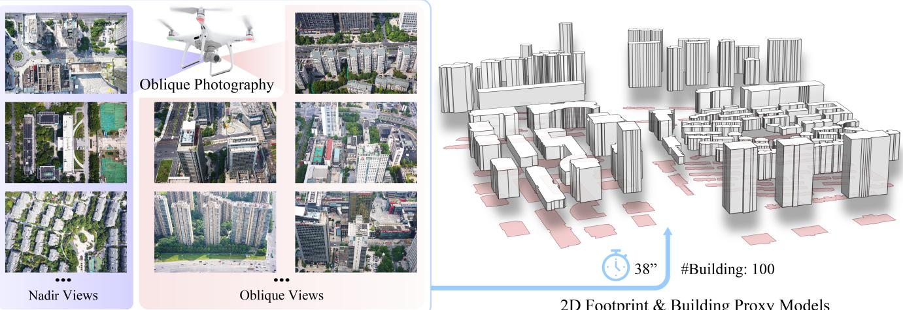
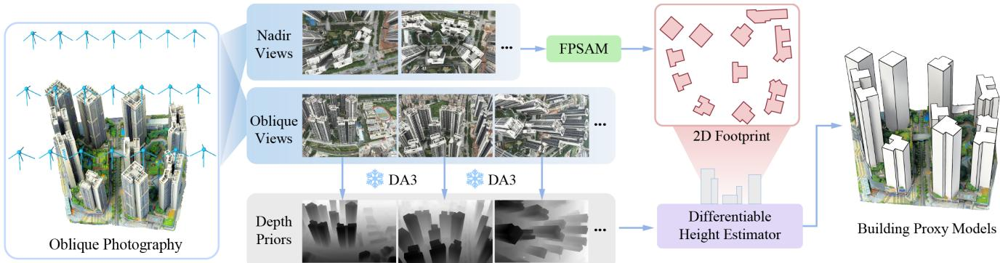
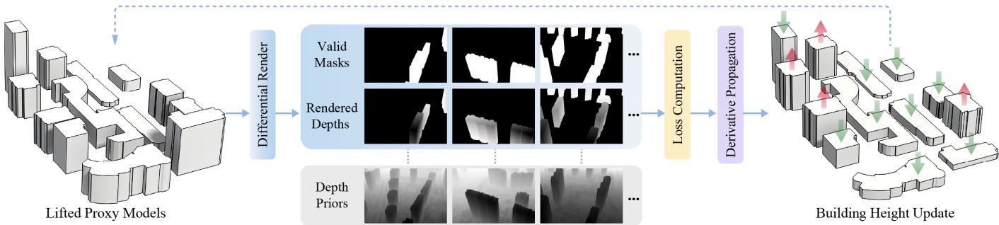
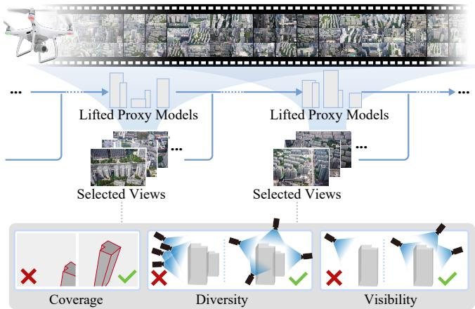
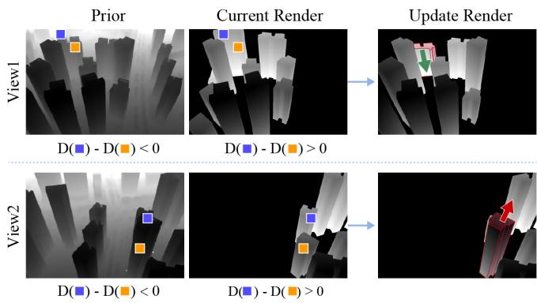
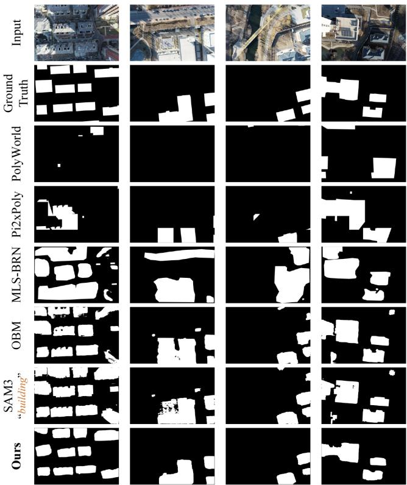
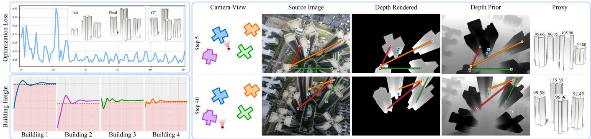
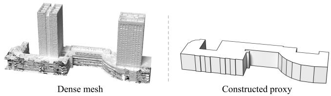
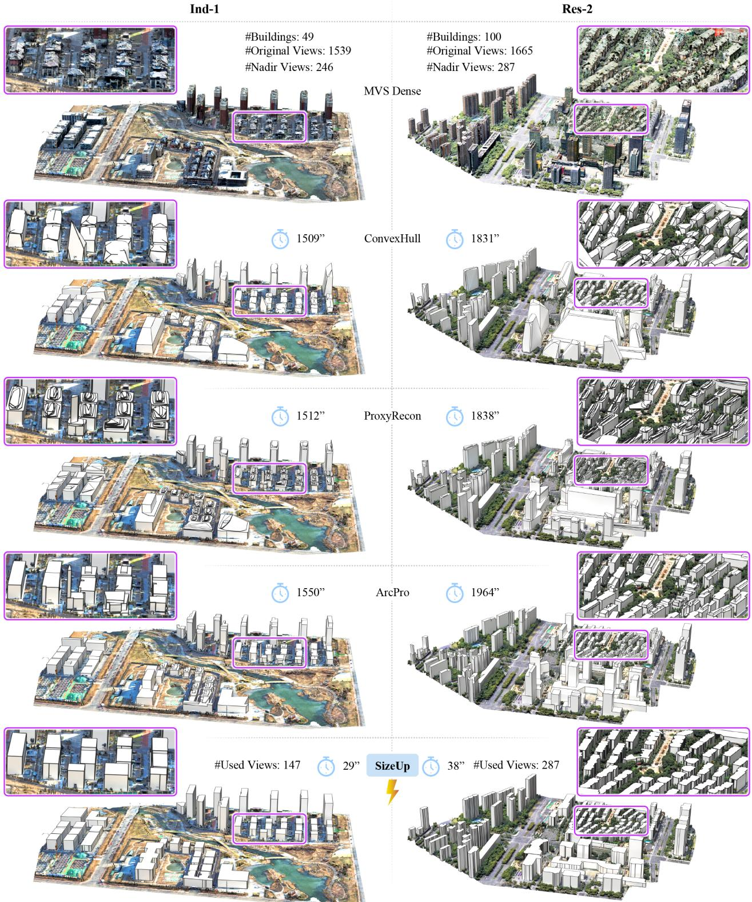
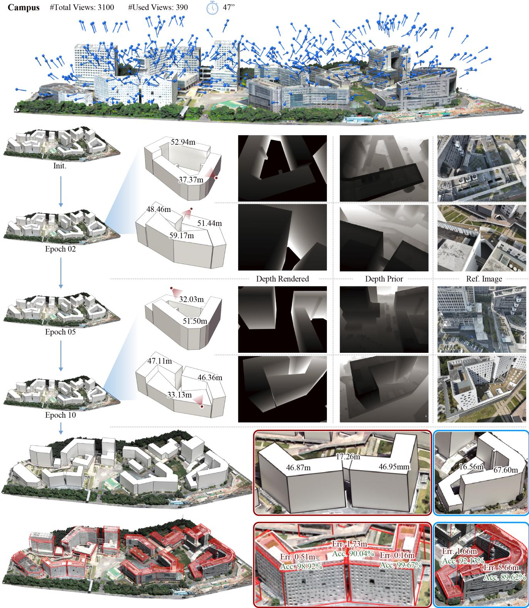

# SiZeUp: Fast 3D Proxy from Aerial Images via Depth Ordinal Loss

WENJUN ZHOU, Shenzhen University, China YUNSHAN LI, Shenzhen University, China QIAOYU ZHU, Shenzhen University, China WEIDAN XIONG, Shenzhen University, China HAO ZHANG, Simon Fraser University, Canada DANIEL COHEN-OR, Shenzhen University, China HUI HUANG∗, Shenzhen University, China

  
2D Footprint & Building Proxy Models  
Fig. 1. From oblique aerial images, SiZeUp extracts building footprints (shown in pink) from nadir views and lifts them into compact 3D proxies by estimating building heights. Eficiency of our method is owing to direct image-to-height diferentiable renderer using only a small portion of the images via view selection.

We present SiZeUp, a fast and scalable approach for constructing large-scale 3D urban proxy models directly from calibrated oblique aerial imagery. Our method adopts a height-from-footprint representation, reducing 3D building abstraction to a low-dimensional optimization problem in which building footprints are extruded by a single height parameter. To enable eficient and robust height estimation, we introduce an ordinal depth consistency loss that enforces agreement between the relative depth ordering of rendered proxies and depth priors predicted by a monocular depth model. This is realized through a diferentiable renderer that maps parametric building proxies into multi-view depth images, allowing gradients to be propagated from depth supervision to building heights. Our ordinal formulation produces stable optimization in practice and avoids explicit feature matching

∗Corresponding author: Hui Huang (hhzhiyan@gmail.com)

Authors’ Contact Information: Wenjun Zhou, CSSE, Shenzhen University, China, wenjun.9707@gmail.com; Yunshan Li, Shenzhen University, China, yunshanli2001@ gmail.com; Qiaoyu Zhu, Shenzhen University, China, qiaoyuzhu.stu@gmail.com; Wei dan Xiong, Shenzhen University, China, xiongweidan@gmail.com; Hao Zhang, Simon Fraser University, Canada, haoz@cs.sfu.ca; Daniel Cohen-Or, Shenzhen University, China, cohenor@gmail.com; Hui Huang, Guangdong Provincial Key Laboratory of Visual Media and Multidimensional Intelligence, CSSE, Shenzhen University, China. or dense point cloud reconstruction. Rather than relying on metric depth, which can be unreliable under monocular scale ambiguity, our ordinal depth consistency loss operates on relative depths, providing a more reliable signal across views. Combined with an eficient dynamic view selection, our ap- proach achieves a 23-52× speedup over state-of-the-art proxy reconstruction pipelines while maintaining comparable proxy-level coverage and volume consistency, making it well suited for large-scale urban modeling tasks.

CCS Concepts: • Computing methodologies → Computer graphics;   
Shape modeling; Shape analysis.

Additional Key Words and Phrases: Building Proxy, 3D Reconstruction, Height Estimation, Footprint Extraction, Diferentiable Renderer

## ACM Reference Format:

Wenjun Zhou, Yunshan Li, Qiaoyu Zhu, Weidan Xiong, Hao Zhang, Daniel Cohen-Or, and Hui Huang. 2026. SiZeUp: Fast 3D Proxy from Aerial Images via Depth Ordinal Loss. In SIGGRAPH Asia 2026 Conference Papers (SA Conference Papers ’26), December 01–04, 2026, Kuala Lumpur, Malaysia. ACM, New York, NY, USA, 11 pages. https://doi.org/10.1145/3829340.3842244

## 1 Introduction

Automated reconstruction of 3D urban environments from aerial imagery remains a challenging problem in computer graphics, with a wide range of practical applications across planning, simulation, and analytics for real-estate, AR/VR, as well as digital twins and smart cities [Guo et al. 2024b; Kelly et al. 2017; Nan and Wonka 2017]. When dealing with large-scale urban scenes, a coarse-to-fine reconstruction strategy is typically employed where in the first stage, a 3D proxy is obtained to guide the subsequent fine-grained geometry recovery, e.g., for drone path planning [Hepp et al. 2018; Liu et al. 2022; Roberts et al. 2017; Smith et al. 2018; Zhang et al. 2021]. Such a proxy model is a simplified yet structurally faithful and meaningful geometric representation to capture the spatial arrangement and core volumetric properties of buildings in the scene. Besides serving as a reconstruction prior, the 3D proxies can directly benefit downstream tasks where structural correctness and scalability matter more than visual realism.

Naturally, proxy construction should be significantly faster than dense urban reconstruction. However, conventional methods to proxy estimation often resort to point cloud extraction from images first [Huang et al. 2025], while many downstream applications that require proxies produce them as abstractions over dense mod- els obtained by Structure-from-Motion (SfM) [Snavely et al. 2006], followed by multi-view stereo (MVS) [Furukawa and Ponce 2010]. These indirect approaches incur a lengthy workflow with high com- putational costs and data requirements; their results are highly dependent on the quality of the reconstructed point clouds, which require high-overlap imagery to yield plausible intermediate 3D representations [Engel et al. 2018; Mur-Artal et al. 2015]. Moreover, RTK-equipped UAV platforms are widely adopted in modern oblique aerial photogrammetry, and such systems commonly record or cali brate camera poses as part of the capture process. Hence, calibrated images serve as a natural and practical starting point to directly optimize building proxies in image space, while bypassing the SfM/MVS reconstruction required by point-cloud-based proxy methods.

In this paper, we introduce a method to extract 3D proxies directly from calibrated multi-view oblique aerial images with high eficiency. Our proxies are modeled by extruding 2D building footprints into vertical volumes, reducing each building geometry estimation to a single height inference, and as such, our 3D proxy solution is coined SiZeUp. Our key observation is that such a reduced representation turns eficient proxy reconstruction from a general 3D recovery problem into a constrained image-space alignment problem, where relative depth structure provides a more reliable signal than metric depth values, enabling an image-space loss that can well tolerate the inevitable imprecisions from depth or 3D estimates over a small set of input images. This motivates the development of a diferentiable renderer that can be guided by an ordinal depth objective that aligns rendered proxy geometry with noisy depth priors.

Specifically, the diferentiable renderer maps building heights into multi-view depth spaces, and exploits the ordinal structure inherent in the depth priors to define the gradient through a novel ordinal consistency loss. This loss enforces that the relative depth ordering between two pixels in the rendered depth matches the ordering given by a prior depth map. For pixel pairs with suficient prior depth contrast, it penalizes cases where the rendered depth reverses or weakly respects this ordering using a hinge loss with a margin, encouraging a minimum separation. Averaging this penalty over sampled pixel pairs yields a view-level loss that preserves correct depth ordering rather than absolute depth values.

To complete our proxy solution pipeline, we first extract the 2D footprints based on a learned footprint extractor, which combines semantic and appearance cues from SAM 3 [Carion et al. 2026] with geometric cues from Depth Anything 3 (DA3) [Lin et al. 2026]. This is followed by building height estimation via the diferentiable renderer, where we resort again to DA3 to provide depth supervi sion. The multi-view depth ordering, together with parallax and occlusion cues, yields meaningful gradients without requiring any high-cost dense surface reconstruction. Overall, the high eficiency of our framework can be attributed to not only our breaking down of the proxy estimation into searches over low-dimensional parameter spaces, i.e., 2D footprints plus height extrusion, but also a fast dynamic view selection algorithm which leads to light-weight optimization over only few hundred input images.

We show quantitative and qualitative results from SiZeUp and evaluate each of its components: footprint extraction, view selection, and building height estimation. Importantly, even though our method produces coarser 3D proxies compared to low-poly meshes [Guo et al. 2024b], convex hulls [Zhou et al. 2018], and recent program-based architectural abstractions such as ArcPro [Huang et al. 2025], it achieves the best eficiency-quality tradeof among all baselines. Specifically, SiZeUp attains a 23-52× speedup over these baselines on real scenes while maintaining comparable proxy- level coverage and volume consistency, though at the cost of higher point-level surface error due to its coarser LOD1 representation.

## 2 Related Works

Since existing literature on 3D reconstruction is vast, we will mainly cover related works on structured scene extraction in this section, especially those involving urban proxy models.

3D proxy construction. Most existing methods construct proxies based on precomputed 3D data, such as dense reconstructed meshes, from which geometric abstractions can be obtained via mesh simpli- fication [Garland and Heckbert 1997] or piecewise-planar approximation [Cohen-Steiner et al. 2004; Kelly et al. 2017; Salinas et al. 2015; Verdie et al. 2015]. When working with point clouds, existing approaches detect geometric primitives and assemble them into compact polyhedral building proxies [Bauchet and Lafarge 2020; Bouzas et al. 2020; Fang and Lafarge 2020; Guo et al. 2024a,b; Huang et al. 2025; Liu et al. 2025; Monszpart et al. 2015; Nan and Wonka 2017; Pan et al. 2022]. Inverse procedural modeling can recover procedural descriptions from raw 3D data [Mathias et al. 2011; Toshev et al. 2010], typically relying on robust plane extraction [Raguram et al. 2013] and other carefully designed architectural priors. However, requiring high-fidelity 3D meshes or point clouds as input can be prohibitively expensive and impractical to obtain at city scale.

In the absence of such data, architectural proxies are typically cre- ated through manual modeling or interactive procedural tools [Sinha et al. 2008]. Image-based reconstructions [Ceylan et al. 2012] ex-ploit line structures and repetitive facade elements to infer coarse urban buildings, while procedural grammars enable users to synthe size large collections of proxies [Parish and Müller 2001; Schwarz and Müller 2015]. Nevertheless, grammar authoring remains a specialized task requiring domain expertise, and these methods either demand strong facade regularity assumptions or substantial manual intervention for complex scenes.

In this paper, we focus on reconstructing large-scale urban scene proxies directly from oblique RGB imagery, bypassing the need for

  
Fig. 2. Overview of our urban proxy estimation method, called SiZeUp. Given calibrated aerial images, our SiZeUp first extracts 2D footprints from nadir views, then rapidly lifts the 2D silhouetes based on a small set of dynamically selected oblique views.

3D inputs. In practice, urban building proxies are often generated through simple footprint extrusion [Li et al. 2024b; Zhang et al. 2021], where precise 2D footprint segmentation and height estimation from images constitute the core technical challenges.

Footprint extraction. Traditional image-based methods primarily rely on geometric cues such as edges [Canny 1986], shadows [Huer tas and Nevatia 1988; Zhou et al. 2020], and vanishing points [Caprile and Torre 1990], typically assuming near-nadir viewing angles. For large-scale scenes, indirect methods project 3D meshes or point clouds obtained by SfM/MVS onto the ground plane to derive the urban footprint. In the absence of such 3D data, a common strategy couples semantic instance segmentation [Liu et al. 2019; Wagner et al. 2020] with auxiliary remote-sensing products, for instance radar-guided fusion [Wang et al. 2024] or orthorectified satellite mosaics, to approximate footprint regions. In parallel, monocular and satellite imagery have motivated learning-based extractors that emit footprints or vectorized outlines directly from pixels, including graph-based polygon predictors [Zorzi et al. 2022], sequence decoders for building polygons [Adimoolam et al. 2025], and roof– footprint-coupled reconstruction under multi-level supervisions [Li et al. 2024b] and prompt-driven ofset-building models [Li et al. 2024a]. Constrained by the lack of footprint-aware segmentation models, these methods are generally limited in dealing with special ized sensing modalities. In contrast, our input is simply photographic images captured with oblique photography, exhibiting significant variations in building orientations and severe building occlusions. Existing methods struggle to handle such complex imagery due to their reliance on idealized assumptions or limited generalization capabilities. To fill this gap, we introduce a novel footprint extractor that integrates semantics, depth, and texture cues. Moreover, we construct a dedicated near-nadir aerial footprint benchmark for training and validation.

Height and depth estimation. Building height can be inferred by feature matching and image cues. Zhou et al. [2020] generates 3D proxies by exploiting viewpoint and illumination constraints, re-quiring satellite imagery with pronounced shadows as input. Li et al. [2024b] reconstructs 3D buildings from monocular remote-sensing images via multi-level supervision. While efective in controlled settings, these methods rely on task-specific annotations or sensing modalities (e.g., satellite imagery with consistent lighting), limiting their generalization to oblique aerial photography, where repetitive urban textures and varying perspectives introduce ambiguity.

An alternative strategy estimates the building height from depth or nadir images [Wang et al. 2024]. Recent advances in generic depth and 3D foundation models have significantly improved accuracy. Monocular depth objectives have long sought to reduce their sensitivity to ambiguous global scale and shift. Eigen et al. [Eigen et al. 2014] introduced scale-invariant regression in log-depth space, Chen et al. [Chen et al. 2016] learned single-image depth from pairwise ordinal annotations using a ranking loss, and Ranftl et al. [Ranftl et al. 2020] developed robust scale- and shift-invariant objectives for training on heterogeneous de th datasets. Unlike these meth- ods, which learn depth predictors from metric or relative-depth supervision, we keep the pretrained monocular depth estimator fixed and transfer only its within-view ordering to building-height parameters defined in the metric proxy coordinate system through calibrated multi-view diferentiable rendering. Notably, Depth Any- thing 3 [Lin et al. 2026] achieves state-of-the-art performance in monocular depth estimation. However, these models are trained on curated datasets that difer from oblique aerial inputs, and their results still sufer from scale ambiguity [Arampatzakis et al. 2024]. Consequently, their outputs are better suited as geometric priors rather than as precise height constraints.

Generally speaking, existing methods do not fully exploit the rigid geometric properties inherent to building footprints. Most approaches treat footprints as post-processing masks rather than fundamental anchors for reconstruction itself. To address these chal- lenges, we propose an ordinal-based height estimation method that organically integrates footprint constraints with depth priors. This approach mitigates scale ambiguity while leveraging the inherent geometric relationships between footprints and building heights, enabling robust estimation in oblique aerial imagery.

## 3 Method

We take as input calibrated oblique aerial images {I�} captured by an RTK-equipped UAV, with their camera poses recorded onboard during acquisition. Our goal is to directly estimate building proxies {P� } by extruding building footprints to specific heights {ℎ� }. Fig. 2 presents the overview of our method. For an arbitrary scene, we classify a view as nadir if the angle between its optical axis and the downward vertical is below 15 ; all remaining views are treated as oblique. Then, we apply a segmentation model, FPSAM to the nadir views to obtain buildin foot rint masks. These masks are then vectorized into polygonal footprints $\{ \mathcal { F } _ { i } \}$ . Next, depth priors from oblique views are extracted using DA3. Finally, building heights {ℎ� } are estimated by minimizing an objective function that measures the discrepancy between the rendered proxy depths and the correspond- ing depth priors. Below, we provide a more detailed description of each step.

  
Fig. 3. Overview of our diferentiable building height estimation method.

## 3.1 Footprint Extraction

Existing footprint extraction methods struggle with low-altitude oblique aerial imagery. Near-orthographic methods [Adimoolam et al. 2025; Zorzi et al. 2022] rely on the premise that visible contours represent footprints, yet this fails under perspective distortion, facade visibility, and self-occlusion. While ofset-based methods [Li et al. 2024a,b] resolve geometric displacement, they introduce a sig- nificant annotation bottleneck by requiring structured supervision of roofs, footprints, or ofsets.

To address these limitations, we introduce FPSAM, a footprint extractor that fuses texture, semantic, and depth-aware geomet- ric cues derived from two frozen foundation models. The SAM 3 branch [Carion et al. 2026] provides two pixel-level features from the near-nadir image $\textstyle { \mathcal { T } } _ { k } :$ a texture feature from its image encoder and FPN, and a semantic feature from its text-guided grounding branch with the prompt “building”. Meanwhile, the DA3 branch [Lin et al. 2026] extracts a depth-aware feature from its ViT-L backbone, providing coarse geometric structure. These feature maps are projected using lightweight 1 × 1 convolutions, concatenated, and then decoded by a trainable U-Net and mask decoder, where only the pro- jectors and decoder are updated under footprint-mask supervision. By combining the localization cues from SAM 3 with the geometric information from DA3, FPSAM achieves improved discrimination of ground-contact footprints from roof boundaries, facade silhouettes, and visible building masks (see supp. for more details).

To train and evaluate our footprint extractor, we introduce VertiFP, a near-nadir aerial benchmark annotated with ground-contact footprints. The training set comprises 7 real urban scenes, approxi-mately 103 buildings, $4 \times 1 0 ^ { 3 }$ images, and 3 × 104 footprint instances, while the test set contains 2 scenes, roughly $1 0 ^ { 2 }$ buildings, $4 \times 1 0 ^ { 2 }$ images, and $2 \times 1 0 ^ { 3 }$ instances. Each footprint instance corresponds to one annotated building per image. Given a near-nadir image, FPSAM predicts footprint masks, which are then vectorized into closed polygonal footprints {F�} [Douglas and Peucker 1973] and remain fixed for the subsequent height optimization.

## 3.2 Building Height Estimation

Given the building footprints {F� }, we construct building proxies by extruding each footprint polygon vertically according to its building height. The values of building heights {ℎ� } are initialized randomly from a normal distribution within a scene-dependent range, [ℎ i , ℎ ]. The range is determined by the scene elevation and the UAV acquisition altitude. In this stage, a diferentiable optimization method is proposed to update the heights $\{ h _ { i } \}$ for all the buildings in the scene, constrained by the input aerial views. The pipeline of our method is shown in Fi . 3.

Dynamic View Selection. Oblique aerial photogrammetry is typically planned with dense overlap to ensure feature-based recon- struction of dense representations. However, the majority of the captured photos remain redundant or weakly informative for proxy reconstruction. To enable eficient height optimization given scene proxies, we begin with a dynamic view selection (DVS) strategy to select a small subset of views $\{ \boldsymbol { T } \} _ { o } ^ { * }$ from the oblique views $\{ \tau \} _ { o }$ . The selected views should: (i) provide high coverage of building surface, (ii) exhibit spatial diversity and variation in viewing angles [Zhou et al. 2020], and (iii) ensure that each building is observed by at least � views. A heuristic view selection method is introduced, guided by the above three criteria. More specifically, we first assess the quality of the view $\mathcal { T } _ { k }$ in $\{ \tau \} _ { o }$ with two metrics after projecting $\mathcal { T } _ { k }$ onto current proxies: the number of visible buildings $Q _ { N }$ and the total area of covered building surface $Q _ { A }$ . Views with quality values smaller than percentile-based thresholds $\tau _ { N }$ or $\tau _ { A }$ will be discarded. We use $\tau _ { N } = \tau _ { A } = 5 0 \%$ in the experiments. Next, we select views from the remaining images using farthest point sampling [Qi et al. 2017], ensuring complete ground coverage and spatial diversity. To ensure suficient multi-view constraints, we further enforce a mini- mum exposure requirement, iteratively adding views that improve building-wise coverage until each building is observed from � view- points (we let � = 3). As the proxy heights evolve, we re-evaluate and update the selected view subset $\{ \boldsymbol { { T } } \} _ { o } ^ { * }$ every 3 epochs based on the updated scene, as shown in Fig. 4.

In practice, DVS reduces the number of views involved in height optimization, improving the eficiency of the overall pipeline while retaining informative multi-view constraints. In our real-scene ex-periments, only 10%–27% of the available views are used throughout optimization (see Table 2). A more detailed validation of DVS is pro-vided in the supplemental material.

  
Fig. 4. Overview of our dynamic view selection strategy. Given all available oblique views, we periodically select a fixed number of informative views to supervise the proxy update.

Depth priors. A depth map is capable of providing geometric cues in estimating building heights. We make use of a monocular depth estimator, Depth Anything 3 [Lin et al. 2026], to compute depth priors $\{ \mathcal { D } _ { k } \}$ of the views in $\{ \tau \} _ { o } ^ { * } .$ . Given current proxies at iteration $t ,$ following the camera parameters of each selected view $\mathcal { T } _ { k }$ , we render a depth map $\mathcal { R } _ { k }$ and generate a binary mask $\mathcal { M } _ { k }$ indicating all the visible building regions. We define $\Omega _ { k }$ as the subset of pixels with non-zero value in $\mathcal { M } _ { k }$ . To make the depth prior and rendered depth maps comparable, we first normalize $\mathcal { D } _ { k }$ via a median normalization [Schröppel et al. 2022] over the valid building regions following:

$$
\mathcal { D } _ { k } ^ { \prime } = \frac { \mathcal { D } _ { k } - \mathrm { m e d i a n } ( \mathcal { D } _ { k } , \Omega _ { k } ) } { \mathrm { M A D } ( \mathcal { D } _ { k } , \Omega _ { k } ) + \varepsilon } ,\tag{1}
$$

$$
\mathrm { M A D } ( \mathcal { D } _ { k } , \Omega _ { k } ) = \mathrm { m e d i a n } \big ( | \mathcal { D } _ { k } - \mathrm { m e d i a n } ( \mathcal { D } _ { k } , \Omega _ { k } ) | , \Omega _ { k } \big ) ,\tag{2}
$$

where median(�, Ω) selects the subset pixels Ω from matrix � and returns their median value, and � is a relatively small value. Similarly, we normalize the rendered depth map $\mathcal { R } _ { k }$ to obtain $\mathcal { R } _ { k } ^ { \prime }$

Objectivefunction. Recovering accurate metric depth from monocular depth priors remains challenging in practice because their metric scale is inherently ambiguous. Unlike scale-invariant depth regression [Eigen et al. 2014; Ranftl et al. 2020] or ordinal supervision used to train a depth predictor [Chen et al. 2016], we keep Depth Anything 3 fixed and transfer only the pairwise ordering of its predictions to the rendered proxy depth. We therefore en- courage the depth ordering in $\mathcal { R } _ { k }$ to match that in $\mathcal { D } _ { k } ,$ , rather than directly comparing their depth values. As illustrated in Fig. 5, the colored markers denote sampled pixel pairs whose ordinal relation- ships are inconsistent between the depth prior and the rendered depth. Such inconsistencies can arise not only between buildings, but also between a building and its surrounding context when an overestimated proxy height causes the rendered valid mask to cover background pixels. Penalizing violations will decrease the building height in View 1, and increase the building height in View 2. Such an ordinal can be computed using the diference among pixel values in a depth map. For each selected view $\textstyle { \mathcal { I } } _ { k } ,$ , we define the normalized depth diferences of a pixel pair $( p , q )$ from $\Omega _ { k }$ as:

  
Fig. 5. Visualization of ordinal consistency. Left: depth prior and rendered depth exhibit mismatched ordering. Right: such inconsistencies drive height updates toward ordinal agreement with the depth prior.

$$
\Delta _ { \mathcal { P } } ^ { k } ( \boldsymbol { p } , \boldsymbol { q } ) = \mathcal { D } _ { k } ^ { \prime } ( \boldsymbol { q } ) - \mathcal { D } _ { k } ^ { \prime } ( \boldsymbol { p } ) ,\tag{3}
$$

$$
\Delta _ { r } ^ { k } ( p , q ) = \mathcal { R } _ { k } ^ { \prime } ( q ) - \mathcal { R } _ { k } ^ { \prime } ( p ) .\tag{4}
$$

For every view used in an optimization iteration, we randomly resample 2048 pixel pairs $( p , q )$ from its valid region $\Omega _ { k }$ . Then, to avoid degenerate constraints, we discard candidate pairs $( p , q )$ with negligible diference: $| \Delta _ { p } ^ { k } ( p , q ) | < \tau _ { d }$ (we set $\tau _ { d } = 0 . 0 5 )$ . The remaining pairs $( p , q )$ are recorded in $P _ { k }$

To regularize the solution and avoid trivial matches, we enforce a minimum separation between ordered pixels. A surrogate loss function, $l ^ { k } ( p , q )$ , which resembles the hinge loss [Rosasco et al. 2004], is employed to measure the ordinal inconsistencies among pixel pairs $( p , q )$ , while also penalizing weakly ordered pairs that satisfy the ordering but fall within too small of a margin:

$$
l ^ { k } ( \boldsymbol { p } , \boldsymbol { q } ) = \operatorname* { m a x } \{ 0 , \ m - \operatorname { s i g n } \bigl ( \Delta _ { \boldsymbol { p } } ^ { k } ( \boldsymbol { p } , \boldsymbol { q } ) \bigr ) \cdot \Delta _ { r } ^ { k } ( \boldsymbol { p } , \boldsymbol { q } ) \} ,\tag{5}
$$

where � is the margin, and setting $m = 0 . 5$ achieves stable perfor- mance empirically. The depth diference provides a discrete ordinal label: sign $( \Delta _ { d } ^ { k } ) \ \in \ \{ - 1 , 0 , 1 \}$ , while $\Delta _ { r } ^ { k }$ varies smoothly with the proxy heights through the diferentiable renderer.

We compute the ordinal violations of a view $\mathcal { T } _ { k }$ as the average of $l ^ { k } ( p , q )$ over all the pixel pairs in $P _ { k }$

$$
L ^ { k } = \frac { 1 } { | P _ { k } | } \sum _ { ( p , q ) \in P _ { k } } l ^ { k } ( p , q ) ,\tag{6}
$$

where $| P _ { k } |$ is the number of pixel pairs in $P _ { k }$ . The heights $h _ { i }$ are shared across all selected views in $\{ \boldsymbol { { T } } \} _ { o } ^ { * }$ . We aggregate the per-view ordinal violation into the final objective function:

$$
L = \sum _ { \begin{array} { l } { { \it { 7 } } _ { k } \in \{ I \} _ { 0 } ^ { * } } \end{array} } L ^ { k } .\tag{7}
$$

Since sign $( \Delta _ { p } ^ { k } )$ is fixed and $\Delta _ { r } ^ { k }$ depends diferentiably on the heights via $\mathcal { R } _ { k } ^ { \prime }$ , � is piecewise diferentiable with respect to $\{ h _ { i } \}$ and can be minimized eficiently with a gradient-based optimizer. This multi-view coupling improves the conditioning of the optimization and avoids degenerate per-view solutions.

  
Fig. 6. Qualitative footprint comparison on samples from the test split. From top to botom: input images, ground-truth footprints, and predictions from PolyWorld, Pix2Poly, MLS–BRN, OBM, SAM 3, and our FPSAM.

## 4 Experimental Results

We evaluate the quality of footprint extraction, dynamic view selection, and height-based proxy reconstruction. For footprint extraction, we follow the instance-level matching protocol of Chen et al. [2026] and report IoU, Precision, Recall, and F1-Score. For height estimation, we report absolute height error and relative height ac- curacy with respect to the reference building height, summarized by averages and high-percentile statistics. For proxy-level comparison with point-cloud-based methods, we evaluate distances on uniformly sampled surface points from the reconstructed proxy and the ground-truth geometry. Err. measures nearest-neighbor distance from reconstructed samples to reference samples, while Comp. measures reverse-direction coverage, i.e., the percentage of reference samples whose nearest reconstructed sample lies within a given threshold. We report Comp. 0.5m and Comp. 1m, together with volumetric IoU. Lower Err. indicates better surface-level fitting, while higher Comp. and IoU indicate better coverage and volume consistency. Finer implementation details, baselines, and full metric definitions are provided in the supplemental material.

## 4.1 Footprint Extraction

We evaluate FPSAM on the test set of VertiFP, and compare it against representative footprint extraction and segmentation baselines, including the PolyWorld [Zorzi et al. 2022], Pix2Poly [Adimoolam et al. 2025], MLS–BRN [Li et al. 2024b], OBM [Li et al. 2024a], and

Table 1. Quantitative comparison of building footprint extraction of aerial images on the test data. SAM 3 is prompted with "building".
<table><tr><td>Method</td><td>IoU (%)↑</td><td>Precision (%)↑</td><td>Recall (%)↑</td><td>F1-Score (%)↑</td></tr><tr><td>PolyWorld</td><td>3.79</td><td>20.73</td><td>4.73</td><td>6.44</td></tr><tr><td>Pix2Poly</td><td>16.57</td><td>39.26</td><td>23.78</td><td>25.60</td></tr><tr><td>MLS-BRN</td><td>35.57</td><td>46.52</td><td>60.04</td><td>49.91</td></tr><tr><td>OBM</td><td>53.36</td><td>60.32</td><td>80.56</td><td>67.45</td></tr><tr><td>SAM3</td><td>58.98</td><td>62.34</td><td>89.86</td><td>71.69</td></tr><tr><td>Ours</td><td>70.89</td><td>81.49</td><td>85.38</td><td>81.90</td></tr></table>

SAM 3 [Carion et al. 2026](prompted with “building”). The qualitative comparison are visualized in Fig. 6, and the quantitative results are provided in Table 1.

The results show that the performance of near-orthographic foot- print methods degrades under oblique aerial imagery, i.e., PolyWorld and Pix2Poly. The visible contours no longer align with ground-contact footprints. The MLS-BRN and OBM improve over these baselines by modeling roof-to-footprint ofsets. Since the visible building mask often contains the footprint as a subset, the SAM 3 achieves high recall. However, SAM 3 shows lower precision, IoU, and qualitative results, due to its inaccurate footprint boundaries. Meanwhile, our FPSAM produces much cleaner and more compact masks, achieving the best IoU, precision, and F1-score.

## 4.2 Height Optimization

Although the ordinal objective does not infer metric scale from monocular depth, height optimization remains metric: calibrated camera positions and ground-plane footprints are expressed in a common metric world coordinate system, in which the height vari- ables and bounds $[ h _ { \mathrm { m i n } } , h _ { \mathrm { m a x } } ]$ are defined. The multi-view ordinal constraints therefore select metric heights within this calibrated geometry without regressing monocular metric depth (see Supplementary Sec. 9 for a comparison with direct pixel-wise $L _ { 1 } / L _ { 2 }$ re-gression). We first analyze this optimization behavior on controlled mini-scenes (see the supplemental material for construction details).

Fig. 7 shows a representative example. The left panels track the ordinal loss and per-building height trajectories, with insets com-paring the initial, final, and reference proxies. We do not use the loss value to assess convergence. Instead, we monitor the average rela- tive height change over all buildings between consecutive updates and regard the optimization as stable once this value falls below 0.5%. This criterion is used only for stability assessment, since all experiments run for a fixed budget of 20 epochs (see the supp.). Although the loss fluctuates due to view-dependent visibility and imperfect depth priors, the heights move away from random initialization and settle into a stable LOD1 proxy. The right panels show two optimization snapshots with representative active ordinal pairs overlaid on the source image, rendered depth, and depth prior. These pairs identify visible regions where the current proxy ordering dis agrees with the prior ordering. Their nonzero losses accumulate gradients on the corresponding building heights, illustrating how SiZeUp updates heights from relative depth conflicts across views rather than fitting monocular metric depth values.

  
Fig. 7. Detailed optimization process on the second mini-scene. Left: ordinal loss and per-building height trajectories. Right: selected optimization steps showing the camera layout, source image, rendered depth, depth prior, and current proxy with representative active ordinal pairs.

Table 2. Statistics of height estimation on seven real-world scenes. #Sel. denotes the number of views selected at each DVS step. #Used denotes the total number of distinct selected views throughout the optimization. Ratio denotes the number of images used during optimization relative to the total number of available images.
<table><tr><td rowspan="2">Scene</td><td colspan="4">Optimization</td><td colspan="2">Error (m) ↓</td><td colspan="2">Accuracy (%) ↑</td></tr><tr><td>#Sel.</td><td>#Used</td><td>Ratio</td><td>Time (s)</td><td>Average</td><td>90%</td><td>Average</td><td>90%</td></tr><tr><td>Res-1</td><td>50</td><td>101</td><td>0.27</td><td>19</td><td>3.28</td><td>7.19</td><td>93.45</td><td>88.34</td></tr><tr><td>Res-2</td><td>100</td><td>287</td><td>0.17</td><td>38</td><td>7.47</td><td>15.93</td><td>85.95</td><td>61.07</td></tr><tr><td>Res-3</td><td>50</td><td>175</td><td>0.10</td><td>42</td><td>2.08</td><td>4.63</td><td>93.11</td><td>81.29</td></tr><tr><td>Res-4</td><td>100</td><td>298</td><td>0.12</td><td>49</td><td>4.27</td><td>7.49</td><td>89.67</td><td>77.19</td></tr><tr><td>Ind-1</td><td>50</td><td>147</td><td>0.10</td><td>29</td><td>1.28</td><td>2.56</td><td>92.47</td><td>66.22</td></tr><tr><td>Ind-2</td><td>100</td><td>261</td><td>0.21</td><td>33</td><td>6.48</td><td>14.35</td><td>77.85</td><td>44.09</td></tr><tr><td>City-1</td><td>256</td><td>873</td><td>0.17</td><td>118</td><td>4.84</td><td>6.52</td><td>85.19</td><td>65.30</td></tr></table>

## 4.3 Evaluation on Real Scenes

Next, we evaluate our method on four in-the-wild oblique pho- togrammetry scenes. For each scene, we estimate building heights directly from raw images using our ordinal optimization pipeline and report the height estimation accuracy using the metrics de fined above. As shown in Table 2, SiZeUp produces accurate height estimates across a variety of urban layouts.

We compare SiZeUp against building proxy reconstruction methods, including ConvexHull [Zhou et al. 2018], ArcPro [Huang et al. 2025], and ProxyRecon [Guo et al. 2024b]. These methods operate on point clouds reconstructed from SfM (constrained by the same RTK metadata used directly by SiZeUp) that have been segmented into building instances. Meanwhile, our novel SiZeUp directly generates proxies from images, bypassing point cloud reconstruction. To isolate reconstruction performance from instance segmentation, we use the footprints extracted by FPSAM to obtain building instances for all point-cloud-based methods. As shown in Table 3, SiZeUp exhibits higher point-level error (Err.) due to its extruded LOD1 rep- resentation, which omits fine roof/facade details. However, Comp. and IoU better reflect the proxy-level objectives of coverage and volume consistency. On these metrics, SiZeUp remains competitive with point-cloud-based methods, ranking among the top two in all real scenes while requiring only tens of seconds.

For the point-cloud baselines, we separate runtime into the SfM front end (CCFront) and the subsequent proxy reconstruction stage. Our time covers depth estimation, dynamic view selection, and height estimation. Our method requires only tens of seconds, corresponding to a 23-52× speedup (see Table 3). Ind-2 is the most challenging scene for surface-level accuracy, where both SiZeUp and the point-cloud baselines exhibit higher Err. Its higher flight alti tude (∼300m above the local mean ground elevation, versus ∼200m for Res-1/Res-2 and ∼100m for Ind-1) and the lowest image density and images-per-building ratio yield weaker geometric evidence. Nevertheless, SiZeUp remains top-2 in Comp. and IoU.

Qualitative comparisons in Fig. 9 further illustrate that SiZeUp maintains coherent scene-level structure without the need for SfM. Together with the quantitative results, this demonstrates that direct image-to-proxy inference is a practical and viable alternative to conventional point-cloud-based proxy pipelines for urban modeling. Additional visualizations are provided in the supplemental material.

## 4.4 Alternative Capture Patern

Standard UAV oblique-photogrammetry captures are often collected with grid-like flight routes, which naturally provide near-nadir views for footprint extraction in the full SiZeUp pipeline. Once building footprints are available, however, height optimization does not depend on this specific acquisition layout. It only requires views that provide informative depth-ordering cues, such as building visibility, occlusion relationships, and relative depth structure between buildings and their surrounding context; DVS then selects such views for ordinal supervision. To test this property, we use a scene from UrbanScene3D [Lin et al. 2022] with provided footprints, and generate non-grid camera views using the path planning strategy from [Zhou et al. 2020]. These views follow task-specific trajectories with varying viewpoints, distances, and flight heights, rather than a uniform overhead grid. Using the same optimization pipeline and settings as in the main real-scene experiments, SiZeUp reconstructs coherent LOD1 proxies under this capture pattern, as shown in Fig. 10. This suggests that the ordinal height optimization is driven by multi-view relative depth constraints rather than implications specific to standard oblique-photogrammetry flight route patterns.

## 5 Conclusion and Discussion

We introduced SiZeUp, a framework for eficiently producing urban 3D proxy models from oblique aerial imagery by estimating building heights over extracted footprints. More broadly, this work is grounded in the view that many urban modeling tasks do not require full geometric reconstruction, but can be addressed more efectively by identifying an appropriate proxy representation and designing tools tailored to that reduced formulation. By deliberately constraining the representation and optimizing only the dominant structural degrees of freedom, we show that a focused, task-specific formulation can achieve substantial eficiency gains while preserv- ing coherent proxy-level coverage and volume consistency. This perspective highlights the importance of aligning representation, su-pervision, and optimization with the actual requirements of the task, rather than defaulting to increasingly complex and computationally expensive models.

Table 3. Quantitative comparison and runtime statistics for the 3D proxy construction of four real-world scenes. Runtime is divided into CCFront preprocessing and proxy construction/optimization. For each evaluation metric, the top-2 results are highlighted as best and second , respectively.
<table><tr><td rowspan="2">Scene</td><td rowspan="2">#Build.</td><td rowspan="2">Method</td><td colspan="3">Time (s)</td><td colspan="2">Err. (m) ↓</td><td colspan="2">Comp. (%) ↑</td><td rowspan="2">IoU (%) ↑</td></tr><tr><td>CCFront</td><td>Proxy</td><td>Total</td><td>90%</td><td>95%</td><td>0.5m</td><td>1m</td></tr><tr><td rowspan="4">Res-1</td><td rowspan="4">26</td><td>ConvexHull</td><td></td><td>1</td><td>443</td><td>5.16</td><td>6.40</td><td>21.88</td><td>39.18</td><td>24.73</td></tr><tr><td>ProxyRecon</td><td>442</td><td>5</td><td>447</td><td>3.77</td><td>4.79</td><td>30.50</td><td>49.70</td><td>32.39</td></tr><tr><td>ArcPro</td><td></td><td>15</td><td>457</td><td>4.25</td><td>5.50</td><td>20.18</td><td>44.23</td><td>29.77</td></tr><tr><td>SiZeUp</td><td>一</td><td>19</td><td>19 (23×)</td><td>3.73</td><td>5.38</td><td>57.97</td><td>76.77</td><td>49.18</td></tr><tr><td rowspan="4">Res-2</td><td rowspan="4">100</td><td>ConvexHull</td><td></td><td>1</td><td>1831</td><td>5.82</td><td>6.44</td><td>23.70</td><td>44.47</td><td>33.62</td></tr><tr><td>ProxyRecon</td><td>1830</td><td>8</td><td>1838</td><td>4.78</td><td>6.51</td><td>33.63</td><td>58.78</td><td>36.26</td></tr><tr><td>ArcPro</td><td></td><td>134</td><td>1964</td><td>2.66</td><td>3.69</td><td>30.92</td><td>57.16</td><td>39.69</td></tr><tr><td>SiZeUp</td><td>一</td><td>38</td><td>38 (48×)</td><td>4.52</td><td>6.07</td><td>41.21</td><td>66.65</td><td>42.87</td></tr><tr><td rowspan="4">Ind-1</td><td rowspan="4">49</td><td>ConvexHull</td><td></td><td>1</td><td>1509</td><td>3.63</td><td>4.86</td><td>34.37</td><td>49.55</td><td>37.99</td></tr><tr><td>ProxyRecon</td><td>1508</td><td>4</td><td>1512</td><td>2.51</td><td>2.97</td><td>37.63</td><td>51.92</td><td>42.74</td></tr><tr><td>ArcPro</td><td></td><td>42</td><td>1550</td><td>1.69</td><td>2.23</td><td>42.57</td><td>57.41</td><td>51.87</td></tr><tr><td>SiZeUp</td><td>一</td><td>29</td><td>29 (52×)</td><td>3.33</td><td>4.70</td><td>37.86</td><td>64.68</td><td>43.12</td></tr><tr><td rowspan="4">Ind-2</td><td rowspan="4">103</td><td>ConvexHull</td><td></td><td>1</td><td>1541</td><td>6.24</td><td>7.79</td><td>35.70</td><td>49.67</td><td>29.38</td></tr><tr><td>ProxyRecon</td><td>1540</td><td>7</td><td>1547</td><td>13.46</td><td>16.26</td><td>26.14</td><td>43.53</td><td>29.54</td></tr><tr><td>ArcPro</td><td></td><td>117</td><td>1657</td><td>4.69</td><td>6.08</td><td>37.49</td><td>59.98</td><td>40.23</td></tr><tr><td>SiZeUp</td><td></td><td>33</td><td>33 (47×)</td><td>8.46</td><td>10.40</td><td>48.34</td><td>61.56</td><td>35.36</td></tr></table>

  
Fig. 8. Building with multi-layer or stepped structures produced by footprint extrusion yields a less accurate proxy.

Our approach represents buildings as vertical extrusions of pla-nar footprints. When a complex building is modeled by a single footprint, SiZeUp cannot fully capture stepped roofs, multi-layer structures, or non-vertical details, leading to less accurate proxies (see Fig. 8). This limitation can be partially mitigated by decomposing complex buildings into finer footprint components with separate heights, as illustrated in Fig. 10. The quality of the results further depends on footprint accuracy and the availability of reliable ordinal depth cues. Future work could explore richer proxy representations while preserving a low-dimensional formulation, as well as joint optimization of footprints and heights. Incorporating additional weak geometric cues may further stabilize scale, and extending this task- driven philosophy to other urban elements could enable broader proxy-level scene modeling.

## Acknowledgments

This work was supported in part by National Key R&D Program of China (2024YFB3908500, 2024YFB3908502), ICFCRT (W2441020), Guangdong Basic and Applied Basic Research Foundation (2023B151 5120026), Shenzhen Science and Technology Program (KJZD2024090 3100022028, KQTD20210811090044003), and Scientific Development Fund from Guangdong Provincial Key Laboratory of Visual Media and Multidimensional Intelligence.

## References

Yeshwanth Kumar Adimoolam, Charalambos Poullis, and Melinos Averkiou. 2025. Pix2Poly: A sequence prediction method for end-to-end polygonal building footprint extraction from remote sensing imagery. In Proc. IEEE/CVF Winter Conf. on Applications ofComputer Vision. 8484–8493.

Vasileios Arampatzakis, George Pavlidis, Nikolaos Mitianoudis, and Nikos Papamarkos. 2024. Monocular de th estimation: A thorou h review. IEEE Trans. on Pattern Analysis & Machine Intelligence 46, 4 (2024), 2396–2414.

Jean-Philippe Bauchet and Florent Lafarge. 2020. Kinetic shape reconstruction. ACM Trans. on Graphics 39, 5 (2020), 156:1–156:14.

Vasileios Bouzas, Hugo Ledoux, and Liangliang Nan. 2020. Structure-aware building mesh polygonization. ISPRS J. Photogrammetry and Remote Sensing 167 (2020), 432–442.

John Canny. 1986. A computational approach to edge detection. IEEE Trans. on Pattern Analysis & Machine Intelligence 8, 6 (1986), 679–698.

Bruno Caprile and Vincent Torre. 1990. Using vanishing points for camera calibration. Int. J. Computer Vision 4, 2 (1990), 127–139.

Nicolas Carion, Laura Gustafson, Yuan-Ting Hu, Shoubhik Debnath, Ronghang Hu, Didac Suris Coll-Vinent, Chaitanya Ryali, Kalyan Vasudev Alwala, Haitham Khedr, Andrew Huang, Jie Lei, Tengyu Ma, Baishan Guo, Arpit Kalla, Markus Marks, Joseph Greer, Meng Wang, Peize Sun, Roman Rädle, Triantafyllos Afouras, Efrosyni Mavroudi, Katherine Xu, Tsung-Han Wu, Yu Zhou, Liliane Momeni, Rishi Hazra, Shuangrui Ding, Sagar Vaze, Francois Porcher, Feng Li, Siyuan Li, Aishwarya Kamath, Ho Kei Cheng, Piotr Dollár, Nikhila Ravi, Kate Saenko, Pengchuan Zhang, and

Christoph Feichtenhofer. 2026. SAM 3: Segment Anything with Concepts. In Proc. Int. Conf. on Learning Representations.

Duygu Ceylan, Niloy J Mitra, Hao Li, Thibaut Weise, and Mark Pauly. 2012. Factored facade acquisition using symmetric line arrangements. Computer Graphics Forum (Proc. Eurographics) 31, 2pt3 (2012), 671–680.

Weifeng Chen, Zhao Fu, Dawei Yang, and Jia Deng. 2016. Single-image depth perception in the wild. In Proc. Conf. on Neural Information Processing Systems. 730–738.

Xingyu Chen, Fu-Jen Chu, Pierre Gleize, Kevin J. Liang, Alexander Sax, Hao Tang, Weiyao Wang, Michelle Guo, Thibaut Hardin, Xiang Li, Aohan Lin, Jia-Wei Liu, Ziqi Ma, Anushka Sagar, Bowen Song, Xiaodong Wang, Jianing Yang, Bowen Zhang, Piotr Dollár, Georgia Gkioxari, Matt Feiszli, and Jitendra Malik. 2026. SAM 3D: 3Dfy Anything in Images. In Proc. IEEE/CVF Conf. on Computer Vision & Pattern Recognition. 7220–7232.

David Cohen-Steiner, Pierre Alliez, and Mathieu Desbrun. 2004. Variational shape approximation. ACM Trans. on Graphics 23, 3 (2004), 905:1–905:10.

David H Douglas and Thomas K Peucker. 1973. Algorithms for the reduction of the number of points required to represent a digitized line or its caricature. Cartographica: The Int. J. for Geographic Information and Geovisualization 10, 2 (1973), 112–122.

David Eigen, Christian Puhrsch, and Rob Fergus. 2014. Depth map prediction from a single image using a multi-scale deep network. In Proc. Conf. on Neural Information Processing Systems. 2366–2374.

Jakob Engel, Vladlen Koltun, and Daniel Cremers. 2018. Direct sparse odometry. IEEE Trans. on Pattern Analysis & Machine Intelligence 40, 3 (2018), 611–625.

Hao Fang and Florent Lafarge. 2020. Connect-and-Slice: An hybrid approach for reconstructing 3D objects. In Proc. IEEE/CVF Conf. on Computer Vision & Pattern Recognition. 13490–13498.

Yasutaka Furukawa and Jean Ponce. 2010. Accurate, dense, and robust multiview stereopsis. IEEE Trans. on Pattern Analysis & Machine Intelligence 32, 8 (2010), 1362–1376.

Michael Garland and Paul S. Heckbert. 1997. Surface simplification using quadric error metrics. In Proceedings of the 24th Annual Conference on Computer Graphics and Interactive Techniques. 209–216.

Jianwei Guo, Yanchao Liu, Xin Song, Haoyu Liu, Xiaopeng Zhang, and Zhanglin Cheng. 2024a. Line-based 3D building abstraction and polygonal surface reconstruction from images. IEEE Trans. on Visualization & Computer Graphics 30, 7 (2024), 3283– 3297.

Jianwei Guo, Haobo Qin, Yinchang Zhou, Xin Chen, Liangliang Nan, and Hui Huang. 2024b. Fast building instance proxy reconstruction for large urban scenes. IEEE Trans. on Pattern Analysis & Machine Intelligence 46, 11 (2024), 7267–7282.

Benjamin Hepp, Matthias Nießner, and Otmar Hilliges. 2018. Plan3D: Viewpoint and trajectory optimization for aerial multi-view stereo reconstruction. ACM Trans. on Graphics 38, 1 (2018), 4:1–4:17

Qirui Huang, Runze Zhang, Kangjun Liu, Minglun Gong, Hao Zhang, and Hui Huang. 2025. ArcPro: Architectural programs for structured 3D abstraction of sparse points. In Proc. IEEE/CVF Conf. on Computer Vision & Pattern Recognition. 6563–6572.

Andres Huertas and Ramakant Nevatia. 1988. Detecting buildings in aerial images. Computer Vision Graphics & Image Processing 41, 2 (1988), 131–152.

Tom Kelly, John Femiani, Peter Wonka, and Niloy J Mitra. 2017. BigSUR: Large-scale structured urban reconstruction. ACM Trans. on Graphics (Proc. SIGGRAPH Asia) 36, 6 (2017), 204:1–204:16.

Kai Li, Yupeng Deng, Yunlong Kong, Diyou Liu, Jingbo Chen, Yu Meng, Junxian Ma, and Chenhao Wang. 2024a. Prompt-driven building footprint extraction in aerial images with ofset-building model. IEEE Trans. on Geoscience and Remote Sensing 62 (2024), 1–15.

Weijia Li, Haote Yang, Zhenghao Hu, Juepeng Zheng, Gui-Song Xia, and Conghui He. 2024b. 3D building reconstruction from monocular remote sensing images with multi-level supervisions. In Proc. IEEE/CVF Conf. on Computer Vision & Pattern Recognition. 27728–27737.

Haotong Lin, Sili Chen, Jun Hao Liew, Donny Y. Chen, Zhenyu Li, Yang Zhao, Sida Peng, Hengkai Guo, Xiaowei Zhou, Guang Shi, Jiashi Feng, and Bingyi Kang. 2026. Depth Anything 3: Recovering the Visual Space from Any Views. In Proc. Int. Conf. on Learning Representations.

Liqiang Lin, Yilin Liu, Yue Hu, Xingguang Yan, Ke Xie, and Hui Huang. 2022. Capturing, reconstructing, and simulating: The UrbanScene3D dataset. In Proc. Euro. Conf. on Computer Vision. 93–109.

Penghua Liu, Xiaoping Liu, Mengxi Liu, Qian Shi, Jinxing Yang, Xiaocong Xu, and Yuanying Zhang. 2019. Building footprint extraction from high-resolution images via spatial residual inception convolutional neural network. Remote Sensing 11, 7 (2019), 830.

Weihang Liu, Yuhui Zhong, Yuke Li, Xi Chen, Jiadi Cui, Honglong Zhang, Lan Xu, Xin Lou, Yujiao Shi, Jingyi Yu, and Yingliang Zhang. 2025. CityGo: Lightweight Urban Modeling and Rendering with Proxy Buildings and Residual Gaussians. In Proc. SIGGRAPH Asia. 197:1–197:10.

Yilin Liu, Liqiang Lin, Ke Xie, Chi-Wing Fu, Hao Zhang, and Hui Huang. 2022. Learning reconstructability for drone aerial path planning. ACM Trans. on Graphics (Proc.

SIGGRAPH Asia) 41, 6 (2022), 197:1–197:17.

Markus Mathias, Andelo Martinovic, Julien Weissenber , and Luc Van Gool. 2011. Procedural 3D building reconstruction using shape grammars and detectors. In Proc. Int. Conf. on 3D Imaging, Modeling, Processing, Visualization and Transmission. 304–311.

Aron Monszpart, Nicolas Mellado, Gabriel J Brostow, and Niloy J Mitra. 2015. RAPter: Rebuilding man-made scenes with regular arrangements of planes. ACM Trans. on Graphics (Proc. SIGGRAPH) 34, 4 (2015), 103:1–103:12.

Raul Mur-Artal Jose Maria Martinez Montiel and Juan D Tardos. 2015. ORB-SLAM: A versatile and accurate monocular SLAM system. IEEE Trans. on Robotics 31, 5 (2015), 1147–1163.

Liangliang Nan and Peter Wonka. 2017. PolyFit: Polygonal surface reconstruction from point clouds. In Proc. Int. Conf. on Computer Vision. 2353–2361.

Shanshan Pan Jiahui Lv Hao Fan and Hui Huan . 2022. Eficient and robust 3D structure-aware reconstruction. J. Image and Graphics 27, 2 (2022), 421–434.

Yoav I. H. Parish and Pascal Müller. 2001. Procedural modeling of cities. In Proceedings of the 28th Annual Conference on Computer Graphics and Interactive Techniques (SIGGRAPH ’01). 301–308.

Charles Ruizhongtai Qi, Li Yi, Hao Su, and Leonidas J. Guibas. 2017. PointNet++: Deep hierarchical feature learning on point sets in a metric space. In Proc. Conf. on Neural Information Processing Systems. 5099–5108.

Rahul Raguram, Ondrej Chum, Marc Pollefeys, Jiri Matas, and Jan-Michael Frahm. 2013. USAC: A universal framework for random sam le consensus. IEEE Trans. on Pattern Analysis & Machine Intelligence 35, 8 (2013), 2022–2038.

René Ranftl, Katrin Lasin er, David Hafner, Konrad Schindler, and Vladlen Koltun. 2020. Towards robust monocular depth estimation: Mixing datasets for zero-shot cross-dataset transfer. IEEE Trans. on Pattern Analysis & Machine Intelligence 44, 3 (2020), 1623–1637.

Mike Roberts, Debadeepta Dey, Anh Truong, Sudipta Sinha, Shital Shah, Ashish Kapoor, Pat Hanrahan, and Neel Joshi. 2017. Submodular trajectory optimization for aerial 3D scannin . In Proc. Int. Conf. on Computer Vision. 5324–5333.

Lorenzo Rosasco, Ernesto De Vito, Andrea Caponnetto, Michele Piana, and Alessandro Verri. 2004. Are loss functions all the same? Neural Computation 16, 5 (2004), 1063–1076.

David Salinas, Florent Lafarge, and Pierre Alliez. 2015. Structure-aware mesh decima tion. Computer Graphics Forum 34, 6 (2015), 211–227.

Philipp Schröppel, Jan Bechtold, Artemij Amiranashvili, and Thomas Brox. 2022. A benchmark and a baseline for robust multi-view depth estimation. In Int. Conf. on 3D Vision. 637–645.

Michael Schwarz and Pascal Müller. 2015. Advanced procedural modeling of architec- ture. ACM Trans. on Graphics (Proc. SIGGRAPH) 34, 4 (2015), 107:1–107:12.

Sudipta N Sinha, Drew Steedly, Richard Szeliski, Maneesh Agrawala, and Marc Pollefeys. 2008. Interactive 3D architectural modeling from unordered photo collections. ACM Trans. on Graphics 27, 5 (2008), 159:1–159:10.

Neil Smith, Nils Moehrle, Michael Goesele, and Wolfgang Heidrich. 2018. Aerial path planning for urban scene reconstruction: A continuous optimization method and benchmark. ACM Trans. on Graphics 37, 6 (2018), 183:1–183:15.

Noah Snavely, Steven M Seitz, and Richard Szeliski. 2006. Photo tourism: Exploring photo collections in 3D. ACM Trans. on Graphics 25, 3 (2006), 835:1–835:12.

Alexander Toshev, Philippos Mordohai, and Ben Taskar. 2010. Detecting and parsing architecture at city scale from range data. In Proc. IEEE/CVF Conf. on Computer Vision & Pattern Recognition. 398–405.

Yannick Verdie, Florent Lafarge, and Pierre Alliez. 2015. LOD generation for urban scenes. ACM Trans. on Graphics 34, 3 (2015), 30:1–30:14.

Fabien H Wagner, Ricardo Dalagnol, Yuliya Tarabalka, Tassiana YF Segantine, Rogério Thomé, and Mayumi CM Hirye. 2020. U-Net-Id, an instance segmentation model for building extraction from satellite images—case study in the Joanópolis city, Brazil. Remote Sensing 12, 10 (2020), 1544.

Siyuan Wang, Bowen Cai, Dongyang Hou, Qing Ding, Jiaming Wang, and Zhenfeng Shao. 2024. MF-BHNet: A hybrid multimodal fusion network for building height estimation using Sentinel-1 and Sentinel-2 imagery. IEEE Trans. on Geoscience and Remote Sensing 62 (2024), 1–19.

Han Zhang, Yucong Yao, Ke Xie, Chi-Wing Fu, Hao Zhang, and Hui Huang. 2021. Continuous aerial ath lannin for 3D urban scene reconstruction. ACM Trans. on Graphics (Proc. SIGGRAPH Asia) 40, 6 (2021), 225:1–225:15.

Qian-Yi Zhou, Jaesik Park, and Vladlen Koltun. 2018. Open3D: A modern library for 3D data processing. arXiv preprint arXiv:1801.09847 (2018).

Xiaohui Zhou, Ke Xie, Kai Huang, Yilin Liu, Yang Zhou, Minglun Gong, and Hui Huang. 2020. Ofsite aerial path planning for eficient urban scene reconstruction. ACM Trans. on Graphics (Proc. SIGGRAPH Asia) 39, 6 (2020), 192:1–192:16.

Stefano Zorzi, Shabab Bazrafkan, Stefan Habenschuss, and Friedrich Fraundorfer. 2022. PolyWorld: Polygonal building extraction with graph neural networks in satellite images. In Proc. IEEE/CVF Conf. on Computer Vision & Pattern Recognition. 1848– 1857.

  
Fig. 9. Comparison of constructed building proxies against MVS, ConvexHull, ProxyRecon, ArcPro, and our SiZeUp on two real scenes. The detailed comparisons are shown in the zoomed-in insets. Conventional methods operate on per-building point clouds obtained from SfM and instance segmentation, and reconstruct proxies through point-based geometric processing. Our SiZeUp directly infers building proxies from a small portion of images, yielding substantially lower runtime while preserving coherent proxy-level coverage and volume consistency.

SA Conference Papers ’26, December 01–04, 2026, Kuala Lumpur, Malaysia.

  
Fig. 10. Height optimization under a non-grid flight route and capture patern. Top: selected calibrated views and the ground-truth 3D model. Middle (Init. to Epoch 10): optimization process of two representative local regions, showing rendered depths, depth priors, reference images, and the corresponding proxy heights at diferent stages. Botom: final constructed proxies and their overlay on the 3D model. Zoomed regions show representative building-level results with optimized heights, absolute height errors (Err.), and relative accuracies (Acc.).

SA Conference Papers ’26, December 01–04, 2026, Kuala Lumpur, Malaysia.