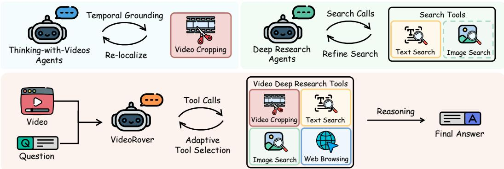
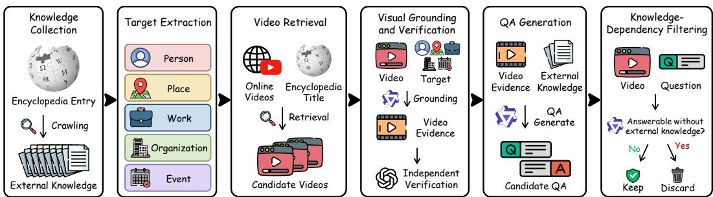
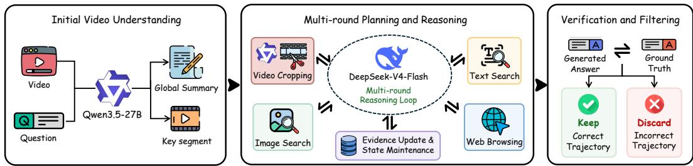
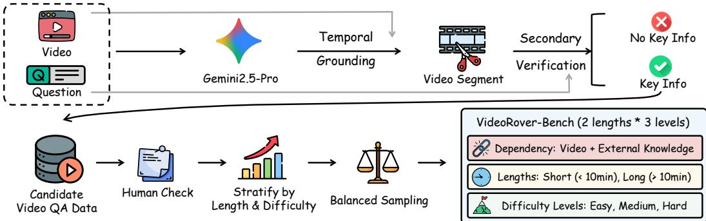
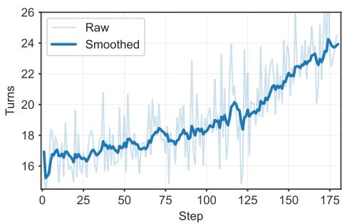
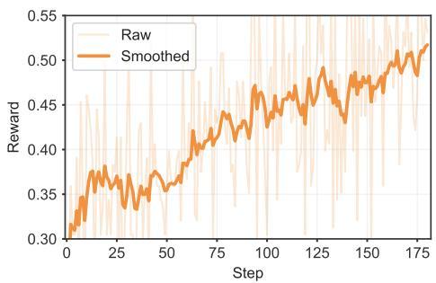
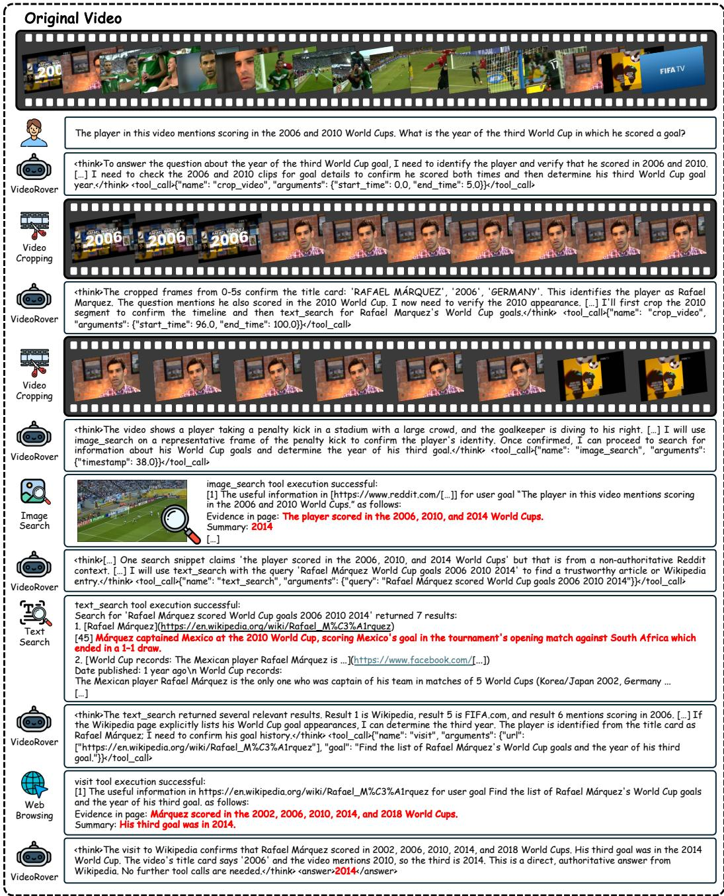
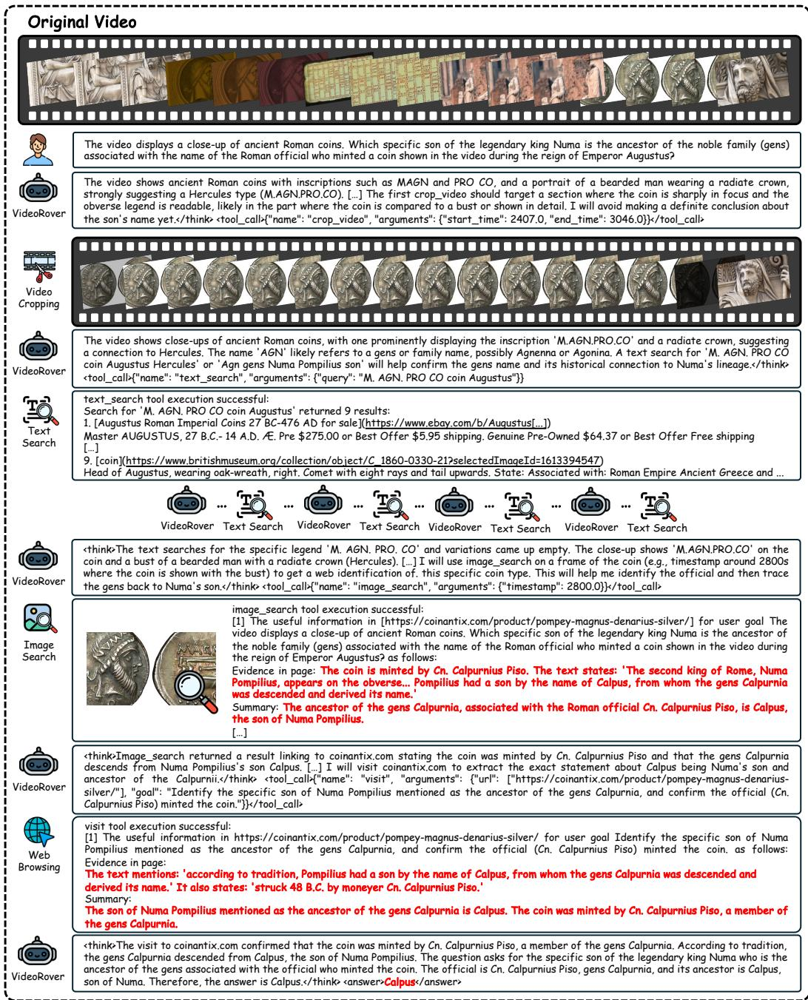

# THINKING BEYOND VIDEOS: UNIFYING VIDEO REASONING AND DEEP RESEARCH FOR OPEN-WORLD VIDEO AGENTS

Wenqi Liu1,∗ Shijie Ma2,∗ Yunxiao Wang1,∗ Meng Liu1 Qile Su3 Han Liu4 Bohan Hou5 Xuanyu Zheng6 Changyi Liu6 Tianke Zhang6 Haonan Fan6 Kaiyu Jiang6 Yingxin Li6 Jiankang Chen6 Xu Wang6 Bin Wen6,‡ Tingting Gao6 Han Li6 Jianhua Yin1 Yinwei Wei1,† Xuemeng Song7,†

1Shandong University 2Institute of Automation, Chinese Academy of Sciences 3Beihang University 4City University of Hong Kong 5Nanyang Technological University 6Kuaishou Technology 7Southern University of Science and Technology

https://liuwq-bit.github.io/VideoRover

## ABSTRACT

Open-world video understanding often requires a model to locate sparse visual evidence and acquire external knowledge that is absent from the video and its parametric memory. While Thinking-with-Videos enables active temporal perception and Deep Research supports multi-step information seeking, the two capabilities are typically developed in isolation. We introduce VideoRover, a unified Video Deep Research framework that iteratively coordinates video cropping, multimodal search, and webpage browsing. Given a video-question pair, VideoRover uses each tool result to select the next action, so localized video clips guide external retrieval and retrieved evidence triggers further video inspection and verification. To develop this capability, we construct an automated data curation pipeline, producing 26K verified SFT trajectories and 3K challenging RL instances. We also introduce VideoRover-Bench, a benchmark stratified by video duration and research difficulty. Experiments on VideoDR and VideoRover-Bench show that our VideoRover-8B-RL achieves performance comparable to proprietary models in the direct-answer setting without tool use while outperforming larger open-source models equipped with the same tool suite. Ablation studies and training dynamics further validate the complementary roles of active video grounding, external retrieval, and long-horizon reinforcement learning.

## 1 INTRODUCTION

Real-world multimodal tasks often require both fine-grained visual evidence and open-world knowledge, making them difficult to solve using only the fixed inputs and parametric knowledge of multimodal large language models (MLLMs) Gao et al. (2023); Abootorabi et al. (2025); Xu & Peng (2025); Shi et al. (2025). Tool-augmented agents address these limitations along two complementary directions. For active perception, Thinking-with-Images Zheng et al. (2026); Zhang et al. (2026c); Shen et al. (2026) allows models to inspect visual regions during reasoning, while Thinking-with-Videos Meng et al. (2026); Zhang et al. (2026b) extends this capability to temporal localization, segment cropping, and adaptive resampling. For information acquisition, retrieval-augmented generation (RAG) Chen et al. (2022); Wang et al. (2024) introduces external knowledge, while Search Jin et al. (2025); Wu et al. (2026) and Deep Research Zheng et al. (2025b); Li et al. (2026b) support multi-round text and image search, webpage browsing, and evidence verification. The former determines what evidence to observe from the video, whereas the latter determines what knowledge to acquire beyond it. Open-world tasks grounded in video require both capabilities to work together.

This combination is essential in settings such as news, demonstrations, documentaries, and lectures, where briefly appearing entities or clues distributed across distant segments must be linked to background, historical, or up-to-date information Liu et al. (2026a). Thinking-with-Videos can locate the relevant visual cues, but the required knowledge may be absent from the video or may have emerged after it was recorded. External retrieval can supply this knowledge only when grounded in the correct visual anchor. A one-way pipeline of video sampling, query generation, and web search therefore propagates early perception errors and cannot use retrieved evidence to revisit uncertain video content. We argue that Video Deep Research should instead allow video observations to guide retrieval and retrieved evidence to refine subsequent video inspection.

  
Figure 1: Comparison of Thinking-with-Videos, Deep Research, and VideoRover. VideoRover iteratively coordinates video cropping, multimodal search, and webpage browsing, using each result to guide the next action.

Despite progress along both directions, three challenges remain. First, temporal grounding must convert sparse evidence in long videos into reliable anchors for external retrieval. Existing Thinkingwith-Videos methods improve evidence access through localization, keyframe selection, and adaptive resampling Zhang et al. (2026a); Zeng et al. (2026); Liu et al. (2026b), but use localized observations primarily for in-video reasoning, without connecting them to external retrieval or revising localization from retrieved evidence. Second, research planning must select among image search, text search, and webpage inspection while formulating effective queries from temporally grounded cues. Existing Deep Research agents mainly operate over text, static images, and webpages Jin et al. (2025); Wu et al. (2026); Huang et al. (2026), leaving this cross-modal decision process underexplored. Third, video and retrieval actions must update a shared research state so that each result can redirect subsequent decisions. Yet the two families typically optimize their respective stages separately, and available data rarely cover complete trajectories from temporal grounding and multimodal retrieval to evidence revision and answer synthesis. Consequently, simply attaching search tools to a video reasoner does not provide the coordination required for Video Deep Research.

To address these challenges, we introduce VideoRover, a unified Video Deep Research framework for joint video grounding and multimodal retrieval (Figure 1). For reliable temporal grounding, VideoRover first localizes and densely inspects a segment, turning sparse video evidence into a visual anchor. For adaptive research planning, it selects a keyframe for image retrieval, formulates text queries for missing knowledge, and visits webpages according to the current evidence gap. For iterative coordination, every tool result updates a shared research state and determines whether to continue searching, re-localize or re-examine video evidence, or answer. Video observations thereby ground external search, while retrieved evidence can redirect video reasoning. To provide the required supervision, we develop an automated pipeline that constructs questions jointly dependent on video and external knowledge and synthesizes interaction trajectories, yielding 26K verified SFT examples and 3K challenging RL instances. We further introduce VideoRover-Bench, stratified by video duration and task difficulty, to evaluate video grounding, open-world retrieval, and multi-source reasoning across different temporal and research complexities.

Our main contributions are summarized as follows:

• We propose VideoRover, which unifies Thinking-with-Videos and Deep Research in an agent that uses each tool result to coordinate video observation and open-world retrieval.

• We develop an automated pipeline for constructing Video Deep Research questions and verified trajectories involving temporal localization, multimodal retrieval, and evidence synthesis.

• We introduce VideoRover-Bench, a stratified benchmark spanning different video durations, task difficulty levels, and reasoning complexities.

• Experiments on VideoDR and VideoRover-Bench demonstrate strong Video Deep Research performance, while ablation studies and training dynamics validate the complementary tool design and long-horizon coordination learned through RL.

## 2 RELATED WORK

## 2.1 THINKING-WITH-VIDEOS

Recent multimodal large language models (MLLMs) have advanced video understanding and reasoning, yet uniform sampling under a fixed visual token budget can easily miss sparse evidence in long videos. LongVA Zhang et al. (2024) and LongVILA Chen et al. (2025) increase context capacity, while token compression and hierarchical modeling improve efficiency, but these approaches typically determine the visual input before inference and cannot adapt observation to intermediate reasoning needs. Tool-augmented methods instead treat visual content as an active reasoning workspace: OpenThinkIMG Su et al. (2025), DeepEyes Zheng et al. (2026), and Thyme Zhang et al. (2026c) enable iterative image inspection, while VITAL Zhang et al. (2026a), LongVT Yang et al. (2026), FrameThinker He et al. (2026), Video-o3Zeng et al. (2026) and VideoTemp-o3 Liu et al. (2026b) extend this idea to temporal localization, keyframe selection, and adaptive video re sampling. Despite improving access to sparse temporal evidence, existing Thinking-with-Videos methods primarily reason within the input video. VideoRover further connects localized video evidence to image search and external retrieval, allowing retrieved knowledge to verify and redirect subsequent video reasoning.

## 2.2 DEEP RESEARCH

Early search agents such as WebGPT Nakano et al. (2021) and Search-R1 Jin et al. (2025) extend retrieval-augmented generation with iterative reasoning and search, but remain primarily textcentric. Recent multimodal systems further incorporate visual search and interaction: MMSearch R1 Wu et al. (2026) and WebWatcher Geng et al. (2026) learn multimodal search behaviors through reinforcement learning, while Vision-DeepResearch Huang et al. (2026), MM-DeepResearch Yao et al. (2026), OpenSearch-VL Chen et al. (2026), and HyperEyes Li et al. (2026a) further support long-horizon, multi-tool visual–textual exploration with capabilities such as multi-entity search, visual manipulation, and cross-modal evidence synthesis. These methods substantially extend Deep Research beyond text, yet their perceptual inputs remain largely static images or webpages, without explicitly addressing sparse evidence distributed over long videos. VideoRover targets this gap by placing temporal localization, image search, text search, and webpage browsing in a unified trajectory, where video evidence grounds external retrieval and retrieved knowledge can trigger video revisiting and verification.

## 3 TASK FORMULATION

We define a Video Deep Research instance as $x = ( V , Q )$ , where $V = ( v _ { 1 } , \ldots , v _ { N } ) \in \mathcal { V }$ is an $N .$ frame video and $Q \in { \bar { \mathcal { Q } } }$ is a research question. Given an open-world web environment W, the goal is to produce $Y \in \mathcal { V }$ by identifying the relevant video evidence and acquiring any missing external knowledge. At step t, we represent the current research state as:

$$
S _ { t } = ( G _ { t } ^ { v } , G _ { t } ^ { w } , h _ { t } ) ,\tag{1}
$$

where $G _ { t } ^ { v }$ and $G _ { t } ^ { w }$ are the accumulated video and web evidence, and $h _ { t }$ is the interaction history. The model selects an action $u _ { t }$ from the remaining evidence gap and updates the state with the tool observation $z _ { t }$

$$
u _ { t } \sim \pi _ { \theta } ( \cdot \mid Q , S _ { t } ) , \qquad S _ { t + 1 } = \operatorname { U p d a t e } ( S _ { t } , u _ { t } , z _ { t } ) .\tag{2}
$$

VideoRover uses four tools. The crop video $\textstyle ( V , [ s _ { t } , e _ { t } ] )$ tool returns a densely sampled clip from a selected interval. The image search $. ( v _ { k _ { t } } )$ tool retrieves visually related information using

  
Figure 2: Pipeline for constructing Video Deep Research questions.

a keyframe, while text search $\lfloor ( q _ { t } )$ returns candidate webpages and summaries for a text query. Finally, visit(l ) opens a webpage to collect detailed evidence. These tools may be invoked repeatedly until the model executes the terminal action answer.

We denote the complete interaction trajectory as:

$$
\tau = \big ( S _ { 0 } , ( u _ { 1 } , z _ { 1 } ) , \dots , ( u _ { T } , z _ { T } ) , Y \big ) ,\tag{3}
$$

where $S _ { 0 }$ contains x and an initial sparse video sample. The process terminates when the accumulated evidence supports an answer or the interaction budget $\bar { T _ { \mathrm { m a x } } }$ is reached.

## 4 DATA SYNTHESIS AND BENCHMARK CONSTRUCTION

High-quality training data is essential for developing Video Deep Research capabilities. Unlike conventional video question answering, Video Deep Research requires not only reasoning over video content, but also acquiring external information beyond the model’s parametric knowledge and connecting video evidence with web evidence through multi-step interactions. To support this setting, we develop a complete data pipeline covering Video Deep Research question construction, SFT trajectory synthesis, and hard-example selection for reinforcement learning. We further construct a stratified Video Deep Research benchmark, VideoRover-Bench, organized by video duration and task difficulty.

## 4.1 QUESTION CONSTRUCTION

Figure 2 summarizes how we construct task instances $x = ( V , Q )$ with reference answers Y, following Section 3. Each instance enforces two complementary dependencies: the video identifies a target referenced only indirectly by the question, while external web knowledge provides the missing information needed for the answer. Thus, neither video-only reasoning nor question-only web search is sufficient.

Knowledge collection and target extraction. We collect Wikipedia articles and extract visually identifiable people, places, organizations, works, products, and events as candidate targets. For each target, we retain the article title, supporting text, and source URL as verifiable evidence for question generation and answer checking, while discarding candidates without clear factual answers or reliable sources.

Video retrieval and visual grounding. We query YouTube with each target and its Wikipedia title and retain the top 3 candidate videos. To eliminate metadata-only matches, Qwen3.5-27B Qwen Team (2026) analyzes 512 densely sampled frames and subtitles to localize likely intervals and keyframes. GPT-5.4-mini Singh et al. (2025) then independently verifies the selected keyframe against the target identity. Only video–target pairs passing both stages are retained as reliable visual anchors for subsequent question answering.

Video-grounded question generation. Given a grounded video–target pair and its collected web evidence, we generate Q by referring to the target indirectly (e.g., “a book cover displayed in the video”) and asking about related background, history, or recent developments. The explicit identity is withheld so that answering the question requires first grounding the target in V. We then disable retrieval and ask Qwen3-VL-4B Bai et al. (2025) to answer using only V and Q, removing samples it answers correctly. This filtering ensures that the final answer depends on both video evidence and external retrieval.

  
Figure 3: Pipeline for synthesizing Video Deep Research trajectories.

## 4.2 TRAJECTORY GENERATION

High-quality interaction trajectories are essential for teaching the model Video Deep Research behaviors rather than only final-answer generation. As summarized in Figure 3, our synthesis process explicitly demonstrates how to ground the question in the video, acquire external evidence with multiple tools, and update the research state before answering.

Roles and initialization. Each trajectory is jointly generated by DeepSeek-V4-Flash1 Xu et al. (2026), which serves as the research planner, and Qwen3.5-27B, which serves as the video observer. Because DeepSeek-V4-Flash is a text-only model without visual perception, Qwen3.5-27B inspects the sampled frames and cropped segments and provides temporally grounded visual observations to the planner. The observer first summarizes sparsely sampled frames and proposes an initial relevant interval. Using the same observer as in question construction maintains consistent visual grounding. We require the planner’s first response in every trajectory to localize a candidate key segment and invoke crop video. The observer then analyzes the densely sampled crop for relevant entities, actions, text, and temporal cues, ensuring that subsequent retrieval is grounded in fine-grained video evidence rather than the initial sparse overview.

Evidence-guided tool use and filtering. Subsequent actions are selected from the crop observations and the remaining evidence gap. If the target is still absent, the planner localizes and crops another segment. When a visual entity appears, it prioritizes image search to confirm the identity and reduce visual misidentification. Once the entity is identified but the required background, historical, or up-to-date fact remains missing, it invokes text search. When either search tool returns a relevant entry, visit opens the source webpage to extract detailed evidence rather than relying only on search-result summaries. Each result updates the research state and can support, reject, or revise existing hypotheses. The loop ends when video and external evidence jointly support an answer, and only trajectories whose final answers match the ground truth are retained.

## 4.3 TRAINING DATA

SFT Data. The synthesis process independently produces answers consistent with the ground truth, providing an additional check of question validity and trajectory correctness. We partition the verified trajectories by interaction length and retain those with at most 10 tool calls for supervised fine-tuning, yielding 26K SFT trajectories. These data cover the fundamental Video Deep Research behaviors of video grounding, multimodal retrieval, evidence updating, and answer synthesis, while longer trajectories are reserved as candidates for subsequent stages.

  
Figure 4: Construction of VideoRover-Bench.

RL Data. After the cold start of SFT, we sample 5 complete rollouts per candidate question whose reference trajectory requires more than 10 tool calls, recording answer correctness, valid tool usage, and interaction length. We remove relatively easy questions answered correctly in more than 3 rollouts, then balance the remaining hard examples by visual-grounding difficulty, search frequency, and overall interaction complexity. This produces 3K RL instances whose rollout groups typically contain both successful and unsuccessful behaviors, providing informative within-group reward variation for relative policy optimization and emphasizing long-horizon autonomous decision making.

## 4.4 BENCHMARK CONSTRUCTION

We construct VideoRover-Bench to evaluate Video Deep Research across different temporal scales and research complexities. Figure 4 summarizes its verification, stratification, and balanced sampling pipeline.

Starting from the candidate video–question pool, we use Gemini-2.5-Pro Comanici et al. (2025), which is independent of the data-generation models, to check question clarity and localize the relevant video segment. The localized segment is then paired with the question for a subsequent verification pass that determines whether it contains the key visual information needed by the question. Samples without such evidence are discarded. The remaining samples undergo human review of question and answer correctness and joint dependence on video evidence and external knowledge. Finally, verified samples are stratified by video length and task difficulty before balanced sampling.

We divide videos into short (0–10 minutes) and long (>10 minutes) subsets, and further categorize questions by temporal-grounding and retrieval difficulty:

• Easy: the relevant visual evidence is readily localized and only a few searches are required.

• Medium: the evidence is more difficult to localize or the answer requires more retrieval steps.

• Hard: the visual evidence is elusive, or the answer requires joint reasoning over multiple video segments and search results.

Balanced sampling retains 50 examples for each of the 6 length–difficulty combinations, yielding 300 evaluation instances in total.

## 5 MODEL TRAINING

We train VideoRover in two complementary stages. SFT establishes a reliable tool-use prior that links video observation with external retrieval, while RL improves autonomous decisions under actual tool feedback and final-answer supervision.

## 5.1 SFT TRAINING

We first fine-tune the base model on the verified multi-round trajectories from Section 4.2. Unlike final-answer supervision, these trajectories demonstrate how to localize video evidence, select image or text search, inspect webpages, update the evidence state, and decide whether to continue or answer. SFT therefore provides the model with a stable behavioral initialization for the complete Video Deep Research process, including valid tool invocation and decisions based on returned evidence. Let $x _ { i } = ( V _ { i } , Q _ { i } )$ denote the task input and $\boldsymbol { \tau } _ { i } ^ { * }$ its target trajectory. Tool outputs are treated as environmental context and excluded from the loss over model-generated reasoning, tool calls, and answer tokens. The objective is $\begin{array} { r } { \mathcal { L } _ { \mathrm { S F T } } ( \theta ) = - \frac { 1 } { M } \sum _ { i = 1 } ^ { M } \log \pi _ { \theta } ( \tau _ { i } ^ { * } \mid x _ { i } ) } \end{array}$

## 5.2 RL TRAINING

Although SFT establishes the basic research behavior, it imitates fixed paths and does not optimize success under actual tool feedback. We therefore apply Group Sequence Policy Optimization (GSPO) Zheng et al. (2025a) to the challenging data from Section 4.3, allowing the policy to explore alternative decisions and reinforce complete observation–retrieval–verification trajectories through final-answer correctness. For each input x, the old policy samples $G = 8$ trajectories. Correct and incorrect answers receive rewards of 1 and 0, while trajectories with formatting errors, missing answers, or invalid tool calls are filtered out. We estimate trajectory-level advantages using the leave-one-out baseline $\begin{array} { r } { A _ { i } = R _ { i } - \frac { 1 } { G - 1 } \sum _ { j \neq i } R _ { j } } \end{array}$

Let $y _ { i }$ be the i-th trajectory and $\rho _ { i } ( \theta )$ the sequence-level importance ratio between the current and old policies. GSPO clips this ratio and first averages over valid tokens within each trajectory, then across trajectories:

$$
\mathcal { L } _ { \mathrm { G S P O } } ( \theta ) = - \frac { 1 } { G } \sum _ { i = 1 } ^ { G } \frac { 1 } { | y _ { i } | } \sum _ { t = 1 } ^ { | y _ { i } | } \operatorname* { m i n } ( \rho _ { i } ( \theta ) A _ { i } , \exp ( \rho _ { i } ( \theta ) , 1 - \epsilon _ { \mathrm { l o w } } , 1 + \epsilon _ { \mathrm { h i g h } } ) A _ { i } ) ,\tag{4}
$$

where $\rho _ { i } ( \theta )$ is computed from the mean token-level log-probability ratio within the trajectory. This trajectory-balanced objective prevents longer outputs from dominating optimization. Together with challenging data and outcome-based rewards, GSPO turns the SFT initialization into an adaptive policy that learns when to gather more evidence, revisit the video, or answer.

## 6 EXPERIMENT

## 6.1 EXPERIMENTAL SETUP

Training Details We use Qwen3-VL-8B Bai et al. (2025) as the backbone of VideoRover and optimize it through SFT followed by RL. Full implementation and training details are provided in Appendix A.

Evaluation Details We evaluate VideoRover on VideoDR Liu et al. (2026a) and our proposed VideoRover-Bench. We compare proprietary models under direct answering and open-source models under both direct answering and ReAct-style agentic tool use Yao et al. (2023). All agentic models can autonomously invoke the same tools under a shared evaluation protocol. The complete baseline list and evaluation settings are provided in Appendix A.

## 6.2 MAIN RESULTS

Table 1 compares direct answering with agentic tool use. Proprietary models achieve strong performance even without external tools. Their larger capacity and broad parametric world knowledge allow them to answer many questions directly from the observed video and internal knowledge. In contrast, open-source models perform considerably worse under direct answering, indicating that limited parametric knowledge and passive video observation are insufficient for questions that jointly require precise temporal evidence and external information.

Equipping the open-source models with the same tools as VideoRover consistently yields substantial improvements over their direct-answer counterparts. This result demonstrates the value of turning video question answering into an active research process that can revisit relevant segments, verify visual entities, retrieve missing knowledge, and inspect source webpages. However, the performance differences among agentic models also show that tool access alone is insufficient.

Table 1: Main results on VideoDR and VideoRover-Bench. All values are accuracy (%). S and L denote short and long videos, respectively. Avg. is the unweighted mean over VideoDR and the six VideoRover-Bench subsets. VideoRover variants are shaded in blue. Within the open-source agentic group, the best and second-best results are shown in bold and underlined, respectively.
<table><tr><td rowspan="2">Model</td><td>VideoDR</td><td colspan="6">VideoRover-Bench</td><td rowspan="2">Avg.</td></tr><tr><td>Acc.</td><td>S-Easy</td><td>S-Medium</td><td>S-Hard</td><td>L-Easy</td><td>L-Medium</td><td>L-Hard</td></tr><tr><td colspan="8">Proprietary Models (Direct Answer)</td></tr><tr><td>GPT-5</td><td>57.00</td><td>70.00</td><td>64.00</td><td>36.00</td><td>64.00</td><td>50.00</td><td>44.00</td><td>55.00</td></tr><tr><td>GPT-5.2</td><td>31.00</td><td>56.00</td><td>52.00</td><td>24.00</td><td>60.00</td><td>30.00</td><td>24.00</td><td>39.57</td></tr><tr><td>GPT-5.4</td><td>51.00</td><td>56.00</td><td>54.00</td><td>26.00</td><td>24.00</td><td>24.00</td><td>16.00</td><td>35.85</td></tr><tr><td>Gemini-2.5-Flash</td><td>47.00</td><td>54.00</td><td>30.00</td><td>30.00</td><td>54.00</td><td>30.00</td><td>28.00</td><td>39.00</td></tr><tr><td>Gemini-2.5-Pro</td><td>54.00</td><td>66.00</td><td>54.00</td><td>30.00</td><td>62.00</td><td>34.00</td><td>50.00</td><td>50.00</td></tr><tr><td>Gemini-3-Flash</td><td>59.00</td><td>74.00</td><td>70.00</td><td>48.00</td><td>58.00</td><td>52.00</td><td>48.00</td><td>58.42</td></tr><tr><td>Gemini-3-Pro</td><td>55.00</td><td>78.00</td><td>60.00</td><td>42.00</td><td>72.00</td><td>40.00</td><td>52.00</td><td>57.00</td></tr><tr><td colspan="9">Open-Source Models (Direct Answer)</td></tr><tr><td>Qwen3-VL-8B</td><td>9.00</td><td>8.00</td><td>8.00</td><td>8.00</td><td>18.00</td><td>6.00</td><td>10.00</td><td>9.57</td></tr><tr><td>Qwen3-VL-30B-A3B</td><td>10.00</td><td>14.00</td><td>16.00</td><td>12.00</td><td>22.00</td><td>10.00</td><td>12.00</td><td>13.71</td></tr><tr><td>Qwen3.5-27B</td><td>28.00</td><td>32.00</td><td>30.00</td><td>14.00</td><td>28.00</td><td>22.00</td><td>12.00</td><td>23.71</td></tr><tr><td>Qwen3.5-35B-A3B</td><td>24.00</td><td>36.00</td><td>28.00</td><td>14.00</td><td>36.00</td><td>20.00</td><td>14.00</td><td>24.57</td></tr><tr><td>Qwen3.6-27B</td><td>23.00</td><td>30.00</td><td>30.00</td><td>16.00</td><td>38.00</td><td>18.00</td><td>12.00</td><td>23.85</td></tr><tr><td>Qwen3.6-35B-A3B</td><td>28.00</td><td>36.00</td><td>18.00</td><td>14.00</td><td>26.00</td><td>22.00</td><td>16.00</td><td>22.85</td></tr><tr><td colspan="9">Open-Source Models (Agentic Tool Use)</td></tr><tr><td>Qwen3-VL-8B</td><td>29.00</td><td>58.00</td><td>38.00</td><td>16.00</td><td>42.00</td><td>30.00</td><td>10.00</td><td>31.85</td></tr><tr><td>Qwen3-VL-30B-A3B</td><td>31.00</td><td>58.00</td><td>34.00</td><td>14.00</td><td>50.00</td><td>22.00</td><td>16.00</td><td>32.14</td></tr><tr><td>Qwen3.5-27B</td><td>54.00</td><td>78.00</td><td>54.00</td><td>36.00</td><td>68.00</td><td>56.00</td><td>42.00</td><td>55.42</td></tr><tr><td>Qwen3.5-35B-A3B</td><td>42.00</td><td>56.00</td><td>42.00</td><td>18.00</td><td>38.00</td><td>22.00</td><td>20.00</td><td>34.00</td></tr><tr><td>Qwen3.6-27B</td><td>54.00</td><td>74.00</td><td>64.00</td><td>38.00</td><td>66.00</td><td>46.00</td><td>34.00</td><td>53.71</td></tr><tr><td>Qwen3.6-35B-A3B</td><td>50.00</td><td>76.00</td><td>62.00</td><td>34.00</td><td>62.00</td><td>48.00</td><td>40.00</td><td>53.14</td></tr><tr><td>VideoRover-8B-SFT (Ours)</td><td>39.00</td><td>58.00</td><td>44.00</td><td>30.00</td><td>54.00</td><td>32.00</td><td>18.00</td><td>39.28</td></tr><tr><td>VideoRover-8B-RL (Ours)</td><td>56.00</td><td>80.00</td><td>64.00</td><td>40.00</td><td>70.00</td><td>52.00</td><td>42.00</td><td>57.71</td></tr></table>

Effective Video Deep Research further requires the model to select and compose tools according to the evolving evidence state rather than invoking them as an unstructured pipeline.

VideoRover-8B-RL achieves the strongest overall performance among the evaluated open-source agentic models and leads or matches them on most subsets. Despite its 8B backbone, it reaches a level comparable to the strongest proprietary models under direct answering and surpasses newer, larger open-source models operating with the same tools. This result shows that our trajectory con struction and task-specific training can compensate for limited model scale by transforming missing parametric knowledge into explicit evidence acquisition. The consistent improvement from VideoRover-8B-SFT to VideoRover-8B-RL further confirms that RL strengthens autonomous long-horizon coordination beyond imitation of the synthesized trajectories.

## 6.3 ABLATION STUDIES

Table 2 shows that VideoRover performs best across video lengths and difficulty levels, confirming that each tool contributes to the research process. Removing crop video causes a degradation across the benchmark, demonstrating the importance of revisiting candidate segments at higher temporal density and visual resolution before retrieval. Removing image search also reduces overall performance, with a more evident effect on long-video subsets. This supports its role in confirming visual entities from localized keyframes and preventing uncertain recognition from propagating into subsequent searches. Among the individual tools, removing text search produces the largest overall decline, indicating that many questions require the model to connect video-grounded cues with external background or factual knowledge. The removal of visit further weakens performance, showing that search-result summaries alone are often insufficient and that opening source webpages is necessary to extract detailed evidence. The web ablation jointly removes image search, text search, and visit, causing a substantially larger degradation than removing any single tool and highlighting their complementarity. Together, these results show how VideoRover coordinates its tools based on the available evidence: crop video grounds the research process in relevant visual evidence, image search verifies visual entities, text search retrieves missing knowledge, and visit consolidates detailed evidence for the final answer.

Table 2: Ablation results on VideoDR and VideoRover-Bench. All values are accuracy (%). Each row removes one tool from VideoRover-8B-RL, except web, which jointly removes all external retrieval tools. S and L indicate short and long videos, respectively.
<table><tr><td rowspan="2">Model</td><td rowspan="2">VideoDR</td><td colspan="6">VideoRover-Bench</td><td rowspan="2">Avg.</td></tr><tr><td>Acc.</td><td>S-Easy S-Medium</td><td>S-Hard</td><td>L-Easy</td><td>L-Medium</td><td>L-Hard</td></tr><tr><td>VideoRover-8B-RL</td><td>56.00</td><td>80.00</td><td>64.00</td><td>40.00</td><td>70.00</td><td>52.00</td><td>42.00</td><td>57.71</td></tr><tr><td>crop_video</td><td>45.00</td><td>74.00</td><td>52.00</td><td>34.00</td><td>64.00</td><td>42.00</td><td>36.00</td><td>49.57</td></tr><tr><td>- image_search</td><td>43.00</td><td>76.00</td><td>54.00</td><td>34.00</td><td>56.00</td><td>44.00</td><td>36.00</td><td>49.00</td></tr><tr><td>- text_search</td><td>24.00</td><td>40.00</td><td>26.00</td><td>20.00</td><td>30.00</td><td>16.00</td><td>10.00</td><td>23.71</td></tr><tr><td>-visit</td><td>41.00</td><td>76.00</td><td>44.00</td><td>30.00</td><td>68.00</td><td>46.00</td><td>38.00</td><td>49.00</td></tr><tr><td>- web</td><td>13.00</td><td>16.00</td><td>18.00</td><td>14.00</td><td>16.00</td><td>10.00</td><td>10.00</td><td>13.85</td></tr></table>

## 6.4 RL TRAINING DYNAMICS

  
(a) Interaction turns per rollout.

  
(b) Training reward.  
Figure 5: RL training dynamics of VideoRover. Light curves show raw measurements, and dark curves show smoothed trends.

As shown in Figure 5, both the smoothed reward and interaction length increase after the SFT cold start. Because the reward depends on final-answer correctness rather than trajectory length, their joint growth suggests that longer rollouts support sustained evidence acquisition rather than merely adding redundant tool calls. This trend matches the design of our RL data and indicates that RL strengthens the long-horizon coordination of video localization, multimodal search, and webpage browsing. Together with the ablation results, it shows that VideoRover benefits from learning to compose tools across research trajectories, rather than simply having access to them.

## 7 CONCLUSION

In this work, we present VideoRover, a unified framework that iteratively coordinates video observation and open-world retrieval, using each result to guide the next action. To develop and evaluate this capability, we construct verified SFT and RL data covering temporal localization, multimodal search, webpage browsing, and evidence synthesis, together with VideoRover-Bench across various video durations and research difficulties. Experiments on VideoDR and VideoRover-Bench show that VideoRover-8B-RL achieves performance comparable to proprietary models under direct answering while outperforming newer and larger opensource models equipped with the same tools. The ablation results and training dynamics further demonstrate the complementary roles of video grounding and external retrieval, as well as the importance of RL for learning their long-horizon coordination.

## REFERENCES

Mohammad Mahdi Abootorabi, Amirhosein Zobeiri, Mahdi Dehghani, Mohammadali Mohammad khani, Bardia Mohammadi, Omid Ghahroodi, Mahdieh Soleymani Baghshah, and Ehsaneddin Asgari. Ask in any modality: A comprehensive survey on multimodal retrieval-augmented generation. Findings of the Association for Computational Linguistics: ACL 2025, pp. 16776–16809, 2025.

Shuai Bai, Yuxuan Cai, Ruizhe Chen, Keqin Chen, Xionghui Chen, Zesen Cheng, Lianghao Deng, Wei Ding, Chang Gao, Chunjiang Ge, et al. Qwen3-vl technical report. arXiv preprint arXiv:2511.21631, 2025.

Shuang Chen, Kaituo Feng, Hangting Chen, Wenxuan Huang, Dasen Dai, Quanxin Shou, Yunlong Lin, Xiangyu Yue, Shenghua Gao, and Tianyu Pang. Opensearch-vl: An open recipe for frontier multimodal search agents. arXiv preprint arXiv:2605.05185, 2026.

Wenhu Chen, Hexiang Hu, Xi Chen, Pat Verga, and William Cohen. Murag: Multimodal retrievalaugmented generator for open question answering over images and text. In Proceedings of the 2022 Conference on Empirical Methods in Natural Language Processing, pp. 5558–5570, 2022.

Yukang Chen, Fuzhao Xue, Dacheng Li, Qinghao Hu, Ligeng Zhu, Xiuyu Li, Yunhao Fang, Haotian Tang, Shang Yang, Zhijian Liu, et al. Longvila: Scaling long-context visual language models for long videos. In International Conference on Learning Representations, volume 2025, pp. 18227– 18246, 2025.

Gheorghe Comanici, Eric Bieber, Mike Schaekermann, Ice Pasupat, Noveen Sachdeva, Inderjit Dhillon, Marcel Blistein, Ori Ram, Dan Zhang, Evan Rosen, et al. Gemini 2.5: Pushing the frontier with advanced reasoning, multimodality, long context, and next generation agentic capabilities. arXiv preprint arXiv:2507.06261, 2025.

Google DeepMind. A new era of intelligence with gemini 3, November 2025. URL https: //blog.google/products-and-platforms/products/gemini/gemini-3.

Yunfan Gao, Yun Xiong, Xinyu Gao, Kangxiang Jia, Jinliu Pan, Yuxi Bi, Yi Dai, Jiawei Sun, Meng Wang, and Haofen Wang. Retrieval-augmented generation for large language models: A survey. arXiv preprint arXiv:2312.10997, 2023.

Xinyu Geng, Peng Xia, Zhen Zhang, Xinyu Wang, Qiuchen Wang, Ruixue Ding, Chenxi Wang, Jialong Wu, Kuan Li, Yida Zhao, et al. Webwatcher: Breaking new frontiers of vision-language deep research agent. In International Conference on Learning Representations, volume 2026, pp. 61240–61271, 2026.

Zefeng He, Xiaoye Qu, Yafu Li, Siyuan Huang, Daizong Liu, and Yu Cheng. Framethinker: Learning to think with long videos via multi-turn frame spotlighting. In International Conference on Learning Representations, volume 2026, pp. 74904–74933, 2026.

Wenxuan Huang, Yu Zeng, Qiuchen Wang, Zhen Fang, Shaosheng Cao, Zheng Chu, Qingyu Yin, Shuang Chen, Zhenfei Yin, Lin Chen, et al. Vision-deepresearch: Incentivizing deepresearch capability in multimodal large language models. 2026.

Bowen Jin, Hansi Zeng, Zhenrui Yue, Jinsung Yoon, Sercan Arik, Dong Wang, Hamed Zamani, and Jiawei Han. Search-r1: Training llms to reason and leverage search engines with reinforcement learning. arXiv preprint arXiv:2503.09516, 2025.

Woosuk Kwon, Zhuohan Li, Siyuan Zhuang, Ying Sheng, Lianmin Zheng, Cody Hao Yu, Joseph Gonzalez, Hao Zhang, and Ion Stoica. Efficient memory management for large language model serving with pagedattention. In Proceedings of the 29th symposium on operating systems principles, pp. 611–626, 2023.

Guankai Li, Jiabin Chen, Yi Xu, Xichen Zhang, and Yuan Lu. Hypereyes: Dual-grained efficiency-aware reinforcement learning for parallel multimodal search agents. arXiv preprint arXiv:2605.07177, 2026a.

Xiaoxi Li, Jiajie Jin, Guanting Dong, Hongjin Qian, Yongkang Wu, Ji-Rong Wen, Yutao Zhu, and Zhicheng Dou. Webthinker: Empowering large reasoning models with deep research capability. Advances in Neural Information Processing Systems, 38:120091–120131, 2026b.

Chengwen Liu, Xiaomin Yu, Zhuoyue Chang, Zhe Huang, Shuo Zhang, Heng Lian, Jisheng Dang, Rui Xu, Sen Hu, Jianheng Hou, et al. Watching, reasoning, and searching: A video deep research benchmark on open web for agentic video reasoning. arXiv preprint arXiv:2601.06943, 2026a.

Wenqi Liu, Yunxiao Wang, Shijie Ma, Meng Liu, Qile Su, Tianke Zhang, Haonan fan, Changyi Liu, Kaiyu Jiang, Jiankang Chen, Kaiyu Tang, Bin Wen, Fan Yang, Tingting Gao, Han Li, Yinwei Wei, and Xuemeng Song. Videotemp-o3: Harmonizing temporal grounding and video understanding in agentic thinking-with-videos. In Forty-third International Conference on Machine Learning, 2026b.

Jiahao Meng, Yue Tan, Qi Xu, Kuan Gao, Weisong Liu, Yanwei Li, Jason Li, Lingdong Kong, Haochen Wang, Qianyu Zhou, et al. Watch, remember, reason: Human-view video understanding with mllms. arXiv preprint arXiv:2606.07433, 2026.

Reiichiro Nakano, Jacob Hilton, Suchir Balaji, Jeff Wu, Long Ouyang, Christina Kim, Christopher Hesse, Shantanu Jain, Vineet Kosaraju, William Saunders, et al. Webgpt: Browser-assisted question-answering with human feedback. arXiv preprint arXiv:2112.09332, 2021.

Qwen Team. Qwen3.5: Towards native multimodal agents, February 2026. URL https://qwen. ai/blog?id=qwen3.5.

Yuxiang Shen, Hailong Huang, Zhenkun Gao, Xueheng Li, Man Zhou, Chengjun Xie, Haoxuan Che, Xuanhua He, and Jie Zhang. Lookwise: Knowing when and where to look for fine-grained visual reasoning in multimodal large language models. arXiv preprint arXiv:2603.00171, 2026.

Guangming Sheng, Chi Zhang, Zilingfeng Ye, Xibin Wu, Wang Zhang, Ru Zhang, Yanghua Peng, Haibin Lin, and Chuan Wu. Hybridflow: A flexible and efficient rlhf framework. In Proceedings of the Twentieth European Conference on Computer Systems, pp. 1279–1297, 2025.

Zhengliang Shi, Yiqun Chen, Haitao Li, Weiwei Sun, Shiyu Ni, Yougang Lyu, Run-Ze Fan, Bowen Jin, Yixuan Weng, Minjun Zhu, et al. Deep research: A systematic survey. arXiv preprint arXiv:2512.02038, 2025.

Aaditya Singh, Adam Fry, Adam Perelman, Adam Tart, Adi Ganesh, Ahmed El-Kishky, Aidan McLaughlin, Aiden Low, AJ Ostrow, Akhila Ananthram, et al. Openai gpt-5 system card. arXiv preprint arXiv:2601.03267, 2025.

Zhaochen Su, Linjie Li, Mingyang Song, Yunzhuo Hao, Zhengyuan Yang, Jun Zhang, Guanjie Chen, Jiawei Gu, Juntao Li, Xiaoye Qu, et al. Openthinkimg: Learning to think with images via visual tool reinforcement learning. arXiv preprint arXiv:2505.08617, 2025.

Xiaohua Wang, Zhenghua Wang, Xuan Gao, Feiran Zhang, Yixin Wu, Zhibo Xu, Tianyuan Shi, Zhengyuan Wang, Shizheng Li, Qi Qian, et al. Searching for best practices in retrieval-augmented generation. In Proceedings of the 2024 conference on empirical methods in natural language processing, pp. 17716–17736, 2024.

Jinming Wu, Zihao Deng, Wei Li, Yiding Liu, Bo You, Bo Li, Zejun Ma, and Ziwei Liu. MMSearchr1: Incentivizing LMMs to search. In Proceedings ofthe 64th Annual Meeting ofthe Association for Computational Linguistics (Volume 1: Long Papers), July 2026.

Anyi Xu, Bangcai Lin, Bing Xue, Bingxuan Wang, Bingzheng Xu, Bochao Wu, Bowei Zhang, Chaofan Lin, Chen Dong, Chenchen Ling, et al. Deepseek-v4: Towards highly efficient milliontoken context intelligence. arXiv preprint arXiv:2606.19348, 2026.

Renjun Xu and Jingwen Peng. A comprehensive survey of deep research: Systems, methodologies, and applications. arXiv preprint arXiv:2506.12594, 2025.

Zuhao Yang, Sudong Wang, Kaichen Zhang, Keming Wu, Sicong Leng, Yifan Zhang, Bo Li, Chengwei Qin, Shijian Lu, Xingxuan Li, et al. Longvt: Incentivizing” thinking with long videos” via native tool calling. In Proceedings ofthe IEEE/CVF Conference on Computer Vision and Pattern Recognition, pp. 33816–33826, 2026.

Huanjin Yao, Qixiang Yin, Min Yang, Ziwang Zhao, Yibo Wang, Haotian Luo, Jingyi Zhang, and Jiaxing Huang. Mm-deepresearch: A simple and effective multimodal agentic search baseline. arXiv preprint arXiv:2603.01050, 2026.

Shunyu Yao, Jeffrey Zhao, Dian Yu, Nan Du, Izhak Shafran, Karthik R Narasimhan, and Yuan Cao. React: Synergizing reasoning and acting in language models. In The Eleventh International Conference on Learning Representations, 2023.

Xiangyu Zeng, Zhiqiu Zhang, Yuhan Zhu, Xinhao Li, Zikang Wang, Changlian Ma, Qingyu Zhang, Zizheng Huang, Kun Ouyang, Tianxiang Jiang, et al. Video-o3: Native interleaved clue seeking for long video multi-hop reasoning. 2026.

Haoji Zhang, Xin Gu, Jiawen Li, Chixiang Ma, Sule Bai, Chubin Zhang, Bowen Zhang, Zhichao Zhou, Dongliang He, and Yansong Tang. Thinking with videos: Multimodal tool-augmented reinforcement learning for long video reasoning. In Proceedings of the IEEE/CVF Conference on Computer Vision and Pattern Recognition, pp. 32903–32914, 2026a.

Peiyuan Zhang, Kaichen Zhang, Bo Li, Guangtao Zeng, Jingkang Yang, Yuanhan Zhang, Ziyue Wang, Haoran Tan, Chunyuan Li, and Ziwei Liu. Long context transfer from language to vision. arXiv preprint arXiv:2406.16852, 2024.

Peng Zhang, Guanghao Zhang, Wanggui He, Longxiang Zhang, Mushui Liu, Yan Xia, Zhenhao Peng, Weilong Dai, Jinlong Liu, Haobing Tang, et al. Dynframe: Adaptive reasoning-driven multimodal framework with dynamic frame augmentation for complex video understanding. arXiv preprint arXiv:2605.26680, 2026b.

YiFan Zhang, Xingyu Lu, Shukang Yin, Chaoyou Fu, Wei Chen, Xiao Hu, Bin Wen, Kaiyu Jiang, Changyi Liu, Tianke Zhang, Haonan fan, Kaibing Chen, Jiankang Chen, Haojie Ding, Kaiyu Tang, Zhang Zhang, Liang Wang, Fan Yang, Tingting Gao, and Guorui Zhou. Thyme: Think beyond images. In The Fourteenth International Conference on Learning Representations, 2026c.

Yuze Zhao, Jintao Huang, Jinghan Hu, Xingjun Wang, Yunlin Mao, Daoze Zhang, Zeyinzi Jiang, Zhikai Wu, Baole Ai, Ang Wang, et al. Swift: a scalable lightweight infrastructure for fine-tuning. In Proceedings of the AAAI Conference on Artificial Intelligence, volume 39, pp. 29733–29735, 2025.

Chujie Zheng, Shixuan Liu, Mingze Li, Xiong-Hui Chen, Bowen Yu, Chang Gao, Kai Dang, Yuqiong Liu, Rui Men, An Yang, Jingren Zhou, and Junyang Lin. Group sequence policy optimization. arXiv preprint arXiv:2507.18071, 2025a.

Yuxiang Zheng, Dayuan Fu, Xiangkun Hu, Xiaojie Cai, Lyumanshan Ye, Pengrui Lu, and Pengfei Liu. Deepresearcher: Scaling deep research via reinforcement learning in real-world environments. In Proceedings of the 2025 Conference on Empirical Methods in Natural Language Processing, pp. 414–431, 2025b.

Ziwei Zheng, Minghao Yang, Jack Hong, Chenxiao Zhao, Guohai Xu, Le Yang, and Chao Shen. Deepeyes: Incentivizing” thinking with images” via reinforcement learning. In International Conference on Learning Representations, volume 2026, pp. 126775–126798, 2026.

## A EXPERIMENTAL DETAILS

Training configuration. We use ms-swift Zhao et al. (2025) for SFT and VeRL Sheng et al. (2025) for RL. The learning rates are set to $2 \times 1 0 ^ { - 5 }$ and $1 \times 1 0 ^ { - 6 }$ , with batch sizes of 256 and 16, for SFT and RL, respectively. During RL, vLLM Kwon et al. (2023) samples 8 rollout trajectories per training example, and each rollout can make at most 25 tool calls. For the initial video observation, we sample at 1 FPS, retain at most 256 frames, and limit each frame to a maximum resolution of 224 × 224 pixels. The crop video tool instead samples at 2 FPS and returns at most 32 frames at their original resolution. All experiments are conducted on 4 servers, each equipped with 8 NVIDIA H800 GPUs and 2 TB of memory.

Evaluation configuration. The proprietary direct-answer baselines comprise GPT-5 Singh et al. (2025), GPT-5.2, GPT-5.4, Gemini-2.5-Flash Comanici et al. (2025), Gemini-2.5-Pro, Gemini-3- Flash DeepMind (2025), and Gemini-3-Pro. The open-source baselines comprise Qwen3-VL-8B, Qwen3-VL-30B-A3B, Qwen3.5-27B, Qwen3.5-35B-A3B, Qwen3.6-27B, and Qwen3.6-35B-A3B, each evaluated under both direct answering and ReAct-style agentic tool use Yao et al. (2023). In the agentic setting, these baselines, VideoRover-8B-SFT, and VideoRover-8B-RL can make at most 50 tool calls per example. For consistent comparison under multimodal input constraints, we cap the initial video input at 64 frames. All other settings follow the training configuration.

## B QUALITATIVE CASES

We provide two qualitative examples that illustrate how VideoRover coordinates video grounding and external retrieval according to the evolving evidence gap. In both cases, the model first localizes and crops a relevant video segment, then uses the observed visual cues to guide subsequent search and webpage verification.

World Cup case. Figure 6 shows a trajectory in which the answer requires identifying the player from the video and retrieving his World Cup scoring history. VideoRover inspects multiple relevant segments, uses image and text search to collect candidate evidence, and visits a source webpage before producing the final answer.

Roman coin case. Figure 7 presents a more challenging trajectory grounded in a close-up of an ancient Roman coin. When repeated text searches do not identify the relevant gens, VideoRover switches to image search using the localized keyframe and then visits the retrieved webpage to confirm the historical relationship.

  
Figure 6: Qualitative case on identifying the year of Rafael Marquez’s third World Cup goal.´ VideoRover crops the interview and match segments, combines image search with text search, and visits a retrieved webpage to verify the final answer.

  
Figure 7: Qualitative case on tracing the ancestry of the gens associated with an ancient Roman coin. After localizing the coin in the video, VideoRover revises unsuccessful text-search attempts with image search and webpage browsing, ultimately identifying Calpus as the relevant son of Numa Pompilius.