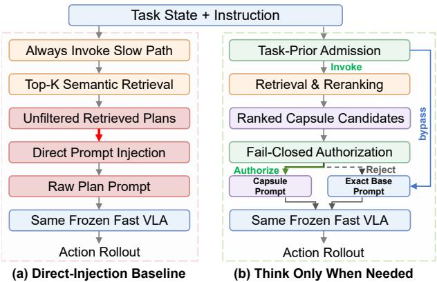
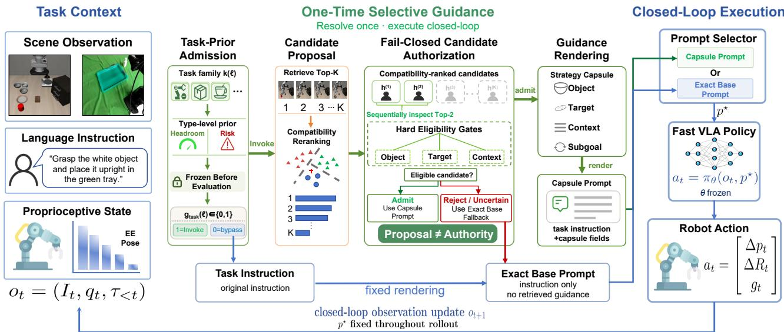
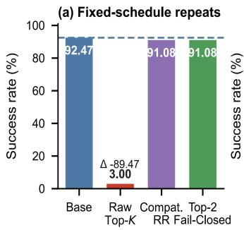
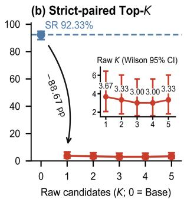
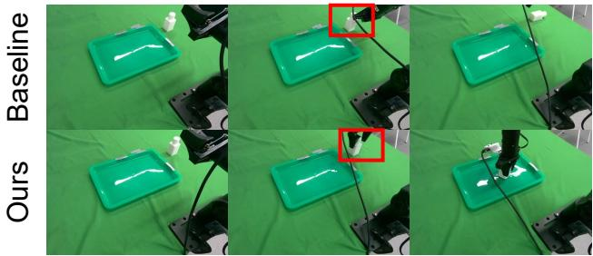
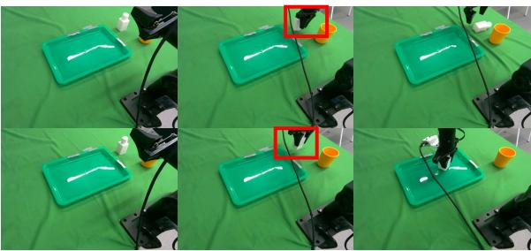
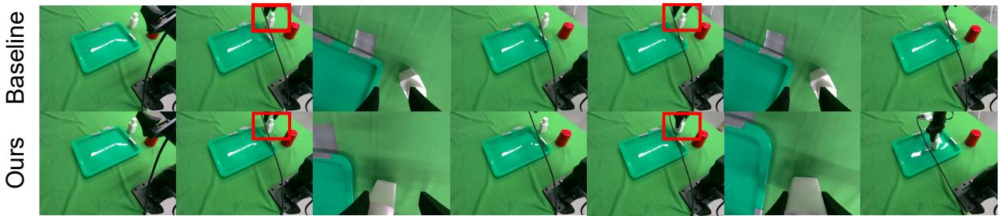

# Think Only When Needed: Prompt-Authority Control for Selective Slow-Path Intervention in Vision-Language-Action Manipulation

Zhiruo Zhou1,2,\*, Zelin Li1,\*,†, Xiwen Chen1,3, Jiazhuo Li4, Chenwei Wang5, Huiming Chen6 Xiaojun Zhu1,†

1SIGS, Tsinghua University, China; 2Wuhan University of Technology, China; 3Shanghai Jiao Tong University, China; 4University of Michigan - Ann Arbor, USA; 5AiDlab, Hong Kong (China SAR); 6City University of Hong Kong, Hong Kong (China SAR);

\*Equal Contributions; †Correspondence: chiellini.lee@gmail.com; zhu.xiaojun@sz.tsinghua.edu.cn

## Abstract

Retrieval can eficiently and efectively augment a frozen vision–language–action (VLA) policy without retraining, yet retrieved text becomes a control intervention once it enters the executed prompt. In a matched audit, raw appended text reduces mean success from 92.47% to 3.00%, while meaningful and length-matched meaningless appends both fail on all 500 states. This result identifies prompt-form collapse: changing the instruction form, rather than adding useful semantics, can dominate execution. We introduce TOWN-VLA (Think Only When Needed), a prompt-authority interface that separates candidate generation from permission to alter the policy input. A fixed compatibility rule authorizes a canonical compact instruction; otherwise, the interface restores the original Base prompt exactly. Across 900 audited routes, every route follows this contract: 525 routes recover Base with matching hashes, and all 375 authorized prompts preserve the task signature. On a matched 4 × 7 LIBERO-Plus evaluation with 10,030 episodes per method, success rises from 69.5% to 73.1% (+362 episodes; 95% CI 1.89–5.45 points), improving on six perturbation axes and all four suites. On a physical PiPER arm with a frozen π0.5 checkpoint, success rises from 52.7% to 78.7% over 150 trials per method (p = 3.16×10−6). Prompt authority is enforceable for a frozen controller; oraclefree admission calibration is the next deployment target.

## Introduction

Vision-language-action (VLA) policies map visual observations and language instructions to closed-loop robot actions, connecting the semantic breadth of vision-language pretraining with continuous control (Driess et al. 2023; Zitkovich et al. 2023; Kim et al. 2025). Cross-embodiment data, generalist pretraining, and continuous-action models have broadened their capabilities (Open X-Embodiment Collaboration 2023; Octo Model Team et al. 2024; Black et al. 2025b; Liu et al. 2024; Pertsch et al. 2025). Practical systems now wrap frozen policies with planners, memories, verifiers, or steering modules that supply test-time guidance (Ahn et al. 2022; Huang et al. 2022; Zawalski et al. 2025; Li et al. 2025). Once such text enters the executed instruction, it becomes a control intervention. We study this interface rather than policy retraining, asking which retrieved content may modify the frozen policy input (Figures 1 and 2).

Holding the policy, initial states, and execution protocol fixed, raw appended text reduces mean success from 92.47% to 3.00% (Figure 3(a)). In a paired 500-state control, meaningful and length-matched meaningless appends both yield 0/500, called prompt-form collapse. We hypothesize that OFT (Optimized Fine-Tuning) adaptation exposes the policy to a stable instruction template but no appended retrieval tokens; appending text shifts sequence length, token positions, and the instruction boundary. The identical failure of semantically diferent appends, while canonical prompts remain operative, supports template departure over semantic quality, demonstrating task-preserving rewordings and multimodal perturbations (Srikanth et al. 2026; Xie et al. 2026) by isolating the interface around an otherwise frozen policy.

  
Figure 1: Prompt authority at the frozen-policy boundary. Direct injection passes retrieved text to the VLA; TOWN-VLA (Think Only When Needed) authorizes a canonical capsule or restores Base while retaining the same frozen action generator.

Existing planners ground proposals through afordances, feedback, programs, or spatial value maps (Ahn et al. 2022; Huang et al. 2022; Liang et al. 2022; Huang et al. 2023); newer systems request assistance, route experts, retrieve memory, or steer frozen policies (Ren et al. 2023; Zhang et al. 2026a; Ren, Yi, and Sun 2026; Li et al. 2025; Zhang et al. 2026b; Jeong, Swamy, and Bajcsy 2026). They make the proposal-to-action interface consequential, but do not generally separate candidate quality from an explicit, logged authorization decision. This distinction parallels value-ofcomputation reasoning and selective prediction with a reject option (Russell and Wefald 1991; Geifman and El-Yaniv 2019): a slow path may be worth querying without its output being worth obeying.We therefore formulate retrieval augmentation as prompt-authority control in TOWN-VLA. Figure 1 contrasts direct injection with rejection followed by Base-prompt restoration. Memory is one replaceable source of proposals; the validated method concerns the contract governing whether and how any candidate may alter the frozen policy input, rather than attributing gains to retrieved strategy content.

TOWN-VLA separates candidate preparation from prompt authorization (Figure 2). A Compatibility-Reranked Capsule retrieves structured candidates and orders them by a fixed text-level compatibility rule. A Top-2 Fail-Closed Cascade inspects at most two candidates: the first eligible candidate becomes a canonical compact instruction; if neither passes, the interface retains the exact Base Policy prompt. The frozen Base Policy remains the sole action generator, with its parameters and control loop unchanged. The construction supplies two verifiable properties: (P1) every unauthorized route resolves to the bit-identical Base prompt, and (P2) each inspected episode uses at most one retrieval, five compatibility scores, and two checks. Task-Prior Admission estimates an oracle-side upper bound on removable slow-path computation; oracle-free admission is evaluated in Q4.

## Key Contributions:

• We formulate prompt-authority control as a previously underexplored test-time interface problem for frozen VLAs and identifyprompt-form collapse as its motivating failure mode. Raw appended text reduces mean success from 92.47% to 3.00%; task-aligned and length-matched meaningless sufixes both yield 0/500, whereas exact Base restoration reaches 499/500.

• We operationalize proposal ̸= authority at the frozenpolicy boundary: TOWN-VLA admits only canonical guidance, restores rejected routes to the exact Base prompt, and limits inspection to Top-2. Across 900 routes, 525 recover hash-identical Base prompts and all 375 authorized prompts preserve the task signature.

• In matched evaluation, TOWN-VLA raises LIBERO-Plus success from 69.46% to 73.07% (+362 successes; pairedcell bootstrap 95% CI, 1.89–5.45 points), with gains on six of seven axes and all four suites; physical PiPER success rises from 52.7% to 78.7%.

• A preregistered boundary quantifies admission timing. Oracle routing preserves 2,826 successes, halving slowpath calls; on the fixed 24/36 development–held-out split, oracle-free gates peak at the 91.81% Base Policy. Admission calibration is the next challenge.

## Related Work

Frozen policies and inference-time interfaces. PaLM-E, RT-1, and RT-2 established scalable language-conditioned robot control (Driess et al. 2023; Brohan et al. 2022; Zitkovich et al. 2023), while Open X-Embodiment, Octo, and OpenVLA scaled cross-dataset adaptation (Open X-Embodiment Collaboration 2023; Octo Model Team et al.

2024; Kim et al. 2025). Continuous and latent-action models extend bimanual, spatial, and open-world control (Liu et al. 2024; Black et al. 2025b,a), with deployability explored by SmolVLA (Shukor et al. 2025). These lines redesign the policy, training data, or action representation. We instead freeze the generator and regulate external text through the interface it already understands.

External reasoning and fast–slow authority. SayCan and VoxPoser ground language through afordances and spatial value maps (Ahn et al. 2022; Huang et al. 2023). ECoT, InstructVLA, Acting While Understanding, and VLS move reasoning closer to action (Zawalski et al. 2025; Yang et al. 2025; Yan et al. 2026; Liu et al. 2026a). Fast–slow systems separate semantic and reactive computation (Zhang et al. 2025; Chen et al. 2025; Zou et al. 2025). Our slow path remains external: it may compute a proposal, but its text cannot condition the action generator without authorization. The separation therefore concerns control rights, not only execution rate.

Inspectable memory at the policy boundary. Unlike latent memory, an external capsule can be inspected and hashed before it crosses the policy boundary. MemoryVLA and MemoryVLA++ integrate perceptual and episodic history (Shi et al. 2026b,a). WorldVLA, VLA-JEPA, WAMs, and latent-action world models instead use predicted visual or latent dynamics (Cen et al. 2025; Sun et al. 2026; Wang et al. 2026; Garrido et al. 2026). External memories retrieve experience or action priors (Sridhar et al. 2025; Liu et al. 2026b; Lin et al. 2026; Li et al. 2025; Zhang et al. 2026b). We instead ask when an inspectable textual proposal may replace the frozen policy instruction.

Prompt brittleness beyond language generation. Language models can be insensitive to prompt meaning yet highly sensitive to formatting or optimized sufixes (Webson and Pavlick 2022; Sclar et al. 2024; Zou et al. 2023). These studies concern output quality in open-loop generation. In a frozen closed-loop VLA, out-of-template text conditions actions, turning prompt brittleness into control failure. We therefore regulate boundary crossing rather than optimize a prompt.

Selective intervention and runtime assurance. LIBERO-Plus, Q-DIG, and STRONG-VLA expose or train against visual and linguistic shift (Fei et al. 2026; Srikanth et al. 2026; Xie et al. 2026). Assistance and routing methods calibrate uncertainty or select experts (Ren et al. 2023; Zhang et al. 2026a; Ren, Yi, and Sun 2026); Mostly Harmless VLA Steering learns when feedback may help (Jeong, Swamy, and Bajcsy 2026). Runtime-assurance systems supervise learned controllers through Simplex or action shielding (Seto et al. 1998; Alshiekh et al. 2018). Our action generator and fallback remain fixed, so metareasoning or rejection (Russell and Wefald 1991; Geifman and El-Yaniv 2019) becomes exact Base-prompt restoration rather than controller switching.

  
Figure 2: TOWN-VLA separates invocation, candidate ranking, prompt authorization, and frozen control. Ranked contexts are checked and either rendered as a canonical capsule or rejected for exact Base restoration. Logged scores, flags, and prompt hashes make routes auditable. Task-Prior is used only for the oracle control in Equation (9).

## Method

Problem Setup and Interface Contract
<table><tr><td>Symbol Meaning</td><td></td></tr><tr><td> $\ell , u ^ { \star } , p ^ { \star }$ </td><td>Base instruction, resolved instruction, and resolved prompt  $\mathcal { P } ( u ^ { \star } )$ </td></tr><tr><td>h,  $\mathcal { H } _ { K }$ </td><td>One memory candidate and the retrieved top-K set</td></tr><tr><td> $g , j ^ { \star }$ </td><td>Slow-path invocation bit and authorized candidate rank</td></tr><tr><td>sig</td><td>Normalized object-relation-target task signature</td></tr></table>

TOWN-VLA wraps a frozen VLA policy $\pi _ { \theta } ,$ with θ fixed throughout evaluation. It implements a deterministic interface contract that constrains candidate-generated policy inputs while retaining $\pi _ { \theta }$ as the sole action generator. At step t, the policy receives $o _ { t } = ( I _ { t } , q _ { t } , \tau _ { < t } )$ , comprising the image, robot state, and action history. A fixed renderer $\mathcal { P }$ maps the original instruction to the Base prompt:

$$
p _ { \mathrm { b a s e } } = \mathcal { P } ( \ell ) , \qquad a _ { t } ^ { \mathrm { b a s e } } = \pi _ { \theta } \mathopen { } \mathclose \bgroup \left( o _ { t } , p _ { \mathrm { b a s e } } \aftergroup \egroup \right) ,\tag{1}
$$

θ fixed.

The interface initializes $u ^ { \star } = \ell ;$ only the authorization rule in Equation (8) may replace it with a canonical instruction and set $p ^ { \star } = \mathcal { P } ( u ^ { \star } )$ . Otherwise $p ^ { \star } = p _ { \mathrm { b a s e } }$ byte for byte. One resolved prompt is reused throughout rollout, leaving policy parameters, action space, and control frequency fixed.

Retrieval logs candidate identifiers, reranking logs scores, the checker logs its flag and reason, and the interface logs the resolved-prompt hash. Together they separate proposal order, authorization, and controller input.

## Compatibility-Reranked Capsule

The frozen memory $\mathcal { M } = \{ h _ { i } \} _ { i = } ^ { 4 8 }$ contains demonstration trajectories but no evaluation rollouts. CLIP text features and a nearest-neighbor index retrieve $K = 5$ candidates (Radford et al. 2021; Johnson, Douze, and Jégou 2021):

$$
\begin{array} { r } { \mathcal { H } _ { K } ( \ell ) = \mathrm { R e t r i e v e } _ { K } ( \ell ; \mathcal { M } ) . } \end{array}\tag{2}
$$

Each memory entry stores a task description, structured context, raw plan, and compact hint. Retrieval indexes the description; parsing and rendering consume only the context. Raw plans and hints remain provenance fields, never executed text, and the memory is read-only during evaluation.

A frozen parser extracts object–target pairs from the task and each stored context. Both parsers read text only—never images, robot state, action history, or benchmark labels. Fixed pick/place templates and deterministic fallbacks cover unmatched strings. With J denoting token-set Jaccard overlap,

$$
\begin{array} { r l } & { x _ { \ell } = \mathrm { P a r s e T a s k } ( \ell ) = ( x _ { \mathrm { o b j } } , x _ { \mathrm { t g t } } ) , } \\ & { y _ { h } = \mathrm { P a r s e C o n t e x t } ( h ) = ( y _ { \mathrm { o b j } } , y _ { \mathrm { t g t } } ) , } \\ & { m _ { \mathrm { o b j } } = J ( x _ { \mathrm { o b j } } , y _ { \mathrm { o b j } } ) , \quad m _ { \mathrm { t g t } } = J ( x _ { \mathrm { t g t } } , y _ { \mathrm { t g t } } ) , } \\ & { m _ { \mathrm { c t x } } = J ( x _ { \mathrm { o b j } } - > x _ { \mathrm { t g t } } , \mathrm { c o n t e x t } ( h ) ) . } \end{array}\tag{3}
$$

Here $x _ { \mathrm { o b j } } - > x _ { \mathrm { t g t } }$ is the literal ordered string formed by concatenating the normalized object phrase, the delimiter $- >$ and the normalized target phrase; it is not a functional map. For route identity, the same frozen parser supplies normalized object, relation, and target fields:

$$
\begin{array} { r l } & { \mathrm { s i g } ( u ) = \big ( c _ { \mathrm { o b j } } ( u ) , c _ { \mathrm { r e l } } ( u ) , c _ { \mathrm { t g t } } ( u ) \big ) , } \\ & { \mathrm { S i g E q } ( u , v ) = \mathbf { 1 } [ \mathrm { s i g } ( u ) = \mathrm { s i g } ( v ) ] . } \end{array}
$$

Signature equality is componentwise after the parser’s deterministic text normalization and fixed relation-alias mapping. The mismatch indicators are $r _ { \mathrm { o b j } } = { \bf 1 } [ y _ { \mathrm { o b j } } \neq \emptyset \land m _ { \mathrm { o b j } } = 0 ]$ and $r _ { \mathrm { t g t } } = { \bf 1 } [ y _ { \mathrm { t g t } } \neq \infty \land m _ { \mathrm { t g t } } = 0 ]$ . The frozen compatibility score is

$$
\begin{array} { r l } & { s ( h , x _ { \ell } ) = \alpha _ { \mathrm { c l i p } } s _ { \mathrm { c l i p } } ( h , \ell ) + \alpha _ { \mathrm { o b j } } m _ { \mathrm { o b j } } + \alpha _ { \mathrm { t g t } } m _ { \mathrm { t g t } } } \\ & { ~ + ~ \alpha _ { \mathrm { c t x } } m _ { \mathrm { c t x } } - \lambda _ { \mathrm { o b j } } r _ { \mathrm { o b j } } - \lambda _ { \mathrm { t g t } } r _ { \mathrm { t g t } } } \\ & { ~ - ~ \eta ~ \mathrm { r a n k } _ { \mathrm { c l i p } } ( h ) . } \end{array}\tag{4}
$$

$$
\begin{array} { r l r } & { \mathrm { W e } \quad \quad \mathrm { f i x } \quad \quad ( \alpha _ { \mathrm { c l i p } } , \alpha _ { \mathrm { o b j } } , \alpha _ { \mathrm { t g t } } , \alpha _ { \mathrm { c t x } } , \lambda _ { \mathrm { o b j } } , \lambda _ { \mathrm { t g t } } , \eta ) } & { = } \\ & { ( 1 , 2 , 1 . 5 , 0 . 8 , 0 . 6 , 0 . 4 , 0 . 0 1 ) \quad \mathrm { b e f o r e } \quad \mathrm { e v a l u a t i o n . } \quad \mathrm { T h e s e } } & { } \end{array}
$$

coeficients rerank textual agreement and are not fitted to outcomes. The resulting order is

$$
( h _ { ( 1 ) } , \ldots , h _ { ( K ) } ) = \mathop { \mathrm { a r g s o r t } } _ { h \in \mathcal { H } _ { K } ( \ell ) } s ( h , x _ { \ell } ) .\tag{5}
$$

The score combines CLIP proximity with structural overlap, explicit mismatch penalties, and deterministic rank-based tie resolution. Reranking changes only inspection order; the hard checker alone grants authorization.

## Top-2 Fail-Closed Cascade

The hard checker records deterministic conflict reasons $\mathcal { R } ( h , \ell )$ . Candidate eligibility is

$$
G _ { \mathrm { c o m p } } ( h , \ell ) = { \bf 1 } [ \mathcal { R } ( h , \ell ) = \emptyset ] .\tag{6}
$$

The checker flags a nonempty candidate object or target with zero task overlap. Context afects only soft ranking, so this remains a text-level rule. Rank 2 is inspected only after rank 1 is rejected:

$$
j ^ { \star } = \operatorname* { m i n } \bigl \{ j \in \{ 1 , 2 \} : G _ { \mathrm { c o m p } } ( h _ { ( j ) } , \ell ) = 1 \bigr \} ,\tag{7}
$$

with $j ^ { \star } = \emptyset$ if neither passes. Let $g \in \{ 0 , 1 \}$ denote whether the slow path is invoked; always-on evaluation sets $g = 1$ while the oracle ablation sets $g = g _ { \mathrm { p r i o r } } ^ { ( m ) } ( z )$ . The deterministic renderer and final authority rule are

$$
\begin{array} { r l } & { u _ { \mathrm { c a p } } = \mathrm { R e n d e r C a p s u l e } \left( \ell , \mathrm { c o n t e x t } ( h _ { ( j ^ { \star } ) } ) \right) , } \\ & { \quad u ^ { \star } = \left\{ \begin{array} { l l } { u _ { \mathrm { c a p } } , } & { g = 1 \wedge j ^ { \star } \neq \emptyset , } \\ { \ell , } & { \mathrm { o t h e r w i s e } , } \end{array} \right. } \\ & { \quad p ^ { \star } = \mathcal { P } ( u ^ { \star } ) . } \end{array}\tag{8}
$$

The cascade short-circuits after the first eligible candidate and never merges contexts. An accepted context is rendered with the fixed template put <object> <relation> $< \mathrm { t } \mathsf { a r g e t } > ;$ empty or unrenderable context returns ℓ. For example, if Base is Place the black bowl on the plate., rejection returns that byte-identical string, whereas authorization resolves to $\mathtt { p u t }$ the black bowl on the plate. Fallback adds no retrieved text or rejection message. In the 1,200-state audit, all authorized routes resolve at rank 1, leaving the second slot unexercised. Top-2 therefore serves as a fixed safety budget that preserves one recovery opportunity under future memory or ranking changes.

## Task-Prior Admission as an Oracle Control

To quantify the oracle-side upper bound on removable slowpath computation, a benchmark label z supplies a manifestindexed routing bit:

$$
g _ { \mathrm { p r i o r } } ^ { ( m ) } ( z ) = \mathbf { 1 } \left[ z \in \mathcal { Z } _ { \mathrm { a l l o w } } ^ { ( m ) } \right] ,\tag{9}
$$

where $m ~ \in ~ \{ \mathrm { { f i v e - s u i t e , p a i r e d - 3 0 0 0 } } \}$ indexes the frozen routing manifest. For the five-suite manifest, $\mathcal { Z } _ { \mathrm { a l l o w } _ { \mathrm { . } } } ^ { ( \mathrm { f i v e - s u i t e } ) }$ contains red-stick, mug, and yellow-book spatial suites; standard-spatial and object-mug execute Base. Its 3/5 allow– 2/5 skip lookup saves 40% of calls. Table 4b instead uses a separately frozen paired-3000 manifest with 1,500 invoked and 1,500 bypassed states, hence 50% savings. The two denominators are reported separately and never pooled. For N episodes, slow-path coverage and calls saved are

$$
\rho _ { \mathrm { s l o w } } = \frac { 1 } { N } \sum _ { i = 1 } ^ { N } g _ { i } , \qquad S _ { \mathrm { c a l l } } = 1 - \rho _ { \mathrm { s l o w } } .\tag{10}
$$

Routing precedes retrieval and changes only whether slowpath work runs; Equations (6)–(8) separately control prompt intervention. Per episode, the interface adds at most one retrieval, five scores, two checks, one rendering, and one prompt resolution. All components and routing tables are frozen before evaluation.

## Runtime States and Interface Guarantees

TOWN-VLA exposes three auditable runtime states: bypass executes $\mathcal { P } ( \ell )$ without retrieval; inspected-but-unauthorized also executes Base after checking; authorized renders $u _ { \mathrm { c a p } } .$ Thus spending slow-path computation and granting prompt authority remain separate decisions.

The construction enforces (I1) prompt-boundary noninterference on rejection, (I2) $\pi _ { \theta }$ as the sole action generator, and (I3) a memory-size-independent post-retrieval inspection budget. Candidate ID, conflict reason, route state, and resolved-prompt hash provide the corresponding execution trace.

Execution initializes $u ^ { \star } = \ell ,$ evaluates routing, and, if invoked, retrieves, scores, and checks at most two candidates. One prompt hash is fixed before the first action; the slow path is not queried again during rollout.

Unless labeled oracle-side, all results use $g \ = \ 1 ;$ the main evaluation therefore measures prompt authority independently of benchmark labels and Task-Prior routing.

## Experiments

We organize the evaluation around five questions: end-toend robustness (Q1), prompt-form failure (Q2), authorization and exact restoration (Q3), selective computation (Q4), and transfer across backbones and embodiments (Q5).

## Setup and Protocol Map

OpenVLA with the Optimized Fine-Tuning recipe (OpenVLA-OFT) is the Base Policy (Kim, Finn, and Liang 2025). TOWN-VLA and its ablations modify only the prompt interface while holding the backbone, action space, policy parameters, and control frequency fixed. Table 1 and all Q1– Q3/Q5 end-to-end comparisons use the always-on setting $( g = 1 )$ , independently of benchmark labels and Task-Prior routing. Experiments run on NVIDIA RTX A6000 hardware with CUDA 12.1 and headless MuJoCo rendering through EGL (Todorov, Erez, and Tassa 2012). Success rate (SR) is the primary metric.

Each frozen protocol includes its own matched Base Policy, and every reported diference uses the Base evaluated on the same states. Simulation contrasts use paired initial states whenever episode-level outcomes are available. The LIBERO-Plus interval resamples its 28 matched suite–axis cells, the prompt-form audit uses paired bootstrap and exact

<table><tr><td>Method</td><td>Setting</td><td>Camera</td><td>Robot</td><td>Language</td><td>Light</td><td>Background</td><td>Noise</td><td>Layout</td><td>Weighted Mean</td></tr><tr><td>OpenVLA</td><td>Direct</td><td>0.8</td><td>3.5</td><td>23.0</td><td>8.1</td><td>34.8</td><td>15.2</td><td>28.5</td><td>15.6</td></tr><tr><td>NORA</td><td>Direct</td><td>2.2</td><td>37.0</td><td>65.1</td><td>45.7</td><td>58.6</td><td>12.8</td><td>62.1</td><td>39.0</td></tr><tr><td>WorldVLA</td><td>Direct</td><td>0.1</td><td>27.9</td><td>41.6</td><td>43.7</td><td>17.1</td><td>10.9</td><td>38.0</td><td>25.0</td></tr><tr><td>UniVLA</td><td>Direct</td><td>1.8</td><td>46.2</td><td>69.6</td><td>69.0</td><td>81.0</td><td>21.2</td><td>31.9</td><td>42.9</td></tr><tr><td>π0</td><td>Flow policy</td><td>13.8</td><td>6.0</td><td>58.8</td><td>85.0</td><td>81.4</td><td>79.0</td><td>68.9</td><td>53.6</td></tr><tr><td>π0-FAST</td><td>Autoregressive</td><td>65.1</td><td>21.6</td><td>61.0</td><td>73.2</td><td>73.2</td><td>74.4</td><td>68.8</td><td>61.6</td></tr><tr><td> $\mathrm { O p e n V L A - O F T } _ { w }$ </td><td>Third-view only</td><td>10.4</td><td>38.7</td><td>70.5</td><td>76.8</td><td>93.6</td><td>49.9</td><td>69.9</td><td>55.8</td></tr><tr><td> $\mathrm { O p e n V L A - O F T } _ { m }$ </td><td>Mixed supervised tuning</td><td>55.6</td><td>21.7</td><td>81.0</td><td>92.7</td><td>91.0</td><td>78.6</td><td>68.7</td><td>67.9</td></tr><tr><td> $\mathrm { O \bar { p } e n V L A \mathrm { - } O F T }$ </td><td>Optimized fine-tuning</td><td>56.4</td><td>31.5</td><td>78.7</td><td>88.6</td><td>93.1</td><td>75.6</td><td>74.9</td><td>69.5</td></tr><tr><td>TOWN-VLA (Always-On)</td><td>Frozen-backbone interface</td><td>61.5</td><td>37.5</td><td>85.2</td><td>92.7</td><td>95.6</td><td>73.6</td><td>78.0</td><td>73.1</td></tr></table>

Table 1: Seven-axis LIBERO-Plus SR (%). Published rows are from Fei et al. (2026); the local OpenVLA-OFT and TOWN-VLA rows use the same frozen backbone, 28 cells, and 10,030 episodes per method.

McNemar tests, and physical task success uses a two-sided Fisher exact test. Published comparison rows provide context only; claims about the interface use the locally matched backbone and execution stack. The LIBERO-Plus interval summarizes variation across matched cells, rather than independent run-to-run variation.

## Perturbation Breadth (Q1)

Under the matched local protocol, TOWN-VLA raises weighted LIBERO-Plus SR by 3.61 points, adding 362 successes over 10,030 episodes against the same OpenVLA-OFT backbone (Table 1). The paired-cell 95% interval is 1.89–5.45 points. The axis view improves in six ofseven conditions, led by Language (+6.5) and Robot (+6.0); imageonly Noise is the sole lower estimate. Aggregating the same episodes by task suite gives a positive diference for Spatial, Object, Goal, and Long-Horizon (Table 2). The two partitions show that the overall gain is distributed across perturbation types and task families.

<table><tr><td>Method</td><td>Spatial</td><td>Object</td><td>Goal</td><td>Long</td><td>Overall</td></tr><tr><td>OpenVLA</td><td>19.4</td><td>14.0</td><td>15.1</td><td>14.3</td><td>15.6</td></tr><tr><td>WorldVLA</td><td>32.5</td><td>28.6</td><td>31.8</td><td>8.2</td><td>25.0</td></tr><tr><td>UniVLA</td><td>55.5</td><td>36.7</td><td>40.7</td><td>39.9</td><td>42.9</td></tr><tr><td>π0</td><td>60.7</td><td>61.4</td><td>44.9</td><td>48.4</td><td>53.6</td></tr><tr><td>π0-FAST</td><td>74.4</td><td>72.7</td><td>57.6</td><td>43.4</td><td>61.6</td></tr><tr><td>OpenVLA-OFT</td><td>84.0</td><td>65.8</td><td>62.9</td><td>65.9</td><td>69.5</td></tr><tr><td>TOWN-VLA</td><td>86.3</td><td>69.5</td><td>68.1</td><td>69.1</td><td>73.1</td></tr></table>

Table 2: Four-suite LIBERO-Plus SR (%). Published rows follow Fei et al. (2026); local rows aggregate the matched episodes in Table 1.

## Prompt-Form Collapse (Q2)

Across three fixed-schedule executions, mean SR falls from 92.47% under Base to 3.00% under raw appended text. Compatibility reranking and Top-2 fail-closed both recover to 91.08% (Figure 3a). The executions reuse all 1,200 initialstate hashes and measure implementation reproducibility, not environmental-seed variance. In the paired diagnostic, the first raw candidate changes SR by −88.67 points (95% CI −94.00 to −82.33). Increasing K beyond one neither worsens nor mitigates the collapse, so retrieval depth is not the operative variable.

  
Figure 3: Prompt-form collapse and retrieval-depth diagnostics. (a) Mean SR over three fixed-schedule repeats on one manifest (1,200 episodes per method and repeat); the Raw annotation is its change from matched Base. Compat. RR and Top-2 denote the reranked capsule and fail-closed cascade. (b) Paired Top-K results on 300 states with Wilson 95% intervals.

A matched 500-state factorial control separates prompt form from semantics (Table 3). Base and exact restoration each reach 499/500, and the correct canonical instruction reaches 497/500. Correct and meaningless appends both yield 0/500, whereas canonical wrong-object and wrongtarget controls reach 497/500 and 496/500. Task-only and retrieved canonical arms share all prompt hashes and outcomes, indicating that prompt form, rather than retrieved strategy content, explains performance in this audit.

<table><tr><td>Prompt form</td><td>Correct</td><td>Wrong obj.</td><td>Wrong tgt.</td><td>Meaningless</td></tr><tr><td>Canonical</td><td>497/500</td><td>497/500</td><td>496/500</td><td></td></tr><tr><td>Appended</td><td>0/500</td><td></td><td>一</td><td>0/500</td></tr></table>

Table 3: Prompt form × semantics on 500 matched states. Canonical controls alter the object or target; the meaningless append is length matched. Base and exact restoration are 499/500.

(a) Interface configuration, five-suite manifest
<table><tr><td>Variant</td><td>Task-prior</td><td>Capsule</td><td>Rerank</td><td>Fail-closed</td><td>SR (%)</td></tr><tr><td>Base Policy</td><td></td><td>一</td><td>一</td><td></td><td>89.48</td></tr><tr><td>Strategy Capsule (Top-1)</td><td></td><td>√</td><td>一</td><td></td><td>90.64</td></tr><tr><td>Compatibility-Reranked Capsule</td><td></td><td>√</td><td>√</td><td></td><td>91.60</td></tr><tr><td>Top-2 Fail-Closed Cascade</td><td></td><td>√</td><td>√</td><td>√</td><td>91.32</td></tr><tr><td>Complete Interface</td><td>√</td><td>√</td><td>√</td><td>√</td><td>91.32</td></tr></table>

(b) Oracle-side selective invocation
<table><tr><td>Metric</td><td>Always-On</td><td>Routed</td><td>Change</td></tr><tr><td>Paired SR (%)</td><td>94.20</td><td>94.20</td><td>0.00</td></tr><tr><td>Slow-path calls</td><td>3000/3000</td><td>1500/3000</td><td>-50%</td></tr><tr><td>Decision latency (ms)</td><td>212.50</td><td>190.75</td><td>-10.24%</td></tr></table>

Table 4: Interface and invocation controls. Complete Interface is TOWN-VLA. (a) Five-suite SR over 2,500 episodes per variant; checks mark enabled components. (b) Oracle routing on a separate paired-3,000 manifest, split equally between invoke and bypass.

## Authorization and Exact Restoration (Q3)

Route-level identity. A 1,200-state always-on audit separates authorization from restoration. Reranking admits all states and preserves the task signature on 1,100/1,200. The cascade admits 1,000 states, preserves the signature on 940/1,000 authorized routes, and restores exact Base on the other 200. Thus its 94.00% denominator is the authorized subset, not all states.

A separate 900-route audit includes routing. The slow path runs on 450 routes: 375 are authorized with $\mathrm { S i g E q } = 1$ , and 75 are inspected then rejected. The other 450 bypass retrieval. Consequently, the 525 exact-Base routes comprise 450 bypasses and 75 rejections. The identity and restoration rates difer because the two audits use diferent manifests and denominators. The high-Base always-on audit yields +1.00/+1.67 points for signature-changing prompts (McNemar p = 1), whereas Q1 localizes gains to perturbed inputs, especially the lower-Base Language and Robot cells. This contrast is consistent with task-equivalent canonicalization rather than semantic departure.

Restricted-OOD replication. The same ordering appears under spatial/object shift (Table 5): Raw Top-5 drops to 74.20/79.40, reranking recovers to 88.20/96.67, and failclosed authorization reaches 89.33/97.53, above Base in both reported shift aggregates. We additionally evaluate five released checkpoints under the same local protocol. The citations identify the model sources rather than supply these measurements (Sun et al. 2026; LeRobot Team 2026; Shukor et al. 2025; LeRobot Team 2025; Beeface 2026); their locally measured spatial means span 55.20%–88.13%, and object means span 45.60%–95.07%. On the five-suite manifest (Table 4a), reranking scores 91.60% and the bounded cascade 91.32%. The 0.28-point diference is seven outcomes over 2,500 episodes; the cascade is retained for exact restoration rather than claimed as an incremental SR mechanism.

<table><tr><td>Method</td><td>Spatial shift</td><td>Object shift</td></tr><tr><td>Base Policy</td><td>85.80</td><td>93.93</td></tr><tr><td>Raw Top-5 Plan</td><td>74.20</td><td>79.40</td></tr><tr><td>Compatibility-Reranked Capsule</td><td>88.20</td><td>96.67</td></tr><tr><td>Top-2 Fail-Closed Cascade</td><td>89.33</td><td>97.53</td></tr></table>

Table 5: Restricted-OOD success rate (%) under spatial and object shifts. All rows are local evaluations sharing one frozen Base Policy and execution protocol.

## Selective Computation and Gate Controls (Q4)

Oracle-side headroom. On 3,000 paired states, benchmark-side routing preserves the same 2,826 successes while halving slow-path calls (Table 4b). Decision latency falls 10.24%, from 212.50 to 190.75 ms, over three rounds of 300 decisions after 50 warm-ups. This episode-level decision includes routing, retrieval, reranking, tokenization, and one VLA decode, but excludes simulator and startup time. The five-suite manifest separately saves 40% of calls.

Oracle-free admission remains a calibration challenge. On the preregistered 24-development/36-held-out cell split, the learned selector authorizes 2/36 cells and preserves the paired outcomes across those 40 episodes, matching the 91.81% Base Policy; CLIP authorizes 0/36 cells. Always-on intervention is 1.53 points below Base, and the form-aware and matched-budget controls do not recover this gap. Thus, the oracle analysis quantifies removable computation, while the evaluated gates do not yet identify which calls to remove.

A separate compositional-language probe identifies the relational fields needed to extend canonical rendering. Base reaches 20/30, whereas canonical prompts without drawer, cabinet, and relative-location clauses reach 0/30. Together with the 500-state object–target control, this result bounds the current renderer and motivates preserving richer relational structure for compositional instructions.

<table><tr><td>Arm</td><td>Authorized cells</td><td>SR (%)</td></tr><tr><td>Exact Base (reference)</td><td>0/36</td><td>91.81</td></tr><tr><td>Learned, no oracle</td><td>2/36</td><td>91.81</td></tr><tr><td>Fixed/random matched budget</td><td>32/36</td><td>90.14–90.97</td></tr><tr><td>Form-aware</td><td>32/36</td><td>90.28</td></tr></table>

Table 6: Oracle-free gates on the fixed 24-development/36- held-out split, reporting held-out authorization and SR.

## Transfer to a Second Backbone and a Physical Robot (Q5)

The instruction is “Grasp the white object and place it upright in the green tray.” We test no-distractor, yellow-cup, and red-cylinder scenes. Object poses are randomized around a teleoperated reference, and Base/TOWN-VLA trials are randomly interleaved. A human records success after the target remains upright for two seconds (50 trials per scene– method cell).

一一

Single-Attempt Grasping — No Distractor  
  
Re-Grasping after an Initial Miss — Red-Cylinder Distractor

Single-Attempt Grasping — Yellow-Cup Distractor  

  
Figure 4: Representative $\pi _ { 0 . 5 }$ /PiPER rollouts in the three evaluated scenes. Columns are time ordered; rows compare Base and TOWN-VLA, and red boxes mark interaction regions. Prompts resolve once; results use all 150 trials per method.

Both methods share the PiPER arm, dual RealSense D405 cameras, frozen $\pi _ { 0 . 5 }$ checkpoint, and success criterion. Controller settings are fixed to a 10-action-step replanning horizon, speed ratio $5 ,$ and a 60-second limit. Drops, collisions, human intervention, timeout, or failure to maintain the upright placement count as failures. Formal trials are excluded from training, memory, and calibration, leaving the prompt interface as the method-level change.

TOWN-VLA raises success from 79/150 to 118/150 (+26.00 points; $p = 3 . 1 6 \times 1 0 ^ { - 6 }$ , Fisher exact test; Table 7), with 22–32-point gains in all three scenes. Because prompts resolve before rollout, corrective re-grasp is closed-loop policy behavior (Figure 4). Post-miss recovery rises from 24.4% to 52.4%, but remains descriptive: method-dependent misses create unequal post-treatment denominators (41 versus 21).

Because pose distributions difer by scene, the controlled comparison is Base versus TOWN-VLA (Complete Interface) within each row. All three favor the Complete Interface, so the pooled gain is not carried by one configuration.

<table><tr><td></td><td colspan="2">Task success</td><td colspan="2">Post-miss recovery</td></tr><tr><td>Scene</td><td>Base Policy</td><td>TOWN-VLA</td><td>Base Policy</td><td>TOWN-VLA</td></tr><tr><td>No distractor</td><td>21/50 (42.0)</td><td>37/50 (74.0)</td><td>3/16 (18.8)</td><td>2/6 (33.3)</td></tr><tr><td>Yellow distractor</td><td>27/50 (54.0)</td><td>39/50 (78.0)</td><td>3/13 (23.1)</td><td>3/7 (42.9)</td></tr><tr><td>Red distractor</td><td>31/50 (62.0)</td><td>42/50 (84.0)</td><td>4/12 (33.3)</td><td>6/8 (75.0)</td></tr><tr><td>Overall</td><td>79/150 (52.7)</td><td>118/150 (78.7)</td><td>10/41 (24.4)</td><td>11/21 (52.4)</td></tr></table>

Table 7: $\pi _ { 0 . 5 } / \mathrm { P i P E R }$ task success and descriptive recovery. Cells show successes/trials (%); recovery conditions on an initial miss and uses method-dependent denominators.

These trials evaluate interface transfer rather than policy adaptation: backbone, cameras, feedback loop, and criterion remain fixed; only the resolved instruction changes.

## Discussion

TOWN-VLA results support separating retrieval relevance from prompt authority: canonical rendering constrains accepted intervention, while exact restoration makes rejection reversible. Across protocols, the contrast between Q1 and Q3 suggests that intervention is most valuable when perturbations have degraded the executed instruction and is largely neutral when Base remains strong. Route-level attribution of the Q1 gain is an important next step. Simulation isolates this interface behavior under matched manifests, while PiPER tests the same behavior on a second backbone and embodiment. The present evaluation deliberately isolates the interface using a 48-entry same-domain memory, text-only compatibility, and a controlled single-task, single-operator physical study with human-scored outcomes. Natural extensions include larger cross-domain memories, visually conditioned admission, and broader blinded robot trials.

## Conclusion

We studied how retrieved text should cross the input boundary of a frozen VLA. Prompt-form controls identify severe prompt-form collapse under raw appends, while TOWN-VLA (Think Only When Needed) separates candidate generation from authorization and restores Base exactly on rejected routes. Under matched evaluation, the interface improves LIBERO-Plus by 3.61 points and the PiPER realrobot platform by 26.00 points without retraining the action generator. These results establish prompt authority as an enforceable control primitive for frozen VLAs and identify reliable oracle-free admission as the next frontier for selective slow-path control.

## References

Ahn, M.; et al. 2022. Do As I Can, Not As I Say: Grounding Language in Robotic Afordances. arXiv:2204.01691.

Alshiekh, M.; Bloem, R.; Ehlers, R.; Könighofer, B.; Niekum, S.; and Topcu, U. 2018. Safe Reinforcement Learning via Shielding. In Proceedings of the AAAI Conference on Artificial Intelligence, volume 32.

Beeface. 2026. SmolVLA Fine-Tuned on LIBERO-Spatial: Model Card. https://huggingface.co/Beeface/smolvla-libero-spatial. Ac cessed: 2026-07-28.

Black, K.; Brown, N.; Darpinian, J.; Dhabalia, K.; Driess, D.; Esmail, A.; Equi, M. R.; Finn, C.; Fusai, N.; Galliker, M. Y.; Ghosh, D.; Groom, L.; Hausman, K.; Ichter, B.; Jakubczak, S.; Jones, T.; Ke, L.; LeBlanc, D.; Levine, S.; Li-Bell, A.; Mothukuri, M.; Nair, S.; Pertsch, K.; Ren, A. Z.; Shi, L. X.; Smith, L.; Springenberg, J. T.; Stachowicz, K.; Tanner, J.; Vuong, Q.; Walke, H.; Walling, A.; Wang, H.; Yu, L.; and Zhilinsky, U. 2025a. π0.5: a Vision-Language-Action Model with Open-World Generalization. In Proceedings ofThe 9th Conference on Robot Learning, volume 305 of Proceedings ofMachine Learning Research, 17–40. PMLR.

Black, K.; Brown, N.; Driess, D.; Esmail, A.; Equi, M. R.; Finn, C.; Fusai, N.; Groom, L.; Hausman, K.; Ichter, B.; Jakubczak, S.; Jones, T.; Ke, L.; Levine, S.; Li-Bell, A.; Mothukuri, M.; Nair, S.; Pertsch, K.; Shi, L. X.; Smith, L.; Tanner, J.; Vuong, Q.; Walling, A.; Wang, H.; and Zhilinsky, U. 2025b. π : A Vision-Language-Action Flow Model for General Robot Control. In Proceedings of Robotics: Science and Systems. Los Angeles, CA, USA.

Brohan, A.; et al. 2022. RT-1: Robotics Transformer for Real-World Control at Scale. arXiv:2212.06817.

Cen, J.; Yu, C.; Yuan, H.; Jiang, Y.; Huang, S.; Guo, J.; Li, X.; Song, Y.; Luo, H.; Wang, F.; Zhao, D.; and Chen, H. 2025. WorldVLA: Towards Autoregressive Action World Model. arXiv:2506.21539.

Chen, H.; Liu, J.; Gu, C.; Liu, Z.; Zhang, R.; Li, X.; He, X.; Guo, Y.; Fu, C.-W.; Zhang, S.; and Heng, P.-A. 2025. Fast-in-Slow: A Dual-System Foundation Model Unifying Fast Manipulation within Slow Reasoning. arXiv:2506.01953.

Driess, D.; Xia, F.; Sajjadi, M. S. M.; Lynch, C.; Chowdhery, A.; Ichter, B.; Wahid, A.; Tompson, J.; Vuong, Q.; Yu, T.; Huang, W.; Chebotar, Y.; Sermanet, P.; Duckworth, D.; Levine, S.; Vanhoucke, V.; Hausman, K.; Toussaint, M.; Gref, K.; Zeng, A.; Mordatch, I.; and Florence, P. 2023. PaLM-E: An Embodied Multimodal Language Model. arXiv:2303.03378.

Fei, S.; Wang, S.; Shi, J.; Dai, Z.; Cai, J.; Qian, P.; Ji, L.; He, X.; Zhang, S.; Fei, Z.; Fu, J.; Gong, J.; and Qiu, X. 2026. LIBERO-Plus: A Progressive Robustness Benchmark for Visual-Language-Action Models. In Proceedings ofthe IEEE/CVF Conference on Computer Vision and Pattern Recognition (CVPR), 38574–38583.

Garrido, Q.; Nagarajan, T.; Terver, B.; Ballas, N.; LeCun, Y.; and Rabbat, M. 2026. Learning Latent Action World Models in the Wild. arXiv:2601.05230.

Geifman, Y.; and El-Yaniv, R. 2019. SelectiveNet: A Deep Neural Network with an Integrated Reject Option. In Proceedings of the 36th International Conference on Machine Learning, volume 97 of Proceedings ofMachine Learning Research, 2151–2159. PMLR.

Huang, W.; Wang, C.; Zhang, R.; Li, Y.; Wu, J.; and Fei-Fei, L. 2023. VoxPoser: Composable 3D Value Maps for Robotic Manipulation with Language Models. arXiv:2307.05973.

Huang, W.; Xia, F.; Xiao, T.; Chan, H.; Liang, J.; Florence, P.; Zeng, A.; Tompson, J.; Mordatch, I.; Chebotar, Y.; Sermanet, P.; Brown, N.; Jackson, T.; Luu, L.; Levine, S.; Hausman, K.; and Ichter, B. 2022. Inner Monologue: Embodied Reasoning through Planning with Language Models. arXiv:2207.05608.

Jeong, H. J.; Swamy, G.; and Bajcsy, A. 2026. Learning What to Say to Your VLA: Mostly Harmless Vision Language Action Model Steering. arXiv:2606.12299.

Johnson, J.; Douze, M.; and Jégou, H. 2021. Billion-Scale Similarity Search with GPUs. IEEE Transactions on Big Data, 7(3): 535–547.

Kim, M. J.; Finn, C.; and Liang, P. 2025. Fine-Tuning Vision-Language-Action Models: Optimizing Speed and Success. In Proceedings ofRobotics: Science and Systems. Los Angeles, CA, USA.

Kim, M. J.; Pertsch, K.; Karamcheti, S.; Xiao, T.; Balakrishna, A.; Nair, S.; Rafailov, R.; Foster, E. P.; Sanketi, P. R.; Vuong, Q.; Kollar, T.; Burchfiel, B.; Tedrake, R.; Sadigh, D.; Levine, S.; Liang, P.; and Finn, C. 2025. OpenVLA: An Open-Source Vision-Language-Action Model. In Proceedings of The 8th Conference on Robot Learning, volume 270 of Proceedings of Machine Learning Research, 2679–2713. PMLR.

LeRobot Team. 2025. SmolVLA-LIBERO Model Card. https: //huggingface.co/lerobot/smolvla\_libero. Accessed: 2026-07-28.

LeRobot Team. 2026. VLA-JEPA-LIBERO Model Repository. https://huggingface.co/lerobot/VLA-JEPA-LIBERO. Accessed: 2026-07-28.

Li, R.; Guo, W.; Wu, Z.; Wang, C.; Deng, H.; Weng, Z.; Tan, Y.-P.; and Wang, Z. 2025. MAP-VLA: Memory-Augmented Prompting for Vision-Language-Action Model in Robotic Manipulation. arXiv:2511.09516.

Liang, J.; Huang, W.; Xia, F.; Xu, P.; Hausman, K.; Ichter, B.; Florence, P.; and Zeng, A. 2022. Code as Policies: Language Model Programs for Embodied Control. arXiv:2209.07753.

Lin, Z.; Cui, R.; Xu, J.; Jin, X.; Li, W.; Fan, L.; and Zhang, Z. 2026. World Pilot: Steering Vision-Language-Action Models with World-Action Priors. arXiv:2606.12403.

Liu, S.; Singh, I. S.; Xu, Y.; Duan, J.; and Krishna, R. 2026a. VLS: Steering Pretrained Robot Policies via Vision-Language Models. arXiv:2602.03973.

Liu, S.; Wu, L.; Li, B.; Tan, H.; Chen, H.; Wang, Z.; Xu, K.; Su, H.; and Zhu, J. 2024. RDT-1B: A Difusion Foundation Model for Bimanual Manipulation. arXiv:2410.07864.

Liu, Z.; Ning, X.; Hu, Z.; Xie, X.; Li, W.; Tang, Z.; Wang, C.; Yang, Z.; Wang, H.; Liu, Y.; and Pu, Z. 2026b. Goal2Skill: Long-Horizon Manipulation with Adaptive Planning and Reflec tion. arXiv:2604.13942.

Octo Model Team; Ghosh, D.; Walke, H.; Pertsch, K.; Black, K.; Mees, O.; Dasari, S.; Hejna, J.; Kreiman, T.; Xu, C.; Luo, J.; Tan, Y. L.; Chen, L. Y.; Sanketi, P.; Vuong, Q.; Xiao, T.; Sadigh, D.; Finn, C.; and Levine, S. 2024. Octo: An Open-Source Generalist Robot Policy. arXiv:2405.12213.

Open X-Embodiment Collaboration. 2023. Open X-Embodiment: Robotic Learning Datasets and RT-X Models. arXiv:2310.08864.

Pertsch, K.; Stachowicz, K.; Ichter, B.; Driess, D.; Nair, S.; Vuong, Q.; Mees, O.; Finn, C.; and Levine, S. 2025. FAST: Eficient Action Tokenization for Vision-Language-Action Models. In Proceedings ofRobotics: Science and Systems. Los Angeles, CA, USA.

Radford, A.; Kim, J. W.; Hallacy, C.; Ramesh, A.; Goh, G.; Agarwal, S.; Sastry, G.; Askell, A.; Mishkin, P.; Clark, J.; Krueger, G.; and Sutskever, I. 2021. Learning Transferable Visual Models From Natural Language Supervision. In Proceedings of the 38th International Conference on Machine Learning, volume 139 of Proceedings ofMachine Learning Research, 8748–8763. PMLR.

Ren, A. Z.; Dixit, A.; Bodrova, A.; Singh, S.; Tu, S.; Brown, N.; Xu, P.; Takayama, L.; Xia, F.; Varley, J.; Xu, Z.; Sadigh, D.; Zeng, A.; and Majumdar, A. 2023. Robots That Ask For Help: Uncertainty

Alignment for Large Language Model Planners. In Proceedings of The 7th Conference on Robot Learning, volume 229 of Proceedings ofMachine Learning Research, 661–682. PMLR.

Ren, X.; Yi, C.; and Sun, Y. 2026. RouterVLA: Budgeted Commissioning and Expert Onboarding for Growing VLA Pools. arXiv:2606.27355.

Russell, S.; and Wefald, E. 1991. Principles of Metareasoning. Artificial Intelligence, 49(1–3): 361–395.

Sclar, M.; Choi, Y.; Tsvetkov, Y.; and Suhr, A. 2024. Quantifying Language Models’ Sensitivity to Spurious Features in Prompt Design or: How I Learned to Start Worrying about Prompt Formatting. In International Conference on Learning Representations.

Seto, D.; Krogh, B. H.; Sha, L.; and Chutinan, A. 1998. Dynamic Control System Upgrade Using the Simplex Architecture. IEEE Control Systems Magazine, 18(4): 72–80.

Shi, H.; Li, W.; Xie, B.; Wang, Y.; Zhou, R.; Wang, T.; Zhang, X.; Luo, P.; and Huang, G. 2026a. MemoryVLA++: Temporal Modeling via Memory and Imagination in Vision-Language-Action Models. arXiv:2606.09827.

Shi, H.; Xie, B.; Liu, Y.; Sun, L.; Liu, F.; Wang, T.; Zhou, E.; Fan, H.; Zhang, X.; and Huang, G. 2026b. MemoryVLA: Perceptual-Cognitive Memory in Vision-Language-Action Models for Robotic Manipulation. In International Conference on Learning Represen tations.

Shukor, M.; Aubakirova, D.; Capuano, F.; Kooijmans, P.; Palma, S.; Zouitine, A.; Aractingi, M.; Pascal, C.; Russi, M.; Marafioti, A.; Alibert, S.; Cord, M.; Wolf, T.; and Cadene, R. 2025. SmolVLA: A Vision-Language-Action Model for Afordable and Eficient Robotics. arXiv:2506.01844.

Sridhar, A.; Pan, J.; Sharma, S.; and Finn, C. 2025. MemER: Scaling Up Memory for Robot Control via Experience Retrieval. arXiv:2510.20328.

Srikanth, S.; Liang, F.; Hsu, Y.-C.; Bhatt, V.; Zhao, S.; Chen, H.; Tjanaka, B.; Hwang, M.; Saran, A.; Seita, D.; Tabrez, A.; and Nikolaidis, S. 2026. Red-Teaming Vision-Language-Action Models via Quality Diversity Prompt Generation for Robust Robot Policies. arXiv:2603.12510.

Sun, J.; Zhang, W.; Qi, Z.; Ren, S.; Liu, Z.; Zhu, H.; Sun, G.; Jin, X.; and Chen, Z. 2026. VLA-JEPA: Enhancing Vision-Language-Action Model with Latent World Model. arXiv:2602.10098.

Todorov, E.; Erez, T.; and Tassa, Y. 2012. MuJoCo: A Physics Engine for Model-Based Control. In IEEE/RSJ International Con ference on Intelligent Robots and Systems, 5026–5033.

Wang, S.; Shi, J.; Fu, Z.; He, X.; Liu, F.; Yang, C.; Zhou, Y.; Fei, Z.; Gong, J.; Fu, J.; Shou, M. Z.; Huang, X.; Qiu, X.; and Jiang, Y.-G. 2026. World Action Models: The Next Frontier in Embodied AI. arXiv:2605.12090.

Webson, A.; and Pavlick, E. 2022. Do Prompt-Based Models Really Understand the Meaning of Their Prompts? In Proceedings of the 2022 Conference of the North American Chapter of the Association for Computational Linguistics: Human Language Technolo gies, 2300–2344. Association for Computational Linguistics.

Xie, Y.; Yan, Y.; Zhao, Y.; Wang, H.; and Jin, Y. 2026. STRONG-VLA: Decoupled Robustness Learning for Vision-Language-Action Models under Multimodal Perturbations. arXiv:2604.10055.

Yan, S.; Wang, G.; Liu, Q.; Meng, W.; Yang, J.; Yao, C.; Feng, F.; Ma, X.; Zhao, Y.; and Han, Y. 2026. Acting While Understanding: Asynchronous Semantic-Action Decoupling for Real-Time Vision-Language-Action Models. arXiv:2606.15285.

Yang, S.; Li, H.; Wang, B.; Chen, Y.; Tian, Y.; Wang, T.; Wang, H.; Zhao, F.; Liao, Y.; and Pang, J. 2025. InstructVLA: Vision-Language-Action Instruction Tuning from Understanding to Manipulation. arXiv:2507.17520.

Zawalski, M.; Chen, W.; Pertsch, K.; Mees, O.; Finn, C.; and Levine, S. 2025. Robotic Control via Embodied Chain-of-Thought Reasoning. In Proceedings of The 8th Conference on Robot Learning, volume 270 of Proceedings ofMachine Learning Research, 3157– 3181. PMLR.

Zhang, H.; Li, S.; Zhang, Y.; Huai, Z.; Chen, H.; Shen, C.; Gong, J.; and Qiu, X. 2026a. CoRE-VLA: Towards Scalable and Robust Vision-Language-Action Modeling via Conditional Routing of Experts. arXiv:2607.03693.

Zhang, J.; Guo, Y.; Chen, X.; Wang, Y.-J.; Hu, Y.; Shi, C.; and Chen, J. 2025. HiRT: Enhancing Robotic Control with Hierarchical Robot Transformers. In Proceedings of The 8th Conference on Robot Learning, volume 270 of Proceedings of Machine Learning Research, 933–946. PMLR.

Zhang, Y.; et al. 2026b. Harness VLA: Steering Frozen VLAs into Reliable Manipulation Primitives via Memory-Guided Agents. arXiv:2607.08448.

Zitkovich, B.; et al. 2023. RT-2: Vision-Language-Action Models Transfer Web Knowledge to Robotic Control. In Proceedings ofThe 7th Conference on Robot Learning, volume 229 of Proceedings of Machine Learning Research, 2165–2183. PMLR.

Zou, A.; Wang, Z.; Carlini, N.; Nasr, M.; Kolter, J. Z.; and Fredrikson, M. 2023. Universal and Transferable Adversarial Attacks on Aligned Language Models. arXiv preprint arXiv:2307.15043.

Zou, T.; Zeng, H.; Nong, Y.; Li, Y.; Liu, K.; Yang, H.; Ling, X.; Li, X.; and Ma, L. 2025. Asynchronous Fast-Slow Vision-Language-Action Policies for Whole-Body Robotic Manipulation. arXiv:2512.20188.