# Toward Sub-1 kB Identity-Preserving Face Compression: A Benchmark of Codecs, a Custom Learned Codec, and Studies of Resolution, Demographic Fairness, Recompression, and Adversarial Robustness

Petr Hurtik and Jakub Sochor

Innovatrics

August 2026

Main findings
<table><tr><td>Theme</td><td>Finding</td></tr><tr><td>Feasibility</td><td>Sub-1 kB identity-preserving compression is achievable: modern codecs keep 112 px EER below ~0.5% on Color FERET/ArcFace at 1024 B (WebP 0.09%, up to 0.61% under EdgeFace-XS); AI-Solutions-KK runs higher (§5).</td></tr><tr><td>1024 B ranking</td><td>JPEG-AI leads identity (Color FERET id-cosine 0.958 at 224 px); Ours-ACCURATE 0.947/FAST 0.942 sit just behind, ahead of AVIF 0.899/WebP 0.893; JPEG 0.610 and JPEG 2000 0.585 collapse.</td></tr><tr><td>Operating point</td><td> $\mathrm { A t \ F M R } { = } 1 0 ^ { - 4 } / 1 0 2 4 \mathrm { B }$  , JPEG-AI, WebP and AVIF give the lowest FNMR; JPEG 2000 is worst (~38% on Color FERET).</td></tr><tr><td>The 512 B col- lapse</td><td>At 512 B, AVIF/HEIF/JPEG XL and legacy JPEG collapse to 28–98% FNMR; WebP (6.0%), JPEG-AI (2.9%) and the byte-budgeted learned codecs (Ours-ACCURATE 1.8%, Ours-FAST 6.7%) hold up. CompressAI baselines can&#x27;t be placed: at n=3,375 impostor pairs,  $\mathbf { F M R } = 1 0 ^ { - 4 }$  isn&#x27;t estimable.</td></tr><tr><td>Custom codec</td><td>Ours-ACCURATE (18.7 M params) tracks JPEG-AI on identity: runner-up at the 224 px headline (id- cos 0.947 vs 0.958) but leading at 112 px (0.948 vs 0.930), where it also beats JPEG-AI at 512 B on Color FERET (1.83% vs 2.86% FNMR) and is best on AI-Solutions-KK at 512 B (6.9% vs WebP 24.3%) — confirmed on the held-out CVLFace-IR101 matcher (0.92% vs WebP 2.55%; §7.6).</td></tr><tr><td>Model effect</td><td>The codec ranking is backbone-invariant (ViT and CNN/IR; Kendall W=0.85, twelve codecs across all fourteen matchers at 112 px, rising to 0.89 without the four EdgeFace-family matchers): absolute EER tracks matcher strength, not codec order, and ACCURATE &gt; FAST holds on the held-out CVLFace-IR101 backbone.</td></tr><tr><td>Budget compli- ance</td><td>Several classical codecs barely reach 512 B at 168/224 px (0–5% fit; WebP up to 31%); JPEG 2000 always fits but is worst on identity — a fit-vs-accuracy tension.</td></tr><tr><td>Resolution</td><td>Downsampling to 112 px loses almost no identity (AC energy &gt; 0.99, embedding cosine &gt; 0.99 for most matchers, LVFace-L the exception at 0.90) while freeing bits — the operating sweet spot. Image quality is an unreliable utility proxy: at 1024 B neither PSNR  $( \rho { = } \mathrm { - } 0 . 4 5 )$  nor LPIPS (+0.37)</td></tr><tr><td>Quality ≠ utility</td><td>predicts EER (only SSIM/MS-SSIM clear p&lt;0.05, weakly); dropping the two coverage-artefact neural baselines (n=10) makes PSNR/MS-SSIM track firmly (—0.82/—0.92) while LPIPS still fails. At 512 B all predict, DISTS tightest (+0.96); the learned codec wins LPIPS/DISTS even where it trails PSNR/SSIM.</td></tr><tr><td>Fairness</td><td>Compression mildly widens the between-group EER gap: JPEG 2000 amplifies uniform skin-tone dispar- ity 11.2–20.0× on the three independent anchors (+3.4–5.0 pp); every other codec—ours included—adds at most 1.7 pp. Ours-ACCURATE&#x27;s ArcFace/Color FERET ethnicity disparity (0.42 pp) is mid-band (JPEG-AI 0.26, JPEG 2000 3.62); the KK per-tone ordering is non-monotone, so we claim no clean “darker-skin&quot; gradient (§11).</td></tr><tr><td>Recompression</td><td>Same-codec and modern-to-modern re-encoding is benign, but some chains (JPEG XL→HEIF/AVIF) spike EER sharply — to be avoided in document pipelines.</td></tr><tr><td>Adversarial</td><td>Lossy compression sanitizes no-box (HFC, CLIP, Li-AE) perturbations, but sanitization strength runs opposite identity preservation: at 1024 B JPEG 2000 sanitizes best and is worst on clean identity, while Ours-ACCURATE — strongest at 112 px — is the weakest sanitizer.</td></tr><tr><td>Significance</td><td>Most top-modern-codec pairs are statistically significant but practically negligible (ROC-AUC gaps at the 4th decimal; only AVIF≈WebP and HEIF≈JPEG XL fail significance on Color FERET) — operationally interchangeable; all beat JPEG/JPEG 2000 decisively (McNemar/DeLong, BH-FDR). A binary search over a frozen 64-entry gain table with a self-describing container guarantees ≤ B bytes;</td></tr></table>

Reading the matcher roster: the four anchor matchers (ArcFace-antelopev2, LVFace-L, TopoFR-R100, EdgeFace-XS) carry every metric in this report; the widerfourteen-model roster appears only in the model-effect panels ofSection 5, testing whether the codec ranking depends on the matcher backbone. CVLFace-IR101 is additionally held out as an independent check on the custom codec (Section 7.6).

Table 1: Deployment recommendations distilled from the study. EER figures are Color FERET at 112 px under ArcFace unless stated; FNMR@10−4 figures are the mean across the ArcFace and LVFace-L anchors. Section references give the supporting evidence.
<table><tr><td>Constraint</td><td colspan="2">Recommendation</td><td>Supporting evidence</td></tr><tr><td>Best identity at 1024 B; software or GPU decode acceptable</td><td>JPEG-AI or ACCURATE</td><td>Ours-</td><td>These two lead the field and are effectively tied: mean FNMR@10−4 2.92% vs 2.93% on the in- the-wild AI-Solutions-KK set and 1.00%vs 1.26% on Color FERET, with overlapping 95% subject- bootstrap CIs on all four anchors of both datasets (§5.3). Which one leads depends on the anchor, not on the codec: Ours-ACCURATE takes three of the four KK anchors, JPEG-AI three of the four Color FERET ones, and on KK at 112 px under ArcFace McNe- mar cannot separate them at all (χ²=3.2, p=0.074; §14). Choose on engineering grounds: JPEG-AI leads identity cosine at 224 px (0.958 vs 0.947, n=64 crops/cell), Ours-ACCURATE decodes 15× faster on</td></tr><tr><td>1024 B with broad software deploya- bility and royalty-free licensing</td><td>WebP or AVIF</td><td>(§6.6)</td><td>GPU (63 vs 959 ms) from an 18.7 M-parameter self- contained model (§6.7). Neither has decoder silicon Both reach EER 0.09% at 1024 B, level with JPEG- AI and ahead of Ours-ACCURATE (0.14%), and they are statistically tied with each other on Color FERET (§14). This row is won on licensing and ubiquity, not on accuracy: WebP (3.1) and AVIF (4.1) sit behind JPEG-AI (1.9) on mean EER rank across the fourteen matchers, with Ours-ACCURATE level with WebP at 3.1 (Figure 45). Pick these when a royalty-free,</td></tr><tr><td>Hard 512 B or sub-800 B operation at the 112 px working resolution</td><td>byte-budgeted learned codec (JPEG-AI Ours-ACCURATE)</td><td>last 0.05 pp or</td><td>universally decodable bitstream matters more than the classical codecs collapse below ~800 B (§5.5); Ours- ACCURATE is the best codec on the in-the-wild set at 512 B (FNMR@10−46.9% vsWebP 24.3%; held- out confirmation in §7.6). At 224 px the 512 B rank- ing inverts: on Color FERET the leaders are sepa-</td></tr><tr><td>Hardware decoder required on legacy/mobile silicon</td><td>HEIF encumbered) or JPEG</td><td>(patent-</td><td>rated by less than 0.4 pp (JPEG-AI 3.19%, WebP 3.20%, Ours-FAST 3.24%, JPEG XL 3.53%) with Ours-ACCURATE 5th at 4.23% (§5.3) HEVC decode HW is near-universal since ~2015</td></tr><tr><td>Encode on a bare CPU core in real time</td><td>at 1024 B only JPEG, JPEG-FzT, or WebP</td><td>at 512 B (§5) encode (§6.7)</td><td>(§6.6); JPEG holds 0.25% EER at 1024 B but 33.4% encode 0.26/3.7/4.2 ms per crop; HEIF costs 172 ms and the learned codecs need a GPU for interactive</td></tr><tr><td>Recompression expected down- stream (verified for pre-compressed sources only)</td><td>fix one modern codec end-to-end; safe targets WebP/AVIF/HEIF</td><td></td><td>modern-to-modern chains cost &lt; ~1 pp; forbid JPEG XL→HEIF (+16–21 pp) and JPEG XL→AVIF (+7–13 pp), and any JPEG 2000 chain (§12)</td></tr><tr><td>Fairness-sensitive deployment</td><td>any modern codec ex- cept JPEG 2000; Ours- ACCURATE at 512 B</td><td></td><td>JPEG 2000 amplifies the skin-tone disparity 11.2– 20.0× (+3.4–5.0 pp) at 1024 B on the three side- stream-independent anchors; all others add at most 1.7 pp. At the harder 512 B point the classical gaps widen sharply (Color FERET ethnicity: JPEG 8.3- 12.3 pp, HEIF 7.5–8.4 pp) but Ours-ACCURATE stays lowest (0.4–0.5 pp on the independent anchors;</td></tr><tr><td>Avoid in all configurations</td><td>JPEG 2000; JPEG at ≤512B</td><td>§11.5)</td><td>JPEG 2000 has the worst identity at every 1024 B operating point and is the worst codec on average, despite always fitting the budget (§5.7); at the tighter 512 B/112 px point legacy JPEG is worse still (33.4% vs 19.5%EER); catastrophic 512 B chains (§12)</td></tr></table>

## Abstract

Storing or transmitting face images under a hard sub-kilobyte budget—for identity documents, smart-card biometrics, and bandwidth-constrained verification—forces a codec to discard most of the signal while keeping the part a face matcher actually reads: identity. Generic image codecs optimize for pixel fidelity, not for the embedding distances that drive verification, so it is unclear which codec, resolution, and setting best preserve identity at $\leq 1 0 2 4$ bytes, and how this degrades toward an even harder 512-byte point.

This report addresses that gap in three parts. First, we benchmark ten off-the-shelf general and face-specific codecs across resolutions, byte budgets, two datasets (controlled Color FERET and in-the-wild AI-Solutions-KK), and four face-recognition anchor models, with a fourteen-model roster spanning ViT and CNN backbones used to check that the codec ranking is backbone-invariant. Second, we train a custom identity-preserving codec in two variants—a tiny model with no side stream and a larger model with an identity side-stream and a refine head—that enforces the byte budget exactly via a binary search over a frozen gain table and packs a self-describing container. Third, we run four studies: resolution, demographic fairness, compressed-on-compressed recompression, and no-box adversarial robustness.

Sub-kilobyte identity preservation is feasible, but which codec to deploy depends entirely on the budget. At 1024 bytes and the 112 px verification working resolution the problem is close to solved: the modern codecs hold Color FERET equal-error rate under 0.35% on the ArcFace anchor (up to 0.85% on the weakest, EdgeFace-XS), and the choice between them is nearly immaterial. At 512 bytes the field re-sorts. AVIF, HEIF, JPEG XL and legacy JPEG collapse to 28–98% false-non-match rate at $\mathrm { F M R } { = } 1 0 ^ { - 4 }$ , while WebP, JPEG-AI and the byte-budgeted learned codecs stay out of that band — single digits on Color FERET, and, in the wild, 24.3% for WebP against 6.9% for our accurate variant. That re-sort, not the 1024-byte ranking, is the operational result: a codec chosen at 1 kB is not the codec to deploy at half that.

Our accurate variant is the strongest codec at the harder point. On the in-the-wild AI-Solutions-KK set at 512 bytes it reaches 6.9% FNMR@ $1 0 ^ { - 4 }$ against WebP’s 24.3%, and on Color FERET 1.83% against JPEG-AI’s 2.86% — confirmed on a held-out matcher independent of the identity side-stream it is trained against. We also report the framing that is least favourable to our codec: measured by median identity-cosine at the 224 px source resolution and 1024 bytes, JPEG-AI leads at 0.958 and our variant is runner-up at 0.947 (AVIF 0.899, classical JPEG 0.610). The ranking inverts at the $1 1 2 \mathrm { p x }$ working point (0.948 vs 0.930), and image fidelity tells a third story again — our codec trades broadband pixel accuracy (PSNR 28.6 dB against JPEG-AI’s 33.3 dB) for identity and perceptual quality. That the three metrics disagree is itself a finding: codec choice for identity has to be validated on verification, not on fidelity. Section 15 records which panels of the study are complete and which extensions remain.

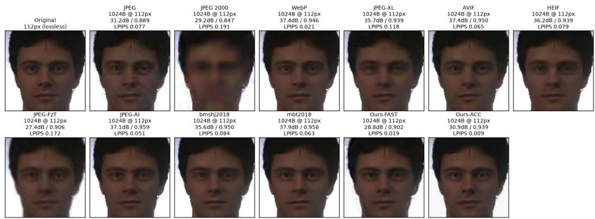  
Figure 1: What one kilobyte looks like. A single Color FERET capture (top left, lossless) and its reconstruction by every codec benchmarked in this report, each encoded to ≤1024 bytes at the 112 px verification working resolution. Tile captions give PSNR / SSIM and LPIPS on this crop, not cell medians. JPEG and JPEG 2000 visibly break down; the transform codecs hold structure but soften texture; the learned codecs keep the detail a matcher reads — Ours-ACCURATE reaches LPIPS 0.009, best in the row, while scoring lower on SSIM (0.939 vs 0.959): the perceptual-versus-distortion decoupling of Section 6. The crop is selected — the best-reconstructed of the 300-image subset the CompressAI baselines ran on, chosen so every column is populated. Across the full corpus Ours-ACCURATE trails JPEG-AI on SSIM (0.834 vs 0.920) and leads it on LPIPS (0.012 vs 0.060); the population figures are in Table 33.

## Contents

1 Introduction 6   
1.1 Motivation and use cases 6   
1.2 Problem statement 7   
1.3 Goals and scope 7   
1.4 Contributions 8   
1.5 Report roadmap 9   
Background and Related Work 9   
2.1 General-purpose image codecs 9   
2.2 Learned image compression 10   
2.3 Face-specific compression 11   
2.4 Face-recognition models 12   
2.5 Image-similarity and quality metrics 12   
2.6 No-box adversarial attacks 13   
3 Datasets 14   
3.1 Color FERET 14   
3.2 AI-Solutions-KK 15   
3.3 Alignment and resolutions 16   
3.4 Verification pairs 17   
3.5 Demographic attributes 17   
Evaluation Protocol 19   
4.1 Face-recognition roster 20   
4.2 Verification-accuracy metrics 21   
4.3 Reconstruction-quality metrics 22   
4.4 Operating points . 22   
4.5 Statistical methodology 23   
4.6 Environment and per-codec settings 24   
5 Benchmark of Existing Codecs 25   
5.1 Rate-identity trade-off at the byte budget 25   
5.2 Equal-error rate across the grid . 26   
5.3 Operating-point accuracy: FNMR at fixed FMR 29   
5.4 Operating points at the 224 px source resolution 39   
5.5 The sub-1 kB error floor 42   
5.6 Per-matcher consistency 43   
5.7 Budget compliance: can the codec even hit the target? 50   
5.8 Headline ranking and discussion 54   
6 Reconstruction Quality 54   
6.1 Full-reference metric matrix 54   
6.2 Distortion does not predict identity 55   
6.3 Face image quality (FIQ) 57   
6.4 Visual comparison . 59   
6.5 Budget and resolution sweeps 60   
6.6 Codec properties and deployment characteristics 61   
6.7 Encode and decode speed . 62   
6.8 Why is JPEG-AI so slow, and can it be sped up? 63   
7 A Custom Identity-Preserving Codec 70   
7.1 Architecture 70   
7.2 Hard byte-budget container . 70   
7.3 Variable-rate gain and training 71   
7.4 Identity side-stream and refine head 73   
7.5 Results versus classical and JPEG-AI 75   
7.6 Held-out independent-matcher evaluation 76   
7.7 Known limitations 77   
7.8 Worst-case identity tail 79   
Trivial and Difficult Samples: What Makes a Face Hard to Compress 79   
Ablations and Preprocessing 84   
9.1 Resolution–information trade-off 84   
9.2 Preprocessing, measured through the codec 85   
9.3 Alignment tightness 87   
9.4 JPEG-FzT radius 89   
10 The ISO/IEC 29794-5 Annex E/F parameter tables 91   
10.1 How the annex parameters were derived 91   
10.2 Protocol 92   
10.3 Experiment 1 — are the annex parameters better than ours? 92   
10.4 Experiment 2 — is there a better set than either? 93   
10.5 Does self-similarity predict verification error? 95   
10.6 JPEG-AI . 96   
10.7 Recommendation to WG 3 97   
11 Demographic Fairness 97   
11.1 Subgroup equal-error rates 98   
11.2 Skin-tone effects 100   
11.3 Pose, age, and gender 101   
11.4 Disparity summary 102   
11.5 Fairness at the tighter 512-byte budget . 105   
11.6 Differential false-match rate (imposter acceptance) 106   
12 Compressed-on-Compressed Recompression 110   
12.1 Setup 110   
12.2 Delta-EER results . 111   
12.3 Generalization to AI-Solutions-KK . 113   
12.4 Worst-case chains 114   
12.5 Tighter 512-byte budget . 115   
13 Adversarial Robustness and Sanitization 116   
13.1 Threat model 117   
13.2 Attacks 117   
13.3 Compression as a defense . 118   
13.4 Ours-as-defense . 122   
13.5 Generalization to AI-Solutions-KK . 123   
14 Statistical Significance 125   
14.1 Method recap 125   
14.2 Pairwise codec comparisons 125   
14.3 Multiple-comparison correction 127   
14.4 Significance on AI-Solutions-KK . 128   
14.5 Rank-based analysis across the matcher roster 130   
15 Discussion, Limitations, and Roadmap 131   
15.1 What we have established . . 132   
15.2 Limitations and threats to validity 133   
15.3 Current pipeline state 134   
15.4 Remaining work . 135   
16 Conclusion 135   
17 Artifacts 137

## 1 Introduction

TL;DR We study how to compress an aligned face crop into at most a few hundred bytes so that it still verifies against its subject, benchmark ten off-the-shelf codecs uniformly, train a custom byte-budgeted identity-preserving codec, and probe resolution, fairness, recompression, and adversarial robustness.

Face images are increasingly stored not as photographs but as a handful of bytes inside a credential: a two-dimensional barcode on an identity document, a boarding pass, or a smartcard chip. In these settings the storage budget is fixed and tiny, yet the stored face must remain usable by an automated matcher long after capture. This report asks how far a learned, byte-budgeted compressor can be pushed while preserving the identity signal a modern face-recognition (FR) model relies on, and how it compares against the full spread of general-purpose and face-specific codecs under a single, strict per-image budget.

## 1.1 Motivation and use cases

TL;DR Identity documents and machine-readable credentials can spare only a few hundred bytes for a face, so a recognizable face must survive extreme compression; this directly extends prior Innovatrics and NIST work on faces in 2D barcodes.

The driving use case is the machine-readable travel and identity credential. Standards bodies are moving toward Digital Travel Credentials in which a person’s identity is carried in a cryptographically signed, tamper-resistant token, and the natural carrier of that token is a 2D barcode such as a QR code printed on a boarding pass or document [28]. A barcode has very limited physical area, and once the digital signature, metadata, and error-correction overhead are accounted for, only a fraction of a kilobyte remains for the face photograph itself. The NIST Face Recognition Technology Evaluation report on preparing compact face images for 2D barcodes frames exactly this regime, studying target sizes on the order of a few hundred to roughly twelve hundred bytes across mainstream codecs and several recognition algorithms [25]. Our prior conference work in this line established that, at the one-kilobyte target, codec choice dominates downstream recognition accuracy and that some classical codecs largely fail to even reach the required size at full resolution [28]. This report extends that line: rather than only ranking off-the-shelf codecs, we train a compressor whose objective is identity preservation under a hard byte budget, and we broaden the study to fairness, recompression, and adversarial effects.

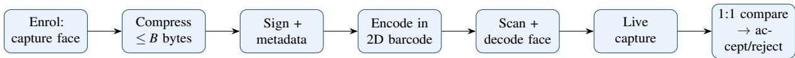  
Figure 2: The face-on-document workflow this study targets. At enrolment a face is compressed to a hard ≤ B-byte budget, signed with metadata, and encoded into a 2D barcode; at verification the barcode is scanned, the reference face decoded, and matched 1:1 against a live capture. The binding constraint is that the decoded face must still verify, not that it look perceptually perfect.

A second motivation is bandwidth- and storage-constrained verification more generally: enrolling or transmitting a face template-sized payload over a low-bandwidth channel, or storing many millions of reference faces where per-record size is the binding constraint. In all of these cases the relevant quality metric is not perceptual fidelity but whether the decoded face still verifies against the subject under a deployed FR model. The capture–compress–sign and then scan–match workflow that motivates this work is illustrated in Figure 2.

## 1.2 Problem statement

TL;DR Given an aligned face crop and a byte budget B, produce a bitstream of at most B bytes whose decoded image still verifies against the same subject; we evaluate B = 1024 and the harder B = 512.

We assume the input is a pixel-aligned face crop, so detection and alignment are out of scope and held fixed across all methods. The task is then: given such a crop and a hard byte budget B, produce a self-contained bitstream of at most B bytes such that, when decoded, the resulting image yields an FR embedding that verifies against an embedding of the same subject. “Verifies” is measured by the FR model’s score: the primary metric is the equal-error rate (EER), supported by the false non-match rate (FNMR) at fixed operating points and by statistical significance testing across methods.

Three properties make this regime distinctive. First, the budget is a hard ceiling, not an average rate: every single image must fit, which several classical codecs cannot guarantee at higher resolutions [25]. Second, the objective is identity, not appearance, so distortion that is perceptually visible may be harmless and, conversely, perceptually subtle changes may destroy the embedding. Third, the budget is small enough (hundreds of bytes) that resolution, color, and codec overhead all compete for the same scarce bits, forcing explicit trade-offs. We instantiate the problem at B = 1024 bytes and at a harder B = 512 bytes, on aligned crops rendered at 64, 96, 112, 168, and 224 pixels, with 112 px taken as the verification working resolution.

## 1.3 Goals and scope

TL;DR We benchmark off-the-shelf codecs uniformly, build and study a custom byte-budgeted codec, and run controlled studies of resolution, fairness, recompression, and adversarial robustness; detection and alignment are fixed and out of scope.

Following the task definition for this project, the work has four goals. (1) Benchmark as many relevant compression algorithms and settings as practical under one uniform protocol, including the choice of resolution, quality setting, and color, all at a fixed byte budget. (2) Evaluate a representative set of strong, open FR models so that conclusions are not tied to a single matcher. (3) Train a custom compression architecture aimed specifically at the sub-1 kB regime and at preserving identity rather than pixels. (4) Study second-order effects that matter for deployment: demographic and skin-tone bias, facial position and resolution, “compressed-on-compressed” recompression (because source images are typically already stored in some compressed form), and no-box adversarial perturbations injected before compression, including whether the codec can sanitize them.

The compared methods span classical and learned codecs: JPEG [43], JPEG 2000 [40], WebP [23], JPEG XL [1], AVIF [2], HEIF [39], the F-transform-based JPEG-FzT [35], and the learned JPEG-AI standard [5], together with learned baselines from the literature (bmshj2018 [7] and mbt2018 [33]). Against these we place our custom codec in two variants: Ours-FAST, a compact model of roughly 1.35 M parameters with no side stream, and Ours-ACCURATE, a larger model of roughly 18.7 M parameters with an identity side-stream and a refinement head. Both variants enforce the hard byte budget exactly via a binary search over a frozen 64-entry gain table and emit a self-describing container. Two datasets anchor the evaluation: Color FERET [36], a controlled set used as the clean, frontal benchmark, and AI-Solutions-KK, an in-the-wild set carrying Monk skin-tone, age, and gender attributes for fairness analysis. Four FR models serve as the primary identity anchors: arcface\_antelopev2 [19], lvface\_l, topofr\_r100, and edgeface\_xs [21]; a wider fourteen-model roster spanning ViT and CNN/IR backbones (the LVFace, EdgeFace, TopoFR, and CVLFace families) is used for the model-effect analysis that tests whether the codec ranking depends on matcher backbone (Section 5). Out of scope are face detection, landmarking, and alignment (held fixed), template-level protection or encryption, and any change to the FR models themselves, which we treat as frozen black boxes.

## 1.4 Contributions

TL;DR A uniform sub-1 kB/512 B benchmark of ten off-the-shelf codecs on two datasets and four FR models with statistical testing; a custom byte-budgeted identity-preserving codec in FAST and ACCURATE variants; and controlled studies of resolution, fairness, recompression, and adversarial sanitization.

This report makes three contributions.

(1) A uniform extreme-compression benchmark. We evaluate ten off-the-shelf codecs under a single protocol at fixed budgets of 1024 and 512 bytes, on two datasets (Color FERET [36] and AI-Solutions-KK) and four FR models (arcface\_antelopev2 [19], lvface\_l, topofr\_r100, edgeface\_xs [21]), reporting EER and FNMR with confidence intervals and pairwise statistical significance tests [9, 18, 31]. Coverage is not uniform across the ten: seven run on both datasets at all five resolutions, JPEG-AI runs on both but at 112 and 224 px only on AI-Solutions-KK, and the two CompressAI baselines were run on Color FERET alone, on a 300-crop subset. The protocol holds detection, alignment, pairing, and the budget identical across methods so that codec rankings are directly comparable. We further score the benchmark with a fourteen-model roster spanning ViT and CNN/IR backbones, and find that the matchers agree strongly on the codec ranking (Kendall’s W = 0.85 over all fourteen, rising to 0.89 once the four EdgeFace-family matchers are set aside) even though absolute EER tracks matcher capacity.

(2) A custom byte-budgeted identity-preserving learned codec. We design and train a codec whose loss targets identity preservation under a hard per-image byte ceiling, in two variants (Ours-FAST ≈ 1.35 M parameters, no side stream; Ours-ACCURATE ≈ 18.7 M parameters, with an identity sidestream and refine head). The budget is enforced exactly by binary search over a frozen 64-entry gain table and packed into a self-describing container, so the model guarantees the size constraint rather than approximating an average rate. We are candid about what the side-stream buys: an ablation (Section 7) shows it is not what carries the codec’s identity advantage — on matchers independent of its EdgeFace anchor it adds no measurable identity, and reallocating its 90–175 B to the spatial latent instead leaves independent-matcher identity unchanged (∆id-cos within ±0.005) while improving reconstruction PSNR by ∼0.8 dB. Ours-ACCURATE’s edge over Ours-FAST is therefore carried by the wider transform, not the headline side-stream; we report this as a negative result rather than overstate the component.

(3) Deployment-oriented studies. We quantify the resolution–information trade-off across 64– 224 px, audit demographic fairness using Monk skin-tone, age, and gender labels [34], measure the effect of recompressing already-compressed source images, and assess no-box adversarial perturbations applied before compression [22, 29], including whether compression sanitizes the attack.

## 1.5 Report roadmap

TL;DR The report proceeds from related work and datasets, through the evaluation protocol and codec benchmark, to our custom codec and a series of controlled studies, closing with discussion and conclusions.

The remainder of the report is organized as follows. Section 2 reviews related work on image compression and face recognition relevant to the sub-1 kB regime. Section 3 describes the two datasets and their attributes, and Section 4 fixes the evaluation protocol, metrics, and FR anchor models. Section 5 presents the uniform codec benchmark at the 1024- and 512-byte budgets, and Section 6 reports imagequality and visual comparisons. Section 7 introduces our custom byte-budgeted identity-preserving codec and its FAST and ACCURATE variants, and Section 8 examines which crops are hardest to compress and what makes them so. Section 9 then ablates the codec design and the preprocessing/resolution choices. Section 11 audits demographic fairness, Section 12 studies compressed-on-compressed recompression, and Section 13 examines no-box adversarial robustness and sanitization. Section 14 consolidates the statistical-significance analysis. Section 15 discusses implications and limitations, Section 16 concludes, and Section 17 indexes every machine-readable file the tables and figures are built from.

## 2 Background and Related Work

TL;DR We situate our work against six bodies of literature: general-purpose codecs, learned (neural) compression, face-specific codecs, face-recognition embedders, image-similarity/quality metrics, and no-box adversarial attacks. The recurring lesson is that at extreme rates perceptual quality and biometric utility diverge, that modern codecs decisively beat legacy JPEG, and that downsampling damages identity less than aggressive lossy compression.

The target of this report—compressing an aligned face crop to at most 1024 (and ideally 512) bytes while preserving the identity signal a matcher needs—draws on several distinct research areas. We review them in turn, emphasising the findings that motivate our design choices: the codec ladder we benchmark against, the learned-compression backbone our custom codec builds on, the identity-loss idea behind our two variants, the embedders we use as anchors, the metrics we report, and the threat model for our robustness study.

## 2.1 General-purpose image codecs

TL;DR The hand-engineered codec ladder runs JPEG → JPEG 2000 → WebP/HEIF → AVIF → JPEG XL, each following a transform–quantise–entropy-code pipeline; at extreme rates legacy JPEG is unfit and modern codecs (WebP, AVIF) are roughly 30–50% smaller at matched quality.

Classical lossy codecs all share a transform-coding pipeline: a fixed, hand-designed invertible transform decorrelates pixels, the coefficients are scalar-quantised, and an entropy coder removes statistical redundancy [43]. JPEG (DCT + Huffman, ISO/IEC 10918) is the baseline [43]; JPEG 2000 replaces the DCT with a wavelet transform and natively supports target-size encoding [40]. WebP codes intra frames with the VP8 toolset [23], HEIF/HEIC uses HEVC intra coding, AVIF uses royalty-free AV1 intra coding [2, 14], and JPEG XL combines a modular mode with VarDCT and supports lossless

JPEG transcoding and fast encoding [1]. At matched quality AVIF is roughly half the size of reference JPEG, against WebP’s roughly 30% saving [2, 23], while JPEG XL excels at high fidelity and HEIF is patent-encumbered, which matters for open identity standards [1].

Two findings from the compression-for-recognition literature directly shape our protocol. First, in the sub-1 kB regime legacy JPEG is obsolete: NIST SP 500-343 ranks WebP best, then AVIF, then HEIC, then JPEG 2000, and explicitly deprecates the JPEG variants for preparing faces for 2D barcodes [25]. Second, at a fixed byte budget, reducing resolution does less damage to the identity signal than aggressive lossy compression—the smallest widths tested showed the least shift in the mated-score distribution [25], a conclusion already reached by the earlier NIST IR 7830 study showing that pre-downsampling before JPEG often improves accuracy [37]. This is why we sweep resolutions (64–224 px) rather than fixing one, and why our custom codec downsamples internally. We also include JPEG-FzT, a hybrid that inserts a fuzzy F-transform preprocessing stage that stays backward-compatible with the JPEG bitstream while raising the compression ratio at equal quality [35].

## 2.2 Learned image compression

TL;DR Neural codecs replace the fixed transform with a jointly trained nonlinear autoencoder plus a learned entropy model; the lineage runs factorised prior → scale hyperprior → joint autoregressive → Gaussianmixture/attention, and the standardised JPEG-AI codec now beats VVC intra. We reuse this machinery, including continuous rate control via learned gain units.

Learned image compression reframes coding as an end-to-end optimisation problem: an analysis transform $g _ { a }$ maps pixels to a latent, a differentiable surrogate for quantisation (additive uniform noise, the straight-through estimator, or soft-to-hard annealing) makes training possible, and a learned entropy model estimates the rate, all trained jointly to minimise a rate–distortion Lagrangian $L = R + \lambda D$ [6]. The seminal end-to-end autoencoder already beat JPEG and JPEG 2000 [6]. The central architectural lineage is the entropy model: a fully factorised prior [6], then a scale hyperprior that transmits side information predicting per-element Gaussian scales [7], then a joint autoregressive-and-hierarchical prior that adds a masked-convolution context model and was the first learned method to beat BPG [33], then a discretised Gaussian-mixture model with attention reaching parity with VVC intra [15]. The reference toolbox is CompressAI, which re-implements these baselines (bmshj2018, mbt2018, cheng2020) with pretrained weights [8]; we use bmshj2018 and mbt2018 as learned baselines. The third, cheng2020 [15], is not part of this study: its serial autoregressive context model has no stable CUDA path on our hardware and falls back to a CPU decode too slow for a sweep of this size, so it is excluded rather than partially reported, and every codec count in this report is exclusive of it. JPEG-AI (ISO/IEC 6048-1) is the first standardised learned codec, a VAE-based design reporting BD-rate gains over VVC intra ranging from roughly 8% (base configuration) to roughly 29% (highest-complexity configuration) [5], and we include it among the compared methods.

A practical concern for a single deployable model is variable-rate coding. Rather than train one network per bitrate, learned per-channel “gain units” inserted at the encoder output and decoder input let a single model interpolate continuously between operating points [16]. Our custom codec adopts exactly this mechanism: it enforces a hard byte budget with a binary search over a frozen 64-entry gain table, selecting the highest-quality gain vector whose entropy-coded payload still fits the budget. A second relevant distinction is the rate–distortion–perception trade-off: distortion-optimised codecs (PSNR, MS-SSIM) produce blurry low-rate output, while perceptually or generatively optimised codecs trade measurable distortion for realism and can hallucinate detail—a behaviour that is dangerous when identity must be preserved [11]. This tension between realism and identity fidelity is the core risk our identity loss is meant to manage.

Table 2 collects the provenance and deployment properties of the twelve evaluated configurations — ten off-the-shelf codecs plus our two custom variants — introduced above — ownership, standardisation year, licensing, hardware-decoder availability, and the hard-budget fit rate — so that the codec landscape is visible before the results. Licensing splits the field (JPEG, JPEG 2000, WebP, JPEG XL, AVIF and the JPEG-AI reference software are royalty-free, whereas HEIF inherits HEVC’s patent pools and the CompressAI baselines ship under a BSD licence with an explicit patent non-grant); hardwaredecoder availability is inversely related to compression strength; and the fit-rate column previews the budget-compliance result quantified later (Section 5.7). Encode/decode latency is reported separately in Section 6.7.

Table 2: Codec provenance and deployment properties for the twelve evaluated configurations (ten off-the-shelf codecs and our two custom variants). $\mathrm { ^ { * } F i t } \le 1 \mathrm { k B ^ { \prime } }$ is the fraction of crops that reach the 1024-byte budget at 112/224 px, measured on Color FERET (n/a: the CompressAI baselines expose fixed quality presets rather than a byte target, so what they achieve is incidental rather than enforced and is reported separately in Section 5.7: at 112 px bmshj2018 reaches 59% and mbt2018 67%, at 224 px 47% and 66%, and they are measured at all five resolutions there, on their 300-crop subset). JPEG-AI holds the 1 kB budget wherever it was run; both Ours variants hold it at 64/112/224 px and emit the over-budget fallback frame on 10–13% of crops at 96 and 168 px. The budget bites hardest at 512 B — all quantified in Section 5.7. Encode/decode latency is measured separately in Section 6.7 (Table 36). Source for both Ours variants will be released under the MIT licence.
<table><tr><td>Codec</td><td>Owner / reference impl.</td><td>Std. year</td><td>Licensing</td><td>HW decode</td><td>Fit ≤1 kB (112/224)</td></tr><tr><td>JPEG</td><td>JPEG cmte.; libjpeg-turbo</td><td>1992</td><td>Royalty-free (expired)</td><td>Universal (ISP/GPU)</td><td>100/100</td></tr><tr><td>JPEG 2000</td><td>JPEG cmte.; OpenJPEG, Kakadu</td><td>2000</td><td>Part 1 royalty-free</td><td>Rare (specialized)</td><td>100/100</td></tr><tr><td>WebP</td><td>Google; libwebp</td><td>2010</td><td>Royalty-free (BSD-3)</td><td>None (SW; fast)</td><td>100/94</td></tr><tr><td>JPEG XL</td><td>JPEG cmte.; libjxl</td><td>2022</td><td>Royalty-free (BSD-3)</td><td>None (SW; 2026)</td><td>100/87</td></tr><tr><td>AVIF</td><td>AOMedia; libavif/dav1d</td><td>2019</td><td>Royalty-free (AOM)</td><td>Growing (recent SoCs)</td><td>100/100</td></tr><tr><td>HEIF</td><td>MPEG+Nokia; libheif/x265</td><td>2017</td><td>HEVC patent-encumbered</td><td>Ubiquitous (HEVC)</td><td>100/100</td></tr><tr><td>JPEG-FzT</td><td>Innovatrics / U. Ostrava</td><td>2021</td><td>Research; JPEG base RF</td><td>JPEG HW + SW pass</td><td>100/100</td></tr><tr><td>JPEG-AI</td><td>ITU-T/ISO WG1; ref. SW</td><td>2025</td><td>Royalty-free goal (BSD)</td><td>None yet (NPU/GPU)</td><td>100/100</td></tr><tr><td>bmshj2018</td><td>Ballé et al.; CompressAI</td><td>2018</td><td>BSD-3, patent non-grant</td><td>None (NN)</td><td>n/a</td></tr><tr><td>mbt2018</td><td>Minnen et al.; CompressAI</td><td>2018</td><td>BSD-3, patent non-grant</td><td>None (NN)</td><td>n/a</td></tr><tr><td>Ours-FAST</td><td>This work (learned)</td><td>2026</td><td>MIT (source to be released)</td><td>None (GPU/NPU)</td><td>100/100</td></tr><tr><td>Ours-ACCURATE</td><td>This work (learned, side-stream)</td><td>2026</td><td>MIT (source to be released)</td><td>None (GPU/NPU)</td><td>100/100</td></tr></table>

Decoder footprint and deployed encode cost. Two deployment characteristics not in Table 2 matter for the document-scanner scenario. Decoderfootprint: the classical codecs decode with library code only (kilobytes of binary, no model weights), whereas the learned codecs must ship a network — Ours-FAST is 1.35 M parameters (≈5 MB in FP32), Ours-ACCURATE 18.7 M (≈75 MB), and the JPEG-AI reference decoder is a substantially larger multi-hundred-MB neural model — so on constrained scanner silicon the classical/transform codecs and the tiny Ours-FAST are the deployable decoders while JPEG-AI and Ours-ACCURATE assume a capable host. Deployed encode: the single-shot latencies in the speed table (Section 6.7, Table 36) are per encode call, but the byte-budgeted codecs (the classical quality search and both Ours variants) run a binary search of ≈ 6 encodes to hit the hard budget, so a deployed budgetcompliant encode costs roughly 6× the tabulated figure. For Ours, a gain-CDF cache removes the ≈80% of encode cost that a cold rebuild would cost per gain, bounding the attainable warm-cache speed-up at up to ≈5× (Section 7); this is a bound derived from that percentage, not a measured end-to-end figure — §7 reports none. Decode is unaffected and remains single-shot.

## 2.3 Face-specific compression

TL;DR Faces are a low-entropy, strongly structured image class, so face-specific codecs (from eigenfaces to generative face video coding) win big on perceptual metrics but risk identity hallucination at extreme rates; the most relevant idea for us is fine-tuning a learned codec with an ArcFace identity loss to preserve recognition accuracy at equal bitrate.

Because faces carry strong, learnable priors (symmetry, the fixed arrangement of features) and human perception is exquisitely sensitive to identity, faces are the domain where model-based and generative coding beat general codecs by the widest margin—and where the rate–distortion–perception trade-off bites hardest, since at ultra-low rates a decoder must invent plausible detail that can drift from the true identity. The lineage runs from eigenfaces/PCA (a face as a weighted sum of principal components [42])

and MPEG-4 model-based coding through modern Generative Face Video Coding (GFVC), where a reference frame plus compact per-frame keypoints or semantics drive a generative decoder, achieving 50–75% BD-rate savings over VVC on perceptual metrics at the cost of pixel fidelity [13]. These video methods are now an active JVET standardisation effort but are out of scope for single-image credentials.

Most directly relevant to us is identity-preserving still-image compression: adding an ArcFace/ CurricularFace identity loss—cosine similarity between the embeddings of the original and the reconstruction—to a learned codec. Joint training of a compression network with a recognition network yields better face-verification accuracy at equal rate than JPEG or JPEG 2000 [10], and a recent codebook-quantisation method reports high recognition accuracy at very low bitrate by fine-tuning the decoder with an ArcFace identity loss [45]. The practical recommendation in this literature—take a general learned-codec backbone and fine-tune it with a face/identity loss rather than design a bespoke architecture—is the recipe behind both of our variants (Ours-FAST and Ours-ACCURATE). The cautionary note is equally important: identity drift is the kill criterion, and it must be validated with embedding cosine similarity on the target data, not with perceptual metrics alone.

## 2.4 Face-recognition models

TL;DR Modern matchers are embedding extractors mapping an aligned crop to a fixed-length vector compared by cosine similarity; we anchor our evaluation on four with public weights—ArcFace (antelopev2), LVFace, TopoFR, and the edge-efficient EdgeFace—spanning the accuracy/compute spectrum.

Almost every modern face-recognition model is an embedding extractor: it maps an aligned face crop (usually 112×112) to a fixed-length vector, and the same embedding serves verification (cosine similarity versus a threshold) and identification (nearest-neighbour search) [19]. ArcFace introduced the additive angular-margin loss that produces highly discriminative hypersphere embeddings and remains the de-facto open baseline [19]; the InsightFace antelopev2 pack ships a ResNet-100 ArcFace trained on Glint360K [19]. Recent academic leaders include LVFace, a ViT trained with progressive cluster optimisation that took first place on the MFR-Ongoing academic track [12], and TopoFR, which preserves the topological structure of the input space in the embedding via persistent homology [17]. For edge deployment, EdgeFace adapts an EdgeNeXt CNN–transformer hybrid with a low-rank linear layer, reaching strong accuracy at around 1.77 M parameters [21]. We use these four—arcface\_antelopev2, lvface\_l, topofr\_r100, and edgeface\_xs—as the anchor matchers so that conclusions are not tied to a single embedder. Two caveats from this literature shape our protocol: saturated benchmarks (e.g. LFW) are uninformative, so we report verification error directly on our data; and recognition accuracy varies across demographic groups, motivating our fairness study [24].

## 2.5 Image-similarity and quality metrics

TL;DR We separate fidelity metrics (PSNR, SSIM), perceptual metrics (LPIPS, DISTS), and the identity metric that actually matters here (embedding cosine similarity); the consistent finding is that perceptual quality is only a partial proxy for biometric utility, so identity cosine is our primary criterion.

Full-reference quality measures fall on a spectrum from signal fidelity to perception. Pixel-error metrics (MSE, PSNR) are trivial, differentiable, and genuine metrics, but correlate poorly with human perception and ignore spatial structure [44]. SSIM shifted the focus from error visibility to structural fidelity by comparing local luminance, contrast, and structure statistics, and is far better correlated with perception while remaining cheap and differentiable [44]; MS-SSIM extends it across scales [44]. Learned perceptual metrics improve further: LPIPS measures distance in deep feature space and predicts human similarity judgments far better than SSIM or PSNR [46], and DISTS unifies structure and texture similarity on deep features, tolerating texture resampling that defeats SSIM and LPIPS [20]. For comparing whole distributions of generated images (rather than pairs), FID/KID and CLIP-feature variants are standard [38].

Crucially for this work, none of these is a reliable proxy for recognition utility. A codec can look worse to a human yet match better, or vice versa—perceptual metrics correlate only partially with biometric utility, and generative codecs optimised for human preference can produce identity-altering reconstructions [28][32]. We therefore report PSNR, SSIM, LPIPS, and DISTS for context but treat the cosine similarity between the ArcFace embeddings of the original and the reconstruction (the embedthen-compare paradigm [19, 46]) as the primary distortion criterion, and downstream verification EER as the ultimate one.

## 2.6 No-box adversarial attacks

TL;DR No-box is the strictest threat model—no model access, no queries, only a handful of self-supplied images—so attacks rely entirely on transferability via tiny surrogates, foundation-model surrogates, or training-free frequency manipulation; we use it to test whether our codec’s compression incidentally sanitises such perturbations.

Why a compression report studies attacks. A codec in an identity pipeline is not only a storage decision; it is also the last image-domain operation before the matcher sees the face, and it is a lossy, low-pass, requantising one. That is precisely the class of transformation the adversarial-defence literature calls input purification. So the question this report has to answer is not “can we attack the matcher” but: when a face crop is squeezed to under a kilobyte, what happens to a perturbation that was already in it? Two deployment consequences follow. If compression destroys such perturbations, the byte budget buys a security property for free and a document pipeline gains a defence it did not pay for. If it does not — or worse, if the learned codecs preserve perturbations that the classical ones erase — then a codec chosen purely on identity-preservation grounds may quietly weaken the system. No-box is the right threat model for that question because it is the one an operational attacker actually faces: no access to the deployed matcher and no queries against it. The rest of this subsection sets up that threat model; the measurement is in Section 13.

The no-box setting assumes the attacker has no access to the victim model’s architecture, parameters, or training data, and cannot query it even once; the only resource is a small number of self-collected, in-domain images [30]. Because gradients and query feedback are unavailable, every no-box method relies on transferability—crafting perturbations on a self-supplied proxy and hoping they carry to the unseen victim. The building blocks are the standard white-box attacks reused inside the proxy: FGSM [22] and its iterative variant BIM/I-FGSM [29]. Three no-box families have emerged: training a tiny surrogate autoencoder from tens of domain images (the seminal prototypical-reconstruction attack, which cut a commercial celebrity-recognition API from 100% to about 15% accuracy using ten facial images) [30]; repurposing a generic foundation model such as CLIP [38] as the surrogate after marginaware fine-tuning [48]; and going fully training-free by suppressing and re-injecting high-frequency image components, which fooled ten ImageNet models at about 98% success [47].

The defensive angle is what matters for us. Standard input-purification defenses—JPEG compression, bit-depth reduction, randomised resizing—specifically blunt the small-perturbation and frequency-domain routes, because no-box perturbations target shared, often high-frequency, vulnerabilities [26]. Since aggressive lossy compression is itself a low-pass, requantising operation, we ask whether passing an adversarial face through our sub-1 kB codec incidentally sanitises the attack; the experiment and its sanitisation result are reported later (Section 13).

Table 3: The two evaluation datasets at a glance. The alignment target (ArcFace five-point template at {64,96,112,168,224} px) is identical for both; they differ only in imaging conditions and in where the five landmarks come from.
<table><tr><td></td><td>Color FERET</td><td>AI-Solutions-KK</td></tr><tr><td>Capture conditions Aligned images</td><td>controlled studio portraits 11,335</td><td>in-the-wild photographs 17,534</td></tr><tr><td>Identities</td><td>994</td><td>105</td></tr><tr><td>Verification pairs Landmark source</td><td>~64 M (all C(N, 2))</td><td>~153.7 M (all C(N,2))</td></tr><tr><td>Attribute provenance</td><td>shipped 23-pt annotation dataset-supplied ground truth</td><td>detector + landmarker</td></tr><tr><td>Attributes</td><td></td><td>model-estimated</td></tr><tr><td>Role in the study</td><td>pose, sex, age, ethnicity confirmatory, clean anchor</td><td>Monk skin tone, sex, age exploratory, in-the-wild stress</td></tr></table>

## 3 Datasets

TL;DR Two complementary face sets drive every experiment: Color FERET, a controlled frontal-portrait benchmark, and AI-Solutions-KK, an in-the-wild set carrying per-identity skin-tone, age, and gender labels. Both are aligned identically to five square resolutions (64–224 px), with 112 px as the verification working resolution.

We evaluate on two datasets chosen to bracket the operating envelope of a face matcher: one clean and frontal, one uncontrolled and demographically annotated. Crucially, both are aligned with the same canonical five-point template and the same family of similarity transforms, so the only intended difference between them is imaging conditions, not framing. This section describes each dataset, the shared alignment and resolution grid, the verification-pair protocol, and the demographic attributes used in the fairness study (Section 11 when referenced later). Table 3 contrasts the two datasets and their complementary roles.

## 3.1 Color FERET

TL;DR A controlled, frontal portrait dataset [36] of general subjects (not booking photos); after decoding and alignment it yields 11,335 aligned crops used as our clean, frontal benchmark.

Color FERET [36] is a controlled face-recognition benchmark collected under studio conditions: uniform lighting, plain backgrounds, and a standardized set of head poses per subject. We use it as the “clean” reference point of the study, where compression artefacts rather than capture nuisances dominate identity loss. The canonical set is decoded from an index-aligned image container of 11,338 source blobs paired with a ground-truth attribute table (gender, race, glasses, beard/mustache, pose code, and head-pose angles). Color FERET ships proprietary 23-point landmark annotations, so no face detector is run during preparation: we read the five ArcFace landmarks (eye centres, nose tip, mouth corners) directly from the annotation and similarity-transform each image onto the canonical template. After dropping images with incomplete landmark annotations, alignment yields 11,335 aligned crops spanning 994 subject identities, which form the Color FERET evaluation set. Because its attributes are dataset-supplied ground truth, Color FERET serves as the confirmatory anchor for the fairness analysis, complementing the model-estimated attributes of AI-Solutions-KK (below). Figure 3 shows example source captures as shipped and Table 4 the dataset’s ground-truth attribute distribution.

Color FERET: shipped sample images  
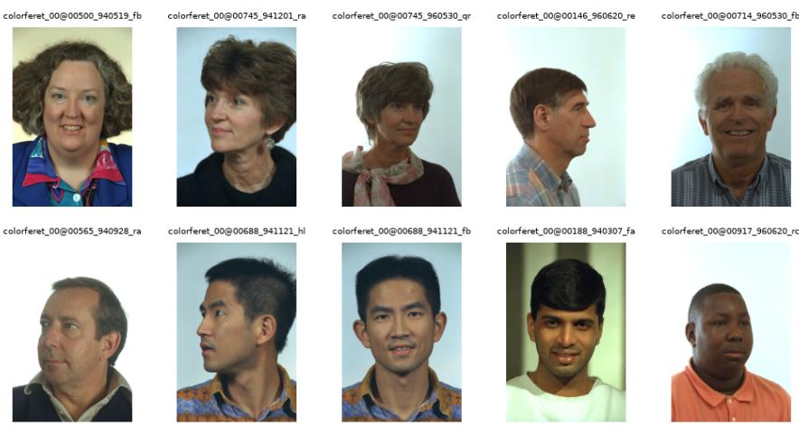  
Figure 3: Color FERET example face crops as shipped in the dataset. The verification pipeline operates on aligned-112 crops, as for KK; this panel shows the source imagery.

## 3.2 AI-Solutions-KK

TL;DR An in-the-wild dataset with per-identity Monk skin-tone, age, and gender attributes [34]; its verification protocol enumerates every C(N,2) pair (about 153.7 million) and scores all mated pairs against a fixed 5 M impostor sample (§4).

AI-Solutions-KK is an uncontrolled, “in-the-wild” face set: photos vary in pose, expression, illumination, background, and source resolution, so it stresses a codec on the conditions a deployed matcher actually faces. Unlike Color FERET, it ships only raw per-identity photos with no landmark annotations, so the five ArcFace landmarks are predicted by a face detector and landmarker before the same similarity-transform alignment is applied (detailed in Section 3.3). Each identity also carries a Monk skin-tone index [34], an estimated age, and an estimated gender, which makes KK the dataset for the demographic-fairness analysis.

The dataset comprises 17,534 aligned crops (the embedded evaluation set) drawn from 105 identities. Its verification protocol enumerates every unordered image pair C(N,2), which at this scale is approximately 153.7 million pairs (about 1.52 million mated and 152.2 million non-mated); scoring uses all mated pairs and the fixed 5 M impostor sample of §4. Example aligned crops are shown in Figure 4; the original source-image size distributions are reported under demographic attributes below.

Availability. Because every result in this report is computed on the aligned crops rather than the raw photos, alignment is part of the protocol and reproducing the benchmark requires exactly the crops we used. The two headline aligned resolutions — 112 × 112 and 224 × 224, produced by the pipeline of Section 3.3 — are published for AI-Solutions-KK and freely downloadable at https:// huggingface.co/datasets/Cha53c/1kb-face-aligned (35,068 images: all 17,534 crops at each of the two resolutions). The Color FERET crops are not part of that release. The remaining resolutions used in the resolution study (64, 96, 168 px) are not resamplings of the published crops: each resolution is warped directly from the source photograph with the same transform scaled by size/112 (Section 3.3), so reproducing them needs the source images and the same pipeline, not the released crops.

Table 4: Color FERET ground-truth attribute distribution over the 11,338 decoded captures. Percentages are of the whole corpus. The corpus is majority male (64.6%) and majority White (62.4%), which is why Color FERET is used as the confirmatory fairness anchor — its ethnicity subgroups below Hispanic carry too few images to support a per-group EER — while the in-the-wild AI-Solutions-KK set carries the skin-tone analysis (Section 11). The pose block is listed in full, so the frontal/non-frontal splits used later can be read off directly: the near-frontal conditions (frontal image, its repeat, and the two 15◦ turns) account for 32% of the corpus.
<table><tr><td>Attribute</td><td>Images</td><td>% of corpus</td></tr><tr><td>Gender</td><td></td><td></td></tr><tr><td>male</td><td>7,323</td><td>64.6</td></tr><tr><td>female</td><td>4,015</td><td>35.4</td></tr><tr><td>Race</td><td></td><td></td></tr><tr><td>White</td><td>7,079</td><td>62.4</td></tr><tr><td>Asian</td><td>2,646</td><td>23.3</td></tr><tr><td>Black</td><td>888</td><td>7.8</td></tr><tr><td>Hispanic</td><td>570</td><td>5.0</td></tr><tr><td>Pacific-Islander</td><td>99</td><td>0.9</td></tr><tr><td>Other</td><td>33</td><td>0.3</td></tr><tr><td>Native-American</td><td>23</td><td>0.2</td></tr><tr><td>Glasses</td><td></td><td></td></tr><tr><td>no</td><td>10,233</td><td>90.3</td></tr><tr><td>yes</td><td>1,105</td><td>9.7</td></tr><tr><td>Pose</td><td></td><td></td></tr><tr><td>frontal image</td><td>1,364</td><td>12.0</td></tr><tr><td>profile right</td><td>1,363</td><td>12.0</td></tr><tr><td>frontal image taken shortly after the previous image</td><td>1,358</td><td>12.0</td></tr><tr><td>half right</td><td>1,320</td><td>11.6</td></tr><tr><td>profile left</td><td>1,312</td><td>11.6</td></tr><tr><td>half left</td><td>1,267</td><td>11.2</td></tr><tr><td>quarter left</td><td>761</td><td>6.7</td></tr><tr><td>quarter right</td><td>761</td><td>6.7</td></tr><tr><td>head turned about 15 degree right</td><td>610</td><td>5.4</td></tr><tr><td>head turned about 45 degree left</td><td>321</td><td>2.8</td></tr><tr><td>head turned about 15 degree left</td><td>321</td><td>2.8</td></tr><tr><td>head turned about 45 degree right</td><td>290</td><td>2.6</td></tr><tr><td>head turned about 75 degree right</td><td>290</td><td>2.6</td></tr><tr><td>Total</td><td>11,338</td><td>100.0</td></tr></table>

## 3.3 Alignment and resolutions

TL;DR Both datasets are warped to the same canonical five-point template and emitted at five square resolutions (64, 96, 112, 168, 224 px), with framing held constant so resolution is the only variable; 112 px is the verification working resolution.

Both datasets are aligned to a single canonical five-point destination template (eye centres, nose tip, mouth corners) shared by every face-recognition model we benchmark, using a similarity transform (rotation, uniform scale, translation; no shear). The two sources differ only in how the five source points are obtained: Color FERET reads them from its shipped 23-point annotations, whereas AI-Solutions-KK predicts them with a face detector and landmarker. This shared target means the two datasets have identical framing, isolating imaging conditions as the only between-dataset difference.

For each image we emit one aligned crop at every resolution in {64,96,112,168,224} px. The template is defined at 112 × 112 and scaled by size/112 for the other resolutions, so all crops use the same framing and resolution is the only variable in the resolution study. Unless stated otherwise, 112 px is the working resolution for verification, with the remaining resolutions used to study the resolution–

Al-Solutions-KK: aligned-112 examples (10 random identities)  
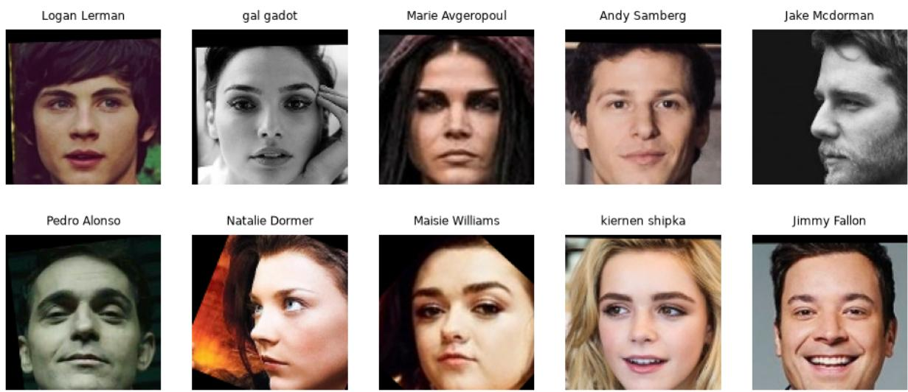  
Figure 4: AI-Solutions-KK: aligned-112 example crops, illustrating the in-the-wild variation in pose, expression, and illumination.

byte-budget trade-off.

## 3.4 Verification pairs

TL;DR We enumerate the complete pairwise matrix C(N,2) (same-identity pairs mated, different-identity non-mated) and score every mated pair; because the impostor set is $6 . 4 \times 1 0 ^ { 7 }$ pairs on Color FERET and $1 . 5 \times 1 0 ^ { 8 }$ on AI-Solutions-KK, EER/FNMR use a fixed seeded sample of at most $5 \times 1 0 ^ { 6 }$ impostor pairs, shared across all conditions (§4). Pairs are stored index-based for fast vectorized cosine scoring over precomputed embeddings.

Verification accuracy is measured over the complete pairwise matrix: for N aligned images, all $C ( N , 2 )$ unordered pairs are enumerated and labelled mated (same identity/subject) or non-mated (different identity/subject). For Color FERET this pair universe is roughly 64 million pairs over the ∼ 11.3 k aligned images; for AI-Solutions-KK it is the ∼ 153.7 million pairs described above. Scoring uses all mated pairs but, since the impostor count is intractable, a fixed seeded uniform sample of at most $5 \times 1 0 ^ { 6 }$ impostor pairs (identical across every codec, budget, and matcher; see §4); the 64/153.7 M figures therefore count the enumerated universe, while the scored impostor count is the capped $5 . 0 \times 1 0 ^ { 6 }$ . At this scale a textual name1,name2,label list would be many gigabytes, so pairs are stored index-based: a compact parquet of integer index pairs plus labels, alongside a small image-index table mapping each integer index to its relative path, identity/subject, the per-image alignment residual, and additionally the pose code (Color FERET) or the per-image detection score (AI-Solutions-KK). Scoring is then a vectorized cosine over the precomputed embeddings indexed by the integer pairs, and the index table lets the accuracy stage slice by pose, identity, or demographic group, and to restrict to compliant subsets, without re-reading the source labels.

## 3.5 Demographic attributes

TL;DR Each AI-Solutions-KK identity carries a Monk skin-tone index [34], an estimated age, and an estimated gender; together with the images-per-identity and original-size distributions, these drive the fairness study.

AI-Solutions-KK provides the demographic attributes used in the fairness analysis. Each identity carries a Monk skin-tone (MST) index on the 10-tone scale [34] (light to dark), an estimated age, and an estimated gender. These attributes are estimated automatically: age and gender from an off-the-shelf gender–age model run on the aligned 112 crops, and the MST index from a skin-tone estimator on the aligned 224 crops; because skin tone is per-identity stable while age/gender vary little within a session, the attributes are summarized per identity. Where a per-identity MST label and the individual image disagree — typically a light-skinned subject photographed in shadow — we fall back on the Individual Typology Angle (ITA), a CIELAB-derived per-image skin-tone measure computed over lit-side facial pixels on which higher angles mean lighter skin; ITA is what selects the skin-tone exemplars shown in Section 6. The resulting MST distribution is strongly concentrated: of the 105 identities, MST6 carries 45 and MST7 carries 30 — 71% of the set between them — while MST5, MST9, MST10 and MST8 carry only 12, 7, 5 and 4 identities respectively, and MST1 and MST2 a single identity each. A single-identity group admits no within-group impostor pair, so those two bins cannot yield a subgroup error rate and the fairness analysis reports the six groups MST5–MST10, the smallest of them resting on four subjects. Because these labels are model-estimated rather than curated, and the set is this unbalanced, the KK fairness results (Section 11) are exploratory and are read alongside the ground-truth Color FERET anchor. Figure 5 shows the MST, age, and gender distributions.

AI-Solutions-KK: Monk Skin Tone (1 img/identity, n=105)  
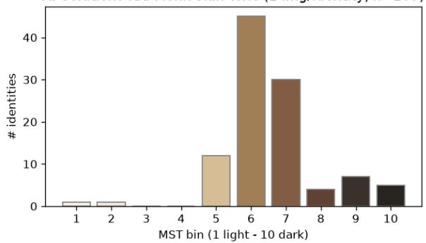  
(a) Monk skin-tone index.

AI-Solutions-KK: estimated age (n=840)  
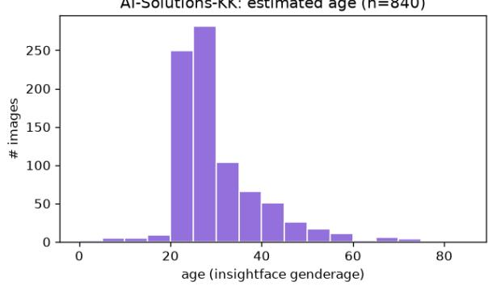  
(b) Estimated age.

AI-Solutions-KK: estimated gender (n=840)  
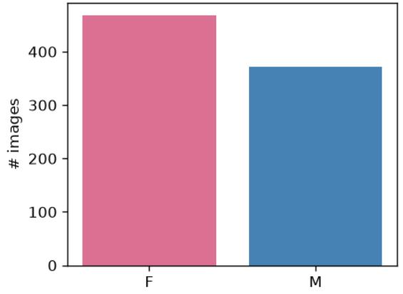  
(c) Estimated gender.

Al-Solutions-KK: images per identity (105 IDs)  
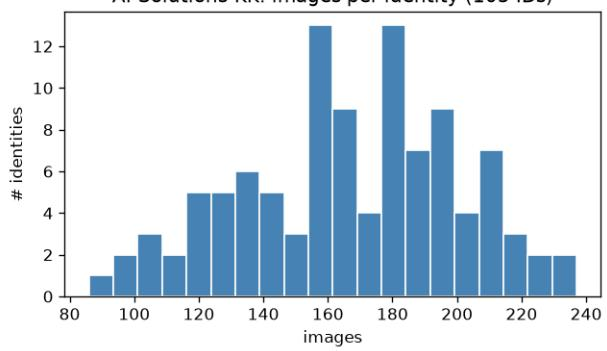  
(d) Images per identity.  
Figure 5: AI-Solutions-KK demographic and per-identity statistics: (a) Monk skin-tone index [34], (b) estimated age, (c) estimated gender, and (d) images per identity.

Beyond the demographic labels, the source photos vary widely in dimension and file size, which motivates the controlled alignment step above and contextualizes the sub-1 kB target against the original, uncompressed inputs. Figure 6 reports the distributions of original image dimensions and original (source) file sizes.

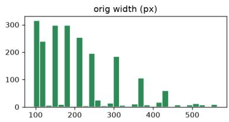

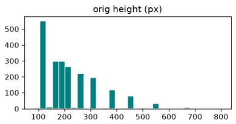  
(a) Original image dimensions (sampled).

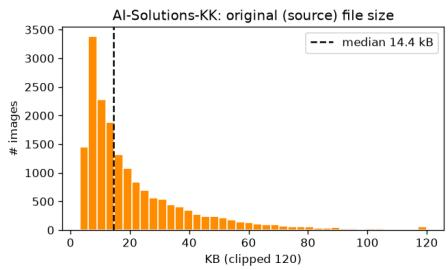  
(b) Original file size.  
Figure 6: AI-Solutions-KK source-image statistics before alignment: (a) original width/height distributions and (b) original file-size distribution.

## 4 Evaluation Protocol

TL;DR We score every codec at every operating point along two axes that matter for sub-1 kB face compression: how well a reconstruction preserves the identity signal a matcher needs (verification accuracy) and how faithfully it reproduces the pixels (reconstruction quality), with all comparisons made against a lossless aligned reference and backed by paired significance tests.

This section fixes the measurement apparatus the rest of the report relies on: the face-recognition (FR) identity probes, the verification-accuracy metrics computed from their similarity scores, the reconstructionquality metrics computed on the pixels, the resolution/budget grid of operating points, and the statistical machinery for deciding whether a difference between two conditions is real. Figure 7 summarises the five-stage pipeline and the grid it runs over. All numbers reported here come from the accuracy and quality pipelines; this section describes only how they are computed, not the values themselves, which appear in the results sections that follow. Every headline number is also re-derived from those committed outputs into a machine-readable findings register, tracing each quantitative claim to the dataset, matcher, and operating point that produced it. The artifacts are catalogued in Section 17.

Which table is authoritative for which metric. Because the report cross-refers many tables, we state once which is the source of record per metric. Identity cosine (reconstruction vs. original): Tables 7, 8, 40 and 41, all measured with the held-out proprietary inno-balanced embedder at the 112 px matcher input (defined below). Note that the id-cosine tail table, Table 43, instead reports arcface\_antelopev2 percentiles, so its medians differ from the inno-balanced medians of the codeccomparison tables for the same cell (a matcher difference, not an inconsistency) — e.g. Ours-ACCURATE at Color FERET/112 px/512 B is 0.910 under inno-balanced (Tables 8 and 41, the 112 px sources; Table 40 is the 224 px companion and prints 0.797 for that variant) versus 0.874 under ArcFace (Table 43); each id-cos table below names its embedder and its source resolution in the caption. Verification accuracy (EER, FNMR@FMR): the rate–EER grids (Tables 9–16) and the operating-point FNMR tables (Tables 17–23). Full-reference image quality (PSNR/SSIM/MS-SSIM/LPIPS/DISTS): the quality matrix, Table 33, is the fullest per-resolution source. The PSNR/SSIM/LPIPS columns of the codec-comparison tables (Tables 7, 8, 40 and 41) are computed at the codec’s native resolution and reconcile with the quality matrix; only the identity cosine in those tables is measured at the 112 px matcher input (an earlier draft computed the codec-comparison fidelity at 112 px too, which disagreed with the quality matrix at 224 px; that is fixed).

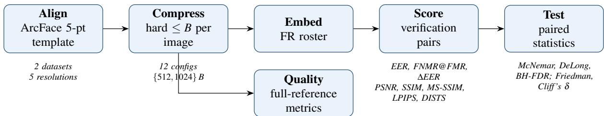  
Figure 7: The measurement pipeline. Every codec passes through the identical five stages; the grid is 2 datasets × 12 configurations (10 off-the-shelf codecs + Ours in two variants) × 5 resolutions × 2 byte budgets, embedded by up to 14 FR models. Identity (right branch) and pixel fidelity (lower branch) are always reported as separate axes.

## 4.1 Face-recognition roster

TL;DR Four embedding models of different families and sizes act as the identity probes, chosen from a wider validated roster of fourteen so that conclusions do not hinge on a single matcher.

A codec that preserves identity for one matcher may discard exactly the features another matcher relies on, so we evaluate against a panel of FR models rather than a single reference. The panel comprises four anchor matchers, selected to span architecture families, parameter budgets, and training regimes:

• arcface\_antelopev2 — a ResNet-100 ArcFace model [19], our high-capacity reference matcher;

• lvface\_l — a large-variant matcher used as an independent high-capacity cross-check [12];

• topofr\_r100 — a ResNet-100 TopoFR matcher [17] used as a second independent high-capacity probe;

• edgeface\_xs — the extra-small EdgeFace model [21], a deliberately lightweight, edge-deployable probe that stresses whether a reconstruction survives a low-capacity matcher.

These four anchors are drawn from a wider roster of fourteen models validated on the aligned reference imagery: arcface\_antelopev2, cvlface\_ir101, cvlface\_vit\_b, edgeface\_base, edgeface\_s, edgeface\_xs, edgeface\_xxs, lvface\_b, lvface\_l, lvface\_s, lvface\_t, topofr\_r50, topofr\_r100, and topofr\_r200. From this roster we designate four anchors for the headline results — arcface\_antelopev2, lvface\_l, topofr\_r100, and edgeface\_xs — chosen to span the high-capacity ResNet/ViT families and the lightweight edge-deployable end of the spectrum; reporting four keeps the result tables legible while retaining diversity in matcher capacity and inductive bias. Every model consumes the same aligned face crop at the working resolution, emits a fixed-length embedding, and scores a pair by cosine similarity. The model identifier is carried through the model column of the master accuracy grid, so every accuracy figure can be read per matcher.

The held-out identity-cosine metric (inno-balanced). The identity-cosine figures in the codeccomparison and custom-codec tables (Tables 7, 8, 40 and 41) are not produced by any of the fourteen roster matchers above. They are computed with a separate proprietary Innovatrics production embedder, inno-balanced — the balanced accuracy/speed operating point of Innovatrics’s {fast, balanced, accurate} face-model family, a 512-dimensional ONNX model. It is held out ofcodec training: the learned codec is optimised against a differentiable EdgeFace identity loss (Section 7.4) and inno-balanced is used only at evaluation, so its cosine measures generalisation rather than agreement with the training objective. Being a distinct production model — not the EdgeFace anchor used in the training loss, and not one of the four evaluation anchors (ArcFace, LVFace-L, TopoFR-R100, EdgeFace-XS) — it is architecturally independent of both. Concretely, “id-cos” in those tables is the median, over a fixed comparison sample of n=64 held-out crops per cell (the “held-out set” referenced in those tables’ captions), of the cosine between the inno-balanced embedding of the reconstruction and of the original 112 px crop (higher is better). It is distinct from the held-out verification matcher cvlface\_ir101 of Table 42: the two are different held-out models, used for the id-cosine and EER cross-checks respectively.

## 4.2 Verification-accuracy metrics

TL;DR From each matcher’s cosine scores over positive and negative pairs we report the equal-error rate, the false non-match rate at three fixed false-match rates, and the change in EER caused by compression relative to the lossless aligned reference.

Identity preservation is measured in the 1:1 verification setting. For a given dataset, matcher, resolution, codec, and byte budget, we form a set of genuine (same-identity) and impostor (differentidentity) pairs, score each pair by cosine similarity between the two embeddings, and sweep a decision threshold to obtain the receiver-operating characteristic. Three pairing scenarios recur in the report and are named once here: compressed-vs-original (a compressed probe matched against its lossless aligned reference — the default asymmetric enrolment case used throughout the benchmark), compressed-vs compressed (both sides passed through the same codec, used in the recompression study, Section 12), and the original-vs-original ceiling (the lossless aligned reference matched against itself, i.e. the aligned baseline that upper-bounds achievable accuracy). Unless stated otherwise, results are in the compressed vs-original scenario against a single global aligned reference per matcher/resolution.

Pair sampling. We score all genuine (mated) pairs, but the full impostor set is intractable (∼64 M pairs on Color FERET and ∼153.7 M on AI-Solutions-KK; §3), so impostor pairs are a single seeded, uniform random sample capped at $5 \times 1 0 ^ { 6 }$ (the --sample-nonmated parameter, default 5000000, drawn once with a fixed seed). The identical impostor sample is reused across every codec, budget, and matcher, so EER/FNMR differences reflect the codec and not a change of denominator; when the full impostor count is below the cap (as on the smaller per-subgroup slices) all impostor pairs are used. This is the sense in which the protocol is “exhaustive on mated pairs, fixed-sample on impostor pairs”: the ∼64/153.7 M figures in §3 count the pair universe, while the scored impostor count is the capped $5 . 0 \times 1 0 ^ { 6 }$ . The counts are recorded in the n\_pos and n\_neg columns of the accuracy grid; for example, the Color FERET ArcFace condition uses on the order of $9 . 6 \times 1 0 ^ { 4 }$ genuine and the capped $5 . 0 \times 1 0 ^ { 6 }$ impostor pairs. A handful of cells left from early tiny-pair runs carry a small n\_neg; the table generators always select the fully-populated row for a given cell and treat a residual small-n duplicate as superseded.

We summarise each ROC with the following quantities, each a column of the accuracy grid:

EER (eer). The equal-error rate — the operating point where the false match rate (FMR) equals the false non-match rate (FNMR). A single threshold-free scalar; lower is better.

FNMR at fixed FMR (fnmr\_0.01, fnmr\_0.001, fnmr\_0.0001). The false non-match rate at falsematch rates of $1 0 ^ { - 2 } , \ 1 0 ^ { - 3 }$ , and $1 0 ^ { - 4 }$ . These trace the high-security tail of the ROC that the EER alone hides; the $1 0 ^ { - 4 }$ point is the most demanding and the most sensitive to compression artefacts.

Reference EER (eer\_aligned) and ∆EER (delta\_eer). The EER of the lossless aligned reference for the same matcher/resolution, and the signed change in EER induced by compression, ∆EER = $\mathrm { E E R } _ { \mathrm { c o d e c } } - \mathrm { E E R } _ { \mathrm { a l i g n e d } } .$ . ∆EER is our headline identity-preservation metric: a value near zero means the codec costs essentially no verification accuracy, a positive value quantifies identity damage, and a (rare) negative value indicates the compressed image scores marginally better than the uncompressed reference for that matcher.

Anchoring every figure to the same lossless aligned reference is what makes the comparison fair: ∆EER isolates the effect of the codec from the intrinsic difficulty of the dataset and the matcher. The lossless aligned condition itself appears as a row in the accuracy grid (with the codec field empty and eer\_aligned blank), and serves as the zero of the ∆EER axis throughout the report.

## 4.3 Reconstruction-quality metrics

TL;DR Independently of any matcher, we measure how faithfully each codec reproduces the pixels using a fidelity ladder of five metrics — PSNR, SSIM, MS-SSIM, LPIPS, and DISTS — that runs from pixel error to learned perceptual similarity.

Verification accuracy tells us whether identity survives, but not how a codec fails the pixels, so we also report classical and perceptual reconstruction quality. For each dataset/codec/resolution/budget cell, the quality pipeline compares each compressed crop against its lossless aligned source and averages over the cell; the per-cell sample count is the n column of the quality summary. The five metrics, in increasing order of perceptual sophistication, are:

PSNR (psnr). Peak signal-to-noise ratio in decibels — a log-scaled mean-squared-error fidelity measure; higher is better.

SSIM (ssim). The structural similarity index [44], which scores local luminance, contrast, and structure agreement in [0, 1]; higher is better.

MS-SSIM (ms\_ssim). The multi-scale extension of SSIM, aggregating structural similarity across a resolution pyramid; higher is better.

LPIPS (lpips). The learned perceptual image patch similarity [46], a deep-feature perceptual distance; lower is better.

DISTS (dists). The deep image structure and texture similarity [20], a perceptual distance that balances structure and texture and is comparatively tolerant of texture resampling; lower is better.

The two distortion metrics (LPIPS, DISTS) are reported as distances, so for them lower values indicate better reconstructions, whereas the three fidelity metrics (PSNR, SSIM, MS-SSIM) are larger-isbetter. Crucially, reconstruction quality and verification accuracy are reported as separate axes and never collapsed into one score: a codec can post strong PSNR while still moving ∆EER, and a perceptually oriented codec can preserve identity while sacrificing pixel fidelity. Keeping the axes distinct lets the results sections expose exactly that tension at the sub-1 kB budget.

## 4.4 Operating points

TL;DR Every codec is evaluated on a grid of two hard byte budgets (1024 and 512 bytes) crossed with five face-crop resolutions (64, 96, 112, 168, and 224 px), with 112 px as the verification working resolution.

The central constraint of this study is a hard byte budget. We evaluate two operating points — 1024 bytes (the headline sub-1 kB target) and a more aggressive 512 bytes — recorded in the budget column of both the accuracy grid and the quality summary. Because the custom codec packs a self-describing container under a strict byte ceiling, the achieved size never exceeds the budget at the resolutions the container is tuned for (64, 112 and 224 px: 100% compliance for both variants on both datasets and both budgets — ≥ 99.98% for Ours-ACCURATE at 224 px on AI-Solutions-KK — with the single exception of Ours-FAST at 224 px/512 B); at the two intermediate resolutions (96 and 168 px) its rate floor overshoots the ceiling on a minority of crops, as quantified below. The median\_bytes column of the accuracy grid records the actual median encoded size per cell, so a reader can verify that each condition genuinely respects its ceiling rather than averaging over it.

Scoring rule for budget-non-compliant encodes. JPEG-AI, and the custom codec at 64/112/224 px, enforce the ceiling exactly, but a block codec cannot always reach a small budget at a given resolution (e.g. JPEG at 224 px/512 B). Our rule is uniform and introduces no selection bias: each codec is driven to the largest quality/rate setting whose encode is ≤ B bytes, and when no setting fits we score the smallest available encode (which then exceeds B) rather than dropping the crop — we never exclude a crop for being over budget and never re-encode to force compliance. The per-(resolution, budget) fit-rate — the fraction of crops that actually met the ceiling — is reported separately (Section 5.7), and an EER/FNMR cell whose fit-rate is well below 100% must be read together with that fit-rate. The rate–EER and FNMR tables carry no per-cell budget marker, so we name the non-compliant custom-codec cells once, here: both variants fit 100% of crops at 64 and 112 px on both datasets and both budgets, but at the intermediate resolutions Ours-ACCURATE fits only 80/90% of crops at 96 px and 80/90% at 168 px on Color FERET (79/90% and 79/90% on AI-Solutions-KK), and Ours-FAST only 74/87% at 96 px, 50/88% at 168 px and 80/100% at 224 px on Color FERET (74/87%, 9/87% and 14/100% on KK), quoted as 512 B/1024 B. Those cells are budget violations rather than compliant operating points. None of them carries a headline claim: every 112 px result and the 224 px/1024 B headline cell are fully compliant for both variants. Two coverage caveats follow directly. (i) For the CompressAI learned baselines (bmshj2018, mbt2018) only crops with a stored compressed file were embedded, so their 1024/512 B budget-sweep cells rest on a small, more-compressible subset $( n _ { \mathrm { n e g } } \approx 3 . 4 \mathrm { k } )$ and are highvariance; the apparently non-monotone mbt2018 budget behaviour in the sweep (EER 2.50% at 1024 B but 1.33% at 512 B, §5.5) is a coverage/selection artefact of that reduced subset, not codec behaviour — the full-coverage 960/768 B cells $( n _ { \mathrm { n e g } } = 5 \mathbf { M } )$ are monotone and low (0.13–0.21%). (ii) In the JPEG-AI timing/decoder study (Section 6) the reference encoder is rate-matched to its nearest point, 1108–1113 B (∼8.5% over the ceiling), so that study’s decoder-profile verdict is read at a slightly non-compliant operating point, as noted there.

Each budget is crossed with five face-crop resolutions — 64, 96, 112, 168, and 224 pixels — carried in the res column. Resolution is a first-class variable because, under a fixed byte budget, raising the resolution spends the same bits over more pixels: there is a trade-off between spatial detail and per-pixel fidelity that interacts with the matcher. Unless noted otherwise, 112 px is the verification working resolution, matching the native input size of the anchor matchers; the other resolutions support the dedicated resolution study. The full 2 × 5 budget/resolution grid yields the ten-column rate–EER tables used throughout the benchmark, which are populated per dataset and matcher in Section 5. The two headline budgets (1024/512 B) are crossed with all five resolutions; to test the sub-kilobyte “elevated-error floor” hypothesis we additionally compress the intermediate budgets 768 and 960 B at 112 px (Section 5.5). The higher budgets (1536/2048 B) and the extra resolutions (80/160/256 px) remain descoped to keep the compress-plus-re-embed cost tractable.

## 4.5 Statistical methodology

TL;DR Differences between conditions are tested with paired statistics — McNemar on match decisions, DeLong on ROC-AUC — and the resulting p-values are corrected for multiple comparisons with the Benjamini–Hochberg false-discovery-rate procedure.

The result grid is large — the product of datasets, four matchers, twelve configurations (ten off-theshelf codecs plus two custom variants), five resolutions, and two budgets — so a difference in a headline metric can easily be noise, and running many tests inflates the chance of a spurious “significant” result. We therefore (i) use paired tests that exploit the fact that every codec sees the same pairs over the same source images, and (ii) apply a multiple-comparison correction across the whole family of tests.

McNemar paired test [31]. Compares the match decisions of two conditions on the identical set of pairs at a fixed operating threshold. By conditioning on the discordant pairs — those one condition gets right and the other wrong — it tests whether two codecs differ in verification accuracy while controlling for the shared difficulty of the pairs.

DeLong test [18]. Compares two correlated ROC curves by testing the difference in their areas under the curve (AUC). Because the two ROCs are computed from scores on the same pairs, their AUC estimates are correlated; DeLong’s covariance-based statistic accounts for that correlation, giving a threshold-free significance test that complements the threshold-specific McNemar test.

Table 5: Hardware and software environment.
<table><tr><td>Component</td><td>Detail</td></tr><tr><td>OS</td><td>Ubuntu 24.04.1 LTS (Linux)</td></tr><tr><td>CPU</td><td>2× Intel Xeon E5-2683 v4 @ 2.10 GHz (16C/32T each; 64 threads)</td></tr><tr><td>RAM</td><td>503 GB</td></tr><tr><td>GPU</td><td>NVIDIA RTX 2080 Ti (11 GB) — latency reference; Quadro RTX 6000 (24 GB) in fleet</td></tr><tr><td>Python / PyTorch Codec libs</td><td>3.11 / 2.10.0 (CUDA 12.8), torchvision 0.25.0</td></tr><tr><td>Learned/quality Numerics</td><td>Pillow 12.2.0, pillow-heif 1.4.0 (libheif/x265 + libaom), pillow-jxl-plugin 1.3.7 (libjxl) compressai 1.2.8, onnxruntime-gpu 1.23.2, timm 1.0.24, 1pips 0.1.4, pytorch-msssim 1.0.0</td></tr></table>

Benjamini–Hochberg FDR correction [9]. Controls the expected proportion of false discoveries across the full family of pairwise tests. We report adjusted p-values (or, equivalently, the BH-rejection decision at a fixed false-discovery rate) so that a claim of “significantly better” survives the multiplicity of comparisons rather than being an artefact of running hundreds of tests.

Kendall’s W (concordance). Asks whether the ranking of codecs is the same across matchers. Each matcher ranks the codecs by EER; W measures how much those rankings agree, from 0 (no agreement beyond chance) to 1 (identical orderings). It is the statistic behind the “backboneinvariant” claim: a high W means a codec chosen on one matcher is the codec you would have chosen on any of them.

Cliff’s δ (effect size). A non-parametric effect size for codec-vs-codec comparisons over the matcher roster: the probability that codec a has the lower EER on a randomly chosen matcher, minus the reverse, so δ = −1 means a wins on every matcher. It ranges [−1, 1]. We report it alongside the significance tests because with fourteen matchers a p-value says only that an ordering is consistent, not that it is large: |δ| reads conventionally as <0.147 negligible, <0.33 small, <0.474 medium, above that large.

Throughout the report, a stated difference between two codecs (or between a codec and the lossless aligned reference) is called significant only when it passes the relevant paired test after Benjamini– Hochberg correction at a false-discovery rate of q = 0.05 (i.e. an adjusted McNemar p < 0.05). The significance pipeline that produces these tests is scripts/generate\_significance.py.

## 4.6 Environment and per-codec settings

TL;DR All results were produced on the hardware and software stack in Table 5, with each codec driven at the settings in Table 6; the latency claims (§6) and the fine-grained cross-codec gaps must be read against this fixed environment, since speed/effort presets and chroma handling (§11) are known confounds.

The ms-level encode/decode latencies (Section 6) and every cross-codec comparison depend on hardware and on the exact encoder settings, so we pin both here. Classical-codec CPU timings are single-core (pinned with taskset); the learned codecs and JPEG-AI are timed on one GPU. Two settings are deliberate confounds we do not hide: WebP runs at maximum effort (method=6) whereas AVIF and JPEG XL use their library-default speed presets, and chroma subsampling is each library’s default (JPEG and WebP 4:2:0). Both bias the fine gaps between the modern codecs; the qualitative rankings (which codecs survive 512 B, which collapse) are robust to them, and Section 11 flags the chroma confound explicitly.

Table 6: Per-codec encoder configuration. “Quality search” means the largest setting whose encode is ≤ B bytes is selected per crop (§4); the search is capped at quality 94 (not 100) to skip the near-lossless plateau, where quality increments add bytes without changing the reconstruction at these tiny budgets.  
Codec Library / backend Rate control and key settings   
JPEG Pillow / libjpeg quality search 2–94, optimize=True, default 4:2:0 chroma   
WebP Pillow / libwebp quality search 2–94, method=6 (max effort)   
AVIF pillow-heif / libaom (AV1) quality search 2–94, default speed preset   
HEIF pillow-heif / x265 (HEVC) quality search 2–94, default preset   
JPEG XL pillow-jxl / libjxl quality search 2–94, default effort   
JPEG 2000 Pillow / OpenJPEG rate mode, ratio 8–400:1 binary-searched to the byte budget   
JPEG-AI ITU-T T.840.1 reference SW analytic bits-per-pixel (bpp) target searched to budget; profile SOP (BOP/HOP in §6)   
JPEG-FzT reference C++/Qt implementation face-tuned transform codec at the target budge   
Ours-FAST / ACCURATE this work (PyTorch) binary search over a frozen 64-entry gain table to ≤ B; ACCURATE adds an EdgeFace-S identity side-stream + refine head   
bmshj2018 / mbt2018 compressai pretrained hyperprior / joint models, nearest rate point ≤ B (partial coverage, §4)

## 5 Benchmark of Existing Codecs

TL;DR At 1024 B the split is easy: on Color FERET/ArcFace, JPEG-AI and the modern block codecs (WebP, AVIF, JPEG XL, HEIF) preserve identity at 112 px with equal-error rates well under 0.5%, while JPEG 2000 is already an order of magnitude worse and plain JPEG is borderline. At 512 B the field re-sorts — AVIF, HEIF and JPEG XL join the collapse, and only WebP, JPEG-AI and the byte-budgeted learned codecs survive. That re-sort, not the 1024 B ranking, is the operational result of this section: a codec chosen at 1 kB is not the codec to deploy at half that.

This section evaluates the off-the-shelf codecs at the two hard operating points of this study, 1024 and 512 bytes per aligned crop, before introducing the trained codec in its own right. We report two complementary views. First, a rate–identity trade-off measured directly on the reconstructed pixels: identity cosine between the embedding of the original and of the decoded crop, alongside the standard distortion metrics PSNR, SSIM [44] and LPIPS [46]. Second, the end-to-end verification consequence: equal-error rate (EER) on the verification pair lists, swept across the resolution/budget grid for all four anchor matchers. The first view tells us how much identity signal survives a single round-trip; the second tells us whether that surviving signal is enough to keep a deployed matcher’s error rate low.

## 5.1 Rate-identity trade-off at the byte budget

TL;DR At 1024 B, JPEG-AI leads on identity cosine (∼0.95) with our codec next; halving the budget to 512 B widens the gap sharply and pushes JPEG and JPEG 2000 to near-random identity.

We first hold the byte budget fixed and compare what each codec returns. Every codec is driven to land just under the budget, and we report the median over the held-out crops of identity cosine (↑), PSNR (↑, dB), SSIM (↑) and LPIPS (↓). Table 7 reports the 224 px source resolution and Table 8 the 112 px verification working resolution, each for Color FERET and AI-Solutions-KK at both budgets.

At 1024 B, JPEG-AI [5] is the strongest learned-standard codec on identity: id-cosine 0.958 on Color FERET and 0.948 on KK at 224 px. Our trained codec (Ours-ACCURATE) is the runner-up on Color FERET at 0.947, while on KK the two Ours variants take second and third (Ours-FAST 0.941, Ours-ACCURATE 0.934), placing Ours-ACCURATE between JPEG-AI and AVIF [2] on both sets; the modern block codecs WebP [23] and AVIF cluster just below (0.89–0.90 on Color FERET). At the 112 px verification working resolution the ranking inverts: Ours-ACCURATE leads JPEG-AI on identity cosine (0.948 vs 0.930 on Color FERET; 0.938 vs 0.921 on KK). Plain JPEG [43] and JPEG 2000 [40] collapse at this budget: at 224 px on Color FERET, JPEG id-cosine 0.610 and JPEG 2000 0.585, i.e. around 40% of the identity signal already lost in a single compression pass.

Notably, our codec wins on perceptual fidelity (LPIPS) even where it trails on PSNR/SSIM: at 112 px/512 B on Color FERET it reaches LPIPS 0.018 versus 0.148 for JPEG-AI (and 0.111 vs 0.281 at the 224 px source resolution), reflecting its perceptual training objective rather than a pixel-MSE objective. Halving the budget to 512 B widens every gap. JPEG-AI retains 0.865 id-cosine on Color FERET while JPEG 2000 drops to 0.228 and JPEG to 0.357; on KK the legacy codecs are similarly degraded (JPEG 2000 0.221). Our codec holds 0.797 (Color FERET) and 0.776 (KK) at 512 B, ahead of AVIF on Color FERET. At the 112 px working resolution the ordering is broadly the same but compressed slightly: on Color FERET the modern codecs and our codec stay above 0.85 id-cosine at 1024 B, though on AI-Solutions-KK both HEIF and Ours-FAST dip to 0.844 (just below 0.85); JPEG remains usable (0.851 Color FERET, 0.834 KK) at 1024 B but collapses at 512 B (id-cosine 0.069 Color FERET).

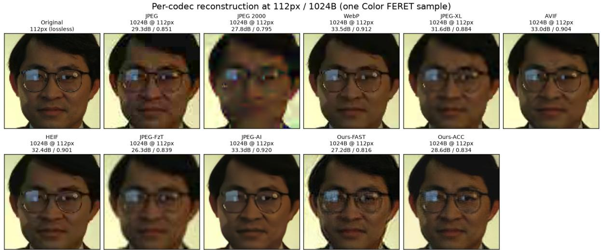  
Figure 8: Per-codec reconstruction at the 1 kB operating point (112 px), one Color FERET sample, including the learned codecs. JPEG and JPEG 2000 block and ring; the modern transform codecs and JPEG-AI stay clean; Ours-FAST and Ours-ACCURATE reconstruct recognisable, colour-correct faces. Tile captions give the dataset-median PSNR/SSIM of each codec’s cell.

Which codec is weakest depends on the cell, and JPEG-FzT is the reason. At 1024 B it is a mid-field performer — 0.870 id-cosine at 224 px and 0.862 at 112 px on Color FERET, ahead of Ours-FAST at the working resolution — but it degrades faster than any other codec as the budget halves, because its F-transform stage fixes a downsampling ratio before the inner JPEG ever sees the rate target. At 224 px/512 B it is, on Color FERET, the worst codec in the table on every fidelity column and on identity (0.104, below JPEG 2000’s 0.228; on KK it ties JPEG 2000 on identity at 0.221 and is worst on PSNR and SSIM, JPEG 2000 taking the worst LPIPS); at 112 px/512 B the ordering instead runs JPEG (0.069) < JPEG 2000 (0.193) < HEIF (0.309) < JPEG-FzT (0.466). So JPEG 2000 is the most consistently poor codec across the grid, but it is not the floor everywhere: at the full source resolution and the tight budget, JPEG-FzT is.

Figure 8 isolates the 1 kB operating point across codecs, showing what each one returns for the same byte budget.

## 5.2 Equal-error rate across the grid

TL;DR Sweeping EER over five resolutions and two budgets, the modern block codecs and JPEG-AI keep 112 px EER well under 0.5% at 1024 B on Color FERET/ArcFace, whereas JPEG inflates it a few-fold and JPEG 2000 by one to two orders of magnitude.

The pixel-level trade-off above predicts, but does not establish, verification behaviour; a deployed matcher is judged by its error rate. Tables 9 through 12 give the EER (%) grid on Color FERET for the four anchor matchers, with columns spanning the five resolutions (64/96/112/168/224 px) at both budgets and a no-compression aligned (ref) baseline row. The corresponding KK grids are in Tables 13 through 16.

The 112 px/1024 B column tells the headline story. On Color FERET/ArcFace [19], the aligned reference EER is 0.04%; WebP (0.09%), AVIF (0.09%), JPEG XL [1] (0.19%), HEIF (0.18%) and JPEG-AI (0.09%) all stay well under 0.5% at this budget, i.e. within striking distance of the uncompressed matcher. No cell of this anchor grid is exactly 0.00%; the only exactly-zero EER cells anywhere in the grid are three CompressAI-baseline cells scored on the 300-crop Color FERET subset (bmshj2018 × ArcFace at 64 px, and mbt2018×CVLFace-IR101 at 96 and 224 px). A 0.00% entry (and a bootstrap CI of 0.00–0.00) means no genuine/impostor score overlap in this finite sample, not error-free recognition; such cells are sample-limited and should be read as “below the resolution of the 105/994-identity test set.”

Table 7: Single-pass rate–identity trade-off at 224 px (medians on the held-out set), at the 1024 B and 512 B budgets, for the ten-codec roster (seven classical/transform codecs, JPEG-AI, and the two Ours variants). id-cos is identity cosine to the uncompressed crop, measured with the held-out proprietary inno-balanced embedder at the 112 px matcher input over a fixed comparison sample of n=64 held-out crops per cell (§4), so small id-cos differences between neighbouring codecs are within sampling noise; PSNR/SSIM/LPIPS are native-224 full-reference fidelity from the quality matrix (Table 33), so this table reconciles with it (its fidelity columns were previously computed at 112 px, which disagreed at 224 px). Per (dataset, budget) block the best value in each column is shaded green and the worst red (LPIPS is lower-is-better). JPEG-AI’s native-224 fidelity is now measured on both datasets (AI-Solutions-KK: PSNR 31.2/28.5 dB, SSIM 0.910/0.856 at 1024/512 B); the CompressAI neural baselines were compressed and scored at 224 px (Color FERET only, on their 300-crop subset) but carry no stored held-out id-cos at this resolution, so they are omitted from this table. Source: codec\_comparison/res224 (id-cos) + quality\_summary (fidelity).
<table><tr><td>Dataset</td><td>Codec</td><td>id-cos↑</td><td>PSNR↑</td><td>SSIM↑</td><td>LPIPS↓</td></tr><tr><td>Budget 1024 B</td><td></td><td></td><td></td><td></td><td></td></tr><tr><td>Color FERET</td><td>JPEG-AI</td><td>0.958</td><td>33.2</td><td>0.898</td><td>0.205</td></tr><tr><td>Color FERET</td><td>Ours-ACCURATE</td><td>0.947</td><td>28.6</td><td>0.781</td><td>0.062</td></tr><tr><td>Color FERET</td><td>Ours-FAST</td><td>0.942</td><td>29.6</td><td>0.821</td><td>0.072</td></tr><tr><td>Color FERET</td><td>AVIF</td><td>0.899</td><td>32.2</td><td>0.866</td><td>0.247</td></tr><tr><td>Color FERET</td><td>WebP</td><td>0.893</td><td>31.8</td><td>0.858</td><td>0.225</td></tr><tr><td>Color FERET</td><td>JPEG-FzT</td><td>0.870</td><td>28.0</td><td>0.816</td><td>0.387</td></tr><tr><td>Color FERET</td><td>HEIF</td><td>0.866</td><td>31.7</td><td>0.860</td><td>0.247</td></tr><tr><td>Color FERET</td><td>JPEG XL</td><td>0.834</td><td>29.1</td><td>0.823</td><td>0.388</td></tr><tr><td>Color FERET</td><td>JPEG</td><td>0.610</td><td>24.6</td><td>0.718</td><td>0.436</td></tr><tr><td>Color FERET</td><td>JPEG 2000</td><td>0.585</td><td>27.6</td><td>0.790</td><td>0.403</td></tr><tr><td>KK</td><td>JPEG-AI</td><td>0.948</td><td>31.2</td><td>0.910</td><td>0.138</td></tr><tr><td>KK</td><td>Ours-FAST</td><td>0.941</td><td>28.5</td><td>0.827</td><td>0.051</td></tr><tr><td>KK</td><td>Ours-ACCURATE</td><td>0.934</td><td>27.6</td><td>0.789</td><td>0.052</td></tr><tr><td>KK</td><td>WebP</td><td>0.900</td><td>29.6</td><td>0.852</td><td>0.150</td></tr><tr><td>KK</td><td>AVIF</td><td>0.864</td><td>29.3</td><td>0.847</td><td>0.192</td></tr><tr><td>KK</td><td>JPEG XL</td><td>0.859</td><td>28.1</td><td>0.807</td><td>0.260</td></tr><tr><td>KK</td><td>HEIF</td><td>0.847</td><td>28.7</td><td>0.832</td><td>0.199</td></tr><tr><td>KK</td><td>JPEG-FzT</td><td>0.843</td><td>26.7</td><td>0.784</td><td>0.295</td></tr><tr><td>KK</td><td>JPEG</td><td>0.674</td><td>22.6</td><td>0.651</td><td>0.487</td></tr><tr><td>KK</td><td>JPEG 2000</td><td>0.597</td><td>24.8</td><td>0.724</td><td>0.418</td></tr><tr><td>Budget 512 B</td><td></td><td></td><td></td><td></td><td></td></tr><tr><td>Color FERET</td><td>JPEG-AI</td><td>0.865</td><td>30.9</td><td>0.868</td><td>0.281</td></tr><tr><td>Color FERET</td><td>WebP</td><td>0.840</td><td>30.6</td><td>0.841</td><td>0.269</td></tr><tr><td>Color FERET</td><td>Ours-FAST</td><td>0.823</td><td>27.7</td><td>0.782</td><td>0.112</td></tr><tr><td>Color FERET</td><td>JPEG XL</td><td>0.798</td><td>28.9</td><td>0.817</td><td>0.405</td></tr><tr><td>Color FERET</td><td>Ours-ACCURATE</td><td>0.797</td><td>26.6</td><td>0.731</td><td>0.111</td></tr><tr><td>Color FERET</td><td>AVIF</td><td>0.748</td><td>29.9</td><td>0.832</td><td>0.330</td></tr><tr><td>Color FERET</td><td>HEIF</td><td>0.547</td><td>28.2</td><td>0.804</td><td>0.371</td></tr><tr><td>Color FERET</td><td>JPEG</td><td>0.357</td><td>22.7</td><td>0.693</td><td>0.522</td></tr><tr><td>Color FERET</td><td>JPEG 2000</td><td>0.228</td><td>23.3</td><td>0.714</td><td>0.580</td></tr><tr><td>Color FERET</td><td>JPEG-FzT</td><td>0.104</td><td>21.7</td><td>0.679</td><td>0.619</td></tr><tr><td>KK</td><td>WebP</td><td>0.895</td><td>29.6</td><td>0.851</td><td>0.155</td></tr><tr><td>KK</td><td>JPEG XL</td><td>0.856</td><td>28.1</td><td>0.806</td><td>0.264</td></tr><tr><td>KK</td><td>Ours-FAST</td><td>0.852</td><td>26.6</td><td>0.778</td><td>0.082</td></tr><tr><td>KK</td><td>JPEG-AI</td><td>0.849</td><td>28.5</td><td>0.856</td><td>0.233</td></tr><tr><td>KK</td><td>AVIF</td><td>0.786</td><td>28.0</td><td>0.818</td><td>0.237</td></tr><tr><td>KK</td><td>Ours-ACCURATE</td><td>0.776</td><td>25.0</td><td>0.708</td><td>0.102</td></tr><tr><td>KK</td><td>HEIF</td><td>0.646</td><td>26.0</td><td>0.761</td><td>0.308</td></tr><tr><td>KK</td><td>JPEG</td><td>0.579</td><td>22.1</td><td>0.630</td><td>0.531</td></tr><tr><td>KK</td><td>JPEG 2000</td><td>0.221</td><td>21.0</td><td>0.614</td><td>0.596</td></tr><tr><td>KK</td><td>JPEG-FzT</td><td>0.221</td><td>20.8</td><td>0.605</td><td>0.571</td></tr></table>

Table 8: Single-pass rate–identity trade-off at the 112 px verification working resolution (medians over n=64 held-out crops per cell; id-cosine from the held-out proprietary inno-balanced embedder, §4). Same columns and green/red best/worst shading as Table 7; codecs without a stored held-out id-cos at this resolution are omitted. Source: codec\_comparison/res112.
<table><tr><td>Dataset</td><td>Codec</td><td>id-cos↑</td><td>PSNR↑</td><td>SSIM↑</td><td>LPIPS↓</td></tr><tr><td>Budget 1024 B</td><td></td><td></td><td></td><td></td><td></td></tr><tr><td>Color FERET</td><td>Ours-ACCURATE</td><td>0.948</td><td>28.6</td><td>0.834</td><td>0.012</td></tr><tr><td>Color FERET</td><td>JPEG-AI</td><td>0.930</td><td>33.3</td><td>0.920</td><td>0.060</td></tr><tr><td>Color FERET</td><td>WebP</td><td>0.921</td><td>33.5</td><td>0.912</td><td>0.045</td></tr><tr><td>Color FERET</td><td>AVIF</td><td>0.913</td><td>33.0</td><td>0.904</td><td>0.088</td></tr><tr><td>Color FERET</td><td>HEIF</td><td>0.875</td><td>32.4</td><td>0.901</td><td>0.099</td></tr><tr><td>Color FERET</td><td>JPEG XL</td><td>0.867</td><td>31.6</td><td>0.884</td><td>0.145</td></tr><tr><td>Color FERET</td><td>JPEG-FzT</td><td>0.862</td><td>26.3</td><td>0.839</td><td>0.238</td></tr><tr><td>Color FERET</td><td>Ours-FAST</td><td>0.859</td><td>27.2</td><td>0.816</td><td>0.029</td></tr><tr><td>Color FERET</td><td>JPEG</td><td>0.851</td><td>29.3</td><td>0.851</td><td>0.103</td></tr><tr><td>Color FERET</td><td>JPEG 2000</td><td>0.555</td><td>27.8</td><td>0.795</td><td>0.241</td></tr><tr><td>KK</td><td>Ours-ACCURATE</td><td>0.938</td><td>27.3</td><td>0.845</td><td>0.014</td></tr><tr><td>KK</td><td>JPEG-AI</td><td>0.921</td><td>30.5</td><td>0.930</td><td>0.056</td></tr><tr><td>KK</td><td>WebP</td><td>0.908</td><td>30.5</td><td>0.909</td><td>0.032</td></tr><tr><td>KK</td><td>AVIF</td><td>0.879</td><td>29.8</td><td>0.898</td><td>0.057</td></tr><tr><td>KK</td><td>JPEG XL</td><td>0.854</td><td>28.4</td><td>0.869</td><td>0.110</td></tr><tr><td>KK</td><td>HEIF</td><td>0.844</td><td>29.4</td><td>0.894</td><td>0.061</td></tr><tr><td>KK</td><td>Ours-FAST</td><td>0.844</td><td>26.0</td><td>0.813</td><td>0.024</td></tr><tr><td>KK</td><td>JPEG-FzT</td><td>0.839</td><td>25.8</td><td>0.822</td><td>0.187</td></tr><tr><td>KK</td><td>JPEG</td><td>0.834</td><td>26.8</td><td>0.835</td><td>0.084</td></tr><tr><td>KK</td><td>JPEG 2000</td><td>0.540</td><td>24.5</td><td>0.742</td><td>0.221</td></tr><tr><td>Budget 512 B</td><td></td><td></td><td></td><td></td><td></td></tr><tr><td>Color FERET</td><td>Ours-ACCURATE</td><td>0.910</td><td>27.6</td><td>0.806</td><td>0.019</td></tr><tr><td>Color FERET</td><td>JPEG-AI</td><td>0.859</td><td>31.2</td><td>0.898</td><td>0.147</td></tr><tr><td>Color FERET</td><td>Ours-FAST</td><td>0.783</td><td>26.5</td><td>0.792</td><td>0.039</td></tr><tr><td>Color FERET</td><td>WebP</td><td>0.762</td><td>30.1</td><td>0.856</td><td>0.133</td></tr><tr><td>Color FERET</td><td>JPEG XL</td><td>0.558</td><td>27.0</td><td>0.794</td><td>0.309</td></tr><tr><td>Color FERET</td><td>AVIF</td><td>0.551</td><td>27.7</td><td>0.803</td><td>0.265</td></tr><tr><td>Color FERET</td><td>JPEG-FzT</td><td>0.466</td><td>23.9</td><td>0.722</td><td>0.394</td></tr><tr><td>Color FERET</td><td>HEIF</td><td>0.309</td><td>25.5</td><td>0.749</td><td>0.331</td></tr><tr><td>Color FERET</td><td>JPEG 2000</td><td>0.193</td><td>23.0</td><td>0.673</td><td>0.457</td></tr><tr><td>Color FERET</td><td>JPEG</td><td>0.069</td><td>22.0</td><td>0.643</td><td>0.398</td></tr><tr><td>KK</td><td>Ours-ACCURATE</td><td>0.874</td><td>25.8</td><td>0.799</td><td>0.022</td></tr><tr><td>KK</td><td>JPEG-AI</td><td>0.850</td><td>28.3</td><td>0.893</td><td>0.103</td></tr><tr><td>KK</td><td>Ours-FAST</td><td>0.757</td><td>24.8</td><td>0.774</td><td>0.036</td></tr><tr><td>KK</td><td>WebP</td><td>0.749</td><td>26.8</td><td>0.830</td><td>0.092</td></tr><tr><td>KK</td><td>JPEG XL</td><td>0.591</td><td>24.7</td><td>0.753</td><td>0.269</td></tr><tr><td>KK</td><td>AVIF</td><td>0.521</td><td>24.3</td><td>0.742</td><td>0.250</td></tr><tr><td>KK</td><td>JPEG-FzT</td><td>0.446</td><td>22.5</td><td>0.672</td><td>0.370</td></tr><tr><td>KK</td><td>HEIF</td><td>0.301</td><td>22.6</td><td>0.665</td><td>0.348</td></tr><tr><td>KK</td><td>JPEG 2000</td><td>0.184</td><td>20.7</td><td>0.583</td><td>0.525</td></tr><tr><td>KK</td><td>JPEG</td><td>0.184</td><td>20.5</td><td>0.591</td><td>0.389</td></tr></table>

Plain JPEG (0.25%) is borderline at 1024 B but JPEG 2000 (3.23%) is already an order of magnitude worse, and JPEG-FzT (0.24%) is competitive only at the higher resolutions. The collapse becomes unambiguous at 512 B: JPEG jumps to 33.35% and JPEG 2000 to 19.50% EER at 112 px, while WebP (0.46%) and JPEG-AI (0.27%) remain low. The pattern repeats, at uniformly higher absolute EER, on the harder in-the-wild KK set.

The grids include the off-the-shelf codecs and the two CompressAI learned baselines (bmshj2018 [7], mbt2018 [33]) where those were run; the latter are now scored at allfive resolutions and both budgets, but on Color FERET only (on their 300-crop subset), so they are absent from the four KK grids entirely. The trained codec appears as Ours-FAST and Ours-ACC in all eight rate–EER grids across the full 64–224 px sweep at both budgets. Its EER falls monotonically with resolution, as expected: on Color FERET/ArcFace at 1024 B, Ours-ACC drops from 1.36% at 64 px to 0.56% (96 px), 0.14% (112 px), 0.12% (168 px) and 0.07% at 224 px – within striking distance of the 0.03% aligned reference at that resolution – while Ours-FAST tracks just behind (2.72%→0.09% over the same sweep, 0.34% at 112 px). Halving the budget to 512 B costs little at the working resolutions (Ours-ACC 0.22% and

Table 9: Equal-error rate (%) across the resolution/budget grid, Color FERET, ArcFace (antelopev2). aligned (ref) is the uncompressed baseline; it is budget-independent (no compression) and is therefore listed once per resolution — the single value applies to both the 1024 and 512 B columns, so the 512 B reference is not missing. “–” marks an untested cell. †Ours-FAST is over budget at 224 px/512 B and at some 96/168 px cells (its rate floor overshoots the target on 12–50% of Color FERET crops at those cells), so read those Ours-FAST entries as budget violations. Best / worst per column, as in the other codec tables.
<table><tr><td>Codec</td><td>64px/1024B</td><td>64px/512B</td><td>96px/1024B</td><td>96px/512B</td><td>112px/1024B</td><td>112px/512B</td><td>168px/1024B</td><td>168px/512B</td><td>224px/1024B</td><td>224px/512B</td></tr><tr><td>aligned (ref)</td><td>0.09 (0.06–0.12)</td><td></td><td>0.05 (0.03–0.06)</td><td></td><td>0.04 (0.02–0.06)</td><td></td><td>0.04 (0.02–0.05)</td><td></td><td>0.03 (0.02–0.05)</td><td></td></tr><tr><td>JPEG 0.25 (0.20–0.31)</td><td></td><td>4.57 (4.23–5.00)</td><td>0.21 (0.15–0.26)</td><td>19.02 (18.29–19.82)</td><td>0.25 (0.21–0.29)</td><td>33.35 (32.64–34.08)†</td><td>0.57 (0.47–0.64)</td><td>16.33 (15.63–17.00)†</td><td>2.75 (2.37–3.18)</td><td>9.97 (9.39–10.62)†</td></tr><tr><td>JPEG 2000</td><td>6.31 (5.92–6.73)</td><td>29.31 (28.54–30.23)</td><td>2.53 (2.30–2.76)</td><td>20.44 (19.63–21.31)</td><td>3.23 (2.95–3.54)</td><td>19.50 (18.69–20.40)</td><td>2.63 (2.32–2.94)</td><td>15.86 (15.21–16.61)</td><td>2.36 (2.15–2.63)</td><td>15.73 (15.07–16.55)</td></tr><tr><td>WebP</td><td>0.14 (0.11–0.17)</td><td>0.38 (0.32–0.43)</td><td>0.11 (0.08–0.14)</td><td>0.38 (0.32–0.44)</td><td>0.09 (0.07–0.11)</td><td>0.46 (0.39–0.53)†</td><td>0.09 (0.07–0.12)</td><td>0.42 (0.36–0.49)†</td><td>0.11 (0.08–0.14)†</td><td>0.32 (0.26–0.38)†</td></tr><tr><td>JPEG XL</td><td>0.19 (0.16–0.23)</td><td>1.24 (1.11–1.38)</td><td>0.20 (0.16–0.24)</td><td>1.80 (1.63–1.99)</td><td>0.19 (0.16–0.23)</td><td>2.02 (1.81–2.27)†</td><td>0.30 (0.25–0.35)</td><td>0.80 (0.69–0.90)†</td><td>0.29 (0.23–0.34)†</td><td>0.31 (0.26–0.36)†</td></tr><tr><td>AVIF</td><td>0.15 (0.11–0.19)</td><td>1.85 (1.62–2.10)</td><td>0.11 (0.08–0.15)</td><td>2.58 (2.32–2.84)</td><td>0.09 (0.07–0.12)</td><td>2.71 (2.49–2.94)†</td><td>0.10 (0.08–0.13)</td><td>1.23 (1.07–1.38)†</td><td>0.10 (0.07–0.12)</td><td>0.55 (0.47–0.62)†</td></tr><tr><td>HEIF</td><td>0.16 (0.13–0.20)</td><td>8.23 (7.73–8.69)</td><td>0.16 (0.13–0.19)</td><td>11.78 (11.06–12.55)†</td><td>0.18 (0.14–0.21)</td><td>12.12 (11.58–12.76)†</td><td>0.23 (0.18–0.28)</td><td>6.19 (5.68–6.78)†</td><td>0.23 (0.17–0.27)</td><td>2.43 (2.25–2.63)†</td></tr><tr><td>JPEG-FzT</td><td>1.01 (0.87–1.17)</td><td>3.12 (2.89–3.45)</td><td>0.29 (0.23–0.35)</td><td>2.50 (2.27–2.74)</td><td>0.24 (0.19–0.30)</td><td>3.62 (3.37–3.93)</td><td>0.19 (0.15–0.23)</td><td>13.45 (12.75–14.13)</td><td>0.17 (0.14–0.20)</td><td>26.33 (25.51–27.25)</td></tr><tr><td>JPEG-AI</td><td>0.59 (0.49–0.68)</td><td>0.67 (0.58–0.74)</td><td>0.12 (0.10–0.15)</td><td>0.29 (0.23–0.32)</td><td>0.09 (0.07–0.12) 0.03 (0.00–0.12)†</td><td>0.27 (0.21–0.31)</td><td>0.07 (0.05–0.10)</td><td>0.22 (0.17–0.27)</td><td>0.07 (0.05–0.09)</td><td>0.34 (0.28–0.41)</td></tr><tr><td>bmshj2018 mbt2018</td><td>0.00 (0.00–0.00)† 0.03 (0.00–0.10)†</td><td>0.32 (0.15–0.56)† 0.32 (0.14–0.46)†</td><td>0.12 (0.00–0.26)† 1.01 (0.00–3.13)†</td><td>1.01 (0.73–1.45)† 0.83 (0.29–1.11)†</td><td>2.50 (0.13–6.38)†</td><td>0.59 (0.21–1.08)† 1.33 (0.44–3.22)†</td><td>0.07 (0.00–0.11)† 0.86 (0.00–2.96)†</td><td>0.95 (0.52–1.50)† 0.37 (0.14–0.49)†</td><td>0.28 (0.00–0.53)†</td><td>0.35 (0.12–0.54)†</td></tr><tr><td>Ours-FAST</td><td>2.72 (2.41–3.07)</td><td>3.25 (2.94–3.59)</td><td>0.60 (0.50–0.72)†</td><td>0.96 (0.83–1.13)†</td><td>0.34 (0.28–0.39)</td><td>0.55 (0.47–0.63)</td><td>0.21 (0.15–0.28)†</td><td>0.80 (0.68–0.95)†</td><td>0.03 (0.00–0.11)† 0.09 (0.06–0.11)</td><td>0.59 (0.02–1.18)† 0.35 (0.28–0.41)†</td></tr><tr><td>Ours-ACC</td><td>1.36 (1.13–1.66)</td><td>1.36 (1.14–1.66)</td><td>0.56 (0.41–0.76)†</td><td>0.93 (0.75–1.12)†</td><td>0.14 (0.10–0.19)</td><td>0.22 (0.18–0.26)</td><td>0.12 (0.08–0.15)†</td><td>0.57 (0.48–0.66)†</td><td>0.07 (0.05–0.11)</td><td>0.37 (0.31–0.43)</td></tr><tr><td></td><td></td><td></td><td></td><td></td><td></td><td></td><td></td><td></td><td></td><td></td></tr></table>

Table 10: Equal-error rate (%) across the resolution/budget grid, Color FERET, EdgeFace-XS [21]. Gaps read as in Table 9: the aligned (ref) row is budget-independent, so its blank 512 B cells repeat the 1024 B value rather than marking missing data, and “–” marks an untested cell. Best / worst per column, as in the other codec tables.
<table><tr><td>Codec</td><td>64px/1024B</td><td>64px/512B</td><td>96px/1024B</td><td>96px/512B</td><td>112px/1024B</td><td>112px/512B</td><td>168px/1024B</td><td>168px/512B</td><td>224px/1024B</td><td>224px/512B</td></tr><tr><td>aligned (ref)</td><td>0.51 (0.37–0.71)</td><td></td><td>0.41 (0.27–0.53)</td><td></td><td>0.39 (0.26–0.52)</td><td></td><td>0.37 (0.25–0.52)</td><td></td><td>0.38 (0.24–0.54)</td><td></td></tr><tr><td>JPEG</td><td>0.96 (0.74–1.21)</td><td>8.91 (8.42–9.40)</td><td>0.80 (0.62–0.97)</td><td>18.59 (17.86–19.28)</td><td>0.97 (0.76–1.20)</td><td>29.09 (28.26–29.83)†</td><td>1.65 (1.39–1.90)</td><td>17.98 (17.06–18.63)†</td><td>5.49 (4.98–6.03)</td><td>14.86 (14.07–15.55)†</td></tr><tr><td>JPEG 2000</td><td>9.12 (8.58–9.60)</td><td>23.68 (22.91–24.70)</td><td>4.71 (4.32–5.10)</td><td>19.17 (18.41–19.86)</td><td>5.57 (5.23–5.97)</td><td>18.87 (18.15–19.67)</td><td>4.68 (4.27–5.08)</td><td>16.08 (15.37–16.83)</td><td>4.49 (4.17–4.85)</td><td>16.37 (15.72–17.12)</td></tr><tr><td>WebP</td><td>0.65 (0.44–0.87)</td><td>1.35 (1.08–1.62)</td><td>0.58 (0.41–0.71)</td><td>1.46 (1.23–1.71)</td><td>0.61 (0.42–0.82)</td><td>1.57 (1.36–1.76)†</td><td>0.62 (0.46–0.76)</td><td>1.44 (1.21–1.69)†</td><td>0.63 (0.45–0.82)†</td><td>0.98 (0.81–1.15)†</td></tr><tr><td>JPEG XL</td><td>0.77 (0.60–0.93)</td><td>3.34 (3.03–3.69)</td><td>0.79 (0.60–0.97)</td><td>3.99 (3.66–4.36)</td><td>0.84 (0.66–1.05)</td><td>4.72 (4.35–5.11)†</td><td>1.05 (0.82–1.34)</td><td>2.20 (2.01–2.43)†</td><td>1.05 (0.80–1.28)†</td><td>1.24 (1.00–1.47)†</td></tr><tr><td>AVIF</td><td>0.66 (0.49–0.88)</td><td>4.35 (3.98–4.72)</td><td>0.59 (0.42–0.78)</td><td>5.72 (5.29–6.11)</td><td>0.62 (0.45–0.77)</td><td>6.05 (5.53–6.53)†</td><td>0.63 (0.45–0.80)</td><td>3.18 (2.87–3.50)†</td><td>0.68 (0.51–0.89)</td><td>1.69 (1.43–1.94)†</td></tr><tr><td>HEIF</td><td>0.77 (0.56–1.02)</td><td>12.57 (11.96–13.14)</td><td>0.83 (0.60–1.03)</td><td>15.81 (15.01–16.54)†</td><td>0.84 (0.60–1.10)</td><td>15.34 (14.70–16.04)†</td><td>0.86 (0.65–1.11)</td><td>10.04 (9.43–10.67)†</td><td>0.89 (0.66–1.13)</td><td>5.31 (4.77–5.88)†</td></tr><tr><td>JPEG-FzT</td><td>1.70 (1.38–2.03)</td><td>5.51 (5.16–5.90)</td><td>0.90 (0.69–1.15)</td><td>5.84 (5.44–6.19)</td><td>0.82 (0.65–0.99)</td><td>8.10 (7.65–8.47)</td><td>0.71 (0.55–0.86)</td><td>15.91 (15.29–16.65)</td><td>0.78 (0.60–0.97)</td><td>24.25 (23.41–24.98)</td></tr><tr><td>JPEG-AI</td><td>1.76 (1.40–2.08)</td><td>1.94 (1.63–2.27)</td><td>0.66 (0.47–0.86)</td><td>1.10 (0.84–1.38)</td><td>0.57 (0.39–0.74)</td><td>1.00 (0.74–1.28)</td><td>0.54 (0.36–0.75)</td><td>0.87 (0.64–1.16)</td><td>0.54 (0.34–0.75)</td><td>1.12 (0.88–1.43)</td></tr><tr><td>bmshj2018</td><td>1.30 (0.33–2.28)†</td><td>2.47 (0.90–3.32)†</td><td>1.65 (0.50–2.23)†</td><td>4.09 (1.81–5.37)†</td><td>1.25 (0.27–1.92)†</td><td>2.62 (1.04–3.73)†</td><td>1.30 (0.47–1.85)†</td><td>3.24 (1.31–4.51)†</td><td>1.88 (0.32–2.53)†</td><td>2.40 (0.88–3.34)†</td></tr><tr><td>mbt2018</td><td>1.03 (0.33–1.92)†</td><td>1.92 (0.66–2.76)†</td><td>1.22 (0.33–1.75)†</td><td>3.09 (1.15–4.20)†</td><td>3.41 (1.15–7.02)†</td><td>3.14 (1.58–4.71)†</td><td>1.18 (0.27–1.96)†</td><td>2.23 (0.74–3.16)†</td><td>1.26 (0.45–1.97)†</td><td>1.84 (0.57–3.01)†</td></tr><tr><td>Ours-FAST Ours-ACC</td><td>3.60 (3.31–3.90) 2.18 (1.82–2.76)</td><td>4.19 (3.84–4.56) 2.18 (1.83–2.73)</td><td>1.24 (1.00–1.52)† 0.97 (0.76–1.22)†</td><td>1.67 (1.42–1.93)† 1.53 (1.21–1.90)†</td><td>0.84 (0.69–1.03) 0.56 (0.40–0.73)</td><td>1.18 (0.95–1.40)</td><td>0.67 (0.46–0.89)†</td><td>1.82 (1.50–2.28)† 1.50 (1.21–1.88)†</td><td>0.50 (0.36–0.67)</td><td>0.99 (0.76–1.26)†</td></tr><tr><td></td><td></td><td></td><td></td><td></td><td></td><td>0.68 (0.50–0.83)</td><td>0.60 (0.39–0.87)†</td><td></td><td>0.56 (0.35–0.80)</td><td>1.18 (0.93–1.53)</td></tr></table>

Table 11: Equal-error rate (%) across the resolution/budget grid, Color FERET, LVFace-L. Gaps read as in Table 9: the aligned (ref) row is budget-independent, so its blank 512 B cells repeat the 1024 B value rather than marking missing data, and “–” marks an untested cell. Best / worst per column, as in the other codec tables.
<table><tr><td>Codec</td><td>64px/1024B</td><td>64px/512B</td><td>96px/1024B</td><td>96px/512B</td><td>112px/1024B</td><td>112px/512B</td><td>168px/1024B</td><td>168px/512B</td><td>224px/1024B</td><td>224px/512B</td></tr><tr><td>aligned (ref)</td><td>0.27 (0.18–0.40)</td><td></td><td>0.17 (0.11–0.23)</td><td></td><td>0.25 (0.16–0.39)</td><td></td><td>0.15 (0.10–0.20)</td><td></td><td>0.15 (0.10–0.19)</td><td></td></tr><tr><td>JPEG</td><td>0.73 (0.55–0.95)</td><td>6.49 (5.86–7.18)</td><td>0.72 (0.55–0.93)</td><td>13.59 (12.86–14.30)</td><td>0.74 (0.54–1.00)</td><td>18.12 (17.31–18.93)†</td><td>1.23 (0.98–1.45)</td><td>12.11 (11.35–12.88)†</td><td>3.20 (2.79–3.68)</td><td>8.69 (8.09–9.28)†</td></tr><tr><td>JPEG 2000</td><td>7.00 (6.34–7.70)</td><td>21.24 (20.49–22.05)</td><td>3.57 (3.22–4.01)</td><td>16.67 (15.86–17.38)</td><td>4.39 (3.93–4.91)</td><td>17.51 (16.78–18.20)</td><td>3.65 (3.09–4.45)</td><td>13.66 (12.81–14.48)</td><td>3.26 (2.94–3.63)</td><td>14.48 (13.69–15.16)</td></tr><tr><td>WebP</td><td>0.39 (0.24–0.59)</td><td>0.90 (0.71–1.15)</td><td>0.29 (0.21–0.38)</td><td>0.95 (0.76–1.14)</td><td>0.41 (0.26–0.64)</td><td>1.09 (0.89–1.36)†</td><td>0.39 (0.29–0.52)</td><td>1.16 (0.91–1.47)†</td><td>0.33 (0.25–0.43)†</td><td>0.75 (0.61–0.90)</td></tr><tr><td>JPEG XL</td><td>0.47 (0.35–0.65)</td><td>2.04 (1.73–2.38)</td><td>0.51 (0.35–0.75)</td><td>2.91 (2.41–3.69)</td><td>0.55 (0.36–0.76)</td><td>3.16 (2.74–3.73)†</td><td>0.79 (0.58–1.09)</td><td>1.70 (1.42–2.09)†</td><td>0.62 (0.46–0.83)†</td><td>0.72 (0.56–0.93)†</td></tr><tr><td>AVIF</td><td>0.39 (0.27–0.54)</td><td>3.10 (2.71–3.53)</td><td>0.38 (0.25–0.56)</td><td>4.14 (3.70–4.66)</td><td>0.44 (0.32–0.63)</td><td>4.36 (3.97–4.74)†</td><td>0.37 (0.27–0.50)</td><td>2.38 (2.00–2.91)†</td><td>0.44 (0.30–0.60)</td><td>1.05 (0.87–1.26)†</td></tr><tr><td>HEIF</td><td>0.47 (0.34–0.68)</td><td>9.95 (9.17–10.62)</td><td>0.53 (0.41–0.64)</td><td>12.61 (11.74–13.45)†</td><td>0.63 (0.44–0.90)</td><td>11.39 (10.81–12.01)†</td><td>0.61 (0.45–0.78)</td><td>7.62 (6.99–8.23)†</td><td>0.54 (0.41–0.68)</td><td>3.51 (3.22–3.81)†</td></tr><tr><td>JPEG-FzT</td><td>1.25 (0.97–1.61)</td><td>4.44 (3.95–4.94)</td><td>0.57 (0.45–0.75)</td><td>4.48 (3.96–5.08)</td><td>0.61 (0.48–0.77)</td><td>5.62 (5.08–6.36)</td><td>0.66 (0.44–1.00)</td><td>11.64 (11.12–12.26)</td><td>0.55 (0.41–0.72)</td><td>14.37 (13.77–15.11)</td></tr><tr><td>JPEG-AI</td><td>1.02 (0.85–1.18)</td><td>1.26 (1.09–1.43)</td><td>0.35 (0.26–0.44)</td><td>0.69 (0.51–0.92)</td><td>0.35 (0.26–0.47)</td><td>0.63 (0.46–0.83)</td><td>0.27 (0.20–0.34)</td><td>0.59 (0.44–0.79)</td><td>0.24 (0.19–0.31)</td><td>0.71 (0.56–0.94)</td></tr><tr><td>bmshj2018</td><td>0.47 (0.00–1.00)†</td><td>1.64 (0.62–2.18)†</td><td>0.54 (0.18–0.78)†</td><td>2.13 (1.41–2.80)†</td><td>0.71 (0.15–1.22)†</td><td>1.35 (0.61–1.97)†</td><td>0.47 (0.21–0.63)†</td><td>2.70 (0.78–4.15)†</td><td>0.55 (0.22–0.84)†</td><td>1.06 (0.22–1.44)†</td></tr><tr><td>mbt2018</td><td>0.44 (0.02–0.90)†</td><td>1.10 (0.48–1.67)†</td><td>0.44 (0.10–0.77)†</td><td>1.38 (0.36–2.14)†</td><td>1.40 (0.25–3.01)†</td><td>1.01 (0.61–1.49)†</td><td>0.98 (0.16–2.83)†</td><td>1.32 (0.40–1.91)†</td><td>0.35 (0.15–0.51)†</td><td>1.67 (0.35–3.01)†</td></tr><tr><td>Ours-FAST</td><td>4.02 (3.50–4.66)</td><td>4.75 (4.19–5.42)</td><td>1.19 (0.97–1.51)†</td><td>1.77 (1.45–2.18)†</td><td>0.83 (0.62–1.13)</td><td>1.22 (0.93–1.57)</td><td>0.45 (0.33–0.59)†</td><td>1.66 (1.31–2.08)†</td><td>0.24 (0.19–0.32)</td><td>0.64 (0.53–0.79)†</td></tr><tr><td>Ours-ACC</td><td>2.18 (1.84–2.64)</td><td>2.21 (1.86–2.65)</td><td>0.88 (0.66–1.15)†</td><td>1.58 (1.18–2.12)†</td><td>0.44 (0.33–0.58)</td><td>0.58 (0.41–0.80)</td><td>0.30 (0.20–0.43)†</td><td>1.15 (1.00–1.34)†</td><td>0.19 (0.15–0.25)</td><td>0.75 (0.59–0.90)</td></tr></table>

Ours-FAST 0.55% at 112 px). By 224 px both variants are on par with the low-EER block-codec group and JPEG-AI. On LVFace-L the same pattern holds at a higher floor: Ours-ACC runs from 2.18% (64 px) down to 0.19% (224 px), reaching 0.44% at 112 px, and Ours-FAST from 4.02% to 0.24%. The clean Ours embeddings are complete for every anchor, including Ours-ACCURATE × TopoFR-R100 (Color FERET 112 px EER 0.14% at 1024 B, 0.23% at 512 B): both Ours variants are covered under all four matchers. We return to this operating-point comparison – the deployment-facing one – in Section 5.3.

## 5.3 Operating-point accuracy: FNMR at fixed FMR

TL;DR This is the deployment-facing comparison and the headline result for choosing a codec: fix the falsematch rate (FMR — the older literature calls it FAR) and read the false-non-match rate (FNMR, older name FRR) there. At the 1024 B budget JPEG-AI leads on both datasets, with WebP, AVIF and Ours-ACCURATE clustered behind it (Ours-ACCURATE second in-the-wild); at the aggressive 512 B budget most classical codecs collapse, and the byte-budgeted learned codecs (JPEG-AI and both Ours variants) degrade most

Table 12: Equal-error rate (%) across the resolution/budget grid, Color FERET, TopoFR-R100. Gaps read as in Table 9: the aligned (ref) row is budget-independent, so its blank 512 B cells repeat the 1024 B value rather than marking missing data, and “–” marks an untested cell. Best / worst per column, as in the other codec tables.
<table><tr><td>Codec</td><td>64px/1024B</td><td>64px/512B</td><td>96px/1024B</td><td>96px/512B</td><td>112px/1024B</td><td>112px/512B</td><td>168px/1024B</td><td>168px/512B</td><td>224px/1024B</td><td>224px/512B</td></tr><tr><td>aligned (ref)</td><td>0.07 (0.04–0.11)</td><td></td><td>0.04 (0.02–0.06)</td><td></td><td>0.04 (0.03–0.06)</td><td></td><td>0.03 (0.02–0.05)</td><td></td><td>0.04 (0.02–0.05)</td><td></td></tr><tr><td>JPEG</td><td>0.24 (0.16–0.31)</td><td>4.54 (4.08–5.03)</td><td>0.22 (0.15–0.28)</td><td>16.87 (16.17–17.57)</td><td>0.33 (0.25–0.43)</td><td>27.60 (26.67–28.65)†</td><td>0.75 (0.58–0.96)</td><td>16.13 (15.27–17.01)†</td><td>2.52 (2.15–2.98)</td><td>9.44 (8.75–10.17)†</td></tr><tr><td>JPEG 2000</td><td>6.60 (6.06–7.25)</td><td>25.90 (24.99–26.69)</td><td>2.74 (2.42–3.03)</td><td>18.75 (17.98–19.60)</td><td>3.50 (3.15–3.98)</td><td>19.25 (18.38–20.21)</td><td>2.74 (2.41–3.11)</td><td>15.30 (14.57–16.06)</td><td>2.62 (2.33–2.92)</td><td>15.67 (14.90–16.76)</td></tr><tr><td>WebP</td><td>0.14 (0.09–0.19)</td><td>0.36 (0.29–0.43)</td><td>0.10 (0.07–0.14)</td><td>0.41 (0.34–0.48)</td><td>0.13 (0.09–0.17)</td><td>0.46 (0.39–0.52)†</td><td>0.11 (0.08–0.15)</td><td>0.45 (0.39–0.53)†</td><td>0.14 (0.11–0.19)</td><td>0.39 (0.32–0.49)†</td></tr><tr><td>JPEG XL</td><td>0.20 (0.15–0.25)</td><td> $1 . 3 5 \ : ( 1 . 1 6 - 1 . 6 3 )$ </td><td>0.20 (0.16–0.24)</td><td>1.95 (1.75–2.19)</td><td>0.26 (0.21–0.31)</td><td>2.28 (2.05–2.60)†</td><td>0.38 (0.28–0.49)</td><td>0.82 (0.69–0.95)†</td><td>0.35 (0.25–0.47)†</td><td>0.42 (0.33–0.52)†</td></tr><tr><td>AVIF</td><td>0.13 (0.09–0.16)</td><td>1.83 (1.60–2.06)</td><td>0.12 (0.08–0.16)</td><td>2.58 (2.32–2.86)</td><td>0.13 (0.10–0.18)</td><td>2.87 (2.60–3.19)†</td><td>0.12 (0.09–0.16)</td><td>1.27 (1.06–1.53)†</td><td>0.13 (0.09–0.16)</td><td>0.62 (0.53–0.72)†</td></tr><tr><td>HEIF</td><td>0.19 (0.12–0.24)</td><td>8.25 (7.70–8.79)</td><td>0.19 (0.13–0.26)</td><td>11.51 (10.96–12.13)†</td><td>0.21 (0.16–0.26)</td><td>11.46 (10.89–12.13)†</td><td>0.24 (0.19–0.28)</td><td>6.41 (5.80–7.20)†</td><td>0.26 (0.20–0.34)</td><td>2.89 (2.60–3.22)†</td></tr><tr><td>JPEG-FzT</td><td>0.79 (0.69–0.93)</td><td>2.79 (2.53–3.10)</td><td>0.26 (0.19–0.33)</td><td>2.36 (2.12–2.67)</td><td>0.24 (0.17–0.32)</td><td>3.78 (3.36–4.20)</td><td>0.23 (0.16–0.31)</td><td>11.57 (10.95–12.31)</td><td>0.23 (0.17–0.30)</td><td>21.74 (20.84–22.71)</td></tr><tr><td>JPEG-AI</td><td>0.67 (0.55–0.78)</td><td>0.75 (0.63–0.85)</td><td>0.14 (0.10–0.18)</td><td>0.31 (0.21–0.44)</td><td>0.10 (0.07–0.13)</td><td>0.31 (0.23–0.38)</td><td>0.10 (0.07–0.14)</td><td>0.25 (0.18–0.31)</td><td>0.09 (0.06–0.13)</td><td>0.39 (0.31–0.49)</td></tr><tr><td>bmshj2018</td><td>0.19 (0.00–0.42)†</td><td>0.67 (0.22–1.24)†</td><td>0.12 (0.04–0.27)†</td><td>1.03 (0.48–1.50)†</td><td>0.08 (0.00–0.16)†</td><td>0.76 (0.31–1.21)†</td><td>0.19 (0.00–0.38)†</td><td> $1 . 6 0 \left( 0 . 6 0 - 2 . 5 0 \right) _ { . } ^ { \dagger }$ </td><td>0.40 (0.00–0.64)†</td><td>0.56 (0.06–0.94)†</td></tr><tr><td>mbt2018</td><td>0.24 (0.00–0.51)†</td><td>0.42 (0.16–0.79)†</td><td>0.08 (0.00–0.25)†</td><td>0.88 (0.16–1.26)†</td><td>2.63 (0.28–6.27)†</td><td>1.22 (0.44–2.94)†</td><td>0.08 (0.00–0.22)†</td><td>0.86 (0.26–1.46)†</td><td>0.08 (0.00–0.16)†</td><td>0.54 (0.12–0.73)†</td></tr><tr><td>Ours-FAST</td><td>2.52 (2.27–2.87)</td><td>3.12 (2.82–3.52)</td><td>0.61 (0.47–0.82)†</td><td>1.00 (0.82–1.20)†</td><td>0.37 (0.28–0.46)</td><td>0.58 (0.48–0.72)</td><td>0.20 (0.13–0.30)†</td><td>0.88 (0.71–1.09)†</td><td>0.10 (0.06–0.16)</td><td>0.35 (0.27–0.48)†</td></tr><tr><td>Ours-ACC</td><td>1.31 (1.11–1.60)</td><td>1.33 (1.13–1.62)</td><td>0.58 (0.42–0.79)†</td><td>1.00 (0.80–1.22)†</td><td>0.14 (0.09–0.23)</td><td>0.23 (0.16–0.31)</td><td>0.13 (0.08–0.19)†</td><td>0.60 (0.50–0.70)†</td><td>0.09 (0.06–0.13)</td><td>0.39 (0.32–0.49)</td></tr></table>

Table 13: Equal-error rate (%) across the resolution/budget grid, AI-Solutions-KK, ArcFace (antelopev2). As in the Color FERET tables, aligned (ref) is budget-independent and listed once per resolution. The only blank cells in the KK tables are JPEG-AI at 64, 96 and 168 px: JPEG-AI was compressed in-the-wild at the two headline resolutions (112 and 224 px) only, because its reference encoder costs ≈3 s per crop (Table 36) and the KK set is 17,534 crops per cell — the intermediate resolutions would have cost tens of GPU-hours for a codec whose resolution trend is already established on Color FERET, where it is measured at all five. Those cells are absent by design, not pending. Best / worst per column, as in the other codec tables.
<table><tr><td>Codec</td><td>64px/1024B</td><td>64px/512B</td><td>96px/1024B</td><td>96px/512B</td><td>112px/1024B</td><td>112px/512B</td><td>168px/1024B</td><td>168px/512B</td><td>224px/1024B</td><td>224px/512B</td></tr><tr><td>aligned (ref)</td><td>0.39 (0.31–0.48)</td><td></td><td>0.23 (0.17–0.29)</td><td></td><td>0.21 (0.15–0.27)</td><td></td><td>0.20 (0.14–0.26)</td><td></td><td>0.20 (0.14–0.26)</td><td></td></tr><tr><td>JPEG</td><td>1.20 (1.02–1.39)</td><td>13.81 (12.96–14.75)</td><td>1.04 (0.89–1.21)</td><td>24.60 (23.66–25.55)†</td><td>1.15 (0.98–1.38)</td><td>25.84 (24.72–26.95)†</td><td>3.28 (2.96–3.68)</td><td>15.42 (14.57–16.18)†</td><td>5.78 (5.24–6.33)†</td><td>9.43 (8.76–10.10)†</td></tr><tr><td colspan="9">JPEG 2000 15.30 (14.37–16.24) 36.42 (35.58–37.30) 8.56 (7.93–9.24)</td><td>7.25 (6.65–7.95)</td><td>28.91 (27.90–29.98)</td></tr><tr><td>WebP</td><td>0.70 (0.57–0.84)</td><td>2.42 (2.12–2.76)</td><td>0.61 (0.50–0.73)</td><td>30.27 (29.26–31.26) 2.69 (2.37–3.05)†</td><td>9.61 (8.90–10.41) 0.64 (0.51–0.77)</td><td>31.73 (30.76–32.93) 2.52 (2.20–2.87)†</td><td>7.20 (6.56–7.94) 0.82 (0.69–0.96)†</td><td>29.42 (28.31–30.38) 1.29 (1.11–1.48)</td><td>0.63 (0.52–0.75)†</td><td>0.74 (0.63–0.87)</td></tr><tr><td>JPEG XL</td><td>1.20 (1.04–1.42)</td><td>5.96 (5.39–6.52)</td><td>1.17 (0.99–1.38)</td><td>6.20 (5.65–6.80)†</td><td>1.16 (0.99–1.36)</td><td>6.74 (6.17–7.40)†</td><td>1.44 (1.23–1.67)†</td><td>2.42 (2.13–2.78)†</td><td>0.97 (0.81–1.13)†</td><td>1.01 (0.86–1.18)†</td></tr><tr><td>AVIF</td><td>0.88 (0.74–1.05)</td><td>9.28 (8.58–10.07)</td><td>0.81 (0.67–0.97)</td><td>10.49 (9.73–11.33)†</td><td>0.73 (0.61–0.86)</td><td>9.99 (9.27–10.80)†</td><td>0.87 (0.73–1.03)</td><td>3.80 (3.35–4.31)†</td><td>0.87 (0.72–1.02)†</td><td>1.61 (1.38–1.85)†</td></tr><tr><td>HEIF</td><td>1.12 (0.96–1.33)</td><td>20.75 (19.65–21.77)</td><td>1.09 (0.92–1.28)</td><td>20.73 (19.81–21.71)†</td><td>1.12 (0.94–1.29)</td><td>21.93 (20.88–22.93)†</td><td>1.17 (1.01–1.38)</td><td>10.45 (9.65–11.30)†</td><td>1.19 (1.01–1.38)</td><td>4.68 (4.20–5.17)†</td></tr><tr><td>JPEG-FzT</td><td>3.31 (2.90–3.75)</td><td>11.43 (10.60–12.26)</td><td>1.34 (1.15–1.56)</td><td>9.76 (9.03–10.53)</td><td>1.17 (0.98–1.38)</td><td>12.51 (11.69–13.42)</td><td>1.05 (0.89–1.23)</td><td>25.02 (24.06–25.89)</td><td>0.97 (0.82–1.14)</td><td>21.64 (20.56–22.75)†</td></tr><tr><td>JPEG-AI</td><td></td><td></td><td></td><td></td><td>0.54 (0.44–0.64)</td><td>1.30 (1.13–1.54)</td><td></td><td></td><td>0.39 (0.30–0.49)</td><td>1.30 (1.13–1.50)</td></tr><tr><td>Ours-FAST</td><td>9.77 (8.95–10.63)</td><td>11.78 (10.87–12.68)</td><td>2.26 (1.99–2.57)†</td><td>4.18 (3.74–4.68)†</td><td>1.30 (1.10–1.54)</td><td>2.53 (2.21–2.88)</td><td>0.82 (0.68–0.95)†</td><td>2.62 (2.27–2.97)†</td><td>0.43 (0.34–0.54)</td><td>1.04 (0.87–1.21)†</td></tr><tr><td>Ours-ACC</td><td>5.34 (4.80–5.93)</td><td>5.45 (4.89–6.05)</td><td>0.99 (0.84–1.16)†</td><td>2.02 (1.75–2.33)†</td><td>0.53 (0.43–0.63)</td><td>0.92 (0.77–1.08)</td><td>0.63 (0.53–0.75)†</td><td>3.70 (3.29–4.12)†</td><td>0.46 (0.37–0.56)</td><td>2.28 (1.97–2.57)</td></tr></table>

Table 14: Equal-error rate (%) across the resolution/budget grid, AI-Solutions-KK, EdgeFace-XS [21]. Blank JPEG-AI cells as in Table 13. Best / worst per column, as in the other codec tables.
<table><tr><td>Codec</td><td>64px/1024B</td><td>64px/512B</td><td>96px/1024B</td><td>96px/512B</td><td>112px/1024B</td><td>112px/512B</td><td>168px/1024B</td><td>168px/512B</td><td>224px/1024B</td><td>224px/512B</td></tr><tr><td>aligned (ref)</td><td>1.86 (1.60–2.19)</td><td></td><td>1.45 (1.22–1.72)</td><td></td><td>1.40 (1.17–1.66)</td><td></td><td>1.36 (1.14–1.62)</td><td></td><td>1.34 (1.12–1.60)</td><td></td></tr><tr><td>JPEG</td><td>3.51 (3.11–3.89)</td><td>18.13 (17.12–19.08)</td><td>3.15 (2.83–3.55)</td><td>24.53 (23.56–25.51)†</td><td>3.64 (3.25–4.09)</td><td>26.99 (26.05–27.95)†</td><td>6.49 (5.94–7.04)</td><td>17.82 (16.92–18.63)†</td><td>10.04 (9.24–10.78)†</td><td>13.99 (13.14–14.78)†</td></tr><tr><td colspan="9">JPEG 2000 19.05 (18.02–20.01)</td></tr><tr><td></td><td></td><td>35.54 (34.60–36.39)</td><td>12.31 (11.42–13.07)</td><td>30.33 (29.29–31.20)</td><td>13.83 (12.95–14.66)</td><td>30.86 (29.87–31.91)</td><td>11.10 (10.24–11.84)</td><td>29.57 (28.31–30.64)</td><td>11.34 (10.54–12.09) 2.38 (2.08–2.71)†</td><td>28.86 (27.93–29.91) 2.55 (2.23–2.87)†</td></tr><tr><td>WebP</td><td>2.52 (2.20–2.90)</td><td>5.28 (4.77–5.79)</td><td>2.28 (1.97–2.65)</td><td>5.74 (5.15–6.23)</td><td>2.33 (2.02–2.71)</td><td>5.48 (4.91–6.01)†</td><td>2.72 (2.37–3.11)†</td><td>3.58 (3.15–3.98) 5.64 (5.08–6.17)†</td><td>3.11 (2.74–3.49)†</td><td>3.21 (2.85–3.61)†</td></tr><tr><td>JPEG XL</td><td>3.38 (3.00–3.80)</td><td>10.22 (9.42–10.95)</td><td>3.22 (2.85–3.62)</td><td>10.31 (9.47–11.02)†</td><td>3.27 (2.88–3.67)</td><td>11.20 (10.31–11.99)†</td><td>3.78 (3.37–4.17)†</td><td></td><td>2.80 (2.44–3.19)†</td><td></td></tr><tr><td>AVIF</td><td>2.87 (2.50–3.27)</td><td>14.12 (13.20–15.02)</td><td>2.67 (2.33–3.06)</td><td>15.55 (14.63–16.44)†</td><td>2.64 (2.29–3.04)</td><td>15.07 (14.09–15.86)†</td><td>2.75 (2.41–3.12)</td><td>7.80 (7.10–8.45)†</td><td></td><td>4.19 (3.73–4.64)†</td></tr><tr><td>HEIF</td><td>3.29 (2.90–3.71)</td><td>24.04 (22.99–24.95)</td><td>3.12 (2.75–3.54)</td><td>24.52 (23.61–25.47)†</td><td>3.16 (2.78–3.55)</td><td>25.05 (24.15–25.96)†</td><td>3.21 (2.86–3.61)</td><td>15.30 (14.41–16.25)†</td><td>3.19 (2.82–3.58)</td><td>8.62 (7.92–9.24)†</td></tr><tr><td>JPEG-FzT</td><td>5.85 (5.28–6.42)</td><td>15.52 (14.65–16.38)</td><td>3.32 (2.93–3.77)</td><td>14.62 (13.83–15.43)</td><td>3.19 (2.82–3.60) 1.98 (1.71–2.32)</td><td>17.81 (16.87–18.67)</td><td>3.10 (2.77–3.48)</td><td>25.77 (24.79–26.73)</td><td>3.25 (2.90–3.65)</td><td>24.60 (23.66–25.62)†</td></tr><tr><td>JPEG-AI Ours-FAST</td><td>11.44 (10.70–12.27)</td><td>12.93 (12.16–13.78)</td><td>3.80 (3.37–4.21)†</td><td>5.67 (5.10–6.20)†</td><td>2.80 (2.46–3.17)</td><td>3.06 (2.71–3.43) 4.13 (3.70–4.57)</td><td>2.32 (2.01–2.67)†</td><td>4.43 (3.93–4.92)†</td><td>1.76 (1.50–2.09) 1.80 (1.55–2.12)</td><td>2.93 (2.55–3.31) 2.71 (2.38–3.05)†</td></tr><tr><td>Ours-ACC</td><td>7.12 (6.50–7.72)</td><td>7.21 (6.60–7.83)</td><td>2.29 (2.01–2.63)†</td><td>3.43 (3.06–3.81)†</td><td>1.80 (1.54–2.09)</td><td>2.30 (2.00–2.64)</td><td>2.04 (1.76–2.34)†</td><td>5.43 (4.88–5.93)†</td><td>1.79 (1.53–2.09)</td><td>4.00 (3.57–4.41)</td></tr></table>

gracefully – at the 112 px working resolution Ours-ACCURATE is in fact the best codec at 512 B on both datasets (at the 224 px source resolution the ordering inverts and WebP leads, §5.4).

The rate–EER grid fixes the break-even threshold; an operational system instead fixes a false-match rate (e.g. $\mathrm { F M R } { = } 1 0 ^ { - 3 } \ \mathrm { o r } \ 1 0 ^ { - 4 } )$ and is judged by the false rejections it incurs there. This is the metric that decides which codec to deploy. Table 17 ranks the codecs by the cross-matcher mean FNMR at $\mathbf { F M R } = 1 0 ^ { - 4 }$ , averaged over two anchors of differing backbone family, ArcFace and LVFace-L. (All four anchors now carry a complete set of operating points for every codec that has an estimable FNMR@ $1 0 ^ { - 4 } ;$ the two-anchor average is retained for comparability with the earlier revisions of this table.) Tables 18–21 give the full per-matcher FNMR at $\mathbf { F } \mathbf { M } \mathbf { R } = 1 0 ^ { - 3 }$ and $1 0 ^ { - 4 }$ for both datasets and budgets. Figures 9–10 plot that operating point as grouped bars, and Figures 11–12 give the corresponding DET curves (FNMR vs FMR across the standard operating points), the full graphical form of the tables.

Table 15: Equal-error rate (%) across the resolution/budget grid, AI-Solutions-KK, LVFace-L. Blank JPEG-AI cells as in Table 13. Best / worst per column, as in the other codec tables.
<table><tr><td>Codec</td><td>64px/1024B</td><td>64px/512B</td><td>96px/1024B</td><td>96px/512B</td><td>112px/1024B</td><td>112px/512B</td><td>168px/1024B</td><td>168px/512B</td><td>224px/1024B</td><td>224px/512B</td></tr><tr><td>aligned (ref)</td><td>0.45 (0.36–0.57)</td><td></td><td>0.32 (0.24–0.42)</td><td></td><td>0.30 (0.22–0.40)</td><td></td><td>0.29 (0.21–0.38)</td><td></td><td>0.28 (0.21–0.37)</td><td></td></tr><tr><td>JPEG</td><td>1.22 (1.01–1.44)</td><td>18.34 (17.22–19.38)</td><td>1.10 (0.88–1.31)</td><td>25.74 (24.40–26.86)†</td><td>1.25 (1.02–1.49)</td><td>25.80 (24.54–26.84)†</td><td>3.20 (2.74–3.70)</td><td>16.37 (15.28–17.53)†</td><td>5.73 (4.96–6.38)†</td><td>9.58 (8.56–10.51)†</td></tr><tr><td colspan="9">JPEG 2000 18.42 (17.13–19.65) 34.87 (33.97–35.71) 10.25 (9.41–11.24)</td><td>8.30 (7.49–9.21)</td><td>29.91 (28.94–30.86)</td></tr><tr><td>WebP</td><td>0.71 (0.57–0.88)</td><td>2.55 (2.17–2.97)</td><td>0.60 (0.50–0.73)</td><td>31.43 (30.38–32.38) 2.84 (2.39–3.30)†</td><td>11.63 (10.63–12.73) 0.63 (0.50–0.76)</td><td>32.31 (31.44–33.24) 2.54 (2.08–2.95)†</td><td>8.12 (7.27–9.08) 0.78 (0.62–0.94)†</td><td>30.10 (29.11–31.09) 1.38 (1.09–1.61)</td><td>0.58 (0.47–0.73)†</td><td>0.75 (0.59–0.93)†</td></tr><tr><td>JPEG XL</td><td>1.21 (1.01–1.44)</td><td>7.55 (6.76–8.39)</td><td>1.11 (0.91–1.33)</td><td>7.68 (6.86–8.51)†</td><td>1.09 (0.89–1.31)</td><td>8.00 (7.07–8.86)†</td><td>1.49 (1.22–1.73)†</td><td>2.89 (2.32–3.32)†</td><td>0.98 (0.77–1.18)†</td><td>1.03 (0.81–1.26)†</td></tr><tr><td>AVIF</td><td>0.85 (0.70–1.03)</td><td>13.07 (11.84–14.20)</td><td>0.80 (0.66–0.97)</td><td>13.98 (12.89–15.05)†</td><td>0.78 (0.62–0.94)</td><td>13.91 (12.75–15.12)†</td><td>0.84 (0.70–1.01)</td><td>4.83 (4.14–5.52)†</td><td>0.82 (0.68–0.99)†</td><td>1.69 (1.40–1.94)†</td></tr><tr><td>HEIF</td><td>1.11 (0.91–1.32)</td><td>26.18 (25.01–27.26)</td><td>1.07 (0.88–1.26)</td><td>26.26 (25.26–27.30)†</td><td>1.09 (0.89–1.29)</td><td>25.50 (24.32–26.50)†</td><td>1.20 (0.96–1.41)</td><td>14.53 (13.31–15.70)†</td><td>1.18 (0.97–1.40)</td><td>5.87 (5.07–6.66)†</td></tr><tr><td>JPEG-FzT</td><td>2.60 (2.21–3.03)</td><td>14.12 (12.96–15.37)</td><td>1.14 (0.97–1.36)</td><td>13.59 (12.51–14.79)</td><td>1.09 (0.88–1.30)</td><td>17.15 (15.96–18.33)</td><td>1.06 (0.84–1.25)</td><td>27.20 (25.88–28.30)</td><td>1.10 (0.90–1.30)</td><td>23.77 (22.53–24.88)†</td></tr><tr><td>JPEG-AI</td><td></td><td></td><td></td><td></td><td>0.51 (0.41–0.64)</td><td>1.17 (0.97–1.43)</td><td></td><td></td><td>0.43 (0.33–0.55)</td><td>1.10 (0.92–1.32)</td></tr><tr><td>Ours-FAST</td><td>11.52 (10.45–12.56)</td><td>14.42 (13.35–15.57)</td><td>2.03 (1.68–2.34)†</td><td>4.41 (3.77–4.93)†</td><td>1.16 (0.93–1.38)</td><td>2.47 (2.03–2.87)</td><td>0.83 (0.65–0.97)†</td><td>2.79 (2.30–3.20)†</td><td>0.48 (0.38–0.60)</td><td>1.01 (0.82–1.17)†</td></tr><tr><td>Ours-ACC</td><td>5.34 (4.58–6.06)</td><td>5.47 (4.68–6.19)</td><td>0.94 (0.75–1.10)†</td><td>1.89 (1.58–2.23)†</td><td>0.54 (0.43–0.66)</td><td>0.93 (0.75–1.12)</td><td>0.64 (0.50–0.77)†</td><td>4.65 (4.08–5.23)†</td><td>0.51 (0.39–0.66)</td><td>2.33 (2.03–2.67)</td></tr></table>

Table 16: Equal-error rate (%) across the resolution/budget grid, AI-Solutions-KK, TopoFR-R100. Blank JPEG-AI cells as in Table 13. Best / worst per column, as in the other codec tables.
<table><tr><td>Codec</td><td>64px/1024B</td><td>64px/512B</td><td>96px/1024B</td><td>96px/512B</td><td>112px/1024B</td><td>112px/512B</td><td>168px/1024B</td><td>168px/512B</td><td>224px/1024B</td><td>224px/512B</td></tr><tr><td>aligned (ref)</td><td>0.30 (0.23–0.38)</td><td></td><td>0.18 (0.13–0.25)</td><td></td><td>0.17 (0.12–0.24)</td><td></td><td>0.16 (0.11–0.23)</td><td></td><td>0.16 (0.11–0.23)</td><td></td></tr><tr><td>JPEG</td><td>0.91 (0.78–1.07)</td><td>13.98 (13.05–14.92)</td><td>0.81 (0.69–0.95)</td><td>23.58 (22.62–24.56)†</td><td>1.00 (0.85–1.19)</td><td>23.84 (22.91–24.83)†</td><td>2.94 (2.59–3.37)</td><td>15.12 (14.09–15.96)†</td><td>4.70 (4.17–5.28)†</td><td>8.06 (7.33–8.78)†</td></tr><tr><td>JPEG 2000</td><td>16.30 (15.36–17.23)</td><td>35.81 (35.04–36.68)</td><td>8.93 (8.22–9.71)</td><td>30.36 (29.45–31.27)</td><td>9.39 (8.60–10.23)</td><td>30.71 (29.74–31.62)</td><td>7.40 (6.75–8.15)</td><td>29.59 (28.61–30.60)</td><td>7.37 (6.74–8.08)</td><td>28.66 (27.72–29.62)</td></tr><tr><td>WebP</td><td>0.54 (0.44–0.66)</td><td>2.09 (1.82–2.39)</td><td>0.44 (0.35–0.53)</td><td>2.36 (2.04–2.72)†</td><td>0.48 (0.38–0.59)</td><td>2.20 (1.88–2.51)†</td><td>0.61 (0.50–0.74)†</td><td>1.07 (0.88–1.23)</td><td>0.48 (0.39–0.58)†</td><td>0.59 (0.49–0.69)</td></tr><tr><td>JPEG XL</td><td>1.01 (0.86–1.21)</td><td>6.10 (5.48–6.74)</td><td>0.95 (0.79–1.12)</td><td>6.22 (5.57–6.91)†</td><td>0.95 (0.81–1.12)</td><td>6.78 (6.13–7.45)†</td><td>1.21 (1.03–1.42)†</td><td>2.08 (1.81–2.37)†</td><td>0.79 (0.66–0.95)†</td><td>0.83 (0.68–0.99)†</td></tr><tr><td>AVIF</td><td>0.66 (0.55–0.81)</td><td>9.80 (9.00–10.66)</td><td>0.62 (0.51–0.75)</td><td>10.90 (10.11–11.75)†</td><td>0.57 (0.46–0.69)</td><td>10.42 (9.54–11.29)†</td><td>0.66 (0.55–0.79)</td><td>3.63 (3.22–4.13)†</td><td>0.68 (0.55–0.81)†</td><td>1.34 (1.15–1.56)†</td></tr><tr><td>HEIF</td><td>0.86 (0.73–1.02)</td><td>21.47 (20.37–22.44)</td><td>0.88 (0.74–1.04)</td><td>21.44 (20.49–22.40)†</td><td>0.90 (0.76–1.06)</td><td>22.07 (21.07–23.07)†</td><td>0.97 (0.84–1.14)</td><td>10.92 (10.05–11.82)†</td><td>0.97 (0.81–1.17)</td><td>4.63 (4.11–5.14)†</td></tr><tr><td>JPEG-FzT</td><td>2.56 (2.22–2.96)</td><td>10.84 (10.00–11.70)</td><td>0.98 (0.81–1.16)</td><td>9.67 (8.88–10.54)</td><td>0.87 (0.73–1.03)</td><td>12.99 (12.12–13.89)</td><td>0.84 (0.70–1.01)</td><td>24.37 (23.37–25.33)</td><td>0.84 (0.70–1.00)</td><td>20.93 (19.91–21.87)†</td></tr><tr><td>JPEG-AI Ours-FAST</td><td></td><td></td><td>2.04 (1.77–2.38)†</td><td></td><td>0.44 (0.35–0.54) 1.07 (0.90–1.26)</td><td>1.23 (1.07–1.47) 2.21 (1.91–2.54)</td><td>0.66 (0.55–0.79)†</td><td>2.43 (2.12–2.80)†</td><td>0.30 (0.24–0.38)</td><td>1.17 (1.00–1.39)</td></tr><tr><td>Ours-ACC</td><td>10.11 (9.26–11.07) 5.01 (4.50–5.53)</td><td>12.37 (11.42–13.33) 5.12 (4.57–5.67)</td><td>0.85 (0.71–1.02)†</td><td>4.05 (3.59–4.57)† 1.90 (1.64–2.23)</td><td>0.43 (0.34–0.53)</td><td>0.80 (0.67–0.96)</td><td>0.52 (0.42–0.63)†</td><td>3.74 (3.26–4.24)†</td><td>0.34 (0.27–0.42) 0.38 (0.29–0.49)</td><td>0.86 (0.72–1.00)† 2.20 (1.86–2.53)</td></tr><tr><td></td><td></td><td></td><td></td><td></td><td></td><td></td><td></td><td></td><td></td><td></td></tr></table>

Table 17: Which codec preserves identity best. Cross-matcher mean FNMR at $\mathbf { F M R } = 1 0 ^ { - 4 }$ (%, lower is better), 112 px, averaged over ArcFace and LVFace-L (two anchors of differing backbone family; all four anchors now have complete clean coverage for every codec with an estimable FNMR@10−4). CF = Color FERET, KK = AI-Solutions-KK. The CompressAI neural baselines bmshj2018/mbt2018 are absent from this table for two distinct reasons: on AI-Solutions-KK they were never run, while on Color FERET they are scored (EER) but only on a 300-crop subset, whose ≈3.4 k impostor pairs cannot resolve $\mathbf { F M R } = 1 0 ^ { - 4 }$ at all — so their FNMR at this operating point is non-estimable rather than merely unmeasured. Best / worst per column, as in the other codec tables.
<table><tr><td rowspan=1 colspan=5>mean FNMR @ $\mathbf { F M R } = 1 0 ^ { - 4 }$ , ArcFace+LVFace-L (%)Codec        CF/1024  CF/512  KK/1024                  KK/512</td></tr><tr><td rowspan=1 colspan=1>JPEG-AI</td><td rowspan=1 colspan=1>1.00</td><td rowspan=1 colspan=1>2.86</td><td rowspan=1 colspan=1>2.92</td><td rowspan=1 colspan=1>9.64</td></tr><tr><td rowspan=1 colspan=1>WebP</td><td rowspan=1 colspan=1>1.06</td><td rowspan=1 colspan=1>6.01</td><td rowspan=1 colspan=1>3.98</td><td rowspan=1 colspan=1>24.28</td></tr><tr><td rowspan=1 colspan=1>AVIF</td><td rowspan=1 colspan=1>1.24</td><td rowspan=1 colspan=1>33.95</td><td rowspan=1 colspan=1>5.44</td><td rowspan=1 colspan=1>73.84</td></tr><tr><td rowspan=1 colspan=1>Ours-ACC</td><td rowspan=1 colspan=1>1.26</td><td rowspan=1 colspan=1>1.83</td><td rowspan=1 colspan=1>2.93</td><td rowspan=1 colspan=1>6.93</td></tr><tr><td rowspan=1 colspan=1>HEIF</td><td rowspan=1 colspan=1>1.99</td><td rowspan=1 colspan=1>86.89</td><td rowspan=1 colspan=1>8.77</td><td rowspan=1 colspan=1>96.61</td></tr><tr><td rowspan=1 colspan=1>JPEG XL</td><td rowspan=1 colspan=1>2.01</td><td rowspan=1 colspan=1>27.80</td><td rowspan=1 colspan=1>8.99</td><td rowspan=1 colspan=1>56.59</td></tr><tr><td rowspan=1 colspan=1>JPEG-FzT</td><td rowspan=1 colspan=1>2.63</td><td rowspan=1 colspan=1>46.38</td><td rowspan=1 colspan=1>8.93</td><td rowspan=1 colspan=1>80.76</td></tr><tr><td rowspan=1 colspan=1>JPEG</td><td rowspan=1 colspan=1>2.89</td><td rowspan=1 colspan=1>97.57</td><td rowspan=1 colspan=1>10.35</td><td rowspan=1 colspan=1>98.46</td></tr><tr><td rowspan=1 colspan=1>Ours-FAST</td><td rowspan=1 colspan=1>3.82</td><td rowspan=1 colspan=1>6.65</td><td rowspan=1 colspan=1>10.55</td><td rowspan=1 colspan=1>24.30</td></tr><tr><td rowspan=1 colspan=1>JPEG 2000</td><td rowspan=1 colspan=1>37.82</td><td rowspan=1 colspan=1>94.71</td><td rowspan=1 colspan=1>68.18</td><td rowspan=1 colspan=1>99.25</td></tr></table>

colorferet - 112px, 1024B (lower is better)  
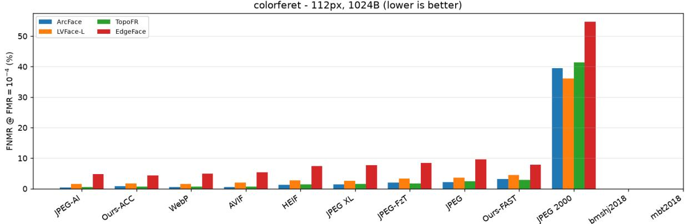  
Figure 9: Color FERET: FNMR at $\mathrm { F M R } = 1 0 ^ { - 4 }$ per codec and matcher, 112 px/1024 B (lower is better). All four anchor matchers are shown, with the learned codec’s clean cells populated throughout (tabulated in Table 18).

kk - 112px, 1024B (lower is better)  
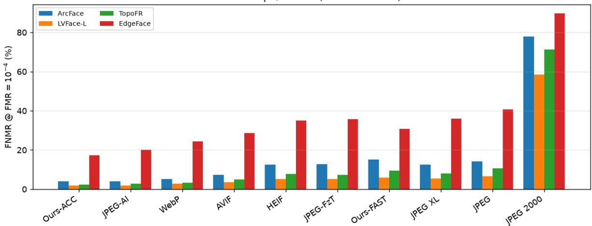  
Figure 10: AI-Solutions-KK: FNMR at $\mathbf { F M R } = 1 0 ^ { - 4 }$ per codec and matcher, 112 px/ 1024 B.

Table 18: Color FERET, 112 px/1024 B: FNMR (%) at $\mathrm { F M R } { = } 1 0 ^ { - 3 }$ and $1 0 ^ { - 4 }$ per matcher. “aligned” is the lossless reference; every codec × matcher cell is populated for the ten full-corpus codecs, including the learned ones under all four anchors. The two CompressAI baselines carry an EER at this cell but no estimable FNMR at $1 0 ^ { - 3 } \mathrm { o r } 1 0 ^ { - 4 }$ (their 300-crop subset yields only ≈3.4 k impostor pairs), so they do not appear here. Bracketed values on the $1 0 ^ { - 4 }$ column are 95% subject-level bootstrap CIs (here and in Tables 19, 20, 21). Best / worst per column, as in the other codec tables.
<table><tr><td rowspan="2">Codec</td><td colspan="2">ArcFace</td><td colspan="2">LVFace-L</td><td colspan="2">TopoFR</td><td colspan="2">EdgeFace</td></tr><tr><td> $1 0 ^ { - 3 }$ </td><td> $1 0 ^ { - 4 }$ </td><td> $1 0 ^ { - 3 }$ </td><td> $1 0 ^ { - 4 }$ </td><td> $1 0 ^ { - 3 }$ </td><td> $1 0 ^ { - 4 }$ </td><td> $1 0 ^ { - 3 }$ </td><td> $1 0 ^ { - 4 }$ </td></tr><tr><td>aligned (ref)</td><td>0.02</td><td>0.11</td><td>0.35</td><td>0.92</td><td>0.02</td><td>0.09</td><td>0.89</td><td>2.96</td></tr><tr><td>JPEG-AI</td><td>0.08</td><td>0.45 [0.3,0.7]</td><td>0.61</td><td>1.55 [1.1,2.4]</td><td>0.10</td><td>0.50 [0.3,0.9]</td><td>1.62</td><td>4.79 [3.3,6.5]</td></tr><tr><td>Ours-ACC</td><td>0.18</td><td>0.84 [0.6,1.5]</td><td>0.77</td><td>1.68 [1.3,2.5]</td><td>0.18</td><td>0.71 [0.5,1.2]</td><td>1.56</td><td>4.41 [3.2,6.4]</td></tr><tr><td>WebP</td><td>0.09</td><td>0.53 [0.3,0.8]</td><td>0.69</td><td>1.58 [1.1,2.8]</td><td>0.15</td><td>0.66[0.4,1.1]</td><td>1.78</td><td>4.98 [3.6,6.8]</td></tr><tr><td>AVIF</td><td>0.09</td><td>0.54 [0.4,0.9]</td><td>0.79</td><td>1.93 [1.4,3.0]</td><td>0.16</td><td>0.68 [0.4,1.1]</td><td>1.83</td><td>5.31 [4.1,6.9]</td></tr><tr><td>HEIF</td><td>0.29</td><td>1.30 [0.9,2.0]</td><td>1.18</td><td>2.67 [2.0,4.2]</td><td>0.33</td><td>1.36 [0.9,2.1]</td><td>2.67</td><td>7.40 [5.8,9.4]</td></tr><tr><td>JPEG XL</td><td>0.31</td><td>1.48 [1.0,2.6]</td><td>1.07</td><td>2.55[1.8,4.0]</td><td>0.44</td><td>1.55 [1.1,2.6]</td><td>2.86</td><td>7.75 [6.3,10.1]</td></tr><tr><td>JPEG-FzT</td><td>0.46</td><td>1.98 [1.3,3.1]</td><td>1.27</td><td>3.28 [2.6,4.9]</td><td>0.44</td><td>1.73 [1.1,2.7]</td><td>2.99</td><td>8.50 [6.4,10.9]</td></tr><tr><td>JPEG</td><td>0.49</td><td>2.12 [1.6,2.9]</td><td>1.58</td><td>3.65 [2.7,5.3]</td><td>0.69</td><td>2.51 [1.7,3.6]</td><td>3.60</td><td>9.56 [7.8,12.5]</td></tr><tr><td>Ours-FAST</td><td>0.76</td><td>3.14 [2.5,4.5]</td><td>1.95</td><td>4.49 [3.1,6.2]</td><td>0.82</td><td>2.94 [2.2,4.6]</td><td>2.87</td><td>7.80 [5.8,9.7]</td></tr><tr><td>JPEG 2000</td><td>20.08</td><td>39.49 [35.6,42.5]</td><td>18.53</td><td>36.16 [32.2,39.5]</td><td>21.32</td><td>41.38 [37.6,44.9]</td><td>33.49</td><td>54.71 [49.3,57.5]</td></tr></table>

Table 19: AI-Solutions-KK, 112 px/1024 B: FNMR (%) at FMR= $1 0 ^ { - 3 }$ and $1 0 ^ { - 4 }$ per matcher. The roster is two rows shorter than its Color FERET counterpart (Table 18): the CompressAI baselines bmshj2018/mbt2018 were run on Color FERET only, so they are omitted here rather than dashed. Best / worst per column, as in the other codec tables.
<table><tr><td rowspan="2">Codec</td><td colspan="2">ArcFace</td><td colspan="2">LVFace-L</td><td colspan="2">TopoFR</td><td colspan="2">EdgeFace</td></tr><tr><td> $1 0 ^ { - 3 }$ </td><td> $1 0 ^ { - 4 }$ </td><td> $1 0 ^ { - 3 }$ </td><td> $1 0 ^ { - 4 }$ </td><td> $1 0 ^ { - 3 }$ </td><td> $1 0 ^ { - 4 }$ </td><td> $1 0 ^ { - 3 }$ </td><td> $1 0 ^ { - 4 }$ </td></tr><tr><td>aligned (ref)</td><td>0.30</td><td>0.85</td><td>0.44</td><td>0.87</td><td>0.21</td><td>0.63</td><td>5.60</td><td>12.47</td></tr><tr><td>Ours-ACC</td><td>1.38</td><td>3.91 [2.8,5.4]</td><td>0.96</td><td> $1 . 9 5 _ { [ 1 . 5 , 2 . 5 ] }$ </td><td>0.87</td><td>2.45 [1.8,3.5]</td><td>8.08</td><td>17.36 [14.3,20.5]</td></tr><tr><td>JPEG-AI</td><td>1.42</td><td> $4 . 0 3 \ : [ 3 . 1 , 5 . 5 ]$ </td><td>0.89</td><td> $1 . 8 0 _ { [ 1 . 3 , 2 . 2 ] }$ </td><td>0.93</td><td> $2 . 7 7 [ 2 . 1 , 4 . 0 ]$ </td><td>9.49</td><td>20.09 [17.6,23.3]</td></tr><tr><td>WebP</td><td>1.89</td><td> $5 . 2 6 [ 3 . 8 , 7 . 2 ]$ </td><td>1.24</td><td> $2 . 6 9 _ { [ 1 . 9 , 3 . 4 ] }$ </td><td>1.09</td><td> $3 . 3 3 [ 2 . 2 , 4 . 8 ]$ </td><td>11.84</td><td>24.32 [20.0,28.4]</td></tr><tr><td>AVIF</td><td>2.55</td><td> $7 . 3 8 [ 5 . 4 , 9 . 1 ]$ </td><td>1.67</td><td> $3 . 5 0 _ { [ 2 . 5 , 4 . 4 ] }$ </td><td>1.48</td><td> $4 . 9 6 \ : [ 3 . 2 , 7 . 3 ]$ </td><td>14.51</td><td>28.73 [25.5,32.7]</td></tr><tr><td>HEIF</td><td>4.85</td><td> $1 2 . 4 7 _ { [ 1 0 . 1 , 1 5 . 1 ] }$ </td><td>2.49</td><td> $5 . 0 6 _ { [ 4 . 0 , 6 . 4 ] }$ </td><td>2.93</td><td> $7 . 8 7 _ { [ 6 . 1 , 1 0 . 6 ] }$ </td><td>18.76</td><td>35.08 [31.3,39.9]</td></tr><tr><td>JPEG-FzT</td><td>5.00</td><td>12.65 [10.0,16.6]</td><td>2.53</td><td> $5 . 2 1 _ { \ : [ 3 . 8 , 6 . 7 ] }$ </td><td>2.73</td><td> $7 . 2 0 \scriptstyle { [ 5 . 4 , 9 . 3 ] }$ </td><td>18.61</td><td>35.72 [30.7,39.5]</td></tr><tr><td>Ours-FAST</td><td>6.01</td><td>15.11 [12.3,19.1]</td><td>2.87</td><td>5.99 [4.2,7.9]</td><td>3.78</td><td>9.53 [7.6,12.7]</td><td>15.83</td><td>30.87 [26.2,34.6]</td></tr><tr><td>JPEG XL</td><td>4.92</td><td>12.54 [9.8,15.9]</td><td>2.68</td><td>5.45 [4.2,7.1]</td><td>3.10</td><td>7.99 [6.3,10.5]</td><td>18.94</td><td>35.97 [31.8,39.2]</td></tr><tr><td>JPEG</td><td>5.31</td><td> $1 4 . 1 4 [ 1 0 . 5 , 1 7 . 0 ]$ </td><td>3.15</td><td>6.55 [5.0,9.8]</td><td>3.78</td><td>10.55 [7.7,14.3]</td><td>22.43</td><td>40.65 [35.9,44.3]</td></tr><tr><td>JPEG 2000</td><td>58.40</td><td>77.85 [74.9,80.8]</td><td>41.02</td><td>58.50 [53.2,62.9]</td><td>52.02</td><td>71.31 [66.6,74.7]</td><td>75.42</td><td>89.70 [88.1,91.6]</td></tr></table>

At 1024 B the field is closely clustered. On Color FERET, JPEG-AI (mean FNMR@10−4 1.00%), WebP (1.06%) and AVIF (1.24%) lead; Ours-ACCURATE is 4th of the field at 1.26% (behind JPEG-AI and WebP, and effectively tied with AVIF), ahead of JPEG-FzT and Ours-FAST, while legacy JPEG sits at 2.89% and JPEG 2000 is catastrophic (37.8%). On AI-Solutions-KK — with JPEG-AI scored on the in-the-wild grid — JPEG-AI leads (mean FNMR@10−4 2.92%) with Ours-ACCURATE (2.93%) effectively tied for the lead, WebP (3.98%) and AVIF (5.44%) next, so the 1024 B identity ordering holds in-the-wild. The decisive separation appears at 512 B (Tables 20–21): AVIF, HEIF, JPEG XL, JPEG and JPEG 2000 mostly collapse (FNMR@10−4 from ∼28% to ∼99%); WebP degrades but stays out of the collapse band (6.0% on CF, 24.3% on KK), while JPEG-AI (2.86% on CF) and Ours-ACCURATE degrade the most gracefully. At the 112px working resolution Ours-ACCURATE is the best codec at 512 B on both datasets — 6.93% vs WebP’s 24.28% on AI-Solutions-KK (a 17.35 pp gap, a factor of 3.5), and 1.83% vs JPEG-AI’s 2.86% on Color FERET — with JPEG-AI the graceful runner-up in-the-wild too (9.6% on KK/512, next after Ours-ACCURATE). The KK/512 gap is well outside sampling noise despite the 105-identity set: the subject-level bootstrap 95% CIs do not overlap on either anchor (Ours-ACCURATE [7.5,12.6] vs WebP [26.9,38.1] on ArcFace; [3.1,5.5] vs [12.0,19.6] on LVFace-L); these 95% subject-bootstrap CIs are recorded in the accuracy grid and printed in brackets on the FNMR@10−4 column of the operating-point tables (Tables 18–21). This ordering is resolution-conditional, however: at 224 px/512 B it inverts (§5.4), where WebP leads and Ours-ACCURATE falls to 5th on CF and to the worst of the budget-compliant modern codecs on KK (Table 23). This is the core operating-point evidence: a kilobyte is comfortable for several codecs, but at half a kilobyte—at 112 px—only the learned codecs (JPEG-AI and ours) keep verification usable; the 512 B DET panels (Figures 13–14) show the same separation graphically.

Coverage caveat. The learned codec’s clean embeddings are complete for every codec × matcher cell, including Ours-ACCURATE × TopoFR-R100. An earlier decode/matcher path returned a non-finite reconstruction on this one pairing; running the decode on the GPU path resolved it, and the cell is populated throughout. All four anchors now carry every codec at this operating point; the cross-matcher ranking (Table 17) is computed over the ArcFace and LVFace-L pair, so it stays apples-to-apples; Ours-ACCURATE’s behaviour on a backbone independent of its EdgeFace side-stream is further confirmed on the held-out CVLFace-IR101 matcher (Section 7.6).

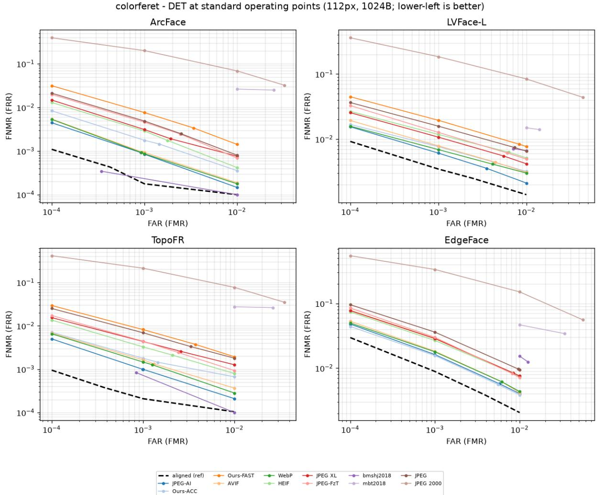  
Figure 11: Color FERET DET curves (FNMR vs FMR, log–log; lower-left is better) at 112 px/1024 B, one panel per matcher. Each curve passes through the EER point and the FNMR at $\mathrm { F M R } { = } 1 0 ^ { - 2 } / 1 0 ^ { - 3 } / 1 0 ^ { - 4 }$ (a continuous curve would require re-scoring the raw pair cosines); the dashed black line is the lossless reference. JPEG 2000 is the upper (worst) curve under every matcher; the learned codec is shown under all four anchors, its clean cells populated throughout.

Table 20: Color FERET, 112 px/512 B: FNMR (%) at $\mathbf { F } \mathbf { M } \mathbf { R } = 1 0 ^ { - 3 }$ and $1 0 ^ { - 4 }$ per matcher. The harder budget separates graceful (JPEG-AI, Ours-ACCURATE, WebP) from collapsing codecs. Best / worst per column, as in the other codec tables.
<table><tr><td rowspan="2">Codec</td><td colspan="2">ArcFace</td><td colspan="2">LVFace-L</td><td colspan="2">TopoFR</td><td colspan="2">EdgeFace</td></tr><tr><td> $1 0 ^ { - 3 }$ </td><td> $1 0 ^ { - 4 }$ </td><td> $1 0 ^ { - 3 }$ </td><td> $1 0 ^ { - 4 }$ </td><td> $1 0 ^ { - 3 }$ </td><td> $1 0 ^ { - 4 }$ </td><td> $1 0 ^ { - 3 }$ </td><td> $1 0 ^ { - 4 }$ </td></tr><tr><td>aligned (ref)</td><td>0.02</td><td>0.11</td><td>0.35</td><td>0.92</td><td>0.02</td><td>0.09</td><td>0.89</td><td>2.96</td></tr><tr><td>Ours-ACC</td><td>0.36</td><td>1.35 [1.1,2.0]</td><td>1.09</td><td>2.31 [1.7,3.5]</td><td>0.39</td><td>1.42 [1.0,2.3]</td><td>2.02</td><td>5.49 [4.2,7.4]</td></tr><tr><td>JPEG-AI</td><td>0.54</td><td>2.43 [1.9,3.3]</td><td>1.30</td><td>3.30 [2.5,4.8]</td><td>0.63</td><td>2.32 [1.7,3.6]</td><td>3.44</td><td>8.77 [6.9,11.6]</td></tr><tr><td>Ours-FAST</td><td>1.66</td><td>6.28 [5.1,8.1]</td><td>3.10</td><td>7.03 [4.9,9.1]</td><td>1.80</td><td>5.68 [4.4,8.0]</td><td>4.74</td><td>12.01 [10.0,15.3]</td></tr><tr><td>WebP</td><td>1.29</td><td>5.00 [4.0,6.4]</td><td>2.78</td><td>7.03 [5.8,9.6]</td><td>1.29</td><td>4.72 [4.0,6.6]</td><td>7.25</td><td>17.80 [15.2,19.7]</td></tr><tr><td>JPEG XL</td><td>12.12</td><td>28.25 [26.2,33.7]</td><td>12.55</td><td>27.35 [24.6,32.7]</td><td>12.02</td><td>27.13 [24.9,31.8]</td><td>29.45</td><td>52.25 [50.0,58.3]</td></tr><tr><td>AVIF</td><td>16.83</td><td>35.59 [32.7,38.5]</td><td>17.26</td><td>32.31 [30.7,36.9]</td><td>15.98</td><td>33.33 [30.0,37.6]</td><td>37.41</td><td>61.30 [58.9,65.1]</td></tr><tr><td>JPEG-FzT</td><td>24.78</td><td>48.88 [44.4,52.2]</td><td>23.99</td><td>43.89 [40.9,46.7]</td><td>23.29</td><td>45.00 [42.3,50.0]</td><td>50.83</td><td>73.66 [70.6,77.6]</td></tr><tr><td>HEIF</td><td>75.54</td><td>94.77 [93.7,96.1]</td><td>59.41</td><td>79.01 [75.3,80.7]</td><td>64.25</td><td>83.44 [81.5,86.0]</td><td>77.44</td><td>91.03 [90.2,92.4]</td></tr><tr><td>JPEG 2000</td><td>91.99</td><td>97.94 [97.7,98.4]</td><td>80.03</td><td>91.49 [90.5,92.6]</td><td>98.31</td><td>99.86 [99.8,99.9]</td><td>87.85</td><td>95.60 [94.7,96.3]</td></tr><tr><td>JPEG</td><td>99.41</td><td>99.83 [99.8,99.9]</td><td>86.29</td><td>95.30 [94.4,95.8]</td><td>99.75</td><td>99.97 [99.9,100.0]</td><td>99.63</td><td>99.93 [99.9,100.0]</td></tr></table>

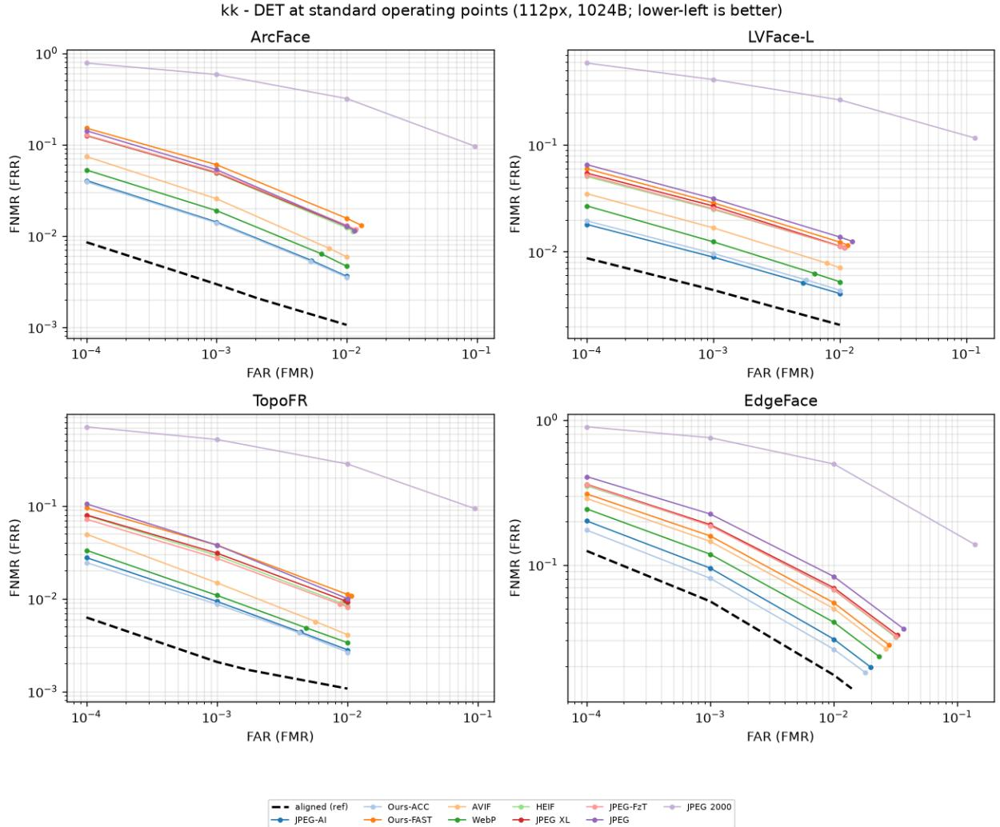  
Figure 12: AI-Solutions-KK DET curves at 112 px/1024 B, one panel per matcher.

Table 21: AI-Solutions-KK, 112 px/512 B: FNMR (%) at $\mathrm { F M R } = 1 0 ^ { - 3 }$ and $1 0 ^ { - 4 }$ per matcher. Ours-ACCURATE is the lowest-FNMR codec at this operating point. As in Table 19, the CompressAI baselines bmshj2018/mbt2018 were run on Color FERET only and are omitted. Best / worst per column, as in the other codec tables.
<table><tr><td rowspan="2">Codec</td><td colspan="2">ArcFace</td><td colspan="2">LVFace-L</td><td colspan="2">TopoFR</td><td colspan="2">EdgeFace</td></tr><tr><td> $1 0 ^ { - 3 }$ </td><td> $1 0 ^ { - 4 }$ </td><td> $1 0 ^ { - 3 }$ </td><td> $1 0 ^ { - 4 }$ </td><td> $1 0 ^ { - 3 }$ </td><td> $1 0 ^ { - 4 }$ </td><td> $1 0 ^ { - 3 }$ </td><td> $1 0 ^ { - 4 }$ </td></tr><tr><td>aligned (ref)</td><td>0.30</td><td>0.85</td><td>0.44</td><td>0.87</td><td>0.21</td><td>0.63</td><td>5.60</td><td>12.47</td></tr><tr><td>Ours-ACC</td><td>3.59</td><td>9.59 [7.5,12.6]</td><td>2.04</td><td>4.27 [3.1,5.5]</td><td>2.44</td><td>6.56 [4.8,8.3]</td><td>11.71</td><td>24.38 [20.9,28.2]</td></tr><tr><td>JPEG-AI</td><td>5.72</td><td>13.86 [11.4,16.3]</td><td>2.71</td><td>5.42 [4.1,6.9]</td><td>4.45</td><td>10.34 [8.2,13.2]</td><td>17.58</td><td>33.47 [29.8,38.9]</td></tr><tr><td>Ours-FAST</td><td>16.23</td><td>33.54 [28.2,38.6]</td><td>7.52</td><td>15.05 [12.2,19.5]</td><td>11.87</td><td>25.29 [20.6,32.5]</td><td>26.55</td><td>46.86 [42.4,52.3]</td></tr><tr><td>WebP</td><td>15.58</td><td>32.58 [26.9,38.1]</td><td>8.00</td><td>15.98 [12.0,19.6]</td><td>11.06</td><td>23.89 [20.6,30.1]</td><td>35.04</td><td>56.11 [52.0,60.8]</td></tr><tr><td>JPEG XL</td><td>44.65</td><td>67.00 [61.9,69.9]</td><td>29.17</td><td>46.17 [40.1,50.8]</td><td>39.61</td><td>60.31 [55.7,65.7]</td><td>66.10</td><td>83.51 [81.4,86.8]</td></tr><tr><td>AVIF</td><td>60.90</td><td>80.24 77.3,83.8]</td><td>50.55</td><td>67.44 [62.5,71.2]</td><td>56.85</td><td>76.15 [72.4,80.2]</td><td>79.72</td><td>92.47 [91.0,94.0]</td></tr><tr><td>JPEG-FzT</td><td>69.66</td><td>85.84 [83.8,88.6]</td><td>59.07</td><td>75.68 [72.0,80.7]</td><td>65.85</td><td>82.96 [80.5,86.8]</td><td>85.70</td><td>94.98 [94.0,95.8]</td></tr><tr><td>HEIF</td><td>91.34</td><td>97.44 [96.6,97.9]</td><td>88.27</td><td>95.77 [94.5,96.8]</td><td>91.26</td><td>97.35 [96.5,97.9]</td><td>94.70</td><td>98.66 [98.2,98.9]</td></tr><tr><td>JPEG</td><td>99.76</td><td>99.97 [100.0,100.0]</td><td>90.25</td><td>96.95 [95.8,97.4]</td><td>94.87</td><td>99.36 [98.9,99.5]</td><td>97.22</td><td>99.87 [99.8,99.9]</td></tr><tr><td>JPEG 2000</td><td>97.69</td><td>99.47 [99.3,99.5]</td><td>96.42</td><td>99.03 [98.8,99.2]</td><td>97.76</td><td>99.53 [99.4,99.6]</td><td>97.29</td><td>99.33 [99.3,99.5]</td></tr></table>

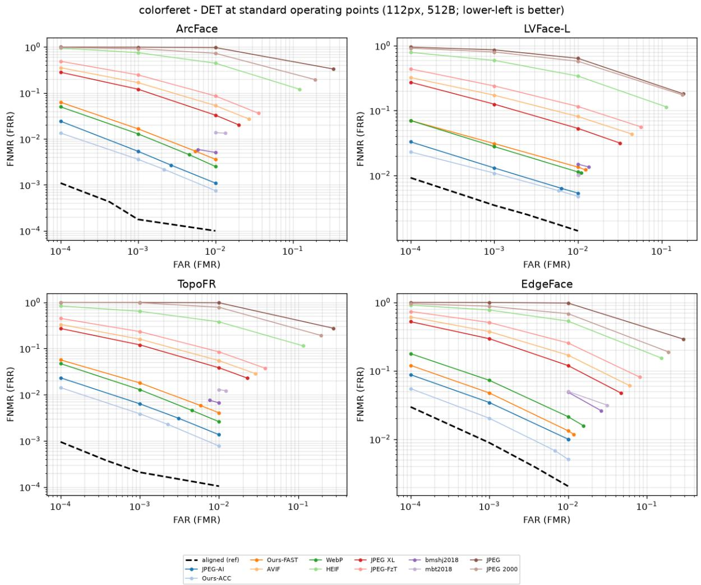  
Figure 13: Color FERET DET curves at the harder 112 px/512 B operating point, one panel per matcher (same construction as Figure 11). The 512 B separation is where the codecs diverge: JPEG, JPEG 2000, HEIF, AVIF and JPEG XL climb into the upper-right collapse region while JPEG-AI, WebP and Ours-ACCURATE stay in the lower-left usable band.

kk - DET at standard operating points (112px, 512B; lower-left is better)  
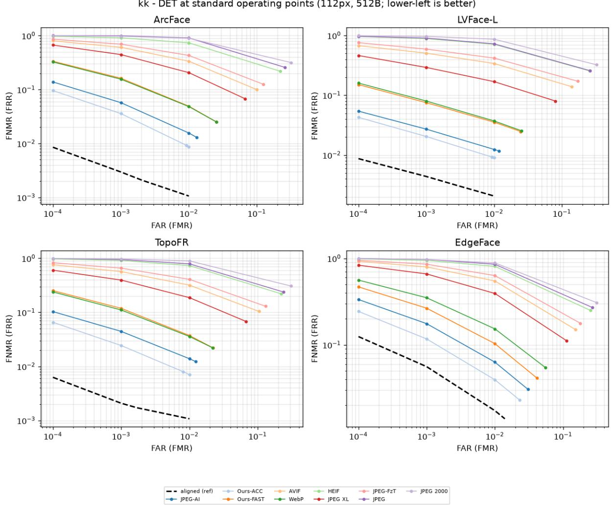  
Figure 14: AI-Solutions-KK DET curves at 112 px/512 B, one panel per matcher. The in-the-wild set spreads the curves further, but the same ordering holds — only the byte-budgeted learned codecs (and WebP, partially) remain in the usable band.

## 5.4 Operating points at the 224 px source resolution

TL;DR The operating-point comparison above is at the 112 px working resolution; here we repeat it at the 224 px source resolution. At 1024 B the ordering is unchanged—modern transform/learned codecs low, JPEG and JPEG 2000 an order of magnitude worse, Ours-ACCURATE level with JPEG-AI. The 512 B story does not carry over, though: at 224 px/512 B Ours-ACCURATE’s advantage disappears—WebP now leads and Ours-ACCURATE is 5th on Color FERET and the worst of the budget-compliant modern codecs on AI-Solutions-KK (FNMR@10−4 30.4% vs WebP 6.6%, ArcFace)—so the “best at 512 B” result is specific to the 112 px working resolution. Ours-FAST additionally cannot reliably reach 512 B at 224 px (its rate floor over-fills the budget: only 80% of Color FERET and 14% of AI-Solutions-KK crops fit).

Because a deployer may store the crop at its native 224 px rather than downsample to the 112 px working point, Tables 22–23 give the same FNMR-at-fixed-FMR comparison at 224 px for both budgets. The qualitative picture is identical to 112 px: at 1024 B Ours-ACCURATE is level with JPEG-AI on Color FERET (FNMR $\textcircled { a } 1 0 ^ { - 4 } 0 . 3 0 \%$ vs JPEG-AI 0.29% on ArcFace) and ahead of WebP/AVIF, while on AI-Solutions-KK JPEG-AI leads the field (FNMR@10−4 2.45% vs Ours-FAST 2.94%), mirroring its 112 px in-the-wild lead; JPEG and JPEG 2000 sit two orders of magnitude worse (∼28–31% on Color FERET, ∼58–69% on AI-Solutions-KK). At 512 B, however, the 112 px ordering does not reproduce: the block codecs still collapse, but so does Ours-ACCURATE—it falls to 5th on Color FERET (4.17% ArcFace, behind WebP 2.60, JPEG-AI 2.73, JPEG XL 3.03 and even Ours-FAST 3.23) and to the worst of the budget-compliant modern codecs on AI-Solutions-KK (30.43% ArcFace, versus WebP 6.64, JPEG XL 11.45, JPEG-AI 14.24; only the budget-compliant legacy codecs JPEG 2000 99.12 and JPEG-FzT 99.94 are worse). So the “Ours-ACCURATE is best at $5 1 2 \mathrm { B } ^ { \prime \prime }$ result of §5.3 is specific to the 112 px working resolution and does not hold at the 224 px source resolution—WebP is the most budget-robust codec at 224 px/512 B. The other 224 px-specific effect is that Ours-FAST, lacking the identity side-stream that absorbs the high-resolution rate floor, cannot reliably hold 512 B at 224 px: it emits a clean frame that overshoots the budget on 20% of Color FERET and 86% of AI-Solutions-KK crops (Section 7). Its 224 px/512 B cells are populated in the tables, but must be read as budget violations rather than compliant results. Ours-ACCURATE, whose trained low-λ levels and identity-only fallback keep it within budget, is unaffected.

Best configuration per codec. Table 17 fixes 112 px and §5.4 fixes 224 px, but each codec has its own resolution sweet spot, and Table 1 implicitly mixes them. Table 24 resolves this by reporting, for each codec and budget, the resolution that minimises its cross-matcher mean FNMR@ $1 0 ^ { - 4 }$ (Color FERET, ArcFace+LVFace-L), so codecs are compared at their respective best operating points rather than at one imposed resolution. Two things follow. First, at 1024 B the byte-budgeted learned codecs are best at the full 224 px source (Ours-ACCURATE 0.57%@224, Ours-FAST 0.69%@224, JPEG-AI 0.71%@224), whereas the classical block codecs peak at coarser resolutions (WebP 0.93%@96, AVIF 1.05%@168) — the learned codecs use the extra pixels the classical codecs cannot afford under the hard budget. Second, at 512 B the sweet spots diverge sharply: JPEG-AI is best at 168 px (2.17%) and Ours-ACCURATE at the 112 px working point (1.83%), while WebP/AVIF/JPEG XL only become competitive by dropping to a coarser trade-off at 224 px (3.2–5.8%). This defuses the “JPEG-AI was compared at its worse resolution” objection: even each codec at its own optimum, the byte-budgeted learned codecs lead both budgets, and JPEG/JPEG 2000 remain well behind (2.5/27.9% at 1024 B, rising to 53.8/90.3% at 512 B).

Table 22: Color FERET, 224 px: FNMR (%) at $\mathrm { F M R } = 1 0 ^ { - 3 } / 1 0 ^ { - 4 }$ per matcher, at 1024 B (top) and 512 B. Same layout as the 112 px tables; all four anchors have complete 224 px clean coverage, and JPEG-AI is present at both budgets. The CompressAI neural baselines are omitted although they were compressed and scored at 224 px: on their 300-crop subset $\mathrm { F M R } = 1 0 ^ { - 3 } / 1 0 ^ { - 4 }$ is not estimable, so they have no value to print in these columns. †Ours-FAST is over budget at 224 px/512 B on 20% of Color FERET crops, so those Ours-FAST results are budget violations rather than compliant operating points. Best / worst per column, as in the other codec tables.
<table><tr><td>Codec</td><td colspan="2">ArcFace</td><td colspan="2">LVFace-L</td><td colspan="2">TopoFR</td><td colspan="2">EdgeFace</td></tr><tr><td></td><td> $1 0 ^ { - 3 }$ </td><td> $1 0 ^ { - 4 }$ </td><td> $1 0 ^ { - 3 }$ </td><td> $1 0 ^ { - 4 }$ </td><td> $1 0 ^ { - 3 }$ </td><td> $1 0 ^ { - 4 }$ </td><td> $1 0 ^ { - 3 }$ </td><td> $1 0 ^ { - 4 }$ </td></tr><tr><td>aligned (ref)</td><td>0.02</td><td>0.07</td><td>0.18</td><td>0.59</td><td>0.01</td><td>0.08</td><td>0.85</td><td>2.82</td></tr><tr><td>Ours-ACC</td><td>0.07</td><td>0.30 [0.2,0.5]</td><td>0.27</td><td>0.85 [0.6,1.3]</td><td>0.09</td><td>0.31 [0.2,0.5]</td><td>1.40</td><td>4.13 [2.8,5.9]</td></tr><tr><td>Ours-FAST</td><td>0.08</td><td>0.41 [0.3,0.7]</td><td>0.38</td><td>0.98 [0.7,1.6]</td><td>0.10</td><td>0.44 [0.2,0.8]</td><td>1.31</td><td>4.07 [2.7,6.0]</td></tr><tr><td>JPEG-AI</td><td>0.06</td><td>0.29 [0.2,0.5]</td><td>0.41</td><td>1.13 [0.8,1.8]</td><td>0.09</td><td>0.32 [0.2,0.5]</td><td>1.42</td><td>4.22 [3.0,6.4]</td></tr><tr><td>WebP</td><td>0.12</td><td>0.61 [0.4,0.9]</td><td>0.55</td><td>1.31 [0.9,2.1]</td><td>0.19</td><td>0.64 [0.4,1.1]</td><td>1.81</td><td>5.30 [4.2,7.3]</td></tr><tr><td>AVIF</td><td>0.10</td><td>0.71 [0.5,1.2]</td><td>0.75</td><td>1.79 [1.3,2.7]</td><td>0.15</td><td>0.74 [0.5,1.2]</td><td>1.94</td><td>5.45 [4.2,7.6]</td></tr><tr><td>HEIF</td><td>0.38</td><td>1.51 [1.0,2.6]</td><td>1.02</td><td>2.48 [1.8,3.6]</td><td>0.48</td><td> $1 . 5 8 _ { [ 1 . 2 , 2 . 6 ] }$ </td><td>3.06</td><td>7.81 [6.0,9.6]</td></tr><tr><td>JPEG-FzT</td><td>0.25</td><td>1.42 [1.0,2.2]</td><td>1.06</td><td>2.51 [1.8,3.6]</td><td>0.41</td><td> $1 . 9 1 \ [ 1 . 4 , 2 . 8 ]$ </td><td>2.74</td><td>7.78 [5.9,10.3]</td></tr><tr><td>JPEG XL</td><td>0.58</td><td> $2 . 4 2 \ : [ 1 . 7 , 3 . 7 ]$ </td><td>1.28</td><td> $3 . 0 0 _ { [ 2 . 2 , 4 . 5 ] }$ </td><td>0.76</td><td> $2 . 7 6 _ { [ 1 . 8 , 4 . 6 ] }$ </td><td>3.78</td><td>9.75 [7.8,12.3]</td></tr><tr><td>JPEG 2000</td><td>14.16</td><td>30.61 [27.9,35.1]</td><td>12.26</td><td>25.20 [21.9,28.3]</td><td>14.44</td><td>30.82 [27.9,33.6]</td><td>26.01</td><td>45.74 [41.9,48.8]</td></tr><tr><td>JPEG</td><td>12.09</td><td>28.40 [26.7,34.4]</td><td>11.61</td><td>24.57 [21.5,27.9]</td><td>12.22</td><td>28.69 [26.5,34.4]</td><td>32.89</td><td>55.09 [51.1,58.2]</td></tr><tr><td>Codec</td><td colspan="2">ArcFace</td><td colspan="2">LVFace-L</td><td colspan="2">TopoFR</td><td colspan="2">EdgeFace</td></tr><tr><td></td><td> $1 0 ^ { - 3 }$ </td><td> $1 0 ^ { - 4 }$ </td><td> $1 0 ^ { - 3 }$ </td><td> $1 0 ^ { - 4 }$ </td><td> $1 0 ^ { - 3 }$ </td><td> $1 0 ^ { - 4 }$ </td><td> $1 0 ^ { - 3 }$ </td><td> $1 0 ^ { - 4 }$ </td></tr><tr><td>aligned (ref)</td><td>0.02</td><td>0.07</td><td>0.18</td><td>0.59</td><td>0.01</td><td>0.08</td><td>0.85</td><td>2.82</td></tr><tr><td>JPEG-AI</td><td>0.75</td><td>2.73 [2.3,4.0]</td><td>1.53</td><td>3.64 [2.8,5.0]</td><td>0.87</td><td>2.72 [2.1,4.1]</td><td>3.81</td><td>9.01 [7.3,11.4]</td></tr><tr><td>Ours-FAST</td><td>0.82</td><td>3.23 [2.3,4.1]</td><td>1.36</td><td>3.25 [2.5,4.8]</td><td>0.82</td><td>3.06 [2.3,4.5]</td><td>3.64</td><td>9.35 [7.5,11.4]</td></tr><tr><td>WebP</td><td>0.68</td><td>2.60 [2.1,3.6]</td><td>1.62</td><td> $3 . 8 0 _ { [ 2 . 9 , 4 . 6 ] }$ </td><td>0.84</td><td>2.80 [2.2,3.9]</td><td>3.76</td><td>9.88 [8.6,12.2]</td></tr><tr><td>JPEG XL</td><td>0.72</td><td>3.03 [2.4,4.6]</td><td>1.67</td><td>4.03 [3.1,5.8]</td><td>1.02</td><td>3.78 [2.6,5.5]</td><td>4.72</td><td>12.05 [10.1,15.1]</td></tr><tr><td>Ours-ACC</td><td>1.00</td><td> $4 . 1 7 _ { [ 3 . 2 , 5 . 3 ] }$ </td><td>1.73</td><td>4.29 [3.4,5.9]</td><td>0.97</td><td>4.00[3.0,5.5]</td><td>4.63</td><td>11.49 [9.9,13.9]</td></tr><tr><td>AVIF</td><td>1.65</td><td>5.69 [4.7,7.2]</td><td>2.56</td><td>5.91 [4.8,7.7]</td><td>1.79</td><td>5.36 [4.4,6.9]</td><td>7.47</td><td>17.56 [15.5,20.0]</td></tr><tr><td>HEIF</td><td>14.72</td><td>31.33 [28.4,34.5]</td><td>14.37</td><td>30.07 [26.8,33.0]</td><td>14.89</td><td>30.61 [27.6,34.4]</td><td>31.78</td><td>54.16 [51.0,56.8]</td></tr><tr><td>JPEG</td><td>87.35</td><td>98.45 [98.0,98.8]</td><td>41.55</td><td>64.21 [61.1,67.3]</td><td>78.82</td><td>98.47 [97.9,99.1]</td><td>93.53</td><td>99.74 [99.6,99.8]</td></tr><tr><td>JPEG 2000</td><td>85.49</td><td>95.39 [94.8,96.1]</td><td>72.49</td><td>86.80 [85.5,89.1]</td><td>88.55</td><td>98.80 [98.6,99.3]</td><td>83.60</td><td>93.57 [92.4,94.3]</td></tr><tr><td>JPEG-FzT</td><td>99.43</td><td>99.86 [99.8,99.9]</td><td>76.13</td><td>90.36 [89.3,91.7]</td><td>99.36</td><td>99.89 [99.9,99.9]</td><td>99.51</td><td>99.93 [99.9,100.0]</td></tr></table>

Table 23: AI-Solutions-KK, 224 px: FNMR (%) at $\mathrm { F M R } = 1 0 ^ { - 3 } / 1 0 ^ { - 4 }$ per matcher, at 1024 B (top) and 512 B. JPEG-AI is included (compressed on AI-Solutions-KK at $2 2 4 \mathrm { p x } ) ;$ ; the CompressAI neural baselines were run on Color FERET only — they are absent from every AI-Solutions-KK cell, not just this resolution — and are omitted. †Ours-FAST is over budget at 224 px/512 B on 86% of AI-Solutions-KK crops (median 595 B); read those Ours-FAST cells as budget violations. Best / worst per column, as in the other codec tables.
<table><tr><td rowspan="2">Codec</td><td colspan="2">ArcFace</td><td colspan="2">LVFace-L</td><td colspan="2">TopoFR</td><td colspan="2">EdgeFace</td></tr><tr><td> $1 0 ^ { - 3 }$ </td><td> $1 0 ^ { - 4 }$ </td><td> $1 0 ^ { - 3 }$ </td><td> $1 0 ^ { - 4 }$ </td><td> $1 0 ^ { - 3 }$ </td><td> $1 0 ^ { - 4 }$ </td><td> $1 0 ^ { - 3 }$ </td><td> $1 0 ^ { - 4 }$ </td></tr><tr><td>aligned (ref)</td><td>0.27</td><td>0.77</td><td>0.40</td><td>0.78</td><td>0.19</td><td>0.54</td><td>5.29</td><td>11.83</td></tr><tr><td>JPEG-AI</td><td>0.84</td><td>2.45 [1.8,3.6]</td><td>0.71</td><td>1.42 [1.1,1.8]</td><td>0.54</td><td>1.70 [1.2,2.6]</td><td>7.97</td><td>17.45 [14.4,21.0]</td></tr><tr><td>Ours-FAST</td><td>1.01</td><td>2.94 [2.0,3.9]</td><td>0.81</td><td>1.61 [1.2,2.1]</td><td>0.64</td><td>1.97 [1.3,3.0]</td><td>8.36</td><td>18.13 [14.8,21.1]</td></tr><tr><td>Ours-ACC</td><td>1.11</td><td>3.21 [2.4,4.3]</td><td>0.85</td><td>1.66[1.3,2.2]</td><td>0.72</td><td>2.03 [1.4,2.9]</td><td>8.30</td><td>17.99[14.4,21.1]</td></tr><tr><td>WebP</td><td>1.92</td><td>5.60 [4.1,7.7]</td><td>1.09</td><td>2.22 [1.7,2.9]</td><td>1.12</td><td>3.37 [2.6,5.2]</td><td>12.57</td><td>25.62 [21.9,29.2]</td></tr><tr><td>AVIF</td><td>3.31</td><td>9.45 [6.9,11.8]</td><td>1.74</td><td>3.64 [2.8,4.8]</td><td>1.86</td><td>5.61 [3.8,7.9]</td><td>15.91</td><td>31.35 [26.8,35.1]</td></tr><tr><td>JPEG XL</td><td>3.97</td><td>10.63 [8.3,13.9]</td><td>2.33</td><td>4.98 [3.7,6.3]</td><td>2.64</td><td>7.79 [5.7,10.2]</td><td>18.32</td><td>34.58 [29.6,39.2]</td></tr><tr><td>JPEG-FzT</td><td>4.11</td><td>11.54 [9.1,14.2]</td><td>2.63</td><td>5.37 [4.2,7.9]</td><td>2.93</td><td>8.74 [6.6,13.6]</td><td>19.37</td><td>36.96 [33.0,41.2]</td></tr><tr><td>HEIF</td><td>5.20</td><td>13.32 [10.8,16.7]</td><td>2.90</td><td>5.89 [4.5,7.9]</td><td>3.31</td><td>8.86 [7.1,12.1]</td><td>18.88</td><td>35.63 [32.1,39.8]</td></tr><tr><td>JPEG</td><td>35.97</td><td>57.91 [53.1,61.4]</td><td>20.52</td><td>35.00 [29.2,40.0]</td><td>27.74</td><td>47.77 [41.6,53.1]</td><td>63.11</td><td>81.66 [78.5,83.7]</td></tr><tr><td>JPEG 2000</td><td>47.25</td><td>69.42 [65.0,74.6]</td><td>29.51</td><td>45.37 [39.7,50.2]</td><td>40.89</td><td>60.37 [55.7,65.1]</td><td>66.65</td><td>83.76 [81.5,87.3]</td></tr><tr><td rowspan="3">Codec</td><td>ArcFace</td><td></td><td></td><td>LVFace-L</td><td></td><td></td><td></td><td></td></tr><tr><td> $1 0 ^ { - 3 }$ </td><td> $1 0 ^ { - 4 }$ </td><td></td><td></td><td></td><td>TopoFR</td><td></td><td>EdgeFace</td></tr><tr><td>0.27</td><td>0.77</td><td> $1 0 ^ { - 3 }$ </td><td> $1 0 ^ { - 4 }$ </td><td> $1 0 ^ { - 3 }$ </td><td> $1 0 ^ { - 4 }$ </td><td> $1 0 ^ { - 3 }$ </td><td> $1 0 ^ { - 4 }$ </td></tr><tr><td>aligned (ref) WebP</td><td></td><td></td><td>0.40</td><td>0.78</td><td>0.19</td><td>0.54</td><td>5.29</td><td>11.83</td></tr><tr><td>Ours-FAST</td><td>2.43</td><td>6.64 [5.0,8.8]</td><td>1.47</td><td>2.86 [2.1,3.7]</td><td>1.52</td><td>4.29 [3.4,6.6]</td><td>13.61</td><td>27.20 [23.3,30.3]</td></tr><tr><td></td><td>4.43</td><td>11.93 [9.7,15.3]</td><td>2.28</td><td>4.51 [3.3,5.6]</td><td>2.94</td><td>8.05 [6.3,10.2]</td><td>15.44</td><td>31.18 [26.8,36.1]</td></tr><tr><td>JPEG XL</td><td>4.28</td><td>11.45 [8.9,14.4]</td><td>2.49</td><td>5.31 [3.8,6.7]</td><td>2.87</td><td>8.48 [6.2,11.2]</td><td>19.09</td><td>35.51 [30.7,40.9]</td></tr><tr><td>JPEG-AI</td><td>5.68</td><td>14.24 [12.2,17.7]</td><td>2.43</td><td>4.91 [3.9,6.0]</td><td>4.13</td><td>10.37 [8.6,13.0]</td><td>16.47</td><td>31.81 [28.7,36.0]</td></tr><tr><td>AVIF</td><td>8.71</td><td>20.97 [16.7,25.3]</td><td>4.48</td><td>8.90 [7.0,11.8]</td><td>5.46</td><td>13.64 [10.5,17.5]</td><td>26.98</td><td>47.43 [43.9,53.0]</td></tr><tr><td>Ours-ACC</td><td>13.94</td><td>30.43 [26.6,35.4]</td><td>7.02</td><td>13.98 [11.5,17.0]</td><td>11.16</td><td>23.73 [19.8,27.5]</td><td>25.64</td><td>46.47 [41.3,51.0]</td></tr><tr><td>HEIF</td><td>32.19</td><td>55.32 [50.0,59.6]</td><td>20.67</td><td>34.89 [30.1,40.4]</td><td>26.15</td><td>45.95 [39.8,49.9]</td><td>55.65</td><td>75.99 [71.5,79.2]</td></tr><tr><td>JPEG</td><td>52.01</td><td>72.23 [67.5,74.9]</td><td>33.48</td><td>50.43 [45.3,55.9]</td><td>43.37</td><td>63.97 [59.3,69.4]</td><td>75.33</td><td>89.92 [87.1,91.1]</td></tr><tr><td>JPEG-FzT</td><td>98.18</td><td>99.94 [99.9,100.0]</td><td>82.86</td><td>92.93 [91.4,94.5]</td><td>90.52</td><td>97.75 [96.8,98.3]</td><td>95.18</td><td>99.14 [98.9,99.4]</td></tr><tr><td>JPEG 2000</td><td>96.55</td><td>99.12 [98.8,99.2]</td><td>94.63</td><td>98.52 [98.1,98.7]</td><td>96.66</td><td>99.12 [98.9,99.2]</td><td>96.50</td><td>99.13 [99.0,99.3]</td></tr></table>

Table 24: Best-configuration summary: each codec at its own optimal resolution per budget. Cell is the minimum cross-matcher mean FNMR@ $1 0 ^ { - 4 }$ (%, over ArcFace and LVFace-L on Color FERET) across the five resolutions, with the minimising resolution (px) after the $\ " \ @ \ '$ Best / worst codec per column, as elsewhere. Codecs are compared at their respective sweet spots, so this table is resolution-agnostic (unlike Tables 17 at 112 px and §5.4 at 224 px). The CompressAI baselines bmshj2018/mbt2018 are absent: they were size-measured at all five resolutions but scored only at 112 px, so they have no five-resolution sweep to minimise over. Table 17 reports them at that single resolution.
<table><tr><td>Codec</td><td>1024 B FNMR@10−4% @res</td><td>512 B FNMR@10−4 % @res</td></tr><tr><td></td><td>0.73 @224</td><td>2.17 @168</td></tr><tr><td>JPEG-AI Ours-ACCURATE</td><td>0.57 @224</td><td>1.83 @112</td></tr><tr><td>Ours-FAST</td><td>0.69 @224</td><td>3.24 @224</td></tr><tr><td>WebP</td><td>0.93 @96</td><td>3.20 @224</td></tr><tr><td>AVIF</td><td>1.05 @168</td><td>5.80 @224</td></tr><tr><td>JPEG XL</td><td>1.84 @96</td><td>3.53 @224</td></tr><tr><td>HEIF</td><td>1.73 @64</td><td>30.70 @224</td></tr><tr><td>JPEG-FzT</td><td>1.96 @224</td><td>35.01 @96</td></tr><tr><td>JPEG</td><td>2.53 @96</td><td>53.75 @64</td></tr><tr><td>JPEG 2000</td><td>27.91 @224</td><td>90.33 @168</td></tr></table>

## 5.5 The sub-1 kB error floor

TL;DR Adding 768 and 960 B rows between the 512 and 1024 B budgets exposes a sharp error floor: the classical codecs are flat and accurate at ≥ 960 B but their EER spikes below ∼800 B (AVIF 24×, JPEG 120× from 960 to 512 B), matching the NIST rationale for a sub-1 kB target. The byte-budgeted learned codecs break this floor — Ours-ACCURATE stays within 0.14–0.22% EER across the whole 512–1024 B range which is precisely the operating regime a hard-byte-budget codec is designed for.

The NIST 2D-barcode work motivates the ∼1 kB target by an elevated-error floor: below a few hundred bytes verification degrades sharply. Our headline grid uses only {512,1024} B, which cannot resolve where that floor sits. We therefore compress two intermediate budgets, 768 and 960 B, at the 112 px working resolution and re-score the anchors. Table 25 and Figure 15 give the resulting EER-vs-budget curve on Color FERET (ArcFace shown; the other anchors agree).

Two things stand out. First, the floor is real for the general-purpose codecs: AVIF and JPEG are flat and near-perfect at ≥ 960 B (EER ≤ 0.3%) but collapse below ∼800 B — AVIF rises from 0.11% at 960 B to 2.71% at 512 B (∼24×), and JPEG from 0.28% to 33.4% (∼120×). This is precisely the sub-1 kB elevated-error floor the target is chosen to stay above, measured directly here (supported). WebP is the most floor-resistant classical codec (0.10% → 0.46%), while JPEG 2000 is poor at every budget. Second, and more useful for this project, the byte-budgeted learned codecs flatten the floor: Ours-ACCURATE holds 0.14%/0.15%/0.15%/0.22% across 1024/960/768/512 B and Ours-FAST 0.34– 0.55%, because a codec optimised to hit a hard ceiling degrades gracefully rather than falling off a rate cliff. The intermediate budgets thus both confirm the NIST floor and quantify the custom codec’s advantage precisely where it matters — in the sub-800 B regime the classical codecs cannot serve.

Table 25: Sub-1 kB budget sweep on Color FERET, ArcFace, 112 px: verification EER (%) at 512/768/960/1024 B. Classical codecs spike below ∼800 B; the byte-budgeted learned codecs stay flat. JPEG-AI and the CompressAI neural baselines (bmshj2018, mbt2018) are included here and in the companion curve (Figure 15), which is drawn from the same roster by the same generator. Best / worst per column, as in the other codec tables. Codecs tied at the printed precision are all shaded. ‡ marks a cell scored on the CompressAI baselines’ 300-crop subset (2,548 mated pairs against 95,839 elsewhere in the column); it is a per-cell mark — those two codecs are full-support at 768/960 B — and marked cells are excluded from the best/worst comparison.
<table><tr><td rowspan=1 colspan=4>Codec (ArcFace, 112 px)  512B  768 B  960 B</td><td rowspan=1 colspan=1>1024 B</td></tr><tr><td rowspan=1 colspan=1>JPEG-AI</td><td rowspan=1 colspan=2>0.27   0.16</td><td rowspan=1 colspan=1>0.11</td><td rowspan=1 colspan=1>0.09</td></tr><tr><td rowspan=1 colspan=1>Ours-ACCURATE</td><td rowspan=1 colspan=2>0.22   0.15</td><td rowspan=1 colspan=1>0.15</td><td rowspan=1 colspan=1>0.14</td></tr><tr><td rowspan=1 colspan=1>Ours-FAST</td><td rowspan=1 colspan=2>0.55   0.40</td><td rowspan=1 colspan=1>0.37</td><td rowspan=1 colspan=1>0.34</td></tr><tr><td rowspan=1 colspan=1>AVIF</td><td rowspan=1 colspan=2>2.71   0.26</td><td rowspan=1 colspan=1>0.11</td><td rowspan=1 colspan=1>0.09</td></tr><tr><td rowspan=1 colspan=1>WebP</td><td rowspan=1 colspan=1>0.46</td><td rowspan=1 colspan=1>0.17</td><td rowspan=1 colspan=1>0.10</td><td rowspan=1 colspan=1>0.09</td></tr><tr><td rowspan=1 colspan=1>JPEG XL</td><td rowspan=1 colspan=1>2.02</td><td rowspan=1 colspan=1>0.55</td><td rowspan=1 colspan=1>0.24</td><td rowspan=1 colspan=1>0.19</td></tr><tr><td rowspan=1 colspan=1>HEIF</td><td rowspan=1 colspan=1>12.12</td><td rowspan=1 colspan=1>0.63</td><td rowspan=1 colspan=1>0.21</td><td rowspan=1 colspan=1>0.18</td></tr><tr><td rowspan=1 colspan=1>JPEG-FzT</td><td rowspan=1 colspan=1>3.62</td><td rowspan=1 colspan=1>0.51</td><td rowspan=1 colspan=1>0.27</td><td rowspan=1 colspan=1>0.24</td></tr><tr><td rowspan=1 colspan=1>mbt2018</td><td rowspan=1 colspan=1>1.33</td><td rowspan=1 colspan=1>0.21</td><td rowspan=1 colspan=1>0.13</td><td rowspan=1 colspan=1>2.50</td></tr><tr><td rowspan=1 colspan=1>bmshj2018</td><td rowspan=1 colspan=1>0.59</td><td rowspan=1 colspan=1>0.28</td><td rowspan=1 colspan=1>0.17</td><td rowspan=1 colspan=1>0.03</td></tr><tr><td rowspan=1 colspan=1>JPEG</td><td rowspan=1 colspan=1>33.35</td><td rowspan=1 colspan=1>1.06</td><td rowspan=1 colspan=1>0.28</td><td rowspan=1 colspan=1>0.25</td></tr><tr><td rowspan=1 colspan=1>JPEG 2000</td><td rowspan=1 colspan=1>19.50</td><td rowspan=1 colspan=1>7.78</td><td rowspan=1 colspan=2>3.23     3.23</td></tr></table>

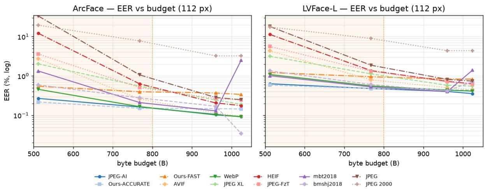  
Figure 15: EER vs. byte budget at 112 px (log scale), ArcFace and LVFace-L, over the same full roster as Table 25. The shaded band marks the sub-800 B floor zone: classical codecs (AVIF, JPEG) rise steeply into it, whereas the byte-budgeted Ours-ACCURATE/Ours-FAST stay nearly flat across the whole range. This is the elevated-error-floor test. A codec is drawn only where it has a stored EER at two or more budgets; all twelve codecs clear that bar here, each with an EER at all four of 512/768/960/1024 B. No cell in this sweep is exactly 0%, so none has to be displaced to the axis floor of the log scale.

## 5.6 Per-matcher consistency

TL;DR The codec ranking is stable across the four anchor matchers; absolute EER shifts with matcher capacity, but the same codecs win and the same two legacy codecs collapse.

A ranking that depends on the matcher would be of little use to a deployer. Comparing the ArcFace grid (Table 9) against EdgeFace-XS [21] (Table 10), LVFace-L (Table 11) and TopoFR-R100 (Table 12) shows the same ordering under all four anchors: the modern block codecs and JPEG-AI form the low-EER group, JPEG is budget-sensitive, and JPEG 2000 is consistently the worst. Absolute EER tracks matcher capacity and dataset difficulty – higher on KK than on Color FERET, and higher for lighter matchers – but the relative ranking does not invert. Concretely, at 112 px/1024 B on Color FERET: the modern block codecs and JPEG-AI cluster low (EER ≤ 1.0% for WebP, AVIF, JPEG XL, HEIF and JPEG-AI under each anchor — the wider 14-model roster, Table 26, pushes all five above 1% under the weakest backbone, EdgeFace-XXS (JPEG-AI 1.08, WebP 1.14, AVIF 1.15, JPEG XL 1.46, HEIF 1.48), and HEIF alone above 1% under LVFace-T); JPEG is budget-sensitive (climbing from 0.25–0.97% at 1024 B to 18–33% at 512 B); and JPEG 2000 is the worst codec under each anchor (3.23% ArcFace, 4.39% LVFace-L, 5.57% EdgeFace-XS, 3.50% TopoFR-R100) — and worst under thirteen of the full 14-model roster, mbt2018 edging past it only under CVLFace-IR101 (2.56 vs 2.38%). The KK grids (Tables 13, 14, 15 and 16) reproduce this ordering at uniformly higher absolute EER.

Table 26: Model effect, Color FERET, 112 px/1024 B: EER (%) per matcher × codec for the full 14-model roster. Best worst per row, as in the other codec tables. Codecs tied at the printed precision are all shaded. Column support is not equal: the CompressAI baselines bmshj2018/mbt2018 were scored on the 300-crop Color FERET subset (2,548 mated pairs against 95,839 for every other codec), so their columns are marked ‡ — the values print, but they take no part in that best/worst comparison. The Color FERET 224 px companion (Table 28) carries the same two ‡-marked columns; only the AI-Solutions-KK companion (Table 27) drops them, since the baselines were never run on that dataset.
<table><tr><td>Matcher</td><td>JPEG-AI</td><td>Ours-ACC</td><td>Ours-FAST</td><td>AVIF</td><td>WebP</td><td>HEIF</td><td>JPEG XL</td><td>JPEG-FzT</td><td>bmshj2018</td><td>mbt2018</td><td>JPEG</td><td>JPEG 2000</td></tr><tr><td>ArcFace R100</td><td>0.09</td><td>0.14</td><td>0.34</td><td>0.09</td><td>0.09</td><td>0.18</td><td>0.19</td><td>0.24</td><td>0.03</td><td>2.50</td><td>0.25</td><td>3.23</td></tr><tr><td>TopoFR-R50</td><td>0.17</td><td>0.24</td><td>0.55</td><td>0.21</td><td>0.20</td><td>0.31</td><td>0.36</td><td>0.39</td><td>0.15</td><td>2.62</td><td>0.55</td><td>4.41</td></tr><tr><td>TopoFR-R100</td><td>0.10</td><td>0.14</td><td>0.37</td><td>0.13</td><td>0.13</td><td>0.21</td><td>0.26</td><td>0.24</td><td>0.08</td><td>2.63</td><td>0.33</td><td>3.50</td></tr><tr><td>TopoFR-R200</td><td>0.06</td><td>0.08</td><td>0.23</td><td>0.08</td><td>0.07</td><td>0.12</td><td>0.15</td><td>0.13</td><td>0.03</td><td>2.38</td><td>0.25</td><td>2.98</td></tr><tr><td>LVFace-T</td><td>0.85</td><td>0.78</td><td>1.44</td><td>0.92</td><td>0.90</td><td>1.31</td><td>0.99</td><td>1.38</td><td>1.15</td><td>1.96</td><td>1.39</td><td>6.75</td></tr><tr><td>LVFace-S</td><td>0.63</td><td>0.57</td><td>1.23</td><td>0.68</td><td>0.69</td><td>0.99</td><td>0.71</td><td>0.92</td><td>0.90</td><td>1.99</td><td>0.96</td><td>5.19</td></tr><tr><td>LVFace-B</td><td>0.23</td><td>0.27</td><td>0.59</td><td>0.36</td><td>0.28</td><td>0.53</td><td>0.38</td><td>0.45</td><td>0.24</td><td>0.95</td><td>0.57</td><td>4.17</td></tr><tr><td>LVFace-L</td><td>0.35</td><td>0.44</td><td>0.83</td><td>0.44</td><td>0.41</td><td>0.63</td><td>0.55</td><td>0.61</td><td>0.71</td><td>1.40</td><td>0.74</td><td>4.39</td></tr><tr><td>CVLface ViT-B</td><td>0.12</td><td>0.12</td><td>0.27</td><td>0.17</td><td>0.16</td><td>0.31</td><td>0.30</td><td>0.37</td><td>0.08</td><td>2.28</td><td>0.49</td><td>3.14</td></tr><tr><td>CVLface IR-101</td><td>0.03</td><td>0.05</td><td>0.15</td><td>0.04</td><td>0.03</td><td>0.07</td><td>0.10</td><td>0.10</td><td>0.03</td><td>2.56</td><td>0.12</td><td>2.38</td></tr><tr><td>EdgeFace-XXS</td><td>1.08</td><td>1.02</td><td>1.38</td><td>1.15</td><td>1.14</td><td>1.48</td><td>1.46</td><td>1.40</td><td>2.01</td><td>4.73</td><td>1.57</td><td>6.64</td></tr><tr><td>EdgeFace-XS</td><td>0.57</td><td>0.56</td><td>0.84</td><td>0.62</td><td>0.61</td><td>0.84</td><td>0.84</td><td>0.82</td><td>1.25</td><td>3.41</td><td>0.97</td><td>5.57</td></tr><tr><td>EdgeFace-S</td><td>0.39</td><td>0.39</td><td>0.66</td><td>0.41</td><td>0.43</td><td>0.57</td><td>0.61</td><td>0.68</td><td>0.35</td><td>2.79</td><td>0.71</td><td>5.37</td></tr><tr><td>EdgeFace-Base</td><td>0.11</td><td>0.12</td><td>0.31</td><td>0.13</td><td>0.11</td><td>0.19</td><td>0.26</td><td>0.28</td><td>0.15</td><td>2.08</td><td>0.28</td><td>3.79</td></tr></table>

The full 14-model roster (model effect). The four anchors are one slice of the project’s 14-model roster (Section 4); to test whether the codec ranking depends on matcher capacity or backbone, we scored all fourteen matchers against the codecs at 112 px. Figure 16 (Color FERET) and Figure 17 (AI-Solutions-KK) give the per-matcher EER heatmaps, with Tables 26 and 27 the exact numbers behind them. Two results stand out. First, the codec ordering is stable down every matcher column: JPEG-AI, WebP, AVIF and the strong learned/block codecs stay low, while mbt2018 and JPEG 2000 are the worst under all fourteen matchers – the ranking does not invert with matcher choice, and the ViT family (LVFace, CVLface ViT-B) and the CNN/IR family (TopoFR, ArcFace, CVLface IR-101) agree on which codec to pick. Second, the absolute EER tracks matcher strength: the strongest models (TopoFR-R200, CVLface IR-101, EdgeFace-Base, LVFace-B) sit near the floor under good codecs $\begin{array} { r } { ( \mathrm { E E R } \le 0 . 3 6 \% , } \end{array}$ , and $\leq 0 . 1 4 \%$ for the first three), whereas the tiny/early models (EdgeFace-XXS, LVFace-T) carry a higher floor and absorb a larger codec penalty – the gap a lossy codec opens over the aligned reference widens for weaker matchers. The heatmaps above are the 112 px working point. With the extra-ten matchers embedded across 64–224 px, we can confirm the same picture at the 224 px source resolution (Figures 18 and 19, with the numbers in Tables 28 and 29): the codec ordering is unchanged under all fourteen backbones and the JPEG/JPEG 2000 collapse persists (1.7–7.6% EER), while absolute EERs fall with the larger crop as expected (e.g. CVLface IR-101 reaches 0.03% and ArcFace 0.07% under the strong codecs). The model effect is therefore stable across both matcher backbone and resolution. This visual agreement is quantified statistically in Section 14.5: the matchers rank the codecs with a Kendall concordance of W = 0.85 (Figure 45).

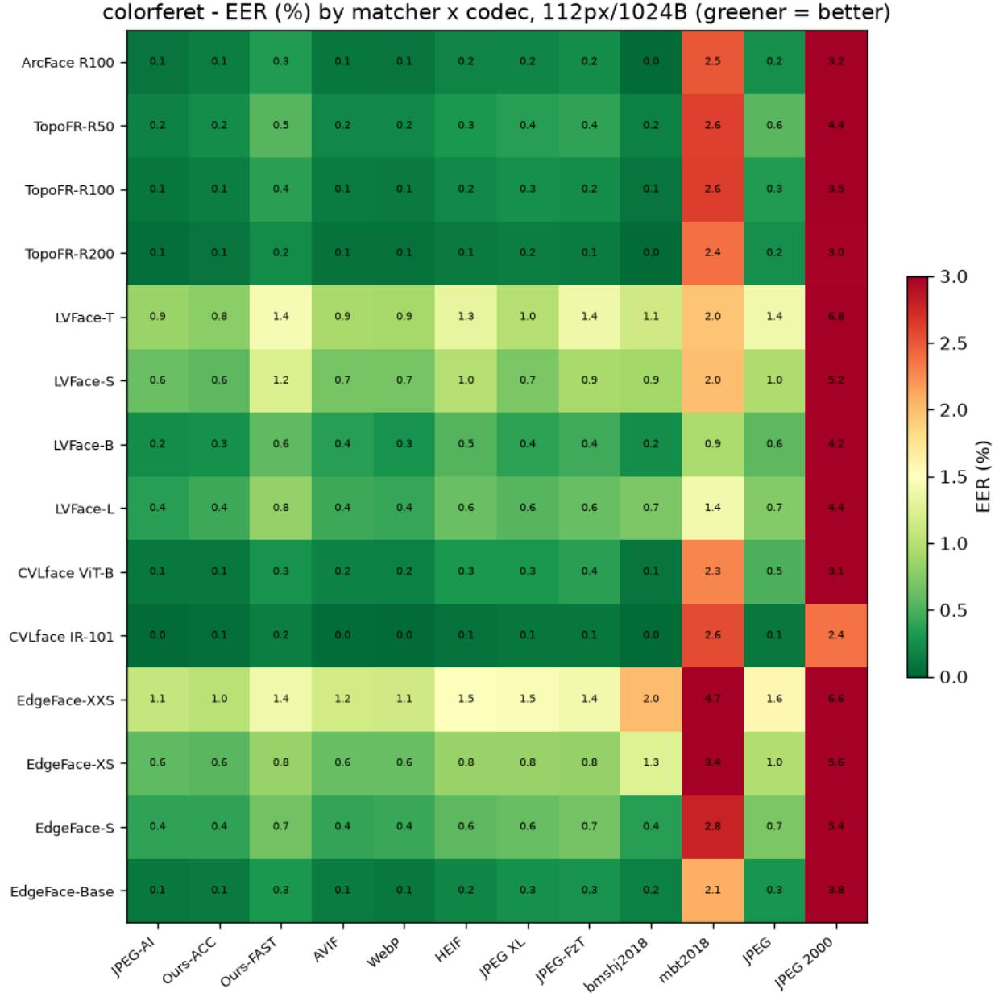  
Figure 16: Model effect (Color FERET, 112 px/1024 B): verification EER (%) for every roster matcher (rows, grouped by family/strength) against every codec (columns); greener is lower EER. The ranking is consistent down each column; EER tracks matcher strength down the rows. The learned-codec columns are populated for every matcher.

kk - EER (%) by matcher x codec, 112px/1024B (greener = better)  
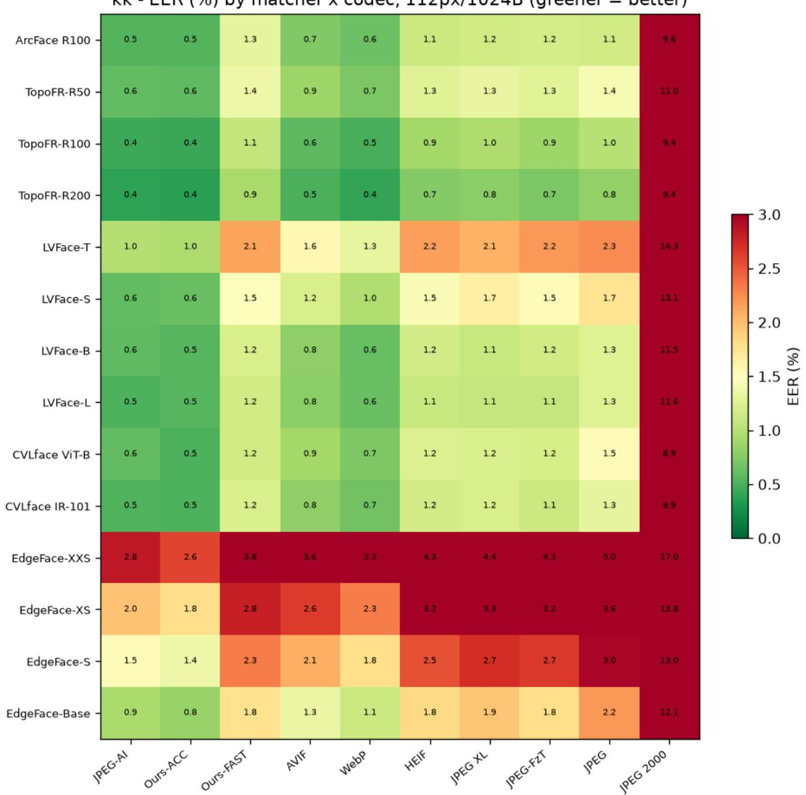  
Figure 17: Model effect on AI-Solutions-KK (112 px/1024 B); same axes as Figure 16. The codec ordering reproduces at uniformly higher absolute EER. The in-the-wild panel is now complete: all ten codecs run on this dataset — Ours-ACCURATE, Ours-FAST and JPEG-AI included — are populated across all fourteen matchers. Only the two CompressAI baselines are missing, never having been run on AI-Solutions-KK.

Table 27: Model effect, AI-Solutions-KK, 112 px/1024 B: EER (%) per matcher × codec for the full 14-model roster — the numeric companion to the in-the-wild heatmap (Figure 17), which a deployer needs to read exact values. Best / worst per row. All ten codecs run on this dataset span all fourteen matchers, JPEG-AI and both Ours variants included; the two CompressAI baselines were never run in-the-wild and so have no row. Absolute EER is uniformly higher than Color FERET (Table 26) but the codec ordering is preserved down every matcher row.
<table><tr><td>Matcher</td><td>JPEG-AI</td><td>Ours-ACC</td><td>Ours-FAST</td><td>AVIF</td><td>WebP</td><td>HEIF</td><td>JPEG XL</td><td>JPEG-FzT</td><td>JPEG</td><td>JPEG 2000</td></tr><tr><td>ArcFace R100</td><td>0.54</td><td>0.53</td><td>1.30</td><td>0.73</td><td>0.64</td><td>1.12</td><td>1.16</td><td>1.17</td><td>1.15</td><td>9.61</td></tr><tr><td>TopoFR-R50</td><td>0.60</td><td>0.58</td><td>1.36</td><td>0.86</td><td>0.71</td><td>1.25</td><td>1.33</td><td>1.27</td><td>1.43</td><td>11.00</td></tr><tr><td>TopoFR-R100</td><td>0.44</td><td>0.43</td><td>1.07</td><td>0.57</td><td>0.48</td><td>0.90</td><td>0.95</td><td>0.87</td><td>1.00</td><td>9.39</td></tr><tr><td>TopoFR-R200</td><td>0.38</td><td>0.37</td><td>0.92</td><td>0.50</td><td>0.41</td><td>0.74</td><td>0.78</td><td>0.71</td><td>0.82</td><td>9.43</td></tr><tr><td>LVFace-T</td><td>0.99</td><td>0.95</td><td>2.14</td><td>1.56</td><td>1.32</td><td>2.16</td><td>2.07</td><td>2.20</td><td>2.25</td><td>14.29</td></tr><tr><td>LVFace-S</td><td>0.59</td><td>0.62</td><td>1.48</td><td>1.20</td><td>0.97</td><td>1.46</td><td>1.65</td><td>1.54</td><td>1.75</td><td>13.06</td></tr><tr><td>LVFace-B</td><td>0.58</td><td>0.55</td><td>1.20</td><td>0.80</td><td>0.62</td><td>1.16</td><td>1.10</td><td>1.15</td><td>1.25</td><td>11.52</td></tr><tr><td>LVFace-L</td><td>0.51</td><td>0.54</td><td>1.16</td><td>0.78</td><td>0.63</td><td>1.09</td><td>1.09</td><td>1.09</td><td>1.25</td><td>11.63</td></tr><tr><td>CVLface ViT-B</td><td>0.59</td><td>0.51</td><td>1.16</td><td>0.90</td><td>0.72</td><td>1.24</td><td>1.21</td><td>1.19</td><td>1.53</td><td>8.89</td></tr><tr><td>CVLface IR-101</td><td>0.52</td><td>0.51</td><td>1.21</td><td>0.81</td><td>0.66</td><td>1.17</td><td>1.20</td><td>1.12</td><td>1.31</td><td>8.92</td></tr><tr><td>EdgeFace-XXS</td><td>2.84</td><td>2.60</td><td>3.78</td><td>3.65</td><td>3.26</td><td>4.29</td><td>4.38</td><td>4.27</td><td>5.03</td><td>17.03</td></tr><tr><td>EdgeFace-XS</td><td>1.98</td><td>1.80</td><td>2.80</td><td>2.64</td><td>2.33</td><td>3.16</td><td>3.27</td><td>3.19</td><td>3.64</td><td>13.83</td></tr><tr><td>EdgeFace-S</td><td>1.53</td><td>1.37</td><td>2.32</td><td>2.08</td><td>1.80</td><td>2.53</td><td>2.72</td><td>2.66</td><td>2.96</td><td>13.00</td></tr><tr><td>EdgeFace-Base</td><td>0.93</td><td>0.83</td><td>1.77</td><td>1.34</td><td>1.12</td><td>1.83</td><td>1.95</td><td>1.80</td><td>2.19</td><td>12.10</td></tr></table>

Table 28: Model effect, Color FERET, 224 px/1024 B: EER (%) per matcher × codec for the full 14-model roster. The roster is complete at this cell: every codec scored at 224 px on Color FERET — the seven classical/transform codecs, JPEG-AI, both Ours variants and the two CompressAI baselines — carries an EER under all fourteen matchers (see Figure 18), so no cell is left unembedded. Best / worst per row, as in the other codec tables. As in Table 26, the two CompressAI columns are marked ‡ (scored on the 300-crop subset) and are excluded from that comparison; ties at the printed precision are all shaded.
<table><tr><td>Matcher</td><td>JPEG-AI</td><td>Ours-ACC</td><td>Ours-FAST</td><td>AVIF</td><td>WebP</td><td>HEIF</td><td>JPEG XL</td><td>JPEG-FzT</td><td>bmshj2018‡</td><td>mbt2018‡</td><td>JPEG</td><td>JPEG 2000</td></tr><tr><td>ArcFace R100</td><td>0.07</td><td>0.07</td><td>0.09</td><td>0.10</td><td>0.11</td><td>0.23</td><td>0.29</td><td>0.17</td><td>0.28</td><td>0.03</td><td>2.75</td><td>2.36</td></tr><tr><td>TopoFR-R50</td><td>0.14</td><td>0.14</td><td>0.18</td><td>0.22</td><td>0.23</td><td>0.43</td><td>0.52</td><td>0.36</td><td>0.55</td><td>1.07</td><td>5.11</td><td>3.24</td></tr><tr><td>TopoFR-R100</td><td>0.09</td><td>0.09</td><td>0.10</td><td>0.13</td><td>0.14</td><td>0.26</td><td>0.35</td><td>0.23</td><td>0.40</td><td>0.08</td><td>2.52</td><td>2.62</td></tr><tr><td>TopoFR-R200</td><td>0.05</td><td>0.05</td><td>0.08</td><td>0.08</td><td>0.12</td><td>0.16</td><td>0.22</td><td>0.17</td><td>0.12</td><td>0.23</td><td>1.83</td><td>2.15</td></tr><tr><td>LVFace-T</td><td>0.77</td><td>0.62</td><td>0.58</td><td>0.89</td><td>0.92</td><td>1.06</td><td>1.19</td><td>1.13</td><td>1.60</td><td>1.60</td><td>5.33</td><td>5.21</td></tr><tr><td>LVFace-S</td><td>0.53</td><td>0.44</td><td>0.47</td><td>0.65</td><td>0.65</td><td>0.74</td><td>0.94</td><td>0.75</td><td>1.50</td><td>1.22</td><td>4.11</td><td>4.06</td></tr><tr><td>LVFace-B</td><td>0.22</td><td>0.16</td><td>0.20</td><td>0.32</td><td>0.29</td><td>0.45</td><td>0.51</td><td>0.42</td><td>0.48</td><td>0.35</td><td>2.85</td><td>2.93</td></tr><tr><td>LVFace-L</td><td>0.24</td><td>0.19</td><td>0.24</td><td>0.44</td><td>0.33</td><td>0.54</td><td>0.62</td><td>0.55</td><td>0.55</td><td>0.35</td><td>3.20</td><td>3.26</td></tr><tr><td>CVLface ViT-B</td><td>0.12</td><td>0.08</td><td>0.08</td><td>0.19</td><td>0.18</td><td>0.37</td><td>0.43</td><td>0.35</td><td>0.12</td><td>0.05</td><td>5.84</td><td>2.51</td></tr><tr><td>CVLface IR-101</td><td>0.03</td><td>0.03</td><td>0.04</td><td>0.05</td><td>0.04</td><td>0.11</td><td>0.13</td><td>0.08</td><td>0.03</td><td>0.00</td><td>1.84</td><td>1.69</td></tr><tr><td>EdgeFace-XXS</td><td>1.05</td><td>1.02</td><td>0.97</td><td>1.22</td><td>1.17</td><td>1.47</td><td>1.84</td><td>1.39</td><td>2.58</td><td>2.58</td><td>7.62</td><td>5.48</td></tr><tr><td>EdgeFace-XS</td><td>0.54</td><td>0.56</td><td>0.50</td><td>0.68</td><td>0.63</td><td>0.89</td><td>1.05</td><td>0.78</td><td>1.88</td><td>1.26</td><td>5.49</td><td>4.49</td></tr><tr><td>EdgeFace-S</td><td>0.30</td><td>0.33</td><td>0.30</td><td>0.41</td><td>0.39</td><td>0.72</td><td>0.79</td><td>0.56</td><td>0.67</td><td>0.97</td><td>4.22</td><td>4.28</td></tr><tr><td>EdgeFace-Base</td><td>0.10</td><td>0.08</td><td>0.11</td><td>0.15</td><td>0.15</td><td>0.32</td><td>0.39</td><td>0.23</td><td>0.27</td><td>0.03</td><td>2.76</td><td>2.91</td></tr></table>

Table 29: Model effect, AI-Solutions-KK, 224 px/1024 B: the numeric companion to Figure 19, and the counterpart of Table 28 on the in-the-wild set. Same reading: EER (%) per matcher × codec over the 14-model roster. All ten codecs run on AI-Solutions-KK are populated under all fourteen matchers here; the two CompressAI baseline columns print “–” in every cell, since they were never run on this dataset — unlike their 112 px companion (Table 27), which omits the columns outright. Best / worst per row, as in the other codec tables.
<table><tr><td>Matcher</td><td>JPEG-AI</td><td>Ours-ACC</td><td>Ours-FAST</td><td>AVIF</td><td>WebP</td><td>HEIF</td><td>JPEG XL</td><td>JPEG-FzT</td><td>bmshj2018</td><td>mbt2018</td><td>JPEG</td><td>JPEG 2000</td></tr><tr><td>ArcFace R100</td><td>0.39</td><td>0.46</td><td>0.43</td><td>0.87</td><td>0.63</td><td>1.19</td><td>0.97</td><td>0.97</td><td></td><td></td><td>5.78</td><td>7.25</td></tr><tr><td>TopoFR-R50</td><td>0.44</td><td>0.49</td><td>0.47</td><td>0.96</td><td>0.70</td><td>1.31</td><td>1.13</td><td>1.21</td><td></td><td></td><td>7.79</td><td>8.37</td></tr><tr><td>TopoFR-R100</td><td>0.30</td><td>0.38</td><td>0.34</td><td>0.68</td><td>0.48</td><td>0.97</td><td>0.79</td><td>0.84</td><td></td><td></td><td>4.70</td><td>7.37</td></tr><tr><td>TopoFR-R200</td><td>0.28</td><td>0.34</td><td>0.29</td><td>0.57</td><td>0.40</td><td>0.83</td><td>0.62</td><td>0.71</td><td></td><td></td><td>4.23</td><td>6.57</td></tr><tr><td>LVFace-T</td><td>0.82</td><td>0.84</td><td>0.86</td><td>1.73</td><td>1.29</td><td>2.21</td><td>1.81</td><td>1.95</td><td></td><td></td><td>8.31</td><td>11.22</td></tr><tr><td>LVFace-S</td><td>0.47</td><td>0.51</td><td>0.51</td><td>1.14</td><td>0.80</td><td>1.75</td><td>1.56</td><td>1.56</td><td></td><td></td><td>7.40</td><td>9.27</td></tr><tr><td>LVFace-B</td><td>0.46</td><td>0.52</td><td>0.52</td><td>0.87</td><td>0.66</td><td>1.20</td><td>0.93</td><td>1.05</td><td></td><td></td><td>5.87</td><td>8.05</td></tr><tr><td>LVFace-L</td><td>0.43</td><td>0.51</td><td>0.48</td><td>0.82</td><td>0.58</td><td>1.18</td><td>0.98</td><td>1.10</td><td></td><td></td><td>5.73</td><td>8.30</td></tr><tr><td>CVLface ViT-B</td><td>0.50</td><td>0.50</td><td>0.48</td><td>1.03</td><td>0.68</td><td>1.34</td><td>1.06</td><td>1.31</td><td></td><td></td><td>5.86</td><td>6.66</td></tr><tr><td>CVLface IR-101</td><td>0.39</td><td>0.46</td><td>0.45</td><td>0.96</td><td>0.64</td><td>1.25</td><td>1.00</td><td>1.14</td><td></td><td></td><td>5.78</td><td>6.81</td></tr><tr><td>EdgeFace-XXS</td><td>2.58</td><td>2.67</td><td>2.66</td><td>3.82</td><td>3.37</td><td>4.25</td><td>4.25</td><td>4.45</td><td></td><td></td><td>12.37</td><td>14.07</td></tr><tr><td>EdgeFace-XS</td><td>1.76</td><td>1.79</td><td>1.80</td><td>2.80</td><td>2.38</td><td>3.19</td><td>3.11</td><td>3.25</td><td></td><td></td><td>10.04</td><td>11.34</td></tr><tr><td>EdgeFace-S</td><td>1.32</td><td>1.36</td><td>1.36</td><td>2.24</td><td>1.80</td><td>2.71</td><td>2.58</td><td>2.62</td><td></td><td></td><td>8.73</td><td>10.46</td></tr><tr><td>EdgeFace-Base</td><td>0.75</td><td>0.80</td><td>0.77</td><td>1.54</td><td>1.10</td><td>2.06</td><td>1.71</td><td>1.87</td><td></td><td></td><td>8.13</td><td>9.48</td></tr></table>

colorferet - EER (%) by matcher x codec, 224px/1024B (greener = better)  
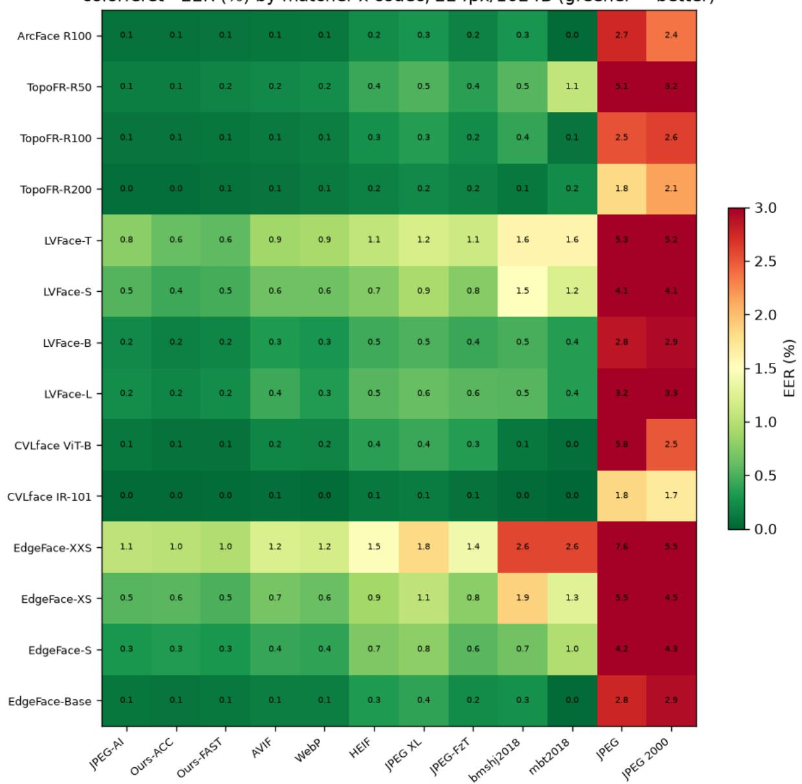  
Figure 18: Full-resolution model effect (Color FERET, 224 px/1024 B); same axes as Figure 16. The seven classical/transform codecs span all fourteen matchers, and the codec ordering and the JPEG/JPEG 2000 collapse reproduce at the source resolution, at lower absolute EER than 112 px. The learned codecs are now equally complete: JPEG-AI and both Ours variants are scored on all fourteen matchers, as are the two CompressAI baselines (on their 300-crop subset). All three learned codecs track each other and lead the classical codecs, exactly as at 112 px.

kk - EER (%) by matcher x codec, 224px/1024B (greener = better)  
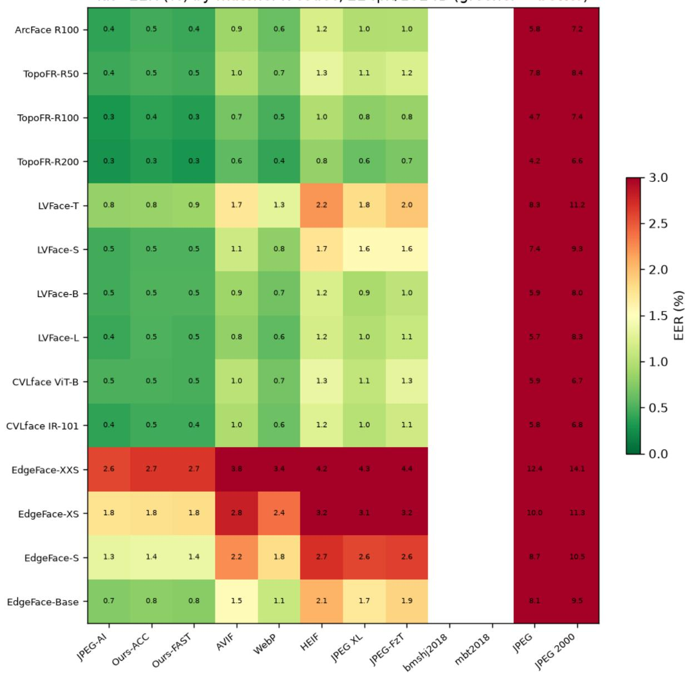  
Figure 19: Full-resolution model effect on AI-Solutions-KK (224 px/1024 B); same axes as Figure 18. The classical/transform codecs span all fourteen matchers and the codec ordering reproduces at uniformly higher absolute EER, exactly as at 112 px. The learned codecs are no longer restricted to a handful of matchers: the in-the-wild 224 px backfill is complete, so JPEG-AI, Ours-ACCURATE and Ours-FAST are each scored on all fourteen. Only the two CompressAI baselines are absent, never having been run on AI-Solutions-KK.

## 5.7 Budget compliance: can the codec even hit the target?

TL;DR A codec is only usable if it can actually emit a ≤ B-byte file. At 1024 B most codecs comply, but at 512 B the block codecs (JPEG, WebP, AVIF, HEIF, JPEG XL) barely reach the budget at 168/224 px (0–5% of crops fit, and only WebP on Color FERET climbs higher, to ∼31% at 168 px); only JPEG 2000 (native rate control), JPEG-FzT and the learned codecs (JPEG-AI, ours) hold it – and JPEG 2000 holds it only by destroying identity.

The accuracy tables above implicitly assume the encoder produced a file within the budget; under a hard ≤ B constraint that assumption fails for several codecs, resolutions and image types. We sweep the achieved compressed size of every crop and report, per (codec, resolution, budget), the fraction holding the budget (≤ B bytes). Figure 20 is the compliance heatmap; Tables 30 and 31 give the numbers at the hardest budget (512 B), with Table 32 the same measure at 1024 B for comparison; and Figure 21 shows the full achieved-size distribution (median line, mean marker, min–max whiskers) per codec, with the budget drawn as a reference line.

At 1024 B nearly every codec complies – the per-image quality search reaches the target – the exceptions being the fixed-rate CompressAI baselines bmshj2018/mbt2018 (only 59/67% of 112 px crops fit, since they have no byte target) and a genuine shortfall for WebP/JPEG XL at 224 px: on Color FERET they still fit 94/87% of crops, but on AI-Solutions-KK only 29/38% (Table 32). At 512 B the picture changes sharply: on AI-Solutions-KK the standard block codecs hold the budget for essentially no crops (0–2%) at 168 and 224 px and only 51–77% at 112 px – they simply cannot encode a higher-resolution face to half a kilobyte. Only JPEG 2000 (a true target-size mode1), JPEG-FzT and the learned codecs (JPEG-AI and ours, budget-targeted by construction) hold the budget reliably.

This is afit-vs-accuracy tension: JPEG 2000 always fits but is the worst codec on identity (Section 5.3), whereas the codecs that best preserve identity at 512 B are exactly the learned ones that are also budgetcompliant. The learned codec’s hard byte-budget search (Section 7) guarantees a parseable ≤ B stream by construction, and the Ours fit-rate is measured across all five resolutions. It holds 100% at the 64, 112 and (for Ours-ACC) 224 px cells, with the over-budget fallback frame (Section 7) visible only at some 96 and 168 px cells – e.g. on Color FERET at 1024 B Ours-ACC fits 90% (96 px) and 90% (168 px) (Figure 20), and the pattern persists at 512 B, where Ours-ACC still holds 80% at those two resolutions while most block codecs have already collapsed to 0–5% at 168 px (WebP excepted, at 31%). Ours-FAST emits the fallback slightly more often (down to 50% at 168 px/ 512 B on Color FERET, and 9/14% at 168/224 px/512 B on AI-Solutions-KK).

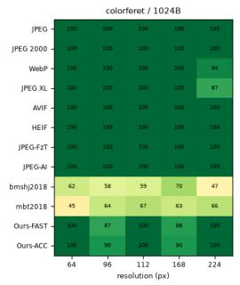

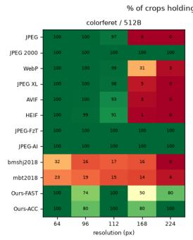

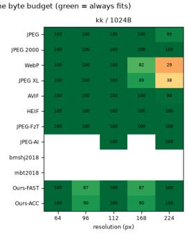

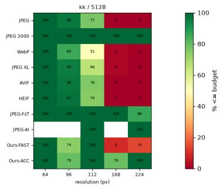  
Figure 20: Budget compliance: percentage of crops whose compressed file holds the byte budget $( \leq B ) ,$ per codec × resolution, for each dataset/budget. Green = always fits, red = never fits. The red block at 168/224 px under 512 B shows the block codecs cannot reach the budget there; JPEG 2000 and the learned codecs stay green. A white cell was not encoded at all — JPEG-AI on AI-Solutions-KK outside 112/224 px, and the CompressAI baselines on that dataset entirely (see Table 30) — and is deliberately blank rather than shaded: a cell measured over fewer than 30 crops is dropped, so no percentage here rests on a handful of spot-check files.

Table 30: AI-Solutions-KK, 512 B: % of crops holding the budget, codec × resolution. JPEG-AI drives an arbitrary target rate and so fits the budget by construction (100% in both measured columns); our codecs do the same at 64 and 112 px but fall back to an over-budget frame elsewhere (Ours-ACC 79% at 96 and 168 px, Ours-FAST down to 9% at 168 px), so the compliance question is really about them and about the block codecs, which have a true minimum size. “–” marks a cell we did not encode, and the reason is cost rather than choice: JPEG-AI encodes at ≈2.9 s per crop, so covering KK’s 17.5 k crops at the remaining three resolutions would be ≈87 GPU-hours for a column whose value is known in advance; the CompressAI baselines were run on Color FERET only (Table 31), where – unlike JPEG-AI and our codecs – they miss the budget badly (0–32%), because they expose fixed quality presets rather than a target rate. Highest / lowest compliance per resolution column, ranked on the printed (rounded) value; a column where every codec ties is left unshaded, and green is reserved for a uniquely highest cell, so a column in which most codecs reach 100% marks only the failures. “–” is a cell with no run, or one measured over fewer than 30 crops — too few for a percentage to mean anything next to the 11–17.5 k-crop cells beside it.
<table><tr><td>Codec</td><td> $6 4 { \mathfrak { p } } \mathbf { x }$ </td><td> $9 6 \mathrm { p x }$ </td><td> $1 1 2 \mathrm { p x }$ </td><td> $1 6 8 \mathrm { p x }$ </td><td> $2 2 4 \mathrm { p x }$ </td></tr><tr><td>JPEG</td><td>100</td><td>96</td><td>77</td><td>0</td><td>0</td></tr><tr><td>JPEG 2000</td><td>100</td><td>100</td><td>100</td><td>100</td><td>100</td></tr><tr><td>WebP</td><td>100</td><td>85</td><td>51</td><td>2</td><td>0</td></tr><tr><td>JPEG XL</td><td>100</td><td>95</td><td>66</td><td>2</td><td>0</td></tr><tr><td>AVIF</td><td>100</td><td>96</td><td>76</td><td>0</td><td>0</td></tr><tr><td>HEIF</td><td>100</td><td>97</td><td>75</td><td>0</td><td>0</td></tr><tr><td>JPEG-FzT</td><td>100</td><td>100</td><td>100</td><td>100</td><td>86</td></tr><tr><td>JPEG-AI</td><td></td><td></td><td>100</td><td>一</td><td>100</td></tr><tr><td>Ours-FAST</td><td>100</td><td>74</td><td>100</td><td>9</td><td>14</td></tr><tr><td>Ours-ACC</td><td>100</td><td>79</td><td>100</td><td>79</td><td>100</td></tr></table>

Table 31: Color FERET, 512 B: % of crops holding the budget, codec × resolution. Shading as in Table 30. The CompressAI baselines are now measured across all five resolutions (they were previously 112 px only), but on the 300-crop subset they were compressed on — 2.6% of the corpus behind every other row here — so their percentages carry a sampling error the 11k-crop rows do not, and their shading should be read as indicative. They are also the only rows that genuinely miss the budget rather than hitting it by construction: CompressAI exposes fixed quality presets, not a target rate.
<table><tr><td>Codec</td><td> $6 4 { \mathfrak { p } } \mathbf { x }$ </td><td> $9 6 \mathrm { p x }$ </td><td> $1 1 2 \mathrm { p x }$ </td><td> $1 6 8 \mathrm { p x }$ </td><td> $2 2 4 \mathrm { p x }$ </td></tr><tr><td>JPEG</td><td>100</td><td>100</td><td>97</td><td>0</td><td>0</td></tr><tr><td>JPEG 2000</td><td>100</td><td>100</td><td>100</td><td>100</td><td>100</td></tr><tr><td>WebP</td><td>100</td><td>100</td><td>99</td><td>31</td><td>3</td></tr><tr><td>JPEG XL</td><td>100</td><td>100</td><td>98</td><td>5</td><td>0</td></tr><tr><td>AVIF</td><td>100</td><td>100</td><td>93</td><td>3</td><td>0</td></tr><tr><td>HEIF</td><td>100</td><td>99</td><td>91</td><td>1</td><td>0</td></tr><tr><td>JPEG-FzT</td><td>100</td><td>100</td><td>100</td><td>100</td><td>100</td></tr><tr><td>JPEG-AI</td><td>100</td><td>100</td><td>100</td><td>100</td><td>100</td></tr><tr><td>bmshj2018</td><td>32</td><td>16</td><td>17</td><td>16</td><td>0</td></tr><tr><td>mbt2018</td><td>23</td><td>19</td><td>15</td><td>14</td><td>4</td></tr><tr><td>Ours-FAST</td><td>100</td><td>74</td><td>100</td><td>50</td><td>80</td></tr><tr><td>Ours-ACC</td><td>100</td><td>80</td><td>100</td><td>80</td><td>100</td></tr></table>

Table 32: The same compliance measure at the easier 1024 B budget, both datasets (AI-Solutions-KK above, Color FERET below). Shading and the “–” convention as in Table 30. These are the rows the 512 B tables should be read against: a codec that fails at 512 B but holds here is rate-limited, not broken.
<table><tr><td>Codec</td><td> $6 4 { \mathfrak { p } } \mathbf { x }$ </td><td> $9 6 \mathrm { p x }$ </td><td> $1 1 2 \mathrm { p x }$ </td><td> $1 6 8 \mathrm { p x }$ </td><td> $2 2 4 \mathrm { p x }$ </td></tr><tr><td>JPEG</td><td>100</td><td>100</td><td>100</td><td>100</td><td>95</td></tr><tr><td>JPEG 2000</td><td>100</td><td>100</td><td>100</td><td>100</td><td>100</td></tr><tr><td>WebP</td><td>100</td><td>100</td><td>100</td><td>82</td><td>29</td></tr><tr><td>JPEG XL</td><td>100</td><td>100</td><td>100</td><td>89</td><td>38</td></tr><tr><td>AVIF</td><td>100</td><td>100</td><td>100</td><td>100</td><td>98</td></tr><tr><td>HEIF</td><td>100</td><td>100</td><td>100</td><td>100</td><td>100</td></tr><tr><td>JPEG-FzT</td><td>100</td><td>100</td><td>100</td><td>100</td><td>100</td></tr><tr><td>JPEG-AI</td><td>一</td><td>一</td><td>100</td><td>一</td><td>100</td></tr><tr><td>bmshj2018</td><td>一</td><td>一</td><td>一</td><td>一</td><td>一</td></tr><tr><td>mbt2018</td><td></td><td></td><td>一</td><td>一</td><td>一</td></tr><tr><td>Ours-FAST</td><td>100</td><td>87</td><td>100</td><td>87</td><td>100</td></tr><tr><td>Ours-ACC</td><td>100</td><td>90</td><td>100</td><td>90</td><td>100</td></tr><tr><td>Codec</td><td>64px</td><td> $9 6 \mathrm { p x }$ </td><td> $1 1 2 \mathrm { p x }$ </td><td>168 px</td><td>224 px</td></tr><tr><td>JPEG</td><td>100</td><td>100</td><td>100</td><td>100</td><td>100</td></tr><tr><td>JPEG 2000</td><td>100</td><td>100</td><td>100</td><td>100</td><td>100</td></tr><tr><td>WebP</td><td>100</td><td>100</td><td>100</td><td>100</td><td>94</td></tr><tr><td>JPEG XL</td><td>100</td><td>100</td><td>100</td><td>100</td><td>87</td></tr><tr><td>AVIF</td><td>100</td><td>100</td><td>100</td><td>100</td><td>100</td></tr><tr><td>HEIF</td><td>100</td><td>100</td><td>100</td><td>100</td><td>100</td></tr><tr><td>JPEG-FzT</td><td>100</td><td>100</td><td>100</td><td>100</td><td>100</td></tr><tr><td>JPEG-AI</td><td>100</td><td>100</td><td>100</td><td>100</td><td>100</td></tr><tr><td>bmshj2018</td><td>62</td><td>58</td><td>59</td><td>70</td><td>47</td></tr><tr><td>mbt2018</td><td>45</td><td>64</td><td>67</td><td>63</td><td>66</td></tr><tr><td>Ours-FAST</td><td>100</td><td>87</td><td>100</td><td>88</td><td>100</td></tr><tr><td>Ours-ACC</td><td>100</td><td>90</td><td>100</td><td>90</td><td>100</td></tr></table>

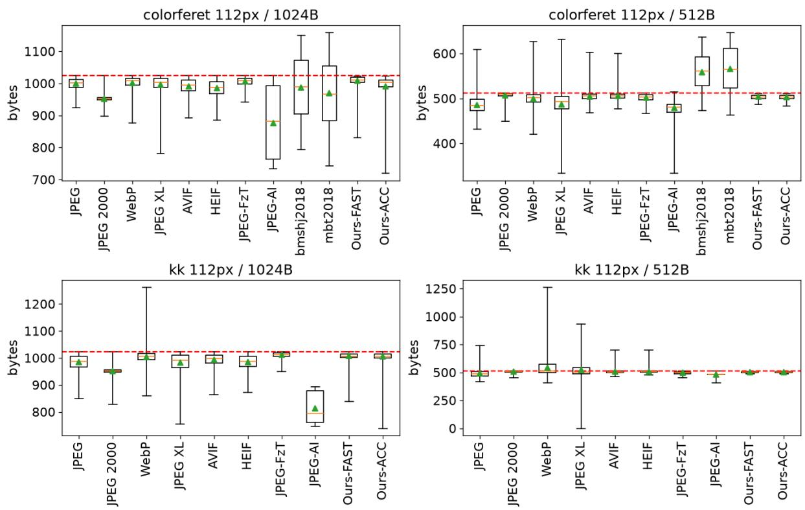  
Figure 21: Achieved compressed-file-size distribution per codec at the 112 px verification working resolution, for both datasets and both budgets. Box = inter-quartile range, line = median, triangle = mean, whiskers span the full min–max; the dashed red line is the byte budget. Codecs whose box sits above the line overshoot the budget for most crops. The remaining resolutions are given numerically in the fit-rate tables (Tables 30 and 31); drawing all twenty cells here would shrink the tick labels below legibility.

## 5.8 Headline ranking and discussion

TL;DR At 1024 B, JPEG-AI is the identity leader, WebP/AVIF/JPEG XL/HEIF are safe, JPEG and JPEG 2000 are not; our trained codec already sits between JPEG-AI and AVIF on identity cosine, and the 512 B point is where standard codecs stop being viable.

Three conclusions follow for the sub-1 kB target. First, the budget is the dominant variable: at 1024 B several mature codecs already keep 112 px verification EER under 0.5%, but at 512 B all standard codecs except JPEG-AI degrade sharply, and the JPEG family becomes unusable (id-cosine 0.069–0.357 on Color FERET). Second, a codec’s distortion score is a poor proxy for its identity score: JPEG 2000 attains respectable PSNR/SSIM yet destroys identity (id-cosine 0.228 at 512 B), so identity cosine and verification EER – not PSNR – are the metrics that matter for this task; this decoupling is quantified in Section 6 (Figure 22). Third, the ceiling among off-the-shelf options is set by the learned standard JPEG-AI, with the modern block codecs WebP, AVIF, JPEG XL and HEIF as the practical, widely-deployable tier. Our trained codec is already competitive on identity – between JPEG-AI and AVIF at 1024 B and ahead of AVIF at 512 B on Color FERET – and its perceptual-loss training gives it the best LPIPS at 512 B; closing the remaining identity-cosine gap to JPEG-AI and confirming it on the verification EER grid is the subject of the following sections.

## 6 Reconstruction Quality

TL;DR Full-reference fidelity ranks the codecs JPEG-AI > WebP/AVIF > JPEG XL > JPEG-FzT/JPEG 2000 > plain JPEG at the 1 kB operating point — but that ranking does not transfer to identity: image-quality metrics are an unreliable proxy for verification EER (§6.2), and our learned codec wins the perceptual LPIPS/DISTS metrics while losing PSNR/SSIM. Read this section as a warning against selecting a codec on fidelity, not as a second ranking; classical codecs hold skin tone but soften texture, JPEG blocks worst, and our learned codec degrades gently toward the 512 B point.

This section measures how faithfully each codec reconstructs the face crop at the sub-1 kB target. The harder question — whether identity survives — is answered by the verification benchmark of Section 5, which precedes this section; here we ask how well pixel fidelity tracks that identity result. Quality is a proxy: a codec can score well on pixel fidelity yet still discard the cues a matcher relies on, so the metric matrix and the montages below should be read together with the rate–EER results rather than in isolation. All numbers are dataset medians over the full quality run; the underlying per-cell five-metric tables (PSNR, SSIM, MS-SSIM, LPIPS, DISTS for every (codec,res,budget) cell) live in the project quality CSVs. Our own learned codecs (Ours-FAST, Ours-ACCURATE) are scored on the same full population as the classical codecs (n=11,335 on Color FERET, n=17,534 on AI-Solutions-KK).

## 6.1 Full-reference metric matrix

TL;DR Across PSNR, SSIM, MS-SSIM, LPIPS and DISTS at 1024 B, JPEG-AI and WebP lead on distortion metrics, our learned codec trails on PSNR/SSIM but leads every codec on the perceptual LPIPS/DISTS metrics, and plain JPEG is near-last at both resolutions. Every row is now measured on the full population except the two CompressAI baselines.

We report five complementary full-reference metrics. PSNR and SSIM [44] capture pixel- and structure-level fidelity; MS-SSIM adds a multi-scale structural view; LPIPS [46] and DISTS [20] are learned perceptual distances (lower is better) that correlate better with human judgement of texture and identity-bearing detail. Table 33 gives a compact view at the verification working resolution (112 px) and at full-size crops (224 px), both at the 1024 B budget, on Color FERET. The ranking is consistent across metrics: WebP [23] and AVIF [2] lead the broadly available classical codecs, JPEG XL [1] follows, JPEG-FzT and JPEG 2000 [40] sit mid-pack, and plain JPEG [43] is last on every perceptual metric at 224 px (LPIPS 0.436, DISTS 0.354) and, at 112 px, tenth of twelve on DISTS (0.206) though only mid-field on LPIPS (0.103). JPEG-AI [5] is the strongest codec on the structural metrics at 112 px (SSIM 0.920, MS-SSIM 0.984 at 1024 B; its PSNR 33.32 dB is second behind WebP’s 33.45 among the full-population rows — mbt2018’s 33.85 is higher but rests on 300 crops, which is why it is marked ‡ and does not take the crown), though our learned codec still leads it on the perceptual LPIPS/DISTS metrics. Its edge narrows as the crop grows: at 224 px its perceptual quality falls off sharply (LPIPS 0.060 → 0.205), consistent with the 112 px working-resolution choice. The learned baselines bmshj2018 [7] and mbt2018 [33] (from CompressAI [8]) run on a 300-image subset at every resolution, and are scored for full-reference quality at 112 px only; mbt2018 reaches PSNR 33.85 dB / SSIM 0.897 at 1024 B, competitive on PSNR but weaker than WebP/AVIF on LPIPS. That 300-crop support is 2.6% of Color FERET, so every bmshj2018/mbt2018 number in this report — here, in the budget-compliance tables and in the per-matcher rate–EER tables — is a lower-precision estimate sitting beside full-population columns. The accuracy grids (model-effect, FNMR, budget sweep) print those cells with no in-table support mark, and several of their green column-best crowns are bmshj2018 cells, so they must be read against this note rather than as full-population wins.

The two rightmost blocks add our own learned codecs, measured on every crop. The headline finding is a clean perceptual-vs-distortion split: on the pixel- and structure-fidelity metrics Ours-ACCURATE trails the classical field badly (PSNR 28.63 dB, SSIM 0.834 at 112 px / 1024 B, roughly 5 dB below WebP and behind every neural baseline), yet on the learned perceptual metrics it is the best codec in the table — LPIPS 0.012 and DISTS 0.095 at that cell beat WebP (0.045 / 0.142), AVIF (0.088 / 0.142), JPEG XL (0.145 / 0.170) and both of bmshj2018/mbt2018 (LPIPS 0.118–0.129); this LPIPS lead is an expected consequence of LPIPS being part of Ours’ training objective, not an independent advantage. Ours-FAST sits just below Ours-ACCURATE on both PSNR/SSIM (27.17 dB / 0.816) and the perceptual metrics (LPIPS 0.029, DISTS 0.146), while still beating the classical field on LPIPS (its DISTS 0.146 only ties WebP/AVIF’s 0.142). This is the perceptual/distortion trade-off characteristic of learned codecs: they optimise a perceptual objective and so discard the high-frequency energy PSNR rewards while preserving the texture cues LPIPS/DISTS — and, we show later, a face matcher — actually rely on. The trend on AI-Solutions-KK is the same ordering, with absolute PSNR roughly 1–3 dB lower at matched cells (∼3 dB for most classical codecs at 112 px, though only 0.4 dB for JPEG-FzT, and 1.4 dB for Ours-ACCURATE) owing to the in-the-wild content (Ours-ACCURATE 112 px / 1024 B: PSNR 27.26 dB, LPIPS 0.014).

The plain-JPEG 112 px row was previously computed over only 20 crops, on the stated grounds that the encoder rarely lands a valid file at that budget. That reason was wrong: all 11,335 files exist and all are under budget, and re-measuring them drops the cell from 31.37 to 29.34 dB — so the small sample had been flattering JPEG by 2 dB. Full-reference scoring of our own learned codecs (Ours-FAST, Ours-ACCURATE), by contrast, uses the full population (n=11,335 on Color FERET, n=17,534 on AI-Solutions-KK), and their rows appear in the matrix above.

## 6.2 Distortion does not predict identity

TL;DR Plotting each codec’s image-quality score against its verification EER at matched budget shows the two decouple. Across all twelve codecs PSNR does not significantly predict EER at 1024 B $( \rho = - 0 . 4 5 ,$ p=0.14), and neither does the perceptual LPIPS (+0.37, p=0.24); only the structural metrics clear p<0.05 there, and weakly (SSIM −0.66, MS-SSIM −0.62) — but that reading is dominated by the two partialcoverage neural baselines (§4); with them removed (n=10) the fidelity metrics do rank-track EER at 1024 B (PSNR ρ=−0.82, MS-SSIM −0.92, both significant) while the perceptual LPIPS still does not $( \rho { = } \mathrm { + } 0 . 5 0 ,$ p=0.14). At the tight 512 B budget every metric becomes predictive and the perceptual ones track EER most tightly (DISTS ρ=+0.96, LPIPS +0.94, vs PSNR −0.74). Either way the deployment message holds: the “best” metric flips across budgets and equal-quality codecs (JPEG 2000 vs Ours-ACCURATE) differ by more than an order of magnitude in EER, so codec selection for identity must be validated on verification metrics.

The preceding matrix and the benchmark’s EER grids measure two different things — pixel fidelity and identity survival — and the sub-1 kB regime is exactly where they part ways. Figure 22 makes the decoupling explicit by plotting, for every codec with both measurements at the 112 px working resolution on Color FERET (ArcFace), the median PSNR against the verification EER. If distortion were a reliable proxy for identity, the points would fall on a monotone high-PSNR/low-EER curve. They do not. At the 1024 B budget the Spearman rank correlation across all twelve codecs is $\rho = - 0 . 4 5$ and does not reach significance $( p = 0 . 1 4 )$ ; at 512 B it strengthens to $\rho = - 0 . 7 4 \ ( p = 0 . 0 0 6 )$ but remains far from deterministic. PSNR is not alone at the comfortable budget: LPIPS is equally flat there $( \rho = + 0 . 3 7$ $p = 0 . 2 4 )$ and only the structural metrics reach $p < 0 . 0 5$ , and then weakly (SSIM −0.66, p = 0.018; MS-$\operatorname { S S I M } - 0 . 6 2 , p = 0 . 0 3 1 )$ . This twelve-codec reading is, however, dominated by the two partial-coverage neural baselines (bmshj2018/mbt2018), whose EERs rest on the reduced ∼3.4 k-impostor subset and are flagged as a scoring artefact rather than codec behaviour (§4); it is inconsistent to disown mbt2018’s 2.50% EER as an artefact yet let it drive the correlation. Recomputing with those two removed (n = 10) sharpens the picture: at 1024 B thefidelity metrics now do rank-track EER (PSNR $\rho = - 0 . 8 2 , p = 0 . 0 0 4 ;$ SSIM −0.87; MS-SSIM −0.92), so the weak fidelity signal at the comfortable budget was largely masked by the two artefact points. The perceptual metrics run opposite to the naive perceptual-quality expectation of the framing: LPIPS still does not predict EER at 1024 B $( \rho = + 0 . 5 0 , p = 0 . 1 4 )$ , and DISTS is only

Table 33: Full-reference quality (dataset medians) at the 1024 B budget on Color FERET, for the verification resolution (112 px) and full crops (224 px). Higher PSNR/SSIM/MS-SSIM is better; lower LPIPS/DISTS is better. The best value in each column per resolution block is shaded green and the worst red. Every row is now measured on the full population (n=11,331–11,335 on Color FERET) except the CompressAI baselines bmshj2018/mbt2018, which were run on a 300-crop subset at 112 px only and are omitted from the 224 px block. Those two rows carry ‡: their values print, but they take no part in the best/worst comparison, as in Table 26. That rule changes one crown — the 112 px PSNR best is WebP’s 33.45 on 11,335 crops, not mbt2018’s 33.85 on 300. Earlier versions of this table scored JPEG-AI on 300 crops and plain JPEG’s 112 px cell on 20, both of which flattered them — JPEG’s PSNR there fell 31.37 → 29.34 dB when the full population was measured.
<table><tr><td>Codec</td><td>Res.</td><td>PSNR</td><td>SSIM</td><td>MS-SSIM</td><td>LPIPS</td><td>DISTS</td></tr><tr><td>112 px</td><td></td><td></td><td></td><td></td><td></td><td></td></tr><tr><td>JPEG-AI</td><td>112</td><td>33.32</td><td>0.920</td><td>0.984</td><td>0.060</td><td>0.137</td></tr><tr><td>WebP</td><td>112</td><td>33.45</td><td>0.912</td><td>0.978</td><td>0.045</td><td>0.142</td></tr><tr><td>AVIF</td><td>112</td><td>32.99</td><td>0.904</td><td>0.979</td><td>0.088</td><td>0.142</td></tr><tr><td>HEIF</td><td>112</td><td>32.41</td><td>0.901</td><td>0.973</td><td>0.099</td><td>0.151</td></tr><tr><td>mbt2018</td><td>112</td><td>33.85</td><td>0.897</td><td>0.983</td><td>0.118</td><td>0.162</td></tr><tr><td>bmshj2018</td><td>112</td><td>32.83</td><td>0.886</td><td>0.982</td><td>0.129</td><td>0.176</td></tr><tr><td>JPEG XL</td><td>112</td><td>31.65</td><td>0.884</td><td>0.973</td><td>0.145</td><td>0.170</td></tr><tr><td>JPEG</td><td>112</td><td>29.34</td><td>0.851</td><td>0.955</td><td>0.103</td><td>0.206</td></tr><tr><td>JPEG-FzT</td><td>112</td><td>26.25</td><td>0.839</td><td>0.959</td><td>0.238</td><td>0.213</td></tr><tr><td>Ours-ACCURATE</td><td>112</td><td>28.63</td><td>0.834</td><td>0.979</td><td>0.012</td><td>0.095</td></tr><tr><td>Ours-FAST</td><td>112</td><td>27.17</td><td>0.816</td><td>0.968</td><td>0.029</td><td>0.146</td></tr><tr><td>JPEG 2000</td><td>112</td><td>27.77</td><td>0.795</td><td>0.927</td><td>0.241</td><td>0.242</td></tr><tr><td colspan="7"> $2 2 4 p x$ </td></tr><tr><td>JPEG-AI</td><td>224</td><td>33.23</td><td>0.898</td><td>0.973</td><td>0.205</td><td>0.198</td></tr><tr><td>AVIF</td><td>224</td><td>32.16</td><td>0.866</td><td>0.956</td><td>0.247</td><td>0.221</td></tr><tr><td>HEIF</td><td>224</td><td>31.65</td><td>0.860</td><td>0.948</td><td>0.247</td><td>0.225</td></tr><tr><td>WebP</td><td>224</td><td>31.79</td><td>0.858</td><td>0.949</td><td>0.225</td><td>0.221</td></tr><tr><td>JPEG XL</td><td>224</td><td>29.09</td><td>0.823</td><td>0.930</td><td>0.388</td><td>0.287</td></tr><tr><td>Ours-FAST</td><td>224</td><td>29.55</td><td>0.821</td><td>0.956</td><td>0.072</td><td>0.160</td></tr><tr><td>JPEG-FzT</td><td>224</td><td>28.01</td><td>0.816</td><td>0.925</td><td>0.387</td><td>0.287</td></tr><tr><td>JPEG 2000</td><td>224</td><td>27.59</td><td>0.790</td><td>0.890</td><td>0.403</td><td>0.317</td></tr><tr><td>Ours-ACCURATE</td><td>224</td><td>28.57</td><td>0.781</td><td>0.957</td><td>0.062</td><td>0.136</td></tr><tr><td>JPEG</td><td>224</td><td>24.59</td><td>0.718</td><td>0.806</td><td>0.436</td><td>0.354</td></tr></table>

Pixel fidelity does not predict identity — ColorFERET, ArcFace, 112 px

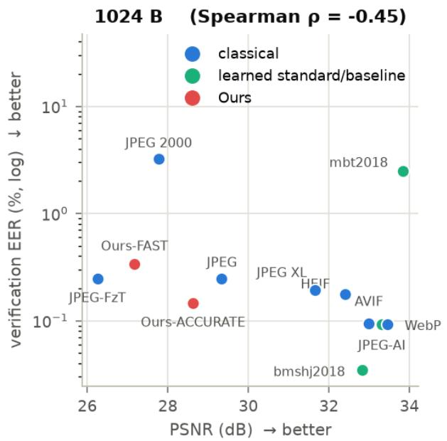

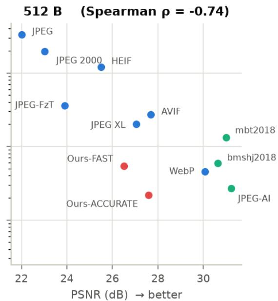  
Figure 22: Pixel fidelity versus identity at matched budget (Color FERET, ArcFace, 112 px; EER on a log scale, so vertical gaps of one grid line are order-of-magnitude differences). Points are codecs, coloured by family. PSNR does not determine EER: at 1024 B the twelve-codec rank correlation is non-significant $( \rho = - 0 . 4 5 , p = 0 . 1 4$ $n = 1 2 )$ , and codecs at equal PSNR differ by more than an order of magnitude in EER (WebP 0.09% at 33.5 dB vs mbt2018 2.50% at 33.8 dB); removing the two partial-coverage neural baselines $( n = 1 0 )$ makes PSNR predictive $( \rho = - 0 . 8 2 , p = 0 . 0 0 4 )$ , so the null at n = 12 is largely those two artefact points (§4).

borderline $( \rho = + 0 . 7 8 , p = 0 . 0 0 8 \mathrm { ~ a t } n = 1 0 ; + 0 . 5 3 , p = 0 . 0 8 \mathrm { - ~ a ~ c o i n . f i p \mathrm { - ~ a t } } n = 1 2 )$ . At 512 B, where distortion is severe enough to erode identity, all metrics become predictive and the perceptual ones track EER most tightly $\mathrm { ( D I S T S } \rho = + 0 . 9 6 , \mathrm { L P I P S } + 0 . 9 4 ; \mathrm { M S - S S I M } - 0 . 9 1 ; \mathrm { P S N R } - 0 . 7 4 ;$ all $p \leq 0 . 0 0 6 ;$ the $n = 1 0$ values are within 0.11). We report both supports; the durable, coverage-robust point is carried by two concrete disagreements that survive the $n = 1 0$ filter. First, JPEG 2000 sits mid-field on PSNR (27.77 dB) but is the worst-performing standard codec on identity (3.23% EER). Second, the relation inverts for our perceptually-trained codec: Ours-ACCURATE gives up ∼5 dB of PSNR relative to WebP yet matches the strong codecs on EER (0.14%), because its objective spends bits on identity-bearing structure rather than on broadband pixel error — and it is exactly this codec that also tops the perceptual LPIPS/DISTS metrics, so its advantage is visible on perceptual quality even where PSNR hides it. (At $n = 1 2$ the sharpest disagreement is mbt2018’s field-best PSNR 33.85 dB against a 2.50% EER, but that is the very coverage artefact we exclude above.) The practical consequence for a deployer is that a codec cannot be selected for a face-credential pipeline from image-quality benchmarks of either family — the choice must be validated on verification error directly, which is what the operating-point analysis of Section 5.3 provides.

## 6.3 Face image quality (FIQ)

TL;DR Because this is a face codec, we add a no-reference face-image-quality measure (SER-FIQstyle): the stability of a matcher’s embedding under mild input perturbation, swept over the full $\{ 1 1 2 , 2 2 4 \} \mathrm { p x } \times \{ 5 1 2 , 1 0 2 4 \}$ B grid on both datasets. At 1024 B every codec but legacy JPEG at the 224 px source (already ∼0.03 below the original there) preserves FIQ at the uncompressed level; the split appears only at 512 B, where legacy JPEG collapses hardest (FIQ 0.95→0.80) and JPEG-FzT collapses at the 224 px source, while the modern transform codecs and both learned variants (Ours-FAST and Ours-ACCURATE) stay within ∼0.01 of the original — more evidence that the learned codecs degrade gracefully at the hard

Table 34: No-reference face image quality (SER-FIQ-style, mean pairwise cosine; higher is better) across the resolution×budget grid, n=250 paired crops per cell, oracle matcher arcface\_antelopev2. Best / worst per column. JPEG-AI is now scored on both datasets (its AI-Solutions-KK FIQ sits at the ∼0.95 original level like the other modern codecs). At 1024 B all codecs except legacy JPEG at 224 px (0.924 CF / 0.930 KK) sit at the ∼0.95 original level; the degradation is otherwise a 512 B effect concentrated in JPEG (and JPEG-FzT at 224 px).
<table><tr><td></td><td colspan="4">Color FERET</td><td colspan="4">AI-Solutions-KK</td></tr><tr><td>Codec</td><td>112/1024</td><td>112/512</td><td>224/1024</td><td>224/512</td><td>112/1024</td><td>112/512</td><td>224/1024</td><td>224/512</td></tr><tr><td>Original</td><td>0.952</td><td>0.952</td><td>0.954</td><td>0.954</td><td>0.953</td><td>0.953</td><td>0.956</td><td>0.956</td></tr><tr><td>JPEG</td><td>0.939</td><td>0.802</td><td>0.924</td><td>0.877</td><td>0.939</td><td>0.847</td><td>0.930</td><td>0.918</td></tr><tr><td>JPEG 2000</td><td>0.942</td><td>0.905</td><td>0.947</td><td>0.913</td><td>0.945</td><td>0.913</td><td>0.950</td><td>0.924</td></tr><tr><td>WebP</td><td>0.954</td><td>0.953</td><td>0.957</td><td>0.956</td><td>0.954</td><td>0.951</td><td>0.956</td><td>0.956</td></tr><tr><td>JPEG XL</td><td>0.958</td><td>0.946</td><td>0.957</td><td>0.957</td><td>0.956</td><td>0.948</td><td>0.956</td><td>0.956</td></tr><tr><td>AVIF</td><td>0.956</td><td>0.947</td><td>0.957</td><td>0.956</td><td>0.955</td><td>0.945</td><td>0.956</td><td>0.956</td></tr><tr><td>HEIF</td><td>0.956</td><td>0.921</td><td>0.956</td><td>0.948</td><td>0.954</td><td>0.929</td><td>0.956</td><td>0.952</td></tr><tr><td>JPEG-FzT</td><td>0.960</td><td>0.934</td><td>0.949</td><td>0.838</td><td>0.958</td><td>0.937</td><td>0.946</td><td>0.881</td></tr><tr><td>JPEG-AI</td><td>0.954</td><td>0.953</td><td>0.955</td><td>0.955</td><td>0.953</td><td>0.952</td><td>0.954</td><td>0.954</td></tr><tr><td>Ours-FAST</td><td>0.952</td><td>0.950</td><td>0.956</td><td>0.954</td><td>0.951</td><td>0.947</td><td>0.955</td><td>0.953</td></tr><tr><td>Ours-ACC</td><td>0.952</td><td>0.951</td><td>0.953</td><td>0.951</td><td>0.953</td><td>0.951</td><td>0.955</td><td>0.951</td></tr></table>

## budget.

The full-reference metrics above compare a reconstruction to its own original. A deployment also cares about a no-reference question specific to faces: does the decoded crop still look like a high-quality face to a matcher? We answer it with a face image quality assessment (FIQA) score in the SER-FIQ [41] family. As the project matchers are deterministic (no dropout), we use the inputstochasticity variant: for an image x we draw T=10 mild augmentations $a _ { 1 } , \dots , a _ { T }$ (scale-crop 0.90–1.00, horizontal flip, gamma 0.85–1.15, brightness ±8%), embed each with the arcface\_antelopev2 oracle, and set $\mathrm { F I Q } ( x ) = \mathrm { m e a n } _ { i < j } \cos \bigl ( f ( a _ { i } ( x ) ) , f ( a _ { j } ( x ) ) \bigr )$ : an embedding that survives perturbation signals a high-quality, recognisable face. We report FIQ over the full resolution×budget grid ({112,224} px × {512, 1024} B), n=250 paired crops per cell per dataset; the learned Ours-\* crops are reconstructed from the paper checkpoints in-process (encode→decode). Every reconstruction is resized to the matcher’s 112 px input before augmentation, so all cells are scored on the operationally-relevant matcher input. Table 34 and Figure 23 report the result.

Three readings follow. First, at 1024 B face image quality is essentially codec-independent: every codec — classical, transform, JPEG-AI and both Ours variants — sits within ∼0.015 of the uncompressed original (≈ 0.95) at the 112 px working resolution on both datasets, and within ∼0.01 at 224 px with the single exception of legacy JPEG (0.030 below the original on Color FERET, 0.026 on AI-Solutions-KK), so a kilobyte is enough for all of them to preserve a recognisable, robust face. Second, the degradation is a 512 B phenomenon and is codec-specific: halving the budget barely moves the modern transform codecs (WebP, AVIF, JPEG XL) or JPEG-AI (all still ≥ 0.945), but legacy JPEG collapses hardest (0.95→0.80 at 112 px CF, 0.85 KK), and JPEG-FzT — fine at 112 px — collapses at the 224 px source (0.84 CF, 0.88 KK), where its F-transform reconstruction of a half-kilobyte high-resolution crop breaks down; JPEG 2000 and HEIF lose an intermediate amount. Third, both learned variants degrade gracefully: Ours-FAST and Ours-ACCURATE hold FIQ ≥ 0.946 across every cell including the hardest 224 px/512 B point, tracking the strong transform codecs rather than the collapsing JPEG/JPEG-FzT — the same graceful-degradation behaviour the verification EER shows, confirmed on a no-reference face-quality metric. (Small negative ∆FIQ for the strong codecs at 1024 B is a known SER-FIQ artefact: mild compression denoises the crop, marginally raising augmentation-robustness; read those as “no degradation”.)

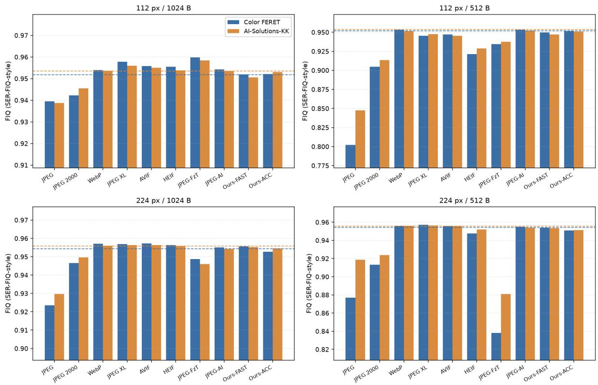  
Figure 23: Face image quality per codec across the four resolution×budget cells on both datasets (dashed lines: the uncompressed originals). At 1024 B (left column of panels) every codec tracks the original except legacy JPEG at the 224 px source (∼0.03 below it); at 512 B (right column) JPEG drops sharply and JPEG-FzT drops at 224 px, while the modern transform codecs and both Ours variants stay at the original level.

## 6.4 Visual comparison

TL;DR Side-by-side montages confirm the metric story: JPEG-AI keeps the most facial structure, classical codecs preserve skin tone while softening texture, JPEG blocks worst, and the learned codec degrades gently to 512 B with a mild tone shift on darker skin to watch.

The montages decode one sample per identity with the project’s own decoders and crop to the reference resolution, so the comparison is like-for-like at a fixed byte budget. Figure 24 shows the full codec grid at 224 px / 1024 B on both datasets. On Color FERET (Figure 24a), plain JPEG shows the worst blocking and ringing around the eyes and beard, WebP/AVIF/JPEG XL stay smoother but lose fine texture, and JPEG-AI retains the most facial structure at this budget — the eyeglass frames and hairline are the clearest discriminators. On AI-Solutions-KK (Figure 24b) the same ordering holds; all classical codecs hold skin tone well at this cell but soften pores and hair, and JPEG blocks worst on the dark-skin sample where local contrast is low.

Figure 25 is the learned-codec showcase at 112 px / 1024 B, the verification working resolution and the operating point our codec is trained for. On Color FERET (Figure 25a), Ours-ACCURATE keeps identity cues (eye region, beard edge) crisper than WebP/AVIF at the same budget, with Ours-FAST giving a lighter-weight, slightly softer reconstruction; JPEG-AI is the strongest non-learned reference here. On AI-Solutions-KK (Figure 25b), across the three Monk skin-tone [34] samples both learned variants preserve identity and avoid the blocking the classical codecs show — Ours-FAST producing a smoother result and Ours-ACCURATE keeping more fine texture. One important caveat carries into the fairness analysis: at this 112 px checkpoint the learned codec slightly darkens or shifts colour on the midand dark-skin crops, a tone bias that is visible in the backgrounds and not yet corrected; it is verified and

Codec comparison — Color FERET, 224px @ 1024B  
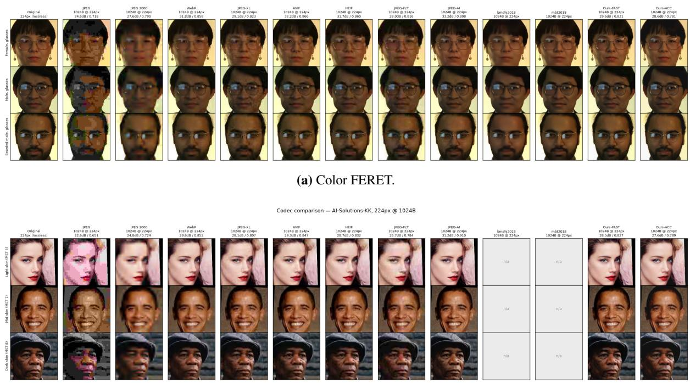  
(b) AI-Solutions-KK.  
Figure 24: Codec comparison at 224 px / 1024 B, decoded crops vs. the pixel-aligned reference, over the full ten-codec+Ours roster, so every benchmarked method is shown side by side. JPEG-AI keeps the most structure; classical codecs hold skin tone but soften texture; plain JPEG blocks worst; Ours-FAST/Ours-ACCURATE reconstruct colour-correct faces. JPEG-AI is shown on both datasets; the two CompressAI baselines (bmshj2018, mbt2018) appear on Color FERET only, marked “n/a” on AI-Solutions-KK because that dataset was never run through them beyond three stray crops apiece (n=3 at 224 px/1024 B in the file-size artifact, and no KK quality rows at all) — far below any reportable support. Their role here is as published learned-codec reference points, and Color FERET already fixes that reference. The KK rows span the Monk skin-tone scale [34]; the three subjects were picked by measured Individual Typology Angle rather than by the dataset’s per-image tone label, which mislabels light-skinned subjects photographed in shadow. Tile captions report the dataset-median PSNR/SSIM for the cell.

quantified in the fairness analysis (Section 11).

Two structural notes apply to the montages. First, JPEG-AI is now compressed for AI-Solutions-KK at both 112 and 224 px, so both the 112 px KK showcase (Figure 25) and the 224 px KK codec grid show the real JPEG-AI reconstruction, and every codec column in the grids is populated. Second, the learned codec is decoded from its .bin container on GPU (CPU decode produces NaNs for these checkpoints) and appears at both resolutions: Ours-FAST and Ours-ACCURATE are the last two columns of the 224 px codec grid (Figure 24) and of the 112 px showcase, where they reconstruct clean, colour-correct faces competitive with JPEG-AI and free of the blocking that plain JPEG shows at this budget.

## 6.5 Budget and resolution sweeps

TL;DR Halving the budget to 512 B hits classical codecs hard (WebP drops 30.5 dB→26.8 dB with visible blocking) while the learned codec stays smooth; at a fixed 1024 B, smaller crops look cleaner per pixel but a 224 px crop carries more facial detail under harder compression.

The budget sweep (Table 35, Figure 26) isolates what happens when the byte budget is halved from 1024 B to 512 B at a fixed 112 px. On AI-Solutions-KK, WebP’s median PSNR drops from 30.46 dB to 26.78 dB (SSIM 0.909 → 0.830) with visible blocking, colour banding and eye artifacts. Ours-ACCURATE degrades far more gently: PSNR falls only 27.26 → 25.78 dB (SSIM 0.845 → 0.799) and, tellingly, its LPIPS is essentially flat (0.014 → 0.022) where WebP’s roughly triples (0.032 → 0.092), so the learned reconstruction stays smooth and recognisable down to 512 B. The same pattern holds on Color FERET (Ours-ACCURATE PSNR 28.63 → 27.59 dB, SSIM 0.834 → 0.806; LPIPS 0.012 → 0.019). This graceful learned-codec behaviour, quantified here, is corroborated later against verification EER.

Table 35: Budget sweep at 112 px, 1024 B vs. 512 B (dataset medians, n = crops measured). Halving the budget costs WebP ∼3.4–3.7 dB of PSNR and roughly triples its LPIPS; Ours-ACCURATE loses ∼1–1.5 dB and its LPIPS stays nearly flat. Generated from the quality CSVs, so these medians and the quality matrix of Table 33 cannot drift apart.
<table><tr><td>Dataset</td><td>Codec</td><td>Budget</td><td>PSNR</td><td>SSIM</td><td>LPIPS</td><td>n</td></tr><tr><td>AI-Solutions-KK</td><td>WebP</td><td>1024</td><td>30.46</td><td>0.909</td><td>0.032</td><td>17,534</td></tr><tr><td>AI-Solutions-KK</td><td>WebP</td><td>512</td><td>26.78</td><td>0.830</td><td>0.092</td><td>17,534</td></tr><tr><td>AI-Solutions-KK</td><td>Ours-ACCURATE</td><td>1024</td><td>27.26</td><td>0.845</td><td>0.014</td><td>17,534</td></tr><tr><td>AI-Solutions-KK</td><td>Ours-ACCURATE</td><td>512</td><td>25.78</td><td>0.799</td><td>0.022</td><td>17,534</td></tr><tr><td>Color FERET</td><td>WebP</td><td>1024</td><td>33.45</td><td>0.912</td><td>0.045</td><td>11,335</td></tr><tr><td>Color FERET</td><td>WebP</td><td>512</td><td>30.07</td><td>0.856</td><td>0.133</td><td>11,335</td></tr><tr><td>Color FERET</td><td>Ours-ACCURATE</td><td>1024</td><td>28.63</td><td>0.834</td><td>0.012</td><td>11,335</td></tr><tr><td>Color FERET</td><td>Ours-ACCURATE</td><td>512</td><td>27.59</td><td>0.806</td><td>0.019</td><td>11,335</td></tr></table>

The resolution sweep (Figure 27) varies the crop size at a fixed 1024 B. At a fixed budget a smaller crop spends its bits on fewer pixels and so looks cleaner per pixel: for WebP on the KK mid-skin sample the median PSNR runs 33.05 dB at 64 px, 30.46 dB at 112 px and 29.65 dB at 224 px, with LPIPS rising 0.007 → 0.032 → 0.150 over the same range. A 224 px crop therefore carries more facial detail in principle but is forced to compress harder, and Figure 28 shows what that costs once the budget is halved at the 224 px source as well: WebP and Ours-ACCURATE still degrade gracefully on both Color FERET (Figure 28a) and AI-Solutions-KK (Figure 28b), whereas Ours-FAST — which has no identity side-stream to absorb the high-resolution rate floor — mostly cannot reach 512 B there. This is exactly the tension the verification analysis resolves — 112 px is the resolution we adopt as the working point because it balances per-pixel fidelity against retained facial detail at the target budget.

## 6.6 Codec properties and deployment characteristics

TL;DR Beyond identity and pixel fidelity, a deployable document codec must clear practical gates — ownership, licensing, hardware-decoder availability, and whether it can hit the byte budget at each resolution. Table 2 collects these; encode/decode latency is measured separately—and comparably across codecs—under controlled single-core-CPU / single-GPU conditions in §6.7 (Table 36).

The rate–identity trade-off is only half of a deployment decision. For a face-on-document credential the codec must also be licensable, decodable on the target hardware, and able to guarantee the byte budget at the chosen resolution. Table 2 summarises these provenance and deployment properties across the benchmarked codecs (the table itself is placed with the codec introductions in Section 2, Table 2). Three practical patterns stand out. First, licensing splits thefield: JPEG, JPEG 2000, WebP, JPEG XL, AVIF, and the JPEG-AI reference software are royalty-free, whereas HEIF inherits HEVC’s patent pools and the CompressAI learned baselines ship under a BSD licence with an explicit patent non-grant — a real barrier for a standardised credential. Second, hardware-decoder availability is inversely related to compression strength: legacy JPEG decodes on essentially every image-signal processor and HEVC/HEIF on nearly every SoC since ∼2015, while the strongest codecs for this task (JPEG-AI, JPEG XL, and the learned codecs, including ours) have no decoder silicon and run in software or on a GPU/NPU. Third, the hard-budget fit rate at 224 px separates the codecs that always reach 1 kB (JPEG 2000, HEIF, JPEG-FzT, JPEG-AI and both Ours variants, all ≥99.9% on both datasets) from those that cannot on every crop: on Color FERET WebP holds 94% and JPEG XL 87%, and on the in-the-wild AI-Solutions-KK crops those two collapse to 29% and 38% while AVIF slips to 98% and plain JPEG to 95%. Encode/decode latency is reported separately in Section 6.7 (Table 36), measured under controlled single-core-CPU and single-GPU conditions so the numbers are comparable across codecs.

## 6.7 Encode and decode speed

TL;DR Encode and decode wall-clock, measured separately and pinned to a single CPU core (and, for the learned codecs, on one GPU), over 200 crops (classical) / 30 CPU and 60 GPU crops (learned) per cell. Classical encode spans three orders of magnitude—JPEG 0.26 ms vs. HEIF 172 ms per crop at 112 px—and is strongly asymmetric (decode is 5–140× cheaper than encode for every classical codec except plain JPEG, which is symmetric), whereas the learned codecs are near-symmetric and an order of magnitude slower on CPU but recover 4–6× on GPU. JPEG-AI is the outlier at both ends (2.9 s CPU encode, 1.8 s even on GPU). Time grows smoothly with resolution for every codec.

Deployment on an edge device or a document scanner is gated by latency as much as by identity. We benchmark encode and decode separately, per crop, pinned to a single CPU core with taskset (and to one GPU for the learned codecs, which support it), reporting the median over 200 crops for the classical codecs and, for the learned ones, 30 crops on CPU and 60 on GPU. These are single-shot times at the budget-hitting quality/gain; the hard byte-budget guarantee multiplies the encode by the rate-search count (a ≈6-step binary search for the classical and Ours codecs, ≈1–3 for JPEG-AI’s analytic fit, amortised for Ours by its gain-CDF cache), so a deployed encoder pays roughly that multiple of the single-shot encode below; decode is unaffected.

Table 36 reports the 112 px/1024 B operating point — with each row’s realised median size, since the two CompressAI baselines cannot reach the budget and were timed at ≈224 B — and Figure 29 the trend across resolutions. Three findings stand out. First, classical encode cost spans three orders of magnitude: JPEG encodes a 112 px crop in 0.26 ms and JPEG-FzT in 3.7 ms, whereas AVIF (33 ms) and especially HEIF (172 ms, the x265 intra encoder) are hundreds of times slower — the same HEVC machinery that made HEIF a strong identity preserver makes it the most expensive classical codec to write. JPEG-AI is in a different regime entirely: 2934 ms to encode and 570 ms to decode a 112 px crop on one CPU core, roughly 17× the cost of HEIF and four orders of magnitude above JPEG, and it is the only codec here whose cost is dominated by a reference-software neural pipeline rather than by a transform. Its per-crop CPU encode rises from 2.0 s at 64 px to 8.1 s at 224 px (Figure 29), so the identity lead reported in Section 6.2 is bought at a latency no CPU-only deployment can absorb; Section 6.8 takes up what can be done about that. Second, classical codecs are strongly asymmetric: decode is 5–140× cheaper than encode (HEIF 1.2 ms against a 172 ms encode, AVIF 0.55 against 33 ms, JPEG XL 9.2 against 49 ms) — with plain JPEG the one exception, symmetric at 0.26/0.27 ms — so a document that is written once and read many times pays the encode cost only at enrolment. The learned codecs, by contrast, are near-symmetric and CPU-heavy: Ours-FAST is 38/52 ms (encode/decode) and Ours-ACCURATE 262/365 ms on one CPU core, because a neural forward pass dominates both directions. Third, the GPU recovers most of that gap — for every learned codec except JPEG-AI: on one GPU Ours-ACCURATE drops to 54/63 ms (≈5–6× faster than CPU), Ours-FAST to 22/23 ms, and the CompressAI baselines to 8–19 ms (at 224 B, not 1024 B — their rate knob does not reach the budget, so that lead is not measured like-for-like; see the caption), whereas JPEG-AI still costs 1824/959 ms, an order of magnitude more than any other codec on either device. The practical reading: JPEG, JPEG-FzT and WebP are real-time on a bare CPU core; HEIF and our learned codecs are enrolment-time-only on CPU and need a GPU/NPU for interactive encode; JPEG-AI’s reference implementation is not interactive on either. All costs grow smoothly with resolution (Figure 29), so the 112 px working point is also a favourable latency operating point, not only an accuracy one.

Table 36: Median per-crop encode/decode time (ms) at 112 px under a 1024 B request: single CPU core (taskset $\mathtt { - c , n = 2 0 0 }$ classical / 30 CPU and 60 GPU learned / 10 CPU and 38 GPU JPEG-AI, whose per-crop cost makes a larger sample uninformative) and, where supported, one GPU. Single-shot at the budget-hitting setting; the hard-budget search multiplies encode (see text). The “B” column in each device group is the realised median payload that row was actually timed at, and it is not uniform: the classical codecs, JPEG-AI and both Ours variants land at 831–1133 B (within ±20% of the request), but the two CompressAI baselines have no rate knob that reaches it — their lowest quality level already emits only 228/238 B on CPU and 224 B on GPU, under a quarter of the budget. So bmshj2018’s fastest-on-GPU cell (7.61/9.56 ms) is not measured at the same rate as the rows it beats, and this table does not establish it as the fastest codec at 1024 B. We expect the ordering to hold — these are hyperprior models whose cost is dominated by a fixed-size convolutional pass rather than by the bitstream, and at 224 px, where bmshj2018 realises 682 B (67% of the budget), it is still the fastest learned codec on GPU (15.2/23.1 ms vs. Ours-FAST’s 26.1/26.8 ms at 1007 B) — but we did not measure it at 1024 B, so the control was not held and we do not claim it was. $\stackrel { 6 6 } { - } \stackrel { 5 9 } { = } { \mathrm { n o } }$ GPU path (classical codecs) / not applicable. Note the scale: JPEG-AI’s CPU encode is in seconds, every other codec’s is in milliseconds. Fastest / slowest per timing column; the realised-rate columns are reported, not ranked.
<table><tr><td rowspan="2">Codec</td><td colspan="3">CPU (1 core)</td><td colspan="3">GPU</td></tr><tr><td>B</td><td>enc. ms</td><td>dec. ms</td><td>B</td><td>enc. ms</td><td>dec. ms</td></tr><tr><td>JPEG</td><td>993</td><td>0.26</td><td>0.27</td><td>一</td><td>一</td><td>一</td></tr><tr><td>JPEG 2000</td><td>953</td><td>17.7</td><td>2.42</td><td>一</td><td>一</td><td>1</td></tr><tr><td>WebP</td><td>831</td><td>4.23</td><td>0.42</td><td>一</td><td>一</td><td>一</td></tr><tr><td>JPEG XL</td><td>1122</td><td>48.7</td><td>9.24</td><td>一</td><td>一</td><td>一</td></tr><tr><td>AVIF</td><td>898</td><td>32.9</td><td>0.55</td><td>一</td><td>一</td><td>一</td></tr><tr><td>HEIF</td><td>863</td><td>172</td><td>1.22</td><td>一</td><td>一</td><td>一</td></tr><tr><td>JPEG-FzT</td><td>1075</td><td>3.71</td><td>0.16</td><td></td><td>一</td><td></td></tr><tr><td>JPEG-AI</td><td>1133</td><td>2934</td><td>570</td><td>1128</td><td>1824</td><td>959</td></tr><tr><td>bmshj2018</td><td>228</td><td>46.4</td><td>58.7</td><td>224</td><td>7.61</td><td>9.56</td></tr><tr><td>mbt2018</td><td>238</td><td>77.5</td><td>84.8</td><td>224</td><td>18.8</td><td>17.8</td></tr><tr><td>Ours-FAST</td><td>1007</td><td>37.9</td><td>52.0</td><td>1007</td><td>22.4</td><td>22.9</td></tr><tr><td>Ours-ACCURATE</td><td>1007</td><td>262</td><td>365</td><td>1001</td><td>54.0</td><td>63.1</td></tr></table>

## 6.8 Why is JPEG-AI so slow, and can it be sped up?

TL;DR JPEG-AI is the identity leader but by far the slowest codec: ∼0.6–1.2 s to decode and 2.7–9.3 s to encode a single sub-1 kB $2 2 4 ^ { \dot { 2 } }$ crop on one CPU thread — three to four orders of magnitude slower than JPEG. The cause is structural (a VAE transform stack plus a sequential arithmetic coder), so it cannot be tuned away; the two available levers are a GPU (up to 4.8× on encode, but only ∼1.8× on the heaviest decode) and choosing a lighter operation point — the standard defines three decoders (SOP/BOP/HOP) trading quality for cost, and SOP/BOP roughly halve HOP’s CPU decode for <1 dB PSNR — and, on a full n=600 KK verification run, at no EER cost (all three decoders tie at ∼0.14% ArcFace), so the cheapest SOP decoder is the right default for a face-verification pipeline.

JPEG-AI is the strongest codec on identity in this study, yet the codec-properties and speed tables flag it as GPU-bound; this subsection quantifies how slow it is, why, and howfar it can be accelerated, using the ISO/IEC 6048-1 reference software [5]. All measurements here are taken at the rate-matcher’s nearest point to the budget, an achieved 1108–1113 B (≈8.5% over the 1024 B target), so the decoder-profile verdict below is read at a slightly non-compliant operating point.

The baseline is very slow. On one CPU thread, JPEG-AI decodes a sub-1 kB $2 2 4 ^ { 2 }$ face crop in 0.57– 1.19 s and encodes it in 2.7–9.3 s (Table 37). Against the classical codecs of Table 36 (JPEG encodes in 0.26 ms and decodes in 0.27 ms; even the expensive HEIF encodes in 172 ms) this is a factor of $1 0 ^ { 3 } – 1 0 ^ { 4 }$ on encode and ${ \sim } 1 0 ^ { 3 }$ on decode — JPEG-AI is, in wall-clock terms, in a different regime from every other codec here.

Table 37: JPEG-AI operation points on sub-1 kB $2 2 4 ^ { 2 }$ Color FERET crops (n=24, reference software, CPU single-threaded). Decode/encode are per-crop medians; PSNR/SSIM/ id-cosine are the reconstruction (device independent). Quality rises SOP<BOP<HOP with the synthesis-transform depth, at rising decode cost. Best / worst per column. Encode CPU (not shown) is 2.7/2.8/9.3 s for SOP/BOP/HOP. Achieved size 1108–1109 B the rate-matcher’s nearest point, ≈8% over the 1024 B budget.
<table><tr><td rowspan="2">Op. point</td><td rowspan="2">Synth. transf.</td><td colspan="2">Decode (ms)</td><td rowspan="2">Encode (ms) GPU</td><td rowspan="2">PSNR (dB)</td><td rowspan="2">SSIM</td><td rowspan="2">id-cos (ArcFace)</td><td rowspan="2">Bytes</td></tr><tr><td>CPU</td><td>GPU</td></tr><tr><td>SOP</td><td>1</td><td>572</td><td>655</td><td>1956</td><td>34.99</td><td>0.912</td><td>0.945</td><td>1108</td></tr><tr><td>BOP</td><td>2</td><td>599</td><td>632</td><td>1819</td><td>35.36</td><td>0.915</td><td>0.945</td><td>1108</td></tr><tr><td>HOP</td><td>3</td><td>1192</td><td>656</td><td>1945</td><td>35.93</td><td>0.919</td><td>0.949</td><td>1109</td></tr></table>

Why it is slow. The cost is architectural, not incidental. JPEG-AI is a VAE codec: a learned convolutional analysis transform at encode and a synthesis transform at decode. Its latents are coded by a learned entropy model — a hyperprior plus an autoregressive spatial context module — feeding a 32-bit arithmetic (range) coder. The context model + arithmetic coder are inherently sequential (each symbol’s probability depends on already-decoded neighbours), which does not parallelise onto a GPU and dominates decode; and the encoder additionally runs a bitrate-matcher rate search (repeated analysis passes) to hit the byte target, which is why encode is several times costlier than decode. Because a sub-1 kB $2 2 4 ^ { 2 }$ crop is tiny, the neural transforms are too small to amortise GPU kernel-launch and host↔device transfer overhead, so a GPU barely helps the decode.

Speeding it up: GPU and operation point. Two levers help, and we measure both (Table 37, Figure 30). (i) GPU: moving to one GPU cuts encode by 1.4–4.8× (largest at the heavy HOP point) but — for exactly the sequential-coder reason above — gives essentially no decode speed-up at SOP/BOP and only 1.8× at HOP. (ii) Operation point: JPEG-AI standardises three decoders of increasing synthesis-transform depth — SOP (simple, 1 transform), BOP (base, 2), HOP (high, 3). Dropping from HOP to SOP/BOP roughly halves the CPU decode (1192 ms → 572–599 ms) for a cost of only 0.6–0.9 dB PSNR and 0.004 identity cosine (0.949 → 0.945) — a favourable trade when decode latency matters. Even so, after both levers JPEG-AI still needs ∼0.63 s to decode one crop on a GPU, so the practical verdict of Section 6.6 stands: JPEG-AI is an enrolment-time, server-side codec, not an interactive-decode one.

Verification-grade measurement on KK. The timing study above scores reconstruction quality on 24 crops; to settle the operation-point choice on downstream recognition we run the full pipeline encode→decode→embed→verification EER — for all three decoders at 224 px/1024 B on a subjectstratified n=600 AI-Solutions-KK sample (Table 38). Two results matter for deployment. First, all three decoders preserve identity: verification EER stays close to the uncompressed reference (ArcFace 0.14% vs. 0.08% aligned; EdgeFace-XS ∼1.2% vs. 0.91%), so JPEG-AI at a kilobyte is effectively lossless for verification on in-the-wild faces. Second, and decisively, decoder complexity barely changes verification: EER is flat across SOP/BOP/HOP (ArcFace 0.140/0.147/0.140%, EdgeFace 1.25/1.19/1.26%) even though reconstruction quality climbs monotonically with synthesis-transform depth (id-cosine 0.935→0.941, PSNR 31.1→32.0 dB). The extra fidelity HOP buys is invisible to the matcher, so the recommendation is unambiguous: for a face-verification pipeline, use the cheapest SOP decoder $- \sim 2 \times$ faster to decode than HOP on CPU (Table 37) at no verification-accuracy cost.

Table 38: Full verification-grade measurement of the three JPEG-AI decoders at 224 px/1024 B on AI-Solutions-KK (n=600 subject-stratified crops): encode→decode→embed→EER. EER (%, lower better) on two anchors, plus the reconstruction identity cosine, PSNR and achieved bytes. Best / worst per column (ArcFace-EER shading; “aligned” is the uncompressed reference, excluded from shading, and its synthesis-transform, id-cosine, PSNR and byte cells read “–” because those quantities are undefined without a codec). Verification EER is statistically flat across the three decoders while reconstruction quality rises SOP<BOP<HOP.
<table><tr><td>Op. point</td><td>Synth. transf.</td><td>EER % (ArcFace)</td><td>EER % (EdgeFace)</td><td>id-cos (recon)</td><td>PSNR (dB)</td><td>Bytes</td></tr><tr><td>aligned</td><td>一</td><td>0.077</td><td>0.908</td><td>一</td><td>一</td><td>一</td></tr><tr><td>SOP</td><td>1</td><td>0.140</td><td>1.254</td><td>0.9347</td><td>31.08</td><td>1111</td></tr><tr><td>BOP</td><td>2</td><td>0.147</td><td>1.193</td><td>0.9350</td><td>31.34</td><td>1111</td></tr><tr><td>HOP</td><td>3</td><td>0.140</td><td>1.264</td><td>0.9407</td><td>31.95</td><td>1113</td></tr></table>

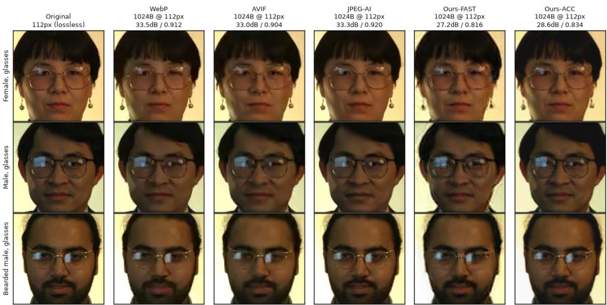  
(a) Color FERET.

Learned codec head-to-head — Al-Solutions-KK, 112px @ 1024B  
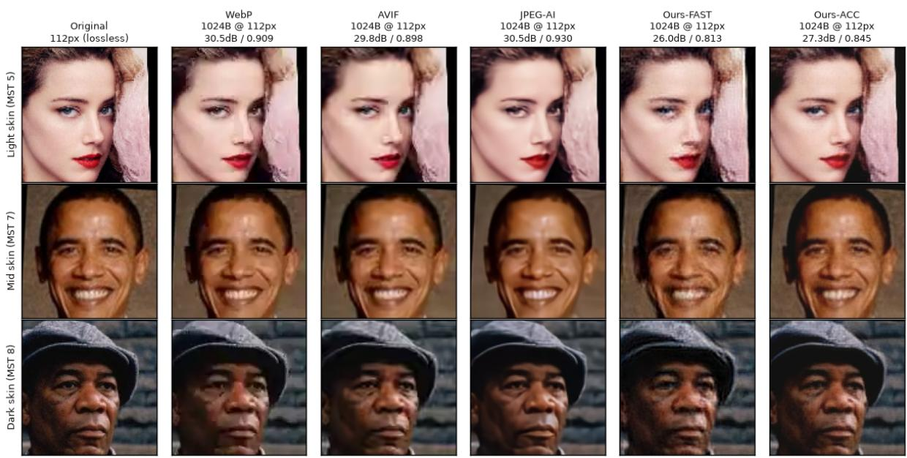  
(b) AI-Solutions-KK, three Monk skin tones.  
Figure 25: Learned-codec showcase at 112 px / 1024 B. Ours-ACCURATE keeps identity cues crisper than the classical codecs at matched budget; Ours-FAST is the lighter-weight variant. A mild tone shift on darker skin at this checkpoint is flagged for the fairness analysis. The three KK rows span Monk tones 5, 7 and 8: KK’s Monk labels are model-estimated and propagated per identity, so many individual crops carry a tone label the image contradicts, and these are the crops whose measured skin tone (Individual Typology Angle over lit-side facial pixels: 76◦, 24◦, 15◦) agrees with the stored label. Monk 9–10 has no well-exposed crop in KK, so tone 8 is the darkest exemplar the labelling honestly supports.

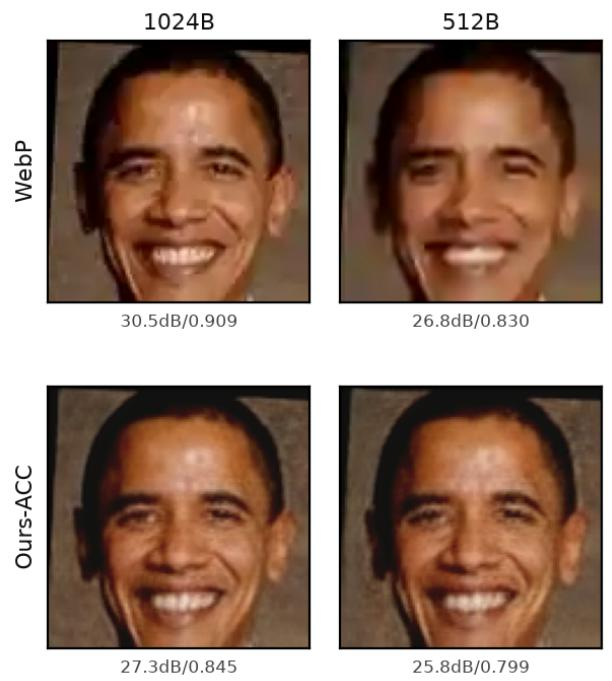  
Figure 26: Budget sweep, KK mid-skin sample at 112 px: 1024 B (left) vs. 512 B (right), for WebP (top) and Ours-ACCURATE (bottom); per-tile PSNR dB/SSIM annotated below each crop. Halving the budget produces visible blocking and banding in WebP (PSNR 30.5 → 26.8 dB) while the learned codec degrades gently. Shown at the native crop scale to avoid upscaling.

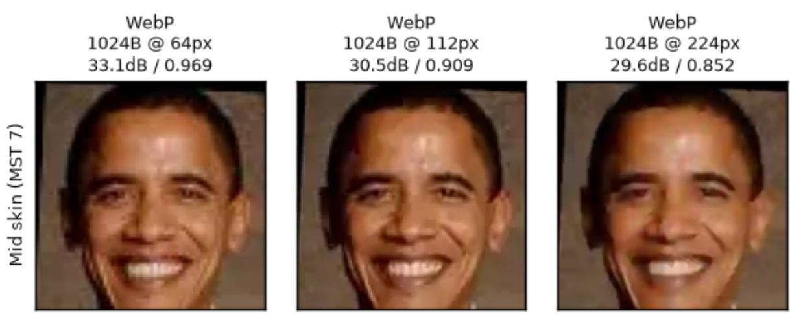  
Figure 27: Resolution sweep, WebP @ 1024 B on the KK mid-skin sample at 64 / 112 / 224 px. Smaller crops are cleaner per pixel (PSNR 33.05 → 30.46 → 29.65 dB) while larger crops carry more detail under harder compression; 112 px is the verification working resolution.

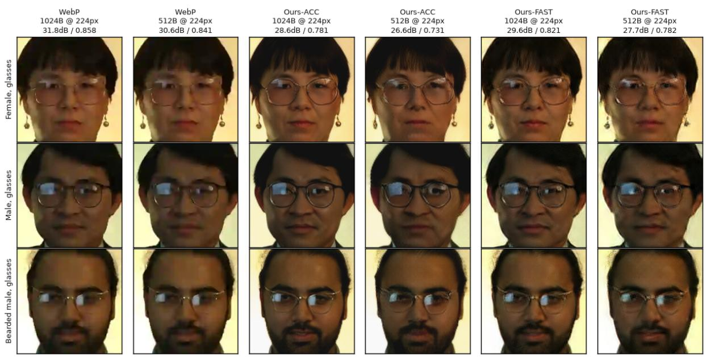  
(a) Color FERET

Budget degradation at 224px — Al-Solutions-KK (1024B vs 512B)  
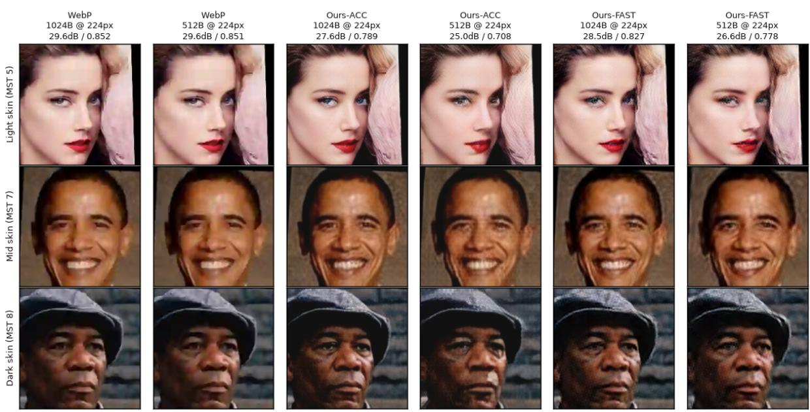  
(b) AI-Solutions-KK  
Figure 28: Budget degradation at the 224 px source resolution (WebP, Ours-ACCURATE, Ours-FAST at 1024 B vs 512 B), complementing the 112 px sweeps above. At 224 px the 16 × 16 spatial latent and per-image byte ceiling bite harder than at 112 px: WebP and Ours-ACCURATE degrade gracefully from 1024 B to 512 B, whereas Ours-FAST—which has no identity side-stream to absorb the high-resolution rate floor—cannot reach 512 B at 224 px and emits a clean over-budget frame (Section 7).

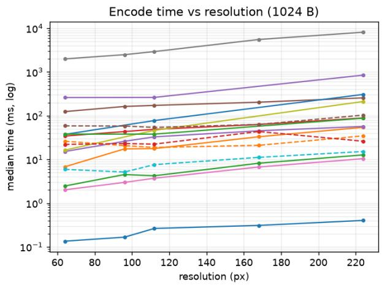

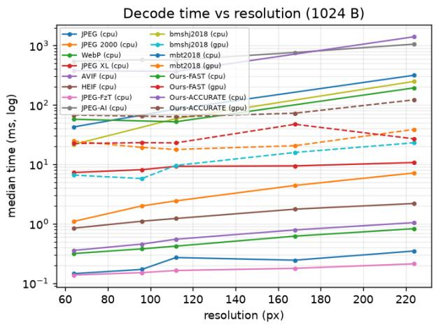  
Figure 29: Median encode (left) and decode (right) time vs. crop resolution at 1024 B (log scale). Solid = single CPU core, dashed = GPU. Every codec’s cost grows smoothly with resolution; classical decode stays far below classical encode, while the learned codecs are near-symmetric and converge toward the classical range on GPU. JPEG-AI sits at the top of both panels at every resolution — an order of magnitude above the next codec on encode. Only its CPU series is drawn: its GPU cost is measured at the 112 px working point (1824 ms encode / 959 ms decode, Table 36) rather than swept, since one point cannot form a trend and a sweep taken while the host is busy would not be a property of the codec.

## JPEG-Al operation points, sub-1 kB face crops (224x224, n=24)

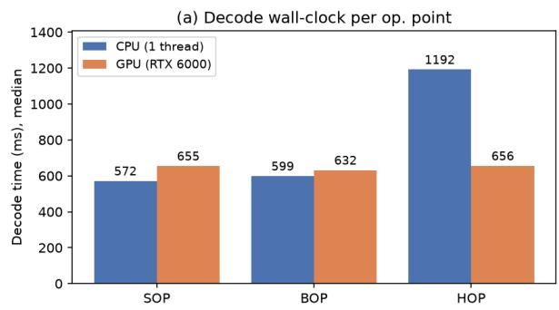

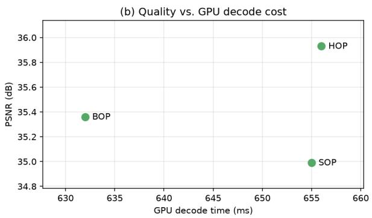  
Figure 30: JPEG-AI decoder operation points. (a) Per-crop decode wall-clock, CPU (single thread) vs. GPU: the GPU helps only the heaviest HOP decoder. (b) Quality (PSNR) vs. GPU decode cost: on GPU there is essentially no trade-off — all three decoders land within 24 ms (655/632/656 ms) and BOP dominates SOP on both axes, being both faster and higher-quality. The ${ \sim } 2 \times \mathrm { S O P - v s \mathrm { - } H O P }$ decode gap is a CPU effect (panel a), so the verification recommendation rests on the CPU column.

## 7 A Custom Identity-Preserving Codec

TL;DR We train a learned face codec in two variants — a tiny pixel-anchored Ours-FAST and a larger Ours-ACCURATE with an identity side-stream and a refine head — that enforce a hard ≤ B-byte budget at encode time and, at 224 px/1024 B, place second only to JPEG-AI on identity cosine on Color FERET (third on AI-Solutions-KK, behind JPEG-AI and Ours-FAST) while keeping the output verified free of colour cast or black frames.

The classical and learned baselines benchmarked earlier control rate through a continuous quality knob, not a byte target, so meeting a strict ≤ 1024 B (and the harder ≤ 512 B) budget per image means re-encoding and searching. We instead build a codec whose objective is identity preservation under a guaranteed byte ceiling: it optimises a face-recognition (FR) loss during training and enforces the budget exactly at encode time. Both variants extend a mean-scale hyperprior [7, 33] with gain-unit variable-rate control [16], built on the CompressAI library [8].

## 7.1 Architecture

TL;DR Both variants share a mean-scale hyperprior with a third hyper-downsample (so the hyperprior latent is x/128, shrinking its byte floor) and gain-unit variable-rate control; FAST is a tiny checkerboard-free synthesis network, ACCURATE adds attention and an identity side-stream.

The shared backbone subclasses CompressAI’s variable-rate mean-scale hyperprior [7, 16, 33]: a learned gain vector sets the quantisation step so a single trained model spans all rate points. To it we add a third stride-2 stage in the hyper-analysis (mirrored by a third upsample in hyper-synthesis), so the hyperprior latent z is x/128 rather than the stock x/64. Quartering the z-grid area, together with a small hyperprior channel count, drives the gain-independent z byte floor down by roughly an order of magnitude (the backbone notes a ≈ 12–16× reduction, from the stock ≈ 524 B at 112 px to the ≈ 48 B order the budget needs) — the change that makes sub-1 kB latents feasible at all, since at 112 px the stock floor alone would already exhaust most of the budget. The total geometric downsample is $2 ^ { 4 + 3 } = 1 2 8$ , so inputs are edge-padded to a multiple of 128 before entropy coding.

Both variants replace the stock synthesis with a conditional synthesis transform whose every ×2 upsample is a ResizeConv (nearest-neighbour upsample followed by a convolution) rather than a transposed convolution; this removes the checkerboard artefacts transposed convolutions produce at very low rate. After each inverse-GDN block a per-stage FiLM layer modulates the features on (gain,resolution), and for ACCURATE additionally on the decoded identity code.

Ours-FAST (variant\_id = 0) is a slim, attention-free network with no side-stream, intended as a real-time pixel-anchored codec. Its on-disk default constructor instantiates N=64, M=96, N =48, totalling 1,352,021 parameters (∼1.35 M). Ours-ACCURATE (variant\_id = 1) widens the transform (N=192, M=320, N =64 in the default constructor), inserts four attention blocks (two in the analysis transform, two mirrored in synthesis), and adds the identity side-stream and refine head described below; the network totals 18,712,400 parameters (∼18.7 M), of which 3,652,520 are the frozen EdgeFace-S anchor, leaving 15,059,880 trainable. Figure 31 summarises how the pieces fit together at encode and decode time; the following subsections detail each component.

## 7.2 Hard byte-budget container

TL;DR Because the learned rate knob is continuous, the ≤ B guarantee is enforced at encode time by a binary search over a frozen 64-entry gain table that measures real rANS bytes; the result is packed into a self-describing container (7 B overhead) with an identity-only fallback that always parses.

A learned codec cannot be told “produce B bytes”; it produces whatever the chosen gain yields. We therefore enforce the budget at encode time. Encoding takes a frozen 64-entry, log-spaced gain table spanning the model’s trained gain range (gains outside that range reconstruct garbage, so the table is derived per model). Because the emitted size increases monotonically with gain (finer quantisation → more bytes), a binary search over the 64 levels finds the largest gain whose real rANS byte count stays $\leq B \mathrm { { i n } } \approx \log _ { 2 } 6 4 = 6$ encodes, measuring actual coder output each step rather than estimating it. The selected level rides in the header as a 6-bit rate index, so the decoder reconstructs the exact gain bit-for-bit — a float-gain mismatch would silently corrupt the decode, since the reconstruction offsets depend on the gain.

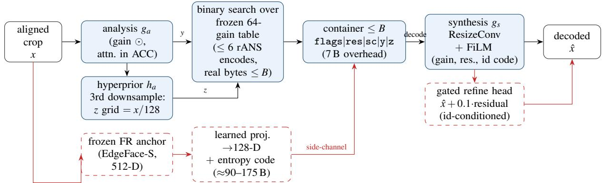  
Figure 31: Architecture of the custom byte-budgeted codec. Blue solid blocks are shared by both variants: a mean-scale hyperprior with a third hyper-downsample (shrinking the gain-independent z byte floor by roughly an order of magnitude), gain-unit variable-rate control, and a binary search over a frozen 64-entry gain table that measures real rANS bytes so the emitted container is guaranteed $\leq B .$ Red dashed blocks exist only in Ours-ACCURATE: an entropy-coded identity side-stream derived from a frozen FR anchor, injected into the decoder by FiLM, and a gated refinement head conditioned on the same decoded identity code.

Table 39: Byte-budget container layout (big-endian). Overhead excluding payloads is 7 B. The side-channel is present only for Ours-ACCURATE; the H,W trailer appears only for the raw-geometry resolution code.
<table><tr><td>Bytes</td><td>Field</td><td>Meaning</td></tr><tr><td>1</td><td>flags</td><td>(variant_id  6) |rate_index</td></tr><tr><td>1</td><td>res_bucket</td><td>resolution code; 255 = raw geometry</td></tr><tr><td>1</td><td>sc_len</td><td>identity side-channel length (0 if none)</td></tr><tr><td>sc_len</td><td>side-channel</td><td>identity payload (ACCURATE only)</td></tr><tr><td>2</td><td>len(y)</td><td>length of the y rANS string</td></tr><tr><td>len(y)</td><td>y string</td><td>spatial latent</td></tr><tr><td>2</td><td>len(z)</td><td>length of the z rANS string</td></tr><tr><td>len(z)</td><td>z string</td><td>hyperprior latent</td></tr><tr><td>4</td><td>H,W</td><td>only if res_bucket = 255</td></tr></table>

The result is packed into a self-describing big-endian container (Table 39): a flags byte carrying the variant id (2 bits) and rate index (6 bits), a 1-byte resolution bucket, a 1-byte side-channel length, the optional identity side-channel, and the two length-prefixed rANS strings (y and z); rANS streams are not self-delimiting, hence the explicit 2-byte length prefixes. Fixed overhead excluding payloads is 7 B, and no CRC is stored because integer rANS is deterministic. A dedicated identity-only variant code guarantees that even a pathological crop, or a budget too small for any spatial latent, still emits a parseable ≤ B stream carrying only the identity side-channel.

## 7.3 Variable-rate gain and training

TL;DR One model spans all budgets: each training step samples a gain level and a resolution bucket and optimises a rate–distortion objective dominated by an LPIPS and identity-cosine loss; at encode time the frozen gain table plus binary search turn that continuous knob into a hard byte target.

A single model serves every operating point. During training each step samples a gain level s and weights the distortion by that level’s λ in the rate–distortion objective $R + \lambda \cdot D ,$ so one network learns the whole rate spread; each step also samples a resolution bucket (default set {64,128,192,256}, uniform; both the set and the sampling weights are configurable per run), resizes the $1 1 2 ^ { 2 }$ crops to it, and edge pads to a multiple of 128. The distortion is dominated by a learned-perceptual LPIPS term (which the build notes report tracks identity far better than MSE/SSIM [46]) plus MSE and MS-SSIM, with the identity-cosine term warmed up from zero to avoid the degenerate “blur fools the matcher” solution; a distortion-scaling factor restores the CompressAI $\sim 2 5 5 ^ { 2 }$ distortion magnitude so the model spends bits up to the budget instead of collapsing the latent to near-zero rate. The trainer is step-based (no epochs): each batch is drawn uniformly at random with replacement from the full WebFace42M corpus (≈ 42 M images, loaded via HuggingFace datasets), with no augmentation. Color FERET and AI Solutions-KK are separate evaluation-only corpora, never seen during training. Here “held-out” denotes a disjoint-identity train/val split within WebFace42M, assigned by crc32(subject\_id) % val\_mod, and the two reported held-out matchers — the proprietary inno-balanced embedder for identity-cosine (§4) and cvlface\_ir101 for verification EER (§7.6) — are both architecturally independent of the frozen EdgeFace-S side-stream. A train/test overlap check has now been run. For every Color FERET/KK evaluation identity we build an ArcFace centroid and record its maximum cosine against a 2 M-image (4.7%) random sample of WebFace42M. Color FERET (non-celebrity studio portraits) shows no overlap; 22 of the 1099 evaluation identities (2.0% — all AI-Solutions-KK celebrities, e.g. Neil Patrick Harris, Anne Hathaway, Morgan Freeman) exceed a 0.8 cosine, unsurprising as both AI-Solutions-KK and WebFace42M are scraped celebrity faces. This is identity overlap, not image overlap: since a compression model conditions on pixels rather than identity, a different photograph of a known face confers no test-time advantage, and the classical codecs have no training set at all. Actual leakage — a shared or near-duplicate image in both training and test, possible only for the learned codecs (Ours, JPEG-AI, the neural baselines) would register as a cosine near 1.0; the observed maximum over all evaluation identities is 0.915, below the ≈ 0.97–1.0 regime of a reused image. We also ran a direct image-level check, a perceptual-hash (pHash) near-duplicate scan over the same 2 M sample. Aligned crops confound pHash — every crop fixes the eyes, nose and mouth in the same positions, so 34% of evaluation crops fall within a 6-bit Hamming distance of some training image, making the Hamming count alone uninformative. Visual inspection of the closest pairs is decisive: the three exact-hash (0-bit) matches, and the low-Hamming Color FERET matches, are all different individuals (e.g. a KK actress hash-colliding with an unrelated bearded man) — collisions, not reused images. The two checks agree: evaluation sets share celebrity identities with the training corpus (AI-Solutions-KK only) but no images. Both use only a 4.7% sample, so residual reuse cannot be fully excluded, though neither check shows a positive signal. The main parameters are optimised with Adam (default LR 10−4) under a cosine schedule (CosineAnnealingLR, $\eta _ { \mathrm { m i n } } = 1 0 ^ { - 5 } )$ preceded by a short linear warmup of 1% of the total steps; a separate Adam aux-optimiser $( \mathrm { L R } 1 0 ^ { - 3 } )$ steps the entropy-bottleneck quantiles. The trainer defaults are 600k steps and batch 32. The distortion weights differ by variant: the MSE (D) weight is 2.0 for ACCURATE versus 0.3 for FAST, with the identity-cosine weight 0.5/0.4 and a distortion scale ${ \mathrm { D S C A L E } } = 2 5 6$ The shipped checkpoints are fast\_rbal\_1M for Ours-FAST (1,000,000 steps) and accurate\_3M for Ours-ACCURATE (3,000,000 steps), both at batch 32 and each warm-started from a shorter run of the same variant: FAST from a 300k run, and ACCURATE from the 990k-step accurate\_1M (itself warm-started from a 60k run), which accurate\_3M resumes and extends to 3M steps on a single rebuilt cosine schedule. The FAST retraining replaced the default bucket set with {64, 128, 192, 224, 256} under sampling weights 1:4:3:3:5 (i.e. ≈ 50% of steps at 224/256): an earlier 1M retrain with the default, low-resolution-heavy buckets improved 112 px identity but regressed 224 px, and the re-balanced set removes that trade-off; FAST’s own 3M extension diverged at ≈2.43M steps and was discarded, so FAST ships at 1M. ACCURATE kept the default uniform buckets in both stages — the first run, accurate\_1M, was stopped at 990k steps with the loss converged, and the 3M extension (accurate\_3M, the deployed checkpoint) resumed from it under the same bucket configuration. Both promotions were validated by a paired A/B against the previous checkpoints at both 112 and 224 px before any result in this report was regenerated: for accurate\_3M a 120-image paired test over both resolutions and both budgets won 299 of 480 image comparisons (62%, $p = 8 . 0 \times 1 0 ^ { - 8 } )$ , with no cell regressing on identity cosine or PSNR. Every Ours-ACCURATE number in this report is measured on accurate\_3M, and every Ours-FAST number on fast\_rbal\_1M; the sole exception is the side-stream ablation of §7.4, whose three arms are deliberately held at matched 1M-step from-scratch runs — compared against the 990k-step accurate\_1M — so the comparison is not confounded by training budget.

For ACCURATE the variable-rate range was widened downward so the $\mathrm { t i g h t } \le 5 1 2 \mathrm { B }$ point is reachable at high resolution: at $2 2 4 ^ { 2 } / 2 5 6 ^ { 2 }$ the $1 6 \times 1 6$ spatial latent plus the identity side-channel impose a high rate floor, so the lower-λ levels are trained to genuinely crush rate. At encode time the frozen, log-spaced 64-entry gain table and the binary search convert this continuous knob into the hard byte target. We cache the per-gain entropy-coder CDF buffers: because the 64 table gains recur across every image and every search step, the first build of each gain is memoised and restored by reference thereafter. The restored buffers are bit-identical to a rebuild, so the emitted bytes are unchanged; the implementation notes put the rebuild the cache removes at ≈80% of encode cost (≈180 ms per gain), which is what bounds the attainable encode speed-up. We report no end-to-end figure for it: the speed benchmark of §6.7 times a single-shot encode at the budget-hitting gain and deliberately excludes the rate search and its cache.

Two encode/decode defects surfaced and were fixed without retraining. First, an early proportional gain search jumped straight to the first gain that fit coming down from the maximum; on the non-linear rate curve that overshoots far below budget (emitting ≈ 295 B against a 1024 B target). The binary search replaces it and always uses as much of the budget as the table allows. Second, a colour cast appeared because the refine head ran in the training forward but not in decompress; the fix applies the refine at decode using the decoded identity prior so the real decode reproduces the trained output (Section 7.4). A NaN guard additionally sanitises the CPU decode path so a non-finite reconstruction can never propagate into the downstream FR embeddings.

## 7.4 Identity side-stream and refine head

TL;DR Ours-ACCURATE spends a few extra bytes on an entropy-coded identity code derived from a frozen FR anchor; that code FiLM-modulates the decoder and drives a lightly-gated refine head, giving a “hard identity floor” that survives even when the spatial latent is crushed.

Ours-ACCURATE carries a small identity side-stream alongside the spatial latent. A frozen FR anchor embeds the input (512-D, L2-normalised); a learned projection compresses it to a 128-D code, and a factorised entropy bottleneck codes that code to a small payload (the code documents ≈ 90–175 B). The decoded code drives per-stage FiLM $( \gamma , \beta )$ injected into the decoder synthesis, with the affine bounded (±20% scale, ±0.2 shift) so it modulates rather than recolours.

The side-stream anchor runs at inference time, not only in training. To avoid any ambiguity: for Ours-ACCURATE the EdgeFace-S anchor is part of the deployed encoder. At encode time it embeds the input crop, the projection and entropy bottleneck turn that embedding into the identity payload, and the payload is written into the container; at decode time the stored payload is entropy-decoded and consumed by the FiLM and refine head. It is therefore not a training-only teacher whose cost disappears at deployment — an Ours-ACCURATE encoder must run one forward pass of EdgeFace-S per image (its ∼90–175 B are already counted inside the byte budget). The frozen anchor’s own weights are never updated. Ours-FAST has no side-stream and never invokes any FR model, at training or inference. This side-channel is never dropped: it is the “hard identity floor” that survives spatial-latent collapse, and at the tightest budgets it backs the identity-only fallback frame. The shipped anchor is the torchroster EdgeFace-S model (the ACCURATE constructor’s default anchor="edgeface\_s"); the spec’s separately-sourced ArcFace-iresnet100 weights are not on disk here, so the EdgeFace anchor is used in their place. Because the side-stream’s anchor is an EdgeFace model, the held-out EdgeFace evaluator is no longer fully architecturally independent of ACCURATE; we therefore treat ACCURATE’s EdgeFace numbers with caution and base its headline ranking on the architecturally independent anchors (ArcFace, LVFace-L), as in Section 5.3.

A gated refinement head then predicts a small residual on the decoded image, conditioned on the same decoded identity code, returning clamp(xˆ + 0.1 · residual,0,1). The low gate keeps the residual a sharpener of a faithful reconstruction rather than a generator that could hallucinate a wrong face; the spatial latent stays dominant. Critically, the refine head must run at decode using the decoded prior — the bug above was that it ran only in forward, so the base synthesis’ colour bias survived as a cast until the decode path was made to apply the same refinement.

What the side-stream buys on an independent matcher (ablation). To test whether the side-stream contributes identity that survives on a matcher it was never anchored to, we retrained Ours-ACCURATE from scratch under one protocol in three variants — side-stream on (the control), side-stream off, and side-stream anchored to a non-EdgeFace backbone (TopoFR-R100) — and scored median identity-cosine (recon vs. original) over a Color FERET + AI-Solutions-KK sample (n=200 each, 112 px, both budgets) under two matchers architecturally independent of every anchor, ArcFace and CVLFace-IR101. The result is candid: on these independent matchers the side-stream buys essentially nothing — the control-minus-no-side identity-cosine gap averages −0.0002 (range $[ - 0 . 0 0 4 , + 0 . 0 0 2 ]$ across matcher/dataset/budget), i.e. within noise of zero. Re-anchoring the side-stream to TopoFR instead of EdgeFace likewise changes little (−0.003 on average), confirming the effect is not anchor-specific. This is the honest counterpart to the strong EdgeFace-family numbers: the side-stream’s measurable identity gain is largely confined to its own backbone family, and Ours-ACCURATE’s competitiveness on the independent matchers (Sections 5.3, 7.6) is carried by the spatial latent, not the stored identity code. (All three ablation arms trained from scratch to 1,000,000 steps and are compared against the 990kstep accurate\_1M on the same protocol, where that warm-started reference stays marginally strongest. The deployed accurate\_3M is deliberately excluded here: swapping one arm to a 3M-step run would confound training budget with the ablated variable, so the ablation is matched at 1M and speaks to the side-stream, not to the shipped checkpoint.)

Budget reallocation: spend the side-stream’s bytes on the spatial latent. The side-stream costs 90–175 B — 9–17% of a 1024 B container and 18–34% of a 512 B one. The natural follow-up is: if we remove it, those bytes flow to the spatial latent (the binary search still fills the same budget), so does reconstruction improve without costing identity? The side-off variant answers this directly, because it is the reallocated-budget codec. Across the four cells and two independent matchers, removing the side-stream changes median identity cosine by +0.0002 on average (range [−0.002,+0.004]) — i.e. no identity is lost — while reconstruction PSNR rises by 0.69–1.02 dB (mean +0.82 dB), because the freed bits go to the broadband latent. So on independent matchers the 90–175 B identity code is not merely neutral: the same bytes buy strictly more when spent on the spatial latent. This is the quantitative case for cutting the side-stream in a redesign; the deployed accurate\_3M keeps it only because it inherits it from the warm-started accurate\_1M lineage it resumes, and because it helps the EdgeFace family it is anchored to (Section 7.4). The side-stream also mildly worsens adversarial sanitization (the refine head re-injects high-frequency detail, so Ours-ACCURATE leaves the larger adversarial residual in 117 of the 128 comparable dataset × matcher × attack × ε × budget cells, the eleven exceptions all on AI-Solutions-KK/LVFace-L; Section 13), reinforcing that its net contribution outside the EdgeFace family is neutral-to-negative.

The stored side-code is a linkable biometric (privacy). Because the side-stream stores a projection of a frozen EdgeFace-S embedding, the 90–175 B identity code is itself a biometric descriptor, so a face-on-document deployment must ask whether it is invertible or linkable across documents. We extract the stored 128-d code for 2,500 Color FERET crops (842 identities) and test re-identification from the code alone. A naive cosine attack is weak (EER 35.8%, ROC-AUC 0.63) because the code carries a large shared bias direction, but a trivial attacker who mean-centers the codes recovers a strong linker: EER 17.0%, ROC-AUC 0.914, versus 50.2%/0.498 for a random code of the same dimension. Two documents of the same subject are thus matchable from their stored side-codes alone with ∼83% accuracy: the side-channel is a stored, linkable biometric template, not benign conditioning metadata, and would need the same template protection as any enrolled descriptor. Together with the ablation above (no independent-matcher identity gain, 90–175 B cost, weaker sanitization), this is a further reason to remove or protect the side-stream in a deployment. A full template-reconstruction (invertibility) attack is left to future work; linkability alone already establishes the descriptor is identity-bearing.

## 7.5 Results versus classical and JPEG-AI

TL;DR At 224 px/1024 B Ours-ACCURATE reaches identity cosine 0.947 on Color FERET — second only to JPEG-AI (0.958) and above AVIF and WebP — and 0.934 on KK; a quality-regression check confirms the codec is verified clean (no cast/black frames, ≈ 98% budget fill).

Table 40 reports median identity cosine and PSNR on 224 px held-out pairs at both budgets, drawn from the codec comparison (the 224 px cell is the headline operating point quoted throughout this section and the abstract; the 112 px identity cosines are in fact at or above the 224 px values — $\approx 0 . 9 4 8 / 0 . 9 3 8$ for Color FERET/KK at 1024 B, versus 0.947/0.934 at 224 px, so 112 px does not cost identity for Ours — and are tabulated in Table 41). At 1024 B Ours-ACCURATE reaches identity cosine 0.947 (native-224 PSNR 28.6 dB) on Color FERET, second only to JPEG-AI (0.958) [5] and ahead of AVIF (0.899) [2] and WebP (0.893) [23]; on the in-the-wild KK set it holds 0.934, behind JPEG-AI (0.948) and also behind our own FAST variant (0.941). At the harder 512 B point identity cosine drops to 0.797 (Color FERET) and 0.776 (KK), where JPEG-AI, WebP, JPEG XL and Ours-FAST retain an edge on both datasets, and AVIF on KK. That comparison is not like-for-like, however: at 224 px/512 B only JPEG-AI (100% of crops within budget) and Ours-ACCURATE (100%/99.98%) actually meet the budget, whereas WebP holds it on 2.8% (Color FERET) and 0.2% (KK) of crops — median 756 and 1150 B — JPEG XL on 0.2%/0.1% (median 872/1090 B) and AVIF on $\leq 0 . 0 1 \%$ (median 696/834 B); Ours-FAST holds it on 80%/14% (Table 31, Table 30). Notably, Ours-ACCURATE attains these identity scores at markedly lower PSNR than JPEG-AI (28.6 vs 33.2 dB at CF/1024 B, native-resolution fidelity from the quality matrix, Table 33), consistent with an objective that spends its limited bits on the identity-relevant signal rather than on broadband pixel fidelity, and the learned codecs attain the lowest LPIPS of the field at 512 B (native-224 Ours-ACCURATE 0.111 CF / 0.102 KK and Ours-FAST 0.112/0.082, versus 0.16–0.62 for the classical codecs).

The 112 ↔ 224 px inversion is central and easy to misread across the rate–EER and codec-comparison tables, so Tables 40 and 41 report the two resolutions side by side over the same roster, budgets and held-out metric — read one against the other and the inversion is a row-by-row comparison rather than an inference across sections. For our codec, 112 px is at least as good as 224 px at 1024 B and markedly better at 512 B (Color FERET id-cosine 0.910 at 112 vs 0.797 at 224), because a fixed byte budget buys proportionally more of a 112 px crop; for JPEG-AI the trend reverses $( 2 2 4 > 1 1 2 )$ , as its transform exploits the extra resolution. This is why Ours-ACCURATE leads at the 112 px working point but is the runner-up at the 224 px headline cell on Color FERET, and third there on AI-Solutions-KK.

An independent quality-regression check (a spot check over n=8 crops per cell) confirms the codec is verified clean: across both variants, both datasets, both resolutions (112 and 224 px) and both budgets, every row passes with an ok flag, no non-finite pixels, negligible brightness delta $( | \Delta | \leq 0 . 0 1 3 )$ and colour cast $( \leq 0 . 0 0 4 )$ . For Ours-ACCURATE the byte fill is 0.977–0.995 of budget (median ≈ 0.98) — the binary-search fix at work — and no rows are flagged for the cast or black-frame artefacts the earlier decode bug had produced. The ok flag does not test budget compliance, however: Ours-FAST’s AI-Solutions-KK $2 2 4 \mathrm { p x } / 5 1 2 \mathrm { B }$ row passes it at a byte fill of 1.09, the over-budget behaviour discussed under known limitations below. Reconstructions of both variants across budgets and resolutions on the two datasets are shown in the learned-codec showcase of Section 6 (Figure 25), which we do not duplicate

Table 40: Median identity cosine (↑, measured with the held-out proprietary inno-balanced embedder at the 112 px matcher input; see §4) and native-224 PSNR/dB (↑, full-reference from the quality matrix, Table 33) at the 224 px source resolution on held-out pairs, ≤ B bytes, over the codec roster. Best / worst per column within each dataset; the CompressAI neural baselines are omitted. JPEG-AI’s native-224 PSNR is now measured on both datasets (AI-Solutions-KK 31.2 dB at 1024 B). JPEG-AI is the only codec consistently above Ours-ACCURATE on identity. Each id-cosine cell is the median over n=64 held-out crops. Source: codec\_comparison (id-cos) + quality\_summary (PSNR).
<table><tr><td colspan="2"></td><td colspan="2">1024 B</td><td colspan="2">512 B</td></tr><tr><td>Dataset</td><td>Codec</td><td>id-cos</td><td>PSNR</td><td>id-cos</td><td>PSNR</td></tr><tr><td>Color FERET</td><td>JPEG-AI</td><td>0.958</td><td>33.2</td><td>0.865</td><td>30.9</td></tr><tr><td>Color FERET</td><td>Ours-ACCURATE</td><td>0.947</td><td>28.6</td><td>0.797</td><td>26.6</td></tr><tr><td>Color FERET</td><td>Ours-FAST</td><td>0.942</td><td>29.6</td><td>0.823</td><td>27.7</td></tr><tr><td>Color FERET</td><td>AVIF</td><td>0.899</td><td>32.2</td><td>0.748</td><td>29.9</td></tr><tr><td>Color FERET</td><td>WebP</td><td>0.893</td><td>31.8</td><td>0.840</td><td>30.6</td></tr><tr><td>Color FERET</td><td>JPEG-FzT</td><td>0.870</td><td>28.0</td><td>0.104</td><td>21.7</td></tr><tr><td>Color FERET</td><td>HEIF</td><td>0.866</td><td>31.7</td><td>0.547</td><td>28.2</td></tr><tr><td>Color FERET</td><td>JPEG XL</td><td>0.834</td><td>29.1</td><td>0.798</td><td>28.9</td></tr><tr><td>Color FERET</td><td>JPEG</td><td>0.610</td><td>24.6</td><td>0.357</td><td>22.7</td></tr><tr><td>Color FERET</td><td>JPEG 2000</td><td>0.585</td><td>27.6</td><td>0.228</td><td>23.3</td></tr><tr><td>KK</td><td>JPEG-AI</td><td>0.948</td><td>31.2</td><td>0.849</td><td>28.5</td></tr><tr><td>KK</td><td>Ours-FAST</td><td>0.941</td><td>28.5</td><td>0.852</td><td>26.6</td></tr><tr><td>KK</td><td>Ours-ACCURATE</td><td>0.934</td><td>27.6</td><td>0.776</td><td>25.0</td></tr><tr><td>KK</td><td>WebP</td><td>0.900</td><td>29.6</td><td>0.895</td><td>29.6</td></tr><tr><td>KK</td><td>AVIF</td><td>0.864</td><td>29.3</td><td>0.786</td><td>28.0</td></tr><tr><td>KK</td><td>JPEG XL</td><td>0.859</td><td>28.1</td><td>0.856</td><td>28.1</td></tr><tr><td>KK</td><td>HEIF</td><td>0.847</td><td>28.7</td><td>0.646</td><td>26.0</td></tr><tr><td>KK</td><td>JPEG-FzT</td><td>0.843</td><td>26.7</td><td>0.221</td><td>20.8</td></tr><tr><td>KK</td><td>JPEG</td><td>0.674</td><td>22.6</td><td>0.579</td><td>22.1</td></tr><tr><td>KK</td><td>JPEG 2000</td><td>0.597</td><td>24.8</td><td>0.221</td><td>21.0</td></tr></table>

here.

## 7.6 Held-out independent-matcher evaluation

TL;DR Because the identity side-stream is anchored to an EdgeFace model, we re-score the reconstructions on cvlface\_ir101 — an IR-101 trained on WebFace12M, disjoint from both the EdgeFace side-stream and the ArcFace/LVFace evaluation anchors. On this truly held-out backbone Ours-ACCURATE tracks the strongest codecs at 1024 B and is the best codec on both datasets at 512 B, and the ACCURATE > FAST ordering and the modern-vs-legacy ranking are preserved.

The headline concern for the custom codec is evaluator circularity: its identity side-stream is anchored to a frozen EdgeFace-S embedding (Section 7.4), and EdgeFace is also an in-grid evaluator. To test identity preservation on a backbone that is architecturally independent of both the side-stream and the primary anchors, we re-embed every reconstruction with cvlface\_ir101 — a CVLFace IR-101 model trained on WebFace12M, from a family used nowhere else in the codec — and recompute verification EER. Table 42 reports the result at the 112 px working point.

Three points hold on this held-out matcher, over the full ten-codec roster (only the Color-FERET-only CompressAI baselines are absent). First, at 1024 B Ours-ACCURATE is fourth of ten on Color FERET (EER 0.05%: behind the field-best 0.03% shared by WebP and JPEG-AI and AVIF’s 0.04%, but ahead of HEIF’s 0.07%, JPEG XL’s and JPEG-FzT’s 0.10% and JPEG’s 0.12%); on KK it is the best codec at 0.51%, a whisker ahead of JPEG-AI’s now-populated 0.52% — in both cases far above legacy JPEG 2000 (2.38%/8.92%), so identity is preserved on a matcher the codec never saw. Second, at the harder 512 B budget Ours-ACCURATE is the single best codec on both datasets (0.08% on Color FERET versus JPEG-AI’s 0.13%; 0.92% on KK versus JPEG-AI’s 1.25%, WebP’s 2.55% and JPEG 2000’s 29.4%) — the graceful-degradation claim survives the removal of the EdgeFace-related evaluators. Third, the ACCURATE > FAST ordering and the modern-cluster-beats-JPEG 2000 ranking reproduce exactly, and so does the 512 B collapse of the codecs the anchors already mark as brittle (JPEG 15.75%/21.24%, HEIF 7.90%/19.88%, JPEG XL 1.26%/6.52% on Color FERET/KK), so the codec ranking is not an artefact of the side-stream anchor. On the anchor matchers JPEG-AI keeps the lead at 1024 B on Color FERET, so the honest overall verdict stands there, but the held-out result removes the circularity objection from the 512 B result and from the cross-codec ranking.

Table 41: The 112 px companion to Table 40: same held-out inno-balanced identity cosine and same roster, at the 112 px verification working resolution (PSNR is native-112 full-reference). Best / worst per column within each dataset. Read against Table 40 this is the resolution inversion in one place: Ours-ACCURATE moves from runner-up at 224 px on Color FERET (third on AI-Solutions-KK, behind JPEG-AI and Ours-FAST) to first at 112 px on both datasets, while JPEG-AI moves the other way, because a fixed byte budget buys proportionally more of a 112 px crop than of a 224 px one. Each id-cosine cell is the median over n=64 held-out crops.
<table><tr><td colspan="2"></td><td colspan="2">1024 B</td><td colspan="2">512B</td></tr><tr><td>Dataset</td><td>Codec</td><td>id-cos</td><td>PSNR</td><td>id-cos</td><td>PSNR</td></tr><tr><td>Color FERET</td><td>Ours-ACCURATE</td><td>0.948</td><td>28.6</td><td>0.910</td><td>27.6</td></tr><tr><td>Color FERET</td><td>JPEG-AI</td><td>0.930</td><td>33.3</td><td>0.859</td><td>31.2</td></tr><tr><td>Color FERET</td><td>WebP</td><td>0.921</td><td>33.5</td><td>0.762</td><td>30.1</td></tr><tr><td>Color FERET</td><td>AVIF</td><td>0.913</td><td>33.0</td><td>0.551</td><td>27.7</td></tr><tr><td>Color FERET</td><td>HEIF</td><td>0.875</td><td>32.4</td><td>0.309</td><td>25.5</td></tr><tr><td>Color FERET</td><td>JPEG XL</td><td>0.867</td><td>31.6</td><td>0.558</td><td>27.0</td></tr><tr><td>Color FERET</td><td>JPEG-FzT</td><td>0.862</td><td>26.3</td><td>0.466</td><td>23.9</td></tr><tr><td>Color FERET</td><td>Ours-FAST</td><td>0.859</td><td>27.2</td><td>0.783</td><td>26.5</td></tr><tr><td>Color FERET</td><td>JPEG</td><td>0.851</td><td>29.3</td><td>0.069</td><td>22.0</td></tr><tr><td>Color FERET</td><td>JPEG 2000</td><td>0.555</td><td>27.8</td><td>0.193</td><td>23.0</td></tr><tr><td>KK</td><td>Ours-ACCURATE</td><td>0.938</td><td>27.3</td><td>0.874</td><td>25.8</td></tr><tr><td>KK</td><td>JPEG-AI</td><td>0.921</td><td>30.5</td><td>0.850</td><td>28.3</td></tr><tr><td>KK</td><td>WebP</td><td>0.908</td><td>30.5</td><td>0.749</td><td>26.8</td></tr><tr><td>KK</td><td>AVIF</td><td>0.879</td><td>29.8</td><td>0.521</td><td>24.3</td></tr><tr><td>KK</td><td>JPEG XL</td><td>0.854</td><td>28.4</td><td>0.591</td><td>24.7</td></tr><tr><td>KK</td><td>HEIF</td><td>0.844</td><td>29.4</td><td>0.301</td><td>22.6</td></tr><tr><td>KK</td><td>Ours-FAST</td><td>0.844</td><td>26.0</td><td>0.757</td><td>24.8</td></tr><tr><td>KK</td><td>JPEG-FzT</td><td>0.839</td><td>25.8</td><td>0.446</td><td>22.5</td></tr><tr><td>KK</td><td>JPEG</td><td>0.834</td><td>26.8</td><td>0.184</td><td>20.5</td></tr><tr><td>KK</td><td>JPEG 2000</td><td>0.540</td><td>24.5</td><td>0.184</td><td>20.7</td></tr></table>

## 7.7 Known limitations

TL;DR Ours-FAST mostly cannot reach 512 B at 224 px — only 14% of AI-Solutions-KK and 80% of Color FERET crops hold the budget there, its gain floor over-filling it and the encoder by design emitting a clean over-budget frame — and both variants also overflow on part of the 96/168 px grid (Ours-ACCURATE on ≈20% of crops at 512 B, Ours-FAST on up to 91%); the full-resolution Ours grid is now complete.

The hard budget exposes the codecs’ rate floors. Ours-FAST, with no side-stream to absorb the highresolution rate floor, mostly cannot reach 512 B at 224 px — only 14% of AI-Solutions-KK crops (and 80% of Color FERET crops) hold the budget in that cell (Tables 30 and 31) — and it overflows at some 96/168 px cells too (74%/9% of KK crops and 74%/50% of Color FERET crops hold at 512 B). How far it overshoots is cell-dependent, so the honest statement is the measured per-cell size distribution rather than one global ratio: in the 224 px/512 B cell the median emitted container is 595 B on AI-Solutions-KK (1.16× the budget, with 86% of crops over) but 507 B on Color FERET — under budget, with 20% of crops over — and at 168 px/512 B the medians are 607 B (KK, 91% over) and 511 B (Color FERET, 50% over). The mechanism is that the search can only choose from the frozen 64-entry gain table: when even the floor gain’s real rANS output, plus the fixed 7 B container overhead, already exceeds B, there is no lower level to fall back to. By design the encoder then emits the smallest valid spatial frame, flagged over-budget — a clean reconstruction that exceeds B — rather than a black identity-only frame, on the rationale that a real reconstruction is more useful than a blank one; downstream accounting must treat such frames as budget violations. ACCURATE does not show this at 224 px, where its trained low-λ levels and identity-only fallback keep 100% of Color FERET crops and 99.98–99.99% of AI-Solutions-KK crops inside the budget at both budgets; it still misses on the 96/168 px buckets, but less often than FAST (79–80% of crops hold at 512 B, 90% at 1024 B). For both variants the non-compliance is confined to the 96 and 168 px buckets and — for FAST alone — the 224 px/512 B cell: at 64 and 112 px both variants hold 100% of crops at both budgets on both datasets, and in the 224 px/1024 B headline cell both hold ≥ 99.99%, so no headline claim in this report rests on an over-budget cell.

Table 42: Verification EER (%, ↓) at 112 px on the held-out cvlface\_ir101 matcher (IR-101/WebFace12M), architecturally independent of the EdgeFace side-stream and the ArcFace/LVFace anchors, with the deploymentrelevant tail FNMR@FMR= $1 0 ^ { - 4 }$ (%) in parentheses. The best and worst EER in each column are shaded, as in the other codec tables. The whole codec roster is re-embedded on this matcher at full support (95839 mated pairs on Color FERET, 1515807 on AI-Solutions-KK, matching the anchor grids); the only omissions are the CompressAI neural baselines (bmshj2018, mbt2018), which were run on Color FERET only and scored on a 2548-pair subset, so they have no comparable cell in three of the four columns. JPEG-AI is now scored on both datasets (its KK cvlface\_ir101 cells are populated). “aligned” is the uncompressed reference; it is budget-independent (no compression), so its value spans both budget columns of a dataset rather than being missing at 512 B. The tail confirms the EER story: at KK/512 B Ours-ACCURATE leads on both EER (0.92%) and tail (8.4% vs WebP 29.1%, JPEG-AI 12.4%).
<table><tr><td rowspan="2">Codec</td><td colspan="2">Color FERET</td><td colspan="2">AI-Solutions-KK</td></tr><tr><td>1024 B</td><td>512B</td><td>1024 B</td><td>512B</td></tr><tr><td>aligned (ref.)</td><td>0.01 (0.0)</td><td></td><td>0.23 (0.8)</td><td></td></tr><tr><td>JPEG-AI</td><td>0.03 (0.1)</td><td>0.13 (0.8)</td><td>0.52 (3.7)</td><td>1.25 (12.4)</td></tr><tr><td>WebP</td><td>0.03 (0.1)</td><td>0.23 (2.2)</td><td>0.66 (5.2)</td><td>2.55 (29.1)</td></tr><tr><td>AVIF</td><td>0.04 (0.1)</td><td>1.91 (25.1)</td><td>0.81 (7.3)</td><td>9.73 (77.9)</td></tr><tr><td>HEIF</td><td>0.07 (0.3)</td><td>7.90 (72.1)</td><td>1.17 (11.9)</td><td>19.88 (95.8)</td></tr><tr><td>JPEG XL</td><td>0.10 (0.5)</td><td>1.26 (17.0)</td><td>1.20 (11.7)</td><td>6.52 (62.5)</td></tr><tr><td>Ours-ACCURATE</td><td>0.05 (0.2)</td><td>0.08 (0.4)</td><td>0.51 (3.5)</td><td>0.92 (8.4)</td></tr><tr><td>Ours-FAST</td><td>0.15 (1.0)</td><td>0.32 (2.6)</td><td>1.21 (12.6)</td><td>2.40 (28.4)</td></tr><tr><td>JPEG-FzT</td><td>0.10 (0.6)</td><td>2.17 (30.2)</td><td>1.12 (10.5)</td><td>11.34 (82.4)</td></tr><tr><td>JPEG</td><td>0.12 (0.6)</td><td>15.75 (98.8)</td><td>1.31 (14.2)</td><td>21.24 (96.6)</td></tr><tr><td>JPEG 2000</td><td>2.38 (28.6)</td><td>16.03 (91.8)</td><td>8.92 (74.0)</td><td>29.42 (99.1)</td></tr></table>

One further note. The full-resolution Ours grid (all of 64/96/112/168/224 px, both budgets, both datasets) is now complete: Ours-FAST and Ours-ACCURATE appear in all eight rate–EER grids (Section 5), where EER falls with resolution — at 1024 B monotonically so (Ours-ACCURATE on Color FERET/ArcFace drops from 1.36% at 64 px through 0.56/0.14/0.12% at 96/112/168 px to 0.07% at 224 px), while at 512 B the fall is not monotone (0.22% at 112 px against 0.57% at 168 px and 0.37% at 224 px), because at the tighter budget the larger crops are the ones the fixed byte ceiling starves. The refine head’s adversarial (HiFiC-style) training remains a planned phase-3 extension; the shipped head trains only as a refiner under the reconstruction and identity losses.

Table 43: Worst-case identity tail at 512 B: 5th-percentile (worst 5%) and median of the per-image reconstructionvs-original identity cosine, ArcFace matcher (independent of the side-stream), 112 px. Higher $\boldsymbol { \mathrm { p } } \boldsymbol { 5 } = \mathbf { a }$ tighter, safer tail. Every cell is computed over the full corpus (11331–17534 crops), so the columns are directly comparable; an earlier version of this table scored JPEG-AI’s Color FERET row on a 300-crop decode pilot, which flattered it (p5 0.776 against 0.742 at full support) — a p5 over 300 crops is the 15th-worst crop, where a p5 over 11k is the 567th-worst. Source: per-image cosine between each aligned crop and its own reconstruction, over the committed embeddings. Best / worst per column (higher id-cosine is better), as in the other codec tables. Roster: the five codecs the 512 B claim turns on — JPEG-AI, WebP and AVIF (the 1024 B leaders) plus both learned variants; the remaining roster codecs (JPEG, JPEG 2000, JPEG XL, HEIF, JPEG-FzT) are not scored here.
<table><tr><td rowspan="2">Codec</td><td colspan="2">Color FERET</td><td colspan="2">AI-Solutions-KK</td></tr><tr><td>p5 (worst)</td><td>median</td><td>p5 (worst)</td><td>median</td></tr><tr><td>JPEG-AI</td><td>0.742</td><td>0.833</td><td>0.680</td><td>0.813</td></tr><tr><td>Ours-ACCURATE</td><td>0.802</td><td>0.874</td><td>0.763</td><td>0.844</td></tr><tr><td>Ours-FAST</td><td>0.636</td><td>0.763</td><td>0.591</td><td>0.727</td></tr><tr><td>WebP</td><td>0.597</td><td>0.739</td><td>0.581</td><td>0.725</td></tr><tr><td>AVIF</td><td>0.333</td><td>0.543</td><td>0.313</td><td>0.507</td></tr></table>

## 7.8 Worst-case identity tail

TL;DR For a credential system the binding quantity is not the median but the tail — the worst-served subjects. We report the 5th-percentile (worst 5%) per-image reconstruction-vs-original identity cosine on the independent ArcFace matcher. At the hard 512 B budget Ours-ACCURATE has the tightest tail of the field on both datasets — its p5 (0.802 CF / 0.763 KK) sits above WebP’s median (0.739/0.725), and $\mathrm { \mathbf { W e b P s } }$ own p5 collapses to 0.60/0.58 and AVIF’s to 0.33/0.31. The codec’s advantage is thus larger in the tail than at the median, which is the relevant regime for a document credential.

The rate–identity tables report medians, but a face-on-document system fails on its worst-served subjects, so the decision-relevant statistic is the low tail of the per-subject identity distribution. Table 43 gives the 5th-percentile (“worst 5%”) and median of the per-image reconstruction-vs-original identity cosine at 512 B, scored on ArcFace (independent of the side-stream) over the full held-out set. Two points follow. First, at this budget the classical codecs have long lower tails — WebP drops from a 0.74 median to a 0.60 p5, and AVIF from 0.54 to 0.33 — whereas the byte-budgeted learned codecs stay compact: Ours-ACCURATE’s p5 (0.802 CF, 0.763 KK) is the highest in the table and exceeds $W e b P ' s$ median. Second, the median-based “best at $5 1 2 \mathrm { B } ^ { \prime \prime }$ finding (§5.3) therefore understates Ours-ACCURATE’s edge: because the worst subjects are exactly where classical codecs degrade fastest, the gap widens in the tail. JPEG-AI is the nearest competitor and is now scored on the full corpus on both datasets (p5 0.742 CF, 0.680 KK); both sit below Ours-ACCURATE.

## 8 Trivial and Difficult Samples: What Makes a Face Hard to Compress

TL;DR Which crops lose the most identity under a sub-1 kB budget, and why? Difficulty is modest and detaildriven on Color FERET: at the image level (n=300) high-amplitude detail predicts it (Laplacian variance $\rho { = } { + } 0 . 3 9 , p { < } 0 . 0 1$ ; luma contrast +0.30, p<0.01) and more colourful crops are easier $( \rho { = } { - } 0 . 3 6 , p { < } 0 . 0 1 )$ On the in-the-wild KK set none of the eight codec-independent image descriptors reaches significance $( | \rho | \leq 0 . 1 0 )$ , so the predictors are dataset-specific, not universal. (Age is the one KK attribute with a middling correlation, $\rho { = } { + } 0 . 3 5$ , but it is computed over only 12 age-bucket means, not the 300-image sample, and does not reach significance there either, p=0.26 — too little data to read as a finding.) Pose does not drive it at all $( \left| \operatorname { y a w } \right| \rho = - 0 . 0 2 , p { = } 0 . 7 4 )$ and lighting only weakly (brightness −0.16) — identity loss is scored against the same-pose, same-lighting original, so those factors largely cancel. An earlier “glasses 4×” claim was a codec-pooling artefact and does not survive image-level testing (2 of the 30 hardest vs. 3 of the 30 easiest crops, Fisher $p { = } 1 . 0 )$ ; we withdraw it. Skin tone could not be tested here: this crop set carries no Monk skin-tone labels. Difficulty is only moderately shared across codecs (mean pairwise $\rho { = } 0 . 3 3$ on Color FERET, 0.38 on KK): the modern block codecs agree on which crops are hard — legacy JPEG does not, it fails almost everywhere — while the learned codec stays robust even on crops that break the others.

The aggregate tables report a median crop per codec, but deployments fail on the tail: the worst crops, not the median, drive the false-non-match rate. This section therefore turns from per-codec medians to per-image behaviour and asks which individual crops are trivial or hard, and whether the hard ones share measurable properties a system could flag at capture time.

Setup. We draw a fixed random sample of 300 Color FERET and 300 AI-Solutions-KK aligned crops, compress each at 112 px to both byte budgets with six classical codecs (JPEG, JPEG 2000, WebP, AVIF, HEIF, JPEG XL), JPEG-AI and both learned variants, decode, and score every reconstruction per image. Per-image difficulty is the identity loss 1−id-cos (cosine between the reconstruction’s and the clean crop’s held-out inno-balanced embedding); 0 means the compressed face is biometrically indistinguishable from the original. Because both sides of that cosine share the same pose, expression, and illumination, difficulty isolates what compression removed, not the intrinsic difficulty of the pose. Alongside each crop we record codec-independent image descriptors computed on the clean crop — spatial detail (Laplacian variance, gradient magnitude, edge density, high-frequency DCT share), grey-level entropy, and photometry (brightness, contrast, colorfulness) — and the datasets’ face attributes (Color FERET’s ground-truth yaw, glasses, and facial hair; AI-Solutions-KK’s Monk skin tone, age, gender). Difficulty is analysed at the discriminating 512 B budget.

Trivial vs. difficult crops. Figure 32 shows the five easiest and five hardest Color FERET crops at 512 B for the strongest classical codec (WebP) and the robust learned codec (Ours-ACCURATE), with per-image id-cosine annotated. WebP’s hard crops carry markedly more fine detail than its easy ones (mean Laplacian variance $2 . 4 \times 1 0 ^ { 3 }$ vs. $1 . 6 \times 1 0 ^ { 3 } )$ , which is exactly the image-level signal quantified below; pose is not what separates them — the easiest five are the more off-angle set (mean $| \mathsf { y a w } | 4 5 ^ { \circ }$ vs. 31◦) — and just one crop in each hardest-five wears glasses, which is not a statistically significant driver (see below). The two codecs agree only partly on which crops are hard (rank $\rho { = } 0 . 3 2 ;$ ; one crop is common to both hardest-five sets), but the learned codec keeps far more identity on that tail: where WebP’s hardest five fall to id-cosine 0.42–0.52, Ours-ACCURATE’s own hardest five never drop below 0.75 (0.75–0.80). This is exactly why the learned codec wins the operating-point tables (Section 5.3) even where its median id-cosine only ties the modern block codecs — the gain is concentrated on the hard minority.

What makes a crop hard — and what does not. Table 44 correlates per-image difficulty against each descriptor and attribute at the image level: difficulty is averaged over the codecs to give one point per image, so the reported Spearman ρ carries a proper n=300 significance test (unlike a codec-pooled correlation, which would count each image nine times). Three things stand out. First, the effect sizes are modest: aligned, face-centred crops are a homogeneous population, and identity loss under compression is only weakly predictable from image statistics — there is no single dominant “hard-face” feature. Second, on Color FERET the strongest predictors are about spatial detail and colour (Figure 33 ranks them): fine detail makes a crop harder (Laplacian variance $\rho { = } { + } 0 . 3 9 , p { < } 0 . 0 1$ ; luma contrast $+ 0 . 3 0 , p { < } 0 . 0 1 )$ , while more colourful crops are easier $( \rho { = } { - } 0 . 3 6 , p { < } 0 . 0 1 )$ . This is the physically expected signal — under a fixed byte budget the encoder spends its bits on coarse structure first, so a crop carrying more fine detail loses more of it. The detail story is not monolithic, though: edge density $( - 0 . 2 2 , p { < } 0 . 0 1 )$ and grey-level entropy (−0.29, p<0.01) run the other way, so it is high-amplitude local detail, not busyness as such, that costs identity. Crucially, too, none of these predictors reaches significance on the in-the-wild KK set (Laplacian variance keeps the same positive sign at $\rho { = } { + } 0 . 1 0$ but $\scriptstyle { p = 0 . 0 8 } \mathrm { ; }$ ; all $| \rho | \leq 0 . 1 0 )$ , so the “detail-driven” story is specific to the controlled Color FERET portraits and should not be read as a universal law. Third, pose and occlusion do not drive difficulty: |yaw| correlates −0.02 (p=0.74 — pose is simply uninformative here), brightness contributes only weakly (−0.16: brighter crops are marginally easier), and glasses — despite an earlier codec-pooled “4×” impression — are not over-represented in the hardest crops once counted per image (2 of the 30 hardest and 3 of the 30 easiest carry glasses; Fisher exact $p { = } 1 . 0 ;$ Table 45). The pose/lighting null is a direct consequence of the metric — scoring the reconstruction against the same-pose, same-illumination original cancels those factors. On AI-Solutions-KK this 300-crop difficulty sample carries no Monk skin-tone labels, so no correlation could be computed here; the tone-fairness question itself is answered separately, on the full labelled set, in Section 11.

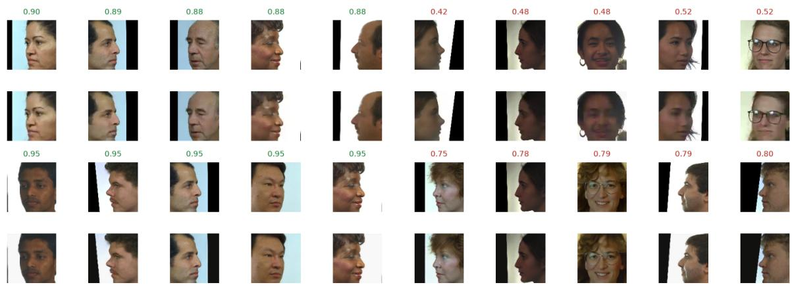  
Figure 32: Color FERET at 512 B: the five easiest (green id-cosine) and five hardest (red) crops for the strongest classical codec (WebP, top pair of rows) and the robust learned codec (Ours-ACCURATE, bottom pair), clean above and reconstruction below. Hard crops carry more fine detail than easy ones (mean Laplacian variance $2 . 4 \times 1 0 ^ { 3 }$ vs $1 . 6 \times 1 0 ^ { 3 }$ for WebP); eyewear is not a significant driver (Table 45). The learned codec preserves far more identity on the hard tail: its hardest five score 0.75–0.80, against 0.42–0.52 for WebP’s.

Difficulty is only moderately codec-shared. Averaged over codec pairs, the per-image difficulty ranks correlate with mean pairwise Spearman ρ=0.33 on Color FERET (range 0.00–0.59) and 0.38 on AI-Solutions-KK (range 0.09–0.63). The agreement is highest among the modern block codecs (AVIF–WebP 0.56, AVIF–JPEG XL 0.55 on Color FERET) and between the two learned variants (0.57); legacy JPEG is the outlier, correlating at most 0.22 with any other codec because at 512 B it destroys identity almost everywhere (median id-cosine 0.05). Ours-ACCURATE shares little with the block codecs (ρ=0.10–0.32) and does not fail alongside them: on the 30 crops WebP finds hardest its median id-cosine is 0.889, against 0.906 over all 300. So “hardness” is partly an image property (the detail signal above, shared by the block codecs) and partly a codec property (the learned codec simply refuses to fail on the same crops).

Practical implication. Because the difficulty signal, weak as it is, comes from cheap codec-independent descriptors computed at capture time, a deployment can still triage: on controlled portraits a high-Laplacian-variance, high-contrast crop is a candidate for recapture or a larger budget, whereas a smooth, evenly-lit face is safe at the tightest budget — though the signal did not replicate on the in-the-wild KK set, so this remains a Color FERET-only recommendation. More operationally useful is the tail behaviour itself: the codecs separate not on the easy majority of crops — where all of them preserve identity — but on a hard minority carrying the most fine detail, and the learned codec’s advantage is concentrated exactly there.

Table 44: Image-level Spearman correlation between per-image compression difficulty (1 − id-cos at 512 B, averaged over the nine codecs to one point per image, n=300/dataset) and codec-independent image properties. Positive ρ means the property makes a crop harder; $^ { * } p { < } 0 . 0 5 , ^ { * * } p { < } 0 . 0 1$ . On Color FERET fine detail (Laplacian variance, contrast) and low colourfulness are the strongest predictors; no property reaches significance on the in-thewild KK set, so the predictors are dataset-specific. Pose is not predictive and brightness only weakly so (−0.16); the Monk skin-tone index has no labelled crops in this sample, so it yields no estimate. The AI-Solutions-KK age row rests on the 12 crops that carry an age label and is not significant (p=0.26). (“–”: too few labelled crops for a stable estimate.)
<table><tr><td rowspan="2">Image property (codec-independent)</td><td colspan="2">Spearman ρ vs. difficulty</td></tr><tr><td>Color FERET</td><td>AI-Solutions-KK</td></tr><tr><td>High-freq. DCT share</td><td> $+ 0 . 1 3 ^ { * }$ </td><td>+0.09</td></tr><tr><td>Laplacian var. (detail)</td><td> $\mathbf { + 0 . 3 9 ^ { * * } }$ </td><td>+0.10</td></tr><tr><td>Gradient magnitude</td><td>+0.03</td><td>-0.07</td></tr><tr><td>Edge density</td><td> $- 0 . 2 2 ^ { \ast \ast }$ </td><td>+0.00</td></tr><tr><td>Grey-level entropy</td><td> $- 0 . 2 9 ^ { \ast \ast }$ </td><td>-0.09</td></tr><tr><td>Contrast (luma std)</td><td> ${ \bf + 0 . 3 0 ^ { * * } }$ </td><td>-0.05</td></tr><tr><td>Colorfulness</td><td> $\mathbf { - 0 . 3 6 ^ { \ast \ast } }$ </td><td>+0.05</td></tr><tr><td>Brightness (luma mean)</td><td> $- 0 . 1 6 ^ { * * }$ </td><td>+0.05</td></tr><tr><td>Face attributes (dataset-specific)</td><td></td><td></td></tr><tr><td>|yaw| (non-frontal)</td><td>-0.02</td><td></td></tr><tr><td>Glasses</td><td>+0.03</td><td></td></tr><tr><td>Beard</td><td>-0.08</td><td></td></tr><tr><td>Mustache</td><td>-0.14*</td><td></td></tr><tr><td>Monk skin-tone index</td><td></td><td></td></tr><tr><td>Age</td><td></td><td>+0.35</td></tr></table>

Table 45: Mean image property in the easiest vs. hardest Color FERET difficulty decile, computed at the image level (512 B: 30 easiest vs 30 hardest of 300 images, no codec pseudoreplication). Laplacian variance $( 1 . 8 1 \times )$ and contrast (1.28×) are the clearest continuous shifts. Glasses are not over-represented once counted per image (3/30 easiest vs 2/30 hardest, Fisher exact $p { = } 1 . 0 0 )$ — the earlier codec-pooled $\mathbf { \ddot { \omega } } ^ { 4 } + \mathbf { \nabla } \times \mathbf { \vec { \omega } } ^ { 5 }$ was a small-sample artefact. The rank correlations in Table 44 are the more reliable summary.
<table><tr><td>Trait (Color FERET)</td><td>Easiest 30</td><td>Hardest 30</td><td>Ratio</td></tr><tr><td>High-freq. share</td><td>0.0331</td><td>0.0402</td><td>1.21×</td></tr><tr><td>Laplacian var.</td><td>1.06e+03</td><td>1.93e+03</td><td> $1 . 8 1 \times$ </td></tr><tr><td>|yaw| (deg)</td><td>33</td><td>27.5</td><td>0.83×</td></tr><tr><td>Brightness</td><td>121</td><td>107</td><td>0.89×</td></tr><tr><td>Contrast</td><td>61.5</td><td>78.8</td><td>1.28×</td></tr><tr><td>Glasses (count)</td><td>3/30</td><td>2/30</td><td>Fisher  $p = 1 . 0 0$ </td></tr></table>

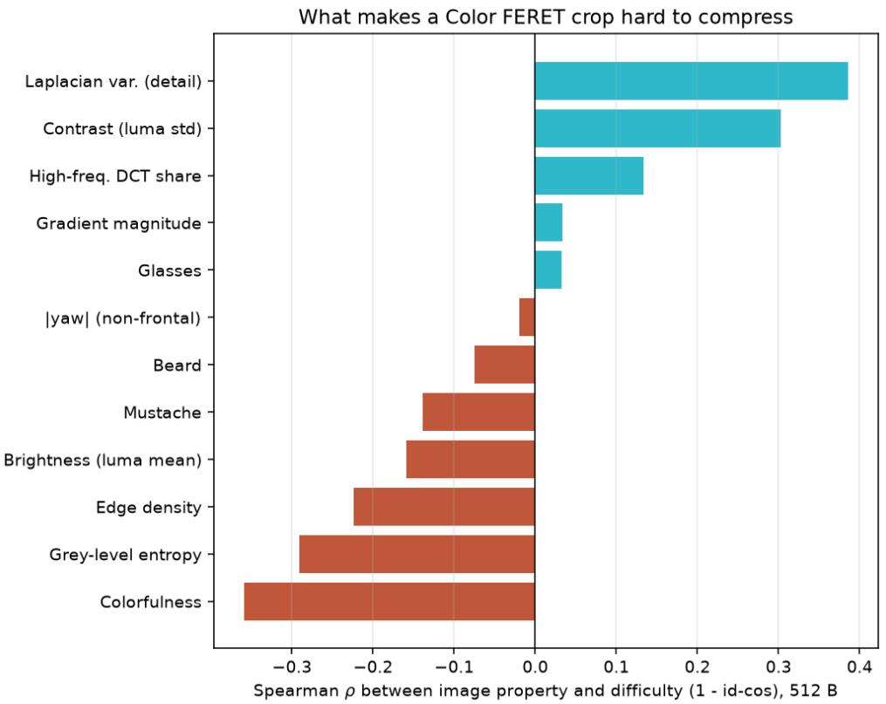  
Figure 33: Color FERET: Spearman correlation of each image property with per-image difficulty at 512 B (positive = harder). Fine-detail measures lead; pose and photometry are near zero.

## 9 Ablations and Preprocessing

TL;DR At a fixed byte budget the input resolution sets a sweet spot: smaller crops spend their bits on fewer, cleaner pixels but discard facial detail, while larger crops carry more detail than 1 kB can encode well; 112 px is the best compromise and is our working resolution. One-factor-at-a-time preprocessing (chroma/colour/background/high-frequency/ROI), alignment tightness, and the JPEG-FzT decode radius are studied separately and inform the codec design.

This section isolates the choices that sit upstream of the codec: how big the input crop should be, what preprocessing (if any) helps before encoding, how tightly the face is cropped, and a codec-internal knob (the JPEG-FzT decode radius). Each is studied one factor at a time so that the effect is attributable. The resolution study is grounded in three measurements — equal-error rate (EER) versus resolution, an embedding decomposition relative to the working resolution, and a spectral-energy retention curve — reported below (Section 17).

## 9.1 Resolution–information trade-off

TL;DR Going from 224 to 112 px loses almost no identity signal (AC spectral energy stays above 0.999 and, for strong matchers such as ArcFace/TopoFR/EdgeFace, embedding cosine stays above 0.99; LVFace-L is the exception at 0.899), but at a hard 1 kB budget the smaller crop lets the codec spend its bits where they matter; below 112 px identity retention drops off, so 112 px is the chosen working resolution.

Why resolution matters at a fixed budget. The byte budget is fixed at ≤ 1024 B (and a harder 512 B point) regardless of input size, so the choice of crop resolution is really a choice of bits per pixel. A small crop (e.g. 64 px) has few pixels, so each one is encoded cleanly, but the crop itself carries less facial detail to begin with. A large crop (e.g. 224 px) carries more raw detail, but 1 kB cannot represent 2242 pixels without heavy quantisation, so the reconstruction is blurred or blocky per pixel. The optimum is in between.

Identity content is nearly saturated by 112 px. Before any compression, we quantify how much identity signal each resolution carries by (i) the fraction of high-frequency (AC) spectral energy retained relative to the 224 px reference, and (ii) the cosine similarity between an embedding at each resolution and the 112 px embedding for the same image (“identity info retained vs. 112”). On the in-the-wild AI-Solutions-KK set, the AC spectral energy retained relative to 224 px is already 0.9997 at 112 px and 0.9996 at 96 px, dropping only to 0.9990 at 64 px (Table 46); almost all of the spectral content a face matcher uses survives downsampling to 112 px. The embedding cosine tells the same story for strong matchers (ArcFace, TopoFR, EdgeFace all retain ≥ 0.93 at 64 px and ≥ 0.98 at 96 px relative to their own 112 px embedding), with LVFace-L the notable exception — it is markedly more resolution-sensitive (0.710 at 64 px, 0.834 at 96 px), which is why we do not push below 112 px.

Clean EER bottoms out around 112–224 px. On uncompressed crops, EER decreases monotonically from 64 px up to roughly 112 px and then flattens: the gap between 112 and 224 px is small for every anchor matcher, whereas dropping from 112 to 64 px costs noticeably more (e.g. ArcFace on KK nearly doubles, from 0.21 % at 112 px to 0.39 % at 64 px; EdgeFace-XS rises a third, from 1.40 % to 1.86 %). Thus once compression is in the loop, 112 px keeps essentially all of the achievable clean accuracy while giving the codec the fewest pixels to spend its 1 kB on. Table 46 summarises the three measurements for the four anchor matchers on KK; Figure 34 shows the full curves across all matchers and both datasets.

Decision. We adopt 112 px as the verification working resolution: it sits at the knee of all three curves, retains essentially all of the clean accuracy of 224 px, and minimises the pixel count the codec must reconstruct under a 1 kB budget.

Table 46: Resolution–information decomposition on AI-Solutions-KK (clean, before compression). AC retained is the fraction of high-frequency spectral energy kept relative to the 224 px reference (dataset-level). Id. cos vs. 112 is the cosine between each resolution’s embedding and the 112 px embedding for the same image. EER is the clean equal-error rate (%).
<table><tr><td></td><td colspan="5">Resolution (px)</td></tr><tr><td>Quantity</td><td>64</td><td>96</td><td>112</td><td>168</td><td>224</td></tr><tr><td>AC spectral energy retained vs. 224</td><td>0.9990</td><td>0.9996</td><td>0.9997</td><td>0.9999</td><td>1.0000</td></tr><tr><td colspan="6">Identity cosine vs. 112 (per matcher)</td></tr><tr><td>ArcFace (antelopev2)</td><td>0.938</td><td>0.984</td><td>1.000</td><td>0.994</td><td>0.994</td></tr><tr><td>TopoFR (r100)</td><td>0.947</td><td>0.985</td><td>1.000</td><td>0.995</td><td>0.994</td></tr><tr><td>EdgeFace-XS</td><td>0.968</td><td>0.995</td><td>1.000</td><td>0.998</td><td>0.997</td></tr><tr><td>LVFace-L</td><td>0.710</td><td>0.834</td><td>1.000</td><td>0.897</td><td>0.899</td></tr><tr><td colspan="6">Clean EER (%, per matcher)</td></tr><tr><td>ArcFace (antelopev2)</td><td>0.39</td><td>0.23</td><td>0.21</td><td>0.20</td><td>0.20</td></tr><tr><td>TopoFR (r100)</td><td>0.30</td><td>0.18</td><td>0.17</td><td>0.16</td><td>0.16</td></tr><tr><td>EdgeFace-XS</td><td>1.86</td><td>1.45</td><td>1.40</td><td>1.36</td><td>1.34</td></tr><tr><td>LVFace-L</td><td>0.45</td><td>0.32</td><td>0.30</td><td>0.29</td><td>0.28</td></tr></table>

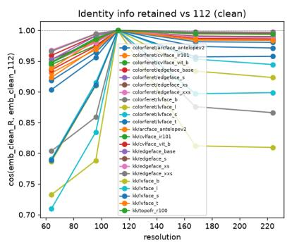

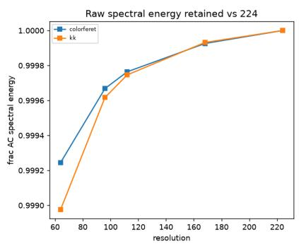

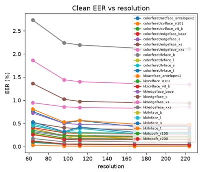  
Figure 34: Resolution–information summary across all matchers and both datasets. Left: identity information retained relative to the 112 px embedding (embedding cosine). Middle: fraction of raw AC spectral energy retained relative to 224 px. Right: clean EER versus resolution. All three flatten by ∼112 px for strong matchers; LVFace variants are the most resolution-sensitive.

## 9.2 Preprocessing, measured through the codec

TL;DR The operational question is not what a preprocessing operator does to a clean crop, but what survives after the crop is compressed and decoded. Applying each operator to the aligned 224 px input, then roundtripping through the best codecs at 1024 B on the in-the-wild KK set, chroma reduction (A3) is identity-neutral on WebP and Ours-ACCURATE (it frees bits at no verification cost on both anchors) and near-neutral on AVIF, aggressive spatial denoising (A1 edge-preserving, A4 non-local-means) smears identity-bearing texture and raises EER, and the learned Ours-ACCURATE codec is markedly the most robust to any preprocessing.

Method. Because the codec must hit a hard byte budget, any preprocessing that removes identityirrelevant content frees bits for the face — but a preprocessing choice is only useful if its benefit survives compression. We therefore measure each operator through the codec: we apply it to the aligned 224 px input, compress and decode at the 1024-byte budget with three of the best codecs (WebP, AVIF, and our Ours-ACCURATE), embed the reconstruction, and report verification EER together with the identity cosine of the reconstruction against the unprocessed original. As this is an ablation we fix the source resolution to 224 px and the budget to 1024 B, and we run it only on AI-Solutions-KK: Color FERET’s near-homogeneous studio background makes background operators trivially favourable and its clean crops are too easy at this budget to separate the operators. We evaluate the pure-image operators A1 (edge-preserving mild), A2 (bilateral strong), A3 (chroma reduction), A4 (non-local-means denoise), and B2 (MediaPipe background flattening); the BiRefNet (B1) and combined (C1/C2) operators are omitted here as their matting model was not available for the KK 224 px run. The sample is n=800 subject-stratified KK images, scored with the ArcFace and EdgeFace-XS anchors.

Table 47: Preprocessing through the codec on AI-Solutions-KK, 224 px/1024 B, n=800 subject-stratified crops. Each operator is applied to the aligned input, then compressed/decoded by the codec; EER (ArcFace, %, lower better) is verification error on the reconstruction and id-cos is the reconstruction’s identity cosine to the unprocessed original. Best / worst per column. Chroma reduction (A3) is identity-neutral; denoising (A1/A4) is the most damaging; Ours-ACCURATE is the most robust. Background flattening here uses only the weaker MediaPipe operator (B2); its EER cost is anchor-dependent (see Table 48) and the stronger BiRefNet (B1) is not yet run through the codec, so no operational verdict on background flattening is drawn from B2 alone.
<table><tr><td rowspan="2">Operator</td><td colspan="2">WebP</td><td colspan="2">AVIF</td><td colspan="2">Ours-ACCURATE</td></tr><tr><td>EER %</td><td>id-cos</td><td>EER %</td><td>id-cos</td><td>EER %</td><td>id-cos</td></tr><tr><td>std (none)</td><td>0.42</td><td>0.872</td><td>0.64</td><td>0.837</td><td>0.36</td><td>0.909</td></tr><tr><td>A1 edge-pres.</td><td>1.41</td><td>0.761</td><td>1.60</td><td>0.746</td><td>0.74</td><td>0.832</td></tr><tr><td>A2 bilateral</td><td>0.67</td><td>0.841</td><td>0.65</td><td>0.826</td><td>0.30</td><td>0.908</td></tr><tr><td>A3 chroma-red.</td><td>0.39</td><td>0.871</td><td>0.74</td><td>0.837</td><td>0.29</td><td>0.910</td></tr><tr><td>A4 NLM denoise</td><td>1.09</td><td>0.796</td><td>1.38</td><td>0.771</td><td>0.83</td><td>0.848</td></tr><tr><td>B2 bg-flatten</td><td>0.99</td><td>0.865</td><td>1.22</td><td>0.840</td><td>0.99</td><td>0.900</td></tr></table>

Result: what survives compression. Table 47 gives the through-codec EER and reconstruction identity cosine (ArcFace) per operator and codec, and Table 48 repeats the EER under the second, architecturally independent anchor (EdgeFace-XS); Figure 35 shows the operators applied to three KK skin tones with their Ours-ACCURATE reconstructions. All three findings hold cleanly across both anchors. First, chroma reduction (A3) is identity-neutral through the codec: its EER matches the unprocessed std pipeline to within noise on ArcFace (WebP A3 0.39% vs. std 0.42%) and on EdgeFace-XS (WebP A3 2.05% vs. std 2.07%), and its reconstruction id-cosine is unchanged — it discards chroma the matcher ignores, so the freed bits are pure gain. Second, aggressive spatial denoising is the most damaging: edge-preserving filtering (A1) and non-local-means (A4) smear identity-bearing skin and edge texture, dropping the classical codecs’ reconstruction id-cosine to 0.75–0.80 and raising their EER by up to +1.0 pp (WebP A1 0.42 → 1.41%, AVIF A1 0.64 → 1.60%); bilateral (A2) is a milder version of the same effect. Third, and notably, Ours-ACCURATE is the most robust to preprocessing among the codecs tested: its worst operator (B2) costs only +0.63 pp, and A1 — the operator most damaging to the classical codecs — costs it just +0.38 pp (vs. up to +1.0 pp for WebP/AVIF); it holds the highest reconstruction id-cosine in every column, because its identity-preserving objective re-supplies structure the preprocessing removed.

Backgroundflattening (B2) — a caveated, anchor-dependent result. B2 leaves the reconstruction idcosine essentially unchanged but carries a verification cost that is strong on ArcFace (Ours-ACCURATE 0.36 → 0.99%, WebP 0.42 → 0.99%) yet mild on EdgeFace-XS (WebP 2.07 → 2.58%, Table 48), so unlike A3 and A1/A4 the B2 effect does not replicate cleanly across anchors. More importantly, the through-codec study used only the MediaPipe matting (B2), which the clean-crop ablation (Table 49) already identified as the weaker of the two background operators — BiRefNet (B1) scored 0.05% ArcFace EER against MediaPipe’s 0.63% on clean crops. The B2 cost measured here is therefore a floor from the known-worse implementation, not a verdict on background flattening in general; a through-codec rerun with B1 is left to future work, and we do not draw an operational conclusion against background flattening from B2 alone.

The practical rule for a byte-budgeted face pipeline is thus confirmed on data that includes the codec: free bits with chroma reduction, never with spatial denoising (and background flattening is promising but must be re-evaluated with the stronger B1 matting before it is recommended).

Table 48: Through-codec preprocessing under the second anchor (EdgeFace-XS, architecturally independent of ArcFace), same n=800 KK crops at 224 px/1024 B; verification EER (%) and the reconstruction’s EdgeFace-XS identity cosine to the unprocessed original. Best / worst per column; both this table and its ArcFace counterpart are generated from the same artifact, so they carry the same three codecs. The A3-neutral and A1/A4-most-damaging findings replicate; the B2 background-flattening cost, strong on ArcFace (Table 47), is mild here (e.g. WebP 2.07→2.58%), so it does not generalise across anchors.
<table><tr><td rowspan="2">Operator</td><td colspan="2">WebP</td><td colspan="2">AVIF</td><td colspan="2">Ours-ACCURATE</td></tr><tr><td>EER %</td><td>id-cos</td><td>EER %</td><td>id-cos</td><td>EER %</td><td>id-cos</td></tr><tr><td>std (none)</td><td>2.07</td><td>0.920</td><td>2.53</td><td>0.896</td><td>1.70</td><td>0.955</td></tr><tr><td>A1 edge-pres.</td><td>4.18</td><td>0.817</td><td>4.37</td><td>0.812</td><td>3.08</td><td>0.883</td></tr><tr><td>A2 bilateral</td><td>2.57</td><td>0.895</td><td>2.76</td><td>0.890</td><td>1.68</td><td>0.955</td></tr><tr><td>A3 chroma-red.</td><td>2.05</td><td>0.920</td><td>2.61</td><td>0.896</td><td>1.64</td><td>0.956</td></tr><tr><td>A4 NLM denoise</td><td>3.14</td><td>0.854</td><td>3.98</td><td>0.840</td><td>2.53</td><td>0.907</td></tr><tr><td>B2 bg-flatten</td><td>2.58</td><td>0.911</td><td>2.75</td><td>0.894</td><td>2.05</td><td>0.944</td></tr></table>

Table 49: Clean-crop (pre-compression) corroboration: preprocessing one factor at a time on 112 px crops. EER (%) per anchor matcher; id-cos vs. std is the processed crop’s identity cosine to its unprocessed counterpart. Chroma de-emphasis (A3) and BiRefNet flattening (B1) are near-neutral; denoising (A1/A4/C1) is the most damaging. Best / worst per column; the std row’s id-cosine is 1.000 by construction (compared against itself) and is excluded from that column’s ranking.
<table><tr><td rowspan="2">Variant</td><td colspan="4">EER (%)</td><td rowspan="2">id-cos vs. std</td></tr><tr><td>ArcFace</td><td>LVFace-L</td><td>TopoFR-R100</td><td>EdgeFace-XS</td></tr><tr><td>std (none)</td><td>0.04</td><td>0.25</td><td>0.04</td><td>0.39</td><td>1.000</td></tr><tr><td>A1 edge-preserving, mild</td><td>0.38</td><td>0.68</td><td>0.31</td><td>1.26</td><td>0.818</td></tr><tr><td>A2 bilateral, strong</td><td>0.11</td><td>0.38</td><td>0.12</td><td>0.63</td><td>0.889</td></tr><tr><td>A3 chroma de-emphasis</td><td>0.04</td><td>0.26</td><td>0.04</td><td>0.38</td><td>0.990</td></tr><tr><td>A4 non-local-means</td><td>0.28</td><td>0.68</td><td>0.26</td><td>1.33</td><td>0.798</td></tr><tr><td>B1 background flatten (BiRefNet)</td><td>0.05</td><td>0.27</td><td>0.07</td><td>0.34</td><td>0.969</td></tr><tr><td>B2 background flatten (MediaPipe)</td><td>0.63</td><td>0.82</td><td>0.65</td><td>0.91</td><td>0.960</td></tr><tr><td>C1 B1 + A1</td><td>0.35</td><td>0.75</td><td>0.66</td><td>1.17</td><td>0.802</td></tr><tr><td>C2 foveated ROI</td><td>0.07</td><td>0.27</td><td>0.11</td><td>0.47</td><td>0.933</td></tr></table>

Corroboration on clean crops. The same ordering holds before compression, isolating the operator effect from the codec: on clean 112 px crops (Table 49, Figure 36, four anchors) chroma de-emphasis (A3) and BiRefNet background flattening (B1) are identity-free while non-local-means (A4) and edgepreserving (A1) filtering raise ArcFace EER 7–9.5× (from 0.04 to 0.28–0.38%) and roughly triple EdgeFace-XS EER — the clean measurement that first motivated the codec design’s reliance on chroma reduction and background flattening rather than spatial denoising.

## 9.3 Alignment tightness

TL;DR How tightly the face is cropped (inter-ocular distance as a fraction of the crop) changes how many bits land on the central face; tighter crops enlarge the eyes/nose/mouth but clip the hairline and jaw, so we verify the matcher’s landmark alignment is sane and compare standard/tight/mid/fill crops.

Method. The crop tightness controls the inter-ocular distance (IOD) as a fraction of the crop width and therefore how the budget is distributed: a tighter crop devotes more pixels to the inner face but discards peripheral context (hairline, ears, jaw). We first confirm that the landmark-to-ArcFace alignment is correct — Figure 37 overlays the detected interest points and shows the resulting crop across subjects, poses, and the five resolutions — and then compare four tightness presets: standard (IOD ≈ 0.31, mouth row y = 92), tight (IOD ≈ 0.40), mid (IOD ≈ 0.46), and fill (IOD ≈ 0.52), shown in Figure 38.

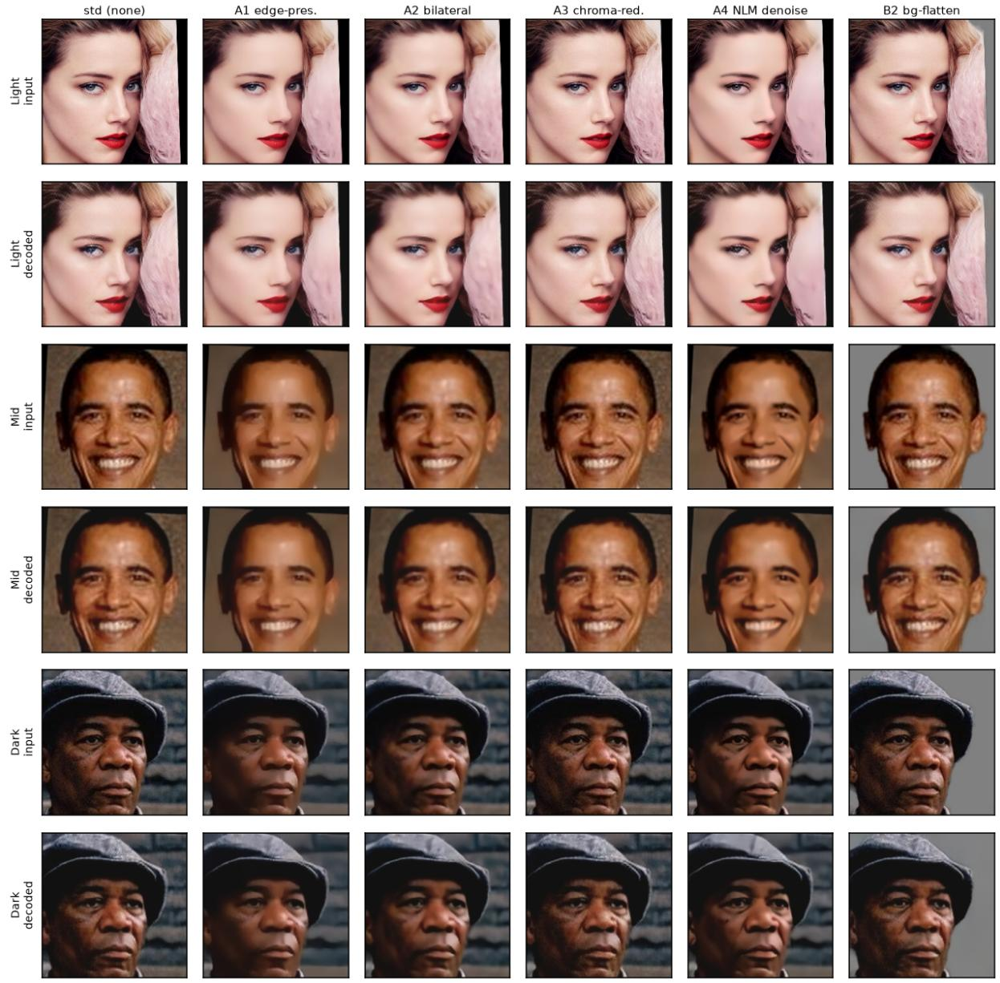  
Figure 35: Preprocessing operators through the codec on three AI-Solutions-KK skin tones (224 px/1024 B, decoded with Ours-ACCURATE). For each subject the top row is the preprocessed input and the bottom row the decoded reconstruction. B2 flattens the background to a compressible field without touching the face; A1/A4 visibly soften identity-bearing skin and edge texture, whereas A3 (chroma reduction) is perceptually and biometrically near-neutral.

Why this remains a clean (pre-compression) study. Unlike the operator preprocessing of Section 9.2, which we measure through the codec because a filter’s benefit may or may not survive compression, crop tightness is a geometric choice made entirely at the input: a tighter crop that clips the hairline and jaw discards that context before any codec sees the image, and no decoder can restore pixels that were never encoded. The effect is therefore codec-independent and is correctly isolated on clean crops; routing it through a codec would only add the (separately measured) compression penalty on top of the geometric one. We consequently report crop tightness on clean 112 px crops across all four anchors below; a through-codec crop-tightness sweep on KK at 224 px would require regenerating the KK alignment presets at that resolution and is left to future work.

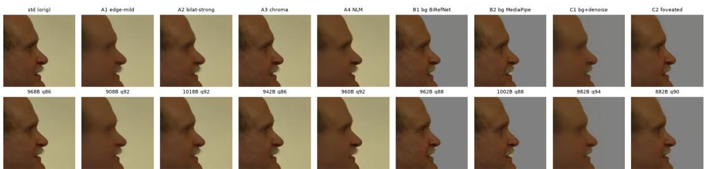  
Figure 36: Pre-compression preprocessing, one factor at a time, on a single crop. Top row: input variant; bottom row: reconstruction at ≤ 1024 B with achieved byte size and JPEG quality factor annotated. Columns: std (no preprocessing), A1–A4 filters, B1/B2 background removal, C1/C2 combined.

Table 50: Alignment-tightness ablation: clean equal-error rate (%) at 112 px for each crop preset (before compression), indexed by inter-ocular distance as a fraction of crop width (IOD/W). EER degrades monotonically as the crop tightens; the compact EdgeFace-XS matcher is by far the most sensitive. Best / worst per column.
<table><tr><td>Crop tightness (IOD/W)</td><td>ArcFace</td><td>LVFace-L</td><td>TopoFR-R100</td><td>EdgeFace-XS</td></tr><tr><td>standard (≈0.31)</td><td>0.04</td><td>0.25</td><td>0.04</td><td>0.39</td></tr><tr><td>tight (0.40)</td><td>0.25</td><td>0.58</td><td>0.20</td><td>4.73</td></tr><tr><td>mid (0.46)</td><td>1.55</td><td>1.95</td><td>0.99</td><td>12.85</td></tr><tr><td>fill (0.52)</td><td>5.60</td><td>10.44</td><td>3.88</td><td>26.71</td></tr></table>

Observations. Tighter crops (mid/fill) enlarge the eyes, nose, and mouth — the regions matchers weight most — but at the extreme (fill) they clip the forehead and jawline and can crop poorly on non-frontal poses, where the off-centre face no longer fits the assumed geometry. The standard preset keeps the whole face plus a margin of context and aligns cleanly across poses and resolutions in the alignment check.

Quantitative impact. The clean per-matcher EER on 112 px crops confirms this: accuracy degrades monotonically as the crop tightens (Table 50). Going from standard (IOD ≈ 0.31) to fill (0.52) raises ArcFace EER from 0.04 % to 5.60 %, LVFace-L from 0.25 % to 10.44 %, and TopoFR-R100 from 0.04 % to 3.88 %. The effect is most severe for the compact matcher: EdgeFace-XS climbs from 0.39 % at standard to 4.73 % at tight, 12.85 % at mid, and 26.71 % at fill — roughly a 68× increase, and far larger than for the heavier backbones. Aggressive crops that clip the hairline and jaw badly hurt identity, especially for the smallest model, confirming that the standard crop is the correct default.

## 9.4 JPEG-FzT radius

TL;DR JPEG-FzT has a decode-time interpolation radius; increasing it from rad=1 to rad=2 cuts perceptual distortion (LPIPS) by nearly 40% at the same byte size and PSNR, so the larger radius is the better default for this codec at the 1 kB point.

Method. JPEG-FzT exposes a decode-time interpolation radius that controls how aggressively the sparse transform coefficients are spread when reconstructing the image. At the ≤ 1024 B operating point we compare the baseline (rad=1), rad=2, and a triangle kernel variant on a sample crop, holding the byte budget fixed and reporting PSNR and LPIPS (Figure 39).

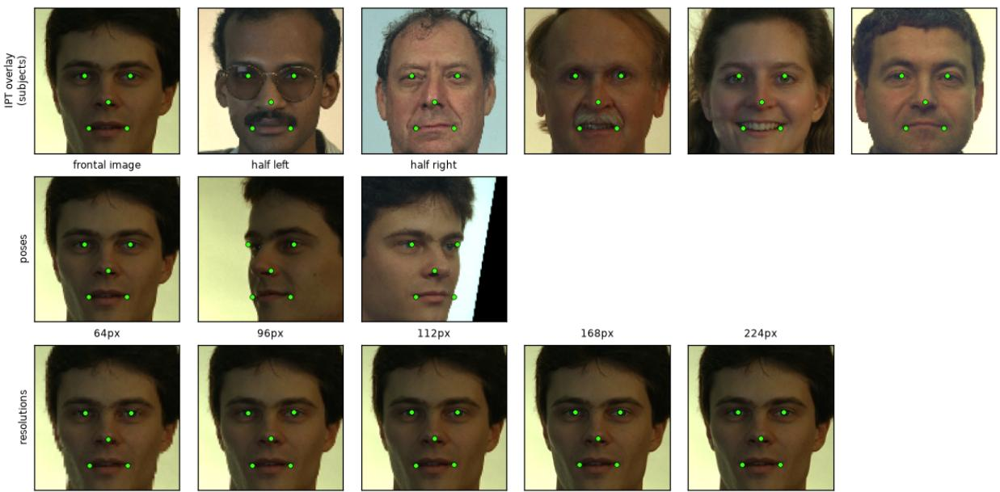  
Figure 37: Landmark-to-ArcFace alignment check on Color FERET. Rows: detected interest points overlaid across subjects (top), frontal/left/right poses (middle), and the five crop resolutions 64/96/112/168/224 px (bottom), confirming the alignment is stable.

## Crop-tightness presets at 112px (coloured Color FERET subjects)

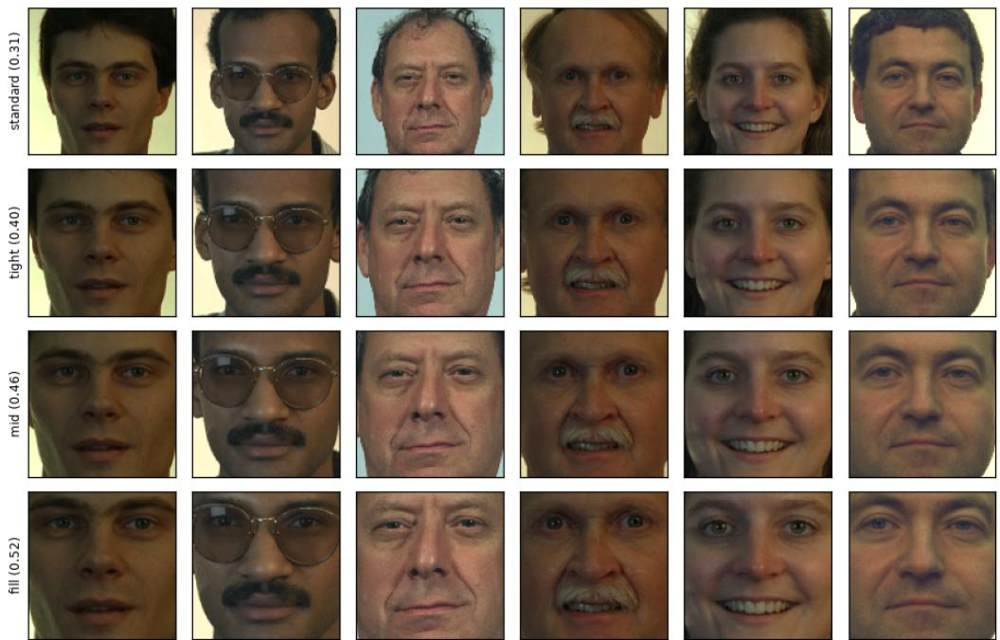  
Figure 38: Crop-tightness presets at 112 px. Rows: standard (IOD ≈ 0.31), tight (0.40), mid (0.46), fill (0.52). Tighter crops enlarge the inner face but clip peripheral context and are less robust on non-frontal poses.

Observations. At essentially the same byte size and PSNR (≈1005 B, PSNR ≈ 28.1), the larger radius substantially improves the perceptual metric: LPIPS drops from 0.188 at rad=1 to 0.117 at rad=2, with the triangle kernel giving a near-identical 0.118 at a slightly larger size (1022 B, PSNR 28.2). PSNR is insensitive to the radius (it is dominated by low-frequency energy), but the perceptual/structural improvement is large and visible in the reconstruction. We therefore use rad=2 as the JPEG-FzT default

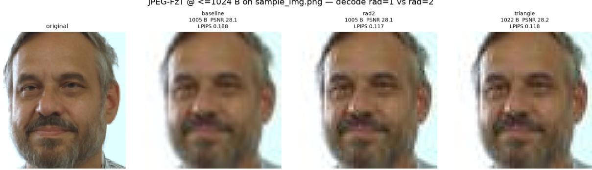  
Figure 39: JPEG-FzT decode-radius sweep at ≤ 1024 B on a sample crop. Left to right: original, baseline (rad=1, LPIPS 0.188), rad=2 (LPIPS 0.117), triangle kernel (LPIPS 0.118). At matched byte size and PSNR, the larger radius cuts LPIPS by nearly 40%.

in the codec benchmark.

## 10 The ISO/IEC 29794-5 Annex E/F parameter tables

TL;DR The Annex E/F tables were fitted by maximising self-similarity — the cosine between an image and its own compressed version, under a single matcher — with a one-factor-at-a-time search from a fixed 112 px baseline, so no interaction between resolution, colour and masking was ever tested. Reproducing them under a paired subject-level bootstrap, two thirds of the head-to-head comparisons are statistically indistinguishable from our own configurations: at 1024 B most reasonable parameter sets tie. The exceptions are real and one-sided — our JPEG 2000 recommendation is wrong by 1.4–4.7 pp, their parameters genuinely win for JPEG and HEIF on the in-the-wild corpus, and their 56 px AVIF entry genuinely loses on Color FERET. A joint sweep over resolution × colour × masking improves on both only for JPEG 2000 and JPEG, and overfits for WebP. Self-similarity correlates with verification error (ρ = −0.77 over 336 cells) but is not discriminative near the optimum, and is biased towards blur and low resolution — the two choices that most distinguish the annex tables from ours.

Annexes E and F of the emerging ISO/IEC 29794-5 text specify, per codec, a resolution, a colour mode, an image manipulation and a set of CLI flags for compressing a face to 1024 B [3, 4]. Because those tables are normative-in-spirit — implementers will follow them — it matters whether they are optimal, and whether the objective they were fitted to is the right one. This section answers both questions on our data and matchers.

## 10.1 How the annex parameters were derived

Their published implementation2 makes the derivation explicit, and two properties of it drive everything below.

The objective is self-similarity, not verification. Every Optuna case maximises the mean cosine between each original image and its own compressed version, scored with one matcher (CVLface AdaFace ViT-B KP-RPE, WebFace12M). There are no impostor pairs, no mated pairs across captures, and no EER anywhere in the fitting loop. A configuration is therefore rewarded for reconstructing that image faithfully, which is not the same as preserving what separates one identity from another.

The search was one factor at a time. Each case fixes resolution at 112 px, preprocessing at “default” and a colour mode, then sweeps exactly one flag; the remaining axes are commented out and the study is re-run under a new name. The annex tables nevertheless present a combination per codec. Interactions — greyscale frees bits, which shifts the optimal resolution, which changes what masking can buy — were never in scope. That is the gap Section 10.4 measures.

The manipulations, resolved from the source. rectangle\_mean blurs the whole image once with a 3 × 3 box filter and then restores, through a hard (unfeathered) mask, the rectangle spanning the five landmarks grown by 20% of the total resolution on each side; ofiq\_landmarks restores an OFIQ 98-point face-contour polygon instead; mean keeps the blur everywhere. The manipulation is applied after the resize, and each resolution is produced by a fresh similarity transform at that size.

## 10.2 Protocol

We reproduce their pipeline inside ours. Crops are aligned to the ArcFace 5-point template at each target resolution independently, exactly as in Section 3; because that alignment is canonical, the five landmarks land on the template and the rectangle\_mean rectangle is exact without a detector. Every cell — a (codec, resolution, colour, manipulation, flags) tuple — is compressed to ≤ 1024 B by a binary search on the codec’s quality knob, decoded, resized to 112 px and embedded, with nothing written to disk in between.

Scoring uses both objectives: self-similarity exactly as they define it (their matcher, mean cosine to the uncompressed original), and verification EER over the fixed pair set of Section 4. We report EER under their single matcher (“their”) and averaged over our four anchors (“anchors”), so that “their parameters are worse” can be separated from “their parameters are tuned to one ViT”. Both the symmetric protocol (both sides compressed, the convention of this report) and the asymmetric one (compressed reference against an uncompressed probe, the document scenario the annexes describe) are computed; conclusions are identical under both, and we quote the symmetric numbers.

Experiment 1 runs at the full population. The 336-cell grid of Section 10.4 runs on a 2000-crop prefix (whole identities, so mated pairs survive) and its winners are then re-confirmed at the full population, which is why the two are never compared across tables without being re-scored on the same rows.

Four deviations, stated up front. (i) OFIQ’s ADNet landmarker is not available in this environment, so the contour polygon is built from InsightFace’s 106-point contour — same construction, different landmarker. (ii) libjxl exposes effort 10 only behind --allow\_expert\_options; the annexes’ “effort = 10” therefore runs as 9. (iii) WebP’s sns knob is not exposed by Pillow, so WebP cells carrying it are encoded with cwebp; an engine-matched control confirms this does not drive the comparison. (iv) Our JPEG 2000 rate ladder had to be extended to ratio 2: at 56 px a 1024 B budget is a third of a bit per pixel, and a ladder stopping at ratio 12 caps the file at ∼260 B, which would have handed the annexes’ 56 px JPEG 2000 configurations a fictitious handicap.

## 10.3 Experiment 1 — are the annex parameters better than ours?

Table 51 is the head-to-head: the 12 unique Annex E/F configurations against our recommended configuration per codec, on both datasets, under both objectives and both matcher sets.

Point estimates alone would mislead here. Read as point estimates, Table 51 says our configurations win on Color FERET and theirs win on AI-Solutions-KK. Most of those margins are, however, within sampling error. Table 52 therefore resamples identities with replacement (200 draws) and reports the paired difference against our configuration, with the four anchor matchers fused at score level. Eight of the twelve comparisons have a confidence interval containing zero.

What survives. Three findings do. (i) Our JPEG 2000 configuration is the wrong place to have measured that codec, decisively and on both corpora: the annexes’ 56 px greyscale entry is −1.38 pp [−1.59, −1.19] on Color FERET and −4.65 pp [−5.07, −4.29] on AI-Solutions-KK. Colour JPEG 2000’s rate allocation collapses inside 1024 B, and the annexes found the greyscale escape route that we did not — which, since this report’s “avoid JPEG 2000” verdict rests on the colour measurement, matters beyond this section (Section 10.7). (ii) Their JPEG and HEIF entries are genuinely better on the in-the-wild corpus (−0.34 pp [−0.41, −0.25] and −0.09 pp [−0.13, −0.03]), while being indistinguishable from ours on Color FERET. (iii) Their 56px AVIF entry is genuinely worse on Color FERET (+0.06 pp [+0.02, +0.10]) — the only case where a specific annex choice is measurably harmful, and it is a resolution choice.

Table 51: Experiment 1: the Annex E/F configurations against ours, at 1024 B. “self-sim” is their objective under their matcher; EER (%) is ours, symmetric protocol, under their matcher and averaged over our four anchors. Full population, both datasets.
<table><tr><td rowspan="2">Codec</td><td rowspan="2">Parameters</td><td colspan="3">Color FERET</td><td colspan="3">AI-Solutions-KK</td></tr><tr><td>self-sim</td><td> $\mathrm { E E R } _ { \mathrm { t h e i r } }$ </td><td> $\mathrm { E E R } _ { \mathrm { a n c h } }$ </td><td>self-sim</td><td> $\mathrm { E E R } _ { \mathrm { t h e i r } }$ </td><td> $\mathrm { E E R } _ { \mathrm { a n c h } }$ </td></tr><tr><td rowspan="3">AVIF</td><td>ours: 112 px color, –</td><td>0.876</td><td>0.11</td><td>0.21</td><td>0.875</td><td>0.99</td><td>1.30</td></tr><tr><td>Annex E: 56 px color, rect, subsampling=4:2:0, speed=1</td><td>0.865</td><td>0.16</td><td>0.31</td><td>0.875</td><td>0.93</td><td>1.41</td></tr><tr><td>Annex F: 56 px gray, −, subsampling=4:0:0, speed=1</td><td>0.843</td><td>0.41</td><td>0.34</td><td>0.873</td><td>1.00</td><td>1.38</td></tr><tr><td rowspan="3">HEIF</td><td>ours: 96 px color, –</td><td>0.830</td><td>0.12</td><td>0.24</td><td>0.843</td><td>1.22</td><td>1.56</td></tr><tr><td>Annex E: 96 px color, rect, chroma_downsampling=average</td><td>0.853</td><td>0.13</td><td>0.22</td><td>0.864</td><td>0.99</td><td>1.36</td></tr><tr><td>ours: 96 px color, –</td><td>0.830</td><td>0.14</td><td>0.23</td><td>0.839</td><td>1.30</td><td>1.67</td></tr><tr><td rowspan="3">JPEG 2000</td><td>Annex E: 96 px gray, rect, smooth=30, arithmetic=True</td><td>0.868</td><td>0.25</td><td>0.24</td><td>0.893</td><td>0.79</td><td>1.13</td></tr><tr><td>ours: 224 px color, –</td><td>0.598</td><td>1.57</td><td>2.76</td><td>0.621</td><td>6.50</td><td>8.24</td></tr><tr><td>Annex E: 56 px color, rect, num_resolutions=3</td><td>0.675</td><td>0.67</td><td>1.42</td><td>0.665</td><td>4.64</td><td>5.68</td></tr><tr><td rowspan="3">JPEG XL</td><td>Annex F: 56 px gray, rect, num_resolutions=5</td><td>0.805</td><td>0.57</td><td>0.45</td><td>0.837</td><td>1.15</td><td>1.64</td></tr><tr><td>ours: 112 px color, –</td><td>0.848</td><td>0.11</td><td>0.25</td><td>0.850</td><td>1.31</td><td>1.74</td></tr><tr><td>Annex E: 64 px color, rect, effort=10</td><td>0.839</td><td>0.13</td><td>0.28</td><td>0.852</td><td>1.10</td><td>1.52</td></tr><tr><td rowspan="4">WebP</td><td>Annex F: 56 px gray, contour, effort=10</td><td>0.752</td><td>0.99</td><td>0.79</td><td>0.747</td><td>2.59</td><td>3.17</td></tr><tr><td>ours: 96 px color, –</td><td>0.879</td><td>0.09</td><td>0.18</td><td>0.900</td><td>0.83</td><td>1.10</td></tr><tr><td>Annex E: 64 px color, rect, method=6, sns=40</td><td>0.874</td><td>0.12</td><td>0.24</td><td>0.893</td><td>0.73</td><td>1.17</td></tr><tr><td>Annex F: 80 px gray, contour, method=6, sns=40</td><td>0.839</td><td>0.37</td><td>0.35</td><td>0.855</td><td>1.10</td><td>1.38</td></tr></table>

Everything else is a tie. JPEG XL is indistinguishable on both corpora, and so are AVIF on AI-Solutions-KK and HEIF and JPEG on Color FERET. At 1024 B, with a modern codec at a sane resolution, the parameter set simply does not matter much — which is itself a result worth putting in front of WG 3, because a normative table implies that it does.

Table 52: Paired subject-level bootstrap (200 resamples of identities) of the EER difference against our configuration, in percentage points; negative favours the alternative. Four anchor matchers fused at score level, full population. † marks an interval excluding zero.
<table><tr><td rowspan="2">Codec</td><td colspan="4">Color FERET</td><td colspan="3">AI-Solutions-KK</td></tr><tr><td>ours</td><td>∆ annex</td><td></td><td>∆ sweep</td><td>ours</td><td>∆ annex</td><td>∆ sweep</td></tr><tr><td>AVIF</td><td>0.058</td><td>+0.057 [+0.02,+0.10]†</td><td></td><td>-0.013 [-0.03,+0.01]</td><td>0.601</td><td>+0.071 [-0.00,+0.13]</td><td>-0.023 [-0.07,+0.02]</td></tr><tr><td>HEIF</td><td>0.080</td><td>-0.026 [-0.06,+0.01]</td><td></td><td>-0.019 [-0.05,+0.03]</td><td>0.730</td><td>-0.085[-0.13,-0.03]†</td><td>-0.034 [-0.10,+0.02]</td></tr><tr><td>JPEG</td><td>0.053</td><td>+0.017 [-0.01,+0.05]</td><td></td><td>+0.014 [-0.02,+0.04]</td><td>0.865</td><td>-0.337 [-0.41,-0.25]†</td><td>-0.270 [-0.34,-0.18]†</td></tr><tr><td>JPEG 2000</td><td>1.601</td><td>-1.377 [-1.59,-1.19]†</td><td></td><td>-1.524 [-1.75,-1.34]†</td><td>5.494</td><td>-4.646 [-5.07,-4.29]†</td><td>-4.742 [-5.11,-4.38]†</td></tr><tr><td>JPEG XL</td><td>0.063</td><td>+0.025 [-0.01,+0.05]</td><td></td><td>-0.013 [-0.04,+0.00]</td><td>0.840</td><td>-0.069 [-0.14,+0.00]</td><td>+0.028 [-0.02,+0.08]</td></tr><tr><td>WebP</td><td>0.033</td><td>+0.031 [-0.00,+0.05]</td><td></td><td>+0.005 [-0.01,+0.02]</td><td>0.488</td><td>+0.043 [+0.00,+0.08]†</td><td>+0.160 [+0.11,+0.21]†</td></tr></table>

## 10.4 Experiment 2 — is there a better set than either?

Their one-factor-at-a-time search could not see interactions, and ours never varied colour or masking at all. Stage A therefore sweeps resolution × colour × manipulation jointly at default flags $( 7 \times 2 \times 4 = 5 6$ cells per codec, 336 in total); Stage B then sweeps each codec’s own flags around its two best Stage-A cells (62 further cells). Table 53 is the result.

On the prefix the grid was selected on, the joint sweep beats both parameter sets in 5 of 6 codecs, by up to 10.6× (JPEG 2000). That margin is largely an artefact of selecting and evaluating on the same 2000 crops under the same two matchers. Re-measured at the full population under the four anchors — three of which played no part in the selection — the sweep’s advantage over our configuration is significant only for JPEG 2000 (both corpora) and JPEG (AI-Solutions-KK), is indistinguishable from ours for AVIF, HEIF and JPEG XL, and is significantly worse for WebP on AI-Solutions-KK $( + 0 . 1 6 \mathrm { p p } [ + 0 . 1 1 , + 0 . 2 1 ]$ Table 52). The WebP case is instructive: its winning cell added contour masking at 168 px, a combination that was ahead by 0.017 pp on the selection set and behind by 0.16 pp on a held-out corpus. A grid this large, scored on a subsample, will manufacture such winners; only the JPEG 2000 result is big enough to be immune.

Table 53: Experiment 2: the joint sweep against both parameter sets, EER (%), symmetric, mean of ArcFaceantelopev2 and their ViT-B, on the common 2000-crop prefix of Color FERET — the set the sweep was selected on. Table 52 gives the held-out verdict.
<table><tr><td rowspan="2">Codec</td><td rowspan="2">Ours EER %</td><td rowspan="2">Annex (best of E/F) EER %</td><td colspan="2">Joint sweep (this work)</td></tr><tr><td>configuration</td><td>EER %</td></tr><tr><td>AVIF</td><td>0.168</td><td>0.292</td><td>168 px color, rect, subsampling=4:4:4, speed=1</td><td>0.084</td></tr><tr><td>HEIF</td><td>0.218</td><td>0.184</td><td>168 px color, rect</td><td>0.116</td></tr><tr><td>JPEG</td><td>0.171</td><td>0.273</td><td>96 px color, rect, smooth=30, arithmetic=True</td><td>0.139</td></tr><tr><td>JPEG 2000</td><td>2.701</td><td>0.657</td><td>224 px gray, full blur, num_resolutions=7</td><td>0.256</td></tr><tr><td>JPEG XL</td><td>0.137</td><td>0.186</td><td>80 px color, –</td><td>0.119</td></tr><tr><td>WebP</td><td>0.123</td><td>0.204</td><td>168 px color, contour, method=3, sns=0</td><td>0.089</td></tr></table>

Where the gain comes from. Table 54 gives the marginal effect of each axis. Resolution dominates: the mean EER at 56 px is 0.92% against 0.43% at 96–168 px, so the annexes’ 56–64 px choices sit on the wrong side of the optimum for five of the seven codecs. Greyscale looks strongly beneficial marginally (0.49 vs 0.66%) — but that average is carried almost entirely by JPEG 2000, and at each codec’s own best resolution and colour mode the picture reverses.

Table 54: Stage A marginal axis effects: mean EER (%) over all cells at each level.
<table><tr><td>Axis</td><td>Level</td><td>EER %</td><td>Level</td><td>EER %</td><td>Level</td><td>EER %</td><td>Level</td><td>EER %</td></tr><tr><td rowspan="2">Resolution (px)</td><td>56</td><td>0.922</td><td>64</td><td>0.683</td><td>80</td><td>0.504</td><td>96</td><td>0.437</td></tr><tr><td>112</td><td>0.443</td><td>168</td><td>0.425</td><td>224</td><td>0.639</td><td></td><td></td></tr><tr><td>Colour</td><td>color</td><td>0.669</td><td>gray</td><td>0.490</td><td></td><td></td><td></td><td></td></tr><tr><td>Manipulation</td><td>mean</td><td>0.630</td><td>none</td><td>0.580</td><td>ofiq landmarks</td><td>0.613</td><td>rectangle mean</td><td>0.494</td></tr></table>

Masking looks good on the selection set and mostly does not transfer. Averaged over the grid, rectangle\_mean is the best manipulation (0.494 vs 0.580% for no manipulation), and held at each codec’s own best resolution and colour mode (Table 55) some manipulation still wins for four of six codecs. That is the evidence on which a masking column in a parameter table would be written. It does not survive a held-out corpus: of the five per-codec winners that carry a manipulation, only two reproduce (JPEG’s rectangle, and JPEG 2000’s full blur — both codecs whose rate allocation is starved at 1024 B), two are ties, and WebP’s contour mask is significantly worse on AI-Solutions-KK. Masking buys back bits where the codec is short of them, which at this budget means JPEG and JPEG 2000; elsewhere it removes detail for nothing.

Flags matter less than the axes, with one instructive exception. Stage B moves EER by $\leq 0 . 0 2$ pp for AVIF, HEIF, JPEG XL and JPEG 2000; HEIF’s chroma downsampling makes no measurable difference at all (0.116 % for all three settings), and JPEG XL’s effort 10 is worse than the default (0.144 vs 0.119 %)

Table 55: Manipulation held at each codec’s best resolution and colour mode. EER (%), Color FERET 2000-crop prefix.
<table><tr><td>Codec</td><td>at best res/colour</td><td colspan="4">manipulation, EER %</td></tr><tr><td></td><td></td><td>none</td><td>rect</td><td>contour</td><td>full blur</td></tr><tr><td>AVIF</td><td>224 px color</td><td>0.139</td><td>0.085</td><td>0.100</td><td>0.126</td></tr><tr><td>HEIF</td><td>168 px color</td><td>0.190</td><td>0.116</td><td>0.192</td><td>0.188</td></tr><tr><td>JPEG</td><td>96 px color</td><td>0.171</td><td>0.201</td><td>0.217</td><td>0.252</td></tr><tr><td>JPEG 2000</td><td>224 px gray</td><td>0.470</td><td>0.293</td><td>0.380</td><td>0.280</td></tr><tr><td>JPEG XL</td><td>80 px color</td><td>0.119</td><td>0.205</td><td>0.280</td><td>0.246</td></tr><tr><td>WebP</td><td>168 px color</td><td>0.116</td><td>0.116</td><td>0.106</td><td>0.122</td></tr></table>

— both are flags the annex tables specify as though they mattered. JPEG is the exception, and it is the clearest single illustration of the interaction problem: their own smooth = 30 plus arithmetic coding is genuinely worth having, improving 0.201 → 0.139% — but only at colour 96 px. Combined with the greyscale and masking their table also prescribes, the same flags land at 0.273%, worse than doing nothing. Each of their choices helps alone; together they do not.

What greyscale actually buys. Because the premise of greyscale and masking is that they free bits, we record bytes at a fixed quality setting alongside EER at the fixed budget (Table 56). Greyscale frees 14–23% for JPEG and up to 66% for JPEG 2000 at 224 px, but only 5–17% for AVIF, JPEG XL and HEIF — and only for JPEG 2000 does the freed budget convert into lower EER. For the modern codecs the chroma planes were never the expensive part, so discarding colour costs identity information and buys almost nothing.

Table 56: Bytes freed by greyscale at a fixed quality setting, as a percentage of the colour file size (no manipulation).
<table><tr><td>Codec</td><td>56px</td><td>64px</td><td>80 px</td><td>96px</td><td>112px</td><td>168 px</td><td>224 px</td></tr><tr><td>AVIF</td><td>5</td><td>5</td><td>7</td><td>8</td><td>13</td><td>11</td><td>11</td></tr><tr><td>HEIF</td><td>7</td><td>7</td><td>8</td><td>17</td><td>9</td><td>9</td><td>9</td></tr><tr><td>JPEG</td><td>23</td><td>20</td><td>18</td><td>20</td><td>16</td><td>16</td><td>14</td></tr><tr><td>JPEG 2000</td><td>2</td><td>2</td><td>2</td><td>15</td><td>36</td><td>65</td><td>66</td></tr><tr><td>JPEG XL</td><td>7</td><td>7</td><td>8</td><td>8</td><td>11</td><td>10</td><td>12</td></tr><tr><td>WebP</td><td>11</td><td>11</td><td>11</td><td>18</td><td>12</td><td>14</td><td>14</td></tr></table>

## 10.5 Does self-similarity predict verification error?

This is the question that decides how the finding should be worded to WG 3, and the honest answer is more nuanced than “their objective is wrong”.

Across the 336 classical grid cells, self-similarity and EER are strongly rank-correlated under their own matcher: Spearman $\rho = - 0 . 7 7 ( p < 1 0 ^ { - 6 0 } )$ , and between −0.53 and −0.91 within every individual codec (Table 57). Self-similarity is therefore a usable proxy: it separates a bad configuration from a good one.

What it is not is discriminative near the optimum — which is exactly the regime a parameter table is chosen in. Ranking by self-similarity picks a configuration up to 1.9× worse than the EER optimum (WebP: 0.160 vs 0.085%; HEIF 0.186 vs 0.108; JPEG 0.408 vs 0.241), and it errs in a systematic direction: it prefers lower resolution and the full-blur manipulation, both of which flatter a same-image cosine — a blurred image is easy to reconstruct consistently — while removing detail that cross-capture matching needs. Only for JPEG XL do the two objectives agree on the winner.

Table 57: Their self-similarity objective against verification EER over the Stage-A grid, under their own matcher. ρ is Spearman’s rank correlation; the last four columns compare the configuration self-similarity selects with the EER-optimal one.
<table><tr><td>Codec</td><td>ρ(self-sim, EER)</td><td>self-similarity&#x27;s pick</td><td>EER %</td><td>EER-optimal pick</td><td>EER %</td></tr><tr><td>AVIF</td><td>-0.76</td><td>112 px color, full blur</td><td>0.116</td><td>224 px color, rect</td><td>0.093</td></tr><tr><td>HEIF</td><td>-0.52</td><td>112 px color, full blur</td><td>0.186</td><td>224 px color, full blur</td><td>0.108</td></tr><tr><td>JPEG</td><td>-0.55</td><td>96 px gray, rect</td><td>0.408</td><td>96 px color, –</td><td>0.241</td></tr><tr><td>JPEG 2000</td><td>-0.91</td><td>112 px gray, full blur</td><td>0.551</td><td>224 px gray, full blur</td><td>0.386</td></tr><tr><td>JPEG XL</td><td>-0.63</td><td>112 px color, full blur</td><td>0.097</td><td>112 px color, full blur</td><td>0.097</td></tr><tr><td>WebP</td><td>-0.66</td><td>112 px color, full blur</td><td>0.160</td><td>224 px color, –</td><td>0.085</td></tr><tr><td>All cells</td><td>-0.77</td><td>n = 336, p &lt; 10−60</td><td></td><td></td><td></td></tr></table>

The defensible message is therefore not that the annex tables optimise a quantity unrelated to verification error, but that they optimise a quantity that cannot resolve the last factor of two, on a search that could not see interactions, under a single matcher.

## 10.6 JPEG-AI

JPEG-AI is the cost constraint of this study (∼2 s per encode even with the target bit-rate carried between images), so its grid runs on a 500-crop subsample at the two resolutions the annexes use (Table 58). The ordering is unambiguous anyway, because JPEG-AI’s margin over the classical codecs is large: the best cell reaches 0.11% EER at 168 px colour with no manipulation, against 0.084% for the best classical cell, and its self-similarity (0.925) is far above any classical codec’s.

Table 58: JPEG-AI arm of the joint grid, 500-crop subsample of Color FERET, 1024 B.
<table><tr><td>Resolution</td><td>Colour</td><td>Manipulation</td><td>bytes</td><td>self-sim</td><td>EER %</td></tr><tr><td>168 px</td><td>color</td><td>一</td><td>980</td><td>0.925</td><td>0.111</td></tr><tr><td>224 px</td><td>color</td><td>一</td><td>980</td><td>0.926</td><td>0.123</td></tr><tr><td>224 px</td><td>color</td><td>contour</td><td>981</td><td>0.932</td><td>0.126</td></tr><tr><td>224 px</td><td>color</td><td>rect</td><td>981</td><td>0.930</td><td>0.130</td></tr><tr><td>168 px</td><td>color</td><td>rect</td><td>978</td><td>0.929</td><td>0.137</td></tr><tr><td>224 px</td><td>color</td><td>full blur</td><td>981</td><td>0.935</td><td>0.177</td></tr><tr><td>168 px</td><td>color</td><td>contour</td><td>934</td><td>0.928</td><td>0.185</td></tr><tr><td>168 px</td><td>color</td><td>full blur</td><td>874</td><td>0.931</td><td>0.192</td></tr><tr><td>168 px</td><td>gray</td><td>一</td><td>979</td><td>0.921</td><td>0.222</td></tr><tr><td>224 px</td><td>gray</td><td>一</td><td>978</td><td>0.924</td><td>0.242</td></tr><tr><td>168 px</td><td>gray</td><td>rect</td><td>975</td><td>0.923</td><td>0.252</td></tr><tr><td>168 px</td><td>gray</td><td>full blur</td><td>898</td><td>0.922</td><td>0.281</td></tr><tr><td>224 px</td><td>gray</td><td>contour</td><td>979</td><td>0.929</td><td>0.285</td></tr><tr><td>224 px</td><td>gray</td><td>rect</td><td>978</td><td>0.928</td><td>0.312</td></tr><tr><td>224 px</td><td>gray</td><td>full blur</td><td>979</td><td>0.930</td><td>0.347</td></tr><tr><td>168 px</td><td>gray</td><td>contour</td><td>926</td><td>0.921</td><td>0.365</td></tr></table>

Two of the expansion plan’s open questions are answered here empirically. The reference VM does accept greyscale content (in an RGB container), so Annex F’s greyscale JPEG-AI entry is implementable — but it is strictly harmful: greyscale is worse than colour at every one of the four manipulations, roughly doubling EER, and it frees no bytes at all (979 vs 980 B median), because the learned entropy model was not spending its budget on chroma in the first place. And manipulation never helps: the annexes’ full blur (Annex F) is the worst of the four at both resolutions, and OFIQ-style contour masking (Annex E) is no better than nothing.

Selection overfitting, quantified. Of the six per-codec winners the grid produced, one (JPEG 2000) reproduces at the full population on both corpora, one (JPEG) reproduces on one corpus, three are ties and one is a regression. This is the same failure mode as the annexes’ own procedure, one level up: a large configuration space, a single selection metric, and no held-out confirmation. We report it rather than quietly quoting the selection-set numbers.

## 10.7 Recommendation to WG 3

Three things follow from the numbers above.

1. The annex resolutions are too small. Averaged over the grid, mean EER is 0.92% at 56 px against 0.43 % at 96–168 px, and the one annex parameter choice that is measurably harmful in the head-to-head is a 56 px entry (AVIF on Color FERET). JPEG-AI’s optimum is 168 px. This is the single largest correctable error in the tables.

2. Greyscale and masking should be per-codec, not per-table. They pay for JPEG 2000 — and only there does greyscale free a meaningful fraction of the budget (66 % at 224 px, against 5–17 % for AVIF, JPEG XL and HEIF). For JPEG-AI greyscale frees nothing at all and doubles EER. Prescribing them uniformly, as Annex F largely does, transfers a JPEG 2000 remedy onto codecs that do not need it.

3. The table should not over-specify what the evidence cannot resolve. Two thirds of the head-tohead comparisons are statistically indistinguishable, and several specified flags have no measurable effect (HEIF chroma downsampling: 0.116 % for all three settings; JPEG XL effort 10 is worse than the default). Fixing a single configuration per codec implies a precision the measurements do not support; a permitted range, plus the resolution floor above, would be defensible where a point value is not.

4. If a point value is required, fit it on verification, with held-out confirmation. Self-similarity is a usable coarse filter (ρ = −0.77) but cannot resolve the last factor of two and is biased towards blur and low resolution. Our own joint sweep shows the other half of the lesson: even fitting on EER, a winner selected on a subsample under two matchers failed to reproduce for four of six codecs.

The same evidence rebounds on this report. Everywhere else we evaluate JPEG 2000 in colour, and on that basis Table 1 tells implementers to avoid it in all configurations. In greyscale at 224 px with a full blur and seven resolution levels, JPEG 2000’s EER falls by 1.4 pp on Color FERET and 4.7 pp on AI-Solutions-KK — from worst-in-roster to within reach of the other classical codecs. The “avoid JPEG 2000” verdict is therefore a verdict on colour JPEG 2000, and should be re-stated as such rather than treated as settled; a greyscale re-measurement across the full budget sweep is the obvious follow-up. Our other recommendations stand unchanged: no other configuration change we tested reproduces on a held-out corpus.

## 11 Demographic Fairness

TL;DR We ask whether squeezing a face to a kilobyte hurts some demographic groups more than others. Across codecs the absolute equal-error rates (EERs) stay low and the rank of the groups barely changes, but compression does inflate the between-group gap, and a few codecs (notably JPEG 2000) amplify it sharply.

Face-recognition accuracy is known to vary across demographic groups even on uncompressed imagery [24]: the NIST FRVT demographic study reported systematically higher false-match and falsenon-match rates for some skin-tone, sex, and age cohorts. The question this section addresses is narrower and codec-specific: does pushing a face crop to the sub-1 kB budget widen those demographic gaps, and if so, which codecs are worst? We answer it by recomputing the verification EER within each demographic subgroup and comparing the spread of subgroup EERs against the uncompressed (aligned) baseline — primarily at the 1024-byte operating point, and, because the learned codec is recommended for the harder 512-byte point, again there (Section 11.5).

Unless stated otherwise, the per-subgroup tables in this section are reported at the 112 px working resolution and the 1024-byte operating point with the edgeface\_xs matcher [21], our weakest (and therefore most discriminating) anchor. The underlying fairness CSVs are, however, the full four-anchor set: they cover all four recognition anchors – arcface\_antelopev2 [19], edgeface\_xs [21], lvface\_l and topofr\_r100 – across the 512- and 1024-byte budgets and resolutions from 64 to 224 px. All values are taken from the per-subgroup fairness tables and the max−min disparity tables (Section 17); the cross-anchor disparity summary in Table 61 draws on all four. Color FERET supplies controlled pose, sex, age, and a coarse ethnicity label; AI-Solutions-KK supplies Monk skin-tone [34], sex, and age. The KK attributes are model-estimated, not curated: Monk skin-tone comes from an automatic tone estimator and age/gender from a predictor, propagated per identity to reduce per-image noise, on a set that is not demographically balanced. Crucially, the tone estimator’s own error is skin-tone-correlated, so the extreme (darkest and lightest) cells are the least reliable, and the per-subgroup identity counts are tiny (MST8 spans 4 identities, MST10 5 and MST9 7; only MST6 and MST7, at 45 and 30, are well populated). The KK fairness results are therefore exploratory, and Color FERET — whose pose, sex, age, and ethnicity labels are dataset-supplied — is the confirmatory ground-truth anchor. We read the two datasets together for that reason. The custom learned codec is scored in these fairness CSVs as well: we report both variants (Ours-ACCURATE and Ours-FAST) alongside the classical codecs in the subgroup tables below,3 and revisit its reconstruction brightness bias as a separate watch item at the end of the section. Because the subgroup tables in this section are anchored on edgeface\_xs, and the Ours identity side-stream is trained against a frozen EdgeFace embedding, the Ours rows on any EdgeFace-family anchor are confounded (not independent); the trustworthy Ours comparisons are the independent matchers – arcface\_antelopev2 in these tables and the held-out CVLFace-IR101 evaluation reported elsewhere in this report.

## 11.1 Subgroup equal-error rates

TL;DR Within every subgroup the EER stays well under a few percent for the strong codecs (AVIF, HEIF, WebP, JPEG-AI), but every lossy codec raises subgroup EERs above the uncompressed baseline, and JPEG 2000 raises them by an order of magnitude.

We define a subgroup’s EER as the equal-error rate computed only over pairs in which the relevant attribute value matches, so each subgroup is scored on its own genuine/impostor balance. The uncompressed Color FERET baseline (edgeface\_xs) is already low: overall skin-tone EER 0.46%, with the well-populated cohorts spanning White 0.28% to Black 0.98% and Asian 0.87%; the thinly-populated Pacific-Islander cell sits higher at 2.51%. On AI-Solutions-KK the uncompressed overall skin-tone EER is 1.49%, with the worst Monk subgroup MST8 at 3.79% and the darkest subgroup MST10 at 0.44%. The stronger anchors are uniformly lower: on AI-Solutions-KK the uncompressed overall skin-tone EER is 0.22% (arcface\_antelopev2), 0.19% (topofr\_r100) and 0.31% (lvface\_l), so the edgeface\_xs figures we tabulate are a conservative upper bound on the demographic spread.

Table 59: Color FERET subgroup EER (%) at 112 px, 1024 B, edgeface\_xs. Pose subgroups; ethnicity (skin-tone label) subgroups. “base” is uncompressed aligned.
<table><tr><td>Subgroup</td><td>base</td><td>WebP</td><td>AVIF</td><td>JPEG</td><td>JPEG 2000</td><td>Ours-ACC</td><td>Ours-FAST</td></tr><tr><td>Pose</td><td></td><td></td><td></td><td></td><td></td><td></td><td></td></tr><tr><td>frontal</td><td>0.00</td><td>0.02</td><td>0.02</td><td>0.03</td><td>2.35</td><td>0.00</td><td>0.02</td></tr><tr><td>quarter</td><td>0.00</td><td>0.02</td><td>0.02</td><td>0.08</td><td>2.29</td><td>0.00</td><td>0.02</td></tr><tr><td>half</td><td>0.03</td><td>0.20</td><td>0.20</td><td>0.23</td><td>4.45</td><td>0.08</td><td>0.15</td></tr><tr><td>profile</td><td>0.67</td><td>0.92</td><td>0.94</td><td>1.41</td><td>5.18</td><td>0.96</td><td>1.19</td></tr><tr><td>Ethnicity</td><td></td><td></td><td></td><td></td><td></td><td></td><td></td></tr><tr><td>White</td><td>0.28</td><td>0.48</td><td>0.49</td><td>0.86</td><td>5.19</td><td>0.45</td><td>0.78</td></tr><tr><td>Hispanic</td><td>0.31</td><td>0.53</td><td>0.64</td><td>1.40</td><td>7.43</td><td>0.45</td><td>1.01</td></tr><tr><td>Asian</td><td>0.87</td><td>1.27</td><td>1.19</td><td>1.68</td><td>7.67</td><td>1.18</td><td>1.51</td></tr><tr><td>Black</td><td>0.98</td><td>1.42</td><td>1.67</td><td>2.30</td><td>9.85</td><td>1.33</td><td>2.00</td></tr><tr><td>Pacific-Islander</td><td>2.51</td><td>1.93</td><td>2.51</td><td>3.43</td><td>10.63</td><td>3.43</td><td>4.11</td></tr></table>

Table 60: AI-Solutions-KK subgroup EER (%) at 112 px, 1024 B, edgeface\_xs. Monk skin-tone subgroups [34] (MST5 = lightest present, MST10 = darkest). “base” is uncompressed aligned. Attributes are model-estimated and subgroups are small (MST8 spans 4 identities, MST10 5, MST9 7), so per-cell EERs are noisy; MST8 in particular rests on a pair pool of $n _ { \mathrm { p o s } } { = } 4 7 { , } 2 6 6 / n _ { \mathrm { n e g } } { = } 4 { , } 3 4 9 .$ , identical for every codec, and it is the cohort excluded from the uniform disparity basis of Table 61 for that reason.
<table><tr><td>Subgroup</td><td>base</td><td>WebP</td><td>AVIF</td><td>JPEG</td><td>JPEG 2000</td><td>Ours-ACC</td><td>Ours-FAST</td></tr><tr><td>MST5</td><td>0.81</td><td>1.71</td><td>2.23</td><td>3.48</td><td>15.74</td><td>1.25</td><td>2.36</td></tr><tr><td>MST6</td><td>1.50</td><td>2.48</td><td>2.80</td><td>3.87</td><td>14.27</td><td>1.94</td><td>3.00</td></tr><tr><td>MST7</td><td>1.16</td><td>1.96</td><td>2.21</td><td>3.13</td><td>12.85</td><td>1.51</td><td>2.39</td></tr><tr><td>MST8</td><td>3.79</td><td>4.79</td><td>5.27</td><td>6.91</td><td>17.56</td><td>4.30</td><td>6.71</td></tr><tr><td>MST9</td><td>1.97</td><td>3.25</td><td>3.67</td><td>5.08</td><td>17.44</td><td>2.42</td><td>3.74</td></tr><tr><td>MST10</td><td>0.44</td><td>0.95</td><td>1.09</td><td>1.95</td><td>10.95</td><td>0.71</td><td>1.42</td></tr></table>

Compression raises these uniformly. On Color FERET at 1024 bytes (edgeface\_xs) the strong codecs land in a tight band – WebP overall skin-tone EER 0.70%, AVIF 0.70%, JPEG-AI [5] 0.73%, HEIF 0.96% – while plain JPEG [43] rises to 1.11% and JPEG 2000 [40] jumps to 6.08%, an order-ofmagnitude increase over its own uncompressed reference. The same ordering holds on AI-Solutions-KK, where the overall skin-tone EER at 1024 bytes is 2.47% (WebP), 2.76% (AVIF), 3.22% (HEIF), 3.69% (JPEG), 3.24% (JPEG-FzT), 3.35% (JPEG XL [1]), and 13.27% (JPEG 2000). The learned codec lands inside this strong-codec band rather than as an outlier: its overall skin-tone EER is 0.64% (Ours-ACCURATE) and 0.96% (Ours-FAST) on Color FERET and 1.89% / 2.91% on AI-Solutions-KK, i.e. low single-digit percent and inside the classical-codec range — Ours-ACCURATE is in fact the lowest overall EER of any codec on both datasets — with the more accurate variant consistently the fairer of the two (lower EER in every tabulated subgroup on both datasets). The same codec ranking – WebP/AVIF best, JPEG 2000 worst by an order of magnitude – reproduces on all four anchors: on AI-Solutions-KK the JPEG 2000 overall skin-tone EER is 8.67% (arcface\_antelopev2), 9.08% (topofr\_r100) and 11.58% (lvface\_l), each roughly an order of magnitude above the same anchor’s WebP figure (0.69%, 0.51% and 0.62% respectively). Table 59 and Table 60 give the per-subgroup breakdown for a representative spread of codecs. Because these subgroup tables are scored on edgeface\_xs, the Ours rows in them are confounded with the codec’s EdgeFace-anchored identity side-stream; the independentanchor (ArcFace/LVFace/TopoFR) disparities for the learned codec are the ones to trust and are reported in the disparity table (Table 62).

MST8 is the hardest Monk cohort in the uncompressed baseline (edgeface\_xs EER 3.79%) and stays hardest under every codec (WebP 4.79%, AVIF 5.27%, JPEG 6.91%, JPEG 2000 17.56%), so compression deepens the existing cohort ordering rather than reordering it. It is also the thinnest cohort in the set — 4 identities, and a pair pool of $n _ { \mathrm { p o s } } { = } 4 7 , 2 6 6 / n _ { \mathrm { n e g } } { = } 4 , 3 4 9$ that is identical for every codec — which is why the disparity summary of Section 11 is reported on a uniform MST5/6/7/9/10 basis that excludes it: a max−min spread anchored on a 4-identity cell would be dominated by that cell’s noise rather than by the codec. We tabulate MST8 here, but read the disparity on the uniform basis. On Color FERET the two thinnest ethnicity labels – Native-American $( n _ { \mathrm { n e g } } { = } 8 )$ and Other $( n _ { \mathrm { n e g } } { = } 2 2 )$ – are too sparse to be reliable and are omitted from Table 59; the Pacific-Islander cell $( n _ { \mathrm { n { e g } } } = 3 1 9 )$ is small but populated and we report it with that caveat.

## 11.2 Skin-tone effects

TL;DR Reading the Monk scale as light/mid/dark tertiles, no codec inverts the baseline tone ordering, but that ordering is non-monotone – the darkest tone MST10 is among the easiest and the mid-dark MST8 the hardest – so we claim no clean darker-is-worse gradient from the (model-estimated) KK tones; the robust demographic signal is the Color FERET ground-truth ethnicity anchor, and the between-group gap widens sharply under JPEG 2000.

To summarise the skin-tone effect on AI-Solutions-KK we group the Monk subgroups into tertiles: light (MST5–MST6), mid (MST7–MST8) and dark (MST9–MST10), following the Monk skin-tone scale [34] convention that higher indices are darker. For the rather than impute a weighted tertile mean from cohorts of very different size we report the Monk subgroups directly. The sparse Monk tones rest on only 4–7 identities each (MST8 the smallest at 4), so the per-tone EER cells are individually high-variance; we therefore read the coarse tertile grouping, rather than any single cell, as the reliable tone signal.

The per-tone pattern on AI-Solutions-KK is non-monotone rather than a clean darker-is-worse gradient, echoing the fact that unconstrained FRVT-style orderings [24] need not increase with tone: the darkest subgroup MST10 is among the easiest at baseline (EER 0.44%), alongside the lightest-present MST5, while the mid-dark MST8 is the single hardest (3.79%) and MST9 the next hardest. Compression preserves this ordering rather than reshuffling it – MST8 stays the worst Monk subgroup under every codec (WebP 4.79%, AVIF 5.27%, JPEG 6.91%, JPEG 2000 17.56%) with MST9 next (WebP 3.25%, JPEG 2000 17.44%), and MST10 stays among the easiest (WebP 0.95%). The absolute increases are not tone-monotone either: for WebP the dark MST9 rises from a 1.97% baseline to 3.25% (+1.28 pp) while the light MST5 rises by +0.90 pp (0.81% to 1.71%) and the darkest MST10 by only +0.51 pp; under JPEG 2000 MST9 rises by roughly 15 pp. So the answer to “does compression widen the skin-tone gap?” is yes for the spread, but the effect is dominated by JPEG 2000 and is mild for the perceptually strong codecs (WebP/AVIF/HEIF); because the KK ordering is non-monotone and the KK tones are model-estimated, we do not claim a clean darker-skin penalty from KK alone and instead treat the Color FERET ground-truth ethnicity anchor (below) as the robust signal. The cohort ordering is also anchor-dependent, which is a further reason to read the tertiles rather than single cells: on lvface\_l, where MST8 is the hardest cell at baseline (0.67% vs. MST9 0.45%), it is MST9 that is hardest under compression (WebP 0.75% vs. MST8 0.61%; JPEG 1.65% vs. 1.12%; JPEG 2000 12.19% vs. 10.60%) — the opposite of the edgeface\_xs ordering, and not evidence of a monotone darker-is-worse trend on either anchor.

The learned codec follows the same tone ordering as the classical codecs rather than introducing or removing a bias. MST8 is squarely the hardest Monk subgroup for both variants (Ours-ACCURATE 4.30%, Ours-FAST 6.71%) exactly as it is for the classical codecs, while the darkest subgroup MST10 is the easiest (0.71% / 1.42%); Ours-ACCURATE is in fact the lowest of any codec in that hardest cell (4.30% against JPEG-AI 4.47% and WebP 4.79%), while Ours-FAST (6.71%) sits mid-pack among the classical codecs. Ours-ACCURATE is uniformly lower than Ours-FAST across all six Monk subgroups, and its spread from MST10 to MST8 (3.59 pp) is well inside the classical-codec range; on the uniform MST8-excluded basis its EdgeFace disparity (1.71 pp) is just over a quarter of JPEG 2000’s (6.49 pp).

On Color FERET the ethnicity labels behave the same way (Table 59): Asian and Black are the hardest well-populated cohorts at baseline and remain so after compression, and their absolute EER increase under JPEG and JPEG 2000 is among the largest. The learned codec keeps this ordering as well – White and Hispanic are the easiest well-populated cohorts (Ours-ACCURATE 0.45% / 0.45%, Ours-FAST 0.78% / 1.01%) and Asian and Black the hardest (Ours-ACCURATE 1.18% / 1.33%, Ours-FAST 1.51% / 2.00%) – with Ours-ACCURATE fairer than Ours-FAST in every tabulated cohort and both squarely within the strong-codec band rather than approaching the JPEG 2000 spread. The neural baselines (neural\_bmshj2018, neural\_mbt2018\_mean), however, have only two populated Color FERET ethnicity subgroups $( n _ { \mathrm { s u b g r o u p s } } { = } 2$ in the disparity table, for every anchor), so their skin-tone disparities are not comparable to the full-coverage codecs and we omit them from the tone discussion.

The tone distribution these subgroups are cut from is plotted in Figure 5a: the dark tertile (MST9– MST10) is the minority of the set, which is why its subgroup EERs carry the widest confidence intervals here.

## 11.3 Pose, age, and gender

TL;DR Profile pose is by far the biggest within-attribute swing on Color FERET; sex shows a small, stable female-over-male EER gap in the same direction on both datasets, much narrower on AI-Solutions-KK; age effects are modest and do not reorder under compression.

Pose (Color FERET). Pose is the largest non-codec driver of EER. At baseline the profile subgroup is already the hardest (edgeface\_xs 0.67% vs. ∼0% frontal), and compression amplifies exactly this subgroup: profile EER reaches 0.92% (WebP), 0.94% (AVIF), 1.41% (JPEG) and 5.18% (JPEG 2000), whereas frontal stays at or below 0.03% for the strong codecs. The same profile-is-worst pattern holds on the other anchors (e.g. JPEG 2000 profile reaches 3.60% for arcface\_antelopev2, 4.37% for topofr\_r100 and 4.25% for lvface\_l). One anchor-specific degeneracy is worth flagging: for lvface\_l the JPEG-FzT pose disparity collapses to a 0.0–0.0% range across all four pose subgroups (eer\_std=0.0), which reflects sparse/degenerate scoring rather than perfect pose invariance and should not be read as a positive result; the same JPEG-FzT pose disparity is a normal 1.10 pp for edgeface\_xs and 0.55 pp for arcface\_antelopev2.

Gender. Sex shows a small but consistent female-over-male EER gap that compression does not invert. It holds in 42 of the 44 AI-Solutions-KK codec×anchor cells as well as on Color FERET, though it is far smaller in the wild — under 0.7 pp for every codec but JPEG 2000, and reversed by 0.02 pp at the one edgeface\_xs baseline we tabulate. On Color FERET (edgeface\_xs) the uncompressed gap is 0.33% (male) vs. 0.82% (female); under compression both rise but the ordering holds (e.g. JPEG 2000 5.08% male vs. 8.92% female; WebP 0.54% vs. 1.20%). On AI-Solutions-KK the baseline sexes are nearly identical (1.73% F vs. 1.75% M) and compression keeps them within 0.7 pp of each other for every codec but JPEG 2000 (e.g. WebP 2.90% F vs. 2.84% M, JPEG 4.73% vs. 4.04%; JPEG 2000 is the exception at 17.61% F vs. 13.71% M), so the KK gender gap is essentially compression-neutral outside JPEG 2000. The learned codec preserves the Color FERET direction rather than altering it: on Color FERET (edgeface\_xs) Ours-ACCURATE shows a female-over-male split of 1.10% vs. 0.49%, so the learned codec neither introduces nor removes the gender gap. This sex gap is a separate demographic axis and does not by itself indicate a skin-tone- or brightness-linked bias.

Age. Age effects are modest on both datasets and the subgroup ordering is stable under compression. On AI-Solutions-KK (edgeface\_xs, the three populated bins ≤25 / 26–35 / 36–50) the 36–50 bin is consistently the easiest (baseline 1.45%, WebP 2.13%, JPEG 2000 12.12%) and the ≤25 bin the hardest (baseline 1.72%, WebP 2.74%, JPEG 2000 17.20%); the 26–35 bin sits between. On Color FERET the spread across age bins is similar in scale to the skin-tone spread and again does not reorder under compression. The high-age Color FERET cells are sparse and should be read with care: the >65 bin has only $n _ { \mathrm { n { e g } } }$ =26 (its EER is reported as 0.0 for every codec except JPEG 2000, at 4.21%), and the 51–65 bin $( n _ { \mathrm { n e g } }$ =9120) is itself an order of magnitude smaller than the working bins, so neither supports a firm

Table 61: AI-Solutions-KK Monk skin-tone disparity $\Delta = \mathrm { E E R } _ { \operatorname* { m a x } } - \mathrm { E E R } _ { \operatorname* { m i n } }$ (percentage points) at 112 px, 1024 B, for all four recognition anchors. “base” is uncompressed aligned. Refreshed under the promoted 3M-step ACCURATE checkpoint: every row (base, classical, JPEG-AI, and both Ours variants) is computed on one uniform 5-subgroup basis (MST5/6/7/9/10), so all ∆ are directly comparable and every cell, including Ours-ACCURATE × TopoFR, is populated. MST8 is excluded from every row for support, not coverage: it spans 4 identities and 274 within-group impostor pairs, so its per-cell EER is the noisiest in the set. These are the same values as the bracketed 1024 B column of Table 64, on the same basis. §The edgeface column for the Ours rows is confounded — the Ours identity side-stream is EdgeFace-anchored, so an EdgeFace-family score is not independent — hence the arcface/topofr/lvface columns are the ones to trust for the Ours rows.
<table><tr><td>Codec</td><td>arcface</td><td>edgeface</td><td>lvface</td><td>topofr</td></tr><tr><td>base (aligned)</td><td>0.37</td><td>1.53</td><td>0.33</td><td>0.26</td></tr><tr><td>WebP</td><td>0.90</td><td>2.30</td><td>0.52</td><td>0.47</td></tr><tr><td>AVIF</td><td>1.17</td><td>2.58</td><td>0.81</td><td>0.68</td></tr><tr><td>HEIF</td><td>1.53</td><td>2.95</td><td>0.97</td><td>0.90</td></tr><tr><td>JPEG-AI</td><td>0.72</td><td>1.90</td><td>0.63</td><td>0.31</td></tr><tr><td>JPEG</td><td>1.67</td><td>3.13</td><td>1.09</td><td>1.12</td></tr><tr><td>JPEG XL</td><td>1.61</td><td>2.94</td><td>1.04</td><td>1.08</td></tr><tr><td>JPEG-FzT</td><td>1.56</td><td>2.81</td><td>0.96</td><td>1.12</td></tr><tr><td>JPEG 2000</td><td>5.08</td><td>6.49</td><td>3.74</td><td>5.22</td></tr><tr><td>Ours-ACCURATE$</td><td>0.75</td><td>1.71</td><td>0.70</td><td>0.41</td></tr><tr><td>Ours-FAST$</td><td>1.58</td><td>2.32</td><td>1.10</td><td>1.26</td></tr></table>

conclusion.

## 11.4 Disparity summary

TL;DR The single fairness number per codec is the max−min subgroup EER gap. JPEG 2000 has by far the worst disparity on every attribute and both datasets; WebP, AVIF and HEIF stay closest to the uncompressed level, though all three still widen it.

We summarise fairness with the disparity $\Delta = \mathrm { E E R } _ { \operatorname* { m a x } } - \mathrm { E E R } _ { \operatorname* { m i n } }$ over the populated subgroups of each attribute, read directly from the disparity CSVs. A codec that “widens demographic gaps” shows a larger ∆ than the uncompressed baseline. Table 61 collects the AI-Solutions-KK Monk skin-tone ∆ for all four recognition anchors – the most populated, most demographically meaningful axis – and Table 62 gives the Color FERET ethnicity and pose disparities for the edgeface\_xs anchor with the relevant coverage caveats.

Three findings stand out, and all four anchors agree on them. First, JPEG 2000 is the clear fairness loser: its Monk skin-tone disparity on AI-Solutions-KK is 3.74–6.49 pp across the four anchors (5.08 arcface, 6.49 edgeface, 3.74 lvface, 5.22 topofr), an order of magnitude above the same anchors’ uncompressed baselines for the strong matchers, and on Color FERET its ethnicity disparity reaches 4.66 pp (edgeface\_xs; 3.31–3.96 pp on the independent anchors); it has the worst pose disparity too (2.89 pp). Second, the perceptually strong codecs (WebP, AVIF, HEIF) keep the skin-tone disparity closest to the uncompressed level — but every one of them still widens it, and we no longer read any codec as improving on the baseline: on the uniform basis the KK ∆ rises from base 0.37 pp to 0.90–1.53 pp on ArcFace (WebP 0.90, AVIF 1.17, HEIF 1.53), from 0.33 to 0.52–0.97 on LVFace-L and from 0.26 to 0.47–0.90 on TopoFR. Third, plain JPEG and JPEG XL sit in the middle (KK skin-tone ∆ 1.04–3.13 pp across anchors, CF ethnicity ∆ 1.44 and 1.34 pp for edgeface\_xs). Every ethnicity row is now computed on the same four well-populated cohorts (Asian/Black/Hispanic/White), so the ethnicity column is a like-for-like comparison across the whole roster — no codec’s figure is a coverage artefact of dropped subgroups, and the earlier ‡ caveat for JPEG-FzT and JPEG-AI no longer applies.

Table 62: Color FERET disparity $\Delta = \mathrm { E E R } _ { \operatorname* { m a x } } - \mathrm { E E R } _ { \operatorname* { m i n } }$ (percentage points) at 112 px, 1024 B, reported across all four recognition anchors. Pose spans its full four subgroups; ethnicity is computed over the four well-populated cohorts (Asian/Black/Hispanic/White) for every row, baseline included — the three thin labels (Native-American $n _ { \mathrm { n { e g } } } { = } 8 ,$ , Other 22, Pacific-Islander 319) are dropped for want of impostor support rather than reported as a rate, so every ethnicity row sits on one uniform basis and the column is a like-for-like comparison. “base” is uncompressed. §For the Ours rows the edgeface column is confounded (the identity side-stream is EdgeFace-anchored), so the arcface/lvface/topofr columns are the ones to trust — these are the independent-anchor ethnicity disparities for the learned codec. ‡ marks a cell computed over fewer cohorts than its block nominal; on the current four-cohort ethnicity basis no cell is so restricted. Lowest / highest per column, as in the other tables, ranked within each block (ethnicity and pose are not comparable to each other); “base (aligned)” does not compete.
<table><tr><td>Ethnicity ∆ (4 subgroups)</td><td colspan="4"></td></tr><tr><td>Codec</td><td>ArcFace</td><td>LVFace-L</td><td>TopoFR</td><td>EdgeFace§</td></tr><tr><td>base (aligned)</td><td>0.18</td><td>0.34</td><td>0.22</td><td>0.69</td></tr><tr><td>WebP</td><td>0.32</td><td>0.49</td><td>0.32</td><td>0.94</td></tr><tr><td>AVIF</td><td>0.35</td><td>0.39</td><td>0.20</td><td>1.18</td></tr><tr><td>HEIF</td><td>0.51</td><td>0.59</td><td>0.25</td><td>1.21</td></tr><tr><td>JPEG-AI</td><td>0.26</td><td>0.42</td><td>0.36</td><td>1.09</td></tr><tr><td>JPEG</td><td>0.58</td><td>0.75</td><td>0.48</td><td>1.44</td></tr><tr><td>JPEG XL</td><td>0.40</td><td>0.66</td><td>0.50</td><td>1.34</td></tr><tr><td>JPEG-FzT</td><td>0.54</td><td>0.58</td><td>0.55</td><td>1.45</td></tr><tr><td>JPEG 2000</td><td>3.62</td><td>3.31</td><td>3.96</td><td>4.66</td></tr><tr><td>Ours-ACCURATE$</td><td>0.42</td><td>0.49</td><td>0.38</td><td>0.89</td></tr><tr><td>Ours-FAST$</td><td>0.76</td><td>0.62</td><td>0.41</td><td>1.22</td></tr><tr><td>Pose ∆ (4 subgroups)</td><td></td><td></td><td></td><td></td></tr><tr><td>base (aligned)</td><td>0.06</td><td>0.25</td><td>0.08</td><td>0.67</td></tr><tr><td>WebP</td><td>0.15</td><td>0.46</td><td>0.24</td><td>0.90</td></tr><tr><td>AVIF</td><td>0.17</td><td>0.35</td><td>0.23</td><td>0.92</td></tr><tr><td>HEIF</td><td>0.31</td><td>0.89</td><td>0.41</td><td>1.10</td></tr><tr><td>JPEG-AI</td><td>0.14</td><td>0.35</td><td>0.14</td><td>0.93</td></tr><tr><td>JPEG</td><td>0.45</td><td>0.81</td><td>0.65</td><td>1.38</td></tr><tr><td>JPEG XL</td><td>0.38</td><td>0.56</td><td>0.48</td><td>1.21</td></tr><tr><td>JPEG-FzT</td><td>0.42</td><td>0.64</td><td>0.48</td><td>1.26</td></tr><tr><td>JPEG 2000</td><td>2.59</td><td>3.46</td><td>3.33</td><td>2.89</td></tr><tr><td>Ours-ACCURATE§</td><td>0.27</td><td>0.44</td><td>0.28</td><td>0.96</td></tr><tr><td>Ours-FAST$</td><td>0.73</td><td>0.79</td><td>0.64</td><td>1.16</td></tr></table>

The learned codec on the robust axis (independent anchors). Because we designate the Color FERET ground-truth ethnicity gap as the most trustworthy demographic signal, it matters that the learned codec be read on that axis on an anchor independent of its EdgeFace side-stream. The expanded Table 62 supplies exactly that: Ours-ACCURATE’s CF ethnicity disparity is 0.42 pp on ArcFace, 0.49 pp on LVFace-L and 0.38 pp on TopoFR — inside the strong-codec band (WebP 0.32–0.49, AVIF 0.20–0.39, JPEG-AI 0.26–0.42, JPEG 0.48–0.75) and roughly an order of magnitude below JPEG 2000 (3.31–3.96). JPEG-AI now belongs inside that band rather than beside it: with every ethnicity row computed on the same four-cohort basis its cells are no longer reduced-coverage. It is the lowest of the roster on ArcFace (0.26 pp); on the other two independent anchors AVIF is lowest (0.39 and 0.20 pp), so no single codec owns this axis. The 0.89 pp figure in the edgeface\_xs column is the confounded reading — EdgeFace is the family the side-stream is anchored to — and is not a valid fairness number for our codec. On the independent anchors the honest ranking is mid-band rather than best: Ours-ACCURATE sits a little above WebP (0.32 pp on ArcFace), AVIF and JPEG-AI, and below JPEG and JPEG 2000. The learned codec therefore adds no unusual ethnicity disparity, but on this axis it does not lead either. (Ours-FAST is higher again, 0.41–0.76 pp on the independent anchors, still inside the band.)

Table 63: Subject-level cluster-bootstrap 95% CIs on the KK Monk skin-tone amplification ratio (uniform MST5/6/7/9/10 basis, $\mathrm { r a t i o } = \Delta _ { \mathrm { c o d e c } } / \Delta _ { \mathrm { a l i g n e d } } )$ , per anchor; B=500 resamples over the ∼105 KK identities, 400 kimpostor sample. JPEG 2000’s CI excludes 1× on every anchor (real amplification) but is wide (imprecise multiplier); Ours-ACCURATE is small with upper bound $\leq 3 . 3 \times$ and WebP’s CI includes 1×. Lowest / highest per column, as in the other tables. The first row is not a ratio: it gives the uncompressed reference disparity $\Delta _ { \mathrm { a l i g n e d } }$ itself in percentage points — the denominator of every ratio below it — so it carries no CI and does not compete.
<table><tr><td>Codec</td><td>ArcFace ratio [95% CI]</td><td>LVFace-L ratio [95% CI]</td><td>TopoFR-R100 ratio [95% CI]</td><td>EdgeFace-XS ratio [95% CI]</td></tr><tr><td>aligned ∆ (pp)</td><td>0.35</td><td>0.32</td><td>0.28</td><td>0.95</td></tr><tr><td>WebP</td><td>1.4 [0.8,6.0]</td><td>1.3 [0.7,4.1]</td><td>0.8 [0.4,4.8]</td><td>1.5 [0.5,4.4]</td></tr><tr><td>JPEG 2000</td><td>12.7 [4.5,46.6]</td><td>7.6 [4.2,49.7]</td><td>5.6 [3.3,38.8]</td><td>3.4 [1.5,13.8]</td></tr><tr><td>Ours-ACCURATE</td><td>1.4 [1.1,2.6]</td><td>1.8 [1.0,3.3]</td><td>1.3 [1.0,2.5]</td><td>1.1 [0.9,1.4]</td></tr><tr><td>Ours-FAST</td><td>2.8 [2.1,6.0]</td><td>2.6 [1.6,6.0]</td><td>2.8 [1.6,5.8]</td><td>1.4 [1.1,2.3]</td></tr></table>

Uniform-basis comparison. Because the MST8 coverage difference confounds a direct reading of the disparity tables (the classical codecs lose the MST8 cell under compression while the Ours variants retain it), Figure 40 recomputes the KK Monk skin-tone disparity on a uniform subgroup basis — MST5/6/7/9/10, i.e. excluding MST8 for every codec and the baseline alike — so that every marker in the panel spans the same subgroups. On this apples-to-apples basis the qualitative conclusion sharpens into a quantitative one: relative to each anchor’s own uncompressed baseline, JPEG 2000 amplifies the skin-tone disparity by a factor of 13.7× (ArcFace: 0.37 → 5.08 pp), 11.2× (LVFace-L: 0.33 → 3.74 pp), and 20.0× (TopoFR-R100: 0.26 → 5.22 pp), whereas every other codec — including both Ours variants — keeps its disparity in a 0.3–3.1 pp band (0.3–1.7 on the three independent anchors; e.g. ArcFace: WebP 0.90 pp; Ours-ACCURATE is in fact the second-lowest-disparity codec at 0.75 pp, behind only JPEG-AI (0.72 pp), and stays in the strong-codec band on every independent anchor). The learned codec therefore neither introduces nor removes a skin-tone disparity at the kilobyte budget; the fairness risk at this operating point is concentrated entirely in the choice of codec, with JPEG 2000 the single outlier. The Color FERET panel of the same figure shows the ethnicity and pose disparities for the tabulated edgeface\_xs anchor, where JPEG 2000 is again the extreme point (4.66 pp ethnicity) and all remaining codecs cluster within 0.9–1.5 pp.

How precise are these amplification factors? The multiplicative amplification is a ratio of two small subgroup-EER spreads estimated from only ∼105 KK identities, so it comes with real uncertainty. We therefore attach a subject-level cluster bootstrap (resample identities with replacement, B=500; a pair is kept only if both its subjects are drawn) to the uniform-basis disparity and its amplification ratio, per anchor (Table 63; computed on a reduced 400 k-impostor sample for tractability, so the point ratios run slightly lower than the 5 M-impostor Table 61 figures but agree in order of magnitude). Two things hold. First, the JPEG 2000 amplification is statistically real: its ratio 95% CI excludes 1× on every anchor (lower bounds 1.5–4.5×), so JPEG 2000 genuinely amplifies the skin-tone gap. Second, the exact multiplier is imprecise: the CIs are wide (e.g. ArcFace 12.7× with CI [4.5,46.6], TopoFR-R100 5.6× [3.3,38.8]), so the headline $^ {  } 1 1 . 2 – 2 0 . 0 \times ^ { \prime \prime }$ should be read as a point estimate of a large but imprecise effect, not a sharp multiplier. By contrast Ours-ACCURATE’s amplification is small and tight (ratio 1.1–1.8×, all CI upper bounds ≤ 3.3×) and WebP’s CI includes 1× — i.e. neither significantly amplifies the disparity. This confirms the qualitative reading (JPEG 2000 the outlier, the learned codec benign) while being honest about the precision of the multiplier.

Compression widens the between-group EER gap — JPEG2000 by an order of magnitude

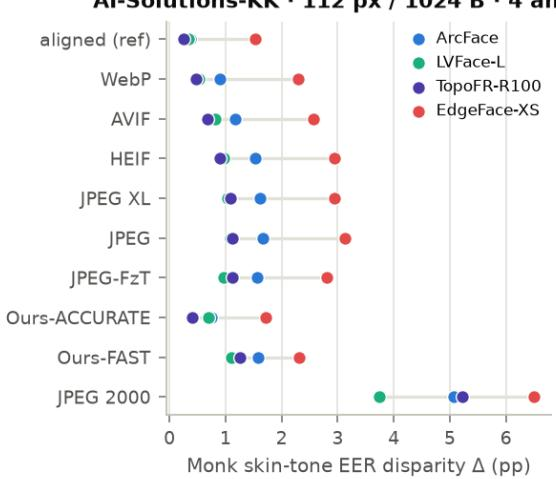

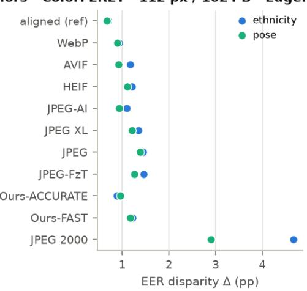  
Figure 40: Between-group EER disparity $\Delta = \mathrm { E E R } _ { \operatorname* { m a x } } - \mathrm { E E R } _ { \operatorname* { m i n } }$ per codec at 112 px / 1024 B. Left: AI-Solutions-KK Monk skin tone, one marker per anchor matcher, recomputed on the uniform MST5/6/7/9/10 basis (MST8 excluded for every codec as the thinnest cohort, 4 identities; all four anchors including Ours-ACCURATE × TopoFR-R100 are populated). Right: Color FERET ethnicity and pose disparities for the edgeface\_xs anchor, every row on the same four well-populated ethnicity cohorts. Every codec except JPEG 2000 stays within a few percentage points of the uncompressed baseline (top row).

## 11.5 Fairness at the tighter 512-byte budget

TL;DR The deployment claim for the learned codec rests on the 512 B operating point, so we repeat the disparity measure there. The gap the classical codecs open up widens sharply at 512 B — ethnicity disparities of 7.5–12.3 pp for JPEG/HEIF, and up to 5.8 pp for the same two on KK skin-tone (JPEG 2000 reaches 7.5 pp there) — while Ours-ACCURATE stays at the low end on the independent anchors (0.9–1.2 pp KK, 0.4–0.5 pp CF ethnicity) and JPEG 2000 remains the worst codec on KK skin tone (legacy JPEG overtakes it on both Color FERET axes, on every anchor). The learned codec’s directional brightness bias does not grow at 512 B (dark/light luma split +1.24%/+0.22% vs. +1.28%/+0.23% at 1024 B), so the watch item stays sub-threshold at the operating point the codec is sold on.

Every disparity table above is read at the 1024-byte budget. Because Table 1 recommends the learned codec specifically for the hard 512-byte point, we recompute the same $\Delta = \mathrm { E E R } _ { \operatorname* { m a x } } - \mathrm { E E R } _ { \operatorname* { m i n } }$ disparity there, on the identical subgroup bases (the uniform MST8-excluded five-subgroup basis for KK skin tone; for Color FERET, the full four-subgroup pose set and the four well-populated ethnicity cohorts, applied to the baseline row as well as to every codec). Table 64 reports it for all four anchors, with the 1024 B value in brackets for direct comparison.

Two things stand out. First, halving the budget widens the between-group gap, and it does so overwhelmingly for the codecs that were already weakest (Figure 41): on Color FERET ethnicity — now measured over the four well-populated cohorts (Asian/Black/Hispanic/White), the only ones carrying enough impostor support to estimate a rate — the disparity climbs to 8.3–12.3 pp for legacy JPEG and 7.5–8.4 pp for HEIF (from 0.2–1.4 pp at 1024 B), and on KK skin tone HEIF and JPEG reach 4.0–5.8 pp (from 0.9–3.1 pp). JPEG 2000 stays the worst codec at 512 B on KK skin tone (all four anchors) and is second-worst on Color FERET ethnicity on all four, its own disparities spanning 5.2–13.8 pp across the three blocks; but on both Color FERET attributes legacy JPEG overtakes it on every anchor (30.07 pp vs. JPEG 2000’s 11.42 pp on ArcFace pose). Second, Ours-ACCURATE is the lowest-disparity codec at 512 B on KK skin tone on the anchors independent of its side-stream: 0.93– 1.17 pp (ArcFace/LVFace/TopoFR), and it stays at the low end on Color FERET too — 0.4–0.5 pp on CF ethnicity and 0.4–0.6 pp on CF pose, close to the uncompressed baseline and below WebP (0.5–0.7 pp on

Compression widens the between-group EER gap — JPEG 20o0 by an order of magnitude

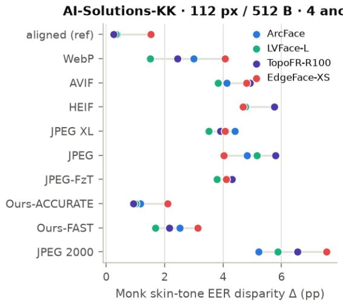

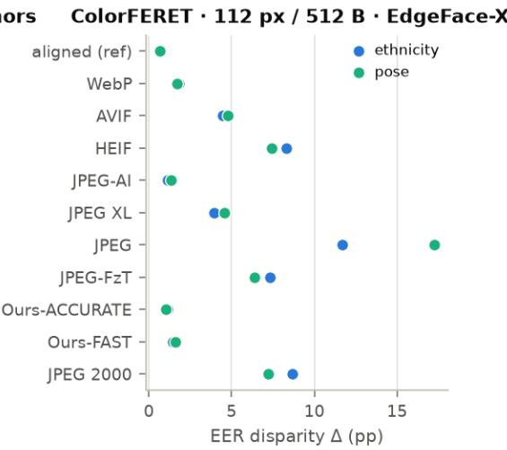  
Figure 41: Between-group EER disparity $\Delta = \mathrm { E E R } _ { \operatorname* { m a x } } - \mathrm { E E R } _ { \operatorname* { m i n } }$ per codec at the 512-byte budget, 112 px (the 512 B analogue of Figure 40). Left: AI-Solutions-KK Monk skin tone, one marker per anchor, uniform MST5/6/7/9/10 basis. Right: Color FERET ethnicity and pose for edgeface\_xs. Halving the budget fans the classical codecs out — legacy JPEG into double digits on both Color FERET attributes — while Ours-ACCURATE and the aligned baseline stay clustered at the low end. JPEG 2000 remains the extreme outlier on KK skin tone, but on Color FERET legacy JPEG overtakes it on every anchor.

CF ethnicity): on those three anchors it is the lowest-disparity codec in the table on both Color FERET attributes. The fairness advantage the learned codec shows at 1024 B therefore grows at the budget it is recommended for, rather than eroding.

This directly addresses the §11.6 watch item that the learned codec’s directional brightness bias “could become a fairness problem at the tighter 512-byte budget.” It does not: the Ours-ACCURATE per-tertile luma error on KK at 112 px is +1.24% (dark) / +0.22% (light) at 512 B, essentially unchanged from $+ 1 . 2 8 \% / + 0 . 2 3 \%$ at 1024 B — the tone-dependent shift is stable across budget, and the subgroup EER disparity above confirms it has not translated into a verification gap even at 512 B. We also recomputed the differential-FMR view of §11.6 at 512 B (imposter-acceptance disparity, ArcFace ethnicity): unlike the EER disparity, the FMR disparity does not blow up at the tighter budget — at $\mathbf { F M R } = 1 0 ^ { - 2 }$ it stays in a narrow codec-invariant 1.7–2.9 pp band, comparable to the 2.3–3.6 pp ArcFace band at 1024 B (Ours-ACCURATE 2.63 pp, WebP 2.56, AVIF 2.73; JPEG 2000 1.81, again not an outlier on FMR), and at $\mathbf { F } \mathbf { M } \mathbf { R } = 1 0 ^ { - 3 }$ every codec is under 0.64 pp on ArcFace and never above 0.75 pp on any of the four anchors. So neither the EER-disparity picture nor the security-relevant FMR-disparity picture surfaces a learned-codec fairness problem at 512 B.

## 11.6 Differential false-match rate (imposter acceptance)

TL;DR The disparity tables above are EER/FNMR-based (genuine rejection). The security-relevant NIST axis [24] is thefalse-match rate — imposter acceptance at a fixed system threshold. On the Color FERET ethnicity axis (the robust signal) the differential FMR at a $1 0 ^ { - 2 }$ operating point is ∼0.7–3.6 pp for every codec, including the uncompressed baseline: compression — ours included — barely moves it, and, strikingly, JPEG 2000 is not an FMR outlier (1.4–2.6 pp), even though it is the extreme EER-disparity codec. Its fairness problem is therefore false-non-match (genuine rejection), not imposter acceptance.

We fix a global threshold τ at a target overall FMR of $1 0 ^ { - 2 }$ over each attribute’s within-group impostor pool, then read the per-subgroup $\mathrm { F M R } ( g ) = \mathrm { P r } [ \mathrm { s c o r e } \geq \tau \mid$ both ends in g] and its max−min spread. Table 65 reports the Color FERET ethnicity disparity over the four well-populated cohorts (Asian/Black/Hispanic/White, each with ≥ 748 impostor pairs; the rare cohorts are dropped for FMR stability). Two findings stand out. First, the FMR disparity is essentially codec-invariant: every codec, and the uncompressed baseline, sits in a 0.7–3.6 pp band across the four anchors, with Ours-ACCURATE (1.46–2.81 pp) indistinguishable from the baseline (1.13–2.87) and WebP (1.74–3.17). The disparity is a property of the matcher×population (the Black cohort carries the highest FMR under every codec, ∼3.3–4.3% vs ∼0.7–0.8% for White on ArcFace), not of the codec. Second, and importantly, JPEG 2000 — the 3.3–4.7 pp EER-disparity outlier — is unremarkable on FMR (1.4–2.6 pp, mid-pack), which localizes its demographic risk to genuine rejection rather than imposter acceptance. On AI-Solutions-KK the sparse Monk tones are too small (4–7 identities each; 274 within-group impostor pairs for MST8 and 413 for MST10) to resolve an FMR at the 10−2 operating point: those two cells quantise in steps of 0.37 and 0.24 pp respectively and land on exactly zero in 40 of their 168 codec×anchor×budget cells, so a KK disparity would be a difference between two coarsely quantised rates. We therefore do not report a KK differential FMR and treat Color FERET ethnicity as the trustworthy FMR axis, consistent with the rest of this section.

Scope note: chroma-subsampling bias. One planned fairness lever is not exercised here: the effect of chroma subsampling (4:2:0 vs. 4:4:4) on the demographic gap. Every codec is run with its own default chroma handling at the byte budget, so the chroma axis is confounded with codec choice and we do not isolate it; a controlled 4:2:0-vs-4:4:4 comparison on a fixed codec is left to future work. The disparities reported here should therefore be read as codec-choice effects, not chroma effects.

Watch item: learned-codec brightness bias. The learned codec is scored in the subgroup fairness tables above, but its own verification check (Section 7) additionally quantifies a mild, directional skin-tone brightness bias in the reconstruction. For the Ours-ACCURATE variant on AI-Solutions-KK at 112 px / 1024 B, the mean luma error (bright\_delta) is +1.28% on the dark tertile and +0.71% on the mid tertile but only +0.23% on the light tertile – i.e. every tertile is reconstructed slightly brighter, and monotonically more so the darker the tone, a directional tone shift of order ∼1 pp of luma between the dark and light tertiles. The pattern is stable across budget and resolution (at 224 px / 512 B the dark/light split is +1.08%/−0.24%), and the Ours-FAST variant shows a much smaller shift (−0.04% dark vs.

−0.21% light at 112 px / 1024 B). Every codec\_verify row is flagged ok and the shift is below the level that moved verification EER in our checks, but because it is directional it is exactly the kind of artefact that could become a fairness problem at the tighter 512-byte budget or with a more tone-sensitive matcher, so we flag it as a watch item for the learned variants rather than a confirmed disparity. The subgroup fairness EERs available for both variants (tables above) confirm it stays sub-threshold at the 1024-byte budget: the learned codec’s skin-tone spread sits inside the strong-codec band and follows the same tone ordering, so the brightness shift has not yet translated into a subgroup-EER disparity at this budget.

Overall, compression to the 1024-byte budget does not reorder which demographic groups are hardest – the pose, tone, sex and age orderings from the uncompressed baseline survive – but it does inflate the absolute gap, and the size of that inflation is a codec-choice question: negligible-to-mild for WebP/AVIF/HEIF/JPEG-AI, moderate for JPEG and JPEG XL, and severe for JPEG 2000.

Table 64: Between-group EER disparity $\Delta = \mathrm { E E R } _ { \operatorname* { m a x } } - \mathrm { E E R } _ { \operatorname* { m i n } }$ (percentage points) at the 512-byte budget, 112 px, for the four anchors; the bracketed value is the same ∆ at 1024 B, recomputed in the same pass and on the identical subgroup basis (cf. Tables 61 and 62), for direct comparison. Best / worst per column, as in the other codec tables. applied to the 512 B value within each block; the bracketed 1024 B value is not shaded. The uncompressed base row is the reference, not a competitor. KK skin tone uses the uniform MST8-excluded five-subgroup basis and Color FERET pose its full four-subgroup set. The Color FERET ethnicity block is computed over the four well-populated cohorts (Asian/Black/Hispanic/White) for every row, baseline included, as its header states and as Table 62 does at 1024 B. The three thin labels (Native-American $n _ { \mathrm { n { e g } } }$ =8, Other 22, Pacific-Islander 319) are dropped for want of impostor support rather than reported as a rate: a max−min taken over an 8-impostor cell is not a disparity measurement. Every ethnicity figure here is therefore on one uniform basis and comparable across rows and budgets. §For the Ours rows the edgeface column is confounded (EdgeFace-anchored side-stream); the arcface/lvface/topofr columns are the ones to trust.
<table><tr><td>Codec</td><td>arcface</td><td>edgeface</td><td>lvface</td><td>topofr</td></tr><tr><td colspan="5">AI-Solutions-KK Monk skin-tone ∆ (uniform 5-subgroup basis)</td></tr><tr><td>base (aligned)</td><td>0.37 [0.37]</td><td>1.53 [1.53]</td><td>0.33 [0.33]</td><td>0.26 [0.26]</td></tr><tr><td>WebP</td><td>3.00 [0.90]</td><td>4.06 [2.30]</td><td>1.49 [0.52]</td><td>2.43 [0.47]</td></tr><tr><td>AVIF</td><td>4.12 [1.17]</td><td>4.80 [2.58]</td><td>3.82 [0.81]</td><td>4.91 [0.68]</td></tr><tr><td>HEIF</td><td>4.67 [1.53]</td><td>4.67 [2.95]</td><td>4.76 [0.97]</td><td>5.75 [0.90]</td></tr><tr><td>JPEG-AI</td><td>1.43 [0.72]</td><td>2.54 [1.90]</td><td>1.31 [0.63]</td><td>1.21 [0.31]</td></tr><tr><td>JPEG</td><td>4.81 [1.67]</td><td>4.02 [3.13]</td><td>5.16[1.09]</td><td>5.80 [1.12]</td></tr><tr><td>JPEG XL</td><td>4.40 [1.61]</td><td>4.06 [2.94]</td><td>3.50[1.04]</td><td>3.91 [1.08]</td></tr><tr><td>JPEG-FzT</td><td>4.27 [1.56]</td><td>4.10 [2.81]</td><td>3.78 [0.96]</td><td>4.31 [1.12]</td></tr><tr><td>JPEG 2000</td><td>5.22 [5.08]</td><td>7.53 [6.49]</td><td>5.88 [3.74]</td><td>6.55 [5.22]</td></tr><tr><td>Ours-ACCURATE$</td><td>1.17 [0.75]</td><td>2.10[1.71]</td><td>1.00 [0.70]</td><td>0.93 [0.41]</td></tr><tr><td>Ours-FAST$</td><td>2.52 [1.58]</td><td>3.14 [2.32]</td><td>1.69 [1.10]</td><td>2.15 [1.26]</td></tr><tr><td colspan="5">Color FERET ethnicity ∆ (4 subgroups)</td></tr><tr><td>base (aligned)</td><td>0.18 [0.18]</td><td>0.69 [0.69]</td><td>0.34 [0.34]</td><td>0.22 [0.22]</td></tr><tr><td>WebP</td><td>0.62 [0.32]</td><td>1.79 [0.94]</td><td>0.73 [0.49]</td><td>0.50 [0.32]</td></tr><tr><td>AVIF</td><td>3.12 [0.35]</td><td>4.44 [1.18]</td><td>3.08 [0.39]</td><td>2.66 [0.20]</td></tr><tr><td>HEIF</td><td>8.35 [0.51]</td><td>8.32[1.21]</td><td>7.50 [0.59]</td><td>7.80 [0.25]</td></tr><tr><td>JPEG-AI</td><td>0.68 [0.26]</td><td>1.13 [1.09]</td><td>0.58 [0.42]</td><td>0.56 [0.36]</td></tr><tr><td>JPEG</td><td>12.30 [0.58]</td><td>11.67 [1.44]</td><td>8.33 [0.75]</td><td>9.62 [0.48]</td></tr><tr><td>JPEG XL</td><td>2.16 [0.40]</td><td>3.95 [1.34]</td><td>2.07 [0.66]</td><td>2.15 [0.50]</td></tr><tr><td>JPEG-FzT</td><td>4.14 [0.54]</td><td>7.30 [1.45]</td><td>3.38 [0.58]</td><td>3.67 [0.55]</td></tr><tr><td>JPEG 2000</td><td>9.93 [3.62]</td><td>8.67 [4.66]</td><td>7.55 [3.31]</td><td>9.48 [3.96]</td></tr><tr><td>Ours-ACCURATE§</td><td>0.54 [0.42]</td><td>1.14 [0.89]</td><td>0.48 [0.49]</td><td>0.41 [0.38]</td></tr><tr><td>Ours-FAST$</td><td>0.90 [0.76]</td><td>1.47 [1.22]</td><td>0.86 [0.62]</td><td>0.72 [0.41]</td></tr><tr><td colspan="5">Color FERET pose ∆ (4 subgroups)</td></tr><tr><td>base (aligned)</td><td>0.06 [0.06]</td><td>0.67 [0.67]</td><td>0.25 [0.25]</td><td>0.08 [0.08]</td></tr><tr><td>WebP</td><td>0.63 [0.15]</td><td>1.73 [0.90]</td><td>1.02 [0.46]</td><td>0.73 [0.24]</td></tr><tr><td>AVIF</td><td>2.92 [0.17]</td><td>4.79 [0.92]</td><td>3.77 [0.35]</td><td>3.40 [0.23]</td></tr><tr><td>HEIF</td><td>11.81 [0.31]</td><td>7.43 [1.10]</td><td>9.45 [0.89]</td><td>11.68 [0.41]</td></tr><tr><td>JPEG-AI</td><td>0.47 [0.14]</td><td>1.35 [0.93]</td><td>0.68 [0.35]</td><td>0.68 [0.14]</td></tr><tr><td>JPEG</td><td>30.07 [0.45]</td><td>17.23 [1.38]</td><td>9.42 [0.81]</td><td>29.54 [0.65]</td></tr><tr><td>JPEG XL</td><td>2.72 [0.38]</td><td>4.57 [1.21]</td><td>2.98 [0.56]</td><td>3.38 [0.48]</td></tr><tr><td>JPEG-FzT</td><td>4.01 [0.42]</td><td>6.39 [1.26]</td><td>3.90 [0.64]</td><td>3.80 [0.48]</td></tr><tr><td>JPEG 2000</td><td>11.42 [2.59]</td><td>7.24 [2.89]</td><td>8.83 [3.46]</td><td>13.83 [3.33]</td></tr><tr><td>Ours-ACCURATE§</td><td>0.40 [0.27]</td><td>1.04 [0.96]</td><td>0.60 [0.44]</td><td>0.44 [0.28]</td></tr><tr><td>Ours-FAST$</td><td>0.95 [0.73]</td><td>1.60 [1.16]</td><td>1.22 [0.79]</td><td>0.96 [0.64]</td></tr></table>

Table 65: Color FERET differential false-match rate (imposter acceptance) ∆FMR = $\mathrm { F M R } _ { \operatorname* { m a x } } - \mathrm { F M R } _ { \operatorname* { m i n } }$ (percentage points) across the four well-populated ethnicity cohorts, at a global threshold set to overall FMR $= 1 0 ^ { - 2 }$ , 112 px/1024 B. “base” is uncompressed. §EdgeFace is confounded for the Ours rows (side-stream anchor). The roster is shorter than Table 62’s: a codec whose impostor scores admit no threshold at this target — every subgroup FMR quantises to zero, so the disparity is identically 0.00 pp — is omitted rather than reported as perfectly fair, which drops JPEG-AI and the CompressAI baselines here. Every codec — and the baseline — sits in the same 0.7–3.6 pp band; unlike the EER disparity, JPEG 2000 is not an outlier here. Lowest / highest per column, as in the other tables; “base” does not compete.
<table><tr><td rowspan=1 colspan=5>Codec                ArcFace  LVFace-L  TopoFR  EdgeFace</td></tr><tr><td rowspan=1 colspan=1>base (aligned)</td><td rowspan=1 colspan=1>2.87</td><td rowspan=1 colspan=1>1.13</td><td rowspan=1 colspan=1>2.51</td><td rowspan=1 colspan=1>2.16</td></tr><tr><td rowspan=1 colspan=1>WebP</td><td rowspan=1 colspan=1>3.17</td><td rowspan=1 colspan=1>1.74</td><td rowspan=1 colspan=1>2.29</td><td rowspan=1 colspan=1>2.35</td></tr><tr><td rowspan=1 colspan=1>AVIF</td><td rowspan=1 colspan=1>2.83</td><td rowspan=1 colspan=1>0.97</td><td rowspan=1 colspan=1>2.26</td><td rowspan=1 colspan=1>2.11</td></tr><tr><td rowspan=1 colspan=1>HEIF</td><td rowspan=1 colspan=1>2.88</td><td rowspan=1 colspan=1>1.81</td><td rowspan=1 colspan=1>1.87</td><td rowspan=1 colspan=1>1.98</td></tr><tr><td rowspan=1 colspan=1>JPEG</td><td rowspan=1 colspan=1>3.56</td><td rowspan=1 colspan=1>1.60</td><td rowspan=1 colspan=1>2.54</td><td rowspan=1 colspan=1>2.05</td></tr><tr><td rowspan=1 colspan=1>JPEG XL</td><td rowspan=1 colspan=1>2.79</td><td rowspan=1 colspan=1>1.61</td><td rowspan=1 colspan=1>2.42</td><td rowspan=1 colspan=1>1.93</td></tr><tr><td rowspan=1 colspan=1>JPEG-FzT</td><td rowspan=1 colspan=1>2.32</td><td rowspan=1 colspan=1>1.24</td><td rowspan=1 colspan=1>2.43</td><td rowspan=1 colspan=1>2.09</td></tr><tr><td rowspan=1 colspan=1>JPEG 2000</td><td rowspan=1 colspan=1>2.63</td><td rowspan=1 colspan=1>2.35</td><td rowspan=1 colspan=1>1.95</td><td rowspan=1 colspan=1>1.41</td></tr><tr><td rowspan=1 colspan=1>Ours-ACCURATE$</td><td rowspan=1 colspan=1>2.81</td><td rowspan=1 colspan=1>1.46</td><td rowspan=1 colspan=1>2.63</td><td rowspan=1 colspan=1>1.86</td></tr><tr><td rowspan=1 colspan=1>Ours-FAST$</td><td rowspan=1 colspan=1>2.87</td><td rowspan=1 colspan=1>0.69</td><td rowspan=1 colspan=1>2.08</td><td rowspan=1 colspan=1>2.52</td></tr></table>

## 12 Compressed-on-Compressed Recompression

TL;DR Faces in real document pipelines are often re-encoded after they have already been compressed once; we measure how a second pass through a different codec moves verification EER on both Color FERET and the in-the-wild AI-Solutions-KK set, and find that most chains are benign but a few (notably JPEG XL re-encoded as HEIF or AVIF, and anything routed through JPEG 2000) sharply degrade identity accuracy on both datasets.

A compressed face crop rarely stays in its original container. Enrolment portals, document-issuance systems, and messaging gateways routinely decode an already-compressed image and re-encode it under a different codec or a different byte budget. Each such pass is lossy, and the second encoder must spend its budget reconstructing the compression artifacts of the first rather than the original pixels. This section quantifies the resulting identity cost as a delta-EER: the change in equal-error rate of a two-codec chain relative to compressing once with the second codec alone.

## 12.1 Setup

TL;DR We chain every ordered pair of eight codecs (six standard codecs, the JPEG-FzT reference codec, and the learned Ours-ACCURATE) at the 112 px working resolution and the 1024-byte budget on Color FERET, then report each chain’s EER and its delta against the corresponding single-pass baseline; JPEG-AI and the neural baselines are excluded (their per-image reference decoders make the full matrix intractable).

We take the six classical/standard codecs from the benchmark — JPEG [43], JPEG 2000 [40], WebP [23], JPEG XL [1], AVIF [2], and HEIF [39] — together with the JPEG-FzT codec [35] and our learned Ours-ACCURATE codec, and form all 8 × 8 ordered source/second pairs, including the diagonal where a codec re-encodes its own output. Ours-ACCURATE is included as both a source and a second pass (its GPU encode/decode is fast enough to run the full matrix); the JPEG-AI reference codec and the CompressAI neural baselines are excluded from the recompression matrix because their per-image reference decoders make a full 8 × 8×(image-sample) chain prohibitively slow on the shared hardware — their single-pass behaviour is already characterised in Section 5. Both passes target the 1024-byte budget at 112 px, the verification working resolution. Identity is scored with the lightweight edgeface\_xs anchor [21] on Color FERET [36]. For each chain we report the absolute EER and the delta-EER against the single-pass baseline of the second codec, so a positive delta isolates the damage attributable to having a first encoder in the loop. We restrict the analysis here to the 112 px/1024-byte operating point, and we repeat the full 8 × 8 grid on the in-the-wild AI-Solutions-KK set (Table 67) to check whether the same failure pattern generalizes beyond the studio-quality Color FERET portraits. This codec-pair chain is a deliberate substitution for the originally-specified recompression protocol, which fixed a raw source and varied a JPEG source quality factor (QF ∈ {95,75,50}) before the 1 kB re-encode. The design here is more codec-agnostic—it measures the penalty of any first codec, not only a JPEG source—but it consequently does not include a raw-source or source-QF axis, and it is reported for a single anchor matcher at 112 px; the raw-vs-pre-compressed and source-QF questions are left to future work. Because every chain here is scored with the single edgeface\_xs anchor, the Ours ACCURATE rows carry an additional confound: Ours-ACCURATE’s identity side-stream is anchored to a frozen EdgeFace-S embedding, so any EdgeFace-family matcher—edgeface\_xs included—is not independent of it. We therefore rescored the matrix on an independent matcher: for the classical 7 × 7 grid the ArcFace rescore reproduces the benign/catastrophic pattern (§12.4), and the Ours rows are now rescored on ArcFace too (at 1024 B), which confirms rather than overturns the EdgeFace reading — Ours-ACCURATE→Ours-ACCURATE is 0.44% on ArcFace, inside the benign cluster. So the modernto-modern-is-benign conclusion is established across independent matchers for both the classical and the learned codecs; it remains verified only for pre-compressed (not raw) sources.

Table 66: Recompression EER (%) on Color FERET at 112 px and the 1024-byte budget. Rows are the source (first) codec; columns are the second codec. The diagonal is same-codec re-encoding. Lower is better; the two highlighted JPEG XL chains and the JPEG 2000 row/column are the damaging ones. Column shading marks the best / worst classical source per second codec; the Ours-ACCURATE row and column are left unshaded because the tabulated values are EdgeFace-scored (§12.4).
<table><tr><td rowspan="2">Source</td><td colspan="8">Second codec</td></tr><tr><td>JPEG</td><td>JPEG 2000</td><td>WebP</td><td>JPEG XL</td><td>AVIF</td><td>HEIF</td><td>JPEG-FzT</td><td>Ours-ACC</td></tr><tr><td>JPEG</td><td>1.03</td><td>5.97</td><td>1.00</td><td>1.20</td><td>1.06</td><td>1.16</td><td>1.14</td><td>1.35</td></tr><tr><td>JPEG 2000</td><td>5.86</td><td>5.90</td><td>5.52</td><td>5.75</td><td>5.65</td><td>5.86</td><td>5.16</td><td>5.21</td></tr><tr><td>WebP</td><td>1.11</td><td>6.51</td><td>0.71</td><td>1.02</td><td>0.84</td><td>1.04</td><td>0.99</td><td>1.09</td></tr><tr><td>JPEG XL</td><td>1.34</td><td>6.22</td><td>0.99</td><td>1.01</td><td>8.00</td><td>17.14</td><td>1.10</td><td>1.53</td></tr><tr><td>AVIF</td><td>1.08</td><td>6.14</td><td>0.78</td><td>1.04</td><td>0.68</td><td>0.95</td><td>1.01</td><td>0.88</td></tr><tr><td>HEIF</td><td>1.25</td><td>6.60</td><td>0.94</td><td>1.20</td><td>1.00</td><td>1.06</td><td>1.08</td><td>1.10</td></tr><tr><td>JPEG-FzT</td><td>1.15</td><td>3.93</td><td>0.93</td><td>0.93</td><td>0.90</td><td>0.98</td><td>1.00</td><td>1.97</td></tr><tr><td>Ours-ACC</td><td>1.32</td><td>5.23</td><td>0.88</td><td>1.09</td><td>1.10</td><td>1.32</td><td>1.31</td><td>0.66</td></tr></table>

## 12.2 Delta-EER results

TL;DR Same-codec and modern-to-modern chains lose almost nothing (delta-EER under ∼1 pp), but two JPEG XL chains and every chain that touches JPEG 2000 inflate EER by several percentage points or more.

Table 66 reports the full matrix of chain EER (%), with rows indexed by the source (first) codec and columns by the second codec; Figure 42 renders all four matrices (both datasets, both budgets) as annotated heatmaps so the two failure structures — the JPEG 2000 row/column band and the two JPEG XL→AV1/HEVC cells — can be read at a glance. The diagonal and the “modern-to-modern” offdiagonal entries (JPEG, WebP, JPEG XL, AVIF, HEIF re-encoded into one another) cluster tightly around the single-pass level: AVIF→AVIF reaches the lowest classical chain EER at 0.68 % and WebP→WebP 0.71 %, and the corresponding delta-EER values stay below roughly 1 pp. These are the safe chains: re-encoding an already-WebP/AVIF/HEIF/JPEG face into another modern codec costs little identity signal.

Two failure modes stand out. First, JPEG XL re-encoded as HEIF or AVIF collapses: JPEG XL→HEIF reaches 17.14 % EER, a delta-EER of +16.31 pp over single-pass HEIF, and JPEG XL→AVIF reaches 8.00 % EER (+7.38 pp). The JPEG XL artifact structure appears to interact pathologically with the HEVC/AV1 intra coders when both are squeezed to 1 kB. Second, any chain that involves JPEG 2000 stays high regardless of the partner: every classical entry in the JPEG 2000 column sits near 6 % (e.g. WebP→JPEG 2000 at 6.51 %, HEIF→JPEG 2000 at 6.60 %), and every entry in the JPEG 2000 row sits near 5.2–5.9 %, with delta-EER values around +4.9 to +5.0 pp whenever JPEG 2000 is the first codec and a different codec follows (e.g. JPEG 2000→AVIF at +5.03 pp, JPEG 2000→WebP at +4.91 pp). JPEG 2000 is simply a poor fit for a 1 kB face crop — its single-pass EER is already the worst of the group — and chaining only compounds that.

Interpretation. The two failure structures have different mechanisms and therefore different remedies. The JPEG 2000 band is additive: JPEG 2000 is already the weakest single-pass codec at this budget (Section 5), and a second encoder cannot restore what the wavelet quantisation discarded, so every chain inherits roughly the single-pass penalty regardless of partner (+4.9 to +5.0 pp when JPEG 2000 is the first pass on Color FERET). The remedy is exclusion: JPEG 2000 should not appear anywhere in a sub-1 kB face pipeline. The JPEG XL spikes are interactive: JPEG XL alone is benign (single-pass EER 0.84% on Color FERET), and HEIF/AVIF alone are benign (0.84%/0.62%), yet the composition reaches 17.14% — a ∼20× super-additive failure in which the VarDCT artefact structure of JPEG XL is apparently expensive for the HEVC/AV1 intra coders to re-approximate at 1 kB, leaving too few bits for the face. Because this interaction is invisible to any single-codec benchmark, recompression matrices of this kind are a necessary acceptance test for document pipelines that transcode between formats: a per-codec ranking alone would have declared all three codecs safe.

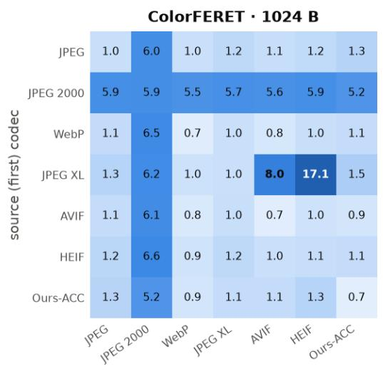

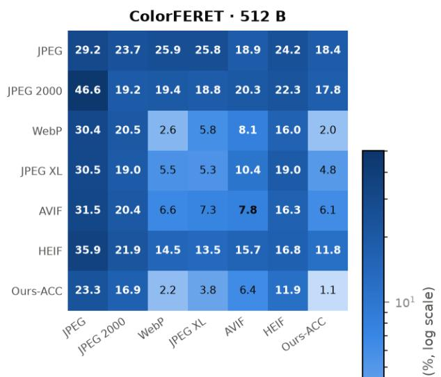

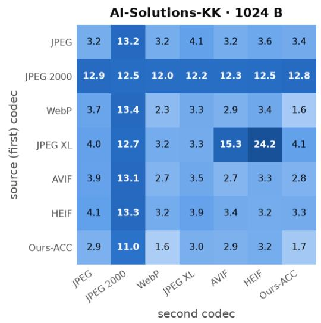

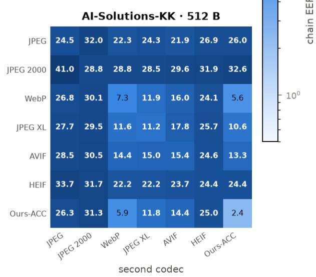  
Figure 42: The four recompression matrices (both datasets × both budgets) as annotated heatmaps; cell values are chain EER (%) on a logarithmic colour scale. Three structures recur: the JPEG 2000 column (routing any face through a second JPEG 2000 pass) and row (a JPEG 2000 source) form a uniformly dark band; the two isolated dark cells JPEG XL→AVIF and JPEG XL→HEIF are the codec-pair-specific failures; and the remaining modern-to-modern region stays light. At 512 B the whole matrix darkens and the JPEG 2000→JPEG corner becomes the single worst cell on both datasets.

The learned codec recompresses safely on the anchor matcher. Adding Ours-ACCURATE to the matrix shows the learned codec behaves like the modern transform cluster under recompression, not like the fragile JPEG XL or JPEG 2000 chains. Same-codec Ours-ACCURATE→Ours-ACCURATE costs 0.66% EER on Color FERET (1.71% on KK), and every Ours-ACCURATE↔{WebP, AVIF, HEIF, JPEG, JPEG XL} cross-pair stays within about 1–2 pp of its single-pass baseline (0.88–1.53% on Color FERET). The only expensive Ours-ACCURATE chains are, once again, the JPEG 2000 ones. Two points stand out.

First, Ours-ACCURATE is among the least-damaging sources before a JPEG 2000 second pass (5.23%, behind only JPEG-FzT at 3.93%, vs. 5.9–6.6% for the six classical sources at 1024 B on Color FERET), because its identity-preserving reconstruction hands JPEG 2000 a cleaner signal. Second, its same-codec chain is budget-robust: Ours-ACCURATE→Ours-ACCURATE stays at 1.09% at 512 B against 0.66% at 1024 B on Color FERET (2.42% on KK), so a pipeline that carries a face end-to-end in Ours-ACCURATE survives transcoding even at the half-kilobyte budget. These Ours-ACCURATE chain EERs are measured on a 120-image subsample (456 mated pairs on Color FERET, 540 on KK), so differences below roughly 0.5 pp correspond to single mated pairs and should not be over-read; the stable finding is the ordering of chains, not their exact values.

Confounded-matcher caveat. As set out in Section 12.1 and confirmed for the classical matrix in Section 12.4, every Ours-ACCURATE row and column here is scored with edgeface\_xs, whose backbone family is shared with the codec’s identity side-stream. The tabulated Ours-ACCURATE chain EERs — including the low Ours-ACCURATE→Ours-ACCURATE diagonal, left un-highlighted in the matrices because the table values are EdgeFace-scored — are now independently confirmed on ArcFace at 1024 B (Ours→Ours 0.44%, inside the benign band; Section 12.4), so they are no longer provisional; the classical matrix is likewise rescored on ArcFace and reproduces the pattern, so the modern-to-modern-is-benign reading is established independently of EdgeFace.

## 12.3 Generalization to AI-Solutions-KK

TL;DR The same 8 × 8 grid on the in-the-wild AI-Solutions-KK set reproduces the Color FERET pattern almost exactly: JPEG XL→HEIF and JPEG XL→AVIF are the worst chains, JPEG 2000 stays poor throughout, and modern-to-modern chains remain benign — confirming the recompression hazard is not an artifact of studio portraits.

Table 67 repeats the matrix on AI-Solutions-KK. Absolute EER is higher across the board than on Color FERET — KK is an in-the-wild set with harder capture conditions, so even single-pass EER sits around 2.5–3 % for the modern codecs rather than ∼1 % — but the ordering of chains is preserved. The two catastrophic chains are again the JPEG XL ones: JPEG XL→HEIF reaches 24.17 % EER, a delta-EER of +21.01 pp over single-pass HEIF, and JPEG XL→AVIF reaches 15.34 % EER (+12.69 pp). Both are markedly larger than on Color FERET (+16.31 and +7.38 pp), so the pathological interaction between the JPEG XL artifact structure and the HEVC/AV1 intra coders is if anything stronger on harder faces.

JPEG 2000 again drags down every chain it touches, with the same row/column structure as on Color FERET. JPEG 2000 is so weak on its own at this budget on KK (its whole row sits near 12–13 % EER) that adding a first encoder before it barely moves the number: routing a well-compressed modern face through a second JPEG 2000 pass does inflate absolute EER from ∼3 % to ∼13 %, but because the delta is measured against JPEG 2000’s own single-pass error the JPEG 2000 column deltas are small or even slightly negative. The damage the delta captures sits in the JPEG 2000 row: a face that has already been through JPEG 2000 stays near 12–13 % whatever the second codec is, a delta-EER of around +8.9 to +9.7 pp (e.g. JPEG 2000 followed by WebP at +9.67 pp, by AVIF at +9.62 pp, by JPEG at +9.21 pp). Either way the conclusion is unchanged: JPEG 2000 is a poor fit for a 1 kB face crop and must not appear in a recompression chain. All the same-codec and modern-to-modern off-diagonal chains stay benign, within about 1 pp of their single-pass baselines (e.g. WebP→WebP at 2.31 % and AVIF→AVIF at 2.66 % are the lowest classical entries), exactly as on Color FERET.

Table 67: Recompression EER (%) on AI-Solutions-KK at 112 px and the 1024-byte budget. Rows are the source (first) codec; columns are the second codec. The diagonal is same-codec re-encoding. Lower is better; the two highlighted JPEG XL chains and the JPEG 2000 row and column are the damaging ones, mirroring Color FERET (Table 66). Column shading marks the best / worst classical source per second codec; the Ours-ACCURATE row and column are left unshaded because the tabulated values are EdgeFace-scored (§12.4).
<table><tr><td rowspan="2">Source</td><td colspan="8">Second codec</td></tr><tr><td>JPEG</td><td>JPEG 2000</td><td>WebP</td><td>JPEG XL</td><td>AVIF</td><td>HEIF</td><td>JPEG-FzT</td><td>Ours-ACC</td></tr><tr><td>JPEG</td><td>3.17</td><td>13.17</td><td>3.15</td><td>4.06</td><td>3.18</td><td>3.56</td><td>4.52</td><td>3.36</td></tr><tr><td>JPEG 2000</td><td>12.85</td><td>12.47</td><td>12.00</td><td>12.22</td><td>12.26</td><td>12.50</td><td>13.30</td><td>12.75</td></tr><tr><td>WebP</td><td>3.74</td><td>13.38</td><td>2.31</td><td>3.31</td><td>2.90</td><td>3.43</td><td>3.89</td><td>1.64</td></tr><tr><td>JPEG XL</td><td>3.99</td><td>12.66</td><td>3.19</td><td>3.28</td><td>15.34</td><td>24.17</td><td>4.36</td><td>4.07</td></tr><tr><td>AVIF</td><td>3.90</td><td>13.12</td><td>2.71</td><td>3.46</td><td>2.66</td><td>3.29</td><td>4.06</td><td>2.78</td></tr><tr><td>HEIF</td><td>4.14</td><td>13.32</td><td>3.20</td><td>3.91</td><td>3.35</td><td>3.24</td><td>4.41</td><td>3.30</td></tr><tr><td>JPEG-FzT</td><td>4.68</td><td>12.64</td><td>3.59</td><td>3.67</td><td>3.77</td><td>3.84</td><td>3.56</td><td>2.92</td></tr><tr><td>Ours-ACC</td><td>2.92</td><td>10.97</td><td>1.55</td><td>2.99</td><td>2.91</td><td>3.16</td><td>3.38</td><td>1.71</td></tr></table>

## 12.4 Worst-case chains

TL;DR On both Color FERET and AI-Solutions-KK the chains to forbid in a deployment are JPEG XL→HEIF and JPEG XL→AVIF (the sharpest spikes) and anything that routes through JPEG 2000; the safe default is to keep faces in — or re-encode them into — WebP, AVIF, or HEIF.

Ranking the matrix by delta-EER makes the operational guidance concrete. The two catastrophic chains are JPEG XL→HEIF and JPEG XL→AVIF. JPEG XL→HEIF is the worst cross-codec chain on both datasets — 17.14% EER on Color FERET and 24.17% on AI-Solutions-KK at 1024 B, a +16–21 pp jump over the benign JPEG XL→JPEG XL diagonal (1.01% on Color FERET, 3.28% on AI-Solutions-KK) and +16.31/+21.01 pp over single-pass HEIF — while JPEG XL→AVIF reaches 8.00%/15.34% (+7.38/+12.69 pp): a system that stores faces as JPEG XL and later transcodes them to a HEVC- or AV1-based still format can multiply its verification error by an order of magnitude at the same byte budget. The next tier is the JPEG 2000 band: with single-pass JPEG 2000 already the weakest codec at this budget, every JPEG 2000-bearing chain remains near 6 % EER and contributes +4.9 to +5.0 pp whenever JPEG 2000 is thefirst pass. By contrast, the benign region is broad: same-codec re-encoding and the WebP/AVIF/HEIF/JPEG cross-pairs all stay within about 1 pp of their single-pass baselines.

The practical implication for document pipelines is twofold. First, a face that has already been compressed should, where possible, be carried forward in its existing modern container rather than transcoded; if a second pass is unavoidable, WebP, AVIF, and HEIF are safe targets, and the system should avoid emitting JPEG XL into an HEVC/AV1 still encoder and should avoid JPEG 2000 entirely at sub-1 kB budgets. Second, because these effects are codec-pair specific rather than uniform, a pipeline that fixes a single canonical face codec end-to-end will see far smaller recompression loss than one that lets each stage choose its own format. The AI-Solutions-KK results confirm this guidance holds on in-the-wild faces, where the JPEG XL spikes are in fact even larger.

Independent-matcher confirmation (ArcFace). To remove the single-matcher objection (§12 noted the matrix was scored only on edgeface\_xs), we re-scored the entire 7 × 7 classical recompression matrix on arcface\_antelopev2 — architecturally independent of EdgeFace. At 1024 B the picture reproduces exactly: the worst chain is again JPEG XL→HEIF (14.2% EER on ArcFace vs 17.1% on EdgeFace-XS — same chain, same order of magnitude), same-codec and modern-to-modern cross-pairs stay benign (≤ 0.39%: WebP→WebP 0.12, AVIF→AVIF 0.14, HEIF→HEIF 0.25, JPEG→JPEG 0.27), and every JPEG 2000-bearing chain is the poor band (JPEG 2000→JPEG 2000 3.49%). At 512 B the catastrophic pattern also reproduces on ArcFace: any chain whose second pass is legacy JPEG collapses (worst JPEG 2000→JPEG 45.7% on ArcFace vs 46.6% on EdgeFace-XS — same chain), while modern same-codec re-encoding stays usable (WebP→WebP 0.84%, JPEG XL→JPEG XL 2.67%, AVIF→AVIF 3.91%). So the “modern-to-modern is benign; JPEG XL→HEVC/AV1, any-→JPEG at 512 B, and JPEG 2000 are not” conclusion is not a single-matcher artefact for the classical matrix.

The Ours rows are now confirmed on ArcFace too. We completed the independent-matcher rescore of the learned-codec chains at both budgets, and it removes the confound rather than overturning the result. At 1024 B, Ours-ACCURATE→Ours-ACCURATE is 0.44% EER on ArcFace — lower than its EdgeFace-XS value (0.66%) and inside the benign band of the matrix — while every modern Ours crosspair stays benign (≤ 0.44%: JPEG→Ours 0.01, WebP→Ours 0.01, AVIF→Ours 0.03, Ours→JPEG 0.22) and only the JPEG 2000 Ours chains are expensive (JPEG 2000→Ours 2.47%, Ours→JPEG 2000 1.12%). So the “Ours chains sit with the benign modern cluster” reading survives on a matcher architecturally independent of the codec’s identity side-stream, and the recompression matrix is now independently ArcFace-confirmed for both the classical and the learned codecs. The same holds at 512 B: Ours-ACCURATE→Ours-ACCURATE is 0.64% EER on ArcFace (vs 1.09% on EdgeFace-XS) and in fact the lowest chain in that matrix, while the costly chains remain the ones involving legacy JPEG/JPEG 2000 (e.g. JPEG→Ours 20.2%, JPEG 2000→Ours 18.0%, Ours→JPEG 28.5% on ArcFace). So the benign-Oursdiagonal reading holds on the independent matcher at both budgets, and no recompression conclusion rests on the EdgeFace confound.

## 12.5 Tighter 512-byte budget

TL;DR At half the byte budget every chain is noisier, but the codec-pair ordering is preserved and a new worst case appears: JPEG 2000→JPEG nearly destroys identity (46.64 % EER on Color FERET, 41.03 % on AI-Solutions-KK), while same-codec and modern-to-modern chains stay comparatively low.

Tables 68 and 69 repeat the full 8 × 8 grid at the harder 512-byte budget on both datasets. Absolute EER rises sharply everywhere — halving the budget leaves each encoder far less room to reconstruct the first pass’s artifacts — but the relative ordering of chains carries over from 1024 bytes: same-codec re-encoding and modern-to-modern cross-pairs remain the safest region (Ours-ACCURATE→Ours-ACCURATE is the lowest chain at 1.09 % on Color FERET and 2.42 % on AI-Solutions-KK — EdgeFacescored here, but the 512 B ArcFace rescore confirms Ours→Ours as the lowest chain independently at 0.64%, §12.4; and WebP→WebP is the lowest classical chain at 2.57 % and 7.32 % respectively), and anything routed through JPEG 2000 stays poor. The tighter budget adds one stark new failure mode not visible at 1024 bytes: JPEG 2000→JPEG is catastrophic on both sets, reaching 46.64 % EER on Color FERET and 41.03 % on AI-Solutions-KK — re-encoding an already-JPEG 2000 face as baseline JPEG under a 512-byte ceiling leaves verification barely above chance. The overall recompression penalty is therefore larger at 512 bytes than at 1024, but the operational guidance is unchanged: fix a single modern codec end-to-end and keep both JPEG 2000 and legacy JPEG out of any recompression chain.

Table 68: Recompression EER (%) on Color FERET at 112 px and the tighter 512-byte budget. Rows are the source (first) codec; columns are the second codec. The diagonal is same-codec re-encoding. Lower is better; the JPEG 2000→JPEG corner is catastrophic. Column shading marks the best (green) / worst (red) classical source per second codec; the Ours-ACCURATE row and column are left unshaded because the tabulated values are EdgeFace-scored (the independent 512 B ArcFace rescore confirms Ours-ACCURATE→Ours-ACCURATE as the lowest chain at 0.64%, §12.4).
<table><tr><td rowspan="2">Source</td><td colspan="8">Second codec</td></tr><tr><td>JPEG</td><td>JPEG 2000</td><td>WebP</td><td>JPEG XL</td><td>AVIF</td><td>HEIF</td><td>JPEG-FzT</td><td>Ours-ACC</td></tr><tr><td>JPEG</td><td>29.25</td><td>23.66</td><td>25.89</td><td>25.76</td><td>18.86</td><td>24.16</td><td>22.91</td><td>18.40</td></tr><tr><td>JPEG 2000</td><td>46.64</td><td>19.19</td><td>19.40</td><td>18.84</td><td>20.26</td><td>22.28</td><td>20.85</td><td>17.77</td></tr><tr><td>WebP</td><td>30.39</td><td>20.52</td><td>2.57</td><td>5.79</td><td>8.11</td><td>15.99</td><td>9.49</td><td>2.03</td></tr><tr><td>JPEG XL</td><td>30.47</td><td>18.96</td><td>5.53</td><td>5.30</td><td>10.39</td><td>19.02</td><td>9.95</td><td>4.78</td></tr><tr><td>AVIF</td><td>31.53</td><td>20.38</td><td>6.62</td><td>7.33</td><td>7.77</td><td>16.25</td><td>10.73</td><td>6.14</td></tr><tr><td>HEIF</td><td>35.89</td><td>21.94</td><td>14.48</td><td>13.51</td><td>15.68</td><td>16.83</td><td>15.68</td><td>11.84</td></tr><tr><td>JPEG-FzT</td><td>29.25</td><td>18.83</td><td>7.43</td><td>7.51</td><td>7.96</td><td>15.00</td><td>8.33</td><td>6.96</td></tr><tr><td>Ours-ACC</td><td>23.26</td><td>16.87</td><td>2.24</td><td>3.79</td><td>6.35</td><td>11.85</td><td>7.06</td><td>1.09</td></tr></table>

Table 69: Recompression EER (%) on AI-Solutions-KK at 112 px and the tighter 512-byte budget. Rows are the source (first) codec; columns are the second codec. The diagonal is same-codec re-encoding. Lower is better; the JPEG 2000→JPEG corner is catastrophic. Column shading marks the best (green) / worst (red) classical source; the EdgeFace-scored Ours-ACCURATE row and column are left unshaded (ArcFace-confirmed at 512 B on Color FERET, §12.4), mirroring Color FERET (Table 68).
<table><tr><td rowspan="2">Source</td><td colspan="8">Second codec</td></tr><tr><td>JPEG</td><td>JPEG 2000</td><td>WebP</td><td>JPEG XL</td><td>AVIF</td><td>HEIF</td><td>JPEG-FzT</td><td>Ours-ACC</td></tr><tr><td>JPEG</td><td>24.54</td><td>31.99</td><td>22.27</td><td>24.35</td><td>21.91</td><td>26.91</td><td>28.81</td><td>26.01</td></tr><tr><td>JPEG 2000</td><td>41.03</td><td>28.81</td><td>28.80</td><td>28.54</td><td>29.63</td><td>31.87</td><td>32.74</td><td>32.58</td></tr><tr><td>WebP</td><td>26.81</td><td>30.09</td><td>7.32</td><td>11.90</td><td>16.05</td><td>24.06</td><td>19.68</td><td>5.57</td></tr><tr><td>JPEG XL</td><td>27.68</td><td>29.48</td><td>11.56</td><td>11.22</td><td>17.84</td><td>25.68</td><td>20.83</td><td>10.63</td></tr><tr><td>AVIF</td><td>28.53</td><td>30.52</td><td>14.37</td><td>15.00</td><td>15.40</td><td>24.63</td><td>22.09</td><td>13.34</td></tr><tr><td>HEIF</td><td>33.71</td><td>31.68</td><td>22.19</td><td>22.16</td><td>23.67</td><td>24.45</td><td>26.59</td><td>24.43</td></tr><tr><td>JPEG-FzT</td><td>33.01</td><td>32.94</td><td>17.89</td><td>18.30</td><td>19.16</td><td>27.40</td><td>18.48</td><td>18.71</td></tr><tr><td>Ours-ACC</td><td>26.31</td><td>31.34</td><td>5.93</td><td>11.84</td><td>14.45</td><td>25.02</td><td>18.71</td><td>2.42</td></tr></table>

## 13 Adversarial Robustness and Sanitization

TL;DR We ask whether squeezing a face crop to a 512–1024 B budget also strips adversarial perturbations. Under three no-box attacks on Color FERET — a high-frequency-content (HFC) attack, a Li-AE prototypicalautoencoder attack, and a CLIP-surrogate I-FGSM attack — tighter byte budgets sanitize the perturbation far more aggressively for the classical codecs (the trained codecs are almost budget-independent), with JPEG 2000 the strongest sanitizer almost everywhere and Ours-ACCURATE the weakest overall — it has the highest mean residual of any codec in all six attack × dataset tables. The two surrogate/frequency attacks (Li-AE and HFC) are the strongest and are statistically interchangeable; the generic CLIP transfer is the weakest. Evaluated as a defense, our trained codecs are the weakest sanitizers of the field at 512 B and ε ≥ 0.06, while at 1024 B they are matched or overtaken by WebP and Ours-FAST falls back to mid-pack; neither approaches JPEG 2000. The same picture reproduces on the in-the-wild AI-Solutions-KK set.

A face-compression front end is not only a bitrate component; it is also a fixed, non-trainable image transform that every uploaded crop must pass through before it ever reaches a matcher. That makes it a natural input-purification defense: if the codec discards exactly the high-frequency content that carries an adversarial perturbation, the perturbation is sanitized as a side effect of compression. This section tests that hypothesis under the strictest practical attacker model and reports what is measured.

## 13.1 Threat model

TL;DR We assume a no-box attacker: no access to the target matcher’s architecture, weights, training data, or query interface — so the attack must rely on transferable, model-agnostic image vulnerabilities.

We adopt the no-box threat model, the most restrictive setting in the adversarial literature: the adversary has zero knowledge of the target face matcher’s architecture, parameters, and training set, and issues no query against it [30]. This is strictly more constrained than any query-based black-box setting, and it is the realistic model for an attacker facing a verification API or an embedded matcher whose weights and score feedback are unavailable. Because the attacker cannot adapt to the specific victim, every no-box attack must instead target shared vulnerabilities that many recognition models hold in common — chiefly an over-reliance on high-frequency image cues and on non-robust features. The attacker perturbs the aligned face crop directly under an ℓ budget ε on [0,1] images; we sweep $\pmb { \varepsilon } \in \{ 0 . 0 3 , 0 . 0 6 , 0 . 1 0 \}$ , the standard no-box range. The defender’s matcher is one of our four anchor models (arcface\_antelopev2, lvface\_l, topofr\_r100, edgeface\_xs), none of which the attacker can see.

## 13.2 Attacks

TL;DR We study three no-box attacks spanning the spectrum: a training-free high-frequency-content (HFC) attack, a Li-AE prototypical-autoencoder attack that trains a tiny proxy on held-out faces, and a CLIPsurrogate I-FGSM attack that repurposes a foundation model; all three are run end-to-end on Color FERET.

We instantiate three complementary no-box attacks that sit at the three canonical points of the no-box spectrum [30]: training-free image-statistics manipulation (HFC), a small surrogate trained only on held-out domain images (Li-AE), and a generic foundation-model surrogate (CLIP). Running all three lets us complete the attack-strength ordering we hypothesised at the outset. The measured ordering is $L i { \mathrm { - } } A E \approx H F C > C L I P .$ -transfer: the trained proxy-AE and the training-free frequency attacks are statistically interchangeable at the top and both dominate the generic transfer attack — so the strict “HFC ${ } > \mathrm { L i } { - } \mathrm { A E } ^ { , , }$ separation anticipated in the plan does not hold (the two are tied), but the broader claim that a domain-informed surrogate beats a generic one does. The three attack-strength curves are reported per attack below and summarized in Table 70.

High-frequency-content (HFC) attack. A training-free attack that uses no surrogate, no training data, and no queries: it suppresses the crop’s original high-frequency components and injects crafted highfrequency noise directly in the frequency domain, exploiting the fact that recognition models lean heavily on high-frequency cues [22, 29]. This is the strictest no-box variant and the most relevant stress test for a compression defense, because the perturbation lives in exactly the band a lossy codec is most likely to quantize away. On Color FERET, the attack degrades the uncompressed identity cosine (perturbed crop vs. clean reference, averaged over the four matchers) from 1.0 down to 0.82, 0.63, and 0.41 at ε = 0.03, 0.06, and 0.10 respectively, confirming it is a strong attack before any defense is applied.

CLIP-surrogate I-FGSM attack. Afoundation-model-surrogate attack: the attacker crafts the perturbation by running iterative FGSM (I-FGSM) [22, 29] against a generic pre-trained CLIP image encoder [38] used as a surrogate, then transfers the result to the unseen face matcher. This probes a different failure mode — transferable non-robust features rather than raw high-frequency energy — and a perturbation that is not concentrated in the highest frequencies may survive compression more readily. On Color FERET the CLIP-surrogate attack is real but milder than HFC: averaged over the four anchor matchers it degrades the uncompressed identity cosine (perturbed crop vs. clean reference) from 1.0 to 0.86, 0.76, and 0.64 at $\pmb { \varepsilon } = 0 . 0 3 , 0 . 0 6$ , and 0.10 — a transfer attack that moves identity meaningfully but, at matched ε, less than the frequency-domain HFC attack (0.82/0.63/0.41), consistent with its energy being spread across the spectrum rather than packed into the band a codec quantizes hardest.

Table 70: Uncompressed no-box attack strength on Color FERET: identity cosine between the perturbed crop and its clean reference (mean over the four anchor matchers arcface\_antelopev2, lvface\_l, topofr\_r100, edgeface\_xs); lower is a stronger attack. The clean baseline is 1.0 by construction. Li-AE and HFC are statistically interchangeable at every ε and both dominate the CLIP transfer.
<table><tr><td>Attack</td><td> $\varepsilon = 0 . 0 3$ </td><td> $\varepsilon = 0 . 0 6$ </td><td> $\varepsilon = 0 . 1 0$ </td></tr><tr><td>Li-AE (trained proxy AE + ILA)</td><td>0.803</td><td>0.628</td><td>0.401</td></tr><tr><td>HFC (training-free, frequency)</td><td>0.817</td><td>0.632</td><td>0.408</td></tr><tr><td>CLIP-surrogate (foundation)</td><td>0.860</td><td>0.761</td><td>0.636</td></tr></table>

Li-AE prototypical-autoencoder attack. A trained-surrogate attack, the seminal no-box method [30], occupying the middle of the spectrum: unlike HFC it does train a surrogate, but unlike CLIP that surrogate is a tiny model built from scratch on the attacker’s own held-out faces rather than a foundation model. We train a small convolutional auto-encoder (a ∼1.38 M-parameter proxy) on 400 held-out identities (3,854 crops) sampled from WebFace42M — identities disjoint from the Color FERET/AI-Solutions-KK evaluation sets, so no victim data or matcher is ever touched — using Li 2020’s winning prototypical objective, in which the decoder reconstructs the per-identity mean crop rather than the input, forcing the encoder to learn class-discriminative and thus transferable features from little data. Perturbations are then crafted by an I-FGSM feature-push on the encoder bottleneck followed by an Intermediate-Level Attack (ILA) refinement on a mid encoder layer [27], which amplifies the transferable component of the perturbation. On Color FERET this attack degrades the uncompressed identity cosine (averaged over the four anchor matchers) from 1.0 to 0.80, 0.63, and 0.40 at $\varepsilon = 0 . 0 3$ , 0.06, and 0.10 — within 0.014 of the training-free HFC attack (0.82/0.63/0.41) at every ε and markedly stronger than the CLIP transfer (0.86/0.76/0.64). The trained proxy AE, with ILA, is therefore as potent as the frequency-domain attack despite crafting against a 1.38 M-parameter model that has never seen the victims.

Attack-strength ordering. Table 70 collects the three uncompressed attack-strength curves. The measured ordering is Li-AE ≈ HFC ≫ CLIP-transfer: the two domain-informed attacks (one trainingfree, one trained on held-out faces) are indistinguishable within $\leq 0 . 0 1 4$ identity-cosine at every ε, and both are far stronger than the generic foundation-model transfer, whose spread-spectrum perturbation moves identity only about two-thirds as far at matched budget. This refines the initially hypothesised $\mathrm { \mathrm { ^ { * } \mathrm { \cdot } H F C } } > \mathrm { L i \mathrm { - } A E } >$ transfer” ordering: the surrogate-vs-frequency gap we expected does not exist — a properly refined trained proxy matches the frequency attack — but the surrogate-vs-generic gap is real and large.

## 13.3 Compression as a defense

TL;DR Lossy compression sanitizes all three no-box attacks, and for the classical codecs the effect is dominated by the byte budget: the 512 B operating point removes most of the adversarial identity gap, while 1024 B leaves much more of it intact (the two trained codecs are the exception — their two budgets are essentially tied); JPEG 2000 sanitizes best and Ours-ACCURATE worst. The three attacks are sanitized in roughly the order they attack (Li-AE ≈ HFC > CLIP survive the codec, Li-AE edging above HFC in most 1024 B cells and slightly below it at 512 B).

The sanitization hypothesis is that passing the adversarial crop through the codec restores the matcher’s behavior toward the clean case. We quantify this with the residual: the identity-cosine gap that survives compression, residual = cos(clean-comp, ref) − cos(adv-comp, ref), averaged over the four anchor matchers (two, where a codec was attacked under only two — marked ‡ in the tables). Both cosines are taken over the same crops, so a codec attacked on a subset is compared with itself rather than against a different population. Averaging over four matchers — three of them (arcface\_antelopev2, lvface\_l, topofr\_r100) architecturally independent of the frozen EdgeFace side-stream to which our trained codecs are anchored — makes this residual far less susceptible to evaluator circularity than a single-anchor score. A small residual means the adversarial and clean crops compress to almost the same identity — the perturbation has been sanitized; a large residual means the attack survives the codec. This continuous residual is the headline metric we report throughout; it substitutes for an attack-success-rate-versus-bytes curve (which would need a fixed accept/reject threshold per matcher) and captures the same quantity — how much of the attack survives compression — without committing to one operating threshold. The threshold-based attack-success-rate-versus-bytes curve is therefore not reported here. Table 71 reports the residual per codec across the ε× budget grid, and Figure 43 visualizes the same sweep.

Table 71: HFC-attack sanitization on Color FERET: residual identity-cosine gap surviving compression (mean over the four anchor matchers; lower is better, i.e. stronger sanitization), across attack strength ε and byte budget. Rows are ordered strongest sanitizer first. Tighter budgets sanitize far more aggressively for the classical codecs; the two trained codecs are almost budget-independent. Generated directly from the stored residuals, so every printed number is reproducible from outputs/adversarial/sanitization.csv. ‡ marks reduced coverage: JPEG-AI, bmshj2018 and mbt2018 are measured on two anchors (arcface\_antelopev2, lvface\_l) rather than four, and those three plus JPEG-FzT were attacked on a 300-crop subset against 11,335 crops for every other row. Those four rows are printed for completeness but are excluded from the best/worst comparison, because a residual over 300 crops is not comparable with one over the full set. Best / worst per column, as in the other codec tables.
<table><tr><td></td><td colspan="2">ε = 0.03</td><td colspan="2">ε = 0.06</td><td colspan="2">ε = 0.1</td></tr><tr><td>Codec</td><td>512 B</td><td>1024 B</td><td>512B</td><td>1024 B</td><td>512B</td><td>1024 B</td></tr><tr><td>JPEG 2000</td><td>0.004</td><td>0.019</td><td>0.005</td><td>0.069</td><td>0.026</td><td>0.211</td></tr><tr><td>JPEG</td><td>0.018</td><td>0.105</td><td>0.056</td><td>0.261</td><td>0.120</td><td>0.471</td></tr><tr><td>HEIF</td><td>-0.006</td><td>0.110</td><td>0.025</td><td>0.298</td><td>0.116</td><td>0.533</td></tr><tr><td>JPEG-FzT‡</td><td>0.041</td><td>0.105</td><td>0.130</td><td>0.262</td><td>0.270</td><td>0.452</td></tr><tr><td>AVIF</td><td>0.041</td><td>0.123</td><td>0.139</td><td>0.301</td><td>0.285</td><td>0.513</td></tr><tr><td>JPEG XL</td><td>0.064</td><td>0.117</td><td>0.163</td><td>0.292</td><td>0.293</td><td>0.504</td></tr><tr><td> $ { \mathrm { \ b m s h j 2 0 1 } } 8 ^ { \ddagger }$ </td><td>0.069</td><td>0.087</td><td>0.238</td><td>0.256</td><td>0.421</td><td>0.498</td></tr><tr><td> $\mathrm { m b t } 2 0 1 8 ^ { \ddagger }$ </td><td>0.078</td><td>0.101</td><td>0.235</td><td>0.272</td><td>0.445</td><td>0.478</td></tr><tr><td> $_ { \mathrm { O u r s - F A S T } }$ </td><td>0.101</td><td>0.100</td><td>0.266</td><td>0.267</td><td>0.463</td><td>0.475</td></tr><tr><td>WebP</td><td>0.112</td><td>0.126</td><td>0.261</td><td>0.305</td><td>0.411</td><td>0.511</td></tr><tr><td> $\mathrm { J P E G - A I ^ { \ddagger } }$ </td><td>0.135</td><td>0.173</td><td>0.321</td><td>0.348</td><td>0.529</td><td>0.546</td></tr><tr><td> $_ { \mathrm { O u r s - A C C U R A T E } }$ </td><td>0.138</td><td>0.130</td><td>0.350</td><td>0.333</td><td>0.575</td><td>0.564</td></tr></table>

Three findings stand out. First, the byte budget dominates for the classical codecs: across every classical codec and attack strength, the 512 B operating point leaves a smaller residual than 1024 B, usually by a factor of two or more (e.g. JPEG at $\varepsilon = 0 . 0 6$ drops the residual from 0.261 at 1024 B to $0 . 0 5 6 \mathrm { a t } 5 1 2 \mathrm { B } ;$ the narrowest gap is $\mathrm { W e b P ^ { \ast } s 0 . 1 1 2 v s . 0 . 1 2 6 a t } \varepsilon = 0 . 0 3 )$ . The two trained codecs are the exception: their budgets are essentially tied — Ours-ACCURATE’s 512 B cell sits 0.008–0.017 above its 1024 B cell and Ours-FAST’s two budgets agree to within 0.012 with no consistent sign — because their rate control degrades the reconstruction gracefully instead of quantising the high-frequency band away. This is consistent with the hypothesis — a tighter budget forces heavier quantization, which discards more of the high-frequency band the HFC attack lives in. Second, JPEG 2000 is the strongest sanitizer at every grid point where the residual is non-trivial, holding it at or below 0.07 except in the hardest $\pmb { \varepsilon } = 0 . 1 0 / 1 0 2 4 \mathbf { B }$ corner (at ε = 0.03/512 B HEIF edges it out, on a residual indistinguishable from zero). Third, the learned codecs are the weakest sanitizers at the tight budget: Ours-ACCURATE preserves the largest residual of the full-support rows at every grid point (0.130–0.575; the reduced-coverage JPEG-AI row is higher still at $\varepsilon \le 0 . 0 6 / 1 0 2 4 \mathrm { B }$ , but on 300 crops), and Ours-FAST is the second-weakest

HFC-attack residual after compression — tighter budgets sanitize harder; JPEG 2000 sanitizes best, the learned codecs least (grey: remaining codecs)

AI-Solutions-KK·512 B  
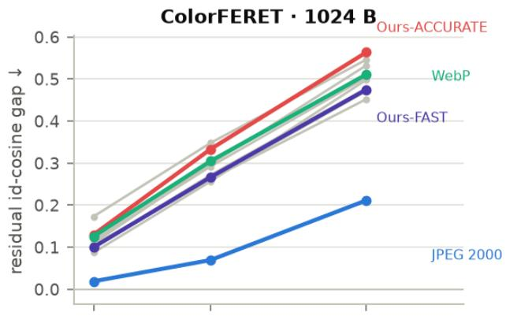

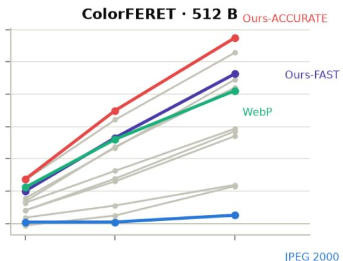

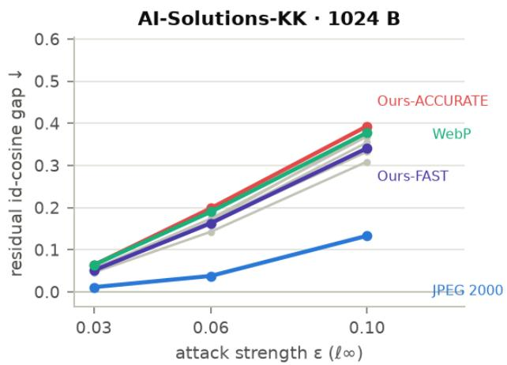

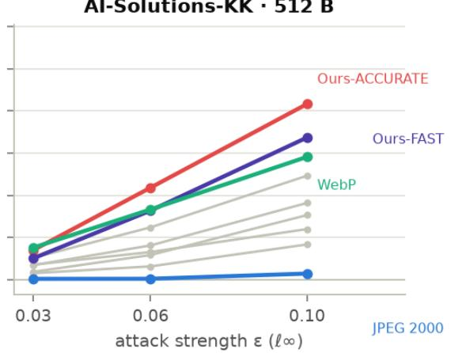  
Figure 43: HFC-attack sanitization: residual identity-cosine gap (four-anchor mean; lower means the perturbation was removed) versus attack strength ε, per codec, for both datasets (rows) and byte budgets (columns) — the graphical form of Tables 71 and 75. The three findings of this section are visible: for the classical codecs the 512 B panel sits below its 1024 B counterpart at every ε on Color FERET and at $\varepsilon \ge 0 . 0 6$ on AI-Solutions-KK (the budget dominates; at $\varepsilon = 0 . 0 3$ on KK the two budgets nearly coincide and WebP inverts), JPEG 2000 is the lowest curve wherever the residual is non-trivial, and Ours-ACCURATE is the highest full-support curve at $\varepsilon \ge 0 . 0 6$ in every panel — with the two trained curves’ budgets lying essentially on top of each other, unlike any classical codec. Ours-FAST and Ours-ACCURATE are drawn on all four panels. Grey curves are the remaining codecs; on the Color FERET panels these include the four reduced-coverage rows of Table 71 (JPEG-FzT, JPEG-AI, bmshj2018, mbt2018, measured on 300 crops), one of which — JPEG-AI — runs above Ours-ACCURATE at $\varepsilon \le 0 . 0 6$ in the 1024 B panel.

row at 512 B for $\varepsilon \ge 0 . 0 6$ though at 1024 B, where its residual barely moves while the classical codecs residuals blow up, Ours-FAST is only mid-pack (e.g. 0.267 at $\varepsilon = 0 . 0 6$ , between JPEG’s 0.261 and JPEG XL’s 0.292). The likely cause is that their nonlinear synthesis transforms reconstruct high-frequency structure that the classical transform codecs simply throw away. The effect is not confined to the learned family — WebP is the weakest classical codec in five of the six cells (HEIF is marginally weaker in the ε = 0.10/1024 B corner, 0.533 vs. 0.511), sitting above Ours-FAST at every 1024 B point and below it at 512 B for $\varepsilon \ge 0 . 0 6$ , and for the same reason: its reconstructions are the sharpest. The caveat is that this sanitization is bought with image quality — the same heavy quantization that removes the perturbation also removes the clean identity signal, which is why the 512 B clean-compressed cosines themselves are low; the right way to read the table is jointly with the clean-budget verification results elsewhere in the report, not as a free defense. The trade-off is stark when the two axes are paired explicitly:

Table 72: CLIP-surrogate I-FGSM sanitization on Color FERET: residual identity-cosine gap surviving compression (mean over the four anchor matchers arcface\_antelopev2, lvface\_l, topofr\_r100, edgeface\_xs; lower is better), across attack strength ε and byte budget. Residuals are smaller than under the HFC attack (Table 71) in every cell: the CLIP surrogate transfers less of its perturbation through compression than the high-frequency attack does. (For JPEG-FzT that comparison is against its reduced 300-crop HFC row; JPEG-AI and the CompressAI baselines are absent here because they were never attacked with this surrogate.) Every row, including both trained codecs, is the four-anchor mean, and each is taken over the same 2,000 attacked crops under both cosines. Best / worst per column, as in the other codec tables.
<table><tr><td rowspan="2">Codec</td><td colspan="2">ε = 0.03</td><td colspan="2">ε = 0.06</td><td colspan="2">ε = 0.1</td></tr><tr><td>512 B</td><td>1024 B</td><td>512 B</td><td>1024 B</td><td>512B</td><td>1024 B</td></tr><tr><td>JPEG 2000</td><td>0.001</td><td>0.009</td><td>-0.001</td><td>0.021</td><td>0.002</td><td>0.052</td></tr><tr><td>JPEG-FzT</td><td>0.005</td><td>0.033</td><td>0.016</td><td>0.083</td><td>0.040</td><td>0.161</td></tr><tr><td>JPEG</td><td>0.004</td><td>0.039</td><td>0.009</td><td>0.099</td><td>0.021</td><td>0.197</td></tr><tr><td>HEIF</td><td>-0.010</td><td>0.044</td><td>-0.010</td><td>0.120</td><td>0.002</td><td>0.232</td></tr><tr><td>JPEG XL</td><td>0.012</td><td>0.039</td><td>0.033</td><td>0.108</td><td>0.080</td><td>0.201</td></tr><tr><td>AVIF</td><td>0.001</td><td>0.056</td><td>0.016</td><td>0.128</td><td>0.053</td><td>0.237</td></tr><tr><td>Ours-FAST</td><td>0.047</td><td>0.044</td><td>0.111</td><td>0.106</td><td>0.208</td><td>0.201</td></tr><tr><td>WebP</td><td>0.030</td><td>0.063</td><td>0.085</td><td>0.151</td><td>0.170</td><td>0.270</td></tr><tr><td>Ours-ACCURATE</td><td>0.064</td><td>0.062</td><td>0.144</td><td>0.137</td><td>0.257</td><td>0.245</td></tr></table>

JPEG 2000, the strongest sanitizer of the field (residual 0.069 at ε=0.06/1024 B), is simultaneously the worst standard codec on clean identity (EER 3.23% at 112 px/1024 B under ArcFace, Section 5), whereas Ours-ACCURATE — the best codec on clean identity at the tight budget (EER 0.22% at 112 px/512 B under ArcFace, against JPEG 2000’s 19.5%) — leaves the largest residual in the table (0.333 at the same grid point, and 0.350 at 512 B), with Ours-FAST mid-pack at 0.267. Sanitization strength and clean identity preservation are, on this evidence, two ends of the same quantization dial rather than independently optimizable properties.

CLIP-surrogate attack. The same sanitization picture holds for the transfer-based CLIP-surrogate I-FGSM attack, and it is even more favourable to the defender. Table 72 reports the residual per codec across the ε× budget grid, averaged over the four anchor matchers (arcface\_antelopev2, lvface\_l, topofr\_r100, edgeface\_xs). At matched ε and budget the CLIP residuals are smaller than the HFC ones in every cell (for JPEG-FzT the HFC row compared against is its reduced 300-crop measurement) — for JPEG 2000 the residual never exceeds 0.06 across the whole grid, and at 512 B every classical codec’s residual is at or below ≈ 0.17 (the trained codecs reach ≈ 0.26) — because the CLIP-surrogate perturbation is both a weaker attack to begin with and is largely quantized away once it passes through the codec. The budget ordering also reappears for the classical codecs, without exception (the 512 B column is below the 1024 B column for every classical codec at every ε), although for the two trained codecs the two budgets are essentially tied; and JPEG 2000 is again the strongest sanitizer, except at 512 B and $\varepsilon \le 0 . 0 6$ where HEIF’s slightly negative residual edges it out, while WebP is the weakest of the classical codecs at every . The conclusion is that compression sanitizes a transfer-based attack at least as effectively as the frequency-domain one — the codec does not need the perturbation to live in the very highest frequencies in order to remove it.

Li-AE prototypical-autoencoder attack. Sanitization of the trained-surrogate Li-AE attack completes the picture and confirms that the codec-level ordering is a property of the defense, not of any one attack. Table 73 reports the Li-AE residuals per codec across the ε× budget grid, averaged over the same four anchor matchers. All three findings reappear: the byte budget dominates for every classical codec (the 512 B column is far below the 1024 B column; the two trained codecs, covered at $\varepsilon = 0 . 0 6$ only, are again the exception, with 0.251 vs. 0.257 for Ours-FAST and 0.310 vs. 0.299 for Ours-ACCURATE), JPEG 2000 is the strongest sanitizer at every grid point but one (residual $\leq 0 . 1 2$ except in the hardest $\pmb { \varepsilon } = 0 . 1 0 / 1 0 2 4 \mathbf { B }$ corner; at $\pm = 0 . 0 3 / 5 1 2 \mathrm { B } \mathrm { H E I F ^ { \circ } s } - 0 . 0 0 6$ edges out its 0.002, as under HFC), and WebP is the weakest classical sanitizer — but not JPEG-FzT, which on this full-support pass is mid-pack, below AVIF at every and below JPEG XL at five of the six $\scriptstyle \left( \varepsilon = 0 . 0 3 / 1 0 2 4 \mathrm { B } \right.$ is a near-tie the other way, 0.113 vs. 0.112). $\mathrm { A t } \varepsilon = 0 . 0 6 / 5 1 2 \mathbf { B }$ , the one cell where the trained codecs are covered at that budget, they are the two weakest rows in the table. The one attack-specific effect is that at matched ε and budget the Li-AE residuals sit slightly above the HFC ones in most 1024 B cells — clearly so for JPEG 2000, JPEG and WebP, whereas JPEG XL and the trained codecs sit slightly below, and at 512 B the two attacks are level on average (e.g. JPEG 2000 at ε=0.06/1024 B leaves 0.116 under Li-AE versus 0.069 under HFC and 0.021 under CLIP): the trained proxy-AE perturbation, refined by an intermediate-level attack, lives partly in the mid-level feature band rather than purely in the top frequencies a codec quantizes hardest, so a little more of it survives compression at the looser budget. It is nonetheless heavily sanitized — the 0.278 worst-corner JPEG 2000 residual still falls to 0.052 at 512 B — so the practical conclusion is unchanged: compression sanitizes all three no-box attacks, the effect is bought with byte budget, and the strength ordering of the attacks (Li-AE ≈ HFC > CLIP, Table 70) carries over to how much of each survives the codec $( { \mathrm { L i } } { \mathrm { - } } { \mathrm { A E } } \approx { \mathrm { H F C } } >$ CLIP residuals, with Li-AE the larger of the near-tied pair in most 1024 B cells).

Table 73: Li-AE prototypical-autoencoder sanitization on Color FERET: residual identity-cosine gap surviving compression (mean over the four anchor matchers arcface\_antelopev2, lvface\_l, topofr\_r100, edgeface\_xs; lower is better), across attack strength ε and byte budget. The codec ordering closely matches the HFC and CLIP tables (Tables 71, 72) — except that JPEG-FzT, measured here on the full 11,335 crops rather than the 300-crop HFC subset, ranks mid-pack; residuals sit slightly above HFC in most 1024 B cells, as the ILA-refined perturbation is not purely high-frequency. The two trained codecs were run against this attack at $\varepsilon = 0 . 0 6$ only, so their other columns read $^ { 6 6 } - ^ { 5 5 }$ ; they are shown rather than dropped, because at the one ε they cover they are the two weakest sanitizers at 512 B (0.310 and 0.251, against $\mathrm { W e b P ` s 0 } . 2 4 3 )$ , which is the finding this section reports against our own codec — at 1024 B WebP’s 0.327 is weaker still. Best / worst per column, as in the other codec tables.
<table><tr><td rowspan="2">Codec</td><td colspan="2">ε = 0.03</td><td colspan="2">ε = 0.06</td><td colspan="2">ε = 0.1</td></tr><tr><td>512 B</td><td>1024 B</td><td>512B</td><td>1024 B</td><td>512B</td><td>1024 B</td></tr><tr><td>JPEG 2000</td><td>0.002</td><td>0.033</td><td>0.014</td><td>0.116</td><td>0.052</td><td>0.278</td></tr><tr><td>JPEG</td><td>0.012</td><td>0.118</td><td>0.045</td><td>0.280</td><td>0.107</td><td>0.487</td></tr><tr><td>HEIF</td><td>-0.006</td><td>0.124</td><td>0.046</td><td>0.297</td><td>0.156</td><td>0.507</td></tr><tr><td>JPEG-FzT</td><td>0.033</td><td>0.113</td><td>0.113</td><td>0.258</td><td>0.242</td><td>0.441</td></tr><tr><td>JPEG XL</td><td>0.040</td><td>0.112</td><td>0.140</td><td>0.271</td><td>0.285</td><td>0.472</td></tr><tr><td>AVIF</td><td>0.039</td><td>0.130</td><td>0.142</td><td>0.297</td><td>0.299</td><td>0.510</td></tr><tr><td>Ours-FAST</td><td></td><td></td><td>0.251</td><td>0.257</td><td></td><td></td></tr><tr><td>WebP</td><td>0.092</td><td>0.139</td><td>0.243</td><td>0.327</td><td>0.439</td><td>0.555</td></tr><tr><td>Ours-ACCURATE</td><td></td><td></td><td>0.310</td><td>0.299</td><td></td><td></td></tr></table>

## 13.4 Ours-as-defense

TL;DR Run as a fixed input transform, our trained codecs sanitize all three attacks — their residuals sit in the same range as the weaker classical codecs — but they do not break the sanitization-vs-quality trade-off: at 1024 B Ours-FAST sanitizes like a mid-pack classical codec and Ours-ACCURATE like the weakest one, neither like JPEG 2000, and at 512 B with $\varepsilon \ge 0 . 0 6$ the two of them are the weakest rows in the table. Ours-ACCURATE, the higher-quality model, is consistently the weaker sanitizer of the two.

The most interesting case for this project is whether our trained codecs — which are optimized to preserve the identity signal under a hard byte budget — can sanitize the adversarial perturbation while retaining clean-image identity, breaking the sanitization-vs-quality trade-off that the generic codecs exhibit. Ours-FAST (the tiny ∼1.35 M-parameter model) and Ours-ACCURATE (the ∼18.7 M-parameter model with the identity side-stream and refine head) are plausible candidates either way: the identity sidestream could carry a compact, attack-resistant identity descriptor, or it could equally re-inject perturbed high-frequency detail through the refine head.

Table 74: Ours-as-defense residual comparison on Color FERET: residual identity-cosine gap (mean over the anchor matchers; lower is better) for the two trained codecs against the strongest (JPEG 2000) and weakest classical (WebP) sanitizers, under all three attacks at the two budgets and $\varepsilon = 0 . 0 6$ . Every row, including Ours-ACCURATE, is the four-anchor mean over arcface\_antelopev2, lvface\_l, topofr\_r100, and edgeface\_xs: the TopoFR-R100 × Ours-ACCURATE pairing is populated here. Lower is stronger sanitization. Every cell is the four-anchor mean of the residual column of outputs/adversarial/sanitization.csv, so the rows reproduce the corresponding cells of Tables 71–73. Li-AE for Ours is likewise evaluated on Color FERET (third column group), completing the three-attack picture: for the learned codecs Li-AE ≈ $\mathrm { H F C } \gg \mathrm { C L I P } ,$ the same coarse ordering as for the classical codecs (Table 70), although for the learned pair Li-AE falls just below HFC rather than just above it.
<table><tr><td rowspan="2">Codec</td><td colspan="2"> $\mathrm { H F C } , \varepsilon = 0 . 0 6$ </td><td colspan="2"> $\mathrm { C L I P } , \varepsilon = 0 . 0 6$ </td><td colspan="2"> $\mathrm { L i } – \mathrm { A E } , \varepsilon = 0 . 0 6$ </td></tr><tr><td>512B</td><td>1024 B</td><td>512 B</td><td>1024 B</td><td>512 B</td><td>1024 B</td></tr><tr><td>JPEG 2000</td><td>0.005</td><td>0.069</td><td>-0.001</td><td>0.021</td><td>0.014</td><td>0.116</td></tr><tr><td>WebP</td><td>0.261</td><td>0.305</td><td>0.085</td><td>0.151</td><td>0.243</td><td>0.327</td></tr><tr><td>Ours-FAST</td><td>0.266</td><td>0.267</td><td>0.111</td><td>0.106</td><td>0.251</td><td>0.257</td></tr><tr><td>Ours-ACCURATE</td><td>0.350</td><td>0.333</td><td>0.144</td><td>0.137</td><td>0.310</td><td>0.299</td></tr></table>

Table 74 answers the question by placing both trained codecs beside the strongest (JPEG 2000) and weakest (WebP) classical sanitizers, for all three attacks, averaged over the same anchor matchers. The verdict is that Ours-as-defense sanitizes, but does not win. Three observations follow. First, the trained codecs are genuine sanitizers: their residuals are finite and ordered as the attack hypothesis predicts (CLIP below HFC throughout), though — unlike the classical codecs — the two byte budgets barely differ for them: across both datasets and all three attacks Ours-ACCURATE’s 512 B cell sits 0.002–0.023 above its 1024 B cell in every case, while Ours-FAST’s two budgets agree to within 0.014 with no consistent sign. Second, they do not match JPEG 2000 — under HFC at $\varepsilon = 0 . 0 6 / 1 0 2 4 \mathbf { B }$ , Ours-FAST leaves a residual of 0.267 and Ours-ACCURATE 0.333, versus JPEG $2 0 0 0 \mathrm { ^ { \circ } s 0 . 0 6 9 ; }$ at that grid point Ours-FAST is level with JPEG (0.261) and Ours-ACCURATE sits above WebP (0.305), the weakest classical sanitizer, and at 512 B with $\varepsilon \ge 0 . 0 6$ the two trained codecs are the weakest rows in the table — nowhere do they behave like the transform codecs that aggressively discard high frequencies. Third, and consistently, the higher-quality model is the weaker defense: Ours-ACCURATE leaves a larger residual than Ours-FAST at every comparable cell, which is exactly the signature of the refine head re-injecting fine detail — including adversarial high-frequency content — that Ours-FAST’s coarser reconstruction throws away. This is the sanitization-vs-quality trade-off reappearing within our own model family rather than being broken by it: the side-stream preserves clean identity but does not selectively reject the perturbation. The practical reading is that our codecs are competitive identity-preserving compressors but are not, on this evidence, a free adversarial purifier; a defender who wants maximal sanitization should still reach for a tighter byte budget or a transform codec like JPEG 2000.

## 13.5 Generalization to AI-Solutions-KK

TL;DR Repeating the full sweep on in-the-wild AI-Solutions-KK reproduces every Color FERET finding: the byte budget dominates at $\varepsilon \geq 0 . 0 6 ,$ , JPEG 2000 is the strongest sanitizer, and Ours-ACCURATE is the weakest — background clutter and non-frontal pose do not change the ordering.

To check that the sanitization picture is not an artefact of controlled studio portraits, we repeat the sweep on the in-the-wild AI-Solutions-KK set, where background clutter and non-frontal pose give the attacker more high-frequency cover. All three attacks (HFC, CLIP-surrogate, and Li-AE) now run for all nine codecs — the seven classical codecs and both trained codecs as defenses — so the full three-attack sanitization picture is complete on both datasets. All four anchor matchers completed on this run, so every row is a clean four-matcher mean. Table 75 reports the HFC residuals, and the three Color FERET findings reappear, with the same qualifications: the 512 B budget sanitizes far harder than 1024 B at $\varepsilon \ge 0 . 0 6$ (at $\varepsilon = 0 . 0 3$ the two budgets are close and WebP even inverts, 0.076 vs. 0.064), JPEG 2000 is the strongest sanitizer at every grid point (residual $\leq 0 .$ .14 even in the hardest $\varepsilon = 0$ .10/1024 B corner), and Ours-ACCURATE is the weakest at $\varepsilon \geq 0 . 0 6 ,$ peaking at 0.416 — though at $\varepsilon = 0 . 0 3$ WebP is marginally weaker still, and Ours-FAST, as on Color FERET, is near-worst at 512 B but only mid-pack at 1024 B. Under the CLIP-surrogate attack the KK residuals are again uniformly smaller — JPEG 2000 stays ≤ 0.023 across the whole grid and Ours-ACCURATE peaks at 0.171 — so the in-the-wild setting, if anything, sanitizes slightly harder than Color FERET at matched budget. The KK Li-AE pass reproduces the same ordering: JPEG 2000 is again the strongest sanitizer (four-anchor mean residual 0.07 at ε=0.06/1024 B, 0.012 at 512 B), WebP the weakest classical sanitizer (0.19/0.13, quoting 1024 B/512 B), and — as on Color FERET — the learned codecs are the weakest defenders at the tighter budget: Ours-ACCURATE leaves the largest 512 B residual (0.19/0.21, essentially tied with WebP at 1024 B) and Ours-FAST a little less (0.16/0.16), the same “higher-quality model sanitizes less” signature seen under HFC. So the Ours-as-defence result holds identically on KK: our codecs sanitize no-box attacks about as well as the weakest classical codecs, not better. The practical conclusion is unchanged and holds on both datasets: compression sanitizes no-box attacks, the effect is bought with image quality, and the learned codecs do not break that trade-off.

Table 75: HFC-attack sanitization on AI-Solutions-KK: residual identity-cosine gap surviving compression (mean over the four anchor matchers arcface\_antelopev2, lvface\_l, topo $\pmb { \mathrm { r } } _ { - } \pmb { \mathrm { r } } 1 0 0$ , edgeface\_xs; lower is better), across attack strength ε and byte budget. The ordering matches Color FERET (Table 71): JPEG 2000 sanitizes hardest and Ours-ACCURATE least, and tighter budgets sanitize harder at $\varepsilon \ge 0 . 0 6$ (at $\varepsilon = 0 . 0 3$ the two budgets nearly coincide, and WebP inverts). Every cell here rests on the same 2,000-crop attacked subset — 1,999 for JPEG XL at 512 B, one crop the codec could not produce — so no row needs a coverage caveat; JPEG-AI and the CompressAI baselines are absent because they were never attacked on this dataset. Best / worst per column, as in the other codec tables.
<table><tr><td rowspan="2">Codec</td><td colspan="2">ε = 0.03</td><td colspan="2">ε = 0.06</td><td colspan="2">ε = 0.1</td></tr><tr><td>512 B</td><td>1024 B</td><td>512B</td><td>1024 B</td><td>512B</td><td>1024 B</td></tr><tr><td>JPEG 2000</td><td>0.002</td><td>0.011</td><td>0.002</td><td>0.038</td><td>0.015</td><td>0.133</td></tr><tr><td>JPEG</td><td>0.036</td><td>0.046</td><td>0.066</td><td>0.143</td><td>0.120</td><td>0.309</td></tr><tr><td>HEIF</td><td>0.015</td><td>0.047</td><td>0.032</td><td>0.167</td><td>0.083</td><td>0.376</td></tr><tr><td>JPEG-FzT</td><td>0.019</td><td>0.056</td><td>0.059</td><td>0.165</td><td>0.153</td><td>0.332</td></tr><tr><td>AVIF</td><td>0.035</td><td>0.054</td><td>0.081</td><td>0.174</td><td>0.182</td><td>0.369</td></tr><tr><td>JPEG XL</td><td>0.052</td><td>0.052</td><td>0.124</td><td>0.164</td><td>0.246</td><td>0.354</td></tr><tr><td>Ours-FAST</td><td>0.051</td><td>0.051</td><td>0.164</td><td>0.163</td><td>0.337</td><td>0.341</td></tr><tr><td>WebP</td><td>0.076</td><td>0.064</td><td>0.167</td><td>0.190</td><td>0.291</td><td>0.378</td></tr><tr><td>Ours-ACCURATE</td><td>0.070</td><td>0.063</td><td>0.218</td><td>0.198</td><td>0.416</td><td>0.393</td></tr></table>

Scope and future work: codec-aware attacks. This study evaluates the no-box attacker exclusively; a codec-aware adversary is not yet evaluated. Because the credential codec is a public standard once deployed, such an adversary could attack through the Ours decoder — using backward-pass differen tiable approximation (BPDA) or straight-through gradient estimation to bypass the non-differentiable quantization — so whether compression still sanitizes against that stronger attacker is scheduled as future work.

## 14 Statistical Significance

TL;DR We test whether the accuracy gaps between codecs are real or could be noise: paired McNemar tests on verification decisions and DeLong tests on ROC areas, with Benjamini–Hochberg correction for the many comparisons. The headline result is that at 112 px/1024 B the strongest modern codecs (AVIF, HEIF, JPEG XL, WebP, JPEG-AI, and our trained ours\_accurate) are operationally interchangeable: most of their pairwise differences do reach significance after Benjamini–Hochberg correction, but the effect sizes are practically negligible (ROC-AUC gaps at the fourth decimal). On Color FERET under EdgeFace-XS four pairs fail significance outright (AVIF≈WebP, HEIF≈JPEG XL, JPEG XL≈Ours-FAST, HEIF≈Ours-FAST); across all four Color FERET anchors nine of 220 tests fail, and on AI-Solutions-KK only seven of 440 — including JPEG-AI≈Ours-ACCURATE on the independent ArcFace anchor. Yet every one of these codecs beats JPEG and JPEG 2000 decisively.

A ranking of codecs by equal-error rate (EER) is only useful if the gaps between them are larger than what sampling noise alone would produce. This section attaches formal significance to the head-to-head differences reported in the benchmark (Section 5). The full testing protocol — pairing scheme, trial construction, and operating points — is given in Section 4; here we recap it only briefly and then read the results off the per-pair table.

## 14.1 Method recap

TL;DR Two complementary paired tests — McNemar on the accept/reject decisions and DeLong on the ROC areas — run on the same verification trials for both codecs, then corrected for multiplicity with Benjamini–Hochberg FDR.

Because every codec is evaluated on the identical set of verification trials, the comparisons are paired and we can test the difference between two codecs directly rather than comparing two independent error estimates. We use two tests per codec pair:

• McNemar’s test [31] on the binary accept/reject decisions. For a pair of codecs (a, b) it counts the discordant trials — those where a is correct and b is wrong (b) versus the reverse (c) — and forms the $\chi ^ { 2 }$ statistic from b and c. It is sensitive to differences in the thresholded decision, i.e. accuracy at a fixed operating point.

• DeLong’s test [18] on the area under the ROC curve (AUC). It compares the two codecs’ AUCs while accounting for the covariance induced by sharing the same trials, and is sensitive to thresholdindependent separability.

Reporting both guards against a pair that looks tied at one operating point but differs across the whole curve, or vice versa. Each test produces a raw p-value; we treat a pair as significant only after multiple-comparison correction (below). Unless stated otherwise the numbers in this section are for the EdgeFace-XS matcher [21] on Color FERET at the 112 px working resolution and the 1024-byte budget, the same anchor configuration used elsewhere in the report; all values are read directly from the per-pair significance table on disk.

## 14.2 Pairwise codec comparisons

TL;DR Aligned (uncompressed) reference beats every codec significantly. JPEG 2000 is the worst by a wide margin and loses to everyone. The interesting outcome is a cluster of modern codecs so close that their pairwise differences are either statistically non-significant or significant-but-negligible.

Table 76 lists representative pairwise outcomes. Two patterns are unambiguous. First, the aligned (uncompressed) reference is significantly better than every codec, and JPEG 2000 is significantly worse than every other method — both at the floor of the McNemar p-values $( p _ { \mathrm { a d j } } = 0$ to machine precision against all comparators, with AUC dropping from 0.9998 for aligned to 0.9868 for JPEG 2000). At 1024 bytes and 112 px, JPEG 2000 is simply not competitive for this task.

Second, and more informative, the strongest modern codecs are operationally interchangeable. With millions of paired trials per cell the McNemar test has enormous power, so most pairwise differences do cross the significance threshold — but the effect sizes are negligible. The per-cell trial count is every mated pair plus a fixed random sample of $2 . 0 \times 1 0 ^ { 6 }$ non-mated pairs: 2094299 on Color FERET (95839 mated) and 3515807 on AI-Solutions-KK (1515807 mated). These are therefore not the ∼64 M (Color FERET) / ∼153.7 M (KK) all-pairs totals quoted in the dataset summary (Table 3) — the nonmated side is sub-sampled, because the full impostor set adds cost without adding resolution at these counts — so the two figures are not in conflict. Note also that this stage draws a smaller impostor sample than the accuracy grid of $\ S 4 .$ , which caps at $5 . 0 \times 1 0 ^ { 6 }$ : the paired tests here need the same trials under both codecs rather than the tightest possible ROC, so the counts in this section and in the rate–EER tables are not expected to match. A further caveat is statistical dependence: the all-pairs $\binom { N } { 2 }$ protocol makes these millions of trials heavily dependent (each subject recurs in many pairs), so the pair-level McNemar/DeLong p-values — which bottom out at machine zero — are power-inflated and must not be read as effect magnitudes. We therefore lead the ranking narrative with the subject-level bootstrap confidence intervals and Cliff’s-δ effect sizes of Section 14.5, and de-emphasise the pair-level p-values accordingly. The headline rate–EER tables (Tables 9 onward) carry subject-level 95% bootstrap CIs (identity-cluster resampling), so the reader can see the honest uncertainty directly — on AI-Solutions-KK, with only 105 identities, these CIs are an order of magnitude wider than a pair-level interval would suggest. Only four modern-codec pairs fail to reach significance even at this trial count: AVIF vs. WebP $( p _ { \mathrm { a d j } } = 0 . 8 9 ;$ discordant-decision counts $b = 6 5 6 2 \mathrm { v s . } c = 6 5 4 5$ , essentially balanced), HEIF vs. JPEG XL $( p _ { \mathrm { a d j } } = 0 . 1 1 )$ ), and — under the promoted 3M-step checkpoint — JPEG XL vs. Ours-FAST $( p _ { \mathrm { a d j } } = 0 . 6 3 )$ and HEIF vs. Ours-FAST $( p _ { \mathrm { a d j } } = 0 . 2 9 )$ . The pairs that do clear the threshold clear it narrowly — AVIF vs. JPEG-AI and JPEG-AI vs. WebP have McNemar $\chi ^ { 2 }$ below 20 (against $\chi ^ { 2 }$ in the thousands for the aligned and JPEG 2000 comparisons) and AUC gaps at the fourth decimal place, so the rank order among them carries no practical weight. In practical terms: choosing among AVIF, WebP, HEIF, JPEG XL, and JPEG-AI at this operating point is a matter of encoder availability and licensing, not measurable identity preservation — yet all of them clear JPEG and JPEG 2000 by a comfortable, significant margin. Figure 44 renders the full pairwise matrix: the four-orders-of-magnitude spread in $\chi ^ { 2 }$ between the near-ties $( \chi ^ { 2 } < 3 )$ and the JPEG 2000 comparisons $( \chi ^ { 2 } \approx 1 0 ^ { 5 } )$ is the quantitative form of the “significant but negligible” distinction this section is built on.

Third, our two trained codecs (ours\_accurate, ours\_fast) are in the run, and they land squarely in this modern-codec cluster. Both are decisively better than JPEG 2000 — ours\_accurate vs. JPEG 2000 gives a McNemar $\chi ^ { 2 }$ of 85000 and an AUC gap of 0.0127 $( p _ { \mathrm { a d j } } \approx 0 )$ and both are, in turn, significantly worse than the aligned reference, exactly as every lossy codec is. Against the modern codecs the picture matches the AVIF/WebP story: the McNemar tests reach significance (large $\chi ^ { 2 } , p _ { \mathrm { a d j } }$ far below any threshold) because the paired trial counts are enormous, but the underlying AUC differences are at the fourth decimal or smaller — ours\_accurate vs. JPEG-AI differs in AUC by only ${ \sim } 1 . 8 \times 1 0 ^ { - 5 }$ , and vs. $\mathrm { A V I F b y } \sim 1 . 7 \times 1 0 ^ { - 4 }$ . The effect is statistically real but practically negligible: Ours is competitive with the strongest general-purpose codecs at this operating point. These three Ours-vs-modern-codec comparisons carry one further caveat: the flagship table is anchored on edgeface\_xs, and ours\_accurate’s identity side-stream is trained against a frozen EdgeFace-S embedding, so an EdgeFace-family evaluator is not independent of Ours. The ours\_accurate-vs-{JPEG-AI, AVIF, WebP} gaps on this anchor are therefore confounded and should be read together with the held-out CVLFace-IR101 and ArcFace results of Section 5, which are architecturally independent of the side-stream. We have run that independentmatcher check directly: re-testing the same 112 px/1024 B pairs under arcface\_antelopev2 and cvlface\_ir101 (both architecturally independent of the EdgeFace side-stream) reproduces the edgeface conclusion — ours\_accurate vs. {JPEG-AI, AVIF, WebP} differ only at the fourth AUC decimal $( | \Delta \mathrm { A U C } | \le 2 \times 1 0 ^ { - 4 }$ ; under CVLFace-IR101 the Ours-vs-AVIF pair is not even significant, $p _ { \mathrm { a d j } } = 0 . 3 4 )$

Table 76: Representative pairwise significance on Color FERET, EdgeFace-XS, 112 px, 1024 B. $\chi ^ { 2 }$ and $p$ are McNemar on the accept/reject decisions; $\mathrm { A U C } _ { a } / \mathrm { A U C } _ { b }$ are the DeLong ROC areas whose difference is tested separately. $p _ { \mathrm { a d j } }$ is the Benjamini–Hochberg-corrected McNemar p; sig. marks pairs that remain significant after correction at a false-discovery rate of $q = 0 . 0 5$ . All values from the on-disk significance table.
<table><tr><td>Codec a</td><td>Codec b</td><td>McNemar  $\chi ^ { 2 }$ </td><td> $\mathrm { A U C } _ { a }$ </td><td> $\mathrm { A U C } _ { b }$ </td><td> $p _ { \mathrm { a d j } }$ </td><td> $\mathrm { s i g . 2 }$ </td></tr><tr><td>aligned</td><td>avif</td><td>2,223.9</td><td>0.9998</td><td>0.9997</td><td>≈0</td><td>yes</td></tr><tr><td>aligned</td><td>jpeg</td><td>7,828.3</td><td>0.9998</td><td>0.9993</td><td>≈0</td><td>yes</td></tr><tr><td>aligned</td><td>jpeg2000</td><td>100,812.5</td><td>0.9998</td><td>0.9868</td><td>≈0</td><td>yes</td></tr><tr><td>aligned</td><td>jpeg_ai</td><td>1,820.0</td><td>0.9998</td><td>0.9997</td><td>≈0</td><td>yes</td></tr><tr><td>aligned</td><td>webp</td><td>2,308.8</td><td>0.9998</td><td>0.9997</td><td>≈0</td><td>yes</td></tr><tr><td>avif</td><td>jpeg2000</td><td>91,300.7</td><td>0.9997</td><td>0.9868</td><td>≈0</td><td>yes</td></tr><tr><td>jpeg</td><td>jpeg2000</td><td>77,799.5</td><td>0.9993</td><td>0.9868</td><td>≈0</td><td>yes</td></tr><tr><td>avif</td><td>heif</td><td>1,246.6</td><td>0.9997</td><td>0.9995</td><td> $7 . 3 \times 1 0 ^ { - 2 7 3 }$ </td><td>yes</td></tr><tr><td>jpeg_ai</td><td>jpeg_xl</td><td>1,756.5</td><td>0.9997</td><td>0.9995</td><td>≈0</td><td>yes</td></tr><tr><td>avif</td><td>jpeg_ai</td><td>48.5</td><td>0.9997</td><td>0.9997</td><td> $3 . 8 \times 1 0 ^ { - 1 2 }$ </td><td>yes</td></tr><tr><td>jpeg_ai</td><td>webp</td><td>51.1</td><td>0.9997</td><td>0.9997</td><td> $1 . 0 \times 1 0 ^ { - 1 2 }$ </td><td>yes</td></tr><tr><td>avif</td><td>webp</td><td>0.02</td><td>0.9997</td><td>0.9997</td><td>0.889</td><td>no</td></tr><tr><td>heif</td><td>jpeg_xl</td><td>2.67</td><td>0.9995</td><td>0.9995</td><td>0.108</td><td>no</td></tr><tr><td>heif</td><td>ours_fast</td><td>1.20</td><td>0.9995</td><td>0.9996</td><td>0.285</td><td>no</td></tr><tr><td>jpeg_xl</td><td>ours_fast</td><td>0.25</td><td>0.9995</td><td>0.9996</td><td>0.629</td><td>no</td></tr><tr><td>aligned</td><td>ours_accurate</td><td>1,793.9</td><td>0.9998</td><td>0.9997</td><td>≈0</td><td>yes</td></tr><tr><td>aligned</td><td>ours_fast</td><td>5,866.3</td><td>0.9998</td><td>0.9996</td><td>≈0</td><td>yes</td></tr><tr><td>ours_accurate</td><td>ours_fast</td><td>2,151.6</td><td>0.9997</td><td>0.9996</td><td>≈0</td><td>yes</td></tr><tr><td>jpeg2000</td><td>ours_accurate</td><td>93,747.8</td><td>0.9868</td><td>0.9997</td><td>≈0</td><td>yes</td></tr><tr><td>avif</td><td>ours_accurate</td><td>112.7</td><td>0.9997</td><td>0.9997</td><td> $3 . 1 \times 1 0 ^ { - 2 6 }$ </td><td>yes</td></tr><tr><td>jpeg_ai</td><td>ours_accurate</td><td>14.0</td><td>0.9997</td><td>0.9997</td><td> $2 . 1 \times 1 0 ^ { - 4 }$ </td><td>yes</td></tr></table>

matching the pattern seen on edgeface\_xs. The “operationally interchangeable” verdict is therefore not an artefact of the circular evaluator. (The rank concordance recomputed with the EdgeFace family excluded is essentially unchanged — see §14.5.) Finally, the two variants are separable from each other — ours\_accurate beats ours\_fast (0.9923 vs. 0.9897 accuracy, $\chi ^ { 2 } = 1 3 8 1 , p _ { \mathrm { a d j } } \approx 4 \times 1 0 ^ { - 3 0 2 } )$ confirming that the accuracy-oriented variant buys a small but statistically solid gain over the fast one.

One nuance worth flagging: the two tests do not always agree at the margin. For several moderncodec pairs the DeLong AUC test reaches significance (its raw p is tiny) even though McNemar does not, because the ROC area is estimated from many more comparisons than the handful of discordant thresholded decisions. We take the McNemar decision test as primary for the operating-point ranking and report the AUC test alongside it; where they diverge, the codecs differ in curve shape but not in accept/reject behaviour at the chosen threshold.

## 14.3 Multiple-comparison correction

TL;DR With ten codecs plus the aligned reference there are 55 pairwise tests in every cell, so we control the false-discovery rate with Benjamini–Hochberg at $q = 0 . 0 5 ;$ only the near-tied modern-codec pairs survive correction as non-significant.

A full pairwise comparison over the eleven conditions that clear the coverage filter (the aligned reference plus ten codecs) yields ${ \binom { 1 1 } { 2 } } = 5 5$ tests per matcher, resolution, and budget cell — 220 on Color FERET and 440 on AI-Solutions-KK over the cells reported here. Testing that many hypotheses inflates the chance of a spurious “significant” result, so we adjust the raw McNemar p-values with the Benjamini–Hochberg false-discovery-rate procedure [9], reported as $p _ { \mathrm { a d j } }$ in Table 76 and in the p\_adj / significant columns of the on-disk table. Because the genuine effects here are enormous (raw p-values down to machine zero), the correction changes almost nothing: every pair that was significant before correction remains $\mathbf { S O } ,$ and the pairs flagged non-significant (at the $q = 0 . 0 5$ false-discovery threshold) are only the near-ties: nine of the 220 Color FERET tests and seven of the 440 KK tests, every one of them a pair drawn from the modern-codec cluster or from the two legacy codecs (JPEG≈JPEG-FzT, JPEG≈JPEG XL). The conclusion is therefore robust to the multiplicity adjustment rather than balanced on its edge.

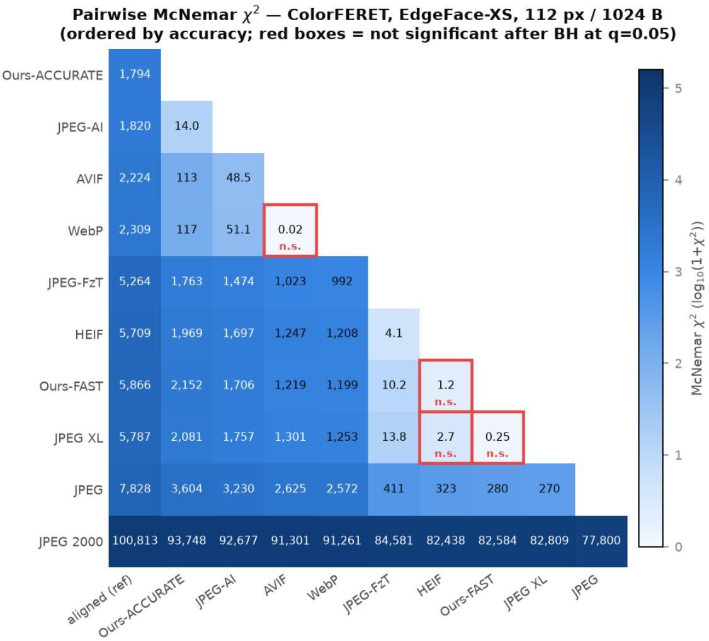  
Figure 44: The complete pairwise McNemar matrix behind Table 76 (Color FERET, EdgeFace-XS, 112 px/1024 B; rows and columns ordered by accuracy, colour is $\log _ { 1 0 } ( 1 + \chi ^ { 2 } ) )$ . Only two cells survive Benjamini–Hochberg correction as non-significant (red boxes): AVIF/WebP and HEIF/JPEG XL. Everything else is significant, but the $\chi ^ { 2 }$ magnitudes span four orders — from the modern-codec near-ties $( \chi ^ { 2 } < 2 0 )$ to the JPEG 2000 row $( \chi ^ { 2 } \approx 1 0 ^ { 5 } ) -$ which is why significance alone does not rank the modern cluster.

## 14.4 Significance on AI-Solutions-KK

TL;DR The in-the-wild KK trials confirm and sharpen the Color FERET picture: aligned beats every codec, JPEG 2000 is the worst, and — crucially — the modern-codec near-ties that Color FERET left undecided are all resolved as significant on KK, because its ∼2 million trials per cell give the tests far more power. The KK grid is complete: all four anchors at both resolutions, 55 codec pairs per cell, 440 tests.

The AI-Solutions-KK significance grid is complete on disk (Section 17): all four anchor matchers (arcface\_antelopev2, lvface\_l, topofr\_r100, edgeface\_xs) at both the 112 px working resolution and the 224 px source, 55 codec pairs per cell, 440 tests in all. Nothing is read off a partial cell and

Table 77: Pairwise significance on AI-Solutions-KK at 1024 B, all four anchors at both the 112 px working resolution and the 224 px source. $\chi ^ { 2 }$ is McNemar on the accept/reject decisions; $\mathrm { A U C } _ { a } / \mathrm { A U C } _ { b }$ are DeLong ROC areas; $p _ { \mathrm { a d j } }$ is the Benjamini–Hochberg corrected McNemar $p .$ The grid is 55 codec pairs per cell, 440 in all; the table prints every pair thatfails significance — that is the finding — together with the largest contrast in each cell to set the scale. Seven of the 440 fail, six of them at 112 px on the ArcFace and LVFace-L anchors, one at 224 px. All values from the on-disk significance table.
<table><tr><td>Anchor</td><td>Codec a</td><td>Codec b</td><td>McNemar  $\chi ^ { 2 }$ </td><td> $\mathrm { A U C } _ { a }$ </td><td> $\mathrm { A U C } _ { b }$ </td><td> $p _ { \mathrm { a d j } }$ </td><td> $\mathrm { s i g . 2 }$ </td></tr><tr><td rowspan="4">ArcFace, 112 px</td><td>jpeg</td><td>jpeg_xl</td><td>1.01</td><td>0.9991</td><td>0.9991</td><td>0.315</td><td>no</td></tr><tr><td>jpeg_ai</td><td>ours_accurate</td><td>3.21</td><td>0.9996</td><td>0.9997</td><td>0.074</td><td>no</td></tr><tr><td>jpeg_fzt</td><td>jpeg_xl</td><td>3.57</td><td>0.9990</td><td>0.9991</td><td>0.061</td><td>no</td></tr><tr><td>aligned</td><td>jpeg2000</td><td>325,873.8</td><td>0.9998</td><td>0.9642</td><td>≈0</td><td>yes</td></tr><tr><td rowspan="2">ArcFace, 224 px</td><td>jpeg_fzt</td><td>jpeg_xl</td><td>1.39</td><td>0.9993</td><td>0.9993</td><td>0.238</td><td>no</td></tr><tr><td>aligned</td><td>jpeg2000</td><td>243,273.5</td><td>0.9998</td><td>0.9781</td><td>≈0</td><td>yes</td></tr><tr><td>EdgeFace-XS, 112 px</td><td>aligned</td><td>jpeg2000</td><td>402,327.6</td><td>0.9987</td><td>0.9361</td><td>≈0</td><td>yes</td></tr><tr><td>EdgeFace-XS, 224 px</td><td>aligned</td><td>jpeg2000</td><td>319,982.6</td><td>0.9987</td><td>0.9548</td><td>≈0</td><td>yes</td></tr><tr><td rowspan="4">LVFace-L, 112 px</td><td>heif</td><td>jpeg_xl</td><td>0.00</td><td>0.9984</td><td>0.9986</td><td>0.956</td><td>no</td></tr><tr><td>heif</td><td>jpeg_fzt</td><td>0.34</td><td>0.9984</td><td>0.9984</td><td>0.570</td><td>no</td></tr><tr><td>jpeg_fzt</td><td>jpeg_xl</td><td>0.42</td><td>0.9984</td><td>0.9986</td><td>0.535</td><td>no</td></tr><tr><td>aligned</td><td>jpeg2000</td><td>387,204.6</td><td>0.9996</td><td>0.9494</td><td>≈0</td><td>yes</td></tr><tr><td>LVFace-L, 224 px</td><td>aligned</td><td>jpeg2000</td><td>270,642.3</td><td>0.9995</td><td>0.9700</td><td>≈0</td><td>yes</td></tr><tr><td>TopoFR-R100, 112 px</td><td>aligned</td><td>jpeg2000</td><td>319,150.5</td><td>0.9997</td><td>0.9651</td><td>≈0</td><td>yes</td></tr><tr><td>TopoFR-R100, 224 px</td><td>aligned</td><td>jpeg2000</td><td>248,537.8</td><td>0.9997</td><td>0.9766</td><td>≈0</td><td>yes</td></tr></table>

no resolution substitution is needed.

Table 77 lists, for every cell, the pairs that fail significance together with the largest contrast in that cell. The two qualitative patterns carry over intact: the aligned reference is significantly better than every codec, and JPEG 2000 is significantly worse than every other method — its AUC falls to 0.936–0.965 at 112 px and 0.955–0.978 at 224 px, against ≈ 0.999 for aligned on every anchor — all at the floor of the McNemar p-values. The sharper result is what happens to the modern-codec pairs. On Color FERET under EdgeFace-XS four pairs are statistically indistinguishable after correction (AVIF≈WebP, HEIF≈JPEG XL, HEIF≈Ours-FAST, JPEG XL≈Ours-FAST); the nominated tie-pair, JPEG-AI≈WebP, is in fact significant there, so the observed ties are different pairs than predicted. On AI-Solutions-KK the grid is 55 pairs per cell across four anchors and two resolutions — 440 tests — and only seven fail. Six of those are at the 112 px working resolution and one at 224 px, so the in-the-wild picture is close to all-significant without being it.

That is roughly what an in-the-wild benchmark should give: each KK cell aggregates 3,515,807 verification trials against 2,094,299 on Color FERET, so even fourth-decimal AUC gaps clear the threshold. AVIF vs. WebP, a tie on Color FERET, is significant in all eight KK cells — on the three side-stream-independent anchors it clears the threshold on an AUC difference of only $0 . 8 – 4 . 0 \times 1 0 ^ { - 4 }$ The practical reading is unchanged — the modern codecs are operationally interchangeable, with AUC gaps far below any deployment-relevant tolerance — but the statistical verdict on KK is that they are nonetheless distinct.

The trained codecs are in the KK run at full coverage, on every anchor and at both resolutions. The Color FERET verdict repeats: aligned beats both trained variants decisively (on edgeface\_xs at 224 px, $\chi ^ { 2 }$ of 6539 and 6917, $p _ { \mathrm { a d j } } \approx 0 )$ , and the two variants remain separable from each other everywhere — but by a margin that shrinks sharply with resolution. At 112 px the Ours-ACCURATE-vs-Ours-FAST contrast is enormous $( \chi ^ { 2 }$ between 10,440 and 18,244 across the four anchors); at 224 px it falls to between 4 and 134, and on edgeface\_xs it only just clears the threshold $( \chi ^ { 2 } = 4 . 2 , p _ { \mathrm { a d j } } = 0 . 0 4 0$ , an AUC gap of $5 \times 1 0 ^ { - 5 } )$ . The accurate variant’s advantage over the fast one is therefore a working-resolution effect: at the 224 px source, where both variants have more pixels and a harder budget, they converge.

Where the two datasets differ is in which pairs tie. On Color FERET the four ties in the EdgeFace-XS cell are all among the modern block codecs and Ours-FAST (the other five, spread over the remaining three anchors, add AVIF≈JPEG-AI, AVIF≈WebP, JPEG-AI≈WebP, AVIF≈Ours-ACCURATE and the legacy JPEG≈JPEG-FzT); on AI-Solutions-KK the ties involve JPEG-FzT and JPEG XL — and, on ArcFace at 112 px, JPEG-AI and Ours-ACCURATE $( \chi ^ { 2 } = 3 . 2 , p _ { \mathrm { a d j } } = 0 . 0 7 4 )$ . That is the one pairing the report has most reason to scrutinise, since JPEG-AI is the strongest competitor: on the in-the-wild set at the working resolution, under an anchor entirely independent of our identity side-stream, the two are statistically indistinguishable.

## 14.5 Rank-based analysis across the matcher roster

TL;DR The McNemar/DeLong tests above are pairwise and per-matcher; a Friedman test plus Kendall’s coefficient of concordance ask the complementary question — do the matchers agree on the codec ranking? They do, strongly $( W = 0 . 8 5 )$ , which is the statistical backing for the backbone-invariance claim of Section 5.

The pairwise tests establish that individual codec gaps are real; they do not directly quantify whether the ranking is stable across matchers. To do that we take the per-matcher EERs at the 112 px/1024 B operating point for the fourteen matchers with complete codec coverage and run rank-based tests over the 14 × 12 (matcher × codec) grid. A Friedman test decisively rejects the null that the codecs are interchangeable $( \chi ^ { 2 } = 1 3 0 . 6 , p \approx 1 . 3 \times 1 0 ^ { - 2 2 } )$ , and Kendall’s coefficient of concordance is $W = 0 . 8 5$ — a strong agreement, meaning the matchers rank the codecs almost the same way regardless of backbone. The mean ranks (Figure 45) put JPEG-AI first at 1.86, with the trained Ours-ACCURATE and WebP tied behind it at 3.07 and AVIF at 4.07, and JPEG 2000 (11.93) and mbt2018 (11.07) at the bottom; this is the same ordering the per-matcher grids show, now with a single concordance statistic behind it. The apparent fourth place of bmshj2018 (4.00) should not be read as a result: its cells come from the 300-crop Color FERET subset, so it is ranked against codecs measured on 11,335. Because this concordance is computed over a matcher roster that includes the EdgeFace family — to which Ours-ACCURATE’s identity side-stream is anchored — we recomputed it with all four EdgeFace-family matchers removed. Agreement does not weaken; it strengthens, from $W = 0 . 8 5$ over all fourteen matchers to $W = 0 . 8 9$ over the remaining ten. The backbone-invariance of the codec ranking is therefore not an artefact of the EdgeFace matchers — if anything those four are the least concordant members of the roster. The held-out CVLFace-IR101 and ArcFace rows supply the same independent cross-check on the Ours cells specifically.

Table 78 reports Holm-corrected Wilcoxon signed-rank tests and Cliff’s δ effect sizes for the headline pairs across the roster: Ours-ACCURATE beats JPEG 2000 with the maximal effect $( \delta = - 1 . 0 0$ : it wins on every matcher) and beats both Ours-FAST $( \delta = - 0 . 4 9 )$ and JPEG-FzT $( \delta = - 0 . 3 6 )$ , while it is statistically tied with WebP $( \delta = + 0 . 0 0 , p _ { \mathrm { H o l m } } = 0 . 3 6 )$ and with AVIF $( \delta = - 0 . 0 3 , p _ { \mathrm { H o l m } } = 0 . 2 4 ) \_$ so the cross-matcher rank evidence places Ours-ACCURATE level with the two best general-purpose codecs, not behind them. These subject-level effect sizes, together with the bootstrap 95% confidence intervals on EER and FNMR carried in the master accuracy grid (eer\_lo/eer\_hi and the fnmr\_\*\_lo/hi columns), are the primary basis for the ranking claims — we treat them, rather than the power-inflated pair-level p-values, as the effect-size ground truth.

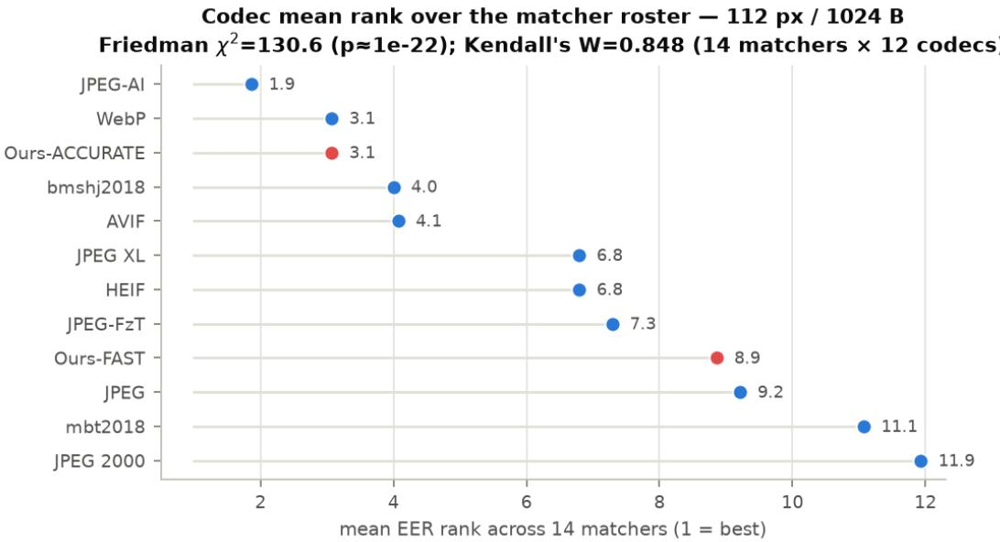  
Figure 45: Mean EER rank of each codec across the fourteen fully-covered matchers at $1 1 2 \mathrm { p x } / 1 0 2 4$ B $( 1 =$ lowest EER). The tight concordance $( W = 0 . 8 5 )$ means these mean ranks are representative of essentially every individual matcher’s ranking: JPEG-AI leads, the trained Ours-ACCURATE ties WebP for second, and mbt2018 and JPEG 2000 trail under every backbone. All twelve codecs are ranked — ten off-the-shelf plus both custom variants — since every one has a stored EER for every roster matcher at this cell, which is what a complete matcher × codec matrix requires. Two cautions. The CompressAI baselines (bmshj2018 4.00, mbt2018 11.07) are ranked on the 300-crop subset, so their positions are not comparable with the other ten. And a mean rank is not an effect size: the gap between rank 1.86 and rank 3.07 is a fraction of a percentage point of EER (Table 78 gives the effect sizes), whereas the gap to JPEG 2000 is two orders of magnitude.

Table 78: Rank-based cross-matcher comparison at 112 px/1024 B (fourteen matchers with complete codec coverage). Wilcoxon signed-rank $p$ is Holm-corrected over the family; Cliff’s δ is the effect size (−1 = codec a lower EER on every matcher). Global agreement: Friedman $\chi ^ { 2 } = 1 3 \bar { 0 . } 6 ( p \approx 1 . 3 \times 1 0 ^ { - 2 2 } )$ , Kendall’s W = 0.85.
<table><tr><td>Codec a</td><td>Codec b</td><td>Wilcoxon  $p _ { \mathrm { H o l m } }$ </td><td> $\mathrm { C l i f f } ^ { \prime } \mathrm { s } \delta$ </td><td> $\mathrm { s i g . 2 }$ </td></tr><tr><td>Ours-ACCURATE</td><td>WebP</td><td>0.358</td><td>+0.00</td><td>no</td></tr><tr><td>Ours-ACCURATE</td><td>AVIF</td><td>0.238</td><td>-0.03</td><td>no</td></tr><tr><td>Ours-ACCURATE</td><td>JPEG 2000</td><td>0.000977</td><td>-1.00</td><td>yes</td></tr><tr><td>WebP</td><td>JPEG 2000</td><td>0.000977</td><td>-1.00</td><td>yes</td></tr><tr><td>Ours-ACCURATE</td><td>Ours-FAST</td><td>0.000977</td><td>-0.49</td><td>yes</td></tr><tr><td>Ours-ACCURATE</td><td>JPEG-FzT</td><td>0.000977</td><td>-0.36</td><td>yes</td></tr><tr><td>JPEG-FzT</td><td>WebP</td><td>0.000977</td><td>+0.32</td><td>yes</td></tr><tr><td>JPEG</td><td>JPEG 2000</td><td>0.000977</td><td>-1.00</td><td>yes</td></tr></table>

## 15 Discussion, Limitations, and Roadmap

TL;DR This is the honest current-state section: a uniform sub-1 kB benchmark across ten off-the-shelf codecs, two datasets, and four matchers is in place and supports clear identity-preservation conclusions; the custom learned codec is competitive at 1024 B (runner-up to JPEG-AI on the 224 px identity-cosine headline, but leading it at the 112 px verification working resolution — at both budgets on both datasets — and beating it on the FNMR@FMR= $1 0 ^ { - 4 }$ operating point at 512 B on Color FERET); the four anchors span the full resolution grid on both datasets. One extension remains in progress: the Ours cells of the fourteen-model roster at the non-112 px AI-Solutions-KK resolutions (Color FERET is complete for every codec).

This section separates what the report already establishes from what is still in flight. We state the current pipeline state explicitly so that a reader can distinguish a settled finding from a placeholder, and so that the remaining work is scoped rather than implied.

Findings register. Every headline number quoted in this report is re-derived from the committed pipeline outputs into a machine-readable findings register (Section 17, with a JSON twin and a schema README). Each register row records the claim, the exact value, the dataset, matcher, resolution, and budget it holds at, and the source file it is computed from, so any quantitative statement in the text can be traced — and, after a pipeline re-run, re-checked — mechanically. The interpretation figures added throughout the report (the distortion-vs-identity scatter, the fairness-disparity panel, the recompression heatmaps, the sanitization-residual sweep, the significance matrix, and the cross-matcher rank plot) are generated from the same committed outputs by a single script and are archived alongside the register.

## 15.1 What we have established

TL;DR A single, uniform protocol now compares the codecs at a hard sub-1 kB budget on two datasets and four matchers, and it already separates the codecs that keep identity from the ones that destroy it.

The core contribution that is fully in place is a uniform evaluation protocol applied identically to every codec. All methods compress the same pixel-aligned crops to the same hard byte budgets, the reconstructions are embedded by the same set of face matchers, and verification is scored by the same routine. This removes the usual confound where codec comparisons differ in alignment, crop, or operating point rather than in the codec itself.

Concretely, the benchmark spans ten off-the-shelf codecs — JPEG, JPEG 2000, WebP, JPEG XL, AVIF, HEIF, JPEG-FzT, JPEG-AI, and the learned baselines bmshj2018 [7] and mbt2018 [33] from CompressAI [8] — plus our two custom variants. It is run on both datasets (the controlled Color FERET studio portraits [36] and the in-the-wild AI-Solutions-KK set) and embedded by all four anchor matchers (arcface\_antelopev2 [19], lvface\_l, topofr\_r100, and edgeface\_xs [21]). For each cell we report EER and FNMR at standard operating points, and on Color FERET we add paired significance tests (McNemar [31], DeLong [18], with Benjamini–Hochberg FDR control [9]; see Section 14). Image-quality measurements (PSNR, SSIM, and perceptual metrics) accompany the identity scores so that pixel fidelity and identity fidelity can be read side by side.

The headline qualitative finding is robust across this grid: at the 1024 B budget the modern codecs — WebP, AVIF, JPEG XL, HEIF, and JPEG-AI — preserve the identity signal well enough that EER stays close to the uncompressed baseline (Color FERET, 112 px, ArcFace: 0.09–0.19% against 0.04% aligned), whereas JPEG 2000 collapses outright (3.23%) and legacy JPEG, which still survives this particular cell at 0.25%, collapses as soon as the budget tightens to 512 B (33.35%) or the resolution rises to 224 px (2.75%). For example, at 112 px and 1024 B on Color FERET the identity cosine is 0.851 for JPEG against 0.921 for WebP, a gap that is visible in both the rate–EER tables and the per-codec montages (Figure 8). The collapse of JPEG and JPEG 2000 is driven by their behaviour at extreme compression rather than by any artefact of our protocol, which the quality study corroborates.

Our custom learned codec is the second established result. The accurate variant (Ours-ACCURATE, ≈18.7 M parameters) is competitive with JPEG-AI on identity at 1024 B and degrades gracefully toward the harder 512 B operating point. On the in-the-wild KK set at 112 px the codec-comparison panel places Ours-ACCURATE at an identity cosine of 0.938 at 1024 B and 0.874 at 512 B, ahead of JPEG-AI at both budgets (0.921 and 0.850); the lead is mirrored on Color FERET at 112 px (0.948 vs. 0.930 for JPEG-AI at 1024 B), so at the verification working resolution Ours-ACCURATE is the strongest codec on identity while running natively and enforcing the byte budget exactly. These 112 px figures are at or above the same variant’s 224 px scores; at that higher source resolution the ranking flips, with JPEG-AI leading the identity-cosine headline (0.958/0.947 on Color FERET/KK at 1024 B) against Ours-ACCURATE’s 0.947/0.934, so Ours-ACCURATE is the runner-up there — the 112 px and 224 px figures are different operating points, not a discrepancy. Because the identity side-stream’s frozen anchor is an EdgeFace model, Ours-ACCURATE’s headline ranking is read off the anchors that are architecturally independent of it (ArcFace, LVFace-L) rather than the in-grid EdgeFace evaluator; see the limitation below. The codec reaches an exact budget by a binary search over a frozen 64-entry gain table and packs a self-describing container, so every reported byte count is a true on-disk size rather than a target.

Beyond the main benchmark, four focused studies are wired into the same pipeline: the effect of working resolution (64/96/112/168/224 px, with 112 px as the verification working resolution), demographic fairness using the KK Monk skin-tone, age, and gender attributes [34], compressed-on-compressed recompression, and no-box adversarial robustness with the codec acting as a sanitiser. The Color FERET instances of these studies have produced results; their completion status on KK is detailed below.

## 15.2 Limitations and threats to validity

TL;DR JPEG-AI is now fully scored on the AI-Solutions-KK grid — both the verification grid (level with Ours-ACCURATE at the top of the in-the-wild 1024 B field) and the quality matrix — at both 112 and 224 px, and the §6 montages render the real JPEG-AI reconstruction at both resolutions; no HEIF stand-in remains. A few extension studies remain deferred.

We list the known gaps so that no figure or table is over-read.

JPEG-AI on KK: verification and quality grids now complete. JPEG-AI was originally Color-FERET-only, but we have since compressed the full AI-Solutions-KK set with the reference codec at both 112 and 224 px (both budgets) and scored it: the verification (EER/FNMR) grid now carries JPEG-AI rows on KK under all four anchors plus the held-out CVLFace-IR101 (Table 42), and JPEG-AI is level with Ours-ACCURATE at the top of the in-the-wild 1024 B field (mean FNMR@10−4 2.92% against 2.93%, a 0.01 pp gap on overlapping confidence intervals). The KK JPEG-AI quality scores are measured at both resolutions, now at full support (n=17534, up from the earlier 2000/400-crop decode pilots): at 112 px PSNR 30.5/28.3 dB, SSIM 0.930/0.893, LPIPS 0.056/0.103; at 224 px PSNR 31.2/28.5 dB, SSIM 0.910/0.856, LPIPS 0.138/0.233, quoted at 1024/512 B. The §6 visual montage grids render the real JPEG-AI reconstruction at both 112 and 224 px on KK. No HEIF stand-in remains, and every verification and quality number is measured on genuine JPEG-AI output.

The learned codec spans the anchor grid; the wider roster now spans resolution. Both custom variants are now scored across the full resolution sweep (64/96/112/168/224 px) and both byte budgets on all four anchor matchers and both datasets, so the competitive 1024 B claim and the 512 B degradation are grounded in completed cells. The extra ten FR models of the fourteen-model roster are now also embedded across 64–224 px for the classical and transform codecs: the full-resolution model-effect heatmaps (Figures 18 and 19) confirm the codec ranking is stable across backbone and resolution. On Color FERET the roster is now closed: all twelve configurations, including JPEG-AI, both CompressAI baselines and both Ours variants, carry an EER under all fourteen matchers at all five resolutions and both budgets. What remains is on AI-Solutions-KK, where the two Ours variants are still missing two to five of the ten non-anchor matchers at 64/96/168 px (JPEG-AI was compressed there at 112/224 px only, and the CompressAI baselines were never run on KK); these do not bear on the headline codec ranking.

Evaluator independence for the custom codec. Ours-ACCURATE’s identity side-stream is anchored to a frozen EdgeFace-S embedding (Section 7.4). Because EdgeFace is also one of the in-grid evaluators, the EdgeFace verification numbers for Ours-ACCURATE are not fully architecturally independent of the codec, so we read its headline ranking off the anchors that are disjoint from the side-stream (ArcFace and LVFace-L). To test this directly we also re-scored every reconstruction on a fully held-out backbone (cvlface\_ir101, IR-101/WebFace12M, from a family used nowhere else in the codec): Section 7.6 shows the codec ranking, the ACCURATE > FAST ordering, and the graceful 512 B degradation all survive there — on KK at 512 B Ours-ACCURATE is in fact the best codec on this independent matcher — so the circularity does not drive the result. The originally specified separately-sourced ArcFace-iresnet100 side-stream anchor was not available on disk; retraining with it (or any backbone outside the evaluation roster) would remove the circularity at the source and is the intended fix.

Encode/decode speed is now measured. The codec-properties table (Table 2, in Section 2) reports the provenance and deployment characteristics — ownership, standard year, licensing, hardware-decoder availability, and hard-budget fit rate — for every benchmarked codec, and encode/decode latency is now measured under controlled single-core-CPU (taskset) and single-GPU conditions in Section 6.7 (Table 36, Figure 29). The headline latency findings — classical encode spanning three orders of magnitude, classical asymmetry (cheap decode), and the learned codecs’ 4–6× GPU speedup — are folded into that section.

The significance grid and the stress studies have landed. The recompression (Section 12) and adversarial-sanitisation (Section 13) studies are now complete on both datasets, and reproduce their Color FERET orderings on KK. The paired significance tests are likewise complete on both: 55 codec pairs per cell across all four anchors, at 112 px on Color FERET (220 tests) and at both 112 and 224 px on AI-Solutions-KK (440). Cross-dataset significance claims are therefore fully supported on every anchor. What Color FERET does not carry is a 224 px significance grid — its resolution sweep is reported through EER rather than through paired tests — so any 224 px-specific significance statement rests on KK alone.

Generalisation. Two datasets, one controlled and one in-the-wild, give useful coverage but do not span every capture condition (for example heavy pose or occlusion beyond what KK contains), and all conclusions are conditioned on the four chosen matchers. The findings should be read as evidence within this protocol, not as a claim about every face matcher or capture setting.

## 15.3 Current pipeline state

TL;DR Both custom variants are fully in the grid across all four anchors, both budgets, and the full resolution sweep on both datasets; the recompression and adversarial studies have landed on both datasets; the extra ten FR models are now embedded across 64–224 px for the classical/transform codecs (full-resolution model-effect), with only their learned-codec cells at the non-112 px resolutions still to fill.

A snapshot of what is done and what is still computing, as of this draft:

• Custom codec — in the grid. Both variants (Ours-FAST, ≈1.35 M parameters; Ours-ACCURATE, ≈18.7 M with the identity side-stream and gated refine head) are embedded across all four anchor matchers, both budgets, and the full resolution sweep on both datasets — all 11,335 Color FERET crops embedded per anchor (17,534 on AI-Solutions-KK) — so their verification numbers are final on the anchors.

• Stress studies complete on both datasets. The recompression matrices (Section 12) and the adversarial sanitisation study (Section 13) are complete and reproduce on KK. All three no-box attacks (HFC, CLIP-surrogate, and Li-AE) are scored on both datasets for all nine codecs, including both Ours-as-defence variants — at all three perturbation budgets, except Li-AE × Ours on Color FERET, which is measured at ε = 0.06 only.

• Fourteen-model roster — complete on Color FERET, near-complete on KK. The extra ten FR models beyond the four anchors are now embedded at 64/96/168/224 px for every codec on Color FERET, extending the backbone-invariance heatmaps to the source resolution (Figures 18–19). The only remaining gaps are on AI-Solutions-KK: the two Ours variants lack two to five of the ten non-anchor matchers at 64/96/168 px, JPEG-AI was compressed on KK at 112/224 px only, and the CompressAI baselines were never run there. All four anchors are populated at every KK resolution for every codec compressed there, so the headline codec ranking is unaffected.

Table 79: Consolidated study status by dataset. done = complete and reported; partial = available for a subset of matchers/conditions; pending = still computing. Reconstruction quality is done for the classical, neural, JPEG-AI, and trained codecs. The custom codec spans the full resolution sweep (64/96/112/168/224 px) on both datasets for the four anchors; the extra ten FR models are now embedded across 64–224 px for the classical/transform codecs (only their learned-codec cells at non-112 px remain). Fairness uses all four anchor matchers. Significance covers all four anchors on both datasets (220 tests on Color FERET at 112 px, 440 on KK at 112 and 224 px). The recompression study is complete on both datasets. All three no-box attacks (HFC, CLIP-surrogate, and Li-AE) are scored on both datasets for all nine codecs, including both Ours-as-defence variants, at all three perturbation budgets — the one exception being Li-AE × Ours on Color FERET, measured at ε = 0.06 only.
<table><tr><td>Study</td><td>Color FERET</td><td>AI-Solutions-KK</td></tr><tr><td>Codec benchmark</td><td>done</td><td>done</td></tr><tr><td>Reconstruction quality</td><td>done</td><td>done</td></tr><tr><td>Custom codec (Ours)</td><td>done</td><td>done</td></tr><tr><td>Resolution/preprocessing</td><td>done</td><td>done</td></tr><tr><td>Demographic fairness</td><td>done</td><td>done</td></tr><tr><td>Recompression</td><td>done</td><td>done</td></tr><tr><td>Adversarial sanitization</td><td>done</td><td>done</td></tr><tr><td>Statistical significance</td><td>done</td><td>done</td></tr></table>

## 15.4 Remaining work

TL;DR The to-do list is bounded: fill the Ours cells for the extra ten matchers at the non-112 px AI-Solutions-KK resolutions (Color FERET is complete for all twelve configurations across resolutions). Reviewerrequested follow-ups — a print-scan/2D-barcode channel simulation, a codec-aware adversarial attack, a full-corpus train/test dedup scan, a two-seed retrain of Ours-FAST, and a KK budget sweep — are noted as future work.

The outstanding items, in roughly the order they will land, are:

1. The last wider-roster cells on AI-Solutions-KK. Color FERET is complete for all fourteen matchers at 64/96/168/224 px for every codec and the 224 px model-effect heatmaps are in Section 5; what remains is the Ours columns for the extra ten matchers at the non-112 px KK resolutions, plus the KK JPEG-AI compressions outside 112/224 px (the per-image reference decoders are the bottleneck).

2. Reviewer-requested follow-ups. Beyond the roster gap above, the following extensions would further stress the protocol: a print-scan / 2D-barcode channel simulation, a codec-aware adversarial attack, a full-corpus train/test deduplication scan, a two-seed retrain of Ours-FAST, and a KK budget sweep.

Table 79 consolidates the per-study completion status across the two datasets, so a reader can see at a glance which conclusions are settled and which are still in flight.

## 16 Conclusion

TL;DR Sub-1 kB identity-preserving face compression is achievable: modern transform codecs—above all JPEG-AI—retain the matcher’s identity signal at 1024 bytes where legacy JPEG collapses, and a compact custom learned codec tracks them closely on identity (runner-up to JPEG-AI at the 224 px headline cell, but ahead of it at the 112 px working point, at both budgets) while degrading more gracefully toward the harder 512-byte budget. The section closes with number-backed deployment guidance.

This report set out to determine whether a pixel-aligned face crop can be stored in at most 1024 bytes (and, more aggressively, 512 bytes) without destroying the identity signal a face matcher relies on. The answer is yes. Across two datasets—the controlled Color FERET studio portraits [36] and the in-the-wild AI-Solutions-KK set—and four anchor matchers spanning ArcFace [19], LVFace, TopoFR and EdgeFace [21], the benchmark shows a clear split between codecs. Legacy JPEG [43] does fit the 1 kB budget on 112 px crops (100% compliance, EER 0.25% under ArcFace) but collapses at 512 bytes (33.4% EER) or at 224 px, where block artifacts wreck verification. JPEG 2000 [40], though it always fits the budget, is the worst codec at 38 of 40 1024 B anchor operating points (3.23% EER at 112 px/1024 B versus 0.04% aligned; the two exceptions, Color FERET at 224 px under ArcFace and EdgeFace-XS, are where legacy JPEG is worse still), worst on average, and the dominant fairness amplifier—so it must be avoided outright (at the tighter 512 B/112 px point legacy JPEG is worse still, 33.4% EER versus JPEG 2000’s 19.5%). The codecs that actually preserve identity at 1024 bytes are the modern transform/learned ones—WebP [23], JPEG XL [1], AVIF [2], HEIF, and especially JPEG-AI [5]—keeping equal-error rates within 0.15 pp of aligned (Color FERET, 112 px, ArcFace: JPEG-AI/WebP/AVIF 0.09%, HEIF 0.18%, JPEG XL 0.19% vs 0.04%). The CompressAI baselines [7, 33] (bmshj2018, mbt2018) join this group only on full-coverage evidence: their 1024/512 B cells were scored on a 300-crop subset $( n _ { \mathrm { n e g } } = 3 3 7 5 )$ and are not comparable—mbt2018 reads 2.50% there, an artefact the body disowns—whereas at the full-coverage 960/768 B budgets they are low and monotone (0.13–0.21% for mbt2018, 0.17–0.28% for bmshj2018). Our custom codec—a tiny FAST variant and a larger ACCURATE variant with an identity side-stream and refine head—tracks these strong codecs closely on identity at 1 kB. At the 224 px/1024 B headline cell it is runner-up to JPEG-AI, but at 112 px the ranking inverts: Ours-ACCURATE leads on identity-cosine (0.948 vs 0.930) and beats JPEG-AI on FNMR@10−4 at 512 bytes on Color FERET. Its headline ranking uses anchors architecturally independent of its EdgeFace side-stream, and—enforcing the byte budget via a binary search over a frozen gain table in a self-describing container—it degrades more gracefully as the budget tightens to 512 bytes.

Beyond the headline result, the surrounding studies turn “feasible” into “deployable”—each contributing a quantitative rule, not just direction. The resolution analysis fixes 112 px as the practical verification point: downsampling from 224 px retains 99.97% of the AC spectral energy and, for strong matchers, over 0.99 embedding cosine, while freeing budget; below 112 px, clean EER roughly doubles by 64 px. The budget sweep locates the sub-1 kB error floor: classical codecs are flat at ≥ 960 B but spike below ∼800 B (AVIF 0.11%→2.71%, JPEG 0.28%→33.4%, 960 to 512 B), while byte-budgeted learned codecs cross it unharmed (Ours-ACCURATE 0.14–0.22% across the range). The fairness study (Monk skin-tone [34], age, gender) finds compression mildly widens the between-group EER gap while preserving group ordering, overwhelmingly a codec-choice effect: on a uniform basis (MST5/6/7/9/10, MST8 excluded) JPEG 2000 amplifies the skin-tone disparity 11.2–20.0× over baseline on the three side-stream-independent anchors—ArcFace $1 3 . 7 \times ( 0 . 3 7  5 . 0 8 \mathrm { p p } )$ , LVFace-L $1 1 . 2 \times ( 0 . 3 3  3 . 7 4 \mathrm { p p } )$ TopoFR-R100 20.0× (0.26→5.22 pp), i.e. 3.4–5.0 pp added—while every other codec, ours included, adds at most 1.7 pp (up to ∼5× for the mid codecs and Ours-FAST, but from a far smaller base). The multiplier also depends on the baseline, not just the codec: on EdgeFace-XS, whose uncompressed disparity is already 1.53 pp, the same absolute JPEG 2000 damage (+4.96 pp, to 6.49 pp) reads as only 4.2×. The recompression study yields two rules: never route a sub-1 kB face through JPEG 2000, and never transcode JPEG XL into an HEVC/AV1 still format — the worst chain, JPEG XL→HEIF, reaches 17.14% EER (Color FERET) and 24.17% (AI-Solutions-KK) at 1024 B, a +16–21 pp jump over the benign JPEG XL→JPEG XL diagonal (1.01/3.28%); JPEG XL→AVIF fails the same way, milder (8.00/15.34%, +7.4/+12.7 pp). Every other modern chain costs under about 1 pp. The adversarial study shows compression itself sanitizes no-box perturbations [22], but sanitization strength and clean-identity preservation are two ends of the same quantization dial—JPEG 2000 sanitizes best because it destroys the most signal—so compression is an incidental defense, not a designed one. Finally, the significance analysis confirms which gaps are real: the modern-codec cluster’s gaps are statistically significant but practically negligible on Color FERET, remaining operationally interchangeable; every collapse above is significant at machine-precision p-values, and the ranking itself is backbone-invariant (Kendall’s $W = 0 . 8 5$ across fourteen matchers).

Deployment guidance. Table 1 condenses the benchmark, properties, speed, fairness, and recompression findings into the concrete recommendations a face-on-document integrator needs; every entry is backed by the quoted section. The fourteen-model roster is now complete on Color FERET: every codec —classical, transform, JPEG-AI, the two CompressAI baselines and both Ours variants—carries an EER under all fourteen matchers at all five resolutions and both budgets. The gaps that remain are confined to AI-Solutions-KK, where JPEG-AI was compressed at the two headline resolutions (112 and 224 px) only, the Ours variants still lack two to five of the ten non-anchor matchers at 64/96/168 px, and the CompressAI baselines were never run; all four anchor matchers, however, are populated at every KK resolution for every codec compressed there. These remaining cells are documented in Section 15; we expect them to sharpen, rather than overturn, the conclusions above. All three no-box attacks (HFC, CLIP-surrogate, and Li-AE) are now measured on both datasets for all nine codecs, including both Ours-as-defence variants—complete at all three perturbation budgets except Li-AE × Ours on Color FERET, which is measured at ε = 0.06 only—as are the KK JPEG-AI scoring pass and encode/decode speed, all reported in the body.

## 17 Artifacts

TL;DR Every number, table and figure in this report is derived from the machine-readable files listed here. They are grouped by pipeline stage; the body text refers to results, not to files, so this section is the single place where the two are connected.

The report is generated, not transcribed: each table and figure is emitted by a script that reads one or more of the files below, so a claim in the text can always be traced back to the measurement that produced it. This section is the index. Paths are given relative to the project’s output root; the datasets themselves are described in Section 3 and the AI-Solutions-KK 112 and 224 px aligned crops are published separately (Section 3.3). Table 80 indexes the files by pipeline stage.

Three files carry most of the report. accuracy/metrics.csv is the master verification table: one row per (dataset, matcher, source) cell — 4,632 rows, one per unique (dataset, matcher, source-tag) — with EER, FNMR at $\mathrm { F M R } \in \{ 1 0 ^ { - 2 } , 1 0 ^ { - 3 } , 1 0 ^ { - 4 } \}$ and the FMR actually realised at each, the mated/nonmated pair counts, and the aligned reference EER with its delta. Percentile-bootstrap 95% confidence intervals are carried for the four anchor matchers and cvlface\_ir101, the cells for which the report quotes intervals, not for the whole fourteen-model roster. A NaN FNMR is a deliberate value, not a gap: it marks an operating point with too few impostor scores above it to be estimable in that cell (§4). Achieved byte sizes are not in this file — they live in codec\_comparison/file\_size\_summary.csv. quality/quality\_summary.csv is its full-reference counterpart: median PSNR, SSIM, MS-SSIM, LPIPS and DISTS per (dataset, codec, resolution, budget) cell together with the per-cell sample count n. report\_summary/key\_findings.csv is the derived register that the headline claims are read from, with a JSON twin and a schema documented in report\_summary/README.md.

Table 80: Report artifacts by pipeline stage. Every table and figure in this report is generated from one of these files, or — for the two preprocessing/crop-tightness ablations of Section 9 — recomputed directly from the committed embedding arrays by its generator.
<table><tr><td>File</td><td>Contents</td></tr><tr><td colspan="2">Verification accuracy (Sections 5, 7)</td></tr><tr><td>accuracy/metrics.csv</td><td>Master grid: EER, FNMR@FMR (bootstrap CIs on the anchor matchers), realised FMR, pair counts, ∆EER vs. the aligned reference</td></tr><tr><td>accuracy/preproc_through_codec_kk.csv</td><td>Pre-processing operators pushed through each codec (Section 9.2)</td></tr><tr><td>embeddings/manifest . csv (one per dataset, on the dataset store rather than under the output root)</td><td>Provenance of every embedding array: how many crops were embedded per (matcher, source) and how many were missing, so the support behind any cell in the grid above can be checked</td></tr><tr><td colspan="2"></td></tr><tr><td>Image quality (Section 6) quality/quality_summary.csv</td><td>Median PSNR/SSIM/MS-SSIM/LPIPS/DISTS and n per</td></tr><tr><td>quality/quality_{colorferet,kk}.csv</td><td>(dataset, codec, res, budget) The same metrics per dataset before aggregation</td></tr><tr><td>quality/fiq_{colorferet,kk}.csv</td><td>Face-image-quality scores per codec cell (Section 6.3)</td></tr><tr><td>quality/codec_verify.csv</td><td>Per-crop reconstruction check for the custom codec, including per-tertile luma error</td></tr><tr><td>quality/idcos_tail_512.csv</td><td>Worst-case identity tail at 512 B: p5 and median per-image</td></tr><tr><td>quality/speed_*.csv</td><td>reconstruction-vs-original cosine (Section 7) Encode/decode latency: classical, learned and JPEG-AI codecs on CPU; learned codecs and JPEG-AI on GPU; plus the merged</td></tr><tr><td></td><td>speed_benchmark.csv</td></tr><tr><td colspan="2">Fairness (Section 11)</td></tr><tr><td>accuracy/fairness_{colorferet,kk}.csv</td><td>Per-subgroup EER by skin tone, age and gender</td></tr><tr><td>accuracy/fairness_disparity_-</td><td>Max—min between-group disparity per codec and matcher</td></tr><tr><td>{colorferet,kk}.csv accuracy/disparity_ci_kk.csv</td><td></td></tr><tr><td>accuracy/fmr_fairness_{colorferet,kk}.csv</td><td>Subject-level cluster-bootstrap CIs on the KK disparities Disparity measured at a fixed FMR rather than at EER</td></tr><tr><td></td><td></td></tr><tr><td>Statistical testing (Section 14) accuracy/significance_{colorferet,kk}.csv</td><td>Pairwise McNemar and DeLong tests with BH-FDR-corrected</td></tr><tr><td></td><td>p-values</td></tr><tr><td colspan="2">accuracy/significance_*_r{res}_b{budget}.csv The same tests per matcher × resolution × budget cell</td></tr><tr><td>Studies recompression/recompression_*.csv</td><td>Compressed-on-compressed chain EERs (Section 12)</td></tr><tr><td>adversarial/sanitization.csv</td><td>Attack strength and post-codec sanitisation per (dataset, matcher, attack, ε, codec, budget), with the clean and attacked</td></tr><tr><td></td><td>post-codec cosines, the residual, and the crop count n behind each cell; three attacks × three ε over all twelve codecs (Section 13)</td></tr><tr><td>resolution_information/*.csv</td><td>Spectral retention, embedding decomposition and EER by resolution (Section 9)</td></tr><tr><td>ablation/s7_ablation.csv difficulty/*.csy</td><td>Custom-codec component ablation (Section 7) Per-sample difficulty and its predictors (Section 8)</td></tr><tr><td>contamination/*.csv</td><td>Train/test overlap and duplicate-image scans</td></tr><tr><td colspan="2">Codec metadata and derived summaries</td></tr><tr><td>codec_properties.csv</td><td>Provenance, licensing, implementation and footprint per codec</td></tr><tr><td></td><td>(Table 2)</td></tr><tr><td>codec_comparison/file_size_summary.csv</td><td>Achieved file-size distribution and budget-compliance rate</td></tr><tr><td>codec_comparison/jpegai_*.csv codec_comparison/res{112,224}/-</td><td>JPEG-AI decoder trade-off and its KK grid (Section 6.8) Per-(dataset, codec, budget) identity cosine, PSNR/SSIM/LPIPS</td></tr><tr><td>comparison.json</td><td>and achieved bytes; source of the codec-comparison tables</td></tr><tr><td>report_summary/key_findings.{csv,json}</td><td>Derived register the headline claims are read from; report_summary/README.md documents its schema</td></tr><tr><td>report_summary/derived_stats.json</td><td>Scalars quoted in the text: the quality-vs-identity Spearman ρ</td></tr><tr><td>posthoc_scalars.txt,posthoc_stats.tex</td><td>and the fairness-amplification factors Friedman χ², Kendall&#x27;s W and the codec mean ranks over the</td></tr><tr><td>(written under report/tables/rather than the output</td><td></td></tr><tr><td>root: they are generated report inputs, derived from</td><td>14 × 12 matcher × codec grid; Holm-corrected Wilcoxon p and Ci®f&#x27;s δ per codec pair (Section 14)</td></tr></table>

## References

[1] Jyrki Alakuijala, Ruud van Asseldonk, Sami Boukortt, et al. JPEG XL next-generation image compression architecture and coding tools. Applications ofDigital Image Processing XLII, SPIE, 2019.

[2] Alliance for Open Media. AV1 image file format (AVIF). https://aomediacodec.github.io/ av1-avif/, 2019.

[3] Paul Andreas, Torsten Schlett, and Christoph Busch. Optimizing lossy image compression for face recognition within 1024 bytes. In International Workshop on Biometrics and Forensics (IWBF), 2026.

[4] Paul Andreas, Torsten Schlett, and Christoph Busch. Optimizing image preparation and compression for face recognition within 1024 bytes, 2026. Reference implementation: https://github.com/ dasec/1kB-FaceImage.

[5] João Ascenso, Elena Alshina, and Touradj Ebrahimi. The JPEG AI standard: providing efficient human and machine visual data consumption. IEEE MultiMedia, 30(1):100–111, 2023.

[6] Johannes Ballé, Valero Laparra, and Eero P Simoncelli. End-to-end optimized image compression. In ICLR, 2017.

[7] Johannes Ballé, David Minnen, Saurabh Singh, Sung Jin Hwang, and Nick Johnston. Variational image compression with a scale hyperprior. In ICLR, 2018.

[8] Jean Bégaint, Fabien Racapé, Simon Feltman, and Akshay Pushparaja. Compressai: a pytorch library and evaluation platform for end-to-end compression research. arXiv preprint arXiv:2011.03029, 2020.

[9] Yoav Benjamini and Yosef Hochberg. Controlling the false discovery rate: a practical and powerful approach to multiple testing. Journal of the Royal Statistical Society: Series B, 57(1):289–300, 1995.

[10] Bian et al. A deep image compression framework for face recognition. arXiv preprint, 2019.

[11] Yochai Blau and Tomer Michaeli. The perception-distortion tradeoff. In CVPR, pages 6228–6237, 2018.

[12] ByteDance Research. LVFace: Large vision models for face recognition. In ICCV, 2025.

[13] Bolin Chen et al. Interactive face video coding: A generative compression framework. arXiv preprint, 2023.

[14] Yue Chen, Debargha Murherjee, Jingning Han, et al. An overview of core coding tools in the AV1 video codec. Picture Coding Symposium (PCS), 2018.

[15] Zhengxue Cheng, Heming Sun, Masaru Takeuchi, and Jiro Katto. Learned image compression with discretized Gaussian mixture likelihoods and attention modules. In CVPR, pages 7939–7948, 2020.

[16] Ze Cui, Jing Wang, Shangyin Gao, Tiansheng Guo, Yihui Feng, and Bo Bai. Asymmetric gained deep image compression with continuous rate adaptation. In CVPR, pages 10532–10541, 2021.

[17] Jun Dan, Yang Liu, Jiankang Deng, Haoyu Xie, Siyuan Li, Baigui Sun, and Shan Luo. TopoFR: A closer look at topology alignment on face recognition. In NeurIPS, 2024.

[18] Elizabeth R DeLong, David M DeLong, and Daniel L Clarke-Pearson. Comparing the areas under two or more correlated receiver operating characteristic curves: a nonparametric approach. Biometrics, pages 837–845, 1988.

[19] Jiankang Deng, Jia Guo, Niannan Xue, and Stefanos Zafeiriou. Arcface: Additive angular margin loss for deep face recognition. In CVPR, pages 4690–4699, 2019.

[20] Keyan Ding, Kede Ma, Shiqi Wang, and Eero P Simoncelli. Image quality assessment: Unifying structure and texture similarity. IEEE Transactions on Pattern Analysis and Machine Intelligence, 44(5):2567–2581, 2022.

[21] Anjith George, Christophe Ecabert, Hatef Otroshi Shahreza, Ketan Kotwal, and Sébastien Marcel. Edgeface: Efficient face recognition model for edge devices. IEEE Transactions on Biometrics, Behavior, and Identity Science, 2024.

[22] Ian J Goodfellow, Jonathon Shlens, and Christian Szegedy. Explaining and harnessing adversarial examples. In ICLR, 2015.

[23] Google. Webp: A new image format for the web. https://developers.google.com/speed/ webp, 2010.

[24] Patrick Grother, Mei Ngan, and Kayee Hanaoka. Face recognition vendor test (frvt) part 3: Demographic effects. Technical Report NISTIR 8280, National Institute of Standards and Technology, 2019.

[25] Patrick Grother, Mei Ngan, and Austin Hom. Face recognition technology evaluation (FRTE): Preparation of compact face images for 2D barcodes. Technical Report NIST SP 500-343, National Institute of Standards and Technology, 2024.

[26] Chuan Guo, Mayank Rana, Moustapha Cisse, and Laurens van der Maaten. Countering adversarial images using input transformations. In ICLR, 2018.

[27] Qian Huang, Isay Katsman, Horace He, Zeqi Gu, Serge Belongie, and Ser-Nam Lim. Enhancing adversarial example transferability with an intermediate level attack. In ICCV, pages 4733–4742, 2019.

[28] IJCB2026. Face recognition at one kilobyte: Evaluating image compression algorithms for barcodeconstrained biometric verification, 2026. Manuscript under review.

[29] Alexey Kurakin, Ian Goodfellow, and Samy Bengio. Adversarial examples in the physical world. In ICLR Workshop, 2017.

[30] Qizhang Li, Yiwen Guo, and Hao Chen. Practical no-box adversarial attacks against deep neural networks. In NeurIPS, 2020.

[31] Quinn McNemar. Note on the sampling error of the difference between correlated proportions or percentages. Psychometrika, 12(2):153–157, 1947.

[32] Fabian Mentzer, George Toderici, Michael Tschannen, and Eirikur Agustsson. High-fidelity generative image compression. In NeurIPS, 2020.

[33] David Minnen, Johannes Ballé, and George Toderici. Joint autoregressive and hierarchical priors for learned image compression. In NeurIPS, 2018.

[34] Ellis Monk. The Monk skin tone scale. Google, https://skintone.google, 2023.

[35] Irina Perfilieva and Petr Hurtík. The F-transform preprocessing for JPEG strong compression of high-resolution images. Information Sciences, 550:221–238, 2021.

[36] P Jonathon Phillips, Hyeonjoon Moon, Syed A Rizvi, and Patrick J Rauss. The feret evaluation methodology for face-recognition algorithms. IEEE Transactions on Pattern Analysis and Machine Intelligence, 22(10):1090–1104, 2000.

[37] George W Quinn and Patrick Grother. Performance of face recognition algorithms on compressed images. Technical Report NIST IR 7830, National Institute of Standards and Technology, 2011.

[38] Alec Radford, Jong Wook Kim, Chris Hallacy, et al. Learning transferable visual models from natural language supervision. In ICML, pages 8748–8763, 2021.

[39] Gary J Sullivan, Jens-Rainer Ohm, Woo-Jin Han, and Thomas Wiegand. Overview of the high efficiency video coding (HEVC) standard. IEEE Transactions on Circuits and Systemsfor Video Technology, 22(12):1649–1668, 2012.

[40] David S Taubman and Michael W Marcellin. JPEG2000: Image Compression Fundamentals, Standards and Practice. Springer, 2002.

[41] Philipp Terhörst, Jan Niklas Kolf, Naser Damer, Florian Kirchbuchner, and Arjan Kuijper. SER-FIQ: Unsupervised estimation of face image quality based on stochastic embedding robustness. In CVPR, 2020.

[42] Matthew Turk and Alex Pentland. Eigenfaces for recognition. Journal of Cognitive Neuroscience, 3 (1):71–86, 1991.

[43] Gregory K Wallace. The jpeg still picture compression standard. IEEE Transactions on Consumer Electronics, 38(1):xviii–xxxiv, 1992.

[44] Zhou Wang, Alan C Bovik, Hamid R Sheikh, and Eero P Simoncelli. Image quality assessment: from error visibility to structural similarity. IEEE Transactions on Image Processing, 13(4):600–612, 2004.

[45] Wang et al. Switchable token-specific codebook quantization for face image compression. NeurIPS; arXiv:2510.22943, 2025.

[46] Richard Zhang, Phillip Isola, Alexei A Efros, Eli Shechtman, and Oliver Wang. The unreasonable effectiveness of deep features as a perceptual metric. In CVPR, pages 586–595, 2018.

[47] Zhang et al. Practical no-box adversarial attacks with training-free hybrid image transformation. arXiv:2203.04607, 2022.

[48] Zhang et al. MF-CLIP: Leveraging CLIP as surrogate models for no-box adversarial attacks. arXiv:2307.06608, 2023.