# Toward a Foundation Plug-and-Play Prior for Computed Tomography Reconstruction via a Multimodal Diffusion Model

Haley Duba-Sullivan

Oak Ridge National Laboratory

Oak Ridge, TN, USA

sullivanhe@ornl.gov

Obaidullah Rahman

Oak Ridge National Laboratory

Oak Ridge, TN, USA

rahmano@ornl.gov

Patxi Fernandez-Zelaia

Oak Ridge National Laboratory

Oak Ridge, TN, USA

fernandezzep@ornl.gov

Amirkoushyar Ziabari

Oak Ridge National Laboratory

Oak Ridge, TN, USA

ziabariak@ornl.gov

Abstract—Computed tomography (CT) throughput is limited by scan time, which grows with both the number of projections acquired and the detector integration time for each. Reconstructing high-quality volumes from sparse-view or lowdose measurements therefore depends on an informative prior, typically a neural network trained for one specific scan setting and retrained whenever the modality, geometry, or material changes. We investigate whether a single diffusion model trained across several imaging domains can instead serve as a prior for many CT problems simultaneously. We evaluate the proposed method using the same frozen model on three datasets that differ in modality, beam geometry, material, and degradation type, spanning flaw analysis in additively manufactured metal parts imaged with cone-beam X-ray CT and concrete microstructure imaged with parallel-beam neutron CT. Our proposed method out-performs analytic reconstructions in all three cases, providing a step toward a reusable foundation prior for heterogeneous CT reconstruction problems.

Index Terms—computed tomography, plug-and-play priors, diffusion models, foundation models, inverse problems

## I. INTRODUCTION

destructive characterization in materials science, from flaw and porosity analysis in additively manufactured (AM) metal parts to neutron characterization of irradiated concrete [1]–[3]. The quality of projections, however, is bounded by acquisition budget as much as by physics. Scan time depends on both the number of projections acquired and the detector integration time spent on each one. These two factors can be reduced independently. Acquiring fewer projections leaves the reconstruction problem ill-posed, creating streaking artifacts in reconstructions from analytic methods such as filtered backprojection (FBP) [4] and Feldkamp-Davis-Kress (FDK) [5]. Shortening the integration time decreases the number of photons recorded in each projection, which reduces the signal-to-noise ratio of the measured data. High-throughput characterization depends on reconstruction methods that are accurate under both sparse-view and low-dose measurements.

Model-based reconstruction methods address this illposedness by introducing strong prior models paired with a data-fidelity term [6]–[9]. Recent work has shown that diffusion models are particularly strong priors [10]–[14]. However, these learned priors are often trained for one specific CT scan setting (e.g., modality, scan geometry, and object material), and reconstructions generally degrade significantly when the scan settings change. A common solution is to retrain a prior for each new problem or adapt the prior to the new distribution at test time [15], [16]. Either option is too expensive for practical use at characterization facilities that must image many sample types across several instruments.

In this paper, we work toward a foundation prior model that can be used across a wide variety of CT scan settings without retraining or fine-tuning. Specifically, we use a diffusion vision transformer (ViT) trained across eight imaging domains, ranging from metal AM parts to cell microscopy scans. We analyze plug-and-play (PnP) reconstructions using this prior model on three distinct CT datasets that differ in modality (X-ray and neutron), scan geometry (cone- and parallel-beam), material (nickel and steel AM parts, and concrete microstructure), and degradation type (sparse view and short integration time). The same frozen weights and algorithmic hyperparameters are used for every reconstruction, so only the forward operator changes between problems. Since these factors vary together across the three problems, our experiments establish transfer under their

combined change.

## II. RELATED WORK

PnP reconstruction methods [6] replace the prior’s proximal operator with a denoiser in an iterative reconstruction algorithm such as the alternating direction method of multipliers (ADMM) [17]. Since the denoiser is applied independently of the forward model, the same prior can be paired with any datafitting agent. Early PnP methods used off-the-shelf denoisers such as BM3D [18], while later work replaced these with deep denoisers, either trained as general-purpose Gaussian denoisers or tailored to a specific imaging task [9], [19], [20]. PnP has since become a standard tool in computational imaging, with applications across many modalities [8].

Diffusion models learn to reverse a forward process that progressively corrupts data with Gaussian noise [21], [22]. During diffusion model training, weights of a network learn to predict the noise present in a corrupted input across a continuum of noise levels, yielding a denoiser parameterized by noise level rather than one fixed to a single level [23], [24]. Several recent works exploit this for CT reconstruction. For example, Song et al. [25] sample from a score-based prior at test time, Zhu et al. [13] fold a data-consistency step into diffusion sampling, Xia et al. [26] regularize low-dose CT with a full denoising diffusion probabilistic model (DDPM) trajectory accelerated by Nesterov momentum, Chung et al. [27] apply a 2D diffusion prior slice-wise to 3D reconstruction with a totalvariation penalty along the slice axis, and Hossain et al. [28] regularize an implicit neural representation with a diffusion prior for self-supervised neutron CT reconstruction.

The cost of running the full reverse diffusion process conditioned on the measurements is a significant limitation for iterative CT reconstruction, where a single volume spans on the order of a thousand slices and the prior is evaluated for each slice at every outer iteration. Park et al. [12] interpret PnP as a score-based method, showing that a pretrained diffusion model can be substituted into a classical PnP algorithm without invoking the reverse stochastic differential equation that generative sampling requires; Wu et al. [11] reach a related construction from a Bayesian direction, reducing posterior sampling to a sequence of Gaussian denoising problems. Both use the diffusion model as a one-step denoiser inside an optimization loop. In this work, we adopt the same interpretation.

A pretrained diffusion prior may not transfer reliably when the test distribution differs from its training distribution, and reconstruction quality can degrade under such distribution shifts [29], [30]. One response is to adapt the prior at test time, either by casting adaptation in terms of the deep image prior [15] or by steering the sampling trajectory using the measurements [16]. Such adaptation can recover accuracy, but adds per-problem computation at test time and therefore limits throughput. An alternative is to broaden the training distribution so that a single model can support many imaging problems [31], [32]. We follow this direction while retaining the PnP formulation. Rather than train an end-to-end reconstruction model, we use a single broadly trained diffusion model as the shared denoiser, leaving the acquisition physics to the forward operator. This separation allows the same frozen prior to be applied across scan settings without retraining or adapting at test-time.

## III. METHODOLOGY

## A. Problem Formulation

The goal in CT reconstruction is to recover a 3D volume of linear attenuation coefficients x from noisy measured projections y by inverting the measurement process. Modelbased reconstruction methods estimate xˆ using a regularized weighted least-squares formulation, i.e.

$$
\hat { x } = \arg \operatorname* { m i n } _ { x } \left\{ \textstyle { \frac { 1 } { 2 } } \| y - A x \| _ { \Lambda } ^ { 2 } + g ( x ) \right\} ,\tag{1}
$$

where A is the geometry- and modality-specific forward operator, Λ is a diagonal weighting matrix derived from the measurement statistics, and g(x) is a regularization function.

## B. PnP-ADMM

Variable splitting recasts (1) as a constrained problem that decouples the data-fidelity and regularization terms, tied together by an equality constraint. ADMM [17] solves the constrained problem by alternating a data-fidelity update, a prior update, and a dual update. Letting $f ( x ) = { \textstyle { \frac { 1 } { 2 } } } \| y - A x \| _ { \Lambda } ^ { 2 }$ be the data-fidelity term, these subproblems are given by

$$
\begin{array} { r } { v _ { k + 1 } = \arg \operatorname* { m i n } _ { v } \left\{ f ( v ) + \frac { 1 } { 2 \gamma ^ { 2 } } \| v - ( x _ { k } - u _ { k } ) \| ^ { 2 } \right\} , } \end{array}\tag{2}
$$

$$
\begin{array} { r } { x _ { k + 1 } = \arg \operatorname* { m i n } _ { x } \left\{ g ( x ) + \frac { 1 } { 2 \gamma ^ { 2 } } \| x - \left( v _ { k + 1 } + u _ { k } \right) \| ^ { 2 } \right\} , } \end{array}\tag{3}
$$

$$
u _ { k + 1 } = u _ { k } + v _ { k + 1 } - x _ { k + 1 } ,\tag{4}
$$

where u is the scaled dual variable and $\gamma > 0$ is a step-size parameter.

The data-fidelity subproblem given by (2) is a quadratic problem determined entirely by the acquisition physics. Its solution satisfies the normal equations

$$
\left( A ^ { \top } \Lambda A + \gamma ^ { - 2 } I \right) v _ { k + 1 } = A ^ { \top } \Lambda y + \gamma ^ { - 2 } \left( x _ { k } - u _ { k } \right) ,\tag{5}
$$

which we solve iteratively with conjugate gradient, warmstarted from the previous outer iterate. The weighting matrix Λ in (1) is diagonal with entries derived from the measured photon statistics.

The regularization problem given by (3) is exactly the MAP estimate for removing additive white Gaussian noise of standard deviation $\gamma$ under the prior implied by $^ { g , }$ as originally observed in [6]. Since the subproblem is a denoising problem, it can be solved by a denoiser $D _ { \theta } ( \cdot , \gamma )$ evaluated at noise level $\gamma$ without an explicit form of the regularizer $^ { g , }$ i.e.

$$
\displaystyle x _ { k + 1 } = D _ { \theta } ( v _ { k + 1 } + u _ { k } ; \gamma ) .\tag{6}
$$

Note that this subproblem does not involve the measurements or forward operator, calling into question whether a single $D _ { \theta }$ can serve across a variety of scan settings.

## C. Multimodal Diffusion Model

We use a diffusion model with a ViT backbone [21], [33], [34] that we train across several imaging domains. The resulting noise-prediction network $\epsilon _ { \theta } ( \cdot \mid t )$ predicts the noise in an input drawn from the model’s training marginal at time step t, so it is not itself the denoiser required by (6), which must accept an arbitrary noise standard deviation $\gamma > 0$ . To reconcile this, we construct the denoiser $D _ { \theta }$ from $\epsilon _ { \theta }$ using a deterministic denoising diffusion implicit model (DDIM) reverse map [35], which requires resolving two mismatches. First, $\gamma$ carries the physical units of the scan, whereas the model’s noise schedule is defined on its own normalized intensity scale. We therefore rescale the input by an intensity scale taken from the initial reconstruction, $s ~ = ~ \mathrm { s t d } ( x _ { 0 } )$ and express the requested noise level in model space as the dimensionless quantity $\sigma = \gamma / s$ . We stress that s is a scale statistic of the whole initial reconstruction; it is dominated by object contrast rather than by the noise and serves only to place different scans on a common intensity scale. Accordingly, σ is a normalized denoising strength rather than a physical noise level. Second, $\epsilon _ { \theta }$ is defined only at the discrete time steps of the training schedule, so given a noisy input $z = x + \gamma \epsilon$ with $\epsilon \sim \mathcal { N } ( 0 , I )$ we select the step whose training noise level is closest to σ, i.e.

$$
t ^ { * } = \arg \operatorname* { m i n } _ { t } \Big | \sigma - \sqrt { ( 1 - \bar { \alpha } _ { t } ) / \bar { \alpha } _ { t } } \Big | ,\tag{7}
$$

where $\begin{array} { r } { \bar { \alpha } _ { t } = \prod _ { i = 1 } ^ { t } \alpha _ { i } } \end{array}$ is the model’s cumulative noise schedule. Writing $\hat { z } = z / s$ for the rescaled input and $\hat { \epsilon } _ { t ^ { * } } = \epsilon _ { \theta } ( \sqrt { \bar { \alpha } _ { t ^ { * } } } \hat { z }$ t∗) for a single noise prediction, the reverse map gives

$$
D _ { \theta } ( z ; \gamma ) = s \frac { \sqrt { \bar { \alpha } _ { t ^ { * } } } \hat { z } - \sqrt { 1 - \bar { \alpha } _ { t ^ { * } } } \hat { \epsilon } _ { t ^ { * } } } { \sqrt { \bar { \alpha } _ { t ^ { * } } } } = z - \gamma \hat { \epsilon } _ { t ^ { * } } ,\tag{8}
$$

where the second equality holds up to the discretization of the noise schedule, since $t ^ { * }$ is chosen in (7) so that $\sqrt { ( 1 - \bar { \alpha } _ { t ^ { * } } ) / \bar { \alpha } _ { t ^ { * } } }$ is the closest available training noise level to σ. Evaluating the prior requires only a single diffusion time step per PnP iteration, rather than a trajectory over the schedule, so its per-iteration cost matches that of a conventional PnP denoiser rather than that of a diffusion sampler.

We use the same model weights for every reconstruction reported in this paper, with no fine-tuning, test-time adaptation, or per-dataset retraining. The denoiser uses a ViT backbone with five transformer encoder layers, eight attention heads, a latent dimension of 512, a patch size of $4 \times 4$ , fixed sinusoidal positional embeddings, and a linear decoder head. The network accepts $1 2 8 \times 1 2 8$ images and contains 39.5 million trainable parameters.

We train the diffusion model on four imaging modalities, each containing experimental and simulated data and therefore yielding eight distinct imaging domains. The training set contains metal AM turbine-blade XCT $( N = 5 4 , 2 3 8 )$ [1], [36], biological cell microscopy (N = 28,000) [37], metal powder micro-XCT $( N = 2 4 , 4 9 8 )$ [38], and irradiated concrete XCT $( N = 4 6 , 2 3 0 )$ [3]. Each modality contains an equal mixture of experimental measurements and simulated examples. Figure 1 shows representative training samples. We standardize the data using statistics estimated from the corresponding training set.

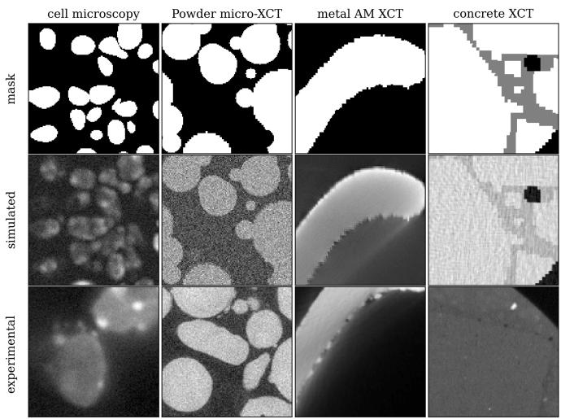  
Fig. 1: DDPM training data: cell microscopy, powder micro-XCT, metal AM XCT, and concrete XCT. Top row: simulation masks. Middle row: simulated response. Bottom row: unpaired experimental examples.

We use a linear diffusion schedule with $T = 1 0 0 0$ steps, $\beta _ { t = 1 } = 1 0 ^ { - 4 }$ , and $\beta _ { t = T } = 0 . 0 2$ . During training, the model receives two forms of conditioning. A one-hot domain label identifies the imaging domain, such as cell-real or powdersimulated, while simulated examples can additionally provide spatial masks identifying the material phases used by the physics-based simulation. We provide conditioning with probability $p _ { \mathrm { c o n d } } = 0 . 5 0$ , allowing the model to operate both conditionally and unconditionally. For all PnP reconstructions in this work, we evaluate the denoiser unconditionally.

We train the model for 650 epochs on an NVIDIA DGX system with eight H100 80 GB GPUs using the simplified noise-prediction objective of [21]. We use Adam with a learning rate of $1 0 ^ { - 5 }$ and a batch size of 256. On-the-fly augmentation consists of random $9 0 ^ { \circ }$ rotations and horizontal and vertical flips.

The prior operates on 2D images while the reconstruction is a 3D volume, so we apply the denoiser independently to each axial slice and restack the outputs. Because the network accepts fixed $1 2 8 \times 1 2 8$ inputs, we cover each slice with overlapping patches and recombine their outputs using weighted overlap-add. We use a separable squared-sine window that tapers to zero at each patch boundary, reducing seams where the patch predictions are least reliable.

## IV. IMPLEMENTATION DETAILS

## A. Datasets

We test our proposed method on three CT datasets, summarized in Table I. The datasets span two modalities (X-ray and neutron), two beam geometries (cone- and parallel-beam), both simulated and measured acquisitions, and three materials (nickel, steel, and concrete).

TABLE I: Overview of Datasets. The three datasets differ in imaging modality, beam geometry, and material. Bracketed entries give the input and reference acquisitions respectively. Both $_ { \mathrm { X - r a y } }$ datasets are beam hardening and scatter corrected before reconstruction. The cone-beam short scans span $1 8 0 ^ { \circ }$ plus the $1 7 ^ { \circ }$ fan angle, while the parallel-beam neutron scan requires only 180◦. Note that the nickel data is simulated, so it has no detector integration time; the equivalent photon budget is set by the noise added to its projections instead.
<table><tr><td></td><td>Nickel AM</td><td>Steel AM</td><td>Concrete Microstructure</td></tr><tr><td>Modality Geometry</td><td>X-ray</td><td>X-ray</td><td>Neutron</td></tr><tr><td>Data source</td><td>Cone-beam</td><td>Cone-beam</td><td>Parallel-beam</td></tr><tr><td>Angle range [Input, Ref.]</td><td>Simulated</td><td>Measured</td><td>Measured</td></tr><tr><td># of views [Input, Ref.]</td><td>[197°, 360°]</td><td>[197°, 197°]</td><td>[180°, 180°]</td></tr><tr><td>Integration time [Input, Ref.]</td><td>[145, 2132]</td><td>[1000, 1000]</td><td>[34, 546]</td></tr><tr><td></td><td></td><td>[0.6 s, 3.6 s]</td><td>[30 s, 30 s]</td></tr><tr><td>Reconstruction [Input, Ref.]</td><td>[FDK, FDK]</td><td>[FDK, MBIR]</td><td>[FBP, FBP]</td></tr><tr><td>Volume (slices × rows × cols)</td><td>1224×1122×1295</td><td>1264×1360×1360</td><td>2024×1048×1048</td></tr><tr><td>Voxel size (µm)</td><td>17.28</td><td>17.28</td><td>50</td></tr></table>

Simulated Ni AM part (cone-beam X-ray CT). Projections are generated from a CAD model of an AM nickel part and simulated with SpekPy [39], [40] at 200 kV through a $1 4 5 6 \times 1 8 4 0$ CsI detector with 0.127 mm pitch. The input short scan additionally carries added noise and simulated scatter, while the reference full scan has neither, so this dataset pairs sparse angular sampling with a controlled noise and scatter degradation. Both scans are polychromatic and both are corrected for scatter and beam hardening using LEAP [41] before reconstructing with FDK [5]. The reference is therefore not the CAD phantom itself, but a full-view, noise- and scatter-free acquisition carried through the same correction and reconstruction path as the input, which holds the beam physics fixed so that the metrics isolate the sparse-view and noise degradation.

Measured steel AM part (cone-beam X-ray CT). An AM 316L steel part is scanned at 200 kV with a 2 mm Al source filter. Input and reference are both 1000-view short scans acquired with different detector integration times, giving total acquisition times of 10 and 60 minutes respectively. The input is reconstructed with FDK and the reference with MBIR [42], both after scatter and beam hardening correction using LEAP [41].

Concrete microstructure (parallel-beam neutron CT). A concrete microstructure sample is imaged at the CG-1D beamline of the High Flux Isotope Reactor on a $2 0 4 8 \times 2 0 4 8$ detector, with a $7 \times 7$ median filter applied to the projection data to suppress salt-and-pepper noise in the measurement. The scan spans $1 8 0 ^ { \circ }$ with 546 projections; the input subsamples 34 of these, corresponding to roughly a 16× reduction in angular sampling. Unlike the other two datasets, the degradation here is purely angular, and both input and reference reconstructions use FBP. This is also the most out-of-distribution data relative to the prior’s predominantly X-ray training data.

## B. Baselines and Metrics

We compare the proposed PnP-Diffusion-ViT method against the analytic input reconstruction and PnP-BM3D [18].

PnP-BM3D uses the same PnP-ADMM algorithm, iteration count, and nominal denoising strength as the proposed method, with the BM3D noise level obtained using the same intensity normalization.

Metrics are computed against the reference reconstruction over a masked center sub-volume of 16 slices. The mask is obtained by Otsu thresholding the reference and filling interior holes so that internal voids and flaws remain included in the evaluation. We report the peak signal-to-noise ratio (PSNR), structural similarity index measure (SSIM) [43], and high-frequency error norm (HFEN) [44], where higher PSNR and SSIM indicate better agreement with the reference and lower HFEN indicates better high-frequency fidelity. HFEN measures the reconstruction error after Laplacian-of-Gaussian filtering, making it particularly sensitive to discrepancies in edges, fine structures, and other high-frequency features. PSNR and SSIM can favor over-smoothed reconstructions, so HFEN complements these metrics by penalizing the loss of high-frequency detail.

## C. Algorithmic Parameters

The physical step size γ depends strongly on the scale of each reconstruction, with its optimal value differing by two orders of magnitude across the three datasets. We therefore parameterize the algorithm using the dimensionless normalized denoising strength $\sigma = \gamma / s$ introduced in Section III-C. We select $\sigma = 0 . 2 5$ by a parameter sweep on the nickel AM dataset and use this value unchanged for the steel and concrete datasets. All reconstructions use 5 PnP iterations. Thus, the denoising strength and iteration count remain fixed as the imaging modality, geometry, material, and degradation type change.

To evaluate how well the selected denoising strength transfers, we also sweep σ independently on each dataset. The optimal values are $\sigma ^ { \star } = 0 . 2 5$ for nickel and $\sigma ^ { \star } = 0 . 2 9$ for both steel and concrete. The shared value $\sigma = 0 . 2 5$ therefore remains close to the independently optimized value for all three datasets, even though the corresponding physical step sizes γ differ by two orders of magnitude. Using the shared value instead of the per-dataset optimum reduces PSNR by at most 0.5 dB.

TABLE II: Quantitative comparison against the reference reconstruction. Best metric per dataset is bolded; higher is better for PSNR and SSIM and lower is better for HFEN. Time is reported in seconds per slice. A single denoising strength transfers across all three problems without retuning, giving the best HFEN on every dataset and the best PSNR and SSIM on the two measured ones. PnP-BM3D leads on PSNR and SSIM only for the simulated nickel data, whose additive noise matches the denoiser BM3D assumes.
<table><tr><td rowspan=1 colspan=1>Dataset</td><td rowspan=1 colspan=1>Method</td><td rowspan=1 colspan=1>PSNR</td><td rowspan=1 colspan=1>SSIM</td><td rowspan=1 colspan=1>HFEN</td><td rowspan=1 colspan=1>Time</td></tr><tr><td rowspan=2 colspan=1>Nickel AM</td><td rowspan=2 colspan=1>FDKPnP-BM3DPnP-Diffusion-ViT</td><td rowspan=2 colspan=1>9.44625.76925.292</td><td rowspan=1 colspan=1>0.026</td><td rowspan=2 colspan=1>3.7100.7440.733</td><td rowspan=2 colspan=1>0.00240.83.67</td></tr><tr><td rowspan=1 colspan=1>0.8230.737</td></tr><tr><td rowspan=1 colspan=1>Steel AM</td><td rowspan=1 colspan=1>FDKPnP-BM3DPnP-Diffusion-ViT</td><td rowspan=1 colspan=1>13.65024.58026.680</td><td rowspan=1 colspan=1>0.0600.6010.700</td><td rowspan=1 colspan=1>3.3310.8720.571</td><td rowspan=1 colspan=1>0.00847.79.59</td></tr><tr><td rowspan=3 colspan=1>Concrete</td><td rowspan=3 colspan=1>FBPPnP-BM3DPnP-Diffusion-ViT</td><td rowspan=1 colspan=1>14.872</td><td rowspan=1 colspan=1>0.256</td><td rowspan=1 colspan=1>1.796</td><td rowspan=1 colspan=1>0.001</td></tr><tr><td rowspan=2 colspan=1>16.81916.984</td><td rowspan=1 colspan=1>0.437</td><td rowspan=2 colspan=1>1.0260.985</td><td rowspan=2 colspan=1>27.82.12</td></tr><tr><td rowspan=1 colspan=1>0.450</td></tr></table>

## V. EXPERIMENTAL RESULTS

Figure 2 compares the reference reconstruction, analytic input, PnP-BM3D, and the proposed PnP-Diffusion-ViT reconstruction for each dataset. For the nickel AM part, the analytic input contains strong high-frequency noise that obscures the interior flaw structure. Both PnP methods suppress this noise and recover the flaws visible in the reference. For the steel AM part, the input contains both noise and a prominent ring artifact. PnP-Diffusion-ViT suppresses both while preserving the small interior flaws, whereas residual structured artifacts remain in the PnP-BM3D reconstruction. For the concrete sample, sparse angular sampling produces severe streaking that both PnP methods substantially reduce. The PnP reconstructions are smoother than the reference, particularly for PnP-BM3D, consistent with the HFEN values reported in Table II. The remaining degradation is most apparent for the concrete data, which differs most strongly from the training distribution in both imaging modality and material.

Table II reports metrics with respect to the reference reconstruction. PnP-Diffusion-ViT substantially improves on the analytic input for all three datasets using the same frozen prior and denoising strength. PSNR increases by 15.8 dB for nickel, 13.0 dB for steel, and 2.1 dB for concrete, while HFEN decreases by 80%, 83%, and 45%, respectively. These results demonstrate transfer across simultaneous changes in imaging modality, beam geometry, material, and degradation type without retraining or parameter retuning. Relative to PnP-BM3D, PnP-Diffusion-ViT achieves the best PSNR, SSIM, and HFEN on both measured datasets. It improves PSNR by 2.1 dB on steel and 0.17 dB on concrete. For the simulated nickel data, PnP-BM3D achieves 0.48 dB higher PSNR and 0.086 higher SSIM, while PnP-Diffusion-ViT achieves slightly lower

HFEN. The stronger PSNR and SSIM of BM3D on nickel are consistent with the approximately additive white Gaussian noise used in its simulation, which closely matches the noise model assumed by BM3D. PnP-Diffusion-ViT nevertheless achieves the lowest HFEN on all three datasets, indicating stronger preservation of high-frequency structure relative to the reference.

Table II also reports reconstruction time in seconds per slice, excluding data loading and output writing. The relevant comparison is between the two PnP methods rather than against the analytic reconstruction, which is orders of magnitude cheaper but yields a very low-quality reconstruction. Since PnP-Diffusion-ViT evaluates only one diffusion time step per PnP iteration, the K = 5 reconstructions require five network evaluations per slice rather than a full reverse diffusion trajectory. Runtime ranges from 2.1 to 9.6 s per slice on four NVIDIA H100 80 GB GPUs. PnP-BM3D requires 27.8 to 47.7 s per slice using the standard CPU implementation.

## VI. CONCLUSION

In this paper, we demonstrated that a diffusion model trained across several imaging domains can serve as a PnP prior for CT reconstruction problems that differ in modality, beam geometry, material, and degradation type, without retraining or test-time adaptation. Using a single deterministic DDIM step per PnP iteration avoids the cost of a full reverse diffusion trajectory while retaining the diffusion model as an effective denoiser. Across all three datasets, the proposed Diffusion-ViT prior substantially improves on the analytic reconstruction and achieves the lowest HFEN, indicating strong preservation of fine-scale structure. Moreover, a normalized denoising strength selected on the nickel dataset transfers unchanged to the steel and concrete datasets with at most a 0.5 dB loss in PSNR relative to per-dataset tuning, despite the corresponding physical step sizes differing by two orders of magnitude. These results support the use of broadly trained diffusion models as reusable priors across heterogeneous CT problems. Future work will compare the multimodal prior against architecturematched single-domain models to isolate the benefit of training across multiple imaging domains.

## REFERENCES

[1] A. Ziabari, S. V. Venkatakrishnan, Z. Snow, A. Lisovich, M. Sprayberry, P. Brackman, C. Frederick, P. Bhattad, S. Graham, P. Bingham, R. Dehoff, A. Plotkowski, and V. Paquit, “Enabling rapid X-ray CT characterisation for additive manufacturing using CAD models and deep learning-based reconstruction,” npj Computational Materials, vol. 9, no. 1, May 2023.

[2] H. Duba-Sullivan, O. Rahman, S. Venkatakrishnan, and A. Ziabari, “Using 2.5D super-resolution to improve flaw detection in metal additive manufacturing parts,” Nondestructive Testing and Evaluation, pp. 1–10, May 2026.

[3] A. Cheniour, A. K. Ziabari, and Y. Le Pape, “A mesoscale 3d model of irradiated concrete informed via a 2.5 u-net semantic segmentation,” Construction and Building Materials, vol. 412, p. 134392, 2024.

[4] L. A. Shepp and B. F. Logan, “The Fourier reconstruction of a head section,” IEEE Transactions on Nuclear Science, vol. 21, no. 3, pp. 21– 43, Jun. 1974.

[5] L. A. Feldkamp, L. C. Davis, and J. W. Kress, “Practical cone-beam algorithm,” Journal of the Optical Society of America A, vol. 1, no. 6, p. 612, Jun. 1984.

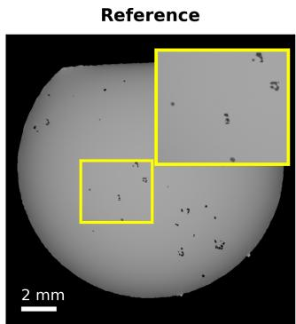

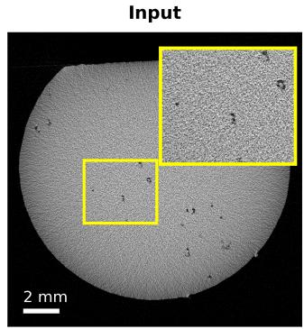

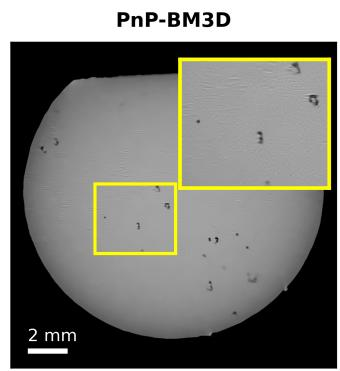  
(a) Simulated nickel AM part (cone-beam X-ray CT)

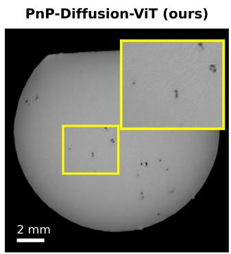

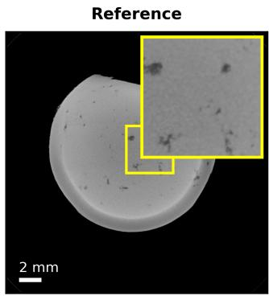

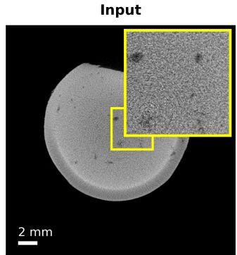

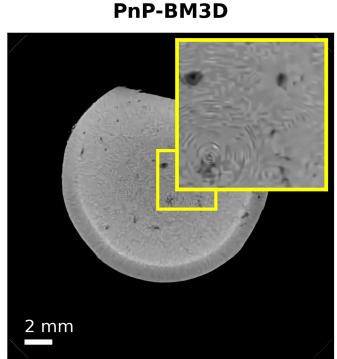  
(b) Measured steel AM part (cone-beam X-ray CT)

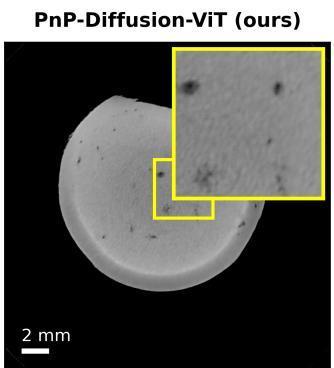

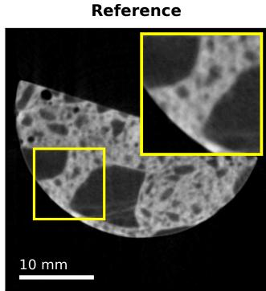

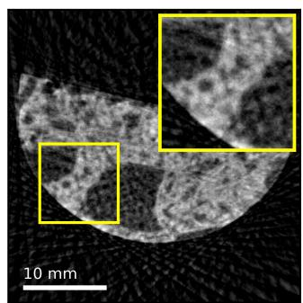

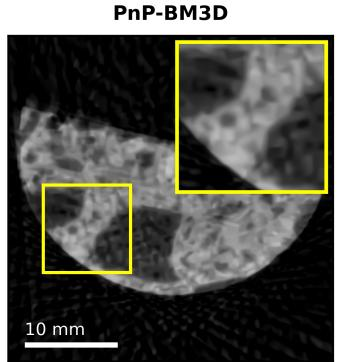  
(c) Measured concrete microstructure (parallel-beam neutron CT)

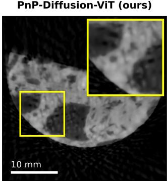  
Fig. 2: Qualitative comparison for each dataset. Columns from left to right show the reference reconstruction, the analytic input, the PnP-BM3D reconstruction, and the proposed PnP-Diffusion-ViT reconstruction. Both PnP reconstructions use the same algorithmic parameters $( \sigma = 0 . 2 5 , K = 5 )$ . The same frozen prior removes the dominant degradation of all three problem (noise, ring artifacts, and sparse-view streaking) while retaining fine structure that BM3D smooths away.

[6] S. V. Venkatakrishnan, C. A. Bouman, and B. Wohlberg, “Plug-and-Play priors for model based reconstruction,” in 2013 IEEE Global Conference on Signal and Information Processing, Dec. 2013, pp. 945–948.

[7] S. H. Chan, X. Wang, and O. A. Elgendy, “Plug-and-Play ADMM for Image Restoration: Fixed Point Convergence and Applications,” IEEE Transactions on Computational Imaging, vol. 3, no. 1, pp. 84–98, Mar. 2017.

[8] U. S. Kamilov, C. A. Bouman, G. T. Buzzard, and B. Wohlberg, “Plug-and-Play Methods for Integrating Physical and Learned Models in Computational Imaging: Theory, algorithms, and applications,” IEEE Signal Processing Magazine, vol. 40, no. 1, pp. 85–97, Jan. 2023.

[9] H. Duba-Sullivan, A. Pramanik, S. Venkatakrishnan, and A. Ziabari, “Plug-and-Play with 2.5D Artifact Reduction Prior for Fast and Accurate Industrial Computed Tomography Reconstruction,” Journal of Nonde-

structive Evaluation, vol. 44, no. 4, Oct. 2025.

[10] A. Graikos, N. Malkin, N. Jojic, and D. Samaras, “Diffusion models as plug-and-play priors,” Advances in Neural Information Processing Systems, vol. 35, pp. 14 715–14 728, 2022.

[11] Z. Wu, Y. Sun, Y. Chen, B. Zhang, Y. Yue, and K. L. Bouman, “Principled probabilistic imaging using diffusion models as plug-and-play priors,” Advances in Neural Information Processing Systems, vol. 37, pp. 118 389–118 427, 2024.

[12] C. Y. Park, Y. Hu, M. T. McCann, C. Garcia-Cardona, B. Wohlberg, and U. S. Kamilov, “Plug-and-Play Priors as a Score-Based Method,” in 2025 IEEE International Conference on Image Processing (ICIP), Sep. 2025, pp. 49–54.

[13] Y. Zhu, K. Zhang, J. Liang, J. Cao, B. Wen, R. Timofte, and L. V. Gool, “Denoising Diffusion Models for Plug-and-Play Image Restora-

tion,” in 2023 IEEE/CVF Conference on Computer Vision and Pattern Recognition Workshops (CVPRW), Jun. 2023, pp. 1219–1229.

[14] T. Efimov, S. Venkatakrishnan, M. Hossain, H. Duba-Sullivan, and A. Ziabari, “Cross-Modal Guidance for Fast Diffusion-Based Computed Tomography,” in ICASSP 2026 - 2026 IEEE International Conference on Acoustics, Speech and Signal Processing (ICASSP). IEEE, May 2026, pp. 11 562–11 566.

[15] H. Chung and J. C. Ye, “Deep diffusion image prior for efficient ood adaptation in 3d inverse problems,” in European Conference on Computer Vision. Springer, 2024, pp. 432–455.

[16] R. Barbano, A. Denker, H. Chung, T. H. Roh, S. Arridge, P. Maass, B. Jin, and J. C. Ye, “Steerable conditional diffusion for out-ofdistribution adaptation in medical image reconstruction,” IEEE Transactions on Medical Imaging, vol. 44, no. 5, pp. 2093–2104, 2025.

[17] S. Boyd, N. Parikh, E. Chu, B. Peleato, and J. Eckstein, “Distributed Optimization and Statistical Learning via the Alternating Direction Method of Multipliers,” Foundations and Trends® in Machine Learning, vol. 3, no. 1, pp. 1–122, Jul. 2011.

[18] K. Dabov, A. Foi, V. Katkovnik, and K. Egiazarian, “Image Denoising by Sparse 3-D Transform-Domain Collaborative Filtering,” IEEE Transactions on Image Processing, vol. 16, no. 8, pp. 2080–2095, Aug. 2007.

[19] K. Zhang, Y. Li, W. Zuo, L. Zhang, L. Van Gool, and R. Timofte, “Plug-and-Play Image Restoration with Deep Denoiser Prior,” IEEE Transactions on Pattern Analysis and Machine Intelligence, vol. 44, no. 10, pp. 6360–6376, Oct. 2022.

[20] E. K. Ryu, J. Liu, S. Wang, X. Chen, Z. Wang, and W. Yin, “Plug-and-Play Methods Provably Converge with Properly Trained Denoisers,” in Proceedings of the 36th International Conference on Machine Learning, ser. Proceedings of Machine Learning Research, vol. 97. PMLR, 2019, pp. 5546–5557.

[21] J. Ho, A. Jain, and P. Abbeel, “Denoising diffusion probabilistic models,” Advances in neural information processing systems, vol. 33, pp. 6840– 6851, 2020.

[22] Y. Song, J. Sohl-Dickstein, D. P. Kingma, A. Kumar, S. Ermon, and B. Poole, “Score-based generative modeling through stochastic differential equations,” arXiv preprint arXiv:2011.13456, 2020.

[23] A. Q. Nichol and P. Dhariwal, “Improved denoising diffusion probabilistic models,” in International conference on machine learning. PmLR, 2021, pp. 8162–8171.

[24] T. Karras, M. Aittala, T. Aila, and S. Laine, “Elucidating the design space of diffusion-based generative models,” Advances in neural information processing systems, vol. 35, pp. 26 565–26 577, 2022.

[25] Y. Song, L. Shen, L. Xing, and S. Ermon, “Solving inverse problems in medical imaging with score-based generative models,” arXiv preprint arXiv:2111.08005, 2021.

[26] W. Xia, Y. Shi, C. Niu, W. Cong, and G. Wang, “Diffusion prior regularized iterative reconstruction for low-dose ct,” arXiv preprint arXiv:2310.06949, 2023.

[27] H. Chung, D. Ryu, M. T. Mccann, M. L. Klasky, and J. C. Ye, “Solving 3D Inverse Problems Using Pre-Trained 2D Diffusion Models,” in 2023 IEEE/CVF Conference on Computer Vision and Pattern Recognition (CVPR). IEEE, Jun. 2023, pp. 22 542–22 551.

[28] M. Hossain, H. Duba-Sullivan, and A. Ziabari, “Regularizing INR with Diffusion Prior for Self-Supervised 3D Reconstruction OF Neutron Computed Tomography Data,” in ICASSP 2026 - 2026 IEEE International Conference on Acoustics, Speech and Signal Processing (ICASSP). IEEE, May 2026, pp. 21 947–21 951.

[29] N. J. Thomsen, X. Wang, F. Lucka, and E. Demircan-Tureyen, “Towards reconstructing experimental sparse-view x-ray ct data with diffusion models,” arXiv preprint arXiv:2602.12755, 2026.

[30] H. Zheng, W. Chu, B. Zhang, Z. Wu, A. Wang, B. Feng, C. Zou, Y. Sun, N. Kovachki, Z. Ross et al., “Inversebench: Benchmarking plugand-play diffusion priors for inverse problems in physical sciences,” in International Conference on Learning Representations, vol. 2025, 2025, pp. 90 912–90 940.

[31] M. Terris, S. Hurault, M. Song, and J. Tachella, “Reconstruct Anything Model: a lightweight foundation model for computational imaging,” in ICLR 2026 - Fourteenth International Conference on Learning Representations, Rio de Janeiro (BR), Brazil, Apr. 2026.

[32] W. Xia, C. Niu, and G. Wang, “Tomographic Foundation Model— FORCE: Flow-Oriented Reconstruction Conditioning Engine,” IEEE Transactions on Medical Imaging, pp. 1–1, 2026.

[33] W. Peebles and S. Xie, “Scalable Diffusion Models with Transformers,” in 2023 IEEE/CVF International Conference on Computer Vision (ICCV), Oct. 2023, pp. 4195–4205.

[34] A. Dosovitskiy, L. Beyer, A. Kolesnikov, D. Weissenborn, X. Zhai, T. Unterthiner, M. Dehghani, M. Minderer, G. Heigold, S. Gelly et al., “An image is worth 16x16 words: Transformers for image recognition at scale,” arXiv preprint arXiv:2010.11929, 2020.

[35] J. Song, C. Meng, and S. Ermon, “Denoising diffusion implicit models,” arXiv preprint arXiv:2010.02502, 2020.

[36] A. Ziabari, S. Venkatakrishnan, M. Kirka, P. Brackman, R. Dehoff, P. Bingham, and V. Paquit, “Beam hardening artifact reduction in x-ray ct reconstruction of 3d printed metal parts leveraging deep learning and cad models,” in ASME International Mechanical Engineering Congress and Exposition, vol. 84492. American Society of Mechanical Engineers, 2020, p. V02BT02A043.

[37] A. Ziabari, D. C. Rose, A. Shirinifard, and D. Solecki, “Yolo2u-net: Detection-guided 3d instance segmentation for microscopy,” Pattern Recognition Letters, vol. 181, pp. 37–42, 2024.

[38] A. Ziabari, S. Venkatakrishnan, P. R. Bingham, M. M. Kirka, V. C. Paquit, R. R. Dehoff, and A. Dubey, “System and method for artifact reduction of computed tomography reconstruction leveraging artificial intelligence and a priori known model for the object of interest,” Feb. 3 2022, uS Patent App. 17/392,645.

[39] G. Poludniowski, A. Omar, R. Bujila, and P. Andreo, “Technical Note: SpekPy v2.0—a software toolkit for modeling x-ray tube spectra,” Medical Physics, vol. 48, no. 7, pp. 3630–3637, Jun. 2021.

[40] R. Bujila, A. Omar, and G. Poludniowski, “A validation of SpekPy: A software toolkit for modelling X-ray tube spectra,” Physica Medica, vol. 75, pp. 44–54, Jul. 2020.

[41] H. Kim and K. Champley, “Differentiable forward projector for x-ray computed tomography,” arXiv preprint arXiv:2307.05801, 2023.

[42] J.-B. Thibault, K. D. Sauer, C. A. Bouman, and J. Hsieh, “A threedimensional statistical approach to improved image quality for multislice helical CT,” Medical Physics, vol. 34, no. 11, pp. 4526–4544, Oct. 2007.

[43] Z. Wang, A. Bovik, H. Sheikh, and E. Simoncelli, “Image quality assessment: From error visibility to structural similarity,” IEEE Transactions on Image Processing, vol. 13, no. 4, pp. 600–612, Apr. 2004.

[44] S. Ravishankar and Y. Bresler, “Mr image reconstruction from highly undersampled k-space data by dictionary learning,” IEEE transactions on medical imaging, vol. 30, no. 5, pp. 1028–1041, 2010.