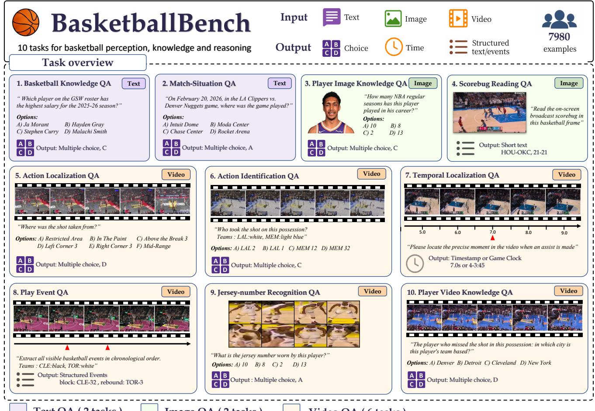
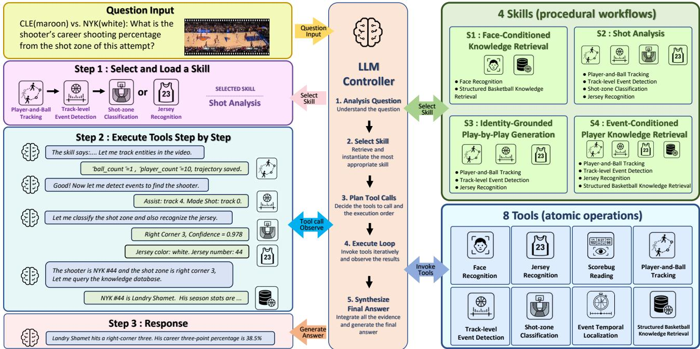
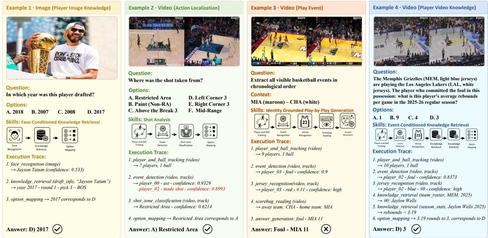

# Towards Comprehensive Basketball Understanding

Yirong Hu<sup>1</sup>, Jiayuan Rao<sup>2</sup>, Yu Zhang<sup>2</sup>, Shangzhe Di<sup>2</sup>, Weidi Xie<sup>2</sup>

<sup>1</sup>School of Mathematical Sciences, Peking University, China

<sup>2</sup>School of Artificial Intelligence, Shanghai Jiao Tong University, China

huyirong@stu.pku.edu.cn, {jy\_rao, zhangyu2012, weidi}@sjtu.edu.cn, shangzhe.di@gmail.com

## Abstract

Understanding a basketball game requires recognizing events, localizing actions, identifying players, and relating these to structured game knowledge. Existing benchmarks primarily evaluate these abilities one at a time, leaving the interactions among these abilities under-explored. We introduce BasketballBench, a multimodal benchmark comprising 7,980 questions across ten tasks in text, image, and video. It is built from the 2025–2026 NBA season and includes oficial playby-play, rosters and profiles for 530 active players, and 2,501 possession-level broadcast clips. We further propose BasketballSkills, an agent that composes eight basketball-specific perception and retrieval tools under four reusable skills that specify tool order, evidence bindings, and stopping conditions. Experiments show that current MLLMs struggle particularly on questions requiring the integration of multiple capabilities, whereas BasketballSkills outperforms them, highlighting the efectiveness of explicitly composing domain-specific capabilities for comprehensive basketball understanding.

## 1 Introduction

Multimodal large language models (MLLMs) have made substantial progress in visual recognition and question answering, yet reliable understanding of professional basketball remains challenging. Understanding a single basketball play may require a model to recognize the event, identify the relevant players, localize the action in space and time, interpret the broadcast context, and connect visual evidence with structured basketball knowledge. We refer to the integration of these heterogeneous sources of evidence as comprehensive basketball understanding.

Research on sports understanding has addressed a broad spectrum of capabilities, ranging from player- and eventlevel perception to tasks such as professional QA, rule-aware reasoning, long-form temporal analysis, and multi-view understanding (Ramanathan et al. 2016; Li et al. 2021; Cui et al. 2023; Meng et al. 2026; Li et al. 2024; Rao et al. 2024; Xia et al. 2025, 2026; Cao et al. 2026; Chen et al. 2026; Pan, Zhang, and Bertasius 2025). Existing works still tend to evaluate these capabilities separately, often using diferent annotation schemes, output formats, and sports, while some recent work has begun to bring multiple capabilities together within a unified framework (Rao et al. 2025a). This motivates a basketball-specific benchmark for evaluating their composition and a structured framework for organizing them into reusable procedures.

To provide a unified evaluation setting, we construct BasketballBench, a multimodal benchmark comprising 7,980 annotated instances across ten basketball-specific tasks, examining basketball understanding from three perspectives: (1) basketball knowledge and retrieval, (2) broadcast and player perception, and (3) spatiotemporal and event understanding. The ten tasks span text, image, and video inputs and range from single-capability tests to composite questions so that the contributing capabilities can be read of separately. This organization supports consistent model comparison and fine-grained error diagnosis, while revealing a recurring set of basketball-specific capabilities that can be further formalized and composed as reusable skills.

To turn these recurring capabilities into executable components, we introduce BasketballSkills, a hierarchical framework comprising eight atomic tools and four reusable procedural skills. The tools perform basketball-specific perception and retrieval operations, while the skills organize them into multi-step workflows dynamically selected and executed by a language-model controller, with each tool call validated by a lightweight verifier. Together, they support all ten benchmark tasks without predefined task labels or fixed pipelines, while keeping intermediate evidence inspectable.

In summary, we make three contribution in this work: (i) we introduce BasketballBench, a comprehensive multimodal benchmark that evaluates basketball understanding through ten tasks covering both individual capabilities and their composition; (ii) we present BasketballSkills, a unified framework that represents basketball-specific capabilities as reusable and composable skills and dynamically selects them according to the question and available evidence; (iii) through systematic experiments across all benchmark tasks, we show that BasketballSkills outperforms the best commercial MLLM on eight of the ten tasks. Together, these contributions establish a unified foundation for evaluating, diagnosing, and advancing knowledge-grounded and skillcomposable sports understanding.

## 2 Related Work

Sports understanding and evaluation. Sports understanding has been studied across multiple levels of analysis, from player- and event-level perception (Giancola et al. 2018; Deliège et al. 2021; Rao et al. 2025b) to structured game interpretation. Representative work has examined event and key-actor localization (Ramanathan et al. 2016), dense spatiotemporal action detection (Li et al. 2021), multi-object tracking under fast motion and similar player appearance (Cui et al. 2023), and jersey-number recognition (Koshkina and Elder 2024). Within basketball, specialized studies have further addressed court calibration (Sha et al. 2020), player identification (Senocak et al. 2018), knowledge-enhanced description (Wang et al. 2021; Xi et al. 2025) and fine-grained player evaluation (Pan, Zhang, and Bertasius 2025). These eforts provide important perceptual and structural components, but they are generally developed and evaluated as separate problems. More recent benchmarks have extended sports evaluation toward professional question answering and multimodal reasoning. Sports-QA studies descriptions, tempora relations, causality, and counterfactual reasoning (Li et al. 2024); SPORTU and SportR examine rule- and strategyaware reasoning (Xia et al. 2025, 2026); and SportsTime and SportMV-Bench expand evaluation to long-form temporal evidence and multiple camera views (Cao et al. 2026; Chen et al. 2026). Despite this broader coverage, these benchmarks provide limited evaluation of how capabilities interact.

Skills for multimodal reasoning. Complex multimodal problems are increasingly addressed through modular reasoning, in which language models decompose a request and interact with external operations. ReAct interleaves reasoning with actions and observations (Yao et al. 2023), while VisProg and ProViQ translate natural-language requests into executable visual or video programs (Gupta and Kembhavi 2023; Choudhury et al. 2024). Beyond task-specific programs, Voyager and MMSkills explore reusable skill representations that allow procedural knowledge to be stored, adapted, and composed across tasks (Wang et al. 2024; Zhang et al. 2026a). In sports, SportMV-Agent applies iterative planning and evidence collection to multi-view reasoning (Chen et al. 2026).

Existing modular and skill-based systems, however, are mainly designed for general-purpose environments or narrowly defined reasoning settings. They do not explicitly organize the capabilities of a professional sport into a shared set of domain-grounded, executable skills that can also be evaluated systematically. Therefore, we built BasketballSkills that extend this line of research by representing basketballspecific capabilities as reusable skills with explicit inputs, outputs, and dependencies.

## 3 BasketballBench

This section first presents the benchmark overview in Section 3.1, then describes its data sources and tasks in Sections 3.2 and 3.3, and finally summarizes the construction procedure in Section 3.4.

## 3.1 Overview

Comprehensive basketball understanding requires models to demonstrate several complementary capabilities, including domain knowledge, visual perception, spatial-temporal understanding, and event-level reasoning. These aspects examine whether a model can retrieve basketball facts, recognize players and broadcast information, understand where and when actions occur, and recover structured events from game footage. Based on this capability taxonomy, BasketballBench contains 7,980 QA pairs across ten tasks with text, image, and video inputs. Unlike most sports benchmarks, BasketballBench links visual events to spatial locations, timestamps, participants, on-court identities, and structured basketball knowledge at the instance level.

## 3.2 Data Sources

BasketballBench is built from three complementary data sources from the 2025–2026 NBA season.

Broadcast Videos. We select 2,501 possession-level broadcast clips following the test split of BasketEvent (Zhang et al. 2026b). Each clip is associated with its source game and aligned with the corresponding structured play-by-play records.

Structured Records. We collect schedules, oficial playby-play records, game oficials, team metadata, and gamespecific uniform assignments from NBA.com (National Basketball Association 2026b) and Sportradar (Sportradar 2026). We additionally collect the rosters and coaching stafs of all 30 teams and profiles for 530 active players. These records are normalized into a relational SQL database that supports reproducible question generation and answer retrieval.

Player Images. We collect two complementary image sets for the 530 active players. First, we obtain one oficial headshot per player from NBA.com, forming a canonical reference collection linked to the player profiles in our SQL database. Second, we manually collect 400 additional photographs for use as the visual inputs to the playeridentification examples. Each additional photograph is manually verified to depict the associated player and to be diferent from that player’s oficial headshot. The identity links are retained only as benchmark annotations and are not exposed as part of the visual input. This separation ensures that the evaluated systems must identify players across diferent images rather than retrieve an identical reference photograph.

## 3.3 Benchmark Tasks

BasketballBench comprises ten tasks spanning diferent input modalities, answer formats, and levels of reasoning complexity. To organize this diversity in a coherent manner, we group the tasks into three categories based on the types of evidence they use and the reasoning required to derive an answer. Table 1 summarizes the main settings of each task, while Figure 1 provides representative examples.

Basketball Knowledge and Retrieval. This group evaluates basketball knowledge under diferent forms of knowledge context. (1) Basketball Knowledge QA covers general facts about players, teams, schedules, and statistics. (2) Match-situation QA focuses on information associated with a specific game. (3) Player Image Knowledge QA & (4) Player Video Knowledge QA combine player recognition with knowledge-based question answering that the model must identify the relevant player and then retrieve further information.

  
Figure 1: Representative examples of the ten BasketballBench tasks. The benchmark covers diferent aspects with outputs ranging from multiple-choice answers and timestamps to structured event sequences.

Broadcast and Player Perception. This group focuses on information that must be extracted directly from basketball broadcasts. (1) Scorebug Reading QA consists of two modes: recovering the current teams and score, and recovering the game clock information from broadcast graphics. (2) Jersey-Number Recognition QA aggregates evidence across multiple frames to identify a partially visible player number, while (3) Action Identification QA associates an observed basketball action (e.g. shot) with its corresponding player identity. Together, these tasks cover broadcast-level, player-level, and action-level visual evidence.

Spatiotemporal and Event Understanding. The remaining tasks examine how basketball actions are situated and organized within a possession. (1) Action Localization QA determines the spatial region from which an action is finished, and (2) Temporal Localization QA localizes a target action in either video time or game-clock coordinates. (3) Play Event QA moves beyond a single prediction by recovering an ordered sequence of visible events and their participants. These tasks therefore progress from spatial and temporal localization to structured interpretation of a complete possession.

## 3.4 Benchmark Construction

We construct the ten tasks by instantiating manually designed QA templates from structured records and pairing them with player photographs or event-aligned clips when needed. Scorebug annotations combine source-game metadata with initial predictions from Qwen3.6-27B (Qwen Team 2026b), while SAM 3 (Carion et al. 2025)-derived trajectories support jersey annotation; all model-assisted labels are manually verified. Aligned events, participants, game clocks, and shot locations are converted into task-specific targets, with shots mapped to six court regions and participants represented by game-specific color–number pairs. Further construction details are provided in the Supplementary Materials.

Human quality control. The amount of human verification depends on the provenance and dificulty of each task. Q1 and Q2 are generated directly from structured oficial database records and do not receive additional instance-level human review. For Q3, the oficial gallery headshots are not separately audited; however, all 400 evaluation photographs are manually collected and checked to ensure that each image depicts the corresponding player and is diferent from that player’s oficial headshot. For Q4, Qwen3.6-27B produces 300 candidate examples, from which human reviewers select 200 correct and readable examples for inclusion in the benchmark, corresponding to a retention rate of 66.7%. Q5 and Q6 are generated from structured play-by-play, shot, roster, and game metadata without additional instance-level human review.

<table><tr><td>Index Task</td><td></td><td>Input</td><td>Samples</td><td>Output</td><td>Primary capability</td></tr><tr><td>Q1</td><td>Basketball Knowledge QA</td><td>Text</td><td>1,200</td><td>Multiple Choice</td><td>Domain Knowledge Grounding</td></tr><tr><td>Q2</td><td>Match-Situation QA</td><td>Text</td><td>1,200</td><td>Multiple Choice</td><td>Contextual Retrieval</td></tr><tr><td>Q3</td><td>Player Image Knowledge QA</td><td>Image</td><td>400</td><td>Multiple Choice</td><td>Domain Knowledge Grounding</td></tr><tr><td>Q4</td><td>Scorebug Reading QA</td><td>Image</td><td>200</td><td>Structured Text</td><td>Broadcast Understanding</td></tr><tr><td>Q5</td><td>Action Localization QA</td><td>Video</td><td>600</td><td>Multiple Choice</td><td>Spatial Understanding</td></tr><tr><td>Q6</td><td>Action Identification QA</td><td>Video</td><td>500</td><td>Multiple Choice</td><td>Player Identification</td></tr><tr><td>Q7</td><td>Temporal Localization QA</td><td>Video</td><td>1,580</td><td>Timestamp</td><td>Temporal Understanding</td></tr><tr><td>Q8</td><td>Play Event QA</td><td>Video</td><td>1,000</td><td>Structured Events</td><td>Event Understanding</td></tr><tr><td>Q9</td><td>Jersey-Number Recognition QA</td><td>Video</td><td>300</td><td>Multiple Choice</td><td>Broadcast Understanding</td></tr><tr><td>Q10</td><td>Player Video Knowledge QA</td><td>Video</td><td>1,000</td><td>Multiple Choice</td><td>Domain Knowledge Grounding</td></tr></table>

Table 1: BasketballBench comprises 7,980 examples across 10 tasks, covering text, image, and video inputs, and assesses basic perceptual abilities, basketball domain knowledge, and reasoning.

## 4.1 Problem Formulation

Q7 receives full manual timestamp annotation because timestamps in oficial play-by-play records can lag the visible occurrence of an event by several seconds. For each of the 790 target event instances, the clip-relative video timestamp and the corresponding game-clock time are manually reannotated. Each annotation is subsequently converted into two questions, resulting in 1,580 Q7 questions. All 1,000 Q8 examples are manually checked for event completeness, temporal order, event type, team, and participant jersey number. This review corrects 258 examples (25.8%), while the remaining 742 are verified without modification. For Q9, Qwen3.5-27B produces the initial candidates, all of which are manually reviewed; only correct and unambiguous candidates are retained, yielding 300 final examples. Q10 is generated from aligned play-by-play and player metadata without additional instance-level human review. For tasks without instance-level human review, we still apply deterministic schema validation, missing-field filtering, and duplicate removal during construction.

## 4 Methodology

This section presents BasketballSkills, a hierarchical framework for answering basketball questions. We first formulate the problem and clarify the roles of queries, tools, skills, and the controller in Section 4.1. Then in Section 4.2, we introduce the architecture, including the two-level libraries and the on-demand skill-loading mechanism. Finally, Section 4.3 presents the workflow of BasketballSkills.

We formulate BasketballSkills as a framework for solving these heterogeneous questions through reusable basketballspecific skills with atomic tools. Let $x = ( q , m )$ denote a multimodal basketball query, where $q$ is a textual query and m represents context, including images, videos, and game metadata. BasketballSkills consists of three components: (1) an atomic tool library $\mathcal { T } = \{ \tau _ { 1 } , \ldots , \tau _ { N } \}$ , in which each tool performs a single, clearly defined operation; (2) a skill library $\boldsymbol { S } = \{ s _ { 1 } , \ldots , s _ { M } \}$ , where each skill $s _ { k }$ organizes multiple tools into a reusable procedure; and (3) language-model controller $\pi _ { \theta }$ that interprets the query, selects the skills, and coordinates the corresponding executions. Formally, each tool is a typed operator $\tau _ { j } : \mathcal { X } _ { j }  \mathcal { O } _ { j }$ , where $\chi _ { j }$ and ${ \mathcal { O } } _ { j }$ denote its input and output spaces. When invoked with arguments $u _ { i }$ , a tool returns a structured result

$$
o _ { i } = \tau _ { j _ { i } } ( u _ { i } ) ,\tag{1}
$$

which may be used by the controller or passed to subsequent tools. Tool invocation is optional and dynamically determined by the query and intermediate results. Denote ${ \mathcal { F } } _ { \pi _ { \theta } }$ as the complete inference process coordinated by the controller, the overall objective is to generate an answer y as

$$
y = \mathcal { F } _ { \pi _ { \theta } } ( x ; \boldsymbol { S } , \mathcal { T } ) ,\tag{2}
$$

## 4.2 Skills Architecture

BasketballSkills adopts a two-level architecture consisting of atomic tools and composite skills. As shown in Figure 2, tools provide responses through standardized interfaces, while skills organize multiple tools into reusable workflows, with all the details in Supplementary Materials.

Tool Library. Our atomic tool library T comprises 8 tools spanning visual perception and structured basketball knowledge. Specifically, it includes seven perception tools: (1)face recognition, (2) jersey recognition, (3) scorebug reading, (4) player-and-ball tracking, (5) track-level event detection, (6) shot-zone classification, and (7) event temporal localization; and one knowledge tool: (8) structured basketball knowledge retrieval, which queries records of players, teams, games, and statistics. Each tool exposes typed inputs and structured outputs, allowing evidence produced by one tool to be consumed by subsequent operations.

  
Figure 2: BasketballSkills Architecture Overview. BasketballSkills selectively loads the appropriate skills for each task and, following their guidance, composes and invokes specialized tools to complete the task.

Tool Implementations. All tools are implemented using open-source models. Here, we introduce the basic implementations of diferent tool groups.

(1) Face recognition. We use the open-source face recognition library (Geitgey 2017) to encode an input face and match it against the gallery of oficial player headshots.

(2) Prompted visual reading. The tools of scorebug reading, jersey recognition, and event temporal localization share a Qwen3.5-9B (Qwen Team 2026a) backend. Each tool receives its supported visual materials with a task-specific prompt and returns a typed output, such as scorebug fields, jersey attributes, or an event timestamp.

(3) Player-and-ball tracking. We combine SAM 3 (Carion et al. 2025) with a fine-tuned RF-DETR (Robinson et al. 2026) for player-and-ball tracking, using RF-DETR detections to filter erroneous SAM trajectories.

(4) Event and shot-zone models. We use PlayNet (Zhang et al. 2026b) to recognize event types and associate them with participant tracks. For shot-zone classification, we add a six-class classification head to PlayNet and fine-tune it to predict the court region of the target shot.

(5) Structured basketball knowledge retrieval. This tool exposes fixed query interfaces over the SQL database described in Section 3.2, including player, roster, schedule, game, and statistical records, with a controller determining the invocation order and composing their responses with perceptual evidence.

Skill Library. The composite skill library S contains four reusable basketball workflows built upon the atomic tool library T. Each skill specifies tool ordering, intermediate evidence flow, and task-specific output construction.

(1) Face-Conditioned Knowledge Retrieval. This skill invokes the Face Recognition and Structured Basketball Knowledge Retrieval tool to identify a player from a face image to the corresponding profile information.

(2) Shot Analysis. This skill combines Player-and-Ball Tracking with Track-Level Event Detection to locate a target shot and its shooter track. It then invokes Shot-Zone Classification or Jersey Recognition according to the query, using the provided team-color mapping to resolve the shooter’s on-court identity when needed.

(3) Identity-Grounded Play-by-Play Generation This skill uses Player-and-Ball Tracking and Track-Level Event Detection to recover ordered events and their participant tracks. Jersey Recognition then grounds participating tracks to team and jersey-number identities, which are serialized into a chronological play-by-play record.

(4) Event-Conditioned Player Knowledge Retrieval. This skill locates the participant of a specified video event through tracking and event detection, resolves the player from jersey attributes and team context, and retrieves the requested information through Structured Basketball Knowledge Retrieval.

## 4.3 Inference Workflow

At inference time, the DeepSeek-V4-Flash controller (DeepSeek-AI et al. 2026) receives the multimodal query x, the atomic tool library T , and a lightweight catalog of the skill library S. It invokes a relevant skill in the workflow as:

$$
s _ { k } = \mathrm { S e l e c t } ( { \boldsymbol { x } } , { \boldsymbol { S } } ) , \qquad { \boldsymbol { y } } = \pi _ { \boldsymbol { \theta } } ( { \boldsymbol { x } } ; \mathrm { l o a d } ( s _ { k } ) , { \boldsymbol { \mathcal { T } } } ) .\tag{3}
$$

The controller then invokes tools according to the loaded skill and adapts subsequent calls based on their observations. Each call is validated by a lightweight verifier, and the final answer is generated once suficient evidence has been collected.

## 5 Experiments

We first describe the experimental setup in Section 5.1, then report the main results in Section 5.2. Section 5.3–5.4 present ablations and representative execution traces.

## 5.1 Experimental Setup

We present the experimental setup and main metrics for each benchmark task. Reproducibility details and additional metrics are in the Supplementary Materials.

Baselines and Inference Protocol. We compare BasketballSkills with three commercial MLLMs (GPT-5.4 (OpenAI 2026), Claude Sonnet 5 (Anthropic 2026) and Gemini 3.5 Flash (Google DeepMind 2026)) and six opensource models (Qwen3.5-4B, Qwen3.5-9B (Qwen Team 2026a), Qwen2.5-VL-7B (Bai et al. 2025), VideoLLaMA3- 7B (Zhang et al. 2025), InternVL3.5-8B (Wang et al. 2025), and Molmo2-8B (Clark et al. 2026)). All the videos are sampled at 2 fps, except that the Jersey Recognition tool uses uniformly sampled 8 crops of the same player. VideoLLaMA3- 7B is evaluated on Q7 and Q8, but none of its outputs satisfy the required task-specific schemas. Under our allexample evaluation convention, these outputs receive zero credit rather than being excluded from evaluation.

Output Formats and Metrics. Q1–Q3, Q6, Q9, and Q10 are four-way multiple-choice tasks, while Q5 uses six shotzone choices; all are evaluated by accuracy. Q4 returns structured scorebug fields and is evaluated by exact match. Q7 contains two equally sized temporal-localization modes. The video-timestamp mode predicts the elapsed time within the clip, whereas the game-clock mode predicts the period and remaining game time. Both modes are evaluated using all-example Acc@1s, treating unparseable outputs as incorrect. The primary Q7 score is the macro-average of videotimestamp and game-clock Acc@1s. Q8 returns a chronological event sequence and is evaluated by full-event F1, where a match requires both the event type and participants to be correct. Detailed evaluation protocols are provided in the Supplementary Materials.

## 5.2 Main Results

General-purpose MLLMs. Table 2 reveals strongly taskdependent performance among general-purpose MLLMs. (1) Direct visual reading. Their clearest strength lies in relatively direct tasks that primarily require OCR, such as Q4 and Q9. (2) Player–event grounding. They are much less efective at binding an event to the player involved. On Q6, a model must first identify the shooter associated with the event and then recover the player’s jersey identity; every MLLM performs worse on this task than on Q9, which directly asks for a jersey number from player crops. The detailed Q8 results in Table 3 provide further evidence: event-type F1 is consistently much higher than full-event F1, for which the associated participants must also be correct. Moreover, when the event-relevant player is explicitly highlighted in Q5 and Q6, performance improves markedly across all evaluated MLLMs (Table 4), confirming that player–event grounding is a major bottleneck. (3) Knowledge-intensive understanding. General-purpose MLLMs perform considerably worse on tasks that require basketball knowledge or game-specific retrieval, particularly Q1–Q3 and Q10.

Overall, no general-purpose MLLM performs consistently across the benchmark: the best modality-level averages are only 53.1 % on TextQA, 70.5 % on ImageQA, and 65.1% on VideoQA. The performance gap is especially pronounced between relatively direct visual tasks, where scores reach 94.0 % on Q4 and 95.0 % on Q9, and more demanding tasks involving event composition or knowledge grounding, where the best results are only 29.8 % on Q8 and 53.0 % on Q10.

BasketballSkills. (1) Overall performance. Basketball-Skills achieves the best result on eight of the ten tasks, including a tie on Q9. (2) Knowledge-intensive tasks. It substantially outperforms all general-purpose MLLMs on Q1– Q3. (3) Compositional tasks. Its advantages also extend to Q5, Q6, Q8, and Q10, which require diferent combinations of event recognition, player grounding, OCR, spatial understanding, and knowledge retrieval. These results show that BasketballSkills can select and compose complementary basketball-specific skills, enabling it to solve multi-stage tasks more efectively than a single general-purpose MLLM. Notably, it surpasses the strongest general-purpose baseline by 59.0 percentage points on Q2, 39.5 percentage points on Q3, and 30.7 percentage points on Q10.

## 5.3 Ablations

Table 5 demonstrates that procedural skills substantially streamline execution for complex multimodal queries. The most pronounced gain appears on VideoQA, where the average number of tool calls decreases from 4.36 to 3.63 per query, corresponding to a 16.74% reduction, while aggregate performance remains comparable at 72.34%, indicating that procedural skills are most beneficial when coordination demands are high. TextQA and ImageQA performance is likewise preserved, indicating that the skill-guided controller reduces unnecessary exploration without compromising its ability to solve the underlying tasks. These results highlight the value of procedural skills in organizing long, multi-tool reasoning workflows, with their eficiency advantage becoming particularly evident on video-based questions.

## 5.4 Qualitative Results

Figure 3 presents the complete BasketballSkills workflow through several representative examples, including skill selection, tool execution, intermediate observations, and final answer generation. The third case illustrates a failure: BasketballSkills unnecessarily invokes Scorebug Reading to identify the two teams, reflecting an overly cautious tool-use strategy. The same example also produces an incorrect final answer because Track-Level Event Detection returns an erroneous result, illustrating how upstream tool failures can propagate through subsequent grounding and answer generation. Together, these cases reveal remaining challenges in both tool reliability and execution control.

<table><tr><td rowspan="2">Model</td><td colspan="2">TextQA</td><td colspan="2">ImageQA</td><td colspan="6">VideoQA</td><td colspan="3">Overall</td></tr><tr><td>Q1</td><td>Q2</td><td>Q3</td><td>Q4</td><td>Q5</td><td>Q6</td><td>Q7</td><td>Q8</td><td>Q9</td><td>Q10</td><td>Text</td><td>Image</td><td>Video</td></tr><tr><td colspan="10">Commercial APIs</td><td></td><td></td><td></td><td></td></tr><tr><td>GPT-5.4</td><td>64.6</td><td>37.7</td><td>47.5</td><td>93.5</td><td>57.2</td><td>85.4</td><td>77.5</td><td>29.8</td><td>92.3</td><td>48.7</td><td>51.2</td><td>70.5</td><td>65.1</td></tr><tr><td>Claude Sonnet 5</td><td>54.1</td><td>8.1</td><td>36.5</td><td>92.5</td><td>23.5</td><td>55.8</td><td>51.3</td><td>14.3</td><td>89.7</td><td>45.4</td><td>31.1</td><td>64.5</td><td>46.7</td></tr><tr><td>Gemini 3.5 Flash</td><td>65.9</td><td>40.2</td><td>36.6</td><td>94.0</td><td>41.5</td><td>78.2</td><td>63.2</td><td>27.0</td><td>94.3</td><td>53.0</td><td>53.1</td><td>65.3</td><td>59.5</td></tr><tr><td colspan="10">Open-Source Models</td><td></td><td></td><td></td><td></td></tr><tr><td>Qwen2.5-VL-7B</td><td>37.3</td><td>36.8</td><td>29.6</td><td>75.5</td><td>19.7</td><td>34.2</td><td>23.0</td><td>1.6</td><td>92.3</td><td>36.5</td><td>37.1</td><td>52.6</td><td>34.6</td></tr><tr><td>Qwen3.5-4B</td><td>36.9</td><td>30.8</td><td>33.6</td><td>77.5</td><td>22.5</td><td>38.6</td><td>48.4</td><td>8.2</td><td>93.3</td><td>34.3</td><td>33.9</td><td>55.6</td><td>40.9</td></tr><tr><td>Qwen3.5-9B</td><td>42.2</td><td>34.6</td><td>36.3</td><td>66.5</td><td>19.7</td><td>47.2</td><td>47.2</td><td>10.4</td><td>93.7</td><td>39.7</td><td>38.4</td><td>51.4</td><td>43.0</td></tr><tr><td>VideoLLaMA3-7B</td><td>34.2</td><td>34.1</td><td>28.0</td><td>63.5</td><td>18.5</td><td>46.8</td><td>0</td><td>0</td><td>91.7</td><td>37.3</td><td>34.2</td><td>45.8</td><td>32.4</td></tr><tr><td>InternVL3.5-8B</td><td>41.1</td><td>34.1</td><td>29.0</td><td>66.0</td><td>16.7</td><td>38.6</td><td>13.1</td><td>0.5</td><td>95.0</td><td>42.3</td><td>37.6</td><td>47.5</td><td>34.4</td></tr><tr><td>Molmo2-8B</td><td>41.6</td><td>36.8</td><td>30.8</td><td>66.0</td><td>18.8</td><td>32.8</td><td>21.5</td><td>0.1</td><td>91.0</td><td>36.9</td><td>39.2</td><td>48.4</td><td>33.5</td></tr><tr><td>BasketballSkills (Ours)</td><td>93.3</td><td>99.2</td><td>87.0</td><td>88.0</td><td>69.8</td><td>91.8</td><td>47.8</td><td>45.9</td><td>95.0</td><td>83.7</td><td>96.3</td><td>87.5</td><td>72.3</td></tr></table>

Table 2: Performance comparison across the ten BasketballBench tasks and their modality-level averages. Scores are reported using the primary metric of each task, and the best result in each column is highlighted in bold. Overall scores are computed a macro-averages over the corresponding tasks.

<table><tr><td>Model</td><td>Full-event F1</td><td>Event-type F1</td><td>JSON Validity</td><td>Participant Accuracy</td></tr><tr><td colspan="5">Commercial APIs</td></tr><tr><td>GPT-5.4</td><td>29.8</td><td>59.6</td><td>99.9</td><td>46.7</td></tr><tr><td>Claude-Sonnet-5</td><td>14.3</td><td>43.9</td><td>95.5</td><td>24.5</td></tr><tr><td>Gemini 3.5 Flash</td><td>27.0</td><td>51.8</td><td>97.8</td><td>49.4</td></tr><tr><td colspan="5">Open-Source Models</td></tr><tr><td>Qwen2.5-VL-7B</td><td>1.6</td><td>27.5</td><td>100.0</td><td>5.1</td></tr><tr><td>Qwen3.5-4B</td><td>8.2</td><td>39.1</td><td>100.0</td><td>20.6</td></tr><tr><td>Qwen3.5-9B</td><td>10.4</td><td>45.8</td><td>99.9</td><td>22.2</td></tr><tr><td>VideoLLaMA3-7B</td><td>0.0</td><td>0.0</td><td>0.0</td><td>0.0</td></tr><tr><td>InternVL3.5-8B</td><td>0.5</td><td>11.0</td><td>100.0</td><td>2.7</td></tr><tr><td>Molmo2-8B</td><td>0.1</td><td>4.7</td><td>100.0</td><td>1.9</td></tr><tr><td>BasketballSkills</td><td>45.9</td><td>60.9</td><td>100.0</td><td>70.6</td></tr></table>

Table 3: Four complementary Q8 metrics. Full-event F1 requires both event type and participants to match, whereas event-type F1 ignores participant identity.

## 6 Conclusion

We introduced BasketballBench, a comprehensive multimodal benchmark comprising 7,980 questions across ten tasks spanning text, image, and video modalities. Our experiments reveal that current MLLMs remain limited in the fine-grained spatial and temporal perception of basketball games. Their performance degrades further on compositional questions that require multiple capabilities, such as jointly recognizing events and players, localizing actions in space and time, and incorporating basketball knowledge. To address these challenges, we developed BasketballSkills, a hierarchical agent that organizes basketball-specific tools into reusable procedural skills. BasketballSkills outperforms general-purpose MLLMs, demonstrating the efectiveness of composing specialized perception and retrieval capabilities for comprehensive basketball understanding. Together, BasketballBench and BasketballSkills provide a foundation for advancing fine-grained, compositional multimodal understanding in basketball and other complex sports domains.

<table><tr><td rowspan="2">Model</td><td colspan="3">Q5</td><td colspan="3">Q6</td></tr><tr><td>Raw</td><td>Target</td><td>∆</td><td>Raw</td><td>Target</td><td>Δ</td></tr><tr><td>GPT-5.4 Claude Sonnet 5</td><td>57.2 23.5</td><td>61.5 33.7</td><td>+4.3 +10.2</td><td>85.4 55.8</td><td>97.0 84.4</td><td>+11.6 +28.6</td></tr><tr><td>Gemini 3.5 Flash Qwen3.5-9B</td><td>41.5 19.7</td><td>47.8 36.3</td><td>+6.3 +16.7</td><td>78.2 47.2</td><td>94.6 85.8</td><td>+16.4 +38.6</td></tr><tr><td>Molmo2-8B</td><td>18.8</td><td>21.5</td><td>+2.7</td><td>32.8</td><td>45.0</td><td>+12.2</td></tr><tr><td>InternVL3.5-8B Mean</td><td>16.7</td><td>17.3</td><td>+0.7</td><td>38.6</td><td>49.4</td><td>+10.8</td></tr></table>

Table 4: Efect of target-player grounding on Q5 and Q6. Raw uses the original video, whereas Target highlights the ground-truth event-relevant player with a bounding box in every frame. ∆ denotes the absolute improvement in percentage points, computed from unrounded accuracies.

  
Figure 3: Representative BasketballSkills execution examples. Each example visualizes the selected skill, invoked tool sequence, intermediate observations, and final prediction. Both the successful and failed cases further illustrate how evidence is composed and how upstream errors may propagate to the answer.

<table><tr><td rowspan="2">Modality</td><td colspan="2">Performance (↑)</td><td colspan="2">Tool Calls (↓)</td></tr><tr><td>No Skills Skills</td><td>Rel. ∆ No Skills</td><td>Skills</td><td>Rel. ∆</td></tr><tr><td>TextQA</td><td>95.92 96.21</td><td>+0.30%</td><td>2.32 2.26</td><td>-2.36%</td></tr><tr><td>ImageQA</td><td>92.25 92.25</td><td>0.00%</td><td>2.04 2.00</td><td>-2.33%</td></tr><tr><td>VideoQA</td><td>72.76 72.34</td><td>-0.58%</td><td>4.36 3.63</td><td>-16.74%</td></tr></table>

Table 5: Modality-level ablation of procedural skills in BasketballSkills. Values are macro-averaged over tasks within each modality. Relative change is computed from unrounded modality averages as (Skills−No Skills)/No Skills×100%.

## References

Aharon, N.; Orfaig, R.; and Bobrovsky, B.-Z. 2022. BoT-SORT: Robust Associations Multi-Pedestrian Tracking. arXiv preprint arXiv:2206.14651.

Anthropic. 2026. Claude Sonnet 5 System Card. https: //www.anthropic.com/claude-sonnet-5-system-card. Accessed: 2026-07-27.

Bai, S.; Chen, K.; Liu, X.; Wang, J.; Ge, W.; Song, S.; Dang, K.; Wang, P.; Wang, S.; Tang, J.; Zhong, H.; Zhu, Y.; Yang, M.; Li, Z.; Wan, J.; Wang, P.; Ding, W.; Fu, Z.; Xu, Y.; Ye, J.; Zhang, X.; Xie, T.; Cheng, Z.; Zhang, H.; Yang, Z.; Xu, H.; and Lin, J. 2025. Qwen2.5-VL Technical Report. arXiv preprint arXiv:2502.13923.

Cao, S.; Zhang, L.; Zeng, R.; and Liu, Z.-Y. 2026. Towards Temporal Compositional Reasoning in Long-Form Sports Videos. arXiv preprint arXiv:2604.22226.

Carion, N.; Gustafson, L.; Hu, Y.-T.; Debnath, S.; Hu, R.; Suris, D.; Ryali, C.; Alwala, K. V.; Khedr, H.; Huang, A.;

Lei, J.; Ma, T.; Guo, B.; Kalla, A.; Marks, M.; Greer, J.; Wang, M.; Sun, P.; Radle, R.; Afouras, T.; Mavroudi, E.; Xu, K.; Wu, T.-H.; Zhou, Y.; Momeni, L.; Hazra, R.; Ding, S.; Vaze, S.; Porcher, F.; Li, F.; Li, S.; Kamath, A.; Cheng, H. K.; Dollar, P.; Ravi, N.; Saenko, K.; Zhang, P.; and Feichtenhofer, C. 2025. SAM 3: Segment Anything with Concepts. arXiv preprint arXiv:2511.16719.

Chen, K.; Wang, J.; Zhang, X.; and Lu, Y. 2026. Beyond the Single Camera: Agentic Multi-View Reasoning in Sports Video Understanding. arXiv preprint arXiv:2607.11844.

Choudhury, R.; Niinuma, K.; Kitani, K. M.; and Jeni, L. A. 2024. Video Question Answering with Procedural Programs. In Computer Vision – ECCV2024, 315–332. Springer Nature Switzerland.

Clark, C.; Zhang, J.; Ma, Z.; Park, J. S.; Tripathi, R.; Lee, S.; Salehi, M.; Ren, J.; Kim, C. D.; Yang, Y.; Shao, V.; Yang, Y.; Huang, W.; Gao, Z.; Anderson, T.; Zhang, J.; Jain, J.; Stoica, G.; Farhadi, A.; and Krishna, R. 2026. Molmo2: Open Weights and Data for Vision-Language Models with Video Understanding and Grounding. In Proceedings of the IEEE/CVF Conference on Computer Vision and Pattern Recognition (CVPR), 28652–28668.

Cui, Y.; Zeng, C.; Zhao, X.; Yang, Y.; Wu, G.; and Wang, L. 2023. SportsMOT: A Large Multi-Object Tracking Dataset in Multiple Sports Scenes. In Proceedings of the IEEE/CVF International Conference on Computer Vision (ICCV), 9921–9931.

DeepSeek-AI; et al. 2026. DeepSeek-V4: Towards Highly Eficient Million-Token Context Intelligence. arXiv preprint arXiv:2606.19348.

Deliège, A.; Cioppa, A.; Giancola, S.; Seikavandi, M. J.; Dueholm, J. V.; Nasrollahi, K.; Ghanem, B.; Moeslund, T. B.; and Van Droogenbroeck, M. 2021. SoccerNet-v2: A Dataset and Benchmarks for Holistic Understanding of Broadcast Soccer Videos. In Proceedings of the IEEE/CVF Conference on Computer Vision and Pattern Recognition (CVPR) Workshops, 4508–4519.

Geitgey, A. 2017. face\_recognition: A Face Recognition Library for Python. https://github.com/ageitgey/face\_ recognition. Accessed: 2026-07-29.

Giancola, S.; Amine, M.; Dghaily, T.; and Ghanem, B. 2018. SoccerNet: A Scalable Dataset for Action Spotting in Soccer Videos. In Proceedings of the IEEE Conference on Computer Vision and Pattern Recognition (CVPR) Workshops, 1711– 1721.

Google DeepMind. 2026. Gemini 3.5 Flash: Model Card. https://deepmind.google/models/model-cards/gemini-3-5- flash/. Accessed: 2026-07-27.

Gupta, T.; and Kembhavi, A. 2023. Visual Programming: Compositional Visual Reasoning Without Training. In Proceedings of the IEEE/CVF Conference on Computer Vision and Pattern Recognition (CVPR), 14953–14962.

Koshkina, M.; and Elder, J. H. 2024. A General Framework for Jersey Number Recognition in Sports Video. In Proceedings of the IEEE/CVF Conference on Computer Vision and Pattern Recognition (CVPR) Workshops, 3235–3244.

Li, H.; Deng, A.; Liu, J.; Rahmani, H.; Guo, Y.; Schiele, B.; Bennamoun, M.; and Ke, Q. 2024. Sports-QA: A Large-Scale Video Question Answering Benchmark for Complex and Professional Sports. arXiv preprint arXiv:2401.01505.

Li, Y.; Chen, L.; He, R.; Wang, Z.; Wu, G.; and Wang, L. 2021. MultiSports: A Multi-Person Video Dataset of Spatio-Temporally Localized Sports Actions. In Proceedings of the IEEE/CVF International Conference on Computer Vision (ICCV), 13536–13545.

Meng, Z.; Song, W.; Hu, Y.; Rao, J.; and Chen, G. 2026. SoccerRef-Agents: Multi-Agent System for Automated Soccer Refereeing. In Sports Analytics: Third International Conference, ISACE 2026, Proceedings, volume 16610 of Lecture Notes in Computer Science, 403–427. Springer.

National Basketball Association. 2026a. NBA LockerVision. https://lockervision.nba.com/. Accessed: 2026-07-31.

National Basketball Association. 2026b. NBA.com: The Oficial Website of the National Basketball Association. https://www.nba.com/. Accessed: 2026-07-27.

OpenAI. 2026. GPT-5.4 Thinking System Card. https: //openai.com/index/gpt-5-4-thinking-system-card/. Accessed: 2026-07-27.

Pan, Y.; Zhang, C.; and Bertasius, G. 2025. BASKET: A Large-Scale Video Dataset for Fine-Grained Skill Estimation. In Proceedings of the IEEE/CVF Conference on Computer Vision and Pattern Recognition (CVPR), 28952– 28962.

Qwen Team. 2026a. Qwen3.5: Towards Native Multimodal Agents. https://qwen.ai/blog?id=qwen3.5. Accessed: 2026- 07-27.

Qwen Team. 2026b. Qwen3.6-27B: Flagship-Level Coding in a 27B Dense Model. https://qwen.ai/blog?id=qwen3.6- 27b. Accessed: 2026-07-29.

Ramanathan, V.; Huang, J.; Abu-El-Haija, S.; Gorban, A.; Murphy, K.; and Fei-Fei, L. 2016. Detecting Events and Key Actors in Multi-Person Videos. In Proceedings of the IEEE Conference on Computer Vision and Pattern Recognition (CVPR), 3043–3053.

Rao, J.; Li, Z.; Wu, H.; Zhang, Y.; Wang, Y.; and Xie, W. 2025a. Multi-Agent System for Comprehensive Soccer Understanding. In Proceedings of the 33rd ACM International Conference on Multimedia, 3654–3663.

Rao, J.; Wu, H.; Jiang, H.; Zhang, Y.; Wang, Y.; and Xie, W. 2025b. Towards Universal Soccer Video Understanding. In Proceedings of the IEEE/CVF Conference on Computer Vision and Pattern Recognition (CVPR), 8384–8394.

Rao, J.; Wu, H.; Liu, C.; Wang, Y.; and Xie, W. 2024. MatchTime: Towards Automatic Soccer Game Commentary Generation. In Proceedings of the 2024 Conference on Empirical Methods in Natural Language Processing, 1671– 1685. Association for Computational Linguistics.

Robinson, I.; Robicheaux, P.; Popov, M.; Ramanan, D.; and Peri, N. 2026. RF-DETR: Neural Architecture Search for Real-Time Detection Transformers. In International Conference on Learning Representations.

Senocak, A.; Oh, T.-H.; Kim, J.; and Kweon, I. S. 2018. Part-Based Player Identification Using Deep Convolutional Representation and Multi-Scale Pooling. In Proceedings of the IEEE Conference on Computer Vision and Pattern Recognition (CVPR) Workshops, 1732–1739.

Sha, L.; Hobbs, J.; Felsen, P.; Wei, X.; Lucey, P.; and Ganguly, S. 2020. End-to-End Camera Calibration for Broadcast Videos. In Proceedings of the IEEE/CVF Conference on Computer Vision and Pattern Recognition (CVPR), 13627– 13636.

Sportradar. 2026. NBA API Basics. https://developer. sportradar.com/basketball/docs/nba-ig-api-basics. Accessed: 2026-07-29.

Wang, G.; Xie, Y.; Jiang, Y.; Mandlekar, A.; Xiao, C.; Zhu, Y.; Fan, L.; and Anandkumar, A. 2024. Voyager: An Open-Ended Embodied Agent with Large Language Models. Transactions on Machine Learning Research.

Wang, T.; Zhang, R.; Lu, Z.; Zheng, F.; Cheng, R.; and Luo, P. 2021. End-to-End Dense Video Captioning with Parallel Decoding. In Proceedings of the IEEE/CVF International Conference on Computer Vision (ICCV), 6847–6857.

Wang, W.; Gao, Z.; Gu, L.; Pu, H.; Cui, L.; Wei, X.; Liu, Z.; Jing, L.; Ye, S.; Shao, J.; et al. 2025. InternVL3.5: Advancing Open-Source Multimodal Models in Versatility, Reasoning, and Eficiency. arXiv preprint arXiv:2508.18265.

Xi, Z.; Shi, G.; Li, X.; Yan, J.; Li, Z.; Wu, L.; Liu, Z.; and Wang, L. 2025. A Simple Yet Efective Knowledge Guided Method for Entity-Aware Video Captioning on a Basketball Benchmark. Neurocomputing, 619: 129177.

Xia, H.; Ge, H.; Zou, J.; Choi, H. W.; Zhang, X.; Suradja, D.; Rui, B.; Tran, E.; Jin, W.; Ye, Z.; Lin, X.; Lai, C.; Zhang,

S.; Miao, J.; Chen, S.; Tracy, R.; Ordonez, V.; Shen, W.; and Chen, H. 2026. SportR: A Benchmark for Multimodal Large Language Model Reasoning in Sports. In International Conference on Learning Representations.

Xia, H.; Yang, Z.; Zou, J.; Tracy, R.; Wang, Y.; Lu, C.; Lai, C.; He, Y.; Shao, X.; Xie, Z.; Wang, Y.-F.; Shen, W.; and Chen, H. 2025. SPORTU: A Comprehensive Sports Understanding Benchmark for Multimodal Large Language Models. In International Conference on Learning Representations.

Yao, S.; Zhao, J.; Yu, D.; Du, N.; Shafran, I.; Narasimhan, K.; and Cao, Y. 2023. ReAct: Synergizing Reasoning and Acting in Language Models. In International Conference on Learning Representations.

Zhang, B.; Li, K.; Cheng, Z.; Hu, Z.; Yuan, Y.; Chen, G.; Leng, S.; Jiang, Y.; Zhang, H.; Li, X.; Jin, P.; Zhang, W.; Wang, F.; Bing, L.; and Zhao, D. 2025. VideoLLaMA 3: Frontier Multimodal Foundation Models for Image and Video Understanding. arXiv preprint arXiv:2501.13106.

Zhang, K.; Shao, S.; Li, Q.; Lin, J.; Fu, L.; Wang, S.; Jiao, W.; Lu, Y.; Liu, W.; Zhang, W.; and Yu, Y. 2026a. MMSkills: Towards Multimodal Skills for General Visual Agents. arXiv preprint arXiv:2605.13527.

Zhang, Y.; Rao, J.; Wu, H.; and Xie, W. 2026b. BasketEvent: Understanding Who Did What and When in Basketball Videos. arXiv preprint arXiv:2607.21267.

## Supplementary Material Towards Comprehensive Basketball Understanding

## Contents

A BasketballBench Construction and Specifications 12   
A.1 Data Sources 12   
A.2 Structured Basketball Knowledge Base 12   
A.3 Benchmark Construction Protocol 13   
A.4 Task Definitions and Generation 13   
B BasketballSkills Architecture and Implementation 15   
B.1 Agent Architecture 15   
B.2 Atomic Tool Library 15   
B.3 Composite Skill Library 18   
B.4 Complete Agent-Visible Prompts 18   
C Additional Evaluation Results 23   
C.1 Evaluation Metrics 23   
C.2 Fine-Grained Results 24

# A BasketballBench Construction and Specifications

This section describes the data sources, structured knowledge base, common construction protocol, and task-specific generation procedures of BasketballBench.

## A.1 Data Sources

BasketballBench integrates structured basketball records, oficial player images, possession-level broadcasts with game metadata, play-by-play (PBP) records, and game-specific uniform metadata. Instances are anchored in the 2025–2026 NBA season, with historical statistics and drafts retained where needed. All sources are frozen before generation.

Structured Basketball Records. Sportradar’s NBA API (Sportradar 2026) provides information on all 30 franchises, including teams, coaches, players, season statistics, schedules, game and period summaries, box scores, oficials, injuries, drafts, and free agents. The normalized SQLite database described in Section A.2 grounds the four knowledge-oriented tasks.

Player Images. NBA.com (National Basketball Association 2026b) supplies one oficial headshot for each of 530 registered players, forming the face-recognition gallery. We additionally collect 400 evaluation photographs, each manually verified to depict the associated player and to be distinct from that player’s oficial gallery headshot.

Broadcast Videos and Associated Game Metadata. The video set comprises 2,501 possession-level broadcasts from the BasketEvent test split (Zhang et al. 2026b), covering 33 games in 2025–2026. The 1280 × 720, 25-fps clips last 3.48–18.96 s (mean 9.45 s; standard deviation 1.81 s). Each clip is linked to its game date, teams, and active rosters, including game-specific jersey numbers. These metadata support PBP alignment and conversion of identity annotations into observable participant labels; they are not model inputs unless explicitly included in a task prompt.

Play-by-play Records. NBA.com (National Basketball Association 2026b) provides 43,558 chronological PBP events from 266 games, including all 33 video-source games. Each record specifies the game clock, action, participants, and, when applicable, shot outcome and location. We use ten event types—made shot, missed shot, free throw, rebound, turnover, foul, steal, assist, block, and jump ball—and six shot regions: Restricted Area, In the Paint (Non-RA), Mid-Range, Above the Break 3, Left Corner 3, and Right Corner 3. A clip may align with several consecutive PBP events (Section A.3.2).

Game-specific Uniform Metadata. NBA LockerVision (National Basketball Association 2026a) provides reference images for the uniform editions of all 30 teams and the edition assigned to each team in each 2025–2026 game. GPT-5.4 (OpenA 2026) identifies dominant and secondary colors from the static reference images; these descriptions are normalized to canonical English labels and manually verified (Section A.3.3). Joining the game assignment with team and roster metadata converts a PBP identity into a visible color–number label (e.g., white-23); prompts then map colors to team tricodes. LockerVision data and derived colors are used only for ofline construction and verification: they are neither stored in the structured basketball knowledge base described in Section A.2 nor exposed to tools or evaluated models. GPT-5.4 never annotates or answers questions about benchmark broadcast clips.

## A.2 Structured Basketball Knowledge Base

Overview. NBA\_DB is a SQLite knowledge base comprising 18 normalized tables derived from Sportradar records. It grounds the four knowledge-oriented tasks while keeping generated questions, choices, visual annotations, and sample mappings outside the database.

A.2.1 Temporal Snapshot and Data Coverage The primary snapshot corresponds to the 2025–2026 NBA season and covers games from the October 2025 preseason through Game 5 of the NBA Finals on June 13, 2026. It contains 1,423 schedule records across preseason, regular-season, in-season tournament, play-in, and postseason competition, with detailed box scores for all 1,230 regular-season games. Historical player-season statistics cover season years 2012–2025, and draft records span 2003–2026. Table A.1 summarizes the benchmark-relevant coverage.

A.2.2 Logical Organization The tables form four conceptual modules: team and player records (profiles, rosters, coaches, jersey numbers, and drafts); season records (afiliations and statistics); schedules (games and teams); and game details (summaries, oficials, box scores, and period statistics). Season totals and per-game averages are separated so that templates can specify their statistical scope.

A.2.3 Entity Relationships Player profiles link to current rosters, drafts, and season-specific afiliations, which in turn link to total and per-game statistics. Separating current membership from historical afiliation prevents present-day team or jersey data from being applied to another season. Schedules connect the home and away teams to summaries, oficials, box scores, and period records, preserving the player, team, season, and game context of each fact.

A.2.4 Use in Benchmark Construction Templates specify the required entities, temporal constraints, relations, and answer type. Basketball Knowledge QA retrieves profiles, rosters, drafts, schedules, and season statistics; Match-Situation QA uses game and period records. The two visual knowledge tasks first resolve a player and then retrieve the requested fact. Questions, answers, and distractors are stored separately, leaving NBA\_DB as a reusable factual source.

<table><tr><td rowspan=1 colspan=1>Data Category</td><td rowspan=1 colspan=1>Coverage</td><td rowspan=1 colspan=1>Scale</td></tr><tr><td rowspan=1 colspan=1>Teams</td><td rowspan=1 colspan=1>All current NBA teams</td><td rowspan=1 colspan=1>30 teams</td></tr><tr><td rowspan=1 colspan=1>Players</td><td rowspan=1 colspan=1>Player profiles, including a small number of box-score-only stub records</td><td rowspan=1 colspan=1>633 players</td></tr><tr><td rowspan=1 colspan=1>Seasonal schedules</td><td rowspan=1 colspan=1>All 2025–2026 games across PRE, REG, IST, PIT, and PST</td><td rowspan=1 colspan=1>1,423 games</td></tr><tr><td rowspan=1 colspan=1>Detailed game records</td><td rowspan=1 colspan=1>Team-, player-, and period-level box scores for all regular-season games</td><td rowspan=1 colspan=1>1,230 games</td></tr><tr><td rowspan=1 colspan=1>Player seasons</td><td rowspan=1 colspan=1>Player-team affiliations by season and competition type, covering season years2012-2025</td><td rowspan=1 colspan=1>7,940 records</td></tr><tr><td rowspan=1 colspan=1>Player-season statistics</td><td rowspan=1 colspan=1>Season totals and per-game averages across the collected statistical fields</td><td rowspan=1 colspan=1>15,880 rows</td></tr><tr><td rowspan=1 colspan=1>Draft records</td><td rowspan=1 colspan=1>NBA draft records from 2003 through 2026</td><td rowspan=1 colspan=1>551 records</td></tr><tr><td rowspan=1 colspan=1>Officials</td><td rowspan=1 colspan=1>Referee profiles and regular-season game assignments</td><td rowspan=1 colspan=1>82 officials, 3,714assignments</td></tr></table>

Table A.1: Coverage of the structured basketball knowledge base.

## A.3 Benchmark Construction Protocol

A.3.1 General Generation Procedure Each task defines admissible source entities, answer relations, and an unambiguous output schema. Before quota-based sampling, we remove missing or unresolved fields, duplicate prompts, and cases admitting multiple answers. Multiple-choice answers are derived from source records; type-compatible distractors use other observed categorical values or nearby numerical values, with no duplicate choices and balanced answer positions. Open-ended answers are serialized from aligned annotations under a fixed schema.

Multimodal instances additionally require consistent links between visual evidence and source records: image questions must consistently link the evaluation photograph, the oficial gallery headshot, the roster entry, and the database profile to the same player, while video questions require aligned PBP events, participant attributes, and game metadata.

A.3.2 Video–Record Alignment and Temporal Annotation Each clip is first linked to its source game and the correspond ing PBP interval, retaining the ordered events, participants, shot outcomes, and shot locations recorded in the oficial data. As an initial automatic alignment stage, we process all 4,244 possession clips in the BasketEvent test split before task-specific sampling. Each clip is sampled at 1 fps, and Qwen3.6-27B (Qwen Team 2026b) reads the scorebug clock in every sampled frame, producing a per-second mapping between clip-relative video time and game-clock time. We retain only clips for which all sampled scorebugs are readable and the recovered clocks form a consistent countdown sequence; clips with clock stoppages, missing or unreadable scorebugs, or inconsistent OCR results are excluded. Matching an event’s oficial PBP clock to thi mapping provides an initial estimate of its clip-relative video timestamp. However, this automatically derived timestamp is not used as the final temporal ground truth. Oficial PBP timestamps may lag the visually observable occurrence of an event by one or two seconds, and the 1-fps OCR mapping introduces additional temporal quantization. We therefore manually reannotate all 790 target-event instances selected for Temporal Localization QA (Q7). For each instance, annotators inspect the clip and record both the clip-relative video timestamp of the visible event and the corresponding period and remaining game-clock value shown in the broadcast at that moment. These manually corrected annotations serve as the final reference labels for the video-timestamp and game-clock modes of Q7. The OCR-based mapping and oficial PBP timestamps are used only for candidate alignment and quality filtering. Game-day rosters and uniform assignments convert source identities into team, jersey-number, and color attributes. Prompts expose the two team–color correspondences, allowing outputs to use observable team and jersey labels rathe than hidden player identities.

A.3.3 Uniform-Color Normalization Edition-level colors are mapped to a controlled English vocabulary and joined with each game’s home and away assignments. Tasks requiring color grounding retain only games with unambiguous metadata for both teams. Model-assisted descriptions are manually checked against the reference images before use.

## A.4 Task Definitions and Generation

The benchmark contains 7,980 instances: 2,400 text, 600 image, and 4,980 video questions. Below we summarize task-specific selection and answer construction; shared rules follow Section A.3. The examples transcribe released benchmark instances; line breaks and list formatting are compacted for typesetting, while the options and output constraints are preserved. Videos are identified by game and clip IDs because the same assets are shared across video tasks.

A.4.1 Q1: Basketball Knowledge QA This text-only task contains 1,200 four-way questions from 47 manually designed types spanning player profiles, team attributes, rosters and coaches, drafts, 2025–2026 statistics, career aggregates, and schedules. Candidates require valid entity links, and season questions distinguish totals from per-game averages. Templates retrieve and type-normalize the reference value; distractors use other observed categorical values or nearby values of the same statistic. Examples are allocated across question types, with answers balanced over A–D.

Media. None (text-only input).   
Prompt. What is Deandre Ayton’s career regular-season total rebounds? A. 4453; B. 4742; C. 5101; D. 5113. Return only the letter of your choice (A, B, C, or D), with no extra   
words.   
Ground truth. B (4742).

A.4.2 Q2: Match-Situation QA This task contains 1,200 four-way questions (40 per type) about specific regular-season games. Its 30 types cover game context, final and period scores, oficials, attendance, lead changes and ties, box scores, leaders, player statistics, and derived outcomes. Date and matchup must uniquely identify a game with all required records. References join schedules with summaries, oficials, period scoring, and box scores; distractors are valid same-domain names, venues, or nearby numerical values. Answer positions are balanced.

Media. None (text-only input).   
Prompt. On March 12, 2026, in the Indiana Pacers vs. Phoenix Suns game, who was the top scorer of the game? A. Isaiah Jackson; B. Buddy Hield; C. Jalen Suggs; D. Devin   
Booker. Return only the letter of your choice (A, B, C, or D), with no extra words.   
Ground truth. D (Devin Booker).

A.4.3 Q3: Player Image Knowledge QA This task pairs a photo of an NBA player with one of 23 knowledge-question types, covering player profiles, 2025–2026 statistics, draft history, and career aggregates. Each sample requires consistent roster, image, and database links, and replaces the player’s name with “this player” to force visual recognition before retrieval. All photos are human-verified to ensure that they contain a clear frontal view of the player’s face and are distinct from the oficial headshots. The 400 questions follow Q1’s typed answer and distractor rules. Image assignment favors player diversity and unused evaluation photographs, with balanced answer positions.

Media. One player photograph.   
Prompt. How many NBA regular seasons has this player played in his career? A. 10; B. 8; C. 2; D. 13. Return only the letter of your choice (A, B, C, or D), with no extra words.   
Ground truth. C (2).

A.4.4 Q4: Scorebug Reading QA This task evaluates broadcast-graphic reading on 200 sampled frames. A vision-language model initially parses both teams’ scores, the period, and game clock; incomplete parses or invalid team metadata are removed, and all retained fields are manually verified. Half of the open-ended questions use AWAY-HOME, away\_score-home\_score, and half use PERIOD, MM:SS; references are serialized from the verified labels.

Media. One broadcast frame.   
Prompt. Read the on-screen broadcast scorebug in this basketball frame. The left side is the away team and the right side is the home team (standard NBA layout). What is the   
current score? Report the away-team tricode, home-team tricode, and both team scores. Output exactly one line in the format AWAY-HOME, away\_score-home\_score; for   
example, LAL-MEM, 80-95. Return only that line, with no extra words   
Ground truth. DEN-POR, 65-62.

A.4.5 Q5: Action Localization QA This task retains possessions with exactly one made or missed shot whose PBP location maps unambiguously to Restricted Area, In the Paint (Non-RA), Mid-Range, Above the Break 3, Left Corner 3, or Right Corner 3. Each video asks “Where was the shot taken from?” and presents the complete six-region taxonomy. The 600 examples are class-balanced; multiple-shot possessions and missing locations are excluded.

Media. One possession video.   
Prompt. Where was the shot taken from? The six zones are: Restricted Area (the semicircle under the rim); In The Paint (Non-RA) (the key excluding that semicircle); Above   
the Break 3 (the top-center three-point arc); Left and Right Corner 3 (the corresponding sideline–baseline intersections); and Mid-Range (outside the paint but inside the arc). A.   
Restricted Area; B. In The Paint (Non-RA); C. Above the Break 3; D. Left Corner 3; E. Right Corner 3; F. Mid-Range. Return only the letter (A–F), with no extra words.   
Ground truth. D (Left Corner 3).

A.4.6 Q6: Action Identification QA This task asks which player took the possession’s unique made or missed shot. Eligible shooters require valid teams and jersey numbers, and both teams require game-specific colors. Prompts provide the team–color mapping, and choices use team tricodes plus jersey numbers. The ground truth shooter is paired with one same-team and two opposing-team distractors, testing team discrimination and jersey recognition. The 500 four-way questions have balanced answer positions.

Media. One possession video.   
Prompt. Who took the shot on this possession? The shooter is identified by team tricode and jersey number (e.g., “LAL 23”). Teams (tricode: jersey color): LAL: white, MEM:   
light blue. A. LAL 2; B. LAL 1; C. MEM 12; D. MEM 32. Return only the letter of your choice (A, B, C, or D), with no extra words.   
Ground truth. C (MEM 12).

A.4.7 Q7: Temporal Localization QA This task covers made shots, missed shots, assists, blocks, rebounds, steals, turnovers, and fouls. A clip is eligible only when the queried event type occurs exactly once and the event can be localized unambiguously in the video. All selected target events are manually annotated at their visually observable occurrence. Each annotation records two synchronized temporal coordinates: the clip-relative video timestamp and the period plus remaining game-clock value displayed on the scorebug at that moment. Each of the 790 target-event instances is converted into two open-ended questions one for each temporal mode, yielding 1,580 questions in total. The dataset is stratified by event class and question formulation.

Media. One possession video.   
Prompt (video-time variant). Please locate the precise moment in the video when an assist is made (a pass leading directly to a made basket), and output the corresponding video   
timestamp for that exact instant. Please strictly follow the output format example: [timestamp\_in\_seconds], e.g., [5.0].   
Ground truth. [7.0].

A.4.8 Q8: Play Event QA This task represents an entire possession as ordered JSON over the ten-event taxonomy. Every event requires resolvable team and jersey identities, and the prompt supplies both team–color mappings. Assists, blocks, and steals are emitted as distinct events. The 1,000 clips are sampled to preserve coverage of rare assists, steals, and blocks before filling the remaining quota.

Media. One possession video.   
Prompt. You are given a basketball possession clip. Game context: Team A is MIA in maroon; Team B is CHA in white. Extract all visible basketball events in chronological   
order. Allowed event types are missed\_shot, made\_shot, rebound, assist, steal, turnover, block, free\_throw, foul, and jump\_ball. Output only valid   
JSON with an events list, where each item has event\_type and participants. Participants use TRICODE-JERSEY\_NUMBER; the tricode must be MIA, CHA, or   
unclear, and an unreadable number is written as unclear. Every non-jump-ball event has one role-specific participant—the shooter, rebounder, assisting passer, stealer,   
turnover committer, blocker, free-throw shooter, or fouler—and jump\_ball has two. Repeat recurring event types in chronological order; if none occurs, output {"events":   
[]}. Do not add explanations, timestamps, confidence scores, or text outside the JSON.   
Ground truth. {"events": [{"event\_type": "foul", "participants": ["MIA-24"]}]}.

A.4.9 Q9: Jersey-Number Recognition QA This task selects one suficiently long, jersey-annotated player track per possession and samples eight valid crops in temporal order. A four-way question uses the annotated jersey as its answer and NBA-profile jersey numbers as distractors. The 300 examples use distinct possession–player pairs and balanced answer positions.

Media. Eight chronologically ordered player crops.   
Prompt. These 8 images show crops of a single basketball player, uniformly sampled across a possession clip. The images are ordered chronologically, from the beginning to the   
end of the clip. What is the jersey number worn by this player? A. 34; B. 10; C. 22; D. 35. Return only the letter of your choice (A, B, C, or D), with no extra words.   
Ground truth. B (10).

A.4.10 Q10: Player Video Knowledge QA This task combines event-conditioned player recognition with knowledge retrieval. A clip must contain a unique primary participant describable by an event role (e.g., “the player who made the shot”), linked to a database profile. Ambiguous multi-team cases are excluded where current-team membership is queried. Prompts provide the team–color context and ask one of 35 four-way question types spanning statistics, profiles, teams, drafts, and sourcegame box scores. Database answers use same-type or nearby-value distractors. The 1,000 questions have balanced answer positions.

Media. One possession video.   
Prompt. In this clip, the New York Knicks (NYK, black jerseys) are playing the Miami Heat (MIA, white jerseys). The player who missed the shot in this possession: in which city   
is this player’s team based? A. Denver; B. Detroit; C. Cleveland; D. New York. Return only the letter of your choice (A, B, C, or D), with no extra words.   
Ground truth. D (New York).

## B BasketballSkills Architecture and Implementation

This section details BasketballSkills using the paper-facing names of all four skills and eight tools. Repository identifiers appear only in the verbatim controller-visible prompts (Section B.4).

## B.1 Agent Architecture

A temperature-zero DeepSeek-V4-Flash controller (DeepSeek-AI et al. 2026) interprets the query, optionally loads a skill, invokes tools, and iterates over their structured outputs. Skills specify which tool outputs are required and the order in which tools should be called; they do not generate tool results.

Each run allows at most 12 controller turns and 10 tool calls. The lightweight verifier mentioned in the main paper is a fixed Python program that checks each function call before execution. It validates the tool name, required arguments and their types, media and path availability, and duplicate calls; a failed check is returned to the controller for revision. Media and artifact paths are anonymized to hide source-game identifiers and resolved only at execution. The trace records turns, verification, tools, skills, outputs, and the final answer for reproducibility.

## B.2 Atomic Tool Library

The eight atomic tools expose typed, task-bounded interfaces. Four trajectory-dependent video tools reuse frozen precomputed artifacts when available and otherwise run online; caching afects latency, not semantics.

## B.2.1 Player-and-Ball Tracking

Implementation. Player-and-Ball Tracking combines SAM 3 (Carion et al. 2025), a fine-tuned RF-DETR detector (Robinson et al. 2026), and BoT-SORT association (Aharon, Orfaig, and Bobrovsky 2022). SAM 3 propagates player masks, while RF DETR detects on-court players and the ball. To remove referees, bench players, and staf, a SAM trajectory must overlap an

RF-DETR player detection by at least 0.3 IoU in at least half of its observed frames; ball trajectories come directly from detector–tracker output. The result stores normalized (x, y, w, h) boxes, explicit missing observations, stable track identifiers, and anomaly flags for unreliable entity counts.

RF-DETR Training Data. BasketEvent (Zhang et al. 2026b) provides frame-level player and ball boxes plus tracklevel event labels; only the boxes train the detector. Preserving the original partitions, we randomly select 3,000/200/200 train/validation/test videos and uniformly sample one frame per video. The resulting 3,400-image, two-class COCO dataset contains 28,266/2,069/1,856 boxes, respectively (32,191 total); the test set is held out for final evaluation.

Data Leakage Prevention. All BasketballBench clips belong to the BasketEvent test split and are therefore disjoint from every frame used for detector training or validation.

RF-DETR Training and Evaluation. RF-DETR Medium is initialized from its oficial COCO checkpoint, given a two-class head, and fully fine-tuned for 100 epochs on 576 × 576 inputs. Training uses batch size 16, four-step accumulation (efective 64), a learning rate of 10<sup>−4</sup> for all non-encoder detector parameters (including the newly initialized classification head), and $1 . 5 \times 1 0 ^ { - 4 }$ for the DINOv2 encoder, with EMA decay 0.993 and seed 42. One NVIDIA RTX 3090 requires approximately four hours. The selected epoch-25 EMA checkpoint obtains 0.6409 validation mAP@50:95. On the 200-image test set, it reaches 0.6504 mAP@50:95, 0.8709 mAP@50, 0.7303 mAP@75, and 0.7489 AR@100. Mapping the oficial COCO model’s sports ball and person classes yields 0.3882 mAP@50:95 under the same evaluation. Table B.1 gives the corresponding class-wise comparison.

<table><tr><td>Model</td><td>Basketball AP@50:95</td><td>Player AP@50:95</td></tr><tr><td>Original RF-DETR Medium</td><td>0.1734</td><td>0.6029</td></tr><tr><td>Fine-tuned RF-DETR Medium</td><td>0.5122</td><td>0.7886</td></tr><tr><td>Improvement</td><td>+0.3388</td><td>+0.1857</td></tr></table>

Table B.1: Class-wise RF-DETR Medium detection performance on the held-out test set. Both metric columns report AP@50:95. For the original COCO model, sports ball and person are mapped to basketball and player, respectively.

Information Exposed to the Agent. The controller receives the trajectory- and run-artifact references, player and ball counts, and anomaly flags, but no masks, service configuration, or source-game identifier.

## B.2.2 Track-Level Event Detection

Implementation. Track-Level Event Detection applies BasketEvent’s PlayNet (Zhang et al. 2026b) to video and participant trajectories, assigning track identifiers to made and missed shots, free throws, fouls, turnovers, jump balls, rebounds, steals, blocks, and assists. Duplicate predictions for one action are reduced to the highest-confidence track and ordered by temporal midpoint. Internal timestamps support ordering only; exact moments require Event Temporal Localization.

Information Exposed to the Agent. Given the video and tracking artifact, the tool returns ordered track-level records with canonical event type, class label, confidence, and top-three alternatives.

## B.2.3 Shot-Zone Classification

Implementation. Shot-Zone Classification uses an author-implemented six-class head added to PlayNet’s pretrained Play erEventModel. Given a made- or missed-shot track identified by Track-Level Event Detection, it predicts one of the six benchmark regions. It neither selects the shooter independently nor processes isolated free throws.

Training Data. The six-way dataset joins BasketEvent videos and trajectories with oficial PBP records. Each retained possession has one made or missed shot, an unambiguous shooter trajectory that overlaps the ball in at least one frame, and a valid court-area label. It contains 16,391 examples from 220 games: 13,966/206/2,219 examples from 185/2/33 games for train/validation/test. Class counts are 5,386 Above the Break 3, 4,077 Restricted Area, 3,290 In the Paint (Non-RA), 1,934 Mid-Range, 879 Left Corner 3, and 825 Right Corner 3, motivating class-balanced training.

Data Leakage Prevention. Because all benchmark clips come from the BasketEvent test split, they are disjoint from every shot-zone training and validation video.

Training and Evaluation. We add a six-class head to PlayNet’s pretrained PlayerEventModel, reusing its TimeSformer backbone, trajectory-conditioned features, and relation modules. The event heads remain frozen; the new head and backbone are fine-tuned on 12 eight-frame clips per video at 4 fps and 224 × 224. Training runs for 20 epochs on four NVIDIA H800 GPUs with distributed data parallelism, one video per GPU, 16-step accumulation (efective batch 64), and AdamW. Head and backbone learning rates are $5 \times 1 0 ^ { - 5 }$ and $1 0 ^ { - 6 }$ , with weight decay 0.05, gradient clipping 1.0, and seed 123. To address the training-set imbalance, weighted cross-entropy uses 0.1 label smoothing and the class weight

$$
w _ { c } = \mathrm { c l i p } \left( \frac { N } { 6 n _ { c } } , 0 . 2 , 5 . 0 \right) ,
$$

where $n _ { c }$ is the number of training examples in class c and $N = 1 3 { , } 9 6 6$ . Table B.2 reports the exact frequencies and weights used in training.

<table><tr><td>Class ID</td><td>Shot zone</td><td>Training examples</td><td>Weight</td></tr><tr><td>0</td><td>Above the Break 3</td><td>4,592</td><td>0.5069</td></tr><tr><td>1</td><td>Restricted Area</td><td>3,471</td><td>0.6706</td></tr><tr><td>2</td><td>Left Corner 3</td><td>755</td><td>3.083</td></tr><tr><td>3</td><td>Right Corner 3</td><td>695</td><td>3.3492</td></tr><tr><td>4</td><td>Mid-Range</td><td>1,602</td><td>1.453</td></tr><tr><td>5</td><td>In The Paint (Non-RA)</td><td>2,851</td><td>0.8164</td></tr></table>

Table B.2: Training-set class frequencies and loss weights for Shot-Zone Classification.

Training takes approximately 8.75 hours. The checkpoint selected by validation macro-F1 (epoch 13) attains 0.7885 validation top-1 and 0.7660 macro F1. On 2,219 test examples, it obtains 0.7071/0.9148/0.9739 top-1/2/3 accuracy, 0.6813 macro precision, 0.7610 macro recall, 0.6935 macro F1, and 0.7100 weighted F1.

Information Exposed to the Agent. Given a video, tracking artifact, and shooter track, the tool returns the canonical region, class label, track, confidence, and, when available, the six-class distribution.

## B.2.4 Jersey Recognition

Implementation. In video mode, Jersey Recognition uniformly samples eight observations from each requested track, crops the player with context, and applies a fixed jersey-reading instruction to Qwen3.5-9B (Qwen Team 2026a). Multi-image mode applies the same recognizer to supplied crops. Responses are normalized to color, number, and confidence; invalid inputs are reported rather than imputed. Returning color with number disambiguates opponents sharing a jersey number and permits team mapping from question context.

Information Exposed to the Agent. For each track, the controller receives its identifier, color, number or null, and confidence, without access to the internal instruction or raw VLM output.

## B.2.5 Face Recognition

Implementation. Face Recognition uses face\_recognition (Geitgey 2017) and an ofline gallery of encoded oficial headshots. It returns the nearest identity only at distance $\leq 0 . 6$ , otherwise null; confidence is one minus the best distance, clipped to [0, 1].

Information Exposed to the Agent. The controller receives only the matched full name and confidence; null denotes insuficient identity evidence.

## B.2.6 Structured Basketball Knowledge Retrieval

Implementation. Structured Basketball Knowledge Retrieval provides fixed query families over the frozen NBA\_DB (Section A.2), covering player profiles, biographies, statistics, career highs, game logs, rosters, team metadata, search, drafts, date-conditioned games, leaderboards, comparisons, box scores, summaries, and oficials. It returns structured records and never arbitrary SQL. A year denotes the season start, competition defaults to regular season, and omitted filters broaden rather than silently select a result. Career aggregates combine all-season records; game details require a game identifier or unambiguous date–team combination.

Information Exposed to the Agent. The controller sees the query family, typed parameters, records, and NBA\_DB source marker, but no credentials, schema, or answer mappings.

## B.2.7 Scorebug Reading

Implementation. Scorebug Reading uses Qwen3.5-9B to read away/home tricodes, scores, period, and remaining clock from an image or from the first and last video frames. A fixed instruction encodes the dataset’s left-away/right-home convention and forbids guessing illegible fields; unreadable scorebugs return an error.

Information Exposed to the Agent. The controller selects image or video mode and receives typed fields plus a formatted summary, not general access to the VLM or its instruction.

## B.2.8 Event Temporal Localization

Implementation. Event Temporal Localization uses Qwen3.5-9B for an already identified event; it is not a detector. At 2 fps, video-time mode locates the event relative to the first frame, while game-clock mode reads the period and remaining clock at that moment. Neither time system is arithmetically converted into the other, and a fixed prompt selects the output schema.

Information Exposed to the Agent. Given a video, known-event description, and mode, the controller receives a timestamp or period–clock pair with confidence and a formatted answer.

## B.3 Composite Skill Library

The controller loads one of four skills when its recurring evidence pattern matches the query.

Face-Conditioned Knowledge Retrieval. Face Recognition first identifies the player; Structured Basketball Knowledge Retrieval then obtains the requested fact, preventing choices or prior knowledge from replacing visual identity evidence.

Shot Analysis. Player-and-Ball Tracking and Track-Level Event Detection identify the shot and shooter, followed by Shot-Zone Classification for location or Jersey Recognition for identity using the supplied color–team mapping.

Identity-Grounded Play-by-Play Generation. Tracking and event detection produce an ordered sequence; one Jersey Recognition call resolves all participant tracks, which are joined back to events and serialized by team and jersey number.

Event-Conditioned Player Knowledge Retrieval. The skill grounds an event participant from jersey attributes and team context before invoking Structured Basketball Knowledge Retrieval, thereby preventing premature player queries.

## B.4 Complete Agent-Visible Prompts

This section reproduces the text made available to the controller. Prompt construction is dynamic: the fixed system template contains a rendered tool catalog and, when skills are installed, a skill catalog. We therefore present the exact template followed by the exact text used to fill those dynamic components. Tool-internal VLM instructions are not included here because they are not visible to the controller and cannot be edited or invoked as general prompts.

B.4.1 System-Prompt Template The following is the complete fixed system-prompt template. At run time, tool\_list and skill\_block are replaced by the blocks shown in Sections B.4.2 and B.4.3, respectively.

You are a basketball analysis assistant. Based on the user's question and available media   
(image/video/game context), call tools step by step to gather evidence, then answer the   
question in a single text message.   
Available tools ({num\_tools} total):   
{tool\_list}   
Tool dependencies (important):   
- detect\_events / classify\_shot\_zone require tracks\_path (produced by track\_entities)   
- recognize\_jersey has two modes: video+tracks mode (requires tracks\_path from   
track\_entities) OR multi-image mode (media\_paths of pre-cropped player images, no tracks   
needed)   
- classify\_shot\_zone requires shooter\_player\_id (identify the shooter from detect\_events'   
players list where event is Made Shot or Missed Shot)   
{skill\_block}   
Workflow:   
0. If <available\_skills> are listed above and one matches this task, prefer calling the   
\`skill\` tool first and follow its instructions before calling other tools.   
1. Analyze the question and decide which tools to call and in what order (guided by any   
loaded skill)   
2. Call tools and observe the returned results   
3. Based on the results, decide the next step: call more tools, or give the final answer   
4. Finally, answer the question in a plain text message (no more tool calls)   
Rules:   
1. Tool use is optional: call tools only when they will add evidence you actually need;   
you may answer directly from already-gathered evidence or from your own knowledge when a   
question does not require tool-based evidence. Tool arguments must be real values you know   
- do not fabricate file paths   
2. When referencing fields from a previous tool's result, use the actual value (do not use   
\${{...}} placeholders)

3. Tools may fail or return errors; if a tool fails, adjust parameters and retry or switch   
to another tool   
4. Answer in the same language as the question (Chinese/English)   
5. Answer only based on collected tool evidence (when tools were used) - do not fabricate   
facts not present in the evidence   
6. If evidence is insufficient to answer, state so honestly and provide a reasonable   
fallback value matching the expected answer format   
7. Call at most 10 tools; if the limit is reached without sufficient evidence, give the   
best answer with what you have   
8. Do not call the same tool with the same arguments more than once - repeated identical   
calls waste time and return identical results. Reuse the result you already have

The initial user message is constructed as follows, with all media paths already anonymized:

Question: {question}   
Media: {anonymized media description}

B.4.2 Agent-Visible Tool Prompt The eight tools are rendered into tool\_list in the following order. This text is supplied together with the corresponding function-calling schemas, which enforce the parameter types and required arguments described in Section B.2. Output schemas are not separately injected; the controller learns the output semantics from the descriptions below and from the returned observations.

```csv
- track_entities(video_path: string, backend: string) [required: [’video_path’]]: Track
basketball players and the ball through the video. Returns tracks_path (string, path to the
trajectory JSON consumed by downstream tools), player_count (integer), ball_count (integer,
0 or 1), anomalies (array of strings, e.g. "too_many_players"), run_dir (string). The
trajectory JSON keys players as "player_NN" and the ball as "ball".
- detect_events(video_path: string, tracks_path: string) [required: [’video_path’,
’tracks_path’]]: Detect basketball events for each tracked player. Returns players (array,
one entry per non-blank player, ordered by event time from earliest to latest). Each entry
has player_id (string, e.g. "player_01"), event (string: Made Shot/Missed Shot/Free
Throw/Foul/Turnover/Jump Ball/Rebound/steal/block/ast), event_label (integer), confidence
(float), top3 (array of [name, prob] pairs).
- classify_shot_zone(video_path: string, tracks_path: string, shooter_player_id: string)
[required: [’video_path’, ’tracks_path’, ’shooter_player_id’]]: Classify a shooter’s shot
attempt into one of six court zones. Returns shooter_player_id (string), shot_location
(string: Restricted Area/In The Paint (Non-RA)/Above the Break 3/Left Corner 3/Right Corner
3/Mid-Range), shot_location_label (integer), confidence (float), probs (object mapping each
zone name to its prob, optional).
- recognize_jersey(video_path: string, tracks_path: string, tracking_ids: array,
media_paths: array) [required: []]: Recognize jersey color and number for selected players
from a video+tracks pair or pre-cropped images. Returns players (array). Each entry has
tracking_id (string, e.g. "player_00"; "image_0" in multi-image mode), jersey_color
(string), jersey_number (integer or null), confidence (string like "high"/"low" from cache,
or numeric from VLM). Note: jersey_number alone is NOT unique across the clip - opposing
players may share the same number; the (jersey_color, jersey_number) pair is unique per
player.
- recognize_face(image_path: string) [required: [’image_path’]]: Identify an NBA player from
a face in a single image by matching against precomputed face encodings. Returns name
(string, the matched player’s full name; null when no stored face clears the tolerance) and
confidence (float in [0,1], computed as 1 - best_face_distance; 0.0 when no match).
- query_nba_database(query_type: string, player_name: string, player_names: array, year:
integer, season_type: string, team_alias: string, keyword: string, college: string,
position: string, date: string, game_id: string, stat: string, top_n: integer, limit:
integer, offset: integer) [required: [’query_type’]]: Query structured NBA records (stats,
rosters, games, drafts) from the local SQLite database. Returns data (object whose shape
varies by query_type) and source (string, "NBA_DB"); on failure an "error" field is returned
instead. year is the season start year (2024 = 2024-25); season_type defaults to REG. Most
optional parameters BROADEN the result when omitted: season_stats/game_log/team_roster
without year return ALL seasons, team_info without team_alias lists ALL teams. To get
career-spanning figures call season_stats once WITHOUT year and aggregate the returned
```

seasons list yourself; there is no separate career-total query type, so do not re-query per   
season. Prefer one broad query over many narrow ones.   
- read\_scorebug(image\_path: string, video\_path: string) [required: []]: Read the broadcast   
scorebug from one image or a video’s first+last frames. Image input returns away\_team,   
home\_team (tricode strings), away\_score, home\_score (integers), period (integer 1-4 or   
"OT"), game\_clock (string like "05:42"), answer (formatted summary), input\_type="image".   
Video input returns first\_frame and last\_frame (objects with the above fields), answer   
(formatted "First: ... | Last: ..."), input\_type="video". When the input has no readable   
scorebug, returns an error ("no scorebug visible in the input") instead of null fields.   
- ground\_event\_time(video\_path: string, event\_description: string, time\_mode: string)   
[required: [’video\_path’, ’event\_description’]]: It only localizes an event you already know   
happened. It CANNOT detect events from the video. time\_mode="video\_time" returns   
timestamp\_seconds (float, seconds from video start), confidence (string), answer (string   
like "[5.0]"), time\_mode="video\_time". time\_mode="game\_clock" returns period (integer 1-4 or   
"OT"), game\_clock (string read from the scorebug at that instant), confidence (string),   
answer (string like "[3 - 05:42]"), time\_mode="game\_clock".

## B.4.3 Agent-Visible Skill Prompts The skill catalog exposes the following repository names and descriptions. These map respectively to the paper-facing skills Shot Analysis, Event-Conditioned Player Knowledge Retrieval, Face-Conditioned Knowledge Retrieval, and Identity-Grounded Play-by-Play Generation.

analyze-shot-attempt: Analyze a basketball shot attempt in video to determine its court zone   
or identify the shooter by team and jersey number. Use for shot-zone classification and   
shooter identification questions that require event detection followed by shot-specific   
analysis.   
answer-event-conditioned-player-knowledge: Answer an NBA knowledge question about the player   
who performs a specified event in a basketball video. Use when solving the question requires   
event-role detection, jersey-based player resolution, and an NBA database lookup.   
answer-face-conditioned-player-question: Identify a basketball player from a face image and   
answer an NBA knowledge question about that player. Use only when the question requires both   
face recognition and an NBA database lookup; do not use for database-only, jersey-only, or   
video-event questions.   
generate-identity-grounded-play-by-play: Generate identity-grounded basketball play-by-play   
from a raw possession video by orchestrating entity tracking, event-role detection, jersey   
recognition, and context-provided team mapping. Use when the output requires chronological   
basketball events whose participants are represented by on-court identities such as team and   
jersey number; do not use for event labels, jersey recognition, or temporal localization   
alone.

When a skill is selected, its body is returned inside a skill\_content wrapper. The following four blocks reproduce the full provided SKILL.md texts.

Shot Analysis prompt.

name: analyze-shot-attempt   
description: Analyze a basketball shot attempt in video to determine its court zone or   
identify the shooter by team and jersey number. Use for shot-zone classification and   
shooter identification questions that require event detection followed by shot-specific   
analysis.   
# Analyze a Shot Attempt   
## Workflow   
1. Call \`track\_entities\` on the video.   
2. Pass the tracks to \`detect\_events\`.   
3. Select the relevant \`Made Shot\` or \`Missed Shot\` event and use its shooter tracking ID.   
4. Follow the branch required by the question:   
- For a shot-zone question, call \`classify\_shot\_zone\` with the shooter tracking ID.   
- For a shooter-identification question, call \`recognize\_jersey\` for the shooter   
tracking ID.

5. For shooter identification, map the recognized jersey color to the team mapping   
explicitly provided in the question, then combine the team identifier with the jersey   
number.   
6. Return exactly the requested label or option.   
## Constraints   
- Obtain the shooter role only from \`detect\_events\`.   
- Do not select a player by visual prominence or proximity to the basket.   
- Treat jersey identity as the pair \`(jersey\_color, jersey\_number)\`.   
- Do not infer team identity from general NBA knowledge.   
- Do not call \`query\_nba\_database\` unless the question explicitly requests external player   
knowledge.

## Event-Conditioned Player Knowledge Retrieval prompt.

name: answer-event-conditioned-player-knowledge   
description: Answer an NBA knowledge question about the player who performs a specified   
event in a basketball video. Use when solving the question requires event-role detection,   
jersey-based player resolution, and an NBA database lookup.   
# Answer an Event-Conditioned Player Knowledge Question   
## Workflow   
1. Call \`track\_entities\` on the video.   
2. Pass the tracks to \`detect\_events\`.   
3. Select the requested event and participant role, such as shooter, rebounder, fouler, or   
free-throw shooter.   
4. Call \`recognize\_jersey\` for that participant's tracking ID.   
5. Map the jersey color to the team using only information supplied in the question.   
6. Query the team roster with \`query\_nba\_database\`.   
7. Resolve the player using the pair \`(team, jersey\_number)\`.   
8. Query \`query\_nba\_database\` for the fact requested about the resolved player.   
9. Return exactly the requested answer format.   
## Constraints   
- Obtain the event role only from \`detect\_events\`.   
- Do not treat a jersey number alone as a unique player identity.   
- Do not infer identity from answer choices, reputation, appearance, or basketball   
knowledge.   
- Do not query a player fact before resolving the player from team and jersey number.   
- Do not use \`recognize\_face\` unless the question explicitly provides a suitable face   
image.   
- Stop rather than guess if the event participant, team, jersey number, or roster identity   
cannot be resolved.

## Face-Conditioned Knowledge Retrieval prompt.

```markdown
name: answer-face-conditioned-player-question
description: Identify a basketball player from a face image and answer an NBA knowledge
question about that player. Use only when the question requires both face recognition and
an NBA database lookup; do not use for database-only, jersey-only, or video-event
questions.
# Answer a Face-Conditioned Player Question
## Workflow
1. Call `recognize_face` on the provided face image.
2. Treat the returned player name as the only valid identity evidence.
3. If no player is recognized, stop rather than infer identity from the question or answer
choices.
4. Call `query_nba_database` with the recognized name and the query type appropriate for
the requested fact.
5. Derive the answer only from the database result.
6. Return exactly the format requested by the user.
## Constraints
- Do not identify the player visually without `recognize_face`.
- Do not infer identity from answer choices.
- Do not substitute basketball knowledge for missing tool evidence.
- Do not call tracking, event, jersey, or shot-zone tools.
```

## Identity-Grounded Play-by-Play Generation prompt.

```markdown
name: generate-identity-grounded-play-by-play
description: Generate identity-grounded basketball play-by-play from a raw possession
video by orchestrating entity tracking, event-role detection, jersey recognition, and
context-provided team mapping. Use when the output requires chronological basketball
events whose participants are represented by on-court identities such as team and jersey
number; do not use for event labels, jersey recognition, or temporal localization alone.
# Generate Identity-Grounded Play-by-Play
Transform a raw possession video into chronological play-by-play whose participants have
on-court basketball identities.
## Workflow
1. Call `track_entities` on the raw video.
2. Pass the tracks to `detect_events`.
3. Treat the returned event types, roles, track IDs, and ordering as authoritative.
4. Collect the unique, non-null track IDs assigned to event roles.
5. Call `recognize_jersey` once for those track IDs.
6. Join each jersey result to its event role strictly by track ID.
7. Map each jersey color to a team using only the mapping supplied in the question.
8. Represent each participant using the required basketball identity, normally `(team,
jersey_number)`.
9. Serialize the identity-grounded events exactly according to the requested play-by-play
schema.
## Evidence Rules
```

```markdown
- Obtain event types, roles, and ordering only from `detect_events`.
- Obtain jersey colors and numbers only from `recognize_jersey`.
- Treat `(jersey_color, jersey_number)` as the visual identity; a number alone is not
unique.
- Use question-provided context as the only source of the color-to-team mapping.
- Reuse one recognized identity when the same track ID appears in multiple events.
## Boundaries
- Do not independently detect, add, remove, merge, or reorder events.
- Do not infer a team from NBA knowledge or uniform familiarity.
- Do not infer a participant from answer choices.
- Do not resolve real player names unless the requested output explicitly requires them.
- Do not include track IDs, confidence scores, or intermediate evidence in the final
play-by-play unless requested.
- Preserve uncertainty when a required participant identity cannot be grounded.
```

## C Additional Evaluation Results

We define the non-multiple-choice metrics, make the treatment of unparsable outputs explicit, and report fine-grained results.   
Multiple-choice tasks use option accuracy; other scores are percentages and temporal errors are seconds unless noted otherwise.

## C.1 Evaluation Metrics

This subsection defines how parsing failures are treated for Scorebug Reading (Q4), Temporal Localization QA (Q7), and Play Event QA (Q8), the three non-multiple-choice tasks in BasketballBench.

Parsed versus All-example Evaluation. For an accuracy-based task with N examples, let $N _ { \mathrm { p a r s e d } }$ be the number of outputs that can be mapped to the task schema and let $N _ { \mathrm { c o r r e c t } }$ be the number of correct parsed outputs. We distinguish

$$
\mathrm { P a r s e R a t e } = \frac { N _ { \mathrm { p a r s e d } } } { N } , \qquad \mathrm { P a r s e d A c c } = \frac { N _ { \mathrm { c o r r e c t } } } { N _ { \mathrm { p a r s e d } } } , \qquad \mathrm { A c c } = \frac { N _ { \mathrm { c o r r e c t } } } { N } .\tag{C.1}
$$

Thus, Acc = ParseRate × ParsedAcc, and unparsable, missing, or failed responses receive zero credit in Acc.

C.1.1 Scorebug Reading (Q4) Scorebug Reading has equal score and clock subsets. A score prediction is parsed as $\left( { { t } _ { a } } , { { t } _ { h } } , { { s } _ { a } } , s _ { h } \right)$ , containing the away and home team tricodes and their scores. Team accuracy and score accuracy are slot-level measures:

$$
\mathrm { A c c } _ { \mathrm { t e a m } } = \frac { \mathrm { n u m b e r ~ o f ~ c o r r e c t ~ t e a m ~ s l o t s } } { 2 N _ { s } } , \qquad \mathrm { A c c } _ { \mathrm { s c o r e } } = \frac { \mathrm { n u m b e r ~ o f ~ c o r r e c t ~ s c o r e ~ s l o t s } } { 2 N _ { s } } ,\tag{C.2}
$$

where $N _ { s }$ is the number of score prompts. Tricodes are uppercased and scores converted to integers before comparison.

A clock prediction is correct only when its period and normalized MM:SS both match. The primary Q4 metric, Full Exact Match, likewise requires all four score fields or both clock fields to match:

$$
\mathrm { A c c } _ { \mathrm { f u l l } } = \frac { \sum _ { i \in \mathcal { S } } \mathbf { 1 } [ \hat { \mathbf { t } } _ { i } = \mathbf { t } _ { i } \wedge \hat { \mathbf { s } } _ { i } = \mathbf { s } _ { i } ] + \sum _ { i \in \mathcal { C } } \mathbf { 1 } [ \hat { p } _ { i } = p _ { i } \wedge \hat { c } _ { i } = c _ { i } ] } { | \mathcal { S } | + | \mathcal { C } | } .\tag{C.3}
$$

This all-example Full Exact Match is the Q4 score in Table 2 of the main paper: an unparseable or missing response is counted as incorrect. The same convention is used for the three field-level scores in Table C.1: every field in an unparseable output is evaluated as false

C.1.2 Temporal Localization QA (Q7) Video-timestamp mode predicts elapsed clip seconds; game-clock mode predicts the period and remaining MM:SS. Acc@1s requires absolute error of at most one second and, for game-clock predictions, a matching period. Regulation periods match exactly, while all overtime labels are equivalent:

$$
\mathrm { P a r s e d A c c @ 1 s } _ { m } = \frac { 1 } { N _ { m } ^ { \mathrm { p a r s e d } } } \sum _ { i } { \bf 1 } [ d _ { i } \le 1 ] , \qquad m \in \{ \mathrm { v i d e o } , \mathrm { c l o c k } \} ,\tag{C.4}
$$

with the period constraint included in the indicator for game-clock mode. The corresponding all-example score replaces the denominator by $N _ { m }$ , so unparsed outputs receive zero credit.

The primary Q7 metric reported in Table 2 is the macro-average of the all-example Acc@1s scores for the video-timestamp and game-clock modes:

$$
\mathrm { Q 7 = \frac { 1 } { 2 } \left( A c c @ 1 s _ { v i d e o } + A c c @ 1 s _ { c l o c k } \right) . }\tag{C.5}
$$

Each mode contains 790 examples, so this macro-average is equivalent to accuracy over all 1,580 Q7 questions. An output that remains missing or unparseable after normalization receives zero credit.

Table C.3 additionally reports Parsed Acc@1s, Parse Rate, and MAE. Video-timestamp MAE averages all parsed timestamps. Game-clock MAE averages remaining-time error only when the period matches; mismatched periods remain incorrect for Acc@1s but are excluded from MAE to avoid arbitrary cross-period conversion.

Period-Alias Normalization. The requested game-clock format uses a numeric regulation-period identifier, for example, [1 $- 0 6 : 5 3 ]$ . We observe a recurrent parsing failure in which a model instead emits the semantically equivalent ordinal form $[ 1 . 5 \mathrm { T } ~ - ~ 0 . 6 : 5 3 ]$ . The clock value and period are both present, but a minor label-format mismatch can make a substantial fraction of predictions unparseable. For the fine-grained evaluation, we therefore normalize 1ST/2ND/3RD/4TH to 1/2/3/4. This rule is deterministic, applied identically to every model, defined solely from the output schema, and independent of the reference timestamp. It changes neither the predicted period nor the clock value. Values that change under this repair are marked with <sup>∗</sup> in Table C.3.

## C.1.3 Play Event QA (Q8)

LCS-based event F1. Each Q8 output is a chronologically ordered list of event records, where each event contains an event\_type and a participant. We evaluate the predicted and reference sequences under two matching rules:

• Type: two events match if their event types are identical.

• Type+Participant: two events match only if both their event types and participants are identical.

For each rule, we use the longest common subsequence (LCS) to count correctly ordered matches. LCS gives partial credit for correctly predicted events while penalizing missing, additional, and incorrectly ordered events. For example, if the reference sequence is [shot, rebound, foul] and the prediction is [shot, foul], the LCS contains two matched events.

We sum the LCS match counts over all evaluation clips before computing micro-averaged precision, recall, and F1:

$$
P _ { r } = { \frac { M _ { r } } { N _ { \mathrm { p r e d } } } } , \qquad R _ { r } = { \frac { M _ { r } } { N _ { \mathrm { r e f } } } } , \qquad F 1 _ { r } = { \frac { 2 P _ { r } R _ { r } } { P _ { r } + R _ { r } } } ,
$$

where $M _ { r }$ is the total number of LCS matches under rule $r \in \{ \mathrm { T y p e } , \mathrm { T y p e } + \mathrm { P a r t i c i p a n t } \}$ , and $N _ { \mathrm { p r e d } }$ and $N _ { \mathrm { r e f } }$ are the total numbers of predicted and reference events. Metrics with a zero denominator are defined as zero.

The primary Q8 metric is F1<sub>Type+Participant</sub>, which evaluates event extraction and participant grounding jointly. We additionally report $\mathrm { F 1 _ { T y p e } }$ to isolate event-type recognition.

Participant Accuracy. Participant Accuracy (PA) measures participant identification after the event type has already been matched. Using the event pairs selected by the Type-only LCS alignment, PA is the fraction for which the predicted participant also matches the reference participant:

$$
\mathrm { P A } = { \frac { \# \mathrm { t y p e - a l i g n e d ~ p a i r s ~ w i t h ~ t h e ~ c o r r e c t ~ p a r t i c i p a n t } } { \# \mathrm { t y p e - a l i g n e d ~ e v e n t ~ p a i r s } } } .
$$

PA does not directly penalize missing, additional, or incorrectly typed events and is therefore reported only as a diagnostic metric.

Conservative JSON Recovery. Some models produce recognizable event records in malformed JSON. We apply a deterministic, model-agnostic recovery procedure that extracts embedded JSON, removes trailing commas, completes only unambiguous closing delimiters, and wraps a root event list in the required events object. For truncated responses, only fully closed event records are retained. Recovery never changes predicted event types, participants, or event order and never consults the reference answer.

The Q8 metrics are computed after this recovery step. An output that remains invalid is treated as an empty predicted sequence. Models for which recovery changes at least one output are marked with <sup>∗</sup> in Table C.4. The table additionally reports Type-only metrics, Participant Accuracy, and the post-recovery JSON validity rate.

## C.2 Fine-Grained Results

This subsection presents a more fine-grained breakdown of the experimental results reported in Table 2 of the main paper.

C.2.1 Scorebug Reading (Q4) Table C.1 reports the team identification, score recognition, and game-clock recognition performance of MLLMs and BasketballSkills on the Scorebug Reading task. Team identification exhibits the lowest accuracy, primarily because scorebugs often represent teams using logos, which MLLMs struggle to associate with the correct teams. Parse Rates are generally high for Scorebug Reading, so Parsed Accuracy and all-example Accuracy are close for most models. We therefore report only the more conservative all-example field accuracies, for which an unparseable output is directly evaluated as incorrect.

<table><tr><td>Model</td><td>Team Acc.</td><td>Score Acc.</td><td>Clock Acc.</td></tr><tr><td>GPT-5.4</td><td>95.5</td><td>99.0</td><td>97.0</td></tr><tr><td>Claude Sonnet 5</td><td>94.5</td><td>99.0</td><td>97.0</td></tr><tr><td>Gemini 3.5 Flash</td><td>95.5</td><td>98.0</td><td>97.0</td></tr><tr><td>Qwen2.5-VL-7B</td><td>72.0</td><td>96.0</td><td>95.0</td></tr><tr><td>Qwen3.5-4B</td><td>76.5</td><td>98.0</td><td>91.0</td></tr><tr><td>Qwen3.5-9B</td><td>85.5</td><td>96.0</td><td>59.0</td></tr><tr><td>VideoLLaMA3-7B</td><td>42.0</td><td>91.0</td><td>95.0</td></tr><tr><td>InternVL3.5-8B</td><td>47.0</td><td>93.0</td><td>96.0</td></tr><tr><td>Molmo2-8B</td><td>55.5</td><td>90.5</td><td>92.0</td></tr><tr><td>BasketballSkills</td><td>88.5</td><td>98.0</td><td>97.0</td></tr></table>

Table C.1: Detailed Scorebug Reading results (%). Team and Score are all-example slot accuracies, and Clock requires an exact match of both the period and normalized clock value. An unparseable or missing output is evaluated as incorrect for every corresponding field.

<table><tr><td>Ground truth</td><td>RA</td><td>Paint</td><td>ATB3</td><td>LC3</td><td>RC3</td><td>Mid</td><td>U</td></tr><tr><td>Restricted Area</td><td>74.0</td><td>6.0</td><td>1.5</td><td>1.0</td><td>0.0</td><td>9.0</td><td>8.5</td></tr><tr><td>Paint (Non-RA)</td><td>30.5</td><td>44.0</td><td>0.0</td><td>0.0</td><td>0.0</td><td>21.0</td><td>4.5</td></tr><tr><td>Above Break 3</td><td>1.0</td><td>0.0</td><td>64.0</td><td>15.0</td><td>4.0</td><td>16.0</td><td>0.0</td></tr><tr><td>Left Corner 3</td><td>2.5</td><td>2.0</td><td>0.0</td><td>90.0</td><td>0.0</td><td>4.0</td><td>1.5</td></tr><tr><td>Right Corner 3</td><td>3.0</td><td>0.0</td><td>1.0</td><td>2.0</td><td>83.0</td><td>8.0</td><td>3.0</td></tr><tr><td>Mid-Range</td><td>8.5</td><td>16.0</td><td>4.0</td><td>3.0</td><td>3.0</td><td>64.0</td><td>1.5</td></tr></table>

RA: Restricted Area; Paint: In The Paint (Non-RA); ATB3: Above the Break 3; LC3/RC3: Left/Right Corner 3; Mid: Mid-Range.  
Table C.2: Element-wise average of the row-normalized confusion matrices from two independent BasketballSkills runs on Action Localization QA. Rows are ground-truth zones and columns are predictions; U denotes an unparsed response.

<table><tr><td rowspan="2">Model</td><td colspan="4">Video Timestamp</td><td colspan="4">Game Clock</td></tr><tr><td>P-Acc@1s</td><td>Acc@1s</td><td>Parse</td><td>MAE</td><td>P-Acc@1s</td><td>Acc@1s</td><td>Parse</td><td>MAE</td></tr><tr><td>GPT-5.4</td><td>69.2</td><td>69.2</td><td>100.0</td><td>1.67</td><td>86.2</td><td>85.7</td><td>99.4</td><td>1.52</td></tr><tr><td>Claude Sonnet 5</td><td>36.8</td><td>36.8</td><td>100.0</td><td>2.54</td><td>65.8*</td><td>65.7*</td><td>99.9*</td><td>11.44*</td></tr><tr><td>Gemini 3.5 Flash</td><td>57.6</td><td>55.9</td><td>97.2</td><td>1.30</td><td>74.4</td><td>70.4</td><td>94.6</td><td>2.92</td></tr><tr><td>Qwen2.5-VL-7B</td><td>1.1</td><td>1.1</td><td>100.0</td><td>5.96</td><td>45.0*</td><td>44.9*</td><td>99.9*</td><td>16.33*</td></tr><tr><td>Qwen3.5-4B</td><td>52.5</td><td>51.0</td><td>97.2</td><td>1.40</td><td>46.3*</td><td>45.8*</td><td>99.0*</td><td>30.55*</td></tr><tr><td>Qwen3.5-9B</td><td>48.3</td><td>22.9</td><td>47.5</td><td>1.31</td><td>71.7*</td><td>71.5*</td><td>99.7*</td><td>46.87*</td></tr><tr><td>VideoLLaMA3-7B</td><td></td><td>0.0</td><td>0.0</td><td></td><td></td><td>0.0</td><td>0.0</td><td></td></tr><tr><td>InternVL3.5-8B</td><td>1.1</td><td>1.1</td><td>100.0</td><td>9.72</td><td>25.3*</td><td>25.1*</td><td>99.1*</td><td>311.92*</td></tr><tr><td>Molmo2-8B</td><td>31.9</td><td>31.9</td><td>100.0</td><td>2.36</td><td>12.5</td><td>11.1</td><td>89.1</td><td>247.15</td></tr><tr><td>BasketballSkills</td><td>31.2</td><td>30.5</td><td>97.7</td><td>1.89</td><td>66.4</td><td>65.0</td><td>97.8</td><td>21.73</td></tr></table>

Table C.3: Detailed Temporal Localization QA (Q7) results using the corrected temporal annotations. P-Acc@1s denotes accuracy over parseable outputs, while Acc@1s is computed over all examples, treating an unparseable output as incorrect. Parse denotes the output parse rate, and MAE is measured in seconds. For game-clock predictions, Acc@1s additionally requires the predicted period to match the reference period; game-clock MAE is computed only over parsed predictions with the correct period. <sup>∗</sup> indicates that the reported value difers from strict evaluation at the displayed precision after model-agnostic Period-Alias Normalization (1ST/2ND/3RD/4TH to 1/2/3/4). The primary Q7 score in Table 2 is the macro-average of the two all-example Acc@1s columns. For VideoLLaMA3-7B, all Q7 outputs are schema-invalid and therefore cannot be parsed. Its all-example Acc@1s is reported as 0.0, while parsed accuracy and MAE are undefined and denoted by “–”.

C.2.2 Action Localization QA (Q5) As shown in Table C.2, Corner Threes are most distinctive (90.0% left; 83.0% right), whereas In The Paint (Non-RA) is hardest (44.0%), chiefly confused with adjacent Restricted Area and Mid-Range regions.

C.2.3 Temporal Localization QA (Q7) Table C.3 reports the metrics for Temporal Localization QA under two settings: video timestamp and game clock. The former requires the model to output the video timestamp at which the event occurs, whereas the latter requires it to output the time displayed on the scorebug’s game clock when the event occurs.

Period aliases account for a non-trivial share of nominal game-clock parsing failures. Period-Alias Normalization recovers 84 of 790 Qwen2.5-VL-7B outputs, raising its Parse Rate from 89.2% to 99.9% and its all-example Acc@1s from 39.1% to 44.9%. It additionally recovers 5 Claude Sonnet 5, 53 Qwen3.5-4B, 7 Qwen3.5-9B, and 78 InternVL3.5-8B outputs. Because the repair uses only a fixed equivalence between period-label spellings and never accesses the ground-truth time, the recovered scores more faithfully measure temporal localization rather than format compliance. All values that difer from strict evaluation at the reported precision are marked with <sup>∗</sup>.

Qwen3.5-9B exhibits a distinct format-compliance failure in the video-timestamp setting. Although all 790 requests receive a response, 415 predictions specify a temporal interval, such as [4.0, 4.5], rather than the requested single timestamp. Consequently, only 47.5% of its outputs are parseable, reducing its all-example Acc@1s to 22.9%. As a diagnostic analysis, among the 415 interval-valued predictions, selecting the interval start, midpoint, or end makes 143, 165, or 174 of them correct, respectively. Combined with the 181 correct point-valued predictions, these choices yield all-example Acc@1s values of 41.0%, 43.8%, and 44.9%, respectively. Treating an interval as correct whenever it overlaps the reference timestamp within the one-second tolerance gives 50.5%, close to Qwen3.5-4B’s 51.0%. However, because no unique point-valued conversion is implied by an interval, we do not repair these outputs in the reported results. VideoLLaMA3-7B produced no parseable Q7 outputs. It is therefore included in Table C.3 with an all-example Acc@1s of 0.0, while parsed-output metrics and further format-error diagnostics are unavailable.

<table><tr><td>Model</td><td colspan="3">Type+Participant</td><td colspan="3">Type</td><td rowspan="2">PA</td><td rowspan="2">Parse</td></tr><tr><td></td><td>P</td><td>R</td><td>F1</td><td>P</td><td>R</td><td>F1</td></tr><tr><td>GPT-5.4</td><td>26.1</td><td>34.8</td><td>29.8</td><td>52.2</td><td>69.5</td><td>59.6</td><td>46.7</td><td>99.9</td></tr><tr><td>Claude Sonnet 5</td><td>11.3</td><td>19.5</td><td>14.3</td><td>34.6</td><td>60.0</td><td>43.9</td><td>24.5</td><td>95.5</td></tr><tr><td>Gemini 3.5 Flash*</td><td>22.5</td><td>33.7</td><td>27.0</td><td>43.2</td><td>64.7</td><td>51.8</td><td>49.4</td><td>97.8</td></tr><tr><td>Qwen2.5-VL-7B*</td><td>1.3</td><td>2.1</td><td>1.6</td><td>22.7</td><td>34.9</td><td>27.5</td><td>5.1</td><td>100.0</td></tr><tr><td>Qwen3.5-4B*</td><td>6.5</td><td>11.1</td><td>8.2</td><td>30.9</td><td>53.0</td><td>39.1</td><td>20.6</td><td>100.0</td></tr><tr><td>Qwen3.5-9B*</td><td>8.0</td><td>14.8</td><td>10.4</td><td>35.3</td><td>65.2</td><td>45.8</td><td>22.2</td><td>99.9</td></tr><tr><td>VideoLLaMA3-7B</td><td>0.0</td><td>0.0</td><td>0.0</td><td>0.0</td><td>0.0</td><td>0.0</td><td>一</td><td>0.0</td></tr><tr><td>InternVL3.5-8B*</td><td>0.3</td><td>1.6</td><td>0.5</td><td>6.6</td><td>33.8</td><td>11.0</td><td>2.7</td><td>100.0</td></tr><tr><td>Molmo2-8B*</td><td>0.2</td><td>0.1</td><td>0.1</td><td>10.4</td><td>3.0</td><td>4.7</td><td>1.9</td><td>100.0</td></tr><tr><td>BasketballSkills*</td><td>43.3</td><td>48.9</td><td>45.9</td><td>57.4</td><td>64.9</td><td>60.9</td><td>70.6</td><td>100.0</td></tr></table>

Table C.4: Detailed Play Event QA (Q8) results after Conservative JSON Recovery (%). Under Type + Participant, a match requires both the event type and the participant to be correct; under Type, only the event type must match. P, R, and F1 denote LCS-based micro-averaged precision, recall, and F1, respectively. PA denotes Participant Accuracy over event-type-aligned event pairs, and Parse denotes the post-recovery schema-validity rate. <sup>∗</sup> indicates that Conservative JSON Recovery changes at least one output from the corresponding model. All VideoLLaMA3-7B outputs fail the required Q8 output schema. Accordingly, its all-example sequence metrics and Parse Rate are reported as 0.0. PA is undefined because no event-type-aligned prediction–reference pairs can be formed.

C.2.4 Play Event QA (Q8) Table C.4 presents detailed metrics for Play Event QA, showing that BasketballSkills substantially outperforms MLLMs on all key metrics except event-type recall. MLLMs achieve markedly higher precision, recall, and F1 scores when required to predict only event labels than when required to jointly identify events and their associated players. Without player identification, GPT achieves 98% of BasketballSkills’ F1 score; when both events and players must be identified, this proportion drops to only 65%. These results highlight event-to-player association as a major weakness of current MLLMs.

Conservative JSON Recovery has its largest efect on the Qwen models. It recovers 11, 189, and 366 outputs for Qwen2.5- VL-7B, Qwen3.5-4B, and Qwen3.5-9B, respectively, increasing their Parse Rates from 98.9%, 81.1%, and 63.3% to 100.0%, 100.0%, and 99.9%. Their repaired all-example F1 scores are 1.6%, 8.2%, and 10.4%, respectively. Recovery does not necessarily increase F1: making a previously invalid prediction visible to the evaluator can add both matched and unmatched events. The repair is therefore used to expose the model’s predicted content, rather than to optimize its score; afected model names are marked with <sup>∗</sup>.