# Model Efect or Label Efect? Refined Annotations and a Human-Referenced Benchmark for Pulmonary Embolism Segmentation

Qihang Suna,b, Zhongxiao Liuc, Bailiang Jiana,b,∗, Shenman Qiuc, Jingyuan Wangd, Lei Zhange, Lixiang Xiec, Jiazhen Pana,b, Christian Wachingera,b

aTechnical University of Munich (TUM), Munich, Germany

bMunich Center for Machine Learning (MCML), Munich, Germany

cDepartment of Radiology, The Afiliated Hospital of Xuzhou Medical University, Xuzhou, China dDepartment of Radiology, The Third Afiliated Hospital of Soochow University, Changzhou, China eDepartment of Radiology, The Afiliated Taizhou People’s Hospital of Nanjing Medical University, Taizhou, China

## Abstract

Purpose: To quantify how evaluation annotations influence measured pulmonary embolism (PE) segmentation performance relative to model training changes, and to establish a humanreferenced framework.

Materials and Methods: This retrospective study screened 166 voxel-annotated CT pulmonary angiography cases from CADPE $( n = 9 1 )$ , FUMPE $( n = 3 5 )$ , and READ $( n = 4 0 )$ 149 were included. A primary rater annotated PE by protocol, and a senior thoracic radiologist reviewed and revised all segmentations. Three additional raters at three centers annotated a 15-case subset. The label efect was measured by evaluating two pretrained nnU-Net models (nnU-Net-A, nnU-Net-B) against original and refined annotations. The model efect was measured by comparing the same architecture trained on diferent dataset combinations with annotations fixed. The benchmark model (nnPE) was trained with leave-one-dataset-out and pooled five-fold cross-validation. Four metric categories were analyzed with case-paired Wilcoxon signed-rank tests, Benjamini–Hochberg correction, and bootstrap 95% CIs.

Results: Changing only the annotation increased mean DSC by 0.143 (0.122–0.166) for nnU-Net-A and 0.188 (0.163–0.213) for nnU-Net-B (both $P < . 0 0 1 )$ , whereas changing trainingdataset composition changed DSC by 0.028. The label efect exceeded the model efect on CADPE and FUMPE and was 0.045 on READ. Within-mask attenuation SD fell in all three datasets after re-annotation (all $P < . 0 0 1 )$ . nnPE reached DSC $0 . 7 2 \pm 0 . 2 2$ on pooled crossvalidation but scored below all four annotators across 52 paired comparisons (all corrected $P < . 0 5 )$

Conclusion: Evaluation annotations afected measured PE segmentation performance at least as much as model training choices. A human-referenced evaluation framework is publicly available for future study.

Keywords: Thorax, Pulmonary Arteries, CT Angiography, Embolism, Segmentation, Supervised Learning, Convolutional Neural Network, Application Domain

## 1. Introduction

Pulmonary embolism (PE) is a common and life-threatening cardiovascular disease. Computed tomography pulmonary angiography (CTPA) is the standard imaging modality for PE diagnosis owing to its high sensitivity and specificity [1]. Thrombus burden quantified on CTPA correlates with right ventricular dysfunction and contributes to risk stratification in acute PE [2, 3], and quantitative imaging features derived from PE lesions can further refine severity classification and early-death risk assessment [4]. Accurate segmentation of pulmonary emboli on CTPA is therefore clinically valuable as a prerequisite for reliable volumetric quantification and downstream risk assessment.

Manual segmentation is time-consuming and observer-dependent, motivating automated approaches based on deep learning. Since the early application of U-Net framework [5], the literature has increasingly focused on algorithmic and architectural comparisons, with research routinely claiming performance breakthroughs. For instance, Amini et al. (2026) found nnU-Net to perform best among 2D and 3D variants, with the 3D configuration exceeding its 2D counterpart by approximately 9 percentage points in Dice Similarity Coeficient (DSC), and Zhang et al. (2026) reached the same conclusion in a broader benchmark covering PE-specific and general-purpose segmentation networks, both on private dataset [6, 7].

Reported benchmark results often difer substantially from those in the original publications for three main reasons. First, evaluation protocols vary; for example, Aydin et al. (2023) computed metrics only on positive slices, which suppresses false positives [8]. Second, data leakage is also common, as these studies split thin-slice CTPA at the slice level, so anatomically adjacent slices from the same patient fall on diferent sides of the split [9, 10, 11]. Finally, many studies reported only private-dataset results under restrictive case selection: Doğan et al. (2024) kept only the slice containing the largest embolus per case and reported DSC 0.95 on its internal test set [12]; Liu et al. (2022) retained only slices near the main pulmonary trunk and reported 0.97 on internal testing [13]. These design choices reduce the validity or clinical representativeness of the reported estimates. However, they do not address a separate question: whether the annotations used for evaluation are themselves accurate and consistent.

Only three publicly available voxel-level PE segmentation datasets exist: CADPE [14], FUMPE [15] and READ [16], and label errors have been reported in all three, ranging from omitted emboli to labeling of partial-volume artifact in small vessels as distal PE [7, 17, 18]. These reports have been treated as fixed characteristics of individual datasets rather than as a property of the measurements taken against them. Yet every comparison cited above was computed against these labels, so a diference in label fidelity between two evaluations cannot be told apart from a diference in model capability. Separating the two requires quantifying each on the same cases: the label efect, defined as the change in measured performance when identical predictions are scored against diferent sets of labels, and the model efect, defined as the change when the model or its training data are changed while the labels are held fixed.

The contributions of this work are as follows:

(i) We quantified the label efect and the model efect on the same 149 cases under an identical metric set with case-level pairing.

(ii) We examined the original masks against three criteria independent of the refined reference: within-mask CT attenuation (physical), agreement among four annotation sets produced under the same protocol on a 15-case subset (human), and performance of two externally trained models that had not used either set of public test annotations (model).

(iii) We annotated all three public pixel-level PE datasets (CADPE, FUMPE, READ) under a unified protocol, producing preprocessed CTPA volumes and new PE reference segmentations for 149 studies (FairPE).

(iv) We established a human-referenced evaluation framework comprising annotation protocol, multi-rater uncertainty ranges, a multi-dimensional metric set, and a baseline trained on the refined annotations (nnPE), providing a common reference standard for future studies.

All refined annotations, pre-trained model weights, the evaluation toolkit and reproduction scripts are publicly released at https://github.com/iblueer777/PEbench.

## 2. Methods

## 2.1. Dataset screening and inclusion

This retrospective study utilized all three publicly available pixel-level annotated CTPA datasets for PE segmentation: CADPE $( n = 9 1 )$ , FUMPE $( n = 3 5 )$ and READ (n = 40). All datasets are publicly released in fully de-identified form under the Creative Commons Attribution 4.0 International (CC BY 4.0) license. Prior to re-annotation, each of the three publicly available PE segmentation datasets underwent systematic quality screening. Cases were excluded if they met any of the following criteria: absence of PE on CTPA (n = 5), reconstructed slice interval greater than or equal to 3 mm $( n = 1 0 )$ or severe imaging artifacts rendering the scan unannotatable by consensus among all raters $( n = 2 )$ . The specific excluded case identifiers are listed in Figure 1a. Because the present study uses only these publicly available, de-identified datasets and performs only secondary analysis, no additional institutional review board approval or informed consent was required. Previous studies have used these datasets for model training and evaluation [6, 7, 9, 10, 17, 18, 19, 20, 21, 22, 23, 24, 25, 26, 27, 28, 29, 30, 31, 32]; the present study re-annotates all 149 included cases from three public datasets under a unified protocol to construct FairPE, and publicly releases the refined annotations, evaluation toolkit, and trained weights.

## 2.2. Annotation and inter-rater validation

All included scans were annotated according to a predefined protocol (Supplementary Material S1). Raters delineated emboli directly from the CTPA images; the original annotations were available only as navigation aids and did not determine the final lesion boundaries. All delineations were performed in 3D Slicer 5.6.2.

The final annotation for all 149 cases (Annotation 1) was created by the primary rater (S, medical master’s degree, radiology AI PhD candidate, 3 years of CTPA experience, Center A) and subsequently reviewed and revised by a senior thoracic radiologist with more than 20 years of experience in thoracic imaging (X, Center B). For the inter-rater analysis, 15 cases (5 per dataset) were selected after stratification by the most proximal level of clot involvement (central, lobar, segmental, or subsegmental). Three additional raters independently re-annotated these cases, producing Annotation 2 (Q, radiologist, 10 years of thoracic CTPA experience, Center B), Annotation 3 (W, CT technologist, 3 years of CTPA experience, Center C), and Annotation 4 (Z, CT technologist, 3 years of CTPA experience, Center D). The raters were blinded to one another’s delineations.

While annotating, the primary rater and the senior radiologist scored the original annotations against six pre-defined error categories: over-segmentation into the pulmonary artery wall, bronchi, lung parenchyma, or pulmonary veins; under-segmentation of PE; and anatomically implausible error. The categories were not mutually exclusive, so a case could fall into more than one. Supplementary Material S2 shows representative examples.

## 2.3. Data preprocessing

All CTPA scans were processed using TotalSegmentator (v2.11.0) [33] for automated lung lobe segmentation. The resulting lobe masks were dilated to ensure complete inclusion of peripheral foreground voxels, including those near the pleural surface; a 10-voxel margin was empirically suficient across all cases in the dataset. Pulmonary artery trunk segmentation was additionally performed using TotalSegmentator; the overlap between the pulmonary artery trunk mask and the re-annotated PE mask was subtracted prior to measurement, so that only non-occluded arterial lumen was sampled. CT attenuation values (Hounsfield units, HU) and standard deviation (SD) within both the pulmonary artery trunk and the PE annotation masks were subsequently measured to characterize each region. To quantify individual emboli, connected component analysis was applied to each PE annotation mask, and components with a volume smaller than 2 mm3 were removed as annotation noise. The remaining components were used to derive per-lesion statistics, including embolus count and individual embolus volume. All HU and volumetric statistics were computed at each dataset’s native voxel spacing without resampling.

## 2.4. Measurement of label efect

To quantify the label efect, the model predictions were held fixed and only the PE annotations of the test cases were changed. We used the only two publicly available nnU-Net weights trained on private PE segmentation datasets, termed nnU-Net-A [7] and nnU-Net-B [6]. Neither model had been trained using the original or refined PE annotations from the public test cases. Inference followed the default nnU-Net v2 pipeline [34] on all three public datasets without modification, and each set of predictions was then evaluated twice, against the original annotations and against the refined annotations of the same cases. The label efect was taken as the per-case diference in each metric between these two evaluations.

## 2.5. Baseline experiments and measurement of model efect

In nnPE, nnU-Net 3D ResEncL was selected as the benchmark segmentation framework, with all default preprocessing configurations retained, except for batch size, which was set to 2 to accommodate GPU memory constraints [34, 35]. Network weights were randomly initialized following nnU-Net v2’s default initialization scheme, with no transfer learning or pretrained weights used. To evaluate cross-dataset generalizability, models were trained on all pairwise combinations of two datasets (CADPE + FUMPE, CADPE + READ, and FUMPE + READ) and evaluated on the held-out dataset, as well as on all three datasets combined. All training configurations employed standard five-fold cross-validation (80% training / 20% validation per fold) with stratified splits by dataset source, where each fold’s validation subset was sampled proportionally from each constituent dataset to ensure balanced representation across folds, with no patient appearing in more than one validation fold. For external validation on the held-out dataset, final predictions were generated by ensembling the five cross-validation fold models. These combinations also provided the internal comparator for the model efect. Within each dataset, the pair of training-set combinations with the largest mean DSC diference was selected, and the per-case diference between that same pair was then computed for all metrics, with the annotations held fixed. All training and inference were performed on an NVIDIA A100 40 GB GPU.

## 2.6. Statistical analysis

Segmentation performance was assessed across four complementary dimensions: voxel-level overlap (DSC), boundary accuracy (Average Symmetric Surface Distance, ASSD; Normalized Surface Distance, NSD, at τ = 1 mm), volumetric agreement (absolute volume error, AbsErr), and embolus-level detection following Zhang’s method [7] (Lesion Precision, Recall, and F1 at overlap thresholds {X ∈ 1 pixel, 10%, 20%}). Formal definitions of all metrics are provided in Supplementary Material S3.

Continuous variables were tested for normality using the Shapiro–Wilk test and reported as mean ± SD or median [IQR] as appropriate. Segmentation and detection metrics are reported as mean ± SD for comparability with prior work; non-parametric tests were used for inferential analysis given their non-normal distributions. Diferences in mean pulmonary artery HU across the three datasets were assessed using the Kruskal–Wallis test.

Inter-rater agreement on the 15-case multi-rater subset was assessed by ICC(2,1) (twoway random-efects, single measures, absolute agreement) with 95% CIs for volume, and by pairwise DSC, ASSD, NSD, and Lesion F1 for spatial agreement. STAPLE was applied to generate a consensus reference, against which raters and model predictions were evaluated using one-sided Wilcoxon signed-rank tests. Both efects are paired at the case level, and their confidence intervals were obtained by case-level bootstrap resampling (5000 resamples, percentile method). Bland–Altman analysis assessed systematic volumetric bias between original and refined annotations (mean bias, 95% CI). Metric diferences between original and refined annotations used two-sided Wilcoxon signed-rank tests. P values were Benjamini–Hochberg corrected; corrected P < .05 was considered significant.

No formal a priori sample-size calculation was performed, as the study by design included all publicly available pixel-annotated PE CTPA cases known to us at analysis time (166 screened, 149 included); the 15-case multi-rater subset was sized to balance rater workload across the three external centers while preserving embolus-volume stratification for the sizebased subgroup analysis. Analyses used Python 3.10 (SciPy v1.15.3, NumPy v2.1.2).

## 3. Results

## 3.1. Public dataset characteristics

Supplementary Material S4 presents the patient demographics, CT acquisition parameters, and annotation details for the three datasets; for CADPE, age and sex were released for only a subset of cases, and demographic statistics were therefore computed from the available data without imputation. According to the inclusion and exclusion criteria (Figure 1a), 149 cases were included in the study (CADPE = 76, FUMPE = 33, READ = 40). Mean attenuation of the central pulmonary arteries did not difer significantly across the three datasets (CADPE: $3 5 6 . 5 7 \pm 1 1 7 . 1 5 ;$ FUMPE: $3 8 5 . 0 6 \pm 1 1 8 . 8 4$ ; READ: $3 4 8 . 8 8 \pm 1 0 2 . 7 7 $ Kruskal–Wallis H = 1.48, $P = . 4 7 7 ;$ ; Figure 1b). Figure 1c shows the maximum cumulative embolus location per dataset; sub-lobar cases were least frequent in FUMPE (4/33, 12.1%) and most frequent in READ (13/40, 32.5%). Projection onto a standard lung revealed right-lung predominance in CADPE and FUMPE, with medial and lower-zone clustering across all three datasets (Figure 1d).

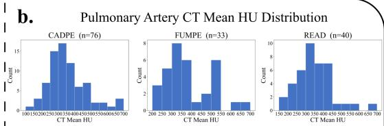

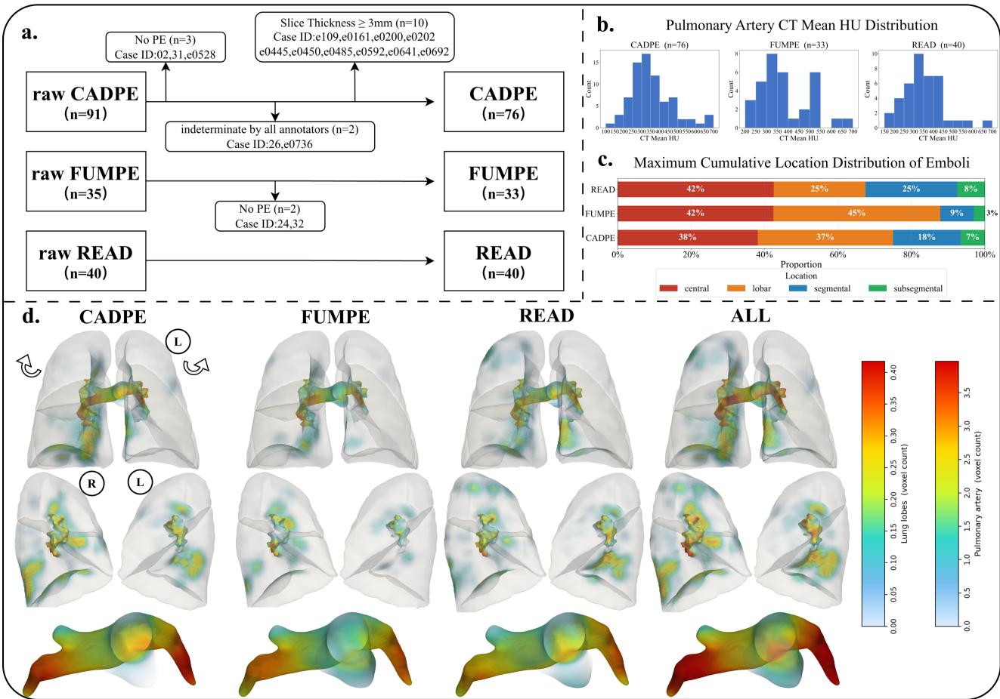  
Figure 1: Characteristics of the three re-annotated PE datasets. (a) Case-selection flowchart yielding 149 cases (CADPE, n = 76; FUMPE, n = 33; READ, n = 40); excluded case IDs shown. (b) Mean CT attenuation of the central pulmonary arteries per dataset (HU). (c) Per-case distribution of the anatomic location with the maximum cumulative embolus burden. (d) Voxel-wise embolus density after registration to a common lung template, per dataset and pooled (ALL): anterior view of the lung volume (top row), medial (mediastinal) surface view (middle row), and the pulmonary-arterial surface (bottom row); color bars encode local voxel count. $\mathrm { R } / \mathrm { L } = \mathrm { r i g h t } ,$ /left lung.

## 3.2. Re-annotation analysis

Across all 149 cases, original annotations systematically overestimated embolus volume compared with re-annotation: Bland–Altman analysis showed a mean bias (refined − Original) of −5.53 mL (95% CI −7.03 to −4.02 mL), and the diference was statistically significant $( P \mathrm { ~ < ~ } . 0 0 1 )$ Under the original annotations, per-lesion embolus volume difered markedly across the three datasets (median 0.18 mL in CADPE, 0.67 mL in FUMPE, and 0.07 mL in READ), whereas after re-annotation the distributions converged (0.13 mL, 0.25 mL, and 0.10 mL, respectively) (Figure 3, main panel). Per-case embolus counts by dataset are shown as box plots in Figure 3a. After re-annotation, the median count decreased and the IQR narrowed in $\mathrm { C A D P E } ( 5  4 )$ and READ $( 8  5 )$ , while in FUMPE the median count increased from 2 to 3 with a substantially narrower IQR $( 1 - 5  3 - 4 )$ . Annotation-error patterns identified by two raters reviewing the original annotations are summarized in the radar plot in Figure 3b. CADPE was dominated by over-segmentation onto normal pulmonary arteries (74%), lung parenchyma (32%), bronchi (30%), and pulmonary veins (16%) $( n \ = \ 7 6 )$ FUMPE was dominated by under-segmentation, with missed emboli in 20/33 cases (61%).

Per-lesion mask HU mean and SD before and after re-annotation are shown in Figure 3c. Mask HU SD decreased significantly in all three datasets: CADPE 131.38 [107.76–164.83] $ 6 5 . 5 7 \ \mathrm { [ 5 3 . 9 6 - 8 5 . 2 8 ] }$ ; FUMPE 121.46 [81.60–158.82] → 61.03 [52.19–72.28]; READ 101.77 $[ 7 8 . 7 2 - 1 1 9 . 0 9 ] \  \ 7 6 . 7 6 \ [ 6 4 . 3 5 - 9 5 . 5 3 ] \ ( P \ < \ . 0 0 1 )$ . Mask HU mean decreased significantly in CADPE $( 1 2 3 . 3 7 \ [ 9 6 . 3 1 - 1 7 3 . 2 4 ] \to 9 4 . 5 8 \ [ 7 2 . 2 4 - 1 1 2 . 6 5 ] )$ , with no significant diference in FUMPE or READ.

## 3.3. Multi-rater agreement

Among the 15 cases with four annotation sets, case-level embolus volume showed excellent agreement $\operatorname { \big [ I C C } ( 2 , 1 ) = 0 . 9 6 1$ , 95% CI 0.926–0.980]. Figure 2 shows representative cases in the axial and coronal planes, comparing the original annotation, Annotation 1, and the STAPLE consensus of Annotations 2–4. The original annotations showed visible discrepancies from the refined delineations. Building on this, inter-annotation spatial agreement was then assessed across the four refined annotations and the original public annotation (Supplementary Material S5). Panels (a–f) show pairwise agreement over the full 15-case set for DSC, ASSD, NSD (1 mm), and lesion F1 at 1-pixel, 10%, and 20% tolerances. Agreement between the original annotation and each refined annotation was consistently below the pairwise range among refined annotations across all metrics. Cases were divided by total embolus volume on the STAPLE consensus into a smaller-volume group $( n = 7 )$ and a larger-volume group $( n = 8 )$ ; the resulting 2-mL cut point was used in this analysis and the subsequent size-stratified evaluation. Panels (g–l) show the same six metrics after stratification into volume-based halves. Pairwise agreement was higher in larger- than smaller-volume cases for DSC, ASSD, and NSD, whereas lesion F1 was comparable between the two groups. Original-versus-refined agreement partially overlapped the pairwise range in larger-volume cases but fell below it in smaller-volume cases across all metrics.

## 3.4. Performance of pretrained weights against the two annotations

Two publicly released nnU-Net weights, neither exposed to the original or the refined annotations, were evaluated against both annotations (Table 1). On the full dataset $( N =$ 149), both models performed significantly better against the re-annotation than against the original annotations. nnU-Net-A improved from DSC $0 . 4 8 \pm 0 . 2 5$ to $0 . 6 3 \pm 0 . 2 5$ , ASSD from $7 . 4 9 \pm 1 2 . 1 9$ mm to $5 . 2 5 \pm 1 0 . 2 5$ mm, NSD (1 mm) from $0 . 5 4 \pm 0 . 2 3$ to $0 . 7 3 \pm 0 . 2 1$ , and absolute volume error from $5 . 8 8 \pm 8 . 4 7$ mL to $1 . 7 1 \pm 3 . 4 9$ mL; nnU-Net-B followed the same pattern (all $P < . 0 0 1 )$ ). At the dataset level, the diference in DSC and NSD between the two annotations was more pronounced on CADPE and FUMPE than on READ, with the same ordering observed for both models. Table 2 reports detection performance at the 10% overlap threshold. On the full set, Lesion F1 improved significantly for both models (nnU-Net-A: $\begin{array}{c} 0 . 5 3 \pm 0 . 2 8  0 . 6 7 \pm 0 . 2 8 ; \mathrm { n n U \mathrm { - } N e t . \mathrm { B } ; \mathrm { ~ } 0 . 4 3 \pm 0 . 3 2  0 . 5 7 \pm 0 . 3 1 ; \mathrm { ~ } P < . 0 0 1 } \end{array}$ . At the dataset level, the pattern difered by metric and dataset: Lesion Recall improved significantly on CADPE and READ but not on FUMPE for either model, whereas Lesion Precision improved significantly only on FUMPE. Findings were consistent across overlap thresholds of 1 pixel and 20% (Supplementary Material S6). All P values were Benjamini–Hochberg-corrected.

Image:Ax  
Zoom:A  
Zoom:B  
Image:Cor  
Zoom:A  
Zoom:B  
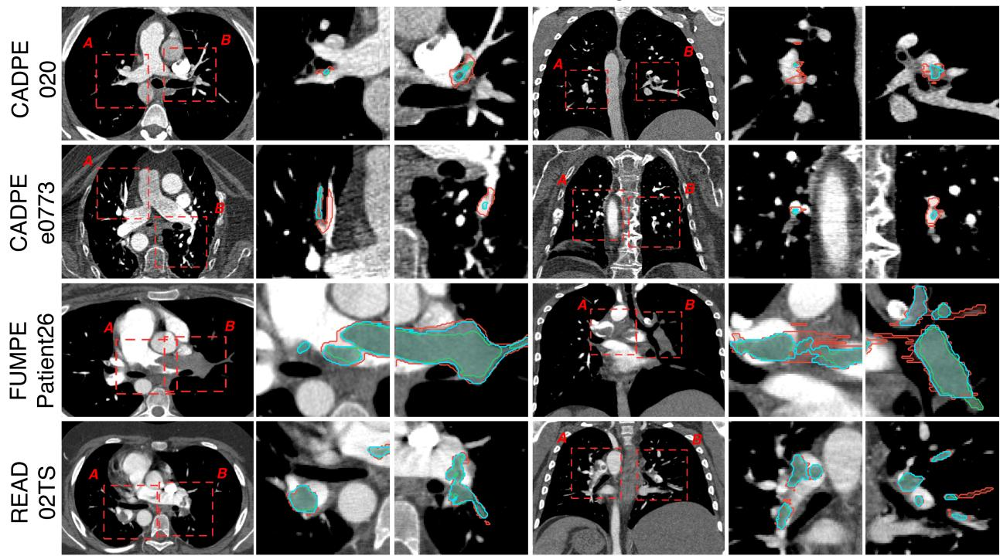  
Figure 2: Visual comparison of original and refined PE masks with STAPLE consensus. For each case, the same PE is displayed in the axial and coronal planes; the leftmost image of each plane shows the whole slice, and the two adjacent panels (Zoom: A, Zoom: B) magnify the two regions of interest outlined by the red dashed boxes labeled A and B on the full image. Overlays: original annotation (red), Annotation 1 (green), and STAPLE consensus of Annotation 2–4 (blue). Ax = axial, Cor = coronal.

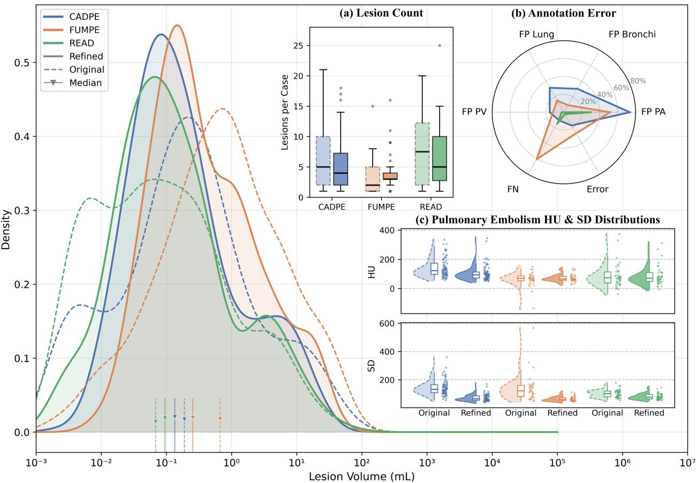  
Figure 3: Per-case embolus volume, count, annotation-error patterns, and mask attenuation before (Original) and after (Refined) re-annotation across the three datasets. Main panel: Kernel density estimates of per-lesion volume (log scale) for original (dashed) and refined (solid) annotations, colored by dataset; triangles mark medians. (a) Per-case lesion counts (box plots; light = Original, dark = Refined). (b) Radar plot of annotation-error types identified by two raters reviewing the original annotations, as a percentage of cases per dataset (FP PA/PV/Lung/Bronchi = false-positive oversegmentation onto pulmonary artery, pulmonary vein, lung parenchyma, or bronchi; FN = missed emboli; Error = anatomically implausible error). (c) Per-lesion mask attenuation (mean and SD, in Hounsfield units) before and after re-annotation, shown as combined box, strip, and half-violin plots.

Table 1: Segmentation performance of diferent weights of nnU-Net on Original versus Refined annotations.
<table><tr><td>Model</td><td>Dataset</td><td>Annotation</td><td>DSC↑</td><td>ASSD (mm) ↓</td><td>NSD (1 mm)↑</td><td>AbsErr (mL) ↓</td></tr><tr><td rowspan="4">nnU-Net-A [7]</td><td>CADPE</td><td>Original Refined ∆%</td><td> $0 . 4 4 1 \pm 0 . 2 2 4$   $\mathbf { 0 . 6 2 3 \pm 0 . 2 4 5 ^ { \ast \ast \ast } }$  +40.9%</td><td> $5 . 7 6 \pm 9 . 7 4$   $\mathbf { 4 . 2 8 \ : \pm { \ : 6 . 4 6 ^ { * * * } } }$  -25.7%</td><td> $0 . 4 9 8 \pm 0 . 1 8 6$   $\mathbf { 0 . 7 3 7 \pm 0 . 2 2 5 ^ { \ast \ast \ast } }$  +48.0%</td><td> $8 . 3 0 2 \pm 9 . 9 8 6$   $\mathbf { 1 . 2 6 0 \pm 3 . 0 3 3 ^ { \ast \ast \ast } }$  -84.8%</td></tr><tr><td>FUMPE</td><td>Original Refined ∆%</td><td> $0 . 5 1 4 \pm 0 . 2 5 4$   $\begin{array} { c } { 0 . 6 8 4 \pm 0 . 1 4 0 ^ { * * * } } \\ { + 3 3 . 3 \% } \end{array}$ </td><td> $9 . 0 8 \pm 1 1 . 4 9$   $\mathbf { 2 . 8 8 \pm 4 . 9 3 ^ { \ast \ast \ast } }$  -68.3%</td><td> $0 . 5 0 9 \pm 0 . 2 5 6$   $\mathbf { 0 . 7 5 0 \ : \pm { \ : 0 . 1 1 1 ^ { \ast \ast * } } }$  +47.1%</td><td> $4 . 4 8 2 \pm 7 . 6 0 4$   $\mathbf { 3 . 2 0 1 \pm 5 . 2 8 6 ^ { \ast \ast \ast } }$  -28.6%</td></tr><tr><td>READ</td><td>Original Refined ∆%</td><td> $0 . 5 4 2 \pm 0 . 2 9 5$   $\mathbf { 0 . 5 8 7 \ : \pm { \ : 0 . 3 0 5 ^ { \ast \ast \ast \ast } } }$  +9.3%</td><td> $9 . 2 7 \pm 1 5 . 9 1$   $\mathbf { 8 . 9 1 \pm 1 6 . 4 6 ^ { \ast \ast } }$  -3.9%</td><td> $0 . 6 5 3 \pm 0 . 2 4 2$   $\mathbf { 0 . 7 0 4 \ : \pm { \ : 0 . 2 5 1 ^ { \ast \ast \ast } } }$  +7.7%</td><td> $2 . 4 3 3 \pm 2 . 8 0 8$   $\mathbf { 1 . 3 2 5 \pm 1 . 7 7 5 ^ { \ast \ast \ast \ast } }$  -45.5%</td></tr><tr><td></td><td>All datasets Original Refined ∆%</td><td> $0 . 4 8 4 \pm 0 . 2 5 4$   $\begin{array} { c } { 0 . 6 2 7 \pm \mathbf { 0 . 2 4 6 ^ { \ast \ast \ast } } } \\ { + 3 1 . 3 \% } \end{array}$ </td><td> $7 . 4 9 \pm 1 2 . 1 9$   ${ \bf 5 . 2 5 \pm 1 0 . 2 5 ^ { \ast \ast \ast } }$  -29.9%</td><td> $0 . 5 4 2 \pm 0 . 2 2 7$   $\mathbf { 0 . 7 3 1 \pm 0 . 2 1 3 ^ { \ast \ast \ast } }$  +35.2%</td><td> $5 . 8 8 0 \pm 8 . 4 7 2$   $\mathbf { 1 . 7 0 7 \ : \pm { \ : 3 . 4 8 9 ^ { \ast \ast \ast } } }$  -71.0%</td></tr><tr><td rowspan="4"></td><td></td><td>Original Refined ∆%</td><td> $0 . 2 8 4 \pm 0 . 1 9 5$   $0 . 5 2 7 \pm 0 . 2 9 4 ^ { * * * }$  +89.3%  $0 . 3 9 7 \pm 0 . 2 2 7$ </td><td> $8 . 1 6 \pm 1 3 . 0 5$   $5 . 4 6 \pm 1 0 . 2 2 ^ { \ast \ast \ast }$  -33.1%  $9 . 6 3 \pm 1 7 . 4 4$ </td><td> $0 . 2 8 2 \pm 0 . 1 7 2$   $0 . 6 2 5 \pm 0 . 2 9 4 ^ { * * * }$  +125.0%  $0 . 3 5 1 \pm 0 . 2 3 3$ </td><td> $1 1 . 1 2 5 \pm 1 3 . 1 0 8$   $2 . 8 7 6 \pm 3 . 4 0 2 ^ { * * * }$  -74.1%  $8 . 4 1 8 \pm 1 1 . 5 7 2$ </td></tr><tr><td>READ</td><td>Refined ∆% Original</td><td> $\begin{array} { c } { 0 . 6 2 0 \pm 0 . 2 4 2 ^ { * * * } } \\ { + 5 5 . 0 \% } \end{array}$   $0 . 3 7 5 \pm 0 . 2 5 4$ </td><td> $5 . 7 2 \pm 1 0 . 9 5 ^ { \ast \ast }$  -40.6%  $1 3 . 6 3 \pm 2 3 . 3 8$ </td><td> $0 . 6 8 3 \pm 0 . 2 2 5 ^ { \ast \ast }$  +94.3%  $0 . 4 3 9 \pm 0 . 2 5 5$ </td><td> $3 . 5 2 5 \pm 5 . 6 2 5 ^ { * * * }$  -58.1%  $5 . 4 4 2 \pm 6 . 0 4 8$ </td></tr><tr><td>All datasets</td><td>Refined ∆% Original</td><td> $0 . 4 3 0 \pm 0 . 2 7 3 ^ { \ast \ast \ast }$  +13.2%  $0 . 3 3 4 \pm 0 . 2 2 4$ </td><td> $1 2 . 8 7 \pm 2 3 . 8 3 ^ { * * }$  -5.6%  $1 0 . 0 5 \pm 1 7 . 6 4$ </td><td> $0 . 4 9 2 \pm 0 . 2 8 0 ^ { * * * }$  +11.4%  $0 . 3 3 9 \pm 0 . 2 2 0$ </td><td> $4 . 0 5 3 \pm 4 . 6 4 0 ^ { * * * }$  -25.5%  $9 . 0 0 0 \pm 1 1 . 4 4 6$ </td></tr><tr><td></td><td>Refined ∆%</td><td> $0 . 5 2 1 \pm 0 . 2 8 4 ^ { * * * }$  +57.6%</td><td> $7 . 6 1 \pm 1 5 . 7 6 ^ { * * * }$  -24.3%</td><td> $0 . 6 0 2 \pm 0 . 2 8 4 ^ { * * * }$  +76.5%</td><td> $3 . 3 3 6 \pm 4 . 3 1 7 ^ { * * * }$  -62.9%</td></tr></table>

Note.—Results are reported as mean ± SD. DSC = Dice similarity coeficient; ASSD = average symmetric surface distance; NSD (1 mm) = normalized surface Dice at a 1-mm tolerance; AbsErr = absolute clot-volume error (mL). ∆% is the relative change from Original to Refined. Bold indicates the best value for a given metric across diferent annotations and pre-trained weights. Within-dataset comparisons between Original and Refined were performed using the Wilcoxon signed-rank test: $^ { * } P < . 0 5 , ^ { * * } P < . 0 1 , ^ { * * * } P < . 0 0 1$

## 3.5. Label efect versus model efect

With model weights held fixed, re-annotation shifted pooled DSC by 0.143 (0.122–0.166) for nnU-Net-A and 0.188 (0.163–0.213) for nnU-Net-B (both $P < . 0 0 1$ ; Figure 6A). Varying the training-set composition of a single architecture, taken as an internal model efect (Control; the largest within-dataset diference between training-set combinations in Table 3), shifted

Table 2: Lesion-level detection performance of diferent weights of nnU-Net on Original versus Refined annotations.
<table><tr><td>Model</td><td>Dataset</td><td></td><td>Annotation Lesion Recall (10%) Lesion Precision (10%) Lesion F1 (10%)</td><td></td><td></td></tr><tr><td></td><td>nnU-Net-A [7] CADPE</td><td>Original</td><td> $0 . 4 5 2 \pm 0 . 3 2 0$ </td><td> $0 . 8 4 1 \pm 0 . 3 0 7$ </td><td> $0 . 5 2 5 \pm 0 . 2 7 8$ </td></tr><tr><td rowspan="8"></td><td></td><td>Refined</td><td> $\mathbf { 0 . 6 0 9 \ : \pm { \ : 0 . 3 2 2 ^ { \ast \ast \ast } } }$ </td><td> $\mathbf { 0 . 8 5 3 \ : \pm { \ : 0 . 2 8 9 } }$ </td><td> $\mathbf { 0 . 6 6 1 \pm 0 . 2 8 9 ^ { \ast \ast \ast } }$  +25.8%</td></tr><tr><td></td><td>∆%</td><td>+35.6%</td><td>+1.2%</td><td></td></tr><tr><td>FUMPE</td><td>Original</td><td> $0 . 7 6 0 \pm 0 . 3 4 6$ </td><td> $0 . 4 8 7 \pm 0 . 2 7 9$ </td><td> $0 . 5 5 0 \pm 0 . 2 7 1$ </td></tr><tr><td></td><td>Refined</td><td> $\mathbf { 0 . 9 0 1 \pm 0 . 1 8 0 }$ </td><td> $0 . 7 2 6 \pm 0 . 2 4 2 ^ { * * * }$ </td><td> $\mathbf { 0 . 7 7 3 \pm 0 . 1 9 7 ^ { \ast \ast \ast } }$ </td></tr><tr><td></td><td>∆%</td><td>+18.4%</td><td>+49.0%</td><td>+40.4%</td></tr><tr><td>READ</td><td>Original</td><td> $0 . 4 8 1 \pm 0 . 3 3 5$ </td><td> $\mathbf { 0 . 7 4 7 \ : \pm { \ : 0 . 3 2 0 } }$ </td><td> $0 . 5 2 1 \pm 0 . 3 0 4$ </td></tr><tr><td></td><td>Refined</td><td> $\mathbf { 0 . 5 8 8 \pm 0 . 3 2 0 ^ { * * } }$ </td><td> $0 . 7 3 7 \pm 0 . 3 2 4$ </td><td> $\mathbf { 0 . 6 1 1 \pm 0 . 3 0 8 ^ { \ast \ast \ast } }$ </td></tr><tr><td>All datasets</td><td>∆%</td><td>+22.9%</td><td>-1.3%</td><td>+17.4%</td></tr><tr><td rowspan="6"></td><td></td><td>Original</td><td> $0 . 5 2 8 \pm 0 . 3 5 1$ </td><td> $0 . 7 3 7 \pm 0 . 3 3 3$ </td><td> $0 . 5 2 9 \pm 0 . 2 8 2$ </td></tr><tr><td></td><td>Refined</td><td> $\mathbf { 0 . 6 6 8 \pm 0 . 3 2 0 ^ { * * * } }$ </td><td> $\mathbf { 0 . 7 9 4 \ : \pm { \ : 0 . 2 9 0 ^ { \ast \ast } } }$ </td><td> $\begin{array} { c } { { \mathbf { 0 . 6 7 2 \pm 0 . 2 8 1 ^ { \ast \ast \ast } } } } \\ { { \phantom { 0 . 6 7 2 } + 2 6 . 9 \% } } \end{array}$ </td></tr><tr><td></td><td>∆%</td><td>+26.4%</td><td>+6.8%</td><td></td></tr><tr><td>nnU-Net-B [6] CADPE</td><td>Original</td><td> $0 . 2 9 7 \pm 0 . 2 9 7$ </td><td> $0 . 7 4 6 \pm 0 . 4 0 1$ </td><td> $0 . 3 6 7 \pm 0 . 2 9 0$ </td></tr><tr><td></td><td>Refined</td><td> $0 . 4 9 7 \pm 0 . 3 3 3 ^ { \ast \ast \ast }$ </td><td> $0 . 7 8 4 \pm 0 . 3 8 2$ </td><td> $0 . 5 7 1 \pm 0 . 3 2 0 ^ { * * * }$ </td></tr><tr><td rowspan="6"></td><td></td><td>∆%</td><td>+66.7%</td><td>+4.0%</td><td>+55.5%</td></tr><tr><td>FUMPE</td><td>Original</td><td> $0 . 6 4 4 \pm 0 . 3 8 5$ </td><td></td><td> $0 . 6 1 4 \pm 0 . 3 4 0$ </td></tr><tr><td></td><td>Refined</td><td> $0 . 6 3 5 \pm 0 . 2 8 8$ </td><td> $0 . 6 4 1 \pm 0 . 3 4 3$   $\mathbf { 0 . 8 3 2 \ : \pm { \ : 0 . 2 5 7 ^ { * * * } } }$ </td><td> $0 . 6 9 4 \pm 0 . 2 5 0$ </td></tr><tr><td></td><td>∆%</td><td>0.0%</td><td>+29.7%</td><td>+13.0%</td></tr><tr><td>READ</td><td></td><td></td><td></td><td></td></tr><tr><td></td><td></td><td>Original</td><td> $0 . 3 3 5 \pm 0 . 3 1 1$   $0 . 3 9 3 \pm 0 . 2 9 7 ^ { \ast }$ </td><td> $0 . 6 9 2 \pm 0 . 3 7 5$ </td><td> $0 . 4 0 2 \pm 0 . 2 9 9$   $0 . 4 5 7 \pm 0 . 2 9 1 ^ { \ast \ast }$ </td></tr><tr><td></td><td></td><td>Refined ∆%</td><td> $+ 1 4 . 7 \%$ </td><td> $0 . 6 9 6 \pm 0 . 3 7 6$ </td><td></td></tr><tr><td></td><td></td><td></td><td></td><td> $+ 1 . 4 \%$ </td><td> $+ 1 3 . 8 \%$ </td></tr><tr><td></td><td>All datasets Original</td><td></td><td> $0 . 3 8 4 \pm 0 . 3 4 9$ </td><td> $0 . 7 0 8 \pm 0 . 3 8 2$ </td><td> $0 . 4 3 1 \pm 0 . 3 1 8$ </td></tr><tr><td></td><td></td><td>Refined</td><td> $0 . 5 0 0 \pm 0 . 3 2 3 ^ { \ast \ast \ast }$ </td><td> $0 . 7 7 1 \pm 0 . 3 5 8 ^ { * * * }$ </td><td> $0 . 5 6 8 \pm 0 . 3 0 8 ^ { \ast \ast \ast }$ </td></tr><tr><td></td><td></td><td>∆%</td><td>+31.6%</td><td>+8.5%</td><td>+31.7%</td></tr></table>

Note.—Results are reported as mean ± SD. “10%” denotes a hit criterion of overlap exceeding 10% of the reference lesion volume. ∆% is the relative change from Original to Refined. Bold indicates the best value for a given metric across diferent annotations and pre-trained weights. Within-dataset comparisons between Original and Refined were performed using the Wilcoxon signed-rank test: $^ { * } P < . 0 5 , ^ { * * } P < . 0 1 , ^ { * * * } P < . 0 0 1$

Table 3: Segmentation and lesion-level detection performance across datasets under diferent training set combinations.
<table><tr><td>Test Dataset and training set</td><td>DSC↑</td><td>ASSD (mm) ↓</td><td>NSD (1 mm)↑</td><td>AbsErr (mL)↓</td><td>Lesion Recall↑</td><td>Lesion Precision ↑</td><td>Lesion F1↑</td></tr><tr><td>CADPE (A)</td><td></td><td></td><td></td><td></td><td></td><td></td><td></td></tr><tr><td>ABC</td><td> $\mathbf { 0 . 7 4 5 \ : \pm { \ : 0 . 2 0 5 } }$ </td><td> ${ \bf 3 . 3 2 \pm 8 . 5 8 }$ </td><td> $\mathbf { 0 . 8 4 5 \ : \pm { \ : 0 . 1 6 4 } }$ </td><td> $1 . 0 8 7 \pm 2 . 6 1 7$ </td><td> $\mathbf { 0 . 8 3 7 \ : \pm { \ : 0 . 2 0 9 } }$ </td><td> $0 . 7 8 9 \pm 0 . 2 3 8$ </td><td> $\mathbf { 0 . 7 7 7 \pm 0 . 2 0 3 }$ </td></tr><tr><td>AB</td><td> $0 . 7 2 1 \pm 0 . 2 5 3$ </td><td> $7 . 0 2 \pm 1 8 . 7 7$ </td><td> $0 . 8 1 3 \pm 0 . 2 3 2$ </td><td> $1 . 1 6 4 \pm 2 . 5 0 8$ </td><td> $0 . 7 9 0 \pm 0 . 2 8 0$ </td><td> $0 . 7 7 1 \pm 0 . 2 7 4$ </td><td> $0 . 7 4 2 \pm 0 . 2 6 6$ </td></tr><tr><td>AC</td><td> $0 . 7 2 9 \pm 0 . 2 4 0$ </td><td> $4 . 4 2 \pm 1 2 . 6 5$ </td><td> $0 . 8 2 6 \pm 0 . 2 0 9$ </td><td> $\mathbf { 1 . 0 5 9 } \pm \mathbf { 2 . 0 5 4 }$ </td><td> $0 . 8 0 5 \pm 0 . 2 7 6$ </td><td> $0 . 7 9 4 \pm 0 . 2 6 0$ </td><td> $0 . 7 6 8 \pm 0 . 2 6 0$ </td></tr><tr><td>BC†</td><td> $0 . 6 8 6 \pm 0 . 2 5 8$ </td><td> $3 . 1 3 \pm 4 . 5 0$ </td><td> $0 . 7 7 5 \pm 0 . 2 3 8$ </td><td> $1 . 6 2 8 \pm 3 . 4 8 4$ </td><td> $0 . 6 8 9 \pm 0 . 2 9 1$ </td><td> $\mathbf { 0 . 8 7 4 \ : \pm { \ : 0 . 2 7 6 } }$ </td><td> $0 . 7 5 3 \pm 0 . 2 6 5$ </td></tr><tr><td>FUMPE (B)</td><td></td><td></td><td></td><td></td><td></td><td></td><td></td></tr><tr><td>ABC</td><td> $0 . 7 5 6 \pm 0 . 1 8 2$ </td><td> $2 . 6 0 \pm 3 . 7 2$ </td><td> $0 . 8 1 4 \pm 0 . 1 5 8$ </td><td> $1 . 7 4 4 \pm 4 . 7 0 6$ </td><td> $0 . 8 9 1 \pm 0 . 1 8 9$ </td><td> $0 . 7 0 8 \pm 0 . 2 6 3$ </td><td> $\mathbf { 0 . 7 5 4 \ : \pm 0 . 2 1 9 }$ </td></tr><tr><td>AB</td><td> $\mathbf { 0 . 7 6 6 \pm 0 . 1 7 1 }$ </td><td> $1 . 8 3 \pm 2 . 7 2$ </td><td> $\mathbf { 0 . 8 3 3 \pm 0 . 1 2 8 }$ </td><td> $1 . 8 3 6 \pm 4 . 8 5 2$ </td><td> $0 . 9 1 1 \pm 0 . 1 4 8$ </td><td> $0 . 6 9 9 \pm 0 . 2 6 3$ </td><td> $0 . 7 5 2 \pm 0 . 2 0 1$ </td></tr><tr><td>ACt</td><td> $0 . 7 5 4 \pm 0 . 1 6 6$ </td><td> $2 . 9 8 \pm 6 . 1 0$ </td><td> $0 . 8 2 3 \pm 0 . 1 4 8$ </td><td> $2 . 0 9 3 \pm 4 . 8 3 1$ </td><td> $\mathbf { 0 . 9 5 1 \pm 0 . 1 2 3 }$ </td><td> $0 . 5 8 3 \pm 0 . 2 4 7$ </td><td> $0 . 6 9 0 \pm 0 . 2 0 5$ </td></tr><tr><td>BC</td><td> $0 . 7 3 4 \pm 0 . 2 0 9$ </td><td> $1 . 8 3 \pm 2 . 4 2$ </td><td> $0 . 7 8 7 \pm 0 . 1 9 6$ </td><td> $\mathbf { 1 . 6 5 7 \pm 4 . 1 7 9 }$ </td><td> $0 . 8 5 1 \pm 0 . 2 3 6$ </td><td> $\mathbf { 0 . 7 1 6 \ : \pm { \ : 0 . 2 8 6 } }$ </td><td> $0 . 7 3 5 \pm 0 . 2 3 2$ </td></tr><tr><td>READ (C)</td><td></td><td></td><td></td><td></td><td></td><td></td><td></td></tr><tr><td>ABC</td><td> $\mathbf { 0 . 6 5 6 \pm 0 . 2 5 2 }$ </td><td> $1 0 . 8 0 \pm 2 0 . 8 2$ </td><td> $0 . 7 2 5 \pm 0 . 2 3 5$ </td><td> $\mathbf { 1 . 7 1 0 \pm 2 . 0 7 3 }$ </td><td> $\mathbf { 0 . 7 1 9 \ : \pm { \ : 0 . 2 6 6 } }$ </td><td> $0 . 6 7 7 \pm 0 . 2 6 8$ </td><td> $0 . 6 5 8 \pm 0 . 2 3 2$ </td></tr><tr><td>AB†</td><td> $0 . 5 8 6 \pm 0 . 2 3 5$ </td><td> $9 . 4 0 \pm 2 0 . 1 1$ </td><td> $0 . 6 8 9 \pm 0 . 2 2 0$ </td><td> $2 . 6 8 5 \pm 2 . 7 2 3$ </td><td> $0 . 6 8 3 \pm 0 . 2 8 2$ </td><td> $0 . 7 9 0 \pm 0 . 2 3 6$ </td><td> $0 . 6 9 3 \pm 0 . 2 4 2$ </td></tr><tr><td>AC</td><td> $0 . 6 4 2 \pm 0 . 2 7 6$ </td><td> $8 . 0 8 \pm 2 0 . 9 8$ </td><td> $\mathbf { 0 . 7 5 5 \pm 0 . 2 1 3 }$ </td><td> $1 . 7 6 3 \pm 2 . 2 2 4$ </td><td> $0 . 6 9 1 \pm 0 . 2 6 3$ </td><td> $0 . 7 4 9 \pm 0 . 2 3 0$ </td><td> $0 . 6 8 4 \pm 0 . 2 2 4$ </td></tr><tr><td>BC</td><td> $0 . 6 2 5 \pm 0 . 2 8 0$ </td><td> ${ \bf 6 . 2 2 \pm 9 . 8 9 }$ </td><td> $0 . 7 4 9 \pm 0 . 2 2 7$ </td><td> $2 . 0 4 3 \pm 2 . 6 8 5$ </td><td> $0 . 6 7 0 \pm 0 . 2 8 7$ </td><td> $\mathbf { 0 . 8 1 1 \pm 0 . 2 4 5 }$ </td><td> $\mathbf { 0 . 6 9 7 \pm 0 . 2 4 3 }$ </td></tr></table>

Note.—Results are reported as mean ± SDs. A = CADPE, B = FUMPE, C = READ. Within each test dataset, the indented labels indicate which dataset or datasets were used for training (eg, AB = trained on CADPE and FUMPE only). ABC entries report internal pooled five-fold cross-validation across all three datasets; each case was predicted by the fold model for which that case was in the validation split. Lesion-level recall, precision, and F1-score were computed at a 10% volumetric overlap threshold between predicted and reference lesions. Bold indicates the best value for a given metric across all training configurations. † denotes external (zero-shot) evaluation, in which the test dataset was excluded from training and predictions were generated by ensembling the five cross-validation fold models. DSC = Dice similarity coeficient, ASSD = average symmetric surface distance, NSD = normalized surface Dice, AbsErr = absolute clot-volume error.

Table 4: Segmentation and lesion-level detection performance stratified by total reference clot volume under diferent training set combinations.
<table><tr><td>Training set and test subset</td><td>DSC↑</td><td>ASSD (mm)↓</td><td>NSD (1 mm)↑</td><td>AbsErr (mL)↓</td><td>Lesion Recall ↑</td><td>Lesion Precision ↑</td><td>Lesion F1↑</td></tr><tr><td>ABC</td><td></td><td></td><td></td><td></td><td></td><td></td><td></td></tr><tr><td>ALL (n = 149)</td><td></td><td></td><td></td><td></td><td></td><td> $0 . 7 2 3 + 0 . 2 1 9 \quad 5 . 1 8 + 1 3 . 0 6 \quad 0 . 8 0 6 + 0 . 1 9 2 \quad 1 . 1 4 0 + 3 . 3 1 2 \quad 0 . 8 1 7 + 0 . 2 3 1 \quad 0 . 7 4 1 + 0 . 2 5 8 \ 0 . 7 4 0 + 0 . 2 2 1$ </td><td></td></tr><tr><td>Small (n = 58)</td><td></td><td></td><td></td><td> $0 . 5 9 3 + 0 . 2 4 6 1 0 . 0 5 + 1 8 . 9 0 0 0 . 7 3 8 + 0 . 2 5 1 0 . 2 0 6 + 0 . 2 6 0 0 0 . 8 0 4 + 0 . 2 9 6 0 . 7 0 4 + 0 . 2 9 2 0 . 7 0 5 + 0 . 2 7 8$ </td><td></td><td></td><td></td></tr><tr><td>Large (n = 91)</td><td></td><td></td><td></td><td></td><td></td><td> $0 . 8 0 7 + 0 . 1 4 9 \quad 2 . 1 3 + 5 . 6 4 \quad 0 . 8 7 3 + 0 . 1 2 0 \quad 2 . 1 6 2 + 3 . 7 9 9 \quad 0 . 8 2 6 + 0 . 1 7 9 \quad 0 . 7 6 5 + 0 . 2 3 2 \ 0 . 7 6 2 + 0 . 1 7 4$ </td><td></td></tr><tr><td>AB</td><td></td><td></td><td></td><td></td><td></td><td></td><td></td></tr><tr><td>READ (n = 40)</td><td></td><td></td><td> $0 . 5 8 6 + 0 . 2 3 5 9 4 0 + 2 0 . 1 1 0 6 8 9 + 0 . 2 2 0 2 2 6 . 6 8 5 + 2 . 7 2 3 0 4 6 8 3 + 0 . 2 8 2 0 7 9 + 0 . 2 3 6 0 6 9 3 + 0 . 2 4 2$ </td><td></td><td></td><td></td><td></td></tr><tr><td>Small (n = 15)</td><td> $0 . 4 2 4 + 0 . 2 2 5 2 0 . 7 0 + 3 0 . 2 0 0 \ 0 . 5 8 6 + 0 . 2 6 3 \ 0 . 3 3 0 + 0 . 3 6 8 \ 0 . 6 6 4 + 0 . 3 5 1 \ 0 . 6 3 2 + 0 . 2 8 5 \ 0 . 6 0 3 + 0 . 2 9 8$ </td><td></td><td></td><td></td><td></td><td></td><td></td></tr><tr><td>Large (n = 25)</td><td> $0 . 6 8 2 \pm 0 . 1 9 1$ </td><td></td><td></td><td> $2 . 6 2 \pm 3 . 7 6 \quad 0 . 7 5 0 \pm 0 . 1 7 3 4 . 0 9 9 \pm 2 . 5 9 4 0 . 6 9 4 \pm 0 . 2 4 6 0 . 8 8 5 \pm 0 . 1 4 4 0 . 7 4 7 \pm 0 . 1 9 3 9 \pm 0 . 0 9 8 4 1 . 0 9 3$ </td><td></td><td></td><td></td></tr><tr><td>AC</td><td></td><td></td><td></td><td></td><td></td><td></td><td></td></tr><tr><td>FUMPE (n = 33)</td><td></td><td></td><td> $0 . 7 5 4 + 0 . 1 6 6 \quad 2 . 9 8 + 6 . 1 0 \quad 0 . 8 2 3 + 0 . 1 4 8 \quad 2 . 0 9 3 + 4 . 8 3 1 \quad 0 . 9 5 1 + 0 . 1 2 3 \ 0 . 5 8 3 + 0 . 2 4 7 \ 0 . 6 9 0 + 0 . 2 0 5 3 9 + 0 . 0 9 5 3 9$ </td><td></td><td></td><td></td><td></td></tr><tr><td>Small (n = 8)</td><td> $0 . 6 1 7 \pm 0 . 2 2 3$ </td><td></td><td></td><td> $6 . 6 2 \pm 1 0 . 6 0 0 0 . 7 3 4 \pm 0 . 2 0 8 0 . 1 8 3 \pm 0 . 2 4 2 0 . 9 1 2 \pm 0 . 1 6 9 0 . 6 6 3 \pm 0 . 2 7 8 0 . 7 3 7 \pm 0 . 2 3 8$ </td><td></td><td></td><td></td></tr><tr><td>Large (n = 25)</td><td> $0 . 7 9 7 \pm 0 . 1 1 2$ </td><td></td><td> $1 . 8 2 \pm 2 . 7 6 \quad 0 . 8 5 1 \pm 0 . 1 0 9 2 . 7 0 4 \pm 5 . 4 0 8 \quad 0 . 9 6 3 \pm 0 . 1 0 0 \quad 0 . 5 5 7 \pm 0 . 2 3 1 \ 0 . 6 7 6 \pm 0 . 1 9 1$ </td><td></td><td></td><td></td><td></td></tr><tr><td>BC</td><td></td><td></td><td></td><td></td><td></td><td></td><td></td></tr><tr><td>CADPE (n = 76)</td><td> $0 . 6 8 6 \pm 0 . 2 5 8$ </td><td></td><td> $3 . 1 3 \pm 4 . 5 0 0 0 . 7 7 5 \pm 0 . 2 3 8 1 . 6 2 8 \pm 3 . 4 8 4 0 . 6 8 9 \pm 0 . 2 9 1 0 . 8 7 4 \pm 0 . 2 7 6 0 . 7 5 3 \pm 0 . 2 6 5 $ </td><td></td><td></td><td></td><td></td></tr><tr><td>Small (n = 35)</td><td> $0 . 5 6 5 \pm 0 . 2 7 8$ </td><td> $4 . 9 3 \pm 5 . 9 3$ </td><td></td><td></td><td></td><td> $0 . 7 1 7 \pm 0 . 2 9 0 0 . 2 2 8 \pm 0 . 2 5 3 0 . 6 7 4 \pm 0 . 3 4 6 0 . 8 0 2 \pm 0 . 3 4 8 0 . 7 1 5 \pm 0 . 3 2 8$ </td><td></td></tr><tr><td>Large (n = 41)</td><td></td><td></td><td></td><td></td><td></td><td></td><td> $0 . 7 9 0 + 0 . 1 8 5 \quad 1 . 7 3 + 2 . 0 6 \quad 0 . 8 2 5 + 0 . 1 6 8 \quad 2 . 8 2 3 + 4 . 3 9 9 \quad 0 . 7 0 2 + 0 . 2 3 2 \quad 0 . 9 3 6 + 0 . 1 7 0 \quad 0 . 7 8 5 + 0 . 1 9 1$ </td></tr></table>

Note.—Results are reported as mean ± SDs. A = CADPE, B = FUMPE, C = READ. The indented labels indicate which dataset or datasets were used for training (eg, AB = trained on CADPE and FUMPE only). ABC entries report internal pooled five-fold cross-validation across all three datasets, with each case predicted by the fold model for which that case was in the validation split; AB, AC, and BC entries report external evaluation on the held-out dataset, with predictions generated by ensembling the five-fold models. Cases were stratified into small (< 2 mL) and large $( \geq 2 ~ \mathrm { m L } )$ subsets by using a 2-mL volume threshold derived from the size distribution of the 15 jointly annotated cases (Section 3.3). Lesion-level recall, precision, and F1-score were computed at a 10% volumetric overlap threshold between predicted and ground-truth lesions. DSC = Dice similarity coeficient, ASSD = average symmetric surface distance, NSD = normalized surface Dice, AbsErr = absolute clot-volume error.

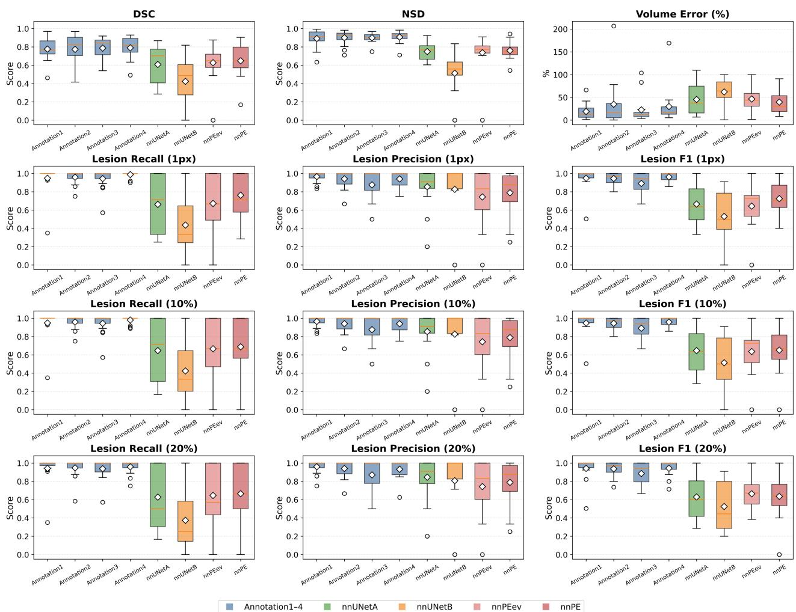  
Figure 4: Distribution of segmentation and detection metrics over the 15-case multi-rater subset. Annotation 1–4: the four raters; nnUNetA and nnUNetB: the two publicly available pretrained weights; nnPE: the model trained on all three datasets; nnPEev: the leave-one-dataset-out model evaluated on the held-out dataset. Each rater was evaluated against the STAPLE consensus of the other three raters; all models were evaluated against the STAPLE consensus of all four raters. Panels show DSC, NSD (1 mm), absolute volume error (%), and lesion-level recall, precision, and F1 at 1-pixel, 10%, and 20% overlap thresholds. Box: IQR; orange line: median; white diamond: mean; circle: outlier.

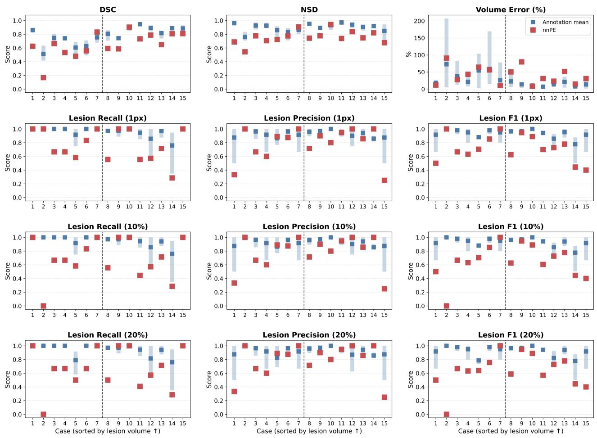  
Figure 5: Per-case comparison of nnPE with four raters over the 15-case multi-rater subset. Cases are sorted by ascending lesion volume; the dashed line splits the smaller- and larger-volume halves. Panels show DSC, NSD (1 mm), absolute volume error (%), and lesion-level recall, precision, and F1 at 1-pixel, 10%, and 20% overlap thresholds, with the same reference standards as in Figure 4. Light blue bar: min–max across the four raters; blue square: rater mean; red square: nnPE.

DSC by 0.028 (0.012–0.045). The diference between the two pretrained weights (nnU-Net-A vs nnU-Net-B), which is confounded by their difering private training dataset, was 0.106 $( P < . 0 0 1 )$ . The shaded band in Figure 6A marks the 0.02–0.10 model-to-model DSC range reported previously [6, 7].

Per dataset, the label efect exceeded the Control efect in CADPE and FUMPE (label efect, $P < . 0 0 1 )$ , and fell to 0.045 (0.034–0.059) in READ, where the Control efect was not significant (Figure 6B). The same ordering held for boundary, volumetric, and lesion-level metrics (Figure 6C, D).

A  
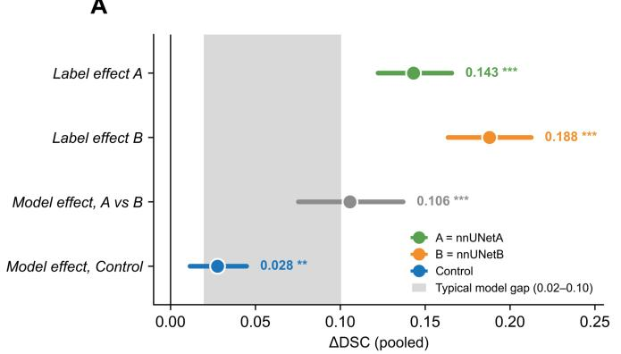

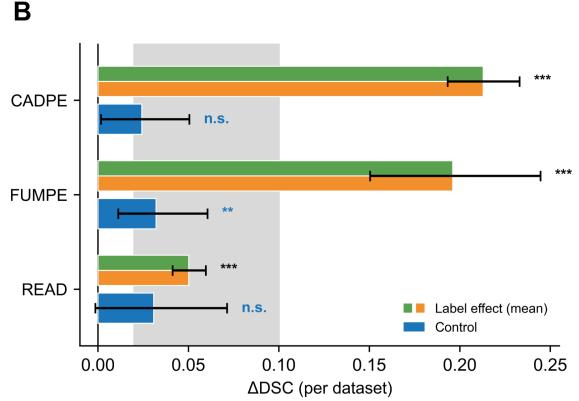

C  
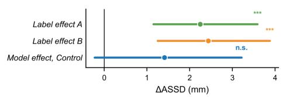

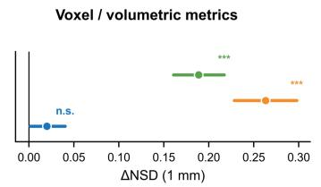

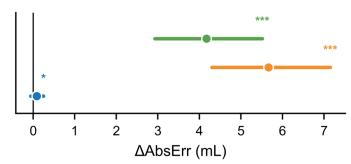

D  
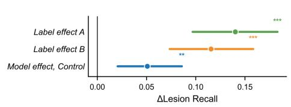

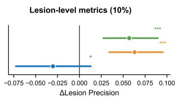

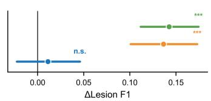  
Figure 6: Contribution of label efect versus model efect to measured PE segmentation performance. (A) Pooled ∆DSC $( n = 1 4 9 )$ . A and B are the two pretrained weights (nnU-Net-A, nnU-Net-B); A vs B is confounded by their difering private training cohorts, whereas Control is the largest withindataset diference between training-set combinations of the same architecture. Circles = means of per-case diferences; bars = bootstrap 95% CIs. Shaded band = reported model-to-model DSC diferences under a fixed reference standard (0.02–0.10) [6, 7]. (B) Same comparison per dataset; label efect represents the mean across A and B. (C, D) Boundary, volumetric, and lesion-level metrics. For ASSD and AbsErr, $\Delta$ denotes reduction, so positive values indicate improvement. All comparisons are paired at the case level: label efect compares the same predictions against the two annotations; A vs B compares the two weights under the refined annotations; Control compares, within each dataset, the pair of training-set combinations showing the largest DSC diference. Two-sided Wilcoxon signedrank tests with Benjamini–Hochberg correction: $^ { * } P < . 0 5 , ^ { * * } P < . 0 1 , ^ { * * * } P < . 0 0 1$ ; n.s. = not significant.

## 4. Discussion

The principal finding of this study is that the annotation can influence measured PE segmentation performance as strongly as the model configuration. Three analyses supported the refined annotations. First, within-mask attenuation variability decreased in all three datasets, consistent with removal of pulmonary artery wall, partial-volume edges, and contrast-opacified blood; the decrease in mean attenuation in CADPE further supported this interpretation and matched the error pattern reported by Zhang et al. [7]. Second, on the multi-rater subset, agreement between the original annotations and the refined annotation sets was lower than the pairwise agreement among refined annotations across all metrics. Third, both externally trained nnU-Net models performed better against the refined annotations without retraining. The lesion-level changes were also consistent with the dominant dataset-specific errors: recall increased in CADPE and READ, where over-segmentation predominated, whereas precision increased in FUMPE, where missed emboli were common. These patterns were consistent across all tested overlap thresholds.

Together, these results indicate that the two annotation sets difer in reference quality rather than only in labeling convention. With scans and model predictions held constant, replacing the original annotations with the refined annotations changed DSC by 0.143–0.188. This change was several times larger than the 0.028 diference produced by varying the training-dataset composition for the same architecture and was comparable to previously reported diferences between architectures [6, 7]. Model comparisons based on an unreliable reference standard may therefore attribute annotation-related variation to model design. The label efect was largest in CADPE and FUMPE and smaller in READ, suggesting that the influence of re-annotation decreases when the original annotations are more consistent with the refined reference.

Pairwise boundary distances across the four raters were mostly sub-millimetric, reflecting the floor of human reproducibility under a single protocol and consistent with partial-volume uncertainty at the thrombus–contrast interface rather than with error in lesion identification. The NSD tolerance was set to 1 mm near the center of this range, so that the metric separates clinically meaningful boundary error from disagreement already present between experts, and the 2 mL size threshold is a cut point near the center of the volume distribution of the same subset, adopted in the absence of a clinical consensus on a quantitative boundary between large and small PE.

The residual gap between nnPE and the human raters separates into two parts. On smallervolume cases DSC fell and dispersed for the raters as well as for the model, which sets a floor on measurable performance: at this lesion scale DSC is dominated by boundary voxels on which experts working from the same protocol already disagree. On the same cases NSD and lesionlevel F1 remained tight across raters and fell only for the model, and this part isolates genuine model deficit rather than measurement artefact. These failures concentrated on scans with respiratory motion, low or inhomogeneous arterial opacification, and coexisting parenchymal disease, where clot-to-background contrast is lost. Reporting DSC alone conflates the two parts and attributes both to the model.

This study has several limitations. Multi-rater annotation covered 15 cases, which limits the precision of the inter-rater estimates. Moreover, the refined annotations were produced by a single primary rater and remain subject to residual partial-volume uncertainty at vessel margins, with no histopathological reference standard for independent confirmation. The refined dataset comprises 149 cases from three public sources, which may not capture the full range of scanner vendors, reconstruction kernels, and contrast protocols encountered in routine practice, and prospective multicenter clinical validation is not yet provided.

In summary, annotating all three public voxel-level PE segmentation datasets under a unified protocol changed measured performance by an amount comparable to reported diferences between models. The refined reference was supported by lower within-mask attenuation variability and a multicenter multi-rater analysis. FairPE, nnPE, and the accompanying evaluation framework provide a shared reference standard for attributing performance diferences to the model rather than the annotations.

## Funding

This research did not receive any specific grant from funding agencies in the public, commercial, or not-for-profit sectors.

## Acknowledgments

We gratefully acknowledge the Leibniz Supercomputing Centre for providing the computing resources.

## References

[1] Konstantinides SV, Meyer G, Becattini C, Bueno H, Geersing G-J, Harjola V-P, et al. 2019 ESC Guidelines for the diagnosis and management of acute pulmonary embolism developed in collaboration with the European Respiratory Society (ERS). European Heart Journal. 2020;41(4):543–603.

[2] El-Menyar A, Nabir S, Ahmed N, Asim M, Jabbour G, Al-Thani H. Diagnostic implications of computed tomography pulmonary angiography in patients with pulmonary embolism. Annals of Thoracic Medicine. 2016;11(4):269–76.

[3] Tuzovic M, Adigopula S, Amsallem M, Kobayashi Y, Kadoch M, Boulate D, et al. Regional right ventricular dysfunction in acute pulmonary embolism: relationship with clot burden and biomarker profile. The International Journal of Cardiovascular Imaging. 2016;32(3):389–98.

[4] Gotta J, Koch V, Geyer T, Martin SS, Booz C, Mahmoudi S, et al. Imaging-based risk stratification of patients with pulmonary embolism based on dual-energy CT-derived radiomics. European Journal of Clinical Investigation. 2024;54(4):e14139.

[5] Wen Z, Wang H, Yuan H, Liu M, Guo X. A method of pulmonary embolism segmentation from CTPA images based on U-net. In: 2019 IEEE 2nd International Conference on Computer and Communication Engineering Technology (CCET); 2019. IEEE.

[6] Amini E, Hille G, Hürtgen J, Surov A, Saalfeld S. Deep learning-based segmentation of acute pulmonary embolism in cardiac CT images. International Journal of Computer Assisted Radiology and Surgery. 2026;21(2):367–75.

[7] Zhang Y, Chamberlain R, Ngo L, Kramer K, Mazurowski MA. Rethinking pulmonary embolism segmentation: a study of current approaches and challenges with an open weight model. Journal of Imaging Informatics in Medicine. 2026:1–13.

[8] Aydin N, Cihan Ç, Çelik Ö, Aslan AF, Odabaş A, Alataş F, et al. Segmentation of acute pulmonary embolism in computed tomography pulmonary angiography using the deep learning method. Tuberculosis and Thorax. 2023;71(2):20239916.

[9] Vadhera R, Sharma M. A novel hybrid loss-based Encoder–Decoder model for accurate pulmonary embolism segmentation. International Journal of Information Technology. 2025;17(3):1663–77.

[10] Vadhera R, Sharma M. A comparative study of loss functions for pulmonary embolism segmentation. International Journal of Information Technology. 2026:1–16.

[11] Tang Y, Zhan S, Guo L, Pu H, Feng W, Liao J. Pulmonary embolism image segmentation based on an U-net method with CBAM attention mechanism. In: 2022 3rd International Conference on Electronics, Communications and Information Technology (CECIT); 2022. IEEE.

[12] Doğan K, Selçuk T, Alkan A. An enhanced mask R-CNN approach for pulmonary embolism detection and segmentation. Diagnostics. 2024;14(11):1102.

[13] Liu Z, Yuan H, Wang H. CAM-Wnet: an efective solution for accurate pulmonary embolism segmentation. Medical Physics. 2022;49(8):5294–303.

[14] Gonzalez Serrano G. CAD-PE. IEEE Dataport; 2019.

[15] Masoudi M, Pourreza H-R, Saadatmand-Tarzjan M, Eftekhari N, Zargar FS, Rad MP. A new dataset of computed-tomography angiography images for computer-aided detection of pulmonary embolism. Scientific Data. 2018;5(1):180180.

[16] de Andrade JMC, Olescki G, Escuissato DL, Oliveira LF, Basso ACN, Salvador GL. Pixellevel annotated dataset of computed tomography angiography images of acute pulmonary embolism. Scientific Data. 2023;10(1):518.

[17] Chen Y, Zou B, Guo Z, Huang Y, Huang Y, Qin F, et al. SCUNet++: Swin-Unet and CNN bottleneck hybrid architecture with multi-fusion dense skip connection for pulmonary embolism CT image segmentation. In: Proceedings of the IEEE/CVF Winter Conference on Applications of Computer Vision; 2024.

[18] Fan J-c, Luan H, Qiao Y, Li Y, Ren Y. Detection and segmentation of pulmonary embolism in 3D CT pulmonary angiography using a threshold adjustment segmentation network. Scientific Reports. 2025;15(1):7263.

[19] Hemalakshmi G, Murugappan M, Sikkandar MY, Santhi D, Prakash N, Mohanarathinam A. PE-Ynet: a novel attention-based multi-task model for pulmonary embolism detection using CT pulmonary angiography (CTPA) scan images. Physical and Engineering Sciences in Medicine. 2024;47(3):863–80.

[20] Nitha V, SS VC, Valsalan P, Arjun S. A deep learning framework for the segmentation and quantitative analysis of pulmonary embolism. Engineering Applications of Artificial Intelligence. 2025;155:110972.

[21] Lozano DFL, Hoyos MH, Núñez HM, Carrasco LFU. Multiplanar instance segmentation method for the detection of pulmonary embolism. In: 2022 XVLIII Latin American Computer Conference (CLEI); 2022. IEEE.

[22] Cheng T-W, Chua YW, Huang C-C, Chang J, Kuo C, Cheng Y-C. Feature-enhanced adversarial semi-supervised semantic segmentation network for pulmonary embolism annotation. Heliyon. 2023;9(5).

[23] Xiao R, Li X, Guo C, Suo S, Zheng K, Ma J, et al. CT diagnostic mode-oriented and cross dificulty-aware network for pulmonary embolism segmentation. IEEE Transactions

on Medical Imaging. 2025.

[24] Cano-Espinosa C, Cazorla M, González G. Computer aided detection of pulmonary embolism using multi-slice multi-axial segmentation. Applied Sciences. 2020;10(8):2945.

[25] Trongmetheerat T, Sukprasert K, Netiwongsanon K, Leeboonngam T, Sumetpipat K. Segment-based and patient-based segmentation of CTPA image in pulmonary embolism using CBAM ResU-Net. In: Proceedings of the 13th International Conference on Advances in Information Technology; 2023.

[26] Arabian H, Karimian A, Arabi H, Mansourian M. A novel approach to pulmonary embolism segmentation: increasing an attention-based U-Net. In: 2025 33rd International Conference on Electrical Engineering (ICEE); 2025. IEEE.

[27] Munir A, Jabbar MS, Khan S. DAUNet: a lightweight UNet variant with deformable convolutions and parameter-free attention for medical image segmentation. IEEE Journal of Biomedical and Health Informatics. 2026.

[28] Yoon JH, Lee YJ, Yoo SB. LA-Seg: disentangled sinogram pattern-guided transformer for lesion segmentation in limited-angle computed tomography. Computers in Biology and Medicine. 2025;196:110728.

[29] Lin X, Xiang Y, Wang Z, Cheng K-T, Yan Z, Yu L. SAMCT: segment any CT allowing labor-free task-indicator prompts. IEEE Transactions on Medical Imaging. 2024;44(3):1386–99.

[30] Zhao Z, Zhang Y, Wu C, Zhang X, Zhou X, Zhang Y, et al. Large-vocabulary segmentation for medical images with text prompts. npj Digital Medicine. 2025;8(1):566. doi:10.1038/s41746-025-01964-w.

[31] Xu M, Amiranashvili T, Navarro F, Fritsak M, Hamamci IE, Shit S, et al. CADS: a comprehensive anatomical dataset and segmentation for whole-body anatomy in computed tomography. arXiv preprint arXiv:2507.22953. 2025.

[32] Arabian H, Karimian A, Mansourian M, Dehghan A, Etaati E, Arabi H, et al. Enhancing pulmonary embolism diagnosis: a squeeze-and-attention U-Net for precise detection and segmentation in CT angiography. Physica Medica. 2026;145:105785.

[33] Wasserthal J, Breit H-C, Meyer MT, Pradella M, Hinck D, Sauter AW, et al. TotalSegmentator: robust segmentation of 104 anatomic structures in CT images. Radiology: Artificial Intelligence. 2023;5(5):e230024.

[34] Isensee F, Jaeger PF, Kohl SA, Petersen J, Maier-Hein KH. nnU-Net: a self-configuring method for deep learning-based biomedical image segmentation. Nature Methods. 2021;18(2):203–11.

[35] Isensee F, Wald T, Ulrich C, Baumgartner M, Roy S, Maier-Hein K, et al. nnU-Net revisited: a call for rigorous validation in 3D medical image segmentation. In: International Conference on Medical Image Computing and Computer-Assisted Intervention; 2024. Springer.

## Supplementary Material

## S1. Annotation protocol for pulmonary embolism segmentation

Imaging and reading conditions. The imaging modality is CT pulmonary angiography (CTPA, pulmonary arterial phase). The primary reading window is the pulmonary artery window (W = 700, L = 100), which may be adjusted on a case-by-case basis.

PE identification criteria. PE is identified on CTPA as an intraluminal filling defect within the pulmonary arteries, including complete intraluminal hypodensity, partial central or eccentric filling defects (the “railway track” or “polo mint” sign), and mural hypodense lesions. All intraluminal filling defects meeting the above imaging criteria are included for annotation.

Annotation definition. The foreground (label = 1) comprises all filling defects within the pulmonary arterial lumen on CTPA that meet the PE criteria; the background (label = 0) comprises all remaining voxels. The following findings are annotated: fully occlusive thrombi (when located at the segmental level or beyond, annotation is limited to the proximal portion up to the next bifurcation), partially occlusive thrombi, mural thrombi, and saddle emboli. The following are not annotated: vessel wall, calcifications, contrast medium, pulmonary veins, pulmonary parenchymal changes, and chronic organized lesions.

Boundary rules. Proximal and distal boundaries are defined as the last slice on which the thrombus hypodensity is visually separable from the surrounding contrast medium. In the axial plane, boundaries follow the visual interface between the hypodense thrombus and the contrast medium; a single global HU threshold is not used. Subsegmental and more distal lesions are annotated only when identifiable on ≥ 2 consecutive slices. Ambiguous voxels afected by partial volume efects at lesion borders are assigned to the background. Raters should cross-reference adjacent slices to verify thrombus continuity and apply smoothing to the resulting boundaries.

Dificult cases. Flow-related and mixing artifacts are not annotated. Cases with a pulmonary arterial attenuation < 200 HU and inhomogeneous opacification are not annotated and are escalated to the senior reviewing radiologist. Distal emboli that cannot be reliably distinguished due to respiratory motion artifacts are not annotated.

Tools and output. Annotations are performed using 3D Slicer (version 5.6.2) and saved in NRRD format.

## S2. Original annotation errors

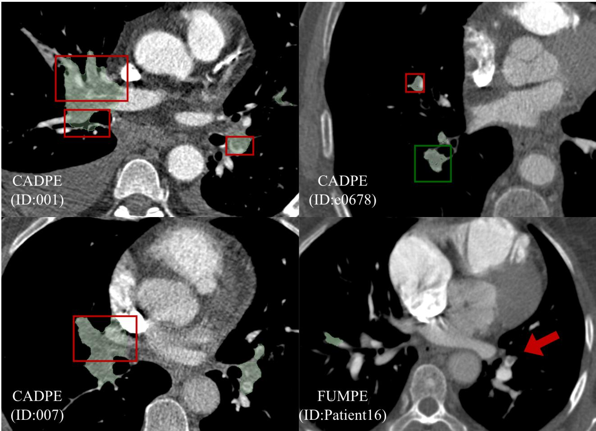  
Figure S2: Representative examples of original annotation errors. Red boxes indicate oversegmentation; green boxes indicate substantial annotation noise; red arrows indicate undersegmentation (missed regions). Case 001: over-segmentation extending into the pulmonary artery. Case e0678: red box — segmentation extending into the pulmonary artery; green box — internal void within the annotated region. Case 007: over-segmentation extending into the pulmonary vein. Case Patient16: red arrow — missed segmentation.

## S3. Evaluation metric definitions

Segmentation performance was assessed across four complementary dimensions: voxel-level overlap, boundary accuracy, volumetric agreement, and embolus-level detection. At the voxel level, DSC was computed from binary predictions, where TP, FP, and FN denote true positive, false positive, and false negative voxels respectively:

$$
\mathrm { D S C } = { \frac { 2 \mathrm { T P } } { 2 \mathrm { T P } + \mathrm { F P } + \mathrm { F N } } } .\tag{S3.1}
$$

Boundary accuracy was quantified using ASSD and NSD. ASSD measures the mean bidirectional distance between predicted and reference standard surfaces in physical units (mm),

where $\partial P$ and ∂G denote the predicted and reference standard surface point sets respectively, and $d ( \cdot , \cdot )$ the minimum Euclidean distance from a point to a surface:

$$
\mathrm { A S S D } = \frac { 1 } { 2 } \left( \frac { 1 } { | \partial P | } \sum _ { p \in \partial P } d ( p , \partial G ) + \frac { 1 } { | \partial G | } \sum _ { g \in \partial G } d ( g , \partial P ) \right) .\tag{S3.2}
$$

NSD measures the proportion of surface points on each side lying within a tolerance of $\tau = 1$ mm of the opposing surface, averaged bidirectionally:

$$
\mathrm { N S D } ( \tau ) = \frac { 1 } { 2 } \left( \frac { \left| \{ p \in \partial P : d ( p , \partial G ) \leq \tau \} \right| } { \left| \partial P \right| } + \frac { \left| \{ g \in \partial G : d ( g , \partial P ) \leq \tau \} \right| } { \left| \partial G \right| } \right) .\tag{S3.3}
$$

Volumetric agreement was expressed as absolute volume error, AbsErr $= | V _ { \mathrm { p r e d } } - V _ { \mathrm { g t } } |$ where $V _ { \mathrm { p r e d } }$ and $V _ { \mathrm { g t } }$ denote predicted and reference standard volumes derived from voxel counts scaled by voxel volume in mL.

Embolus-level detection was evaluated using a two-stage volume-aware framework. In the first stage, each predicted embolus was classified as $\mathrm { T P } _ { L }$ if the ratio of its overlap with the reference standard to its own volume $( | P \cap G | / | P |$ , where $P$ and G denote the voxel sets of the predicted embolus and the reference standard embolus, respectively) met or exceeded threshold X (X = 1 pixel, 10%, or $2 0 \% )$ , and as $\mathrm { F P } _ { L }$ otherwise. In the second stage, each reference standard embolus was considered detected if the ratio of its overlap with $\mathrm { T P } _ { L }$ components to its own volume $( | P \cap G | / | G | )$ met or exceeded the same threshold, and as $\mathrm { F N } _ { L }$ otherwise. Lesion-level precision and recall were then computed as follows, where $N _ { \mathrm { g t } }$ denotes the total number of reference standard emboli:

$$
\mathrm { L e s i o n } \ \mathrm { P r e c i s i o n } ( X ) = { \frac { \mathrm { T P } _ { L } } { \mathrm { T P } _ { L } + \mathrm { F P } _ { L } } } , \qquad \mathrm { L e s i o n } \ \mathrm { R e c a l l } ( X ) = { \frac { \mathrm { T P } _ { L } } { N _ { \mathrm { g t } } } } .\tag{S3.4}
$$

The lesion-level F1 score at threshold X was then computed as the harmonic mean of the two directional recalls:

$$
\operatorname { L e s i o n } \operatorname { F } 1 ( X ) = { \frac { 2 \cdot \operatorname { L e s i o n } \operatorname { R e c a l l } ( X ) _ { A \to B } \cdot \operatorname { L e s i o n } \operatorname { R e c a l l } ( X ) _ { B \to A } } { \operatorname { L e s i o n } \operatorname { R e c a l l } ( X ) _ { A \to B } + \operatorname { L e s i o n } \operatorname { R e c a l l } ( X ) _ { B \to A } } } .\tag{S3.5}
$$

When B corresponds to the reference standard,

$$
\operatorname { L e s i o n } \operatorname { R e c a l l } ( X ) _ { A \to B } = \operatorname { L e s i o n } \operatorname { P r e c i s i o n } ( X ) , \qquad \operatorname { L e s i o n } \operatorname { R e c a l l } ( X ) _ { B \to A } = \operatorname { L e s i o n } \operatorname { R e c a l l } ( X ) ,
$$

recovering the conventional F1. The symmetric formulation allows the same metric to be applied to inter-rater agreement analyses, where A and B denote two raters of equivalent status.

## S4. Basic characteristics of the public datasets

Table S4: Patient demographics and CT acquisition characteristics of the three public CTPA datasets.
<table><tr><td>Characteristic</td><td>CADPE (n = 91)</td><td>FUMPE  $( n = 3 5 )$ </td><td>READ  $( n = 4 0 )$ </td></tr><tr><td colspan="4">Patient demographics</td></tr><tr><td>Sex, female</td><td> $1 7 ~ ( 4 3 ) ^ { * }$ </td><td>18 (51)</td><td>27 (68)</td></tr><tr><td>Sex, male</td><td> $2 3 ~ ( 5 7 ) ^ { \ast }$ </td><td>17 (49)</td><td>13 (32)</td></tr><tr><td> $\mathrm { A g e , y }$ </td><td> $6 5 . 0 \pm 1 8 . 0 ^ { * }$ </td><td> $5 6 . 6 \pm 1 9 . 7 ^ { * }$ </td><td> $5 5 . 5 \pm 1 9 . 2$ </td></tr><tr><td colspan="4">Data origin</td></tr><tr><td>Country</td><td>Spain</td><td>Iran</td><td>Brazil</td></tr><tr><td>Inclusion</td><td>PE-positive only</td><td>PE-positive only (33/35 confirmed)</td><td>PE-positive only</td></tr><tr><td colspan="4">CT acquisition</td></tr><tr><td>Scanner</td><td>Siemens Somatom</td><td>Mixed</td><td>Toshiba Aquilion; GE</td></tr><tr><td>Tube voltage, kVp</td><td>Sensation NR</td><td>NR</td><td>Revolution 120</td></tr><tr><td>Tube current, mA</td><td>NR</td><td>Variable per case</td><td>Dose-modulated</td></tr><tr><td>Pixel spacing, mm</td><td>0.520-0.922</td><td>0.522-0.785</td><td>0.672-0.816</td></tr><tr><td>Slice interval, mm</td><td>0.5-3.0</td><td>0.5-1.5</td><td>0.625-0.8</td></tr><tr><td colspan="4">Reference standard</td></tr><tr><td>Annotation level</td><td>Voxel-level</td><td>Voxel-level</td><td>Voxel-level</td></tr><tr><td>Annotators</td><td>Semi-automatic (STAPLE consensus): 3 senior radiologists</td><td>Manual: 1 radiologist, Manual: Resident, revised by department double-revised by head</td><td>senior experts</td></tr></table>

Note.—Data are mean ± SD for continuous variables and n $( \% )$ for categorical variables, unless otherwise indicated. NR = not reported in the source publication. \* Demographic statistics were calculated only from the available reported data due to incomplete reporting in the source publications.

## S5. Multi-metric inter-rater agreement heatmaps

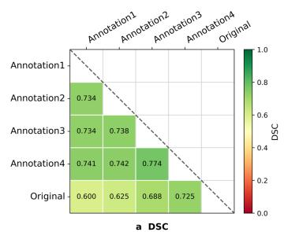

Inter-rater Agreement — All Cases  
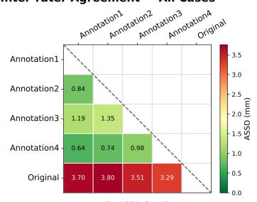

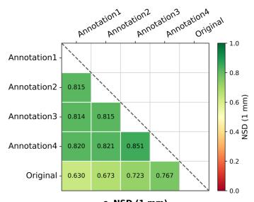

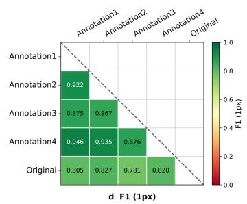

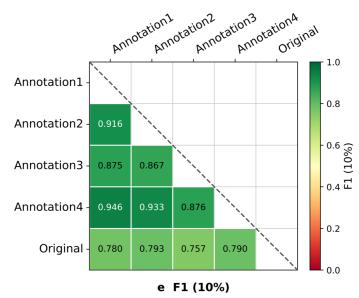

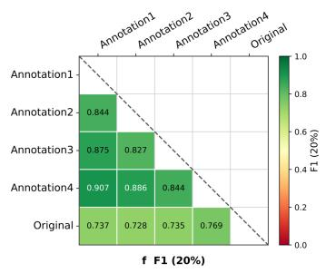

Inter-rater Agreement — Split by Lesion Size  
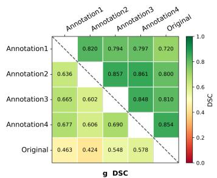

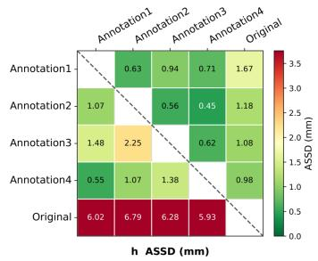

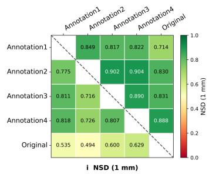

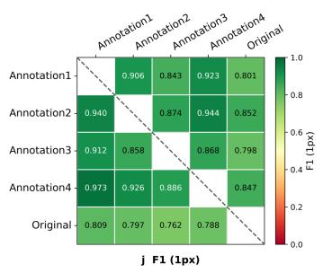

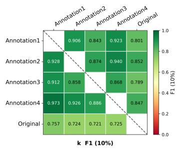

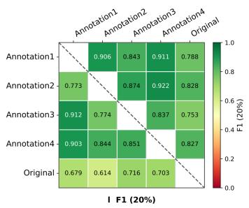  
Figure S5: Multi-metric inter-rater agreement heatmaps. Each panel shows a $5 \times 5$ matrix of pairwise agreement across the four raters (Annotation 1–4) and the original annotation (Original). (a–f) Agreement across all 15 jointly annotated cases (lower-triangular pairwise means): (a) DSC, (b) ASSD (mm), (c) NSD at 1 mm, and (d–f) lesion F1 at 1 $\mathrm { p x , }$ 10%, and 20% tolerances. (g–l) The same six metrics stratified by embolus volume: cases were sorted by volume and split into a smaller-volume half (first 7, lower triangle) and a larger-volume half (last 8, upper triangle) — (g) DSC, (h) ASSD (mm), (i) NSD at 1 mm, and (j–l) lesion F1 at 1 px, 10%, and 20% tolerances. Color bars encode each metric’s scale; the dashed diagonal in (g–l) separates the small- and large-volume subgroups.

## S6. Lesion-level detection performance of the pretrained weights on the two annotations

Table S6: Lesion-level detection performance of diferent weights of nnU-Net on Original versus Refined annotation.
<table><tr><td>Model, Dataset and annotation</td><td>(1px)</td><td>Lesion Recall Lesion Precision (1px)</td><td>Lesion F1 (1px)</td><td>(20%)</td><td>Lesion Recall Lesion Precision (20%)</td><td>Lesion F1 (20%)</td></tr><tr><td>nnU-Net-A [7]</td><td></td><td></td><td></td><td></td><td></td><td></td></tr><tr><td>CADPE</td><td></td><td></td><td></td><td></td><td></td><td></td></tr><tr><td>Original</td><td> $0 . 5 0 4 \pm 0 . 3 1 4$ </td><td> $0 . 8 4 2 \pm 0 . 3 0 7$ </td><td> $0 . 5 7 8 \pm 0 . 2 6 7$ </td><td> $0 . 3 6 0 \pm 0 . 3 1 2$ </td><td> $0 . 8 3 8 \pm 0 . 3 0 8$ </td><td> $0 . 4 3 3 \pm 0 . 2 9 6$ </td></tr><tr><td>Refined</td><td> $0 . 6 5 0 \pm 0 . 3 0 0 ^ { * * * }$ </td><td> $0 . 8 5 4 \pm 0 . 2 8 1$ </td><td> $0 . 7 0 2 \pm 0 . 2 6 0 ^ { \ast \ast \ast }$ </td><td> $0 . 5 9 9 \pm 0 . 3 1 8 ^ { * * * }$ </td><td> $0 . 8 5 1 \pm 0 . 2 8 0$ </td><td> $0 . 6 5 3 \pm 0 . 2 8 6 ^ { * * * }$ </td></tr><tr><td>FUMPE</td><td></td><td></td><td></td><td></td><td></td><td></td></tr><tr><td>Original</td><td> $0 . 7 8 0 \pm 0 . 3 2 1$ </td><td> $0 . 5 0 4 \pm 0 . 2 6 5$ </td><td> $0 . 5 7 6 \pm 0 . 2 4 6$ </td><td> $0 . 6 8 3 \pm 0 . 3 8 1$ </td><td> $0 . 4 8 7 \pm 0 . 2 7 9$ </td><td> $0 . 4 9 9 \pm 0 . 2 9 2$ </td></tr><tr><td>Refined</td><td> $0 . 9 0 4 \pm 0 . 1 8 1$ </td><td> $0 . 7 2 6 \pm 0 . 2 4 2 ^ { * * * }$ </td><td> $0 . 7 7 4 \pm 0 . 1 9 7 ^ { * * * }$ </td><td> $0 . 8 7 8 \pm 0 . 2 0 2 ^ { \ast }$ </td><td> $0 . 7 1 6 \pm 0 . 2 4 1 ^ { \ast \ast \ast }$ </td><td> $0 . 7 5 5 \pm 0 . 1 9 8 ^ { \ast \ast \ast }$ </td></tr><tr><td>READ</td><td></td><td></td><td></td><td></td><td></td><td></td></tr><tr><td>Original</td><td> $0 . 5 1 0 \pm 0 . 3 1 5$ </td><td> $0 . 7 7 2 \pm 0 . 2 9 8$ </td><td> $0 . 5 5 7 \pm 0 . 2 7 1$ </td><td> $0 . 4 4 4 \pm 0 . 3 3 8$ </td><td> $0 . 7 4 7 \pm 0 . 3 2 0$ </td><td> $0 . 4 9 1 \pm 0 . 3 0 7$ </td></tr><tr><td>Refined</td><td> $0 . 6 0 9 \pm 0 . 2 9 9 ^ { \ast \ast }$ </td><td> $0 . 7 6 7 \pm 0 . 3 0 0$ </td><td> $0 . 6 4 0 \pm 0 . 2 7 9 ^ { \ast \ast }$ </td><td> $0 . 5 6 4 \pm 0 . 3 2 9 ^ { * * }$ </td><td> $0 . 7 3 3 \pm 0 . 3 2 2$ </td><td> $0 . 5 8 6 \pm 0 . 3 1 5 ^ { * * * }$ </td></tr><tr><td>All datasets</td><td></td><td></td><td></td><td></td><td></td><td></td></tr><tr><td>Original Refined</td><td> $0 . 5 6 7 \pm 0 . 3 3 4$   $0 . 6 9 5 \pm 0 . 2 9 8 ^ { \ast \ast \ast }$ </td><td> $0 . 7 4 8 \pm 0 . 3 2 3$   $0 . 8 0 3 \pm 0 . 2 8 2 ^ { \ast \ast }$ </td><td> $0 . 5 7 2 \pm 0 . 2 6 2$   $0 . 7 0 2 \pm 0 . 2 5 6 ^ { \ast \ast \ast }$ </td><td> $0 . 4 5 4 \pm 0 . 3 5 6$   $0 . 6 5 1 \pm 0 . 3 2 2 ^ { * * * }$ </td><td> $0 . 7 3 6 \pm 0 . 3 3 3$   $0 . 7 9 0 \pm 0 . 2 8 9 ^ { * * }$ </td><td> $0 . 4 6 3 \pm 0 . 2 9 8$ </td></tr><tr><td></td><td></td><td></td><td></td><td></td><td></td><td> $0 . 6 5 7 \pm 0 . 2 8 2 ^ { \ast \ast \ast }$ </td></tr><tr><td>nnU-Net-B [6] CADPE</td><td></td><td></td><td></td><td></td><td></td><td></td></tr><tr><td>Original</td><td> $0 . 3 8 9 \pm 0 . 3 0 9$ </td><td> $0 . 7 4 7 \pm 0 . 4 0 2$ </td><td> $0 . 4 6 8 \pm 0 . 3 0 3$ </td><td> $0 . 2 1 1 \pm 0 . 2 5 4$ </td><td> $0 . 7 4 4 \pm 0 . 4 0 2$ </td><td> $0 . 2 7 3 \pm 0 . 2 6 3$ </td></tr><tr><td>Refined</td><td> $0 . 5 2 1 \pm 0 . 3 3 3 ^ { * * * }$ </td><td> $0 . 7 8 4 \pm 0 . 3 8 2$ </td><td> $0 . 5 9 3 \pm 0 . 3 2 3 ^ { \ast \ast \ast }$ </td><td> $0 . 4 7 5 \pm 0 . 3 3 6 ^ { * * * }$ </td><td> $0 . 7 8 4 \pm 0 . 3 8 2$ </td><td> $0 . 5 4 9 \pm 0 . 3 2 2 ^ { * * * }$ </td></tr><tr><td>FUMPE</td><td></td><td></td><td></td><td></td><td></td><td></td></tr><tr><td>Original</td><td> $0 . 7 0 1 \pm 0 . 3 6 6$ </td><td> $0 . 6 4 7 \pm 0 . 3 3 3$ </td><td> $0 . 6 5 1 \pm 0 . 3 2 1$ </td><td> $0 . 5 6 0 \pm 0 . 3 9 6$ </td><td> $0 . 6 2 9 \pm 0 . 3 3 7$ </td><td> $0 . 5 4 7 \pm 0 . 3 4 7$ </td></tr><tr><td>Refined</td><td> $0 . 7 0 4 \pm 0 . 2 8 9$ </td><td> $0 . 8 4 1 \pm 0 . 2 5 7 ^ { \ast \ast \ast }$ </td><td> $0 . 7 4 4 \pm 0 . 2 4 8$ </td><td> $0 . 6 1 4 \pm 0 . 2 9 2$ </td><td> $0 . 8 2 3 \pm 0 . 2 6 1 ^ { \ast \ast \ast }$ </td><td> $0 . 6 7 6 \pm 0 . 2 5 6 ^ { \ast }$ </td></tr><tr><td>READ</td><td></td><td></td><td></td><td></td><td></td><td></td></tr><tr><td>Original</td><td> $0 . 3 6 2 \pm 0 . 3 0 5$ </td><td> $0 . 6 9 2 \pm 0 . 3 7 5$ </td><td> $0 . 4 3 4 \pm 0 . 2 9 6$ </td><td> $0 . 2 8 5 \pm 0 . 3 0 0$ </td><td> $0 . 6 9 2 \pm 0 . 3 7 5$ </td><td> $0 . 3 5 2 \pm 0 . 3 0 1$ </td></tr><tr><td>Refined</td><td> $0 . 4 3 1 \pm 0 . 2 9 1 ^ { \ast }$ </td><td> $0 . 6 9 6 \pm 0 . 3 7 6$ </td><td> $0 . 4 9 8 \pm 0 . 2 9 1 ^ { \ast \ast }$ </td><td> $0 . 3 5 5 \pm 0 . 3 0 5 ^ { \ast }$ </td><td> $0 . 6 9 6 \pm 0 . 3 7 6$ </td><td></td></tr><tr><td>All datasets</td><td></td><td></td><td></td><td></td><td></td><td> $0 . 4 1 8 \pm 0 . 3 0 3 ^ { \ast \ast }$ </td></tr><tr><td>Original</td><td> $0 . 4 5 0 \pm 0 . 3 4 6$ </td><td> $0 . 7 1 0 \pm 0 . 3 8 0$ </td><td> $0 . 5 0 0 \pm 0 . 3 1 4$ </td><td> $0 . 3 0 8 \pm 0 . 3 3 1$ </td><td> $0 . 7 0 5 \pm 0 . 3 8 2$ </td><td> $0 . 3 5 5 \pm 0 . 3 1 1$ </td></tr><tr><td>Refined</td><td> $0 . 5 3 7 \pm 0 . 3 2 6 ^ { * * * }$ </td><td></td><td> $0 . 6 0 1 \pm 0 . 3 1 0 ^ { * * * }$ </td><td> $0 . 4 7 4 \pm 0 . 3 2 9 ^ { \ast \ast \ast }$ </td><td> $0 . 7 6 9 \pm 0 . 3 5 8 ^ { \ast \ast \ast }$ </td><td> $0 . 5 4 2 \pm 0 . 3 1 5 ^ { * * * }$ </td></tr><tr><td></td><td></td><td> $0 . 7 7 3 \pm 0 . 3 5 8 ^ { * * * }$ </td><td></td><td></td><td></td><td></td></tr></table>

Note.—Results are reported as mean ± SD. “1px” and “20%” denote hit criteria of at least 1-voxel overlap and overlap exceeding 20% of the reference lesion volume, respectively. Within-dataset comparisons between Original and Refined annotations were performed using the Wilcoxon signed-rank test: $^ { * } P < . 0 5 , ^ { * * } P < . 0 1$ $^ { * * * } { \bar { P } } < . 0 0 1$

## S7. Lesion-level detection performance across datasets under diferent training set combinations

Table S7: Lesion-level detection performance across datasets under diferent training set combinations, evaluated at two overlap thresholds (≥ 1 pixel and ≥ 20%).
<table><tr><td>Test Dataset and training set</td><td>(1px)</td><td>Lesion Recall Lesion Precision (1px)</td><td>Lesion F1 (1px)</td><td>(20%)</td><td>Lesion Recall Lesion Precision (20%)</td><td>Lesion F1 (20%)</td></tr><tr><td>CADPE (A)</td><td></td><td></td><td></td><td></td><td></td><td></td></tr><tr><td>ABC</td><td> $\mathbf { 0 . 8 7 4 \ : \pm { \ : 0 . 1 7 9 } }$ </td><td> $0 . 7 9 4 \pm 0 . 2 3 3$ </td><td> $\mathbf { 0 . 8 0 3 \ : \pm { \ : 0 . 1 7 8 } }$ </td><td> $\mathbf { 0 . 7 9 4 \ : \pm { \ : 0 . 2 4 8 } }$ </td><td> $0 . 7 8 8 \pm 0 . 2 3 8$ </td><td> $\mathbf { 0 . 7 4 9 \ : \pm 0 . 2 3 2 }$ </td></tr><tr><td>AB</td><td> $0 . 8 1 8 \pm 0 . 2 5 2$ </td><td> $0 . 7 7 1 \pm 0 . 2 7 4$ </td><td> $0 . 7 6 8 \pm 0 . 2 3 8$ </td><td> $0 . 7 6 8 \pm 0 . 2 8 0$ </td><td> $0 . 7 6 9 \pm 0 . 2 7 3$ </td><td> $0 . 7 3 0 \pm 0 . 2 6 3$ </td></tr><tr><td>AC</td><td> $0 . 8 4 4 \pm 0 . 2 4 2$ </td><td> $0 . 7 9 4 \pm 0 . 2 6 0$ </td><td> $0 . 8 0 1 \pm 0 . 2 3 0$ </td><td> $0 . 7 7 4 \pm 0 . 2 8 9$ </td><td> $0 . 7 9 3 \pm 0 . 2 6 0$ </td><td> $0 . 7 4 4 \pm 0 . 2 7 1$ </td></tr><tr><td>BC†</td><td> $0 . 7 0 3 \pm 0 . 2 8 4$ </td><td> $\mathbf { 0 . 8 7 4 \ : \pm { \ : 0 . 2 7 6 } }$ </td><td> $0 . 7 6 4 \pm 0 . 2 6 2$ </td><td> $0 . 6 3 6 \pm 0 . 3 1 4$ </td><td> $\mathbf { 0 . 8 7 4 \ : \pm { \ : 0 . 2 7 6 } }$ </td><td> $0 . 7 0 6 \pm 0 . 2 9 5$ </td></tr><tr><td>FUMPE (B)</td><td></td><td></td><td></td><td></td><td></td><td></td></tr><tr><td>ABC</td><td> $0 . 8 9 9 \pm 0 . 1 7 6$ </td><td> $0 . 7 0 8 \pm 0 . 2 6 3$ </td><td> $0 . 7 5 9 \pm 0 . 2 1 6$ </td><td> $0 . 8 7 9 \pm 0 . 1 8 8$ </td><td> $0 . 7 0 8 \pm 0 . 2 6 3$ </td><td> $\mathbf { 0 . 7 4 8 \ : \pm { \ : 0 . 2 1 6 } }$ </td></tr><tr><td>AB</td><td> $0 . 9 4 3 \pm 0 . 1 2 7$ </td><td> $0 . 7 1 2 \pm 0 . 2 6 5$ </td><td> $\mathbf { 0 . 7 7 5 \pm 0 . 2 0 6 }$ </td><td> $0 . 9 0 1 \pm 0 . 1 6 3$ </td><td> $0 . 6 9 8 \pm 0 . 2 6 2$ </td><td> $0 . 7 4 5 \pm 0 . 2 0 2$ </td></tr><tr><td> $\mathrm { A C ^ { \dagger } }$ </td><td> $\mathbf { 0 . 9 5 7 \pm 0 . 1 2 0 }$ </td><td> $0 . 5 8 3 \pm 0 . 2 4 7$ </td><td> $0 . 6 9 3 \pm 0 . 2 0 7$ </td><td> $\mathbf { 0 . 9 5 1 \pm 0 . 1 2 3 }$ </td><td> $0 . 5 8 3 \pm 0 . 2 4 7$ </td><td> $0 . 6 9 0 \pm 0 . 2 0 5$ </td></tr><tr><td>BC</td><td> $0 . 8 6 4 \pm 0 . 2 2 7$ </td><td> $\mathbf { 0 . 7 1 6 \ : \pm { \ : 0 . 2 8 6 } }$ </td><td> $0 . 7 4 2 \pm 0 . 2 3 2$ </td><td> $0 . 8 4 8 \pm 0 . 2 3 4$ </td><td> $\mathbf { 0 . 7 1 6 \ : \pm { \ : 0 . 2 8 6 } }$ </td><td> $0 . 7 3 3 \pm 0 . 2 3 0$ </td></tr><tr><td>READ (C)</td><td></td><td></td><td></td><td></td><td></td><td></td></tr><tr><td>ABC</td><td> $\mathbf { 0 . 7 3 8 \ : \pm { \ : 0 . 2 4 3 } }$ </td><td> $0 . 6 7 7 \pm 0 . 2 6 8$ </td><td> $0 . 6 7 1 \pm 0 . 2 1 5$ </td><td> $\mathbf { 0 . 6 8 8 \ : \pm { \ : 0 . 2 8 1 } }$ </td><td> $0 . 6 6 9 \pm 0 . 2 8 1$ </td><td> $0 . 6 3 4 \pm 0 . 2 3 5$ </td></tr><tr><td> $\mathrm { A B ^ { \dagger } }$ </td><td> $0 . 7 2 8 \pm 0 . 2 5 4$ </td><td> $0 . 7 9 8 \pm 0 . 2 2 8$ </td><td> $\mathbf { 0 . 7 3 2 \ : \pm { \ : 0 . 2 1 3 } }$ </td><td> $0 . 6 4 9 \pm 0 . 2 7 5$ </td><td> $0 . 7 9 0 \pm 0 . 2 3 6$ </td><td> $0 . 6 7 6 \pm 0 . 2 4 1$ </td></tr><tr><td>AC</td><td> $0 . 7 2 0 \pm 0 . 2 3 8$ </td><td> $0 . 7 6 0 \pm 0 . 2 2 5$ </td><td> $0 . 7 1 2 \pm 0 . 1 9 7$ </td><td> $0 . 6 5 3 \pm 0 . 2 8 5$ </td><td> $0 . 7 4 9 \pm 0 . 2 3 0$ </td><td> $0 . 6 4 8 \pm 0 . 2 4 4$ </td></tr><tr><td>BC</td><td> $0 . 7 0 0 \pm 0 . 2 8 9$ </td><td> $\mathbf { 0 . 8 1 5 \ : \pm { \ : 0 . 2 4 4 } }$ </td><td> $0 . 7 1 5 \pm 0 . 2 4 0$ </td><td> $0 . 6 4 6 \pm 0 . 2 8 6$ </td><td> $\mathbf { 0 . 8 0 8 \ : \pm { \ : 0 . 2 4 6 } }$ </td><td> $\mathbf { 0 . 6 8 0 \ : \pm { \ : 0 . 2 4 6 } }$ </td></tr></table>

Note.—Results are reported as mean ± SDs. A = CADPE, B = FUMPE, C = READ. Within each test dataset, the indented labels indicate which dataset or datasets were used for training (eg, AB = trained on CADPE and FUMPE only). ABC entries report internal pooled five-fold cross-validation across all three datasets; each case was predicted by the fold model for which that case was in the validation split. Lesion-level Recall, Precision, and F1 are computed at two overlap thresholds: ≥ 1 pixel and ≥ 20% volumetric overlap between predicted and ground-truth lesions. Bold indicates the best value for a given metric across all training configurations. † denotes external (zero-shot) evaluation, in which the test datase was excluded from training and predictions were generated by ensembling the five cross-validation fold models.

## S8. Paired comparison of nnPE against the four human raters

Table S8: Paired comparison of nnU-Net 3D ResEncL against four human raters (Annotation 1–4) on the 15-case test set.
<table><tr><td>Metric</td><td>Comparison</td><td>nnPE</td><td></td><td>Annotation Median ∆ (95% CI) P (BH)</td><td></td><td> $r _ { \mathrm { r b } }$ </td></tr><tr><td>DSC ↑</td><td>vs. annotation1</td><td> $0 . 6 5 \pm 0 . 1 8$ </td><td> $0 . 7 8 \pm 0 . 1 2$ </td><td> $- 0 . 1 3 \ ( - 0 . 2 3 , \ - 0 . 0 9 )$ </td><td> $< 0 . 0 1 ^ { * * }$ </td><td>-0.90</td></tr><tr><td></td><td></td><td>vs. annotation2</td><td> $0 . 6 5 \pm 0 . 1 8$ </td><td> $0 . 7 7 \pm 0 . 1 6$   $- 0 . 1 4 \ ( - 0 . 2 0 , \ - 0 . 0 9 )$ </td><td> $< 0 . 0 1 ^ { * * }$ </td><td>-0.83</td></tr><tr><td></td><td></td><td>vs. annotation3</td><td> $0 . 6 5 \pm 0 . 1 8$ </td><td> $0 . 7 9 \pm 0 . 1 2$   $- 0 . 1 4 \ ( - 0 . 2 0 , \ - 0 . 1 0 )$ </td><td> $< 0 . 0 1 ^ { * * }$ </td><td>-0.93</td></tr><tr><td></td><td></td><td>vs. annotation4</td><td> $0 . 6 5 \pm 0 . 1 8$   $0 . 7 9 \pm 0 . 1 3$ </td><td> $- 0 . 1 6 \ ( - 0 . 2 0 , \ - 0 . 0 6 )$ </td><td> $< 0 . 0 1 ^ { * * }$ </td><td>-0.88</td></tr><tr><td>ASSD (mm) ↓</td><td></td><td>vs. annotation1</td><td> $4 . 4 8 \pm 7 . 6 4$   $0 . 6 4 \pm 0 . 4 2$ </td><td> $+ 1 . 1 6 \ ( + 0 . 5 6 , + 3 . 9 8 )$ </td><td> $< 0 . 0 1 ^ { * * }$ </td><td>-0.95</td></tr><tr><td></td><td></td><td>vs. annotation2</td><td> $4 . 4 8 \pm 7 . 6 4$ </td><td> $0 . 5 7 \pm 0 . 3 3$   $+ 2 . 2 8 \ ( + 0 . 5 2 , + 3 . 8 5 )$ </td><td> $< 0 . 0 1 ^ { * * }$ </td><td>-0.97</td></tr><tr><td></td><td></td><td>vs. annotation3</td><td> $4 . 4 8 \pm 7 . 6 4$ </td><td> $0 . 9 8 \pm 1 . 3 3$   $+ 2 . 0 5 \ ( + 0 . 5 0 , + 3 . 7 0 )$ </td><td> $< 0 . 0 1 ^ { * * }$ </td><td>-0.95</td></tr><tr><td></td><td></td><td>vs. annotation4</td><td> $4 . 4 8 \pm 7 . 6 4$ </td><td> $0 . 5 1 \pm 0 . 2 0$   $+ 1 . 9 8 \ ( + 0 . 6 2 , + 3 . 9 9 )$ </td><td> $< 0 . 0 1 ^ { * * }$ </td><td>-0.98</td></tr><tr><td>NSD ↑</td><td></td><td>vs. annotation1</td><td> $0 . 7 6 \pm 0 . 1 0$ </td><td> $0 . 8 9 \pm 0 . 1 0$ </td><td> $- 0 . 1 3 \ ( - 0 . 2 0 , \ - 0 . 0 8 )$ </td><td> $< 0 . 0 1 ^ { * * }$  -0.90</td></tr></table>

<table><tr><td>Metric</td><td>Comparison</td><td>nnPE</td><td></td><td>Annotation</td><td>Median ∆ (95% CI)</td><td></td><td>P (BH)</td><td>rrb</td></tr><tr><td rowspan="6"></td><td>vs. annotation2</td><td>0.76 ± 0.10</td><td></td><td>0.90 ± 0.08</td><td>-0.17 (−0.24, −0.09)</td><td></td><td>&lt;0.01**</td><td>-0.93</td></tr><tr><td>vs. annotation3</td><td>0.76 ± 0.10</td><td></td><td>0.90 ± 0.05</td><td>–0.14 (−0.20, −0.09)</td><td></td><td>&lt;0.01**</td><td>-0.97</td></tr><tr><td>vs. annotation4</td><td></td><td>0.76 ± 0.10</td><td>0.91 ± 0.07</td><td>-0.17 (−0.22, −0.13)</td><td></td><td>&lt;0.01**</td><td>-0.90</td></tr><tr><td>vs. annotation1</td><td></td><td>2.37 ± 3.26</td><td>1.61 ± 3.48</td><td>+0.28 (+0.05, +1.76)</td><td></td><td>&lt;0.01**</td><td>-0.72</td></tr><tr><td>vs. annotation2</td><td></td><td>2.37 ± 3.26</td><td>0.45 ± 0.38</td><td>+0.51 (−0.05, +2.98)</td><td></td><td>0.02*</td><td>-0.62</td></tr><tr><td>vs. annotation3 vs. annotation4</td><td></td><td>2.37 ± 3.26 2.37 ± 3.26</td><td>0.85 ± 0.94 1.23 ± 1.46</td><td>+0.81 (+0.08, +1.81) +0.23 (+0.04, +1.75)</td><td></td><td>&lt;0.01** 0.01*</td><td>-0.77 -0.70</td></tr><tr><td>Lesion F1</td><td></td><td></td><td></td><td></td><td></td><td></td><td></td><td></td></tr><tr><td rowspan="4">(1px) ↑</td><td>vs. annotation1</td><td></td><td>0.72 ± 0.19</td><td>0.95 ± 0.13</td><td>−0.20 (−0.33, −0.06)</td><td></td><td>&lt;0.01**</td><td>-0.98</td></tr><tr><td>vs. annotation2</td><td></td><td>0.72 ± 0.19</td><td>0.94 ± 0.07</td><td>-0.20 (−0.35, −0.07)</td><td></td><td>&lt;0.01**</td><td>-0.87</td></tr><tr><td>vs. annotation3</td><td>0.72</td><td>0.72 ± 0.19</td><td>0.89 ± 0.12 0.96 ± 0.05</td><td>-0.17 (−0.22, +0.00) -0.22 (−0.37, −0.11)</td><td></td><td>&lt;0.01** &lt;0.01**</td><td>-0.97</td></tr><tr><td>vs. annotation4</td><td></td><td>± 0.19</td><td></td><td></td><td></td><td></td><td>-1.00</td></tr><tr><td rowspan="4">(1px) ↑</td><td>vs. annotation1</td><td></td><td>0.76 ± 0.23</td><td>0.95 ± 0.17</td><td>-0.17 (−0.37, +0.00)</td><td></td><td>&lt;0.01**</td><td>-1.00</td></tr><tr><td>vs. annotation2</td><td></td><td>0.76 ± 0.23</td><td>0.96 ± 0.07</td><td>-0.17 (−0.33, +0.00)</td><td></td><td>&lt;0.01**</td><td>-1.00</td></tr><tr><td>vs. annotation3</td><td></td><td>0.76 ± 0.23</td><td>0.94 ± 0.12</td><td>-0.17 (−0.33, +0.00)</td><td></td><td>&lt;0.01**</td><td>-0.96</td></tr><tr><td>vs. annotation4</td><td></td><td>0.76 ± 0.23</td><td>0.99 ± 0.03</td><td>-0.29 (−0.43, +0.00)</td><td></td><td>&lt;0.01**</td><td>-1.00</td></tr><tr><td rowspan="4">Lesion Precision (1px) ↑</td><td>vs. annotation1</td><td></td><td>0.79 ± 0.24</td><td>0.97 ± 0.06</td><td>–0.12 (−0.29, +0.01)</td><td></td><td>0.02*</td><td>-0.68</td></tr><tr><td>vs. annotation2</td><td></td><td>0.79 ± 0.24</td><td>0.94 ± 0.10</td><td>−0.10 (−0.29, +0.02)</td><td></td><td>0.04*</td><td>-0.56</td></tr><tr><td>vs. annotation3</td><td></td><td>0.79 ± 0.24</td><td>0.88 ± 0.18</td><td>-0.07 (−0.17, +0.00)</td><td></td><td>0.02*</td><td>-0.69</td></tr><tr><td>vs. annotation4</td><td></td><td>0.79 ± 0.24</td><td>0.94 ± 0.08</td><td>−0.12 (−0.20, +0.03)</td><td></td><td>0.03*</td><td>-0.58</td></tr><tr><td rowspan="4">Lesion F1 (10%) ↑</td><td>vs. annotation1</td><td></td><td>0.65 ± 0.25</td><td>0.95 ± 0.13</td><td>−0.22 (−0.36, −0.11)</td><td></td><td>&lt;0.01**</td><td>-0.98</td></tr><tr><td>vs. annotation2</td><td></td><td>0.65 ± 0.25</td><td>0.94 ± 0.07</td><td>-0.33 (−0.37, −0.10)</td><td></td><td>&lt;0.01**</td><td>-0.88</td></tr><tr><td>vs. annotation3</td><td></td><td>0.65 ± 0.25</td><td>0.89 ± 0.12</td><td>-0.17 (−0.31, -0.11)</td><td></td><td>&lt;0.01**</td><td>-0.98</td></tr><tr><td>vs. annotation4</td><td></td><td>0.65 ± 0.25</td><td>0.96 ± 0.05</td><td>-0.26 (−0.37, −0.13)</td><td></td><td>&lt;0.01**</td><td>-1.00</td></tr><tr><td rowspan="4">Lesion Recall (10%) ↑</td><td>vs. annotation1</td><td>0.69</td><td> ± 0.30</td><td>0.95 ± 0.17</td><td>−0.29 (−0.42, +0.00)</td><td></td><td>&lt;0.01**</td><td>-1.00</td></tr><tr><td>vs. annotation2</td><td></td><td>0.69 ± 0.30</td><td>0.96 ± 0.07</td><td>−0.17 (−0.39, +0.00)</td><td></td><td>&lt;0.01**</td><td>-1.00</td></tr><tr><td>vs. annotation3</td><td></td><td>0.69 ± 0.30</td><td>0.94 ± 0.12</td><td>-0.29 (−0.41, +0.00)</td><td></td><td>&lt;0.01**</td><td>-0.96</td></tr><tr><td>vs. annotation4</td><td></td><td>0.69 ± 0.30</td><td>0.98 ± 0.04</td><td>−0.33 (−0.43, +0.00)</td><td></td><td>&lt;0.01**</td><td>-1.00</td></tr><tr><td rowspan="4">Lesion Precision (10%) ↑</td><td>vs. annotation1</td><td>0.79 ± 0.24</td><td></td><td>0.97 ± 0.06</td><td>-0.12 (−0.33, +0.01)</td><td></td><td>0.02*</td><td>-0.68</td></tr><tr><td>vs. annotation2</td><td>0.79 ± 0.24</td><td></td><td>0.94 ± 0.10</td><td>-0.10 (−0.33, +0.00)</td><td></td><td>0.04*</td><td>-0.56</td></tr><tr><td>vs. annotation3</td><td>0.79 ± 0.24</td><td></td><td>0.88 ± 0.18</td><td>-0.07 (−0.20, +0.00)</td><td></td><td>0.02*</td><td>-0.69</td></tr><tr><td>vs. annotation4</td><td></td><td>0.79 ± 0.24</td><td>0.94 ± 0.08</td><td>-0.12 (−0.20, +0.03)</td><td></td><td>0.03*</td><td>-0.58</td></tr><tr><td rowspan="4">Lesion F1 (20%) ↑</td><td>vs. annotation1</td><td>0.64 ± 0.25</td><td></td><td>0.94 ± 0.13</td><td>−0.24 (−0.39, −0.18)</td><td></td><td>&lt;0.01**</td><td>-0.98</td></tr><tr><td>vs. annotation2</td><td>0.64 ± 0.25</td><td></td><td>0.94 ± 0.08</td><td>-0.33 (−0.43, −0.11)</td><td></td><td>&lt;0.01**</td><td>-0.88</td></tr><tr><td>vs. annotation3</td><td>0.64 ± 0.25</td><td></td><td>0.89 ± 0.13</td><td>-0.17 (−0.35, −0.15)</td><td></td><td>&lt;0.01**</td><td>-0.98</td></tr><tr><td>vs. annotation4</td><td>0.64 ± 0.25</td><td></td><td>0.94 ± 0.09</td><td>-0.26 (−0.37, -0.16)</td><td></td><td>&lt;0.01**</td><td>-0.98</td></tr><tr><td rowspan="3">Lesion Recall (20%) ↑</td><td>vs. annotation1</td><td></td><td>0.67 ± 0.30</td><td>0.94 ± 0.17</td><td>−0.33 (−0.43, +0.00)</td><td></td><td>&lt;0.01**</td><td>-1.00</td></tr><tr><td></td><td></td><td></td><td></td><td></td><td></td><td></td><td></td></tr><tr><td>vs. annotation2</td><td>0.67 ± 0.30</td><td></td><td>0.95 ± 0.11</td><td>-0.29 (−0.44, +0.00)</td><td></td><td>&lt;0.01**</td><td>-1.00</td></tr></table>

<table><tr><td>Metric</td><td>Comparison</td><td>nnPE</td><td></td><td>Annotation Median ∆ (95% CI) P (BH)</td><td></td><td> $r _ { \mathrm { r b } }$ </td></tr><tr><td rowspan="5">Lesion Precision (20%) ↑</td><td>vs. annotation3</td><td> $0 . 6 7 \pm 0 . 3 0$ </td><td> $0 . 9 4 \pm 0 . 1 2$ </td><td> $- 0 . 3 3 \ ( - 0 . 4 2 , + 0 . 0 0 )$ </td><td> $< 0 . 0 1 ^ { * * }$ </td><td>-0.96</td></tr><tr><td>vs. annotation4</td><td> $0 . 6 7 \pm 0 . 3 0$ </td><td> $0 . 9 6 \pm 0 . 0 8$ </td><td> $- 0 . 2 6 \ ( - 0 . 5 0 , + 0 . 0 0 )$ </td><td> $< 0 . 0 1 ^ { * * }$ </td><td>-1.00</td></tr><tr><td>vs. annotation1</td><td> $0 . 7 9 \pm 0 . 2 4$ </td><td> $0 . 9 6 \pm 0 . 0 8$ </td><td> $- 0 . 1 2 \ ( - 0 . 2 9 , + 0 . 0 0 )$ </td><td>0.02*</td><td>-0.66</td></tr><tr><td>vs. annotation2</td><td> $0 . 7 9 \pm 0 . 2 4$ </td><td> $0 . 9 4 \pm 0 . 1 0$ </td><td> $- 0 . 1 0 \ ( - 0 . 3 3 , + 0 . 0 2 )$ </td><td> $0 . 0 4 ^ { * }$ </td><td>-0.56</td></tr><tr><td>vs. annotation3</td><td> $0 . 7 9 \pm 0 . 2 4$ </td><td> $0 . 8 7 \pm 0 . 1 9$ </td><td> $- 0 . 0 7 \ ( - 0 . 2 0 , + 0 . 0 0 )$ </td><td> $0 . 0 3 ^ { * }$ </td><td>-0.64</td></tr><tr><td></td><td>vs. annotation4</td><td> $0 . 7 9 \pm 0 . 2 4$ </td><td> $0 . 9 3 \pm 0 . 1 1$ </td><td> $- 0 . 1 2 \ ( - 0 . 2 0 , + 0 . 0 3 )$ </td><td>0.03*</td><td>-0.58</td></tr></table>

Note.—All metrics were computed against the STAPLE consensus fusion. Values are mean ± SDs across 15 cases. One-sided Wilcoxon signed-rank tests with H1: model worse than rater. Benjamini–Hochberg (BH) FDR correction applied globally across all 52 comparisons. The matched-pairs rank-biserial correlation $\left( r _ { \mathrm { r b } } \right)$ is sign-aligned: negative values indicate the model performed worse. DSC = Dice similarity coeficient, ASSD = average symmetric surface distance, NSD = normalized surface Dice, AbsErr = absolute clot-volume error. Lesion-level Recall, Precision, and F1 are computed at three overlap thresholds: $\geq 1 ~ \mathrm { p i x e l } , \geq 1 0 \% ~ \mathrm { a n d } \geq 2 0 \%$ volumetric overlap between predicted and reference lesions. ↑: higher is better; ↓: lower is better. Median ∆: per-case median of (model − rater); 95% CI from bootstrap (5000 resamples). Significance: $^ { * } P < . 0 5$ $^ { * * } P < . 0 1 , ^ { * * * } P < . 0 0 1$ (Benjamini–Hochberg-adjusted, one-sided).

## S9. Qualitative results and representative failure modes

Img  
GroundTruth  
Prediction  
Zoom  
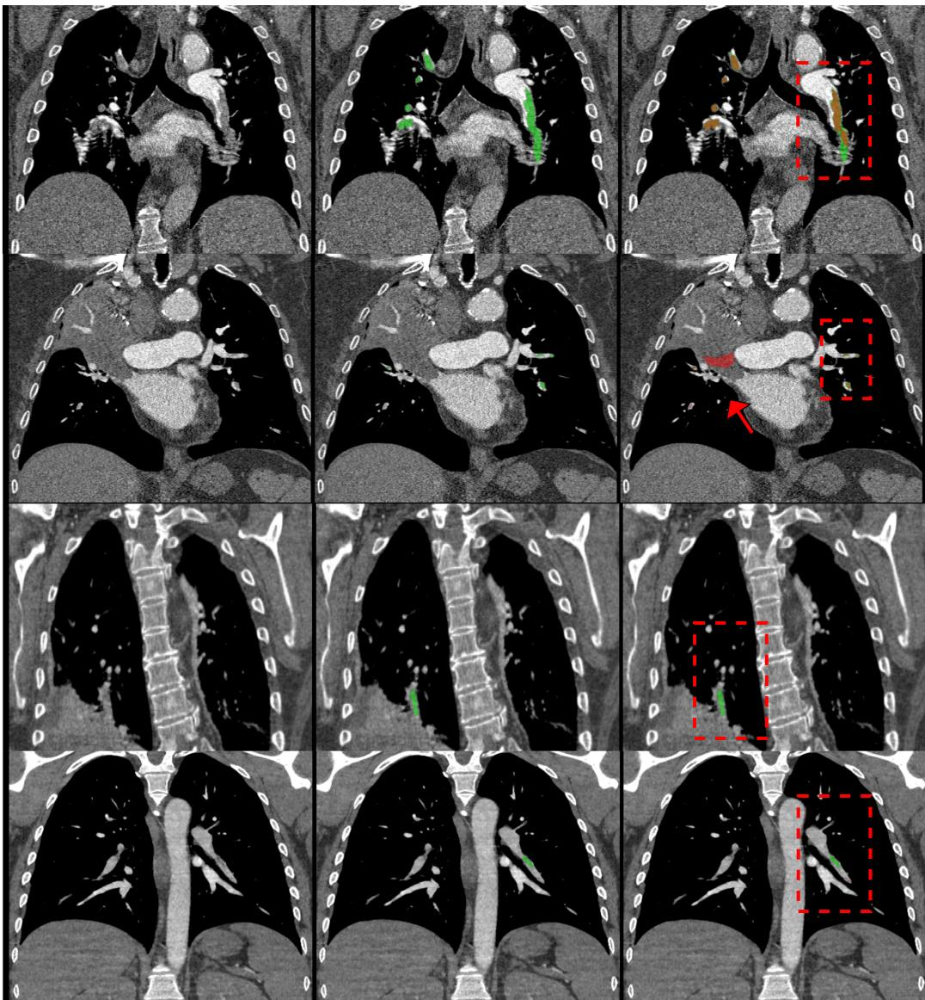

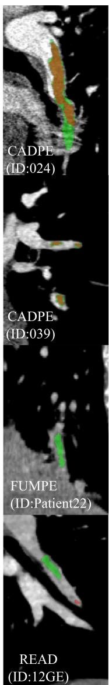  
Figure S9: Qualitative results and representative failure modes of the model trained jointly on all three datasets. Each row shows one representative case: the input CT pulmonary angiography (CTPA) image (Img); the reference annotation (GroundTruth); the model prediction overlaid on the image (Prediction); and a magnified view of the highlighted region (Zoom). Green denotes the reference (GroundTruth) embolus annotation and red denotes the model prediction. Red dashed boxes and the red arrow mark the regions analyzed below. CAD-PE (ID 024): within the boxed region an embolus is missed owing to respiratory motion artifact. CAD-PE (ID 039): the red arrow indicates over-segmentation induced by an adjacent patchy high-attenuation pulmonary opacity mimicking a filling defect. FUMPE (ID Patient22): within the boxed region an embolus is missed because an adjacent patchy high-attenuation opacity reduces clot-to-background contrast. READ (ID 12GE): within the boxed region segmentation errors arise from poor contrast filling of the pulmonary artery.