# NeoWorld-Pro: Programming Interactive Scenes from Monocular Images for Embodied Simulation

Yumeng He1∗ Yichen Song1∗ Xiaotian Yang2 Weijia Zhang1 Zanwei Zhou1 Junru Gong1 Xiaokang Yang1 Yunbo Wang1†

1 Shanghai Jiao Tong University

2 Huazhong University of Science and Technology https://neoworldproject.github.io/neoworld-pro-website/

## Abstract

The advancement of Embodied AI necessitates high-quality simulation assets that faithfully mirror the real world. However, transforming raw visual observations into simulation-ready scenes remains challenging due to the lack of physical grounding and scene-level interactivity in current image-to-URDF methods. We propose NeoWorld-Pro, a framework that reformulates monocular scene reconstruction as procedural programming for interactive 3D environments. Leveraging the zero-shot reasoning and code synthesis capabilities of MLLMs, NeoWorld-Pro converts a single RGB image into executable programs specifying object geometry, articulation, and physical properties. A physics-in-the-loop mechanism then iteratively refines the generated programs by validating their execution in a physics engine, enforcing physically plausible articulations, valid object compositions and interactions, and accurate spatial relationships. Experiments show that NeoWorld-Pro outperforms open-loop and prior monocular reconstruction methods, while enabling complex downstream tasks such as stable stacking and fine-grained manipulation.

## 1 Introduction

The rapid advancement of embodied AI and robotics has increased the demand for high-quality, interactive simulation environments for robot learning. In particular, building faithful digital twins requires not only accurate 3D geometry, but also correct kinematic structures, physical properties, and simulation-ready inter-object relationships that support Real-to-Sim-to-Real transfer. However, manually constructing such assets is labor-intensive and does not scale to the diversity and complexity of the real world. As a result, automating the Real-to-Sim transition, from raw visual observations to physically functional, interactive simulation scenes, has become a critical research frontier.

Despite its importance, this transition remains constrained by three primary bottlenecks. First, most existing work focuses on single-asset image-to-URDF reconstruction [4, 19, 21, 11, 2, 33], lacking scene-level modeling that jointly captures embodied interaction and inter-object spatial and physical dependencies. Second, current approaches typically rely on large curated asset libraries or rigid category-level priors [4, 19, 8, 20, 12, 2, 33], which imposes high data requirements and hinders generalization to out-of-distribution (OOD) scenarios. Third, and perhaps most critically, existing pipelines are inherently open-loop [4, 33, 15, 8, 2]. By treating reconstruction as a one-way inference task, they lack a mechanism for corrective feedback to resolve physical inconsistencies in geometry, articulation, or scene composition. As a result, previous methods often struggle to produce environments that are truly “simulation-ready” for high-precision downstream tasks. Recent work, NeoWorld [43], constructs explorable virtual worlds from a single image via progressive 3D unfolding, combining object-centric 3D foregrounds with 2D background synthesis for efficient exploration.

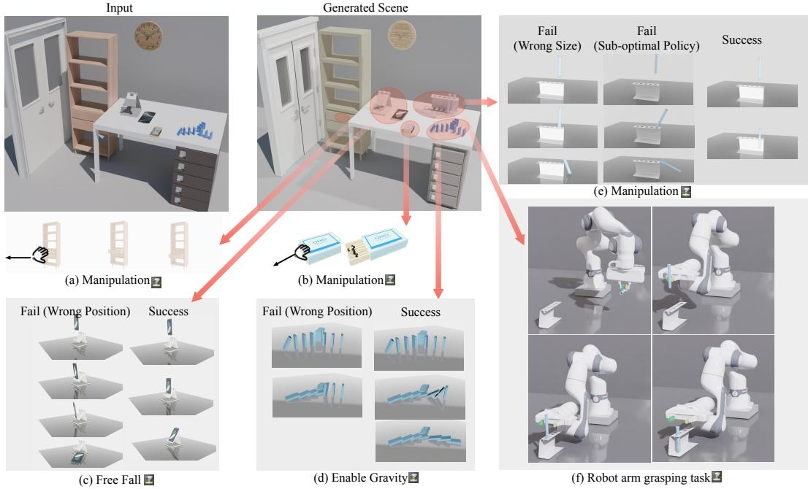  
Figure 1: Demonstration of NeoWorld-Pro. Our framework ensures simulation-readiness by optimizing: (a-b) physically plausible intra-object articulations under external forces, (c-d) stable inter-object spatial configurations, and (e-f) scene viability for assembly and manipulation tasks.

However, its hybrid neural representation offers limited explicit control over simulation-critical geometry, articulation, and physical properties. Taken together, these limitations call for an explicit, executable world representation that supports structured editing and physics-based refinement.

We propose NeoWorld-Pro—where “Pro” denotes programming—a framework that reformulates monocular interactive scene construction through two core innovations: (1) asset reconstruction via procedural code synthesis and (2) physics-in-the-loop scene refinement. In contrast to traditional dense reconstruction methods, which represent scenes as unstructured geometric entities like point clouds or meshes and prioritize per-pixel alignment, NeoWorld-Pro introduces a program-centric paradigm that prioritizes functional and physical plausibility. By leveraging the zero-shot spatial reasoning and code synthesis capabilities of Multimodal Large Language Models (MLLMs), our framework translates a monocular image into executable programs. These programs explicitly define object geometry via compositional primitives, articulation parameters, physical properties, and scene layout. Unlike static geometric representations, this program-centric approach is executable and editable, exposing the generated scene in a form that can be directly inspected, simulated, and modified. By relying on the rich commonsense priors of MLLMs rather than dataset-specific training, NeoWorld-Pro generalizes effectively to novel categories and logically infers hidden structures, significantly improving robustness to the severe occlusions prevalent in cluttered scenes.

Furthermore, to upgrade superficial plausibility in the static appearance of generated scenes into true physical physical consistency, we introduce a physics-in-the-loop validation and refinement mechanism. Instead of passively outputting static assets, NeoWorld-Pro executes the generated programs within a physics engine (e.g., Isaac Sim) to collect dynamic feedback, such as collision events, instability, and articulation failures. This feedback is then fed back to the MLLM to iteratively refine the code. As shown in Figure 1, this closed-loop process validates joint executability at the object level while correcting inter-object penetration, unstable arrangements, and inaccurate relative scales at the scene level, ensuring the final environment is truly simulation-ready.

We evaluate NeoWorld-Pro on asset reconstruction, articulation prediction, scene assembly, and manipulation task execution. Our results show that, by explicitly optimizing for simulation readiness through physics-in-the-loop refinement, NeoWorld-Pro significantly outperforms existing open-loop methods in generating environments that are immediately usable for robot learning.

In summary, the main contributions of this work are as follows:

• We introduce NeoWorld-Pro, formulating monocular scene construction as MLLM-driven program synthesis, reducing reliance on specific asset databases and supervised category-level priors.

• We propose a physics-in-the-loop scene refinement pipeline that leverages simulation feedback to iteratively improve both intra-object articulations and inter-object relationships.

• We construct a simulation benchmark comprising 90 articulated object categories and 30 scenes in Universal Scene Description (USD) format, and validate the effectiveness of NeoWorld-Pro on it.

## 2 Related Work

## 2.1 Articulated Asset Reconstruction from Visual/Geometric Observations

The capability to model articulated assets is fundamental for enabling intelligent agents to perform complex manipulations in physical environments. Yet, manually authoring such assets is laborintensive, requiring explicit part decomposition, geometry modeling, and kinematic specification. Recent learning-based methods thus aim to automate articulated asset construction from visual or geometric observations [14, 11, 17, 6]. Existing research predominantly relies on structured 3D inputs, such as static/dynamic point clouds [7, 28, 10, 37, 31, 18, 38] or meshes [41, 36, 22, 9], which are often unavailable in the wild. Alternative paradigms utilize multi-view-based 3D reconstruction [35, 21] or multi-state images [32, 24, 13, 40, 16, 3] to resolve kinematic ambiguity, yet incur significant data-acquisition overhead and limited scalability.

One line of work mitigates this ambiguity via retrieval- or assembly-based formulations, grounding symbolic structures in mesh libraries or templates [4, 19]. However, their generalization are constrained by the coverage and canonical biases of the underlying assets or training corpora. Learningbased methods instead exploit category-level priors over part layouts, shapes, and motions [8, 20, 12], reducing explicit retrieval dependence but remaining limited by the distributional coverage of training corpora and thus generalizing poorly to out-of-distribution structures or articulations. More recent systems further target simulation-oriented asset construction by converting reconstructed geometry and inferred kinematics into executable representations for physics engines [27, 33, 2].

Although some of them evaluate generated assets in simulation [4, 33, 15] or downstream robotic tasks [11, 27, 1, 8], such evaluation is typically post-hoc rather than used as feedback to refine the generation process. As a result, failures in articulation executability, contact consistency, or inter-object spatial relationships are often exposed only after asset generation. In contrast, our framework reformulates single-image asset construction as MLLM-driven procedural modeling and introduces physics-in-the-loop validation to refine both intra-object articulations and inter-object spatial consistency for simulation-ready scene generation.

## 2.2 LLMs and MLLMs as Articulated 3D Generation Priors

Recent studies have explored LLMs and MLLMs as priors for articulated 3D asset generation. Some methods use foundation models mainly to construct supervision signals, textual conditions, physical annotations, or data augmentations [25, 2, 33]. Beyond such auxiliary usage, LLMs/MLLMs have been used as interpretive priors that expose the latent part structure and motion semantics of visual or geometric observations, while leaving the final asset construction to downstream retrieval, abstraction, or template-based modules [19, 8, 22, 27, 20]. SINGAPO [19] uses GPT-4o to infer an object-level part connectivity graph before grounding it through part abstraction and retrieval, while SPARK [8] leverages GPT-4o to parse parts and infer joints for constructing coarse URDF templates. Articulate-Anything [11] further introduces an actor-critic formulation, where MLLM agents iteratively propose and critique link placement and joint configurations to improve articulation plausibility.

More recently, language models have been adapted from interpreters into direct generators of articulated asset specifications, producing structured outputs that can be converted into executable or simulator-compatible assets [21, 15, 38, 2]. Among them, PhysX-Anything [2] targets single-image physical asset generation by fine-tuning a MLLM to predict a unified structured representation of part geometry, articulation, and physical attributes. Nevertheless, these methods are largely constrained by curated articulated-object or task-specific 3D and physical corpora, making their outputs inherit the structural and kinematic biases of the underlying datasetss. In contrast, our framework reformulates single-view articulated asset generation as zero-shot code-driven procedural modeling, enabling more flexible generation beyond category-specific asset distributions.

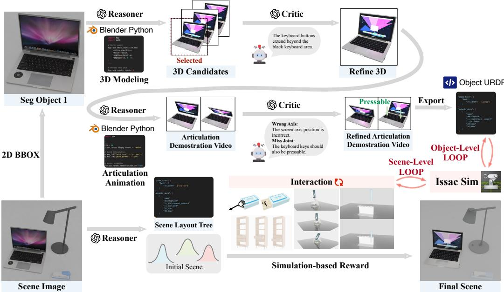  
Figure 2: Overview of the pipeline. Given a monocular RGB image, NeoWorld-Pro first performs scene parsing and reasoning to establish a scene tree and layout. Each foreground object is then programmed into an executable Blender script to generate geometry and articulation. A two-level physics-in-the-loop mechanism ensures simulation-readiness: (1) an object-level loop for articulation and kinematic refinement, and (2) a scene-level loop based on CEM that optimizes scene plausibility, such as relative object scale and placement, collision-free spatial consistency, and stability.

## 3 Method

The NeoWorld-Pro framework reformulates monocular scene reconstruction by shifting from unstructured geometric generation to a structured, program-centric paradigm. By representing scenes as compositions of executable programs, NeoWorld-Pro transforms visual scenes into simulation-ready functional entities. In this section, we present the technical details of the NeoWorld-Pro framework.

## 3.1 Overview: Scene Reconstruction as Physics-in-the-Loop Program Synthesis

Given a single RGB image I, our goal is to generate a simulation-ready interactive scene, represented as a collection of articulated object URDFs assembled within a Universal Scene Description (USD) stage S. This requires the simultaneous inference of part-level geometry, kinematics, and spatial relationships. To ensure these components are mutually consistent and physically stable within a simulator, NeoWorld-Pro moves beyond traditional dense reconstruction toward a structured, program-centric representation that bridges the gap between perception and physical execution.

As shown in Figure 2, NeoWorld-Pro first leverages MLLMs to synthesize executable Blender Python programs as a unified intermediate representation, which are subsequently compiled into standard URDF and USD assets. This program-centric paradigm offers several key advantages: it is executable for direct physical simulation, interpretable for MLLM-based inspection and verification, and editable for iterative scene refinement. Moreover, by exploiting the rich commonsense priors of foundation models, NeoWorld-Pro can logically infer occluded internal structures and missing physical attributes without relying on dataset-specific category priors.

Once the executable representation is established, the remaining challenge is to ensure its physical validity and simulation readiness. We address this through a two-level physics-in-the-loop framework that decomposes the pipeline into object-level and scene-level refinement stages, each designed to handle different types of reconstruction errors:

• Object-level loop (Sec. 3.2): Refines discrete structural and physical attributes, including kinematic topology, joint limits, and inertial properties, through iterative MLLM-guided code editing.

Algorithm 1 CEM for Scene Composition Refinement   
1: Inputs: Initial layout $\mu ^ { ( 0 ) }$ , covariance $\Sigma ^ { ( 0 ) }$ , iterations T, samples N, elite ratio $\rho ,$ input image I   
2: for $t = 0 \dots T - 1$ do   
3: Sample N candidates $\{ z ^ { ( n ) } \} _ { n = 1 } ^ { N } \sim \mathcal { N } ( \mu ^ { ( t ) } , \Sigma ^ { ( t ) } )$   
4: for $\bar { n } = 1 \ldots N$ do   
5: Compose USD stage using base layout perturbed by $z ^ { ( n ) }$   
6: Run an Isaac Sim free-fall rollout   
7: Compute physical penalties $D _ { \mathrm { p e n } } \big ( z ^ { ( n ) } \big )$ and $D _ { \mathrm { d r i f t } } \big ( z ^ { ( n ) } \big )$   
8: Render stage from canonical view and query MLLM for semantic score $S _ { \mathrm { s e m } } ( z ^ { ( n ) } ; I )$   
9: Compute total reward $R ( z ^ { ( n ) } )$   
10: end for   
11: Select top-K candidates where $K = \rho N$   
12: Update $\hat { \mu } ^ { ( t + 1 ) } , \Sigma ^ { ( t + 1 ) }$ using the sample mean and variance of the top-K elites   
13: if convergence criteria met then   
14: break   
15: end if   
16: end for   
17: Return: Best candidate layout

• Scene-level loop (Sec. 3.3): Optimizes continuous scene assembly variables, such as relative scale, orientation, and spatial offsets, using the Cross-Entropy Method (CEM) for derivative-free optimization under simulation feedback.

## 3.2 Object-Level Procedural Programming and Articulation Refinement

This section describes how NeoWorld-Pro reconstructs physically consistent articulated objects and the corresponding scene layout from a single RGB image. The pipeline consists of three stages: scene parsing, procedural synthesis, and object-level physics refinement. Each stage follows a lightweight generate-critic-refine paradigm to improve robustness and physical consistency.

Step 1: Scene parsing. An MLLM-Reasoner (e.g., Qwen3.6-Plus) first predicts (i) the scene hierarchy tree, (ii) 2D and 3D bounding boxes, and (iii) semantic attributes indicating whether an object serves as environmental support or is partially occluded. This joint prediction allows relational information (e.g., a cup resting on a table) to directly constrain object localization and layout estimation, avoiding heuristic downstream assembly. To improve parsing quality, an MLLM-Critic evaluates the predictions based on bounding-box tightness, completeness, and hierarchical consistency. The resulting object crops are then forwarded to the procedural synthesis stage.

Step 2: Procedural asset programming. For each segmented object crop, an MLLM-Programmer (e.g., GPT-5.5) sequentially generates (i) a Blender geometry program, (ii) an articulation program, and (iii) a URDF export script. Each stage is wrapped within a runtime debugging loop to resolve execution failures, followed by a critic-refine loop in which rendered outputs are compared against the input crop. We deliberately choose executable code over direct mesh generation as our intermediate representation, as it is highly reusable across stages and naturally leverages the MLLM’s commonsense reasoning to hallucinate occluded internal structures (e.g., inferring a complete drawer cavity from a visible handle) without relying on dataset-specific priors. The resulting URDFs are therefore structurally valid and articulation-aware, but their physical behavior remains unverified.

Step 3: Object-level physics-in-the-loop refinement. To ensure physical validity, the generated URDFs are simulated in Isaac Sim under two standardized physics scenarios: free-fall and forceperturbation. The free-fall simulation exposes structural issues such as incorrect mass distributions, unstable collision geometries, object penetration, or unintended disassembly. The force-perturbation simulation additionally verifies joint mobility and exposes invalid articulation behavior. A videobased MLLM-Critic analyzes keyframes from these simulations and generates targeted refinement suggestions. The MLLM-Reasoner then performs localized edits restricted to inertial parameters, joint limits, damping coefficients, object origins, and collision geometries. This constrained refinement preserves the validated kinematic topology and visual geometry while improving physical executability. At this stage, each reconstructed object is individually physically consistent. However, ensuring

Input

URDF-Anything+ Articulate-Anything PhysX-Anything

ArtiCraft

Ours

Ours (Articulated)

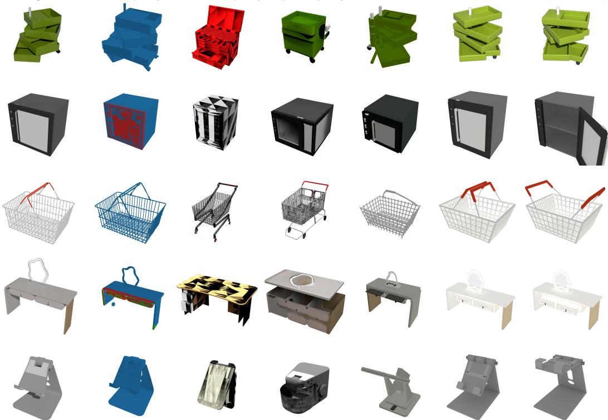  
Figure 3: Object-level reconstruction results of articulated assets. Compared with existing methods, NeoWorld-Pro recovers more faithful geometry, appearance, and articulation structure.

correct relative scale, placement, and interaction among objects requires scene-level optimization, which we introduce next.

## 3.3 Scene-Level Composition and CEM Refinement

This section assembles the generated URDF assets into a complete and refined USD, which consists of two stages: deterministic scene composition from the inferred layout, followed by stochastic optimization via a reward-driven CEM that integrates physical simulation and MLLM-based evaluation.

Step 4: Scene composition. We initially construct the scene via a top-down traversal of the scene tree: the horizontal coordinates $( x , y )$ are initialized from the parsed spatial layout, while the vertical coordinate is determined by aligning each child’s bottom surface with the top surface of its parent. This strategy provides a geometrically consistent initialization while reducing floating and interobject penetration. Non-environment objects are instantiated via USD references to preserve their URDF articulation properties, whereas environment supports are instantiated as static primitives and excluded from subsequent optimization. Although this deterministic construction provides a plausible initialization, it often introduces physical artifacts such as inter-object penetration, unstable stacking, scale inconsistency, and incorrect relative orientation. These errors are difficult for MLLMs to correct in continuous pose space but can be directly quantified using a physics engine.

Step 5: CEM-based scene refinement. We maintain a diagonal Gaussian distribution over a 4D perturbation vector for each non-environment object $o _ { i } .$ The initial layout is treated as the zero-mean configuration, with $z _ { i } = ( \Delta x _ { i } , \Delta y _ { i } , \Delta \psi _ { i } , \log s _ { i } ) \in \mathbb { R } ^ { 4 }$ representing planar translation, yaw rotation, and isotropic scale in parent coordinates. The vertical axis is excluded to strictly enforce scene-tree snapping constraints, preventing invalid floating or penetration. At each iteration, we sample N candidate layouts, instantiate them in USD, and evaluate them in Isaac Sim through free-fall rollouts. The top-K candidates are updated under the Gaussian distribution via a hybrid reward, where $w _ { * } \geq 0$ are scalar weights, I is the input image, and z is the candidate perturbation vector:

$$
R ( z ) = w _ { \mathrm { s e m } } S _ { \mathrm { s e m } } ( z ; I ) - w _ { \mathrm { p e n } } D _ { \mathrm { p e n } } ( z ) - w _ { \mathrm { d r i f t } } D _ { \mathrm { d r i f t } } ( z ) .\tag{1}
$$

Table 1: Object-level reconstruction results in appearance, cross-modal similarity, and geometry evaluation. Bold indicates the best result and underline indicates the second best. ‘/‘ denotes methods that do not produce appearance outputs.
<table><tr><td rowspan="2">Method</td><td colspan="3">Appearance Evaluation</td><td rowspan="2">Similarity Uni3D↑</td><td colspan="3">Geometry Evaluation</td></tr><tr><td>SSIM↑</td><td>LPIPS↓</td><td>CLIP↑</td><td>CD×10↓</td><td>F@0.01↑</td><td>F@0.05↑</td></tr><tr><td>Articulate-Anything [11]</td><td>0.7646</td><td>0.2930</td><td>0.7056</td><td>0.2125</td><td>0.3989</td><td>10.76</td><td>41.07</td></tr><tr><td>PhysX-Anything [2]</td><td>0.7657</td><td>0.2991</td><td>0.7937</td><td>0.2709</td><td>0.7150</td><td>4.61</td><td>24.72</td></tr><tr><td>URDF-Anything+ [33]</td><td></td><td>/</td><td></td><td>0.1638</td><td>0.1696</td><td>24.30</td><td>65.18</td></tr><tr><td>Articraft [45]</td><td>0.8926</td><td>0.2149</td><td>0.8999</td><td>0.2566</td><td>0.2155</td><td>22.14</td><td>62.25</td></tr><tr><td>Ours</td><td>0.8894</td><td>0.1989</td><td>0.9042</td><td>0.2812</td><td>0.1809</td><td>25.77</td><td>67.06</td></tr></table>

Table 2: Object-level evaluation of joint articulation and kinematics. #Total, #Pred, and #Hit are the number of ground-truth joints, predicted joints, and matched hits. We report the joint miss rate (Miss), joint type identification error (Type), orientation error (Axis), and positional error (Pivot).
<table><tr><td>Method</td><td>Total</td><td>#Pred</td><td>#Hit</td><td>Miss↓</td><td>Type↓</td><td>Axis↓</td><td>Pivot.↓</td></tr><tr><td>Articulate-Anything [11]</td><td>245</td><td>170</td><td>95</td><td>61.22</td><td>69.39</td><td>63.25</td><td>0.32</td></tr><tr><td>PhysX-Anything [2]</td><td>245</td><td>192</td><td>126</td><td>48.57</td><td>58.78</td><td>45.80</td><td>0.37</td></tr><tr><td>URDF-Anything+ [33]</td><td>245</td><td>96</td><td>74</td><td>69.80</td><td>82.86</td><td>50.41</td><td>0.40</td></tr><tr><td>Articraft [45]</td><td>245</td><td>304</td><td>190</td><td>22.45</td><td>29.39</td><td>30.14</td><td>0.23</td></tr><tr><td>Ours</td><td>245</td><td>268</td><td>216</td><td>11.83</td><td>18.78</td><td>28.52</td><td>0.19</td></tr></table>

Here, physical terms are measured directly in simulation: $D _ { \mathrm { p e n } }$ aggregates SDF penetration across object pairs, while $D _ { \mathrm { d r i f t } }$ measures pose drift during the free-fall rollout to encourage stacking stability. The semantic term $S _ { \mathrm { s e m } }$ uses an MLLM (e.g., GPT-5.5) to assess rendered candidates against the input image, emphasizing relational cues such as depth ordering, relative scale, and spatial consistency rather than pixel-level alignment. This process repeats until convergence or a fixed iteration budget (Algorithm 1). By resolving discrete structural attributes in Sec. 3.2 and continuous scene optimization in this section, NeoWorld-Pro forms a unified physics-in-the-loop framework that jointly enforces articulation correctness and global spatial consistency, distinguishing it from prior open-loop approaches.

## 4 Experiments

## 4.1 Experimental Setups

We evaluate NeoWorld-Pro on both a public articulated-object benchmark and a newly constructed multi-object simulation benchmark. We introduce a synthetic scene dataset for monocular reconstruction in physically realistic multi-object environments. The dataset contains 90 articulated object categories, composing 30 USD-format object assemblies in total. Each scene contains multiple articulated or rigid objects with both intra-object and inter-object occlusions, and is paired with several downstream manipulation tasks for evaluation beyond reconstruction and articulation prediction.

For single-object image-to-URDF reconstruction, we compare NeoWorld-Pro with four representative baselines: PhysX-Anything [2] and URDF-Anything+ [33], which generate simulation-compatible object assets from visual inputs; Articulate-Anything [11], which follows a retrieval-and-critic paradigm for articulated structure estimation; and Articraft [45], a state-of-the-art generation method that synthesizes articulated assets through agentic program synthesis, which mainly focuses on text input. For scene-level reconstruction, we compare against TabletopGen [30], VIGA [39], and SAGE [34], spanning simulation-ready generation from tabletop to room-scale scenes.

## 4.2 Object-Level Reconstruction Results of Articulated Assets

We present qualitative results of single-object image-to-URDF reconstruction in Figure 3. As shown, our method achieves the most accurate recovery of articulated joints and produces highly accurate geometric reconstructions.

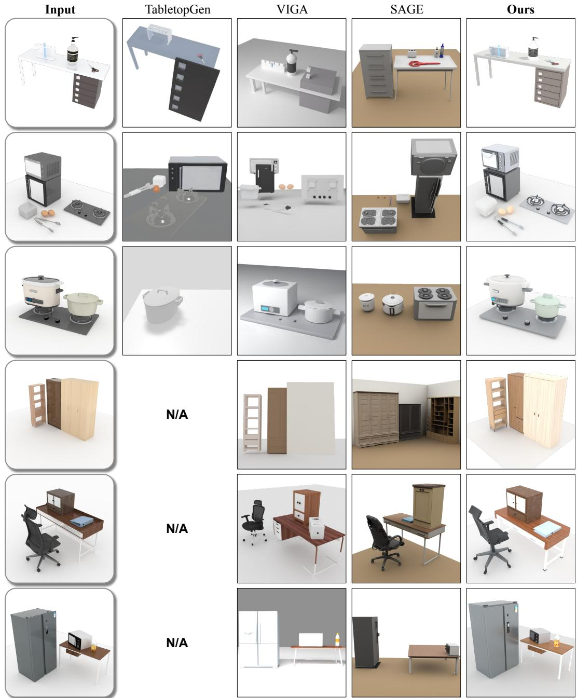  
Figure 4: Qualitative scene reconstruction on our synthetic scene dataset. Each row compares reconstructions from the same monocular input. NeoWorld-Pro more faithfully preserves object identity, relative scale and orientation, and inter-object layout across both tabletop and larger workspace scenes. “N/A” denotes examples outside TabletopGen’s tabletop setting.

We further quantify the comparisons from three perspectives. From the appearance perspective, (i) we measure photometric rendering fidelity using SSIM [29] and LPIPS [42]. (ii) We assess semantic similarity using CLIP similarity [23]. From the geometric view, (iii) we quantify mesh reconstruction quality using Chamfer distance [5] and F-score [26]. (iv) We report Uni3D similarity [44] as a cross-modal alignment metric between input images and reconstructed 3D meshes. Finally, for articulation, (v) given a predicted URDF and its ground truth, we render videos by sequentially actuating corresponding joints in both models. An MLLM compares the paired videos to determine whether each ground-truth joint is correctly recovered. We report the total number of joints and hits, as well as the miss rate. As shown in Table 1, across appearance, geometry, and articulation evaluations, NeoWorld-Pro delivers strong overall performance against prior open-loop baselines. It achieves the best LPIPS and CLIP scores while remaining competitive in SSIM, obtains the highest F-scores at both thresholds and the second-lowest Chamfer distance, and provides the strongest cross-modal 3D alignment according to Uni3D similarity. For articulation, as shown in Table 2, NeoWorld-Pro significantly improves joint inference quality, with a much lower miss rate, more correct joint predictions, and reduced axis, pivot, and type errors. Overall, the results show that program-centric reconstruction with physics-in-the-loop refinement leads to more accurate, complete, and physically consistent object-level understanding.

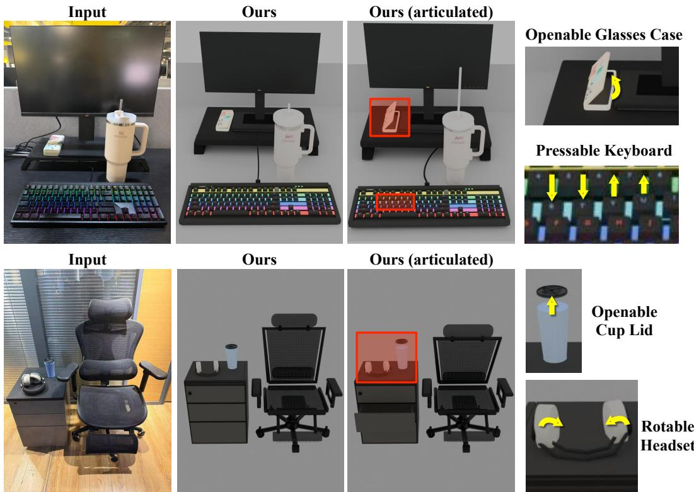  
Figure 5: Reconstruction from real-world images. The results illustrate generalization to real-world appearance and clutter while retaining functional articulations.

## 4.3 Scene-Level Reconstruction and Assembly Results

We provide a qualitative comparison on our synthetic scene dataset in Figure 4. Across tabletop, appliance, and workspace layouts, NeoWorld-Pro preserves the complete set of foreground objects while more faithfully recovering their relative scales, orientations, and pairwise spatial relationships. In contrast, competing methods frequently omit objects, substitute scene elements, or distort the input layout, with these failures becoming more pronounced as the number and diversity of objects increase. Beyond static reconstruction quality, we further demonstrate that our reconstructed scenes are free of object penetration, remain stable under dynamic simulation, and support physically meaningful downstream interactions, including stable phone–stand support, robotic grasping of test tubes from racks, and controllable domino-pushing behaviors. These scenarios require accurate recovery of inter-object geometry, articulation, contact, and spatial dependencies, which existing open-loop methods struggle to achieve reliably.

Figure 5 further demonstrates generalization to two real-world monocular images. Despite background clutter, illumination variation, and partial occlusion, NeoWorld-Pro reconstructs the primary objects and their spatial relationships. The actuated renderings additionally show that the inferred movable components remain functional after scene assembly.

Table 3: Scene-level results on the full benchmark and the 11-scene tabletop subset. S-Pen, P-Pen, S-Stab, and O-Stab denote scene-level (inter-object), part-level (inner-object) penetration rate, and scene-/object-level stability, respectively. These metrics are percentages. MLLM scores (the last three columns) use a 1–7 scale.
<table><tr><td>Method</td><td>S-Pen↓</td><td>P-Pen↓</td><td>S-Stab↑</td><td>O-Stab↑</td><td>CLIP↑</td><td>DINOv2↑</td><td>Complete↑</td><td>Layout↑</td><td>Function↑</td></tr><tr><td colspan="10">Full benchmark</td></tr><tr><td>VIGA [39]</td><td>56.67</td><td>63.37</td><td>23.33</td><td>27.33</td><td>0.8831</td><td>0.6087</td><td>4.70</td><td>3.95</td><td>3.45</td></tr><tr><td>SAGE [34]</td><td>6.67</td><td>2.41</td><td>70.00</td><td>91.60</td><td>0.8729</td><td>0.5379</td><td>3.80</td><td>2.60</td><td>2.90</td></tr><tr><td>Ours</td><td>0.00</td><td>0.00</td><td>100.00</td><td>100.00</td><td>0.9128</td><td>0.7855</td><td>6.20</td><td>5.35</td><td>5.58</td></tr><tr><td colspan="10">Tabletop subset</td></tr><tr><td>VIGA [39]</td><td>54.55</td><td>67.26</td><td>18.18</td><td>25.66</td><td>0.8764</td><td>0.5950</td><td>4.55</td><td>3.91</td><td>3.00</td></tr><tr><td>TabletopGen [30]</td><td>45.45</td><td>26.53</td><td>36.36</td><td>67.35</td><td>0.8917</td><td>0.6266</td><td>4.36</td><td>3.73</td><td>3.64</td></tr><tr><td>SAGE [34]</td><td>9.09</td><td>4.17</td><td>100.00</td><td>100.00</td><td>0.8741</td><td>0.4742</td><td>3.45</td><td>2.64</td><td>2.73</td></tr><tr><td>Ours</td><td>0.00</td><td>0.00</td><td>100.00</td><td>100.00</td><td>0.9205</td><td>0.7166</td><td>6.10</td><td>5.70</td><td>5.58</td></tr></table>

For quantitative comparisons, Table 3 summarizes scene-level inter-object penetration rate, part-level self-penetration rate, and scene- and object-level stability under gravity. All physical metrics are evaluated in a physics simulator (e.g., Isaac Sim). Specifically, the scene-level penetration rate measures the proportion of reconstructed scenes containing at least one inter-object penetration, while the part-level self-penetration rate measures the proportion of articulated objects whose constituent parts intersect. Stability under gravity evaluates whether reconstructed scenes and individual objects remain in physically valid configurations after being simulated under gravity. We additionally evaluate CLIP and DINOv2 similarity, together with MLLM-based judgments of scene completeness, layout fidelity, and functional feasibility. CLIP and DINOv2 similarity measure the semantic and visual con sistency between the input image and the rendered reconstructed scene, respectively. MLLM-based scores assess whether the reconstructed scene preserves all relevant objects (completeness), faithfully reproduces their spatial arrangement (layoutfidelity), and supports the intended physical interactions (functional feasibility). Across both the full benchmark and the tabletop subset, NeoWorld-Pro eliminates inter-object collisions, maintains strong stability, and achieves the highest semantic scores.

## 4.4 Image-to-Policy Demonstration for the Manipulation Task

As illustrated in Figure 1, we further demonstrate image-to-policy execution on a test-tube placement task. Given a monocular scene image containing a test tube and a rack, NeoWorld-Pro reconstructs both objects and their relative spatial configuration. Given the test-tube placement task, which requires the tube to pass through an opening and be supported by the rack, an MLLM specifies the initial end-effector position and displacement for executing the manipulation in Isaac Sim. Errors in the relative pose or scale of the reconstructed objects may render the predicted motion infeasible and cause task failure. We use this execution outcome as a feedback signal to iteratively refine the scene layout until the placement succeeds, demonstrating that the reconstructed scene supports physically grounded downstream manipulation rather than merely visual resemblance.

## 4.5 Ablation Studies

We validate the refinement components of NeoWorld-Pro at both object and scene levels, evaluating their effects on articulation recovery and scene-level task execution. At the object level, we remove either the geometry or articulation critic to assess their impact on joint recovery. At the scene level, we ablate the semantic reward and the closed-loop simulator critic.

Table 4: Analyses of model component.
<table><tr><td>Method</td><td>Success (%)1</td><td>Miss (%)</td></tr><tr><td>w/o geom. refine critic</td><td>76.47</td><td>14.84</td></tr><tr><td>w/o artic. refine critic</td><td>83.33</td><td>17.18</td></tr><tr><td>w/o  $S _ { \mathrm { s e m } }$ </td><td>48.81</td><td>10.93</td></tr><tr><td>w/o simul. (open-loop)</td><td>44.05</td><td>11.72</td></tr><tr><td>NeoWorld-Pro</td><td>92.85</td><td>7.03</td></tr></table>

The variant w/o $S _ { \mathrm { s e m } }$ removes the MLLM-based semantic score and relies solely on simulator-derived physical signals. While it can correct some local physical artifacts, it fails to capture high-level semantics such as object arrangement, task affordances, and consistency with the input image. Thi shows that scalar physics rewards alone are insufficient, and the scene-level semantic/video critic is essential. Finally, w/o simulator-critic removes closed-loop simulation feedback and directly uses the initially composed scene. Without physical validation, errors from parsing and generation remain uncorrected, leading to failures such as penetration, unstable stacking, incorrect scale, and invalid articulation, as illustrated in Figure 1.

Table 5 reports additional ablations of scene-level CEM reward terms derived from the physics simulator. We report task success rate because these terms primarily affect scene execution rather than object-level joint discovery. The variants w/o $D _ { \mathrm { { p e n } } }$ and w/o $D _ { \mathrm { d r i f t } }$ remove the inter-object collision penalty and the free-fall stability penalty, respectively, testing whether semantic scoring alone can enforce collisionfree placement and stable support relationships.

Table 5: Ablation of CEM reward terms derived by a physics engine.
<table><tr><td>Method</td><td>Success↑ (%)</td></tr><tr><td>w/o  $D _ { \mathrm { { p e n } } }$ </td><td>76.47</td></tr><tr><td>w/o  $D _ { \mathrm { d r i f t } }$ </td><td>88.24</td></tr><tr><td>NeoWorld-Pro</td><td>92.85</td></tr></table>

## 5 Conclusion and Limitation

We presented NeoWorld-Pro, a physics-in-the-loop framework for monocular real-to-sim scene reconstruction. By reformulating reconstruction as MLLM-driven program synthesis and coupling it with object-level and scene-level simulation feedback, NeoWorld-Pro produces simulation-ready assets with accurate geometry, articulation, and spatial relationships. Extensive experiments demonstrate strong improvements over open-loop baselines in appearance fidelity, geometric accuracy, articulation prediction, and downstream manipulation tasks, highlighting the effectiveness of integrating executable representations with physical validation.

NeoWorld-Pro is currently limited to rigid and articulated objects under quasi-static physics. It does not yet model highly deformable or continuous media such as cloth, fluids, or granular materials, where dynamics are significantly more complex and less amenable to URDF-style representations. Our evaluation is also limited to scenes with fewer than 10 objects. Extending the framework to support deformable assets, richer material properties, and denser scenes remains an important direction for future work.

## References

[1] Ziang Cao, Zhaoxi Chen, Liang Pan, and Ziwei Liu. Physx-3d: Physical-grounded 3d asset generation. arXiv preprint arXiv:2507.12465, 2025.

[2] Ziang Cao, Fangzhou Hong, Zhaoxi Chen, Liang Pan, and Ziwei Liu. Physx-anything: Simulation-ready physical 3d assets from single image. arXiv preprint arXiv:2511.13648, 2025.

[3] Chuhao Chen, Isabella Liu, Xinyue Wei, Hao Su, and Minghua Liu. Freeart3d: Training-free articulated object generation using 3d diffusion. In Proceedings ofthe SIGGRAPH Asia 2025 Conference Papers, pages 1–13, 2025.

[4] Zoey Chen, Aaron Walsman, Marius Memmel, Kaichun Mo, Alex Fang, Karthikeya Vemuri, Alan Wu, Dieter Fox, and Abhishek Gupta. Urdformer: A pipeline for constructing articulated simulation environments from real-world images. arXiv preprint arXiv:2405.11656, 2024.

[5] Haoqiang Fan, Hao Su, and Leonidas J Guibas. A point set generation network for 3d object reconstruction from a single image. In Proceedings ofthe IEEE conference on computer vision and pattern recognition, pages 605–613, 2017.

[6] Haoran Geng, Helin Xu, Chengyang Zhao, Chao Xu, Li Yi, Siyuan Huang, and He Wang. Gapartnet: Cross-category domain-generalizable object perception and manipulation via generalizable and actionable parts. In Proceedings of the IEEE/CVF conference on computer vision and pattern recognition, pages 7081–7091, 2023.

[7] Anna-Maria Halacheva, Yang Miao, Jan-Nico Zaech, Xi Wang, Luc Van Gool, and Danda Pani Paudel. Articulate3d: Holistic understanding of 3d scenes as universal scene description. In Proceedings of the IEEE/CVF International Conference on Computer Vision, pages 5633–5644, 2025.

[8] Yumeng He, Ying Jiang, Jiayin Lu, Yin Yang, and Chenfanfu Jiang. Spark: Sim-ready part-level articulated reconstruction with vlm knowledge. arXiv preprint arXiv:2512.01629, 2025.

[9] Zhao Huang, Boyang Sun, Alexandros Delitzas, Jiaqi Chen, and Marc Pollefeys. React3d: Recovering articulations for interactive physical 3d scenes. IEEE Robotics and Automation Letters, 2026.

[10] Jens U Kreber and Joerg Stueckler. Guiding diffusion-based articulated object generation by partial point cloud alignment and physical plausibility constraints. In Proceedings of the IEEE/CVF International Conference on Computer Vision, pages 3206–3214, 2025.

[11] Long Le, Jason Xie, William Liang, Hung-Ju Wang, Yue Yang, Yecheng Jason Ma, Kyle Vedder, Arjun Krishna, Dinesh Jayaraman, and Eric Eaton. Articulate-anything: Automatic modeling of articulated objects via a vision-language foundation model. arXiv preprint arXiv:2410.13882, 2024.

[12] Haitian Li, Haozhe Xie, Junxiang Xu, Beichen Wen, Fangzhou Hong, and Ziwei Liu. Monoart: Progressive structural reasoning for monocular articulated 3d reconstruction. arXiv preprint arXiv:2603.19231, 2026.

[13] Jialin Li, Bin Fu, Ruiping Wang, and Xilin Chen. Gear: Geometry-motion alternating refinement for articulated object modeling with gaussian splatting. arXiv preprint arXiv:2604.07728, 2026.

[14] Xiaolong Li, He Wang, Li Yi, Leonidas J Guibas, A Lynn Abbott, and Shuran Song. Category-level articulated object pose estimation. In Proceedings ofthe IEEE/CVF conference on computer vision and pattern recognition, pages 3706–3715, 2020.

[15] Zhe Li, Xiang Bai, Jieyu Zhang, Zhuangzhe Wu, Che Xu, Ying Li, Chengkai Hou, and Shanghang Zhang. Urdf-anything: Constructing articulated objects with 3d multimodal language model. arXiv preprint arXiv:2511.00940, 2025.

[16] Zizhang Li, Cheng Zhang, Zhengqin Li, Henry Howard-Jenkins, Zhaoyang Lv, Chen Geng, Jiajun Wu, Richard Newcombe, Jakob Engel, and Zhao Dong. Art: Articulated reconstruction transformer. arXiv preprint arXiv:2512.14671, 2025.

[17] Xinyu Lian, Zichao Yu, Ruiming Liang, Yitong Wang, Li Ray Luo, Kaixu Chen, Yuanzhen Zhou, Qihong Tang, Xudong Xu, Zhaoyang Lyu, et al. Infinite mobility: Scalable high-fidelity synthesis of articulated objects via procedural generation. arXiv preprint arXiv:2503.13424, 2025.

[18] Jiong Lin, Lechen Zhang, Kwansoo Lee, Jialong Ning, Judah Goldfeder, and Hod Lipson. Autourdf: Unsupervised robot modeling from point cloud frames using cluster registration. In Proceedings ofthe Computer Vision and Pattern Recognition Conference, pages 27628–27637, 2025.

[19] Jiayi Liu, Denys Iliash, Angel X Chang, Manolis Savva, and Ali Mahdavi-Amiri. Singapo: Single image controlled generation of articulated parts in objects. arXiv preprint arXiv:2410.16499, 2024.

[20] Ruijie Lu, Yu Liu, Jiaxiang Tang, Junfeng Ni, Yuxiang Wang, Diwen Wan, Gang Zeng, Yixin Chen, and Siyuan Huang. Dreamart: Generating interactable articulated objects from a single image. arXiv preprint arXiv:2507.05763, 2025.

[21] Zhao Mandi, Yijia Weng, Dominik Bauer, and Shuran Song. Real2code: Reconstruct articulated objects via code generation. arXiv preprint arXiv:2406.08474, 2024.

[22] Xiaowen Qiu, Jincheng Yang, Yian Wang, Zhehuan Chen, Yufei Wang, Tsun-Hsuan Wang, Zhou Xian, and Chuang Gan. Articulate anymesh: Open-vocabulary 3d articulated objects modeling. arXiv preprint arXiv:2502.02590, 2025.

[23] Alec Radford, Jong Wook Kim, Chris Hallacy, Aditya Ramesh, Gabriel Goh, Sandhini Agarwal, Girish Sastry, Amanda Askell, Pamela Mishkin, Jack Clark, et al. Learning transferable visual models from natural language supervision. In International conference on machine learning, pages 8748–8763. PmLR, 2021.

[24] Licheng Shen, Saining Zhang, Honghan Li, Peilin Yang, Zihao Huang, Zongzheng Zhang, and Hao Zhao. Gaussianart: Unified modeling of geometry and motion for articulated objects. arXiv preprint arXiv:2508.14891, 2025.

[25] Jiayi Su, Youhe Feng, Zheng Li, Jinhua Song, Yangfan He, Botao Ren, and Botian Xu. Artformer: Controllable generation of diverse 3d articulated objects. In Proceedings of the Computer Vision and Pattern Recognition Conference, pages 1894–1904, 2025.

[26] Maxim Tatarchenko, Stephan R Richter, René Ranftl, Zhuwen Li, Vladlen Koltun, and Thomas Brox. What do single-view 3d reconstruction networks learn? In Proceedings ofthe IEEE/CVF conference on computer vision and pattern recognition, pages 3405–3414, 2019.

[27] Jiawei Wang, Dingyou Wang, Jiaming Hu, Qixuan Zhang, Jingyi Yu, and Lan Xu. Kinematify: Openvocabulary synthesis of high-dof articulated objects. arXiv preprint arXiv:2511.01294, 2025.

[28] Penghao Wang, Siyuan Xie, Hongyu Yan, Xianghui Yang, Jingwei Huang, Chunchao Guo, and Jiayuan Gu. Artllm: Generating articulated assets via 3d llm. arXiv preprint arXiv:2603.01142, 2026.

[29] Zhou Wang, Alan C Bovik, Hamid R Sheikh, and Eero P Simoncelli. Image quality assessment: from error visibility to structural similarity. IEEE transactions on image processing, 13(4):600–612, 2004.

[30] Ziqian Wang, Yonghao He, Licheng Yang, Wei Zou, Hongxuan Ma, Liu Liu, Wei Sui, Yuxin Guo, and Hu Su. Tabletopgen: Instance-level interactive 3d tabletop scene generation from text or single image. arXiv preprint arXiv:2512.01204, 2025.

[31] Yijia Weng, He Wang, Qiang Zhou, Yuzhe Qin, Yueqi Duan, Qingnan Fan, Baoquan Chen, Hao Su, and Leonidas J Guibas. Captra: Category-level pose tracking for rigid and articulated objects from point clouds. In Proceedings ofthe IEEE/CVF International Conference on Computer Vision, pages 13209–13218, 2021.

[32] Ruiqi Wu, Xinjie Wang, Liu Liu, Chunle Guo, Jiaxiong Qiu, Chongyi Li, Lichao Huang, Zhizhong Su, and Ming-Ming Cheng. Dipo: Dual-state images controlled articulated object generation powered by diverse data. arXiv preprint arXiv:2505.20460, 2025.

[33] Zhuangzhe Wu, Yue Xin, Chengkai Hou, Minghao Chen, Yaoxu Lyu, Jieyu Zhang, and Shanghang Zhang. Urdf-anything+: Autoregressive articulated 3d models generation for physical simulation. arXiv preprint arXiv:2603.14010, 2026.

[34] Hongchi Xia, Xuan Li, Zhaoshuo Li, Qianli Ma, Jiashu Xu, Ming-Yu Liu, Yin Cui, Tsung-Yi Lin, Wei-Chiu Ma, Shenlong Wang, Shuran Song, and Fangyin Wei. Sage: Scalable agentic 3d scene generation for embodied ai. arXiv preprint arXiv:2602.10116, 2026.

[35] Hongchi Xia, Entong Su, Marius Memmel, Arhan Jain, Raymond Yu, Numfor Mbiziwo-Tiapo, Ali Farhadi, Abhishek Gupta, Shenlong Wang, and Wei-Chiu Ma. Drawer: Digital reconstruction and articulation with environment realism. In Proceedings ofthe Computer Vision and Pattern Recognition Conference, pages 21771–21782, 2025.

[36] WenBo Xu, Liu Liu, Li Zhang, Dan Guo, and RuoNan Liu. Motionanymesh: Physics-grounded articulation for simulation-ready digital twins. arXiv preprint arXiv:2603.12936, 2026.

[37] Zihao Yan, Ruizhen Hu, Xingguang Yan, Luanmin Chen, Oliver Van Kaick, Hao Zhang, and Hui Huang. Rpm-net: recurrent prediction of motion and parts from point cloud. arXiv preprint arXiv:2006.14865, 2020.

[38] Yixuan Yang, Luyang Xie, Zhen Luo, Zixiang Zhao, Tongsheng Ding, Mingqi Gao, and Feng Zheng. Artiworld: Llm-driven articulation of 3d objects in scenes. arXiv preprint arXiv:2511.12977, 2025.

[39] Shaofeng Yin, Jiaxin Ge, Zora Zhiruo Wang, Chenyang Wang, Xiuyu Li, Michael J Black, Trevor Darrell, Angjoo Kanazawa, and Haiwen Feng. Vision-as-inverse-graphics agent via interleaved multimodal reasoning. arXiv preprint arXiv:2601.11109, 2026.

[40] Sylvia Yuan, Ruoxi Shi, Xinyue Wei, Xiaoshuai Zhang, Hao Su, and Minghua Liu. Larm: A large articulated object reconstruction model. In Proceedings ofthe SIGGRAPH Asia 2025 Conference Papers, pages 1–12, 2025.

[41] Chuanrui Zhang, Minghan Qin, Yuang Wang, Baifeng Xie, Hang Li, and Ziwei Wang. Simart: Decomposing monolithic meshes into sim-ready articulated assets via mllm. arXiv preprint arXiv:2603.23386, 2026.

[42] Richard Zhang, Phillip Isola, Alexei A Efros, Eli Shechtman, and Oliver Wang. The unreasonable effectiveness of deep features as a perceptual metric. In Proceedings of the IEEE conference on computer vision and pattern recognition, pages 586–595, 2018.

[43] Yanpeng Zhao, Shanyan Guan, Yunbo Wang, Yanhao Ge, Wei Li, and Xiaokang Yang. Neoworld: Neural simulation of explorable virtual worlds via progressive 3d unfolding. arXiv preprint arXiv:2509.24441, 2025.

[44] Junsheng Zhou, Jinsheng Wang, Baorui Ma, Yu-Shen Liu, Tiejun Huang, and Xinlong Wang. Uni3d: Exploring unified 3d representation at scale. arXiv preprint arXiv:2310.06773, 2023.

[45] Matt Zhou, Ruining Li, Xiaoyang Lyu, Zhaomou Song, Zhening Huang, Chuanxia Zheng, Christian Rupprecht, Andrea Vedaldi, and Shangzhe Wu. Articraft: An agentic system for scalable articulated 3d asset generation. arXiv preprint arXiv:2605.15187, 2026.

Open the file.   
Close the file.

## Appendix

## A Scene Task Configurations

Figure 6 shows additional examples from our scene-level task set. These tasks cover diverse object configurations and manipulation goals, including placement, assembly, and interaction with articulated parts. They are designed to test whether the reconstructed scene is not only visually plausible, but also physically executable in simulation: objects must have reasonable relative scale and pose, avoid severe interpenetration, and expose task-relevant affordances for downstream manipulation.

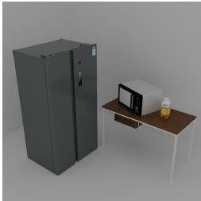  
Open the drink bottle. Close the drink bottle.  
Open the fridge. Put the drink into the fridge. Close the fridge.

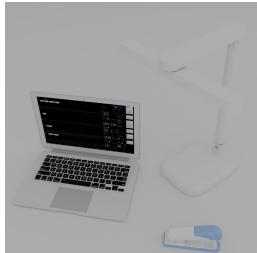  
Open the laptop. Press the "y" key on the keyboard. Close the laptop.  
Open the microwave. Put the drink into the microwave. Close the microwave.  
Place the stapler on top of the laptop. Press the stapler.

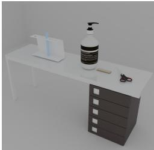  
Remove the middle test tube from the test tube rack. Place the middle test tube on the desk  
Press the pump bottle.

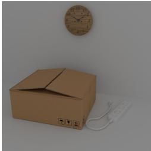  
Snip the scissors. Open the pencil case Place the scissors into the pencil case.  
Open the carton. Place the clock into the carton. Close the carton.  
Open the microwave. Close the microwave. Rotate the lamp head clockwise.  
Turn on the socket. Turn off the socket. Open the carton. Place the socket into the carton. Close the carton

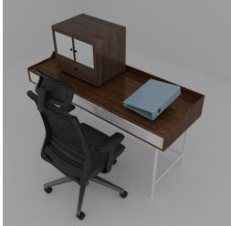  
Rotate the office chair anti-clockwise. Push the chair under the desk. Pull the chair out from under the desk

Open the cabinet.   
Put the glasses into the cabinet Close the cabinet. Open the dishwasher.   
Place the food tongs into the dishwasher.   
Close the dishwasher.

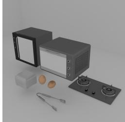  
Squeeze the food tongs.

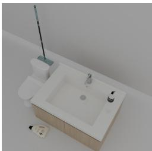

Open the detergent.

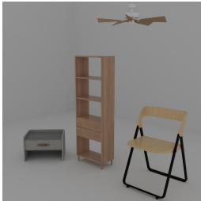  
Open the bedside table. Close the bedside table.  
Rotate the ceiling fan.

Open the egg holder.   
Place the egg into the egg holder..   
Close the egg holder. Press the pump bottle.   
Place the pump bottle into the washbasin. Turn on the cooker.   
Turn off the cooker.

Rotate the mop head. Extend the mop handle. Retract the mop handle

Turn on the faucet of the washbasin.

Open the drawer of the bookcase. Move the desk lamp from the bookcase shelf into the drawer. Close the drawer of the bookcase

Fold the chair.   
Unfold the chair.

Figure 6: Examples of scenes and their corresponding manipulation tasks.

## B Scene-Level Refinement Implementation Details

During scene composition, each object URDF produced by the object-level pipeline is deterministically rescaled to match the corresponding 3D bounding box predicted during scene parsing. This step is necessary because the procedural Blender programs are generated at a convenient modeling scale, which is not guaranteed to match the physical scale implied by the input scene. We therefore treat the predicted bounding box size as the absolute scale initialization before CEM refinement. The subsequent CEM scale variable is defined in relative log-scale space, so log s = 0 corresponds to preserving the bounding-box-derived scale. This design separates absolute scale initialization from local scale correction, allowing CEM to focus on small, physically grounded refinements rather than recovering global object size from scratch.

For each non-environment object, the CEM distribution is initialized as a diagonal Gaussian over (∆x, ∆y, ∆ψ, log s). The planar standard deviation is set proportional to the object size, with $\sigma _ { x y }$ equal to 5% of the horizontal bounding-box diagonal. This scale-adaptive choice prevents small objects from being over-perturbed while allowing large objects to move sufficiently during optimization. We set $\sigma _ { \psi } = 1 5 ^ { \circ }$ for yaw and $\sigma _ { \mathrm { l o g } s } = 0 . 1$ , corresponding to an approximate $1 0 \%$ scale perturbation. Log-scale is used instead of raw scale because it makes the Gaussian perturbation symmetric in multiplicative scale space and avoids invalid negative sizes. When instantiating a candidate layout, transforms are applied in the order of scale, yaw rotation, and translation, matching the intended USD transform semantics. In our experiments, we use N samples per CEM iteration, retain $K = \rho N$ elite samples, and terminate after T iterations or when the elite reward improvement falls below a fixed threshold.

The reward terms in Section 3.2 are normalized before weighting so that no single term dominates purely because of its numerical scale. The semantic score $S _ { \mathrm { s e m } }$ is computed by rendering the candidate stage from a fixed canonical camera and providing both the original input image and the candidate rendering to the MLLM. The prompt explicitly instructs the MLLM not to judge pixel-level alignment or camera viewpoint similarity. Instead, it scores four relative-layout criteria: depth ordering, relative size, relative orientation, and visible inter-object intersections. Each criterion is assigned a discrete score and the aggregated result is normalized to [0, 1] to obtain $S _ { \mathrm { s e m } }$ . The physical terms are similarly normalized across candidates within each CEM iteration before being combined with the semantic term.