# On-Policy Self-Distillation in Diffusion Models

DiffusionOPSD Team

## Abstract

Reinforcement learning can align diffusion models with human preferences and task-specific objectives, but endpoint rewards do not specify how an intermediate denoising prediction should change. We introduce DiffusionoPsD as an on-policy self-distillation framework that converts image-level reward guidance into explicit targets for clean-output predictions at sampled queries At each outer iteration, a frozen behavior policy generates trajectories and supplies query states and anchors. Reward gradients construct bounded positive and negative targets around each anchor. The trainable policy fits these targets as detached supervision through finite fitting before an exponential moving average update refreshes the behavior policy. This setup lets us measure target construction and finite realization separately. Controlled same-query experiments show that larger target-construction gains do not necessarily translate into larger realized gains after a single fitting update. Across SD3.5-M and the step-distilled Z-Image-Turbo, our approach achieves the best final held-out scores in 19 of 20 reward-matched settings across two backbones and ten evaluators. It outperforms the strongest competing method by up to 44.0% and reduces training GPU-hours relative to DiffusionNFT by 40% on SD3.5-M and 63% on Z-Image-Turbo. These results support on-policy self-distillation as an efficient and analyzable approach to diffusion post-training by converting image-level reward guidance into explicit and continually refreshed intermediate supervision and thereby opens a path toward more efficient and diagnosable alignment.

O Date: Aug 26, 2026

Project Page:DiffusionOPSD

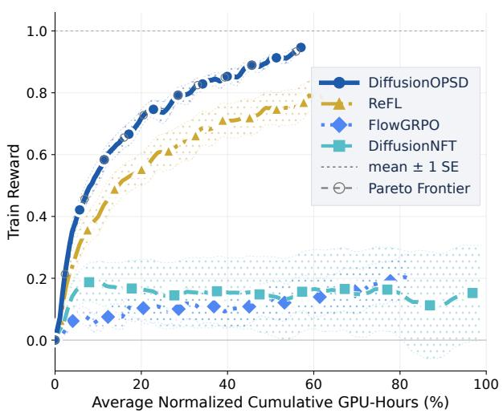  
(a) Native Training Gain

Correspondence:Wei Liu, E-mail

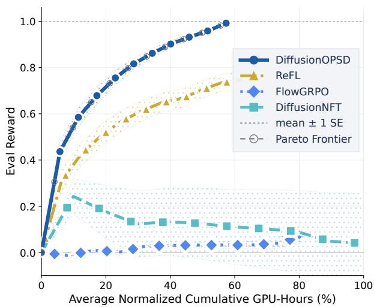  
(b) Held-Out Quality Gain  
Figure 1 Training and held-out quality curves. Normalized gains are averaged across matched 10 reward and 2 backbone settings. DiffusionOPSD improves fastest and reaches the highest final gains.

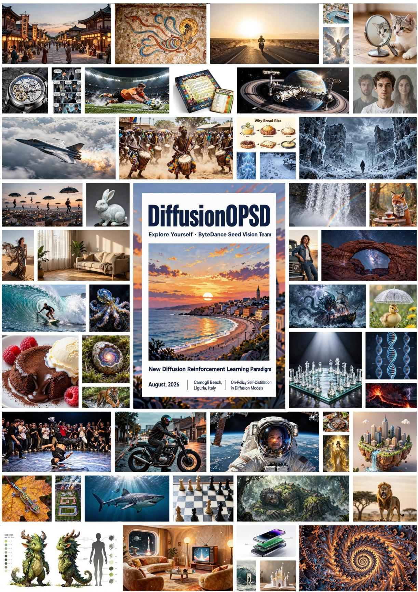  
Figure 2 Samples generated by DiffusionOPSD from held-out text prompts.

## Contents

1 Introduction 4   
2 Related Work 5555   
2.1 Reward-to-Target Interfaces   
2.2 On-Policy Distillation   
2.3 Reward Gradients   
3 Approach 66   
3.1 Clean-Output Prediction .   
3.2 Query Collection and Anchor 799   
3.3 Target Construction   
3.4 Finite Fitting   
3.5 Online Training 10   
Experiments 11   
4.1 Main Results 12   
4.2 Training Efficiency 12   
4.3 Optimization Regimes 13 16 16 17   
4.4 Target Construction   
4.5 Finite Fitting .   
4.6 Qualitative Results   
4.7 Ablations 22   
5 Conclusion 23   
A Author List 28   
B Mathematical Foundations 28 28 30 4 36 38 41 4 5 47   
B.1 Affine Clean-Output Map   
B.2 Endpoint-Weighted Objectives and Reward Weighting   
B.3 Bounded Target Construction   
B.4 Fixed-Suffix Reward   
B.5 Fitting-Branch Geometry and Ideal Output Improvement   
B.6 Velocity-Space Formulation   
B.7 Adaptive Scaling   
B.8 Finite Fitting and the Fitting Gap   
B.9 Behavior-Policy EMA Update   
B.10 Computational Cost 48   
C Experiment Details 49 4 55555路路6   
C.1 Main Results   
C.2 Two-Stage On-Policy Distillation Baselines   
C.3 Efficiency Profiling   
C.4 Qualitative Component Ablations   
C.5 Training Reward Curves   
C.6 Fitting Audit   
C.7 Stress-Test Protocols   
C.8 Ablation Details   
C.9 CFG Compensation

## 1 Introduction

Diffusion and flow models are widely used for high-fidelity visual generation [20, 31, 35, 57]. Reinforcement learning is increasingly used to adapt these models to human preferences, semantic fidelity, aesthetics, and task-specific objectives [1, 2, 8, 14, 34, 41, 62, 70, 77]. Yet endpoint rewards create a structural mismatch between where supervision is observed and where the diffusion policy acts. Each sample is produced through a sequence of interdependent denoising predictions, whereas reward is observed only after the rollout endpoint is decoded [9, 55, 71, 72]. Improving the final outcome therefore requires translating outcome-level reward into actionable supervision for intermediate denoising queries.

This translation involves two coupled stages. Reward guidance must first construct a useful local target at a query. Finite model updates must then realize that target. Throughout the paper finite fitting denotes this model update procedure and finite realization denotes the reward change produced by that procedure. Finite realization is nontrivial because the same model is queried repeatedly across noise levels, so fitting a target at one query can alter predictions at many others. Even when a target improves reward locally, finite fitting may under-realize, rotate, or overshoot the intended change while amortizing supervision across queries. Separating target construction from finite realization reveals whether an update fails because reward guidance produces a poor target or because finite fitting does not realize it.

Existing methods expose reward information at different stages. FlowGRPO estimates trajectory credit from finite groups and approximate transition likelihood ratios |34]. Its update depends on sample budget, likelihood estimation, discretization, and rollout choices |7, 27, 63]. ReFL backpropagates a differentiable reward through a single late-state clean-output prediction obtained from a truncated-prefix rollout [62]. Its prefix is executed without gradients, one state is sampled uniformly from the final quarter of denoising calls, and training neither executes the suffix nor decodes the rollout endpoint. This yields a local update while coupling reward evaluation to model optimization. DiffusionNFT reweights rollout endpoints under a supervised diffusion objective |75]. It is efficient, but its target remains an endpoint rather than an explicit description of how the current prediction should improve. Control-based, score-based, and value-based formulations likewise show that the mapping from reward to target determines the effective optimization problem |36, 66, 74]. We instead construct a reward-improving target before updating the model, fit it as detached intermediate supervision, and rebuild it as the behavior policy changes.

We implement this idea with DiffusionoPsD, an on-policy self-distillation loop with three stages. First, a frozen behavior policy generates trajectories and supplies query states and clean-output anchors. At each sampled query, the velocity prediction is converted into an equivalent clean-output prediction that can be decoded and evaluated by an image-level reward. Second, reward ascent and descent construct bounded positive and negative targets around the behavior-policy anchor. Third, the trainable policy fits these targets as detached supervision under a finite update budget. The behavior policy is then refreshed by EMA before new trajectories, anchors, and targets are generated for the next iteration.

The positive target specifies a reward-improving prediction. The negative target acts as a repulsive reference through the negative fitting branch. A group-normalized endpoint-reward weight controls their relative fitting strength. Because target construction and parameter fitting are separated by stop-gradient, construction gain and realized gain can be measured at the same query under the same fixed suffix. We can therefore measure both the reward gain of the constructed target and the gain produced after fitting

Across SD3.5-M and the step-distilled Z-Image-Turbo, DiffusionoPSD achieves the best final held-out score in 19 of 20 reward-matched settings spanning both backbones and all evaluators, with relative gains of up to 44.0% over the strongest competing method. It reduces training GPU-hours relative to DiffusionNFT by 40% and 63% on the two backbones. We further stress-test joint training on PickScore, CLIPScore, and HPSv2.1. One jointly trained DiffusionOPSD policy outperforms the corresponding DiffusionNFT policy on all three reward objectives while retaining most of the gains achieved by separate specialists.

The explicit targets also allow us to examine these stages separately. Target-construction studies show that the reward-gradient direction accounts for most of the gain, whereas replacing the rollout query state with a forwardnoised control has little effect in the evaluated low-noise setting. In controlled same-query experiments, a target with a larger construction gain can produce a smaller realized gain after one fitting update. This reversal occurs without cross-query interference, so target construction and finite realization should be evaluated separately

We make the following contributions.

• Method. We introduce on-policy self-distillation for diffusion post-training. It constructs bounded positive and negative targets from image-level reward gradients, fits them as detached supervision, and rebuilds them as the behavior policy changes.

• Results. Across two backbones and ten evaluators, DiffusionOPSD obtains the best held-out score in 19 of 20 matched settings and reduces training GPU-hours relative to DiffusionNFT by 40% and 63%. A jointly trained policy also improves all three optimized rewards over DiffusionNFT.

• Analysis. Controlled same-query experiments show that a larger target-level reward gain does not necessarily produce a larger gain after fitting, so we measure target construction and finite realization separately.

## 2 Related Work

## 2.1 Reward-to-Target Interfaces

Reward-based diffusion post-training differs primarily in how outcome-level feedback is converted into supervision for a multi-step generative policy. Reward-weighted likelihood and preference objectives translate scores or comparisons into likelihood updates [2, 14, 21, 30, 59, 65], but only indirectly supervise individual denoising predictions. Policy-gradient methods instead use sampled advantages. FlowGRPO and DanceGRPO assign group-relative trajectory credit through reverse-process likelihood ratios [34, 64], while AWM expresses policy-gradient improvement through advantage-weighted score or flow matching [63]. These methods avoid constructing an explicit local improvement target and rely on sampled advantage estimates, while likelihoodratio variants are additionally sensitive to likelihood estimation, sampler choice, and discretization |7, 27]. Differentiable-reward methods such as ReFL backpropagate a reward through a differentiable clean-output prediction at a sampled denoising state [10, 44, 62]. DiffusionNFT avoids trajectory-level backpropagation through endpoint-conditioned forward-process regression |75], yet its reward-selected endpoint does not specify how the current intermediate prediction should improve. Despite their different objectives, these methods leave the desired intermediate change implicit in advantage weights, parameter gradients, or endpoint supervision. DiffusionoPsD instead constructs bounded positive and negative clean-output targets at behavior-policy queries, fits them as detached supervision, and rebuilds them as the behavior policy changes.

## 2.2 On-Policy Distillation

Diffusion distillation traditionally transfers predictions from a stronger teacher to a faster student through progressive distillation, consistency training, latent consistency, distribution matching, or adversarial objectives [18, 39, 49, 50, 58, 68]. Few-step distillation can also be viewed as learning longer-range transitions of an underlying generative dynamics, while distribution-matching approaches need not preserve individual teacher trajectories [3, 67]. Dataset aggregation and on-policy imitation reduce distribution shift by collecting supervision on learner-induced states |47, 61]. Recent on-policy distillation methods extend this principle to generative models by matching external teacher predictions along student rollouts |15, 28, 29, 33, 76]. DiffusionoPsD does not require an externally improved teacher. It anchors each target at the behavior policy's own clean-output prediction, updates it with image-level reward gradients, and rebuilds it as the behavior policy changes.

## 2.3 Reward Gradients

Classifier guidance and classifier-free guidance modify diffusion fields during sampling through conditional score composition [11, 19]. Differentiable-reward methods including ReFL, DRaFT, AlignProp, and video rewardgradient alignment directly translate rewards on generated samples or partial trajectories into parameter updates [10, 12, 44, 45, 62]. Control-based, score-based, and value-based formulations further connect reward gradients to policy improvement in diffusion and flow models [16, 36, 74]. DiffusionoPSD instead uses reward gradients to construct detached targets at behavior-policy queries. Infinitesimal positive-target fitting shares the first-order direction of direct reward ascent at the anchor. Their finite optimization procedures differ. DiffusionOPSD constructs bounded targets, fits them without retaining the reward graph, and rebuilds them after the behavior policy changes.

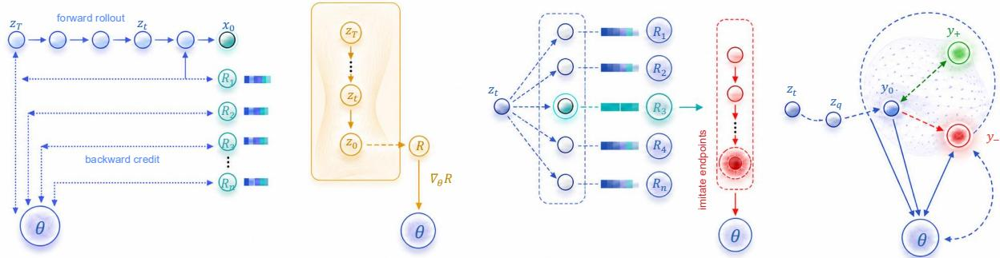  
Figure 3 Reward-to-policy paradigms. We contrast trajectory credit, late-state reward backpropagation, and endpoint supervision with our explicit intermediate targets constructed before finite fitting

## 3 Approach

DiffusionoPsD treats diffusion reward optimization as on-policy self-distillation. It converts image-level reward gradients into detached targets for intermediate predictions and rebuilds those targets as the behavior policy changes. Sec. 3.1 defines the clean-output coordinate used to decode and evaluate a prediction at a sampled query. Sec. 3.2 describes how a frozen behavior policy collects trajectories and supplies query states and anchors. Sec. 3.3 constructs bounded positive and negative targets from reward gradients. Sec. 3.4 fits these detached targets under a finite update budget. Sec. 3.5 completes the loop by refreshing the behavior policy and regenerating trajectories and targets. Fig. 4 summarizes the framework.

## 3.1 Clean-Output Prediction

Let $v _ { \theta }$ be the trainable rectified-flow velocity field [31, 35], and let $v _ { \mathrm { o l d } } \equiv v _ { \theta _ { \mathrm { o l d } } }$ denote the velocity field of the behavior policy within the current iteration. For a prompt c, noisy latent $z _ { \sigma } ,$ and noise level $\sigma ,$ the query tuple is $s = ( \mathbf { c } , z _ { \sigma } , \sigma )$ . Under the rectified-flow path $z _ { \sigma } = ( 1 - \sigma ) y + \sigma \epsilon$ , the velocity target is $v = \epsilon - y ,$ and therefore

$$
\boxed { y _ { \theta } ( s ) = z _ { \sigma } - \sigma v _ { \theta } ( s ) , \qquad v _ { \theta } ( s ) = \frac { z _ { \sigma } - y _ { \theta } ( s ) } { \sigma } }\tag{1}
$$

for every fixed query with $\sigma > 0$ Thus $y _ { \boldsymbol { \theta } } ( s )$ is the clean-output prediction corresponding to the velocity prediction at that query. We reserve $x _ { 0 }$ for a rollout endpoint latent, $z _ { \sigma }$ for a query state, and $y$ for the clean-output prediction at a fixed query. This prediction is decoder-evaluable through the local reward $\tilde { R } ( y , \mathbf { c } ) \ : = \ : R ( D ( y ) , \mathbf { c } )$ , where D is the latent decoder [46]

The equivalence in Eq. (1) is algebraic rather than geometric because the map is not an isometry. At a fixed query,

$$
\delta y = - \sigma \delta v , \qquad \lVert \delta v \rVert _ { 2 } = \frac { \lVert \delta y \rVert _ { 2 } } { \sigma } .\tag{2}
$$

Equation (2) shows that equal clean-output radii correspond to larger velocity displacements at lower σ. Throughout this section, "local" refers to predictions near yo at a fixed query. Conditioning still varies with the noise level.

We use three qualified reward names throughout the paper. The endpoint reward scores a rollout endpoint and determines the group-normalized fitting weight. The local reward ${ \cal \widetilde { R } } ,$ evaluated after decoding, scores a clean-output prediction and constructs the targets. The fixed-suffix reward $F _ { q }$ measures construction and realized gains at the same query, before and after fitting, respectively. Unless otherwise stated, construction gain refers to the positive-target fixed-suffix gain. End-to-end held-out evaluation measures the resulting policy.

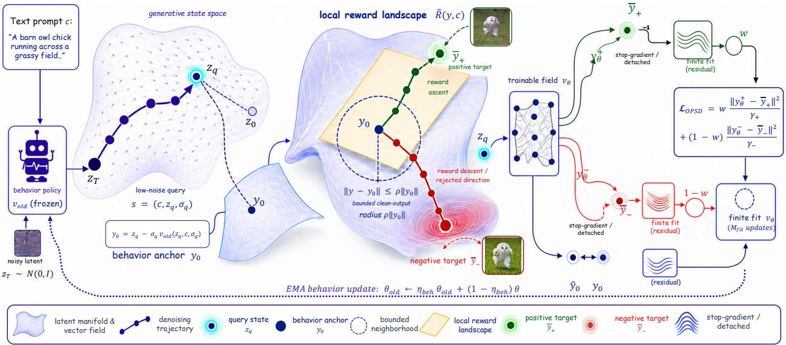  
Figure 4 DiffusionOPSD Overview. The behavior policy collects low-noise queries, reward gradients construct bounded positive and negative targets, and the trainable policy fits the detached supervision. The updated behavior policy supplies new anchors for the next iteration. This procedure separates target construction from finite fitting.

## 3.2 Query Collection and Anchor

At outer iteration i, the frozen behavior policy [43] samples K trajectories for each prompt. A trajectory provides an endpoint $x _ { 0 } ^ { k }$ , endpoint reward $r ^ { k } \stackrel { \cdot } { = } \bar { R } ( D ( x _ { 0 } ^ { k } ) , \mathbf { c } )$ , and a low-noise query. Given a requested query noise level $\sigma ^ { \star }$ , the implementation selects

$$
\boldsymbol { q } = \arg \operatorname* { m i n } _ { j } | \sigma _ { j } - \sigma ^ { \star } | , \qquad s = ( \mathbf { c } , z _ { q } , \sigma _ { q } ) .\tag{3}
$$

Equation (3) distinguishes the requested level $\sigma ^ { \star }$ from the selected schedule value $\sigma _ { q } .$ The query state and rollout endpoint are detached. The anchor is the clean-output prediction of the behavior policy

$$
y _ { 0 } = z _ { q } - \sigma _ { q } v _ { \mathrm { o l d } } ( z _ { q } , \mathbf { c } , \sigma _ { q } ) .\tag{4}
$$

The anchor in Eq. (4) specifies the point around which reward constructs the positive and negative targets.

The query state is collected from a trajectory generated by the frozen behavior policy for the current outer iteration. This is the sense in which the method is on-policy. The behavior policy remains frozen during target construction and finite fitting. After fitting, it is updated by the behavior-policy exponential moving average. The forward-noised control replaces the rollout query state with a matched state at the same $\sigma _ { q } .$ Sec. 4.7 shows that this replacement has little effect in the evaluated low-noise setting.

Endpoint rewards determine a group-normalized fitting weight. Let $\textstyle B _ { i }$ index all sampled endpoints in outer iteration $i ,$ let $r _ { \mathbf { c } } ^ { k }$ be the k-th reward for prompt c, and let ${ \bar { r } } _ { B _ { i } }$ be the mean over the complete rollout batch. The implementation centers each reward within its prompt group but uses one standard deviation over the complete rollout batch. The resulting definitions are

Algorithm 1 DiffusionOPSD training.   
Require Initial trainable policy $v _ { \theta } .$ reward $R ,$ decoder $D ,$ prompts ${ \mathcal { C } } ,$ group size $K ,$ requested query noise level   
$\sigma ^ { \star } .$ , target radius $\rho ,$ target steps $M _ { \mathrm { t g t } }$ , target-step multiplier $\eta _ { \mathrm { t g t } }$ , fitting budget $M _ { \mathrm { { f i t } } }$ , branch coefficient $\beta ,$   
shared clipping and loss scale $c _ { \mathrm { a d v } } .$ stabilizers $\epsilon _ { Z } , \epsilon _ { g } , \epsilon _ { \gamma }$ , and behavior and checkpoint exponential moving   
average retentions ηbeh, ηckpt·   
1: Initialize $\theta _ { \mathrm { o l d } }  \theta , \theta _ { \mathrm { c k p t } }  \mathbf { \bar { \theta } } _ { \mathrm { : } }$ and optimizer-update index $u  0 .$   
2: for each outer iteration i do   
3: Select the current prompt batch ${ \mathcal { C } } _ { i } \subseteq { \mathcal { C } } .$   
4: for each prompt $\mathbf { c } \in \mathcal { C } _ { i }$ do   
5: for $k = 1 , \ldots , K$ do   
6: Roll out frozen $v _ { \theta _ { \mathrm { o l d } } }$ to obtain endpoint reward $r _ { \mathbf { c } } ^ { k }$ and detached query $( \mathbf { c } , z _ { q } ^ { k } , \sigma _ { q } ^ { k } )$ nearest $\sigma ^ { \star }$   
7: end for   
8: end for   
9: Compute $\omega _ { \mathbf { c } } ^ { k }$ from per-prompt centered rewards and the global rollout-batch standard deviation using   
Eq. (5).   
10: Initialize detached target dataset $\mathcal { D } _ { i }  \mathcal { D }$   
11: for each $( \mathbf { c } , k )$ do   
12: yo $ \dot { z } _ { q } ^ { k } - \sigma _ { q } ^ { k } v _ { \theta _ { \mathrm { o l d } } } ( z _ { q } ^ { k } , \mathbf { c } , \sigma _ { q } ^ { k } )$   
13: Construct ${ \bar { y } } _ { + }$ and $\bar { y } _ { - }$ from yo using $\mathrm { E q . ~ ( 6 ) }$ , applying $\operatorname { E q . }$ (7) after every target step, then Eq. (9).   
14: Add detached tuple $( \mathbf { c } , z _ { q } ^ { k } , \sigma _ { q } ^ { k } , \omega _ { \mathbf { c } } ^ { k } , \bar { y } _ { + } , \bar { y } _ { - } )$ to $\mathcal { D } _ { i }$   
15: end for   
16: for $j = 1 , \ldots , M _ { \mathrm { f i t } }$ do   
17: Accumulate fitting minibatches from $\mathcal { D } _ { i }$ and recompute their anchors with frozen $v _ { \theta _ { \mathrm { o l d } } }$   
18: Update θ with $c _ { \mathrm { a d v } } \mathcal { L } _ { ( }$ OPSD from Eq. (13).   
19: $u \gets u + 1$ and $\theta _ { \mathrm { c k p t } }  \eta _ { \mathrm { c k p t } } ^ { ( u ) } \theta _ { \mathrm { c k p t } } + ( 1 - \eta _ { \mathrm { c k p t } } ^ { ( u ) } ) \theta .$   
20: end for   
21: $\theta _ { \mathrm { o l d } }  \eta _ { \mathrm { b e h } } ^ { ( u ) } \theta _ { \mathrm { o l d } } + ( 1 - \eta _ { \mathrm { b e h } } ^ { ( u ) } ) \theta .$   
22: end for   
Output Checkpoint-averaged reward-aligned policy $v _ { \theta _ { \mathrm { c k p t } } } .$

$$
\begin{array} { r l } & { \bar { r } _ { \mathrm { c } } = \displaystyle \frac { 1 } { K } \sum _ { j = 1 } ^ { K } r _ { \mathrm { c } } ^ { j } , } \\ & { \bar { r } _ { { S } _ { k } } = \displaystyle \frac { 1 } { \left| { B } _ { k } \right| } \displaystyle \sum _ { ( \mathrm { c } , j ) \in { \mathbb { R } } _ { \mathrm { s } } } \ \eta _ { \mathrm { c } } ^ { j } , } \\ & { \bar { \sigma } _ { { S } _ { k } } = \left[ \displaystyle \frac { 1 } { \left| { B } _ { k } \right| } \displaystyle \sum _ { ( \mathrm { c } , j ) \in { \mathbb { R } } _ { \mathrm { s } } } \ ( r _ { \mathrm { c } } ^ { j } - \bar { r } _ { { S } _ { k } } ) ^ { 2 } \right] ^ { 1 / 2 } , } \\ & { Z _ { { S } _ { k } } = \displaystyle \alpha _ { \mathrm { a v e } } ( \bar { r } _ { { S } _ { k } } + \epsilon _ { 2 } ) , } \\ & { \omega _ { \mathrm { c } } ^ { k } = \displaystyle \frac { 1 } { 2 } + \frac { 1 } { 2 } \mathrm { c l i p } \left( \displaystyle \frac { r _ { \mathrm { c } } ^ { k } - \bar { r } _ { \mathrm { c } } } { Z _ { { S } _ { k } } } , - 1 , 1 \right) . } \end{array}\tag{5}
$$

Per-prompt centering removes prompt-level reward offsets, while the global rollout-batch standard deviation places all prompt groups on a common scale. The weight $\omega _ { \mathbf { c } } ^ { k } \in [ 0 , 1 ]$ in Eq. (5) determines the relative strength of positive and negative fitting. It is distinct from the positive and negative targets.

## 3.3 Target Construction

Starting from $y _ { 0 }$ , DiffusionoPSD uses stabilized normalized reward-gradient steps to construct positive and negative targets. We initialize $y _ { + } ^ { ( 0 ) } = y _ { - } ^ { ( 0 ) } = y _ { 0 }$ and apply

$$
\begin{array} { r l } & { y _ { + } ^ { ( m + 1 ) } = y _ { + } ^ { ( m ) } + h _ { \mathrm { s t e p } } \frac { \nabla _ { y } \widetilde { R } ( y _ { + } ^ { ( m ) } , \mathbf { c } ) } { \| \nabla _ { y } \widetilde { R } ( y _ { + } ^ { ( m ) } , \mathbf { c } ) \| _ { 2 } + \epsilon _ { g } } , } \\ & { y _ { - } ^ { ( m + 1 ) } = y _ { - } ^ { ( m ) } - h _ { \mathrm { s t e p } } \frac { \nabla _ { y } \widetilde { R } ( y _ { - } ^ { ( m ) } , \mathbf { c } ) } { \| \nabla _ { y } \widetilde { R } ( y _ { - } ^ { ( m ) } , \mathbf { c } ) \| _ { 2 } + \epsilon _ { g } } , } \end{array}\tag{6}
$$

for $m = 0 , \ldots , M _ { \mathrm { t g t } } - 1$ , with $h _ { \mathrm { { s t e p } } } = \eta _ { \mathrm { { t g t } } } \rho \| y _ { 0 } \| _ { 2 } / M _ { \mathrm { { t g t } } }$ , where $\eta _ { \mathrm { t g t } } > 0$ is a target-step multiplier and the default is $\eta _ { \mathrm { t g t } } = 1$ . After every raw update in Eq. (6), we project the displacement back onto the trust-region ball.

$$
y _ { \pm } ^ { ( m + 1 ) } \gets y _ { 0 } + \Pi _ { \rho \| y _ { 0 } \| _ { 2 } } \left( y _ { \pm } ^ { ( m + 1 ) } - y _ { 0 } \right) , \qquad \Pi _ { r } ( d ) = \left\{ d , \qquad \| d \| _ { 2 } \leq r , \rho \right\} ,\tag{7}
$$

Each normalized direction has norm at most one, and the projection cannot increase the distance from $y _ { 0 }$ SO

$$
\| y _ { \pm } ^ { ( m ) } - y _ { 0 } \| _ { 2 } \leq \operatorname* { m i n } \{ m h _ { \mathrm { s t e p } } , \rho \| y _ { 0 } \| _ { 2 } \} \leq \rho \| y _ { 0 } \| _ { 2 } .\tag{8}
$$

For $0 < \eta _ { \mathrm { t g t } } \leq 1$ , including the default, the projection is inactive in exact arithmetic; for the $\eta _ { \mathrm { t g t } } > 1$ stress-test configuration it explicitly preserves the same radius bound. The final detached objects are

$$
\bar { y } _ { + } = \mathrm { s g } ( y _ { + } ^ { ( M _ { \mathrm { t g t } } ) } ) , \qquad \bar { y } _ { - } = \mathrm { s g } ( y _ { - } ^ { ( M _ { \mathrm { t g t } } ) } ) .\tag{9}
$$

Here sg denotes the stop-gradient operator. In Eq. (9), ${ \bar { y } } _ { + }$ is the positive target intended to improve reward. The negative target $\bar { y } _ { - }$ is fitted only through the negative fitting branch and therefore acts as a repulsive reference for the trainable output.

For a single normalized step with $g _ { 0 } \ = \ \nabla _ { y } \widetilde { R } ( y _ { 0 } , { \bf c } )$

$$
\widetilde { R } ( y _ { \pm } ^ { ( 1 ) } , \mathbf { c } ) - \widetilde { R } ( y _ { 0 } , \mathbf { c } ) = \pm h _ { \mathrm { s t e p } } \frac { \| g _ { 0 } \| _ { 2 } ^ { 2 } } { \| g _ { 0 } \| _ { 2 } + \epsilon _ { g } } + O ( h _ { \mathrm { s t e p } } ^ { 2 } ) .\tag{10}
$$

Equation (10) gives the local reward change for one normalized step. App Sec. B.3 extends it to the multi-step construction under smoothness. Finite fitting and end-to-end held-out policy performance are evaluated separately from this local construction result.

## 3.4 Finite Fitting

The trainable velocity field is evaluated once at the same query, $y _ { \theta } ~ = ~ z _ { q } - \sigma _ { q } v _ { \theta } ( s )$ , and forms positive and negative fitting branches around $y _ { 0 }$

$$
y _ { \theta } ^ { + } = \beta y _ { \theta } + ( 1 - \beta ) y _ { 0 } , \qquad y _ { \theta } ^ { - } = ( 1 + \beta ) y _ { 0 } - \beta y _ { \theta } .\tag{11}
$$

The fitting branches in Eq. (11) allow one shared output to encode attraction toward ${ \bar { y } } _ { + }$ and rejection of $\bar { y } _ { - }$ We use detached adaptive normalizers

$$
\begin{array} { r l } & { \gamma _ { + } = \operatorname* { m a x } \lbrace \operatorname { s g } ( \operatorname* { m e a n } | y _ { \theta } ^ { + } - \bar { y } _ { + } | ) , \epsilon _ { \gamma } \rbrace , } \\ & { \gamma _ { - } = \operatorname* { m a x } \lbrace \operatorname { s g } ( \operatorname* { m e a n } | y _ { \theta } ^ { - } - \bar { y } _ { - } | ) , \epsilon _ { \gamma } \rbrace , } \end{array}\tag{12}
$$

With the normalizers in Eq. (12), we define the branch loss

$$
\boxed { \mathcal { L } _ { \mathrm { O P S D } } = \omega \frac { \mathrm { m e a n } [ ( y _ { \theta } ^ { + } - \bar { y } _ { + } ) ^ { 2 } ] } { \gamma _ { + } } + ( 1 - \omega ) \frac { \mathrm { m e a n } [ ( y _ { \theta } ^ { - } - \bar { y } _ { - } ) ^ { 2 } ] } { \gamma _ { - } } . }\tag{13}
$$

Following DanceOPD's low-noise on-policy prediction-matching design [76], Eq. (13) uses squared fitting at a query collected from the behavior-policy trajectory. At a fixed query, this clean-output objective is exactly a pair of weighted velocity-MSE terms; App Sec. B.6 gives the equivalence. The shared fitting interface does not imply shared supervision. DanceOPD matches a frozen external teacher field, whereas DiffusionOPSD converts reward-ascent and reward-descent targets into induced positive and negative velocity targets and fits them through the two implicit branches. The implemented finite-fitting objective is $c _ { \mathrm { a d v } } { \mathcal { L } } _ { \mathrm { O P S D } }$ where $c _ { \mathrm { a d v } }$ is shared by reward normalization and branch-loss scaling. Changing it therefore changes both the clipping range and the fitting scale rather than acting as a pure learning-rate multiplier. Target construction and finite fitting are separated by stop-gradient.

$$
\nabla _ { \boldsymbol { \theta } } z _ { q } = \nabla _ { \boldsymbol { \theta } } \omega = \nabla _ { \boldsymbol { \theta } } y _ { 0 } = \nabla _ { \boldsymbol { \theta } } \bar { y } _ { \pm } = 0 .\tag{14}
$$

Equation (14) fixes the query, anchor, weight, and targets during finite fitting. The decoder and reward are differentiated only with respect to the temporary clean-output variable used in Eq. (6); once the targets are built, finite fitting does not retain the reward, decoder, or sampling computation graph.

For fixed normalizers, let $\delta _ { \theta } = y _ { \theta } - y _ { 0 } , d _ { + } = \bar { y } _ { + } - y _ { 0 } , d _ { - } = \bar { y } _ { - } - y _ { 0 } , a _ { + } = \omega / \gamma _ { + } , \mathrm { a n d } a _ { - } = ( 1 - \omega ) / \gamma _ { - }$ Completing the square yields the ideal output-space minimizer of the branch loss

$$
\delta _ { \theta } ^ { \star } = \frac { a _ { + } d _ { + } - a _ { - } d _ { - } } { \beta ( a _ { + } + a _ { - } ) } .\tag{15}
$$

In the locally symmetric case, let $\bar { h }$ denote the nominal aggregate target displacement. It equals $h _ { \mathrm { { s t e p } } }$ for one target step and $M _ { \mathrm { t g t } } h _ { \mathrm { s t e p } }$ when the normalized direction stays constant. Let $u _ { \mathrm { g r a d } }$ be the common stabilized normalized reward-gradient direction. For $d _ { + } = \bar { h } u _ { \mathrm { g r a d } }$ and $d _ { - } = - \bar { h } u _ { \mathrm { g r a d } } , \mathrm { E q . ~ \bar { ( 1 5 ) } }$ reduces to $\begin{array} { r } { \delta _ { \theta } ^ { \star } = \bar { h } u _ { \mathrm { g r a d } } / \beta . } \end{array}$ The positive and negative fitting branches agree on the same reward-improving direction, so their mixture weights cancel at the ideal output-space optimum. The weight ω affects the preferred displacement when the target paths or adaptive normalizers are asymmetric, while finite fitting can introduce additional differences.

App Sec. B.5 gives the full branch geometry. Equation (15) describes the displacement preferred by the loss, while finite fitting may produce a different displacement in the updated model.

## 3.5 Online Training

At outer iteration i, the frozen behavior policy induces a query-state distribution $Q _ { \mathrm { r o l l } , \sigma _ { q } } ^ { \mathrm { o l d } , i }$ . After collecting trajectories and constructing the targets described above, we obtain the detached dataset

$$
\begin{array} { r } { \mathcal { D } _ { i } = \left\{ ( \mathbf { c } , z _ { q } , \sigma _ { q } , \omega , \bar { y } _ { + } , \bar { y } _ { - } ) \right\} _ { \mathbf { c } \sim \mathcal { C } , ~ z _ { q } \sim Q _ { \mathrm { r o l l } , \sigma _ { q } } ^ { \mathrm { o l d } , i } } . } \end{array}\tag{16}
$$

Each tuple contains a prompt, a sampled query, its fitting weight, and the corresponding positive and negative targets. During fitting, yo is deterministically recomputed from the frozen behavior policy at the stored query. Thus the query, anchor, weight, and targets remain fixed while the trainable policy is updated.

Given $\mathcal { D } _ { i } .$ we apply a finite number of optimizer updates.

$$
\theta _ { i + 1 / 2 } = \mathrm { F i t } _ { M _ { \mathrm { f i t } } } \big ( \theta _ { i } ; \mathrm { s g } ( \mathcal { D } _ { i } ) \big ) ,\tag{17}
$$

where $M _ { \mathrm { { f i t } } }$ is the number of optimizer updates within the current outer iteration. The operator Fit includes the implemented optimizer, parameterization, and batching procedure. We use a finite fitting operator rather than an arg min because the target dataset is not optimized to convergence.

After fitting, the behavior policy is updated by exponential moving average.

$$
\theta _ { \mathrm { o l d } } ^ { i + 1 } = \eta _ { \mathrm { b e h } } ^ { ( u ) } \theta _ { \mathrm { o l d } } ^ { i } + ( 1 - \eta _ { \mathrm { b e h } } ^ { ( u ) } ) \theta _ { i + 1 / 2 } ,\tag{18}
$$

where u is the cumulative optimizer-update count. The EMA update is applied once after all $M _ { \mathrm { { f i t } } }$ fitting updates. In our canonical experiments, $M _ { \mathrm { { f i t } } } = 1$ , so each outer iteration contains one optimizer update.

Table 1 Main comparison. Held-out evaluator scores on SD3.5-M and Z-Image-Turbo; higher is better. CFG denotes classifier-free guidance. √denotes reward-specific checkpoints and ×denotes one checkpoint evaluated across all columns. Bold and underline mark the best and second-best results within each one-stage block.  marks rows with reported metrics where available; † marks two-stage on-policy distillation baselines, with 300 second-stage optimizer updates. Protocols are in App Sec. C.1 and C.2.
<table><tr><td colspan="4"></td><td colspan="4">Open-Sourced Evaluators</td><td colspan="2">Internal Evaluators</td></tr><tr><td colspan="2">Model</td><td>Reward-Specific Updates</td><td>Pick</td><td colspan="2">CLIP HPSv2.1</td><td></td><td></td><td></td><td>Aes ImgR HPSv3 DeQA AltCLIP Point Pair</td></tr><tr><td colspan="2">SDXL</td><td>X</td><td>22.42 0.287</td><td>0.280</td><td>5.60</td><td>0.76</td><td>1.93</td><td>4.17</td><td>0.366 0.089 0.168</td></tr><tr><td colspan="2">SD3.5-L‡</td><td>X</td><td>22.91 0.289</td><td>0.288</td><td>5.50</td><td>0.96</td><td>5.04</td><td>4.26</td><td>0.393 0.171 0.361</td></tr><tr><td colspan="2">FLUX.1-dev‡</td><td>X</td><td>22.84 0.295</td><td></td><td>0.274 5.71</td><td>0.96</td><td>6.71</td><td>4.41</td><td>0.376 0.179 0.323</td></tr><tr><td colspan="2">SD3.5-M w/o CFG‡</td><td>X 1</td><td>20.51 0.237</td><td>0.204</td><td></td><td>5.13 -0.58</td><td>-6.47</td><td>3.30</td><td>0.276 0.026 0.069</td></tr><tr><td colspan="2" rowspan="4">+ CFG‡ + FlowGRPO‡</td><td>X</td><td></td><td>22.34 0.285</td><td>0.279</td><td>5.360.85</td><td></td><td>2.69 4.04</td><td>0.380 0.136 0.290</td></tr><tr><td>X</td><td>&gt;5k</td><td>22.51 0.293</td><td>0.274</td><td>5.32</td><td>1.06 2.65</td><td>4.01</td><td>0.393 0.181 0.388</td></tr><tr><td>X</td><td>2k</td><td>22.41 0.290</td><td>0.280</td><td>5.32</td><td>0.95 2.67</td><td>4.06</td><td>0.387 0.151 0.314</td></tr><tr><td>X</td><td>4k</td><td>23.50 0.280</td><td>0.316</td><td>5.90 1.29</td><td>7.08</td><td>4.15</td><td>0.397 0.162 0.325</td></tr><tr><td></td><td>+ DiffusionNFT‡</td><td>X</td><td>1.7k 23.80 0.293</td><td>0.331</td><td>6.01</td><td>1.49</td><td>7.48</td><td>4.34</td><td>0.398 0.111 0.296</td></tr><tr><td></td><td>DiffusionNFT</td><td>X</td><td>300</td><td>23.62 0.294</td><td>0.340</td><td>6.02 1.45</td><td>8.36</td><td>4.32</td><td>0.397 0.150 0.294</td></tr><tr><td></td><td>DiffusionOPSD</td><td>X</td><td>300</td><td>25.51 0.333</td><td>0.389</td><td>6.03 1.51</td><td>9.41</td><td>4.40</td><td>0.399 0.170 0.345</td></tr><tr><td></td><td>+ DanceOPD†</td><td>X</td><td>300</td><td>23.06 0.272</td><td>0.322</td><td>5.98 1.23</td><td>7.24</td><td>4.34</td><td>0.378 0.127 0.219</td></tr><tr><td></td><td>DiffusionOPD†</td><td>X</td><td>300</td><td>23.05 0.269</td><td>0.322</td><td>6.04 1.23</td><td>7.39</td><td>4.34</td><td>0.373 0.122 0.199</td></tr><tr><td></td><td>FlowOPD†</td><td>X</td><td>300</td><td>22.62 0.263</td><td>0.300</td><td>5.98 0.92</td><td>5.00</td><td>4.20</td><td>0.353 0.101 0.166</td></tr><tr><td></td><td>ReFL</td><td></td><td>100 23.92</td><td>0.308</td><td>0.358 12.09</td><td>1.28</td><td>9.33</td><td>4.85</td><td>0.408 0.193 0.290</td></tr><tr><td></td><td>DiffusionNFT</td><td>√</td><td>100</td><td>23.43 0.298</td><td>0.336</td><td>9.11 1.46</td><td>9.14</td><td>4.76</td><td>0.412 0.199 0.323</td></tr><tr><td></td><td>DiffusionOPSD</td><td>√</td><td>100 24.94 0.340</td><td></td><td>0.390 12.08</td><td>1.76</td><td>13.34</td><td>4.94</td><td>0.450 0.214 0.465</td></tr><tr><td>Z-Image-Turbo</td><td></td><td>X</td><td>22.86 0.276</td><td></td><td>0.296 5.41</td><td>0.96</td><td>6.19</td><td>4.44</td><td>0.392 0.213 0.422</td></tr><tr><td>+ FlowGRPO</td><td></td><td>V</td><td>100</td><td>22.96 0.275</td><td>0.305</td><td>5.46 1.01</td><td>7.11</td><td>4.51</td><td>0.394 0.217 0.420</td></tr><tr><td>ReFL</td><td></td><td>√</td><td>100</td><td>24.54 0.313</td><td>0.380</td><td>9.79 1.37</td><td>13.77</td><td>4.60</td><td>0.441 0.227 0.481</td></tr><tr><td></td><td>DiffusionNFT</td><td>√</td><td>100</td><td>22.28 0.280</td><td>0.277</td><td>6.07 0.58</td><td>1.58</td><td>3.37</td><td>0.363 0.166 0.357</td></tr><tr><td></td><td>DiffusionOPSD</td><td>√</td><td>100</td><td>25.15 0.320</td><td>0.390 10.74</td><td>1.79</td><td>14.44</td><td>4.78</td><td>0.451 0.243 0.551</td></tr></table>

The order of these operations is important. Within outer iteration $i ,$ the behavior parameters $\theta _ { \mathrm { o l d } } ^ { i }$ remain frozen during trajectory collection, target construction, and all $M _ { \mathrm { { f i t } } }$ optimizer updates. Consequently, the query states and weights stored in $\mathcal { D } _ { i } ,$ together with the recomputed anchors $y _ { 0 }$ and detached targets $\bar { y } _ { \pm }$ , remain associated with the same behavior policy while the trainable parameters move from $\theta _ { i }$ to $\theta _ { i + 1 / 2 }$ . The EMA update in Eq. (18) is applied only after fitting and therefore does not alter the targets currently being optimized.

At outer iteration i + 1, the updated behavior policy generates new trajectories. These trajectories supply new query states and endpoint rewards, from which the method recomputes the fitting weights, clean-output anchors, and positive and negative targets. The resulting tuples form $\mathcal { D } _ { i + 1 }$ for the next round of finite fitting. The supervision is therefore rebuilt after each behavior-policy update rather than kept fixed throughout training.

Over successive outer iterations, the trainable policy fits a sequence of detached target datasets constructed around predictions of the corresponding behavior policies. The trainable policy realizes the current targets, while the updated behavior policy determines the queries and anchors used to construct the next ones. This cycle of trajectory collection, target construction, finite fitting, and behavior-policy refresh forms the online self-distillation loop summarized in Algorithm 1.

## 4 Experiments

We evaluate DiffusionoPSD through end-to-end effectiveness, training efficiency, and the separation of target construction from finite realization across SD3.5-M and the step-distilled Z-Image-Turbo. Sec. 4.1 reports final held-out quality, Sec. 4.2 measures training cost, and Sec. 4.3 examines native few-step and joint multi-reward training. Sec. 4.4 and 4.5 evaluate target construction and finite realization, followed by qualitative results and ablations. App Sec. C.1 provides the full protocols. Throughout this section, a reward objective denotes the scalar reward or weighted reward combination used for training, while an evaluator denotes a metric used to score held-out samples.

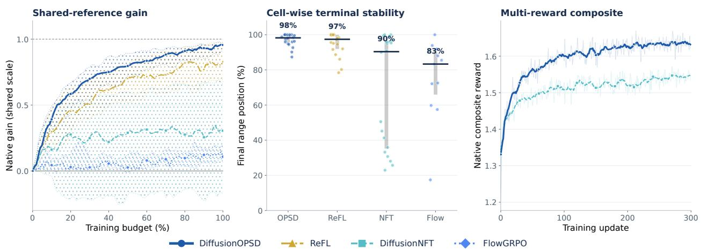  
Figure 5 Training dynamics. Across 71 single-reward runs, DiffusionOPSD shows the strongest normalized progress and reaches a median terminal position of 98%. The two joint-reward runs are shown separately.

## 4.1 Main Results

Evaluation protocol. We train reward-specific policies on SD3.5-M [13] and native 9-step Z-Image-Turbo [5] using Pick-a-Pic prompts [26], then evaluate held-out DrawBench prompts |48]. We compare locally trained FlowGRPO [34], ReFL [62], and DiffusionNFT [75] under backbone-specific training samplers and deterministic held-out sampling. Seven public evaluators and three internal preference models form the ten-objective suite. App Sec. C.1 gives the exact baseline losses, schedules, reference rows, and metric definitions.

Best reward-specific held-out scores across both backbones. Under the fully matched reward-specific protocol, DiffusionoPsD achieves the best final held-out score in 19 of 20 reward-matched settings across both backbones and all evaluators. On SD3.5-M, it leads nine of ten comparisons, with gains of 43.0% on HPSv3 and 44.0% on VLM-Pairwise; its Aesthetic score of 12.08 is 0.01 below ReFL's 12.09. On native 9-step Z-Image-Turbo, it leads all ten reward-matched evaluator comparisons, with gains of 9.7%, 30.7%, 4.9%, 3.9%, and 14.6% over the strongest baseline on Aesthetic, ImageReward, HPSv3, DeQA, and VLM-Pairwise, respectively. Tab. 1 reports the complete absolute scores and per-column competitors, showing strong gains across a standard backbone and a native few-step distilled model.

## 4.2 Training Efficiency

Substantially lower training cost. Fresh profiling of the current DiffusionoPSD source gives 28.2 and 149.8 GPU-hours per 100 updates on SD3.5-M and Z-Image-Turbo, reducing cost relative to DiffusionNFT by 40% and 63%. We compute these costs from measured per-step wall time on eight GPUs. Tab. 2 reports the timing, throughput, memory, and operation counts. Peak memory is not uniformly lower because the Z-Image-Turbo DiffusionOPSD run allocates more VRAM than DiffusionNFT.

Best held-out quality at matched training cost. DiffusionoPSD reaches the highest-quality point on nine of ten SD3.5-M frontiers in Fig. 8 and trails ReFL by only 0.01 on Aesthetic. In the standardized reference profiles, DiffusionOPSD uses 28.2 rather than ReFL's 47.7 GPU-hours per 100 updates on SD3.5-M, while ReFL uses 102.1 rather than DiffusionOPSD's 149.8 on Z-Image-Turbo. Despite its Z-Image-Turbo compute advantage, ReFL remains below DiffusionOPSD in final held-out quality across all ten reward-matched settings. The figure separately records cumulative cost from the reward-specific training runs and uses server-neutral policy-time proxies when reward-service layouts make raw wall time incomparable.

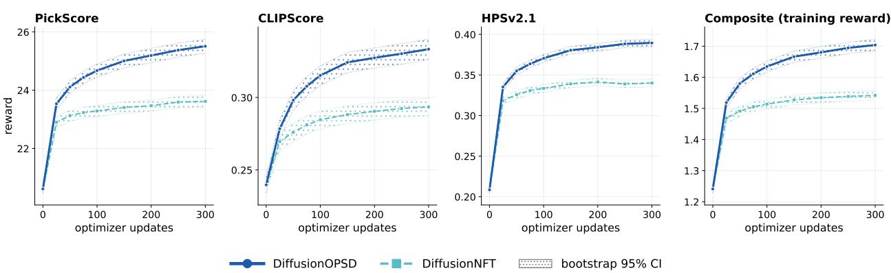  
Figure 6 Joint three-reward dynamics. Held-out checkpoint curves for PickScore, CLIPScore, and HPSv2.1 show how the shared SD3.5-M policy changes before its final checkpoint. All three reward objectives improve through update 300, whereas DiffusionNFT's HPSv2.1 peaks at update 200 and then declines slightly.

## 4.3 Optimization Regimes

DiffusionOPSD sustains reward gains through the final update. Across the 71 single-reward runs, DiffusionOPSD attains the largest median shared-reference gain and has a median terminal position of 98% within each run's observed native-reward range in Fig. 5. The corresponding terminal positions are 97% for ReFL, 90% for DiffusionNFT, and 83% for FlowGRPO. DiffusionOPSD therefore retains nearly all of its within-run observed improvement and exceeds DiffusionNFT and FlowGRPO by 8 and 15 percentage points on this end-of-run measure. Fig. 7 shows that the pattern spans ten reward objectives and both backbones. This evidence measures optimization stability, while Tab. 1 measures final held-out quality.

Optimization remains effective with a native nine-step sampler. On Z-Image-Turbo, DiffusionOPSD leads all ten reward-matched comparisons in Tab. 1 and every quality-compute frontier in Fig. 8. Against the strongest competitor in each column, Aesthetic improves from 9.79 to 10.74, ImageReward from 1.37 to 1.79, HPSv3 from 13.77 to 14.44, DeQA from 4.60 to 4.78, and VLM-Pairwise from 0.481 to 0.551. These gains equal 9.7%, 30.7%, 4.9%, 3.9%, and 14.6%. DiffusionNFT instead falls below the unadapted backbone on eight of ten objectives, including HPSv3 at 1.58 versus 6.19 and DeQA at 3.37 versus 4.44. Step distillation compresses the trajectory into native transitions that need not correspond one to one with teacher trajectories [3, 67, 68] This contrast is consistent with endpoint target mismatch under few-step adaptation, while DiffusionOPSD anchors its bounded targets at states visited by the native behavior policy.

A single policy preserves near-specialist quality on three rewards. The jointly trained 300-update DiffusionOPSD policy obtains PickScore 25.51, CLIPScore 0.333, and HPSv2.1 0.389, compared with 23.62, 0.294, and 0.340 for DiffusionNFT. The score gains are 1.89, 0.039, and 0.049, corresponding to relative improvements of 8.0%, 13.3%, and 14.4%. Compared with separate 100-update DiffusionOPSD specialists at 24.94, 0.340, and 0.390, the shared policy retains 113.0%, 92.9%, and 99.6% of their gains over the base model. It exceeds the PickScore specialist by 0.56, statistically matches the HPSv2.1 specialist with a gap of 0.001, and incurs a small but significant CLIPScore shortfall of 0.007. All three rewards continue improving through update 300 in Fig. 6, whereas DiffusionNFT's HPSv2.1 peaks at update 200 and decreases by approximately 0.001 at the final checkpoint. The shared DiffusionOPSD policy also exceeds the best two-stage OPD student scores of 23.06, 0.272, and 0.322 on the three objectives. Because the specialists use only 100 updates, this experiment tests compatibility with the evaluated weighted reward rather than state-of-the-art multi-objective optimization |73]

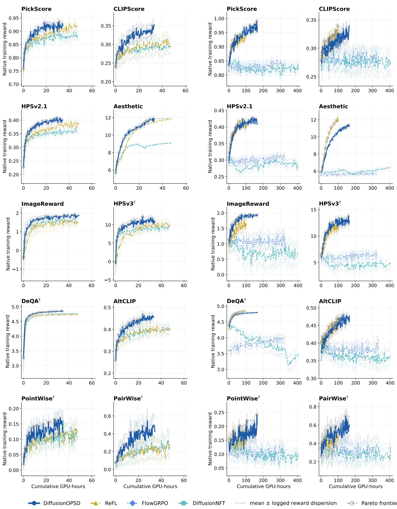  
Figure 7 Native training rewards. DiffusionOPSD improves nearly every objective across both backbones, while DiffusionNFT falls below the base Z-Image-Turbo model on eight of ten objectives. Fine traces report logged withinprompt reward dispersion rather than confidence intervals.

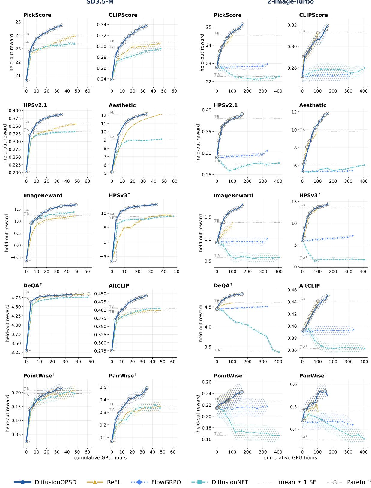  
Figure 8 Held-out quality and compute. DiffusionOPSD reaches the highest held-out score on every Z-Image-Turbo frontier and on nine of ten SD3.5-M frontiers. The exception is SD3.5-M Aesthetic, where ReFL leads by 0.01. Markers show checkpoint means and bands show one standard error.

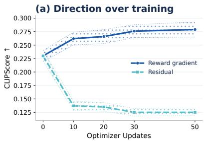

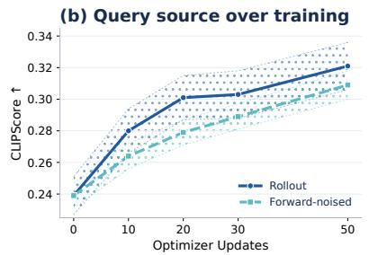

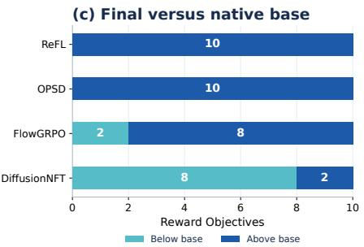  
Figure 9 Ablation dynamics. Reward-gradient training improves throughout the run, while the rollout-residual target collapses and the forward-noised control remains close to the canonical query state.

## 4.4 Target Construction

Reward gradients are required for positive target gain. On 512 distinct held-out prompts at the same low-noise query, the DiffusionoPsD positive target increases fixed-suffix reward by 0.03511 and has local reward-gradient alignment 0.7094. The DiffusionNFT rollout endpoint instead changes reward by —0.03551 with alignment —0.000203. Matching its radius to the DiffusionOPSD target still yields a reward change of —0.01887 and the same near-zero alignment. The resulting DiffusionOPSD advantages are 0.07062 over the sampled endpoint and 0.05398 over its radius-matched version. Fig. 10 therefore attributes the construction gain to the reward-gradient direction rather than target radius

The construction advantage persists after training. After 50 optimizer updates, the canonical target reaches held-out CLIPScore 0.3122 on 999 images from 200 prompts. No-op, matched-radius random-direction, and rollout-residual targets reach only 0.2363, 0.2303, and 0.1256. The corresponding absolute gaps are 0.0759, 0.0819, and 0.1866, while the residual variant collapses late in training. The trained endpoint separation therefore follows the target-level comparison in this experiment.

Query-state provenance has a much smaller effect. Replacing the rollout query state with a forward-noised control changes CLIPScore from 0.3122 to 0.3089. This is an absolute gap of 0.0033 and a relative drop of 1.1%, compared with gaps above 0.075 for the direction controls. The training curves in Fig. 9 show the same ordering. Reward direction is thus the dominant factor in this study, while exact low-noise query provenance is secondary. Sec. 4.7 and App Sec. C.8 give the matched screening protocol.

## 4.5 Finite Fitting

A better target can produce a worse finite update. On HPSv2.1, the reward-gradient target has construction gain 0.00245, while the matched-radius random target has gain -0.03251. After one fresh-AdamW update [37], however, their realized gains are -0.000740 and -0.000021. The random target therefore realizes 0.000719 more reward despite being 0.03496 worse before fitting. This ordering reverses on 62.3% of 512 prompts, with a prompt-bootstrap 95% confidence interval from 58.2% to 66.6%. On CLIPScore, the reversal rate is lower at 29.5%, with an interval from 25.6% to 33.4%. The contrast shows that the reversal rate is reward-dependent under this fitting protocol.

For a fixed query s, detached positive target ${ \bar { y } } _ { + }$ , and actual output $\hat { y } _ { M _ { \mathrm { f i t } } }$ after $M _ { \mathrm { { f i t } } }$ fitting updates, let $F _ { q }$ denote fixed-suffix reward. Construction and realization obey the exact identity

$$
\underbrace { F _ { q } ( \widehat { y } _ { M _ { \mathrm { f i t } } } ) - F _ { q } ( y _ { 0 } ) } _ { G _ { \mathrm { r e a l i z e d } } } = \underbrace { F _ { q } ( \bar { y } _ { + } ) - F _ { q } ( y _ { 0 } ) } _ { G _ { \mathrm { c o n s t r u c t } } } - \underbrace { [ F _ { q } ( \bar { y } _ { + } ) - F _ { q } ( \widehat { y } _ { M _ { \mathrm { f i t } } } ) ] } _ { G _ { \mathrm { f i t } } }\tag{19}
$$

where $G _ { \mathrm { { f i t } } }$ is a signed fitting gap that can reflect under-realization, rotation, or overshoot. This identity separates the reward gain of the target from the fitting gap; it does not describe end-to-end training.

ReFL gives the largest isolated one-step reward gain. In the calibrated plain-SGD comparison on 512 samequery prompts, ReFL realizes reward gain 0.0005805, compared with 0.0004588 for bounded DiffusionOPSD fitting. Its local reward-gradient alignment is also higher at 0.08078 versus 0.05340. The differences are 0.0001217 in realized gain and 0.02738 in alignment. Bounded DiffusionOPSD has lower off-direction drift at 0.3710 versus 0.3877 for ReFL. DiffusionNFT produces negative realized gain -0.0000333 and much higher drift 0.6494. The isolated probes restore parameters between prompts and exclude cross-query interference, negative-branch fitting, and behavior-policy updates. App Sec. C.6 provides the detailed protocols, while Sec. 4.1 evaluates the complete online loop.

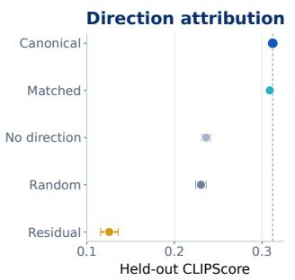

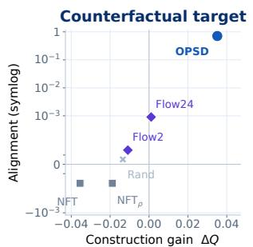

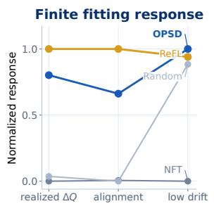

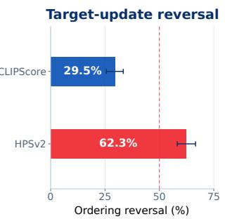  
Figure 10 Target construction and finite fitting. The reward-gradient target gains 0.03511, while the DiffusionNFT endpoint loses 0.03551. After one fitting update, HPSv2.1 target ordering reverses on 62.3% of prompts, showing that construction gain does not determine one-update realization.

## 4.6 Qualitative Results

Human evaluation favors DiffusionOPsD against every baseline. On 100 held-out prompts from the Z-Image-Turbo VLM-Pointwise setting, annotators prefer DiffusionoPSD over the base model, FlowGRPO, DiffusionNFT, and ReFL on 64%, 71%, 90%, and 61% of prompts. The result is strongest against DiffusionNFT, but remains above the majority threshold against the strongest baseline ReFL. The rewardmatched VLM-Pointwise scores also place DiffusionOPSD first at 0.243, compared with 0.227 for ReFL 0.217 for FlowGRPO, 0.213 for the base model, and 0.166 for DiffusionNFT. Most human wins are attributed to prompt alignment or visual quality in Fig. 16.

The visual gains concentrate on prompt fidelity and fine structure. Across the 20 fixed held-out prompts in Fig. 11 to 14, DiffusionOPSD more consistently preserves rendered text, requested object identity, motion, material attributes, and multi-object composition. DiffusionNFT often loses requested details or semantic structure, consistent with the 90% human preference for DiffusionOPSD in their direct comparison. ReFL produces stronger images than the other baselines, yet annotators still prefer DiffusionOPSD on 61% of prompts. The qualitative comparisons agree with the human study.

Component-level visuals agree with the quantitative ablations. At update 50, reward-gradient targets preserve requested entities and attributes more consistently than random and no-op controls across the 40-prompt pool in Fig. 23 and 24. The expanded evaluation gives CLIPScore values of 0.3122, 0.2303, and 0.2363 for these variants. The rollout and forward-noised query-state variants remain visually similar, matching expanded scores of 0.3122 and 0.3089. In contrast, increasing the branch coefficient to 10 lowers the expanded CLIPScore to 0.2949 and increasingly damages object identity, separation, and typography in Fig. 17 to 19. The qualitative and quantitative ablations show the same trends.

Base

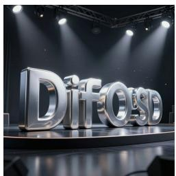

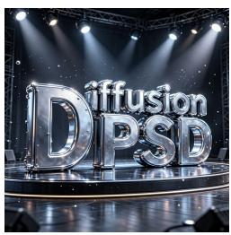  
DiffusionNFT

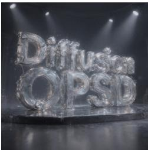  
FlowGRPO

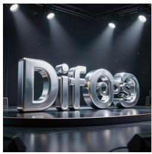  
DiffusionOPSD

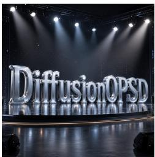  
Prompt: Liquid-mercury 3D letters of “DiffusionOPSD”, placed on a dark reflective stage with volumetric spotlights and crisp product-render detail.

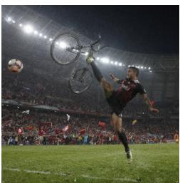

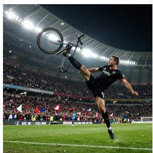

  
Prompt: Floodlit stadium football moment: striker mid bicycle-kick, roaring crowd, flags, turf spray, sweat droplets in the background, and motion blur effect.

  
Prompt: Stacked wooden animal totem with bear at the bottom, eagle in the middle and fish on top, with weathered paint, forest bokeh and warm light.

  
Prompt: Geology cross-section poster of Earth layers, including crust, mantle, outer and inner core, with detailed depths, temperatures and labels.

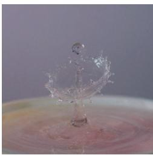

  
Prompt: High-speed macro of a water-droplet crown frozen mid-splash on a colorful surface, elegant and detailed.  
Figure 11 Held-out qualitative comparisons. DiffusionOPSD preserves requested text, motion, composition, and fine detail more consistently than the baselines.

Base

  
DiffusionNFT

  
FlowGRPO

  
DiffusionOPSD

  
Prompt: 1940s train-station farewell: a couple embraces through steam and sepia backlight, with vintage clothing, cinematic nostalgia, and a station sign reading “OPSD”.

  
Prompt: High-fashion model walking in an avant-garde metallic gown on a windswept dune under bright sunny golden-hour light, with dramatic fabric motion.

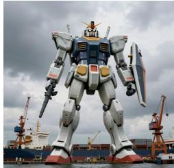

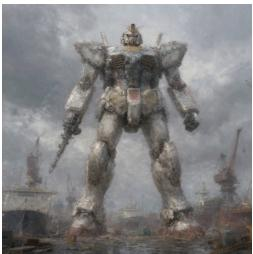

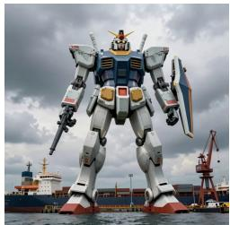

  
Prompt: Titanic dormant mech standing in a harbor, towering over cargo ships and cranes under dramatic overcast light.

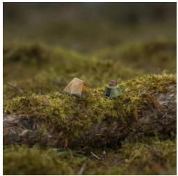

  
Prompt: Miniature explorer camp on a mossy log imagined as a vast landscape, with dramatic macro lighting and a tiny explorer in the scene.

  
Prompt: Iridescent origami crane on a dark surface, with crisp paper folds highlighted by soft macro lighting.  
Figure 12 Motion and composition. DiffusionOPSD retains requested subjects, layouts, and fine details more consistently than the baselines.

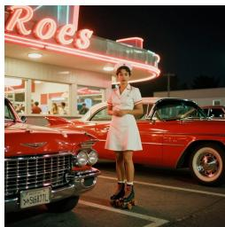

## ReFL

## DiffusionNFT

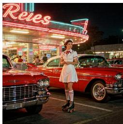

## FlowGRPO

## DiffusionOPSD

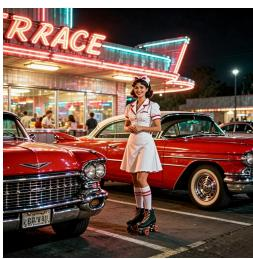  
Prompt: 1950s American diner at night with chrome, neon, a roller-skating waitress, red Cadillac, warm Kodachrome nostalgia, and the restaurant name “RRACE” visible.

Am mnye de fen rivee mm kn tu the brm.. fi. t hiej mise mm the hyp rme. teme gou. ynn she mili rend. tu yor dumu m tha hoe tme ter am. the tm ie ta vimy tm dhe you thu is for thme. hm uhes, at. lann yma rhuie, huvigu tm hu at tou.

  
Prompt: Aged-paper handwritten letter in flowing fountain-pen cursive, with wax seal, ink blots, warm candlelight, and a fountain pen placed in the lower-left corner.

  
Prompt: Macro miniature scene: tiny fisherman on a pebble beside a blue-resin “lake” spilling from a bottle; whimsical and detailed.

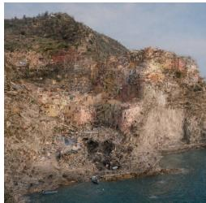

  
Prompt: Cinque Terre-style Italian coastal village with colorful cliff houses, turquoise sea, boats, laundry lines and warm afternoon light.

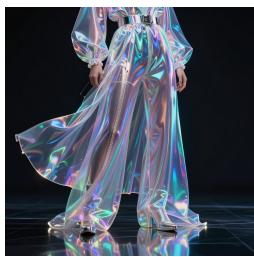

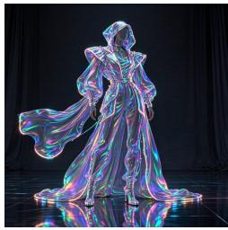

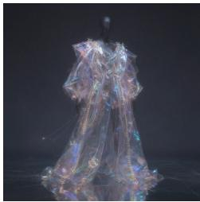

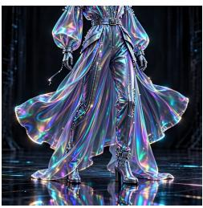

  
Prompt: Futuristic fashion editorial: a woman in holographic fabrics and LED accents in a dark reflective studio, glossy and ultra-detailed.

Figure 13 Additional held-out comparisons. DiffusionOPSD better preserves object identity, complex composition, and character detail across the additional prompts.

Base

  
DiffusionNFT

  
FlowGRPO

  
DiffusionOPSD

  
Prompt: 1970s bohemian road trip: sticker-covered VW van by a desert highway at sunset, with one woman and one man in a cowboy hat, in faded vintage film tones.

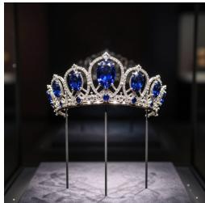

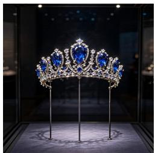

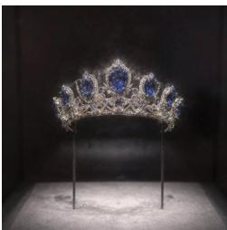

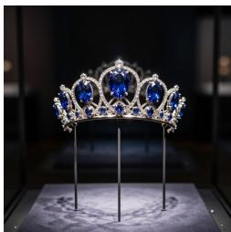

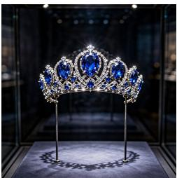  
Prompt: Ornate sapphire tiara in a dim museum vitrine, blue stones and diamonds sparkling under spotlight with glass reflections.

  
Prompt: Water lily opening at dawn, frog on lily pad, dew, glowing pink petals, still pond reflection and soft mist.

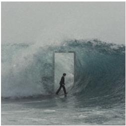

  
Prompt: Surreal commuter, a man wearing a crossbody bag, calmly walking through a doorway cut into a frozen ocean wave, with impossible physics and cinematic light.

  
Prompt: Haute-couture runway moment: flowing feathered dress in motion, loose hair, sunset lighting, dramatic backlight and audience bokeh.  
Figure 14 Material and scene detail. DiffusionOPSD better preserves requested materials, subjects, and compositions across the held-out prompts

## 4.7 Ablations

Screening setup. We isolate DiffusionOPSD components on SD3.5-M with CLIPScore-only training for 50 optimizer updates. Each score is evaluated on 100 images from 20 fixed DrawBench prompts after deterministic 10-step DPM-Solver++ 2M data collection [38] and deterministic 40-step flow sampling. The canonical configuration obtains $0 . 3 1 1 7 \pm 0 . 0 0 5 0$ . Sec. 4.4 reports the expanded target-direction evaluation on 999 images, while the results here serve as matched component screening. App Sec. C.8 gives the full protocol.

Reward direction produces the largest ablation gap. In the matched screen, replacing the reward-gradient target with random, no-op, and rollout-residual targets lowers CLIPScore from 0.3117 to 0.2311, 0.2280, and 0.1456. The absolute losses are 0.0806, 0.0837, and 0.1661, substantially larger than any implementationcontrol gap in Fig. 15. Changing only the query source to a forward-noised state gives 0.3103, a loss of 0.0014. An alternative DiffusionNFT plus reward-gradient auxiliary loss reaches 0.3080, 0.3173, 0.3223, and 0.3152 at auxiliary weights 0.5, 1, 2, and 4. The weight-2 point is the highest score in this small screen, but its 0.0106 advantage over the canonical target replacement has not been confirmed on the full DrawBench protocol. These results identify the reward-gradient signal as essential while leaving the exact low-noise state source and target-loss form less constrained.

Most implementation choices remain close to the canonical score. Enabling endpoint checking changes CLIPScore from 0.3117 to 0.3102, while removing the negative branch gives 0.3137. Using one, two, or four reward-ascent steps gives 0.3130, 0.3117, and 0.3098. Target-step multipliers 0.5, 1, and 2 give 0.3038. 0.3117, and 0.3112, with the smaller multiplier producing the largest loss in this group. Increasing rollout function evaluations from 10 to 25 and 40 changes the score from 0.3117 to 0.3138 and 0.3080. Firstorder DPM and stochastic SDE rollout samplers reach 0.3136 and 0.3090, while removing old-policy decay gives 0.3161. Apart from the auxiliary-loss sweep, all of these point estimates remain within 0.0079 of the default. Additional endpoint checks, rollout evaluations, and ascent steps do not improve the score, so the canonical result does not rely on more expensive control variants.

Performance is stable across moderate settings but drops at the extremes. Query noise levels 0.278, 0.46, and 0.60 give 0.3117, 0.3166, and 0.3187, while noise level 0.90 drops to 0.2884. Target radii from 0.08 to 0.40 remain between 0.3108 and 0.3145, a spread of only 0.0037. Radius 0.02 falls to 0.2959. showing that overly conservative targets underperform. Branch coefficients 0.01, 0.1, 1, and 10 give 0.3046, 0.3163, 0.3117, and 0.2961. The default settings $\sigma _ { q } = 0 . 2 7 8$ $\rho = 0 . 1 0$ , and β = 1 therefore lie on stable regions rather than isolated peaks. High query noise, a very small target radius, and a branch coefficient of 10 are the main quantitative failure modes in Fig. 16.

CFG training creates inference-scale dependence without improving the best score. The CFG-free checkpoint scores 0.3117, 0.3108, and 0.3099 when evaluated at guidance scales 1, 4.5, and 6. Training at scale 4.5 changes these values to 0.2775, 0.3069, and 0.3060, while training at scale 6 gives 0.2634, 0.3076, and 0.3045. Conditional-only evaluation therefore falls by 11.0% and 15.5% after training at scales 4.5 and 6. Restoring inference guidance recovers most of the loss. For the scale-4.5 checkpoint, evaluation at 4.5 improves over evaluation at 1 by 0.0294, with a prompt-bootstrap 95% confidence interval from 0.0150 to 0.0471. Even with matched train and evaluation scales, the diagonal scores 0.3069 and 0.3045 remain 1.5% and 2.3% below the CFG-free point estimate. These diagonal gaps are comparable to standard errors from 0.0050 to 0.0056, and the training seeds are unmatched. The experiment therefore shows no benefit from CFG training but does not establish that CFG training is harmful. Swapped training and evaluation scales give 0.3108 versus 0.2775 at scale product 4.5 and 0.3099 versus 0.2634 at product 6. The response is therefore asymmetric and cannot be explained by the product of the two scales. No cell in the 3 × 3 grid exceeds the CFG-free result, consistent with DiffusionNFT's online post-training design |75]. App Sec. C.9 compares this behavior with frozen-teacher CFG absorption in DanceOPD [76].

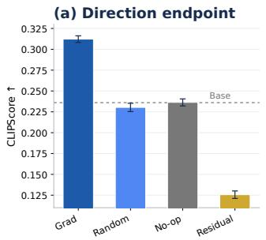

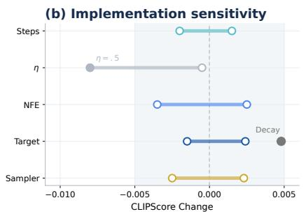

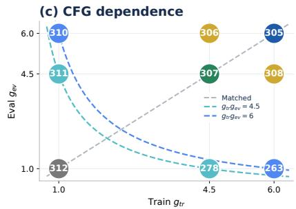

Figure 15Endpoint and implementation checks. The reward-gradient target reaches 0.3117, compared with 0.2311, 0.2280, and 0.1456 for random, no-op, and rollout-residual targets. One-factor implementation controls cluster near the default, and no CFG configuration exceeds 0.3117.  
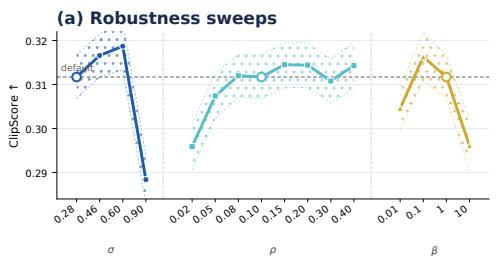  
Figure 16Robustness and human preference. Low-to-mid query noise and target radii from 0.08 to 0.40 remain near the default, while query noise 0.90 and branch coefficient 10 fall to 0.2884 and 0.2961. Annotators prefer DiffusionOPSD over the base model, FlowGRPO, DiffusionNFT, and ReFL on 64%, 71%, 90%, and 61% of prompts.

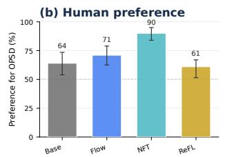

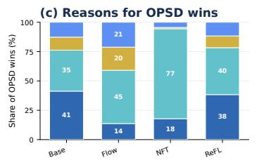  
Prompt align.Visual qualityRealism/artifactsText/details

## 5 Conclusion

We introduced DiffusionoPsD, an on-policy self-distillation method for converting image-level reward guidance into supervision for intermediate denoising predictions. At each outer iteration, a frozen behavior policy supplies query states and clean-output anchors. Reward gradients construct bounded positive and negative targets around these anchors, and the trainable policy fits them as detached supervision. The behavior policy is then updated, and new trajectories and targets are generated for the next iteration. This design avoids treating an endpoint reward as direct supervision for every intermediate prediction and makes target construction and model fitting separately measurable. Across SD3.5-M and the step-distilled Z-Image-Turbo, DiffusionOPSD achieves the best final held-out score in 19 of 20 reward-matched settings across ten evaluators. It improves over the strongest competing method by up to 44.0% and reduces training GPU-hours relative to DiffusionNFT by 40% and 63% on the two backbones. A jointly trained policy also improves all three optimized rewards over DiffusionNFT, showing that the method can be applied to direct multi-reward training. Our experiments support on-policy self-distillation as an efficient approach to diffusion post-training that converts image-level reward guidance into explicit intermediate supervision, refreshes it as the policy evolves. and allows target construction and model fitting to be analyzed separately.

## References

[1] Jinbin Bai, Wei Chow, Ling Yang, Xiangtai Li, Juncheng Li, Hanwang Zhang, and Shuicheng Yan. Humanedit: A high-quality human-rewarded dataset for instruction-based image editing. arXiv preprint arXiv:2412.04280, 2024

[2] Kevin Black, Michael Janner, Yilun Du, Ilya Kostrikov, and Sergey Levine. Training diffusion models with reinforcement learning. In International Conference on Learning Representations, volume 2024, pages 4965–4987 2024.

[3] Nicholas M. Boffi, Michael S. Albergo, and Eric Vanden-Eijnden. Flow map matching with stochastic interpolants: A mathematical framework for consistency models, 2025. URL https://arxiv.org/abs/2406.07507.

[4] Sébastien Bubeck. Convex optimization: Algorithms and complexity. Foundations and trends in Machine Learning, 8(3-4):231–357, 2015.

[5] Huanqia Cai, Sihan Cao, Ruoyi Du, Peng Gao, Aiming Hao, Steven Hoi, Zhaohui Hou, Shijie Huang, Dengyang Jiang, Yuming Jiang, et al. Z-image: An efficient image generation foundation model with single-stream diffusion transformer. arXiv preprint arXiv:2511.22699, 2025.

[6] Zhongzhi Chen, Guang Liu, Bo-Wen Zhang, Qinghong Yang, and Ledell Wu. Altclip: Altering the language encoder in clip for extended language capabilities. In Findings of the Association for Computational Linguistics: ACL 2023, pages 8666–8682, 2023.

[7] Jaemoo Choi, Yuchen Zhu, Wei Guo, Petr Molodyk, Bo Yuan, Jinbin Bai, Yi Xin, Molei Tao, and Yongxin Chen. Rethinking the design space of reinforcement learning for diffusion models: On the importance of likelihood estimation beyond loss design. arXiv preprint arXiv:2602.04663, 2026.

[8] Wei Chow, Linfeng Li, Lingdong Kong, Zefeng Li, Qi Xu, Hang Song, Tian Ye, Xian Wang, Jinbin Bai, Shilin Xu, et al. Editmgt: Unleashing potentials of masked generative transformers in image editing. In Proceedings of the IEEE/CVF Conference on Computer Vision and Pattern Recognition, pages 38038–38048, 2026.

[9] Wei Chow, Jiachun Pan, Yongyuan Liang, Mingze Zhou, Xue Song, Liyu Jia, Saining Zhang, Siliang Tang, Juncheng Li, Fengda Zhang, et al. Weave: Unleashing and benchmarking the in-context interleaved comprehension and generation. In Proceedings of the IEEE/CVF Conference on Computer Vision and Pattern Recognition pages 15343–15353, 2026.

[10] Kevin Clark, Paul Vicol, Kevin Swersky, and David Fleet. Directly fine-tuning diffusion models on differentiable rewards. In International Conference on Learning Representations, volume 2024, pages 4793–4822, 2024.

[11] Prafulla Dhariwal and Alexander Nichol. Diffusion models beat gans on image synthesis. Advances in neural information processing systems, 34:8780–8794, 2021.

[12] Carles Domingo i Enrich, Michal Drozdzal, Brian Karrer, and Ricky TQ Chen. Adjoint matching: Fine-tuning flow and diffusion generative models with memoryless stochastic optimal control. In International Conference on Learning Representations, volume 2025, pages 53791–53846, 2025.

[13] Patrick Esser, Sumith Kulal, Andreas Blattmann, Rahim Entezari, Jonas Müller, Harry Saini, Yam Levi, Dominik Lorenz, Axel Sauer, Frederic Boesel, et al. Scaling rectified flow transformers for high-resolution image synthesis. In Forty-first international conference on machine learning, 2024.

[14] Ying Fan, Olivia Watkins, Yuqing Du, Hao Liu, Moonkyung Ryu, Craig Boutilier, Pieter Abbeel, Mohammad Ghavamzadeh, Kangwook Lee, and Kimin Lee. Dpok: Reinforcement learning for fine-tuning text-to-image diffusion models. Advances in neural information processing systems, 36:79858–79885, 2023.

[15] Zhen Fang, Wenxuan Huang, Yu Zeng, Yiming Zhao, Shuang Chen, Kaituo Feng, Yunlong Lin, Lin Chen Zehui Chen, Shaosheng Cao, et al. Flow-opd: On-policy distillation for flow matching models. arXiv preprint arXiv:2605.08063, 2026.

[16] Kevin Frans, Seohong Park, Pieter Abbeel, and Sergey Levine. Diffusion guidance is a controllable policy improvement operator. arXiv preprint arXiv:2505.23458, 2025.

[17] Jack Hessel, Ari Holtzman, Maxwell Forbes, Ronan Le Bras, and Yejin Choi. Clipscore: A reference-free evaluation metric for image captioning. In Proceedings of the 2021 conference on empirical methods in natural language processing, pages 7514–7528, 2021.

[18] Geoffrey Hinton, Oriol Vinyals, and Jeff Dean. Distilling the knowledge in a neural network. arXiv preprint arXiv:1503.02531, 2015.

[19] Jonathan Ho and Tim Salimans. Classifier-free diffusion guidance. arXiv preprint arXiv:2207.12598, 2022.

[20] Jonathan Ho, Ajay Jain, and Pieter Abbeel. Denoising diffusion probabilistic models. Advances in neural information processing systems, 33:6840–6851, 2020.

[21] Vasant G Honavar. Dspo: Direct score preference optimization for diffusion model alignment. ICLR, 2025.

[22] Edward J Hu, Yelong Shen, Phillip Wallis, Zeyuan Allen-Zhu, Yuanzhi Li, Shean Wang, Lu Wang, and Weizhu Chen. Lora: Low-rank adaptation of large language models. arXiv preprint arXiv:2106.09685, 2021.

[23] Dengyang Jiang, Dongyang Liu, Zanyi Wang, Qilong Wu, Liuzhuozheng Li, Hengzhuang Li, Xin Jin, David Liu, Zhen Li, Bo Zhang, et al. Distribution matching distillation meets reinforcement learning. arXiv preprint arXiv:2511.13649, 2025.

[24] Sham Kakade and John Langford. Approximately optimal approximate reinforcement learning. In Proceedings of the nineteenth international conference on machine learning, pages 267–274, 2002.

[25] Tero Karras, Miika Aittala, Timo Aila, and Samuli Laine. Elucidating the design space of diffusion-based generative models. Advances in neural information processing systems, 35:26565–26577, 2022

[26] Yuval Kirstain, Adam Polyak, Uriel Singer, Shahbuland Matiana, Joe Penna, and Omer Levy. Pick-a-pic: An open dataset of user preferences for text-to-image generation. Advances in neural information processing systems. 36:36652–36663, 2023.

[27] Jeongjae Lee, Jinho Chang, Jeongsol Kim, and Jong Chul Ye. Reward score matching: Unifying reward-based fine-tuning for flow and diffusion models. arXiv preprint arXiv:2604.17415, 2026.

[28] Quanhao Li, Junqiu Yu, Kaixun Jiang, Yujie Wei, Zhen Xing, Pandeng Li, Ruihang Chu, Shiwei Zhang, Yu Liu, and Zuxuan Wu. Diffusionopd: A unified perspective of on-policy distillation in diffusion models. arXiv preprint arXiv:2605.15055, 2026.

[29] Yuhan Li, Fangao Zeng, Sicong Kang, Mengfei Xu, Hao Zhou, Wei Li, Pipei Huang, and Bingbing Ni. Rl-native distillation: Exploiting scored trajectories for few-step image generation. arXiv preprint arXiv:2608.09226, 2026.

[30] Zhanhao Liang, Yuhui Yuan, Shuyang Gu, Bohan Chen, Tiankai Hang, Mingxi Cheng, Ji Li, and Liang Zheng Aesthetic post-training diffusion models from generic preferences with step-by-step preference optimization. In 2025 IEEE/CVF Conference on Computer Vision and Pattern Recognition (CVPR), pages 13199–13208. IEEE, 2025.

[31] Yaron Lipman, Ricky TQ Chen, Heli Ben-Hamu, Maximilian Nickel, and Matt Le. Flow matching for generative modeling. arXiv preprint arXiv:2210.02747, 2022.

[32] Dongyang Liu, Peng Gao, David Liu, Ruoyi Du, Zhen Li, Qilong Wu, Xin Jin, Sihan Cao, Shifeng Zhang, Hongsheng Li, and Steven Hoi. Decoupled dmd: Cfg augmentation as the spear, distribution matching as the shield, 2025. URL https://arxiv.org/abs/2511.22677.

[33] Hongyu Liu, Chun Wang, Feng Gao, Xuanhua He, Yue Ma, Ziyu Wan, Yong Zhang, Xiaoming Wei, and Qifeng Chen. Opsd-v: On-policy self-distillation for post-training few-step autoregressive video generators. arXiv preprint arXiv:2607.08766, 2026

[34] Jie Liu, Gongye Liu, Jiajun Liang, Yangguang Li, Jiaheng Liu, Xintao Wang, Pengfei Wan, Di Zhang, and Wanli Ouyang. Flow-grpo: Training flow matching models via online rl. Advances in neural information processing systems, 38:40783–40818, 2026.

[35] Xingchao Liu, Chengyue Gong, and Qiang Liu. Flow straight and fast: Learning to generate and transfer data with rectified flow. arXiv preprint arXiv:2209.03003, 2022.

[36] Zhen Liu, Tim Xiao, Carles Domingo i Enrich, Weiyang Liu, and Dinghuai Zhang. Value gradient guidance for flow matching alignment. Advances in Neural Information Processing Systems, 38:11372–11404, 2026.

[37] Ilya Loshchilov and Frank Hutter. Decoupled weight decay regularization. arXiv preprint arXiv:1711.05101, 2017

[38] Cheng Lu, Yuhao Zhou, Fan Bao, Jianfei Chen, Chongxuan Li, and Jun Zhu. Dpm-solver++: Fast solver for guided sampling of diffusion probabilistic models. Machine Intelligence Research, 22(4):730–751, 2025.

[39] Simian Luo, Yiqin Tan, Longbo Huang, Jian Li, and Hang Zhao. Latent consistency models: Synthesizing high-resolution images with few-step inference. arXiv preprint arXiv:2310.04378, 2023.

[40] Yuhang Ma, Xiaoshi Wu, Keqiang Sun, and Hongsheng Li. Hpsv3: Towards wide-spectrum human preference score. In 2025 IEEE/CVF International Conference on Computer Vision (ICCV), pages 15086–15095. IEEE 2025.

[41] David McAllister, Miika Aittala, Tero Karras, Janne Hellsten, Angjoo Kanazawa, Timo Aila, and Samuli Laine. Finite difference flow optimization for rl post-training of text-to-image models. arXiv preprint arXiv:2603.12893 2026.

[42] Jorge Nocedal and Stephen J Wright. Numerical optimization. Springer, 2006

[43] Boris T Polyak and Anatoli B Juditsky. Acceleration of stochastic approximation by averaging. SIAM journal on control and optimization, 30(4):838–855, 1992.

[44] Mihir Prabhudesai, Anirudh Goyal, Deepak Pathak, and Katerina Fragkiadaki. Aligning text-to-image diffusion models with reward backpropagation, 2023.

[45] Mihir Prabhudesai, Russell Mendonca, Zheyang Qin, Katerina Fragkiadaki, and Deepak Pathak. Video diffusion alignment via reward gradients. arXiv preprint arXiv:2407.08737, 2024.

[46] Robin Rombach, Andreas Blattmann, Dominik Lorenz, Patrick Esser, and Björn Ommer. High-resolution image synthesis with latent diffusion models. In 2022 IEEE/CVF conference on computer vision and pattern recognition (CVPR), pages 10674–10685. ieee, 2022

[47] Stéphane Ross, Geoffrey Gordon, and Drew Bagnell. A reduction of imitation learning and structured prediction to no-regret online learning. In Proceedings of the fourteenth international conference on artificial intelligence and statistics, pages 627–635. JMLR Workshop and Conference Proceedings, 2011.

[48] Chitwan Saharia, William Chan, Saurabh Saxena, Lala Li, Jay Whang, Emily L Denton, Kamyar Ghasemipour, Raphael Gontijo Lopes, Burcu Karagol Ayan, Tim Salimans, et al. Photorealistic text-to-image diffusion models with deep language understanding. Advances in neural information processing systems, 35:36479–36494, 2022.

[49] Tim Salimans and Jonathan Ho. Progressive distillation for fast sampling of diffusion models. arXiv preprint arXiv:2202.00512, 2022.

[50] Axel Sauer, Dominik Lorenz, Andreas Blattmann, and Robin Rombach. Adversarial diffusion distillation. In European Conference on Computer Vision, pages 87–103. Springer, 2024.

[51] Christoph Schuhmann and Romain Beaumont. Laion-aesthetics. LAION. AI, 3, 2022.

[52] John Schulman, Sergey Levine, Pieter Abbeel, Michael Jordan, and Philipp Moritz. Trust region policy optimization. In International conference on machine learning, pages 1889–1897. Pmlr, 2015.

[53] John Schulman, Filip Wolski, Prafulla Dhariwal, Alec Radford, and Oleg Klimov. Proximal policy optimization algorithms. arXiv preprint arXiv:1707.06347, 2017.

[54] Team Seedream, Yunpeng Chen, Yu Gao, Lixue Gong, Meng Guo, Qiushan Guo, Zhiyao Guo, Xiaoxia Hou Weilin Huang, Yixuan Huang, et al. Seedream 4.0: Toward next-generation multimodal image generation. arXiv preprint arXiv:2509.20427, 2025.

[55] Dingyuan Shi, Yong Wang, Hangyu Li, and Xiangxiang Chu. Preference alignment for diffusion model via explicit denoised distribution estimation. arXiv preprint arXiv:2411.14871, 2024.

[56] Jiaming Song, Chenlin Meng, and Stefano Ermon. Denoising diffusion implicit models. arXiv preprint arXiv:2010.02502, 2020.

[57] Yang Song, Jascha Sohl-Dickstein, Diederik P Kingma, Abhishek Kumar, Stefano Ermon, and Ben Poole. Score-based generative modeling through stochastic differential equations. arXiv preprint arXiv:2011.13456, 2020.

[58] Yang Song, Prafulla Dhariwal, Mark Chen, and Ilya Sutskever. Consistency models. arXiv preprint arXiv:2303.01469, 2023.

[59] Bram Wallace, Meihua Dang, Rafael Rafailov, Linqi Zhou, Aaron Lou, Senthil Purushwalkam, Stefano Ermon, Caiming Xiong, Shafiq Joty, and Nikhil Naik. Diffusion model alignment using direct preference optimization.

In 2024 IEEE/CVF Conference on Computer Vision and Pattern Recognition (CVPR), pages 8228–8238. IEEE, 2024.

[60] Xiaoshi Wu, Yiming Hao, Keqiang Sun, Yixiong Chen, Feng Zhu, Rui Zhao, and Hongsheng Li. Human preference score v2: A solid benchmark for evaluating human preferences of text-to-image synthesis. arXiv preprint arXiv:2306.09341, 2023.

[61] Xingrun Xing, Haoqing Wang, Boyan Gao, Ziheng Li, and Yehui Tang. Trust region on-policy distillation. arXiv preprint arXiv:2606.01249, 2026.

[62] Jiazheng Xu, Xiao Liu, Yuchen Wu, Yuxuan Tong, Qinkai Li, Ming Ding, Jie Tang, and Yuxiao Dong. Imagereward: Learning and evaluating human preferences for text-to-image generation. Advances in Neural Information Processing Systems, 36:15903–15935, 2023.

[63] Shuchen Xue, Chongjian Ge, Shilong Zhang, Yichen Li, and Zhi-Ming Ma. Advantage weighted matching: Aligning rl with pretraining in diffusion models. arXiv preprint arXiv:2509.25050, 2025.

[64] Zeyue Xue, Jie Wu, Yu Gao, Fangyuan Kong, Lingting Zhu, Mengzhao Chen, Zhiheng Liu, Wei Liu, Qiushan Guo. Weilin Huang, et al. Dancegrpo: Unleashing grpo on visual generation. arXiv preprint arXiv:2505.07818, 2025.

[65] Kai Yang, Jian Tao, Jiafei Lyu, Chunjiang Ge, Jiaxin Chen, Weihan Shen, Xiaolong Zhu, and Xiu Li. Using human feedback to fine-tune diffusion models without any reward model. In 2024 IEEE/CVF Conference on Computer Vision and Pattern Recognition (CVPR), pages 8941–8951. IEEE, 2024.

[66] Tong Yang, Moonkyung Ryu, Chih-Wei Hsu, Guy Tennenholtz, Yuejie Chi, Craig Boutilier, and Bo Dai. Diffusion controller: Framework, algorithms and parameterization. In Forty-third International Conference on Machine Learning, 2026.

[67] Tianwei Yin, Michaël Gharbi, Taesung Park, Richard Zhang, Eli Shechtman, Fredo Durand, and William T Freeman. Improved distribution matching distillation for fast image synthesis. In NeurIPS, 2024.

[68] Tianwei Yin, Michaël Gharbi, Richard Zhang, Eli Shechtman, Fredo Durand, William T Freeman, and Taesung Park. One-step diffusion with distribution matching distillation. In 2024 IEEE/CVF Conference on Computer Vision and Pattern Recognition (CVPR), pages 6613–6623. IEEE, 2024

[69] Zhiyuan You, Xin Cai, Jinjin Gu, Tianfan Xue, and Chao Dong. Teaching large language models to regress accurate image quality scores using score distribution. In 2025 IEEE/CVF Conference on Computer Vision and Pattern Recognition (CVPR), pages 14483–14494. IEEE, 2025.

[70] Qifan Yu, Wei Chow, Zhongqi Yue, Kaihang Pan, Yang Wu, Xiaoyang Wan, Juncheng Li, Siliang Tang, Hanwang Zhang, and Yueting Zhuang. Anyedit: Mastering unified high-quality image editing for any idea. In 2025 IEEE/CVF Conference on Computer Vision and Pattern Recognition (CVPR), pages 26125–26135. IEEE, 2025.

[71] Lei Zhang, Junjiao Tian, Zhipeng Fan, Kunpeng Li, Jialiang Wang, Weifeng Chen, Markos Georgopoulos, Felix Juefei-Xu, Yuxiang Bao, Julian McAuley, et al. Think in strokes, not pixels: Process-driven image generation via interleaved reasoning. arXiv preprint arXiv:2604.04746, 2026.

[72] Ziyi Zhang, Li Shen, Sen Zhang, Deheng Ye, Yong Luo, Miaojing Shi, Dongjing Shan, Bo Du, and Dacheng Tao. Aligning few-step diffusion models with dense reward difference learning. IEEE Transactions on Pattern Analysis and Machine Intelligence, 2026.

[73] Canyu Zhao, Hao Chen, Yunze Tong, Yu Qiao, Jiacheng Li, and Chunhua Shen. Marble: Multi-aspect reward balance for diffusion rl. arXiv preprint arXiv:2605.06507, 2026.

[74] Hanyang Zhao, Haoxian Chen, Ji Zhang, David D Yao, and Wenpin Tang. Score as action: Fine-tuning diffusion generative models by continuous-time reinforcement learning. arXiv preprint arXiv:2502.01819, 2025.

[75] Kaiwen Zheng, Huayu Chen, Haotian Ye, Haoxiang Wang, Qinsheng Zhang, Kai Jiang, Hang Su, Stefano Ermon, Jun Zhu, and Ming-Yu Liu. Diffusionnft: Online diffusion reinforcement with forward process. In International Conference on Learning Representations, volume 2026, pages 134129–134150, 2026.

[76] Wei Zhou, Xiongwei Zhu, Zelin Xu, Bo Dong, Lixue Gong, Yongyuan Liang, Meng Chu, Leigang Qu, Lingdong Kong, Wei Liu, et al. Danceopd: On-policy generative field distillation. arXiv preprint arXiv:2606.27377, 2026.

[77] Yuanzhi Zhu, Xi Wang, Stéphane Lathuilière, and Vicky Kalogeiton. Diffusion reinforcement learning via centered reward distillation. arXiv preprint arXiv:2603.14128, 2026.

## Appendix

## A Author List

Wei Zhou ByteDance Seed; National University of Singapore   
Xiongwei Zhu ByteDance Seed   
Lingdong Kong National University of Singapore   
Bo Chen ByteDance Seed   
Lei Zhang University of California, San Diego   
Yongyuan Liang University of Maryland, College Park   
Xiaoxia Hou ByteDance Seed   
Ye Tian The Hong Kong University of Science and Technology, Guangzhou   
Xian Sun Duke University   
Yingshuo Wang University of California, Berkeley   
Linfeng Li National University of Singapore   
Shengqiong Wu University of Oxford   
Leigang Qu National University of Singapore   
Feng Li The Hong Kong University of Science and Technology   
Wei Liu† ByteDance Seed   
Julian McAuley University of California, San Diego   
Tat-Seng Chua National University of Singapore

†Corresponding author

## B Mathematical Foundations

This appendix provides the mathematical and experimental details behind Sec. 3. We follow standard affine diffusion and flow parameterizations [20, 25, 31, 35, 56, 57]. The main distinction is between a positive or negative target constructed before fitting and the clean-output prediction produced after finite fitting. We therefore separate statements about coordinate validity, target construction, fixed-suffix reward, finite fitting, and end-to-end online training.

The derivations preserve the implemented normalized multi-step construction and positive and negative fitting objective. Ideal output-space optima are used only to characterize the loss. They are not claims that the trainable model reaches those optima under finite AdamW updates.

## B.1 Affine Clean-Output Map

Many diffusion and flow samplers can be described by an affine path between a clean-output variable y and a noise variable €.

$$
z _ { t } = \alpha _ { t } y + \sigma _ { t } \epsilon , \qquad v _ { t } = \dot { z } _ { t } = \dot { \alpha } _ { t } y + \dot { \sigma } _ { t } \epsilon .\tag{20}
$$

Here $v _ { t }$ is the velocity prediction produced by the model, and the dot denotes differentiation with respect to the time or noise coordinate. The variable y is the clean-output prediction used by DiffusionoPsD. To recover it from a velocity prediction, write Eq. (20) as a two-by-two linear system.

$$
\left[ \begin{array} { l } { z _ { t } } \\ { v _ { t } } \end{array} \right] = \left[ \begin{array} { l l } { \alpha _ { t } } & { \sigma _ { t } } \\ { \dot { \alpha } _ { t } } & { \dot { \sigma } _ { t } } \end{array} \right] \left[ \begin{array} { l } { y } \\ { \epsilon } \end{array} \right] , \qquad \Delta _ { t } = \alpha _ { t } \dot { \sigma } _ { t } - \dot { \alpha } _ { t } \sigma _ { t } .
$$

When $\Delta _ { t } ~ \neq ~ 0$ , the inverse matrix is

$$
\left[ \begin{array} { l l } { \alpha _ { t } } & { \sigma _ { t } } \\ { \dot { \alpha } _ { t } } & { \dot { \sigma } _ { t } } \end{array} \right] ^ { - 1 } = \frac { 1 } { \Delta _ { t } } \left[ \begin{array} { c c } { \dot { \sigma } _ { t } } & { - \sigma _ { t } } \\ { - \dot { \alpha } _ { t } } & { \alpha _ { t } } \end{array} \right] .
$$

Therefore

$$
\boxed { \begin{array} { l } { y _ { t } ( z _ { t } , v _ { t } ) = \frac { \dot { \sigma } _ { t } z _ { t } - \sigma _ { t } v _ { t } } { \Delta _ { t } } , } \\ { \epsilon _ { t } ( z _ { t } , v _ { t } ) = \frac { - \dot { \alpha } _ { t } z _ { t } + \alpha _ { t } v _ { t } } { \Delta _ { t } } . } \end{array} }\tag{21}
$$

For the rectified-flow schedule, choose the path coordinate $t \ : = \ : \sigma$ and write $\alpha ( t ) = 1 - t$ and $\sigma ( t ) =$ t. Hence $\dot { \alpha } ( t ) ~ = ~ - 1$ and $\dot { \sigma } ( t ) ~ = ~ 1$ . Then

$$
\Delta _ { \sigma } = ( 1 - \sigma ) \cdot 1 - ( - 1 ) \cdot \sigma = 1 ,
$$

so the clean-output coordinate reduces to

$$
y _ { \sigma } ( z _ { \sigma } , v _ { \sigma } ) = z _ { \sigma } - \sigma v _ { \sigma } .\tag{22}
$$

This is the clean-output map used in Eq. (1). For other schedules, DiffusionOPSD only needs to replace Eq. (1) with Eq. (21); the target construction and branch objective remain unchanged.

At a fixed rectified-flow query with $\sigma > 0 .$ the map is a bijection between velocity and clean-output coordinates, but it is not an isometry. The relation is $\delta y = - \sigma \delta v$ and $\lVert \delta v \rVert _ { 2 } = \lVert \delta y \rVert _ { 2 } / \sigma$ . A clean-output target radius therefore induces a noise-dependent velocity displacement. Algebraic equivalence does not imply geometry- or optimizer-invariant finite fitting.

The clean-output map also explains why low-noise states are useful. Differentiating Eq. (21) gives

$$
\frac { \partial y _ { t } } { \partial v _ { t } } = - \frac { \sigma _ { t } } { \Delta _ { t } } I ,
$$

which becomes $\partial y / \partial v = - \sigma I$ under rectified flow. Thus a velocity perturbation is damped in clean-output space when $\sigma$ is small.

Proposition B.1 (Low-noise clean-output stability). Let v and $v ^ { * }$ be two velocity predictions evaluated at the same state $z _ { t } .$ Under the general affine clean-output map,

$$
\| y _ { v } - y _ { v ^ { * } } \| _ { 2 } \leq \left| \frac { \sigma _ { t } } { \Delta _ { t } } \right| \| v - v ^ { * } \| _ { 2 } .\tag{23}
$$

For rectified flow this becomes $\| y _ { v } - y _ { v ^ { * } } \| _ { 2 } \leq \sigma \| v - v ^ { * } \| _ { 2 }$

Proof. From Eq. (21),

$$
\begin{array} { c } { { y _ { v } - y _ { v ^ { * } } = \displaystyle \frac { \dot { \sigma } _ { t } z _ { t } - \sigma _ { t } v } { \Delta _ { t } } - \frac { \dot { \sigma } _ { t } z _ { t } - \sigma _ { t } v ^ { * } } { \Delta _ { t } } } } \\ { { = - \displaystyle \frac { \sigma _ { t } } { \Delta _ { t } } ( v - v ^ { * } ) . } } \end{array}
$$

Taking the Euclidean norm gives Eq. (23).

The proposition does not say that the query should be placed at zero noise. At exactly zero noise the sampler has almost no remaining controllable clean-output change. The useful regime is low but nonzero noise, where the decoded clean output is already semantically meaningful while the policy still has a local degree of freedom to improve the final sample.

Joint state and velocity perturbations can be controlled by the same inverse map. Let $( z _ { t } , v _ { t } )$ and $( z _ { t } ^ { \prime } , v _ { t } ^ { \prime } )$ be two input pairs at the same schedule coordinate. Subtracting the two inverse maps and applying the triangle inequal-

ity gives

$$
\begin{array} { l } { { y _ { t } ( z _ { t } , v _ { t } ) - y _ { t } ( z _ { t } ^ { \prime } , v _ { t } ^ { \prime } ) = \displaystyle \frac { \dot { \sigma } _ { t } ( z _ { t } - z _ { t } ^ { \prime } ) - \sigma _ { t } ( v _ { t } - v _ { t } ^ { \prime } ) } { \Delta _ { t } } , } } \\ { { \displaystyle | | y _ { t } ( z _ { t } , v _ { t } ) - y _ { t } ( z _ { t } ^ { \prime } , v _ { t } ^ { \prime } ) | | _ { 2 } = \displaystyle \left\| \frac { \dot { \sigma } _ { t } } { \Delta _ { t } } ( z _ { t } - z _ { t } ^ { \prime } ) - \frac { \sigma _ { t } } { \Delta _ { t } } ( v _ { t } - v _ { t } ^ { \prime } ) \right\| _ { 2 } } } \\ { { \displaystyle \qquad \leq \left| \frac { \dot { \sigma } _ { t } } { \Delta _ { t } } \right| \| z _ { t } - z _ { t } ^ { \prime } \| _ { 2 } } } \\ { { \displaystyle \qquad + \left| \frac { \sigma _ { t } } { \Delta _ { t } } \right| \| v _ { t } - v _ { t } ^ { \prime } \| _ { 2 } . } } \end{array}\tag{24}
$$

For rectified flow this reduces to

$$
\| y - y ^ { \prime } \| _ { 2 } \leq \| z - z ^ { \prime } \| _ { 2 } + \sigma \| v - v ^ { \prime } \| _ { 2 } .
$$

Eq. (24) separates two sources of clean-output coordinate error. The first comes from storing or reconstructing an inaccurate sampler state, while the second comes from velocity prediction error. The determinant $\Delta _ { t }$ controls both terms. A schedule coordinate with $| \Delta _ { t } |$ close to zero makes the inverse clean-output map ill conditioned even when the noise level itself is moderate. Thus low noise alone is not sufficient for a general affine schedule. The query should also lie in a region where the schedule determinant stays bounded away from zero throughout target construction.

## B.2 Endpoint-Weighted Objectives and Reward Weighting

The difference from DiffusionNFT [75] can be isolated at the level of the population objective. Let $\mathcal { V }$ denote the clean-output space and T the space of query tuples $s = ( \mathbf { c } , z _ { q } , \sigma _ { q } )$ . Suppressing branch details, a forward-process endpoint objective has the form

$$
\begin{array} { r } { \mathcal { I } _ { \mathrm { N F T } } ( \theta ) = \mathbb { E } \underset { \sigma \sim p _ { \mathrm { t r a i n } } ( \sigma ) , \ z _ { \sigma } \sim p _ { \mathrm { f w d } } ( \cdot \vert \mathbf { c } ) \sigma } { \mathbf { c } \sim \mathcal { C } , \ x _ { 0 } \sim \pi _ { \mathrm { o l d } } ( \cdot \vert \mathbf { c } ) } \left[ \ell _ { \theta } ( z _ { \sigma } , x _ { 0 } , w ( x _ { 0 } , \mathbf { c } ) ) \right] , } \end{array}
$$

where $p _ { \mathrm { t r a i n } } ( \sigma )$ is the forward-training noise distribution and $w ( x _ { 0 } , \mathbf { c } )$ is the reward-derived sample weight The endpoint x0 is both the object that receives this weight and the clean target from which the training state is synthesized. The corresponding DiffusionoPSD objective is

$$
\mathcal { I } _ { \mathrm { O P S D } } ( \theta ) = \mathbb { E } _ { b \sim Q _ { b } } \left[ \mathcal { L } _ { \mathrm { b r a n c h } } \big ( y _ { \theta } ( s _ { b } ) , T _ { + } ( b ) , T _ { - } ( b ) , \omega _ { b } \big ) \right] ,\tag{25}
$$

where $\boldsymbol { b } = \left( \boldsymbol { s } _ { b } , y _ { 0 } , r , \omega _ { b } \right)$ is an augmented analysis record induced by one rollout batch, $Q _ { b }$ denotes its joint law, $s _ { b } = ( \mathbf { c } , z _ { q } , \sigma _ { q } )$ , prompts follow $\mathbf { c } \sim { \mathcal { C } }$ , and the state follows the conditional rollout slice at $\sigma _ { q } .$ The variable y0 is the anchor clean-output prediction at that query, and $T _ { + }$ and $T _ { - }$ are the rewardgradient-derived target maps. The implementation does not store $y _ { 0 }$ in the target dataset. It recomputes $y _ { 0 }$ deterministically from the frozen behavior policy at the stored query during fitting. This population objective isolates the branch mechanism. The structural substitutions are

$$
P _ { \mathrm { f w d } , \sigma _ { q } } ^ { \mathrm { o l d } } \longmapsto Q _ { \mathrm { r o l l } , \sigma _ { q } } ^ { \mathrm { o l d } } ,
$$

$$
x _ { 0 } \longmapsto y _ { 0 } ,
$$

$$
x _ { 0 } \longmapsto \left( T _ { + } ( y _ { 0 } ) , T _ { - } ( y _ { 0 } ) \right) .
$$

The first substitution changes where the model is queried. The second changes the local object represented by its prediction. The third turns a weighted reconstruction target into a reward-improving target.

These effects can be separated quantitatively. Let ξ denote a complete sample record on a common measurable space. It includes the query tuple, anchor, fitting weight, and the rollout-batch statistics needed to obtain that weight. Let $\ell _ { \boldsymbol { \theta } } ( \boldsymbol { \xi } , \mathbf { T } )$ denote the resulting branch loss, and write l when θ is fixed. Let $\mathbf { T } ( \xi ) = ( T _ { + } ( \xi ) , T _ { - } ( \xi ) )$ be the reward-gradient-derived target map and let $\mathbf { T } _ { 0 } ( \boldsymbol { \xi } )$ be an endpoint-derived comparator map in the same product space. Both maps are assumed measurable on the union of the compared supports. Equip the target space with $\| \mathbf { T } \| _ { \times } ^ { 2 } = \| T _ { + } \| _ { 2 } ^ { 2 } + \| T _ { - } \| _ { 2 } ^ { 2 }$ . Let $Q$ and $P$ be the corresponding augmented sample laws whose query-state marginals are $Q _ { \mathrm { r o l l } , \sigma _ { q } } ^ { \mathrm { o l d } }$ and $P _ { \mathrm { f w d } , \sigma _ { q } } ^ { \mathrm { o l d } }$ . Assume the local loss is bounded by $L _ { \mathrm { m a x } }$ on the compared trust-region support and is LT-Lipschitz in this product norm. Adding and subtracting the comparator risk under Q yields the full decomposition

$$
\begin{array} { r l } { | \mathbb { E } _ { Q } \ell ( \xi , \mathbf { T } ( \xi ) ) - \mathbb { E } _ { P } \ell ( \xi , \mathbf { T } _ { 0 } ( \xi ) ) | = \left| \mathbb { E } _ { Q } \big [ \ell ( \xi , \mathbf { T } ( \xi ) ) - \ell ( \xi , \mathbf { T } _ { 0 } ( \xi ) ) \big ] + \mathbb { E } _ { Q } \ell ( \xi , \mathbf { T } _ { 0 } ( \xi ) ) - \mathbb { E } _ { P } \ell ( \xi , \mathbf { T } _ { 0 } ( \xi ) ) \right| } & { } \\ { \ } & { \leq \mathbb { E } _ { Q } | \ell ( \xi , \mathbf { T } ( \xi ) ) - \ell ( \xi , \mathbf { T } _ { 0 } ( \xi ) ) | + | \mathbb { E } _ { Q } \ell ( \xi , \mathbf { T } _ { 0 } ( \xi ) ) - \mathbb { E } _ { P } \ell ( \xi , \mathbf { T } _ { 0 } ( \xi ) ) | } \\ { \ } & { \leq L _ { T } \mathbb { E } _ { Q } \| \mathbf { T } ( \xi ) - \mathbf { T } _ { 0 } ( \xi ) \| _ { \times } + L _ { \operatorname* { m a x } } \int | \mathrm { d } Q - \mathrm { d } P | } \\ { \ } & { = L _ { T } \mathbb { E } _ { Q } \| \mathbf { T } ( \xi ) - \mathbf { T } _ { 0 } ( \xi ) \| _ { \times } + 2 L _ { \operatorname* { m a x } } D _ { \mathrm { T V } } ( Q , P ) . } \end{array}\tag{26}
$$

Here $D _ { \mathrm { T V } }$ denotes total variation distance. The total change contains one term for the query-state source and another for target construction. DiffusionNFT primarily exploits reward through sample weighting. DiffusionoPSD retains that weighting while changing the query-state source through rollout collection and changing target construction through local reward gradients.

The two factors can be isolated through a factorial family of population objectives. Let $P _ { 0 } = P$ and $P _ { 1 } = Q$ for the augmented laws above. Let $\mathbf { T } _ { 0 } ( \boldsymbol { \xi } )$ be the endpoint-derived target map and $\mathbf { T } _ { 1 } ( \boldsymbol { \xi } ) = \mathbf { T } ( \boldsymbol { \xi } )$ the reward-gradient-derived target map. Define

$$
\begin{array} { r } { \mathcal { T } _ { a , b } ( \theta ) = \mathbb { E } _ { \xi \sim P _ { a } } \left[ \ell _ { \theta } ( \xi , \mathbf { T } _ { b } ( \xi ) ) \right] , \quad \quad a , b \in \{ 0 , 1 \} . } \end{array}
$$

Then $\mathcal { T } _ { 0 , 0 }$ represents endpoint-noised training, $\mathcal { T } _ { 1 , 0 }$ changes only the queried state distribution, $\mathcal { I } _ { 0 , 1 }$ changes only the target construction, and $\mathcal { T } _ { 1 , 1 }$ is the full local OPSD abstraction. An order-independent two-factor attribution is

$$
\begin{array} { r } { \phi _ { \mathrm { t g t } } = \displaystyle \frac { 1 } { 2 } \left[ \left( \mathcal { T } _ { 0 , 1 } - \mathcal { T } _ { 0 , 0 } \right) + \left( \mathcal { T } _ { 1 , 1 } - \mathcal { T } _ { 1 , 0 } \right) \right] , } \\ { \phi _ { \mathrm { q u e r y } } = \displaystyle \frac { 1 } { 2 } \left[ \left( \mathcal { T } _ { 1 , 0 } - \mathcal { T } _ { 0 , 0 } \right) + \left( \mathcal { T } _ { 1 , 1 } - \mathcal { T } _ { 0 , 1 } \right) \right] . } \end{array}
$$

It satisfies $\phi _ { \mathrm { t g t } } + \phi _ { \mathrm { q u e r y } } = \mathcal { I } _ { 1 , 1 } - \mathcal { I } _ { 0 , 0 }$ . Averaging the two possible factor orders splits their interaction evenly and avoids assigning it to either factor through an arbitrary order. This decomposition formalizes the two factors examined by the target variants and the forward-noised control.

Reward splits. DiffusionNFT motivates its implicit positive and negative branches by splitting the old endpoint distribution according to a normalized reward. Let $\mathbf { o } \in \{ 0 , 1 \}$ be a binary optimality variable, let $r ( x _ { 0 } , \mathbf { c } ) ~ = ~ \mathrm { P r } ( \mathbf { o } ~ = ~ 1 ~ | ~ x _ { 0 } , \mathbf { c } ) ~ \in ~ [ 0 , 1 ]$ , and define

$$
p _ { + } ( \mathbf { c } ) = \mathbb { E } _ { x _ { 0 } \sim \pi _ { \mathrm { o l d } } ( \mathbf { \cdot } | \mathbf { c } ) } r ( x _ { 0 } , \mathbf { c } ) .
$$

Assume $0 ~ < ~ p _ { + } ( { \bf c } ) ~ < ~ 1$ . Then Bayes' rule gives

$$
\begin{array} { l } { { \displaystyle { \pi ^ { + } } ( x _ { 0 } \mid \mathbf { c } ) = \pi _ { \mathrm { o l d } } ( x _ { 0 } \mid \mathbf { o } = 1 , \mathbf { c } ) = \frac { r ( x _ { 0 } , \mathbf { c } ) } { p _ { + } ( \mathbf { c } ) } \pi _ { \mathrm { o l d } } ( x _ { 0 } \mid \mathbf { c } ) , } } \\ { { \displaystyle { \pi ^ { - } } ( x _ { 0 } \mid \mathbf { c } ) = \pi _ { \mathrm { o l d } } ( x _ { 0 } \mid \mathbf { o } = 0 , \mathbf { c } ) = \frac { 1 - r ( x _ { 0 } , \mathbf { c } ) } { 1 - p _ { + } ( \mathbf { c } ) } \pi _ { \mathrm { o l d } } ( x _ { 0 } \mid \mathbf { c } ) , } } \\ { { \displaystyle \pi _ { \mathrm { o l d } } ( x _ { 0 } \mid \mathbf { c } ) = p _ { + } ( \mathbf { c } ) \pi ^ { + } ( x _ { 0 } \mid \mathbf { c } ) + ( 1 - p _ { + } ( \mathbf { c } ) ) \pi ^ { - } ( x _ { 0 } \mid \mathbf { c } ) . } } \end{array}
$$

The forward-process objective then transports these endpoint splits through the forward noising kernel.

DiffusionoPSD keeps the positive and negative idea but changes the object being reweighted. Let $Q _ { b }$ be the joint law of the augmented analysis tuple

$$
b = ( s , y _ { 0 } , r , \omega ) , \qquad s = ( \mathbf { c } , z _ { q } , \sigma _ { q } ) ,
$$

where $z _ { q } \sim Q _ { \mathrm { r o l l } , \sigma _ { q } } ^ { \mathrm { o l d } } , y _ { 0 }$ is the anchor clean-output prediction, $r = R ( D ( x _ { 0 } ) , { \bf c } )$ , and ω is the group-normalized fitting weight in $\mathrm { { \dot { E } q . \ ( 5 ) } }$ . The tuple is used only to define the population law. The finite target dataset omits $y _ { 0 }$ and recomputes it from the frozen behavior policy. Conditioning on the exact query state would

make $y _ { 0 }$ deterministic under the behavior policy, so the split must be defined on the joint law rather than on $y _ { 0 }$ alone. For any measurable $A \subseteq \mathcal { T } \times \mathcal { y }$ , define

$$
\begin{array} { r l } & { Q _ { s , y } ^ { + } ( A ) = \frac { \mathbb { E } _ { Q _ { b } } [ \omega \mathbf { 1 } \left\{ ( s , y _ { 0 } ) \in A \right\} ] } { \mathbb { E } _ { Q _ { b } } [ \omega ] } , } \\ & { Q _ { s , y } ^ { - } ( A ) = \frac { \mathbb { E } _ { Q _ { b } } [ ( 1 - \omega ) \mathbf { 1 } \left\{ ( s , y _ { 0 } ) \in A \right\} ] } { \mathbb { E } _ { Q _ { b } } [ 1 - \omega ] } . } \end{array}\tag{27}
$$

These measures are well defined when both denominators are positive. If one only trained on these anchor splits, the objective would still be a weighted reconstruction of old clean-output predictions. DiffusionOPSD adds the missing policy-improvement step by applying reward-gradient-derived target maps to the anchor

$$
T _ { + } ( b ) = \bar { y } _ { + } , \qquad T _ { - } ( b ) = \bar { y } _ { - } .
$$

Therefore the branch targets are not merely positive and negative samples under the old endpoint distribution. They are targets for clean-output predictions obtained by applying reward-ascent and reward-descent target maps at the on-policy state.

Let $\bar { \omega } = \mathbb { E } _ { Q _ { b } } [ \omega ]$ . The reweighted measures satisfy an exact mixture identity whenever $0 < \bar { \omega } < 1$

$$
Q _ { s , y } = \bar { \omega } Q _ { s , y } ^ { + } + ( 1 - \bar { \omega } ) Q _ { s , y } ^ { - } ,\tag{28}
$$

where $Q _ { s , y }$ is the marginal law of $( s , y _ { 0 } )$ under $Q _ { b }$ . To verify $\mathrm { E q . ~ ( 2 8 ) }$ , evaluate both sides on an arbitrary measurable set A from the ambient sigma-algebra

$$
\begin{array} { r l } & { \bar { \omega } Q _ { s , y } ^ { + } ( A ) + ( 1 - \bar { \omega } ) Q _ { s , y } ^ { - } ( A ) = \mathbb { E } _ { Q _ { b } } \left[ \omega \mathbf { 1 } _ { A } + ( 1 - \omega ) \mathbf { 1 } _ { A } \right] } \\ & { \qquad = Q _ { s , y } ( A ) . } \end{array}
$$

Thus the positive and negative laws are not two unrelated datasets. They form a soft decomposition of the same on-policy anchor distribution.

Target construction subsequently pushes these measures through different maps. Writing $T _ { + \# } Q _ { s , y } ^ { + }$ for the pushforward of the positive measure and $T _ { - \# } Q _ { s , y } ^ { - }$ for the negative measure makes the distinction precise. Reweighting selects which anchors matter to each branch, while target construction changes the clean-output prediction attached to each selected anchor. These are separate operations and only the second introduces a local reward direction.

Group-Normalized Fitting Weights. The implementation uses per-prompt centering and a global rollout-batch standard deviation. Let B index the complete rollout batch in one outer iteration, let $r _ { \mathbf { c } } ^ { 1 } , \ldots , r _ { \mathbf { c } } ^ { K }$ be the rewards for prompt c, and define

$$
\bar { r } _ { \mathbf { c } } = \frac { 1 } { K } \sum _ { k = 1 } ^ { K } r _ { \mathbf { c } } ^ { k } , \qquad \bar { r } _ { \mathbf { \bar { s } } } = \frac { 1 } { | \mathbf { \bar { s } } | } \sum _ { ( \mathbf { c } , k ) \in \mathcal { B } } r _ { \mathbf { c } } ^ { k } ,
$$

$$
\widehat { \sigma } _ { B } = \left[ \frac { 1 } { | \mathcal { B } | } \sum _ { ( \mathbf { c } , k ) \in \mathcal { B } } ( r _ { \mathbf { c } } ^ { k } - \bar { r } _ { \mathcal { B } } ) ^ { 2 } \right] ^ { 1 / 2 } ,
$$

$$
Z _ { B } = c _ { \mathrm { a d v } } ( \widehat { \sigma } _ { B } + \epsilon _ { Z } ) ,
$$

$$
A _ { \mathbf { c } } ^ { k } = \frac { r _ { \mathbf { c } } ^ { k } - \bar { r } _ { \mathbf { c } } } { Z _ { B } } , \qquad \widetilde { \omega } _ { \mathbf { c } } ^ { k } = \frac { 1 } { 2 } + \frac { 1 } { 2 } A _ { \mathbf { c } } ^ { k } ,
$$

$$
\omega _ { \mathbf { c } } ^ { k } = \frac { 1 } { 2 } + \frac { 1 } { 2 } \mathrm { c l i p } ( A _ { \mathbf { c } } ^ { k } , - 1 , 1 ) .
$$

Thus $2 \omega _ { \mathbf { c } } ^ { k } - 1$ is a clipped advantage whose numerator is local to a prompt group and whose scale is shared across the complete rollout batch. Per-prompt centering removes a common reward offset inside each prompt

group; the global denominator avoids assigning a different scale to every group. Before clipping,

$$
\sum _ { k = 1 } ^ { K } A _ { \mathbf { c } } ^ { k } = \frac { 1 } { Z _ { \mathcal { B } } } \sum _ { k } ( r _ { \mathbf { c } } ^ { k } - \bar { r } _ { \mathbf { c } } ) = 0 , \qquad \frac { 1 } { K } \sum _ { k } \widetilde { \omega } _ { \mathbf { c } } ^ { k } = \frac { 1 } { 2 } .
$$

The clipped weights need not have mean exactly $1 / 2 ,$ because clipping can act asymmetrically on a finite group.   
They remain bounded in [0, 1], which prevents an outlier reward from becoming an unbounded loss multiplier.

Proposition B.2 (Ideal affine reward invariance). Set $\epsilon _ { Z } = 0$ and assume $\widehat { \sigma } _ { B } > 0$ . If the same positive affine transformation $r \mapsto c r + d , c > 0$ , is applied to every reward in the rollout batch, then the normalized advantages and clipped weights are invariant

Proof. Under $r _ { \mathbf { c } } ^ { \prime k } = c r _ { \mathbf { c } } ^ { k } + d ,$

$$
\begin{array} { r } { \bar { r } _ { \bf c } ^ { \prime } = c \bar { r } _ { \bf c } + d , \qquad \bar { r } _ { \bf B } ^ { \prime } = c \bar { r } _ { \bf B } + d , \qquad \widehat { \sigma } _ { B } ^ { \prime } = c \widehat { \sigma } _ { B } , \qquad Z _ { B } ^ { \prime } = c Z _ { B } . } \end{array}
$$

Therefore

$$
A _ { \mathbf { c } } ^ { \prime k } = \frac { c r _ { \mathbf { c } } ^ { k } + d - c \bar { r } _ { \mathbf { c } } - d } { c Z _ { B } } = A _ { \mathbf { c } } ^ { k } .
$$

Applying the same clipping map gives $\omega _ { \mathbf { c } } ^ { \prime k } = \omega _ { \mathbf { c } } ^ { k }$

With a fixed $\epsilon _ { Z } > 0$ , translation invariance remains exact but positive-scale invariance is approximate. For $r ^ { \prime } =$ $c r + d ,$ direct substitution gives

$$
\begin{array} { c } { { A _ { \epsilon _ { Z } , { \bf c } } ^ { \prime k } = \displaystyle \frac { c ( r _ { \bf c } ^ { k } - \bar { r } _ { \bf c } ) } { c _ { \mathrm { a d v } } ( \hat { c } \hat { \sigma } _ { B } + \epsilon _ { Z } ) } } } \\ { { = \displaystyle \frac { r _ { \bf c } ^ { k } - \bar { r } _ { \bf c } } { c _ { \mathrm { a d v } } ( \hat { \sigma } _ { B } + \epsilon _ { Z } / c ) } , } } \\ { { A _ { \epsilon _ { Z } , { \bf c } } ^ { \prime k } - A _ { \epsilon _ { Z } , { \bf c } } ^ { k } = \displaystyle \frac { ( r _ { \bf c } ^ { k } - \bar { r } _ { \bf c } ) \epsilon _ { Z } ( 1 - 1 / c ) } { c _ { \mathrm { a d v } } ( \hat { \sigma } _ { B } + \epsilon _ { Z } / c ) ( \hat { \sigma } _ { B } + \epsilon _ { Z } ) } . } } \end{array}\tag{29}
$$

The discrepancy vanishes when $\epsilon _ { Z } = 0$ and becomes small relative to the standardized advantage when $\widehat { \sigma } _ { B } \gg \epsilon _ { Z }$ . The same clipping map can only contract this discrepancy.

The weights also have a useful interpretation inside the branch objective. Let

$$
a _ { \mathbf { c } } ^ { k } = \frac { \omega _ { \mathbf { c } } ^ { k } } { \gamma _ { + , \mathbf { c } } ^ { k } } , \qquad b _ { \mathbf { c } } ^ { k } = \frac { 1 - \omega _ { \mathbf { c } } ^ { k } } { \gamma _ { - , \mathbf { c } } ^ { k } } , \qquad f _ { \mathbf { c } } ^ { k } = a _ { \mathbf { c } } ^ { k } d _ { + , \mathbf { c } } ^ { k } - b _ { \mathbf { c } } ^ { k } d _ { - , \mathbf { c } } ^ { k } ,
$$

where $d _ { + , \mathbf { c } } ^ { k } = \bar { y } _ { + , \mathbf { c } } ^ { k } - y _ { 0 , \mathbf { c } } ^ { k }$ and $d _ { - , \mathbf { c } } ^ { k } = \bar { y } _ { - , \mathbf { c } } ^ { k } - y _ { 0 , \mathbf { c } } ^ { k } .$ App Sec. B.5 shows that $f _ { \mathbf { c } } ^ { k }$ is proportional to the first-order force applied to the trainable clean output. When target construction is locally symmetric, let h denote the nominal aggregate displacement, so $d _ { + , \mathbf { c } } ^ { k } = \bar { h } u _ { \mathrm { g r a d } , \mathbf { c } } ^ { k }$ and $d _ { - , \mathbf { c } } ^ { k } = - \bar { h } u _ { \mathrm { g r a d } , \mathbf { c } } ^ { k } .$ This scaled force becomes

$$
f _ { \mathbf { c } } ^ { k } = \bar { h } ( a _ { \mathbf { c } } ^ { k } + b _ { \mathbf { c } } ^ { k } ) u _ { \mathrm { g r a d } , \mathbf { c } } ^ { k } .
$$

Thus both branches agree on the same reward-improving direction. When the targets are asymmetric, $\omega _ { \mathbf { c } } ^ { k }$ determines how much the sample behaves as a positive example versus a negative example. High-reward samples within a prompt group place more mass on imitation of ${ \bar { y } } _ { + }$ , while low-reward samples place more mass on repulsion from ${ \bar { y } } _ { - } .$

The bounded weights also control variance. Let d be the clean-output dimension, let ${ r _ { + , { \bf c } } ^ { k } } = y _ { \theta } ^ { + , { \bf c } , k } - \bar { y } _ { + , { \bf c } } ^ { k }$ and let $r _ { - , { \bf c } } ^ { k } = y _ { \theta } ^ { - , { \bf c } , k } - { \bar { y } } _ { - , { \bf c } } ^ { k } . \mathrm { ~ I f ~ } \| r _ { + , { \bf c } } ^ { k } \| _ { 2 } \leq B _ { + }$ and $\| r _ { - , { \bf c } } ^ { k } \| _ { 2 } \le B _ { - }$ on a minibatch, then

$$
\begin{array} { l } { \displaystyle \| \nabla _ { y _ { \theta } } \mathcal { L } _ { \mathrm { b r a n c h , c } } ^ { k } \| _ { 2 } \leq \frac { 2 \beta } { d } \left( \omega _ { \mathbf { c } } ^ { k } \frac { \| r _ { + , \mathbf { c } } ^ { k } \| _ { 2 } } { \gamma _ { + , \mathbf { c } } ^ { k } } + ( 1 - \omega _ { \mathbf { c } } ^ { k } ) \frac { \| r _ { - , \mathbf { c } } ^ { k } \| _ { 2 } } { \gamma _ { - , \mathbf { c } } ^ { k } } \right) } \\ { \leq \frac { 2 \beta } { d } \left( \frac { B _ { + } } { \gamma _ { + , \mathbf { c } } ^ { k } } + \frac { B _ { - } } { \gamma _ { - , \mathbf { c } } ^ { k } } \right) , } \end{array}\tag{30}
$$

independently of the raw reward magnitude.

If every reward in one prompt group is identical, then every centered numerator in that group is zero and Eq. (5) gives $\omega _ { \mathbf { c } } ^ { k } ~ = ~ 1 / 2$ , even when other prompt groups make $\widehat { \sigma } _ { B } ~ > ~ 0$ . That group supplies no endpoint-ranking information, although the local reward gradient can still define target directions. The group size K controls the precision of the per-prompt mean, while the number of groups and their K samples jointly determine the global scale estimate. Increasing either can stabilize the corresponding statistic without changing the bounded range of the fitting weight

## B.3 Bounded Target Construction

Let $\widetilde { R } ( y , \mathbf { c } ) = R ( D ( y ) , \mathbf { c } )$ denote the reward of a decoded clean-output prediction. The target step in Eq. (6) can be derived as a small trust-region policy-improvement step, in the same conservative spirit as classical trust-region and conservative policy updates [24, 52]; the local smoothness arguments below use standard descent-lemma tools from numerical optimization [4, 42]. Around an anchor $y _ { 0 }$ , the first-order model is

$$
\widetilde { R } ( y _ { 0 } + \delta , { \mathbf c } ) = \widetilde { R } ( y _ { 0 } , { \mathbf c } ) + \langle g _ { 0 } , \delta \rangle + o ( \| \delta \| _ { 2 } ) , \qquad g _ { 0 } = \nabla _ { y } \widetilde { R } ( y _ { 0 } , { \mathbf c } ) .
$$

The ideal first-order ascent target solves the constrained linear problem

$$
\operatorname* { m a x } _ { \delta } \left. g _ { 0 } , \delta \right. \quad \mathrm { s . t . } \quad \| \delta \| _ { 2 } \leq r _ { \mathrm { t r } } .
$$

Cauchy-Schwarz $\mathrm { g i }$ ves

$$
\langle g _ { 0 } , \delta \rangle \leq \| g _ { 0 } \| _ { 2 } \| \delta \| _ { 2 } \leq r _ { \mathrm { t r } } \| g _ { 0 } \| _ { 2 } ,
$$

with equality at $\delta = r _ { \mathrm { t r } } g _ { 0 } / \lVert g _ { 0 } \rVert _ { 2 }$ when $g _ { 0 } \neq 0$ . The corresponding descent direction is obtained by changing the sign.

$$
\delta _ { + } ^ { * } = r _ { \mathrm { t r } } \frac { g _ { 0 } } { \lVert g _ { 0 } \rVert _ { 2 } } , \qquad \delta _ { - } ^ { * } = - r _ { \mathrm { t r } } \frac { g _ { 0 } } { \lVert g _ { 0 } \rVert _ { 2 } } .\tag{31}
$$

Eq. (6) uses the numerically stable direction $g _ { 0 } / ( \| g _ { 0 } \| _ { 2 } + \epsilon _ { g } )$ . For a nominal radius $r _ { \mathrm { t r } } .$ , the resulting step stays inside the intended ball.

$$
\left\| r _ { \mathrm { t r } } \frac { g _ { 0 } } { \| g _ { 0 } \| _ { 2 } + \epsilon _ { g } } \right\| _ { 2 } = r _ { \mathrm { t r } } \frac { \| g _ { 0 } \| _ { 2 } } { \| g _ { 0 } \| _ { 2 } + \epsilon _ { g } } \leq r _ { \mathrm { t r } } .
$$

The multi-step construction is a conservative discretization of the same idea. To distinguish per-step and aggregate displacements, let $h _ { \mathrm { { s t e p } } } = \eta _ { \mathrm { { t g t } } } \rho \| y _ { 0 } \| _ { 2 } / M _ { \mathrm { { t g t } } }$ and let $\bar { h } = M _ { \mathrm { t g t } } h _ { \mathrm { s t e p } } = \eta _ { \mathrm { t g t } } \rho \| y _ { 0 } \| _ { 2 }$ denote the nominal aggregate displacement. Before projection, each normalized increment has norm at most $h _ { \mathrm { { s t e p } } }$ . Because the per-step projection in Eq. (7) cannot increase the distance from $y _ { 0 }$

$$
\begin{array} { r l r } {  { \| y _ { + } ^ { ( M _ { \mathrm { t g t } } ) } - y _ { 0 } \| _ { 2 } \leq \operatorname* { m i n } \Biggl \{ \sum _ { m = 0 } ^ { M _ { \mathrm { t g t } } - 1 } \| y _ { + } ^ { ( m + 1 ) } - y _ { + } ^ { ( m ) } \| _ { 2 } , \rho \| y _ { 0 } \| _ { 2 } \Biggr \} } } \\ & { } & { \leq \operatorname* { m i n } \bigl \{ \bar { h } , \rho \| y _ { 0 } \| _ { 2 } \bigr \} \leq \rho \| y _ { 0 } \| _ { 2 } , } \end{array}
$$

and the same bound holds for $y _ { - } ^ { ( M _ { \mathrm { t g t } } ) }$ . When $0 < \eta _ { \mathrm { t g t } } \leq 1$ , the projection is inactive in exact arithmetic and this reduces to the original triangle bound. When $\eta _ { \mathrm { t g t } } > 1$ , the projection enforces the trust region explicitly. The relative radius $\rho$ therefore retains a direct geometric meaning for every multiplier used in the ablation.

The normalized step is also nearly invariant to reward scaling. If a reward model is replaced by $R ^ { \prime } ( y ) =$ $c R ( y ) + d$ with $c > 0$ , the gradient becomes $g ^ { \prime } \ = \ c g$ , and

$$
\frac { g ^ { \prime } } { \| g ^ { \prime } \| _ { 2 } + \epsilon _ { g } } = \frac { c g } { c \| g \| _ { 2 } + \epsilon _ { g } } = \frac { g } { \| g \| _ { 2 } + \epsilon _ { g } / c } .
$$

When $\| g \| _ { 2 } \gg \epsilon _ { g } / c _ { g }$ the direction and length are essentially unchanged. This matters in practice because preference, aesthetic, and multimodal reward models can have very different numerical calibrations even when their local improvement directions are useful.

The stabilized direction realizes only part of the nominal radius. For one step,

$$
\| h _ { \mathrm { s t e p } } u _ { \mathrm { g r a d } } \| _ { 2 } = h _ { \mathrm { s t e p } } \frac { \| g \| _ { 2 } } { \| g \| _ { 2 } + \epsilon _ { g } } .
$$

When the gradient is large relative to $\epsilon _ { g } ,$ the step nearly reaches length $h _ { \mathrm { { s t e p } } }$ . When the gradient is small, the step shrinks continuously toward zero. The stabilizer therefore acts as an implicit confidence gate in addition to preventing division by zero.

Together, stabilized normalization and the per-step projection in Eq. (7) keep target construction well behaved. The default $\eta _ { \mathrm { t g t } } = 1$ can use the nominal radius when gradients are informative, while larger stress-test multipliers remain inside the same trust region.

Local reward improvement. We now show the local effect of the target construction. The argument is intentionally local. It justifies a small reward-gradient target around the clean-output prediction the policy already produces, rather than claiming global optimality.

Assumption B.3 (Local smoothness). For a fxed prompt, $\widetilde { R }$ is differentiable and has L-Lipschitz gradients in a neighborhood of the target-construction path.

Lemma B.4 (One-step ascent and descent). Let $g = \nabla _ { y } \widetilde { R } ( y )$ and $u _ { \mathrm { g r a d } } = g / ( \lVert g \rVert _ { 2 } + \epsilon _ { g } )$ . Under Assumption B.3,

$$
\widetilde { R } ( y + h _ { \mathrm { s t e p } } u _ { \mathrm { g r a d } } ) - \widetilde { R } ( y ) \geq h _ { \mathrm { s t e p } } \frac { \Vert g \Vert _ { 2 } ^ { 2 } } { \Vert g \Vert _ { 2 } + \epsilon _ { g } } - \frac { L h _ { \mathrm { s t e p } } ^ { 2 } } { 2 } ,
$$

$$
\widetilde { R } ( y - h _ { \mathrm { s t e p } } u _ { \mathrm { g r a d } } ) - \widetilde { R } ( y ) \leq - h _ { \mathrm { s t e p } } \frac { \| g \| _ { 2 } ^ { 2 } } { \| g \| _ { 2 } + \epsilon _ { g } } + \frac { L h _ { \mathrm { s t e p } } ^ { 2 } } { 2 } .
$$

Proof. The smoothness lower and upper bounds give

$$
\begin{array} { l } { \displaystyle \widetilde { R } ( y + \Delta ) \geq \widetilde { R } ( y ) + \langle g , \Delta \rangle - \frac { L } { 2 } \| \Delta \| _ { 2 } ^ { 2 } , } \\ { \displaystyle \widetilde { R } ( y + \Delta ) \leq \widetilde { R } ( y ) + \langle g , \Delta \rangle + \frac { L } { 2 } \| \Delta \| _ { 2 } ^ { 2 } . } \end{array}
$$

For ascent, set $\Delta = h _ { \mathrm { s t e p } } u _ { \mathrm { g r a d } }$ . Then

$$
\langle g , h _ { \mathrm { s t e p } } u _ { \mathrm { g r a d } } \rangle = h _ { \mathrm { s t e p } } \frac { \| g \| _ { 2 } ^ { 2 } } { \| g \| _ { 2 } + \epsilon _ { g } } , \qquad \| h _ { \mathrm { s t e p } } u _ { \mathrm { g r a d } } \| _ { 2 } ^ { 2 } = h _ { \mathrm { s t e p } } ^ { 2 } \frac { \| g \| _ { 2 } ^ { 2 } } { ( \| g \| _ { 2 } + \epsilon _ { g } ) ^ { 2 } } \le h _ { \mathrm { s t e p } } ^ { 2 } .
$$

Substitution gives the first inequality. For descent, set $\Delta = - h _ { \mathrm { s t e p } } u _ { \mathrm { g r a d } }$ and use the smoothness upper bound. □

Proposition B.5 (Multi-step target bound). Let $y _ { + } ^ { ( 0 ) } = y _ { 0 }$ and $y _ { + } ^ { ( m + 1 ) } = y _ { + } ^ { ( m ) } + h _ { \mathrm { s t e p } } g _ { m } / ( \| g _ { m } \| _ { 2 } + \epsilon _ { g } )$ , where $g _ { m } = \nabla _ { y } \widetilde { R } ( y _ { + } ^ { ( m ) } )$ . If all iterates stay in the smooth neighborhood, then

$$
\widetilde { R } ( y _ { + } ^ { ( M _ { \mathrm { t g t } } ) } ) - \widetilde { R } ( y _ { 0 } ) \ge \sum _ { m = 0 } ^ { M _ { \mathrm { t g t } } - 1 } h _ { \mathrm { s t e p } } \frac { \| g _ { m } \| _ { 2 } ^ { 2 } } { \| g _ { m } \| _ { 2 } + \epsilon _ { g } } - \frac { L M _ { \mathrm { t g t } } h _ { \mathrm { s t e p } } ^ { 2 } } { 2 } .\tag{32}
$$

An analogous upper bound holds for the negative target path.

Proof. Let $u _ { \mathrm { g r a d } , m } = g _ { m } / ( \lVert g _ { m } \rVert _ { 2 } + \epsilon _ { g } )$ . Applying the smoothness lower bound at every iterate and then telescoping yields the accumulated bound below.

$$
\begin{array} { r l } { \widetilde { R } ( y _ { + } ^ { ( M _ { \mathrm { t r e t } } ) } ) - \widetilde { R } ( y _ { 0 } ) = } & { \displaystyle \sum _ { m = 0 } ^ { M _ { \mathrm { t r e t } } - 1 } \left[ \widetilde { R } ( y _ { + } ^ { ( m + 1 ) } ) - \widetilde { R } ( y _ { + } ^ { ( m ) } ) \right] } \\ & { \ge \displaystyle \sum _ { m = 0 } ^ { M _ { \mathrm { t r e t } } - 1 } \left[ h _ { \mathrm { s t e p } } \langle g _ { m } , u _ { \mathrm { g r e a d } , m } \rangle - \frac { L h _ { \mathrm { s t e p } } ^ { 2 } } { 2 } \| u _ { \mathrm { g r a d } , m } \| _ { 2 } ^ { 2 } \right] } \\ & { = \displaystyle \sum _ { m = 0 } ^ { M _ { \mathrm { t r e t } } - 1 } \left[ h _ { \mathrm { s t e p } } \frac { \| g _ { m } \| _ { 2 } ^ { 2 } } { \| g _ { m } \| _ { 2 } } - \frac { L h _ { \mathrm { s t e p } } ^ { 2 } } { 2 } \frac { \| g _ { m } \| _ { 2 } ^ { 2 } } { ( \| g _ { m } \| _ { 2 } + \epsilon _ { g } ) ^ { 2 } } \right] } \\ & { \ge \displaystyle \sum _ { m = 0 } ^ { M _ { \mathrm { t r e t } } - 1 } h _ { \mathrm { s t e p } } \frac { \| g _ { m } \| _ { 2 } ^ { 2 } } { \| g _ { m } \| _ { 2 } + \epsilon _ { g } } - \frac { L M _ { \mathrm { t r e p } } h _ { \mathrm { s t e p } } } { 2 } . } \end{array}
$$

The last line is Eq. (32).

With the implementation choice $h _ { \mathrm { s t e p } } = \eta _ { \mathrm { t g t } } \rho \| y _ { 0 } \| _ { 2 } / M _ { \mathrm { t g t } }$ , the total curvature penalty becomes

$$
\frac { L M _ { \mathrm { t g t } } h _ { \mathrm { s t e p } } ^ { 2 } } { 2 } = \frac { L \eta _ { \mathrm { t g t } } ^ { 2 } \rho ^ { 2 } \| y _ { 0 } \| _ { 2 } ^ { 2 } } { 2 M _ { \mathrm { t g t } } } .
$$

For a fixed relative clean-output target radius $\rho ,$ using several small target-construction steps reduces the second-order penalty compared with one large step, while the normalized gradient keeps the move size independent of the reward model's scale and numerical units.

Lemma B.4 gives an explicit sufficient step-size condition. If $g \neq 0$ , the one-step lower bound is positive whenever

$$
\begin{array} { r l r } & { } & { h _ { \mathrm { s t e p } } \frac { \| g \| _ { 2 } ^ { 2 } } { \| g \| _ { 2 } + \epsilon _ { g } } - \frac { L h _ { \mathrm { s t e p } } ^ { 2 } } { 2 } > 0 \Longleftrightarrow h _ { \mathrm { s t e p } } \left[ \frac { \| g \| _ { 2 } ^ { 2 } } { \| g \| _ { 2 } + \epsilon _ { g } } - \frac { L h _ { \mathrm { s t e p } } } { 2 } \right] > 0 } \\ & { } & { \Longleftrightarrow 0 < h _ { \mathrm { s t e p } } < \frac { 2 \| g \| _ { 2 } ^ { 2 } } { L ( \| g \| _ { 2 } + \epsilon _ { g } ) } . \ } \end{array}\tag{33}
$$

This condition becomes more conservative near stationary points because the reliable first-order signal vanishes faster than the curvature term.

A uniform multi-step version follows when $\| g _ { m } \| _ { 2 } \ge g _ { \mathrm { m i n } } > 0$ along the positive path.

$$
\widetilde { R } ( y _ { + } ^ { ( M _ { \mathrm { t g t } } ) } ) - \widetilde { R } ( y _ { 0 } ) \ge M _ { \mathrm { t g t } } h _ { \mathrm { s t e p } } \frac { g _ { \mathrm { m i n } } ^ { 2 } } { g _ { \mathrm { m i n } } + \epsilon _ { g } } - \frac { L M _ { \mathrm { t g t } } h _ { \mathrm { s t e p } } ^ { 2 } } { 2 } .
$$

Substituting $h _ { \mathrm { { s t e p } } } ~ = ~ \eta _ { \mathrm { { t g t } } } \rho \| y _ { 0 } \| _ { 2 } / M _ { \mathrm { { t g t } } }$ gives

$$
\widetilde { R } ( y _ { + } ^ { ( M _ { \mathrm { t g t } } ) } ) - \widetilde { R } ( y _ { 0 } ) \ge \eta _ { \mathrm { t g t } } \rho \| y _ { 0 } \| _ { 2 } \frac { g _ { \mathrm { m i n } } ^ { 2 } } { g _ { \mathrm { m i n } } + \epsilon _ { g } } - \frac { L \eta _ { \mathrm { t g t } } ^ { 2 } \rho ^ { 2 } \| y _ { 0 } \| _ { 2 } ^ { 2 } } { 2 M _ { \mathrm { t g t } } } .
$$

The first-order term depends on the total radius, while the curvature penalty decreases with the number of target steps. This explains why several short steps can be safer than one step of the same aggregate length

## B.4 Fixed-Suffix Reward

Target construction uses the reward of the decoded clean-output prediction $\widetilde { R } ( y , \mathbf { c } )$ , whereas training progress is measured with endpoint reward. This subsection makes the approximation explicit. Under rectified flow, inserting a clean-output prediction y at the query state means replacing the query velocity by

$$
v _ { y } = { \frac { z _ { q } - y } { \sigma _ { q } } } , \qquad z _ { q - 1 } = \Phi _ { q } ( z _ { q } ; v _ { y } , \mathbf { c } ) ,
$$

where $\Phi _ { q }$ is the first numerical solver update after the query. Let $S _ { q \to 0 } ^ { \mathrm { o l d } } ( y , z _ { q } , \mathbf { c } )$ denote the endpoint obtained by applying this update once and then continuing all remaining updates with the behavior policy. Define

$$
F _ { q } ( y , z _ { q } , \mathbf { c } ) = R ( D ( S _ { q  0 } ^ { \mathrm { o l d } } ( y , z _ { q } , \mathbf { c } ) ) , \mathbf { c } ) .
$$

When $z _ { q }$ and c are fixed, we abbreviate this function as $F _ { q } ( y )$ . The following local conditions characterize when a local reward movement also improves endpoint reward.

Assumption B.6 (Fixed-suffix reward regularity). In a neighborhood of $y _ { 0 }$ , the fxed-suffix reward $F _ { q }$ is $L _ { F ^ { - } }$ smooth. Its gradient $g _ { F } = \nabla _ { y } F _ { q } ( y _ { 0 } , z _ { q } , \mathbf { c } )$ is positively aligned with the local-reward gradient $g = \nabla _ { y } R ( y _ { 0 } , \mathbf { c } )$

$$
\langle g _ { F } , g \rangle \ge \kappa \| g _ { F } \| _ { 2 } \| g \| _ { 2 } \quad f o r \ s o m e \ \kappa > 0 .
$$

Proposition B.7 (Local reward ascent improves fixed-suffix reward). Under Assumption $B . 6 ,$ let $u _ { \mathrm { g r a d } } =$ $g / ( \| g \| _ { 2 } + \epsilon _ { g } )$ and $y _ { + } = y _ { 0 } + h _ { \mathrm { s u f f i x } } u _ { \mathrm { g r a d } }$ . Then

$$
F _ { q } ( y _ { + } ) - F _ { q } ( y _ { 0 } ) \ge h _ { \mathrm { s u f f i x } } \kappa \frac { \| g _ { F } \| _ { 2 } \| g \| _ { 2 } } { \| g \| _ { 2 } + \epsilon _ { g } } - \frac { L _ { F } h _ { \mathrm { s u f f i x } } ^ { 2 } } { 2 } .\tag{34}
$$

Thus a sufficiently small local reward ascent step also improves the fixed-suffix reward

Proof. Using smoothness of $F _ { q } .$

$$
F _ { q } ( y _ { 0 } + h _ { \mathrm { s u f f i x } } u _ { \mathrm { g r a d } } ) \geq F _ { q } ( y _ { 0 } ) + h _ { \mathrm { s u f f i x } } \langle g _ { F } , u _ { \mathrm { g r a d } } \rangle - \frac { L _ { F } h _ { \mathrm { s u f f i x } } ^ { 2 } } { 2 } \| u _ { \mathrm { g r a d } } \| _ { 2 } ^ { 2 } .
$$

The alignment condition gives

$$
\langle g _ { F } , u _ { \mathrm { g r a d } } \rangle = \frac { \langle g _ { F } , g \rangle } { \| g \| _ { 2 } + \epsilon _ { g } } \geq \kappa \frac { \| g _ { F } \| _ { 2 } \| g \| _ { 2 } } { \| g \| _ { 2 } + \epsilon _ { g } } ,
$$

and $\| u _ { \mathrm { g r a d } } \| _ { 2 } \leq 1$ . Substituting these two facts gives Eq. (34).

Low-noise querying makes the alignment condition more plausible. The remaining path from the query state to the endpoint is short, and the decoded clean-output prediction is close to the image that would be obtained by continuing the sampler. One can formalize this through a simple Lipschitz argument. Let $L _ { R }$ be a local Lipschitz constant of the reward with respect to its decoded image input. If D and R are locally Lipschitz and the remaining sampler map satisfies

$$
\begin{array} { r } { \| D ( S _ { q \to 0 } ^ { \mathrm { o l d } } ( y , z _ { q } , \mathbf { c } ) ) - D ( y ) \| _ { 2 } \leq C _ { 0 } \sigma _ { q } + C _ { 1 } \| y - y _ { 0 } \| _ { 2 } , } \end{array}
$$

then

$$
\begin{array} { r l } & { | F _ { q } ( y , z _ { q } , \mathbf { c } ) - \widetilde { R } ( y , \mathbf { c } ) | = \big | R ( D ( S _ { q  0 } ^ { \mathrm { o l d } } ( y , z _ { q } , \mathbf { c } ) ) , \mathbf { c } ) - R ( D ( y ) , \mathbf { c } ) \big | } \\ & { \qquad \leq L _ { R } \| D ( S _ { q  0 } ^ { \mathrm { o l d } } ( y , z _ { q } , \mathbf { c } ) ) - D ( y ) \| _ { 2 } } \\ & { \qquad \leq L _ { R } ( C _ { 0 } \sigma _ { q } + C _ { 1 } \| y - y _ { 0 } \| _ { 2 } ) . } \end{array}\tag{35}
$$

The local and fixed-suffix rewards become closer when $\sigma _ { q }$ and the relative clean-output target radius are small. This is why DiffusionoPsD uses local target moves at a low-noise on-policy state rather than global reward-gradient optimization from arbitrary noisy states.

A gradient-discrepancy condition provides a more direct version of the alignment assumption. Suppose

$$
\lVert g _ { F } - g \rVert _ { 2 } \leq \delta _ { g } .
$$

Then

$$
\begin{array} { c } { { \langle g _ { F } , g \rangle = \| g \| _ { 2 } ^ { 2 } + \langle g _ { F } - g , g \rangle } } \\ { { \geq \| g \| _ { 2 } ( \| g \| _ { 2 } - \delta _ { g } ) . } } \end{array}
$$

Hence the two gradients have positive inner product whenever $\delta _ { g } < \| g \| _ { 2 }$ . Combining this inequality with the smoothness argument yields

$$
F _ { q } ( y _ { 0 } + h _ { \mathrm { s u f f i x } } u _ { \mathrm { g r a d } } ) - F _ { q } ( y _ { 0 } ) \ge h _ { \mathrm { s u f f i x } } \frac { \| g \| _ { 2 } ( \| g \| _ { 2 } - \delta _ { g } ) } { \| g \| _ { 2 } + \epsilon _ { g } } - \frac { L _ { F } h _ { \mathrm { s u f f i x } } ^ { 2 } } { 2 } .
$$

This form separates local reward approximation error from fixed-suffix curvature. It also suggests a diagnostic. One can estimate the cosine similarity between occasional fixed-suffix-reward gradients and local-reward gradients on a small validation subset without making endpoint differentiation part of the training loop.

## B.5 Fitting-Branch Geometry and Ideal Output Improvement

We next analyze the two-branch fitting objective by treating the adaptive normalizers as stop-gradient constants and using the following detached weights and displacements. The derivation suppresses the common factor $1 / d$ from the implemented elementwise mean because it does not change the minimizer or the branch geometry.

$$
a = \frac { \omega } { \gamma _ { + } } , \qquad b = \frac { 1 - \omega } { \gamma _ { - } } , \qquad \delta = y _ { \theta } - y _ { 0 } , \qquad d _ { + } = \bar { y } _ { + } - y _ { 0 } , \qquad d _ { - } = \bar { y } _ { - } - y _ { 0 } .
$$

Using Eq. (11), the branch residuals are

$$
\begin{array} { r l } & { y _ { \theta } ^ { + } - \bar { y } _ { + } = \beta y _ { \theta } + ( 1 - \beta ) y _ { 0 } - ( y _ { 0 } + d _ { + } ) = \beta \delta - d _ { + } , } \\ & { y _ { \theta } ^ { - } - \bar { y } _ { - } = ( 1 + \beta ) y _ { 0 } - \beta y _ { \theta } - ( y _ { 0 } + d _ { - } ) = - \beta \delta - d _ { - } . } \end{array}
$$

Squaring removes the sign in the second residual, so the local branch loss is

$$
\mathcal { L } _ { \mathrm { b r a n c h } } ( \delta ) = a \| \beta \delta - d _ { + } \| _ { 2 } ^ { 2 } + b \| \beta \delta + d _ { - } \| _ { 2 } ^ { 2 } .
$$

Let

$$
F = a d _ { + } - b d _ { - } , \qquad C = a \| d _ { + } \| _ { 2 } ^ { 2 } + b \| d _ { - } \| _ { 2 } ^ { 2 } .
$$

Substituting the branch residuals, expanding both squares, collecting the terms that depend on $\delta ,$ and completing the square gives the following derivation chain

$$
\begin{array} { l } { \mathcal { L } _ { \mathrm { b r a n c h } } ( \delta ) = a ( \beta ^ { 2 } \| \delta \| _ { 2 } ^ { 2 } - 2 \beta \langle \delta , d _ { + } \rangle + \| d _ { + } \| _ { 2 } ^ { 2 } ) } \\ { \quad \quad \quad \quad \quad \quad \quad \quad \quad \quad \quad \quad \quad \quad \quad \quad \quad \quad \quad \quad \quad \quad \quad \quad \quad \quad \quad \quad \quad \quad } \\ { \quad \quad \quad \quad \quad \quad \quad \quad \quad \quad \quad \quad \quad \quad \quad \quad \quad \quad \quad \quad \quad \quad \quad \quad \quad \quad \quad \quad \quad \quad \quad \quad \quad } \\ { \quad \quad \quad \quad \quad \quad \quad \quad \quad \quad \quad \quad \quad \quad \quad \quad \quad \quad \quad \quad \quad \quad \quad \quad \quad \quad \quad \quad \quad \quad \quad \quad \quad \quad \quad } \\ { \quad \quad \quad \quad \quad \quad \quad \quad \quad \quad \quad \quad \quad \quad \quad \quad \quad \quad \quad \quad \quad \quad \quad \quad \quad \quad \quad \quad \quad \quad \quad \quad \quad \quad \quad \quad \quad } \\ { \quad \quad \quad \quad \quad \quad \quad \quad \quad \quad \quad \quad \quad \quad \quad \quad \quad \quad \quad \quad \quad \quad \quad \quad \quad \quad \quad \quad \quad \quad \quad \quad \quad \quad \quad \quad } \\ { \quad \quad \quad \quad \quad \quad \quad \quad \quad \quad \quad \quad \quad \quad \quad \quad \quad \quad \quad \quad \quad \quad \quad \quad \quad \quad \quad \quad \quad \quad \quad \quad \quad \quad \quad \quad } \\ { \quad \quad \quad \quad \quad \quad \quad \quad \quad \quad \quad \quad \quad \quad \quad \quad \quad \quad \quad \quad \quad \quad \quad \quad \quad \quad \quad \quad \quad \quad \quad \quad \quad \quad \quad \quad \quad } \\ { \quad \quad \quad \quad \quad \quad \quad \quad \quad \quad \quad \quad \quad \quad \quad \quad \quad \quad \quad \quad \quad \quad \quad \quad \quad \quad \quad \quad \quad \quad \quad \quad \quad \quad \quad \quad \quad \quad \quad \quad } \\  \quad \quad \quad \quad \quad \quad \quad \quad \quad \quad \quad \quad \quad \quad \quad \quad \quad \quad \quad \quad \quad \quad \quad \quad \quad \quad \quad \quad \quad \quad \quad \quad \end{array}\tag{36}
$$

The gradient and Hessian are therefore

$$
\nabla _ { \delta } \mathcal { L } _ { \mathrm { b r a n c h } } = 2 \beta ^ { 2 } ( a + b ) \delta - 2 \beta ( a d _ { + } - b d _ { - } ) , \qquad \nabla _ { \delta } ^ { 2 } \mathcal { L } _ { \mathrm { b r a n c h } } = 2 \beta ^ { 2 } ( a + b ) I .
$$

For $a + b > 0$ and $\beta > 0$ , the unique minimizer is

$$
\delta ^ { * } = \frac { a d _ { + } - b d _ { - } } { \beta ( a + b ) } .\tag{37}
$$

This derivation is the local analogue of DiffusionNFT's implicit positive and negative branch analysis, but with reward-gradient-derived clean-output targets replacing forward-process endpoint targets.

Several cases are informative. If the target construction is locally symmetric, $d _ { + } = \bar { h } u _ { \mathrm { g r a d } }$ and $d _ { - } = - \bar { h } u _ { \mathrm { g r a d } }$ 2 then

$$
\delta ^ { * } = \frac { a \bar { h } u _ { \mathrm { g r a d } } + b \bar { h } u _ { \mathrm { g r a d } } } { \beta ( a + b ) } = \frac { \bar { h } } { \beta } u _ { \mathrm { g r a d } } .
$$

The result is independent of the positive and negative mixture weights because both fitting branches agree on the same improvement direction. If only the positive fitting branch is active, $b = 0 ,$ , the same optimum is obtained. If the two targets are not exactly symmetric, the optimum becomes a weighted displacement that interpolates between attraction to ${ \bar { y } } _ { + }$ and repulsion from $\bar { y } _ { - }$

At the anchor, $\delta \ = \ 0$ , the gradient is

$$
\nabla _ { \delta } \mathcal { L } _ { \mathrm { b r a n c h } } ( 0 ) = - 2 \beta ( a d _ { + } - b d _ { - } ) .
$$

A gradient-descent step therefore moves $y _ { \theta }$ in the direction $a d _ { + } - b d _ { - }$ . When $d _ { + } \approx \bar { h } u _ { \mathrm { g r a d } }$ and $d _ { - } \approx - \bar { h } u _ { \mathrm { g r a d } } .$ this update direction is approximately $\bar { h } ( a + b ) u _ { \mathrm { g r a d } }$ and is therefore aligned with the reward gradient.

The completed-square form in Eq. (36) shows that the objective is isotropic in clean-output space. Its Hessian has the single eigenvalue $2 \beta ^ { 2 } ( a + b )$ , repeated in every clean-output dimension. Thus $\beta$ and the adaptive branch weights control curvature magnitude but do not introduce an anisotropic condition number at the clean-output level. Any anisotropy in parameter optimization comes from the network Jacobian rather than from this quadratic branch construction.

The minimum value is

$$
\mathcal { L } _ { \mathrm { b r a n c h } } ( \delta ^ { * } ) = C - \frac { \| F \| _ { 2 } ^ { 2 } } { a + b } .
$$

This expression measures how much of the two target requests can be satisfied by a single clean-output displacement. If the weighted target forces cancel, $F = 0$ and the optimum remains at the anchor. If they agree, $\| F \| _ { 2 }$ is large and the single policy can reduce both branch errors simultaneously.

Target asymmetry. The symmetric calculation above is exact for one target step when both branches use the same gradient at $y _ { 0 }$ . Multiple target steps evaluate the reward gradient at different points, so curvature and numerical error can make the final displacements asymmetric. Let h denote the nominal aggregate displacement, which equals $h _ { \mathrm { { s t e p } } }$ for one step and $M _ { \mathrm { t g t } } h _ { \mathrm { s t e p } }$ when the normalized direction stays constant. Write

$$
d _ { + } = \bar { h } u _ { \mathrm { g r a d } } + e _ { + } , d _ { - } = - \bar { h } u _ { \mathrm { g r a d } } + e _ { - } , u _ { \mathrm { g r a d } } = \frac { g } { \lVert g \rVert _ { 2 } + \epsilon _ { g } } .
$$

Substitution into Eq. (37) gives the exact decomposition

$$
\delta ^ { * } = \frac { \bar { h } } { \beta } u _ { \mathrm { g r a d } } + e _ { \mathrm { b r } } , \qquad e _ { \mathrm { b r } } = \frac { a e _ { + } - b e _ { - } } { \beta ( a + b ) } .\tag{38}
$$

The departure from the ideal reward direction obeys

$$
\begin{array} { r l r } {  { \Big \| \delta ^ { * } - \frac { \bar { h } } { \beta } u _ { \mathrm { g r a d } } \Big \| _ { 2 } = \| e _ { \mathrm { b r } } \| _ { 2 } } } \\ & { } & { = \frac { 1 } { \beta ( a + b ) } \| a e _ { + } - b e _ { - } \| _ { 2 } } \\ & { } & { \leq \frac { a \| e _ { + } \| _ { 2 } + b \| e _ { - } \| _ { 2 } } { \beta ( a + b ) } = E _ { \mathrm { b r } } . } \end{array}\tag{39}
$$

This bound exposes the roles of the two branch weights. An inaccurate positive target is attenuated when a is small, and an inaccurate negative target is attenuated when b is small. The factor $1 / \beta$ amplifies both the intended displacement and its approximation error.

Combining Eq. (38) with local smoothness yields a robust reward bound. Cauchy-Schwarz and $\| u _ { \mathrm { g r a d } } \| _ { 2 } \leq 1$ give

$$
\begin{array} { r l } { \widetilde { R } ( y _ { 0 } + \delta ^ { * } ) - \widetilde { R } ( y _ { 0 } ) \ge \langle g , \delta ^ { * } \rangle - \displaystyle \frac { L } { 2 } \| \delta ^ { * } \| _ { 2 } ^ { 2 } } & { } \\ & { = \displaystyle \frac { \overline { { h } } } { \beta } \langle g , u _ { \mathrm { g r a d } } \rangle + \langle g , e _ { \mathrm { b r } } \rangle - \displaystyle \frac { L } { 2 } \left\| \frac { \overline { { h } } } { \beta } u _ { \mathrm { g r a d } } + e _ { \mathrm { b r } } \right\| _ { 2 } ^ { 2 } } \\ & { = \displaystyle \frac { \overline { { h } } } { \beta } \displaystyle \frac { \| g \| _ { 2 } ^ { 2 } } { \| g \| _ { 2 } + \epsilon _ { g } } + \langle g , e _ { \mathrm { b r } } \rangle - \displaystyle \frac { L } { 2 } \left\| \frac { \overline { { h } } } { \beta } u _ { \mathrm { g r a d } } + e _ { \mathrm { b r } } \right\| _ { 2 } ^ { 2 } } \\ & { \ge \displaystyle \frac { \overline { { h } } } { \beta } \displaystyle \frac { \| g \| _ { 2 } ^ { 2 } } { \| g \| _ { 2 } + \epsilon _ { g } } - \| g \| _ { 2 } E _ { \mathrm { b r } } } \\ & { \quad - \displaystyle \frac { L } { 2 } \left( \frac { \overline { { h } } } { \beta } + E _ { \mathrm { b r } } \right) ^ { 2 } . } \end{array}\tag{40}
$$

The ideal first-order gain survives whenever it exceeds the linear error and curvature terms. This provides a concrete reason to use a small relative clean-output target radius, a moderate branch coefficient, and detached target construction

A simple uniform error corollary follows from Eq. (39). If

$$
\| e _ { + } \| _ { 2 } \leq \varepsilon _ { T } , \qquad \| e _ { - } \| _ { 2 } \leq \varepsilon _ { T } ,
$$

then

$$
E _ { \mathrm { b r } } \leq \frac { \varepsilon _ { T } } { \beta } .
$$

The branch coefficient amplifies target approximation error by the same factor that amplifies the intended displacement. Reducing $\beta$ is therefore not free even when the ideal optimum appears more aggressive.

The error can be further separated into components parallel and orthogonal to the normalized reward direction. Let $\widehat { u } _ { \mathrm { g r a d } } = u _ { \mathrm { g r a d } } / \| u _ { \mathrm { g r a d } } \| _ { 2 }$ when $u _ { \mathrm { g r a d } } \neq 0$ and write

$$
e _ { \mathrm { b r } } = e _ { \parallel } \widehat { u } _ { \mathrm { g r a d } } + e _ { \perp } , \qquad \langle e _ { \perp } , \widehat { u } _ { \mathrm { g r a d } } \rangle = 0 .
$$

The parallel component directly increases or decreases the first-order reward gain. The orthogonal component contributes only through reward anisotropy and the curvature penalty at first order around yo This distinction suggests measuring both target displacement error and cosine alignment in ablations rather than reporting only Euclidean target error.

Ideal output improvement. Combining the target bound with the branch optimum yields a local statement about the ideal output-space minimizer of the detached branch loss. It does not describe the output reached by finite fitting. The general branch optimum from Eq. (37) is

$$
y _ { \theta } ^ { * } = y _ { 0 } + \delta ^ { * } , \qquad \delta ^ { * } = { \frac { a d _ { + } - b d _ { - } } { \beta ( a + b ) } } ,
$$

where $d _ { + } = \bar { y } _ { + } - y _ { 0 }$ and $d _ { - } = \bar { y } _ { - } - y _ { 0 }$ . Under Assumption B.3, the smoothness lower bound gives the generic sufficient condition

$$
\widetilde { R } ( y _ { \theta } ^ { * } ) - \widetilde { R } ( y _ { 0 } ) \geq \langle g , \delta ^ { * } \rangle - \frac { L } { 2 } \| \delta ^ { * } \| _ { 2 } ^ { 2 } , \qquad g = \nabla _ { y } \widetilde { R } ( y _ { 0 } , \mathbf { c } ) .\tag{41}
$$

Let $F = a d _ { + } - b d _ { - }$ . Substituting $\delta ^ { * } = F / [ \beta ( a + b ) ]$ into the right-hand side gives

$$
\begin{array} { l } { \displaystyle \langle g , \delta ^ { * } \rangle - \frac { L } { 2 } \| \delta ^ { * } \| _ { 2 } ^ { 2 } = \frac { \langle g , F \rangle } { \beta ( a + b ) } - \frac { L \| F \| _ { 2 } ^ { 2 } } { 2 \beta ^ { 2 } ( a + b ) ^ { 2 } } } \\ { \displaystyle = \frac { 1 } { \beta ( a + b ) } \left[ \langle g , F \rangle - \frac { L } { 2 \beta ( a + b ) } \| F \| _ { 2 } ^ { 2 } \right] . } \end{array}\tag{42}
$$

Thus the supervised branch optimum is reward-improving whenever its alignment with the local reward gradient dominates the curvature penalty.

$$
\langle g , a d _ { + } - b d _ { - } \rangle > \frac { L } { 2 \beta ( a + b ) } \| a d _ { + } - b d _ { - } \| _ { 2 } ^ { 2 } .\tag{43}
$$

This condition is local and checkable at the level of the constructed target field. It does not require the supervised model to solve a global reward maximization problem.

In the symmetric small-step case, $d _ { \mathrm { + } } = \bar { h } u _ { \mathrm { g r a d } }$ and $d _ { - } = - \bar { h } u _ { \mathrm { g r a d } }$ with $u _ { \mathrm { g r a d } } = g / ( \lVert g \rVert _ { 2 } + \epsilon _ { g } )$ . Then

$$
\delta ^ { * } = \frac { \bar { h } } { \beta } \frac { g } { \| g \| _ { 2 } + \epsilon _ { g } } ,
$$

and Eq. (41) reduces to

$$
\boxed { \widetilde { R } ( y _ { \theta } ^ { * } ) - \widetilde { R } ( y _ { 0 } ) \geq \frac { \bar { h } } { \beta } \frac { \| g \| _ { 2 } ^ { 2 } } { \| g \| _ { 2 } + \epsilon _ { g } } - \frac { L \bar { h } ^ { 2 } } { 2 \beta ^ { 2 } } . }\tag{44}
$$

For sufficiently small ${ \bar { h } } / \beta .$ , the first-order term is positive and dominates the second-order term. This characterizes the reward of the ideal fitted output. Actual finite fitting can under-realize, rotate, or overshoot this displacement; App Sec. B.8 treats that gap explicitly.

The expression also clarifies the role of $\beta .$ A smaller $\beta$ amplifies the displacement implied by the branch optimum, because the fitting branches move only $\mathrm { ~ a ~ } \beta$ fraction of the trainable clean output. $\mathrm { A }$ larger $\beta$ makes the supervised optimum more conservative. At initialization, the branch gradient scale also grows with $\beta .$ Under a fixed fitting budget, a large $\beta$ can therefore produce larger observed changes before approaching its more conservative optimum. In implementation, $\beta$ and $\rho$ should therefore be viewed together. The ratio $\bar { h } / \beta$ sets the effective clean-output step, whereas the trust-region construction sets $\bar { h }$ itself.

The symmetric policy-improvement bound also yields an explicit condition on the effective clean-output step. The right-hand side of Eq. (44) is positive whenever

$$
0 < \frac { \bar { h } } { \beta } < \frac { 2 \| g \| _ { 2 } ^ { 2 } } { L ( \| g \| _ { 2 } + \epsilon _ { g } ) } .
$$

This makes the interaction between $\rho$ and $\beta$ quantitative. Increasing the relative clean-output target radius or decreasing the branch coefficient enlarges the same effective displacement and should therefore be accompanied by a corresponding smoothness margin for stable fitting.

The pointwise statement extends to the rollout distribution by integration. If the lower bound in Eq. (41) is integrable, then

$$
\mathbb { E } _ { Q _ { \mathrm { r o l l } , \sigma _ { q } } ^ { \mathrm { o l d } } } \left[ \widetilde { R } ( y _ { \theta } ^ { * } ) - \widetilde { R } ( y _ { 0 } ) \right] \ge \mathbb { E } _ { Q _ { \mathrm { r o l l } , \sigma _ { q } } ^ { \mathrm { o l d } } } \left[ \langle g , \delta ^ { * } \rangle - \frac { L } { 2 } \| \delta ^ { * } \| _ { 2 } ^ { 2 } \right] .
$$

A positive expected lower bound is weaker than pointwise improvement but better matches minibatch training, where updating the model on a minibatch can trade small losses on some samples for larger gains on others.

## B.6 Velocity-Space Formulation

The loss is written in clean-output space, but the network predicts velocity. This subsection makes the chain rule explicit. Under the general affine clean-output map in Eq. (21),

$$
y _ { t } ( z _ { t } , v _ { t } ) = \frac { \dot { \sigma } _ { t } z _ { t } - \sigma _ { t } v _ { t } } { \Delta _ { t } } , \qquad \frac { \partial y _ { t } } { \partial v _ { t } } = - \frac { \sigma _ { t } } { \Delta _ { t } } I .
$$

For any clean-output loss $\mathcal { L } ( y _ { t } )$ evaluated at a fixed rollout query state $z _ { t } .$ the velocity gradient is therefore

$$
\nabla _ { v _ { t } } \mathcal { L } = - \frac { \sigma _ { t } } { \Delta _ { t } } \nabla _ { y _ { t } } \mathcal { L } .\tag{45}
$$

For rectified flow, $\Delta _ { t } = 1$ and the factor becomes $- \sigma _ { q }$ At the anchor and in the symmetric target case,

$$
- \nabla _ { y _ { \theta } } \mathcal { L } _ { \mathrm { b r a n c h } } ( y _ { 0 } ) \propto g , \qquad - \nabla _ { v _ { \theta } } \mathcal { L } _ { \mathrm { b r a n c h } } ( y _ { 0 } ) \propto - \sigma _ { q } g .
$$

The sign difference is exactly the sign in the clean-output map. Decreasing the velocity in a direction increases the clean-output prediction in that direction.

Let $\Delta _ { q } = \Delta _ { t _ { q } }$ denote the affine determinant at the query state. Applying the chain rule to network parameters yields the following relation.

$$
\nabla _ { \theta } \mathcal { L } _ { \mathrm { b r a n c h } } = \left( \frac { \partial v _ { \theta } } { \partial \theta } \right) ^ { \top } \nabla _ { v _ { \theta } } \mathcal { L } _ { \mathrm { b r a n c h } } = - \frac { \sigma _ { q } } { \Delta _ { q } } \left( \frac { \partial v _ { \theta } } { \partial \theta } \right) ^ { \top } \nabla _ { y _ { \theta } } \mathcal { L } _ { \mathrm { b r a n c h } } .
$$

Thus the reward-gradient clean-output update is implemented through the ordinary velocity-model training interface; no special policy-gradient estimator is required.

Eq. (45) also explains the low-noise trade-off. If $\sigma _ { q }$ is very large, a small velocity change produces a large clean-output change, and the decoded clean output may be too noisy for the reward model to provide reliable gradients. If $\sigma _ { q }$ is too close to zero, the velocity gradient is multiplied by a very small factor, making the clean-output target hard to realize through velocity regression. The useful regime is therefore low but nonzero noise. This is consistent with modern diffusion sampler design, where the numerical schedule strongly affects the semantics and stability of intermediate states [25].

A simple norm bound makes the same point. If the parameter Jacobian satisfies $\| \partial v _ { \theta } / \partial \theta \| _ { \mathrm { o p } } \leq J _ { v }$ then

$$
\| \nabla _ { \theta } \mathcal { L } _ { \mathrm { b r a n c h } } \| _ { 2 } \leq \left| \frac { \sigma _ { q } } { \Delta _ { q } } \right| J _ { v } \| \nabla _ { y _ { \theta } } \mathcal { L } _ { \mathrm { b r a n c h } } \| _ { 2 } .
$$

The query noise level controls both stability of the decoded clean-output prediction and the magnitude of the trainable velocity update.

The chain rule also determines the effective clean-output learning rate induced by a velocity update. Let one gradient step in velocity space be

$$
\Delta \boldsymbol { v } _ { t } = - \eta _ { v } \nabla _ { v _ { t } } \mathcal { L } .
$$

At a fixed state, the resulting first-order clean-output change is

$$
\begin{array} { c } { \Delta y _ { t } = - \displaystyle \frac { \sigma _ { t } } { \Delta _ { t } } \Delta v _ { t } } \\ { = - \eta _ { v } \left( \displaystyle \frac { \sigma _ { t } } { \Delta _ { t } } \right) ^ { 2 } \nabla _ { y _ { t } } \mathcal { L } . } \end{array}
$$

Thus the same optimizer learning rate produces different clean-output step sizes at different schedule coordinates. Near zero noise, the effective clean-output update is quadratically attenuated. This is another reason to use a low but nonzero query state rather than the final endpoint.

The exact norm identity

$$
\| \nabla _ { v _ { t } } \mathcal { L } \| _ { 2 } = \left| \frac { \sigma _ { t } } { \Delta _ { t } } \right| \| \nabla _ { y _ { t } } \mathcal { L } \| _ { 2 }
$$

also clarifies preconditioning. A variable-noise extension would need to account for this schedule factor if it sought equal clean-output influence across query times. The fixed-noise design avoids introducing such a time-dependent correction into the main method.

Equivalent velocity-space objective. The clean-output regression can be written exactly as a velocityspace regression at the fixed query state. This connects the proposed update to the simple velocity MSE

used for low-noise on-policy prediction matching in DanceOPD [76], while preserving the different source of supervision in DiffusionOPSD. Define target velocities

$$
\bar { v } _ { + } = \frac { z _ { q } - \bar { y } _ { + } } { \sigma _ { q } } , \qquad \bar { v } _ { - } = \frac { z _ { q } - \bar { y } _ { - } } { \sigma _ { q } } ,
$$

which are well defined because the query noise level is nonzero. The two clean-output branches in Eq. (11) map to the following velocity fields.

$$
\begin{array} { r } { v _ { \theta } ^ { + } = \beta v _ { \theta } + ( 1 - \beta ) v _ { \mathrm { o l d } } , } \\ { v _ { \theta } ^ { - } = ( 1 + \beta ) v _ { \mathrm { o l d } } - \beta v _ { \theta } , } \end{array}
$$

because $y = z _ { q } - \sigma _ { q } v$ is affine in the velocity. Therefore

$$
\begin{array} { l } { { y _ { \theta } ^ { + } - \bar { y } _ { + } = - \sigma _ { q } ( v _ { \theta } ^ { + } - \bar { v } _ { + } ) } } \\ { { \displaystyle \quad = - \sigma _ { q } \left[ \beta ( v _ { \theta } - v _ { \mathrm { o l d } } ) + ( v _ { \mathrm { o l d } } - \bar { v } _ { + } ) \right] } } \\ { { \displaystyle \quad = - \sigma _ { q } \left[ \beta ( v _ { \theta } - v _ { \mathrm { o l d } } ) + \frac { d _ { + } } { \sigma _ { q } } \right] } } \\ { { \displaystyle \quad = \beta ( y _ { \theta } - y _ { 0 } ) - d _ { + } } , } \end{array}\tag{46}
$$

$$
\begin{array} { r l } & { y _ { \theta } ^ { - } - \bar { y } _ { - } = - \sigma _ { q } \bigl ( v _ { \theta } ^ { - } - \bar { v } _ { - } \bigr ) } \\ & { \quad \quad \quad = - \sigma _ { q } \left[ - \beta \bigl ( v _ { \theta } - v _ { \mathrm { o l d } } \bigr ) + \left( v _ { \mathrm { o l d } } - \bar { v } _ { - } \right) \right] } \\ & { \quad \quad \quad = - \sigma _ { q } \left[ - \beta \bigl ( v _ { \theta } - v _ { \mathrm { o l d } } \bigr ) + \displaystyle \frac { d _ { - } } { \sigma _ { q } } \right] } \\ & { \quad \quad \quad = - \beta \bigl ( y _ { \theta } - y _ { 0 } \bigr ) - d _ { - } . } \end{array}
$$

The intermediate equalities use

$$
v _ { \mathrm { o l d } } - \bar { v } _ { + } = \frac { d _ { + } } { \sigma _ { q } } , \qquad v _ { \mathrm { o l d } } - \bar { v } _ { - } = \frac { d _ { - } } { \sigma _ { q } } .
$$

For a direct velocity-space derivation, let $\Delta v = v _ { \theta } - v _ { \mathrm { o l d } } , a = \omega / \gamma _ { + }$ , and $b = ( 1 - \omega ) / \gamma _ { - }$ .. Reuse $F = a d _ { + } - b d _ { - }$ and $C = a \| d _ { + } \| _ { 2 } ^ { 2 } + b \| d _ { - } \| _ { 2 } ^ { 2 }$ . Substituting the two residual chains and completing the square gives

$$
\begin{array} { l } { { \displaystyle { \mathcal { L } } _ { \mathrm { b r a n c h } } ( \Delta v ) = a \sigma _ { q } ^ { 2 } \left\| \beta \Delta v + \frac { d _ { + } } { \sigma _ { q } } \right\| _ { 2 } ^ { 2 } + b \sigma _ { q } ^ { 2 } \left\| - \beta \Delta v + \frac { d _ { - } } { \sigma _ { q } } \right\| _ { 2 } ^ { 2 } } } \\ { ~ = a \| \beta \sigma _ { q } \Delta v + d _ { + } \| _ { 2 } ^ { 2 } + b \| - \beta \sigma _ { q } \Delta v + d _ { - } \| _ { 2 } ^ { 2 } } \\ { ~ = \beta ^ { 2 } \sigma _ { q } ^ { 2 } ( a + b ) \| \Delta v \| _ { 2 } ^ { 2 } + 2 \beta \sigma _ { q } \langle \Delta v , F \rangle + C } \\ { ~ = \beta ^ { 2 } \sigma _ { q } ^ { 2 } ( a + b ) \left\| \Delta v + \frac { F } { \beta \sigma _ { q } ( a + b ) } \right\| _ { 2 } ^ { 2 } + C - \frac { \| F \| _ { 2 } ^ { 2 } } { a + b } . } \end{array}\tag{47}
$$

The center of the final square gives

$$
\Delta v ^ { * } = - \frac { F } { \beta \sigma _ { q } ( a + b ) } = - \frac { \delta ^ { * } } { \sigma _ { q } } , \qquad v _ { \theta } ^ { * } = v _ { \mathrm { o l d } } - \frac { \delta ^ { * } } { \sigma _ { q } } .\tag{48}
$$

Hence the branch objective is a pair of velocity MSE terms with detached branch weights $a \sigma _ { q } ^ { 2 }$ and $b \sigma _ { q } ^ { 2 }$ . When a run uses a fixed $\sigma _ { q } ,$ the common $\sigma _ { q } ^ { 2 }$ factor changes the overall gradient scale but not the minimizer. In the symmetric case, $d _ { \mathrm { + } } = \bar { h } u _ { \mathrm { g r a d } }$ and $d _ { - } = - \bar { h } u _ { \mathrm { g r a d } } .$ , so Eq. (48) reduces to

$$
v _ { \theta } ^ { * } = v _ { \mathrm { o l d } } - \frac { \bar { h } } { \beta \sigma _ { q } } u _ { \mathrm { g r a d } } .
$$

The distinction from teacher-field distillation lies in the targets. DanceOPD queries a frozen capability field, whereas DiffusionOPSD converts reward-ascent and reward-descent clean-output targets into the induced velocities $\bar { v } _ { + }$ and $\bar { v } _ { - }$

The induced velocity targets make the scaling cancellation explicit. A fixed clean-output displacement corresponds to a larger velocity displacement when $\sigma _ { q }$ is smaller. However, the first line of Eq. (47) multiplies the squared velocity residual by $\sigma _ { q } ^ { 2 } ,$ and the second line shows that these factors cancel exactly. The velocity target may therefore look numerically large at low noise without changing the underlying clean-output geometry seen by the optimizer.

The complete velocity-space form of the implemented branch objective is therefore

$$
{ \mathcal { L } } _ { \mathrm { O P S D } } = \omega { \frac { \sigma _ { q } ^ { 2 } } { \gamma _ { + } } } \operatorname * { m e a n } [ ( v _ { \theta } ^ { + } - { \bar { v } } _ { + } ) ^ { 2 } ] + ( 1 - \omega ) { \frac { \sigma _ { q } ^ { 2 } } { \gamma _ { - } } } \operatorname * { m e a n } [ ( v _ { \theta } ^ { - } - { \bar { v } } _ { - } ) ^ { 2 } ] .
$$

Both terms encode detached reward-gradient-derived supervision through $\bar { v } _ { \pm }$

## B.7 Adaptive Scaling

The adaptive normalizers $\gamma _ { + }$ and $\gamma _ { - }$ in Eq. (13) are stop-gradient quantities. They make the branch gradients less sensitive to the absolute magnitude of target residuals. For a residual $r = y _ { \theta } ^ { + } - \bar { y } _ { + } \in \mathbb R ^ { d }$ , the normalized squared loss is

$$
\ell ( r ) = \frac { d ^ { - 1 } \| r \| _ { 2 } ^ { 2 } } { \operatorname* { m a x } \{ \operatorname { s g } ( m ( r ) ) , \epsilon _ { \gamma } \} } , \qquad m ( r ) = \frac { 1 } { d } \sum _ { j = 1 } ^ { d } | r _ { j } | .
$$

Because $m ( r )$ is stopped, its gradient is

$$
\nabla _ { r } \ell ( r ) = \frac { 2 r } { d \operatorname* { m a x } \{ \mathrm { s g } ( m ( r ) ) , \epsilon _ { \gamma } \} } .\tag{49}
$$

If the residual is rescaled to cr with $c > 0 .$ , absolute homogeneity of m gives the complete cancellation chain

$$
m ( c r ) = \frac { 1 } { d } \sum _ { j = 1 } ^ { d } | c r _ { j } | = c m ( r ) ,
$$

$$
\begin{array} { l } { \displaystyle \nabla _ { c r } \ell ( c r ) = \frac { 2 c r } { d \operatorname* { m a x } \{ c \mathrm { s g } ( m ( r ) ) , \epsilon _ { \gamma } \} } } \\ { \displaystyle = \frac { 2 c r } { d c m ( r ) } = \frac { 2 r } { d m ( r ) } \qquad \mathrm { w h e n } ~ c m ( r ) > \epsilon _ { \gamma } . } \end{array}\tag{50}
$$

The final expression is independent of c. Therefore the branch update depends primarily on residual direction and relative structure, not on arbitrary target scale. This is important because reward-gradient directions can produce different residual magnitudes across prompts and reward models.

The stop-gradient is important. If the denominator were not stopped and $\epsilon _ { \gamma } = 0$ , differentiation would give

$$
\nabla _ { r } \left( \frac { d ^ { - 1 } \| r \| _ { 2 } ^ { 2 } } { m ( r ) } \right) = \frac { 2 r } { d m ( r ) } - \frac { \| r \| _ { 2 } ^ { 2 } } { d m ( r ) ^ { 2 } } \nabla _ { r } m ( r ) , \qquad \nabla _ { r } m ( r ) = \frac { 1 } { d } \operatorname { s i g n } ( r )
$$

away from zero coordinates. The second term couples all coordinates through the scalar residual magnitude and can rotate the gradient away from the direct regression direction. By stopping $m ( r )$ , DiffusionOPSD keeps the adaptive scale but preserves the simple supervised-regression gradient direction in $\operatorname { E q }$ (49).

The stabilizer $\epsilon _ { \gamma }$ controls the near-zero regime. Since

$$
\lVert \nabla _ { \boldsymbol { r } } \ell ( { \boldsymbol { r } } ) \rVert _ { 2 } = \frac { 2 \lVert \boldsymbol { r } \rVert _ { 2 } } { d \operatorname* { m a x } \{ m ( \boldsymbol { r } ) , \epsilon _ { \gamma } \} } \leq \frac { 2 \lVert \boldsymbol { r } \rVert _ { 2 } } { d \epsilon _ { \gamma } } ,
$$

the gradient cannot blow up when the residual is already nearly solved. Outside the stabilizer floor,

$$
\frac { \| r \| _ { 2 } } { d m ( r ) } = \frac { \| r \| _ { 2 } } { \| r \| _ { 1 } } \in \left[ \frac { 1 } { \sqrt { d } } , 1 \right] .
$$

The gradient norm therefore lies between $2 / \sqrt { d }$ and 2, with its scale determined by residual structure rather than reward-model calibration.

The same reasoning applies independently to the positive and negative fitting branches. Separate normalizers are preferable because the positive target can be easier or harder than the negative target depending on the local reward landscape. A shared denominator would let the larger residual branch suppress gradients from the smaller one; branch-wise scaling keeps both signals active.

The complete clean-output gradient of the two normalized branches can be written explicitly. Let

$$
r _ { + } = y _ { \theta } ^ { + } - \bar { y } _ { + } , \qquad r _ { - } = y _ { \theta } ^ { - } - \bar { y } _ { - } .
$$

Because the normalizers are detached,

$$
\nabla _ { y _ { \theta } } \mathcal { L } _ { \mathrm { b r a n c h } } = \frac { 2 \beta } { d } \left[ \omega \frac { r _ { + } } { \gamma _ { + } } - ( 1 - \omega ) \frac { r _ { - } } { \gamma _ { - } } \right] .\tag{51}
$$

The negative sign in the second term comes from the negative fitting branch. At the symmetric anchor, $r _ { + } ~ = ~ - \bar { h } u _ { \mathrm { g r a d } }$ and $r _ { - } ~ = ~ \bar { h } u _ { \mathrm { g r a d } } .$ so Eq. (51) reduces to

$$
\nabla _ { y _ { \theta } } \mathcal { L } _ { \mathrm { b r a n c h } } ( y _ { 0 } ) = - \frac { 2 \beta \bar { h } } { d } \left( \frac { \omega } { \gamma _ { + } } + \frac { 1 - \omega } { \gamma _ { - } } \right) u _ { \mathrm { g r a d } } .
$$

Thus separate adaptive scales change the magnitude contributed by each branch but preserve their common reward-improving direction in the symmetric case.

## B.8 Finite Fitting and the Fitting Gap

At iteration $i ,$ let

$$
\mathcal { D } _ { i } = \{ ( s , \omega , \bar { y } _ { + } , \bar { y } _ { - } ) \} , \qquad s = ( \mathbf { c } , z _ { q } , \sigma _ { q } ) ,
$$

be the temporary data object induced by the frozen behavior policy and reward construction. All stored entries are detached as in Eq. (14). During fitting, the implementation recomputes $y _ { 0 }$ from the frozen behavior policy at each stored query. The empirical objective is

$$
\widehat { \mathcal { T } } _ { i } ( \theta ) = \frac { 1 } { | \mathcal { D } _ { i } | } \sum _ { \xi \in \mathcal { D } _ { i } } c _ { \mathrm { a d v } } \mathcal { L } _ { \mathrm { O P S D } } ( \theta ; \mathrm { s g } ( \xi ) ) ,
$$

and its gradient contains no terms of the forms

$$
\frac { \partial \bar { y } _ { \pm } } { \partial \theta } , \qquad \frac { \partial z _ { q } } { \partial \theta } , \qquad \frac { \partial y _ { 0 } } { \partial \theta } , \qquad \frac { \partial \omega } { \partial \theta } .
$$

Reward is differentiated only with respect to the temporary clean-output variable during target construction. Finite fitting then uses an ordinary supervised field gradient and does not retain the decoder, reward, or sampling computation graph.

The actual update is

$$
\theta _ { i + 1 / 2 } = \mathrm { F i t } _ { M _ { \mathrm { f i t } } } ( \theta _ { i } ; \mathrm { s g } ( \mathcal { D } _ { i } ) ) ,
$$

not an exact arg min. The operator depends jointly on parameterization, optimizer state, learning rate, precision, batching, and the finite fitting budget. Reusing a target buffer for more optimizer passes reduces construction cost but increases staleness; it can also move the field beyond the neighborhood in which the target was constructed.

Fitting accounting. For the same fixed query s and fixed-suffix reward $F _ { q } .$ let $y _ { 0 }$ be the anchor, ${ \bar { y } } _ { + }$ the detached positive target, and $\hat { y } _ { M _ { \mathrm { f i t } } }$ the clean-output prediction after $M _ { \mathrm { { f i t } } }$ optimizer updates during finite fitting. Define

$$
\begin{array} { r l } { G _ { \mathrm { r e a l i z e d } } = F _ { q } ( \hat { y } _ { M _ { \mathrm { f i t } } } ) - F _ { q } ( y _ { 0 } ) , ~ } & { } \\ { G _ { \mathrm { c o n s t r u c t } } = F _ { q } ( \bar { y } _ { + } ) - F _ { q } ( y _ { 0 } ) , ~ } & { } \\ { G _ { \mathrm { f i t } } = F _ { q } ( \bar { y } _ { + } ) - F _ { q } ( \hat { y } _ { M _ { \mathrm { f i t } } } ) . } \end{array}
$$

Then the exact identity

$$
G _ { \mathrm { r e a l i z e d } } = G _ { \mathrm { c o n s t r u c t } } - G _ { \mathrm { f i t } }\tag{52}
$$

shows why target construction and the realized gain are non-substitutable measurements. The fitting gap is signed. Finite fitting may under-realize, rotate, or overshoot. Extending this accounting to endto-end online training performance would require additional distribution shift terms that we do not estimate. Therefore Eq. (52) is not a mediation proof.

A local linearization explains why the gap can arise. For positive-target fitting, write $d _ { i } = { \bar { y } } _ { + , i } - y _ { 0 , i }$ and $J _ { i } = \partial y _ { \theta } ( s _ { i } ) / \partial \theta$ . A small preconditioned update with local preconditioner P gives

$$
\begin{array} { c } { \Delta \theta \approx \eta _ { \mathrm { f i t } } \mathsf { P } \displaystyle \sum _ { i } J _ { i } ^ { \top } d _ { i } , } \\ { \Delta y ( s ) \approx \eta _ { \mathrm { f i t } } \displaystyle \sum _ { i } \underbrace { J _ { s } \mathsf { P } J _ { i } ^ { \top } } _ { K ( s , s _ { i } ) } d _ { i } . } \end{array}
$$

Thus construction specifies $d _ { i } ,$ whereas the resulting model update produces the kernel-filtered response $\textstyle \sum _ { i } K ( s , s _ { i } ) d _ { i }$ . The response can suppress or rotate reward-relevant directions, and multi-query fitting adds cross-query interference. This is an explanatory local formalization, not a theorem for finite AdamW [37].

Proposition B.8 (Local rank preservation). Fix one query and one linearization. Let

$$
g = \nabla _ { y } \widetilde { R } ( y _ { 0 } , \mathbf { c } ) \neq 0 , \qquad C ( d ) = g ^ { \top } d\tag{53}
$$

be the first-order construction score of a candidate displacement d. For a fxed kernel K and step size $\eta _ { \mathrm { { f i t } } } > 0$ define the one-step realized score

$$
\begin{array} { r } { U ( d ) = \eta _ { \mathrm { f i t } } g ^ { \top } \mathcal { K } d = \eta _ { \mathrm { f i t } } ( \mathcal { K } ^ { \top } g ) ^ { \top } d . } \end{array}\tag{54}
$$

The complete weak ordering, including ties,

$$
C ( d _ { 1 } ) \leq C ( d _ { 2 } ) \quad \iff \quad U ( d _ { 1 } ) \leq U ( d _ { 2 } )\tag{55}
$$

holds for every $d _ { 1 } , d _ { 2 } \in \mathbb { R } ^ { d _ { y } }$ , where $d _ { y }$ is the clean-output dimension, if and only if

$$
K ^ { \top } g = \lambda g \qquad f o r \ s o m e \ \lambda > 0 .\tag{56}
$$

For symmetric K, this reduces to $\kappa g = \lambda g$

Proof. If Eq. (56) holds, then $U ( d ) = \eta _ { \mathrm { f i t } } \lambda C ( d )$ , so the weak ordering and all ties are preserved. Conversely, C is nonzero because $g \neq 0$ . Choose d with $C ( d ) > 0$ . Ordering equivalence against the zero displacement gives $U ( d ) > 0 ;$ so U is also nonzero. Two nonzero linear functionals that induce the same weak ordering over the entire output space must have the same null hyperplane and orientation. They are therefore related by a positive scalar, which proves the stated condition for the complete ordering. □

The condition is deliberately local. If candidates are restricted to a finite set, Eq. (56) remains sufficient but is not necessary. Exact preservation on that set only requires every candidate pair to satisfy

$$
\mathrm { s i g n } \left[ g ^ { \top } ( d _ { a } - d _ { b } ) \right] = \mathrm { s i g n } \left[ ( K ^ { \top } g ) ^ { \top } ( d _ { a } - d _ { b } ) \right] ,\tag{57}
$$

including zero differences. Proposition B.8 does not cover adaptive AdamW, nonlinear finite- $M _ { \mathrm { { f i t } } }$ fitting, the full positive and negative objective, or online training. The isolated same-query fitting audit ranks exact pre-fit and post-update rewards rather than the linear scores $C$ and $U ;$ its empirical reversal is therefore a controlled counterexample to universal monotonicity, not a verification of the proposition.

The isolated audit in Sec. 4.5 intentionally removes cross-query interference. Every held-out state starts from the same checkpoint, uses a fresh AdamW state, receives one positive-target MSE update, is evaluated at the same query, and is then restored before the next state. It is not the full batched finite-fitting procedure with positive and negative targets used by DiffusionoPsD. The HPSv2.1 ordering reversal therefore establishes a protocol-conditioned counterexample, not a universal law about all rewards or optimizers.

First-order relation to ReFL. Let $y _ { \mathrm { t a r } } = y _ { 0 } + h _ { \mathrm { l i n } } g$ with positive scale $h _ { \mathrm { { l i n } } }$ , where $g = \nabla _ { y } \widetilde { R } ( y _ { 0 } , \mathbf { c } )$ and $J =$ $\partial y _ { \boldsymbol { \theta } } ( s ) / \partial \theta$ . At the anchor,

$$
\nabla _ { \boldsymbol { \theta } } \frac { 1 } { 2 } \| y _ { \boldsymbol { \theta } } ( s ) - \mathrm { s g } ( y _ { \mathrm { t a r } } ) \| _ { 2 } ^ { 2 } = - h _ { \mathrm { l i n } } J ^ { \top } g .
$$

The infinitesimal descent direction of detached target MSE therefore matches the ascent direction of direct reward optimization. DiffusionoPSD combines bounded finite construction, explicit detached data, and positive and negative fitting within an online protocol; neither the infinitesimal reward direction nor the behavior-policy EMA update is claimed as an independent contribution.

## B.9 Behavior-Policy EMA Update

The frozen behavior policy is refreshed by exponential moving average, a standard device in stochastic approximation and iterate averaging [43]. The refresh is applied once at the end of each outer iteration, after the finite-fitting operator has completed all $M _ { \mathrm { { f i t } } }$ inner optimizer updates. Let $u _ { i }$ denote the cumulative optimizer-update count after fitting in outer iteration i. Regenerating supervision as behavior evolves is consistent with online diffusion post-training such as DiffusionNFT [75]. This refresh supplies new queries and clean-output predictions in the next iteration.

$$
\theta _ { \mathrm { o l d } } ^ { i + 1 } = \eta _ { \mathrm { b e h } } ^ { ( u _ { i } ) } \theta _ { \mathrm { o l d } } ^ { i } + ( 1 - \eta _ { \mathrm { b e h } } ^ { ( u _ { i } ) } ) \theta ^ { i + 1 / 2 } .
$$

Subtracting the trainable parameter gives

$$
\theta _ { \mathrm { o l d } } ^ { i + 1 } - \theta ^ { i + 1 / 2 } = \eta _ { \mathrm { b e h } } ^ { ( u _ { i } ) } ( \theta _ { \mathrm { o l d } } ^ { i } - \theta ^ { i + 1 / 2 } ) ,
$$

sO

$$
\lVert { \boldsymbol { \theta } } _ { \mathrm { o l d } } ^ { i + 1 } - { \boldsymbol { \theta } } ^ { i + 1 / 2 } \rVert _ { 2 } = \eta _ { \mathrm { b e h } } ^ { ( u _ { i } ) } \lVert { \boldsymbol { \theta } } _ { \mathrm { o l d } } ^ { i } - { \boldsymbol { \theta } } ^ { i + 1 / 2 } \rVert _ { 2 } .
$$

The movement of the behavior policy itself is

$$
\theta _ { \mathrm { o l d } } ^ { i + 1 } - \theta _ { \mathrm { o l d } } ^ { i } = ( 1 - \eta _ { \mathrm { b e h } } ^ { ( u _ { i } ) } ) ( \theta ^ { i + 1 / 2 } - \theta _ { \mathrm { o l d } } ^ { i } ) ,
$$

which shows that $1 - \eta _ { \mathrm { b e h } } ^ { ( u _ { i } ) }$ is the outer-loop step size of the data-collection policy.

If the query state collected from the rollout distribution is locally Lipschitz in the policy parameters with constant $L _ { Q }$ , then adjacent rollout distributions satisfy

$$
D _ { \mathrm { T V } } ( Q _ { \mathrm { r o l l } , \sigma _ { q } } ^ { \theta _ { \mathrm { o l d } } ^ { i + 1 } } , Q _ { \mathrm { r o l l } , \sigma _ { q } } ^ { \theta _ { \mathrm { o l d } } ^ { i } } ) \leq L _ { Q } ( 1 - \eta _ { \mathrm { b e h } } ^ { ( u _ { i } ) } ) \Vert \theta ^ { i + 1 / 2 } - \theta _ { \mathrm { o l d } } ^ { i } \Vert _ { 2 } .\tag{58}
$$

Thus a larger $\eta _ { \mathrm { b e h } } ^ { ( u _ { i } ) }$ reduces state-distribution jumps between consecutive training sets. On the other hand, an excessively large $\eta _ { \mathrm { b e h } } ^ { ( u _ { i } ) }$ makes $\theta _ { \mathrm { o l d } }$ stale and slows the incorporation of improvements. The EMA rate therefore controls the trade-off between fresh on-policy data and a stable data-collection distribution.

## B.10 Computational Cost

The default training cost can be written in terms of its main operations. Let $N _ { B }$ be the number of stored query states, $M _ { \mathrm { t g t } }$ the number of target steps per branch, and $M _ { \mathrm { { f i t } } }$ the number of policy optimizer updates applied to the temporary dataset. Let $C _ { \mathrm { r o l l } }$ be the amortized per-query rollout cost, $C _ { D + R } ^ { \nabla }$ the per-query decoder and reward backward cost, and $C _ { \mathrm { p o l } }$ the amortized per-query cost of one policy optimizer update. The leading-order cost is

$$
C _ { \mathrm { O P S D } } \approx N _ { B } C _ { \mathrm { r o l l } } + N _ { B } ( 2 M _ { \mathrm { t g t } } - 1 ) C _ { D + R } ^ { \nabla } + N _ { B } M _ { \mathrm { f i t } } C _ { \mathrm { p o l } } .\tag{59}
$$

The first positive and negative steps use the same reward gradient at $y _ { 0 } ,$ so the implementation evaluates it once and shares it across the two branches. Each branch then requires $M _ { \mathrm { t g t } } - 1$ additional gradients, giving $2 M _ { \mathrm { t g t } } - 1$ reward backward calls per target microbatch rather than $2 M _ { \mathrm { t g t } }$ . Target computations remain independently micro-batchable once query states have been stored.

To isolate target-construction overhead, define the rollout and policy-training baseline

$$
C _ { \mathrm { b a s e } } = N _ { B } C _ { \mathrm { r o l l } } + N _ { B } M _ { \mathrm { f i t } } C _ { \mathrm { p o l } } .
$$

Subtracting this baseline and cancelling the common factor $N _ { B }$ gives

$$
\begin{array} { r l } & { C _ { \mathrm { O P S D } } - C _ { \mathrm { b a s e } } \approx N _ { B } ( 2 M _ { \mathrm { t g t } } - 1 ) C _ { D + R } ^ { \nabla } , } \\ & { \frac { C _ { \mathrm { O P S D } } - C _ { \mathrm { b a s e } } } { C _ { \mathrm { b a s e } } } \approx \frac { ( 2 M _ { \mathrm { t g t } } - 1 ) C _ { D + R } ^ { \nabla } } { C _ { \mathrm { r o l l } } + M _ { \mathrm { f i t } } C _ { \mathrm { p o l } } } . } \end{array}\tag{60}
$$

The relative overhead is independent of dataset size at leading order. It is controlled by the number of target steps and by the reward-backward cost relative to rollout and policy optimization,

The canonical method stores one query state per sample rather than a differentiable trajectory. The optional endpoint-checking control retains the immediately preceding detached state as well. If $M _ { \mathrm { s t a t e } }$ is the memory required by one stored sampler state and $M _ { D + R }$ is the peak memory of one target-construction microbatch, then the additional memory beyond ordinary policy training is approximately

$$
M _ { \mathrm { e x t r a } } = { \cal O } ( N _ { B } M _ { \mathrm { s t a t e } } ) + M _ { D + R } .
$$

It does not scale with the number of sampler steps through an autograd graph. Direct trajectory backpropagation instead retains activations whose leading dependence is $O ( N _ { B } T )$ for $T$ denoising steps unless checkpointing or recomputation is used.

Microbatching changes wall-clock time without changing leading arithmetic cost. Let $B _ { R }$ be the reward-target microbatch size, let $P _ { R }$ be the number of parallel workers, and let $C _ { D + R , B _ { R } } ^ { \nabla }$ be the time for one target microbatch. Under ideal load balancing, the target-construction wall time is approximately

$$
T _ { \mathrm { t a r g e t } } \approx \left\lceil \frac { N _ { B } ( 2 M _ { \mathrm { t g t } } - 1 ) } { P _ { R } B _ { R } } \right\rceil C _ { D + R , B _ { R } } ^ { \nabla } .
$$

The arithmetic factor is $N _ { B } ( 2 M _ { \mathrm { t g t } } - 1 )$ ; independent target microbatches still allow substantial parallelism. Decoder and reward memory determine the largest feasible $B _ { R }$

If each stored query state contains $d _ { z }$ scalar values and each scalar uses $b _ { z }$ bytes, raw query-state storage is

$$
S _ { \mathrm { q u e r y } } = N _ { B } d _ { z } b _ { z } .
$$

Storing multiple query states per trajectory would multiply this term and the target-construction cost by approximately the number of stored states.

These expressions separate arithmetic cost, peak memory, storage, and wall-clock parallelism. They also show where the method differs from trajectory backpropagation. Increasing sampler length raises rollout time, but it does not multiply the stored autograd activations because the rollout remains detached.

## C Experiment Details

## C.1 Main Results

Main-table scope. Tab. 1 uses model-based text-to-image evaluators. For rows marked with $\checkmark .$ each column reports the held-out score of the checkpoint trained on that evaluator. The two direct joint-training rows instead optimize PickScore, CLIPScore, and HPSv2.1 together and evaluate the resulting jointly trained checkpoint under all ten evaluator columns, providing a compatibility check for one jointly trained policy. Unless stated otherwise, method hyperparameters below refer to our locally trained rows and controls; public-checkpoint reference rows retain their released training and inference configurations.

sD3.5-M protocol. All trainable SD3.5-M rows 13| start from stable-diffusion-3.5-medium and fine-tune LoRA adapters [22] with rank 32 and alpha 64 at $5 1 2 \times 5 1 2$ resolution. Training prompts are drawn from Pick-a-Pic [26]. DiffusionNFT, ReFL, and DiffusionOPSD collect CFG-free trajectories with guidance scale 1.0 and deterministic 10-step DPM-Solver++ 2M [38]. FlowGRPO differs because its PPO ratio is computed from per-transition log probabilities, so it uses the method's stochastic SDE-flow rollout with noise level $\eta _ { \mathrm { S D E } } = 0 . 7$ and trains on all transitions. Following the released implementation, DiffusionNFT adds $1 0 ^ { - 4 } \| v _ { \theta } - v _ { \mathrm { b a s e } } \| _ { 2 } ^ { 2 }$ to its objective. For our locally trained FlowGRPO controls, we set the reference-policy coefficient to $\beta _ { \mathrm { K L } } = 0$ sO no frozen-base velocity-MSE or transition-KL term is applied. Each outer iteration contains 48 prompt groups with 24 images per group and corresponds to one optimizer update. Evaluation of our locally trained main-table rows is deterministic, using DrawBench prompts [48], 40-step flow sampling, and guidance scale 1.0 except for the explicit CFG baseline; public-checkpoint reference rows retain their released evaluation configurations.

z-Image-Turbo protocol. Z-Image-Turbo rows [5] use 1024 × 1024 resolution and guidance scale 0.0. The released checkpoint was obtained with the Decoupled DMD and DMDR pipeline described in its technical report [23, 32]; our experiments further adapt it without access to the original teacher or distillation components. DiffusionNFT, ReFL, and DiffusionOPSD collect trajectories with the native deterministic 9-step FlowMatchEuler schedule. FlowGRPO uses the stochastic SDE version of the same 9-step schedule with $\eta _ { \mathrm { S D E } } = 0 . 7$ , because non-degenerate transition densities are required for its per-step log-probability ratios; evaluation returns to the native deterministic Euler sampler. DiffusionNFT retains the released implementation's frozen-base velocity MSE with coefficient $1 0 ^ { - 4 }$ , while our locally trained FlowGRPO controls use $\beta _ { \mathrm { K L } } = 0$ and therefore no reference-policy regularizer. Training again uses Pick-a-Pic prompts and 48 prompt groups per outer iteration, with 12 images per group. The numeric CFG-free values differ only because the two inference APIs use different conventions. The SD3.5 pipeline uses 1.0 for the conditional prediction without guidance extrapolation, whereas the Z-Image-Turbo pipeline uses 0.0 to disable CFG and the unconditional branch. Both settings are CFG-free.

Checkpoint types and updates. Rows marked with √use reward-specific checkpoints, so each reward column is filled by the checkpoint trained for that reward. Rows marked with ×evaluate a single checkpoint across all metric columns. Unless stated otherwise, reward-specific rows use 100 optimizer updates. The direct joint PickScore, CLIPScore, and HPSv2.1 rows use 300 optimizer updates with the composite reward objective $\textstyle \mathrm { \frac { P i c k S c o r e } { 2 6 } } + \mathrm { C L I P S c o r e } + \mathrm { H P S v 2 . 1 }$ . Throughout the table, the Updates column denotes optimizer updates.

Locally trained baselines. DiffusionNFT, FlowGRPO, and ReFL use the backbone-specific training, rollout, and evaluation settings described above.

Optimization and reproducibility. All DiffusionOPSD runs use AdamW with learning rate $3 \times 1 0 ^ { - 4 }$ , first and second beta values 0.9 and 0.999, weight decay $1 0 ^ { - 4 }$ , and optimizer epsilon $1 0 ^ { - 8 }$ . The behavior-policy EMA is applied once after each outer iteration, after all $M _ { \mathrm { { f i t } } }$ optimizer updates, with adapter retention $\eta _ { \mathrm { b e h } } ^ { ( u ) } = \operatorname* { m i n } \{ 1 0 ^ { - 3 } u , 0 . 5 \}$ at cumulative optimizer update u. In the canonical runs $M _ { \mathrm { { f i t } } } = 1$ . A distinct checkpoint EMA uses retention $\begin{array} { r } { \eta _ { \mathrm { c k p t } } ^ { ( u ) } = \operatorname* { m i n } \{ \frac { u + 1 } { u + 1 0 } , 0 . 9 \} } \end{array}$ . All locally trained main-table checkpoints are saved and evaluated with these checkpoint-averaged parameters. We use $M _ { \mathrm { t g t } } = 2 , \eta _ { \mathrm { t g t } } = 1 . 0 , \rho = 0 . 1 0$ , branch coefficient $\beta = 1 . 0$ for reward-specific runs and 0.1 for direct joint three-reward runs, $c _ { \mathrm { a d v } } = 5$ for reward normalization and policy-loss scaling, and stabilizers $\epsilon _ { Z } = 1 0 ^ { - 4 } , \epsilon _ { g } = 1 0 ^ { - 1 2 }$ , and $\epsilon _ { \gamma } = 1 0 ^ { - 5 }$ . The requested query levels are $\sigma ^ { \star } = 0 . 2 7 8$ for SD3.5-M and $\sigma ^ { \star } = 0 . 2 7 3$ for Z-Image-Turbo. The implementation uses the nearest available schedule value as $\sigma _ { q }$ . On eight-policy-GPU jobs, the per-GPU training microbatch is 9 with gradient accumulation 16 for SD3.5-M and 6 with gradient accumulation 12 for Z-Image-Turbo. Dedicated reward-server jobs use six policy GPUs with microbatch 8 and gradient accumulation 24 for SD3.5-M and microbatch 6 and gradient accumulation 16 for Z-Image-Turbo. The target-construction microbatch is 6 for SD3.5-M and 2 for Z-Image-Turbo, reduced to 1 for the memory-heavy SD3.5-M ImageReward, DeQA, VLM-Pointwise, and VLM-Pairwise rows and for the two Z-Image-Turbo VLM rows. Runs use a single node with eight NVIDIA A800-SXM4-80GB GPUs; VLM reward-server rows allocate two of these GPUs to the reward model.

Metric provenance and scales. For rows marked with ‡, metrics available in DiffusionNFT are inherited from the original report when applicable, while additional reward columns are evaluated under the same DrawBench protocol. The released public evaluators used for our rows on the generated DrawBench images are PickScore v1 [26], CLIPScore with CLIP ViT-L/14 [17], the official HPSv2.1 checkpoint [60], the LAION aesthetic predictor with CLIP ViT-L/14 |51], ImageReward v1.0 [62], HPSv3 7B [40], and DeQA-Score-Mix3 [69] PickScore is shown on its raw released-logit scale; CLIPScore, HPSv2.1, Aesthetic, ImageReward, and HPSv3 are reported in their native evaluator units, while DeQA reports its expected mean-opinion score on the [1, 5] scale. Higher is better for every column. VLM-Pairwise reports P(generated > reference) against fixed, prompt-matched reference images generated by Seedream 5.0 Pro [54].

Internal reward models. The internal columns evaluate image and text preference beyond the public reward suite. The AltCLIP column uses an internal alignment reward model trained on our internal data; only its encoder architecture follows AltCLIP [6], and it is not the public AltCLIP checkpoint. VLM-Pointwise scores a prompt and image pair with a scalar preference model that combines semantic alignment with perceptual quality factors such as aesthetics and realism. VLM-Pairwise compares a generated image against a prompt-matched reference image and reports the probability that the generated image is preferred. For DrawBench VLM-Pairwise evaluation, the reference images are generated once and kept fixed for every method under the same controlled comparison protocol used throughout the table.

Signed reward values. ImageReward and HPSv3 are signed reward scales. Consequently, the negative SD3.5-M without CFG‡ entries should be read as low reward-model preference under weak unguided generation, not as an exceptional evaluation case.

## C.2 Two-Stage On-Policy Distillation Baselines

The on-policy distillation block in Tab. 1 evaluates a two-stage alternative for combining PickScore, CLIPScore, and HPSv2.1. We first train three separate, reward-specific DiffusionOPSD policies for 100 optimizer updates, optimizing PickScore, CLIPScore, and HPSv2.1, respectively. Their final checkpoints are the PickScore, CLIPScore, and HPSv2.1 specialists summarized by the SD3.5-M DiffusionOPSD Reward-Specific=√row. We freeze these specialists as teachers, initialize a shared student from stable-diffusion-3.5-medium. and distill it for 300 optimizer updates with equal teacher weights. The 300 entries in the main table denote these 300 second-stage OPD optimizer updates. The preceding specialist-training runs are described here and are not included in the Updates column.

All three variants use the same SD3.5-M backbone, Pick-a-Pic training prompts, 512×512 resolution, and LoRA rank 32 with alpha 64. DanceOPD distillation [76] generates a deterministic, CFG-free 10-step student trajectory, selects one low-noise query state, and minimizes the equally weighted mean velocity-matching loss to the three teachers at that state. DiffusionOPD distillation 28| uses the same on-policy trajectory but matches the teacher transition means over all 10 denoising steps, where each transition mean is constructed from the current state and the teacher velocity under the same solver step. FlowQPD distillation |15| instead samples a stochastic SDE-flow trajectory, evaluates each realized student transition under the three teacher transition distributions, averages their log probabilities to form a per-step teacher-consistency reward, and applies a PPO-style clipped likelihood-ratio update |53| against the rollout behavior policy with globally normalized step-wise advantages. The reward models are used only to train the preceding specialist teachers and to evaluate the distilled student; they do not enter the second-stage OPD objectives.

To keep the 300-update distillation stages comparable in wall-clock budget to direct multi-reward DiffusionoPSD, we calibrate the rollout batch size of each variant against a measured reference of 175.2 seconds per update on eight GPUs, including teacher queries and checkpoint writing. This yields 2, 688, 528, and 544 sampled images per update for DanceOPD, DiffusionOPD, and FlowOPD, respectively, or 806, 400, 158, 400, and 163, 200 sampled images over 300 updates. Each second-stage run is approximately 117 GPU-hours. This GPU-hour figure excludes the three preceding specialist-training runs.

Table 2 Training efficiency profiling. Per-step time, throughput, reward forward passes, target-gradient calls, diffusion-model backward passes, and GPU-hours per 100 updates.
<table><tr><td>Backbone</td><td>Method</td><td>Time per step Seconds</td><td>Rel. VS NFT</td><td>GB</td><td>Peak VRAM Reward fwd; target grad Diffusion bwd Images per s GPU-h per 100</td><td></td><td></td><td></td></tr><tr><td rowspan="4">SD3.5-M</td><td>DiffusionNFT</td><td>212.4 ± 0.4</td><td>1.00×</td><td>47.8</td><td>16;0</td><td>144</td><td>5.42</td><td>47.2</td></tr><tr><td>ReFL</td><td>214.8</td><td>1.01×</td><td></td><td>144;0</td><td>144</td><td>5.36</td><td>47.7</td></tr><tr><td>FlowGRPO</td><td>191.1</td><td>0.90×</td><td>48.0</td><td>16;0</td><td>160</td><td>6.03</td><td>42.5</td></tr><tr><td>DiffusionOPSD</td><td>126.9 ± 0.2</td><td>0.60×</td><td>50.0</td><td>88;72</td><td>16</td><td>9.08</td><td>28.2</td></tr><tr><td rowspan="4">Z-Image-Turbo</td><td>DiffusionNFT</td><td>1826.2 ± 0.7</td><td>1.00×</td><td>49.9</td><td>12;0</td><td></td><td>0.32</td><td>405.8</td></tr><tr><td>ReFL</td><td>459.5</td><td>0.25×</td><td></td><td>72;0</td><td>972</td><td>1.25</td><td>102.1</td></tr><tr><td>FlowGRPO</td><td>1475.2 ± 2.1</td><td>0.81×</td><td>51.6</td><td>12;0</td><td>108</td><td>0.39</td><td>327.8</td></tr><tr><td>DiffusionOPSD</td><td>674.0 ± 0.6</td><td>0.37×</td><td>61.5</td><td>120;108</td><td>12</td><td>0.85</td><td>149.8</td></tr></table>

We evaluate the resulting shared policies with the same protocol as the SD3.5-M multi-reward rows. The evaluation uses 1, 000 images from the 200 DrawBench prompts, with five images per prompt, at 512×512 resolution with deterministic 40-step flow sampling, CFG-free guidance scale 1.0, and the identical scorer suite. VLM-Pairwise uses the same fixed, prompt-matched Seedream 5.0 Pro references for every method. These rows are two-stage policy-composition controls with a single final policy whose Reward-Specific entry is ×rather than additional reward-to-target interfaces.

## C.3 Efficiency Profiling

We measure end-to-end training cost with matched settings for each backbone. The DiffusionOPSD rows profile the current code. For SD3.5-M, we average 12 optimizer steps after 3 warmup steps; for Z-Image-Turbo, we average 2 steps after 1 warmup step. DiffusionNFT and FlowGRPO use their short profiling runs, while ReFL uses the mean training time from its full 100-update run. We exclude initialization, calibration, and evaluation. GPU-hours per 100 updates are computed from step time on eight GPUs. The SD3.5-M block uses CLIPScore at $5 1 2 \times 5 1 2 $ the Z-Image-Turbo block uses HPSv2.1 at 1024 × 1024. FlowGRPO requires stochastic SDE-flow transitions and their log probabilities.

Counts are per policy rank for one optimizer update. DiffusionNFT backpropagates through all trained transitions. On SD3.5-M, 9 transitions with 16 accumulation microbatches give 144 backward calls, while on Z-Image-Turbo, 8 transitions with 12 microbatches give 96. FlowGRPO also uses all stochastic transitions, giving $1 0 \times 1 6 = 1 6 0$ and $9 \times 1 2 = 1 0 8$ backward calls. ReFL samples one late state per trajectory. Each microbatch uses one reward-only hinge evaluation and one joint reward-and-diffusion backward. This gives 144 reward forward passes and 144 diffusion backward calls on SD3.5-M, and 72 of each on Z-Image-Turbo. ReFL has no separate target-gradient call because it backpropagates directly through the one-step cleanoutput prediction. Peak VRAM was not recorded for the full ReFL runs. The current DiffusionOPSD code trains one query per trajectory and uses one diffusion backward per accumulation microbatch, giving 16 and 12 backward calls. Its positive and negative paths share the first reward gradient at yo. With $M _ { \mathrm { t g t } } = 2 _ { \mathrm { : } }$ each target microbatch uses three target-gradient calls. The two backbones therefore use 72 and 108 target gradients and 88 and 120 total reward forward passes.

On SD3.5-M, DiffusionOPSD takes 0.59× ReFL's time per optimizer step and 28.2 instead of 47.7 GPU-hours per 100 updates. On Z-Image-Turbo, ReFL takes 0.68× DiffusionOPSD's step time and 102.1 instead of 149.8 GPU-hours. However, DiffusionoPSD has higher final held-out quality in all ten reward-matched settings. FlowGRPO is not sampler-matched because it requires stochastic SDE transitions and their log probabilities. The Z-Image-Turbo DiffusionOPSD run uses a smaller reward-gradient microbatch to fit in memory, so its peak VRAM is not directly comparable with the other rows.

## C.4 Qualitative Component Ablations

The following figures provide the component-ablation cases referenced in Sec. 4.6.

  
Prompt: An open grand piano showing the keyboard, soundboard, and strings.

  
Prompt: An ancient Egyptian painting of an argument over taking out the trash.

  
Prompt: Rainbow coloured penguin.

  
Prompt: A couple of glasses are sitting on a table.

  
Prompt: A Laocoön-like IT technician tangled in cables beside an open PC tower.

  
Prompt: A sign reading only 'TikTok Research Pizza Cafe'.

  
Prompt: A church with stained-glass windows depicting a hamburger and fries.

  
Prompt: One cat and two dogs sitting on the grass.

  
Prompt: A blue bird and a brown bear in cartoon.

  
Prompt: Two dogs on the street.

  
Prompt: An athlete cat explaining a scandal at a press conference.

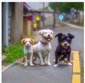

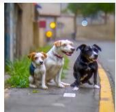  
Prompt: Three dogs on the street.

  
Prompt: Mona Lisa viewed from behind.

  
Prompt: A pair of scissors.

  
Prompt: A black and white sign that says 'Text to Image'.

  
Prompt: A tomato on a pumpkin with a fork stuck into it, viewed from above.

Figure 17 Qualitative component ablation. Rollout query state, forward-noised control, and large branch-coefficient controls on the shared visualization pool. The large branch-coefficient setting can damage prompt semantics under finite fitting, while the first two variants remain closer.

  
Prompt: Exactly one man stands beneath a leafless maple tree in snowy New England.  
Figure 18 Component evolution on additional prompts. Rollout query state, forward-noised control, and large branch-coefficient variants use the same update grid. Across these disjoint prompts, changing query-state source has limited effect, whereas an excessively large branch coefficient produces visible semantic drift.

  
Prompt: A sunflower growing out of an old typewriter on a desk.  
Figure 19 Additional component-evolution cases. Query-state source again has little effect while a large branch coefficient increasingly harms scene and typography details.

## C.5 Training Reward Curves

The training-curve inventory mirrors the trainer's metrics. jsonl for 73 complete runs. It contains 70 reward-specific 100-update runs underlying Tab. 1, one additional matched SD3.5-M FlowGRPO CLIPScore run used only in this analysis, and two 300-update runs jointly trained on PickScore, CLIPScore, and HPSv2.1. The curves are canonical training records. Raw per-update rewards remain on their native scales. Dispersion is defined consistently for every method as the mean within-prompt rollout reward standard deviation. This quantity is not a confidence interval.

Fig. 20 and Fig. 21 separate the cross-cell summary by backbone. For each backbone and reward cell, the gain denominator is the joint smoothed best across methods minus the median method value at update 0. Each run is measured from its own reward at update 0, which removes small rollout-sampling offsets without forcing pointwise method ordering. Solid curves are cross-cell medians and bands are cross-cell interquartile ranges. The end-of-run statistic is the final smoothed reward's position between the minimum and maximum observed smoothed rewards in that run. The normalized-gain plot in Fig. 21 retains the full negative DiffusionNFT curve for Z-Image-Turbo rather than clipping it to the scale of the other methods shown in the figure.

Figure 20SD3.5-M training dynamics. DiffusionOPSD achieves the strongest average normalized gain and stable final rewards across the ten objectives.  
  
Figure 21 Z-Image-Turbo training dynamics. DiffusionOPSD improves consistently across the native schedule. while DiffusionNFT shows several below-base regressions.

  
Figure 22Complete training records. Raw per-update reward curves for all 73 runs show the unnormalized histories underlying the aggregate analyses. Reward-specific and joint-training runs remain on their native scales.

## C.6 Fitting Audit

This section gives the detailed protocols and configurations behind Fig. 10. The figure combines three distinct protocols that must not be interpreted as one causal chain. Endpoint attribution measures trained variants, the construction and realized-gain audits hold a query fixed, and the reversal probe restores parameters between prompts. End-to-end online training efficacy is established separately in Sec. 4.1.

Expanded endpoint attribution. The expanded endpoint-attribution evaluation in Fig. 10 uses the 50-update SD3.5-M CLIPScore variants at $5 1 2 \times 5 1 2$ on 999 images from 200 DrawBench prompts, with approximately five shared initial latents per prompt. Generation uses the deterministic 40-step first-order ODE sampler, CFG-free scale 1.0. Paired differences use the same prompt and latent across variants. The 10, 000-resample prompt-clustered bootstrap intervals account for repeated latents within each prompt.

Construction gain. The construction-gain comparison in Fig. 10 uses 512 distinct held-out prompts and freezes the SD3.5-M CLIPScore policy at update 50. It fixes the query noise level at $\sigma _ { q } \simeq 0 . 2 7 8 .$ the anchor prediction, and the relative clean-output target radius at $\rho = 0 . 1 0$ . The same suffix sampler is used for every candidate. A candidate is evaluated before any parameter update. $\Delta F _ { q }$ is its fixed-suffix reward minus that of the anchor, and alignment is the cosine between candidate displacement and the local reward gradient. FlowGRPO uses 1, 024 observations over the same 512 prompts because each finitegroup direction is estimated twice; the remaining rows use one anchor per prompt. Reward calls count calls used to form one candidate direction, not suffix evaluation.

Matched realized-gain audit. The matched realized-gain comparison in Fig. 10 uses the same frozen CLIPScore policy, 512 distinct prompts, query construction, fixed-suffix reward, and matched pooled-RMS query-output displacement. Every interface uses one calibrated plain-SGD step. ReFL backpropagates reward through a one-step clean-output prediction at the queried late state after a no-gradient prefix, while detached rows fit an explicit target at the same query. Parameters are restored between prompts. The drift ratio is the off-direction component of the realized query displacement relative to its total magnitude. This protocol measures an isolated realized gain, not the batched online training procedure with positive and negative targets.

Isolated same-query positive-target fitting probe. The reversal analysis in Fig. 10 is a separate probe at update 100 on CLIPScore and HPSv2.1. For every held-out query and candidate target, policy parameters are restored to the same checkpoint and a fresh AdamW instance performs exactly one positive-target MSE update. With zero moment state and gradient $^ { g , }$ its first parameter update is approximately

$$
\Delta \theta \approx - \eta _ { \mathrm { A d a m } } \frac { g } { | g | + \epsilon _ { \mathrm { A d a m } } } - \eta _ { \mathrm { A d a m } } \lambda \theta ,\tag{61}
$$

where the fraction is elementwise. Here $\eta _ { \mathrm { A d a m } }$ is the learning rate, λ is the weight-decay coefficient, and $\epsilon _ { \mathrm { A d a m } }$ is the optimizer stabilizer. When gradient magnitudes dominate $\epsilon _ { \mathrm { A d a m } }$ , this step is approximately sign normalized. Matching target radius therefore does not match the parameter-step magnitude. The updated clean-output prediction and fixed-suffix reward are measured at the same query, then the checkpoint is restored before the next state. The probe uses 512 distinct prompts per reward, no cross-query interference, no negative fitting branch, no batch accumulation, and no behavior-policy EMA update. It is deliberately narrower than the full DiffusionoPSD training procedure. $\kappa _ { \mathrm { f i t } }$ is the signed fraction of the target displacement realized along the target direction. Orthogonal drift is reported jointly because $\kappa _ { \mathrm { f i t } }$ alone is not sufficient.

The HPSv2.1 reward-gradient positive target has larger construction gain but produces a smaller realized gain after one fresh-AdamW update than the matched-radius random-direction positive target. This is a protocolspecific counterexample to the claim that a larger construction gain always produces a larger realized gain. CLIPScore is a weaker counterpoint. Ranking is only partially retained, but grad-versus-random ordering does not reverse on a majority of anchors. The separate plain-SGD audit reports a positive realized gain for bounded DiffusionOPSD on CLIPScore but does not test HPSv2.1. These results make construction-gain evaluation and realized gain non-substitutable under the measured optimization protocol. They do not explain end-to-end online training performance or isolate the marginal contribution of the behavior-policy EMA update.

## C.7 Stress-Test Protocols

The few-step study uses Z-Image-Turbo at 1024 × 1024 with its native 9-step FlowMatchEuler sampler and guidance scale 0.0 for both training and evaluation. Each of the ten reward-specific checkpoints trains for 100 optimizer updates. Outcome counts in the main text are computed per optimized reward; paired base-model significance is available for nine rewards with aligned per-prompt scores.

The joint policy is trained directly for 300 updates on $\textstyle \mathrm { \frac { P i c k S c o r e } { 2 6 } } + \mathrm { C L I P S c o r e } + \mathrm { H P S v 2 . 1 }$ Each single-reward specialist trains for 100 updates. The different update budgets are intentional and prevent interpreting this stress test as a matched multi-objective leaderboard. The comparison asks only whether one complete DiffusionoPsD policy can retain high performance on all three reward objectives in this setting. Weighted-sum reward gradients are available to any differentiable method and may suffer conflict or dilution |73], the result does not establish a general conflict-resolution mechanism.

## C.8 Ablation Details

Shared screening protocol. All ablation variants in Sec. 4.7 use the same CLIPScore-only screening protocol [17]. The backbone is SD3.5-M [13] at $5 1 2 \times 5 1 2$ resolution. Training prompts are sampled from the same Pick-a-Pic training split [26] used by the corresponding reward-optimization runs, while evaluation uses a fixed DrawBench 10% subset [48]. The subset contains 20 unique DrawBench prompts and five generated images per prompt, giving 100 images per reported scalar. We report raw CLIPScore on this subset as mean ± standard error. The subset is intentionally small so that many component variants can be compared under matched compute; conclusions that affect the main table should be confirmed on the full DrawBench protocol before being treated as general evidence.

Training schedule and sampler. Each ablation trains a LoRA 22| on SD3.5-M for 50 optimizer updates. Checkpoint index u equals the optimizer-update count exactly; update 50 is the checkpoint after 50 optimizer updates, not the completion of 50 dataset passes. Unless a variant explicitly changes rollout function evaluations or sampler type, data collection uses the rollout sampler of the behavior policy with deterministic DPM-Solver++ 2M [38], 10 steps, 512 × 512 resolution, and classifier-free guidance scale 1.0 [19]. Evaluation is always held fixed with a deterministic flow sampler, 40 steps, guidance scale 1.0. The scalar endpointattribution result in Fig. 10 and the curves or controls in Fig. 9, 15, and 16 use the checkpoint at update 50. The training-evolution visualizations in Fig. 25 and 18 additionally render updates 0, 10, 20, 30, 40, and 50, where update 0 denotes the untrained LoRA initialization.

Canonical OPSD configuration. The default configuration used as the reference line in Fig. 15 and 16 disables endpoint checking, enables both positive and negative reward-gradient-derived targets, uses query noise level $\sigma _ { q } = 0 . 2 7 8$ , relative clean-output target radius $\rho = 0 . 1 0$ , two reward ascent and descent steps per branch, target-step multiplier $\eta _ { \mathrm { t g t } } = 1 . 0$ , branch coefficient $\beta = 1 . 0$ , and the DPM-Solver++ 2M 10-step rollout sampler. Endpoint checking, endpoint-check margin, positive-only training, query noise level, relative clean-output target radius, number of reward-ascent steps, target-step multiplier, rollout function evaluations, branch coefficient, behavior-policy EMA update, and rollout sampler are varied one at a time around this default.

Target and component variants. Fig. 10 compares four target variants. These are the reward-gradient target used by DiffusionoPSD, a random-direction target with the same relative clean-output radius, a no-op target that leaves $y _ { + } = y _ { - } = y _ { 0 }$ , and a rollout-residual target along $x _ { 0 } - y _ { 0 }$ . It also reports a query-state source check that replaces the on-policy rollout query state with a forward-noised control. Unlike the 100-image screening curves in Fig. 9, its target-direction comparison uses the expanded 999-image protocol described in App Sec. C.6.

Qualitative and progress figures. The qualitative grids in Fig. 23 and 17 use 40 prompts. They combine the 20 prompts from the fixed DrawBench-subset visualization cases with 20 additional DrawBench prompts sampled only for visualization. The progress grids in Fig. 25 and 18 use two other disjoint 20-prompt sets, so the final qualitative grids and the training-evolution grids do not reuse prompts. These images are diagnostic and are not used to compute the scalar CLIPScore means

  
Prompt: A keyboard made of water and light, with the light turned off.

  
Prompt: One cat and one dog sitting on the grass.

  
Prompt: A black colored car.

  
Prompt: A strict side-profile owl in a grassy field, with only one eye visible.

  
Prompt: A domestic cat with soft fur, a short snout, and visible paws, sitting alone.  
Prompt: A sign displaying "DiffusionOPSD" on the first line and "Seed" on the second line.

  
Prompt: A car playing soccer, digital art.

Figure 23 Qualitative target-direction ablation. Update-50 reward-gradient, random-direction, and no-op target variants on held-out prompts. Across the 40-prompt pool, the reward-gradient direction preserves requested entities and style more consistently, while random and no-op controls under-edit or drift.

Gradient

  
Prompt: A magnifying glass over a page of a 1950s batman comic.

  
Prompt: A panda making latte art.  
Prompt: An elephant under the sea.

  
Prompt: A green colored banana.

  
Prompt: A white car and a red sheep.

  
Prompt: A single clock is sitting on a table.

  
Prompt: A triangular purple flower pot.

  
Prompt: A bicycle on top of a boat.

  
Prompt: An oil painting portrait of the regal Burger King posing with a Whopper.

  
Prompt: An old photograph of a pig-shaped 1920s airship over a wheat field.

  
Figure 24 Target-direction ablation on additional prompts. Reward-gradient, random-direction, and no-op target variants use the Fig. 23 layout. The added cases cover text rendering, object identity, color, counting, and spatial relations. The reward-gradient direction retains requested attributes more reliably than both controls.

  
Prompt: A baby panda emoji wearing a red hat, blue gloves, a green shirt, and blue pants.  
Figure 25 Training evolution of target variants. Reward-gradient, random, and no-op variants are shown on fixed prompts from update 0 to update 50. Reward-gradient outputs begin separating early and preserve the intended action or attributes through update 50, whereas both controls remain closer to their initial behavior.

  
Prompt: A green cup and a blue cell phone.  
Figure 26 Target-direction evolution on additional prompts. Reward-gradient, random, and no-op variants use the same update grid as Fig. 25. Across these disjoint prompts, reward-gradient variants preserve the requested vehicle, architecture, and object and phone relation, while the controls show weaker task-specific change.

Human preference protocol. The human-preference results in Fig. 16 use the frozen Z-Image-Turbo qualitative archive for the VLM-Pointwise reward setting. We compare DiffusionoPsD against the base model, FlowGRPO, DiffusionNFT, and ReFL on 100 held-out prompts. Annotators hold at least a bachelor's degree in a STEM field and evaluate blinded paired comparisons with randomized method order. They choose the image that is better overall for the prompt, allowing ties, and assign one primary reason among prompt alignment, visual quality, realism and artifacts, and text or fine details. Win rates use half-tie scoring with prompt-clustered bootstrap intervals over prompts; the reason breakdown in the same figure is conditioned on decisions that prefer DiffusionOPSD and normalized for each baseline comparison.

## C.9 CFG Compensation

Guided-field constraint. At a fixed state, timestep, and prompt, classifier-free guidance forms the affine velocity field [19]

$$
\begin{array} { r } { A _ { \zeta } ( v _ { c } , v _ { u } ) = v _ { u } + \zeta ( v _ { c } - v _ { u } ) = \zeta v _ { c } + ( 1 - \zeta ) v _ { u } , } \end{array}\tag{62}
$$

where $\zeta$ is the guidance scale and $v _ { c }$ and $v _ { u }$ are the conditional and unconditional predictions. In the train-CFG variant of OPSD, both predictions share the trainable parameters, and the same operator is used for rollout construction, the anchor prediction from the behavior policy, and the trainable and frozen behavior velocities in the loss. This setting differs from frozen-teacher CFG absorption, where a fixed guided field is used as the regression target of a single student field during distillation |76].

Let $\Delta v _ { c }$ and $\Delta v _ { u }$ be the changes of the two branch outputs relative to the frozen behavior policy, and let $\Delta v _ { \mathrm { t a r } }$ denote the reward-gradient velocity correction requested by the local OPSD target. Training at guidance scale $\zeta _ { \mathrm { t r } }$ minimizes

$$
\mathcal { L } _ { \zeta _ { \mathrm { t r } } } = \left\| \mathcal { A } _ { \zeta _ { \mathrm { t r } } } ( \Delta v _ { c } , \Delta v _ { u } ) - \Delta v _ { \mathrm { t a r } } \right\| _ { 2 } ^ { 2 } .\tag{63}
$$

Define the residual and the branch difference as

$$
e _ { \mathrm { t r } } = \mathcal { A } _ { \zeta _ { \mathrm { t r } } } ( \Delta v _ { c } , \Delta v _ { u } ) - \Delta v _ { \mathrm { t a r } } , \qquad \Delta v _ { \mathrm { g a p } } = \Delta v _ { c } - \Delta v _ { u } .\tag{64}
$$

The loss constrains one affine combination of the two branch outputs and therefore leaves the individual branches non-identifiable under this objective.

Branch decomposition. Using $\Delta v _ { \mathrm { g a p } } = \Delta v _ { c } - \Delta v _ { u }$ in Eq. (64) gives

$$
\Delta v _ { \mathrm { t a r } } + e _ { \mathrm { t r } } = \Delta v _ { u } + \zeta _ { \mathrm { t r } } \Delta v _ { \mathrm { g a p } } ,\tag{65}
$$

$$
\Delta v _ { u } = \Delta v _ { \mathrm { t a r } } + e _ { \mathrm { t r } } - \zeta _ { \mathrm { t r } } \Delta v _ { \mathrm { g a p } } ,\tag{66}
$$

$$
\Delta v _ { c } = \Delta v _ { \mathrm { t a r } } + e _ { \mathrm { t r } } + ( 1 - \zeta _ { \mathrm { t r } } ) \Delta v _ { \mathrm { g a p } } .\tag{67}
$$

Thus every branch pair with the same train-scale residual can be written as

$$
\Big [ \Delta v _ { c } \Big ] = \underbrace { \Big [ \Delta v _ { \mathrm { t a r } } + e _ { \mathrm { t r } } \Big ] } _ { \Delta v _ { \mathrm { t a r } } + e _ { \mathrm { t r } } } + \underbrace { \Big [ \big ( 1 - \zeta _ { \mathrm { t r } } \big ) \Delta v _ { \mathrm { g a p } } \Big ] } _ { - \zeta _ { \mathrm { t r } } \Delta v _ { \mathrm { g a p } } } .\tag{68}
$$

The second component lies in the null space of the train-scale operator.

$$
\begin{array} { r l } & { \mathcal { A } _ { \zeta _ { \mathrm { t r } } } \big ( ( 1 - \zeta _ { \mathrm { t r } } ) \Delta v _ { \mathrm { g a p } } , - \zeta _ { \mathrm { t r } } \Delta v _ { \mathrm { g a p } } \big ) = \zeta _ { \mathrm { t r } } ( 1 - \zeta _ { \mathrm { t r } } ) \Delta v _ { \mathrm { g a p } } + ( 1 - \zeta _ { \mathrm { t r } } ) ( - \zeta _ { \mathrm { t r } } \Delta v _ { \mathrm { g a p } } ) } \\ & { \qquad = 0 . } \end{array}\tag{69}
$$

Consequently, the guided loss does not directly penalize $\Delta v _ { \mathrm { g a p } }$ . The coupling between the two branches and the model initialization may restrict the reachable compensation component, but neither removes this non-identifiability from the objective without explicit regularization.

Proposition C.1 (CFG compensation identity). For any evaluation scale $\zeta _ { \mathrm { e v } ; }$ , a branch pair satisfying Eqs. (66) and (67) obeys

$$
\begin{array} { r } { \mathcal { A } _ { \zeta _ { \mathrm { e v } } } ( \Delta v _ { c } , \Delta v _ { u } ) - \Delta v _ { \mathrm { t a r } } = e _ { \mathrm { t r } } + ( \zeta _ { \mathrm { e v } } - \zeta _ { \mathrm { t r } } ) \Delta v _ { \mathrm { g a p } } . } \end{array}\tag{70}
$$

Its squared field error is therefore

$$
\begin{array} { r l } & { \left\| \mathcal { A } _ { \zeta _ { \mathrm { e v } } } ( \Delta v _ { c } , \Delta v _ { u } ) - \Delta v _ { \mathrm { t a r } } \right\| _ { 2 } ^ { 2 } = \left\| e _ { \mathrm { t r } } \right\| _ { 2 } ^ { 2 } + 2 ( \zeta _ { \mathrm { e v } } - \zeta _ { \mathrm { t r } } ) \langle e _ { \mathrm { t r } } , \Delta v _ { \mathrm { g a p } } \rangle } \\ & { \qquad + ( \zeta _ { \mathrm { e v } } - \zeta _ { \mathrm { t r } } ) ^ { 2 } \| \Delta v _ { \mathrm { g a p } } \| _ { 2 } ^ { 2 } . } \end{array}\tag{71}
$$

If the train-scale field is fit exactly, then

$$
\lVert A _ { \zeta _ { \mathrm { e v } } } ( \Delta v _ { c } , \Delta v _ { u } ) - \Delta v _ { \mathrm { t a r } } \rVert _ { 2 } ^ { 2 } = ( \zeta _ { \mathrm { e v } } - \zeta _ { \mathrm { t r } } ) ^ { 2 } \lVert \Delta v _ { \mathrm { g a p } } \rVert _ { 2 } ^ { 2 } .\tag{72}
$$

Proof. Substituting Eqs. (66) and (67) into the evaluation operator yields

$$
\begin{array} { r l } & { \mathcal { A } _ { \zeta _ { \mathrm { e v } } } ( \Delta v _ { c } , \Delta v _ { u } ) = \zeta _ { \mathrm { e v } } [ \Delta v _ { \mathrm { t a r } } + e _ { \mathrm { t r } } + ( 1 - \zeta _ { \mathrm { t r } } ) \Delta v _ { \mathrm { g a p } } ] + ( 1 - \zeta _ { \mathrm { e v } } ) [ \Delta v _ { \mathrm { t a r } } + e _ { \mathrm { t r } } - \zeta _ { \mathrm { t r } } \Delta v _ { \mathrm { g a p } } ] } \\ & { = [ \zeta _ { \mathrm { e v } } + ( 1 - \zeta _ { \mathrm { e v } } ) ] ( \Delta v _ { \mathrm { t a r } } + e _ { \mathrm { t r } } ) + [ \zeta _ { \mathrm { e v } } ( 1 - \zeta _ { \mathrm { t r } } ) - \zeta _ { \mathrm { t r } } ( 1 - \zeta _ { \mathrm { e v } } ) ] \Delta v _ { \mathrm { g a p } } } \\ & { = \Delta v _ { \mathrm { t a r } } + e _ { \mathrm { t r } } + ( \zeta _ { \mathrm { e v } } - \zeta _ { \mathrm { t r } } ) \Delta v _ { \mathrm { g a p } } . } \end{array}\tag{73}
$$

Subtracting $\Delta v _ { \mathrm { t a r } }$ proves Eq. (70). Expanding the squared norm gives Eq. (71); setting $e _ { \mathrm { t r } } \ = \ 0$ gives Eq. (72). □

For fixed $\zeta _ { \mathrm { t r } } , \mathrm { E q . ~ ( 7 1 ) }$ is a quadratic function of the evaluation scale $\zeta _ { \mathrm { e v } }$ . When $\Delta v _ { \mathrm { g a p } } \neq 0$ , its minimizer is

$$
\zeta _ { \mathrm { e v } } ^ { \star } = \zeta _ { \mathrm { t r } } - \frac { \langle e _ { \mathrm { t r } } , \Delta v _ { \mathrm { g a p } } \rangle } { \| \Delta v _ { \mathrm { g a p } } \| _ { 2 } ^ { 2 } } ,\tag{74}
$$

which approaches the matched scale as the train-scale residual vanishes. In particular, evaluating a guidedtrained SD3.5-M model without CFG corresponds to $\zeta _ { \mathrm { e v } } = 1$ and, under exact train-scale fitting, incurs

$$
\begin{array} { r } { \| A _ { 1 } ( \Delta v _ { c } , \Delta v _ { u } ) - \Delta v _ { \mathrm { t a r } } \| _ { 2 } ^ { 2 } = ( \zeta _ { \mathrm { t r } } - 1 ) ^ { 2 } \| \Delta v _ { \mathrm { g a p } } \| _ { 2 } ^ { 2 } . } \end{array}\tag{75}
$$

The mismatch penalty therefore grows quadratically with the distance between the training and evaluation guidance scales whenever the hidden branch component is nonzero.

Optimization geometry. The derivatives of the guided operator are

$$
\frac { \partial A _ { \zeta _ { \mathrm { t r } } } } { \partial \Delta v _ { c } } = \zeta _ { \mathrm { t r } } I , \qquad \frac { \partial A _ { \zeta _ { \mathrm { t r } } } } { \partial \Delta v _ { u } } = ( 1 - \zeta _ { \mathrm { t r } } ) I .\tag{76}
$$

Hence the branch-output gradients of Eq. (63) are

$$
\begin{array} { r l r } & { } & { \nabla _ { \Delta v _ { c } } \mathcal { L } _ { \zeta _ { \mathrm { t r } } } = 2 \zeta _ { \mathrm { t r } } e _ { \mathrm { t r } } , \qquad \nabla _ { \Delta v _ { u } } \mathcal { L } _ { \zeta _ { \mathrm { t r } } } = 2 ( 1 - \zeta _ { \mathrm { t r } } ) e _ { \mathrm { t r } } . } \end{array}\tag{77}
$$

For $\zeta _ { \mathrm { t r } } > 1$ , the two coefficients have opposite signs. Because both branches are produced by the same model with parameters $\theta ,$ let $J _ { c } = \partial \Delta v _ { c } / \partial \theta$ and $J _ { u } = \partial \Delta v _ { u } / \partial \theta$ . The parameter gradient becomes

$$
\begin{array} { r } { \nabla _ { \theta } \mathcal { L } _ { \zeta _ { \mathrm { t r } } } = 2 \left[ \zeta _ { \mathrm { t r } } J _ { c } ^ { \top } + ( 1 - \zeta _ { \mathrm { t r } } ) J _ { u } ^ { \top } \right] e _ { \mathrm { t r } } . } \end{array}\tag{78}
$$

The branches share parameters, but the conditional and unconditional Jacobians are multiplied by coefficients of opposite sign. Thus the objective controls the guided affine combination more directly than either branch. It also contains no separate regularizer on $\| \Delta v _ { \mathrm { g a p } } \| _ { 2 }$

The compensation identity and quadratic field penalty are exact. The compensation term vanishes when $\zeta _ { \mathrm { e v } } = \zeta _ { \mathrm { t r } } ,$ so this mechanism explains degradation caused by training and evaluation mismatch without implying that matched CFG training must underperform. Frozen-teacher absorption avoids this ambiguity because the guided teacher field is fixed before a single student field is optimized [76].