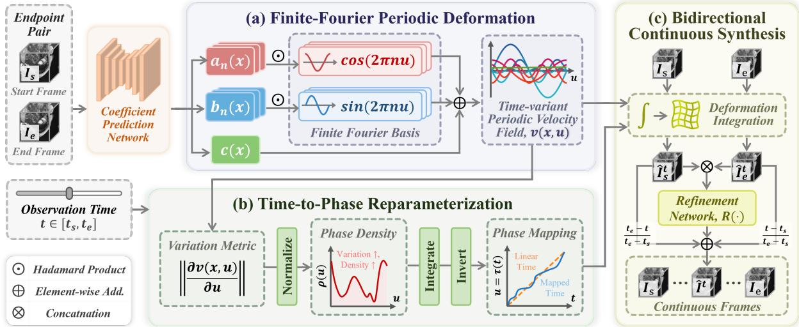
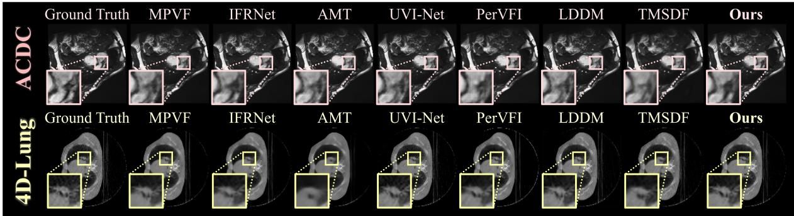
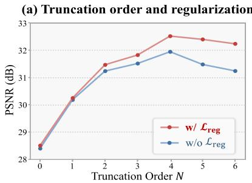
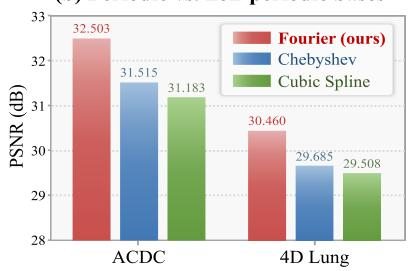
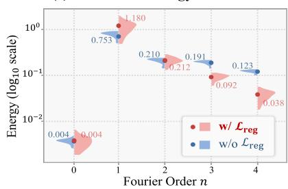
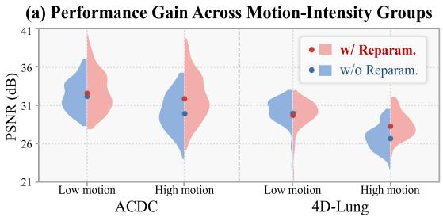
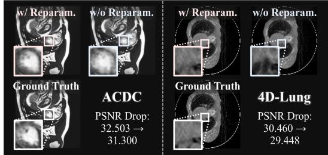
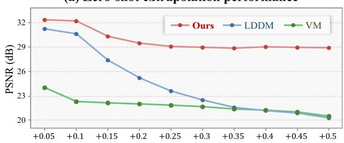
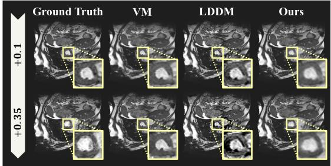

# Phase-Aligned Finite-Fourier Periodic Deformation for 4D Medical Image Interpolation

Haojin Li∗   
Department of Computer Science and   
Engineering   
Southern University of Science and   
Technology   
Shenzhen, China   
12232410@mail.sustech.edu.cn   
Mingyang Ou   
School of Computer Science and   
Engineering   
Beihang University   
Beijing, China   
ComgLqWork@outlook.com   
Hengzhuo Wang∗   
Faculty of Biomedical Engineering   
Shenzhen University of Advanced   
Technology   
Shenzhen, China   
School of Biomedical Engineering,   
Shenzhen University Medical School   
Shenzhen University   
Shenzhen, China   
suat25060145@stu.suat-sz.edu.cn   
Heng Li†   
Faculty of Biomedical Engineering   
Shenzhen University of Advanced   
Technology   
Shenzhen, China   
liheng@suat-sz.edu.cn   
Zhiheng Ma   
Faculty of Computility   
Microelectronics   
Shenzhen University of Advanced   
Technology   
Shenzhen, China   
mazhiheng@suat-sz.edu.cn   
Jiang Liu†   
Department of Computer Science and   
Engineering   
Southern University of Science and   
Technology   
Shenzhen, China   
liuj@sustech.edu.cn

## Abstract

4D medical image interpolation aims to recover missing volumes from sparsely observed time points and is important for dynamic anatomical analysis in applications such as cardiac MRI and tho racic CT, where motion is often repetitive or near-periodic over clinically relevant intervals. A key challenge is that this structure is not always encoded directly in deformation representations for in- terpolation. In addition, physiological motion is often non-uniform, so equal temporal intervals do not necessarily correspond to equal amounts of anatomical change. To address these issues, we formu late interpolation as learning a continuous deformation process with a phase-structured prior. Given two endpoint volumes, we parameterize a phase-conditioned velocity field with a finite Fourier basis, which embeds near-periodic motion patterns directly into the deformation space and supports continuous querying at arbitrary target times. We further introduce a phase-aligned temporal reparameterization that maps normalized within-interval time to a latent motion phase according to deformation variation intensity, thereby better modeling non-uniform motion progression. Intermediate volumes are then synthesized by continuously warping both endpoints, followed by bidirectional fusion and lightweight residual refinement. Experiments on ACDC and 4D-Lung show that the proposed method achieves state-of-the-art performance

over existing baselines while producing anatomically plausible and coherent intermediate volumes from sparse observations.

## CCS Concepts

• Computing methodologies → Computer vision; • Applied computing → Imaging.

## Keywords

4D medical imaging, Video frame interpolation, Continuous deformation modeling, Periodic motion modeling, Finite Fourier parameterization

## ACM Reference Format:

Haojin Li, Hengzhuo Wang, Zhiheng Ma, Mingyang Ou, Heng Li, and Jiang Liu. 2026. Phase-Aligned Finite-Fourier Periodic Deformation for 4D Medical Image Interpolation. In Proceedings of the 34th ACM International Conference on Multimedia (MM ’26), November 10–14, 2026, Rio de Janeiro, Brazil. ACM, New York, NY, USA, 10 pages. https://doi.org/10.1145/3767308.3834921

## 1 Introduction

4D medical imaging is widely used in functional assessment, treatment monitoring, and dynamic anatomical analysis [40]. Repre-sentative applications include cardiac motion analysis in cine MRI and respiratory motion analysis in 4D thoracic CT, where clinically meaningful information is determined not only by spatial appearance but also by anatomical deformation over time [14, 27, 37]. In practice, however, dynamic acquisitions are often limited by low temporal resolution, sparse sampling, or irregular acquisition intervals, leaving a substantial portion of the motion process unobserved [28, 32]. As a result, 4D medical image interpolation is both practically important and technically challenging. The task must re- cover missing volumes from only a small number of observed time points while preserving the continuity and anatomical consistency of the underlying motion, which in many dynamic imaging settings also exhibits partially repeatable or near-periodic patterns [5, 12].

Existing 4D interpolation methods mainly fall into two paradigms. Deformation-based methods estimate motion, flow, or deforma- tion between observed frames and reconstruct intermediate states through inferred correspondences [14, 24, 38], while direct synthesis methods generate missing frames more directly from image features together with temporal conditions [23, 43, 45, 47]. Some methods further incorporate temporal regularity or periodic cues, for example through temporal conditioning or auxiliary guidance, to improve interpolation under structured motion [14, 27, 37, 45]. However, such temporal structure is still usually introduced to support reconstruction rather than encoded in the deformation rep resentation itself [26]. For 4D medical imaging, where anatomical continuity and dynamic consistency are central, it is therefore more desirable to encode such clinically meaningful temporal structure directly within the underlying deformation process.

This leads to two key challenges. (1) How can we build a continuous deformation representation that explicitly captures structured motion? In many clinically important dynamic imaging applications, the underlying motion may exhibit partially repeatable or near-periodic behavior [14, 30, 41]. If such structure is used only as temporal conditioning for reconstructing a queried target volume, it does not directly constrain the deformation process, making it dificult to obtain a representation that remains continuous and can be queried reliably at arbitrary target times. (2) How can we account for uneven motion progression within a physiological cy- cle? Even when the overall motion is roughly repetitive, anatomical change does not evolve at a uniform pace within a cycle, so equal observation-time intervals may still correspond to diferent amounts of deformation. This makes linear time a suboptimal coor dinate for continuous interpolation [9, 15, 30, 41].

To address these challenges, we reformulate 4D medical image interpolation as learning a structured deformation process that can be queried continuously from sparse endpoint observations, rather than predicting intermediate states independently at queried time points. Our framework is built on two key ideas. First, we represent the motion process as a phase-conditioned continuous velocity field parameterized by a finite Fourier basis, so that repetitive or near-periodic structure is encoded directly in the deformation rep- resentation. Second, we introduce a phase-aligned temporal reparameterization that maps queried time within the endpoint interval to a phase coordinate according to deformation variation intensity, thereby better reflecting physiological dynamics that do not always evolve in proportion to physical time. Based on this phase-aware deformation process, an intermediate volume at any target time is synthesized by bidirectional endpoint warping, followed by fusion and lightweight residual refinement. This motion-centric formula- tion enables continuous interpolation that is better aligned with the underlying anatomical dynamics.

In summary, this work makes the following contributions:

• We present a framework for 4D medical image interpolation based on phase-structured continuous motion modeling, en- abling anatomically coherent intermediate synthesis from sparse endpoint observations at arbitrary query times.

• We introduce a finite-Fourier parameterization of a phase-conditioned continuous velocity field to encode repetitive or near-periodic motion structure directly in the deformation representation.

• We introduce a time-to-phase reparameterization mechanism that aligns queried time within the endpoint interval with motion phase progression, thereby better capturing non-uniform motion evolution.

• We validate the proposed method on the ACDC and 4D-Lung benchmarks, where it achieves state-of-the-art interpolation performance, and ablation studies further verify the distinct contributions of phase-structured deformation modeling and temporal reparameterization.

## 2 Related Works

## 2.1 Video Frame Interpolation

Video frame interpolation has been extensively studied in natu-ral scenes and mainly follows two paradigms. Deformation-based methods estimate optical flow or related correspondences and syn- thesize intermediate frames through warping and refinement, with designs addressing large-motion matching, intermediate motion estimation, and trajectory-aware synthesis [18, 25, 29, 44]. Direct synthesis methods formulate interpolation as conditional gener- ation to improve flexibility and visual realism in ambiguous re-gions [11]. Recent work further introduces temporal regularity, arbitrary-time interpolation, and continuous video modeling for non-uniform motion and flexible querying [17, 34, 46]. These developments benefit motion estimation and continuous-time prediction, but primarily target visually plausible synthesis in natural scenes. By contrast, 4D medical image interpolation must also preserve anatomy-constrained deformation consistency under structured physiological motion.

## 2.2 4D Medical Image Interpolation

Research on 4D medical image interpolation has increasingly fo-cused on deformable anatomical modeling. The main route is deformation- based interpolation, which estimates volumetric motion or voxel flow between observed scans and reconstructs intermediate vol- umes through warping [14, 24, 38]. This direction is closely related to learning-based deformable registration, where stronger back- bones improve dense correspondence estimation and continuous or difeomorphic parameterizations encourage smoother, anatomically plausible motion fields [1, 6, 22, 36]. Some studies introduce anatomical priors by representing motion on anatomical objects or surfaces [31]. Others explore compact deformation parameterizations, such as band-limited Fourier representations, to regularize spatial motion structure [21]. Together, these studies suggest that medical interpolation depends not only on reconstructing appearance but also on learning anatomically meaningful deformation.

Beyond this deformation-centered route, 4D medical interpola- tion methods have also introduced temporal regularity and synthesis- oriented designs for reconstruction under complex dynamics. Earlier spatiotemporal volumetric models already considered tempo- ral context and periodic motion cues [14], while more recent ap- proaches combine deformation modeling with difusion-based gen- eration, multi-scale fusion, temporal modulation, or Fourier-guided synthesis to handle nonlinear dynamics and large anatomical varia- tion [23, 43, 45, 47]. Continuous motion formulations further extend the problem from prediction at isolated timestamps to recovery of a continuously queryable spatiotemporal process [27, 37]. Never theless, in most existing methods, temporal regularity or periodic information is still used mainly as conditioning or auxiliary guid-ance. It is rarely encoded more directly in the deformation repre- sentation itself, leaving open the problem of learning a continuous anatomical deformation process whose representation can better capture near-periodic structure.

  
Figure 1: Overview of the proposed framework. (a) The endpoint pair (� , � ) is used to predict Fourier coeficient fields that parameterize a phase-conditioned periodic velocity field �(�,�). (b) The queried time � is reparameterized to phase $u = \tau ( t )$ according to deformation variation. (c) The volume at time � is synthesized by bidirectional deformation integration, followed by fusion and refinement.

## 2.3 Continuous Temporal Modeling

Continuous temporal modeling has emerged in medical imaging and adjacent sequence modeling as an alternative to discrete frame indexing. Continuous spatiotemporal motion models, neural im-plicit motion fields, and manifold-based dynamic reconstruction methods enable arbitrary-time querying by treating the underlying dynamics as a continuous process [2, 16, 27, 33, 42]. Related work also shows that temporal coordinates may require explicit align-ment. Phase detection methods model latent cardiac motion pro- gression [30, 41], while broader studies consider diferentiable time warping, temporal synchronization, and global alignment across sequences with diferent traversal speeds [4, 9, 10, 15]. However, these methods mainly focus on query timing, phase detection, or sequence alignment. They do not explicitly reparameterize interpolation time by motion phase or unify phase-aware alignment with a near-periodic continuous deformation representation. Our method addresses this gap by mapping queried time within the observed interval to a phase coordinate that accounts for non-uniform motion progression.

## 3 Methodology

3.1 Task Formulation and Framework Overview Let $\Omega \subset \mathbb { R } ^ { 3 }$ denote the spatial domain and $\{ I _ { t } : \Omega \to \mathbb { R } \}$ a dynamic volumetric sequence. In the endpoint-conditioned setting, each sam-ple provides two observed volumes $I _ { s } : = I _ { t _ { s } }$ and $I _ { e } : = I _ { t _ { e } }$ at times $t _ { s } < t _ { e }$ . Given $( I _ { s } , I _ { e } )$ and any queried time $t \in \left[ t _ { s } , t _ { e } \right]$ , the goal is to recover the target volume continuously between the two obser- vations. Formally, the task is to learn a continuous interpolation function:

$$
\hat { I } ^ { t } = \mathcal { F } _ { \theta } ( I _ { s } , I _ { \mathrm { e } } , t ) , \qquad t \in [ t _ { s } , t _ { \mathrm { e } } ] ,\tag{1}
$$

where $\hat { I } ^ { t }$ denotes the redicted volume at time � and � denotes the model parameters. During training, a sample may additionally provide intermediate observations at timestamps $\mathcal { T } = \{ t _ { k } \} _ { k = 1 } ^ { K - 1 } \subset$ $( t _ { s } , t _ { e } )$ , such that the sample can be written as $( I _ { \mathrm { s } } , I _ { \mathrm { e } } , \{ ( t _ { k } , I _ { t _ { k } } ) \} _ { k = 1 } ^ { K - 1 } )$ These intermediate volumes are used only as supervision and are not fed into the network.

A generic endpoint-conditioned learning objective is written as:

$$
\theta ^ { * } = \arg \operatorname* { m i n } _ { \theta } \mathbb { E } \left[ \frac { 1 } { | \mathcal { T } | } \sum _ { t \in \mathcal { T } } \mathcal { L } _ { \mathrm { r e c } } ( \hat { I } ^ { t } , I _ { t } ) + \lambda \mathcal { R } ( m ^ { t } ) \right] ,\tag{2}
$$

where $m ^ { t }$ denotes the motion representation at time $t ,$ such as a deformation or velocity field, and $\mathcal { R } ( \cdot )$ regularizes its smoothness or physical plausibility.

Rather than instantiating $\mathcal { F } _ { \theta }$ as a direct image-space regressor, our method models interpolation through a continuous deforma- tion process. The queried time determines the target position within the endpoint interval, while a latent phase coordinate $u \in [ 0 , 1 ]$ serves as a representation coordinate for motion progression on a normalized phase axis. This separation decouples temporal lo-calization from motion representation and forms the basis of the proposed method.

## 3.2 Finite-Fourier Periodic Deformation

We model endpoint-conditioned interpolation as a continuously queryable deformation process on a latent phase domain, rather than as a collection of independent predictions at isolated query times. This process is parameterized by a finite Fourier basis, which allows repetitive or near-periodic motion structure to be encoded directly in the representation. Specifically, let $v ( x , u ) \in \mathbb { R } ^ { 3 }$ denote a phase-conditioned velocity field, where $x \in \Omega$ and $u \in [ 0 , 1 ]$ indexes motion progression on a normalized phase interval. Under this formulation, intermediate synthesis is derived from a unified anatomical evolution process rather than from disconnected image- space predictions.

To encode phase-wise regularity explicitly, we represent $v ( x , u )$ by a finite Fourier expansion on the phase axis:

$$
v ( x , u ) = c ( x ) + \sum _ { n = 1 } ^ { N } \left[ a _ { n } ( x ) \cos ( 2 \pi n u ) + b _ { n } ( x ) \sin ( 2 \pi n u ) \right] ,\tag{3}
$$

where � denotes the truncation order, $c ( x ) \in \mathbb { R } ^ { 3 }$ is the zeroth-order component, and $a _ { n } ( x ) , b _ { n } ( x ) \in \mathbb { R } ^ { 3 }$ are the cosine and sine coefi- cient fields at order �. This gives $v ( x , u + 1 ) = v ( x , u )$ by construction, imposing periodicity at the representation level. Lower-order components capture coarse phase-scale motion, while higher-order terms model finer phase-dependent variation.

This formulation difers from both discrete interpolation and generic continuous regression. In our case, phase dependence is restricted to a finite Fourier subspace, making the periodic prior intrinsic to the admissible deformation family. The model therefore learns coeficients of a structured motion process rather than a collection of temporally indexed deformation snapshots.

In implementation, the network predicts the coeficient vol- umes $\{ c , a _ { n } , b _ { n } \} _ { n = 1 } ^ { N }$ from the endpoint pair $( I _ { \mathrm { s } } , I _ { \mathrm { e } } )$ only once, after which the velocity field can be evaluated continuously at any phase $u .$ To stabilize this truncated spectral representation, we impose frequency-aware regularization on the coeficient fields:

$$
\mathcal { L } _ { \mathrm { r e g } } = \sum _ { n = 1 } ^ { N } n ^ { \gamma } \left( \left. a _ { n } \right. _ { L ^ { 2 } ( \Omega ) } ^ { 2 } + \left. b _ { n } \right. _ { L ^ { 2 } ( \Omega ) } ^ { 2 } \right) ,\tag{4}
$$

where � > 0 controls the penalty strength on higher-order terms. We set $\gamma = 1 . 5$ in practice. This regularizer controls the spectral complexity of the phase-varying deformation process and improves the stability of continuous interpolation under finite-order trunca- tion [20].

An additional advantage of this representation is that phase variation admits a direct spectral interpretation, which motivates the temporal alignment developed next.

Proposition 3.1 (Spectral identity for phase variation). For the finite-Fourier representation in Eq. (3), the cycle-averaged squared phase variation satisfies:

$$
\int _ { 0 } ^ { 1 } \int _ { \Omega } \left. \partial _ { u } v ( x , u ) \right. _ { 2 } ^ { 2 } d x d u = 2 \pi ^ { 2 } \sum _ { n = 1 } ^ { N } n ^ { 2 } \left( \left. a _ { n } \right. _ { L ^ { 2 } ( \Omega ) } ^ { 2 } + \left. b _ { n } \right. _ { L ^ { 2 } ( \Omega ) } ^ { 2 } \right) .\tag{5}
$$

This identity highlights an important advantage of the finite-Fourier deformation representation: phase-wise deformation variation is characterized explicitly by a frequency-squared weighted spectral energy. The contribution of each Fourier component to motion variation is therefore transparent, with higher-order components governing more rapidly changing phase-dependent dynamics. As a result, the learned spectrum admits a clear interpretation, and the temporal complexity of the deformation process can be ana- lyzed directly from the coeficients rather than only being reflected implicitly in network activations. Proofs of this proposition, to-gether with the derivations of subsequent related formulas, are provided in the supplementary material.

## 3.3 Time-to-Phase Reparameterization

Physiological motion generally does not evolve uniformly over ob- servation time [8]. Although the deformation process is represented continuously on the latent phase axis, equal increments in queried time do not necessarily correspond to equal progression along phase. Directly equating queried time with phase may therefore allocate temporal resolution poorly along the motion progression. We thus introduce a deterministic temporal reparameterization that maps queried time to a motion-aware phase coordinate while preserving the periodic deformation model.

We quantify phase-wise deformation variation by:

$$
s ( u ) = \frac { 1 } { \vert \Omega \vert } \int _ { \Omega } \left. \partial _ { u } v ( x , u ) \right. _ { 2 } ^ { 2 } d x , \qquad u \in [ 0 , 1 ] .\tag{6}
$$

Based on this variation profile, we define the normalized phase density as:

$$
\rho ( u ) = \frac { \varepsilon + s ( u ) } { \int _ { 0 } ^ { 1 } \left( \varepsilon + s ( \xi ) \right) d \xi } , \qquad \varepsilon = 1 0 ^ { - 6 } ,\tag{7}
$$

where $\varepsilon$ is introduced to ensure that $\rho ( u )$ remains strictly positive. The associated cumulative phase measure is then:

$$
\Psi ( u ) = \int _ { 0 } ^ { u } \rho ( \xi ) d \xi .\tag{8}
$$

The aligned phase coordinate is obtained by:

$$
\tau ( t ) = \Psi ^ { - 1 } ( t ) , \qquad t \in [ 0 , 1 ] .\tag{9}
$$

Since $\rho ( u )$ is normalized on [0, 1], the cumulative map Ψ satisfies $\Psi ( 0 ) = 0$ and $\Psi ( 1 ) = 1$ . Therefore, its inverse $\tau = \Psi ^ { - 1 }$ is endpointaligned by construction, i.e., $\tau ( 0 ) = 0$ and $\tau ( 1 ) = 1$

Lemma 3.2 (Well-posedness of the phase-aligned map). Assume that � is continuous on [0, 1]. Then � is continuous and strictly positive on [0, 1], Ψ is a strictly increasing bijection from [0, 1] onto [0, 1], and $\tau = \Psi ^ { - 1 }$ is a continuous strictly increasing bijection sat-$i s f y i n g \tau ( 0 ) = 0$ and $\tau ( 1 ) = 1 .$ . If, in addition, there exist constants $0 < m \le M <$ ∞ such that

$$
m \leq \rho ( u ) \leq M , \qquad \forall u \in [ 0 , 1 ] ,\tag{10}
$$

then � is bi-Lipschitz on [0, 1].

The reparameterization is induced by the learned deformation process itself rather than by an additional temporal predictor. Phases with larger deformation variation receive greater density mass and are therefore assigned finer temporal resolution after inversion by Ψ, whereas slowly varying phases are traversed more coarsely.

Let $V ( u ) = v ( \cdot , u )$ denote the phase-indexed deformation tra- jectory in $L ^ { 2 } ( \Omega ; \mathbb { R } ^ { 3 } )$ , and let $\widetilde V ( t ) = V ( \tau ( t ) )$ denote its reparam-eterized counterpart. The following result shows that temporal reparameterization changes traversal speed but not the underlying trajectory.

Theorem 3.3 (Uniform traversal under the phase metric). Assume that � is absolutely continuous on [0, 1], and let � be defined by Eqs. (7)–(9). Then $\widetilde { V }$ and � have the same image:

$$
\left\{ \widetilde V ( t ) : t \in [ 0 , 1 ] \right\} = \left\{ V ( u ) : u \in [ 0 , 1 ] \right\} .\tag{11}
$$

Moreover, $\widetilde { V }$ traverses this trajectory at constant speed with respect to the phase density, in the sense that

$$
\rho ( \tau ( t ) ) \tau ^ { \prime } ( t ) = 1 \qquad f o r a l m o s t e \nu e r y t \in [ 0 , 1 ] .\tag{12}
$$

This result shows that the proposed mapping preserves the continuous periodic deformation trajectory while redistributing queried times according to phase-wise deformation complexity. The aligned phase coordinate � (�) is subsequently used to evaluate the target deformation state for continuous synthesis from the two endpoints.

## 3.4 Bidirectional Continuous Synthesis and Training Objective

With the phase-aligned mapping �(�), the learned periodic deformation process can be queried continuously at arbitrary observation times. Accordingly, we synthesize the target volume by transporting both endpoints to the queried time rather than by direct intensity regression. Specifically, let $W ( I _ { s } ; s \to t )$ denote the volume ob- tained by warping a source volume $I _ { s }$ from time � to time � along the deformation flow induced by the phase-conditioned velocity field evaluated on $\tau ( \cdot )$ , where the transport is computed by numer- ically integrating the corresponding flow with a discretized Euler scheme [35]. The two directional candidates therefore difer only in their source endpoint and transport direction:

$$
\hat { I } _ { \mathrm { s } } ^ { t } = W ( I _ { \mathrm { s } } ; t _ { \mathrm { s } } \to t ) , \qquad \hat { I } _ { \mathrm { e } } ^ { t } = W ( I _ { \mathrm { e } } ; t _ { \mathrm { e } } \to t ) .\tag{13}
$$

To ensure that the deformation-driven synthesis remains anatom- ically meaningful before refinement, we first supervise the two warped candidates directly. The morphing loss is defined as:

$$
\mathcal { L } _ { \mathrm { m o r p h } } = \frac { 1 } { | \mathcal { T } | } \sum _ { t \in \mathcal { T } } \left[ \mathcal { L } _ { \mathrm { s i m } } ( \hat { I } _ { s } ^ { t } , I _ { t } ) + \mathcal { L } _ { \mathrm { s i m } } ( \hat { I } _ { \mathrm { e } } ^ { t } , I _ { t } ) \right] ,\tag{14}
$$

where $\mathcal { T }$ denotes the set of supervised timestamps, and $\mathcal { L } _ { \mathrm { s i m } } ( \cdot , \cdot ) =$ $\mathcal { L } _ { \mathrm { n c c } } ( \cdot , \cdot ) + \lambda _ { \mathrm { c h a r b } } \mathcal { L } _ { \mathrm { c h a r b } } ( \cdot , \cdot )$ combines a local normalized cross-correlation loss with a Charbonnier term weighted by a small coeficient $\lambda _ { \mathrm { c h a r b } } .$

In addition, the learned periodic transport should remain consis- tent over a full normalized phase traversal. We therefore construct a forward cycle by transporting $I _ { s }$ through one complete normal- ized phase period and a backward cycle by transporting $I _ { \mathrm { e } }$ through one complete normalized phase period in the reverse direction, then compare the returned volumes with their corresponding end points [13]. The resulting cycle loss is:

$$
\begin{array} { r } { \mathcal { L } _ { \mathrm { c y c } } = \mathcal { L } _ { \mathrm { n c c } } ( \hat { I } _ { \mathrm { s } } ^ { \mathrm { c y c } } , I _ { \mathrm { s } } ) + \mathcal { L } _ { \mathrm { n c c } } ( \hat { I } _ { \mathrm { e } } ^ { \mathrm { c y c } } , I _ { \mathrm { e } } ) , } \end{array}\tag{15}
$$

where $\hat { I } _ { \mathrm { s } } ^ { \mathrm { c y c } }$ denotes the volume obtained by forward warping $I _ { s }$ through one full normalized phase period, and $\hat { I } _ { \mathrm { e } } ^ { \mathrm { c y c } }$ denotes the vol- ume obtained by backward warping $I _ { \mathrm { e } }$ through one full normalized phase period.

After bidirectional transport, the two candidates are fused using distance-aware weighting on the observation-time axis and then refined by a lightweight residual network to compensate for ap- pearance errors that are not fully resolved by deformation alone. The final prediction is written as:

$$
\hat { I } ^ { t } = \frac { t _ { \mathrm { e } } - t } { t _ { \mathrm { e } } - t _ { \mathrm { s } } } \hat { I } _ { s } ^ { t } + \frac { t - t _ { s } } { t _ { \mathrm { e } } - t _ { s } } \hat { I } _ { \mathrm { e } } ^ { t } + R \Big ( [ \hat { I } _ { s } ^ { t } , \hat { I } _ { \mathrm { e } } ^ { t } ] \Big ) ,\tag{16}
$$

where $R ( \cdot )$ takes the concatenation of the two warped candidates as input and predicts a local correction term.

Since refinement operates on the fused prediction rather than on each directional warp separately, the refinement loss is imposed only at the final output stage:

$$
\mathcal { L } _ { \mathrm { r e f i n e } } = \frac { 1 } { | \mathcal { T } | } \sum _ { t \in \mathcal { T } } \left[ \mathcal { L } _ { \mathrm { c h a r b } } ( \hat { I } ^ { t } , I _ { t } ) + \lambda _ { \mathrm { g r a d } } \mathcal { L } _ { \mathrm { g r a d } } ( \hat { I } ^ { t } , I _ { t } ) \right] ,\tag{17}
$$

where $\mathcal { L } _ { \mathrm { g r a d } }$ denotes the gradient reconstruction loss, and $\lambda _ { \mathrm { g r a d } }$ controls its contribution relative to the Charbonnier term.

Combining the deformation-level supervision, the refinement supervision, and the spectral regularization, the overall training objective is:

$$
\mathcal { L } = \lambda _ { \mathrm { m o r p h } } \mathcal { L } _ { \mathrm { m o r p h } } + \lambda _ { \mathrm { c y c } } \mathcal { L } _ { \mathrm { c y c } } + \lambda _ { \mathrm { r e f i n e } } \mathcal { L } _ { \mathrm { r e f i n e } } + \lambda _ { \mathrm { r e g } } \mathcal { L } _ { \mathrm { r e g } } .\tag{18}
$$

In this way, the deformation process is first constrained directly through bidirectional warping and phase-cycle consistency, after which residual refinement further improves appearance fidelity at the image level.

## 4 Experiments and Results

## 4.1 Experimental Settings

We evaluate the proposed method on two public 4D medical imag- ing benchmarks, ACDC [3] and 4D-Lung [19]. ACDC contains 150 cardiac MRI cases, split into 80, 20, and 50 cases for training, validation, and testing. All volumes are resized to $1 6 0 \times 1 6 0 \times 1 6 ,$ , and the end-diastolic and end-systolic phases are used as endpoints. The 4D-Lung dataset contains 500 cone-beam CT volumes, split at the patient level into 306, 84, and 110 cases to avoid leakage across subsets. All volumes are resized to $1 2 8 \times 1 2 8 \times 3 2$ , and the 0% and 50% respiratory phases are used as endpoints. For both datasets, the endpoint times are set to $t _ { s } = 0$ and $t _ { \mathrm { e } } = 0 . 5$ . All volumes are histogram-equalized and linearly normalized to [0, 1].

We report Peak Signal-to-Noise Ratio (PSNR), Normalized Mutual Information (NMI), and Structural Similarity (SSIM) as the evaluation metrics. These metrics assess interpolation quality from complementary perspectives, including reconstruction fidelity, statistical dependence, and structural consistency. During both training and inference, the task is formulated in an endpoint-conditioned manner. Intermediate frames are used only as supervision and for quantitative evaluation, while the model input always consists of the two endpoint volumes together with the queried time.

For fair comparison, all methods are trained under the same optimization protocol. We use AdamW with an initial learning rate of $2 \times 1 0 ^ { - 4 }$ and a cosine annealing schedule. Training is conducted for 500 epochs on ACDC and 200 epochs on 4D-Lung with early stopping. The batch size is set to 1, and gradient accumulation over 8 iterations is adopted to stabilize 3D training. We report the mean and standard deviation computed over multiple runs with diferent random seeds.

Table 1: Quantitative comparison on the ACDC and 4D-Lung datasets in terms of PSNR, NMI and SSIM, with model size (#P) also reported.
<table><tr><td rowspan="2">Method</td><td rowspan="2">Venue</td><td colspan="3">ACDC</td><td colspan="3"> $4 \mathrm { D - L u n g }$ </td><td rowspan="2">#P (M)</td></tr><tr><td> $\mathrm { P S N R } _ { \mathrm { d B } } ^ { \uparrow }$ </td><td> $\mathrm { N M I } _ { \times 1 0 ^ { - 2 } } ^ { \uparrow }$ </td><td> $\mathrm { S S I M } _ { \times 1 0 ^ { - 2 } } ^ { \uparrow }$ </td><td> $\mathrm { P S N R } _ { \mathrm { d B } } ^ { \uparrow }$ </td><td> $\mathrm { N M } _ { \times 1 0 ^ { - 2 } } ^ { \uparrow }$ </td><td> $\operatorname { S S I M } _ { \times 1 0 ^ { - 2 } } ^ { \uparrow }$ </td></tr><tr><td>VM [1]</td><td>TMI&#x27;19</td><td> $2 5 . 6 9 4 \scriptstyle \pm 0 . 0 7 4$ </td><td>53.543 ±0.367</td><td> $9 4 . 6 7 8 \scriptstyle \pm 0 . 1 0 4$ </td><td> $2 6 . 0 7 7 \scriptstyle \pm 0 . 0 6 6$ </td><td> $4 3 . 9 8 2 _ { \pm 0 . 3 5 5 }$ </td><td> $8 6 . 0 5 5 _ { \pm 0 . 2 9 2 }$ </td><td>10.044</td></tr><tr><td>TM [6]</td><td>MedIA&#x27;22</td><td> $2 7 . 1 2 5 _ { \pm 0 . 2 0 0 }$ </td><td> $6 4 . 6 2 8 \scriptstyle \pm 0 . 6 7 1$ </td><td> $9 6 . 6 4 4 _ { \pm 0 . 1 2 3 }$ </td><td> $2 6 . 6 8 3 _ { \pm 0 . 0 5 1 }$ </td><td> $4 8 . 9 4 5 _ { \pm 0 . 1 0 4 }$ </td><td> $8 4 . 7 7 9 _ { \pm 0 . 1 2 5 }$ </td><td>10.804</td></tr><tr><td>MPVF [38]</td><td>JBHI&#x27;23</td><td> $3 2 . 1 4 4 _ { \pm 0 . 0 1 1 }$ </td><td>70.658 ±0.038</td><td> $9 8 . 6 6 9 _ { \pm 0 . 0 0 3 }$ </td><td> $2 9 . 9 0 9 _ { \pm 0 . 0 3 5 }$ </td><td> $5 3 . 0 7 4 _ { \pm 0 . 3 8 9 }$ </td><td> $9 0 . 1 8 0 _ { \pm 0 . 0 5 3 }$ </td><td>14.533</td></tr><tr><td>SVIN [14]</td><td>CVPR&#x27;20</td><td> $2 8 . 4 3 4 _ { \pm 0 . 4 4 3 }$ </td><td> $6 0 . 1 7 8 \scriptstyle \pm 0 . 3 3 5$ </td><td> $9 7 . 3 5 2 _ { \pm 0 . 1 5 2 }$ </td><td> $2 7 . 3 1 2 _ { \pm 0 . 2 8 0 }$ </td><td> $4 3 . 1 7 1 _ { \pm 0 . 3 9 2 }$ </td><td> $8 5 . 4 4 2 _ { \pm 0 . 2 8 6 }$ </td><td>12.393</td></tr><tr><td>IFRNet [25]</td><td>CVPR&#x27;22</td><td> $3 2 . 4 4 7 _ { \mathrm { ~ } \pm 0 . 0 7 0 }$ </td><td> $7 0 . 7 3 6 \_ { \pm 0 . 1 4 9 }$ </td><td> $9 8 . 7 4 1 _ { \pm 0 . 0 2 3 }$ </td><td> $2 9 . 8 2 5 _ { \pm 0 . 0 5 8 }$ </td><td> $5 1 . 5 6 7 _ { \pm 0 . 5 3 9 }$ </td><td> $9 0 . 3 7 0 \mathrel { \phantom { . 0 0 2 } } \pm 0 . 0 9 2$ </td><td>24.520</td></tr><tr><td>AMT [29]</td><td>CVPR&#x27;23</td><td> $3 1 . 0 0 9 _ { \pm 0 . 2 6 7 }$ </td><td> $7 1 . 4 6 1 _ { \pm 0 . 4 3 8 }$ </td><td> $9 8 . 3 8 9 _ { \pm 0 . 0 7 7 }$ </td><td> $2 8 . 8 8 1 _ { \pm 0 . 7 7 3 }$ </td><td> $6 2 . 1 0 1 _ { \pm 1 . 0 8 0 }$ </td><td> $8 7 . 9 5 4 \pm 1 . 7 2 3$ </td><td>23.336</td></tr><tr><td>VFIFME [44]</td><td>CVPR&#x27;23</td><td> $2 9 . 6 2 7 \_ { \pm 3 . 2 9 7 }$ </td><td> $6 6 . 2 1 5 _ { \pm 8 . 0 7 5 }$ </td><td> $9 7 . 2 5 0 _ { \pm 4 . 6 2 4 }$ </td><td> $2 9 . 7 1 1 \pm 1 . 1 8 3$ </td><td> $5 0 . 8 4 3 _ { \pm 4 . 2 0 8 }$ </td><td> $8 9 . 6 7 7 \scriptstyle \pm 1 . 8 8 7$ </td><td>24.089</td></tr><tr><td>UVI-Net [24]</td><td>CVPR&#x27;24</td><td> $3 1 . 9 0 3 _ { \pm 0 . 1 1 8 }$ </td><td> $7 2 . 2 5 2 \_ { \pm 0 . 1 6 6 }$ </td><td> $9 8 . 6 1 8 \scriptstyle \pm 0 . 0 2 7$ </td><td> $2 8 . 9 4 8 \scriptstyle \pm 0 . 2 7 7$ </td><td> $5 5 . 1 5 7 _ {  { \pm 0 . 8 4 1 } }$ </td><td> $8 8 . 7 5 0 _ {  { \pm } 0 . 6 6 8 }$ </td><td>14.273</td></tr><tr><td>PerVFI [39]</td><td>CVPR&#x27;24</td><td> $3 2 . 3 0 0 _ { \pm 0 . 7 0 2 }$ </td><td> $6 8 . 7 5 5 \pm 2 . 4 8 4$ </td><td> $9 8 . 6 4 2 _ { \mathrm { ~ } \pm 0 . 5 9 9 }$ </td><td> $2 8 . 5 2 3 _ { \pm 0 . 1 8 7 }$ </td><td> $4 7 . 7 0 1 _ { \pm 0 . 3 3 2 }$ </td><td> $8 7 . 6 1 4 \scriptstyle \pm 0 . 0 4 7$ </td><td>29.432</td></tr><tr><td>FB-Diff [43]</td><td>ICCV&#x27;25</td><td> $2 9 . 3 8 7 _ { \pm 0 . 1 0 3 }$ </td><td> $6 2 . 1 3 5 _ { \pm 0 . 2 7 4 }$ </td><td> $9 7 . 4 8 3 \pm 0 . 1 6 3$ </td><td> $2 7 . 6 1 7 \scriptstyle \pm 0 . 8 6 7$ </td><td> $4 9 . 2 7 5 _ { \pm 1 . 3 4 5 }$ </td><td> $8 0 . 9 1 3 _ { \pm 3 . 7 1 2 }$ </td><td>33.527</td></tr><tr><td>DDM [23]</td><td>MICCAI&#x27;22</td><td> $2 8 . 5 5 8 \scriptstyle \pm 1 . 6 7 9$ </td><td> $6 4 . 1 4 2 _ { \pm 1 . 3 4 9 }$ </td><td> $9 7 . 2 3 7 \pm 0 . 8 7 2$ </td><td> $2 6 . 8 9 6 _ { \pm 0 . 1 0 1 }$ </td><td> $4 2 . 5 4 4 \_ 0 . 8 9 4$ </td><td> $8 5 . 2 2 9 _ { \pm 0 . 2 7 0 }$ </td><td>23.178</td></tr><tr><td>LDDM [7]</td><td>MICCAI&#x27;24</td><td> $3 1 . 8 3 9 _ { \pm 0 . 0 3 3 }$ </td><td> $7 2 . 3 3 3 \scriptstyle \pm 0 . 3 0 2$ </td><td> $9 8 . 5 5 1 _ { \pm 0 . 0 1 3 }$ </td><td> $2 7 . 5 6 3 _ { \pm 0 . 1 1 1 }$ </td><td> $5 6 . 5 7 7 \scriptstyle \pm 8 . 0 7 7$ </td><td> $8 3 . 4 9 9 _ { \pm 1 2 . 0 9 2 }$ </td><td>15.545</td></tr><tr><td>TMSDF [45]</td><td>MICCAI&#x27;25</td><td> $3 1 . 9 7 4 _ { \pm 0 . 2 2 5 }$ </td><td> $6 6 . 4 0 1 _ { \pm 0 . 8 3 3 }$ </td><td> $9 8 . 5 5 8 \scriptstyle \pm 0 . 0 7 2$ </td><td> $2 9 . 8 4 8 _ { \pm 0 . 0 2 3 }$ </td><td> $4 8 . 3 6 0 _ { \pm 0 . 1 1 3 }$ </td><td> $9 0 . 2 8 9 _ { \pm 1 . 0 8 6 }$ </td><td>42.283</td></tr><tr><td>Ours</td><td></td><td> $3 2 . 5 0 3 _ { \pm 0 . 1 7 6 }$ </td><td> $7 2 . 4 0 8 _ { \pm 0 . 7 8 0 }$ </td><td> $9 8 . 7 6 5 _ { \pm 0 . 0 4 2 }$ </td><td> $\mathbf { 3 0 . 4 6 0 _ { \ t 0 . 0 3 8 } }$ </td><td> $\mathbf { 6 2 . 6 5 9 _ { \pm 0 . 5 6 5 } }$ </td><td> $9 2 . 2 2 9 _ { \pm 0 . 1 4 1 }$ </td><td>20.813</td></tr></table>

For the proposed method, the Fourier truncation order is set to $N = 4 .$ We set $\lambda _ { \mathrm { c h a r b } } = 1 0 ,$ use an NCC window size of 7, set $\lambda _ { \mathrm { g r a d } } = 1 . 0 _ { \mathrm { : } }$ , and set the overall loss weights to $\lambda _ { \mathrm { m o r p h } } = 1 , \lambda _ { \mathrm { c y c } } = 1 _ { \mathrm { : } }$ $\lambda _ { \mathrm { r e f i n e } } = 5 ,$ , and $\lambda _ { \mathrm { r e g } } = 0 . 0 0 5 .$ For spectral regularization, the order exponent is set to $\gamma = 1 . 5 .$  
stability for visual smoothness. Together with Table 1, these ob- servations indicate that the proposed method improves not only target-volume accuracy, but also the continuity and plausibility of the recovered motion.

## 4.2 Comparison Study

## 4.3 Ablation on Periodic Deformation Modeling

Table 1 shows clear performance diferences among the compared methods on both ACDC and 4D-Lung. Earlier baselines such as VoxelMorph (VM) [1] and TransMorph (TM) [6] remain comparatively limited, suggesting that endpoint-conditioned interpolation requires stronger dynamic modeling than direct endpoint corre-spondence transfer. Dedicated volumetric interpolation methods, including SVIN [14], MPVF [38], UVI-Net [24], and TMSDF [45], achieve stronger results, while natural video interpolation models such as IFRNet [25] and AMT [29] remain competitive on several metrics. Generative variants including DDM [23] and FB-Dif [43] also benefit from richer temporal priors, although their gains are less consistent across datasets and criteria. In contrast, our method achieves the most consistent overall performance on both bench- marks. This indicates that modeling near-periodic physiological motion through finite-Fourier deformation and temporal reparame- terization improves 4D interpolation across datasets and metrics.

Fig. 2 further shows visually meaningful improvements in interpolation quality. On ACDC, the predicted intermediate volumes better preserve regular boundaries and thin intracavitary low-signal structures, especially when local motion is less uniform. On 4D-Lung, the recovered intermediates better preserve coherent global organization and clearer perihilar vessel-bundle-like structures across time. In contrast, deformation-transfer and feature-based baselines more often show local inconsistency or unstable struc- tural arrangement, while generative models may trade structural

Efect of the Fourier truncation order. Fig. 3(a) examines how the truncation order afects the proposed periodic deformation model. The overall trend shows that introducing a small number of phase-varying Fourier terms already brings clear improvement over the lowest-order setting, and that performance peaks at a mod- erate order before saturating or slightly declining. This suggests that the main interpolation dynamics can be represented within a compact low-order periodic subspace, whereas adding more or- ders mainly increases modeling flexibility in ways that are less tightly constrained by endpoint-conditioned supervision. The ver-sion with $\mathcal { L } _ { \mathrm { r e g } }$ remains consistently better across diferent orders, indicating that the proposed formulation benefits not only from pe- riodic parameterization itself, but also from explicitly shaping how phase-dependent motion is distributed across spectral components. Comparison with alternative temporal basis functions. Fig. 3(b) further compares the Fourier basis with two non-periodic alternatives, namely Chebyshev polynomials and cubic splines, on both ACDC and 4D-Lung. These alternatives also provide smooth continuous parameterization and achieve reasonably strong results, but the Fourier basis remains consistently better across the two datasets. This comparison suggests that the gain is not simply due to replacing discrete timestamps with another continuous basis. Rather, periodic parameterization ofers a more suitable inductive bias by restricting the admissible deformation family to follow cycle-consistent evolution, which better matches the near-periodic nature of physiological motion.

(b) Periodic vs. non-periodic bases  
  
Figure 2: Qualitative comparison on the ACDC and 4D-Lung datasets, showing better preservation of thin intracavitary low signal structures in ACDC and clearer perihilar vessel-bundle-like structures in 4D-Lung.

(c) Per-Order Energy Distribution  
  
Figure 3: Ablation studies on periodic deformation field modeling. (a) Efect of the truncation order � and the regularization term $\mathcal { L } _ { \mathrm { r e g } } . ( \mathbf { b } )$ Replacing the Fourier basis with Chebyshev polynomials and cubic splines to assess the role ofperiodic parameterization. (c) Spectral energy distribution across Fourier orders, with and without $\scriptstyle { \mathcal { L } } _ { \mathrm { r e g } } .$  
Table 2: Loss term ablation on ACDC.

Distribution of spectral energy across Fourier orders. To further inspect the learned representation, Fig. 3(c) reports the orderwise coeficient energy, computed as $E _ { n } = | \Omega | ^ { - 1 } ( \left. a _ { n } \right. _ { 2 } ^ { 2 } + \left. b _ { n } \right. _ { 2 } ^ { 2 } )$ with $\boldsymbol { E _ { 0 } } = | \boldsymbol { \Omega } | ^ { - 1 } \| c \| _ { 2 } ^ { 2 }$ . With ${ \mathcal { L } } _ { \mathrm { r e g } } ,$ , energy is concentrated more heavily in the low orders, especially the first harmonic, while higher- order components are suppressed. Without regularization, the spectrum is flatter, with more energy remaining in the upper orders. The nearly unchanged zeroth-order term suggests that $\mathcal { L } _ { \mathrm { r e g } }$ reorga- nizes the phase-dependent spectrum rather than merely shrinking the overall deformation field. Together with Fig. 3(a), this supports capturing the dominant motion cycle with a compact periodic rep- resentation rather than dispersed higher-order variation.

## 4.4 Ablation on Temporal Reparameterization

Relation to frame-wise motion intensity. Fig. 4(a) analyzes how the efect of temporal reparameterization varies with motion intensity. We score each target frame by the mean 1 − NCC to its two neighboring frames, sort all frames by this score, and split them at the median into low-motion and high-motion groups. The resulting PSNR distributions show that the two variants remain close on the low-motion group, whereas a clearer gap appears on the high-motion group in both datasets. This is consistent with the role of temporal reparameterization: when inter-frame motion is limited, linear time already approximates motion progression rea-sonably well, while stronger motion makes such approximation less adequate and leaves more room for a phase-based parameterization to improve interpolation.

<table><tr><td></td><td>Lrefine Lmorph</td><td> $\scriptstyle { \mathcal { L } } _ { \mathrm { c y c l e } }$ </td><td> $\mathcal { L } _ { \mathrm { r e g } }$ </td><td> $\mathrm { P S N R } _ { \mathrm { d B } } ^ { \uparrow }$ </td><td> $\mathrm { N M I } _ { \times 1 0 ^ { - 2 } } ^ { \uparrow }$ </td><td> $\mathrm { S S I M } _ { \times 1 0 ^ { - 2 } } ^ { \uparrow }$ </td></tr><tr><td>√</td><td></td><td></td><td></td><td>30.700</td><td>63.753</td><td>98.206</td></tr><tr><td>√</td><td>√</td><td></td><td></td><td>31.786</td><td>66.766</td><td>98.528</td></tr><tr><td>√</td><td>√</td><td>√</td><td></td><td>31.927</td><td>67.812</td><td>98.583</td></tr><tr><td>√</td><td>√</td><td>√</td><td>√</td><td>32.503</td><td>72.408</td><td>98.765</td></tr></table>

Efect of temporal reparameterization. Fig. 4(b) compares the proposed model with and without temporal reparameterization on ACDC and 4D-Lung using visual examples and quantitative results. Consistent with the analysis above, the diference is clearer in large-motion cases, where removing temporal reparameterization leads to weaker interpolation quality and less accurate structural recovery. These results suggest that the gain comes from replacing linear time with a phase coordinate that better matches deformation progression.

## 4.5 Additional Analysis

Ablation on loss terms. Table 2 examines how diferent loss components contribute to the proposed framework. Starting from the basic reconstruction objective, each additional term brings further improvement across the reported metrics, and the full objective achieves the best overall results. This trend suggests that the gains do not come from a single constraint alone, but from the complementarity among the objectives. In particular, the cycle-related constraint helps improve temporal consistency of the bidi- rectional synthesis, while the regularization term further stabilizes the learned deformation representation. Rather than only improv- in the ueried tar et volume itself, their combination also leads to a more coherent motion recovery process.

(b) Effect of Temporal Reparameterization  
  
Figure 4: Ablation on temporal reparameterization. (a) Analysis of interpolation performance across frame groups with diferent motion intensities on ACDC and 4D-Lung. (b) Qualitative and quantitative comparison with and without temporal reparameterization, including visualization examples under large motion.

Zero-shot extrapolation beyond the observed interval. Fig. 5 evaluates queries beyond the observed interval $[ t _ { s } , t _ { e } ]$ defined by the endpoint frames. At short extrapolation distances, all meth- ods produce reasonable predictions, but their diferences increase farther beyond $t _ { e } .$ Quantitatively, our method shows slower performance decay, while VoxelMorph remains at a lower level and LDDM drops more sharply with increasing distance. The visual results are consistent with this trend: VoxelMorph tends to continue the observed motion pattern even when the target anatomy evolves diferently, whereas LDDM becomes less stable and introduces implausible structures at larger ofsets. In contrast, our method re- mains better aligned with the unseen future targets, suggesting that the learned deformation representation captures a more extensible motion pattern rather than only fitting the observed interval.

(a) Zero-shot extrapolation performance  

(b) Visual comparison under extrapolation  
  
Figure 5: Zero-shot extrapolation beyond the observed interval on the ACDC dataset. Models are trained using only frames within $[ t _ { s } , t _ { e } ]$ and directly evaluated on unseen future queries beyond the observed endpoint. (a) PSNR at diferent extrapolation ofsets for our method and baselines. (b) Visual comparison at two increasing future query ofsets.

## 5 Conclusion

In this paper, we presented a phase-aware framework for 4D medi-cal image interpolation that explicitly models structured and non- uniform physiological motion. Rather than treating interpolation as direct intensity prediction or relying on loosely constrained tem-poral conditioning, our method learns a continuous anatomical deformation process. A finite Fourier parameterization encodes periodic deformation patterns in a compact and interpretable manner, while phase-aligned temporal reparameterization bridges physical time and motion progression when the dynamics evolve unevenly. Combined with bidirectional endpoint warping and lightweight refinement, the framework enables anatomically plausible synthesis at arbitrary queried times. Experiments on ACDC and 4D-Lung demonstrate the efectiveness of the proposed design and suggest that explicitly modeling physiological motion in deformation space is a promising direction for continuous 4D medical image interpo- lation.

## Acknowledgments

This work was supported in part by the National Natural Science Foundation ofChina under Grant No. 62401246 and by the Shenzhen Science and Technology Program under Grant Nos.JCYJ20250604185805008 and JCYJ20240813095112017. The authors gratefully acknowledge Beijing Tiromu Medical Technology Co., Ltd. and Shenzhen DE Sci&Tech Co., Ltd. for their support in technical validation and for providing a practical platform for this work.

## References

[1] Guha Balakrishnan, Amy Zhao, Mert R Sabuncu, John Guttag, and Adrian V Dalca. 2019. Voxelmorph: a learning framework for deformable medical image registration. IEEE transactions on medical imaging 38, 8 (2019), 1788–1800.

[2] Jaume Banus, Antoine Delaloye, Pedro M. Gordaliza, Costa Georgantas, Ruud B van Heeswijk, and Jonas Richiardi. 2025. NIMOSEF: Neural Implicit Motion and Segmentation Functions. In International Conference on Medical Image Computing and Computer-Assisted Intervention. Springer, 444–454.

[3] Olivier Bernard, Alain Lalande, Clement Zotti, Frederick Cervenansky, Xin Yang, Pheng-Ann Heng, Irem Cetin, Karim Lekadir, Oscar Camara, Miguel Angel Gon zalez Ballester, et al. 2018. Deep learning techniques for automatic MRI cardiac multi-structures segmentation and diagnosis: is the problem solved? IEEE transactions on medical imaging 37, 11 (2018), 2514–2525.

[4] Julian Betancur, Antoine Simon, Bernard Langella, Christophe Leclercq, Alfredo Hernandez, and Mireille Garreau. 2015. Synchronization and registration of cine magnetic resonance and dynamic computed tomography images of the heart. IEEE journal ofbiomedical and health informatics 20, 5 (2015), 1369–1376.

[5] Wei Xuan Chan, Yu Zheng, Hadi Wiputra, Hwa Liang Leo, and Choon Hwai Yap. 2021. Full cardiac cycle asynchronous temporal compounding of 3D echocardio graphy images. Medical Image Analysis 74 (2021), 102229.

[6] Junyu Chen, Eric C Frey, Yufan He, William P Segars, Ye Li, and Yong Du. 2022. Transmor h: Transformer for unsu ervised medical image registration. Medical image analysis 82 (2022), 102615.

[7] Tingxiu Chen, Yilei Shi, Zixuan Zheng, Bingcong Yan, Jingliang Hu, Xiao Xiang Zhu, and Lichao Mou. 2024. Ultrasound image-to-video synthesis via latent dy namic difusion models. In International Conference on Medical Image Computing and Computer-Assisted Intervention. Springer, 764–774.

[8] Deepak Roy Chittajallu, Matthew McCormick, Samuel Gerber, Tomasz J Czernuszewicz, Ryan Gessner, Monte S Willis, Marc Niethammer, Roland Kwitt, and Stephen R Aylward. 2018. Image-based methods for phase estimation, gating, and temporal superresolution of cardiac ultrasound. IEEE Transactions on Biomedical Engineering 66, 1 (2018), 72–79

[9] Cheol Jun Cho, Edward Chang, and Gopala Anumanchipalli. 2023. Neural latent aligner: cross-trial alignment for learning representations of complex, naturalistic neural data. In International Conference on Machine Learning. PMLR 5661–5676.

[10] Marco Cuturi and Mathieu Blondel. 2017. Soft-dtw: a diferentiable loss function for time-series. In International conference on machine learning. PMLR, 894–903.

[11] Duolikun Danier, Fan Zhang, and David Bull. 2024. Ldmvfi: Video frame interpolation with latent difusion models. In Proceedings of the AAAI Conference on Artificial Intelligence, Vol. 38. 1472–1480.

[12] Fansong Dong, Yiyun Wu, Chuhao Yin, Juan Tu, Dong Zhang, and Xiasheng Guo. 2025. Multicycle Temporal Compounding Sonography for Despeckling at Specified Respiratory Phases. IEEE Transactions on Medical Imaging (2025).

[13] Debidatta Dwibedi, YusufAytar,Jonathan Tompson, Pierre Sermanet, and Andrew Zisserman. 2019. Temporal cycle-consistency learning. In Proceedings of the IEEE/CVF conference on computer vision and pattern recognition. 1801–1810.

[14] Yuyu Guo, Lei Bi, Euijoon Ahn, Dagan Feng, Qian Wang, and Jinman Kim. 2020. A spatiotemporal volumetric interpolation network for 4d dynamic medical image. In Proceedings ofthe IEEE/CVF Conference on Computer Vision and Pattern Recognition. 4726–4735.

[15] Isma Hadji, Konstantinos G Derpanis, and Allan D Jepson. 2021. Representation learning via global temporal alignment and cycle-consistency. In Proceedings ofthe IEEE/CVF Conference on Computer Vision and Pattern Recognition. 11068– 11077.

[16] Jesse I Hamilton, Gastao Cruz, William Truesdell, Prachi Agarwal, Imran Rashid, and Nicole Seiberlich. 2025. Multifrequency Time-Dependent Deep Image Prior for Real-Time Free-Breathing Cardiac Imaging. NMR in Biomedicine 38, 9 (2025), e70114.

[17] Weihua He, Kaichao You, Zhendong Qiao, Xu Jia, Ziyang Zhang, Wenhui Wang, Huchuan Lu, Yaoyuan Wang, and Jianxing Liao. 2022. Timereplayer: Unlocking the potential of event cameras for video interpolation. In Proceedings of the IEEE/CVF Conference on Computer Vision and Pattern Recognition. 17804–17813.

[18] Mengshun Hu, Kui Jiang, Zhihang Zhong, Zheng Wang, and Yinqiang Zheng. 2024. Iq-vfi: Implicit quadratic motion estimation for video frame interpolation. In Proceedings of the IEEE/CVF conference on computer vision and pattern recognition. 6410–6419.

[19] Geofrey D. Hugo, Elisabeth Weiss, William C. Sleeman, Salim Balik, Paul J. Keall, Jun Lu, and Jefrey F. Williamson. 2016. Data from 4D Lung Imaging of NSCLC Patients (Version 2). doi:10.7937/K9/TCIA.2016.ELN8YGLE [Data set].

[20] Haochen Ji, Zongyu Zuo, and Qing-Long Han. 2025. Pseudo-Label Guided Sparse Regression With Spectral and Spatial Regularization for Hyperspectral Band Selection. IEEE Transactions on Instrumentation and Measurement 74 (2025), 1–15.

[21] Xi Jia, Joseph Bartlett, Wei Chen, Siyang Song, Tianyang Zhang, Xinxing Cheng, Wenqi Lu, Zhaowen Qiu, and Jinming Duan. 2023. Fourier-net: Fast image registration with band-limited deformation. In Proceedings ofthe AAAIConference on Artificial Intelligence, Vol. 37. 1015–1023.

[22] Ankita Joshi and Yi Hong. 2023. R2Net: Eficient and flexible difeomorphic image registration using Lipschitz continuous residual networks. Medical Image Analysis 89 (2023), 102917.

[23] Boah Kim and Jong Chul Ye. 2022. Difusion deformable model for 4D tem poral medical image generation. In International Conference on Medical Image Computing and Computer-Assisted Intervention. Springer, 539–548.

[24] JungEun Kim, Hangyul Yoon, Geondo Park, Kyungsu Kim, and Eunho Yang. 2024. Data-eficient unsupervised interpolation without any intermediate frame for 4d medical images. In Proceedings ofthe IEEE/CVF Conference on Computer Vision and Pattern Recognition. 11353–11364.

[25] Lingtong Kong, Boyuan Jiang, Donghao Luo, Wenqing Chu, Xiaoming Huang, Ying Tai, Chengjie Wang, and Jie Yang. 2022. Ifrnet: Intermediate feature refine network for eficient frame interpolation. In Proceedings ofthe IEEE/CVF conference on computer vision and pattern recognition. 1969–1978.

[26] Chenhao Li, Elijah Stanger-Jones, Steve Heim, and Sangbae Kim. 2024. Fld: Fourier latent dynamics for structured motion representation and learning. arXiv preprint arXiv:2402.13820 (2024).

[27] Xia Li, Runzhao Yang, Xiangtai Li, Antony Lomax, Ye Zhang, and Joachim Buhmann. 2024. CPT-Interp: continuous spatial and temporal motion modeling for 4D medical image interpolation. arXiv preprint arXiv:2405.15385 (2024).

[28] Zhongsen Li, Aiqi Sun, Haining Wei, Wenxuan Chen, Chuyu Liu, Haozhong Sun, Chenlin Du, and Rui Li. 2025. Unsupervised 4D-flow MRI reconstruction based on partially-independent generative modeling and complex-diference sparsity constraint. Medical Image Analysis (2025), 103769.

[29] Zhen Li, Zuo-Liang Zhu, Ling-Hao Han, Qibin Hou, Chun-Le Guo, and Ming- Ming Cheng. 2023. Amt: All-pairs multi-field transforms for eficient frame interpolation. In Proceedings ofthe IEEE/CVF Conference on Computer Vision and Pattern Recognition. 9801–9810.

[30] Yuhuan Lu, Guanghua Tan, Bin Pu, Pak-Hei Yeung, Hang Wang, Shengli Li, Jagath C Rajapakse, and Kenli Li. 2025. Optical flow-enhanced mamba u-net for cardiac phase detection in ultrasound videos. IEEE Transactions on Medical Imaging (2025).

[31] Qingjie Meng, Wenjia Bai, Declan P O’Regan, and Daniel Rueckert. 2023. DeepMesh: mesh-based cardiac motion tracking using deep learning. IEEE transactions on medical imaging 43, 4 (2023), 1489–1500.

[32] Simon Perrin, Sébastien Levilly, Harold Mouchère, and Jean-Michel Serfaty. 2025. Super-resolution and segmentation of 4D Flow MRI using Deep learning and Weighted Mean Frequencies. In International Conference on Medical Image Computing and Computer-Assisted Intervention. Springer, 552–561.

[33] Chengkang Shen, Hao Zhu, You Zhou, Yu Liu, Si Yi, Lili Dong, Weipeng Zhao, David J Brady, Xun Cao, Zhan Ma, et al. 2024. Continuous 3D myocardial motion tracking via echocardiography. IEEE Transactions on Medical Imaging 43, 12 (2024), 4236–4252.

[34] Gaurav Shrivastava and Abhinav Shrivastava. 2024. Video prediction by modeling videos as continuous multi-dimensional processes. In Proceedings of the IEEE/CVF Conference on Computer Vision and Pattern Recognition. 7236–7245.

[35] Shanlin Sun, Kun Han, Chenyu You, Hao Tang, Deying Kong, Junayed Naushad, Xiangyi Yan, Haoyu Ma, Pooya Khosravi, James S Duncan, et al. 2024. Medical image registration via neural fields. Medical Image Analysis 97 (2024), 103249.

[36] Tom Vercauteren, Xavier Pennec, Aymeric Perchant, and Nicholas Ayache. 2009. Difeomorphic demons: Eficient non-parametric image registration. NeuroImage 45, 1 (2009), S61–S72.

[37] Miaowei Wang, Changjian Li, and Amir Vaxman. 2025. CanFields: Consolidating Difeomorphic Flows for Non-Rigid 4D Interpolation from Arbitrary-Length Sequences. In Proceedings ofthe IEEE/CVF International Conference on Computer Vision. 28587–28598.

[38] Tzu-Ti Wei, Chin Kuo, Yu-Chee Tseng, and Jen-Jee Chen. 2023. Mpvf: 4d medical image inpainting by multi-pyramid voxel flows. IEEE Journal ofBiomedical and Health Informatics 27, 12 (2023), 5872–5882.

[39] Guangyang Wu, Xin Tao, Changlin Li, Wenyi Wang, Xiaohong Liu, and Qingqing Zheng. 2024. Perception-oriented video frame interpolation via asymmetric blending. In Proceedings ofthe IEEE/CVF conference on computer vision and pattern recognition. 2753–2762.

[40] Jipeng Yan, Qingyuan Tan, Shusei Kawara, Jingwen Zhu, Bingxue Wang, Matthieu Toulemonde, Honghai Liu, Ying Tan, and Meng-Xing Tang. 2025. Online 4D Ultrasound-Guided Robotic Tracking Enables 3D Ultrasound Localisation Mi croscopy with Large Tissue Displacements. IEEE transactions on medical imaging (2025).

[41] Yingyu Yang, Qianye Yang, Kangning Cui, Can Peng, Elena D’Alberti, Netzahualcoyotl Hernandez-Cruz, Olga Patey, Aris T Papageorghiou, and J Alison Noble. 2025. Latent Motion Profiling for Annotation-Free Cardiac Phase Detection in Adult and Fetal Echocardiography Videos. In International Conference on Medical Image Computing and Computer-Assisted Intervention. Springer, 316–325.

[42] Jaejun Yoo, Kyong Hwan Jin, Harshit Gupta, Jerome Yerly, Matthias Stuber, and Michael Unser. 2021. Time-dependent deep image prior for dynamic MRI. IEEE Transactions on Medical Imaging 40, 12 (2021), 3337–3348.

[43] Xin You, Runze Yang, Chuyan Zhang, Zhongliang Jiang, Jie Yang, and Nassir Navab. 2025. FB-Dif: Fourier Basis-guided Difusion for Temporal Interpolation

of 4D Medical Imaging. In Proceedings of the IEEE/CVF International Conference on Computer Vision. 28010–28020.

[44] Zhiyang Yu, Yu Zhang, Dongqing Zou, Xijun Chen, Jimmy S Ren, and Shunqing Ren. 2023. Range-nullspace video frame interpolation with focalized motion estimation. In Proceedings ofthe IEEE/CVF Conference on Computer Vision and Pattern Recognition. 22159–22168.

[45] Jiaju Zhang, Danni Ai, Zhikun Gan, Tianyu Fu, Jingfan Fan, Hong Song, Deqiang Xiao, and Jian Yang. 2025. Temporal Modulated Multi-scale Deformation Fusion via Knowledge Distillation for 4D Medical Image Interpolation. In International

Conference on Medical Image Computing and Computer-Assisted Intervention. Springer, 551–561.

[46] Yuantong Zhang and Zhenzhong Chen. 2025. Continuous Space-Time Video Resampling with Invertible Motion Steganography. In Proceedings of the Computer Vision and Pattern Recognition Conference. 2116–2126.

[47] Xuanru Zhou,Jiarun Liu, Shoujun Yu, Hao Yang, Cheng Li, Tao Tan, and Shanshan Wang. 2025. A difusion-driven temporal super-resolution and spatial consistency enhancement framework for 4D MRI imaging. In International Conference on Medical Image Computing and Computer-Assisted Intervention. Springer, 3–12.