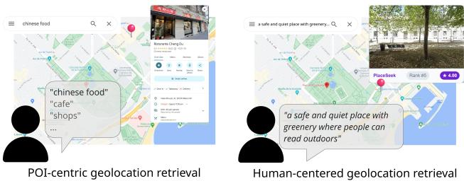
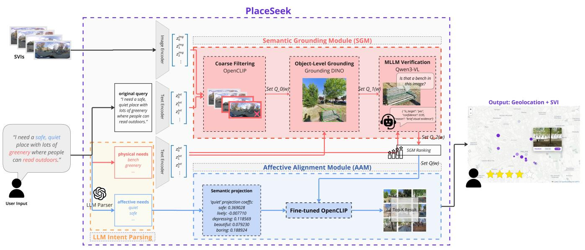
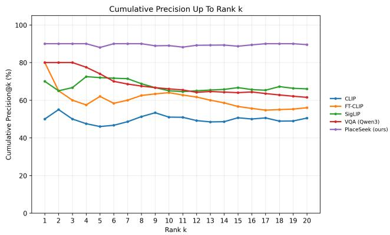
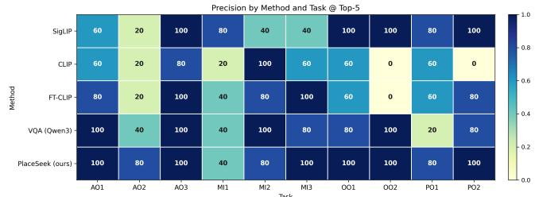
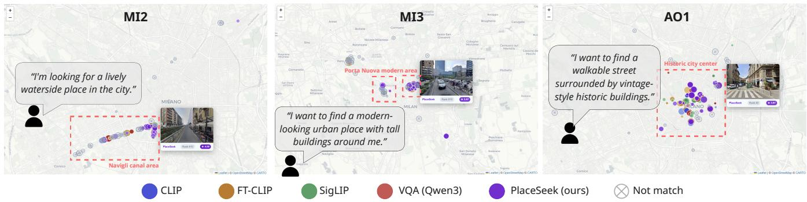
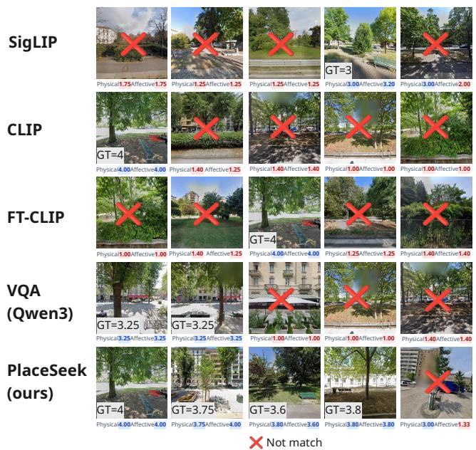
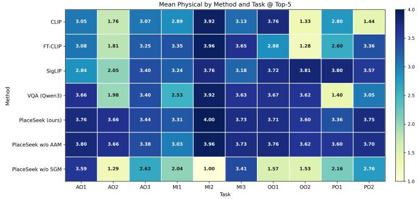
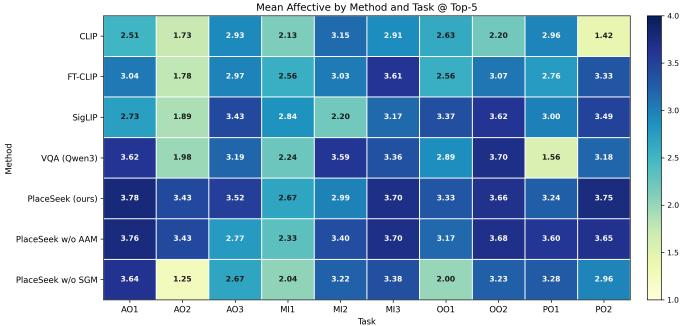

# PlaceSeek: Human-Centered Geospatial Retrieval of Urban Outdoor Places via Semantic Grounding and Afective Alignment

Ziqi Cui∗†   
University of British Columbia   
Vancouver, Canada   
ziqicui@student.ubc.ca

Shangyu Lou University of California, Santa Barbara & San Diego State University California, USA shangyulou@ucsb.edu

## Abstract

People search for urban outdoor places not only by category or function, but also by what activities a place can support and how it is perceived. Existing geospatial retrieval remains largely POI-centric and metadata-driven, making it dificult to satisfy open- ended, afective, or activity-oriented needs. We present PlaceSeek, a human-centered outdoor place retrieval framework that maps natural-language queries to geolocated street-view imagery. Place-Seek introduces an intent-aware retrieval mechanism that decom- poses user queries into functional and afective sub-intents. A Se-mantic Grounding Module verifies whether candidate street-view results contain the physical evidence needed to support the in- tended activity, while an Afective Alignment Module re-ranks physically valid candidates using a LoRA-adapted vision-language model trained on human urban perception judgments. We evaluate PlaceSeek on 31,956 street-view locations in Milan across 10 naturallanguage queries annotated by five human evaluators. PlaceSeek achieves 88.0% Precision@5, a mean match score of 3.39/4.0, and 0.920 nDCG@5, outperforming CLIP, fine-tuned CLIP, SigLIP, and a VQA-based baseline. Ablation results show that physical grounding is essential for retrieval validity, while afective alignment improves ranking quality among physically valid candidates. These findings highlight that complex urban spatial queries require modeling both verifiable visual evidence and human perceptual preferences. Place- Seek provides a potential framework for human-centered next generation geospatial retrieval systems.

## CCS Concepts

• Information systems → Geographic information systems; Content-based retrieval; • Computing methodologies → Natural language processing.

## Keywords

semantic geospatial retrieval, multimodal large language models, human-centered geoAI, street-view imagery, urban perception

ACM Reference Format:   
Ziqi Cui and Shangyu Lou. 2026. PlaceSeek: Human-Centered Geospatial Retrieval of Urban Outdoor Places via Semantic Grounding and Afective Alignment. In Proceedings of the 34th ACM International Conference on Advances in Geographic Information Systems (ACM SIGSPATIAL ’26), November 3–6, 2026, Riverside, CA, USA. ACM, New York, NY, USA, 13 pages. https://doi.org/XXXXXXX.XXXXXXX

## 1 Introduction

Understanding and satisfying people’s subjective needs in urban environments is central to human-centered spatial decision-making [6, 8]. Urban search is commonly framed as the retrieval of known categories: restaurants, parks, and other points of interest (POIs) [22]. This paradigm works well when a user’s need can be mapped to a structured category and when the target place is supported by rich metadata. Yet people’s daily demands for urban space are of- ten more complex. A visitor in an unfamiliar city may not simply search for a park or a cafe, but for “a comfortable green space where I can sit and relax” or “a shaded spot with public seating”. Such queries combine activity support, physical facilities, and afective expectations. They also extend beyond named POIs to include informal outdoor places such as streetsides, plazas, pocket parks, and waterfront edges.

These needs are dificult to address using structured databases alone. Outdoor open places usually do not have names, categories, or detailed descriptions, and existing structured retrieval systems are limited in their ability to interpret the abstract activity- and afect-related needs expressed in natural language [13, 22, 29]. Fig- ure 1 illustrates this shift from POI-centric retrieval toward human- centered geolocation retrieval: rather than asking only where a known category is located, users increasingly ask what kind of urban place can support a desired activity and experience.

Street-view imagery (SVI) provides a promising basis for this problem because ofits extensive coverage and abundant visual infor- mation [14, 31]. Recent vision-language models, such as CLIP and its variants, further enable image retrieval from natural-language prompts without task-specific labels [23]. However, retrieval based on global text-image similarity still has two fundamental limitations. First, CLIP-style models are not explicitly designed to model human afective preferences toward urban scenes, making it dificult to reliably capture qualities such as safety, comfort, or romantic atmosphere [7, 20, 24]. Second, retrieved results often lack support from concrete physical evidence: a model may assign a high score to an image because it broadly matches a dominant visual concept (e.g., greenery), while failing to verify whether a smaller but necessary element (e.g., bench) is actually present.

  
Figure 1: From POI-centric search to human-centered geolocation retrieval.

How can we retrieve urban outdoor places from abstract natural- language descriptions of intended human activities and experi-ences? Based on the idea that urban places support human behavior through both physical afordances and perceived qualities [5, 8, 10], we argue that efective retrieval requires two forms of evidence. First, concrete physical requirements (e.g., benches, greenery, lighting, sidewalks) must be grounded in visible street-view content. Second, retrieved places must align with afective qualities that shape whether a place feels suitable for the intended activity, such as safety, quietness, and comfort. To operationalize this idea and address these limitations of geospatial retrieval, we develop Place-Seek, an intent-aware geospatial retrieval framework for finding urban outdoor places from natural-language queries based on SVIs. This paper makes the following contributions:

• We identify and formulate human-centered urban outdoor place retrieval as an underexplored geospatial retrieval prob- lem. Unlike POI-centric search, this task targets unnamed or weakly indexed outdoor places from natural-language de- scriptions, and we propose PlaceSeek as a solution framework for this setting.

• We design a Semantic Grounding Module (SGM) to address the limitation of global text-image matching, where visually plausible results may lack the required physical evidence. SGM introduces a coarse-to-fine physical evidence validation procedure that improves the success rate of top-� retrieved SVIs in satisfying query-required elements.

• We develop an Afective Alignment Module (AAM) that im-proves human-perception alignment in text-to-street-view retrieval. AAM fine-tunes OpenCLIP with LoRA under su- pervision from real human urban perception judgments, en-abling retrieved scenes to better match afective or experien- tial needs expressed in natural language.

• We conduct a human-annotated empirical evaluation on Milan SVIs across diverse natural-language queries. Comparisons with baseline methods, together with ablation analysis, demonstrate the efectiveness of PlaceSeek and the comple- mentary roles of physical grounding and afective alignment.

## 2 Related Work

## 2.1 Human-Centered Geospatial Retrieval

Traditional geospatial retrieval primarily targets structured spatial entities, such as POIs, roads, or buildings, that are represented through explicit categories, attributes, and spatial relations [22]. While efective for known and indexable objects, this paradigm is less suited to everyday spatial needs that are subjective, openended, and dificult to predefine [11, 22]. Recent LLM- and RAGbased methods provide new opportunities for more human-centered geospatial retrieval. For example, Spatial-RAG [30] integrates spatial databases with LLMs for geospatial question answering and spatial reasoning; UGuideRAG [29] uses intent-enhanced RAG and user-generated content for personalized urban tourism recommen- dation; SemaSK [33] uses LLMs to improve semantic matching in spatial keyword queries over geo-textual objects such as POIs [32]; and SPOT [13] converts natural-language scene descriptions into structured OpenStreetMap object searches. These studies show that natural-language interfaces can make geospatial search more flex- ible by helping systems interpret user intent and connect it with spatial data.

However, existing methods still mainly retrieve POIs, structured GIS objects or predefined map entities. They do not directly address the retrieval of unnamed or weakly indexed outdoor urban spaces, such as pocket parks, street corners, or informal resting areas. As a result, users’ needs for open outdoor places that are not explicitly represented in spatial databases remain dificult to satisfy.

## 2.2 Vision-Language Models for Open-Vocabulary Image Retrieval

Vision-language models provide an important foundation for openvocabulary image retrieval. Dual-encoder models such as CLIP [23], OpenCLIP [4], SigLIP [34], and related variants encode images and text into a shared embedding space, enabling eficient retrieval over large image collections through precomputed image embeddings and text-image similarity. These models have become a major paradigm for natural-language image retrieval and provide a scalable technical pathway for SVI-based geospatial retrieval [3, 14].

However, prior studies and practical applications have shown that CLIP-style models remain limited in fine-grained image-text matching. First, CLIP returns image-level global similarity scores and does not provide explicit localized visual evidence [35]. Therefore, it cannot guarantee that the specific physical element required by a query is actually present. Open-vocabulary grounding and detection models, such as GroundingDINO [16], can partially ad dress this issue by localizing candidate objects or regions from text prompts. Yet in complex street-view scenes, these models may still be afected by small object scale, occlusion, viewpoint variation, and visually similar urban structures.

A second limitation is that CLIP-style models do not explicitly model human afective and perceptual preferences toward urban scenes [7, 24, 25]. As a result, subjective afective queries, such as those involving safety, quietness, comfort, or romantic atmosphere, are dificult to handle reliably using generic CLIP similarity alone. In contrast, multimodal large language models and visual question answering models [15] can perform more fine-grained semantic judgment from image content and natural-language instructions, making them promising for subjective scene assessment. However, these models usually require image-by-image inference, which is computationally expensive and dificult to apply directly to city scale street-view retrieval. Therefore, it remains challenging to maintain the eficiency of dual-encoder text-image retrieval over large-scale multimodal geospatial data while improving the top-� match quality of retrieved results in terms of both physical evidence and perceptual intent.

## 3 Problem Formulation

We formulate PlaceSeek as an intent-aware outdoor place retrieval problem over city-scale street-view imagery (SVI). Given a user-provided natural-language query, the task is to return a ranked list of geolocated street-view results that provide visual evidence for candidate urban places. Unlike conventional POI search, the target is not a named category or establishment, but a place that satisfies the user’s intended activity, required physical evidence, and afective or experiential expectations.

Inputs and Outputs. The primary input is a user-provided natural-language query � describing a desired outdoor place. � may explicitly or implicitly contain a mixture of concrete visual requirements, afective preferences, and intended activities. For example, a query such as “a safe, quiet place with lots of greenery where people can read outdoors” encodes physical evidence and afordances (greenery, benches), perceptual qualities (safe, quiet), and activity intent (reading). The search space is a SVI database $\mathcal { D } =$ $\{ ( I _ { i } , g _ { i } , \theta _ { i } ) \} _ { i = 1 } ^ { N }$ , where each image �� is associated with a geographic location �� (latitude/longitude) and a viewing direction $\theta _ { i } .$ Given � and D, the system returns a ranked list of top-� geolocated street-view results:

$$
R _ { k } ( q ) = \left[ ( I _ { r _ { 1 } } , g _ { r _ { 1 } } , \theta _ { r _ { 1 } } ) , \dots , ( I _ { r _ { k } } , g _ { r _ { k } } , \theta _ { r _ { k } } ) \right] .
$$

Ranking Criteria. We seek a ranking function $s ( q , I _ { i } )$ that or- ders images by three complementary criteria: semantic relevance to the overall query, grounding in explicit physical evidence (visible objects or afordances required by the query), and alignment with the user’s afective and perceptual needs. Conceptually:

$$
\begin{array} { r } { s ( q , I _ { i } ) = \lambda _ { s } s _ { \mathrm { s e m } } ( q , I _ { i } ) + \lambda _ { g } s _ { \mathrm { g r o u n d } } ( q , I _ { i } ) + \lambda _ { a } s _ { \mathrm { a f f } } ( q , I _ { i } ) . } \end{array}
$$

In practice, PlaceSeek implements this as a staged pipeline: semantic retrieval narrows the candidate set, physical grounding verifies necessary visual elements, and afective alignment re-ranks the verified candidates.

Core Challenges. This formulation introduces three challenges. First, user intents are often underspecified and compositional: “read- ing outdoors” may imply seating; “walkable historic street” may imply pedestrian space and heritage architectural evidence. Second, physical validity cannot be guaranteed by global visual similarity: CLIP-style models may miss required elements or confuse visually similar objects such as benches, railings, and curbs. Third, percep tual terms such as “quiet”, “romantic”, or “safe” are not reducible to object categories and are dificult to capture with generic image-text embeddings alone. These challenges motivate the three-component design of PlaceSeek.

## 4 The PlaceSeek Framework

Figure 2 illustrates the overall PlaceSeek framework. Given a user- provided natural-language query, the system proceeds through three coordinated stages:

(1) Intent Parsing. An LLM decomposes the query into physical evidence requirements and afective or experiential preferences.

(2) Semantic Grounding Module (SGM). The SGM uses the physical requirements to retrieve and verify street-view candidates that contain the required visual evidence, producing a physically verified candidate set Q.

(3) Afective Alignment Module (AAM). The AAM re-ranks candidates in Q according to their perceptual alignment with the user’s afective or experiential expectations.

The final output is a ranked list of top-� geolocated outdoor place results that best match the input query and can be inspected on a map.

## 4.1 Intent Parsing

The first stage converts an unstructured natural-language query into a structured retrieval specification. We use ChatGPT-4o as an intent parser [21] with a task-specific prompt that instructs the model to separate visually verifiable physical evidence from afec- tive, perceptual, and experiential preferences. The parser output schema is summarized in Appendix D.

Given a user query $q ,$ the parser returns four fields:

$$
\Pi ( q ) = \{ { \mathcal { P } } , { \mathcal { A } } , { \mathcal { U } } , C \} ,
$$

where $\mathcal { P }$ is the set of physical evidence requirements, A is the set of afective or perceptual preferences, U records intended activities, and C records constraints or tensions in the query. Each parsed term is associated with a source label, a requiredness level, and a short reasoning chain.

The prompt performs three parsing operations. First, it extracts explicit physical evidence requirements from the query, including visible objects, spatial afordances, or scene conditions such as greenery, benches, statues, tram tracks, waterfronts, murals, or tall buildings. Second, it applies activity-support inference when the query describes an intended activity: for example, “reading outdoors” implies a need for seating or a bench even when the word “bench” is not stated. Third, it identifies afective or experiential preferences, including both explicitly stated qualities such as “safe”, “quiet”, and “lively”, and cautiously inferred expectations that are strongly implied by the query context, such as interpreting a desired date place as requiring a pleasant or romantic atmosphere.

The output of this stage is a structured set of decomposed intent terms. Downstream modules then consume these terms for physical grounding and afective alignment. Table 1 shows an example de- composition for query AO2. The example illustrates that the parser performs more than keyword extraction: it preserves explicit vi sual evidence, infers activity-supporting afordances, and separates subjective needs into afective terms for downstream alignment. Appendix B summarizes the generated physical and afective intent outputs for all ten evaluation queries.

  
Figure 2: PlaceSeek pipeline. A user natural-language query is decomposed by an LLM parser into physical anchor words and afective need terms. The Semantic Grounding Module (SGM) performs coarse-to-fine image retrieval grounded in physical evidence; the Afective Alignment Module (AAM) then re-ranks the candidate set by perceptual alignment.

Table 1: Example intent decomposition for query AO2. The parser converts an activity-oriented request into decomposed physical and afective intent terms.
<table><tr><td>Component</td><td>Parsed output</td></tr><tr><td>Query</td><td>&quot;A safe, quiet place with lots of greenery where people can read outdoors.&quot;</td></tr><tr><td>Physical evidence terms</td><td>greenery (must; explicit; vegetation); bench / public seating (must; inferred from activity; affor-</td></tr><tr><td>Inference rule</td><td>dance). Reading outdoors implies a sittable affordance;</td></tr><tr><td></td><td>benches or public seating provide visible street- view evidence for outdoor reading.</td></tr><tr><td>Affective terms</td><td>safe (positive; explicit; safety); quiet (positive; ex- plicit; quietness).</td></tr></table>

## 4.2 Semantic Grounding

CLIP-style dual-encoder vision-language models provide an efficient mechanism for large-scale text-to-image retrieval [4, 23]. Through a dual-encoder architecture, images and text prompts are embedded into a shared vector space, allowing retrieval to be per- formed by nearest-neighbor search over precomputed street-view image embeddings. This dual-encoder design is well suited for city scale SVI retrieval. However, global image-text similarity does not guarantee the presence of specific physical evidence. In street-view imagery, we observed that CLIP often retrieves visually similar but semantically incorrect structures for object-level queries. For example, several top-ranked results for “bench” corresponded to railings or curbs rather than actual benches. The Semantic Ground ing Module (SGM) therefore uses CLIP for coarse filtering, followed by object-level grounding and MLLM verification to ensure that retrieved candidates contain the required physical evidence.

4.2.1 Coarse Filtering with OpenCLIP. We encode all SVIs in the database using OpenCLIP ViT-L/14 [4]. For each physical evidence term �, we construct a prompt bank $B _ { w } ,$ consisting of short visual paraphrases of the target concept (e.g., “bench”, “park bench”, “street bench”, “outdoor bench”, and “public bench”). This reduces sensitivity to a single prompt wording and improves recall during the initial retrieval stage. Each prompt is encoded with the text encoder, and cosine similarity is computed against all precom-puted street-view image embeddings. For an image �� and prompt bank $B _ { w } ,$ the coarse score is:

$$
s _ { \mathrm { c l i p } } ( I _ { i } , w ) = \mathrm { m e a n T o p } 2 _ { b \in B _ { w } } \cos { \left( f _ { I } ( I _ { i } ) , f _ { T } ( b ) \right) } ,
$$

where $f _ { I }$ and $f _ { T }$ are the image and text encoders. We use the mean of the top two prompt similarities to retain the strongest textual matches while reducing the influence of weaker prompt variants.

Because our task is top-� place retrieval rather than exhaus- tive detection of all valid images, this coarse stage is designed to preserve high-probability candidates. Images in the top 1% of the resulting score distribution are retained as the initial candidate set $Q _ { 0 } ( w )$ , balancing broad recall with the computational cost of the subsequent grounding and verification stages.

4.2.2 Object-Level Grounding with GroundingDINO. GroundingDINO [16] is an open-vocabulary object grounding model that localizes image regions corresponding to a given text prompt. We apply it to each image in $Q _ { 0 } ( w )$ using the corresponding physical evidence term � as the prompt. Unlike CLIP, which provides only a global image-level similarity score, GroundingDINO produces localized bounding boxes and confidence scores for candidate vi- sual evidence. For each image, we use the maximum bounding-box confidence as the object-level grounding score and re-rank the candidates accordingly, yielding $Q _ { 1 } ( w )$

This stage improves physical specificity by filtering out many globally similar but physically irrelevant images. However, detector confidence alone is not suficient for final verification: Ground- ingDINO may still confuse visually similar structures, such as metal railings and benches, or detect regions that match the object cat-egory but are not usable for the intended activity. Therefore, the grounded candidates are further checked by the MLLM verification stage.

4.2.3 MLLM Verification with Qwen3-VL. GroundingDINO does not fully determine whether the detected region is semanti- cally correct or functionally suitable. Qwen3-VL is a multimodal large language model capable of interpreting visual inputs and producing instruction-following textual outputs [2]. For each image in $Q _ { 1 } ( w )$ , the GroundingDINO-detected bounding region is cropped and passed to Qwen3-VL using the verification prompt shown in Appendix D. The MLLM returns a structured JSON output containing a label (yes, no, or uncertain), a confidence value, and a short visual rationale. The Qwen3-VL label serves as the primary semantic verification signal for physical evidence and contributes to the final rule-aware physical ranking. This produces a verified per-term evidence set $Q _ { 2 } ( w )$

4.2.4 Physical Evidence Re-ranking. A user query may contain multiple physical evidence terms, such as bench and greenery. SGM first constructs evidence for each term independently through OpenCLIP retrieval, GroundingDINO localization, and Qwen3-VL verification. The verified per-term evidence is then merged at the panorama/view level so that each candidate view can be evaluated against the full set of physical requirements in the query. We denote the merged, rule-aware physical candidate set as Q.

For each physical term � and candidate view $v ,$ let $\ell _ { w } ( v ) \ \in$ {yes, uncertain, no, missing} denote the normalized Qwen3-VL verification label, and let $c _ { w } ( v ) \in [ 0 , 1 ]$ denote its confidence. We first compute a detector-based presence score from GroundingDINO evidence:

$$
d _ { w } ( v ) = \alpha _ { 1 } s _ { \mathrm { b o x } } + \alpha _ { 2 } \hat { n } _ { \mathrm { b o x } } + \alpha _ { 3 } \hat { a } _ { \mathrm { b o x } } , \quad \alpha _ { j } \geq 0 , \quad \sum _ { j = 1 } ^ { 3 } \alpha _ { j } = 1 ,
$$

where $s _ { \mathrm { b o x } }$ is the maximum box confidence, $\hat { n } _ { \mathrm { b o x } }$ is the normalized box count, and $\hat { a } _ { \mathrm { b o x } }$ is the normalized largest box area ratio. This score captures whether the target evidence is detected confidently, repeatedly, and at a visually meaningful scale.

The Qwen3-VL evidence score is defined as

$$
q _ { w } ( v ) = \phi ( \ell _ { w } ( v ) ) \cdot c _ { w } ( v ) ,
$$

where $\phi ( \mathrm { y e s } ) = 1$ , � (uncertain) = 0.5, and � (no) = � (missing) = 0. The term-level physical presence score is then computed as:

$$
\begin{array} { r } { \dot { p } _ { w } ( v ) = \eta q _ { w } ( v ) + ( 1 - \eta ) d _ { w } ( v ) , \quad \eta > 0 . 5 . } \end{array}
$$

This fusion gives higher weight to Qwen3-VL because it provides the primary semantic verification signal, while GroundingDINO is retained as auxiliary localized evidence. Fixed weight values and normalization details are provided in Appendix A.

To aggregate multiple physical evidence terms into a view-level physical assessment, each term is assigned a rule label during LLMbased intent parsing. Each physical term is treated as one of four types: must-have, more-better, less-better, or not-exist. These types define both physical validity and ranking contribution. Must-have terms and not-exist terms define hard constraints: candidates must satisfy all required evidence and must not violate forbidden evi- dence. More-better and less-better terms define soft preferences that afect ranking but do not by themselves determine validity.

Algorithm 1: Physical Rule-Aware Reranking   
Input : Per-term Qwen tables $\{ T _ { w } \} ;$ physical rules R; CLIP   
scores $\{ s _ { \mathrm { c l i p } } ( \upsilon ) \}$   
Output : Filtered, ranked candidate set Q   
1 Merge all $T _ { w }$ by panorama/view key into one table $T ;$   
2 foreach view � ∈ � and rule term $w \in { \mathcal { R } }$ do   
3 Compute $p _ { w } ( v ) \gets 7$ ermPresenceScore(�, �);   
4 Set pass ${ \bf \Pi } _ { w } ( v )$ ← TermPasses(�, �, $p _ { w } ( v ) )$ ;   
5 end   
6 foreach view � $\mathbf { \Psi } _ { | \mathbf { \Psi } \in \textit { T } }$ do   
7 Compute $s _ { \mathrm { m u s t } } ( \boldsymbol { v } ) , s _ { \mathrm { m o r e } } ( \boldsymbol { v } ) , s _ { \mathrm { l e s s } } ^ { \mathrm { c l e a n } } ( \boldsymbol { v } )$ , and $s _ { \mathrm { f o r b i d } } ^ { \mathrm { c l e a n } } ( \upsilon ) ;$   
8 Compute $s _ { \mathrm { p h y s } } ( \upsilon )$ using the active rule weights;   
9 Set $\mathrm { p a s s } _ { \mathrm { h a r d } } ( \upsilon )$ if all must-have terms pass and no forbidden   
term violates;   
10 end   
11 Remove all views with pas ${ \mathfrak { s } } _ { \mathrm { h a r d } } ( \upsilon ) = 0 ;$   
12 Sort remaining views by   
(#must-pass ↓, #forbid-violations ↑, � h s ↓, �˜cli ↓);   
13 Assign final\_rank by sort order;

Formally, candidates must satisfy the hard physical gate:

$$
\mathrm { p a s s } _ { \mathrm { h a r d } } ( v ) = \left( \mathrm { \# m u s t - p a s s } = \mathrm { \# m u s t - t o t a l } \right) \wedge \left( \mathrm { \# f o r b i d - v i o l a t i o n s } = 0 \right) .
$$

Candidates with $\mathrm { p a s s } _ { \mathrm { h a r d } } ( \upsilon ) = 0$ are removed. For the remaining candidates, term-level scores $p _ { w } ( z )$ are aggregated according to their rule types to obtain a rule-aware physical score $s _ { \mathrm { p h y s } } ( \upsilon )$ . The valid candidates are then ranked by $s _ { \mathrm { p h y s } } ( \boldsymbol { \upsilon } )$ and normalized CLIP evidence, yielding the physically verified candidate set Q. Algo-rithm 1 summarizes the rule-aware reranking procedure.

## 4.3 Afective Alignment

4.3.1 Model Fine-Tuning via LoRA. CLIP-style models do not explicitly model human afective preferences toward urban scenes. To improve alignment with abstract afective semantics in user queries, we fine-tune OpenCLIP using human perceptual supervision. We use Place Pulse 2.0 [7], a street-view dataset containing pairwise human judgments across six perceptual dimensions: safer, livelier, more beautiful, wealthier, more depressing, and more bor- ing.

We fine-tune the image encoder of OpenCLIP ViT-L/14 using additive LoRA adapters [12] on the Place Pulse 2.0 training split. The text encoder is frozen to preserve zero-shot textual retrieval capability, while the image encoder is adapted toward human per- ceptual judgments. We use a learning rate of $1 0 ^ { - 4 }$ and a batch size of 60, corresponding to 10 image pairs across the six perceptual dimensions.

We evaluate the adapted model using pairwise win rate on a held-out Place Pulse 2.0 test set. Baselines include unmodified Open- CLIP ViT-B/32, SigLIP SO400M, EVA-CLIP L/14 [27], and OpenCLIP ViT-L/14. Table 2 reports win rates across all six perceptual dimen-sions. The fine-tuned model improves the macro-average win rate from approximately 52% for unmodified CLIP-style models to 65.7%, achieving a $7 { - } 1 2 . 6$ percentage point gain over the baselines. This indicates that generic image–text pretraining alone does not reliably encode human perceptual judgments, while lightweight LoRA adaptation improves afective alignment for urban street-view retrieval.

4.3.2 Afective Prompt Projection. Parsed afective terms � from the user query, such as “quiet” or “romantic”, may not directly correspond to one of the six Place Pulse dimensions. We therefore represent each afective term using two complementary signals: a projected perceptual score in the Place Pulse space and a direct prompt-bank similarity score.

Let $B _ { a }$ denote the prompt bank for afective term �, and let

$$
\mathbf { u } _ { a } = \mathrm { m e a n } _ { b \in B _ { a } } f _ { T } ( b )
$$

be its normalized mean text embedding. We also encode six axis prompts corresponding to the Place Pulse dimensions:

$$
X = \{ \mathrm { s a f e , l i v e l y , b e a u t i f u l , w e a l t h y , d e p r e s s i n g , b o r i n g } \} .
$$

The afective term embedding $\mathbf { u } _ { a }$ is mapped to this six-dimensional perceptual axis set to obtain a proxy afective direction $\hat { \mathbf { u } } _ { a } .$ This proxy direction provides a human-perception-guided representation of the afective term within the Place Pulse space.

For each candidate image $I _ { i } ,$ we compute an afective relevance score by combining the proxy perceptual score with direct promptbank similarity:

$$
\begin{array} { r } { s _ { a } ( I _ { i } ) = \lambda _ { \mathrm { p r o j } } \cos ( f _ { I } ^ { \mathrm { a f f } } ( I _ { i } ) , \widehat { \mathbf { u } } _ { a } ) + \lambda _ { \mathrm { d i r } } \mathrm { m e a n } _ { b \in B _ { a } } \cos ( f _ { I } ^ { \mathrm { a f f } } ( I _ { i } ) , f _ { T } ( b ) ) , } \end{array}
$$

where $f _ { I } ^ { \mathrm { a f f } }$ is the LoRA-adapted image encoder, and $\lambda _ { \mathrm { p r o j } } + \lambda _ { \mathrm { d i r } } = 1$ The projected term captures alignment with human perceptual di mensions, while the direct prompt-bank term preserves the original semantic meaning of the query expression.

For queries with multiple afective terms, we average term-level scores to obtain the raw afective score:

$$
s _ { \mathrm { a f f } } ^ { \mathrm { r a w } } ( v ) = \frac { 1 } { | \mathcal { A } | } \sum _ { a \in \mathcal { A } } s _ { a } ( v ) .
$$

This score is used in the final physical-afective re-ranking stage.

4.3.3 Final Physical-Afective Re-ranking. The final ranking is computed over the physically verified candidate set Q. For each candidate view �, we combine three signals: the rule-aware phys- ical score $s _ { \mathrm { p h y s } } ( \boldsymbol { \upsilon } )$ , the normalized afective score $\tilde { s } _ { \mathrm { a f f } } ( \boldsymbol { v } )$ , and the normalized CLIP coarse-retrieval score $\tilde { s } _ { \mathrm { c l i p } } ( \upsilon )$ . The final score is defined as:

$$
s _ { \mathrm { f i n a l } } ( v ) = \omega _ { \mathrm { p h y s } } s _ { \mathrm { p h y s } } ( v ) + \omega _ { \mathrm { a f f } } \tilde { s } _ { \mathrm { a f f } } ( v ) + \omega _ { \mathrm { c l i p } } \tilde { s } _ { \mathrm { c l i p } } ( v ) ,
$$

where $\omega _ { \mathrm { p h y s } } + \omega _ { \mathrm { a f f } } + \omega _ { \mathrm { c l i p } } = 1 .$ The weighting scheme follows the staged design of PlaceSeek: the physical score carries the main evidence from the SGM, the afective score refines the ordering using the AAM, and the CLIP score retains a weak global semantic prior from the coarse retrieval stage. The fixed weight values and normalization details are provided in Appendix A.

Final ranking preserves the physical gate: candidates that fail required physical evidence or violate forbidden evidence are not considered. The remaining candidates are sorted by $s _ { \mathrm { f i n a l } } ( v )$ , with raw afective score and normalized CLIP similarity used only as tie-breakers. This produces the final ranked list $R _ { k } ( q )$ . Algorithm 2 summarizes this step.

Algorithm 2: Physical-Afective Final Reranking   
Input : Physically verified candidate set Q with $s _ { \mathrm { p h y s } } ( \upsilon )$ and   
$\tilde { s } _ { \mathrm { c l i p } } ( \upsilon ) ;$ per-term afective scores $\{ s _ { \mathrm { a f f } , t } ^ { \mathrm { r a w } } ( \dot { v } ) \}$   
Output : Final ranked list $R _ { k } ( q )$   
1 foreach view � $\in { \cal Q }$ do   
2 Set $s _ { \mathrm { a f f } } ^ { \mathrm { r a w } } ( v ) \gets$ mean� $s _ { \mathrm { a f f } , t } ^ { \mathrm { r a w } } ( \upsilon ) ;$   
3 Set �˜ f (�) ← MinMaxNorm $( s _ { \mathrm { a f f } } ^ { \mathrm { r a w } } ( v ) ) ;$   
4 Compute   
$s _ { \mathrm { f i n a l } } ( \boldsymbol { v } ) \gets \omega _ { \mathrm { p h y s } } s _ { \mathrm { p h y s } } ( \boldsymbol { v } ) + \omega _ { \mathrm { a f f } } \tilde { s } _ { \mathrm { a f f } } ( \boldsymbol { v } ) + \omega _ { \mathrm { c l i p } } \tilde { s } _ { \mathrm { c l i p } } ( \boldsymbol { v } ) ;$   
5 end   
6 Remove views that fail the physical gate;   
7 Sort remaining views by $( s _ { \mathrm { f i n a l } } \downarrow , s _ { \mathrm { a f f } } ^ { \mathrm { r a w } } \downarrow , \tilde { s } _ { \mathrm { c l i p } } \downarrow ) ;$   
8 return top-� views as $R _ { k } ( q ) ;$

## 5 Experimental Setup

This study evaluates PlaceSeek through an end-to-end retrieval task: given a natural-language query, each method retrieves a ranked list of SVIs, and the top-20 results are assessed by human annotators for query match.

Study Area and Data. We use Milan, Italy as study area. Streetview imagery was collected from Google Street View [1] and sam-pled at 100 m intervals along the road network at four viewing directions (0°, 90°, 180°, 270°), yielding 127,824 geo-referenced images across 31,956 locations.

Query Tasks. We design ten natural-language test queries to cover diverse outdoor place intents involving activities, physical evidence, and afective or experiential preferences. The queries are grouped into four complementary types, as summarized in Table 3. Activity-oriented queries describe intended uses and often require inferring supporting spatial afordances. Object-oriented queries emphasize concrete visible elements whose presence can be checked in street-view imagery. Perception-oriented queries primarily express desired felt qualities, such as comfort, safety, or wealth. Mixed-intent queries combine perceptual, spatial, and object-level requirements in a single request.

## 5.1 Comparison Methods

We compare PlaceSeek with four baselines that represent diferent strategies for text-to-street-view retrieval.

(1) CLIP: a generic vision-language retrieval baseline. We encode the full user query with OpenCLIP ViT-L/14 and rank all SVIs by query-image cosine similarity. This baseline tests how well standard global image–text similarity can handle human-centered outdoor place queries without any task- specific adaptation.

(2) FT-CLIP: an afectively adapted CLIP retrieval baseline. We use the LoRA fine-tuned OpenCLIP model from the AAM and apply the full user query directly. This baseline tests whether afective fine-tuning alone is suficient to improve retrieval quality for complex place intents.

(3) SigLIP: a stronger zero-shot CLIP-style retrieval baseline. We encode the full query and rank SVIs using SigLIP SO400M, a vision-language model trained with a sigmoid loss objective [34]. This baseline tests whether performance gains can be achieved simply by replacing OpenCLIP with a stronger general-purpose retrieval model.

Table 2: Pairwise win rates (%) across six perceptual dimensions. Best per column in bold.
<table><tr><td>Model</td><td>Liv. ↑</td><td>Beauty ↑</td><td>Boring ↑</td><td>Depr. ↑</td><td>Safe ↑</td><td>Wealth ↑</td><td>Avg. ↑</td></tr><tr><td>EVA-CLIP L/14</td><td>55.0</td><td>51.2</td><td>45.8</td><td>52.0</td><td>51.8</td><td>47.8</td><td>50.6</td></tr><tr><td>SigLIP SO400M</td><td>55.1</td><td>56.3</td><td>46.9</td><td>48.3</td><td>55.9</td><td>56.1</td><td>53.1</td></tr><tr><td>OpenCLIP B/32</td><td>57.6</td><td>53.0</td><td>45.9</td><td>47.2</td><td>55.6</td><td>56.3</td><td>52.6</td></tr><tr><td>OpenCLIP L/14</td><td>55.6</td><td>55.7</td><td>49.2</td><td>53.9</td><td>56.3</td><td>52.9</td><td>52.8</td></tr><tr><td>OCLIP L/14 (ours)</td><td>64.6</td><td>68.6</td><td>60.7</td><td>65.9</td><td>65.4</td><td>68.6</td><td>65.7</td></tr></table>

Table 3: The ten test queries used in the end-to-end evaluation, grouped by query type.
<table><tr><td>ID</td><td>Category</td><td>Query Text</td></tr><tr><td>AO1</td><td>Activity-oriented</td><td>I want to find a walkable street surrounded by vintage-style historic buildings.</td></tr><tr><td>AO2</td><td>Activity-oriented</td><td>A safe and quiet place with greenery where people can read outdoors.</td></tr><tr><td>AO3</td><td>Activity-oriented</td><td>A tree-lined shaded path suitable for jogging.</td></tr><tr><td>MI1</td><td>Mixed-intent</td><td>I&#x27;m looking for a romantic public square with a visible statue or sculpture.</td></tr><tr><td>MI2</td><td>Mixed-intent</td><td>I&#x27;m looking for a lively waterside place in the city.</td></tr><tr><td>MI3</td><td>Mixed-intent</td><td>I want to find a modern-looking urban place with tall buildings around</td></tr><tr><td>001</td><td>Object-oriented</td><td>A well-maintained street with artistic murals or graffiti.</td></tr><tr><td>002</td><td>Object-oriented</td><td>I&#x27;m looking for a tree-lined street with tram tracks running down the middle.</td></tr><tr><td>PO1</td><td>Perception-oriented</td><td>A relaxing and comfortable public square.</td></tr><tr><td>PO2</td><td>Perception-oriented A wealthy and safe street.</td><td></td></tr></table>

(4) VQA (Qwen3): an MLLM-based Visual Question Answering (VQA) baseline. MLLMs are strong at instruction-following visual understanding and can assess whether an image satis- fies a complex natural-language description. However, imageby-image inference limits their applicability to large-scale text-image retrieval. We therefore first use OpenCLIP for coarse filtering to obtain a manageable candidate set, and then prompt Qwen3-VL to judge the degree of match between each candidate image and the full user query, together with a short supporting rationale. This baseline tests whether a strong VQA model can solve the retrieval task directly without explicit intent decomposition or object-level grounding.

## 5.2 Annotation Protocol and Ground-Truth

Annotators and ethics. End-to-end relevance labels were collected from five independent annotators with backgrounds span- ning urban design, GIS, and non-specialist perspectives. All annotators participated voluntarily and were fully informed of the task purpose; no personally identifiable information was collected.

Annotation task. For each method and query, the top-20 retrieved SVIs were assessed independently by all five annotators. Each candidate was rated on a 4-point Likert scale for overall query match (1 = not a match, 2 = weak match, 3 = good match, and 4 = perfect match), as well as for separate physical and afective match dimensions using the same scale. Annotators viewed only the query text and the street-view image.

Table 4: Inter-annotator agreement on 903 candidate–query pairs (� = 5 annotators). Binary labels treat scores ≤ 2 as non-match and ≥ 3 as match.
<table><tr><td>Label dimension</td><td>Fleiss&#x27; κ</td><td>Unanimous agreement (%)</td></tr><tr><td>Overall match</td><td>0.522</td><td>51.7</td></tr><tr><td>Physical match</td><td>0.631</td><td>64.1</td></tr><tr><td>Affective match</td><td>0.430</td><td>44.4</td></tr></table>

Ground-truth aggregation. We binarize overall match scores into non-match (1–2) and match (3–4), then apply majority voting across the five annotators, requiring at least three votes for the majority label. The final aggregated relevance score is the mean of annotator scores within that majority bucket, reducing outlier influence while preserving graded relevance. Candidates with aggre-gated scores ≥ 3 are counted as successful matches for Precision@�; mean match and nDCG@� use the same aggregated scores, with nDCG gain defined as max(score − 2, 0).

Inter-annotator agreement. To assess label reliability, we re-port binary Fleiss’ � [9] on 903 annotated candidate–query pairs, treating scores ≤ 2 as non-match and scores ≥ 3 as match. Table 4 summarizes agreement on overall, physical, and afective match. Physical match is judged most consistently (� = 0.631), while affective match is more subjective (� = 0.430). Overall match, which directly defines retrieval relevance, achieves moderate agreement (� = 0.522; unanimous binary agreement on 51.7% of items). Physi-cal attributes are more reliably verifiable, while afective qualities remain inherently subjective.

  
Figure 3: Cumulative precision (↑) curves averaged over all 10 queries. PlaceSeek maintains the highest precision across the top-20 ranked results, while baselines degrade more rapidly.

## 5.3 Evaluation Metrics

We report three complementary metrics at cutofs � ∈ {5, 10, 20}, letting $r _ { i } \in [ 1 , 4 ]$ denote the aggregated relevance score at rank � (Section 5.2). Mean match is the average graded relevance MeanMatch@� = $\textstyle { \frac { 1 } { k } } \sum _ { i = 1 } ^ { k } r _ { i }$ . Precision@� is the fraction of successful matches $( r _ { i } \ge 3 ) \div$ Precision@� $\begin{array} { r } { = \frac { 1 } { k } \sum _ { i = 1 } ^ { k } \mathbb { I } ( r _ { i } \geq 3 ) } \end{array}$ . nDCG@� [26] uses gain $\begin{array} { r l } { g _ { i } } & { { } = } \end{array}$ max $\left( r _ { i } - 2 , 0 \right)$ , so non-matches contribute zero gain:

$$
\mathrm { n D C G @ } k = \frac { \sum _ { i = 1 } ^ { k } { g _ { i } / \mathrm { l o g } _ { 2 } ( i + 1 ) } } { \mathrm { I D C G @ } k } .
$$

All metrics are averaged across the ten test queries.

## 6 Results

## 6.1 Main Results

Table 5 and Figure 3 summarize end-to-end retrieval performance averaged over all ten test queries. PlaceSeek achieves the best over all performance across all evaluated cutofs, with the strongest gains in graded relevance and rank-sensitive quality. At top-5, PlaceSeek obtains a Precision@5 of 88.0%, a mean match score of 3.39/4.0, and an nDCG@5 of 0.920. The strongest baseline varies by metric: VQA (Qwen3) achieves the highest baseline Precision@5 (74.0%) and nDCG@5 (0.884), while SigLIP obtains a comparable mean match score (2.92/4.0). However, PlaceSeek remains consistently ahead of both methods.

The advantage becomes more pronounced at larger cutofs. Pre- cision@20 remains 89.5% for PlaceSeek, compared with 66.0% for SigLIP, 61.5% for VQA (Qwen3), and 50.5% for CLIP. Figure 3 shows the same trend across rank positions: PlaceSeek maintains the high-est cumulative precision through most ofthe top-20 result list, while baseline methods degrade more rapidly. This suggests that Place- Seek improves not only early-rank retrieval, but also the quality of the broader candidate set available for map-based place exploration.

Table 6 decomposes the top-5 mean match score into overall, physical, and afective dimensions. PlaceSeek achieves the high est score in all three dimensions, with a physical match score of 3.63/4.0 and an afective match score of 3.41/4.0. Compared with the strongest baseline in each dimension, PlaceSeek improves physical match by 0.29 points and afective match by 0.43 points. This indicates that the overall improvement is not limited to a single aspect of the query, but appears across both physical evidence matching and afective alignment.

## 6.2 Ablation Study

To quantify the contribution of each major component, we evaluate two ablated variants of PlaceSeek:

• PlaceSeek w/o SGM: AAM is applied directly to the full query embedding without physical evidence grounding, corresponding to afective re-ranking over raw OpenCLIP retrieval results.

• PlaceSeek w/o AAM: SGM is used without the final affective re-ranking step, corresponding to physical evidence grounding only.

Table 7 shows that the two modules contribute in diferent ways. Removing SGM causes the largest degradation: Precision@5 drops from 88.0% to 38.0%, and Precision@20 drops from 89.5% to 46.5%. This indicates that AAM alone is insuficient to guarantee the pres- ence of required visual elements, particularly for queries with ex-plicit physical evidence requirements.

Removing AAM produces a more subtle pattern. The w/o AAM variant matches the full model in Precision@5, but its nDCG@5 is lower. This suggests that both methods retrieve the same propor- tion of successful matches in the top-5, but the full PlaceSeek model places higher-quality matches earlier in the ranking. At larger cut-ofs, the contribution of AAM becomes more evident: Precision@20 drops from 89.5% in the full model to 74.5% without AAM, while the full model also maintains higher nDCG across all cutofs. This suggests that AAM primarily improves rank-sensitive ordering and candidate-set stability: among physically valid candidates, it helps prioritize those whose perceived atmosphere better matches the user’s afective or experiential intent.

Overall, the ablation results demonstrate the necessity of both physical evidence grounding and afective alignment in PlaceSeek. SGM prevents visually plausible but physically invalid scenes from entering the final result set, while AAM refines the ordering within the grounded candidate set to improve perceptual fit.

To demonstrate the necessity ofeach step in the Semantic Grounding Module, we further evaluate SGM on an additional element-level retrieval task. We use nine common street-view elements, such as “bench” and “streetlight”, as input queries and ask the model to retrieve images containing the corresponding visual evidence. We compute the average Precision@� at $k \in \{ 5 , 1 0 , 2 0 \}$ , as reported in Table 8. The results show that CLIP+GroundingDINO improves over CLIP-only retrieval, while adding MLLM verification further improves P@5 from 80.0% to 88.9% and P@20 from 77.8% to 87.2%. This indicates that each step in the SGM contributes to more reliable physical evidence confirmation. In contrast, either using CLIP alone or adding only GroundingDINO remains limited in physical evidence grounding, especially when visually similar street-view elements cause false positives.

## 6.3 Performance Across Query Tasks

Figure 4 presents per-query Precision@5 for the five main methods across all ten query tasks. PlaceSeek reaches 100% Precision@5 on six tasks (AO1, AO3, MI3, OO1, OO2, and PO2) and is best or tied for best among the main methods on eight tasks. This indicates that the full pipeline performs consistently across activity-oriented, object-oriented, perception-oriented, and mixed-intent queries.

Table 5: End-to-end retrieval performance on 10 test queries (mean over all queries). Best result per column in bold.
<table><tr><td rowspan="2">Method</td><td colspan="3">Mean match (1–4) ↑</td><td colspan="3">Precision@k (%) ↑</td><td colspan="3">nDCG@k ↑</td></tr><tr><td>@5</td><td>@10</td><td>@20</td><td>@5</td><td>@10</td><td>@20</td><td>@5</td><td>@10</td><td>@20</td></tr><tr><td>CLIP</td><td>2.43</td><td>2.49</td><td>2.47</td><td>46.0</td><td>51.0</td><td>50.5</td><td>0.650</td><td>0.668</td><td>0.695</td></tr><tr><td>FT-CLIP</td><td>2.75</td><td>2.81</td><td>2.61</td><td>62.0</td><td>64.0</td><td>56.0</td><td>0.774</td><td>0.743</td><td>0.736</td></tr><tr><td>SigLIP</td><td>2.92</td><td>2.78</td><td>2.79</td><td>72.0</td><td>65.0</td><td>66.0</td><td>0.825</td><td>0.825</td><td>0.816</td></tr><tr><td>VQA (Qwen3)</td><td>2.93</td><td>2.81</td><td>2.71</td><td>74.0</td><td>66.0</td><td>61.5</td><td>0.884</td><td>0.867</td><td>0.830</td></tr><tr><td>PlaceSeek (ours)</td><td>3.39</td><td>3.36</td><td>3.37</td><td>88.0</td><td>89.0</td><td>89.5</td><td>0.920</td><td>0.917</td><td>0.910</td></tr></table>

Table 6: Top-5 mean match scores decomposed into overall, physical, and afective dimensions (1–4 scale). Best result per column in bold.
<table><tr><td>Method</td><td>Overall</td><td>Physical</td><td>Affective</td></tr><tr><td>CLIP</td><td>2.43</td><td>2.72</td><td>2.46</td></tr><tr><td>FT-CLIP</td><td>2.75</td><td>2.92</td><td>2.87</td></tr><tr><td>SigLIP</td><td>2.92</td><td>3.34</td><td>2.97</td></tr><tr><td>VQA (Qwen3)</td><td>2.93</td><td>3.09</td><td>2.93</td></tr><tr><td>PlaceSeek (ours)</td><td>3.39</td><td>3.63</td><td>3.41</td></tr></table>

Table 7: Ablation study. Best result per column in bold.

<table><tr><td></td><td colspan="2">@5</td><td colspan="2">@10</td><td colspan="2">@20</td></tr><tr><td>Method</td><td>Prec. ↑</td><td>nDCG↑</td><td>Prec. ↑</td><td>nDCG ↑</td><td>Prec. ↑</td><td>nDCG ↑</td></tr><tr><td>w/o SGM</td><td>38.0</td><td>0.466</td><td>43.0</td><td>0.507</td><td>46.5</td><td>0.591</td></tr><tr><td>w/o AAM</td><td>88.0</td><td>0.914</td><td>83.0</td><td>0.906</td><td>74.5</td><td>0.894</td></tr><tr><td>Full PlaceSeek</td><td>88.0</td><td>0.920</td><td>89.0</td><td>0.917</td><td>89.5</td><td>0.910</td></tr></table>

Table 8: Retrieval precision of SGM stages, averaged over nine urban element types. Best results per column in bold.

<table><tr><td>Method</td><td>P@5 (%) ↑ P@10 (%) ↑ P@20 (%) ↑</td><td></td><td></td></tr><tr><td>CLIP only</td><td>73.3</td><td>76.7</td><td>72.8</td></tr><tr><td>CLIP + GroundingDINO</td><td>80.0</td><td>80.0</td><td>77.8</td></tr><tr><td>CLIP+GroundingDINO+MLLM</td><td>88.9</td><td>87.8</td><td>87.2</td></tr></table>

  
Figure 4: Per-query Precision@5 (↑) heatmap for the five main methods across all 10 test queries. Darker color indicates higher Precision@5. PlaceSeek (bottom row) achieves perfect precision on six tasks and remains the most stable method overall.

In contrast, baseline performance varies substantially across query types. CLIP and FT-CLIP perform well on queries whose tar-get scenes have strong overall visual cues, such as tree-lined shaded paths in AO3 or waterside urban scenes in MI2. The VQA baseline performs competitively on several tasks, but is weaker on queries requiring abstract afective needs (PO1, MI1) or implicit activity- support inference (AO2). SigLIP performs well on object-oriented and perception-oriented queries, but shows clearer limitations on activity-oriented and mixed-intent tasks. Overall, PlaceSeek shows the most stable profile across the full query set because it combines explicit physical grounding with afective alignment.

The most challenging case is MI1, which requires “a romantic public square with a visible statue or sculpture”. Most methods fail to achieve strong performance on this task, and PlaceSeek reaches only 40.0% Precision@5. By reporting physical grounding and af- fective alignment scores for each method-query pair, Appendix C further reveals the source of this failure: PlaceSeek obtains a phys- ical score of 3.31 on MI1, but its afective score is only 2.67. This suggests that the main dificulty lies in aligning the afective con-cept of “romantic”, reflecting the fact that AAM is trained on only six Place Pulse perceptual dimensions and may not fully capture afective concepts that deviate substantially from those dimensions.

## 6.4 Qualitative Analysis

Figure 6 illustrates top-5 retrieval results for query AO2, “a safe, quiet place with lots of greenery where people can read outdoors.” The baseline methods often satisfy only part of this compositional request. SigLIP, CLIP, and FT-CLIP retrieve visually green scenes, but many top-ranked results are not judged as good matches by annotators. The physical and afective sub-scores indicate that these failures are often due to missing reading-support afordances, such as benches, and weak alignment with the expected safe and quiet atmosphere. VQA retrieves some successful seating-related scenes, but still includes several mismatched places.

In contrast, four of the five PlaceSeek results are successful matches (GT ≥ 3), combining shaded greenery with benches or other resting afordances and a quiet public-space character. The final PlaceSeek result is also marked as a failed match. Although it contains a seating element, its low afective score indicates that annotators did not perceive it as suficiently safe or quiet for the intended outdoor reading activity.

Figure 5 further visualizes geolocated top-5 retrieval results on the Milan map for three representative queries: MI2, MI3, and AO1.

  
Figure 5: Geolocated top-5 retrieval results on the Milan map for three queries (MI2, MI3, AO1). Retrieved locations show spatial coherence with Milan’s urban structure, including waterside, modern-area, and historic-street patterns. An interactive version covering all query tasks is available at https://placeseek-map-production-51f3.up.railway.app.

R1  
R2  
R3  
R4  
R5  
  
Figure 6: Top-5 retrieval results for query AO2 (a safe, quiet ff ffplace with lots of greenery where people can read outdoors.).

The spatial distributions show that PlaceSeek retrieves not only visually plausible images, but also geographically coherent outdoor places. For MI2, which asks for a lively waterside place, PlaceSeek results concentrate along the Navigli canal area, a spatially ap- propriate district for waterside urban activities. For MI3, which targets a modern-looking urban place with tall buildings, the re- trieved locations cluster around Milan’s modern business districts, including the Porta Nuova area. For AO1, which asks for a walkable ff ffstreet surrounded by vintage-style historic buildings, the results are concentrated in and around the historic city center.

In comparison, baseline methods produce more spatially scattered results and include more failed matches, shown as grey crosses. These examples suggest that PlaceSeek improves retrieval at both the image level and the geospatial level: by combining physical grounding with afective alignment, it returns candidate places that are more consistent with the user’s intended urban context and can be more directly inspected on a map. An interactive map covering all query tasks is available at https://placeseek-map-production-51f3.up.railway.app.

## 7 Conclusion and Future Work

We formulate human-centered urban outdoor place retrieval as an intent-aware geospatial retrieval problem and present PlaceSeek, a framework that maps natural-language queries to geolocated street- view results by jointly verifying physical evidence and aligning afective expectations. Experiments on Milan SVIs confirm that PlaceSeek outperforms all baselines, with ablation results showing that physical grounding is essential for retrieval validity while afec-ff ff fftive alignment refines ranking quality among grounded candidates.

Several limitations point to future work. First, the evaluation is conducted in a single city, and covers ten query tasks with five an- notators; broader studies are needed to test generalizability across cities, cultures and user intents. Second, afective alignment is constrained by the six perceptual dimensions in Place Pulse 2.0, which cannot fully capture richer and diverse afective semantics such as romantic or cozy. Future work should incorporate broader human perception datasets to support more expressive afective retrieval. Third, SVI provides only a partial representation of urban places: ff ff ffvisual appearance alone cannot determine whether a place is ac- tually safe or accessible, which may require additional evidence such as socioeconomic indicators, crime statistics, or POI context. Practical deployment should further incorporate user-specific spa- tial constraints such as distance, route connectivity, and nearby facilities [17, 28, 30]. PlaceSeek highlights the potential of incorporating SVI evidence and human-centered semantics into queryable, experience-centered place representations, pointing to a broader op- portunity for next-generation geospatial retrieval systems [18, 19].

## Acknowledgments

The authors thank the five annotators for their time and efort in evaluating the retrieval results. Large language model tools, including ChatGPT, were used to assist with manuscript language editing and grammar revision.

## References

[1] Dragomir Anguelov, Carole Dulong, Daniel Filip, Christian Frueh, Stéphane Lafon, Richard Lyon, Abhijit Ogale, Luc Vincent, and Josh Weaver. 2010. Google Street View: Capturing the world at street level. Computer 43, 6 (2010), 32–38. https://doi.org/10.1109/MC.2010.170

[2] Shuai Bai, Yuxuan Cai, Ruizhe Chen, Keqin Chen, Xionghui Chen, Zesen Cheng, Lianghao Deng, Wei Ding, Chang Gao, Chunjiang Ge, and others. 2025. Qwen3-VL Technical Report. arXiv:2511.21631.

[3] Filip Biljecki and Koichi Ito. 2021. Street view imagery in urban analytics and GIS: A review. Landscape and Urban Planning 215 (2021), 104217. https://doi.org/ 10.1016/j.landurbplan.2021.104217

[4] Mehdi Cherti, Romain Beaumont, Ross Wightman, Mitchell Wortsman, Gabriel Ilharco, Cade Gordon, Christoph Schuhmann, Ludwig Schmidt, and Jenia Jitsev. 2023. Reproducible scaling laws for contrastive language-image learning. In Proc. CVPR 2023, 2818–2829.

[5] Ziqi Cui and Shangyu Lou. 2025. How do the Spatial Layout of Street Elements and Geometric Features Afect Human Perception: A prediction model and ex lainable method based on Gra h Neural Network. In Architectural Informatics: Proceedings ofthe 30th International Conference ofthe Association for Computer-Aided Architectural Design Research in Asia (CAADRIA 2025), Vol. 4, 459–468. https://doi.org/10.52842/conf.caadria.2025.4.459

[6] Ziqi Cui and Shangyu Lou. 2025. SyncPerception: A Real-Time Urban Perception Prediction Tool Based on Gra h Neural Networks. In Proceedings ofthe 2025 Annual Modeling and Simulation Conference (ANNSIM 2025), IEEE, Madrid, Spain. https://ieeexplore.ieee.org/abstract/document/11118366

[7] Abhimanyu Dubey, Nikhil Naik, Devi Parikh, Ramesh Raskar, and César Hidalgo. 2016. Deep learning the city: Quantifying urban perception at a global scale. In Proc. ECCV2016.

[8] Reid Ewing and Susan Handy. 2009. Measuring the unmeasurable: Urban design qualities related to walkability. Journal of Urban Design 14, 1 (2009), 65–84.

[9] Joseph L. Fleiss. 1971. Measuring nominal scale agreement among many raters. Psychological Bulletin 76, 5 (1971), 378–382.

[10] James J. Gibson. 1979. The Ecological Approach to Visual Perception. Houghton Miflin, Boston, MA.

[11] Michael F. Goodchild. 2007. Citizens as sensors: the world of volunteered geogra phy. GeoJournal 69, 4 (2007), 211–221.

[12] Edward J. Hu, Yelong Shen, Phillip Wallis, Zeyuan Allen-Zhu, Yuanzhi Li, Shean Wang, Lu Wang, and Weizhu Chen. 2022. LoRA: Low-Rank Adaptation of Large Language Models. In Proc. ICLR 2022

[13] Lynn Khellaf, Ipek Baris Schlicht, Tilman Miraß, Julia Bayer, Tilman Wagner, and Ruben Bouwmeester. 2025. SPOT: Bridging Natural Language and Geospatial Search for Investigative Journalism. In Proc. ACL 2025 System Demonstrations, 71–81.

[14] Xiaojiang Li, Chuanrong Zhang, Wei Li, Robert Ricard, Qingyan Meng, and Weidong Zhang. 2015. Assessing street-level urban greenery using Google Street View and a modified green view index. Urban Forestry & Urban Greening 14, 3 (2015), 675–685.

[15] Junnan Li, Dongxu Li, Silvio Savarese, and Steven Hoi. 2023. BLIP-2: Bootstrap- ping language-image pre-training with frozen image encoders and large language models. In Proc. ICML 2023

[16] Shilong Liu, Zhaoyang Zeng, Tianhe Ren, Feng Li, Hao Zhang,Jie Yang, Chunyuan Li, Jianwei Yang, Hang Su, Jun Zhu, and Lei Zhang. 2023. Grounding DINO: Marr in DINO with Grounded Pre-Trainin for O en-Set Object Detection. arXiv:2303.05499.

[17] Shangyu Lou and Ziqi Cui. 2026. Enhancing Human Mobility Prediction with Spatially Aware LLM-based Multi-Agent Systems. In Proceedings of the Workshop

on Human-In-the-Loop Data Analytics (HILDA ’26), 28–34. https://doi.org/10.1145/ 3814573.3814949

[18] Ce Hou, Fan Zhang, Yong Li, Haifeng Li, Gengchen Mai, Yuhao Kang, Ling Yao, Wenhao Yu, Yao Yao, Song Gao, Min Chen, and Yu Liu. 2025. Urban sensing in the era of large language models. The Innovation 6, 1 (2025), 100749.

[19] Gengchen Mai, Yiqun Xie, Xiaowei Jia, Ni Lao, Jinmeng Rao, Qing Zhu, Zeping Liu, Yao-Yi Chiang, and Junfeng Jiao. 2025. Towards the next generation of Geospatial Artificial Intelligence. International Journal of Applied Earth Observation and Geoinformation 136 (2025), 104368.

[20] Vicente Ordonez and Tamara L. Berg. 2014. Learning high-level judgments of urban perception. In Proc. ECCV 2014.

[21] OpenAI. 2024. GPT-4o System Card. arXiv:2410.21276.

[22] Ross S. Purves, Paul Clough, Christopher B. Jones, Mark Hall, and Vanessa Murdock. 2018. Geographic information retrieval: progress and challenges in spatial search of text. Foundations and Trends in Information Retrieval 12, 2-3 (2018), 164–318.

[23] Alec Radford, Jong Wook Kim, Chris Hallacy, Aditya Ramesh, Gabriel Goh, Sandhini Agarwal, Girish Sastry, Amanda Askell, Pamela Mishkin, Jack Clark, Gretchen Krueger, and Ilya Sutskever. 2021. Learning transferable visual models from natural lan ua e su ervision. In Proc. ICML 2021.

[24] Philip Salesses, Katja Schechtner, and César A. Hidalgo. 2013. The collaborative image of the city: Mapping the inequality of urban perception. PLOS ONE 8, 7 (2013), e68400.

[25] Ahmed Selim, Tobias Hermansen, and Jan Pries-Heje. 2022. Urban perception and machine learning: A systematic review. Cities 131 (2022), 103971.

[26] Kalervo Järvelin and Jaana Kekäläinen. 2002. Cumulated ain-based evaluation of IR techniques. ACM Transactions on Information Systems 20, 4 (2002), 422–446.

[27] Quan Sun, Yuxin Fang, Ledell Wu, Xinlong Wang, and Yue Cao. 2023. EVA-CLIP: Im roved Trainin Techni ues for CLIP at Scale. arXiv:2303.15389.

[28] Yihong Tang, Zhaokai Wang, Ao Qu, Yihao Yan, Zhaofeng Wu, Dingyi Zhuang, Jushi Kai, Kebing Hou, Xiaotong Guo, Jinhua Zhao, Zhan Zhao, and Wei Ma. 2024. ItiNera: Integrating Spatial Optimization with Large Language Models for Open-domain Urban Itinerary Planning. In Proceedings ofthe 2024 Conference on Empirical Methods in Natural Language Processing: Industry Track, 1413–1432. https://doi.org/10.18653/v1/2024.emnlp-industry.104

[29] Jing Tang, Inhye Kong, and Zhaonan Wang. 2025. UGuideRAG: Intent-Enhanced Retrieval-Augmented Generation with User-Generated Content for Personalized Urban Tourism. In Proc. 33rd ACM International Conference on Advances in Geographic Information Systems (SIGSPATIAL ’25), 90–102. https://doi.org/10.1145/ 3748636.3762712

[30] Dazhou Yu, Riyang Bao, Ruiyu Ning, Jinghong Peng, Gengchen Mai, and Liang Zhao. 2025. S atial-RAG: S atial Retrieval Au mented Generation for Real-World Geospatial Reasoning Questions. arXiv:2502.18470.

[31] Yao Yao, Xia Li, Xiaoping Liu, Penghua Liu, Zhaotang Liang, JinBao Zhang, and Ke Mai. 2017. Sensing spatial distribution of urban land use by integrating pointsof-interest and Google Word2Vec model. International Journal ofGeographical Information Science 31, 4 (2017), 825–848.

[32] Yelp, Inc. 2023. Yelp Open Dataset. https://www.yelp.com/dataset.

[33] Zesong Zhang, Jianzhong Qi, Xin Cao, and Christian S. Jensen. 2025. SemaSK: Answering Semantics-aware Spatial Keyword Queries with Large Language Models. In Proc. EDBT 2025.

[34] Xiaohua Zhai, Basil Mustafa, Alexander Kolesnikov, and Lucas Beyer. 2023. Sig moid Loss for Language Image Pre-Training. In Proc. ICCV 2023.

[35] Chong Zhou, Chen Change Loy, and Bo Dai. 2022. Extract Free Dense Labels from CLIP. In Proc. ECCV2022, 696–712. https://doi.org/10.1007/978-3-031-19815-1\_40

## A Ranking Details

## A.1 Term-Level Presence Score

The fixed weights used in the rule-aware physical reranker are de- sign parameters selected from pilot inspection and kept unchanged for all evaluation queries. For the detector-based presence score in Section 4.2, we instantiate the normalized box-count and box-area terms as:

$$
\begin{array} { l } { \displaystyle \hat { n } _ { \mathrm { b o x } } = \frac { \log \left( 1 + n _ { \mathrm { b o x } } \right) } { \log \left( 1 + 5 \right) } , } \\ { \displaystyle \hat { a } _ { \mathrm { b o x } } = \operatorname* { m i n } \left( \frac { a _ { \mathrm { b o x } } } { 0 . 2 5 } , 1 \right) , } \end{array}
$$

where $n _ { \mathrm { b o x } }$ is the number of GroundingDINO boxes for the target term and $a _ { \mathrm { b o x } }$ is the largest detected box area ratio. The DINO score weights are:

$$
( \alpha _ { 1 } , \alpha _ { 2 } , \alpha _ { 3 } ) = ( 0 . 4 5 , 0 . 2 5 , 0 . 3 0 ) ,
$$

giving the largest weight to maximum box confidence while re- taining box count and visible scale as supporting evidence. The term-level fusion weight is $\eta \ : = \ : 0 . 6 5$ , so the Qwen3-VL verification score receives higher weight than the detector-only score. For not-exist rules, a forbidden term is treated as a violation when Qwen3-VL verifies the evidence or when the fused presence score exceeds 0.45.

## A.2 Physical Rule Score

For a candidate view �, the physical reranker aggregates term-level presence scores by rule type:

$$
\begin{array} { r l } & { s _ { \mathrm { m u s t } } ( v ) = \displaystyle \operatorname* { m i n } _ { w \in \mathcal { M } } p _ { w } ( v ) , } \\ & { s _ { \mathrm { m o r e } } ( v ) = \displaystyle \operatorname* { m e a n } _ { w \in \mathcal { M } ^ { + } } \mathcal { P } _ { w } ( v ) , } \\ & { s _ { \mathrm { l e s s } } ^ { \mathrm { c l e a n } } ( v ) = 1 - \displaystyle \operatorname* { m e a n } _ { w \in \mathcal { M } ^ { - } } \mathcal { P } _ { w } ( v ) , } \\ & { s _ { \mathrm { f o r b i d } } ^ { \mathrm { c l e a n } } ( v ) = 1 - \displaystyle \operatorname* { m a x } _ { w \in \mathcal { F } } p _ { w } ( v ) . } \end{array}
$$

The physical rule score is a normalized weighted sum over the components that are active for a query:

$$
\begin{array} { r l r } {  { s _ { \mathrm { p h y s } } ( \boldsymbol { v } ) = \frac { 1 } { W ( \boldsymbol { v } ) } \big ( 0 . 4 5 s _ { \mathrm { m u s t } } ( \boldsymbol { v } ) + 0 . 2 0 s _ { \mathrm { m o r e } } ( \boldsymbol { v } ) } } \\ & { } & { ~ + 0 . 2 0 s _ { \mathrm { l e s s } } ^ { \mathrm { c l e a n } } ( \boldsymbol { v } ) + 0 . 2 0 s _ { \mathrm { f o r b i d } } ^ { \mathrm { c l e a n } } ( \boldsymbol { v } ) } \\ & { } & { ~ + 0 . 1 0 \tilde { s } _ { \mathrm { c l i p } } ( \boldsymbol { v } ) \big ) . ~ } \end{array}
$$

Here $\smash { M , M ^ { + } , M ^ { - } }$ , and $\mathcal { F }$ denote must-have, more-better, less- better, and not-exist term sets; $\tilde { s } _ { \mathrm { c l i p } }$ is the min-max normalized CLIP score; and $W ( \boldsymbol { v } )$ is the sum of weights for the components available in that query.

## A.3 Final Physical-Afective Score

For the final physical-afective ranking, raw afective scores $s _ { \mathrm { a f f } } ^ { \mathrm { r a w } } ( \upsilon )$ are min-max normalized over the physically verified candidate set Q to obtain $\tilde { s } _ { \mathrm { a f f } } ( \boldsymbol { v } )$ . Missing afective scores are filled with 0 before normalization. The CLIP score $\tilde { s } _ { \mathrm { c l i p } } ( \upsilon )$ is the normalized coarse-retrieval score carried over from the physical stage.

The fixed final fusion weights are:

$$
( \omega _ { \mathrm { p h y s } } , \omega _ { \mathrm { a f f } } , \omega _ { \mathrm { c l i p } } ) = ( 0 . 6 5 , 0 . 2 5 , 0 . 1 0 ) .
$$

These values keep the physically verified score as the dominant signal, use the afective score to refine perceptual alignment, and retain CLIP as a weak global semantic prior. After applying the physical gate, valid candidates are sorted by $( s _ { \mathrm { f i n a l } } \downarrow , s _ { \mathrm { a f f } } ^ { \mathrm { r a w } } \downarrow , \tilde { s } _ { \mathrm { c l i p } } \downarrow )$

## B Intent Parsing Outputs

Table 9 summarizes the generated prompt banks used by PlaceSeek for all ten evaluation queries. The physical column reports the main visual-evidence families and rule types derived from the physical prompt banks and rule files. The afective column summarizes the perceptual prompt families used by the AAM.

## C Component-Level Query Scores

Figure 7 reports per-query top-5 physical and afective match scores, providing diagnostic evidence for cases where physical grounding and perceptual alignment diverge.

## D Prompt Skeletons and Verification Prompt

## D.1 Intent Parser Output Schema

The full intent-parser prompt is omitted for space, but the parser output follows the structured schema below. The values shown are illustrative AO2-style examples for clarifying field semantics, not the complete parser output for an actual query. This schema exposes the information passed from LLM intent parsing to the SGM and AAM.

{   
"physical\_requirements": [   
{   
"term": "bench / public seating",   
"source": "explicit | inferred\_from\_activity | inferred\_from\_context",   
"rule\_type": "must-have | more-better | less-better | not-exist",   
"requiredness": "must | optional | forbidden",   
"visual\_rationale": "why this evidence should be visible in SVI"   
}   
],   
"affective\_preferences": [   
{   
"term": "safe",   
"source": "explicit | inferred\_from\_context",   
"polarity": "positive | negative",   
"perceptual\_family": "safety | quietness | beauty | liveliness | other",   
"rationale": "why this affective need is relevant"   
}   
],   
"activities": ["reading outdoors"],   
"constraints": ["any query-specific tensions or exclusions"]   
}

Table 9: Summary of generated prompt-bank outputs for all evaluation queries. AO2 is shown in detail in Table 1.
<table><tr><td>Vis. ID</td><td>Query intent</td><td>Physical prompt-bank families</td><td>Affective prompt-bank families</td></tr><tr><td>A01</td><td>Walkable historic street</td><td>Sidewalk / pedestrian pavement (must); heritage or vintage building Walkable / comfortable walking environment; vintage-style and facade (must); low-traffic street (less-better); ornate architectural de- historic atmosphere; charming, beautiful, and pleasant street char- tails.</td><td>acter.</td></tr><tr><td>AO2</td><td>Safe quiet green reading place</td><td>Greenery (must); bench / public seating (must; inferred from reading Safe public place; quiet outdoor place; calm and peaceful reading outdoors).</td><td>atmosphere.</td></tr><tr><td>AO3</td><td>Tree-lined shaded jogging path</td><td>Tree canopy (must); shaded path; wide pavement / broad jogging path Comfortable jogging route; pleasant shaded walkway; pleasant (must).</td><td>outdoor setting.</td></tr><tr><td>MI1</td><td>Romantic square with statue or sculpture</td><td>Statue / sculpture (must); open paved square or public plaza.</td><td>Romantic public square; beautiful / scenic plaza; inviting and pleasant outdoor atmosphere.</td></tr><tr><td>MI2</td><td>Lively waterside place</td><td>Waterfront / river / canal / water edge (must); outdoor crowd or people gathering; waterside promenade or boardwalk</td><td>Lively, energetic, vibrant waterside atmosphere; pleasant prome- nade or gathering place.</td></tr><tr><td>MI3</td><td>Modern place with tall buildings</td><td>Skyscrapers / high-rise buildings (must); modern skyline.</td><td>Modern streetscape; modern architecture; contemporary urban design and modern cityscape.</td></tr><tr><td>001</td><td>Well-maintained street with murals or graffiti</td><td>Artistic mural / graffiti (must); clean pavement; tidy sidewalk; intact Well-maintained / well-kept urban space; artistic or creative street; or well-maintained building facade.</td><td>vibrant, inviting, and energetic street atmosphere.</td></tr><tr><td>002</td><td>Tree-lined street with tram tracks</td><td>Tree-lined street (must); tram tracks / rails / tramway (must)</td><td>Charming or picturesque street scene; pleasant and comfortable urban setting.</td></tr><tr><td>PO1</td><td>Relaxing comfortable public square</td><td>Public square / city plaza (must); benches / public seating; greenery Relaxing public square; comfortable seating environment; inviting,</td><td>welcoming, and pleasant plaza atmosphere.</td></tr><tr><td>PO2</td><td>Wealthy and safe street</td><td>or plantings in square. Street and building evidence (must); high-end storefronts / lux- Wealthy / affluent streetscape; safe and secure urban place; clean, ury shopfronts; well-maintained sidewalk; street lighting; negative tidy, and orderly street atmosphere. prompts for undesirable visual conditions.</td><td></td></tr></table>

  
Figure 7: Per-query top-5 component scores by method. Left: mean physical match score. Right: mean afective match score.

## D.2 Qwen3-VL Verification Prompt

The following prompt is used to verify cropped regions produced by GroundingDINO. The placeholders are filled with query-specific target and negative descriptions.

You are an expert urban environment analyst reviewing street-view images.

You are given a cropped image region extracted from a street-view photo. A detection model has flagged this region as a candidate for the following type of area:

{{TARGET\_DESCRIPTIONS}}

The user's intended use or requirement is:

{{INTENDED\_PURPOSE}}

Your task is to independently verify whether this cropped region truly shows one of the candidate area types above, AND whether it is genuinely suitable for the user's intended use or requirement.

Treat the detection as a suggestion only - it may be wrong. Be a skeptical reviewer.

Return "yes" only if ALL of the following are true:

1. The area clearly matches one or more of the descriptions above.

2. The area is genuinely usable and accessible for the user's intended use.

3. Overall quality and condition appear adequate.

Return "no" if ANY of the following apply:

{{NEGATIVE\_DESCRIPTIONS}}

\- The region does not resemble any of the descriptions above at all.

\- The area may be usable for some other purpose, but not for the user's intended use.

\- The area is clearly unusable or inaccessible for the user's intended use.

Return "uncertain" if the image is too blurry, too small, heavily occluded, or genuinely ambiguous to judge confidently.

Output JSON ONLY. No extra text outside the JSON object.

{   
"is\_target": "yes",   
"confidence": 0.95,   
"reason": "brief visual evidence"   
}