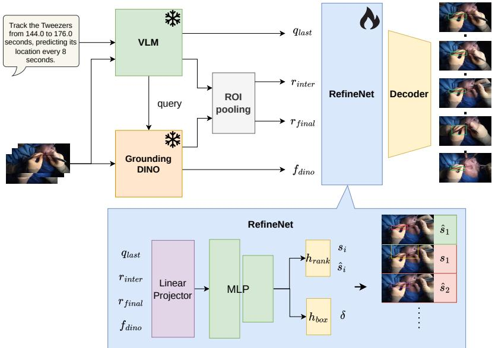
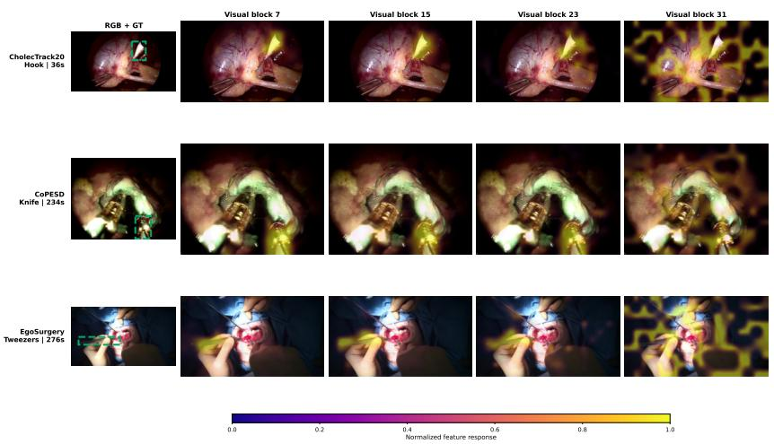
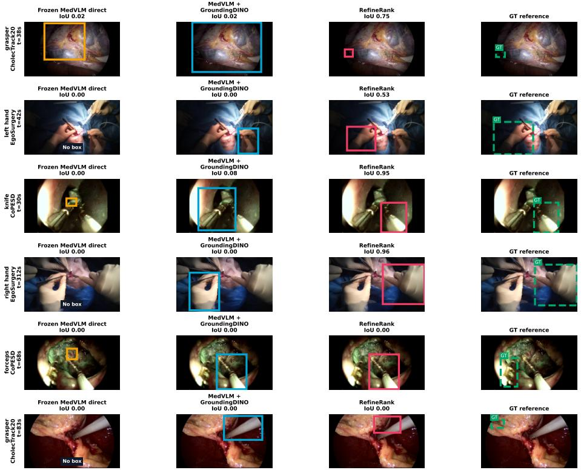

# RefineRank: Joint Box Refinement and Ranking for Surgical Spatio-Temporal Grounding

Linzhe Jiang1⋆, Jiayuan Huang2, Changhao Zhang1, Chunyang Jiang3, Zhehua Mao1, and Mobarak I. Hoque4

1 UCL Hawkes Institute, University College London, London, UK linzhe.jiang.23@ucl.ac.uk

2 Visual Understanding Research Group, Department of Informatics, King’s College London, London, UK

3 School of Medicine, Nankai University, Tianjin, China

4 Division of Informatics, Imaging and Data Sciences, University of Manchester, Manchester, UK

Abstract. Surgical spatio-temporal grounding (STG) requires locating, at each video time specified by a procedural question, the object that the question asks about. Existing approaches face a trade-of: vision language models understand the question context but produce imprecise coordinates, whereas open-set detectors provide localized candidate boxes whose confidence does not reflect which box answers the question. We introduce RefineRank, which closes this gap at the candidate-box level. A compact trainable module, RefineNet, combines the language and regional features of a frozen medical vision language model with the proposals of a frozen open-set detector: it predicts a bounded coordinate correction and a quality score for every candidate box, and a fixed decoding rule returns the original or refined box with the highest score. On the MedVidBench Oficial Rankings (Verified), RefineRank records 0.421 STG mIoU, the highest displayed STG score, while its global multi-metric rank is 11. In a controlled evaluation on separate training and evaluation videos, coordinate correction raises the candidate oracle upper bound from 0.6772 to 0.7302, and ranking the joint pool of original and refined candidates by their RefineNet scores improves STG mIoU from 0.2719 to 0.4534, whereas separately trained selectors over the same pool reach at most 0.4186. These results show that a small box-level module can reconcile question understanding with precise localization without retraining either backbone. Code is available at https://github.com/linzhe001/RefineRank.

Keywords: Surgical video · Spatio-temporal grounding · Box refinement · Candidate ranking

## 1 Introduction

Surgical spatio-temporal grounding (STG) answers procedural questions such as “which instrument is the surgeon holding at 01:35?” by locating the queried

⋆ Corresponding author.

object in the video. The question names a target, a temporal interval, and a sampling step, which together determine an ordered set of requested video times; the system must return one object box at each requested time. The target may be a small instrument, an anatomical region, or a surgeon’s hand, and it can be occluded or visually similar to nearby objects. The task therefore requires the spatial, temporal, and language interactions emphasized by prior STG models [7, 10, 19], together with the domain language and fine visual distinctions of surgical video [16].

Two model families address complementary halves of this problem. Medical vision language models (MedVLMs), multimodal large language models adapted to medical images and video, can interpret complex clinical questions, but semantic understanding alone does not ensure accurate coordinates. Grounded multimodal models such as Kosmos-2, Shikra, and Ferret add location tokens, coordinate interfaces, regional representations, or dedicated grounding data to obtain spatial outputs [2, 14, 20]. Open-set detectors ofer the complementary strength: given a text query, a detector such as GroundingDINO [11] returns a set of candidate boxes, each with coordinates and a confidence score. That confidence measures how well a box matches the detector query rather than how well it answers the complete timestamped surgical question, so the box that best answers the question is often not the highest-scoring one.

Combining the two families is nontrivial. Learning a dense alignment between their feature spaces would require correspondences across diferent tokenizations, dimensions, spatial grids, and pretraining objectives, a problem that joint multimodal detectors address through grounded pretraining and internal cross-modal fusion [8,11]. Learning a comparable alignment between two existing frozen backbones from surgical STG data is harder still. Candidate boxes ofer a compact alternative: each proposed box already has coordinates, a detector score, and a matching region in the MedVLM visual features, so the two models can be connected through the boxes themselves rather than through their internal features.

RefineRank realizes this idea. It keeps a frozen MedVLM and a frozen GroundingDINO detector and connects them only through the detector’s candidate boxes. The single trainable component, RefineNet, reads the MedVLM’s language and regional features at each candidate box and jointly learns two outputs: a bounded correction that improves the box coordinates, and a quality score that reflects how well the box answers the question. A fixed decoding rule with no learned parameters returns the highest-scoring candidate from the joint pool of original and refined boxes, so no separate selector module is needed. In this way, question understanding improves detector grounding without learning a dense alignment between the two feature spaces.

Our evaluation separates the two questions this design raises: whether refinement creates better candidate boxes, and whether the learned scores select better boxes. RefineNet’s corrections raise the localization upper bound of the candidate pool, its scores improve final selection over detector confidence and over separately trained selectors, and a gap to the candidate oracle remains.

We make three contributions. First, RefineRank, a complete grounding pipeline whose compact trainable RefineNet module jointly learns scores and corrections for detector candidates from MedVLM language and regional features while both backbones remain frozen. Second, a controlled evaluation that separates selection quality from localization potential by comparing the final prediction with the best available box. Third, a selector analysis showing that selectors trained only after RefineNet has modified the boxes do not improve on the built-in decoding rule of RefineRank.

## 2 Related Work

Spatio-temporal video grounding. TubeDETR directly predicts temporally localized tubes with transformer queries [19]. STCAT uses a single stage to maintain spatial and temporal consistency [7]. CG-STVG coordinates static and dynamic vision language streams [10]. These systems learn dense video and language interactions. RefineRank instead uses RefineNet to improve and rank detector boxes before applying a fixed rule that selects one box at each requested time. The requested timestamps are known, so the model does not predict an entire tube directly from video tokens. The datasets and evaluators difer, so their published scores are not compared numerically here.

Grounded vision language models. MDETR learns early multimodal fusion for detection conditioned on text [8]. GroundingDINO combines grounded pretraining with tight language and vision fusion for open-set detection [11]. Multimodal language models approach the same spatial problem through explicit grounding interfaces. Kosmos-2 represents regions with location tokens [14]. Shikra generates and accepts coordinates in natural language [2]. Ferret joins coordinates with continuous region features [20]. These works train grounding inside a single model. RefineRank instead forms a pipeline from two frozen models and the compact RefineNet module after GroundingDINO has proposed boxes that both models can refer to.

Medical video grounding. MedGRPO introduces MedVidBench and releases the uAI-NEXUS-MedVLM-1.0a-7B-RL checkpoint [16]. RefineRank uses this checkpoint as its frozen MedVLM, which supplies the detector query and multimodal features, together with a separate frozen GroundingDINO detector. The Med-VLM + GroundingDINO baseline uses that query and ranks boxes by detector confidence; it is not a trained fusion architecture. RefineNet is the only trainable component that combines their outputs.

Localization quality and box refinement. Cascade R-CNN progressively raises proposal quality [1]. IoU-Net predicts localization confidence [6]. GFL and VarifocalNet align dense detector ranking with localization quality [9, 21]. The same distinction between localization and ranking is relevant to surgical STG. Unlike a detector head trained with its feature pyramid, RefineNet operates on precomputed detector boxes and frozen multimodal features. Its two quality outputs assign scores to the original and refined versions of each proposal.

  
Fig. 1: The complete RefineRank pipeline. The frozen MedVLM reads the complete timestamped question and sampled frames. It supplies the detector query, $q _ { \mathrm { l a s t } }$ , and two visual grids. GroundingDINO applies the query to the requested frames and provides original boxes and their metadata $f _ { \mathrm { d i n o } , i }$ . ROI pooling produces $r _ { i } ^ { \mathrm { i n t e r } }$ and $r _ { i } ^ { \mathrm { f i n a l } }$ for the trainable RefineNet module. Its ranking head $h _ { \mathrm { r a n k } }$ outputs logits $s _ { i }$ and $\hat { s } _ { i }$ , while the box head $h _ { \mathrm { b o x } }$ outputs the correction $\delta _ { i }$ . The final pool contains original boxes scored by $s _ { i }$ and refined boxes scored by ${ \hat { s } } _ { i } .$ . At each requested time, the fixed decoding rule returns the candidate with the highest corresponding score; it has no learned parameters and no separate selector module is used.

## 3 Method

The complete pipeline of RefineRank is shown in Figure 1: the frozen MedVLM, frozen GroundingDINO, the trainable RefineNet module, and a fixed decoding rule that returns the candidate with the highest score. The MedVLM supplies question and regional features, GroundingDINO supplies box locations, and only RefineNet is optimized. A GroundingDINO detection before correction is called an original detector box, or simply an original box. Its corrected version is called a refined box.

## 3.1 Problem Setting

The input question specifies a target, a temporal interval, and a sampling step. These values determine an ordered set of requested times. The system must return one axis-aligned box at each time, and STG mIoU averages box IoU over the requested times. During training, g denotes the target box. Each frame contains several original boxes, and detector confidence does not necessarily identify the box that answers the complete question.

RefineNet is the only trained component: GroundingDINO box generation, MedVLM feature extraction, and final box selection remain fixed. This design also bounds what the pipeline can recover. The complete system can rank and locally correct an available original box, but it cannot locate a target if GroundingDINO does not propose a box that covers it.

## 3.2 Frozen Models and Original Detector Boxes

The two frozen backbones provide complementary inputs: question understanding and visual features from the MedVLM, and candidate boxes from GroundingDINO. The frozen MedVLM receives the complete timestamped question and sampled video frames. As illustrated in Figure 1, it analyzes the question and extracts target keywords as the detector query, exposes its final language state $q _ { \mathrm { l a s t } }$ (the last-layer hidden state at the final prompt token), and supplies intermediate and final visual grids. Frozen GroundingDINO [11] applies the detector query to each requested RGB frame. Low detection thresholds favor recall. At most 12 raw detections are retained. When a detection covers a broad region, fixed smaller boxes derived from it are also added. Duplicate or invalid boxes are removed before ranking.

The original box set is capped at 128 boxes per requested frame and is constructed without target boxes. Each original box $b _ { i } = \left( x _ { 1 i } , y _ { 1 i } , x _ { 2 i } , y _ { 2 i } \right)$ is described by a metadata vector $f _ { \mathrm { d i n o } , i } \in \mathbb { R } ^ { 2 4 }$ comprising 12 values and their 12 missing-value indicators. The values are the detector confidence; the upstream temporal selection score; tube coverage, defined as the fraction of frames with a detection; tube smoothness, defined as one minus the mean consecutive-box center displacement normalized by the frame diagonal; the normalized time ofset $| t _ { i } - t | / T$ and exact-match indicator $\begin{array} { r } { \mathbf { 1 } [ | t _ { i } - t | \leq 1 0 ^ { - 6 } ] ; } \end{array}$ ; the four normalized box coordinates; and the log area and log aspect ratio. Here, $t _ { i }$ and t denote the candidate and requested times, and $T$ is the span of the sampled frames. Because GroundingDINO is applied independently to each requested frame, every tube contains one requested time: its temporal selection score and time ofset are zero, whereas its coverage, smoothness, and exact-match values are one. These tube-level fields therefore preserve compatibility with multi-frame tubes but do not vary across candidates in this pipeline. The values are standardized with training-set statistics; an unavailable value is set to zero after standardization and its indicator is set to one. Thus, $f _ { \mathrm { d i n o } , i }$ describes detector output and box geometry rather than an internal GroundingDINO feature.

The MedVLM is the uAI-NEXUS-MedVLM-1.0a-7B-RL checkpoint released by MedGRPO [16]. For each requested frame, the same frozen model processes that frame with the complete timestamped question. Its final language state is $q _ { \mathrm { l a s t } } \in \mathbb { R } ^ { 3 5 8 4 }$ . The intermediate visual grid at block 23 and the final grid after visual token merging are retained. ROI pooling weighted by area over the grid cells intersecting $b _ { i }$ gives $r _ { i } ^ { \mathrm { i n t e r } } \in \mathbb { R } ^ { 1 2 8 0 }$ from block 23 and $r _ { i } ^ { \mathrm { f i n a l } } \in \mathbb { R } ^ { 3 5 8 4 }$ from the final grid. Both features are pooled at the original box coordinates. They are not recomputed after box refinement. Weighting cells by their exact overlap with the box avoids rounding a small box to a single nearest patch.

## 3.3 Joint Ranking and Refinement

RefineNet turns each candidate box into a joint score and correction from the four inputs shown in Figure 1: $q _ { \mathrm { l a s t } } , r _ { i } ^ { \mathrm { i n t e r } } , r _ { i } ^ { \mathrm { f i n a l } }$ , and $f _ { \mathrm { d i n o } , i }$ . The query and regional features are $\ell _ { 2 } { \mathrm { - n o r m a l i z e d } }$ , and separate linear maps project all four inputs to 128 dimensions. The projected regional and metadata features are added. An MLP with two layers combines this box representation with the projected query and their elementwise product. The ranking head $h _ { \mathrm { r a n k } }$ outputs logits $s _ { i }$ and $\hat { s } _ { i }$ for the original and refined boxes. The box head $h _ { \mathrm { b o x } }$ outputs $\mathbf { \delta } \delta _ { i } = ( \delta _ { x , i } , \delta _ { y , i } , \delta _ { w , i } , \delta _ { h , i } )$ The scores are logits. A sigmoid is applied only when a probability is needed for score calibration or candidate filtering. Since the sigmoid is monotonic, it does not change their ranking.

A componentwise tanh bounds the center ofsets $\delta _ { x , i }$ and $\delta _ { y , i }$ to $[ - 0 . 5 , 0 . 5 ]$ and the logarithmic scale ofsets $\delta _ { w , i }$ and $\delta _ { h , i } ~ \mathrm { t o } ~ [ - \log 2 , \log 2 ]$ . Let the original box $b _ { i }$ have center $( c _ { x , i } , c _ { y , i } )$ and size $( w _ { i } , h _ { i } )$ . RefineNet decodes the corrected center and size as

$$
\begin{array} { r } { c _ { x , i } ^ { \prime } = c _ { x , i } + \delta _ { x , i } w _ { i } , c _ { y , i } ^ { \prime } = c _ { y , i } + \delta _ { y , i } h _ { i } , } \\ { w _ { i } ^ { \prime } = w _ { i } \exp ( \delta _ { w , i } ) , h _ { i } ^ { \prime } = h _ { i } \exp ( \delta _ { h , i } ) . } \end{array}\tag{1}
$$

The result is converted to corner coordinates to obtain the refined box $b _ { i } ^ { \prime } .$ . Coordinates are clipped to the normalized image range. Boxes with non-finite coordinates or non-positive area are discarded. The same bounds are used when the target $g$ is encoded relative to $b _ { i }$ for regression.

Original and refined IoUs, $y _ { i } = \mathrm { I o U } ( b _ { i } , g )$ and $\hat { y } _ { i } = \mathrm { I o U } ( b _ { i } ^ { \prime } , g )$ , supervise the two logits. Each score is trained with the same RankingLoss,

$$
\mathcal { L } _ { \mathrm { r a n k } } ( s , y ) = - \sum _ { i \in \mathcal { V } } p _ { i } \log q _ { i } + \lambda _ { \mathrm { c a l } } \ell _ { \mathrm { S L 1 } } \big ( \boldsymbol { \sigma } ( s ) , y \big ) ,\tag{2}
$$

where V is the set of valid (non-padded) boxes of one example, $p = \operatorname { s o f t m a x } ( y / \tau )$ with $\tau = 0 . 1$ and $q = \operatorname { s o f t m a x } ( s )$ are distributions over $\nu , \sigma$ is the sigmoid, and $\ell _ { \mathrm { S L 1 } }$ is the Smooth L1 loss [5] between the sigmoid scores and the IoU targets, averaged over V and weighted by $\lambda _ { \mathrm { c a l } } = 0 . 2 5$ . The listwise term is averaged over examples with at least one positive target IoU; examples with maxi $y _ { i } = 0$ contribute only the calibration term. The refined IoU target is detached from

Algorithm 1 Training RefineNet   
Require: Frozen features $q _ { \mathrm { l a s t } } , r ^ { \mathrm { i n t e r } } , r ^ { \mathrm { f i n a l } }$ , fdino, original boxes $b ,$ targets $^ { g , }$ and masks   
for valid boxes   
Require: RefineNet parameters θ and optimizer O   
Ensure: Trained parameters θ   
1: for each minibatch do   
2: $( s , \hat { s } , \delta ) \gets \mathrm { R e f i n e N e t } _ { \theta } ( q _ { \mathrm { l a s t } } , r ^ { \mathrm { i n t e r } } , r ^ { \mathrm { f i n a l } } , f _ { \mathrm { d i n o } } )$   
3: $b ^ { \prime } \gets \mathrm { D E C O D E } ( b , \delta )$   
4: $y  \mathrm { I o U } ( b , g )$   
5: $\hat { y } \gets \mathrm { S T O P G R A D } ( \mathrm { I o U } ( b ^ { \prime } , g ) )$   
6: $\mathcal { T }  \mathrm { T o p K V } \mathrm { A L I D } ( y , 8 )$   
7: Lrank ← RankingLoss(s, y) + RankingLoss $( \hat { s } , \hat { y } )$   
8: $\mathcal { L } _ { \mathrm { b o x } }  \mathrm { B o x L o s s } ( b , b ^ { \prime } , \delta , g , \mathcal { T } )$   
9: $\mathcal { L }  \mathcal { L } _ { \mathrm { r a n k } } + \mathcal { L } _ { \mathrm { b o x } }$   
10: ZeroGrad(O)   
11: Backward(L)   
12: ClipGradNorm(θ, 1)   
13: $\operatorname { S T E P } ( { \mathcal { O } } )$   
14: end for

box decoding. Box supervision uses

$$
\begin{array} { r } { \mathcal { L } _ { \mathrm { b o x } } = \ell _ { \mathrm { S L 1 } } \big ( \delta _ { \mathcal { T } } , \delta _ { \mathcal { T } } ^ { * } \big ) + \frac { 1 } { 2 } \ell _ { \mathrm { G I o U } } \big ( b _ { \mathcal { T } } ^ { \prime } , g \big ) , } \end{array}\tag{3}
$$

where $\mathcal { T }$ contains the eight valid original boxes with the highest $y _ { i }$ , the subscript $\mathcal { T }$ denotes averaging over these boxes, ${ \delta } _ { i } ^ { * }$ encodes $g$ relative to $b _ { i }$ under the bounds of Eq. 1, and $\ell _ { \mathrm { G I o U } } = 1 - \mathrm { G I o U }$ uses the generalized IoU [15]. The total objective is the sum of the two ranking losses and the box loss. Batches are padded to at most 128 boxes. A Boolean mask removes padded boxes before softmax and from every loss.

Algorithm 1 applies Eq. 1 in Decode. RankingLoss is the objective of Eq. 2. TopKValid excludes padding and returns at most eight boxes per example. BoxLoss is the objective of Eq. 3 over these boxes. Only θ enters the optimizer. The cached MedVLM and GroundingDINO outputs receive no gradient.

## 3.4 Candidate Pool and Final Selection

At inference, RefineRank keeps both versions of every candidate so that an accurate original box is never forced to move: the correction head produces $( b _ { i } ^ { \prime } , \hat { s } _ { i } )$ alongside each original candidate and its score $( b _ { i } , s _ { i } )$ . A fixed filter first keeps 16 original boxes, then greedily fills the remaining positions, up to 48 candidates, from the union of the original and refined boxes. Writing $s ( c )$ and $b ( c )$ for the RefineNet score and the box of candidate $^ { c , }$ each step adds the candidate that maximizes

$$
U ( c ) = \lambda _ { \mathbf { q } } \sigma \big ( s ( c ) \big ) + \lambda _ { \mathbf { d } } d ( c \mid \mathcal { S } ) , \qquad d ( c \mid \mathcal { S } ) = 1 - \operatorname* { m a x } _ { c ^ { \prime } \in \mathcal { S } } \mathrm { I o U } \big ( b ( c ) , b ( c ^ { \prime } ) \big ) ,\tag{4}
$$

Table 1: Video-separated split of the controlled study. Each example is one requested timestamp with its sampled frame, question, and target box. The closed MedVidBench leaderboard $t e s t ^ { \dagger }$ split is not included.
<table><tr><td></td><td colspan="2">Videos</td><td colspan="2">Examples</td></tr><tr><td>Dataset</td><td>Train</td><td>Eval</td><td>Train</td><td>Eval</td></tr><tr><td>CholecTrack20</td><td>7</td><td>2</td><td>807</td><td>212</td></tr><tr><td>CoPESD</td><td>5</td><td>2</td><td>134</td><td>118</td></tr><tr><td>EgoSurgery</td><td>11</td><td>3</td><td>1405</td><td>624</td></tr><tr><td>Total</td><td>23</td><td>7</td><td>2,346</td><td>954</td></tr></table>

where $s$ is the set of already selected candidates, $\sigma$ is the sigmoid, and the quality and diversity weights are $\lambda _ { \mathrm { q } } ~ = ~ 0 . 7$ and $\lambda _ { \mathrm { d } } = 0 . 3$ . The diversity term $d ( c \mid S )$ is one minus the largest IoU between $b ( c )$ and any selected box, so it favors candidates that do not duplicate an already selected location.

Final selection requires no learned module. Let $\mathcal { C } _ { t }$ be the retained candidates at requested time t. For $c \in { \mathcal { C } } _ { t }$ , its RefineNet score is $s _ { i }$ when $c = b _ { i }$ and $\hat { s } _ { i }$ when $c = b _ { i } ^ { \prime } .$ , and the decoding rule simply returns arg $\operatorname* { m a x } _ { c \in \mathcal { C } _ { t } } { s ( c ) }$ . This rule over the joint pool of original and refined boxes defines the primary result in Sec. $5 ;$ no additional selector is part of the final RefineRank prediction. The selector ablation replaces only these scores with separately trained scoring rules while keeping the same candidate pool and argmax decoder.

## 4 Experimental Protocol

## 4.1 Training and Evaluation Data

The daggered test label denotes the closed MedVidBench leaderboard test split: its ground-truth annotations are hidden and scores are returned only through the benchmark server. The controlled study uses a fixed split of the STG portion of the MedVidU training data, spanning CholecTrack20 [13], CoPESD [18], and EgoSurgery [3]. Each training example contains one requested timestamp, its sampled frame, the complete question, and one target box. The split covers 30 videos and 3,300 examples in total, divided into 23 training videos with 2,346 examples and 7 evaluation videos with 954 examples (Table 1). Videos are assigned to either training or evaluation, never both. This assignment is shared by every controlled comparison. Results are reported per dataset and by their simple mean. The leaderboard $t e s t ^ { \dagger }$ split is held out from this controlled split and is not used for training or ofline evaluation.

## 4.2 Box and Feature Preparation

Detector queries, original boxes, and MedVLM features are computed before training RefineNet. The same frozen MedVLM supplies the detector query and the features illustrated in Figure 1. The same precomputed detector boxes are used throughout the comparison. RefineNet adds one refined box for every original box before applying the predefined filtering step. Padding is excluded from evaluation.

Each MedVLM forward receives the requested RGB frame and the complete timestamped question. The stored outputs are the final language state, the visual grid after token merging, and visual blocks 7, 15, 23, and 31. Only block 23 and the final output are consumed by the main model. Blocks 7, 15, and 31 are retained for the controlled layer comparison. Region features are pooled at the coordinates of the original box. The refined box is not sent through the backbone again. GroundingDINO and MedVLM remain in evaluation mode throughout feature extraction.

## 4.3 Baselines and Reporting

The direct MedVLM baseline parses coordinates generated by the frozen checkpoint. Invalid coordinate generations yield no box. The MedVLM + GroundingDINO baseline applies the MedVLM-derived query and selects from the original boxes using detector confidence. RefineRank constructs the joint pool of original and refined boxes described in Sec. 3, ranks every retained candidate by its RefineNet score, and returns the box with the highest score. No additional selector is trained for this prediction. The selector ablation uses the same pool and argmax decoder but replaces the RefineNet scores with scores from separately trained selectors that are not components of RefineRank.

STG mIoU is computed at the annotated requested times for every method. The candidate oracle is also reported for diagnosis. It uses the target annotation to choose the box with the greatest IoU at each time and is not a usable prediction method. It measures the best result possible with the available boxes. For the MedVLM + GroundingDINO baseline, the candidate oracle considers only original boxes. For RefineRank, it considers the union of original and refined boxes and therefore measures the localization potential added by the correction head.

The public comparison uses the MedVidBench Oficial Rankings (Verified) snapshot accessed on 15 August 2026.5 The oficial leaderboard provides a global position obtained by averaging per-metric ranks over ten metrics. Because this work concerns STG, Table 2 instead orders verified entries by STG mIoU and reports the top five. RefineRank appears under the exact submission name uAI-NEXUS-MedVLM-1.0a-7B-RL-STG\_final.

## 4.4 Training and Controls

RefineNet has 1,251,334 trainable parameters and is trained for 40 epochs with AdamW [12]. The learning rate is $3 \times 1 0 ^ { - 4 }$ , weight decay is $1 0 ^ { - 2 }$ , and the gradient norm is clipped to 1. Batches are balanced across the three datasets. All query and ROI tensors are precomputed and receive no gradients, and the optimizer contains no GroundingDINO or MedVLM parameter.

The feature study uses a separate MLP that is trained for 10 epochs. It operates on the joint pool of original and refined candidates produced by the trained and frozen RefineNet: RefineNet supplies the refined boxes, but the MLP re-scores every candidate independently and neither its input features nor the selection rule use the RefineNet scores. Unlike the 40-epoch RefineNet, it does not adjust boxes. Its purpose is to compare input features, so it is not a variant of RefineNet. The training and evaluation sets, the candidate pool, and final selection rule are held fixed while the MLP input changes from metadata alone to combinations with $q _ { \mathrm { l a s t } }$ and regional features from visual blocks 7, 15, 23, and 31.

For the selector ablation, RefineNet is first trained and then frozen. Its box head generates the refined boxes, which are combined with the original boxes to form the same fixed candidate pool used by RefineRank. ExtraTrees [4], an MLP that scores each box independently from the metadata, query, and block-23 regional features, and a standard Transformer encoder [17] are then trained separately on this fixed output. No selector receives the RefineNet scores as an input feature. They do not update RefineNet and are not components of RefineRank. Table 4 includes RefineRank as the reference row: no selector is trained, and its decoding rule ranks the candidates directly by RefineNet’s own scores. Each ablation selector instead supplies replacement scores to the same argmax decoder.

## 5 Results

## 5.1 MedVidBench Oficial Benchmark

Table 2: MedVidBench Oficial Rankings (Verified), accessed 15 August 2026. Entries are ordered by STG mIoU, and the top five are shown.
<table><tr><td>MedVidBench Leaderboard</td><td>STG mIoU</td></tr><tr><td>uAI-NEXUS-MedVLM-1.0a-7B-RL-STG_final (ours)</td><td>0.421</td></tr><tr><td>uAI-NEXUS-MedVLM-1.0a-7B-RL [16]</td><td>0.202</td></tr><tr><td>uAI-NEXUS-MedVLM-1.0c-4B-SFT</td><td>0.190</td></tr><tr><td>uAI-NEXUS-MedVLM-1.0a-7B-SFT</td><td>0.177</td></tr><tr><td>uAI-NEXUS-MedVLM-1.0b-4B-RL</td><td>0.176</td></tr></table>

Table 2 lists the five highest STG mIoU results in the oficial snapshot. RefineRank ranks first on this metric with 0.421, while its global leaderboard rank is 11 because the global ordering aggregates ten metrics.

Table 3: Controlled STG mIoU on separate training and evaluation videos. Dataset averages weight the three datasets equally.
<table><tr><td rowspan="2">Method</td><td colspan="2">Dataset STG mIoU</td><td rowspan="2"></td><td colspan="2">Selected avg. Oracle avg.</td></tr><tr><td>Cholec</td><td>CoPESD</td><td>Ego</td><td></td></tr><tr><td>MedVLM [16]</td><td>0.0929</td><td>0.0170</td><td>0.0190</td><td>0.0429</td><td>0.0429</td></tr><tr><td>MedVLM +</td><td>0.1350</td><td>0.3371</td><td>0.3435</td><td>0.2719</td><td>0.6772</td></tr><tr><td>GroundingDINO [11, 16]</td><td></td><td></td><td></td><td>0.4534</td><td>0.7302</td></tr><tr><td>RefineRank (ours)</td><td>0.3960</td><td>0.5972 0.3671</td><td></td><td></td><td></td></tr></table>

## 5.2 Does Refinement Create Better Candidate Boxes?

Refinement expands what the candidate pool can contain. With the original GroundingDINO boxes alone, the candidate oracle in Table 3, the best available box chosen with annotations at each requested time—reaches 0.6772. Adding the refined boxes produced by RefineNet’s correction head raises this upper bound to 0.7302. The correction head therefore adds genuine localization potential beyond what the frozen detector proposes on its own.

## 5.3 Does the Learned Scoring Function Select Better Boxes?

A well-localized box helps only if it is also selected. MedVLM-guided GroundingDINO often proposes a useful box but does not assign it the highest detector confidence: selecting by detector confidence gives an average of 0.2719, far below the 0.6772 candidate oracle over the same original boxes (Table 3). Good candidates are thus often present but poorly ranked for the complete surgical question.

RefineNet’s learned scores close part of this gap. Ranking the joint pool of original and refined boxes by their RefineNet scores reaches 0.4534, a gain of 0.1815 over the MedVLM + GroundingDINO baseline, with the largest improvements on CholecTrack20 and CoPESD. RefineRank therefore improves both the candidate boxes and their ranking, although a substantial gap to the 0.7302 candidate oracle remains.

## 5.4 Do Separately Trained Selectors Improve RefineRank?

Better refined boxes do not make selection automatic. RefineRank’s decoding rule uses RefineNet’s own scores directly and reaches 0.4534 on the joint pool. After RefineNet training is complete, the model is frozen and the strongest separately trained selector ablation is the MLP at 0.4186; ExtraTrees and the Transformer encoder also remain below RefineRank. Because all four rows use the same RefineNet-generated candidate pool and argmax decoder, the comparison isolates whether replacing RefineNet’s own scores with an additional learned scoring rule improves selection. In this study, none does. The result indicates that RefineNet already learns the strongest evaluated box-quality signal, while the remaining candidate oracle gap shows that its scores still do not always promote the best available box.

Table 4: Selector study on the same joint pool of original and refined candidates generated after RefineNet training. RefineNet is frozen for every row. RefineRank trains no additional selector: its decoding rule, which has no learned parameters, uses RefineNet’s own scores. ExtraTrees, MLP, and the Transformer encoder are separately trained replacement scoring rules and are not RefineRank modules. None of them receives the RefineNet scores as an input feature. The MLP combines the metadata, query, and block-23 regional features; it is the same configuration as the block-23 row of Table 5 and therefore reports the same values.
<table><tr><td rowspan="2">Candidate scoring rule</td><td colspan="3">Dataset STG mIoU</td><td rowspan="2">Dataset avg.</td></tr><tr><td>Cholec</td><td>CoPESD</td><td>Ego</td></tr><tr><td>ExtraTrees [4]</td><td>0.2842</td><td>0.4243</td><td>0.2781</td><td>0.3289</td></tr><tr><td>MLP</td><td>0.3373</td><td>0.5767</td><td>0.3417</td><td>0.4186</td></tr><tr><td>Transformer encoder [17]</td><td>0.3447</td><td>0.5415</td><td>0.3261</td><td>0.4041</td></tr><tr><td>Native RefineNet scores (RefineRank)</td><td>0.3960</td><td>0.5972</td><td>0.3671</td><td>0.4534</td></tr></table>

## 6 Ablations and Qualitative Analysis

## 6.1 Input Feature Study with a Separate Box Scorer

A separate 10-epoch MLP provides the input study reported in Table 5. It is not an ablation of $h _ { \mathrm { r a n k } }$ in the trained RefineNet module. RefineNet is trained and frozen first, and its correction head generates the refined half of the candidate pool; the MLP then re-scores every candidate of this joint pool and changes one feature input at a time. Ranking uses only the $\mathrm { M L P } ^ { \prime }$ s own scores: the RefineNet scores $s _ { i }$ and $\hat { s } _ { i }$ are neither MLP inputs nor selection signals. Its values need not match the RefineRank results in Table 3. The block-23 row is the same configuration as the MLP row of Table 4, so the two tables report identical values for it. The $f _ { \mathrm { d i n o } }$ row uses the 24 dimensional metadata vector and is not the raw GroundingDINO confidence baseline. Within this diagnostic model, adding $q _ { \mathrm { l a s t } }$ raises the average from 0.2767 to 0.4044. Intermediate visual features provide a smaller additional gain. Block 23 has the highest equally weighted average, but blocks 7, 15, and 23 remain closely grouped and their order varies by dataset. Block 23 is used as the aggregate choice, without treating one depth as universally superior.

Table 5: Input feature study with a separately trained box scoring MLP. The candidate pool is the joint pool of original and refined boxes generated by the trained and frozen RefineNet, and every row re-scores all of its candidates after 10 epochs of MLP training. The RefineNet scores are used neither as input features nor at selection time.
<table><tr><td rowspan="2">Candidate MLP input</td><td colspan="3">Dataset STG mIoU</td><td rowspan="2">Dataset avg. mean</td></tr><tr><td>Cholec</td><td>CoPESD</td><td> $\mathrm { E g o }$ </td></tr><tr><td> $f _ { d i n o }$ </td><td>0.1512</td><td>0.3578</td><td>0.3213</td><td>0.2767</td></tr><tr><td> $f _ { d i n o } + q _ { l a s t }$ </td><td>0.2528</td><td>0.6069</td><td>0.3536</td><td>0.4044</td></tr><tr><td> $f _ { d i n o } + q _ { l a s t }$  + visual block 7</td><td>0.3779</td><td>0.5488</td><td>0.3260</td><td>0.4176</td></tr><tr><td> $f _ { d i n o } + q _ { l a s t } +$  - visual block 15</td><td>0.3537</td><td>0.5411</td><td>0.3558</td><td>0.4169</td></tr><tr><td> $f _ { d i n o } + q _ { l a s t } + \mathrm { v i s u a l }$  block 23</td><td>0.3373</td><td>0.5767</td><td>0.3417</td><td>0.4186</td></tr><tr><td> $f _ { d i n o } + q _ { l a s t } + \mathrm { v i s u a l }$  block 31</td><td>0.2622</td><td>0.6040</td><td>0.3213</td><td>0.3959</td></tr></table>

## 6.2 Spatial Response Across Depth

The response maps in Figure 2 show localized evidence around the displayed tools in intermediate blocks, whereas block 31 is less spatially diferentiated in these examples. This visual pattern is consistent with the aggregate ablation but does not explain it causally. The target is used only to construct this response map, never as a RefineNet input, and each map is normalized independently. Neither color intensity nor spatial spread should be interpreted as calibrated confidence or attention.

  
Fig. 2: Spatial responses across frozen MedVLM visual blocks 7, 15, 23, and 31. For this visualization only, target region features are pooled after the multimodal forward and compared with every spatial token. Each map is normalized independently and is not an attention map or a causal explanation.

## 6.3 Examples from the Same Frame

  
Fig. 3: Six representative evaluation examples. Columns show direct MedVLM, Med-VLM + GroundingDINO, RefineRank, and target boxes. The bottom two rows show shared failures. A displayed RefineRank prediction may therefore be either an original box or its refined counterpart, whichever received the higher score.

The examples in Figure 3 illustrate how selecting an original box and refining its position are complementary. A refined box improves one hand localization, while several examples are solved by assigning a higher score to a better original detector box without moving it. In the two shared failures, the available proposals do not support a correct selection. These examples illustrate the correction and scoring roles but do not estimate how frequently either behavior occurs.

## 6.4 Limitations

The controlled analysis uses one fixed video-separated split so that all methods share the same data assignment. Evaluation on additional splits would further establish stability and is left to future work. The leaderboard result is taken from the MedVidBench Oficial Rankings (Verified) snapshot accessed on 15 August 2026. No learned fusion baseline between MedVLM and GroundingDINO was trained or evaluated. Consequently, the controlled comparison shows an improvement over direct MedVLM coordinates and the MedVLM + GroundingDINO baseline, but it does not establish that fusion based on boxes is superior to other learned fusion designs.

Regional features are pooled only at the original detector coordinates. A refined box is not encoded again, so its score cannot use visual content newly included or excluded by the correction. RefineRank also cannot recover a target when GroundingDINO does not propose a box that covers it. Candidate oracle values use target annotations and only show an upper bound, while the spatial response maps are descriptive rather than explanations of individual scores.

## 7 Conclusion

RefineRank is a complete pipeline that combines the question understanding of a frozen MedVLM, the localized candidate boxes of a frozen GroundingDINO detector, and the compact trainable RefineNet module. A fixed decoding rule then ranks the joint pool of original and refined candidates by their RefineNet scores and returns the box with the highest score, with no additional selector module. This built-in rule is the strongest evaluated selection policy, and selectors trained separately on the fixed RefineNet outputs do not improve it. The gap to the candidate oracle therefore reflects both localization and ranking errors. Further evaluation should cover other video sets and learned fusion baselines.

## References

1. Cai, Z., Vasconcelos, N.: Cascade R-CNN: Delving into high quality object detection. In: Proceedings of the IEEE/CVF Conference on Computer Vision and Pattern Recognition (CVPR). pp. 6154–6162 (2018). https://doi.org/10.1109/ CVPR.2018.00644

2. Chen, K., Zhang, Z., Zeng, W., Zhang, R., Zhu, F., Zhao, R.: Shikra: Unleashing multimodal LLM’s referential dialogue magic. arXiv preprint arXiv:2306.15195 (2023), https://arxiv.org/abs/2306.15195

3. Fujii, R., Saito, H., Kajita, H.: EgoSurgery-Tool: A dataset of surgical tool and hand detection from egocentric open surgery videos. arXiv preprint arXiv:2406.03095 (2024)

4. Geurts, P., Ernst, D., Wehenkel, L.: Extremely randomized trees. Machine Learning 63(1), 3–42 (2006). https://doi.org/10.1007/s10994-006-6226-1

5. Girshick, R.: Fast R-CNN. In: Proceedings of the IEEE International Conference on Computer Vision (ICCV). pp. 1440–1448 (2015). https://doi.org/10.1109/ ICCV.2015.169

6. Jiang, B., Luo, R., Mao, J., Xiao, T., Jiang, Y.: Acquisition of localization confidence for accurate object detection. In: Computer Vision – ECCV 2018. pp. 816– 832 (2018). https://doi.org/10.1007/978-3-030-01264-9\_48

7. Jin, Y., Li, Y., Yuan, Z., Mu, Y.: Embracing consistency: A one-stage approach for spatio-temporal video grounding. In: Advances in Neural Information Processing Systems. vol. 35, pp. 29192–29204 (2022). https://doi.org/10.52202/068431- 2117

8. Kamath, A., Singh, M., LeCun, Y., Synnaeve, G., Misra, I., Carion, N.: MDETR: Modulated detection for end-to-end multi-modal understanding. In: Proceedings of the IEEE/CVF International Conference on Computer Vision (ICCV). pp. 1780– 1790 (2021). https://doi.org/10.1109/ICCV48922.2021.00180

9. Li, X., Wang, W., Wu, L., Chen, S., Hu, X., Li, J., Tang, J., Yang, J.: Generalized focal loss: Learning qualified and distributed bounding boxes for dense object detection. In: Advances in Neural Information Processing Systems. vol. 33, pp. 21002–21012 (2020)

10. Lin, Z., Tan, C., Hu, J.F., Jin, Z., Ye, T., Zheng, W.S.: Collaborative static and dynamic vision-language streams for spatio-temporal video grounding. In: Proceedings of the IEEE/CVF Conference on Computer Vision and Pattern Recognition (CVPR). pp. 23100–23109 (2023). https://doi.org/10.1109/CVPR52729.2023. 02212

11. Liu, S., Zeng, Z., Ren, T., Li, F., Zhang, H., Yang, J., Jiang, Q., Li, C., Yang, J., Su, H., Zhu, J., Zhang, L.: Grounding DINO: Marrying DINO with grounded pre-training for open-set object detection. In: Computer Vision – ECCV 2024. pp. 38–55 (2024). https://doi.org/10.1007/978-3-031-72970-6\_3

12. Loshchilov, I., Hutter, F.: Decoupled weight decay regularization. In: International Conference on Learning Representations (2019)

13. Nwoye, C.I., Elgohary, K., Srinivas, A., Zaid, F., Lavanchy, J.L., Padoy, N.: Cholec-Track20: A multi-perspective tracking dataset for surgical tools. In: Proceedings of the IEEE/CVF Conference on Computer Vision and Pattern Recognition (CVPR) (2025)

14. Peng, Z., Wang, W., Dong, L., Hao, Y., Huang, S., Ma, S., Wei, F.: Kosmos-2: Grounding multimodal large language models to the world. arXiv preprint arXiv:2306.14824 (2023), https://arxiv.org/abs/2306.14824

15. Rezatofighi, H., Tsoi, N., Gwak, J., Sadeghian, A., Reid, I., Savarese, S.: Generalized intersection over union: A metric and a loss for bounding box regression. In: Proceedings of the IEEE/CVF Conference on Computer Vision and Pattern Recognition (CVPR). pp. 658–666 (2019). https://doi.org/10.1109/CVPR.2019.00075

16. Su, Y., Choudhuri, A., Gao, Z., Planche, B., Nguyen, V.N., Zheng, M., Shen, Y., Innanje, A., Chen, T., Elhamifar, E., Wu, Z.: MedGRPO: Multi-task reinforcement learning for heterogeneous medical video understanding. In: Proceedings of the IEEE/CVF Conference on Computer Vision and Pattern Recognition (CVPR) (2026), https://arxiv.org/abs/2512.06581, accepted at CVPR 2026

17. Vaswani, A., Shazeer, N., Parmar, N., Uszkoreit, J., Jones, L., Gomez, A.N., Kaiser, L., Polosukhin, I.: Attention is all you need. In: Advances in Neural Information Processing Systems. vol. 30, pp. 5998–6008 (2017)

18. Wang, G., Xiao, H., Gao, H., Zhang, R., Bai, L., Yang, X., Li, Z., Li, H., Ren, H.: CoPESD: A multi-level surgical motion dataset for training large visionlanguage models to co-pilot endoscopic submucosal dissection. arXiv preprint arXiv:2410.07540 (2024)

19. Yang, A., Miech, A., Sivic, J., Laptev, I., Schmid, C.: TubeDETR: Spatio-temporal video grounding with transformers. In: Proceedings of the IEEE/CVF Conference on Computer Vision and Pattern Recognition (CVPR). pp. 16442–16453 (2022). https://doi.org/10.1109/CVPR52688.2022.01595

20. You, H., Zhang, H., Gan, Z., Du, X., Zhang, B., Wang, Z., Cao, L., Chang, S.F., Yang, Y.: Ferret: Refer and ground anything anywhere at any granularity. In: International Conference on Learning Representations (2024), https: //openreview.net/forum?id=2msbbX3ydD

21. Zhang, H., Wang, Y., Dayoub, F., Sunderhauf, N.: VarifocalNet: An IoU-aware dense object detector. In: Proceedings of the IEEE/CVF Conference on Computer Vision and Pattern Recognition (CVPR). pp. 8514–8523 (2021). https://doi. org/10.1109/CVPR46437.2021.00841