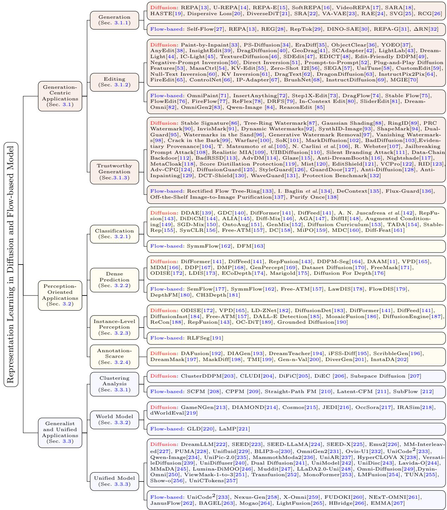
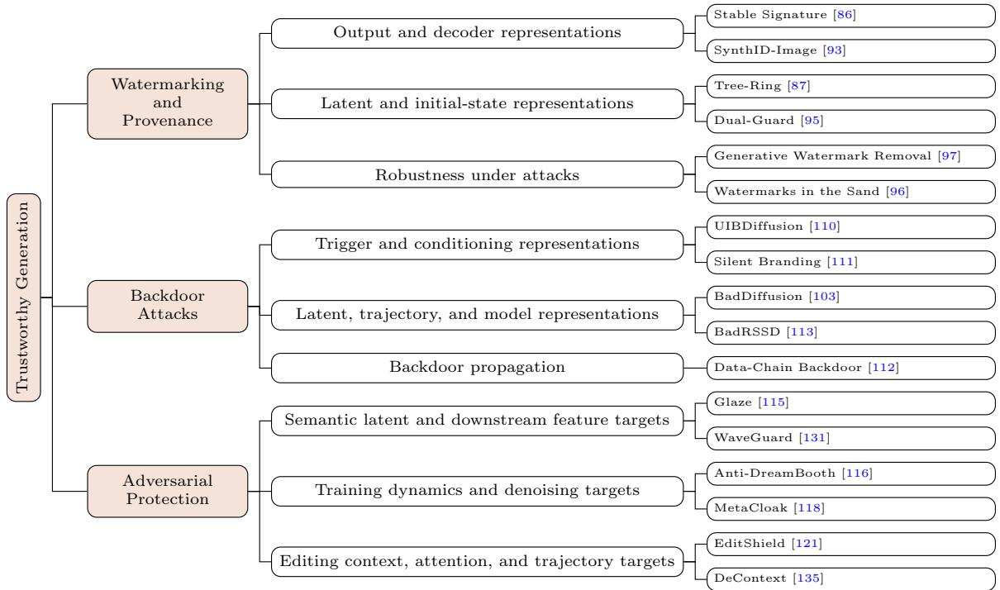

# Representation Learning in Difusion and Flow-based Model: An Application Aspect

Yanchen Xu1, Sida Huang2, Zhenyu Gu1, Ruishu Zhu2, Yilan Gao2, Hongyuan Zhang3\*

1Fudan University, Shanghai 200433, China. 2School of Artificial Intelligence, OPtics and ElectroNics (iOPEN), Northwestern Polytechnical University, Xi’an 710072, Shaanxi, China. 3The University of Hong Kong, Hong Kong, China.

\*Corresponding author(s). E-mail(s): hyzhang98@gmail.com; Contributing authors: yanchenxu.tj@gmail.com; sidahuang2001@gmail.com; 25110890001@m.fudan.edu.cn; zhuruishu0848@gmail.com; 2022yl@mail.nwpu.edu.cn;

## Abstract

Difusion models and flow-based models have recently become the dominant paradigms in generative modeling, largely due to their ability to learn rich, multi-level visual representations through large-scale training. This creates a bidirectional relationship between generative models and representation learning: improving representation learning enhances generation quality, while the learned representations can be leveraged for broader understanding tasks. This survey systematically explores this interplay with a focus on applications. We propose a three-tier progressive framework that organizes existing works from three perspectives: using representation learning to improve generative capabilities, exploiting generative models to extract representations for perception tasks, and ultimately moving toward general-purpose unified applications. We systematically categorize representative methods across a wide range of downstream tasks, including image classification, dense visual prediction, instance-level perception, and annotation-scarce scenarios. By providing a unified taxonomy and identifying key challenges, this survey aims to clarify the underlying logic of current research and suggest promising directions for future exploration. We hope this work can serve as a valuable reference for researchers interested in harnessing the representation power of generative models for applications beyond generation.

Keywords: Representation Learning, Difusion Models, Flow-based Models, Survey

## 1 Introduction

Difusion models have recently become the dominant paradigm in generative modeling, achieving remarkable success across a wide range of domains, including image synthesis, video generation, audio generation, and molecular design.

Meanwhile, flow-based models, as an emerging class of generative models, learn deterministic transports along probability paths, ofering unique advantages in inference eficiency and flexibility, and are gradually becoming a compelling complement or even alternative to difusion models. The success of both model families stems from their ability to learn rich visual representations at multiple levels of abstraction through large-scale training. This naturally raises a question: can these representations be efectively leveraged? Furthermore, can such leverage extend beyond generation tasks to broader understanding tasks?

Around this question, we find that difusion models and flow-based models share a tight bidirectional relationship with representation learning and visual understanding. On one hand, the training process of generative models inherently involves learning structured representations of data; improving their representation learning capability can directly lead to more realistic sample generation. On the other hand, these learned representations can also serve downstream understanding tasks such as classification, segmentation, and detection. Notably, difusion models and flow-based models do not explicitly extract semantic representations. Unlike models such as variational autoencoders, their internal representations are distributed across diferent network layers, diferent timesteps, and even diferent attention heads, and the extraction methods vary depending on the task. In recent years, a surge of research has emerged around representation learning with difusion models and flow-based models, exploiting the interplay between the two through various paradigms.

However, these works lack a unified taxonomy, making it dificult for researchers to keep pace with current developments. To the best of our knowledge, only one existing survey is exclusively dedicated to this topic, and it focuses solely on difusion models[1]. Other related reviews on generative models touch upon representation learning only in passing, rather than treating it as a central theme[2]. To efectively organize this growing body of work and clarify its underlying logic, we provide a comprehensive overview and taxonomy of relevant approaches. In this survey, we cover representative works published from early 2020s to early 2026, with a selection focus on those that introduce novel representation learning mechanisms, demonstrate clear application value, or define new paradigms in difusion and flowbased generative models. Specifically, this paper introduces existing work from three progressive perspectives: leveraging representation learning to improve generative capabilities, exploiting diffusion and flow-based models for representation learning, and ultimately moving toward generalization and unification. The main contributions of this paper are as follows:

• A comprehensive survey perspective. Unlike existing surveys that focus solely on difusion models, this paper discusses difusion models and flow-based models in parallel, systematically reviewing the bidirectional interplay between these two mainstream generative model families and representation learning.

• A progressive taxonomy. This paper proposes a three-tier progressive framework: from leveraging representation learning to enhance generative capabilities, to exploiting generative models to extract representations for perception tasks, and ultimately toward generalpurpose applications and unified frameworks. This framework reveals the intrinsic logic and evolutionary trends of research in this field.

• Discussion of challenges and future directions. This paper summarizes the key challenges faced by related fields, identifies the significant potential of difusion models and flow-based models in representation learning, and suggests possible directions for further development.

## 2 Background

This section provides the background knowledge for the subsequent chapters. We begin with the basic mathematical frameworks of difusion models, flow-matching models, and rectified flows (Sec. 2.1). Then, we introduce the commonly used backbone network architectures for these models (Sec. 2.2).

## 2.1 Preliminaries

Let the training data X be sampled from an unknown data distribution p(x). The goal of generative models is to learn the distribution and generate new samples from it. Difusion models map Gaussian noise to p(x) through progressive denoising, while flow-based methods learn deterministic transport paths from a source distribution to p(x) to accomplish generation.

## 2.1.1 Difusion Models

Difusion models are a class of latent variable models inspired by considerations from nonequilibrium thermodynamics[3]. The core idea is to learn a forward difusion process that gradually adds Gaussian noise to data samples, transforming them into Gaussian distribution. The trained neural network generates new samples by reversing the denoising process.

Given a training sample $x _ { 0 } \sim p ( x )$ , the forward difusion process can be defined as a Markov chain:

$$
p ( x _ { t } | x _ { t - 1 } ) = { \mathcal { N } } ( x _ { t } ; { \sqrt { 1 - \beta _ { t } } } x _ { t - 1 } , \beta _ { t } I ) , t = 1 , \cdot \cdot \cdot , T ,\tag{1}
$$

where $x _ { t }$ denotes the sample obtained after adding noise at step $t , T$ denotes the number of difusion time steps, and $\beta _ { t }$ is a pre-defined variance schedule. Due to the fact that the conditional distributions at each step are mutually independent, it holds that

$$
p ( x _ { t } | x _ { 0 } ) = \mathcal { N } ( x _ { t } ; \sqrt { \bar { \alpha } _ { t } } x _ { 0 } , ( 1 - \bar { \alpha } _ { t } ) I ) ,\tag{2}
$$

where $\begin{array} { r } { \bar { \alpha } _ { t } = \prod _ { i = 1 } ^ { t } ( 1 - \beta _ { i } ) } \end{array}$ . Hence, with a reparameterization trick, a noisy sample at an arbitrary timestep $t \in \{ 1 , 2 , \cdots , T \}$ can be sampled directly as:

$$
x _ { t } = \sqrt { \bar { \alpha } _ { t } } x _ { 0 } + \sqrt { 1 - \bar { \alpha } _ { t } } \varepsilon _ { t } , \quad \varepsilon _ { t } \sim \mathcal { N } ( 0 , I ) .\tag{3}
$$

In practice, a network $\varepsilon _ { \theta }$ is trained to predict the noise $\varepsilon _ { t }$ given difusion timestep t and the noisy sample $x _ { t }$ . For simplification of implementation, [3] proposes training εθ with the loss function as follow:

$$
\mathcal { L } = \mathbb { E } _ { t , x _ { 0 } , \varepsilon _ { t } } | | \varepsilon _ { t } - \varepsilon _ { \theta } ( x _ { t } , t ) | | ^ { 2 } .\tag{4}
$$

The above derivation is based on the DDPM framework with discrete timesteps. When the number of difusion steps T tends to infinity, the discrete difusion process can be generalized to a continuous-time Stochastic Diferential Equation (SDE) formulation[4]:

$$
\begin{array} { r } { d x = f ( x , t ) d t + g ( t ) d w , } \end{array}\tag{5}
$$

where w is the standard Wiener process, while $f ( \cdot , t )$ and $\mathrm { g ( t ) }$ are drift coeficient and difusion coeficient function, respectively. There are two common choices of SDE formulation. The first one is Variance-Preserving (VP) SDE. It is defined by $\begin{array} { r } { f ( x , t ) = - \frac { 1 } { 2 } \beta ( t ) x , g ( t ) = \sqrt { \beta ( t ) } } \end{array}$ , where $\beta ( t )$ is the continuous generalization of the discrete variance schedule $\beta _ { t }$ . Note that VP-SDE corresponds to the continuous limit of DDPM, with the variance remains bounded throughout the difusion process.The second one is Variance-Exploding (VE) SDE, which allows the variance to grow continuously as t increases. Corresponding to the continuous limit of NCSN[5], VE-SDE is defined by $\begin{array} { r } { f ( x , t ) = 0 , g ( t ) = \sqrt { \frac { d } { d t } } \sigma ^ { 2 } ( t ) } \end{array}$

Regardless of which SDE formulation is adopted, Anderson[6] proves that the difusion process has a reversible time reversal, with the reverse-time SDE as:

$$
\begin{array} { r } { d x = [ f ( x , t ) - g ( t ) ^ { 2 } \nabla _ { x } \log p ( x ; t ) ] d t + g ( t ) d w , } \end{array}\tag{6}
$$

where $\nabla _ { x } \log p ( x ; t )$ is the score function which is approximated by a neural network.

Furthermore, difusion models can operate in either pixel space or latent space[7], the latter compresses data into a low-dimensional latent space via a pre-trained VAE before performing difusion, significantly reducing the computational cost of high-resolution image synthesis and providing a more eficient interface for downstream perception task adaptation.

## 2.1.2 Flow Matching Models

Given a source distribution $p _ { 0 } ( x )$ , typically a standard Gaussian distribution, Flow Matching Models aims to learn a deterministic transport process that smoothly maps $p _ { 0 } ( x )$ to $p ( x ) [ 8 ]$

In the flow matching framework, the transport process is modeled by a time-dependent vector field $\boldsymbol { v } ( \boldsymbol { x } , t )$ , which corresponds to an Ordinary Diferential Equation (ODE) as:

$$
d x _ { t } = v ( x _ { t } , t ) d t , \qquad t \in [ 0 , 1 ] .\tag{7}
$$

The ODE defines a flow $\phi _ { t }$ that pushes the source distribution $p _ { 0 }$ forward to the target distribution $p _ { 1 } \triangleq p ;$ i.e., $p _ { t } = [ \phi _ { t } ] * p _ { 0 }$ . Given the target probability path $p _ { t } ( x )$ and the corresponding vector field $u _ { t } ( x )$ , a neural network $v _ { \theta } ( x , t )$ is trained to regress the vector field:

$$
\mathcal { L } _ { F M } = \mathbb { E } _ { t , x } | | v _ { \theta } ( x , t ) - u _ { t } ( x ) | | ^ { 2 } .\tag{8}
$$

However, in practice, we do not have access to $p _ { t } ( x )$ and $u _ { t } ( x )$ . To address this, Lipman et al. [8] introduced the Conditional Flow Matching (CFM) construction. CFM defines the conditional probability path $p _ { t } ( x | x _ { 1 } )$ of the data sample $x _ { 1 }$ , such that it equals the source probability $p _ { 0 }$ at time $t = 0$ , and be a distribution concentrated around $x _ { 1 }$ at time t = 1:

$$
p _ { t } ( x ) = \int p _ { t } ( x | x _ { 1 } ) q ( x _ { 1 } ) d x _ { 1 } .\tag{9}
$$

And the marginal vector field can be formulated as

$$
u _ { t } ( x ) = \int u _ { t } ( x | x _ { 1 } ) \frac { p _ { t } ( x | x _ { 1 } ) q ( x _ { 1 } ) } { p _ { t } ( x ) } d x _ { 1 } .\tag{10}
$$

$\mathcal { L } _ { F M }$ shares the same gradients with respect to θ with the objective of CFM as follow:

$$
\mathcal { L } _ { C F M } = \mathbb { E } _ { t , q ( x _ { 1 } ) , p _ { t } ( x | x 1 ) } | | v _ { t } ( x ) - u _ { t } ( x | x _ { 1 } ) | | ^ { 2 } .\tag{11}
$$

Considering conditional probability paths of the form

$$
p _ { t } ( x | x _ { 1 } ) = \mathcal { N } ( x | \mu _ { t } ( x _ { 1 } ) , \sigma _ { t } ( x _ { 1 } ) ^ { 2 } I ) ,\tag{12}
$$

the vector field has the form:

$$
u _ { t } ( x | x _ { 1 } ) = \frac { \sigma _ { t } ^ { \prime } ( x _ { 1 } ) } { \sigma _ { t } ( x _ { 1 } ) } ( x - \mu _ { t } ( x _ { 1 } ) ) + \mu _ { t } ^ { \prime } ( x _ { 1 } ) .\tag{13}
$$

Two representative designs are as follows:

• Difusion Path: $\mu _ { t } ( x _ { 1 } ) \ = \ \alpha _ { ( } 1 - t ) x _ { 1 }$ and $\sigma _ { t } ( x _ { 1 } ) = \sqrt { 1 - \alpha _ { 1 - t } ^ { 2 } } \ d ;$

• Optimal Transport Path: $\mu _ { t } ( x _ { 1 } ) = t x _ { 1 }$ and $\sigma _ { t } ( x _ { 1 } ) = 1 - ( 1 - \sigma _ { m i n } ) t$

## 2.1.3 Rectified Flow

Being an important variant of flow matching, Rectified Flow aims to learn a linear path from source distribution $p _ { 0 } ( x )$ to $p ( x ) [ 9 ]$ . The time-dependent stochastic process can be defined as

$$
\begin{array} { r } { x _ { t } = t x _ { 1 } + ( 1 - t ) x _ { 0 } , } \end{array}\tag{14}
$$

where $x _ { 0 } \sim p _ { 0 } ( x )$ and $x _ { 1 } \sim p ( x )$ . A neural network $v _ { \theta } ( x , t )$ can be trained through

$$
\mathcal { L } _ { R F } = \mathbb { E } _ { x _ { 1 } , x _ { 0 } , t } | | ( x _ { 1 } - x _ { 0 } ) - v ( x _ { t } , t ) | | ^ { 2 } .\tag{15}
$$

## 2.2 Network Architecture

The backbone architecture of a generative model directly determines how its internal representations are structured and their potential for feature extraction. This section introduces the backbone networks commonly used in difusion models and flow-based models, respectively.

## 2.2.1 Difusion Models

The denoising network of difusion models typically adopts the U-Net architecture[10]. A U-Net consists of an downsampling encoder and an upsampling decoder, connected by skip connections that propagate high-resolution feature maps from the encoder to the corresponding decoder layers. This structure naturally provides a spectrum of feature maps spanning from fine-grained texture in shallow layers to semantic abstraction in deep layers, which serves as a key foundation for subsequent representation extraction. The timestep t is embedded into each residual block via sinusoidal positional encoding, enabling the network to perceive the current denoising stage.

Latent Difusion Models[7] perform difusion in the latent space of a pre-trained VAE, significantly reducing computational cost. Its U-Net backbone remains largely consistent with DDPM, but introduces an additional cross-attention mechanism to support flexible text-conditioned control. Note that the cross-attention maps proposed by this mechanism are found to naturally encode word-to-pixel semantic correspondences[11].

n recent years, Transformer-based backbones have also been introduced to difusion models. The Difusion Transformer (DiT)[12] adopts a ViT-style architecture that partitions the input image into patches and projects them into token sequences, processed through Transformer blocks, demonstrating strong scalability.

## 2.2.2 Flow-based Models

Flow-based models share a similar trajectory with difusion models in backbone selection. Early works largely adopt the U-Net architecture as the parameterization network for the vector field[8], whose encoder-decoder structure and skip connections similarly provide multi-level feature maps. As generative models evolve toward Transformer architectures, Scalable Interpolant Transformer (SiT)[268] introduces the DiT architecture into the flow matching framework, adopting the same

  
Fig. 1 A comprehensive taxonomy of applications for difusion models and flow-based models in representation learning. All methods are further classified according to their generative paradigm, i.e., difusion-based versus flow-based.

Transformer backbone as DiT. By learning linear interpolation paths from Gaussian noise to the data distribution, SiT demonstrates performance and scalability comparable to or even better than difusion models on large-scale generation tasks such as ImageNet.

## 3 Applications

Building upon the background established above, this section systematically surveys the representative application scenarios of difusion models and flow-based models in representation learning. We organize existing works into three progressive tiers, spanning from generation-centric tasks to perception-oriented tasks, and ultimately to general-purpose and unified applications. We first examine generation-centric applications, investigating how representation learning can enhance the training eficiency, generation quality, and controllability of generative models themselves, covering image and video generation, image editing, and trustworthy generation. We then turn to perception-oriented applications, focusing on how transferable representations can be extracted from pre-trained generative models to serve discriminative downstream tasks including image classification, dense visual prediction, and instance-level perception, with special attention to annotationscarce scenarios. Finally, at the level of generalist and unified applications, we discuss how generative models transcend the traditional boundary between generation and discrimination, serving broader intelligent tasks such as clustering analysis, world model construction, and unified multimodal modeling, and summarize the corresponding architectural paradigms of unified models. All representative works mentioned in this section, along with their taxonomic relationships, are summarized in Figure 1.

## 3.1 Generation-Centric Applications

## 3.1.1 Image and Video Generating

## Difusion Model

A large number of recent studies have validated that the generation capability of difusion models is highly dependent on the quality of their internal representations. Whether through external knowledge injection to accelerate training, internal regularization to optimize representational structures, or fundamentally re-engineering the latent space upon which difusion models rely, the ultimate goal is to enable generative models to ”learn better and generate more faithfully.” Around this core objective, this section systematically reviews representative works that leverage representations to enhance the generative capabilities of difusion models, spanning five dimensions: external representation alignment, self-organization of internal representation, latent space paradigm upgrade, and improving generative paradigms with representations.

External Representation Alignment is the most systematically explored approach in the direction of leveraging representations to enhance difusion models. Its core idea is to use a pretrained visual or language encoder as a teacher and inject discriminative representations into the intermediate layers of difusion models, thereby compensating for the inherent semantic deficiencies of generative models. REPA[13] is the pioneering work of this paradigm. Through simple patch-wise cosine similarity maximization, REPA aligns the intermediate representations of DiT[12] with DINOv2[269], demonstrating for the first time that external discriminative representations can significantly accelerate difusion model training. On ImageNet, REPA accelerates SiT training by over 17 times and achieves a state-of-the-art FID of 1.42 at the time. This discovery initiated extensive follow-up research across multiple dimensions.

While REPA has been proven efective on the DiT architecture, it has not been validated on U-Net[10], which exhibits faster convergence compared to DiTs. U-REPA[14] fills this gap by proposing three adaptation strategies: mid-layer alignment, upsampling after MLP projection, and manifold loss. As a result, U-REPA achieves an FID of 1.41 at 400 epochs, surpassing 1.42 of REPA at 800 epochs.

In terms of end-to-end training, REPA-E[15] further back-propagates the REPA loss to the VAE while keeping the difusion loss only updating the difusion model, addressing the issue that direct end-to-end training with the difusion loss causes the VAE latent space to become overly smooth. This achieves a 17× speedup over REPA and a 45× speedup over standard training, reaching an FID of 1.12.

Some studies have also explored the generalizability of REPA across diferent modalities.

SoftREPA[16] extends alignment from visualvisual to text-image modalities, leveraging contrastive learning to maximize mutual information between text and image representations. By training fewer than 1M parameters of soft tokens prepended to text features, it improves alignment quality in text-to-image generation at low cost. In terms of application scenarios, VideoREPA[17] introduces representation alignment to video generation, addressing the insuficient physical understanding of Text-to-Video models through token relation distillation loss, which aligns intra-frame spatial relationships and inter-frame temporal dynamics with Video Foundation Model (e.g. VideoMAEv2[270]), improving the Physical Commonsense score on VideoPhy by 24.1% overall.

As the REPA paradigm gained widespread adoption, researchers also began to reflect on its potential limitations. SARA[18], through singular value decomposition analysis, finds that while the patch-wise alignment is efective, it disrupts the internal structure and global distribution of the representation space. the top 50 singular values of REPA representations account for 82.6% of the total energy, compared to only 63.9% for DINOv2. To address this, SARA introduces structural alignment via autocorrelation matrix matching to preserve internal relational consistency and adversarial alignment through a lightweight discriminator to ensure global distribution consistency on top of patch-wise alignment, constructing a three-tier alignment framework.

At the same time, HASTE[19], through gradient angle analysis, reveals that the relationship between REPA gradients and difusion loss gradients undergoes three stages. To be specific, REPA may help training in the beginning 200K iterations, the cosine similarity betweenL and L A gradually decreases to nearly orthogonal level in the following 200K iterations, indicating that it neither help nor hurt. To make matters worse, REPA may erases detail the student model tries to learn in over 400K iterations. The fundamental cause is that the capacity of the external teacher (DINOv2) is fixed, while the difusion model requires high-frequency details in the later stages of training that the teacher cannot provide. At this point, continued alignment becomes an obstacle to performance improvement. To address this, HASTE terminating the alignment loss at an appropriate iteration to allow the difusion model to freely develop its generative capacity. It also introduces attention alignment to distill the selfattention matrix of DINOv2 into the intermediate layers of the student model.

SARA and HASTE reveal the deep contradictions of the external alignment paradigm from diferent angles. The former points out inherent structural defects in alignment quality, while the latter identifies that the capacity ceiling of the external teacher becomes a bottleneck for laterstage fine-tuning. These reflections drive the external alignment paradigm from whether it works toward the deeper question of how to make it work better and more sustainably. The continued evolution of the external representation alignment pathway also raises a question in another direction: Can difusion models spontaneously organize their representational structures through internal mechanisms without external teacher dependence? The next section discusses representative works along this direction.

Self-Organization of Internal Representation intends to improve the quality of the representations with no external supervisory signals. Generally, it discovers and optimizes representational structures from within difusion models themselves through carefully designed regularization losses or self-distillation mechanisms, making these structures more conducive to generation.

Dispersive Loss[20] is an early representative of this direction. Its key insight is that the difusion loss inherently pulls predictions toward targets. Hence, an additional loss term that pushes features from diferent samples away will complete the two fundamental elements of representation learning. This paper proposes a simple plug-andplay regularizer that requires no extra parameters, data augmentation, or external models. Moreover, its benefit grows with model size, as regularization may help mitigate overfitting. Under zero external dependency, it pushes the FID of SiT-XL/2 to 1.97, approaching REPA’s 1.80. To be specific, the regularizer can be also applied to flow-based models.

DiverseDiT[21] goes a step further by further investigating the mechanisms underlying REPA and Dispersive Loss. Through systematic analysis of representation similarity across DiT blocks using Centered Kernel Alignment, it reveals that both REPA and Dispersive Loss essentially promote representation diversity among diferent blocks. Based on this insight, DiverseDiT designs long residual connections to increase input diversity for each block and a representation diversity loss to explicitly penalize feature similarity across blocks, achieving FID of 1.89 at 80 epochs and 1.52 at 200 epochs.

SRA[22] pursues a self-distillation approach, aligning the early-layer representations of the student model with the late-layer representations of an EMA teacher model. Under zero external dependency, it achieves FID of 1.58 at 800 epochs, substantially narrowing the gap to REPA with an FID of 1.42, which relies on an external model.

Latent Space Paradigm Upgrade constitutes the third critical pathway. All the aforementioned works optimize difusion models within a given VAE latent space. However, the weak representational capacity of the VAE itself forms a fundamental bottleneck for generation quality. Therefore, some researchers have turned to fundamentally re-engineering the latent space rather than optimizing within a given space.

VA-VAE[23] takes a moderate approach. It retains the VAE architecture but introduces guidance from Vision Foundation Models during training, using marginal cosine similarity loss and marginal distance matrix similarity loss to make the VAE latent space more uniformly distributed, achieving FID of 1.35 at 800 epochs.

RAE[24] directly replaces the VAE encoder with a pre-trained DINOv2 encoder to produce high-dimensional semantic representations, complemented by dimension-dependent noise schedule shifting and noise-augmented decoding. It achieves FID of 1.51 (without guidance) and 1.13 (with guidance) on ImageNet 256×256, with a 47× training acceleration.

SVG[25] identifies the fundamental issue of current VAE encoder. It points out that the VAE latent space lacks semantic dispersion. To address this, SVG pairs DINOv3[271] with a lightweight trainable ViT residual encoder to capture finegrained details. It is concatenated with the representations of DINOv3 after batch-level distribution alignment, enabling few-step sampling and task-general representations.

These three methods progressively explore ways to improve the VAE encoder. VA-VAE optimizes the VAE within the existing framework, RAE directly replaces the VAE encoder, and SVG actively constructing a latent space that captures both semantics and fine details.

Improving Generative Paradigms with Representations is a parallel research direction. Rather than directly modifying the internal structure or training objectives of difusion models, it seeks to restructure the generative workflow itself, investigating how representations can reconceive the generative paradigm of difusion models.

RCG[26], as a representative work, aims to fundamentally address the dificulty of traditional unconditional generation in directly modeling high-dimensional pixel distributions by reformulating unconditional generation as a two-stage framework. To be specific, the model generate representations firstly, and then generate images. RCG trains a lightweight difusion model to unconditionally generate representations in a self-supervised representation space; subsequently, these generated representations condition a standard image generator to generate images. The core advantage of this decomposition lies in the fact that the representation space is far lower in dimensionality than pixel space yet rich in high-level semantic information, making unconditionally generating representations an easier task to learn.

Experiments demonstrate that RCG achieves an FID of 2.15 on ImageNet 256×256, reducing the previous SOTA of 5.91 by 64%, marking the first time that unconditional generation reaches performance comparable to conditional generation. Moreover, it brings FID improvements across various image generators (e.g. LDM, ADM, DiT, and MAGE).

## Flow-based Model

The representation-enhancement methods discussed in the previous section are not limited to difusion models. External representation alignment, internal representation regularization, and representation-based latent spaces can also be applied to flow-based models such as SiT and Rectified Flow. Since these shared methods have already been introduced above, this section focuses on designs that are more closely related to continuous transport, including heterogeneous corruption, joint semantic transport, generation in representation spaces, and representation-guided sampling.

Heterogeneous Corruption and Self-Supervised Flow Learning improves representation learning by changing how intermediate states are constructed. Standard Flow Matching usually assigns the same time step to all tokens in one sample. As a result, all regions receive a similar amount of corruption, and the model has little reason to use information from one region to understand another.

Self-Flow[27] assigns diferent time steps to different token groups in the same sample. Some tokens remain relatively clean, while others are more strongly corrupted. The model must use the available context to predict the velocity of each token. This encourages it to learn semantic and structural relations between diferent regions.

The method can be understood in two ways. First, cleaner tokens may provide useful context for predicting more corrupted tokens. Second, different token-wise time steps expose one sample to several corruption levels in a single training step. This acts as data augmentation along the time dimension. Unlike REPA-style methods, Self-Flow does not learn representations by matching an external teacher. Instead, it improves the training task used by Flow Matching itself.

The same idea can be extended to video and audio generation. Diferent frames, regions, or temporal segments can be assigned diferent corruption levels, encouraging the model to learn dependencies across space and time.

Joint Transport of Visual and Semantic States introduces semantic representations directly into the state generated by the flow model. In representation-alignment methods, semantic features are used only as training targets and disappear during inference. Joint-transport methods instead generate visual and semantic variables together.

REG[28] adds a compact semantic token to the image-token sequence. During training, the semantic token is obtained from a pretrained visual encoder and paired with the image latent. The model then learns the evolution of both the image tokens and the semantic token. During sampling, both parts are initialized from noise and generated together.

The semantic token therefore remains active throughout the generation process. It can provide high-level information while the image structure and visual details are being formed. This is diferent from REPA, where the external representation only provides additional supervision during training.

Joint transport also introduces new dificulties. Visual and semantic variables may have diferent dimensions, distributions, and levels of uncertainty. The model must learn how these variables interact and how quickly they should evolve. Flow Matching makes it possible to use diferent time schedules for the two parts. For example, semantic information may be generated earlier and then guide the later formation of image details.

Flow Matching in Representation-Native Latent Spaces changes the space in which the transport process is learned. The previous section has already discussed the general idea of replacing VAE latents with features from pretrained visual encoders. For Flow Matching, the main question is whether the interpolation path is suitable for the geometry of these features.

RAE can be combined directly with Flow Matching. A frozen visual encoder maps images into a semantic feature space, a decoder reconstructs images from these features, and a flow model learns to generate the feature distribution. Compared with conventional VAE latents, these representations contain stronger semantic information. However, they are often high-dimensional, strongly correlated, and diferent from a simple Gaussian distribution. Their feature scale, noise schedule, and model width therefore need to be carefully designed.

RepTok [29] uses a small number of continuous semantic tokens instead of a dense spatial latent grid. This reduces the sequence length and lowers the cost of Flow Matching training. The main challenge is information preservation. A compact token set must retain both high-level semantics and the spatial details needed for image reconstruction.

DINO-SAE [30] further considers the geometry of pretrained representations. Normalized DINO features are close to a spherical space, while standard Flow Matching usually assumes Euclidean interpolation. DINO-SAE therefore combines a spherical autoencoder with Riemannian Flow Matching, so that the transport path follows the geometry of the representation space. This avoids moving through regions that are far from the valid feature distribution.

Representation-Guided ODE Sampling uses representations to control the trajectory of a trained flow model. Since Flow Matching generates samples by solving an ODE, an additional representation objective can be used to adjust the predicted velocity during sampling.

REPA-G [31] uses the aligned feature space of a pretrained flow model for inference-time guidance. A reference image, a selected image region, or several visual concepts are first converted into target features. During sampling, the flow trajectory is adjusted so that the generated representation becomes closer to these targets.

Global representations can control the overall content of an image, while patch-level representations can control local regions or visual details. Several target representations can also be combined for compositional generation. Unlike training-time alignment, this approach directly changes the sampling trajectory and therefore requires no additional model training.

The guidance strength usually depends on time. At the beginning of sampling, the state is dominated by noise and does not contain stable semantic information. Near the end, strong guidance may disturb texture and fine details. Representation guidance is therefore more suitable for the middle stage, when the global structure has started to appear but can still be adjusted.

Positive-incentive noise for flow-based models is an emerging direction that enhances flow-based generative models by rethinking the role of stochasticity. The concept of Positiveincentive Noise (π-noise)[272] formalizes this idea by identifying noise signals that maximize the mutual information between the task objective and the injected randomness, thereby transforming noise from a mere disturbance into a beneficial driving force. Beyond generative modeling, the ?-noise principle has demonstrated broad potential in supervised learning[273], representation learning[274], graph representation learning[275], class incremental learning[276], and multimodal models[277, 278], underscoring its general utility in machine learning. For flow-based models, this principle is instantiated as Rectified Noise[32], which introduces a lightweight learnable noise generator atop a pre-trained rectified flow model to produce π-noise conditioned on representations and inject it into the velocity field. This incurs minimal parameter overhead while yielding nontrivial performance gains, reducing the FID on ImageNet-1K from 10.16 to 9.05 with only 0.39% extra parameters.

## 3.1.2 Image Editing

Image editing aims to modify an existing image according to a user intention while preserving the irrelevant content in the source image. Diferent from pure generation, editing requires the model to synthesize plausible pixels while deciding which factors to change or preserve. Image editing covers a wide range of tasks, such as object insertion or removal, background replacement, structure manipulation, style transfer and multi-reference composition. To systematically review the image editing field, we organize existing works from two perspectives: visual targets and model adaptation. Table 1 provides a comprehensive taxonomy of representative image editing methods according to these two perspectives.

## Visual target perspective

According to the edited visual component, image editing works can be divided into content-level editing and expression-level editing. Contentlevel editing manipulates semantic entities and scene context, while expression-level editing modifies visual attributes such as structure, style, lighting, and texture.

Content-level methods can be further discussed by the edited semantic component, mainly including object editing and scene-context editing. The core challenge of content-level editing is to localize the intended semantic change and reduce collateral efects. Object editing covers adding, removing, or replacing foreground entities. Adding-oriented methods address object– background composition, inpainting-based synthesis, or reference-guided appearance transfer so that the inserted entity matches the intended object and fits the surrounding scene [33, 34, 71, 72]. Removing-oriented methods instead emphasize accurate localization, object-efect suppression, and background completion, where the main challenge is to erase the selected entity without leaving structural artifacts, shadows, or inconsistent textures [35–37]. Replacing-oriented methods combine removal and insertion, so the edited result must align the target region layout with the new object’s identity, scale, pose, and local interactions with the scene [34, 71, 72]. Scene-context editing is mainly integrated into general-purpose editing models rather than handled by a background-specific model. Multitask and instruction-following editing models extend editable content from foreground objects to broader scene context [38, 39, 73].

Table 1 Taxonomy of image editing methods.
<table><tr><td>Taxonomy Perspec- tive</td><td>Category</td><td>Editing Type</td><td>Representative References</td></tr><tr><td rowspan="5">Visual target perspec- tive</td><td rowspan="4">Content- level</td><td>Object editing</td><td>Paint-by-Inpaint [33], OmniPaint [71], InsertAnything [72], PS-Diffusion [34], EraDiff [35],</td></tr><tr><td></td><td>ObjectClear [36], YOEO [37]</td></tr><tr><td>Scene-context editing</td><td>AnyEdit [38], Step1X-Edit [73], InsightEdit [39]</td></tr><tr><td>Structure editing</td><td>DragGAN [279], DragDiffusion [40], GeoDrag [41], DragFlow [74]</td></tr><tr><td rowspan="4">Expression- level</td><td>Style editing</td><td>SCAdapter [42]</td></tr><tr><td>Lighting editing</td><td>LightLab [43], DreamLight [44], IC-Light [45]</td></tr><tr><td>Texture editing</td><td>TextureDiffusion [46]</td></tr><tr><td>Perturb-and-denoise editing</td><td>SDEdit [47]</td></tr><tr><td rowspan="6">Model adapta- tion perspec- tive</td><td rowspan="5">Training- free editing</td><td>Inversion-based editing</td><td>EDICT [48], Edit-Friendly DDPM [49], Negative- Prompt Inversion [50], Direct Inversion [51]</td></tr><tr><td>Attention-feature editing</td><td>Prompt-to-Prompt [52], Plug-and-Play [53], MasaCtrl [54], Stable Flow [75], KV-Edit [55]</td></tr><tr><td>Semantic-direction editing</td><td>Zero-Shot I2I [56], SEGA [57]</td></tr><tr><td>Flow-based editing</td><td>FlowEdit [76], FireFlow [77], ReFlex [78],</td></tr><tr><td>Model-parameter</td><td>DRFS [79] UniTune [58], CustomEdit [59]</td></tr><tr><td rowspan="3">Test-time adapta- tion</td><td>adaptation Embedding</td><td>Null-Text Inversion [60], KV Inversion [61],</td></tr><tr><td>adaptation Drag-based</td><td>DragText [62] DragDiffusion [40], DragonDiffusion [63],</td></tr><tr><td>adaptation</td><td>DragFlow [74], GeoDrag [41] InstructPix2Pix [64], AnyEdit [38], FireEdit [65],</td></tr><tr><td rowspan="4"></td><td></td><td>Full-model editing</td><td>InsightEdit [39], Step1X-Edit [73]</td></tr><tr><td rowspan="3">Training- based editing</td><td>Parameter-efficient editing</td><td>ControlNet [66], IP-Adapter [67], BrushNet [68], In-Context Edit [80], SliderEdit [81]</td></tr><tr><td>Unified-architecture editing</td><td>InstructDiffusion [69], MGIE [70], OmniPaint [71], DreamOmni [82], OmniGen2 [83], Qwen-Image [84]</td></tr><tr><td>Reasoning-enhanced editing</td><td>ReasonEdit [85]</td></tr></table>

Expression-level methods can be organized by the edited visual attribute, including structure, style, lighting, and texture. Diferent from content-level editing, expression-level editing keeps the main semantic entities recognizable while changing their geometric arrangement or visual appearance. Structure editing modifies pose, shape, layout, or spatial correspondence. Drag-based structure editing includes point-based local manipulation and region-based geometric control. Point-based methods propagate sparse handle-point displacements to local deformations [40, 41, 279], whereas DragFlow exploits FLUX’s DiT prior and region-based afine supervision for relocation, deformation, and rotation [74]. Beyond direct source-image editing, layout-conditioned generation provides another form of structural control by specifying object locations, instance layouts, or grounded regions before image synthesis. GLIGEN, MIGC, and Laytrol synthesize images from grounded or instance-level layouts rather than modifying an existing image, and are therefore reviewed as generation-side structural control methods [280– 282]. Style editing transfers appearance statistics or reference style while balancing stylization strength with semantic recognizability [42]. StyleAligned instead targets style-consistent generation across multiple synthesized images and is better categorized as style-aligned generation [283]. Lighting editing realizes illumination control through light-source adjustment, relighting harmonization, or light-transport consistency, with the key goal of aligning foreground and background illumination [43–45]. Texture editing refines fine-grained surface appearance, where the main dificulty lies in separating material-level details from object semantics [46].

## Model adaptation perspective

From the perspective of model adaptation, different strategies balance editing efectiveness and computational burden in diferent ways. Existing methods can be broadly divided into training-free editing, test-time adaptation, and training-based editing.

Training-free editing keeps the pretrained generative model frozen and changes the inference process directly. Training-free editing includes perturb-and-denoise methods, inversion-based methods, and internal-representation intervention. SDEdit adds noise to the input image and denoises it under a target condition without explicit inversion [47]. Inversion-based methods instead reconstruct source trajectories or latent states before editing [50, 51]. The key challenge is to balance input fidelity with suficient generative flexibility to achieve the desired modification. Attention- and feature-based methods manipulate attention maps or intermediate features to reuse source-image structure while changing the semantic target [52–55, 75]. Compared with sampling-only methods, attentionand feature-based methods ofer finer control over identity, layout, and background preservation, but performance becomes sensitive to the selected internal representations and intervention strength. Text-condition and semantic-direction methods steer editing by constructing or manipulating semantic directions in the conditioning space [56, 57]. As generative backbones move from U-Net-based difusion models to DiT-based flow-matching models, recent editing methods increasingly exploit rectified-flow trajectories, inversion processes, intermediate features, velocity updates, or optimization within flow-based backbones [74–79]. Training-free editing is therefore attractive for flexibility and low training cost, but the absence of learned task adaptation makes the result depend heavily on inversion strength, feature selection, and guidance scale.

Test-time adaptation replaces large-scale editing training with instance-level adaptation during inference. Model-parameter customization fine-tunes the generator on a single image or a few references to capture instance-specific appearance [58, 59]. Embedding optimization keeps the generator weights fixed and optimizes unconditional, KV, or text embeddings within an editable semantic space [60–62]. Optimization-based drag methods iteratively update latent or feature representations under point constraints [40, 63]. Geo-Drag performs geometry-guided editing in a single forward pass, separating it from iterative drag optimization [41]. Compared with training-free editing, test-time adaptation better fits the current input, but the additional optimization introduces slower inference and the risk that strong fitting may restrict large semantic changes.

Training-based editing learns generalizable editing behavior through ofline optimization on paired editing data or large-scale multi-task data. At the backbone level, full or substantial model adaptation directly internalizes the conditional mapping from a source image and an editing instruction to the desired output. Such methods typically avoid input-specific optimization at inference time, but editing coverage, instruction fidelity, and region accuracy remain strongly dependent on the diversity and alignment of the training data [38, 39, 64, 65, 73]. Parametereficient approaches instead keep most of the pretrained generator frozen and introduce trainable control branches, visual adapters, inpainting modules, or low-rank adaptation layers [66–68, 80, 81]. While ControlNet and IP-Adapter provide general conditioning mechanisms that can be reused for editing, editing-oriented modules such as BrushNet, InContextEdit, and SliderEdit learn more specialized ways of injecting spatial, visual, or continuous-control signals. These approaches reduce the number of trainable parameters and preserve the pretrained generative prior, although the auxiliary modules must still avoid overwriting source identity, spatial structure, and unmodified regions. Beyond the location of trainable parameters, dedicated and unified architectures reorganize the editing interface itself. Dedicated systems jointly model tightly coupled editing processes or combine multimodal instruction understanding with image generation, whereas unified models share representations across generation, editing, reference-conditioned synthesis, and other visual tasks [69–71, 82–84]. Recent reasoning-enhanced frameworks further augment such editing models with explicit instruction interpretation, result reflection, and iterative correction [85]. Overall, the central challenge of training-based editing is to learn representations that generalize across diverse transformations while keeping semantic identity, spatial structure, and visual appearance suficiently disentangled.

## 3.1.3 Trustworthy Generation: Watermarking, Backdoors, and Adversarial Protection

Generation-centric applications are not limited to producing and editing visual content. Learned representations can also encode information that provides evidence of content provenance. Meanwhile, backdoors can be injected by modifying internal representations of the generator, whereas adversarial protection methods manipulate selected representations to protect released visual assets from unauthorized training or editing. We therefore organize trustworthy generation around three application tasks: watermarking, backdoor injection, and adversarial protection. For each task, we examine which representation levels are involved and how they function in achieving the corresponding application objective. Figure 2 and Table 2 present the overall taxonomy of these tasks from a representation-centered perspective, structured by the functional role that representations play across watermarking, backdoor attacks, and adversarial protection.

## Scope and task-specific representation taxonomy

The generation lifecycle progresses from conditioning and initial latent states, through denoising or flow trajectories, to generated outputs that may later be distributed, edited, or reused for downstream training. Throughout this lifecycle, diferent representations can serve as functional components for trustworthy generation tasks. The same representation may participate in multiple tasks, but its functional role varies across applications. In watermarking, it functions as a carrier for encoding provenance information. In backdoor attacks, it provides a medium for embedding trigger-related features that can be activated during inference. In adversarial protection, it serves as an intervention target where perturbations are introduced to disrupt downstream learning or inference. Each discussion is organized around a common structure: application task, representation, intervention or attack stage, mechanism, evaluation, difusion?flow diferences, and limitations.

  
Fig. 2 Task-first and representation-centered organization of trustworthy generation. Each task is structured by the functional role of representations: watermark carriers, backdoor injection or storage sites, and downstream targets of adversarial protection. Each representation category is illustrated with one or two representative works; the references are not intended to be exhaustive. Purification and model mismatch are treated as cross-cutting evaluation challenges rather than standalone representation categories.

Table 2 Task-specific roles of representations in trustworthy generation. Representative references are illustrative rather than exhaustive.
<table><tr><td>Task</td><td>Role of Representation</td><td>Main Representation Levels</td><td>Representative References</td></tr><tr><td>Watermarking</td><td>A carrier whose identity signal must propagate to the output and remain recoverable.</td><td>Output/decoder, initial noise or latent, final latent, and inversion trajectory.</td><td>Stable Signature [86]; Tree-Ring [87]; Gaussian Shading [88]</td></tr><tr><td>Backdoor attacks</td><td>A representation in which a trigger, semantic association or synthetic-data signal is injected or modified.</td><td>Data poisoning, model training or fine-tuning, triggered inference, and downstream synthetic-data reuse.</td><td>UIBDiffusion [110]; BadDiffusion [103]; Data-Chain Backdoor [112]</td></tr><tr><td></td><td>A target representation used Adversarial protection by personalization, editing, or student-model training.</td><td>Semantic/identity features, encoder latents, score or velocity objectives, attention/trajectory states, and released outputs.</td><td>AdvDM [114]; Anti-DreamBooth [116]; EditShield [121]</td></tr></table>

Task I: Watermarking and provenance

Image watermarking aims to attach origin, attribution, or integrity evidence to generated content.

It supports provenance verification, ownership attribution, and content integrity assessment. Traditional watermarking methods typically process images with dedicated watermark encoders and decoders to embed and recover information. With the development of generative models, watermarking methods have gradually shifted from post-processing the generated image to integrating watermark signals into the generation process. Existing in-generation watermarking approaches either modify the generator to produce inherently watermarked outputs or encode watermark information into generation-related representations such as latent states and initial noise. Therefore, the central representation question is where watermark information is carried and how this carrier can be reliably recovered.

## Output and decoder representations

At the output and decoder representation level, the goal is to make the released image itself carry recoverable provenance evidence, in a way that remains close to traditional image watermarking. Here, the carrier is the output-space representation, and the main design question is how to embed provenance signals into the visible image while preserving image quality and robustness. Early work such as Stable Signature[86] moves watermarking into the generative pipeline by fine-tuning the latent decoder, so that provenance is rooted in the model-specific decoding process rather than added as a purely external post-processing signal. Later methods shift toward more flexible and deployable output-level watermarking. InvisMark[91] and SynthID-Image[93] adopt encoder–decoder frameworks that attach imperceptible signals to generated images after synthesis, emphasizing high-resolution deployment, robustness under common transformations, and practical provenance verification at scale. Dynamic Watermarks[92] further extends this line by combining a fixed model-level watermark with content-adaptive watermark components, reflecting a transition from static source attribution to more fine-grained and image-specific traceability. Overall, the evolution at this representation level moves from decoder-integrated model attribution to scalable post-hoc provenance marking, and then to hybrid designs that jointly pursue persistence, adaptability, and deployment eficiency.

## Latent and initial-state representations

The second line of work moves the watermark carrier from the released image to the generation process itself. The motivation is that output-space signals are directly exposed after release, whereas watermark information embedded in latent or initial-state representations can be propagated through sampling and may better preserve visual fidelity. Tree-Ring[87] establishes this direction by encoding a structured pattern in the Fourier representation of the initial Gaussian noise, so that provenance is tied to the sampling state rather than appended to the final image. This design makes the watermark difusion-native, but also makes recovery depend on inversion quality. Subsequent methods refine this idea toward diferent objectives. Gaussian Shading[88] seeks to preserve the Gaussian latent distribution while encoding watermark information, aiming to reduce the performance loss and statistical distortion introduced by earlier noise-based schemes. RingID[89] further extends latent watermarking from binary verification to multi-key identification, motivated by the need for scalable source tracing and user-level attribution. PRC Watermark[90] pursues stronger security by using pseudorandom error-correcting codes to hide the watermark. ShapeMark[94] revisits the representation granularity of latent watermarking itself. Instead of encoding bits in individual noise values, it uses structural encoding through group-level shapes and permutations, with the explicit goal of improving robustness without sacrificing generation diversity. More recently, Dual-Guard[95] shows that latent watermarking can also move beyond provenance-only verification by combining an initial-noise watermark for source authentication with a final-latent fingerprint for tamper localization. Overall, the development at this representation level proceeds from difusion-native provenance embedding to distribution-preserving and multi-key designs for scalable identification. The main limitations remain inversion accuracy, scheduler or solver dependence, key security, and the dificulty of transferring these designs from difusion models to flow-based generators where initial-state recovery follows a diferent trajectory formulation and numerical path[133].

## Watermark robustness under attacks

Once watermark information is embedded into either outputs or generation states, the central question is no longer only where the watermark is carried, but whether that carrier remains reliable under adversarial manipulation. This shifts the focus from watermark design to watermark survival. For output-level carriers, a growing body of work shows that imperceptible pixel-space signals can be removed by regeneration or editing while preserving semantic content. Generative reconstruction attacks[97] demonstrate that difusion based restoration can erase conventional invisible watermarks more efectively than destructive perturbations. Vanishing Watermarks[98] further shows that difusion editing can drive water mark information toward near-zero recoverability. These results motivate the move from exposed output signals to generation-aware carriers. For latent carriers, however, robustness is not guaranteed either. A Crack in the Bark[99] shows that public generative components such as VAEs can be exploited to approximate latent spaces, train surrogate detectors, and attack Tree-Ringstyle watermarking without full model access. Warfare[100] broadens the threat model further by considering both removal and forgery, empha sizing that provenance systems must prevent not only false negatives but also false attribution. At a more fundamental level, Watermarks in the Sand[96] formalizes the quality–robustness tension and shows that strong robustness guarantees may be unattainable under suficiently capable attackers. Recent surveys and toolkits such as SoK Watermarking and MarkDifusion[101, 102] therefore frame watermark robustness as a threatmodel-dependent property rather than a single benchmark number. Taken together, these studies show that output and latent representations fail in diferent ways: output carriers are directly exposed to regeneration and editing, whereas latent carriers depend on inversion secrecy, public component access, and model-specific recovery assumptions. This comparison makes representation choice central to watermark design, because robustness depends not only on the embedding algorithm but also on which representation is trusted to retain provenance under adaptive attacks.

## Task II: Backdoor attacks on generative models

Backdoor attacks study how a compromised generator can behave normally on clean inputs while producing an attacker-specified output once a hidden condition is satisfied. For this safety problem, the key representation question is not where malicious behavior is merely observed, but where the malicious association is injected, stored, and later activated. In most cases, the intervention occurs during poisoned-data construction, model training, or fine-tuning, whereas activation happens during conditional generation or downstream reuse.

## Trigger and conditioning representations

One line of work injects the backdoor at the trigger or conditioning level by associating an imperceptible or hidden condition with malicious generation behavior. Here, the injected representation is not the final output itself, but the input-side signal that steers the model toward an attacker-chosen target. UIBDifusion[110] represents this direction by introducing a universal imperceptible image trigger through poisoned training data, so that the trigger becomes a reusable conditioning cue across diferent inputs and models. In this case, the malicious association is written into trigger-conditioned generation through pixel-space perturbations that remain visually inconspicuous. Silent Branding[111], in contrast, removes the need for an explicit trigger and instead poisons the training set with repeated visual branding patterns. This shifts the injected representation from an explicit trigger signal to a learned semantic association between recurring visual patterns and normal generation conditions.

These methods are typically evaluated in terms of attack success rate, trigger invisibility or stealth, clean-generation quality, and target specificity. Trigger and conditioning attacks are conceptually portable across difusion and flowbased generators because both rely on conditional representations to guide generation. However, the exact strength and persistence of the learned association still depend on the underlying training objective, architecture, and conditioning interface. Latent, trajectory, and model representations

A second line of work moves the backdoor from the input condition to the generator’s internal representations and transition dynamics. At this level, the malicious behavior is stored in the model parameters, latent semantics, or denoising trajectory, rather than solely in an external trigger pattern. BadDifusion[103] is the representative starting point of this direction: it modifies training or fine-tuning so that the presence of a trigger redirects the denoising process toward an attacker-selected target. The backdoor is therefore embedded in the learned reverse process itself. BadRSSD[113] further deepens this idea by aligning poisoned semantic latents with a target image and coordinating constraints across latent, pixel, feature, and trajectory spaces. Compared with simple trigger-based poisoning, this design makes the backdoor more distributed across the representation space and less dependent on a single visible trigger location. The main attack stage here is model training or adaptation, and the core mechanism is to alter the generator so that a specific initial state, semantic condition, or hidden feature configuration follows a malicious generative path. This line of work develops from trigger-conditioned trajectory manipulation to more distributed backdoors embedded in latent semantics and internal transition dynamics, which also makes detection and auditing more dificult.

## Backdoor propagation and open limitations

A related extension asks whether a backdoor can survive beyond the original compromised generator. Data-Chain Backdoor[112] shows that generated samples themselves can act as carriers of malicious behavior: a poisoned difusion model first produces synthetic data containing hidden triggers, and the malicious association is then inherited by a downstream model trained on those outputs. In this setting, the intervention occurs during synthetic-data generation and downstream training rather than only within the original sampler. This broadens the representation question from where the backdoor is embedded inside a single generator to how malicious associations propagate through the generative data supply chain. However, current evidence for such propagation remains heavily difusion-centered. It is still unclear whether conclusions drawn from diffusion models transfer directly to flow-based generators, or whether flow-specific properties such as velocity prediction and continuous-time trajectories change the propagation, persistence, or detectability of backdoor behavior.

## Task III: Adversarial protection against unauthorized reuse

Adversarial protection aims to prevent released images or generated outputs from supporting unauthorized personalization, style imitation, editing, or knowledge distillation. For this task, the central representation question is which downstream representation or learning signal is disrupted. In most settings, the released perturbation is only the carrier, while the actual target is the latent feature, semantic embedding, denoising signal, attention pathway, or reconstructed representation that an unauthorized reuser depends on. In this section, we first discuss two anti-training levels of protection, namely semantic-feature attacks and training-dynamics attacks, and then turn to the task of anti-editing.

## Semantic latent and downstream feature representations

A first line of adversarial protection targets latent semantic features that support style imitation, identity personalization, concept extraction, or student-side feature learning. The goal is to prevent downstream models from recovering protected semantics while keeping the released image visually usable. Here, the attacked representations include style embeddings, identity features, concept-level semantic spaces, and latent features extracted from released outputs. AdvDM[114] initiates this direction by disrupting the feature extraction process used in painting imitation. Glaze[115] similarly shifts style-related representations so that models trained on protected artworks learn misleading style cues. Mist[120] strengthens this line by jointly perturbing semantic and texture-related signals to improve transfer across personalization pipelines. VCPro[122] further refines the objective by selectively protecting owner-specified concepts or regions while preserving non-target content. For stronger identity protection, RID[123] moves this line toward practical deployment by replacing per-image optimization with a learned real-time generator. AdvCPG[124] combines identity-feature injection with gradient-based adversarial guidance during customized portrait generation, steering identityrelated representations toward a target identity to mislead downstream face recognition models while preserving the desired visual appearance. StyleGuard[126] extends this representation-level view by explicitly attacking latent style features while modeling purification and upscaling attacks. Meanwhile, WaveGuard[131] broadens the same logic from source images to released generated outputs: although the perturbation is applied in output space, the efective target is the downstream latent or feature representation that a student model extracts from collected samples, making those outputs less useful for unauthorized distillation. Overall, this line of work develops from feature-space disruption for style mimicry to broader protection of identity, concepts, and student-side feature learning.

## Training dynamics and denoising representations

A second line of adversarial protection targets the internal learning signal used during unauthorized personalization. Instead of primarily targeting a semantic embedding, these methods aim to corrupt the denoising or optimization dynamics through which a downstream model learns from released samples. Anti-DreamBooth[116] is the typical example: it protects portraits by optimizing perturbations against the DreamBooth denoising objective, thereby weakening downstream identity learning. MetaCloak[118] extends this direction through surrogate ensembles and bilevel meta-learning to improve transfer across models and input transformations. Score-Distillation Protection[119] further argues that the encoder bottleneck provides a stronger and more stable protection surface than the denoiser, and optimizes a score-distillation objective accordingly. Meanwhile, MetaCloak-JPEG[284] adds diferentiable JPEG and compression-aware optimization to model realistic acquisition pipelines. This line develops from directly attacking denoising-based personalization objectives to using surrogateaware, bottleneck-aware, and compression-aware optimization for more transferable protection.

## Editing context, attention, and trajectory representations

A third line of work focuses on unauthorized image editing rather than downstream personalization. The task is to prevent an attacker from modifying a protected image through instruction-guided editing, inpainting, or contextbased manipulation. Here, the targeted representations include editing latents, early denoising features, mask-conditioned trajectories, and multimodal attention pathways. EditShield[121] shifts the editing latent so that unauthorized edits produce mismatched or unrealistic results. DifusionGuard[125] targets early denoising stages under unknown masks, while Anti-Inpainting[129] attacks multi-level denoising features to improve robustness under unknown masks, seeds, and editing conditions. To defend against both personalization and editing misuse, Anti-Difusion[128] expands the scope by combining prompt tuning with semantic disruption. DCT-Shield[130] moves the carrier into JPEG-compatible frequency coefficients to improve survival under compression. While most methods focus on image-side perturbations, GuardDoor[127] departs from this setting by placing a protective mapping in a providercontrolled encoder, showing that system-level cooperation can supplement owner-only defenses. For more recent architectures, DeContext[135] adapts protection to modern DiT-based editors by weakening the multimodal attention pathways through which the source image conditions the edited output. Flux-Guard[136] provides an early flow-oriented example by coupling latent adversarial optimization with trajectory control for facial identity protection in FLUX-style editing.

## Evaluation, purification attacks, and model mismatch

For anti-training methods, evaluation should report degradation of downstream style imitation, identity personalization, concept learning, or student training, together with PSNR, SSIM, LPIPS, protection selectivity, runtime, and transfer across reuse methods. These targets can in principle appear in both difusion and flow-based systems whenever they rely on similar encoders or latent interfaces. For anti-editing methods, evaluation should measure unauthorized edit success, preservation of original content and identity, robustness to unknown prompts and masks, resistance to compression and purification, and transfer across editing models. Difusion-based methods often exploit discrete denoising states and earlystage UNet features, whereas FLUX-like systems expose diferent control surfaces through transformer attention and rectified-flow trajectories.

A common limitation is path dependence: protection may fail when the attacker bypasses the targeted pathway, reconstructs the input, applies adaptive preprocessing, or replaces the targeted representation altogether. ProtectionBenchmark[132] shows that adversarial protection should be assessed through a multi-objective trade-of among fidelity, protection strength, and robustness, rather than a single success metric. More importantly, recent attacks demonstrate that protected signals can often be weakened or removed before reuse. Ofthe-Shelf Purification[137] shows that generic image-to-image generative models can already act as strong black-box purifiers, while Purify Once, Edit Freely[138] highlights a more challenging model-mismatch setting in which the defender optimizes against one surrogate but the attacker purifies with another architecture before editing.

## Representation-level synthesis.

Across watermarking, backdoor attacks, and adversarial protection, the same representation can play very diferent functional roles. Despite these task diferences, the practical efectiveness of representation-level methods is determined by several shared properties. A useful representation must be able to encode a task-specific signal, preserve that signal through generation or downstream optimization. These criteria help explain why some representation choices repeatedly appear across tasks. Current research is much more mature for difusion models, whereas flowbased models remain relatively underexplored. A key next step is to develop methods specifically tailored to flow architectures rather than simply transferring difusion-oriented designs.

## 3.2 Perception-Oriented Applications

The representation capabilities of difusion models and flow-based models are not confined to the generative task itself. Through training aimed at generating high-quality images, these models learn rich visual representations and gradually develop a structured understanding of visual scenes. This chapter focuses on the application of difusion models and flow-based models to three representative perception tasks: image classification (Sec. 3.2.1), dense visual prediction (Sec. 3.2.2, including semantic segmentation, dichotomous segmentation, and depth estimation), and instance-level perception (Sec. 3.2.3, including instance segmentation, panoptic segmentation, and object detection). We additionally summarize works dedicated to annotation-scarce scenarios (Sec. 3.2.4). Relevant approaches can be broadly categorized into three distinct directions: (1) extracting relevant representations from intermediate layers of pretrained models and using them as a foundation for training downstream perception models; (2) directly adapting difusion or flow-based models to produce perception task outputs, such as segmentation masks or depth maps; and (3) leveraging generative models to synthesize training data to improve the performance of downstream perception models, particularly when dealing with longtailed or class-imbalanced datasets. The methods introduced in this section are summarized in Table 3 and 4.

## 3.2.1 Image Classification Task

Classification is one of the most direct ways to examine whether a generative model learns discriminative visual representations. In this setting, generation is not only used to produce realistic images, but also to improve the class coverage, robustness, or task interface of a classifier. Most methods fall into the three mainstream adaptation strategies summarized at the beginning of this chapter. Beyond these, there is an independent technical route, namely Denoising-Evidence Classification, which treats the conditional difusion model as an implicit discriminator by comparing the denoising errors under diferent labels. In the following, we introduce relevant methods according to diferent paradigms.

## Leveraging the Intermediate Representations of the Model

Some methods attempt to leverage pre-trained diffusion models as frozen feature extractors, directly utilizing their internal intermediate activations for discriminative tasks. These methods do not require generating additional samples or modifying model architectures. Instead, they directly mine the structured representations that difusion models spontaneously learn during generative training.

DDAE[139] is the foundational work in this direction. Its core idea is to use a pre-trained diffusion model (DDPM) as a feature extractor. An input image is first noised at a specific timestep t and then fed into the U-Net. Activations are extracted from its intermediate layers and pooled globally to obtain fixed-dimensional feature vectors. A linear classifier is then trained on the vectors for evaluation. This work systematically demonstrates for the first time that generative pre-training alone, without contrastive learning or additional discriminative objectives, enables diffusion models to learn strongly linearly separable visual representations.

Table 3 Perception-Oriented Applications.
<table><tr><td>Downstream Tasks</td><td>Method</td><td>Generative Paradigm</td><td>Adaptation Strategy</td></tr><tr><td colspan="4">Classification Tasks</td></tr><tr><td>Image Classification</td><td>DDAE[139]</td><td>Diffusion</td><td>Leveraging intermediate representations</td></tr><tr><td>Image Classification</td><td>GDC[140]</td><td>Diffusion</td><td>Leveraging intermediate representations</td></tr><tr><td>Image Classification</td><td>DifFormer&amp;DifFeed[141]</td><td>Diffusion</td><td>Leveraging intermediate representations</td></tr><tr><td>Image Classification</td><td>A. N. Juscafresa et al.[142]</td><td>Diffusion</td><td>Leveraging intermediate representations</td></tr><tr><td>Image Classification</td><td>RepFusion[143]</td><td>Diffusion</td><td>Leveraging intermediate representations</td></tr><tr><td>Image Classification</td><td>SymmFlow[162]</td><td>Flow Matching</td><td>Repurposing as direct predictors</td></tr><tr><td>Image Classification</td><td>DFM[163]</td><td>Flow Matching</td><td>Repurposing as direct predictors</td></tr><tr><td>Image Classification</td><td>DiDiCM[144]</td><td>Diffusion</td><td>Repurposing as direct predictors</td></tr><tr><td>Image Classification</td><td>ALIA[145]</td><td>Diffusion</td><td>Data synthesis</td></tr><tr><td>Image Classification</td><td>Diff-Mix[146]</td><td>Diffusion</td><td>Data synthesis</td></tr><tr><td>Image Classification</td><td>AGA[147]</td><td>Diffusion</td><td>Data synthesis</td></tr><tr><td>Image Classification</td><td>DiffII[148]</td><td>Diffusion</td><td>Data synthesis</td></tr><tr><td>Image Classification</td><td>Augmented Conditioning[149]</td><td>Diffusion</td><td>Data synthesis</td></tr><tr><td>Image Classification</td><td>SGD-Mix[150]</td><td>Diffusion</td><td>Data synthesis</td></tr><tr><td>Image Classification</td><td>OntoAug[151]</td><td>Diffusion</td><td>Data synthesis</td></tr><tr><td>Image Classification</td><td>GenMix[152]</td><td>Diffusion</td><td>Data synthesis</td></tr><tr><td>Image Classification</td><td>Diffusion Curriculum[153]</td><td>Diffusion</td><td>Data synthesis</td></tr><tr><td>Image Classification</td><td>TADA[154]</td><td>Diffusion</td><td>Data synthesis</td></tr><tr><td>Image Classification</td><td>StableRep[155]</td><td>Diffusion</td><td>Data synthesis</td></tr><tr><td>Image Classification</td><td>SynCLR[156]</td><td>Diffusion</td><td>Data synthesis</td></tr><tr><td>Image Classification</td><td>Free-ATM[157]</td><td>Diffusion</td><td>Data synthesis</td></tr><tr><td>Image Classification</td><td>DC[158]</td><td>Diffusion</td><td>Denoising-Evidence Classification</td></tr><tr><td>Image Classification</td><td>MiPO[159]</td><td>Diffusion</td><td>Denoising-Evidence Classification</td></tr><tr><td>Image Classification</td><td>MDC[160]</td><td>Diffusion</td><td>Denoising-Evidence Classification</td></tr><tr><td>Multi-Label Classification</td><td>Diff-Feat[161]</td><td>Diffusion</td><td>Leveraging intermediate representations</td></tr><tr><td colspan="4">Dense Visual Prediction Tasks</td></tr><tr><td>Semantic Segmentation</td><td>DifFormer&amp;DifFeed[141]</td><td>Diffusion</td><td>Leveraging intermediate representations</td></tr><tr><td>Semantic Segmentation</td><td>RepFusion[143]</td><td>Diffusion</td><td>Leveraging intermediate representations</td></tr><tr><td>Semantic Segmentation</td><td>DDPM-Seg[164]</td><td>Diffusion</td><td>Leveraging intermediate representations</td></tr><tr><td>Semantic Segmentation</td><td>DAAM[11]</td><td>Diffusion</td><td>Leveraging intermediate representations</td></tr><tr><td>Semantic Segmentation</td><td>VPD[165]</td><td>Diffusion</td><td>Leveraging intermediate representations</td></tr><tr><td>Semantic Segmentation</td><td>MDM[166]</td><td>Diffusion</td><td>Leveraging intermediate representations</td></tr><tr><td>Semantic Segmentation</td><td>DDP[167]</td><td>Diffusion</td><td>Repurposing as direct predictors</td></tr><tr><td>Semantic Segmentation</td><td>DMP[168]</td><td>Diffusion</td><td>Repurposing as direct predictors</td></tr><tr><td>Semantic Segmentation</td><td>GenPercept[169]</td><td>Diffusion</td><td>Repurposing as direct predictors</td></tr><tr><td>Semantic Segmentation</td><td>SemFlow[177]</td><td>Rectified Flow</td><td>Repurposing as direct predictors</td></tr><tr><td>Semantic Segmentation</td><td>SymmFlow[162]</td><td>Rectified Flow</td><td>Repurposing as direct predictors</td></tr><tr><td>Semantic Segmentation</td><td>Dataset Diffusion[170]</td><td>Diffusion</td><td>Data synthesis</td></tr><tr><td>Semantic Segmentation</td><td>FreeMask[171]</td><td>Diffusion</td><td>Data synthesis</td></tr><tr><td>Semantic Segmentation</td><td>ODISE[172]</td><td>Diffusion</td><td>Data synthesis</td></tr><tr><td>Semantic Segmentation</td><td>Free-ATM[157]</td><td>Diffusion</td><td>Data synthesis</td></tr><tr><td>Dichotomous Image Segmentation</td><td>GenPercept[169]</td><td>Diffusion</td><td>Repurposing as direct predictors</td></tr><tr><td>Dichotomous Image Segmentation</td><td>LawDIS[178]</td><td>Diffusion</td><td>Repurposing as direct predictors</td></tr><tr><td>Dichotomous Image Segmentation</td><td>FlowDIS[179]</td><td>Flow Matching</td><td>Repurposing as direct predictors</td></tr><tr><td>In-context Segmentation</td><td>LDIS[173]</td><td>Flow Matching</td><td>Repurposing as direct predictors</td></tr><tr><td>Depth Estimation</td><td>VPD[165]</td><td>Diffusion</td><td>Leveraging intermediate representations</td></tr><tr><td>Depth Estimation</td><td>ECoDepth[174]</td><td>Diffusion</td><td>Leveraging intermediate representations</td></tr><tr><td>Depth Estimation</td><td>DDP[167]</td><td>Diffusion</td><td>Repurposing as direct predictors</td></tr><tr><td>Depth Estimation</td><td>Marigold[175]</td><td>Diffusion</td><td>Repurposing as direct predictors</td></tr><tr><td>Depth Estimation</td><td>GenPercept[169]</td><td>Diffusion</td><td>Repurposing as direct predictors</td></tr><tr><td>Depth Estimation</td><td>DepthFM[180]</td><td>Flow Matching</td><td>Repurposing as direct predictors</td></tr><tr><td>Depth Estimation</td><td>CH3Depth[181]</td><td>Flow Matching</td><td>Repurposing as direct predictors</td></tr><tr><td>Depth Estimation</td><td>Diffusion For Depth[176]</td><td>Diffusion</td><td>Data synthesis</td></tr></table>

GDC[140] builds upon this foundation by introducing an attention-based classification head, which significantly improves performance. Through CKA analysis, this work further reveals a high similarity between the deep representations of difusion models and the discriminative representations of ResNet and ViT, providing a representational explanation for why difusion models possess discriminative capabilities.

Table 4 Perception-Oriented Applications (continued).
<table><tr><td>Downstream Tasks</td><td>Method</td><td>Generative Paradigm</td><td>Adaptation Strategy</td></tr><tr><td colspan="4">Instance-Level Perception Tasks</td></tr><tr><td>Panoptic Segmentation</td><td>ODISE[172]</td><td>Diffusion</td><td>Leveraging intermediate representations</td></tr><tr><td>Referring Image Segmentation</td><td>VPD[165]</td><td>Diffusion</td><td>Leveraging intermediate representations</td></tr><tr><td>Referring Image Segmentation</td><td>LD-ZNet[182]</td><td>Diffusion</td><td>Leveraging intermediate representations</td></tr><tr><td>Referring Image Segmentation</td><td>RLFSeg[191]</td><td>Rectified Flow</td><td>Repurposing as direct predictors</td></tr><tr><td>Object Detection</td><td>DiffusionDet[183]</td><td>Diffusion</td><td>Repurposing as direct predictors</td></tr><tr><td>Object Detection</td><td>DifFormer&amp;DifFeed[141]</td><td>Diffusion</td><td>Leveraging intermediate representations</td></tr><tr><td>Object Detection</td><td>DiffusionInst[184]</td><td>Diffusion</td><td>Repurposing as direct predictors</td></tr><tr><td>Object Detection</td><td>Free-ATM[157]</td><td>Diffusion</td><td>Data synthesis</td></tr><tr><td>Object Detection</td><td>DALL-E Detection[185]</td><td>Diffusion</td><td>Data synthesis</td></tr><tr><td>Object Detection</td><td>MosaicFusion[186]</td><td>Diffusion</td><td>Data synthesis</td></tr><tr><td>Object Detection</td><td>DiffusionEngine[187]</td><td>Diffusion</td><td>Data synthesis</td></tr><tr><td>Object Detection</td><td>ReCon[188]</td><td>Diffusion</td><td>Data synthesis</td></tr><tr><td>Keypoint Detection</td><td>RepFusion[143]</td><td>Diffusion</td><td>Data synthesis</td></tr><tr><td>Instance Segmentation</td><td>OC-DiT[189]</td><td>Diffusion</td><td>Repurposing as direct predictors</td></tr><tr><td>Instance Segmentation</td><td>MosaicFusion[186]</td><td>Diffusion</td><td>Repurposing as direct predictors</td></tr><tr><td>Open-Vocabulary Object Segmentation</td><td>Grounded Diffusion[190]</td><td>Diffusion</td><td>Data synthesis</td></tr><tr><td colspan="4">Annotation-Scarce Tasks</td></tr><tr><td></td><td>DAFusion[192]</td><td></td><td></td></tr><tr><td>Few-shot Image Classification Few-shot Image Classification</td><td>DIAGen[193]</td><td>Diffusion Diffusion</td><td>Data synthesis Data synthesis</td></tr><tr><td>Label-efficient Semantic Segmentation</td><td>DreamTeacher[194]</td><td>Diffusion</td><td>Leveraging intermediate representations</td></tr><tr><td>Incremental Few-Shot Semantic Segmentation</td><td>iFSS-Diff[195]</td><td>Diffusion</td><td>Repurposing as direct predictors</td></tr><tr><td>Weakly-supervised Semantic Segmentation</td><td>ScribbleGen[196]</td><td>Diffusion</td><td>Data synthesis</td></tr><tr><td>Open-vocabulary Semantic Segmentation</td><td>DreamMask[197]</td><td>Diffusion</td><td>Data synthesis</td></tr><tr><td>Few-shot Instance Segmentation</td><td>MaskDiff[198]</td><td>Diffusion</td><td>Repurposing as direct predictors</td></tr><tr><td>Long-tailed Instance Segmentation</td><td>TMI[199]</td><td>Diffusion</td><td>Data synthesis</td></tr><tr><td>Long-tailed Instance Segmentation</td><td>Gen-n-Val[200]</td><td>Diffusion</td><td>Data synthesis</td></tr><tr><td>Open-vocabulary Panoptic Segmentation</td><td>DreamMask[197]</td><td>Diffusion</td><td>Data synthesis</td></tr><tr><td>Long-tailed Object Detection</td><td>DiverGen[201]</td><td>Diffusion</td><td>Data synthesis</td></tr><tr><td>Long-tailed Object Detection</td><td>InstaDA[202]</td><td>Diffusion</td><td>Data synthesis</td></tr><tr><td>Long-tailed Object Detection</td><td>Gen-n-Val[200]</td><td>Diffusion</td><td>Data synthesis</td></tr></table>

DifFormer and DifFeed[141] represent a further extension of GDC. This work observes that discriminative information in difusion models is not concentrated in a single block or timestep, but rather distributed across diferent locations. To address this, they propose DifFormer, which employs a Transformer to fuse features from multiple timesteps and multiple U-Net blocks, achieving cross-timestep and cross-block information aggregation. They also propose DifFeed, which leverages the symmetric encoder-decoder structure of U-Net by feeding decoder features from the first forward pass back into the encoder during a second forward pass, achieving feature enhancement at the cost of only two forward passes. Meanwhile, this work extends the application scope to other downstream tasks including semantic segmentation and object detection, validating the potential of difusion models as general-purpose representation learners.

Dif-Feat[161] and A. N. Juscafresa et al.[142] further extend this paradigm to cross-modal multi-label classification and fine-grained plankton classification, respectively. Both works point out that the quality of internal representations strongly depends on the selected network layer and noise level. Among them, Dif-Feat reveals through extensive experiments that the twelfth layer of DiT is the optimal extraction position for representations.

In contrast to the aforementioned methods that directly extract frozen features, RepFusion[143] transfers the intermediate representations of difusion models to lightweight student networks via knowledge distillation. RepFusion establishes a theoretical connection between difusion models and denoising autoencoders, demonstrating a representationregularization trade-of across diferent timesteps. To address the challenge of optimal timestep selection, they introduce a reinforcement learning strategy to dynamically select the most suitable distillation timestep for each sample. This method can also be applied to other tasks such as semantic segmentation and keypoint detection.

## Repurposing Generative Models as Direct Predictors

Some works apply flow-based methods or difusion models directly to obtain task outputs instead of generating complete images. The input image is first mapped to a visual representation. A conditional generative process then transforms noise into the prediction of classification.

DFM [163] formulates image classification and object detection as conditional transport. Given an image representation $h ( x )$ , it learns a timedependent vector field that transports an initial noise sample toward a task target,

$$
z _ { 0 } \sim p _ { 0 } , \qquad { \frac { \mathrm { d } z _ { t } } { \mathrm { d } t } } = v _ { \theta } \left( z _ { t } , t \mid h ( x ) \right) , \qquad z _ { 1 } \approx \tau _ { y } ,\tag{16}
$$

where $\tau _ { y }$ represents a class embedding for classification or a geometric target for object detection.

DFM attaches several local flow predictors to diferent blocks of a shared CNN or Vision Transformer. Each predictor is trained with a local Flow Matching objective, and their outputs are combined to produce the final prediction. The local structure allows sequential updates to reduce activation memory or parallel updates to improve computational eficiency.

DiDiCM [144] uses a discrete difusion process instead of a continuous flow. It models the conditional distribution of class labels given an input image. The difusion process can operate on class-probability vectors or directly on discrete labels.

DiDiCM begins from a noisy or uncertain label state and gradually refines it through several reverse steps. This difers from a standard classifier, which produces a prediction through a single fixed mapping. The number of reverse steps provides a trade-of between computation and prediction quality. The method is designed for settings with corrupted inputs, limited training data, or high prediction uncertainty.

## Synthetic Data for Classification

Much of the recent research has focused on using synthetic data for classification. The motivation is that conventional transformations such as cropping, rotation, or color jitter only cover low-level variation, while many classification errors come from missing object poses, backgrounds, styles, or tail categories. According to how synthetic data is used by the classifier, existing works can be divided into sample-level augmentation, distribution-controlled augmentation, and synthetic-data-driven representation learning.

Sample-level augmentation directly generates additional images or features for classifier training. Early generative augmentation mainly addresses data scarcity by learning class-preserving variations from limited examples. GAN-based augmentation methods such as DAGAN [285] and BAGAN [286] synthesize classpreserving or minority-class samples for few-shot and long-tailed recognition. Delta-encoder [287] performs a related idea in feature space by learning intra-class deformation vectors. With pretrained difusion models, augmentation shifts from training a small generator on the target dataset to prompting or conditioning a strong image prior. ALIA [145] automatically describes training domains and edits contextual factors while filtering label-corrupting results. Dif-Mix [146] performs inter-class difusion mixup and uses mixed supervision to balance foreground faithfulness and contextual diversity. AGA [147] combines language, segmentation, and difusion modules to preserve foreground subjects and diversify backgrounds. The main issue is no longer only whether images look realistic, but whether the synthetic variation matches the classifier’s missing modes without introducing label noise.

Distribution-controlled augmentation focuses on generating the right variation rather than simply increasing the number of samples. The central motivation is that uncontrolled synthesis may change class identity, amplify spurious correlations, or add easy samples that contribute little to decision boundaries. DifII [148] interpolates same-class difusion inversions to keep generated samples inside the target class manifold, while Augmented Conditioning [149] uses conventional augmentations as difusion conditions to turn simple perturbations into richer in-domain images. SGD-Mix [150] and OntoAug [151] explicitly preserve foreground semantics while diversifying backgrounds through saliency, mask, or ontology constraints. GenMix [152] instead combines prompt-guided generative editing with image and fractal mixing to improve in-domain and cross-domain classification. Classifier-aware strategies further decide which synthetic samples should be generated or used according to curriculum design or early training dynamics. Difusion Curriculum [153] organizes the synthetic-toreal training order, whereas TADA [154] selects slow-learnable examples for targeted difusion augmentation. These methods share the view that useful generation should expand the decisionrelevant part of the distribution while controlling semantic drift and sample redundancy.

Synthetic-data-driven representation learning treats generated images as a broad pretraining distribution rather than a local supplement to a target dataset. In this setting, the generator provides large-scale visual diversity before a downstream classifier is trained, so the key question becomes whether synthetic images can support transferable representation learning. StableRep [155] uses multiple images from the same text prompt as positive pairs, turning prompt-level semantic consistency into a contrastive learning signal. SynCLR [156] scales the pipeline with language-generated captions and large synthetic image collections, showing that representations learned from generated data can transfer to real classification tasks. Free-ATM[157] leverages synthetic images generated by difusion models, and simultaneously uses the cross-attention maps produced during generation as free pixel-level supervision signals to improve representation learning. The method can also be broadly applied to downstream vision tasks such as object detection and semantic segmentation.

Compared with sample-level augmentation, synthetic-data-driven representation learning moves the bottleneck from per-class sample generation to prompt design, filtering, and distribution coverage.

## Denoising-Evidence Classification with Difusion Models

Unlike the three mainstream adaptation strategies summarized at the beginning of this section, some works directly treat a conditional difusion model itself as an implicit discriminator, performing classification by comparing the conditional likelihoods under diferent labels. Specifically, they compare how well the conditional difusion model explains the input image under each candidate label. The main assumption is that the model should predict the injected noise more accurately when conditioned on the correct label.

For each candidate label, the input image is corrupted at several difusion timesteps and with several noise samples. The difusion model then predicts the injected noise while being conditioned on the corresponding class description or class embedding. The prediction errors are averaged across the sampled timesteps and noise instances. Diferent timesteps may also be assigned diferent weights. The class with the lowest average denoising error is selected as the final prediction.

DC [158] applies this idea to class-conditional and text-to-image difusion models. For each candidate label, it evaluates the denoising error over multiple timesteps and noise samples. The condition that gives the lowest average prediction error is selected as the predicted class.

DC does not require an additional classification head or task-specific generative training. It can also perform zero-shot classification by converting class names into text conditions. However, its inference cost can be high because the difusion model must be evaluated several times for every candidate class.

MiPO [159] studies the tendency of difusion classifiers to perform better on concepts that are common in the pretrained generative distribution. It assigns larger rewards to generated samples that better cover rare or low-density concepts and then adapts the difusion model using these preference signals.

MiPO uses parameter-eficient adaptation and preference optimization to improve minority coverage without requiring additional downstream images or an external reward model. Better coverage of minority concepts in the generative distribution also improves their zero-shot classification performance.

Building upon DC, MDC[160] further observes that denoising errors are not uniformly distributed across the image, and errors concentrated in the foreground region carry more discriminative meaning than those in the background. Based on this insight, MDC leverages both cross-attention and self-attention maps from the text-to-image difusion model as a soft mask to weigh the denoising errors, forcing the model to focus on the object of interest. Additionally, MDC introduces a structural distance that compares the structural information extracted from the original image and the attention map, capturing diferences in the shape and size of objects. By integrating semantic and structural distances, MDC assigns the image to the category with the minimum combined distance.

## 3.2.2 Dense Visual Prediction Task

Diferent from image classification, which models a global holistic representation of the entire image, dense visual prediction tasks require models to assign semantic or geometric labels to every pixel of the input image, encompassing representative tasks such as semantic segmentation, dichotomous segmentation, and monocular depth estimation. These tasks require the representations to preserve high-resolution spatial details for localization accuracy and encode suficient global context for semantic or geometric reasoning as well.

## Leveraging the Intermediate Representations of the Model

The U-Net architecture of difusion models, with its hierarchical encoder-decoder design and skip connections, naturally provides a spectrum of feature maps spanning from fine-grained texture to semantic abstraction, making it inherently suitable for dense prediction tasks. Therefore, similar to DDAE[139], some works have attempted to leverage pre-trained difusion models by extracting intermediate features and applying them to dense visual prediction tasks. DDPM-Seg[164], as one of the earliest eforts, adopts a strategy closely analogous to DDAE. It extracts activation maps from multiple intermediate layers of the U-Net decoder of a pre-trained DDPM, upsamples and concatenates them, and then trains a lightweight classifier on top to perform semantic segmentation.

Another line of works focus on the role of cross-attention maps within difusion models. DAAM[11] systematically reveals that the crossattention maps within Stable Difusion[7] naturally encode class-to-position bindings. By aggregating cross-attention maps from various layers of the model, DAAM achieves semantic segmentation without any training. VPD[165] further utilizes the cross-attention maps by concatenating them with multi-scale feature maps from the U-Net decoder at the same resolution along the channel dimension, using them as explicit semantic guidance fed into the prediction head. Through lightweight U-Net fine-tuning and prediction head training, VPD achieves competitive performance across multiple downstream tasks, including semantic segmentation, depth estimation, and referring image segmentation. Similar to VPD, ECoDepth[174] also injects task-relevant conditions into the difusion model. It points out that text descriptions tend to focus on large salient objects; to enable the model to attend to small objects and details in depth estimation, ECoDepth employs a frozen pre-trained ViT to extract class probability vectors, projects them through an MLP, and injects them into the crossattention layers of the Stable Difusion U-Net. This design enables the model to outperform VPD on depth estimation and generalize efectively to other datasets.

Diferent from the aforementioned methods that directly leverage features from pre-trained models, MDM[166] redesigns and trains a difusion encoder from scratch with dense prediction tasks as the target. It points out that there is an inherent misalignment between the denoising generation objective of traditional difusion models and downstream segmentation tasks: generative models need to capture high-frequency texture details to synthesize realistic images, while dense prediction tasks such as segmentation rely more on low-frequency structural information. Based on this insight, MDM replaces the Gaussian noise addition in traditional difusion models with a dynamic masking mechanism. Meanwhile, MDM introduces the Structural Similarity Index (SSIM) loss to replace the Mean Squared Error (MSE) loss, forcing the encoder to prioritize preserving geometric structure and semantic boundaries during reconstruction. After pre-training, the U-Net encoder is frozen and serves as a feature extraction backbone, attaching a lightweight MLP prediction head on top of its multi-scale features to perform segmentation tasks.

The core idea of the above methods all lies in extracting learned representations from difusion models to serve downstream tasks, with the key distinction being that DDPM-Seg, DAAM, VPD, and ECoDepth leverage internal features from of-the-shelf pre-trained generative models, while MDM redesigns the pre-training objective specifically for perception tasks before extraction. More importantly, MDM demonstrates that the representation learning capability of difusion models can exist independently of their generative capacity. By redesigning the pre-training objective, a difusion architecture that completely lacks image generation capability can still learn highquality representations for dense prediction. If we further treat the entire denoising process of the difusion model itself as the inference pathway and directly replace its output target, this constitutes another more thorough technical route: repurposing generative models as dense predictors directly.

## Repurposing Generative Models as Direct Predictors

Multiple recent works have focused on directly modifying the output target of difusion models, such that they no longer generate RGB images but instead directly regress dense prediction labels, including depth maps and semantic masks, from the input image. DDP[167] is one of the early representatives of this direction, replacing the standard noise prediction loss of conditional difusion models with task-specific supervision signals (e.g., cross-entropy loss for semantic segmentation and L1 loss for depth estimation). Architecturally, DDP decouples the image encoder from a lightweight map decoder, allowing the image encoder to run only once while the difusion iterations are performed repeatedly on the decoder, significantly improving eficiency.

Similarly, Marigold[175] repurposes Stable Diffusion, a large-scale pre-trained text-to-image diffusion model, for monocular depth estimation. Its core design principle is to keep the latent space of the pre-trained model completely intact, modifying only the input layer of the U-Net to concatenate the image and depth latents, and fine-tuning the entire U-Net. Marigold is trained using only synthetic data, yet achieves state-ofthe-art zero-shot generalization across multiple real-world datasets, demonstrating the transferability of large-scale generative priors to geometric understanding tasks. DMP[168] takes a diferent perspective, addressing the misalignment between the stochasticity of difusion models and the deterministic nature of dense prediction tasks by designing a deterministic difusion process. To be specific, DMP formulates the difusion path as a chain of interpolations between the input image and the output label, such that the reverse process becomes a deterministic de-interpolation from the input image to the output label. Combined with LoRA fine-tuning, DMP achieves generalizable dense prediction.

Building upon previous work, GenPercept[169] further conducts systematic ablation studies to uncover the key design factors in the repurposing process: (1) by setting the hyperparameters of the difusion scheduler to specific values, multi-step denoising can be simplified to single-step deterministic inference without performance loss; (2) the U-Net is the primary carrier of perceptual priors, and freezing the U-Net or using only LoRA fine-tuning underperforms full fine-tuning significantly; (3) timesteps and text prompts contribute negligibly to deterministic perception tasks. Based on these findings, GenPercept extends the repurposing framework to five dense perception tasks, including depth estimation, surface normal estimation, semantic segmentation, dichotomous segmentation, and image matting.

Other works further explore the applicability of difusion models to other downstream tasks. LDIS[173] extends the repurposing idea to incontext segmentation. Given a reference imagemask pair as visual prompts, LDIS leverages the LDM to generate segmentation masks for the query image in one or a few sampling steps, without requiring text instructions or additional refinement networks, validating the potential of difusion models in cross-task generalization scenarios. LawDIS[178] recasts dichotomous image segmentation(DIS) as an image-conditioned mask generation task within a latent difusion model, enabling language-guided initial mask generation and user-controlled window-based refinement for high-precision foreground segmentation.

Although the difusion-based repurposing works discussed above difer in task settings and implementation details, they share a common characteristic: they retain the denoising architecture of difusion models. In contrast, recent work has pointed out that the stochastic denoising process of difusion models is inherently misaligned with the deterministic mapping required by dense prediction tasks, and that the deterministic ordinary diferential equation (ODE) paradigm of flow matching ofers greater advantages in such scenarios[177, 179, 191]. We next introduce flowbased methods for dense visual prediction tasks.

SemFlow[177] is an early exploration in this direction for semantic segmentation. Built upon Rectified Flow[9], it treats semantic segmentation and semantic image synthesis as a pair of inverse problems and establishes a unified bidirectional mapping framework, enabling reversible translation between the image domain and the semantic domain with a single set of shared parameters. Building upon this work, SymmFlow[162] further adopts a symmetric flow matching training objective that independently perturbs images and semantic labels toward their respective noise distributions. By introducing a label dequantization strategy that relaxes the dimensional constraint between images and masks, SymmFlow extends the unified framework from segmentation and generation to image classification, which has been mentioned in Sec. 3.2.1.

In the domain of depth estimation, DepthFM[180] makes the first attempt to apply flow matching to monocular depth estimation, formulating the task as a direct transport between the image distribution and the depth distribution, rather than iterative denoising from Gaussian noise. With the initialization from a pre-trained difusion model, DepthFM achieves single-step or two-step inference, significantly reducing inference latency while maintaining competitive accuracy. CH3Depth[181] further refines the objective function of flow matching by reformulating it as direct iterative inversion (InDI), combined with a non-uniform sampling strategy, achieving a better balance between accuracy and eficiency. Its proposed Latent Temporal Stabilizer (LTS) further extends the model to video depth estimation, delivering leading zero-shot performance across multiple image and video benchmarks.

Furthermore, flow matching has also been applied to the Dichotomous Image Segmentation (DIS) task, which demands high boundary precision. FlowDIS[179] learns a time-dependent vector field that transports the image distribution directly to the corresponding mask distribution, and optionally conditioned on text prompts for language-guided segmentation. Its proposed position-aware instance pairing training strategy efectively enhances language controllability in multi-object scenes, significantly surpassing prior SOTA methods on DIS benchmarks.

## Synthetic Data for Dense Prediction

Some works directly leverage the generative capacity of difusion models to produce annotated training data, thereby augmenting existing datasets and enhancing the generalization and robustness of downstream perception models. The core rationale of such approaches lies in the rich visual priors acquired by difusion models during large-scale pre-training: through proper conditioning designs, these models can generate diverse data to provide complementary training signals for discriminative models.

In semantic segmentation, DatasetDifusion[170] synthesizes large-scale pixel-level semantic segmentation datasets via class prompts and cross-attention exponentiation strategies, demonstrating the feasibility of synthetic data in segmentation tasks. FreeMask[171] further refines this paradigm by generating images conditioned on real semantic masks, resampling based on mask dificulty to focus on more challenging samples, while systematically filtering out artifacts in the generated images, thereby improving both the quality and training eficiency of synthetic data.

As for depth estimation, DifusionForDepth[176] employs a text-to-image conditional difusion model to transform simple scene images into challenging scenarios involving adverse lighting, rain/snow, or non-Lambertian surfaces, while preserving the original 3D structure to ensure label correctness. Through self-distillation fine-tuning, this method significantly enhances the robustness of pre-trained depth models under challenging conditions, demonstrating the potential of synthetic data in geometric perception tasks.

The above works demonstrate that densely annotated data synthesized by difusion models hold significant value in expanding training distributions and alleviating annotation bottlenecks.

## 3.2.3 Instance-Level Perception Task

Unlike dense prediction tasks that assign semantic labels to each pixel, instance-level perception tasks require models to not only recognize object categories but also distinguish individual instances within the same category, outputting bounding boxes or instance-level masks. Representative tasks include object detection, instance segmentation, panoptic segmentation, and referring image segmentation. These tasks impose higher demands on both the instance discrimination capability and spatial localization accuracy of visual representations, and consequently, the utilization of internal representations from difusion models difers from that in dense prediction settings. In this section, we follow the three similar technical paradigms as in the previous section to systematically review the application of difusion models and flow-based models to instance-level perception tasks.

## Leveraging the Intermediate Representations of the Model

In line with the spirit of DDAE and DAAM, some researchers have also attempted to extract internal representations from frozen pre-trained difusion models to serve open-vocabulary and textdriven instance segmentation. ODISE[172] reveals through k-means clustering that the internal representations of text-to-image difusion models exhibit high semantic discriminability and spatial localization accuracy. Accordingly, ODISE extracts internal features from the frozen U-Net of Stable Difusion via a single forward pass, substitutes the real text condition with an implicit text embedding to accommodate unannotated inference scenarios, and feeds the extracted features into a Mask2Former decoder to generate masks, efectively achieving open-vocabulary panoptic segmentation and generalizing across tasks to open-vocabulary object detection and open-world instance segmentation.

LD-ZNet[182] focuses on referring expression segmentation, leveraging LDM latent features and VQGAN features fused via crossattention at specific difusion timesteps (300?500) to achieve text-driven instance-level segmentation, further demonstrating the potential of diffusion model internal representations in crossmodal instance perception. The above methods accomplish instance-level perception tasks without retraining the encoder by freezing pre-trained difusion models and extracting their internal features, demonstrating the generality of difusion model representations. However, these approaches are inherently constrained by the capability of the pre-trained models themselves; their performance heavily depends on the encoding quality of instance boundaries within the difusion model’s internal representations, and they still face challenges when dealing with complex scenes or heavy object overlap.

## Repurposing Generative Models as Direct Predictors

Another line of work aims to replace the output target of the model with bounding boxes or instance masks, enabling difusion or flow-based models to directly regress instance-level predictions from the input image. DifusionDet[183] is an early exploration of this idea in object detection, formulating the generation of detection boxes as a denoising process from noisy boxes to ground-truth boxe. It is trained with ground-truth boxes as the learning target and infers by progressively denoising from random noise boxes to directly predict bounding boxes. Building upon this, DifusionInst[184] extends the same repurposing paradigm to instance segmentation by generating instance mask vectors. In the zero-shot setting, OC-DiT[189] leverages a conditional latent difusion model, combining DINOv2 features with cross-attention from CADrendered multi-view images, to generate initial instance masks and achieve zero-shot generalization through independent refinement.

Beyond the approaches discussed above, RLFSeg[191] points out that one-to-one deterministic mapping is more suitable for tasks with deterministic output requirements. It adopts Rectified Flow[9] instead of difusion models for referring expression segmentation, and refines masks with SAM[288] to optimize prediction quality. Furthermore, RLFSeg can also be generalized to semantic segmentation tasks in a zero-shot manner. The above works demonstrate that the paradigm of repurposing generative models as direct predictors can be naturally extended from dense prediction tasks to instance-level tasks.

## Synthetic Data for Instance-Level Perception

The annotation cost of instance-level tasks is substantially higher than that of semantic segmentation, as labeling bounding boxes or pixel-wise masks for object detection and instance segmentation requires extensive manual efort. Therefore, leveraging difusion models to synthesize data with instance-level annotations has become a highly attractive technical direction. DALL-E Detection[185] is one of the early explorations in this direction, adopting a step-by-step composition strategy that first generates foreground objects and their corresponding masks, then synthesizes backgrounds based on textual descriptions, and finally composes them into complete detection data. GroundedDifusion[190] combines Stable Difusion with a grounding module to synthesize open-vocabulary segmentation data. Building upon this, DifusionEngine[187] designs an additional adapter that trains a detection head from U-Net features based on the DINO framework, enabling scalable detection data generation. MosaicFusion[186] leverages Stable Difusion to generate images containing multiple objects and aggregates the internal cross-attention maps to produce corresponding instance masks, synthesizing large-scale instance segmentation data without manual annotation. ReCon[188] introduces a region-aligned cross-attention mechanism to prevent semantic leakage, replacing the postgeneration filtering of low-quality data adopted by other methods with in-process rectification during sampling, thereby improving both the quality and the generation speed of synthetic data.

## 3.2.4 Annotation-Scarce Task

Most methods discussed in the preceding sections assume the availability of annotated data for training. In practice, however, acquiring highquality annotations is often prohibitively expensive, especially for tasks such as semantic segmentation, instance segmentation, and object detection. When annotated data is extremely scarce, the generative capabilities of difusion models ofer an attractive alternative: synthesizing annotated training data to augment the existing data distribution, thereby improving model performance in few-shot, long-tailed, weakly-supervised, and open-vocabulary scenarios. In this section, we focus on works that are specifically designed for annotation-scarce scenarios or make relevant theoretical contributions. Note that although the previous sections also include works on synthetic data for training, their primary motivation is not to address data scarcity, and thus they are not included in this section. Interestingly, the works in this section can still be organized according to the same three paradigms introduced earlier.

## Leveraging the Intermediate Representations of the Model

In annotation-scarce scenarios, some researchers have attempted to extract semantic representations from pre-trained difusion models to alleviate the dificulties caused by limited annotations. DreamTeacher [194] uses the intermediate features of a pre-trained difusion model as teacher signals, distilling them into lightweight image backbones such as ResNet[289] via MSE loss and attention transfer loss. This framework can be applied to semi-supervised learning, classification, instance segmentation, and label-eficient semantic segmentation, enabling small networks to inherit the rich visual priors learned by large-scale difusion models, thus maintaining strong performance even when annotations are scarce.

## Repurposing Generative Models as Direct Predictors

Other works replace the output target of diffusion or flow-based models with prediction labels and introduce specialized adaptations, enabling generative inference to perform predictions in annotation-scarce scenarios. MaskDif [198] employs difusion models to directly generate instance masks, demonstrating in few-shot instance segmentation that generative methods exhibit stronger robustness than traditional discriminative approaches when data is extremely scarce. iFSS-Dif [195] learns a dedicated embedding for each base class and generates masks, achieving incremental few-shot semantic segmentation that allows the model to segment new classes incrementally after training on base classes.

## Synthetic Data for Representation Learning

Diferent from the previous two paradigms, more works take a more fundamental approach from the data level, leveraging the conditional generation capability of difusion models to synthesize annotated training data for augmenting existing datasets. This has become the most active technical direction in annotation-scarce scenarios.

ScribbleGen [196], as an early work in this direction, preliminarily explores the potential of difusion models in weakly-supervised scenarios. It generates synthetic data based on difusion models, efectively improving semantic segmentation performance under sparse scribble annotations.For few-shot image classification, DA-Fusion [192] uses pretrained difusion models for semantic image-to-image augmentation in fewshot settings, while DIAGen [193] emphasizes semantically diverse augmentation for few-shot learning. In open-vocabulary scenarios, Dream-Mask [197] leverages GPT-4o to generate new category names, refines descriptions via LLM, synthesizes images with difusion models, and applies CLIP [290] similarity filtering and SAM [288] uncertainty filtering to achieve high-quality openvocabulary panoptic segmentation data synthesis.

In addition, many works focus on addressing long-tailed distribution problems. DiverGen [201] adopts a multi-level diversity enhancement strategy, also utilizing SAM and CLIP for postprocessing of generated data, efectively improving instance segmentation performance on long-tailed categories. TMI [199] employs a complementary synthesis strategy combining text-to-image and image-to-image generation, using the T2I branch to provide scene diversity and the I2I branch to insert high-confidence instances into real scenes to maintain semantic coherence, efectively alleviating data scarcity in long-tailed scenarios.

Recent works have gradually shifted toward reducing the failure rate of generated data. InstaDA [202] proposes a dual-agent system that introduces LLM and Prompt Rethink mechanisms to enhance data diversity, and generates new instances based on training images to address the underutilization of annotated data. Additionally, InstaDA introduces a self-correction mechanism to cope with the issue of high image discard rates. Gen-n-Val [200] leverages Layer Difusion to generate foreground and alpha channels, and employs VLLM for data validation and filtering, significantly reducing the failure rate of synthetic data, with applications in long-tailed instance segmentation and open-vocabulary detection.

## 3.3 Generalist and Unified Applications

## 3.3.1 Clustering Analysis

Clustering aims to discover latent groups and semantic structures from unlabeled data. Given samples $\{ x _ { i } \} _ { i = 1 } ^ { N } ,$ a common pipeline first maps each sample to an embedding $z _ { i } = E ( x _ { i } )$ and then groups the embeddings according to their similarities. Clustering performance therefore depends not only on the assignment algorithm, but also on whether the representation space preserves semantic information and removes task-irrelevant variations.

Early deep clustering methods showed the value of jointly learning representations and cluster assignments. Deep Embedded Clustering (DEC) [291] progressively refines soft assignments in a learned low-dimensional space, while Deep-Cluster [292] alternates between k-means clustering and representation learning using cluster assignments as pseudo-labels. These methods established important deep clustering frameworks, but they mainly rely on deterministic embeddings rather than explicit generative processes.

Difusion and flow-based models provide a different view. Their internal representations change with noise level, time, and network depth. A feature extracted from a generative model can be written as

$$
x _ { t } = \alpha _ { t } x + \sigma _ { t } \epsilon , \qquad h _ { \ell , t } ( x ) = H _ { \ell } ( x _ { t } , t ) ,\tag{17}
$$

where $h _ { \ell , t } ( x )$ denotes the feature extracted from layer ℓ at time t. Diferent layers and timesteps may reveal diferent cluster structures. Cluster information can also be introduced into the latent prior, the assignment process, or the coupling used to train a continuous flow.

Difusion models and flow-based models have been used to support representation learning, cluster assignment, and latent group discovery. In contrast, applying standard k-means to frozen CLIP, DINO, or other foundation-model features is usually treated as a general feature-clustering baseline. Related methods can be organized into four directions: generative clustering with difusion models, difusion-based assignment and representation clustering, clustering and embedding learning with Flow Matching, and clusteringguided Flow Matching.

Table 5 Clustering-related applications of difusion and flow-based models.
<table><tr><td>Clustering Direction</td><td>Method</td><td>Generative Paradigm</td><td>Adaptation Strategy</td></tr><tr><td>Generative Clustering with Diffusion Models</td><td>ClusterDDPM[203]</td><td>Diffusion</td><td>Joint diffusion learning and EM clustering</td></tr><tr><td>Diffusion-Based</td><td>CLUDI[204]</td><td>Diffusion</td><td>Diffusion-based cluster assignment</td></tr><tr><td>Assignment and</td><td>DiFiC[205]</td><td>Diffusion</td><td>Semantic-condition clustering</td></tr><tr><td>Representation Clustering</td><td>DiEC [206]</td><td>Diffusion</td><td>Intermediate diffusion-feature clustering</td></tr><tr><td></td><td>Subspace Diffusion [207]</td><td>Diffusion</td><td>Subspace-clustering analysis</td></tr><tr><td>Clustering and</td><td>SCFM [208]</td><td>Flow Matching</td><td>Structured source coupling</td></tr><tr><td>Embedding Learning</td><td>CPFM [209]</td><td>Flow Matching</td><td>Joint embedding and reconstruction</td></tr><tr><td>with Flow Matching</td><td>Straight-Path FM [210]</td><td>Flow Matching</td><td>Missing-view completion and cluster alignment</td></tr><tr><td>Clustering-Guided</td><td>Latent-CFM [211]</td><td>Flow Matching</td><td>Latent-conditioned transport</td></tr><tr><td>Flow Matching</td><td>SubFlow [212]</td><td>Flow Matching</td><td>Sub-mode-conditioned transport</td></tr></table>

Generative Clustering with Difusion Models combines cluster discovery and data generation within one probabilistic model. Instead of learning an embedding first and performing clustering afterward, these methods use cluster structure to shape the latent distribution learned by the difusion model.

ClusterDDPM[203] combines an expectation– maximization procedure with a conditional denoising difusion model. In the E-step, it estimates a mixture-of-Gaussians prior over the learned latent representations. In the M-step, the difusion model learns clustering-friendly representations and matches their distribution to the estimated mixture prior.

This design handles representation learning, cluster assignment, and cluster-conditional generation in one framework. Samples assigned to the same mixture component share a similar latent structure, while diferent components represent diferent groups. However, the latent encoder, mixture model, and difusion generator must be optimized together. The number of clusters is also usually specified before training.

Difusion-Based Assignment and Representation Clustering uses difusion to predict cluster assignments or obtain features that are more suitable for clustering. The difusion process does not always operate in image space. It can instead act on assignment vectors, semantic conditions, or intermediate network features.

Clustering via Self-Supervised Difusion (CLUDI) [204] applies difusion to the clusterassignment space. It first extracts image features with a pretrained Vision Transformer. A difusionbased teacher then produces several stochastic assignment predictions, while a student model combines them into more stable clustering results.

The stochastic reverse process allows CLUDI to represent several possible assignments for an uncertain sample. The teacher–student objective encourages these predictions to remain consistent. This improves clustering stability, although repeated reverse difusion steps increase the computational cost.

DiFiC [205] focuses on fine-grained image clustering. In this setting, small diferences between categories can be hidden by changes in background, pose, or texture. Instead of directly clustering high-dimensional image features, DiFiC infers compact textual conditions that explain how each image is generated by a conditional difusion model.

The inferred conditions are further refined using neighborhood similarity and difusion-based semantic constraints. The resulting clustering space focuses more on object-level meaning than on raw appearance. This is useful when categories have similar global structures but difer in a small number of semantic details.

Difusion Embedded Clustering (DiEC) [206] directly uses intermediate activations from a pretrained difusion U-Net. It views features from diferent layers and timesteps as a representation trajectory. DiEC first selects a suitable network layer and then searches for a timestep that produces clear cluster structure.

After selecting the layer–timestep pair, DiEC applies a lightweight residual mapping to refine the difusion features. It then uses a DECstyle self-training objective together with graph and entropy regularization. A separate denoisingconsistency branch helps preserve the original difusion representations during clustering.

The relation between difusion learning and clustering has also been studied theoretically. Under a mixture-of-low-rank-Gaussians assumption and a low-rank denoising model, optimizing the difusion objective can be related to a subspace-clustering problem [207]. This result helps explain why low-dimensional group structure can emerge in difusion representations even without an explicit clustering objective.

Clustering and Embedding Learning with Flow Matching uses continuous transport to learn structured representations or recover information needed for clustering. Standard Flow Matching learns a velocity field that transports samples from a simple source distribution to the data distribution:

$$
z _ { 0 } \sim p _ { 0 } , \qquad { \frac { \mathrm { d } z _ { t } } { \mathrm { d } t } } = v _ { \theta } ( z _ { t } , t ) , \qquad z _ { 1 } \sim p _ { \mathrm { d a t a } } .\tag{18}
$$

When the source is a standard Gaussian distribution, its variables do not usually have a clear connection to semantic groups or cluster identities. Recent methods therefore add structure to the source distribution, learn a low-dimensional embedding together with the flow, or design transport paths that preserve cluster consistency.

Structured Coupling for Flow Matching (SCFM) [208] adds structured latent variables and external transport noise to the source state. The structured variables represent semantic factors or cluster information, while the noise variables provide the remaining randomness needed for generation. A latent-variable model learns the structured prior, and Flow Matching learns the continuous map from this source to the data distribution.

Because the structured variables are introduced before transport begins, cluster information becomes part of the generative process. It is not obtained only by clustering flow features after training. SCFM supports clustering, disentanglement, and downstream prediction while retaining data-generation ability.

Coupled Flow Matching (CPFM) [209] jointly learns continuous flows in the original data space and a low-dimensional embedding space. The data-to-embedding direction produces compact representations, while the embedding-to-data direction supports reconstruction and generation.

CPFM models the relation between data and embeddings as a conditional distribution rather than using a fixed deterministic encoder. The learned embedding can preserve selected semantic factors and can be used for clustering or visualization. The reverse flow also tests whether the embedding retains enough information to reconstruct the original sample.

Straight-Path Flow Matching for Incomplete Multi-View Clustering [210] applies Flow Matching directly to incomplete multi-view data. In this task, some views of each sample are missing. The method learns a direct transport path from an observed-view representation to the corresponding missing-view representation.

The completed representations are trained together with cluster-level alignment and entropybased regularization. This encourages diferent views of the same sample to produce consistent cluster assignments. Unlike difusion-based completion that starts from unrelated Gaussian noise, the paired flow path directly connects representations from the same sample and is better suited to preserving cluster identity.

Clustering-Guided Flow Matching uses cluster, mode, or latent-group information to simplify the transport problem. In these methods, clustering is not always the final task. Instead, group structure is used to organize transport paths or provide additional conditions to the velocity network.

Eficient Flow Matching using Latent Variables introduces Latent-CFM [211]. It uses features extracted by a pretrained latent-variable model to represent the hidden multi-modal structure of the data. These latent features are then provided as conditions to the Flow Matching model.

Latent-CFM avoids learning a single global velocity field without information about the data modes. Samples with similar latent features can follow related transport paths, which simplifies velocity prediction. The latent features can also be used as interpretable conditions for controlled generation. However, the method depends on the quality of the pretrained latent-variable model.

Sub-mode Conditioned Flow Matching (Sub-Flow) [212] uses clustering to reduce mode loss in one-step generation. A broad class may contain several fine-grained groups, but a flow conditioned only on the class label can average their target velocities and favor the most common modes. SubFlow first performs semantic clustering within each class and assigns a sub-mode index to every sample.

The flow model is then conditioned on the discovered sub-mode rather than only on the broad class label. Each conditional transport problem covers a smaller and more consistent part of the data distribution. This reduces averaging between diferent modes and improves generation diversity. Although SubFlow is designed mainly for generation, it shows how cluster structure can be used to define more informative conditions for Flow Matching.

## 3.3.2 World Model

Ha and Schmidhuber [293] first described a world model as an internal model constructed from perception and environmental feedback to predict the future states of the external world. With the recent development of large-scale video and representation models, such as Sora [294], V-JEPA 2 [295], Genie [296], and Cosmos [215], world models are no longer confined to model-based reinforcement learning (MBRL). Instead, they have become increasingly relevant to higher-level intelligent behaviors, including state estimation, future prediction, planning, decision making, and interactive control. In embodied intelligence, such models can serve as learned world simulators, substantially reducing the cost of interacting with the physical world and providing a core substrate for broader progress toward general-purpose intelligence.

From the perspective of representation learning, a world model can be viewed as an application of representation learning to dynamic environment modeling. It compresses high-dimensional and complex observations into latent states with semantic information and predictive capability, and then learns the evolution dynamics of the environment in this latent space. Given observations, actions, trajectories, or other conditioning signals, world models aim to predict future visual states, motion states, or more abstract representations of world evolution.

In this review, we further decompose the broad concept of world models in relation to difusionand flow-matching-based representation learning. We focus on three major directions: video world models, 3D/4D world models, and robotics and embodied world models. These directions difer in the representation spaces they use, but they share the common goal of modeling future states from existing perceptual information through image, video, 3D, or embodied representations.

## Video World Models

Video can be regarded as a projection of world states into pixel space, and the abundance of large-scale visual data, together with mature video generation techniques, makes video generation an important route toward world modeling. One direct approach is to construct video world models either in pixel space or in VAE latent spaces designed for reconstruction and generation. Such methods typically learn

$$
p ( o _ { t + 1 : t + H } \mid o _ { \leq t } , c ) ,\tag{19}
$$

where the condition c may denote actions, camera trajectories, language instructions, or navigation goals. GameNGen demonstrates that diffusion models can act as real-time neural game engines by autoregressively generating next frames in DOOM from past frames and actions, while using conditioning augmentation to mitigate longhorizon drift [213]. DIAMOND further shows that, on Atari 100k, a pixel-space difusion world model that preserves visual details can improve modelbased RL agent training and can be extended into an interactive neural game engine [214]. At a larger scale, the Cosmos World Foundation Model platform combines large-scale video curation, video tokenization, difusion/autoregressive world models, and Physical AI adaptation, making video generation models fine-tunable world priors for robotics and autonomous driving [215]. These works suggest that the strong visual fidelity of difusion-based video generation and internetscale video priors make them well suited for modeling pixel-level projections of world states. However, their limitations are also clear: high inference cost, long-horizon error accumulation, and the fact that scaling alone remains insuficient for ensuring physical adherence.

Another line of work performs world modeling in latent representation space. Unlike pixel-level or token-level reconstruction, these methods predict future states in representation space, encouraging the model to learn semantically abstract features and internal dynamics of the environment. Representative approaches include the family of jointembedding predictive architectures (JEPAs), such as I-JEPA [297], MC-JEPA [298], V-JEPA [299], AD-L-JEPA [300], and V-JEPA 2 [295]. These methods are computationally eficient; for example, V-JEPA 2 demonstrates more eficient inference and planning than generative video world models [295]. Meanwhile, JEDI introduces a difusion objective into the JEPA framework, learning future embeddings through denoising in latent space, thereby avoiding the high cost of pixelspace difusion and achieving faster sampling with lower VRAM consumption on Atari 100k [216]. In addition, some work applies flow matching directly in the representation space of vision foundation models rich in depth information. For instance, GLD repurposes the feature space of geometric foundation models for novel view synthesis and combines it with RAE-based RGB reconstruction to improve 3D consistency and training eficiency [220].

A key question in this direction is that not all latent spaces are suitable for difusion-based generation. The analysis of difusion-friendly latent manifolds in PAE indicates that a useful latent space requires not only reconstruction fidelity but also coherent spatial structure, local manifold continuity, and global semantics [301]. Therefore, in world modeling, the quality and distribution of learned representations directly determine whether future prediction can be both compact and generative.

## 3D/4D World Models

For autonomous driving and embodied robotics, generating RGB video alone is often insuficient for geometry-aware reasoning. As a result, 3D/4D representations such as RGB-D, occupancy, 3D Gaussian splatting (3DGS), and point clouds have become important representation forms. Compared with 2D video, 3D/4D world models place greater emphasis on geometric and temporal consistency, enabling more accurate and verifiable future-state prediction. Representative works include UniScene [302], DrivingSphere [303], X-Scene [304], COME [305], R2Flow [306], LidarDM [307], HoloDrive [308], and LOGen [309].

OccSora uses a 4D scene tokenizer and a difusion transformer to generate trajectoryconditioned occupancy videos, pushing world simulation from 2D video toward 4D semantic occupancy [217]. HY-World 2.0 constructs a complete pipeline consisting of panorama generation, trajectory planning, view generation, feed-forward reconstruction, and 3DGS rendering to generate interactive and navigable 3D worlds [310]. These methods have the advantage of verifiable geometry and can interface with rendering or physics engines, making them better suited to safetycritical scenarios such as autonomous driving and robotics. At the same time, they impose higher requirements on datasets, annotation, training cost, and inference cost.

## Robotics and Embodied World Models

In robotics and embodied AI, the role of world models is expanding from “future video generation” to policy learning, policy evaluation, and representation priors for vision-languageaction (VLA) models. IRASim generates realrobot videos conditioned on action trajectories, providing a difusion-based implementation of a robot action simulator [218]. WorldEval and dWorldEval use world models as scalable policy evaluators: the former predicts robot execution outcomes through latent actions, while the latter performs prediction in a discrete difusion token space, both aiming to reduce reliance on expensive real-world rollouts [219, 311]. More recent work in 2026 emphasizes tighter coupling with VLA models. World2Act post-trains VLA models with world-model video-dynamics latents, reducing dependence on pixel-level rollout artifacts [312]. LaMP injects 3D scene flow generated by a flow-matching Motion Expert as a latent motion prior into an Action Expert, improving VLA robustness under unfamiliar spatial dynamics [221]. LaWAM replaces full future video generation with latent visual subgoals, reducing latency while retaining dynamics-aware control [313]. These trends suggest that, in generalist embodied applications, a world model is not merely a visual simulator but an intermediate layer connecting representation learning, future prediction, and embodied policy.

Overall, difusion and flow-based world models are pushing representation learning from discriminative perception toward predictive and controllable representations. Pixel/video world models are strong in visualization, data flywheels, and general-purpose video priors; latent and JEPAstyle world models emphasize eficiency, planning, and task abstraction; and 3D/4D world models strengthen geometric consistency and physical grounding. A central challenge for future work is to unify high-fidelity generation, long-horizon consistency, action controllability, physical plausibility, and eficient inference, so that world models can become reusable world interfaces for generalist embodied agents.

## 3.3.3 Unified Model

The core objective of a unified multimodal model is to perform visual understanding and generation within a single architecture and shared parameters, taking multimodal inputs (text, images, video) and producing outputs in one or more modalities. Such models generally decompose into three components: a modality-specific encoder mapping heterogeneous inputs into a unified representation space (e.g., CLIP [314], SigLIP [315], or discrete tokenizers such as VQGAN [316]); a fusion backbone for cross-modal interaction and reasoning, typically an autoregressive LLM such as LLaMA [317] or Qwen(-VL) [318], or a difusion language model such as LLaDA [319]; and a modality-specific decoder mapping fused representations back to the target modality, commonly a difusion or flow-based image decoder such as Stable Difusion [7] or FLUX [320].

Where the difusion or flow mechanism is introduced—encoder, backbone, or decoder—is the key factor distinguishing unified model architectures. As this survey focuses on difusion/flowrelated representation learning, we restrict our discussion to unified models whose generation pathway includes a difusion or flow component. Purely autoregressive models, such as Emu3 [321] and Janus(-Pro) [322, 323], instead use discretetoken decoders (e.g., VQGAN [316]) and nexttoken prediction without any denoising process, and are not discussed further. As summarized in Table 6, existing work falls into three paradigms based on how the difusion/flow module couples with the backbone: (i) cascaded models, i.e., LLMs/VLMs equipped with difusion or flow decoders; (ii) end-to-end difusion- or flow-style models; and (iii) fused autoregressive–difusion/flow models.

## LLM/VLM-Driven Difusion/Flow Decoders.

This category of methods builds upon mature LLM/VLM technologies, combining an existing understanding backbone with an external generative head. A language or multimodal backbone, such as LLaMA or Qwen2.5-VL, handles semantic planning and token-level autoregressive modeling, while pixel-level synthesis is delegated to an independent difusion or flow decoder, with the two connected via conditioning embeddings or continuous tokens.

Early methods, including DreamLLM [222] and the SEED series [223–225], use CLIPfamily encoders for image semantics and difusion decoders (e.g., Stable Difusion) for pixel reconstruction, often sharing a single tokenizer between understanding and generation branches. Later methods such as Emu2 [226] and PUMA [228] pair CLIP-family encoders with SDXL decoders to extend interleaved image–text generation.

As specialized visual foundation models matured, recent methods decouple the encoders used for understanding and generation. Unifluid [229], for instance, employs SigLIP for understanding and SD-VAE for generative encoding, while lightweight generative heads (e.g., difusion MLPs) reduce interference between the two representations. BLIP3-o [230] and OmniGen2 [231] adopt Qwen2.5-VL as a shared backbone with stronger difusion/flow decoders such as Omni-Gen [324] and MMDiT [325].

Table 6 Representative unified multimodal models with difusion or flow-based generation components.
<table><tr><td>Model</td><td colspan="2">Paradigm</td><td>Backbone</td><td>Text Enc.</td><td></td><td colspan="2">Visual Enc.</td><td>Visual Dec.</td></tr><tr><td></td><td></td><td></td><td></td><td></td><td></td><td>Und.</td><td>Gen.</td><td></td></tr><tr><td colspan="9">Generalist LLM/VLMs with diffusion or flow decoders</td></tr><tr><td>DreamLLM [222]</td><td>Cont. AR, Diff</td><td></td><td>LLaMA</td><td colspan="2">LLaMA</td><td colspan="2">OpenAI-CLIP</td><td>SD-2.1</td></tr><tr><td>SEED [223]</td><td>Cont. AR, Diff</td><td></td><td>OPT</td><td colspan="2">OPT</td><td colspan="2">SEED-Tok.(Query)</td><td>SD</td></tr><tr><td>SEED-LLaMA [224]</td><td>Cont. AR, Diff</td><td></td><td>LLaMA-2/Vicuna</td><td colspan="2">LLaMA-2/Vicuna</td><td colspan="2">SEED-Tok.(Query)</td><td>unCLIP-SD</td></tr><tr><td>SEED-X [225]</td><td>Cont. AR, Diff</td><td></td><td>LLaMA-2</td><td colspan="2">LLaMA-2</td><td colspan="2">SEED-Tok.(Query)</td><td>SDXL</td></tr><tr><td>Emu2 [226]</td><td>Cont. AR, Diff</td><td></td><td>LLaMA</td><td colspan="2">LLaMA</td><td colspan="2">EVA-CLIP</td><td>SDXL</td></tr><tr><td>MM-Interleaved [227]</td><td>Cont. AR, Diff</td><td></td><td>Vicuna</td><td colspan="2">Vicuna</td><td colspan="2">OpenAI-CLIP</td><td>SD-v2.1</td></tr><tr><td>PUMA [228]</td><td>Cont. AR, Diff</td><td></td><td>LLaMA-3</td><td colspan="2">LLaMA-3</td><td colspan="2">OpenAI-CLIP</td><td>SDXL</td></tr><tr><td>Unifluid [229]</td><td>Cont. AR, Diff</td><td></td><td>Gemma-2</td><td colspan="2">Gemma-2</td><td colspan="2">SigLIP</td><td>Diffusion MLP</td></tr><tr><td>BLIP3-o [230]</td><td>Cont. AR, Diff</td><td></td><td>Qwen2.5-VL</td><td colspan="2">Qwen2.5-VL</td><td colspan="2">OpenAI-CLIP</td><td>Lumina-Next</td></tr><tr><td>OmniGen2 [231]</td><td>Cont. AR, Diff</td><td></td><td>Qwen2.5-VL</td><td colspan="2">Qwen2.5-VL</td><td colspan="2">SigLIP</td><td>OmniGen</td></tr><tr><td>Ovis-U1 [232]</td><td>Cont. AR, Diff</td><td></td><td>Ovis</td><td colspan="2">Ovis</td><td colspan="2">AimV2</td><td>MMDiT</td></tr><tr><td>UniCode2 [233]</td><td>Cont. AR, Diff/Flow</td><td></td><td>Qwen2.5</td><td colspan="2">Qwen2.5</td><td colspan="2"></td><td>FLUX.1-dev / SD-1.5</td></tr><tr><td>Nexus-Gen [258]</td><td>Cont. AR, Flow</td><td></td><td>Qwen2.5-VL</td><td colspan="2">Qwen2.5-VL</td><td colspan="2">SigLIP+RQ</td><td>FLUX</td></tr><tr><td></td><td>Cont. AR, Flow</td><td></td><td>Qwen2.5-VL</td><td colspan="2"></td><td colspan="2">Qwen2.5-VL ViT</td><td>FLUX</td></tr><tr><td>X-Omni [259]</td><td>Cont. AR, Diff</td><td></td><td>Qwen2.5-VL</td><td colspan="2">Qwen2.5-VL</td><td colspan="2">Qwen2.5-VL ViT</td><td>MMDiT</td></tr><tr><td>Qwen-Image [234] UniPic-2.0 [235]</td><td>Cont. AR, Diff</td><td></td><td>Qwen2.5-VL</td><td colspan="2">Qwen2.5-VL Qwen2.5-VL</td><td colspan="2">Qwen2.5-VL ViT</td><td>SD3.5</td></tr><tr><td>MammothModa2 [236]</td><td></td><td>Cont. AR, Diff</td><td>Qwen3-VL</td><td colspan="2">Qwen3-VL</td><td colspan="2">Qwen2.5-VL ViT Qwen3-VL ViT MammothTok</td><td>Single-stream DiT</td></tr><tr><td>UniAR [237]</td><td></td><td>Cont. AR, Diff</td><td>Qwen3</td><td colspan="2">Qwen3</td><td>SigLiP2</td><td></td><td>SD3.5-DiT</td></tr><tr><td>HyperCLOVA X [238]</td><td></td><td>Cont. AR, Diff</td><td>HyperCLOVA X</td><td colspan="2">HyperCLOVA X</td><td>Qwen2.5-VL ViT</td><td>TA-Tok</td><td>FLUX-MMDiT</td></tr><tr><td colspan="9">End-to-end diffusion or flow-style</td></tr><tr><td>VersatileDiffusion [239]</td><td>Cont. Diff.</td><td></td><td>UNet</td><td colspan="2">CLIP-Text GPT2</td><td colspan="2">CLIP-Image</td><td>SD-VAE</td></tr><tr><td>UniDiffuser [240]</td><td></td><td>Cont. Diff.</td><td>U-ViT</td><td colspan="2">CLIP-Text GPT-2</td><td colspan="2">CLIP-Image</td><td>SD-VAE</td></tr><tr><td>Dual Diffusion [241]</td><td></td><td>Cont. Diff.</td><td>D-DiT</td><td colspan="2">D-DiT</td><td colspan="2">SD-VAE</td><td>SD-VAE</td></tr><tr><td>UniModel [242]</td><td></td><td>Cont. Diff.</td><td>Qwen-Image</td><td colspan="2"></td><td colspan="2">Qwen-Image VAE</td><td>Qwen-Image VAE</td></tr><tr><td>FUDOKI [260]</td><td>Dis. Flow</td><td></td><td>DeepSeek-LLM</td><td colspan="2">DeepSeek-LLM</td><td colspan="2">SigLIP</td><td>VQGAN</td></tr><tr><td>NExT-OMNI [261]</td><td>Dis. Flow</td><td></td><td>Qwen2.5</td><td colspan="2">Qwen2.5</td><td colspan="2">VQVAE</td><td>VQVAE</td></tr><tr><td>UniDisc [243]</td><td>Dis. Diff.</td><td></td><td>DiT</td><td colspan="2">DiT</td><td colspan="2">MAGVIT-v2</td><td>MAGVIT-v2</td></tr><tr><td>Lavida-O [244]</td><td>Dis. Diff.</td><td></td><td>LaViDa</td><td colspan="2">LaViDa</td><td colspan="2">SigLIP VQ-Encoder</td><td>VQ-Encoder</td></tr><tr><td>MMaDA [245]</td><td>Dis. Diff.</td><td></td><td>LLaDA</td><td colspan="2">LLaDA</td><td colspan="2">MAGVIT-v2</td><td>MAGVIT-v2</td></tr><tr><td>Lumina-DiMOO [246]</td><td>Dis. Diff.</td><td></td><td>LLaDA</td><td colspan="2">LLaDA</td><td colspan="2">aMUSEd-VQ</td><td>aMUSEd-VQ</td></tr><tr><td>Muddit [247]</td><td></td><td>Dis. Diff.</td><td>MM-DiT</td><td colspan="2">MM-DiT</td><td colspan="2">VQGAN</td><td>VQGAN</td></tr><tr><td>LLaDA2.0-Uni [248]</td><td></td><td>Dis. Diff. Dis. Diff.</td><td>LLaDA2.0 Dream</td><td colspan="2">LLaDA2.0</td><td colspan="2">SigLIP-VQ</td><td>SigLIP-VQ</td></table>

More recently, methods such as Nexus-Gen [258] and X-Omni [259] replace conventional difusion objectives with flow matching paired with FLUX-family decoders, reflecting the growing eficiency and quality advantages of flow-based modeling over DDPM-style difusion. The latest methods, including Qwen-Image [234] and UniPic-2.0 [235], increasingly converge on Qwen-ViT as the understanding-side encoder, while decoder architectures gradually shift from UNet-based diffusion to single-stream DiT designs.

## End-to-End Difusion/Flow Models

Unlike cascaded paradigms, the end-to-end paradigm dispenses with an independent autoregressive language backbone, instead jointly modeling textual and visual representations within a unified difusion or flow process. According to the modeling space, these methods fall into two major routes: continuous difusion and discrete diffusion.

Early continuous-domain methods, such as VersatileDifusion [239] and UniDifuser [240], encode text and images separately via CLIP-Text and CLIP-Image but share a UNet or U-ViT backbone for joint cross-modal difusion. Later work, such as UniModel [242], further unifies textual and visual representations within the same DiT architecture and VAE latent space, weakening modality-specific encoder designs and advancing multimodal modeling from sharing a denoising network toward sharing both the representation space and the generative process.

Discrete difusion has also developed rapidly, led by the Masked Difusion Model (MDM), which has emerged as an important architecture for discrete generation owing to its bidirectional modeling capability, architectural simplicity, high parallelism, and favorable scaling properties. This line of research first produced difusion large language models (dLLMs), such as LLaDA [319] and Dream [326], and was subsequently extended to multimodal settings through models such as LLaDA-V [327] and Dimple [328]. A central idea in discrete-domain Unified Models is to discretize visual signals into visual tokens using vectorquantized tokenizers such as VQGAN, enabling images and text to be modeled within a unified token space; image generation can then reuse mask-based discrete difusion and share the same masking, denoising, and token-prediction mechanisms with text generation, as in MMaDA [245] and Lumina-DiMOO [246]. ViewMask-1-to-3 [251] further extends this formulation to multi-view generation, demonstrating the applicability of the MDM architecture to more structurally constrained generation tasks.

Beyond mask-based discrete difusion, recent studies have also explored discrete flow matching (DFM). FUDOKI [260] models generative trajectories in discrete spaces via metric-induced probability paths, while NExT-OMNI extends DFM to any-to-any omnimodal modeling, understanding, and retrieval across text, image, video, and audio.

## Hybrid Autoregressive and Difusion/Flow Modeling

The hybrid paradigm aims to accommodate both autoregressive next-token prediction and difusion or flow denoising objectives within a single Transformer, typically by applying diferent attention masks or learning objectives to tokens from diferent modalities, so that text is generated autoregressively while images are generated via difusion or flow.

Transfusion [252] and MonoFormer [253] are foundational works in this direction, both incorporating continuous-domain difusion objectives directly into LLaMA-based backbones with SD-VAE for visual encoding and decoding. In the flow-matching direction, JanusFlow [262] is among the first to introduce a flow-based generation objective into the hybrid framework. BAGEL [263] and Mogao [264] further adopt Qwen2.5 as the backbone, SigLIP2 as the understanding encoder, and FLUX-VAE or SDXL-VAE as the generative encoder/decoder, forming a relatively mature architectural combination.

Recent methods further improve eficiency and representation decoupling. LightFusion [265] introduces the video-generation foundation model Wan2.2-TI2V as the generative encoder and DCAE as the decoder, exploring unified image and video representations. In addition, Show-o [256] represents a discrete-domain extension of the hybrid paradigm (denoted Dis. AR+Dif.), using a MAGVIT-v2 tokenizer to unify autoregressive text generation with discrete difusion-based image generation under a shared mask-based training objective, further blurring the boundary between autoregressive and difusion modeling.

Overall, the three paradigms exhibit several clear evolutionary trends from the perspective of representation learning: (1) Difusion- and flowbased denoising objectives are developing in parallel and increasingly competing across diferent model families. (2) Because understanding and generation require representations at diferent levels of granularity [322], the choice between unified and decoupled representation spaces has become a central architectural distinction in Unified Models, reflecting the trade-of between semantic abstraction and visual detail preservation.

## 4 Discussion and Future Directions

Despite the significant potential that difusion models and flow-based models have demonstrated in representation learning, this field remains in its early stages of rapid development, with many open problems warranting further exploration.

First, current research heavily favors difusion models over flow-based models. Flow-based models, with their deterministic probability paths and more eficient inference, may ofer unique advantages in the eficiency and controllability of representation learning, yet relevant explorations remain scarce. We believe that systematically incorporating the distinctive characteristics of flow-based models, such as temporal asymmetry and vector field geometry, into representation learning is a direction worth pursuing.

Second, most existing work evaluates representation quality through indirect downstream task metrics, lacking a unified benchmark for the intrinsic properties of representations themselves, such as linear separability, disentanglement, and interpretability. Establishing a standardized evaluation framework for generative model representations would facilitate fairer comparisons across methods and guide model design.

Third, the scope of generative model representations is gradually expanding from perception tasks toward higher-level intelligent tasks including decision-making, planning, and interaction. How to equip representations not only with semantic abstraction capabilities but also with the capacity to encode causal structures, physical laws, and temporal dynamics remains a critical challenge for achieving general-purpose embodied intelligence.

Finally, with the widespread adoption of difusion models and flow-based models in unified multimodal frameworks, representation learning will play an increasingly central role in the deep integration of understanding and generation. How to reconcile the difering demands of these two task families on representations within a shared parameter architecture, including the tension between semantic abstraction and detail fidelity, will be a core issue for unified models.

We look forward to continued progress in this field that can truly bridge the gap between generation and understanding, making generative models a foundational component of general-purpose intelligent systems.

## 5 Declarations

## 5.1 Funding

Not applicable.

## 5.2 Conflicts of Interest

The authors declare that they have no competing financial or non-financial interests.

## 5.3 Data Availability

Not applicable.

## 5.4 Code Availability

Not applicable.

## 5.5 Authors’ Contributions

The completion of this paper was a result of the collaborative eforts of all authors. All authors contributed to the writing and editing of this review. Hongyuan Zhang also handled project administration.

## 5.6 Acknowledgements

Not applicable.

## References

[1] Fuest, M., Ma, P., Gui, M., Schusterbauer, J., Hu, V.T., Ommer, B.: Difusion models and representation learning: A survey. IEEE Transactions on Pattern Analysis and Machine Intelligence 48(7), 7209–7228 (2026)

[2] Zhang, D., Wong, W.K., Chew, I.M.: A comprehensive review of multimodal visual representation learning: tracing the evolution from cnns to transformers and beyond. International Journal of Multimedia Information Retrieval 14(4), 32 (2025)

[3] Ho, J., Jain, A., Abbeel, P.: Denoising diffusion probabilistic models. Advances in Neural Information Processing systems 33, 6840–6851 (2020)

[4] Song, Y., Sohl-Dickstein, J., Kingma, D.P., Kumar, A., Ermon, S., Poole, B.: Scorebased generative modeling through stochastic diferential equations. arXiv preprint arXiv:2011.13456 (2020)

[5] Song, Y., Ermon, S.: Generative modeling by estimating gradients of the data distribution. Advances in Neural Information Processing Systems 32 (2019)

[6] Anderson, B.D.: Reverse-time difusion equation models. Stochastic Processes and their Applications 12(3), 313–326 (1982)

[7] Rombach, R., Blattmann, A., Lorenz, D., Esser, P., Ommer, B.: High-resolution image synthesis with latent difusion models. In: Proceedings of the IEEE/CVF Conference on Computer Vision and Pattern Recognition, pp. 10684–10695 (2022)

[8] Lipman, Y., Chen, R.T., Ben-Hamu, H., Nickel, M., Le, M.: Flow matching for generative modeling. arXiv preprint arXiv:2210.02747 (2022)

[9] Liu, X., Gong, C., Liu, Q.: Flow straight and fast: Learning to generate and transfer data with rectified flow. arXiv preprint arXiv:2209.03003 (2022)

[10] Ronneberger, O., Fischer, P., Brox, T.: Unet: Convolutional networks for biomedical image segmentation. In: International Conference on Medical Image Computing and Computer-assisted Intervention, pp. 234– 241 (2015). Springer

[11] Tang, R., Liu, L., Pandey, A., Jiang, Z., Yang, G., Kumar, K., Stenetorp, P., Lin, J., T¨ure, F.: What the daam: Interpreting stable difusion using cross attention. In: Proceedings of the 61st Annual Meeting of the Association for Computational Linguistics (Volume 1: Long Papers), pp. 5644–5659 (2023)

[12] Peebles, W., Xie, S.: Scalable difusion models with transformers. In: Proceedings of the IEEE/CVF International Conference on Computer Vision, pp. 4195–4205 (2023)

[13] Yu, S., Kwak, S., Jang, H., Jeong, J., Huang, J., Shin, J., Xie, S.: Representation alignment for generation: Training difusion transformers is easier than you think. arXiv preprint arXiv:2410.06940 (2024)

[14] Tian, Y., Chen, H., Zheng, M., Liang, Y., Xu, C., Wang, Y.: U-repa: Aligning difusion u-nets to vits. In: Advances in Neural Information Processing Systems, vol. 38, pp. 11003–11024 (2025)

[15] Leng, X., Singh, J., Hou, Y., Xing, Z., Xie, S., Zheng, L.: Repa-e: Unlocking vae for end-to-end tuning with latent difusion transformers. In: Proceedings of the IEEE/CVF International Conference on Computer Vision, pp. 18262–18272 (2025)

[16] Lee, J.-Y., Cha, B., Kim, J., Ye, J.C.: Aligning text to image in difusion models is easier than you think. Advances in Neural Information Processing Systems 38, 157106–157136 (2026)

[17] Zhang, X., Liao, J., Zhang, S., Meng, F., Wan, X., Yan, J., Cheng, Y.: Videorepa: Learning physics for video generation through relational alignment with foundation models. Advances in Neural Information Processing Systems 38, 122647–122676 (2026)

[18] Chen, H., Wang, J., Tan, Z., Li, H.: Sara: Structural and adversarial representation alignment for training-eficient difusion models. arXiv preprint arXiv:2503.08253 (2025)

[19] Wang, Z., Zhao, W., Zhou, Y., Li, Z., Liang, Z., Shi, M., Zhao, X., Zhou, P., Zhang, K., Wang, Z., Wang, k., You, Y.: Repa works until it does not: Early-stopped, holistic alignment supercharges difusion training. Advances in Neural Information Processing Systems 38, 136854–136887 (2026)

[20] Wang, R., He, K.: Difuse and disperse: Image generation with representation regularization. arXiv preprint arXiv:2506.09027 (2025)

[21] Yang, M., Tan, Z., Li, B., Yang, X., Chen, H., Li, H.: Diversedit: Towards diverse representation learning in difusion transformers. In: Proceedings of the IEEE/CVF Conference on Computer Vision and Pattern Recognition, pp. 40591–40601 (2026)

[22] Jiang, D., Wang, M., Li, L., Zhang, L., Wang, H., Wei, W., Dai, G., Zhang, Y., Wang, J.: No other representation component is needed: Difusion transformers can provide representation guidance by themselves. arXiv preprint arXiv:2505.02831 (2025)

[23] Yao, J., Yang, B., Wang, X.: Reconstruction vs. generation: Taming optimization dilemma in latent difusion models. In: Proceedings of the IEEE/CVF Conference on Computer Vision and Pattern Recognition (CVPR), pp. 15703–15712 (2025)

[24] Zheng, B., Ma, N., Tong, S., Xie, S.: Difusion transformers with representation autoencoders. arXiv preprint arXiv:2510.11690 (2025)

[25] Shi, M., Wang, H., Zheng, W., Yuan, Z., Wu, X., Wang, X., Wan, P., Zhou, J., Lu, J.: Latent difusion model without variational autoencoder. arXiv preprint arXiv:2510.15301 (2025)

[26] Li, T., Katabi, D., He, K.: Return of unconditional generation: A self-supervised representation generation method. Advances in Neural Information Processing Systems 37, 125441–125468 (2024)

[27] Chefer, H., Esser, P., Lorenz, D., Podell, D., Raja, V., Tong, V., Torralba, A., Rombach, R.: Self-Supervised Flow Matching for Scalable Multi-Modal Synthesis (2026)

[28] Wu, G., Zhang, S., Shi, R., Gao, S., Chen, Z., Wang, L., Chen, Z., Gao, H., Tang, Y., Yang, J., Cheng, M.-M., Li, X.: Representation Entanglement for Generation: Training Difusion Transformers Is Much Easier Than You Think (2025)

[29] Gui, M., Schusterbauer, J., Phan, T., Krause, F., Susskind, J., BAUTISTA, M.A., Ommer, B.: Adapting Self-Supervised Representations as a Latent Space for Eficient Generation (2026)

[30] Chang, H., Cha, B., Ye, J.C.: Hyperspherical Autoencoder for High-Fidelity Image

[31] Sereyjol-Garros, N., Kirby, E., Letzelter, V., Besnier, V., Samet, N.: Test-Time Conditioning with Representation-Aligned Visual Features (2026)

[32] Gu, Z., Xu, Y., Huang, S., Guo, Y., Zhang, H.: Rectified noise: A generative model using positive-incentive noise. In: Proceedings of the AAAI Conference on Artificial Intelligence, vol. 40, pp. 4357–4365 (2026)

[33] Wasserman, N., Rotstein, N., Ganz, R., Kimmel, R.: Paint by inpaint: Learning to add image objects by removing them first. In: Proceedings of the IEEE/CVF Conference on Computer Vision and Pattern Recognition, pp. 18313–18324 (2025)

[34] Wang, W., Jia, G., Zhang, Z., Lin, L., Yang, J.: Ps-difusion: Photorealistic subject-driven image editing with disentangled control and attention. In: Proceedings of the IEEE/CVF Conference on Computer Vision and Pattern Recognition, pp. 18302– 18312 (2025)

[35] Liu, Y., Zhou, H., Cui, B., Shang, W., Lin, R.: Erase difusion: Empowering object removal through calibrating difusion pathways. In: Proceedings of the IEEE/CVF Conference on Computer Vision and Pattern Recognition, pp. 2418–2427 (2025)

[36] Zhao, J., Wang, Z., Yang, P., Zhou, S.: Precise object and efect removal with adaptive target-aware attention. In: Proceedings of the IEEE/CVF Conference on Computer Vision and Pattern Recognition, pp. 19370– 19379 (2026)

[37] Zhu, Y., Zhang, Q., Xu, W., Zheng, W.-S.: You only erase once: Erasing anything without bringing unexpected content. In: Proceedings of the IEEE/CVF Conference on Computer Vision and Pattern Recognition, pp. 43197–43207 (2026)

[38] Yu, Q., Chow, W., Yue, Z., Pan, K., Wu, Y., Wan, X., Li, J., Tang, S., Zhang, H., Zhuang, Y.: Anyedit: Mastering unified high-quality

image editing for any idea. In: Proceedings of the IEEE/CVF Conference on Computer Vision and Pattern Recognition, pp. 26125– 26135 (2025)

[39] Xu, Y., Kong, J., Wang, J., Pan, X., Lin, B., Liu, Q.: Insightedit: Towards better instruction following for image editing. In: Proceedings of the IEEE/CVF Conference on Computer Vision and Pattern Recognition, pp. 2694–2703 (2025)

[40] Shi, Y., Xue, C., Liew, J.H., Pan, J., Yan, H., Zhang, W., Tan, V.Y.F., Bai, S.: Dragdifusion: Harnessing difusion models for interactive point-based image editing. In: Proceedings of the IEEE/CVF Conference on Computer Vision and Pattern Recognition, pp. 8839–8849 (2024)

[41] Pu, X., Wang, H., Gui, J., Zhou, P.: Dragging with geometry: From pixels to geometry-guided image editing. In: International Conference on Learning Representations (2026)

[42] Trinh, L.T.: Scadapter: Content-style disentanglement for difusion style transfer. In: 2026 IEEE/CVF Winter Conference on Applications of Computer Vision (WACV), pp. 7312–7321 (2026)

[43] Magar, N., Hertz, A., Tabellion, E., Pritch, Y., Rav-Acha, A., Shamir, A., Hoshen, Y.: Lightlab: Controlling light sources in images with difusion models. In: ACM SIGGRAPH 2025 Conference Papers (2025)

[44] Liu, Y., Xiao, W., Wang, Q., Chen, J., Wang, S., Wang, Y., Wu, X., Tang, Y.: Dreamlight: Towards harmonious and consistent image relighting. In: Advances in Neural Information Processing Systems (2025)

[45] Zhang, L., Rao, A., Agrawala, M.: Scaling in-the-wild training for difusion-based illumination harmonization and editing by imposing consistent light transport. In: International Conference on Learning Representations (2025)

[46] Su, Z., Zhuang, J., Yuan, C.: Texturedifusion: Target prompt disentangled editing for various texture transfer. In: IEEE International Conference on Acoustics, Speech and Signal Processing (2025)

[47] Meng, C., He, Y., Song, Y., Song, J., Wu, J., Zhu, J.-Y., Ermon, S.: Sdedit: Guided image synthesis and editing with stochastic diferential equations. In: International Conference on Learning Representations (2022)

[48] Wallace, B., Gokul, A., Naik, N.: Edict: Exact difusion inversion via coupled transformations. In: Proceedings of the IEEE/CVF Conference on Computer Vision and Pattern Recognition, pp. 22532–22541 (2023)

[49] Huberman-Spiegelglas, I., Kulikov, V., Michaeli, T.: An edit friendly ddpm noise space: Inversion and manipulations. In: Proceedings of the IEEE/CVF Conference on Computer Vision and Pattern Recognition, pp. 12469–12478 (2024)

[50] Miyake, D., Iohara, A., Saito, Y., Tanaka, T.: Negative-prompt inversion: Fast image inversion for editing with text-guided difusion models. In: Proceedings of the Winter Conference on Applications of Computer Vision, pp. 2063–2072 (2025)

[51] Ju, X., Zeng, A., Bian, Y., Liu, S., Xu, Q.: Direct inversion: Boosting difusion-based editing with 3 lines of code. In: International Conference on Learning Representations (2024)

[52] Hertz, A., Mokady, R., Tenenbaum, J., Aberman, K., Pritch, Y., Cohen-Or, D.: Prompt-to-prompt image editing with cross attention control. In: International Conference on Learning Representations (2023)

[53] Tumanyan, N., Geyer, M., Bagon, S., Dekel, T.: Plug-and-play difusion features for textdriven image-to-image translation. In: Proceedings of the IEEE/CVF Conference on Computer Vision and Pattern Recognition, pp. 1921–1930 (2023)

[54] Cao, M., Wang, X., Qi, Z., Shan, Y., Qie, X., Zheng, Y.: Masactrl: Tuning-free mutual self-attention control for consistent image synthesis and editing. In: Proceedings of the IEEE/CVF International Conference on Computer Vision, pp. 22560–22570 (2023)

[55] Zhu, T., Zhang, S., Shao, J., Tang, Y.: Kvedit: Training-free image editing for precise background preservation. In: Proceedings of the IEEE/CVF International Conference on Computer Vision, pp. 16607–16617 (2025)

[56] Parmar, G., Singh, K.K., Zhang, R., Li, Y., Lu, J., Zhu, J.-Y.: Zero-shot image-to-image translation. In: ACM SIGGRAPH 2023 Conference Proceedings, pp. 1–11 (2023)

[57] Brack, M., Friedrich, F., Hintersdorf, D., Struppek, L., Schramowski, P., Kersting, K.: Sega: Instructing text-to-image models using semantic guidance. In: Advances in Neural Information Processing Systems (2023)

[58] Valevski, D., Kalman, M., Molad, E., Segalis, E., Matias, Y., Leviathan, Y.: Unitune: Text-driven image editing by fine tuning a difusion model on a single image. ACM Transactions on Graphics 42(4), 1–10 (2023)

[59] Choi, J., Choi, Y., Kim, Y., Kim, J., Yoon, S.: Custom-edit: Text-guided image editing with customized difusion models. arXiv preprint arXiv:2305.15779 (2023)

[60] Mokady, R., Hertz, A., Aberman, K., Pritch, Y., Cohen-Or, D.: Null-text inversion for editing real images using guided difusion models. In: Proceedings of the IEEE/CVF Conference on Computer Vision and Pattern Recognition, pp. 6038–6047 (2023)

[61] Huang, J., Liu, Y., Qin, J., Chen, S.: Kv inversion: Kv embeddings learning for textconditioned real image action editing. In: Chinese Conference on Pattern Recognition and Computer Vision, pp. 172–184 (2023)

[62] Choi, G., Jeong, T., Hong, S., Hwang, S.J.: Dragtext: Rethinking text embedding in

point-based image editing. In: Proceedings of the Winter Conference on Applications of Computer Vision, pp. 441–450 (2025)

[63] Mou, C., Wang, X., Song, J., Shan, Y., Zhang, J.: Dragondifusion: Enabling dragstyle manipulation on difusion models. In: International Conference on Learning Representations, pp. 31620–31631 (2024)

[64] Brooks, T., Holynski, A., Efros, A.A.: Instructpix2pix: Learning to follow image editing instructions. In: Proceedings of the IEEE/CVF Conference on Computer Vision and Pattern Recognition, pp. 18392–18402 (2023)

[65] Zhou, J., Li, J., Xu, Z., Li, H., Cheng, Y., Hong, F.-T., Lin, Q., Lu, Q., Liang, X.: Fireedit: Fine-grained instruction-based image editing via region-aware vision language model. In: Proceedings of the IEEE/CVF Conference on Computer Vision and Pattern Recognition, pp. 13093–13103 (2025)

[66] Zhang, L., Rao, A., Agrawala, M.: Adding conditional control to text-to-image diffusion models. In: Proceedings of the IEEE/CVF International Conference on Computer Vision, pp. 3836–3847 (2023)

[67] Ye, H., Zhang, J., Liu, S., Han, X., Yang, W.: Ip-adapter: Text compatible image prompt adapter for text-to-image difusion models. arXiv preprint arXiv:2308.06721 (2023)

[68] Ju, X., Liu, X., Wang, X., Bian, Y., Shan, Y., Xu, Q.: Brushnet: A plug-and-play image inpainting model with decomposed dual-branch difusion. In: European Conference on Computer Vision, pp. 150–168 (2024)

[69] Geng, Z., Yang, B., Hang, T., Li, C., Gu, S., Zhang, T., Bao, J., Zhang, Z., Li, H., Hu, H., Chen, D., Guo, B.: Instructdifusion: A generalist modeling interface for vision tasks. In: Proceedings of the IEEE/CVF Conference on Computer Vision and Pattern Recognition, pp. 12709–12720 (2024)

[70] Fu, T.-J., Hu, W., Du, X., Wang, W.Y., Yang, Y., Gan, Z.: Guiding instructionbased image editing via multimodal large language models. In: International Conference on Learning Representations (2024)

[71] Yu, Y., Zeng, Z., Zheng, H., Luo, J.: Omnipaint: Mastering object-oriented editing via disentangled insertion-removal inpainting. In: Proceedings of the IEEE/CVF International Conference on Computer Vision, pp. 17324–17334 (2025)

[72] Song, W., Jiang, H., Yang, Z., Cheng, Z., Quan, R., Yang, Y.: Insert anything: Image insertion via in-context editing in dit. In: Proceedings of the AAAI Conference on Artificial Intelligence, vol. 40, pp. 9097–9105 (2026)

[73] Liu, S., Han, Y., Xing, P., Yin, F., Wang, R., Cheng, W., Liao, J., Wang, Y., Fu, H., Han, C., Li, G., Peng, Y., Sun, Q., Wu, J., Cai, Y., Ge, Z., Ming, R., Xia, L., Zeng, X., Zhu, Y., Jiao, B., Zhang, X., Yu, G., Jiang, D.: Step1x-edit: A practical framework for general image editing. arXiv preprint arXiv:2504.17761 (2025)

[74] Zhou, Z., Lu, S., Leng, S., Zhang, S., Lian, Z., Yu, X., Kong, A.W.-K.: DragFlow: Unleashing DiT priors with region-based supervision for drag editing. In: International Conference on Learning Representations (2026)

[75] Avrahami, O., Patashnik, O., Fried, O., Nemchinov, E., Aberman, K., Lischinski, D., Cohen-Or, D.: Stable flow: Vital layers for training-free image editing. In: Proceedings of the IEEE/CVF Conference on Computer Vision and Pattern Recognition, pp. 7877– 7888 (2025)

[76] Kulikov, V., Kleiner, M., Huberman-Spiegelglas, I., Michaeli, T.: Flowedit: Inversion-free text-based editing using pretrained flow models. In: Proceedings of the IEEE/CVF International Conference on Computer Vision, pp. 19721–19730 (2025)

[77] Deng, Y., He, X., Mei, C., Wang, P., Tang,

F.: Fireflow: Fast inversion of rectified flow for image semantic editing. In: Proceedings of the 42nd International Conference on Machine Learning. Proceedings of Machine Learning Research, vol. 267, pp. 13110– 13128 (2025)

[78] Kim, J., Park, J., Song, Y., Kwak, N., Rhee, W.: Reflex: Text-guided editing of real images in rectified flow via mid-step feature extraction and attention adaptation. In: Proceedings of the IEEE/CVF International Conference on Computer Vision, pp. 15939–15948 (2025)

[79] Beaudouin, G., Li, M., Kim, J., Yoon, S.-H., Wang, M.: Delta rectified flow sampling for text-to-image editing. In: Proceedings of the IEEE/CVF Conference on Computer Vision and Pattern Recognition, pp. 18662–18672 (2026)

[80] Zhang, Z., Xie, J., Lu, Y., Yang, Z., Yang, Y.: In-context edit: Enabling instructional image editing with in-context generation in large-scale difusion transformers. In: Advances in Neural Information Processing Systems (2025)

[81] Zarei, A., Basu, S., Pournemat, M., Nag, S., Rossi, R.A., Feizi, S.: Slideredit: Continuous image editing with fine-grained instruction control. In: Proceedings of the IEEE/CVF Conference on Computer Vision and Pattern Recognition, pp. 14430–14439 (2026)

[82] Xia, B., Zhang, Y., Li, J., Wang, C., Wang, Y., Wu, X., Yu, B., Jia, J.: Dreamomni: Unified image generation and editing. In: Proceedings of the IEEE/CVF Conference on Computer Vision and Pattern Recognition, pp. 28533–28543 (2025)

[83] Wu, C., Wang, J., Zheng, P., Yan, R., Xiao, S., Luo, X., Wang, Y., Li, W., Jiang, X., Liu, Y., Zhou, J., Xia, Z., Liu, Z., Li, C., Deng, H., Luo, K., Zhang, B., Zhang, J., Liu, D., Lian, D., Wang, X., Wang, Z., Huang, T., Liu, Z.: Omnigen2: Towards instructionaligned multimodal generation. In: Proceedings of the IEEE/CVF Conference on Computer Vision and Pattern Recognition, pp.

[84] Wu, C., Li, J., Zhou, J., Lin, J., Gao, K., Yan, K., Yin, S.-m., Bai, S., Xu, X., Chen, Y., Chen, Y., Tang, Z., Zhang, Z., Wang, Z., Yang, A., Yu, B., Cheng, C., Liu, D., Li, D., Zhang, H., Meng, H., Wei, H., Ni, J., Chen, K., Cao, K., Peng, L., Qu, L., Wu, M., Wang, P., Yu, S., Wen, T., Feng, W., Xu, X., Wang, Y., Zhang, Y., Zhu, Y., Wu, Y., Cai, Y., Liu, Z.: Qwen-image technical report. arXiv preprint arXiv:2508.02324 (2025)

[85] Huang, Y., Xie, L., Wang, X., Yuan, Z., Cun, X., Ge, Y., Zhou, J., Dong, C., Huang, R., Zhang, R., Shan, Y.: Smartedit: Exploring complex instruction-based image editing with multimodal large language models. In: IEEE/CVF Conference on Computer Vision and Pattern Recognition, pp. 8362–8371 (2024)

[86] Fernandez, P., Couairon, G., J´egou, H., Douze, M., Furon, T.: The Stable Signature: Rooting Watermarks in Latent Difusion Models (2023)

[87] Wen, Y., Kirchenbauer, J., Geiping, J., Goldstein, T.: Tree-Ring Watermarks: Fingerprints for Difusion Images that are Invisible and Robust (2023)

[88] Yang, Z., Zeng, K., Chen, K., Fang, H., Zhang, W., Yu, N.: Gaussian Shading: Provable Performance-Lossless Image Watermarking for Difusion Models (2024)

[89] Ci, H., Yang, P., Song, Y., Shou, M.Z.: RingID: Rethinking Tree-Ring Watermarking for Enhanced Multi-Key Identification (2024)

[90] Gunn, S., Zhao, X., Song, D.: An Undetectable Watermark for Generative Image Models (2024)

[91] Xu, R., Hu, M., Lei, D., Li, Y., Lowe, D., Gorevski, A., Wang, M., Ching, E., Deng, A.: InvisMark: Invisible and Robust Watermarking for AI-generated Image Provenance (2024)

[92] Chen, Y., Vice, J., Akhtar, N., Haldar, N., Mian, A.: Dynamic Watermarks in Images Generated by Difusion Models (2025)

[93] Gowal, S., Bunel, R., Stimberg, F., Stutz, D., Ortiz-Jimenez, G., Kouridi, C., Vecerik, M., Hayes, J., Rebufi, S.-A., Bernard, P., Gamble, C., Horv´ath, M.Z., Kaczmarczyck, F., Kaskasoli, A., Petrov, A., Shumailov, I., Thotakuri, M., Wiles, O., Yung, J., Ahmed, Z., Martin, V., Rosen, S., Savˇcak, C., Senoner, A., Vyas, N., Kohli, P.: SynthID-Image: Image Watermarking at Internet Scale (2025)

[94] Qian, Y., Cao, Y., Fu, H., Lv, M., Zhu, M.: ShapeMark: Robust and Diversity-Preserving Watermarking for Difusion Models (2026)

[95] Xie, J., Ou, C., Yu, P., Zhou, X., Huang, D., Fei, J., Shen, Z., Xia, Z.: Dual-Guard: Dual-Channel Latent Watermarking for Provenance and Tamper Localization in Difusion Images (2026)

[96] Zhang, H., Edelman, B.L., Francati, D., Venturi, D., Ateniese, G., Barak, B.: Watermarks in the Sand: Impossibility of Strong Watermarking for Generative Models (2023)

[97] Zhao, X., Zhang, K., Su, Z., Vasan, S., Grishchenko, I., Kruegel, C., Vigna, G., Wang, Y.-X., Li, L.: Invisible Image Watermarks Are Provably Removable Using Generative AI (2023)

[98] Guo, F., Kang, J., Ming, Q., Davis, E., Carter, F.: Vanishing Watermarks: Difusion-Based Image Editing Undermines Robust Invisible Watermarking (2026)

[99] Lin, J., Juarez, M.: A Crack in the Bark: Leveraging Public Knowledge to Remove Tree-Ring Watermarks (2025)

[100] Li, G., Chen, Y., Zhang, J., Guo, S., Qiu, H., Wang, G., Li, J., Zhang, T.: Warfare: Breaking the Watermark Protection of AI-Generated Content (2023)

[101] Zhao, X., Gunn, S., Christ, M., Fairoze, J., Fabrega, A., Carlini, N., Garg, S., Hong, S., Nasr, M., Tramer, F., Jha, S., Li, L., Wang, Y.-X., Song, D.: Sok: Watermarking for ai-generated content. In: 2025 IEEE Symposium on Security and Privacy (SP), pp. 2621–2639 (2025)

[102] Pan, L., Guan, S., Fu, Z., Si, L., Wang, H., Wang, Z., Li, H., Hu, X., King, I., Yu, P.S., Liu, A., Wen, L.: MarkDifusion: An Open-Source Toolkit for Generative Watermarking of Latent Difusion Models (2025)

[103] Chou, S.-Y., Chen, P.-Y., Ho, T.-Y.: How to backdoor difusion models? In: 2023 IEEE/CVF Conference on Computer Vision and Pattern Recognition (CVPR), pp. 4015– 4024 (2023)

[104] Laitinen-Fredriksson Lundstr¨om-Imanov, G.O.Y., Abdullayeva, N.: Verifiable Provenance and Watermarking for Generative AI: An Evidentiary Framework for International Operational Law and Domestic Courts (2026)

[105] Matsumoto, T., Miura, T., Yanai, N.: Membership inference attacks against difusion models. In: 2023 IEEE Security and Privacy Workshops (SPW), pp. 77–83 (2023)

[106] Carlini, N., Hayes, J., Nasr, M., Jagielski, M., Sehwag, V., Tram\`er, F., Balle, B., Ippolito, D., Wallace, E.: Extracting Training Data from Difusion Models (2023)

[107] Webster, R.: A Reproducible Extraction of Training Images from Difusion Models (2023)

[108] Ma, J., Li, Y., Xiao, Z., Cao, A., Zhang, J., Ye, C., Zhao, J.: Jailbreaking Prompt Attack: A Controllable Adversarial Attack against Difusion Models (2024)

[109] Dubi´nski, J., Kowalczuk, A., Pawlak, S., Rokita, P., Trzci´nski, T., Morawiecki, P.: Towards More Realistic Membership Inference Attacks on Large Difusion Models (2023)

[110] Han, Y., Zhao, B., Chu, R., Luo, F., Sikdar, B., Lao, Y.: UIBDifusion: Universal Imperceptible Backdoor Attack for Difusion Models (2024)

[111] Jang, S., Choi, J.S., Jo, J., Lee, K., Hwang, S.J.: Silent Branding Attack: Trigger-free Data Poisoning Attack on Text-to-Image Difusion Models (2025)

[112] Lu, J., Li, X., Liu, Y., Chen, Q.A.: Data-Chain Backdoor: Do You Trust Difusion Models as Generative Data Supplier? (2025)

[113] Wang, J., Zhang, Y., Hasan, M.M., Lei, X., Zhang, J., Zhu, J., Wu, Q., Zhao, D.: BadRSSD: Backdoor Attacks on Regularized Self-Supervised Difusion Models (2026)

[114] Liang, C., Wu, X., Hua, Y., Zhang, J., Xue, Y., Song, T., Xue, Z., Ma, R., Guan, H.: Adversarial Example Does Good: Preventing Painting Imitation from Difusion Models via Adversarial Examples (2023)

[115] Shan, S., Cryan, J., Wenger, E., Zheng, H., Hanocka, R., Zhao, B.Y.: Glaze: Protecting Artists from Style Mimicry by Text-to-Image Models (2023)

[116] Van Le, T., Phung, H., Nguyen, T.H., Dao, Q., Tran, N.N., Tran, A.: Anti-dreambooth: Protecting users from personalized text-toimage synthesis. In: 2023 IEEE/CVF International Conference on Computer Vision (ICCV), pp. 2116–2127 (2023)

[117] Shan, S., Ding, W., Passananti, J., Wu, S., Zheng, H., Zhao, B.Y.: Nightshade: Promptspecific poisoning attacks on text-to-image generative models. In: 2024 IEEE Symposium on Security and Privacy (SP), pp. 807–825 (2024)

[118] Liu, Y., Fan, C., Dai, Y., Chen, X., Zhou, P., Sun, L.: Metacloak: Preventing unauthorized subject-driven text-to-image difusionbased synthesis via meta-learning. In: 2024 IEEE/CVF Conference on Computer Vision and Pattern Recognition (CVPR), pp.

[119] Xue, H., Liang, C., Wu, X., Chen, Y.: Toward efective protection against difusion-based mimicry through score distillation. In: International Conference on Learning Representations, pp. 25734–25758 (2024)

[120] Liang, C., Wu, X.: Mist: Towards Improved Adversarial Examples for Difusion Models (2023)

[121] Chen, R., Jin, H., Liu, Y., Chen, J., Wang, H., Sun, L.: EditShield: Protecting Unauthorized Image Editing by Instructionguided Difusion Models (2024)

[122] Mi, X., Tang, F., Wu, Y., Cao, J., Li, P., Liu, Y.: Visual-friendly concept protection via selective adversarial perturbations. In: Proceedings of the AAAI Conference on Artificial Intelligence, vol. 40, pp. 39033–39041 (2026)

[123] Guo, H., Nie, S., Du, C., Pang, T., Sun, H., Li, C.: Protecting Your Portraits: Real-time Identity Defense against Malicious Personalization of Difusion Models (2024)

[124] Wang, J., Zhang, H., Yuan, Y.: Adv-cpg: A customized portrait generation framework with facial adversarial attacks. In: Proceedings of the IEEE/CVF Conference on Computer Vision and Pattern Recognition (CVPR), pp. 21001–21010 (2025)

[125] Choi, W.J.S., Lee, K., Jeong, J., Xie, S., Shin, J., Lee, K.: DifusionGuard: A Robust Defense against Malicious Difusion-based Inpainting (2025)

[126] Li, Y., Zhang, W., Lyu, X., Liu, Y., Xiao, B.: StyleGuard: Preventing Text-to-Image-Model-based Style Mimicry Attacks by Style Perturbations (2025)

[127] Zeng, Y., Cao, Y., Lin, L.: GuardDoor: Safeguarding against Malicious Difusion Editing via Protective Backdoors (2025)

[128] Zheng, L., Xie, L., Zhou, J., Wang, X.,

Wu, H., Tian, J.: Anti-Difusion: Preventing Abuse of Modifications of Difusion-based Models (2025)

[129] Guo, Y., Qu, Z., Lu, W., Luo, X.: Anti-Inpainting: A Proactive Defense against Malicious Difusion-based Inpainters under Unknown Conditions (2025)

[130] Bala, A., Chowdhury, R., Jaiswal, R., Roheda, S.: DCT-Shield: A Robust Frequency Domain Defense against Malicious Image Editing (2025)

[131] Gao, Y., Huang, S., Zhang, H., Li, X.: Safeguarding Text-to-Image Generative Models against Unauthorized Knowledge Distillation (2026)

[132] Ye, K., Chen, T., Wang, Z.: Evaluating Adversarial Protections for Difusion Personalization: A Comprehensive Study (2025)

[133] Umrajkar, V., Singh, A.K.: Detection Limits and Statistical Separability of Tree Ring Watermarks in Rectified Flow-based Textto-Image Generation Models (2025)

[134] Baglin, I., Zhu, X., Hadfield, S.: Deep Leakage with Generative Flow Matching Denoiser (2026)

[135] Shen, L., Cui, M., Yang, X.: DeContext as Defense: Safe Image Editing in Difusion Transformers (2025)

[136] Wang, J., Wang, T., Zhang, R., Liu, J.: Flux-Guard: Facial Identity Protection using Difusion Models (2026)

[137] Pleimling, X., M Abdullah, S., Balde, G., Gao, P., Mondal, M., Jadliwala, M., Viswanath, B.: Of-The-Shelf Image-to-Image Models Are All You Need To Defeat Image Protection Schemes (2026)

[138] Zhao, Q., Zhai, S., Bai, X., Shen, Q., Lin, Q., Gao, Y., Wu, Z.: Purify Once, Edit Freely: Breaking Image Protections under Model Mismatch (2026)

[139] Xiang, W., Yang, H., Huang, D., Wang, Y.: Denoising difusion autoencoders are unified self-supervised learners. In: Proceedings of the IEEE/CVF International Conference on Computer Vision (ICCV), pp. 15802–15812 (2023)

[140] Mukhopadhyay, S., Gwilliam, M., Agarwal, V., Padmanabhan, N., Swaminathan, A., Hegde, S., Zhou, T., Shrivastava, A.: Difusion models beat gans on image classification. arXiv preprint arXiv:2307.08702 (2023)

[141] Mukhopadhyay, S., Gwilliam, M., Yamaguchi, Y., Agarwal, V., Padmanabhan, N., Swaminathan, A., Zhou, T., Ohya, J., Shrivastava, A.: Do text-free difusion models learn discriminative visual representations? In: European Conference on Computer Vision, pp. 253–272 (2024). Springer

[142] Juscafresa, A.N., Herreros, A.M., Sullivan,´ J.: Difusion representations for fine-grained image classification: A marine plankton case study. arXiv preprint arXiv:2601.13416 (2026)

[143] Yang, X., Wang, X.: Difusion model as representation learner. In: Proceedings of the IEEE/CVF International Conference on Computer Vision (ICCV), pp. 18938–18949 (2023)

[144] Belhasin, O., Golan, S., El-Yaniv, R., Elad, M.: Advancing Image Classification with Discrete Difusion Classification Modeling (2025)

[145] Dunlap, L., Umino, A., Zhang, H., Yang, J., Gonzalez, J.E., Darrell, T.: Diversify your vision datasets with automatic difusionbased augmentation. In: Advances in Neural Information Processing Systems (2023)

[146] Wang, Z., Wei, L., Wang, T., Chen, H., Hao, Y., Wang, X., He, X., Tian, Q.: Enhance image classification via inter-class image mixup with difusion model. In: Proceedings of the IEEE/CVF Conference on Computer Vision and Pattern Recognition, pp. 17223– 17233 (2024)

[147] Rahat, F., Hossain, M.S., Ahmed, M.R., Jha, S.K., Ewetz, R.: Data augmentation for image classification using generative ai. In: Proceedings of the Winter Conference on Applications of Computer Vision, pp. 4173–4182 (2025)

[148] Wang, Y., Chen, L.: Inversion circle interpolation: Difusion-based image augmentation for data-scarce classification. In: Proceedings of the IEEE/CVF Conference on Computer Vision and Pattern Recognition, pp. 25560–25569 (2025)

[149] Chen, J., Zhang, A., Romero-Soriano, A.: Augmented conditioning is enough for efective training image generation. arXiv preprint arXiv:2502.04475 (2025)

[150] Dong, Y., Su, F.-Y., Chiang, J.-H.: Sgd-mix: Enhancing domain-specific image classification with label-preserving data augmentation. In: Proceedings of the IEEE/CVF Winter Conference on Applications of Computer Vision, pp. 7051–7061 (2026)

[151] Wang, S., Wang, Z., Luo, J.: Ontoaug: Rethinking generative data augmentation via ontology guidance. In: Proceedings of the IEEE/CVF Conference on Computer Vision and Pattern Recognition, pp. 22519– 22528 (2026)

[152] Islam, K., Zaheer, M.Z., Mahmood, A., Nandakumar, K., Akhtar, N.: Genmix: Efective data augmentation with generative difusion model image editing. Expert Systems with Applications 322, 132273 (2026)

[153] Liang, Y., Bhardwaj, S., Zhou, T.: Difusion curriculum: Synthetic-to-real data curriculum via image-guided difusion. In: Proceedings of the IEEE/CVF International Conference on Computer Vision, pp. 1697–1707 (2025)

[154] Nguyen, D., Li, J., Zheng, J., Mirzasoleiman, B.: Do we need all the synthetic data? targeted image augmentation via diffusion models. In: International Conference on Learning Representations (2026)

[155] Tian, Y., Fan, L., Isola, P., Chang, H., Krishnan, D.: Stablerep: Synthetic images from text-to-image models make strong visual representation learners. In: Advances in Neural Information Processing Systems (2023)

[156] Tian, Y., Fan, L., Chen, K., Katabi, D., Krishnan, D., Isola, P.: Learning vision from models rivals learning vision from data. In: Proceedings of the IEEE/CVF Conference on Computer Vision and Pattern Recognition (2024)

[157] Zhang, D.J., Xu, M., Wu, J.Z., Xue, C., Zhang, W., Han, X., Bai, S., Shou, M.Z.: Free-atm: Harnessing free attention masks for representation learning on difusiongenerated images. In: European Conference on Computer Vision, pp. 465–482 (2024). Springer

[158] Li, A.C., Prabhudesai, M., Duggal, S., Brown, E., Pathak, D.: Your Difusion Model is Secretly a Zero-Shot Classifier (2023)

[159] Kim, H., Wi, J., Um, S., Kim, D., Kim, S.: Self-Improving Difusion Classifiers with Minority Preference Optimization (2026)

[160] Feng, K., Ni, M., Jiang, J., Zhang, Z., Zuo, W.: Multi-attentional distance for zero-shot classification with text-to-image difusion model. In: 2024 IEEE International Conference on Multimedia and Expo (ICME), pp. 1–6 (2024). IEEE

[161] Lan, T., Zheng, Y., Yin, J.: Difusionbased cross-modal feature extraction for multi-label classification. arXiv preprint arXiv:2509.15553 (2025)

[162] Caetano, F., Viviers, C., With, P.H.N.d., Sommen, F.: Symmetrical flow matching: Unified image generation, segmentation, and classification with score-based generative models. In: Proceedings of the AAAI Conference on Artificial Intelligence, vol. 40, pp. 2498–2506 (2026)

[163] Jha, O.G., Bamniya, M., Borthakur, A.:

Discriminative Flow Matching via Local Generative Predictors (2026)

[164] Baranchuk, D., Rubachev, I., Voynov, A., Khrulkov, V., Babenko, A.: Label-eficient semantic segmentation with difusion models. arXiv preprint arXiv:2112.03126 (2021)

[165] Zhao, W., Rao, Y., Liu, Z., Liu, B., Zhou, J., Lu, J.: Unleashing text-to-image difusion models for visual perception. In: Proceedings of the IEEE/CVF International Conference on Computer Vision, pp. 5729–5739 (2023)

[166] Pan, Z., Chen, J., Shi, Y.: Masked difusion as self-supervised representation learner. arXiv preprint arXiv:2308.05695 (2023)

[167] Ji, Y., Chen, Z., Xie, E., Hong, L., Liu, X., Liu, Z., Lu, T., Li, Z., Luo, P.: Ddp: Difusion model for dense visual prediction. In: Proceedings of the IEEE/CVF International Conference on Computer Vision, pp. 21741–21752 (2023)

[168] Lee, H.-Y., Tseng, H.-Y., Lee, H.-Y., Yang, M.-H.: Exploiting difusion prior for generalizable dense prediction. In: Proceedings of the IEEE/CVF Conference on Computer Vision and Pattern Recognition (CVPR), pp. 7861–7871 (2024)

[169] Xu, G., ge, y., Liu, M., Fan, C., Xie, K., Zhao, Z., Chen, H., Shen, C.: What matters when repurposing difusion models for general dense perception tasks? In: International Conference on Learning Representations, vol. 2025, pp. 6786–6799 (2025)

[170] Nguyen, Q., Vu, T., Tran, A., Nguyen, K.: Dataset difusion: Difusion-based synthetic data generation for pixel-level semantic segmentation. Advances in Neural Information Processing Systems 36, 76872–76892 (2023)

[171] Yang, L., Xu, X., Kang, B., Shi, Y., Zhao, H.: Freemask: Synthetic images with dense annotations make stronger segmentation models. Advances in Neural Information Processing Systems 36, 18659–18675 (2023)

[172] Xu, J., Liu, S., Vahdat, A., Byeon, W., Wang, X., De Mello, S.: Open-vocabulary panoptic segmentation with text-to-image difusion models. In: Proceedings of the IEEE/CVF Conference on Computer Vision and Pattern Recognition, pp. 2955–2966 (2023)

[173] Wang, C., Li, X., Ding, H., Qi, L., Zhang, J., Tong, Y., Loy, C.C., Yan, S.: Explore in-context segmentation via latent difusion models. In: Proceedings of the AAAI Conference on Artificial Intelligence, vol. 39, pp. 7545–7553 (2025)

[174] Patni, S., Agarwal, A., Arora, C.: Ecodepth: Efective conditioning of difusion models for monocular depth estimation. In: Proceedings of the IEEE/CVF Conference on Computer Vision and Pattern Recognition (CVPR), pp. 28285–28295 (2024)

[175] Ke, B., Obukhov, A., Huang, S., Metzger, N., Daudt, R.C., Schindler, K.: Repurposing difusion-based image generators for monocular depth estimation. In: Proceedings of the IEEE/CVF Conference on Computer Vision and Pattern Recognition (CVPR), pp. 9492–9502 (2024)

[176] Tosi, F., Ramirez, P.Z., Poggi, M.: Difusion models for monocular depth estimation: Overcoming challenging conditions. In: European Conference on Computer Vision, pp. 236–257 (2024). Springer

[177] Wang, C., Li, X., Qi, L., Ding, H., Tong, Y., Yang, M.-H.: Semflow: Binding semantic segmentation and image synthesis via rectified flow. In: Advances in Neural Information Processing Systems, vol. 37, pp. 138981–139001 (2024)

[178] Yan, X., Sun, M., Ji, G.-P., Khan, F.S., Khan, S., Fan, D.-P.: Lawdis: Languagewindow-based controllable dichotomous image segmentation. In: Proceedings of the IEEE/CVF International Conference on Computer Vision, pp. 23902–23911 (2025)

[179] Sargsyan, A., Navasardyan, S.: Flowdis:

Language-guided dichotomous image segmentation with flow matching. In: Proceedings of the IEEE/CVF Conference on Computer Vision and Pattern Recognition, pp. 42039–42048 (2026)

[180] Gui, M., Schusterbauer, J., Prestel, U., Ma, P., Kotovenko, D., Grebenkova, O., Baumann, S.A., Hu, V.T., Ommer, B.: Depthfm: Fast generative monocular depth estimation with flow matching. In: Proceedings of the AAAI Conference on Artificial Intelligence, vol. 39, pp. 3203–3211 (2025)

[181] Li, J., Wang, Y., Zheng, J., Zhang, J., Shen, L., Liu, T., Cao, Z.: Ch3depth: Eficient and flexible depth foundation model with flow matching. In: Proceedings of the IEEE/CVF Conference on Computer Vision and Pattern Recognition (CVPR), pp. 7222–7232 (2025)

[182] Pnvr, K., Singh, B., Ghosh, P., Siddiquie, B., Jacobs, D.: Ld-znet: A latent difusion approach for text-based image segmentation. In: Proceedings of the IEEE/CVF International Conference on Computer Vision, pp. 4157–4168 (2023)

[183] Chen, S., Sun, P., Song, Y., Luo, P.: Diffusiondet: Difusion model for object detection. In: Proceedings of the IEEE/CVF International Conference on Computer Vision (ICCV), pp. 19830–19843 (2023)

[184] Gu, Z., Chen, H., Xu, Z.: Difusioninst: Difusion model for instance segmentation. In: ICASSP 2024-2024 IEEE International Conference on Acoustics, Speech and Signal Processing (ICASSP), pp. 2730–2734 (2024). IEEE

[185] Ge, Y., Xu, J., Zhao, B.N., Joshi, N., Itti, L., Vineet, V.: Dall-e for detection: Language-driven compositional image synthesis for object detection. arXiv preprint arXiv:2206.09592 (2022)

[186] Xie, J., Li, W., Li, X., Liu, Z., Ong, Y.S., Loy, C.C.: Mosaicfusion: Difusion models as data augmenters for large vocabulary instance segmentation. International Journal of Computer Vision 133(4), 1456–1475

(2025)

[187] Zhang, M., Wu, J., Ren, Y., Yang, J., Li, M., Ma, A.J.: Difusionengine: Difusion model is scalable data engine for object detection. Pattern Recognition, 112141 (2025)

[188] Zhu, H., Pan, T., Qin, R., Yong, J.-H., Wang, B.: Recon: Region-controllable data augmentation with rectification and alignment for object detection. Advances in Neural Information Processing Systems 38, 74897–74926 (2026)

[189] Ulmer, M., Boerdijk, W., Triebel, R., Durner, M.: Conditional latent difusion models for zero-shot instance segmentation. In: Proceedings of the IEEE/CVF International Conference on Computer Vision, pp. 24360–24369 (2025)

[190] Li, Z., Zhou, Q., Zhang, X., Zhang, Y., Wang, Y., Xie, W.: Open-vocabulary object segmentation with difusion models. In: Proceedings of the IEEE/CVF International Conference on Computer Vision, pp. 7667– 7676 (2023)

[191] Qu, Z., Li, X., Kang, H., Gu, H., Meng, Q., Niu, T., Yang, X., Pan, R.: From diffusion to rectified flow: Rethinking textbased segmentation. In: Proceedings of the 2026 International Conference on Multimedia Retrieval, pp. 1241–1250 (2026)

[192] Trabucco, B., Doherty, K., Gurinas, M., Salakhutdinov, R.: Efective data augmentation with difusion models. In: International Conference on Learning Representations (2024)

[193] Lingenberg, T., Reuter, M., Sudhakaran, G., Gojny, D., Roth, S., Schaub-Meyer, S.: Diagen: Semantically diverse image augmentation with generative models for fewshot learning. In: Pattern Recognition: DAGM German Conference, GCPR 2024, vol. 15297, pp. 148–163 (2025)

[194] Li, D., Ling, H., Kar, A., Acuna, D., Kim, S.W., Kreis, K., Torralba, A., Fidler, S.: Dreamteacher: Pretraining image backbones

with deep generative models. In: Proceedings of the IEEE/CVF International Conference on Computer Vision (ICCV), pp. 16698–16708 (2023)

[195] Li, Q., Huang, L., Xiao, F., Zhao, N., Bhanu, B.: Toward generative understanding: Incremental few-shot semantic segmentation with difusion models. IEEE Transactions on Image Processing 35, 743–758 (2026)

[196] Schnell, J., Wang, J., Qi, L., Hu, V.T., Tang, M.: Scribblegen: Generative data augmentation improves scribble-supervised semantic segmentation. arXiv preprint arXiv:2311.17121 (2023)

[197] Tu, Y., Chen, X., Lim, S.-N., Zhao, H.: Dreammask: Boosting open-vocabulary panoptic segmentation with synthetic data. In: Proceedings of the Special Interest Group on Computer Graphics and Interactive Techniques Conference Conference Papers. SIGGRAPH Conference Papers ’25 (2025)

[198] Le, M.-Q., Nguyen, T.V., Le, T.-N., Do, T.-T., Do, M.N., Tran, M.-T.: Maskdif: Modeling mask distribution with difusion probabilistic model for few-shot instance segmentation. In: Proceedings of the AAAI Conference on Artificial Intelligence, vol. 38, pp. 2874–2881 (2024)

[199] Song, H., Choi, S., Do, H.: Tmi: Textto-image meets image-to-image for complementary data synthesis to boost longtailed instance segmentation. arXiv preprint arXiv:2607.08201 (2026)

[200] Huang, J.-E., Fang, I.-S., Huang, T., Liu, Y.-L., Wang, C.-Y., Chen, J.-C.: Gen-n-val: Agentic image data generation and validation. In: Proceedings of the IEEE/CVF Conference on Computer Vision and Pattern Recognition (CVPR) Findings, pp. 8786– 8795 (2026)

[201] Fan, C., Zhu, M., Chen, H., Liu, Y., Wu, W., Zhang, H., Shen, C.: Divergen: Improving instance segmentation by learning wider

data distribution with more diverse generative data. In: Proceedings of the IEEE/CVF Conference on Computer Vision and Pattern Recognition, pp. 3986–3995 (2024)

[202] Hou, X., He, Y., Boukhers, Z., See, J., Su, H., Sui, W., Yang, C.: Instada: Augmenting instance segmentation data with dual-agent system. In: Proceedings of the IEEE/CVF Conference on Computer Vision and Pattern Recognition, pp. 4300–4309 (2026)

[203] Yan, J., Liu, J., Zhang, Z.-y.: ClusterDDPM: An EM clustering framework with Denoising Difusion Probabilistic Models (2023)

[204] Uziel, R., Chelly, I., Freifeld, O., Pakman, A.: Clustering via Self-Supervised Difusion (2025)

[205] Yang, R., Hu, P., Peng, X., Liu, X., Li, Y.: DiFiC: Your Difusion Model Holds the Secret to Fine-Grained Clustering (2024)

[206] Hu, H., Zheng, X., Zhou, J., Wang, Y., Wang, R., Dong, P., Han, S., Wang, L., Chen, C.L.P., Zhang, T., Chen, Y.: DiEC: Difusion Embedded Clustering (2026)

[207] Jing, B., Corso, G., Berlinghieri, R., Jaakkola, T.: Subspace Difusion Generative Models, pp. 274–289 (2022)

[208] Sumba, X., Balsells-Rodas, C., Li, Y.: Structured Coupling for Flow Matching (2026)

[209] Cai, W., Wang, Y., Shi, N.: Coupled Flow Matching (2025)

[210] Yuan, Y., Wang, J., Liu, Z., Jia, H., Fan, L., Tao, Z., Guo, L.: Straight-Path Flow Matching for Incomplete Multi-View Clustering (2026)

[211] Samaddar, A., Sun, Y., Nilsson, V., Madireddy, S.: Eficient Flow Matching Using Latent Variables (2026)

[212] Lin, Y., Shi, J., Ye, S., Wang, W., Yao, Y., Liu, T.: SubFlow: Sub-mode Conditioned Flow Matching for Diverse One-Step Generation (2026)

[213] Valevski, D., Leviathan, Y., Arar, M., Fruchter, S.: Difusion models are real-time game engines. In: International Conference on Learning Representations (2025)

[214] Alonso, E., Jelley, A., Micheli, V., Kanervisto, A., Storkey, A., Pearce, T., Fleuret, F.: Difusion for world modeling: Visual details matter in atari. In: Advances in Neural Information Processing Systems (2024). Spotlight

[215] NVIDIA: Cosmos world foundation model platform for physical ai. arXiv preprint arXiv:2501.03575 (2025)

[216] Lim, J.Y., Shah, R., Ikram, Z., Yu, S., Ma, H., Leong, T.-Y., Liu, D.: JEDI: Joint embedding difusion world model for online model-based reinforcement learning. arXiv preprint arXiv:2605.13013 (2026)

[217] Wang, L., Zheng, W., Ren, Y., Jiang, H., Cui, Z., Yu, H., Lu, J.: OccSora: 4d occupancy generation models as world simulators for autonomous driving. arXiv preprint arXiv:2405.20337 (2024)

[218] Zhu, F., Wu, H., Guo, S., Liu, Y., Cheang, C., Kong, T.: IRASim: A fine-grained world model for robot manipulation. In: Proceedings of the IEEE/CVF International Conference on Computer Vision (2025)

[219] Li, Y., Zhou, Z., Chen, Y., Xue, Y., Zhu, Y.: dWorldEval: Scalable robotic policy evaluation via discrete difusion world model. arXiv preprint arXiv:2604.22152 (2026)

[220] Jang, W., Jeon, S., Han, J., Choi, J., Kwon, M., Kim, S., Xie, S., Liu, S.: Repurposing geometric foundation models for multi-view difusion. arXiv preprint arXiv:2603.22275 (2026)

[221] Wang, X., Wang, C., Xu, Y., Ye, M., Zhang, F., Tian, J., Zhan, X., Zhu, L., Lu, C., Yang, L.: LaMP: Learning vision-languageaction policy with 3d scene flow as latent motion prior. In: European Conference on Computer Vision (2026)

[222] Dong, R., han, c., Peng, Y., Qi, Z., Ge, Z., Yang, J., Zhao, L., Sun, J., Zhou, H., Wei, H., Kong, X., Zhang, X., Ma, K., Yi, L.: Dreamllm: Synergistic multimodal comprehension and creation. In: International Conference on Learning Representations, pp. 6666–6702 (2024)

[223] Ge, Y., Ge, Y., Zeng, Z., Wang, X., Shan, Y.: Planting a seed of vision in large language model. arXiv preprint arXiv:2307.08041 (2023)

[224] Ge, Y., Zhao, S., Zeng, Z., Ge, Y., Li, C., Wang, X., Shan, Y.: Making llama see and draw with seed tokenizer. In: International Conference on Learning Representations, vol. 2024, pp. 35206–35231 (2024)

[225] Ge, Y., Zhao, S., Zhu, J., Ge, Y., Yi, K., Song, L., Li, C., Ding, X., Shan, Y.: Seedx: Multimodal models with unified multigranularity comprehension and generation. arXiv preprint arXiv:2404.14396 (2024)

[226] Sun, Q., Cui, Y., Zhang, X., Zhang, F., Yu, Q., Wang, Y., Rao, Y., Liu, J., Huang, T., Wang, X.: Generative multimodal models are in-context learners. In: Proceedings of the IEEE/CVF Conference on Computer Vision and Pattern Recognition, pp. 14398– 14409 (2024)

[227] Tian, C., Zhu, X., Xiong, Y., Wang, W., Chen, Z., Wang, W., Chen, Y., Lu, L., Lu, T., Zhou, J., Li, H., Qiao, Y., Dai, J.: Mminterleaved: Interleaved image-text generative modeling via multi-modal feature synchronizer. arXiv preprint arXiv:2401.10208 (2024)

[228] Fang, R., Duan, C., Wang, K., Li, H., Tian, H., Zeng, X., Zhao, R., Dai, J., Li, H., Liu, X.: Puma: Empowering unified mllm with multi-granular visual generation. arXiv preprint arXiv:2410.13861 (2024)

[229] Fan, L., Tang, L., Qin, S., Li, T., Yang, X., Qiao, S., Steiner, A., Sun, C., Li, Y., Zhu, T., Rubinstein, M., Raptis, M., Sun, D., Soricut, R.: Unified autoregressive visual

generation and understanding with continuous tokens. arXiv preprint arXiv:2503.13436 (2025)

[230] Chen, J., Xu, Z., Pan, X., Hu, Y., Qin, C., Goldstein, T., Huang, L., Zhou, T., Xie, S., Savarese, S., Xue, L., Xiong, C., Xu, R.: Blip3-o: A family of fully open unified multimodal models-architecture, training and dataset. arXiv preprint arXiv:2505.09568 (2025)

[231] Wu, C., Zheng, P., Yan, R., Xiao, S., Luo, X., Wang, Y., Li, W., Jiang, X., Liu, Y., Zhou, J., Liu, Z., Xia, Z., Li, C., Deng, H., Wang, J., Luo, K., Zhang, B., Lian, D., Wang, X., Wang, Z., Huang, T., Liu, Z.: Omnigen2: Exploration to advanced multimodal generation. arXiv preprint arXiv:2506.18871 (2025)

[232] Wang, G.-H., Zhao, S., Zhang, X., Cao, L., Zhan, P., Duan, L., Lu, S., Fu, M., Chen, X., Zhao, J., Li, Y., Chen, Q.-G.: Ovis-u1 technical report. arXiv preprint arXiv:2506.23044 (2025)

[233] Chan, Y.-c., Zhong, H., Li, Y., Yang, Z.: UniCode2: Cascaded large-scale codebooks for unified multimodal understanding and generation. arXiv preprint arXiv:2506.20214 (2025)

[234] Wu, C., Li, J., Zhou, J., Lin, J., Gao, K., Yan, K., Yin, S.-m., Bai, S., Xu, X., Chen, Y., Chen, Y., Tang, Z., Zhang, Z., Wang, Z., Yang, A., Yu, B., Cheng, C., Liu, D., Li, D., Zhang, H., Meng, H., Wei, H., Ni, J., Chen, K., Cao, K., Peng, L., Qu, L., Wu, M., Wang, P., Yu, S., Wen, T., Feng, W., Xu, X., Wang, Y., Zhang, Y., Zhu, Y., Wu, Y., Cai, Y., Liu, Z.: Qwen-image technical report. arXiv preprint arXiv:2508.02324 (2025)

[235] Wei, H., Xu, B., Liu, H., Wu, S., Liu, J., Peng, Y., Wang, P., Liu, Z., He, J., Xietian, Y., Tang, C., Wang, Z., Wei, Y., Hu, L., Jiang, B., Li, W., He, Y., Liu, Y., Song, X., Li, Y., Zhou, Y.: Skywork unipic 2.0: Building kontext model with online rl for unified multimodal model. arXiv preprint arXiv:2509.04548 (2025)

[236] Shen, T., Wan, X., Chen, T., Zhang, R., Pan, J., Lu, D., Lei, F., Lu, Z., Yang, Y., Cheng, C., She, Q., Liu, C., Sun, Z.: Mammothmoda2: A unified ar-difusion framework for multimodal understanding and generation. arXiv preprint arXiv:2511.18262 (2025)

[237] Peng, W., Meng, L., Cai, Y., Zhuang, X., Yang, Y., Fang, R., Wu, C., Lin, J., Wu, Z., Bai, S.: Unified multimodal autoregressive modeling with shared context–visual tokenizer is key to unification. In: Fortythird International Conference on Machine Learning (2026)

[238] Team, N.C.H.X.: Hyperclova x 8b omni. arXiv preprint arXiv:2601.01792 (2026)

[239] Xu, X., Wang, Z., Zhang, G., Wang, K., Shi, H.: Versatile difusion: Text, images and variations all in one difusion model. In: Proceedings of the IEEE/CVF International Conference on Computer Vision, pp. 7754–7765 (2023)

[240] Bao, F., Nie, S., Xue, K., Li, C., Pu, S., Wang, Y., Yue, G., Cao, Y., Su, H., Zhu, J.: One transformer fits all distributions in multi-modal difusion at scale. In: International Conference on Machine Learning, pp. 1692–1717 (2023). PMLR

[241] Li, Z., Li, H., Shi, Y., Farimani, A.B., Kluger, Y., Yang, L., Wang, P.: Dual difusion for unified image generation and understanding. arXiv preprint arXiv:2501.00289 (2024)

[242] Zhang, C., Wang, J., Wang, Y., Liang, Y., Yang, X., Li, Z., Huang, H., Li, X.: Unimodel: A visual-only framework for unified multimodal understanding and generation. arXiv preprint arXiv:2511.16917 (2025)

[243] Swerdlow, A., Prabhudesai, M., Gandhi, S., Pathak, D., Fragkiadaki, K.: Unified multimodal discrete difusion. arXiv preprint arXiv:2503.20853 (2025)

[244] Li, S., Gu, J., Liu, K., Lin, Z., Wei, Z., Grover, A., Kuen, J.: Lavida-o: Elastic large

masked difusion models for unified multimodal understanding and generation. arXiv preprint arXiv:2509.19244 (2025)

[245] Yang, L., Tian, Y., Li, B., Zhang, X., Shen, K., Tong, Y., Wang, M.: Mmada: Multimodal large difusion language models. arXiv preprint arXiv:2505.15809 (2025)

[246] Xin, Y., Qin, Q., Luo, S., Zhu, K., Yan, J., Tai, Y., Lei, J., Cao, Y., Wang, K., Wang, Y., Bai, J., Yu, Q., Jiang, D., Pu, Y., Chen, H., Zhuo, L., He, J., Luo, G., Li, T., Hu, M., Ye, J., Ye, S., Zhang, B., Xu, C., Wang, W., Li, H., Zhai, G., Xue, T., Fu, B., Liu, X., Qiao, Y., Liu, Y.: Lumina-dimoo: An omni difusion large language model for multimodal generation and understanding. arXiv preprint arXiv:2510.06308 (2025)

[247] Shi, Q., Bai, J., Zhao, Z., Chai, W., Yu, K., Wu, J., Tong, Y., Li, X., Li, X., Yan, S.: Muddit: Liberating generation beyond text-to-image with a unified discrete difusion model. arXiv preprint arXiv:2505.23606 (2025)

[248] AI, I., Bie, T., Chen, H., Chen, T., Cheng, Z., Cui, L., Gan, K., Huang, Z., Lan, Z., Li, H., Li, J., Lin, T., Qin, Q., Wang, H., Wang, X., Wu, H., Xin, Y., Zhao, J.: Llada2.0-uni: Unifying multimodal understanding and generation with difusion large language model. arXiv preprint arXiv:2604.20796 (2026)

[249] Li, L., Long, Z., Shen, Y., Gao, H., Cao, H., Sun, X., Shan, C., He, R., Fu, C.: Omnidifusion: Unified multimodal understanding and generation with masked discrete difusion. arXiv preprint arXiv:2603.06577 (2026)

[250] Kim, J., Kim, W., Hong, J., Lee, Y., Hyeon, S., Lim, M., Han, Y., Kim, D., Lee, H., Kim, H., Do, J.: Dynin-omni: Omnimodal unified large difusion language model. arXiv preprint arXiv:2604.00007 (2026)

[251] Zhu, R., Huang, Z., Sun, J., Luo, P., Zhang, H., Li, X.: Viewmask-1-to-3: Multi-view consistent image generation via multimodal

discrete difusion models. In: Forty-third International Conference on Machine Learning (2026)

[252] Zhou, C., Yu, L., Babu, A., Tirumala, K., Yasunaga, M., Shamis, L., Kahn, J., Ma, X., Zettlemoyer, L., Levy, O.: Transfusion: Predict the next token and difuse images with one multi-modal model. In: International Conference on Learning Representations, vol. 2025, pp. 6446–6469 (2025)

[253] Zhao, C., Song, Y., Wang, W., Feng, H., Ding, E., Sun, Y., Xiao, X., Wang, J.: Monoformer: One transformer for both diffusion and autoregression. arXiv preprint arXiv:2409.16280 (2024)

[254] Shi, W., Han, X., Zhou, C., Liang, W., Lin, X., Zettlemoyer, L., Yu, L.: Lmfusion: Adapting pretrained language models for multimodal generation. Advances in Neural Information Processing Systems 38, 9163– 9182 (2026)

[255] Liu, Z., Ren, W., Liu, H., Zhou, Z., Chen, S., Qiu, H., Huang, X., An, Z., Yang, F., Patel, A., Atliha, V., Ng, T., Han, X., Zhu, C., Zhang, C., Liu, D., Perez-Rua, J.-M., He, S., Schmidhuber, J., Chen, W., Luo, P., Liu, W., Xiang, T., Schult, J., Cong, Y.: Tuna: Taming unified visual representations for native unified multimodal models. arXiv preprint arXiv:2512.02014 (2025)

[256] Xie, J., Mao, W., Bai, Z., Zhang, D.J., Wang, W., Lin, K.Q., Gu, Y., Chen, Z., Yang, Z., Shou, M.Z.: Show-o: One single transformer to unify multimodal understanding and generation. In: International Conference on Learning Representations, pp. 28240–28264 (2025)

[257] An, R., Yang, S., Zhang, R., shen, z., Lu, M., Dai, G., Liang, H., Guo, Z., Yan, S., Luo, Y., Zou, B., Yang, C., Zhang, W.: Unictokens: Boosting personalized understanding and generation via unified concept tokens. Advances in Neural Information Processing Systems 38, 144638–144664 (2025)

[258] Zhang, H., Duan, Z., Wang, X., Chen,

Y., Zhao, Y., Zhang, Y.: Nexus-gen: A unified model for image understanding, generation, and editing. arXiv preprint arXiv:2504.21356 (2025)

[259] Geng, Z., Wang, Y., Ma, Y., Li, C., Rao, Y., Gu, S., Zhong, Z., Lu, Q., Hu, H., Zhang, X., Linus, Wang, D., Jiang, J.: X-omni: Reinforcement learning makes discrete autoregressive image generative models great again. arXiv preprint arXiv:2507.22058 (2025)

[260] Wang, J., Lai, Y., Li, A., Zhang, S., Sun, J., Kang, N., Wu, C., Li, Z., Luo, P.: Fudoki: Discrete flow-based unified understanding and generation via kinetic-optimal velocities. arXiv preprint arXiv:2505.20147 (2025)

[261] Luo, R., Xia, X., Wang, L., Chen, L., Shan, R., Luo, J., Yang, M., Chua, T.-S.: Nextomni: Towards any-to-any omnimodal foundation models with discrete flow matching. arXiv preprint arXiv:2510.13721 (2025)

[262] Ma, Y., Liu, X., Chen, X., Liu, W., Wu, C., Wu, Z., Pan, Z., Xie, Z., Zhang, H., Yu, X., Zhao, L., Wang, Y., Liu, J., Ruan, C.: Janusflow: Harmonizing autoregression and rectified flow for unified multimodal understanding and generation. In: 2025 IEEE/CVF Conference on Computer Vision and Pattern Recognition (CVPR), pp. 7739–7751 (2025)

[263] Deng, C., Zhu, D., Li, K., Gou, C., Li, F., Wang, Z., Zhong, S., Yu, W., Nie, X., Song, Z., Shi, G., Fan, H.: Emerging properties in unified multimodal pretraining. arXiv preprint arXiv:2505.14683 (2025)

[264] Liao, C., Liu, L., Wang, X., Luo, Z., Zhang, X., Zhao, W., Wu, J., Li, L., Tian, Z., Huang, W.: Mogao: An omni foundation model for interleaved multi-modal generation. arXiv preprint arXiv:2505.05472 (2025)

[265] Wang, Z., Chen, Z., Gou, C., Li, F., Deng, C., Zhu, D., Li, K., Yu, W., Tu, H., Fan, H., Xie, C.: Lightfusion: A light-weighted,

double fusion framework for unified multimodal understanding and generation. arXiv preprint arXiv:2510.22946 (2025)

[266] Wang, X., Zhang, Z., Zhang, H., Lin, Z., Zhou, Y., Liu, Q., Zhang, S., Li, Y., Liu, S., Zheng, H., Kuen, J., Wang, Y., Gao, C., Sang, N.: Hbridge: H-shape bridging of heterogeneous experts for unified multimodal understanding and generation. arXiv preprint arXiv:2511.20520 (2025)

[267] He, X., Wei, L., Ouyang, J., Xie, L., Tian, Q.: Emma: Eficient multimodal understanding, generation, and editing with a unified architecture. arXiv preprint arXiv:2512.04810 (2025)

[268] Ma, N., Goldstein, M., Albergo, M.S., Bofi, N.M., Vanden-Eijnden, E., Xie, S.: Sit: Exploring flow and difusion-based generative models with scalable interpolant transformers. In: European Conference on Computer Vision, pp. 23–40 (2024). Springer

[269] Oquab, M., Darcet, T., Moutakanni, T., Vo, H., Szafraniec, M., Khalidov, V., Fernandez, P., Haziza, D., Massa, F., El-Nouby, A., Assran, M., Ballas, N., Galuba, W., Howes, R., Huang, P.-Y., Li, S.-W., Misra, I., Rabbat, M., Sharma, V., Synnaeve, G., Xu, H., Jegou, H., Mairal, J., Labatut, P., Joulin, A., Bojanowski, P.: Dinov2: Learning robust visual features without supervision. arXiv preprint arXiv:2304.07193 (2023)

[270] Wang, L., Huang, B., Zhao, Z., Tong, Z., He, Y., Wang, Y., Wang, Y., Qiao, Y.: Videomae v2: Scaling video masked autoencoders with dual masking. In: Proceedings of the IEEE/CVF Conference on Computer Vision and Pattern Recognition, pp. 14549–14560 (2023)

[271] Sim´eoni, O., Vo, H.V., Seitzer, M., Baldassarre, F., Oquab, M., Jose, C., Khalidov, V., Szafraniec, M., Yi, S., Ramamonjisoa, M., Herv´e, J., Patrick, L., Piotr, B.: Dinov3. arXiv preprint arXiv:2508.10104 (2025)

[272] Li, X.: Positive-incentive noise. IEEE Transactions on Neural Networks and Learning

Systems 35(6), 8708–8714 (2022)

[273] Zhang, H., Huang, S., Guo, Y., Li, X.: Variational positive-incentive noise: How noise benefits models. IEEE Transactions on Pattern Analysis and Machine Intelligence 47(9), 8313–8320 (2025)

[274] Zhang, H., Xu, Y., Huang, S., Li, X.: Data augmentation of contrastive learning is estimating positive-incentive noise. arXiv preprint arXiv:2408.09929 (2024)

[275] Huang, S., Xu, Y., Zhang, H., Li, X.: Learn beneficial noise as graph augmentation. arXiv preprint arXiv:2505.19024 (2025)

[276] Jiang, K., Shi, Z., Zhang, D., Zhang, H., Li, X.: Mixture of noise for pre-trained model-based class-incremental learning. In: Advances in Neural Information Processing Systems, vol. 38, pp. 44776–44802 (2026)

[277] Huang, S., Zhang, H., Li, X.: Enhance vision-language alignment with noise. In: Proceedings of the AAAI Conference on Artificial Intelligence, vol. 39, pp. 17449– 17457 (2025)

[278] Zhu, R., Huang, S., Jiao, Z., Zhang, H.: Explore how to inject beneficial noise in mllms. In: Proceedings of the AAAI Conference on Artificial Intelligence, vol. 40, pp. 29150–29158 (2026)

[279] Pan, X., Tewari, A., Leimk¨uhler, T., Liu, L., Meka, A., Theobalt, C.: Drag your gan: Interactive point-based manipulation on the generative image manifold. In: ACM SIGGRAPH 2023 Conference Proceedings (2023)

[280] Li, Y., Liu, H., Wu, Q., Mu, F., Yang, J., Gao, J., Li, C., Lee, Y.J.: Gligen: Open-set grounded text-to-image generation. In: Proceedings of the IEEE/CVF Conference on Computer Vision and Pattern Recognition, pp. 22511–22521 (2023)

[281] Zhou, D., Li, Y., Ma, F., Zhang, X., Yang,

Y.: Migc: Multi-instance generation controller for text-to-image synthesis. In: Proceedings of the IEEE/CVF Conference on Computer Vision and Pattern Recognition, pp. 6818–6828 (2024)

[282] Huang, S., Huang, S., Luo, P., Zhang, H.: Laytrol: Preserving pretrained knowledge in layout control for multimodal difusion transformers. In: Proceedings of the AAAI Conference on Artificial Intelligence, vol. 40, pp. 5113–5121 (2026)

[283] Hertz, A., Voynov, A., Fruchter, S., Cohen-Or, D.: Style aligned image generation via shared attention. In: Proceedings of the IEEE/CVF Conference on Computer Vision and Pattern Recognition, pp. 4775–4785 (2024)

[284] Fardin, T.R., Alam, S.M.Z., Fahim, M.H., Mahfuz, M.F.: MetaCloak-JPEG: JPEG-Robust Adversarial Perturbation for Preventing Unauthorized DreamBooth-Based Deepfake Generation (2026)

[285] Antoniou, A., Storkey, A., Edwards, H.: Data augmentation generative adversarial networks. arXiv preprint arXiv:1711.04340 (2017)

[286] Mariani, G., Scheidegger, F., Istrate, R., Bekas, C., Malossi, A.C.I.: Bagan: Data augmentation with balancing gan. arXiv preprint arXiv:1803.09655 (2018)

[287] Schwartz, E., Karlinsky, L., Shtok, J., Harary, S., Marder, M., Feris, R., Kumar, A., Giryes, R., Bronstein, A.M.: Deltaencoder: An efective sample synthesis method for few-shot object recognition. In: Advances in Neural Information Processing Systems (2018)

[288] Kirillov, A., Mintun, E., Ravi, N., Mao, H., Rolland, C., Gustafson, L., Xiao, T., Whitehead, S., Berg, A.C., Lo, W.-Y., Doll´ar, P., Girshick, R.: Segment anything. In: Proceedings of the IEEE/CVF International Conference on Computer Vision, pp. 4015– 4026 (2023)

[289] He, K., Zhang, X., Ren, S., Sun, J.: Deep residual learning for image recognition. In: Proceedings of the IEEE Conference on Computer Vision and Pattern Recognition, pp. 770–778 (2016)

[290] Radford, A., Kim, J.W., Hallacy, C., Ramesh, A., Goh, G., Agarwal, S., Sastry, G., Askell, A., Mishkin, P., Clark, J., Krueger, G., Sutskever, I.: Learning transferable visual models from natural language supervision. In: International Conference on Machine Learning, pp. 8748–8763 (2021). PmLR

[291] Xie, J., Girshick, R.B., Farhadi, A.: Unsupervised deep embedding for clustering analysis. arXiv preprint arXiv:1511.06335 (2015)

[292] Caron, M., Bojanowski, P., Joulin, A., Douze, M.: Deep clustering for unsupervised learning of visual features, 139–156 (2018)

[293] Ha, D., Schmidhuber, J.: World models. In: Advances in Neural Information Processing Systems, vol. 31 (2018)

[294] Brooks, T., Peebles, B., Holmes, C., DePue, W., Guo, Y., Jing, L., Schnurr, D., Taylor, J., Luhman, T., Luhman, E., Ng, C.W.Y., Wang, R., Ramesh, A.: Video Generation Models as World Simulators. OpenAI technical report (2024)

[295] Assran, M., Bardes, A., Fan, D., Garrido, Q., Howes, R., Mojtaba, Komeili, Muckley, M., Rizvi, A., Roberts, C., Sinha, K., Zholus, A., Arnaud, S., Gejji, A., Martin, A., Hogan, F.R., Dugas, D., Bojanowski, P., Khalidov, V., Labatut, P., Massa, F., Szafraniec, M., Krishnakumar, K., Li, Y., Ma, X., Chandar, S., Meier, F., LeCun, Y., Rabbat, M., Ballas, N.: V-JEPA2: Selfsupervised video models enable understanding, prediction and planning. arXiv preprint arXiv:2506.09985 (2025)

[296] Bruce, J., Dennis, M., Edwards, A., Parker-Holder, J., Shi, Y., Hughes, E., Lai, M., Mavalankar, A., Steigerwald, R., Apps, C., Aytar, Y., Bechtle, S., Behbahani, F.,

Chan, S., Heess, N., Gonzalez, L., Osindero, S., Ozair, S., Reed, S., Zhang, J., Zolna, K., Clune, J., Freitas, N., Singh, S., Rockt¨aschel, T.: Genie: Generative interactive environments. arXiv preprint arXiv:2402.15391 (2024)

[297] Assran, M., Duval, Q., Misra, I., Bojanowski, P., Vincent, P., Rabbat, M., LeCun, Y., Ballas, N.: Self-supervised learning from images with a joint-embedding predictive architecture. In: Proceedings of the IEEE/CVF International Conference on Computer Vision (2023)

[298] Bardes, A., Ponce, J., LeCun, Y.: MC-JEPA: A joint-embedding predictive architecture for self-supervised learning of motion and content features. arXiv preprint arXiv:2307.12698 (2023)

[299] Bardes, A., Garrido, Q., Ponce, J., Chen, X., Rabbat, M., LeCun, Y., Assran, M., Ballas, N.: Revisiting feature prediction for learning visual representations from video. arXiv preprint arXiv:2404.08471 (2024)

[300] Zhu, H., Dong, Z., Topollai, K., Sha, B., Choromanska, A.: Self-supervised representation learning with joint embedding predictive architecture for automotive LiDAR object detection. arXiv preprint arXiv:2501.04969 (2025)

[301] Yue, Z., Hu, T., Chen, M., Zhang, H., Pan, Z., Liu, T., Wang, Z., Lan, J., Zhu, X., Zheng, B., Wang, Y.: What matters for difusion-friendly latent manifold? prioraligned autoencoders for latent difusion. arXiv preprint arXiv:2605.07915 (2026)

[302] Li, B., Guo, J., Liu, H., Zou, Y., Ding, Y., Chen, X., Zhu, H., Tan, F., Zhang, C., Wang, T., Zhou, S., Zhang, L., Qi, X., Zhao, H., Yang, M., Zeng, W., Jin, X.: UniScene: Unified occupancy-centric driving scene generation. In: Proceedings of the IEEE/CVF Conference on Computer Vision and Pattern Recognition (2025)

[303] Yan, T., Wu, D., Han, W., Jiang, J., Zhou,

X., Zhan, K., Xu, C.-z., Shen, J.: Driving-Sphere: Building a high-fidelity 4d world for closed-loop simulation. arXiv preprint arXiv:2411.11252 (2024)

[304] Yang, Y., Liang, A., Mei, J., Ma, Y., Liu, Y., Lee, G.H.: X-Scene: Large-scale driving scene generation with high fidelity and flexible controllability. In: Advances in Neural Information Processing Systems (2025)

[305] Shi, Y., Jiang, K., Meng, Q., Wang, K., Wang, J., Sun, W., Wen, T., Yang, M., Yang, D.: COME: Adding scene-centric forecasting control to occupancy world model. arXiv preprint arXiv:2506.13260 (2025)

[306] Nakashima, K., Liu, X., Miyawaki, T., Iwashita, Y., Kurazume, R.: Fast LiDAR data generation with rectified flows. In: IEEE International Conference on Robotics and Automation (2025)

[307] Zyrianov, V., Che, H., Liu, Z., Wang, S.: LidarDM: Generative LiDAR simulation in a generated world. arXiv preprint arXiv:2404.02903 (2024)

[308] Wu, Z., Ni, J., Wang, X., Guo, Y., Chen, R., Lu, L., Dai, J., Xiong, Y.: HoloDrive: Holistic 2d-3d multi-modal street scene generation for autonomous driving. arXiv preprint arXiv:2412.01407 (2024)

[309] Kirby, E., Chen, M., Marlet, R., Samet, N.: LOGen: Toward lidar object generation by point difusion. In: British Machine Vision Conference (2025)

[310] Hunyuan, T.: HY-World 2.0: A multi-modal world model for reconstructing, generating, and simulating 3d worlds. arXiv preprint arXiv:2604.14268 (2026)

[311] Li, Y., Zhu, Y., Wen, J., Shen, C., Xu, Y.: WorldEval: World model as real-world robot policies evaluator. arXiv preprint arXiv:2505.19017 (2025)

[312] Vuong, A.D., Vo, T.V., Sohail, A., Ding, H., Ma, L., Liang, X., Duan, A., Laptev,

I., Reid, I.: World2Act: Latent action posttraining from world model dynamics. arXiv preprint arXiv:2603.10422 (2026)

[313] Chen, J., Wang, K., Chen, K., Chen, S., Gao, F., Tang, W., Li, Z., Liu, W., Yao, Z., Li, B., Xu, Y., Yu, C.: LaWAM: Latent world action models for eficient dynamics-aware robot policies. arXiv preprint arXiv:2606.15768 (2026)

[314] Radford, A., Kim, J.W., Hallacy, C., Ramesh, A., Goh, G., Agarwal, S., Sastry, G., Askell, A., Mishkin, P., Clark, J., Krueger, G., Sutskever, I.: Learning transferable visual models from natural language supervision. In: International Conference on Machine Learning, pp. 8748–8763 (2021). PmLR

[315] Zhai, X., Mustafa, B., Kolesnikov, A., Beyer, L.: Sigmoid loss for language image pre-training. In: Proceedings of the IEEE/CVF International Conference on Computer Vision, pp. 11975–11986 (2023)

[316] Esser, P., Rombach, R., Ommer, B.: Taming transformers for high-resolution image synthesis. In: Proceedings of the IEEE/CVF Conference on Computer Vision and Pattern Recognition, pp. 12873–12883 (2021)

[317] Touvron, H., Lavril, T., Izacard, G., Martinet, X., Lachaux, M.-A., Lacroix, T., Rozi\`ere, B., Goyal, N., Hambro, E., Azhar, F., Rodriguez, A., Joulin, A., Grave, E., Lample, G.: Llama: Open and eficient foundation language models. arXiv preprint arXiv:2302.13971 (2023)

[318] Bai, S., Chen, K.-q., Liu, X., Wang, J., Ge, W., Song, S., Dang, K., Wang, P., Wang, S., Tang, J., Zhong, H., Zhu, Y., Yang, M., Li, Z., Wan, J., Wang, P., Ding, W., Fu, Z., Xu, Y., Ye, J., Zhang, X., Xie, T., Cheng, Z., Zhang, H., Yang, Z., Xu, H., Lin, J.: Qwen2.5-vl technical report. arXiv preprint arXiv:2502.13923 (2025)

[319] Nie, S., Zhu, F., You, Z., Zhang, X., Ou, J., Hu, J., Zhou, J., Lin, Y., Wen, J.-R., Li, C.: Large language difusion models. arXiv

[320] Black Forest Labs: FLUX. https://github. com/black-forest-labs/flux (2024)

[321] Wang, X., Zhang, X., Luo, Z., Sun, Q., Cui, Y., Wang, J., Zhang, F., Wang, Y., Li, Z., Yu, Q., Zhao, Y., Ao, Y., Min, X., Li, T., Wu, B., Zhao, B., Zhang, B., Wang, L., Liu, G., He, Z., Yang, X., Liu, J., Lin, Y., Huang, T., Wang, Z.: Emu3: Next-token prediction is all you need. arXiv preprint arXiv:2409.18869 (2024)

[322] Wu, C., Chen, X., Wu, Z., Ma, Y., Liu, X., Pan, Z., Liu, W., Xie, Z., Yu, X., Ruan, C., Luo, P.: Janus: Decoupling visual encoding for unified multimodal understanding and generation. In: Proceedings of the Computer Vision and Pattern Recognition Conference, pp. 12966–12977 (2025)

[323] Chen, X., Wu, Z., Liu, X., Pan, Z., Liu, W., Xie, Z., Yu, X., Ruan, C.: Janus-Pro: Unified multimodal understanding and generation with data and model scaling. arXiv preprint arXiv:2501.17811 (2025)

[324] Xiao, S., Wang, Y., Zhou, J., Yuan, H., Xing, X., Yan, R., Li, C., Wang, S., Huang, T., Liu, Z.: Omnigen: Unified image generation. In: Proceedings of the Computer Vision and Pattern Recognition Conference, pp. 13294–13304 (2025)

[325] Esser, P., Kulal, S., Blattmann, A., Entezari, R., M¨uller, J., Saini, H., Levi, Y., Lorenz, D., Sauer, A., Boesel, F., Podell, D., Dockhorn, T., English, Z., Lacey, K., Goodwin, A., Marek, Y., Rombach, R.: Scaling rectified flow transformers for highresolution image synthesis. In: Forty-first International Conference on Machine Learning (2024)

[326] Ye, J., Xie, Z., Zheng, L., Gao, J., Wu, Z., Jiang, X., Li, Z., Kong, L.: Dream 7b: Difusion large language models. arXiv preprint arXiv:2508.15487 (2025)

[327] You, Z., Nie, S., Zhang, X., ZHOU, J., Lu, Z., Wen, J.-R., Li, C.: Llada-v:

Large language difusion models with visual instruction tuning. In: Proceedings of the IEEE/CVF Conference on Computer Vision and Pattern Recognition, pp. 10093–10105 (2026)

[328] Yu, R., Ma, X., Wang, X.: Dimple: Discrete difusion multimodal large language model with parallel decoding. arXiv preprint arXiv:2505.16990 (2025)