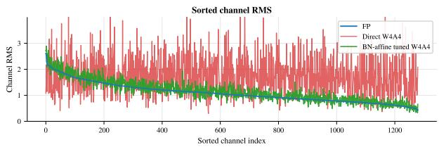
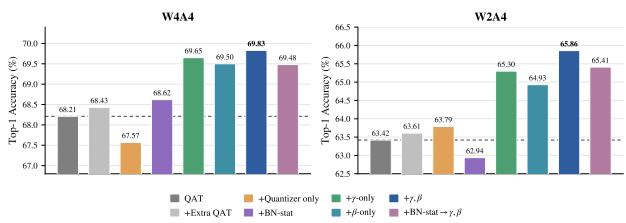
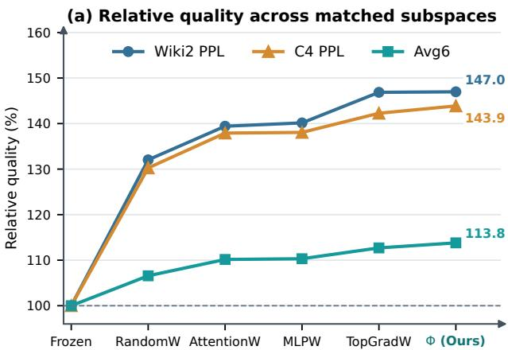
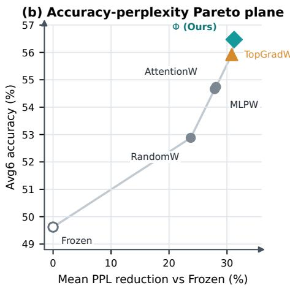
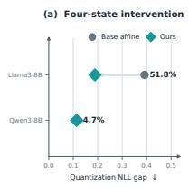
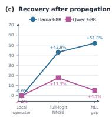
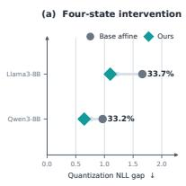
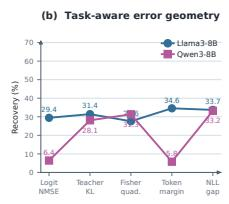
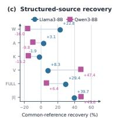

# SandwichQuant: Which Parameters Matter Before and After Quantization?

Peng Xia Junbiao Pang\*

School of Information Science and Technology, Beijing University of Technology Beijing, China

{xiapeng@emails.bjut.edu.cn, junbiao pang@bjut.edu.cn}

August 26, 2026

## Abstract

Quantization correction methods usually optimize weights, quantization parameters, or reconstruction objectives, while the underlying parameter subspaces responsible for effective correction remain unclear. In this work, we study quantization correction from a parameter subspace perspective and reveal that correction capability is highly nonuniform across parameter groups. By decomposing trainable parameters into backbone weights, normalization-affine parameters, and quantization parameters, we show that the low-dimensional normalization-affine subspace provides a highly efficient correction direction under matched budgets. Based on this finding, we propose SandwichQuant, a two-stage normalization-affine correction framework that performs adaptation before and after quantization. The prestage improves quantization robustness, while the post-stage compensates residual errors after the quantized graph is fixed. Extensive experiments on vision models and large language models demonstrate consistent improvements under various low-bit quantization settings, validating the effectiveness of subspace-aligned correction.

## 1 Introduction

Large language models (LLMs) have achieved remarkable performance across language understanding, generation, and reasoning, but their growing parameter counts make inference expensive in both memory and computation. Quantization alleviates this cost by mapping floating-point weights and activations to low-precision representations. Quantization-aware training (QAT) adapts a model under simulated low-precision arithmetic and often provides strong accuracy, but its training cost is increasingly prohibitive at LLM scale [21, 9, 5]. Post-training quantization (PTQ) is therefore the dominant deployment paradigm: it calibrates a pretrained model using limited data, without full retraining [38, 29, 48, 12, 32, 33]. Nevertheless, accuracy still degrades sharply at extreme precision, especially when weights, activations, and KV caches are quantized jointly. Improving this regime is commonly treated as a problem of finding better rounding decisions, quantization grids, transformations, or weight-compensation rules.

We expose a complementary source of robustness that remains largely hidden by this view. Once a quantizer has fixed its weights, rounding decisions, scales, zero points, and rotations, updating only the affine parameters of normalization layers can recover a large fraction of the remaining functional error. The same affine coordinates can also be adapted before PTQ, changing the response distribution presented to calibration. This raises a more basic question than how to design another quantizer: which parameter subspaces matterfor correction, and should they act before PTQ, after PTQ, or on both sides?

To answer this question, we decompose the trainable state as Θ = (W, Φ, Ω), where W denotes backbone weights, Φ normalization-affine parameters, and Ω quantizer parameters. We compare these subspaces under the same target quantized graph and matched optimization budgets, and study them through response analysis, controlled interventions, and task-aware error geometry. The evidence reveals that correction leverage is highly non-uniform: although Φ is orders of magnitude smaller than W, each affine parameter broadcasts a channel-wise transformation across all tokens or spatial locations and can therefore redirect the response trajectory of many downstream layers. This leverage is powerful but not unlimited. Affine adaptation can repair structured response mismatch and error propagation, but it cannot recreate information destroyed by severe clipping or rounding. Thus, functional recovery depends not simply on parameter count or feature reconstruction, but on whether the available subspace is aligned with the recoverable component of quantization error.

This finding motivates SANDWICHQUANT. For a base backend B, we first learn $\Phi _ { \mathrm { p r e } }$ , transfer only that affine state to the original dense checkpoint, and rerun $\mathrm { P T Q } _ { B }$ from scratch. We then freeze the completed low-bit graph and learn an independent $\Phi _ { \mathrm { p o s t } }$ . Thus $\Phi _ { \mathrm { p r e } }  \mathrm { P T Q } _ { B }  \Phi _ { \mathrm { p o s t } }$ separates distribution preconditioning from residual response correction. Both stages modify parameters already present in the network, adding neither an auxiliary inference branch nor a new deployment module. One-sided SANDWICHQUANT-PRE and SANDWICHQUANT-POST variants are retained as controlled components, rather than being reported as the complete method. Existing normalization tuning methods [26] demonstrate that affine parameters can improve quantized representations. However, they mainly treat normalization adaptation as a practical correction heuristic. In contrast, we study normalization affine parameters as one candidate subspace among the entire parameter space, establish matched-budget evidence against equally-sized weight subspaces, and analyze why this subspace has high correction leverage.

Our main contributions are:

• We formulate quantization correction over the coordinate groups W, Φ, and Ω, and show that, under the studied quantization settings, a substantial portion of recoverable quantization error can be addressed within the lowdimensional normalization-affine subspace.

• We explain this concentration through response propagation, same-budget subspace controls, functional interventions, and task-aware error geometry. The resulting picture separates correctable response mismatch from irreversible low-bit information loss.

• We introduce SANDWICHQUANT, a two-sided affine framework that combines quantization preconditioning with frozen-graph post-correction. Across three LLM families, multiple PTQ backends, weight-only W3A16, and joint W2A4KV4, the complete pipeline consistently lowers perplexity and improves mean zero-shot accuracy without introducing an additional inference-time module or operator.

## 2 Related Work

Quantization correction and distribution transformation. Classical PTQ improves a fixed model through equalization, rounding, or local reconstruction [37, 38, 29, 48, 12]. More recent work models how local errors propagate across blocks [2, 55], incorporates Hessian, Fisher, or perturbation sensitivity [18, 50, 49], or introduces auxiliary and low-rank correction paths [13, 22, 52, 27, 57]. A complementary family reshapes quantization difficulty through channel scaling, activation-aware weight protection, rotations, or invertible transforms [51, 32, 33, 3, 17, 44, 45]. GPTAQ and ResComp are particularly relevant because they compensate errors across sequentially quantized layers [31, 28]. These methods ask how to improve a quantizer, transform, or reconstruction objective; we instead ask which existing parameter subspaces provide high-leverage directions before and after PTQ, and compose the two roles in SANDWICHQUANT.

Normalization-based adaptation. Norm Tweaking updates normalization parameters to realign quantized and floatingpoint LLM activations [26], while PTQ4VM uses global affine calibration to correct accumulated distortion associated with Batch Normalization [58]. More broadly, normalization has been connected to smoother optimization and reduced sharpness [43, 34]; training only normalization variables can retain substantial expressive power or support test-time adaptation [11, 47]. These results establish the practical value of normalization-related variables. We instead compare Φ with equally sized weight-coordinate subspaces under shared calibration and optimization budgets, and analyze where affine leverage concentrates and whether feature matching is necessary for functional recovery.

QAT, flatness, and low-dimensional subspaces. QAT adapts a model directly under fake quantization [9, 5]; oscillation-aware and ultra-low-bit variants further stabilize aggressive quantization [39, 40, 53]. Checkpoint trajectories and spectral conditioning also affect PTQ robustness [6, 7]. This connects to sharp minima and perturbationrobust optimization [23, 8, 10, 24, 41, 20]; notably, normalization-restricted SAM retains much of the benefit of fullparameter perturbations [36]. Intrinsic-dimension studies and parameter-efficient adaptation likewise show that useful updates may occupy small subspaces [25, 1, 56, 15, 4, 16]. Our setting differs because quantization noise is structured and anisotropic: we measure subspace leverage under the actual rounding, clipping, and activation-quantization graph rather than generic isotropic parameter perturbations.

  
(a) Response control under W4A4. BN-affine adaptation substantially reduces channel-wise RMS mismatch.  
(b) Residual directions after QAT. Affine-only refinement remains useful from the same LSQ+ checkpoint.  
Figure 1: A low-dimensional affine subspace provides high-leverage correction directions before and after fullspace optimization. The post-QAT result diagnoses useful residual directions under a fixed protocol; it does not imply greater asymptotic capacity than full-space training.

## 3 Method

## 3.1 Parameter-Subspace Formulation

Figure 1 establishes the cross-regime phenomenon that motivates our method. The same structured affine coordinates remain useful both before a PTQ reconstruction stage and after a converged QAT checkpoint. These controls do not by themselves constitute SANDWICHQUANT; they show that $S _ { \Phi }$ contains useful directions on both sides of quantization.

Let f(x; W, Φ) denote a pretrained network and let Ω collect the parameters of the target fake-quantization graph. We decompose the trainable state as

$$
\begin{array} { r } { \Theta = ( \mathbf { W } , \pmb { \Phi } , \pmb { \Omega } ) , } \end{array}\tag{1}
$$

where W contains convolutional and linear weights/biases, Φ contains normalization-affine parameters, and Ω contains quantizer variables. For BN [19], Φ contains channel-wise $( \gamma , \beta )$ ; for RMSNorm [54], only γ is present.

We define the corresponding coordinate subspaces by restricting an update ∆Θ to one parameter group, e.g.,

$$
S _ { \Phi } = \{ \Delta \Theta : \Delta \mathbf { W } = 0 , ~ \Delta \Omega = 0 \} ,\tag{2}
$$

with analogous definitions for $\mathcal { S } _ { W }$ and ${ \cal { S } } _ { \Omega }$ . The purpose of the controlled subspace study is to compare the correction achieved by these structured update directions under the same quantized initialization and optimization budget. Our affine stages specialize to $S _ { \Phi }$ and optimize only existing response-control coordinates. SANDWICHQUANT-PRE acts before the base backend, whereas SANDWICHQUANT-POST keeps the completed feature extractor and quantization grid fixed.

## 3.2 Target-Aligned Affine Stages and SandwichQuant

Let $\boldsymbol { B } _ { \mathcal { D } }$ denote a complete PTQ backend calibrated on $\mathcal { D } ,$ , including rounding, clipping, rotations, reconstruction, and compensation. We write its state transition as

$$
B _ { \mathcal { D } } ( \mathbf { W } , \Phi ) \mapsto \mathcal { G } = ( \widehat { \mathbf { W } } , \Phi , \Omega _ { B } ) ,\tag{3}
$$

and define $\mathcal { A } _ { T } ( \mathcal { G } ; \Phi _ { \mathrm { i n i t } } )$ as $T$ steps of Eq. (8) over Φ only, starting at $\Phi _ { \mathrm { i n i t } }$ while every other tensor and the graph topology remain fixed.

  
Figure 2: Matched-budget parameter-subspace comparison on Qwen3-8B under W2A4KV4. All trainable alternatives use exactly the same number of scalar parameters as the normalization-affine subspace Φ and share identical calibration data, optimization steps, and training objectives. (a) Relative WikiText-2 perplexity, C4 perplexity, and Avg6 accuracy, normalized to the frozen quantized baseline (higher is better). (b) Accuracy–perplexity trade-off, where the horizontal axis reports the mean relative reduction in WikiText-2 and C4 perplexity against the frozen baseline. Despite its extremely low dimensionality, Φ achieves the strongest overall recovery and slightly outperforms the gradient-selected TopGradW subspace.

Complete construction. SANDWICHQUANT applies this affine operator on both sides of the deployable PTQ graph:

$$
\mathcal { G } _ { 1 } = \mathcal { B } _ { D } ( \mathbf { W } _ { 0 } , \Phi _ { 0 } ) ,
$$

$$
\begin{array} { r } { \Phi _ { \mathrm { p r e } } = A _ { T _ { \mathrm { p r e } } } ( \mathcal { G } _ { 1 } ; \Phi _ { 0 } ) , } \end{array}\tag{4a}
$$

$$
\mathcal { G } _ { 2 } = { B _ { D } } ( \mathbf { W } _ { 0 } , \Phi _ { \mathrm { p r e } } ) ,
$$

$$
\Phi _ { \mathrm { p o s t } } = \mathcal { A } _ { T _ { \mathrm { p o s t } } } ( \mathcal { G } _ { 2 } ; \Phi _ { \mathrm { p r e } } ) ,\tag{4b}
$$

$$
\mathcal { G } _ { \mathrm { S Q } } = \mathcal { G } _ { 2 } [ \Phi  \Phi _ { \mathrm { p o s t } } ] .\tag{4c}
$$

The first graph $\mathcal { G } _ { 1 }$ is a disposable target-backend probe. After learning $\Phi _ { \mathrm { p r e } }$ , we reset the original dense checkpoint and transfer only these affine tensors; quantized weights, quantizer variables, and optimizer state from $\mathcal { G } _ { 1 }$ are dis carded. The backend is then rerun from scratch on the same calibration tensor to form $\mathcal { G } _ { 2 }$ . The post stage starts from the affine state carried by $\mathcal { G } _ { 2 }$ with a fresh optimizer and corrects only its residual response. Thus SANDWICHQUANT-PRE changes the responses presented to the backend and can alter its quantized solution, whereas SANDWICHQUANT-POST selects a better affine state on one fixed solution. Their composition is not equivalent to extending either one-sided stage.

After calibration on $\mathcal { D } _ { c } .$ , the quantization parameters are fixed as $\Omega _ { 0 }$ . The target fake-quantized student and the fixed full-precision teacher are

$$
z _ { q } = { \widetilde { f } } _ { q } \left( \pmb { x } ; \mathbf { W } _ { 0 } , \pmb { \Phi } , \Omega _ { 0 } , \mathcal { G } _ { B } \right) ,\tag{5}
$$

$$
z _ { 0 } = f \left( \mathbf { { x } } ; \mathbf { { W } } _ { 0 } , \Phi _ { 0 } \right) .\tag{6}
$$

The affine stage freezes convolutional and linear weights and updates only the normalization-affine parameters:

$$
\nabla _ { \mathbf { W } } \mathcal { L } _ { \mathrm { S Q } } = \mathbf { 0 } , \qquad \nabla _ { \Phi } \mathcal { L } _ { \mathrm { S Q } } \neq \mathbf { 0 } .\tag{7}
$$

Figure 2 rules out the explanation that any equal-size set of trainable scalars is sufficient: on Qwen3-8B W2A4KV4, $S _ { \Phi }$ attains the best joint perplexity–accuracy trade-off and slightly exceeds the gradient-selected weight control. The mechanism probes in Figure 3 then clarify what this subspace changes. SANDWICHQUANT-POST reduces the quantization-induced NLL gap for both model families, while task-aware recovery can be much larger than recovery of an isolated local operator. The structured-source interventions are non-additive, supporting a propagation-control interpretation rather than uniform layerwise reconstruction.

(b) Task-aware error geometry   
70 Llama3-8B   
Qwen3-8B   
60   
51.8   
Recovery (%) 50 42.9 48.1 46.0   
è 38.0   
40   
30   
28.9   
20 24.2   
10 17.3 19.4   
Logit Teache Fisher Token NLL   
NMSE KL quad. margin gap

  
(a) Weight-only W3A16. Mechanism analysis on Llama3-8B and Qwen3-8B under GPTQ. The one-sided SANDWICHQUANT-POST probe contracts the quantization-induced NLL gap and consistently improves task-aware error geometry.  
(b) Joint W2A4KV4. Mechanism analysis under QuaRot+ResComp. Recovery remains substantial under simultaneous weight, activation, and KV-cache quantization, while the structured-source intervention reveals non-uniform and non-additive error correction.

Figure 3: The post-PTQ affine component reshapes the functional geometry of quantization error across two regimes. Each subfigure reports the four-state intervention, task-aware recovery metrics, and structured-source analysis for Llama3-8B and Qwen3-8B. These one-sided probes isolate SANDWICHQUANT-POST, the residual-correction component of SANDWICHQUANT. Across weight-only W3A16 and joint W2A4KV4, it reduces task-relevant degradation more consistently than isolated local operator error, indicating that its principal effect emerges through propagation and interaction rather than uniform local reconstruction.

Algorithm 1 SANDWICHQUANT with base PTQ backend B   
Require: Dense student state $\left( \mathbf { W } _ { 0 } , \Phi _ { 0 } \right)$ ; frozen dense teacher $f _ { T } { \mathrm { : } }$ ; PTQ backend B; shared calibration tensor $\mathcal { D } ;$ affine   
budgets $T _ { \mathrm { p r e } }$ and $T _ { \mathrm { p o s t } }$   
Ensure: Frozen deployable graph $\mathcal { G } _ { \mathrm { S Q } }$   
1: Save an immutable dense snapshot $S _ { 0 } \gets ( \mathbf { W } _ { 0 } , \Phi _ { 0 } )$   
2: Build the disposable graph $\mathcal { G } _ { 1 }$ using the first relation in Eq. (4a)   
3: Freeze weights and quantizer variables in $\mathcal { G } _ { 1 } ;$ enable gradients only for Φ   
4: Obtain $\Phi _ { \mathrm { p r e } }$ from the second relation in Eq. (4a), optimizing Eq. (8)   
5: Discard $\mathcal { G } _ { 1 }$ and its optimizer state; restore $ { \boldsymbol { S } } _ { 0 }$   
6: Transfer only $\Phi _ { \mathrm { p r e } }$ into the restored dense state   
7: Rebuild PTQ from scratch to obtain $\mathcal { G } _ { 2 }$ using the first relation in Eq. (4b)   
8: Freeze the completed graph $\mathcal { G } _ { 2 }$ except for Φ   
9: Obtain $\Phi _ { \mathrm { p o s t } }$ from the second relation in Eq. (4b), optimizing Eq. (8)   
10: Install $\Phi _ { \mathrm { p o s t } } .$ , freeze all parameters, and record the backend, calibration, and artifact identifiers   
11: return the deployable graph $\mathcal { G } _ { \mathrm { S Q } }$ defined in Eq. (4c)

We use a task loss together with prediction-level knowledge distillation [14]. The task loss is classification crossentropy for image classification, pixel-wise cross-entropy for semantic segmentation, and next-token negative loglikelihood for language modeling. Let $p _ { T } ( z ) = \mathrm { s o f t m a x } ( z / T )$ . The SANDWICHQUANT objective is

$$
\mathcal { L } _ { \mathrm { S Q } } = \mathcal { L } _ { \mathrm { t a s k } } ( z _ { q } , y ) + \lambda _ { \mathrm { K D } } T ^ { 2 } \mathrm { K L } \left( p _ { T } ( z _ { 0 } ) \| p _ { T } ( z _ { q } ) \right) .\tag{8}
$$

The task term keeps the fake-quantized model predictive, while the distillation term preserves the decision structure of the fixed teacher. Crucially, the loss is optimized on the same target graph used for evaluation or downstream reconstruction. Changing that graph changes both the residual and the directions through which Φ can correct it; an affine checkpoint is therefore not expected to transfer across mismatched backends.

Algorithm 1 changes construction-time state but adds no inference branch. BN affine factors can be folded into an adjacent convolution, and RMSNorm scales are already native model parameters. The two affine stages and the extra PTQ pass add offline work; optimizer state is maintained only for Φ, although activation computation still contributes to wall-clock time. Exact budgets and artifact-reset semantics are reported in Appendix A.

Extensions. The affine objective can also diagnose residual directions after QAT or be alternated with quantizer-grid updates. These extensions are not part of the headline SANDWICHQUANT pipeline and are detailed in Appendix C.

## 3.3 Why Is the Affine Subspace High-Leverage?

Broadcast response control. For normalized channel c at layer l,

$$
\begin{array} { r } { { \pmb a } _ { l , c } = \gamma _ { l , c } { \pmb h } _ { l , c } + \beta _ { l , c } , \qquad \Delta { \pmb a } _ { l , c } = { \pmb h } _ { l , c } \Delta \gamma _ { l , c } + { \pmb 1 } \Delta \beta _ { l , c } , } \end{array}\tag{9}
$$

with $\beta _ { l , c } = 0$ for RMSNorm. One or two scalars therefore alter an entire channel over all tokens or spatial locations and every downstream consumer. This broadcast structure explains how a very small coordinate set can have a large functional footprint. In a local BN model it can cancel channel-wise scale and shift exactly, while RMSNorm provides multiplicative gain control; the assumptions and residual bound are given in Appendix B.

Correctable residual geometry. Let $e _ { z } = z _ { 0 } - z _ { q } ( \Phi _ { 0 } )$ and let $\mathbf { J } _ { \Phi }$ be the logit Jacobian of the frozen target graph. For a small affine update,

$$
z _ { q } ( \Phi _ { 0 } + \Delta \Phi ) \approx z _ { q } ( \Phi _ { 0 } ) + \mathbf { J } _ { \Phi } \Delta \Phi ,\tag{10}
$$

so the local task-and-distillation objective induces

$$
\operatorname* { m i n } _ { \Delta \Phi } \| e _ { z } - \mathbf { J } _ { \Phi } \Delta \Phi \| _ { \mathbf { H } _ { z } } ^ { 2 } ,\tag{11}
$$

where $\mathbf { H } _ { z } \succeq 0$ is the local output-space curvature. Thus $\begin{array} { r } { \pmb { e } _ { z } = \pmb { e } _ { \parallel } + \pmb { e } _ { \perp } } \end{array}$ separates an affine-expressible component from a locally irrecoverable component. This does not claim that finite-step nonlinear training is an exact orthogonal projection; it predicts only that task-relevant residuals aligned with col $\left( \mathbf { J } _ { \Phi } \right)$ can be corrected efficiently. The matchedbudget and structured-source evidence in Figures 2–3 tests this prediction directly.

## 4 Experiments

Models, quantization, and calibration. We evaluate Llama2-7B [46], Llama3-8B [35], and Qwen3-8B [42]. Weightonly W3A16 uses symmetric group-wise quantization with group size 128 and 128 C4 training sequences of length 2,048 (seed 0). Joint W2A4KV4 uses symmetric clipped W2 weights with group size 128, dynamic per-token asymmetric A4/K4/V4 quantization, and 128 WikiText-2 training sequences of length 2,048 (seed 0). Its QuaRot backends use Hadamard rotations; GPTQ-family updates use damping 0.01 and activation ordering. Within each model–regime pair, all methods share the dense checkpoint, tokenizer, calibration indices, quantization configuration, and evaluation code.

Affine stages and evaluation. Each pre- or post-stage updates only normalization-affine tensors for 200 AdamW steps (batch size 1, sequence length 256, learning rate $5 \times 1 0 ^ { - 4 }$ , zero weight decay, gradient clipping 1.0) with equal weight cross-entropy and full-vocabulary teacher distillation at temperature 1. Between stages, PTQ is rebuilt from the original dense checkpoint on the same calibration tensor; no quantized weight, rounding decision, or quantizer parameter is transferred. We report WikiText-2/C4 perplexity and the unweighted mean zero-shot accuracy over PIQA, ARC-Easy, ARC-Challenge, HellaSwag, WinoGrande, and BoolQ. Vision and QAT experiments serve as crossdomain component controls. Complete LLM and vision protocols are in Appendices A and C, respectively.

## 4.1 Cross-Domain and Checkpoint Controls

Before turning to LLMs, we test whether affine response control is specific to one architecture or training regime. Table 1 shows that a short post-QAT affine stage improves checkpoints produced by several QAT algorithms at both W4A4 and W2A4. The W2A4 OOQ-Freeze exception is also informative: affine adaptation is a structured correction mechanism, not an unconditional post-hoc improvement.

The same phenomenon transfers across tasks and architectures (Table 2 and Table 3). At W4A4, affine-only correction restores MobileNetV2 from 0.33% to 66.11% top-1 and U-Net from 3.27% to 67.21% mIoU. At W3A4, combining affine preconditioning with QDrop is strongest, indicating growing complementarity as quantization becomes more destructive.

Finally, Table 4 isolates the two sides of the LLM pipeline. Post-PTQ correction is the more stable single stage, whereas the full composition is strongest in three of four settings and yields its largest gain under W2A4KV4. We therefore use the complete composition as SANDWICHQUANT in the headline tables below.

<table><tr><td>Model</td><td>Method</td><td>W/A</td><td>Val. Acc. (%)</td><td>Drop (%)</td></tr><tr><td rowspan="15">MobileNetV2</td><td>Full precision</td><td>32/32</td><td>71.30</td><td></td></tr><tr><td>PACT</td><td>4/4</td><td>64.06</td><td>-7.24</td></tr><tr><td>DSQ</td><td>4/4</td><td>67.36</td><td>-3.94</td></tr><tr><td>LSQ</td><td>4/4</td><td>69.01</td><td>-2.29</td></tr><tr><td>LSQ+</td><td>4/4</td><td>68.21</td><td>-3.09</td></tr><tr><td>SANDWICHQUANT-POST + LSQ+</td><td>4/4</td><td>69.83</td><td>-1.47</td></tr><tr><td>OOQ-Dampen</td><td>4/4</td><td>66.21</td><td>-5.09</td></tr><tr><td>SANDWICHQUANT-POST + OOQ-Dampen</td><td>4/4</td><td>68.07</td><td>-3.23</td></tr><tr><td>OOQ-Freeze SANDWICHQUANT-POST + OOQ-Freeze</td><td>4/4</td><td>70.02</td><td>-1.28</td></tr><tr><td>StableQAT</td><td>4/4</td><td>70.68</td><td>-0.62</td></tr><tr><td>SANDWICHQUANT-POST + StableQAT</td><td>4/4</td><td>68.24</td><td>-3.06</td></tr><tr><td>PACT</td><td>4/4</td><td>69.12</td><td>-2.18</td></tr><tr><td>DSQ</td><td>2/4 2/4</td><td>57.90</td><td>-13.40 -8.49</td></tr><tr><td>LSQ</td><td>2/4</td><td>62.81 64.58</td><td>-6.72</td></tr><tr><td>LSQ+</td><td>2/4</td><td>63.42</td><td>-7.88</td></tr><tr><td>SANDWICHQUANT-POST + LSQ+</td><td>2/4</td><td>65.86</td><td>-5.44</td></tr><tr><td>OOQ-Dampen</td><td></td><td></td><td></td></tr><tr><td></td><td>2/4</td><td>66.23</td><td>-5.07</td></tr><tr><td>SANDWICHQUANT-POST + OOQ-Dampen</td><td>2/4</td><td>68.25</td><td>-3.05</td></tr><tr><td>OOQ-Freeze</td><td>2/4</td><td>67.42</td><td>-3.88</td></tr><tr><td>SANDWICHQUANT-POST + OOQ-Freeze</td><td>2/4</td><td>62.81</td><td>-8.49</td></tr><tr><td>StableQAT SANDWICHQUANT-POST + StableQAT</td><td>2/4 2/4</td><td>66.09 68.50</td><td>-5.21 -2.80</td></tr></table>

Table 1: One-sided post-QAT affine adaptation on CIFAR-100 with MobileNetV2. Highlighted rows apply only SANDWICHQUANT-POST after the named QAT checkpoint; they are component controls rather than the complete two-stage SANDWICHQUANT pipeline. Drop denotes the signed accuracy difference from the 71.30% FP32 baseline.

## 4.2 Low-Bit Quantization of Large Language Models

Table 5 shows that the complete two-sided pipeline improves every tested backend and model family. The gains are largest for fragile RTN and remain measurable after compensated GPTAQ/ResComp, indicating that the affine stages address residual response geometry rather than merely replacing the base quantizer. One-sided SANDWICHQUANT POST counterparts and diagnostic baselines are reported separately in Appendix F.

Joint activation and KV-cache quantization amplifies the advantage of using both affine stages. Table 6 shows especially large perplexity and Avg. gains on Llama3-8B and Qwen3-8B, while Table 4 attributes these gains to complementary preconditioning and frozen-graph correction rather than a longer post-tuning run alone.

## 5 Discussion and Limitations

What the evidence supports. For the same small parameter budget, normalization-affine coordinates provide unusually effective correction directions, whose benefit emerges primarily after residual errors propagate. Figures 2 and 3 do not establish exact projection or uniform local reconstruction; they show that task-aware damage can fall even when an isolated local discrepancy changes little or increases.

Scope and cost. The pre-stage changes the model presented to PTQ, whereas the post-stage adapts to the realized frozen graph. Their composition is most useful under aggressive joint quantization (Table 4). It adds no inference operator, but requires two short affine optimizations, a second offline PTQ pass, and a trainable target graph during calibration. Affine states are backend-, bit-width-, and calibration-specific, and cannot restore information destroyed by severe clipping or rounding. Evidence is limited to dense 7B–8B LLMs and one deterministic seed; larger and MoE models, deployment latency, and multi-seed confidence intervals remain future work.

<table><tr><td>Model</td><td>Method</td><td>FP32</td><td>Quant. Acc. ↑</td><td></td></tr><tr><td rowspan="4">MobileNetV2</td><td></td><td></td><td></td><td>W4A4 W3A4</td></tr><tr><td>RTN SQ-POST</td><td></td><td>0.33 66.11</td><td>0.11 51.07</td></tr><tr><td>QDrop</td><td>71.87</td><td>60.71</td><td>51.75</td></tr><tr><td>SQ-PRE + QDrop</td><td></td><td>62.91 53.45</td><td></td></tr></table>

Table 2: ImageNet-1K top-1 accuracy (%) with MobileNetV2. SQ-POST and SQ-PRE abbreviate the corresponding one-sided components of SANDWICHQUANT.
<table><tr><td rowspan="2">Model Method</td><td rowspan="2"></td><td rowspan="2">FP32</td><td colspan="2">Quantized mIoU ↑</td></tr><tr><td>W4A4</td><td>W3A4</td></tr><tr><td rowspan="4">U-Net</td><td>RTN</td><td></td><td>3.27</td><td>1.24</td></tr><tr><td>SQ-POST</td><td>68.52</td><td>67.21</td><td>59.07</td></tr><tr><td>QDrop</td><td></td><td>66.45</td><td>58.21</td></tr><tr><td>SQ-PRE + QDrop</td><td></td><td>66.78</td><td>61.36</td></tr></table>

Table 3: Cityscapes mIoU (%) with U-Net. SQ-POST and SQ-PRE abbreviate the corresponding one-sided components of SANDWICHQUANT.

Table 4: Order ablation of normalization-affine adaptation. $\Phi _ { \mathrm { p r e } }$ preconditions PTQ, whereas $\Phi _ { \mathrm { p o s t } }$ corrects the frozen quantized graph. Wiki2/C4 are perplexities (↓) and $\operatorname { A v g } 6$ is mean zero-shot accuracy (↑). Each affine stage uses the same per-stage budget; SANDWICHQUANT contains two affine stages and rebuilds the PTQ graph from the original dense checkpoint between them.
<table><tr><td rowspan="3">Order</td><td colspan="6">Llama3-8B</td><td colspan="6">Qwen3-8B</td></tr><tr><td colspan="3">W3A16</td><td colspan="3">W2A4KV4</td><td colspan="3">W3A16</td><td colspan="3">W2A4KV4</td></tr><tr><td>Wiki2↓</td><td>C4↓</td><td>Avg6↑</td><td>Wiki2↓</td><td>C4↓</td><td>Avg6↑</td><td>Wiki2↓</td><td>C4↓</td><td>Avg6↑</td><td>Wiki2↓</td><td>C4↓</td><td>Avg6↑</td></tr><tr><td>PTQ</td><td>8.33</td><td>13.10</td><td>68.83</td><td>18.07</td><td>50.56</td><td>46.81</td><td>11.29</td><td>17.09</td><td>71.87</td><td>18.71</td><td>38.27</td><td>49.62</td></tr><tr><td> $\mathrm { P T Q } \to \Phi _ { \mathrm { p o s t } }$ </td><td>7.89</td><td>12.21</td><td>70.08</td><td>12.83</td><td>30.35</td><td>52.49</td><td>10.60</td><td>16.38</td><td>72.17</td><td>12.73</td><td>26.80</td><td>56.47</td></tr><tr><td> $\Phi _ { \mathrm { p r e } }  \mathrm { P T Q }$ </td><td>8.28</td><td>12.87</td><td>68.89</td><td>13.93</td><td>37.96</td><td>48.72</td><td>10.74</td><td>16.42</td><td>72.31</td><td>12.99</td><td>27.99</td><td>55.28</td></tr><tr><td>SANDWICHQUANT</td><td>7.87</td><td>12.13</td><td>70.05</td><td>12.31</td><td>28.86</td><td>53.44</td><td>10.51</td><td>16.15</td><td>72.34</td><td>12.03</td><td>25.37</td><td>58.05</td></tr></table>

## 6 Conclusion

We cast low-bit quantization correction as a parameter-subspace problem and identify normalization-affine coordinates as unusually high-leverage response controls. This motivates SANDWICHQUANT, which independently adapts the same native affine subspace before and after PTQ. Across three LLM families and weight-only and joint weight– activation–KV regimes, the two-stage construction consistently improves perplexity and mean downstream accuracy without adding an inference-time operator. Its limits are equally clear: it corrects structured, reachable response distortion, not information irreversibly lost to clipping or rounding.

## Large Language Model (LLM) Usage

In this paper, LLMs assisted with language polishing and limited manuscript-production support. All scientific decisions, experiments, result verification, and conclusions were performed or approved by the authors, who take ful responsibility for the manuscript.

## References

[1] Armen Aghajanyan, Sonal Gupta, and Luke Zettlemoyer. Intrinsic dimensionality explains the effectiveness of language model fine-tuning. In Proceedings of the 59th Annual Meeting of the Association for Computational Linguistics and the 11th International Joint Conference on Natural Language Processing, pages 7319–7328, 2021.

[2] Yuki Arai and Yuki Ichikawa. Quantization error propagation: Revisiting layer-wise post-training quantization. In Advances in Neural Information Processing Systems, volume 38, 2025.

Table 5: Weight-only W3A16 results (group size 128). Highlighted rows apply the complete SANDWICHQUANT pipeline to the backend named in parentheses. Avg. is the unweighted mean over the six zero-shot tasks. ResComp∗ uses GPTAQ as its base quantizer. All variants use the same 128 C4 sequences (length 2,048; seed 0); full settings are in Appendix A.
<table><tr><td rowspan="2">Model</td><td rowspan="2">Method</td><td colspan="2">Perplexity ↓</td><td colspan="6">Zero-shot Accuracy (%) ↑</td><td rowspan="2">Avg. ↑</td></tr><tr><td>Wiki2</td><td>C4</td><td>PIQA</td><td>ARC-E</td><td>ARC-C</td><td>HS</td><td>WG</td><td>BoolQ</td></tr><tr><td rowspan="11">Llama2-7B</td><td>FP16</td><td>5.47</td><td>7.27</td><td>78.9</td><td>74.6</td><td>46.1</td><td>75.9</td><td>69.2</td><td>77.7</td><td>70.4</td></tr><tr><td>RTN</td><td>8.22</td><td>11.53</td><td>76.3</td><td>66.5</td><td>40.6</td><td>68.7</td><td>65.8</td><td>67.5</td><td>64.2</td></tr><tr><td>SANDWICHQUANT (RTN)</td><td>7.40</td><td>10.29</td><td>77.4</td><td>68.9</td><td>41.9</td><td>71.0</td><td>66.2</td><td>70.9</td><td>66.1</td></tr><tr><td>AWQ</td><td>6.79</td><td>8.93</td><td>77.1</td><td>69.9</td><td>41.8</td><td>71.2</td><td>67.7</td><td>71.5</td><td>66.3</td></tr><tr><td>SANDWICHQUANT (AWQ)</td><td>6.47</td><td>8.55</td><td>77.5</td><td>70.8</td><td>43.1</td><td>72.4</td><td>67.3</td><td>72.9</td><td>67.3</td></tr><tr><td>GPTQ</td><td>6.75</td><td>13.72</td><td>76.8</td><td>66.5</td><td>39.7</td><td>68.3</td><td>67.5</td><td>68.9</td><td>64.6</td></tr><tr><td>SANDWICHQUANT (GPTQ)</td><td>6.28</td><td>8.31</td><td>77.3</td><td>66.3</td><td>41.6</td><td>72.1</td><td>67.8</td><td>69.4</td><td>65.8</td></tr><tr><td>GPTAQ</td><td>6.81</td><td>8.40</td><td>77.8</td><td>69.2</td><td>40.7</td><td>71.9</td><td>67.6</td><td>71.5</td><td>66.5</td></tr><tr><td>SANDWICHQUANT (GPTAQ)</td><td>6.27</td><td>8.16</td><td>78.3</td><td>70.5</td><td>40.8</td><td>72.3</td><td>66.7</td><td>71.3</td><td>66.7</td></tr><tr><td>ResComp*</td><td>6.25</td><td>8.19</td><td>77.4</td><td>69.5</td><td>41.5</td><td>72.3</td><td>67.4</td><td>71.5</td><td>66.6</td></tr><tr><td>SANDWICHQUANT (ResComp*)</td><td>6.18</td><td>8.12</td><td>77.5</td><td>69.6</td><td>42.8</td><td>72.9</td><td>67.1</td><td>73.0</td><td>67.2</td></tr><tr><td rowspan="11">Llama3-8B</td><td>FP16</td><td>6.14</td><td>9.45</td><td>80.9</td><td>77.7</td><td>53.2</td><td>79.2</td><td>72.9</td><td>81.2</td><td>74.2</td></tr><tr><td>RTN</td><td>29.21</td><td>43.1</td><td>68.5</td><td>50.1</td><td>35.4</td><td>53.5</td><td>58.8</td><td>63.7</td><td>55.0</td></tr><tr><td>SANDWICHQUANT (RTN)</td><td>15.1</td><td>22.0</td><td>73.2</td><td>57.5</td><td>35.4</td><td>63.2</td><td>63.3</td><td>67.0</td><td>59.9</td></tr><tr><td>AWQ</td><td>9.53</td><td>14.74</td><td>76.1</td><td>69.2</td><td>42.2</td><td>71.4</td><td>69.0</td><td>78.2</td><td>67.7</td></tr><tr><td>SANDWICHQUANT (AWQ)</td><td>8.97</td><td>14.09</td><td>77.8</td><td>71.0</td><td>44.5</td><td>71.6</td><td>70.1</td><td>76.3</td><td>68.6</td></tr><tr><td>GPTQ</td><td>8.33</td><td>13.11</td><td>77.5</td><td>70.6</td><td>43.7</td><td>71.9</td><td>71.4</td><td>77.9</td><td>68.8</td></tr><tr><td>SANDWICHQUANT (GPTQ)</td><td>7.87</td><td>12.13</td><td>78.1</td><td>72.3</td><td>44.2</td><td>74.2</td><td>72.3</td><td>79.2</td><td>70.1</td></tr><tr><td>GPTAQ</td><td>8.13</td><td>12.77</td><td>77.3</td><td>69.3</td><td>43.6</td><td>61.9</td><td>72.0</td><td>77.7</td><td>67.0</td></tr><tr><td>SANDWICHQUANT (GPTAQ)</td><td>7.85</td><td>12.28</td><td>77.3</td><td>69.7</td><td>44.6</td><td>67.8</td><td>72.5</td><td>78.1</td><td>68.3</td></tr><tr><td>ResComp*</td><td>7.77</td><td>12.25</td><td>77.7</td><td>73.8</td><td>45.7</td><td>74.6</td><td>72.3</td><td>79.1</td><td>70.5</td></tr><tr><td>SANDWICHQUANT (ResComp*) FP16</td><td>7.62</td><td>12.08</td><td>79.2</td><td>75.2</td><td>48.1</td><td>75.3</td><td>72.4</td><td>77.2</td><td>71.2</td></tr><tr><td></td><td>9.72</td><td>15.40</td><td>77.8</td><td>80.9</td><td>56.7</td><td>74.9</td><td>67.8</td><td>86.6</td><td>74.1</td></tr><tr><td rowspan="11">Qwen3-8B</td><td>RTN</td><td>23.54</td><td>33.86</td><td>68.2</td><td>58.7</td><td>35.3</td><td>54.6</td><td>54.9</td><td>63.9</td><td>55.9</td></tr><tr><td>SANDWICHQUANT (RTN)</td><td>16.56</td><td>23.64</td><td>73.9</td><td>68.8</td><td>43.5</td><td>63.7</td><td>63.2</td><td>76.6</td><td>65.0</td></tr><tr><td>AWQ</td><td>12.11</td><td>18.49</td><td>74.3</td><td>71.3</td><td>45.8</td><td>67.8</td><td>63.3</td><td>82.5</td><td>67.5</td></tr><tr><td>SANDWICHQUANT (AWQ)</td><td>11.50</td><td>17.44</td><td>74.8</td><td>71.6</td><td>46.9</td><td>68.5</td><td>64.8</td><td>82.9</td><td>68.3</td></tr><tr><td>GPTQ</td><td>11.29</td><td>17.09</td><td>76.9</td><td>76.8</td><td>50.9</td><td>71.6</td><td>69.2</td><td>85.8</td><td>71.9</td></tr><tr><td>SANDWICHQUANT (GPTQ)</td><td>10.51</td><td>16.15</td><td>76.8</td><td>76.8</td><td>52.1</td><td>72.6</td><td>69.4</td><td>85.8</td><td>72.3</td></tr><tr><td>GPTAQ</td><td>11.37</td><td>17.13</td><td>75.7</td><td>72.2</td><td>48.7</td><td>70.9</td><td>67.9</td><td>85.7</td><td>70.2</td></tr><tr><td>SANDWICHQUANT (GPTAQ)</td><td>10.68</td><td>16.42</td><td>76.3</td><td>72.1</td><td>48.9</td><td>71.5</td><td>68.5</td><td>85.0</td><td>70.4</td></tr><tr><td>ResComp</td><td>11.66</td><td>17.45</td><td>76.6</td><td>77.6</td><td>53.2</td><td>70.7</td><td>67.3</td><td>84.7</td><td>71.7</td></tr><tr><td>SANDWICHQUANT (ResComp*)</td><td>10.51</td><td>16.15</td><td>77.5</td><td>78.3</td><td>54.6</td><td>71.3</td><td>67.9</td><td>84.7</td><td>72.4</td></tr><tr><td></td><td></td><td></td><td></td><td></td><td></td><td></td><td></td><td></td><td></td></tr></table>

[3] Saleh Ashkboos, Amirkeivan Mohtashami, Maximilian L. Croci, Bo Li, Pashmina Cameron, Martin Jaggi, Dan Alistarh, Torsten Hoefler, and James Hensman. QuaRot: Outlier-free 4-bit inference in rotated LLMs. In Advances in Neural Information Processing Systems, 2024.

[4] Elad Ben Zaken, Yoav Goldberg, and Shauli Ravfogel. BitFit: Simple parameter-efficient fine-tuning for transformer-based masked language models. In Proceedings of the 60th Annual Meeting of the Association for Computational Linguistics, 2022.

[5] Yash Bhalgat, Jinwon Lee, Markus Nagel, Tijmen Blankevoort, and Nojun Kwak. LSQ+: Improving low-bit quantization through learnable offsets and better initialization. In Proceedings of the IEEE/CVF Conference on Computer Vision and Pattern Recognition Workshops, pages 696–697, 2020.

[6] Albert Catalan-Tatjer, Niccolo Ajroldi, and Jonas Geiping. Training dynamics impact post-training quantization\` robustness. In International Conference on Learning Representations, 2026.

[7] Arnav Chavan, Naman Lele, Uday Bamba, Saurabh Dayal, Aarti Raghunathan, and Deepak Gupta. S2D: Selective spectral decay for quantization-friendly conditioning of neural activations. In Proceedings ofthe IEEE/CVF Conference on Computer Vision and Pattern Recognition, 2026.

Table 6: Joint W2A4KV4 results (group size 128). Highlighted rows apply the complete SANDWICHQUANT pipeline to the indicated QuaRot backend. Avg. is the unweighted mean over six zero-shot tasks. ResComp∗ uses GPTAQ as its base quantizer. All variants use the same 128 WikiText-2 sequences (length 2,048; seed 0); full settings are in Appendix A.
<table><tr><td rowspan="2">Model</td><td rowspan="2">Method</td><td colspan="2">Perplexity ↓</td><td colspan="5">Zero-shot Accuracy (%) ↑</td><td rowspan="2">Avg. ↑</td></tr><tr><td>Wiki2</td><td>C4</td><td>PIQA ARC-E</td><td>ARC-C</td><td></td><td>HS WG</td><td>BoolQ</td></tr><tr><td rowspan="5">Llama2-7B</td><td>FP16</td><td>5.47</td><td>7.27</td><td>78.9</td><td>74.6</td><td>46.1</td><td>75.9 69.2</td><td>77.7</td><td>70.4</td></tr><tr><td>QuaRot + GPTAQ</td><td>11.7</td><td>24.8</td><td>62.3</td><td>45.6</td><td>25.6 41.2</td><td>54.0</td><td>62.4</td><td>48.5</td></tr><tr><td>SANDWICHQUANT (QuaRot+GPTAQ)</td><td>8.2</td><td>14.0</td><td>66.8</td><td>50.0</td><td>31.6</td><td>54.9 58.2</td><td>64.5</td><td>54.3</td></tr><tr><td>QuaRot + ResComp*</td><td>11.5</td><td>23.6</td><td>63.6</td><td>46.4</td><td>24.9</td><td>40.8 56.0</td><td>61.9</td><td>48.9</td></tr><tr><td>SANDWICHQUANT (QuaRot+ResComp*)</td><td>8.1</td><td>14.2</td><td>68.1</td><td>52.2</td><td>30.7</td><td>54.8 59.1</td><td>65.8</td><td>55.1</td></tr><tr><td rowspan="5">Llama3-8B</td><td>FP16</td><td>6.14</td><td>9.45</td><td>80.9</td><td>77.7</td><td>53.2</td><td>79.2 72.9</td><td>81.2</td><td>74.2</td></tr><tr><td>QuaRot + GPTAQ</td><td>23.0</td><td>62.8</td><td>55.8</td><td>37.2</td><td>22.3</td><td>36.5 50.4</td><td>59.3</td><td>43.6</td></tr><tr><td>SANDWICHQUANT (QuaRot+GPTAQ)</td><td>12.2</td><td>28.7</td><td>63.9</td><td>49.8</td><td>29.3</td><td>51.0 57.2</td><td>64.9</td><td>52.7</td></tr><tr><td>QuaRot + ResComp*</td><td>22.1</td><td>61.5</td><td>56.0</td><td>38.5</td><td>24.6</td><td>35.8 53.5</td><td>60.9</td><td>44.9</td></tr><tr><td>SANDWICHQUANT (QuaRot+ResComp*)</td><td>12.2</td><td>29.1</td><td>65.6</td><td>49.7</td><td>29.8</td><td>50.7 58.5</td><td>66.3</td><td>53.4</td></tr><tr><td rowspan="5">Qwen3-8B</td><td>FP16</td><td>9.72</td><td>15.40</td><td>77.8</td><td>80.9</td><td>56.7</td><td>74.9 67.8</td><td>86.6</td><td>74.1</td></tr><tr><td>QuaRot + GPTAQ</td><td>28.2</td><td>64.1</td><td>57.9</td><td>39.5</td><td>23.4</td><td>34.7 51.7</td><td>61.6</td><td>44.8</td></tr><tr><td>SANDWICHQUANT (QuaRot+GPTAQ)</td><td>14.6</td><td>32.8</td><td>66.8</td><td>52.4</td><td>32.5</td><td>47.9 59.1</td><td>66.9</td><td>54.3</td></tr><tr><td>QuaRot + ResComp</td><td>18.7</td><td>38.3</td><td>61.6</td><td>44.4</td><td>28.6</td><td>43.7 54.8</td><td>64.4</td><td>49.6</td></tr><tr><td>SANDWICHQUANT (QuaRot+ResComp*)</td><td>12.0</td><td>25.4</td><td>69.1</td><td>56.8</td><td>37.1 53.6</td><td>62.1</td><td>70.1</td><td>58.1</td></tr></table>

[8] Laurent Dinh, Razvan Pascanu, Samy Bengio, and Yoshua Bengio. Sharp minima can generalize for deep nets. In Proceedings ofthe 34th International Conference on Machine Learning, pages 1019–1028, 2017.

[9] Steven K. Esser, Jeffrey L. McKinstry, Deepika Bablani, Rathinakumar Appuswamy, and Dharmendra S. Modha. Learned step size quantization. In International Conference on Learning Representations, 2020.

[10] Pierre Foret, Ariel Kleiner, Hossein Mobahi, and Behnam Neyshabur. Sharpness-aware minimization for efficiently improving generalization. In International Conference on Learning Representations, 2021.

[11] Jonathan Frankle, David J. Schwab, and Ari S. Morcos. Training batchnorm and only batchnorm: On the expressive power of random features in CNNs. In International Conference on Learning Representations, 2021.

[12] Elias Frantar, Saleh Ashkboos, Torsten Hoefler, and Dan Alistarh. GPTQ: Accurate post-training quantization for generative pre-trained transformers. In International Conference on Learning Representations, 2023.

[13] Ming Fu, Haotian Yu, Jing Shao, Jie Zhou, Kaifeng Zhu, and Jianxin Wu. Quantization without tears. In Proceedings of the IEEE/CVF Conference on Computer Vision and Pattern Recognition, pages 4462–4472, 2025.

[14] Geoffrey Hinton, Oriol Vinyals, and Jeff Dean. Distilling the knowledge in a neural network. arXiv preprint arXiv:1503.02531, 2015.

[15] Neil Houlsby, Andrei Giurgiu, Stanislaw Jastrzebski, Bruna Morrone, Quentin de Laroussilhe, Andrea Gesmundo, Mona Attariyan, and Sylvain Gelly. Parameter-efficient transfer learning for NLP. In Proceedings ofthe 36th International Conference on Machine Learning, pages 2790–2799, 2019.

[16] Edward J. Hu, Yelong Shen, Phillip Wallis, Zeyuan Allen-Zhu, Yuanzhi Li, Shean Wang, Lu Wang, and Weizhu Chen. LoRA: Low-rank adaptation of large language models. In International Conference on Learning Representations, 2022.

[17] Xing Hu, Yiqing Cheng, Dawei Yang, Zhe Xu, Zhihang Yuan, Jun Yu, Chang Xu, Zhe Jiang, and Shuchang Zhou. OSTQuant: Refining large language model quantization with orthogonal and scaling transformations for better distribution fitting. In International Conference on Learning Representations, 2025.

[18] Hyunho Hwang, Xuan Truong Nguyen, and Hyun-Jin Lee. LS-ViT: Least-squares hessian based block recon struction for low-bit post-training quantization of vision transformers. In Proceedings of the IEEE/CVF Confer ence on Computer Vision and Pattern Recognition, pages 33588–33597, 2026.

[19] Sergey Ioffe and Christian Szegedy. Batch normalization: Accelerating deep network training by reducing internal covariate shift. In Proceedings of the 32nd International Conference on Machine Learning, pages 448– 456, 2015.

[20] Pavel Izmailov, Dmitrii Podoprikhin, Timur Garipov, Dmitry Vetrov, and Andrew Gordon Wilson. Averaging weights leads to wider optima and better generalization. In Proceedings of the Thirty-Fourth Conference on Uncertainty in Artificial Intelligence, 2018.

[21] Benoit Jacob, Skirmantas Kligys, Bo Chen, Menglong Zhu, Matthew Tang, Andrew Howard, Hartwig Adam, and Dmitry Kalenichenko. Quantization and training of neural networks for efficient integer-arithmetic-only inference. In Proceedings of the IEEE Conference on Computer Vision and Pattern Recognition, pages 2704– 2713, 2018.

[22] Ruikang Jiang, Yuhang Zhang, Longguang Wang, Peixian Yu, and Yulan Guo. AIQViT: Architecture-informed post-training quantization for vision transformers. In Proceedings of the AAAI Conference on Artificial Intelligence, volume 39, pages 17635–17643, 2025.

[23] Nitish Shirish Keskar, Dheevatsa Mudigere, Jorge Nocedal, Mikhail Smelyanskiy, and Ping Tak Peter Tang. On large-batch training for deep learning: Generalization gap and sharp minima. In International Conference on Learning Representations, 2017.

[24] Jungmin Kwon, Jeongseop Kim, Hyunseo Park, and In Kwon Choi. ASAM: Adaptive sharpness-aware minimization for scale-invariant learning of deep neural networks. In Proceedings of the 38th International Conference on Machine Learning, pages 5905–5914, 2021.

[25] Chunyuan Li, Heerad Farkhoor, Rosanne Liu, and Jason Yosinski. Measuring the intrinsic dimension of objective landscapes. In International Conference on Learning Representations, 2018.

[26] Liang Li, Qingyuan Li, Bo Zhang, and Xiangxiang Chu. Norm tweaking: High-performance low-bit quantization of large language models. In Proceedings of the AAAI Conference on Artificial Intelligence, volume 38, pages 18536–18544, 2024.

[27] Muyang Li, Yujun Lin, Zhekai Zhang, Tianle Cai, Xiuyu Li, Junxian Guo, Enze Xie, Chenlin Meng, Jun-Yan Zhu, and Song Han. SVDQuant: Absorbing outliers by low-rank components for 4-bit diffusion models. In International Conference on Learning Representations, 2025.

[28] Shuaiting Li, Juncan Deng, Kedong Xu, Rongtao Deng, Hong Gu, Minghan Jiang, Haibin Shen, and Kejie Huang. Rethinking residual errors in compensation-based LLM quantization. In International Conference on Learning Representations, 2026.

[29] Yuhang Li, Ruihao Gong, Xu Tan, Yang Yang, Peng Hu, Qi Zhang, Fengwei Yu, Wei Wang, and Shi Gu. BRECQ: Pushing the limit of post-training quantization by block reconstruction. In International Conference on Learning Representations, 2021.

[30] Yuhang Li, Mingzhu Shen, Jian Ma, Yan Ren, Mingxin Zhao, Qi Zhang, Ruihao Gong, Fengwei Yu, and Junjie Yan. MQBench: Towards reproducible and deployable model quantization benchmark. In Proceedings of the Neural Information Processing Systems Track on Datasets and Benchmarks, 2021.

[31] Yuhang Li, Ruokai Yin, Donghyun Lee, Shiting Xiao, and Priyadarshini Panda. GPTAQ: Efficient finetuningfree quantization for asymmetric calibration. In Proceedings of the 42nd International Conference on Machine Learning, 2025.

[32] Ji Lin, Jiaming Tang, Haotian Tang, Shang Yang, Wei-Ming Chen, Wei-Chen Wang, Guangxuan Xiao, Xingyu Dang, Chuang Gan, and Song Han. AWQ: Activation-aware weight quantization for on-device LLM compression and acceleration. In Proceedings ofMachine Learning and Systems, volume 6, pages 87–100, 2024.

[33] Zechun Liu, Changsheng Zhao, Igor Fedorov, Bilge Soran, Dhruv Choudhary, Raghuraman Krishnamoorthi, Vikas Chandra, Yuandong Tian, and Tijmen Blankevoort. SpinQuant: LLM quantization with learned rotations. In International Conference on Learning Representations, 2025.

[34] Kaifeng Lyu, Zhiyuan Li, and Sanjeev Arora. Understanding the generalization benefit of normalization layers: Sharpness reduction. In Advances in Neural Information Processing Systems, volume 35, pages 34689–34708, 2022.

[35] Meta Llama Team. The Llama 3 herd of models. arXiv preprint arXiv:2407.21783, 2024.

[36] Maximilian Muller, Tiffany Vlaar, David Rolnick, and Matthias Hein. Normalization layers are all that sharpness-¨ aware minimization needs. In Advances in Neural Information Processing Systems, volume 36, 2023.

[37] Markus Nagel, Mart van Baalen, Tijmen Blankevoort, and Max Welling. Data-free quantization through weight equalization and bias correction. In Proceedings ofthe IEEE/CVF International Conference on Computer Vision, pages 1325–1334, 2019.

[38] Markus Nagel, Rana Ali Amjad, Mart van Baalen, Christos Louizos, and Tijmen Blankevoort. Up or down? adaptive rounding for post-training quantization. In Proceedings of the 37th International Conference on Machine Learning, pages 7197–7206, 2020.

[39] Markus Nagel, Marios Fournarakis, Yelysei Bondarenko, and Tijmen Blankevoort. Overcoming oscillations in quantization-aware training. In Proceedings of the 39th International Conference on Machine Learning, pages 16318–16330, 2022.

[40] Yasuhiko Okoshi, Hiroki Otsuka, Daichi Fujiki, and Masato Motomura. Towards quantization-aware training for ultra-low-bit reasoning LLMs. In International Conference on Learning Representations, 2026.

[41] Henning Petzka, Michael Kamp, Linara Adilova, Cristian Sminchisescu, and Mario Boley. Relative flatness and generalization. In Advances in Neural Information Processing Systems, volume 34, pages 18420–18432, 2021.

[42] Qwen Team. Qwen3 technical report. arXiv preprint arXiv:2505.09388, 2025.

[43] Shibani Santurkar, Dimitris Tsipras, Andrew Ilyas, and Aleksander Madry. How does batch normalization help optimization? In Advances in Neural Information Processing Systems, volume 31, 2018.

[44] Yuxin Shao, Yuxuan Chen, Peng Wang, Jiahui Yu, Ji Lin, Yuhui Yao, Zhe Wei, and Jian Cheng. DartQuant: Efficient rotational distribution calibration for LLM quantization. In Advances in Neural Information Processing Systems, volume 38, 2025.

[45] Yujun Sun, Ruikang Liu, Haoli Bai, Hengrui Bao, Kaixin Zhao, Yuhang Li, Jianfei Hu, Xianzhi Yu, Lu Hou, Chun Yuan, Xing Jiang, Wei Liu, and Jian Yao. FlatQuant: Flatness matters for LLM quantization. In Proceedings ofthe 42nd International Conference on Machine Learning, pages 57587–57613, 2025.

[46] Hugo Touvron, Louis Martin, Kevin Stone, et al. Llama 2: Open foundation and fine-tuned chat models. arXiv preprint arXiv:2307.09288, 2023.

[47] Dequan Wang, Evan Shelhamer, Shaoteng Liu, Bruno Olshausen, and Trevor Darrell. Tent: Fully test-time adaptation by entropy minimization. In International Conference on Learning Representations, 2021.

[48] Xiuying Wei, Ruihao Gong, Yuhang Li, Xianglong Liu, and Fengwei Yu. QDrop: Randomly dropping quantiza tion for extremely low-bit post-training quantization. In International Conference on Learning Representations, 2022.

[49] Zhihang Wu, Shuchang Wang, Junwen Zhang, Jun Chen, and Yunhe Wang. FIMA-Q: Post-training quantization for vision transformers by fisher information matrix approximation. In Proceedings ofthe IEEE/CVF Conference on Computer Vision and Pattern Recognition, pages 14891–14900, 2025.

[50] Zhihang Wu, Junwen Zhang, Jun Chen, Jian Guo, Di Huang, and Yunhe Wang. APHQ-ViT: Post-training quantization with average perturbation hessian based reconstruction for vision transformers. In Proceedings of the IEEE/CVF Conference on Computer Vision and Pattern Recognition, pages 9686–9695, 2025.

[51] Guangxuan Xiao, Ji Lin, Mickael Seznec, Hao Wu, Julien Demouth, and Song Han. SmoothQuant: Accurate and efficient post-training quantization for large language models. In Proceedings of the 40th International Conference on Machine Learning, pages 38087–38099, 2023.

[52] Jinhyuk Yang, Jaewon Choi, Maximilian A. Zinke, and Suk-Ju Kang. QSCA: Quantization with selfcompensating auxiliary for monocular depth estimation. In Advances in Neural Information Processing Systems, volume 38, 2025.

[53] Chenglin Ye, Gongfan Chu, Yuxian Liu, Yifan Zhang, Lukasz Lew, Lu Zhang, Mark Sandler, and Andrew G. Howard. Robust training of neural networks at arbitrary precision and sparsity. In International Conference on Learning Representations, 2026.

[54] Biao Zhang and Rico Sennrich. Root mean square layer normalization. In Advances in Neural Information Processing Systems, volume 32, 2019.

[55] Shiqing Zhang, Hongyu Zhang, Ian Colbert, and Rayan Saab. Qronos: Correcting the past by shaping the future in post-training quantization. In International Conference on Learning Representations, 2026.

[56] Zheng Zhang, Bo Liu, and Jincheng Shao. Fine-tuning happens in tiny subspaces: Exploring intrinsic task specific subspaces of pre-trained language models. In Proceedings ofthe 61st Annual Meeting ofthe Association for Computational Linguistics, pages 1701–1713, 2023.

[57] Xiaolong Zheng, Haotong Qin, Yulun Li, Han Chu, Jing Wang, Jian Guo, Michele Magno, and Xianglong Liu. First-order error matters: Accurate compensation for quantized large language models. In Proceedings of the AAAI Conference on Artificial Intelligence, volume 40, pages 28883–28891, 2026.

[58] Tianrui Zhu, Houyuan Chen, Ruihao Gong, Michele Magno, Haotong Qin, and Kai Zhang. Post-training quantization for video matting. In International Conference on Learning Representations, 2026.

## A Reproducibility and Complete Experimental Protocol

Two-stage construction. For every backend B, we first run PTQ on a fixed calibration tensor and optimize only normalization-affine parameters on the completed quantized graph. The resulting affine state is used as $\Phi _ { \mathrm { p r e } } { : }$ only these affine tensors are transferred to the original dense checkpoint; all weights, quantizer variables, and optimizer state from the first run are discarded. We then rerun $\mathrm { P T Q } _ { B }$ from scratch on the identical calibration tensor and finally optimize a fresh $\Phi _ { \mathrm { p o s t } }$ while freezing the second quantized graph. Thus the complete method is $\Phi _ { \mathrm { p r e } }  \mathrm { P T Q } _ { B } $ $\Phi _ { \mathrm { p o s t } }$ . The one-sided appendix results instead apply only $\mathrm { P T Q } _ { B } \to \Phi _ { \mathrm { p o s t } }$ . Budgets are matched per affine stage; the complete method contains two 200-step affine stages and a second PTQ pass.

Affine optimization. Unless stated otherwise, each stage uses 200 AdamW steps, batch size 1, sequence length 256, learning rate $5 \times 1 0 ^ { - 4 }$ , zero weight decay, no learning-rate schedule, and gradient-norm clipping at 1.0. Training minimizes equal-weight cross entropy and full-vocabulary teacher distillation at temperature 1. The teacher is the original dense model, evaluated with use cache=False; only normalization-affine tensors receive gradients. Calibration subblocks are sampled deterministically (seed 100003), and checkpoints are written every ten steps. For AWQ, relative log-scales use learning rate $1 0 ^ { - 4 }$ and are clamped to [−0.1, 0.1]. No channel-scale regularizer is used in the LLM experiments.

Evaluation. WikiText-2 perplexity uses the complete test split in non-overlapping 2,048-token blocks. C4 perplexity uses the first 1,100 validation documents and the first 256 full 2,048-token blocks. Zero-shot evaluation uses lm-evalharness 0.4.9.1, maximum length 2,048, and batch size 4. We report normalized accuracy for PIQA, ARC-Easy, ARC Challenge, and HellaSwag, and accuracy for WinoGrande and BoolQ; Avg. is their unweighted mean. The software stack uses Transformers 4.54.1, Datasets 3.6.0, and Accelerate 1.9.0. Quantization and evaluation were executed on MetaX C500 and C600-A accelerators. Run manifests record model, calibration, rotation-artifact, software, and hardware identifiers.

Table 7: Representative offline construction cost of SANDWICHQUANT. Wall-clock time is decomposed into the disposable PTQ probe, pre-PTQ affine adaptation, the deployable PTQ rebuild, and post-PTQ affine adaptation. Times are reconstructed from representative single-accelerator C500/C600-A runs and include graph construction and checkpoint I/O but exclude downstream evaluation. The two affine stages update only |Φ| native normalization parameters. The final graph introduces no additional parameters or inference operators relative to its base PTQ graph.
<table><tr><td>Model</td><td>Quantization setting</td><td>Device</td><td>|Φ|</td><td colspan="4">Wall-clock time (min)</td><td></td><td>Total Peak mem. (GiB)</td></tr><tr><td></td><td></td><td></td><td></td><td>Probe PTQ</td><td> $\Phi _ { \mathrm { p r e } }$ </td><td>Deploy PTQ</td><td> $\Phi _ { \mathrm { p o s t } }$ </td><td>(min)</td><td></td></tr><tr><td>Llama3-8B</td><td>GPTQ W3A16, g128</td><td>C600-A</td><td>266,240</td><td>67.2</td><td>1.3</td><td>67.2</td><td>1.3</td><td>137.0</td><td>16.1</td></tr><tr><td>Llama3-8B</td><td>QuaRot+ResComp W2A4KV4, g128</td><td>C600-A</td><td>266,240</td><td>89.0</td><td>1.4</td><td>89.0</td><td>1.4</td><td>180.8</td><td>25.0</td></tr><tr><td>Qwen3-8B</td><td>GPTQ W3A16, g128</td><td>C500</td><td>299,008</td><td>55.0</td><td>1.6</td><td>55.0</td><td>1.6</td><td>113.2</td><td>17.0</td></tr><tr><td>Qwen3-8B</td><td>QuaRot+ResComp  $\mathrm { W } 2 \mathrm { A } 4 \mathrm { K V } 4 , \mathrm { g } 1 2 8$ </td><td>C500</td><td>299,008</td><td>85.0</td><td>1.6</td><td>85.0</td><td>1.6</td><td>173.2</td><td>25.0</td></tr></table>

Baseline provenance. Unless explicitly attributed to prior work, reported baselines and paired affine variants are rerun in our evaluation stack from the same dense checkpoint and tokenizer. Within a model–regime pair, they share the dataset snapshots, calibration indices, preprocessing, and metric implementation. Tables that reproduce values from a source paper identify that provenance in their captions; run manifests record the code revision and generated artifact used for every unmarked result.

Construction cost. Table 7 separates the two PTQ executions from the two short affine stages. Evaluation is excluded because it is identical across the compared construction variants and often dominates end-to-end job time.

Order ablation. The four rows in Table 4 reuse the same dense checkpoint, backend configuration, calibration tensor, and seed. “PTQ” performs no affine update; $\mathrm { P T Q } \to \Phi _ { \mathrm { p o s t } }$ performs one 200-step update after freezing PTQ; $\Phi _ { \mathrm { p r e } }  \mathrm { P T Q }$ transfers the first affine solution to the dense model and reruns PTQ without the second affine update; and SANDWICHQUANT applies both independently initialized 200-step stages. Consequently, compute is matched per stage rather than across rows with different numbers of stages

Matched-budget parameter subspaces. The Qwen3-8B W2A4KV4 control fixes the completed QuaRot–ResComp graph and gives each trainable branch exactly |Φ| = 299,008 scalar coordinates. RandomW uses a fixed uniformly sampled weight mask; TopGradW retains the coordinates with the largest calibration-gradient magnitude; AttentionW and MLPW restrict the same budget to attention and feed-forward projections, respectively. Masks are selected once and held fixed. All non-frozen branches use the same calibration blocks, CE+KD objective, 200 updates, batch size, sequence length, optimizer, and per-stage learning-rate selection protocol as the affine branch. The frozen branch performs no update. This comparison tests coordinate structure, not unconstrained capacity or separately tuned asymptotic optima.

Mechanism probes. All four-state and structured-source measurements use 16 sequences of length 512 with token stride 16. The four-state intervention evaluates the dense and quantized graphs at $\Phi _ { 0 }$ and Φ against a shared dense reference. Task-aware geometry reports common-reference logit NMSE, teacher KL, a teacher-Fisher quadratic form, true-token margin NMSE, and the full NLL gap. Structured-source interventions enable weight, activation, key-cache, and value-cache perturbations separately and jointly while holding inputs, references, and affine states fixed. Reported recovery is $1 - E ( \Phi _ { * } ) / E ( \Phi _ { 0 } )$ ; negative values therefore denote an increase in that particular local discrepancy, not a failure of end-to-end recovery.

SpinQuant extension. SpinQuant experiments use the released model-specific W16A4KV4 rotation checkpoint as the fixed rotation initialization, followed by the same W2 weight quantization, 4-bit activation/KV graph, and two affine stages described above. The exact rotation filename and checksum are stored with each run manifest; no rotation parameter is updated by either affine stage.

## B Supplementary Mechanism Derivations and Limits

## B.1 Exact BN Scale–Shift Cancellation

Assume fixed BN statistics $( \mu _ { c } , \sigma _ { c } )$ and a local pre-BN perturbation

$$
\widehat { a } _ { c } = \alpha _ { c } a _ { c } + \delta _ { c } + e _ { c } , \qquad \alpha _ { c } > 0 ,\tag{12}
$$

where $e _ { c }$ contains sample-dependent rounding, clipping, and saturation residuals. Let $\rho _ { c } = \sqrt { \sigma _ { c } ^ { 2 } + \epsilon }$ and let $( \gamma _ { c } ^ { 0 } , \beta _ { c } ^ { 0 } )$ be the original BN affine parameters. Choosing

$$
\gamma _ { c } ^ { * } = \gamma _ { c } ^ { 0 } / \alpha _ { c } ,\tag{13}
$$

$$
\beta _ { c } ^ { * } = \beta _ { c } ^ { 0 } - \frac { \gamma _ { c } ^ { 0 } } { \alpha _ { c } \rho _ { c } } \big [ ( \alpha _ { c } - 1 ) \mu _ { c } + \delta _ { c } \big ]\tag{14}
$$

gives

$$
\widehat { y } _ { c } ^ { * } = y _ { c } ^ { 0 } + \frac { \gamma _ { c } ^ { 0 } } { \alpha _ { c } \rho _ { c } } e _ { c } , \qquad \| \widehat { y } _ { c } ^ { * } - y _ { c } ^ { 0 } \| \leq \frac { | \gamma _ { c } ^ { 0 } | } { \alpha _ { c } \rho _ { c } } \| e _ { c } \| .\tag{15}
$$

Hence the structured scale–shift component is exactly cancellable under these assumptions, but the unstructured residual remains. This identity is specific to BN with fixed statistics. RMSNorm lacks a bias term and therefore supplies multiplicative response control, not exact cancellation of a general additive offset.

## B.2 Weighted Projection and Its Limits

For the local problem in Eq. (11), a minimum-norm solution is

$$
\Delta \Phi ^ { * } = ( \mathbf { J } _ { \Phi } ^ { \top } \mathbf { H } _ { z } \mathbf { J } _ { \Phi } ) ^ { \dagger } \mathbf { J } _ { \Phi } ^ { \top } \mathbf { H } _ { z } e _ { z } .\tag{16}
$$

Writing $\boldsymbol { e } _ { \parallel } = \mathbf { J } _ { \Phi } \Delta \Phi ^ { * }$ and $\boldsymbol { e } _ { \perp } = \boldsymbol { e } _ { z } - \boldsymbol { e } _ { \parallel }$ separates the locally expressible component from the residual orthogonal in the $\mathbf { H } _ { z }$ geometry. This is a first-order characterization: finite-step optimization of a nonlinear network need not compute the exact projector, and neither component implies global flatness. Information removed by clipping or rounding may lie outside the reachable response subspace and cannot in general be reconstructed.

## C Vision and QAT Extensions

## C.1 SANDWICHQUANT after QAT and Alternating SandwichQuant-QAT

The same affine operator can also be applied to a saturated QAT checkpoint $( \mathbf { W } _ { \mathrm { q a t } } , \Phi _ { \mathrm { q a t } } , \Omega _ { \mathrm { q a t } } )$ . In this setting, the backbone and quantization parameters are fixed and only the normalization affine parameters are adapted:

$$
\Phi ^ { * } = \arg \operatorname* { m i n } _ { \Phi } \mathcal { L } _ { \mathrm { S Q } } \left( \mathbf { W } _ { \mathrm { q a t } } , \Phi , \Omega _ { \mathrm { q a t } } \right) .\tag{17}
$$

This post-QAT form tests whether a saturated jointly trained model still contains an under-exploited affine adaptation direction.

For large language models, we additionally use an alternating variant that decouples quantization-grid adaptation from response adaptation. Backbone weights remain frozen. We denote by $\mathcal { L } _ { q }$ the same target-graph task-anddistillation objective when it is optimized with respect to the quantization parameters. At alternating round $r ,$ we first update group-wise quantization scales while fixing normalization parameters,

$$
\boldsymbol { \Omega } ^ { r + 1 } \gets \arg \operatorname* { m i n } _ { \boldsymbol { \Omega } } \mathcal { L } _ { q } \left( \mathbf { W } _ { 0 } , \boldsymbol { \Phi } ^ { r } , \boldsymbol { \Omega } \right) ,\tag{18}
$$

and then update RMSNorm scales while fixing the quantization grid,

$$
\Phi ^ { r + 1 } \gets \arg \operatorname* { m i n } _ { \Phi } \mathcal { L } _ { \mathrm { S Q } } \left( \mathbf { W } _ { 0 } , \Phi , \Omega ^ { r + 1 } \right) .\tag{19}
$$

We refer to this diagnostic block-coordinate extension as SandwichQuant-QAT. QScale-QAT adapts only Ω, RM-SNorm affine adaptation adapts only $\Phi _ { i }$ and SandwichQuant-QAT alternates between the two complementary subspaces. This formulation also clarifies that the large-model experiments do not perform full-parameter QAT.

Quantization graph. The CNN experiments use MQBench [30]. Weights are quantized symmetrically per output channel; activations are quantized asymmetrically per tensor with MSE observers and FixedFakeQuantize. ImageNet and Cityscapes quantize the full network. In the CIFAR-100 checkpoint diagnostic, the first and last quantized layers remain at 8 bits while internal layers use the W/A precision stated in the table. Every comparison reloads an identical frozen activation-observer state before optimization.

Some vision controls additionally use the channel-scale regularizer

$$
\mathcal { L } _ { \mathrm { C S } } = \frac { 1 } { L } \sum _ { l = 1 } ^ { L } \mathrm { V a r } _ { c } \big [ \log \big ( | \gamma _ { l , c } | + \epsilon \big ) \big ] ,\tag{20}
$$

which discourages a few channels from dominating the activation range. This term is used only where stated below;   
all headline LLM experiments set its coefficient to zero.

CIFAR-100 post-QAT adaptation. For each source checkpoint, SANDWICHQUANT-POST freezes all convolutional, linear, and quantizer parameters and updates only BatchNorm scales and biases. The optimization set contains 40K images and a fixed 4K subset is used for model selection. All trainable variants use the same CE+KD objective, AdamW with learning rate $1 0 ^ { - 4 }$ and zero weight decay, cosine annealing for 20 epochs, temperature $T = 4$ , KD weight 1, and gradient-norm clipping at 1.0. The FP teacher and image order are shared across paired runs.

ImageNet and Cityscapes PTQ controls. RTN applies the calibrated fake-quantization graph without reconstruction. QDrop [48] reconstructs quantized blocks using its released stochastic quantization-drop objective. SANDWICHQUANT-POST optimizes only the normalization affine coordinates after calibration. The reported “SANDWICHQUANT-PRE+QDrop” rows transfer only the learned affine state to the dense checkpoint and then rerun QDrop on the same calibration samples; no convolutional or linear weight is updated by the affine stage. ImageNet uses top-1 evaluation at the standard validation resolution. Cityscapes follows the U-Net crop, normalization, and validation protocol of the source check point. All paired rows share calibration images, preprocessing, fake-quantization modules, and evaluation code.

CNN optimization. For ImageNet, standalone SANDWICHQUANT-POST is tuned for 20 epochs on the full training set, and backend-aligned SANDWICHQUANT-PRE before QDrop is tuned for 10 epochs. Both use AdamW with learning rate $5 \times 1 0 ^ { - 4 }$ , zero weight decay, batch size 128, distillation temperature $T = 4 , \lambda _ { \mathrm { K D } } = 1$ , and gradient clipping at 1.0; Eq. (20) uses coefficient $1 0 ^ { - 4 }$ . BN running statistics are frozen. Quantizer calibration uses 20 mini batches and at most 5K images; observers are recalibrated after each tuning epoch. QDrop uses 32 calibration batches, 20K reconstruction iterations, stochastic drop probability 0.5, scale learning rate $4 \times 1 0 ^ { - 5 }$ , warm-up ratio 0.2, rounding weight 0.01, temperature range [20, 2], and learned hard-sigmoid rounding. The CIFAR-100 source QAT stage uses 100 epochs of SGD (momentum 0.9, learning rate $1 0 ^ { - 3 }$ , weight decay $5 \times 1 0 ^ { - 4 }$ , cosine decay); its SANDWICHQUANT-POST stage uses 20 epochs at learning rate $1 0 ^ { - 4 }$ . Cityscapes uses 512 × 512 crops, batch size 4, and 128 fixed calibration images.

Scope. These vision results are controls for cross-architecture generality, not the headline formulation of SAND-WICHQUANT. The main LLM tables use the complete $\Phi _ { \mathrm { p r e } }  \mathrm { P T Q }  \Phi _ { \mathrm { p o s t } }$ pipeline, whereas the vision rows explicitly identify whether the affine intervention is post-PTQ or pre-reconstruction.

## D Controls, Diagnostics, and Practical Boundaries

## D.1 Additional Controls and Practical Boundaries

Matched-size controls: structure, not sparsity alone. Figure 2 and Table 9 ask whether arbitrary weight coordinates of the same size work equally well. On Qwen3-8B, Φ slightly outperforms even gradient-selected weights under an identical 299,008-parameter budget. On ImageNet, its 34.2K coordinates reach 66.11% W4A4 accuracy, versus 18.35% for the strongest equal-size weight control. Low dimensionality alone therefore does not explain the effect; the normalization-affine structure matters.

Knowledge distillation and backend alignment. A separate control separates teacher guidance from graph alignment. Removing KD reduces W4A4 accuracy from 66.11% to 61.50%, indicating that label supervision alone does not preserve the teacher decision structure as effectively. More importantly, transferring a SANDWICHQUANT checkpoint to a mismatched fake-quantized graph yields only 48.72%. The 17.39-point gap to matched SANDWICHQUANT confirms that SANDWICHQUANT learns backend-specific compensation rather than a generic channel rescaling

Parameter efficiency is not data efficiency. SANDWICHQUANT maintains optimizer states for only 34.2K parameters and requires 1.00× normalized time, compared with 1.83× for full tuning. However, Table 8 shows that the current ImageNet implementation is strongly dependent on tuning-data coverage. Using 5K or 10K images fails to recover the collapsed model, whereas full-data tuning reaches 66.11%. SANDWICHQUANT is therefore parameter-efficient but, in its present form, not a calibration-only or few-shot method. This distinction is important when comparing it with conventional PTQ methods that use only a small calibration set.

Overall, the controls show that quantization-relevant correction leverage is highly non-uniform across parameter coordinates, with Φ occupying a particularly favorable capacity–dimension operating point. They also expose clear boundaries: the adaptation is backend-specific, can conflict with some QAT solutions, depends on sufficient tuningdata coverage in the current ImageNet setting, and cannot recover task information destroyed by severe clipping and rounding.

## D.2 Data, Subspace, and Negative Controls

<table><tr><td rowspan="2">Model</td><td rowspan="2">Bits</td><td rowspan="2">FP32</td><td>Tuning Samples</td></tr><tr><td>5K 10K Full</td></tr><tr><td>MobileNetV2</td><td> $\begin{array} { c } { { \mathrm { W } 4 \mathrm { A } 4 } } \\ { { \mathrm { W } 3 \mathrm { A } 3 } } \end{array}$  71.87</td><td>2.98 3.88 66.11 0.09 0.11 40.21</td></tr></table>

Table 8: Effect of affine-stage tuning-set size on ImageNet MobileNetV2. Results are top-1 accuracy (%); FP32 denotes the full-precision baseline.

<table><tr><td>Subset</td><td>Params. W4A4 W3A3</td><td>Time</td></tr><tr><td>RTN</td><td>0 0.33</td><td>0.09</td></tr><tr><td>Random equal-size</td><td>34.2K 2.56</td><td>0.21 0.98×</td></tr><tr><td>Top-gradient equal-size</td><td>34.2K 12.48</td><td>2.67 1.07×</td></tr><tr><td>Top-Fisher equal-size</td><td>34.2K 18.35</td><td>4.92 1.22×</td></tr><tr><td>Classifier subset</td><td>34.2K 0.81</td><td>0.12 0.94×</td></tr><tr><td>NoNorm</td><td>3.47M 57.42</td><td>31.68 1.71×</td></tr><tr><td>SANDWICHQUANT</td><td>34.2K 66.11</td><td>40.21 1.00×</td></tr><tr><td>Full tuning</td><td>3.52M 64.28</td><td>38.74 1.83×</td></tr></table>

Table 9: Matched parameter-subspace comparison on ImageNet MobileNetV2. Time is normalized to the affine branch and includes parameter-selection overhead.

## E Rotation-Backend Extension

To test whether the two-stage affine intervention depends on a fixed rotation, we replace QuaRot by model-specific learned SpinQuant rotations while retaining the same SandwichQuant state transitions. Table 10 reports this backend extension; the rotation artifact identifiers and hashes are recorded in the corresponding run manifests.

Table 10: SpinQuant-based SandwichQuant results under W2A4KV4. Highlighted rows apply the complete twostage pipeline with the model-specific learned rotation used by the corresponding SpinQuant baseline. Artifact and rotation identifiers are stored in the run manifests.
<table><tr><td rowspan="2">Model</td><td rowspan="2">Method</td><td colspan="2">Perplexity ↓</td><td colspan="5">Zero-shot Accuracy (%) ↑</td><td rowspan="2">Avg. ↑</td></tr><tr><td>Wiki2</td><td>C4</td><td>PIQA ARC-E</td><td></td><td>ARC-C</td><td>HS WG</td><td>BoolQ</td></tr><tr><td rowspan="5">Llama2-7B</td><td>FP16</td><td>5.47</td><td>7.27</td><td>78.9</td><td>74.6</td><td>46.1</td><td>75.9 69.2</td><td>77.7</td><td>70.4</td></tr><tr><td>SpinQuant + GPTAQ</td><td>11.6</td><td>26.5</td><td>62.2</td><td>42.3</td><td>25.5 40.9</td><td>54.7</td><td>63.4</td><td>48.1</td></tr><tr><td>SANDWICHQUANT (SpinQuant+GPTAQ)</td><td>8.6</td><td>15.2</td><td>65.6</td><td>52.2</td><td>30.1</td><td>53.5 57.6</td><td>63.1</td><td>53.7</td></tr><tr><td>SpinQuant + ResComp*</td><td>11.1</td><td>24.7</td><td>62.7</td><td>45.4</td><td>27.6</td><td>42.3 55.0</td><td>62.3</td><td>49.2</td></tr><tr><td>SANDWICHQUANT (SpinQuant+ResComp*)</td><td>8.5</td><td>15.3</td><td>67.1</td><td>50.9</td><td>27.9</td><td>54.0 54.7</td><td>63.2</td><td>53.0</td></tr><tr><td rowspan="5">Llama3-8B</td><td>FP16</td><td>6.14</td><td>9.45</td><td>80.9</td><td>77.7</td><td>53.2</td><td>79.2 72.9</td><td>81.2</td><td>74.2</td></tr><tr><td>SpinQuant + GPTAQ</td><td>18.3</td><td>55.6</td><td>61.4</td><td>42.3</td><td>26.6</td><td>40.1 54.7</td><td>62.7</td><td>47.9</td></tr><tr><td>SANDWICHQUANT (SpinQuant+GPTAQ)</td><td>14.0</td><td>32.6</td><td>63.6</td><td>47.1</td><td>27.8</td><td>50.4 56.8</td><td>65.9</td><td>51.9</td></tr><tr><td>SpinQuant + ResComp*</td><td>18.1</td><td>53.7</td><td>60.6</td><td>41.4</td><td>28.1</td><td>40.8 54.1</td><td>62.1</td><td>47.9</td></tr><tr><td>SANDWICHQUANT (SpinQuant+ResComp*)</td><td>13.1</td><td>34.3</td><td>61.3</td><td>47.2</td><td>28.9 49.7</td><td>55.7</td><td>64.3</td><td>51.2</td></tr></table>

## F One-Sided Post-Quantization Correction

The headline results use the complete SANDWICHQUANT pipeline. To isolate its second stage, Tables 11 and 12 instead freeze an already completed PTQ graph and optimize only $\Phi _ { \mathrm { p o s t } }$ . These are component results, not an alternative definition of our method.

Table 11: One-sided SANDWICHQUANT-POST results under W3A16 (group size 128). Each highlighted row freezes the completed backend in the preceding row and optimizes only $\Phi _ { \mathrm { p o s t } }$ . These component results are intentionally separated from the full SANDWICHQUANT rows in Table 5.
<table><tr><td rowspan="2">Model</td><td rowspan="2">Method</td><td colspan="2">Perplexity ↓</td><td colspan="5">Zero-shot Accuracy (%) ↑</td><td rowspan="2">Avg. ↑</td></tr><tr><td>Wiki2</td><td>C4</td><td>PIQA</td><td>ARC-E</td><td>ARC-C</td><td>HS WG</td><td>BoolQ</td></tr><tr><td rowspan="10">Llama2-7B</td><td>FP16</td><td>5.47</td><td>7.27</td><td>78.9</td><td>74.6</td><td>46.1</td><td>75.9 69.2</td><td></td><td>77.7</td><td>70.4</td></tr><tr><td>RTN</td><td>8.22</td><td>11.53</td><td>76.3</td><td>66.5</td><td>40.6</td><td>68.7</td><td>65.8</td><td>67.5</td><td>64.2</td></tr><tr><td>RTN + SANDWICHQUANT-POST</td><td>7.47</td><td>10.42</td><td>77.3</td><td>68.9</td><td>41.7</td><td>70.9</td><td>66.0</td><td>70.8</td><td>65.9</td></tr><tr><td>AWQ</td><td>6.79</td><td>8.93</td><td>77.1</td><td>69.9</td><td>41.8</td><td>71.2</td><td>67.7</td><td>71.5</td><td>66.3</td></tr><tr><td>AWQ + SANDWICHQUANT-POST</td><td>6.53</td><td>8.71</td><td>77.2</td><td>70.7</td><td>43.0</td><td>72.4</td><td>67.2</td><td>72.8</td><td>67.2</td></tr><tr><td>GPTQ</td><td>6.75</td><td>13.72</td><td>76.8</td><td>66.5</td><td>39.7</td><td>68.3</td><td>67.5</td><td>68.9</td><td>64.6</td></tr><tr><td>GPTQ + SANDWICHQUANT-POST</td><td>6.31</td><td>8.33</td><td>77.2</td><td>66.3</td><td>41.6</td><td>72.2</td><td>67.6</td><td>69.3</td><td>65.7</td></tr><tr><td>GPTAQ</td><td>6.81</td><td>8.40</td><td>77.8</td><td>69.2</td><td>40.7</td><td>71.9</td><td>67.6</td><td>71.5</td><td>66.5</td></tr><tr><td>GPTAQ + SANDWICHQUANT-POST</td><td>6.31</td><td>8.18</td><td>78.2</td><td>70.5</td><td>40.9</td><td>72.0</td><td>66.6</td><td>71.2</td><td>66.6</td></tr><tr><td>ResComp</td><td>6.25</td><td>8.19</td><td>77.4</td><td>69.5</td><td>41.5</td><td>72.3</td><td>67.4</td><td>71.5</td><td>66.6</td></tr><tr><td rowspan="10">Llama3-8B</td><td>ResComp* + SANDWICHQUANT-POST</td><td>6.22</td><td>8.16</td><td>77.5</td><td>69.4</td><td>42.3</td><td>72.7</td><td>67.0</td><td>73.2</td><td>67.0</td></tr><tr><td>FP16</td><td>6.14</td><td>9.45</td><td>80.9</td><td>77.7</td><td>53.2</td><td>79.2</td><td>72.9</td><td>81.2</td><td>74.2</td></tr><tr><td>RTN</td><td>29.21</td><td>43.1</td><td>68.5</td><td>50.1</td><td>35.4</td><td>53.5</td><td>58.8</td><td>63.7</td><td>55.0</td></tr><tr><td>RTN + SANDWICHQUANT-POST</td><td>15.2</td><td>22.3</td><td>73.1</td><td>57.1</td><td>35.5</td><td>63.2</td><td>63.2</td><td>66.9</td><td>59.8</td></tr><tr><td>AWQ</td><td>9.53</td><td>14.74</td><td>76.1</td><td>69.2</td><td>42.2</td><td>71.4</td><td>69.0</td><td>78.2</td><td>67.7</td></tr><tr><td>AWQ + SANDWICHQUANT-POST</td><td>9.09</td><td>14.10</td><td>77.6</td><td>71.1</td><td>44.2</td><td>71.4</td><td>70.1</td><td>76.5</td><td>68.5</td></tr><tr><td>GPTQ</td><td>8.33</td><td>13.11</td><td>77.5</td><td>70.6</td><td>43.7</td><td>71.9</td><td>71.4</td><td>77.9</td><td>68.8</td></tr><tr><td>GPTQ + SANDWICHQUANT-POST</td><td>7.89</td><td>12.21</td><td>78.2</td><td>72.1</td><td>44.5</td><td>74.4</td><td>72.3</td><td>79.1</td><td>70.1</td></tr><tr><td>GPTAQ</td><td>8.13</td><td>12.77</td><td>77.3</td><td>69.3</td><td>43.6</td><td>61.9</td><td>72.0</td><td>77.7</td><td>67.0</td></tr><tr><td>GPTAQ + SANDWICHQUANT-POST ResComp*</td><td>7.97</td><td>12.36</td><td>77.2</td><td>69.8</td><td>44.3</td><td>67.6 74.6</td><td>72.4 72.3</td><td>78.1</td><td>68.2</td></tr><tr><td rowspan="10"></td><td></td><td>7.77</td><td>12.25</td><td>77.7</td><td>73.8</td><td>45.7</td><td></td><td></td><td>79.1</td><td>70.5</td></tr><tr><td>ResComp* + SANDWICHQUANT-POST</td><td>7.65</td><td>12.17</td><td>79.2</td><td>75.1</td><td>47.9</td><td>75.1</td><td>72.5</td><td>77.1</td><td>71.2</td></tr><tr><td>FP16</td><td>9.72</td><td>15.40</td><td>77.8</td><td>80.9</td><td>56.7</td><td>74.9</td><td>67.8</td><td>86.6</td><td>74.1</td></tr><tr><td>RTN</td><td>23.54</td><td>33.86</td><td>68.2</td><td>58.7</td><td>35.3</td><td>54.6</td><td>54.9</td><td>63.9</td><td>55.9</td></tr><tr><td>RTN + SANDWICHQUANT-POST</td><td>17.06</td><td>24.86</td><td>73.0</td><td>67.3</td><td>43.2</td><td>63.7</td><td>62.1</td><td>76.4</td><td>64.3</td></tr><tr><td>AWQ</td><td>12.11</td><td>18.49</td><td>74.3</td><td>71.3</td><td>45.8</td><td>67.8</td><td>63.3</td><td>82.5</td><td>67.5</td></tr><tr><td>AWQ + SANDWICHQUANT-POST</td><td>11.53</td><td>17.64</td><td>74.8</td><td>71.8</td><td>46.9</td><td>68.4</td><td>63.9</td><td>82.8</td><td>68.1</td></tr><tr><td>GPTQ</td><td>11.29</td><td>17.09</td><td>76.9</td><td>76.8</td><td>50.9</td><td>71.6</td><td>69.2</td><td>85.8</td><td>71.9</td></tr><tr><td>GPTQ + SANDWICHQUANT-POST</td><td>10.59</td><td>16.38</td><td>76.8 75.7</td><td>76.9</td><td>51.9 48.7</td><td>72.4 70.9</td><td>69.2</td><td>85.8</td><td>72.2</td></tr><tr><td>GPTAQ</td><td>11.37</td><td>17.13 16.61</td><td>75.9</td><td>72.2 71.3</td><td>48.9</td><td>71.3</td><td>67.9 68.7</td><td>85.7 85.2</td><td>70.2</td></tr><tr><td>GPTAQ + SANDWICHQUANT-POST</td><td></td><td>10.88</td><td></td><td></td><td></td><td></td><td></td><td></td><td></td><td>70.2</td></tr><tr><td>ResComp* ResComp* + SANDWICHQUANT-POST</td><td></td><td>11.66 11.02</td><td>17.45 16.78</td><td>76.6 77.3</td><td>77.6 78.2</td><td>53.2 54.1</td><td>70.7 71.4</td><td>67.3 67.8</td><td>84.7 84.8</td><td>71.7 72.3</td></tr></table>

Table 12: One-sided SANDWICHQUANT-POST results under joint W2A4KV4 (group size 128). Each highlighted row freezes the completed QuaRot backend and optimizes only $\Phi _ { \mathrm { p o s t } }$ . Calibration uses 128 WikiText-2 sequences of length 2,048 (seed 0).
<table><tr><td rowspan="2">Model</td><td rowspan="2">Method</td><td colspan="2">Perplexity↓</td><td colspan="5">Zero-shot Accuracy (%) ↑</td><td rowspan="2"> $\mathbf { A v g } . \uparrow$ </td><td rowspan="2"></td></tr><tr><td>Wiki2</td><td>C4</td><td>PIQA</td><td>ARC-E</td><td>ARC-C</td><td>HS</td><td>WG BoolQ</td></tr><tr><td rowspan="5">Llama2-7B</td><td>FP16</td><td>5.47</td><td>7.27</td><td>78.9</td><td>74.6</td><td>46.1</td><td>75.9</td><td>69.2</td><td>77.7</td><td>70.4</td></tr><tr><td>QuaRot + GPTAQ</td><td>11.7</td><td>24.8</td><td>62.3</td><td>45.6</td><td>25.6</td><td>41.2</td><td>54.0</td><td>62.4</td><td>48.5</td></tr><tr><td>QuaRot + GPTAQ + SANDWICHQUANT-POST</td><td>8.4</td><td>14.6</td><td>66.2</td><td>49.5</td><td>30.5</td><td>54.7</td><td>57.5</td><td>63.3</td><td>53.6</td></tr><tr><td>QuaRot + ResComp</td><td>11.5</td><td>23.6</td><td>63.6</td><td>46.4</td><td>24.9</td><td>40.8</td><td>56.0</td><td>61.9</td><td>48.9</td></tr><tr><td>QuaRot + ResComp* + SANDWICHQUANT-POST</td><td>8.3</td><td>14.7</td><td>66.6</td><td>50.2</td><td>29.1</td><td>54.3</td><td>58.2</td><td>64.9</td><td>53.9</td></tr><tr><td rowspan="5">Llama3-8B</td><td>FP16</td><td>6.14</td><td>9.45</td><td>80.9</td><td>77.7</td><td>53.2</td><td>79.2</td><td>72.9</td><td>81.2</td><td>74.2</td></tr><tr><td>QuaRot + GPTAQ</td><td>23.0</td><td>62.8</td><td>55.8</td><td>37.2</td><td>22.3</td><td>36.5</td><td>50.4</td><td>59.3</td><td>43.6</td></tr><tr><td>QuaRot + GPTAQ + SANDWICHQUANT-POST</td><td>12.9</td><td>29.9</td><td>63.2</td><td>49.2</td><td>28.7</td><td>50.8</td><td>56.9</td><td>64.7</td><td>52.3</td></tr><tr><td>QuaRot + ResComp*</td><td>22.1</td><td>61.5</td><td>56.0</td><td>38.5</td><td>24.6</td><td>35.8</td><td>53.5</td><td>60.9</td><td>44.9</td></tr><tr><td>QuaRot + ResComp* + SANDWICHQUANT-POST</td><td>12.8</td><td>30.3</td><td>64.7</td><td>48.4</td><td>28.3</td><td>50.2</td><td>57.7</td><td>65.6</td><td>52.5</td></tr><tr><td rowspan="5">Qwen3-8B</td><td>FP16</td><td>9.72</td><td>15.40</td><td>77.8</td><td>80.9</td><td>56.7</td><td>74.9</td><td>67.8</td><td>86.6</td><td>74.1</td></tr><tr><td>QuaRot + GPTAQ</td><td>28.2</td><td>64.1</td><td>57.9</td><td>39.5</td><td>23.4</td><td>34.7</td><td>51.7</td><td>61.6</td><td>44.8</td></tr><tr><td>QuaRot + GPTAQ + SANDWICHQUANT-POST</td><td>15.0</td><td>33.5</td><td>65.5</td><td>51.4</td><td>29.5</td><td>46.3</td><td>57.1</td><td>66.6</td><td>52.7</td></tr><tr><td>QuaRot + ResComp</td><td>18.7</td><td>38.3</td><td>61.6</td><td>44.4</td><td>28.6</td><td>43.7</td><td>54.8</td><td>64.4</td><td>49.6</td></tr><tr><td>QuaRot + ResComp* + SANDWICHQUANT-POST</td><td>12.7</td><td>26.8</td><td>66.9</td><td>56.1</td><td>34.5</td><td>52.5</td><td>59.2</td><td>69.7</td><td>56.5</td></tr></table>