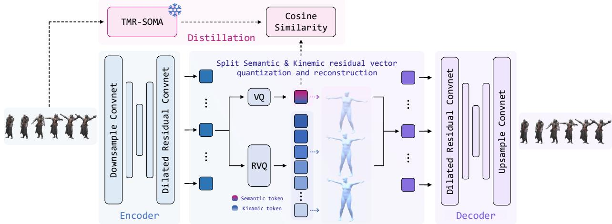
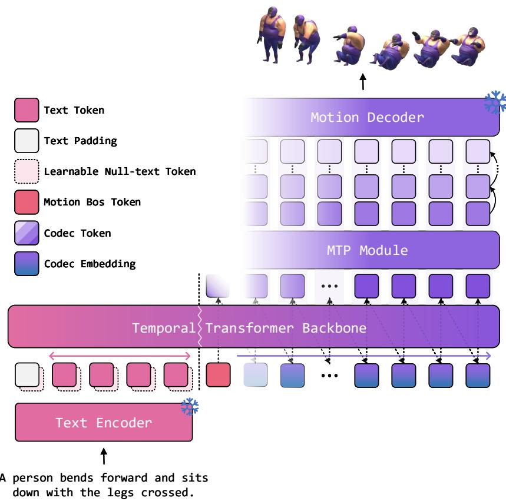
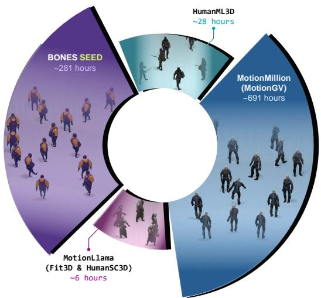
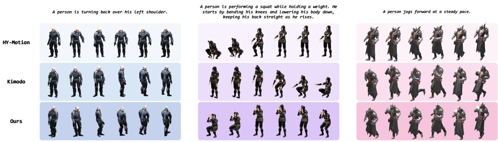
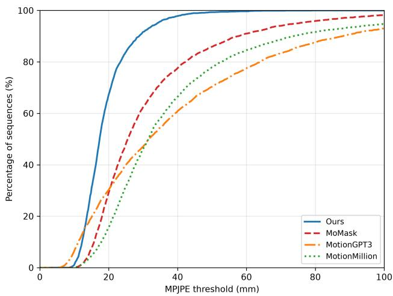
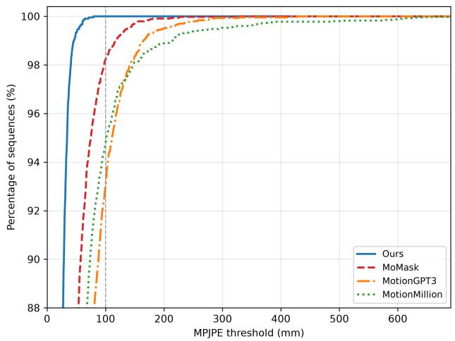
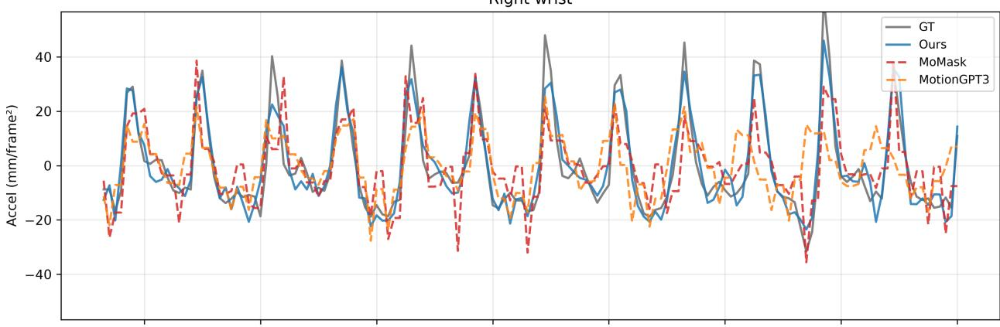
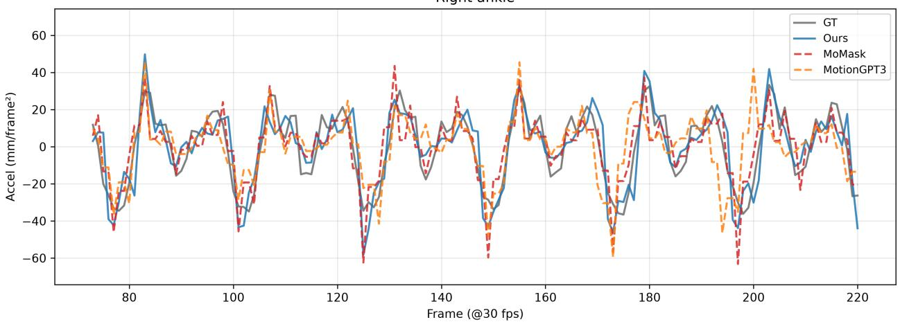

# SeMoCo: A Semantic-First Motion Codec for Motion Language Modeling

Tianlv Huang1,2,∗, Hetian Guo1,2,∗, Ziyi Cai3, Song Wang2, Yanping Zhang2, Zipei Fan1, Xuan Song1, Guangming Wu2, Xin Zheng2

1Jilin University, 2Frontier Robotics, 3Harbin Institute of Technology, Shenzhen ∗Equal contribution

Discrete motion representations have substantially advanced autoregressive text-to-motion generation. However, most motion tokenizers are optimized for reconstruction and do not explicitly allocate capacity according to semantic role. Action-level meaning and fine-grained kinematic detail must therefore be encoded through the same reconstruction-driven hierarchy. We introduce SeMoCo, a semantic-first motion codec, together with a dual-axis motion generator for language-conditioned motion generation. Each motion token contains one semantic token and a residual sequence of kinematic tokens. The generator models semantic progression across time and autoregressively refines the residual entries. We also construct Ω-MotionVerse, a large-scale, multi-source human-motion dataset unified under the SOMA representation. Across the reported comparisons, SeMoCo achieves the best reconstruction accuracy among the compared codecs, while strong text-to-motion results demonstrate the efectiveness of its motion tokens for downstream generation.

Date: August 26, 2026 Tokenizer code: https://github.com/OMEGA-i/SeMoCo-Tokenizer Generator code: https://github.com/OMEGA-i/SeMoCo-Generator HuggingFace: https://huggingface.co/poisonousID/SeMoCo

## 1 Introduction

Text-to-motion (T2M) generation, which synthesizes realistic and temporally coherent human motion from natural-language descriptions, has advanced through both continuous and discrete generative models. Continuous approaches generate poses or motion latents with difusion and flow-based models (Tevet et al., 2022; Chen et al., 2023; Wen et al., 2025; Rempe et al., 2026), whereas discrete approaches encode motion into learned tokens and model the resulting sequences with autoregressive or masked generators (Zhang et al., 2023; Jiang et al., 2023; Guo et al., 2024; Fu et al., 2026). Language models have shown that discrete tokens can support scalable sequence generation, and neural audio models extend this recipe to continuous waveforms with codec tokens (Borsos et al., 2023; Wang et al., 2023).

Directly transferring this paradigm to motion is nontrivial because text specifies action intent and coarse temporal structure, whereas a full-body sequence must realize that intent through coordinated trajectories, contacts, articulation, and smooth dynamics. Most motion tokenizers nevertheless optimize VQ/RVQ representations primarily for reconstruction, organizing later codebooks by successive reconstruction residuals rather than explicit motion semantics (van den Oord et al., 2018; Zeghidour et al., 2021). Speech tokenizers have explored a semantic-first organization by distilling semantic information from a self-supervised speech model into the first RVQ level, while later levels retain residual paralinguistic detail (Zhang et al., 2024). Moshi’s Mimi codec further reports a trade-of between semantic discriminability and reconstruction in this single-RVQ design and instead uses a semantic VQ in parallel with an acoustic RVQ (Défossez et al., 2024).

We therefore introduce SeMoCo, a semantic-first motion codec that distills window-level semantic knowledge from a frozen Text-to-Motion Retrieval (TMR) encoder into a dedicated semantic VQ (Petrovich et al., 2023), while a parallel RVQ encodes residual kinematic detail. Their quantized outputs jointly form each motion token and are decoded for reconstruction. Building on this token structure, our motion generator performs hierarchical semantic-to-kinematic token generation by predicting semantic tokens across time with a temporal Transformer and autoregressively completing residual kinematic tokens at each position with a lightweight refinement decoder. This factorization keeps temporal modeling at the motion-token level and confines autoregressive refinement to the local kinematic hierarchy. We further construct Ω-MotionVerse, a large-scale, multi-source corpus comprising roughly 1,000 hours of text-annotated human motion standardized to the SOMA skeleton convention (Saito et al., 2026).

Across motion reconstruction, text-to-motion generation, and motion prediction, SeMoCo achieves the best reconstruction accuracy among the compared codecs, while strong text-to-motion results demonstrate the efectiveness of its motion tokens for downstream generation.

Our contributions are threefold: (1) SeMoCo, a semantic-first motion codec that gives semantic and kinematic entries separate supervision and quantization paths within each motion token; (2) a dual-axis motion generator that models semantic progression across time and autoregressive kinematic refinement within each motion token; and (3) Ω-MotionVerse, a large-scale, multi-source human-motion dataset unified under the SOMA representation.

## 2 Related Work

## 2.1 Semantic Motion Tokenization

Most discrete motion pipelines learn this interface from reconstruction. VQ maps continuous features to categorical latents, whereas RVQ successively encodes the remaining reconstruction error (van den Oord et al., 2018; Défossez et al., 2022; Zhang et al., 2023; Guo et al., 2024). Under reconstruction-only training, the resulting hierarchy is ordered by distortion reduction rather than by an explicit semantic target. Prior work introduces semantic structure at diferent points in the pipeline. TMR and MoLingo shape text–motion embedding or continuous latent spaces, whereas LG-Tok conditions a discrete tokenizer and detokenizer on language (Petrovich et al., 2023; He et al., 2025; Yan et al., 2026a). PGR2M takes a diferent route by placing predefined, interpretable pose codes before learned residual refinement, while Latent Motion Reasoning (LMR) learns separate semantic-reasoning and motion-execution sequences (Jeong and Choi, 2025; Qian et al., 2025). MoGeFlow instead exploits the geometry of a frozen codebook during generation, while Beyond MoCap studies how data and codebook scale afect tokenization (Fang et al., 2026; Yan et al., 2026b). These methods difer in where semantics enters and how it is paired with motion detail.

The closest architectural precedents to SeMoCo come from speech. Mimi, introduced with Moshi, places a teacher-distilled semantic VQ alongside an acoustic RVQ, and Qwen3-TTS follows the same split-codec principle (Défossez et al., 2024; Hu et al., 2026). Inspired by these systems, SeMoCo studies the motion-specific form of this design: a teacher-aligned semantic code and a complete kinematic RVQ path share each temporal packet and reconstruction decoder, encouraging role specialization without assuming strict disentanglement.

## 2.2 Hierarchical Multi-Codebook Generation

Assigning several codes to each time step introduces dependencies both across time and within the representational hierarchy. Motion models have largely organized this hierarchy by residual depth or scale: MoMask and MOGO operate over residual codebook levels, whereas MoSa, MoScale, and ScaleMoGen proceed coarse-to-fine across temporal or skeletal–temporal scales (Guo et al., 2024; Fu et al., 2026; Liu et al., 2025; Zheng et al., 2026; Hwang et al., 2026). Audio generation exposes a complementary design space. MusicGen studies alternative serialization and interleaving patterns, while Moshi and Qwen3-TTS separate long-range temporal modeling from within-frame code completion (Copet et al., 2024; Défossez et al., 2024; Hu et al., 2026). SeMoCo is directly inspired by this temporal–depth factorization and applies it to semantic-first motion packets. Its focus is the coupling between an established generation order and a separately supervised motion representation, rather than the factorization itself.

## 2.3 Text-to-Motion Generation

Text-to-motion methods difer not only in their generative objectives, but also in the representation over which those objectives are learned. Continuous approaches synthesize pose trajectories or learned latents with difusion and flow objectives, ranging from MotionDifuse, the Human Motion Difusion Model (MDM), and Motion Latent Difusion (MLD) to scaled systems such as HY-Motion and controllable whole-body models such as Kimodo (Zhang et al., 2022; Tevet et al., 2022; Chen et al., 2023; Wen et al., 2025; Rempe et al., 2026; Wang et al., 2026a). Related eforts have also scaled motion data and autoregressive models to broaden zero-shot generation (Fan et al., 2025). Discrete approaches instead learn a motion vocabulary and model its codes: T2M-GPT and MotionGPT treat motion as a single token stream, while MoMask, MOGO, and MoScale organize prediction through residual or multi-scale structures (Zhang et al., 2023; Jiang et al., 2023; Guo et al., 2024; Fu et al., 2026; Zheng et al., 2026). This progression makes the tokenizer more than a compression front end: its code organization defines the information available at each prediction step and the dependencies that the generator must resolve.

## 3 Method

SeMoCo is a semantic-first motion codec that combines semantic and kinematic information through motion– language distillation and residual vector quantization. It represents motion as semantic-to-kinematic packets, each containing a semantically aligned primary code and residual codes for fine-grained kinematic details. A dual-axis motion language model then performs language-conditioned generation by modeling semantic progression across packets and predicting kinematic residuals within each packet.

## 3.1 Motion Representation

$\mathbf { x } _ { 1 : N }$ denote a whole-body motion sequence sampled at 50 Hz. We canonicalize the sequence by aligning it with the floor and removing its initial planar translation and heading. The removed global state is stored in a clip-level anchor a, while the remaining motion is represented as transition records

$$
\begin{array} { r l } & { \mathcal { U } ( \mathbf { x } _ { 1 : N } ) = \left( \mathbf { a } , \mathbf { u } _ { 1 : N - 1 } \right) , } \\ & { \qquad \mathbf { u } _ { n } = \left[ \mathbf { r } _ { n } ^ { \mathrm { t r a j } } , \mathbf { r } _ { n } ^ { \mathrm { r o o t } } , \mathbf { r } _ { n } ^ { \mathrm { j o i n t } } , \mathbf { v } _ { n } ^ { \mathrm { s p a r s e } } , \mathbf { c } _ { n } ^ { \mathrm { f o o t } } \right] \in \mathbb { R } ^ { d _ { u } } . } \end{array}\tag{1}
$$

The five feature groups describe the root trajectory, root orientation, parent-local joint rotations, sparse velocities at contact-relevant joints, and foot-contact states, respectively (Wang et al., 2026a).

Planar root translation is encoded as frame-to-frame displacements in both root-yaw-local and canonical world frames, then averaged and integrated during recovery to preserve continuity and mitigate drift. Root height, orientation, and local joint rotations remain absolute, requiring no temporal integration. This controlled redundancy supports accurate and robust trajectory reconstruction. Given decoded records $\widehat { \mathbf { u } } _ { 1 : N - 1 }$ , the full-body motion is recovered as

$$
\widehat { \mathbf { x } } _ { 1 : N } = \mathrm { F K } \left( \mathcal { M } ( \mathbf { a } , \widehat { \mathbf { u } } _ { 1 : N - 1 } ) \right) ,\tag{2}
$$

where M restores the global trajectory and FK applies forward kinematics. Reconstruction and motion prediction retain the anchor of the observed sequence, while text-conditioned generation starts from a fixed canonical anchor.

## 3.2 Semantic-First Motion Codec

SeMoCo converts the 50-Hz transition sequence into a lower-rate sequence of discrete motion packets. A temporal encoder compresses the input by a factor of four,

$$
{ \bf h } _ { 1 : T } = E ( { \bf u } _ { 1 : N - 1 } ) , \qquad T \approx N / 4 ,\tag{3}
$$

where each $\mathbf { h } _ { t }$ summarizes a short motion interval at 12.5 Hz. SeMoCo assigns complementary roles to the codes describing this interval: a primary code is aligned with motion semantics, while a residual hierarchy preserves the kinematic information required for reconstruction.

Split semantic–kinematic quantization. A conventional residual vector quantizer organizes its codebooks according to successive reconstruction errors. Its first code also determines the residual processed by all later stages, so directly imposing semantic supervision on that code couples motion–language alignment with the

  
Figure 1 SeMoCo tokenizer. Given an input motion sequence, the encoder produces a continuous latent that is factorized into a semantic stream and a kinematic residual stream. The semantic stream is vector-quantized and aligned with the TMR-SOMA embedding space, whereas RVQ progressively quantizes the residual stream to preserve kinematic detail. Their quantized outputs are summed at the decoder input to reconstruct the motion; semantic supervision is used only during codec training.

geometry of the entire residual chain. SeMoCo instead separates the two roles into parallel quantization paths: a single vector quantizer for semantic information and an independent residual vector quantizer for kinematic reconstruction.

For each encoded interval, the two branches form separate projections,

$$
\mathbf { s } _ { t } = P _ { \mathrm { s e m } } ^ { \mathrm { i n } } ( \mathbf { h } _ { t } ) , \qquad \mathbf { k } _ { t } = P _ { \mathrm { k i n } } ^ { \mathrm { i n } } ( \mathbf { h } _ { t } ) .\tag{4}
$$

The semantic projection is discretized by a single codebook,

$$
q _ { t } ^ { \mathrm { s e m } } = \arg \operatorname* { m i n } _ { j } \left\| \mathbf { s } _ { t } - \mathbf { e } _ { j } ^ { \mathrm { s e m } } \right\| _ { 2 } ^ { 2 } ,\tag{5}
$$

while an L-stage RVQ successively quantizes the kinematic projection:

$$
\begin{array} { r l } & { \mathbf { r } _ { t } ^ { 0 } = \mathbf { k } _ { t } , \qquad q _ { t } ^ { \mathrm { k i n } , \ell } = \underset { j } { \arg \operatorname* { m i n } } \left\| \mathbf { r } _ { t } ^ { \ell - 1 } - \mathbf { e } _ { j } ^ { \mathrm { k i n } , \ell } \right\| _ { 2 } ^ { 2 } , } \\ & { \mathbf { r } _ { t } ^ { \ell } = \mathbf { r } _ { t } ^ { \ell - 1 } - \mathbf { e } _ { q _ { t } ^ { \mathrm { k i n } , \ell } } ^ { \mathrm { k i n } , \ell } , \qquad \ell = 1 , \dots , L . } \end{array}\tag{6}
$$

The quantized outputs of the two branches are then mapped into a common decoder space and fused additively for reconstruction:

$$
\begin{array} { r l r } & { } & { { \bf z } _ { t } ^ { \mathrm { s e m } } = { \cal P } _ { \mathrm { s e m } } ^ { \mathrm { o u t } } \left( { \bf e } _ { q _ { t } ^ { \mathrm { s e m } } } ^ { \mathrm { s e m } } \right) , \quad \quad } \\ & { } & { { \bf z } _ { t } ^ { \mathrm { k i n } } = { \cal P } _ { \mathrm { k i n } } ^ { \mathrm { o u t } } \left( \displaystyle \sum _ { \ell = 1 } ^ { L } { \bf e } _ { q _ { t } ^ { \mathrm { k i n } , \ell } } ^ { \mathrm { k i n } , \ell } \right) , \quad \quad } \\ & { } & { \widehat { \bf u } _ { 1 : N - 1 } = { \cal D } \left( { \bf z } _ { 1 : T } ^ { \mathrm { s e m } } + { \bf z } _ { 1 : T } ^ { \mathrm { k i n } } \right) . \quad \quad \quad } \end{array}\tag{7}
$$

Accordingly, each interval is represented by a semantic-first packet

$$
\mathbf { m } _ { t } = \left[ q _ { t } ^ { \mathrm { s e m } } , q _ { t } ^ { \mathrm { k i n } , 1 } , \dots , q _ { t } ^ { \mathrm { k i n } , L } \right] .\tag{8}
$$

All codes in $\mathbf { m } _ { t }$ describe the same temporally downsampled interval. The semantic and kinematic branches are not required to be information-exclusive; the split instead provides them with distinct supervision and quantization paths while retaining a shared reconstruction space.

Window-level semantic distillation. Motion semantics are expressed by short-term temporal evolution rather than an isolated pose. We therefore supervise the primary code stream at the window level. For a temporal training window W, let $\mathbf { z } _ { \mathcal { W } } ^ { \mathrm { s e m } }$ denote its sequence of quantized semantic embeddings, and let ΦTMR be the frozen motion encoder from TMR (Petrovich et al., 2023). A training-only temporal head G aggregates the semantic sequence and is aligned with the teacher embedding by the cosine-distance loss

$$
\mathcal { L } _ { \mathrm { s e m } } = 1 - \cos ( G ( \mathbf { z } _ { \mathcal { W } } ^ { \mathrm { s e m } } ) , \mathrm { s g } [ \Phi _ { \mathrm { T M R } } ( \mathbf { x } _ { \mathcal { W } } ) ] ) ,\tag{9}
$$

where $\cos ( \cdot , \cdot )$ denotes cosine similarity and sg[·] denotes stop-gradient. This loss injects window-level action information into the primary stream, while the independent kinematic RVQ remains organized by reconstruction residuals.

Reconstruction objective. Let P and $\widehat { \mathbf { P } }$ collect the 3D joint positions obtained by applying the recovery map of Eq. (2) to the input and reconstructed transition records, respectively. To preserve motion geometry and local dynamics, we use

$$
\begin{array} { r } { \mathcal { L } _ { \mathrm { r e c } } = \mathcal { L } _ { \mathrm { p o s } } + \lambda _ { \mathrm { v e l } } \mathcal { L } _ { \mathrm { v e l } } + \lambda _ { \mathrm { a c c } } \mathcal { L } _ { \mathrm { a c c } } } \\ { + \lambda _ { \mathrm { s k a t e } } \mathcal { L } _ { \mathrm { s k a t e } } + \lambda _ { \mathrm { V Q } } \mathcal { L } _ { \mathrm { V Q } } , } \end{array}\tag{10}
$$

where ${ \mathcal { L } } _ { \mathrm { p o s } }$ is the $\ell _ { 1 }$ loss between P and $\widehat { \mathbf { P } } _ { : }$ , and $\mathcal { L } _ { \mathrm { v e l } }$ and $\mathcal { L } _ { \mathrm { a c c } }$ apply the same loss to their first- and second-order temporal diferences, respectively. $\mathcal { L } _ { \mathrm { s k a t e } }$ penalizes horizontal foot velocity at ground-truth contact frames, and $\mathcal { L } _ { \mathrm { V Q } }$ is the usual codebook and commitment loss for both quantization branches. All λ’s are scalar loss weights. Architecture and optimization details are provided in the appendix (SeMoCo Architecture and Training Details).

## 3.3 Dual-Axis Motion Language Model

The semantic-first packets produced by SeMoCo expose two complementary dependencies for motion modeling. Across time, the model must capture the evolution of semantic motion states; within each packet, it must resolve the kinematic details associated with the current state. We model these dependencies with a temporal Transformer and a lightweight depth decoder. The temporal Transformer predicts the semantic code of the next packet from the preceding packet history, while the depth decoder subsequently generates its residual kinematic codes. This factorization keeps temporal progression separate from within-packet refinement, rather than serializing both into a single flattened token stream.

Dual-axis packet modeling. Each completed packet is mapped to a single temporal token by summing its codebook-specific embeddings. The temporal Transformer processes the preceding packet sequence and produces a hidden state for the next motion interval, from which a semantic head predicts $q _ { t } ^ { \mathrm { s e m } }$ . Conditioned on this temporal state and the predicted semantic code, the depth decoder generates $q _ { t } ^ { \mathrm { k i n } , 1 : L }$ autoregressively along the codebook axis. Given an optional external condition $\mathbf { c } ,$ the resulting distribution factorizes as

$$
\begin{array} { l } { \displaystyle p _ { \theta } ( \mathbf { m } _ { 1 : T } \mid \mathbf { c } ) = \prod _ { t = 1 } ^ { T } p _ { \theta } ( q _ { t } ^ { \mathrm { s e m } } \mid \mathbf { m } _ { < t } , \mathbf { c } ) } \\ { \displaystyle \times \prod _ { t = 1 } ^ { T } \prod _ { \ell = 1 } ^ { L } p _ { \theta } \Big ( q _ { t } ^ { \mathrm { k i n } , \ell } \Big | \mathbf { m } _ { { q } ^ { \mathrm { k i n } } , < \ell , \mathbf { c } } ^ { \mathrm { k i n } , \mathrm { g } ^ { \mathrm { s e m } } } \Big ) . } \end{array}\tag{11}
$$

where $q _ { t } ^ { \mathrm { k i n , < } \ell }$ denotes the residual codes preceding the ℓ-th kinematic codebook. The semantic factor is predicted from the temporal state, whereas the kinematic factors are produced by the depth decoder in residual order. Both axes are trained jointly using teacher forcing and codebook-wise cross-entropy losses.

Task-specific context. The same packet factorization supports diferent motion generation tasks by specifying the context available to the temporal Transformer. For text-to-motion generation, c contains token-level representations of the input description, which are placed before the motion sequence and remain accessible throughout causal packet generation. For motion prediction, no external condition is required; instead, the observed packets directly initialize $\mathbf { m } _ { < t } ,$ and the model continues the sequence by predicting future packets. The generated packets are decoded by SeMoCo into full-body motion. Additional task-specific architecture and optimization details are provided in the appendix (Dual-Axis Motion Transformer Learning).

  
Figure 2 Dual-axis motion language model. The temporal Transformer models language-conditioned motion packets across time, while the MTP module completes each packet from its semantic code to the kinematic residual codes. The generated packets are decoded into full-body motion.

## 4 Ω-MotionVerse

We construct Ω-MotionVerse by consolidating complementary motion resources together with their available text annotations into a large-scale corpus of full-body human motion. The resulting corpus comprises 909,913 text–motion pairs and 1,006 hours of full-body motion, organized into four source groups: MotionGV curated from MotionMillion (Fan et al., 2025), BONES-SEED (Luo et al., 2026), HumanML3D (Guo et al., 2022), and a collection of Fit3D (Fieraru et al., 2021b) and HumanSC3D (Fieraru et al., 2021a) motions curated from MotionHub (Ling et al., 2025). These source groups span monocular-video reconstructions and marker-based motion capture, encompassing diverse acquisition settings and annotation pipelines. We retain source labels and annotation provenance throughout curation, allowing source-wise analysis alongside aggregate evaluation. Figure 3 summarizes the four source groups and their respective durations.

To reconcile heterogeneous conventions, we convert all motions to the SOMA skeleton (Saito et al., 2026), resample them to 50 $\mathrm { H z , }$ and apply a shared floor-aligned canonicalization. The resulting motions are encoded using the previously defined representation, placing the corpus in a common geometric and temporal space for joint training.

We construct recording-level splits to prevent related segments from appearing across partitions. Duplicate motions are removed through content-hash deduplication, while multiple captions associated with the same HumanML3D motion are retained as distinct text–motion pairs. Additional corpus statistics, source-specific conversion procedures, and split details are provided in the appendix (Ω-MotionVerse Composition and Splits).

  
Figure 3 Ω-MotionVerse. Composition of the supporting human motion dataset, comprising around 1,000 hours of text-paired motion sequences.

## 5 Experiments

## 5.1 Motion Reconstruction.

We evaluate the reconstruction fidelity of each motion tokenizer by encoding and decoding each test sequence without text conditioning, with each method operating in its native motion representation. Joint positions follow the standard HumanML3D 22 SMPL joint convention, and all errors are reported in millimeters. MPJPE measures the mean per-joint position error after pelvis alignment; Med. denotes the median sequence-level MPJPE, and PA-MPJPE further applies a per-sequence similarity alignment. The baselines are evaluated on the oficial HumanML3D test set, while SeMoCo is evaluated on the HumanML3D portion of our test split, which preserves the original HumanML3D train/test partition.

<table><tr><td>Method</td><td>MPJPE↓</td><td>Med.↓ PA-MPJPE↓</td></tr><tr><td>MoMask</td><td>32.39</td><td>25.54</td></tr><tr><td>MotionGPT3</td><td>42.38</td><td>31.58</td></tr><tr><td>MotionMillion</td><td>42.54</td><td>31.51 19.84</td></tr><tr><td>Ours</td><td>19.22</td><td>17.36</td></tr></table>

Table 1 Motion reconstruction results on HumanML3D.

Table 1 shows that SeMoCo reconstructs motion more accurately than MoMask (Guo et al., 2024), MotionGPT3 (Zhu et al., 2025), and MotionMillion (Fan et al., 2025) across all metrics.

## 5.2 Model variants.

We evaluate two capacities of the dual-axis motion language model: Ours-Lite with approximately 150M parameters and Ours-Base with approximately 400M parameters. Both variants share the same SeMoCo tokenizer, text encoder, packet factorization, training objective, and evaluation protocol, difering only in generator capacity.

## 5.3 Motion Prediction.

Motion prediction generates future motion conditioned on an observed motion prefix (Jiang et al., 2023; Wang et al., 2026b). For this task, we train a motion Transformer on top of the same tokenizer. We follow the stochastic prediction protocol of observing 0.5 s and predicting the subsequent 2 s (Yuan and Kitani, 2020; Zhang et al., 2021; Ma et al., 2022). For a single sampled prediction, ADE measures the average joint distance, in meters, between the predicted and ground-truth motions over the predicted segment, while FDE measures the corresponding distance at the final frame.min $\mathrm { \ A D E _ { 5 0 } }$ and $\mathrm { m i n F D E _ { 5 0 } }$ are obtained by taking the minimum ADE and FDE, respectively, over 50 motion sequences generated from the same observed prefix. All methods are evaluated under this protocol. The baselines are evaluated on the oficial HumanML3D test set, while SeMoCo is evaluated on the HumanML3D portion of our test split.

<table><tr><td>Method</td><td>ADE↓</td><td>FDE↓ minADE50 ↓ minFDE50 ↓</td><td></td></tr><tr><td>MotionGPT3</td><td>2.103 3.155</td><td>1.333</td><td>1.830</td></tr><tr><td>MDM</td><td>2.146</td><td>3.973 0.877</td><td>1.252</td></tr><tr><td>MotionGPT</td><td>2.637</td><td>3.943 1.531</td><td>2.086</td></tr><tr><td>Ours-Lite</td><td>1.228</td><td>2.449 0.695</td><td>1.095</td></tr><tr><td>Ours-Base</td><td>1.273</td><td>2.483</td><td>0.759 1.220</td></tr></table>

Table 2 Motion prediction results on HumanML3D.

Table 2 shows that Ours-Lite achieves the lowest error across all metrics, while also yielding lower errors than the larger Ours-Base. This reverses the ordering observed for text-to-motion, indicating that the larger model does not provide an advantage for motion prediction under this protocol.

## 5.4 Text-to-motion.

Evaluator Spaces. We evaluate text-to-motion in two separate tracks defined by the native motion representation of each method. Methods producing motion in the SMPL or HumanML3D convention are evaluated under the standard HumanML3D protocol using its oficial evaluator (Guo et al., 2022). Methods producing full-body SOMA motion are instead evaluated with a TMR-based motion–text evaluator operating directly on the SOMA representation, which we refer to as TMR-SOMA (Petrovich et al., 2023). The evaluator is initialized from the model released with Kimodo (Rempe et al., 2026), fine-tuned only on the Ω-MotionVerse training partition, and then frozen for evaluation. Metric values are compared only within the same evaluation track, since the evaluated models produce outputs in diferent native motion representations.

  
Figure 4 Qualitative text-to-motion comparison. Generated motion sequences from HY-Motion, Kimodo, and Ours-Base for three representative text prompts, visualized at matched timestamps.

Evaluation Metrics. Following common text-to-motion evaluation practice (Guo et al., 2024), we assess distributional fidelity and text–motion correspondence within each evaluator space. FID is the Fréchet distance between generated and reference motion-feature distributions, with lower values indicating a closer match. R@k is the fraction of captions whose paired motion is retrieved within the top k candidates, whereas MedR is the median rank of that paired motion; higher R@k and lower MedR are better. Align, where reported, is the mean cosine similarity of paired text and motion embeddings, so higher values indicate stronger correspondence. All metrics are computed with the corresponding frozen evaluator and are compared only within that evaluator space.

<table><tr><td>Method</td><td>FID↓</td><td>R@1↑</td><td>R@2↑</td><td>R@3↑</td><td>R@5↑</td><td> $\operatorname { M e d R } \downarrow$ </td><td>Align↑</td></tr><tr><td>MoMask</td><td> $. 3 2 \pm . 0 9$ </td><td> $\mathbf { \Delta } _ { 4 5 2 \pm . 0 5 3 }$ </td><td> $. 5 8 7 \pm . 0 4 2$ </td><td> $. 6 5 6 \pm . 0 3 8$ </td><td> $. 7 3 4 \pm . 0 3 9$ </td><td> $\underline { { 1 . 9 \pm . 3 } }$ </td><td> $. 9 5 7 \pm . 0 0 3$ </td></tr><tr><td>HyMotion</td><td> $\underline { { \cdot 3 4 \pm . 0 8 } }$ </td><td> $\underline { { \cdot 4 4 9 \pm . 0 5 4 } }$ </td><td> $. 5 9 5 \pm . 0 4 0$ </td><td> $\mathbf { . 6 6 9 \pm . 0 3 8 }$ </td><td> $. 7 4 7 \pm . 0 3 5$ </td><td> $1 . 8 \pm . 4$ </td><td> $. 9 6 0 \pm . 0 0 4$ </td></tr><tr><td>MotionGPT3</td><td> $. 3 9 \pm . 1 0 $ </td><td> $. 4 4 6 \pm . 0 5 2$ </td><td> ${ } . 5 9 0 \pm . 0 5 6 { }$ </td><td> $\underline { { 6 6 0 \pm . 0 4 6 } }$ </td><td> ${ \underline { { 7 4 0 \pm . 0 3 8 } } }$ </td><td> $\underline { { 1 . 9 \pm . 4 } }$ </td><td> $. 9 5 9 \pm . 0 0 4$ </td></tr><tr><td>MotionMillion</td><td> $3 . 0 1 \pm . 4 4$ </td><td> $. 3 2 7 \pm . 0 4 7$ </td><td> $. 4 4 9 \pm . 0 5 3$ </td><td> $. 5 2 0 \pm . 0 5 5$ </td><td> $. 5 9 9 \pm . 0 4 8$ </td><td> $3 . 4 \pm 1 . 1$ </td><td> $. 9 1 9 \pm . 0 0 5$ </td></tr><tr><td> $\operatorname { K i m o d o } ^ { \ddagger }$ </td><td> $1 . 0 9 1 \pm . 1 0 1$ </td><td> $. 6 4 5 \pm . 1 2 2$ </td><td> $. 7 7 5 \pm . 1 2 8$ </td><td> $. 8 7 3 \pm . 0 9 0$ </td><td> $. 9 2 3 \pm . 0 5 6$ </td><td> $1 . 1 \pm . 4$ </td><td> $. 0 7 6 \pm . 0 1 1$ </td></tr><tr><td> ${ \mathsf { o u r s } } { \mathsf { - L i t e } } ^ { \dagger }$ </td><td> $\underline { { \cdot 9 2 0 \pm . 1 0 1 } }$ </td><td> $. 3 2 6 \pm . 1 0 3$ </td><td> $. 4 5 1 \pm . 0 8 4$ </td><td> $. 5 4 0 \pm . 1 0 7$ </td><td> $. 7 0 7 \pm . 1 1 5$ </td><td> $3 . 2 \pm 1 . 2$ </td><td> $. 0 3 2 \pm . 0 0 9$ </td></tr><tr><td> $\scriptstyle \mathtt { O u r s - B a s e ^ { \ddagger } }$ </td><td> $. 9 1 3 \pm . 0 9 2$ </td><td> $\underline { { \cdot 4 2 2 \pm . 1 0 4 } }$ </td><td> ${ . 5 5 8 \pm . 0 9 5 }$ </td><td> $\underline { { . 6 5 3 \pm . 0 8 6 } }$ </td><td> $\underline { { . 7 7 7 } } \pm . 0 7 9$ </td><td> $2 . 2 \pm . 8$ </td><td> $. 0 3 9 \pm . 0 0 9$ </td></tr></table>

Table 3 Text-to-motion evaluation on HumanML3D. Unmarked rows are evaluated under the standard HumanML3D protocol, while rows marked with ‡ are evaluated in the TMR-SOMA track using native SOMA outputs from the HumanML3D subset. Both tracks use a retrieval batch size of 32 and report mean ± standard deviation over 30 repeats. Results are ranked only within the same evaluation track. Best and second-best results are shown in bold and underlined, respectively.
<table><tr><td>Subset</td><td>Method</td><td>FID↓</td><td>R@1↑</td><td>R@2↑</td><td>R@3↑</td><td>MedR↓</td></tr><tr><td rowspan="5">Overall</td><td>Kimodo</td><td>.143±.008</td><td>.553±.038</td><td> $\mathbf { . 6 6 0 \pm . 0 3 3 }$ </td><td>.719±.036</td><td> $1 . 1 0 0 \pm . 3 0 5$ </td></tr><tr><td>HyMotion†</td><td> $. 2 8 5 \pm . 0 1 9$ </td><td> $. 3 0 2 \pm . 0 2 8$ </td><td> $. 4 1 8 \pm . 0 2 8$ </td><td> $. 4 8 4 \pm . 0 3 0$ </td><td> $3 . 8 5 0 \pm . 6 0 4$ </td></tr><tr><td>MotionMillion†</td><td> $. 4 8 6 \pm . 0 2 8$ </td><td> $. 1 3 1 \pm . 0 2 0$ </td><td> $. 1 9 0 \pm . 0 2 6$ </td><td> $. 2 3 0 \pm . 0 1 7$ </td><td> $2 5 . 7 8 3 \pm 4 . 5 2 7$ </td></tr><tr><td>Ours-Lite</td><td> $. 1 8 6 \pm . 0 1 0$ </td><td> $. 4 8 4 \pm . 0 3 1$ </td><td> $. 6 0 0 \pm . 0 3 4$ </td><td> $. 6 5 6 \pm . 0 3 9$ </td><td> $1 . 7 0 0 \pm . 4 4 7$ </td></tr><tr><td>Ours-Base</td><td> $\underline { { . 1 8 1 \pm . 0 1 0 } }$ </td><td> ${ \underline { { . 4 9 4 \pm . 0 3 9 } } }$ </td><td> $\underline { { . 6 1 4 \pm . 0 3 1 } }$ </td><td> $\underline { { 6 7 0 \pm . 0 2 9 } }$ </td><td> $\underline { { 1 . 5 0 0 } } \pm . 4 9 1$ </td></tr><tr><td rowspan="5">HumanML3D</td><td>Kimodo</td><td> $1 . 0 9 1 \pm . 1 0 1$ </td><td> $. 6 4 5 \pm . 1 2 2 $ </td><td> ${ } . 7 7 5 \pm . 1 2 8 { }$ </td><td> $. 8 7 3 \pm . 0 9 0$ </td><td> $1 . 1 3 3 \pm . 4 3 4$ </td></tr><tr><td>HyMotion†</td><td> $. 6 4 5 \pm . 0 8 7$ </td><td> $. 6 4 7 \pm . 1 3 0$ </td><td> $. 8 1 1 \pm . 1 1 7$ </td><td> $. 8 8 3 \pm . 0 8 7$ </td><td> $1 . 0 8 3 \pm . 2 6 5$ </td></tr><tr><td>MotionMillion†</td><td> $. 9 6 3 \pm . 0 9 9$ </td><td> $. 3 8 6 \pm . 1 1 4$ </td><td> $. 5 1 5 \pm . 1 2 5$ </td><td> $. 5 7 9 \pm . 1 2 2$ </td><td> $2 . 8 1 7 \pm 1 . 3 2 9$ </td></tr><tr><td>Ours-Lite</td><td> $. 9 2 0 \pm . 1 0 1$ </td><td> $. 3 2 6 \pm . 1 0 3$ </td><td> $. 4 5 1 \pm . 0 8 4$ </td><td> $. 5 4 0 \pm . 1 0 7$ </td><td> $3 . 2 3 3 \pm 1 . 1 5 8$ </td></tr><tr><td>Ours-Base</td><td> ${ \underline { { 9 1 3 } } } \pm . 0 9 2 $ </td><td> $. 4 2 2 \pm . 1 0 4$ </td><td> $. 5 5 8 \pm . 0 9 5$ </td><td> $. 6 5 3 \pm . 0 8 6$ </td><td> $2 . 1 6 7 \pm . 8 3 4$ </td></tr><tr><td rowspan="5">bones-seed</td><td>Kimodo</td><td> $. 1 0 0 \pm . 0 0 9$ </td><td> $. 6 6 3 \pm . 0 4 9$ </td><td> $. 7 7 7 \pm . 0 3 9$ </td><td> $. 8 2 0 \pm . 0 3 7$ </td><td> $1 . 0 0 0 \pm . 0 0 0$ </td></tr><tr><td>HyMotion†</td><td> $. 3 9 9 \pm . 0 2 3$ </td><td> $. 2 9 7 \pm . 0 3 3$ </td><td> $. 4 0 3 \pm . 0 3 9$ </td><td> $. 4 6 5 \pm . 0 3 9$ </td><td> $4 . 2 1 7 \pm . 9 4 4$ </td></tr><tr><td>MotionMillion†</td><td> $. 6 2 1 \pm . 0 3 7$ </td><td> $. 0 7 2 \pm . 0 2 5$ </td><td> $. 1 2 7 \pm . 0 2 9$ </td><td> $. 1 6 2 \pm . 0 2 9$ </td><td> $3 5 . 9 8 3 \pm 6 . 6 5 5$ </td></tr><tr><td>Ours-Lite</td><td> $. 2 1 9 \pm . 0 1 6$ </td><td> $. 5 1 8 \pm . 0 3 9$ </td><td></td><td></td><td></td></tr><tr><td>Ours-Base</td><td> $\underline { { . 2 0 2 \pm . 0 1 4 } }$ </td><td> ${ \underline { { 5 3 9 } } } \pm . 0 4 8 $ </td><td> $. 6 5 4 \pm . 0 3 5$   $\underline { { . 6 7 1 \pm . 0 4 4 } }$ </td><td> $. 7 1 5 \pm . 0 4 5$   $\underline { { \cdot 7 3 3 \pm . 0 4 3 } }$ </td><td> $1 . 3 5 0 \pm . 4 7 6$   $\underline { { 1 . 1 6 7 \pm . 3 7 9 } }$ </td></tr><tr><td rowspan="5">MotionGV</td><td>Kimodo</td><td> $1 . 0 0 1 \pm . 0 9 7$ </td><td> $. 3 0 8 \pm . 1 0 3$ </td><td></td><td> $. 5 3 2 \pm . 1 3 0$ </td><td> $3 . 2 8 3 \pm 1 . 3 8 8$ </td></tr><tr><td>HyMotion†</td><td> $. 8 9 5 \pm . 1 3 4$ </td><td> $. 5 2 6 \pm . 1 3 3$ </td><td> $. 4 4 0 \pm . 1 2 3$   $. 6 8 3 \pm . 0 9 0$ </td><td> $. 7 7 1 \pm . 0 9 0$ </td><td> $1 . 4 3 3 \pm . 5 0 4$ </td></tr><tr><td>MotionMillion†</td><td> $. 7 9 5 \pm . 0 9 3$ </td><td> $. 5 1 7 \pm . 1 0 5$ </td><td> $. 6 7 6 \pm . 1 0 3$ </td><td> $. 7 5 8 \pm . 0 9 7$ </td><td> $1 . 5 1 7 \pm . 5 9 4$ </td></tr><tr><td>Ours-Lite</td><td> ${ \underline { { 8 0 5 } } } \pm . 0 9 4$ </td><td> $- 7 1 2 \pm . 1 0 4$ </td><td> $\underline { { . 8 5 4 } } \pm . 0 8 5$ </td><td> $. 9 2 4 \pm . 0 5 4$ </td><td></td></tr><tr><td>Ours-Base</td><td> $. 8 1 2 \pm . 0 9 8$ </td><td> $. 7 2 4 \pm . 1 1 1$ </td><td> $. 8 8 3 \pm . 0 8 2$ </td><td> $\mathbf { \sigma } . 9 3 2 \pm . 0 5 6$ </td><td> $1 . 0 0 0 \pm . 0 0 0$   $\underline { { 1 . 0 6 7 } } \pm . 2 5 4$ </td></tr></table>

Table 4 TMR-SOMA text-to-motion retrieval by provenance (256 clips per repeat; mean ± standard deviation over 30 repeats). HyMotion and MotionMillion (†) are evaluated after SMPL-to-SOMA retargeting.
<table><tr><td>RVQ layout Sem.</td><td></td><td>FID↓</td><td>R@1↑</td><td>R@2↑</td><td>R@3↑</td><td>R@5↑</td><td></td><td>MedR↓ MPJPE-77↓</td></tr><tr><td>Single-chain ×</td><td></td><td> $\underline { { \cdot 2 0 2 \pm . 0 1 3 } }$ </td><td> $\underline { { . 4 8 3 \pm . 0 3 4 } }$ </td><td> $. 6 0 7 \pm . 0 3 6$ </td><td> $. 6 6 3 \pm . 0 3 4$ </td><td> $. 7 2 2 \pm . 0 3 2$ </td><td> $1 . 6 5 \pm . 4 8$ </td><td>15.60</td></tr><tr><td>Single-chain √</td><td></td><td> $. 2 1 1 \pm . 0 1 4$ </td><td> $. 4 5 1 \pm . 0 3 1$ </td><td> $. 5 7 9 \pm . 0 2 4$ </td><td> $. 6 3 7 \pm . 0 2 7$ </td><td> ${ \underline { { 7 1 9 } } } \pm . 0 3 5$ </td><td> $1 . 9 3 \pm . 2 5$ </td><td>18.54</td></tr><tr><td>Split-branch ×</td><td></td><td> $. 2 2 6 \pm . 0 1 3$ </td><td> $. 3 1 9 \pm . 0 3 3$ </td><td> $. 4 2 5 \pm . 0 3 7$ </td><td> $. 4 9 0 \pm . 0 3 9$ </td><td> $. 5 6 1 \pm . 0 3 7$ </td><td> $3 . 8 3 \pm . 9 3$ </td><td>13.70</td></tr><tr><td>Split-branch√</td><td></td><td> $. 1 8 6 \pm . 0 1 0$ </td><td> $. 4 8 4 \pm . 0 3 1$ </td><td> $\underline { { . 6 0 0 \pm . 0 3 4 } }$ </td><td> $. 6 5 6 \pm . 0 3 9$ </td><td> $. 7 1 7 \pm . 0 3 8$ </td><td> $\underline { { 1 . 7 0 \pm . 4 5 } }$ </td><td>15.93</td></tr></table>

Table 5 Tokenizer ablation with matched 150M Flan-T5 generators. TMR-SOMA Overall values are mean ± standard deviation over 30 repeats; generation pools are not clip-paired. MPJPE-77 uses the shared reconstruction split (mm)

Table 3 summarizes representative text-to-motion results in the two evaluator spaces, with rows evaluated by TMR-SOMA marked by ‡. Within the TMR-SOMA track, Ours-Base improves R@1 from .326 to .422 and reduces FID from .920 to .913 compared with Ours-Lite, while Kimodo remains stronger in retrieval. Table 4 reports TMR-SOMA results on the complete test pool and on the HumanML3D, bones-seed, and MotionGV subsets.

Ours-Base consistently outperforms Ours-Lite, whereas Kimodo achieves the strongest overall performance. The relative ordering, however, varies across sources: Ours-Base outperforms all the other baselines on MotionGV, Kimodo performs best on bones-seed, and HyMotion leads on the HumanML3D subset. Additional distribution, alignment, and motion-quality metrics are reported in appendix (Full TMR-SOMA Motion Metrics).

## 5.5 Qualitative Comparison

Figure 4 presents three representative comparisons of language-conditioned motion generation. Our model produces semantically consistent and temporally coherent motions across diverse text descriptions, providing qualitative evidence of its efectiveness.

## 5.6 Ablation Studies

Semantic–geometry trade-of. Table 5 varies the RVQ layout and semantic distillation objective under matched generator capacity, reporting TMR-SOMA generation together with native SOMA reconstruction.

Split-branch RVQ with semantic supervision obtains the lowest FID (.186) and highest mean R@1 (.484), while Plain RVQ remains strongest on R@2–R@5 and median rank. Within the split layout, semantic supervision changes FID from .226 to .186 and R@1 from .319 to .484, while MPJPE-77 rises from 13.70 to 15.93 mm. The Single-chain contrast does not show the same generation gain, bounding the result to the split semantic configuration. Source-wise T2M results and full reconstruction diagnostics appear in the appendix (Source-wise Tokenizer Ablation and Full Tokenizer Reconstruction Ablation).

## 6 Conclusion

SeMoCo couples a teacher-aligned semantic code and kinematic residual hierarchy with a dual-axis packet generator. Experiments on Ω-MotionVerse span text-to-motion, reconstruction, and prediction, revealing a reconstruction cost for semantic supervision and task-dependent efects of model scale. These results support semantic packet structure without implying complete semantic–kinematic separation; HML-263 and TMR-SOMA remain distinct evaluator spaces.

## References

Zalán Borsos, Raphaël Marinier, Damien Vincent, Eugene Kharitonov, Olivier Pietquin, Matt Sharifi, Dominik Roblek, Olivier Teboul, David Grangier, Marco Tagliasacchi, and Neil Zeghidour. Audiolm: a language modeling approach to audio generation, 2023. URL https://arxiv.org/abs/2209.03143.

Xin Chen, Biao Jiang, Wen Liu, Zilong Huang, Bin Fu, Tao Chen, Jingyi Yu, and Gang Yu. Executing your commands via motion difusion in latent space, 2023. URL https://arxiv.org/abs/2212.04048.

Hyung Won Chung, Le Hou, Shayne Longpre, Barret Zoph, Yi Tay, William Fedus, Yunxuan Li, Xuezhi Wang, Mostafa Dehghani, Siddhartha Brahma, et al. Scaling instruction-finetuned language models. Journal of Machine Learning Research, 25(70):1–53, 2024.

Jade Copet, Felix Kreuk, Itai Gat, Tal Remez, David Kant, Gabriel Synnaeve, Yossi Adi, and Alexandre Défossez. Simple and controllable music generation, 2024. URL https://arxiv.org/abs/2306.05284.

Alexandre Défossez, Jade Copet, Gabriel Synnaeve, and Yossi Adi. High fidelity neural audio compression, 2022. URL https://arxiv.org/abs/2210.13438.

Alexandre Défossez, Laurent Mazaré, Manu Orsini, Amélie Royer, Patrick Pérez, Hervé Jégou, Edouard Grave, and Neil Zeghidour. Moshi: a speech-text foundation model for real-time dialogue, 2024. URL https://arxiv.org/ abs/2410.00037.

Ke Fan, Shunlin Lu, Minyue Dai, Runyi Yu, Lixing Xiao, Zhiyang Dou, Junting Dong, Lizhuang Ma, and Jingbo Wang. Go to zero: Towards zero-shot motion generation with million-scale data. In Proceedings of the IEEE/CVF International Conference on Computer Vision, pages 13336–13348, 2025.

Pengcheng Fang, Tengjiao Sun, Xiaoyu Zhan, Xiaohao Cai, and Dongjie Fu. Mogeflow: Flowing through motion codebook geometry for text-to-motion generation, 2026.

Mihai Fieraru, Mihai Zanfir, Elisabeta Oneata, Alin-Ionut Popa, Vlad Olaru, and Cristian Sminchisescu. Learning complex 3d human self-contact. In Proceedings of the AAAI Conference on Artificial Intelligence, pages 1343–1351, 2021a.

Mihai Fieraru, Mihai Zanfir, Silviu Cristian Pirlea, Vlad Olaru, and Cristian Sminchisescu. Aifit: Automatic 3d human-interpretable feedback models for fitness training. In Proceedings of the IEEE/CVF conference on computer vision and pattern recognition, pages 9919–9928, 2021b.

Dongjie Fu, Tengjiao Sun, Pengcheng Fang, Xiaohao Cai, and Hansung Kim. Mogo: Residual quantized hierarchical causal transformer for real-time and infinite-length 3d human motion generation. In Proceedings of the AAAI Conference on Artificial Intelligence, volume 40, pages 3994–4002, 2026.

Chuan Guo, Shihao Zou, Xinxin Zuo, Sen Wang, Wei Ji, Xingyu Li, and Li Cheng. Generating diverse and natural 3d human motions from text. In Proceedings of the IEEE/CVF Conference on Computer Vision and Pattern Recognition, pages 5152–5161, 2022.

Chuan Guo, Yuxuan Mu, Muhammad Gohar Javed, Sen Wang, and Li Cheng. Momask: Generative masked modeling of 3d human motions. In Proceedings of the IEEE/CVF Conference on Computer Vision and Pattern Recognition, pages 1900–1910, 2024.

Yannan He, Garvita Tiwari, Xiaohan Zhang, Pankaj Bora, Tolga Birdal, Jan Eric Lenssen, and Gerard Pons-Moll. Molingo: Motion-language alignment for text-to-human motion generation, 2025.

Hangrui Hu, Xinfa Zhu, Ting He, Dake Guo, Bin Zhang, Xiong Wang, Zhifang Guo, Ziyue Jiang, Hongkun Hao, Zishan Guo, Xinyu Zhang, Pei Zhang, Baosong Yang, Jin Xu, Jingren Zhou, and Junyang Lin. Qwen3-tts technical report, 2026. URL https://arxiv.org/abs/2601.15621.

Inwoo Hwang, Hojun Jang, Bing Zhou, Jian Wang, Young Min Kim, and Chuan Guo. Scalemogen: Autoregressive next-scale prediction for human motion generation, 2026.

Sukhyun Jeong and Yong-Hoon Choi. Pose-guided residual refinement for interpretable text-to-motion generation and editing, 2025. URL https://arxiv.org/abs/2512.22464.

Biao Jiang, Xin Chen, Wen Liu, Jingyi Yu, Gang Yu, and Tao Chen. Motiongpt: Human motion as a foreign language, 2023. URL https://arxiv.org/abs/2306.14795.

Zeyu Ling, Bo Han, Shiyang Li, Jikang Cheng, Hongdeng Shen, and Changqing Zou. Versatilemotion: A unified framework for motion synthesis and comprehension, 2025. URL https://arxiv.org/abs/2411.17335.

Mengyuan Liu, Sheng Yan, Yong Wang, Yingjie Li, Gui-Bin Bian, and Hong Liu. Mosa: Motion generation with scalable autoregressive modeling, 2025.

Zhengyi Luo, Ye Yuan, Tingwu Wang, Chenran Li, Fernando Castañeda, Sirui Chen, Zi-Ang Cao, Jiefeng Li, David Minor, Qingwei Ben, Jinhyung Park, David Sami, Zi Wang, Xingye Da, Runyu Ding, Cyrus Hogg, Lina Song, Edy Lim, Eugene Jeong, Tairan He, Haoru Xue, Wenli Xiao, Simon Yuen, Jan Kautz, Yan Chang, Umar Iqbal, Linxi "Jim" Fan, and Yuke Zhu. Sonic: Supersizing motion tracking for natural humanoid whole-body control, 2026.

Hengbo Ma, Jiachen Li, Ramtin Hosseini, Masayoshi Tomizuka, and Chiho Choi. Multi-objective diverse human motion prediction with knowledge distillation. In Proceedings of the IEEE/CVF Conference on Computer Vision and Pattern Recognition, 2022.

Mathis Petrovich, Michael J. Black, and Gül Varol. Tmr: Text-to-motion retrieval using contrastive 3d human motion synthesis. In Proceedings of the IEEE/CVF International Conference on Computer Vision, pages 9454–9463, 2023.

Yijie Qian, Juncheng Wang, Yuxiang Feng, Chao Xu, Wang Lu, Yang Liu, Baigui Sun, Yiqiang Chen, Yong Liu, and Shujun Wang. Think before you move: Latent motion reasoning for text-to-motion generation, 2025. URL https://arxiv.org/abs/2512.24100.

Davis Rempe, Mathis Petrovich, Ye Yuan, Haotian Zhang, Xue Bin Peng, Yifeng Jiang, Tingwu Wang, Umar Iqbal, David Minor, Michael de Ruyter, Jiefeng Li, Chen Tessler, Edy Lim, Eugene Jeong, Sam Wu, Ehsan Hassani, Michael Huang, Jin-Bey Yu, Chaeyeon Chung, Lina Song, Olivier Dionne, Jan Kautz, Simon Yuen, and Sanja Fidler. Kimodo: Scaling controllable human motion generation, 2026. URL https://arxiv.org/abs/2603.15546.

Jun Saito, Jiefeng Li, Michael de Ruyter, Miguel Guerrero, Edy Lim, Ehsan Hassani, Roger Blanco Ribera, Hyejin Moon, Magdalena Dadela, Marco Di Lucca, Qiao Wang, Xueting Li, Jan Kautz, Simon Yuen, and Umar Iqbal. Soma: Unifying parametric human body models, 2026. URL https://arxiv.org/abs/2603.16858.

Guy Tevet, Sigal Raab, Brian Gordon, Yonatan Shafir, Daniel Cohen-Or, and Amit H. Bermano. Human motion difusion model, 2022. URL https://arxiv.org/abs/2209.14916.

Aaron van den Oord, Oriol Vinyals, and Koray Kavukcuoglu. Neural discrete representation learning, 2018. URL https://arxiv.org/abs/1711.00937.

Chengyi Wang, Sanyuan Chen, Yu Wu, Ziqiang Zhang, Long Zhou, Shujie Liu, Zhuo Chen, Yanqing Liu, Huaming Wang, Jinyu Li, Lei He, Sheng Zhao, and Furu Wei. Neural codec language models are zero-shot text to speech synthesizers, 2023. URL https://arxiv.org/abs/2301.02111.

Tingwu Wang, Olivier Dionne, Michael De Ruyter, David Minor, Davis Rempe, Kaifeng Zhao, Mathis Petrovich, Ye Yuan, Chenran Li, Zhengyi Luo, Brian Robison, Xavier Blackwell, Bernardo Antoniazzi, Xue Bin Peng, Yuke Zhu, and Simon Yuen. MotionBricks: Scalable real-time motions with modular latent generative model and smart primitives, 2026a. URL https://arxiv.org/abs/2604.24833.

Ziyi Wang, Xinshun Wang, Shuang Chen, Yang Cong, and Mengyuan Liu. Unimotion: A unified framework for motion-text-vision understanding and generation, 2026b. URL https://arxiv.org/abs/2603.22282.

Yuxin Wen, Qing Shuai, Di Kang, Jing Li, Cheng Wen, Yue Qian, Ningxin Jiao, Changhai Chen, Weijie Chen, Yiran Wang, Jinkun Guo, Dongyue An, Han Liu, Yanyu Tong, Chao Zhang, Qing Guo, Juan Chen, Qiao Zhang, Youyi Zhang, Zihao Yao, Cheng Zhang, Hong Duan, Xiaoping Wu, Qi Chen, Fei Cheng, Liang Dong, Peng He, Hao Zhang, Jiaxin Lin, Chao Zhang, Zhongyi Fan, Yifan Li, Zhichao Hu, Yuhong Liu, Linus, Jie Jiang, Xiaolong Li, and Linchao Bao. Hy-motion 1.0: Scaling flow matching models for text-to-motion generation, 2025. URL https://arxiv.org/abs/2512.23464.

Sheng Yan, Yong Wang, Xin Du, Junsong Yuan, and Mengyuan Liu. Language-guided transformer tokenizer for human motion generation, 2026a.

Yiwen Yan, Wanning He, and Yu-Wing Tai. Beyond mocap: Scaling motion tokenizers with synthetic human motion for generative modeling, 2026b.

Ye Yuan and Kris Kitani. Dlow: Diversifying latent flows for diverse human motion prediction. In Proceedings of the European Conference on Computer Vision, pages 346–364, 2020.

Neil Zeghidour, Alejandro Luebs, Ahmed Omran, Jan Skoglund, and Marco Tagliasacchi. Soundstream: An end-to-end neural audio codec, 2021. URL https://arxiv.org/abs/2107.03312.

Xiaohua Zhai, Basil Mustafa, Alexander Kolesnikov, and Lucas Beyer. Sigmoid loss for language image pre-training. In Proceedings of the IEEE/CVF international conference on computer vision, pages 11975–11986, 2023.

Jianrong Zhang, Yangsong Zhang, Xiaodong Cun, Shaoli Huang, Yong Zhang, Hongwei Zhao, Hongtao Lu, and Xi Shen. T2m-gpt: Generating human motion from textual descriptions with discrete representations. In Proceedings of the IEEE/CVF Conference on Computer Vision and Pattern Recognition, 2023.

Mingyuan Zhang, Zhongang Cai, Liang Pan, Fangzhou Hong, Xinying Guo, Lei Yang, and Ziwei Liu. Motiondifuse: Text-driven human motion generation with difusion model, 2022.

Xin Zhang, Dong Zhang, Shimin Li, Yaqian Zhou, and Xipeng Qiu. Speechtokenizer: Unified speech tokenizer for speech large language models, 2024. URL https://arxiv.org/abs/2308.16692.

Yan Zhang, Michael J Black, and Siyu Tang. We are more than our joints: Predicting how 3d bodies move. In Proceedings of the IEEE/CVF Conference on Computer Vision and Pattern Recognition, pages 3372–3382, 2021.

Yanzhao Zhang, Mingxin Li, Dingkun Long, Xin Zhang, Huan Lin, Baosong Yang, Pengjun Xie, An Yang, Dayiheng Liu, Junyang Lin, Fei Huang, and Jingren Zhou. Qwen3 embedding: Advancing text embedding and reranking through foundation models, 2025. URL https://arxiv.org/abs/2506.05176.

Zhiwei Zheng, Shibo Jin, Lingjie Liu, and Mingmin Zhao. Next-scale autoregressive models for text-to-motion generation, 2026. URL https://arxiv.org/abs/2604.03799.

Bingfan Zhu, Biao Jiang, Sunyi Wang, Shixiang Tang, Tao Chen, Linjie Luo, Youyi Zheng, and Xin Chen. Motiongpt3: Human motion as a second modality, 2025. URL https://arxiv.org/abs/2506.24086.

## Appendix

## A Additional Experimental Results

## A.1 Shared-Split Reconstruction

Table 6 evaluates every method on the same test split. Each external method is converted into and out of its native representation, and all errors are measured in a common pelvis-aligned output space over the 22 SMPL body joints.

<table><tr><td>Method MPJPE-22↓ Med.↓ PA-MPJPE↓</td></tr><tr><td>MoMask 90.02 75.92</td></tr><tr><td>63.39 MotionGPT3 96.01 85.40 77.19</td></tr><tr><td>MotionMillion 78.95 68.00 53.43</td></tr><tr><td>Ours 12.83 10.13 11.07</td></tr></table>

Table 6 Shared-split reconstruction results.

Our MPJPE-22 is 12.83 mm, against 78.95 mm for MotionMillion, 90.02 mm for MoMask, and 96.01 mm for MotionGPT3.

## A.2 Reconstruction Diagnostics

Figure 5 resolves the reconstruction averages of the main paper into per-sequence distributions. Our mean and median errors are 19.2 and 17.4 mm, and the worst single sequence reaches 79 mm, against 324, 428, and 691 mm for MoMask, MotionGPT3, and MotionMillion.

Figure 6 inspects temporal smoothness on one clip. At the right wrist our acceleration standard deviation is 10.4 against a ground-truth 12.1, whereas MotionGPT3 flattens the signal to 7.5 and MoMask matches its scale at 12.6 but with a larger frame-wise error. The corresponding RMSE values are 9.3, 22.7, and 18.7 mm/frame2.

## A.3 Full TMR-SOMA Motion Metrics

We complement the retrieval study in the main paper with distribution and motion-quality diagnostics. Table 7 reports MM-Dist, alignment, diversity, foot skating, and jerk for each dataset provenance. MM-Dist is the mean distance between paired text and motion embeddings, while Align is their mean raw cosine similarity. Diversity is the mean distance between randomly sampled generated-motion embeddings. FootSkate and Jerk are defined with their evaluation units in the protocol section below. HyMotion and MotionMillion use the same SMPL-to-SOMA retargeting as in the main paper. Kimodo attains the lowest MM-Dist and the highest Align in the Overall pool and on BONES-SEED, with Ours-Base second on both; on MotionGV the ordering reverses and Ours-Base leads both metrics. Kimodo also reports the lowest FootSkate and jerk on every subset, and our variants reach their highest jerk on HumanML3D.

## A.4 Text-Encoder Variants

We compare Flan-T5-XL (Chung et al., 2024), SigLIP (Zhai et al., 2023), and Qwen3-Embedding (Zhang et al., 2025) under the Ours-Lite configuration to test whether their ordering transfers across evaluator spaces. Table 8 reports the two tracks separately.

SigLIP produces the lowest HML-263 FID, whereas Flan-T5 is stronger on the overall TMR-SOMA retrieval track and is used for the main models. Qwen3 is mid-ranked on HML-263 but last on TMR-SOMA, where its median rank is 42.02 against 1.70 for Flan-T5. The two tracks therefore order the three encoders diferently.

  
Figure 5 Per-sequence reconstruction error. Cumulative distribution of MPJPE, with each method evaluated on its own test set: ours on the HumanML3D portion of our split $\left( n = 2 , 1 0 8 \right)$ , MoMask and MotionGPT3 on the oficial HumanML3D test set $( n = 4 { , } 3 7 2 )$ , and MotionMillion on its own test set $( n = 4 , 0 4 2 )$ . Left: 0–100 mm. Right: the upper 12% of each distribution, where the dashed line marks the range of the left panel.

Right wrist  
  
Right ankle

  
Figure 6 Per-frame vertical acceleration of the right wrist and right ankle on the most dynamic clip of our test set, shown over its busiest 150-frame window with all methods resampled to 30 fps and pelvis aligned. MotionMillion is not included.

<table><tr><td>Subset</td><td>Method</td><td>MM-Dist↓</td><td>Align↑</td><td>Diversity↑</td><td> $\mathrm { F o o t S k a t e \downarrow }$ </td><td>Jerk↓</td></tr><tr><td rowspan="5">Overall</td><td>Kimodo</td><td> $1 . 3 4 3 \pm . 0 0 2$ </td><td> $\mathbf { 0 9 7 \pm . 0 0 3 }$ </td><td> $1 . 3 8 5 \pm . 0 0 7$ </td><td> $. 0 2 4 \pm . 0 0 1$ </td><td> $7 3 . 3 2 9 \pm 6 . 5 8 9$ </td></tr><tr><td>HyMotion†</td><td> $1 . 3 7 6 \pm . 0 0 1$ </td><td> $. 0 5 2 \pm . 0 0 2$ </td><td> $1 . 3 4 8 \pm . 0 0 8$ </td><td> ${ \underline { { . 0 4 7 } } } \pm . 0 0 3 $ </td><td> $1 1 5 . 4 2 4 \pm 1 9 . 1 8 5$ </td></tr><tr><td>MotionMillion†</td><td> $1 . 4 0 4 \pm . 0 0 2$ </td><td> $. 0 1 3 \pm . 0 0 2$ </td><td> $1 . 2 6 4 \pm . 0 1 0$ </td><td> $. 0 6 2 \pm . 0 0 2$ </td><td> $4 3 8 . 2 5 1 \pm 2 2 . 8 0 3$ </td></tr><tr><td>Ours-Lite</td><td> $1 . 3 5 7 \pm . 0 0 2$ </td><td> $. 0 7 8 \pm . 0 0 3$ </td><td> $1 . 3 5 1 \pm . 0 0 8$ </td><td> $. 0 6 8 \pm . 0 0 2$ </td><td> $4 0 6 . 6 9 1 \pm 3 2 . 1 6 8$ </td></tr><tr><td>Ours-Base</td><td> $\underline { { 1 . 3 5 5 } } \pm . 0 0 2$ </td><td> $. 0 8 1 \pm . 0 0 2 $ </td><td> $\underline { { 1 . 3 5 5 } } \pm . 0 0 7$ </td><td> $. 0 6 8 \pm . 0 0 1$ </td><td> $4 3 2 . 7 4 8 \pm 2 3 . 5 7 9$ </td></tr><tr><td rowspan="5">HumanML3D</td><td>Kimodo</td><td> $1 . 3 5 9 \pm . 0 0 8$ </td><td> $. 0 7 6 \pm . 0 1 1$ </td><td> $1 . 3 8 2 \pm . 0 1 4$ </td><td> $. 0 2 8 \pm . 0 0 4$ </td><td> $8 1 . 0 6 8 \pm 2 4 . 2 0 7$ </td></tr><tr><td> $\mathrm { H y M o t i o n \dagger }$ </td><td> $1 . 3 5 9 \pm . 0 0 8$ </td><td> $\mathbf { 0 7 6 \pm . 0 1 0 }$ </td><td> $\underline { { 1 . 2 9 3 \pm . 0 3 1 } }$ </td><td> $\underline { { . 0 3 8 \pm . 0 0 4 } }$ </td><td> $7 4 . 8 1 2 \pm 1 9 . 9 7 2$ </td></tr><tr><td>MotionMillion†</td><td> $1 . 3 9 5 \pm . 0 0 8$ </td><td> $. 0 2 7 \pm . 0 1 2$ </td><td> $1 . 1 8 5 \pm . 0 3 7$ </td><td> $. 0 2 8 \pm . 0 0 6$ </td><td> $2 9 3 . 3 8 7 \pm 4 5 . 3 9 3$ </td></tr><tr><td>Ours-Lite</td><td> $1 . 3 9 1 \pm . 0 0 7$ </td><td> $. 0 3 2 \pm . 0 0 9$ </td><td> $1 . 2 3 9 \pm . 0 3 2$ </td><td> $. 0 7 8 \pm . 0 0 4$ </td><td> $7 2 1 . 0 8 4 \pm 9 7 . 2 2 4$ </td></tr><tr><td>Ours-Base</td><td> $\underline { { 1 . 3 8 6 \pm . 0 0 7 } }$ </td><td> ${ \underline { { . 0 3 9 } } } \pm . 0 0 9 $ </td><td> $1 . 2 4 7 \pm . 0 3 5$ </td><td> $. 0 8 1 \pm . 0 0 5$ </td><td> $8 7 4 . 2 3 6 \pm 7 6 . 7 2 6$ </td></tr><tr><td rowspan="5">BONES-SEED</td><td>Kimodo</td><td> $1 . 3 3 4 \pm . 0 0 2$ </td><td> $. 1 1 0 \pm . 0 0 3$ </td><td> $1 . 3 7 6 \pm . 0 0 9$ </td><td> $. 0 2 4 \pm . 0 0 1$ </td><td> $7 2 . 1 8 5 \pm 8 . 1 8 9$ </td></tr><tr><td>HyMotion†</td><td> $1 . 3 8 1 \pm . 0 0 2$ </td><td> $. 0 4 6 \pm . 0 0 2$ </td><td> $1 . 3 3 4 \pm . 0 1 1$ </td><td> ${ \underline { { . 0 4 8 \pm . 0 0 3 } } }$ </td><td> $9 0 . 1 0 7 \pm 1 0 . 6 3 5$ </td></tr><tr><td>MotionMillion†</td><td> $1 . 4 1 5 \pm . 0 0 2$ </td><td> $- . 0 0 2 \pm . 0 0 3$ </td><td> $1 . 2 5 6 \pm . 0 1 5$ </td><td> $. 0 6 7 \pm . 0 0 2$ </td><td> $4 6 4 . 2 3 5 \pm 2 9 . 5 3 4$ </td></tr><tr><td>Ours-Lite</td><td> $1 . 3 5 2 \pm . 0 0 2$ </td><td> $. 0 8 5 \pm . 0 0 3$ </td><td> $1 . 3 5 9 \pm . 0 0 7$ </td><td> $. 0 6 7 \pm . 0 0 2$ </td><td> $3 5 7 . 2 1 1 \pm 2 5 . 0 6 3$ </td></tr><tr><td>Ours-Base</td><td> $\underline { { 1 . 3 5 0 \pm . 0 0 2 } }$ </td><td> ${ . 0 8 8 \pm . 0 0 2 }$ </td><td> $1 . 3 6 2 \pm . 0 0 8$ </td><td> $. 0 6 7 \pm . 0 0 2$ </td><td> $3 4 8 . 3 3 9 \pm 2 1 . 2 5 9$ </td></tr><tr><td rowspan="5">MotionGV</td><td>Kimodo</td><td> $1 . 3 8 7 \pm . 0 0 5$ </td><td> $. 0 3 8 \pm . 0 0 7$ </td><td> $1 . 3 4 3 \pm . 0 2 2$ </td><td> $. 0 2 3 \pm . 0 0 4$ </td><td> $1 0 7 . 6 5 9 \pm 2 4 . 9 4 5$ </td></tr><tr><td>HyMotion†</td><td> $1 . 3 7 5 \pm . 0 0 6$ </td><td> $. 0 5 4 \pm . 0 0 8$ </td><td> $1 . 3 1 9 \pm . 0 2 0 $ </td><td> $\underline { { . 0 5 3 \pm . 0 0 6 } }$ </td><td> $4 0 5 . 6 0 0 \pm 2 1 1 . 4 7 0$ </td></tr><tr><td>MotionMillion†</td><td> $1 . 3 7 2 \pm . 0 0 4$ </td><td> $. 0 5 8 \pm . 0 0 6$ </td><td> $1 . 2 6 5 \pm . 0 2 3$ </td><td> $. 0 6 5 \pm . 0 0 6$ </td><td> $4 7 6 . 1 0 7 \pm 1 1 2 . 9 5 9$ </td></tr><tr><td>Ours-Lite</td><td> $1 . 3 5 5 \pm . 0 0 4$ </td><td> $. 0 8 1 \pm . 0 0 6$ </td><td> $1 . 3 0 9 \pm . 0 2 0$ </td><td> $. 0 6 0 \pm . 0 0 6$ </td><td> $5 0 6 . 5 4 6 \pm 1 7 1 . 4 5 6$ </td></tr><tr><td>Ours-Base</td><td> $1 . 3 5 4 \pm . 0 0 4$ </td><td> $. 0 8 3 \pm . 0 0 5$ </td><td> $1 . 3 1 1 \pm . 0 2 6$ </td><td> $. 0 6 1 \pm . 0 0 6$ </td><td> $5 1 2 . 5 5 9 \pm 1 2 1 . 3 5 3$ </td></tr></table>

Table 7 Additional TMR-SOMA metrics corresponding to the retrieval results in the main paper. Values are mean ± standard deviation over 30 repeats. HyMotion and MotionMillion (†) are evaluated after SMPL-to-SOMA retargeting.

## A.5 Source-wise Tokenizer Ablation

The main paper compares tokenizer variants using the full-test Overall pool. Table 9 resolves that comparison over the three provenance subsets shared by all four variants.

The aggregate advantage of the split semantic route is most consistent on BONES-SEED, where it obtains the best FID and every retrieval rate and ties the best median rank. The HumanML3D subset instead favors Plain RVQ in FID and semantic Single-chain RVQ in retrieval, while the MotionGV ranking is mixed across metrics.

## A.6 Full Tokenizer Reconstruction Ablation

Table 10 reports the complete matched reconstruction metrics for the four tokenizer variants and a source-wise breakdown for the retained decomposed runs.

Semantic supervision raises MPJPE-77 by 2.23 mm in the split layout, from 13.70 to 15.93 mm, and by 2.94 mm in the single chain, from 15.60 to 18.54 mm. The split layout is also the more accurate of the two under both settings. Panel (b) resolves the two retained variants by provenance; their MPJPE-77 difers by 0.01 mm on BONES-SEED, 0.57 mm on MotionGV, and 0.34 mm on HumanML3D.

## A.7 Semantic Branch Design

Table 11 studies where the semantic constraint is applied at a fixed weight, reporting reconstruction together with the agreement between the semantic representation and the frozen teacher. An unsupervised run gives the reconstruction reference.

Routing the constraint to a parallel branch costs 0.40 mm against that reference, whereas applying it to the first residual level of a single chain costs 2.65 mm and to the first two levels 3.07 mm. The parallel branch also reaches the closest agreement with the teacher, at .878 cosine similarity and .672 R@10, against .770 and .543

<table><tr><td colspan="5">(a) HumanML3D / HML-263 evaluator</td></tr><tr><td>Text encoder</td><td>FID↓</td><td>R@1↑</td><td>R@5↑</td><td>MedR↓</td></tr><tr><td>Flan-T5</td><td> $8 . 7 5 \pm 1 . 0 7$ </td><td> $. 2 0 3 \pm . 0 3 7$ </td><td> $. 4 4 2 \pm . 0 4 2$ </td><td> $7 . 6 7 \pm 1 . 5 6$ </td></tr><tr><td> ${ \mathrm { S i g L I P } }$ </td><td> ${ \bf 6 . 3 6 \pm 0 . 6 9 }$ </td><td> $. 1 5 3 \pm . 0 3 9$ </td><td> $. 3 8 2 \pm . 0 4 4$ </td><td> $1 0 . 7 0 \pm 2 . 9 3$ </td></tr><tr><td> $\mathrm { { Q w e n 3 } }$ </td><td> $8 . 1 5 \pm 1 . 1 4$ </td><td> $. 1 6 4 \pm . 0 4 4$ </td><td> $. 4 1 9 \pm . 0 5 6$ </td><td> $8 . 9 7 \pm 2 . 3 7$ </td></tr></table>

<table><tr><td colspan="7">(b) TMR-SOMA / overall test set</td></tr><tr><td>Text encoder</td><td>FID↓</td><td>R@1↑</td><td>R@2↑</td><td>R@3↑</td><td>MedR↓</td><td>Align↑</td></tr><tr><td> $\mathrm { F l a n – T 5 }$ </td><td> $. 1 8 6 \pm . 0 1 0$ </td><td> $. 4 8 4 \pm . 0 3 1$ </td><td> $\mathbf { 6 0 0 \pm . 0 3 4 }$ </td><td> $. 6 5 6 \pm . 0 3 9$ </td><td> $1 . 7 0 \pm . 4 5$ </td><td> $\mathbf { 0 7 8 \pm . 0 0 3 }$ </td></tr><tr><td>SigLIP</td><td> $\underline { { . 2 0 0 \pm . 0 1 2 } }$ </td><td> $. 4 1 6 \pm . 0 3 9$ </td><td> $. 5 3 1 \pm . 0 3 9$ </td><td> $. 5 9 7 \pm . 0 3 9$ </td><td> $2 . 3 2 \pm . 5 3$ </td><td> $\underline { { . 0 7 1 \pm . 0 0 3 } }$ </td></tr><tr><td>Qwen3</td><td> $. 3 1 4 \pm . 0 2 4$ </td><td> $. 1 3 5 \pm . 0 2 6$ </td><td> $. 1 7 6 \pm . 0 2 7$ </td><td> $. 2 0 0 \pm . 0 3 0$ </td><td> $4 2 . 0 2 \pm 7 . 5 9$ </td><td> $. 0 1 6 \pm . 0 0 2$ </td></tr></table>

Table 8 Text-encoder ablation for Ours-Lite with the Split-branch RVQ + SemDist tokenizer. Panel (a) uses the HumanML3D HML-263 evaluator with batch size 32; panel (b) uses TMR-SOMA on the overall test set with 256 clips per repeat. Values are mean ± standard deviation over 30 repeats.
<table><tr><td>Subset</td><td>RVQ layout Sem.</td><td></td><td>FID↓</td><td>R@1↑</td><td>R@2↑</td><td>R@3↑</td><td>R@5↑</td><td>MedR↓</td></tr><tr><td rowspan="4">HumanML3D</td><td>Single-chain ×</td><td></td><td> $. 9 1 9 \pm . 0 9 4$ </td><td> ${ } . 3 8 1 \pm . 1 1 0 { }$ </td><td> ${ } . 5 2 2 \pm . 1 2 6$ </td><td> ${ \underline { { 6 3 7 } } } \pm . 1 0 9 $ </td><td>.779 ±.123</td><td> $2 . 4 0 \pm 1 . 0 0$ </td></tr><tr><td>Single-chain√</td><td></td><td> $1 . 0 0 6 \pm . 0 9 2$ </td><td> $. 3 9 5 \pm . 0 9 7$ </td><td> $. 5 8 3 \pm . 1 0 3$ </td><td> $. 6 8 6 \pm . 0 7 7$ </td><td> $. 7 8 7 \pm . 0 7 7$ </td><td> $2 . 0 7 \pm . 6 1$ </td></tr><tr><td>Split-branch ×</td><td></td><td> $. 9 7 7 \pm . 0 9 2$ </td><td> $. 2 2 7 \pm . 0 8 5$ </td><td> $. 3 6 5 \pm . 1 0 1$ </td><td> $. 4 6 2 \pm . 1 2 6$ </td><td> $6 0 5 \pm . 0 9 9$ </td><td> $4 . 2 8 \pm 1 . 2 8$ </td></tr><tr><td>Split-branch√</td><td></td><td> $. 9 2 0 \pm . 1 0 1 $ </td><td> $. 3 2 6 \pm . 1 0 3$ </td><td> $. 4 5 1 \pm . 0 8 4$ </td><td> $. 5 4 0 \pm . 1 0 7$ </td><td> $. 7 0 7 \pm . 1 1 5$ </td><td> $3 . 2 3 \pm 1 . 1 6$ </td></tr><tr><td rowspan="4">BONES-SEED</td><td>Single-chain ×</td><td></td><td> $. 2 3 7 \pm . 0 1 8$ </td><td> $. 5 1 2 \pm . 0 4 3$ </td><td> $. 6 4 6 \pm . 0 4 3$ </td><td> ${ \underline { { 7 0 2 } } } \pm . 0 3 9$ </td><td> $\underline { { . 7 5 7 \pm . 0 4 0 } }$ </td><td> $1 . 3 5 \pm . 4 8$ </td></tr><tr><td>Single-chain√</td><td></td><td> $. 2 4 9 \pm . 0 1 7$ </td><td> $. 4 8 9 \pm . 0 3 7$ </td><td> $. 6 1 5 \pm . 0 3 0$ </td><td> $. 6 7 2 \pm . 0 3 1$ </td><td> $7 3 4 \pm . 0 3 9$ </td><td> $1 . 5 5 \pm . 5 0$ </td></tr><tr><td>Split-branch ×</td><td></td><td> $. 2 6 9 \pm . 0 1 8$ </td><td> $. 3 6 6 \pm . 0 4 0$ </td><td> $4 8 1 \pm . 0 4 2$ </td><td> $5 4 9 \pm . 0 4 2$ </td><td> $6 1 7 \pm . 0 4 4$ </td><td> $2 . 8 3 \pm . 8 7$ </td></tr><tr><td>Split-branch√</td><td></td><td> $. 2 1 9 \pm . 0 1 6$ </td><td> $. 5 1 8 \pm . 0 3 9$ </td><td> $. 6 5 4 \pm . 0 3 5$ </td><td> $. 7 1 5 \pm . 0 4 5$ </td><td> $. 7 7 5 \pm . 0 4 3$ </td><td> $1 . 3 5 \pm . 4 8$ </td></tr><tr><td rowspan="4">MotionGV</td><td>Single-chain ×</td><td></td><td> $. 7 9 5 \pm . 1 0 0$ </td><td> $\underline { { 7 1 2 \pm . 0 9 6 } }$ </td><td> $. 8 5 1 \pm . 0 5 4$ </td><td> $. 9 0 5 \pm . 0 5 3$ </td><td> $. 9 4 8 \pm . 0 5 0$ </td><td> $1 . 0 0 \pm . 0 0$ </td></tr><tr><td>Single-chain√</td><td></td><td> ${ } . 7 9 6 \pm . 1 0 2 { }$ </td><td> $. 7 2 1 \pm . 1 0 1$ </td><td> $. 8 6 6 \pm . 0 7 3$ </td><td> $\underline { { 9 1 6 \pm . 0 6 8 } }$ </td><td> $. 9 5 8 \pm . 0 4 0$ </td><td> $\underline { { 1 . 0 3 \pm . 1 8 } }$ </td></tr><tr><td>Split-branch ×</td><td></td><td> $. 8 2 3 \pm . 0 8 9$ </td><td> $. 6 0 2 \pm . 1 1 7$ </td><td> $. 7 6 2 \pm . 1 1 4$ </td><td> $. 8 5 0 \pm . 0 7 5$ </td><td> $. 9 2 1 \pm . 0 6 5$ </td><td> $1 . 1 8 \pm . 3 8$ </td></tr><tr><td>Split-branch√</td><td></td><td> $. 8 0 5 \pm . 0 9 4$ </td><td> $\underline { { \cdot 7 1 2 \pm . 1 0 4 } }$ </td><td>.854±.085</td><td> $. 9 2 4 \pm . 0 5 4$ </td><td> $. 9 4 9 \pm . 0 3 8$ </td><td> $1 . 0 0 \pm . 0 0$ </td></tr></table>

Table 9 Source-wise TMR-SOMA tokenizer ablation with matched Ours-Lite Flan-T5 packet generators. Values are mean ± sample standard deviation over 30 repeats. We report the three provenance subsets with retained outputs for all four variants; HumanSC3D is omitted because its Plain RVQ per-subset output is unavailable.

for the single level and .846 and .627 for the first two levels. Placing the constraint outside the residual chain therefore buys semantic alignment at a smaller reconstruction cost than placing it inside.

## B Implementation and Data Details

## B.1 Ω-MotionVerse Composition and Splits

Table 12 reports the per-source composition of the corpus. MotionGV and BONES-SEED together account for 98.3% of all text–motion pairs. The corpus contains 909,913 pairs over 699,152 source groups, approximately 1,006 hours of motion, and an average clip duration of 3.98 seconds.

Source selection and conversion. MotionGV is taken from the MotionMillion distribution (Fan et al., 2025); the other MotionMillion subsets are excluded when they have unreliable text–motion alignment, game-asset provenance, severe reconstruction noise, or missing captions. It contains motions reconstructed from in-the-wild monocular video, which we convert from their native 272-D representation through SMPL-X and SOMA-X into the common SOMA skeleton. When several captions are available, the most complete caption is retained. Fit3D (Fieraru et al., 2021b) and HumanSC3D (Fieraru et al., 2021a) contain studio marker captures with MotionHub captions (Ling et al., 2025) and follow the same conversion path.

<table><tr><td colspan="6">(a) Full test split</td></tr><tr><td>RVQ layout</td><td>SemDist.</td><td>MPJPE-22↓</td><td>Median↓</td><td>MPJPE-77↓</td><td>PA-MPJPE↓</td></tr><tr><td>Single-chain</td><td>X</td><td>11.98</td><td>9.28</td><td>15.60</td><td>10.12</td></tr><tr><td>Single-chain</td><td>√</td><td>13.18</td><td>10.44</td><td>18.54</td><td>10.84</td></tr><tr><td>Split-branch</td><td>×</td><td>10.92</td><td>9.08</td><td>13.70</td><td>9.58</td></tr><tr><td>Split-branch</td><td></td><td>12.83</td><td>10.13</td><td>15.93</td><td>11.07</td></tr></table>

(b) Source-wise reconstruction
<table><tr><td>Source</td><td>n</td><td>RVQ layout</td><td>SemDist.</td><td>MPJPE-22↓</td><td>MPJPE-77↓</td><td>PA-MPJPE↓</td></tr><tr><td rowspan="2">BONES-SEED</td><td rowspan="2">52,713</td><td>Single-chain</td><td>X</td><td>9.32</td><td>12.61</td><td>8.03</td></tr><tr><td>Split-branch</td><td>√</td><td>9.61</td><td>12.60</td><td>8.40</td></tr><tr><td rowspan="2">MotionGV</td><td rowspan="2">81,418</td><td>Single-chain</td><td>X</td><td>13.52</td><td>17.21</td><td>11.31</td></tr><tr><td>Split-branch</td><td>√</td><td>14.73</td><td>17.78</td><td>12.65</td></tr><tr><td rowspan="2">HumanML3D</td><td rowspan="2">2,108</td><td>Single-chain</td><td>X</td><td>18.69</td><td>27.23</td><td>15.94</td></tr><tr><td>Split-branch</td><td>√</td><td>19.22</td><td>27.57</td><td>16.42</td></tr></table>

Table 10 Motion-tokenizer reconstruction ablation on the v260717 test split. Panel (a) reports all four variants on 136,480 clips; panel (b) reports source-wise results for the two variants with retained decomposed evaluations. All variants use the same 50 Hz motion representation; errors are in mm.
<table><tr><td>Semantic route</td><td>MPJPE-77↓</td><td>Median↓</td><td></td><td>Cos↑ R@10↑</td></tr><tr><td>No semantic distillation</td><td>12.78</td><td>10.83</td><td></td><td></td></tr><tr><td>Split-branch</td><td>13.18</td><td>11.27</td><td>.878</td><td>.672</td></tr><tr><td>Single-chain, layer 0</td><td>15.43</td><td>13.37</td><td>.770</td><td>.543</td></tr><tr><td>Single-chain, layers 0–1</td><td>15.85</td><td>13.68</td><td>.846</td><td>.627</td></tr></table>

Table 11 Placement of the semantic constraint, with $\lambda _ { \mathrm { s e m } } = 0 . 1 5$ in every supervised run. All runs are trained on BONES-SEED (142,000 clips) for 1,000 epochs and share the encoder, decoder, codebook sizes, and optimization schedule. Reconstruction errors are in mm over its own 14,198-clip test split. Cos is the cosine similarity between the aggregated semantic representation and the frozen teacher embedding. Retrieval uses an 11,547-clip pool, for which chance R@10 is $8 . 7 \times \bar { 1 0 } ^ { - 4 }$
<table><tr><td>Source</td><td>Pairs</td><td>Groups</td><td></td><td>Hours Mean (s) Motion</td><td></td><td>Text</td></tr><tr><td>MotionGV</td><td>542,787</td><td>542,787</td><td>690.7</td><td></td><td>4.58 Monocular video</td><td>GPT-4o</td></tr><tr><td>BONES-SEED</td><td>351,422</td><td>141,869</td><td>281.2</td><td></td><td>2.88 Optical marker</td><td>Dataset timeline</td></tr><tr><td>HumanML3D</td><td>14,094</td><td>12,886</td><td>28.1</td><td></td><td>7.18 Optical marker</td><td>Manual</td></tr><tr><td>Fit3D</td><td>922</td><td>922</td><td>5.1</td><td></td><td>19.92 Optical marker</td><td>MotionHub</td></tr><tr><td>HumanSC3D</td><td>688</td><td>688</td><td>0.9</td><td>4.87</td><td>Optical marker</td><td>MotionHub</td></tr><tr><td>Total</td><td></td><td>909,913 699,152 1,006.0</td><td></td><td>3.98</td><td></td><td></td></tr></table>

Table 12 Composition of Ω-MotionVerse. Pairs counts text–motion pairs; Groups counts the source recordings used as the atomic unit of the split, so pairs cut from one recording never separate. Every subset is partitioned 80:5:15 over these groups, except HumanML3D, which keeps its oficial split; the Kimodo benchmark test portion of BONES-SEED is forced into the test set.

BONES-SEED (Luo et al., 2026) already provides optical Vicon recordings on the SOMA skeleton. Its long recordings are segmented into action clips using the dataset timeline annotations. HumanML3D motions (Guo et al., 2022) are recovered from AMASS and HumanAct12 through SMPL-X and SOMA-X pose inversion. Oficial frame ranges are used, mirrored examples are excluded, and multiple valid captions for one retained motion remain distinct text–motion pairs.

Common motion standardization. Every source is converted to the SOMA77 skeleton convention, resampled to 50 Hz, floor aligned, and canonicalized at its first frame. Canonicalization removes the initial planar translation and heading while retaining a separate anchor containing the initial absolute pose and root transform. The standardized UMR499 frame representation contains root-trajectory features, root and non-root 6-D rotations, sparse joint velocities, and foot-contact states. The token stream models motion evolution, while the anchor supplies the boundary condition used during decoding and forward kinematics.

Split policy. Splits are drawn over underlying source recordings rather than individual clips, so all clips cut from one recording remain in the same partition. The split seed is 20260717. The resulting corpus contains 727,941 training pairs, 45,492 validation pairs, and 136,480 test pairs, holding 804.6, 50.4, and 151.1 hours of motion; Table 13 resolves these counts per source. Most sources use an 80:5:15 group-level split, while HumanML3D retains its oficial split. Its test subset contains 2,108 pairs over 1,921 unique clips and covers 87.6% of the 2,192 non-mirrored oficial test clips.

For BONES-SEED, the complete Kimodo benchmark test portion is forced into the test split. It contains 13,884 recordings and 33,970 pairs, accounting for 64.4% of the BONES-SEED test pairs. No Kimodo test recording appears in the training or validation partitions.

Deduplication. Each sample receives a deterministic identifier, and repeated submissions of the same motion are removed using content hashes. HumanML3D is the deliberate pair-level exception: its $^ { 1 4 , 0 9 4 }$ text–motion pairs correspond to 12,886 unique clips because one motion may retain several captions. Clip-level statistics therefore deduplicate HumanML3D rows by clip identifier. Caption multiplicity for one retained motion is not treated as motion duplication.

## B.2 TMR-SOMA Training and Use

TMR-SOMA is a motion–text retrieval model and evaluation space rather than a text-to-motion generator. It has two separate roles: a frozen motion encoder provides semantic teacher descriptors for SeMoCo, and a training-split-adapted then frozen copy defines the TMR-SOMA evaluation space.

Inputs and architecture. Adaptation uses paired samples from the Ω-MotionVerse training partition, with validation pairs for checkpoint selection. SOMA77 joints are mapped to the evaluator’s 30-joint SOMA skeleton, canonicalized, normalized using the pretrained motion statistics, and cached as 186-D frame features in fp16. Text inputs are cached 2,048-D token-level Flan-T5-XL features. Text and motion sequences are padded independently with validity masks, and examples with fewer than two motion packets are excluded from paired adaptation.

The evaluator follows the TMR retrieval formulation (Petrovich et al., 2023) and uses paired ACTOR-style variational Transformer encoders for motion and text. Each encoder has latent width 256, six Transformer layers, four attention heads, feed-forward width 1,024, dropout 0.1, and GeLU activation. Each encoder produces the mean and log variance of a 256-D diagonal Gaussian; a latent sample is drawn by reparameterization and L2-normalized for retrieval. A six-layer Transformer motion decoder maps a latent back to the 186-D motion-feature sequence and acts as a geometric anchor for the shared space.

Initialization and adaptation. The motion encoder and decoder are initialized from TMR-SOMA-RP-v1, the model released with Kimodo (Rempe et al., 2026). The text encoder uses the same ACTOR-style architecture but accepts 2,048-D Flan-T5-XL token features. Compatible Transformer weights are copied from the pretrained motion encoder, while the modality-specific text projection is initialized for the new input width. During joint adaptation, both encoders are trainable and the pretrained motion decoder is frozen.

Let the text and motion encoders produce Gaussian parameters $( \mu _ { t } , \log \sigma _ { t } ^ { 2 } )$ and $( \pmb { \mu } _ { m } , \log \pmb { \sigma } _ { m } ^ { 2 } )$ . Reparameterized samples are L2-normalized and aligned with a symmetric InfoNCE objective using a learnable logit scale initialized at temperature 0.1. The full objective combines motion reconstruction with weight 1.0, symmetric contrastive alignment with weight 0.1, SmoothL1 alignment between latent means with weight $1 0 ^ { - 5 }$ , KL regularization toward a unit Gaussian with weight $1 0 ^ { - 5 }$ , and bidirectional cross-modal KL matching with weight $1 0 ^ { - 5 }$ . Latents from both modalities are decoded through the fixed motion decoder.

<table><tr><td>Source</td><td>Train</td><td>Val</td><td>Test</td><td>Total</td></tr><tr><td>MotionGV</td><td>434,230</td><td>27,139</td><td>81,418</td><td>542,787</td></tr><tr><td>BONES-SEED</td><td>281,135</td><td>17,574</td><td>52,713</td><td>351,422</td></tr><tr><td>HumanML3D</td><td>11,287</td><td>699</td><td>2,108</td><td>14,094</td></tr><tr><td>Fit3D</td><td>738</td><td>46</td><td>138</td><td>922</td></tr><tr><td>HumanSC3D</td><td>551</td><td>34</td><td>103</td><td>688</td></tr><tr><td>Total</td><td>727,941 45,492</td><td></td><td>136,480</td><td>909,913</td></tr></table>

Table 13 Text–motion pairs per source and partition.

Optimization and freezing. TMR-SOMA adaptation uses AdamW with learning rate $1 0 ^ { - 4 }$ , zero weight decay, 1,000 linear warmup steps followed by cosine decay, gradient clipping at 1.0, bf16 precision, and random seed 3407. The per-process batch size is 256, training runs for 200,000 optimization steps, validation occurs every 1,000 steps, and checkpoints are saved every 5,000 steps. The selected text and motion encoders are then exported and frozen.

## B.3 SeMoCo Architecture and Training Details

SeMoCo receives 50-Hz UMR499 transition records and uses a stride-four convolutional encoder and decoder with dilated residual blocks. It emits one motion packet at 12.5 Hz. Each packet is

$$
\mathbf { m } _ { t } = [ { q } _ { t } ^ { \mathrm { s e m } } , { q } _ { t } ^ { \mathrm { k i n } , 1 } , \dots , { q } _ { t } ^ { \mathrm { k i n } , 1 5 } ] ,\tag{12}
$$

where the first code is produced by a semantic vector-quantization branch and the other 15 codes by a kinematic residual vector quantizer. Both branches receive the full encoder latent through separate learned projections. Their quantized outputs are projected into a shared decoder space and summed before motion reconstruction. The encoder has latent width 512 and three residual blocks per stage. The semantic codebook and all 15 kinematic codebooks contain 1,024 entries. Their EMA coeficient is 0.99, and quantizer dropout with probability 0.2 varies the number of active kinematic levels while always retaining the semantic code, which teaches the decoder to reconstruct motion from progressively refined packets.

Sampling and semantic supervision. Training uses 64-frame windows, corresponding to 1.28 seconds or 16 motion packets. Windows are sampled with stride 32, and at most four windows are selected from one source clip in a training sample. The semantic target is a 256-D unit-normalized descriptor from the frozen TMR-SOMA-RP-v1 motion encoder. One stop-gradient target is computed for each window, and a temporal semantic head aggregates its sequence of 16 quantized semantic embeddings. This cosine alignment organizes the first code around behavior-level information.

Reconstruction objective. The decoder is supervised in motion and geometry space using joint-position reconstruction, first-order velocity consistency, second-order acceleration consistency, horizontal foot velocity at ground-truth contact frames, and the usual codebook and commitment losses. The auxiliary weights are

$$
\begin{array} { l } { { \lambda _ { \mathrm { v e l } } = 0 . 5 , \qquad \lambda _ { \mathrm { a c c } } = 0 . 2 5 , \qquad \lambda _ { \mathrm { s k a t e } } = 0 . 5 , } } \\ { { \lambda _ { \mathrm { V Q } } = 0 . 0 2 , \qquad \lambda _ { \mathrm { s e m } } = 0 . 1 5 . } } \end{array}\tag{13}
$$

SeMoCo is optimized with AdamW using weight decay $1 0 ^ { - 4 }$ , betas (0.9, 0.95), 500 linear warmup steps followed by cosine decay, gradient clipping at 1.0, bf16 precision, and seed 3407. It is trained with a batch of 1,024 per process on eight processes, and the reported generators use its best-validation checkpoint. The selected tokenizer is then frozen and every corpus clip is encoded once into a cached packet sequence. Each tokenizer ablation uses the packets and reconstructions produced by that same tokenizer.

## B.4 Dual-Axis Motion Transformer Learning

Ours-Base and Ours-Lite are two capacity variants of the same generator. They consume the same 16-code packets at 12.5 Hz, use the same codebook vocabularies and ordering, and reconstruct motion through the same frozen SeMoCo decoder. Scaling therefore changes temporal model capacity rather than motion resolution or tokenizer reconstruction fidelity.

<table><tr><td>Component</td><td>Ours-Lite</td><td>Ours-Base</td><td>Interpretation</td></tr><tr><td>Trainable parameters</td><td>188.0M</td><td>391.1M</td><td>Frozen text encoder excluded</td></tr><tr><td>Temporal layers</td><td>12</td><td>24</td><td>Base doubles temporal depth</td></tr><tr><td>Temporal hidden width</td><td>768</td><td>1,024</td><td>Base uses a wider temporal state</td></tr><tr><td>Temporal query/KV heads</td><td>6/3</td><td>8/4</td><td>128-D heads and 2:1 GQA</td></tr><tr><td>Temporal FFN width</td><td>2,048</td><td>2,730</td><td>Scaled with backbone width</td></tr><tr><td>Code-predictor width/layers</td><td>1,024 / 5</td><td>1,024 / 5</td><td>Fixed across sizes</td></tr><tr><td>Code-predictor query/KV heads</td><td>8 /4</td><td>8 /4</td><td>Fixed across sizes</td></tr><tr><td>Code-predictor FFN width</td><td>3,072</td><td>3,072</td><td>Fixed across sizes</td></tr><tr><td>Backbone-to-code bridge</td><td>Learned 768→1,024</td><td>Identity</td><td>Width conversion only for Lite</td></tr><tr><td>Packet structure/rate</td><td>16 codes at 12.5 Hz</td><td></td><td>Fixed representation</td></tr><tr><td>Text encoder</td><td>Frozen Flan-T5-XL</td><td></td><td>Fixed conditioning source</td></tr></table>

Table 14 Ours-Lite and Ours-Base instantiate the same dual-axis generator at diferent temporal capacities. Parameter counts cover the trainable generator and exclude the frozen text encoder. Both variants are trained for 100,000 updates; reported results use the best validation checkpoint among the 1,000-step validation saves, which for both variants is step 99,000.

Temporal-axis modeling. Each codebook has a separate embedding table. The 16 embeddings at one time step are summed to form a single packet embedding, so the temporal sequence remains at 12.5 Hz rather than expanding by a factor of 16. The temporal Transformer processes the text condition, a learned motion-BOS token, and the preceding completed packets. Its next-interval hidden state directly predicts the semantic code $q _ { t } ^ { \mathrm { s e m } }$ and a binary EOS target. This axis models long-range action progression, duration, ordering, and consistency between the description and motion history.

Codebook-axis modeling. After the semantic code is selected, a lightweight code predictor (causal depth decoder) generates the 15 kinematic residual codes autoregressively:

$$
q _ { t } ^ { \mathrm { s e m } } \to q _ { t } ^ { \mathrm { k i n , 1 } } \to \cdots \to q _ { t } ^ { \mathrm { k i n , 1 5 } } .\tag{14}
$$

At every step it is conditioned on the temporal hidden state and the preceding codes of the current packet. The code predictor is fixed across model sizes: it has width 1,024, five layers, eight query heads, four KV heads, and feed-forward width 3,072. Ours-Lite uses a learned 768→1,024 bridge into this module, whereas Ours-Base uses an identity connection.

Text conditioning and shared conventions. Both variants use cached token-level features from a frozen Flan-T5-XL text encoder. The 2,048-D features are normalized and projected to the temporal backbone width. Text tokens attend bidirectionally within the text prefix; motion tokens attend to all valid text tokens and causally to preceding motion tokens; text queries do not attend to motion tokens. A learned null-text token supports classifier-free guidance, and a learned motion-BOS token begins the packet sequence.

Both variants use RMSNorm, SwiGLU feed-forward layers, rotary position embeddings, QK normalization, grouped-query attention with a 2:1 query-to-KV head ratio, attention-head dimension 128, RoPE base 1,000,000, maximum sequence length 4,096, and zero generator dropout.

Training data and context budget. Generator training begins after SeMoCo is frozen. Each example contains a cached 16-code packet sequence, cached Flan-T5-XL token features, valid text and motion lengths, and an EOS target. Text is capped at 64 tokens and motion at 300 packets, or approximately 24 seconds at 12.5 Hz, within a 372-position training context. Each example retains its actual valid text and motion lengths.

Teacher forcing and objective. Teacher forcing is applied along both axes. The temporal Transformer receives ground-truth completed packets as history and predicts the next semantic code; the code predictor receives the ground-truth prefix of the target packet and predicts its next residual code. The objective is

$$
\begin{array} { l } { { \displaystyle { \mathcal { L } } _ { \mathrm { g e n } } = \lambda _ { 0 } \sum _ { t } { \mathcal { L } } _ { \mathrm { C E } } ^ { \mathrm { s e m } } ( t ) + \lambda _ { \mathrm { c o d e } } \sum _ { t } \sum _ { i = 1 } ^ { 1 5 } \lambda _ { i } { \mathcal { L } } _ { \mathrm { C E } } ^ { \mathrm { k i n } , i } ( t ) } } \\ { { \displaystyle ~ + \lambda _ { \mathrm { e o s } } \sum _ { t } { \mathcal { L } } _ { \mathrm { E O S } } ( t ) } . } \end{array}\tag{15}
$$

The semantic code has weight 1.5; residual level 1 has weight 1.2, levels 2–11 have weight 1.0, and levels 12–15 have weight 0.7. The EOS loss has weight 1.0. The combined code-axis term uses $\lambda _ { \mathrm { c o d e } } = 0 . 3$ and is linearly warmed up over the first 5,000 steps, allowing temporal semantic prediction to stabilize before the full within-packet objective reaches its target scale.

Text conditioning is replaced by the learned null-text token with probability 0.1 during training. This jointly learns conditional and unconditional predictions for classifier-free guidance at inference time.

The complete training order is: (1) standardize motions and construct splits; (2) adapt and freeze TMR-SOMA using only the training partition; (3) train SeMoCo with frozen semantic teacher descriptors; (4) freeze SeMoCo and cache packets; (5) train Ours-Lite and Ours-Base independently on the same cached pairs; and (6) freeze all models and evaluate held-out generations in the appropriate fixed evaluator space. No gradient crosses a stage boundary.

## B.5 Motion Prediction

Motion-prediction models are trained independently from the text-conditioned generators. The observed prefix is encoded by SeMoCo into completed packets and inserted directly into causal temporal history. The predictor uses the same semantic-first temporal and codebook factorization but receives neither text features nor a learned null-text surrogate. During training, the observed prefix remains fixed while future packet histories and within-packet prefixes are supplied through teacher forcing. We train two capacity variants on this task, Ours-Lite with approximately 150M parameters and Ours-Base with approximately 400M parameters. Both use the same tokenizer, objective, optimizer settings, 100,000-step training budget, and 2,048-packet context; only temporal backbone capacity difers. Each variant is trained with AdamW, learning rate $2 . 5 \times 1 0 ^ { - 4 }$ weight decay 0.1, 1,000 linear warmup steps followed by cosine decay, gradient clipping at 1.0, bf16 precision, and seed 3407.

## B.6 Computing Infrastructure

Experiments are run on single-node servers, each equipped with eight NVIDIA H100 80 GB GPUs, 96 CPU cores, and 1 TB of system memory. The software environment is Ubuntu 22.04 LTS with CUDA 12.6, and training runs in bf16 precision through torch.distributed. SeMoCo is trained under Python 3.12 with PyTorch 2.12.0, and the generators under Python 3.11 with PyTorch 2.13.0. Flan-T5-XL text features are precomputed ofline, so no language model is loaded during generator training.

## B.7 Evaluation Protocols

Evaluator spaces. HumanML3D results use its oficial evaluator (Guo et al., 2022) and batch-32 retrieval; we refer to this feature space as HML-263. TMR-SOMA is initialized from the evaluator released with Kimodo (Rempe et al., 2026), adapted only on the Ω-MotionVerse training partition, and frozen before evaluation. The two spaces use diferent motion representations, embedding models, and normalizations. Native SOMA outputs are evaluated directly; SMPL or HumanML3D outputs are first retargeted to SOMA and marked accordingly.

TMR-SOMA repeats. Each provenance result uses 256 clips per repeat and reports mean and standard deviation over 30 repeats.

<table><tr><td>Setting</td><td>Value</td><td>Setting</td><td>Value</td></tr><tr><td>Optimizer</td><td>AdamW</td><td>Learning rate</td><td> $2 \times 1 0 ^ { - 4 }$ </td></tr><tr><td>Weight decay</td><td>0.01</td><td>Adam betas</td><td>(0.9,0.95)</td></tr><tr><td>LR schedule</td><td>4,000-step warmup + cosine</td><td>Gradient clipping</td><td>1.0</td></tr><tr><td>Precision</td><td>bf16</td><td>Batch size</td><td>32 per process</td></tr><tr><td>Gradient accumulation</td><td>None</td><td>Optimization steps</td><td>100,000</td></tr><tr><td>Data-parallel processes</td><td>1 (Lite) / 2 (Base)</td><td>Global batch size</td><td>32 (Lite) / 64 (Base)</td></tr><tr><td>Validation interval</td><td>1,000 steps</td><td>Checkpoint interval</td><td>5,000 steps</td></tr><tr><td>Random seed</td><td>3407</td><td>Text-condition dropout</td><td>0.1</td></tr><tr><td>Maximum text length</td><td>64 tokens</td><td>Maximum motion length</td><td>300 packets</td></tr><tr><td>Training context</td><td>372 positions</td><td>Residual-loss warmup</td><td>5,000 steps</td></tr></table>

Table 15 Generator training configuration. Ours-Lite and Ours-Base share the same data, objective, optimizer settings, update count, tokenizer, code predictor, and text encoder, and use the same per-process batch of 32. Ours-Lite is trained on one data-parallel process and Ours-Base on two, giving global batch sizes of 32 and 64.

FootSkate. FootSkate is the mean horizontal foot-joint speed in meters per second over heuristically detected contact frames. We use the left and right ankle and toe joints of the SOMA77 skeleton; a foot is considered in contact when its 3-D speed is below 0.15 m/s and its height is below 0.12 m. The reported value averages the horizontal x–z speed over all detected contact frames, and lower values indicate less foot sliding.

Jerk. Let $\mathbf { p } _ { t , j } \in \mathbb { R } ^ { 3 }$ denote the position of joint $j$ at frame $t ,$ and let $\Delta t = 1 / f$ for evaluation frame rate $f .$ We approximate the third temporal derivative as

$$
\mathbf { J } _ { t , j } = \frac { \mathbf { p } _ { t + 3 , j } - 3 \mathbf { p } _ { t + 2 , j } + 3 \mathbf { p } _ { t + 1 , j } - \mathbf { p } _ { t , j } } { ( \Delta t ) ^ { 3 } } .\tag{16}
$$

The reported motion smoothness is the mean joint-jerk magnitude,

$$
\mathrm { J e r k } = \frac { 1 } { ( T - 3 ) J } \sum _ { t = 0 } ^ { T - 4 } \sum _ { j = 1 } ^ { J } \Vert \mathbf { J } _ { t , j } \Vert _ { 2 } ,\tag{17}
$$

where $T$ is the number of frames and J is the number of evaluated joints. We compute the metric on decoded joint positions after the coordinate conversion and resampling of the corresponding protocol, without additional smoothing. Its unit is $\mathrm { m } / \mathrm { s } ^ { 3 }$ , and lower values indicate smoother motion.

Reconstruction. Decoded output is converted to joints and pelvis aligned before MPJPE; PA-MPJPE adds a per-sequence similarity alignment. MPJPE-22 and MPJPE-77 denote the metric over the 22 SMPL body joints and over all 77 SOMA joints.

Motion prediction. Motion prediction observes the first 0.5 seconds and evaluates the following two seconds in each method’s native pipeline, using native valid pools and frame rates. ADE and FDE are measured over the predicted segment, while best-of-50 reports the lowest error among 50 independent samples for each clip.