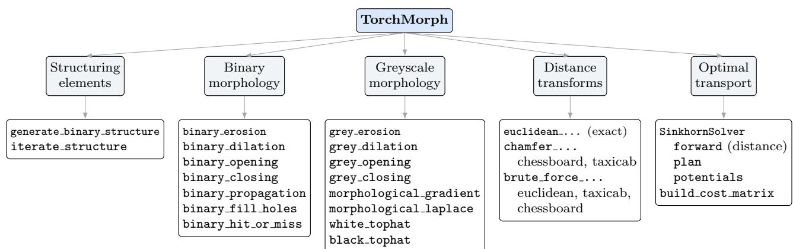
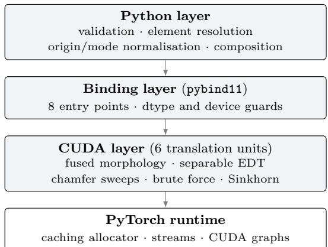

# TorchMorph: CUDA-accelerated Morphological Transforms

Kai Zhao

Shanghai University

kz@kaizhao.net

## Abstract

Morphological transforms are long-standing tools for shape and mask processing, but the de-facto reference implementation in the Python ecosystem, i.e. scipy.ndimage, is CPU-only, single-array, and therefore unusable inside a GPU training loop without an expensive device-to-host round trip. GPU vision libraries built on PyTorch cover a narrow subset of these operators, typically restricted to two spatial dimensions and flat structuring elements. We present TorchMorph, a lightweight PyTorch extension that closes this gap. TorchMorph exposes 22 public operators covering binary morphology, greyscale morphology, exact and approximate distance transforms, and entropy-regularised optimal transport, all implemented as fused CUDA kernels that operate directly on (B, C, Spatial...) CUDA tensors with up to eight spatial dimensions. The API deliberately mirrors scipy.ndimage argument-for-argument, including border modes, structuring-element origins and preallocated outputs, so that existing pipelines port with a change of import. We describe the layered architecture and the kernel designs behind each operator family. Against single-threaded CPU references, batched execution reaches up to 1.1×10<sup>3</sup> times the throughput of scipy.ndimage on greyscale morphology and up to 350× on exact Euclidean distance transforms, while the Sinkhorn solver runs up to 42× faster than POT. Binary and chamfer operators reproduce their SciPy counterparts exactly, and every float-valued operator agrees with the CPU reference to within $1 . 8 \times 1 0 ^ { - 6 }$ absolute error. TorchMorph is released under the MIT licence at https://intcomp.github.io/tm.

Keywords: Morphological Transforms, Distance Transform, Optimal Transport, CUDA, PyTorch, Open Source

## 1 Introduction

Mathematical morphology supplies some of the oldest and most widely used primitives in image analysis [1, 2]. Erosion, dilation and their compositions underpin denoising, shape decomposition and connected-component postprocessing, while the distance transform, an erosion by a parabolic structuring function, underpins skeletonisation and watershed seeding [3, 4], boundary-aware losses [5] and Hausdorf-distance surrogates [6]. In the Python ecosystem these operators are canonically provided by scipy.ndimage [7], whose semantics for border modes, structuring-element origins and connectivity conventions have become the de-facto standard that downstream libraries are expected to reproduce.

That reference implementation was designed for a world in which images live in host memory as NumPy arrays [8]. In modern AI-native imaging pipelines, images are represented diferently in three specific ways. First, data live on the GPU as PyTorch tensors [9], so every call into scipy.ndimage forces a device-to-host copy, a single-threaded CPU computation, and a copy back. Second, data arrive in batches: a training step processes tens of volumes at once, and a per-image Python loop over a CPU routine serialises what is naturally an embarrassingly parallel workload. Third, the interesting regime is often three- or four-dimensional (volumetric time series, multi-channel tomography), where the CPU cost of a morphological sweep grows with the product of all spatial extents.

The obvious response is to use a GPU vision library, but that runs into a coverage problem. Kornia [10] provides diferentiable 2-D morphology, but not N-dimensional operators, the full scipy.ndimage bordermode matrix, or an exact Euclidean distance transform; cuCIM [11] ofers GPU morphology through CuPy, an interoperability layer rather than native torch.Tensor operators; MONAI [12] delegates several morphological post-processing steps back to SciPy or CuPy; and OpenCV [13] and scikit-image [14] are host-side and two-dimensional in their fast paths. Entropic optimal transport, increasingly used as a shape- and histogramcomparison loss [15, 16], lives in yet another stack [17, 18]. A practitioner who wants batched GPU morphology, an exact distance transform and a diferentiable transport distance must therefore assemble three libraries with three tensor conventions. Table 1 summarises the resulting coverage gap.

TorchMorph closes that gap in one place. It brings these operators into the PyTorch tensor world as native, batch-parallel CUDA kernels: 22 public operators spanning binary and greyscale morphology, exact and approximate distance transforms, and entropy-regularised optimal transport. Every one accepts (B, C, Spatial...) CUDA tensors of spatial rank up to eight, and mirrors its scipy.ndimage counterpart in name, argument order, defaults and boundary behaviour, so porting is a change of import rather than a rewrite, and 3-D and 4-D data are first-class rather than special cases. The operators are fused rather than assembled from generic tensor primitives: one launch per call, with structuring-element geometry resolved on the host, an interior fast path that removes per-axis boundary tests, and CUDA-graph replay for the transport iterations. The library depends only on PyTorch and a CUDA toolchain, is validated element-wise against SciPy and POT, and is released under the MIT licence. Section 2 describes the transforms it covers and the design behind them; Section 3 reports its numerical agreement and throughput against the CPU reference.

<table><tr><td></td><td>GPU</td><td></td><td>Torch Batch</td><td>N-D</td><td>Sem.</td><td>EDT</td><td>OT</td></tr><tr><td>scipy.ndimage [7]</td><td>x</td><td>x</td><td>x</td><td></td><td>L</td><td></td><td>x</td></tr><tr><td>scikit-image [14]</td><td>X</td><td>X</td><td>x</td><td>1</td><td>2</td><td></td><td>x</td></tr><tr><td>OpenCV [13]</td><td>2</td><td>x</td><td>X</td><td>x</td><td>x</td><td>L</td><td>x</td></tr><tr><td>Kornia [10]</td><td>V</td><td>J</td><td>√</td><td>X</td><td>X</td><td>2</td><td>X</td></tr><tr><td>cuCIM [11]</td><td></td><td>x</td><td>X</td><td>X</td><td>~</td><td>J</td><td>X</td></tr><tr><td>MONAI [12]</td><td></td><td></td><td>~</td><td>X</td><td>X</td><td>2</td><td>X</td></tr><tr><td>POT [17]</td><td>√</td><td></td><td>1</td><td>X</td><td>X</td><td>X</td><td>L</td></tr><tr><td>TORCHMORPH</td><td></td><td></td><td></td><td></td><td>1</td><td>V</td><td></td></tr></table>

Table 1: Coverage of the capabilities TorchMorph targets. ✓ = supported, ∼ = partial or indirect, ✗ = not supported. Torch = operates on torch.Tensor natively; Batch = a single call over a leading batch dimension rather than a Python loop; N-D = more than three spatial dimensions; Sem. = matches scipy.ndimage border modes, structuring-element origins and iteration conventions; EDT = exact Euclidean distance transform.

## 2 TorchMorph

## 2.1 Covered transforms

Figure 1 organises the 22 exported operators into four families plus a structuring-element utility group. Only the bold entries are backed by a dedicated CUDA kernel; the rest are host-side compositions of those primitives, which is why adding a new top-hat variant costs no device code.

Binary and greyscale morphology. Erosion and dilation, and the openings, closings, gradients, Laplacians and tophats built from them [1, 2, 19], remain the standard tools for cleaning up masks, decomposing shapes and extracting structure at a chosen scale. In deep-learning pipelines they appear as post-processing on predicted segmentations and as label preparation upstream of training [12, 20]. Both run per-step, on batched tensors that already live on the GPU, which is exactly the regime a CPU reference serves badly. TorchMorph implements erosion and dilation as fused kernels and derives the remaining eleven operators from them.

Distance transforms. The distance transform labels every foreground element with its distance to the nearest background element. It underpins skeletonisation, watershed seeding and shape descriptors [3, 4], and in learning pipelines it is the ingredient behind boundary-aware and Hausdorf-style losses [5, 6], which recompute a distance field every training step and so put it on the critical path. TorchMorph provides the exact Euclidean transform via the separable lower-envelope algorithm [21, 22], chamfer transforms under the chessboard and taxicab metrics [4], and a brute-force transform used as an exactness oracle.

Entropy-regularised optimal transport. Optimal transport compares two distributions by the cheapest way of morphing one into the other, and its entropy-regularised form is solved by the Sinkhorn iteration [23, 15, 16]. It has become a standard geometry-aware loss for histograms, point clouds and attention-style matching problems, where a bin-wise divergence would ignore how far apart the bins are. TorchMorph provides a batched Sinkhorn solver in both the scaling and log domains, differentiable with respect to both marginals, so it drops into a training loop as a loss.

## 2.2 Architecture

## 2.2.1 API surface

Every operator that consumes an image accepts a CUDA tensor shaped (B, C, Spatial...) with 1 ≤ spatial rank ≤ 8, validated by a single shared routine, and takes the same keyword arguments as its SciPy counterpart: size, footprint, structure, mode, cval and origin for greyscale operators; structure, iterations, mask and border value for binary ones; sampling, metric and the return distances / return indices pair for distance transforms, with pre-allocated output bufers supported throughout. Iteration semantics match too: iterations < 1 means iterate until the result stops changing, which is how binary propagation and binary fill holes are built.

```python
# before: CPU, one volume at a time
import scipy.ndimage as ndi
out = [ndi.grey_opening(v, size=3) for v in vols]
# after: GPU, whole batch, one launch
import torchmorph as tm
out = tm.grey_opening(vols_cuda, size=3)
```  
Listing 1: Porting a SciPy pipeline.

## 2.2.2 Three layers

The library is organised as in Figure 2. The Python layer normalises and validates arguments: it resolves the structuring element from the structure > footprint > size priority chain, expands origin to a per-axis tuple and range-checks it against the element extent, maps bordermode strings to integer codes, and composes the derived operators from the two primitives. This layer is where SciPy compatibility is defined, and deliberately the only place that knows about argument conventions. The binding layer is a single pybind11 module exposing eight kernel entry points compiled from six CUDA translation units; keeping that surface small means derived operators cost no extra device code. The kernel layer holds the CUDA implementations, with two decisions recurring across it: all geometry that can be resolved on the host is resolved on the host, and every kernel is written against a runtime spatial rank with a compile-time bound, so coordinate scratch space stays in registers; the Python layer caps that rank at eight.

  
Figure 1: Operator taxonomy of TorchMorph. Bold entries are backed by a dedicated CUDA kernel; the remainder are host side compositions of those primitives. All image operators accept (B, C, Spatial...) CUDA tensors with up to eight spatia dimensions.

  
Figure 2: The three implementation layers. SciPy-compatible argument conventions are confined to the Python layer; the CUDA layer sees only normalised geometry.

## 2.3 Kernel design

## 2.3.1 Fused morphology kernel

A naive GPU morphology kernel recomputes, for every output element and every structuring-element position, a full N-dimensional coordinate mapping with a per-axis boundary test. For a 3<sup>3</sup> element in 3-D that is 27 mapped coordinates per voxel, each requiring the linear index to be decomposed along every axis before it can be boundschecked.

TorchMorph avoids this in two ways. On the host, the structuring element is flattened once into a list of active entries; for each we store the per-axis ofset and the precomputed flat ofset against the input’s spatial strides, and inactive footprint positions never reach the device.

On the device, each thread first tests whether its output coordinate is interior, using per-axis ofset extrema computed on the host. Interior threads, the overwhelming majority, take a fast path that adds the precomputed flat ofset directly to the linear index, with no per-axis arithmetic and no boundary test at all. Only threads within one element radius of a face take the general path, which resolves out-of-bounds neighbours as its SciPy counterpart does: the greyscale kernel implements all five border modes (constant, reflect, nearest, mirror, wrap), the binary kernel a single border value.

Erosion and dilation are instantiations of one templated kernel parameterised by a functor supplying the identity element and the combining rule, and the binary kernel adds a done predicate so a thread can break out of the reduction as soon as the result is decided, false for erosion and true for dilation, which is a substantial saving on sparse masks.

## 2.3.2 Distance-transform kernels

The EDT uses the separable lower-envelope formulation, in which each one-dimensional pass computes the lower envelope of a family of parabolas in a single sweep [21]. That sweep is inherently sequential, so TorchMorph assigns one thread block per scanline: a single thread builds the envelope in shared memory while the whole block cooperates on loading the line and, afterwards, on the query phase, where each output position binary-searches the intersection array in parallel. Parallelism comes from the number of scanlines, which is ample: for B batch items of

C channels and extent $n ^ { d }$ it is $B C n ^ { d - 1 }$ per pass.

Three paths exist: a 2-D specialisation for extents up to 2048 that keeps the row pass fully contiguous and fuses the final square root into the column pass; a general path that transposes the active axis to be innermost so every pass sees contiguous memory; and a fallback that spills the envelope stack to a lazily allocated global bufer when a scanline exceeds the shared-memory budget. Nearestbackground indices are propagated through the passes on request, and an image with no background is handled by the same virtual out-of-bounds convention SciPy uses.

The chamfer transform is implemented as dimensionseparable forward and backward sweeps, with extra diagonal passes for the chessboard metric. The brute-force transform stages background coordinates through shared memory in tiles of 256 and is templated over both metric and spatial rank, so the coordinate loop is fully unrolled and metric selection costs no branch; its quadratic cost confines it to validating the separable transforms and to the one case they miss: the chamfer entry point takes no sampling argument, so anisotropic chessboard and taxicab distances are reachable only this way.

## 2.3.3 Batch-tiled Sinkhorn solver

The transport module solves the Sinkhorn iteration for a batch of n histogram pairs of dimension d sharing one d×d cost matrix, and three characteristics of that workload drive the design.

The matrix is shared across the batch: rather than the generic batched matrix–vector product, which reads the d<sup>2</sup> matrix once per batch item, TorchMorph assigns one block per (row, batch-tile) pair with a tile of eight items, streams the matrix row once and applies it to all eight scaling vectors held in registers, dropping matrix trafic by the tile factor.

The log-domain update needs only one pass: where the textbook log-sum-exp makes two passes over the row, one for the maximum and one for the shifted sum, Torch-Morph maintains a running maximum and a rescaled running sum in a single pass and reduces the resulting pairs across the block with a merge operator that is well defined on the empty state, so an all-zero marginal pins the potential to −∞ instead of producing NaN.

Long runs are launch-latency bound: each iteration is two small kernels, so from 100 requested iterations upwards TorchMorph captures a chunk of 25 into a CUDA graph [24] and replays it. Because the iterations are fixedpoint steps on ping-pong bufers, executing extra iterations is always safe, and the graph path degrades gracefully to plain launches when capture is unavailable.

Gradients come from a custom autograd function returning the centered dual potentials, which by the envelope theorem are the exact gradients of the entropic transport cost with respect to the marginals [16]; the potentials are centred and stashed during the forward pass, so the backward pass is a single broadcast multiply and never diferentiates through the iteration.

## 2.4 Testing and reference alignment

Matching scipy.ndimage is a claim about behaviour, so it is checked by diferential testing rather than asserted. The suite is 78 test functions across five modules.

Oracle agreement accounts for most of it: every exported operator is compared elementwise against its reference (scipy.ndimage for morphology and distance transforms, POT for transport) over 2-D, 3-D and higher-rank inputs, batch and channel combinations, non-contiguous and transposed layouts, anisotropic sampling, every border mode, and asymmetric structuring elements with shifted origins. The reference is applied sample by sample to the same array the GPU receives, so batching cannot mask a per-item discrepancy. Where no reference settles the question, invariants take over: transport plans must reproduce both marginals, returned indices must point at a genuine nearest background element, and the analytic gradient is checked against a finite-diference directional derivative.

The remainder guards the seams. Crossimplementation tests solve one problem along every path the library can take: fused kernels against the pure-torch fallback, float32 against float64, CPU against GPU, CUDA-graph replay against plain launches, early-stopped against fully iterated. The results must coincide. Contract tests, a quarter of the suite, assert failure on spatial rank above eight, mismatched origin, mask or output shapes, unknown modes and metrics, and non-CUDA input. Runtime tests issue work on a side stream and a non-default device, checking that kernels honour the caller’s stream and device rather than the defaults.

## 3 Results

Protocol. All comparisons use scipy.ndimage as the reference, except for transport, which uses POT [17]. All measurements come from a single machine. Hardware: NVIDIA GeForce RTX 4090 D GPU (Ada Lovelace, 48 GB, driver 580.173.02), 2 × Intel Xeon Gold 6330 CPU (56 cores / 112 threads, 2.00 GHz), and 128 GB of system memory. Software: Ubuntu 24.04.3 LTS, CUDA 12.4, Python 3.12.13, PyTorch 2.6.0+cu124, NumPy 2.5.1, SciPy 1.18.0, and POT 0.9.6.post1. TorchMorph extensions were compiled with -O3 and --use fast math. The SciPy and POT baselines are single-threaded and therefore occupy one CPU core, while every GPU result uses a single device. Accuracy is measured by transferring the GPU result to the host and comparing against the reference output on the identical input; we report the maximum absolute error max |y − yˆ| and the relative error $\| y - \hat { y } \| _ { 2 } / \| y \| _ { 2 }$ Timings are collected with torch.utils.benchmark, taking the median of blocked auto-ranged measurements with a one-second minimum run time and per-item normalisation, after warm-up and with an explicit torch.cuda.synchronize() inside the timed region. Because the point of the library is batching, we report two GPU columns: 1×, a Python loop calling the operator once per batch item, the honest analogue of a SciPy loop, and batch, a single call on the whole batch. Speed-up is SciPy time divided by batched GPU time per item. Every table is reproduced by the scripts in benchmark/.

<table><tr><td>Operator family</td><td>Reference</td><td>Max abs. err.</td><td>Rel.  $\ell _ { 2 }$  err.</td></tr><tr><td>Binary morphology</td><td>ndimage</td><td>0</td><td>0</td></tr><tr><td>Grey morphology</td><td>ndimage</td><td> $4 . 7 7 \times 1 0 ^ { - 7 }$ </td><td> $2 . 2 4 \times 1 0 ^ { - 8 }$ </td></tr><tr><td>Euclidean DT</td><td>ndimage</td><td> $2 . 0 6 \times 1 0 ^ { - 7 }$ </td><td> $6 . 7 7 \times 1 0 ^ { - 9 }$ </td></tr><tr><td>Chamfer DT (chessb.)</td><td>ndimage</td><td>0</td><td>0</td></tr><tr><td>Chamfer DT (taxicab)</td><td>ndimage</td><td>0</td><td>0</td></tr><tr><td>Brute-force DT  $( \ell _ { 2 } )$ </td><td> $\mathtt { n d i m a g e }$ </td><td> $2 . 0 6 \times 1 0 ^ { - 7 }$ </td><td> $6 . 7 1 \times 1 0 ^ { - 9 }$ </td></tr><tr><td>Sinkhorn distance</td><td>POT</td><td> $1 . 7 5 \times 1 0 ^ { - 6 }$ </td><td> $8 . 8 2 \times 1 0 ^ { - 8 }$ </td></tr></table>

Table 2: Worst-case numerical error over all tested configurations against the CPU reference implementations. Binary morphology and chamfer distance transforms match scipy.ndimage exactly in the tested cases, while float-valued operators difer only at float32-level numerical precision. Sinkhorn distance is compared against POT.

Numerical agreement. Table 2 shows close agreement with the CPU references. Binary morphology and chamfer distance transforms match scipy.ndimage exactly; all float-valued operators have worst-case absolute and relative $\ell _ { 2 }$ errors below $1 . 8 \times 1 0 ^ { - 6 }$ and $9 \times 1 0 ^ { - 8 }$ , respectively. Small discrepancies arise from float32 GPU arithmetic and --use fast math. NaN propagation is the only documented behavioral diference from SciPy. Correctness is covered by 78 test functions, parametrised over operator, spatial rank, input shape, origin, sampling, requested outputs, device and solver variant, with scipy.ndimage as the oracle for morphology and distance transforms and POT for transport. The suite runs on every push and pull request through a self-hosted continuous-integration runner equipped with a physical CUDA device, so each change is checked against the CPU references by executing the actual kernels rather than a mocked or CPU-only code path; a second hosted runner enforces formatting and static checks.

Throughput. Table 3 reports per-input throughput for morphology and distance transforms. The $B = 1$ results capture single-input GPU execution, where launch overhead can dominate, while larger batches expose the parallel regime targeted by TorchMorph. The batching benefit generally decreases as individual inputs become large enough to better utilize the GPU.

Table 3: Per-input throughput across representative operators, input sizes, and batch sizes. Throughput is reported in inputs/ms (higher is better), where one input denotes one 2-D image or one 3-D volume. TM = TorchMorph; its values are rounded to one decimal place, while the SciPy column keeps three, since one decimal would collapse most of its entries to 0.0.
<table><tr><td rowspan="2">Operator</td><td rowspan="2">Size</td><td colspan="5">Throughput (inputs/ms) ↑</td></tr><tr><td rowspan="2"> $\operatorname { S c i P y }$ </td><td colspan="4">TM</td></tr><tr><td></td><td>B=1</td><td>B=2</td><td>B=4</td><td>B=8</td></tr><tr><td rowspan="2">Binary erosion</td><td> $2 5 6 ^ { 2 }$ </td><td>0.865</td><td>6.9</td><td>13.7</td><td>27.8</td><td>55.6</td></tr><tr><td> $1 0 2 4 ^ { 2 }$ </td><td>0.056</td><td>6.8</td><td>12.8</td><td>22.2</td><td>35.7</td></tr><tr><td rowspan="2">Binary dilation</td><td> $2 5 6 ^ { 2 }$ </td><td>0.851</td><td>6.7</td><td>13.5</td><td>27.0</td><td>52.6</td></tr><tr><td> $1 0 2 4 ^ { 2 }$ </td><td>0.057</td><td>6.7</td><td>12.5</td><td>21.7</td><td>35.7</td></tr><tr><td rowspan="2">Grey erosion</td><td> $2 5 6 ^ { 2 }$ </td><td>0.740</td><td>16.1</td><td>32.3</td><td>62.5</td><td>83.3</td></tr><tr><td> $1 0 2 4 ^ { 2 }$ </td><td>0.040</td><td>13.7</td><td>23.3</td><td>34.5</td><td>45.5</td></tr><tr><td rowspan="2">Grey dilation</td><td> $2 5 6 ^ { 2 }$ </td><td>0.756</td><td>10.3</td><td>30.3</td><td>58.8</td><td>111.1</td></tr><tr><td> $1 0 2 4 ^ { 2 }$ </td><td>0.040</td><td>13.2</td><td>22.2</td><td>33.3</td><td>45.5</td></tr><tr><td>EDT 2-D</td><td> $\overline { { 2 5 6 ^ { 2 } } }$   $1 0 2 4 ^ { 2 }$ </td><td>0.160 0.011</td><td>13.3 2.1</td><td>25.6</td><td>30.3</td><td>40.0</td></tr><tr><td rowspan="2">EDT 3-D</td><td> $6 4 ^ { 3 }$ </td><td>0.031</td><td>6.3</td><td>2.7</td><td>2.8</td><td>2.9</td></tr><tr><td> $1 2 8 ^ { 3 }$ </td><td>0.003</td><td>1.4</td><td>8.3 1.4</td><td>9.3 1.5</td><td>10.8</td></tr><tr><td rowspan="2">CDT chessboard</td><td> $2 5 6 ^ { 2 }$ </td><td>0.585</td><td>4.7</td><td></td><td></td><td>1.5</td></tr><tr><td> $1 0 2 4 ^ { 2 }$ </td><td>0.037</td><td>1.5</td><td>9.4 2.6</td><td>18.2 4.3</td><td>33.3 5.9</td></tr><tr><td rowspan="2">CDT taxicab</td><td> $2 5 6 ^ { 2 }$ </td><td>0.637</td><td>5.5</td><td></td><td></td><td></td></tr><tr><td> $1 0 2 4 ^ { 2 }$ </td><td>0.041</td><td>1.7</td><td>10.9 3.4</td><td>20.0 6.6</td><td>43.5 11.6</td></tr><tr><td></td><td></td><td></td><td></td><td></td><td></td><td></td></tr><tr><td>BFDT (l2)</td><td></td><td> $2 5 6 ^ { 2 } < 0 . 0 0 1$ </td><td>1.1</td><td>1.2</td><td>1.2</td><td>1.2</td></tr></table>

Morphology and distance transforms. Table 3 reports per-input throughput for representative morphological operators and distance transforms. Across most operators, throughput increases substantially with batch size, reflecting the fact that a single input does not supply enough parallel work to saturate the GPU. Grey dilation on $2 5 6 ^ { 2 }$ images, for instance, improves from 10.31 inputs/ms at $B = 1$ to 111.11 inputs/ms at $B = 8$ (a 10.8× gain), while grey erosion improves from 16.13 to 83.33 inputs/ms (5.2×). Binary morphology follows the same pattern, reaching 36–56 inputs/ms at $B = 8$ depending on the operator and image size.

The benefit of batching diminishes markedly for computationally heavier transforms, where a single large input already supplies enough parallelism to approach device saturation on its own. EDT on $1 0 2 4 ^ { 2 }$ images improves only modestly, from 2.11 to 2.86 inputs/ms (1.4×), and EDT on $1 2 8 ^ { 3 }$ volumes remains essentially flat at approximately 1.4 inputs/ms regardless of batch size. CDT retains a clear batching benefit, particularly for smaller inputs, whereas BFDT shows only a marginal gain, from 1.15 to 1.25 inputs/ms. SciPy’s throughput on BFDT is extremely low because it relies on a brute-force reference implementation, so this comparison should be read as a correctness oracle rather than as a benchmark against an optimized CPU distance-transform implementation.

Table 4: Entropic optimal transport against POT on 2-D grid problems with $d = 3 2 ^ { 2 }$ bins (TM = TorchMorph). The 1000- iteration row uses CUDA-graph replay. Timings are rounded to one decimal place; speed-ups are computed from the unrounded values.
<table><tr><td>Configuration</td><td>POT TM Speed-up (ms) (ms)</td><td></td><td></td><td>Rel. err. (plan)</td></tr><tr><td>scaling, 100 it.</td><td>23.0</td><td>1.2</td><td>18.8×</td><td> $9 . 2 1 \times 1 0 ^ { - 4 }$ </td></tr><tr><td>scaling, 1000 it.</td><td>229.7</td><td>10.1</td><td>22.8×</td><td> $4 . 4 5 \times 1 0 ^ { - 7 }$ </td></tr><tr><td>log-domain, 200 it.</td><td>35.4</td><td>3.0</td><td>11.8×</td><td> $4 . 5 5 \times 1 0 ^ { - 5 }$ </td></tr><tr><td>batch  $n = 1 6 ,$ </td><td>100 it. 367.3</td><td>8.7</td><td>42.4×</td><td> $1 . 5 4 \times 1 0 ^ { - 3 }$ </td></tr></table>

Optimal transport. Table 4 compares the Sinkhorn solver against POT [17] on grid-structured problems, where the cost matrix is the pairwise $\ell _ { 2 }$ distance between the points of ${ \textrm { a } } 3 2 \times 3 2$ grid. We also report the relative error of the recovered transport plan. Three configurations are of particular interest: the scaling form at moderate regularisation, the log-domain form at small regularisation where the scaling form underflows, and a batched run that exercises the tiling described in Section 2.3.3.

Threats to the comparison. The speed-ups therefore compare a GPU against one CPU core, not a wellparallelised CPU implementation; we report per-item times and the $B = 1$ column so the batching efect can be separated from the device efect. The brute-force timings are the cost of a correctness oracle, not a performance claim.

## 4 Conclusion

TorchMorph provides batch-parallel, N-dimensional CUDA implementations of binary and greyscale morphology, exact and approximate distance transforms, and entropy-regularised optimal transport, behind an API that mirrors scipy.ndimage. Its contribution is availability rather than algorithmic novelty: classical algorithms implemented once, correctly, against the tensor conventions modern imaging pipelines actually use, and validated against the references the community already trusts. That turns these operators from an ofline preprocessing step into something that can sit inside a training loop [5, 6].

Three limitations remain. The morphology and distance kernels are forward-only; only the transport module is diferentiable, though erosion and dilation admit subgradients routed to the arg-min/arg-max position. They also require CUDA, the intended fallback being SciPy itself, whereas the transport module drops back to pure torch on CPU. And they compute in float32 under --use fast math, with NaN propagation not guaranteed to match the reference. Future work is autograd for the morphological operators and a wider set of connectedcomponent and reconstruction operators.

## Acknowledgements

## References

[1] Jean Serra. Image Analysis and Mathematical Morphology. Academic Press, London, 1982.

[2] Pierre Soille. Morphological Image Analysis: Principles and Applications. Springer, Berlin, 2 edition, 2004.

[3] Azriel Rosenfeld and John L. Pfaltz. Sequential operations in digital picture processing. Journal of the ACM, 13(4):471–494, 1966.

[4] Gunilla Borgefors. Distance transformations in digital images. Computer Vision, Graphics, and Image Processing, 34(3):344– 371, 1986.

[5] Hoel Kervadec, Jihene Bouchtiba, Christian Desrosiers, Eric Granger, Jose Dolz, and Ismail Ben Ayed. Boundary loss for highly unbalanced segmentation. Medical Image Analysis, 67:101851, 2021.

[6] Davood Karimi and Septimiu E. Salcudean. Reducing the Hausdorf distance in medical image segmentation with convolutional neural networks. IEEE Transactions on Medical Imaging, 39(2):499–513, 2020.

[7] Pauli Virtanen, Ralf Gommers, Travis E. Oliphant, et al. SciPy 1.0: fundamental algorithms for scientific computing in Python. Nature Methods, 17(3):261–272, 2020. https://docs.scipy.org/doc/scipy/ reference/ndimage.html.

[8] Charles R. Harris, K. Jarrod Millman, St´efan J. van der Walt, et al. Array programming with NumPy. Nature, 585(7825):357– 362, 2020.

[9] Adam Paszke, Sam Gross, Francisco Massa, et al. PyTorch: an imperative style, high-performance deep learning library. In Advances in Neural Information Processing Systems (NeurIPS), volume 32, pages 8024–8035, 2019. https://pytorch.org.

[10] Edgar Riba, Dmytro Mishkin, Daniel Ponsa, Ethan Rublee, and Gary Bradski. Kornia: an open source diferentiable computer vision library for PyTorch. In IEEE Winter Conference on Applications of Computer Vision (WACV), pages 3674–3683, 2020. https://kornia.org.

[11] RAPIDS Development Team. cuCIM: a GPU-accelerated image I/O and computer vision library. https://github.com/rapidsai/ cucim, 2022.

[12] M. Jorge Cardoso, Wenqi Li, Richard Brown, et al. MONAI: an open-source framework for deep learning in healthcare. arXiv preprint arXiv:2211.02701, 2022. https://monai.io.

[13] Gary Bradski. The OpenCV library. Dr. Dobb’s Journal of Software Tools, 25(11):120–125, 2000. https://opencv.org.

[14] St´efan van der Walt, Johannes L. Sch¨onberger, Juan Nunez-Iglesias, et al. scikit-image: image processing in Python. PeerJ, 2:e453, 2014. https://scikit-image.org.

[15] Marco Cuturi. Sinkhorn distances: lightspeed computation of optimal transport. In Advances in Neural Information Processing Systems (NeurIPS), volume 26, pages 2292–2300, 2013.

[16] Gabriel Peyr´e and Marco Cuturi. Computational optimal transport. Foundations and Trends in Machine Learning, 11(5-6):355– 607, 2019.

[17] R´emi Flamary, Nicolas Courty, Alexandre Gramfort, et al. POT: Python optimal transport. Journal of Machine Learning Research, 22(78):1–8, 2021. https://pythonot.github.io.

[18] Jean Feydy, Thibault S´ejourn´e, Fran¸cois-Xavier Vialard, Shun-ichi Amari, Alain Trouv´e, and Gabriel Peyr´e. Interpolating between optimal transport and MMD using Sinkhorn divergences. In International Conference on Artificial Intelligence and Statistics (AISTATS), pages 2681–2690, 2019.

[19] Robert M. Haralick, Stanley R. Sternberg, and Xinhua Zhuang. Image analysis using mathematical morphology. IEEE Transactions on Pattern Analysis and Machine Intelligence, 9(4):532– 550, 1987.

[20] Luc Vincent. Morphological grayscale reconstruction in image analysis: applications and eficient algorithms. IEEE Transactions on Image Processing, 2(2):176–201, 1993.

[21] Pedro F. Felzenszwalb and Daniel P. Huttenlocher. Distance transforms of sampled functions. Theory of Computing, 8(19):415–428, 2012.

[22] Calvin R. Maurer, Rensheng Qi, and Vijay Raghavan. A linear time algorithm for computing exact Euclidean distance transforms of binary images in arbitrary dimensions. IEEE Transactions on Pattern Analysis and Machine Intelligence, 25(2):265–270, 2003.

[23] Richard Sinkhorn and Paul Knopp. Concerning nonnegative matrices and doubly stochastic matrices. Pacific Journal of Mathematics, 21(2):343–348, 1967.

[24] NVIDIA Corporation. CUDA C++ programming guide. https: //docs.nvidia.com/cuda/cuda-c-programming-guide/, 2024.