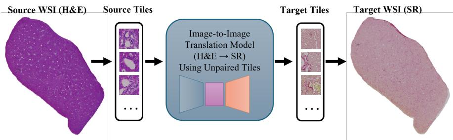
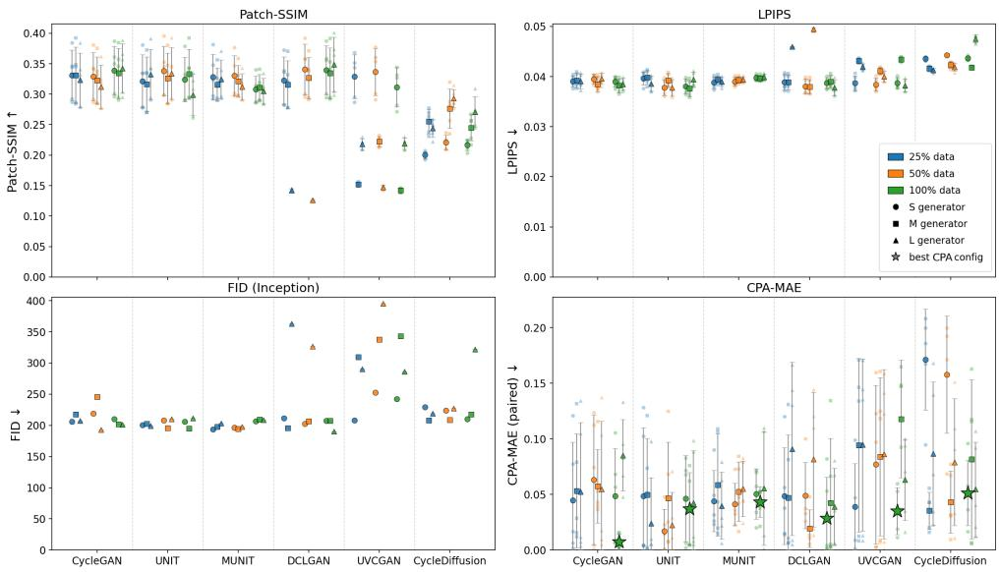
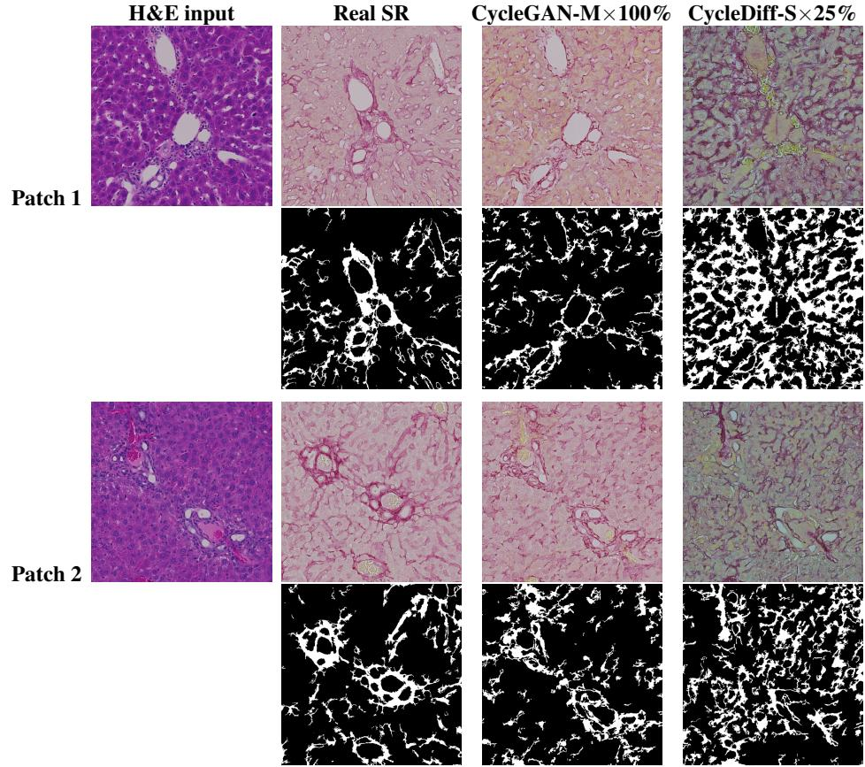
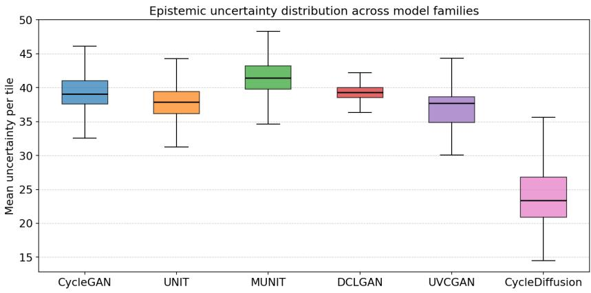
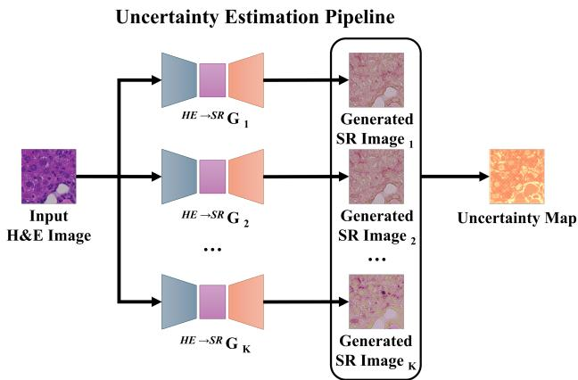
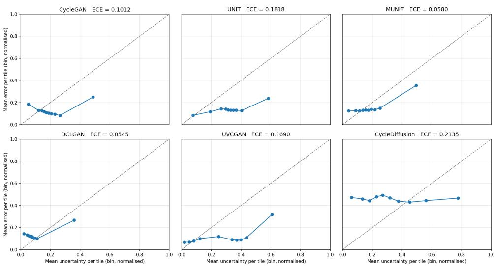
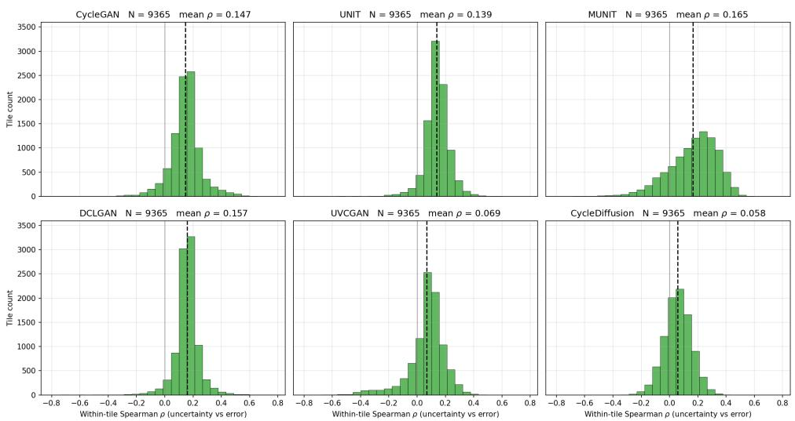
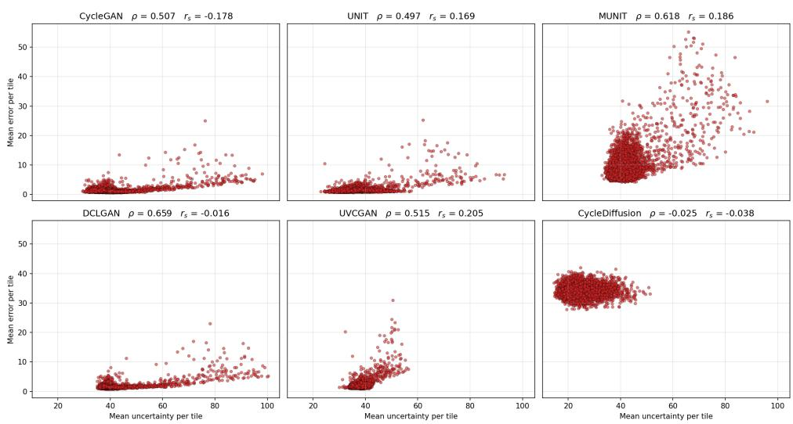

# Towards Reliable AI-Based Histological Staining: A Systematic Study of Scaling and Uncertainty in Unpaired Generative Models

Qasim Siddiqui1,2 qasim.siddiqui@uni-leipzig.de

Adrian Friebel1,2 friebel@izbi.uni-leipzig.de

Maiju Myllys3 myllys@ifado.de

Zaynab Hobloss3 hobloss@ifado.de

Daniela González3 gonzalez@ifado.de

Ahmed Ghallab3,4 ghallab@ifado.de Stefan Hoehme1,2 hoehme@uni-leipzig.de 1 Interdisciplinary Centre of Bioinformatics (IZBI) Universität Leipzig Leipzig, Germany

2 Center for Scalable Data Analytics and Artificial Intelligence (ScaDS.AI) University of Leipzig   
Leipzig, Germany

3 Department of Toxicology Technical University Dortmund Dortmund, Germany

4 Faculty of Veterinary Medicine Qena University Qena, Egypt

## Abstract

Liver fibrosis, the principal predictor of long-term outcome in chronic liver disease, is staged from histological estimates of collagen content. Sirius Red (SR) provides the standard quantitative readout (collagen proportionate area, CPA) but is not acquired at every clinical centre and consumes tissue, time, and reagent cost beyond the routine Hematoxylin and eosin (H&E) stain. AI-based virtual staining can generate SR directly from H&E, yet systematic benchmarks of unsupervised models are scarce and their predictive uncertainty has not been quantified, even though visually plausible outputs may not faithfully reproduce the underlying tissue structure. We therefore benchmark six unsupervised image-to-image architectures (GAN-based and diffusion-based) across 54 scaling configurations on a newly released paired H&E to SR mouse liver dataset, the first open resource for this translation task. Each configuration is evaluated jointly on perceptual, distributional, and task-specific axes plus a blinded expert reader study; the best per family is then retrained as a deep ensemble, the first systematic comparison of epistemic uncertainty across unsupervised stain-to-stain architectures. Across families, perceptual quality, task-specific error, and ensemble agreement measure largely independent axes of model fitness: GAN-based methods cluster tightly on perceptual metrics yet differ substantially on task error and ensemble agreement, while the diffusion-based method (CycleDiffusion) is qualitatively different on all three. No single metric captures these differences, so reliable virtual staining requires reporting and selecting on all three jointly. The dataset, tiling pipeline, models, and evaluation code are released publicly.

## 1 Introduction

Histopathology in most cases relies on a panel of stains. Hematoxylin and eosin (H&E), the most widely available routine stain, reveals overall tissue architecture, while specialised histochemical stains highlight specific tissue components such as collagen fibres, and immunohistochemical stains visualise particular proteins via antibody binding to infer cell types or functional states such as proliferation or necrosis [31, 34]. In clinical and preclinical practice, however, each additional stain requires a separate tissue section. This consumes limited biopsy material [8, 39], extends laboratory processing time [8], raises per-case reagent and labour cost (substantially so for antibody-based panels), and introduces spatial misalignment between stains because tissue deforms during sectioning and mounting [12, 50]. These costs grow with each additional stain: a full tissue characterisation panel may require four or more serial sections from a single biopsy [6], and because a biopsy yields only a limited number of usable sections, every extra stain trades against either reserve material for downstream molecular assays or the breadth of complementary stains that can be examined on the same specimen.

Liver pathology is a particularly acute case. Chronic liver disease is staged primarily by the degree of fibrosis, the progressive deposition of collagen in the extracellular matrix, which is the principal predictor of long-term outcome. While fibrosis can be qualitatively appreciated on H&E, Sirius Red (SR) provides the standard quantitative readout: SR binds collagen with high specificity and is the histochemical stain of reference for measuring fibrosis as the collagen proportionate area (CPA), correlating more strongly with serum fibrosis biomarkers than the widely used Masson’s trichrome stain [21]. Inferring SR directly from a routinely acquired H&E section would therefore make a clinically meaningful fibrosis readout available wherever H&E is, without consuming additional tissue or laboratory resources.

Virtual staining offers an attractive solution: it uses deep learning to predict a target stain directly from an existing H&E image (Figure 1), and additionally enables retrospective analysis of existing H&E archives without acquiring new sections [33, 39]. Supervised approaches, however, require pixel-aligned image pairs from adjacent tissue sections, which is impractical at scale and introduces bias from tissue deformation [24]. Unsupervised methods, which learn from unpaired image collections, are better suited to this setting. However, no prior work has systematically compared them for H&E → SR translation in liver tissue; existing comparisons focus almost entirely on H&E → IHC or on non-liver tissue [1, 22, 30]. The existing benchmarks fix a single model scale and data budget [22, 30], leaving open how model capacity and training data jointly affect translation quality, an important question because liver biopsy cohorts vary widely in size across clinical centres.

Beyond translation quality, we also need a signal of when a virtual SR output can be trusted. Task-specific evaluation can verify aggregate translation quality at the WSI level (Section 5.1), but in unpaired settings no ground-truth SR is available for any given H&E tile, so individual tile outputs cannot be checked against truth even though clinical decisions may hinge on local features within a single tile. Training ensembles of independently seeded models and comparing their outputs reveals where they converge on the same answer and where they do not on tile level: disagreement flags inputs for which the unsupervised objective does not pin down a unique translation, providing an indicator of epistemic uncertainty that complements task-specific evaluation.

Consequently, we present three main results that advance unsupervised stain translation toward more reliable and uncertainty-aware evaluation.

First, to map where translation quality actually lies in the design space of model capacity and training-data budget, we conduct a full-factorial scaling study of six unsupervised I2I architectures spanning GAN-based and diffusion-based families (CycleGAN [52], UNIT [36], MUNIT [20], DCLGAN [16], UVCGAN [42], and CycleDiffusion [47]) at three generator capacities (∼10, ∼50, ∼100 million parameters) and three data fractions (25%, 50%, 100%). Each of the 54 configurations is evaluated using a task-specific CPA mean absolute error (CPA MAE), computed by applying a frozen collagen segmentation model to real and virtual SR images, alongside three perceptual metrics: FID (distributional realism), LPIPS (perceptual similarity), and patch-SSIM (local structural similarity). Reporting all four metrics jointly exposes where perceptual rankings agree with task-level accuracy and where they diverge.

  
Figure 1: Overview of the virtual H&E → SR staining pipeline studied in this work. A whole-slide image (WSI) acquired with H&E staining is decomposed into 256×256 pixel tiles, which are passed through an unpaired image-to-image (I2I) translation model to produce virtual Sirius Red tiles. The translated tiles are reassembled into a virtual SR WSI, from which collagen proportionate area (CPA) can be quantified without requiring a second, physical SR-stained section from the same tissue block.

Building on this study, to quantify where these models are committed to a single answer and where they are not, we train deep ensembles of independently seeded models for the best configuration per family, producing spatially resolved uncertainty maps. We provide the first systematic comparison of epistemic uncertainty across unsupervised stain-to-stain architectures.

## 2 Related Work

AI-based Histological Staining. In liver histopathology specifically, an unsupervised GAN validated on n=574 NASH WSIs [35] produced virtual H&E → trichrome translations that pathologists could not reliably distinguish from real images, and a prior-guided GAN [48] reached a Spearman correlation of $r _ { s } = 0 . 8 2$ between virtual and real fibrosis scores on the same task. Recent benchmarks covering a broader set of models and stains [22, 27, 30] consistently find that quantitative rankings disagree with pathologists’ visual assessments.

Evaluation Frameworks for Virtual Staining. Khan et al. [28] showed directly that standard image quality metrics do not reliably reflect whether virtually stained H&E images retain the histological structures and cellular morphology necessary for pathological assessment, a finding that motivates the evaluation design adopted here and the broader argument for pathology-aware evaluation. A growing body of work therefore argues for task-specific evaluation: applying downstream clinical tasks to virtual images to verify that diagnostically relevant content is preserved [10, 38]. Task-specific evaluation, however, only verifies aggregate WSI-level translation quality and cannot flag where individual tile outputs fail; pairing it with model-level uncertainty estimation would complete the picture, yet no comparable uncertainty framework exists for unpaired stain translation.

Epistemic Uncertainty in Virtual Staining and I2I Translation. Epistemic uncertainty captures the component of predictive uncertainty attributable to limited training data or model capacity. It is most commonly quantified via Monte Carlo (MC) dropout [11], which approximates Bayesian posterior sampling through repeated stochastic forward passes, or via deep ensembles [32], which measure disagreement across independently trained models. In digital histopathology, both approaches have been applied to H&E classification and segmentation, enabling high-confidence predictions and automatic rejection of ambiguous cases [14]. Yet within the I2I translation literature, uncertainty-awareness in the unpaired setting remains underexplored. The closest prior work is UGAC [43], which extended CycleGAN with a generalised Gaussian cycle-consistency loss to produce per-pixel epistemic uncertainty estimates for MRI modality translation; UGAC reported that the resulting perpixel variance correlates with translation error and stabilises training under noisy supervision. That setting differs from ours in two ways: the target domain is MRI rather than histology, and uncertainty is encoded into the loss as a Gaussian likelihood rather than measured ex post via ensemble disagreement. In supervised virtual cell staining, ensemble-based translation produced uncertainty estimates with Pearson $\rho { \approx } 0 . 8 3$ against per-tile translation error [23]. No prior study has applied MC dropout or deep ensembles to quantify epistemic uncertainty in unpaired GAN- or diffusion-based histological stain translation, leaving open which image regions are most uncertain and how informative the resulting ensemble disagreement is in practice.

## 3 Dataset

The dataset comprises 70 whole-slide images of mouse liver tissue (35 H&E and 35 SR sections) obtained in a bile-duct ligation experiment of cholestatic liver disease [13], covering four post-surgical disease stages (days 3, 21, 42, and 63, plus sham controls) from minimal to advanced hepatic fibrosis. For each of 35 C57BL/6N mice, serial sections from the same tissue block were stained with H&E and SR. Because the two sections are non-adjacent cuts, the dataset is inherently unpaired. WSIs were acquired at 20-fold magnification and tiled into non-overlapping $5 1 2 \times 5 1 2$ pixel patches. The tiles were downsampled to $2 5 6 \times 2 5 6$ pixels to match the input size of all six evaluated baselines and to lower per-batch GPU memory at training time, yielding an effective resolution of 0.442 µm/pixel. 30 animals (60 WSIs) contribute 201,257 H&E and 196,415 SR training tiles, with the remaining 5 animals (10 WSIs, 16,290 tiles per domain) reserved for testing; the split is partitioned at the animal level to prevent data leakage. The held-out animals cover sham controls and days 3, 21, and 42; the one day-63 specimen could not be co-registered across its two stains and was excluded, so the most advanced fibrosis stage is absent from the test set. This constitutes the first open resource for unsupervised H&E → SR translation in mouse liver tissue; we release the 70 WSIs together with the tiling and preprocessing pipeline used to generate the $2 5 6 \times 2 5 6$ tiles and the full evaluation code (CPA MAE, FID, LPIPS, patch-SSIM, and ensemble variance). Animal experiments were approved by LANUV, North Rhine-Westphalia, Germany (application 81-02.04.2022.A286) [13]. Full acquisition, staining, and preprocessing details are in Sec. S1.

## 4 Models

We evaluate six unsupervised I2I architectures (schematic in Sec. S2): CycleGAN [52], the foundational unpaired translation framework, together with five widely cited methods that each extend it along a distinct methodological direction. DCLGAN [16] adds a dual patch-level contrastive loss between domains for finer-grained content alignment. UNIT [36] and MUNIT [20] both share a latent space across domains but realise it differently: UNIT through a shared VAE bottleneck between the domain generators, while MUNIT injects perdomain content and style codes (style via Adaptive Instance Normalisation) into the same latent space. UVCGAN [42] retains the cycle objective but replaces the ResNet bottleneck with a Vision Transformer block preceded by masked-image pretraining, aiming for improved stability at higher capacity. CycleDiffusion [47] departs from the GAN paradigm entirely by coupling the domains in a shared diffusion noise space accessed via DDIM [41] inversion and sampling, replacing adversarial training with a deterministic generative process. Each model is trained at three generator capacities (∼10, ∼50, and ∼100 million parameters) to measure how translation quality responds to added capacity within each architecture family. Although pre-trained priors and noise-inversion methods can improve fidelity, we train all models from scratch under a fixed data and compute budget so that capacity and data effects are compared fairly across families. Full architectural details and loss formulations are in Sec. S2.

## 5 Scaling Study: Experimental Design and Results

Training Protocol. All models are trained with the Adam optimiser [29] (full hyperparameters in Sec. S3). We count training in optimiser steps rather than epochs, ensuring fair comparison across data-fraction configurations with different tile counts. CycleGAN, UNIT, MUNIT, DCLGAN, and CycleDiffusion are each trained for 750,000 steps. UVC-GAN follows a two-stage schedule: 250,000 steps of masked-image pretraining followed by 500,000 steps of cycle-consistent finetuning initialised from the Stage 1 checkpoint.

Scaling Study Design. We conduct a full factorial experiment over the six architectures of Section 4, three generator capacity scales, and three training data fractions.

Generator capacity. Each model is trained at three generator sizes: Small (S, ∼10 million parameters), Medium (M, ∼50 million), and Large (L, ∼100 million), by adjusting the base channel width and depth (or equivalent per model family; see Sec. S2). All size variants within a family share the same training protocol, data, and random seed, so any difference reflects capacity alone.

Training data fraction. The training set is partitioned into three nested subsets comprising 25%, 50%, and 100% of the 30 training paired specimens (60 WSIs), constructed via contiguous WSI ranges to avoid data leakage. Smaller subsets are strict subsets of larger ones, so differences across data fractions are not confounded by variation in which slides are included. The same fixed test set of N=5 held-out paired specimens (10 WSIs) is used for evaluation across all configurations. Together, these axes yield 6 models × 3 sizes × 3 data fractions = 54 experimental configurations, each trained and evaluated independently.

Inference. At test time, all GAN-based models perform a single forward pass through the trained $G _ { A  B }$ generator per tile. CycleDiffusion requires two sequential DDIM passes per tile [41]: the source-domain DDPM encodes the source tile into the shared noise latent via DDIM inversion over $T _ { \mathrm { e n c o d e } } { = } 2 0 0$ steps, and the target-domain DDPM then decodes it into the target domain via DDIM sampling over $T _ { \mathrm { s a m p l e } } { = } 2 0 0 ~ \mathrm { s t e p s }$

## 5.1 Evaluation Metrics

Since the ultimate objective of virtual staining is to support downstream biological analysis, task-specific evaluation provides the most direct measure of model performance. A translation that faithfully preserves the relevant tissue signal will produce biologically consistent quantitative readouts when the same analysis pipeline is applied to both real and virtual images. We supplement this with structural, perceptual, and distributional measures that characterise the visual quality of the generated stains.

Because H&E and SR sections are non-adjacent cuts (Sec. 3), direct pixel-level comparison cannot serve as ground truth. We therefore co-register the test-set H&E and SR WSIs with the VALIS feature-based framework [12], which reaches tile-scale but not pixel-exact correspondence, so residual misalignment inflates apparent error for any pixel-level comparison metric.

Perceptual and Distributional Metrics: Given these constraints, we report patch-based SSIM [45], LPIPS [51], and FID [17]; each captures a different aspect of perceptual or distributional quality and each has known limitations for virtual staining. Patch-based SSIM computes structural similarity over local patches to reduce sensitivity to residual misregistration, and LPIPS measures VGG-based deep-feature distance over the co-registered tile pairs without strict pixel pairing. FID compares real and generated SR distributions using InceptionV3 features, capturing population-level realism but unable to detect localised semantic failure on individual tiles. Because these InceptionV3 features are trained on natural images rather than histology, FID can reward distributional realism while missing collagen-specific structure; we therefore treat CPA MAE, not FID, as the primary metric.

Task-Specific Evaluation: Collagen Proportionate Area (CPA) Agreement. Although the two sections cannot be compared pixel-by-pixel, they share the same underlying collagen content and therefore allow a paired comparison at the level of biological quantity. To realise this, a frozen nnU-Net v2 [25] collagen segmentation model [9] trained on real SR WSIs is applied identically to (i) the real SR test WSIs and (ii) the virtual SR WSIs produced by each model configuration. Deep learning segmentation models of this kind reach Dice scores of 0.83–0.94 on Sirius Red [9, 46], demonstrating that automated CPA measurement is clinically viable. For each WSI, CPA is computed as the fraction of tissue pixels labelled as SR-positive collagen (background excluded). CPA is the standard quantitative readout for hepatic fibrosis assessment and is directly comparable across slides [21].

The primary task-specific metric is the mean absolute error (MAE) between paired real-SR and virtual-SR CPA values:

$$
\mathbf { M A E } _ { \mathrm { C P A } } = \frac { 1 } { N } \sum _ { i = 1 } ^ { N } \mathopen { } \mathclose \bgroup \left| \mathbf { C P A } _ { i } ^ { \mathrm { v i r t u a l } } - \mathbf { C P A } _ { i } ^ { \mathrm { r e a l } } \aftergroup \egroup \right| ,\tag{1}
$$

where N is the number of held-out paired specimens. A lower CPA MAE indicates that the virtual stain supports collagen quantification consistent with the real stain, serving as the primary biologically grounded benchmark for model evaluation in this study.

Expert Reader Study. Automated metrics are complemented by a blinded reader study with three expert readers, two clinical liver experts and one reader experienced with histological images, conducted on the held-out set for the study-best and study-worst configurations. Readers first decided whether each SR tile was real or generated, then rated whether the collagen in a generated tile is biologically plausible given its matched H&E input on a forcedchoice four-point scale. The full protocol is given in Sec. S6.

  
Figure 2: All four evaluation metrics across the 54 scaling configurations (6 models × 3 sizes × 3 data fractions). Colour encodes training data fraction (blue: 25%, orange: 50%, green: 100%); marker shape encodes generator size (circle: small S, square: medium M, triangle: large L). Large star markers indicate the best-performing model size at the 100% data fraction per model family, selected for ensemble uncertainty estimation in Section 6. Error bars on Patch-SSIM, LPIPS, and CPA MAE denote ± std over N=5 held-out paired specimens (10 WSIs); FID is a set-level statistic with no per-sample variance. Vertical axis directions: Patch-SSIM higher is better; LPIPS, FID, CPA MAE lower is better.

## 5.2 Results: Scaling Study

Quantitative results for all 54 configurations are shown in Figure 2, which plots all four metrics jointly across the full experiment. Each point corresponds to one configuration; colour encodes data fraction and marker shape encodes generator size. Four high-level patterns emerge: CPA MAE spans over an order of magnitude (0.008–0.171) while the perceptual metrics saturate within a narrow band for well-behaved GAN configurations; CycleDiffusion attains systematically lower Patch-SSIM irrespective of scale; two model families exhibit training instability under specific scaling conditions; and perceptual metric rankings correlate only moderately with the CPA MAE ranking.

Table 1 reports the best configuration per family at 100% training data; the per-family results across the full size × data-fraction grid are summarised below, and complete metric tables for all 54 configurations are in Sec. S4.

CycleGAN. Patch-SSIM (0.312–0.342) and LPIPS (0.038–0.040) are near-invariant across all nine configurations; FID (193–245) shows no monotonic size trend. CPA MAE is the most discriminative axis: at 100% data, small/medium/large yield 0.049/0.008/0.085, with the medium generator achieving the lowest CPA MAE in the entire study (0.008). Across data fractions, perceptual metrics are insensitive to data volume while CPA MAE shows no consistent trend for any generator size.

Table 1: Best configuration per model family at 100% training data, selected on lowest CPA MAE (the rule also used for ensemble uncertainty estimation in Section 6). Bold marks the best value per metric across families. Patch-SSIM higher is better; LPIPS, FID, and CPA MAE lower is better. Patch-SSIM, LPIPS, and CPA MAE are mean ± std over the N=5 held-out paired specimens; FID is a set-level statistic.
<table><tr><td>Family</td><td>Size</td><td>Patch-SSIM ↑</td><td>LPIPS ↓</td><td>FID↓</td><td>CPA MAE↓</td></tr><tr><td>CycleGAN</td><td>M</td><td> $0 . 3 3 4 \pm 0 . 0 4 1$ </td><td> $\mathbf { 0 . 0 3 8 \pm 0 . 0 0 1 }$ </td><td>201.8</td><td> $\mathbf { 0 . 0 0 8 \pm } 0 . 0 0 7$ </td></tr><tr><td>UNIT</td><td>M</td><td> $0 . 3 3 3 \pm 0 . 0 4 1$ </td><td> $\mathbf { 0 . 0 3 8 \pm 0 . 0 0 2 }$ </td><td>195.2</td><td> $0 . 0 3 7 \pm 0 . 0 3 3$ </td></tr><tr><td>MUNIT</td><td>M</td><td> $0 . 3 1 0 { \pm } 0 . 0 2 2$ </td><td> $0 . 0 4 0 \pm 0 . 0 0 1$ </td><td>209.5</td><td> $0 . 0 4 3 \pm 0 . 0 1 4$ </td></tr><tr><td>DCLGAN</td><td>S</td><td> $\mathbf { 0 . 3 3 9 } \pm 0 . 0 4 0$ </td><td> $0 . 0 3 9 \pm 0 . 0 0 1$ </td><td>207.4</td><td> $0 . 0 2 8 \pm 0 . 0 3 7$ </td></tr><tr><td>UVCGAN</td><td>S</td><td> $0 . 3 1 1 \pm 0 . 0 3 2$ </td><td> $0 . 0 3 9 \pm 0 . 0 0 1$ </td><td>242.5</td><td> $0 . 0 3 5 { \pm } 0 . 0 2 1$ </td></tr><tr><td>CycleDiffusion</td><td>S</td><td> $0 . 2 1 7 { \scriptstyle \pm 0 . 0 0 9 }$ </td><td> $0 . 0 4 4 \pm 0 . 0 0 0$ </td><td>210.4</td><td> $0 . 0 5 1 \pm 0 . 0 2 9$ </td></tr></table>

UNIT. Perceptual metrics are stable across the full grid. CPA MAE at 100% data is 0.046/0.037/0.0 (S/M/L), with no consistent size advantage; the small generator achieves its best CPA MAE at 50% data (0.017) rather than 100%.

MUNIT. The most stable family: all four metrics span narrow ranges across all nine cells, with CPA MAE confined to 0.040–0.059 and no generator size or data fraction yielding a systematic advantage.

DCLGAN. At 100% data all three sizes are stable (CPA MAE 0.028–0.042, FID 190–208); the large generator achieves the study-best FID (190.0). At 50% and 25% data, the large generator collapses (Patch-SSIM 0.126–0.143, FID 327–363, CPA MAE 0.082–0.091), while small and medium sizes remain stable (CPA MAE 0.019–0.049) at all data fractions.

UVCGAN. The small generator is stable across all data fractions (Patch-SSIM 0.311–0.337, CPA MAE 0.035–0.077). Medium and large variants are degraded across all data fractions (Patch-SSIM 0.142–0.222, FID 287–395, CPA MAE 0.063–0.118), with the medium generator reaching its highest CPA MAE at 100% data $( 0 . 1 1 8 \pm 0 . 0 5 3 )$

CycleDiffusion. Consistently lower Patch-SSIM (0.200–0.293) and higher LPIPS (0.041– 0.048) than all GAN-based families, reflecting the DDIM inversion inductive bias. At 100% data, CPA MAE is 0.051/0.082/0.055 (S/M/L); the small generator’s CPA MAE rises sharply with data reduction (exceeding 0.15 at both 50% and 25% data, reaching 0.171 at 25%), while the medium generator achieves its lowest CPA MAE at 25% data (0.035) rather than at 100% (0.082).

Figure 3 shows representative tiles from the study-best (CycleGAN-M, 100% data) and study-worst (CycleDiffusion-S, 25% data) configurations to make these perceptual and taskerror contrasts visible.

Metric agreement. Table 2 shows Spearman rank correlations between the four metric orderings over all 54 configurations (rank 1 assigned to the best-performing configuration per metric; all pairs significant at $\textstyle p { < } 0 . 0 0 1 )$ . Patch-SSIM and LPIPS rankings agree most strongly with each other $( r _ { s } { = } 0 . 8 2 )$ . FID shows only moderate agreement with Patch-SSIM $( r _ { s } { = } 0 . 6 0 )$ and weak agreement with LPIPS $( r _ { s } { = } 0 . 4 9 )$ . CPA MAE likewise shows only moderate agreement with all three perceptual metrics: $r _ { s } { = } 0 . 6 3$ with Patch-SSIM, $r _ { s } { = } 0 . 6 4$ with LPIPS, and $r _ { s } { = } 0 . 5 5$ with FID.

Expert reader study. The blinded reader study (Section 5.1) separates the same two configurations that bracket the CPA MAE range. In the detection task the three readers correctly identified only 38% of best-configuration tiles as generated, against 62% for the worst configuration, so the best configuration is not reliably distinguishable from real SR while the worst is. In the plausibility task all three readers independently rated the best configuration as plausible (2.7, 3.2, and 3.7 of 4) and the worst as implausible (1.1, 1.4, and 1.7). The separation tracks the CPA MAE ranking (0.008 vs. 0.171) rather than the perceptual scores, which place the two configurations far closer together. Full protocol and per-reader results are in Sec. S6.

Table 2: Spearman rank correlation $( r _ { s } )$ between the four metric orderings over all 54 configurations (rank 1 = best per metric, so each metric is oriented in its own better-is-first direction and no ↑/↓ applies). All off-diagonal values significant at $p { < } 0 . 0 0 1$
<table><tr><td></td><td>Patch-SSIM</td><td>LPIPS</td><td>FID</td><td>CPA MAE</td></tr><tr><td>Patch-SSIM</td><td>1.00</td><td></td><td></td><td></td></tr><tr><td>LPIPS</td><td>0.82</td><td>1.00</td><td></td><td></td></tr><tr><td>FID</td><td>0.60</td><td>0.49</td><td>1.00</td><td></td></tr><tr><td>CPA MAE</td><td>0.63</td><td>0.64</td><td>0.55</td><td>1.00</td></tr></table>

## 6 Epistemic Uncertainty Analysis

The scaling study (Section 5.2) characterises translation quality for each configuration but treats each as a deterministic predictor. In an unpaired setting no paired SR target supervises the generator, so a model may produce a stain that appears plausible yet does not reproduce the underlying tissue structure, and without ground truth such errors cannot be detected per tile. We can, however, train independently seeded models and ask whether they converge on the same translation. To this end, we train deep ensembles of K=10 independently seeded models per family and treat the pixel-wise variance across ensemble members as an epistemic uncertainty signal: low variance indicates the unsupervised objective steers all members toward a common SR output, while persistent inter-seed disagreement marks inputs where the objective alone does not pin down a unique answer. Variance measures epistemic uncertainty, not correctness, and must be read alongside CPA MAE from the scaling study: a model can be confidently wrong.

Model selection. For each family we select the generator size trained on the full training set (100% data fraction) with the lowest CPA MAE (FID as tiebreak), marked with a star (⋆) in Figure 2 and listed in Table 1.

Ensemble training. We use deep ensembles rather than MC dropout: a calibration study of unpaired image translation found MC dropout poorly calibrated in this regime, while deep ensembles yield well-calibrated estimates with minimal tuning [5, 32]. Each selected configuration is re-trained ten times with distinct random seeds; hyperparameters and training data match the corresponding scaling-study run. The ensemble size of $K { = } 1 0$ matches convergence analyses showing that calibration errors and mean epistemic uncertainty both plateau near ten members for biomedical image segmentation [40] and prior ensemble-based virtual staining work [23]; additional members yield diminishing returns at substantial compute cost, as each member requires a full retraining of the underlying model.

  
Figure 3: Qualitative comparison on two held-out H&E patches. For each patch, the top row shows the H&E input, the loosely registered real Sirius Red ground truth, and the virtual SR produced by CycleGAN’s medium generator at 100% training data and CycleDiffusion’s small generator at 25% training data. The bottom row shows the nnU-Net v2 collagen segmentation masks of the corresponding real and virtual SR images, from which CPA is computed. Because the H&E and SR sections are non-adjacent cuts, visible differences between the real and virtual SR images reflect both true translation error and irreducible inter-section variation. These two configurations bracket the study: the CycleGAN-M 100% configuration records the study-best CPA MAE across all 54 configurations, while the CycleDiffusion-S 25% configuration records the study-worst.

## 6.1 Uncertainty Quantification

For each selected configuration, given an H&E input x and the K=10 independently trained generators $\{ G _ { k } \} _ { k = 1 } ^ { K }$ (schematic in Sec. S5), the ensemble mean is the pixel-wise average $\begin{array} { r } { \bar { y } ( x ) = \frac { 1 } { K } \sum _ { k } G _ { k } ( x ) } \end{array}$ , and the epistemic uncertainty map $\mathbf { U } ( x ) \in \mathbb { R } ^ { H \times W }$ is the sum of perchannel sample variances across ensemble members [32]:

$$
\mathbf { U } ( x ) = \sum _ { c = 1 } ^ { C } \frac { 1 } { K - 1 } \sum _ { k = 1 } ^ { K } \left( G _ { k } ( x ) _ { c } - \bar { y } ( x ) _ { c } \right) ^ { 2 } ,\tag{2}
$$

  
Figure 4: Distribution of per-tile epistemic uncertainty σ¯ across 9,365 test tiles (those with at least 0.1% tissue mask coverage) for each of the six model families; median values are annotated. GAN-based families cluster within a narrow band (median 37.68–41.42, IQR 1.48–3.80); CycleDiffusion sits below the cluster (median 23.35) yet shows substantially wider spread (IQR 5.89).

where C=3 is the number of output channels (RGB). Summing channels preserves the total disagreement signal; high values of U(x) flag regions where the model fails to converge on a consistent translation across seeds, i.e., the inter-seed disagreement signal motivated above. A per-tile summary is the spatial mean standard deviation $\begin{array} { r } { \bar { \boldsymbol { \sigma } } ( \boldsymbol { x } ) = \frac { 1 } { | T | } \sum _ { p \in \mathcal { T } } \sqrt { \mathbf { U } ( \boldsymbol { x } ) _ { p } } } \end{array}$ over tissue pixels T, used as the per-family epistemic uncertainty statistic summarised in Figure 4.

## 6.2 Results: Ensemble Variance

Figure 4 reports the per-tile σ¯ distribution across the 9,365 test tiles for each model family. The reported values are spatial-mean standard deviations summed across the three RGB channels on the 0–255 intensity scale, so a per-tile value of ∼39 corresponds to roughly 13 intensity units per channel (∼5% of the full range).

GAN families. The five GAN-based methods cluster within a narrow uncertainty band, with medians ranging from 37.68 (UVCGAN) to 41.42 (MUNIT) and IQRs of 3.26–3.80. DCLGAN is the exception within this group: its median (39.29) is comparable to the other GAN families, yet its IQR (1.48) is approximately half that of any other GAN family. MU-NIT records the highest median (41.42) among GAN families.

CycleDiffusion. CycleDiffusion sits distinctly below the GAN cluster in typical uncertainty (median 23.35), yet its IQR (5.89) is 1.6–4× wider than any GAN family. On many tiles the ten independently seeded diffusion models converge on a consistent SR translation, while on a substantial subset they diverge sharply, a tile-level variability absent in all GAN families.

Joint reading with CPA MAE. Combined with the CPA MAE values of Section 5.2, the two axes separate the families: CycleGAN’s medium generator pairs the study-low CPA MAE $( 0 . 0 0 8 \pm 0 . 0 0 7 )$ with moderate uncertainty (median 39.09, IQR 3.39), DCLGAN pairs low CPA MAE (0.028) with the narrowest spread (IQR 1.48), and CycleDiffusion pairs moderate

CPA MAE (0.051) with the lowest median but widest spread. UNIT, MUNIT, and UVCGAN occupy intermediate positions on both axes.

A complementary calibration analysis against cycle-reconstruction error (Sec. S5) shows that GAN-based uncertainty maps moderately predict tile-level error (across-tile Pearson $\rho = 0 . 5 0 – 0 . 6 6 )$ , with DCLGAN $( \rho = 0 . 6 6$ , ECE 0.055) and MUNIT $( \rho = 0 . 6 2 , \mathrm { E C E } 0 . 0 5 8 )$ leading. CycleDiffusion’s uncertainty is uncorrelated with cycle error $( \rho = - 0 . 0 3 )$ , and no family achieves meaningful within-tile spatial calibration.

## 7 Discussion

The scaling study across 54 configurations and the subsequent ensemble analysis reveal that the optimal scaling point is model-family-specific and not easily predictable from perceptual metrics alone, and that ensemble agreement separates the six families along an axis different from CPA MAE.

Perceptual saturation and the case for task-specific evaluation. Across the 37 stable GAN configurations, excluding UVCGAN’s degraded medium and large variants, perceptual metrics saturate within a narrow band (Patch-SSIM 0.298–0.349, LPIPS 0.038–0.040, FID 190–253), with Spearman rank correlations against CPA MAE of only $r _ { s } { = } 0 . 6 3 , 0 . 6 4$ and 0.55. As a concrete illustration, CycleGAN’s medium and large generators at 100% data are nearly indistinguishable by Patch-SSIM (0.334 vs. 0.342), yet their CPA MAE differs by more than an order of magnitude (0.008 vs. 0.085). A perceptual-only selection workflow would treat the two as equivalent and propagate the 10-fold CPA MAE gap into any downstream fibrosis staging readout. Consistent with prior calibration analyses of unpaired translation [5], these findings confirm that task-specific evaluation is non-negotiable for virtual staining model selection. The reader study points the same way: the two configurations that bracket the CPA MAE range are separated unanimously by expert readers on both detection and plausibility, while the perceptual metrics place them far closer together.

Minimum viable configurations across scaling. CPA MAE does not improve smoothly with scale: a few configurations record substantially lower error than their neighbours, partly because the metric carries high variance over the N=5 held-out paired specimens. When the full training set is available, medium-capacity generators are the most reliable choice across families. MUNIT is the most stable family overall (CPA MAE 0.040–0.059 across all nine conditions), consistent with AdaIN-based style disentanglement acting as an implicit regulariser. DCLGAN’s small generator remains stable across all data fractions (CPA MAE 0.019–0.049), making it a sound choice when training data is scarce. CycleGAN and UNIT show non-monotonic data-fraction dependence and are less reliable when training data is scarce. The medium-capacity sweet spot may itself reflect overfitting at higher capacity under this 30-specimen training set, and more diverse data could shift the optimum toward larger generators; the design cannot test this, since all three data fractions are nested subsets of one cohort and so cannot separate "more data" from "more diverse data".

Training instability. DCLGAN’s large generator collapses at reduced data fractions (FID 327–363, Patch-SSIM 0.13–0.14) while smaller variants remain stable; we hypothesise this reflects insufficient patch density for the dual InfoNCE contrastive buffer at lower data fractions. UVCGAN’s two-stage schedule [42] does not scale beyond the small generator in this data regime; medium and large variants fail across most data fractions (FID up to 395, Patch-SSIM as low as 0.14), possibly because the masked-image pretraining gains do not transfer to larger generators. Both failures appear as sharp discontinuities rather than gradual degradation, so monitoring FID throughout training is essential for early failure detection. CycleDiffusion as a distinct generative paradigm. CycleDiffusion’s consistently lower Patch-SSIM (0.200–0.293 vs. 0.298–0.342 for stable GANs) and higher LPIPS reflect the DDIM inversion inductive bias rather than failure: the noise-space bottleneck enforces domain invariant structure at the cost of per-tile pixel sharpness. The small generator’s CPA MAE rises sharply with data reduction (0.051 at 100% → 0.171 at 25%), consistent with DDIM inversion requiring well-covered training distributions to produce stable noise representations. Counter-intuitively, the medium generator achieves its lowest CPA MAE at 25% data (0.035 vs. 0.082 at 100%); one possible explanation is that limited diversity acts as a regulariser against slide-specific colour artefacts, although we have not verified this directly. At 100% data, the small generator (CPA MAE 0.051) is selected for ensemble uncertainty estimation; the medium generator is preferable under data reduction.

Epistemic uncertainty agreement across families. The per-tile mean ensemble standard deviation (Sec. 6.2) separates the six families along an axis that CPA MAE alone does not separate. Median disagreement is modest but perceptible in all families, so the clinically relevant differences lie in IQR spread and calibration correlation. Among GAN families, DCLGAN’s IQR (1.48) is roughly half that of any other GAN variant, consistent with the dual InfoNCE objective acting as an architectural regulariser that anchors translations to shared content features across seeds. Paired with its leading across-tile calibration (Pearson $\rho = 0 . 6 6$ , ECE 0.055; Sec. S5), DCLGAN combines low task error with the most informative ensemble-variance signal among the six families. CycleGAN’s selected medium configuration pairs the study-low CPA MAE with moderate ensemble spread, making it the primary candidate when raw task accuracy outweighs fine-grained uncertainty information. MUNIT’s highest median uncertainty among GAN families (41.42) coexists with its most stable CPA MAE range, and both follow from style disentanglement: independently seeded models converge on the same collagen content but sample different style codes via Adaptive Instance Normalisation, so the SR pixels differ while the fibrosis quantity does not. CycleDiffusion’s profile is qualitatively different: it records the lowest median uncertainty (23.35) yet the widest IQR (5.89). The shared-noise-space conditioning of DDIM inversion drives ensemble members toward a near-deterministic output where the conditioning is unambiguous, suppressing ensemble variation more strongly than any GAN. On structurally ambiguous tiles the same reverse process diverges sharply, and the resulting uncertainty signal is uncorrelated with cycle error $( \rho = - 0 . 0 3 )$ . The diffusion family is therefore best read as conditionally consistent rather than uniformly more reliable than the GAN alternatives. These observations hold only under our fixed-budget, from-scratch protocol; we do not claim diffusion is generally inferior, and pre-trained or noise-inversion variants could change the picture substantially.

Toward a multi-axis evaluation protocol. The three measurement axes used here, perceptual quality, task-specific error, and ensemble uncertainty, each miss what the others catch: ensemble uncertainty alone says nothing about whether the consistent answer is correct, and CPA MAE alone treats families with very different ensemble agreement as equivalent. Future virtual-staining benchmarks should therefore report all three jointly, with model selection driven by the axis closest to the intended downstream use.

Limitations. The dataset covers a single tissue type, disease model, and staining laboratory; while the WSI scanning pipeline is well-standardised (reducing one common source of cross-centre variability), generalisation to other tissue preparations and disease contexts remains to be validated. The bile-duct ligation cohort is a preclinical mouse model, and fibrosis patterns, collagen architecture, and staining behaviour in human NASH or NAFLD biopsies may differ in ways that affect ranking transfer. The held-out test set of N=5 paired specimens provides limited statistical power: configurations with CPA MAE 0.008 carry a standard deviation of 0.007, so configurations that appear substantially lower than their neighbours may reflect favourable draws rather than reliable improvements, and apparent ranking differences between closely-spaced configurations should be treated as inconclusive. Our conclusions therefore rest on aggregate patterns across configurations and on family-level guidance rather than any single per-configuration ranking. The reader study is likewise limited to two configurations and three readers, which brackets the study range but does not support inter-rater statistics. Patch-SSIM and LPIPS are computed on loosely registered adjacent-section pairs (Section 5.1); because the two sections sample different planes of the 3D tissue, pixel-exact alignment is impossible, so these metrics overstate perceptual error for translations that are structurally correct but spatially offset. The uncertainty framework captures epistemic uncertainty only; aleatoric uncertainty from staining variability and biological heterogeneity between sections is not modelled.

Future work. The aleatoric component of uncertainty, dominated by staining variability and biological heterogeneity between adjacent sections, could be modelled by combining ensemble disagreement with explicit noise terms that capture these sources directly. Crosscohort validation on independent mouse models and on human liver biopsies would test how the family-level rankings transfer, and may reveal which architectural inductive biases (cycle reconstruction, contrastive learning, or shared-noise-space diffusion) generalise beyond the bile-duct ligation preparation. Pre-trained-prior and noise-inversion approaches (e.g. Stain-Diffuser [27], InvSR [49], F2FLDM [19]) are a natural next axis, testing whether large external priors improve fidelity beyond the from-scratch, fixed-budget regime studied here. Evaluation should also broaden to additional downstream, task-specific pathology metrics beyond CPA MAE. Finally, methods that narrow CycleDiffusion’s wide ensemble spread (IQR 1.6–4× that of any GAN family) could complement its lower median uncertainty for clinical deployment.

## 8 Conclusion

We benchmarked six unsupervised image-to-image architectures across 54 scaling configurations on a newly released H&E → Sirius Red mouse liver dataset, jointly evaluating each configuration on perceptual, distributional, and task-specific axes and on per-tile epistemic uncertainty from deep ensembles, the first systematic comparison of epistemic uncertainty across unsupervised stain-to-stain architectures.

For practitioners, the family choice depends on the deployment objective: CycleGAN’s medium generator at full data offers the lowest task-specific error for fibrosis quantification, DCLGAN’s small generator offers the best trade-off between task accuracy and ensemble agreement when per-tile reliability matters, MUNIT is the safest default across variable data budgets, and CycleDiffusion is conditionally consistent rather than uniformly more reliable than the GAN alternatives. More broadly, task-specific error, perceptual quality, and ensemble uncertainty measure largely independent axes of model fitness; reporting any single axis gives an incomplete picture, and future virtual-staining benchmarks should report all three jointly, with model selection driven by the axis closest to the intended downstream use.

The dataset, tiling pipeline, models, and evaluation code are released as I2I-Stain-Zoo (https://github.com/HoehmeLab/I2I-Stain-Zoo); the most pressing next step is cross-cohort validation on independent mouse models and human liver biopsies.

## Acknowledgements

This work was supported by the German Federal Ministry of Education and Research (BMBF) under grants 031L0257J, 031L0256C, 031L0314I, and 031L0313C; by the Deutsche Forschungsgemeinschaft (DFG) under grant HO4772/5-2; by the European Union under ARTEMIS (101136299); and by Deutsche Krebshilfe under ARCTIC (70115992). We further thank Madlen Matz-Soja (Clinic and Polyclinic for Oncology, Gastroenterology, Hepatology, Pneumology and Infectiology, University Hospital Leipzig) and Georg Damm (Clinic and Polyclinic for Visceral, Transplantation, Thoracic and Vascular Surgery, University Hospital Leipzig), the two external expert readers in the blinded reader study.

## References

[1] Muhammad Zeeshan Asaf, Babar Rao, Muhammad Usman Akram, Sajid Gul Khawaja, Samavia Khan, Thu Minh Truong, Palveen Sekhon, Irfan J. Khan, and Muhammad Shahmir Abbasi. Dual contrastive learning based image-to-image translation of unstained skin tissue into virtually stained H&E images. Scientific Reports, 14:2335, 2024. doi: 10.1038/s41598-024-52833-7.

[2] Thomas Bachlechner, Bodhisattwa Prasad Majumder, Henry Mao, Gary Cottrell, and Julian McAuley. ReZero is all you need: Fast convergence at large depth. In Proceedings ofthe Conference on Uncertainty in Artificial Intelligence (UAI), 2021.

[3] Peter Bankhead, Maurice B. Loughrey, José A. Fernández, Yvonne Dombrowski, Darragh G. McArt, Philip D. Dunne, Stephen McQuaid, R. Timothy Gray, Liam J. Murray, Helen G. Coleman, Jacqueline A. James, Manuel Salto-Tellez, and Peter W. Hamilton. QuPath: Open source software for digital pathology image analysis. Scientific Reports, 7:16878, 2017. doi: 10.1038/s41598-017-17204-5.

[4] Ramon Bataller and David A. Brenner. Liver fibrosis. Journal of Clinical Investigation, 115(2):209–218, 2005. doi: 10.1172/JCI24282.

[5] Ciaran Bench, Emir Ahmed, and Spencer A. Thomas. Trustworthy image-toimage translation: evaluating uncertainty calibration in unpaired training scenarios. arXiv:2501.17570, 2025.

[6] Iesha Clark and Michael S. Torbenson. Immunohistochemistry and special stains in medical liver pathology. Advances in Anatomic Pathology, 24(2):99–109, 2017. doi: 10.1097/PAP.0000000000000139. PMID: 28181953.

[7] V. S. Constantine and R. W. Mowry. Selective staining of human dermal collagen. II. The use of Picrosirius Red F3BA with polarization microscopy. Journal ofInvestigative Dermatology, 50(6):419–423, 1969. doi: 10.1038/jid.1968.68.

[8] Kevin de Haan, Yijie Zhang, Jonathan E. Zuckerman, Tairan Liu, Anthony E. Sisk, Miguel F. Pimentel Diaz, Kuang-Yu Jen, Atsushi Nobori, Sophie Liou, Shu Zhang, Reza Riahi, Yair Rivenson, W. Dean Wallace, and Aydogan Ozcan. Deep learningbased transformation of H&E stained tissues into special stains. Nature Communications, 12:4884, 2021. doi: 10.1038/s41467-021-25221-2. PMC: PMC8361203.

[9] Zhipeng Deng, Adrian Friebel, Qasim Siddiqui, Zaynab Hobloss, Maiju Myllys, Jan G. Hengstler, Ahmed Ghallab, and Stefan Hoehme. LiKiSeg: QuPath-integrated segmentation of liver and kidney whole-slide images. In submission. Code: https: //github.com/HoehmeLab/LiKiSeg, 2026.

[10] James Denholm, Azam Hamidinekoo, Nikolay Burlutskiy, Laura C. Setyo, Irina Zhang, Fariba Yousefi, Jack Mortimer, Joana Palés Huix, Christopher Bagnall, Arthur Lewis, Heather E. Hulme, Robert Unwin, Simon T. Barry, Richard J. A. Goodwin, Ferdia A. Gallagher, Magnus Söderberg, and Talha Qaiser. Virtual histological staining as a tool for extending renal segmentation across stains. Modern Pathology, 38:100842, 2025. doi: 10.1016/j.modpat.2025.100842.

[11] Yarin Gal and Zoubin Ghahramani. Dropout as a Bayesian approximation: Representing model uncertainty in deep learning. In Proceedings ofthe International Conference on Machine Learning (ICML), 2016.

[12] Chandler D. Gatenbee, Ann-Marie Baker, Sandhya Prabhakaran, Ottilie Swinyard, Robbert J. C. Slebos, Gunjan Mandal, Eoghan Mulholland, Noemi Andor, Andriy Marusyk, Simon Leedham, Jose R. Conejo-Garcia, Christine H. Chung, Mark Robertson-Tessi, Trevor A. Graham, and Alexander R. A. Anderson. Virtual alignment of pathology image series for multi-gigapixel whole slide images. Nature Communications, 14:4502, 2023. doi: 10.1038/s41467-023-40218-9.

[13] Ahmed Ghallab, Maiju Myllys, Daniela González, Adrian Friebel, Zaynab Hobloss, Reham Hassan, Hannah Schmidt, Qasim Siddiqui, Zhipeng Deng, Rama Hendawi, Brigitte Begher-Tibbe, Joerg Reinders, Katharina Derksen, Ute Hofmann, Julia C. Duda, Lucia Ameis, Kathrin Möllenhoff, Abdellatief Seddek, Noha Abdelmageed, Ellen Stränberg, Peter Åkerblad, Mihael Vucur, Tom Luedde, Guido Stirnimann, Matthias Schwab, Tahany Abbas, Benedikt Hild, Hartmut Schmidt, Saul J. Karpen, Benedikt Simbrunner, Mattias Mandorfer, Jörg Rahnenführer, Karolina Edlund, Stefan Hoehme, Michael Trauner, Paul A. Dawson, Erik Lindström, and Jan G. Hengstler. Stage-dependent effects of systemic ASBT inhibition in a cholestasis-induced cholemic nephropathy mouse model. JHEP Reports, 7, 2025. doi: 10.1016/j.jhepr.2025.101599.

[14] Biraja Ghoshal and Allan Tucker. Uncertainty-informed deep learning models enable high-confidence predictions for digital histopathology. Nature Communications, 2022. doi: 10.1038/s41467-022-34025-x.

[15] Chuan Guo, Geoff Pleiss, Yu Sun, and Kilian Q. Weinberger. On calibration of modern neural networks. In Proceedings ofthe International Conference on Machine Learning (ICML), 2017.

[16] Junlin Han, Mehrdad Shoeiby, Lars Petersson, and Mohammad Ali Armin. Dual contrastive learning for unsupervised image-to-image translation. In Proceedings of the IEEE/CVF Conference on Computer Vision and Pattern Recognition Workshops (CVPRW), 2021.

[17] Martin Heusel, Hubert Ramsauer, Thomas Unterthiner, Bernhard Nessler, and Sepp Hochreiter. GANs trained by a two time-scale update rule converge to a local Nash equilibrium. In Advances in Neural Information Processing Systems (NeurIPS), 2017.

[18] Jonathan Ho, Ajay Jain, and Pieter Abbeel. Denoising diffusion probabilistic models. In Advances in Neural Information Processing Systems (NeurIPS), 2020.

[19] Man M. Ho, Shikha Dubey, Yosep Chong, Beatrice Knudsen, and Tolga Tasdizen. F2FLDM: Latent diffusion models with histopathology pre-trained embeddings for unpaired frozen section to FFPE translation. In IEEE/CVF Winter Conference on Applications ofComputer Vision (WACV), 2025.

[20] Xun Huang, Ming-Yu Liu, Serge Belongie, and Jan Kautz. Multimodal unsupervised image-to-image translation. In Proceedings of the European Conference on Computer Vision (ECCV), 2018.

[21] Yi Huang, Wilhelmina B. de Boer, Leon A. Adams, Gerry MacQuillan, Max K. Bulsara, and Gary P. Jeffrey. Image analysis of liver collagen using Sirius Red is more accurate and correlates better with serum fibrosis markers than trichrome. Liver International, 33(8):1249–1256, 2013. doi: 10.1111/liv.12184.

[22] Muhammad Altaf Hussain, Muhammad Asim Waris, Muhammad Usman Akram, Muhammad Jawad Khan, Muhammad Zeeshan Asaf, Amber Javaid, Fariha Sahrish, Syed Omer Gilani, and Fawwaz Hazzazi. VISGAB: Virtual staining-driven GAN benchmarking for optimizing skin tissue histology. Scientific Reports, 2025. doi: 10.1038/s41598-025-26493-0.

[23] Sara Imboden, Xuanqing Liu, Marie C. Payne, Cho-Jui Hsieh, and Neil Y. C. Lin. Trustworthy in silico cell labeling via ensemble-based image translation. Biophysical Reports, 3:100133, 2023. doi: 10.1016/j.bpr.2023.100133.

[24] Muhammad Talha Imran, Imran Shafi, Jamil Ahmad, Muhammad Fasih Uddin Butt, Santos Gracia Villar, Eduardo Garcia Villena, Tahir Khurshaid, and Imran Ashraf. Virtual histopathology methods in medical imaging: a systematic review. BMC Medical Imaging, 2024. doi: 10.1186/s12880-024-01498-9.

[25] Fabian Isensee, Paul F. Jaeger, Simon A. A. Kohl, Jens Petersen, and Klaus H. Maier-Hein. nnU-Net: A self-configuring method for deep learning-based biomedical image segmentation. Nature Methods, 18(2):203–211, 2021. doi: 10.1038/ s41592-020-01008-z.

[26] Phillip Isola, Jun-Yan Zhu, Tinghui Zhou, and Alexei A. Efros. Image-to-image translation with conditional adversarial networks. In Proceedings of the IEEE Conference on Computer Vision and Pattern Recognition (CVPR), 2017.

[27] Tushar Kataria, Beatrice Knudsen, and Shireen Y. Elhabian. StainDiffuser: MultiTask dual diffusion model for virtual staining. arXiv:2403.11340, 2024.

[28] Umair Khan, Sonja Koivukoski, Mira Valkonen, Leena Latonen, and Pekka Ruusuvuori. The effect of neural network architecture on virtual H&E staining: Systematic assessment of histological feasibility. Patterns, 4(5):100730, 2023. doi: 10.1016/j.patter.2023.100730.

[29] Diederik P. Kingma and Jimmy Ba. Adam: A method for stochastic optimization. In Proceedings of the International Conference on Learning Representations (ICLR), 2015.

[30] Pascal Klöckner, José Teixeira, Diana Montezuma, João Fraga, Hugo M. Horlings, Jaime S. Cardoso, and Sara P. Oliveira. H&E to IHC virtual staining methods in breast cancer: an overview and benchmarking. npj Digital Medicine, 2025. doi: 10.1038/ s41746-025-01741-9.

[31] Murli Krishna. Role of special stains in diagnostic liver pathology. Clinical Liver Disease, 2(S1):S8–S10, 2013. doi: 10.1002/cld.148. PMID: 30992876.

[32] Balaji Lakshminarayanan, Alexander Pritzel, and Charles Blundell. Simple and scalable predictive uncertainty estimation using deep ensembles. In Advances in Neural Information Processing Systems (NeurIPS), 2017.

[33] Leena Latonen, Sonja Koivukoski, Umair Khan, and Pekka Ruusuvuori. Virtual staining for histology by deep learning. Trends in Biotechnology, 42(6), 2024. doi: 10.1016/j.tibtech.2024.02.003.

[34] Jay H. Lefkowitch. Special stains in diagnostic liver pathology. Seminars in Diagnostic Pathology, 23(3–4):190–198, 2006. doi: 10.1053/j.semdp.2006.11.006. PMID: 17355092.

[35] Joshua J. Levy, Nasim Azizgolshani, Michael J. Andersen, Arief Suriawinata, Xiaoying Liu, Mikhail Lisovsky, Bing Ren, Carly A. Bobak, Brock C. Christensen, and Louis J. Vaickus. A large-scale internal validation study of unsupervised virtual trichrome staining technologies on nonalcoholic steatohepatitis liver biopsies. Modern Pathology, 34: 808–822, 2021. doi: 10.1038/s41379-020-00718-1.

[36] Ming-Yu Liu, Thomas Breuel, and Jan Kautz. Unsupervised image-to-image translation networks. In Advances in Neural Information Processing Systems (NeurIPS), 2017.

[37] Xudong Mao, Qing Li, Haoran Xie, Raymond Y.K. Lau, Zhen Wang, and Stephen Paul Smolley. Least squares generative adversarial networks. In Proceedings of the IEEE International Conference on Computer Vision (ICCV), 2017.

[38] Qiong Peng, Weiping Lin, Yihuang Hu, Ailisi Bao, Chenyu Lian, Weiwei Wei, Meng Yue, Jingxin Liu, Lequan Yu, and Liansheng Wang. Advancing H&E-to-IHC virtual staining with task-specific domain knowledge for HER2 scoring. In Medical Image Computing and Computer Assisted Intervention (MICCAI), 2024.

[39] Yair Rivenson, Kevin de Haan, W. Dean Wallace, and Aydogan Ozcan. Emerging advances to transform histopathology using virtual staining. BME Frontiers, 2020. doi: 10.34133/2020/9647163.

[40] Qasim M. K. Siddiqui, Sebastian Starke, and Peter Steinbach. Uncertainty estimation in instance segmentation with star-convex shapes. In Proceedings of the IEEE/CVF Winter Conference on Applications of Computer Vision (WACV), pages 1424–1433, 2024.

[41] Jiaming Song, Chenlin Meng, and Stefano Ermon. Denoising diffusion implicit models. In Proceedings of the International Conference on Learning Representations (ICLR), 2021.

[42] Dmitrii Torbunov, Yi Huang, Haiwang Yu, Jin Huang, Shinjae Yoo, Utku Tricoli, Raymond Tsang, Brett Viren, and Yihui Ren. UVCGAN: UNet vision transformer cycle-consistent GAN for unpaired image-to-image translation. In Proceedings of the IEEE/CVF Winter Conference on Applications ofComputer Vision (WACV), 2023.

[43] Uddeshya Upadhyay, Yanbei Chen, and Zeynep Akata. Robustness via uncertaintyaware cycle consistency. In Advances in Neural Information Processing Systems (NeurIPS), 2021.

[44] Aäron van den Oord, Yazhe Li, and Oriol Vinyals. Representation learning with contrastive predictive coding. arXiv:1807.03748, 2018.

[45] Zhou Wang, Alan C. Bovik, Hamid R. Sheikh, and Eero P. Simoncelli. Image quality assessment: From error visibility to structural similarity. IEEE Transactions on Image Processing, 13(4):600–612, 2004. doi: 10.1109/TIP.2003.819861.

[46] Marta Wojciechowska, Stefano Malacrino, Dylan Windell, Emma L. Culver, Jessica K. Dyson, and Jens Rittscher. Enhancing liver fibrosis measurement: Deep learning and uncertainty analysis across multi-center cohorts. Journal of Pathology Informatics, 2026. doi: 10.1016/j.jpi.2026.100653.

[47] Chen Henry Wu and Fernando De la Torre. A latent space of stochastic diffusion models for zero-shot image editing and guidance. In IEEE/CVF International Conference on Computer Vision (ICCV), pages 7378–7387, 2023. Preprint: arXiv:2210.05559, Unifying Diffusion Models’ Latent Space, with Applications to CycleDiffusion and Guidance.

[48] Renao Yan, Qiming He, Yiqing Liu, Peng Ye, Lianghui Zhu, Shanshan Shi, Jizhou Gou, Yonghong He, Tian Guan, and Guangde Zhou. Unpaired virtual histological staining using prior-guided generative adversarial networks. Computerized Medical Imaging and Graphics, 2023. doi: 10.1016/j.compmedimag.2023.102185.

[49] Zongsheng Yue, Kang Liao, and Chen Change Loy. Arbitrary-steps image superresolution via diffusion inversion. In IEEE/CVF Conference on Computer Vision and Pattern Recognition (CVPR), 2025.

[50] Ranran Zhang, Yankun Cao, Yujun Li, Zhi Liu, Jianye Wang, Jiahuan He, Chenyang Zhang, Xiaoyu Sui, Pengfei Zhang, Lizhen Cui, and Shuo Li. MVFStain: Multiple virtual functional stain histopathology images generation based on specific domain mapping. Medical Image Analysis, 80, 2022. doi: 10.1016/j.media.2022.102520.

[51] Richard Zhang, Phillip Isola, Alexei A. Efros, Eli Shechtman, and Oliver Wang. The unreasonable effectiveness of deep features as a perceptual metric. In Proceedings of the IEEE Conference on Computer Vision and Pattern Recognition (CVPR), 2018.

[52] Jun-Yan Zhu, Taesung Park, Phillip Isola, and Alexei A. Efros. Unpaired image-toimage translation using cycle-consistent adversarial networks. In Proceedings of the IEEE International Conference on Computer Vision (ICCV), 2017.

## Supplementary Material

## S1 Dataset Details

Source cohort. The dataset originates from the bile-duct ligation cohort of [13]. Briefly, obstructive cholestasis was induced in male C57BL/6N mice by ligation of the extrahepatic common bile duct (BDL); sham-operated controls underwent the identical surgical procedure without ligation. All animal experiments were approved by the local committee (LANUV, North Rhine-Westphalia, Germany; application number 81-02.04.2022.A286), as reported in [13]. The cohort spans four post-surgical disease stages (day 3, 21, 42, 63) representing early, intermediate, established, and advanced hepatic fibrosis [4]. Both BDL and sham arms received vehicle as part of a larger pharmacological trial; the pharmacologically treated arms are excluded here to avoid intervention-driven morphological variation that would confound stain translation, yielding a clean disease-progression continuum driven solely by BDL severity. This work uses only the vehicle-treated liver sections stained with H&E and Sirius Red, the diagnostic gold standard for hepatic fibrosis [21]. In total, 35 animals contribute the liver sections used in this work, spanning the four disease stages and both treatment conditions, with four to five animals per stage and condition.

Histology. Following the protocol of [13], serial 4 µm sections were cut from paraformaldehydefixed paraffin-embedded liver tissue blocks: one section per block was stained with H&E and a non-adjacent section with Sirius Red. Sirius Red binds fibrillar collagens (types I and III) selectively [7], providing high-specificity collagen visualisation. Because both sections originate from the same tissue block, macroscopic morphology is consistent across stains; however, the inter-section separation precludes pixel-level correspondence.

Digitisation. All slides were digitised at 20-fold magnification, with a native pixel resolution of 0.221 µm/pixel, and exported to RGB TIFF for tiling. Slides with severe scanning artefacts (folds, air bubbles, or scanning failures affecting the majority of the section) were excluded prior to tiling.

Tiling and Preprocessing. Tissue masks were generated for each WSI using a pixel classifier in QuPath [3]: tissue regions were identified by applying an intensity threshold on the Eosin channel for H&E slides and on the second channel of QuPath’s default H-DAB deconvolution vectors for SR slides. No DAB is present on the Sirius Red sections; the H-DAB vector is used only as a convenient optical-density channel that separates stained tissue from background. The masked WSI was tiled into non-overlapping 512×512 pixel patches using a stride equal to the tile size; each patch was subsequently downsampled to 256×256 pixels by bilinear interpolation, yielding an effective pixel resolution of 0.442 µm/pixel. Tiles in which less than 50% of pixels fell within the tissue mask were discarded from the training set; no tissue filtering was applied to the test set. The test specimens are co-registered, so their H&E and SR sections are tiled on a single shared grid; with no tissue filtering applied, both domains therefore yield identical test tile counts by construction. All retained tiles were normalised channel-wise to [−1, 1] by subtracting 0.5 and dividing by 0.5 per channel. This preprocessing was applied identically to both the H&E (domain A) and SR (domain B) tile sets.

Table S1 reports the resulting tile counts per domain and split.

Table S1: Tile counts after tissue filtering. Each paired specimen contributes two WSIs, one H&E and one SR. Training subsets (25%, 50%) are strict subsets of the full 100% training set.
<table><tr><td>Split</td><td>Paired specimens</td><td>H&amp;E tiles</td><td>SR tiles</td><td>Data fraction</td></tr><tr><td>Train (100%)</td><td>30</td><td>201,257</td><td>196,415</td><td>100%</td></tr><tr><td>Train (50%)</td><td>15</td><td>109,049</td><td>96,292</td><td>50%</td></tr><tr><td>Train (25%)</td><td>7</td><td>49,312</td><td>49,293</td><td>25%</td></tr><tr><td>Test</td><td>5</td><td>16,290</td><td>16,290</td><td>一</td></tr></table>

Data Splits and Subsets. The dataset was partitioned at the animal level to prevent data leakage: no WSI from the same animal appears in more than one split. Splits were stratified by disease stage and treatment group, so that all four stages and both conditions (BDL, sham) are represented in every training subset. The test set is the one exception: the sole day-63 BDL specimen eligible for holding out could not be co-registered across its H&E and SR sections and was therefore excluded, leaving the most advanced fibrosis stage unrepresented among the held-out BDL specimens (Table S2). The training set comprises 30 paired specimens (60 WSIs) organised into sequentially numbered per-specimen subdirectories for each domain, enabling reproducible data-fraction subsets via contiguous folder ranges: 25% ( 1,7 ), 50% ( 1,15 ), and 100% ( 1,30 ). Smaller subsets are strict subsets of larger ones, ensuring that performance differences across data fractions are attributable solely to training set size and not to variation in which slides are included. The test set comprises 5 held-out paired specimens (10 WSIs) from animals not present in any training fraction, and is shared identically across all 54 experimental configurations.

Table S2 summarises the per-split slide counts and disease-stage distribution.

Table S2: Dataset split summary. BDL stage indicates the post-ligation day defining the disease stage; sham = control mice without bile-duct ligation. Each animal contributes one paired specimen, and each paired specimen contributes two WSIs, one H&E and one SR, so the stage columns sum to the specimen count rather than the WSI count. The test row carries no day-63 specimen: the only candidate could not be co-registered across its H&E and SR sections and was excluded.
<table><tr><td rowspan="2">Split</td><td rowspan="2">Specimens</td><td rowspan="2">WSIs</td><td colspan="4">BDL stage (specimens)</td></tr><tr><td>Sham</td><td>Day 3</td><td>Day 21 Day 42</td><td>Day 63</td></tr><tr><td>Train</td><td>30</td><td>60</td><td>13</td><td>4</td><td>4 4</td><td>5</td></tr><tr><td>Test</td><td>5</td><td>10</td><td>2</td><td>1</td><td>1 1</td><td>0</td></tr></table>

Public Release. The original H&E and Sirius Red WSIs were collected and digitised as part of the study reported in [13]. The full release, comprising tissue masks, tile-level metadata, data-split assignments, tiled image patches, pretrained model checkpoints, and all training scripts, is distributed under the Creative Commons Attribution 4.0 International licence (CC BY 4.0), subject to the data-sharing terms of the cited source study. The release is hosted as I2I-Stain-Zoo, https://github.com/HoehmeLab/I2I-Stain-Zoo.

## S2 Model Details

CycleGAN. CycleGAN [52] learns two independent generators $G _ { A  B }$ and $G _ { B  A }$ , each a ResNet generator (a $7 \times 7$ convolutional stem followed by $n _ { d o w n } { = } 2$ stride-2 downsamples, $n _ { \mathrm { b l o c k s } }$ Instance-Normalised residual blocks at the bottleneck, a symmetric transposedconvolutional decoder, and a Tanh output) [52]. Two $7 0 \times 7 0$ PatchGAN discriminators [26] $D _ { A }$ and $D _ { B }$ distinguish real from generated images in each domain, trained with a Least-Squares GAN (LSGAN) objective [37] throughout. Beyond adversarial training, a cycleconsistency loss enforces that translating an image to the other domain and back recovers the original:

$$
\mathcal { L } _ { \mathrm { c y c } } = \left\| G _ { B \to A } ( G _ { A \to B } ( x _ { A } ) ) - x _ { A } \right\| _ { 1 } + \left\| G _ { A \to B } ( G _ { B \to A } ( x _ { B } ) ) - x _ { B } \right\| _ { 1 } ,\tag{S1}
$$

weighted by $\lambda _ { \mathrm { c y c } } { = } 1 0$ . An optional identity loss $( \lambda _ { \mathrm { i d } } { = } 0 . 5 )$ penalises unnecessary colour shifts when a real image from domain Y is passed through $G _ { X  Y }$ . The total generator objective is:

$$
\mathcal { L } _ { G } = \mathcal { L } _ { \mathrm { G A N } } + \lambda _ { \mathrm { c y c } } \mathcal { L } _ { \mathrm { c y c } } + \lambda _ { \mathrm { i d } } \mathcal { L } _ { \mathrm { i d } } .\tag{S2}
$$

UNIT. UNIT [36] assumes a shared latent space across domains: images from both domains are encoded via domain-specific encoders $E _ { A }$ and $E _ { B }$ into a shared representation from which domain-specific decoders $\mathrm { D e c } _ { A }$ and $\scriptstyle { \mathrm { D e c } } _ { B }$ reconstruct or translate images. The shared bottleneck is partitioned into three segments of residual blocks: domain-private preshared blocks $( n _ { \mathrm { p r i v } } ^ { \mathrm { p r e } } { = } 3 )$ , shared blocks $( n _ { \mathrm { s h a r e d } } { = } 2 { - } 3$ depending on size), and domain-private post-shared blocks $( n _ { \mathrm { p r i v } } ^ { \mathrm { p o s t } } { = } 3 )$ , totalling $n _ { \mathrm { b l o c k s } } { = } 8 { - } 9$ depending on size. Stochasticity is introduced via VAE reparameterisation: $1 \times 1$ convolutions produce per-pixel $\mu$ and log $\sigma ^ { 2 }$ maps, and a latent code $\ z = \mu + \varepsilon \sigma , \varepsilon \sim \mathcal { N } ( 0 , I )$ , is passed to the decoders. The generator loss combines adversarial, cycle-reconstruction L1, and KL-divergence terms:

$$
\mathcal { L } _ { G } = \lambda _ { \mathrm { G A N } } \mathcal { L } _ { \mathrm { G A N } } + \lambda _ { \mathrm { r e c o n } } \mathcal { L } _ { \mathrm { r e c o n } } + \lambda _ { \mathrm { K L } } \mathcal { L } _ { \mathrm { K L } } ,\tag{S3}
$$

with $\lambda _ { \mathrm { G A N } } { = } 1 , \lambda _ { \mathrm { r e c o n } } { = } 1 0 .$ , and $\lambda _ { \mathrm { K L } } { = } 0 . 0 1$

MUNIT. MUNIT [20] disentangles each image into a domain-invariant content code c (encoding spatial structure) and a domain-specific style code s (encoding appearance). Separate content encoders $E _ { A } ^ { c } , ~ E _ { B } ^ { c }$ (ResNet encoders followed by $n _ { \mathrm { c o n t e n t } }$ residual blocks) and lightweight style encoders $E _ { A } ^ { s } , E _ { B } ^ { s }$ (three stride-2 convolutions, global average pooling, and a linear layer to a style vector of dimension $d _ { s } = 8 )$ process each domain independently. Translation is achieved by pairing the content code of the source image with a style code from the target domain: the style code is injected into the decoder via Adaptive Instance Normalisation (AdaIN), in which the affine parameters $( \gamma , \beta )$ are predicted by a style MLP of two fully connected layers $( d _ { \mathrm { M L P } } { = } 2 5 6 )$ applied to the style vector. Four AdaIN residual blocks per decoder perform style-conditioned refinement before standard upsampling. The generator objective optimises adversarial, image reconstruction, content consistency, and style consistency terms:

$$
\begin{array} { r } { \mathcal { L } _ { G } = \mathcal { L } _ { \mathrm { G A N } } + \lambda _ { \mathrm { i m g } } \mathcal { L } _ { \mathrm { i m g } } + \lambda _ { \mathrm { c } } \mathcal { L } _ { \mathrm { c o n t e n t } } + \lambda _ { \mathrm { s } } \mathcal { L } _ { \mathrm { s t y l e } } , } \end{array}\tag{S4}
$$

with $\lambda _ { \mathrm { i m g } } { = } 1 0 , \lambda _ { \mathrm { c } } { = } 1 , \lambda _ { \mathrm { s } } { = } 1$

DCLGAN. DCLGAN [16] augments the CycleGAN framework with a dual contrastive objective. Intermediate feature maps are extracted from the encoder output and at three depths of the residual bottleneck of each generator, giving four feature maps per translation direction; 256 spatial locations are randomly sampled from each map and projected to a 256- dimensional embedding space via per-layer two-layer MLPs. An InfoNCE loss [44] treats the corresponding anchor–positive pair (source patch and its translated counterpart) as the positive sample, with all other patches in the minibatch as negatives, computed symmetrically for both translation directions:

$$
\begin{array} { r } { \mathcal { L } _ { \mathrm { D C L } } = \mathcal { L } _ { \mathrm { N C E } } ( A {  } B ) + \mathcal { L } _ { \mathrm { N C E } } ( B {  } A ) , \quad \tau { = } 0 . 0 7 . } \end{array}\tag{S5}
$$

The full generator loss is:

$$
\mathcal { L } _ { G } = \mathcal { L } _ { \mathrm { G A N } } + \lambda _ { \mathrm { c y c } } \mathcal { L } _ { \mathrm { c y c } } + \lambda _ { \mathrm { D C L } } \mathcal { L } _ { \mathrm { D C L } } ,\tag{S6}
$$

with $\lambda _ { \mathrm { c y c } } { = } 1 0$ and $\lambda _ { \mathrm { D C L } } { = } 1$ . Cycle-consistency and the DCL contrastive objective are active together; the identity loss is disabled $( \lambda _ { \mathrm { i d } } { = } 0 )$ .

UVCGAN. UVCGAN [42] replaces CycleGAN’s ResNet generator with a UNet–Vision Transformer hybrid. A UNet encoder performs $n _ { d o w n } { = } 4$ stride-2 downsampling steps, collecting skip connections at each spatial scale (channel progression: $n _ { g f }  2 n _ { g f }  2 n _ { g f } $ $4 n _ { g f }  8 n _ { g f }$ , capped at $8 n _ { g f } )$ . The resulting $1 6 \times 1 6$ feature map is flattened into a sequence of tokens and processed by a lightweight Vision Transformer (ViT) bottleneck of $n _ { \mathrm { V i T } }$ transformer blocks, each consisting of Layer Normalisation, multi-head self-attention, and a 4× feed-forward expansion with GELU activation, combined via ReZero residual scaling [2] (all residual scale parameters initialised to zero). The UNet decoder restores spatial resolution through symmetric transposed-convolutional upsampling with skip-connection concatenation.

Training proceeds in two stages. In Stage 1 (pretraining), the generator learns to reconstruct images with randomly masked patches (patch size $3 2 \times 3 2$ , count 4 per image) using an L1 reconstruction loss on masked regions only, without discriminator involvement. In Stage 2 (finetuning), the pretrained generator is used as initialisation for standard cycleconsistent GAN training $( \lambda _ { \mathrm { c y c } } { = } 1 0 , \lambda _ { \mathrm { i d } } { = } 0 . 5 )$ with both discriminators active.

CycleDiffusion. CycleDiffusion [47] performs unpaired image-to-image translation by exploiting an emergent shared Gaussian latent space between two diffusion models trained simultaneously on their respective domains, without adversarial training or any cycle-consistency loss term. Two domain-specific unconditional DDPMs, $\mathcal { M } _ { A }$ for the source domain and $\mathcal { M } _ { B }$ for the target domain, are each parameterised by a time-conditioned UNet whose sinusoidal time embedding is projected through a two-layer MLP (4× hidden expansion) and injected into each residual block via feature-wise affine transformations. The channel progression is controlled by a base channel count $c _ { \mathrm { b a s e } }$ and a channel-multiplier sequence; self-attention blocks are inserted at the $1 6 \times 1 6$ resolution level.

Training. Both DDPMs are trained simultaneously in a single training run, each with its own domain loss and no gradient coupling between them, using the standard epsilonprediction objective [18]:

$$
\begin{array} { r } { \mathcal { L } = \mathcal { L } _ { \mathrm { e p s } } ( A ) + \mathcal { L } _ { \mathrm { e p s } } ( B ) , \qquad \mathcal { L } _ { \mathrm { e p s } } = \mathbb { E } _ { x , \varepsilon , t } \left[ \Vert \hat { \varepsilon } _ { \theta } ( x _ { t } , t ) - \varepsilon \Vert _ { 2 } ^ { 2 } \right] , } \end{array}\tag{S7}
$$

where $x _ { t } = \sqrt { \bar { \alpha } _ { t } } x _ { 0 } + \sqrt { 1 - \bar { \alpha } _ { t } } \varepsilon$ is the noisy image at timestep t under a linear noise schedule $( \beta _ { 1 } { = } 1 0 ^ { - 4 } , \beta _ { T } { = } 2 { \times } 1 0 ^ { - 2 } , T { = } 1 0 0 0 )$ .

Translation. At inference, DDIM inversion [41] maps $x _ { A }$ to a shared latent code $z$ via $\mathcal { M } _ { A }$ , which $\mathcal { M } _ { B }$ then decodes into the target domain:

$$
z = { \mathrm { D D I M - I n v e r t } } _ { \mathcal { M } _ { A } } ( x _ { A } ) , \qquad \hat { x } _ { B } = { \mathrm { D D I M - S a m p l e } } _ { \mathcal { M } _ { B } } ( z ) .\tag{S8}
$$

Cycle consistency is an inference-time property of the shared latent structure: because DDIM inversion is a deterministic left inverse of DDIM sampling, the round-trip $x _ { A }  z  { \hat { x } } _ { B } $ $z ^ { \prime } \to \hat { x } _ { A }$ approximately reconstructs $x _ { A }$ without any training signal enforcing it. Both encoding and decoding use deterministic DDIM $( \eta { = } 0 )$ over $T _ { \mathrm { D D I M } } { = } 2 0 0$ steps, incurring approximately twice the cost of a single DDIM run.

Model Size Configurations. To assess the effect of model capacity, each architecture is trained at three scales. The key hyperparameters controlling generator size are adjusted per model family (Table S3); all other architectural choices remain fixed. Parameter counts refer to the single-direction generator $( \mathbf { A } \to \mathbf { B } )$ only; bidirectional models have approximately twice this count when both generators are included. For CycleDiffusion, the count covers both the domain-A and domain-B UNet branches (both are required at inference). Because the two DDPMs are trained independently with a simple epsilon-prediction objective (no cycle-coupling), per-step training cost is lower than for cycle-consistent GAN training; the trade-off is reversed at inference, where translating a single tile requires 200 DDIM inversion steps followed by 200 DDIM sampling steps, making CycleDiffusion substantially slower at test time than the single forward pass of GAN-based generators.

Table S3: Generator size configurations. Parameter counts are for the single A → B generator direction. “Shared” denotes shared bottleneck blocks in UNIT.
<table><tr><td>Model</td><td>Size</td><td>Params</td><td> $n _ { g f }$ </td><td> $n _ { \mathbf { b l o c k s } }$ </td><td>Additional hyperparameters</td></tr><tr><td rowspan="3">CycleGAN</td><td>Small</td><td>10.20M</td><td>64</td><td>8</td><td></td></tr><tr><td>Medium</td><td>50.18M</td><td>128</td><td>10</td><td></td></tr><tr><td>Large</td><td>102.26 M</td><td>192</td><td>9</td><td></td></tr><tr><td rowspan="3">UNIT</td><td>Small</td><td>10.33M</td><td>64</td><td>8</td><td>shared blocks = 2</td></tr><tr><td>Medium</td><td>50.71M</td><td>128</td><td>10</td><td>shared blocks = 2</td></tr><tr><td>Large</td><td>103.44M</td><td>192</td><td>9</td><td>shared blocks = 3</td></tr><tr><td rowspan="3">MUNIT</td><td>Small</td><td>10.14M</td><td>64</td><td></td><td>content blocks = 3</td></tr><tr><td>Medium</td><td>47.64M</td><td>128</td><td></td><td>content blocks = 5</td></tr><tr><td>Large</td><td>94.87M</td><td>192</td><td></td><td>content blocks = 4</td></tr><tr><td rowspan="3">DCLGAN</td><td>Small</td><td>10.20M</td><td>64</td><td>8</td><td></td></tr><tr><td>Medium</td><td>50.18M</td><td>128</td><td>10</td><td></td></tr><tr><td>Large</td><td>102.26 M</td><td>192</td><td>9</td><td></td></tr><tr><td rowspan="3">UVCGAN</td><td>Small</td><td>10.01 M</td><td>48</td><td></td><td> $d _ { \mathrm { V i T } } { = } 9 6 , n _ { \mathrm { V i T } } { = } 6$ </td></tr><tr><td>Medium</td><td>48.28M</td><td>96</td><td></td><td> $d _ { \mathrm { V i T } } { = } 3 8 4 , n _ { \mathrm { V i T } } { = } 6$ </td></tr><tr><td>Large</td><td>96.72M</td><td>128</td><td></td><td> $d _ { \mathrm { V i T } } { = } 3 8 4 , n _ { \mathrm { V i T } } { = } 1 7$ </td></tr><tr><td rowspan="3">CycleDiffusion</td><td>Small</td><td>10.68M</td><td></td><td>1</td><td> $c _ { \mathrm { b a s e } } { = } 4 8 , \mathrm { m u l t = } [ 1 , 2 , 2 , 4 ]$ </td></tr><tr><td>Medium</td><td>50.29M</td><td></td><td>2</td><td> $c _ { \mathrm { b a s e } } { = } 8 4 , \mathrm { m u l t = } [ 1 , 2 , 2 , 4 ]$ </td></tr><tr><td>Large</td><td>100.02M</td><td></td><td>2</td><td> $c _ { \mathrm { b a s e } } { = } 1 2 8 , \mathrm { m u l t = } [ 1 , 2 , 4 ]$ </td></tr></table>

## S3 Implementation Details

Shared training hyperparameters. All models use the Adam optimiser [29] with learning rate $2 \times 1 0 ^ { - 4 } , \beta _ { 1 } { = } 0 . 5 , \beta _ { 2 } { = } 0 . 9 9 9$ , and a batch size of 1. A linear learning-rate decay schedule is applied from the halfway point of training to zero at the final step; no weight decay is used. Training is step-based (one optimiser update per step) rather than epoch-based, ensuring a fair comparison across data-fraction configurations that differ in the number of available tiles.

## Per-model training steps and schedules.

• CycleGAN, UNIT, MUNIT, DCLGAN: 750,000 steps with a single Adam optimiser update alternating between the generator and discriminator.

• UVCGAN: Two-stage training. Stage 1 (masked-image pretraining): 250,000 steps with the UNet–ViT generator trained under a masked autoencoding objective using the ReZero initialisation strategy. Stage 2 (cycle-consistent finetuning): 500,000 steps initialised from the Stage 1 generator checkpoint, with the full cycle-consistency and adversarial losses applied.

• CycleDiffusion: 750,000 steps with both the domain-A and domain-B DDPMs trained simultaneously in a single run, using the ε-prediction training objective with a linear noise schedule (T=1000 diffusion steps). No fine-tuning phase or post-training stepcount adjustment is applied.

Loss weights. Table S4 summarises the loss coefficient used by each model family.  
Table S4: Loss weights used for each model family. Loss terms vary across architectures; each row lists only the weights applicable to that family.
<table><tr><td>Model</td><td>Loss weights</td></tr><tr><td>CycleGAN</td><td> $\lambda _ { \mathrm { c y c } } { = } 1 0 , \lambda _ { \mathrm { i d } } { = } 0 . 5$ </td></tr><tr><td>UNIT</td><td> $\lambda _ { \mathrm { G A N } } { = } 1 , \lambda _ { \mathrm { r e c o n } } { = } 1 0 , \lambda _ { \mathrm { K L } } { = } 0 . 0 1$ </td></tr><tr><td>MUNIT</td><td> $\lambda _ { \mathrm { i m g } } { = } 1 0 , \lambda _ { c } { = } 1 , \lambda _ { s } { = } 1$ </td></tr><tr><td>DCLGAN</td><td> $\lambda _ { \mathrm { c y c } } { = } 1 0 , \lambda _ { \mathrm { i d } } { = } 0 , \lambda _ { \mathrm { D C L } } { = } 1$ </td></tr><tr><td>UVCGAN</td><td> $\lambda _ { \mathrm { c y c } } { = } 1 0 , \lambda _ { \mathrm { i d } } { = } 0 . 5$ </td></tr><tr><td>CycleDiffusion</td><td>ε-prediction objective only (no auxiliary weights)</td></tr></table>

Inference details. At test time, all GAN-based models perform a single forward pass through the trained $G _ { A  B }$ generator per tile. CycleDiffusion requires two sequential DDIM passes per tile: $\mathcal { M } _ { A }$ encodes the source tile into the shared noise latent via DDIM inversion over $T _ { \mathrm { e n c o d e } } { = } 2 0 0$ steps, and $\mathcal { M } _ { B }$ decodes it via DDIM sampling over $T _ { \mathrm { s a m p l e } } { = } 2 0 0$ steps. Generated tiles are denormalised from [−1, 1] to [0,1] and saved with their original tile identifiers to enable downstream metric computation.

## S4 Full Scaling Study Results

Tables S5 and S6 report all four evaluation metrics for each of the 54 experimental configurations (6 models × 3 sizes × 3 data fractions). Patch-SSIM, LPIPS, and CPA MAE are reported as mean ± std over the N=5 held-out paired specimens, matching the main paper; FID is a set-level statistic with no per-sample variance. Configurations where the model collapsed (FID > 300 and Patch-SSIM < 0.20) are flagged with an asterisk.

Table S5: Scaling configurations, part 1 of 2: CycleGAN, UNIT, MUNIT. S/M/L = Small/Medium/Large generator. Data fraction is the percentage of training specimens used. FID is rounded to the nearest integer here and reported to one decimal in the main paper. Configurations meeting FID > 300 and Patch-SSIM < 0.20 are flagged as collapsed (asterisk); a high FID alone is not sufficient. ↓ = lower is better; ↑ = higher is better.
<table><tr><td>Model</td><td>Size</td><td>Data  $\%$ </td><td>FID↓</td><td>LPIPS↓</td><td>Patch-SSIM ↑</td><td>CPA MAE↓</td></tr><tr><td rowspan="11">CycleGAN</td><td>S</td><td>25</td><td>206</td><td> $0 . 0 3 9 \pm 0 . 0 0 1$ </td><td> $0 . 3 3 1 \pm 0 . 0 4 1$ </td><td> $0 . 0 4 5 \pm 0 . 0 5 2$ </td></tr><tr><td>S</td><td>50</td><td>219</td><td> $0 . 0 3 9 \pm 0 . 0 0 1$ </td><td> $0 . 3 2 9 \pm 0 . 0 3 9$ </td><td> $0 . 0 6 3 \pm 0 . 0 5 8$ </td></tr><tr><td>S</td><td>100</td><td>210</td><td> $0 . 0 3 9 \pm 0 . 0 0 1$ </td><td> $0 . 3 3 9 \pm 0 . 0 4 0$ </td><td> $0 . 0 4 9 \pm 0 . 0 4 2$ </td></tr><tr><td>M</td><td>25</td><td>217</td><td> $0 . 0 3 9 \pm 0 . 0 0 1$ </td><td> $0 . 3 3 1 { \pm } 0 . 0 4 6$ </td><td> $0 . 0 5 3 \pm 0 . 0 5 1$ </td></tr><tr><td>M</td><td>50</td><td>245</td><td> $0 . 0 3 8 \pm 0 . 0 0 2$ </td><td> $0 . 3 2 3 \pm 0 . 0 3 9$ </td><td>0.057±0.033</td></tr><tr><td>M</td><td>100</td><td>202</td><td> $0 . 0 3 8 \pm 0 . 0 0 1$ </td><td> $0 . 3 3 4 \pm 0 . 0 4 1$ </td><td>0.008 ± 0.007</td></tr><tr><td>L</td><td>25</td><td>207</td><td> $0 . 0 3 9 \pm 0 . 0 0 1$ </td><td> $0 . 3 2 3 \pm 0 . 0 4 5$ </td><td>0.052±0.062</td></tr><tr><td>L</td><td>50</td><td>193</td><td> $0 . 0 4 0 { \scriptstyle \pm 0 . 0 0 1 }$ </td><td> $0 . 3 1 2 \pm 0 . 0 3 6$ </td><td> $0 . 0 5 5 { \pm } 0 . 0 6 1$ </td></tr><tr><td>L</td><td>100</td><td>201</td><td> $0 . 0 3 8 \pm 0 . 0 0 1$ </td><td> $0 . 3 4 2 \pm 0 . 0 4 1$ </td><td> $0 . 0 8 5 \pm 0 . 0 3 2$ </td></tr><tr><td>S</td><td>25</td><td>201</td><td> $0 . 0 4 0 { \scriptstyle \pm 0 . 0 0 1 }$ </td><td>0.321 ± 0.044</td><td>0.049±0.061</td></tr><tr><td rowspan="8">UNIT</td><td>S</td><td>50</td><td>208</td><td> $0 . 0 3 8 \pm 0 . 0 0 2$ </td><td>0.338±0.041</td><td>0.017±0.020</td></tr><tr><td>S</td><td>100</td><td>206</td><td> $0 . 0 3 8 \pm 0 . 0 0 1$ </td><td>0.324±0.037</td><td>0.046±0.039</td></tr><tr><td>M</td><td>25</td><td>203</td><td> $0 . 0 4 0 { \scriptstyle \pm 0 . 0 0 1 }$ </td><td>0.316±0.045</td><td>0.050±0.051</td></tr><tr><td>M</td><td>50</td><td>196</td><td> $0 . 0 3 9 \pm 0 . 0 0 1$ </td><td>0.326±0.042</td><td>0.047± 0.050</td></tr><tr><td>M</td><td>100</td><td>195</td><td> $0 . 0 3 8 \pm 0 . 0 0 2$ </td><td>0.333± 0.041</td><td>0.037±0.033</td></tr><tr><td>L</td><td>25</td><td>199</td><td> $0 . 0 3 9 \pm 0 . 0 0 1$ </td><td>0.333±0.041</td><td>0.024±0.041</td></tr><tr><td>L</td><td>50</td><td>210</td><td> $0 . 0 3 8 \pm 0 . 0 0 2$ </td><td>0.334±0.043</td><td>0.023 ± 0.030</td></tr><tr><td>L</td><td>100</td><td>211</td><td> $0 . 0 3 9 \pm 0 . 0 0 1$ </td><td>0.298±0.034</td><td>0.043 ± 0.047</td></tr><tr><td rowspan="8">MUNIT</td><td>S</td><td>25</td><td></td><td></td><td></td><td></td></tr><tr><td>S</td><td>50</td><td>194 196</td><td>0.039±0.001</td><td>0.328±0.037</td><td>0.044±0.028</td></tr><tr><td>S</td><td>100</td><td>207</td><td> $0 . 0 3 9 \pm 0 . 0 0 1$   $0 . 0 4 0 { \scriptstyle \pm 0 . 0 0 1 }$ </td><td>0.331 ± 0.033 0.308± 0.022</td><td>0.041 ± 0.019 0.051 ± 0.023</td></tr><tr><td>M</td><td>25</td><td>197</td><td> $0 . 0 3 9 \pm 0 . 0 0 1$ </td><td>0.316±0.027</td><td>0.059±0.046</td></tr><tr><td>M</td><td>50</td><td>194</td><td> $0 . 0 3 9 \pm 0 . 0 0 1$ </td><td>0.321 ± 0.026</td><td>0.053±0.027</td></tr><tr><td>M</td><td>100</td><td>210</td><td> $0 . 0 4 0 { \scriptstyle \pm 0 . 0 0 1 }$ </td><td></td><td>0.043±0.014</td></tr><tr><td>L</td><td></td><td>203</td><td> $0 . 0 3 9 \pm 0 . 0 0 1$ </td><td> $0 . 3 1 0 \pm 0 . 0 2 2$   $0 . 3 2 5 \pm 0 . 0 3 2$ </td><td>0.040±0.030</td></tr><tr><td>L</td><td>25 50</td><td>198</td><td> $0 . 0 3 9 \pm 0 . 0 0 1$ </td><td> $0 . 3 1 2 \pm 0 . 0 2 2$ </td><td> $0 . 0 5 5 { \pm } 0 . 0 2 5$ </td></tr><tr><td>L</td><td>100</td><td>209</td><td> $0 . 0 4 0 { \scriptstyle \pm 0 . 0 0 1 }$ </td><td> $0 . 3 0 5 \pm 0 . 0 2 1$ </td><td> $0 . 0 5 5 { \pm } 0 . 0 5 1$ </td></tr><tr><td></td><td></td><td></td><td></td><td></td><td></td></tr></table>

Table S6: Scaling configurations, part 2 of 2: DCLGAN, UVCGAN, CycleDiffusion. Notation and conventions as in Table S5.
<table><tr><td>Model</td><td>Size</td><td>Data %</td><td>FID↓</td><td>LPIPS↓</td><td>Patch-SSIM ↑</td><td>CPA MAE↓</td></tr><tr><td rowspan="9">DCLGAN</td><td>S</td><td>25</td><td>212</td><td>0.039±0.002</td><td>0.322±0.039</td><td>0.049±0.044</td></tr><tr><td>S</td><td>50</td><td>203</td><td>0.038±0.001</td><td>0.341 ± 0.042</td><td>0.049±0.030</td></tr><tr><td>S</td><td>100</td><td>207</td><td>0.039± 0.001</td><td>0.339±0.040</td><td>0.028±0.037</td></tr><tr><td>M</td><td>25</td><td>196</td><td>0.039± 0.001</td><td>0.316±0.039</td><td>0.047±0.057</td></tr><tr><td>M</td><td>50</td><td>207</td><td>0.038±0.001</td><td>0.327±0.034</td><td>0.019±0.017</td></tr><tr><td>M</td><td>100</td><td>208</td><td>0.039±0.001</td><td>0.334±0.042</td><td>0.042±0.058</td></tr><tr><td>L</td><td>25*</td><td>363</td><td>0.046±0.000</td><td>0.143 ±0.002</td><td>0.091 ±0.078</td></tr><tr><td>L</td><td>50*</td><td>327</td><td>0.049 ± 0.000</td><td>0.126±0.001</td><td>0.082±0.061</td></tr><tr><td>L</td><td>100</td><td>190</td><td>0.038±0.002</td><td>0.349±0.045</td><td>0.039±0.034</td></tr><tr><td rowspan="8">UVCGAN</td><td>S</td><td>25</td><td>208</td><td>0.039±0.002</td><td>0.329±0.036</td><td>0.039±0.039</td></tr><tr><td>S</td><td>50</td><td>253</td><td>0.038±0.001</td><td>0.337±0.038</td><td>0.077 ±0.071</td></tr><tr><td>S</td><td>100</td><td>242</td><td>0.039±0.001</td><td>0.311±0.032</td><td>0.035±0.021</td></tr><tr><td>M</td><td>25*</td><td>310</td><td>0.043 ± 0.000</td><td>0.152±0.003</td><td>0.094±0.078</td></tr><tr><td>M</td><td>50</td><td>337</td><td>0.041 ± 0.001</td><td>0.222 ±0.009</td><td>0.084±0.071</td></tr><tr><td>M</td><td>100*</td><td>343</td><td>0.043 ± 0.000</td><td>0.142±0.004</td><td>0.118±0.053</td></tr><tr><td>L</td><td>25</td><td>290</td><td>0.042 ± 0.001</td><td>0.218±0.009</td><td>0.095±0.077</td></tr><tr><td>L</td><td>50*</td><td>395</td><td>0.040±0.001</td><td>0.147±0.004</td><td>0.086±0.076</td></tr><tr><td rowspan="10">CycleDiffusion</td><td>L</td><td>100</td><td>287</td><td>0.038±0.001</td><td>0.219±0.009</td><td>0.063±0.037</td></tr><tr><td>S</td><td>25</td><td>229</td><td>0.044±0.000</td><td>0.200±0.006</td><td>0.171 ±0.045</td></tr><tr><td>S</td><td>50</td><td>224</td><td>0.044±0.000</td><td>0.221 ± 0.012</td><td>0.158±0.053</td></tr><tr><td>S</td><td>100</td><td>210</td><td>0.044±0.000</td><td>0.217±0.009</td><td>0.051 ±0.029</td></tr><tr><td>M</td><td>25</td><td>208</td><td>0.042 ± 0.000</td><td>0.255±0.020</td><td>0.035±0.017</td></tr><tr><td>M</td><td>50</td><td>209</td><td>0.042 ± 0.001</td><td>0.276±0.032</td><td>0.043±0.028</td></tr><tr><td>M</td><td>100</td><td>218</td><td>0.042 ± 0.000</td><td>0.245±0.022</td><td>0.082±0.071</td></tr><tr><td>L</td><td>25</td><td>219</td><td>0.041 ± 0.000</td><td>0.244±0.014</td><td>0.087±0.064</td></tr><tr><td>L</td><td>50</td><td>228</td><td>0.042 ± 0.001</td><td>0.293±0.015</td><td>0.079±0.057</td></tr><tr><td>L</td><td>100</td><td>322</td><td>0.048±0.001</td><td>0.270±0.025</td><td>0.055±0.043</td></tr></table>

  
Figure S1: Epistemic uncertainty estimation via deep ensembles. An H&E input tile is forwarded through K=10 independently trained generators; the pixel-wise sample variance across the K SR outputs yields the uncertainty map U(x).

## S5 Uncertainty Calibration Analysis

## S5.1 Uncertainty Quantification

Given an ensemble of K=10 independently trained generators $\{ G _ { k } \} _ { k = 1 } ^ { K }$ for a selected configuration (Figure S1), we derive a per-tile mean prediction and a spatially resolved epistemic uncertainty map for each H&E test tile $x \in \mathcal { D } _ { \mathrm { t e s t } }$

Ensemble mean prediction. The ensemble mean image $\bar { y } ( x )$ is the pixel-wise arithmetic mean of the ten generator outputs:

$$
\bar { y } ( x ) = \frac { 1 } { K } \sum _ { k = 1 } ^ { K } G _ { k } ( x ) .\tag{S9}
$$

This mean image is used as the primary virtual stain prediction for all downstream metric computations.

Epistemic uncertainty map. At pixel location p, the unbiased sample variance across ensemble members is computed independently for each colour channel $c \in \{ R , G , B \}$ :

$$
\sigma _ { c } ^ { 2 } ( p ) = \frac { 1 } { K - 1 } \sum _ { k = 1 } ^ { K } \left( G _ { k } ( x ) _ { c , p } - \bar { y } ( x ) _ { c , p } \right) ^ { 2 } .\tag{S10}
$$

The three per-channel variance maps are summed to a single-channel scalar uncertainty map:

$$
\mathbf { U } ( x ) _ { p } = \sigma _ { R } ^ { 2 } ( p ) + \sigma _ { G } ^ { 2 } ( p ) + \sigma _ { B } ^ { 2 } ( p ) ,\tag{S11}
$$

giving $\mathbf { U } ( x ) \in \mathbb { R } ^ { H \times W }$ where $H \times W { = } 2 5 6 { \times } 2 5 6$ pixels. The K−1 denominator gives the unbiased estimator of the population variance under a finite ensemble [32]. Summing rather than averaging channels preserves the total disagreement signal: a pixel where all three channels disagree registers higher uncertainty than one where only a single channel varies.

Tile-level scalar uncertainty. Tile-level uncertainty is the spatial mean standard deviation over tissue pixels T: $\begin{array} { r } { \bar { \pmb { \sigma } } ( \pmb { x } ) = \frac { 1 } { | T | } \sum _ { p \in \mathcal { T } } \sqrt { \mathbf { U } ( \pmb { x } ) _ { p } } } \end{array}$ . This scalar is used in the across-tile calibration analyses.

## S5.2 Calibration Methodology

Error proxy: cycle-reconstruction error. In the unpaired setting no pixel-level ground truth exists, as the H&E and SR images originate from different physical sections. We therefore use cycle-reconstruction error as a proxy for per-pixel translation difficulty. For a translated tile $B ^ { \prime } = G _ { A  B } ( A )$ , the cycle-reconstruction error at pixel (x,y) is:

$$
E ( x , y ) = \big | A ( x , y ) - G _ { B \to A } ( B ^ { \prime } ) ( x , y ) \big | ,\tag{S12}
$$

where $G _ { B \to A } : B \to A$ is each model’s own inverse generator applied to the forward translation $B ^ { \prime }$ . Since all six model families train paired forward and inverse generators, the self-cycle is available without any external component. All calibration results in this work are stated as “calibration with respect to cycle-reconstruction error”; they do not measure calibration against true translation error, which is unavailable.

Tile preparation and tissue masking. Calibration is computed on a version of the test set re-tiled with zero overlap (stride equal to tile size, 256×256 pixels) to avoid double-counting border pixels under overlapping tiling. Tiles with at least 0.1% tissue mask coverage are retained, yielding N=9,365 tiles across the 5 test WSIs; predominantly-background tiles are excluded. All per-pixel metrics are restricted to tissue pixels identified by the preprocessing tissue mask; background pixels, where both U and $E$ are near-zero, are excluded to prevent spurious inflation of rank correlations.

Spearman $r _ { s }$ (spatial calibration) within-tile. For each tile, U and E are flattened over tissue pixels and their Spearman rank correlation $r _ { s }$ is computed. A value near +1 indicates that high-uncertainty pixels co-locate with high-error pixels within the tile; near 0 means the spatial structure of uncertainty is uninformative; a negative value indicates anti-calibration. We report $\mathrm { m e a n } \pm \mathrm { s t d }$ of $r _ { s }$ across all test tiles as the headline spatial calibration figure. Spearman rank correlation is preferred over Pearson because U and E are on different scales and only their ordinal relationship is of interest.

Spearman $r _ { s }$ and Pearson $\rho$ across-tile. Each tile is reduced to two scalars, $\overline { U }$ and ${ \overline { { E } } } .$ the spatial means over tissue pixels; both Spearman and Pearson correlations are then computed across all tiles in the test set. This catches the failure mode where a model is spatially wellcalibrated within each tile but assigns identical mean uncertainty to all tiles, making it useless for flagging unreliable tiles for pathologist review. Both coefficients are reported because tile-mean values tend to be more linearly related than per-pixel values, making Pearson a complementary diagnostic.

ECE and reliability diagram tile-level. U and E are jointly rescaled to $[ 0 , 1 ]$ using datasetglobal $p _ { 1 } - p _ { 9 9 }$ percentile bounds, making the diagonal of the reliability diagram a meaningful reference and ECE scores directly comparable across architectures within this dataset.

Each tile is represented by scalars $\textstyle { \overline { { U _ { n } } } }$ and ${ \overline { { E _ { n } } } }$ (spatial means of the normalised maps over tissue pixels) and tiles are binned by ${ \overline { { U _ { n } } } } { \mathrm { - q u a n t i l e } }$ into B=10 equal-mass bins. Within each bin $^ { b , }$ the mean normalised uncertainty $\overline { { U _ { n b } } }$ and mean normalised error $\overline { { E _ { n b } } }$ are computed and plotted against each other; perfect calibration corresponds to the identity diagonal. The tile-level ECE is:

$$
\mathrm { E C E } _ { \mathrm { t i l e } } = \sum _ { b = 1 } ^ { B } \frac { m _ { b } } { M } \big | \overline { { U _ { n b } } } - \overline { { E _ { n b } } } \big | ,\tag{S13}
$$

where $m _ { b }$ is the number of tiles in bin b and M is the total number of test tiles. This adapts the classification ECE of [15] to the regression setting; values are not directly comparable to ECE from classification contexts.

Calibration caveats. The three calibration metrics characterise the same underlying property from complementary angles and should be read as a converging picture rather than independent evidence. Cycle-reconstruction error is a proxy, not a ground truth: self-cycle error can be underestimated when the forward and inverse generators share systematic biases, in which case both directions may ignore the same tissue feature and the round trip still reconstructs the source faithfully despite a poor forward translation. Cross-section biological differences between the H&E and SR sections add an irreducible noise floor to ECE that no model can overcome.

## S5.3 Per-Model Uncertainty and Calibration Results

Tile-level calibration of the per-pixel uncertainty maps against cycle-reconstruction error, evaluated on the 5 held-out H&E WSIs. Of their 16,290 test tiles, N=9,365 contain at least 0.1% tissue-mask coverage and enter the calibration analysis; the remainder are background and carry no meaningful uncertainty or reconstruction signal. Table S7 summarises within-tile Spearman, across-tile Pearson and Spearman, and ECE for the six selected configurations; Figure S2 shows the corresponding reliability diagrams.

Table S7: Uncertainty calibration results. Within-tile $r _ { s }$ : mean ± std of per-tile Spearman rank correlation between pixel-level uncertainty U and cycle-reconstruction error E over tissue pixels. Across-tile Pearson and Spearman: correlations between tile-mean U and tilemean ${ \overline { { E } } } .$ . ECE: tile-level expected calibration error after joint $p _ { 1 } { - } p 9 9$ normalisation. $\uparrow =$ higher is better; ↓ = lower is better. All results on N=9,365 tiles from the 5 held-out H&E WSIs.
<table><tr><td>Model</td><td>Size</td><td>Within-tile  $r _ { s }$  ↑</td><td>Across-tile Pearson ↑</td><td>Across-tile Spearman ↑</td><td> $\mathbf { E C E _ { t i l e } } \downarrow$ </td></tr><tr><td>CycleGAN</td><td>M</td><td> $0 . 1 4 7 \pm 0 . 1 0 9$ </td><td>0.507</td><td>-0.178</td><td>0.101</td></tr><tr><td>UNIT</td><td>M</td><td> $0 . 1 3 9 \pm 0 . 0 8 8$ </td><td>0.497</td><td>0.169</td><td>0.182</td></tr><tr><td>MUNIT</td><td>M</td><td> $0 . 1 6 5 \pm 0 . 1 7 3$ </td><td>0.618</td><td>0.186</td><td>0.058</td></tr><tr><td>DCLGAN</td><td>S</td><td> $0 . 1 5 7 { \pm } 0 . 0 8 4$ </td><td>0.659</td><td>-0.016</td><td>0.055</td></tr><tr><td>UVCGAN</td><td>S</td><td> $0 . 0 6 9 \pm 0 . 1 3 0$ </td><td>0.515</td><td>0.205</td><td>0.169</td></tr><tr><td>CycleDiffusion</td><td>S</td><td> $0 . 0 5 8 \pm 0 . 0 9 5$ </td><td>-0.025</td><td>-0.038</td><td>0.214</td></tr></table>

Within-tile spatial calibration. All six families produce weak within-tile Spearman correlations $( r _ { s } = 0 . 0 5 8 – 0 . 1 6 5 )$ , indicating that high-uncertainty pixels are only loosely colocated with high-error pixels within a tile. MUNIT $( r _ { s } = 0 . 1 6 5 \pm 0 . 1 7 3 )$ and DCLGAN $( r _ { s } = 0 . 1 5 7 \pm 0 . 0 8 4 )$ are the strongest, though MUNIT’s large standard deviation reflects marked tile-to-tile inconsistency. UVCGAN $( r _ { s } = 0 . 0 6 9 )$ and CycleDiffusion $( r _ { s } = 0 . 0 5 8 )$ show near-zero spatial calibration. Figure S3 shows the full per-tile $r _ { s }$ distributions behind these means. These values rule out pixel-level uncertainty as a reliable quality gate.

  
Figure S2: Tile-level reliability diagrams for all six model families (top row: CycleGAN, UNIT, MUNIT; bottom row: DCLGAN, UVCGAN, CycleDiffusion). Each panel plots mean normalised cycle-reconstruction error per uncertainty bin (y-axis) against mean normalised uncertainty (x-axis); the dashed diagonal is the identity line. ECE is annotated in each panel title. Reliability curves lying below the identity indicate that ensembles assign higher uncertainty than the cycle-reconstruction error warrants; the lowest-uncertainty bin is an exception in every family, where error exceeds uncertainty. CycleDiffusion shows a near-flat error line across all bins, indicating uninformative uncertainty.

Across-tile calibration. GAN-based families exhibit moderate across-tile Pearson correlations between tile-mean uncertainty and tile-mean error $( \rho = 0 . 5 0 – 0 . 6 6 ;$ Figure S4), with DCLGAN and MUNIT ranking highest. The across-tile Spearman correlations are substantially weaker and inconsistent $( r _ { s } = - 0 . 1 8 – 0 . 2 1 )$ , revealing that the linear covariation is driven by a small number of high-leverage tiles rather than a robust monotonic ordering. CycleDiffusion is wholly uncorrelated (Pearson $\rho = - 0 . 0 3$ , Spearman $r _ { s } = - 0 . 0 4 )$

Reliability diagrams and ECE. DCLGAN achieves the lowest tile-level ECE (0.055; Figure S2), followed by MUNIT (0.058); CycleDiffusion is the worst (0.214), with UNIT next (0.182). All six reliability curves lie predominantly below the identity line: ensembles assign higher uncertainty than the normalised cycle error warrants. This systematic bias is partly structural, as all models minimise cycle-reconstruction loss, compressing the error proxy relative to inter-member disagreement. The lowest-uncertainty bin is an exception in every family, where error exceeds uncertainty, confirming that high-confidence tiles are not guaranteed to be error-free.

CycleDiffusion: categorically uninformative uncertainty. CycleDiffusion’s reliability diagram presents a flat error line across all ten uncertainty bins $( \overline { { E _ { n } } } \approx 0 . 4 3 – 0 . 4 9$ , constant), with near-zero across-tile correlation in both Pearson and Spearman. The underlying cause is the DDIM inversion cycle error, which is far larger than for the GAN families (tile-mean p1–p99: 30.0–38.6 versus 0.7–6.7 for CycleGAN, UNIT, DCLGAN, and UVCGAN and 4.9–30.6 for MUNIT, in unnormalised units) and varies so little across tiles that it cannot be predicted from ensemble variance. The uncertainty signal therefore carries no information

  
Figure S3: Distribution of within-tile Spearman $r _ { s }$ between pixel-level uncertainty U and cycle-reconstruction error E across the $N { = } 9 , 3 6 5$ test tiles for each model family (top row: CycleGAN, UNIT, MUNIT; bottom row: DCLGAN, UVCGAN, CycleDiffusion). The dashed vertical line marks the mean $r _ { s }$ . GAN-based families peak around $r _ { s } \approx 0 . 1 5 \ – 0 . 1 7$ UVCGAN and CycleDiffusion are centred near zero, confirming near-absent spatial calibration. The broad spread in all panels reflects high tile-to-tile variability.

about translation quality for CycleDiffusion.

## S5.4 Interpretation

GAN-based families with moderate across-tile Pearson correlations $( \rho = 0 . 5 0 – 0 . 6 6 )$ suggest that tiles with elevated ensemble disagreement tend on average to exhibit greater reconstruction difficulty and may be flagged for pathologist review; DCLGAN and MUNIT, which rank highest in both across-tile Pearson and ECE, are the most defensible choices if soft uncertainty-based triage is adopted in practice. These calibration rankings align only partially with the CPA MAE rankings from the scaling study: CycleGAN achieves the study-best CPA MAE (0.008) despite only moderate calibration scores, underscoring that perceptual quality, task accuracy, and uncertainty calibration are three independent axes of evaluation that must each be considered for reliable, uncertainty-aware evaluation.

## S5.5 Summary

GAN-based ensembles produce a weak but non-trivial tile-level triage signal (across-tile Pearson $\rho = 0 . 5 0 – 0 . 6 6 )$ , with DCLGAN and MUNIT as the most reliable candidates. No family achieves meaningful within-tile spatial calibration, and CycleDiffusion uncertainty is wholly uninformative. These results indicate that task-specific CPA MAE evaluation cannot be replaced by uncertainty screening alone.

  
Figure S4: Across-tile scatter plots of tile-mean uncertainty $\overline { U }$ (x-axis) versus tile-mean cycle-reconstruction error E (y-axis) for each model family (top row: CycleGAN, UNIT, MUNIT; bottom row: DCLGAN, UVCGAN, CycleDiffusion). Uncertainty is on the same linear 0–255 intensity scale as the per-tile $\bar { \sigma }$ of Figure 4 in the main paper. Pearson $\rho$ and Spearman $r _ { s }$ are annotated per panel. GAN-based families show moderate Pearson correlations (0.50–0.66) driven by high-leverage tiles at large uncertainty values; Spearman correlations are substantially weaker, indicating the relationship is non-monotonic. CycleDiffusion (bottom right) shows no meaningful correlation in either metric.

## S6 Expert Reader Study

To complement the automated metrics, three expert readers assessed generated Sirius Red (SR) tiles in a blinded study conducted on the held-out set only, using no additional models, training runs, or data.

Readers. Two of the readers are clinical liver experts external to the author list and the third is a co-author experienced with histological images. None was involved in model development or evaluation, and none had seen the generated tiles before the study. Readers were not told how many images came from each source.

Configurations assessed. The study evaluates the two configurations that bracket the scaling study: the study-best CycleGAN medium generator at 100% training data (CPA MAE 0.008) and the study-worst CycleDiffusion small generator at 25% training data (CPA MAE 0.171), which record the lowest and highest CPA MAE among all 54 configurations. Tiles are 256×256 pixel at the same magnification used throughout the paper.

Task 1: real versus generated. Readers were shown 45 SR tiles, one at a time in random order: 15 drawn from real SR sections, 15 from the best configuration, and 15 from the worst configuration. For each tile the reader recorded a binary judgement, real histochemical stain or AI-generated, based on staining appearance and tissue morphology. Tiles were judged independently, and the proportion of real to generated images was withheld so that readers could not calibrate their responses to an expected base rate.

Task 2: plausibility of generated collagen. Task 2 was completed after Task 1 and covers 30 cases. Each case presents one H&E input together with two generated SR tiles of the same tissue, labelled Image A and Image B and produced by the two configurations above; the assignment of label to configuration was fixed across cases and never disclosed. Because the genuine SR section is cut from a non-adjacent plane and therefore does not correspond pixel-for-pixel to the H&E, the H&E input serves as the reference: readers judged whether the collagen distribution is biologically plausible given the tissue architecture visible in the H&E, that is, whether collagen appears where portal tracts, fibrous septa, and peri-vascular regions would warrant it, with no fabricated collagen over normal parenchyma and no clearly missing fibrosis. Agreement was recorded on a forced-choice four-point scale with no neutral option (1 strongly disagree, 2 weakly disagree, 3 weakly agree, 4 strongly agree), and Image A and Image B were rated independently of each other.

Results. Table S8 summarises both tasks. In Task 1 the readers correctly identified only 38% of best-configuration tiles as generated, against 62% for the worst configuration: the best configuration is not reliably distinguishable from real SR, whereas the worst is. In Task 2 all three readers independently rated the best configuration as plausible and the worst as implausible, with no overlap between the two configurations for any reader.

Table S8: Blinded reader study on the study-best (CycleGAN-M, 100% data) and studyworst (CycleDiffusion-S, 25% data) configurations. Task 1 reports the fraction of generated tiles correctly identified as generated, pooled over the three readers; values close to chance indicate that generated tiles are not distinguishable from real SR. Task 2 reports each reader’s mean plausibility rating on the four-point scale. ↓ = lower is better; ↑ = higher is better.
<table><tr><td>Measure</td><td>Best config.</td><td>Worst config.</td></tr><tr><td>Task 1: identified as generated (pooled) ↓</td><td>38%</td><td>62%</td></tr><tr><td>Task 2: plausibility, reader 1 ↑</td><td>2.7</td><td>1.1</td></tr><tr><td>Task 2: plausibility, reader 2 ↑</td><td>3.2</td><td>1.4</td></tr><tr><td>Task 2: plausibility, reader 3 ↑</td><td>3.7</td><td>1.7</td></tr><tr><td>CPA MAE (Tables S5, S6) ↓</td><td>0.008</td><td>0.171</td></tr></table>

Interpretation and limitations. The reader separation tracks the CPA MAE ranking of the two configurations rather than their perceptual scores, which place them considerably closer together, and it is obtained independently of the automated pipeline. The study is deliberately small: it covers two configurations and three readers, which brackets the range spanned by the scaling study but does not support inter-rater agreement statistics or a perfamily ranking. Extending the protocol to all six families, and to readers at multiple centres, is left to future work.