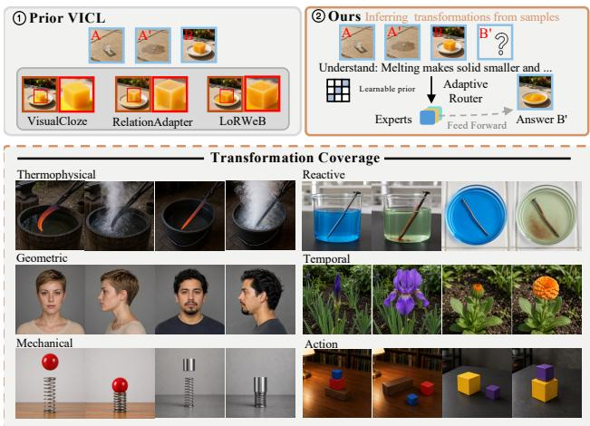
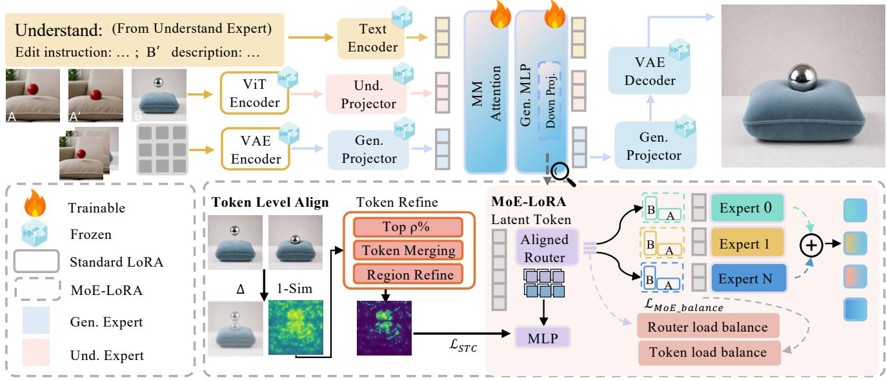
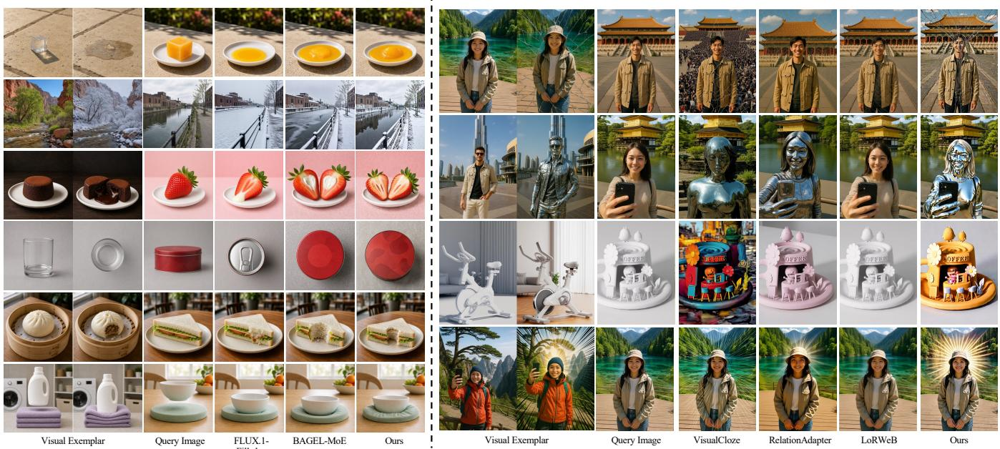
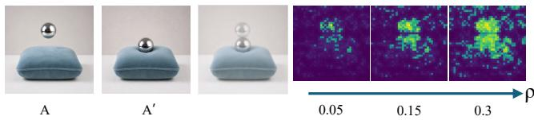
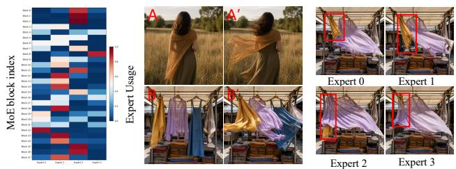

# TransPhy: Visual In-Context Learning for Physically Grounded Image Editing

Siyi Xie1,2, Xuanke Shi2, Jinsheng Quan2,3, Haoran Tang1,

Zukai Chen2, Lei Yang2∗, Quan Wang2∗

1Peking University 2SenseTime Research 3Zhejiang University

## Abstract

Visual demonstrations rovide a natural interface for s ec- ifying image transformations that are dificult to describe exhaustively with text. However, existing visual in-context learning (VICL) methods primarily focus on appearance-level relation transfer and provide limited support for physically grounded transformations, whose outcomes depend on ma- terial properties, geometry, object interactions, and environ-mental conditions. Given a source–target exemplar pair and a query image, physically grounded VICL requires a model to infer the demonstrated transformation, adapt its efects to the query-specific scene context, and preserve rule-irrelevant content. We introduce PhysVICL-74, comprising 74 physi- cally grounded transformation rules and 5,240 source–target image pairs that form nearly 75K training and evaluation con- texts. Its benchmark split separately evaluates novel-instance transfer and unseen-rule generalization. We further propose TransPhy, a framework that decomposes physically grounded VICL into physical-rule induction and transition-aligned ren- dering. TransPhy first predicts the demonstrated rule and an explicit query-specific target-state description, and then synthesizes the target image through token-wise mixture-of- experts adaptation, with expert routing guided by localized transition cues. Experiments show that TransPhy improves physical-rule adherence, query consistency, and unseen-rule generalization over existing visual in-context editing methods.

## 1 Introduction

Text prompts provide an intuitive interface for image edit- ing (Brooks, Holynski, and Efros 2023; Feng et al. 2025; Samadi et al. 2025; Feng et al. 2024; Mao et al. 2026; Ma et al. 2026). However, language often underspecifies transformations involvin multi le cou led efects and com lex spatial dependencies. Melting, for example, may require co- ordinated changes in material state, object shape, solid vol-ume, and interaction with the supporting surface. Exhaus- tively describing these consequences in text is cumbersome and ambiguous. Visual in-context learning (VICL) provides a natural alternative: given a source–target exemplar pair, a model transfers the demonstrated transformation to a new query image. By showing both changed and preserved con- tent, visual exemplars can specify transformations that are dificult to express precisely through language alone.

Existing VICL methods efectively transfer perceptual and semantic relations across stylization, visual efects, attribute editing, representation conversion, and image restoration (Li et al. 2025; Black Forest Labs et al. 2025; Song et al. 2026b; Zhang et al. 2025; Chen et al. 2025a; Gong et al. 2025; Manor et al. 2026; Rajagopalan and Patel 2025). These tasks are largely evaluated by reproducing the demonstrated re- lation. Physically grounded transformations additionally re- quire query-dependent adaptation: the same rule may yield diferent outcomes according to material, geometry, interac- tions, and environment. For example, melting ice and wax produces diferent deformations, material states, and sec- ondary efects despite sharing a high-level rule. Successful transfer must therefore infer the transformation and adapt it to the query rather than copy the exemplar diference. We call a transformation physically grounded when its observable outcome depends on these query-specific physical factors.

  
Figure 1: Physically grounded VICL. Top: limitations of prior methods (1) and our TransPhy framework (2). Bottom: rep- resentative PhysVICL-74 transformations.

Given a source–target exemplar pair (A, A′) and a query image B, physically grounded VICL synthesizes a contextappropriate result B′ while preserving unafected content. It poses two coupled challenges: First, transformation interpretation must separate the transferable rule from incidental exemplar properties such as identity, texture, color, and back- ground. Second, query-conditioned realization must adapt that rule to the query’s structure and context. Because these efects are spatially heterogeneous, transformed objects, interaction regions, secondary efects, and preserved areas may require distinct generation behaviors. Existing methods often encode exemplar relations globally or use image- or layer- level adaptation, capturing only salient efects. As Figure 1 shows, a model may transfer melting by generating a liquid puddle while leaving the solid volume unchanged—a visu- ally suggestive but incomplete physical transition.

Despite growing interest in physically plausible image editing (Zhao et al. 2025; Lin et al. 2026; Ding et al. 2026; Sheng et al. 2026; Xu et al. 2026), prior work mainly studies text-specified transformations. Whether VICL models can infer such transformations from visual exemplars, adapt them to new instances, and generalize to unseen types re- mains unclear. We introduce PhysVICL-74, a training-and-evaluation benchmark comprising 74 transformation rules, 5,240 source–target image pairs, and nearly 75K exemplar– query contexts. It supports two complementary protocols. Novel-instance transfer applies seen rules to new objects and scenes. Unseen-rule generalization instead holds out entire rules during training. Together, they evaluate whether a model follows the demonstrated rule, adapts it to the query, and preserves rule-irrelevant content.

Building on these observations, we propose TransPhy, a physical-transformation induction and transition-aligned rendering framework that decomposes physically grounded VICL into transformation interpretation and query- conditioned realization. The former captures the transferable rule, while the latter predicts how that rule should manifest in the query, reducing reliance on exemplar-specific appear- ance. Its understanding pathway predicts textual descriptions of the demonstrated rule and query-specific target state, spec- ifying what transfers and how it manifests while reducing exemplar-specific copying. To realize the predicted transfor- mation, token-wise mixture-of-experts low-rank adaptation (MoE-LoRA) then allows spatial tokens to activate specialized rendering experts. We further develop a training-only State-Transition Capturer (STC), which extracts localized transition representations from the vision transformer (ViT) feature diferences between B and B′. These representations regularize expert routing toward transition-sensitive genera- tion behaviors, encouraging diferent regions to handle pri- mary changes, secondary efects, and content preservation appropriately. Thus, textual interpretation determines what transformation occurs, while transition-aligned routing con- trols how it is realized across the query image.

Experiments show that TransPhy improves both novel- instance transfer and unseen-rule generalization, producing more complete, physically plausible transformations with competitive perceptual quality and broader visual-relation performance. These results indicate that explicit transforma- tion induction and fine-grained alignment strengthen physi- cally grounded editing and general VICL rule transfer.

Our contributions are summarized as follows:

• We formulate physically grounded visual in-context learning, a setting that requires models to infer a transfor-mation from a visual exemplar and adapt its consequences to the physical properties and context of the query.

• We introduce PhysVICL-74, a dataset and bench-mark containing 74 physically grounded transformation rules, 5,240 source–target image pairs, and nearly 75K exemplar–query contexts, with separate evaluation of novel-instance transfer and unseen-rule generalization.

• We propose TransPhy, combining textual rule interpretation with transition-aligned token-wise expert routing to improve physical plausibility and generalization.

## 2 Related Work

Visual In-Context Learning. In image editing, visual incontext learning (VICL) transfers the transformation demonstrated by an exemplar pair (A, A′) to a query image B to synthesize B′ (Sun et al. 2023; Wang et al. 2023). Existing approaches realize this paradigm through pair-specific opti- mization (Nguyen et al. 2023; Jones et al. 2024; Lu et al. 2025), training-free attention or feature manipulation (Gu et al. 2024; Srivastava et al. 2024; Das Biswas et al. 2025), or learned transfer mechanisms. Representative training-based methods formulate diverse visual tasks as image infilling (Li et al. 2025), encode relational features with lightweight adapters (Gong et al. 2025; Chen et al. 2026), or adapt difu-sion transformers through dynamically generated, composed, or routed LoRA modules (Song et al. 2024; Li et al. 2026; Manor et al. 2026). Despite substantial progress in visual analogy, existing methods are predominantly developed and evaluated on appearance-, geometry-, or semantics-driven transformations. They do not explicitly address physical rule induction, where successful transfer requires identifying la- tent state changes and adapting their spatially coupled, scene- dependent consequences to a new query.

Physics-Aware Image Editing. Recent studies show that physical plausibility remains challenging for multimodal models. PhysBench evaluates reasoning about physical prop- erties, relations, and dynamics (Chow et al. 2025), while RISEBench and KRIS-Bench examine broader visual and knowledge-based reasoning (Zhao et al. 2025; Wu et al. 2025b). Physics-aware editing methods and benchmarks further consider latent physical transitions, environmental con- straints, causal consistency, physical interactions, and tem- poral processes (Zhao et al. 2026; Ding et al. 2026; Sheng et al. 2026; Han et al. 2025; Lin et al. 2026; Pu et al. 2025; Wu et al. 2025a; Guo et al. 2026). However, these settings typi-cally provide the desired efect through a textual instruction or a predefined editing task. The model is asked to execute a known physical transformation, rather than discover it from visual evidence. PhysVICL-74 instead evaluates whether a model can infer the latent physical rule from (A, A′) and transfer its scene-dependent consequences to a new query.

Unified Multimodal Models. Unified multimodal mod-els integrate visual understanding and generation within a shared framework. Janus and Janus-Pro separate understand- ing and generation encoders (Wu et al. 2024; Chen et al. 2025b); BAGEL uses shared self-attention with specialized transformer experts (Deng et al. 2025); and Show-o2 and JoyAI-Image combine language modeling with generative visual objectives (Xie, Yang, and Shou 2025; Song et al.

2026a). Such models provide a basis for physically grounded VICL, as they can jointly compare exemplars, reason about transformations, and generate edited images. Nevertheless, direct generation may still rely on superficial exemplar dif- ferences or transfer incidental visual content. This moti- vates TransPhy, which explicitly interprets the demonstrated physical transformation and guides query-specific generation through transition-aligned token-wise expert routing.

## 3 Task and Dataset Construction

Task and Scope. Given an exemplar $( A , A ^ { \prime } )$ and a query image $B ,$ physically grounded VICL requires a model to infer the implicit transformation explaining $A  A ^ { \prime }$ and synthesize its query-specific realization $B ^ { \prime }$ while preserv- ing rule-irrelevant content. We use physically grounded to describe visually observable transformations whose quali- tative outcomes depend on material properties, geometry, object interactions, or environmental conditions. PhysVICL-74 evaluates whether a model transfers the causal direction and query-appropriate visual consequences of such transfor- mations. Because multiple outcomes may be physically plau- sible, each reference target represents one human-validated plausible realization rather than a unique physical ground truth. The benchmark therefore does not assess numerical dynamics or simulator-level physical accuracy.

Transformation Taxonomy. We group the 74 rules by their dominant scale and mechanism into three families: Scene-Condition Transformations, comprising Geometric, Optical, and Temporal Scene Variation; Mechanically Induced Transformations, comprising Action-Induced and Mechanical Response; and Material-State Transformations, comprising Thermophysical and Reactive Evolution. These seven categories span changes in scene observation, object configuration or deformation, and material state. For com- pact reporting, we refer to the Scene-Condition, Mechani- cally Induced, and Material-State families as Scene-Level, Object-Level, and Matter-Level, respectively.

Rule Mining, Construction, and Splits. We draw transformation concepts and selected seed images from RISEBench (Zhao et al. 2025), RE-Edit (Ding et al. 2026), InEdit-Bench (Sheng et al. 2026), KRIS-Bench (Wu et al. 2025b), UniREditBench (Han et al. 2025), and WorldEdit (Lin et al. 2026), rather than directly aggregating their original image pairs. After merging semantic du- plicates and removing ambiguous or instance-specific ed- its, we obtain 74 visually observable and transferable rules. GPT Image completes the corresponding targets and gen- erates additional rule instances where needed. The result- ing benchmark contains 5,240 source–target image pairs and approximately 75K exemplar–query contexts. Each AABB context $( A , \dot { A } ^ { \prime } , B , B ^ { \prime } )$ combines two distinct source–target instances governed by the same rule. We split base image pairs before constructing contexts, ensuring that no test pair or context containing it appears in training. The protocols evaluate novel-instance transfer for seen rules and general- ization to rules held out from training.

Target Completion and Verification. To mitigate potential generator–reviewer circularity, we do not treat model- based screening as suficient. Dedicated human annotators additionally review rule correctness, physical plausibility, and preservation of rule-irrelevant content; failed samples are regenerated. Detailed annotation criteria, review proto- cols, image provenance, rule mappings, and representative failure cases are provided in the supplementary material.

## 4 Methodology

## 4.1 Overall Framework

Given an exemplar transformation pair $( A , A ^ { \prime } )$ , a query im- age $B ,$ and a fixed, rule-agnostic prompt p (see the supplementary material), the model must infer the physical rule demonstrated by $A  A ^ { \prime }$ and synthesize its query-specific realization $B ^ { \prime }$ . The output should realize the transforma- tion while preserving the identity, spatial layout, and rule- irrelevant content of $B .$

This task involves two levels of reasoning. At the coarse level, the model must extract a transformation rule that trans- fers across objects and scenes. At the fine level, it must adapt the rule to the object properties, spatial structure, and inter-actions in the query image. Directly generating $B ^ { \prime }$ from the visual exemplar may conflate these two processes, causing the model to copy the appearance of $A ^ { \prime }$ without transferring the demonstrated rule.

To address this challenge, we propose TransPhy, which progressively translates a compact physical rule prior into fine-grained, spatially adaptive rendering decisions. At the coarse level, the understanding pathway predicts an explicit rule $\hat { R }$ and a query-specific target-state description $\hat { d } _ { B ^ { \prime } }$ Together, they specify the transformation demonstrated by the exemplar and its expected efect on the query. At the fine level, the generation pathway employs token-wise MoE- LoRA, allowing diferent spatial tokens to invoke diferent low-rank rendering experts. We further introduce a training- only State-Transition Capturer (STC), which derives tokenlevel transition targets from ViT feature diferences between $( B , B ^ { \prime } )$ and uses them to supervise expert routing.

TransPhy follows a coarse-to-fine path from physical-rule induction to transition-aligned expert rendering. We instantiate it on BAGEL.

## 4.2 Progressive Physical Rule Induction and Rendering

Coarse-Grained Physical Rule Prior. BAGEL employs a shared multimodal transformer that supports autoregressive understanding and DiT-based visual generation, providing a unified interface between explicit rule inference and image synthesis. Given the interleaved context $( A , A ^ { \prime } , B , p )$ , the understanding pathway first predicts the demonstrated rule $\hat { R }$ and a query-specific target-state description $\hat { d } _ { B ^ { \prime } }$ . We then combine these textual intermediates with the visual repre- sentations to construct the generation context:

$$
c = [ c _ { A } , c _ { A ^ { \prime } } , c _ { B } , T _ { p } ( \hat { R } , \hat { d } _ { B ^ { \prime } } ) ] , \qquad \hat { v } = v _ { \phi } ( z _ { t } , t , c ) ,\tag{1}
$$

where $c _ { I }$ denotes BAGEL’s multimodal token representation of image $I , T _ { p }$ serializes the task prompt and predicted in- termediates into text tokens, $z _ { t }$ is the noisy visual latent at timestep t, and $v _ { \phi }$ predicts the visual training target.

  
Figure 2: Overview of TransPhy on BAGEL. The understanding and generation pathways encode the exemplar–query context; ViT-derived transition evidence aligns token-level routing, while MoE-LoRA experts render the inferred physical rule.

Together, Rˆ and $\hat { d } _ { B ^ { \prime } }$ form a compact, coarse-grained physical rule prior. This representation explicitly summarizes the transformation to be transferred and describes its expected realization on the query. Its primary role is to provide coarse- grained semantic constraints. Conditioning generation on this explicit interpretation reduces the shortcut of copying the appearance of $A ^ { \prime }$ and provides a stable semantic condi- tion for subsequent fine-grained rendering.

Fine-Grained Token-Wise Expert Rendering. The physical rule prior describes the global semantics of the target state, but state-transition editing typically exhibits substan- tial spatial heterogeneity. The transformed object, interaction areas, secondary efects, and preserved content may require diferent rendering behaviors. We freeze the BAGEL back- bone and apply standard LoRA (Hu et al. 2022) to the understanding pathway and most generation projections. However, standard LoRA applies the same low-rank update to every spatial token and therefore cannot adapt its computation ac- cording to the spatial role of each region.

Motivated by mixtures of LoRA experts (Wu, Huang, and Wei 2024), we replace the down-projection of the generation MLP with token-wise MoE-LoRA:

$$
y _ { i } = W x _ { i } + \frac { \alpha } { r } \sum _ { e = 1 } ^ { E } g _ { i , e } U _ { e } V _ { e } x _ { i } ,\tag{2}
$$

where $x _ { i }$ is the i-th generation token, $W$ is the frozen pre- trained projection, $U _ { e } V _ { e }$ is the rank-r update of expert $e ,$ α controls the adapter scale, and $E$ is the number of experts. The router independently computes the expert weights for each token using sparse top-k routing:

$$
g _ { i } = \mathrm { T o p K S o f t m a x } \left( W _ { \mathrm { r } } x _ { i } / \tau , k \right) ,\tag{3}
$$

where $W _ { \mathrm { r } }$ is the router projection, τ is the routing temperature, and k is the number of activated experts.

Because $g _ { i }$ is predicted separately for every token, difer- ent spatial positions can invoke diferent low-rank updates. The coarse-grained physical rule prior can therefore be pro- gressively realized through fine-grained, spatially adaptive ex ert renderin . Nevertheless, token-wise MoE-LoRA ro- vides only the capacity for fine-grained rendering; it does not guarantee that the router will organize experts accord- ing to the spatial efects of the transformation. When trained only with the image-generation objective, the router may in-stead specialize according to generic appearance cues such as color, texture, or object category. We therefore introduce fine-grained transition alignment.

## 4.3 Fine-Grained Transition Alignment

During training, MoE-LoRA experts learn their rendering behavior under the guidance of the token-wise router.

To provide token-level supervision, STC aligns the router’s spatial perception with localized transition evidence ex- tracted by a frozen ViT.

ViT-Derived Transition Targets. We extract semantic features from (B, B′) using BAGEL’s frozen ViT encoder, initialized from SigLIP2-so400m/14 (Deng et al. 2025). Their diferences localize the visible efects of the trans- formation. Let $u _ { j }$ and $u _ { j } ^ { \prime }$ denote the frozen ViT embeddings of $( B , B ^ { \prime } )$ at spatial position $j .$ We define the initial fine- grained local transition response as

$$
s _ { j } = 1 - \frac { u _ { j } ^ { \top } u _ { j } ^ { \prime } } { \Vert u _ { j } \Vert _ { 2 } \Vert u _ { j } ^ { \prime } \Vert _ { 2 } } .\tag{4}
$$

A larger $s _ { j }$ indicates a stronger semantic change between the source and target states.

We retain the top $\rho \%$ transition-responsive tokens and refine these sparse candidates through connected-component merging and feature-similarity refinement (Shang et al. 2026; Liu et al. 2024). Details of token selection and refinement are provided in the supplementary material. The resulting transition target $q$ is resized onto the VAE token grid of $B ^ { \prime }$ using nearest-neighbor interpolation. Compared with raw pixel diferences, ViT feature diferences are less sensitive to color shifts, generation noise, and local texture variations, providing a more stable token-level supervision signal.

Router Alignment. Let $a _ { i } \in \mathbb { R } ^ { E }$ denote the pre-softmax router logits for the i-th generation token of B′. A two-layer prediction head $f _ { \mathrm { S T C } } : \mathbf { \overline { { R } } } ^ { E }  \mathbb { R }$ converts the E expert-routing logits into a scalar transition score. We align its sig- moid response with the resized ViT-derived target:

$$
\mathcal { L } _ { \mathrm { S T C } } = \frac { 1 } { \left| \Omega _ { B ^ { \prime } } \right| } \sum _ { i \in \Omega _ { B ^ { \prime } } } \left( \sigma ( f _ { \mathrm { S T C } } ( a _ { i } ) ) - q _ { i } \right) ^ { 2 } ,\tag{5}
$$

where $\Omega _ { B ^ { \prime } }$ indexes the VAE token positions of $B ^ { \prime }$

This objective encourages the internal routing representation to distinguish transition-responsive positions from rela- tively stable regions, without assigning a predefined seman- tic identity to any expert. The rendering behavior of each expert remains learned through the image-generation objective. STC therefore aligns where expert responses should vary, rather than prescribing which expert must represent a particular transformation.

To reduce expert collapse, we additionally introduce a standard MoE load-balancing objective:

$$
\mathcal { L } _ { \mathrm { b a l } } = E \sum _ { e = 1 } ^ { E } \bar { p } _ { e } \bar { \ell } _ { e } ,\tag{6}
$$

where $\bar { p } _ { e }$ is the mean routing probability of expert e and $\bar { \ell } _ { e }$ is the fraction of tokens assigned to it. The generation objective learns the rendering behavior of the experts, $\mathcal { L } _ { \mathrm { S T C } }$ makes the router sensitive to the spatial efects of the transformation, and $\mathcal { L } _ { \mathrm { b a l } }$ encourages non-collapsed expert specialization.

## 4.4 Staged Training Objective

We train TransPhy in two stages: coarse-grained physical- rule understanding and fine-grained rendering. In Stage 1, we freeze the BAGEL backbone and optimize a rank-16 LoRA with autoregressive supervision

$$
y = [ R , d _ { B ^ { \prime } } ] ,\tag{7}
$$

where R is the annotated transformation rule and $d _ { B ^ { \prime } }$ is the query-specific target-state description. This stage constrains the understanding pathway to a stable “rule–target descrip- tion” output format, while learning to extract the demon- strated rule and adapt its expected efect to the query.

In Stage 2, we freeze Stage 1 and condition generation on its predicted textual intermediates. We employ rank-32 generation adapters and four MoE-LoRA experts, and jointly optimize visual generation, transition alignment, and expert load balancing:

$$
\mathcal { L } _ { \mathrm { r e n d e r } } = \mathbb { E } _ { t } \left[ \Vert v - v _ { \phi } ( z _ { t } , t , c ) \Vert _ { 2 } ^ { 2 } \right] + \lambda _ { \mathrm { S T C } } \mathcal { L } _ { \mathrm { S T C } } + \lambda _ { \mathrm { b a l } } \mathcal { L } _ { \mathrm { b a l } } ,\tag{8}
$$

where v is the training target, and λSTC and $\lambda _ { \mathrm { b a l } }$ control the transition-alignment and load-balancing terms, respectively.

This staged optimization establishes a coarse-to-fine learn- ing process. Stage 1 constructs a stable physical rule prior, while Stage 2 translates this prior into spatially adaptive token-wise expert rendering. By assigning diferent render- ing experts according to the query content and transition evidence, TransPhy improves the spatial precision and con- trollability of physically grounded state-transition editing.

## 5 Experiments

## 5.1 Settings

We instantiate TransPhy on BAGEL-7B-MoT and freeze the backbone. The understanding and generation stages use LoRA ranks 16 and 32, respectively; the generation adapter contains four MoE-LoRA experts with top-1 routing, and STC retains the top 15% transition-responsive ViT tokens. We optimize both stages with AdamW and bfloat16 preci- sion at a learning rate of $1 \times 1 0 ^ { - 4 }$ with 100 warmup steps. The understanding stage is trained for 8,000 steps and the generation stage for 20,000 steps. Training uses full-shard FSDP on four A100 GPUs, a per-GPU batch size of 1, and two-step gradient accumulation, yielding an efective batch size of 8. Further implementation details are provided in the supplementary material.

## 5.2 Benchmark

PhysVICL-74 contains 74 transition rules, 5,240 source– target image pairs, and approximately 75K AABB contexts. The evaluation benchmark combines three disjoint sources: novel instances of57 PhysVICL-74 rules represented in train- ing, 17 PhysVICL-74 rules entirely unseen during training, and 20 sampled Relation252K rules not included in our train- ing, with four sampled pairs per rule in each source. For the first split, both the exemplar pairs and queries are image- disjoint from training; for the latter two, the rules and all associated images are held out. We split base image pairs be- fore constructing AABB contexts, ensuring that no test pair or context containing it appears in training.

## 5.3 Baseline Methods

For novel instances of seen rules, we compare TransPhy with FLUX.1-Fill-dev and BAGEL-MoE. FLUX.1-Fill-dev is trained on the same PhysVICL-74 split, whereas BAGEL- MoE shares our backbone, adapters, training data, and in- ference settings but removes STC-based router alignment. For unseen rules, we additionally compare with Relation- Adapter (Gong et al. 2025), VisualCloze (Li et al. 2025), and LoRWeB (Manor et al. 2026), using their released check-points, oficial inference settings, and native input formats. All methods receive the same exemplar–query semantics. Because RelationAdapter and LoRWeB do not publicly dis- close detailed training-data splits, exact training-data align- ment cannot be verified.

## 5.4 Evaluation Metrics

We evaluate with five complementary metrics. We adopt CLIP Directional Similarity (CLIP-D) (Manor et al. 2026)

Seen  
Unseen  
  
Figure 3: Qualitative comparison on seen and unseen transformations. Left: new instances of seen transformations. Right: unseen transformations.

Table 1: Seen-rule transfer to novel instances across three rule families. Scene-Level, Object-Level, and Matter-Level denote Scene-Condition, Mechanically Induced, and Material-State transformations, respectively. TA, CP, and RP are scored by GPT-5.6; CLIP-D and LPIPS are objective metrics. Results are macro-averaged over rules within each family.
<table><tr><td colspan="4">FLUX.1-Fill-dev</td><td colspan="3">BAGEL-MoE</td><td colspan="3">TransPhy</td></tr><tr><td>Metric</td><td>Scene-Level</td><td>Object-Level</td><td>Matter-Level</td><td>Scene-Level</td><td>Object-Level</td><td>Matter-Level</td><td>Scene-Level</td><td>Object-Level</td><td>Matter-Level</td></tr><tr><td>TA↑</td><td>3.45</td><td>3.12</td><td>3.33</td><td>3.22</td><td>3.03</td><td>3.63</td><td>3.57</td><td>3.39</td><td>3.73</td></tr><tr><td>CP↑</td><td>3.23</td><td>3.18</td><td>3.41</td><td>3.12</td><td>3.57</td><td>3.23</td><td>3.43</td><td>3.78</td><td>3.67</td></tr><tr><td>RP↑</td><td>3.20</td><td>3.67</td><td>3.09</td><td>3.33</td><td>3.21</td><td>3.28</td><td>3.47</td><td>3.36</td><td>3.25</td></tr><tr><td>CLIP-D↑</td><td>0.20</td><td>0.25</td><td>0.25</td><td>0.21</td><td>0.27</td><td>0.29</td><td>0.23</td><td>0.26</td><td>0.27</td></tr><tr><td>LPIPS↓</td><td>0.39</td><td>0.36</td><td>0.26</td><td>0.40</td><td>0.36</td><td>0.26</td><td>0.31</td><td>0.31</td><td>0.24</td></tr></table>

Table 2: Generalization to transformations unseen during TransPhy training. Results are reported as PhysVICL-74/Relation252K over 17 held-out PhysVICL-74 rules and 20 sampled Relation252K rules, respectively.
<table><tr><td>Method</td><td>TA↑</td><td>CP↑</td><td>RP↑ CLIP-D↑</td><td>LPIPS↓</td></tr><tr><td>FLUX.1-Fill-dev</td><td>2.63/1.60</td><td>3.45/3.71</td><td>3.22/1.79 0.24/0.26</td><td>0.51/0.56</td></tr><tr><td>BAGEL-MoE</td><td>2.55/2.16</td><td>3.60/2.96</td><td>3.24/1.90</td><td>0.24/0.23 0.54/0.61</td></tr><tr><td>TransPhy</td><td>2.91/2.343.75/3.05</td><td></td><td>53.28/2.90</td><td>0.31/0.28 0.48/0.50</td></tr><tr><td>RelationAdapter</td><td>2.60/3.21</td><td>3.17/3.883.34/2.82</td><td></td><td>0.20/0.37 0.52/0.52</td></tr><tr><td>VisualCloze</td><td></td><td>2.76/2.103.15/3.413.04/2.45</td><td></td><td>0.25/0.220.51/0.54</td></tr><tr><td>LoRWeB</td><td></td><td></td><td></td><td>1.41/2.163.71/2.633.44/2.430.12/0.260.58/0.53</td></tr></table>

using OpenAI CLIP ViT-L/14 and Learned Perceptual Im- age Patch Similarity (LPIPS) (Zhang et al. 2018). Following VLM-based protocols for visual-analogy and knowledge- aware editing (Manor et al. 2026; Lin et al. 2026), GPT-5.6 scores Transition Accuracy (TA), Content Preservation (CP), and Rule Plausibility (RP) on a 0–4 scale, with higher scores being better. These three complementary metrics as- sess transition fidelity, query preservation, and physical con- sistency, respectively. Full definitions, prompts, and aggre- gation details are provided in the supplementary material. We additionally conduct an anonymized, criterion-specific two-alternative forced-choice (2AFC) user study; details are provided in the supplementary material.

Quantitative Evaluation. As shown in Table 1, TransPhy achieves clear overall gains over BAGEL-MoE on seen trans- formations, increasing Object-Level TA from 3.03 to 3.39 and Matter-Level CP from 3.23 to 3.67. On unseen trans- formations (Table 2), it outperforms the matched BAGEL-MoE baseline on every metric in both settings and ranks first in six of ten metric–setting combinations among all com- pared methods. These results demonstrate strong and bal anced generalization across transition fidelity, query preser- vation, physical plausibility, and perceptual fidelity.

Qualitative Evaluation. Figure 3 compares seen and unseen transformations. On seen rules (left), TransPhy faithfully realizes diverse physical changes while preserving query geometry; FLUX.1-Fill-dev captures coarse target ap- pearances, whereas BAGEL-MoE spreads or under-applies edits. On unseen rules (right), our method transfers material, representation, and lighting efects with limited background changes. RelationAdapter often under-applies the efect, Vi- sualCloze alters background structures, and LoRWeB leaves queries nearly unchanged, showing that TransPhy better bal- ances complete transfer and query preservation.

## 6 Ablation Studies

To investigate the impact of diferent components of our framework, we conduct the following ablation studies.

(1) Staged Rule Understanding and Expert Alignment. We ablate the two central training components in TransPhy. W/o Stage 1 skips dedicated rule-understanding training and conditions the generation pathway on a single fixed instruc- tion shared across instances. W/o STC alignment retains Stage 1 but removes λSTCLSTC from generation training while keeping the generation and load-balancing objectives unchanged. This directly tests whether explicit rule inter- nalization and STC-guided expert routing are necessary for generalizable transformation transfer.

(2) Number of Rendering Experts. We vary the number of MoE-LoRA rendering experts as $E \in \{ 4 , \dot { 8 } , 1 6 \}$ and use $E = 4$ in the main experiments. This ablation examines whether a larger expert pool provides additional capacity for modeling diverse visual transformations.

Table 3: Ablation of training design and expert count. The full model uses staged training, STC alignment, and four experts. The first two variants modify the training design; the last two change only the expert count.
<table><tr><td>Variant</td><td>TA↑ CP↑</td><td>RP↑</td><td></td><td>CLIP-D↑</td><td>LPIPS↓</td></tr><tr><td>Full model  $\overline { { ( E = 4 ) } }$ </td><td>3.25</td><td>3.46</td><td>3.36</td><td>0.27</td><td>0.31</td></tr><tr><td>W/o Stage 1</td><td>1.78</td><td>3.08</td><td>1.87</td><td>0.21</td><td>0.39</td></tr><tr><td>W/o STC align.</td><td>3.18</td><td>3.24</td><td>2.95</td><td>0.26</td><td>0.37</td></tr><tr><td> $E = 8$ </td><td>3.28</td><td>3.46</td><td>3.66</td><td>0.29</td><td>0.29</td></tr><tr><td> $E = 1 6$ </td><td>3.34</td><td>3.52</td><td>3.74</td><td>0.29</td><td>0.30</td></tr></table>

(3) Transition-Token Selection Sensitivity. To eval-uate STC token localization, GPT-5.6 annotates the transformation-afected ViT-grid tokens M for a fixed sub-set of five source–target pairs per transformation rule. The masks are audited by Qwen3-VL-32B, with stratified man-ual spot checks and corrections; criteria are provided in the supplement. We retain the top $\rho \in \{ 5 , 1 5 , 3 0 \}$ % candidates by ViT cosine diference and apply the same merging and re- finement steps to obtain $S _ { \rho }$ . We report token-level precision, recall, and F1 between $S _ { \rho }$ and M, averaged across samples.

Table 4: Transition-token selection quality. Each ρ is evalu-ated on the fixed subset after connected-component merging and feature-similarity refinement.
<table><tr><td>Metric</td><td> $\overline { { \rho = 5 \% } }$  </td><td> $\overline { { \rho = 1 5 \% } }$ </td><td> $\overline { { \rho = 3 0 \% } }$ </td></tr><tr><td>Token precision↑</td><td>84.18</td><td>69.19</td><td>41.65</td></tr><tr><td>Token recall↑</td><td>28.25</td><td>65.03</td><td>72.57</td></tr><tr><td>Token F1↑</td><td>42.30</td><td>67.05</td><td>52.92</td></tr></table>

(4) Expert Intervention and Interpretability. Holding all other settings fixed, we route all generation tokens through a single expert $e \in \{ 0 , 1 , 2 , 3 \}$ and compare the outputs with natural layer-wise routing in Figure 5.

  
Figure 4: Transition-token visualization across $\rho _ { \bullet }$

  
Figure 5: Expert routing visualization. Left: layer-wise expert-routing heat map. Right: results obtained by hard- routing all tokens through experts 0–3.

Results & Analysis. (1) Table 3 shows that removing Stage 1 causes the largest drops in TA (3.25 to 1.78) and RP (3.36 to 1.87), confirming that rule internalization is central to transfer. Removing STC alignment reduces RP to 2.95 and increases LPIPS from 0.31 to 0.37, indicating that expert alignment improves plausible and spatially faithful render- ing. (2) Increasing E from 4 to 16 yields modest gains: $E = 8$ gives the lowest LPIPS, whereas $E = 1 6$ performs best on TA, CP, and RP. This suggests the bottleneck may lie in the base model rather than expert capacity. (3) Table 4 and Figure 4 show that $\rho = 5 \%$ favors precision but has low transition-region recall, whereas $\rho = 3 0 \%$ improves recall at the cost of noisy selections. $\rho = 1 5 \%$ achieves the highest F1 of 67.05, validating a moderate selection ratio. (4) Figure 5 shows that routing varies across layers and that forced experts produce distinct localized efects. This provides evidence of emergent, non-redundant expert specialization rather than fixed semantic roles. Taken together, these complementary results provide consistent evidence for the efectiveness of staged induction and transition-aligned expert routing.

## 7 Conclusion

We formulated physically grounded VICL, where models infer a transformation rule from an exemplar and apply it to a new query. We introduced PhysVICL-74, covering 74 rules and approximately 75K exemplar–query contexts, with protocols for novel-instance transfer and unseen-rule gener- alization. We proposed TransPhy, combining physical-rule induction with transition-aligned token-wise expert adap- tation for fine-grained and physically plausible synthesis. Extensive experiments show strong performance on physi- cally grounded transformations and improved generalization to unseen rules over existing VICL methods. We hope these contributions support future study of visual rule induction and context-aware image editing.

## References

Black Forest Labs; Batifol, S.; Blattmann, A.; Boesel, F.; Consul, S.; Diagne, C.; Dockhorn, T.; English, J.; English, Z.; Esser, P.; Kulal, S.; Lacey, K.; Levi, Y.; Li, C.; Lorenz, D.; Müller, J.; Podell, D.; Rombach, R.; Saini, H.; Sauer, A.; and Smith, L. 2025. FLUX.1 Kontext: Flow Matching for In-Context Image Generation and Editing in Latent Space. arXiv:2506.15742.

Brooks, T.; Holynski, A.; and Efros, A. A. 2023. Instruct- Pix2Pix: Learning to Follow Image Editing Instructions. arXiv:2211.09800.

Chen, J.; Li, S.; Fu, H.; Zhao, B.; Liu, W.; Liang, Y.; Qing, L.; and Mao, X. 2026. Delta-Adapter: Scalable Exemplar-Based Image Editing with Single-Pair Supervi- sion. arXiv:2605.07940.

Chen, L.; Mao, Q.; Gu, Y.; and Shou, M. Z. 2025a. Edit Transfer: Learning Image Editing via Vision In-Context Re- lations. arXiv:2503.13327.

Chen, X.; Wu, Z.; Liu, X.; Pan, Z.; Liu, W.; Xie, Z.; Yu, X.; and Ruan, C. 2025b. Janus-Pro: Unified Multimodal Understanding and Generation with Data and Model Scaling. arXiv:2501.17811.

Chow, W.; Mao, J.; Li, B.; Seita, D.; Guizilini, V.; and Wang, Y. 2025. PhysBench: Benchmarking and Enhancing Vision-Language Models for Physical World Understanding. arXiv:2501.16411.

Das Biswas, S.; Shreve, M.; Li, X.; Singhal, P.; and Roy, K. 2025. PIXELS: Progressive Image Xemplar-Based Editing with Latent Surgery. In Proceedings of the AAAI Conference on Artificial Intelligence, volume 39, 2663–2671.

Deng, C.; Zhu, D.; Li, K.; Gou, C.; Li, F.; Wang, Z.; Zhong, S.; Yu, W.; Nie, X.; Song, Z.; Shi, G.; and Fan, H. 2025. Emerging Properties in Unified Multimodal Pre- training. arXiv:2505.14683.

Ding, Y.; Huang, W.; Quan, R.; Qi, X.; and Yang, Y. 2026. Is This Edit Correct? A Multi-Dimensional Benchmark for Reasoning-Aware Image Editing. arXiv:2606.05172.

Feng, A.; Qiu, W.; Bai, J.; Dong, Z.; Zhou, K.; Zhang, X.; Ying, R.; and Tassiulas, L. 2025. An Item is Worth a Prompt: Versatile Image Editing with Disentangled Control. In Proceedings of the AAAI Conference on Artificial Intelligence, volume 39, 16559–16567.

Feng, K.; Ma, Y.; Wang, B.; Qi, C.; Chen, H.; Chen, Q.; and Wang, Z. 2024. DiT4Edit: Difusion Transformer for Image Editing. arXiv:2411.03286.

Gong, Y.; Song, Y.; Li, Y.; Li, C.; and Zhang, Y. 2025. RelationAdapter: Learning and Transferring Visual Relation with Difusion Transformers. arXiv:2506.02528.

Gu, Z.; Yang, S.; Liao, J.; Huo, J.; and Gao, Y. 2024. Analo- gist: Out-of-the-Box Visual In-Context Learning with Image Difusion Model. arXiv:2405.10316.

Guo, S.; He, S.; Meng, C.; Xiao, S.; Xiang, X.; Zhang, S.; and Fan, Q. 2026. PhyEditBench: A Real-World Multi-Stage Benchmark for Physics-Aware Image Editing. arXiv:2606.26551.

Han, F.; Wang, Y.; Li, C.; Liang, Z.; Wang, D.; Jiao, Y.; Wei, Z.; Gong, C.; Jin, C.; Chen, J.; and Wang, J. 2025. UniREditBench: A Unified Reasoning-based Image Editing Benchmark. arXiv:2511.01295.

Hu, E. J.; Shen, Y.; Wallis, P.; Allen-Zhu, Z.; Li, Y.; Wang, S.; Wang, L.; and Chen, W. 2022. LoRA: Low-Rank Adaptation of Large Language Models. In International Conference on Learning Representations.

Jones, M.; Wang, S.-Y.; Kumari, N.; Bau, D.; and Zhu, J.- Y. 2024. Customizing Text-to-Image Models with a Single Image Pair. arXiv:2405.01536.

Li, Z.; Duan, Z.; Ye, J.; Chen, C.; Chen, D.; Li, Y.; and Chen, Y. 2026. VIRAL: Visual In-Context Reasoning via Analogy in Difusion Transformers. arXiv:2602.03210.

Li, Z.-Y.; Du, R.; Yan, J.; Zhuo, L.; Li, Z.; Gao, P.; Ma, Z.; and Cheng, M.-M. 2025. VisualCloze: A Universal Im- age Generation Framework via Visual In-Context Learning. arXiv:2504.07960.

Lin, W.; Wang, F.; Zhang, M.; Hu, W.; Jin, T.; Zhao, Z.; Wu, F.; Chen, J.; Yuille, A.; and Ren, S. 2026. WorldEdit: Towards Open-World Image Editing with a Knowledge- Informed Benchmark. arXiv:2602.07095.

Liu, Y.; Wu, F.; Li, R.; Tang, Z.; and Li, K. 2024. PAR: Prompt-Aware Token Reduction Method for Eficient Large Multimodal Models. arXiv:2410.07278.

Lu, H.; Chen, J.; Yang, Z.; Gnanha, A. T.; Wang, F. L.; Qing, L.; and Mao, X. 2025. PairEdit: Learning Semantic Varia- tions for Exemplar-Based Image Editing. arXiv:2506.07992.

Ma, J.; Zhu, X.; Pan, Z.; Peng, Q.; Guo, X.; Chen, C.; and Lu, H. 2026. X2Edit: Revisiting Arbitrary-Instruction Im- age Editing through Self-Constructed Data and Task-Aware Representation Learning. In Proceedings of the AAAI Conference on Artificial Intelligence, volume 40, 7764–7772.

Manor, H.; Gal, R.; Maron, H.; Michaeli, T.; and Chechik, G. 2026. Spanning the Visual Analogy Space with a Weight Basis of LoRAs. arXiv:2602.15727.

Mao, J.; Wang, K.; Xiang, Y.; and Chen, K. 2026. TweezeEdit: Consistent and Eficient Image Editing with Path Regularization. In Proceedings of the AAAI Conference on Artificial Intelligence, volume 40, 7936–7944.

Nguyen, T.; Li, Y.; Ojha, U.; and Lee, Y. J. 2023. Visual Instruction Inversion: Image Editing via Visual Prompting. arXiv:2307.14331.

Pu, Y.; Zhuo, L.; Han, S.; Xing, J.; Zhu, K.; Cao, S.; Fu, B.; Liu, S.; Li, H.; Qiao, Y.; Zhang, W.; Chen, X.; and Liu, Y. 2025. PICABench: How Far Are We from Physically Realistic Image Editing? arXiv:2510.17681.

Rajagopalan, S.; and Patel, V. M. 2025. AWRaCLe: All-Weather Image Restoration using Visual In-Context Learn- ing. In Proceedings of the AAAI Conference on Artificial Intelligence, volume 39, 6675–6683.

Samadi, M.; Han, F. X.; Salameh, M.; Wu, H.; Sun, F.; Zhou, C.; and Niu, D. 2025. FunEditor: Achieving Complex Im- age Edits via Function Aggregation with Difusion Models. In Proceedings of the AAAI Conference on Artificial Intelligence, volume 39, 6758–6766.

Shang, Y.; Cai, M.; Xu, B.; Lee, Y. J.; and Yan, Y. 2026. LLaVA-PruMerge: Adaptive Token Reduction for Eficient Large Multimodal Models. arXiv:2403.15388.

Sheng, Z.; Han, X.; Zhang, Z.; Xiong, Z.; Ding, Y.; Ping, A.; Li, X.; Guo, T.; and Mao, Y. 2026. InEdit-Bench: Bench- marking Intermediate Logical Pathways for Intelligent Image Editing Models. arXiv:2603.03657.

Song, L.; Li, W.; Ma, G.; Tang, W.; Wang, B.; Zhang, Y.; Yang, Y.; Xiao, Y.; Liu, J.; Zhang, Y.; Zhang, G.; Zhang, W.; Xu, H.; Jiang, N.; Han, X.; Sun, H.; Zhang, M.; Huang, H.; and Duan, N. 2026a. Awaking Spatial Intelli- gence in Unified Multimodal Understanding and Generation. arXiv:2605.04128.

Song, W.; Jiang, H.; Yang, Z.; Cheng, Z.; Quan, R.; and Yang, Y. 2026b. Insert Anything: Image Insertion via In-Context Editing in DiT. In Proceedings of the AAAI Conference on Artificial Intelligence, volume 40, 9097–9105.

Song, X.; Cui, J.; Zhang, H.; Shi, J.; Chen, J.; Zhang, C.; and Jiang, Y.-G. 2024. LoRA of Change: Learning to Generate LoRA for the Editing Instruction from a Single Before-After Image Pair. arXiv:2411.19156.

Srivastava, A.; Menta, T. R.; Java, A.; Jadhav, A.; Singh, S.; Jandial, S.; and Krishnamurthy, B. 2024. ReEdit: Multi- modal Exemplar-Based Image Editing with Difusion Mod- els. arXiv:2411.03982.

Sun, Y.; Yang, Y.; Peng, H.; Shen, Y.; Yang, Y.; Hu, H.; Qiu, L.; and Koike, H. 2023. ImageBrush: Learning Visual In-Context Instructions for Exemplar-Based Image Manipu- lation. arXiv:2308.00906.

Wang, Z.; Jiang, Y.; Lu, Y.; Shen, Y.; He, P.; Chen, W.; Wang, Z.; and Zhou, M. 2023. In-Context Learning Unlocked for Difusion Models. arXiv:2305.01115.

Wu, C.; Chen, X.; Wu, Z.; Ma, Y.; Liu, X.; Pan, Z.; Liu, W.; Xie, Z.; Yu, X.; Ruan, C.; and Luo, P. 2024. Janus: Decoupling Visual Encoding for Unified Multimodal Under- standing and Generation. arXiv:2410.13848.

Wu, J. Z.; Ren, X.; Shen, T.; Cao, T.; He, K.; Lu, Y.; Gao, R.; Xie, E.; Lan, S.; Alvarez, J. M.; Gao, J.; Fidler, S.; Wang, Z.; and Ling, H. 2025a. ChronoEdit: Towards Tem- poral Reasoning for Image Editing and World Simulation. arXiv:2510.04290.

Wu, X.; Huang, S.; and Wei, F. 2024. Mixture of LoRA Experts. In International Conference on Learning Representations.

Wu, Y.; Li, Z.; Hu, X.; Ye, X.; Zeng, X.; Yu, G.; Zhu, W.; Schiele, B.; Yang, M.-H.; and Yang, X. 2025b. KRIS-Bench: Benchmarking Next-Level Intelligent Image Editing Models. arXiv:2505.16707.

Xie, J.; Yang, Z.; and Shou, M. Z. 2025. Show-o2: Improved Native Unified Multimodal Models. arXiv:2506.15564.

Xu, R.; Zhou, D.; Shen, X.; Ma, F.; and Yang, Y. 2026. PhyEdit: Towards Real-World Object Manipulation via Physically-Grounded Image Editing. arXiv:2604.07230.

Zhang, R.; Isola, P.; Efros, A. A.; Shechtman, E.; and Wang, O. 2018. The Unreasonable Efectiveness of Deep Features as a Perceptual Metric. In Proceedings of the IEEE Conference on Computer Vision and Pattern Recognition (CVPR).

Zhang, Z.; Xie, J.; Lu, Y.; Yang, Z.; and Yang, Y. 2025. In-Context Edit: Enabling Instructional Image Editing with In-Context Generation in Large Scale Difusion Transformer. arXiv:2504.20690.

Zhao, L.; Zhuo, L.; Paul, S.; Li, H.; and Elhoseiny, M. 2026. From Statics to Dynamics: Physics-Aware Image Editing with Latent Transition Priors. arXiv:2602.21778.

Zhao, X.; Zhang, P.; Tang, K.; Li, H.; Zhang, Z.; Zhai, G.; Yan, J.; Yang, H.; Yang, X.; and Duan, H. 2025. Envision- ing Beyond the Pixels: Benchmarking Reasoning-Informed Visual Editing. arXiv:2504.02826.