# TurboT2VA: Fast Large-Scale Text-to-Video-Audio Generation via Score-Regularized Consistency Distillation

Xiaoda Yang∗, Yuxiang Liu∗, Kaiwen Zheng, Yuan Liu, Yibo Lai, Shengpeng Ji, Kai Jiang, Jianfei Chen, Xiaobin Hu, Shuicheng Yan, Jintao Zhang†, Jun Zhu†, Zhou Zhao†

Abstract—Joint text-to-video-audio generation produces synchronized visual and acoustic content, but the long sampling trajectories and heterogeneous multimodal computation of large models make inference prohibitively expensive. We present TurboT2VA, a distillation and inference framework for accelerating a 19B-parameter joint video-audio model. Large-scale T2VA distillation is challenged by modality-imbalanced optimization, the difficulty of continuous-time consistency training at scale, and the quality–diversity trade-off. TurboT2VA addresses these issues with per-modality normalization and a progressive curriculum comprising discrete consistency warm-up, continuous consistency refinement, and joint consistency–distribution matching. The curriculum first establishes a stable, diverse generation trajectory and only then introduces distribution-level refinement. On LTX-2, four-step distillation reduces generator latency from 50.52s to 2.51s at the standard evaluation resolution of 512×768, achieving a 20.1× speedup while maintaining strong visual quality, audio fidelity, diversity, and video-audio synchronization. We further develop an architecture-aware inference stack that combines guarded W8A8 and fused operators, padded-text compaction, and modality-aware sparse attention while preserving dense cross-modal and text-conditioning paths. Under the highresolution deployment setting at 1024×1792, the complete stack reduces generator latency from 318.74s to 5.83s on one NVIDIA H20, achieving a 54.67× generator-only speedup. Inference code and generation demos are available at https://github.com/thu-ml/ TurboDiffusion/tree/main/turbot2va.

Index Terms—Text-to-video-audio generation, consistency distillation, distribution matching, multimodal generation, inference acceleration, quantization.

## I. INTRODUCTION

Motivation. Text-to-video-audio (T2VA) generation has recently made significant progress in producing visually realistic videos with synchronized audio, with models such as LTX-2 [1] demonstrating the promise of unified audio-visual generation. However, these models rely on multi-step diffusion or flow-based sampling, resulting in high inference cost and limiting real-world deployment. To reduce this cost, existing methods mainly follow two directions. Consistency-based distillation enables few-step sampling by enforcing compatible predictions across noise levels. Throughout this paper, we use dCM to denote discrete-time consistency formulations, while sCM refers to the continuous-time consistency model, extending the original consistency model [2], [3]. Distribution Matching Distillation (DMD), in contrast, aligns student and teacher distributions through score discrepancies [4], [5]. The score-regularized continuous-time consistency model (rCM) further combines sCM with score distillation to improve the quality–diversity trade-off [6], yet its extension to large-scale joint T2VA generation remains largely underexplored.

Challenge. Directly applying T2I/T2V acceleration methods to T2VA is non-trivial due to three challenges. (C1) Modality imbalance. Video and audio differ in scale and temporal resolution, and naive joint loss leads to video-dominated optimization, hurting audio quality and synchronization. (C2) Numerical instability. Consistency training is unstable in large models, and continuous-time estimation further increases difficulty, especially for audio, which is sensitive to small errors. (C3) Quality–diversity trade-off. Consistency improves diversity while distribution matching improves realism but reduces diversity; balancing both in T2VA remains unresolved.

Approach. To address these challenges, we propose TurboT2VA, a fast generation framework for large-scale text-tovideo-audio synthesis, as summarized in Figure 1. TurboT2VA extends score-regularized continuous-time consistency distil lation to a 19B-parameter T2VA model consisting of a 14B video backbone and a 5B audio backbone. (A1) To mitigate modality imbalance, we decouple video and audio losses and apply per-modality normalization, preventing dominant video gradients from overwhelming audio learning while preserving cross-modal interaction through shared generation and joint objectives. (A2) To improve training stability, we adopt a progressive training paradigm that gradually increases optimization difficulty, enabling stable learning of large-scale consistency models. (A3) Based on this stabilized optimization process, we perform joint consistency and distribution matching optimization, which balances trajectory preservation and perceptual quality enhancement. This design maintains the diversity benefits of consistency learning while leveraging distribution matching to improve realism, avoiding degradation caused by premature distribution-level supervision.

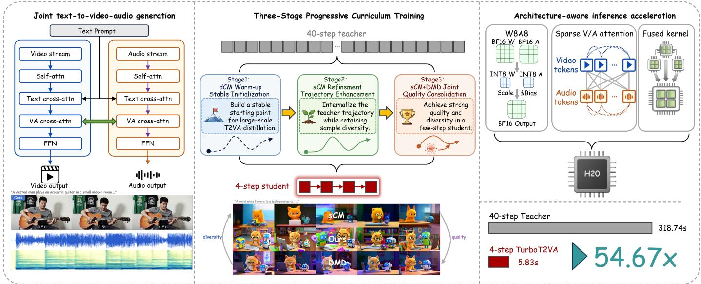  
Fig. 1. Overview of TurboT2VA. A joint video-audio Transformer is distilled from a 40-step teacher into a four-step student through a progressive dCM→sCM→sCM+DMD curriculum, improving the quality–diversity trade-off for synchronized video-audio generation. The distilled student is further accelerated by an architecture-aware inference stack consisting of modality-aware sparse attention dispatch, guarded W8A8 linear operators, and fused Transformer kernels, yielding a 54.67× generator-only speedup under the 1024×1792 high-resolution deployment setting on one NVIDIA H20.

Performance. We implement TurboT2VA based on LTX-2 and conduct large-scale distillation on a 19B-parameter T2VA model consisting of a 14B video backbone and a 5B audio backbone. At the standard evaluation resolution of 512×768, four-step distillation reduces average inference time from 50.52s to 2.51s, achieving a 20.1× speedup while maintaining a strong overall trade-off across visual quality, audio fidelity, sample diversity, and video-audio synchronization. Under the high-resolution deployment setting at 1024×1792, the complete architecture-aware inference stack reduces generator latency from 318.74s for the 40-step teacher to 5.83s for the accelerated student, yielding a 54.67× generator-only speedup on one H20. We evaluate TurboT2VA against a broad set of baselines, including cascaded generation pipelines, opensource and closed-source T2VA models, and ablations of our distillation strategy, demonstrating its effectiveness for practical large-scale T2VA acceleration.

Contributions. Our contributions are as follows:

• We propose TurboT2VA, the first score-regularized consistency distillation framework for a 19B-parameter joint T2VA generation model, enabling efficient few-step video-audio generation.

• We introduce joint cross-modal distillation, where video and audio are distilled through a shared process instead of independent branches, preserving temporal consistency.

• We design a progressive curriculum distillation paradigm that stabilizes large-scale training and balances consistency-based diversity preservation with distribution-matching quality enhancement.

• We develop an architecture-aware inference stack, combining guarded W8A8 and fused operators with modalityaware sparse attention to achieve a 54.67× generator-only speedup under the 1024×1792 high-resolution deployment setting on one H20.

## II. PRELIMINARY

## A. From Video Generation to Joint Video-Audio Generation

Recent text-to-video models have made substantial progress in visual fidelity, motion coherence, and temporal consistency [7]–[10]. However, most of them generate silent videos, whereas realistic multimedia content requires audio that is both semantically relevant and temporally aligned with visual events. Related audio-visual studies have also explored using audio data and generated-data augmentation to improve video speech recognition [11]. Cascaded pipelines partially address this limitation by generating audio from video [12]–[14] or video from audio [15], [16]. Nevertheless, modeling the two modalities sequentially may introduce semantic mismatch, rhythmic inconsistency, and temporal misalignment.

Joint video-audio generation instead models visual and acoustic content within a unified generative process. Related audio-visual co-generation tasks have also explored crossmodal correspondence between music and visual dynamics [17]. Representative T2VA systems, including JavisDiT, OVI, LTX-2, and DaVinci-MagiHuman, synthesize video and audio using unified architectures or coupled modality-specific streams [1], [18]–[20]. Although such designs enable explicit cross-modal interaction and improve video-audio coherence, they also incur substantially higher inference costs because both modalities must be generated through long diffusion or flow trajectories. Distilling a multi-step T2VA teacher into a few-step student is therefore important for practical deployment.

## B. Diffusion and Flow Distillation for Fast Generation

Existing acceleration methods for diffusion and flow-based models largely fall into two categories. Consistency-based distillation enables one- or few-step generation by enforcing compatible predictions across noise levels. Within this family, dCM enforces consistency between predictions at discretized noise levels, whereas sCM formulates consistency directly in continuous time. The latter requires trajectory-tangent estimation through Jacobian–vector products (JVPs), making largescale optimization more challenging [2], [3], [6]. Distributionmatching distillation instead aligns the student distribution with the teacher distribution through score-level discrepancies. Representative methods include DMD and its improved variant DMD2, which achieve strong one- and few-step synthesis quality but may exhibit mode-seeking behavior and reduce sample diversity [4]–[6]. This trade-off is particularly important for T2VA generation, where diversity spans visual appearance, motion trajectories, rhythm patterns, sound events, and video-audio correspondence.

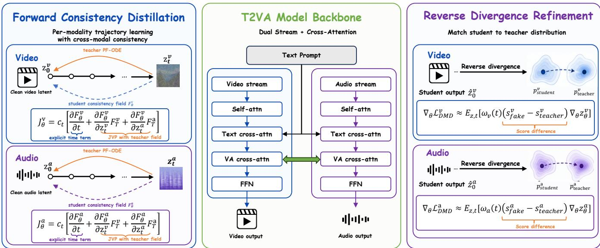  
Fig. 2. Overview of the proposed Dual-Divergence Distillation framework for T2VA acceleration. The left panel illustrates forward consistency distillatio for video and audio modalities, the middle shows the T2VA backbone with cross-modal interaction, and the right panel depicts reverse divergence (distributio matching) refinement.

These two families therefore provide complementary strengths: consistency learning preserves generation trajectories and sample diversity, while distribution matching improves perceptual quality through teacher-distribution alignment. TurboT2VA combines these to achieve fast, high-quality, and synchronized few-step video-audio generation.

## III. CROSS-MODAL JOINT DISTILLATION

TurboT2VA adapts score-regularized consistency distillation from video-only generation to unified text-to-video-audio generation. Instead of distilling video and audio as two independent branches, we formulate T2VA distillation on paired video-audio latents. Let $\mathcal { M } = \{ v , a \}$ denote the set of video and audio modalities. Given a text condition $c ,$ each clean sample is represented as $z _ { 0 } = ( z _ { 0 } ^ { v } , z _ { 0 } ^ { a } )$ ). We sample a shared base timestep t and construct noisy latents by

$$
z _ { t } ^ { m } = \cos ( t ) z _ { 0 } ^ { m } + \sin ( t ) \epsilon ^ { m } , \quad m \in \mathcal { M } .\tag{1}
$$

Here $\epsilon ^ { v }$ and $\epsilon ^ { a }$ are independently sampled noises, while the timestep and text condition are shared. Thus, video and audio

are distilled along the same generation trajectory rather than two unrelated denoising paths.

The student predicts both modalities in one forward pass:

$$
( \hat { z } _ { 0 , \theta } ^ { v } , \hat { z } _ { 0 , \theta } ^ { a } ) = G _ { \theta } ( z _ { t } ^ { v } , z _ { t } ^ { a } , t , c ) .\tag{2}
$$

Although the losses are computed per modality, the forward graph is shared: the same T2VA Transformer receives paired latents, shared conditioning and timestep embeddings. Therefore, gradients from video and audio distillation losses are propagated through the same cross-modal Transformer, allowing alignment-relevant interactions to be optimized implicitly.

## A. Joint Continuous-Time Consistency

For each modality $m \in { \mathcal { M } }$ , the teacher and student clean predictions are converted into TrigFlow fields:

$$
F _ { q } ^ { m } = \frac { \cos ( t ) z _ { t } ^ { m } - \hat { z } _ { 0 , q } ^ { m } } { \sin ( t ) } , \quad q \in \{ T , \theta \} .\tag{3}
$$

Here $F _ { T } ^ { m }$ defines the teacher trajectory, while $F _ { \theta } ^ { m }$ is the student field to be optimized. sCM further requires a joint JVP of the student field along the paired teacher direction. With $c _ { t } = \cos ( t )$ sin(t), we compute

$$
J _ { \theta } ^ { m } = c _ { t } \Bigg ( \frac { \partial F _ { \theta } ^ { m } } { \partial t } + \frac { \partial F _ { \theta } ^ { m } } { \partial z _ { t } ^ { v } } F _ { T } ^ { v } + \frac { \partial F _ { \theta } ^ { m } } { \partial z _ { t } ^ { a } } F _ { T } ^ { a } \Bigg ) , \quad m \in \mathcal { M } .\tag{4}
$$

Since this JVP passes through the same cross-modal model, the video direction depends on audio tokens and the audio direction depends on video tokens. This is the key difference between joint T2VA distillation and simply adding two independent modality losses.

We define the sCM direction as

$$
\begin{array} { c } { { g _ { \mathrm { s C M } } ^ { m } = - \beta \cos ( t ) \sqrt { 1 - \gamma ^ { 2 } \sin ^ { 2 } ( t ) } \left( \mathrm { s g } ( F _ { \theta } ^ { m } ) - F _ { T } ^ { m } \right) } } \\ { { - \gamma \cos ( t ) \sin ( t ) z _ { t } ^ { m } - J _ { \theta } ^ { m } , } } \end{array}\tag{5}
$$

where $\beta$ is the consistency boost factor, γ is the tangent warm-up ratio, and $\operatorname { s g } ( \cdot )$ denotes stop-gradient. For modalitybalanced sCM, we normalize the consistency direction separately for each modality:

$$
\bar { g } _ { \mathrm { s C M } } ^ { m } = \frac { g _ { \mathrm { s C M } } ^ { m } } { \left\| g _ { \mathrm { s C M } } ^ { m } \right\| _ { 2 } + \epsilon _ { \mathrm { s C M } } } , \quad m \in \mathcal { M } .\tag{6}
$$

The norm is computed per sample over all latent elements of the corresponding modality. We define the sCM residual as

$$
r _ { \mathrm { s C M } } ^ { m } = F _ { \theta } ^ { m } - \mathrm { s g } ( F _ { \theta } ^ { m } ) - \bar { g } _ { \mathrm { s C M } } ^ { m } .\tag{7}
$$

The joint sCM loss is

$$
\mathcal { L } _ { \mathrm { s C M } } ^ { \mathrm { j o i n t } } = \sum _ { m \in \mathcal { M } } w _ { m } \left\| r _ { \mathrm { s C M } } ^ { m } \right\| _ { 2 } ^ { 2 } .\tag{8}
$$

This objective transfers the teacher’s paired video-audio trajectory to the few-step student, preserving visual motion, acoustic evolution, rhythm structure, and temporal correspondence.

## B. Joint Distribution Matching

sCM preserves the teacher trajectory, but few-step generation may still lose perceptual quality. We therefore introduce DMD after the student has learned a stable joint trajectory. Given an on-policy paired sample generated by the student,

$$
\begin{array} { r } { \hat { z } _ { 0 } = ( \hat { z } _ { 0 } ^ { v } , \hat { z } _ { 0 } ^ { a } ) , } \end{array}\tag{9}
$$

we perturb it to $\hat { z } _ { t }$ and compute the prediction discrepancy for each modality:

$$
g _ { \mathrm { D M D } } ^ { m } = \hat { z } _ { 0 , \mathrm { f a k e } } ^ { m } ( \hat { z } _ { t } , t , c ) - \hat { z } _ { 0 , T } ^ { m } ( \hat { z } _ { t } , t , c ) , \quad m \in \mathcal { M } .\tag{10}
$$

Here $\hat { z } _ { 0 , T }$ denotes the teacher prediction, and $\hat { z } _ { 0 , \mathrm { f a k e } }$ is predicted by the fake-score network trained on student-generated samples rather than by the generator itself. Under this model parameterization, this prediction discrepancy is equivalent to a score discrepancy. In practice, the teacher prediction is computed with classifier-free guidance, and video and audio can use different guidance scales.

Conversely, DMD uses a residual-scale normalizer rather than an L2 normalizer. For each modality, we compute

$$
c _ { \mathrm { D M D } } ^ { m } = \frac { 1 } { N _ { m } } \sum _ { i \in m } \left| \hat { z } _ { 0 , i } ^ { m } - \hat { z } _ { 0 , T , i } ^ { m } \right| ,\tag{11}
$$

where $N _ { m }$ is the number of latent elements in modality m. The normalized DMD gradient is

$$
\bar { g } _ { \mathrm { D M D } } ^ { m } = \frac { g _ { \mathrm { D M D } } ^ { m } } { c _ { \mathrm { D M D } } ^ { m } + \epsilon _ { \mathrm { D M D } } } , \quad m \in \mathcal { M } .\tag{12}
$$

We define the DMD residual as

$$
\Delta _ { \mathrm { D M D } } ^ { m } = \hat { z } _ { 0 } ^ { m } - \mathrm { s g } \left( \hat { z } _ { 0 } ^ { m } - \bar { g } _ { \mathrm { D M D } } ^ { m } \right) .\tag{13}
$$

We aggregate the DMD surrogate with a sum reduction over latent elements:

$$
\mathcal { L } _ { \mathrm { D M D } } ^ { \mathrm { j o i n t } } = \sum _ { m \in \mathcal { M } } w _ { m } \sum _ { i \in m } \left( \Delta _ { \mathrm { D M D } , i } ^ { m } \right) ^ { 2 } .\tag{14}
$$

This preserves the accumulated distribution-matching signal over the full paired video-audio latent, allowing DMD to provide a sufficiently strong teacher-distribution anchor during joint sCM+DMD optimization. The overall scale is still controlled by modality-wise gradient normalization, modality weights, and the outer coefficient λDMD.

Unlike applying DMD to video and audio independently, this term is computed from paired video-audio samples generated by the same student under the same condition and timestep. Therefore, DMD improves final-sample realism without breaking the cross-modal structure learned by joint sCM.

## C. Modality-Balanced Joint Optimization

A direct joint objective can be dominated by one modality because video and audio latents have different dimensional ities, temporal resolutions, and learning speeds. TurboT2VA therefore applies modality-wise balancing to both objectives, but with different normalizers: sCM uses an L2 direction normalizer, while DMD uses a teacher-residual scale normalizer. The normalized modality losses are then combined with weights $w _ { m }$ . This balancing is applied only at the loss level; the student is still trained as a single unified T2VA generator. When sCM and DMD are optimized together, we reuse the same batch, text condition, and paired video-audio latents for both objectives, making the two objectives operate on the same paired samples and conditions.

The final joint objective is

$$
\mathcal { L } _ { \mathrm { s t a g e 3 } } = \lambda _ { \mathrm { s C M } } \mathcal { L } _ { \mathrm { s C M } } ^ { \mathrm { j o i n t } } + \lambda _ { \mathrm { D M D } } \mathcal { L } _ { \mathrm { D M D } } ^ { \mathrm { j o i n t } } .\tag{15}
$$

The sCM term preserves the paired teacher trajectory, supporting diversity and video-audio synchronization under few-step sampling, while the DMD term improves final-sample quality by matching the teacher distribution. The outer coefficients $\lambda _ { \mathrm { s C M } }$ and $\lambda _ { \mathrm { D M D } }$ further control the balance between trajectory consistency and distribution-level anchoring.

## D. LTX-2 TrigFlow Adaptation

The original LTX-2 backbone follows a rectified-flow velocity parameterization, while sCM uses the TrigFlow parameterization. We introduce a wrapper that maps TrigFlow latents and timesteps to the LTX-2 rectified-flow interface:

$$
z _ { \mathrm { r f } } = \frac { z _ { \mathrm { t r i g } } } { \cos ( t ) + \sin ( t ) } , \quad t _ { \mathrm { r f } } = \frac { \sin ( t ) } { \cos ( t ) + \sin ( t ) } .\tag{16}
$$

This wrapper exposes video and audio predictions under a unified timestep interface and supports JVP computation through timestep embeddings, video-audio tokenization, positional embeddings, and the cross-modal Transformer. We do not modify the underlying LTX-2 backbone; instead, TurboT2VA adapts its training interface so that joint sCM and DMD objectives can be applied to both modalities within one student model.

## IV. CURRICULUM DISTILLATION PARADIGM

Although the joint sCM+DMD objective combines trajectory-level consistency with distribution-level matching, directly optimizing it from the base student initialization does not produce the best few-step T2VA student. Importantly, the issue is not optimization infeasibility: direct sCM+DMD training can converge to reasonable results. However, we observe weaker quality–diversity trade-offs, especially in diversity and video-audio dynamics. This suggests that the order in which trajectory learning and distribution matching are introduced is important for large-scale T2VA distillation.

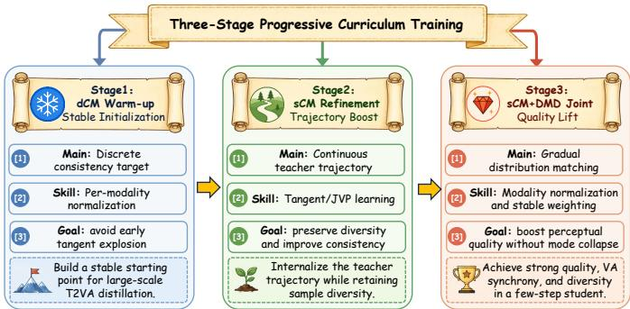  
Fig. 3. Overview of the proposed curriculum distillation paradigm. The student is progressively trained through dCM warm-up, sCM refinement, and sCM+DMD joint optimization.

## A. Empirical Observation: Trainable but Suboptimal

We first compare alternative optimization paths before prescribing a curriculum. Training sCM+DMD directly from the base initialization is feasible and reaches reasonable quality, showing that joint optimization itself is not unstable. However, as shown in Figure 7(a), the staged route overtakes direct joint training after entering the final stage and maintains a Javisscore advantage at the common 7,500-step endpoint. Complementary objective ablations further show that sCM alone better preserves trajectory diversity and temporal structure but produces weaker final-sample quality, whereas DMD emphasizes perceptual quality at the cost of diversity. Introducing joint sCM+DMD only after dCM warm-up and sCM refinement yields the strongest overall balance among visual quality, audio fidelity, sample diversity, and video-audio synchronization.

These observations indicate that the benefit of curriculum distillation lies in structuring the optimization path. The student first learns how to follow the teacher trajectory, and only later receives stronger distribution-level supervision.

## B. Why Direct sCM+DMD is Suboptimal

The empirical gap can be explained by the premature coupling of two objectives that play different roles. sCM transfers the teacher’s generation trajectory to the student and encourages consistency across noise levels. This helps preserve temporal dynamics, motion evolution, audio events, and cross-modal correspondence. In contrast, DMD provides a distribution-level anchor that improves final-sample realism by matching the teacher distribution.

When DMD is introduced too early, distribution-level refinement may encourage the student to match teacher-like samples before it has learned a sufficiently broad trajectory prior. This does not necessarily cause training failure, but it can weaken the diversity inherited from the teacher trajectory. The effect is particularly important for T2VA generation, where diversity is expressed not only through visual appearance, but also through motion trajectories, rhythm patterns, sound events, and videoaudio correspondence. The staged curriculum therefore first establishes a diverse and stable trajectory prior and only then introduces DMD to improve perceptual quality.

## C. Three-Stage Curriculum Distillation

We propose a progressive curriculum that decomposes T2VA distillation into three stages. Similar progressivetraining ideas have also been explored in vision-language reasoning [21]. Starting from the base student initialization $\theta _ { 0 } .$ , the student parameters are updated in a staged manner:

$$
\theta _ { 1 } = \mathrm { T r a i n } \left( \theta _ { 0 } , \mathcal { L } _ { \mathrm { d C M } } \right) ,\tag{17}
$$

$$
\theta _ { 2 } = \mathrm { T r a i n } \left( \theta _ { 1 } , { \cal L } _ { \mathrm { s C M } } \right) ,\tag{18}
$$

$$
\theta _ { 3 } = \mathrm { T r a i n } \left( \theta _ { 2 } , \lambda _ { \mathrm { s C M } } \mathcal { L } _ { \mathrm { s C M } } + \lambda _ { \mathrm { D M D } } \mathcal { L } _ { \mathrm { D M D } } \right) .\tag{19}
$$

Here Train $( \theta , { \mathcal { L } } )$ denotes continuing optimization from parameters θ under objective ${ \mathcal { L } } .$ This formulation emphasizes that the curriculum changes the optimization path, rather than the final model architecture.

1) Stage 1: dCM Warm-up: We first optimize a dCM objective over discrete noise levels to initialize the student for coarse denoising. Unlike sCM, dCM does not require continuous-time trajectory-tangent estimation, making it suitable as a warm-up stage for large-scale joint video-audio distillation.

The goal of this stage is not to maximize final perceptual quality, but to provide a robust initialization for later trajectory learning. In particular, dCM warm-up gives the student basic denoising capability, stable timestep conditioning, and a coarse joint denoising prior.

2) Stage 2: sCM Refinement: Starting from the dCMinitialized student, we then apply sCM to learn a continuous teacher-guided generation trajectory. sCM refines the student from a coarse denoiser into a trajectory-consistent generator by enforcing consistency across noise levels and transferring the teacher’s local generation directions.

This stage improves trajectory fidelity and preserves sample diversity before distribution-level supervision is introduced. For T2VA generation, this is especially important because trajectory learning affects not only visual motion, but also audio evolution and video-audio temporal correspondence.

3) Stage 3: sCM+DMD Joint Optimization: Inspired by the score-regularization principle of rCM [6], we introduce DMD for distribution refinement while continuing sCM training after the student acquires sufficient trajectory coverage. At this stage, sCM maintains trajectory structure and diversity, whereas DMD improves final-sample realism by pulling the student distribution closer to the teacher distribution.

The two objectives therefore become complementary: sCM preserves generation dynamics and cross-seed variation, while DMD enhances perceptual quality and teacherdistribution alignment. This staged introduction avoids applying strong distribution-level supervision before the student has learned a sufficiently expressive trajectory prior. Overall, the dCM→sCM→sCM+DMD sequence converts direct joint optimization into a structured learning process that builds a coarse denoising prior, expands it into a trajectory-consistent generator, and finally improves distribution-level quality, yielding a stronger quality–diversity–synchronization trade-off.

## V. ARCHITECTURE-AWARE ACCELERATION FOR JOINT VIDEO-AUDIO GENERATION

Few-step distillation reduces the number of Transformer evaluations but not the cost of each evaluation. This perstep cost becomes dominant at high resolution, where the joint video-audio Transformer contains long modality-specific token sequences, heterogeneous attention paths, and large feed-forward projections. Directly applying a video-only inference stack is unsafe because audio self-attention, video selfattention, bidirectional video-audio interaction, and text crossattention differ in sequence lengths, masks, and matrix shapes. Building on the efficient primitives of TurboDiffusion [22], we specialize an architecture-aware inference layer for LTX-2 comprising modality-aware SageSLA dispatch, shape-aware post-scale W8A8 linear operators, and fused multimodal Transformer operations. The stack is applied after distillation and requires no retraining of the TurboT2VA student.

## A. Modality-Aware Sparse Attention Dispatch

The joint Transformer contains four semantically different attention paths: video self-attention, audio self-attention, bidirectional video-audio interaction, and masked text crossattention. Applying the same approximation to all paths can alter conditioning behavior or violate sparse-kernel assumptions. Our dispatcher identifies modules by their architectural role and applies SageSLA [23], [24] only to the unmasked video and audio self-attention paths. Bidirectional cross-modal attention and masked text cross-attention remain dense, preserving explicit video-audio exchange and text conditioning.

For each selected path, the adapter transforms the native sequence-major query, key, and value tensors into the layout required by SageSLA. A query-dependent block map retains a fraction $\rho _ { \ell }$ of key blocks at layer ℓ, with support for either one global ratio or a layer-wise schedule. On the H20 path, query and key are quantized to INT8 and value aggregation uses FP8 values. To avoid degenerate behavior on short audio sequences, the runtime ratio is

$$
\tilde { \rho } _ { \ell } = \mathrm { m a x } \left( \rho _ { \ell } , \frac { 1 } { N _ { \mathrm { b l k } } } \right) ,\tag{20}
$$

where $N _ { \mathrm { b l k } }$ is the number of key blocks, guaranteeing at least one retained key block. The result is then restored to the original joint-Transformer layout. Our high-resolution configuration uses $\rho _ { \ell } = 0 . 3$ for all layers. This setting concentrates approximation on the long self-attention sequences that dominate computation without assuming equal video and audio sequence lengths.

## B. Shape-Aware Post-Scale W8A8 Linear Operators

Feed-forward networks and attention projections remain a major cost after attention sparsification. Their matrix shapes differ across video, audio, and cross-modal branches, while a blockwise quantization strategy repeatedly applies scales along the reduction dimension. We instead use a post-scale W8A8 operator with static per-output-channel weight quantization and dynamic per-row activation quantization. For activation row $x _ { i }$ and output-channel weight row $w _ { j }$ , we compute

$$
\hat { x } _ { i } = \mathrm { c l i p } \left( \mathrm { r o u n d } ( x _ { i } / s _ { i } ^ { x } ) , - 1 2 7 , 1 2 7 \right) ,\tag{21}
$$

$$
\hat { w } _ { j } = \mathrm { c l i p } \left( \mathrm { r o u n d } ( w _ { j } / s _ { j } ^ { w } ) , - 1 2 7 , 1 2 7 \right) ,\tag{22}
$$

$$
y _ { i j } = s _ { i } ^ { x } s _ { j } ^ { w } \sum _ { k } \hat { x } _ { i k } \hat { w } _ { j k } + b _ { j } ,\tag{23}
$$

where $s _ { i } ^ { x } = \operatorname* { m a x } ( \| x _ { i } \| _ { \infty } , \epsilon ) / 1 2 7 , s _ { j } ^ { w } = \operatorname* { m a x } ( \| w _ { j } \| _ { \infty } , \epsilon ) / 1 2 7 ,$ and $\epsilon ~ = ~ 1 0 ^ { - 4 }$ . The TileLang kernel accumulates INT8 products in INT32 continuously across the complete reduction dimension $K .$ , then applies both scales and bias once in the epilogue. This avoids fragmenting the reduction with tile-local rescaling.

The current optimized path requires CUDA BF16 inputs and flattened matrix dimensions $M , K ,$ and N divisible by 128. Unsupported dtypes or shapes fall back to native BF16 linear computation using a retained BF16 weight copy. We additionally concatenate query, key, and value projections when they share the same input, and concatenate key/value projections in cross-attention, reducing redundant activation quantization and kernel launches. This shape-aware policy prioritizes safe coverage rather than forcing every heterogeneous branch through one quantized kernel.

## C. Fused Multimodal Transformer Operations

After accelerating attention and linear operators, memorybound elementwise operations form a non-negligible fraction of each denoising step. The joint Transformer repeatedly combines normalization with modality- and timestep-dependent modulation, followed by gated residual updates. We replace module-level RMSNorm and LayerNorm and fuse recurring functional patterns, including modulated RMS normalization, adaptive scale–shift modulation, gated residual updates, output modulation, and split rotary embeddings. Every fused kernel has dtype, contiguity, shape, and mask guards; unsupported layouts execute the original implementation.

We also eliminate redundant computation in the textconditioning path. During batch-size-one inference, the shared text mask identifies valid prompt tokens. We compact both video- and audio-conditioning embeddings to this same validtoken set and then remove the padding mask before crossattention. Unlike semantic prompt truncation, this transformation removes only padded positions and leaves every valid token unchanged. For larger batches the optimization is disabled, because different prompts need not share one validtoken pattern.

a) Default inference configuration: For high-resolution batch-one inference, we apply SageSLA to video and audio self-attention with $\rho _ { \ell } = 0 . 3$ , quantize all compatible generator linear layers with the TileLang post-scale backend, enable fused normalization and modulation kernels, and compact padded text context. At 1024×1792 with 121 frames, the video latent has shape [1, 16, 128, 32, 56], corresponding to 28,672 video self-attention tokens. Sparse attention is approximate, so the retention ratio should be revalidated when the resolution or prompt distribution changes. We use this configuration for the subsequent high-resolution latency evaluation.

TABLE I  
JAVISBENCH COMPARISON WITH REPRESENTATIVE T2VA SYSTEMS UNDER THE STANDARD-RESOLUTION EVALUATION SETTING. BEST AND SECOND-BEST OPEN-SOURCE RESULTS ARE BOLD AND UNDERLINED.
<table><tr><td rowspan="2">Model</td><td rowspan="2"></td><td rowspan="2">Size Time (s) Y</td><td colspan="3">Perceptual Quality</td><td colspan="4">Text Semantic Consistency</td><td colspan="3">|V-A Semantic Consistency</td><td colspan="2">V-A Alignment</td></tr><tr><td>Visual ↑ Motion ↑ Audio ↑</td><td></td><td></td><td>IB-TV ↑ IB-TA ↑</td><td></td><td></td><td>CLIP ↑ CLAP 1</td><td>IB-AV ↑ CAVP ↑</td><td></td><td>AVH↑</td><td></td><td>Javis ↑ Desync ↓</td></tr><tr><td colspan="10">Closed-source T2VA Models</td><td colspan="7"></td></tr><tr><td>Kling v3 [25]</td><td></td><td></td><td>3.478</td><td>1.104</td><td>5.499</td><td>0.246</td><td>0.154</td><td>0.309</td><td>0.421</td><td>0.231</td><td>0.793</td><td></td><td>0.210 0.177</td><td></td><td>0.907</td></tr><tr><td>Sora 2 [26]</td><td></td><td></td><td>2.836</td><td>0.185</td><td>4.802</td><td>0.252</td><td>0.161</td><td>0.308</td><td>0.434</td><td>0.240</td><td></td><td>0.792</td><td>0.217</td><td>0.187</td><td>0.414</td></tr><tr><td>Veo 3 [27]</td><td></td><td></td><td>4.221</td><td>0.735</td><td>5.534</td><td>0.219</td><td>0.178</td><td>0.310</td><td>0.469</td><td>0.351</td><td></td><td>0.798</td><td>0.326</td><td>0.285</td><td>0.336</td></tr><tr><td colspan="10">Cascaded T2A + A2V</td><td colspan="7"></td></tr><tr><td>TempoToken [15] TPoS [16]</td><td>1.3B</td><td>7.76 18.01</td><td>0.885 1.592</td><td>-0.671</td><td></td><td>0.298</td><td></td><td>0.292</td><td></td><td></td><td>0.133</td><td>0.796</td><td>0.111</td><td>0.071</td><td>1.021</td></tr><tr><td></td><td>1.0B</td><td></td><td></td><td>-0.330</td><td>一</td><td>0.240</td><td></td><td>0.261</td><td></td><td></td><td>0.145</td><td>0.793</td><td>0.138</td><td>0.098</td><td>1.112</td></tr><tr><td colspan="10">Cascaded T2V + V2A</td><td colspan="7"></td></tr><tr><td>ReWaS [12] FoleyCrafter [13]</td><td>0.6B</td><td>40.49</td><td></td><td></td><td>4.124</td><td></td><td>0.075</td><td></td><td></td><td>0.309</td><td>0.113</td><td>0.791</td><td>0.107</td><td>0.083</td><td>0.772 0.934</td></tr><tr><td>MMAudio [14]</td><td>1.2B 0.1B</td><td>36.74 15.16</td><td></td><td></td><td>4.225 4.308</td><td></td><td>0.079</td><td></td><td>0.212</td><td></td><td>0.182 0.190</td><td>0.798 0.794</td><td>0.168</td><td>0.134 0.142</td><td>0.524</td></tr><tr><td></td><td></td><td></td><td></td><td></td><td></td><td></td><td>0.164</td><td></td><td>0.401</td><td></td><td></td><td></td><td>0.180</td><td></td><td></td></tr><tr><td colspan="10">Open-source T2VA Models</td><td colspan="7"></td></tr><tr><td>JavisDiT [18]</td><td>3.1B</td><td>49.73</td><td>1.488</td><td>0.591</td><td>4.405</td><td>0.250</td><td>0.145</td><td>0.297</td><td>0.413</td><td></td><td>0.212</td><td>0.798</td><td>0.183</td><td>0.152</td><td>0.848</td></tr><tr><td>OVI [19] DaVinci-MagiHuman [20]</td><td>11B 15B</td><td>76.79</td><td>2.145 0.854</td><td>0.294</td><td>5.024</td><td>0.244</td><td>0.132</td><td>0.307</td><td>0.407</td><td></td><td>0.209</td><td>0.795</td><td>0.206</td><td>0.175</td><td>0.638</td></tr><tr><td></td><td></td><td>6.70</td><td></td><td>0.382</td><td>5.245</td><td>0.227</td><td>0.124</td><td>0.284</td><td>0.362</td><td></td><td>0.201</td><td>0.800</td><td>0.181</td><td>0.145</td><td>0.730</td></tr><tr><td colspan="10">Teacher and TurboT2VA</td><td colspan="7"></td></tr><tr><td>Teacher (40 steps) [1]</td><td>19B 19B</td><td>50.52 2.51</td><td>1.968 2.389</td><td>0.783</td><td>4.902</td><td>0.268</td><td>0.139</td><td>0.291</td><td>0.340</td><td></td><td>0.199 0.229</td><td>0.796 0.803</td><td>0.195 0.224</td><td>0.165</td><td>0.617</td></tr><tr><td>Ours (4 steps)</td><td></td><td></td><td></td><td>0.849</td><td>4.486</td><td>0.218</td><td>0.145</td><td>0.292</td><td>0.347</td><td></td><td></td><td></td><td></td><td>0.196</td><td>0.388</td></tr></table>

## VI. EXPERIMENTS

## A. Experimental Setup

We conduct experiments on a large-scale text-to-video-audio generation model built upon LTX-2. The teacher consists of a 14B video backbone and a 5B audio backbone, forming a 19B-parameter joint video-audio generation system. Our goal is to distill the original multi-step teacher into a few-step student while preserving visual quality, audio fidelity, temporal coherence, sample diversity, and video-audio synchronization.

a) Training configuration: TurboT2VA is trained on 8 H20 GPUs using a training set of 100K text-video-audio samples at 512×768 resolution with 121 frames. We use per-GPU batch size 1, resulting in an effective batch size of 8. The main 4-step student follows a three-stage curriculum: 2K dCM warm-up steps, 0.5K sCM refinement steps, and 4.5K joint sCM+DMD optimization steps. The selected student is therefore trained for 7K optimization steps in total. The main joint stage uses AdamW with a learning rate of $2 \times 1 0 ^ { - 5 }$ $\beta _ { 1 } = 0 . 0 , \beta _ { 2 } = 0 . 9 9 9$ , weight decay 0.01, and equal sCM and DMD weights. Teacher predictions use video and audio guidance scales of 3.0 and 5.0, respectively. Training uses BF16 mixed precision, gradient checkpointing, and FSDP, and takes approximately 21 hours on 8 H20 GPUs, excluding evaluation and checkpoint sweep overhead.

b) Standard-resolution evaluation protocol and metrics: For the main student comparisons, ablations, training curves, and sampling-step analysis, all variants are evaluated on the same 200-prompt split at 512×768 resolution with 121 frames. For diversity evaluation, we use the same 200 prompts and generate 8 samples per prompt with different random seeds. Runtime is measured as the average pure inference time per generated sample, excluding model loading and evaluation overhead. We report JavisBench metrics [18] covering perceptual quality, text semantic consistency, video-audio semantic consistency, and video-audio alignment. We further use VBench for video fidelity [28], TTA-Bench for audio quality [29], MS-CLAP for text-audio alignment [30], and withinprompt ImageBind cosine distances for diversity [31].

c) High-resolution deployment protocol: We separately profile the architecture-aware inference stack on one NVIDIA H20 at batch size one, 1024×1792 output resolution, and 121 frames. Unless otherwise specified, latency refers to generator-only time and excludes checkpoint loading, decod ing, muxing video and audio, and disk I/O. Table V further reports component-wise generator latency. All stages in the systems comparison are cumulative. The two resolution profiles serve complementary purposes: the standard-resolution protocol enables comprehensive model-level comparisons and ablations, whereas the high-resolution protocol serves as a more demanding deployment setting that better exposes the computational bottlenecks of the large-scale Transformer and the benefits of architecture-aware acceleration. All comparisons are conducted within the same resolution profile.

## B. Main Results

1) Generation Quality: Table I reports the main quantitative comparison on JavisBench and related video-audio metrics. TurboT2VA achieves a strong balance between inference efficiency and generation quality. Compared with the original 40-step teacher, TurboT2VA distills the generation process into a 4-step student, reducing the average inference time from 50.52s to 2.51s at the standard evaluation resolution “A middle-aged man in a dark suit gives a formal speech …”

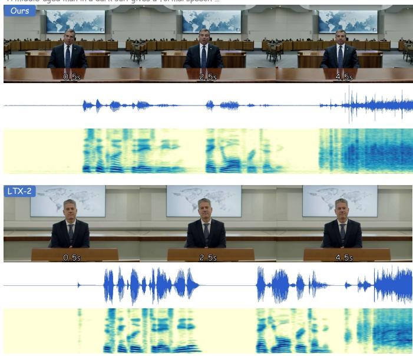  
“A woman in a pink shirt speaks directly to the camera  
“A seated man plays an acoustic guitar in a small indoor room …”

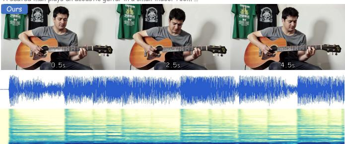

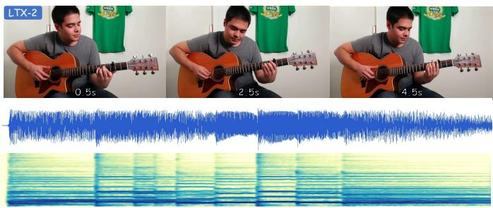  
“A woman in a white outfit sings on a dimly lit stage …”

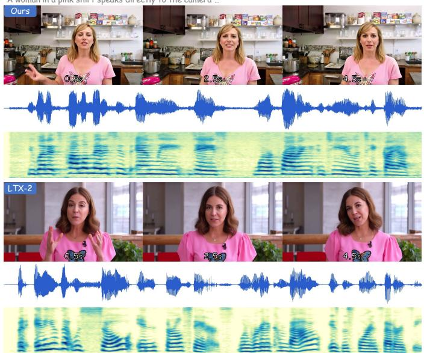

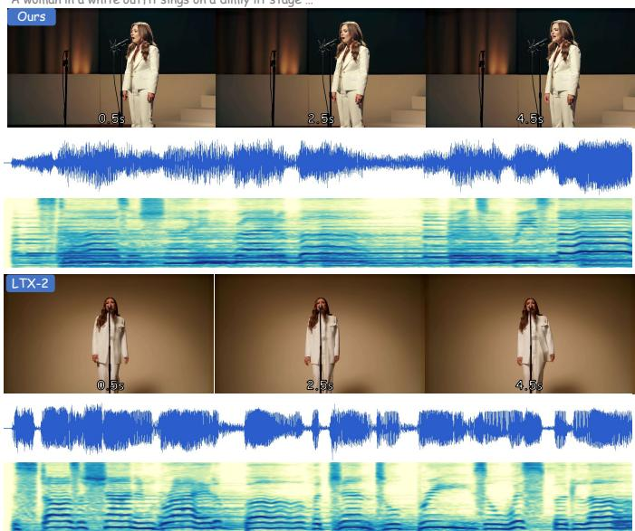  
Fig. 4. Qualitative video-audio examples. Each block compares the 40-step teacher and the 4-step TurboT2VA student under the same prompt, showing early, middle, and late video frames together with the corresponding waveform and mel spectrogram. The student preserves coherent subjects, scene layout, temporal appearance, and audio structure while reducing the sampling trajectory to four steps.

of 512×768 and achieving a 20.1× speedup. Despite the aggressive step reduction, TurboT2VA maintains comparable overall generation quality on JavisBench and achieves improved performance on several video-audio quality and synchronization metrics. Compared with cascaded, open-source, and closed-source T2VA baselines, TurboT2VA provides competitive generation quality while being substantially faster than most multi-step systems. These results demonstrate that the proposed curriculum distillation framework effectively preserves the teacher’s generation capability and enables efficient few-step T2VA inference.

Figure 4 complements the quantitative results with qualitative temporal and audio comparisons. Across examples, the four-step student preserves the teacher’s visual content and scene evolution while maintaining coherent audio structure.

2) Video and Audio Fidelity: We complement the joint evaluation with separate modality-specific fidelity measurements.

a) Video fidelity: We evaluate video fidelity using VBench. Table II reports the available VBench dimensions for the original teacher and ours, including aesthetic quality, imaging quality, motion smoothness, subject consistency, and temporal flickering. The distilled student maintains comparable video fidelity to the teacher on this auxiliary videoonly benchmark, with improvements in aesthetic and imaging quality while preserving strong temporal consistency.

b) Audio fidelity: We measure audio quality using TTA-Bench metrics, including content enjoyment, content usefulness, production complexity, and production quality. We additionally report the aggregate audio aesthetic score and text–audio similarity measured by MS-CLAP. As shown in

“A robot gives flowers to a typing orange cat …”

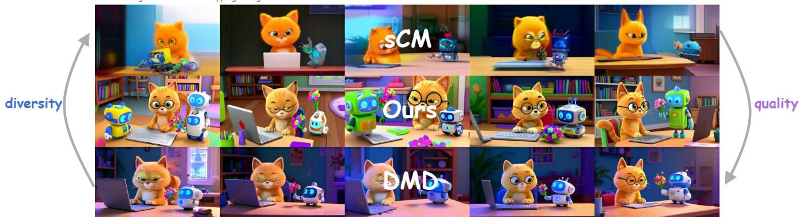  
Fig. 5. Quality–diversity comparison under matched prompts and random seeds. Rows show sCM-only, Ours (staged), and DMD-only, while columns show different random seeds. sCM-only provides broad variation but weaker prompt fidelity, DMD-only gives polished yet more repetitive compositions, and Our maintains both coherent cat–robot interactions and meaningful cross-seed variation.

Generator latency (s) on a single NVIDIA H20  
TABLE II  
VBENCH VIDEO FIDELITY EVALUATION BETWEEN THE ORIGINAL TEACHER AND OURS. THE BEST RESULT IS UNDERLINED.
<table><tr><td>Model</td><td>Aes. ↑</td><td>Img. ↑</td><td>Mot. ↑</td><td>Subj. ↑</td><td>Temp. ↑</td></tr><tr><td>Teacher (40 steps)</td><td>0.5286</td><td>0.5884</td><td>0.9919</td><td>0.9592</td><td>0.9844</td></tr><tr><td>Ours (4 steps)</td><td>0.5519</td><td>0.6520</td><td>0.9911</td><td>0.9614</td><td>0.9773</td></tr></table>

TABLE III

AUDIO QUALITY AND TEXT–AUDIO ALIGNMENT EVALUATION BETWEEN THE ORIGINAL TEACHER AND OURS. THE BEST RESULT IS UNDERLINED.
<table><tr><td>Model</td><td>Enjoy. ↑</td><td>Useful. ↑</td><td></td><td>Complex. ↑ Prod. Qual. ↑ Aes. Mean ↑</td><td></td><td>MS-CLAP ↑</td></tr><tr><td>Teacher (40 steps)</td><td>4.765</td><td>6.307</td><td>3.275</td><td>6.577</td><td>5.231</td><td>0.353</td></tr><tr><td>Ours (4 steps)</td><td>4.612</td><td>6.334</td><td>2.964</td><td>6.584</td><td>5.115</td><td>0.347</td></tr></table>

Table III, the distilled student maintains comparable audio quality and text–audio alignment to the teacher under 4- step inference, demonstrating that the proposed distillation framework effectively preserves audio generation capability while substantially reducing sampling steps.

3) Diversity Evaluation: We evaluate sampling diversity under fixed text conditions by generating 8 video-audio samples per prompt with different random seeds. Video and audio are encoded using a fixed pretrained ImageBind encoder, and pairwise embedding distances are computed only among samples from the same prompt. This yields 82 = 28 pairs per prompt and 5,600 pairs per modality over 200 prompts. The final diversity score is the average within-prompt distance.

We report video and audio diversity using modality-specific ImageBind embeddings. For a compact video-audio summary, we additionally report their arithmetic mean, $D _ { \mathrm { V A } } =$ $( D _ { \mathrm { v i d e o } } + D _ { \mathrm { a u d i o } } ) / 2 .$ . Since diversity alone does not measure generation quality, we report the Javis score in the same table to show the quality–diversity trade-off. As shown in Table IV, DMD-only achieves competitive quality but exhibits the lowest diversity, whereas sCM-only preserves the strongest diversity at the cost of substantially lower quality; by combining sCM and DMD, our staged approach achieves a more favorable quality–diversity balance.

Figure 5 provides a controlled visual counterpart to the aggregate diversity scores. All three variants receive the same prompt and are sampled with the same set of random seeds. sCM-only changes subjects and layouts substantially, but its outputs less reliably preserve the requested cat–robot interaction. DMD-only produces polished frames but repeatedly converges to similar centered compositions. In contrast, Ours (staged) preserves the requested interaction while retaining visible cross-seed changes in character appearance, robot design, and scene layout. This qualitative comparison is consistent with the diversity trends observed in Table IV.

TABLE IV  
DIVERSITY COMPARISON UNDER DIFFERENT DISTILLATION OBJECTIVES. BEST AND SECOND-BEST RESULTS ARE BOLD AND UNDERLINED.
<table><tr><td>Model</td><td>Javis ↑</td><td>Video Div. ↑</td><td>Audio Div. ↑</td><td>VA Avg. Div. ↑</td></tr><tr><td>sCM-only</td><td>0.1131</td><td>0.3026</td><td>0.5037</td><td>0.4032</td></tr><tr><td>DMD-only</td><td>0.1812</td><td>0.1821</td><td>0.3561</td><td>0.2691</td></tr><tr><td>Ours (staged)</td><td>0.1963</td><td>0.2322</td><td>0.4197</td><td>0.3259</td></tr></table>

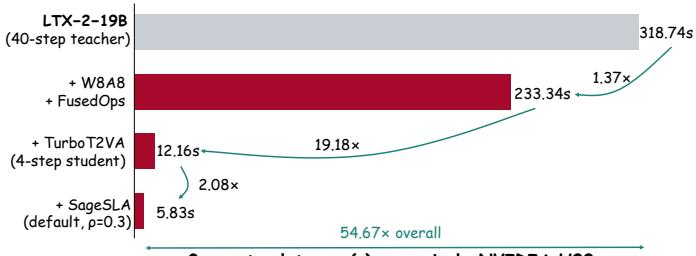  
Fig. 6. High-resolution inference acceleration, achieving a 54.67× generatoronly speedup on one NVIDIA H20.

4) High-Resolution Inference Acceleration: Figure 6 evaluates the complete inference stack described in Section V on one NVIDIA H20 at 1024×1792, 121 frames, and batch size one. All stages are cumulative, and latency is measured for the generator only, excluding checkpoint loading, VAE decoding, muxing video and audio, and disk I/O. The dense 40-step teacher requires 318.74s per sample. Applying W8A8 linear operators and fused operations reduces this to 233.34s. Replacing the teacher trajectory with the four-step TurboT2VA student under the same operator stack yields

TABLE V  
HIGH-RESOLUTION GENERATOR LATENCY BREAKDOWN AT 1024×1792 ON ONE NVIDIA H20. BEST AND SECOND-BEST ARE BOLD AND UNDERLINED.
<table><tr><td>Metric</td><td>Dense Teacher</td><td>Dense Student</td><td>Fused Only</td><td>W8A8 Only</td><td>W8A8 + Fused</td><td>Sparse Only</td><td>Full  $\rho = 0 . 5$ </td><td>Full  $\rho = 0 . 4$ </td><td>Full  $\rho = 0 . 3$ </td><td>Full  $\rho = 0 . 2$ </td></tr><tr><td>Gen. (s) ↓</td><td>318.74</td><td>16.50</td><td>13.77</td><td>14.73</td><td>12.16</td><td>6.24</td><td>6.44</td><td> $6 . 1 3$ </td><td>5.83</td><td>5.57</td></tr><tr><td>Speedup ↑</td><td></td><td>1.00×</td><td>1.20×</td><td>1.12×</td><td>1.36×</td><td>2.65×</td><td>2.56×</td><td>2.69×</td><td>2.83×</td><td>2.97×</td></tr></table>

TABLE VI

SPEED–QUALITY FRONTIER OF FOUR-STEP TURBOT2VA. BEST AND SECOND-BEST RESULTS ARE BOLD AND UNDERLINED; RANKINGS USE UNROUNDED VALUES.
<table><tr><td>Config.</td><td>Gen. (s)↓ Javis↑</td><td></td><td>AVH↑</td><td>Desync↓</td><td>CAVP↑</td><td>IB-AV↑</td></tr><tr><td>Dense</td><td>16.50</td><td>0.1948</td><td>0.2330</td><td>0.4275</td><td>0.7964</td><td>0.2370</td></tr><tr><td>Full,  $\rho { = } 0 . 5$ </td><td>6.44</td><td>0.1939</td><td>0.2287</td><td>0.3990</td><td>0.7974</td><td>0.2375</td></tr><tr><td>Full,  $\rho { = } 0 . 4$ </td><td>6.13</td><td>0.1901</td><td>0.2247</td><td>0.4080</td><td>0.7974</td><td>0.2345</td></tr><tr><td>Full, ρ=0.3</td><td>5.83</td><td>0.1914</td><td>0.2269</td><td>0.4085</td><td>0.7985</td><td>0.2348</td></tr><tr><td>Full, ρ=0.2</td><td>5.57</td><td>0.1948</td><td>0.2305</td><td>0.4145</td><td>0.7971</td><td>0.2380</td></tr></table>

12.16s, corresponding to a 26.20× speedup over the dense teacher. Finally, modality-aware SageSLA with $\rho = 0 . 3$ and padded-text compaction reduces latency to 5.83s, achieving a 54.67× overall generator speedup. For reference, the unoptimized four-step student takes 16.50s at this resolution, so the architecture-aware stack contributes an additional 2.83× acceleration beyond step reduction alone, demonstrating the complementary benefits of model-level distillation and perstep inference optimization. To isolate the contribution of individual inference components, we further report the componentwise high-resolution latency in Table V. All student variants use the same four-step inference setting, and only the enabled inference components differ.

As shown in Table V, fused operations and W8A8 independently reduce the dense four-step generator latency from 16.50s to 13.77s and 14.73s, respectively, while their combination further reduces it to 12.16s. Sparse attention provides the largest single-component gain, and the complete inference stack with $\rho \mathrm { ~  ~ { ~ \alpha ~ } ~ } = \mathrm { ~ \ 0 . 3 ~ }$ reduces generator latency to 5.83s. These generator-only measurements isolate the contribution of individual inference components.

Beyond the component-wise latency analysis, we further characterize the speed–quality trade-off by evaluating the complete inference stack under different SageSLA retention ratios ρ. All configurations use the same four-step student, evaluation prompts, sampling schedule, and random seeds.

As shown in Table VI, reducing the retention ratio from 0.5 to 0.2 lowers generator latency from 6.44s to 5.57s, compared with 16.50s for dense four-step inference. Meanwhile, Javis, AVH, CAVP, and IB-AV remain close to the high-resolution dense reference across all retention ratios. We use $\rho = 0 . 3$ as the default configuration because it provides a stronger balance between latency and cross-modal alignment, achieving the best CAVP score and lower desynchronization error than $\rho = 0 . 2$ The more aggressive $\rho = 0 . 2$ setting further reduces latency while maintaining comparable overall video-audio quality.

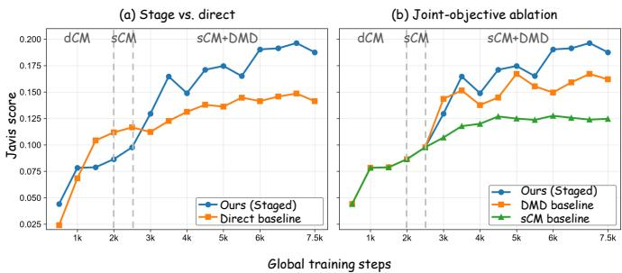  
Fig. 7. Training-curve ablations through 7,500 global steps. (a) Staged dCM→sCM→sCM+DMD training overtakes direct sCM+DMD optimization after entering the joint stage and maintains stronger late-training performance. (b) Starting from the same dCM+sCM prefix, staged sCM+DMD optimization achieves stronger late-training Javis scores than DMD refinement or sCM-onl continuation. Dashed vertical lines denote the stage boundaries.

## C. Ablation Study

We conduct ablation studies to validate the effectiveness of the progressive curriculum and the roles of sCM and DMD.

1) Effect of Progressive Warm-up: We first evaluate the effect of the warm-up stages. Directly optimizing sCM and DMD from the base initialization is trainable, but it does not yield the best quality–diversity trade-off. Without dCM warm-up and sCM refinement, the student receives trajectorylevel and distribution-level supervision before acquiring a sufficiently structured few-step generation trajectory. In contrast, dCM warm-up provides a coarse denoising initialization, and sCM refinement further aligns the student with the continuous teacher trajectory before DMD is introduced. As shown in Figure 7(a), the staged curriculum overtakes direct sCM+DMD optimization after the joint stage begins and retains a clear advantage through 7,500 global steps.

2) Effect of Joint sCM+DMD Optimization: Figure 7(b) compares endpoint objectives after the same dCM+sCM warm-up prefix. DMD refinement improves quickly after the shared prefix but plateaus below the joint objective, whereas sCM-only remains stable but substantially lower in Javis score. Staged sCM+DMD optimization reaches the strongest late-training quality, peaking at 0.1963 at 7,000 steps and remaining ahead at the common 7,500-step endpoint. Together with the diversity results in Table IV, these curves show that joint consistency and distribution matching provide a stronger quality–diversity balance without implying a finegrained objective-ratio sweep.

## D. Effect of Sampling Steps

Finally, we evaluate TurboT2VA with different numbers of sampling steps. As shown in Table VII, generation quality generally improves as the number of sampling steps increases.

TABLE VII  
SAMPLING-STEP ABLATION FOR TURBOT2VA. BEST AND SECOND-BEST RESULTS ARE SHOWN IN BOLD AND UNDERLINED, RESPECTIVELY.
<table><tr><td>Steps</td><td>Visual ↑</td><td>Motion ↑</td><td>Audio ↑</td><td>IB-TV ↑</td><td>IB-TA ↑</td><td>IB-AV ↑</td><td>CLIP ↑</td><td>CLAP ↑</td><td>CAVP ↑</td><td>AVH↑</td><td>Javis ↑</td><td>Desync↓</td></tr><tr><td>1</td><td>2.0576</td><td>0.6680</td><td>4.0746</td><td>0.2259</td><td>0.0919</td><td>0.0959</td><td>0.2915</td><td>0.2367</td><td>0.7955</td><td>0.0847</td><td>0.0663</td><td>0.6220</td></tr><tr><td>2</td><td>2.2328</td><td>0.7269</td><td>4.3416</td><td>0.2224</td><td>0.1377</td><td>0.1915</td><td>0.2926</td><td>0.3198</td><td>0.7959</td><td>0.1845</td><td>0.1576</td><td>0.3780</td></tr><tr><td>4</td><td>2.3892</td><td>0.8493</td><td>4.4860</td><td>0.2185</td><td>0.1447</td><td>0.2290</td><td>0.2921</td><td>0.3472</td><td>0.8033</td><td>0.2241</td><td>0.1963</td><td>0.3880</td></tr></table>

Two-step inference achieves reasonable performance, while four-step inference provides further gains across most metrics.

## VII. CONCLUSION

In this paper, we present TurboT2VA, an efficient generation framework for large-scale text-to-video-audio synthesis. TurboT2VA extends score-regularized consistency distillation to a 19B-parameter joint video-audio model and addresses the modality imbalance and quality–diversity trade-off arising in few-step T2VA generation. The proposed modalitybalanced objectives retain end-to-end optimization through the coupled video-audio backbone, while the progressive dCM→sCM→sCM+DMD curriculum gradually introduces trajectory-level consistency and distribution-matching supervision. The staged training strategy establishes coarse denoising behavior before introducing continuous trajectory refinement and distribution supervision, thereby structuring the optimization process from easier objectives to more challenging ones.

Experiments on JavisBench, VBench, and modality-specific fidelity and diversity benchmarks demonstrate that the resulting four-step student achieves a favorable efficiency–quality trade-off. At the standard evaluation resolution of 512×768, it reduces generator latency from 50.52s to 2.51s, corresponding to a 20.1× speedup, while retaining competitive visual quality, audio fidelity, cross-modal consistency, and sample diversity.

Beyond sampling-step reduction, TurboT2VA incorporates an architecture-aware inference stack consisting of guarded W8A8 linear operators, fused multimodal Transformer operations, padded-text compaction, and modality-aware sparse attention, while keeping cross-modal and text-conditioning attention paths dense. At 1024×1792, the complete stack reduces generator latency from 318.74s to 5.83s on a single NVIDIA H20, achieving a 54.67× generator-only speedup. These results demonstrate the potential of combining few-step distillation with architecture-aware systems optimization for efficient deployment of large-scale joint video-audio generation models. Together, these model- and system-level improvements reduce both the number of Transformer evaluations and the computational cost of each evaluation in practical T2VA synthesis, while preserving the unified structure required for synchronized multimodal generation.

## REFERENCES

[1] Y. HaCohen, B. Brazowski, N. Chiprut, Y. Bitterman, A. Kvochko, A. Berkowitz, D. Shalem, D. Lifschitz, D. Moshe, E. Porat et al., “Ltx-2: Efficient joint audio-visual foundation model,” arXiv preprint arXiv:2601.03233, 2026.

[2] Y. Song, P. Dhariwal, M. Chen, and I. Sutskever, “Consistency models,” arXiv preprint arXiv:2303.01469, 2023.

[3] C. Lu and Y. Song, “Simplifying, stabilizing and scaling continuoustime consistency models,” in International Conference on Learning Representations, vol. 2025, 2025, pp. 50 611–50 649.

[4] T. Yin, M. Gharbi, R. Zhang, E. Shechtman, F. Durand, W. T. Freeman, and T. Park, “One-step diffusion with distribution matching distillation,” in 2024 IEEE/CVF Conference on Computer Vision and Pattern Recognition (CVPR). IEEE, 2024, pp. 6613–6623.

[5] T. Yin, M. Gharbi, T. Park, R. Zhang, E. Shechtman, F. Durand, and W. T. Freeman, “Improved distribution matching distillation for fast image synthesis,” Advances in neural information processing systems, vol. 37, pp. 47 455–47 487, 2024.

[6] K. Zheng, Y. Wang, Q. Ma, H. Chen, J. Zhang, Y. Balaji, J. Chen, M.-Y. Liu, J. Zhu, and Q. Zhang, “Large scale diffusion distillation via scoreregularized continuous-time consistency,” in International Conference on Learning Representations, vol. 2026, 2026, pp. 2582–2603.

[7] U. Singer, A. Polyak, T. Hayes, X. Yin, J. An, S. Zhang, Q. Hu, H. Yang, O. Ashual, O. Gafni et al., “Make-a-video: Text-to-video generation without text-video data,” arXiv preprint arXiv:2209.14792, 2022.

[8] Z. Yang, J. Teng, W. Zheng, M. Ding, S. Huang, J. Xu, Y. Yang, W. Hong, X. Zhang, G. Feng et al., “Cogvideox: Text-to-video diffusion models with an expert transformer,” in International Conference on Learning Representations, vol. 2025, 2025, pp. 83 048–83 077.

[9] Y. HaCohen, N. Chiprut, B. Brazowski, D. Shalem, D. Moshe, E. Richardson, E. Levin, G. Shiran, N. Zabari, O. Gordon et al., “Ltx-video: Realtime video latent diffusion,” arXiv preprint arXiv:2501.00103, 2024.

[10] Z. Zheng, X. Peng, T. Yang, C. Shen, S. Li, H. Liu, Y. Zhou, T. Li, and Y. You, “Open-sora: Democratizing efficient video production for all,” arXiv preprint arXiv:2412.20404, 2024.

[11] X. Yang, X. Cheng, J. Duan, H. Qiu, M. Hong, M. Fang, S. Ji, J. Zuo, Z. Hong, Z. Zhang et al., “Audiovsr: Enhancing video speech recognition with audio data,” in Proceedings of the 2024 Conference on Empirical Methods in Natural Language Processing, 2024, pp. 15 352–15 361.

[12] Y. Jeong, Y. Kim, S. Chun, and J. Lee, “Read, watch and scream! sound generation from text and video,” in Proceedings of the AAAI Conference on Artificial Intelligence, vol. 39, no. 17, 2025, pp. 17 590–17 598.

[13] Y. Zhang, Y. Gu, Y. Zeng, Z. Xing, Y. Wang, Z. Wu, B. Liu, and K. Chen, “Foleycrafter: Bring silent videos to life with lifelike and synchronized sounds,” International Journal ofComputer Vision, vol. 134, no. 1, p. 46, 2026.

[14] H. K. Cheng, M. Ishii, A. Hayakawa, T. Shibuya, A. Schwing, and Y. Mitsufuji, “Mmaudio: Taming multimodal joint training for highquality video-to-audio synthesis,” in 2025 IEEE/CVF Conference on Computer Vision and Pattern Recognition (CVPR). IEEE, 2025, pp. 28 901–28 911.

[15] G. Yariv, I. Gat, S. Benaim, L. Wolf, I. Schwartz, and Y. Adi, “Diverse and aligned audio-to-video generation via text-to-video model adaptation,” in Proceedings of the AAAI Conference on Artificial Intelligence, vol. 38, no. 7, 2024, pp. 6639–6647.

[16] Y. Jeong, W. Ryoo, S. Lee, D. Seo, W. Byeon, S. Kim, and J. Kim, “The power of sound (tpos): Audio reactive video generation with stable diffusion,” in 2023 IEEE/CVF International Conference on Computer Vision (ICCV). IEEE, 2023, pp. 7788–7798.

[17] X. Yang, M. Zhang, C. Pan, N. Huang, Y. Yuguang, F. Zhuo, P. Zhou, J. Zhou, S. Shan, S. Yang et al., “Tmd-bench: A multi-level evaluation paradigm for music–dance co-generation,” in Forty-third International Conference on Machine Learning, 2026.

[18] K. Liu, W. Li, L. Chen, S. Wu, Y. Zheng, J. Ji, F. Zhou, J. Luo, Z. Liu, H. S. Fei et al., “Javisdit: Joint audio-video diffusion transformer with hierarchical spatio-temporal prior synchronization,” in International Conference on Learning Representations, vol. 2026, 2026, pp. 139 160– 139 194.

[19] C. Low, W. Wang, and C. Katyal, “Ovi: Twin backbone cross-modal

fusion for audio-video generation,” arXiv preprint arXiv:2510.01284, 2025.

[20] E. Chern, H. Teng, H. Sun, H. Wang, H. Pan, H. Jia, J. Su, J. Li, J. Yu, L. Liu et al., “Speed by simplicity: A single-stream architecture for fast audio-video generative foundation model,” arXiv preprint arXiv:2603.21986, 2026.

[21] X. Yang, S. Yang, C. Wang, J. Xue, M. Tang, C. Yu, X. Zhou, S. Zhou, T. Jin, L. Yang et al., “A progressive training strategy for vision-language models to counteract spatio-temporal hallucinations in embodied reasoning,” arXiv preprint arXiv:2604.10506, 2026.

[22] J. Zhang, K. Zheng, K. Jiang, H. Wang, I. Stoica, J. E. Gonzalez, J. Chen, and J. Zhu, “Turbodiffusion: Accelerating video diffusion models by 100-200 times,” arXiv preprint arXiv:2512.16093, 2025.

[23] J. Zhang, P. Zhang, J. Zhu, J. Chen et al., “Sageattention: Accurate 8- bit attention for plug-and-play inference acceleration,” in International Conference on Learning Representations, vol. 2025, 2025, pp. 71 566– 71 585.

[24] J. Zhang, H. Wang, K. Jiang, S. Yang, K. Zheng, H. Xi, Z. Wang, H. Zhu, M. Zhao, I. Stoica et al., “Sla: Beyond sparsity in diffusion transformers via fine-tunable sparse–linear attention,” in International Conference on Learning Representations, vol. 2026, 2026, pp. 138 288–138 305.

[25] Kuaishou Technology, “Kling ai launches 3.0 model, ushering in an era where everyone can be a director,” Company announcement, 2026. [Online]. Available: https://ir.kuaishou.com/news-releases/news-release-details/ kling-ai-launches-30-model-ushering-era-where-everyone-can-be

[26] OpenAI, “Sora 2 system card,” 2025. [Online]. Available: https: //openai.com/index/sora-2-system-card/

[27] Google DeepMind, “Veo 3 model card,” 2026. [Online]. Available: https://storage.googleapis.com/deepmind-media/ Model-Cards/Veo-3-Model-Card.pdf

[28] Z. Huang, Y. He, J. Yu, F. Zhang, C. Si, Y. Jiang, Y. Zhang, T. Wu, Q. Jin, N. Chanpaisit et al., “Vbench: Comprehensive benchmark suite for video generative models,” in 2024 IEEE/CVF Conference on Computer Vision and Pattern Recognition (CVPR). IEEE, 2024, pp. 21 807–21 818.

[29] H. Wang, C. Liu, J. Chen, H. Liu, Y. Jia, S. Zhao, J. Zhou, H. Sun, H. Bu, and Y. Qin, “Tta-bench: A comprehensive benchmark for evaluating textto-audio models,” in Proceedings of the AAAI Conference on Artificial Intelligence, vol. 40, no. 39, 2026, pp. 33 512–33 520.

[30] B. Elizalde, S. Deshmukh, M. Al Ismail, and H. Wang, “Clap learning audio concepts from natural language supervision,” in ICASSP 2023- 2023 IEEE International Conference on Acoustics, Speech and Signal Processing (ICASSP). IEEE, 2023, pp. 1–5.

[31] R. Girdhar, A. El-Nouby, Z. Liu, M. Singh, K. V. Alwala, A. Joulin, and I. Misra, “Imagebind one embedding space to bind them all,” in 2023 IEEE/CVF Conference on Computer Vision and Pattern Recognition (CVPR). IEEE, 2023, pp. 15 180–15 190.