# Variance-Guided Spatial Attention Fusion for Robust End-to-End Driving under Asymmetric Sensor Degradation

Weizhi Tao, Zengwang Jin, Xiao Wang, Senior Member, IEEE, and Hailong Huang, Senior Member, IEEE

Abstract—End-to-end multimodal driving has progressed rapidly by fusing camera and LiDAR streams. Existing pipelines remain fragile under asymmetric sensor degradation, where either an entire modality or only a localized region is corrupted while other regions remain useful. The key difficulty is not simply to add an uncertainty head, but to obtain dense reliability supervision, calibrate this reliability against physical fault severity, and use it before unreliable features bias the planner. We propose Variance-Guided Spatial Attention Fusion (VG-SAF), in which dense heteroscedastic reliability estimates act as interpretable spatial gates. The framework couples three components. First, a physically grounded augmentor simulates representative camera and LiDAR failures and emits a continuous spatial mask, providing dense supervision without additional annotation. Second, modality-specific experts predict per-pixel reliability scales through cross-branch dense distillation in log space, enforcing a monotone severity-to-scale response. Third, calibrated reliability maps drive a hybrid attention mechanism that suppresses unreliable cells with a local spatial gate and arbitrates between modalities through a cross-modal trust softmax. A Laplace uncertainty head emits a systemic waypoint uncertainty scale that signals severe or combined sensor degradation, including severities outside the training ranges. On the CARLA Longest6 benchmark, VG-SAF consistently improves closed-loop robustness over the baselines across camera-only, LiDAR-only, and joint degradation regimes, as measured by driving score, route completion, and infraction score.

Index Terms—Autonomous vehicles, vehicular automation, multimodal sensor fusion, uncertainty estimation, sensor degradation, robust end-to-end driving.

## I. INTRODUCTION

implications for urban mobility and traffic safety [1]. Sustained progress on benchmarks such as nuScenes [2], the

CARLA Leaderboard [3], [4] and Longest6 [5] has produced end-to-end policies that map raw sensor input directly to control. Recent studies on intelligent vehicular systems approach this goal from complementary angles, including hierarchical reinforcement learning, general/specialized drivingmodel interfaces and resource modeling for embedded driving intelligence [6], [7], [10]. The common requirement behind these advances is reliable information fusion: the planner must receive perception cues that remain useful when the operating condition changes. Camera, LiDAR and radar provide complementary appearance, geometry and ranging cues [1], [8], [9], so multimodal sensing is widely adopted as the foundation of autonomous vehicles. Therefore, robust fusion is directly tied to route completion, infraction reduction and operational continuity in intelligent vehicular systems.

However, the complementarity holds only when both sensor streams are nominal, i.e., when the camera and LiDAR operate under normal sensor health. Robustness benchmarks document that real-world failures are not symmetric [11]–[13]. They may be spatially localized and asymmetric across modalities. A water droplet corrupts a small patch of camera pixels, whereas a LiDAR blockage may empty one angular frustum of the BEV scan. The safe response is therefore not to discard an entire modality, but to discount the corrupted cells of a stream while continuing to use the remaining cells of the same stream. Existing intermediate-fusion architectures [5], [14]– [17] and BEV-fusion architectures [18]–[20] do not provide this property. Their fusion weights are conditioned on the content of the features, not on the physical reliability of the cells that produced them. Local corruption is therefore smeared through the attention map rather than isolated to the cells that carry the corrupted physical signal, which is precisely the resolution needed for safe local maneuvers.

Robustness research in the domain has predominantly addressed a modality-level threat model [21]–[26]. Such methods are effective when a complete stream is missing or when a scene-level condition changes globally, but they are less suited to localized asymmetric faults. A modality-level dropout decision either keeps the damaged stream, allowing corrupted cells to enter the fused representation, or suppresses the whole stream, discarding unaffected cells that may still contain lane, obstacle or traffic-light evidence. A global trust scalar or a scene-level condition token faces the same resolution mismatch: it can summarize the environment but cannot select which spatial cells of the modality are reliable. The machinery that could in principle supply a per-cell trust signal, namely heteroscedastic uncertainty estimation [27], [28], has been used mainly as a downstream diagnostic [29]–[31]. Existing methods have not explicitly used a mask-calibrated dense variance as a structural input for cross-modal fusion, leaving the planner without a calibrated reliability field.

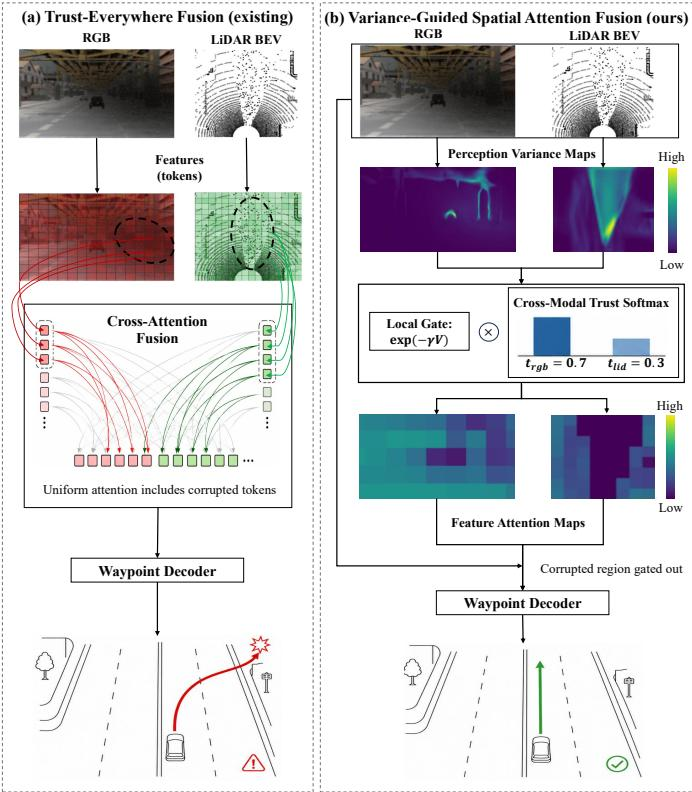  
Fig. 1. Trust-everywhere fusion versus the proposed variance-guided spatial attention fusion (VG-SAF) under sensor corruption. (a) A cross-attention stage admits every token regardless of its sensor-side quality. The damaged region (dashed ellipse) propagates uniformly into the fused representation and biases the planner. (b) VG-SAF estimates a dense variance map for each modality. A local spatial gate exp $( - \eta _ { m } ^ { \mathrm { l o c } } \bar { V } _ { m } )$ and a cross-modal trust softmax suppress the corrupted region while preserving the surviving modality.

These observations expose three coupled challenges. First, dense reliability supervision is needed at the cell level, but manual uncertainty labels are unavailable in ordinary driving datasets. Second, heteroscedastic loss attenuation alone relates the predicted scale to supervised loss magnitude, which can be unstable under corrupted inputs because severely damaged observations may no longer contain sufficient evidence for reliable direct supervision. Third, the resulting reliability field must serve two roles simultaneously: local spatial suppression inside each modality and cross-modal arbitration between modalities. Fig. 1 contrasts the proposed mechanism with the cross-attention paradigm. We promote heteroscedastic perpixel predictive variance from a downstream diagnostic to an architectural input of the fusion stage. A physically grounded augmentor injects representative camera and LiDAR faults and, alongside every augmented frame, emits a continuous corruption mask M that supplies dense reliability supervision without additional human annotation. The mask supervises cross-branch dense distillation, which calibrates predicted logvariance against physical fault severity rather than using only the residual proxy. The calibrated variance then drives a hybrid attention that decouples within-modality spatial gating from sample-level cross-modal trust. A Laplace uncertainty head emits a systemic waypoint uncertainty scale that increases under severe or combined degradation and can be exposed to a downstream safety controller.

The principal contributions of this paper are as follows.

1) We promote heteroscedastic per-pixel predictive variance from a downstream diagnostic to a structural input of multimodal fusion attention for reliability-aware planning.

2) We introduce a physically grounded fault-injection augmentor for the camera and the LiDAR streams. Every augmentation is paired with a continuous, per-cell corruption mask. A four-phase progressive curriculum uses the mask to calibrate the variance heads against physical severity while preserving supervision on reliable regions.

3) We design a cross-branch dense distillation loss that enforces a monotone, log-space alignment between predicted log-variance and corruption severity, without auxiliary manual labels or separate uncertainty annotations.

4) We design a hybrid variance-guided attention that decouples per-cell spatial gating from sample-level crossmodal arbitration. A Laplace uncertainty head exposes a systemic waypoint uncertainty scale that responds to severe degradation and to severity extrapolation beyond the training ranges, providing an interpretable safety signal.

We evaluate VG-SAF on the CARLA Longest6 benchmark under camera-only, LiDAR-only and joint corruption regimes. The evaluation reports the standard closed-loop driving score, route completion and infraction score, and the results show that variance-guided fusion consistently improves robustness over feature-only cross-attention baselines while maintaining interpretable modality trust and per-cell attention maps.

The remainder of the paper is organized as follows. Section II surveys the three research threads on which this work draws. Section III presents the full framework, including the mask-weighted supervision, confidence-aware consistency, cross-branch dense distillation and hybrid variance-guided fusion. Section IV reports the closed-loop, ablation and qualitative evaluations. Section V discusses three limitations and future directions, and Section VI concludes the paper from the perspective of robust vehicular autonomy.

## II. RELATED WORK

## A. Multimodal End-to-End Driving and Cross-Modal Fusion

End-to-end driving has progressed from conditional imitation learning [32]–[34] to multimodal architectures that align RGB and LiDAR streams through shared latent representations and cross-attention. Recent work also studies end-to-end vehicular autonomy from complementary perspectives: hierarchical reinforcement learning for vision-based driving [6], general/specialized model interfacing for end-to-end driving [7], and resource modeling for embedded autonomous-driving intelligence [10]. A representative early multimodal instance is TransFuser [5], [14], which interconnects two convolutional encoders through multi-resolution cross-attention. Subsequent architectures explore variations within the same paradigm.

InterFuser [15] adds dense object prediction together with a learned safety filter. TCP [16] couples trajectory and direct control prediction. ThinkTwice [17] refines the BEV through a coarse-to-fine waypoint planner. A second strand fuses modalities in a shared bird’s-eye-view space. BEVFusion [18], [35] lifts camera features into the BEV through depth-distribution estimation and aligns them with LiDAR voxels under a unified representation. Earlier cross-modal works fuse LiDAR and camera at the point or voxel level, as in PointPainting [36] and the continuous-fusion family [37], [38]. OpenMPD provides a multimodal autonomous-driving perception benchmark, and radar–LiDAR fusion further illustrates the benefit of combining sensors with complementary failure characteristics [8], [9]. UniAD [19] and VAD [20] unify detection, tracking, mapping and planning under a single transformer that propagates features along the prediction path. A complementary line scales the planner through unified transformers and latent worldmodel representations [39], [40]. Across this body of work the fusion weights are conditioned on features, not on the physical reliability of the cells from which those features were originally extracted, regardless of the local sensor health at inference time.

## B. Uncertainty Quantification in Deep Networks

Modern uncertainty quantification builds on the aleatoric/epistemic taxonomy of [27]. The aleatoric component is heteroscedastic across the input and observable through a single forward pass. The epistemic component can signal model uncertainty under distribution shift. Stochastic forward passes [41], [42] and the higher-order posteriors of evidential deep learning [43], [44] approximate the epistemic posterior. Their cost makes them unattractive for self-driving latency budgets. Sampling-free heteroscedastic predictors [27], [28] predict per-pixel negative log-likelihoods through a single forward pass at no additional stochastic-sampling overhead, and deterministic variants further compress the cost while preserving calibration [45]. In autonomous driving, predicted uncertainty has been used primarily as a downstream signal: as a crash predictor [29], a distribution-shift detector or adapter [30], [46], or a multi-task loss balancer [31]. These works establish that uncertainty can indicate reliability, but their uncertainty estimates are consumed after the prediction has already been formed. By contrast, robust multimodal fusion requires the reliability estimate to intervene before the corrupted features are fused. None of these methods treats per-cell variance as a structural input to a multimodal fusion mechanism. The role of the variance map as an upstream structural input to cross-modal arbitration has therefore remained largely unexplored to date.

## C. Robust Multimodal Driving under Sensor Corruption

Systematic robustness benchmarks include ImageNet-C [11] on the image side and Robo3D [12] and RoboBEV [13] on the 3D-perception side. Physics-grounded simulators reproduce fog and snowfall on real LiDAR scans [47], [48], and adversarial-robustness benchmarks generate corruptionrich driving sequences in CARLA [49]. Architectural robustness in fusion has been pursued through random modality dropout [18], [21] and through fusion stages that gracefully degrade when a stream is missing or impaired [22], [23], [50]. The works most closely related to ours target adverse weather or sensor faults at the architectural level. CrossFuser [24] relies on a domain-shift module trained on weather-perturbed inputs. PolicyFuser [26] abandons feature-level fusion altogether and reconciles per-modality policies. MaskFuser [25] trains a unified token space with cross-modal masked autoencoding. CAFuser [23] classifies the environmental condition into a coarse, scene-level token that biases the fusion stack. These methods improve robustness, but their reliability cues are either modality-level, token-reconstruction based or scenelevel. They do not explicitly represent the physical severity of each corrupted cell. Hence, they can decide that a stream or scene is unreliable, but cannot provide the planner with a dense spatial selector that suppresses only the damaged regions while preserving the unaffected regions of the same modality. Each of these methods therefore operates at a granularity coarser than the per-cell signal that asymmetric corruption demands. None of them uses a calibrated physical quantity as the gating input, and none exposes a per-cell reliability map that the planner can consume directly as a structural feature.

## D. Positioning of the Proposed Framework

VG-SAF intersects all three threads. Its positioning can be summarized by the same three difficulties identified in the Introduction. To obtain dense reliability supervision, it pairs the variance head with a physically grounded augmentor that emits a continuous corruption mask. To avoid an unstable residualonly uncertainty proxy, it uses cross-branch dense distillation in log space, which produces a monotone severity-to-reliability map without requiring per-mode labels. To make the variance actionable for planning, it converts the calibrated map into a hybrid attention composed of a within-modality local gate and a cross-modal trust softmax. The distinguishing feature of VG-SAF is thus not a post-hoc uncertainty diagnostic, but the integration of mask-calibrated dense reliability, physical mask supervision and local-plus-trust attention within a single end-to-end driving stack and coherent training pipeline.

## III. METHODOLOGY

## A. Overview

VG-SAF is organized into two cascaded stages, both supervised by a single physical signal: the continuous per-pixel corruption mask $\mathbf { \bar { M } } \in [ 0 , 1 ] ^ { H \times \mathbf { \bar { W } } }$ emitted by the augmentor (Fig. 2). Stage 1 trains two modality-specific uncertaintyaware perception experts (Section III-D). Stage 2 freezes the experts and trains the fusion components (Section III-E). The design therefore follows a clear information path: the augmentor records where physical damage is injected, the perception experts convert this record into calibrated dense variance, and the fusion stage uses the variance to suppress spatially unreliable cells before waypoint decoding. A complete description of the network architecture, the augmentor catalog and the curriculum schedules is provided in the accompanying supplementary material.

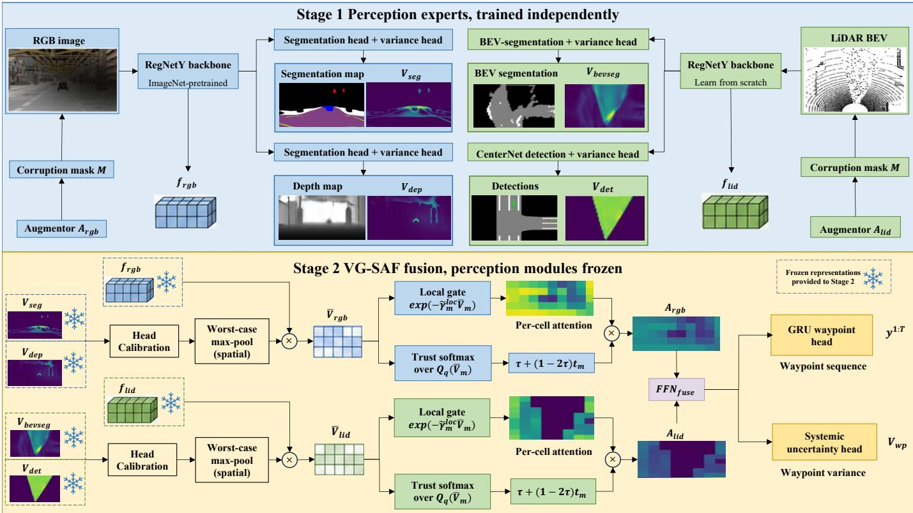  
Fig. 2. Two-stage training workflow of VG-SAF. Stage 1 (top) trains two independent perception experts under the per-modality augmentors $A _ { \mathrm { r g b } }$ and $\mathcal { A } _ { \mathrm { l i d } }$ and the perception loss ${ \bar { \mathcal { L } } } _ { \mathrm { { p e r c e p } } } .$ Stage 2 (bottom) freezes the experts and learns the fusion stage, where dense reliability maps are aggregated into $\bar { V } _ { m }$ and converted into a local gate and a trust softmax. Their product forms $\mathbf { A } _ { m } .$ , which gates each modality before waypoint decoding.

## B. Network Architecture and Inputs

The camera input is the RGB frame $\mathbf { x } _ { \mathrm { r g b } } \in \mathbb { R } ^ { 3 \times 1 6 0 \times 7 0 4 }$ The LiDAR input is a two-channel BEV histogram xlid ∈ R2×256×256 at 8 pixels per meter. The third input is the navigation goal $\mathbf { p } _ { t } ~ \in \mathbb { R } ^ { 2 }$ in the ego-vehicle frame. Both modality experts adopt the RegNetY backbone family [51]. The camera backbone is initialized from ImageNet weights. The LiDAR backbone reuses the architecture but is trained from scratch with a freshly initialized stem. The camera expert produces a per-pixel semantic segmentation map with variance Vseg and a depth map with variance $V ^ { \mathrm { d e p } }$ . The LiDAR expert produces a BEV segmentation map with variance $V ^ { \mathrm { b e v } }$ and a CenterNet detection head [52] with a per-pixel detection variance $V ^ { \mathrm { d e t } }$ . The fusion stage adds four learnable scalars, a fusion projection $\mathrm { F F N _ { f u s e } } .$ , an autoregressive GRU waypoint head and a systemic uncertainty head. Layer widths, head dimensions and the GRU recurrence schedule are detailed in Supplementary Section S2, including the exact spatial resolutions used by the fusion head.

## C. Augmentor and Corruption Mask

Each modality is paired with an online augmentor $A _ { m } .$ Given a clean input, the augmentor samples one failure mode from a phase-dependent distribution. The output is the corrupted input plus three companions: a dense corruption mask $\mathbf { M } \in \overline { { [ 0 , 1 ] ^ { H \times W } } }$ , a sample-level corruption severity $K = 1 0 0 \mathbb { E } [ \mathbf { M } ] \%$ , and a mode identifier. A value of zero in M denotes an untouched pixel; a value of one denotes a fully destroyed pixel; intermediate values denote partial damage.

The mask is global when its value is uniform across the frame (e.g., sensor saturation, calibration drift) and local when its support is geometrically bounded (e.g., mud on the lens, an angular LiDAR wedge). The continuous per-pixel form of M provides dense supervision for the reliability head without additional annotation.

The camera augmentor contains eight optical failure modes. The signal\_drop mode creates blackout, whiteout or snow-like saturation; local\_noise injects low-light noise patches; local\_exposure\_pulse models local flare and bloom; local\_occlusion emulates mud or debris on the lens; night\_lowlight applies global gain and gamma loss; motion\_blur applies directional convolution from vibration; ghosting creates shifted translucent copies; and color\_shift models white-balance or color-calibration drift. The LiDAR augmentor contains five geometric failure modes: signal\_drop simulates frame-wide jamming or spurious returns; range\_dropout removes returns in a distance-dependent way; frustum\_occlusion blocks an angular wedge; local\_speckle injects dust-like false returns; and feature\_noise adds channel-wise perturbations to active voxels. Together, these modes cover both global sensor-side degradation and local field-of-view damage, which is the asymmetric setting where dense masks provide more information than a modality-level missing-sensor flag. The augmentor should not be read as a complete model of all real sensor failures; rather, it provides physically motivated supervision for the reliability field. To reduce the risk of evaluating only the exact training perturbations, the closedloop routes, random seeds and sampled severities used for evaluation are held out from training, and the attention ablation further uses generic uniform and elliptical masks that are not tied to a particular named fault mode. The training ranges, realworld analogues, severity-extrapolation protocol, and example renderings are given in Supplementary Section S3.

## D. Uncertainty-Aware Perception Experts

Each task head shares a decoder body with a reliability head. The segmentation and detection scales use $V = \operatorname { s p } ( \rho ) +$ $1 0 ^ { - 2 }$ , whereas the depth head predicts $\sigma = 0 . 0 5 + \mathrm { s p } ( \rho )$ and uses $V ^ { \mathrm { d e p } } = \sigma ^ { 2 }$ (Supplementary Section S2-C). We write the common loss-attenuation form as

$$
\mathcal { L } _ { \mathrm { h e t } } ( \hat { y } , y ; V ) = a _ { k } \left( \frac { \ell _ { k } ( \hat { y } , y ) } { V } + \log V \right) ,\tag{1}
$$

where $\begin{array} { r } { a _ { k } = \frac { 1 } { 2 } } \end{array}$ and $\ell _ { k }$ is squared error for the Gaussian depth model. For segmentation and detection heatmaps, Eq. (1) is used as an uncertainty-weighted cross-entropy surrogate with a constant task scaling; the detection regression branches use the Laplace NLL [27]. For the generic attenuated form, the stationary scale is proportional to the local supervised loss, so the head can self-organize as a predictor of loss magnitude. Physical corruption, however, is not identical to supervised loss: a severely damaged observation may contain insufficient evidence for reliable direct supervision, while an easy clean cell may still have a small loss. The mask-based terms below therefore align the predicted scale explicitly with physical corruption severity.

From Phase 2 onward, the encoder ingests a concatenated batch [clean|noisy] and emits clean and noisy halves of every prediction. Let $( \hat { y } _ { c } , V _ { c } )$ and $( { \hat { y } } _ { n } , V _ { n } )$ denote the corresponding task predictions and variances, and let $\mathbf { W } = \mathbf { 1 } - \mathbf { M }$ be the trustworthiness mask. The ordinary task supervision is retained on the clean branch and weighted continuously on the noisy branch according to the remaining observation reliability. This mask-weighted supervised loss is

$$
\mathcal { L } _ { \mathrm { s u p } } = \mathcal { L } _ { \mathrm { h e t } } \big ( \hat { y } _ { c } , y ; V _ { c } \big ) + \lambda _ { \mathrm { s u p } } { \bf W } \odot \mathcal { L } _ { \mathrm { h e t } } \big ( \hat { y } _ { n } , y ; V _ { n } \big ) .\tag{2}
$$

For severely corrupted cells, the noisy observation may no longer contain sufficient evidence for reliable direct supervision. The weight $\textbf { W } = \textbf { 1 } - \textbf { M }$ therefore preserves full supervision on clean cells and progressively reduces it as corruption severity increases. We further add a confidence-aware consistency term that pulls the noisy branch back to the clean branch only where the augmentor leaves the input reliable: classification heads use $\mathbf { W } \odot \mathrm { K L } ( \mathbf { P } _ { n } \| \mathrm { s g } ( \mathbf { P } _ { c } ) )$ , where $\mathbf { P } =$ softmax(z), while regression heads use $\mathbf { W } \odot ( \hat { y } _ { n } - \mathrm { s g } ( \hat { y } _ { c } ) ) ^ { 2 }$ The stop-gradient operator prevents the noisy branch from reshaping the clean reference during dual-branch calibration.

The novel calibration term is what we refer to as crossbranch dense distillation. Its novelty lies in using the clean branch as a self-reference while using the augmentor mask as a dense physical severity label. The term therefore avoids manual uncertainty annotation and prevents the noisy branch from learning a variance map driven only by task residuals. Let $V _ { c }$ and $V _ { n }$ be the clean and noisy variance predictions.

We define a per-pixel target on the noisy log-variance that is linear in the local corruption severity:

$$
\log V _ { \mathrm { t g t } } = \operatorname { s g } ( \log V _ { c } ) + \alpha \mathbf { M } ,\tag{3}
$$

$$
\mathcal { L } _ { \mathrm { c a l } } = \mathrm { S m o o t h L 1 } ( \log V _ { n } , \log V _ { \mathrm { t g t } } ) ,\tag{4}
$$

with $\operatorname { s g } ( \cdot )$ the stop-gradient operator and $\alpha > 0$ a head-specific scaling constant. The multiplicative form $V _ { \mathrm { t g t } } { = } V _ { c } \exp ( \alpha \mathbf { M } )$ is equivalent. On clean pixels the noisy variance is distilled to match the clean variance. On fully destroyed pixels the noisy variance is targeted at $e ^ { \alpha }$ times the clean variance. The crossentropy heads use $\alpha = 3$ . The focal-loss CenterNet head uses $\alpha { = } 4 . 6 $ , which compensates for the smaller baseline variance produced by its focal-loss supervisor [53].

The total perception loss at epoch e is

$$
\begin{array} { r l r } {  { \mathcal { L } _ { \mathrm { p e r c e p } } ^ { m } ( e ) = \displaystyle \sum _ { k \in \mathcal { T } _ { m } } \mathcal { L } _ { \mathrm { s u p } } ^ { ( k ) } } } \\ & { } & { + \lambda _ { \mathrm { c o n } } ( e ) \sum _ { k \in \mathcal { T } _ { m } } \mathcal { L } _ { \mathrm { c o n } } ^ { ( k ) } + \lambda _ { \mathrm { c a l } } ( e ) \sum _ { k \in \mathcal { T } _ { m } } \mathcal { L } _ { \mathrm { c a l } } ^ { ( k ) } , } \end{array}\tag{5}
$$

where $\mathcal { T } _ { \mathrm { r g b } } = \{ \mathrm { s e g } , \mathrm { d e p } \}$ and $\mathcal { T } _ { \mathrm { l i d } } = \{ \mathrm { b e v } , \mathrm { d e t } \}$ . The three terms have distinct roles: $\mathcal { L } _ { \mathrm { s u p } }$ keeps the clean branch accurate and trains the noisy branch only on reliable cells; ${ \mathcal { L } } _ { \mathrm { c o n } }$ preserves prediction consistency on cells that remain visually or geometrically valid; and $\mathcal { L } _ { \mathrm { c a l } }$ turns the automatically emitted corruption mask into dense reliability supervision. The curriculum weights $\lambda _ { \mathrm { c o n } } ( e )$ and $\lambda _ { \mathrm { c a l } } ( e )$ are activated gradually to avoid forcing prediction consistency and variance inflation at full strength from the same early mini-batches.

The four-phase curriculum builds the variance head incrementally. Phase 1 trains a single-branch encoder with all calibration weights at zero, producing a stable backbone. Phase 2 introduces the dual-branch regime and ramps the consistency and calibration weights on staggered schedules to avoid the gradient conflict between “pull the noisy branch back to the clean prediction” and “inflate log $V$ on the same cells”. Phase 3 consolidates the joint solution under a uniform mode mix at full weights. Phase 4 shifts the mode distribution toward the physically severe failures, so the final variance head is calibrated on the corruptions that most affect closed-loop driving. During Phases 2–4, all BatchNorm layers keep their running statistics frozen while their affine parameters remain trainable. This simple freeze is important because mixed clean–noisy batches would otherwise make the running statistics represent neither distribution; at inference the mismatch can drive variance pre-activations toward the softplus floor and produce a collapsed or unresponsive uncertainty head. The complete curriculum and BatchNorm implementation are documented in Supplementary Section S6.

## E. Variance-Guided Spatial Attention Fusion

The fusion stage converts the calibrated reliability field into spatial attention before the waypoint head receives the features. The term spatial is used deliberately: the attention is not a single sample-level confidence score but a per-cell multiplicative field on the RGB and LiDAR feature grids. We first normalize the task-specific variance maps so their magnitudes are comparable, then pool them onto the fusion resolution, and finally combine two reliability mechanisms: a local gate that suppresses unreliable cells within a modality and a trust softmax that redistributes evidence across modalities.

1) Variance Normalization and Pooling: The four per-task variance maps live on different magnitude scales. We normalize each by a clean-data empirical mean $n ^ { \mathrm { s e g , r g b } } , n ^ { \mathrm { d e p } } , n ^ { \mathrm { s e g , l i d } }$ and $n ^ { \mathrm { d e t } }$ so that each task-specific variance channel has a unitmean baseline before summation:

$$
V _ { \mathrm { r g b } } = \frac { V ^ { \mathrm { s e g } } } { n ^ { \mathrm { s e g , r g b } } } + \frac { V ^ { \mathrm { d e p } } } { n ^ { \mathrm { d e p } } } , V _ { \mathrm { l i d } } = \frac { V ^ { \mathrm { b e v } } } { n ^ { \mathrm { s e g , l i d } } } + \frac { V ^ { \mathrm { d e t } } } { n ^ { \mathrm { d e t } } } .\tag{6}
$$

The normalizers are computed once on a clean validation split and then frozen, so the fusion stage receives comparable reliability scales without learning a static offset between task heads. This design keeps large values interpretable as corruption-induced uncertainty rather than as a consequence of task-dependent loss units. The two per-modality variance maps are then resampled onto the corresponding feature grid by worst-case max-pooling:

$$
\begin{array} { r } { \bar { V } _ { m } = \mathrm { m a x p o o l } _ { h _ { m } \times w _ { m } } ( V _ { m } ) , \quad m \in \{ \mathrm { r g b } , \mathrm { l i d } \} . } \end{array}\tag{7}
$$

A single cell of high uncertainty within a pooling window is sufficient evidence to down-weight the corresponding pooled feature stack. Max-pooling is therefore the natural aggregator for the gating task within our framework, and the worst-case operator is preferred over averaging for safety-critical gating decisions.

2) Hybrid Variance-Guided Attention: The fusion stage uses four unconstrained learnable scalars, $\gamma _ { m } ^ { \mathrm { l o c } }$ and $\gamma _ { m } ^ { \mathrm { t r u } }$ for $m \in \{ { \mathrm { r g b } } , \operatorname { l i d } \}$ . They are mapped to positive gains $\eta _ { m } ^ { \mathrm { l o c } } =$ $\mathrm { s p } ( \gamma _ { m } ^ { \mathrm { l o c } } ) + 1 0 ^ { - 4 }$ and $\eta _ { m } ^ { \mathrm { t r u } } = \mathrm { s p } ( \gamma _ { m } ^ { \mathrm { t r u } } ) + 1 0 ^ { - 4 }$ before use. Positivity enforces the intended monotonic relation: higher variance can only reduce local attention or modality trust, and can never reward an unreliable region. The within-modality spatial gate is

$$
\mathbf { A } _ { m } ^ { \mathrm { l o c } } = \exp ( - \eta _ { m } ^ { \mathrm { l o c } } \bar { V } _ { m } ) \in ( 0 , 1 ] .\tag{8}
$$

The cross-modal trust scalar is a softmax over the negativelyscaled lower-quartile summaries $s _ { m } ^ { V } ~ = ~ Q _ { 0 . 2 5 } ( \bar { V } _ { m } )$ of each modality’s variance map:

$$
\left[ t _ { \mathrm { r g b } } , t _ { \mathrm { l i d } } \right] = \mathrm { s o f t m a x } \bigg ( \left[ - \eta _ { \mathrm { r g b } } ^ { \mathrm { t r u } } s _ { \mathrm { r g b } } ^ { V } , - \eta _ { \mathrm { l i d } } ^ { \mathrm { t r u } } s _ { \mathrm { l i d } } ^ { V } \right] \bigg ) .\tag{9}
$$

The 25th percentile aggregator asks whether the modality has enough reliable cells to be worth trusting, and is insensitive to isolated noisy cells that the local gate already handles. A trust floor $\tilde { t } _ { m } = \tau + ( 1 - 2 \tau ) t _ { m }$ with $\tau = 0 . 1 5$ prevents complete over-suppression of either modality. The floor is a safety guard rather than a performance trick: when one stream is globally degraded, it may still contain local cues, such as lane boundaries or traffic-light evidence, that should not be irreversibly discarded. The combined per-cell attention is

$$
\mathbf { A } _ { m } = \tilde { t } _ { m } \mathbf { A } _ { m } ^ { \mathrm { l o c } } , \quad \tilde { \mathbf { f } } _ { m } = \mathbf { A } _ { m } \odot \mathbf { f } _ { m } .\tag{10}
$$

The two factors are deliberately driven by independent gains. The local gate prefers a large $\eta ^ { \mathrm { l o c } }$ for a sharp per-cell attenuation. The trust softmax prefers a small $\eta ^ { \mathrm { t r u } }$ for a smooth cross-modal split. A shared gain would force a compromise between these two regimes. The explicit decoupling resolves the tension at no additional parameter cost and with negligible architectural overhead or additional sensor inputs.

3) Fusion, Waypoints and Systemic Uncertainty: The two gated feature maps are global-average-pooled, concatenated and projected back through $\mathrm { F F N _ { f u s e } }$ to a fused representation $\mathbf { z } _ { \mathrm { f u s e } } \in \mathbb { R } ^ { C }$ (Supplementary Section S2-D). The waypoint sequence $\hat { \mathbf { y } } _ { 1 : T }$ is decoded autoregressively by a GRU [14], [54]. In parallel, a systemic uncertainty head emits a positive Laplace scale $V _ { \mathrm { w p } }$ from the fused state and the two worst-case modality summaries:

$$
\begin{array} { r } { V _ { \mathrm { w p } } = \mathrm { s p } \big ( \mathrm { M L P } ( [ \mathbf { z } _ { \mathrm { f u s e } } ; \displaystyle \operatorname* { m a x } _ { u , v } \bar { V } _ { \mathrm { r g b } } ( u , v ) ; } \\ { \displaystyle \operatorname* { m a x } _ { u , v } \bar { V } _ { \mathrm { l i d } } ( u , v ) ] ) \big ) + \varepsilon . } \end{array}\tag{11}
$$

This design exposes severe local sensor failure to the waypoint head even after global feature pooling. The planning objective is the two-dimensional Laplace negative log-likelihood, up to constants independent of the model,

$$
\mathcal { L } _ { \mathrm { w p } } = \frac { 1 } { T } \sum _ { t = 1 } ^ { T } \left( \frac { \lVert \hat { \mathbf { y } } _ { t } - \mathbf { y } _ { t } \rVert _ { 1 } } { V _ { \mathrm { w p } } } + 2 \log V _ { \mathrm { w p } } \right) ,\tag{12}
$$

where $V _ { \mathrm { w p } }$ denotes a trajectory-level Laplace scale, not a variance, shared across the T waypoint steps and the two waypoint coordinates. The factor 2 log $V _ { \mathrm { w p } }$ accounts for the two independent coordinates. The ground-truth waypoints are never altered by the augmentor. When the $\ell _ { 1 }$ residual is large under severe corruption, Eq. (12) increases the predicted scale rather than forcing the GRU to fit unreliable evidence. Large $V _ { \mathrm { w p } }$ therefore provides a safety signal for severe, combined, or severity-extrapolation faults. A light trust-balance regularizer keeps the no-fault trust split near the 0.5:0.5 prior:

$$
\mathcal { L } _ { \mathrm { t b } } = \frac { 1 } { \left| \mathcal { T } _ { c } \right| } \sum _ { i \in \mathcal { T } _ { c } } \left( t _ { \mathrm { r g b } } ^ { ( i ) } - \textstyle \frac { 1 } { 2 } \right) ^ { 2 } ,\tag{13}
$$

where $\mathcal { T } _ { c }$ is the set of clean mini-batch samples. The regularizer is applied only on no-fault inputs, so it prevents silent drift toward a single dominant modality without weakening the intended corruption-dependent trust reweighting. The full fusion-stage curriculum is documented in Supplementary Section S6-C.

## IV. EXPERIMENTS AND RESULTS

## A. Experimental Setup

All experiments use CARLA version 0.9.10 with raw 480× 800 front-camera images and a 64-line LiDAR. The camera frames are resized to 160×704 before entering the network, preserving the horizontal field of view used by the planner. Training data is collected from the privileged autopilot agent across the eight training towns and consists of approximately 300k frames at 2 Hz. We evaluate on Longest6 [5], a curated set of 36 routes of average length 1.5 km across six towns. Each route is replayed under three corruption regimes: camera corrupted, LiDAR corrupted, and both modalities corrupted. For every route we independently sample one camera mode and one LiDAR mode from the augmentor’s catalog and apply the selected augmentations to every frame. To avoid a trivial closed loop between training and testing, Longest6 routes are never used for training, and the evaluation uses held-out random seeds and route-level persistent corruptions. In addition to held-out in-range severities, selected tests extrapolate K beyond the training ranges to assess robustness to unseen fault intensity. The ablation in Section IV-C further tests generic uniform and elliptical masks, which are not exact copies of any training mode. Reported numbers are averaged over three independent runs of the full route set per regime, with seeds drawn from a fixed pool to ensure reproducibility across the three corruption regimes.

We use robustness to mean preservation of closed-loop driving performance under these sensor-degradation regimes relative to the same backbone family without variance-guided gating. Accordingly, we adopt the three primary CARLA evaluation metrics. Route completion $\mathrm { R C } \in [ 0 , 1 0 0 ] \%$ is the route distance completed before termination. Infraction score $\mathrm { I S ~ } \in ~ [ 0 , 1 ]$ is a multiplier starting at unity that reduces multiplicatively per infraction. Driving score $\mathrm { D S } = \mathrm { R C } \cdot \mathrm { I S }$ is the official ranking metric. Higher is better for all three. Stage 1 trains for 140 epochs and Stage 2 for 100 epochs on two NVIDIA RTX 6000 Ada GPUs. Inference runs at 34 ms per frame. Additional compute, scheduling and reproducibility details are documented in Supplementary Section S8.

## B. Closed-Loop Longest6 Comparison under Sensor Corruption

We compare against four baselines that span the principal design choices in end-to-end multimodal driving. The Imageonly baseline corresponds to the Latent TransFuser variant of [5]. The LiDAR-only baseline has no access to camera information, and therefore no access to traffic-light phase. Equal-Weight Fusion concatenates the two latent feature maps with fixed equal weights, matching the Late Fusion variant of [5] [14]. TransFuser [5] [14] interconnects the two backbones through multi-scale cross-attention. All baselines share the same encoder backbones, the same training data and the same waypoint head as our VG-SAF implementation. This controlled setting aligns the non-fusion components and focuses the comparison on the fusion strategy. Robust fusion methods such as CrossFuser, MaskFuser, PolicyFuser and CAFuser are discussed in Section II; a fully reproduced numerical comparison with them would require matching their training recipes, perception heads and closed-loop evaluation interfaces. We therefore use the controlled TransFuser-family comparison as the primary evidence for the proposed fusion mechanism, and report component ablations below to isolate the effect of variance-guided local and trust attention.

Table I reports the three primary metrics. VG-SAF achieves the highest DS in every regime and exceeds TransFuser by 10.5, 8.5 and 13.7 points under camera, LiDAR and bothmodality corruption respectively. Three patterns emerge. The Equal-Weight Fusion baseline is consistently the weakest, because the impaired stream is averaged with the clean stream and the corrupted bias propagates into the fused representation. The single-modality baselines are intermediate but structurally limited; the LiDAR-only baseline frequently violates red lights even on routes where the geometry is recoverable. TransFuser is more robust under LiDAR corruption than under camera corruption, because its cross-attention features rely more heavily on the camera in urban scenarios; however, its fusion weights are not conditioned on input quality, so the corrupted modality continues to influence the fused features in proportion to its trained attention weight. VG-SAF preserves the same intraregime ordering as TransFuser but narrows the cross-regime degradation from 4.3 to 2.3 DS points, evidence that the trust softmax absorbs the asymmetric reliance on the camera by down-weighting whichever stream becomes locally noisier.

TABLE I  
CLOSED-LOOP LONGEST6 RESULTS UNDER THREE SENSOR-CORRUPTION REGIMES (MEAN ± STD OVER THREE RUNS). METRICS ARE AVERAGED AT THE ROUTE/RUN LEVEL; THEREFORE, THE PRODUCT OF THE DISPLAYED MEAN RC AND MEAN IS NEED NOT EQUAL THE DISPLAYED MEAN DS.
<table><tr><td>Model</td><td>DS↑</td><td>RC↑</td><td>IS↑</td></tr><tr><td colspan="4">Camera corrupted (LiDAR clean)</td></tr><tr><td>Image-only</td><td> $1 8 . 4 \pm 6 . 1$ </td><td> $7 3 . 2 \pm 8 . 7$ </td><td> $0 . 2 5 \pm 0 . 0 6$ </td></tr><tr><td>Equal-Weight Fusion</td><td> $1 4 . 7 \pm 5 . 8$ </td><td> $6 8 . 5 \pm 9 . 4$ </td><td> $0 . 2 2 \pm 0 . 0 5$ </td></tr><tr><td>TransFuser</td><td> $3 2 . 1 \pm 7 . 3$ </td><td> $8 4 . 6 \pm 6 . 2$ </td><td> $0 . 4 0 \pm 0 . 0 7$ </td></tr><tr><td>VG-SAF (Ours)</td><td> ${ \bf 4 2 . 6 \pm 5 . 9 }$ </td><td> ${ \bf 9 1 . 2 \pm 4 . 1 }$ </td><td> $\mathbf { 0 . 5 1 \pm 0 . 0 6 }$ </td></tr><tr><td colspan="4">LiDAR corrupted (camera clean)</td></tr><tr><td>LiDAR-only</td><td> $1 6 . 8 \pm 6 . 5$ </td><td> $6 7 . 4 \pm 9 . 1$ </td><td> $0 . 2 3 \pm 0 . 0 6$ </td></tr><tr><td>Equal-Weight Fusion</td><td> $1 6 . 2 \pm 6 . 0$ </td><td> $7 1 . 8 \pm 8 . 5$ </td><td> $0 . 2 4 \pm 0 . 0 5$ </td></tr><tr><td>TransFuser</td><td> $3 6 . 4 \pm 6 . 8$ </td><td> $8 8 . 7 \pm 5 . 4$ </td><td> $0 . 4 4 \pm 0 . 0 7$ </td></tr><tr><td>VG-SAF (Ours)</td><td> ${ \bf 4 4 . 9 \pm 5 . 4 }$ </td><td> ${ \bf 9 2 . 5 \pm 3 . 6 }$ </td><td> ${ \bf 0 . 5 3 \pm 0 . 0 5 }$ </td></tr><tr><td colspan="4">Both modalities corrupted</td></tr><tr><td>Equal-Weight Fusion</td><td> $1 0 . 8 \pm 5 . 2$ </td><td> $6 2 . 3 \pm 1 0 . 1$ </td><td> $0 . 1 8 \pm 0 . 0 5$ </td></tr><tr><td>TransFuser</td><td> $2 4 . 5 \pm 7 . 0$ </td><td> $7 7 . 4 \pm 7 . 9$ </td><td> $0 . 3 4 \pm 0 . 0 7$ </td></tr><tr><td>VG-SAF (Ours)</td><td> ${ \bf 3 8 . 2 \pm 6 . 1 }$ </td><td> ${ \bf 8 6 . 8 \pm 4 . 8 }$ </td><td> $\mathbf { 0 . 4 7 \pm 0 . 0 6 }$ </td></tr></table>

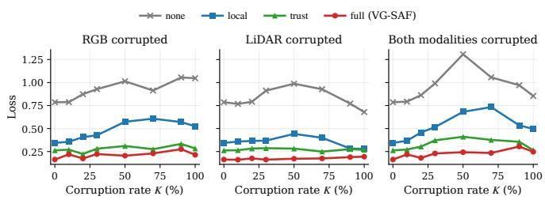  
Fig. 3. Median waypoint $L _ { 1 }$ error (m) versus corruption severity K under four attention configurations and three corruption scenarios. For each setting, errors are first averaged over the four future waypoints of each frame and the median is then taken over all evaluated frames, routes, and runs. Lower is better.

## C. Ablation Studies

We isolate the contribution of each attention factor through a controlled corruption sweep. The sweep applies the unified corruption severity $K = 1 0 0 \mathbb { E } [ \mathbf { M } ] \% \in [ 0 , 1 0 0 ] \%$ to either modality independently or to both together, using two complementary schemes (uniform random masking and elliptical occlusions) whose outputs are pooled at evaluation time. Every forward pass is repeated under four attention configurations $A _ { m } \in \{ 1 , A _ { m } ^ { \mathrm { l o c } } , t _ { m } , t _ { m } A _ { m } ^ { \mathrm { l o c } } \}$ , denoted none, local, trust and full in the remainder of this section.

Fig. 3 shows that the four curves are well separated at every K. The attention-free baseline reaches a peak $L _ { 1 }$ near 1.3 m in the both-corrupted scenario at $K \approx 5 0 \% ;$ the trust and full configurations remain near 0.4 m and 0.3 m respectively at

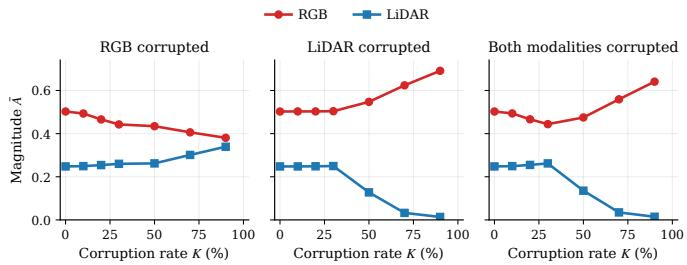  
Fig. 4. Fused per-modality attention magnitude $\bar { A } _ { m }$ versus corruption severity K under three scenarios. Here, $\bar { A } _ { m }$ is the spatial mean of $\mathbf { A } _ { m } .$ , averaged over all evaluated frames, routes, and runs. The impaired modality is monotonically down-weighted while the intact modality absorbs the displaced mass. Data stop at $K = 9 0 \% ;$ the 100% tick is retained only for scale.

## TABLE II

PER-MODE RELIABILITY RESPONSE IN THE UPPER SEVERITY TERTILE OF EACH MODE. K IS THE MEAN MASK SEVERITY; V¯ IS THE POOLED PER-MODALITY RELIABILITY SCALE AVERAGED OVER ALL QUALIFYING FRAMES FROM 36 LONGEST6 ROUTES AND THREE RUNS; $\bar { V } / \bar { V } _ { \mathrm { c l e a n } }$ IS THE CLEAN-NORMALIZED RATIO; AND ∆t IS THE CORRUPTED MODALITY’S TRUST SHIFT RELATIVE TO CLEAN OPERATION. VALUES ABOVE THE TRAINING RANGES IN TABLES S1–S2 ARE DELIBERATE SEVERITY-EXTRAPOLATION TESTS.
<table><tr><td>Modality/Mode</td><td>K (%)</td><td>V</td><td> $\bar { V } / \bar { V } _ { \mathrm { c l e a n } }$ </td><td>∆t</td></tr><tr><td>Camera</td><td></td><td></td><td></td><td></td></tr><tr><td>signal_drop</td><td>100</td><td>37.26</td><td>37.5×</td><td>-0.11</td></tr><tr><td>local_noise</td><td>45</td><td>5.77</td><td>5.8×</td><td>-0.01</td></tr><tr><td>local_exposure_pulse</td><td>70</td><td>22.67</td><td>22.8×</td><td>-0.09</td></tr><tr><td>local_occlusion</td><td>59</td><td>11.75</td><td>11.8×</td><td>-0.02</td></tr><tr><td>night_lowlight motion_blur</td><td>60</td><td>7.03 28.93</td><td>7.1×</td><td>-0.01</td></tr><tr><td>ghosting</td><td>91 31</td><td>3.57</td><td>29.1× 3.6×</td><td>-0.07 -0.01</td></tr><tr><td>color_shift</td><td>11</td><td>1.08</td><td>1.1×</td><td>0.00</td></tr><tr><td></td><td></td><td></td><td></td><td></td></tr><tr><td>LiDAR</td><td></td><td></td><td></td><td></td></tr><tr><td>signal_drop</td><td>100</td><td>105.25</td><td>57.9×</td><td>-0.47</td></tr><tr><td>range_dropout</td><td>52</td><td>11.31</td><td>6.2×</td><td>-0.10</td></tr><tr><td>frustum_occlusion</td><td>64</td><td>68.58</td><td>37.7×</td><td>-0.33</td></tr><tr><td>local_speckle</td><td>18</td><td>5.87</td><td>3.2×</td><td>-0.02</td></tr><tr><td>feature_noise</td><td>54</td><td>10.33</td><td>5.7×</td><td>-0.16</td></tr></table>

the same operating point. The trust-over-local gap is roughly 40% of the local loss, while the full-over-trust gap is roughly 30% of the trust loss. The trust softmax therefore carries the majority of the robustness gain under heavy corruption, while the local gate contributes a complementary correction on the residual within-modality damage that survives the trust reweighting stage of the fusion pipeline.

Fig. 4 confirms the predicted redistribution. When only the LiDAR is corrupted, $\bar { A } _ { \mathrm { l i d } }$ decreases monotonically from 0.25 at K = 0% to 0.01 at $K = 9 0 \%$ , while $\bar { A } _ { \mathrm { r g b } }$ rises from 0.50 to 0.69. When only the camera is corrupted, a mirrored but smaller redistribution appears $( \bar { A } _ { \mathrm { r g b } } : 0 . 5 0 $ 0.38, $\bar { A } _ { \mathrm { l i d } } : 0 . 2 5  0 . 3 4 )$ . In the both-corrupted scenario, the LiDAR attention is suppressed sharply while the RGB attention continues to grow, consistent with the wider dynamic range of the LiDAR variance head observed in Table II.

Table II probes the variance head one corruption mode at a time. Twelve of the thirteen trained modes produce a variance ratio of at least 3.2× the clean baseline, with the most severe modes (camera signal drop at 37.5×, LiDAR signal drop at 57.9×, LiDAR frustum occlusion at 37.7×) producing the largest responses. The trust shift ∆t is more decisive on the

LiDAR side than on the camera side (−0.47 vs −0.11 for signal drop), which reflects the larger dynamic range of the LiDAR variance head. The single outlier is $c o l o r \_ s h i f t$ , which produces a near-flat 1.1× ratio. This weak response suggests that the current feature extractor is relatively insensitive to this transformation. A dedicated per-mode closed-loop analysis is needed to determine whether the weak reliability response corresponds to negligible planning impact.

## D. Qualitative Analysis

Fig. 5 and Fig. 6 illustrate single-frame visualization of variance-guided fusion under asymmetric corruption. Each row shows the augmented inputs, per-task predictions, dense reliability maps, the per-cell attention $A _ { m } ^ { \mathrm { l o c } }$ , the trust-scaled product $A _ { m }$ , and the predicted waypoints. Fig. 5 shows a camera-side local exposure pulse at moderate severity. The over-exposed band washes out foreground vehicles, degrades semantic masks and introduces a spurious mid-range depth surface. The camera variances rise to 4.77 and 0.90, while the LiDAR variances remain close to the clean floor, so the RGB local gate suppresses the damaged region and the fused waypoint sequence still follows the expert trajectory. Fig. 6 shows the complementary LiDAR-sidefrustum occlusion. The missing wedge removes detections and road surface evidence inside the masked footprint, causing the LiDAR variance to peak at 9.30 while the camera variances stay below 2.09. The LiDAR attention is attenuated inside the wedge and the camera-supported trajectory remains aligned with the expert. Together, Figs. 5 and 6 illustrate that the same variance-guided mechanism works for both camera and LiDAR faults rather than relying on a modality-specific failure rule.

Fig. 7 shows a closed-loop replay of one route under night lowlight corruption. Both agents share the same backbones and the same camera input. The TransFuser baseline veers off the drivable surface at the curve and the route fails. VG-SAF stays on the carriageway and arrives successfully. The visualizations suggest that one contributing factor is the RGB semantic segmentation: in the baseline the predicted road class bleeds onto the adjacent gravel pavement, so the planner is supplied with an inflated drivable region. In VG-SAF the camera-side variance head elevates under the global luminance loss and the local spatial gate attenuates the impaired cells before they reach the fused representation. The LiDAR-derived spatial cue therefore reaches the planner intact. This example illustrates behavior also observed qualitatively under several corruption modes and shows how reliability gating can change the closed-loop failure mode. Global biases such as night lowlight, motion blur and LiDAR feature noise push the baseline off-road. Local masks such as RGB local occlusion and LiDAR frustum occlusion push it into collisions. VG-SAF reduces the occurrence of these failure modes in the evaluated routes by gating impaired cells before they enter the fused representation that drives the waypoint planner.

A presentation video summarizing the complete framework and simulation demonstrations are available at Demo Video.

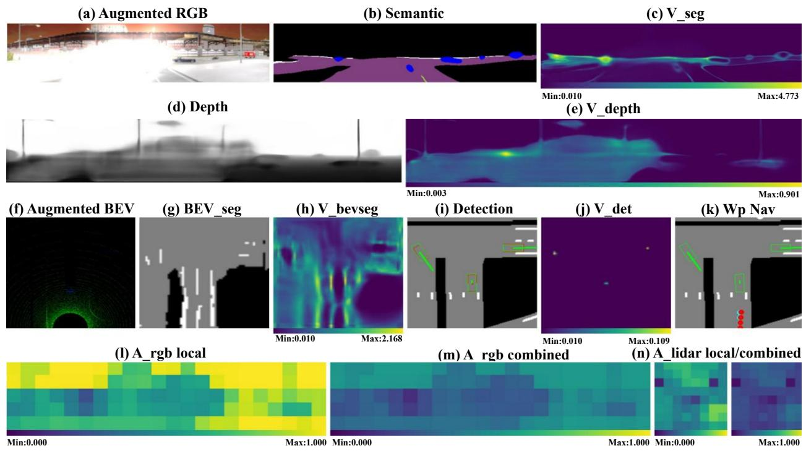  
Fig. 5. Camera local exposure pulse fault at K = 48%; LiDAR clean. The dense reliability response raises the RGB-side uncertainty and suppresses unreliable local features while LiDAR remains trusted.

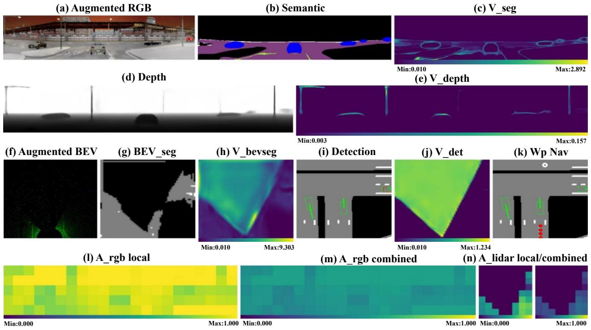  
Fig. 6. LiDAR frustum occlusion fault at $K = 5 9 \%$ ; camera clean. The BEV reliability scale peaks inside the missing wedge, down-weighting corrupted LiDAR cells and preserving the camera-supported trajectory.

## V. LIMITATIONS AND FUTURE DIRECTIONS

1) Reliability-scale calibration and encoder blind spots. Table II and Fig. 4 show that the LiDAR reliability head has a larger dynamic range than the camera head under matched corruption, partly because the camera heads use cross-entropy supervision whereas the Li-DAR detector includes a focal-loss-based classification branch. Although the modality-specific trust gains partially compensate for scale differences, residual miscalibration remains because the reliability distributions differ in shape and dynamic range. Post-hoc calibration, distribution-level regularization, or head-specific temperature calibration could improve comparability. Encoderinvariant faults such as color shift may also produce a weak response. A lightweight input-space shift detector interpretable attention and trust maps. These results show that robustness can be improved not only by adding more sensors or larger fusion modules, but by making the fusion operation explicitly reliability-aware at the spatial cell level. Future extensions should combine this spatial reliability with temporal reliability modeling and real-vehicle fault validation, which are necessary steps toward robust continuous multimodal autonomy.

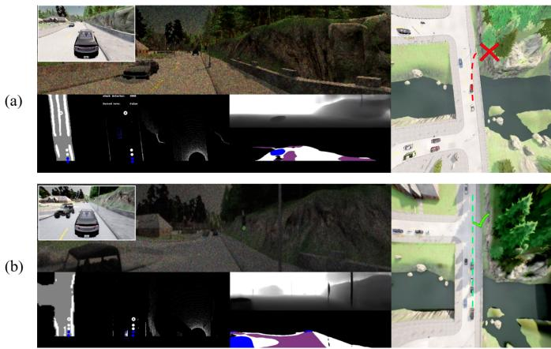  
Fig. 7. Closed-loop comparison under the night lowlight corruption mode. (a) TransFuser baseline: the RGB semantic segmentation labels the gravel pavement and shoulder as drivable road; the ego exits the carriageway at the curve and the route fails (red cross). (b) VG-SAF: the RGB segmentation confines the road class to the carriageway and the route completes successfully (green check).

could complement this blind spot while preserving the reliability-gating principle.

2) Saturation under total signal loss. When $K = 1 0 0 \%$ the perception encoder is pushed outside its varianceinformative range. The systemic waypoint uncertainty scale $V _ { \mathrm { w p } }$ still reflects the planning error, but the per-cell gate can no longer localize reliable evidence. Combining VG-SAF with an external sensor-health signal or a fallback policy would improve behavior in complete outage regimes.

3) Simulation-to-real transfer. All quantitative results are obtained in CARLA. Although the augmentor is physically grounded, real sensor faults may differ in texture, temporal persistence and spatial statistics. Robo3D and RoboBEV [12], [13] provide a controlled bridge, and adapting cross-branch distillation to their real-world corruption masks is a natural next step toward deployment on physical vehicular platforms.

## VI. CONCLUSION

We have presented VG-SAF, a multimodal fusion stage for end-to-end driving under asymmetric and spatially localized sensor degradation. The central problem addressed in this work is that a corrupted modality is rarely uniformly useless: damaged cells should be suppressed, but unaffected cells of the same stream should still support planning. VG-SAF addresses this problem through three linked mechanisms. The physically grounded augmentor provides dense mask supervision without manual uncertainty labels; cross-branch dense distillation converts the mask into a monotone severity-to-reliability response; and hybrid variance-guided attention transforms this calibrated reliability into both local spatial suppression and cross-modal trust arbitration. A systemic waypoint uncertainty scale $V _ { \mathrm { w p } }$ trained under the Laplace NLL of Eq. (12) further exposes severe or combined degradation as a safety signal. On the Longest6 benchmark, VG-SAF exceeds TransFuser by 10.5, 8.5 and 13.7 driving-score points under camera, LiDAR and both-modality corruption respectively, while also providing

# Supplementary Material

Variance-Guided Spatial Attention Fusion for Robust End-to-End Driving under Asymmetric Sensor Degradation

## S1. NOTATION

This document collects all derivations, hyper-parameters and implementation details that complement the main paper. We retain the notation introduced in the main text. The corruption mask $\mathbf { M } \in [ 0 , 1 ] ^ { H \times W }$ is the augmentor’s per-pixel record of damage. The per-pixel residual and variance of a task head are $\ell ( \hat { y } , y )$ and $V$ . The per-modality pooled variance is $\bar { V } _ { m }$ , with $m \in \{ { \mathrm { r g b } } , \operatorname { l i d } \}$ . The local spatial gate is $A _ { m } ^ { \mathrm { l o c } }$ , the cross-modal trust scalar is $t _ { m } ,$ , and their product is $A _ { m }$ . The systemic waypoint uncertainty is denoted by $V _ { \mathrm { w p } }$ for consistency with the implementation and figure labels; statistically, it is a positive trajectory-level Laplace scale, not a variance. The unified sample-level corruption severity is $K = 1 0 0 \mathbb { E } [ \mathbf { M } ] \%$ The four unconstrained learnable gains are $\gamma _ { m } ^ { \mathrm { l o c } }$ and $\gamma _ { m } ^ { \mathrm { t r u } }$ their positive softplus-reparameterized counterparts are $\eta _ { m } ^ { \mathrm { l o c } }$ and $\eta _ { m } ^ { \mathrm { t r u } }$

## S2. NETWORK ARCHITECTURE DETAILS

## A. Inputs and Targets

The simulator provides raw 480×800 front-camera frames, which are resized to form the network input $\mathbf { x } _ { \mathrm { r g b } } \in \mathbb { R } ^ { 3 \times 1 6 0 \times 7 0 4 }$ and then mean–variance normalized using the ImageNet statistics. The wide aspect ratio preserves the horizontal field of view that contains lane geometry and traffic-light cues. The LiDAR input is a voxelized bird’s-eye-view tensor $\mathbf { x } _ { \mathrm { l i d ~ } } \in$ R2×256×256. The first channel stores the maximum height of any LiDAR point in the cell. The second stores the mean laser-return intensity. The grid covers $3 2 \times 3 2 ~ \mathrm { m } ^ { 2 }$ in front of the ego vehicle at 8 pixels per meter, with the sensor at the bottom-center and the forward axis pointing upward. The third input is the navigation goal $\mathbf { p } _ { t } \in \mathbb { R } ^ { 2 }$ in the ego-vehicle frame. The training targets are $T = 4$ future ground-truth waypoints $\mathbf { y } _ { 1 : T } \in \mathbb { R } ^ { T \times 2 }$ , dense semantic and depth maps for the camera, a BEV segmentation map for the LiDAR, and per-frame bounding-box annotations.

## B. Encoders

Both modality experts adopt the RegNetY backbone family [51]. The camera backbone is initialized from ImageNet weights and produces a feature map $\mathbf { f } _ { \mathrm { r g b } } \in \mathbb { R } ^ { C \times h _ { I } \times w _ { I } }$ with $C = 5 1 2$ and $( h _ { I } , w _ { I } ) = ( 5 , 2 2 )$ . The LiDAR backbone shares the same architecture but is trained from scratch with a fresh $3 \times 3$ stem convolution that accepts the two-channel BEV input. The deepest stage is projected to $C = 5 1 2$ , yielding $\mathbf { f } _ { \mathrm { l i d } } ^ { - } \in \mathbb { R } ^ { C \times h _ { B } \times \bar { w } _ { B } }$ with $h _ { B } = w _ { B } = 8 .$ A three-stage feature pyramid produces higher-resolution heads at $1 6 \times 1 6 , 3 2 \times 3 2$ and $6 4 \times 6 4$ with 64 channels.

## C. Task Heads and Softplus Parameterization

Each task head shares a decoder body with its reliability head, so the two outputs are spatially aligned. The camera

segmentation, LiDAR BEV segmentation, and detection scales use

$$
V = \operatorname { s p } ( \rho ) + \varepsilon , \qquad \varepsilon = 1 0 ^ { - 2 } ,\tag{S1}
$$

with $\operatorname { s p } ( \cdot )$ the softplus and $\rho$ the unconstrained head output. The depth head instead predicts a standard deviation $\sigma = 0 . 0 5 + \mathrm { s p } ( \rho )$ and uses $V ^ { \mathrm { \bar { d e p } } } = \sigma ^ { 2 }$ . Softplus is smooth everywhere and asymptotically linear for large positive inputs.

The camera expert produces a seven-class segmentation map with reliability scale $V ^ { \mathrm { s e g } }$ and a normalized depth map with variance $V ^ { \mathrm { d e p } }$ . The LiDAR expert produces a three-class BEV segmentation map with scale $\bar { V } ^ { \mathrm { b e v } }$ and a CenterNet detection head [52] with a per-pixel reliability scale $V ^ { \mathrm { d e t } }$

## D. Fusion Projection and Waypoint Head

The two gated feature maps are pooled by global average and concatenated, then projected back to width $C { = } 5 1 2$ by a fusion projection:

$$
\mathbf { z } _ { \mathrm { f u s e } } = \mathrm { F F N } _ { \mathrm { f u s e } } \Big ( \big [ \mathrm { G A P ( \tilde { f } _ { \mathrm { r g b } } ) } ; \mathrm { G A P ( \tilde { f } _ { \mathrm { l i d } } ) } \big ] \Big ) .\tag{S2}
$$

The waypoint head is the autoregressive GRU of [14], [54]. The recurrence is

$$
\begin{array} { r } { \mathbf { h } _ { 0 } = \mathrm { M L P } _ { \mathrm { w p } } ( \mathbf { z } _ { \mathrm { f u s e } } ) , } \end{array}
$$

$$
\mathbf { h } _ { t } = \mathrm { G R U } \big ( [ \hat { \mathbf { y } } _ { t - 1 } ; \mathbf { p } _ { t } ] , \mathbf { h } _ { t - 1 } \big ) ,\tag{S3}
$$

$$
\hat { \mathbf { y } } _ { t } = \hat { \mathbf { y } } _ { t - 1 } + \mathbf { W } _ { o } \mathbf { h } _ { t } ,\tag{S4}
$$

(S5)

with $\hat { \mathbf { y } } _ { 0 } = \mathbf { 0 }$ and a learnable read-out $\mathbf { W } _ { o } ~ \in ~ \mathbb { R } ^ { 2 \times D }$ . The systemic uncertainty head consumes $\mathbf { z } _ { \mathrm { f u s e } }$ together with two scalar variance summaries $s _ { \mathrm { r g b } } ^ { V , \mathrm { w p } } , s _ { \mathrm { l i d } } ^ { V , \mathrm { w p } } ;$

$$
s _ { m } ^ { V , \mathrm { w p } } = \operatorname* { m a x } _ { u , v } \bar { V } _ { m } ( u , v ) , \qquad m \in \{ \mathrm { r g b , l i d } \} ,\tag{S6}
$$

$$
V _ { \mathrm { w p } } = \mathrm { s p } \big ( \mathrm { M L P } \big ( \big [ \mathbf { z } _ { \mathrm { f u s e } } ;  { s _ { \mathrm { r g b } } ^ { V , \mathrm { w p } } } ;  { s _ { \mathrm { l i d } } ^ { V , \mathrm { w p } } } \big ] \big ) \big ) + \varepsilon .\tag{S7}
$$

The worst-case max-pool is the natural aggregator for the safety alarm. $\mathbf { A }$ single region of high uncertainty, such as a fully occluded LiDAR frustum, immediately inflates $V _ { \mathrm { w p } } .$ . The planning objective matches the Laplace head loss of Eq. (S10) and Eq. (12) of the main paper:

$$
\mathcal { L } _ { \mathrm { w p } } = \frac { 1 } { T } \sum _ { t = 1 } ^ { T } \left( \frac { \lVert \hat { \mathbf { y } } _ { t } - \mathbf { y } _ { t } \rVert _ { 1 } } { V _ { \mathrm { w p } } } + 2 \log V _ { \mathrm { w p } } \right) ,\tag{S8}
$$

where $V _ { \mathrm { w p } }$ is a positive Laplace scale shared across all $T$ steps and both waypoint coordinates. The factor 2 log $V _ { \mathrm { w p } }$ accounts for the two independent coordinates; the coordinate residuals are aggregated by the $\ell _ { 1 }$ norm.

TABLE S1  
CAMERA FAULT MODES IMPLEMENTED BY THE PROPOSED AUGMENTOR.
<table><tr><td>ID &amp; Mode</td><td>Real-world analogue</td><td>Description</td><td>Scope</td><td>Training K</td></tr><tr><td>1 signal_drop</td><td>power loss / glare / snow</td><td>Frame-wide blackout, whiteout saturation, or luminance-correlated snow with chromatic jitter.</td><td>Global</td><td>100%</td></tr><tr><td>2 local_noise</td><td>low-light ISO patches</td><td>2–6 Gaussian noise patches blending Poisson photon noise and additive Gaussian read-out noise.</td><td>Local</td><td>10-40%</td></tr><tr><td>3 local_exp*</td><td>specular flare / bloom</td><td>1–3 localized over-exposure spots with directional bloom and gamma-gain saturation.</td><td>Local</td><td>10-45%</td></tr><tr><td>4 local_occ*</td><td>lens debris / mud splash</td><td>2–4 alpha-blended elliptical occluders with edge darkening, mimicking foreign objects.</td><td>Local</td><td>5-30%</td></tr><tr><td>5 night_low*</td><td>dusk / night driving</td><td>Frame-wide gain reduction, non-linear gamma, warm shift, and contrast roll-off.</td><td>Global</td><td>30-65%</td></tr><tr><td>6 motion_blur</td><td>ego-motion / vibration</td><td>Directional convolution with a randomly oriented kernel, simulating ego-motion or shake.</td><td>Global</td><td>23-68%</td></tr><tr><td>7 ghosting</td><td>lens reflection / image persistence</td><td>2–3 shifted, translucent ghost copies; pixels outside the original frame are marked invalid.</td><td>Global</td><td>15-35%</td></tr><tr><td>8 color_shift</td><td>WB miscalibration</td><td>Affine color transformation with warm/cool shift, contrast roll-off, and gamma curves.</td><td>Global</td><td>1-7%</td></tr></table>

\* Shortened names: local exposure pulse (3), local occlusion (4), night lowlight (5).

## S3. AUGMENTATION CATALOG

This section gives the expanded corruption catalog summarized in Section III-C of the main paper. Tables S1 and S2 record the real-world analogue, description, spatial scope (global or local), and training range of the unified severity K for every mode. Figs. S1 and S2 show one realization of every mode on a single validation frame.

The same physical catalog defines the family of faults considered by this study, but the training and evaluation realizations are separated. Training samples corruptions online with phase-dependent probabilities, while evaluation uses heldout Longest6 routes, independent random seeds and routelevel persistent severities that are not reused from training mini-batches. The evaluation additionally performs severity extrapolation beyond the training ranges in Tables S1 and S2; this explains the larger K values reported in Table II of the main paper. The generic ablation uses uniform random masks and elliptical occlusions that do not exactly match a named mode. These tests probe robustness to unseen severities and mask geometries, but they do not establish general real-world out-of-distribution detection; real-vehicle validation remains future work.

The Bernoulli noise injectors in the LiDAR augmentor are modulated by 1−r, where $r \in [ 0 , 1 ]$ is the normalized distance from the sensor origin. Peak densities are capped between 1% and 3%. This restores the approximate inverse-range falloff that real LiDAR ray density obeys and prevents near-field speckles from dominating the severity mask.

## S4. DETAILED TRAINING LOSSES

## A. Heteroscedastic Loss Attenuation

The regression and classification heads share the lossattenuation form

$$
\mathcal { L } _ { \mathrm { h e t } } ( \hat { y } , y ; V ) = a _ { k } \left( \frac { \ell _ { k } ( \hat { y } , y ) } { V } + \log V \right) ,\tag{S9}
$$

where $\begin{array} { r } { a _ { k } = \frac { 1 } { 2 } } \end{array}$ and $\ell _ { k } = ( \hat { y } - y ) ^ { 2 }$ give the Gaussian depth NLL. For segmentation and detection heatmaps, $\ell _ { k }$ is cross-entropy or focal loss and Eq. (S9) is used as an uncertainty-weighted classification surrogate. For this generic attenuated form, the stationary scale is proportional to the local supervised loss. The sparse regression branches of the CenterNet detection head use the Laplace counterpart

$$
\mathcal { L } _ { \mathrm { L a p } } ( \hat { y } , y ; V ) = | \hat { y } - y | / V + \log V ,\tag{S10}
$$

which arises from the same maximum-likelihood derivation under a Laplace observation model and matches the $L _ { 1 }$ magnitude already used by CenterNet.

## B. Dual-Branch Mask-Weighted Supervision

For Phase 2 onward, the encoder ingests a concatenated batch [clean | noisy]. We denote by $( \hat { y } _ { c } , V _ { c } )$ and $( { \hat { y } } _ { n } , V _ { n } )$ the clean and noisy halves of each prediction. Let $\mathbf { W } = \mathbf { 1 } - \mathbf { M }$ be the complementary trustworthiness mask. The per-task supervised loss is

$$
\begin{array} { r } { \mathcal { L } _ { \mathrm { s u p } } = \mathcal { L } _ { \mathrm { h e t } } ( \hat { y } _ { c } , y ; V _ { c } ) + \lambda _ { \mathrm { s u p } } \mathbf { W } \odot \mathcal { L } _ { \mathrm { h e t } } ( \hat { y } _ { n } , y ; V _ { n } ) , } \end{array}\tag{S11}
$$

with $\lambda _ { \operatorname* { s u p } } = 1$ in the reference configuration. The mask W retains the full task gradient on clean cells and progressively reduces it as the noisy observation loses reliable evidence. The ground-truth label itself remains valid. For the CenterNet branches, the mean reduction is replaced by the standard $\operatorname { s u m } ( \cdot ) / \operatorname { a f }$ normalization, where af counts positive objectcenter cells.

## C. Confidence-Aware Consistency

A mask-weighted consistency term ties the noisy branch back to the clean branch on uncorrupted pixels:

$$
\mathcal { L } _ { \mathrm { c o n } } ^ { \mathrm { c l s } } = \mathbf { W } \odot \mathrm { K L } \big ( \mathbf { P } _ { n } \| \operatorname { s g } ( \mathbf { P } _ { c } ) \big ) ,\tag{S12}
$$

$$
\mathcal { L } _ { \mathrm { c o n } } ^ { \mathrm { r e g } } = { \mathbf { W } } \odot \big ( \hat { y } _ { n } - \mathrm { s g } ( \hat { y } _ { c } ) \big ) ^ { 2 } ,\tag{S13}
$$

TABLE S2  
LIDAR FAULT MODES IMPLEMENTED BY THE PROPOSED AUGMENTOR.
<table><tr><td>ID &amp; Mode</td><td>Real-world analogue</td><td>Description</td><td>Scope</td><td>Training K</td></tr><tr><td>1 signal_drop</td><td>jamming / spurious returns</td><td>Frame-wide jamming represented by spurious returns following range-conditioned sparsity.</td><td>Global</td><td>100%</td></tr><tr><td>2 range_drop*</td><td>rain / fog / absorption</td><td>Distance-dependent point dropping with near-sensor false returns simulating dome-side backscatter.</td><td>Global</td><td>20-55%</td></tr><tr><td>3 frustum_occ*</td><td>mud / debris on dome</td><td>Angular wedge of complete blockage, populated with sparse near-sensor false returns.</td><td>Local</td><td>8-25%</td></tr><tr><td>4 local_speckle</td><td>airborne dust / insects</td><td>Sum of 2–5 oriented Gaussian blobs gated to empty cells, modulated by sparse Bernoulli patterns.</td><td>Local</td><td>5-20%</td></tr><tr><td>5 feature_noise</td><td>measurement / channel noise</td><td>Channel-wise Gaussian noise added to active voxels, modeling measurement or feature-channel disturbance.</td><td>Global</td><td>20-60%</td></tr></table>

\* Shortened names: range dropout (2), frustum occlusion (3).

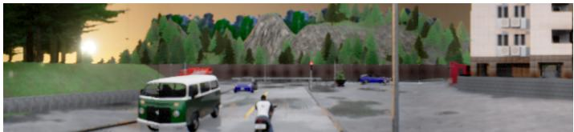  
(a)

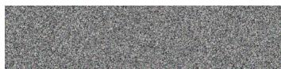  
(b)

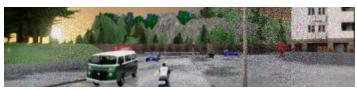  
(c)

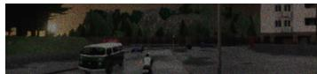

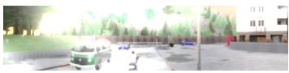

(f)  
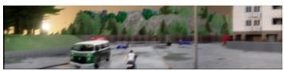

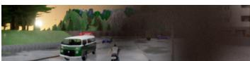  
(e)

(g)  
(d)  
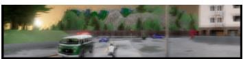  
(h)

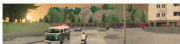  
(i)  
Fig. S1. Camera fault catalog. Panel (a) shows an unperturbed front-camera frame from the Longest6 validation split. Panels (b)–(i) display the eigh trained corruption modes applied independently to (a). (b) signal drop; (c) local noise; (d) local exposure pulse; (e) local occlusion; (f) night lowlight; (g) motion blur; (h) ghosting; (i) color shift. Modes (b), (f), (g), (h), (i) carry global masks; (c), (d), (e) carry local masks.

where $\operatorname { s g } ( \cdot )$ is the stop-gradient operator and $\mathbf { P } = \operatorname { s o f t m a x } ( \mathbf { z } )$ is the per-pixel class probability vector. The mask is essential: without it, the consistency term would penalise corrupted pixels for differing from their clean counterparts, which is the opposite of what the reliability head requires.

## D. Cross-Branch Dense Distillation

The novel calibration term sets a per-pixel target on the logreliability scale of the noisy branch that is linear in the local corruption severity:

$$
\begin{array} { r } { \log V _ { \mathrm { t g t } } = \operatorname { s g } ( \log V _ { c } ) + \alpha \mathbf { M } , \qquad } \\ { \mathcal { L } _ { \mathrm { c a l } } = \operatorname { S m o o t h L 1 } ( \log V _ { n } , \log V _ { \mathrm { t g t } } ) . } \end{array}\tag{S14}
$$

The scaling constant α is decoupled per head. Both camera heads and the LiDAR BEV-segmentation head sit on a crossentropy baseline of order $1 0 ^ { - 1 }$ , so $\alpha _ { \mathrm { s e g } } = 3$ produces a 20× ratio at $\mathbf M = 1$ . The focal-loss-squashed CenterNet baseline of order $1 0 ^ { - 2 }$ requires $\alpha _ { \mathrm { d e t } } = 4 . 6$ for the matching 100× ratio.

## E. Total Perception Loss

The per-modality training objective at epoch e is

$$
\begin{array} { l } { \displaystyle \mathcal { L } _ { \mathrm { p e r c e p } } ( e ) = \sum _ { k \in \mathcal { T } } \mathcal { L } _ { \mathrm { s u p } } ^ { ( k ) } } \\ { \displaystyle + \lambda _ { \mathrm { c o n } } ( e ) \sum _ { k } \mathcal { L } _ { \mathrm { c o n } } ^ { ( k ) } + \lambda _ { \mathrm { c a l } } ( e ) \sum _ { k } \mathcal { L } _ { \mathrm { c a l } } ^ { ( k ) } , } \end{array}\tag{S15}
$$

where $\mathcal { T } ~ = ~ \{ \mathrm { s e g } , \mathrm { d e p } \}$ for the camera expert and $\mathcal { T } =$ {bev, det} for the LiDAR expert. The term $\mathcal { L } _ { \mathrm { s u p } } ^ { ( k ) }$ is the maskweighted clean–noisy supervision of Eq. (S11), so the noisybranch task supervision is progressively reduced as corruption severity increases.

## S5. FUSION-STAGE DETAILS

## A. Variance Normalizers and Pooling

The four per-task variance maps carry the same qualitative notion of cell-level reliability signal but live on different magnitude scales. The two cross-entropy heads sit on a baseline of order $1 0 ^ { - 1 }$ . The Gaussian depth head sits on a squarederror baseline of order $1 0 ^ { - 2 }$ . The focal-loss detection head is squashed by construction to a baseline of order $1 0 ^ { - 2 }$ . We normalize each summand by a clean-data empirical mean $n ^ { \mathrm { s e g , r g b } } , n ^ { \mathrm { d e p } } , n ^ { \mathrm { s e g , l i d } } , n ^ { \mathrm { d e t } }$ so that each task-specific variance channel has a unit-mean baseline before summation:

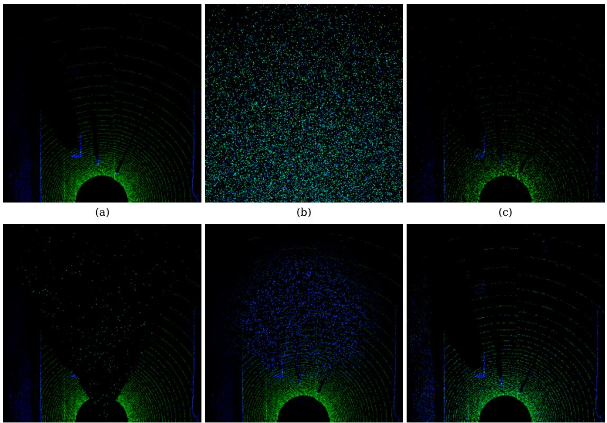  
(d)  
(e)  
(f)  
Fig. S2. LiDAR fault catalog. Panel (a) shows the unperturbed BEV histogram for the same frame as Fig. S1(a). Panels (b)–(f) display the five trained LiDAR corruption modes. (b) signal drop; (c) range dropout; (d) frustum occlusion; (e) local speckle; (f) feature noise. Modes (b), (c), (f) carry global masks; (d) and (e) carry local masks.

$$
V _ { \mathrm { r g b } } = \frac { V ^ { \mathrm { s e g } } } { n ^ { \mathrm { s e g , r g b } } } + \frac { V ^ { \mathrm { d e p } } } { n ^ { \mathrm { d e p } } } , \quad V _ { \mathrm { l i d } } = \frac { V ^ { \mathrm { b e v } } } { n ^ { \mathrm { s e g , l i d } } } + \frac { V ^ { \mathrm { d e t } } } { n ^ { \mathrm { d e t } } } .\tag{S16}
$$

The normalizers are scalars, are computed once on a clean validation split, and are frozen throughout fusion training. Without normalization, the cross-entropy summands would dominate by an order of magnitude on every clean frame and force the attention gains to absorb a static per-modality offset.

## B. Softplus Reparameterization of the Gains

The four learnable scalars $\gamma _ { \mathrm { r g b } } ^ { \mathrm { l o c } } , \gamma _ { \mathrm { l i d } } ^ { \mathrm { l o c } } , \gamma _ { \mathrm { r g b } } ^ { \mathrm { t r u } } , \gamma _ { \mathrm { l i d } } ^ { \mathrm { t r u } }$ are unconstrained. To prevent any of them from becoming negative during transient optimizer steps, we softplus-reparameterize each at the start of every forward pass:

$$
\eta _ { m } ^ { r } = \mathrm { s p } ( \gamma _ { m } ^ { r } ) + 1 0 ^ { - 4 } , \quad m \in \{ \mathrm { r g b } , \mathrm { l i d } \} , \ r \in \{ \mathrm { l o c } , \mathrm { t r u } \} .\tag{S17}
$$

The floor $1 0 ^ { - 4 }$ guarantees $\eta _ { m } ^ { r } > 0$ while still allowing linear growth for large positive $\gamma _ { m } ^ { r }$

## C. Trust Floor

The cross-modal trust softmax of the main paper is followed by an affine map that bounds the output:

$$
\begin{array} { r } { \tilde { t } _ { m } = \tau + ( 1 - 2 \tau ) t _ { m } , \qquad \tau \in [ 0 , \frac { 1 } { 2 } ) , } \end{array}\tag{S18}
$$

so that $\tilde { t } _ { m } \in [ \tau , 1 - \tau ]$ for both modalities. We use $\tau = 0 . 1 5 ,$ which corresponds to a worst-case modality-trust ratio of

5.7:1. Setting $\tau = 0$ recovers the unclamped softmax. The trust floor prevents the over-suppression of an otherwise spatiallyrecoverable modality, matching the safety rationale summarized in the main paper.

## D. Trust-Balance Regularizer

The cross-modal trust is intentionally underdetermined on no-fault frames. To prevent silent drift toward a single dominant modality, we add a lightweight regularizer that pulls the trust split back toward the prior on samples that received no augmentation:

$$
\mathcal { L } _ { \mathrm { t b } } = \frac { 1 } { | \mathcal { T } _ { c } | } \sum _ { i \in \mathcal { T } _ { c } } \big ( t _ { \mathrm { r g b } } ^ { ( i ) } - \frac { 1 } { 2 } \big ) ^ { 2 } ,\tag{S19}
$$

where $\mathcal { T } _ { c }$ is the set of mini-batch samples with $\beta _ { \mathrm { r g b } } ^ { ( i ) } = \beta _ { \mathrm { l i d } } ^ { ( i ) } =$ 0. The regularizer is zero by construction whenever no clean samples appear in the mini-batch. The complete fusion-stage objective is

$$
\mathcal { L } _ { \mathrm { f u s i o n } } = \mathcal { L } _ { \mathrm { w p } } + \lambda _ { \mathrm { t b } } \mathcal { L } _ { \mathrm { t b } } ,\tag{S20}
$$

with $\lambda _ { \mathrm { t b } } { = } 0 . 5$ in the reference configuration.

## E. Quantile-versus-Maxpool Aggregation

The trust softmax consumes the 25th percentile $Q _ { 0 . 2 5 } ( \bar { V } _ { m } )$ of the variance map. The systemic head consumes the spatial maximum $\operatorname* { m a x } ( \bar { V } _ { m } )$ . The two aggregators serve different goals. The trust softmax is an arbitration signal that must remain insensitive to isolated noisy cells, since these are already attenuated by the local gate. A lower-quartile aggregator asks whether the modality still has enough reliable cells to be worth trusting at all. The systemic head, in contrast, is a safety alarm that should fire as soon as any sufficiently large region of either modality is severely corrupted. The maximum is the natural aggregator for that role because it preserves the worst-case local evidence.

## S6. TRAINING CURRICULA

## A. Perception-Stage Curriculum

The reference configuration uses $P _ { 1 } = 4 5 , P _ { 2 } = 6 5 , P _ { 3 } = 9 0$ $N _ { \mathrm { e p } } = 1 4 0 , \lambda _ { \mathrm { c o n } } ^ { \star } = 0 . 5 , \lambda _ { \mathrm { c a l } } ^ { \star } = 1 . 0 ,$ and $\Delta P _ { 2 } = P _ { 2 } - P _ { 1 } = 2 0$ The four phases proceed as follows.

Phase 1 (warm-up). For epochs $1 \leq e \leq P _ { 1 }$ , the encoder receives single-branch inputs with $\mathrm { P a u g } = 0 . 2 0$ . The strongest mode is excluded for the camera and capped at a 5% frame share for the LiDAR. All calibration weights are zero, so the loss reduces to the supervised heteroscedastic loss.

Phase 2 (modality balancing and ramp-up). For $P _ { 1 } { < } e { \le } P _ { 2 }$ each batch is split into clean and noisy halves under a uniform mode mix. The consistency and calibration weights ramp from zero on staggered schedules:

$$
\begin{array} { r } { \lambda _ { \mathrm { c o n } } ( e ) = \lambda _ { \mathrm { c o n } } ^ { \star } \cdot \mathrm { m i n } \Big ( \frac { e - P _ { 1 } } { f _ { \mathrm { c o n } } \Delta P _ { 2 } } , 1 \Big ) , } \end{array}\tag{S21}
$$

$$
\begin{array} { r } { \lambda _ { \mathrm { c a l } } ( e ) = \lambda _ { \mathrm { c a l } } ^ { \star } { \cdot } \mathrm { c l i p } \Big ( \frac { e - P _ { 1 } - f _ { \mathrm { c a l } } \Delta P _ { 2 } } { ( 1 - f _ { \mathrm { c a l } } ) \Delta P _ { 2 } } , 0 , 1 \Big ) , } \end{array}\tag{S22}
$$

where cl $\mathrm { i p } ( x , a , b ) = \operatorname* { m i n } ( \operatorname* { m a x } ( x , a ) , b )$ . We use $f _ { \mathrm { c o n } } { = } 0 . 5$ and $f _ { \mathrm { c a l } } = 0 . 3 ,$ , so the calibration weight begins to ramp after 30% of Phase 2, while the consistency weight reaches its maximum at the midpoint of the phase.

Phase 3 (uniform-mode consolidation). For $P _ { 2 } < e \le P _ { 3 }$ the dual-branch regime continues under the uniform mode mix at full calibration weights. A few additional epochs of stable exposure absorb the transition to Phase 4 smoothly.

Phase 4 (hard-fault mining). For $e > P _ { 3 }$ , the mode distribution shifts toward the hard physical failures (motion blur, lowlight operation, ghosting for the camera; frustum occlusion and range-dependent dropout for the LiDAR). The late training budget is spent on the corner cases for which a calibrated reliability head produces tangible safety value.

## B. BatchNorm Freeze

From the start of Phase 2 onward, every batch is a clean– noisy mixture. The BatchNorm running statistics therefore drift away from either pure distribution. At inference, the input is single-distribution, and the mismatch is most damaging under severe corruptions: the activation magnitude collapses, the variance-head pre-activation $\rho$ drifts deep into the negative region, and V saturates at the floor ε across the whole frame. The result is a collapsed or unresponsive variance head. We resolve this by forcing every BatchNorm layer into evaluation mode from the beginning of Phase 2. The affine parameters remain trainable; only the running-statistics update is disabled, preserving adaptation while preventing the calibration collapse observed under mixed batches.

Algorithm S1 End-to-End VG-SAF Training Workflow   
Require: Dataset D, augmentors $\mathcal { A } _ { \mathrm { r g b } } , \mathcal { A } _ { \mathrm { l i d } } ,$ perception epochs $N _ { \mathrm { e p } } ^ { p }$ , fusion   
epochs $N _ { \mathrm { e p } } ^ { f }$   
1: Stage 1: train per-modality perception experts.   
2: for m ∈ {rgb, lid} do   
3: for $e \doteq \bar { 1 } , \ldots , \mathbf { \hat { N } _ { e p } ^ { p } }$ do   
4: Select the curriculum phase and $( p _ { \mathrm { a u g } } , \lambda _ { \mathrm { c o n } } ( e ) , \lambda _ { \mathrm { c a l } } ( e ) ) .$   
5: $\mathbf { i f } \ e = P _ { 1 } + 1$ then   
6: Freeze all BatchNorm running statistics.   
7: end if   
8: for all minibatches do   
9: Form a single branch in Phase 1 or a [clean|noisy] batch   
thereafter; obtain M.   
10: Compute Eqs. (S9)–(S14) and optimize Eq. (S15).   
11: end for   
12: end for   
13: end for   
14: Stage 2: train fusion components on frozen experts.   
15: Compute the per-head scalar normalizers $n ^ { \mathrm { s e g , r g \hat { b } } } , n ^ { \mathrm { d e p } } , n ^ { \mathrm { s e g , l i d } } , n ^ { \mathrm { d e t } }$   
on clean validation data.   
16: for $e = 1 , \ldots , N _ { \mathrm { e p } } ^ { f }$ do   
17: for all minibatches do   
18: Sample fault flags, apply the corresponding augmentors, and run   
Algorithm S3.   
19: end for   
20: end for

Algorithm S2 VG-SAF Forward Inference   
Require: Inputs $( \mathbf { x } _ { \mathrm { r g b } } , \mathbf { x } _ { \mathrm { l i d } } , \mathbf { p } _ { t } ) .$ scalar normalizers $\{ n ^ { \bullet } \}$ , learned gains,   
and frozen perception experts.   
1: Obtain $\mathbf { f } _ { m }$ and Vseg,dep,bev,det from the frozen experts.   
2: Compute $V _ { m }$ by Eq. (S16) and $\bar { V } _ { m } \gets$ maxpoo $| ( V _ { m } ^ { \star } ) .$   
3: Compute positive gains, $A _ { m } ^ { \mathrm { l o c } }$ , trust weights, the trust floor, and $A _ { m } =$   
$\widetilde { t } _ { m } A _ { m } ^ { \mathrm { { l o c } } } .$   
4: Form $\tilde { \mathbf { f } } _ { m } = A _ { m } \odot \mathbf { f } _ { m }$ and $\mathbf { z } _ { \mathrm { f u s e } }$ by Eq. (S2).   
5: Roll out the GRU and compute $V _ { \mathrm { w p } } \ \mathrm { b y } \ \mathrm { E q . } \ ( \mathrm { S } 7 )$   
6: return $\hat { \mathbf { y } } _ { 1 : T } , V _ { \mathrm { w p } } , ( t _ { \mathrm { r g b } } , t _ { \mathrm { l i d } } ) , \bar { V } _ { m } , A _ { m } .$

## C. Fusion-Stage Curriculum

The fusion curriculum uses $P _ { 1 } ^ { f } = 2 0 , P _ { 2 } ^ { f } = 4 0 , P _ { 3 } ^ { f } = 6 0$ and a total of 100 epochs.

Phase 1. $\beta _ { \mathrm { r g b } } = \beta _ { \mathrm { l i d } } = 0$ throughout. The GRU and the systemic uncertainty head learn the base navigation behavior on clean inputs only.

Phase 2. Each sample draws $( \beta _ { \mathrm { r g b } } , \beta _ { \mathrm { l i d } } )$ uniformly from $\{ ( 0 , 0 ) , ( 1 , 0 ) , ( 0 , 1 ) \}$ . Single-modality faults exercise the attention gains without yet stressing the systemic head.

Phase 3. The two flags are sampled independently with $\operatorname* { P r } ( \beta _ { m } = 1 ) = 0 . 5$ . Approximately a quarter of the samples contain double faults that stress the systemic uncertainty head $V _ { \mathrm { w p } }$

Phase 4. The Bernoulli sampling continues, but the augmentor mode mix switches to the hard distribution of Section S6 A. $V _ { \mathrm { w p } }$ is calibrated to increase under severe combined faults and severities outside the training ranges.

## S7. END-TO-END TRAINING AND FORWARD-PASS ALGORITHMS

Algorithm S1 summarizes the two training stages. Algorithm S2 is a pure forward-inference procedure, whereas Algorithm S3 adds the ground truth and losses required only during fusion training.

## S8. COMPUTE AND REPRODUCIBILITY

Stage 1 (perception) is trained for 140 epochs on two NVIDIA RTX 6000 Ada GPUs at a wall-clock time of

Algorithm S3 Fusion-Stage Training Step Require: A minibatch with targets $\mathbf { y } _ { 1 : T }$ and fault flags $( \beta _ { \mathrm { r g b } } , \beta _ { \mathrm { l i d } } )$ 1: Run Algorithm S2 for every minibatch sample. 2: Compute ${ \mathcal { L } } _ { \mathrm { w p } }$ by Eq. (S8) with 2 log $V _ { \mathrm { w p } } .$ 3: Form $\mathcal { T } _ { c } = \{ i : \beta _ { \mathrm { r e b } } ^ { ( i ) } = \beta _ { \mathrm { l i d } } ^ { ( i ) } = 0 \}$ and compute $\mathcal { L } _ { \mathrm { t b } }$ by $\operatorname { E q . }$ (S19). 4: Back-propagate $\begin{array} { r } { \mathcal { L } _ { \mathrm { f u s i o n } } ^ { \mathrm { ~ \tiny ~ { ~ \wedge ~ } ~ } } = \mathcal { L } _ { \mathrm { w p } } + \lambda _ { \mathrm { t b } } \mathcal { L } _ { \mathrm { t b } } . } \end{array}$

approximately 30 hours per modality expert. Stage 2 (fusion) is trained for 100 epochs on the same hardware at a wallclock time of approximately 18 hours. Inference runs at 34 ms per frame on a single RTX 6000 Ada at the input resolutions reported in the main paper. The optimizer is AdamW with a cosine-decay schedule; the perception-stage learning rate is $1 0 ^ { - 3 }$ and the fusion-stage learning rate is $5 \times 1 0 ^ { - 4 }$ . Per-GPU batch sizes are 100 (camera), 256 (LiDAR), and 256 (fusion). Gradient clipping is set to 1.0. The full training and evaluation code, the augmentor implementation, the corruption-mask generator and the trained checkpoints will be released upon acceptance to support reproduction.

## REFERENCES

[1] L. Chen, P. Wu, K. Chitta, B. Jaeger, A. Geiger, and H. Li, “End-toend autonomous driving: Challenges and frontiers,” IEEE Trans. Pattern Anal. Mach. Intell., vol. 46, no. 12, pp. 10164–10183, 2024.

[2] H. Caesar, V. Bankiti, A. H. Lang, S. Vora, V. E. Liong, Q. Xu, A. Krishnan, Y. Pan, G. Baldan, and O. Beijbom, “nuScenes: A multimodal dataset for autonomous driving,” in Proc. IEEE/CVF Conf. Comput. Vis. Pattern Recognit. (CVPR), 2020, pp. 11618–11628.

[3] A. Dosovitskiy, G. Ros, F. Codevilla, A. Lopez, and V. Koltun, “CARLA: An open urban driving simulator,” in Proc. Conf. Robot Learn. (CoRL), 2017, pp. 1–16.

[4] CARLA Team, “CARLA autonomous driving leaderboard,” 2022. [Online]. Available: https://leaderboard.carla.org/. Accessed: Jul. 2026.

[5] A. Prakash, K. Chitta, and A. Geiger, “Multi-modal fusion transformer for end-to-end autonomous driving,” in Proc. IEEE/CVF Conf. Comput. Vis. Pattern Recognit. (CVPR), 2021, pp. 7077–7087.

[6] J. Wang, H. Sun, and C. Zhu, “Vision-based autonomous driving: A hierarchical reinforcement learning approach,” IEEE Trans. Veh. Technol., vol. 72, no. 9, pp. 11213–11226, Sep. 2023.

[7] R. Xin, H. Liu, X. Mei, W. Liu, M. Ye, Z. Chen, and J. Ma, “NetRoller: Interfacing general and specialized models for end-to-end autonomous driving,” IEEE Trans. Veh. Technol., early access, 2025.

[8] X. Zhang, Z. Li, Y. Gong, D. Jin, J. Li, L. Wang, Y. Zhu, and H. Liu, “OpenMPD: An open multimodal perception dataset for autonomous driving,” IEEE Trans. Veh. Technol., vol. 71, no. 3, pp. 2437–2447, Mar. 2022.

[9] L. Wang, X. Zhang, J. Li, B. Xv, R. Fu, H. Chen, L. Yang, D. Jin, and L. Zhao, “Multi-modal and multi-scale fusion 3D object detection of 4D radar and LiDAR for autonomous driving,” IEEE Trans. Veh. Technol., vol. 72, no. 5, pp. 5628–5641, May 2023.

[10] Y. Xu, B. Li, Z. Zhu, W. Liu, G. Jia, G. Han, and X. Li, “MultiRuler: A multi-dimensional resource modeling method for embedded intelligent systems of autonomous driving,” IEEE Trans. Veh. Technol., vol. 73, no. 5, pp. 6212–6224, May 2024.

[11] D. Hendrycks and T. Dietterich, “Benchmarking neural network robustness to common corruptions and perturbations,” in Proc. Int. Conf. Learn. Represent. (ICLR), 2019.

[12] L. Kong, Y. Liu, X. Li, R. Chen, W. Zhang, J. Ren, L. Pan, K. Chen, and Z. Liu, “Robo3D: Towards robust and reliable 3D perception against corruptions,” in Proc. IEEE/CVF Int. Conf. Comput. Vis. (ICCV), 2023, pp. 19937–19949.

[13] Y. Dong, C. Kang, J. Zhang, Z. Zhu, Y. Wang, X. Yang, H. Su, X. Wei, and J. Zhu, “Benchmarking robustness of 3D object detection to common corruptions in autonomous driving,” in Proc. IEEE/CVF Conf. Comput. Vis. Pattern Recognit. (CVPR), 2023, pp. 1022–1032.

[14] K. Chitta, A. Prakash, B. Jaeger, Z. Yu, K. Renz, and A. Geiger, “Trans-Fuser: Imitation with transformer-based sensor fusion for autonomous driving,” IEEE Trans. Pattern Anal. Mach. Intell., vol. 45, no. 11, pp. 12878–12895, 2023.

[15] H. Shao, L. Wang, R. Chen, H. Li, and Y. Liu, “Safety-enhanced autonomous driving using interpretable sensor fusion transformer,” in Proc. Conf. Robot Learn. (CoRL), 2023, pp. 726–737.

[16] P. Wu, X. Jia, L. Chen, J. Yan, H. Li, and Y. Qiao, “Trajectory-guided control prediction for end-to-end autonomous driving: A simple yet strong baseline,” in Adv. Neural Inf. Process. Syst., vol. 35, 2022, pp. 6119–6132.

[17] X. Jia, P. Wu, L. Chen, J. Xie, C. He, J. Yan, and H. Li, “Think twice before driving: Towards scalable decoders for end-to-end autonomous driving,” in Proc. IEEE/CVF Conf. Comput. Vis. Pattern Recognit. (CVPR), 2023, pp. 21983–21994.

[18] Z. Liu, H. Tang, A. Amini, X. Yang, H. Mao, D. L. Rus, and S. Han, “BEVFusion: Multi-task multi-sensor fusion with unified bird’s-eye view representation,” in Proc. IEEE Int. Conf. Robot. Autom. (ICRA), 2023, pp. 2774–2781.

[19] Y. Hu, J. Yang, L. Chen, K. Li, C. Sima, X. Zhu, S. Chai, S. Du, T. Lin, W. Wang, L. Lu, X. Jia, Q. Liu, J. Dai, Y. Qiao, and H. Li, “Planningoriented autonomous driving,” in Proc. IEEE/CVF Conf. Comput. Vis. Pattern Recognit. (CVPR), 2023, pp. 17853–17862.

[20] B. Jiang, S. Chen, Q. Xu, B. Liao, J. Chen, H. Zhou, Q. Zhang, W. Liu, C. Huang, and X. Wang, “VAD: Vectorized scene representation for efficient autonomous driving,” in Proc. IEEE/CVF Int. Conf. Comput. Vis. (ICCV), 2023, pp. 8306–8316.

[21] S. Wang, H. Caesar, L. Nan, and J. F. P. Kooij, “UniBEV: Multi-modal 3D object detection with uniform BEV encoders for robustness against missing sensor modalities,” in Proc. IEEE Intell. Veh. Symp. (IV), 2024, pp. 2776–2783.

[22] C. Ge, J. Chen, E. Xie, Z. Wang, L. Hong, H. Lu, Z. Li, and P. Luo, “MetaBEV: Solving sensor failures for 3D detection and map segmentation,” in Proc. IEEE/CVF Int. Conf. Comput. Vis. (ICCV), 2023, pp. 8687–8697.

[23] T. Brodermann, C. Sakaridis, Y. Fu, and L. Van Gool, “CAFuser:¨ Condition-aware multimodal fusion for robust semantic perception of driving scenes,” IEEE Robot. Autom. Lett., vol. 10, no. 4, pp. 3134– 3141, 2025.

[24] W. Wu, X. Deng, P. Jiang, S. Wan, and Y. Guo, “CrossFuser: Multimodal feature fusion for end-to-end autonomous driving under unseen weather conditions,” IEEE Trans. Intell. Transp. Syst., vol. 24, no. 12, pp. 14378–14392, 2023.

[25] Y. Duan, X. Guo, Z. Zhu, Z. Wang, Y.-K. Wang, and C.-T. Lin, “MaskFuser: Masked fusion of joint multi-modal tokenization for endto-end autonomous driving,” arXiv preprint arXiv:2405.07573, 2024.

[26] Z. Huang, S. Sun, J. Zhao, and L. Mao, “Multi-modal policy fusion for end-to-end autonomous driving,” Inf. Fusion, vol. 98, Art. no. 101834, 2023.

[27] A. Kendall and Y. Gal, “What uncertainties do we need in Bayesian deep learning for computer vision?” in Adv. Neural Inf. Process. Syst., vol. 30, 2017.

[28] J. Gawlikowski, C. R. N. Tassi, M. Ali, J. Lee, M. Humt, J. Feng, A. Kruspe, R. Triebel, P. Jung, R. Roscher, M. Shahzad, W. Yang, R. Bamler, and X. X. Zhu, “A survey of uncertainty in deep neural networks,” Artif. Intell. Rev., vol. 56, no. 1, pp. 1513–1589, 2023.

[29] R. Michelmore, M. Wicker, L. Laurenti, L. Cardelli, Y. Gal, and M. Kwiatkowska, “Uncertainty quantification with statistical guarantees in end-to-end autonomous driving control,” in Proc. IEEE Int. Conf. Robot. Autom. (ICRA), 2020, pp. 7344–7350.

[30] A. Loquercio, M. Segu, and D. Scaramuzza, “A general framework for uncertainty estimation in deep learning,” IEEE Robot. Autom. Lett., vol. 5, no. 2, pp. 3153–3160, 2020.

[31] R. Cipolla, Y. Gal, and A. Kendall, “Multi-task learning using uncertainty to weigh losses for scene geometry and semantics,” in Proc. IEEE/CVF Conf. Comput. Vis. Pattern Recognit. (CVPR), Salt Lake City, UT, USA, 2018, pp. 7482–7491.

[32] F. Codevilla, M. Muller, A. L ¨ opez, V. Koltun, and A. Dosovitskiy, “End-´ to-end driving via conditional imitation learning,” in Proc. IEEE Int. Conf. Robot. Autom. (ICRA), 2018, pp. 4693–4700.

[33] F. Codevilla, E. Santana, A. Lopez, and A. Gaidon, “Exploring the limitations of behavior cloning for autonomous driving,” in Proc. IEEE/CVF Int. Conf. Comput. Vis. (ICCV), 2019, pp. 9328–9337.

[34] D. Chen, B. Zhou, V. Koltun, and P. Krahenb ¨ uhl, “Learning by cheating,”¨ in Proc. Conf. Robot Learn. (CoRL), 2020, pp. 66–75.

[35] T. Liang, H. Xie, K. Yu, Z. Xia, Z. Lin, Y. Wang, T. Tang, B. Wang, and Z. Tang, “BEVFusion: A simple and robust LiDAR-camera fusion framework,” in Adv. Neural Inf. Process. Syst., vol. 35, 2022, pp. 10421– 10434.

[36] S. Vora, A. H. Lang, B. Helou, and O. Beijbom, “PointPainting: Sequential fusion for 3D object detection,” in Proc. IEEE/CVF Conf. Comput. Vis. Pattern Recognit. (CVPR), 2020, pp. 4603–4611.

[37] M. Liang, B. Yang, S. Wang, and R. Urtasun, “Deep continuous fusion for multi-sensor 3D object detection,” in Proc. Eur. Conf. Comput. Vis. (ECCV), 2018, pp. 663–678.

[38] M. Liang, B. Yang, Y. Chen, R. Hu, and R. Urtasun, “Multi-task multi-sensor fusion for 3D object detection,” in Proc. IEEE/CVF Conf. Comput. Vis. Pattern Recognit. (CVPR), 2019, pp. 7337–7345.

[39] X. Jia, J. You, Z. Zhang, and J. Yan, “DriveTransformer: Unified transformer for scalable end-to-end autonomous driving,” in Proc. 13th Int. Conf. Learn. Represent. (ICLR), 2025.

[40] Y. Li, L. Fan, J. He, Y. Wang, Y. Chen, Z. Zhang, and T. Tan, “Enhancing end-to-end autonomous driving with latent world model,” in Proc. 13th Int. Conf. Learn. Represent. (ICLR), 2025.

[41] Y. Gal and Z. Ghahramani, “Dropout as a Bayesian approximation: Representing model uncertainty in deep learning,” in Proc. Int. Conf. Mach. Learn. (ICML), 2016, pp. 1050–1059.

[42] B. Lakshminarayanan, A. Pritzel, and C. Blundell, “Simple and scalable predictive uncertainty estimation using deep ensembles,” in Adv. Neural Inf. Process. Syst., vol. 30, 2017.

[43] A. Amini, W. Schwarting, A. Soleimany, and D. Rus, “Deep evidential regression,” in Adv. Neural Inf. Process. Syst., vol. 33, 2020, pp. 14927– 14937.

[44] M. Sensoy, L. Kaplan, and M. Kandemir, “Evidential deep learning to quantify classification uncertainty,” in Adv. Neural Inf. Process. Syst., vol. 31, 2018.

[45] J. Mukhoti, A. Kirsch, J. van Amersfoort, P. H. S. Torr, and Y. Gal, “Deep deterministic uncertainty: A new simple baseline,” in Proc. IEEE/CVF Conf. Comput. Vis. Pattern Recognit. (CVPR), 2023, pp. 24384–24394.

[46] A. Filos, P. Tigkas, R. McAllister, N. Rhinehart, S. Levine, and Y. Gal, “Can autonomous vehicles identify, recover from, and adapt to distribution shifts?” in Proc. Int. Conf. Mach. Learn. (ICML), 2020, pp. 3145–3153.

[47] M. Hahner, C. Sakaridis, D. Dai, and L. Van Gool, “Fog simulation on¨ real LiDAR point clouds for 3D object detection in adverse weather,” in Proc. IEEE/CVF Int. Conf. Comput. Vis. (ICCV), 2021, pp. 15263– 15272.

[48] M. Hahner, C. Sakaridis, M. Bijelic, F. Heide, F. Yu, D. Dai, and L. Van¨ Gool, “LiDAR snowfall simulation for robust 3D object detection,” in Proc. IEEE/CVF Conf. Comput. Vis. Pattern Recognit. (CVPR), 2022, pp. 16343–16353.

[49] F. Nesti, G. Rossolini, G. D’Amico, A. Biondi, and G. Buttazzo, “CARLA-GeAR: A dataset generator for a systematic evaluation of adversarial robustness of deep learning vision models,” IEEE Trans. Intell. Transp. Syst., vol. 25, no. 8, pp. 9840–9851, 2024.

[50] K. Park, Y. Kim, D. Kim, and J. W. Choi, “Resilient sensor fusion under adverse sensor failures via multi-modal expert fusion,” in Proc. IEEE/CVF Conf. Comput. Vis. Pattern Recognit. (CVPR), 2025, pp. 6720–6729.

[51] I. Radosavovic, R. P. Kosaraju, R. Girshick, K. He, and P. Dollar,´ “Designing network design spaces,” in Proc. IEEE/CVF Conf. Comput. Vis. Pattern Recognit. (CVPR), 2020, pp. 10425–10433.

[52] X. Zhou, D. Wang, and P. Krahenb¨ uhl, “Objects as points,”¨ arXiv preprint arXiv:1904.07850, 2019.

[53] H. Law and J. Deng, “CornerNet: Detecting objects as paired keypoints,” Int. J. Comput. Vis., vol. 128, no. 3, pp. 642–656, 2020.

[54] K. Cho, B. van Merrienboer, C. Gulcehre, D. Bahdanau, F. Bougares,¨ H. Schwenk, and Y. Bengio, “Learning phrase representations using RNN encoder–decoder for statistical machine translation,” in Proc. Conf. Empirical Methods Natural Lang. Process. (EMNLP), Doha, Qatar, 2014, pp. 1724–1734.