# ViSculpt: Visual-Centric Agentic Geometry Editing

BO PANG∗, Peking University, China JIAQI PAN∗, Peking University, China XIAOCHENG ZHANG, Peking University, China JIACHENG XU, Peking University, China GUOPING WANG†, Peking University, China PENG-SHUAI WANG†, Peking University, China

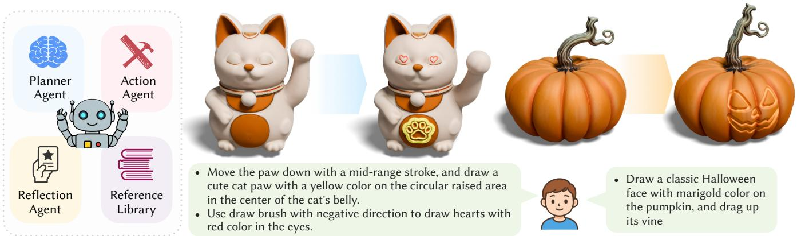  
Fig. 1. Visual-Centric 3D Geometry Editing. We present a training-free multi-agent system for editing existing 3D meshes from natural language. The system (left) plans editing steps, manipulates geometry directly through the Blender GUI, and visually evaluates intermediate results. The examples (right) show localized shape deformation and detailed surface sculpting on existing assets, while preserving the identity of the original mesh

3D geometry editing is a critical yet labor-intensive part of the graphics pipeline, requiring artists to translate creative intent into precise operations in complex professional software. Large language models (LLMs) have shown promise for script-based 3D creation, but script generation is less suited to perception-driven editing of arbitrary existing meshes, where ex ecution must remain visually grounded and untouched regions should be preserved. We present a visual-centric, training-free multi-agent system that edits existing 3D meshes directly in Blender by emulating the iterative workflow of human artists. Rather than generating scripts or regenerating geometry, our system operates through the Blender GUI: multimodal LLM agents observe the viewport, reason about the current mesh state, and ex ecute localized edits through simulated user interactions. Experiments on a curated benchmark provide initial evidence that this agentic approach can follow natural language instructions, perform representative localized mesh edits, and preserve the overall identity of the input asset. Our results highlight a complementary regime for language-driven 3D editing: direct in-place modification of existing meshes within the native 3D editing workflow. We view this work as an exploratory step toward visual-centric agentic geometry editing in professional graphics software. We will release our code and benchmark to facilitate future research.

## 1 Introduction

3D geometry editing is central to computer graphics, enabling artists to reshape existing assets for design, animation, and fabrication. It entails the precise manipulation of 3D shapes to achieve specific visual or functional goals. For example, an artist may lengthen a creature’s limbs for stylization or adjust a character’s posture to convey a specific emotion.

High-quality geometry editing remains labor-intensive and demands domain expertise. Professional artists typically manipulate 3D meshes in software such as Blender or Maya, translating highlevel intent into long sequences of low-level operations while reasoning about topology, surface continuity, and visual appearance. Recent difusion-based generative methods [Barda et al. 2025, 2024; Gao et al. 2025; Zhang et al. 2024] can produce prompt-aligned 3D edits, but they often regenerate geometry rather than modify the given asset in place. Consequently, they struggle to preserve instance-specific details and maintain high-fidelity correspondence to the input mesh.

Recent advances in large language models have enabled agents that interpret high-level intent, plan multi-step actions, and operate external tools [Belle et al. 2025; OpenAI 2023; Yao et al. 2022]. These capabilities suggest a new path for geometry editing: Can an LLM agent translate natural language instructions into executable operations by directly controlling professional 3D software? If successful, such a paradigm would make sophisticated mesh editing accessible to users without specialized modeling expertise.

Recent work has shown that LLMs can drive 3D content creation by emitting API calls or Python programs for geometry construction [Alrashedy et al. 2024; Du et al. 2024; Lu et al. 2025; Raistrick et al. 2023, 2024; Yuan et al. 2024]. This program-generation paradigm is well suited to procedural assets and structured modeling workflows, and it can support edits when the underlying construction script remains available. Yet it is less natural for direct, perceptually specified edits on arbitrary meshes: requests such as “make the rabbit’s ears more slender” must be translated into precise local operations without continuous visual grounding in the modeling interface. The mismatch is especially pronounced for existing 3D assets, which rarely provide a clean parametric representation; editing through the GUI ofers a more direct and transparent handle on the visible geometry.

We introduce a visual-centric paradigm for language-driven 3D editing, in which an LLM agent edits existing meshes by operating Blender much like a human artist: acting through the graphical user interface while continuously observing the evolving shape. This formulation exploits the multimodal perception capabilities of modern LLMs [Google 2025] to interpret the current mesh state, assess the visual efect of each operation, and ground subsequent actions in immediate feedback. The key technical obstacle is that professional modeling interfaces expose a vast, heterogeneous action space, making direct planning brittle even for strong models. Our insight is that many sculpting operations can be factored into a compact set of primitive interaction patterns: Smear for area coverage, Drag for directed deformation, and Draw for surface detail. Each primitive is controlled by continuous parameters such as brush size, strength, anchor location, displacement, and stroke trajectory. Our system translates high-level editing intent into sequences of these primitives and iteratively refines them from visual feedback. By reducing GUI editing to a small yet expressive action vocabulary, the agent can perform localized modifications while preserving regions that should remain unchanged. We do not claim that visual-centric interaction replaces the script-centric or generative approaches discussed above; rather, it occupies a complementary regime where the goal is to edit an existing mesh in place, preserve its identity, and make decisions from direct visual evidence.

Our system turns natural language into localized 3D mesh edits through a training-free agentic pipeline. It consists of a Planner Agent, an Action Agent, and a Reflection Agent. Given an instruction and an input mesh, the Planner Agent queries a sculpting knowledge base and decomposes the request into executable primitive actions. The Action Agent performs these actions in Blender, selecting tools and adjusting parameters according to the current visual state. The Reflection Agent acts as a visual critic, comparing intermediate results with the editing intent and deciding whether to refine the action or proceed. Users may also provide feedback at any stage, allowing the plan to be revised during execution. The system also stores successful editing trajectories, including tasks, actions, and visual outcomes, in an experience database, allowing the Planner Agent to retrieve and adapt efective strategies for future tasks.

We evaluate our approach on a curated benchmark of representative 3D editing tasks, with each task paired with before-and-after meshes created by professional artists. User studies and evaluations across representative LLMs [Anthropic 2025; GLM 2025; Google

2025; OpenAI 2025; Qwen 2025; Seed 2025; xAI 2025b] show that our system can interpret natural language instructions and produce localized edits with competitive subjective ratings against humanedited references. This work does not aim to replace expert artists or supplant script-centric and generative methods; instead, it establishes visual-centric agent interaction as a complementary path for direct, in-place editing of existing 3D assets. We hope it opens a broader research direction at the intersection of agentic LLMs and graphics. In summary, our main contributions are as follows:

\- We introduce a visual-centric paradigm for language-driven editing of existing 3D meshes, formulating geometry editing as the feedback-driven interaction with professional graphics softwares.

\- We present a training-free multi-agent system built on compact primitive actions, enabling localized mesh edits through direct operation of Blender.

\- We provide initial empirical evidence, through qualitative results and blinded subjective evaluations, demonstrating promising edit quality while preserving the identity of the input mesh.

## 2 Related Work

3D Geometry Editing. Geometry processing provides the algorithmic foundation for manipulating and analyzing 3D data [Botsch et al. 2010], including mesh simplification [Garland and Heckbert 1997; Hoppe 1999], remeshing [Alliez et al. 2003; Yan et al. 2009], surface smoothing [Desbrun et al. 1999], shape deformation [Sorkine and Alexa 2007; Sorkine et al. 2004], and correspondence [Ovsjanikov et al. 2012]. Within this area, geometry editing refers to tasks that modify a shape to satisfy user-specified requirements. Classical editing methods are typically driven by geometric signals such as cur vature, topology, or error metrics, and thus provide limited support for high-level semantic intent. Recent generative methods [Barda et al. 2025, 2024; Gao et al. 2025; Li et al. 2024b; Zhang et al. 2024] learn to produce edited shapes conditioned on an input shape and an edit specification. These methods are powerful for generation and representation-level transformation, but our setting instead requires direct, localized edits to an existing mesh while preserv ing unintended regions. We therefore view generative editing as a complementary direction. Our work targets the remaining gap between semantic editing intent and expert GUI operation by enabling visual-centric geometry editing in professional 3D software directly from natural language.

3D Agentic System. Advances in LLMs [GLM 2025; Google 2025; OpenAI 2023, 2025; Qwen 2025; Seed 2025; xAI 2025b] have enabled agentic systems that interleave planning, perception, and tool use. In 3D content creation, prior agents commonly translate natural-language instructions into executable programs, including Blender Python scripts, procedural programs, and parametric mod eling code [Ahuja and Contributors 2025; Alrashedy et al. 2024; Du et al. 2024; Hu et al. 2024; Huang et al. 2024; Lu et al. 2025; Lv et al. 2024; Raistrick et al. 2023, 2024; Sun et al. 2025; Yamada et al. 2025; Yuan et al. 2024]. Related work further improves controllability through domain-specific languages that expose semantic 3D concepts as compositional primitives [Chen et al. 2025; Du et al. 2018; Jones et al. 2020; Kania et al. 2020; Sharma et al. 2018; Wu et al. 2021], or by coupling perception and planning with low-level geometric operations [Fu et al. 2024; Ling et al. 2025; Liu et al. 2025]. Most of these systems follow a script-generation paradigm, targeting asset creation or editing through an intermediate program representation. Our work is complementary: we study direct GUI-based editing in professional 3D software, focusing on existing meshes, visual feedback, localized operations, and preservation of untouched regions.

Multimodal Large Models. Recent multimodal foundation models can integrate visual and linguistic signals for complex tasks [Jatavallabhula et al. 2023; Li et al. 2022; Lu et al. 2025; Radford et al. 2021], providing a general interface for grounding language in visual observations and 3D scenes. In 3D generation, vision-language models (VLMs) often serve as semantic priors for optimizing implicit representations [Chen et al. 2024; Zhang et al. 2024]; for example, CLIP-Mesh [Mohammad Khalid et al. 2022] uses VLM-based discrimination over rendered views to guide text-consistent geometry synthesis. Segmentation foundation models such as Segment Anything (SAM) [Kirillov et al. 2023; Ravi et al. 2024a; Shen et al. 2023; Wei et al. 2024] are likewise used in 3D reconstruction and to transfer strong 2D priors to 3D settings [Cen et al. 2023; Yang et al. 2023]. Most prior work, however, applies these models to generation or reconstruction rather than interactive editing. We instead use VLMs and SAM-like segmentation models to ground visual-centric geometry editing inside professional 3D software, aligning localized operations with user intent.

## 3 Method

Given an input 3D mesh and a natural language description of the desired changes, our goal is to automate 3D geometry editing by producing a modified mesh that aligns with the user’s editing intent. Our system is training-free and fully automatic, while still allowing users to provide feedback at any stage. To this end, we introduce a multi-agent system built on primitive editing actions, with three components: a Planner Agent, an Action Agent, and a Reflection Agent. An overview of the system is shown in Fig. 2. We first describe the primitive mouse actions that form the basis of our editing operations in Section 3.1, then detail how the agents compose a coherent editing pipeline in Section 3.2.

## 3.1 Primitive Actions

In Blender sculpting, brush editing operations often depend on precise mouse trajectories. Directly generating such trajectories with LLM agents is dificult because the action space is continuous and high-dimensional. We observe that many brush strokes can be represented by three primitive mouse trajectories: Smear, Drag, and Draw. This abstraction constrains generation to a compact action vocabulary while remaining expressive enough for the representative brush operations considered in this work. Figure 4 summarizes the three primitives. We next describe how each trajectory is generated.

Smear. The Smear trajectory implements area filling for brushes that require near-uniform coverage over a surface region, such as smoothing or texture painting. We first use a VLM to coarsely localize the target region in the current Blender viewport and produce a bounding box. This box prompts the Segment Anything Model (SAM) [Kirillov et al. 2023] to generate a binary mask, from which we extract the exterior boundary using OpenCV. For Smear, the LLM agent only specifies the brush radius; the trajectory is then constructed deterministically from the mask. Given the radius, we iteratively erode the mask to obtain nested contours, sample points along them, and connect the samples into a continuous outside-in filling stroke that maintains consistent coverage.

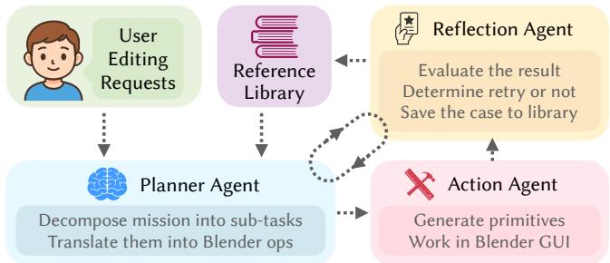  
Fig. 2. Overview of the proposed agent system. The Planner Agent decomposes a natural language instruction into executable steps, the Action Agent performs these steps in Blender, and the Reflection Agent evaluates the result and provides feedback. The system supports both local refinement loops and long-term improvement through reference libraries.

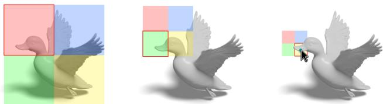  
Fig. 3. QuadLoc procedure. To mitigate VLM spatial imprecision, QuadLoc recursively queries the model for the quadrant containing the target (red outline), progressively narrowing the search space from left to right.

Drag. The Drag trajectory supports local deformation by pulling or pushing a selected part of the model along a specified displace ment. It is central to manipulations such as limb elongation, pose adjustment, and protrusion creation. We parameterize Drag by an anchor point and a displacement vector. The anchor requires accurate localization of a mesh feature, but directly querying even advanced VLMs [Google 2025] for image-space coordinates is unreliable and often yields inconsistent or hallucinated positions. We therefore introduce QuadLoc, a coarse-to-fine quadrant localization scheme that casts localization as a sequence of visual multiple-choice decisions. Given the current viewport image, we overlay a 2 × 2 grid with four uniquely colored quadrants (Red, Blue, Green, Yellow) and ask the VLM to select the quadrant containing the target anchor, instead of predicting exact coordinates, as shown in the left part of Fig. 3. We crop to the selected quadrant and repeat the query recursively until the quadrant size falls below a preset threshold. The center of the final quadrant is used as the anchor point. The displacement vector encodes direction and magnitude and is inferred by prompting a VLM to interpret the requested deformation; in practice, we find this prediction reliable.

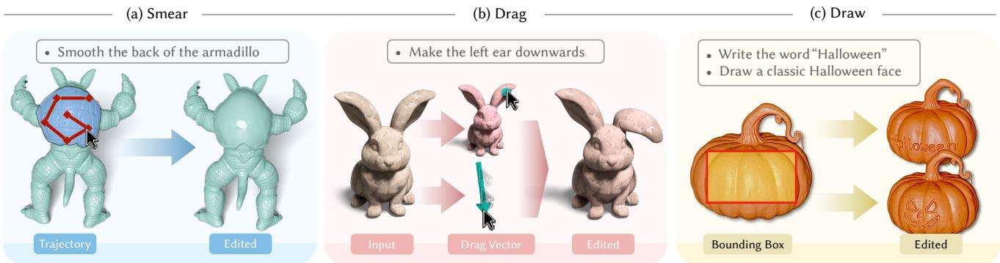  
Fig. 4. Three primitive mouse trajectories. (a) Smear, generated with segmentation and morphological operations; (b) Drag, defined by an anchor point from QuadLoc and a VLM-predicted displacement vector; and (c) Draw, created through heuristic stroke extraction for text and contour extraction for arbitrary shapes.

Draw. The Draw trajectory handles high-frequency surface details, such as inscribed text or intricate patterns. Unlike Smear and Drag, Draw requires stroke-level precision. We use diferent strategies for text and arbitrary shapes. For text, we synthesize handwriting-like paths by rasterizing the target string into a binary mask using the handwriting-style font “Patrick Hand”. We compute the medial axis of the glyph mask with scikit-image, convert the skeleton into a topological graph, and traverse graph edges in an order that approximates handwriting dynamics. For arbitrary shapes, such as symbols, emojis, or logos, we use a 2D image generation model to synthesize a high-contrast binary reference from the user’s description. We then extract salient contours from the generated image and map them to viewport coordinates as drawing strokes.

## 3.2 Agent System for Geometry Editing

We next describe the three specialized agents in our editing system. For clarity, we use a running example in which the user asks to “pull the man’s arms inward naturally and write SIGGRAPH on his chest” for a 3D human mesh, as shown in Fig. 5.

3.2.1 Planner Agent. The Planner Agent translates high-level, potentially ambiguous user intent into an ordered list of executable commands. It has two components: a Decomposer and a Translator.

Decomposer. The Decomposer performs semantic parsing and task planning from the current mesh state, the user instruction, and retrieved reference information. Let $\mathcal { G }$ denote the current mesh, $\mathcal { D } _ { 0 }$ the initial user instruction, and R the information retrieved from the Reference Library (Section 3.2.4). The Decomposer $\mathbf { P _ { d } }$ produces a structured plan $\mathcal { D } _ { 1 } = \mathbf { P _ { d } } ( \mathcal { G } , \mathcal { D } _ { 0 } , \mathcal { R } )$ . The plan $\mathcal { D } _ { 1 }$ is an ordered list of sub-tasks that disambiguate the intended operations and their dependencies. In our running example, the Decomposer splits the request into distinct actions shown on the left of Fig. 5.

Translator. While the Decomposer determines what to do, the Translator determines how to execute it. The Translator $\mathbf { P _ { t } }$ converts $\mathcal { D } _ { 1 }$ into machine-readable specifications for the Action Agent. It uses the Blender API documentation from the Reference Library R and optional iterative feedback $\mathcal { F }$ from the Reflection Agent (Section 3.2.3) to generate JSON commands: $\mathbf { J } = \mathbf { P } _ { \mathrm { t } } ( \mathcal { D } _ { 1 } , \mathcal { F } , \mathcal { R } )$ . The resulting specification J contains the attributes needed to execute the operation and can be refined at execution time using visual observations. In our implementation, most refinements occur at the execution level, such as adjusting localization or parameters, or retrying the same sub-task, rather than re-planning the entire task.

3.2.2 Action Agent. The Action Agent executes the Planner’s JSON commands J by interacting with the Blender GUI. Rather than relying on script-based API calls, it is visual-centric: it perceives Blender’s viewport and synthesizes mouse events in a human-like interaction loop. The execution proceeds in three stages: View Selection, Target Segmentation, and GUI Control. Refer to the middle of Fig. 5 for an illustration of these stages.

View Selection. Before editing, artists adjust the viewpoint to expose the target area. Similarly, the agent selects a view that maximizes target visibility and reduces occlusion. It renders six canonical views (+�, −�, +�, −�, +�, −�) and prompts the VLM to choose the view with the clearest visibility of the region referenced by the Planner. Although free camera control is more expressive, current foundation models often lack robust 3D spatial reasoning; unconstrained camera manipulation can cause the agent to lose track of the object while consuming excessive context. For most object-centric assets without severe self-occlusion, selecting among six canonical views provides a reliable and eficient proxy for full viewport navigation.

Target Segmentation. The agent localizes the region of interest with a coarse-to-fine pipeline. It captures the selected viewport, queries the VLM for a bounding box around the instructed target, and uses this box to prompt a Grounded Segment Anything Model [Ravi et al. 2024a] to produce a binary mask. The mask constrains subsequent operations to the intended region, reducing unintended edits to unrelated geometry.

GUI Control. Given the selected view and mask, the agent executes the operation through screen-space manipulation of the Blender GUI. Using PyAutoGUI, it configures brush parameters from the JSON command, maps primitive trajectories (Smear, Drag, Draw) from image space to viewport coordinates, and simulates mouse button states (press/hold/release). As the interaction uses Blender’s native stroke processing, it inherits built-in stabilization and pressure simulation, yielding edits consistent with human workflows.

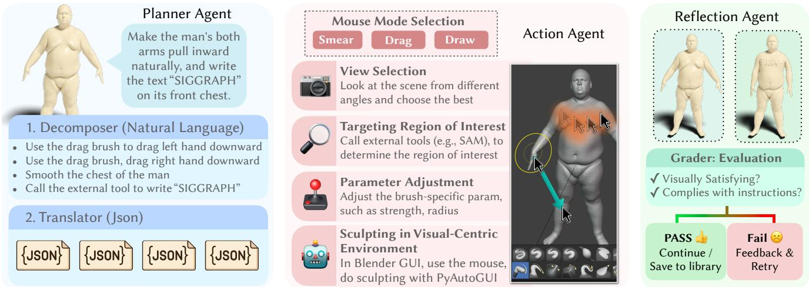  
Fig. 5. Example of our agentic editing pipeline. The Planner Agent decomposes a natural language request into sub-tasks and structured JSON commands. The Action Agent executes each command in Blender by selecting a primitive action, choosing a view, localizing the target region, and simulating GUI interactions. The Reflection Agent evaluates the result against the instruction, triggering refinement when needed and archiving successful trajectories for future reuse.

3.2.3 Reflection Agent. Multi-step editing without verification can accumulate errors. We therefore introduce a Reflection Agent that evaluates each executed sub-task and decides whether to accept the result or request refinement, as shown in the right part of Fig. 5.

To assess edit quality, we employ a VLM-based Visual Grader. The Grader takes a pre-edit screenshot $\mathcal { T } _ { p r e } , :$ a post-edit screenshot $\tilde { { J } } _ { p o s t } ,$ and the Planner-generated sub-goal $\mathcal { D } _ { s u b }$ as input. It compares the visual change from $\boldsymbol { \mathcal { I } _ { p r e } }$ to $\mathcal { I } _ { p o s t }$ with the semantic intent of $\mathcal { D } _ { s u b }$ using a visual question-answering formulation. The Grader outputs a scalar score $S \in [ 0 ,$ 15] and a textual critique. Given a threshold �, we accept the sub-task $\operatorname { i f } S \geq \tau$ and advance to the next sub-task; accepted instances are archived in the Previous Success Cases library to inform future decisions. $\operatorname { I f } S < \tau ,$ , the agent enters a Refinement Loop: the critique is provided as feedback context F to the Planner and Action Agent, which revise parameters (e.g., increasing brush strength) and re-execute the sub-task. We emphasize that this grader is used as a practical visual critic for iterative refinement, rather than as a definitive objective measure of geometric correctness.

## 3.2.4 Reference Library. To equip the agents with external knowledge, we maintain a Reference Library R queried via retrievalaugmented generation (RAG), as shown in Fig. 6, which comprises three sub-libraries:

\- Blender Knowledge Library stores oficial documentation for sculpting tools and Python APIs of Blender. The Translator queries this library to ensure that generated compatible JSON commands.

\- User-Provided References store user-specific assets (e.g., custom brushes), user preferences, and style guidelines.

\- Previous Success Cases store successful past operations. For a new task, the Planner retrieves the top five most similar cases to guide planning and translation.

The Blender Knowledge Library and User-Provided References are populated before deployment, whereas Previous Success Cases are updated online during execution. When the Grader assigns a high score to a completed task, we archive the corresponding JSON command and execution context, enabling the agent to reuse ftefective strategies in subsequent tasks. Thus, the agent improves over time by accumulating high-quality exemplars.

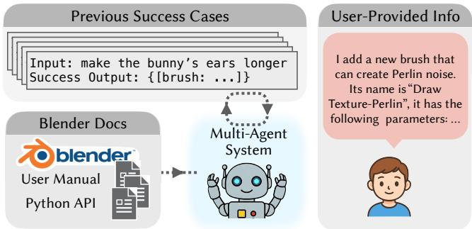  
Fig. 6. The Reference Library augments the multi-agent system via Retrieval-Augmented Generation (RAG). It integrates knowledge from three sources: Previous Success Cases (accumulated runtime experience), Blender Docs (oficial software manuals), and User-Provided Info (custom tool definitions).

## 4 Results and Comparisons

Environment Setup. We use Google Gemini 3 Flash as the default LLM/VLM backbone for all three agents. For the Action Agent’s segmentation module, we use Gemini 3 Pro for stronger visual grounding and Grounded SAM2 [Ravi et al. 2024b] for mask generation. For free-form Draw actions, we use Z-Image [Cai et al. 2025] to generate reference images. We access Gemini models through the oficial API. To demonstrate extensibility, we also include custom procedural brushes, including star-pattern and Perlin-noise brushes. All experiments are conducted on Windows 11 with Blender 4.5 LTS. In practice, an edit takes about 2 minutes, while multi-step revisions take about 8 minutes, comparable to [Lu et al. 2025]. Notably, more than 85% of the total runtime is attributed to the latency of LLM inference; faster model serving would directly improve interactivity.

Benchmark and User Study. Direct 3D geometry editing remains a challenging task, with few automatic systems supporting localized, instruction-driven changes to existing meshes. We therefore evaluate our agent-based system against human artists using a blinded user study. We curate 20 geometry-editing tasks and produce two results for each task: one generated by our system and one manually created in Blender by human artists, yielding 40 edited meshes in total. Participants viewed randomized pre-/post-edit mesh pairs together with the corresponding instruction, and rated each result from 0 to 10 for instruction adherence, visual quality, and geometric plausibility. The study included 48 participants: 39 non-experts and 9 experts, with experts defined as participants with prior publication experience in computer graphics venues. Since visual-centric editing of existing meshes is a relatively new setting, large-scale standardized comparisons against multiple automatic baselines are currently dificult to establish fairly across the same task scope, software environment, and evaluation protocol. We therefore use human-created edits as the primary reference, providing a direct and stable comparison for the in-place editing tasks studied here.

The results of the user study are summarized in Table 1 and Fig. 7. Our method achieves an average score of 7.53, comparable to the 7.20 average score of human-created edits. This result indicates that our visual-centric agent pipeline can produce perceptually plausible geometry edits across the evaluated task set. We further conduct an auxiliary VLM-based evaluation using the same questionnaire, repeating each evaluation five times to reduce sampling variance.

We show some qualitative results of our method in Fig. 8. In each example, we show the input mesh, the natural language description of the desired changes, and the edited mesh generated by our method. Representative comparisons between our agent and human artists are visualized in Fig. 9. Together, these examples illustrate the localized editing operations targeted by our system and complement the quantitative user-study results.

Comparison with Human Artists. Compared with manual editing by human artists, our method substantially reduces the interaction burden while achieving competitive perceptual quality. For instance, painting a smiley face on a mesh may require an artist to prepare a texture in an external image editor and configure Blender’s stencilmapping workflow. With our system, the user can express the same intent directly in natural language, e.g., “paint a smiley face on the rabbit”. For edits that imply symmetry, such as “droop both ears,” the agent also infers the corresponding brush configuration instead of requiring manual tool setup. Our current implementation is not intended to replace expert production workflows: it may be slower than skilled manual editing in some cases, primarily due to modelinference latency. Rather, it demonstrates a path toward accessible geometry editing in which non-expert users can perform localized mesh edits through high-level visual intent.

Table 1. User study statistics comparing our results with human-created edits. Scores are reported as mean and standard deviation (SD) across all participants and tasks, where each score is given on a 0–10 scale.
<table><tr><td rowspan="2">Group</td><td rowspan="2">N</td><td colspan="2">Mean Score ± SD</td></tr><tr><td>Human Reference</td><td>Ours</td></tr><tr><td>All Users</td><td>48</td><td> ${ \bf 7 . 2 0 \pm 2 . 1 9 }$ </td><td> $7 . 5 3 \pm 2 . 1 3$ </td></tr><tr><td>Experts</td><td>9</td><td> $7 . 1 2 \pm 2 . 2 3$ </td><td> $7 . 3 6 \pm 2 . 1 7$ </td></tr><tr><td>Non-Experts</td><td>39</td><td> $7 . 2 2 \pm 2 . 1 9$ </td><td> $7 . 5 7 \pm 2 . 1 2$ </td></tr><tr><td>All VLMs</td><td>55</td><td> ${ \bf 6 . 5 4 \pm 1 . 0 1 }$ </td><td> ${ \bf 6 . 5 1 \pm 0 . 8 7 }$ </td></tr><tr><td>Claude 4.5 Opus, Sonnet [2025]</td><td>10</td><td> $5 . 5 1 \pm 0 . 5 4$ </td><td> $5 . 6 8 \pm 0 . 1 8$ </td></tr><tr><td>Doubao Seed 1.8 [2025]</td><td>5</td><td> $7 . 8 4 \pm 0 . 1 6$ </td><td> $7 . 1 7 \pm 0 . 0 8$ </td></tr><tr><td>GLM 4.6V [2025]</td><td>5</td><td> $6 . 7 7 \pm 0 . 1 7$ </td><td> $6 . 5 6 \pm 0 . 2 0$ </td></tr><tr><td>GPT 5.2, 5.2 Pro [2025]</td><td>10</td><td> $5 . 9 3 \pm 0 . 0 9$ </td><td> $5 . 9 0 \pm 0 . 0 6$ </td></tr><tr><td>Gemini 3 Pro, Flash [2025]</td><td>10</td><td> $7 . 2 8 \pm 0 . 9 1$ </td><td> $7 . 2 6 \pm 0 . 8 3$ </td></tr><tr><td>Grok 4 [2025a], 4.1-fast [2025b]</td><td>10</td><td> $7 . 0 1 \pm 1 . 2 0$ </td><td> $7 . 1 7 \pm 0 . 9 8$ </td></tr><tr><td>Qwen3 VL Plus [2025]</td><td>5</td><td> $5 . 8 5 \pm 0 . 3 1$ </td><td> $5 . 8 1 \pm 0 . 3 0$ </td></tr></table>

Table 2. Design-space comparison of representative paradigms for languagedriven 3D editing. Here ✓ denotes a natural strength, △ denotes partial or scenario-dependent support, and × denotes that the property is typically not a primary strength.
<table><tr><td>Property</td><td>Script-centric</td><td>Generative</td><td>Ours</td></tr><tr><td>Direct in-place editing on existing mesh</td><td>Δ</td><td>X</td><td>√</td></tr><tr><td>Preserve untouched regions</td><td>Δ</td><td>X</td><td>√</td></tr><tr><td>Immediate visual feedback</td><td>X</td><td>×</td><td>√</td></tr><tr><td>Works without construction history</td><td>Δ</td><td>√</td><td>√</td></tr><tr><td>Natural fit for localized perceptual edits</td><td>Δ</td><td>X</td><td>√</td></tr><tr><td>Native interaction inside 3D software</td><td>Δ</td><td>X</td><td>√</td></tr><tr><td>Open-ended geometry synthesis</td><td>Δ</td><td>√</td><td>△</td></tr></table>

## 5 Discussion and Ablation Studies

We compare our visual-centric editing paradigm with script-centric and generative alternatives, clarifying the operating regimes and trade-ofs of each family, which are summarized in Table 2. We then ablate our primitive abstraction to evaluate its role in stabilizing execution and grounding semantic instructions into precise GUI actions.

Discussion: Script-Centric Approaches. Script-centric systems [Du et al. 2024; Lu et al. 2025] provide a natural comparison with our approach because they also connect language models to professional 3D software. These methods are well suited to tasks with explicit procedural structure, construction history, or programmatic decomposition. Our setting targets a complementary regime: localized edits to existing meshes, where human instructions are often perceptual and preserving untouched regions is as important as modifying the target region. Rather than synthesizing a program or regenerating geometry from an intermediate representation, our agent acts directly on the mesh state observed in the GUI, using visual feedback to perform in-place edits while keeping the surrounding asset stable.

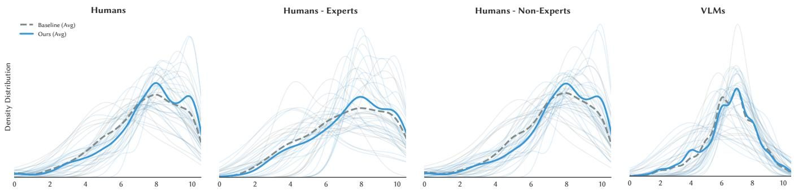  
Fig. 7. Visualization of score distributions across all 20 test examples. The plots display the Kernel Density Estimation (KDE) of user scores (0-10 scale) for our method (blue) and the baseline (gray). Thin semi-transparent lines represent the score distribution for each individual example, illustrating the performance consistency across diverse inputs. Thick lines indicate the aggregated average distribution of each group.

We compare against Blender MCP Server [Blender Foundation 2026], an oficial Blender Lab MCP connector that exposes Blender’s Python API to LLMs. In our experiments, Blender MCP is connected to Claude Desktop via the Blender Connector, with Claude Sonnet 4.6 [Anthropic 2026] as the LLM backend. We omit LL3M [Lu et al. 2025] from our comparisons as the system is currently inaccessible to the public. As shown in Fig. 10, our visual-centric formulation is particularly efective for non-parametric assets that require localized changes, immediate visual feedback, and minimal disturbance to regions outside the target edit. We present this comparison through representative object-scale case studies, since task definitions and output formats are not yet standardized across these two paradigms.

Comparison with Generative Approaches. Recent 3D generative models [Li et al. 2024a; Team 2025b; Xiang et al. 2025; Yang et al. 2025; Zhang et al. 2024] have achieved impressive results in synthesizing novel 3D assets. Our setting difers in its objective: the edited mesh should remain identical to the input except for the localized change specified by the instruction. To probe this distinction, we construct a generative baseline using a “Render, Edit, Reconstruct” pipeline: render the input mesh into an image, edit the image with a text-guided 2D model, and reconstruct a 3D shape from the edited view using a large 3D generative model. We use Nano Banana Pro [Gemini Team 2023] for 2D editing and Hunyuan 2.0 [Team 2025a] for 3D generation.

As shown in the left part of Fig. 11, this pipeline can produce a plausible object, but it often drifts from the original geometry. The bottleneck is the detour through a single image: projection discards hidden geometry, topology, and fine surface detail, while reconstruction must hallucinate the missing information. The result is therefore a regenerated mesh conditioned on an edited rendering, rather than an in-place edit of the original asset. This causes visible changes in regions that should remain untouched.

This comparison highlights the complementary roles of the two paradigms. Generative models are well suited to creating new shapes or large semantic redesigns, whereas our visual-centric agent directly manipulates the current mesh state through GUI feedback and is therefore better aligned with localized, preservation-critical edits. Attention-injection techniques [Hertz et al. 2022; Shen et al. 2025] may reduce appearance drift in image editing, but they do not remove the geometric information loss introduced once the editing process leaves the native 3D mesh.

Ablation: Without Primitive Abstraction. One of the central design choices of our system is to restrict low-level execution to three primitive mouse actions: Smear, Drag, and Draw. This abstraction makes the action space tractable for a language-driven agent operating through a GUI. Without such primitives, the Action Agent would need to directly generate long, high-dimensional free-form mouse trajectories together with brush configurations, localization decisions, and execution timing.

In our formulation, the primitives decouple what to do from how to trace the stroke, letting the planner express compact intentions while deterministic geometric procedures realize trajectories. We view these three primitives as a key inductive bias that stabilizes execution and makes our visual-centric pipeline feasible. To validate this design, we compare our method against a baseline where the language model directly outputs the dense sequence of mouse coordinates needed for the geometric operation. As shown in Fig. 11, removing the primitives sharply degrades performance: raw-coordinate outputs are often jagged and misaligned with the underlying 3D structure.

Ablation: QuadLoc. We find that our QuadLoc strategy significantly outperforms naive VLM querying. As illustrated in Fig. 12, directly prompting the VLM to output the coordinates of a specific part (e.g., the mouse’s paw) results in inaccurate localization (left). In contrast, with QuadLoc, our method achieves precise localization of the target point (right).

## 6 Conclusion

We present a training-free multi-agent framework for 3D mesh editing that emulates the visual-centric workflow of human artists. Unlike script-centric methods, our system interacts directly with the Blender canvas, leveraging vision-language models to interpret user intent and assess progress via visual feedback. We bridge natural language and low-level actions by abstracting sculpting operations into three primitive mouse trajectories: Smear, Drag, and Draw. Our experiments demonstrate promising, intent-aligned localized edits that preserve the original mesh identity. Rather than claiming

Fig. 8. Results of our method on various 3D mesh editing tasks. For each example, we show the input mesh on the left, the natural language description of the desired changes in the botom, and the edited mesh generated by our method on the right.

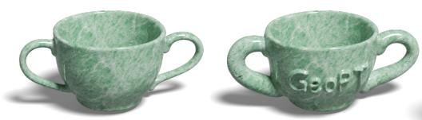  
Make the teacup's both handles thick, and write the text "GeoPT" on the body of the teacup.

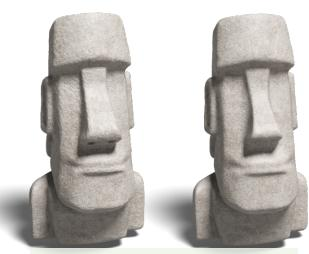  
Make the statue's nose slimmer.

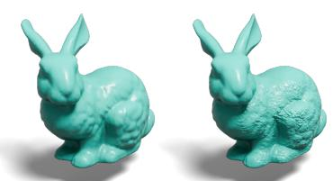  
Use the "Draw Perlin" brush to make the surface of the bunny's torso rough.

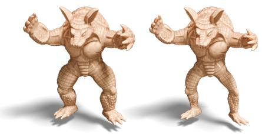  
Make the armadillo's four limbs thinner.

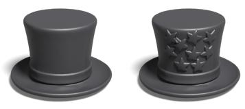

Use the "Draw Star" brush to apply a star-shaped texture uniformly across the front body of the hat.

Draw a classic Halloween face in one go into the pumpkin surface

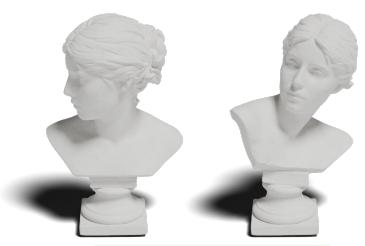  
Rotate the head of the plaster statue to face forward.

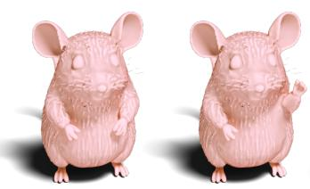  
Raise the rat's le hand in to a greeting pose

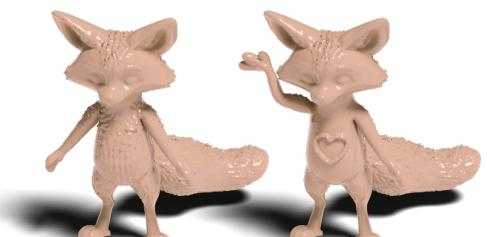  
Raise the fox's right arm vertically next to its face in a friendly waving greeting. Smooth out the texture on its front torso to create a clean surface, and place a heart emoji on the center of its chest.

  
Use draw brush with negative direction draw hearts with red color in the eyes.

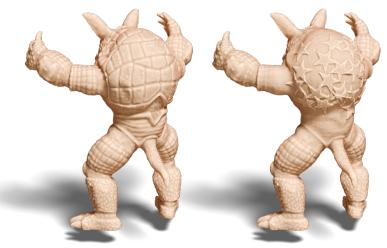  
Smooth out the texture on the back of the armadillo, and use "Draw Texture-Star" brush to apply a star-shaped texture on it.

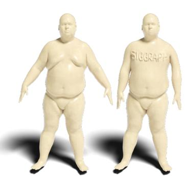

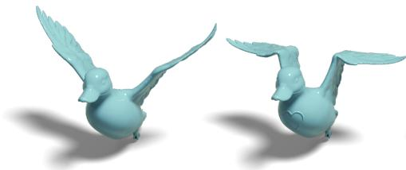  
Make the duck's wings flapping downward, and draw a heart emoji on the duck's front torso.

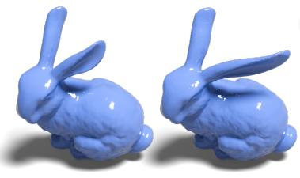  
Drag the bunny's ear to make it longer.  
Make the man's both arms pull inward naturally, and write the text "SIGGRAPH" on its front chest.

  
Write the word “Halloween” on the pumpkin

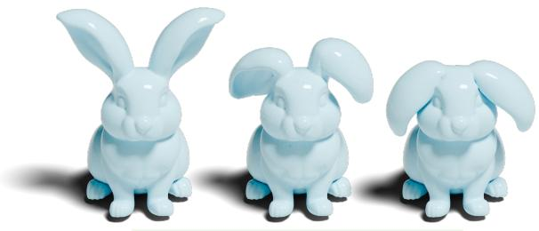  
Make rabbit's ears droop completely down like a lop rabbit

Fig. 9. The comparison between our method and human editing. In each example, we show the input mesh on the left, the edited mesh generated by our method on the right, and the edited mesh created by human artists in the middle.  
  
Fig. 10. Qualitative comparison with a script-centric approach. For each pair of samples, the result generated by Blender MCP Server with Claude Sonnet 4.6 is shown on the left, while the result of our visual-centric method is shown on the right. Our approach facilitates localized edits while preserving the overal structure of the original asset.

universal superiority over script-centric or generative approaches, it represents an alternative paradigm with distinct strengths and trade-ofs. It highlights direct GUI-based interaction as a viable and distinct direction for editing existing 3D assets, particularly when precise in-place editing and region preservation are paramount.

Limitations and Future Work. Our approach has several limitations that highlight exciting avenues for future research. First, consistent with prior agentbased frameworks [Lu et al. 2025; Yamada et al. 2025], our system heavily relies

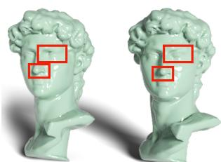  
Input  
Edited

on underlying foundation models, resulting in latencies of up to 8 minutes per edit. Exploring 3D-native multimodal foundation models could efectively mitigate this issue. Second, the Planner Agent struggles to translate highly abstract instructions into concrete, multi-step actions. For instance, an ambiguous prompt like “make David more handsome” confuses the agent, leading to unpredictable deformations limited to basic Clay Strip brush operations, as illustrated in the figure. Third, despite our multi-view strategies, severe self-occlusions and complex internal geometries challenge our 2D screenshot-based perception. Equipping the agent with autonomous, free-viewpoint camera manipulation will substantially broaden its operational scope. Fourth, current mouse trajectory primitives are restricted to localized surface deformations. Incorporating topological primitives would enable fundamental structural edits, such as boolean operations, drilling holes, or merging objects. Finally, to address geometric artifacts imperceptible via 2D renderings (e.g., non-manifold edges or self-intersections), future systems could integrate a geometric analysis module into the Reflection Agent, thereby strengthening the alignment between visual plausibility and geometric validity.

## References

Siddharth Ahuja and BlenderMCP Contributors. 2025. BlenderMCP - Blender Model Context Protocol Integration.

Pierre Alliez, David Cohen-Steiner, Olivier Devillers, Bruno Lévy, and Mathieu Desbrun. 2003. Anisotropic polygonal remeshing. In SIGGRAPH.

Kamel Alrashedy, Pradyumna Tambwekar, Zulfiqar Zaidi, Megan Langwasser, Wei Xu, and Matthew Gombolay. 2024. Generating CAD code with vision-language models for 3d designs. arXiv preprint arXiv:2410.05340 (2024).

Anthropic. 2025. System Card: Claude Sonnet 4.5. Technical Report. Anthropic.

Anthropic. 2026. Introducing Claude Sonnet 4.6. https://www.anthropic.com/news/ claude-sonnet-4-6.

Amir Barda, Matheus Gadelha, Vladimir G. Kim, Noam Aigerman, Amit H. Bermano, and Thibault Groueix. 2025. Instant3dit: Multiview Inpainting for Fast Editing of 3D Objects. In CVPR.

Amir Barda, Vladimir Kim, Noam Aigerman, Amit Haim Bermano, and Thibault Groueix. 2024. MagicClay: Sculpting Meshes With Generative Neural Fields. In ACM Trans. Graph. (SIGGRAPH Asia).

Nikolas Belle, Dakota Barnes, Alfonso Amayuelas, Ivan Bercovich, Xin Eric Wang, and William Wang. 2025. Agents of Change: Self-Evolving LLM Agents for Strategic Planning. arXiv preprint arXiv:2506.04651 (2025).

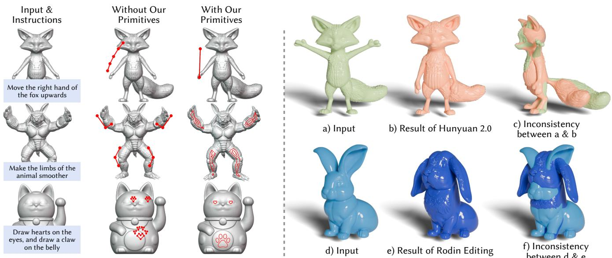

Fig. 11. Left: Ablation study on the efect of our Primitive Abstraction. Compared to a baseline where the LLM directly outputs raw mouse coordinates, our primitive-based approach efectively grounds semantic instructions into precise, geometrically consistent GUI actions. Right: Results of generative methods. We test Hunyuan 2.0 and Rodin on our editing task. For Rodin, we use its editing mode. Given the instruction “Let the fox put its hand down” and “Put down the ears of the rabbit”, the generated result exhibits significant geometric deviations from the original input. The overlay view (c) and (f) visualizes the structural misalignment between the input and output.  
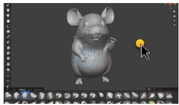

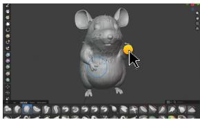  
Fig. 12. Ablation of QuadLoc. Directly prompting the VLM for coordinates yields inaccurate localization (left), while QuadLoc localizes the target more precisely (right).

Blender Foundation. 2026. Blender MCP Server. https://projects.blender.org/lab/ blender\_mcp.

Mario Botsch, Leif Kobbelt, Mark Pauly, Pierre Alliez, and Bruno Lévy. 2010. Polygon Mesh Processing. CRC press.

Huanqia Cai, Sihan Cao, Ruoyi Du, Peng Gao, Steven Hoi, Zhaohui Hou, Shijie Huang, Dengyang Jiang, Xin Jin, Liangchen Li, et al. 2025. Z-Image: An Eficient Image Generation Foundation Model with Single-Stream Difusion Transformer. arXiv preprint arXiv:2511.22699 (2025).

Jiazhong Cen, Zanwei Zhou, Jiemin Fang, Wei Shen, Lingxi Xie, Dongsheng Jiang, Xiaopeng Zhang, Qi Tian, et al. 2023. Segment anything in 3D with NeRFs. Advances in Neural Information Processing Systems 36 (2023).

Boyuan Chen, Zhuo Xu, Sean Kirmani, Brain Ichter, Dorsa Sadigh, Leonidas Guibas, and Fei Xia. 2024. SpatialVLM: Endowing Vision-Language Models with Spatia Reasoning Capabilities. In CVPR.

Tianrun Chen, Chunan Yu, Yuanqi Hu, Jing Li, Tao Xu, Runlong Cao, Lanyun Zhu, Ying Zang, Yong Zhang, Zejian Li, et al. 2025. Img2cad: Conditioned 3-d cad model generation from single image with structured visual geometry. IEEE Transactions on Industrial Informatics (2025).

Mathieu Desbrun, Mark Meyer, Peter Schröder, and Alan H. Barr. 1999. Implicit fairing of irregular meshes using difusion and curvature flow. In SIGGRAPH.

Tao Du, Jeevana Priya Inala, Yewen Pu, Andrew Spielberg, Adriana Schulz, Daniela Rus, Armando Solar-Lezama, and Wojciech Matusik. 2018. Inversecsg: Automatic conversion of 3d models to csg trees. ACM Trans. Graph. (SIGGRAPH Asia) 37, 6 (2018).

Yuhao Du, Shunian Chen, Wenbo Zan, Peizhao Li, Mingxuan Wang, Dingjie Song, Bo Li, Yan Hu, and Benyou Wang. 2024. BlenderLLM: Training Large Language Models for Computer-Aided Design with Self-improvement. arXiv preprint arXiv:2412.14203 (2024).

Rao Fu, Jingyu Liu, Xilun Chen, Yixin Nie, and Wenhan Xiong. 2024. Scene-llm: Extending language model for 3d visual understanding and reasoning. arXiv preprint arXiv:2403.11401 (2024).

Will Gao, Dilin Wang, Yuchen Fan, Aljaz Bozic, Tuur Stuyck, Zhengqin Li, Zhao Dong, Rakesh Ranjan, and Nikolaos Sarafianos. 2025. 3D mesh editing using masked lrms. In ICCV.

Michael Garland and Paul S Heckbert. 1997. Surface simplification using quadric error metrics. In ACM Trans. Graph. (SIGGRAPH).

Gemini Team. 2023. Gemini: A Family of Highly Capable Multimodal Models. arXiv e-prints (2023).

GLM. 2025. GLM-4.5V and GLM-4.1V-Thinking: Towards Versatile Multimodal Reason ing with Scalable Reinforcement Learning. arXiv preprint arXiv:2507.01006 (2025). Google. 2025. Gemini 3 Pro Model Card. Technical Report. Google.

Amir Hertz, Ron Mokady, Jay Tenenbaum, Kfir Aberman, Yael Pritch, and Daniel Cohen-Or. 2022. Prompt-to-prompt image editing with cross attention control. arXiv preprint arXiv:2208.01626 (2022).

Hugues Hoppe. 1999. New quadric metric for simplifying meshes with appearance attributes. In Visualization.

Ziniu Hu, Ahmet Iscen, Aashi Jain, Thomas Kipf, Yisong Yue, David A Ross, Cordelia Schmid, and Alireza Fathi. 2024. Scenecraft: An LLM agent for synthesizing 3D scenes as blender code. In ICML.

Ian Huang, Guandao Yang, and Leonidas Guibas. 2024. Blenderalchemy: Editing 3d graphics with vision-language models. In ECCV.

Krishna Murthy Jatavallabhula, Alihusein Kuwajerwala, Qiao Gu, Mohd Omama, Tao Chen, Alaa Maalouf, Shuang Li, Ganesh Iyer, Soroush Saryazdi, Nikhil Keetha, Ayush Tewari, Joshua B. Tenenbaum, Celso Miguel de Melo, Madhava Krishna, Liam Paull, Florian Shkurti, and Antonio Torralba. 2023. ConceptFusion: Open-set Multimoda 3D Mapping. arXiv preprint arXiv:2302.07241 (2023).

R Kenny Jones, Theresa Barton, Xianghao Xu, Kai Wang, Ellen Jiang, Paul Guerrero, Niloy J Mitra, and Daniel Ritchie. 2020. Shapeassembly: Learning to generate programs for 3d shape structure synthesis. ACM Trans. Graph. (SIGGRAPH Asia) 39, 6 (2020).

Kacper Kania, Maciej Zieba, and Tomasz Kajdanowicz. 2020. UCSG-NET-unsupervised discovering of constructive solid geometry tree. NeurIPS 33 (2020).

Alexander Kirillov, Eric Mintun, Nikhila Ravi, Hanzi Mao, Chloe Rolland, Laura Gustafson, Tete Xiao, Spencer Whitehead, Alexander C Berg, Wan-Yen Lo, et al. 2023. Segment anything. In ICCV.

Hongbo Li, Haikuan Zhu, Sikai Zhong, Ningna Wang, Cheng Lin, Xiaohu Guo, Shiqing Xin, Wenping Wang, Jing Hua, and Zichun Zhong. 2024b. NASM: Neural Anisotropic Surface Meshing. In ACM Trans. Graph. (SIGGRAPH Asia).

Junnan Li, Dongxu Li, Caiming Xiong, and Steven Hoi. 2022. BLIP: Bootstrapping Language-Image Pre-training for Unified Vision-Language Understanding and Gen eration. In ICML.

Weiyu Li, Jiarui Liu, Hongyu Yan, Rui Chen, Yixun Liang, Xuelin Chen, Ping Tan, and Xiaoxiao Long. 2024a. CraftsMan3D: High-fidelity Mesh Generation with 3D Native Generation and Interactive Geometry Refiner. arXiv preprint arXiv:2405.14979 (2024).

Lu Ling, Chen-Hsuan Lin, Tsung-Yi Lin, Yifan Ding, Yu Zeng, Yichen Sheng, Yunhao Ge, Ming-Yu Liu, Aniket Bera, and Zhaoshuo Li. 2025. Scenethesis: A language and vision agentic framework for 3d scene generation. arXiv preprint arXiv:2505.02836 (2025).

Xinhang Liu, Yu-Wing Tai, and Chi-Keung Tang. 2025. Agentic 3D Scene Generation with Spatially Contextualized VLMs. arXiv preprint arXiv:2505.20129 (2025).

Sining Lu, Guan Chen, Nam Anh Dinh, Itai Lang, Ari Holtzman, and Rana Hanocka. 2025. LL3M: Large language 3D modelers. arXiv preprint arXiv:2508.08228 (2025).

Jiaxi Lv, Yi Huang, Mingfu Yan, Jiancheng Huang, Jianzhuang Liu, Yifan Liu, Yafei Wen, Xiaoxin Chen, and Shifeng Chen. 2024. GPT4Motion: Scripting Physical Motions in Text-to-Video Generation via Blender-Oriented GPT Planning. In CVPR.

Nasir Mohammad Khalid, Tianhao Xie, Eugene Belilovsky, and Tiberiu Popa. 2022. Clipmesh: Generating textured meshes from text using pretrained image-text models. In SIGGRAPH Asia.

OpenAI. 2023. GPT-4 Technical Report. arXiv preprint arXiv:2303.08774 (2023).

OpenAI. 2025. Update to GPT-5 System Card: GPT-5.2. Technical Report. OpenAI.

Maks Ovsjanikov, Mirela Ben-Chen, Justin Solomon, Adrian Butscher, and Leonidas Guibas. 2012. Functional maps: a flexible representation of maps between shapes. ACM Trans. Graph. (SIGGRAPH) 31, 4 (2012).

Qwen. 2025. Qwen3-VL Technical Report. arXiv preprint arXiv:2511.21631 (2025).

Alec Radford, Jong Wook Kim, Chris Hallacy, Aditya Ramesh, Gabriel Goh, Sandhini Agarwal, Girish Sastry, Amanda Askell, Pamela Mishkin, Jack Clark, et al. 2021. Learning transferable visual models from natural language supervision. In ICML.

Alexander Raistrick, Lahav Lipson, Zeyu Ma, Lingjie Mei, Mingzhe Wang, Yiming Zuo, Karhan Kayan, Hongyu Wen, Beining Han, Yihan Wang, et al. 2023. Infinite photorealistic worlds using procedural generation. In CVPR.

Alexander Raistrick, Lingjie Mei, Karhan Kayan, David Yan, Yiming Zuo, Beining Han, Hongyu Wen, Meenal Parakh, Stamatis Alexandropoulos, Lahav Lipson, et al. 2024. Infinigen indoors: Photorealistic indoor scenes using procedural generation. In CVPR.

Nikhila Ravi, Valentin Gabeur, Yuan-Ting Hu, Ronghang Hu, Chaitanya Ryali, Tengyu Ma, Haitham Khedr, Roman Rädle, Chloe Rolland, Laura Gustafson, et al. 2024a. Sam 2: Segment anything in images and videos. arXiv preprint arXiv:2408.00714 (2024).

Nikhila Ravi, Valentin Gabeur, Yuan-Ting Hu, Ronghang Hu, Chaitanya Ryali, Tengyu Ma, Haitham Khedr, Roman Rädle, Chloe Rolland, Laura Gustafson, Eric Mintun, Junting Pan, Kalyan Vasudev Alwala, Nicolas Carion, Chao-Yuan Wu, Ross Girshick, Piotr Dollár, and Christoph Feichtenhofer. 2024b. SAM 2: Segment Anything in Images and Videos. arXiv preprint arXiv:2408.00714 (2024).

ByteDance Seed. 2025. Seed1.8 Model Card: Towards Generalized Real-World Agency. Technical Report. ByteDance.

Gopal Sharma, Rishabh Goyal, Difan Liu, Evangelos Kalogerakis, and Subhransu Maji. 2018. CSGNet: Neural shape parser for constructive solid geometry. In CVPR.

Qiuhong Shen, Xingyi Yang, and Xinchao Wang. 2023. Anything-3D: Towards Singleview Anything Reconstruction in the Wild. arXiv preprint arXiv:2310.14261 (2023).

Tiancheng Shen, Zilong Huang, Xiangtai Li, Zhijie Lin, Jiyang Liu, Yitong Wang, Jiash Feng, Ming-Hsuan Yang, and Jun Hao Liew. 2025. QK-Edit: Revisiting Attention based Injection in MM-DiT for Image and Video Editing. In ICCV.

Olga Sorkine and Marc Alexa. 2007. As-rigid-as-possible surface modeling. In Symp. Geom. Proc.

O. Sorkine, D. Cohen-Or, Y. Lipman, M. Alexa, C. Rössl, and H.-P. Seidel. 2004. Laplacian surface editing. In Symp. Geom. Proc.

Chunyi Sun, Junlin Han, Weijian Deng, Xinlong Wang, Zishan Qin, and Stephen Gould. 2025. 3D-GPT: Procedural 3D Modeling with Large Language Models. In 3DV.

Tencent Hunyuan3D Team. 2025a. Hunyuan3D 2.0: Scaling Difusion Models for High Resolution Textured 3D Assets Generation. (2025)

Tencent Hunyuan3D Team. 2025b. Hunyuan3D 2.1: From Images to High-Fidelity 3D Assets with Production-Ready PBR Material. arXiv preprint arXiv:2506.15442 (2025).

Xiaobao Wei, Renrui Zhang, Jiarui Wu, Jiaming Liu, Ming Lu, Yandong Guo, and Shanghang Zhang. 2024. Nto3d: Neural target object 3d reconstruction with segment anything. In CVPR.

Rundi Wu, Chang Xiao, and Changxi Zheng. 2021. Deepcad: A deep generative network for computer-aided design models. In CVPR.

xAI. 2025a. Grok 4 Model Card. Technical Report. xAI.

xAI. 2025b. Grok 4.1 Model Card. Technical Report. xAI.

Jianfeng Xiang, Xiaoxue Chen, Sicheng Xu, Ruicheng Wang, Zelong Lv, Yu Deng, Hongyuan Zhu, Yue Dong, Hao Zhao, Nicholas Jing Yuan, and Jiaolong Yang. 2025. Native and Compact Structured Latents for 3D Generation. Tech report (2025).

Yutaro Yamada, Khyathi Chandu, Bill Yuchen Lin, Jack Hessel, Ilker Yildirim, and Yejin Choi. 2025. L3GO: Language Agents with Chain-of-3D-Thoughts for Generating Unconventional Objects. In Proceedings ofthe 2025 Conference ofthe Nations ofthe Americas Chapter ofthe Association for Computational Linguistics: Human Language Technologies (System Demonstrations).

Dong-Ming Yan, Bruno Lévy, Yang Liu, Feng Sun, and Wenping Wang. 2009. Isotropic remeshing with fast and exact computation of restricted Voronoi diagram. In Computer graphics forum, Vol. 28.

Yunhan Yang, Xiaoyang Wu, Tong He, Hengshuang Zhao, and Xihui Liu. 2023. Sam3d: Segment anything in 3d scenes. arXiv preprint arXiv:2306.03908 (2023).

Yunhan Yang, Yufan Zhou, Yuan-Chen Guo, Zi-Xin Zou, Yukun Huang, Ying-Tian Liu, Hao Xu, Ding Liang, Yan-Pei Cao, and Xihui Liu. 2025. Omnipart: Part-aware 3d generation with semantic decoupling and structural cohesion. arXiv preprint arXiv:2507.06165 (2025).

Shunyu Yao, Jefrey Zhao, Dian Yu, Nan Du, Izhak Shafran, Karthik R Narasimhan, and Yuan Cao. 2022. React: Synergizing reasoning and acting in language models. In ICLR.

Zeqing Yuan, Haoxuan Lan, Qiang Zou, and Junbo Zhao. 2024. 3D-premise: Can large language models generate 3D shapes with sharp features and parametric control? arXiv preprint arXiv:2401.06437 (2024).

Longwen Zhang, Ziyu Wang, Qixuan Zhang, Qiwei Qiu, Anqi Pang, Haoran Jiang, Wei Yang, Lan Xu, and Jingyi Yu. 2024. CLAY: A Controllable Large-scale Generative Model for Creating High-quality 3D Assets. ACM Trans. Graph. (SIGGRAPH) 43, 4 (2024).