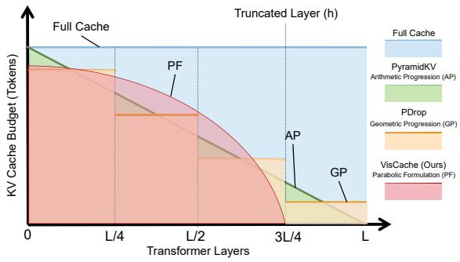
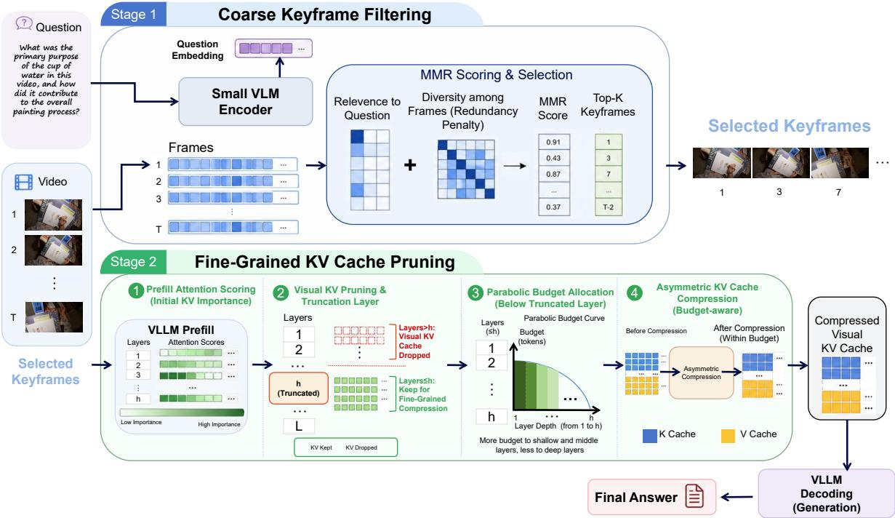
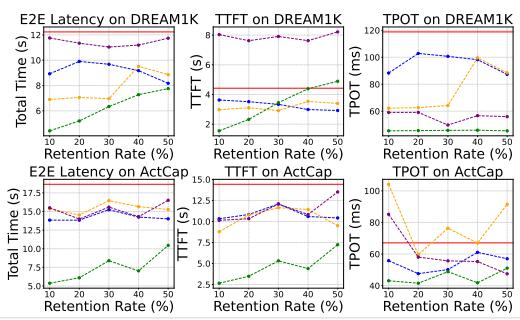
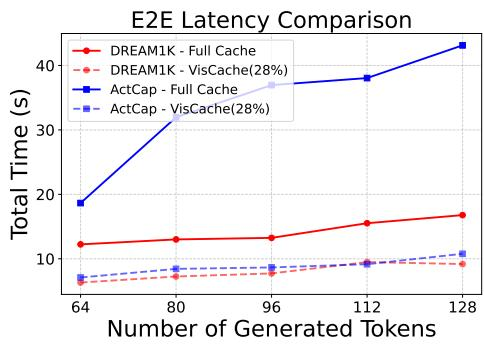
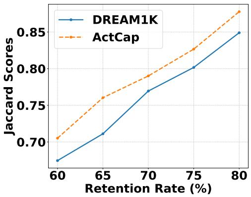
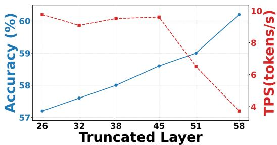
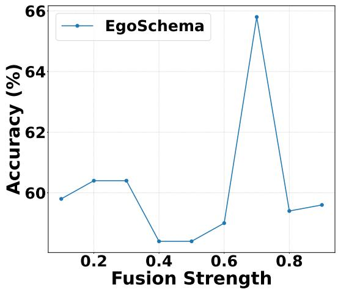
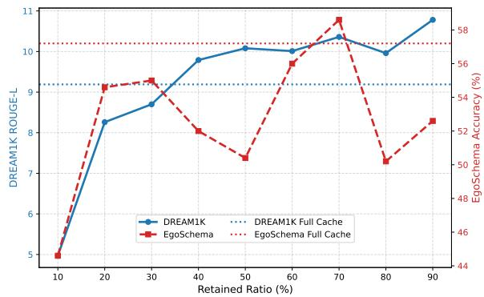
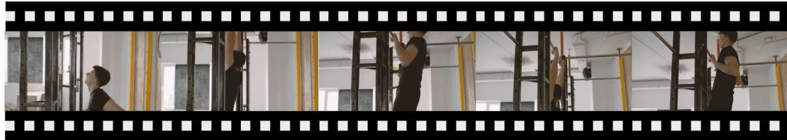
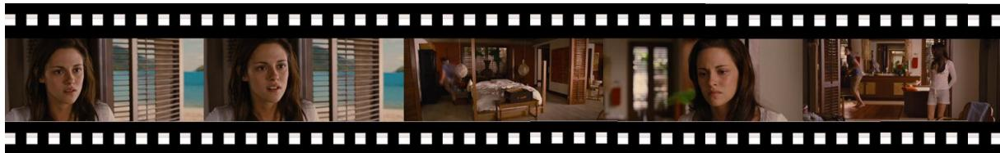

# VisCache: Visual KV Cache Pruning for Efficient Vision Large Language Model Inference

Lyuke Wang1,2,3 , Zhuo Li2,3 \* , Guangxu Zhu1,2,3,4 †

1Shenzhen International Center for Industrial and Applied Mathematics 2Shenzhen Research Institute of Big Data 3The Chinese University of Hong Kong, Shenzhen 4Shenzhen Loop Area Institute

## Abstract

While Vision Large Language Models (VLLMs) have achieved remarkable success in multimodal reasoning, their long-context inference remains prohibitively expensive due to the massive computation and memory overhead of visual Key-Value (KV) caches. Existing KV compression methods often apply uniform pruning across visual tokens and layers, leading to substantial information loss and degraded performance. To address this challenge, we propose VisCache, a plug-andplay framework for coarse-to-fine Visual KV Cache pruning without training, which consists of two synergistic stages. First, a lightweight VLM filters temporal redundancy by selectively forwarding semantically informative keyframes. Second, we introduce PruneKV, a surgical KV compression algorithm tailored to the attention dynamics of VLLMs. Unlike rigid pruning strategies, PruneKV adopts a parabolic layer-wise budget allocation together with an asymmetric update mechanism that selectively prunes keys while fusing values, thereby preserving critical contextual information. Extensive experiments demonstrate that VisCache substantially improves inference efficiency, achieving up to 2.35× speedup and significant memory reduction while maintaining competitive performance with only 19–28% KV cache retention. VisCache consistently outperforms existing baselines, establishing a new Pareto frontier between efficiency and performance for long-context VLLM inference. Code is available at https://github.com/Wlklk/VisCache

## 1 Introduction

The integration of vision into Large Language Models (VLLMs) has unlocked a new frontier in artificial intelligence (Bai et al., 2023; Chen et al., 2024b; Li et al., 2024b; Liu et al., 2023, 2024a;

Wu et al., 2024). By bridging the modality gap between textual understanding and visual perception, models such as LLaVA (Liu et al., 2023) and GPT-4V (Yang et al., 2023) have demonstrated remarkable proficiency in complex tasks ranging from long-video understanding to real-time visual conversational scenarios and derivative tasks (Tao et al., 2025; Zhang et al., 2024; Yang et al., 2025b; Liu et al., 2025a; Hua et al., 2025; Varma and James, 2025; Hu et al., 2022, 2025; Dai et al., 2026; Yuan et al., 2023; Hu et al., 2026; Li et al., 2025e,c). While VLLMs have been predominantly deployed in visual-centric tasks such as Video Summarization (VS) (Bai et al., 2025a; Maaz et al., 2024) and Visual Question Answering (VQA) (Li et al., 2022; Wang et al., 2025; Zhu et al., 2025), their practical adoption is severely hindered by substantial latency bottlenecks and massive memory requirements (Yang et al., 2025a; Ye et al., 2025b; Li et al., 2025a), particularly when processing longer videos and higher-resolution streams.

Specifically, long videos produce massive visual tokens that dramatically extend the input length fed into the LLM backbone, creating two interrelated bottlenecks. First, the Key-Value (KV) cache, inflated by the sheer volume of visual tokens, dominates GPU memory consumption and intensifies memory bandwidth contention, severely constraining throughput during long-context inference (Wan et al., 2025; Pope et al., 2023; Hooper et al., 2024). Second, attention computation scales quadratically with sequence length, further amplifying latency overhead through increasingly expensive matrix multiplications (Liu et al., 2025b; Shao et al., 2025). Together, these intertwined storage and computational pressures fundamentally limit the scalability of VLLMs for long-video understanding.

Naively discarding visual tokens reduces computational cost but often incurs severe performance degradation (Tan et al., 2025), motivating more principled KV cache compression methods (Zhang et al., 2023; Li et al., 2024d; Ainslie et al., 2023; Kwon et al., 2023). Among them, quantization (Liu et al., 2024b; Lin et al., 2024; Sun et al., 2024b; Sheng et al., 2023) and low-rank decomposition (Chang et al., 2024; Saxena et al., 2024; Sun et al., 2024a) are widely adopted to reduce memory and computation by lowering precision or exploiting structural redundancy. However, quantization is vulnerable to activation outliers (Ashkboos et al., 2024; Xiao et al., 2023), and aggressive rank constraints can impair attention capacity (Chang et al., 2024; Saxena et al., 2024; Sun et al., 2024a). More fundamentally, both rely on coarse compression schemes that overlook the intricate information flow within the model. Recent studies further reveal that visual redundancy in VLLMs is highly structured rather than uniformly distributed: only a subset of video frames is relevant to a given query (Lee et al., 2025; Zhou et al., 2025), different transformer layers contribute unevenly to downstream reasoning (Zhang et al., 2025b; Wang et al., 2024a), and keys and values serve fundamentally different roles in attention computation (Vaswani et al., 2017). These observations indicate that effective visual KV cache compression should jointly consider temporal relevance, layer-wise importance, and the asymmetric roles of keys and values.

  
Figure 1: Visualization of different plug-and-play layerwise KV cache compression methods. It illustrates that VisCache differs fundamentally from other baseline approaches in terms of layer-wise budgets.

In this paper, we propose VisCache, a trainingfree and plug-and-play framework for coarse-tofine Visual KV Cache pruning, which reduces redundancy at two complementary stages: semantic filtering before inference and structural compression during inference. At the input level, VisCache performs prompt-aware temporal filtering to eliminate redundant frames before they enter the VLLM. Concretely, a lightweight Vision-Language “scout” model (e.g., CLIP (Radford et al., 2021)) identifies task-relevant keyframes guided by prompt-aware reasoning and the Maximal Marginal Relevance (MMR) principle (Li and Merialdo, 2016), selecting a compact yet diverse subset of frames that preserves semantic coverage while substantially reducing visual token redundancy.

At the model level, we introduce PruneKV, a layer-aware visual KV compression algorithm. Instead of applying uniform pruning across layers and token types, PruneKV dynamically allocates layerwise compression budgets following a parabolic schedule. As shown in Figure 1, PruneKV preserves more visual tokens in early layers that encode fine-grained spatial details and progressively fewer in deeper layers that capture abstract semantics, with visual KV entries beyond a truncation threshold entirely evicted. Moreover, PruneKV adopts an asymmetric update strategy that treats keys and values differently: unimportant keys are selectively discarded, while their corresponding values are fused through weighted aggregation into the retained tokens to preserve contextual information. This attention-aware design substantially reduces KV cache redundancy while maintaining stable reasoning performance. The two stages of VisCache operate synergistically: the scout reduces redundant visual inputs before inference, while PruneKV further compresses the internal KV cache during generation. Extensive experiments demonstrate that VisCache achieves up to 2.35× inference speedup while retaining only 19–28% of the KV cache, consistently outperforming existing compression baselines across multiple video understanding benchmarks. Comprehensive ablation studies suggest that each proposed module is essential to VisCache’s strong performance. We summarize our contributions as follows:

• We propose VisCache, a training-free and plugand-play coarse-to-fine framework that jointly performs prompt-aware frame filtering and visual KV cache compression for efficient long-context VLLM inference.

• We introduce PruneKV, a layer-aware KV compression algorithm with parabolic budget allocation and asymmetric key-value updates that better align pruning with attention dynamics.

• Extensive experiments on long-video understanding benchmarks show that VisCache consistently achieves superior efficiency-performance tradeoffs over existing baselines under aggressive KV cache compression.

## 2 Preliminary

VLLM Prefilling. Given a video input consisting of $M _ { V }$ frames, the visual encoder of the VLLM sequentially processes each frame f that contains $N _ { V }$ visual tokens and projects them into a shared embedding space of dimension d. As a result, the visual representations of all frames are aggregated into a visual embedding matrix $\mathbf { H } _ { v } \in \bar { \mathbb { R } ^ { M _ { V } \bar { N } _ { V } \times d } }$ In parallel, the corresponding textual prompt $T =$ $\{ x _ { i } \} _ { i = 1 } ^ { N _ { T } }$ is fed into the text embedding layer, producing a text embedding matrix $\mathbf { H } _ { q } \ \in \ \mathbb { R } ^ { N _ { T } \times d } ;$ where $x _ { i }$ denotes the i-th input textual token. The visual and textual embeddings are then concatenated along the token dimension to form the unified input $\mathbf { H } \overset { - } { = } \mathrm { c o n c a t } [ \mathbf { H } _ { v } , \mathbf { H } _ { q } ] \in \mathbb { R } ^ { ( M _ { V } N _ { V } + N _ { T } ) \times d } .$ For a VLLM composed of $L$ transformer layers, the self-attention module at each layer $l \in$ $\{ 1 , \ldots , L \}$ is parameterized by three projection matrices, $\mathbf { \bar { W } } _ { Q } ^ { l } , \mathbf { \bar { W } } _ { K } ^ { l } , \mathbf { W } _ { V } ^ { l } \in \bar { \mathbb { R } ^ { d \times d } }$ . These matrices are used to compute the query, key, and value representations as

$$
\mathbf { Q } ^ { l } = \mathbf { H } \mathbf { W } _ { Q } ^ { l } , ~ \mathbf { K } ^ { l } = \mathbf { H } \mathbf { W } _ { K } ^ { l } , ~ \mathbf { V } ^ { l } = \mathbf { H } \mathbf { W } _ { V } ^ { l } ,
$$

where ${ \bf K } ^ { l }$ and $\mathbf { V } ^ { l }$ are cached and reused during the subsequent decoding stage.

VLLM Decoding. During decoding, the VLLM generates output tokens in an autoregressive (AR) manner by reusing the KV cache constructed during the prefilling stage. At decoding step t, the embedding of the previously generated token is denoted as $\mathbf { h } _ { t } \in \mathbb { R } ^ { 1 \times d } ,$ . The KV cache is then incrementally updated as:

$$
\mathbf { K } ^ { l }  \mathrm { c o n c a t } \Big [ \mathbf { K } ^ { l } , \mathbf { h } _ { t } \mathbf { W } _ { K } ^ { l } \Big ] , \mathbf { V } ^ { l }  \mathrm { c o n c a t } \Big [ \mathbf { V } ^ { l } , \mathbf { h } _ { t } \mathbf { W } _ { V } ^ { l } \Big ] ,
$$

which are then used together with the current query vector to compute the attention output and in turn produce the next token $y _ { t + 1 }$ . This process repeats until a termination condition is met or the maximum generation length is reached.

## 3 Method

We propose VisCache, a training-free and plugand-play framework that compresses the visual KV cache through a coarse-to-fine, dual-stage paradigm. As illustrated in Figure 2, VisCache is motivated by two forms of visual redundancy in long-video VLLM inference: temporal redundancy among frames at the input level, and structural redundancy in the KV cache across tokens and layers during generation. Accordingly, VisCache operates in two complementary stages: a prompt-aware temporal filtering stage that prunes redundant frames before inference, and a layer-aware KV compression stage that surgically reduces the visual KV cache during generation.

## 3.1 Prompt-Aware Scout for Temporal Redundancy Filtering

Given a video with $M _ { V }$ frames and a textual prompt $T ,$ , we employ a lightweight visionlanguage model (e.g., CLIP (Radford et al., 2021)) as a scout to extract aligned cross-modal representations. The text encoder $\mathrm { E n c } _ { \mathrm { t e x t } }$ and visual encoder $\mathrm { E n c } _ { \mathrm { v i s } }$ map the prompt $T$ and each frame f into a shared embedding space by $\mathbf { h } _ { t } =$ $\mathrm { E n c } _ { \mathrm { t e x t } } ( T ) , \mathbf { h } _ { f } = \mathrm { E n c } _ { \mathrm { v i s } } ( f )$ , where $\mathbf { h } _ { t } \in \mathbb { R } ^ { d }$ and $\mathbf { h } _ { f } \in \mathbb { R } ^ { d }$ denote the prompt embedding and the $f \mathrm { - t h }$ frame embedding, respectively. To select a compact yet diverse subset of keyframes, we adopt the Maximal Marginal Relevance (MMR) criterion (Carbonell and Goldstein, 1998), which balances prompt relevance against inter-frame redundancy. Let Ω denote the set of selected frames. We can have MMR score of a candidate frame $f \colon$

$$
\lambda \cdot \sin ( \mathbf { h } _ { f } , \mathbf { h } _ { t } ) - ( 1 - \lambda ) \cdot \operatorname* { m a x } _ { f ^ { \prime } \in \Omega } \sin \left( \mathbf { h } _ { f } , \mathbf { h } _ { f ^ { \prime } } \right) .\tag{1}
$$

where sim(·, ·) denotes cosine similarity, and $\lambda \in$ $[ 0 , 1 ]$ is a hyperparameter controlling the trade-off between relevance and diversity. The frame with the highest MMR score is iteratively added to Ω until a target retention ratio (RR) p is reached. The final set Ω forms a compact, query-relevant, and minimally redundant keyframe sequence that serves as the visual input to the subsequent VLLM inference.

## 3.2 PruneKV: Layer-Aware Visual KV Cache Compression

Rather than treating all visual KV entries uniformly, PruneKV is designed around two structural properties of transformer attention: layer-wise heterogeneity in visual token importance and functional asymmetry between keys and values. These observations motivate two components of PruneKV: layer-aware budget allocation and asymmetric keyvalue compression. Figure 1 provides an overview of the PruneKV pipeline.

Token Scoring and Parabolic Budget Allocation During prefilling, the attention weights from all layers serve as a natural signal for token importance. For each visual token at position $v ,$ we aggregate its attention received across all queries and layers:

  
Figure 2: Overview of VisCache. The framework operates in two synergistic stages: (I) A lightweight scout VLM performs prompt-aware keyframe filtering via MMR to eliminate temporal redundancy at the source; (II) During inference, the VLLM constructs the KV cache, which is subsequently refined by PruneKV through attention-aware, layer-wise compression.

$$
s _ { v } = \frac { 1 } { L } \sum _ { l = 1 } ^ { L } \sum _ { i = 1 } ^ { N } A _ { i , v } ^ { l } ,\tag{2}
$$

where $A _ { i , v } ^ { l }$ is the attention weight from token i to token v at layer l, and N is the total sequence length. Based on $s _ { v }$ as the importance score, the top q of visual KV cache that VLLM focuses on are selected.

Beyond token-level pruning, we further compress the visual KV cache along the layer dimension. Visual representations become increasingly abstract with depth (Ghiasi et al., 2022; Zhang et al., 2025b; Wang et al., 2024a), and the number of truly informative visual tokens decreases accordingly. We therefore allocate compression budgets in a parabolic decay: larger budgets in early layers, tapering to smaller budgets in deeper layers. Let $h \in ( 1 , L ]$ be a truncation threshold such that visual KV entries in layers $l > h$ are fully evicted. For the remaining layers $l \in [ 1 , h ]$ , the budget proportion is:

$$
b _ { l } = 1 - \frac { ( l - 1 ) ^ { 2 } } { 2 ( h - 1 ) ^ { 2 } } ,\tag{3}
$$

which satisfies $b _ { 1 } ~ = ~ 1$ and $b _ { h } ~ = ~ 0 . 5$ , decaying slowly in early layers and more steeply in deeper layers. Compared with linear (Cai et al., 2024) or geometric decay (Xing et al., 2024), Equation (3) preserves more tokens where fine-grained visual details are encoded and compresses more aggressively where representations are sufficiently abstract to tolerate heavy pruning. We normalize $\{ b _ { l } \} _ { l = 1 } ^ { h }$ to satisfy a global retention constraint $\textstyle \sum _ { l = 1 } ^ { h } b _ { l } = h \cdot m$ , where $m \in ( 0 , 1 ]$ is the target retention ratio for parabolic budget allocation module. The final budget for each layer determines how many top-scoring visual tokens are retained in $\mathcal { C } _ { k }$ (the keep set), with the remainder assigned to $\mathcal { C } _ { d }$ (the drop set).

Asymmetric Key-Value Update. Existing KV compression methods (Cai et al., 2024; Xing et al., 2024) typically prune keys and values identically, ignoring their distinct roles in attention. However, the standard scaled dot-product attention reveals a clear functional asymmetry: attention weights are determined solely by $\mathbf { Q } \mathbf { K } ^ { \top }$ , making keys the relevance selectors that decide which tokens are attended to, while values are the information carriers that encode the content ultimately aggregated into the output. Simply discarding value vectors therefore risks irreversibly losing contextual information that the dropped tokens originally carried.

We exploit this asymmetry through a prune-keys, fuse-values strategy. For the drop set $\mathcal { C } _ { d }$ , key vectors are entirely removed, as their contribution to the attention distribution is negligible by construction (these tokens scored lowest in the importance ranking). The corresponding value vectors, however, are not discarded but redistributed to the retained tokens via similarity-based weighted aggregation. Concretely, let $\dot { \mathbf { V } } _ { k } ~ \in ~ \mathbb { R } ^ { b _ { l } \times \bar { d } }$ and $\bar { \mathbf { V } _ { d } } \in \mathbb { R } ^ { ( n - b _ { l } ) \times d }$ denote the value caches of the keep set $\mathcal { C } _ { k }$ and drop set $\mathcal { C } _ { d } ,$ respectively. We compute a redistribution matrix Φ that captures the semantic affinity between the two sets:

$$
\Phi = \mathrm { S o f t m a x } \bigg ( \frac { \mathbf { V } _ { k } \mathbf { V } _ { d } ^ { \top } } { \tau } \bigg ) \in \mathbb { R } ^ { b _ { l } \times ( n - b _ { l } ) } ,\tag{4}
$$

where $\tau$ is a temperature that controls the sharpness of the redistribution (e.g., lower τ concentrates the dropped values onto fewer retained tokens). Each row of $\Phi$ specifies how the $b _ { l }$ retained tokens absorb information from the $n - b _ { l }$ dropped tokens. The aggregated dropped values, $\Phi \mathbf { V } _ { d } ,$ are then fused with the original kept values through a weighted combination:

$$
\begin{array} { r } { \mathbf { V } _ { k } ^ { \mathrm { n e w } } = \mu \mathbf { V } _ { k } + \left( 1 - \mu \right) \left( \Phi \mathbf { V } _ { d } \right) , } \end{array}\tag{5}
$$

where $\mu \in [ 0 , 1 ]$ balances the contribution of the original and redistributed information $( \mu = 1$ recovers standard pruning; $\mu = 0$ replaces kept values entirely with fused dropped values). The compressed KV pair $( \mathbf { K } _ { k } ^ { \mathrm { n e w } } , \mathbf { V } _ { k } ^ { \mathrm { n e w } } )$ then replaces the original visual cache for all subsequent decoding steps. A complete description of the PruneKV algorithm is provided in Appendix B.

## 4 Experiment

Baselines. We mainly compare VisCache with plug-and-play baselines, including: PyramidKV (Cai et al., 2024) reduces the KV cache budget layer by layer following an arithmetic progression, forming a pyramidal structure based on attention scores. FastV (Chen et al., 2024a) leverages the sparsity of visual attention to retain KV entries selectively. PDrop (Xing et al., 2024) partitions layers into stages and progressively decreases token counts in a geometric manner, enabling stage-wise KV cache compression. Q-Frame (Zhang et al., 2025a) performs adaptive frame selection and multi-resolution scales tailored to video understanding.

Benchmarks and Evaluation metrics. We evaluate on both video summarization (VS) and visual question answering (VQA) benchmarks. For VS, we use ActivityNet Captions (ActCap) (Caba Heilbron et al., 2015) (20K videos, 100K captions) and DREAM1K (Wang et al., 2024b) (1,000 clips with dense event descriptions), reporting ROUGE-L (Lin, 2004) as the generation metric. For VQA, we consider NExTQA (Xiao et al., 2021) for temporal reasoning, ActivityNet-QA (ActQA) (Yu et al., 2019) (5.8K videos), and EgoSchema (Mangalam et al., 2023) for long-form comprehension. We further evaluate on MVBench (Li et al., 2024c), a multi-task benchmark covering 20 reasoning tasks with multiple-choice QA pairs.

Implementation Details. We implement Vis-Cache on the Qwen2.5-VL series using PyTorch and 4 NVIDIA A100 GPUs (80GB) (Bai et al., 2025b). For keyframe selection, we adopt the pretrained CLIP ViT-B/32 (Radford et al., 2021) as the scout model. The frame-level pruning ratio $p$ (Stage 1) and the token-level retention ratio $q$ (Stage 2) serve as the primary control variables. Other hyperparameters are fixed as follows: $\lambda = 0 . 7$ in Equation (1), layer truncation threshold $h \ : = \ : \frac { 3 } { 4 } L .$ average layer-wise budget $m = 0 . 7 5$ temperature $\tau = 1 . 0$ in Equation (4), and fusion weight $\mu = 0 . 7$ in Equation (5). Throughout the paper, Retention Ratio (RR) denotes the fraction of visual KV cache preserved relative to the full cache. For VisCache, the overall RR is determined by four factors: the frame filtering ratio $p ,$ the token-level pruning ratio $q ,$ the layer truncation ratio $h / L$ , and the average layer-wise budget $m ,$ i $\begin{array} { r } { . \mathrm { e } . , \mathrm { R R } = p \times q \times \frac { h } { L } \times m } \end{array}$ . For example, $p = 0 . 7 5$ $\begin{array} { r } { q = 0 . 6 7 , h = \frac { 3 } { 4 } L . } \end{array}$ , and $m = 0 . 7 5$ together yield RR ≈ 28%. For baseline methods, we tune their respective hyperparameters to match the same global RR. The determination of h and $\mu$ is further analyzed in Appendix D and Appendix E. In addition, the scout VLM is model-agnostic, as discussed in Appendix L.

## 4.1 Main Results

Table 1 compares VisCache with competitive KV cache compression baselines under controlled retention ratios. VisCache consistently achieves the lowest FLOPs across all settings. At 40% RR, it reduces FLOPs to 9% of the full cache on the 3B model and 15% on the 32B model, outperforming the next best method PyramidKV. This advantage stems from the dual-stage design: the scout filters redundant frames before inference, while PruneKV further compresses the KV cache along both token and layer dimensions. At more aggressive RRs (28% and 19%), FLOPs drop to 7% and 6% on the 3B model, demonstrating the scalability of our framework.

Table 1: Comparison of different KV cache compression methods on various VQA and VS datasets. Bold and underlined numbers indicate the best and second-best results, respectively.
<table><tr><td>Method</td><td>RR</td><td>FLOPs (T)</td><td>FLOPs Ratio</td><td>ActCap ROUGE-L</td><td>DREAM1K ROUGE-L</td><td>NExTQA Acc</td><td>ActQA Acc</td><td>EgoSchema Acc</td><td>Avg. Acc</td></tr><tr><td colspan="10">Qwen2.5-VL-3B-Instruct</td></tr><tr><td>Full Cache</td><td>100%</td><td>14.80</td><td>100%</td><td>2.63</td><td>9.19</td><td>34.69</td><td>40.58</td><td>57.20</td><td>44.16</td></tr><tr><td>Q-Frame</td><td>40%</td><td>6.26</td><td>42%</td><td>2.42</td><td>5.86</td><td>39.52</td><td>39.42</td><td>46.40</td><td>41.78</td></tr><tr><td>PyramidKV</td><td>40%</td><td>1.99</td><td>13%</td><td>2.43</td><td>8.48</td><td>39.53</td><td>39.56</td><td>54.80</td><td>44.63</td></tr><tr><td>FastV</td><td>40%</td><td>3.11</td><td>21%</td><td>2.43</td><td>8.63</td><td>37.67</td><td>40.65</td><td>50.40</td><td>42.91</td></tr><tr><td>PDrop</td><td>40%</td><td>2.99</td><td>20%</td><td>2.46</td><td>8.63</td><td>34.24</td><td>40.21</td><td>50.00</td><td>41.48</td></tr><tr><td>VisCache  $( p = 0 . 7 5 , q = 0 . 9 5 )$ </td><td>40%</td><td>1.32</td><td>9%</td><td>2.35</td><td>9.79</td><td>37.62</td><td>37.32</td><td>52.00</td><td>42.31</td></tr><tr><td>VisCache  $( p = 0 . 7 5 , q = 0 . 6 7 )$ </td><td>28%</td><td>1.05</td><td>7%</td><td>2.45</td><td>8.70</td><td>41.25</td><td>40.66</td><td>55.00</td><td>45.64</td></tr><tr><td>VisCache  $( p = 0 . 5 0 , q = 0 . 6 7 )$ </td><td>19%</td><td>0.88</td><td>6%</td><td>2.39</td><td>8.26</td><td>41.44</td><td>38.51</td><td>54.60</td><td>44.85</td></tr><tr><td colspan="10">Qwen2.5-VL-32B-Instruct</td></tr><tr><td>Full Cache</td><td>100%</td><td>93.08</td><td>100%</td><td>2.82</td><td>7.87</td><td>60.71</td><td>46.47</td><td>65.20</td><td>57.46</td></tr><tr><td>Q-Frame</td><td>40%</td><td>40.80</td><td>44%</td><td>2.81</td><td>7.84</td><td>50.08</td><td>43.86</td><td>54.60</td><td>49.51</td></tr><tr><td>PyramidKV</td><td>40%</td><td>13.88</td><td>15%</td><td>2.78</td><td>7.55</td><td>61.58</td><td>42.96</td><td>65.20</td><td>56.58</td></tr><tr><td>FastV</td><td>40%</td><td>51.63</td><td>55%</td><td>2.81</td><td>7.47</td><td>60.29</td><td>38.41</td><td>61.60</td><td>53.43</td></tr><tr><td>PDrop</td><td>40%</td><td>31.03</td><td>33%</td><td>2.75</td><td>7.38</td><td>61.00</td><td>41.59</td><td>63.20</td><td>55.26</td></tr><tr><td>VisCache  $( p = 0 . 7 5 , q = 0 . 9 5 )$ </td><td>40%</td><td>13.56</td><td>15%</td><td>3.23</td><td>7.32</td><td>55.74</td><td>45.46</td><td>58.80</td><td>53.00</td></tr><tr><td>VisCache  $( p = 0 . 7 5 , q = 0 . 6 7 )$ </td><td>28%</td><td>10.75</td><td>12%</td><td>2.72</td><td>7.29</td><td>62.08</td><td>42.69</td><td>65.80</td><td>56.86</td></tr><tr><td>VisCache  $( p = 0 . 5 0 , q = 0 . 6 7 )$ </td><td>19%</td><td>9.08</td><td>10%</td><td>2.81</td><td>7.35</td><td>56.61</td><td>41.86</td><td>65.00</td><td>54.16</td></tr></table>

Table 2: Results on MVBench of different KV cache compression methods with $( p = 0 . 7 5 , q = 0 . 6 7 )$ . The first row lists abbreviations of the subset names, from AS to CI (e.g., Action Sequence (AS)). Bold and underlined numbers indicate the best and second-best results, respectively.
<table><tr><td>Method</td><td>RR</td><td>AS</td><td>AP</td><td>AA</td><td>FA</td><td>UA</td><td>OE</td><td>0I</td><td>OS MD</td><td>AL</td><td>ST</td><td>AC</td><td>MC</td><td>MA</td><td>SC</td><td>FP</td><td>CO</td><td>EN</td><td>ER</td><td>CI</td><td>Avg</td></tr><tr><td></td><td></td><td></td><td></td><td></td><td></td><td></td><td></td><td></td><td>Qwen2.5-VL-3B-Instruct</td><td></td><td></td><td></td><td></td><td></td><td></td><td></td><td></td><td></td><td></td><td></td><td></td><td></td></tr><tr><td>Full Cache</td><td>100%</td><td>69.0</td><td>66.8</td><td>72.0</td><td>26.4</td><td>72.4</td><td>85.0</td><td>69.7</td><td>31.3</td><td>50.5 37.5</td><td>76.0</td><td>48.5</td><td>62.5</td><td>89.0</td><td></td><td>45.5</td><td>27.0</td><td>47.1</td><td>36.5</td><td>26.8</td><td>58.0</td><td>56.6</td></tr><tr><td>Q-Frame PyramidKV</td><td>50% 50%</td><td>49.5 65.5</td><td>63.3</td><td>68.5 54.0</td><td>23.4 24.9</td><td>64.3</td><td>80.5 77.5</td><td>59.6</td><td>31.3</td><td>46.0</td><td>37.5</td><td>77.0</td><td>36.4 42.4</td><td>56.5 62.5</td><td>78.0 87.0</td><td>40.9</td><td>24.5</td><td>52.9 52.9</td><td>35.0 32.0</td><td>37.0 28.8</td><td>61.5 53.0</td><td>51.2 49.4</td></tr><tr><td>FastV</td><td>50%</td><td>60.5</td><td>66.8 53.8</td><td></td><td>29.4</td><td>46.4 48.0</td><td></td><td>55.6</td><td>43.8</td><td>39.0</td><td>38.0 51.0</td><td></td><td></td><td></td><td></td><td>45.5</td><td>20.5</td><td></td><td></td><td>22.5</td><td>62.5</td><td>47.8</td></tr><tr><td>PDrop</td><td>50%</td><td>54.5</td><td>58.3</td><td>61.5 72.5</td><td>24.4</td><td>65.5</td><td>80.5 77.5</td><td>64.7 63.7</td><td>18.8 30.0</td><td>41.0 44.5</td><td>38.5 50.5</td><td>36.4</td><td></td><td>63.0 81.5</td><td></td><td>45.5</td><td>20.5</td><td>47.1</td><td>30.0</td><td>25.0</td><td></td><td>51.7</td></tr><tr><td>VisCache</td><td>50%</td><td>62.5</td><td>63.8</td><td>63.0</td><td>27.9</td><td>62.6</td><td>71.0</td><td>68.7</td><td></td><td>36.0</td><td>70.5</td><td>45.5</td><td></td><td>63.0</td><td>86.5</td><td>50.0</td><td>29.0</td><td>50.0 47.1</td><td>34.5</td><td>27.3</td><td>53.5</td><td>52.6</td></tr><tr><td></td><td></td><td></td><td></td><td></td><td></td><td></td><td></td><td>37.5</td><td>40.5</td><td>37.5</td><td>76.5</td><td>42.4</td><td></td><td>61.5</td><td>83.5</td><td>68.8</td><td>24.5</td><td></td><td>32.7</td><td></td><td>53.5</td><td></td></tr><tr><td></td><td></td><td></td><td></td><td></td><td></td><td></td><td></td><td></td><td>Qwen2.5-VL-32B-Instruct</td><td></td><td></td><td></td><td></td><td></td><td></td><td></td><td></td><td></td><td></td><td></td><td></td><td></td></tr><tr><td>Full Cache Q-Frame</td><td>100%</td><td>68.0 49.0</td><td>66.3</td><td>76.0</td><td>39.5</td><td>70.2</td><td>84.0</td><td>69.5</td><td>68.8</td><td>44.0</td><td>39.0 85.0</td><td>39.4</td><td>57.0</td><td>79.0</td><td>63.6</td><td>35.0</td><td></td><td>47.1</td><td>38.0</td><td>45.5</td><td>46.5</td><td>58.1</td></tr><tr><td>PyramidKV</td><td>50% 50%</td><td>43.2</td><td>64.3</td><td>72.5 80.5</td><td>31.0</td><td>58.8</td><td>76.0</td><td>63.6</td><td>75.0</td><td>44.5</td><td>37.5 81.0</td><td>33.3</td><td></td><td>45.0</td><td>74.5</td><td>45.5</td><td>23.0</td><td>52.9</td><td>20.0</td><td>44.5</td><td>45.5</td><td>51.9 51.0</td></tr><tr><td>FastV</td><td>50%</td><td>34.7</td><td>56.7 54.2</td><td>71.5</td><td>33.5 37.1</td><td>66.3 65.1</td><td>74.0 70.5</td><td>59.0 53.2</td><td>46.7 56.3</td><td>43.5 39.5</td><td>19.9 85.5 72.5</td><td>39.4</td><td></td><td>51.5</td><td>66.0</td><td>54.6</td><td>25.5</td><td>58.8</td><td>25.0 37.0</td><td>41.2 36.0</td><td>49.0 46.0</td><td>49.9</td></tr><tr><td>PDrop</td><td>50%</td><td>49.0</td><td>52.3</td><td>80.5</td><td>38.6</td><td>77.7</td><td>81.0</td><td>57.8</td><td>62.5</td><td>51.5</td><td>33.0 33.0 84.5</td><td></td><td>30.3 30.3</td><td>50.0 47.0</td><td>78.0 72.0</td><td>45.5 63.6</td><td>34.0 41.5</td><td>52.9 35.3</td><td>36.5</td><td>43.0</td><td>46.0</td><td>54.9</td></tr><tr><td>VisCache</td><td>50%</td><td>51.9</td><td>64.8</td><td>72.0</td><td>41.6</td><td>74.4</td><td>84.5</td><td>61.0</td><td>56.3</td><td>51.0</td><td>30.5 85.5</td><td></td><td>36.4</td><td>51.0</td><td>69.0</td><td>68.8</td><td>32.0</td><td>52.9</td><td>36.4</td><td>39.6</td><td>48.0</td><td>55.4</td></tr><tr><td></td><td></td><td></td><td></td><td></td><td></td><td></td><td></td><td></td><td></td><td></td><td></td><td></td><td></td><td></td><td></td><td></td><td></td><td></td><td></td><td></td><td></td><td></td></tr></table>

Despite aggressive compression, VisCache maintains strong accuracy. On the 3B model, VisCache at 28% RR achieves the highest average accuracy (45.64%), surpassing the full cache (44.16%) and all baselines. On the 32B model, it achieves the best average accuracy (56.86%) while discarding 72% of the KV cache. VisCache consistently ranks first or second on NExTQA, ActQA, and EgoSchema. On VS benchmarks, performance is comparable across methods, with only a slight trade-off on ActCap under extreme compression—acceptable given the substantial efficiency gains. Notably, while PyramidKV performs well at 40% RR, it degrades substantially under more aggressive compression (see Appendix H), confirming that parabolic allocation better preserves essential information when the budget is tight.

Varying RR from 40% to 19% reveals a clear accuracy–efficiency spectrum: 40% prioritizes accuracy, 28% offers the best overall trade-off, and 19% still retains strong performance, outperforming most baselines at higher RRs. These results highlight VisCache’s robustness under extreme compression, where uniform or arithmetic budgets often collapse. Detailed comparisons at additional RRs are provided in Appendix I. VisCache scales effectively from 3B to 32B: efficiency gains are consistent, and accuracy advantages grow with model size. On the 32B model, VisCache at 28% RR outperforms all baselines at 40% RR.

Table 3: Real-system inference efficiency on ActCap. Mem.: GPU memory in GB (Total = peak usage, KV = raw KV cache size). TPS: tokens per second (higher is better).
<table><tr><td rowspan=1 colspan=1>Method</td><td rowspan=1 colspan=1>RR</td><td rowspan=1 colspan=2>Total Mem.</td><td rowspan=1 colspan=1>KV Cache</td><td rowspan=1 colspan=1>TPS</td></tr><tr><td rowspan=2 colspan=1>Full CachePyramidKVFastVPDrop</td><td rowspan=1 colspan=1>100%</td><td rowspan=1 colspan=2>5.57</td><td rowspan=1 colspan=1>0.06</td><td rowspan=1 colspan=1>10.4</td></tr><tr><td rowspan=1 colspan=1>40%40%40%</td><td rowspan=1 colspan=2>4.984.984.99</td><td rowspan=1 colspan=1>0.020.020.02</td><td rowspan=1 colspan=1>9.710.615.0</td></tr><tr><td rowspan=3 colspan=1>VisCacheVisCacheVisCache</td><td rowspan=2 colspan=1>40%28%</td><td rowspan=1 colspan=2>4.10</td><td rowspan=1 colspan=1>0.03</td><td rowspan=3 colspan=1>15.518.615.7</td></tr><tr><td rowspan=1 colspan=1>4.10</td><td rowspan=1 colspan=1></td><td rowspan=2 colspan=1>0.020.02</td></tr><tr><td rowspan=1 colspan=1>19%</td><td rowspan=1 colspan=2>3.68</td></tr></table>

Table 2 reports the performance on MVBench, a comprehensive multi-task benchmark spanning 20 reasoning tasks. VisCache achieves the highest average accuracy on both model scales (52.6% on 3B, 55.4% on 32B), surpassing all baselines at the same retention ratio. On the 32B model, Vis-Cache outperforms the strongest baseline PDrop by 0.5 points in average accuracy, with particularly strong gains on tasks requiring temporal reasoning (AS: 51.9%, UA: 74.4%) and fine-grained perception (AA: 41.6%). Notably, VisCache and PDrop exhibit complementary strengths across sub-tasks: VisCache leads on 11 out of 20 tasks on the 32B model, while PDrop leads on the remaining tasks, suggesting that parabolic allocation and asymmetric fusion are especially beneficial for tasks that depend on structured visual information retained across layers. The overall margin over the full cache is small (within 3 points on 32B), confirming that VisCache preserves broad reasoning capabilities under aggressive compression. The compatibility evaluation of VisCache is provided in Appendix F and Appendix G. In addition, representative inference examples are presented in Appendix M.

## 4.2 Analysis and Ablation Studies

Memory Usage. We measure the total GPU memory and the KV cache GPU memory for different acceleration methods on ActCap based on Qwen2.5-VL-3B-Instruct backbone. As Table 3 shown, VisCache reduces the total GPU memory and KV cache GPU memory to 3.68 GB and 0.02 GB while maintaining competitive throughput and nearly identical inference performance compared to the baseline methods. These results demonstrate that VisCache provides an efficient trade-off between memory consumption and inference speed, enabling deployment of VLLMs on resource-constrained edge devices without incurring significant degradation in output quality.

Figure 3: Comparison of average inference time of different baseline algorithms on Qwen2.5-VL-3B-Instruct at different KV cache compression rates for the VS task. The left, middle, and right columns report the average end-to-end (E2E) latency, time to first token (TTFT), and time per output token (TPOT), respectively.  
  
Figure 4: Comparison of average inference time between full KV cache and VisCache under varying numbers of output tokens.

Inference Time. We record the computation time of VisCache and baseline algorithms under different visual KV cache compression rates and plot the results in Figure 3. It can be clearly observed that the average End-to-End (E2E) inference time of VisCache-which includes the keyframe selection stage as well as the subsequent VLLM inferenceremains consistently lower than that of the full cache and baseline methods across all retention rates, further validating the overall efficiency of Vis-Cache. By retaining just 28% of the KV cache, Vis-Cache already achieves impressive E2E speedups of up to 1.93 × over the full cache setting. Reducing the retention further to 19% amplifies the effect, pushing the acceleration to an astonishing 2.35 ×, all while achieving performance close to the baseline. Specific inference time measurements are explained in Appendix K.

Table 4: Ablation study on budget allocation strategy and value cache fusion. We keep RR = 28% of the visual KV cache on Qwen2.5-VL-32B-Instruct across all variants. Fixed: uniform budget per layer. Arithmetic: arithmetic progression (PyramidKV (Cai et al., 2024)). Geometric: geometric progression across four layer blocks (PDrop (Xing et al., 2024)). Parabola: our proposed parabolic schedule (Equation 3). V Cache $F u -$ sion: asymmetric value fusion.
<table><tr><td>Budget Strategy</td><td>V Cache Fusion</td><td>ActCap ROUGE-L</td><td>DREAM1K ROUGE-L</td><td>NExTQA Acc</td><td>ActQA Acc</td><td>EgoSchema Acc</td><td>Avg. Acc</td></tr><tr><td colspan="8">Full cache (upper bound)</td></tr><tr><td>Full Cache</td><td></td><td>2.82</td><td>7.87</td><td>60.71</td><td>46.47</td><td>65.20</td><td>57.46</td></tr><tr><td colspan="8">Without V Cache Fusion</td></tr><tr><td>Fixed</td><td>X</td><td>2.43</td><td>7.24</td><td>59.00</td><td>43.44</td><td>63.60</td><td>55.35</td></tr><tr><td>Arithmetic</td><td>X</td><td>2.67</td><td>7.17</td><td>58.07</td><td>42.31</td><td>57.00</td><td>52.46</td></tr><tr><td>Geometric</td><td>×</td><td>2.69</td><td>7.25</td><td>55.56</td><td>42.68</td><td>57.60</td><td>51.95</td></tr><tr><td>Parabola</td><td>×</td><td>2.70</td><td>7.05</td><td>61.61</td><td>42.64</td><td>65.00</td><td>56.42</td></tr><tr><td colspan="8">With V Cache Fusion</td></tr><tr><td>Fixed</td><td>√</td><td>2.69</td><td>7.36</td><td>61.58</td><td>42.42</td><td>64.80</td><td>56.27</td></tr><tr><td>Arithmetic</td><td>√</td><td>2.72</td><td>7.23</td><td>61.32</td><td>42.33</td><td>65.00</td><td>56.22</td></tr><tr><td>Geometric</td><td>√</td><td>2.69</td><td>7.27</td><td>56.07</td><td>40.49</td><td>56.00</td><td>50.85</td></tr><tr><td>Parabola</td><td>√</td><td>2.72</td><td>7.29</td><td>62.08</td><td>42.69</td><td>65.80</td><td>56.86</td></tr></table>

VisCache significantly reduces Time Per Output Token (TPOT), yielding substantial time savings compared to full cache and baseline methods, while its effect on Time To First Token (TTFT) is minimal. This indicates that although the first token is not noticeably accelerated, subsequent decoding is greatly sped up, more than compensating for the initial overhead and reducing overall E2E latency. To better illustrate this phenomenon, We increase the number of output tokens in the model from 64 to 128, and the experimental results are shown in Figure 4. The more tokens output, the more time VisCache saves compared to full cache, further confirming our conclusion.

Impact of Layer-wise Budget Allocation and Value Fusion. We first ablate the two core design choices in PruneKV: the layer-wise budget allocation strategy and the asymmetric value fusion mechanism. Table 4 reports results under a fixed 28% KV cache retention ratio. Among the four budget strategies, Parabola consistently achieves the best performance across all three VQA benchmarks, with its average accuracy approaching that of the full cache upper bound. Arithmetic and Fixed strategies also perform competitively, while Geometric allocation degrades substantially, confirming that overly aggressive compression in early layers impairs fine-grained visual understanding. To assess the contribution of value fusion, we compare each budget strategy with and without fusion. For Parabola, Fixed, and Arithmetic allocations, enabling fusion consistently improves accuracy, demonstrating that asymmetric value fusion effectively preserves contextual information that would otherwise be lost. The exception is Geometric allocation, where fusion slightly degrades performance—likely because excessive pruning leaves too few retained tokens for meaningful redistribution, further underscoring the importance of pairing fusion with a well-designed budget strategy. Notably, Parabola with fusion achieves the best individual scores across all VQA benchmarks, validating that the two components are synergistic: parabolic allocation retains tokens where they matter most, while value fusion salvages information from pruned tokens.

Table 5: Comparison of different KV cache compression methods on various VQA and VS datasets. Bold and underlined numbers indicate the best and second-best results, respectively.
<table><tr><td>Methods</td><td>RR</td><td>Scout</td><td>PruneKV</td><td>DREAM1K ROUGE-L</td><td>EgoSchema Acc</td></tr><tr><td>PDrop VisCache</td><td>40% 40%</td><td>- √</td><td>- ×</td><td>8.63 8.48</td><td>50.00 46.20</td></tr><tr><td>VisCache</td><td>40%</td><td>×</td><td>√</td><td>9.65</td><td>48.00</td></tr><tr><td>VisCache</td><td>40%</td><td>√</td><td>√</td><td>9.79</td><td>52.00</td></tr><tr><td>PDrop VisCache</td><td>28% 28%</td><td>-</td><td>-</td><td>8.62</td><td>49.60</td></tr><tr><td>VisCache</td><td>28%</td><td>√</td><td>X</td><td>8.13</td><td>46.00</td></tr><tr><td>VisCache</td><td>28%</td><td>×</td><td>√</td><td>8.62</td><td>48.80</td></tr><tr><td></td><td></td><td>√</td><td>√</td><td>8.70</td><td>55.00</td></tr><tr><td>PDrop</td><td>19%</td><td>-</td><td>-</td><td>7.69</td><td>49.00</td></tr><tr><td>VisCache</td><td>19%</td><td>√</td><td>X</td><td>7.84</td><td>48.20</td></tr><tr><td>VisCache</td><td>19%</td><td>×</td><td>√</td><td>8.23</td><td>48.60</td></tr><tr><td>VisCache</td><td>19%</td><td>√</td><td>√</td><td>8.26</td><td>54.60</td></tr></table>

## 4.3 Ablation on Two Stages of VisCache.

Table 5 presents the ablation study of the two-stage design in VisCache, including Scout-based temporal redundancy filtering and PruneKV-based visual KV cache compression. We first observe that applying only Scout-based filtering leads to noticeable performance degradation in some settings, especially on EgoSchema, indicating that solely removing temporally redundant frames may discard informative visual context required for reasoning. In contrast, using only PruneKV generally achieves more stable performance and consistently outperforms the baseline PDrop under aggressive compression ratios, demonstrating the effectiveness of fine-grained visual KV cache pruning. More importantly, combining both Scout and PruneKV consistently achieves the best overall performance across different RRs. This suggests that the two stages are highly complementary: Scout reduces coarse-grained temporal redundancy at the frame level, while PruneKV further refines the retained information through token-level KV cache compression. The advantage becomes more significant at lower RRs, where the complete VisCache framework maintains strong reasoning performance even under highly constrained memory budgets.

Table 6: Ablation of shared global and layer-specific visual-token ranking at matched retention ratios on Qwen2.5-VL-3B-Instruct. Bold numbers indicate the best result under each retention ratio.
<table><tr><td>Ranking strategy</td><td>RR</td><td>ActCap ROUGE-L</td><td>DREAMIK ROUGE-L</td><td>NExTQA Acc.</td><td>ActQA Acc.</td><td>EgoSchema Acc.</td><td>Avg. Acc.</td></tr><tr><td>Shared global ranking Layer-specific ranking</td><td>28%</td><td>2.45</td><td>8.70</td><td>41.25</td><td>40.66</td><td>55.00</td><td>45.64</td></tr><tr><td></td><td>28%</td><td>2.35</td><td>8.73</td><td>41.20</td><td>39.82</td><td>51.75</td><td>44.26</td></tr><tr><td>Shared global ranking</td><td>19%</td><td>2.39</td><td>8.26</td><td>41.44</td><td>38.51</td><td>54.60</td><td>44.85</td></tr><tr><td>Layer-specific ranking</td><td>19%</td><td>2.29</td><td>7.95</td><td>41.24</td><td>37.41</td><td>53.20</td><td>43.95</td></tr></table>

## 4.4 Ablation on Shared vs. Layer-Specific Visual Token Ranking

We further examine whether visual token importance should be computed globally across all layers or independently for each layer. In the shared global ranking, the importance of visual token v is obtained by aggregating its attention scores across all transformer layers:

$$
s _ { v } = \sum _ { l = 1 } ^ { L } \sum _ { i } A _ { i , v } ^ { ( l ) } ,\tag{6}
$$

where $A _ { i , v } ^ { ( l ) }$ denotes the attention weight received by visual token v at layer l. All layers then select tokens from the same global ordering according to their retention budgets, i.e., layer l keeps the top-k tokens from this shared ranking. In the layerspecific variant, each layer independently computes

$$
s _ { v } ^ { ( l ) } = \sum _ { i } A _ { i , v } ^ { ( l ) }\tag{7}
$$

and selects its own top-kl visual tokens. Table 6 compares the two strategies at matched retention ratios on Qwen2.5-VL-3B-Instruct. Shared global ranking improves the average VQA accuracy from 44.26 to 45.64 at 28% retention ratio and from 43.95 to 44.85 at 19% retention ratio. It also achieves the best result on most individual benchmarks. This design intentionally decouples which tokens are important from how many tokens each layer retains. Aggregating attention across all layers provides a more stable and comprehensive importance estimate, while the parabolic budget still assigns different retention cardinalities to each layer. In contrast, layer-specific ranking may select substantially different token identities across layers, which can reduce the consistency of visual information preserved throughout the backbone.

## 5 Related Work

Post-aligned LLMs and VLLMs usually come with redundant responses (Li et al., 2025b,d, 2026a), leading to additional unsafe behaviors (Wang et al., 2026; Du et al., 2025; Li et al., 2026b) and inference cost. Existing efficient VLLM inference methods improve efficiency by localizing queryaware video clip, reducing visual token redundancy or compressing KV caches. SeViLA (Yu et al., 2023) performs query-aware keyframe localization and QA via a self-chained design, while LongVU (Shen et al., 2024) achieves efficient longvideo understanding via adaptive spatiotemporal token compression. One line of work focuses on token pruning and merging based on attention or semantic importance. Methods such as FastV (Chen et al., 2024a), VisionZip (Yang et al., 2025b), and SparseVLM (Zhang et al., 2024) select or merge tokens using attention or cross-modal relevance, while approaches like FitPrune (Ye et al., 2025a), PruMerge (Shang et al., 2025), and DivPrune (Alvar et al., 2025) further explore optimization and diversity-aware selection strategies. Another line of work reduces inference cost via structured KV cache compression or layer-wise budget allocation. PyramidKV (Cai et al., 2024), PyramidInfer (Yang et al., 2024), and PDrop (Xing et al., 2024) allocate KV budgets across layers using predefined schedules such as arithmetic or geometric decay. Despite their effectiveness, these methods typically treat tokens or KV caches in a coarse-grained manner, ignoring the heterogeneous importance of visual information across layers and the asymmetric roles of keys and values, which can limit compression performance under aggressive budgets.

## 6 Conclusion

We present VisCache, a training-free framework for efficient visual KV cache compression in longvideo VLLMs via prompt-aware filtering and layeraware PruneKV, preserving hierarchical context while improving long-context video efficiency.

## Limitations

We identify two primary limitations of this work. First, the scout-based temporal filtering stage relies on a lightweight VLM such as CLIP, whose visual encoder may not perfectly align with the main LLM backbone. In scenarios where the scout and the main model exhibit substantially different visual representations, the selected keyframes may deviate from what the downstream model would consider optimal. Second, the current implementation of PruneKV requires storing attention scores from all layers during the prefilling stage, which introduces some memory overhead. We leave the exploration of scout-backbone co-adaptation and memory-efficient score computation to future work.

## Statement of Impacts

This work aims to improve the inference efficiency of vision large language models, thereby lowering the computational barrier for deploying advanced video understanding capabilities in practice. By substantially reducing memory consumption and latency, VisCache can contribute to broader accessibility of VLLM technologies, particularly in academic and resource-limited settings.

We acknowledge that efficiency improvements in VLLMs may also facilitate large-scale video analysis applications, including automated surveillance and mass media monitoring. We encourage practitioners deploying VisCache in such contexts to adhere to established ethical guidelines regarding privacy, consent, and algorithmic fairness. Our method reduces visual token redundancy based on learned attention patterns from pretrained models; as such, any biases present in the underlying foundation models may propagate through the compression process. We recommend that users of VisCache conduct fairness and bias assessments tailored to their specific application domains.

## Acknowledgments

This work was supported in part by the National Natural Science Foundation of China (Grant No. 62522118, 62371313), in part by the Shenzhen Science and Technology Program (Grant No. JCYJ20241202124934046), in part by the Guangdong Young Talent Research Project (Grant No. 2023TQ07A708), in part by Shenzhen Loop Area Institute (Contract No. SLAI2026020007).

## References

Joshua Ainslie, James Lee-Thorp, Michiel De Jong, Yury Zemlyanskiy, Federico Lebrón, and Sumit Sanghai. 2023. Gqa: Training generalized multi-query transformer models from multi-head checkpoints. In Proceedings of the 2023 Conference on Empirical Methods in Natural Language Processing, pages 4895–4901.

Saeed Ranjbar Alvar, Gursimran Singh, Mohammad Akbari, and Yong Zhang. 2025. Divprune: Diversitybased visual token pruning for large multimodal models. In Proceedings ofthe Computer Vision and Pattern Recognition Conference, pages 9392–9401.

Saleh Ashkboos, Amirkeivan Mohtashami, Maximilian L Croci, Bo Li, Pashmina Cameron, Martin Jaggi, Dan Alistarh, Torsten Hoefler, and James Hensman. 2024. Quarot: Outlier-free 4-bit inference in rotated llms. Advances in Neural Information Processing Systems, 37:100213–100240.

Jinze Bai, Shuai Bai, Yunfei Chu, Zeyu Cui, Kai Dang, Xiaodong Deng, Yang Fan, Wenbin Ge, Yu Han, Fei Huang, and 1 others. 2023. Qwen technical report. arXiv preprint arXiv:2309.16609.

Shuai Bai, Yuxuan Cai, Ruizhe Chen, Keqin Chen, Xionghui Chen, Zesen Cheng, Lianghao Deng, Wei Ding, Chang Gao, Chunjiang Ge, and 1 others. 2025a. Qwen3-vl technical report. arXiv preprint arXiv:2511.21631.

Shuai Bai, Keqin Chen, Xuejing Liu, Jialin Wang, Wenbin Ge, Sibo Song, Kai Dang, Peng Wang, Shijie Wang, Jun Tang, and 1 others. 2025b. Qwen2. 5-vl technical report. arXiv preprint arXiv:2502.13923.

Fabian Caba Heilbron, Victor Escorcia, Bernard Ghanem, and Juan Carlos Niebles. 2015. Activitynet: A large-scale video benchmark for human activity understanding. In Proceedings ofthe IEEE/CVF Conference on Computer Vision and Pattern Recognition (CVPR).

Zefan Cai, Yichi Zhang, Bofei Gao, Yuliang Liu, Yucheng Li, Tianyu Liu, Keming Lu, Wayne Xiong, Yue Dong, Junjie Hu, and 1 others. 2024. Pyramidkv: Dynamic kv cache compression based on pyramidal information funneling. arXiv preprint arXiv:2406.02069.

Jaime Carbonell and Jade Goldstein. 1998. The use of mmr, diversity-based reranking for reordering documents and producing summaries. In Proceedings ofthe 21st annual international ACM SIGIR conference on Research and development in information retrieval, pages 335–336.

Chi-Chih Chang, Wei-Cheng Lin, Chien-Yu Lin, Chong-Yan Chen, Yu-Fang Hu, Pei-Shuo Wang, Ning-Chi Huang, Luis Ceze, Mohamed S Abdelfattah, and Kai-Chiang Wu. 2024. Palu: Compressing kvcache with low-rank projection. arXiv preprint arXiv:2407.21118.

Liang Chen, Haozhe Zhao, Tianyu Liu, Shuai Bai, Junyang Lin, Chang Zhou, and Baobao Chang. 2024a. An image is worth 1/2 tokens after layer 2: Plug-andplay inference acceleration for large vision-language models. In European Conference on Computer Vision, pages 19–35. Springer.

Zhe Chen, Jiannan Wu, Wenhai Wang, Weijie Su, Guo Chen, Sen Xing, Muyan Zhong, Qinglong Zhang, Xizhou Zhu, Lewei Lu, and 1 others. 2024b. Internvl: Scaling up vision foundation models and aligning for generic visual-linguistic tasks. In Proceedings of the IEEE/CVF conference on computer vision and pattern recognition, pages 24185–24198.

Mehdi Cherti, Romain Beaumont, Ross Wightman, Mitchell Wortsman, Gabriel Ilharco, Cade Gordon, Christoph Schuhmann, Ludwig Schmidt, and Jenia Jitsev. 2023. Reproducible scaling laws for contrastive language-image learning. In Proceedings ofthe IEEE/CVF conference on computer vision and pattern recognition, pages 2818–2829.

Chongyuan Dai, Jinpeng Hu, Hongchang Shi, Zhuo Li, Dan Guo, Xun Yang, and Meng Wang. 2026. Psyche-r1: Towards reliable psychological LLMs through unified empathy, expertise, and reasoning. In Proceedings of the 64th Annual Meeting of the Associationfor Computational Linguistics (Volume 1: Long Papers), pages 24889–24906, San Diego, California, United States. Association for Computational Linguistics.

Yuhao Du, Zhuo Li, Pengyu Cheng, Xiang Wan, and Anningzhe Gao. 2025. Atoxia: Red-teaming large language models with target toxic answers. In Findings ofthe Associationfor Computational Linguistics: NAACL 2025, pages 3251–3266, Albuquerque, New Mexico. Association for Computational Linguistics.

Amin Ghiasi, Hamid Kazemi, Eitan Borgnia, Steven Reich, Manli Shu, Micah Goldblum, Andrew Gordon Wilson, and Tom Goldstein. 2022. What do vision transformers learn? a visual exploration. Preprint, arXiv:2212.06727.

Coleman Hooper, Sehoon Kim, Hiva Mohammadzadeh, Michael W Mahoney, Yakun S Shao, Kurt Keutzer, and Amir Gholami. 2024. Kvquant: Towards 10 million context length llm inference with kv cache quantization. Advances in Neural Information Processing Systems, 37:1270–1303.

Jinpeng Hu, Zhuo Li, Zhihong Chen, Zhen Li, Xiang Wan, and Tsung-Hui Chang. 2022. Graph enhanced contrastive learning for radiology findings summarization. In Proceedings of the 60th Annual Meeting of the Association for Computational Linguistics (Volume 1: Long Papers), pages 4677–4688, Dublin, Ireland. Association for Computational Linguistics.

Jinpeng Hu, Hongchang Shi, Chongyuan Dai, Zhuo Li, Peipei Song, and Meng Wang. 2025. Beyond emotion recognition: A multi-turn multimodal emotion understanding and reasoning benchmark. In Proceedings of the 33rd ACM International Conference on

Multimedia, MM ’25, page 5814–5823, New York, NY, USA. Association for Computing Machinery.

Jinpeng Hu, Ao Wang, Qianqian Xie, Zhuo Li, Hui Ma, and Dan Guo. 2026. Agentmental: An interactive multi-agent framework for explainable and adaptive mental health assessment. In Proceedings of the AAAI Conference on Artificial Intelligence, volume 40, pages 31050–31058.

Hang Hua, Yunlong Tang, Chenliang Xu, and Jiebo Luo. 2025. V2xum-llm: Cross-modal video summarization with temporal prompt instruction tuning. In Proceedings ofthe AAAI Conference on Artificial Intelligence, volume 39, pages 3599–3607.

Woosuk Kwon, Zhuohan Li, Siyuan Zhuang, Ying Sheng, Lianmin Zheng, Cody Hao Yu, Joseph Gonzalez, Hao Zhang, and Ion Stoica. 2023. Efficient memory management for large language model serving with pagedattention. In Proceedings ofthe 29th symposium on operating systems principles, pages 611–626.

Hosu Lee, Junho Kim, Hyunjun Kim, and Yong Man Ro. 2025. Refocus: Reinforcement-guided frame optimization for contextual understanding. arXiv preprint arXiv:2506.01274.

Bo Li, Yuanhan Zhang, Dong Guo, Renrui Zhang, Feng Li, Hao Zhang, Kaichen Zhang, Yanwei Li, Ziwei Liu, and Chunyuan Li. 2024a. Llava-onevision: Easy visual task transfer. Preprint, arXiv:2408.03326.

Feng Li, Renrui Zhang, Hao Zhang, Yuanhan Zhang, Bo Li, Wei Li, Zejun Ma, and Chunyuan Li. 2024b. Llava-next-interleave: Tackling multi-image, video, and 3d in large multimodal models. arXiv preprint arXiv:2407.07895.

Junnan Li, Dongxu Li, Caiming Xiong, and Steven Hoi. 2022. Blip: Bootstrapping language-image pretraining for unified vision-language understanding and generation. In International conference on machine learning, pages 12888–12900. PMLR.

Kunchang Li, Yali Wang, Yinan He, Yizhuo Li, Yi Wang, Yi Liu, Zun Wang, Jilan Xu, Guo Chen, Ping Luo, and 1 others. 2024c. Mvbench: A comprehensive multi-modal video understanding benchmark. In Proceedings ofthe IEEE/CVF Conference on Computer Vision and Pattern Recognition, pages 22195–22206.

Kunxi Li, Zhonghua Jiang, Zhouzhou Shen, Zhaode-Wang ZhaodeWang, Chengfei Lv, Shengyu Zhang, Fan Wu, and Fei Wu. 2025a. Madakv: Adaptive modality-perception kv cache eviction for efficient multimodal long-context inference. In Proceedings of the 63rd Annual Meeting of the Association for Computational Linguistics (Volume 1: Long Papers), pages 13306–13318.

Yingbo Li and Bernard Merialdo. 2016. Multimedia maximal marginal relevance for multi-video summarization. Multimedia Tools and Applications, 75(1):199–220.

Yuhong Li, Yingbing Huang, Bowen Yang, Bharat Venkitesh, Acyr Locatelli, Hanchen Ye, Tianle Cai, Patrick Lewis, and Deming Chen. 2024d. Snapkv: Llm knows what you are looking for before generation. Advances in Neural Information Processing Systems, 37:22947–22970.

Zhuo Li, Pengyu Cheng, Zhechao Yu, FeifeiTong, Anningzhe Gao, Tsung-Hui Chang, Xiang Wan, erchao.zec, xiaoxi jiang, and guanjunjiang. 2026a. Eliminating inductive bias in reward models with information-theoretic guidance. In International Conference on Learning Representations, volume 2026, pages 129961–129986.

Zhuo Li, Yuhao Du, Jinpeng Hu, Xiang Wan, and Anningzhe Gao. 2025b. Self-instructed derived prompt generation meets in-context learning: Unlocking new potential of black-box LLMs. In Proceedings ofthe 63rd Annual Meeting ofthe Associationfor Computational Linguistics (Volume 1: Long Papers), pages 1840–1857, Vienna, Austria. Association for Computational Linguistics.

Zhuo Li, Yuhao Du, Xiaoqi Jiao, Steven Y. Guo, Yuege Feng, Xiang Wan, Anningzhe Gao, and Jinpeng Hu. 2025c. Add-one-in: Incremental sample selection for large language models via a choice-based greedy paradigm. In Proceedings of the 2025 Conference on Empirical Methods in Natural Language Processing, pages 5321–5340, Suzhou, China. Association for Computational Linguistics.

Zhuo Li, Yuege Feng, Dandan Guo, Jinpeng Hu, Anningzhe Gao, and Xiang Wan. 2025d. APLOT: Robust reward modeling via adaptive preference learning with optimal transport. In Proceedings of the 2025 Conference on Empirical Methods in Natural Language Processing, pages 5524–5538, Suzhou, China. Association for Computational Linguistics.

Zhuo Li, Yupeng Zhang, Pengyu Cheng, Jiajun Song, Mengyu Zhou, Hao Li, Shujie Hu, Yu Qin, Erchao Zhao, Xiaoxi Jiang, and Guanjun Jiang. 2026b. MARCH: Multi-agent reinforced check for hallucination. In Proceedings of the 64th Annual Meeting of the Association for Computational Linguistics (Volume 1: Long Papers), pages 39389–39415, San Diego, California, United States. Association for Computational Linguistics.

Zhuo Li, He Zhao, Anningzhe Gao, Dandan Guo, Tsung-Hui Chang, and Xiang Wan. 2025e. Prototypeoriented clean subset extraction for noisy long-tailed classification. IEEE Transactions on Circuits and Systemsfor Video Technology, 35(8):7953–7965.

Chin-Yew Lin. 2004. Rouge: A package for automatic evaluation of summaries. In Text summarization branches out, pages 74–81.

Haokun Lin, Haobo Xu, Yichen Wu, Jingzhi Cui, Yingtao Zhang, Linzhan Mou, Linqi Song, Zhenan Sun, and Ying Wei. 2024. Duquant: Distributing outliers via dual transformation makes stronger quantized

llms. Advances in Neural Information Processing Systems, 37:87766–87800.

Haotian Liu, Chunyuan Li, Yuheng Li, and Yong Jae Lee. 2024a. Improved baselines with visual instruction tuning. In Proceedings of the IEEE/CVF conference on computer vision and pattern recognition, pages 26296–26306.

Haotian Liu, Chunyuan Li, Qingyang Wu, and Yong Jae Lee. 2023. Visual instruction tuning. Advances in neural information processing systems, 36:34892– 34916.

Juntao Liu, Liqiang Niu, Wenchao Chen, Jie Zhou, and Fandong Meng. 2025a. Laco: Efficient layer-wise compression of visual tokens for multimodal large language models. arXiv preprint arXiv:2507.02279.

Xin Liu, Xudong Wang, Pei Liu, and Guoming Tang. 2025b. Zsmerge: Zero-shot kv cache compression for memory-efficient long-context llms. arXiv preprint arXiv:2503.10714.

Zirui Liu, Jiayi Yuan, Hongye Jin, Shaochen Zhong, Zhaozhuo Xu, Vladimir Braverman, Beidi Chen, and Xia Hu. 2024b. Kivi: A tuning-free asymmetric 2bit quantization for kv cache. arXiv preprint arXiv:2402.02750.

Muhammad Maaz, Hanoona Rasheed, Salman Khan, and Fahad Khan. 2024. Video-chatgpt: Towards detailed video understanding via large vision and language models. In Proceedings of the 62nd Annual Meeting ofthe Associationfor Computational Linguistics (Volume 1: Long Papers), pages 12585– 12602.

Karttikeya Mangalam, Raiymbek Akshulakov, and Jitendra Malik. 2023. Egoschema: A diagnostic benchmark for very long-form video language understanding. Advances in Neural Information Processing Systems, 36:46212–46244.

Reiner Pope, Sholto Douglas, Aakanksha Chowdhery, Jacob Devlin, James Bradbury, Jonathan Heek, Kefan Xiao, Shivani Agrawal, and Jeff Dean. 2023. Efficiently scaling transformer inference. Proceedings ofmachine learning and systems, 5:606–624.

Alec Radford, Jong Wook Kim, Chris Hallacy, Aditya Ramesh, Gabriel Goh, Sandhini Agarwal, Girish Sastry, Amanda Askell, Pamela Mishkin, Jack Clark, and 1 others. 2021. Learning transferable visual models from natural language supervision. In International conference on machine learning, pages 8748–8763. PmLR.

Utkarsh Saxena, Gobinda Saha, Sakshi Choudhary, and Kaushik Roy. 2024. Eigen attention: Attention in low-rank space for kv cache compression. In Findings ofthe Associationfor Computational Linguistics: EMNLP 2024, pages 15332–15344.

Yuzhang Shang, Mu Cai, Bingxin Xu, Yong Jae Lee, and Yan Yan. 2025. Llava-prumerge: Adaptive token reduction for efficient large multimodal models. In Proceedings of the IEEE/CVF International Conference on Computer Vision, pages 22857–22867.

Kele Shao, Keda Tao, Can Qin, Haoxuan You, Yang Sui, and Huan Wang. 2025. Holitom: Holistic token merging for fast video large language models. arXiv preprint arXiv:2505.21334.

Xiaoqian Shen, Yunyang Xiong, Changsheng Zhao, Lemeng Wu, Jun Chen, Chenchen Zhu, Zechun Liu, Fanyi Xiao, Balakrishnan Varadarajan, Florian Bordes, and 1 others. 2024. Longvu: Spatiotemporal adaptive compression for long video-language understanding. arXiv preprint arXiv:2410.17434.

Ying Sheng, Lianmin Zheng, Binhang Yuan, Zhuohan Li, Max Ryabinin, Beidi Chen, Percy Liang, Christopher Ré, Ion Stoica, and Ce Zhang. 2023. Flexgen: High-throughput generative inference of large language models with a single gpu. In International Conference on Machine Learning, pages 31094–31116. PMLR.

Hanshi Sun, Li-Wen Chang, Wenlei Bao, Size Zheng, Ningxin Zheng, Xin Liu, Harry Dong, Yuejie Chi, and Beidi Chen. 2024a. Shadowkv: Kv cache in shadows for high-throughput long-context llm inference. arXiv preprint arXiv:2410.21465.

Yuxuan Sun, Ruikang Liu, Haoli Bai, Han Bao, Kang Zhao, Yuening Li, Jiaxin Hu, Xianzhi Yu, Lu Hou, Chun Yuan, and 1 others. 2024b. Flatquant: Flatness matters for llm quantization. arXiv preprint arXiv:2410.09426.

Xudong Tan, Peng Ye, Chongjun Tu, Jianjian Cao, Yaoxin Yang, Lin Zhang, Dongzhan Zhou, and Tao Chen. 2025. Tokencarve: Information-preserving visual token compression in multimodal large language models. arXiv preprint arXiv:2503.10501.

Keda Tao, Can Qin, Haoxuan You, Yang Sui, and Huan Wang. 2025. Dycoke: Dynamic compression of tokens for fast video large language models. In Proceedings of the Computer Vision and Pattern Recognition Conference, pages 18992–19001.

Soumya Varma and Dinesh Peter James. 2025. Retracted: An efficient deep learning-based video captioning framework using multi-modal features. Expert Systems, 42(2):e12920.

Ashish Vaswani, Noam Shazeer, Niki Parmar, Jakob Uszkoreit, Llion Jones, Aidan N Gomez, Łukasz Kaiser, and Illia Polosukhin. 2017. Attention is all you need. Advances in neural information processing systems, 30.

Zhongwei Wan, Hui Shen, Xin Wang, Che Liu, Zheda Mai, and Mi Zhang. 2025. Meda: Dynamic kv cache allocation for efficient multimodal long-context inference. arXiv preprint arXiv:2502.17599.

Ao Wang, Hui Chen, Jiaxin Li, Jianchao Tan, Kefeng Zhang, Xunliang Cai, Zijia Lin, Jungong Han, and Guiguang Ding. 2024a. Prefixkv: Adaptive prefix kv cache is what vision instruction-following models need for efficient generation. arXiv preprint arXiv:2412.03409.

Haozhong Wang, Zhuo Li, Yibo Yang, He Zhao, Hongyuan Zha, and Dandan Guo. 2026. Safeguarding LLM fine-tuning via push-pull distributional alignment. In Proceedings ofthe 64th Annual Meeting of the Association for Computational Linguistics (Volume 1: Long Papers), pages 23624–23646, San Diego, California, United States. Association for Computational Linguistics.

Jiawei Wang, Liping Yuan, Yuchen Zhang, and Haomiao Sun. 2024b. Tarsier: Recipes for training and evaluating large video description models. arXiv preprint arXiv:2407.00634.

Weiyun Wang, Zhangwei Gao, Lixin Gu, Hengjun Pu, Long Cui, Xingguang Wei, Zhaoyang Liu, Linglin Jing, Shenglong Ye, Jie Shao, and 1 others. 2025. Internvl3.5: Advancing open-source multimodal models in versatility, reasoning, and efficiency. arXiv preprint arXiv:2508.18265.

Zhiyu Wu, Xiaokang Chen, Zizheng Pan, Xingchao Liu, Wen Liu, Damai Dai, Huazuo Gao, Yiyang Ma, Chengyue Wu, Bingxuan Wang, and 1 others. 2024. Deepseek-vl2: Mixture-of-experts visionlanguage models for advanced multimodal understanding. arXiv preprint arXiv:2412.10302.

Guangxuan Xiao, Ji Lin, Mickael Seznec, Hao Wu, Julien Demouth, and Song Han. 2023. Smoothquant: Accurate and efficient post-training quantization for large language models. In International conference on machine learning, pages 38087–38099. PMLR.

Junbin Xiao, Xindi Shang, Angela Yao, and Tat-Seng Chua. 2021. Next-qa: Next phase of questionanswering to explaining temporal actions. In Proceedings of the IEEE/CVF conference on computer vision and pattern recognition, pages 9777–9786.

Long Xing, Qidong Huang, Xiaoyi Dong, Jiajie Lu, Pan Zhang, Yuhang Zang, Yuhang Cao, Conghui He, Jiaqi Wang, Feng Wu, and 1 others. 2024. Pyramiddrop: Accelerating your large vision-language models via pyramid visual redundancy reduction. arXiv preprint arXiv:2410.17247.

Cheng Yang, Yang Sui, Jinqi Xiao, Lingyi Huang, Yu Gong, Chendi Li, Jinghua Yan, Yu Bai, Ponnuswamy Sadayappan, Xia Hu, and 1 others. 2025a. Topv: Compatible token pruning with inference time optimization for fast and low-memory multimodal vision language model. In Proceedings ofthe Computer Vision and Pattern Recognition Conference, pages 19803–19813.

Dongjie Yang, XiaoDong Han, Yan Gao, Yao Hu, Shilin Zhang, and Hai Zhao. 2024. Pyramidinfer: Pyramid kv cache compression for high-throughput llm

inference. In Findings of the Association for Computational Linguistics: ACL 2024, pages 3258–3270.

Senqiao Yang, Yukang Chen, Zhuotao Tian, Chengyao Wang, Jingyao Li, Bei Yu, and Jiaya Jia. 2025b. Visionzip: Longer is better but not necessary in vision language models. In Proceedings of the Computer Vision and Pattern Recognition Conference, pages 19792–19802.

Zhengyuan Yang, Linjie Li, Kevin Lin, Jianfeng Wang, Chung-Ching Lin, Zicheng Liu, and Lijuan Wang. 2023. The dawn of lmms: Preliminary explorations with gpt-4v (ision). arXiv preprint arXiv:2309.17421.

Weihao Ye, Qiong Wu, Wenhao Lin, and Yiyi Zhou. 2025a. Fit and prune: Fast and training-free visual token pruning for multi-modal large language models. In Proceedings ofthe AAAI Conference on Artificial Intelligence, volume 39, pages 22128–22136.

Xubing Ye, Yukang Gan, Xiaoke Huang, Yixiao Ge, and Yansong Tang. 2025b. Voco-llama: Towards vision compression with large language models. In Proceedings of the Computer Vision and Pattern Recognition Conference, pages 29836–29846.

Shoubin Yu, Jaemin Cho, Prateek Yadav, and Mohit Bansal. 2023. Self-chained image-language model for video localization and question answering. In NeurIPS.

Zhou Yu, Dejing Xu, Jun Yu, Ting Yu, Zhou Zhao, Yueting Zhuang, and Dacheng Tao. 2019. Activitynet-qa: A dataset for understanding complex web videos via question answering. In Proceedings ofthe AAAI Conference on Artificial Intelligence, volume 33, pages 9127–9134.

Zhihao Yuan, Xu Yan, Zhuo Li, Xuhao Li, Yao Guo, Shuguang Cui, and Zhen Li. 2023. Toward explainable and fine-grained 3d grounding through referring textual phrases. Preprint, arXiv:2207.01821.

Shaojie Zhang, Jiahui Yang, Jianqin Yin, Zhenbo Luo, and Jian Luan. 2025a. Q-frame: Query-aware frame selection and multi-resolution adaptation for videollms. arXiv preprint arXiv:2506.22139.

Yuan Zhang, Chun-Kai Fan, Junpeng Ma, Wenzhao Zheng, Tao Huang, Kuan Cheng, Denis Gudovskiy, Tomoyuki Okuno, Yohei Nakata, Kurt Keutzer, and 1 others. 2024. Sparsevlm: Visual token sparsification for efficient vision-language model inference. arXiv preprint arXiv:2410.04417.

Zhenyu Zhang, Ying Sheng, Tianyi Zhou, Tianlong Chen, Lianmin Zheng, Ruisi Cai, Zhao Song, Yuandong Tian, Christopher Ré, Clark Barrett, and 1 others. 2023. H2o: Heavy-hitter oracle for efficient generative inference of large language models. Advances in Neural Information Processing Systems, 36:34661–34710.

Zhi Zhang, Srishti Yadav, Fengze Han, and Ekaterina Shutova. 2025b. Cross-modal information flow in multimodal large language models. In Proceedings of the Computer Vision and Pattern Recognition Conference, pages 19781–19791.

Yuan Zhou, Litao Hua, Shilong Jin, Wentao Huang, and Haoran Duan. 2025. Reason: Reinforced causal search with information bottleneck for video understanding. arXiv preprint arXiv:2511.12530.

Jinguo Zhu, Weiyun Wang, Zhe Chen, Zhaoyang Liu, Shenglong Ye, Lixin Gu, Hao Tian, Yuchen Duan, Weijie Su, Jie Shao, and 1 others. 2025. Internvl3: Exploring advanced training and test-time recipes for open-source multimodal models. arXiv preprint arXiv:2504.10479.

## A LLM Usage Statement

We employ a large language model (LLM) as a general-purpose writing assistant to improve the clarity and fluency of the text. Its role is limited to refining linguistic expression and enhancing overall readability and coherence.

## B Algorithm

Algorithm 1 PruneKV: Layer-Aware Visual KV   
Compression   
Require: Visual KV cache $\{ ( \mathbf { K } ^ { l } , \mathbf { V } ^ { l } ) \} _ { l = 1 } ^ { L }$ , atten  
tion scores $\{ \mathbf { A } ^ { l } \} _ { l = 1 } ^ { L }$ , truncation layer h, reten  
tion ratio m, fusion strength µ, temperature   
$\tau$   
Ensure: Compressed visual KV cache   
$\{ ( \mathbf { K } _ { \mathrm { n e w } } ^ { l } , \bar { \mathbf { V } _ { \mathrm { n e w } } ^ { l } } ) \} _ { l = 1 } ^ { h }$   
1: ▷ Step 1: Token-level importance scoring   
2: $\begin{array} { r } { \bar { \mathbf { A } }  \frac { 1 } { L } \hat { \sum _ { l = 1 } ^ { L } } \mathbf { A } ^ { l } } \end{array}$ ▷ Average attention across   
layers   
3: $\begin{array} { r } { s _ { v }  \sum _ { i = 1 } ^ { N } \bar { A } _ { i , v } , } \end{array}$ ∀v ▷ Aggregate attention   
received by each visual token   
4: Retain KV entries of the q percent visual to  
kens by $s _ { v } ,$ discard the rest ▷ r determined by   
m and h   
5: ▷ Step 2: Parabolic budget allocation   
6: Compute $\{ b _ { l } \} _ { l = 1 } ^ { h }$ via Equation (3)   
7: ▷ Step 3: Layer-wise asymmetric compression   
8: for $l \gets 1$ to h do   
9: Partition visual tokens at layer l into keep   
set $\mathcal { C } _ { k }$ (top-bl by $s _ { v } )$ and drop set $\mathcal { C } _ { d }$   
10: $\mathbf { K } _ { \mathrm { n e w } } ^ { l } $ key vectors of $\mathcal { C } _ { k }$ ▷ Prune keys in   
$\mathcal { C } _ { d }$   
11: $\mathbf { V } _ { k } \gets$ value vectors of $\mathcal { C } _ { k } , \mathbf { V } _ { d } \gets$ value   
vectors of $\mathcal { C } _ { d }$   
12: Compute redistribution matrix Φ via Equa  
tion (4) ▷ Similarity-based   
affinity   
13: $\mathbf { V } _ { \mathrm { n e w } } ^ { l }  \mu \mathbf { V } _ { k } + ( 1 - \mu ) \Phi \mathbf { V } _ { d }$ ▷ Fuse   
dropped values into kept values, Equation (5)   
14: end for   
15: return $\{ ( \mathbf { K } _ { \mathrm { n e w } } ^ { l } , \mathbf { V } _ { \mathrm { n e w } } ^ { l } ) \} _ { l = 1 } ^ { h }$

## C The Effect of Selecting Keyframes by Small VLM

To examine the reliability of using a small VLM for keyframe selection, we conduct the following experiment. During the prefilling stage, we identify a set of key visual tokens by aggregating attention scores across all layers of the VLLM. We then compare this token set with the visual tokens contained in keyframes selected by a small VLM guided by MMR-based selection. Specifically, on two generation-oriented benchmarks, we compute the Jaccard similarity between these two token sets while ensuring they contain the same number of tokens. By varying the ratio between the selected tokens and the total visual tokens in the original video, we obtain the results illustrated in the Figure 5.

  
Figure 5: Jaccard similarity between key visual tokens selected by the small VLM with MMR and those selected from the sum of attention scores across Qwen2.5- VL-3B-Instruct layers, under different visual token compression rates. This figure highlights the consistency between the two token sets at varying compression levels.

The results show that, across different compression ratios, the visual token sets selected by the small VLM combined with the MMR-based algorithm consistently exhibit high Jaccard similarity with the tokens receiving higher attention scores in the VLLM. This indicates that the keyframes identified by the small VLM largely correspond to the visually salient tokens emphasized by the VLLM itself. By filtering these keyframes in advance, the number of visual tokens entering the prefilling stage is substantially reduced, thereby lowering the computational cost of both prefilling and decoding and ultimately improving the inference efficiency of the VLLM.

## D How To Determine the Truncation Layer of VLLM

To determine an appropriate truncation layer for VLLM, we jointly consider the trade-off between inference accuracy and inference efficiency. Specifically, we conduct an ablation study on Qwen2.5- VL-32B-Instruct, which contains 64 transformer layers in total. For different truncation points, we evaluate the inference performance on EgoSchema while also measuring the corresponding inference speed.

  
Figure 6: Trade-off between inference accuracy and inference speed under different truncation layers of VLLM.

As illustrated in Figure 6, increasing the truncation layer generally improves inference accuracy because more high-level semantic information can be preserved during decoding. However, this also introduces higher computational overhead, resulting in slower inference speed. In contrast, truncating at earlier layers significantly accelerates inference but causes noticeable performance degradation due to insufficient semantic reasoning capability.

From the experimental results, we observe that the balance between inference accuracy and speed is reached when the truncation layer is set to 48, which corresponds to $3 / 4$ of the total model depth (64 layers). At this point, the VLLM maintains strong reasoning capability while avoiding the substantial latency increase introduced by deeper layers. Therefore, we adopt the $3 / 4$ truncation depth as the default configuration in VisCache.

## E Impact of Fusion Strength

To investigate the impact of the fusion strength $\mu$ of the V cache on the inference accuracy of VLLM, we conduct experiments on EgoSchema using the Qwen2.5-VL-32B-Instruct backbone. Specifically, we vary the fusion strength $\mu$ from 0.1 to 0.9 and evaluate the corresponding inference performance. The experimental results are shown in Figure 7 and the statistical results are summarized in Table 7.

To reduce the influence of randomness during inference, each configuration is evaluated three times independently. We report both the mean accuracy and the variance across the three runs. The variance reflects the stability of the VLLM under different fusion strengths.

As shown in Figure 7, the inference accuracy reaches its maximum when the fusion strength $\mu$ is set to 0.7. This indicates that an appropriate fusion strength can effectively preserve informative semantic representations while reducing redundant V cache information.

When $\mu$ is smaller than 0.7, the contribution of the fused V cache becomes insufficient, resulting in weaker preservation of useful visual information. Consequently, important semantic features may be lost during the fusion process, leading to degraded inference accuracy. In contrast, when $\mu$

  
Figure 7: The relationship between fusion strength $\mu$ and accuracy on EgoSchema with Qwen2.5-VL-32B-Instruct.

exceeds 0.7, the V cache information from $\mathcal { C } _ { k }$ becomes excessively influenced by the V cache of $\mathcal { C } _ { d }$ Such over-fusion introduces noisy or mismatched representations into the retained cache, which contaminates the original semantic information and negatively affects the reasoning capability of the VLLM.

Another notable observation from Table 7 is that the proposed method maintains relatively low variance across different fusion strengths, indicating stable inference behavior. Although several configurations achieve comparable mean accuracy, $\mu = 0 . 7$ not only obtains the best average performance but also maintains stable results across repeated experiments. Therefore, we adopt $\mu = 0 . 7$ as the default fusion strength in all remaining experiments.

## F Compatibility with Other VLLMs

To further evaluate the generalization of VisCache beyond Qwen2.5-VL, we conduct experiments on two additional representative VLLM architectures:

Table 7: Mean accuracy and variance under different fusion strengths $\mu$ on EgoSchema. Each setting is evaluated three times independently.
<table><tr><td>Fusion Strength µ</td><td>Mean Accuracy</td><td>Variance</td></tr><tr><td>0.1</td><td>59.80</td><td>1.15</td></tr><tr><td>0.2</td><td>60.40</td><td>2.30</td></tr><tr><td>0.3</td><td>60.40</td><td>0.03</td></tr><tr><td>0.4</td><td>58.40</td><td>0.44</td></tr><tr><td>0.5</td><td>58.40</td><td>0.75</td></tr><tr><td>0.6</td><td>59.00</td><td>1.00</td></tr><tr><td>0.7</td><td>65.80</td><td>1.04</td></tr><tr><td>0.8</td><td>59.40</td><td>1.31</td></tr><tr><td>0.9</td><td>59.60</td><td>0.25</td></tr></table>

Qwen3-VL-4B-Instruct and LLaVA-OneVision (Li et al., 2024a). These VLLMs adopt different visual encoders and multimodal fusion pipelines, providing a stronger test of architectural compatibility.

## F.1 Generalization to Qwen3-VL

For Qwen3-VL-4B-Instruct, a different-generation VLLM architecture, VisCache maintains competitive performance while reducing FLOPs by approximately 90% compared with the full cache baseline, as shown in Table 8. Although the core ranking mechanism is backbone-agnostic, different VLLMs may exhibit different visual token distributions and varying sensitivity to visual information removal, leading to different compression– performance trade-offs. Similarly, scout models only perform temporal frame selection, and their effectiveness depends on their ability to capture task-relevant temporal cues.

We further analyze failure cases of the scoutbased approach and identify three common patterns: (1) missing transitional frames that contain important action changes; (2) removing ambiguous frames that are necessary for contextual reasoning; and (3) retaining redundant frames with highly similar visual content. These cases highlight the inherent trade-off between temporal compression and information preservation, motivating our conservative retention strategy.

## F.2 Generalization to LLaVA-OneVision

To further demonstrate the generalization capability of VisCache, we additionally evaluate our method on LLaVA-OneVision (Li et al., 2024a). Unlike Qwen2.5-VL, LLaVA-OneVision adopts a different visual encoder and multimodal fusion pipeline, making it a suitable benchmark for evaluating the architectural compatibility of the proposed visual KV cache compression framework. The corresponding results are presented in Table 9.

Table 8: Results of applying VisCache on the Qwen3- VL-4B-Instruct architecture. VisCache maintains competitive inference performance with minimal degradation compared to using full cache.
<table><tr><td>Method Benchmark</td><td>RR</td><td>FLOPs (T)</td><td>FLOPs Ratio</td><td>ActCap ROUGE-L</td><td>DREAMIK ROUGE-L</td><td>NExTQA Acc</td><td>ActQA Acc</td><td>EgoSchema Acc</td><td>Avg Acc</td></tr><tr><td colspan="10">Qwen3-VL-4B-Instruct</td></tr><tr><td>Full Cache</td><td>100%</td><td>5.08</td><td>100%</td><td>18.76</td><td>14.24</td><td>65.72</td><td>46.13</td><td>67.60</td><td>59.82</td></tr><tr><td>VisCache</td><td>28%</td><td>0.52</td><td>10.2%</td><td>18.66</td><td>14.34</td><td>62.90</td><td>45.35</td><td>60.22</td><td>56.16</td></tr><tr><td>VisCache</td><td>19%</td><td>0.51</td><td>10.0%</td><td>18.23</td><td>14.32</td><td>63.41</td><td>47.17</td><td>60.22</td><td>56.93</td></tr></table>

As shown in Table 9, VisCache consistently maintains competitive inference performance under aggressive visual KV cache compression. Specifically, with only 28% retained visual KV cache, Vis-Cache reduces the FLOPs from 32.73T to 8.62T, corresponding to only 26% of the original computation cost. Despite this substantial reduction in computation, the performance degradation remains relatively limited across different benchmarks.

On ActCap, VisCache even slightly improves the ROUGE-L score compared with the full-cache setting, suggesting that removing redundant visual tokens can alleviate noisy visual representations and improve inferencing quality. Meanwhile, on DREAM1K and ActQA, VisCache preserves most of the original performance while significantly reducing the computational overhead.

Table 9: Results of applying VisCache on the LLaVA-OneVision architecture. It shows that VisCache maintains competitive inference performance across different VLLM architectures, exhibiting minimal degradation compared to using full cache.
<table><tr><td>Method Benchmark</td><td>RR</td><td>FLOPs (T)</td><td>FLOPs Ratio</td><td>ActCap ROUGE-L</td><td>DREAM1K ROUGE-L</td><td>ActQA Acc</td></tr><tr><td colspan="7">LLaVA-OneVision-Qwen2-7b-ov-hf</td></tr><tr><td>Full Cache</td><td>100%</td><td>32.73</td><td>100%</td><td>5.04</td><td>14.45</td><td>38.36</td></tr><tr><td>VisCache</td><td>28%</td><td>8.62</td><td>26%</td><td>5.52</td><td>11.71</td><td>34.97</td></tr></table>

Overall, these experimental results demonstrate that VisCache exhibits strong architectural compatibility and can serve as a plug-and-play visual KV cache compression framework for efficient longvideo VLLM inference across different VLLM families and architectures. The proposed coarse-to-fine visual KV cache compression strategy is not tightly coupled with a specific VLLM architecture and can generalize effectively to models with different visual encoders and fusion pipelines.

## G Quantization

VisCache is orthogonal to existing KV cache quantization methods and can be seamlessly combined with them for further memory reduction. To verify this compatibility, we integrate VisCache with representative quantization methods, including KIVI (Liu et al., 2024b) and FlatQuant (Sun et al., 2024b), and evaluate the performance on multiple VQA and video understanding benchmarks. The results are shown in Table 10.

As shown in Table 10, combining VisCache with 4-bit KV cache quantization still preserves competitive inference performance across different benchmarks. On Qwen2.5-VL-3B-Instruct, VisCache combined with FlatQuant and KIVI achieves comparable or even better performance on ActQA and EgoSchema compared with the original VisCache setting. On the larger Qwen2.5-VL-32B-Instruct backbone, although slight performance degradation is observed on several benchmarks, the overall performance remains competitive under aggressive visual KV cache compression and low-bit quantization.

These results demonstrate that VisCache is highly compatible with existing KV cache quantization frameworks and can further improve inference efficiency when combined with low-bit KV cache compression.

## H Comparison Under the Same Retention Ratio

To fairly evaluate the effectiveness of different KV cache compression strategies, we compare Vis-Cache with several representative baselines under approximately the same retention ratio (RR). For each baseline, we tune its method-specific parameters to match the same global visual-KV retention ratio as VisCache, while keeping all other experimental conditions identical. In this section, we first report comprehensive comparisons on the Qwen2.5-VL-3B-Instruct backbone, and then provide additional results on the larger Qwen2.5-VL-32B-Instruct model.

## H.1 Results on Qwen2.5-VL-3B-Instruct

We report results under two compression settings, i.e., approximately 28% and 19% retained visual KV cache, based on the Qwen2.5-VL-3B-Instruct backbone. Table 11 summarizes the comparison across multiple video question answering and video summarization benchmarks.

As shown in Table 11, VisCache consistently achieves superior overall performance compared with existing methods while requiring significantly fewer FLOPs than the full-cache setting. Under the 28% RR, VisCache reduces the FLOPs from 14.80T to only 2.85T (19% of the original computation), while still achieving the best performance on most benchmarks. In particular, VisCache obtains the highest scores on DREAM1K, ActQA, and EgoSchema, and achieves competitive performance on NExTQA. The average VQA accuracy (over NExTQA, ActQA, and EgoSchema) reaches 45.64, outperforming the strongest baseline result of 42.92 by 2.72 points. Compared with methods such as PyramidKV, FastV, and PDrop, our method preserves substantially stronger video understanding capability under aggressive visual KV compression.

Under the more challenging 19% RR, the advantage of VisCache becomes even more evident. Despite using only 15% FLOPs of the full-cache setting, VisCache still achieves strong performance across multiple benchmarks and attains the best result on NExTQA while maintaining highly competitive results on DREAM1K and EgoSchema. The average VQA accuracy is 44.85, exceeding the strongest baseline result of 42.53 by 2.32 points. In contrast, existing methods suffer from more noticeable performance degradation under the same compression level, indicating that naive KV pruning or merging strategies may discard important temporal and semantic information in long-video understanding tasks.

Another notable observation is that VisCache demonstrates significantly better robustness across different benchmarks and compression levels. While several baseline methods exhibit unstable behavior or severe accuracy drops when the RR decreases, VisCache maintains relatively stable performance. This suggests that the proposed coarse-to-fine KV compression strategy can more effectively preserve informative visual representations and reduce redundant visual tokens without severely damaging the reasoning capability of the VLLM.

## H.2 Results on Qwen2.5-VL-32B-Instruct

To further examine whether the advantage of Vis-Cache persists at a larger model scale, we compare it with representative baselines on the Qwen2.5- VL-32B-Instruct backbone. The comparison is conducted under the same 28% and 19% RR settings, and the results are reported in Table 12.

Table 10: Comparison of combining VisCache with different KV cache quantization methods on various VQA and VS datasets.
<table><tr><td>Method Benchmark</td><td>RR</td><td>Bits</td><td>ActCap ROUGE-L</td><td>DREAM1K ROUGE-L</td><td>NExtQA ActQA Acc Acc</td><td>EgoSchema Acc</td><td>Avg. Acc</td></tr><tr><td colspan="8">Qwen2.5-VL-3B-Instruct</td></tr><tr><td>Full Cache</td><td>100%</td><td>32</td><td>2.63</td><td>9.19 34.69</td><td>40.58</td><td>57.20</td><td>44.16</td></tr><tr><td>VisCache</td><td>28%</td><td>32</td><td>2.42</td><td>8.70 41.25 40.28</td><td>40.66</td><td>55.00</td><td>45.64</td></tr><tr><td>VisCache (FlatQuant)</td><td>28%</td><td>4</td><td>2.45</td><td>8.58 8.50</td><td>43.07</td><td>56.20</td><td>46.52</td></tr><tr><td>VisCache (KIVI)</td><td>28%</td><td>4</td><td>2.43</td><td>40.81</td><td>43.48</td><td>55.60</td><td>46.63</td></tr><tr><td colspan="8">Qwen2.5-VL-32B-Instruct</td></tr><tr><td>Full Cache</td><td>100%</td><td>32</td><td>2.82 7.87</td><td>60.71</td><td>46.47</td><td>65.20</td><td>57.46</td></tr><tr><td>VisCache</td><td>28%</td><td>32</td><td>2.72 7.29 7.19</td><td>62.08</td><td>42.69</td><td>65.80</td><td>56.86</td></tr><tr><td>VisCache (FlatQuant)</td><td>28%</td><td>4 4</td><td>2.72 2.72</td><td>54.86</td><td>43.80</td><td>59.60</td><td>52.75</td></tr><tr><td>VisCache (KIVI)</td><td>28%</td><td></td><td>7.09</td><td>54.58</td><td>43.88</td><td>58.89</td><td>52.45</td></tr></table>

Table 11: Comparison of different KV cache compression methods under the same retention ratio on Qwen2.5- VL-3B-Instruct. Bold and underlined numbers indicate the best and second-best results, respectively. Avg. Acc. denotes the average accuracy over NExTQA, ActQA, and EgoSchema.
<table><tr><td>Method Benchmark</td><td>RR</td><td>ActCap ROUGE-L</td><td>DREAM1K ROUGE-L</td><td>NExTQA Acc</td><td>ActQA Acc</td><td>EgoSchema Acc</td><td>Avg. Acc. Acc</td></tr><tr><td>Full Cache</td><td>100%</td><td>2.63</td><td>9.19</td><td>34.69</td><td>40.58</td><td>57.20</td><td>44.16</td></tr><tr><td>Q-Frame</td><td>28%</td><td>2.37</td><td>9.69</td><td>40.98</td><td>38.60</td><td>46.60</td><td>42.06</td></tr><tr><td>PyramidKV</td><td>28%</td><td>2.37</td><td>7.34</td><td>38.54</td><td>40.21</td><td>50.00</td><td>42.92</td></tr><tr><td>FastV</td><td>28%</td><td>2.43</td><td>8.59</td><td>39.60</td><td>39.58</td><td>47.60</td><td>42.26</td></tr><tr><td>PDrop</td><td>28%</td><td>2.42</td><td>8.62</td><td>38.90</td><td>37.34</td><td>49.60</td><td>41.95</td></tr><tr><td>VisCache</td><td>28%</td><td>2.45</td><td>8.70</td><td>41.25</td><td>40.66</td><td>55.00</td><td>45.64</td></tr><tr><td>Q-Frame</td><td>19%</td><td>2.37</td><td>7.62</td><td>42.08</td><td>38.27</td><td>46.40</td><td>42.25</td></tr><tr><td>PyramidKV</td><td>19%</td><td>2.36</td><td>7.34</td><td>36.38</td><td>40.05</td><td>48.50</td><td>41.64</td></tr><tr><td>FastV</td><td>19%</td><td>2.42</td><td>8.13</td><td>38.40</td><td>37.20</td><td>52.00</td><td>42.53</td></tr><tr><td>PDrop</td><td>19%</td><td>2.64</td><td>7.69</td><td>37.60</td><td>37.12</td><td>49.00</td><td>41.24</td></tr><tr><td>VisCache</td><td>19%</td><td>2.39</td><td>8.26</td><td>41.44</td><td>38.51</td><td>54.60</td><td>44.85</td></tr></table>

As shown in Table 12, VisCache maintains a clear advantage under both retention ratios. At 28% RR, VisCache reduces the FLOPs to 10.75T, corresponding to only 12% of the full-cache computation, while achieving the best DREAM1K ROUGE-L of 7.29 and the best EgoSchema accuracy of 65.80. In comparison, Q-Frame and PDrop require 45% and 22% FLOPs, respectively, yet still fall behind on both metrics. At the more aggressive 19% RR, VisCache uses only 10% of the original FLOPs and achieves the highest EgoSchema accuracy of 65.00, substantially outperforming Q-Frame (56.00) and PDrop (57.00). On DREAM1K, Q-Frame obtains a slightly higher ROUGE-L (7.89) than VisCache (7.35), but with 2.5× more FLOPs and a much larger performance drop on EgoSchema. These results confirm that VisCache achieves a substantially better trade-off between computational efficiency and performance

Table 12: Comparison of representative KV cache compression methods under the same retention ratio on Qwen2.5-VL-32B-Instruct. Bold and underlined numbers indicate the best and second-best results, respectively.
<table><tr><td rowspan=1 colspan=1>Method</td><td rowspan=1 colspan=1>RR</td><td rowspan=1 colspan=1>FLOPs(T)</td><td rowspan=1 colspan=1>FLOPsRatio</td><td rowspan=1 colspan=1>DREAM1KROUGE-L</td><td rowspan=1 colspan=1>EgoSchemaAcc</td></tr><tr><td rowspan=1 colspan=6>Qwen2.5-VL-32B-Instruct</td></tr><tr><td rowspan=1 colspan=1>Full Cache</td><td rowspan=1 colspan=1>100%</td><td rowspan=1 colspan=1>93.08</td><td rowspan=1 colspan=1>100%</td><td rowspan=1 colspan=1>7.87</td><td rowspan=1 colspan=1>65.20</td></tr><tr><td rowspan=1 colspan=1>Q-FramePDrop</td><td rowspan=1 colspan=1>28%28%</td><td rowspan=1 colspan=1>41.4720.15</td><td rowspan=1 colspan=1>45%22%</td><td rowspan=1 colspan=1>7.165.16</td><td rowspan=1 colspan=1>62.0064.00</td></tr><tr><td rowspan=1 colspan=1>VisCache</td><td rowspan=1 colspan=1>28%</td><td rowspan=1 colspan=1>10.75</td><td rowspan=1 colspan=1>12%</td><td rowspan=1 colspan=1>7.29</td><td rowspan=1 colspan=1>65.80</td></tr><tr><td rowspan=1 colspan=1>Q-FramePDrop</td><td rowspan=1 colspan=1>19%19%</td><td rowspan=1 colspan=1>23.5419.51</td><td rowspan=1 colspan=1>25%21%</td><td rowspan=1 colspan=1>7.895.07</td><td rowspan=1 colspan=1>56.0057.00</td></tr><tr><td rowspan=1 colspan=1>VisCache</td><td rowspan=1 colspan=1>19%</td><td rowspan=1 colspan=1>9.08</td><td rowspan=1 colspan=1>10%</td><td rowspan=1 colspan=1>7.35</td><td rowspan=1 colspan=1>65.00</td></tr></table>

even on larger VLLMs.

Overall, these results demonstrate that VisCache achieves a substantially better trade-off between computational efficiency and performance under matched retention budgets across different model scales, enabling efficient long-video VLLM inference under highly constrained KV cache budgets.

## I Performance v.s. Retention Ratio

To evaluate the trade-off between memory efficiency and generation quality, we measure the performance on DREAM1K and EgoSchema under different visual KV cache RRs based on Qwen2.5- VL-3B-Instruct backbone. Figure 8 reports the results, where the dashed lines denote the full-cache baselines for each benchmark.

For DREAM1K, as the retention ratio increases, the ROUGE-L score steadily improves and eventually surpasses the full cache result at around 60% retention, reaching 10.78 at 90%. This suggests that keeping more visual KV cache is beneficial for detailed description tasks, and a moderate visual KV cache budget can already outperform the unpruned setting, likely because redundant cache introduces noise.

In contrast, EgoSchema accuracy first rises and then declines after a RR of 70%, achieving a maximum of 58.60%. The drop at higher ratios indicates that preserving all visual KV cache may include distracting information for VQA, while an appropriate pruning ratio helps retain the most relevant cues.

Overall, the results highlight that optimal RRs are task-dependent, and a well-chosen ratio can even exceed full-cache performance while reducing memory cost.

  
Figure 8: Performance on DREAM1K and EgoSchema under different visual KV cache retention ratios. The dashed lines indicate the full cache performance for each benchmark.

## J Combination of baseline and Temporal Redundancy Filtering (TRF).

To further validate the flexibility and compatibility of the proposed Scout-based Temporal Redundancy Filtering (TRF), we integrate it with representative visual token pruning methods, including FastV and PDrop, under different retained token ratios. The experiments are conducted on the DREAM1K and EgoSchema benchmarks based on the Qwen2.5- VL-3B-Instruct backbone. The corresponding results are summarized in Table 13.

The results demonstrate that Scout-based TRF can be seamlessly combined with existing visual token pruning strategies and generally improves or preserves performance under aggressive token compression settings. Specifically, under the 28% RR, integrating TRF with PDrop improves the EgoSchema accuracy from 49.60 to 52.80, while maintaining nearly identical DREAM1K performance. Similarly, Scout + FastV also improves EgoSchema accuracy compared with the original FastV baseline. These results indicate that TRF can effectively complement token-level pruning strategies by removing redundant temporal information while preserving important semantic content. Under the more challenging 19% RR, the effectiveness of Scout-based TRF becomes more evident on DREAM1K. Compared with the original FastV and PDrop methods, integrating TRF improves the ROUGE-L score from 8.13 to 8.42 and from 7.69 to 8.29, respectively. Although slight fluctuations are observed on EgoSchema, the overall performance remains competitive under highly constrained token budgets. This suggests that Scoutbased TRF can alleviate the severe information loss caused by aggressive token pruning and improve the robustness of compressed VLLM inference.

Table 13: Compatibility analysis of Scout-based Temporal Redundancy Filtering (TRF) with existing visual token pruning methods.
<table><tr><td rowspan=1 colspan=1>Method</td><td rowspan=1 colspan=1>RR</td><td rowspan=1 colspan=1>DREAM1K  EgoSchemaROUGE-L      Acc</td></tr><tr><td rowspan=3 colspan=1>FastVPDrop $\mathrm { S c o u t + F a s t V }$  $\mathrm { S c o u t + P D r o p }$ </td><td rowspan=1 colspan=1>28%</td><td rowspan=1 colspan=1>8.59         47.60</td></tr><tr><td rowspan=1 colspan=1>28%</td><td rowspan=1 colspan=1>8.62         49.60</td></tr><tr><td rowspan=1 colspan=1>28%28%</td><td rowspan=1 colspan=1>8.49         48.808.56         52.80</td></tr><tr><td rowspan=1 colspan=1>FastV</td><td rowspan=1 colspan=1>19%</td><td rowspan=1 colspan=1>8.13         52.00</td></tr><tr><td rowspan=3 colspan=1>PDrop $\mathrm { S c o u t + F a s t V }$  $\mathrm { S c o u t + P D r o p }$ </td><td rowspan=1 colspan=1>19%</td><td rowspan=1 colspan=1>7.69         49.00</td></tr><tr><td rowspan=1 colspan=1>19%</td><td rowspan=1 colspan=1>8.42         49.60</td></tr><tr><td rowspan=1 colspan=1>19%</td><td rowspan=1 colspan=1>8.29         49.40</td></tr></table>

Another important observation is that the proposed TRF module is architecture-agnostic and can function as a lightweight plug-in component for existing KV cache compression or visual token pruning frameworks. Instead of replacing previous methods, Scout-based TRF serves as a complementary temporal filtering strategy that further reduces redundant visual information across video frames. Therefore, the proposed method exhibits strong extensibility and practical applicability for efficient long-video VLLM inference.

## K Specific Inference Time Analysis

Table 14 presents a detailed latency breakdown of VisCache under different visual KV cache RR. Across both DREAM1K and EgoSchema benchmarks, reducing the KV cache RR consistently decreases overall inference latency, demonstrating the effectiveness of VisCache in accelerating VLLM inference.

Table 14: Detailed inference time analysis under different KV cache retention ratios. We report the end-to-end (E2E) latency, time to first token (TTFT), and time per output token (TPOT) on DREAM1K and EgoSchema benchmarks based on Qwen2.5-VL-3B-Instruct backbone. Our VisCache consistently reduces inference latency as the KV cache RR decreases, achieving up to 2.35× E2E speedup while maintaining efficient generation performance.
<table><tr><td>Method</td><td>RR</td><td>E2E Latency (s)</td><td>TTFT (s)</td><td>TPOT (ms)</td></tr><tr><td colspan="5">DREAM1K</td></tr><tr><td>Full Cache VisCache</td><td>100% 40%</td><td>12.24 9.55 (1.28×)</td><td>4.42 2.05</td><td>118.81 119.06</td></tr><tr><td>VisCache</td><td>28%</td><td>6.33 (1.93×)</td><td>3.45</td><td>45.79</td></tr><tr><td>VisCache</td><td>19%</td><td>5.20 (2.35×)</td><td>2.23</td><td>45.60</td></tr><tr><td colspan="5">EgoSchema</td></tr><tr><td>Full Cache</td><td>100%</td><td>13.92</td><td>13.50</td><td>59.37</td></tr><tr><td>VisCache</td><td>40%</td><td>10.47 (1.33×)</td><td>10.08</td><td>56.82</td></tr><tr><td>VisCache</td><td>28%</td><td>9.32 (1.49×)</td><td>8.97</td><td>49.50</td></tr><tr><td>VisCache</td><td>19%</td><td>8.30 (1.68×)</td><td>7.92</td><td>47.70</td></tr></table>

Table 15: Effect of different scout VLMs for temporal filtering. We keep RR = 28% of the visual KV cache on Qwen2.5-VL-32B-Instruct across all variants.
<table><tr><td>Method</td><td>Scout Model</td><td>ActCap ROUGE-L</td><td>DREAM1K ROUGE-L</td><td>NExTQA Acc</td><td>ActQA Acc</td><td>EgoSchema Acc</td></tr><tr><td>Full Cache</td><td>一</td><td>2.63</td><td>9.19</td><td>34.69</td><td>40.58</td><td>57.20</td></tr><tr><td rowspan="3">VisCache</td><td>CLIP</td><td>2.42</td><td>8.70</td><td>41.25</td><td>40.66</td><td>55.00</td></tr><tr><td>BLIP</td><td>2.44</td><td>8.49</td><td>37.18</td><td>40.81</td><td>46.80</td></tr><tr><td>OpenCLIP</td><td>2.43</td><td>8.51</td><td>41.56</td><td>39.78</td><td>53.40</td></tr></table>

Specifically, on DREAM1K, VisCache achieves up to 2.35× E2E speedup at 19% RR, while TPOT is reduced from 118.81 ms to 45.60 ms. Similarly, on EgoSchema, VisCache reduces E2E latency from 13.92 s to 8.30 s and improves decoding efficiency by lowering TPOT from 59.37 ms to 47.70 ms.

Overall, the results demonstrate that VisCache achieves an effective balance between visual KV cache compression and practical system efficiency, providing substantial inference acceleration while maintaining stable decoding performance.

## L Impact of the Scout VLM

We further investigate how the choice of the scout model affects overall performance. Table 15 compares CLIP (Radford et al., 2021), BLIP (Li et al., 2022), and OpenCLIP (Cherti et al., 2023) as the frame-filtering scout under identical VisCache settings. The results reveal that the scout choice has a non-trivial impact on downstream VQA accuracy, with CLIP and OpenCLIP notably outperforming BLIP on several benchmarks, while all three scouts perform comparably on the VS tasks. This suggests that the semantic alignment between the scout’s visual encoder and the main LLM backbone plays an important role in selecting frames that facilitate accurate question answering. We adopt CLIP as the default scout for its balanced performance across both task types. Notably, even with the least effective scout, VisCache retains a substantial portion of full-cache accuracy while reducing the KV cache to 28%, confirming that the dual-stage framework is robust to the choice of the pre-filtering model. The rationale and compatibility of the scout VLM are further discussed in Appendix C and Appendix J.

## M Inference Example

User: Describe the content of this video in detail. Full Cache: A young man is performing pull-ups on a bar in a gym. He is wearing a black T-shirt and black shorts. The gym has white walls and a ceiling with exposed pipes. The man starts by hanging from the bar with his arms fully extended, then pulls himself up until his chin is over the bar. VisCache: The video begins with a man standing in front of a door, preparing to perform a pull-up exercise. He is wearing a black tank top and shorts, and his hair is tied back. The setting appears to be an indoor gym or workout area, with a metal pull-up bar mounted on a wall.

User: Describe the content of this video in detail. Full Cache: The video begins with a close-up shot of a woman with long brown hair, looking off to the side with a serious expression. The scene then cuts to a man with short dark hair, wearing a blue shirt and a black vest, who is looking at something off-screen with a concerned expression. The camera then cuts to a woman in a white shirt and shorts walking through a room, her back facing the camera. She turns around and walks towards a bed, where she bends over and picks up a suitcase. The camera then cuts to a close-up of a woman’s face, who appears to be crying.

VisCache: The video begins with a close-up shot of a woman’s face, showing her looking out of a window. The scene then transitions to a man walking through a doorway into a room. He is wearing a white shirt and appears to be in motion. The camera follows him as he moves through the room, which has a modern design with a large window that offers a view of the outdoors. The man continues to walk towards the camera, and the video ends with him standing in front of it.

Figure 9: Comparison between Full Cache and VisCache on a pull-up activity video.  
  
Figure 10: Comparison between Full Cache and VisCache on a movie scene video.