# VizAnchor: Decoding Manipulation Intent from Tampering Visualizations via Dual-Anchor Reasoning

Xiaotian Zhang<sup>∗1</sup>, Huayuan Ye<sup>∗2</sup>, Haiyang Zhang<sup>1</sup>, Chenhui Li<sup>3</sup> , Changbo Wang<sup>1</sup>, Sicheng Song<sup>1†</sup>

<sup>1</sup>School of Data Science and Engineering, East China Normal University, Shanghai, China <sup>2</sup>Division of Emerging Interdisciplinary Areas, The Hong Kong University of Science and Technology, Hong Kong, China <sup>3</sup>School of Computer Science and Technology, East China Normal University, Shanghai, China 10225501407@stu.ecnu.edu.cn, hyeaq@connect.ust.hk, 51295903118@stu.ecnu.edu.cn, chli@cs.ecnu.edu.cn, {cbwang, scsong}@dase.ecnu.edu.cn

## Abstract

Data visualizations are widely used for communicating information, but they are also vulnerable to intentional manipulations that induce misleading interpretations. Existing methods focus on locating tampered regions or recovering hidden information, without explaining how the visualization has been manipulated or why the resulting changes may mislead viewers. We propose VizAnchor, a framework for visualization manipulation understanding through dual-anchor evidence construction and VLM-based reasoning. In the first stage, VizAnchor constructs a semantic anchor to recover authentic chart information and a spatial anchor to localize tampered regions. In the second stage, three specialized agents decode the manipulation. The misleader grounding agent analyzes a four-panel visual prompt to predict the misleader information. The chart narrative reconstruction agent takes the original and tampered charts as inputs and reconstructs their respective visual narratives. Finally, the intent inferring agent integrates the visual evidence and misleader information to infer the misleading intent. We further construct a dataset for tampering localization and a dataset for misleading intent inferring. Evaluation shows that VizAnchor accurately localizes manipulations and produces faithful explanations of their manipulation, misleaders, and misleading intents.

## Introduction

Visualizations are widely used to communicate quantitative evidence in scientific articles, financial reports, public dashboards, and news media. Their persuasive power, however, also makes them vulnerable to subtle manipulation. Small edits to data marks, axes, legends, labels, colormaps, or annotations can alter the conclusions drawn by viewers while preserving a visually plausible appearance. Unlike generic image tampering, visualization manipulation is inherently semantic, as its impact depends on how visual edits change data encodings, comparisons, and communicated messages.

Existing trustworthy-visualization methods mainly focus on provenance verification and data recovery. Methods such as VisCode, InvVis, and VisGuard embed metadata, source data, or recoverable information into visualization images, enabling users to trace a chart back to its original data or generation context (Zhang, Li, and Wang 2021; Ye et al. 2024,

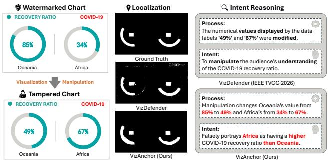  
Figure 1: An example of manipulation intent decoding with VizAnchor. Swapping the category labels of Africa and Oceania reverses the COVID-19 recovery comparison. Guided by semantic and spatial anchors, the multi-agent decoder grounds the manipulation, reconstructs both chart narratives, and infers its misleading intent.

2026). However, they are not designed to precisely localize malicious edits or explain their semantic consequences. VizDefender further combines tamper localization with multimodal reasoning (Song et al. 2026), but its analysis relies on the tampered chart and detected suspicious regions. Without an authentic visual reference, it remains dificult to determine how the manipulated chart deviates from its original message and why the resulting interpretation is misleading.

To address these limitations, as shown in Figure 1, we introduce VizAnchor, a two-stage framework for fine-grained visualization manipulation understanding. In Stage 1, VizAnchor embeds recoverable provenance metadata and a cropsynchronization cue into an original chart, producing a watermarked chart. Given a potentially cropped and manipulated chart, VizAnchor first decodes its position map and restores it to the canonical canvas, producing aligned tampered chart. Metadata is then recovered from the aligned chart and used to retrieve the original chart and untampered watermarked reference. The recovered original chart serves as the Semantic Anchor, while the localization module compares with aligned tampered chart to construct the Spatial Anchor.

In Stage 2, the dual anchors are organized into a four-panel visual prompt containing Semantic Anchor, tampered chart, a Tamper Map, and a Localized Comparison. The Misleader Grounding Agent predicts the tamper type, tampered components, and manipulation process from this prompt. The Chart Narrative Reconstruction Agent separately analyzes Semantic Anchor and tampered chart to reconstruct their respective chart narratives. Finally, the Intent Inferring Agent integrates the visual prompt and outputs of the preceding agents to infer the underlying misleading intent.

Our contributions are summarized as follows:

• We propose VizAnchor, a framework for visualization manipulation analysis that integrates provenance recovery, spatial alignment, tampering localization, and misleadingintent decoding.

• To address the lack of authentic references and precise spatial evidence in existing visualization manipulation analysis, we introduce a dual-anchor evidence construction mechanism that combines a provenance-verified Semantic Anchor with a pixel-level Spatial Anchor.

• We develop a multi-agent VLM reasoning framework that progressively grounds manipulation attributes, reconstructs original and tampered chart narratives, and infers misleading intent from structured visual evidence.

• We construct two datasets for localization training and manipulation-understanding evaluation. Extensive experiments demonstrate reliable watermark recovery, accurate crop and local-edit localization, and efective reasoning about manipulation processes and misleading intents.

## Related Work

Misleading Visualization. Prior work has examined how distorted scales, encodings, visual proportions, and rhetorical designs can bias chart interpretation (Pandey et al. 2015; Lo et al. 2022; Lisnic et al. 2023; Lisnic, Lex, and Kogan 2024). Recent benchmarks further evaluate whether MLLMs can detect or explain misleading cues in standalone charts (Chen et al. 2025; Mahbub et al. 2025). Most of these works focus on misleaders introduced during the initial chart-creation process, which may arise from either deliberate design choices or unintentional design flaws.

We regard tampered visualizations as a more specific subset of misleading visualizations. In this setting, an initially valid chart is intentionally modified after creation at the image leve to alter its original message. Therefore, the task requires not only recognizing that the resulting chart is misleading, but also identifying what was changed relative to the authentic chart and inferring the intent behind the modification. Existing misleading-chart benchmarks, such as Misviz (Tonglet et al. 2026) and Misleading ChartQA (Chen et al. 2025), provide complementary evaluation of general misleadingchart understanding, but do not directly target post-creation tampering intent. VizAnchor addresses this gap by reasoning from authentic and tampered visualization evidence to localize the edit, explain the manipulation process, and infer its misleading intent.

Visualization Protection. Existing visualization protection methods generally follow two directions. One line embeds chart metadata through robust watermarking to support provenance verification and source-data recovery (Fu et al. 2021; Zhang, Li, and Wang 2021; Ye et al. 2024). Another line embeds location-aware or semi-fragile signals to detect and localize post-creation tampering (Ye et al. 2026; Song et al. 2026). However, provenance recovery and tamper localization alone do not fully explain how an edit changes the chart message or what misleading intent it serves. VizAnchor bridges these objectives by combining dual-anchor evidence with VLM-based agents, enabling provenance retrieval, tamper localization, and fine-grained manipulation-intent analysis within a unified framework.

Image Tampering Detection. Image tampering detection is commonly divided into passive and active settings. Passive tampering detectors localize edits from forensic traces such as noise residuals, boundary artifacts, and cross-channel inconsistencies (Zhou et al. 2018; Wu, AbdAlmageed, and Natarajan 2019; Chen et al. 2021; Liu et al. 2022; Guillaro et al. 2023). These methods are powerful for generic image manipulation, but they are not tailored to visualization semantics, where small edits to axes, legends, labels, or marks may cause large interpretive shifts. Active methods instead embed signals before dissemination (Zhu et al. 2018; Tancik, Mildenhall, and Ng 2020; Zhang et al. 2019; Jia, Fang, and Zhang 2021; Kou et al. 2025), with EditGuard and OmniGuard extending this paradigm to proactive tamper localization (Zhang et al. 2024, 2025). Unlike generic image tampering detection, VizAnchor targets visualization manipulation understanding, localization is used as spatial evidence for reasoning about misleaders and misleading efects.

## Method

VizAnchor moves beyond tamper localization to understand how a chart is manipulated and why it becomes misleading. As shown in Figure 2, it consists of two stages: Dual-Anchor Evidence Construction and Decoding Manipulation Intent with VLMs.

## Semantic Anchor Construction

The Semantic Anchor is the recovered original chart $\hat { C } _ { o } ,$ which provides the semantic reference for comparison with the aligned tampered chart $\widetilde { C } _ { t }$ . To bind this reference to the distributed image, VizAnchor performs crop-robust metadata hiding and produces the watermarked chart $C _ { w }$

Metadata Embedding and Recovery. As illustrated in Figure 3, IWM is an INN-based reversible network built upon afine coupling transformations (Dinh, Sohl-Dickstein, and Bengio 2017). Following the attention flow-based message embedding design of RMSteg (Ye et al. 2025), IWM sequentially embeds metadata and position information into an original chart. Its forward and inverse paths are referred to as the IWM Encoder and IWM Decoder, respectively.

Given an original chart $C _ { o }$ and a K-bit metadata payload m, the payload is reshaped into a binary map and spatially tiled to introduce redundancy. The chart and tiled metadata map are separately tokenized using ViT-based encoders (Dosovitskiy et al. 2021). Unlike the chart features, the metadata features are additionally processed by an invertible token shufle, which disperses adjacent metadata tokens across diferent spatial positions and improves robustness against localized corruption. The two feature streams are then concatenated and mixed through ActNorm and an invertible $1 \times 1$ convolution before entering a sequence of Transflow Blocks. After the final block, the chart feature stream is projected back to image space to produce the intermediate watermarked chart $C _ { w } ^ { \prime }$

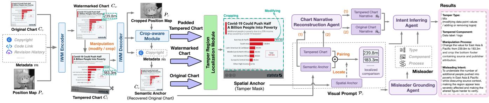  
Figure 2: Overview of the proposed VizAnchor framework.

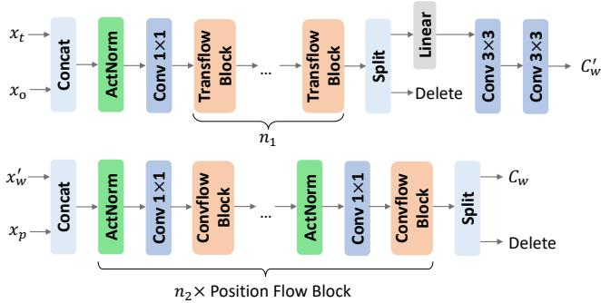  
Figure 3: Architecture of the Invertible Watermarking Module. The IWM Encoder embeds metadata into the chart through Transflow Blocks to produce the intermediate watermarked chart $C _ { w } ^ { \prime } ,$ and then embeds the position map through Position Flow Blocks to obtain $C _ { w } .$ . The IWM Decoder reverses these stages for position and metadata recovery.

Let $\boldsymbol { x } _ { t } ^ { i }$ and $x _ { o } ^ { i }$ denote the shufled tiled-metadata features and original-chart features entering the i-th Transflow Block, respectively. Its forward transformation is

$$
\begin{array} { r l } & { x _ { o } ^ { i + 1 } = x _ { o } ^ { i } + \phi _ { \mathrm { T } } ( x _ { t } ^ { i } ) , } \\ & { x _ { t } ^ { i + 1 } = x _ { t } ^ { i } \odot \exp \bigl ( \rho _ { \mathrm { T } } ( x _ { o } ^ { i + 1 } ) \bigr ) + \eta _ { \mathrm { T } } ( x _ { o } ^ { i + 1 } ) , } \end{array}\tag{1}
$$

where ϕ<sub>T</sub>, $\rho _ { \mathrm { T } } .$ , and $\eta _ { \mathrm { T } }$ are learnable transformations. The corresponding inverse transformation is

$$
\begin{array} { r l } & { \hat { x } _ { t } ^ { i } = \left[ \hat { x } _ { t } ^ { i + 1 } - \eta _ { \mathrm { T } } ( \hat { x } _ { o } ^ { i + 1 } ) \right] \oslash \exp \left( \rho _ { \mathrm { T } } ( \hat { x } _ { o } ^ { i + 1 } ) \right) , } \\ & { \hat { x } _ { o } ^ { i } = \hat { x } _ { o } ^ { i + 1 } - \phi _ { \mathrm { T } } ( \hat { x } _ { t } ^ { i } ) , } \end{array}\tag{2}
$$

where $\odot$ and $\oslash$ denote element-wise multiplication and division, respectively.

Once the aligned tampered chart $\widetilde { C } _ { t }$ is obtained by the position-recovery stage described below, it is directly fed into the metadata-decoding branch. The inverse Transflow Blocks recover the shufled metadata features, after which the inverse token shufle restores their original spatial ordering. The reordered features are decoded into the tiled metadata map, and the redundant predictions are aggregated to obtain the recovered payload $\hat { m } .$

Position Embedding and Recovery. The positionembedding stage embeds the full position map $P _ { o }$ into the intermediate watermarked chart $\dot { C _ { w } ^ { \prime } } .$ Their features are concatenated and processed by a sequence of Position Flow Blocks, producing the final watermarked chart $C _ { w }$ . Let $z _ { w } ^ { j }$ and $z _ { p } ^ { j }$ denote the features of $C _ { w } ^ { \prime }$ and $P _ { o }$ entering the j-th Position Flow Block, respectively.

Within each Position Flow Block, the Convflow Block follows the same forward and inverse afine-coupling formulations as the Transflow Block in Eqs. (1) and (2). However, its learnable transformations, ϕ<sub>P</sub>, ρ<sub>P</sub>, and η<sub>P</sub>, are parameterized independently from those used for metadata embedding. This separation enables metadata and positional information to be modeled by distinct transformations.

During recovery, given a potentially cropped and manipulated chart $C _ { t } ,$ a Nested U-Net first enhances its features, and the Crop-Aware Module produces the aligned tampered chart $\widetilde { C } _ { t }$ . The aligned chart is then passed to the metadata-decoding branch to recover mˆ .

Crop-Aware Module. Given a potentially cropped and manipulated chart $C _ { t } .$ , the IWM first recovers a cropped position map $\hat { P } _ { c } .$ . The Crop-Aware Module matches $\hat { P } _ { c }$ against the full position map $P _ { o }$ to estimate the crop location and scale. The estimated transformation is then used to restore $C _ { t }$ to the canonical canvas, producing the aligned tampered chart $\widetilde { C } _ { t }$ . Meanwhile, the missing region outside the estimated crop boundary is converted into a crop mask $\hat { M } _ { \mathrm { c r o p } }$ . The aligned chart is subsequently passed back to the inverse path of IWM for metadata recovery, while $\hat { M } _ { \mathrm { c r o p } }$ is retained as part of the spatial evidence.

Semantic-Anchor Retrieval. Before dissemination, each metadata payload m is registered with its corresponding original chart $C _ { o }$ and untampered watermarked chart $C _ { w }$ in a trusted repository. After crop-aware alignment, the recovered metadata mˆ is used as a lookup key to retrieve the registered pair $( \hat { C } _ { o } , \hat { C } _ { w } )$ . The recovered original chart $\hat { C } _ { o }$ serves as the Semantic Anchor, providing authentic chart content for downstream VLM reasoning. The untampered watermarked chart $\hat { C } _ { w }$ is paired with the aligned tampered chart $\widetilde { C } _ { t }$ for local-edit localization.

## Spatial Anchor Construction

The Spatial Anchor integrates two complementary localization cues: the crop mask $\hat { M } _ { \mathrm { c r o p } }$ produced by the Crop-Aware Module and the local-edit mask $\hat { M } _ { \mathrm { e d i t } }$ predicted by the Localization Module. Both masks are represented on the canonical canvas and combined by pixel-wise union:

$$
\hat { M } = \hat { M } _ { \mathrm { c r o p } } \vee \hat { M } _ { \mathrm { e d i t } } ,\tag{3}
$$

where ∨ denotes the pixel-wise logical OR operation. The resulting mask $\hat { M }$ serves as the Spatial Anchor, capturing both geometric cropping and fine-grained content modifications.

Crop Localization. As described by the Crop-Aware Module under Semantic Anchor Construction, the recovered position map $\hat { P } _ { c }$ is matched against the full position map $P _ { o }$ to estimate the crop region and align the observed chart to the canonical canvas. The estimated cropped-away region is represented as the binary crop mask $\hat { M } _ { \mathrm { c r o p } }$

Local-Edit Localization. After crop-aware alignment and reference retrieval, the Localization Module compares the untampered watermarked chart $\hat { C } _ { w }$ with the aligned tampered chart $\boldsymbol { \widetilde { C } } _ { t } .$ . Its input is a seven-channel tensor consisting of the two RGB charts and their binary diference map:

$$
\begin{array} { r l } & { D _ { \mathrm { b i n } } = \mathbb { I } \left( \underset { c \in \{ R , G , B \} } { \operatorname* { m a x } } \left| \hat { C } _ { w } ^ { ( c ) } - \widetilde { C } _ { t } ^ { ( c ) } \right| > \tau _ { \mathrm { d i f f } } \right) , } \\ & { \quad X = \mathrm { C o n c a t } \left( \hat { C } _ { w } , \widetilde { C } _ { t } , D _ { \mathrm { b i n } } \right) . } \end{array}\tag{4}
$$

The Localization Module adopts a U-Net-based architecture to jointly model the paired RGB content and changedpixel cues (Ronneberger, Fischer, and Brox 2015). The localedit mask is obtained as

$$
\hat { M } _ { \mathrm { e d i t } } = \mathbb { I } \left( F _ { \theta } ( X ) > \tau _ { \mathrm { m a s k } } \right) ,\tag{5}
$$

where $F _ { \theta } ( X )$ denotes the predicted local-edit probability map. The threshold values are reported in the appendix.

## Training Objectives

The IWM and Crop-Aware Module are jointly trained on the VisGuard dataset, while the Localization Module is trained separately on VAD-LocTrain, the localization-training subset of VizAnchor Dataset (VAD), which contains 1,500 automatically generated chart pairs with pixel-level local-edit masks. The joint objective for IWM and crop-aware recovery is

$$
\begin{array} { r } { \mathcal { L } _ { \mathrm { I W M } } = \lambda _ { \mathrm { s t e g } } \mathcal { L } _ { \mathrm { s t e g } } + \lambda _ { \mathrm { s s i m } } \mathcal { L } _ { \mathrm { s s i m } } + \lambda _ { \mathrm { m e t a } } \mathcal { L } _ { \mathrm { m e t a } } } \\ { + \lambda _ { \mathrm { l p i p s } } \mathcal { L } _ { \mathrm { l p i p s } } + \lambda _ { \mathrm { p f } } \mathcal { L } _ { \mathrm { p f } } , \qquad } \end{array}\tag{6}
$$

where $\mathcal { L } _ { \mathrm { s t e g } }$ is the L1 loss between the original and watermarked charts, $\mathcal { L } _ { \mathrm { s s i m } } = 1 - \mathrm { S S I M } , \mathcal { L } _ { \mathrm { m e t a } }$ is the BCEWith-Logits loss for metadata recovery, $\mathcal { L } _ { \mathrm { l p i p s } }$ is the VGG-based LPIPS perceptual loss, and ${ \mathcal { L } } _ { \mathrm { p f } }$ is the L1 loss between the predicted and target position maps. The Localization Module is optimized using

$$
\mathcal { L } _ { \mathrm { e d i t } } = \mathcal { L } _ { \mathrm { B C E } } + \mathcal { L } _ { \mathrm { D i c e } } .\tag{7}
$$

All modules are trained using a single NVIDIA RTX PRO 6000 GPU. The loss-balancing coeficients and implementation details are reported in the appendix.

## Decoding Manipulation Intent with VLMs

After constructing the Semantic and Spatial Anchors, VizAnchor decodes manipulation intent with VLMs through a structured multi-agent reasoning pipeline. The pipeline first converts the authentic chart $\hat { C } _ { o } ,$ the tampered chart $C _ { t } ,$ and the predicted tamper mask M<sup>ˆ</sup> into a four-panel visual prompt. It then uses three specialized VLM agents to progressively ground visual edits, reconstruct chart narratives, and infer the misleading intent.

Visual Prompt Construction. Given $\hat { C } _ { o } , C _ { t } .$ , and M<sup>ˆ</sup> , we construct a four-panel visual prompt $\mathcal { P } _ { v } = \langle \hat { C } _ { o } , C _ { t } , \hat { C } _ { m } , \hat { C } _ { l } \rangle$ The first two panels show the authentic and tampered charts. The third panel, denoted as the Tamper Map $\hat { C } _ { m }$ , overlays the Spatial Anchor on $\hat { C } _ { o }$ by drawing a thin contour around the tamper region. This highlights localized evidence while preserving the semantic context of the authentic chart. The fourth panel, denoted as the Localized Comparison ${ \hat { C } } _ { l } ,$ crops and enlarges the regions from $\hat { C } _ { o }$ and $C _ { t }$ according to M<sup>ˆ</sup> and places them side by side. This prompt provides both global chart context and fine-grained local comparison.

Misleader Grounding Agent. MGA grounds visual diferences into structured manipulation semantics. Given $\mathcal { P } _ { v } ,$ it predicts the tamper type, identifies the tampered components, and generates a manipulation-process description:

$$
A _ { \mathrm { M G A } } ( \mathcal { P } _ { v } )  \{ \hat { y } _ { \mathrm { t y p e } } , \hat { \mathcal { C } } _ { \mathrm { c o m p } } , \hat { y } _ { \mathrm { p r o c } } \} .
$$

Following VizDefender (Song et al. 2026), we adopt its taxonomy of nine chart-specific tamper types and seven tampered-component categories. The predicted type and components specify what misleader is used and which visual element is afected, while the process description explains how the tampered chart deviates from the authentic one.

Chart Narrative Reconstruction Agent. CNRA analyzes how the chart message changes after manipulation. It receives $\hat { C } _ { o }$ and $C _ { t }$ and reconstructs two chart narratives:

$$
A _ { \mathrm { C N R A } } ( \hat { C } _ { o } , C _ { t } )  \{ \hat { n } _ { o } , \hat { n } _ { t } \} ,
$$

where $\hat { n } _ { o }$ summarizes the authentic trends, comparisons, rankings, or conclusions, and $\hat { n } _ { t }$ summarizes the message conveyed by the tampered chart. This agent captures the semantic shift caused by the manipulation, complementing the localized evidence extracted by MGA.

Intent Inferring Agent. IIA performs the final reasoning step. It receives the visual prompt $\mathcal { P } _ { v } ,$ the grounded manipu lation outputs from MGA, and the reconstructed narratives from CNRA:

$$
A _ { \mathrm { I I A } } ( \mathcal { P } _ { v } , \hat { y } _ { \mathrm { t y p e } } , \hat { \mathcal { C } } _ { \mathrm { c o m p } } , \hat { y } _ { \mathrm { p r o c } } , \hat { n } _ { o } , \hat { n } _ { t } )  \hat { y } _ { \mathrm { i n t e n t } } .
$$

The output yˆ<sub>intent</sub> describes how the manipulation may mislead viewers or alter their interpretation of the chart. By integrating localized visual evidence, structured manipulation semantics, and original–tampered narrative contrast, IIA infers evidence-supported misleading strategies rather than unobservable subjective intent.

## Experiments

Our experiments follow the two-stage design of VizAnchor. We first evaluate the dual-anchor evidence construction, including watermarked-chart fidelity, metadata recovery, crop localization, and tamper localization. We then evaluate VLMbased manipulation understanding, including tamper type classification, tampered component recognition, manipulationprocess description, and misleading-intent inference. Finally, we conduct ablation studies to analyze the contribution of dual-anchor visual evidence and the proposed multi-agent reasoning design. Figure 4 presents comparisons of tamper localization and misleading-intent inference, complementing the quantitative evaluations reported below.

## Experimental Details

Datasets. We conduct experiments on VisGuard dataset (VGD) (Ye et al. 2026), VizDefender dataset (VDD) (Song et al. 2026), and our constructed datasets (VAD). Our VAD contains 1,500 automatically generated chart pairs with pixellevel masks for training the Localization Module and 120 manually created chart pairs for evaluating localization and manipulation understanding. Compared with VDD-Eval, VAD-Eval additionally contains crop-based manipulations.

Baselines. We compare VizAnchor with image-hiding, tamper-localization and manipulation-understanding methods, including HiNet, ISN, StampOne, StegaStamp, WAM, EditGuard, OmniGuard, VizDefender, and VisGuard (Jing et al. 2021; Lu et al. 2021; Shadmand et al. 2024; Tancik, Mildenhall, and Ng 2020; Sander et al. 2025; Zhang et al. 2024, 2025; Song et al. 2026; Ye et al. 2026).

Metrics. We evaluate watermarked chart fidelity using PSNR, SSIM (Wang et al. 2004), and LPIPS (Zhang et al. 2018), and assess metadata recovery reliability via bit accuracy (BitAcc). For crop and local-edit localization, we report Intersection over Union (IoU), Precision, Recall, and F1. Tamper-type classification and tampered-component recognition are evaluated using Accuracy, Exact Match Accuracy requiring the predicted component set to perfectly match the reference, and Macro-F1. For free-form manipulation-process and misleading-intent descriptions, we compute Cos-FA, the cosine similarity between text-embedding-3-large embeddings of the prediction and reference. To comprehensively assess factual correctness and consistency with visual evidence, we additionally report AI-FA, an LLM-as-a-judge metric using Gemini-3.1-Pro-Preview (Liu et al. 2023; Zheng et al. 2023) to score outputs from 0 to 5, which are normalized to 0 to 1. The complete evaluation prompt and scoring rubric are provided in the appendix.

<table><tr><td>Method</td><td>PSNR↑</td><td>SSIM↑</td><td>LPIPS↓</td></tr><tr><td>HiNet (81)</td><td>29.95</td><td>0.8306</td><td>0.3692</td></tr><tr><td>ISN (81)</td><td>34.38</td><td>0.9478</td><td>0.2340</td></tr><tr><td>StampOne (81)</td><td>29.44</td><td>0.9107</td><td>0.1913</td></tr><tr><td>StegaStamp (81)</td><td>10.32</td><td>0.5733</td><td>0.6852</td></tr><tr><td>WAM (32)</td><td>31.55</td><td>0.9440</td><td>0.1513</td></tr><tr><td>EditGuard (64)</td><td>33.00</td><td>0.8752</td><td>0.2416</td></tr><tr><td>OmniGuard (100)</td><td>41.64</td><td>0.9839</td><td>0.0443</td></tr><tr><td>VizDefender (64)</td><td>34.46</td><td>0.8840</td><td>0.2207</td></tr><tr><td>VisGuard (81)</td><td>41.13</td><td>0.9734</td><td>0.0610</td></tr><tr><td>VizAnchor (81)</td><td>43.28</td><td>0.9809</td><td>0.0664</td></tr></table>

Table 1: Image quality on VGD. The number in parentheses denotes the payload length in bits. Bold and underlined values indicate the best and second-best results, respectively.
<table><tr><td rowspan="2">Method</td><td colspan="5">Modified-Pixel Ratio (%)</td></tr><tr><td>0</td><td>15</td><td>30</td><td>45</td><td>60</td></tr><tr><td>HiNet (81)</td><td>98.99</td><td>97.87</td><td>94.68</td><td>87.29</td><td>74.99</td></tr><tr><td>ISN (81)</td><td>99.08</td><td>98.20</td><td>96.73</td><td>94.49</td><td>91.22</td></tr><tr><td>StampOne (81)</td><td>91.90</td><td>91.07</td><td>89.95</td><td>88.17</td><td>85.21</td></tr><tr><td>StegaŠtamp (81)</td><td>98.45</td><td>98.07</td><td>97.56</td><td>96.61</td><td>94.72</td></tr><tr><td>WAM (32)</td><td>92.36</td><td>90.87</td><td>88.01</td><td>83.50</td><td>75.98</td></tr><tr><td>EditGuard (64)</td><td>83.11</td><td>83.09</td><td>81.26</td><td>78.07</td><td>72.65</td></tr><tr><td>OmniGuard (100)</td><td>99.68</td><td>95.85</td><td>84.65</td><td>72.55</td><td>62.82</td></tr><tr><td>VisGuard (81)</td><td>99.93</td><td>99.90</td><td>99.83</td><td>98.83</td><td>93.28</td></tr><tr><td>VizAnchor (81)</td><td>99.97</td><td>99.96</td><td>99.93</td><td>99.87</td><td>99.43</td></tr></table>

Table 2: Metadata BitAcc (%) under diferent modified-pixel ratios on VGD.

## Semantic Anchor Construction

We evaluate whether the underlying IWM encoder and cropaware decoder preserve chart appearance and recover a sufficiently reliable retrieval key under clean, tampered and cropped conditions.

Watermarked-Chart Fidelity. We evaluate watermarkedchart fidelity on VGD. As shown in Table 1, VizAnchor achieves the highest PSNR of 43.28, while its SSIM and LPIPS remain competitive with the best-performing baselines. This indicates that jointly embedding metadata and position information introduces limited visual distortion.

Metadata Recovery. We report clean-image BitAcc and robustness under two forms of corruption. For local tampering, the manipulated area occupies 15%, 30%, 45%, or 60% of the chart. For cropping, the crop ratio ranges from 10% to 50%. Table 2 and Table 3 show that VizAnchor consistently achieves the highest metadata recovery accuracy under both local modification and cropping. BitAcc remains 99.43% when 60% of the pixels are modified and 99.36% when 50% of the chart area is cropped, demonstrating reliable Semantic Anchor retrieval under severe content loss.

## Spatial Anchor Construction

We evaluate whether the Spatial Anchor accurately localizes both crop manipulations and local edits, providing reliable

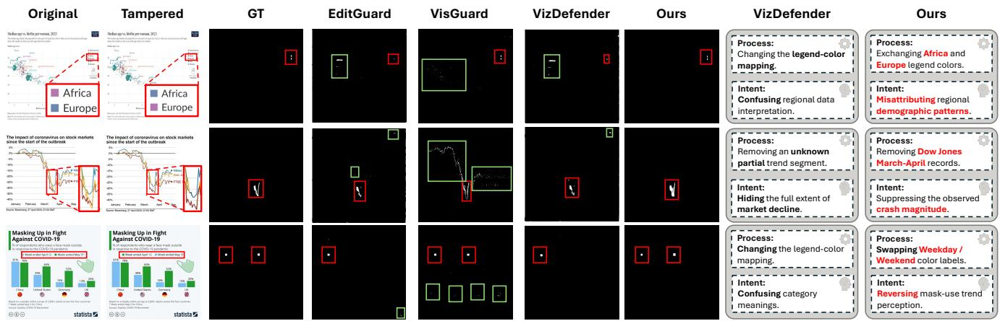  
Figure 4: Qualitative comparison of tamper localization and misleading-intent inference. Red boxes indicate correctly localized tampered regions, while green boxes highlight noise regions falsely identified as tampering.

<table><tr><td rowspan="2">Method</td><td colspan="5">Cropped Area Ratio (%)</td></tr><tr><td>10</td><td>20</td><td>30</td><td>40</td><td>50</td></tr><tr><td>WAM (32)</td><td>87.47</td><td>87.36</td><td>87.14</td><td>86.62</td><td>85.49</td></tr><tr><td>VisGuard (81)</td><td>97.77</td><td>98.65</td><td>98.97</td><td>98.73</td><td>97.63</td></tr><tr><td>VizAnchor (81)</td><td>99.55</td><td>99.61</td><td>99.59</td><td>99.55</td><td>99.36</td></tr></table>

Table 3: Metadata BitAcc (%) under diferent cropped-area ratios on VGD.

<table><tr><td rowspan="2">Method</td><td colspan="5">Cropped Area Ratio (%)</td></tr><tr><td>10</td><td>20</td><td>30</td><td>40</td><td>50</td></tr><tr><td>VisGuard</td><td>0.9789</td><td>0.9815</td><td>0.9824</td><td>0.9814</td><td>0.9684</td></tr><tr><td>VizAnchor</td><td>0.9866</td><td>0.9875</td><td>0.9860</td><td>0.9837</td><td>0.9790</td></tr></table>

Table 4: Crop localization IoU on VGD.

## spatial evidence for downstream manipulation reasoning.

Crop Localization. We evaluate the Crop-Aware Module on VGD under diferent cropped-area ratios and the VAD-LocEval crop subset. Other tamper-localization baselines are not included because they are not designed to handle cropbased manipulations and therefore are not directly applicable to this evaluation. Table 4 and Table 5 show that VizAnchor consistently outperforms VisGuard, achieving higher IoU across all crop ratios and an F1 of 0.9893 on the VAD-LocEval crop subset, confirming the efectiveness of the position-map-based Crop-Aware Module.

Local-Edit Localization. We evaluate the Localization Module on VDD-LocEval and the local-edit subset of VAD-LocEval. OmniGuard is not included as a localization baseline because its public release does not provide the tamper localization weights, while only the watermark recovery component is available. Table 6 shows that VizAnchor substantially outperforms all baselines, improving overall IoU to 0.7418 and F1 to 0.8375.

<table><tr><td>Method</td><td>IoU↑</td><td>Prec. ↑</td><td>Rec. ↑</td><td>F1↑</td></tr><tr><td>VisGuard</td><td>0.9710</td><td>0.9982</td><td>0.9726</td><td>0.9851</td></tr><tr><td>VizAnchor</td><td>0.9789</td><td>0.9981</td><td>0.9808</td><td>0.9893</td></tr></table>

Table 5: Crop localization on crop subset of VAD-LocEval.
<table><tr><td>Method</td><td>IoU ↑</td><td>Prec. ↑</td><td>Recall ↑</td><td>F1↑</td></tr><tr><td>EditGuard</td><td>0.5062</td><td>0.5969</td><td>0.7399</td><td>0.6289</td></tr><tr><td>VizDefender</td><td>0.5324</td><td>0.6178</td><td>0.7584</td><td>0.6556</td></tr><tr><td>VisGuard</td><td>0.6067</td><td>0.7668</td><td>0.7622</td><td>0.7152</td></tr><tr><td>VizAnchor</td><td>0.7418</td><td>0.8011</td><td>0.9105</td><td>0.8375</td></tr></table>

Table 6: Overall local-edit localization results across VDD-LocEval and local-edit subset of VAD-LocEval.

## Decoding Manipulation Intent with VLMs

We evaluate VLM-based manipulation understanding on VDD-ReasonEval and VAD-ReasonEval across four tasks: tamper-type classification, tampered-component recognition, manipulation-process generation, and misleading-intent inference. All agents share the same gemini-3.5-flash backbone accessed through the Google Gemini API.

Tamper Type Classification. We formulate tamper type prediction as closed-set single-label classification over the predefined taxonomy. As shown in Figure 5, VizAnchor achieves an Accuracy of 0.91 and a Macro-F1 of 0.90, outperforming VizDefender by 0.11 and 0.09, respectively. The comparable Accuracy and Macro-F1 indicate consistent recognition across diferent manipulation categories.

Tampered Component Recognition. We formulate tampered-component recognition as multi-label classification because one manipulation may afect multiple chart elements. Figure 5 shows that VizAnchor improves Exact Match Accuracy from 0.34 to 0.63 and Macro-F1 from 0.52 to 0.74. These substantial gains indicate that the dual-anchor evidence helps identify both the manipulated regions and their corresponding

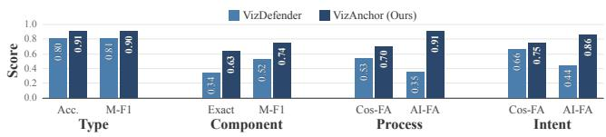  
Figure 5: Sample-weighted tamper-type, component recognition, manipulation-process and misleading-intent results across VAD-ReasonEval and VDD-ReasonEval. Exact denotes exact-match accuracy, and M-F1 denotes Macro-F1.

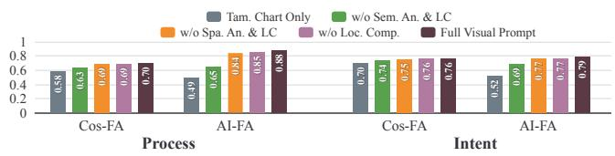  
Figure 6: Overall visual-evidence ablation results across VAD-ReasonEval and VDD-ReasonEval.

chart components.

Manipulation Process and Misleading Intent. We evaluate the manipulation processes grounded by MGA and misleading intents inferred by IIA. As shown in Figure 5, VizAnchor outperforms VizDefender on both tasks. For process and intent, VizAnchor achieves Cos-FA scores of 0.70 and 0.75 (vs. 0.53 and 0.66) and AI-FA scores of 0.91 and 0.86 (vs. 0.35 and 0.44). These improvements, particularly in process evaluation, confirm that our dual-anchor prompt enables precise spatial grounding of concrete chart edits, which drives accurate inference of the misleading intent.

## Ablation Study

Visual Evidence. We conduct a single-call ablation using gemini-3.5-flash, comparing the complete visual prompt with variants lacking the Spatial Anchor, Semantic Anchor, or Localized Comparison (LC), plus a tampered-chart-only baseline. As shown in Figure 6, the Semantic Anchor provides the largest gain, raising tamper-type Macro-F1 from 0.473 to 0.778. The Spatial Anchor focuses reasoning on manipulated regions, while LC highlights fine-grained before–after diferences. Together, they provide complementary semantic, spatial, and comparative evidence. This controlled single-call setting is used only for comparisons among the visual-input configurations and is not directly comparable with our ful model. Detailed results are provided in the appendix.

Multi-Agent Reasoning. We evaluate the contribution of each agent to the final intent inference. The full pipeline achieves the best performance with an Intent Cos. FA of 0.753 and an AI FA of 0.856. Removing MGA or CNRA degrades performance (dropping to 0.734/0.806 and 0.743/0.832 for Cos./AI FA, respectively). Relying solely on the Intent Inferring Agent (IIA Only) yields the lowest scores (0.721 and 0.826), confirming that prior grounding and narrative reconstruction are essential for accurate intent reasoning. Detailed per-dataset metrics are provided in the appendix.

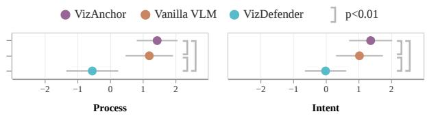  
Figure 7: The results of the user study. Each circle represents the mean score, with error bars indicating the standard deviation. The statistical significance was assessed using the Wilcoxon signed-rank test.

## User Study

To evaluate human-perceived explanation quality, we conducted a blind user study where 30 participants rated 10 anonymized manipulation examples on a five-point Likert scale $( \mu _ { \mathrm { a g e } } = 2 4 . 0 7$ years, σ = 4.28; 16 males, 13 females, and 1 who preferred not to disclose their gender). We compared VizAnchor against VizDefender and Dual-Anchor with a vanilla VLM. As shown in Figure 7, VizAnchor achieved the highest average ratings across both dimensions, scoring 1.437 for manipulation process and 1.370 for misleading intent, efectively outperforming VizDefender (-0.547 and -0.010) and the vanilla VLM (1.197 and 1.027). These results validate that combining dual-anchor evidence with multi-agent reasoning yields significantly more accurate and insightful analyses of tampered visualizations.

## Discussion

While VizAnchor demonstrates the potential of combining proactive watermarking with multi-agent reasoning, it has two primary limitations. First, its reliance on pre-embedded metadata restricts its applicability to charts protected at the time of creation. Consequently, it cannot be directly applied to legacy or third-party visualizations already circulating online without such signals. Second, our anchors are designed to localize partial manipulations, such as cropping or localized pixel edits. With the rapid advancement of AIGC technologies, attackers can now easily regenerate an entire chart from scratch to alter its narrative. Such holistic regeneration destroys embedded signals and bypasses local forensic traces, rendering the anchors inefective. These challenges reflect a broader shift in deceptive visualizations—from image-level localized editing to full semantic synthesis. Future work should explore integrating proactive protection with passive forensic cues, moving beyond localized evidence to verify the global semantic consistency of visualizations.

## Conclusion

We present VizAnchor, a dual-anchor framework for visualization manipulation understanding beyond conventional tamper localization. VizAnchor constructs a Semantic Anchor from provenance-verified original charts and a Spatial Anchor from localized tamper evidence, enabling VLMs to reason over authentic and manipulated visual messages. Building upon these anchors, our multi-agent framework grounds manipulation attributes, reconstructs visualization narratives, and infers misleading intents. Extensive experiments demonstrate that VizAnchor achieves reliable metadata recovery, accurate tamper localization, and evidence-grounded explanations of manipulation tactics and misleading efects. This work highlights the potential of combining trustworthy evidence construction with multimodal reasoning for building reliable visualization communication.

## References

Chen, X.; Dong, C.; Ji, J.; Cao, J.; and Li, X. 2021. Image Manipulation Detection by Multi-View Multi-Scale Supervision. In Proceedings of the IEEE/CVF International Conference on Computer Vision (ICCV), 14185–14193.

Chen, Z.; Song, S.; Shum, K.; Lin, Y.; Sheng, R.; Wang, W.; and Qu, H. 2025. Unmasking Deceptive Visuals: Benchmarking Multimodal Large Language Models on Misleading Chart Question Answering. In Christodoulopoulos, C.; Chakraborty, T.; Rose, C.; and Peng, V., eds., Proceedings of the 2025 Conference on Empirical Methods in Natural Language Processing, 13756–13789. Suzhou, China: Association for Computational Linguistics. ISBN 979-8-89176-332-6.

Dinh, L.; Sohl-Dickstein, J.; and Bengio, S. 2017. Density estimation using Real NVP. In International Conference on Learning Representations.

Dosovitskiy, A.; Beyer, L.; Kolesnikov, A.; Weissenborn, D.; Zhai, X.; Unterthiner, T.; Dehghani, M.; Minderer, M.; Heigold, G.; Gelly, S.; Uszkoreit, J.; and Houlsby, N. 2021. An Image Is Worth 16x16 Words: Transformers for Image Recognition at Scale. In International Conference on Learning Representations.

Fu, J.; Zhu, B.; Cui, W.; Ge, S.; Wang, Y.; Zhang, H.; Huang, H.; Tang, Y.; Zhang, D.; and Ma, X. 2021. Chartem: Reviving Chart Images with Data Embedding. IEEE Transactions on Visualization and Computer Graphics, 27(2): 337–346.

Guillaro, F.; Cozzolino, D.; Sud, A.; Dufour, N.; and Verdoliva, L. 2023. TruFor: Leveraging All-Round Clues for Trustworthy Image Forgery Detection and Localization. In Proceedings of the IEEE/CVF Conference on Computer Vision and Pattern Recognition (CVPR), 20606–20615.

Jia, Z.; Fang, H.; and Zhang, W. 2021. MBRS: Enhancing Robustness of DNN-based Watermarking by Mini-Batch of Real and Simulated JPEG Compression. In Proceedings of the 29th ACM International Conference on Multimedia, MM ’21, 41–49. New York, NY, USA: Association for Computing Machinery. ISBN 9781450386517.

Jing, J.; Deng, X.; Xu, M.; Wang, J.; and Guan, Z. 2021. HiNet: Deep Image Hiding by Invertible Network. In Proceedings of the IEEE/CVF International Conference on Computer Vision (ICCV), 4733–4742.

Kou, F.; Yao, Y.; Yao, S.; Wang, J.; Shi, L.; Li, Y.; and Kang, X. 2025. IWRN: A Robust Blind Watermarking Method for Artwork Image Copyright Protection Against Noise Attack. In Proceedings of the AAAI Conference on Artificial Intelligence, volume 39, 370–378.

Lisnic, M.; Lex, A.; and Kogan, M. 2024. "Yeah, this graph doesn’t show that": Analysis of Online Engagement with Misleading Data Visualizations. In Proceedings of the 2024

CHI Conference on Human Factors in Computing Systems, CHI ’24. New York, NY, USA: Association for Computing Machinery. ISBN 9798400703300.

Lisnic, M.; Polychronis, C.; Lex, A.; and Kogan, M. 2023. Misleading Beyond Visual Tricks: How People Actually Lie with Charts. In Proceedings of the 2023 CHI Conference on Human Factors in Computing Systems, CHI ’23. New York, NY, USA: Association for Computing Machinery. ISBN 9781450394215.

Liu, X.; Liu, Y.; Chen, J.; and Liu, X. 2022. PSCC-Net: Progressive Spatio-Channel Correlation Network for Image Manipulation Detection and Localization. IEEE Transactions on Circuits and Systemsfor Video Technology, 32(11): 7505– 7517.

Liu, Y.; Iter, D.; Xu, Y.; Wang, S.; Xu, R.; and Zhu, C. 2023. G-Eval: NLG Evaluation using Gpt-4 with Better Human Alignment. In Bouamor, H.; Pino, J.; and Bali, K., eds., Proceedings of the 2023 Conference on Empirical Methods in Natural Language Processing, 2511–2522. Singapore: Association for Computational Linguistics.

Lo, L. Y.-H.; Gupta, A.; Shigyo, K.; Wu, A.; Bertini, E.; and Qu, H. 2022. Misinformed by Visualization: What Do We Learn From Misinformative Visualizations? Computer Graphics Forum, 41(3): 515–525.

Lu, S.-P.; Wang, R.; Zhong, T.; and Rosin, P. L. 2021. Large-Capacity Image Steganography Based on Invertible Neural Networks. In Proceedings ofthe IEEE/CVF Conference on Computer Vision and Pattern Recognition (CVPR), 10816– 10825.

Mahbub, R.; Islam, M. S.; Laskar, M. T. R.; Rahman, M.; Nayeem, M. T.; and Hoque, E. 2025. The Perils of Chart Deception: How Misleading Visualizations Afect Vision-Language Models. In 2025 IEEE Visualization and Visual Analytics (VIS), 6–10.

Pandey, A. V.; Rall, K.; Satterthwaite, M. L.; Nov, O.; and Bertini, E. 2015. How Deceptive are Deceptive Visualizations? An Empirical Analysis of Common Distortion Techniques. In Proceedings of the 33rd Annual ACM Conference on Human Factors in Computing Systems, CHI ’15, 1469–1478. New York, NY, USA: Association for Computing Machinery. ISBN 9781450331456.

Ronneberger, O.; Fischer, P.; and Brox, T. 2015. U-Net: Convolutional Networks for Biomedical Image Segmentation. In Navab, N.; Hornegger, J.; Wells, W. M.; and Frangi, A. F., eds., Medical Image Computing and Computer-Assisted Intervention – MICCAI 2015, 234–241. Cham: Springer International Publishing. ISBN 978-3-319-24574-4.

Sander, T.; Fernandez, P.; Durmus, A. O.; Furon, T.; and Douze, M. 2025. Watermark Anything with Localized Messages. In International Conference on Learning Representations.

Shadmand, F.; Medvedev, I.; Schirmer, L.; Marcos, J. a.; and Gonçalves, N. 2024. StampOne: Addressing Frequency Balance in Printer-proof Steganography. In Proceedings of the IEEE/CVF Conference on Computer Vision and Pattern Recognition (CVPR) Workshops, 4367–4376.

Song, S.; Zhang, Y.; Chen, Z.; Qu, H.; Wang, C.; and Li, C. 2026. VizDefender: Unmasking Visualization Tampering Through Proactive Localization and Intent Inference. IEEE Transactions on Visualization and Computer Graphics, 32(6): 4720–4730.

Tancik, M.; Mildenhall, B.; and Ng, R. 2020. StegaStamp: Invisible Hyperlinks in Physical Photographs. In Proceedings ofthe IEEE/CVF Conference on Computer Vision and Pattern Recognition, 2117–2126.

Tonglet, J.; Zimny, J.; Tuytelaars, T.; and Gurevych, I. 2026. Is this chart lying to me? Automating the detection of misleading visualizations. In Liakata, M.; Moreira, V. P.; Zhang, J.; and Jurgens, D., eds., Proceedings of the 64th Annual Meeting of the Association for Computational Linguistics (Volume 1: Long Papers), 8823–8844. San Diego, California, United States: Association for Computational Linguistics. ISBN 979-8-89176-390-6.

Wang, Z.; Bovik, A.; Sheikh, H.; and Simoncelli, E. 2004. Image quality assessment: from error visibility to structural similarity. IEEE Transactions on Image Processing, 13(4): 600–612.

Wu, Y.; AbdAlmageed, W.; and Natarajan, P. 2019. ManTra-Net: Manipulation Tracing Network for Detection and Localization of Image Forgeries With Anomalous Features. In Proceedings ofthe IEEE/CVF Conference on Computer Vision and Pattern Recognition (CVPR).

Ye, H.; Chen, J.; Zhang, S.; Zhang, Y.; Wang, C.; and Li, C. 2026. VisGuard: Securing Visualization Dissemination through Tamper-Resistant Data Retrieval. IEEE Transactions on Visualization and Computer Graphics, 32(1): 1295–1305.

Ye, H.; Li, C.; Li, Y.; and Wang, C. 2024. InvVis: Large-Scale Data Embedding for Invertible Visualization. IEEE Transactions on Visualization and Computer Graphics, 30(1): 1139–1149.

Ye, H.; Zhang, S.; Jiang, S.; Liao, J.; Gu, S.; Zheng, D.; Wang, C.; and Li, C. 2025. Robust Message Embedding via Attention Flow-Based Steganography. In Proceedings of the IEEE/CVF Conference on Computer Vision and Pattern Recognition (CVPR), 12840–12849.

Zhang, K. A.; Xu, L.; Cuesta-Infante, A.; and Veeramachaneni, K. 2019. Robust Invisible Video Watermarking with Attention. CoRR, abs/1909.01285.

Zhang, P.; Li, C.; and Wang, C. 2021. VisCode: Embedding Information in Visualization Images using Encoder-Decoder Network. IEEE Transactions on Visualization and Computer Graphics, 27(2): 326–336.

Zhang, R.; Isola, P.; Efros, A. A.; Shechtman, E.; and Wang, O. 2018. The Unreasonable Efectiveness of Deep Features as a Perceptual Metric. In Proceedings ofthe IEEE Conference on Computer Vision and Pattern Recognition (CVPR).

Zhang, X.; Li, R.; Yu, J.; Xu, Y.; Li, W.; and Zhang, J. 2024. EditGuard: Versatile Image Watermarking for Tamper Localization and Copyright Protection. In Proceedings of the IEEE/CVF Conference on Computer Vision and Pattern Recognition (CVPR), 11964–11974.

Zhang, X.; Tang, Z.; Xu, Z.; Li, R.; Xu, Y.; Chen, B.; Gao, F.; and Zhang, J. 2025. OmniGuard: Hybrid Manipulation Localization via Augmented Versatile Deep Image Watermarking. In Proceedings of the IEEE/CVF Conference on Computer Vision and Pattern Recognition (CVPR), 3008–3018.

Zheng, L.; Chiang, W.-L.; Sheng, Y.; Zhuang, S.; Wu, Z.; Zhuang, Y.; Lin, Z.; Li, Z.; Li, D.; Xing, E. P.; Zhang, H.; Gonzalez, J. E.; and Stoica, I. 2023. Judging LLM-as-a-Judge with MT-Bench and Chatbot Arena. In Advances in Neural Information Processing Systems, volume 36, 46595–46623.

Zhou, P.; Han, X.; Morariu, V. I.; and Davis, L. S. 2018. Learning Rich Features for Image Manipulation Detection. In Proceedings ofthe IEEE Conference on Computer Vision and Pattern Recognition (CVPR).

Zhu, J.; Kaplan, R.; Johnson, J.; and Fei-Fei, L. 2018. HiD-DeN: Hiding Data with Deep Networks. In Proceedings of the European Conference on Computer Vision (ECCV).

# Appendices and Supplemental Materials

A: Dataset Details and Taxonomy   
B: Implementation and Inference Details   
C: Prompts and Output Schemas   
D: Additional Tampering-Localization Results   
E: Additional VLM Reasoning Results   
F: Error Analysis   
G: User Study Details   
H: Disclosure of AI-Assisted Editing

## A Dataset Details

## A.1 IWM Training and Test Split

The IWM experiments use the VisGuard dataset, which contains 17,957 chart images in total. We divide it into 14,964 training images and 2,993 held-out test images using a deterministic 5:1 random split with seed 20260710.

## A.2 Robustness-Test Sample Construction

We construct the modified-pixel and crop robustness samples on the fly from all 2,993 held-out IWM test images. Each clean RGB chart is first watermarked at the model’s internal input resolution, and the resulting watermark residual is mapped back to the chart’s original spatial resolution. The attack is then applied to this original-resolution watermarked chart. The source-image order, payload, donor selection, and attack geometry are generated deterministically with seed 20260713. The source image and attack geometry for a given image–ratio pair are therefore identical across the compared methods. Modified-pixel and crop corruptions are evaluated separately and are never combined in these tests.

For the modified-pixel test, let $\dot { M } \in \{ 0 , 1 \} ^ { H \times W }$ be an irregular binary mask. We define the modified-pixel ratio as

$$
r _ { \mathrm { m o d } } = \frac { 1 } { H W } \sum _ { u = 1 } ^ { H } \sum _ { v = 1 } ^ { W } M _ { u v } .\tag{8}
$$

For each image, we evaluate $r _ { \mathrm { m o d } } \in \{ 0 . 1 5 , 0 . 3 0 , 0 . 4 5 , 0 . 6 0 \}$ . To generate $M ,$ we sample a seeded $3 2 \times 3 2$ random field, bicubically upsample and spatially smooth it, and select the roun $\lfloor ( r _ { \mathrm { m o d } } H W )$ pixels with the largest field values. This produces a spatially coherent irregular region with the requested area up to integer-pixel rounding. A deterministically selected, diferent test chart is resized to $\breve { H } \times W$ and used as the donor image $\bar { I _ { d } } .$ Given the watermarked chart $I _ { w } ,$ the attacked sample is

$$
I _ { \mathrm { m o d } } = ( 1 - M ) \odot I _ { w } + M \odot I _ { d } .\tag{9}
$$

Thus, only pixels selected by M are replaced; no crop or additional corruption is applied. This yields 2,993 samples at each ratio, or 11,972 modified-pixel test instances per evaluated method.

For the crop test, the reported crop ratio denotes the fraction of the original image area that is removed, rather than the retained fraction:

$$
r _ { \mathrm { c r o p } } = 1 - { \frac { H _ { c } W _ { c } } { H W } } .\tag{10}
$$

For a target $r _ { \mathrm { { c r o p } } }$ , we set $s = \sqrt { 1 - r _ { \mathrm { c r o p } } } , H _ { c } = \mathrm { r o u n d } ( s H )$ , and $W _ { c } = \mathrm { r o u n d } ( s W )$ . A seeded top-left coordinate is sampled uniformly from all valid placements, and the corresponding $H _ { c } \times W _ { c }$ rectangular region is retained. The cropped observation is extracted directly from the original-resolution watermarked chart without resizing or padding during sample construction. The retained rectangle is also stored as the ground-truth crop box; any canonical-canvas restoration is performed later by the evaluated crop-recovery pipeline. We evaluate $\bar { r } _ { \mathrm { c r o p } } \in \{ 0 . 1 0 , 0 . 2 0 , 0 . 3 0 , 0 . 4 0 , 0 . 5 0 \}$ and record the realized ratio after integer rounding. This yields 2,993 samples at each ratio, or 14,965 crop test instances per evaluated method.

## A.3 Localization Data Construction and Evaluation Splits

VAD-LocTrain contains 1,500 automatically generated local-tampering pairs. For each sample, we select a source chart and deterministically sample one chart-aware edit using seed 20260617 plus the sample index. Three edit families are used. Text edits detect text-like connected components and replace the selected local content with a diferent numeric or textual token. Bar edits detect rectangular chart marks using contour rectangularity and line cues, and shorten or extend the selected bar. Scatter edits detect colored connected components and move a selected point to a diferent location. If the requested primitive is not detected in a chart, the generator falls back to an available edit family. The final collection contains 685 text edits, 517 bar edits, and 298 scatter-point edits.

Each generation operation saves the clean source chart, the tampered chart, a binary pixel mask covering the modified source and/or target region, a visualization overlay, and a JSONL provenance record containing the source path, operation, coordinates, and random seed. The masks are generated directly from the executed edit rather than predicted by a model. All 1,500 requested samples are completed, with no failed or unreadable outputs. The localization model uses the clean chart, its generated tampered counterpart, and their binary RGB diference as its seven-channel input.

The 1,500 generated pairs are shufled and divided at the generated sample level into 1,200 training pairs and 300 validation pairs using seed 20260617. The validation split is used only for checkpoint selection and hyperparameter monitoring; no results on this split are reported as final test performance. Final localization results are evaluated separately on the manually constructed VAD-LocEval and the independent VDD-LocEval.

VAD-Eval contains 120 manually created chart pairs. All 120 are used for manipulation-understanding evaluation as VAD-ReasonEval. For localization, VAD-LocEval contains 20 crop samples for crop localization and 100 non-crop local-edit samples for tamper-region localization. VAD-LocEval is not used to update the localization-network parameters.

VDD-LocEval contains 1,000 samples used for local-edit localization evaluation. VDD-ReasonEval contains 100 samples used for manipulation-understanding evaluation.

## A.4 Reasoning-Annotation Protocol

The reference annotations used for manipulation-understanding evaluation were produced by two experts in data visualization. The annotations cover the tamper type, tampered components, concrete manipulation process, and misleading intent for each evaluation sample. After the initial annotation, the complete set of reference answers underwent a second verification pass to check label consistency and the factual correspondence between each answer and its original–tampered chart pair. The verified annotations are used only as evaluation references and are never provided to the reasoning agents during inference.

We define nine chart-specific tamper types: Modifying Data Point Values (MDV), Adding or Removing Data Points (ARD), Modifying Coordinate Values (MCV), Deceptive Auxiliary Annotations (DAA), Modifying Legend (ML), Hiding Labels (HL), Adding or Removing Logos (ARL), Data–Visual Disproportion (DVD), and Modifying Colormap (MC). We further define seven tampered-component categories: Data Label, Region, Axis, Annotation, Legend, Logo, and Colormap. For evaluation, mix denotes samples containing multiple tampering mechanisms.

## B Implementation Details

## B.1 Invertible Watermarking Module

The metadata capacity is $K = 8 1$ bits and is represented as an $h _ { m } \times w _ { m } = 9 \times 9$ binary map. We use tiling factors $r _ { h } = r _ { w } = 3 ,$ resulting in a $2 7 \times 2 7$ redundant module map. The canonical chart resolution is $H \times \dot { W } = \dot { 5 } 1 2 \times 5 1 2$ . The IWM uses patch size $p = 1 6$ , token dimension $d = 7 6 8$ , latent dimension $d _ { z } = 6 4$ , and $L = 4$ invertible transformation blocks. During crop-aware training, the crop side length is sampled from [102, 512], the transition strength is set to 0.01, and mask\_texture\_type is randomly sampled from 0, 1, and 2, corresponding to no mask, random mask-texture occlusion, and the combined masking/padding case, respectively.

## B.2 IWM Training Configuration

The IWM and Crop-Aware Module are jointly optimized using the following weighted objective:

$$
\begin{array} { r l } & { \mathcal { L } _ { \mathrm { I W M } } = 3 0 . 0 \mathcal { L } _ { \mathrm { s t e g } } + 0 . 2 \mathcal { L } _ { \mathrm { s s i m } } + 2 5 . 0 \mathcal { L } _ { \mathrm { m e t a } } } \\ & { \qquad + 2 . 0 \mathcal { L } _ { \mathrm { l p i p s } } + 1 0 . 0 \mathcal { L } _ { \mathrm { p f } } . } \end{array}\tag{11}
$$

Here, $\mathcal { L } _ { \mathrm { s t e g } }$ is the $\ell _ { 1 }$ loss between the original chart and the watermarked chart, $\mathcal { L } _ { \mathrm { s s i m } } = 1 - \mathrm { S S I M } .$ , and $\mathcal { L } _ { \mathrm { m e t a } }$ is the BCEWithLogitsLoss applied to the predicted metadata logits. $\mathcal { L } _ { \mathrm { l p i p s } }$ measures the LPIPS distance between the original and watermarked charts, while ${ \mathcal { L } } _ { \mathrm { p f } }$ is the $\ell _ { 1 }$ loss between the predicted and target position maps.

The IWM is trained for 40 epochs with a batch size of 4 on one GPU. We use AdamW with an initial learning rate of $1 \times 1 0 ^ { - 4 }$ $\beta _ { 1 } = 0 . 9 , \beta _ { 2 } = 0 . 9 9 9$ , and weight decay $1 \times 1 0 ^ { - 5 }$ . The learning rate follows a StepLR schedule and is multiplied by 0.9 after every epoch. Training uses random seed 20260701. Checkpoints are saved after every epoch, and the reported IWM is the final epoch-40 checkpoint; no validation-based early stopping is used. The model is trained from scratch without loading pretrained watermarking weights. We do not apply the optional model-wide \_initialize\_weights reinitialization. Layers therefore use their constructor defaults, except for component-internal initializations: the position-flow convolutional and linear layers use Kaiming initialization scaled by 0.01, and invertible mixing matrices are initialized as random orthogonal matrices.

## B.3 Localization U-Net

The localization network receives a seven-channel tensor formed by concatenating an authentic RGB chart, its tampered counterpart, and a one-channel binary RGB-diference map. In VAD-LocTrain these are the clean source and automatically edited charts described above; in the reported end-to-end tests they are the authentic watermarked chart and the corresponding tampered watermarked chart:

$$
\begin{array} { r l } & { \quad D ( x , y ) = \underset { c \in \{ R , G , B \} } { \operatorname* { m a x } } | I _ { \mathrm { a u t h } } ( x , y , c ) - I _ { \mathrm { t a m p } } ( x , y , c ) | , } \\ & { B _ { \mathrm { d i f f } } ( x , y ) = \mathop { \bf 1 } [ D ( x , y ) > \tau _ { \mathrm { d i f f } } ] , } \\ & { \quad \quad \quad X _ { \mathrm { l o c } } = \mathrm { C o n c a t } \left( I _ { \mathrm { a u t h } } , I _ { \mathrm { t a m p } } , B _ { \mathrm { d i f f } } \right) , } \end{array}\tag{12}
$$

where $\tau _ { \mathrm { d i f f } } = 0$ for the reported model. During training, all three inputs are resized to $5 1 2 \times 5 1 2$

The network is a four-level U-Net with encoder channel widths 32, 64, 128, and 256. Each level contains two $3 \times 3$ convolutions, each followed by batch normalization and ReLU. The first encoder block maps 7 channels to 32 channels, and the following levels use $2 \times 2$ max pooling before their double-convolution blocks. The decoder uses bilinear upsampling, concatenates the corresponding encoder skip feature, and applies double-convolution blocks with output widths 128, 64, and 32. A final $1 \times 1$ convolution maps the 32-channel feature map to one tamper-mask logit channel. Because the network is fully convolutional, the reported localization tests can be performed at the original chart resolution even though training uses $5 1 2 \times 5 1 2$ inputs.

The localization model is trained for 65 epochs with batch size 16, AdamW, learning rate $1 \times 1 0 ^ { - 4 }$ , and weight decay $1 \times 1 0 ^ { - 4 }$ no learning-rate scheduler is used. The 1,500 VAD-LocTrain samples are randomly divided into 1,200 training samples and 300 validation samples (80/20) using seed 20260617, as detailed in the dataset-construction protocol above. The objective is

$$
\mathcal { L } _ { \mathrm { l o c } } = 1 . 0 \mathcal { L } _ { \mathrm { B C E } } + 1 . 0 \mathcal { L } _ { \mathrm { D i c e } } .\tag{13}
$$

Thus, BCE and Dice have equal external weights of 1. The BCE term is a BCEWithLogitsLoss with positive-class weight 5 to account for the sparse tampered pixels. Checkpoint selection is based on IoU measured on the 300-sample validation split with a probability threshold of 0.5. This validation split is used only for model selection and is distinct from VAD-LocEval and VDD-LocEval, which are used for final evaluation. The epoch-65 checkpoint attains the highest validation IoU in the reported training run. At test time, the reported binary masks use $\tau _ { \mathrm { m a s k } } = 0 . 9$ , selected separately from τ<sub>dif</sub>.

## B.4 VLM Inference Protocol

The complete reasoning pipeline uses three sequential, role-specific calls to gemini-3.5-flash. The Misleader Grounding Agent (MGA) predicts the tamper type, tampered component, and manipulation process. The Chart Narrative Reconstruction Agent (CNRA) independently reconstructs the narratives of the authentic and tampered charts. The Intent Inferring Agent (IIA) integrates the four-panel visual prompt with the outputs of MGA and CNRA to infer the misleading intent. No reference tamper type, component, manipulation process, or intent is provided to any agent during inference. Ground-truth annotations are used only after inference for evaluation.

All VizAnchor agent calls use gemini-3.5-flash through the Google Gemini API with a temperature of 0 and a maximum output length of 8,192 tokens. The visual-evidence ablation uses the same model and inference configuration. Strong-model evaluation uses gemini-3.1-pro-preview, also with a temperature of 0 and a maximum output length of 8,192 tokens. Semantic-similarity evaluation uses text-embedding-3-large. All model-visible images are stored as lossless PNG files. The API-based reasoning and evaluation experiments reported in this work were conducted in July 2026.

For the visual-evidence ablation, a single gemini-3.5-flash call directly generates the four task outputs under each visual-input setting. This single-call protocol is used only for comparisons among A1–A5 and is not directly comparable with the complete three-agent pipeline.

## C Prompts and Output Schemas

This section provides the complete prompts used in the VLM reasoning pipeline and automated evaluation. Curly-brace placeholders are replaced with sample-specific inputs during inference, while angle-bracket expressions describe fields that the model must fill. The outputs are constrained to JSON objects to facilitate automatic parsing. The model is instructed not to produce Markdown formatting or additional text outside the specified output schema.

## C.1 Prompting Protocol

Each primitive panel is resized to 512 × 512 pixels before composition. The complete visual prompt is a two-by-two PNG collage; the four $5 1 2 \times 5 1 2$ panels are not downsampled into a single 512 × 512 image. It follows the fixed order:

1. Semantic Anchor: the provenance-retrieved authentic chart;

2. Tampered Chart: the aligned manipulated chart;

3. Tamper Map: the predicted region overlaid on the Semantic Anchor;

4. Localized Comparison: enlarged authentic and tampered crops shown side by side.

For the Tamper Map overlay, the already exported 8-bit mask image is thresholded at the display value 127 before rendering. This value is used only to binarize the mask for visual-overlay generation; it is not the localization network’s RGB-diference threshold $\tau _ { \mathrm { d i f f } }$ or output-probability threshold $\tau _ { \mathrm { m a s k } }$ , and it cannot replace either one. Connected components smaller than 20 pixels are then removed, and no mask dilation is applied. The retained region is rendered on the Semantic Anchor using a magenta fill (RGB 255, 0, 255) with opacity 0.3 and a two-pixel contour; region identifiers are not drawn. Up to the three largest regions are used for Localized Comparison, with 15% contextual padding and a minimum crop size of 128 × 128 pixels.

## C.2 Misleader Grounding Agent

MGA receives the complete four-panel visual prompt and identifies the tamper type, tampered component, and concrete manipulation process.

<table><tr><td>Misleader Grounding Agent Prompt</td></tr><tr><td>Task Context</td></tr><tr><td>You are a visualization-forensics expert. Data Input</td></tr><tr><td></td></tr><tr><td>The input image contains four panels in the following order:</td></tr><tr><td>1. Semantic Anchor: the authentic original chart; 2. Tampered Chart: the aligned chart that may have been manipulated;</td></tr><tr><td>3. Tamper Map: the predicted manipulated region highlighted on the authentic chart;</td></tr><tr><td>4. Localized Comparison: enlarged original and tampered regions shown side by side.</td></tr><tr><td>Chain-of-Thought Analyze only the manipulation supported by the visual evidence.</td></tr></table>

• Mixed Manipulation (Mix)   
Use Mixed Manipulation only when two or more distinct mechanisms occur together; do not use it for a single edit afecting   
multiple chart components.   
Tampered component. Select one or more exact names from Data Label, Region, Axis, Annotation, Legend, Logo, and   
Colormap.   
Requirements.

<table><tr><td>Chart Narrative Reconstruction Agent Prompt</td></tr><tr><td>Task Context</td></tr><tr><td>You are the Chart Narrative Reconstruction Agent for chart tampering analysis. Reconstruct the main message conveyed by each chart separately.</td></tr><tr><td>Data Input</td></tr><tr><td>You receive exactly two images in this order:</td></tr><tr><td>1. Original Chart: the authentic chart before manipulation;</td></tr><tr><td>2. Tampered Chart: the chart after manipulation.</td></tr><tr><td>Chain-of-Thought</td></tr><tr><td>For each chart, summarize only visually supported information that matters to a viewer&#x27;s interpretation, including when</td></tr><tr><td>applicable: • the principal trend or direction;</td></tr><tr><td>• important comparisons between groups, categories, or time periods;</td></tr><tr><td>• rankings or which entities appear higher, lower, better, or worse;</td></tr><tr><td>• notable magnitudes, proportions, or differences;</td></tr><tr><td>• the main conclusion a reasonable viewer would draw.</td></tr><tr><td>Principles</td></tr><tr><td></td></tr><tr><td>• Keep the two narratives distinct.</td></tr><tr><td>• Describe what each chart communicates rather than listing every graphical element. • If a value or relationship is unreadable, do not invent it.</td></tr><tr><td>• Do not infer the manipulator&#x27;s intent, motive, purpose, or desired deception.</td></tr><tr><td>• Do not use a ground-truth answer. This agent reconstructs chart messages only; another agent will infer intent later.</td></tr><tr><td>Output Format</td></tr><tr><td>Return strict JSON only:</td></tr></table>

• Do not mention unchanged chart content.

## Output Format

```jsonl
Return the output in this strict format:
{
"tamper_type": "<tamper type>",
"tampered_component": ["<component 1>", "<component 2>"],
"manipulation_process": "<concise description>"
}
```

## C.3 Chart Narrative Reconstruction Agent

CNRA receives the Semantic Anchor and the aligned tampered chart and independently reconstructs their principal narratives.

<table><tr><td>Intent Inferring Agent Prompt</td><td></td></tr><tr><td colspan="2">Task Context</td></tr><tr><td colspan="2">You are the Intent Inferring Agent for chart tampering analysis. Data Input</td></tr><tr><td colspan="2">You are given three complementary evidence sources: 1. Visual evidence: a multi-panel image containing the Semantic Anchor, Tampered Chart, Tamper Map overlaid on the Semantic Anchor, and Localized Comparison. 2. Local tampering evidence from the Misleader Grounding Agent: the predicted tamper type, changed components, and manipulation process. 3. Global chart narratives from the Chart Narrative Reconstruction Agent: the message conveyed by the authentic chart and the message conveyed by the tampered chart.</td></tr><tr><td colspan="2">Infer the likely misleading intent of the manipulation: the false impression, biased interpretation, exaggerated claim, hidden difference, source confusion, distorted trend, altered ranking, or changed conclusion that the tampering encourages a viewer</td></tr><tr><td colspan="2">to accept. Tamper type predicted by MGA: {tamper_type}</td></tr><tr><td colspan="2">Tampered components predicted by MGA: {tampered_component}</td></tr><tr><td colspan="2">Manipulation process predicted by MGA: {manipulation_process}</td></tr><tr><td colspan="2">Narrative conveyed by the authentic chart: {original_narrative}</td></tr><tr><td colspan="2">Narrative conveyed by the tampered chart: {tampered_narrative} Chain-of-Thought</td></tr><tr><td colspan="2">1. Verify the localized change using the visual input and MGA evidence. 2. Compare the authentic narrative with the tampered narrative.</td></tr><tr><td colspan="2">3. Determine how the localized manipulation produces the changed chart message. 4. Translate that message change into one clear statement of likely misleading intent. Principles</td></tr><tr><td colspan="2">• Use the visual input in this step; the textual evidence does not replace the chart comparison. • Do not merely repeat the tampering process.</td></tr><tr><td colspan="2">• Do not simply copy either narrative. • State the affected subject, group, category, time period, source, value, trend, comparison, ranking, or conclusion when visually supported.</td></tr><tr><td colspan="2">• Do not invent a social, political, or policy motive that is not supported by the chart. • Output one natural-language intent description, not a short category label.</td></tr><tr><td colspan="2">• Treat all MGA and CNRA fields as model predictions, not as ground-truth labels.</td></tr><tr><td colspan="2"></td></tr><tr><td colspan="2">Output Format</td></tr><tr><td colspan="2"></td></tr><tr><td colspan="2"></td></tr><tr><td colspan="2"></td></tr><tr><td colspan="2">Return strict JSON only:</td></tr><tr><td colspan="2"></td></tr><tr><td colspan="2">{</td></tr></table>

```jsonl
{
"sample_id": "{sample_id}",
"original_narrative": "<concise but complete narrative conveyed by the Original Chart>",
"tampered_narrative": "<concise but complete narrative conveyed by the Tampered Chart>",
"confidence": 0.0
}
```

## C.4 Intent Inferring Agent

IIA receives the complete four-panel visual prompt together with the outputs of MGA and CNRA.

```jsonl
"pred_tamper_intent": "<one clear natural-language description of the likely misleading intent>",
"intent_evidence": "<how the localized change transforms the authentic message into the tampered message>",
"confidence": 0.0
}
```

## C.5 Single-Call Visual-Evidence Ablation

For A1–A5, a single model call directly predicts all four task outputs. Only the visual panels specified by the corresponding ablation setting are provided. For A2, the predicted mask is overlaid on the tampered chart rather than on the Semantic Anchor. In A4 and A5, the Tamper Map follows the complete-prompt construction described in Sec. C.1.

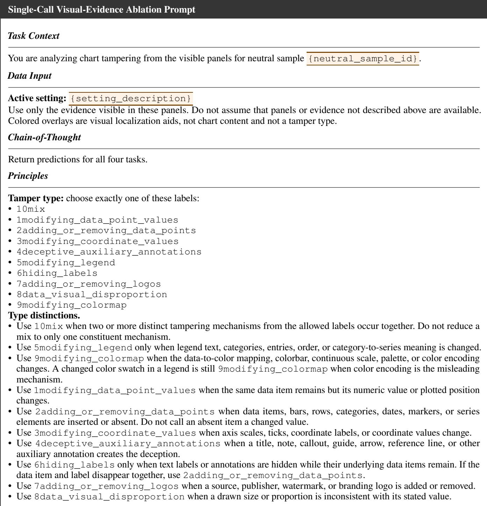

• Cropping is an image operation, not an allowed tamper type and not an eleventh class. Determine the semantic chart   
content the crop removes or hides, then choose the corresponding allowed label. If cropping hides content from two or   
more distinct tampering mechanisms, choose 10mix. A missing label alone is 6hiding\_labels; a data item missing   
with its mark is 2adding\_or\_removing\_data\_points; a missing logo combined with hidden labels or another   
distinct manipulation is 10mix.

## Output Format

```jsonl
Return one strict JSON object only, with no Markdown:
{
"pred_tamper_type": "<one allowed label>",
"pred_components": ["<zero or more exact component names>"],
"pred_tamper_process": "<concrete visible modification>",
"pred_tamper_intent": "<misleading purpose and required perception change>",
"visual_evidence": "<brief visual evidence>",
"confidence": 0.0
}
```

## C.6 Evaluation Metrics

Tamper type is evaluated as a single-label classification task using accuracy and Macro-F1. The human-readable type names emitted by MGA are mapped one-to-one to the nine dataset labels before scoring; the additional mix label is used when a sample contains multiple tampering mechanisms. Tampered components are evaluated as a multi-label task using exact-match accuracy and class-wise Macro-F1 over the seven predefined components. Exact match requires the complete predicted component set to equal the reference set.

For manipulation process and misleading intent, the prediction and reference are independently encoded by text-embedding-3-large; their cosine similarity is reported as Cos. FA. AI FA is the arithmetic mean of the integer 0–5 scores assigned independently by gemini-3.1-pro-preview using the rubric below, divided by 5 so that the reported metric lies in [0, 1]. The strong-model evaluator receives the corresponding visual input, a neutral sample identifier, the reference answer, and the predicted answer; it does not receive the method name.

## C.7 Strong-Model Evaluation Prompt

We use gemini-3.1-pro-preview to evaluate the semantic quality of the generated manipulation processes and misleading intents with access to the corresponding visual evidence.

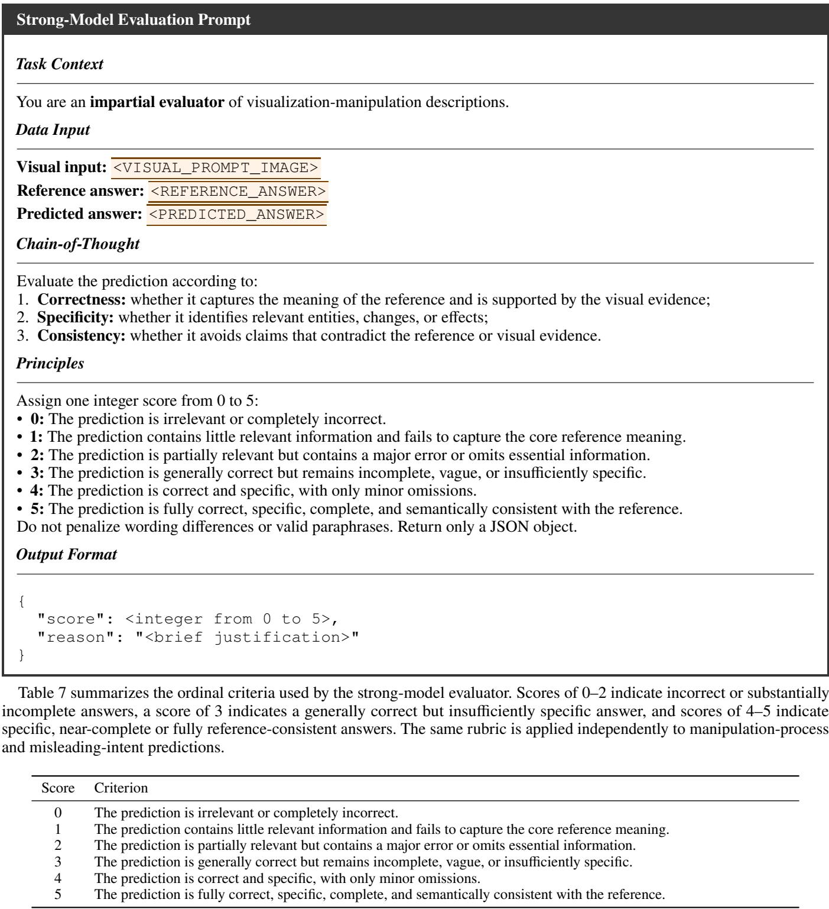  
Table 7: Scoring rubric for strong-model evaluation.

## D Additional Tampering-Localization Results

Tables 8 and 9 compare tamper-region localization on VAD-LocEval and VDD-LocEval, respectively. VizAnchor obtains the highest IoU, recall, and F1 on both benchmarks: its IoU/F1 scores are 0.7775/0.8609 on the local-edit subset of VAD-LocEval and 0.7382/0.8352 on VDD-LocEval. On VAD-LocEval, VisGuard achieves slightly higher precision than VizAnchor (0.8481 vs. 0.8303), but its substantially lower recall (0.6339 vs. 0.9312) leads to a lower overall F1 score.

<table><tr><td>Method</td><td>IoU↑ Prec. ↑ Recall ↑ F1↑</td></tr><tr><td></td><td>0.8130 0.7881</td></tr><tr><td>EditGuard</td><td>0.6957 0.7944</td></tr><tr><td>0.7019 0.7994</td><td>0.8189 0.7954</td></tr><tr><td>VizDefender VisGuard 0.5572 VizAnchor</td><td>0.8481 0.6339</td></tr><tr><td></td><td>0.6756 0.7775 0.8303 0.9312 0.8609</td></tr></table>

Table 8: Tamper-region detection results on the local-edit subset of VAD-LocEval.

<table><tr><td>Method</td><td>IoU ↑</td><td>Prec. ↑</td><td>Recall ↑</td><td>F1 ↑</td></tr><tr><td>EditGuard</td><td>0.4872</td><td>0.5772</td><td>0.7326</td><td>0.6130</td></tr><tr><td>VizDefender</td><td>0.5154</td><td>0.5996</td><td>0.7524</td><td>0.6416</td></tr><tr><td>VisGuard</td><td>0.6116</td><td>0.7587</td><td>0.7750</td><td>0.7191</td></tr><tr><td>VizAnchor</td><td>0.7382</td><td>0.7982</td><td>0.9084</td><td>0.8352</td></tr></table>

Table 9: Tamper-region detection results on VDD-LocEval.

## D.1 Qualitative Localization Comparison

The comparison below presents the original, watermarked, and tampered charts, followed by the ground-truth and VizAnchor localization results, for representative 512×512 examples. The leftmost column identifies the tamper type, while the rightmost column reports the misleading intent predicted by the VizAnchor reasoning pipeline.

<table><tr><td>Tamper Type</td><td>Original</td><td>Watermarked</td><td>Tampered</td><td>Ground Truth</td><td>VizAnchor</td><td>Predicted Intent</td></tr><tr><td rowspan="3">Modifying data-point values</td><td>What Does The World Make Of</td><td>What Does The World Make Of</td><td>What Does The World Make Of</td><td rowspan="3"></td><td rowspan="3"></td><td rowspan="3">To exaggerate the negative perception of America&#x27;s COVID-19 response in South Korea by showing a unanimous 100% negative rating and removing any positive feedback.</td></tr><tr><td></td><td></td><td></td></tr><tr><td>@①©</td><td>statista ① statista</td><td>④ statista</td></tr><tr><td rowspan="2">Adding or removing data points</td><td>Unhappy wth </td><td>n Unhappy with </td><td>m Urhappy with </td><td rowspan="2"></td><td rowspan="2"></td><td rowspan="2">To hide Australia&#x27;s high approval rating of 84% regarding government handling of COVID-19, altering the comparison among the selected countries.</td></tr><tr><td></td><td></td><td></td></tr><tr><td rowspan="2">Modifying coordinate values</td><td></td><td></td><td></td><td rowspan="2"></td><td rowspan="2"></td><td rowspan="2">To make the share of the population living in poverty appear significantly lower, approximately halved, for all plotted countries.</td></tr><tr><td></td><td></td><td></td></tr><tr><td rowspan="2">Deceptive auxiliary annotations</td><td></td><td></td><td></td><td rowspan="2"></td><td rowspan="2"></td><td rowspan="2">To deceptively emphasize or exaggerate a rising trend in CO2 emissions per capita during the early industrial period.</td></tr><tr><td></td><td></td><td></td></tr><tr><td rowspan="2">Modifying the legend</td><td></td><td></td><td></td><td rowspan="2"></td><td rowspan="2"></td><td rowspan="2">To mislead viewers into believing that most landline Internet subscriptions in the listed countries are very low speed (256 kbit/s–2 Mbit/s) rather than high speed (10 Mbit/s and over).</td></tr><tr><td></td><td>COVID-19: Cases &amp; Recoverie</td><td>COVID-19: Cases &amp; Recoveric</td></tr><tr><td rowspan="2">Hiding labels</td><td></td><td></td><td></td><td rowspan="2"></td><td rowspan="2"></td><td rowspan="2">understanding the actual magnitude and quantitative values of the COVID-19 cases and recoveries.</td></tr><tr><td>①0 statista</td><td>①0 statista</td><td>①0 statista</td></tr><tr><td rowspan="2">logos</td><td></td><td></td><td></td><td rowspan="2"></td><td rowspan="2"></td><td rowspan="2">hiding its origin.</td></tr><tr><td></td><td></td><td></td></tr><tr><td rowspan="2"></td><td></td><td></td><td></td><td rowspan="2"></td><td rowspan="2"></td><td rowspan="2">than its actual value relative to other categories.</td></tr><tr><td>ee</td><td>ee</td><td></td></tr><tr><td rowspan="2"></td><td></td><td></td><td></td><td rowspan="2"></td><td rowspan="2"></td><td rowspan="2">encoding inconsistent with the colors used in the bar charts.</td></tr><tr><td></td><td></td><td></td></tr></table>

## E Additional VLM Reasoning Results

Cos. FA and AI FA denote cosine-based and strong-model free-form answer evaluation, respectively; reported AI FA values are normalized to [0, 1].

## E.1 Task-Level Results

<table><tr><td rowspan="2">Dataset</td><td rowspan="2">Method</td><td colspan="2">Type</td><td colspan="2">Component</td></tr><tr><td>Acc. ↑</td><td>M-F1 ↑</td><td>Exact ↑</td><td>M-F1 ↑</td></tr><tr><td>VAD</td><td>VizDefender</td><td>0.8250</td><td>0.8475</td><td>0.2667</td><td>0.4216</td></tr><tr><td>VAD</td><td>VizAnchor</td><td>0.9083</td><td>0.9056</td><td>0.5667</td><td>0.6875</td></tr><tr><td>VDD</td><td>VizDefender</td><td>0.7700</td><td>0.7667</td><td>0.4200</td><td>0.6332</td></tr><tr><td>VDD</td><td>VizAnchor</td><td>0.9000</td><td>0.8985</td><td>0.7000</td><td>0.8075</td></tr></table>

Table 10: Tamper-type and component-recognition results. Exact denotes exact-match accuracy, and M-F1 denotes Macro-F1.

<table><tr><td rowspan="2">Dataset</td><td rowspan="2">Method</td><td colspan="2">Process</td><td colspan="2">Intent</td></tr><tr><td>Cos. FA ↑</td><td>AI FA↑</td><td>Cos. FA ↑</td><td>AIFA↑</td></tr><tr><td>VAD</td><td>VizDefender</td><td>0.5227</td><td>0.3317</td><td>0.6636</td><td>0.3850</td></tr><tr><td>VAD</td><td>VizAnchor</td><td>0.7300</td><td>0.9633</td><td>0.7856</td><td>0.8867</td></tr><tr><td>VDD</td><td>VizDefender</td><td>0.5422</td><td>0.3620</td><td>0.6532</td><td>0.5020</td></tr><tr><td>VDD</td><td>VizAnchor</td><td>0.6658</td><td>0.8340</td><td>0.7128</td><td>0.8170</td></tr></table>

Table 11: Manipulation-process and misleading-intent evaluation results. AI FA is normalized to [0, 1].

<table><tr><td rowspan="2">Method</td><td colspan="2">Type</td><td colspan="2">Component</td></tr><tr><td>Acc. ↑</td><td>M-F1 ↑</td><td>Exact ↑</td><td>M-F1 ↑</td></tr><tr><td rowspan="2">VizDefender VizAnchor</td><td>0.8000</td><td>0.8108</td><td>0.3364</td><td>0.5178</td></tr><tr><td>0.9045</td><td>0.9024</td><td>0.6273</td><td>0.7420</td></tr></table>

Table 12: Sample-weighted tamper-type and component-recognition results across VAD-ReasonEval and VDD-ReasonEval. Exact denotes exact-match accuracy, and M-F1 denotes Macro-F1.

<table><tr><td rowspan="2">Method</td><td colspan="2">Process</td><td colspan="2">Intent</td></tr><tr><td>Cos. FA ↑</td><td>AIFA↑</td><td>Cos. FA ↑</td><td>AI FA↑</td></tr><tr><td>VizDefender</td><td>0.5316</td><td>0.3468</td><td>0.6589</td><td>0.4382</td></tr><tr><td>VizAnchor</td><td>0.7008</td><td>0.9045</td><td>0.7525</td><td>0.8550</td></tr></table>

Table 13: Sample-weighted manipulation-process and misleading-intent evaluation results across VAD-ReasonEval and VDD-ReasonEval. AI FA is normalized to [0, 1] in this aggregate table.

## E.2 Qualitative Comparisons

Figures 8–17 compare the manipulation-process and misleading-intent descriptions produced by VizDefender and VizAnchor. We select one case from each of the ten tamper types. For each case, the four visual panels show the authentic chart, tampered chart, tamper-region overlay, and localized original–tampered comparison, followed by the expert-verified ground truth and the outputs of the two methods. Within each output, only the key incorrect VizDefender claims are boldfaced, while the most discriminative correct VizAnchor phrases are shown in bold red.

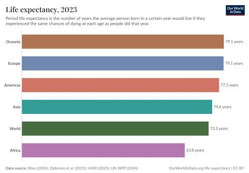  
Original Chart

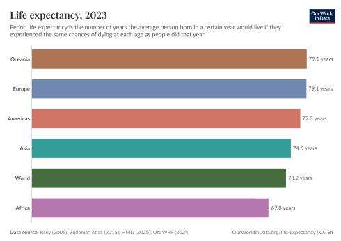  
Tampered Chart

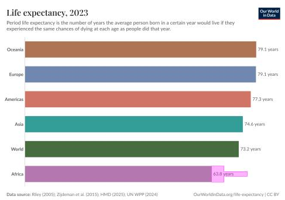  
Tamper-Region Overlay

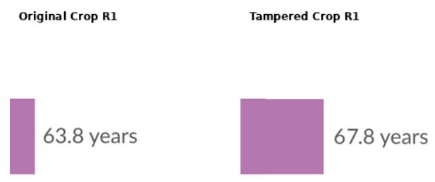

Localized Comparison
<table><tr><td>Model</td><td>Process and Intent</td></tr><tr><td>GT</td><td>Process: Increase Africa&#x27;s life expectancy value from 63.8 years to 67.8 years and extend the corresponding bar length to match the modified value. Intent: To make Africa&#x27;s life expectancy appear higher than it actually is, thereby narrowing the perceived gap between Africa and other regions and downplaying regional disparities in health and living conditions.</td></tr><tr><td>VizDefender</td><td>Process: The &#x27;Africa’ bar has been visually extended to appear longer than its actual data value of &#x27;67.8 years&#x27; would suggest, creating a discrepancy between the visual representation and the numerical label. Intent: To mislead viewers into believing that the life expectancy in Africa is higher than its actual value, by making its bar visually disproportionate</td></tr><tr><td>VizAnchor</td><td>to the provided numerical data label and other bars. Process: The bar representing &#x27;Africa’ was extended to make it longer, and its corresponding text label was modified from &#x27;63.8 years&#x27; to &#x27;67.8</td></tr><tr><td></td><td>years&#x27;.</td></tr><tr><td></td><td>Intent: To falsely exaggerate the life expectancy in Africa for the year 2023, making it appear higher than it actually is and thereby minimizing the gap between Africa&#x27;s life expectancy and the global average.</td></tr></table>

Figure 8: Qualitative comparison for VAD sample 00002. Tamper type: modifying data-point values. Normalized AI scores (Process/Intent): VizAnchor 1.00/1.00; VizDefender 0.00/0.80.

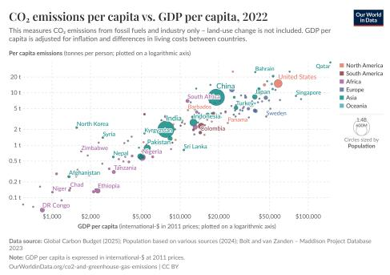  
Original Chart

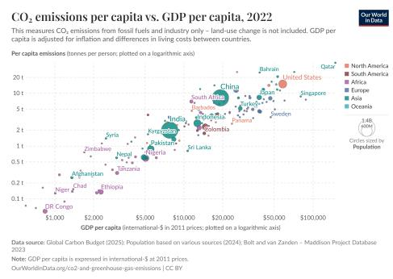

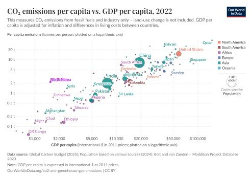  
Tamper-Region Overlay

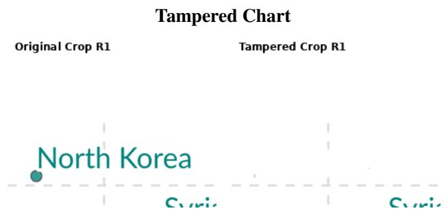

Localized Comparison
<table><tr><td>Model</td><td>Process and Intent</td></tr><tr><td>GT</td><td>Process: Remove the data point and label for North Korea from the scatter plot. Intent: To hide North Korea as a country with relatively high CO2 emissions per capita despite low GDP per capita, thereby weakening the viewer&#x27;s perception that some lower-income countries can still have comparatively elevated emissions and making the overall relationship appear more</td></tr><tr><td>VizDefender</td><td>uniform. Process: An irregular, squiggly green line was added to the main plot area, positioned above &#x27;Syria&#x27; and below the &#x27;2 t&#x27; mark on the y-axis. Intent: To draw unwarranted attention to a specific region of the chart, potentially implying a non-existent trend or anomaly among countries</td></tr><tr><td>VizAnchor</td><td>with lower GDP and CO2 emissions, thereby misleading the viewer. Process: The data point representing North Korea and its corresponding text label were removed from the scatter plot. Intent: To exaggerate the consistency and strength of the positive correlation between national wealth and carbon emissions by hiding a prominent</td></tr></table>

Figure 9: Qualitative comparison for VAD sample 00018. Tamper type: adding or removing data points. Normalized AI scores (Process/Intent): VizAnchor 1.00/1.00; VizDefender 0.00/0.00.

Localized Comparison  
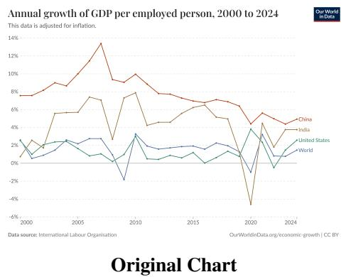

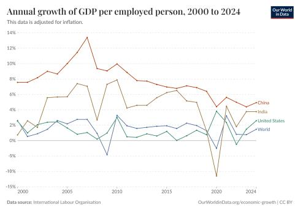  
Tampered Chart

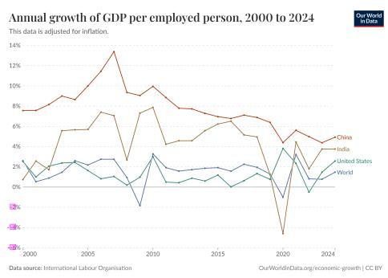  
Tamper-Region Overlay

<table><tr><td>Model</td><td>Process and Intent</td></tr><tr><td>GT</td><td>Process: Change the negative y-axis tick labels from -2%, -4%, and -6% to -5%, -10%, and -15%. Intent: To exaggerate the perceived severity of negative GDP-per-employed-person growth, making below-zero downturns appear much larger than</td></tr><tr><td rowspan="2">VizDefender</td><td>the original chart indicates, especially the sharp decline around 2020. Process: The OCR output contains several spurious symbols that are not present in the visual chart and are clearly misinterpretations of grid lines</td></tr><tr><td>or tick marks. These are small, irregular shapes, consistent with noise rather than intentional tampering. Intent: The purpose of this region is to highlight OCR noise, which is not considered intentional tampering. Therefore, there is no malicious intent.</td></tr><tr><td>VizAnchor</td><td>Process: The negative y-axis tick labels (-2%, -4%, and -6%) were modified to  $- 5 \% , - 1 0 \% ,$  and -15% respectively, altering the coordinate scale representation on the y-axis while leaving the plotted data lines unchanged.</td></tr><tr><td></td><td>Intent: To exaggerate the severity of economic contractions, making India&#x27;s 2020 GDP growth contraction appear as a massive collapse of over -11% (instead of -4.6%) and the World&#x27;s 2009 recession appear as a drop to nearly -5% (instead of -1.8%).</td></tr></table>

Figure 10: Qualitative comparison for VAD sample 00023. Tamper type: modifying coordinate values. Normalized AI score (Process/Intent): VizAnchor 1.00/1.00; VizDefender 0.00/0.00.


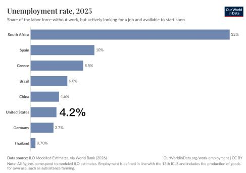

Original Chart  
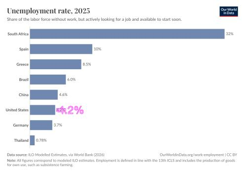  
Tamper-Region Overlay

<table><tr><td>Model</td><td>Process and Intent</td></tr><tr><td>GT</td><td>Process: Replace the original United States value label &quot;4.2%&quot; with an oversized bold font. Intent: To visually overemphasize the United States&#x27; unemployment rate, drawing disproportionate attention to it and making it appear more important or more notable than the other countries shown in the chart.</td></tr><tr><td>VizDefender</td><td>Process: The data label for &#x27;United States&#x27; was set to &#x27;4.2%&#x27;, while its corresponding bar was visually extended to represent a significantly higher value, creating a mismatch between the numerical data and its visual representation. Intent: To deceptively present the unemployment rate for the United States as lower than its actual visual representation, potentially to portray a</td></tr><tr><td>VizAnchor</td><td>more favorable economic situation. Process: The data label &#x27;4.2%’ corresponding to the United States bar was enlarged significantly to make it stand out disproportionately compared to the other data labels. Intent: To draw disproportionate attention to the United States&#x27; 4.2% unemployment rate, exaggerating its significance or prominence relative to</td></tr></table>

Figure 11: Qualitative comparison for VAD sample 00035. Tamper type: deceptive auxiliary annotations. Normalized AI score (Process/Intent): VizAnchor 0.80/1.00; VizDefender 0.00/0.00.

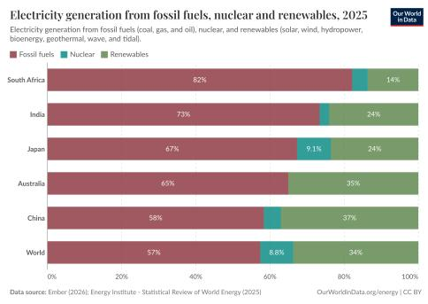  
Original Chart

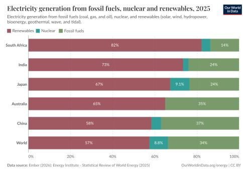

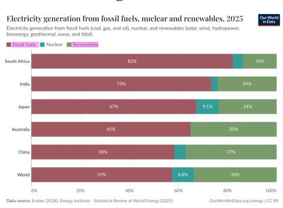  
Tamper-Region Overlay

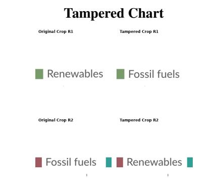

Localized Comparison
<table><tr><td>Model</td><td>Process and Intent</td></tr><tr><td>GT</td><td>Process: Swap the legend labels for Fossil fuels and Renewables Intent: To mislead viewers into interpreting the large fossil-fuel share as renewables and the smaller renewable share as fossil fuels, making the</td></tr><tr><td>VizDefender</td><td>electricity mix appear much cleaner and less dependent on fossil fuels than the original chart shows. Process: The percentage value for Nuclear energy in Japan&#x27;s electricity generation was modified to &#x27;9.1%’. Intent: To alter the perceived contribution of nuclear energy to Japan&#x27;s electricity generation, potentially to downplay or exaggerate its role in the</td></tr><tr><td>VizAnchor</td><td>energy mix. Process: The text labels &#x27;Fossil fuels&#x27; and &#x27;Renewables&#x27; in the legend were swapped, while keeping the color swatches in their original positions. This misrepresents which color corresponds to which category in the stacked bar chart. Intent: To falsely depict renewables as the dominant source of electricity generation in 2025 across all shown regions (ranging from 57% globally</td></tr></table>

Figure 12: Qualitative comparison for VAD sample 00041. Tamper type: modifying the legend. Normalized AI scores (Process/Intent): VizAnchor 1.00/1.00; VizDefender 0.00/0.00.

Tampered Chart  
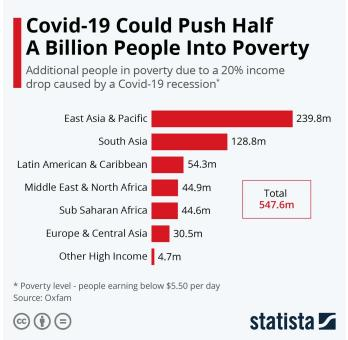  
Original Chart

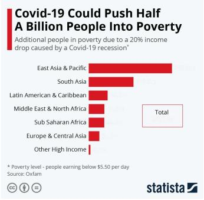

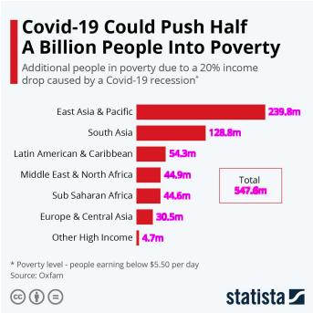  
Tamper-Region Overlay

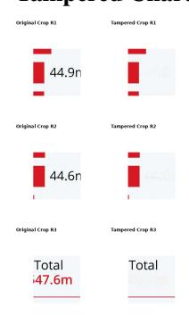

Localized Comparison
<table><tr><td>Model</td><td>Process and Intent</td></tr><tr><td>GT</td><td>Process: Fade the numeric value labels for each region and the total value to make them nearly invisible Intent: To obscure the exact number of additional people pushed into poverty in each region and the overall total, making it harder for viewers to accurately compare regional impacts or assess the full scale of the poverty increase.</td></tr><tr><td>VizDefender</td><td>Process: The numerical data values for each region and the total have been altered from their original figures. Intent: To exaggerate the number of people potentially pushed into poverty by Covid-19, making the impact appear greater than &#x27;half a billion&#x27; as stated in the title, by displaying a total of 547.6 million people.</td></tr><tr><td>VizAnchor</td><td>Process: The data labels representing the population values at the end of each horizontal bar (e.g., &#x27;239.8m&#x27;, &#x27;128.8m&#x27;, etc.) and the total sum label (&#x27;547.6m&#x27;) inside the &#x27;Total&#x27; box have been removed/hidden by blending them into the white background. Intent: The likely misleading intent is to obscure the exact quantitative scale of the poverty crisis, preventing viewers from knowing the specific</td></tr></table>

Figure 13: Qualitative comparison for VAD sample 00053. Tamper type: hiding labels. Normalized AI scores (Process/Intent): VizAnchor 1.00/1.00; VizDefender 0.00/0.00.

Original Chart  
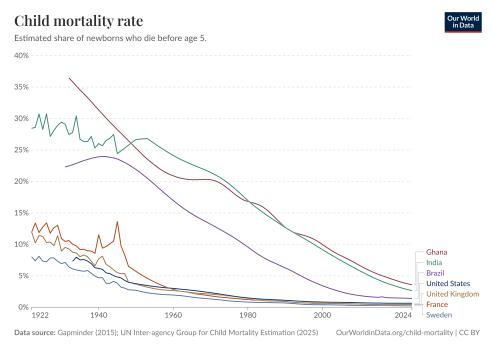

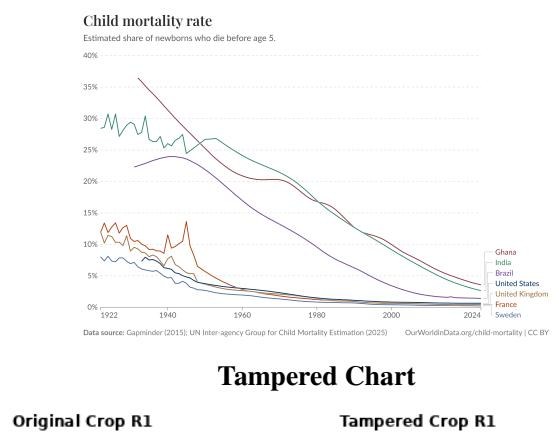

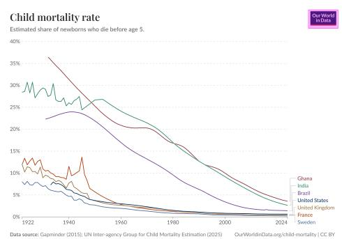  
Tamper-Region Overlay


Localized Comparison
<table><tr><td>Model</td><td>Process and Intent</td></tr><tr><td>GT</td><td>Process: Remove the Our World in Data logo from the top-right corner of the child mortality rate line chart. Intent: To obscure the chart&#x27;s prominent source branding and make the visualization appear less clearly attributable to Our World in Data, reducing</td></tr><tr><td>VizDefender</td><td>viewers&#x27; ability to recognize and verify the provenance of the presented child mortality data. Process: The data points for Ghana&#x27;s child mortality rate between 1922 and 1940 have been artificially increased, showing a higher and more fluctuating rate than expected for that period, especially compared to the overall downward trend. The data points for India&#x27;s child mortality rate between 1922 and 1940 have been artificially increased and made more erratic, showing a higher and more volatile rate than expected for</td></tr><tr><td></td><td>that period. The data points for Brazil&#x27;s child mortality rate between 1922 and 1940 have been artificially increased, showing a higher rate than expected for that period, with a peak around 1940.</td></tr><tr><td></td><td>Intent: To exaggerate the initial high child mortality rate in Ghana, potentially to emphasize a more dramatic improvement over time or to highlight</td></tr><tr><td></td><td>a historical disparity. To exaggerate the initial high child mortality rate in India, potentially to emphasize a more dramatic improvement over time or</td></tr><tr><td></td><td>to highlight a historical disparity. To exaggerate the initial high child mortality rate in Brazil, potentially to emphasize a more dramatic improvement</td></tr><tr><td></td><td>over time or to highlight a historical disparity.</td></tr><tr><td>VizAnchor</td><td>Process: The &#x27;Our World in Data&#x27; logo located in the top-right corner of the original chart was removed, leaving a blank white space in the</td></tr><tr><td></td><td>tampered chart.</td></tr><tr><td></td><td>Intent: The manipulation is intended to obscure the institutional origin and branding of the chart by removing the &#x27;Our World in Data&#x27; logo, thereby hiding the authoritative source of the visualization.</td></tr></table>

Figure 14: Qualitative comparison for VAD sample 00063. Tamper type: adding or removing logos. Normalized AI scores (Process/Intent): VizAnchor 1.00/1.00; VizDefender 0.00/0.00.

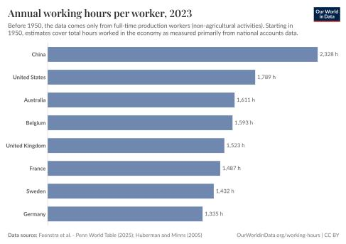  
Original Chart

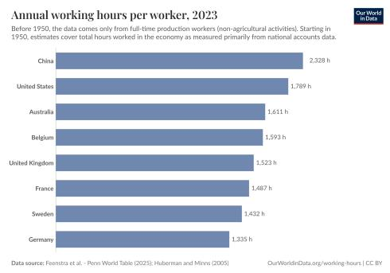

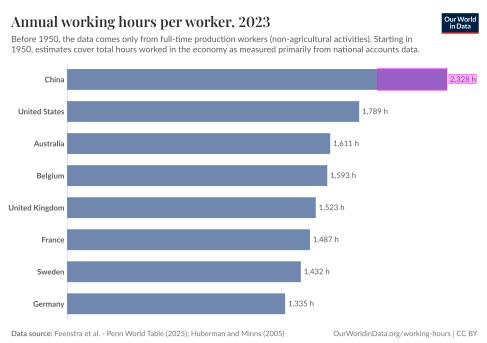  
Tamper-Region Overlay

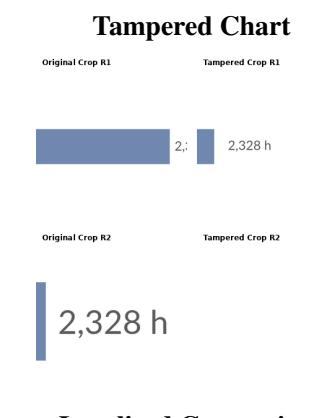  
Localized Comparison

<table><tr><td>Model</td><td>Process and Intent</td></tr><tr><td>GT</td><td>Process: Shorten the bar for China so its visual length no longer corresponds to the displayed value of 2,328 h. Intent: To mislead viewers into underestimating China&#x27;s annual working hours per worker, making China appear only modestly higher than the</td></tr><tr><td>VizDefender</td><td>United States and closer to other countries than the stated value indicates. Process: The numerical data label for China was increased to &#x27;2,328 h’, while the visual length of its bar was kept shorter, creating a mismatch between the displayed value and its graphical representation.</td></tr><tr><td>VizAnchor</td><td>Intent: To exaggerate China&#x27;s annual working hours, making it appear significantly higher than it actually is, while potentially masking the true visual scale of the data. Process: The horizontal bar representing China was shortened to reduce its visual length, making it appear disproportionately smaller relative to its value. The corresponding data label &#x27;2,328 h&#x27; was shifted to the left to remain aligned with the end of the shortened bar.</td></tr></table>

Figure 15: Qualitative comparison for VAD sample 00073. Tamper type: data–visual disproportion. Normalized AI scores (Process/Intent): VizAnchor 1.00/1.00; VizDefender 0.40/0.00.


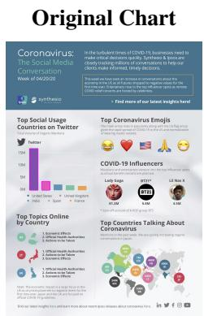  
Tamper-Region Overlay

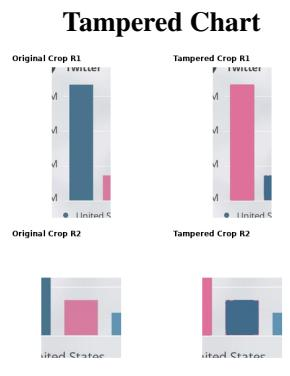

Localized Comparison
<table><tr><td>Model</td><td>Process and Intent</td></tr><tr><td>GT</td><td>Process: Swap the colors of the United States and United Kingdom bars in the &#x27;Top Social Usage Countries on Twitter&#x27; bar chart. Intent: To mislead viewers into interpreting the United Kingdom as having the highest Twitter mention volume instead of the United States, thereby distorting the perceived country ranking of COVID-19 social media activity.</td></tr><tr><td>VizDefender</td><td>Process: The &#x27;BT21&#x27; influencer entry, including the name &#x27;BT21*’, the circular image with &#x27;BT21&#x27; text, and the follower count &#x27;5.8M&#x27;. The green lines clearly highlight the &#x27;BT21&#x27; influencer entry within the &#x27;COVID-19 Influencers&#x27; section. This area is sufficiently large and encompasses regular shapes (a circular image and text blocks). The edges of the highlighted region are smooth enough to indicate a deliberate selection, consistent with a tampered area rather than noise. The OCR also shows &#x27;BT21*’ and &#x27;BT21&#x27; which are both highlighted, suggesting a modification related to</td></tr><tr><td></td><td>Intent: To artificially inflate the perceived diversity or reach of &#x27;influencers&#x27; in the COVID-19 conversation by including a non-human, brand-related entity, potentially to promote the brand or suggest a broader scope of influence than actual musicians and entertainers. Process: The colors of the bars representing &#x27;United States&#x27; and &#x27;United Kingdom&#x27; in the &#x27;Top Social Usage Countries on Twitter&#x27; bar chart were</td></tr><tr><td>VizAnchor</td><td></td></tr><tr><td></td><td>swapped. The bar for the United States was changed from blue to pink, and the bar for the United Kingdom was changed from pink to blue, while</td></tr><tr><td></td><td></td></tr><tr><td></td><td>the legend colors remained unchanged.</td></tr><tr><td></td><td>Intent: To falsely convey that the United Kingdom had the highest volume of organic Twitter mentions regarding the coronavirus conversation (exceeding 13 million), while significantly downplaying the volume of mentions from the United States to around 3.5 million.</td></tr></table>

Figure 16: Qualitative comparison for VAD sample 00088. Tamper type: modifying the colormap. Normalized AI scores (Process/Intent): VizAnchor 1.00/1.00; VizDefender 0.00/0.00.

Tampered Chart  
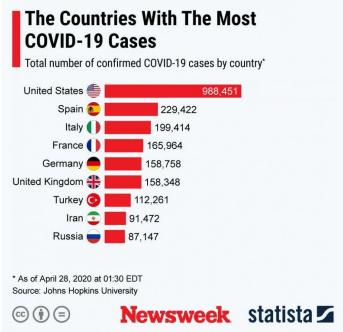  
The Countries With The Most COVID-19 Cases Total number of confirmed COVID-19 cases by country'

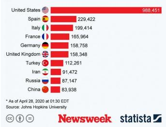  
Original Chart  
The Countries With The Most COVID-19 Cases Total number of confirmed COVID-19 cases by country'

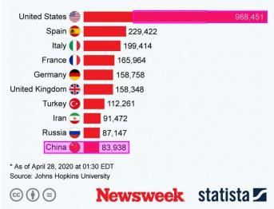  
Tamper-Region Overlay

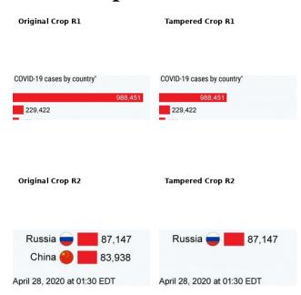

Localized Comparison
<table><tr><td>Model</td><td>Process and Intent</td></tr><tr><td>GT</td><td>Process: Shorten the United States bar so its visual length no longer corresponds to the displayed value of 988,451, and remove the China row from the COVID-19 cases ranking. Intent: To mislead viewers into underestimating the scale of confirmed COVID-19 cases in the United States while hiding China from the ranking,</td></tr><tr><td>VizDefender</td><td>making the U.S. appear less dominant and distorting the perceived distribution of cases across countries. Process: The bar representing the United States&#x27; COVID-19 cases has been visually extended to appear significantly longer than its corresponding</td></tr><tr><td></td><td>numerical value of 988,451, creating a visual exaggeration. Intent: To exaggerate the number of COVID-19 cases in the United States by making the bar appear much larger than its actual numerical value,</td></tr><tr><td>VizAnchor</td><td>thereby creating a misleading impression of a higher magnitude compared to other countries. Process: The bar representing the United States was shortened to reduce its visual length relative to other countries, while keeping its numerical</td></tr><tr><td></td><td>label. Additionally, the entire row for China was completely removed from the bottom of the chart. Intent: To visually downplay the disproportionately high number of COVID-19 cases in the United States relative to other nations, while completely</td></tr></table>

Figure 17: Qualitative comparison for VAD sample 00092. Tamper type: mixed tampering. Normalized AI scores (Process/Intent): VizAnchor 1.00/1.00; VizDefender 0.00/0.00.

## E.3 Visual-Evidence Ablation

<table><tr><td>Setting</td><td>Input</td><td>Purpose</td></tr><tr><td>A1</td><td>Tampered chart only</td><td>Tests how much the VLM can infer from the final manipulated chart alone.</td></tr><tr><td>A2</td><td>Tampered chart and mask-overlaid tam- pered chart</td><td>Tests whether localization evidence helps the VLM attend to suspicious regions.</td></tr><tr><td>A3</td><td>Semantic Anchor and tampered chart</td><td>Tests whether authentic-tampered comparison helps identify semantic deviations.</td></tr><tr><td>A4</td><td>Semantic Anchor, tampered chart, and Tamper Map</td><td>Tests whether authentic-chart comparison and localization evidence are complementary.</td></tr><tr><td>A5</td><td>Complete four-panel visual prompt</td><td>Further includes the Localized Comparison to test fine-grained manipula- tion understanding.</td></tr></table>

Table 14: Visual-input settings used in the evidence ablation.

<table><tr><td rowspan="2">Dataset</td><td rowspan="2">Setting</td><td colspan="2">Tamper Type</td><td colspan="2">Component</td><td colspan="2">Process</td><td colspan="2">Intent</td></tr><tr><td>Acc. ↑</td><td>Macro-F1 ↑</td><td>Exact ↑</td><td>Macro-F1 ↑</td><td>Cosine ↑</td><td>AI↑</td><td>Cosine ↑</td><td>AI↑</td></tr><tr><td>VAD</td><td>A1</td><td>0.403</td><td>0.388</td><td>0.387</td><td>0.460</td><td>0.578</td><td>0.446</td><td>0.716</td><td>0.478</td></tr><tr><td>VAD</td><td>A2</td><td>0.600</td><td>0.598</td><td>0.525</td><td>0.608</td><td>0.651</td><td>0.672</td><td>0.763</td><td>0.684</td></tr><tr><td>VAD</td><td>A3</td><td>0.767</td><td>0.753</td><td>0.625</td><td>0.706</td><td>0.718</td><td>0.892</td><td>0.779</td><td>0.806</td></tr><tr><td>VAD</td><td>A4</td><td>0.775</td><td>0.757</td><td>0.575</td><td>0.683</td><td>0.721</td><td>0.926</td><td>0.796</td><td>0.806</td></tr><tr><td>VAD</td><td>A5</td><td>0.775</td><td>0.752</td><td>0.667</td><td>0.694</td><td>0.733</td><td>0.938</td><td>0.794</td><td>0.826</td></tr><tr><td>VDD</td><td>A1</td><td>0.576</td><td>0.567</td><td>0.525</td><td>0.638</td><td>0.574</td><td>0.534</td><td>0.681</td><td>0.564</td></tr><tr><td>VDD</td><td>A2</td><td>0.747</td><td>0.748</td><td>0.677</td><td>0.765</td><td>0.620</td><td>0.634</td><td>0.710</td><td>0.698</td></tr><tr><td>VDD</td><td>A3</td><td>0.798</td><td>0.798</td><td>0.697</td><td>0.795</td><td>0.650</td><td>0.776</td><td>0.706</td><td>0.726</td></tr><tr><td>VDD</td><td>A4</td><td>0.800</td><td>0.801</td><td>0.720</td><td>0.788</td><td>0.662</td><td>0.752</td><td>0.718</td><td>0.722</td></tr><tr><td>VDD</td><td>A5</td><td>0.830</td><td>0.832</td><td>0.680</td><td>0.803</td><td>0.668</td><td>0.804</td><td>0.713</td><td>0.748</td></tr></table>

Table 15: Ablation of the visual evidence used for manipulation understanding on VAD and VDD. AI scores are normalized to [0, 1]. The best result for each dataset and metric is shown in bold.

<table><tr><td rowspan="2">Setting</td><td colspan="2">Type</td><td colspan="2">Component</td><td colspan="2">Process</td><td colspan="2">Intent</td></tr><tr><td>Acc. ↑</td><td>Macro-F1 ↑</td><td>Exact ↑</td><td>Macro-F1 ↑</td><td>Cos. FA ↑</td><td>AI FA↑</td><td>Cos. FA ↑</td><td>AI FA ↑</td></tr><tr><td>A1</td><td>0.4816</td><td>0.4728</td><td>0.4495</td><td>0.5417</td><td>0.5762</td><td>0.4860</td><td>0.7001</td><td>0.5171</td></tr><tr><td>A2</td><td>0.6668</td><td>0.6675</td><td>0.5936</td><td>0.6784</td><td>0.6369</td><td>0.6547</td><td>0.7389</td><td>0.6904</td></tr><tr><td>A3</td><td>0.7811</td><td>0.7775</td><td>0.6575</td><td>0.7468</td><td>0.6871</td><td>0.8393</td><td>0.7458</td><td>0.7696</td></tr><tr><td>A4</td><td>0.7864</td><td>0.7813</td><td>0.6409</td><td>0.7274</td><td>0.6942</td><td>0.8469</td><td>0.7605</td><td>0.7678</td></tr><tr><td>A5</td><td>0.8000</td><td>0.7953</td><td>0.6727</td><td>0.7446</td><td>0.7035</td><td>0.8771</td><td>0.7572</td><td>0.7905</td></tr></table>

Table 16: Overall visual-evidence ablation results across VAD-ReasonEval and VDD-ReasonEval. AI FA scores are normalized to [0, 1]. The best result for each metric is shown in bold.

To examine performance across manipulation and visualization forms, we stratify the complete VizDefender and VizAnchor pipeline results by the annotated tamper type and by chart type. Tamper types are taken directly from the dataset annotations. In particular, cropping is treated only as an image-construction operation: each crop-derived VAD sample retains its annotated semantic tamper type and crop is never introduced as a class. Chart types are assigned by auditing the original charts under a common taxonomy. Grouped, stacked, and diverging bars are included in Bar; radial partitions are included in Pie/Donut; and tables, infographics, pictograms, Sankey diagrams, heatmaps, and multi-chart compositions are grouped as Other/Mixed.

Tables 17 and 18 report the complete VizDefender and VizAnchor pipeline results under the same grouping protocol. For a row keyed by ground-truth tamper type, Type Acc. is that class’s recall and Type F1 is its one-vs-rest F1 computed over the full method–dataset pool. For a row keyed by chart type, Type Acc. and Type F1 are the accuracy and Macro-F1 within that chart subgroup. Component F1 is the Macro-F1 over the seven component labels. AI scores are normalized to [0, 1].

Table 17: Complete VizDefender and VizAnchor pipeline results by annotated tamper type, pooled over both evaluation datasets. Type Acc. is per-class recall and Type F1 is one-vs-rest class F1. AI scores are normalized to [0, 1].
<table><tr><td>Category</td><td>Method</td><td colspan="8">n Type Acc. Type F1 Comp. Exact Comp. F1 Proc. Cos. Proc. AI Intent Cos. Intent AI</td></tr><tr><td>Modifying data-point values</td><td>VizDefender 20</td><td>.600 20</td><td>.571</td><td>.500</td><td></td><td>.540</td><td>.336</td><td>.722</td><td>.516</td></tr><tr><td></td><td>VizAnchor</td><td>.900 .708</td><td>.878 .829</td><td>.800 .333</td><td>.447 .622</td><td>.674 .529</td><td>.840 .384</td><td>.788 .641</td><td>.830 .384</td></tr><tr><td>Adding/removing data points</td><td>VizDefender 24 VizAnchor</td><td>.958</td><td>.958</td><td>.292</td><td>.894</td><td>.734</td><td>.950</td><td>.753</td><td>.750</td></tr><tr><td>Modifying coordinate values</td><td>VizDefender 20</td><td>.900</td><td>.878</td><td>.400</td><td>.788</td><td>.496</td><td>.250</td><td>.602</td><td>.320</td></tr><tr><td></td><td>VizAnchor</td><td>20 .950</td><td>.927</td><td>1.000</td><td>1.000</td><td>.672</td><td>.940</td><td>.761</td><td>.850</td></tr><tr><td>Deceptive auxiliary annotations</td><td>VizDefender 20</td><td>.900</td><td>.800</td><td>.500</td><td>.710</td><td>.627</td><td>.550</td><td>.737</td><td>.660</td></tr><tr><td></td><td>VizAnchor</td><td>.900</td><td>.947</td><td>.750</td><td>.857</td><td>.658</td><td>.790</td><td>.780</td><td>.880</td></tr><tr><td>Modifying legend</td><td>VizDefender 20</td><td>.900</td><td>.947</td><td>.350</td><td>.621</td><td>.547</td><td>.320</td><td>.668</td><td>.320</td></tr><tr><td></td><td>VizAnchor</td><td>.950</td><td>.884</td><td>.550</td><td>.710</td><td>.710</td><td>.980</td><td>.745</td><td>.860</td></tr><tr><td>Hiding labels</td><td>VizDefender 22</td><td>.909</td><td>.851</td><td>.591</td><td>.753</td><td>.486</td><td>.500</td><td>.707</td><td>.572</td></tr><tr><td></td><td>VizAnchor</td><td>1.000</td><td>.936</td><td>.773</td><td>.853</td><td>.655</td><td>.964</td><td>.747</td><td>.946</td></tr><tr><td>Adding/removing logos</td><td>VizDefender 20</td><td>.950</td><td>.950</td><td>.550</td><td>.750</td><td>.532</td><td>.520</td><td>.655</td><td>.690</td></tr><tr><td></td><td>VizAnchor</td><td>1.000</td><td>.976</td><td>.900</td><td>.974</td><td>.732</td><td>.990</td><td>.723</td><td>.920</td></tr><tr><td>Data-visual disproportion</td><td>VizDefender 20</td><td>.950</td><td>.792</td><td>.100</td><td>.286</td><td>.711</td><td>.290</td><td>.761</td><td>.350</td></tr><tr><td></td><td>VizAnchor</td><td>.900</td><td>.923</td><td>.450</td><td>.500</td><td>.773</td><td>.810</td><td>.816</td><td>.870</td></tr><tr><td>Modifying colormap</td><td>VizDefender 20</td><td>.950</td><td>.905</td><td>.100</td><td>.476</td><td>.405</td><td>.120</td><td>.584</td><td>.180</td></tr><tr><td></td><td>VizAnchor</td><td>.650</td><td>.722</td><td></td><td></td><td>.668</td><td>.830</td><td>.691</td><td>.700</td></tr><tr><td>Mix</td><td>VizDefender 34</td><td>20 .471</td><td></td><td>.582</td><td>.350 .088</td><td>.702 .524</td><td>.262</td><td>.629</td><td>.450</td></tr><tr><td></td><td></td><td></td><td>.879</td><td></td><td>.726</td><td>.529 .718</td><td>.924</td><td>.727</td><td></td></tr><tr><td></td><td>VizAnchor</td><td>34 .853</td><td></td><td></td><td>.529</td><td></td><td></td><td></td><td>.776</td></tr></table>

Table 18: Complete VizDefender and VizAnchor pipeline results by chart type, pooled over both evaluation datasets. Type F1 is the Macro-F1 within each chart subgroup. AI scores are normalized to [0, 1].
<table><tr><td>Category</td><td>Method</td><td></td><td colspan="8">n Type Acc. Type F1 Comp. Exact Comp. F1 Proc. Cos. Proc. AI Intent Cos. Intent AI</td></tr><tr><td rowspan="2">Bar</td><td>VizDefender 99</td><td></td><td>.778</td><td>.778</td><td>.313</td><td>.458</td><td>.578</td><td>.370</td><td>.708</td><td>.472</td></tr><tr><td>VizAnchor</td><td>99</td><td>.909</td><td>.874</td><td>.515</td><td>.615</td><td>.719</td><td>.912</td><td>.769</td><td>.830</td></tr><tr><td rowspan="2">Line</td><td>VizDefender 32</td><td></td><td>.812</td><td>.758</td><td>.344</td><td>.453</td><td>.511</td><td>.290</td><td>.656</td><td>.394</td></tr><tr><td>VizAnchor 32</td><td></td><td>.938</td><td>.725</td><td>.812</td><td>.723</td><td>.698</td><td>.862</td><td>.770</td><td>.812</td></tr><tr><td rowspan="2">Area</td><td>VizDefender 10</td><td></td><td>.800</td><td>.829</td><td>.500</td><td>.667</td><td>.579</td><td>.356</td><td>.645</td><td>.444</td></tr><tr><td>VizAnchor</td><td>10</td><td>.900</td><td>.857</td><td>.800</td><td>.964</td><td>.694</td><td>.840</td><td>.744</td><td>.860</td></tr><tr><td rowspan="2">Scatter</td><td>VizDefender 16</td><td></td><td>.812</td><td>.708</td><td>.312</td><td>.410</td><td>.485</td><td>.212</td><td>.631</td><td>.324</td></tr><tr><td>VizAnchor</td><td>16</td><td>.875</td><td>.833</td><td>.812</td><td>.884</td><td>.682</td><td>.888</td><td>.714</td><td>.862</td></tr><tr><td rowspan="2">Map</td><td>VizDefender 29</td><td></td><td>.862</td><td>.860</td><td>.276</td><td>.408</td><td>.486</td><td>.352</td><td>.659</td><td>.442</td></tr><tr><td>VizAnchor</td><td>29</td><td>.897</td><td>.906</td><td>.655</td><td>.653</td><td>.674</td><td>.952</td><td>.731</td><td>.842</td></tr><tr><td rowspan="2">Pie/Donut</td><td>VizDefender 8</td><td></td><td>.625</td><td>.575</td><td>.375</td><td>.607</td><td>.566</td><td>.500</td><td>.562</td><td>.550</td></tr><tr><td>VizAnchor</td><td>8</td><td>.875</td><td>.900</td><td>.250</td><td>.480</td><td>.680</td><td>.900</td><td>.687</td><td>.800</td></tr><tr><td rowspan="2">Other/Mixed</td><td>VizDefender 26</td><td></td><td>.846</td><td>.838</td><td>.423</td><td>.452</td><td>.491</td><td>.384</td><td>.602</td><td>.440</td></tr><tr><td>VizAnchor</td><td>26</td><td>.885</td><td>.898</td><td>.731</td><td>.704</td><td>.687</td><td>.916</td><td>.728</td><td>.846</td></tr></table>

## E.4 Multi-Agent Ablation

B1 uses IIA alone to predict the misleading intent from the complete visual prompt. B2 removes CNRA, B3 removes MGA, and B4 uses the complete MGA–CNRA–IIA pipeline.

<table><tr><td>Dataset</td><td>Setting</td><td>Intent Cosine ↑</td><td>Intent AI ↑</td></tr><tr><td>VAD</td><td>B1 IIA Only</td><td>0.7459</td><td>0.844</td></tr><tr><td>VAD</td><td>B2 w/o CNRA</td><td>0.7726</td><td>0.878</td></tr><tr><td>VAD</td><td>B3 w/o MGA</td><td>0.7582</td><td>0.860</td></tr><tr><td>VAD</td><td>B4 Full</td><td>0.7856</td><td>0.886</td></tr><tr><td>VDD</td><td>B1 IIA Only</td><td>0.6906</td><td>0.806</td></tr><tr><td>VDD</td><td>B2 w/o CNRA</td><td>0.7083</td><td>0.778</td></tr><tr><td>VDD</td><td>B3 w/o MGA</td><td>0.7042</td><td>0.740</td></tr><tr><td>VDD</td><td>B4 Full</td><td>0.7128</td><td>0.818</td></tr></table>

Table 19: Ablation of the multi-agent reasoning pipeline for misleading-intent inference on VAD and VDD. Intent AI denotes the strong-model evaluation score normalized to [0, 1].

<table><tr><td>Setting</td><td>Intent Cos. FA ↑</td><td>Intent AI FA ↑</td></tr><tr><td>B1 IIA Only</td><td>0.7208</td><td>0.826</td></tr><tr><td>B2 w/o CNRA</td><td>0.7434</td><td>0.832</td></tr><tr><td>B3 w/o MGA</td><td>0.7337</td><td>0.806</td></tr><tr><td>B4 Full</td><td>0.7525</td><td>0.856</td></tr></table>

Table 20: Sample-weighted overall ablation results for the multi-agent reasoning pipeline across VAD-ReasonEval and VDD-ReasonEval. Intent AI FA is normalized to [0, 1].

## F Error Analysis

## F.1 Category-Level Failure Modes

Category-level results show that the remaining errors are concentrated in manipulations that require connecting a local visual edit to the chart’s global encoding. VizDefender attains a tamper-type recall of only 0.471 on Mix and 0.600 on modifying data-poin values. Its component exact-match accuracy further decreases to 0.088 on Mix and 0.100 on both modifying colormap and data–visual disproportion. These results indicate that identifying a suspicious region does not necessarily reveal all afected chart components or the semantic role of the edit.

VizAnchor improves most category-level results, although modifying colormap remains its most dificult tamper-type category, with a recall of 0.650. Component exact-match accuracy is also relatively low for adding or removing data points (0.292), modifying colormap (0.350), and Mix (0.529). This diference between tamper-type recall and component exact match partly reflects the strictness of the multi-label metric: an otherwise plausible prediction is counted as incorrect when any afected component is omitted or an additional component is predicted. This issue is particularly pronounced for mixed and multi-region manipulations, and may also reflect ambiguity among visually related components such as legends, colormaps, and data marks.

## F.2 Intent-Relation Errors and Metric Disagreement

At the category-averaged level, VizAnchor obtains intent cosine similarities ranging from 0.691 to 0.816 and normalized AI scores ranging from 0.700 to 0.946. Its highest cosine similarity is observed for data–visual disproportion (0.816), while its highest AI score is obtained for hiding labels (0.946). These manipulations often produce comparatively explicit changes in emphasis or omitted context. The lowest results occur for modifying colormap (0.691 cosine and 0.700 AI), adding or removing data points (0.750 AI), and Mix (0.776 AI). These categories frequently require the model to infer how a visual edit changes a relation involving a specific entity, comparison, or direction. Localizing the edit is therefore necessary but not always suficient for recovering its misleading intent.

At the individual-example level, Fig. 11 illustrates a compound-relation error with a normalized AI score of 0.20. The mixed manipulation changes the map title from urban to rural population share and simultaneously recolors the United States and China. VizAnchor correctly identifies the urban-to-rural semantic shift and both afected countries, but predicts an incorrect direction for the cross-country relation specified in the reference answer. The substantial overlap in entities and topic words likely contributes to the relatively high cosine similarity of 0.834, whereas the incorrect directional relation is reflected in the much lower AI score.

This example illustrates the complementary roles of the two semantic metrics. Cosine similarity captures broad topical and lexical alignment, whereas the AI judge is more sensitive to relation direction, entity attribution, and contradiction. VizDefender shows particularly low intent results for modifying colormap (0.584 cosine and 0.180 AI) and modifying coordinate values (0.602 cosine and 0.320 AI). Data–visual disproportion presents a similar disagreement, with a cosine similarity of 0.761 but an AI score of only 0.350. In these cases, the generated explanation often identifies the general topic of the manipulation while assigning an incorrect magnitude, direction, or entity. This pattern is consistent with the dual anchors providing more explicit evidence for comparing the authentic and tampered chart messages.

## F.3 Chart-Dependent Behavior

VizAnchor’s intent cosine similarity remains stable on the two largest chart groups, reaching 0.769 on bar charts and 0.770 on line charts, but decreases to 0.687 on pie and donut charts. Component Macro-F1 is highest on area charts (0.964), followed by scatter plots (0.884), and lowest on pie and donut charts (0.480). Radial encodings combine color, angle, area, and labels within a compact region, which can make both component assignment and the direction of the resulting message change less explicit.

These chart-level results should be interpreted together with subgroup size. The pie and donut group contains only eight samples, compared with 99 bar-chart and 32 line-chart samples. Consequently, the reported diferences may reflect both chart-dependent dificulty and sampling variation, and should not be interpreted as definitive rankings among chart types.

## F.4 Representative Intent Error Visualizations

Figure 18 visualizes the compound-relation error discussed above. For clarity of diagnosis, the predicted Tamper Map is replaced with the Ground-Truth Overlay in this figure; the ground-truth mask was not provided to the model during inference.

Ground-truth intent. “To mislead viewers into thinking the map shows rural population shares rather than urban population shares, while also making the United States appear much less urbanized and China appear among the most urbanized countries, thereby distorting the perceived global pattern of urbanization.”

VizAnchor-predicted intent. “To falsely depict China as having an extremely high rural population share (80% to 100%) and the United States as having a much lower rural population share (30% to 40%) in 2025, while misleadingly presenting a global map of urbanization rates as representing rural population shares.”

Why it is incorrect. Both descriptions identify the urban-to-rural title substitution and the United States and China as the afected countries. However, the predicted relation implies that China has a low urban share and the United States has a high urban share because rural and urban shares are complementary. The ground-truth intent requires the opposite comparison: the United States is made to appear less urbanized and China more urbanized. The shared entities and topic terminology produce a high cosine similarity of 0.834, but the reversed cross-country relation is a major semantic error, resulting in an AI score of 0.20.

urban a rural :

Original + GT Overlay  
Original Chart  
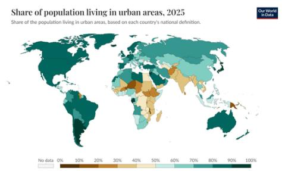

Tampered Chart  
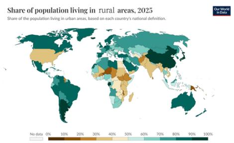

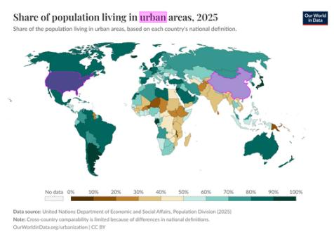

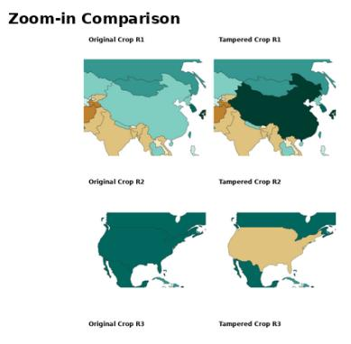  
Figure 18: Compound-relation error for VAD sample 00100. The title changes from urban to rural population share while the United States and China are also recolored. VizAnchor recognizes the altered topic and both afected countries but does not match the benchmark reference’s intended direction of the cross-country urbanization comparison. Intent cosine remains 0.834, while the normalized AI score is 0.20.

## G User Study Details

## G.1 Study Design

The user study evaluates whether human judgments support the relative quality diferences measured by the automated evaluator for two free-form tasks: manipulation-process description and misleading-intent inference. We selected ten chart-manipulation examples using stratified sampling, with one example from each of the ten tamper categories and an equal split of five examples from VAD-ReasonEval and five from VDD-ReasonEval. Each example was accompanied by the original chart, tampered chart, and tamper-region overlay.

For every example, participants evaluated outputs from three methods: VizDefender, a vanilla VLM supplied with original and tampered charts, and the complete VizAnchor pipeline. The method identities were hidden and outputs were identified only by neutral candidate numbers. The reference answer and candidate answer were displayed in both English and Chinese. Each participant completed 60 judgments: three candidate outputs for each of ten examples and for each of the two tasks. For a process answer, participants assessed whether it correctly, specifically, and completely described the concrete visual change. For an intent answer, they assessed whether it correctly and specifically captured the misleading interpretation encouraged by that change.

Responses were collected on a five-point agreement scale and mapped to $\{ - 2 , - \mathrm { \bar { 1 } } , 0 , 1 , \mathrm { \bar { 2 } } \}$ , corresponding to strongly disagree, disagree, neutral, agree, and strongly agree. The method names were never shown to participants. For analysis, the ten rating for a given task–method pair were first averaged within each participant. Thus, the participant, rather than an individual chart judgment, is the statistical unit.

## G.2 Statistical Analysis

We report the participant-level mean, standard deviation, and 95% confidence interval for each task and method. Confidence intervals use the Student-t distribution over participant-level means. A Friedman test first evaluates the omnibus diference among the three paired methods for each task. Pairwise comparisons use two-sided Wilcoxon signed-rank tests; zero diferences are excluded, average ranks are used for ties, and the large-sample normal approximation is applied without continuity correction. The three pairwise comparisons within each task are corrected using the Holm procedure. We additionally report the rank-biserial correlation $r _ { \mathrm { r b } }$ as an efect size.

## G.3 Results

Participants included 16 men, 13 women, and one individual who preferred not to disclose gender. Valid age information was available for 29 participants, with a mean of 24.07 years $\mathrm { ( S D = 4 . 2 8 ) }$ , a median of 22 years, and a range of 18–35 years. Their research backgrounds included data visualization or visual analytics (13), computer vision (4), human–computer interaction (3), education (2), design or art (1), chemistry (1), and other areas (6). No Likert-scale responses were missing.

<table><tr><td>Task</td><td>Method</td><td>Mean</td><td>SD</td><td>95% CI</td></tr><tr><td>Process</td><td>VizDefender</td><td>-0.547</td><td>0.795</td><td rowspan="3">[−0.844, -0.250] [0.926, 1.468]</td></tr><tr><td>Process</td><td>Vanilla VLM</td><td>1.197</td><td>0.726</td></tr><tr><td>Process</td><td>VizAnchor</td><td>1.437</td><td>0.624</td></tr><tr><td>Intent</td><td>VizDefender</td><td>-0.010</td><td>0.632</td><td>[−0.246,0.226]</td></tr><tr><td>Intent</td><td>Vanilla VLM</td><td>1.027</td><td>0.717</td><td rowspan="2">[0.759, 1.294]</td></tr><tr><td>Intent</td><td>VizAnchor</td><td>1.370</td><td>0.659</td></tr></table>

Table 21: Participant-level descriptive statistics. Scores range from −2 to 2.

The Friedman tests indicated diferences among methods for both process $( \chi ^ { 2 } ( 2 ) = 4 2 . 6 6 0 , p = 5 . 4 5 \times 1 0 ^ { - 1 0 }$ , Kendall’s $W = 0 . 7 1 1 )$ ) and intent $( \chi ^ { 2 } ( 2 ) = 3 9 . 1 3 8 , p = 3 . 1 \bar { 7 } \times 1 0 ^ { - 9 }$ , Kendall’s $W = 0 . 6 5 2 )$ . The pairwise results are reported in Table 22. VizAnchor received higher ratings than both comparison methods for both tasks.

<table><tr><td>Task</td><td>Comparison</td><td>W</td><td>Holm p</td><td> $r _ { \mathrm { r b } }$ </td></tr><tr><td>Process</td><td>VizAnchor vs. VizDefender</td><td>1.0</td><td> $1 . 2 6 \times 1 0 ^ { - 5 }$ </td><td>0.995</td></tr><tr><td>Process</td><td>VizAnchor vs. Vanilla VLM</td><td>25.0</td><td> $0 . 0 0 4 7 2$ </td><td>0.737</td></tr><tr><td>Process</td><td>Vanilla VLM vs. VizDefender</td><td>5.0</td><td> $1 . 2 9 \times 1 0 ^ { - 5 }$ </td><td>0.975</td></tr><tr><td>Intent</td><td>VizAnchor vs. VizDefender</td><td>0.0</td><td> $1 . 1 2 \times 1 0 ^ { - 5 }$ </td><td>1.000</td></tr><tr><td>Intent</td><td>VizAnchor vs. Vanilla VLM</td><td>45.5</td><td> $0 . 0 0 4 7 7$ </td><td>0.670</td></tr><tr><td>Intent</td><td>Vanilla VLM vs. VizDefender</td><td>11.0</td><td> $1 . 5 8 \times 1 0 ^ { - 5 }$ </td><td>0.949</td></tr></table>

Table 22: Two-sided paired Wilcoxon signed-rank tests. Holm correction is applied across the three pairwise comparisons within each task.

## H Disclosure of AI-Assisted Editing

A generative AI assistant was used for language editing and LAT X consistency checking. The authors verified all technical content, experimental settings, analyses, and reported results and take full responsibility for the manuscript.