# What Does Prompt Learning Change? A Natural-Language Concept Analysis of Vision-Language Models

Ryo Kamiya Hiroshi Kera Kazuhiko Kawamoto

Chiba University, Chiba, Japan

ryo.kamiya@chiba-u.jp, kera@chiba-u.jp, kawa@faculty.chiba-u.jp

## Abstract

Prompt learning adapts vision-language models such as CLIP by optimizing continuous prompt vectors, but the learned prompts are dificult to interpret in natural language. We present PromptSpLiCE, a post-hoc method that expresses each class-conditioned text embedding as a sparse combination of concepts from a fixed naturallanguage dictionary. Using the same dictionary before and after prompt learning allows us to compare changes in their concept profiles. We evaluate PromptSpLiCE on CoOp, a representative prompt-learning method, across 11 image-classification datasets. The concept profiles change substantially: on average, only 1.6 of the initial top-10 concepts remain in the top 10 after learning. Across datasets, profile change is positively associated with accuracy gain. We also derive a local gradient expression that provides geometric intuition for why image-aligned concept directions distinct from the current prompt can have greater loss sensitivity.

Keywords: vision-language models, prompt learning, interpretability, concept decomposition, CLIP

## 1 Introduction

Vision-language models map images and text into a shared embedding space, enabling flexible adaptation through natural-language prompts [1, 2, 3]. Contrastive Language-Image Pre-training (CLIP) [4], for example, aligns image and text representations and supports strong zero-shot transfer to tasks such as image classification and captioning [5]. The performance of CLIP, however, depends strongly on prompt design. Manual or large-language-model-based prompt design generally requires costly trial and error. Prompt learning avoids this process by optimizing a prompt as a sequence of continuous vectors [1, 6, 7, 8], but makes the resulting prompt dificult to interpret. For example, a known prompt such as “A photo of a {class}” may have an embedding $z = ( 0 . 3 0 , 0 . 2 0 , \dots )$ , while prompt learning produces $z ^ { \prime } = ( 0 . 2 9 , 0 . 2 1 , . . . )$ . These coordinate changes do not reveal which concepts have changed, and z′ need not correspond to any human-readable sentence.

Existing methods improve interpretability by guiding prompt learning with human-readable attributes or concepts [9, 10]. They encourage interpretable prompts during training, but do not provide a general post-hoc interpretation of an arbitrary learned prompt. Other work decomposes learned representations using sparse autoencoders or natural-language concepts [11, 12]. Patch-SAE [13], for example, shows that multimodal prompt learning [14] adjusts existing visual features rather than acquiring entirely new ones. However, many of the resulting features remain dificult to label in natural language.

To examine these changes in human-readable terms, we represent class-conditioned text embeddings before and after prompt learning in a shared natural-language coordinate system. Using the same concept coordinates before and after learning makes otherwise opaque embedding changes directly comparable and readable in natural-language terms. We call this approach Prompt-SpLiCE, a prompt-level application of Sparse Linear Concept Embeddings (SpLiCE) [12]. PromptSpLiCE expresses each prompt embedding as a nonnegative sparse combination of natural-language concepts, allowing changes induced by learning to be described through the resulting concept profiles.

We evaluate PromptSpLiCE on prompts learned by Context Optimization (CoOp) [1], a representative prompt-learning method, across 11 image-classification datasets. The analysis reveals substantial reorganization of the natural-language concept profiles: on average, only 1.6 of the initial top-10 concepts remain in the top 10 after learning. Qualitative results show that some recognizable class concepts persist even as less intuitive terms rise in rank. Across datasets, larger profile changes tend to accompany larger accuracy gains. A local gradient analysis further provides geometric intuition for why image-aligned concept directions distinct from the current prompt can have greater local loss sensitivity than directions parallel to it.

Our main contributions are as follows:

• We present PromptSpLiCE, a text-side post-hoc analysis that places initial and learned prompt embeddings in a shared coordinate system defined by a fixed natural-language dictionary.

• We provide a systematic analysis of CoOp across 11 datasets, revealing substantial reorganization of fitted concept profiles and illustrating this behavior across all datasets.

• We derive an embedding-level sensitivity expression that provides geometric intuition for loss-sensitive concept directions and distinguish it from the actual CoOp parameter gradient.

## 2 Related Work

## 2.1 Prompt Learning

Context Optimization (CoOp) [1] is a representative prompt-learning method for CLIP. CoOp freezes the pretrained model parameters and learns the token embeddings of a text prompt. Training maximizes the similarity between an input image and the prompt associated with its ground-truth class. The learnable token embeddings are initialized with a manually designed prompt, such as “A photo of a {class}.”

Most prompt-learning methods [1, 6, 7, 8, 14] are designed primarily to improve classification performance and do not explicitly address prompt interpretability. Recent methods further enrich soft prompts with visual concepts or structured attributes [15, 16], but the resulting task-adapted prompt generally remains a continuous vector whose semantic change is not directly observable.

Interpretability-aware methods instead guide prompt learning with human-readable knowledge, such as class attributes or concepts [9, 10, 16]. Related work also constructs interpretable classifiers by aligning local visual regions with language attributes [17]. These methods build interpretability into training or inference. In contrast, we seek to diagnose an already optimized soft prompt post hoc, without modifying its training objective or the resulting classifier.

## 2.2 Concept Decomposition of CLIP Embeddings

Post-hoc concept decomposition seeks to explain highdimensional CLIP embeddings in terms of humaninterpretable concepts while keeping the pretrained model fixed. A prominent approach uses an SAE [11] to reconstruct an embedding as a sparse linear combination of learned basis vectors. Each basis vector can be interpreted from the common properties of the inputs on which it activates.

This framework has been extended rapidly to vision and vision-language models. PatchSAE [13] compares intermediate visual-feature activations before and after MaPLe adaptation [14], including High→High, High→Low, and Low→High groups, and tests their influence through top-k latent masking. Our analysis is complementary: it studies final text embeddings after CoOp learning and uses a fixed natural-language dictionary, but does not include an intervention test. Later work evaluated whether SAE features are monosemantic and human-aligned [18], aligned concept spaces across diferent vision models [19], and used SAE features for selective concept intervention [20] or post-hoc debiasing of CLIP text embeddings [21]. Because an SAE learns its dictionary automatically, assigning a precise naturallanguage label to every basis vector remains a separate

interpretation step.

SpLiCE [12] addresses this limitation by using a concept dictionary explicitly constructed from naturallanguage terms. It reconstructs CLIP embeddings as sparse nonnegative combinations of concept embeddings and evaluates the resulting representations beyond cosine reconstruction. We apply this decomposition procedure to text embeddings produced by prompt learning and compare the fitted coeficients before and after optimization.

## 3 PromptSpLiCE

Prompt learning adapts a vision-language model by optimizing continuous prompt embeddings, but changes in these embeddings are dificult to inspect directly. PromptSpLiCE decomposes the initial and learned prompt embeddings using a fixed concept dictionary and compares their fitted coeficients in a common coordinate system.

## 3.1 Concept Decomposition of Prompt Embeddings

We define PromptSpLiCE as a prompt-level application of Sparse Linear Concept Embeddings that represents a prompt embedding as a sparse linear combination of a fixed natural-language dictionary. Decomposing prompts before and after learning in the same dictionary enables their fitted coeficient profiles to be visualized and compared.

Concept embedding dictionary. Let a set of M concepts be specified in natural language. The CLIP text encoder $g ( \cdot )$ maps each concept to an embedding $\boldsymbol { c } _ { j } \in \mathbb { R } ^ { D }$ . We arrange these embeddings as the columns of a concept dictionary

$$
\pmb { C } = [ \pmb { c } _ { 1 } , \pmb { c } _ { 2 } , \ldots , \pmb { c } _ { M } ] \in \mathbb { R } ^ { D \times M } .\tag{1}
$$

Embedding preprocessing. CLIP text embeddings are anisotropic and tend to share a large component in a common direction [22]. Under this anisotropy, the common component shared by concept and prompt embeddings can dominate the reconstruction objective, obscuring diferences among concepts. We mitigate this efect by centering and normalizing the embeddings. Let

$$
\pmb { \mu } = \frac { 1 } { M } \sum _ { j = 1 } ^ { M } \pmb { c } _ { j }\tag{2}
$$

be the mean concept embedding. We define

$$
\tilde { c } _ { j } = \frac { \pmb { c } _ { j } - \pmb { \mu } } { \| \pmb { c } _ { j } - \pmb { \mu } \| _ { 2 } } , \quad \tilde { z } = \frac { z - \pmb { \mu } } { \| z - \pmb { \mu } \| _ { 2 } } ,\tag{3}
$$

and replace Eq. (1) by

$$
\begin{array} { r } { \tilde { \cal C } = [ \tilde { c } _ { 1 } , \tilde { c } _ { 2 } , \dots , \tilde { c } _ { M } ] . } \end{array}\tag{4}
$$

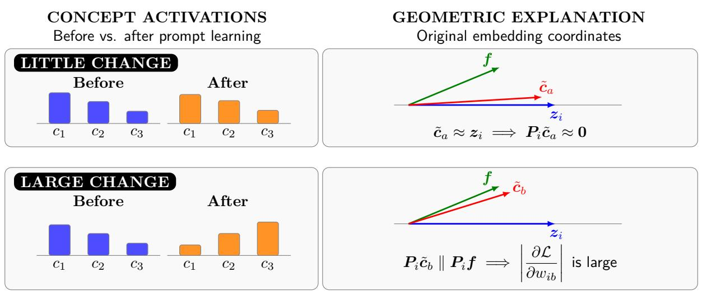  
Figure 1: Illustration of fitted concept-coeficient changes and the local geometric intuition considered in this work. A dictionary direction parallel to the current prompt has a small tangent component, whereas an image-aligned tangent component can have greater local loss sensitivity.

Concept-coeficient estimation. We approximate z˜ by a linear combination of the centered concept embeddings. Let $\pmb { w } \in \mathbb R _ { > 0 } ^ { M }$ be a nonnegative vector of decomposition coeficients. We solve

$$
\pmb { w } ^ { * } = \underset { \pmb { w } \geq 0 } { \arg \operatorname* { m i n } } \ \frac { 1 } { 2 } \| \tilde { C } \pmb { w } - \tilde { z } \| _ { 2 } ^ { 2 } + \lambda \| \pmb { w } \| _ { 1 } ,\tag{5}
$$

where λ controls the trade-of between reconstruction error and sparsity. The $\ell _ { 1 }$ penalty sets many coeficients to zero. The coeficients are fitted post hoc and are not activations measured inside CLIP. Because the dictionary is overcomplete and contains correlated word embeddings, similar reconstructions may admit diferent coeficient supports. Equation (3) removes the length of the centered residual. In particular, if

$$
\rho _ { z } = \| z - \mu \| _ { 2 } , \quad z = \mu + \rho _ { z } \tilde { z } ,\tag{6}
$$

then an exact inversion requires both the direction z˜ and the scale $\rho _ { z }$ . The formulation used here retains the direction and fixes the residual scale to one. Assuming that z has unit norm, the resulting direction-only reconstruction is

$$
z \approx \frac { \tilde { C } w ^ { * } + \mu } { \Vert \tilde { C } w ^ { * } + \mu \Vert _ { 2 } } .\tag{7}
$$

Appendix A.1 gives the corresponding scale-aware expression and makes explicit the approximation introduced by this convention.

## 3.2 Local Sensitivity in Concept Coordinates

We next analyze a hypothetical local sensitivity of a cosine-similarity-based classification objective in concept coordinates. We regard wi as a local coordinate vector for the reconstructed text embedding of class i, while holding the image embedding and the other class embeddings fixed. In this setting, prompt learning does not optimize ${ \pmb w } _ { i }$ directly; it optimizes prompt parameters, and PromptSpLiCE fits wi afterward. Thus, the following derivative is an embedding-level sensitivity rather than the gradient with respect to the prompt parameters or the total derivative of the fitted Lasso solution. For the prompt associated with class i, the chain rule gives

$$
\frac { \partial \mathcal { L } } { \partial w _ { i j } } = \frac { \partial \mathcal { L } } { \partial s _ { i } } \frac { \partial s _ { i } } { \partial w _ { i j } } ,\tag{8}
$$

where $\mathcal { L }$ is the cross-entropy loss, $w _ { i j }$ is the fitted coeficient of dictionary term $j$ for class $i ,$ and $s _ { i }$ is the cosine similarity for class i.

Under the direction-only reconstruction convention in Eq. (7), let $f \in \mathbb { R } ^ { D }$ be a unit-normalized image embedding and define

$$
\pmb { u } _ { i } = \tilde { C } \pmb { w } _ { i } + \pmb { \mu } , \quad z _ { i } = \frac { \pmb { u } _ { i } } { \lVert \pmb { u } _ { i } \rVert _ { 2 } } , \quad s _ { i } = \pmb { f } ^ { \top } z _ { i } .\tag{9}
$$

The class probabilities are

$$
p _ { i } = \frac { \exp ( s _ { i } / \tau ) } { \sum _ { k } \exp ( s _ { k } / \tau ) } ,\tag{10}
$$

where τ is the softmax temperature. For a one-hot target t and cross-entropy loss $\textstyle { \mathcal { L } } = - \sum _ { k } t _ { k }$ log $p _ { k }$ , the softmax derivative is

$$
\frac { \partial \mathcal { L } } { \partial s _ { i } } = \frac { p _ { i } - t _ { i } } { \tau } .\tag{11}
$$

The remaining derivatives are

$$
\frac { \partial s _ { i } } { \partial z _ { i } } = { \pmb f } ^ { \top } , \frac { \partial z _ { i } } { \partial { \pmb u } _ { i } } = \frac { 1 } { \| { \pmb u } _ { i } \| _ { 2 } } \left( { \pmb I } - z _ { i } z _ { i } ^ { \top } \right) , \frac { \partial { \pmb u } _ { i } } { \partial w _ { i j } } = \tilde { \pmb \ c } _ { j } .\tag{12}
$$

Combining Eq. (8), Eq. (11), and Eq. (12) gives

$$
\frac { \partial \mathcal { L } } { \partial w _ { i j } } = \frac { p _ { i } - t _ { i } } { \tau \| \mathbf { \boldsymbol { u } } _ { i } \| _ { 2 } } \pmb { f } ^ { \top } \left( \pmb { I } - z _ { i } \pmb { z } _ { i } ^ { \top } \right) \tilde { \pmb { c } } _ { j } .\tag{13}
$$

The complete diferential calculation and its relation to the underlying prompt parameters are provided in Appendix A.2.

The factor $p _ { i } - t _ { i }$ in Eq. (12) reflects the prediction error. For the ground-truth class, it is $p _ { i } - 1$ , whose magnitude is larger when the correct-class probability is low and approaches zero as the prediction becomes confident. The temperature τ and the norm $\| \mathbf { \boldsymbol { u } } _ { i } \| _ { 2 }$ scale the update without changing its qualitative dependence on the concept direction. The direction-dependent term in Eq. (13) can be written as

$$
\pmb { f } ^ { \top } \left( \pmb { I } - \pmb { z } _ { i } \pmb { z } _ { i } ^ { \top } \right) \tilde { \pmb { c } } _ { j } = \pmb { f } ^ { \top } \tilde { \pmb { c } } _ { j } - s _ { i } \pmb { z } _ { i } ^ { \top } \tilde { \pmb { c } } _ { j } .\tag{14}
$$

The matrix $\pmb { I } - z _ { i } z _ { i } ^ { \top }$ projects onto the subspace orthogonal to the current prompt embedding. Equation (14) therefore measures how strongly the component of dictionary direction $j$ orthogonal to the prompt aligns with the image embedding. If $\tilde { c } _ { j }$ is nearly parallel to $z _ { i } ,$ its projected component and the hypothetical derivative with respect to $w _ { i j }$ are small.

Figure 1 illustrates when concept changes can be small or large in this local view. For comparable predictionerror and scale factors, a concept changes little when its dictionary direction is nearly parallel to the current prompt embedding $z _ { i } ,$ because its component orthogonal to $z _ { i }$ is small (upper). In contrast, a concept can change substantially when its orthogonal component aligns with that of the image embedding f, resulting in high local loss sensitivity (lower).

## 4 Experiments

We evaluate PromptSpLiCE as a post-hoc naturallanguage decomposition of prompt embeddings before and after learning. We first assess reconstruction of the full coeficient vector and then examine changes in its ranking and distribution.

## 4.1 Experimental Setup

Datasets. We use 11 image-classification datasets: ImageNet [23], OxfordPets [24], Caltech101 [25], StanfordCars [26], Food101 [27], Flowers102 [28], FGVCAircraft [29], SUN397 [30], DTD [31], EuroSAT [32], and UCF101 [33]. Together, they cover generic object recognition, fine-grained classification, scene recognition, action recognition, texture recognition, and satellite-image classification.

Vision-language model and prompt learning. We use CLIP [4] with a ResNet-50 image encoder [34]; both the image and text encoders are pretrained and frozen. We apply CoOp [1], initialize its context with “A photo of a {class},” and train it with 16 images per class. The context tokens are optimized by SGD for 200 epochs with a batch size of 32 and a base learning rate of $2 \times 1 0 ^ { - 3 }$ . The first epoch uses a warm-up learning rate of $1 \times 1 0 ^ { - 5 }$ , followed by cosine annealing. As shown in Fig. 2, this setting improves classification accuracy on every dataset. The largest gain is 60.3 percentage points on EuroSAT. All reported analyses use this single RN50–CoOp configuration.

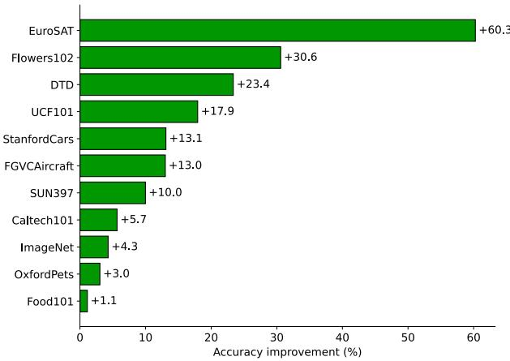  
Figure 2: Improvement in classification accuracy obtained by CoOp relative to the initial CLIP prompt.

Concept decomposition. Following SpLiCE [12], we construct the concept dictionary from the 10,000 most frequent words extracted from LAION-400M captions [35]. The frequency-derived vocabulary contains misspellings and other noisy lexical items, which limits the readability of some fitted labels. The mean of the concept embeddings is used to center both concept and prompt embeddings. We solve Eq. (5) using the alternating direction method of multipliers (ADMM) [36] and set the $\ell _ { 1 }$ regularization coeficient to $\lambda = 0 . 0 1$ unless otherwise stated.

## 4.2 Embedding Reconstruction Fidelity

We first evaluate how closely the full PromptSpLiCE decomposition reconstructs an original prompt embedding z. The evaluation metric is the cosine similarity between z and its reconstruction from Eq. (7):

$$
\cos \left( z , \frac { \tilde { C } \pmb { w } ^ { * } + \pmb { \mu } } { \| \tilde { C } \pmb { w } ^ { * } + \pmb { \mu } \| _ { 2 } } \right) .\tag{15}
$$

A value close to one indicates directional agreement between the original embedding and the reconstruction from the full coeficient vector. It does not establish that the top-ranked terms alone faithfully represent the prompt or preserve its predictions.

Figure 3 reports the average over the 11 datasets for prompts before and after learning. We vary the regularization coeficient in Eq. (5) over $\lambda \in$ $\{ 0 . 5 , 0 . 4 , 0 . 3 , 0 . 2 , 0 . 1 , 0 . 0 5 , 0 . 0 1 \}$ The horizontal axis shows the number of nonzero coeficients for each value of λ. At λ = 0.01, the learned prompts have approximately 450 nonzero coeficients and achieve a cosine similarity of 0.98. Although this is sparse relative to the 10,000-term dictionary, 450 terms do not constitute a concise explanation. The top-10 displays below are illustrative subsets of this larger solution; their cumulative mass and reconstruction fidelity are not evaluated here.

Figure 4 shows example decompositions for the EuroSAT class “Annual Crop Land” and the StanfordCars class “2012 FIAT 500 Convertible.” For Annual Crop

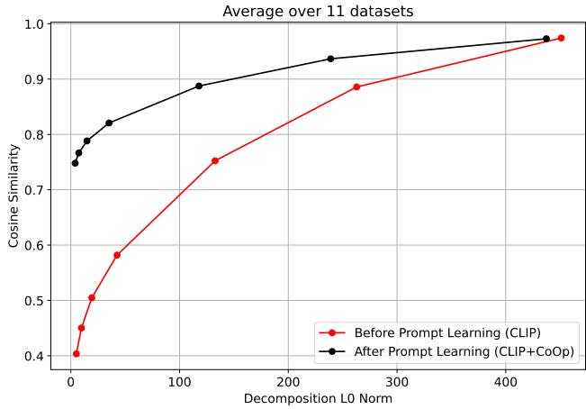

Figure 3: Cosine similarity between original prompt embeddings and their full PromptSpLiCE reconstructions, averaged over 11 datasets. Sparsity is controlled by $\lambda \ \in$ {0.5, 0.4, 0.3, 0.2, 0.1, 0.05, 0.01}.  
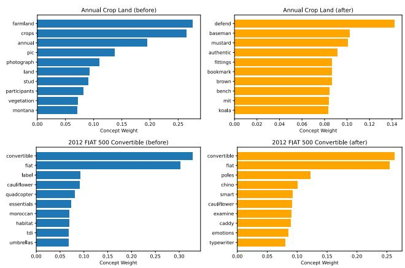  
Figure 4: Top-10 dictionary terms and their fitted coeficients before and after prompt learning. The top row shows EuroSAT’s “Annual Crop Land” class, and the bottom row shows StanfordCars’ “2012 FIAT 500 Convertible” class.

Land, farmland and crops have high fitted coeficients for the initial prompt, whereas defend and baseman rank highly for the learned prompt.

## 4.3 Changes in Coeficient Profiles

We compare the fitted coeficient rankings before and after prompt learning. These rankings are obtained with a fixed dictionary, solver, and regularization value and should not be interpreted as direct measurements of internal concept activation.

## 4.3.1 Quantitative Analysis

Each dictionary term is assigned to one of three groups:

• High→High: ranked in the top 10 both before and after learning;

• High→Low: ranked in the top 10 before learning but below the top 100 after learning; and

• Low→High: ranked below the top 100 before learning but in the top 10 after learning.

Table 1: Average number of dictionary terms in each ranktransition group.
<table><tr><td>Dataset</td><td>High→High</td><td>High→Low</td><td>Low→High</td></tr><tr><td>EuroSAT</td><td>0.3</td><td>9.2</td><td>9.4</td></tr><tr><td>DTD</td><td>0.8</td><td>8.3</td><td>8.5</td></tr><tr><td>FGVCAircraft</td><td>1.1</td><td>7.3</td><td>7.2</td></tr><tr><td>UCF101</td><td>1.2</td><td>7.8</td><td>7.8</td></tr><tr><td>Caltech101</td><td>1.5</td><td>7.1</td><td>7.2</td></tr><tr><td>Food101</td><td>1.6</td><td>6.3</td><td>6.5</td></tr><tr><td>Flowers102</td><td>1.9</td><td>6.0</td><td>5.9</td></tr><tr><td>ImageNet</td><td>1.9</td><td>6.2</td><td>6.9</td></tr><tr><td>SUN397</td><td>1.9</td><td>6.6</td><td>6.6</td></tr><tr><td>StanfordCars</td><td>2.5</td><td>4.8</td><td>4.7</td></tr><tr><td>OxfordPets</td><td>3.1</td><td>4.7</td><td>4.5</td></tr><tr><td>Average</td><td>1.6</td><td>6.8</td><td>6.8</td></tr></table>

The top-10 and below-100 cutofs provide a simple descriptive summary, but they are threshold choices; crossing a boundary does not by itself imply that a modelinternal concept was suppressed or newly acquired.

Table 1 reports the average group size across classes for each dataset. High→High terms are few on most datasets, while High→Low and Low→High transitions are common. Averaged over all 11 datasets, only 1.6 of the initial top-10 terms remain in the top 10; 6.8 fall below rank 100, while 6.8 rise from below rank 100 into the top 10.

EuroSAT exhibits the largest change in the fitted coeficient rankings, with averages of 0.3, 9.2, and 9.4 for High→High, High→Low, and Low→High, respectively. Limited coverage of satellite-domain terms in the general-purpose LAION-derived dictionary may contribute to this result. Across datasets, the fitted rankings change substantially. However, because correlated dictionary terms can replace one another in the Lasso solution, these changes may arise from both CoOpinduced changes and instability in the decomposition.

## 4.3.2 Qualitative Analysis

Figure 5 compares fitted coeficient rankings before and after learning, showing larger changes for EuroSAT than for StanfordCars. For EuroSAT’s “Annual Crop Land” class, directly related terms such as farmland and crops move from the top 10 to below rank 100, whereas defend and baseman make the opposite transition. For StanfordCars’ “2012 FIAT 500 Convertible” class, classrelated terms such as fiat and convertible remain highly ranked, while less intuitive terms such as poles and typewriter move upward.

Figure 6 shows two complementary cases. For Flowers102’s “moon orchid” class, orchids remains highly ranked, but moon, orchid, and bulb move downward; checkers, joined, and peel move upward instead. For SUN397’s “videostore” class, a coherent set of scenerelated terms, including dvd, store, retailer, and cinema, retains high coeficients, while shops and films move downward and less intuitive terms move upward.

Taken together, these examples show that the selected dictionary profile does not necessarily preserve the rank of terms that humans regard as semantically related to a class, nor does it uniformly move them downward. Appendix B provides corresponding examples for the remaining seven datasets.

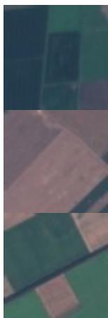

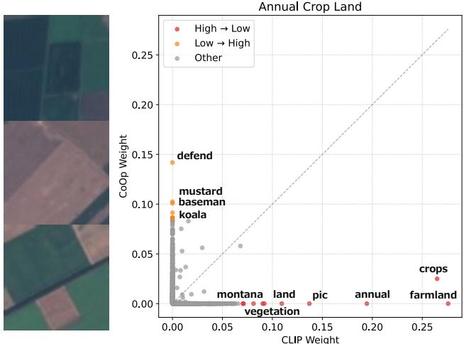  
(a) EuroSAT: “Annual Crop Land”

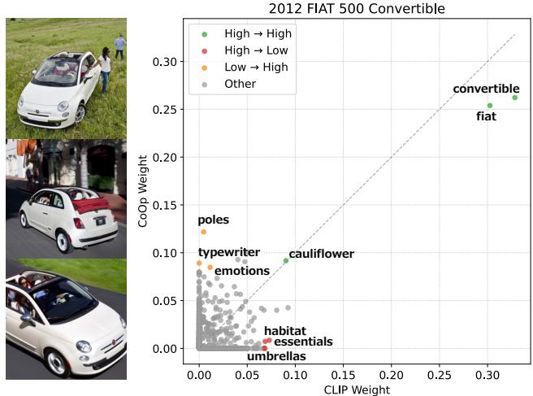  
(b) StanfordCars: “2012 FIAT 500 Convertible”  
Figure 5: Changes in fitted decomposition coeficients for representative classes. Each point is a dictionary term; the horizontal and vertical axes show its coeficient before (CLIP) and after (CoOp) prompt learning, respectively. Selected $\mathrm { H i g h { \to } H i g h }$ 9 High→Low, and Low→High terms are labeled.

## 4.4 Exploratory Association with Accuracy Gain

We next quantify the magnitude of the coeficientdistribution change and compare it with the accuracy gain from prompt learning. Let P and Q be the normalized nonnegative PromptSpLiCE coeficient distributions before and after learning, respectively. We measure their diference with the Jensen–Shannon (JS) divergence:

$$
\operatorname { J S } ( P \parallel Q ) = { \frac { 1 } { 2 } } \operatorname { K L } ( P \parallel M ) + { \frac { 1 } { 2 } } \operatorname { K L } ( Q \parallel M ) ,\tag{16}
$$

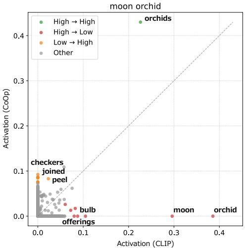  
(a) Flowers102: “moon orchid”

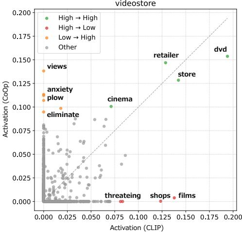  
(b) SUN397: “videostore”  
Figure 6: Complementary decomposition-coeficient changes for Flowers102 and SUN397. The axes and colors follow Fig. 5.

where $M = { \textstyle \frac { 1 } { 2 } } ( P + Q )$ and KL denotes the Kullback– Leibler divergence.

Figure 7 plots, for each of the 11 datasets, the mean JS divergence between initial and learned prompts against the corresponding accuracy gain from CoOp. The dataset-level Pearson correlation is $r \ : = \ : 0 . 6 4$ (nominal $p = 0 . 0 3 5 , n = 1 1 )$ . We treat this as an exploratory association in the present configuration. The small sample and the prominent EuroSAT endpoint make the estimate potentially sensitive to individual datasets.

## 5 Conclusion

We present PromptSpLiCE, a post-hoc method that places class-conditioned text embeddings before and after prompt learning in a shared coordinate system defined by a fixed natural-language dictionary. Applied to CoOp across 11 datasets, the analysis revealed substantial changes in the fitted concept profiles. Larger profile changes also tended to accompany larger accuracy gains. A local gradient analysis provided geometric intuition for why image-aligned concept directions distinct from the current prompt can have greater loss sensitivity.

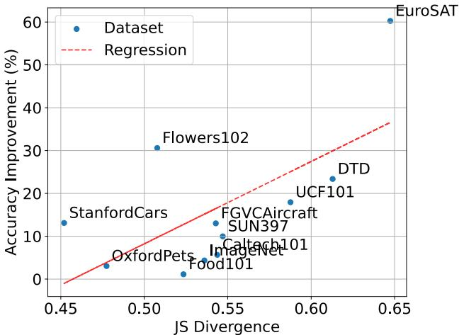  
Figure 7: Mean fitted coeficient-distribution change versus classification-accuracy improvement across the 11 datasets (Pearson’s $r = 0 . 6 4 )$ . The dashed line is a linear regression fit. The 11-point association is exploratory.

PromptSpLiCE makes changes in continuous prompts readable through named concepts without modifying the prompt-learning procedure. It therefore provides a practical text-side diagnostic that can be applied beyond CoOp and complements analyses of visual representations.

## Acknowledgments

This work was supported by JSPS KAKENHI Grant Number 26K23832.

## References

[1] Kaiyang Zhou, Jingkang Yang, Chen Change Loy, and Ziwei Liu. Learning to prompt for visionlanguage models. International Journal of Computer Vision, 130(9):2337–2348, 2022.

[2] Chao Jia et al. Scaling up visual and visionlanguage representation learning with noisy text supervision. In International Conference on Machine Learning, pages 4904–4916, 2021.

[3] Junnan Li, Dongxu Li, Caiming Xiong, and Steven C. H. Hoi. BLIP: Bootstrapping language-image pre-training for unified vision-language understanding and generation. In International Conference on Machine Learning, pages 12888–12900, 2022.

[4] Alec Radford et al. Learning transferable visual models from natural language supervision. In International Conference on Machine Learning, pages 8748–8763, 2021.

[5] Wei Li, Linchao Zhu, Longyin Wen, and Yi Yang. DeCap: Decoding CLIP latents for zero-shot captioning via text-only training. In International Conference on Learning Representations, 2023.

[6] Kaiyang Zhou, Jingkang Yang, Chen Change Loy, and Ziwei Liu. Conditional prompt learning for vision-language models. In Computer Vision and Pattern Recognition, pages 16816–16825, 2022.

[7] Hantao Yao, Rui Zhang, and Changsheng Xu. Visual-language prompt tuning with knowledgeguided context optimization. In Computer Vision and Pattern Recognition, pages 6757–6767, 2023.

[8] Adrian Bulat and Georgios Tzimiropoulos. LASP: Text-to-text optimization for language-aware soft prompting of vision & language models. In Computer Vision and Pattern Recognition, pages 23232– 23241, 2023.

[9] Soumya Suvra Ghosal, Samyadeep Basu, Soheil Feizi, and Dinesh Manocha. IntCoOp: Interpretability-aware vision-language prompt tuning. In Empirical Methods in Natural Language Processing, pages 19584–19601, 2024.

[10] Yequan Bie, Luyang Luo, Zhixuan Chen, and Hao Chen. XCoOp: Explainable prompt learning for computer-aided diagnosis via concept-guided context optimization. In Medical Image Computing and Computer Assisted Intervention, pages 773– 783, 2024.

[11] Robert Huben, Hoagy Cunningham, Logan Riggs Smith, Aidan Ewart, and Lee Sharkey. Sparse autoencoders find highly interpretable features in language models. In International Conference on Learning Representations, 2024.

[12] Usha Bhalla, Alex Oesterling, Suraj Srinivas, Flávio P. Calmon, and Himabindu Lakkaraju. Interpreting CLIP with sparse linear concept embeddings (SpLiCE). In Neural Information Processing Systems, volume 37, 2024.

[13] Hyesu Lim, Jinho Choi, Jaegul Choo, and Stefen Schneider. Sparse autoencoders reveal selective remapping of visual concepts during adaptation. In International Conference on Learning Representations, 2025.

[14] Muhammad Uzair Khattak, Hanoona Abdul Rasheed, Muhammad Maaz, Salman H. Khan, and Fahad Shahbaz Khan. MaPLe: Multi-modal prompt learning. In Computer Vision and Pattern Recognition, pages 19113–19122, 2023.

[15] Jingjing Xie, Yuxin Zhang, Jun Peng, Zhaohong Huang, and Liujuan Cao. TextRefiner: Internal visual feature as eficient refiner for vision-language models prompt tuning. In Proceedings of the AAAI Conference on Artificial Intelligence, volume 39, pages 8718–8726, 2025.

[16] Shiyu Hou, Tianfei Zhou, Shuai Zhang, Ye Yuan, and Guoren Wang. Prompt tuning in a compact attribute space. In Proceedings of the AAAI Conference on Artificial Intelligence, volume 39, pages 3518–3526, 2025.

[17] Shiming Chen, Bowen Duan, Salman Khan, and Fahad Shahbaz Khan. Interpretable zero-shot learning with locally-aligned vision-language model. In International Conference on Computer Vision, pages 478–487, 2025.

[18] Mateusz Pach, Shyamgopal Karthik, Quentin Bouniot, Serge Belongie, and Zeynep Akata. Sparse autoencoders learn monosemantic features in vision-language models. In Neural Information Processing Systems, volume 38, 2025.

[19] Harrish Thasarathan, Julian Forsyth, Thomas Fel, Matthew Kowal, and Konstantinos G. Derpanis. Universal sparse autoencoders: Interpretable crossmodel concept alignment. In International Conference on Machine Learning, volume 267, pages 59304–59325, 2025.

[20] Jiahui Geng and Qing Li. SAUCE: Selective concept unlearning in vision-language models with sparse autoencoders. In International Conference on Computer Vision, pages 3023–3033, 2025.

[21] Quentin Guimard, Federico Bartsch, Simone Caldarella, Rahaf Aljundi, Elisa Ricci, and Massimiliano Mancini. SEM: Sparse embedding modulation for post-hoc debiasing of vision-language models. In Computer Vision and Pattern Recognition Findings, pages 8101–8110, 2026.

[22] Victor Weixin Liang, Yuhui Zhang, Yongchan Kwon, Serena Yeung, and James Y. Zou. Mind the gap: Understanding the modality gap in multimodal contrastive representation learning. In Neural Information Processing Systems, volume 35, pages 17612–17625, 2022.

[23] Jia Deng, Wei Dong, Richard Socher, Li-Jia Li, Kai Li, and Li Fei-Fei. ImageNet: A large-scale hierarchical image database. In Computer Vision and Pattern Recognition, pages 248–255, 2009.

[24] Omkar M. Parkhi, Andrea Vedaldi, Andrew Zisserman, and C. V. Jawahar. Cats and dogs. In Computer Vision and Pattern Recognition, pages 3498–3505, 2012.

[25] Li Fei-Fei, Rob Fergus, and Pietro Perona. Learning generative visual models from few training examples: An incremental bayesian approach tested on 101 object categories. In Computer Vision and Pattern Recognition Workshops, page 178, 2004.

[26] Jonathan Krause, Michael Stark, Jia Deng, and Li Fei-Fei. 3d object representations for fine-grained categorization. In International Conference on Computer Vision Workshops, pages 554–561, 2013.

[27] Lukas Bossard, Matthieu Guillaumin, and Luc Van Gool. Food-101 - mining discriminative components with random forests. In European Conference on Computer Vision, pages 446–461, 2014.

[28] Maria-Elena Nilsback and Andrew Zisserman. Automated flower classification over a large number of classes. In Indian Conference on Computer Vision, Graphics and Image Processing, pages 722–729, 2008.

[29] Subhransu Maji, Esa Rahtu, Juho Kannala, Matthew B. Blaschko, and Andrea Vedaldi. Fine-grained visual classification of aircraft. arXiv:1306.5151, 2013.

[30] Jianxiong Xiao, James Hays, Krista A. Ehinger, Aude Oliva, and Antonio Torralba. Sun database: Large-scale scene recognition from abbey to zoo. In Computer Vision and Pattern Recognition, pages 3485–3492, 2010.

[31] Mircea Cimpoi, Subhransu Maji, Iasonas Kokkinos, Sammy Mohamed, and Andrea Vedaldi. Describing textures in the wild. In Computer Vision and Pattern Recognition, pages 3606–3613, 2014.

[32] Patrick Helber, Benjamin Bischke, Andreas Dengel, and Damian Borth. EuroSAT: A novel dataset and deep learning benchmark for land use and land cover classification. IEEE Journal of Selected Topics in Applied Earth Observations and Remote Sensing, 12(7):2217–2226, 2019.

[33] Khurram Soomro, Amir Roshan Zamir, and Mubarak Shah. UCF101: A dataset of 101 human actions classes from videos in the wild. arXiv preprint arXiv:1212.0402, 2012.

[34] Kaiming He, Xiangyu Zhang, Shaoqing Ren, and Jian Sun. Deep residual learning for image recognition. In Computer Vision and Pattern Recognition, pages 770–778, 2016.

[35] Christoph Schuhmann, Richard Vencu, Romain Beaumont, Robert Kaczmarczyk, Clayton Mullis, Aarush Katta, Theo Coombes, Jenia Jitsev, and Aran Komatsuzaki. LAION-400M: Open dataset of CLIP-filtered 400 million image-text pairs. arXiv:2111.02114, 2021.

[36] Stephen P. Boyd, Neal Parikh, Eric Chu, Borja Peleato, and Jonathan Eckstein. Distributed optimization and statistical learning via the alternating direction method of multipliers. Foundations and Trends in Machine Learning, 3(1):1–122, 2011.

## A Detailed Derivations

## A.1 Reconstruction after Centering and Normalization

The preprocessing in Eq. (3) separates the centered prompt embedding into a direction and a scale. Define

$$
\rho _ { z } = \| z - \mu \| _ { 2 } .\tag{17}
$$

Provided that $\rho _ { z } > 0 ,$ multiplying Eq. (3) by $\rho _ { z }$ gives

$$
z - \mu = \rho _ { z } \tilde { z } , \quad z = \mu + \rho _ { z } \tilde { z } .\tag{18}
$$

Let the decomposition residual be

$$
\begin{array} { r } { e = \tilde { C } w ^ { \ast } - \tilde { z } . } \end{array}\tag{19}
$$

If the discarded scale is retained, the unnormalized reconstruction is

$$
\widehat { \pmb u } ( \rho _ { z } ) = \pmb \mu + \rho _ { z } \tilde { C } \pmb w ^ { * } = z + \rho _ { z } \pmb e .\tag{20}
$$

Hence, before the final unit normalization,

$$
\| \widehat { \pmb { u } } ( \rho _ { z } ) - z \| _ { 2 } = \rho _ { z } \| e \| _ { 2 } .\tag{21}
$$

The corresponding scale-aware unit vector is

$$
\widehat { z } ( \rho _ { z } ) = \frac { \mu + \rho _ { z } \tilde { C } w ^ { * } } { \lVert \mu + \rho _ { z } \tilde { C } w ^ { * } \rVert _ { 2 } } .\tag{22}
$$

When $e = { \bf 0 }$ and z is unit-normalized, $\operatorname { E q . }$ (22) recovers z exactly. The direction-only reconstruction in Eq. (7) is obtained by setting $\rho _ { z } = 1$ . It therefore reconstructs the direction used by the decomposition but is not, in general, an exact inverse of the preprocessing operation.

## A.2 Local Sensitivity in Concept Coordinates

For one training example, let

$$
p _ { k } = \frac { \exp ( s _ { k } / \tau ) } { \sum _ { \ell } \exp ( s _ { \ell } / \tau ) } , \quad \mathcal { L } = - \sum _ { k } t _ { k } \log p _ { k } ,\tag{23}
$$

where $\textstyle \sum _ { k } t _ { k } = 1$ . Substituting the softmax into the loss gives

$$
\mathcal { L } = - \frac { 1 } { \tau } \sum _ { k } t _ { k } s _ { k } + \log \sum _ { \ell } \exp ( s _ { \ell } / \tau ) .\tag{24}
$$

Diferentiating each term with respect to $s _ { i }$ yields

$$
\frac { \partial \mathcal { L } } { \partial s _ { i } } = - \frac { t _ { i } } { \tau } + \frac { 1 } { \tau } \frac { \exp ( s _ { i } / \tau ) } { \sum _ { \ell } \exp ( s _ { \ell } / \tau ) } = \frac { p _ { i } - t _ { i } } { \tau } .\tag{25}
$$

Next, set $r _ { i } = \| \pmb { u } _ { i } \| _ { 2 }$ and $z _ { i } = { \pmb u } _ { i } / r _ { i }$ . The diferential of the norm is

$$
\mathrm { d } r _ { i } = \frac { \pmb { u } _ { i } ^ { \top } \mathrm { d } \pmb { u } _ { i } } { r _ { i } } = z _ { i } ^ { \top } \mathrm { d } \pmb { u } _ { i } .\tag{26}
$$

Using the product rule on $z _ { i } = u _ { i } r _ { i } ^ { - 1 }$ gives

$$
\mathrm { d } z _ { i } = \frac { \mathrm { d } { \pmb u } _ { i } } { r _ { i } } - \frac { { \pmb u } _ { i } } { r _ { i } ^ { 2 } } \mathrm { d } r _ { i } = \frac { 1 } { r _ { i } } \left( { \pmb I } - z _ { i } { \pmb z } _ { i } ^ { \top } \right) \mathrm { d } { \pmb u } _ { i } .\tag{27}
$$

Because $\begin{array} { r } { { \pmb u } _ { i } = \tilde { C } { \pmb w } _ { i } + { \pmb \mu } _ { : } } \end{array}$

$$
\frac { \partial { \pmb u } _ { i } } { \partial w _ { i j } } = \tilde { \pmb { c } } _ { j } .\tag{28}
$$

It follows from $s _ { i } = \pmb { f } ^ { \top } z _ { i }$ that

$$
\frac { \partial s _ { i } } { \partial w _ { i j } } = \frac { 1 } { \Vert \pmb { u } _ { i } \Vert _ { 2 } } \pmb { f } ^ { \top } \left( \pmb { I } - z _ { i } \pmb { z } _ { i } ^ { \top } \right) \tilde { \pmb { c } } _ { j } .\tag{29}
$$

Multiplying Eq. (25) and Eq. (29) gives Eq. (13). Equivalently, the gradient with respect to the entire conceptcoordinate vector is

$$
\nabla _ { \pmb { w } _ { i } } \mathcal { L } = \frac { p _ { i } - t _ { i } } { \tau \| \pmb { u } _ { i } \| _ { 2 } } \tilde { C } ^ { \top } \left( \pmb { I } - \pmb { z } _ { i } \pmb { z } _ { i } ^ { \top } \right) \pmb { f } .\tag{30}
$$

This calculation treats ${ \pmb w } _ { i }$ as a local coordinate vector and assumes that it afects only $s _ { i }$ . The underlying prompt-learning method instead optimizes prompt parameters θ, which may be shared across classes. If $J _ { i } = \partial z _ { i } / \partial \theta$ denotes the text-embedding Jacobian, its parameter gradient has the more general form

$$
\nabla _ { \theta } \mathcal { L } = \sum _ { i } J _ { i } ^ { \top } \nabla _ { z _ { i } } \mathcal { L } ,\tag{31}
$$

where $J _ { i }$ includes the text-encoder Jacobian and any cross-class parameter sharing. Therefore, Eq. (13) should be interpreted as a class-wise, embedding-level sensitivity expressed in the PromptSpLiCE coordinate system. It is not the total derivative of the post-hoc solution ${ \pmb w } _ { i } ^ { * } ( z _ { i } ( \pmb \theta ) )$ , which would additionally require diferentiating through the Lasso solution and accounting for changes in active support. At a nonnegativity boundary $w _ { i j } = 0 ,$ it describes the local unconstrained derivative; feasible perturbations of the coeficient remain one-sided.

## B Additional Qualitative Results

Figures 8–10 show the remaining seven datasets not included in Fig. 5 or Fig. 6, giving qualitative coverage of all 11 datasets. Each panel pairs representative images with a scatter plot whose horizontal and vertical axes show fitted coeficients before (CLIP) and after (CoOp) learning, respectively. Green, red, and orange points denote High→High, High→Low, and Low→High transitions; gray points show the remaining dictionary terms. These transitions vary across datasets, consistent with Table 1. The discussion below focuses on the labeled terms selected to illustrate the three transition types; these labels are examples rather than an exhaustive or unique summary of each coeficient distribution.

DTD and FGVCAircraft. For DTD’s “lined” class, lines remains highly ranked, whereas lined, photo, rectangle, and queue move downward. Terms such as sauna, baseman, and gilt move upward. For FGVCAircraft’s “Cessna $1 7 2 ^ { \mathfrak { s } }$ class, charter and helicopter remain highly ranked, while aircraft moves downward and moore, splaying, and establish move upward. Thus, categoryrelated and less intuitive dictionary terms can undergo diferent rank transitions.

UCF101 and Caltech101. For UCF101’s “Bench Press” class, lifting and bench remain highly ranked, but press and pressing move downward, while fails, creates, rowing, and moroccan move upward. For Caltech101’s “watch” class, watches and smartwatch remain highly ranked, whereas wrist moves downward and patent and bathtub move upward. These cases show that substantial coeficient-rank turnover can coexist with the retention of highly diagnostic terms.

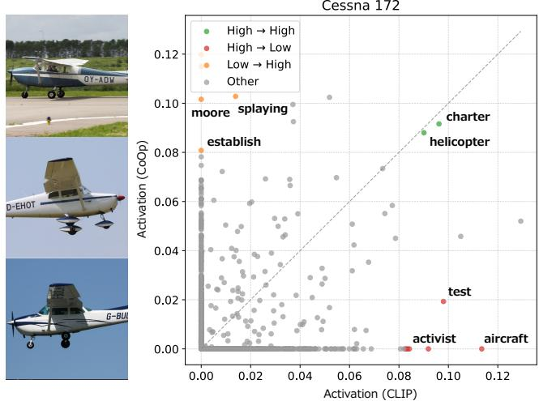

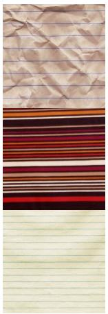

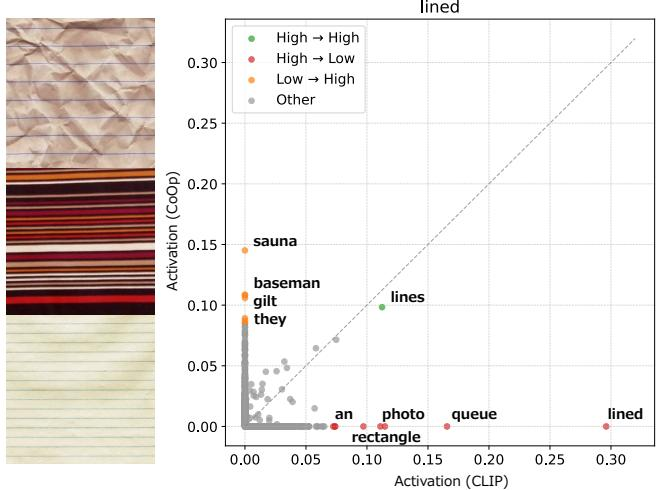  
(a) DTD: “lined”

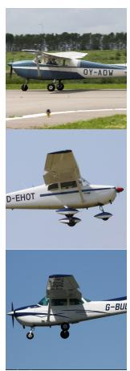  
(b) FGVCAircraft: “Cessna 172”

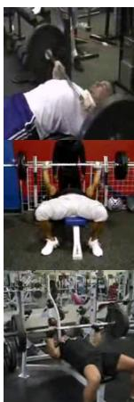

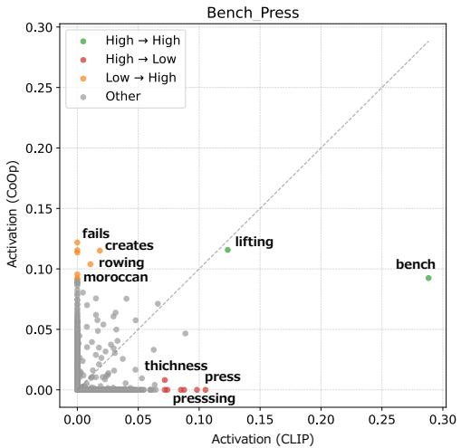  
(c) UCF101: “Bench Press”

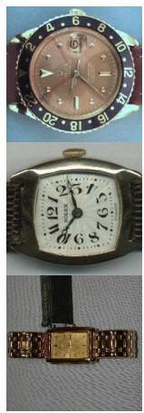

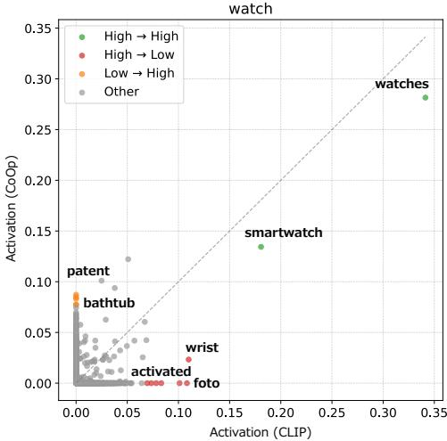  
(d) Caltech101: “watch”  
Figure 8: Additional decomposition-coeficient changes for DTD, FGVCAircraft, UCF101, and Caltech101. Colors denote High→High, High→Low, and Low→High transitions.

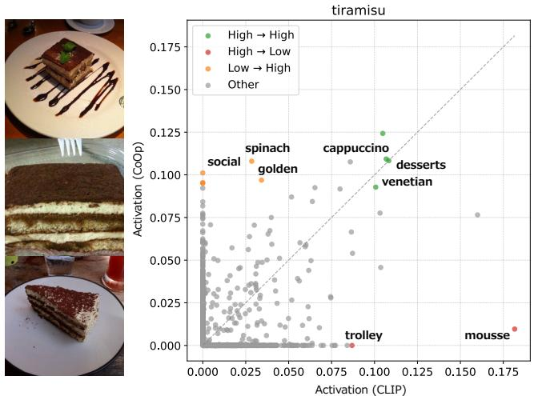  
(a) Food101: “tiramisu”

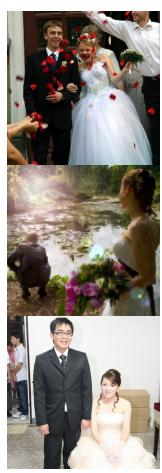

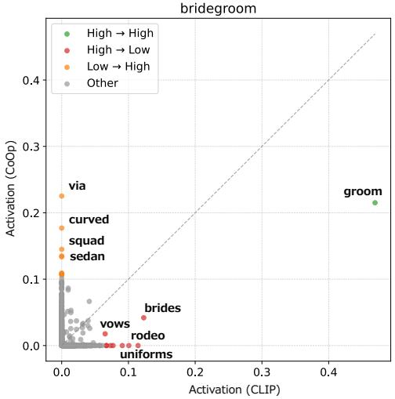  
(b) ImageNet: “bridegroom”  
Figure 9: Additional decomposition-coeficient changes for Food101 and ImageNet.

Food101 and ImageNet. For Food101’s “tiramisu” class, desserts and cappuccino remain highly ranked, while mousse moves downward and social, spinach, and golden move upward. For ImageNet’s “bridegroom” class, groom remains dominant, whereas brides, vows, and uniforms move downward and via, curved, squad, and sedan move upward. These cases again show that a central category-related term can remain highly ranked while related and less intuitive terms undergo diferent transitions.

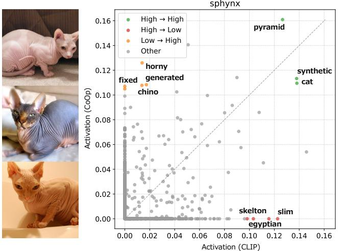  
Figure 10: Additional decomposition-coeficient changes for the OxfordPets class “sphynx.”

OxfordPets. For OxfordPets’ “sphynx” class, cat, synthetic, and pyramid remain highly ranked. In contrast, egyptian and slim move downward, while horny, fixed, generated, and chino move upward. Thus, broad and fine-grained labels can behave diferently in the fitted coeficient ranking.

Across these seven cases, at least one intuitive term often remains in the High→High group. At the same time, related terms can move to High→Low, while Low→High frequently contains labels with no clear human relation to the class. This pattern is consistent with Table 1 and illustrates why high full-embedding reconstruction fidelity does not, by itself, establish stability or semantic fidelity of the displayed top-ranked terms.