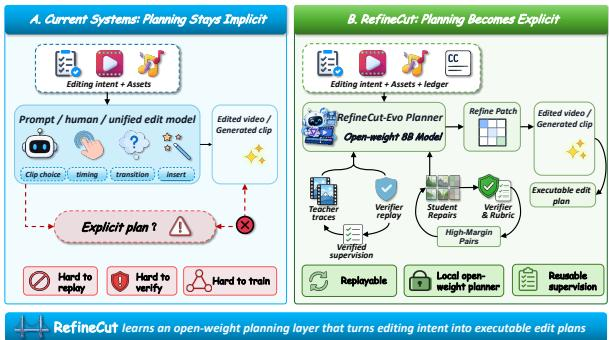
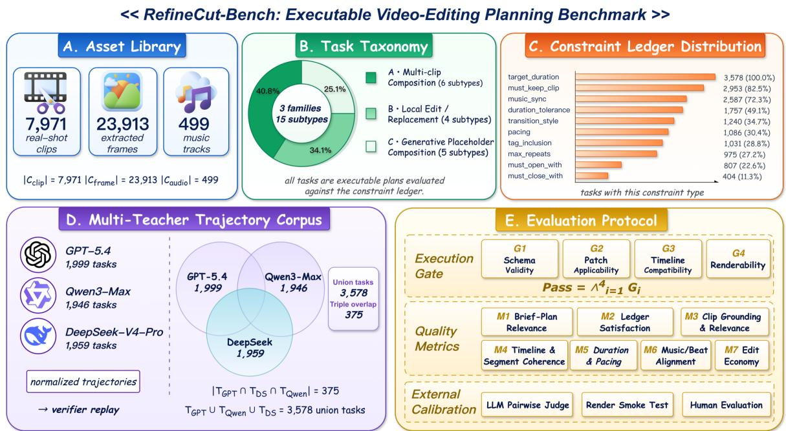
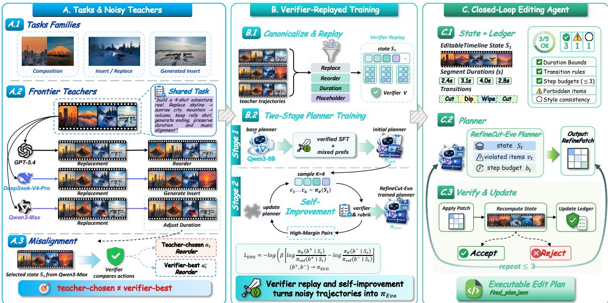
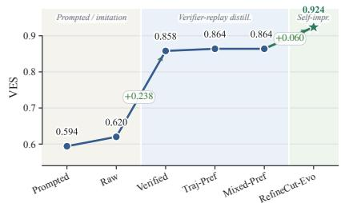
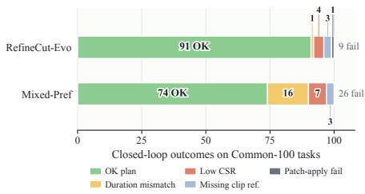

# Plans You Can Check: Verifier-Grounded Learning of an Open-Weight Planner for Executable Video-Editing

Haoyu Wang<sup>1,2,†</sup>, Cheng Feng<sup>3,†</sup>, Liuyang Bian<sup>2,†</sup>, Ruiyang Huang<sup>4,5,†</sup>

Lei Wei<sup>5</sup>, Yafei Wen<sup>2</sup>, Xiaoxin Chen<sup>2</sup>, Xiaoying Tang<sup>6,7,8,Q</sup>

<sup>1</sup>School of Artificial Intelligence, The Chinese University of Hong Kong, Shenzhen

<sup>2</sup>vivo AI Lab <sup>3</sup>University of the Chinese Academy of Sciences <sup>4</sup>Southeast University <sup>5</sup>Peking University

<sup>6</sup>School of Science and Engineering, The Chinese University of Hong Kong, Shenzhen <sup>7</sup>Shenzhen Future Network of Intelligence Institute (FNii-Shenzhen) <sup>8</sup>Guangdong Provincial Key Laboratory of Future Networks of Intelligence, CUHK-Shenzhen <sup>Q</sup>tangxiaoying@cuhk.edu.cn

## Abstract

Practical video editing is not only pixel generation: an editor must turn a brief, a clip pool, music metadata, and hard constraints into an executable timeline. We study this decision layer as executable video-editing planning and introduce RefineCut, which, unlike workflow systems that wrap a prompted frontier model, trains a compact open-weight planner for it. The planner edits a typed timeline through structured patches covering clip selection, trimming, ordering, transitions, and duration and music alignment; a deterministic verifier applies each patch and checks it against an explicit constraint ledger. Because editing has no single ground-truth repair, we do not imitate teachers directly: RefineCut replays every multi-teacher branch through the verifier and keeps verifier-best repairs as supervision. A second stage, RefineCut-Evo, lets the student score its own repairs with the verifier and a task rubric and trains on high-margin preference pairs, so the final 8B planner runs in a closed verifier loop with no teacher calls at inference. On RefineCut-Bench (3,578 tasks, 7,971 captioned clips, 499 music tracks, explicit ledgers), verifier-replayed distillation lifts the planner from 0.620 to 0.858 on the protocolspecific Video-Editing Score and RefineCut-Evo reaches 0.924; the gain transfers to Llama-3.1-8B and GLM-4-9B, and in the same closed loop the 8B planner matches or exceeds its frontier teachers. Code and RefineCut-Bench are publicly released; see the Data Availability statement.

## 1 Introduction

Real-world video editing is rarely about generating new pixels. Given a pool of existing footage, an editor decides which clips to keep, how to trim and order them, which transitions to use, and how to align cuts to music. These decisions are tightly constrained: the final cut must hit a target duration, retain or exclude specific clips, respect pacing, and stay synchronized to a soundtrack. The deliverable is a structured edit plan, executed afterwards by a downstream toolchain. Editing, in other words, is first a constrained planning problem and only later a rendering problem.

  
Figure 1: From implicit to explicit planning. RefineCut turns implicit prompted editing into explicit, verifier-trained executable planning.

Recent systems address the layer below this decision process or sidestep it entirely. Text-to-video and image-to-video models generate or transform pixels directly (Zhuang et al., 2024; Long et al., 2024), and instruction-editing frameworks modify content within a single shot (Yoon et al., 2025); none produces a clip-level plan over a real footage pool. Workflow-oriented mashup and dubbing systems (Li et al., 2026a; Zhang et al., 2025; Hu et al., 2024; Lin et al., 2026; Liang et al., 2025) do operate at the decision layer, but realize it by prompting a frozen frontier backbone inside a hand-built scaffold. The cost is real: the planning policy is never updated, so it cannot be optimized against the hard constraints a brief imposes, and is locked to a closed-source model. What the community lacks is a compact, open-weight planner that learns editing decisions and can sit in front of any rendering back-end, as shown in Figure 1.

We argue this gap is also a missed opportunity, because the editing decision layer has a property open-ended generation lacks: its outputs can be checked. We formalize the layer as executable video-editing planning. A task instance gives the planner a brief, a real clip pool with captions and metadata, optional music with beat tracks, the current timeline state, and, crucially, an explicit constraint ledger enumerating what the final cut must satisfy. The planner emits a RefinePatch: an RFC 6902-style JSON Patch (Bryan and Nottingham, 2013) over a typed timeline state. Because every requirement is an explicit ledger entry, a deterministic verifier, rather than a learned LLM judge (Zheng et al., 2023), can apply each patch and recompute the ledger entry by entry, following execution-based supervision in verifiable domains such as mathematical reasoning and code (Cobbe et al., 2021; Lightman et al., 2024; Lambert et al., 2025). This verifiability is what makes the planning layer learnable in a way pixel-level generation is not.

Turning this observation into a trained planner is still not a single-target imitation problem. The natural starting point is to distill trajectories from frontier models, since tool-use trajectories can supervise planner behavior (Zeng et al., 2024) and step-level feedback can turn successful and failed attempts into preference signals (Song et al., 2024b; Xiong et al., 2024). But editing has no single ground-truth repair: the same brief admits many valid cuts, so a teacher’s first-choice branch is a guess, not a label, which is why preference-based learning, not imitation of one reference, is standard for open-ended generation (Christiano et al., 2017; Stiennon et al., 2020; Ouyang et al., 2022). A planner that imitates noisy teacher traces inherits their noise. We therefore replay every candidate branch through the verifier before using it, and let the student keep improving on its own verified repairs after distillation (Madaan et al., 2023; Yuan et al., 2024).

RefineCut is a two-stage framework built on this logic: editing decisions should be learned and verified, not prompted. Stage 1, the verifier-replayed teacher bootstrap, canonicalizes traces from three frontier API teachers, namely GPT-5.4<sup>1</sup>, Qwen3-

Max, and DeepSeek-V4-Pro (DeepSeek-AI, 2026), replays each candidate branch through the verifier, and keeps verifier-best branches as SFT targets and mixed-granularity preference pairs, yielding the Mixed-Pref 8B planner. Stage 2, RefineCut-Evo, performs verifier-centered, rubric-structured selfimprovement: the student scores its own repair candidates with the verifier and a task-specific rubric (ER1–ER7), and high-margin pairs train it with Direct Preference Optimization (DPO) (Rafailov et al., 2023). Supervision thus shifts from external teachers to verifier-grounded self-improvement, and at inference the planner runs in a closed verifier loop with no teacher calls.

## Contributions.

• We formulate executable video-editing planning and release RefineCut-Bench, a planninglevel benchmark with real clip/music metadata, constraint ledgers, and multi-teacher trajectories.

• We propose verifier-replayed trajectory distillation: canonical normalization plus deterministic replay that converts noisy frontier traces into verified SFT targets and mixedgranularity preference pairs.

• We introduce RefineCut-Evo, an EvoLMinspired (Li et al., 2026b) verifier-centered, rubric-structured self-improvement stage trained with DPO on verifier- and rubricscored candidates.

• Across Qwen3-8B, Llama-3.1-8B, and GLM-4-9B, verifier replay beats raw imitation, and the final 8B planner matches its frontier teachers in the same closed loop (Section 4).

Positioning. RefineCut is closest to workfloworiented video and multimodal creation systems such as DIRECT, LVAS-Agent, GLANCE, StoryAgent, and UniVA (Li et al., 2026a; Zhang et al., 2025; Lin et al., 2026; Hu et al., 2024; Liang et al., 2025), but those systems keep the editing policy inside prompted frontier-model workflows. It also builds on tool-executable planner learning and on self-improvement ideas from EvoLM and Rubric-Grounded RL (Li et al., 2026b; Bhattarai et al., 2026), while using a deterministic editing verifier rather than a general LLM judge as the primary training signal. Appendix A gives the full relatedwork discussion.

## 2 Task and Benchmark

This section formalizes planning-level video editing as a task, derives the evaluation principles used throughout the paper, and introduces RefineCut-Bench as the dataset, verifier, and multi-teacher trajectory resource that Section 3 turns into supervision.

## 2.1 Planning-Level Video Editing

RefineCut studies the decision layer of video editing: the layer that turns an editing intent and a pool of footage into an executable edit plan. The final video is rendered by a downstream toolchain, not by the planner, which never observes pixels and reads only textual clip captions and visual metadata from an upstream vision-language captioner, as in prior work where a language model reasons over captions rather than raw frames (Zeng et al., 2023; Krishna et al., 2017).

Task definition. A task instance is a tuple

$$
x = ( b , \ C , \ M , \ s _ { 0 } , \ L ) ,\tag{1}
$$

where $b$ is a natural-language brief; C is a real clip pool, each clip carrying a caption and visual metadata (scene, motion intensity, camera duration); $M$ is optional music metadata (beat times and energy); $s _ { 0 }$ is the initial timeline state; and L is an explicit constraint ledger enumerating what the final cut must satisfy. A planner is a policy $\pi _ { \theta }$ that at step t emits an edit patch $p _ { t } \sim \pi _ { \theta } ( \cdot \mid x , s _ { t } , L _ { t } )$ ; a deterministic verifier applies it, advancing the state as $s _ { t + 1 } = \mathrm { A p p l y } ( s _ { t } , p _ { t } )$ and recomputing the ledger as $L _ { t + 1 } = \mathrm { V e r i f y } ( s _ { t + 1 } )$ . The objective is to reach a ledger-satisfying state within a small repair budget; the closed-loop execution is detailed in Section 3.

## 2.2 Inputs, Outputs, and Editing State

Clip pool and metadata. Clip captions and visual metadata are produced offline by an upstream vision-language captioner (Krishna et al., 2017; Wang et al., 2024); music metadata (beat times, energy) is extracted by a standard beat-tracking pipeline and supports music-synchronization constraints (Davis and Agrawala, 2018).

Editing state and edit artifact. The state $s _ { t }$ holds the selected clip sequence, segment durations, transition styles, music-sync parameters, generated placeholder slots, and per-entry ledger satisfaction. The planner edits it through a RefinePatch, an RFC 6902-style JSON Patch over the typed timeline state; a typed patch (rather than free-form text) is what makes each step machine-applicable and machine-checkable. When the brief calls for content absent from the pool, a placeholder slot records the requested prompt and position, with visual generation delegated downstream. Prompts use tasklocal clip aliases, so measured performance reflects planning ability rather than memorization of global clip identifiers. Schema details are in Appendix C.

Constraint ledger L. Each ledger entry is a tuple (item\_id, type, spec, satisfied, evidence), spanning seven field-level constraint families: duration, transition, music\_sync, clip inclusion, clip exclusion, repeat limit, and pacing; generatedplaceholder requirements are represented as taskstructure constraints checked by the same verifier (subtypes in Appendix B.4). The ledger makes editing requirements explicit and machine-checkable, as in verifiable instruction-following (Zhou et al., 2023; Jiang et al., 2024). An entry is a hard constraint when its spec admits a deterministic pass/fail test (e.g., a target duration within tolerance, a clip that must be kept or excluded), and HARDPASS is the event that every hard constraint holds simultaneously. Softer entries earn graded credit: keeping two of three required clips fails the must\_keep\_clip entry (and HARDPASS) but still counts toward the constraint-satisfaction rate and a required-clip recall of $2 / 3$ . The verifier, not the planner, recomputes the satisfied field after every patch.

## 2.3 What Makes an Editing Plan Valid?

A valid edit plan must be executable, grounded in the given clips, satisfy the explicit constraints without breaking satisfied ones, and converge within a small repair budget. These requirements form a hierarchy, which our evaluation mirrors with three layers. The first layer, the execution gate, is a hard prerequisite covering schema validity, patch applicability, and timeline validity; a plan that fails it is not executable at all, mirroring execution-based evaluation in code generation (Jimenez et al., 2024). Conditioned on the gate, the second layer, planning quality, asks whether the executable plan actually satisfies the brief, from constraint satisfaction and clip grounding to duration, pacing, and convergence. Both layers are decided entirely by the deterministic verifier, so every score is a checkable consequence of the ledger rather than a learned judgment. Finally, the third layer, human-rendered quality, is assessed after rendering and covers instruction fit, content relevance, temporal coherence, shot continuity, pacing, audio-visual rhythm, and overall quality, following established human-evaluation practice for edited video (Huang et al., 2024; Liu et al., 2024). The two families are complementary: verifier metrics test whether a plan executes under the ledger, human evaluation whether the rendered edit is perceptually preferred. We report component metrics with the VES summary; definitions and weights are in Section 4.2 and Appendix D.

  
Figure 2: RefineCut-Bench overview. The benchmark ties real clip/music metadata, explicit ledger constraints, multi-teacher trajectories, and verifier-based evaluation into one planning-level protocol.

## 2.4 RefineCut-Bench

RefineCut-Bench instantiates the task above as a controlled, executable-planning benchmark. Existing video-editing resources either evaluate rendered pixels or wrap a prompted frontier model in an agent scaffold whose decisions are never checked against an explicit specification; to our knowledge, RefineCut-Bench is the first to tie four ingredients into one planning-level release: real clip and music metadata, explicit constraint ledgers, multi-teacher trajectories, and a deterministic verifier-based evaluation protocol (Appendix B, Figure 2, Table 6).

Assets, tasks, and splits. The asset library draws from 7,971 captioned clips, 23,913 captionanchored frames, and 499 music tracks. Tasks span three families, (A) multi-clip composition, (B) targeted insertion or replacement, and (C) generative composition with placeholder slots, totaling 15 subtypes and 3,578 canonical tasks. Raw records are deduplicated into canonical tasks and split at the record level. Because resampled variants of one task can otherwise straddle the train/test boundary, we mark a canonical-clean test subset whose canonical identifiers never appear in training, and use it to check that headline gains cannot be attributed to canonical-id overlap (Section 4.8). Split sizes, per-subtype and per-constraint distributions, and the captioning pipeline are in Appendix B and Table 6.

## 2.5 Multi-Teacher Trajectories as Noisy Supervision

RefineCut-Bench also releases a multi-teacher trajectory resource, like recent releases of agent trajectories as a training signal rather than only an evaluation target (Zeng et al., 2024; Song et al., 2024a). For every training task we run one refinement rollout from each of three independent frontier API teachers (GPT-5.4, Qwen3-Max, and DeepSeek-V4-Pro); at each refine step a teacher emits several candidate branches, each a proposed RefinePatch, with its own first-choice flag (coverage and schema

in Appendix B.6).

This resource is noisy by construction. Because editing admits no single ground-truth repair, teachers disagree on schema, branch structure, and which branch is best; a first-choice flag is a guess, not a label, and even one teacher’s branches vary in executable quality. Multi-teacher distillation that imitates such heterogeneous demonstrations directly would inherit their inconsistency (Tian et al., 2025). The constraint ledger offers a way out: every branch can be canonicalized and replayed through the deterministic verifier, which scores it against the same explicit ledger regardless of its source. Verifier replay thus converts an inherently noisy resource into a consistently graded supervision signal, the mechanism Section 3 builds on.

## 3 Method: Verifier-Replayed Distillation and Verifier-Centered Self-Improvement

## 3.1 Overview and Trajectory Collection

Our method has two offline learning stages and one runtime loop, shown in Figure 3. Stage 1, verifier-replayed teacher bootstrap, canonicalizes raw multi-teacher trajectories and replays every candidate branch through the verifier; verifier-best branches yield verified SFT targets and mixedgranularity preference pairs that produce an initial 8B planner, Mixed-Pref. Stage 2, RefineCut-Evo, samples $K { = } 4$ student repairs on training states, scores them by verifier and rubric ER1–ER7, and trains with DPO on high-margin pairs. At runtime, the planner and verifier run the Apply/Verify closed loop defined in Section 2.1 for at most $T { = } 3$ steps.

Each teacher-covered task receives one refinement rollout from each available frontier API teacher (GPT-5.4, Qwen3-Max, and DeepSeek-V4- Pro). Each refine step contains multiple candidate RefinePatch branches. The teacher’s first-choice flag is recorded but not treated as ground truth: the verifier picks the training target. Per-teacher counts and the branch schema are in Appendix B.6.

## 3.2 Canonical Trajectory Normalization

Raw teacher outputs are heterogeneous: some wrap the task in an envelope, some flatten multi-step trajectories, and others nest branches as lists. We rewrite them into canonical patch trajectories keyed by (task\_id, teacher\_id), map JSON Pointer paths to a canonical namespace, and validate clip references against task-local aliases. Schema, pathalias table, and validation rules are in Appendix C.

## 3.3 Verifier Replay and Branch Arbitration

For every canonicalized step we keep up to four branches with distinct repair\_operators and Jaccard-distinct clip selections, then replay each through the deterministic verifier. For branch b at state $s _ { t } ,$ the verifier validates and applies the patch, recomputes the ledger $L ^ { \prime } ,$ and scores six signals: constraint-satisfaction change, targeted repair, required-clip recall, patch applicability, noregression, and locality. The exact weighted definition is in Appendix D; we write the scalar score as V (b). The verifier-best branch advances the state, and branch score gaps drive preference pairing. The full procedure is summarized in Appendix $\mathrm { F } ,$ Algorithm 1.

## 3.4 Verifier-Replayed Distillation

Replay gives two supervision signals. Verified SFT retains the verifier-best branch as $p ^ { \star }$ when it canonicalizes and applies, repairs at least one violated ledger entry, regresses no satisfied constraint, and, for clip-grounding repairs, references a legitimate task-local alias. We fine-tune on these canonicalized patches with standard next-token crossentropy. Mixed-granularity preference combines step-level pairs, in which the verifier-best branch is paired against a low-scoring branch separated by margin δ, with trajectory-level pairs ranked by terminal verifier score. We fine-tune the SFT checkpoint with offline DPO (Rafailov et al., 2023):

$$
\begin{array} { r l } & { \mathcal { L } _ { \mathrm { D P O } } = - \mathbb { E } _ { ( x , p ^ { + } , p ^ { - } ) } \log \sigma ( \beta z ) , } \\ & { \qquad z = \Delta _ { \theta } ( p ^ { + } , x ) - \Delta _ { \theta } ( p ^ { - } , x ) , } \\ & { \qquad \Delta _ { \theta } ( p , x ) = \log \pi _ { \theta } ( p \mid x ) - \log \pi _ { \mathrm { r e f } } ( p \mid x ) . } \end{array}\tag{2}
$$

Here $p ^ { + }$ and $p ^ { - }$ are the preferred and rejected branches, $\pi _ { \mathrm { r e f } }$ is the frozen SFT checkpoint, and $\beta$ controls deviation from it. Preferences come from executable verifier replay rather than LLM judgments; the resulting checkpoint is Mixed-Pref.

## 3.5 RefineCut-Evo: Verifier-Centered Student Self-Improvement

RefineCut-Evo improves the student with its own repairs scored by the verifier and a fixed, taskspecific editing rubric, following recent rubricguided self-improvement work (Li et al., 2026b; Bhattarai et al., 2026).

  
Figure 3: Framework. Noisy teacher trajectories become verified supervision; verifier- and rubric-scored student repairs drive self-improvement and closed-loop planning.

Candidates and rubric. For each training state we sample K=4 RefinePatches from Mixed-Pref, parse and replay them, and filter schema or apply failures. The rubric ER1–ER7 covers Intent, Ledger Satisfaction, Clip Grounding, Timeline Coherence, Duration/Pacing, Music/Beat, and Edit Economy; per-family weights and deterministic fallback proxies are in Appendix F.

Joint scoring and training. Writing $R ( c ) \ =$ $\textstyle \sum _ { m = 1 } ^ { 7 } \alpha _ { m } r _ { m } ( c )$ with $\textstyle \sum _ { m } \alpha _ { m } = 1$ , each candidate receives $S ( c ) = \lambda V ( c ) + ( 1 - \lambda ) R ( c )$ , where V(c) is the verifier score from Section 3.3 and λ = 0.65. At each state we choose

$$
\begin{array} { r l } & { c ^ { + } = \arg \underset { c \in \mathcal { C } ( s ) } { \operatorname* { m a x } } S ( c ) , } \\ & { c ^ { - } \in \{ c \in \mathcal { C } ( s ) : S ( c ^ { + } ) - S ( c ) \geq \tau \} . } \end{array}\tag{3}
$$

Thus $c ^ { - }$ is a lower-scoring hard negative rather than the lowest sampled candidate. RefineCut-Evo starts from Mixed-Pref and trains with DPO on these pairs; hyperparameters and the dev100 selection rule are in Appendix E. Section 4.6 analyzes the verifier and rubric contributions.

## 3.6 Closed-loop Deployment

At test time the planner reads $s _ { t }$ and the stillviolated ledger entries and emits one RefinePatch; the verifier validates, applies, and recomputes the ledger. No teacher is called at inference. The loop repeats for at most T=3 steps, after which the final state is dispatched to the editing toolchain.

## 4 Experiments

We address five research questions (RQ1–RQ5), a robustness and failure analysis, and a blind rendered-preview evaluation.

## 4.1 Experimental Setup

Benchmark. All main results are on Common-100, with a single PatchPlanner prompt shared by every model; canonical-clean (N=92) is held out for robustness checks. dev100 is used once, to pick the RefineCut-Evo checkpoint (step 300; Appendix G, Table 16), before any test-set measurement. At test time the planner interacts only with the verifier; no teacher is called.

Loop and budget. The closed loop runs at most T=3 repair steps, the same horizon used to collect teacher trajectories (Appendix B.6) and to define Converged@3. During Evo training we draw K=4 student candidates per state, matching the teacher branch budget.

Models. The main progression trains Qwen3- 8B-Instruct with LoRA (Hu et al., 2022): Prompted (no training, same verifier loop), Raw, Verified, Traj-Pref, Mixed-Pref, and RefineCut-Evo, all built on the teacher trajectories of Section 2.5. To check that verifier-replayed supervision is not tied to one backbone, we rerun the Prompted / Raw / Verified comparison on Llama-3.1-8B-Instruct and GLM-4- 9B with identical data, recipe, and protocol (Section 4.7). Hyperparameters and prompts are in Appendices E–I.

  
Figure 4: Training-stage progression. Common-100 VES across checkpoints; annotations mark the Raw→Verified and Mixed-Pref→Evo aggregate gains.

## 4.2 Evaluation Metrics

Automatic metrics evaluate executable planning: schema validity, patch applicability, timeline validity, constraint satisfaction, hard-constraint pass, clip grounding, duration/pacing, no-regression, and convergence. The Video-Editing Score (VES) aggregates them as

$$
\begin{array} { r l } & { \mathrm { V E S } = 0 . 3 0 \mathrm { F i n a l C S R } + 0 . 1 5 \mathrm { H a r d P a s s } } \\ & { \phantom { \frac { 1 } { 2 } } + 0 . 1 5 \mathrm { P A S R } + 0 . 1 5 \mathrm { R e q C l i p R e c a l l } } \\ & { \phantom { \frac { 1 } { 2 } } + 0 . 1 0 \mathrm { D u r a t i o n P a s s } + 0 . 1 0 \mathrm { T i m e l i n e V a l i d i t y } } \\ & { \phantom { \frac { 1 } { 2 } } + 0 . 0 5 \mathrm { N o R e g r e s s i o n } . } \end{array}
$$

The same frozen ledger and verifier that score VES also drive replay and closed-loop feedback, so VES is an in-protocol measure, not an independent judgment; we always report the component metrics with it and check rendered-preview preference separately (Section 4.9). Definitions and weight sensitivity are in Appendices D–G; tables abbreviate Converged@3 as CVG.

## 4.3 RQ1: Can an Open-Weight Planner Learn Executable Editing Planning?

An open-weight planner can learn executable editing planning, and the two training stages contribute in different ways (Table 1, Figure 4). Verifierreplayed SFT does most of the work, lifting VES from 0.620 to 0.858; preference training over the same traces adds little on aggregate (0.864) until RefineCut-Evo reaches 0.924. Where the Evo gain lands explains what it adds: HARDPASS rises 0.670→0.820, DUR@2S 0.830→0.980, and CON-VERGED@3 0.800→0.950 – precisely the all-ornothing checks a finished plan must pass, not properties of any single patch. Distillation teaches the planner to make edits that execute; Evo teaches it to finish plans that satisfy the whole brief.

## 4.4 RQ2: Why is Verifier Replay Needed?

Teacher traces cannot be imitated as they are. Each teacher proposes several candidate branches per refine step, the three teachers disagree on schema and branch structure, and even their best branches are partial repairs rather than solved plans. Before any branch becomes supervision, we therefore canonicalize it, apply it to the real editing state, and let the verifier score the result. Table 2 shows what this replay finds.

<table><tr><td></td><td colspan="3">Constraint adherence</td><td colspan="2">Loop quality</td><td>Overall</td></tr><tr><td>Model</td><td>FCSR</td><td>Hard</td><td>ReqCR</td><td>Dur</td><td>Cvg</td><td>VES</td></tr><tr><td colspan="7">Prompted backbone and raw imitation</td></tr><tr><td>Prompted</td><td>0.608</td><td>0.150</td><td>0.273</td><td>0.660</td><td>0.210</td><td>0.594</td></tr><tr><td>Raw</td><td>0.559</td><td>0.160</td><td>0.723</td><td>0.440</td><td>0.250</td><td>0.620</td></tr><tr><td colspan="7">Verifier replay distillation</td></tr><tr><td>Verified</td><td>0.880</td><td>0.630</td><td>0.975</td><td>0.820</td><td>0.790</td><td>0.858</td></tr><tr><td>Traj-Pref</td><td>0.877</td><td>0.670</td><td>0.969</td><td>0.840</td><td>0.790</td><td>0.864</td></tr><tr><td>Mixed-Pref</td><td>0.882</td><td>0.670</td><td>0.969</td><td>0.830</td><td>0.800</td><td>0.864</td></tr><tr><td colspan="7">Self-improvement (final)</td></tr><tr><td>RefineCut-Evo* ∆ vs. Mixed-Pref +0.071</td><td>0.953</td><td>0.820 +0.150 +0.012</td><td>0.981</td><td>0.980 +0.150</td><td>0.950 +0.150</td><td>0.924 +0.060</td></tr></table>

Table 1: Closed-loop planning results on Common-100. The $\Delta$ row gives aggregate changes relative to Mixed-Pref; <sup>⋆</sup> marks the final RefineCut checkpoint.
<table><tr><td></td><td colspan="2">Replay scale</td><td colspan="5">Verifier components</td></tr><tr><td>Teacher</td><td>N</td><td>Branches</td><td>FCSR</td><td>Hard</td><td>PASR</td><td>ReqCR</td><td>VES</td></tr><tr><td>GPT-5.4</td><td>2,000</td><td>6,000</td><td>0.379</td><td>0.015</td><td>0.872</td><td>0.698</td><td>0.521</td></tr><tr><td>Qwen3-Max</td><td>1,946</td><td>3,892</td><td>0.446</td><td>0.016</td><td>0.989</td><td>0.712</td><td>0.557</td></tr><tr><td>DeepSeek-V4-Pro</td><td>1,959</td><td>3,920</td><td>0.473</td><td>0.028</td><td>0.946</td><td>0.703</td><td>0.559</td></tr></table>

Table 2: Verifier-best replay diagnostics by teacher. Per-branch values are computed from replay logs; this diagnoses the teacher resource, not student closed-loop performance.

Even the verifier-best branches, which almost always apply cleanly (PASR 0.87–0.99), almost never satisfy the whole ledger in one step (HARD ≤ 0.03): a teacher’s first choice is a weak label, and which branch actually helps depends on the state it lands on. Table 1 shows the consequence. Imitating teacher-selected branches yields VES 0.620, barely above the prompted backbone, while training on verifier-best branches yields 0.858 from a training set three times smaller (3,317 vs. 9,690 examples). The gain comes from replay filtering out branches that fail on execution, not from more data.

## 4.5 RQ3: Can RefineCut-Evo Self-Improve Beyond Mixed-Pref?

It does, and the improvement behaves like targeted repair rather than a broad shift. Of the 100 test tasks, Evo improves 22 and degrades only 5, leaving the other 73 untouched, which moves the aggregate from 0.864 to 0.924. The paired gain of +0.059 VES (95% CI [0.028, 0.092]) is not noise, and the same picture holds on canonical-clean and against the other distilled variants (Appendix G, Table 17).

<table><tr><td></td><td colspan="4">Component metrics</td><td>Overall</td></tr><tr><td>Variant</td><td>FCSR</td><td>Hard</td><td>Dur</td><td>Cvg</td><td>VES</td></tr><tr><td>Rubric-margin DPO</td><td>0.9530</td><td>0.820</td><td>0.980</td><td>0.950</td><td>0.9237</td></tr><tr><td>Verifier-only DPO</td><td>0.9395</td><td>0.780</td><td>0.940</td><td>0.900</td><td>0.9085↓0.015</td></tr><tr><td>No-margin DPO</td><td>0.9178</td><td>0.760</td><td>0.910</td><td>0.870</td><td>0.8965↓0.027</td></tr><tr><td>UCPO-lite DPO</td><td>0.9012</td><td>0.740</td><td>0.890</td><td>0.840</td><td>0.8800↓0.044</td></tr></table>

Table 3: RefineCut-Evo ablation under matched backbone, candidate pool, DPO recipe, and wall-clock budget. Verifier-scored self-improvement is the primary signal; rubric-structured margins add 0.015.

## 4.6 RQ4: What Drives RefineCut-Evo?

Evo differs from Mixed-Pref in two ingredients: preference pairs are scored by the verifier, optionally refined by the rubric, and only high-margin pairs are kept. Table 3 removes one ingredient at a time, holding backbone, candidate pool, DPO recipe, and wall-clock budget fixed. Scoring pairs with the verifier alone already reaches 0.909, so certified repairs carry most of the gain; rubricstructured margins add a further 0.015, concentrated in duration (0.940→0.980) and convergence (0.900→0.950). Keeping every pair instead of only high-margin ones costs 0.027, and replacing the selection scheme altogether with UCPO-lite (Lochab et al., 2026) costs 0.044. Which pairs enter training matters more than how finely each pair is scored.

## 4.7 RQ5: Does Verifier Replay Transfer Across Backbones, and Does RefineCut Compete with Frontier Policies?

Verifier replay is not a Qwen-specific effect. Rerunning the Prompted / Raw / Verified comparison on Llama-3.1-8B and GLM-4-9B with the same data and recipe repeats the pattern (Table 4): raw imitation is flat on Qwen (+0.026) and harmful on Llama and GLM (−0.070, −0.035), while verified SFT recovers every family (+0.238, +0.153, +0.079) and lifts required-clip recall to 0.98, 0.92, and 0.99. Absolute scores stay highest on Qwen3- 8B, the only backbone that also gets the preference stages.

The second half of the question is whether the distilled planner can stand beside the frontier policies it learned from, so we run each teacher as an online policy in exactly the same loop (Table 5). RefineCut-Evo ends above GPT-5.4 (+0.030 VES, 95% CI [0.001, 0.062]) and Qwen3-Max (+0.150, [0.091, 0.213]), statistically ties DeepSeek-V4-Pro (−0.012, [−0.034, 0.010]), and matches the best Converged@3 at 11.7 s/task locally; four newer frontier policies land at 0.933–0.943 under the same contract (Appendix G).

<table><tr><td></td><td colspan="3">VES by training stage</td><td>Gain</td></tr><tr><td>Backbone</td><td>Prompted</td><td>Raw</td><td>Verified</td><td>∆V-R</td></tr><tr><td>Qwen3-8B</td><td>0.594</td><td>0.620</td><td>0.858</td><td>+0.238</td></tr><tr><td>Llama-3.1-8B</td><td>0.566</td><td>0.496</td><td>0.649</td><td>+0.153</td></tr><tr><td>GLM-4-9B</td><td>0.643</td><td>0.607</td><td>0.686</td><td>+0.079</td></tr></table>

Table 4: Cross-backbone transfer. Same data, recipe, and frozen protocol; 95% CIs: +0.153 [0.109, 0.197], +0.079 [0.036, 0.120]. Full components in Appendix G, Table 13.
<table><tr><td>Policy (identical loop)</td><td>VES</td><td>Hard</td><td>Cvg</td></tr><tr><td colspan="4">Frontier teachers (online)</td></tr><tr><td>GPT-5.4</td><td>0.893</td><td>0.76</td><td>0.86</td></tr><tr><td>Qwen3-Max</td><td>0.773</td><td>0.63</td><td>0.72</td></tr><tr><td>DeepSeek-V4-Pro</td><td>0.936</td><td>0.89</td><td>0.95</td></tr><tr><td colspan="4">Untrained Qwen3-8B: prompting and search</td></tr><tr><td>Direct prompting  $( T { = } 1 )$ </td><td>0.502</td><td>0.07</td><td>0.08</td></tr><tr><td>+ verifier feedback (T≤3)</td><td>0.592</td><td>0.15</td><td>0.21</td></tr><tr><td>R=4 verifier reranking</td><td>0.700</td><td>0.32</td><td>0.42</td></tr><tr><td>Visited-pool oracle</td><td>0.712</td><td>0.32</td><td>0.40</td></tr><tr><td>RefineCut-Evo (8B, local)</td><td>0.924</td><td>0.82</td><td>0.95</td></tr></table>

Table 5: Same-loop external comparison. All policies use the identical state, ledger, RefinePatch interface, Apply/Verify loop, stopping rule, and T=3 budget. Full tables with latency, W/T/L, CIs, and R=1 sampling are in Appendix G.

The lower block rules out the cheaper explanations. Verifier feedback lifts direct prompting from 0.502 to 0.592; R=4 verifier reranking reaches 0.700; and even an oracle that picks the best state any of these runs ever visited stops at 0.712, still 0.212 below Evo ([0.170, 0.252]). Searching over the verifier’s signal is not a substitute for learning from it.

## 4.8 Robustness and Failure Analysis

Aggregate numbers can hide the wrong kind of win: a gain that leans on task overlap, is bought with heavier editing, exists only under our own metric, or never engages with what the clips show. The checks below rule these out in turn.

Canonical-clean and human-written briefs. The gain survives both the split and the instruction style. On canonical-clean (N=92), where no test task shares a canonical id with training, Evo scores 0.917 against 0.859 for Mixed-Pref with the variant ordering unchanged (Table 19); on Common-100 each of the three task families improves individually, the local-repair family most of all (Table 20). On Human50, 50 free-form briefs written by seven contributors unaffiliated with the authors (ledgers drafted by an LLM, revised by two research assistants, and checked by two video editors), the ranking holds and Evo stays 0.054 ahead (0.902 vs. 0.848; Appendix H).

  
Figure 5: Failure composition. RefineCut-Evo increases OK plans from 74 to 91 and reduces duration mismatches from 16 to 1 on Common-100; the small residual tail shows all remaining closed-loop failure types.

Failure composition. Per task, Evo mostly converts near-misses: OK plans rise from 74 to 91, and duration mismatches, the dominant failure under Mixed-Pref, fall from 16 to 1 (Figure 5; per-type counts in Table 18).

Plan statistics. The improvement is not bought with more editing. Evo uses fewer patches per task (1.76 vs. 2.72 for the prompted baseline), fewer operations (3.77 vs. 5.95), and similar output length (67.5 vs. 69.1), and it never emits an invalid clip reference or an over-rewrite (Table 21).

LLM-judge agreement. Does an evaluator outside our loop see the same ordering? A blind API judge points the same way as the verifier on 68– 70% of tasks with a nonzero VES margin, and on every task the verifier marks as a degradation. Its many ties sit almost entirely on the 73/100 tasks whose terminal plans also tie under the verifier (Appendix G).

Semantic dependence. If the planner ignored the captions, editing them should not matter. It does not ignore them: removing all clip semantics costs 0.074 VES, and shuffling captions across clips costs 0.200, with required-clip recall collapsing from 0.98 to 0.46. Deleting only the short caption, whose content overlaps the structured fields, changes nothing measurable (full deltas and CIs in Appendix G).

## 4.9 Blind Rendered-Preview Preference

Do the planning gains survive rendering? Three annotators per pair compared 150 blind, left–right randomized A/B previews for each model pair (protocol in Appendix H). Evo beats Mixed-Pref in 100 of the 150 pairs, ties 34, and loses 16 (preference 0.780, κ=0.620); the sanity pair Mixed-Pref vs. Prompted, whose gap is large, reaches 0.887. Preference here scores the planner and renderer together, and it agrees with the VES ordering.

## 4.10 Summary of Findings

Verifier-replayed supervision provides the largest single improvement over raw imitation and transfers across Qwen3-8B, Llama-3.1-8B, and GLM-4-9B. In the identical closed loop, RefineCut-Evo outperforms two of its three teachers, ties the third, and stays well above prompting and inference-time search on the same backbone. Human briefs, rendered previews, plan statistics, and sensitivity and fallback analyses corroborate these results beyond one backbone, variant, or scoring configuration.

## 5 Conclusion

We treated video editing as a planning problem whose outputs can be checked, and built RefineCut around that property. An explicit constraint ledger turns each brief into machine-checkable requirements, a typed timeline with RefinePatch operations makes edits executable, and a deterministic verifier closes the loop. The same verifier then does the training work: replaying every candidate branch turns noisy multi-teacher traces into verified supervision, and RefineCut-Evo continues improving the planner on its own verified repairs with high-margin DPO. On RefineCut-Bench this recipe lifts an 8B planner from 0.620 to 0.924 VES, the verified-over-raw gain carries over to Llama-3.1- 8B and GLM-4-9B, and the final planner stands beside the frontier teachers it distilled from, inside the same closed loop. The broader lesson: when a creative task admits an executable specification, a deterministic verifier can stand in for human labels or a learned judge as the primary training signal, and a compact open model can then be trained to hold its own against much larger prompted systems.

## Limitations

Planning-layer scope. RefineCut is deliberately scoped to executable edit planning over a typed timeline. The verifier checks structural requirements, from schema validity to ledger satisfaction and duration control; it cannot judge whether a cut is tasteful or a story lands, which only the renderedpreview study touches. Because the verifier also supplies training-time replay and closed-loop feedback, VES is an in-protocol measure rather than an independent absolute quality score.

Upstream perception. The planner reads upstream captions, motion metadata, and music metadata rather than raw pixels, so caption or beattracking errors can bound edit-plan quality. Storyboard previews also mix planner effects with the rendering pipeline. Controlled removal and shuffling of planner-visible semantic fields show that the planner uses textual clip semantics, but do not establish robustness to errors from a real captioner, robustness across captioners, or raw-pixel perception; these remain future work.

Generalization and future work. The current evidence covers three model families in the compact 8B–9B regime, three editing-task families, and one primary asset pool; the preference stages are trained only on Qwen3-8B, and absolute transfer scores remain below it. RefineCut-Evo is an offline DPO stage rather than a full EvoLM reproduction or online RL. Task briefs and constraint ledgers in RefineCut-Bench are LLM-generated under controlled templates, which keeps verifier-based evaluation reproducible; Human50 tests transfer to free-form human-written briefs, while larger-scale real-user specifications, additional asset domains, model scales, longer-form editing, and final-video evaluation remain future work.

## Ethical Considerations

RefineCut studies planning-level editing rather than unrestricted video generation, but executable edit plans can connect to rendering or generation tools and could be misused to create misleading edits, omit context, or insert synthetic content without disclosure. Our benchmark uses controlled tasks, explicit ledgers, and clip-level metadata; deployment on real media should respect copyright, consent, provenance, and disclosure requirements. Clips come from public research-licensed sources and are not annotated with person identities; captions are short scene/action descriptions and do not contain personal names. The planner reads only captions and metadata, not raw pixels. The verifier checks structural correctness, not factual accuracy, fairness, or social appropriateness, so we view RefineCut as a research framework for verifier-guided planner training and encourage future work on provenance tracking, misuse detection, and oversight.

## Data Availability

The code is available at https://github. com/Lancelot-wy/RefineCut and RefineCut-Bench at https://huggingface.co/datasets/ Randallhy/RefineCut-Bench. The benchmark release contains the 3,578 canonical tasks with briefs, constraint ledgers, clip-pool metadata and captions, music metadata with beat tracks, all splits including Common-100, dev100, and the canonicalclean subset, the canonicalized multi-teacher trajectories with per-branch verifier replay scores, and the JSON schemas for the constraint ledger, edit plan, RefinePatch, timeline IR, and verifier output. The code release contains the deterministic verifier, RefinePatch canonicalization and the Apply/Verify loop, the metric implementation, the PatchPlanner evaluation prompt, and the closed-loop evaluation harness used for all reported numbers. Raw video clips and music are referenced by their public research-licensed source identifiers rather than redistributed.

## Declaration of Generative AI Usage

During preparation, the authors used AI assistants for language polishing, LaTeX formatting, consistency checking, and coding assistance. AI tools did not generate experimental results or automatically validate references. All claims, analyses, citations, and final decisions were manually verified and approved by the authors, who bear full responsibility for the manuscript.

## Acknowledgments

This work is supported in part by the Guangdong Basic and Applied Basic Research Foundation under Grant No. 2025A1515012968, in part by the Shenzhen Science and Technology Program under Grant No. JCYJ20240813113502004, in part by the National Natural Science Foundation of China under Grant No. 62001412, in part by Shenzhen Stability Science Program 2023, in part by the Guangdong Provincial Key Laboratory of Future Networks of Intelligence (Grant No. 2022B1212010001), and in part by the Shenzhen Key Lab of Crowd Intelligence Empowered Low-Carbon Energy Network (Grant No. ZDSYS20220606100601002).

## References

Manish Bhattarai, Ismael Boureima, Nishath Rajiv Ranasinghe, Scott Pakin, and Dan O’Malley. 2026. Rubric-grounded RL: Structured judge rewards for generalizable reasoning. Preprint, arXiv:2605.08061.

Paul C. Bryan and Mark Nottingham. 2013. JavaScript Object Notation (JSON) patch. RFC 6902.

Jiaxin Cheng, Tianjun Xiao, and Tong He. 2024. Consistent video-to-video transfer using synthetic dataset. In The Twelfth International Conference on Learning Representations.

Paul F. Christiano, Jan Leike, Tom Brown, Miljan Martic, Shane Legg, and Dario Amodei. 2017. Deep reinforcement learning from human preferences. In Advances in Neural Information Processing Systems, volume 30.

Karl Cobbe, Vineet Kosaraju, Mohammad Bavarian, Mark Chen, Heewoo Jun, Lukasz Kaiser, Matthias Plappert, Jerry Tworek, Jacob Hilton, Reiichiro Nakano, and Christopher Hesse. 2021. Training verifiers to solve math word problems. Preprint, arXiv:2110.14168.

Abe Davis and Maneesh Agrawala. 2018. Visual rhythm and beat. ACM Transactions on Graphics, 37(4).

DeepSeek-AI. 2026. DeepSeek-V4: Towards highly efficient million-token context intelligence. Technical report and Hugging Face model card. Accessed 2026-05-26.

Kawin Ethayarajh, Winnie Xu, Niklas Muennighoff, Dan Jurafsky, and Douwe Kiela. 2024. Model alignment as prospect theoretic optimization. In Proceedings ofthe 41st International Conference on Machine Learning, volume 235 of Proceedings of Machine Learning Research, pages 12634–12651. PMLR.

Mohammad Gheshlaghi Azar, Zhaohan Daniel Guo, Bilal Piot, Remi Munos, Mark Rowland, Michal Valko, and Daniele Calandriello. 2024. A general theoretical paradigm to understand learning from human preferences. In Proceedings of The 27th International Conference on Artificial Intelligence and Statistics, volume 238 of Proceedings of Machine Learning Research, pages 4447–4455. PMLR.

Jiwoo Hong, Noah Lee, and James Thorne. 2024. ORPO: Monolithic preference optimization without reference model. In Proceedings of the 2024 Conference on Empirical Methods in Natural Language Processing, pages 11170–11189, Miami, Florida, USA. Association for Computational Linguistics.

Edward J. Hu, Yelong Shen, Phillip Wallis, Zeyuan Allen-Zhu, Yuanzhi Li, Shean Wang, Lu Wang, and Weizhu Chen. 2022. LoRA: Low-rank adaptation of large language models. In The Tenth International Conference on Learning Representations.

Panwen Hu, Jin Jiang, Jianqi Chen, Mingfei Han, Shengcai Liao, Xiaojun Chang, and Xiaodan Liang. 2024. StoryAgent: Customized storytelling video generation via multi-agent collaboration. Preprint, arXiv:2411.04925.

Ziqi Huang, Yinan He, Jiashuo Yu, Fan Zhang, Chenyang Si, Yuming Jiang, Yuanhan Zhang, Tianxing Wu, Qingyang Jin, Nattapol Chanpaisit, Yaohui Wang, Xinyuan Chen, Limin Wang, Dahua Lin, Yu Qiao, and Ziwei Liu. 2024. VBench: Comprehensive benchmark suite for video generative models. In Proceedings of the IEEE/CVF Conference on Computer Vision and Pattern Recognition, pages 21807–21818.

Yuxin Jiang, Yufei Wang, Xingshan Zeng, Wanjun Zhong, Liangyou Li, Fei Mi, Lifeng Shang, Xin Jiang, Qun Liu, and Wei Wang. 2024. Follow-Bench: A multi-level fine-grained constraints following benchmark for large language models. In Proceedings of the 62nd Annual Meeting of the Associationfor Computational Linguistics (Volume 1: Long Papers), pages 4667–4688, Bangkok, Thailand. Association for Computational Linguistics.

Carlos E. Jimenez, John Yang, Alexander Wettig, Shunyu Yao, Kexin Pei, Ofir Press, and Karthik Narasimhan. 2024. SWE-bench: Can language models resolve real-world GitHub issues? In The Twelfth International Conference on Learning Representations.

Weijie Kong, Qi Tian, Zijian Zhang, Rox Min, Zuozhuo Dai, Jin Zhou, Jiangfeng Xiong, Xin Li, Bo Wu, Jianwei Zhang, and 1 others. 2024. HunyuanVideo: A systematic framework for large video generative models. Preprint, arXiv:2412.03603.

Ranjay Krishna, Kenji Hata, Frederic Ren, Li Fei-Fei, and Juan Carlos Niebles. 2017. Dense-captioning events in videos. In Proceedings of the IEEE International Conference on Computer Vision, pages 706–715.

Max Ku, Cong Wei, Weiming Ren, Huan Yang, and Wenhu Chen. 2024. AnyV2V: A tuning-free framework for any video-to-video editing tasks. Transactions on Machine Learning Research.

Nathan Lambert, Jacob Morrison, Valentina Pyatkin, Shengyi Huang, Hamish Ivison, Faeze Brahman, Lester James V. Miranda, Alisa Liu, Nouha Dziri, Shane Lyu, Yuling Gu, Saumya Malik, Victoria Graf, Jena D. Hwang, Jiangjiang Yang, Ronan Le Bras, Oyvind Tafjord, Chris Wilhelm, Luca Soldaini, and 4 others. 2025. Tulu 3: Pushing frontiers in open language model post-training. In The Second Conference on Language Modeling.

Ke Li, Maoliang Li, Jialiang Chen, Jiayu Chen, Zihao Zheng, Shaoqi Wang, and Xiang Chen. 2026a. DI-RECT: Video mashup creation via hierarchical multiagent planning and intent-guided editing. Preprint, arXiv:2604.04875.

Shuyue Stella Li, Rui Xin, Teng Xiao, Yike Wang, Rulin Shao, Zoey Hao, Melanie Sclar, Sewoong Oh, Faeze Brahman, Pang Wei Koh, and Yulia Tsvetkov. 2026b. EvoLM: Self-evolving language models through co-evolved discriminative rubrics. Preprint, arXiv:2605.03871.

Zhengyang Liang, Daoan Zhang, Huichi Zhou, Rui Huang, Bobo Li, Yuechen Zhang, Shengqiong Wu, Xiaohan Wang, Jiebo Luo, Lizi Liao, and Hao Fei. 2025. UniVA: Universal video agent towards opensource next-generation video generalist. Preprint, arXiv:2511.08521.

Hunter Lightman, Vineet Kosaraju, Yuri Burda, Harrison Edwards, Bowen Baker, Teddy Lee, Jan Leike, John Schulman, Ilya Sutskever, and Karl Cobbe. 2024. Let’s verify step by step. In The Twelfth International Conference on Learning Representations.

Zihao Lin, Haibo Wang, Zhiyang Xu, Siyao Dai, Huanjie Dong, Xiaohan Wang, Yolo Y. Tang, Yixin Wang, Qifan Wang, and Lifu Huang. 2026. GLANCE: A global-local coordination multi-agent framework for music-grounded non-linear video editing. Preprint, arXiv:2604.05076.

Yaofang Liu, Xiaodong Cun, Xuebo Liu, Xintao Wang, Yong Zhang, Haoxin Chen, Yang Liu, Tieyong Zeng, Raymond Chan, and Ying Shan. 2024. EvalCrafter: Benchmarking and evaluating large video generation models. In Proceedings of the IEEE/CVF Conference on Computer Vision and Pattern Recognition, pages 22139–22149.

Anamika Lochab, Bolian Li, and Ruqi Zhang. 2026. Uniform-correct policy optimization: Breaking RLVR’s indifference to diversity. Preprint, arXiv:2605.00365.

Fuchen Long, Zhaofan Qiu, Ting Yao, and Tao Mei. 2024. VideoStudio: Generating consistent-content and multi-scene videos. In Computer Vision – ECCV 2024, pages 468–485. Springer.

Aman Madaan, Niket Tandon, Prakhar Gupta, Skyler Hallinan, Luyu Gao, Sarah Wiegreffe, Uri Alon, Nouha Dziri, Shrimai Prabhumoye, Yiming Yang, Shashank Gupta, Bodhisattwa Prasad Majumder, Katherine Hermann, Sean Welleck, Amir Yazdanbakhsh, and Peter Clark. 2023. Self-refine: Iterative refinement with self-feedback. In Advances in Neural Information Processing Systems, volume 36, pages 46534–46594.

Yu Meng, Mengzhou Xia, and Danqi Chen. 2024. SimPO: Simple preference optimization with a reference-free reward. In Advances in Neural Information Processing Systems, volume 37.

Long Ouyang, Jeffrey Wu, Xu Jiang, Diogo Almeida, Carroll Wainwright, Pamela Mishkin, Chong Zhang, Sandhini Agarwal, Katarina Slama, Alex Ray, John Schulman, Jacob Hilton, Fraser Kelton, Luke Miller, Maddie Simens, Amanda Askell, Peter Welinder, Paul Christiano, Jan Leike, and Ryan Lowe. 2022.

Training language models to follow instructions with human feedback. In Advances in Neural Information Processing Systems, volume 35, pages 27730–27744.

Adam Polyak, Amit Zohar, Andrew Brown, Andros Tjandra, Animesh Sinha, Ann Lee, Apoorv Vyas, Bowen Shi, Chih-Yao Ma, Ching-Yao Chuang, and 1 others. 2024. Movie Gen: A cast of media foundation models. Preprint, arXiv:2410.13720.

Rafael Rafailov, Archit Sharma, Eric Mitchell, Christopher D. Manning, Stefano Ermon, and Chelsea Finn. 2023. Direct preference optimization: Your language model is secretly a reward model. In Advances in Neural Information Processing Systems, volume 36, pages 53728–53741.

Noah Shinn, Federico Cassano, Ashwin Gopinath, Karthik R. Narasimhan, and Shunyu Yao. 2023. Reflexion: Language agents with verbal reinforcement learning. In Advances in Neural Information Processing Systems, volume 36.

Yifan Song, Weimin Xiong, Xiutian Zhao, Dawei Zhu, Wenhao Wu, Ke Wang, Cheng Li, Wei Peng, and Sujian Li. 2024a. AgentBank: Towards generalized LLM agents via fine-tuning on 50000+ interaction trajectories. In Findings of the Association for Computational Linguistics: EMNLP 2024, pages 2124–2141, Miami, Florida, USA. Association for Computational Linguistics.

Yifan Song, Da Yin, Xiang Yue, Jie Huang, Sujian Li, and Bill Yuchen Lin. 2024b. Trial and error: Exploration-based trajectory optimization of LLM agents. In Proceedings of the 62nd Annual Meeting ofthe Associationfor Computational Linguistics (Volume 1: Long Papers), pages 7584–7600, Bangkok, Thailand. Association for Computational Linguistics.

Nisan Stiennon, Long Ouyang, Jeffrey Wu, Daniel M. Ziegler, Ryan Lowe, Chelsea Voss, Alec Radford, Dario Amodei, and Paul F. Christiano. 2020. Learning to summarize with human feedback. In Advances in Neural Information Processing Systems, volume 33, pages 3008–3021.

Yijun Tian, Yikun Han, Xiusi Chen, Wei Wang, and Nitesh V. Chawla. 2025. Beyond answers: Transferring reasoning capabilities to smaller LLMs using multi-teacher knowledge distillation. In Proceedings ofthe Eighteenth ACM International Conference on Web Search and Data Mining, WSDM ’25, pages 251–260. Association for Computing Machinery.

Team Wan, Ang Wang, Baole Ai, Bin Wen, Chaojie Mao, Chen-Wei Xie, Di Chen, Feiwu Yu, Haiming Zhao, Jianxiao Yang, Jianyuan Zeng, Jiayu Wang, Jingfeng Zhang, Jingren Zhou, Jinkai Wang, Jixuan Chen, Kai Zhu, Kang Zhao, Keyu Yan, and 43 others. 2025. Wan: Open and advanced large-scale video generative models. Preprint, arXiv:2503.20314.

Peng Wang, Shuai Bai, Sinan Tan, Shijie Wang, Zhihao Fan, Jinze Bai, Keqin Chen, Xuejing Liu, Jialin Wang, Wenbin Ge, Yang Fan, Kai Dang, Mengfei

Du, Xuancheng Ren, Rui Men, Dayiheng Liu, Chang Zhou, Jingren Zhou, and Junyang Lin. 2024. Qwen2-VL: Enhancing vision-language model’s perception of the world at any resolution. Preprint, arXiv:2409.12191.

Renxi Wang, Xudong Han, Yixuan Zhang, Timothy Baldwin, and Haonan Li. 2025. NAT: Enhancing agent tuning with negative samples. In Proceedings ofthe 2025 Conference ofthe Nations ofthe Americas Chapter of the Association for Computational Linguistics: Human Language Technologies (Volume 1: Long Papers), pages 7385–7398, Albuquerque, New Mexico. Association for Computational Linguistics.

Zhiheng Xi, Yiwen Ding, Wenxiang Chen, Boyang Hong, Honglin Guo, Junzhe Wang, Xin Guo, Dingwen Yang, Chenyang Liao, Wei He, Songyang Gao, Lu Chen, Rui Zheng, Yicheng Zou, Tao Gui, Qi Zhang, Xipeng Qiu, Xuanjing Huang, Zuxuan Wu, and Yu-Gang Jiang. 2025. AgentGym: Evaluating and training large language model-based agents across diverse environments. In Proceedings ofthe 63rd Annual Meeting of the Association for Computational Linguistics (Volume 1: Long Papers), pages 27914–27961, Vienna, Austria. Association for Computational Linguistics.

Weimin Xiong, Yifan Song, Xiutian Zhao, Wenhao Wu, Xun Wang, Ke Wang, Cheng Li, Wei Peng, and Sujian Li. 2024. Watch every step! LLM agent learning via iterative step-level process refinement. In Proceedings of the 2024 Conference on Empirical Methods in Natural Language Processing, pages 1556–1572, Miami, Florida, USA. Association for Computational Linguistics.

Zhuoyi Yang, Jiayan Teng, Wendi Zheng, Ming Ding, Shiyu Huang, Jiazheng Xu, Yuanming Yang, Wenyi Hong, Xiaohan Zhang, Guanyu Feng, Da Yin, Yuxuan Zhang, Weihan Wang, Yean Cheng, Bin Xu, Xiaotao Gu, Yuxiao Dong, and Jie Tang. 2025. CogVideoX: Text-to-video diffusion models with an expert transformer. In The Thirteenth International Conference on Learning Representations.

Shunyu Yao, Jeffrey Zhao, Dian Yu, Nan Du, Izhak Shafran, Karthik Narasimhan, and Yuan Cao. 2023. ReAct: Synergizing reasoning and acting in language models. In The Eleventh International Conference on Learning Representations.

Jaehong Yoon, Shoubin Yu, and Mohit Bansal. 2025. RACCooN: Versatile instructional video editing with auto-generated narratives. In Proceedings of the 2025 Conference on Empirical Methods in Natural Language Processing, pages 27972–28008, Suzhou, China. Association for Computational Linguistics.

Weizhe Yuan, Richard Yuanzhe Pang, Kyunghyun Cho, Xian Li, Sainbayar Sukhbaatar, Jing Xu, and Jason E. Weston. 2024. Self-rewarding language models. In Proceedings of the 41st International Conference on Machine Learning, volume 235 of Proceedings of Machine Learning Research, pages 57905–57923. PMLR.

Andy Zeng, Maria Attarian, Brian Ichter, Krzysztof Marcin Choromanski, Adrian Wong, Stefan Welker, Federico Tombari, Aveek Purohit, Michael S. Ryoo, Vikas Sindhwani, Johnny Lee, Vincent Vanhoucke, and Pete Florence. 2023. Socratic models: Composing zero-shot multimodal reasoning with language. In The Eleventh International Conference on Learning Representations.

Aohan Zeng, Mingdao Liu, Rui Lu, Bowen Wang, Xiao Liu, Yuxiao Dong, and Jie Tang. 2024. AgentTuning: Enabling generalized agent abilities for LLMs. In Findings of the Association for Computational Linguistics: ACL 2024, pages 3053–3077, Bangkok, Thailand. Association for Computational Linguistics.

Yehang Zhang, Xinli Xu, Xiaojie Xu, Doudou Zhang, Li Liu, and Ying-Cong Chen. 2025. Orchestrating audio: Multi-agent framework for long-video audio synthesis. In Proceedings of the 2025 Conference on Empirical Methods in Natural Language Processing, pages 22267–22282, Suzhou, China. Association for Computational Linguistics.

Lianmin Zheng, Wei-Lin Chiang, Ying Sheng, Siyuan Zhuang, Zhanghao Wu, Yonghao Zhuang, Zi Lin, Zhuohan Li, Dacheng Li, Eric P. Xing, Hao Zhang, Joseph E. Gonzalez, and Ion Stoica. 2023. Judging LLM-as-a-judge with MT-Bench and chatbot arena. In Advances in Neural Information Processing Systems, volume 36, pages 46595–46623.

Jeffrey Zhou, Tianjian Lu, Swaroop Mishra, Siddhartha Brahma, Sujoy Basu, Yi Luan, Denny Zhou, and Le Hou. 2023. Instruction-following evaluation for large language models. Preprint, arXiv:2311.07911.

Sidan Zhu, Yutong Wang, Hongteng Xu, and Dixin Luo. 2025. Weakly-supervised movie trailer generation driven by multi-modal semantic consistency. In Proceedings ofthe Thirty-Fourth International Joint Conference on Artificial Intelligence, pages 10234– 10242.

Shaobin Zhuang, Kunchang Li, Xinyuan Chen, Yaohui Wang, Ziwei Liu, Yu Qiao, and Yali Wang. 2024. Vlogger: Make your dream a vlog. In Proceedings of the IEEE/CVF Conference on Computer Vision and Pattern Recognition, pages 8806–8817.

## A Related Work

## A.1 AI-Assisted Video Editing and Generation

A first line of work focuses on creating or modifying visual content. Text-to-video and image-tovideo models generate clips de novo (Zhuang et al., 2024; Long et al., 2024; Yang et al., 2025; Kong et al., 2024; Wan et al., 2025; Polyak et al., 2024), and instruction-based editing models change appearance or style within a fixed shot or short sequence (Cheng et al., 2024; Ku et al., 2024; Yoon et al., 2025). Trailer, montage, and mashup systems (Li et al., 2026a; Lin et al., 2026; Zhu et al., 2025) assemble cuts from a footage library according to a script or theme, and UniVA (Liang et al., 2025) packages generation, editing, and segmentation under one tool-calling loop. These systems can produce or rearrange content. However, they do not train a reusable open-weight planner: a planner that learns editing decisions over a real clip pool from a constraint ledger and an editable timeline.

## A.2 Workflow Decomposition for Multimodal Creation

Hierarchical multi-agent systems break complex creation into staged professional roles. DIRECT (Li et al., 2026a) decomposes mashup creation into Screenwriter, Director, and Editor agents under a hierarchical multimodal coherency objective. LVAS-Agent (Zhang et al., 2025) mirrors a long-video dubbing studio with Storyboarder, Scriptwriter, Designer, and Generator. StoryAgent (Hu et al., 2024) takes a similar role-based view of storytelling video production. These systems share two properties: the planning logic is built from prompted frontier backbones, and the editing decision flow is encoded in the prompt scaffolding rather than learned. RefineCut keeps the workflow-decomposition view but inverts the operating mode. We collect trajectories from such workflows, replay them through a deterministic verifier, and train an open-weight planner that internalizes the editing decision flow.

## A.3 Tool-Executable Planners from Trajectories

A complementary line of work studies agents that reason, act, or revise through tool-like trajectories. Prompt-time and self-correction methods such as ReAct (Yao et al., 2023), Self-Refine (Madaan et al., 2023), and Reflexion (Shinn et al., 2023) demonstrate iterative reasoning or feedback use without necessarily updating model weights. Training-oriented systems instead use interaction or tool-use trajectories to improve agent behavior: AgentTuning (Zeng et al., 2024) finetunes on tool-use traces, AgentBank (Song et al., 2024a) scales trajectory fine-tuning across diverse agent skills, and AgentGym (Xi et al., 2025) evolves agents across environments from collected trajectories. Trajectory feedback can also be turned into a preference signal: ETO (Song et al., 2024b) pairs successful and failed trajectories for Direct Preference Optimization (DPO) (Rafailov et al., 2023), IPR (Xiong et al., 2024) estimates step-level rewards by Monte-Carlo sampling along expert trajectories, and negative-aware training (Wang et al., 2025) incorporates failed trajectories during fine-tuning. RefineCut belongs to this broader executable-agent line, but differs by using deterministic replay of typed video-editing patches (Bryan and Nottingham, 2013) to construct both supervised fine-tuning (SFT) targets and preference pairs.

## A.4 Rubric-Guided and Verifier-Guided Self-Improvement

Recent work explores rubric-structured selfimprovement of language models. EvoLM (Li et al., 2026b) uses a co-trained rubric model to score self-generated candidates and drive student improvement. Rubric-Grounded RL (Bhattarai et al., 2026) applies multi-criterion weighted rewards, and UCPO-style diversity penalties (Lochab et al., 2026) target collapse in multiple-correct settings. RefineCut adapts this idea to executable video-editing planning. The student samples candidate repairs at training states, each candidate is scored by the deterministic verifier together with a task-specific editing rubric, and high-margin pairs train the planner with DPO: EvoLM’s co-trained rubric model is replaced by a deterministic verifier plus a fixed task rubric, and UCPO-lite appears only as a negative diagnostic in the ablation.

Preference-optimization objectives. RefineCut uses DPO because verifier replay and Evo candidate scoring naturally yield paired chosen/rejected repairs. Recent alternatives such as IPO (Gheshlaghi Azar et al., 2024), KTO (Ethayarajh et al., 2024), ORPO (Hong et al., 2024), and SimPO (Meng et al., 2024) modify the preference objective, reduce reference-model dependence, or use unary/desirable–undesirable signals. These objectives are orthogonal to our central contribution: deterministic verifier replay creates the supervision source. We therefore use DPO as a standard pairedpreference optimizer and leave objective swaps to future work.

<table><tr><td>Item</td><td>Value</td></tr><tr><td>Raw video clips</td><td>7,971</td></tr><tr><td>Extracted caption frames</td><td>23,913</td></tr><tr><td>Music tracks</td><td>499</td></tr><tr><td>Raw task records</td><td>3,960</td></tr><tr><td>Canonical unique tasks</td><td>3,578</td></tr><tr><td>Train / Dev / Test (records)</td><td>2,773 / 596 / 591</td></tr><tr><td>Test canonical-clean</td><td>518 / 591</td></tr><tr><td>Removed by canonical overlap</td><td>73 (12.35%)</td></tr><tr><td>Common-100∩canon.-clean</td><td>92</td></tr><tr><td>Task-level record overlap</td><td>0 /0/0</td></tr><tr><td>Raw teacher rollouts</td><td>2,000 / 1,962 / 1,962</td></tr><tr><td>Replayed teacher rollouts</td><td>2,000 / 1,946 / 1,959</td></tr><tr><td>Raw canonical triple intersection</td><td>381</td></tr><tr><td>Replayed canonical triple intersection</td><td>375</td></tr><tr><td>Canonical teacher union</td><td>3,578</td></tr></table>

Table 6: Dataset, splits, and teacher coverage. Teacher counts are GPT-5.4 / Qwen3-Max / DeepSeek-V4-Pro.

## B RefineCut-Bench Construction Details

This appendix lists the construction steps required to reproduce RefineCut-Bench: asset collection, captioning, task generation, ledger design, clippool sampling, teacher trajectory collection, and the canonical-id split. The main benchmark overview appears in Figure 2.

## B.1 Asset Pool and Caption Sources

The asset pool contains 7,971 captioned clips drawn from five public sources (Table 7). Each row in the clip caption table carries the fields clip\_id, source, duration, subject, action, scene, camera, scene\_category, motion\_intensity, caption\_short, model\_used, and ts. The model\_used field records which caption model emitted each row, so captioner provenance is tracked per clip rather than assumed globally; the supplementary artifact records the exact model\_used distribution.

<table><tr><td>Source</td><td>Captioned clips</td></tr><tr><td>panda70m_sample</td><td>3,990</td></tr><tr><td>pexels</td><td>3,219</td></tr><tr><td>pixabay</td><td>255</td></tr><tr><td>openvid</td><td>100</td></tr><tr><td>long_video_segment</td><td>407</td></tr><tr><td>Total</td><td>7,971</td></tr></table>

Table 7: Captioned clip counts per source. The total matches the asset count reported in Section 2.4.

## B.2 Frame Sampling and Captioning

We use an adaptive frame sampler (“v2”) that estimates motion intensity from optical-flow magnitude on a coarse temporal grid and then samples 3, 5, or 7 frames per clip for low / medium / high motion. The motion bucket is also stored in the motion\_intensity field of the caption row, so that downstream task generation can use it as a metadata signal.

The captioning module is an upstream component: the planner does not read pixels and only sees the caption fields. The captioner varies across rows; each row’s exact configuration is recorded in model\_used and released with the dataset.

## B.3 Task Generation

Tasks are generated by an LLM conditioned on a sampled clip pool, the family and subtype slot in Table 8, and a family-conditioned ledger template. The generated record separates task identity, the natural-language brief, planner inputs, and subtypespecific structure.

<table><tr><td>Record group Fields</td><td></td></tr><tr><td>Identity Brief</td><td>task_id, task_type, task_subtype brief, target_duration Planner inputs clip_pool, constraint_ledger</td></tr><tr><td>Structure surrounding text uses plain-language descriptions.</td><td>structure, subtype_constraints Task-record schema. The appendix names implementation fields here; the</td></tr><tr><td>Family</td><td>Subtypes</td></tr><tr><td>A (multi-clip composition)</td><td>themed_montage, pacing_progression, motion_dynamics_montage, scene_traversal, character_focus, abstract_rhythm</td></tr><tr><td>B (local edit/repair)</td><td>b_roll_insert, clip_swap, cut_extend, transition_repair</td></tr><tr><td>C (generative composition)</td><td>generated_opener, generated_bridge, generated_text_overlay, generated_replacement,</td></tr></table>

Table 8: The 15 task subtypes grouped by family.

## B.4 Constraint Ledger Design

The constraint ledger is the explicit specification of what a successful cut has to satisfy. To keep the appendix readable, we group the 14 fine-grained ledger types by the editing requirement they express.

<table><tr><td>Requirement Ledger types</td><td></td></tr><tr><td>Duration</td><td>target_duration, duration_tolerance</td></tr><tr><td>Transition</td><td>transition_style</td></tr><tr><td>Music sync</td><td>music_sync_bpm, music_sync_beat</td></tr><tr><td>Clip inclusion</td><td>must_keep_clip, must_open_with tag_inclusion</td></tr><tr><td></td><td>Clip exclusion must_exclude_clip, must_close_with</td></tr><tr><td>Repeat limit</td><td>tag_exclusion no_repeat_within_seconds</td></tr><tr><td>Pacing</td><td>max_repeats_per_clip pacing</td></tr></table>

Ledger type groups. Fine-grained types are shown as implementation field names; the main text uses the broader requirement names.

Every ledger ships with at least four items, and every ledger includes a target\_duration item. The seven field-level constraint families mentioned in Section 2.2 (duration, transition, music synchronization, clip inclusion, clip exclusion, repeat limit, and pacing) group these field-level checks; generated-placeholder requirements are checked separately as task-structure constraints. Per-type counts on the 3,578 canonical task universe are shown in Figure 2 (C); the full numeric table is released with the dataset.

## B.5 Clip-Pool Sampling

The clip\_pool of a task is sampled from the captioned asset pool under the following rules.

(i) The planner may only choose clips from the given clip\_pool; references to a clip\_id outside the pool are flagged as invalid by the verifier.

(ii) When the candidate pool (given\_pool) contains at least 30 clips, the sampled clip\_pool size is between 30 and 60; otherwise the entire candidate pool is used.

(iii) The ledger is generated jointly with the clip\_pool so that every must\_keep\_clip and must\_exclude\_clip item refers to a clip that exists in the pool.

## B.6 Teacher Trajectory Generation

For the teacher-covered subset of canonical tasks we collect a teacher trajectory from each available frontier API teacher (GPT-5.4, Qwen3-Max, and DeepSeek-V4-Pro); coverage is partial, and the per-teacher replayed counts and canonical triple intersection are reported in Table 6. At every refine step a teacher must emit exactly four candidate branches; each branch is a RefinePatch that carries: a list of operations (RFC 6902 add / remove / replace), a rationale\_against\_ledger naming the ledger items it tries to repair, a repair\_operator label from the fixed vocabulary, a free-text thought, and a numeric confidence.

<table><tr><td>repair_operator</td><td>Intent</td></tr><tr><td>modify_prompt</td><td>rewrite the generative prompt</td></tr><tr><td>change_tool</td><td>switch the downstream tool slot</td></tr><tr><td>adjust_parameter</td><td>tweak a numeric or enum field</td></tr><tr><td>reselect_clip</td><td>replace a clip in the sequence</td></tr><tr><td>retry_with_fallback</td><td>redo with a safer default</td></tr><tr><td>abort_and_skip</td><td>drop the step</td></tr></table>

Table 9: The six repair\_operator values.

## B.7 Splits and Canonical IDs

Raw task records are deduplicated to canonical task ids by collapsing minor surface variants (resampled clip\_pools of the same underlying task) into a single canonical id. We then split at the record level into train / dev / test of 2,773/596/591. Of the 591 test records, 518 carry a canonical id that does not appear in the train set (canonicalclean); the remaining 73 records overlap by canonical id with train. The intersection of canonicalclean with the Common-100 evaluation subset is N = 92 records and is used for the robustness check in Section 4.8.

## B.8 Licensing and Intended Use

All clip sources in Table 7 are publicly available and permit research use; the music tracks and a subset of in-house clips are private assets used for research only. We use every source within its stated terms and solely for non-commercial research. RefineCut-Bench (task records, ledgers, captioned-clip and music metadata, multi-teacher trajectories) and the training/inference code will be released under CC BY-NC 4.0 upon acceptance. Derived artifacts inherit the research-only restriction of their underlying sources and should not be used outside research contexts.

## C Schemas and Interfaces

This appendix gives compact schemas for the five interfaces that appear throughout the paper. Full JSON Schemas and longer worked examples are in the supplementary release.

RefinePatch – a planner step   
{   
"operations": [   
{"op": "replace",   
"path": "/args/selected\_sequence",   
"value": ["C003","C001","C007","C012"]},   
{"op": "replace",   
"path": "/args/segment\_durations",   
"value": [2.0, 3.5, 4.0, 3.5]}   
],   
"rationale\_against\_ledger":   
["target\_duration#0", "must\_keep\_clip#2"],   
"repair\_operator": "reselect\_clip",

```json
"affected_clips": ["C001","C007","C012"],
"thought": "Swap C005 -> C007 to keep duration.",
"confidence": 0.71
}
```

EditPlan / Timeline IR – closed-loop terminal artifact

```json
{
"selected_sequence": ["C003","C001","C007","C012"],
"segment_durations": [2.0, 3.5, 4.0, 3.5],
"transitions": ["cut","cross_dissolve","cut"],
"music_sync": {"bpm": 96, "beat_offset_ms": 120},
"placeholders": [],
"renderer_hints": {"target_fps": 30}
}
```

ConstraintLedger entry – one row

```jsonl
"item_id": "target_duration#0",
"type": "target_duration",
"spec": {"value_sec": 13.0, "tolerance_sec": 2.0},
"satisfied": false,
"evidence": {"current_sec": 15.4}
}
```

VerifierOutput – one verifier call

```json
{
"schema_ok": true, "patch_apply_ok": true,
"timeline_valid": true,
"delta_csr": 0.20,
"targeted_repair": true,
"no_regression": true,
"req_clip_recall": 1.0,
"locality": 1.0,
"score": 0.72
}
```

```jsonl
RubricScore Evo rubric weighted aggregate
ER1–ER7 (illustrative per-task instance)
{
"ER1": 0.50, "ER2": 1.00, "ER3": 0.75,
"ER4": 0.50, "ER5": 1.00, "ER6": 0.50, "ER7": 1.00,
"weights":
{"ER1":0.10,"ER2":0.25,"ER3":0.20,
"ER4":0.10,"ER5":0.15,"ER6":0.05,"ER7":0.15},
"total": 0.825,
"fallback_used": ["ER1", "ER3_judge"]
}
```

## D Metric Definitions

Execution Gate. SCR (schema-conformance rate): output parses against the RefinePatch JSON schema. PASR (patch-apply success rate): canonicalized patch applies cleanly to $s _ { t }$ . TIMELINEVA-LIDITY: the resulting state serializes to a Timeline IR that the renderer parser accepts.

Planning Quality. FINALCSR (FCSR; terminal constraint-satisfaction rate): terminal mean per-entry pass rate over the ledger. HARDPASS (Hard): ⊮[FINALCSR=1]. TARGETEDREPAIR: fraction of ledger items named in the patch’s rationale\_against\_ledger that are satisfied after Apply. FINALREQCLIPRECALL (ReqCR): recall over the required clip ids on the terminal sequence (denominator rules in Appendix J). VALID-CLIPPRECISION: fraction of clip references in the terminal sequence that lie inside the pool. DURA-TIONPASS@2S (Dur): $\begin{array} { r } { \mathcal { k } [ | \mathbf { D } \mathrm { U R } _ { \mathrm { f i n a l } } - \mathbf { D } \mathrm { U R } _ { \mathrm { t a r g e t } } | \leq } \end{array}$ 2]. NOREGRESSIONALLSTEPS: no previously satisfied ledger item becomes unsatisfied at any step. CONVERGED@3 (Cvg): $\mathbb { k } [ \mathrm { F I N A L C S R } ~ \geq ~ 0 . 8 ]$ within T=3 closed-loop steps (operational rule in Appendix J).

VES summary. VES is a fixed weighted sum:

$$
\begin{array} { r l } & { \mathrm { V E S } = 0 . 3 0 \mathrm { F i n a l C S R } } \\ & { \phantom { \frac { N E S } { 1 0 } } + 0 . 1 5 \mathrm { H a r d P a s s } + 0 . 1 5 \mathrm { P A S R } } \\ & { \phantom { \frac { N E S } { 1 0 } } + 0 . 1 5 \mathrm { F i n a l R e q C l i p R e c a l l } } \\ & { \phantom { \frac { N E S } { 1 0 } } + 0 . 1 0 \mathrm { D u r a t i o n P a s s } } \\ & { \phantom { \frac { N E S } { 1 0 } } + 0 . 1 0 \mathrm { T i m e l i n e V a l i d i t y } } \\ & { \phantom { \frac { N E S } { 1 0 } } + 0 . 0 5 \mathrm { N o R e g r e s s i o n } . } \end{array}
$$

Branch-score signals. The replay score of a single candidate branch combines six signals. ∆CSR is the increase in the per-entry ledger pass rate between the pre-patch state $s _ { t }$ and the post-patch state $s _ { t + 1 }$ . TARGETEDREPAIR, REQCLIPRECALL, PASR, and NOREGRESSION are the per-branch counterparts of the planning-quality metrics above, evaluated for one applied branch rather than the terminal state. LOCALITY is the fraction of patch operations that edit only fields tied to the ledger items named in rationale\_against\_ledger; it penalizes patches that modify state unrelated to the items being repaired.

Branch score weights. The replay branch score uses the six signals named in the method section:

$$
\begin{array} { l } { { V ( b ; s _ { t } , L _ { t } ) = w _ { 1 } \Delta \mathrm { C S R } } } \\ { { \ } } \\ { { \ } } \\ { { \ } } \\ { { \ } } \\ { { \ } } \\ { { \ } } \\ { { \ } } \\ { { \ } } \\ { { \ } } \\ { { \ } } \\ { { \ } } \\ { { \ } } \\ { { \ } } \\ { { \ } } \\ { { \ } } \\ { { \ } } \\ { { \ } } \\ { { \ } } \\ { { \ } } \\ { { \ } } \\ { { \ } } \\ { { \ } } \\ { { \ } } \\ { { \ } } \\ { { \ } } \\ { { \ } } \\ { { \ } } \\ { { \ } } \\ { { \ } } \\ { { \ } } \\ { { \ } } \\ { { \ } } \\ { { \ } } \\ { { \ } } \\ { { \ } } \\ { { \ } } \\ { { \ } } \\ { { \ } } \\ { { \ } } \\ { { \ } } \\ { { \ } } \\ { { \ } } \\ { { \ } } \\ { { \ } } \\ { { \ } } \\ { { \ } } \\ { { \ } } \\ { { \ } } \\ { { \ } } \\ { { \ } } \\ { { \ } } \\ { { \ } } \\ { { \ } } \\ { { \ } } \\ { { \ } } \\ { { \ } } \\ { { \ } } \\ { { \ } } \\ { { \ } } \\ { { \ } } \\ { { \ } } \\ { { \ } } \\ { { \ } } \\ { { \ } } \\ { { \ } } \\ { { \ } } \\ { { \ } } \\ { { \ } } \\ { { \ } } \\ { } \\ { { \ } } \\ { } \\ { { \ } } \\ { } \\ { { \ } } \\ { } \\ { } { \ } \\ { }  \\ { { \ } } \\ { } \\ { } \\ { } \ { } \\ { } \\ { }  \\ { } \\ { } \\ { } \\ { } \ { } \\ { } \  \\ { } \\ { } \\ { } \end{ }  \end{ }  \end{ }  \end{array} \ \ {array}\tag{4}
$$

It uses fixed weights $( w _ { 1 } , w _ { 2 } , w _ { 3 } , w _ { 4 } , w _ { 5 } , w _ { 6 } ) =$ (0.35, 0.20, 0.20, 0.10, 0.10, 0.05) applied in order to ∆CSR, TARGETEDREPAIR, REQCLIPRECALL, PASR, NOREGRESSION, and LOCALITY.

Sensitivity analyses. Table 10 summarizes sensitivity to the loop budget $T .$ , the candidate count K, the mix weight λ, and the VES weights. The T and K analyses are post-hoc over the archived trajectories and candidate pools, not new inference or training.

<table><tr><td>Dimension</td><td>Setting</td><td>Result</td></tr><tr><td>Loop budget T</td><td>1/2/3 (truncation)</td><td>Evo VES 0.677/0.908/0.924; first at every prefix</td></tr><tr><td>Mix weight λ</td><td>0.5/0.8/1.0</td><td>Kendall τ-b ≥ 0.973; 0/779 pair flips</td></tr><tr><td>Candidates K</td><td>2/3 from K=4 pool</td><td>top-1 retention 0.500/0.750 (sampling coverage)</td></tr><tr><td>VES weights</td><td>14 weights ±50%; 20,000 reweightings</td><td>Evo first, above Mixed-Pref in 100% of settings</td></tr></table>

Table 10: Sensitivity of the main ranking. The T and K rows are post-hoc analyses over archived trajectories and candidate pools.

## E Training Details

Backbone and LoRA. All planners in the primary progression initialize from Qwen3-8B-Instruct with LoRA (Hu et al., 2022): rank r=32, α=64, applied to the q/k/v/o and gate/up/down projections. The cross-backbone transfer runs (Section 4.7) reuse the identical adapter configuration on Llama-3.1-8B-Instruct and GLM-4-9B. Adapter checksums are released with the training artifacts.

Raw SFT. Examples 9,690 (teacher first-choice branches without verifier filtering). Max steps 800; other hyperparameters follow Verified SFT.

Verified SFT. Examples 3,317 (one verifier-best target per replayed step that passes the verified-SFT filter; Section 3.4). Max steps 1,200. Learning rate 5e−5. Per-device batch 2 with gradient accumulation 8. Loss is standard next-token cross-entropy on the canonicalized patch.

Traj-Pref DPO. Examples 357 trajectory-level pairs. Max steps 400; other hyperparameters follow Mixed-Pref. Initialized from Verified.

Mixed-Pref DPO. Examples 2,380 chosen / rejected pairs, mixing step-level and trajectory-level signals. Max steps 800. Learning rate 2e−6. β = 0.1. Initialized from Verified.

RefineCut-Evo DPO. Candidate generation: K = 4 candidates per training state, on 1,500 training states. Pair construction: 779 rubricmargin pairs oversampled to 1,651 training rows (Appendix F). Max steps 600 with an intermediate checkpoint at step 300. Learning rate 1e−6. β = 0.05. Initialized from Mixed-Pref. Step 300 is selected on dev100 VES (Table 16).

Ablation variants. Verifier-only, No-margin, and UCPO-lite share the same backbone, candidate pool, and DPO recipe as Rubric-margin; they differ only in the pair-scoring function and the margin filter (Table 3). Hyperparameters and elapsed wall-clock times are matched across variants.

Compute budget and cost. All training ran on a single NVIDIA A100 GPU. The core pipeline consumed approximately 14.5 GPU-hours: Verified SFT (1,200 steps, ∼7.5 h), Mixed-Pref preference fine-tuning (800 steps, ∼2.1 h), and the RefineCut-Evo Rubric-margin DPO run (600 steps, ∼4.9 h; the step-300 checkpoint is selected by dev VES). Including the Raw SFT ablation, the total is 23.5 GPU-hours; the three step-300 DPO ablations (Verifier-only, No-margin, UCPO-lite) each add ∼2.5 matched wall-clock hours, and generating the 6,000 Evo candidates took 3.98 h locally with no API calls. Multi-teacher trajectory collection used 13,804 frontier API calls to GPT-5.4, Qwen3-Max, and DeepSeek-V4-Pro (Section 2.5), archiving 39.2M output characters (≈10–11M output tokens); input volume, estimated from per-call payloads (mean 11.1k characters), is ≈46–92M tokens, and the total spend was approximately CNY 2,000–3,000 (≈\$280–420). Call counts and output volume are exact archival values; input tokens and monetary cost are estimates from payload sizes and author accounting records. At inference, RefineCut-Evo runs locally at 11.7 s/task, while teacher and frontier APIs range 6.7–36.9 s/task; per-task token usage and latency are released with the artifacts. No model training was performed through the APIs.

Decoding. All closed-loop evaluations use R=1 greedy decoding at generation time (a single sample per step). R is the inference-time sampling/reranking pool size and is distinct from the trainingtime student-candidate count K=4 (Section 3.5). R=4 verifier reranking over the untrained backbone is evaluated as a search control under the frozen protocol (Table 5; Appendix G, Table 15).

## F RefineCut-Evo Details

Verifier replay procedure. Algorithm 1 formalizes the verifier replay and branch-arbitration procedure used by the Stage 1 distillation (Section 3.3).

Rubric construction. For each canonical task we construct a task-specific editing rubric with seven criteria ER1–ER7 (Section 3.5). The criteria and their average weights across the train set are listed in Table 11. Weights are computed per task-family from a template that puts mass on the criteria most relevant to the family.

Algorithm 1 Verifier replay and branch arbitration.   
Require: task x, initial state s<sub>0</sub>, teacher trajectory $\tau =$   
$( s t e p _ { 1 } , \ldots , s t e p _ { T } )$   
Ensure: replayed trajectory with per-branch scores   
1: s ← s<sub>0</sub>; L ← INITLEDGER $\bar { ( \boldsymbol { x } , \boldsymbol { s } _ { 0 } ) }$   
2: for $t = 1 , \dots , T$ do   
3: $R _ { t } \gets \emptyset$   
4: for each candidate branch $b _ { t } ^ { k }$ in step do   
5: $p _ { t } ^ { k } \gets \mathrm { C A N O N I C A L I Z E } ( b _ { t } ^ { k } )$   
6: if not $\mathrm { V A L I D } ( p _ { t } ^ { k } , s )$ then   
7: $r _ { t } ^ { k } \gets \mathrm { I N V A L I D } ;$ continue   
8: end if   
9: $s ^ { \prime } \gets \mathrm { A P P L Y } ( s , p _ { t } ^ { k } )$   
10: $L ^ { \prime } \gets \mathrm { R E C O M P U T E } ( x , s ^ { \prime } )$   
11: $r _ { t } ^ { k } \gets \mathrm { S c o R E } ( s , s ^ { \prime } , L , L ^ { \prime } )$ ▷ Eq. 4   
12: $R _ { t } \gets R _ { t } \cup \{ ( p _ { t } ^ { k } , r _ { t } ^ { k } ) \}$   
13: end for   
14: $b _ { t } ^ { * } \gets \arg \operatorname* { m a x } _ { k } r _ { t } ^ { k }$   
15: $s \gets \mathrm { A P P L Y } ( s , p _ { t } ^ { * } )$   
16: $L \gets \mathrm { R E C O M P U T E } ( x , s )$   
17: end for   
18: return replayed trajectory with $\{ R _ { t } , b _ { t } ^ { * } \} _ { t = 1 } ^ { T }$

<table><tr><td>ID</td><td>Criterion</td><td>Avg. weight</td></tr><tr><td>ER1</td><td>Intent and Story Alignment</td><td>0.09</td></tr><tr><td>ER2</td><td>Ledger Satisfaction</td><td>0.25</td></tr><tr><td>ER3</td><td>Clip Grounding and Relevance</td><td>0.22</td></tr><tr><td>ER4</td><td>Timeline and Segment Coherence</td><td>0.11</td></tr><tr><td>ER5</td><td>Duration and Pacing Alignment</td><td>0.15</td></tr><tr><td>ER6</td><td>Music / Beat Alignment</td><td>0.05</td></tr><tr><td>ER7</td><td>Edit Economy / Minimality</td><td>0.11</td></tr></table>

Table 11: Average rubric weights across the train set (rounded; per-task weights sum to 1). Family A puts more mass on ER4; families B and C put more mass on ER3.

Candidate generation. States with sampled candidates: 1,500. Total candidates: 6,000 (K=4 per state). JSON parse success 0.9968; patch-apply success 0.9960.

Rubric scoring. Mean rubric score 0.67 (std 0.13). The candidate pool shows a high verifier / rubric correlation $\rho = 0 . 9 4$ , which indicates that the rubric mostly tracks the verifier signal on these states. The joint score used for pair construction is $S ( c ) = 0 . 6 5 V ( c ) + 0 . 3 5 R ( c )$ , making the selfimprovement stage verifier-centered while retaining rubric-structured margins. Criterion ER1 (intent) and the judge-side component of ER3 (clip relevance, judge-side) fall back to deterministic proxies when external judge features are unavailable; the fallback\_used flag is recorded for every one of the 6,000 candidates. In this run, both channels used the constant neutral value 0.5 on

6,000/6,000 candidates. Because the K=4 candidates of a state receive the same constant, it cancels in every within-state score difference, so the fallback shifts absolute rubric values without affecting candidate selection, margins, or preference-pair construction; a counterfactual rescoring with both channels zeroed reproduces every ranking and every training pair.

Pair construction. 779 chosen / rejected pairs are kept after applying a fixed margin threshold. Mean margin 0.18; median margin 0.19; hardnegative rate 0.987. The training set is oversampled to 1,651 rows. The number of training states skipped because the highest-scoring valid repair and the lower-scoring hard negative fell inside the margin band is 635.

Ablation caveats. Under the matched ablation (Table 3), verifier-only DPO reaches 0.909 VES against 0.924 for the full method: the main signal is verifier-scored student self-improvement, while rubric-structured deterministic scoring adds 0.015 and improves margin construction and interpretability. Temporal contrast was not trained: the data summary records 0 temporal-contrast pairs.

## G Additional Results

Teacher replay diagnostics (RQ2).
<table><tr><td>Teacher</td><td>N</td><td>Branches</td><td>FCSR</td><td>Hard</td><td>PASR</td><td>ReqCR</td><td>NoReg</td><td>Dur</td><td>VES</td></tr><tr><td>GPT-5.4</td><td>2,000</td><td>6,000</td><td>0.379</td><td>0.015</td><td>0.872</td><td>0.698</td><td>1.000</td><td>0.202</td><td>0.521</td></tr><tr><td>Qwen3-Max</td><td>1,946</td><td>3,892</td><td>0.446</td><td>0.016</td><td>0.989</td><td>0.712</td><td>1.000</td><td>0.157</td><td>0.557</td></tr><tr><td>DeepSeek-V4-Pro</td><td>1,959</td><td>3,920</td><td>0.473</td><td>0.028</td><td>0.946</td><td>0.703</td><td>1.000</td><td>0.156</td><td>0.559</td></tr></table>

Table 12: Extended teacher replay diagnostics. Expands Table 2 with NoRegression and Dur@2s. This diagnoses the teacher trajectory resource used for distillation (Section 4.4), not student closed-loop performance; same-loop teacher policies are in Table 14.

Cross-backbone transfer (RQ5a). The transfer runs repeat the Prompted / Raw / Verified comparison on Llama-3.1-8B-Instruct and GLM-4-9B with the same training data, hyperparameters, and frozen closed-loop protocol. We fixed the success criterion (Verified−Raw $\geq + 0 . 1 0$ VES with same-direction HardPass) before running, and first checked that each backbone emits parseable, applicable step-1 patches $( \geq 7 / 1 0 ;$ Llama 8/10, GLM 10/10). Table 13 reports the outcome: the Verified−Raw gain is significantly positive on all three families and exceeds +0.10 on two; the GLM gain is smaller but significant. Unfiltered imitation is flat or harmful (Raw−Prompted +0.026, −0.070, −0.035); on

GLM the raw data also lowers patch-apply success from 0.95 to 0.75. Required-clip recall rises from 0.72/0.39/0.77 to 0.98/0.92/0.99.
<table><tr><td>Backbone</td><td>Prompt.</td><td>Raw</td><td>Verif.</td><td>∆V-R [95% CI]</td><td>p</td></tr><tr><td>Qwen3-8B</td><td>0.594</td><td>0.620</td><td>0.858</td><td>+0.238</td><td></td></tr><tr><td>Llama-3.1-8B</td><td>0.566</td><td>0.496</td><td>0.649</td><td>+0.153 [0.109, 0.197]</td><td>3.6e-8</td></tr><tr><td>GLM-4-9B</td><td>0.643</td><td>0.607</td><td>0.686</td><td>+0.079 [0.036, 0.120]</td><td>9.0e-4</td></tr></table>

Table 13: Cross-backbone transfer of verifierreplayed SFT. Same data, recipe, and frozen protocol; paired statistics on Common-100. The Qwen3-8B row is the primary progression of Table 1.

Same-loop teacher and frontier policies (RQ5b). Each teacher runs as an online policy in the identical closed loop: the same task records, typed state, ledger, RefinePatch schema, parser, Apply/Verify, feedback, T=3 budget, and CSR≥0.8 stopping rule, with no weight updates. Table 14 reports final scores, latency, and paired differences against RefineCut-Evo. Newer-generation frontier policies under the same contract score 0.940 (gpt-5.4- mini), 0.943 (Qwen3.5-397B), 0.936 (its workflowreflection variant), and 0.933 (deepseek-v4-flash). Existing workflow video-editing agents assume tool interfaces different from our typed timeline, ledger, and RefinePatch loop and cannot be run in it directly, so the workflow-reflection variant stands in for that family here. Per-task call records are released with the artifacts.

<table><tr><td>Policy</td><td>VES</td><td>Hard</td><td>Cvg</td><td>s/task</td><td>Evo—policy [95% CI]</td><td></td><td>W/T/L</td></tr><tr><td>GPT-5.4</td><td>0.893</td><td>0.76 0.86</td><td></td><td>6.7</td><td></td><td>+0.030 [0.001, 0.062]</td><td>16/74/10</td></tr><tr><td>Qwen3-Max</td><td>0.773</td><td>0.63</td><td>0.72</td><td>32.8</td><td>+0.150</td><td>[0.091, 0.213]</td><td>30/61/9</td></tr><tr><td>DeepSeek-V4-Pro</td><td>0.936</td><td>0.89 0.95</td><td></td><td>23.2</td><td></td><td>-0.012 [−0.034, 0.010]</td><td>6/82/12</td></tr><tr><td>RefineCut-Evo (8B, local)</td><td>0.924</td><td>0.82 0.95</td><td></td><td>11.7</td><td></td><td></td><td></td></tr></table>

Table 14: Same-loop teacher policies. Identical closed loop contract; differences are mean paired per-task values, and W/T/L counts are per-task Evo wins, ties, and losses. The DeepSeek difference is not significant.

Prompting, feedback, and search over the untrained backbone (RQ5c). All conditions in Table 15 run the untrained Qwen3-8B backbone under the frozen protocol with the stopping rule matched to the RefineCut-Evo loop. Verifier feedback adds +0.090 over direct prompting, and R=4 reranking adds +0.054 over R=1 sampling. The visitedpool oracle selects, per task, the best state visited by any of these runs; even this upper bound stays 0.212 VES below RefineCut-Evo (95% CI [0.170, 0.252]). The feedback condition corresponds to the Prompted row of Table 1; under the fully matched stopping rule, tasks continue to the shared horizon instead of stopping at a patchextraction failure, giving 0.592 against 0.594, with all state-level components identical.

<table><tr><td>Qwen3-8B condition</td><td>VES</td><td>Hard</td><td>Cvg</td></tr><tr><td>Direct prompting (T=1)</td><td>0.502</td><td>0.07</td><td>0.08</td></tr><tr><td>+ verifier feedback (T≤3)</td><td>0.592</td><td>0.15</td><td>0.21</td></tr><tr><td>Sampling R=1</td><td>0.646</td><td>0.23</td><td>0.30</td></tr><tr><td>R=4 verifier reranking</td><td>0.700</td><td>0.32</td><td>0.42</td></tr><tr><td>Visited-pool oracle</td><td>0.712</td><td>0.32</td><td>0.40</td></tr><tr><td>RefineCut-Evo</td><td>0.924</td><td>0.82</td><td>0.95</td></tr></table>

Table 15: Prompting and search ladder over the untrained backbone, including the R=1 sampling row omitted from Table 5.

dev100 checkpoint selection.
<table><tr><td>Model</td><td>FCSR</td><td>Hard</td><td>Dur</td><td>Cvg</td><td>VES</td></tr><tr><td>Verified</td><td>0.473</td><td>0.240</td><td>0.360</td><td>0.260</td><td>0.496</td></tr><tr><td>Mixed-Pref</td><td>0.534</td><td>0.260</td><td>0.400</td><td>0.310</td><td>0.543</td></tr><tr><td>Evo step300</td><td>0.608</td><td>0.450</td><td>0.570</td><td>0.470</td><td>0.604</td></tr><tr><td>Evo step600</td><td>0.590</td><td>0.440</td><td>0.570</td><td>0.470</td><td>0.587</td></tr></table>

Table 16: dev100 checkpoint selection for RefineCut-Evo. Step-300 is selected by dev VES; step-600 shows mild over-optimization.

## Paired significance.

<table><tr><td>Subset</td><td>VS.</td><td>ΔVES</td><td>95% CI</td><td>W/T/L</td><td>p</td></tr><tr><td>Common-100</td><td>Mixed-Pref</td><td>+0.059</td><td>[0.028, 0.092]</td><td>22/73/5</td><td>0.0015</td></tr><tr><td>Common-100</td><td>Verified</td><td>+0.066</td><td>[0.036, 0.096]</td><td>24/71/5</td><td>0.0005</td></tr><tr><td>Common-100</td><td>Traj-Pref</td><td>+0.060</td><td>[0.029, 0.091]</td><td>22/73/5</td><td>0.0015</td></tr><tr><td>Canonical-clean</td><td>Mixed-Pref</td><td>+0.058</td><td>[0.027,0.090]</td><td>21/66/5</td><td>0.0025</td></tr><tr><td>Canonical-clean</td><td>Verified</td><td>+0.068</td><td>[0.036, 0.100]</td><td>23/64/5</td><td>0.0009</td></tr><tr><td>Canonical-clean</td><td>Traj-Pref</td><td>+0.059</td><td>[0.028,0.091]</td><td>21/66/5</td><td>0.0025</td></tr></table>

Table 17: Paired significance for RefineCut-Evo. ∆VES is the mean paired per-task difference, not the aggregate table-level difference; the sign-test p-value treats ties as halves.

Closed-loop failure taxonomy.
<table><tr><td>Outcome</td><td>Mixed-Pref</td><td>RefineCut-Evo</td><td>Change</td></tr><tr><td>OK plan</td><td>74</td><td>91</td><td>+17</td></tr><tr><td>DurationMismatch</td><td>16</td><td>1</td><td>-15</td></tr><tr><td>LowCSRNoSingleFailure</td><td>7</td><td>4</td><td>-3</td></tr><tr><td>MissingClipReference</td><td>3</td><td>3</td><td>0</td></tr><tr><td>PatchApplyFail</td><td>0</td><td>1</td><td>+1</td></tr></table>

Table 18: Closed-loop failure taxonomy on Common-100. The compact view highlights the main shift: RefineCut-Evo turns more tasks into fully OK plans, primarily by removing duration mismatches. Counts are task counts out of 100.

Evo-degraded tasks. Of the five tasks where RefineCut-Evo scores below Mixed-Pref (Table 17), four preserve execution, duration, and convergence and each misses exactly one constraint entry: a required closing clip, a semantic tag, a transition style, and a required kept clip (three family-A composition tasks and one family-B local repair). One family-C generative-assembly task fails more broadly, with patch applicability dropping to 0.33 and a duration overshoot. The degradations are local single-constraint misses rather than a systematic capability loss.

Canonical-clean closed-loop.
<table><tr><td rowspan=1 colspan=7>Model         N  FCSR  Hard   Dur   Cvg   VES</td></tr><tr><td rowspan=1 colspan=2>Prompted       92</td><td rowspan=1 colspan=1>0.607</td><td rowspan=1 colspan=1>0.152</td><td rowspan=1 colspan=1>0.652</td><td rowspan=1 colspan=1>0.217</td><td rowspan=1 colspan=1>0.591</td></tr><tr><td rowspan=1 colspan=2>Raw           92</td><td rowspan=1 colspan=1>0.552</td><td rowspan=1 colspan=1>0.152</td><td rowspan=1 colspan=1>0.424</td><td rowspan=1 colspan=1>0.228</td><td rowspan=1 colspan=1>0.612</td></tr><tr><td rowspan=1 colspan=1>Verified</td><td rowspan=1 colspan=1>92</td><td rowspan=1 colspan=1>0.872</td><td rowspan=1 colspan=1>0.609</td><td rowspan=1 colspan=1>0.804</td><td rowspan=1 colspan=1>0.772</td><td rowspan=1 colspan=1>0.849</td></tr><tr><td rowspan=1 colspan=1>Traj-Pref</td><td rowspan=1 colspan=1>92</td><td rowspan=1 colspan=1>0.872</td><td rowspan=1 colspan=1>0.652</td><td rowspan=1 colspan=1>0.837</td><td rowspan=1 colspan=1>0.783</td><td rowspan=1 colspan=1>0.858</td></tr><tr><td rowspan=1 colspan=1>Mixed-Pref</td><td rowspan=1 colspan=1>92</td><td rowspan=1 colspan=1>0.879</td><td rowspan=1 colspan=1>0.652</td><td rowspan=1 colspan=1>0.826</td><td rowspan=1 colspan=1>0.793</td><td rowspan=1 colspan=1>0.859</td></tr><tr><td rowspan=1 colspan=1>RefineCut-Evo</td><td rowspan=1 colspan=1>92</td><td rowspan=1 colspan=1>0.949</td><td rowspan=1 colspan=1>0.804</td><td rowspan=1 colspan=1>0.978</td><td rowspan=1 colspan=1>0.946</td><td rowspan=1 colspan=1>0.917</td></tr></table>

Table 19: Closed-loop results on the canonical-clean subset of Common-100 (N = 92).

Per-family breakdown.
<table><tr><td>Family</td><td>Mixed-Pref VES</td><td>RefineCut-Evo VES</td></tr><tr><td>A (composition)</td><td>0.865</td><td>0.892</td></tr><tr><td>B (insert / repair)</td><td>0.871</td><td>0.975</td></tr><tr><td>C (generative)</td><td>0.853</td><td>0.890</td></tr></table>

Table 20: Per-family closed-loop VES on Common-100. Per-subtype counts are released in the supplementary artifacts.

Plan statistics and reward-hacking diagnostics.
<table><tr><td>Model</td><td>Patches /task</td><td>Ops /task</td><td>Op. entropy</td><td>Output length</td></tr><tr><td>Prompted</td><td>2.72</td><td>5.95</td><td>0.83</td><td>69.1</td></tr><tr><td>Verified</td><td>2.61</td><td>6.23</td><td>0.89</td><td>131.5</td></tr><tr><td>Mixed-Pref</td><td>2.58</td><td>6.11</td><td>0.89</td><td>135.0</td></tr><tr><td>RefineCut-Evo</td><td>1.76</td><td>3.77</td><td>0.99</td><td>67.5</td></tr></table>

Table 21: Per-variant plan statistics on Common-100. Invalid clip references and over-rewrites are 0 for all listed variants, no-regression stays 1.0, and RefineCut-Evo’s mean duration deviation drops from 1.55 s (Mixed-Pref) to 0.34 s. RefineCut-Evo improves with fewer, more selective edits, not longer outputs.

Semantic-input intervention (full deltas). An unmodified control run reproduces the headline VES (0.9237). Removing only the short caption, while retaining the structured subject/action/scene/- motion fields, yields 0.9190 (paired clean-minuscondition +0.0048, 95% CI [−0.0145, 0.0255], n.s.). Removing all clip semantics yields 0.8502 (+0.0736, [0.0422, 0.1093], p = 4.9e−5), and shuffling semantic descriptions across clips yields 0.7241 (+0.1996, [0.1579, 0.2431], $p \ =$ 1.6e−15), with required-clip recall falling from 0.98 to 0.46.

Distillation-stage API-judge analysis. Three independent blind API judges are run on distillationstage variants using a stripped pairwise prompt that contains no model identifiers, file paths, or judge-identifying text (full prompt in Appendix I). Per-judge raw counts on the 20-pair Common-100 panel are in Table 22; final-stage alignment with the verifier is analyzed below. Pooled non-tie win rates, aggregated across judges, are 0.962 for Verified vs.

Raw, 0.880 for Mixed-Pref vs. Verified, 0.764 for Mixed-Pref vs. Prompted, 0.805 for Traj-Pref vs. Verified, and 0.655 for Traj-Pref vs. Prompted.
<table><tr><td>Judge</td><td>Comparison</td><td>W</td><td>T</td><td>L</td><td>n</td><td> $\mathbf { W R } _ { \mathbf { e x } }$ </td></tr><tr><td>Judge A</td><td>Verified vs. Raw</td><td>17</td><td>2</td><td>1</td><td>20</td><td>0.944</td></tr><tr><td>Judge B†</td><td>Verified vs. Raw</td><td>18</td><td>1</td><td>0</td><td>19</td><td>1.000</td></tr><tr><td>Judge C</td><td>Verified vs. Raw</td><td>16</td><td>3</td><td>1</td><td>20</td><td>0.941</td></tr><tr><td>Judge A</td><td>Mixed vs. Verified</td><td>8</td><td>10</td><td>2</td><td>20</td><td>0.800</td></tr><tr><td>Judge B†</td><td>Mixed vs. Verified</td><td>6</td><td>13</td><td>0</td><td>19</td><td>1.000</td></tr><tr><td>Judge C</td><td>Mixed vs. Verified</td><td>8</td><td>11</td><td>1</td><td>20</td><td>0.889</td></tr><tr><td>Judge A</td><td>Mixed vs. Prompted</td><td>15</td><td>1</td><td>4</td><td>20</td><td>0.789</td></tr><tr><td>Judge B</td><td>Mixed vs. Prompted</td><td>14</td><td>2</td><td>4</td><td>20</td><td>0.778</td></tr><tr><td>Judge C</td><td>Mixed vs. Prompted</td><td>13</td><td>2</td><td>5</td><td>20</td><td>0.722</td></tr><tr><td>Judge A</td><td>Traj-Pref vs. Verified</td><td>11</td><td>7</td><td>2</td><td>20</td><td>0.846</td></tr><tr><td>Judge B</td><td>Traj-Pref vs. Verified</td><td>10</td><td>6</td><td>4</td><td>20</td><td>0.714</td></tr><tr><td>Judge C</td><td>Traj-Pref vs. Verified</td><td>12</td><td>6</td><td>2</td><td>20</td><td>0.857</td></tr><tr><td>Judge A</td><td>Traj-Pref vs. Prompted</td><td>10</td><td>2</td><td>8</td><td>20</td><td>0.556</td></tr><tr><td>Judge B</td><td>Traj-Pref vs. Prompted</td><td>14</td><td>0</td><td>6</td><td>20</td><td>0.700</td></tr><tr><td>Judge C</td><td>Traj-Pref vs. Prompted</td><td>14</td><td>0</td><td>6</td><td>20</td><td>0.700</td></tr></table>

Table 22: Per-(judge, comparison) raw counts for the distillation-stage blind API-judge analysis. $\mathrm { W R } _ { \mathrm { e x } } =$ $W / ( W + L )$ . <sup>†</sup>Judge B parse coverage is n=19 on these two rows.

Final-stage Evo API-judge alignment. A blind API judge was run on final-stage comparisons. After parse filtering, the aggregate nontie win rates are 0.574 for Evo vs. Mixed-Pref (108W/108T/80L), 0.545 for Evo vs. Verified (103W/110T/86L), and 0.548 for Evo vs. Traj-Pref (102W/108T/84L). Aligning per-task judgments with the verifier margin explains this structure: judge ties concentrate on tasks with $\Delta \mathrm { V E S } = 0$ (mean |∆VES| ≈ 0.00 on judge-tie tasks vs. ≈0.13 on non-tie tasks; Mann–Whitney $p \_ { } \leq$ 1.3e−5, consistent across the three comparisons); when both sides give a non-tie verdict, directions agree on 68–70% of tasks, and on every task the verifier scores as an Evo degradation the judge points the same way. On $\Delta \mathrm { V E S } = 0$ tasks the judge’s non-tie verdicts are near-symmetric (e.g., 16W/20L). The high tie rate thus reflects genuinely equivalent terminal plans (73/100 tasks at ∆VES = 0) rather than disagreement between the evaluation layers; rendered previews amplify perceptual differences and separate the same comparisons more strongly (Appendix H).

Step-Pref. A step-level-only preference variant (Step-Pref) is inconclusive: gains over Verified on the closed-loop summary are within the variance of the multi-seed runs we performed.

## H Human Evaluation and Human-Written Brief Validation

This appendix reports the blind rendered-preview evaluation (Section 4.9) and the Human50 humanwritten brief validation. Human evaluators compare blind randomized A/B rendered storyboard previews. Each comparison has 150 judged pairs and three annotators per pair. Preference score is (W + 0.5T)/N for the first model in each comparison. Annotators were recruited from university campuses and partner companies, all with one to five years of video-editing experience, and were compensated at a rate consistent with local standards for their region. They received a written instruction sheet covering the rating axes, blinded protocol, compensation, opt-out policy, and a brief content-risk disclaimer; the full instruction text is released with the supplementary artifacts.

<table><tr><td>Comparison</td><td>W/T/L</td><td>Pref. Score</td><td>Non-tie WR</td><td>Maj. Agree.</td><td>κ</td><td>α</td></tr><tr><td>Evo vs Mixed</td><td>100/34/16</td><td>0.780</td><td>0.862</td><td>0.873</td><td>0.620</td><td>0.580</td></tr><tr><td>Evo vs Traj</td><td>95/37/18</td><td>0.757</td><td>0.841</td><td>0.860</td><td>0.590</td><td>0.553</td></tr><tr><td>Evo vs Verified</td><td>97/35/18</td><td>0.763</td><td>0.843</td><td>0.867</td><td>0.601</td><td>0.562</td></tr><tr><td>Mixed vs Prompted</td><td>124/18/8</td><td>0.887</td><td>0.939</td><td>0.927</td><td>0.781</td><td>0.742</td></tr></table>

Table 23: Final pairwise human evaluation (N = 150 per comparison, three annotators per pair). Higher preference scores and non-tie win rates prefer the first model. The sanity comparison confirms that the protocol separates a known large quality gap.

Human50 construction. Human50 contains 50 free-form briefs written independently by seven contributors unaffiliated with the authors (three vloggers, four editing students) under a shared instruction sheet. For each brief, an LLM proposed candidate ledger entries; two research assistants revised them into decidable constraint entries following the public construction guide, and two independent professional video editors validated every entry. The briefs are free-form, while the ledgers retain the executable constraint vocabulary of the frozen verifier, so the instruction source is human and evaluation stays decidable. Table 24 reports closed-loop results on this set.

<table><tr><td>Model</td><td>FCSR</td><td>Hard</td><td>Dur</td><td>Cvg</td><td>ReqCR</td><td>VES</td></tr><tr><td>Prompted</td><td>0.582</td><td>0.140</td><td>0.620</td><td>0.180</td><td>0.270</td><td>0.578</td></tr><tr><td>Raw</td><td>0.534</td><td>0.160</td><td>0.420</td><td>0.220</td><td>0.710</td><td>0.608</td></tr><tr><td>Verified</td><td>0.856</td><td>0.580</td><td>0.780</td><td>0.740</td><td>0.960</td><td>0.839</td></tr><tr><td>Traj-Pref</td><td>0.852</td><td>0.620</td><td>0.800</td><td>0.740</td><td>0.960</td><td>0.842</td></tr><tr><td>Mixed-Pref</td><td>0.864</td><td>0.620</td><td>0.800</td><td>0.760</td><td>0.960</td><td>0.848</td></tr><tr><td>RefineCut-Evo</td><td>0.928</td><td>0.760</td><td>0.940</td><td>0.900</td><td>0.980</td><td>0.902</td></tr></table>

Table 24: Human-written brief validation (N = 50). The ranking from Common-100 is preserved; the Evostage gap remains +0.054 VES over Mixed-Pref.

## I Full Prompts

This appendix collects compact versions of the six prompts used throughout the pipeline. The full text of each prompt is included in the supplementary artifacts; each entry below records the prompt role, expected inputs, output schema, and a compact excerpt for readability.

Task-generation prompt. Purpose: generate benchmark tasks and ledgers from clip pools. Input fields: clip pool, task family, subtype, ledger template. Output schema: task record JSON. Version/source path: supplementary prompt artifact; compact excerpt below.

Task-generation prompt (compact)   
system: You are a video-editing task author.   
task: Given a clip pool and a family/subtype slot,   
emit one task record with fields   
task\_id, task\_type, task\_subtype,   
brief, target\_duration,   
constraint\_ledger (>= 4 items, includes target\_duration)   
clip\_pool, structure, subtype\_constraints.   
constraints:   
- clip\_ids in clip\_pool MUST come from given\_pool.   
- clip\_pool size in [30, 60] when given\_pool>=30.   
- ledger items use the 14 allowed constraint types.   
output: STRICT JSON; no commentary.

Caption prompt. Purpose: convert sampled clip frames into metadata read by the planner. Input fields: clip frames, motion bucket, clip id, source. Output schema: one caption metadata row. Version/source path: supplementary prompt artifact; compact excerpt below.

Caption prompt (compact)   
system: You are a video-clip captioner.   
input: a clip (sampled frames; sampling rate   
determined by motion bucket: low=3, med=5, high=7).   
task: emit one JSON row with fields   
clip\_id, source, duration, subject, action,   
scene, camera, scene\_category,   
motion\_intensity, caption\_short,   
model\_used (record which captioner produced this row),   
ts (ISO timestamp).   
output: STRICT JSON; no commentary.

Trajectory-teacher prompt. Purpose: collect frontier-teacher candidate repair branches. Input fields: brief, clip pool, music metadata, timeline state, constraint ledger. Output schema: four RefinePatch candidates. Version/source path: supplementary prompt artifact; compact excerpt below.

Trajectory-teacher prompt (compact)   
system: You are a frontier video-editing planner.   
input: brief, clip\_pool with captions and metadata,   
music metadata, current timeline state,   
constraint\_ledger (with per-item satisfied flags).   
task: at this refine step, emit EXACTLY 4 candidate   
RefinePatch branches. Each branch must contain   
operations[], rationale\_against\_ledger[],   
repair\_operator, thought, confidence.   
output: a list of 4 RefinePatch objects in STRICT JSON.

Unified PatchPlanner prompt. Purpose: run the trained planner in closed-loop evaluation. Input fields: brief, clip pool, captions, music metadata, current state, ledger, violated subset. Output schema: one RefinePatch. Version/source path: supplementary prompt artifact; compact excerpt below.

Unified PatchPlanner prompt (compact, used at test)   
system: You are an executable video-editing planner.   
input: brief, clip\_pool, captions, music\_metadata,   
current\_state, constraint\_ledger (with satisfied flags   
and a violated\_subset listing currently unmet items).   
task: emit one RefinePatch that targets ledger items   
in violated\_subset and does not regress satisfied items.   
constraints:   
- operations limited to RFC 6902 add/remove/replace   
on canonical paths of current\_state.   
- reference only clip\_ids that appear in clip\_pool.   
- keep rationale\_against\_ledger aligned with operations.   
output: STRICT JSON; no commentary.

Rubric construction template. Purpose: build task-specific ER1–ER7 scoring weights for RefineCut-Evo. Input fields: task family and subtype. Output schema: rubric JSON with criteria, weights, and fallbacks. Version/source path: supplementary prompt artifact; compact excerpt below.

Rubric construction template (compact)   
template: For task\_subtype X under family F:   
- assign ER1..ER7 a non-negative weight; sum to 1.   
- default weights start from the family template   
(A puts mass on ER4; B and C put mass on ER3).   
- for each criterion list:   
criterion\_name, weight,   
verifier\_signals\_used,   
fallback\_proxy\_if\_judge\_absent.   
output: a rubric JSON used by the Evo scorer.  
Stripped blind judge prompt. Purpose: audit distillation-stage plans without model identity leakage. Input fields: brief, ledger, plan A, plan B. Output schema: strict JSON winner plus reason. Version/source path: supplementary prompt artifact; compact excerpt below.

Stripped blind judge prompt (compact)   
system: You are a blind video-editing-plan judge.   
You will see two plans for the SAME task.   
The model identity and any file path are removed.   
input: brief, ledger, plan\_A, plan\_B.   
task: pick the plan that better satisfies the brief and   
the ledger; output one of {A, B, tie} with a brief   
reason. Do not reveal the model identity in your   
reasoning. Do not mention "as an LLM".   
output: STRICT JSON {"winner": "A"|"B"|"tie",   
"reason": "..."}.

## J Verifier Implementation

The verifier is deterministic: it validates a patch, applies it to the current state, recomputes the ledger, and emits both gate signals and branch-score components.

Algorithm 2 Verifier replay for one candidate   
patch.   
Require: state s<sub>t</sub>, patch p<sub>t</sub>, task record τ   
1: if p<sub>t</sub> fails schema validation then   
2: return reject(schema)   
3: end if   
4: s<sub>t+1</sub> ← Apply(s<sub>t</sub>, p<sub>t</sub>)   
5: if s<sub>t+1</sub> is invalid then   
6: return reject(apply)   
7: end if   
8: if timeline is not renderable then   
9: return reject(timeline)   
10: end if   
11: L<sub>t</sub> ← RecomputeLedger(s<sub>t</sub>, τ )   
12: L<sub>t+1</sub> ← RecomputeLedger(s<sub>t+1</sub>, τ )   
13: compute ∆CSR, TargetedRepair, ReqClipRecall, PASR,   
NoRegression, and Locality   
14: score ← w ∆CSR +w<sub>2</sub>TargetedRepair   
+w<sub>3</sub>ReqClipRecall +w<sub>4</sub>PASR +w<sub>5</sub>NoRegression   
+w<sub>6</sub>Locality

Metric Rule   
ReqClipRecall denominator Number of required keep-clip items; tasks with   
none are excluded from this component average.   
NoRegression Items satisfied at L must remain satisfied after   
the patch; the all-steps variant conjoins this across   
the loop.   
Converged@3 Fires when terminal constraint satisfaction   
reaches at least 0.8 within three repair steps, in   
cluding early termination.   
TargetedRepair Counts only listed ledger items that were unsat  
isfied before the patch and become satisfied after   
replay.   
VES Uses the fixed weights in Appendix D; undefined   
ReqClipRecall tasks use the normalized remain   
ing components.  
Table 25: Verifier denominator and aggregation rules. These rules keep branch scoring deterministic and avoid treating undefined clip-recall denominators as successes or failures.

## K Worked Example

This compact example illustrates one verifierreplay step for a b\_roll\_insert task. It is schematic and is not a released-record identifier.

<table><tr><td>Item</td><td>Illustrative value</td></tr><tr><td>Brief</td><td>Insert a short b-roll cutaway between a speaker close-up and a wide street shot.</td></tr><tr><td>Pool</td><td>C001 speaker close-up; C002 wide street at dusk; C007 traffic-light cutaway; C012 empty alley.</td></tr><tr><td></td><td>Initial state sequence [C001, C002], durations [5.4, 10.0], total 15.4s. The 13s duration target is violated; required clips C001 and C002 are already present.</td></tr><tr><td>Branch 1</td><td>Replace the sequence with [C001, C007, C002] and set durations to [5.0, 3.0, 5.0]; operator reselect_clip.</td></tr><tr><td>Branch 2</td><td>Keep [C001, C002] but set durations to [4.0, 9.0]; operator adjust_parameter.</td></tr></table>

Replay outcome. Branch 1 is selected: it fixes duration, preserves required clips, inserts C007, and touches only ledger-relevant fields. Branch 2 fixes duration but misses the b-roll intent, so it is the hard negative. After Branch 1, all four ledger items pass and the loop ends at step 1.