# SeVeR: Selective Visual Exposure and Retrieval for 3D Medical Image Question Answering

Yaojun Hu<sup>1,2,5,6,7,∗</sup>, Danyang Tu<sup>1,3,∗,‡</sup>, Yang Liu<sup>1,∗</sup>, Jiajin Zhang<sup>1,3,†</sup>, Wei Fang<sup>1,3</sup>, Zhiqiang Liu<sup>2</sup>, Chunlai Dong<sup>2,5,6,7</sup>, Yingda Xia<sup>1</sup>, Haochao Ying<sup>4,5,6†</sup>, Jian Wu<sup>2,5,6,7</sup>, Ling Zhang<sup>1</sup>

<sup>1</sup>DAMO Academy, Alibaba Group

<sup>2</sup>College of Computer Science and Technology, Zhejiang University

<sup>3</sup>Hupan Lab

<sup>4</sup>School of Public Health, Zhejiang University

<sup>5</sup>State Key Laboratory of Transvascular Implantation Devices and TIDRI, Zhejiang University   
<sup>6</sup>The Second Afiliated Hospital and Liangzhu Laboratory, Zhejiang University School of Medicine   
<sup>7</sup>Zhejiang Key Laboratory of Medical Imaging Artificial Intelligence   
<sup>∗</sup>Equal contribution, <sup>‡</sup>Project leader, <sup>†</sup>Corresponding author

Volumetric medical VQA requires reasoning over long and redundant 3D visual token sequences, especially in multi-sequence MRI where complementary modalities provide diverse diagnostic cues but expose the decoder to many repeated anatomical regions. To investigate reasoning under multi-sequence visual redundancy, we first introduce BreMRIs-VQA, a clinically curated breast MRI benchmark with 1.19M QA pairs from 71.0K sequences and 12.9K patients, covering both free-text and multiple-choice questions. We further propose SeVeR, a selective visual exposure framework that compresses dense volumes into modality-wise prototypes and retrieves complementary multi-level evidence with changeaware gated attention during decoding, trained with a marginal-utility self-consistency objective that suppresses unhelpful retrieval. Experiments on BreMRIs-VQA and public benchmarks show that SeVeR improves both discriminative and generative performance while exposing substantially fewer visual tokens.

DAMO TECH TO THE FUTURE

## 1 Introduction

Medical Visual Question Answering (VQA) is evolving from recognition in single images to answering clinically grounded queries over complex imaging studies Li et al. (2023); Lin et al. (2025); Xu et al. (2025). This challenge is particularly pronounced in volumetric MRI, where diagnosis depends on integrating complementary evidence across multiple sequences. For example, a lesion with suspicious enhancement on dynamic contrast-enhanced MRI may be interpreted diferently after considering its T2-weighted signal and difusion restriction pattern Minhas and Oliver (2022). Therefore, an efective medical VQA model needs to integrate complementary evidence distributed across multi-sequence 3D images. However, existing methods Hamamci et al. (2024); Wu et al. (2025); Bai et al. (2024) still predominantly rely on single-modal inputs, overlooking the complementary interactions inherent in multi-sequence MRI.

In this paper, we try to advance existing single-modality-based medical VQA methods to the multi-modal scenario, allowing a better alignment with clinical practice. To this end, two challenges have emerged: 1) Scarcity of multi-modality-based medical VQA datasets: due to the inherent inaccessibility of medical data and the requirement for clinical expertise in designing multi-modality based question-answer (QA) pairs, existing medical VQA datasets Gai et al. (2025); Chen et al. (2025), typically contain only single-modal image and thus feature relatively limited types of QA pairs; 2) Redundant visual exposure: in multi-modal scenario, images of diferent modalities contain complementary diagnostic signals while simultaneously sharing extensive common regions, leading to the challenge of signal dilution Chen et al. (2024); Bolya et al. (2023); Yang et al. (2025b), i.e., salient findings in one single modality may be overwhelmed by repetitive background patterns of all other modalities.

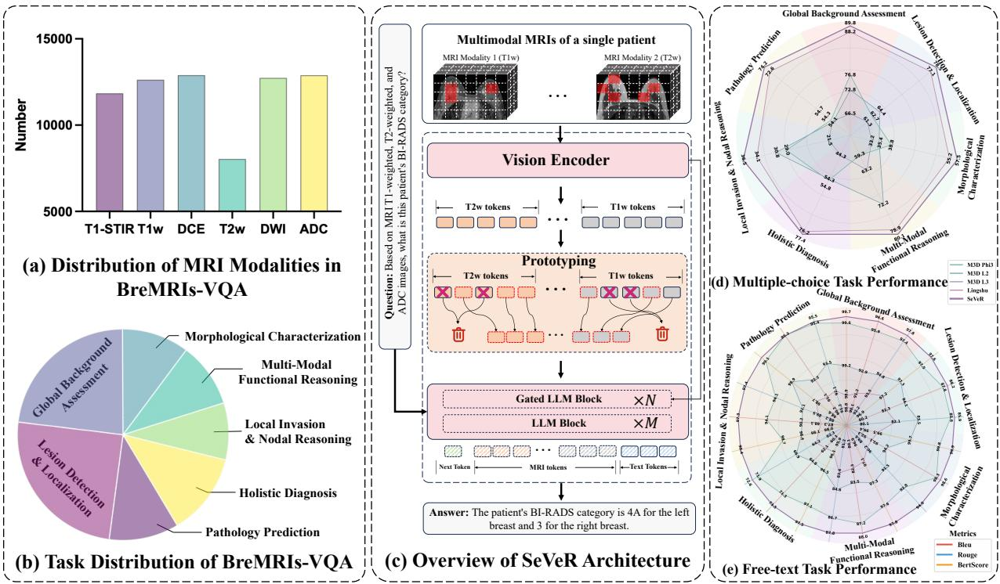  
Figure 1 Overview of the BreMRIs-VQA benchmark and the proposed SeVeR. (a–b) BreMRIs-VQA contains 6 MRI modalities and 7 categories of clinical tasks derived from 1.19M QA pairs. (c) Architecture of SeVeR, which integrates Greedy Prototype Selection, Change-aware Gated Attention, and Self-Consistency Regularization. (d–e) SeVeR’s superior performance in multiple-choice and free-text generation tasks.

To tackle the data challenge, we first built BreMRIs-VQA, a large-scale, clinically curated multi-modal medical VQA benchmark dataset. We collected 71.0K breast MRI sequences from a cohort of 12.9K patients, where each contains at least 3 diferent MRI modalities, paired with a radiology report and a pathology report verified by two radiologists. Then, we design a QA generation pipeline consisting of multi-stage extraction, task construction, paraphrasing, and validation, which enables BreMRIs-VQA to contain 1.19M VQA pairs, including 671.6K free-text pairs and 515.1K multiple-choice pairs. The benchmark covers seven workflowgrounded task groups, enabling evaluation of both generative reasoning and discriminative clinical decision making. Fig. 1 (a) illustrates the number of 6 MRI modalities (T1-STIR, T1w, DCE, T2w, DWI and ADC) included the dataset, while Fig. 1 (b) depicts totally 7 VQA task categories ranging from fine-grained lesion characterization to holistic diagnosis.

We further propose SeVeR, a selective visual exposure framework for multi-sequence medical VQA, as shown in Fig. 1 (c). SeVeR first applies Greedy Prototype Selection (GPS) to compress dense volumetric tokens into compact modality-wise prototypes that preserve global coverage while suppressing repeated visual content. Since fixed prototypes may miss question-specific details, SeVeR maintains a multi-level feature bank and uses Change-aware Gated Attention (CaGA) to retrieve complementary evidence during decoding. This design separates two roles: GPS provides a compact visual memory before decoding, while CaGA performs question-dependent evidence retrieval through the language-conditioned decoder states. To avoid degenerate always-on retrieval, we introduce Self-Consistency Regularization with Marginal Utility (SCR-MU), which penalizes retrieval when it fails to improve task loss over a retrieval-disabled baseline. Figs. 1 (d) and (e) provide an overview of the resulting gains across multiple-choice and free-text clinical tasks.

Our contributions are threefold. First, we introduce BreMRIs-VQA, a large-scale multi-sequence breast MRI VQA benchmark with workflow-grounded free-text and multiple-choice questions from expert verified clinical reports. Second, we propose SeVeR, which initially selects compact representative visual prototypes and dynamically retrieves fine-grained evidence via change-aware attention gates with a marginal-utility self-consistency objective that prevents collapsing to trivial behaviors. Finally, extensive experiments on

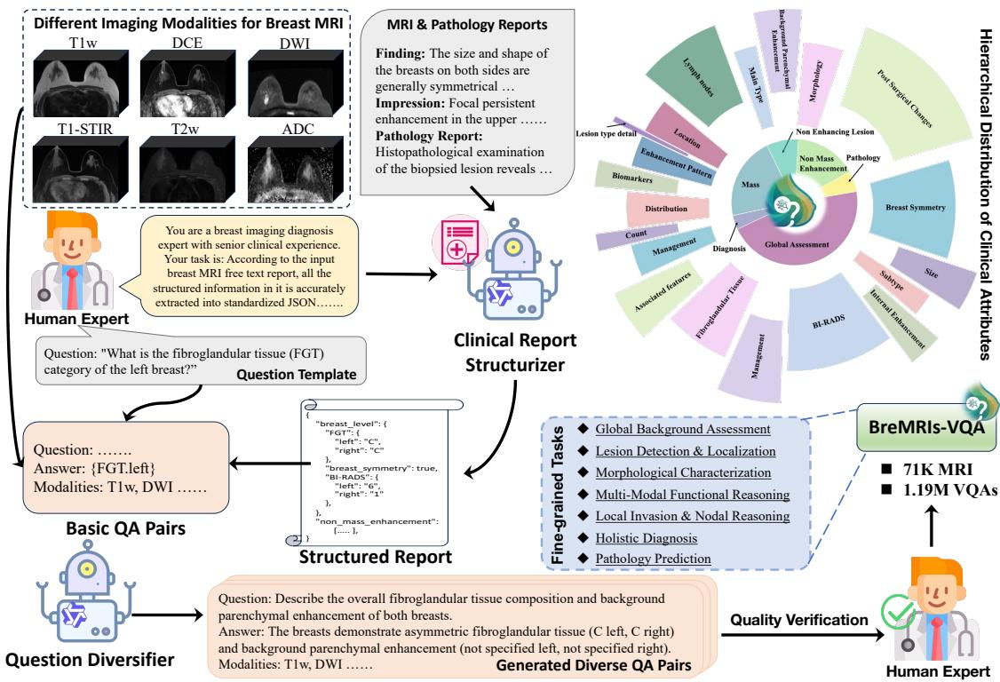  
Figure 2 Dataset construction pipeline. The top-right pie chart depicts hierarchical clinical attribute distribution.

BreMRIs-VQA and public 3D benchmarks validate the efectiveness of the proposed framework across discriminative and generative tasks.

## 2 BreMRIs-VQA

Existing medical VQA datasets are dominated by single-modality settings, limiting evaluation of multi-sequence clinical reasoning. To address this gap, BreMRIs-VQA is built from 71,041 breast MRI sequences of 12,891 patients, with at least three sequences per patient and heterogeneous availability across six MRI modalities: T1w, T1-STIR, T2w, DWI, ADC, and DCE. Fig. 1(a) summarizes the modality distribution. These imaging studies are paired with clinical-expert-verified radiology and pathology reports, which provide the evidence sources for QA construction. The released benchmark contains 1,186,726 volumetric QA pairs, including 671,596 free-text and 515,130 multiple-choice pairs, spanning seven workflow-grounded tasks. Evaluation uses the case-level held-out split detailed in Appendix A. Ethics, privacy, and governance are reported in Appendix E.

## 2.1 Dataset Construction

We build BreMRIs-VQA with a three-stage LLM-assisted but evidence-constrained pipeline (Fig. 2), where the LLM never invents clinical facts from images but only structures expert-verified reports and diversifies report-grounded questions.

Stage I: Structured extraction. We use Qwen3-max Yang et al. (2025a) with clinician-designed prompts to normalize radiology and pathology reports into a JSON schema with a closed clinical vocabulary (e.g., FGT ∈ {A,B,C,D}), covering breast-level findings, lesion attributes, multi-sequence imaging signals, BI-RADSrelated factors, and pathology. Fields not mentioned in the report are set to null, and schema-invalid or out-of-vocabulary outputs are discarded before question generation. Full schemas and prompts are in Appendix A.2.

Stage II: Question generation. We instantiate questions from deterministic clinician-designed templates, each tied to a source key, answer space, and task label. The templates cover seven workflow-grounded tasks: global background assessment, lesion detection/localization, morphological characterization, multi-modal functional reasoning, local invasion/nodal reasoning, holistic diagnosis, and pathology prediction. This organization supports capability-specific evaluation while preserving clinical interpretability. Full templates and key–task mappings are in Appendix B.

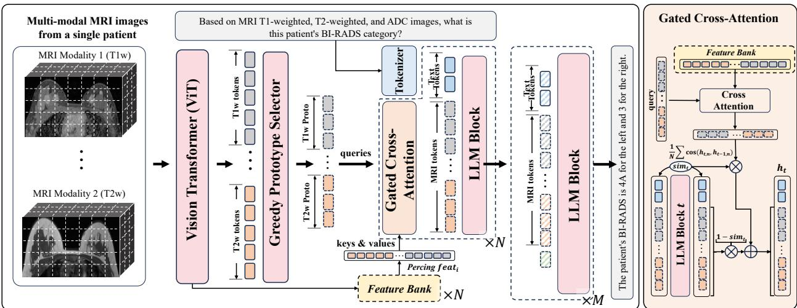  
Figure 3 Overview of SeVeR. Multi-modal 3D volumes are first encoded into dense tokens via a shared 3D ViT. The Greedy Prototype Selector (GPS) distills redundant tokens into compact prototypes using global afinity to preserve broad visual coverage. Change-aware Gated Attention (CaGA) dynamically injects multi-level features from a bank during decoding, using language-conditioned decoder states to retrieve complementary evidence.

Stage III: Paraphrasing and filtering. To improve linguistic robustness, we use Qwen3-max to diversify template-generated questions, after the source key, answer label, and answer space have already been fixed by deterministic templates. This step does not create new clinical facts or change supervision labels. Each candidate is re-bound to its template and rejected if it queries a diferent attribute, leaks the gold answer or its synonyms (e.g., “BI-RADS 4A” ↔ “category 4A”) into the question, or maps the answer outside the predefined answer space. Surviving paraphrases inherit the original label verbatim.

## 2.2 Quality Control and Verification

To ensure factual grounding, each QA pair is scored by Qwen3-Coder-Plus on factual consistency, clinical validity, and overall report support, and candidates with weak support are discarded or escalated for manual review. In parallel, radiologists audit 3,500 stratified QA pairs (500 per task) for answer–evidence pass rate. The retained set achieves an average overall score of 2.85/3 and a 97.5% expert pass rate across tasks (Table 10), and a closed-form answer-leakage filter further removes paraphrases whose question reveals the gold answer or its clinical synonyms. Full protocols are in Appendix B.3.

## 3 Method

For each patient, we consider a set of multi-modal 3D medical image volumes, denoted as $\{ \gamma ^ { m } \} _ { m = 1 } ^ { M }$ , where each $\gamma ^ { m } \overset { \cdot } { \in } \mathbb { R } ^ { Z \times \overset { \cdot } { H } \times W }$ represents a distinct imaging modality. We first encode the 3D volume of each modality independently using a shared 3D Vision Transformer. After flattening along the spatial dimensions, we get a dense token set $\{ \breve { X ^ { m } } \in \mathbb { R } ^ { L _ { m } \times d } \} _ { m = 1 } ^ { M }$ , where $L _ { m }$ represents the number of patches in the m-th modality.

## 3.1 Greedy Prototype Selector

As illustrated in Fig. 3, processing all visual tokens from multi-sequence volumes leads to redundant visual exposure. We therefore use a Greedy Prototype Selector (GPS) to initialize a compact question-agnostic visual memory for each modality, preserving broad coverage of the modality-specific feature manifold under a small token budget. Unlike MMTok Dong et al. (2026), where coverage maximization serves as a standalone token selection strategy, GPS in SeVeR only prepares the visual candidate space. Specifically, we first ℓ<sub>2</sub>-normalize all token features in the m-th modality $X ^ { m }$ to obtain $\{ \tilde { \mathbf { x } } _ { i } ^ { m } \} _ { i = 1 } ^ { L _ { m } }$ and compute the pairwise afinity matrix A, where $A _ { i j } ^ { m } = ( \tilde { \mathbf { x } } _ { i } ^ { m } ) ^ { \top } \tilde { \mathbf { x } } _ { j } ^ { m }$

A temperature-scaled row-wise softmax is then applied to yield the normalized afinity matrix:

$$
\hat { A } _ { i j } ^ { m } = \frac { \exp ( A _ { i j } ^ { m } / \tau _ { v } ) } { \sum _ { j ^ { \prime } = 1 } ^ { L _ { m } } \exp ( A _ { i j ^ { \prime } } ^ { m } / \tau _ { v } ) } ,\tag{1}
$$

where $\tau _ { v }$ controls the sharpness of the afinity distribution. To prevent self-dominance during selection, we set the diagonal elements $A _ { i i } ^ { m } = - \infty$ . With this afinity map, we can identify a compact subset of tokens that efectively covers the modality-specific feature manifold. First, we define the coverage score of a candidate subset $S ^ { m } \subset X ^ { m }$ as

$$
f ( S ^ { m } , X ^ { m } ) = \frac { 1 } { L _ { m } } \sum _ { i = 1 } ^ { L _ { m } } \operatorname* { m a x } _ { j \in S } \hat { A } _ { i j } ^ { m } .\tag{2}
$$

Then, we get $k \ ( k \ll L _ { m } )$ prototypes for the m-th modality via:

$$
S ^ { m , * } = \mathop { \mathrm { a r g m a x } } _ { S ^ { m } \subset X ^ { m } } f ( S ^ { m } , X ^ { m } )
$$

$$
\mathrm { s . t . } \quad | S ^ { m } | = k .\tag{3}
$$

which is solved with a classical greedy algorithm Jungnickel (1999) (detailed procedure in Appendix F.1). Intuitively, GPS selects k representative tokens whose afinity coverage is high for the full modality-specific token set. To enable end-to-end training of the upstream visual features that shape ${ \hat { A } } .$ we route gradients through a straight-through estimator. The detailed greedy procedure and straight-through estimator formulation are provided in Appendix F.1 and F.2. To preserve positional information, we add a learnable embedding to each selected prototype:

$$
H ^ { m } = S ^ { m , * } + { \mathrm { E m b e d } } ( p o s )\tag{4}
$$

where pos is the original token indices of the selected tokens within $X ^ { m }$

## 3.2 Change-aware Gated Attention

GPS provides a compact visual initialization in a question-agnostic manner, but it does not decide which evidence is relevant to the current question. To perform question-conditioned evidence selection, we further maintain a multi-level feature bank $B = \{ V ^ { \ell } \} _ { \ell = 1 } ^ { L _ { v } }$ , where $V ^ { \ell }$ denotes the visual embeddings from the ℓ-th layer of the vision encoder and $L _ { v }$ is a subset of the whole vision encoder. During decoding, CaGA uses language-conditioned hidden states to retrieve complementary visual evidence from B. Specifically, at the t-th layer in the decoder, we compute a change-aware gated attention module from the layer-to-layer update.

Let $H _ { t }$ denote the hidden states after the t-th decoder layer, where $H _ { 1 } = \mathrm { c o n c a t } [ H ^ { m } ; T | m = 1 , . . . , M ]$ , i.e., the first layer of the decoder takes the concatenation of GPS-initialized prototypes from all modalities and the question tokens T as input. Then, we measure the mean cosine similarity between consecutive layers

$$
\mathrm { s i m } _ { t } = \frac { 1 } { N } \sum _ { n = 1 } ^ { N } \cos ( \mathbf { h } _ { t , n } , \mathbf { h } _ { t - 1 , n } ) ,\tag{5}
$$

where $\mathbf { h } _ { t , n }$ is the n-th token in $H _ { t }$ , and $N$ is the number of tokens. To inject multi-level cues only when needed and to avoid always-on retrieval, we map this similarity to a scalar gate defined as

$$
g _ { t } = \sigma ( ( \sin \boldsymbol { t } - \tau ) \cdot s ) ,\tag{6}
$$

where $\tau$ is a threshold and s controls the sharpness, $\sigma$ denotes the sigmoid function. Finally, we update the visual token states by gated fusion:

$$
H _ { t } \gets \left( 1 - g _ { t } \right) H _ { t } + g _ { t } \hat { H } _ { t } ,\tag{7}
$$

$$
\begin{array} { r } { \hat { H } _ { t } = \operatorname { C r o s s A t t n } ( H _ { t } , V _ { t } ) , } \end{array}\tag{8}
$$

where $V _ { t }$ is the bank feature used at layer t.

## 3.3 Marginal-Utility Regularization

Layer-wise retrieval can collapse to trivial always-on or always-of behavior without explicit supervision. Our goal is to train the gate to activate retrieval only when it improves task performance. To achieve this, we run a retrieval-enabled pass with task loss ${ \mathcal { L } } _ { \mathrm { f u l l } }$ and a retrieval-disabled pass (setting $g _ { t } \to 0 )$ with loss ${ \mathcal { L } } _ { \mathrm { d i s } }$ . The disabled branch is treated as a stop-gradient baseline.

To penalize cases where retrieval fails to improve over the disabled baseline, we designed Marginal-utility loss with a soft margin $\delta \colon$

$$
{ \mathcal { L } } _ { \mathrm { m u } } = \mathrm { s o f t p l u s } ( { \mathcal { L } } _ { \mathrm { f u l l } } - \mathrm { s t o p g r a d } ( { \mathcal { L } } _ { \mathrm { d i s } } ) + \delta ) .\tag{9}
$$

This term is near zero when retrieval yields a lower loss than the baseline by at least $\delta ,$ and increases otherwise. The final objective is:

$$
\mathcal { L } = \mathcal { L } _ { \mathrm { f u l l } } + \beta \mathcal { L } _ { \mathrm { m u } } + \mathcal { R } ,\tag{10}
$$

where $\mathcal { R } = 1 \times 1 0 ^ { - 4 }$ is a small numerical-stability constant to prevent zero-loss solutions.

## 4 Experiment

## 4.1 Experimental Setup

We report multiple-choice accuracy and free-text BLEU Papineni et al. (2002), ROUGE-L Lin (2004), and BERTScore Zhang et al. (2019) across all benchmarks. Baselines span three categories: general MLLMs (Qwen3-VL Bai et al. (2025a), Qwen2.5-VL Bai et al. (2025b)), large medical VLMs (HuLu-Med Jiang et al. (2025a), Lingshu Xu et al. (2025), OmniV Jiang et al. (2025b)), and 3D-specific models (M3D Bai et al. (2024), Merlin Blankemeier et al. (2026), RadFM, CT-CHAT), evaluated in zero-shot and fine-tuned settings. Implementation details are in Appendix G.

## 4.2 Main Results on BreMRIs-VQA

Table 1 reports results across all seven workflow tasks. Zero-shot models, including domain-pretrained medical specialists, remain substantially below fine-tuned models, with larger gaps on tasks involving spatial localization and nodal reasoning. Among fine-tuned models, 3D-specific architectures (M3D) and Lingshu show lower performance than general transformers, as M3D is pre-trained on singlemodality CT data and Lingshu is not specifically optimized for multi-sequence volumetric inputs. SeVeR at 4B scale achieves the best overall average with the largest improvements on cross-sequence integration tasks, while on Morphological Characterization, multiplechoice accuracy marginally trails fine-tuned Qwen3-VL, suggesting compact prototypes may not fully preserve fine-grained shape information.

<table><tr><td colspan="4">Method Vis. Tokens Lat. (ms) ↓ Accuracy BERT.</td></tr><tr><td>Baseline</td><td>12544</td><td>952.6</td><td>69.18 98.42</td></tr><tr><td>VisionZip</td><td>256</td><td>630.8 67.63</td><td>98.16</td></tr><tr><td>VisionZip</td><td>512</td><td>698.4</td><td>68.72 98.34</td></tr><tr><td>VisionZip</td><td>1024</td><td>829.6 69.03</td><td>98.39</td></tr><tr><td>DivPrune</td><td>256</td><td>605.7 67.21</td><td>98.08</td></tr><tr><td>DivPrune</td><td>512</td><td>625.6 68.24</td><td>98.25</td></tr><tr><td>DivPrune</td><td>1024</td><td>863.3 68.61</td><td>98.31</td></tr><tr><td>MMToK MMToK MMToK</td><td>256 512</td><td>605.6 66.94 618.8 67.86</td><td>98.03 98.18</td></tr><tr><td>SeVeR</td><td>1024 256</td><td>829.4 68.37 598.4 69.73</td><td>98.27 98.48</td></tr><tr><td>SeVeR</td><td>512</td><td>644.1 70.21</td><td>98.60</td></tr><tr><td>SeVeR</td><td>1024</td><td>833.2 69.88</td><td>98.52</td></tr></table>

Table 2 Latency–performance comparison with visual token pruning methods on BreMRIs-VQA.

## 4.3 Efficiency Analysis

Table 2 compares SeVeR against VisionZip Yang et al. (2025b), DivPrune Alvar et al. (2025), and MMToK Dong et al. (2026) under the same backbone (Qwen2.5-VL Bai et al. (2025b)) and budgets. Pruning methods fall below the full-token baseline in accuracy at all budgets, since irreversible token removal discards visual content that cannot be recovered. Although SeVeR is not always the fastest, its latency remains within a practical range. SeVeR at k=512 achieves 70.21% accuracy in 644 ms, exceeding the full-token baseline (69.18%, 953 ms) in both accuracy and speed. Baseline implementation details are in Appendix G.

<table><tr><td rowspan="3">Task</td><td rowspan="3">Metric</td><td colspan="4">Zero-shot</td><td colspan="6">Fine-tune</td></tr><tr><td colspan="4">Qwen3-VL Hulu-Med Hulu-Med Lingshu</td><td colspan="6">M3D-Phi3 M3D-L2 M3D-L3 Lingshu Qwen3-VL SeVeR</td></tr><tr><td>4B</td><td>4B</td><td>7B</td><td>32B</td><td>4B</td><td>7B</td><td>8B</td><td>7B</td><td>4B</td><td>4B</td></tr><tr><td rowspan="4">Global Background Assessment</td><td>|Accuracy BLEU</td><td>23.20 72.76</td><td>57.25</td><td>59.95</td><td>69.43</td><td>76.78 91.23</td><td>72.83 92.87</td><td>66.53</td><td>88.23</td><td>89.43</td><td>89.82</td></tr><tr><td></td><td></td><td>80.34</td><td>82.91</td><td>85.12</td><td></td><td></td><td>90.12</td><td>95.92</td><td>96.55</td><td>96.63</td></tr><tr><td>ROUGE</td><td>72.63</td><td>84.76</td><td>87.42</td><td>91.07</td><td>93.45</td><td>94.81</td><td>92.15</td><td>97.42</td><td>97.86</td><td>97.85</td></tr><tr><td>BERT. Accuracy</td><td>94.41</td><td>97.83</td><td>98.36</td><td>99.27</td><td>98.94</td><td>99.22</td><td>98.83 61.34</td><td>99.62</td><td>99.63</td><td>99.68</td></tr><tr><td rowspan="3">Lesion Detection &amp; Localization</td><td>BLEU</td><td>13.64 60.99</td><td>37.44 74.28</td><td>47.15 79.61</td><td>70.10 86.99</td><td>62.68 93.12</td><td>64.44 94.25</td><td>92.34</td><td>77.12 98.30</td><td>73.55 98.74</td><td>78.48 98.61</td></tr><tr><td>ROUGE</td><td>53.11</td><td></td><td></td><td></td><td>90.22</td><td>91.53</td><td>89.64</td><td>92.81</td><td>93.56</td><td>93.96</td></tr><tr><td>BERT.</td><td>91.20</td><td>70.35 95.96</td><td>77.84 97.12</td><td>89.31 98.88</td><td>99.48</td><td>99.65</td><td>99.41</td><td>99.80</td><td>99.88</td><td>99.87</td></tr><tr><td rowspan="4">Morphological CharacterizatiohROUGE</td><td>Accuracy</td><td>44.79</td><td>18.33</td><td>22.36</td><td>30.20</td><td>38.78</td><td>35.35</td><td>33.24</td><td>55.23</td><td>57.68</td><td>57.45</td></tr><tr><td>BLEU</td><td>41.22</td><td>35.84</td><td>39.72</td><td></td><td>62.15</td><td>64.83</td><td>60.31</td><td>71.29</td><td>70.34</td><td>73.46</td></tr><tr><td></td><td>47.23</td><td></td><td></td><td>54.65</td><td></td><td>66.87</td><td>62.34</td><td>71.90</td><td></td><td></td></tr><tr><td>BERT.</td><td>91.80</td><td>42.17 90.86</td><td>45.68 92.14</td><td>55.87 96.29</td><td>64.23 96.12</td><td>96.48</td><td>95.93</td><td>97.12</td><td>71.92 97.24</td><td>72.63 97.46</td></tr><tr><td rowspan="4">Multi-Modal Functional Reasoning</td><td>Accuracy</td><td>56.01</td><td>57.46</td><td>57.46</td><td>50.91</td><td>59.32</td><td>72.24</td><td>63.21</td><td>78.92</td><td>79.81</td><td>80.11</td></tr><tr><td>BLEU</td><td>58.80</td><td>68.74</td><td>71.36</td><td>81.88</td><td>88.12</td><td>90.23</td><td>87.34</td><td>94.13</td><td>97.01</td><td>97.28</td></tr><tr><td>ROUGE</td><td>58.09</td><td>70.12</td><td>72.88</td><td>82.78</td><td>89.45</td><td>91.14</td><td>88.21</td><td>94.08</td><td>96.97</td><td>97.37</td></tr><tr><td>BERT.</td><td>91.69</td><td>95.12</td><td>95.84</td><td>98.06</td><td>98.12</td><td>98.41</td><td>97.95</td><td>98.72</td><td>99.35</td><td>99.43</td></tr><tr><td rowspan="3">Local Invasion &amp;Nodal Assessment</td><td>Accuracy</td><td>9.67</td><td>66.29</td><td>66.29</td><td>60.64</td><td>54.81</td><td>54.32</td><td>44.31</td><td>76.23</td><td>77.54</td><td>77.42</td></tr><tr><td>BLEU</td><td>54.44</td><td>78.45</td><td>80.13</td><td>76.82</td><td>82.31</td><td>83.54</td><td>80.12</td><td>87.18</td><td>84.14</td><td>88.01</td></tr><tr><td>ROUGE</td><td>57.42</td><td>79.22</td><td>81.05</td><td>77.83</td><td>83.42</td><td>84.63</td><td>81.24</td><td>86.72</td><td>85.92</td><td>87.83</td></tr><tr><td rowspan="3">Holistic Diagnostic</td><td>BERT.</td><td>92.74</td><td>95.64</td><td>96.08</td><td>95.27</td><td>97.12</td><td>97.34</td><td>96.91</td><td>97.58</td><td>97.41</td><td>97.77</td></tr><tr><td>Accuracy</td><td>23.51</td><td>28.94</td><td>31.33</td><td>23.99</td><td>28.96</td><td>30.78</td><td>21.52</td><td>34.12</td><td>35.86</td><td>36.53</td></tr><tr><td>BLEU</td><td>43.93</td><td>69.15</td><td>71.42</td><td>72.79</td><td>82.34</td><td>84.12</td><td>80.15</td><td>87.82</td><td>87.35</td><td>88.22</td></tr><tr><td rowspan="4">Decision Pathology</td><td>ROUGE</td><td>44.62</td><td>70.08</td><td>72.35</td><td>73.90</td><td>82.13</td><td>83.55</td><td>80.13</td><td>85.61</td><td>85.70</td><td>85.86</td></tr><tr><td>BERT.</td><td>89.30</td><td>95.21</td><td>95.62</td><td>95.84</td><td>97.15</td><td>97.31</td><td>96.94</td><td>97.50</td><td>97.53</td><td>97.59</td></tr><tr><td>Accuracy</td><td>38.04</td><td>49.68</td><td>51.33</td><td>47.79</td><td>54.74</td><td>54.12</td><td>54.32</td><td>72.57</td><td>71.29</td><td>74.18</td></tr><tr><td>BLEU</td><td>61.47</td><td>85.12</td><td>87.46</td><td>88.95</td><td>91.12</td><td>92.34</td><td>90.21</td><td>95.34</td><td>94.89</td><td>95.34</td></tr><tr><td rowspan="4">Prediction</td><td>ROUGE</td><td>62.61</td><td>86.34</td><td>88.12</td><td>89.96</td><td>92.11</td><td>93.45</td><td>91.24</td><td>95.44</td><td>94.99</td><td>95.53</td></tr><tr><td>BERT.</td><td>92.15</td><td>95.74</td><td>96.02</td><td>96.18</td><td>98.72</td><td>98.89</td><td>98.61</td><td>99.07</td><td>98.98</td><td>99.10</td></tr><tr><td>Accuracy</td><td>29.84</td><td>45.06</td><td>47.98</td><td>50.44</td><td>53.72</td><td>54.87</td><td>49.21</td><td>68.92</td><td>69.45</td><td>70.57</td></tr><tr><td>BLEU</td><td>56.23</td><td>70.27</td><td>73.23</td><td>78.17</td><td>84.34</td><td>86.03</td><td>82.94</td><td>90.00</td><td>89.87</td><td>91.08</td></tr><tr><td rowspan="3">Average</td><td>ROUGE</td><td>56.53</td><td>71.86</td><td>75.05</td><td>80.10</td><td>85.00</td><td>86.57</td><td>83.56</td><td>89.14</td><td>89.56</td><td>90.15</td></tr><tr><td>BERT.</td><td>91.90</td><td>95.19</td><td>95.88</td><td>97.11</td><td>97.95</td><td>98.19</td><td>97.80</td><td>98.49</td><td>98.58</td><td>98.70</td></tr><tr><td></td><td></td><td></td><td></td><td></td><td></td><td></td><td></td><td></td><td></td><td></td></tr></table>

Table 1 Main performance on BreMRIs-VQA. Bold and underline indicate the best and second-best performance.

## 4.4 Modality Robustness and Interpretability

Missing-modality robustness. We compare SeVeR against its variant without GPS prototype selection (w/o Proto.) across six modality settings (S1–S6; Figure 4). Both models perform comparably under S1, S2, and S4, which retain primary structural and enhancement sequences, but degrade more substantially under S3 (DWI, ADC, and T2w, without DCE or T1w) and S5 (without T1w), where key reference modalities are absent. SeVeR maintains a smaller accuracy drop relative to S6 in these settings, as CaGA re distributes retrieval weights across available sequences rather than relying on fixed token positions. Details and per-task free-text results are in Appendix H.5.

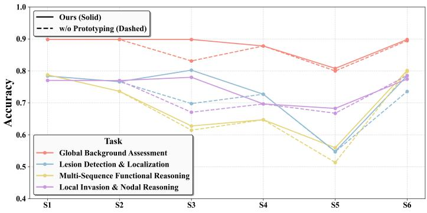  
Figure 4 Missing-modality robustness. Multiple-choice accuracy under six modality settings (S1–S6).

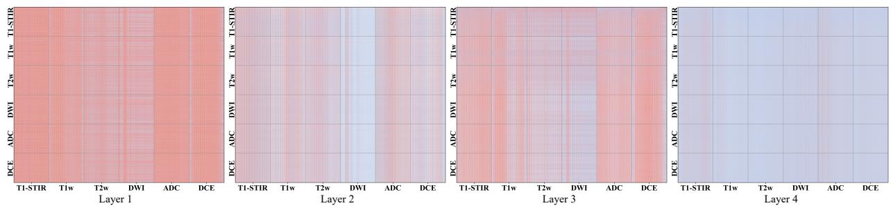

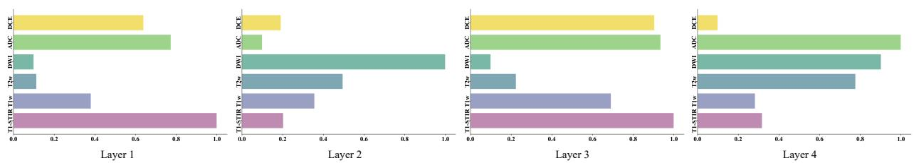  
(a) Layer-wise modality contribution: mean gated cross-attention weight per modality across decoder transformer layers.

(b) Token-level gated attention maps across decoder layers: attention sparsifies with depth as suficient evidence is integrated.  
Figure 5 Interpretability visualization of SeVeR on the question “What is the delayed phase enhancement kinetics of the mass in the upper inner quadrant of the right breast?” with six MRI modalities.
<table><tr><td rowspan="3">Task</td><td rowspan="3">Metric</td><td colspan="7">Zero-shot</td><td colspan="4">Finetune</td></tr><tr><td>Q2.5VL Q3VL RadFM</td><td></td><td></td><td>M3D-L2 M3D-P3 OmniV</td><td></td><td></td><td>Lingshu</td><td>M3D-L2</td><td>M3D-P3 Qwen3-VL SeVeR</td><td></td><td></td></tr><tr><td>4B</td><td>4B</td><td>13B</td><td>7B</td><td>4B</td><td></td><td>1.5B</td><td>7B</td><td>7B 4B</td><td>4B</td><td>4B</td></tr><tr><td>Exist. Det.</td><td>Accuracy</td><td>19.52</td><td>3.52</td><td>29.20</td><td>18.00</td><td>40.25</td><td>28.66</td><td>59.60</td><td>81.09</td><td>82.43</td><td>82.52</td><td>82.62</td></tr><tr><td>Static T. Diag.</td><td>Accuracy</td><td>0.00</td><td>0.00</td><td>44.11</td><td>25.47</td><td>25.40</td><td>22.96</td><td>6.02</td><td>51.20</td><td>49.30</td><td>47.70</td><td>51.77</td></tr><tr><td>Longit. T. Diag.</td><td>Accuracy</td><td>0.29</td><td>0.15</td><td>42.99</td><td>24.17</td><td>24.31</td><td>24.23</td><td>12.13</td><td>74.78</td><td>74.77</td><td>74.39</td><td>75.28</td></tr><tr><td rowspan="3">Medical Measurement</td><td>BLEU</td><td>1.78</td><td>0.11</td><td>3.34</td><td>15.95</td><td>2.55</td><td>2.52</td><td>2.50</td><td>30.54</td><td>33.52</td><td>35.01</td><td>36.78</td></tr><tr><td>ROUGE</td><td>4.30</td><td>0.08</td><td>6.62</td><td>23.24</td><td>5.63</td><td>7.88</td><td>5.45</td><td>36.06</td><td>36.46</td><td>38.49</td><td>39.01</td></tr><tr><td>BERT.</td><td>84.20</td><td>76.65</td><td>86.85</td><td>91.50</td><td>85.74</td><td>85.66</td><td>83.81</td><td>94.65</td><td>94.86</td><td>96.01</td><td>95.93</td></tr><tr><td rowspan="3">Image Observation</td><td>BLEU</td><td>3.51</td><td>0.26</td><td>13.48</td><td>10.69</td><td>16.31</td><td>16.42</td><td>5.34</td><td>31.28</td><td>39.66</td><td>48.08</td><td>48.81</td></tr><tr><td>ROUGE</td><td>8.84</td><td>0.44</td><td>19.14</td><td>20.82</td><td>23.19</td><td>26.69</td><td>12.25</td><td>39.12</td><td>50.52</td><td>52.48</td><td>54.16</td></tr><tr><td>BERT.</td><td>84.53</td><td>76.22</td><td>87.16</td><td>86.61</td><td>86.92</td><td>88.29</td><td>85.67</td><td>90.00</td><td>92.19</td><td>92.92</td><td>93.09</td></tr><tr><td rowspan="3">Anomaly Detection</td><td>BLEU</td><td>2.93</td><td>0.24</td><td>11.00</td><td>9.10</td><td>15.06</td><td>13.47</td><td>3.71</td><td>25.25</td><td>33.28</td><td>39.95</td><td>39.83</td></tr><tr><td>ROUGE</td><td>9.17</td><td>0.54</td><td>17.62</td><td>18.64</td><td>23.19</td><td>25.72</td><td>9.46</td><td>33.76</td><td>42.45</td><td>43.96</td><td>45.58</td></tr><tr><td>BERT.</td><td>84.47</td><td>76.65</td><td>86.76</td><td>86.07</td><td>87.11</td><td>88.21</td><td>84.81</td><td>89.16</td><td>90.72</td><td>91.43</td><td>91.58</td></tr></table>

Table 3 Comparison of zero-shot and finetuned performance across six tasks in 3D-RAD. Exist. Det.: Existence Detection; Static T. Diag.: Static Temporal Diagnosis; Longit. T. Diag.: Longitudinal Temporal Diagnosis. Q2.5VL: Qwen2.5-VL; Q3VL: Qwen3-VL. Bold and underline indicate the best and second-best performance.

Layer-wise modality preference. Fig. 5a shows that early layers broadly attend to structural modalities (e.g., T1-STIR) for anatomical perception and lesion localization. In intermediate layers, the model increasingly focuses on functionally informative modalities (DCE, DWI, ADC), indicating active question-aware functional reasoning.

Gated attention sparsification. Fig. 5b illustrates the progressive sparsification of token-level gated attention across transformer layers. Early layers exhibit dense cross-modal attention for global anatomical exploration, while intermediate layers progressively suppress redundant tokens and focus on diagnostically relevant regions. In deeper layers, attention becomes highly sparse, indicating that the model has distilled clinically relevant information into compact semantic representations. This hierarchical transition from broad exploration to selective semantic condensation reflects efective question-aware clinical reasoning.

## 4.5 Public 3D Benchmarks

Tables 3 and 4 evaluate SeVeR on 3D-RAD Gai et al. (2025) and DeepTumorVQA Chen et al. (2025), two singlevolume benchmarks that serve as transfer tests for the selective exposure principle. On 3D-RAD, SeVeR achieves the highest accuracy on all three classification and temporal tasks and leads on the majority of generation metrics, remaining closely competitive with finetuned Qwen3-VL throughout. On Deep-TumorVQA, SeVeR ranks first overall on both multiple-choice and free-text metrics and leads on Visual Reasoning and Medical Reasoning, while models with large-scale CT pretraining outperform

<table><tr><td colspan="7">Metric Merlin M3D-L2 M3D-P3 CT-CHAT RadFM SeVeR</td></tr><tr><td>Type Meas</td><td>MC</td><td>0.256</td><td>0.733</td><td>0.740</td><td>0.740</td><td>0.739</td><td>0.735</td></tr><tr><td rowspan="2">Recog</td><td>FT</td><td>0.364</td><td>0.370</td><td>0.366</td><td>0.379</td><td>0.434</td><td>0.521</td></tr><tr><td>MC</td><td>0.661</td><td>0.664</td><td>0.661</td><td>0.664</td><td>0.789</td><td>0.707</td></tr><tr><td rowspan="2">VisRsn</td><td>FT</td><td>0.664</td><td>0.665</td><td>0.660</td><td>0.663</td><td>0.812</td><td>0.715</td></tr><tr><td>MC</td><td>0.382</td><td>0.616</td><td>0.627</td><td>0.620</td><td>0.625</td><td>0.673</td></tr><tr><td rowspan="2">MedRsn</td><td>FT</td><td>0.392</td><td>0.408</td><td>0.420</td><td>0.428</td><td>0.439</td><td>0.499</td></tr><tr><td>MC</td><td>0.446</td><td>0.557</td><td>0.560</td><td>0.555</td><td>0.584</td><td>0.656</td></tr><tr><td rowspan="2">Total</td><td>FT</td><td>0.550</td><td>0.562</td><td>0.561</td><td>0.549</td><td>0.629</td><td>0.663</td></tr><tr><td>MC</td><td>0.440</td><td>0.626</td><td>0.632</td><td>0.628</td><td>0.662</td><td>0.687</td></tr><tr><td rowspan="2"></td><td>FT</td><td>0.478</td><td>0.489</td><td>0.493</td><td>0.497</td><td>0.555</td><td>0.599</td></tr><tr><td></td><td></td><td></td><td></td><td></td><td></td><td></td></tr></table>

Table 4 Average DeepTumorVQA performance. Meas: Measurement; Recog: Recognition; VisRsn: Visual Reasoning; MedRsn: Medical Reasoning. MC: multiple-choice accuracy; FT: average free-text score.

SeVeR on Measurement and Recognition. Full results are in Appendix H.3.

## 4.6 Ablation Study

Component contributions. Table 5 isolates each design choice at a fixed 512-token budget. Removing CaGA causes the largest drop, confirming that GPS prototypes alone cannot recover the fine-grained evidence compressed away at this budget and that the multi-level bank with on-demand retrieval is necessary. Removing SCR-MU (w/o Regul.) degrades free-text quality most: Fig. 5b shows that without the marginal-utility penalty late-layer attention remains dense rather than sparsifying, indicating that SCR-MU is what converts

<table><tr><td>Setting</td><td>Acc.</td><td>BLEU</td><td>ROUGE</td><td>BERT.</td><td>k</td></tr><tr><td>Baseline Ft.</td><td>69.45</td><td>89.87</td><td>89.56</td><td>98.58</td><td>4608</td></tr><tr><td>w/o CaGA</td><td>64.36</td><td>88.92</td><td>85.30</td><td>95.42</td><td>512</td></tr><tr><td>w/o Regul.</td><td>68.17</td><td>87.04</td><td>89.16</td><td>97.63</td><td>512</td></tr><tr><td>Q-GPS</td><td>69.92</td><td>90.21</td><td>89.83</td><td>97.66</td><td>512</td></tr><tr><td>SeVeR</td><td>70.57</td><td>91.08</td><td>90.15</td><td>98.70</td><td>512</td></tr></table>

Table 5 Compact ablation summary on BreMRIs-VQA. We report average metrics across seven tasks and the number of visual prototypes exposed to the decoder.

the gate from always-on to selective. The question-conditioned GPS variant (Q-GPS) underperforms greedy GPS, supporting the design choice of keeping GPS question-agnostic and delegating question conditioning to CaGA where full decoder context is available. Full 3D-RAD ablation results are in Appendix H.4, and hyperparameter sensitivity analyses are in Appendix H.2.

Prototype budget. Fig. 6 shows that increasing k improves accuracy up to k=512, beyond which performance plateaus or declines as redundant tokens dilute the prototype set while latency continues to rise. We therefore set k=512 as the default, where the accuracy gain over smaller budgets is substantial and latency remains well below the full-token baseline. More results are in Appendix H.4.

Backbone compatibility. We apply SeVeR to two distinct backbone families: Qwen2.5-VL-3B (70.21% Acc) and Qwen3-VL at 4B and 8B (70.57% and 72.13%). Both families yield consistent gains over their respective fine-tuned baselines, demonstrating that the selective exposure design is not specific to any single backbone and can be integrated without architecture-level modifications. Hyperparameter sensitivity for τ<sub>v</sub>, k, s, and β and full task-wise results are in Appendix H.1.

## 5 Conclusion

We introduce BreMRIs-VQA, a clinically curated benchmark with 1.19M QA pairs from 12.9K multi-sequence breast MRI cases, and SeVeR, a framework for selective visual exposure and dynamic evidence retrieval in volumetric medical VQA. SeVeR achieves compact global coverage of multi-sequence volumes through prototype selection and retrieves fine-grained feature evidence during decoding, with a self-consistency objective that suppresses redundant retrieval. On BreMRIs-VQA, SeVeR outperforms same-scale fine-tuned baselines, with the largest gains on cross-sequence integration tasks and a more favorable accuracy-latency tradeof than token pruning methods. Results on public 3D single-volume benchmarks further confirm selective visual exposure as a broadly applicable principle for volumetric medical reasoning.

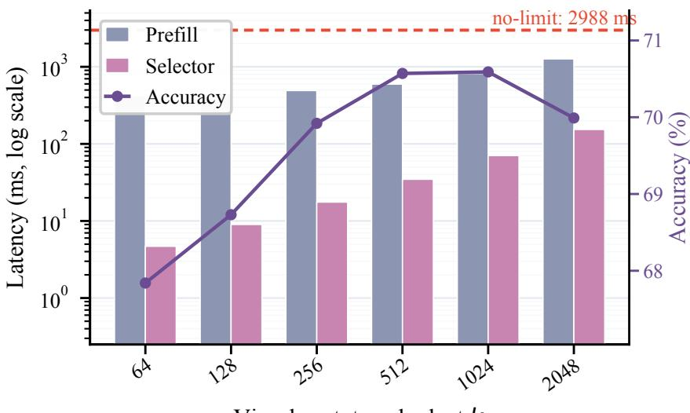  
Visual prototype budget k  
Figure 6 Prototype-budget latency profile. Latency and performance under prototype budgets k, with the full-token no-limit setting shown as a dashed reference.

## Limitations

Despite the encouraging results, this work has several limitations that point to directions for future research. Firstly, the free-text generation tasks in BreMRIs-VQA are evaluated with automated language metrics, which may not fully capture clinical nuance, and radiologist-grounded human evaluation is left for future work. Secondly, the GPS module currently uses a fixed prototype budget per sequence, and adapting compression ratios to sequence-level complexity remains unexplored. Finally, while SeVeR is validated on algorithmic benchmarks, integration studies within real-world radiology reading workflows are beyond the scope of this paper. Addressing these limitations will further strengthen the clinical applicability and practical deployment of the proposed framework.

## Acknowledgements

This research was partially supported by National Natural Science Foundation of China under Grant No. 62476246, "Pioneer" and "Leading Goose" R&D Program of Zhejiang under Grant No. 2025C02120, and GuangZhou City’s Key R&D Program of China under Grant No. 2024B01J1301. This work was also partially supported by DAMO Academy through DAMO Academy Research Intern Program. Jiajin Zhang was partially supported by the Zhejiang Province Postdoctoral Research Excellence Funding Program under Grant No. ZJ2025048.

## References

Jean-Baptiste Alayrac, Jef Donahue, Pauline Luc, Antoine Miech, Iain Barr, Yana Hasson, Karel Lenc, Arthur Mensch, Katherine Millican, Malcolm Reynolds, et al. Flamingo: a visual language model for few-shot learning. In Advances in Neural Information Processing Systems, 2022.

Saeed Ranjbar Alvar, Gursimran Singh, Mohammad Akbari, and Yong Zhang. Divprune: Diversity-based visual token pruning for large multimodal models. In IEEE/CVF Conference on Computer Vision and Pattern Recognition (CVPR), 2025.

Fan Bai, Yuxin Du, Tiejun Huang, Max Q-H Meng, and Bo Zhao. M3d: Advancing 3d medical image analysis with multi-modal large language models. arXiv preprint arXiv:2404.00578, 2024.

Shuai Bai, Yuxuan Cai, Ruizhe Chen, Keqin Chen, Xionghui Chen, Zesen Cheng, Lianghao Deng, Wei Ding, Chang Gao, Chunjiang Ge, et al. Qwen3-vl technical report. arXiv preprint arXiv:2511.21631, 2025a.

Shuai Bai, Keqin Chen, Xuejing Liu, Jialin Wang, Wenbin Ge, Sibo Song, Kai Dang, Peng Wang, Shijie Wang, Jun Tang, et al. Qwen2.5-vl technical report. arXiv preprint arXiv:2502.13923, 2025b.

Louis Blankemeier, Ashwin Kumar, Joseph Paul Cohen, Jiaming Liu, Longchao Liu, Dave Van Veen, Syed Jamal Safdar Gardezi, Hongkun Yu, Magdalini Paschali, Zhihong Chen, Jean-Benoit Delbrouck, Eduardo Reis, Robbie Holland, Cesar Truyts, Christian Bluethgen, Yufu Wu, Long Lian, Malte Engmann Kjeldskov Jensen, Sophie Ostmeier, Maya Varma, Jeya Maria Jose Valanarasu, Zhongnan Fang, Zepeng Huo, Zaid Nabulsi, Diego Ardila, Wei-Hung Weng, Edson Amaro Junior, Neera Ahuja, Jason Fries, Nigam H. Shah, Greg Zaharchuk, Marc Willis, Adam Yala, Andrew Johnston, Robert D. Boutin, Andrew Wentland, Curtis P. Langlotz, Jason Hom, Sergios Gatidis, and Akshay S. Chaudhari. Merlin: a computed tomography vision-language foundation model and dataset. Nature, 2026. doi: 10.1038/s41586-026-10181-8. https://doi.org/10.1038/s41586-026-10181-8.

Daniel Bolya, Cheng-Yang Fu, Xiaoliang Dai, Peizhao Zhang, Christoph Feichtenhofer, and Judy Hofman. Token merging: Your vit but faster. In The Eleventh International Conference on Learning Representations, 2023. https://openreview.net/forum?id=JroZRaRw7Eu.

Liang Chen, Haozhe Zhao, Tianyu Liu, Shuai Bai, Junyang Lin, Chang Zhou, and Baobao Chang. An image is worth 1/2 tokens after layer 2: Plug-and-play inference acceleration for large vision-language models. In Computer Vision – ECCV 2024: 18th European Conference, Milan, Italy, September 29–October 4, 2024, Proceedings, Part LXXXI, page 19–35, Berlin, Heidelberg, 2024. Springer-Verlag. ISBN 978-3-031-73003-0. doi: 10.1007/978-3-031-73004-7\_2. https://doi.org/10.1007/978-3-031-73004-7\_2.

Yixiong Chen, Wenjie Xiao, Pedro RAS Bassi, Xinze Zhou, Sezgin Er, Ibrahim Ethem Hamamci, Zongwei Zhou, and Alan Yuille. Are vision language models ready for clinical diagnosis? a 3d medical benchmark for tumor-centric visual question answering. arXiv preprint arXiv:2505.18915, 2025.

Sixun Dong, Juhua Hu, Mian Zhang, Ming Yin, Yanjie Fu, and Qi Qian. MMTok: Multimodal coverage maximization for eficient inference of VLMs. In ICLR, 2026.

Chengyu Fang, Heng Guo, Zheng Jiang, Chunming He, Xiu Li, and Minfeng Xu. Photon: Speedup volume understanding with eficient multimodal large language models. In The Fourteenth International Conference on Learning Representations, 2026. https://openreview.net/forum?id=xsSJw6jJBL.

Xiaotang Gai, Jiaxiang Liu, Yichen Li, Zijie Meng, Jian Wu, and Zuozhu Liu. 3d-RAD: A comprehensive 3d radiology med-VQA dataset with multi-temporal analysis and diverse diagnostic tasks. In The Thirty-ninth Annual Conference on Neural Information Processing Systems Datasets and Benchmarks Track, 2025. https: //openreview.net/forum?id=VB2cgrlikN.

Ibrahim Ethem Hamamci, Sezgin Er, and Bjoern Menze. Ct2rep: Automated radiology report generation for 3d medical imaging. In International Conference on Medical Image Computing and Computer-Assisted Intervention, pages 476–486. Springer, 2024.

Ibrahim Ethem Hamamci, Sezgin Er, Chenyu Wang, Furkan Almas, Ayse Gulnihan Simsek, Sevval Nil Esirgun, Irem Dogan, Omer Faruk Durugol, Benjamin Hou, Suprosanna Shit, et al. Generalist foundation models from a multimodal dataset for 3d computed tomography. Nature Biomedical Engineering, pages 1–19, 2026.

Yutao Hu, Tianbin Li, Quanfeng Lu, Wenqi Shao, Junjun He, Yu Qiao, and Ping Luo. Omnimedvqa: A new large-scale comprehensive evaluation benchmark for medical lvlm. In Proceedings of the IEEE/CVF Conference on Computer Vision and Pattern Recognition, pages 22170–22183, 2024.

Songtao Jiang, Yuan Wang, Sibo Song, Tianxiang Hu, Chenyi Zhou, Bin Pu, Yan Zhang, Zhibo Yang, Yang Feng, Joey Tianyi Zhou, et al. Hulu-med: A transparent generalist model towards holistic medical vision-language understanding. arXiv preprint arXiv:2510.08668, 2025a.

Songtao Jiang, Yuan Wang, Sibo Song, Yan Zhang, Zijie Meng, Bohan Lei, Jian Wu, Jimeng Sun, and Zuozhu Liu. Omniv-med: Scaling medical vision-language model for universal visual understanding. arXiv preprint arXiv:2504.14692, 2025b.

Dieter Jungnickel. The greedy algorithm. In Graphs, networks and algorithms. 1999.

Chunyuan Li, Clif Wong, Sheng Zhang, Naoto Usuyama, Haotian Liu, Jianwei Yang, Tristan Naumann, Hoifung Poon, and Jianfeng Gao. LLaVA-med: Training a large language-and-vision assistant for biomedicine in one day. In Thirty-seventh Conference on Neural Information Processing Systems Datasets and Benchmarks Track, 2023. https://openreview.net/forum?id=GSuP99u2kR.

Chin-Yew Lin. Rouge: A package for automatic evaluation of summaries. In Text summarization branches out, pages 74–81, 2004.

Tianwei Lin, Wenqiao Zhang, Sijing Li, Yuqian Yuan, Binhe Yu, Haoyuan Li, Wanggui He, Hao Jiang, Mengze Li, Song xiaohui, Siliang Tang, Jun Xiao, Hui Lin, Yueting Zhuang, and Beng Chin Ooi. HealthGPT: A medical large visionlanguage model for unifying comprehension and generation via heterogeneous knowledge adaptation. In Forty-second International Conference on Machine Learning, 2025. https://openreview.net/forum?id=WbP2OwMULq.

Tianwei Lin, Zhongwei Qiu, Wenqiao Zhang, Jiang Liu, Yihan Xie, Mingjian Gao, Zhenxuan Fan, Zhaocheng Li, Sijing Li, Zhongle Xie, Peng LU, Yueting Zhuang, Yingda Xia, Ling Zhang, and Beng Chin Ooi. OmniCT: Towards a unified slice-volume LVLM for comprehensive CT analysis. In The Fourteenth International Conference on Learning Representations, 2026. https://openreview.net/forum?id=nrZI64gTvC.

Atul Singh Minhas and Ruth Oliver. Magnetic resonance imaging basics. Electrical properties of tissues: quantitative magnetic resonance mapping, pages 47–82, 2022.

Kishore Papineni, Salim Roukos, Todd Ward, and Wei-Jing Zhu. Bleu: a method for automatic evaluation of machine translation. In Pierre Isabelle, Eugene Charniak, and Dekang Lin, editors, Proceedings of the 40th Annual Meeting of the Association for Computational Linguistics, pages 311–318, Philadelphia, Pennsylvania, USA, July 2002. Association for Computational Linguistics. doi: 10.3115/1073083.1073135. https://aclanthology.org/P02-1040/.

Michael S. Ryoo, AJ Piergiovanni, Anurag Arnab, Mostafa Dehghani, and Anelia Angelova. Tokenlearner: adaptive space-time tokenization for videos. In Proceedings of the 35th International Conference on Neural Information Processing Systems, NIPS ’21, Red Hook, NY, USA, 2021. Curran Associates Inc. ISBN 9781713845393.

Arvind Murari Vepa, Yannan Yu, Jingru Gan, Anthony Cuturrufo, Weikai Li, Wei Wang, Fabien Scalzo, and Yizhou Sun. A multimodal llm approach for visual question answering on multiparametric 3d brain mri. arXiv preprint arXiv:2509.25889, 2025.

Zichen Wen, Yifeng Gao, Weijia Li, Conghui He, and Linfeng Zhang. Token pruning in multimodal large language models: Are we solving the right problem? arXiv preprint arXiv:2502.11501, 2025.

Chaoyi Wu, Xiaoman Zhang, Ya Zhang, Hui Hui, Yanfeng Wang, and Weidi Xie. Towards generalist foundation model for radiology by leveraging web-scale 2d&3d medical data. Nature Communications, 16(1):7866, 2025.

Weiwen Xu, Hou Pong Chan, Long Li, Mahani Aljunied, Ruifeng Yuan, Jianyu Wang, Chenghao Xiao, Guizhen Chen, Chaoqun Liu, Zhaodonghui Li, et al. Lingshu: A generalist foundation model for unified multimodal medical understanding and reasoning. arXiv preprint arXiv:2506.07044, 2025.

An Yang, Anfeng Li, Baosong Yang, Beichen Zhang, Binyuan Hui, Bo Zheng, Bowen Yu, Chang Gao, Chengen Huang, Chenxu Lv, et al. Qwen3 technical report. arXiv preprint arXiv:2505.09388, 2025a.

Senqiao Yang, Yukang Chen, Zhuotao Tian, Chengyao Wang, Jingyao Li, Bei Yu, and Jiaya Jia. Visionzip: Longer is better but not necessary in vision language models. In Proceedings of the IEEE/CVF Conference on Computer Vision and Pattern Recognition, pages 19792–19802, 2025b.

Tianyi Zhang, Varsha Kishore, Felix Wu, Kilian Q Weinberger, and Yoav Artzi. Bertscore: Evaluating text generation with bert. arXiv preprint arXiv:1904.09675, 2019.

## Appendix

## A BreMRIs-VQA Dataset Details

This section provides details for the construction, split protocol, and coverage of BreMRIs-VQA. Split-level statistics follow the released train/test partitions, while annotation-level distributions are computed from the raw generated QA pool.

## A.1 Dataset Source and Case-Level Split

BreMRIs-VQA is built from multi-sequence breast MRI studies paired with clinical-expert-verified radiology and pathology reports. We split BreMRIs-VQA at the case level to prevent question–answer pairs from the same clinical case from appearing in both training and evaluation. For each case, we first build a distributional signature over its generated QA pairs, where each QA pattern is represented by the tuple (task, question\_key, answer) and counted across all questions belonging to that case. Because the full signature is high-dimensional, we compress it into a stable stratification label using the five most frequent QA patterns for that case. Cases with the same compressed label are grouped into the same stratum, shufled with a fixed random seed of 42, and split using a 96%/4% train/test ratio. For strata containing only one case, where within-stratum splitting is impossible, cases are assigned after shufling so that the global split ratio remains close to 96%/4%. The resulting case sets are disjoint by construction. The held-out case set is used as the test set for both open-ended and multiple-choice evaluation, so the two evaluation formats are matched at the clinical-case level and difer only in question format.

## A.2 Three-Stage Construction Pipeline

Stage I: Structured clinical information extraction. The first construction stage converts free-text radiology and pathology reports into report-grounded structured representations. For radiology reports, the schema includes organ\_level attributes such as fibroglandular tissue (FGT), background parenchymal enhancement (BPE), symmetry, post-surgical changes, associated features, lymph nodes, BI-RADS category, and management recommendation. It also includes lesion\_level attributes for mass, non-mass enhancement, and non-enhancing lesions, covering side, quadrant, depth, size, morphology, and multi-sequence signal characteristics from T1w, T2w, DWI, ADC, and DCE. For pathology reports, the schema captures tumor location, histological type and grade, surgical margin status, lymph node involvement, molecular biomarkers, and pathological staging. All unsupported fields are set to null, schema-invalid outputs are discarded, and values outside the predefined clinical vocabulary are removed before question generation.

Stage II: Clinical question generation and task organization. Questions are generated from deterministic templates tied to structured clinical keys and organized into seven workflow-grounded tasks. Global background assessment establishes diagnostic context through breast composition, BPE, symmetry, and post-surgical changes. Lesion detection and spatial localization evaluates whether lesions are present and where they are located. Morphological characterization covers descriptors of masses, non-mass enhancement, and nonenhancing lesions that support BI-RADS interpretation. Multi-modality functional reasoning evaluates DWI/ADC signal, T2 signal, and DCE kinetic patterns that reflect difusion restriction and enhancement behavior. Local invasion and nodal assessment requires relational reasoning about surrounding structures and lymph nodes. Holistic diagnostic decision integrates multiple imaging findings for BI-RADS categorization and management recommendation. Pathology prediction bridges imaging phenotype with pathology-derived outcomes, including tumor characteristics, nodal status, biomarkers, and pathological staging. The complete key–task mapping is reported in Appendix B.

Stage III: Linguistic diversification. After template-based generation fixes the source key and answer label, Qwen3-235B Yang et al. (2025a) proposes paraphrased questions to reduce surface-form bias. The LLM may change wording but cannot change the clinical key, answer label, answer type, or allowed answer space. For multiple-choice questions, the option label must remain unchanged, and paraphrases that leak the answer text or its synonyms are discarded. For open-ended questions, the paraphrased question is retained only if it asks for the same structured attribute as the original template. This stage increases linguistic coverage while preserving deterministic supervision from report-derived fields.

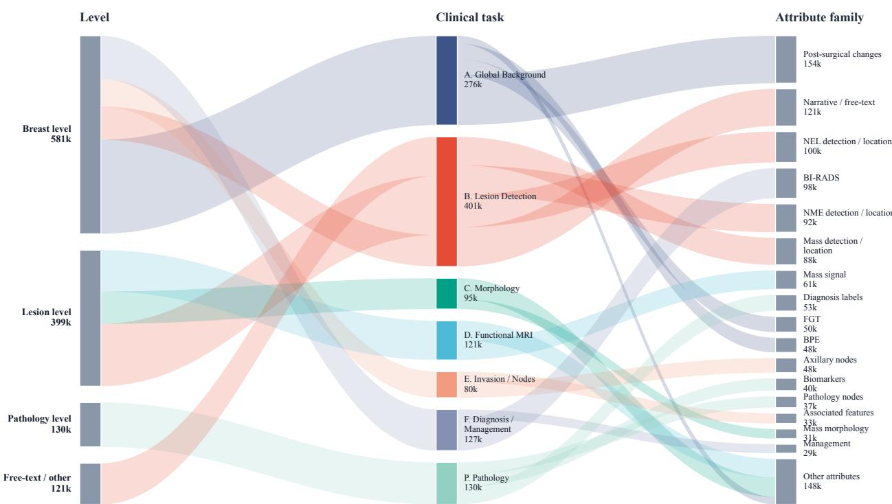  
Figure 7 Level–task–attribute flow of BreMRIs-VQA. Ribbon width is proportional to the number of generated QA templates, and colors correspond to the seven clinical workflow task groups.

## A.3 Dataset Statistics and Task Taxonomy

Figure 7 illustrates how generated QA templates are distributed across imaging levels, clinical task groups, and individual structured attributes. Breast-level annotations yield the largest question volume because every case provides background tissue information spanning FGT composition, BPE level, breast symmetry, post-surgical changes, lymph node status, BI-RADS assessment, and management recommendation, producing dense per-case question sets regardless of lesion presence. Lesion-level and pathology-level questions have narrower but complementary coverage, since they are generated only when corresponding structured findings are annotated for a given case. Within each task group, the ribbon widths confirm that the label vocabulary is spread across multiple clinically meaningful attributes with no single attribute dominating, supporting the breadth and dificulty of evaluation that BreMRIs-VQA provides.

Figure 8 shows word clouds computed from the natural-language question and answer text after the linguistic diversification step. On the question side, the most frequent tokens are anatomical qualifiers and imaging descriptors (e.g., left, right, breast, enhancement), reflecting the structured attribute keys from which questions are derived. On the answer side, the vocabulary is concentrated around standardized clinical categories (e.g., yes, no, minimal, moderate, positive), consistent with the fixed answer spaces enforced during template-based generation. The co-occurrence of rich question diversity with constrained, clinically grounded answers confirms that BreMRIs-VQA exercises linguistic generalization while maintaining deterministic supervision. The table below details the per-task QA count and label distribution across all seven clinical workflow tasks.

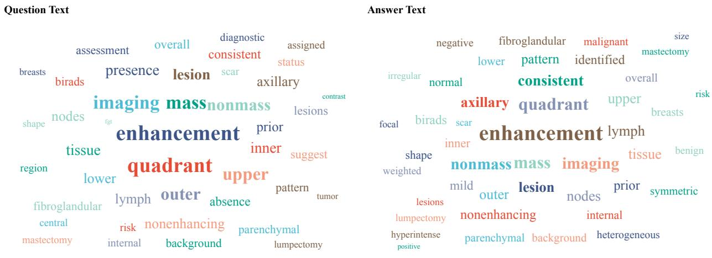  
Figure 8 Question and answer text word clouds for BreMRIs-VQA. Font size indicates token frequency after removing common function words. Unlike the attribute-frequency statistics, this visualization is computed directly from the natural-language question and answer text.

## B QA Generation and Quality Control

## B.1 Template-Based Question Generation

To construct clinically meaningful VQA tasks, we generate questions from a physician-designed schema covering breast-level context, lesion-level characterization, pathology findings, and free-text diagnostic reasoning. Each template is bound to a predefined source key and, when applicable, a fixed answer space, which keeps the generated QA pairs reproducible and grounded in report-derived evidence. The representative templates are grouped into breast-level, lesion-level, pathology-level, and free-text diagnostic questions below.

Tables 6–9 summarize representative templates. Breast-level questions cover global context such as FGT, BPE, symmetry, post-surgical changes, lymph nodes, BI-RADS assessment, and management. Lesion-level questions cover detection, location, morphology, multi-sequence signal, enhancement kinetics, non-mass enhancement, and non-enhancing lesions. Pathology-level questions cover surgical procedures, tumor characteristics, margins, lymph nodes, biomarkers, and pathological staging. Free-text questions simulate holistic diagnostic reporting and require models to integrate multiple findings into clinically meaningful descriptions.

## B.2 Clinical Workflow Task Organization

Although the previous step produces individual VQA samples from structured annotations, clinical diagnosis is inherently a multi-stage reasoning process rather than a collection of isolated attribute predictions. Radiologists typically interpret breast MRI by progressively integrating information across diferent levels of analysis, starting from global contextual assessment and lesion detection, and eventually arriving at a holistic diagnostic conclusion. To better reflect this real diagnostic workflow, we organize the generated questions into a hierarchy of clinically meaningful tasks. Instead of grouping questions purely according to low-level visual attributes, we introduce a rule-based key–task mapping mechanism designed in collaboration with clinicians. Specifically, each generated question is associated with a conceptual identifier called a question\_key, which corresponds to the structured attribute from which the question is derived. These keys provide a unified representation for linking structured annotations, generated questions, and downstream evaluation tasks. A predefined mapping table then assigns each question\_key to a specific diagnostic task using either exact matching or prefix-based rules. Exact rules match a single attribute key, whereas prefix rules group a family of semantically related attributes under the same task category. Through this mechanism, all generated questions are systematically organized into a set of clinically motivated reasoning tasks that correspond to the major stages of breast MRI interpretation. The mapping rules used to assign questions to tasks are summarized in Table 11. Concretely, the task taxonomy consists of the following stages:

<table><tr><td rowspan=1 colspan=1>Category</td><td rowspan=1 colspan=1>Question Template</td><td rowspan=1 colspan=1>Options</td></tr><tr><td rowspan=2 colspan=1>FibroglandularTissue (FGT)</td><td rowspan=1 colspan=1>What is the fibroglandular tissue (FGT) categoryof the left breast?</td><td rowspan=1 colspan=1>A, B, C, D, None</td></tr><tr><td rowspan=1 colspan=1>What is the fibroglandular tissue (FGT) categoryof the right breast?</td><td rowspan=1 colspan=1>A, B, C, D, None</td></tr><tr><td rowspan=2 colspan=1>BackgroundParenchymalEnhancement</td><td rowspan=1 colspan=1>What is the background parenchymal enhancement(BPE) level of the left breast?</td><td rowspan=1 colspan=1>Minimal, Mild,Moderate, Marked</td></tr><tr><td rowspan=1 colspan=1>What is the background parenchymal enhancement(BPE) level of the right breast?</td><td rowspan=1 colspan=1>Minimal, Mild,Moderate, Marked</td></tr><tr><td rowspan=1 colspan=1>Breast Symmetry</td><td rowspan=1 colspan=1>Are the breasts symmetric in size and shape?</td><td rowspan=1 colspan=1>Yes, No</td></tr><tr><td rowspan=6 colspan=1>Post-surgicalChanges</td><td rowspan=1 colspan=1>Are there evidence of scar tissue in the left breast?</td><td rowspan=1 colspan=1>Yes, No</td></tr><tr><td rowspan=1 colspan=1>Are there evidence of scar tissue in the right breast?</td><td rowspan=1 colspan=1>Yes, No</td></tr><tr><td rowspan=1 colspan=1>Are there imaging findings consistent with priorlumpectomy in the left breast?</td><td rowspan=1 colspan=1>Yes, No</td></tr><tr><td rowspan=1 colspan=1>Are there imaging findings consistent with priorlumpectomy in the right breast?</td><td rowspan=1 colspan=1>Yes, No</td></tr><tr><td rowspan=1 colspan=1>Are there imaging findings consistent with priormastectomy in the left breast?</td><td rowspan=1 colspan=1>Yes, No</td></tr><tr><td rowspan=1 colspan=1>Are there imaging findings consistent with priormastectomy in the right breast?</td><td rowspan=1 colspan=1>Yes, No</td></tr><tr><td rowspan=6 colspan=1>AssociatedImagingFeatures</td><td rowspan=1 colspan=1>Is nipple retraction present in the left breast?</td><td rowspan=1 colspan=1>Yes, No</td></tr><tr><td rowspan=1 colspan=1>Is nipple retraction present in the right breast?</td><td rowspan=1 colspan=1>Yes, No</td></tr><tr><td rowspan=1 colspan=1>Is skin thickening present in the left breast?</td><td rowspan=1 colspan=1>Yes, No</td></tr><tr><td rowspan=1 colspan=1>Is skin thickening present in the right breast?</td><td rowspan=1 colspan=1>Yes, No</td></tr><tr><td rowspan=1 colspan=1>Is architectural distortion present in the left breast?</td><td rowspan=1 colspan=1>Yes, No</td></tr><tr><td rowspan=1 colspan=1>Is architectural distortion present in the right breast?</td><td rowspan=1 colspan=1>Yes, No</td></tr><tr><td rowspan=4 colspan=1>Lymph NodeAssessment</td><td rowspan=1 colspan=1>Are the axillary left lymph nodes abnormal?</td><td rowspan=1 colspan=1>Yes, No</td></tr><tr><td rowspan=1 colspan=1>Are the axillary right lymph nodes abnormal?</td><td rowspan=1 colspan=1>Yes, No</td></tr><tr><td rowspan=1 colspan=1>Are the internal mammary left lymph nodes abnormal?</td><td rowspan=1 colspan=1>Yes, No</td></tr><tr><td rowspan=1 colspan=1>Are the internal mammary right lymph nodes abnormal?</td><td rowspan=1 colspan=1>Yes, No</td></tr><tr><td rowspan=2 colspan=1>BI-RADSAssessment</td><td rowspan=1 colspan=1>What is the BI-RADS assessment for the left breast?</td><td rowspan=1 colspan=1>0,1,2,3,4A,4B,4C,5,6</td></tr><tr><td rowspan=1 colspan=1>What is the BI-RADS assessment for the right breast?</td><td rowspan=1 colspan=1>0,1,2,3,4A,4B,4C,5,6</td></tr><tr><td rowspan=2 colspan=1>ClinicalManagement</td><td rowspan=1 colspan=1>Is follow-up recommended for this patient?</td><td rowspan=1 colspan=1>Yes, No</td></tr><tr><td rowspan=1 colspan=1>Is biopsy recommended for this patient?</td><td rowspan=1 colspan=1>Yes, No</td></tr></table>

Table 6 Breast-level question templates used for MRI VQA generation.

Global Background Assessment. Radiologists first evaluate the overall background context of the breast before focusing on specific lesions. This stage includes questions related to fibroglandular tissue composition, background parenchymal enhancement, breast symmetry, and post-surgical changes. These factors influence lesion visibility and diagnostic dificulty.

Lesion Detection and Localization. Once the global context is established, the next step is to determine whether suspicious findings are present and where they are located. Questions in this category involve detecting masses, non-mass enhancement (NME), and non-enhancing lesions, as well as identifying their anatomical locations within the breast.

Morphological Characterization. After lesion detection, radiologists analyze morphological features to assess malignancy risk. This stage includes attributes such as lesion size, shape, margins, and distribution patterns, which correspond to key descriptors used in standardized breast imaging reporting systems.

Multi-Modal Functional Reasoning. Breast MRI provides multiple imaging modalities that reveal complementary physiological information. This task group evaluates functional characteristics such as signal intensity across sequences and contrast enhancement patterns, requiring models to integrate multi-modal cues.

<table><tr><td rowspan=1 colspan=1>Category</td><td rowspan=1 colspan=2>Question Template                                    Options</td></tr><tr><td rowspan=4 colspan=1>Mass Presence&amp; Location</td><td rowspan=1 colspan=1>Is there a mass in the upper inner quadrantof the left breast?</td><td rowspan=1 colspan=1>Yes, No</td></tr><tr><td rowspan=1 colspan=1>Is there a mass in the upper outer quadrantof the left breast?</td><td rowspan=1 colspan=1>Yes, No</td></tr><tr><td rowspan=1 colspan=1>Is there a mass in the lower inner quadrantof the right breast?</td><td rowspan=1 colspan=1>Yes, No</td></tr><tr><td rowspan=1 colspan=1>Is there a mass in the central region of the breast?</td><td rowspan=1 colspan=1>Yes, No</td></tr><tr><td rowspan=2 colspan=1>MassMorphology</td><td rowspan=1 colspan=1>What is the shape of the mass in the left breast?</td><td rowspan=1 colspan=1>round, oval,lobular, irregular</td></tr><tr><td rowspan=1 colspan=1>What is the margin of the mass in the left breast?</td><td rowspan=1 colspan=1>circumscribed, irregular,spiculated</td></tr><tr><td rowspan=3 colspan=1>Mass SignalCharacteristics</td><td rowspan=1 colspan=1>What is the T1-weighted signal of the mass?</td><td rowspan=1 colspan=1>hyperintense, isointense,hypointense</td></tr><tr><td rowspan=1 colspan=1>What is the T2-weighted signal of the mass?</td><td rowspan=1 colspan=1>hyperintense, isointense,hypointense</td></tr><tr><td rowspan=1 colspan=1>Is there diffusion restriction in the mass?</td><td rowspan=1 colspan=1>Yes, No</td></tr><tr><td rowspan=1 colspan=1>Dynamic Enhan-</td><td rowspan=1 colspan=1>What is the initial enhancement kinetics of the mass?</td><td rowspan=1 colspan=1>Slow, Medium, Fast</td></tr><tr><td rowspan=1 colspan=1>cement Kinetics</td><td rowspan=1 colspan=1>What is the delayed phase enhancementkinetics of the mass?</td><td rowspan=1 colspan=1>Persistent, Plateau,Wash-out</td></tr><tr><td rowspan=3 colspan=1>Non-massEnhancement</td><td rowspan=1 colspan=1>Is there a non-mass enhancement in the left breast?</td><td rowspan=1 colspan=1>Yes, No</td></tr><tr><td rowspan=1 colspan=1>What is the distribution pattern ofthe non-mass enhancement?</td><td rowspan=1 colspan=1>Focal, Linear,Regional, Segmental,Multiple regions, Diffuse</td></tr><tr><td rowspan=1 colspan=1>What is the internal enhancement pattern ofthe non-mass enhancement?</td><td rowspan=1 colspan=1>Homogeneous, Heterogeneous,Clustered, Clustered ring</td></tr><tr><td rowspan=1 colspan=1>Non-enhancing</td><td rowspan=1 colspan=1>Is there a non-enhancing lesion in the breast?</td><td rowspan=1 colspan=1>Yes, No</td></tr><tr><td rowspan=1 colspan=1>Lesions</td><td rowspan=1 colspan=1>What is the type of the non-enhancing lesion?</td><td rowspan=1 colspan=1>cyst, non-enhancing mass,architectural distortion,ductal precontrast highsignal on T1W</td></tr></table>

Table 7 Lesion-level question templates used for MRI VQA generation.

Local Invasion and Nodal Reasoning. In addition to lesion features, clinicians also examine signs of local tissue invasion and lymph node involvement in diagnosis. Questions in this category involve associated features such as nipple retraction, skin thickening, architectural distortion and lymph node abnormalities.

Holistic Diagnosis. The final stage of radiological reasoning involves synthesizing all available information to produce a diagnostic assessment and clinical recommendation. This task includes predicting BI-RADS categories and suggested clinical management decisions.

Pathology Prediction. Beyond imaging-based reasoning, we further introduce pathology-oriented tasks derived from structured pathology reports. These questions evaluate the model’s ability to infer pathological outcomes, including tumor characteristics, surgical margins, lymph node status, biomarker expression, and pathological staging.

## B.3 LLM Verification and Human Expert Consistency Check

Each generated QA candidate is verified against the source report evidence with a radiologist-style qualitycontrol prompt. The verifier assigns three 0–3 scores with metric-specific rubrics. For factual consistency, 0 means the answer contradicts or is absent from the report, 1 means only weak or indirect support, 2 means partial support with missing qualifiers such as location, laterality, or pathology status, and 3 means direct report support without hallucinated findings. For clinical validity, 0 means clinically implausible or radiologically incorrect, 1 means medically ambiguous or poorly grounded, 2 means clinically plausible with minor imprecision, and 3 means radiologically coherent and clinically correct. For overall support, 0 means the QA pair should be discarded, 1 means it requires manual review, 2 means it is usable but partially supported, and 3 means it can be retained as fully report-grounded supervision. Candidates with weak support are removed or sent for manual review. The full verification prompt is provided in Appendix D.6. In addition to automatic verification, two board-certified breast-imaging radiologists independently review a stratified sample of 3,500 QA pairs (500 per task) and mark whether each pair passes answer–evidence checking, where a pass means that the answer can be justified by the cited source evidence without requiring additional assumptions. Failed cases are used to refine templates and filtering rules.

<table><tr><td rowspan=1 colspan=1>Category</td><td rowspan=1 colspan=1>Question Template</td><td rowspan=1 colspan=1>Options</td></tr><tr><td rowspan=2 colspan=1>Presence &amp;SurgicalProcedure</td><td rowspan=1 colspan=1>Is there a pathological lesion identifiedin the left breast?</td><td rowspan=1 colspan=1>Yes, No</td></tr><tr><td rowspan=1 colspan=1>Is there a pathological lesion identifiedin the right breast?</td><td rowspan=1 colspan=1>Yes, No</td></tr><tr><td rowspan=2 colspan=1></td><td rowspan=1 colspan=1>What surgical procedure was performedon the left breast?</td><td rowspan=1 colspan=1>Lumpectomy,Mastectomy, Other</td></tr><tr><td rowspan=1 colspan=1>What surgical procedure was performedon the right breast?</td><td rowspan=1 colspan=1>Lumpectomy,Mastectomy, Other</td></tr><tr><td rowspan=2 colspan=1>TumorCharacteristics</td><td rowspan=1 colspan=1>Is the maximum pathological tumor sizelarger than 2 cm?</td><td rowspan=1 colspan=1>Yes, No</td></tr><tr><td rowspan=1 colspan=1>What is the histological grade of the tumor?</td><td rowspan=1 colspan=1>1, 2, 3, Unknown</td></tr><tr><td rowspan=1 colspan=1>Surgical Margins</td><td rowspan=1 colspan=1>Are the surgical margins involved by tumor?</td><td rowspan=1 colspan=1>Positive, Negative</td></tr><tr><td rowspan=1 colspan=1>&amp; Lymph Nodes</td><td rowspan=1 colspan=1>Are lymph nodes involved based on pathology?</td><td rowspan=1 colspan=1>Positive, Negative</td></tr><tr><td rowspan=6 colspan=1>Biomarkers &amp;PathologicalStaging</td><td rowspan=1 colspan=1>What is the ER status of the tumor?</td><td rowspan=1 colspan=1>Positive, Negative,Equivocal, Unknown</td></tr><tr><td rowspan=1 colspan=1>What is the PR status of the tumor?</td><td rowspan=1 colspan=1>Positive, Negative,Equivocal, Unknown</td></tr><tr><td rowspan=1 colspan=1>What is the HER2 status of the tumor?</td><td rowspan=1 colspan=1>Positive, Negative,Equivocal, Unknown</td></tr><tr><td rowspan=1 colspan=1>What is the Ki67 status of the tumor?</td><td rowspan=1 colspan=1>Positive, Negative,Equivocal, Unknown</td></tr><tr><td rowspan=1 colspan=1>What is the AR status of the tumor?</td><td rowspan=1 colspan=1>Positive, Negative,Equivocal, Unknown</td></tr><tr><td rowspan=1 colspan=1>What is the pathological TNM stage?</td><td rowspan=1 colspan=1>Stage 0, Stage I, Stage II,Stage III, Stage IV, Unknown</td></tr></table>

Table 8 Pathology question templates used for pathology report VQA generation.
<table><tr><td rowspan=1 colspan=1>Question Template</td></tr><tr><td rowspan=1 colspan=1>Describe the overall fibroglandular tissue composition and background parenchymal enhancement of both breasts.</td></tr><tr><td rowspan=1 colspan=1>Provide a comprehensive description of the mass identified in the breast MRI.</td></tr><tr><td rowspan=1 colspan=1>Describe the imaging characteristics of the non-mass enhancement in the breast.</td></tr><tr><td rowspan=1 colspan=1>Describe the appearance of axillary and internal mammary lymph nodes.</td></tr><tr><td rowspan=1 colspan=1>Provide the final BI-RADS assessment and overall diagnostic impression</td></tr></table>

Table 9 Free-text diagnostic question templates used for holistic clinical reasoning.

## C Background

Medical Vision-Language Models. Recent medical vision-language models extend general multi-modal LLMs to clinical images and reports, enabling stronger medical understanding and generation Blankemeier et al. (2026); Xu et al. (2025). A clear trend is to scale training data and align multi-modal reasoning for broad clinical tasks Hu et al. (2024). For example, HealthGPT Lin et al. (2025) and Lingshu Xu et al. (2025) emphasize unified training for medical comprehension and generation. In radiology, RadFM Wu et al. (2025) leverages large-scale 2D and 3D medical data and supports volumetric inputs, providing a strong generalist baseline for 3D medical understanding. Despite these advances, most medical MLLMs still adopt dense visual tokenization and expose large numbers of tokens to the decoder, which can be problematic for 3D volumes: volumetric scans contain heavy redundancy while clinically relevant cues are sparse. This motivates our focus on selective visual exposure to reduce signal dilution.

<table><tr><td>Task Fact.</td><td>Clin. Overall Pass (%)</td></tr><tr><td>Global background</td><td>2.94 2.92 2.93 99.2</td></tr><tr><td>Lesion localization</td><td>2.91 2.89 2.90 98.6</td></tr><tr><td>Morphology</td><td>2.86 2.83 2.84 97.5</td></tr><tr><td>Functional reasoning</td><td>2.79 2.75 2.77 96.2</td></tr><tr><td>Local invasion/nodal</td><td>2.88 2.86 2.87 97.9</td></tr><tr><td>Holistic diagnosis</td><td>2.82 2.79 2.80 96.8</td></tr><tr><td>Pathology prediction</td><td>2.80 2.82 2.81 96.5</td></tr></table>

Table 10 Quality-control summary for generated QA pairs. Fact., Clin., and Overall denote factual consistency, clinical validity, and overall report support on a 0–3 scale. Pass rate denotes the percentage of expert-audited QA pairs that pass answer–evidence checking.
<table><tr><td rowspan=1 colspan=1>Task Name</td><td rowspan=1 colspan=1>Exact Keys</td><td rowspan=1 colspan=1>Prefixes</td></tr><tr><td rowspan=1 colspan=1>Global BackgroundAssessment</td><td rowspan=1 colspan=1>breast level.breast_symmetry</td><td rowspan=1 colspan=1>breast level.FGT., breast level.BPE.,breast level.post surgical changes.</td></tr><tr><td rowspan=1 colspan=1>Lesion Detection&amp; Localization</td><td rowspan=1 colspan=1>mass, non mass enhancement,non enhancing lesion, mass.count,non mass enhancement.count,non enhancing lesion.count</td><td rowspan=1 colspan=1>mass.location.,non mass enhancement.location.,non enhancing lesion.location.</td></tr><tr><td rowspan=1 colspan=1>MorphologicalCharacterization</td><td rowspan=1 colspan=1>non mass enhancement.distribution.non_enhancing_lesion.lesion_type_detail</td><td rowspan=1 colspan=1>mass.size_mm., mass.morphology.,non mass enhancement.size mm.non enhancing lesion.size mm.</td></tr><tr><td rowspan=1 colspan=1>Multi-ModalFunctional Reasoning</td><td rowspan=1 colspan=1>non mass enhancement.internal enhancement pattern</td><td rowspan=1 colspan=1>mass.signal characteristics.,non mass enhancement.signal characteristics.,non enhancing lesion.signal characteristics.,mass.internal enhancement.</td></tr><tr><td rowspan=1 colspan=1>Local Invasion &amp;Nodal Reasoning</td><td rowspan=1 colspan=1></td><td rowspan=1 colspan=1>breast level.associated features.,breast level.lymph nodes.</td></tr><tr><td rowspan=1 colspan=1>Holistic Diagnosis</td><td rowspan=1 colspan=1></td><td rowspan=1 colspan=1>breast level.BI-RADS.,breast_level.management.</td></tr><tr><td rowspan=1 colspan=1>Pathology Prediction</td><td rowspan=1 colspan=1></td><td rowspan=1 colspan=1>pathology.</td></tr></table>

Table 11 Key–task mapping rules used to organize generated questions into clinical-workflow based tasks.

3D Medical VQA and Benchmarks. 3D medical VQA requires cross-slice spatial understanding and fine-grained evidence aggregation, making it harder than 2D VQA. Existing 3D medical MLLMs Hamamci et al. (2024); Lin et al. (2026) and benchmarks Hamamci et al. (2026); Gai et al. (2025) have taken important steps toward this goal. M3D Bai et al. (2024) advances 3D multimodal learning with large-scale 3D data and benchmarks that cover VQA and localization. Photon Fang et al. (2026) studies volume understanding with variable-length volumetric tokenization and training strategies that speed up volume understanding. Closer to multi-modal MRI, mpLLM Vepa et al. (2025) introduces a prompt-conditioned hierarchical MoE for VQA over multiparametric 3D brain MRI, using modality- and token-level experts to fuse interrelated MRI modalities. On the evaluation side, 3D-RAD emphasizes diverse 3D radiology VQA tasks with multi-temporal settings Gai et al. (2025), while DeepTumorVQA targets tumor-centric 3D reasoning with expert-level questions across recognition, measurement, and clinical reasoning Chen et al. (2025). These eforts highlight a shared challenge: 3D medical image reasoning needs both global context and subtle local cues, yet dense token exposure can dilute the sparse diagnostic signals. Moreover, most public benchmarks focus on CT and single-volume inputs, systematic evaluation on multi-modal MRI scans with workflow-grounded questions remains limited, motivating our BreMRIs-VQA benchmark and the SeVeR framework.

Visual Token Reduction and Resampling. MLLMs often encode images into many visual tokens, motivating token reduction, token merging, and learned resampling. Perceiver-style resamplers in Flamingo Alayrac et al. (2022) compress visual features into a fixed number of latent tokens before language decoding, while TokenLearner Ryoo et al. (2021), Token Merging Bolya et al. (2023), and FastV Chen et al. (2024) reduce visual computation through adaptive token selection or merging. More recent MLLM pruning studies further analyze whether reduced visual token budgets preserve reasoning quality Wen et al. (2025); Alvar et al. (2025); Yang et al. (2025b). The closest design to our first-stage selector is MMTok Dong et al. (2026), which formulates visual token selection as coverage maximization. We therefore do not claim the coverage objective itself as the main novelty. Instead, SeVeR adapts coverage-based selection as a modality-wise redundancy reducer for 3D medical volumes and couples it with language-conditioned gated retrieval and marginal-utility regularization, which are designed for multi-sequence volumetric VQA rather than generic 2D VLM acceleration.

## D Prompt Templates for VQA Data Generation

## D.1 Report-to-JSON Extraction Prompt Text

Breast MRI Report-to-JSON Extraction   
You are a breast imaging expert with extensive clinical experience.   
Your task: extract all structured information from a free-text breast MRI report into a standardized JSON.   
All values must be strictly grounded in the input report. Do NOT add any inference or medical common   
,→ sense.   
If a field is not explicitly mentioned, set it to null (do not guess).   
Core Requirements   
1) Output must be a valid JSON only. No explanations.   
2) The JSON schema must exactly match the provided template. Do not rename, remove, or add fields.   
3) All values must be extracted from the report text. If not mentioned, use null.   
- Example: if "skin thickening" is not stated, set it to null (not false).   
- If enhancement kinetics is not described, set it to null.   
4) Convert "cm" to millimeters (mm).   
5) If multiple lesions are described, create multiple entries and place them in the correct arrays:   
- mass, non\_mass\_enhancement, non\_enhancing\_lesion   
6) If a lesion type is not present, output an empty array [] for that type.   
FGT (Fibroglandular Tissue) Rules   
Map keywords to FGT grade:   
"A", "almost entirely fatty" -> "A"   
"B", "scattered fibroglandular" -> "B"   
"C", "heterogeneously dense" -> "C"   
"D", "extremely dense" -> "D"   
If left/right differ, fill both sides separately.   
If not described, set FGT.left = null and FGT.right = null.   
Lesion Type Rules (Strict)   
Mass:   
- explicit bounded lesion such as "mass", "nodule", etc.   
Non-mass enhancement (NME):   
- regional/linear/segmental/ductal enhancement without a clear 3D boundary.   
Non-enhancing lesion:   
- lesions described as non-enhancing (e.g., cystic signal, pre-contrast high signal on T1, architectural   
,→ distortion without enhancement).   
Classify strictly based on report semantics.

Kinetics Rules   
Initial phase:   
- Fast: early marked enhancement / rapid peak   
Medium: moderate enhancement   
Slow: mild or minimal early enhancement   
Delayed phase:   
- Persistent / Plateau / Wash-out according to report wording   
If kinetics not described, set to null.   
Location Parsing   
Quadrant:   
- UIQ / UOQ / LIQ / LOQ / central   
Depth:   
- anterior / middle / posterior   
If unclear, set to null.   
BI-RADS Rules   
If BI-RADS is explicitly provided for left/right, fill accordingly.   
If only a single BI-RADS is given without side, fill both.   
If not described, set to null.   
Final Output   
Read the breast MRI report text provided next.   
Extract all information and output JSON only.

## D.2 Breast MRI Report JSON Schema

## Report JSON Schema

```csv
"breast_level": {
"FGT": {
"left": "C", // or "A", "B", "C", "D"
"right": "C" // or "A", "B", "C", "D"
},
"BPE": {
"left": "Moderate", // or "Minimal", "Mild", "Moderate", "Marked"
"right": "Mild"
},
"breast_symmetry": true,
"post_surgical_changes": {
"left": {
"scar_tissue": false,
"lumpectomy_changes": false,
"mastectomy_changes": false
},
"right": {
"scar_tissue": false,
"lumpectomy_changes": false,
"mastectomy_changes": false
}
},
"associated_features": {
"left": {
"nipple_retraction": null,
"nipple_invasion": null,
"skin_retraction": null,
"skin_thickening": null,
"skin_invasion": {
"direct_invasion": null,
"inflammatory_cancer": null
},
"axillary_adenopathy": null,
"pectoralis_muscle_invasion": null,
"chest_wall_invasion": null,
"architectural_distortion": null,
"ductal_dilation": null // or "mild", "marked", null
```

```csv
},
"right": {
"nipple_retraction": null,
"nipple inyasion": null,
"skin_retraction": null,
"skin_thickening": null,
"skin_invasion": {
"direct_invasion": null,
"inflammatory_cancer": null
},
"axillary_adenopathy": null,
"pectoralis_muscle_invasion": null,
"chest_wall_invasion": null,
"architectural_distortion": null,
"ductal_dilation": null // or "mild", "marked", null
},
"lymph_nodes": {
"axillary_left": null, // or "normal", "abnormal"
"axillary_right": null,
"internal_mammary_left": null,
"internal_mammary_right": null
},
"BI-RADS": {
"left": null, // or "0", "1", "2", "3", "4A", "4B", "4C", "5", "6"
"right": null
},
"management": {
"follow_up_recommended": null, // or true, false
"biopsy_recommended": null
}
},
"mass": [
{
"id": 1,
"side": "left",
"location": {
"quadrant": "UOQ", // or "UIQ","UOQ","LIQ","LOQ","central", null
"depth": "middle" // or "anterior","middle","posterior", null
},
"size_mm": {
"long": 12,
"short": 9,
"depth": 8
},
"signal_characteristics": {
"T1W": "hyperintense", // or "hyperintense","isointense","hypointense",null
"T2W": "hyperintense", // or "hyperintense","isointense","hypointense",null
"DWI_restriction": "present", // or "present","absent",null
"ADC": "hyperintense", // or "hyperintense","isointense","hypointense",null
"kinetics": {
"initial": "Fast",
"delayed": "Wash-out"
}
},
"morphology": {
"shape": "oval", // or "round","oval","lobular","irregular",null
"margin": "circumscribed" // or "circumscribed","irregular","spiculated",null
},
"internal_enhancement": {
"pattern": "heterogeneous", // or
,→ "homogeneous","heterogeneous","rim_enhancement","dark_internal_septations",null
"associated_vascularity": {
"adjacent_vessel_sign": null,
"increased_peritumoral_vascularity": null
}
}
"non_mass_enhancement": [
5
"lesion_id": 1,
"side": "left",
"location": {
"quadrant": null,
"depth": null
},
"size_mm": {
"long": null,
"short": null,
"depth": null
},
"distribution": "Segmental", // or "Focal","Linear","Regional","Segmental","Multiple regions","Diffuse",null
```

```csv
"internal_enhancement_pattern": "Clustered_ring", // or
,→ "Homogeneous","Heterogeneous","Clustered","Clustered_ring",null
"signal_characteristics": {
"T1W": "hyperintense", // or "hyperintense","isointense","hypointense",null
"T2W": "hyperintense", // or "hyperintense","isointense","hypointense",null
"DWI_restriction": "present", // or "present","absent",null
"ADC": "hyperintense", // or "hyperintense","isointense","hypointense",null
"kinetics": {
"initial": "Fast", // "Slow","Medium","Fast",null
"delayed": "Wash-out" // "Persistent","Plateau","Wash-out",null
}
}
}
],
"non_enhancing_lesion": [
{
"lesion_id": 1,
"side": "left",
"location": {
"quadrant": null,
"depth": null
},
"size_mm": {
"long": null,
"short": null,
"depth": null
},
"signal_characteristics": {
"T1W": "hyperintense", // or "hyperintense","isointense","hypointense",null
"T2W": "hyperintense", // or "hyperintense","isointense","hypointense",null
"DWI_restriction": "present", // or "present","absent",null
"ADC": "hyperintense", // or "hyperintense","isointense","hypointense",null
"kinetics": {
"initial": "Fast", // "Slow","Medium","Fast",null
"delayed": "Wash-out" // "Persistent","Plateau","Wash-out",null
}
},
"lesion_type_detail": "ductal_precontrast_high_signal_on_T1W" // or
,→ "cyst","non_enhancing_mass","architectural_distortion",null
}
]
}
```

## D.3 Pathology Report Extraction Prompt Text

## Pathology Report-to-JSON Extraction

# Role   
You are an expert Pathologist and Data Structuring Specialist. Your task is to extract information from   
,→ raw Chinese Breast Pathology Reports and convert it into a structured \*\*English JSON\*\* format.   
# Input Data Description   
1. Input data format:   
{   
'type': Surgical pathology | Non-surgical pathology,   
'pathology': Pathology Reports.   
}   
2. The \*\*Surgical pathology\*\*: text fields separated by spaces or colons.   
3. The \*\*Non-surgical pathology\*\*: often formatted as Python set strings (e.g., \`"{'text', 'text'}"\`).   
4. \*\*Symbols\*\*: \`(-)\` means Negative, \`(+)\` means Positive, \`/\` often means Not Applicable or Not Found.   
# Translation Rules (Strict Adherence)   
Use the following mapping to translate Chinese terms to standard English medical terminology:   
- Invasive carcinoma -> "Invasive Carcinoma"   
No special type (NST) -> "Invasive Carcinoma of No Special Type (NST)"   
- Ductal carcinoma in situ -> "Ductal Carcinoma In Situ (DCIS)"   
Fibroadenoma -> "Fibroadenoma"   
Sclerosing adenosis -> "Sclerosing Adenosis"   
Mastopathy -> "Mastopathy" or "Fibrocystic Changes"   
Spindle cell lesion -> "Spindle Cell"   
## Anatomy & Margins   
Left / Right -> "Left" / "Right"

- Medial / Lateral / Superior / Inferior -> "Medial" / "Lateral" / "Superior" / "Inferior"   
- Basal / Superficial -> "Basal" / "Superficial"   
Quadrant (UIQ / UOQ / LIQ / LOQ) -> "Quadrant" (UIQ, UOQ, LIQ, LOQ)   
Margin -> "Margin"   
## Molecular & IHC   
- Immunohistochemistry -> "IHC"   
Strong / Moderate / Weak -> "Strong" / "Moderate" / "Weak"   
Negative / Positive -> "Negative" / "Positive"   
Amplification -> "Amplification"   
# Data Parsing Rules   
1. \*\*Margins\*\*: Extract the distance (cm) if available. Convert \`(-)\` to \`Negative\`.   
2. \*\*IHC\*\*: Look for Supplementary Report or Immunohistochemistry sections. Merge them into the   
,→ \`biomarkers\` field.   
3. \*\*Measurements\*\*: Convert all dimensions to \`cm\`. Extract the largest dimension as \`max\_dimension\_cm\`.   
4. For \*\*Non-surgical pathology\*\*: Clean the Python set syntax (\`{'...'}\`) and combine the text before   
,→ extraction.   
# Final Output   
Return strictly a JSON object following the schema below. Do not add explanations.

## D.4 Pathology Report JSON Schema

## Surgical Pathology JSON Schema

{   
"left": {   
"is\_present": boolean,   
"procedure": "string (e.g., BCS, Mastectomy, Biopsy)",   
"lesions": [   
{   
"id": 1,   
"location\_detail": "string",   
"diagnosis": {   
"main\_type": "string",   
"grade": "string (e.g., Grade II)",   
"full\_text": "string (translated summary)"   
},   
"size": {   
"original\_text": "string",   
"max\_dim\_cm": float   
},   
"margins": {   
"status": "Negative" | "Positive" | "Unknown",   
"closest\_distance\_cm": float,   
"details": "string (e.g., Superior margin 2.5cm)"   
},   
"biomarkers\_ihc": {   
"ER": boolean, "PR": boolean, "HER2": boolean, "Ki67": boolean, "AR": boolean, "notes": boolean   
}   
}   
],   
"lymph\_nodes": {   
"status": "Positive" | "Negative" | "Not Performed",   
"positive\_count": int,   
"total\_count": int,   
"sentinel\_positive": int,   
"sentinel\_total": int   
},   
"tnm\_stage": "string"   
},   
"right": {   
// Exact same structure as "left", or null if not present   
"is\_present": boolean,   
"procedure": "string",   
"lesions": [],   
"lymph\_nodes": {},   
"tnm\_stage": "string"   
}   
}

## D.5 QA Paraphrasing Prompt

Open-VQA Generator Prompt   
You are a medical imaging data assistant specializing in breast MRI.   
Your task is to rewrite a structured attribute into a natural-language Question-Answer pair suitable for a   
,→ Breast MRI VQA dataset.   
# Rules   
1. The Question MUST be open-ended and descriptive.   
- Do NOT ask yes/no questions.   
- Do NOT include options or binary choices.   
2. The Answer MUST be a complete sentence that:   
- Is strictly based on the provided "Answer" value.   
- Does NOT introduce any new medical interpretation, diagnosis, or inference.   
3. Do NOT introduce information not explicitly contained in the input.   
4. Do NOT repeat or list the provided options in the output.   
5. Use varied sentence structures across different samples.   
6. Use precise anatomical and imaging terminology appropriate for breast MRI.   
7. Output ONLY valid JSON in the specified format. No extra text.   
# Input (JSON)   
{   
"Question": "...",   
"options": ["...", "...", "..."],   
"Answer": "..."   
}   
# Output Format (JSON)   
{   
"Question": "...",   
"Answer": "..."

## D.6 LLM Verification Prompt

## Quality-Control Prompt

You are an expert breast MRI radiologist. Your task is to evaluate whether the provided Question-Answer   
pair is factually supported by the given breast MRI evidence. Evaluate the QA pair across the,→   
,→ following dimensions:   
1. Factual Consistency   
Does the answer accurately reflect the MRI evidence without unsupported findings?   
2. Clinical Validity   
Is the answer clinically reasonable and radiologically correct?   
3. Overall Support   
Should the QA pair be retained as report-grounded supervision?   
You must ONLY rely on the provided evidence.   
Do NOT infer findings beyond the evidence.   
[Evidence]   
Finding:   
{finding}   
Impression:   
{impression}   
[Question]   
{question}   
[Answer]   
{answer}   
Scoring Criteria:

Factual Consistency:   
0 = contradicted or absent from evidence   
1 = weak or indirect evidence support   
2 = partially supported but missing key qualifier   
3 = directly supported with no hallucination   
Clinical Validity:   
0 = clinically implausible or radiologically wrong   
1 = medically ambiguous or poorly grounded   
2 = clinically plausible with minor imprecision   
3 = radiologically coherent and clinically correct   
Overall Support:   
0 = discard   
1 = manual review required   
2 = usable but partially supported   
3 = retain as fully report-grounded   
Output ONLY valid JSON:   
{{   
"factual\_consistency": 0-3,   
"clinical\_validity": 0-3,   
"overall\_score": 0-3,   
"explanation": "brief explanation"   
}}

## E Ethics, Privacy, and Data Governance

## E.1 Ethics and Privacy

This retrospective study and the use of clinical data for benchmark construction were approved through the responsible institutional ethics and data-governance procedures. All data handling follows the institutional data-governance protocol for retrospective medical research. Before benchmark construction, clinical images and reports are de-identified according to the approved protocol, including removal or masking of direct patient identifiers from reports and metadata. The public release plan follows the data-use permission of the source institution: source images, clinical reports, and other restricted artifacts will not be openly distributed.

## E.2 Template Design and Review

The VQA templates are drafted from the structured breast MRI reporting schema and pathology attributes used in Stage I, then revised with clinical input to ensure that each template corresponds to a meaningful diagnostic question. Each template is associated with four fields: a clinical task category, a source structured key, an allowed answer space, and a question form. This binding prevents a template from asking for information that is absent from the extracted report evidence. Templates that are ambiguous, duplicate another task, or cannot be mapped to a single structured key are removed by clinical experts. The final templates are listed in Appendix B so that the mapping from task category to question form is explicit.

## E.3 Control of LLM-Generated Content

The LLM is used for structured extraction and paraphrase proposal, but the accepted supervision is determined by report-derived structured fields and deterministic filters. For Stage I, outputs must be valid JSON under the predefined schema; unsupported or unmentioned attributes are set to null; values outside the allowed clinical vocabulary are discarded; and schema-invalid outputs are excluded from downstream question generation. For Stage III, paraphrasing is performed after the answer label has already been fixed by the structured field. A paraphrased pair is retained only if it preserves the same source key, answer label, and question type as the original template-generated pair. Thus, the LLM may change surface wording, but it cannot introduce a new label into the final dataset.

Input Modality token matrix $X ^ { m } \in \mathbb { R } ^ { L _ { m } \times d }$ , prototype budget k, temperature $\tau _ { v } .$   
Output Prototype indices $S ^ { m , * }$ and position-aware prototypes $H ^ { m }$   
1 Normalize tokens $\tilde { X } ^ { m } \gets \mathrm { L 2 N o r m } ( X ^ { m } ) .$   
2 Compute afinity $A ^ { m } \gets \tilde { X } ^ { m } ( \tilde { X } ^ { m } ) ^ { \top }$ , where $A ^ { m } \in \mathbb { R } ^ { L _ { m } \times L _ { m } }$   
3 Remove self-match $A _ { i i } ^ { m }  - \infty , \quad \forall i .$   
4 Normalize rows $\hat { \smash { A _ { \parallel } ^ { m } } } \gets \dot { \mathrm { ~ \circled ~ { ~ \exp ( \it A _ { i j } ^ { m } / \tau _ { v } ) ~ } ~ } }$   
$\begin{array} { r } { \mathbf { \Sigma } ^ { \mathbf { A } _ { i j } } \mathbf { \Sigma } ^ {  } \overline { { \sum _ { j ^ { \prime } = 1 } ^ { L _ { m } } \exp ( A _ { i j ^ { \prime } } ^ { m } / \tau _ { v } ) } } } \end{array}$   
5 Initialize coverage $S \gets \emptyset , \quad \overline { { r _ { i } } } \gets - \infty$ for $i = 1 , \ldots , L _ { m }$ . Here $r _ { i }$ stores the best selected afinity   
for token i.   
6 Greedy selection for $t = 1 , \ldots , k$   
$\operatorname { s c o r e } ( s ) = \frac { 1 } { L _ { m } } \sum _ { i = 1 } ^ { L _ { m } } \operatorname* { m a x } \Bigl ( r _ { i } , \hat { A } _ { i s } ^ { m } \Bigr )$   
$s \in \{ 1 , \ldots , L _ { m } \} \setminus S ,$   
$s ^ { \star }  \arg \operatorname* { m a x } _ { \mathrm { ~ e ~ } } \sec ( s ) ,$   
$S \gets S \cup \{ s ^ { \star } \}$   
$r _ { i } \gets \operatorname* { m a x } \Bigl ( r _ { i } , \hat { A } _ { i s ^ { \star } } ^ { m } \Bigr ) , \quad \forall i .$   
7 Form prototypes $S ^ { m , * } \gets S , \quad P ^ { \dot { m } } \gets X ^ { \acute { m } } [ S ^ { m , * } ] .$   
8 Add position $H ^ { m } \gets P ^ { m } \gets$ + Embed(pos $( S ^ { m , * } ) )$   
9 Return $S ^ { m , * } , H ^ { m } .$  
Algorithm 1 Greedy Prototype Selection (GPS)

## E.4 Final VQA-Pair Filtering

Each candidate VQA pair passes a final quality-control pipeline before inclusion. We remove pairs whose answer is unsupported by the source structured field, whose question refers to a missing or null attribute, whose answer is outside the template-specific vocabulary, or whose paraphrase changes the clinical slot being queried. For multiple-choice questions, we additionally filter answer leakage by matching the question text against the correct option and a synonym list for common clinical labels. We also remove duplicate, empty, contradictory, and malformed QA pairs. These steps are designed to reduce hallucinated labels, semantic drift during paraphrasing, and leakage from answer options into the question.

## F Method Details

## F.1 Greedy Prototype Selection Algorithm

To identify a compact set of representative visual tokens for each modality, we adopt a greedy prototype selection strategy. Given the modality token matrix $X ^ { m }$ , the algorithm iteratively selects k tokens that maximize the overall afinity coverage of the token set. Specifically, we first normalize the tokens and compute a pairwise afinity matrix using cosine similarity. At each iteration, the candidate token that provides the largest marginal improvement in afinity coverage is selected as a new prototype. The detailed procedure is summarized in Algorithm 1.

## F.2 Straight-Through Estimator for End-to-End Training

The greedy selection in Eq. (3) returns discrete token indices and is non-diferentiable. However, the afinity matrix A<sup>ˆ</sup> is computed from upstream visual features that we want to train end-to-end with the downstream $\mathrm { \Delta V Q A }$ objective. To propagate gradients through the selection step without changing its discrete behavior at inference, we apply a straight-through estimator (STE):

$$
S _ { \mathrm { S T } } ^ { m , * } = S ^ { m , * } + \hat { S } ^ { m } - \mathrm { s t o p g r a d } ( \hat { S } ^ { m } ) ,\tag{11}
$$

where $\hat { S } ^ { m }$ is a soft prototype representation computed as an afinity-weighted mixture of all tokens in $X ^ { m }$ using the normalized afinity scores ${ \hat { A } } ^ { m } , { \mathrm { i . e . } }$ , a diferentiable surrogate of the hard selection.

Forward pass. The first term $S ^ { m , * }$ dominates and equals the discrete greedy selection, so the model sees the same hard prototypes during both training and inference.

Backward pass. The contribution of $S ^ { m , * }$ to the gradient is zero (it is a discrete index operation with no useful subgradient), and the contribution of −stopgrad $1 ( \hat { S } ^ { m } )$ is also zero by construction. Gradients therefore flow only through the diferentiable surrogate $\hat { S } ^ { m }$ , which depends on the upstream visual features via $\hat { A } ^ { m }$

What is trained vs. not trained. The greedy index operation itself is not trained—the set of selected indices is determined entirely by the current $\hat { A } ^ { m }$ at each forward pass. The trainable components are (i) the upstream 3D ViT that produces $X ^ { m }$ and (ii) any projection layers that shape the afinity space. Training therefore adjusts the feature space in which coverage is measured, which in turn changes which tokens get selected in subsequent forward passes.

## F.3 Self-Consistency Regularization Details

Self-Consistency Regularization with Marginal Utility is applied during task-specific fine-tuning to discourage degenerate always-on visual retrieval. The regularization compares the marginal utility of additional retrieved features and encourages the gate to remain active only when extra visual evidence reduces task loss. To stabilize optimization, the regularization is introduced after an initial supervised warm-up, so the model first learns stable VQA representations before the gating behavior is explicitly constrained.

## G Implementation Details

## G.1 Training Setup

All experiments are conducted on a server with 8 NVIDIA H100 GPUs using BF16 mixed precision. Unless otherwise stated, the main BreMRIs-VQA results use Qwen3-VL-4B as the backbone for SeVeR-4B. The token-pruning eficiency comparison fixes the backbone to Qwen2.5-VL-3B for all pruning baselines and SeVeR-3B, while the cross-model scaling study covers SeVeR-3B (Qwen2.5-VL-3B), SeVeR-4B (Qwen3-VL-4B), and SeVeR-8B (Qwen3-VL-8B). All variants use the same two-stage training pipeline unless noted otherwise.

## G.2 Two-Stage Training Protocol

Phase 1: Cross-modal representation alignment. The LLM backbone is kept frozen; only the visual encoder, the GPS module, and the cross-modal projector are updated. This prevents catastrophic forgetting of language priors while the visual side learns domain-relevant representations. For CT-based datasets (3D-RAD Gai et al. (2025), DeepTumorVQA Chen et al. (2025)), Phase 1 uses volume–caption pairs from CT-RATE Hamamci et al. (2024). For BreMRIs-VQA, Phase 1 trains the model to generate full radiology reports (findings and impressions) from multi-sequence MRI volumes, encouraging cross-modality alignment before downstream supervision. Phase 1 hyperparameters are: learning rate $1 \times 1 0 ^ { - 4 }$ , efective batch size $3 2 \times 8 { = } 2 5 6$ , 3 epochs, AdamW optimizer $( \beta _ { 1 } { = } 0 . 9 , \beta _ { 2 } { = } 0 . 9 9 9 , \varepsilon { = } 1 0 ^ { - 8 } )$ , cosine decay with a 5% linear warm-up.

Phase 2: Task-specific fine-tuning. All parameters are unfrozen and the model is jointly fine-tuned on supervised VQA data with the standard language-modeling objective. Phase 2 hyperparameters are: learning rate $8 \times 1 0 ^ { - 6 }$ (swept from $5 \times 1 0 ^ { - 6 } ~ \mathrm { t o } ~ 2 \times 1 0 ^ { - 5 } )$ , efective batch size $3 2 \times 8 { = } 2 5 6 .$ 1 epoch, AdamW $( \beta _ { 1 } \mathrm { { = } } 0 . 9$ $\beta _ { 2 } { = } 0 . 9 9 9 , \varepsilon { = } 1 0 ^ { - 8 } )$ , weight decay 0.05 (swept from 0.01 to 0.1; bias and layer-norm parameters excluded), cosine decay with a 3–5% linear warm-up. To stabilize joint optimization before the gating signal is active, the first 10% of Phase 2 steps (0.1 epoch) run without the Self-Consistency Regularization with Marginal Utility (Sec. 3.3); the regularization is then enabled for the remainder of Phase 2 with weight $\beta { = } 0 . 5$ . This staged activation lets the backbone first converge on the task loss, preventing degenerate early-stage gate saturation.

<table><tr><td rowspan="2">Setting</td><td rowspan="2">Base VLM</td><td colspan="2">GBA</td><td colspan="2">LDL</td><td colspan="2">Morph.</td><td colspan="2">MMFR</td><td colspan="2">LINR</td><td colspan="2">HD</td><td colspan="2">PP</td><td colspan="2">Avg.</td></tr><tr><td>Acc.</td><td>BERT.</td><td>Acc.</td><td>BERT.</td><td>Acc.</td><td>BERT.</td><td>Acc.</td><td>BERT.</td><td>Acc.</td><td>BERT.</td><td>Acc.</td><td>BERT.</td><td>Acc.</td><td>BERT.</td><td>Acc.</td><td>BERT.</td></tr><tr><td>SeVeR-3B</td><td>Qwen2.5-VL-3B</td><td>|88.90</td><td>99.55</td><td>77.78</td><td>99.80</td><td>|56.89</td><td>97.32</td><td>79.56 99.22</td><td>|76.85</td><td>97.60</td><td>|36.02</td><td>97.48</td><td></td><td>|75.47</td><td>99.23</td><td>70.21</td><td>98.60</td></tr><tr><td>SeVeR-4B</td><td>Qwen3-VL-4B</td><td>89.82</td><td>99.68</td><td>78.48</td><td>99.87</td><td>57.45</td><td>97.46</td><td>80.11</td><td>99.43</td><td>77.42</td><td>97.77</td><td>36.53</td><td>97.59</td><td>74.18</td><td>99.10</td><td>70.57</td><td>98.70</td></tr><tr><td>SeVeR-8B</td><td>Qwen3-VL-8B</td><td>91.08</td><td>99.74</td><td>80.14</td><td>99.90</td><td>59.02</td><td>97.68</td><td>81.65</td><td>99.55</td><td>79.06</td><td>97.96</td><td>38.14 97.87</td><td></td><td>75.82</td><td>99.24</td><td>72.13</td><td>98.85</td></tr></table>

Table 12 Full cross-model scaling on BreMRIs-VQA. Task abbreviations: GBA = Global Background Assessment, LDL = Lesion Detection and Localization, Morph. = Morphological Characterization, MMFR = Multi-Modal Functional Reasoning, LINR = Local Invasion and Nodal Reasoning, HD = Holistic Diagnosis, PP = Pathology Prediction. Avg. denotes the macro-average across the seven tasks.

## G.3 Baseline Implementation Details

Qwen3-VL (general MLLM baseline). We use the oficial implementation and pretrained weights. Multisequence MRI volumes are fed as native 3D video inputs following the Qwen3-VL video encoding protocol, which treats temporal frames as volumetric slices and preserves their spatial structure. The model is fine-tuned on BreMRIs-VQA with the same two-stage pipeline and hyperparameters as SeVeR.

Lingshu and other medical VLM baselines (HuLu-Med, OmniV). We use oficial implementations and pretrained weights. For Lingshu, each MRI volume is represented as a sequence of individual 2D images (one per slice), so the number of input image tokens equals the number of slices in the volume; this multi-image input format aligns with Lingshu’s native video-style API. All baselines are fine-tuned on BreMRIs-VQA following the same two-stage pipeline, and zero-shot variants are evaluated without any fine-tuning.

M3D (3D medical VLM baseline). We use the oficial implementation and pretrained weights. Because M3D accepts a single volumetric tensor, all available MRI modalities for a given case are concatenated along the channel dimension; channels corresponding to missing modalities are filled with zeros. The 3D vision encoder is pre-trained on BreMRIs-VQA using the Phase 1 captioning objective, and the full model is then fine-tuned on BreMRIs-VQA VQA data, using the same data splits and optimizer settings as SeVeR.

Visual token pruning baselines (VisionZip, DivPrune, MMTok). All three methods are reproduced from their oficial GitHub implementations and applied on top of our own fine-tuned Qwen2.5-VL-3B checkpoint (trained with the two-stage protocol above, but without GPS/CaGA). Each method’s token-selection module is inserted between the visual encoder output and the LLM input at inference time; no additional training is performed. Latency is measured on a single H100 GPU (batch size 1, BF16), averaged over 100 randomly sampled test examples from BreMRIs-VQA; CaGA retrieval overhead is included in SeVeR’s reported latency.

3D-specific models (Merlin, RadFM, CT-CHAT). Oficial checkpoints are evaluated in zero-shot mode on the CT benchmarks (DeepTumorVQA, 3D-RAD), following the original evaluation protocols without additional fine-tuning.

## H Additional Experimental Results

## H.1 Cross-Model Scaling on BreMRIs-VQA

Table 12 reports the full task-wise results for the cross-model scaling study. SeVeR-3B uses Qwen2.5-VL-3B, while SeVeR-4B and SeVeR-8B use Qwen3-VL-4B and Qwen3-VL-8B, respectively.

Performance improves monotonically across all seven tasks and both metrics as the backbone scales from 3B to 8B, demonstrating that the GPS/CaGA mechanism is backbone-agnostic and scales gracefully with LLM capacity. The 4B→8B step (+1.56 pp avg. Acc., +0.15 pp BERTScore) yields the largest gains on Morphological Characterization and Multi-Modal Functional Reasoning — tasks requiring fine-grained pattern recognition across MRI sequences — suggesting that larger LLMs better leverage the multi-level evidence supplied by CaGA. The relative task ordering is preserved across all three scales, confirming that selective visual exposure provides consistent benefits independent of backbone capacity.

<table><tr><td rowspan="2">Setting</td><td colspan="2">GBA</td><td colspan="2">LDL</td><td colspan="2">Morph.</td><td colspan="2">MMFR</td><td colspan="2">LINR</td><td colspan="2">HD</td><td colspan="2">PP</td><td colspan="2">Avg.</td></tr><tr><td>Acc. BERT.</td><td></td><td>Acc. BERT.</td><td></td><td>Acc. BERT.</td><td></td><td>Acc. BERT.</td><td></td><td>Acc. BERT.</td><td>Acc. BERT.</td><td></td><td>Acc. BERT.</td><td></td><td></td><td>Acc. BERT.</td></tr><tr><td colspan="14">Effect of τv (visual-affinity temperature).</td></tr><tr><td>τv=0.05</td><td>89.10</td><td>99.55</td><td>77.64 99.75</td><td>56.72</td><td>97.21</td><td>79.42</td><td>99.21</td><td>76.83</td><td>97.53</td><td>36.05</td><td>97.32</td><td>73.26</td><td>98.92</td><td>69.86</td><td>98.50</td></tr><tr><td>τv=0.10† τv=0.20</td><td>89.82</td><td>99.68 99.61</td><td>78.48 99.87 78.03</td><td>57.45 99.80 57.21</td><td>97.46 97.33</td><td>80.11 79.73</td><td>99.43 99.29</td><td>77.42 77.08</td><td>97.77 97.61</td><td>36.53 36.31</td><td>97.59 97.44</td><td>74.18 73.55</td><td>99.10 98.98</td><td>70.57 70.18</td><td>98.70 98.58</td></tr><tr><td colspan="14">89.36</td></tr><tr><td></td><td></td><td></td><td></td><td></td><td></td><td>Effect of k (prototype budget).</td><td></td><td></td><td></td><td></td><td></td><td></td><td></td><td></td><td></td></tr><tr><td>k=256</td><td>|88.94</td><td>99.52</td><td>|77.81</td><td>99.78 |56.96</td><td>97.28</td><td>79.58</td><td>99.25</td><td>76.91</td><td>97.56</td><td>|36.14</td><td>97.39</td><td>|73.08</td><td>98.90</td><td>|69.92</td><td>98.53</td></tr><tr><td>k=512†</td><td>89.82</td><td>99.68</td><td>78.48 78.15</td><td>99.87 99.82</td><td>57.45 97.46 57.02 97.30</td><td>80.11 79.66</td><td>99.43 99.31</td><td>77.42 76.98</td><td>97.77 97.60</td><td>36.53 36.36</td><td>97.59 97.47</td><td>74.18 73.04</td><td>99.10 98.94</td><td>70.57 70.09</td><td>98.70 98.58</td></tr><tr><td colspan="14">k=1024 89.41 99.60</td></tr><tr><td></td><td></td><td></td><td></td><td></td><td></td><td>Effect of s</td><td>(gate sharpness).</td><td></td><td></td><td></td><td></td><td></td><td></td><td></td><td></td></tr><tr><td>s=5</td><td>89.28</td><td>99.58</td><td>77.92</td><td>99.79</td><td>57.18 97.35</td><td>79.51</td><td>99.24</td><td>76.95</td><td>97.58</td><td>36.22</td><td>97.42</td><td>|73.18</td><td>98.93</td><td>70.03</td><td>98.56</td></tr><tr><td>s=10†</td><td>89.82</td><td>99.68</td><td>78.48</td><td>99.87</td><td>57.45 97.46</td><td>80.11</td><td>99.43</td><td>77.42</td><td>97.77</td><td>36.53</td><td>97.59</td><td>74.18</td><td>99.10</td><td>70.57</td><td>98.70</td></tr><tr><td>s=20</td><td>89.47</td><td>99.62</td><td>78.11</td><td>99.81</td><td>57.24 97.37</td><td>79.88</td><td>99.33</td><td>77.16</td><td>97.65</td><td>36.41</td><td>97.50</td><td>73.22</td><td>98.96</td><td>70.21</td><td>98.61</td></tr><tr><td colspan="14">Effect of β (marginal-utility regularization weight).</td></tr><tr><td>β=0.1</td><td>89.33</td><td>99.59</td><td>|78.06</td><td>99.81</td><td>57.11</td><td>97.34</td><td>79.74 99.30</td><td></td><td>77.05</td><td>97.62</td><td>|36.27 97.45</td><td></td><td>|73.28</td><td>98.95</td><td>|70.12 98.58</td></tr><tr><td>β=0.5†</td><td>89.82</td><td>99.68</td><td>78.48</td><td>99.87</td><td>57.45</td><td>97.46 80.11</td><td>99.43</td><td>77.42</td><td>97.77</td><td>36.53</td><td>97.59</td><td>74.18</td><td>99.10</td><td>70.57</td><td>98.70</td></tr><tr><td>β=1.0</td><td>89.08</td><td>99.54</td><td>77.77</td><td>99.77</td><td>56.98</td><td>97.25 79.53</td><td>99.24</td><td>76.89</td><td>97.55</td><td>36.16</td><td>97.38</td><td>73.17</td><td>98.91</td><td>69.94</td><td>98.52</td></tr><tr><td></td><td></td><td></td><td></td><td></td><td></td><td></td><td></td><td></td><td></td><td></td><td></td><td></td><td></td><td></td><td></td></tr></table>

Table 13 Hyperparameter sensitivity on BreMRIs-VQA. Each block varies one hyperparameter while keeping the others fixed at their default values, marked with †. We report multiple-choice accuracy (Acc.) and free-text BERTScore (BERT). GBA = Global Background Assessment, LDL = Lesion Detection and Localization, Morph. = Morphological Characterization, MMFR = Multi-Modal Functional Reasoning, LINR = Local Invasion and Nodal Reasoning, HD = Holistic Diagnosis, PP = Pathology Prediction.

## H.2 Hyperparameter Sensitivity on BreMRIs-VQA

Table 13 sweeps four key hyperparameters one at a time while holding the others at their defaults (marked †). The model is robust throughout: all sweeps stay within ±0.7 pp of the default average accuracy. For visualafinity temperature $\tau _ { v } ,$ the optimal 0.10 balances prototype selectivity: lower values concentrate afinities too aggressively (risking coverage collapse on diverse multi-sequence inputs), while higher values over-smooth inter-prototype similarities and reduce discriminability. The prototype budget k=512 maximizes coverage without introducing redundant prototypes that dilute the selection signal, consistent with the latency–accuracy trade-of in Sec. 4.3. Gate sharpness s=10 provides adequate binary resolution without causing premature gate saturation. For the regularization weight $\beta ,$ a moderate 0.5 penalizes degenerate always-on retrieval without over-suppressing the gating mechanism; both β=0.1 (too lenient) and β=1.0 (too aggressive) degrade average accuracy by 0.4–0.6 pp.

## H.3 Full DeepTumorVQA Results

Table 14 reports the complete subtype-level results on DeepTumorVQA. Subtypes marked with ∗ are evaluated using MRA on free-text numerical answers. SeVeR-4B achieves the highest overall average in both multiplechoice (0.687) and free-text (0.599), outperforming even the 13B RadFM. The largest margins appear in Visual Reasoning (VisRsn: +0.048 MC, +0.060 FT over the second-best) and Medical Reasoning (MedRsn: +0.072 MC, +0.034 FT), task categories that require integrating cross-slice spatial cues — precisely the regime where CaGA’s on-demand evidence retrieval is most efective. Notably, for Lesion Count, SeVeR reaches 0.982 accuracy in MC and 0.914 in FT, far ahead of all baselines, indicating that selective prototype coverage preserves the counting evidence that dense token exposure dilutes. In Measurement subtypes (Meas), SeVeR leads on free-text MRA (0.521 vs. RadFM’s 0.434) despite trailing in MC (−0.030 vs. CT-CHAT), suggesting that the generative pathway benefits more from focused visual access than the classification head. In Recognition (Recog), the larger RadFM (13B) leads at 0.789/0.812; SeVeR-4B reaches 0.707/0.715, competitive given the 3× parameter gap.

<table><tr><td rowspan="3">Type</td><td rowspan="3">Subtype</td><td colspan="6">Multiple-choice</td><td colspan="6">Free-text</td></tr><tr><td></td><td>Merlin M3D-L2 M3D-P3 CT-CHAT RadFM SeVeR</td><td></td><td></td><td></td><td></td><td>Merlin M3D-L2 M3D-P3 CT-CHAT RadFM SeVeR</td><td></td><td></td><td></td><td></td><td></td></tr><tr><td>7B</td><td>7B</td><td>4B</td><td>7B</td><td>13B</td><td>4B</td><td>7B</td><td>7B</td><td>4B</td><td>7B</td><td>13B</td><td>4B</td></tr><tr><td rowspan="4">Meas</td><td>Lesion Volume* Organ HU*</td><td>0.253 0.254</td><td>0.815 0.638</td><td>0.825 0.640</td><td>0.833 0.637</td><td>0.815 0.647</td><td>0.819 0.637</td><td>0.079</td><td>0.085</td><td>0.079</td><td>0.075 0.513</td><td>0.112 0.608</td><td>0.258 0.620</td></tr><tr><td></td><td></td><td></td><td></td><td></td><td></td><td></td><td>0.487</td><td>0.490</td><td>0.491</td><td></td><td></td><td></td></tr><tr><td>Organ Volume*</td><td>0.262</td><td>0.747</td><td>0.754</td><td>0.750</td><td>0.755</td><td>0.748</td><td>0.526</td><td>0.535</td><td>0.528</td><td>0.549</td><td>0.583</td><td>0.685</td></tr><tr><td>Average</td><td>0.256</td><td>0.733</td><td>0.740</td><td>0.740</td><td>0.739</td><td>0.735</td><td>0.364</td><td>0.370</td><td>0.366</td><td>0.379</td><td>0.434</td><td>0.521</td></tr><tr><td rowspan="8">Recog</td><td>Colon Lesion</td><td>0.859</td><td>0.859</td><td>0.859</td><td>0.859</td><td>0.856</td><td>0.859</td><td>0.859</td><td>0.859</td><td>0.859 0.797</td><td>0.859 0.797</td><td>0.893 0.864</td><td>0.859 0.856</td></tr><tr><td>Kidney Cyst</td><td>0.797</td><td>0.797</td><td>0.797</td><td>0.797</td><td>0.861</td><td>0.856</td><td>0.797</td><td>0.797</td><td></td><td></td><td></td><td></td></tr><tr><td>Kidney Lesion</td><td>0.495</td><td>0.510</td><td>0.501</td><td>0.514</td><td>0.668</td><td>0.491</td><td>0.511</td><td>0.515</td><td>0.490</td><td>0.507</td><td>0.692</td><td>0.520</td></tr><tr><td>Kidney Tumor</td><td>0.564</td><td>0.574</td><td>0.574</td><td>0.574</td><td>0.886</td><td>0.852</td><td>0.574</td><td>0.574</td><td>0.574</td><td>0.574</td><td>0.890</td><td>0.852</td></tr><tr><td>Liver Lesion</td><td>0.535</td><td>0.524</td><td>0.517</td><td>0.524</td><td>0.652</td><td>0.516</td><td>0.524</td><td>0.524</td><td>0.524</td><td>0.524</td><td>0.662</td><td>0.526</td></tr><tr><td>Pancreatic Lesion</td><td>0.718</td><td>0.718</td><td>0.718</td><td>0.718</td><td>0.810</td><td>0.669</td><td>0.718</td><td>0.718</td><td>0.718</td><td>0.718</td><td>0.871</td><td>0.675</td></tr><tr><td>Average</td><td>0.661</td><td>0.664</td><td>0.661</td><td>0.664</td><td>0.789</td><td>0.707</td><td>0.664</td><td>0.665</td><td>0.660</td><td>0.663</td><td>0.812</td><td>0.715</td></tr><tr><td>Adj Organ</td><td>0.217</td><td>0.565</td><td>0.609</td><td>0.609</td><td>0.609</td><td>0.652</td><td>0.174</td><td>0.174</td><td>0.304</td><td>0.304</td><td>0.435</td><td>0.044</td></tr><tr><td rowspan="10">VisRsn</td><td>Inter-Segment</td><td>0.470</td><td>0.567</td><td>0.576</td><td>0.572</td><td>0.591</td><td>0.714</td><td>0.577</td><td>0.561</td><td>0.592</td><td>0.589</td><td>0.456</td><td>0.524</td></tr><tr><td>Kidney Vol Comp</td><td>0.347</td><td>0.370</td><td>0.364</td><td>0.372</td><td>0.386</td><td>0.414</td><td>0.350</td><td>0.370</td><td>0.356</td><td>0.370</td><td>0.386</td><td>0.359</td></tr><tr><td>Lesion Attenuation</td><td>0.317</td><td>0.541</td><td>0.539</td><td>0.544</td><td>0.555</td><td>0.679</td><td>0.526</td><td>0.544</td><td>0.548</td><td>0.542</td><td>0.521</td><td>0.505</td></tr><tr><td>Lesion Diameter*</td><td>0.263</td><td>0.778</td><td>0.783</td><td>0.781</td><td>0.766</td><td>0.725</td><td>0.182</td><td>0.209</td><td>0.233</td><td>0.269</td><td>0.232</td><td>0.414</td></tr><tr><td>Lesion Location</td><td>0.307</td><td>0.310</td><td>0.310</td><td>0.340</td><td>0.340</td><td>0.476</td><td>0.359</td><td>0.353</td><td>0.337</td><td>0.353</td><td>0.334</td><td>0.133</td></tr><tr><td>Lesion Slice*</td><td>0.241</td><td>0.672</td><td>0.684</td><td>0.672</td><td>0.664</td><td>0.684</td><td>0.524</td><td>0.533</td><td>0.510</td><td>0.513</td><td>0.672</td><td>0.696</td></tr><tr><td>Lesion Count &amp; Loc*</td><td>0.583</td><td>0.861</td><td>0.860</td><td>0.862</td><td>0.861</td><td>0.856</td><td>0.534</td><td>0.534</td><td>0.534</td><td>0.534</td><td>0.506</td><td>0.616</td></tr><tr><td>Lesion Count*</td><td>0.455</td><td>0.781</td><td>0.784</td><td>0.796</td><td>0.790</td><td>0.982</td><td>0.000</td><td>0.000</td><td>0.000</td><td>0.000</td><td>0.001</td><td>0.914</td></tr><tr><td>Lesion Outlier</td><td>0.521</td><td>0.507</td><td>0.549</td><td>0.451</td><td>0.493</td><td>0.423</td><td>0.451</td><td>0.535</td><td>0.535</td><td>0.577</td><td>0.521</td><td>0.549</td></tr><tr><td>Liver Lesion Clust</td><td>0.331</td><td>0.438</td><td>0.475</td><td>0.463</td><td>0.469</td><td>0.669</td><td>0.388</td><td>0.469</td><td>0.469</td><td>0.431</td><td>0.513</td><td>0.413</td></tr><tr><td>Organ Aggrega.*</td><td>0.257</td><td>0.660</td><td>0.667</td><td>0.655</td><td>0.661</td><td>0.635</td><td>0.577</td><td>0.569</td><td>0.586</td><td>0.574</td><td>0.621</td><td>0.720</td></tr><tr><td>Organ Enlarge.</td><td>0.736</td><td>0.736</td><td>0.736</td><td>0.736</td><td>0.746</td><td>0.717</td><td>0.736</td><td>0.736</td><td>0.736</td><td>0.736</td><td>0.759</td><td>0.713</td></tr><tr><td>Tumor-Organ HU*</td><td>0.296</td><td>0.836</td><td>0.839</td><td>0.821</td><td>0.821</td><td>0.802</td><td>0.113</td><td>0.122</td><td>0.139</td><td>0.197</td><td>0.189</td><td>0.384</td></tr><tr><td>Average</td><td>0.382</td><td>0.616</td><td>0.627</td><td>0.620</td><td>0.625</td><td>0.673</td><td>0.392</td><td>0.408</td><td>0.420</td><td>0.428</td><td>0.439</td><td>0.499</td></tr><tr><td>Fatty Liver</td><td>0.318</td><td>0.461</td><td>0.455</td><td>0.481</td><td>0.481</td><td>0.558</td><td>0.481</td><td>0.481</td><td>0.396</td><td>0.487</td><td>0.578</td><td>0.422</td></tr><tr><td rowspan="7">MedRsn Total</td><td>Lesion Type</td><td>0.865</td><td>0.865</td><td>0.865</td><td>0.865</td><td></td><td>0.865</td><td></td><td></td><td></td><td></td><td>0.851</td><td>0.865</td></tr><tr><td>Cyst Resecta.</td><td>0.371</td><td>0.657</td><td>0.800</td><td>0.800</td><td>0.865 0.771</td><td>0.771</td><td>0.865 0.800</td><td>0.865 0.800</td><td>0.865 0.800</td><td>0.865 0.800</td><td>0.771</td><td>0.829</td></tr><tr></table>

Table 14 Full subtype-level performance on DeepTumorVQA. Subtypes marked with ∗ indicate free-text numerical answers evaluated using MRA (higher is better).

## H.4 Full 3D-RAD Ablation Results

Table 15 reports the full per-task ablation on 3D-RAD, extending the summary in the main text. E.D. = Existence Detection, S.T.D. = Static Temporal Diagnosis, L.T.D. = Longitudinal Temporal Diagnosis. Removing CaGA (w/o CaGA) incurs the largest single drop on Longitudinal Temporal Diagnosis (L.T.D.:
<table><tr><td rowspan="2">Metrics</td><td colspan="2">E.D. S.T.D.</td><td>L.T.D.</td><td colspan="3">Medical Measurement</td><td colspan="3">Image Observation</td><td colspan="3">Anomaly Detection</td><td rowspan="2">Exposed tokens</td></tr><tr><td>Acc.</td><td>Acc.</td><td>Acc.</td><td>BLEU</td><td>ROUGE BERT</td><td></td><td>BLEU</td><td>ROUGE BERT</td><td></td><td>BLEU</td><td>ROUGE BERT</td><td></td></tr><tr><td>Baseline Zs.</td><td>3.52</td><td>0</td><td>0.15</td><td>0.11</td><td>0.08</td><td>76.65</td><td>0.26</td><td>0.44</td><td>76.22</td><td>0.24</td><td>0.54</td><td>76.65</td><td>4608</td></tr><tr><td>SeVeR Phase1</td><td>22.94</td><td>10.54</td><td>21.12</td><td>10.47</td><td>20.78</td><td>91.23</td><td>4.74</td><td>17.94</td><td>86.5</td><td>5.36</td><td>17.28</td><td>86.24</td><td>512</td></tr><tr><td>Baseline Ft.</td><td>82.01</td><td>45.16</td><td>72.19</td><td>32.95</td><td>33.78</td><td>95.03</td><td>42.63</td><td>45.25</td><td>91.92</td><td>34.27</td><td>37.54</td><td>90.58</td><td>4608</td></tr><tr><td>w/o CaGA</td><td>75.73</td><td>41.70</td><td>66.66</td><td>30.43</td><td>31.19</td><td>87.75</td><td>39.36</td><td>41.78</td><td>84.88</td><td>31.64</td><td>34.66</td><td>83.64</td><td>512</td></tr><tr><td>k=256</td><td>82.11</td><td>51.36</td><td>75.63</td><td>37.21</td><td>39.56</td><td>95.95</td><td>48.84</td><td>53.72</td><td>93.10</td><td>39.07</td><td>44.85</td><td>91.56</td><td>256</td></tr><tr><td>k=1024</td><td>82.37</td><td>51.11</td><td>73.39</td><td>33.94</td><td>35.68</td><td>95.49</td><td>48.72</td><td>53.43</td><td>93.06</td><td>38.97</td><td>43.18</td><td>91.58</td><td>1024</td></tr><tr><td>k=2048</td><td>82.36</td><td>52.56</td><td>76.87</td><td>34.73</td><td>36.79</td><td>95.78</td><td>43.62</td><td>47.27</td><td>92.33</td><td>38.80</td><td>42.57</td><td>91.42</td><td>2048</td></tr><tr><td>w/o Regul.</td><td>81.44</td><td>51.45</td><td>74.62</td><td>36.53</td><td>38.78</td><td>95.00</td><td>48.51</td><td>53.88</td><td>92.19</td><td>39.60</td><td>45.36</td><td>90.69</td><td>512</td></tr><tr><td>SeVeR</td><td>82.26</td><td>51.77</td><td>75.28</td><td>36.78</td><td>39.01</td><td>95.93</td><td>48.81</td><td>54.16</td><td>93.09</td><td>39.83</td><td>45.58</td><td>91.58</td><td>512</td></tr></table>

Table 15 Full ablation study on 3D-RAD. We report task performance and the average number of exposed input visual tokens. E.D. = Existence Detection, S.T.D. = Static Temporal Diagnosis, L.T.D. = Longitudinal Temporal Diagnosis, Zs. = Zero-shot, Ft. = Fine-tune, Acc. = Accuracy, and BERT = BERTScore.

66.66 vs. 75.28 for the full model) and Static Temporal Diagnosis (S.T.D.: 41.70 vs. 51.77), where multi-slice evidence retrieval is essential for identifying temporal changes — confirming that prototype compression alone is insuficient for temporally demanding tasks. The k sweep shows that k=512 achieves the best aggregate: k=256 degrades free-text metrics despite maintaining competitive E.D. accuracy, as fewer prototypes suppress multi-scale cues needed for generation; k≥1024 saturates accuracy while consuming more tokens with no BERTScore benefit. Removing the marginal-utility regularization $( \mathrm { w } / \mathrm { o }$ Regul.) degrades E.D. accuracy by 0.82 pp and visibly hurts free-text BLEU/ROUGE across all three generative task groups, confirming that the regularization suppresses degenerate always-on gate patterns that dilute generation quality. The Phase 1-only checkpoint (without fine-tuning) shows that representation alignment through captioning is a necessary precursor, yielding non-trivial free-text quality (BERTScore ≈ 86–91) but near-zero discriminative accuracy, which supervision subsequently converts into strong task-specific performance.

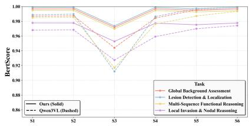  
(a) Free-text BERTScore.

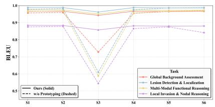  
(b) Free-text BLEU.

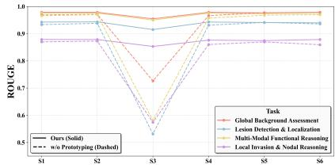  
(c) Free-text ROUGE.  
Figure 9 Robustness to modality availability under different settings. SeVeR (solid) vs. w/o selective exposure (dashed) under six modality settings (S1–S6). (a) BERTScore, (b) BLEU, (c) ROUGE for free-text quality.

## H.5 Additional Results for Modality Settings

Table 16 provides the complete numerical breakdown of modality-robustness results across all six settings and seven clinical tasks. The six settings correspond to progressively richer combinations of breast MRI sequences: S1 uses only T1-weighted imaging (anatomical structure); S2 adds dynamic contrast-enhanced sequences (DCE) for vascular enhancement patterns; S3 uses difusion-weighted imaging (DWI), apparent difusion coeficient (ADC), and T2-weighted imaging for signal characterization; $S _ { \mathcal { 4 } }$ combines T1w, DCE, T2w, and DWI; S5 further adds T1-STIR to $\mathrm { S 4 } ;$ and S6 uses all available sequences. Across every task and metric, SeVeR maintains consistently smaller performance gaps relative to S6 compared with the $\mathrm { w / o }$ Proto. baseline, confirming that GPS prototype coverage and CaGA on-demand retrieval collectively reduce over-reliance on any single modality.

Fig. 9 extends the modality-robustness comparison to BLEU, ROUGE, and BERTScore for free-text answers, complementing the accuracy curves in Fig. 4 from the main text. Across all three metrics, SeVeR (solid lines) degrades more gracefully than the $\mathrm { w / o }$ Proto. baseline (dashed), especially under the most resource-constrained settings. The free-text results thus confirm the same conclusion as the discriminative analysis: prototype-based visual compression yields representations that are robust to missing or substituted MRI sequences.

<table><tr><td rowspan="2">Task</td><td rowspan="2">Model</td><td colspan="5">Acc.</td><td rowspan="2"></td><td colspan="5">BLEU</td><td rowspan="2">S6</td></tr><tr><td>S1</td><td>S2</td><td>S3</td><td>S4</td><td>S5</td><td>S6</td><td>S1 S2</td><td>S3</td><td>S4</td><td>S5</td></tr><tr><td>Global Background Assessment</td><td>w/o Proto. SeVeR</td><td>89.82 89.82</td><td>89.82 89.82</td><td>83.10 89.82</td><td>87.78 87.78</td><td>79.97 80.77</td><td>89.43 89.82</td><td>95.66 96.63</td><td>95.90 96.63</td><td>72.76 96.65</td><td>95.43 96.49 96.63 96.44</td><td></td><td>96.63 96.63</td></tr><tr><td>Lesion Detection &amp; Localization</td><td>w/o Proto. SeVeR</td><td>78.39 78.39</td><td>76.60 76.60</td><td>69.76 80.21</td><td>72.68 72.67</td><td>54.69</td><td>73.55 78.48</td><td>97.78 98.77</td><td>98.16 98.77</td><td>60.99 98.62</td><td>97.53 98.76</td><td>98.62 98.56</td><td>98.74 98.61</td></tr><tr><td>Morphological Characterization</td><td>w/o Proto. SeVeR</td><td>57.35 57.35</td><td>49.50 49.50</td><td>37.80</td><td>53.65</td><td>54.80 27.92</td><td>57.68</td><td>73.63</td><td>74.42</td><td>41.22</td><td>73.96</td><td>74.78</td><td>70.34</td></tr><tr><td>Multi-Modal Functional Reasoning</td><td>w/o Proto. SeVeR</td><td>78.75 78.75</td><td>73.60 73.60</td><td>37.73 61.43 62.75</td><td>53.65 64.70</td><td>28.04 51.33</td><td>57.45 79.81</td><td>74.38 96.50</td><td>74.83 96.86</td><td>72.30 58.80</td><td>74.89 95.60</td><td>74.74 96.66</td><td>73.46 97.01</td></tr><tr><td>Local Invasion &amp; Nodal Reasoning</td><td>w/o Proto. SeVeR</td><td>77.01 77.01</td><td>76.96 76.96</td><td>67.05 77.99</td><td>64.70 69.64 69.64</td><td>55.95 66.74 68.25</td><td>80.11 78.54 77.42</td><td>97.47 87.49 88.37</td><td>97.45 87.77</td><td>97.46 54.44 87.87</td><td>97.40 86.49 88.12</td><td>97.21 87.45 87.94</td><td>97.28 84.14 88.01</td></tr><tr><td>Holistic Diagnosis</td><td>w/o Proto. SeVeR</td><td>34.97 34.97</td><td>37.08 37.08</td><td>22.26 22.82</td><td>37.50 37.50</td><td>30.66 31.75</td><td>35.86 36.53</td><td>87.44 88.32</td><td>88.31 87.88 88.32</td><td>43.93 88.02</td><td>86.56 88.29</td><td>87.53 88.11</td><td>87.35 88.22</td></tr><tr><td>Pathology Prediction</td><td>w/o Proto. SeVeR</td><td>72.79 72.79</td><td>68.07 68.07</td><td>63.18 61.29</td><td>69.75 69.75</td><td>63.75 65.25</td><td>71.29 74.18</td><td>94.39 95.34</td><td>94.78 95.39</td><td>61.47 95.70</td><td>93.48 95.34</td><td>94.52 95.15</td><td>94.89 95.34</td></tr><tr><td>Task</td><td>Model</td><td>S1</td><td>S2</td><td>ROUGE S3</td><td>S4</td><td>S5</td><td>S6</td><td>S1</td><td>S2</td><td>BERTScore S3</td><td>S4</td><td>S5</td><td>S6</td></tr><tr><td>Global Background Assessment</td><td>w/o Proto. SeVeR</td><td>96.87 97.85</td><td>97.11 97.84</td><td>72.63 97.88</td><td>96.62 97.84</td><td>97.70 97.64</td><td>97.86 97.85</td><td>98.68 99.68</td><td>98.74 99.68</td><td>94.41 99.68</td><td>98.44 99.68</td><td>99.54 99.48</td><td>99.68 99.68</td></tr><tr><td>Lesion Detection &amp; Localization</td><td>w/o Proto. SeVeR</td><td>93.31 94.25</td><td>93.79 94.32</td><td>53.11 93.83</td><td>93.09 94.26</td><td>94.12 94.07</td><td>93.56 93.96</td><td>98.88 99.88</td><td>98.97 99.88</td><td>91.20 99.87</td><td>98.64 99.88</td><td>99.73 99.68</td><td>99.88 99.87</td></tr><tr><td>Morphological Characterization</td><td>w/o Proto. SeVeR</td><td>71.98 72.71</td><td>72.43 72.90</td><td>47.23 72.64</td><td>71.50 72.85</td><td>72.30 72.70</td><td>71.92 72.63</td><td>96.51 97.48</td><td>96.58 97.50</td><td>91.80 97.47</td><td>95.69 97.49</td><td>96.75 97.30</td><td>97.24 97.46</td></tr><tr><td>Multi-Modal Functional Reasoning</td><td>w/o Proto. SeVeR</td><td>96.58 97.56</td><td>96.96 97.54</td><td>58.09 97.42</td><td>95.70 97.50</td><td>96.76 97.31</td><td>96.97 97.37</td><td>98.49 99.48</td><td>98.55</td><td>91.69 99.45</td><td>97.62 99.46</td><td>98.71 99.26</td><td>99.35 99.43</td></tr><tr><td>Local Invasion &amp; Nodal Reasoning</td><td>w/o Proto. SeVeR</td><td>86.97 87.85</td><td>87.25 87.82</td><td>57.42 87.47</td><td>85.99 87.61</td><td>86.95 87.43</td><td>85.92 87.83</td><td>96.80 97.78</td><td>99.47 96.84</td><td>92.74 97.71</td><td>95.92 97.73</td><td>96.99 97.53</td><td>97.41</td></tr><tr><td>Holistic Diagnosis</td><td>w/o Proto. SeVeR</td><td>85.19 86.05</td><td>85.56 86.01</td><td>44.62 85.81</td><td>84.39 86.07</td><td>85.33 85.90</td><td>85.70 85.86</td><td>96.61 97.59</td><td>97.77 96.71</td><td>89.30 97.57</td><td>95.69 97.60</td><td>96.76 97.40</td><td>97.77 97.53 97.59</td></tr><tr><td>Pathology Prediction</td><td>w/o Proto. SeVeR</td><td>94.70 95.66</td><td>95.02 95.65</td><td>62.61 96.00</td><td>93.80 95.67</td><td>94.84 95.48</td><td>94.99 95.53</td><td>98.12 99.11</td><td>97.60 98.19 99.11</td><td>92.15 99.16</td><td>97.17 99.11</td><td>98.25 98.91</td><td>98.98 99.10</td></tr></table>

Table 16 Full task performance under diferent modality settings (S1–S6). Top: MC accuracy (Acc.) and free-tex BLEU. Bottom: free-text ROUGE and BERTScore.