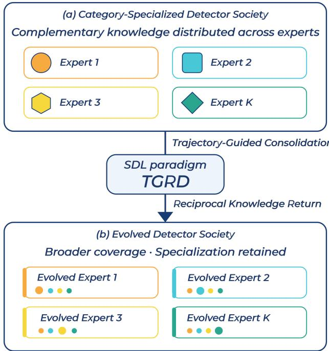
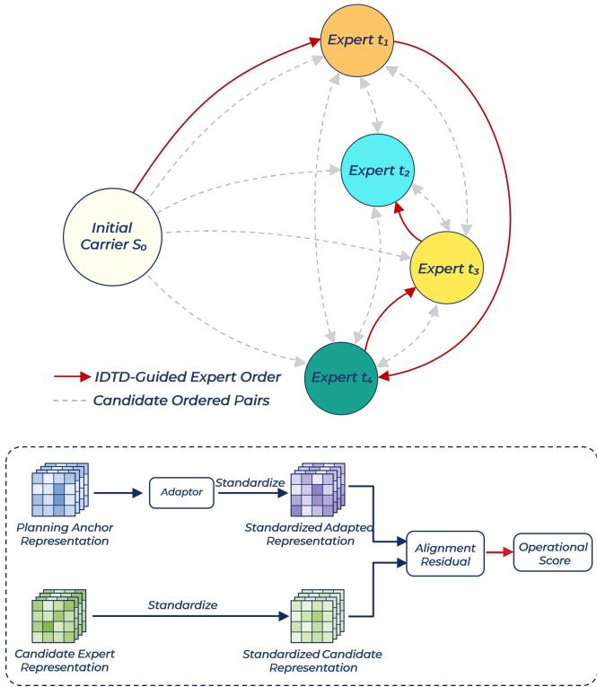
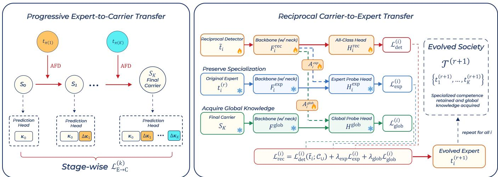

# Socialized Detector Learning: Trajectory-Guided and Reciprocal Distillation for Heterogeneous Object Detectors

Weihao Li1, Yunqi Zhu8, Zhihe Fan4, Ruipu Zhao2, Boan Tao3, Xinjie Yao5, Yan Fan6, Pengfei Zhu 2,7

1School of New Media and Communication, Tianjin University, Tianjin, China

2School of Artificial Intelligence, Tianjin University, Tianjin, China

3School of Computer Science and Technology, Tianjin University, Tianjin, China

4School of Sports Training, Tianjin University of Sport, Tianjin, China

5Faculty of Information Engineering and Automation, Kunming University of Science and Technology, Kunming, China 6School of Electronic Science, National University of Defense Technology, Hunan, China

7School of Automation, Southeast University, Nanjing, China

8School of Computer Science and Engineering, University of New South Wales, Sydney, Australia

## Abstract

Object detection knowledge is fragmented across independently trained, heterogeneous detectors with complementary category supports. In socialized learning, this knowledge resides in a society, and learning aims to evolve the society collectively through exchange. However, aggregation-based socialization does not explicitly plan transfer order, whereas progressive multi-teacher distillation considers order but remains a one-way student enhancement in a shared category space. Building on Socialized Learning, we formulate Socialized Detector Learning (SDL) for heterogeneous, categoryspecialized object detectors and propose Trajectory-Guided and Reciprocal Distillation (TGRD).TGRD estimates directed operational Inter-Detector Transfer Dificulty (IDTD) from held-out feature-alignment residuals, precomputes a fixed score table, and greedily constructs a carrier trajectory. Along the trajectory, knowledge is progressively consolidated into a union-category carrier and then returned to experts through reciprocal transfer. A conditional proxy-certificate analysis shows that, under stated assumptions, the progressive certificate is no larger than an aggregated-target counterpart. On MS COCO with four heterogeneous experts and two carrier initializations, final carriers outperform epoch-matched simultaneous aggregation controls by 2.6 AP in both settings. Reciprocal detectors attain 20.8–28.4 AP on previously unsupported categories while remaining within 1.3 AP of original expertspecific performance. These results support order-aware progressive consolidation followed by reciprocal transfer as a viable mechanism for detector-society evolution.

## Introduction

Knowledge in object detection systems is often distributed across independently trained detectors with diferent category coverage, architectures, and data. Figure 1 illustrates the detector-socialization setting: distributed expertise is consolidated and redistributed to broaden category coverage while retaining detector-specific specialization. Continual object detection (Shmelkov, Schmid, and Alahari 2017) updates one model along a temporally given task sequence, while conventional multi-teacher distillation transfers multiple teachers into a target student. Neither directly addresses the evolution of a heterogeneous detector society.

  
Figure 1: Detector-society evolution under SDL. TGRD progressively consolidates complementary expertise and reciprocally transfers it back, broadening category coverage while preserving specialization.

Two prior works directly motivate our formulation but operate at diferent boundaries. Socialized Learning (SL) (Yao et al. 2024) provides the society-level perspective that agents can improve through knowledge exchange. Its MASC framework realizes category-partitioned classification socialization through aggregation-based distillation and reciprocal altruism. However, MASC organizes distributed knowledge through aggregation and does not explicitly model or plan the order of knowledge transfer among agents. MTPD (Cao et al. 2023) demonstrates that multiple detector teachers can be progressively distilled in sequence to improve a lightweight detector. It considers transfer order, but remains a one-way student-enhancement scheme rather than a framework for society evolution.

These limitations raise two questions:

1. How can directed transfer dificulty guide a progressive trajectory among heterogeneous detectors?

2. How can reciprocal transfer broaden category coverage while preserving detector specialization?

To address these questions, we specialize the socializedlearning perspective to heterogeneous, category-specialized object detectors and refer to this setting as Socialized Detector Learning (SDL). Within SDL, we develop Trajectory-Guided and Reciprocal Distillation (TGRD). For the first question, TGRD derives directed operational Inter-Detector Transfer Dificulty (IDTD) scores from held-out featurealignment residuals, precomputes a fixed score table, and greedily constructs a carrier trajectory. For the second, the carrier progressively consolidates distributed expertise along this trajectory while expanding to the union category vocabulary; its consolidated knowledge is then returned to individual experts through reciprocal transfer. The updated detectors constitute the evolved society.

For the progressive phase, we provide a conditional proxycertificate comparison with an abstract aggregated-target alternative: under the stated conditions, the progressive certificate is no larger than its aggregated counterpart. Experiments on MS COCO with four heterogeneous experts and two carrier initializations support the complete TGRD configuration. The final carriers outperform epoch-matched simultaneous aggregation controls by 2.6 AP in both settings, while the reciprocal detectors attain 20.8–28.4 AP on previously unsupported categories and remain within 1.3 AP of their original expert-specific performance.

Our contributions are summarized as follows:

• We formulate socialization among heterogeneous detectors as acquiring complementary category capabilities while retaining specialization.

• We propose TGRD, combining IDTD-guided planning, progressive union-category consolidation, and reciprocal transfer, with a conditional proxy-certificate analysis.

• COCO experiments show higher final-carrier AP than Avg-FPN KD and broader coverage after reciprocal updates, with limited specialization change.

## Related Work

## Continual Object Detection.

Continual object detection updates a detector over sequential tasks while preserving previously learned categories. A common formulation uses a temporal update chain, where the detector trained on earlier tasks teaches the detector updated on new tasks. Beginning with incremental detection without storing old data (Shmelkov, Schmid, and Alahari 2017), later methods reduce forgetting through selective and inter-related distillation (Peng et al. 2021), importance-aware classification and localization transfer (Feng, Wang, and Yuan 2022), intra- and inter-class distillation (Kang et al. 2023), and crossstage knowledge alignment (Mo et al. 2024).

However, their underlying structure remains centered on a single evolving detector. Knowledge is transferred mainly from the previous model to the current model, and the learning order is dictated by task arrival rather than by compatibility among models. This difers fundamentally from Socialized Detector Learning, where knowledge is distributed across independently trained expert detectors that may vary in categories, architectures, data, or detection paradigms. SDL therefore requires compatibility-aware consolidation among heterogeneous experts, rather than merely preserving old knowledge along a single temporal update chain.

## Knowledge Distillation for Object Detection.

Early works extend KD to object detection through output distillation and feature imitation (Chen et al. 2017; Li, Jin, and Yan 2017; Wang et al. 2019). Later methods refine what and where to distill by exploiting instance-level, decoupled, focal, global, and localization-aware knowledge (Dai et al. 2021; Guo et al. 2021; Yang et al. 2022; Zheng et al. 2022). Recent studies further explore masked or scaleaware feature reconstruction, heterogeneous teacher-student alignment, DETR-specific distillation, cross-head prediction mimicking, and automated distillation policy search (Huang et al. 2023; Zhu et al. 2023; Lao et al. 2023; Chang et al. 2023; Wang et al. 2024; Li et al. 2024).

Most detection KD fixes teacher–student roles and transfer direction, with research centered on distillation signals and alignment. MTPD (Cao et al. 2023) is the closest related setting: it uses a non-symmetric adaptation cost to order multiple teachers, but assumes a shared category space and one-way transfer to a lightweight student. TGRD likewise uses directed ordering, but operates across independently trained detectors with diferent category supports, progressively expands a carrier toward their union category space, and returns the consolidated knowledge to the original detectors. Its endpoint is therefore an updated detector society rather than a single enhanced student.

## Federated and Decentralized Model Aggregation.

Federated and decentralized learning combines models trained by distributed clients under privacy, communication, non-IID data, system heterogeneity, and topology constraints. Representative mechanisms include matched parameter averaging (Wang et al. 2020), ensemble distillation (Lin et al. 2020), Bayesian ensembling (Chen and Chao 2021), prototype and layer-wise posterior aggregation (Tan et al. 2022; Liu et al. 2024), hierarchical aggregation for federated detection (Jia et al. 2024), and gossip-based decentralized aggregation (Hu et al. 2022). They follow a distributed optimization protocol, combining client updates through server or peer-to-peer communication.

SDL difers in its objective and interaction semantics. Like federated learning, SDL may involve detectors trained independently on distributed data. However, SDL treats these detectors as a society of specialized experts whose knowledge should be exchanged, consolidated, and redistributed so that both the society and its members can evolve. Under this view, the central issue is not only how to aggregate distributed updates, but how to organize knowledge transfer

## Compatibility-Guided Trajectory Planning

  
Figure 2: Compatibility-guided carrier trajectory planning. Held-out alignment residuals define a fixed table of directed operational scores $\widehat { \cal D } ( A , B )$ over ordered anchor–candidate pairs, from which greedy selection determines the expert order and carrier trajectory.

among heterogeneous experts according to their compatibility, specialization, and reciprocal benefit. The present TGRD instantiation assumes centralized access to detector features and associated training data; privacy-preserving optimization and communication eficiency are outside the scope of this work.

## Method

## Socialized Detector Learning

In real-world deployments, object detection knowledge is often distributed across a society of independently trained expert detectors. These experts may be heterogeneous in category coverage, architecture, training data, or detection paradigm. We formulate Socialized Detector Learning (SDL) as a learning paradigm in which a detector society evolves collectively through knowledge exchange. Let

$$
\mathcal { T } ^ { ( r ) } = \left\{ t _ { 1 } ^ { ( r ) } , \dots , t _ { K } ^ { ( r ) } \right\}\tag{1}
$$

denote the society at evolution round r. Each member induces an expert-specific transfer target $g _ { i } ^ { ( r ) }$ , abstracting transferable knowledge arising from its category coverage, architecture, data, and detection paradigm. One round of socialized learn-

ing is written as

$$
\begin{array} { r } { T ^ { ( r + 1 ) } = \Phi _ { \mathrm { S D L } } \Big ( T ^ { ( r ) } ; \Omega ^ { ( r ) } \Big ) , } \end{array}\tag{2}
$$

where $\Omega ^ { ( r ) }$ specifies the knowledge-exchange protocol and $\Phi _ { \mathrm { S D I } }$ updates the society from the exchanged knowledge. The goal is an evolved society whose members acquire com plementary capabilities while retaining their specialized expertise.

## TGRD: Compatibility-Guided Carrier Trajectory Planning

At round $^ { r , }$ TGRD receives $\mathcal { T } ^ { ( r ) }$ and initializes a standalone knowledge carrier $S _ { 0 } ^ { ( r ) }$ . For conciseness, we write $\mathcal { T } = \{ t _ { 1 } , \ldots , t _ { K } \}$ and $S _ { 0 }$ in this subsection. Let $\mathcal { C } _ { 0 }$ be the categories initially supported by $S _ { 0 } ,$ , and let $\mathcal { C } _ { i }$ be those supported by $t _ { i }$ . We use

$$
\mathcal { C } _ { \cap } = \mathcal { C } _ { 0 } \cap \bigcap _ { i = 1 } ^ { K } \mathcal { C } _ { i } \neq \emptyset , \qquad \mathcal { C } _ { \cup } = \mathcal { C } _ { 0 } \cup \bigcup _ { i = 1 } ^ { K } \mathcal { C } _ { i }\tag{3}
$$

as the common probe categories and the final society-wide category vocabulary, respectively. All pairwise operational planning scores are computed using the same two nonempty, finite, disjoint probe-image sets $\mathcal { D } _ { \mathrm { f i t } } ^ { \breve { \cap } }$ and $\mathcal { D } _ { \mathrm { e v a l } } ^ { \cap } .$ , constructed over $\mathcal { C } _ { \cap \cdot }$ . This common probe is used only for compatibility estimation and does not restrict the categories transferred during carrier training. Figure 2 summarizes the directed compatibility estimation and the resulting carrier trajectory.

Carrier trajectory and progressive label space. TGRD constructs a permutation π of $\left\{ 1 , \ldots , K \right\}$ , which defines the carrier path

$$
\mathcal { P } _ { \pi } : { \cal S } _ { 0 } \xrightarrow { t _ { \pi ( 1 ) } } { \cal S } _ { 1 } \xrightarrow { t _ { \pi ( 2 ) } } \cdot \cdot \cdot \xrightarrow { t _ { \pi ( K ) } } { \cal S } _ { K } .\tag{4}
$$

The arrow labels identify the expert supplying supervision at each stage. Let $\mathbf { c } _ { 0 } = ( c _ { 0 , 1 } , \hdots , c _ { 0 , | { \mathcal { C } } _ { 0 } | } )$ and $\mathbf { c } _ { i } =$ $( c _ { i , 1 } , \ldots , c _ { i , | { \mathcal { C } } _ { i } | } )$ be fixed ordered category-name lists. Category names are unique within each list, and shared categories use the same canonical name across detectors. Starting from $\pmb { \kappa } _ { 0 } = \mathbf { c } _ { 0 }$ and $\kappa _ { 0 } = \mathcal { C } _ { 0 }$ , stage k performs

$$
\begin{array} { r l } & { \Delta \kappa _ { k } = \left[ c \in \mathbf { c } _ { \pi ( k ) } \bigm | c \notin { \mathcal { K } _ { k - 1 } } \right] , } \\ & { \quad \kappa _ { k } = \kappa _ { k - 1 } \| \Delta \kappa _ { k } , \qquad \mathcal { K } _ { k } = \mathrm { s e t } ( \kappa _ { k } ) . } \end{array}\tag{5}
$$

Here $\Delta \kappa _ { k }$ preserves the order inherited from $\mathbf { c } _ { \pi ( k ) } , \mathbf { \pi } \|$ denotes list concatenation, and set(·) returns the underlying set of category names. Thus $\kappa _ { k - 1 }$ is a prefix of $\kappa _ { k } \colon$ the corresponding class-specific output blocks are copied from $S _ { k - 1 }$ and only the appended sufix blocks are newly initialized. Exact category-name matching aligns expert and carrier outputs, and $\bar { \mathcal { K } } _ { K } = \mathcal { C } _ { \cup }$

Inter-Detector Transfer Dificulty. For an ordered pair (A, B), A is the current planning anchor and B is a candidate expert. The notation $A  B$ describes the intended evolution of the carrier representation toward B, while B supplies knowledge during the ensuing carrier update. We define the latent Inter-Detector Transfer Dificulty (IDTD) as

$$
D ( A , B ) = C ( B ) [ 1 + \lambda d _ {  } ( A , B ) ] ,\tag{6}
$$

where $C ( B ) \quad \geq \quad 0$ is the candidate capacity score, $d _ {  } ( A , B ) \in \mathbb { R } _ { \geq 0 }$ is a directed compatibility discrepancy, and $\lambda \geq 0$ . Lower IDTD indicates an easier transition toward the candidate expert.

Because the factors in Eq. (6) are not separately observable, trajectory construction uses a rank-oriented operational score. For each ordered pair, the detectors are frozen, and a collection of scale-wise directional adaptors parameterized by $\theta _ { A  B }$ is fitted to align semantically matched, standardized multi-scale representations of A with those of B. For an image x, $\mathcal { L } _ { \mathrm { a l i g n } } ( x ; \theta _ { A  B } )$ denotes the element-normalized sum of squared Frobenius residuals across the matched semantic scales. The held-out residual defines

$$
\widehat { D } ( A , B ) = \frac { 1 } { | \mathcal { D } _ { \mathrm { e v a l } } ^ { \cap } | } \sum _ { x \in \mathcal { D } _ { \mathrm { e v a l } } ^ { \cap } } \mathcal { L } _ { \mathrm { a l i g n } } ( x ; \widehat { \theta } _ { A  B } ) ,\tag{7}
$$

where $\widehat { \theta } _ { A  B }$ is obtained by minimizing the same per-image alignment loss on $\mathcal { D } _ { \mathrm { f i t } } ^ { \cap }$ . The detailed feature interface, standardization operation, and scale-wise adaptor construction are provided in the Supplementary Material under Operational IDTD Estimation.

The score is directional, so generally $\widehat { D } ( A , B ) \neq$ ${ \widehat { D } } ( B , A )$ . At the latent-to-operational surrogate layer, we assume anchor-wise order consistency: for every fixed anchor $A , { \widehat { D } } ( A , \cdot )$ preserves the candidate ordering induced by $D ( A , \cdot )$

Fixed-table greedy planning. Before carrier training, we precompute the directed table with entries $M _ { 0 i } = \widehat { D } ( S _ { 0 } , t _ { i } )$ and $M _ { j i } = \widehat { D } ( t _ { j } , t _ { i } )$ for $j \neq i$ . The table remains fixed during carrier training. With $\mathcal { I } _ { 0 } = \{ 1 , \ldots , K \}$ and $a _ { 0 } = S _ { 0 }$ the directed greedy trajectory is

$$
\begin{array} { r l } & { \pi ( k ) \in \underset { i \in \mathcal { T } _ { k - 1 } } { \arg \operatorname* { m i n } } \widehat { D } ( a _ { k - 1 } , t _ { i } ) , } \\ & { \quad \mathcal { T } _ { k } = \mathcal { T } _ { k - 1 } \setminus \{ \pi ( k ) \} , \qquad a _ { k } = t _ { \pi ( k ) } . } \end{array}\tag{8}
$$

Thus the first decision uses the $S _ { 0 }$ row and each later decision uses the row of the most recently visited expert. The ofline anchor $a k _ { - 1 }$ serves as a proxy for the actual carrier $S _ { k - 1 }$ A suficient latent-cost fidelity-and-margin condition under which $D ( a _ { k - 1 } , \cdot )$ and $D ( S _ { k - 1 } , \cdot )$ select the same expert is provided in the Supplementary Material under Planning-Row Fidelity. The implemented Db-based planner is linked to this latent selection through the separate anchor-wise orderconsistency condition above.

## Progressive and Reciprocal Knowledge Transfer

Given π, TGRD instantiates the SDL protocol $\Omega ^ { ( r ) }$ through forward expert-to-carrier consolidation followed by reciprocal carrier-to-expert transfer, as illustrated in Figure 3.

Progressive expert-to-carrier transfer. Let $\mathcal { D } _ { 0 }$ be the initial carrier data and $\mathcal { D } _ { i }$ the data associated with expert $t _ { i } . \mathrm { A t }$ stage $k , S _ { k }$ is initialized from $S _ { k - 1 }$ , its head is expanded according to Eq. (5), and it is trained on

$$
{ \mathcal { D } } _ { \mathrm { c u m } } ^ { ( k ) } : = { \mathcal { D } } _ { 0 } \cup \bigcup _ { j = 1 } ^ { k } { \mathcal { D } } _ { \pi ( j ) } .\tag{9}
$$

whose annotations are exhaustive over $\kappa _ { k }$ . Using the semantic-scale matching and standardization interface underlying Eq. (7), let $\mathcal { Q } _ { k }$ denote the set of matched semanticscale pairs between $S _ { k }$ and $t _ { \pi ( k ) }$ . For each $q \in \mathcal { Q } _ { k }$ , let $Z _ { q } ^ { S _ { k } }$ and $Z _ { q } ^ { t _ { \pi ( k ) } }$ denote the corresponding carrier and expert representations, respectively. At each matched scale, a stage-specific trainable directional adaptor maps the carrier representation into the corresponding representation space of the supervising expert. We refer to the resulting adaptormediated feature transfer as Adaptive Feature Distillation (AFD); the adaptor parameters are suppressed in Eq. (10) for notational brevity.

$$
\mathcal { L } _ { \mathrm { E \to C } } ^ { ( k ) } = \mathcal { L } _ { \mathrm { d e t } } ^ { ( k ) } ( S _ { k } ; \mathcal { K } _ { k } ) + \sum _ { q \in \mathcal { Q } _ { k } } \mathcal { L } _ { \mathrm { A F D } } ^ { q } \Big ( Z _ { q } ^ { S _ { k } } , Z _ { q } ^ { t _ { \pi ( k ) } } \Big ) \ ,\tag{10}
$$

Each $\mathcal { L } _ { \mathrm { A F D } } ^ { q }$ is the corresponding scale-wise component of the per-image, element-normalized alignment formulation underlying $\bar { \mathrm { E q . } } ( 7 )$ , instantiated with the stage-specific AFD adaptor. The task loss supervises both newly introduced and previously acquired categories, while AFD aligns the matched carrier and expert representations. During stage $k ,$ $S _ { k }$ and the $\mathrm { A F D }$ adaptors are optimized, whereas the supervising expert $t _ { \pi ( k ) }$ remains frozen. The fitted IDTD adaptors in Eq. (7) are used only for ofline planning and are not reused in carrier training. After all stages, $S _ { K }$ supports $\mathcal { C } _ { \cup }$

Reciprocal carrier-to-expert transfer. For every original expert $t _ { i } ^ { ( r ) }$ , we initialize a trainable reciprocal detector $\widetilde { t _ { i } }$ from $t _ { i } ^ { ( r ) }$ . Its prediction head is expanded to $\mathcal { C } _ { \cup }$ : parameters for categories in $\mathcal { C } _ { i }$ are retained by exact name matching, and the remaining outputs are initialized. The resulting all-class head is denoted by $H _ { i } ^ { \mathrm { r e c } }$ , and $\widetilde { t _ { i } }$ is trained on $\mathcal { D } _ { \mathrm { c u m } } ^ { ( \bar { K } ) }$ , whose annotations are exhaustive over $\mathcal { C } _ { \cup }$

The original expert and final carrier remain frozen and provide an expert probe head $H _ { i } ^ { \mathrm { e x p } }$ and a global probe head $H ^ { \mathrm { g l o b } }$ , respectively. For a common input $x ,$ , let $F _ { i } ^ { \mathrm { r e c } } ( x )$ $F _ { i } ^ { \mathrm { e x p } } ( x )$ , and $F ^ { \mathrm { g l o b } } ( x )$ denote their corresponding Backbone with Neck features. Trainable adaptors $A _ { i } ^ { \mathrm { e x p } }$ and $A _ { i } ^ { \mathrm { g l o b } }$ map reciprocal features into the input spaces of the two frozen heads. Let $\mathrm { K D } ( z _ { s } , z _ { t } )$ denote the adopted classification-logit distillation loss, with student-path and reference logits as its first and second arguments, respectively. The cross-head losses are

$$
\begin{array} { r l } & { \mathcal { L } _ { \mathrm { e x p } } ^ { ( i ) } = \mathrm { K D } \Big ( H _ { i } ^ { \mathrm { e x p } } \big ( A _ { i } ^ { \mathrm { e x p } } ( F _ { i } ^ { \mathrm { r e c } } ( x ) ) \big ) , H _ { i } ^ { \mathrm { e x p } } \big ( F _ { i } ^ { \mathrm { e x p } } ( x ) \big ) \Big ) , } \\ & { \mathcal { L } _ { \mathrm { g l o b } } ^ { ( i ) } = \mathrm { K D } \Big ( H ^ { \mathrm { g l o b } } \big ( A _ { i } ^ { \mathrm { g l o b } } ( F _ { i } ^ { \mathrm { r e c } } ( x ) ) \big ) , H ^ { \mathrm { g l o b } } \big ( F ^ { \mathrm { g l o b } } ( x ) \big ) \Big ) . } \end{array}\tag{11}
$$

Both terms distill only the classification logits of their corresponding frozen probe heads. The reciprocal objective is

$$
\mathcal { L } _ { \mathrm { r e c } } ^ { ( i ) } = \mathcal { L } _ { \mathrm { d e t } } ^ { ( i ) } ( \widetilde { t } _ { i } ; \mathcal { C } _ { \cup } ) + \lambda _ { \mathrm { e x p } } \mathcal { L } _ { \mathrm { e x p } } ^ { ( i ) } + \lambda _ { \mathrm { g l o b } } \mathcal { L } _ { \mathrm { g l o b } } ^ { ( i ) } .\tag{12}
$$

Here $\lambda _ { \mathrm { e x p } } , \lambda _ { \mathrm { g l o b } } \geq 0$ weight the expert-specific and societywide guidance terms, respectively. Only $\widetilde { t } _ { i } , A _ { i } ^ { \mathrm { e x p } }$ , and $A _ { i } ^ { \mathrm { g l o b } }$ are optimized. After training, $t _ { i } ^ { ( r + 1 ) } = \widetilde { t } _ { i }$ , so replacing every society member completes the SDL update in Eq. (2). At inference, only the updated detector and its all-class head $H _ { i } ^ { \mathrm { r e c } }$ are used.

  
Figure 3: Progressive and reciprocal knowledge transfer in TGRD. Left: Along the planned trajectory, experts transfer knowledge via AFD to a carrier whose prediction head expands over accumulated categories, yielding $S _ { K }$ . Right: A reciprocal detector initialized from each expert is guided by the corresponding frozen original expert and the frozen $S _ { K }$ ; the updated detectors form $\mathcal { T } ^ { ( r + 1 ) }$

The following section provides a conditional proxycertificate comparison between the progressive expert-tocarrier construction and an abstract single aggregated-target alternative.

## Theoretical Analysis

We analyze the progressive expert-to-carrier phase under a target-wise certificate abstraction. Fix a realized complete trajectory π, and let $g _ { i }$ be the expert-specific transfer target induced by $t _ { i }$ . We use $g _ { \mathrm { a g g } }$ only as an abstract single aggregated-target comparator. The analysis concerns the expert-dependent transfer component; cumulative detection supervision remains part of the actual stage objective.

Ambient setup. Let $\mathcal { F } _ { S } ^ { \cup }$ be the fixed hypothesis class associated with the final union-category carrier architecture, and let $\mathcal { F } _ { S } ^ { ( k ) }$ be the physically instantiated class at stage k. For the fixed trajectory $\pi ,$ let $P _ { k } : \mathcal { F } _ { S } ^ { \cup }  \mathcal { F } _ { S } ^ { ( k ) }$ denote the name-aligned restriction of the output blocks ordered by $\kappa _ { K }$ to the prefix $\kappa _ { k }$ constructed in Eq. (5), and assume $P _ { k } ( \mathcal { F } _ { S } ^ { \cup } ) = \mathcal { F } _ { S } ^ { ( k ) }$ . Identifying the physical carrier with the predictor it realizes, $S _ { k } \in \mathcal { F } _ { S } ^ { ( k ) }$ ; hence it admits an analytical ambient extension $\widehat { f } _ { k } \in \mathcal { F } _ { S } ^ { \cup }$ satisfying $P _ { k } ( \widehat { f } _ { k } ) = S _ { k } $ this does not require a union-category head to be physically instantiated before the final stage. Let ${ \widehat { f } } _ { \mathrm { a g g } } \in { \mathcal { F } } _ { S } ^ { \cup }$ denote the learner for the aggregated comparator. The complete orderedhead construction is given in the Supplementary Material.

For $g \in { \mathcal { G } } : = \{ g _ { 1 } , . . . , g _ { K } , g _ { \mathrm { a g g } } \}$ , let $R _ { g }$ be its targetspecific population risk, with optima $R _ { g } ^ { \star }$ over a reference class ${ \mathcal { F } } \supseteq { \mathcal { F } } _ { S } ^ { \cup }$ and $R _ { g , S } ^ { \star }$ over $\mathcal { F } _ { S } ^ { \cup }$ . Write $R _ { i } : = R _ { g _ { i } }$ and

$R _ { \mathrm { a g g } } : = R _ { g _ { \mathrm { a g g } } }$ , and define

$$
\begin{array} { r l } & { \mathrm { E s t } _ { k } ( n ) : = R _ { \pi ( k ) } ( \widehat f _ { k } ) - R _ { \pi ( k ) , S } ^ { \star } , } \\ & { \qquad \epsilon _ { i } : = R _ { i , S } ^ { \star } - R _ { i } ^ { \star } , \qquad i = 1 , \ldots , K , } \\ & { \mathrm { E s t } _ { \mathrm { a g g } } ( n ) : = R _ { \mathrm { a g g } } ( \widehat f _ { \mathrm { a g g } } ) - R _ { \mathrm { a g g } , S } ^ { \star } , } \\ & { \qquad \epsilon _ { \mathrm { a g g } } : = R _ { \mathrm { a g g } , S } ^ { \star } - R _ { \mathrm { a g g } } ^ { \star } . } \end{array}\tag{13}
$$

For each stage k with $i = \pi ( k )$ , assume that the restriction of $R _ { i }$ to $\mathcal { F } _ { S } ^ { \cup }$ factors through $P _ { k }$ ; equivalently, for all $f , f ^ { \prime } \in \mathcal { F } _ { S } ^ { \cup }$

$$
P _ { k } ( f ) = P _ { k } ( f ^ { \prime } ) \quad \Longrightarrow \quad R _ { i } ( f ) = R _ { i } ( f ^ { \prime } ) .
$$

Consequently, $P _ { k } ( \widehat { f } _ { k } ) = S _ { k }$ makes $R _ { i } ( \widehat { f } _ { k } )$ independent of the chosen ambient extension. The approximation burdens $\epsilon _ { i }$ and $\epsilon _ { \mathrm { a g g } }$ are nonnegative because ${ \dot { \mathcal { F } } } _ { S } ^ { \cup } \subseteq { \mathcal { F } }$ . Here $n \geq 1$ is a common certificate-evaluation budget. We suppress the dependence of $\widehat { f } _ { k }$ on n and the fixed trajectory $\pi ,$ and that of $\widehat { f } _ { \mathrm { a g g } }$ on $n .$ . This abstraction does not assert equal total training data or compute.

A1 (simultaneous target-wise certificates). Assume that there are constants $A _ { i } , \bar { A } _ { \mathrm { a g g } } > 0 .$ , a shared $\mathcal { C } _ { S } : ( 0 , 1 ) \to$ $( 0 , \infty )$ , and designated exponents $\alpha _ { i } , \alpha _ { \mathrm { a g g } } \in [ 1 / 2 , 1 ]$ such that, for every $n \geq 1$ and $\delta \in ( 0 , 1 )$ , with probability at least $1 - \delta ,$ simultaneously for all k,

$$
\begin{array} { c } { { \mathrm { E s t } _ { k } ( n ) \leq A _ { \pi ( k ) } \mathcal { C } _ { S } ( \delta ) n ^ { - \alpha _ { \pi ( k ) } } , } } \\ { { \mathrm { E s t } _ { \mathrm { a g g } } ( n ) \leq A _ { \mathrm { a g g } } \mathcal { C } _ { S } ( \delta ) n ^ { - \alpha _ { \mathrm { a g g } } } } } \end{array}\tag{14}
$$

The event is joint across all displayed targets; for a datadependent planner, its validity is understood uniformly over the admissible complete trajectories.

A2 (proxy-to-exponent monotonicity). Using the latent IDTD D from the Method, define the same-anchor expert proxies and the aggregated-target proxy by

$$
\begin{array} { r } { \overline { { D } } _ { i } : = D ( S _ { 0 } , t _ { i } ) , \qquad i = 1 , \ldots , K , } \\ { \overline { { D } } _ { \mathrm { a g g } } : = \displaystyle \operatorname* { m a x } _ { i } \overline { { D } } _ { i } + \Gamma ( T ) , \quad \Gamma ( T ) \geq 0 . } \end{array}\tag{15}
$$

Set $\overline { { D } } ( g _ { i } ) = \overline { { D } } _ { i }$ and $\overline { { D } } ( g _ { \mathrm { a g g } } ) = \overline { { D } } _ { \mathrm { a g g } }$ . Write $\alpha ( g _ { i } ) = \alpha _ { i }$ and $\alpha ( g _ { \mathrm { a g g } } ) = \alpha _ { \mathrm { a g g } }$ . For $g _ { a } , g _ { b } \in \mathcal { G }$ , assume

$$
\overline { { { D } } } ( g _ { a } ) \leq \overline { { { D } } } ( g _ { b } ) \quad \implies \quad \alpha ( g _ { a } ) \geq \alpha ( g _ { b } ) .\tag{16}
$$

A2 is an explicit property of the selected certificate family, not a universal learning law. Since every $\overline { { D } } _ { i } \leq \overline { { D } } _ { \mathrm { a g g } } ,$ , it gives

$$
\alpha _ { \mathrm { p r o g } } : = \operatorname* { m i n } _ { k } \alpha _ { \pi ( k ) } = \operatorname* { m i n } _ { i } \alpha _ { i } \geq \alpha _ { \mathrm { a g g } } .\tag{17}
$$

Thus the comparison applies to any complete expert order;   
it does not distinguish or optimize complete permutations.

Let

$$
\begin{array} { c } { { A _ { \mathrm { p r o g } } : = \displaystyle \operatorname* { m a x } _ { i } A _ { i } , \qquad \epsilon _ { \mathrm { p r o g } } : = \sum _ { i = 1 } ^ { K } \epsilon _ { i } , } } \\ { { B _ { \mathrm { p r o g } } ( n ) : = A _ { \mathrm { p r o g } } K \mathcal { C } _ { S } ( \delta ) n ^ { - \alpha _ { \mathrm { p r o g } } } + \epsilon _ { \mathrm { p r o g } } , } } \\ { { B _ { \mathrm { a g g } } ( n ) : = A _ { \mathrm { a g g } } { \mathcal C } _ { S } ( \delta ) n ^ { - \alpha _ { \mathrm { a g g } } } + \epsilon _ { \mathrm { a g g } } . } } \end{array}\tag{18}
$$

On the event in $_ { \textrm { A l } }$ , these respectively upper-bound the constructed sum of the K target-specific progressive excess risks and the aggregated-target excess risk.

Theorem 1 (conditional proxy-certificate comparison). Fix $n \geq 1$ and $\delta \in \mathsf { \Gamma } ( 0 , 1 )$ . Under the ambient setup and A1–A2, let $\Delta \alpha : = \alpha _ { \mathrm { p r o g } } - \alpha _ { \mathrm { a g g } } \geq 0$ . If

$$
A _ { \mathrm { p r o g } } K \leq A _ { \mathrm { a g g } } n ^ { \Delta \alpha } , \qquad \epsilon _ { \mathrm { p r o g } } \leq \epsilon _ { \mathrm { a g g } } ,\tag{19}
$$

then

$$
B _ { \mathrm { p r o g } } ( n ) \leq B _ { \mathrm { a g g } } ( n ) .\tag{20}
$$

Proof. Equation (15) and A2 give Eq. (17). Summing A1 over the progressive stages and using $n \geq 1$ bounds their estimation terms by $A _ { \mathrm { p r o g } } \bar { K } \mathcal { C } _ { S } ( \delta ) n ^ { - \alpha _ { \mathrm { p r o g } } }$ . The first condition in Eq. (19) makes this no larger than the aggregated estimation certificate; adding the second condition proves the result. □

This result compares proxy certificates for diferent targetspecific risks rather than actual detection error under a common risk; further details are provided in the Supplementary Material.

## Experiments

## Experimental Setup

Dataset and detector society. We conduct experiments on MS COCO 2017 (Lin et al. 2014) using train2017 for training and val2017 for evaluation. We set $K = 4$ and form the society with four independently trained heterogeneous experts: RetinaNet (Lin et al. 2017), FCOS (Tian et al. 2019), Faster R-CNN (Ren et al. 2015), and GFL (Li et al. 2020); their assignments are reported in Table 1. The initial carrier support satisfies $\left| \mathcal { C } _ { 0 } \right| \doteq \ 4 0$ , and each expert support $\mathcal { C } _ { i }$ extends $\mathcal { C } _ { 0 }$ with 10 expert-specific categories. The four expert-specific increments $\dot { \boldsymbol { { C } } } _ { i } \setminus \dot { \boldsymbol { { C } } } _ { 0 }$ are pairwise disjoint, yielding $\mathcal { C } _ { \cap } = \mathcal { C } _ { 0 }$ and $| { \mathcal { C } } _ { \cup } | = 8 0$ . We instantiate $S _ { 0 }$ as either RetinaNet or Faster R-CNN and train it on $\mathcal { D } _ { 0 }$ over $\mathcal { C } _ { 0 }$

Protocol and evaluation. For each ordered pair $( A , B )$ of planning anchor A and candidate expert $B ,$ we compute $\widehat { D } ( A , B )$ over $\mathcal { C } _ { \cap }$ by fitting scale-wise directional $1 \times 1$ adaptors on $\mathcal { D } _ { \mathrm { f i t } } ^ { \cap }$ and evaluating the alignment residual on the disjoint $\mathcal { D } _ { \mathrm { e v a l } } ^ { \cap }$ . The resulting score table is fixed before carrier training and determines the greedy permutation π. At stage k, $S _ { k - 1 }$ is updated to $S _ { k }$ on ${ \mathcal { D } } _ { \mathrm { c u m } } ^ { ( k ) }$ , whose annotations are exhaustive over $\kappa _ { k } .$ . After K stages, the frozen original expert $t _ { i }$ and final carrier $S _ { K }$ jointly guide each reciprocal detector $\widetilde { t _ { i } }$ on ${ \mathcal { D } } _ { \mathrm { c u m } } ^ { ( K ) }$ . We evaluate one socialization round using standard COCO bounding-box AP.

(a) Operational IDTD scores $\widehat { D } ( a _ { k - 1 } , t _ { i } )$ Candidate next expert $t _ { i }$
<table><tr><td>Planning anchor  $a _ { k - 1 }$ </td><td> $t _ { 1 }$ </td><td> $t _ { 2 }$ </td><td> $t _ { 3 }$ </td><td> $t _ { 4 }$ </td></tr><tr><td> $S _ { 0 }$  (RetinaNet)</td><td>0.5463</td><td>1.2115</td><td>0.5588</td><td>0.6411</td></tr><tr><td> $S _ { 0 }$  (Faster R-CNN)</td><td>0.5148</td><td>1.1658</td><td>0.2318</td><td>0.5473</td></tr><tr><td> $t _ { 1 }$  (RetinaNet)</td><td></td><td>1.1792</td><td>0.5514</td><td>0.4862</td></tr><tr><td> $t _ { 2 }$  (FCOS)</td><td>1.1392</td><td></td><td>1.0478</td><td>1.1748</td></tr><tr><td> $t _ { 3 }$  (Faster R-CNN)</td><td>0.5075</td><td>1.1638</td><td></td><td>0.5403</td></tr><tr><td> $t _ { 4 }$  (GFL)</td><td>0.4639</td><td>1.1745</td><td>0.5478</td><td></td></tr></table>

<table><tr><td colspan="2">(b) Greedy planning trajectories Initial carrier Greedy planning trajectory</td></tr><tr><td>RetinaNet</td><td> $S _ { 0 }  t _ { 1 }  t _ { 4 }  t _ { 3 }  t _ { 2 }$ </td></tr><tr><td>Faster R-CNN</td><td> $S _ { 0 }  t _ { 3 }  t _ { 1 }  t _ { 4 }  t _ { 2 }$ </td></tr></table>

Table 1: Operational IDTD scores and fixed-table greedy trajectories under two carrier initializations. Detector architectures are given in parentheses; all configurations use R50– FPN.

To our knowledge, no prior detection protocol jointly considers complementary heterogeneous experts, progressive union-category carrier construction, and reciprocal expert updates; fixed-category multi-teacher distillation and classincremental detection are therefore not protocol-matched. We instead use Avg-FPN KD, which simultaneously distills the four experts’ averaged FPN features into $S _ { 0 }$ under the same society, data, annotations, evaluation protocol, and matched 48-epoch budget.

## Experimental Results

IDTD-guided planning. As shown in Table 1, RetinaNet first selects $t _ { 1 }$ (0.5463), whereas Faster R-CNN first selects $t _ { 3 } ~ ( 0 . 2 3 1 8 )$ . The ensuing row-wise greedy choices produce $t _ { 1 }  t _ { 4 }  t _ { 3 }  t _ { 2 }$ and $t _ { 3 }  t _ { 1 }  t _ { 4 }  t _ { 2 }$ , respectively, showing that the operational order depends on the initial carrier. In both cases, whenever $t _ { 2 }$ remains eligible, it has the largest score among the remaining candidates and is selected last.

Progressive expert-to-carrier transfer. Table 2 follows each carrier from $S _ { 0 }$ to $S _ { 4 }$ . Because intermediate overall AP is evaluated on the growing support $\kappa _ { k }$ , cross-stage values are not directly comparable as a conventional performance trend. At $S _ { 4 } , K _ { 4 } = { \mathcal C } _ { \cup } ,$ enabling a like-for-like comparison with the simultaneous-aggregation control. The final RetinaNet and Faster R-CNN carriers obtain 32.8 and 33.2 AP, respectively, exceeding the corresponding Avg-FPN KD controls by 2.6 AP in both settings. All four increment-wise comparisons also favor the final carrier: the gains are 1.5–6.5

<table><tr><td>Carrier state / control</td><td> $A P$ </td><td> $A P _ { 0 }$ </td><td> $A P _ { \Delta \kappa _ { 1 } }$ </td><td> $A P _ { \Delta \kappa _ { 2 } }$ </td><td> $A P _ { \Delta \kappa _ { 3 } }$ </td><td> $A P _ { \Delta \kappa _ { 4 } }$ </td></tr><tr><td colspan="7">(a) RetinaNet as initial carrier  $S _ { 0 }$ </td></tr><tr><td> $S _ { 0 }$ </td><td>37.3</td><td>37.3</td><td></td><td></td><td></td><td></td></tr><tr><td> $S _ { 1 } \left[ t _ { 1 } \right]$ </td><td>35.9</td><td>39.2</td><td>22.8</td><td></td><td></td><td></td></tr><tr><td> $S _ { 2 } \left[ t _ { 1 } , t _ { 4 } \right]$ </td><td>35.1</td><td>40.5</td><td>22.6</td><td>26.4</td><td></td><td></td></tr><tr><td> $S _ { 3 } \left[ t _ { 1 } , t _ { 4 } , t _ { 3 } \right]$ </td><td>34.5</td><td>39.6</td><td>19.8</td><td>39.4</td><td>24.1</td><td></td></tr><tr><td> $S _ { 4 } \left[ t _ { 1 } , t _ { 4 } , t _ { 3 } , t _ { 2 } \right]$ </td><td>32.8</td><td>39.5</td><td>21.0</td><td>22.2</td><td>38.7</td><td>22.0</td></tr><tr><td>Simultaneous aggregation (Avg-FPN KD)</td><td>30.2</td><td>37.9</td><td>14.5</td><td>18.5</td><td>37.2</td><td>19.3</td></tr><tr><td colspan="7">(b) Faster R-CNN as initial carrier  $S _ { 0 }$ </td></tr><tr><td> $S _ { 0 }$ </td><td>40.0</td><td>40.0</td><td></td><td></td><td></td><td></td></tr><tr><td> $S _ { 1 } \left[ t _ { 3 } \right]$ </td><td>38.8</td><td>39.0</td><td>38.0</td><td></td><td>一</td><td></td></tr><tr><td> $S _ { 2 } \left[ t _ { 3 } , t _ { 1 } \right]$ </td><td>36.3</td><td>40.0</td><td>39.3</td><td>18.5</td><td></td><td></td></tr><tr><td> $S _ { 3 } \left[ t _ { 3 } , t _ { 1 } , t _ { 4 } \right]$ </td><td>34.5</td><td>39.7</td><td>39.2</td><td>20.4</td><td>23.0</td><td></td></tr><tr><td> $S _ { 4 } \left[ t _ { 3 } , t _ { 1 } , t _ { 4 } , t _ { 2 } \right]$ </td><td>33.2</td><td>39.1</td><td>39.1</td><td>21.3</td><td>25.5</td><td>23.8</td></tr><tr><td>Simultaneous aggregation (Avg-FPN KD)</td><td>30.6</td><td>39.6</td><td>36.5</td><td>13.5</td><td>15.3</td><td>20.9</td></tr></table>

Table 2: Stage-wise carrier performance from $S _ { 0 }$ along two fixed-table trajectories versus simultaneous aggregation (Avg-FPN KD). Overall AP is evaluated on $\kappa _ { k }$ for $S _ { k }$ and on $\mathcal { C } _ { \cup }$ for the control, with ${ \cal K } _ { 0 } = { \mathcal C } _ { 0 } . \ A { P } _ { \Delta \kappa _ { j } }$ denotes $\mathbf { A P }$ over the categories introduced by $t _ { \pi ( j ) }$ that are absent from $\displaystyle { \kappa _ { j - 1 } ; }$ control columns follow the same trajectory-specific order. Brackets list the incorporated experts.
<table><tr><td></td><td colspan="3">Initial support  $\mathcal { C } _ { i }$ </td><td colspan="3">Expert-specific support  $\mathcal { C } _ { i } \setminus \mathcal { C } _ { 0 }$ </td><td colspan="2">Knowledge expansion</td></tr><tr><td>Expert</td><td>Original</td><td>Reciprocal</td><td> $\Delta$ </td><td>Original</td><td>Reciprocal</td><td> $\Delta$ </td><td> $A P _ { { \mathcal { C } } _ { \cup } \backslash { \mathcal { C } } _ { i } }$ </td><td> $A P _ { C _ { \bigcup } }$ </td></tr><tr><td colspan="9">(a) Final RetinaNet carrier  $S _ { 4 }$ </td></tr><tr><td> $t _ { 1 }$ </td><td>35.5</td><td>35.9</td><td>+0.4</td><td>22.5</td><td>22.3</td><td>-0.2</td><td>25.8</td><td>32.1</td></tr><tr><td> $t _ { 2 }$ </td><td>40.0</td><td>39.2</td><td>-0.8</td><td>31.7</td><td>30.6</td><td>-1.1</td><td>25.6</td><td>34.1</td></tr><tr><td> $t _ { 3 }$ </td><td>39.8</td><td>40.1</td><td>+0.3</td><td>40.2</td><td>40.7</td><td>+0.5</td><td>23.2</td><td>33.7</td></tr><tr><td> $t _ { 4 }$ </td><td>38.8</td><td>38.9</td><td>+0.1</td><td>26.5</td><td>27.8</td><td>+1.3</td><td>28.4</td><td>35.0</td></tr><tr><td colspan="9">(b) Final Faster R-CNN carrier  $S _ { 4 }$ </td></tr><tr><td> $t _ { 1 }$ </td><td>35.5</td><td>35.5</td><td>0.0</td><td>22.5</td><td>22.4</td><td>-0.1</td><td>24.2</td><td>31.2</td></tr><tr><td> $t _ { 2 }$ </td><td>40.0</td><td>39.6</td><td>-0.4</td><td>31.7</td><td>30.7</td><td>-1.0</td><td>24.5</td><td>33.9</td></tr><tr><td> $t _ { 3 }$ </td><td>39.8</td><td>39.9</td><td>+0.1</td><td>40.2</td><td>40.6</td><td>+0.4</td><td>20.8</td><td>32.8</td></tr><tr><td> $t _ { 4 }$ </td><td>38.8</td><td>38.7</td><td>-0.1</td><td>26.5</td><td>26.5</td><td>0.0</td><td>26.6</td><td>34.1</td></tr></table>

Table 3: Expert retention and knowledge expansion after reciprocal updates jointly guided by the original experts and final (a) RetinaNet or (b) Faster R-CNN carriers. ∆ denotes the reciprocal-minus-original AP change.

AP for RetinaNet and 2.6–10.2 AP for Faster R-CNN, with averages of 3.6 and 5.9 AP.

The $S _ { 0 }$ rows permit a direct check of initial-support retention. For RetinaNet, $A P _ { { \mathcal C } _ { 0 } }$ changes from 37.3 at $S _ { 0 }$ to 39.5 at $S _ { 4 }$ , compared with 37.9 for the control. For Faster R-CNN, the final value of 39.1 is within 0.9 AP of $S _ { 0 }$ and 0.5 AP of the control. Because both procedures use the same total 48- epoch budget, these gains are not explained by a longer total training schedule. Thus, under both initializations, progressive transfer outperforms the matched simultaneous control at the union and increment levels while largely preserving the initial support.

Reciprocal carrier-to-expert transfer. Table 3 evaluates the reciprocal detectors after joint guidance from their frozen original experts and the final carriers. Across all eight expert– carrier pairs, the reciprocal detectors reach 20.8–28.4 AP on the previously unsupported categories $\mathcal { C } _ { \cup } \ \backslash \ C _ { i }$ and 31.2– 35.0 AP over the full union support. At the same time, the changes on the original supports $\mathcal { C } _ { i }$ remain between −0.8 and +0.4 AP, with a mean absolute change of only 0.28 AP. On the expert-specific supports $\mathcal { C } _ { i } \setminus \mathcal { C } _ { 0 }$ , every reciprocal detector remains within 1.3 AP of its original expert, with a mean absolute change of 0.58 AP. These results show that the complete reciprocal procedure expands each expert to society-wide category coverage with only limited changes on its original and expert-specific supports. Together with the carrier results in Table 2, the observed pattern is consistent with the intended bidirectional socialization outcome under both carrier initializations.

## Conclusion

We formulated Socialized Detector Learning (SDL) to treat complementary knowledge as a resource of a heterogeneous detector society and to evolve both the society and its members through exchange. TGRD instantiates one socialization round through directed IDTD-based trajectory planning, progressive union-category carrier construction, and reciprocal carrier-to-expert transfer. Under stated assumptions, our conditional target-specific proxy-certificate analysis shows that the progressive certificate is no larger than an aggregatedtarget counterpart. Across two carrier initializations on MS COCO, final carriers outperform epoch-matched simultaneous aggregation by 2.6 AP, while reciprocal detectors attain 20.8–28.4 AP on previously unsupported categories and remain within 1.3 AP of original expert-specific performance. These results support order-aware consolidation and reciprocal transfer as a viable path to broader society-wide coverage with retained specialization, moving detector learning beyond one-way student enhancement toward collective detector-society evolution.

## References

Cao, S.; Li, M.; Hays, J.; Ramanan, D.; Wang, Y.-X.; and Gui, L. 2023. Learning lightweight object detectors via multiteacher progressive distillation. In International Conference on Machine Learning, 3577–3598. PMLR.

Chang, J.; Wang, S.; Xu, H.-M.; Chen, Z.; Yang, C.; and Zhao, F. 2023. Detrdistill: A universal knowledge distillation framework for detr-families. In Proceedings of the IEEE/CVF international conference on computer vision, 6898–6908.

Chen, G.; Choi, W.; Yu, X.; Han, T.; and Chandraker, M. 2017. Learning eficient object detection models with knowledge distillation. In Advances in neural information processing systems, volume 30.

Chen, H.-Y.; and Chao, W.-L. 2021. Fedbe: Making bayesian model ensemble applicable to federated learning. In International Conference on Learning Representations.

Dai, X.; Jiang, Z.; Wu, Z.; Bao, Y.; Wang, Z.; Liu, S.; and Zhou, E. 2021. General instance distillation for object detection. In Proceedings of the IEEE/CVF conference on computer vision and pattern recognition, 7842–7851.

Feng, T.; Wang, M.; and Yuan, H. 2022. Overcoming catastrophic forgetting in incremental object detection via elastic response distillation. In Proceedings of the IEEE/CVF conference on computer vision and pattern recognition, 9427– 9436.

Guo, J.; Han, K.; Wang, Y.; Wu, H.; Chen, X.; Xu, C.; and Xu, C. 2021. Distilling object detectors via decoupled features. In Proceedings of the IEEE/CVF conference on computer vision and pattern recognition, 2154–2164.

Hu, C.; Liang, H. H.; Han, X. M.; Liu, B. A.; Cheng, D. Z.; and Wang, D. 2022. Spread: Decentralized model aggregation for scalable federated learning. In Proceedings of the 51st International Conference on Parallel Processing, 1–12.

Huang, T.; Zhang, Y.; You, S.; Wang, F.; Qian, C.; Cao, J.; and Xu, C. 2023. Masked distillation with receptive tokens. In International Conference on Learning Representations.

Jia, R.; Xie, W.; Lei, J.; and Li, Y. 2024. Adaptive hierarchical aggregation for federated object detection. In Proceedings of the 32nd ACM International Conference on Multimedia, 3732–3740.

Kang, M.; Zhang, J.; Zhang, J.; Wang, X.; Chen, Y.; Ma, Z.; and Huang, X. 2023. Alleviating catastrophic forgetting of incremental object detection via within-class and

between-class knowledge distillation. In Proceedings of the IEEE/CVF International Conference on Computer Vision, 18894–18904.

Lao, S.; Song, G.; Liu, B.; Liu, Y.; and Yang, Y. 2023. Unikd: Universal knowledge distillation for mimicking homogeneous or heterogeneous object detectors. In Proceedings ofthe IEEE/CVF international conference on computer vision, 6362–6372.

Li, L.; Bao, Y.; Dong, P.; Yang, C.; Li, A.; Luo, W.; Liu, Q.; Xue, W.; and Guo, Y. 2024. Detkds: Knowledge distillation search for object detectors. In Forty-first International Conference on Machine Learning.

Li, Q.; Jin, S.; and Yan, J. 2017. Mimicking very eficient network for object detection. In Proceedings ofthe ieee conference on computer vision and pattern recognition, 6356– 6364.

Li, X.; Wang, W.; Wu, L.; Chen, S.; Hu, X.; Li, J.; Tang, J.; and Yang, J. 2020. Generalized focal loss: Learning qualified and distributed bounding boxes for dense object detection. In Advances in neural information processing systems, volume 33, 21002–21012.

Lin, T.; Kong, L.; Stich, S. U.; and Jaggi, M. 2020. Ensemble Distillation for Robust Model Fusion in Federated Learning. In Advances in Neural Information Processing Systems, volume 33, 2351–2363.

Lin, T.-Y.; Goyal, P.; Girshick, R.; He, K.; and Dollár, P. 2017. Focal loss for dense object detection. In Proceedings of the IEEE international conference on computer vision, 2980–2988.

Lin, T.-Y.; Maire, M.; Belongie, S.; Hays, J.; Perona, P.; Ramanan, D.; Dollár, P.; and Zitnick, C. L. 2014. Microsoft coco: Common objects in context. In European conference on computer vision, 740–755. Springer.

Liu, X.; Liu, L.; Ye, F.; Shen, Y.; Li, X.; Jiang, L.; and Li, J. 2024. Fedlpa: One-shot federated learning with layer-wise posterior aggregation. In Advances in Neural Information Processing Systems, volume 37, 81510–81548.

Mo, Q.; Gao, Y.; Fu, S.; Yan, J.; Wu, A.; and Zheng, W.- S. 2024. Bridge past and future: Overcoming information asymmetry in incremental object detection. In European Conference on Computer Vision, 463–480.

Peng, C.; Zhao, K.; Maksoud, S.; Li, M.; and Lovell, B. C. 2021. Sid: Incremental learning for anchor-free object detection via selective and inter-related distillation. In Computer vision and image understanding, volume 210, 103229. Elsevier.

Ren, S.; He, K.; Girshick, R.; and Sun, J. 2015. Faster rcnn: Towards real-time object detection with region proposal networks. In Advances in neural information processing systems, volume 28.

Shmelkov, K.; Schmid, C.; and Alahari, K. 2017. Incremental learning of object detectors without catastrophic forgetting. In Proceedings of the IEEE international conference on computer vision, 3400–3409.

Tan, Y.; Long, G.; Liu, L.; Zhou, T.; Lu, Q.; Jiang, J.; and Zhang, C. 2022. Fedproto: Federated prototype learning

across heterogeneous clients. In Proceedings of the AAAI conference on artificial intelligence, volume 36, 8432–8440.

Tian, Z.; Shen, C.; Chen, H.; and He, T. 2019. Fcos: Fully convolutional one-stage object detection. In Proceedings of the IEEE/CVF international conference on computer vision, 9627–9636.

Wang, H.; Yurochkin, M.; Sun, Y.; Papailiopoulos, D.; and Khazaeni, Y. 2020. Federated learning with matched averaging. In International Conference on Learning Representations.

Wang, J.; Chen, Y.; Zheng, Z.; Li, X.; Cheng, M.-M.; and Hou, Q. 2024. Crosskd: Cross-head knowledge distillation for object detection. In Proceedings of the IEEE/CVF conference on computer vision and pattern recognition, 16520– 16530.

Wang, T.; Yuan, L.; Zhang, X.; and Feng, J. 2019. Distilling object detectors with fine-grained feature imitation. In Proceedings of the IEEE/CVF conference on computer vision and pattern recognition, 4933–4942.

Yang, Z.; Li, Z.; Jiang, X.; Gong, Y.; Yuan, Z.; Zhao, D.; and Yuan, C. 2022. Focal and global knowledge distillation for detectors. In Proceedings of the IEEE/CVF conference on computer vision and pattern recognition, 4643–4652.

Yao, X.; Wang, Y.; Zhu, P.; Lin, W.; Li, J.; Li, W.; and Hu, Q. 2024. Socialized learning: making each other better through multi-agent collaboration. In Forty-first International Conference on Machine Learning.

Zheng, Z.; Ye, R.; Wang, P.; Ren, D.; Zuo, W.; Hou, Q.; and Cheng, M.-M. 2022. Localization distillation for dense object detection. In Proceedings of the IEEE/CVF conference on computer vision and pattern recognition, 9407–9416.

Zhu, Y.; Zhou, Q.; Liu, N.; Xu, Z.; Ou, Z.; Mou, X.; and Tang, J. 2023. Scalekd: Distilling scale-aware knowledge in small object detector. In Proceedings of the IEEE/CVF Conference on Computer Vision and Pattern Recognition, 19723–19733.

## Supplement Overview

This supplement contains four parts that expand the technical details deferred from the main paper:

1. Operational IDTD Estimation defines the common feature interface, spatial standardization, directional adaptors, and held-out score.

2. Ordered-Head Construction specifies the unioncategory order, stage-wise head expansion, and exact category-name alignment.

3. Conditional Proxy-Certificate Details states the certificate assumptions and proves the finite-sample comparison used in the main paper.

4. Planning-Row Fidelity gives a suficient fidelity-andmargin condition under which ofline planning preserves the carrier-aware choice.

The definitions of Socialized Detector Learning (SDL), the overall TGRD procedure, and the progressive and reciprocal training objectives are not repeated here.

## Operational IDTD Estimation

This section specifies the feature interface, standardization operation, and scale-wise directional adaptors used to compute the operational score $\widehat { \cal D } ( A , B )$ . For every ordered pair $( A , B )$ , the two detectors are frozen and kept in evaluation mode. Adaptor fitting and held-out evaluation use the same nonempty, finite, and disjoint probe-image sets $\mathcal { D } _ { \mathrm { f i t } } ^ { \cap }$ and $\mathcal { D } _ { \mathrm { e v a l } } ^ { \cap } .$ The sets are constructed by the same sampling rule over $\begin{array} { r } { \mathcal { C } _ { \cap } = \mathcal { C } _ { 0 } \cap \bigcap _ { i = 1 } ^ { K } \mathcal { C } _ { i } \neq \emptyset . } \end{array}$ where $\mathcal { C } _ { 0 }$ and $\mathcal { C } _ { i }$ are the initial carrier and expert category sets. Every sample contains at least one annotated instance from $\mathcal { C } _ { \cap }$

## Generalized feature interface

Each detector exposes intermediate spatial representations through a common semantic-scale interface. For an ordered pair $( A , B )$ , let $\mathcal { Q } _ { A , B }$ index representations selected at corresponding semantic scales. For $q \in \mathcal { Q } _ { A , B }$ and $M \in \{ A , B \}$ let $F _ { q } ^ { M } ( x )$ denote the representation of detector M selected at scale q. A fixed reshape or resampling operator $R _ { q } ^ { M }$ maps this representation to the canonical spatial resolution of the matched scale:

$$
Z _ { q } ^ { M } ( x ) : = R _ { q } ^ { M } \left( F _ { q } ^ { M } ( x ) \right) .\tag{1}
$$

The interface therefore permits heterogeneous backbones and feature pyramids, provided that spatial representations with compatible semantic scales can be selected and resampled.

For a tensor $F \in \mathbb { R } ^ { N _ { b } \times C \times H \times W }$ , where $N _ { b }$ is the batch size, we apply per-sample, per-channel spatial standardization:

$$
\mu _ { b , c } ( F ) : = \frac { 1 } { H W } \sum _ { h = 1 } ^ { H } \sum _ { w = 1 } ^ { W } F _ { b , c , h , w } ,\tag{2}
$$

$$
\sigma _ { b , c } ^ { 2 } ( F ) : = \frac { 1 } { H W } \sum _ { h = 1 } ^ { H } \sum _ { w = 1 } ^ { W } \big ( F _ { b , c , h , w } - \mu _ { b , c } ( F ) \big ) ^ { 2 } ,\tag{3}
$$

$$
\mathcal { N } ( F ) _ { b , c , h , w } : = \frac { F _ { b , c , h , w } - \mu _ { b , c } ( F ) } { \sqrt { \sigma _ { b , c } ^ { 2 } ( F ) + \varepsilon } } , \qquad \varepsilon > 0 .\tag{4}
$$

For every ordered pair and every matched scale, a separate directional $1 \times 1$ convolutional adaptor $a _ { A  B , q }$ maps the channel dimension of A to that of B. Define

$$
\begin{array} { c l c r } { { \widetilde { Z } _ { q } ^ { A  B } ( x ) : = \mathcal { N } \big ( a _ { A  B , q } \big ( Z _ { q } ^ { A } ( x ) \big ) \big ) , } } \\ { { \widetilde { Z } _ { q } ^ { B } ( x ) : = \mathcal { N } \big ( Z _ { q } ^ { B } ( x ) \big ) . } } \end{array}\tag{5}
$$

The per-image, element-normalized alignment loss is

$$
\mathcal { L } _ { \mathrm { a l i g n } } ( x ; \theta _ { A  B } ) : = \frac { \displaystyle \sum _ { q \in \mathcal { Q } _ { A , B } } \| \widetilde { Z } _ { q } ^ { A  B } ( x ) - \widetilde { Z } _ { q } ^ { B } ( x ) \| _ { F } ^ { 2 } } { \displaystyle \sum _ { q \in \mathcal { Q } _ { A , B } } \mathrm { n u m e l } \big ( Z _ { q } ^ { B } ( x ) \big ) } ,\tag{6}
$$

where $\theta _ { A  B }$ collects the adaptors for all matched scales. Thus, every normalized feature element receives equal weight across scales.

## Adaptor fitting and held-out scoring

Only the adaptor parameters are optimized on $\mathcal { D } _ { \mathrm { f i t } } ^ { \cap }$ :

$$
\widehat { \theta } _ { A  B } \in \underset { \theta _ { A  B } } { \arg \operatorname* { m i n } } \frac { 1 } { | \mathcal { D } _ { \mathrm { f i t } } ^ { \cap } | } \sum _ { x \in \mathcal { D } _ { \mathrm { f i t } } ^ { \cap } } \mathcal { L } _ { \mathrm { a l i g n } } ( x ; \theta _ { A  B } ) .\tag{7}
$$

All ordered pairs use the same adaptor architecture, optimization schedule, and training budget. The operational IDTD score is the held-out residual

$$
\widehat { D } ( A , B ) : = \frac { 1 } { | \mathcal { D } _ { \mathrm { e v a l } } ^ { \cap } | } \sum _ { x \in \mathcal { D } _ { \mathrm { e v a l } } ^ { \cap } } \mathcal { L } _ { \mathrm { a l i g n } } \big ( x ; \widehat { \theta } _ { A  B } \big ) .\tag{8}
$$

The score is directional because the adaptor maps the representation space of A into that of $B ;$ in general, ${ \widehat { D } } ( A , B ) \neq$ ${ \widehat { D } } ( B , A )$

The latent composite dificulty in the main paper is

$$
D ( A , B ) = C ( B ) \big [ 1 + \lambda d _ {  } ( A , B ) \big ] .\tag{9}
$$

Here $C ( B ) \ \geq \ 0$ is the capacity score of candidate $B ,$ $d _ {  } ( A , \dot { B } ) \geq 0$ is a directed compatibility discrepancy, and $\lambda \geq 0$ is its weight. Its factors are not separately observable. Equation (8) is therefore a rank-oriented operational surrogate for the composite efect, rather than a plug-in estimator of $C ( B ) , \lambda$ , and $d _ {  } ( A , B )$ . The planner requires only anchor-wise order consistency: for a fixed anchor A and candidate experts $t _ { i } , t _ { j } ,$ , a suficiently separated latent ordering should be preserved by the empirical row. The fitted IDTD adaptors are used only to construct this ofline table and are not reused by Adaptive Feature Distillation (AFD) during carrier training.

## Ordered-Head Construction

Let $\mathcal { C } _ { 0 }$ be the category set initially supported by the carrier $S _ { 0 }$ , and let $\mathcal { C } _ { i }$ be the category set of expert ti. The final union vocabulary is

$$
\mathcal { C } _ { \cup } : = \mathcal { C } _ { 0 } \cup \bigcup _ { i = 1 } ^ { K } \mathcal { C } _ { i } .\tag{10}
$$

Let $\boldsymbol { c } _ { 0 } ~ = ~ ( c _ { 0 , 1 } , \ldots , c _ { 0 , | \mathcal { C } _ { 0 } | } )$ and $\boldsymbol { c } _ { i } ~ = ~ ( c _ { i , 1 } , \ldots , c _ { i , | \mathcal { C } _ { i } | } )$ be fixed ordered category-name lists. Category names are unique within each list, and shared categories use the same canonical name across detectors.

For the expert trajectory $\pi ,$ , initialize $\kappa _ { 0 } = c _ { 0 }$ and $\mathcal { K } _ { 0 } = \mathcal { C } _ { 0 }$ At stage k, define

$$
\Delta \mathcal { C } _ { k } : = \mathcal { C } _ { \pi ( k ) } \setminus \mathcal { K } _ { k - 1 } ,\tag{11}
$$

$$
\Delta \kappa _ { k } : = \big [ c \in c _ { \pi ( k ) } \mid c \in \Delta \mathcal { C } _ { k } \big ] ,\tag{12}
$$

$$
\kappa _ { k } : = \kappa _ { k - 1 } \parallel \Delta \kappa _ { k } , \qquad \mathcal { K } _ { k } : = \mathrm { s e t } ( \kappa _ { k } ) ,\tag{13}
$$

where brackets denote an order-preserving subsequence and ∥ denotes ordered concatenation. Consequently, $\kappa _ { k - 1 }$ is a prefix of $\kappa _ { k }$ and $\mathcal { K } _ { K } = \mathcal { C } _ { \cup }$

During the expansion from stage $k - 1$ to stage $k ,$ the classspecific output parameter blocks associated with the prefix $\kappa _ { k - 1 }$ are copied into the same prefix positions, while only the blocks associated with $\Delta \kappa _ { k }$ are initialized. Expert and carrier outputs are aligned by exact category-name matching. In particular, for a local expert category $c _ { i , j } \in \mathcal { K } _ { k }$ , its carrier position is

$$
\rho _ { i \to k } ( j ) : = \operatorname { p o s } _ { \kappa _ { k } } ( c _ { i , j } ) .\tag{14}
$$

To formalize the relationship between the progressively instantiated heads and the final union-category architecture, let $L _ { \cup }$ be a fixed canonical ambient ordering of $\mathcal { C } _ { \cup }$ . Let $\mathcal { F } _ { S } ^ { \cup }$ be the fixed ambient hypothesis class whose category-output blocks are indexed by $L _ { \cup } ,$ , and let $\mathcal { F } _ { S } ^ { ( k ) }$ be the physically instantiated class whose blocks are indexed by $\kappa _ { k }$ . Define $P _ { k }$ as the name-aligned selection-and-reindexing operator from $L _ { \cup }$ to $\kappa _ { k } ;$ it acts as the identity on all non-category output components. We assume head-extension consistency:

$$
\begin{array} { r } { P _ { k } \mathcal { F } _ { S } ^ { \cup } : = \left\{ P _ { k } \circ f : f \in \mathcal { F } _ { S } ^ { \cup } \right\} = \mathcal { F } _ { S } ^ { ( k ) } , \qquad k = 0 , \dotsc , K . } \end{array}\tag{15}
$$

Thus every physical carrier $S _ { k } \in \mathcal { F } _ { S } ^ { ( k ) }$ admits an analytical ambient extension $\widehat { f } _ { k } \in \mathcal { F } _ { S } ^ { \cup }$ satisfying $P _ { k } \circ \widehat { f } _ { k } = S _ { k }$ . This construction does not require a physical union-category head before the final stage.

For a transfer target g whose supervised category coordinates $\mathcal { C } ( g )$ satisfy ${ \mathcal { C } } ( { \bar { g } } ) \subseteq { \mathcal { K } } _ { k }$ , let $P _ { g } ^ { \cup }$ select the corresponding named coordinates from the ambient order, and let $\bar { P } _ { g } ^ { ( k ) }$ select them from the physical order $\kappa _ { k }$ . Exact name alignment gives

$$
\begin{array} { r } { P _ { g } ^ { \cup } = P _ { g } ^ { ( k ) } \circ P _ { k } . } \end{array}\tag{16}
$$

Therefore, the target-specific risk of an ambient extension depends only on the physical stage predictor it represents.

## Conditional Proxy-Certificate Details

This section expands the conditional comparison stated in the main paper. It concerns the progressive expert-to-carrier phase and an abstract single-aggregated-target comparator. It does not analyze the reciprocal phase.

Target-specific risks and certificate assumptions Let the expert society be $\mathcal { T } = \{ t _ { 1 } , \ldots , t _ { K } \}$ . Define

$$
\mathcal { G } = \{ g _ { 1 } , . . . , g _ { K } , g _ { \mathrm { a g g } } \} ,
$$

where $g _ { i }$ is the expert-specific transfer target induced by $t _ { i }$ and $g _ { \mathrm { a g g } }$ is the abstract aggregated target. For a nonnegative target-level loss ℓ, define

$$
R _ { g } ( f ) : = \mathbb { E } \left[ \ell \big ( P _ { g } ^ { \cup } f ( X ) , g ( X ) \big ) \right] .\tag{17}
$$

Let ${ \mathcal { F } } { \supseteq } { \mathcal { F } } _ { S } ^ { \cup }$ be a reference function class, and define

$$
R _ { g } ^ { \star } : = \operatorname* { i n f } _ { f \in \mathcal { F } } R _ { g } ( f ) , \qquad R _ { g , S } ^ { \star } : = \operatorname* { i n f } _ { f \in \mathcal { F } _ { S } ^ { \cup } } R _ { g } ( f ) .\tag{18}
$$

For each target learner $\widehat { f } _ { g } \in \mathcal { F } _ { S } ^ { \cup }$ and a common efective certificate-evaluation budget $n \geq 1$ , define

$$
\mathrm { E s t } _ { g } ( n ) : = R _ { g } ( \widehat { f } _ { g } ) - R _ { g , S } ^ { \star } , \qquad \epsilon ( g ) : = R _ { g , S } ^ { \star } - R _ { g } ^ { \star } .\tag{19}
$$

Each target-specific excess risk then has the exact decomposition

$$
R _ { g } ( \widehat { f } _ { g } ) - R _ { g } ^ { \star } = \mathrm { E s t } _ { g } ( n ) + \epsilon ( g ) .\tag{20}
$$

A1 (simultaneous certificates). Assume target-specific constants $A _ { g } > 0$ , a shared function $C _ { S } : ( 0 , 1 ) { \overset { \textstyle ^ { - } } { \to } } ( { \bar { 0 } } , \infty )$ and exponents $\alpha ( g ) ~ \in ~ [ 1 / 2 , 1 ]$ . For every $n \ \geq \ 1$ and $\delta \in ( 0 , \bar { 1 } )$

$$
\operatorname* { P r } \Bigl ( \forall g \in { \mathcal { G } } : \operatorname { E s t } _ { g } ( n ) \leq A _ { g } C _ { S } ( \delta ) n ^ { - \alpha ( g ) } \Bigr ) \geq 1 - \delta .\tag{21}
$$

The event is joint across all displayed targets. If the trajectory is selected from data, the event is understood uniformly over the admissible complete trajectories; unrelated pointwise bounds are insuficient.

For each expert, set $C _ { i } : = C ( t _ { i } )$ and define the sameanchor proxy

$$
D _ { i } : = D ( S _ { 0 } , t _ { i } ) = C _ { i } \big [ 1 + \lambda d _ {  } ( S _ { 0 } , t _ { i } ) \big ] .\tag{22}
$$

Define the aggregated-target proxy by

$$
D _ { \mathrm { a g g } } : = \operatorname* { m a x } _ { 1 \leq i \leq K } D _ { i } + \Gamma ( { \mathcal T } ) , \qquad \Gamma ( { \mathcal T } ) \geq 0 .\tag{23}
$$

This is a proxy definition rather than an empirical estimate or a universal characterization of aggregation. The nonnegative term $\Gamma ( \tau )$ encodes the simultaneous-target burden of the selected certificate family.

A2 (proxy-to-exponent monotonicity). Set $D ( g _ { i } ) = D _ { i }$ and $D ( g _ { \mathrm { a g g } } ) = D _ { \mathrm { a g g } }$ . Within the selected certificate family, assume

$$
\begin{array} { r l } { D ( g _ { a } ) \leq D ( g _ { b } ) } & { { } \Longrightarrow \quad \alpha ( g _ { a } ) \geq \alpha ( g _ { b } ) , } \\ { \quad } & { { } \quad g _ { a } , g _ { b } \in \mathcal { G } . } \end{array}\tag{24}
$$

A2 is an explicit property of the certificate family, not a universal learning law. Because $D _ { i } \leq D _ { \mathrm { a g g } }$ for every i, it gives

$$
\begin{array} { r l } & { \alpha _ { \mathrm { p r o g } } : = \underset { 1 \leq k \leq K } { \operatorname* { m i n } } \alpha ( g _ { \pi ( k ) } ) } \\ & { \qquad = \underset { 1 \leq i \leq K } { \operatorname* { m i n } } \alpha ( g _ { i } ) \geq \alpha ( g _ { \mathrm { a g g } } ) : = \alpha _ { \mathrm { a g g } } . } \end{array}\tag{25}
$$

This conclusion depends only on visiting every expert exactly once; it neither distinguishes complete permutations nor proves that the greedy trajectory minimizes a directed path objective.

Finite-sample comparison and proof For a complete trajectory π, define

$$
A _ { \mathrm { p r o g } } : = \operatorname* { m a x } _ { 1 \leq k \leq K } A _ { g _ { \pi ( k ) } } , \quad \epsilon _ { \mathrm { p r o g } } : = \sum _ { k = 1 } ^ { K } \epsilon ( g _ { \pi ( k ) } ) ,\tag{26}
$$

$$
A _ { \mathrm { a g g } } : = A _ { g _ { \mathrm { a g g } } } , \qquad \epsilon _ { \mathrm { a g g } } : = \epsilon ( g _ { \mathrm { a g g } } ) .\tag{27}
$$

The two proxy certificates are

$$
B _ { \mathrm { p r o g } } ( n ) : = A _ { \mathrm { p r o g } } K C _ { S } ( \delta ) n ^ { - \alpha _ { \mathrm { p r o g } } } + \epsilon _ { \mathrm { p r o g } } ,\tag{28}
$$

$$
B _ { \mathrm { a g g } } ( n ) : = A _ { \mathrm { a g g } } C _ { S } ( \delta ) n ^ { - \alpha _ { \mathrm { a g g } } } + \epsilon _ { \mathrm { a g g } } .\tag{29}
$$

Theorem 1 (conditional proxy-certificate comparison, restated). Fix $n \geq 1$ and $\delta \in ( 0 , 1 )$ . Under the ordered-head setup and $\mathbf { A } 1 { - } \mathbf { A } 2 .$ let $\Delta \alpha : = \alpha _ { \mathrm { p r o g } } - \alpha _ { \mathrm { a g g } } \geq 0 .$ . If

$$
A _ { \mathrm { p r o g } } K \leq A _ { \mathrm { a g g } } n ^ { \Delta \alpha } , \qquad \epsilon _ { \mathrm { p r o g } } \leq \epsilon _ { \mathrm { a g g } } ,\tag{30}
$$

then, on the joint event in A1,

$$
B _ { \mathrm { p r o g } } ( n ) \leq B _ { \mathrm { a g g } } ( n ) .\tag{31}
$$

Proof. Equation (23) and A2 imply Eq. (25). On the event in A1, summing the K target-specific progressive certificates and using $\alpha ( g _ { \pi ( k ) } ) \geq \alpha _ { \mathrm { p r o g } }$ with n $\geq 1$ yields the estimation component $A _ { \mathrm { p r o g } } K C _ { S } ( \delta ) n ^ { - \alpha _ { \mathrm { p r o g } } }$ . The aggregated estimation component is $A _ { \mathrm { a g g } } C _ { S } ( \delta ) n ^ { - \alpha _ { \mathrm { a g g } } }$ . Multiplying the first condition in Eq. (30) by the positive quantity $\dot { C } _ { S } ( \check { \delta } ) n ^ { - \alpha }$ prog proves that the progressive estimation component is no larger. Adding the second condition proves Eq. (31). □

I $\ : \Delta \alpha > 0 \ :$ , the finite-sample constant condition is satisfied whenever

$$
n \geq n _ { 0 } : = \operatorname* { m a x } \left\{ 1 , \left( \frac { A _ { \mathrm { p r o g } } K } { A _ { \mathrm { a g g } } } \right) ^ { 1 / \Delta \alpha } \right\} .\tag{32}
$$

If $\Delta \alpha = 0$ , it instead reduces to $A _ { \mathrm { p r o g } } K \leq A _ { \mathrm { a g g } }$ ; increasing n cannot overcome an unfavorable constant ratio.

The theorem compares constructed proxy certificates for distinct target-specific risks. The progressive quantity is a sum of K target-wise certificates and is not the excess risk of the final carrier under a single common population risk. Accordingly, the result is not an unconditional comparison of actual detection errors or of two algorithms evaluated under one common risk. It is conditional on A1, A2, the finitesample constant condition, and the approximation-burden condition.

## Planning-Row Fidelity

This section gives the suficient latent-cost fidelity-andmargin condition used to justify the ofline planning anchor. Let

$$
\begin{array} { r l } { a _ { 0 } : = S _ { 0 } , \qquad a _ { k - 1 } : = t _ { \pi ( k - 1 ) } } & { { } ( k > 1 ) , } \\ { \mathcal { T } _ { k - 1 } : = \{ 1 , \ldots , K \} \backslash } \\ { \{ \pi ( j ) : 1 \leq j < k \} . } \end{array}\tag{33}
$$

For every $i \in \mathcal { T } _ { k - 1 }$ , define the actual carrier-aware cost and the ofline planning cost by

$$
D _ { i } ^ { ( k ) } : = D ( S _ { k - 1 } , t _ { i } ) , \qquad \widetilde { D } _ { i } ^ { ( k ) } : = D ( a _ { k - 1 } , t _ { i } ) .\tag{34}
$$

Assume the planning-row fidelity condition

$$
\operatorname* { s u p } _ { i \in \mathbb { Z } _ { k - 1 } }  d _ {  } ( S _ { k - 1 } , t _ { i } ) - d _ {  } ( a _ { k - 1 } , t _ { i } )  \leq \varepsilon _ { k - 1 } ,\tag{35}
$$

This condition does not require $S _ { k - 1 } = a _ { k - 1 } ;$ it requires only similar outgoing compatibility profiles over the remaining experts. By Eq. (9), it implies

$$
\left| D _ { i } ^ { ( k ) } - \widetilde { D } _ { i } ^ { ( k ) } \right| \le \lambda C _ { i } \varepsilon _ { k - 1 } , \qquad i \in \mathcal { T } _ { k - 1 } .\tag{36}
$$

Let

$$
i ^ { \star } \in \underset { i \in \mathcal { T } _ { k - 1 } } { \arg \operatorname* { m i n } } \widetilde { D } _ { i } ^ { ( k ) }\tag{37}
$$

be an expert selected under the ofline anchor.

Proposition (planning-row fidelity). Suppose that, for every $\bar { j } \in \mathcal { T } _ { k - 1 } \bar { \backslash } \left\{ i ^ { \star } \right\}$

$$
\widetilde { D } _ { j } ^ { ( k ) } - \widetilde { D } _ { i ^ { \star } } ^ { ( k ) } > \lambda \big ( C _ { j } + C _ { i ^ { \star } } \big ) \varepsilon _ { k - 1 } .\tag{38}
$$

Then $i ^ { \star }$ is the unique minimizer of the actual carrier-aware costs:

$$
\underset { i \in \mathcal { T } _ { k - 1 } } { \arg \operatorname* { m i n } } D ( S _ { k - 1 } , t _ { i } ) = \{ i ^ { \star } \} .\tag{39}
$$

Proof. For any $j \neq i ^ { \star }$ , Eq. (36) gives

$$
\begin{array} { r l } & { D _ { j } ^ { ( k ) } - D _ { i ^ { \star } } ^ { ( k ) } \geq \widetilde { D } _ { j } ^ { ( k ) } - \widetilde { D } _ { i ^ { \star } } ^ { ( k ) } - \lambda \big ( C _ { j } + C _ { i ^ { \star } } \big ) \varepsilon _ { k - 1 } } \\ & { \qquad > 0 , } \end{array}\tag{40}
$$

where the strict inequality follows from Eq. (38). Hence every remaining candidate has strictly larger actual cost than $i ^ { \star }$ . □

At the first stage, $a _ { 0 } ~ = ~ S _ { 0 }$ , so the ofline and actual anchors coincide. The proposition concerns the latent cost $D$ . Connecting it to the implemented table $\widehat { D }$ additionally requires anchor-wise row consistency. For candidate pairs whose latent margin exceeds empirical estimation and adaptor-optimization noise, a suficient form is

$$
D ( A , t _ { i } ) < D ( A , t _ { j } ) \quad \Longrightarrow \quad \widehat { D } ( A , t _ { i } ) < \widehat { D } ( A , t _ { j } ) .
$$

The empirical score is not required to satisfy the directed triangle inequality.

(41)