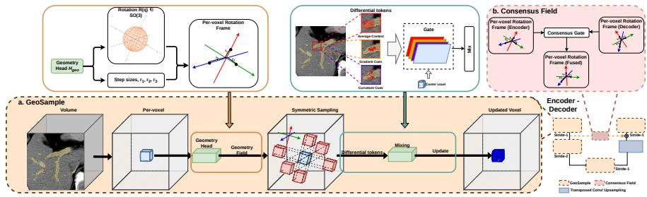
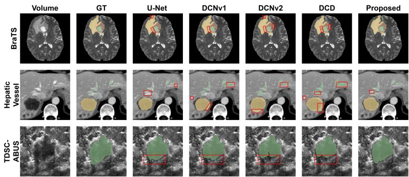
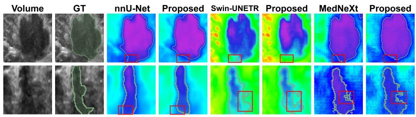
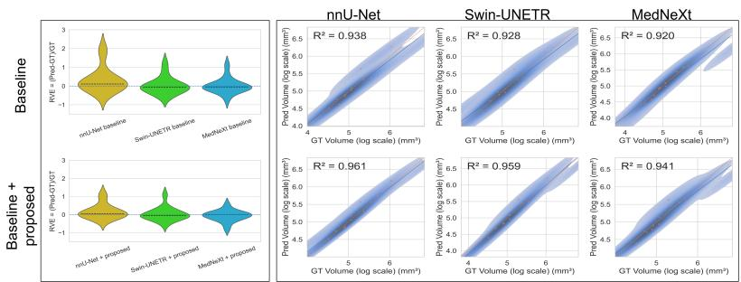

# Steer the Sampling, Not the Kernel Grid: Geometry-Guided Sampling Operator for Volumetric Segmentation

Sizhe Wang1(B), Himashi Peiris1, and Zhaolin Chen1(B)

Department of Data Science & AI, Faculty of Information Technology, Monash University, Clayton, VIC, Australia {sizhe.wang,zhaolin.chen}@monash.edu

Abstract. Accurate 3D segmentation is central to quantitative lesion assessment and anatomy mapping for clinical planning and follow-up. Thin, elongated, and fine anatomical/pathological structures (e.g., vessels) are a particularly stress case: a one-voxel boundary error can disconnect a branch and change clinically relevant topology. In encoder–decoder networks (e.g., U-Net), repeated downsampling and fixed-grid convolution blur/alias fine structures and weaken orientation cues, so early mistakes propagate across scales. We propose a geometry-guided local operator that steers where features are sampled (rather than deforming convolutional kernels) under a single formulation for both feature refinement (stride 1) and resolution reduction (stride > 1). At each voxel, it predicts a local orientation and bounded step sizes, samples symmetrically along these directions, and transforms paired samples into compact geometric/boundary cues with lightweight mixing; a cross-scale consensus aligns encoder and decoder features at skip connections to reduce geometric mismatch. Replacing all stride 1 and stride 2 operators in a 3D U-Net yields consistent improvements on BraTS, MSD Hepatic Vessel, and TDSC-ABUS, with notably better boundary metrics (e.g., BraTS Dice 86.1→88.9, HD95 7.1→6.2; TDSC-ABUS HD95 39.1→27.8) while largely reducing parameters (2.3M→0.8M). We further demonstrate that the operator plugs into other backbones (e.g. nnU-Net, Swin-UNETR, and MedNeXt) without changing their macro-architectures while providing consistent performance gains. Code available at GeoSample repo.

Keywords: 3D medical image segmentation · geometry-guided sampling · downsampling operator · SO(3) frame field · central diferences.

## 1 Introduction

Accurate volumetric segmentation is a prerequisite for many downstream clinical and scientific workflows, including lesion quantification, preoperative planning, and longitudinal follow-up [21,12]. Encoder–decoder architectures in the U-Net family remain dominant because they combine multi-scale context aggregation with fine localisation through skip connections [23,4]; nnU-Net further demonstrates strong performance across diverse biomedical tasks using largely standardised backbones and robust training recipes [14]. Despite these successes, thin, elongated, or anisotropic structures remain fragile, and more broadly any task requiring precise boundary localisation can sufer when resolution changes distort local geometry [25]. Such targets often occupy only a few voxels, so small boundary shifts can break continuity and bias quantitative measurements [13]. Therefore, rather than redesigning the backbone, we fundamentally rethink the convolution/pooling primitives that sample, aggregate, and downsample features.

A key issue is that existing stride-based refinement and downsampling indiscriminately aggregate voxel information along fixed grids, suppressing or aliasing high-frequency details and distorting fine structures [2,22], an issue exacerbated by extreme foreground sparsity and limited sampling support. Though antialiasing strategies partially address instability under downsampling [29], they remain largely orientation-agnostic and fail to provide a unified approach that preserves boundary geometry and directional cues across scales.

Prior work mitigates cross-scale degradation from several directions. Transformer based and hybrid volumetric segmenters strengthen global context modelling [10,9,17,30,27,20], while other studies target cross-scale calibration and alignment within U-Net pipelines [28]. However, these approaches operate on already-sampled features and do not reconsider the geometric bias introduced by fixed-grid refinement and downsampling.

Adaptive sampling operators move beyond fixed-grid convolutional aggregation by learning sampling ofsets, e.g., deformable convolutions [6,31] and volumetric variants [16], as well as sparse large-kernel sampling designs such as OBELISK [11]. However, these methods predict unconstrained ofsets per kernel location, lacking structured geometric regularisation and symmetry; neighbouring voxels may yield irregular sampling patterns, and the representation is not orientation-consistent.

Diferentiable warping modules and equivariant or steerable architectures incorporate geometric transformations or symmetry constaints [15,7,5,26,8]. However, these existing approaches are either anchored in fixed-grid convolutional backbones or impose global equivariance without explicitly modelling boundaryaligned sampling for both refinement and downsampling. In contrast, we argue sampling directions should be locally structured, rotation-consistent, and symmetrically paired, with bounded step sizes to ensure stability across scales.

We propose GeoSample, a geometry-guided local operator as a unified, plug-in module for volumetric encoder–decoder networks. Rather than deforming kernels, GeoSample predicts a voxel-wise local 3D rotation frame (an element of SO(3)) with adaptive step sizes to steer structured symmetric sampling. The resulting average/diference signals are converted into step-size normalised differential cues that compactly summarise gradient- and curvature-like information. To reduce geometric mismatch between decoder and encoder features, we further employ a rotation-consistent cross-scale consensus mechanism.

Our contributions are threefold: (i) a novel, geometry-guided local operator (GeoSample) that replaces fixed-grid convolution/pooling and unifies stride

1 refinement and stride $> 1$ downsampling under a single formulation; (ii) a rotation-constrained local frame with adaptive step sizes that enables structured symmetric sampling and extracts compact geometry-aware signals, improving segmentation fidelity for thin or anisotropic targets; and (iii) a rotationconsistent Consensus Field module that aligns geometry at the skip connection, improving robustness across backbones. Fig. 1 provides an overview; we next detail the formulation in Sec. 2.

## 2 Methodology

## 2.1 Overview and integration

Given an input feature volume $X \in \mathbb { R } ^ { C \times D \times H \times W }$ , we predict a voxel-wise geometric field $\mathcal { H } ( X )$ (guiding our operator Ψ) and use it to steer symmetric sampling with lightweight mixing. This yields a drop-in local operator that replaces stride 1 refinement blocks and stride > 1 downsampling in 3D encoder–decoder segmenters $\left( \mathrm { F i g . ~ 1 } \right)$

Stride 1 refinement (replacement of conv blocks). For feature refinement without changing spatial resolution, we generate a geometry-conditioned residual update:

$$
Y = X + \varPsi _ { 1 } \bigl ( X ; \mathscr { H } ( X ) \bigr ) .\tag{1}
$$

Stride $> 1$ downsampling (replacement of strided conv/pooling). For spatial reduction, we adopt average pooling as a stable low-pass path and augment it with a geometry-conditioned compensation term:

$$
Y _ { \downarrow } = \mathrm { A v g P o o l } _ { s } ( Y ) + \varPsi _ { \downarrow , s } \big ( X ; \mathcal { H } ( X ) \big ) , \qquad s \neq ( 1 , 1 , 1 ) .\tag{2}
$$

Consensus Field at skip connection. At each decoder stage, we fuse the geometric field from the upsampled decoder feature with the corresponding encoder skip feature, and apply the stride 1 operator using the fused field before concatenation. This reduces mismatch across the skip connection (Sec. 2.6).

## 2.2 Geometry field prediction

All operations are applied pointwise at voxel locations; we omit the spatial index for readability. A geometry head $H _ { g e o }$ predicts a rotation and step-sizes:

$$
\begin{array} { r } { \mathcal { H } ( X ) = \{ R ( X ) , \mathbf { r } ( X ) \} , R \in S O ( 3 ) , \mathbf { r } = [ r _ { 1 } , \ldots , r _ { K } ] ^ { \top } \in [ r _ { \operatorname* { m i n } } , r _ { \operatorname* { m a x } } ] ^ { K } . } \end{array}\tag{3}
$$

Internally, we represent R by a unit quaternion $q \in \mathbb { S } ^ { 3 }$ (with $R = \mathcal { R } ( q ) )$ ; this is used only for rotation fusion in Sec. 2.6. Let $\{ \mathbf { e } _ { k } \} _ { k = 1 } ^ { 3 }$ be the canonical axes of the image cartesian coordinate system. We take ${ \bf u } _ { k } = R { \bf e } _ { k }$ as the first $K \leq 3$ unit directions $( K = 3$ in all experiments, yielding a full local 3D frame) and define sampling ofsets

$$
\begin{array} { r } { \delta _ { k } = r _ { k } \mathbf { u } _ { k } \in \mathbb { R } ^ { 3 } . } \end{array}\tag{4}
$$

  
Fig. 1. Overall workflow of the proposed modules. (a) GeoSample: per-voxel geometry field, symmetric sampling, and diferential-token mixing. (b) Consensus Field: rotationconsistent fusion of geometry fields from the encoder skip and upsampled decoder features for pre-skip alignment. Shown on a U-Net, GeoSample replaces stride-1 blocks and stride-2 downsampling; Consensus Field is applied at skip connection.

Importantly, $\mathbf { u } _ { k }$ are expressed in the same coordinate system as the voxel grid; the frame is used only to steer sampling directions (we do not reparameterise features into a new coordinate system).

## 2.3 Symmetric sampling and oriented diferentials

We view $X$ as a continuous field $x ( \cdot )$ via diferentiable trilinear interpolation. For each direction $\mathbf { u } _ { k }$ and step size $r _ { k }$ (both predicted at voxel location $\mathbf { p } )$ , we sample symmetrically:

$$
x _ { k } ^ { + } = x ( { \bf p } + \delta _ { k } ) , \qquad x _ { k } ^ { - } = x ( { \bf p } - \delta _ { k } ) ,\tag{5}
$$

where $\mathbf { p } \in \mathbb { R } ^ { 3 }$ is a voxel coordinate. In the continuous domain, the first- and second-order directional diferentials along $\mathbf { u } _ { k }$ are

$$
\partial _ { \mathbf { u } _ { k } } x = \mathbf { u } _ { k } ^ { \top } \nabla x , \qquad \partial _ { \mathbf { u } _ { k } } ^ { 2 } x = \mathbf { u } _ { k } ^ { \top } H _ { x } \mathbf { u } _ { k } ,\tag{6}
$$

and we approximate them by symmetric finite diferences with step-size normalisation:

$$
a _ { k } = { \textstyle \frac { 1 } { 2 } } ( x _ { k } ^ { + } + x _ { k } ^ { - } ) , \qquad d _ { k } = { \frac { x _ { k } ^ { + } - x _ { k } ^ { - } } { 2 ( r _ { k } + \epsilon ) } } , \qquad s _ { k } = { \frac { x _ { k } ^ { + } - 2 x ( { \bf p } ) + x _ { k } ^ { - } } { ( r _ { k } + \epsilon ) ^ { 2 } } } ,\tag{7}
$$

where $\epsilon > 0$ is a small constant for numerical stability. Here, $a _ { k }$ is an even (context) response, $d _ { k }$ is an odd (directional-change) response, and $s _ { k }$ captures even (2nd-order) curvature-like change. The symmetry makes the odd/even components explicit, while step-size normalisation makes the cues comparable across scales.

## 2.4 Compact diferential tokens and mixing

From $\{ d _ { k } \}$ we form a gradient-like cue $G$ expressed in the image Cartesian axes, and from $\left\{ s _ { k } \right\}$ we form a curvature/Laplacian-like cue $L \colon$

$$
G = \sum _ { k = 1 } ^ { K } \mathbf { u } _ { k } \otimes d _ { k } \in \mathbb { R } ^ { 3 \times C } , \qquad L = \frac { 1 } { K } \sum _ { k = 1 } ^ { K } s _ { k } \in \mathbb { R } ^ { C } .\tag{8}
$$

Sign stability. One key design is symmetric paired sampling, which makes the directional cue sign-invariant $b y$ construction: ${ \bf u } _ { k }  - { \bf u } _ { k } \Rightarrow d _ { k }  - d _ { k }$ and $\left( - \mathbf { u } _ { k } \right) \otimes \left( - d _ { k } \right) = \mathbf { u } _ { k } \otimes d _ { k }$ . This yields stable directional tokens without frame-sign jitter.

We denote the center sample by $x _ { 0 }$ and collect tokens

$$
\mathcal { T } = \Big [ \underbrace { x _ { 0 } } _ { \mathrm { c e n t e r ~ e v e n ~ / ~ c o n t e x t ~ o d d ~ / ~ g r a d i e n t - l i k e } } , \underbrace { L } _ { \mathrm { e v e n ~ / ~ c u r v a t u r e - l i k e } } \Big ] .\tag{9}
$$

We apply a lightweight token-wise gating followed by $1 \times 1 \times 1$ mixing to obtain an update $\varDelta { : }$

$$
\varDelta = \mathrm { M i x } \bigl ( \mathrm { G a t e } ( T ) \odot \mathcal { T } \bigr ) , \qquad \varPsi _ { 1 } ( X ; \mathcal { H } ) = \varDelta .\tag{10}
$$

The specific realisation of $\mathrm { G a t e } ( \cdot )$ and $\operatorname { M i x } ( \cdot )$ is summarised in Sec. 2.7.

## 2.5 Downsampling with directional-signal preservation

For downsampling, we first compute the stride 1 refined feature Y in (1). Since odd directional signals can undesirably cancel under naive averaging, we deliberately preserve their magnitude by pooling |G|:

$$
\bar { \mathcal { T } } _ { \downarrow } = \mathrm { A v g P o o l } _ { s } \Big ( \big [ X , \underbrace { a _ { 1 } , \dots , a _ { K } } _ { \mathrm { e v e n ~ t e r m s } } , \underbrace { | G _ { x } | , | G _ { y } | , | G _ { z } | } _ { \mathrm { o d d ~ e n e r g y } } , \underbrace { L } _ { \mathrm { e v e n ~ / ~ c u r v a t u r e - l i k e } } \big ] \Big ) .\tag{11}
$$

and predict a coarse compensation term

$$
\begin{array} { r } { \varPsi _ { \downarrow , s } ( X ; \mathcal { H } ) = \operatorname { M i x } _ { \downarrow , s } \bigl ( \operatorname { G a t e } _ { \downarrow , s } ( \bar { \mathcal { T } } _ { \downarrow } ) \odot \bar { \mathcal { T } } _ { \downarrow } \bigr ) . } \end{array}\tag{12}
$$

## 2.6 Rotation-consistent Consensus Field and integration

To reduce geometric mismatch between upsampled decoder features and encoder skip features, we fuse two local rotation fields: a current field $\mathcal { H } = \{ R , { \bf r } \}$ from the upsampled decoder features with a reference field $\mathcal { H } ^ { * } = \{ R ^ { * } , { \bf r } ^ { * } \}$ predicted from encoder skip features, where $R , R ^ { * } \in \mathrm { S O } ( 3 )$ and $\mathbf { r } , \mathbf { r } ^ { * } \in [ r _ { \operatorname* { m i n } } , r _ { \operatorname* { m a x } } ] ^ { K }$ . For rotation fusion we use their unit-quaternion representations $q , q ^ { * } \in \mathbb { S } ^ { 3 }$ (with $R = \mathcal { R } ( q )$ and $R ^ { * } = \mathcal { R } ( q ^ { * } ) ,$ ).

We compute a consensus gate $\omega \in ( 0 , 1 )$ based on step-size statistics and quaternion similarity:

$$
c = | \langle q , q ^ { * } \rangle | , \ \bar { r } = \frac { 1 } { K } \sum _ { k = 1 } ^ { K } r _ { k } , \ { \bar { r } } ^ { * } = \frac { 1 } { K } \sum _ { k = 1 } ^ { K } r _ { k } ^ { * } , \ \omega = \sigma ( { \mathrm { C o n v } } _ { 1 \times 1 \times 1 } ( [ { \bar { r } } , { \bar { r } } ^ { * } , c ] ) ) .\tag{13}
$$

Rotations are fused by quaternion spherical interpolation and step sizes are blended with the same gate:

$$
\bar { q } = \mathrm { S L E R P } ( q , q ^ { * } ; \omega ) , \qquad \bar { \bf r } = \omega { \bf r } + ( 1 - \omega ) { \bf r } ^ { * } , \qquad \bar { R } = \mathcal { R } ( \bar { q } ) .\tag{14}
$$

The fused field $\bar { \mathcal { H } } = \{ \bar { R } , \bar { \bf r } \}$ defines the consensus directions and step sizes (via Sec. 2.2) and is used to steer the stride 1 refinement on decoder features at skip connection.

## 2.7 Implementation notes

We parameterise R with a unit quaternion (from a $1 \times 1 \times 1$ head $H _ { \mathrm { g e o } } )$ and bound $r _ { k }$ to $[ r _ { \operatorname* { m i n } } , r _ { \operatorname* { m a x } } ]$ via a sigmoid. Gate is a grouped $1 \times 1 \times 1$ conv (one group per token) followed by a $1 \times 1 \times 1$ Mix conv; stride 1 and downsampling use separate heads. For stability, we stop gradients through $r _ { k }$ in the $1 / ( r _ { k } + \epsilon )$ factors.

## 3 Experiments

Datasets. We evaluate our method on three public datasets spanning three diferent modalities: BraTS (MRI) [3,19], MSD HepaticVessel (CT)[1], and TDSC-ABUS (Ultrasound) [18]. HepaticVessel serves as a thin-structure continuity stress test, while BraTS and TDSC-ABUS assess general lesion/tumour segmentation under distinct appearance statistics. We use a fixed-seed $7 5 / 1 0 / 1 5$ train/val/test split for all methods.

Training and evaluation. All runs use the same training pipeline per dataset with patch-based training and sliding-window inference; patch sizes for Params (model size) / FLOPs (compute cost; ≈ number of arithmetic operations) are $1 2 8 \times 1 9 2 \times 1 2 8$ (BraTS) and $1 2 8 ^ { 3 }$ (HepaticVessel / TDSC-ABUS). We report mean Dice and boundary metrics (HD95 and ASSD).

Operator-level results. Under a fixed 3D U-Net macro-architecture, we compare the baseline convolution, Deformable Convolution (DCN) v1/v2 [6,31], Dynamic Downsampling (DCD) [28], and the proposed operator by replacing all stride 1 blocks and stride 2 reductions with the respective operator (Table 1). For BraTS, metrics are averaged over enhanced tumour, tumour core and whole tumour; for Hepatic Vessel, we calculated mean metrics on vessel and tumour; for TDSC-ABUS, we report metrics on tumour. Our operator achieves the best mean Dice/HD95/ASSD (71.5/22.8/4.72). It is best on BraTS (88.9/6.2/0.95), attains the best Dice/HD95 on Hepatic Vessel (58.2/34.3) with near-best ASSD (7.43 vs.

  
Fig. 2. Qualitative comparison on representative cases from BraTS (top), MSD Hepatic Vessel (middle), and TDSC-ABUS (bottom). Shown are input, ground truth, and predictions from the baseline U-Net, DCNv1/v2, Dynamic Downsampling (DCD), and the proposed operator; red boxes mark noticeable segmentation errors reduced by our method.

Table 1. Operator-level comparison across datasets (top: Dice/HD95/ASSD). Bottom: model complexity (Params/FLOPs) under evaluation patch sizes.
<table><tr><td rowspan="2" colspan="2">Model</td><td colspan="3">MSD Hepatic Vessel</td><td colspan="3">BraTS</td><td colspan="3">TDSC-ABUS</td><td colspan="3">Mean</td></tr><tr><td></td><td></td><td>Dice↑ HD95↓ ASSD↓</td><td>Dice↑ HD95↓ ASSD↓</td><td></td><td></td><td>Dice↑ HD95↓ ASSD↓</td><td></td><td></td><td>Dice↑</td><td>HD95↓ ASSD↓</td><td></td></tr><tr><td>Baseline U-Net</td><td></td><td>53.5</td><td>42.8</td><td>8.87</td><td>86.1</td><td>7.1</td><td>1.15</td><td>64.4</td><td>39.1</td><td>7.31</td><td>68.0</td><td>29.7</td><td>5.78</td></tr><tr><td>Deformable Conv v1</td><td></td><td>57.2</td><td>37.3</td><td>7.93</td><td>88.3</td><td>6.4</td><td>1.07</td><td>67.5</td><td>33.1</td><td>5.83</td><td>71.0</td><td>25.6</td><td>4.94</td></tr><tr><td>Deformable Conv v2 Dynamic</td><td></td><td>56.7</td><td>36.3</td><td>8.21</td><td>88.3</td><td>6.5</td><td>1.33</td><td>66.3</td><td>35.4</td><td>6.06</td><td>70.4</td><td>26.1</td><td>5.20</td></tr><tr><td>Downsampling</td><td></td><td>56.4</td><td>34.9</td><td>7.40</td><td>88.4</td><td>6.8</td><td>1.14</td><td>67.2</td><td>33.9</td><td>6.87</td><td>70.6</td><td>25.2</td><td>5.13</td></tr><tr><td>Proposed</td><td></td><td>58.2</td><td>34.3</td><td>7.43</td><td>88.9</td><td>6.2</td><td>0.95</td><td>67.4</td><td>27.8</td><td>5.78</td><td>71.5</td><td>22.8</td><td>4.72</td></tr><tr><td>Input size</td><td colspan="2">Baseline U-Net</td><td colspan="3">Deformable Conv v1</td><td colspan="2">Deformable Conv v2</td><td colspan="3">Dynamic Downsampling</td><td colspan="3">Proposed</td></tr><tr><td></td><td>Params (M)↓ FLOPs (G)↓ Params (M)↓ FLOPs (G)↓ Params (M)↓ FLOPs (G)↓ Params (M)↓ FLOPs (G)↓ Params (M)↓ FLOPs (G)↓</td><td></td><td></td><td></td><td></td><td></td><td></td><td></td><td></td><td></td><td></td><td></td></tr><tr><td>1283</td><td>2.3</td><td>131.2</td><td>2.5</td><td></td><td>137.9</td><td>2.6</td><td>146.9</td><td></td><td></td><td>256.7</td><td>0.8</td><td>69.9</td></tr><tr><td>128 × 192 × 128</td><td>2.3</td><td>194.8</td><td>2.5</td><td></td><td>203.3</td><td>2.6</td><td>209.3</td><td>2.7 2.7</td><td>384.5</td><td></td><td>0.8</td><td>108.9</td></tr></table>

7.40), and markedly improves boundary metrics on TDSC-ABUS (HD95/ASSD 27.8/5.78) while keeping Dice comparable (67.4), indicating the most stable cross-modality improvements overall.

Computational Complexity. Table 1 (bottom) reports Params and FLOPs in the U-Net setting. Our operator reduces Params from 2.3M to 0.8M and FLOPs from 194.8G to 108.9G. By contrast, DCNv1/v2 slightly increases both, while Dynamic Downsampling raises FLOPs to 256.7G/384.5G. This eficiency comes from using a small number of symmetric samples (e.g., K = 3 paired directions) and compact token mixing with 1×1×1 gating, rather than dense grids or heavy dynamic branches.

Architecture-level plug-in results. On TDSC-ABUS we plug the proposed operator into nnU-Net, Swin-UNETR, and MedNeXt (base version) [14,9,24] (Table 2). For nnU-Net we replace all stride 1 and stride > 1 blocks, whereas for Swin-UNETR and MedNeXt we only replace downsampling to preserve backbone-specific refinement; all variants additionally apply Consensus Field at skip connection (Sec. 2.6). Across backbones, the plug-in improves overlap and boundary metrics (Dice +1.8–+4.8, Sens. +2.9–+6.2; HD95 −2.5–−5.2, ASSD −0.09–−0.49), with minor specificity changes (≥98.2%). The largest gain is on nnU-Net (Dice 68.0→72.8) while reducing cost (Params 30.8M→17.4M; FLOPs 1250G→750G); Swin-UNETR and MedNeXt also improve with modest FLOPs changes, consistent with their already-eficient downsampling (patch merging / depthwise separable convolutions). Fig. 3 shows fewer leakage/boundary errors, and Fig. 4 indicates improved volumetry (RVE distributions closer to 0 with fewer outliers and points closer to y = x). Overall, the improved boundaries and volumetry suggest more reliable downstream quantitative assessment across backbones.

Table 2. Architecture-level plug-in validation on TDSC-ABUS dataset.
<table><tr><td>Backbone</td><td>Variant</td><td colspan="3">Overlap</td><td colspan="2">Boundary</td><td colspan="2">Efficiency</td></tr><tr><td></td><td></td><td>Dice↑</td><td>Sensitivity↑</td><td>Specificity↑</td><td>HD95↓</td><td>ASSD↓</td><td>Params (M)↓</td><td>FLOPs (G)↓</td></tr><tr><td rowspan="2">nnU-Net</td><td>Baseline</td><td>68.0</td><td>72.4</td><td>98.8</td><td>28.4</td><td>5.24</td><td>30.8</td><td>1250.0</td></tr><tr><td>+ Proposed</td><td>72.8</td><td>75.3</td><td>98.5</td><td>25.6</td><td>5.03</td><td>17.4</td><td>750.2</td></tr><tr><td rowspan="2">Swin-UNETR</td><td>Baseline</td><td>69.1</td><td>68.0</td><td>98.6</td><td>30.2</td><td>4.97</td><td>63.5</td><td>751.5</td></tr><tr><td>+ Proposed</td><td>70.9</td><td>74.2</td><td>98.7</td><td>27.7</td><td>4.88</td><td>64.8</td><td>802.7</td></tr><tr><td rowspan="2">MedNeXt</td><td>Baseline</td><td>66.8</td><td>69.5</td><td>99.1</td><td>29.4</td><td>5.38</td><td>2.7</td><td>50.1</td></tr><tr><td>+ Proposed</td><td>69.5</td><td>75.5</td><td>98.2</td><td>24.2</td><td>4.89</td><td>2.9</td><td>57.0</td></tr></table>

  
Fig. 3. Qualitative plug-in results on TDSC-ABUS (red boxes: improved regions).

Ablation Study. We test the efectiveness of the geometry-aware modules. Under the same 3D U-Net setting using TDSC-ABUS data, removing the diferentials (G, L; geometry-aware gradient/curvature cues) drops Dice/HD95/ASSD from 67.4/27.8/5.78 to 54.3/51.0/10.71, and removing the Consensus Field (skip alignment to reduce geometry mismatch) drops to 58.4/48.2/8.52. This confirms that geometric diferential terms drive boundary quality, with consensus alignment providing additional cross-scale robustness.

## 4 Conclusion

We have introduced GeoSample, a geometry-guided operator for volumetric encoder–decoder segmentation that predicts local orientations to steer symmetric sampling and extract geometric signals for refinement and downsampling. Across three public benchmarks and plug-in validation, it consistently improves segmentation quality, especially boundary metrics, while reducing the number of parameters in the U-Net setting.

  
Fig. 4. Volumetric agreement on TDSC-ABUS. Left: relative volume error (RVE) distributions for diferent backbones. Right: predicted vs. ground-truth tumour volumes (log scale) for baseline and +Proposed; dashed line denotes $y = x ,$

Future work will focus on reducing the memory/wall-clock time overhead of interpolation-based sampling and improve early-training stability.

## References

1. Antonelli, M., Reinke, A., Bakas, S., Farahani, K., Kopp-Schneider, A., Landman, B.A., Litjens, G., Menze, B., Ronneberger, O., Summers, R.M., et al.: The medical segmentation decathlon. Nature communications 13(1), 4128 (2022)

2. Azulay, A., Weiss, Y.: Why do deep convolutional networks generalize so poorly to small image transformations? Journal of Machine Learning Research 20(184), 1–25 (2019)

3. Baid, U., Ghodasara, S., Mohan, S., Bilello, M., Calabrese, E., Colak, E., Farahani, K., Kalpathy-Cramer, J., Kitamura, F.C., Pati, S., et al.: The rsna-asnr-miccai brats 2021 benchmark on brain tumor segmentation and radiogenomic classification. arXiv preprint arXiv:2107.02314 (2021)

4. Çiçek, Ö., Abdulkadir, A., Lienkamp, S.S., Brox, T., Ronneberger, O.: 3d u-net: learning dense volumetric segmentation from sparse annotation. In: International conference on medical image computing and computer-assisted intervention. pp. 424–432. Springer (2016)

5. Cohen, T., Welling, M.: Group equivariant convolutional networks. In: International conference on machine learning. pp. 2990–2999. PMLR (2016)

6. Dai, J., Qi, H., Xiong, Y., Li, Y., Zhang, G., Hu, H., Wei, Y.: Deformable convolutional networks. In: Proceedings of the IEEE international conference on computer vision. pp. 764–773 (2017)

7. Frangi, A.F., Niessen, W.J., Vincken, K.L., Viergever, M.A.: Multiscale vessel enhancement filtering. In: International conference on medical image computing and computer-assisted intervention. pp. 130–137. Springer (1998)

8. Fuchs, F., Worrall, D., Fischer, V., Welling, M.: Se (3)-transformers: 3d rototranslation equivariant attention networks. Advances in neural information processing systems 33, 1970–1981 (2020)

9. Hatamizadeh, A., Nath, V., Tang, Y., Yang, D., Roth, H.R., Xu, D.: Swin unetr: Swin transformers for semantic segmentation of brain tumors in mri images. In: International MICCAI brainlesion workshop. pp. 272–284. Springer (2021)

10. Hatamizadeh, A., Tang, Y., Nath, V., Yang, D., Myronenko, A., Landman, B., Roth, H.R., Xu, D.: Unetr: Transformers for 3d medical image segmentation. In: Proceedings of the IEEE/CVF winter conference on applications of computer vision. pp. 574–584 (2022)

11. Heinrich, M.P., Oktay, O., Bouteldja, N.: Obelisk-net: Fewer layers to solve 3d multi-organ segmentation with sparse deformable convolutions. Medical image analysis 54, 1–9 (2019)

12. Hesamian, M.H., Jia, W., He, X., Kennedy, P.: Deep learning techniques for medical image segmentation: achievements and challenges. Journal of digital imaging 32(4), 582–596 (2019)

13. Hu, X., Li, F., Samaras, D., Chen, C.: Topology-preserving deep image segmentation. Advances in neural information processing systems 32 (2019)

14. Isensee, F., Jaeger, P.F., Kohl, S.A., Petersen, J., Maier-Hein, K.H.: nnu-net: a self-configuring method for deep learning-based biomedical image segmentation. Nature methods 18(2), 203–211 (2021)

15. Jaderberg, M., Simonyan, K., Zisserman, A., et al.: Spatial transformer networks. Advances in neural information processing systems 28 (2015)

16. Lee, H.H., Liu, Q., Yang, Q., Yu, X., Bao, S., Huo, Y., Landman, B.A.: Deformuxnet: Exploring a 3d foundation backbone for medical image segmentation with depthwise deformable convolution. arXiv preprint arXiv:2310.00199 (2023)

17. Liu, Z., Lin, Y., Cao, Y., Hu, H., Wei, Y., Zhang, Z., Lin, S., Guo, B.: Swin transformer: Hierarchical vision transformer using shifted windows. In: Proceedings of the IEEE/CVF international conference on computer vision. pp. 10012–10022 (2021)

18. Luo, G., Xu, M., Chen, H., Liang, X., Tao, X., Ni, D., Jeong, H., Kim, C., Stock, R., Baumgartner, M., et al.: Tumor detection, segmentation and classification challenge on automated 3d breast ultrasound: The tdsc-abus challenge. arXiv preprint arXiv:2501.15588 (2025)

19. Menze, B.H., Jakab, A., Bauer, S., Kalpathy-Cramer, J., Farahani, K., Kirby, J., Burren, Y., Porz, N., Slotboom, J., Wiest, R., et al.: The multimodal brain tumor image segmentation benchmark (brats). IEEE transactions on medical imaging 34(10), 1993–2024 (2014)

20. Peiris, H., Hayat, M., Chen, Z., Egan, G., Harandi, M.: A robust volumetric transformer for accurate 3d tumor segmentation. In: International conference on medical image computing and computer-assisted intervention. pp. 162–172. Springer (2022)

21. Pham, D.L., Xu, C., Prince, J.L.: Current methods in medical image segmentation. Annual review of biomedical engineering 2(1), 315–337 (2000)

22. Ribeiro, A.H., Schön, T.B.: How convolutional neural networks deal with aliasing. In: ICASSP 2021-2021 IEEE International Conference on Acoustics, Speech and Signal Processing (ICASSP). pp. 2755–2759. IEEE (2021)

23. Ronneberger, O., Fischer, P., Brox, T.: U-net: Convolutional networks for biomedical image segmentation. In: International Conference on Medical image computing and computer-assisted intervention. pp. 234–241. Springer (2015)

24. Roy, S., Koehler, G., Ulrich, C., Baumgartner, M., Petersen, J., Isensee, F., Jaeger, P.F., Maier-Hein, K.H.: Mednext: transformer-driven scaling of convnets for medical image segmentation. In: International Conference on Medical Image Computing and Computer-Assisted Intervention. pp. 405–415. Springer (2023)

25. Sinclair, B., Pham, W., Vivash, L., Moses, J., Lynch, M., Dorfman, K., Marotta, C., Koh, S., Bunyamin, J., Rowsthorn, E., et al.: Perivascular space identification nnunet for generalised usage (pingu). Medical Image Analysis p. 103903 (2025)

26. Weiler, M., Geiger, M., Welling, M., Boomsma, W., Cohen, T.S.: 3d steerable cnns: Learning rotationally equivariant features in volumetric data. Advances in Neural information processing systems 31 (2018)

27. Xie, Y., Zhang, J., Shen, C., Xia, Y.: Cotr: Eficiently bridging cnn and transformer for 3d medical image segmentation. In: International conference on medical image computing and computer-assisted intervention. pp. 171–180. Springer (2021)

28. Yang, J., Marcus, D.S., Sotiras, A.: Dynamic u-net: Adaptively calibrate features for abdominal multiorgan segmentation. In: Medical Imaging 2025: Computer-Aided Diagnosis. vol. 13407, pp. 326–334. SPIE (2025)

29. Zhang, R.: Making convolutional networks shift-invariant again. In: International conference on machine learning. pp. 7324–7334. PMLR (2019)

30. Zhou, H.Y., Guo, J., Zhang, Y., Han, X., Yu, L., Wang, L., Yu, Y.: nnformer: Volumetric medical image segmentation via a 3d transformer. IEEE transactions on image processing 32, 4036–4045 (2023)

31. Zhu, X., Hu, H., Lin, S., Dai, J.: Deformable convnets v2: More deformable, better results. In: Proceedings of the IEEE/CVF conference on computer vision and pattern recognition. pp. 9308–9316 (2019)