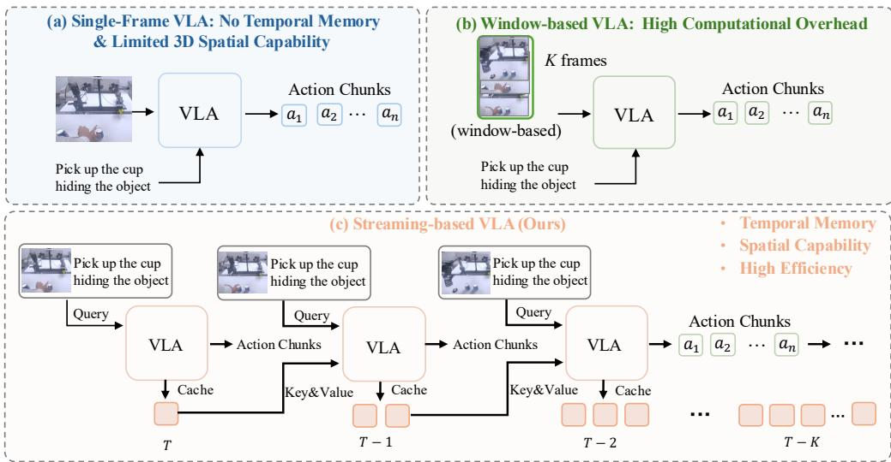
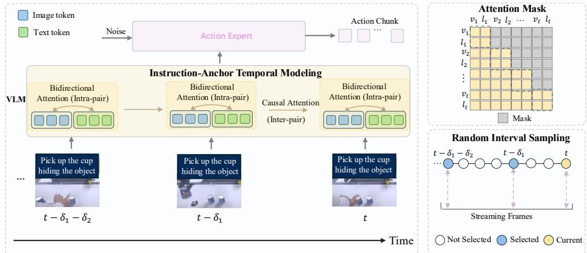
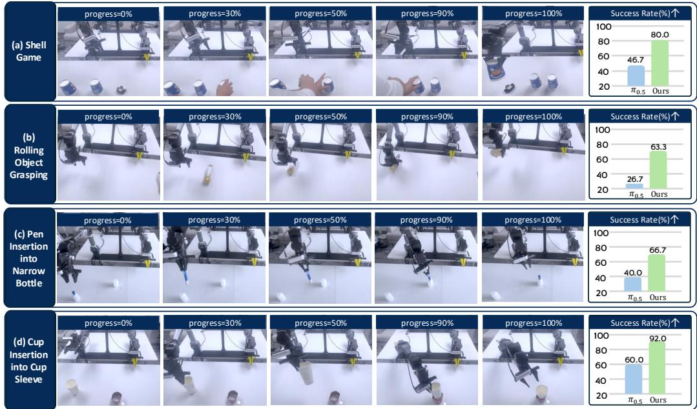
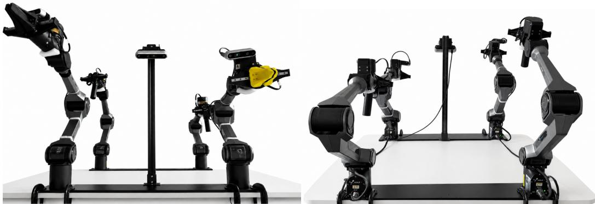
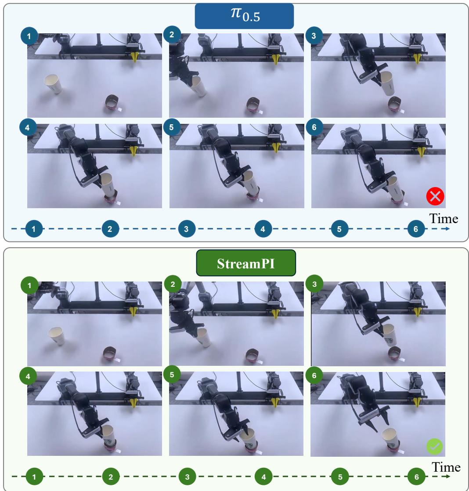
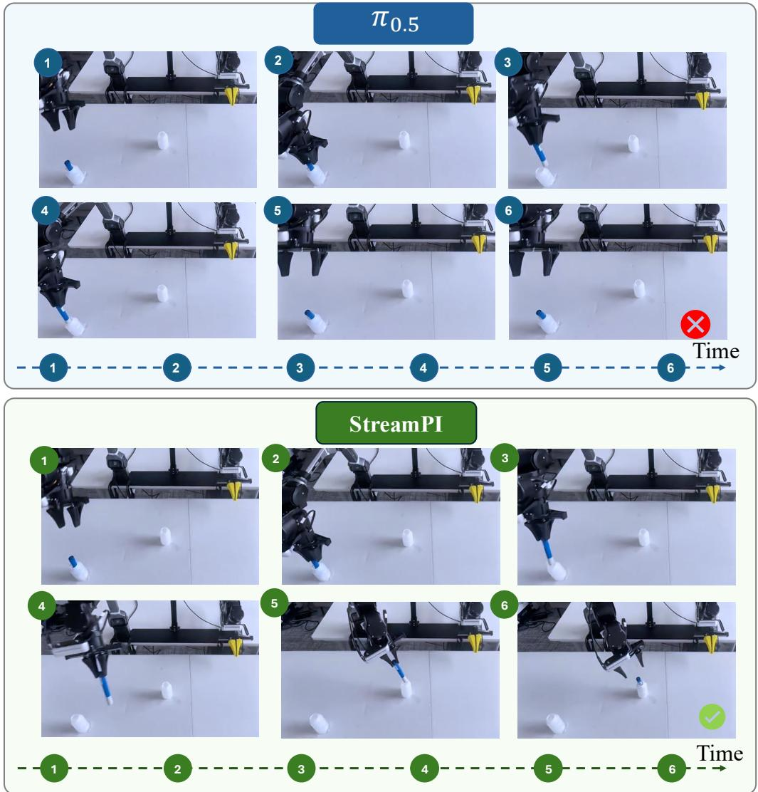
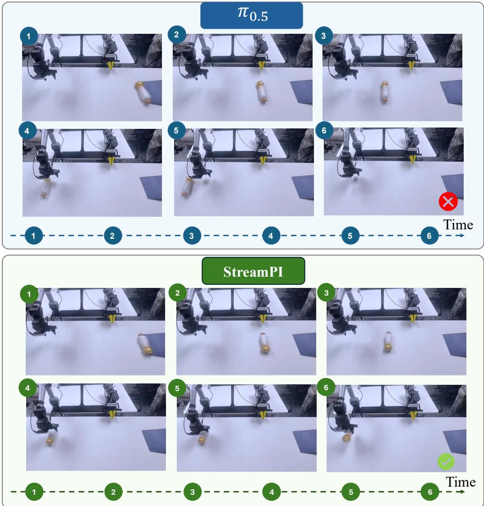
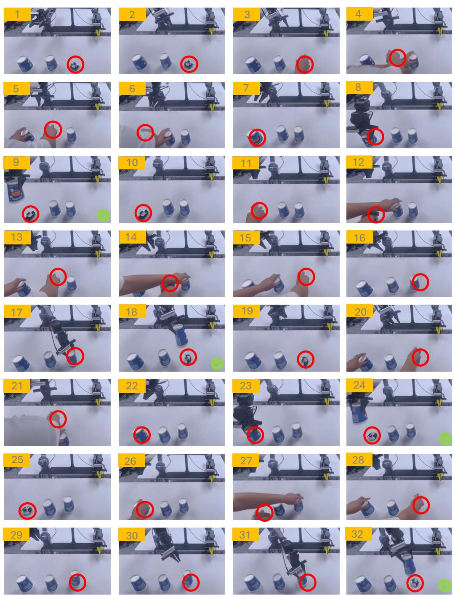

# StreamPI: Streaming Multimodal Temporal Modeling for Vision-Language-Action Models

Zhe Liu1∗ , Jinghua Hou1∗, Yuxiang Lu1 , Zhenya Yang1 , Xianzhe Fan1 , Junwei Luo1 , Junyi Li1 , Ruihua Han1 , Zhi Hou2 , Hengshuang Zhao1†

1The University of Hong Kong 2ACE Robotics https://happinesslz.github.io/projects/StreamPI

## Abstract

Vision-Language-Action (VLA) models have demonstrated effectiveness in robot manipulation, yet state-of-the-art models such as π operate under a single-frame paradigm, limiting their ability to retain past observations and develop precise spatial perception. In this paper, we propose StreamPI, a streaming multimodal temporal modeling framework that equips single-frame VLA with temporal reasoning capability without introducing any additional parameters. One core design is instruction-anchored temporal modeling. It treats each (visual observation, language instruction) pair as an atomic temporal unit: bidirectional attention within each pair enables cross-modal fusion, while causal attention across pairs preserves autoregressive streaming inference. This ensures the language instruction serves as a persistent semantic anchor throughout task execution. To bridge the gap between synchronous training and asynchronous real-robot deployment, we introduce a random-interval streaming training strategy: a proper inter-frame interval (e.g., every 3 frames) enables faster and smoother action execution. Beyond this, randomizing the interval further improves robustness to frame-timing perturbations, supporting asynchronous deployment in practice. Furthermore, by leveraging the length extrapolation capability of the LLM backbone, StreamPI seamlessly inherits pretrained single-frame weights and supports flexible single-frame and multiframe inference. Experiments on real-robot tasks spanning memory-dependent and precise perception scenarios, as well as the simulation benchmark LIBERO, demonstrate that StreamPI outperforms π across diverse tasks.

## 1 Introduction

Vision-Language-Action (VLA) models have emerged as a promising paradigm for generalizable robot manipulation, unifying perception, language understanding, and action generation within a single end-to-end framework [56, 18, 3, 16]. Despite their impressive performance, state-of-the-art VLA models such as $\pi _ { 0 }$ and π0.5 operate under a single-frame paradigm, as illustrated in Figure 1(a), where each action is predicted from a single image observation without access to any historical context. This design inherently precludes two critical capabilities, namely the ability to memorize and reason over past observations, and the capacity to develop precise spatial perception that emerges from temporal aggregation.

Incorporating temporal context addresses both limitations simultaneously. On the memory side, access to historical observations enables robots to resolve tasks that are inherently ambiguous from a single frame, such as inferring which cup conceals a target object or grasping a dynamically moving target. On the perception side, the benefit of temporal modeling for spatial understanding has been well established in autonomous driving, where multi-frame fusion methods [15, 23, 42, 14] dramatically improve 3D scene understanding, and VGGT [41, 55] series demonstrate that temporal aggregation yields substantially more accurate depth estimation and 3D reconstruction. These findings transfer naturally to embodied manipulation, where strong spatial perception is fundamental to precise object grasping and placement. To this goal, shown in Figure 1(b), some multiple-frame VLA methods [47, 39] adopt window-based visual inputs for temporal modeling. To reduce inference time, such approaches typically resort to either a smaller backbone network or a dedicated video encoder that compresses multi-frame observations into a reduced set of tokens.

  
Figure 1: Comparison of three paradigms for VLA-based robot manipulation. (a) Single-frame VLA: Only the current observation is processed, lacking historical context and limiting temporal memory and spatial perception. (b) Window-based VLA: A window of K frames is processed simultaneously, enriching temporal context at the cost of high computational overhead. (c) Streamingbased VLA (Ours): The model queries cached Key&Value representations from previous timesteps via a lightweight KV cache, achieving temporal memory and precise spatial perception.

Therefore, effectively incorporating temporal information into strong single-frame VLA foundation models such as π is non-trivial. There are four potential challenges. 1) Computational overhead: Concatenating frames across time causes sequence length to grow linearly, rendering inference latency prohibitive for real-time control. 2) Instruction forgetting: Conventional VLA models inject the language instruction as a fixed set of text tokens. As the temporal horizon expands, accumulating visual tokens progressively dilute the influence of instruction tokens, causing the model to lose track of the task goal over long horizons. 3) Training-deployment mismatch: Training relies on regularly sampled frame sequences, whereas real-robot deployment produces asynchronous observation streams with variable time gaps, degrading model robustness in online settings. 4) Representation corruption: Introducing a video encoder adds new parameters whose feature distributions are misaligned with the powerful VLA pretrained models, risking corruption of the rich visual-language features of the base model in the embodied domain.

To address these challenges, we propose StreamPI, a streaming multi-modal temporal modeling framework, as illustrated in Figure 1(c). StreamPI incorporates four key designs to enable efficient and robust temporal reasoning. 1) Streaming inference: Rather than processing a full observation window at every step, StreamPI adopts a streaming temporal modeling paradigm that caches Key&Value representations from past timesteps, keeping inference cost constant regardless of temporal horizon. 2) Instruction-anchored temporal modeling: Rather than modeling temporal dependencies over visual frames alone, StreamPI treats each (visual observation, language instruction) pair as an atomic temporal unit. The language instruction is persistently coupled with every observation as a semantic anchor throughout execution. Within each pair, bidirectional attention enables thorough cross-modal fusion, while causal attention across pairs preserves the autoregressive structure for online streaming inference, ensuring the model consistently maintains awareness of the current task goal. 3) Random-interval streaming training: To improve robustness to variable frame rates and asynchronous observation arrival at deployment time, StreamPI adopts a random-interval streaming training strategy that exposes the model to diverse frame-timing perturbations during training. 4) No additional parameters: By leveraging the length extrapolation capability of the LLM backbone, StreamPI seamlessly inherits all pretrained weights of $\pi _ { 0 . 5 }$ without introducing any new parameters, fully preserving its representational integrity while naturally supporting both single-frame and multi-frame inference at test time.

Finally, we evaluate StreamPI on real-robot tasks spanning precise perception-dependent tasks and memory-dependent tasks and consistently outperforms $\pi _ { 0 . 5 } .$ . On the LIBERO simulation benchmark [24], StreamPI achieves superior performance, verifying the effectiveness of our approach.

In summary, our main contributions are as follows:

• We propose StreamPI, a streaming multi-modal temporal modeling VLA framework that treats each (visual observation, language instruction) pair as an atomic temporal unit with instruction-anchored modeling to maintain persistent task awareness during execution.

• We introduce a random-interval streaming training strategy that exposes the model to diverse frame-timing perturbations, bridging the gap between synchronous training and asynchronous real-robot deployment. Besides, StreamPI seamlessly inherits all pretrained weights of $\pi _ { 0 . 5 }$ via LLM length extrapolation and supports flexible single-frame and multi-frame inference.

• Extensive experiments on real-robot manipulation and the LIBERO benchmark demonstrate that StreamPI consistently outperforms $\pi _ { 0 . 5 }$ on both spatial-precision and memory-dependent tasks.

## 2 Related Work

Vision-Language-Action Models. The emergence of large-scale pre-trained vision-language models (VLMs) has catalyzed a new generation of robot policies that unify perception, language understanding, and action generation within a single framework [56, 18, 3, 13, 38, 16, 30, 53, 4, 43, 45, 44, 6, 32, 25, 5, 50]. RT-2 [56] pioneered this direction by co-finetuning a VLM on robot demonstration data, demonstrating that web-scale visual-linguistic knowledge can be directly transferred to robotic control. OpenVLA [18] extended this paradigm with an open-source framework, enabling broader community adoption and systematic study of VLA design choices. More recently, π0 [3] introduced a flow-matching action head decoupled from the VLM backbone, achieving high-frequency dexterous control while preserving the semantic reasoning capabilities of the language model. $\pi _ { 0 . 5 }$ [16] further scales this approach with improved data diversity and task generalization. Despite these advances, existing VLA models predominantly operate in a single-frame inference paradigm, processing each observation independently without maintaining temporal context across time steps. This motivates our work on streaming temporal modeling for VLA inference.

Temporal Modeling for Robot Manipulation. Incorporating temporal context into robot policies has long been recognized as essential for tasks requiring spatial reasoning and long-horizon planning [8, 52]. Diffusion Policy [8] and ACT [52] demonstrate that conditioning on short observation histories significantly improves action consistency and task success rates. Recent work [47, 20, 34, 28, 49, 19, 17, 54] has explored multi-frame modeling within VLA frameworks. CronusVLA [20] systematically investigates the design space of multi-frame VLA models, showing that incorporating historical observations yields substantial gains on manipulation benchmarks requiring spatial precision. World model approaches [10, 22, 11, 37, 48, 1] further argue that temporal modeling is indispensable for agents to anticipate future states and reason about action consequences. However, these methods either introduce significant computational overhead through full attention over all historical tokens, or decouple visual observations from their corresponding language instructions during temporal aggregation, which is a design flaw that leads to instruction forgetting over long task horizons. StreamPI addresses both limitations through its instruction-anchored atomic temporal unit design, which preserves cross-modal binding while enabling efficient causal streaming inference.

Streaming Inference. The challenge of efficient streaming inference has been extensively studied in the NLP community. StreamingLLM [46] identifies the “attention sink” phenomenon and proposes retaining a small set of initial tokens alongside a sliding window of recent tokens, enabling LLMs to process infinitely long sequences without recomputation. LongLoRA [7] demonstrates that transformer models can generalize to sequence lengths far beyond those seen during training. In the robotics domain, recent work [9, 40, 27, 35] on asynchronous execution highlights the practical challenge of variable-rate observation streams, where fixed-interval assumptions break down under real-world deployment conditions. Our random-interval streaming training strategy directly addresses this gap, exposing the model to diverse temporal spacings during training to improve robustness to the asynchronous observation streams encountered on physical robots.

  
Figure 2: The pipeline of StreamPI. To fully unleash the potential of multi-modal interaction, we use bidirectional attention for image-text pairs and causal attention for inter-frames with block-wise causal attention mask. We additional use the random interval sampling to improve the temporal robustness in the real-world deployment.

## 3 Method

In this section, we present StreamPI, a streaming multi-modal temporal modeling framework for Vision-Language-Action models $( e . g . , \ \pi _ { 0 . 5 } )$ , as illustrated in Figure 2. We begin by revisiting the single-frame inference paradigm of $\pi _ { 0 . 5 }$ and identifying its key limitations (Sec. 3.1). We then introduce our core architectural design, which encapsulates visual observations and language instructions into (image, text) pairs as atomic temporal units, and organizes them through a causal attention mechanism (Sec. 3.2). Finally, we describe our random-interval streaming training strategy, which bridges the gap between training and asynchronous real-robot deployment (Sec. 3.3).

## 3.1 Preliminaries

$\pi _ { 0 . 5 }$ is a Vision-Language-Action (VLA) model that processes a single observation at each inference step. At time t, the model receives a language instruction l and a set of multi-view visual observations $\mathbf { V } _ { t } = \{ v _ { t } ^ { f } , v _ { t } ^ { l } , v _ { t } ^ { r } \}$ , comprising a front-view, left-view and right-view wrist camera images, where each of $v _ { t } ^ { f } , v _ { t } ^ { l } , v _ { t } ^ { r } \ \in \ \mathbb { R } ^ { H \times W \times 3 }$ These inputs are tokenized and concatenated into a sequence: $\mathbf x _ { t } = [ \textbf V _ { t } , l _ { t } ]$ . The model then samples an action $\mathbf { a } _ { t }$ from the learned policy conditioned on $\mathbf { x } _ { t } \mathbf { : }$ $\mathbf { a } _ { t } \sim \pi _ { \theta } ( \cdot \mathbf { \mu } \mid \mathbf { x } _ { t } )$ , where $\pi _ { \theta }$ denotes the policy parameterized by the pre-trained weights. $\pi _ { 0 . }$ 5 employs a transformer backbone with full bidirectional attention over the input tokens, enabling rich cross-modal fusion between the language instruction and all visual observations within a single frame.

However, a single-frame observation provides insufficient geometric context for tasks requiring precise spatial perception, whereas temporal observations can reveal richer latent geometric cues through motion parallax and structural consistency across frames. Moreover, when extended to temporal settings, naively concatenating historical visual observations without re-anchoring each frame to the language instruction causes the instruction signal to be progressively diluted by the expanding visual token sequence. These limitations motivate our instruction-anchored streaming framework StreamPI.

## 3.2 Instruction-Anchored Temporal Modeling

A naive approach to temporal aggregation is to concatenate historical visual observations into a single growing sequence, which introduces two compounding problems. First, the sequence length grows linearly with the temporal horizon, making both training memory consumption and inference latency prohibitive for real-time control. Second, as visual tokens accumulate, the language instruction maybe be progressively overshadowed, causing the model to lose track of the task goal over long horizons. To address these issues, we propose instruction-anchored temporal modeling in a streaming fashion, shown in Figure 2. Specifically, each visual observation is paired with the task instruction, forming an instruction-anchored temporal unit. We apply bidirectional attention within each instructionobservation pair to capture multimodal interactions, and causal attention across pairs to model temporal dependencies.

First, we define each time step’s input as an atomic temporal unit that jointly encodes the multi-view visual observations and the language instruction:

$$
\mathbf { u } _ { t } = \left( \mathbf { V } _ { t } , l _ { t } \right)\tag{1}
$$

where $l _ { t }$ denotes the language instruction corresponding to time t. By treating $\mathbf { u } _ { t }$ as an indivisible unit, the instruction remains persistently anchored to its associated visual context at each time step, preventing instruction forgetting regardless of the temporal horizon length. At the current time step, we define the streaming frames as the latest $T$ sampling observations, including the current one. The input sequence is then constructed by concatenating $\bar { T ^ { \dag } }$ atomic temporal units:

$$
\mathbf { U } = [ \mathbf { u } _ { t - T + 1 } , \mathbf { u } _ { t - T + 2 } , \ldots , \mathbf { u } _ { t } ]\tag{2}
$$

To capture both cross-modal fusion within each time step and temporal dependencies across time steps, we organize the attention structure over U from two levels.

Intra-pair Bidirectional Attention. Within each atomic unit $\mathbf { u } _ { \tau }$ , all tokens from $\mathbf { V } _ { \tau }$ and $l _ { \tau }$ attend to each other bidirectionally:

$$
\mathbf { h } _ { \tau } = \mathrm { A t t n } _ { \mathrm { b i } } ( \mathbf { V } _ { \tau } , l _ { \tau } )\tag{3}
$$

This ensures thorough cross-modal fusion between the multi-view visual observations and the language instruction at each individual time step, producing a semantically grounded representation $\mathbf { h } _ { \tau }$ for downstream temporal reasoning.

Inter-pair Causal Attention. Across atomic units, the fused representation hτ attends to all preceding units via causal attention:

$$
\mathbf { o } _ { t } = \mathrm { A t t n } _ { \mathrm { c a u s a l } } ( \mathbf { h } _ { t - T + 1 } , \mathbf { \Omega } . . . , \mathbf { h } _ { t } )\tag{4}
$$

This allows the model to aggregate temporal context from past observations in an autoregressive manner, while the causal structure ensures that future frames do not leak into past representations during training. The final output $\mathbf { o } _ { t }$ is then used to condition action generation of $\mathbf { a } _ { t } \sim \pi _ { \theta } ( \cdot \mid \mathbf { o } _ { t } )$

Parameter-free Temporal Extension. A key advantage of this design is that it introduces no additional parameters. The hierarchical attention pattern is entirely realized by restructuring the attention mask over the existing VLA backbone. The inter-pair causal attention over an extended token sequence is handled naturally by the LLM’s length extrapolation capability, allowing StreamPI to inherit all pre-trained weights without modification. Specifically, we only extend the input token sequence for multi-frame inputs and assign extended position embeddings to all frame tokens. We then use our inter-pair causal mask to enforce intra-frame self-attention within each individual frame and inter-frame causal attention across consecutive frames, restricting the input to follow the temporal order strictly. This ensures that the rich vision-language representations learned during pre-training are effectively preserved.

## 3.3 Random-Interval Streaming Training Strategy

In real-robot deployment, observations arrive asynchronously and at variable frame rates. A model trained with fixed temporal intervals becomes brittle to such variation, since the temporal statistics at test time differ systematically from those encountered during training. We address this mismatch with a dedicated training strategy that improves robustness to temporal irregularity.

Random-interval Sampling. During training, rather than sampling streaming frames at a strictly fixed interval, we introduce a random interval to improve robustness. Concretely, given a base interframe interval ¯δ, we add a random perturbation $\epsilon \sim \mathcal { U } ( - \Delta , + \Delta )$ at each sampling step, yielding a perturbed interval $\delta = \bar { \delta } + \epsilon$ , which is clipped to $[ \delta _ { \mathrm { m i n } } , \delta _ { \mathrm { m a x } } ]$ . The $T$ streaming frames are then sampled from the streaming buffer at steps of δ. This exposes the model to a diverse distribution of temporal spacings around the nominal interval, preventing it from over-relying on fixed-interval temporal cues and improving generalization to the asynchronous observation rates encountered during real-robot deployment. In the bottom-right corner of Figure 2, a schematic illustrates the proposed Random-Interval Sampling strategy, where historical frames are selected at randomized offsets $t - \delta _ { 1 }$ and $t { - } \delta _ { 1 } { - } \delta _ { 2 }$ relative to the current frame t, rather than at fixed intervals.

Temporal Masking. To further align training with streaming inference, we adopt a temporal masking strategy. Given a full sequence of T streaming frames, we randomly sample a masking count $k \in \{ 0 , { \bar { 1 } } , \dots , { \bar { T } } - 1 \}$ . When $k = 0$ , the complete sequence is visible to the model. When $k > 0$ , the earliest k frames are masked, leaving only the most recent $T - k$ frames accessible. Combined with causal attention masking, this simulates the incremental observation pattern of streaming inference.

Streaming Inference. With our streaming design, StreamPI enables strong temporal modeling without introducing significant additional computational overhead. Given a sequential stream of observations at timestamps $\{ t _ { 0 } , t _ { 1 } , \ldots , t _ { N } \}$ , at the initial timestamp $t _ { 0 } .$ , the model takes the current frame $\mathbf { u } _ { t _ { 0 } }$ as input, predicts the action $\mathbf { a } _ { t _ { 0 } } .$ , and stores the resulting fused representation $\mathbf { h } _ { t _ { 0 } }$ in the KV-Cache. At each subsequent timestamp $t _ { n } \ ( n > 0 )$ , only the newly arriving frame $\mathbf { u } _ { t _ { n } }$ needs to be encoded. Its representation $\mathbf { h } _ { t _ { n } }$ then attends to the cached historical representations $\left\{ \mathbf { h } _ { t _ { 0 } } , \ldots , \mathbf { h } _ { t _ { n - 1 } } \right\}$ via cross-attention, eliminating redundant re-computation over past frames. After each step, the KV-Cache is updated by appending $\mathbf { h } _ { t _ { n } }$ , which is directly reused for temporal modeling at all future timestamps. This design eliminates redundant recomputation of past frames and makes StreamPI well-suited for long-horizon robot manipulation tasks.

## 4 Experiments

To comprehensively evaluate StreamPI, we organize experiments around four core questions: (1) Can it handle both memory-dependent and precise perception-dependent manipulation tasks on real robots? (Sec. 4.2) (2) How does StreamPI compare with the advanced single-frame VLA methods on the LIBERO simulation benchmark? (Sec. 4.3) (3) How does each design choice contribute to overall performance? (Sec. 4.5) (4) How robust is StreamPI under varying temporal sampling intervals and cross frames? (Sec. 4.5)

## 4.1 Experimental Details

Benchmark. We evaluate StreamPI on the LIBERO benchmark [24], which comprises four task suites of increasing complexity: LIBERO-Spatial, LIBERO-Object, LIBERO-Goal, and LIBERO-Long, each containing 10 tasks with 50 trials per task. We also evaluate StreamPI on the CALVIN benchmark [29] to demonstrate its temporal modeling capacity. We follow the standard evaluation protocol and report success rates averaged as the evaluation metric. Besides, we provide details of the real-robot setup for our real-world experiments in the technical appendices.

Training & Inference. StreamPI is built on a pre-trained Vision-Language-Action model $\pi _ { 0 . 5 }$ [16], and keep the same settings including learning rate and optimizer. We fully fine-tune the pre-trained weights and introduce no additional parameters and temporal modeling is achieved through the attention mask. Specifically, we adopt the same optimizer and learning rate schedule as $\pi _ { 0 . 5 } .$ . The number of streaming frames is set to $\bar { T } \mathrm { = } 3 / 5$ during training. For random-interval streaming training, the inter-frame interval δ is sampled uniformly from $[ \delta _ { \mathrm { m i n } } , \delta _ { \mathrm { m a x } } ] = [ 3 , 7 ]$ at each training step. All experiments are conducted on 8 NVIDIA H100 GPUs with a batch size of 256 for LIBERO benchmark with 30k iterations and with a batch size of 128 for all real-robot tasks with 50k iterations. At inference time, StreamPI operates in a streaming manner, maintaining a rolling buffer of the T most recent observation-instruction pairs with the interval of δ. The inter-frame interval is fixed at δ=5 for simulation and sampled uniformly from $\delta \sim \mathcal { U } [ 3 , 7 ]$ for real-robot deployment.

  
Figure 3: Visualization of real-world tasks and comparison of real-world performance. Left: Visualization of memory-dependent and precise perception-dependent real-world tasks. Right: Performance comparison of real-world tasks between π0.5 and StreamPI.

## 4.2 Real-Robot Manipulation

Complex real-robot manipulation usually requires both precise geometric perception and persistent temporal awareness across interaction steps. To verify the effectiveness of StreamPI in addressing these demands, we conduct real-robot experiments spanning two complementary task categories: 1) Memory-Dependent Tasks, which require the robot to retain and act upon contextual cues accumulated over long horizons; 2) Precise Perception-Dependent Tasks, which focus on the model’s ability to perceive fine-grained geometric relationships from multi-frame observations. Each category consists of two tasks, evaluated with success rate (%).

Memory-Dependent Tasks. These tasks require the robot to recall information from earlier observations to complete a later step, a capability fundamentally beyond the reach of single-frame inference. As shown in Figure 3(a) and (b), we evaluate on two specific tasks. i) Shell Game: following a shell-game protocol, the robot first observes an object being concealed beneath one of several cups, after which the cups are shuffled. The robot then retrieves the correct cup by recalling which one concealed the object, a task that requires cross-frame memory. StreamPI achieves substantial improvements on both tasks (+36.6% on Rolling Object Grasping and +33.3% on Cup Hiding and Retrieval), demonstrating that instruction-anchored temporal modeling effectively preserves taskrelevant memory across extended horizons. ii) Rolling Object Grasping: the robot need to track a continuously moving object across frames and grasp it at the appropriate moment. Since the object’s position shifts over time, a single frame provides no motion context and thus cannot support reliable interception. For more details about the tasks, please refer to our appendix.

Precise Perception-Dependent Tasks. These tasks require accurate 3D perception from single-frame observations, where a single frame provides insufficient geometric context for reliable execution. We evaluate on two specific tasks. i) Pen Insertion into Narrow Bottle: the robot need to guide a pen into a narrow bottle opening, demanding sub-centimeter spatial precision that a single frame cannot reliably provide due to the absence of multi-view depth cues. ii) Cup Insertion into Cup Sleeve: the robot need to precisely align and insert a cup into a designated cup sleeve, where accurate depth estimation and pose alignment across frames are essential to avoid misplacement. As shown in Figure 3(c) and (d), StreamPI consistently outperforms the single-frame $\pi _ { 0 . 5 }$ baseline across both tasks +26.7% on Pen Insertion into Narrow Bottle) and (+32.0% on Cup Insertion into Cup Sleeve, confirming that temporal aggregation provides critical geometric cues unavailable from any single observation. For more details about the tasks, please refer to our appendix.

Table 1: Performance comparison on LIBERO [24]. Success rates (%) are reported across four suites.
<table><tr><td>Method</td><td>Libero-Spatial</td><td>Libero-Object</td><td>Libero-Goal</td><td>Libero-Long</td><td>Avg. Success Rate</td></tr><tr><td>Diffusion Policy [8]</td><td>78.3</td><td>92.5</td><td>68.3</td><td>50.5</td><td>72.4</td></tr><tr><td>Octo [12]</td><td>78.9</td><td>85.7</td><td>84.6</td><td>51.1</td><td>75.1</td></tr><tr><td>SpatialVLA [32]</td><td>88.2</td><td>89.9</td><td>78.6</td><td>55.5</td><td>71.7</td></tr><tr><td>TraceVLA [54]</td><td>84.6</td><td>85.2</td><td>75.1</td><td>54.1</td><td>74.8</td></tr><tr><td>OpenVLA [18]</td><td>84.7</td><td>88.4</td><td>79.2</td><td>53.7</td><td>75.9</td></tr><tr><td>CoT-VLA [51]</td><td>87.5</td><td>91.6</td><td>87.6</td><td>69.0</td><td>81.1</td></tr><tr><td>π0-FAST* [31]</td><td>96.4</td><td>96.8</td><td>88.6</td><td>60.2</td><td>85.0</td></tr><tr><td>SmolVLA [36]</td><td>93.0</td><td>94.0</td><td>91.0</td><td>77.0</td><td>88.8</td></tr><tr><td>GR00T-N1 [2]</td><td>94.4</td><td>97.6</td><td>93.0</td><td>90.6</td><td>93.9</td></tr><tr><td>UniVLA [4]</td><td>95.4</td><td>98.8</td><td>93.6</td><td>94.0</td><td>95.4</td></tr><tr><td>FLOWER [33]</td><td>97.1</td><td>96.7</td><td>95.6</td><td>93.5</td><td>95.7</td></tr><tr><td>CronusVLA [20] TriVLA [26]</td><td>90.1</td><td>94.7</td><td>91.3</td><td>68.7</td><td>86.2</td></tr><tr><td>4D-VLA [49]</td><td>91.2</td><td>93.8</td><td>89.8</td><td>73.2</td><td>87.0</td></tr><tr><td>CogACT [21]</td><td>93.8</td><td>92.8</td><td>95.6</td><td>86.5</td><td>92.2</td></tr><tr><td>ST-π [28]</td><td>87.5</td><td>90.2</td><td>80.2</td><td>53.2</td><td>77.8</td></tr><tr><td>MemoryVLA [34]</td><td>98.4</td><td>98.3 98.4</td><td>96.9</td><td>94.3</td><td>97.3</td></tr><tr><td></td><td>98.4</td><td></td><td>96.4</td><td>93.4</td><td>96.5</td></tr><tr><td> $\pi _ { 0 } \left[ 3 \right]$  π0.5 [16]</td><td>96.8</td><td>98.8</td><td>95.8</td><td>85.2</td><td>94.2</td></tr><tr><td></td><td>98.8</td><td>98.2</td><td>96.8</td><td>92.4</td><td>96.9</td></tr><tr><td>StreamPI (T = 3)</td><td>98.6</td><td>98.6</td><td>98.6</td><td>93.8</td><td>97.5</td></tr><tr><td>StreamPI (T = 5)</td><td>98.8</td><td>99.8</td><td>99.6</td><td>95.0</td><td>98.3</td></tr></table>

## 4.3 LIBERO Simulation Benchmark

Beyond real-robot experiments, we further validate StreamPI on the LIBERO benchmark [24], a widely adopted simulation suite comprising four task suites: LIBERO-Spatial, LIBERO-Object, LIBERO-Goal, and LIBERO-Long. This enables a systematic comparison against existing VLA methods under standardized evaluation conditions. We place particular emphasis on LIBERO-Long, which requires executing sequences of 2 or more sub-tasks and most directly tests long-horizon temporal memory, aligning closely with the memory-dependent challenges addressed by StreamPI. As shown in Table 1, the LIBERO benchmark is largely saturated, with the baseline already exceeding 95% success rate on most suites, making further gains increasingly difficult to obtain. Nevertheless, StreamPI achieves an average improvement of 1.4% over the single-frame $\pi _ { 0 . 5 }$ baseline across all four suites, demonstrating the effectiveness of temporal reasoning even in near-saturated regimes. The gain is most pronounced on LIBERO-Long (+2.6%), where the lack of temporal memory is particularly detrimental. Notably, although a single frame already provides sufficient context for many LIBERO-Goal tasks, StreamPI still achieves a promising gain of 2.8% on LIBERO-Goal, suggesting that the benefits of multi-frame modeling extend beyond memory-dependent tasks to perceptionheavy scenarios involving dynamic object interactions and subtle state transitions. We observe no improvement on LIBERO-Spatial, where task success is often determined by static spatial relations that are already well captured in a single frame. In such cases, additional temporal context may introduce intermediate motion cues that are less relevant to the final geometric configuration. Overall, these results confirm that the temporal reasoning capability introduced by StreamPI generalizes robustly from real-robot manipulation to simulation environments.

## 4.4 CALVIN Benchmark

To further evaluate the long-horizon temporal reasoning capabilities of StreamPI, we conduct experiments on the CALVIN benchmark [29], a challenging multi-task robotic manipulation suite that requires executing sequences of up to 5 consecutive tasks. Unlike single-task benchmarks, CALVIN explicitly tests the ability to compose actions across extended temporal horizons and maintain task progress over lengthy interactions.

As shown in Table 2, StreamPI $( T = 5 )$ achieves an average sequence length of 4.547, substantially outperforming both the single-frame $\pi _ { 0 . 5 }$ baseline (4.313) and MemoryVLA [34] (4.090). While all methods perform comparably on the first task, StreamPI maintains significantly higher success rates at later stages (85.0% vs. 79.5% for $\pi _ { 0 . 5 }$ and 69.4% for MemoryVLA on the 5th task). Notably, MemoryVLA, despite being designed for temporal memory, exhibits severe performance degradation in later sequence positions, suggesting that its memory mechanism struggles with error accumulation over long horizons. In contrast, StreamPI demonstrates robust and consistent gains at every sequence position, indicating the effectiveness of multi-frame temporal modeling.

Table 2: Performance comparison on CALVIN [29]. Success rates (%) at each sequence position and average sequence length are reported.
<table><tr><td>Method</td><td>1</td><td>2</td><td>3</td><td>4</td><td>5</td><td>Avg. Seq. Len</td></tr><tr><td>MemoryVLA [34]</td><td>94.8</td><td>87.4</td><td>81.4</td><td>75.9</td><td>69.4</td><td>4.090</td></tr><tr><td> $\pi _ { 0 . 5 } \left[ 1 6 \right]$ </td><td>94.2</td><td>88.7</td><td>85.7</td><td>83.2</td><td>79.5</td><td>4.313</td></tr><tr><td>StreamPI  $( T = 5 )$ </td><td>96.9</td><td>93.6</td><td>90.7</td><td>88.5</td><td>85.0</td><td>4.547</td></tr></table>

Table 3: Ablation on attention direction. Intra-pair denotes attention between image and text tokens within each temporal unit. Inter-pair denotes attention across temporal units and is always causal. Results are average success rates (%) on the LIBERO benchmark.
<table><tr><td>T (Streaming Frames)</td><td>Intra-Pair</td><td>Inter-Pair</td><td>Spatial</td><td>Object</td><td>Goal</td><td>Long</td><td>Avg. Success Rate</td></tr><tr><td rowspan="2">1</td><td>Causal</td><td></td><td>97.4</td><td>97.8</td><td>96.8</td><td>91.0</td><td>95.8</td></tr><tr><td>Bidirectional</td><td></td><td>98.4</td><td>98.2</td><td>97.4</td><td>92.0</td><td>96.5</td></tr><tr><td rowspan="2">3</td><td>Causal</td><td>Causal</td><td>98.6</td><td>96.0</td><td>95.4</td><td>91.0</td><td>95.3</td></tr><tr><td>Bidirectional</td><td>Causal</td><td>98.8</td><td>98.6</td><td>98.6</td><td>93.8</td><td>97.5</td></tr><tr><td rowspan="2">5</td><td>Causal</td><td>Causal</td><td>98.0</td><td>97.6</td><td>96.8</td><td>90.6</td><td>95.5</td></tr><tr><td>Bidirectional</td><td>Causal</td><td>98.8</td><td>99.8</td><td>99.6</td><td>95.0</td><td>98.3</td></tr></table>

## 4.5 Ablation Studies

Unless otherwise specified, all ablation studies are conducted on the LIBERO benchmark to validate the key design choices of StreamPI.

Effectiveness of Instruction-Anchored Temporal Modeling. We ablate the instruction-anchored temporal modeling at two levels: intra-pair (image-text fusion within each temporal unit) and inter-pair (aggregation across temporal units). As shown in Table 3, both dimensions contribute meaningfully to the final performance. For intra-pair attention, replacing bidirectional with causal attention leads to a consistent performance drop across all four LIBERO suites at every T, with the gap widening as T increases (−5.6% on LIBERO-Long at $T { = } 5 )$ . Causal intra-pair attention may prevent visual tokens from attending to the instruction, breaking the semantic coupling that StreamPI relies upon and causing instruction forgetting over long horizons. For inter-pair attention, its benefit is evident when comparing $T { = } 1$ (no inter-pair attention) against $T { = } 5$ under bidirectional intra-pair attention, yielding $\mathbf { a + 1 . 8 \% }$ average gain and +3.0% on LIBERO-Long. This illustrates causal cross-temporal aggregation effectively accumulates task-relevant context as more streaming frames are processed. These results verify that both bidirectional intra-pair fusion and causal inter-pair aggregation are essential components of StreamPI’s instruction-anchored temporal modeling.

Effect of Random-Interval Streaming Training. We study the effect of random-interval streaming training in the LIBERO simulation benchmark by comparing models trained with a fixed interval $\delta { = } 1$ and those trained with random temporal intervals. As shown in Table 4, random-interval training consistently improves performance over fixed-interval training under the same temporal length. For $T { = } 3 ,$ , the average success rate increases from 96.4 to 97.5, while for $T { \ = } 5 ,$ it further improves from 97.0 to 98.3. The gains are especially clear on long-horizon tasks, suggesting that exposure to diverse temporal spacings helps the policy better capture temporal dependencies. Moreover, the interval δ also controls the frequency of streaming inference: δ=1 requires the policy to process every incoming frame, whereas a larger interval, e.g., $\delta { = } 5 ,$ , invokes inference only once every five frames. Therefore, maintaining strong performance under random and large intervals is important for reducing online inference overhead and leaving more time for action execution in streaming robot control.

Cross-Stream Generalization. We investigate whether a model trained with $T { = } 5$ historical frames generalizes to inference with fewer frames (T=3 and $T { = } 1 )$ . As reported in Table 5, the trained model with $T { = } 5$ retains strong performance when evaluated at $T { = } 3 ,$ , with only a marginal degradation, suggesting that the model has internalized temporal patterns that remain partially effective even under reduced context. Performance at $T { = } 1$ degrades more noticeably, yet still surpasses the $\pi _ { 0 . 5 }$ single-frame baseline, indicating that temporal structure learned during training provides a residual benefit even when no historical frames are available at inference time.

Table 4: Effect of random-interval streaming training. Models are trained with fixed (δ=1) or random interval $( \delta \sim \mathcal { U } [ 3 , 7 ] )$ and evaluated at $\delta \in \left\{ 1 , 3 , 5 \right\}$
<table><tr><td>Training δ</td><td>Training T</td><td>Test T</td><td>Spatial</td><td>Object</td><td>Goal</td><td>Long</td><td>Avg. Success Rate</td></tr><tr><td> $\pi _ { 0 . 5 } \ : ( \delta \mathrm { = } 1 )$ </td><td>1</td><td>1</td><td>98.4</td><td>98.2</td><td>97.4</td><td>92.0</td><td>96.5</td></tr><tr><td rowspan="2">Fixed (δ=1)</td><td>3</td><td>3</td><td>98.0</td><td>98.4</td><td>96.8</td><td>92.2</td><td>96.4</td></tr><tr><td>5</td><td>5</td><td>98.4</td><td>97.4</td><td>98.6</td><td>93.4</td><td>97.0</td></tr><tr><td rowspan="2">Random δ</td><td>3</td><td>3</td><td>98.8</td><td>98.6</td><td>98.6</td><td>93.8</td><td>97.5</td></tr><tr><td>5</td><td>5</td><td>98.8</td><td>99.8</td><td>99.6</td><td>95.0</td><td>98.3</td></tr></table>

Table 5: Cross-stream generalization. A model trained with $T { = } 5$ is evaluated at $T \in \{ 1 , 3 , 5 \}$ Results are average success rates (%) on LIBERO-Long.
<table><tr><td>Training T</td><td>Test T</td><td>Spatial</td><td>Object</td><td>Goal</td><td>Long</td><td>Avg. Success Rate</td></tr><tr><td> $\pi _ { 0 . 5 }$  (baseline)</td><td>1</td><td>98.4</td><td>98.2</td><td>97.4</td><td>92.0</td><td>96.5</td></tr><tr><td rowspan="2">T=3</td><td>1</td><td>98.0</td><td>98.8</td><td>97.8</td><td>93.4</td><td>97.0</td></tr><tr><td>3</td><td>98.8</td><td>98.6</td><td>98.6</td><td>93.8</td><td>97.5</td></tr><tr><td rowspan="3">T=5</td><td>1</td><td>97.4</td><td>98.8</td><td>98.4</td><td>93.6</td><td>97.1</td></tr><tr><td>3</td><td>99.0</td><td>98.8</td><td>98.0</td><td>93.8</td><td>97.4</td></tr><tr><td>5</td><td>98.8</td><td>99.8</td><td>99.6</td><td>95.0</td><td>98.3</td></tr></table>

## 5 Conclusion

In this work, we present StreamPI, a streaming multi-modal temporal modeling framework that equips VLA models with robust temporal awareness for robot manipulation. By treating (image, text) pairs as atomic temporal units and combining intra-pair bidirectional attention with inter-pair causal attention, StreamPI effectively captures cross-frame geometric context and maintains persistent instruction grounding over long horizons, without introducing additional parameters. To reduce the mismatch between fixed-interval training and asynchronous deployment, we further introduce Random-Interval Streaming Training, which exposes the model to diverse temporal spacings during training. Extensive experiments on real-robot manipulation tasks and the LIBERO benchmark show that StreamPI consistently outperforms the single-frame baseline, with notable gains on perceptionsensitive and memory-dependent tasks. We hope StreamPI provides a simple and effective recipe for endowing future VLA models with persistent temporal reasoning.

## References

[1] Hongzhe Bi, Hengkai Tan, Shenghao Xie, Zeyuan Wang, Shuhe Huang, Haitian Liu, Ruowen Zhao, Yao Feng, Chendong Xiang, Yinze Rong, et al. Motus: A unified latent action world model. arXiv preprint arXiv:2512.13030, 2025.

[2] Johan Bjorck, Fernando Castañeda, Nikita Cherniadev, Xingye Da, Runyu Ding, Linxi Fan, Yu Fang, Dieter Fox, Fengyuan Hu, Spencer Huang, et al. GR00T N1: an open foundation model for generalist humanoid robots. arXiv preprint arXiv:2503.14734, 2025.

[3] Kevin Black, Noah Brown, Danny Driess, Adnan Esmail, Michael Equi, Chelsea Finn, Niccolo Fusai, Lachy Groom, Karol Hausman, Brian Ichter, et al. π0: A vision-language-action flow model for general robot control. In RSS, 2025.

[4] Qingwen Bu, Yanting Yang, Jisong Cai, Shenyuan Gao, Guanghui Ren, Maoqing Yao, Ping Luo, and Hongyang Li. UniVLA: Learning to act anywhere with task-centric latent actions. 2025.

[5] Jun Cen, Siteng Huang, Yuqian Yuan, Kehan Li, Hangjie Yuan, Chaohui Yu, Yuming Jiang, Jiayan Guo, Xin Li, Hao Luo, et al. Rynnvla-002: A unified vision-language-action and world model. arXiv preprint arXiv:2511.17502, 2025.

[6] Jiahong Chen, Jing Wang, Long Chen, Chuwei Cai, and Jinghui Lu. Nanovla: Routing decoupled visionlanguage understanding for nano-sized generalist robotic policies. arXiv preprint arXiv:2510.25122, 2025.

[7] Yukang Chen, Shengju Qian, Haotian Tang, Xin Lai, Zhijian Liu, Song Han, and Jiaya Jia. Longlora: Efficient fine-tuning of long-context large language models. arXiv preprint arXiv:2309.12307, 2023.

[8] Cheng Chi, Zhenjia Xu, Siyuan Feng, Eric Cousineau, Yilun Du, Benjamin Burchfiel, Russ Tedrake, and Shuran Song. Diffusion policy: Visuomotor policy learning via action diffusion. The International Journal ofRobotics Research, 44(10-11):1684–1704, 2025.

[9] Yufei Duan, Hang Yin, and Danica Kragic. Real-time iteration scheme for diffusion policy. In IROS, 2025.

[10] Pascale Fung, Yoram Bachrach, Asli Celikyilmaz, Kamalika Chaudhuri, Delong Chen, Willy Chung, Emmanuel Dupoux, Hongyu Gong, Hervé Jégou, Alessandro Lazaric, et al. Embodied ai agents: Modeling the world. arXiv preprint arXiv:2506.22355, 2025.

[11] Shenyuan Gao, William Liang, Kaiyuan Zheng, Ayaan Malik, Seonghyeon Ye, Sihyun Yu, Wei-Cheng Tseng, Yuzhu Dong, Kaichun Mo, Chen-Hsuan Lin, et al. Dreamdojo: A generalist robot world model from large-scale human videos. arXiv preprint arXiv:2602.06949, 2026.

[12] Dibya Ghosh, Homer Walke, Karl Pertsch, Kevin Black, Oier Mees, Sudeep Dasari, Joey Hejna, Tobias Kreiman, Charles Xu, et al. Octo: An open-source generalist robot policy. In RSS, 2024.

[13] Ziyang Gong, Zehang Luo, Anke Tang, Zhe Liu, Shi Fu, Zhi Hou, Ganlin Yang, Weiyun Wang, Xiaofeng Wang, Jianbo Liu, et al. Ace-brain-0: Spatial intelligence as a shared scaffold for universal embodiments. arXiv preprint arXiv:2603.03198, 2026.

[14] Jinghua Hou, Tong Wang, Xiaoqing Ye, Zhe Liu, Shi Gong, Xiao Tan, Errui Ding, Jingdong Wang, and Xiang Bai. Open: Object-wise position embedding for multi-view 3d object detection. In ECCV, 2024.

[15] Junjie Huang and Guan Huang. Bevdet4d: Exploit temporal cues in multi-camera 3d object detection. arXiv preprint arXiv:2203.17054, 2022.

[16] Physical Intelligence, Kevin Black, Noah Brown, James Darpinian, Karan Dhabalia, Danny Driess, Adnan Esmail, Michael Equi, Chelsea Finn, Niccolo Fusai, et al. π : a vision-language-action model with open-world generalization. arXiv preprint arXiv:2504.16054, 2025.

[17] Huiwon Jang, Sihyun Yu, Heeseung Kwon, Hojin Jeon, Younggyo Seo, and Jinwoo Shin. Contextvla: Vision-language-action model with amortized multi-frame context. arXiv preprint arXiv:2510.04246, 2025.

[18] Moo Jin Kim, Karl Pertsch, Siddharth Karamcheti, Ted Xiao, Ashwin Balakrishna, Suraj Nair, Rafael Rafailov, Ethan Foster, Grace Lam, Pannag Sanketi, et al. OpenVLA: An open-source vision-languageaction model. In CoRL, 2024.

[19] Hang Li, Fengyi Shen, Dong Chen, Liudi Yang, Xudong Wang, Jinkui Shi, Zhenshan Bing, Ziyuan Liu, and Alois Knoll. Remem-vla: Empowering vision-language-action model with memory via dual-level recurrent queries. arXiv preprint arXiv:2603.12942, 2026.

[20] Hao Li, Shuai Yang, Yilun Chen, Xinyi Chen, Xiaoda Yang, Yang Tian, Hanqing Wang, Tai Wang, Dahua Lin, Feng Zhao, et al. Towards efficient and robust manipulation via multi-frame vision-language-action modeling. In AAAI, 2026.

[21] Qixiu Li, Yaobo Liang, Zeyu Wang, Lin Luo, Xi Chen, Mozheng Liao, Fangyun Wei, Yu Deng, Sicheng Xu, Yizhong Zhang, et al. Cogact: A foundational vision-language-action model for synergizing cognition and action in robotic manipulation. arXiv preprint arXiv:2411.19650, 2024.

[22] Xinqing Li, Xin He, Le Zhang, Min Wu, Xiaoli Li, and Yun Liu. A comprehensive survey on world models for embodied ai. arXiv preprint arXiv:2510.16732, 2025.

[23] Zhiqi Li, Wenhai Wang, Hongyang Li, Enze Xie, Chonghao Sima, Tong Lu, Qiao Yu, and Jifeng Dai. Bevformer: learning bird’s-eye-view representation from lidar-camera via spatiotemporal transformers. 2024.

[24] Bo Liu, Yifeng Zhu, Chongkai Gao, Yihao Feng, Qiang Liu, Yuke Zhu, and Peter Stone. Libero: Benchmarking knowledge transfer for lifelong robot learning. In NeurIPS, pages 44776–44791, 2023.

[25] Zhe Liu, Runhui Huang, Rui Yang, Siming Yan, Zining Wang, Lu Hou, Di Lin, Xiang Bai, and Hengshuang Zhao. Drivepi: Spatial-aware 4d mllm for unified autonomous driving understanding, perception, prediction and planning. In Proceedings of the IEEE/CVF Conference on Computer Vision and Pattern Recognition, pages 3688–3698, 2026.

[26] Zhenyang Liu, Yongchong Gu, Sixiao Zheng, Yanwei Fu, Xiangyang Xue, and Yu-Gang Jiang. Trivla: A triple-system-based unified vision-language-action model with episodic world modeling for general robot control. arXiv preprint arXiv:2507.01424, 2025.

[27] Yuxiang Lu, Zhe Liu, Xianzhe Fan, Zhenya Yang, Jinghua Hou, Junyi Li, Kaixin Ding, and Hengshuang Zhao. Faster: Rethinking real-time flow vlas. arXiv preprint arXiv:2603.19199, 2026.

[28] Chuanhao Ma, Hanyu Zhou, Shihan Peng, Yan Li, Tao Gu, and Luxin Yan. St-π: Structured spatiotemporal vla for robotic manipulation. arXiv preprint arXiv:2604.17880, 2026.

[29] Oier Mees, Lukas Hermann, Erick Rosete-Beas, and Wolfram Burgard. CALVIN: A benchmark for language-conditioned policy learning for long-horizon robot manipulation tasks. RAL, 2022.

[30] Chaojun Ni, Cheng Chen, Xiaofeng Wang, Zheng Zhu, Wenzhao Zheng, Boyuan Wang, Tianrun Chen, Guosheng Zhao, Haoyun Li, Zhehao Dong, et al. Swiftvla: Unlocking spatiotemporal dynamics for lightweight vla models at minimal overhead. arXiv preprint arXiv:2512.00903, 2025.

[31] Karl Pertsch, Kyle Stachowicz, Brian Ichter, Danny Driess, Suraj Nair, Quan Vuong, Oier Mees, Chelsea Finn, and Sergey Levine. Fast: Efficient action tokenization for vision-language-action models. arXiv preprint arXiv:2501.09747, 2025.

[32] Delin Qu, Haoming Song, Qizhi Chen, Yuanqi Yao, Xinyi Ye, Yan Ding, Zhigang Wang, JiaYuan Gu, Bin Zhao, Dong Wang, et al. Spatialvla: Exploring spatial representations for visual-language-action model. arXiv preprint arXiv:2501.15830, 2025.

[33] Moritz Reuss, Hongyi Zhou, Marcel Rühle, Ömer Erdinç Yagmurlu, Fabian Otto, and Rudolf Lioutikov.˘ Flower: Democratizing generalist robot policies with efficient vision-language-action flow policies. In CoRL, 2025.

[34] Hao Shi, Bin Xie, Yingfei Liu, Lin Sun, Fengrong Liu, Tiancai Wang, Erjin Zhou, Haoqiang Fan, Xiangyu Zhang, and Gao Huang. Memoryvla: Perceptual-cognitive memory in vision-language-action models for robotic manipulation. arXiv preprint arXiv:2508.19236, 2025.

[35] Yiran Shi, Dongqi Guo, Tianchen Zhao, Feng Gao, Liangzhi Shi, Chao Yu, ZhiJian Mo, Qihua Xiao, XiaoShuai Peng, Qingmin Liao, et al. Streamingvla: Streaming vision-language-action model with action flow matching and adaptive early observation. arXiv preprint arXiv:2603.28565, 2026.

[36] Mustafa Shukor, Dana Aubakirova, Francesco Capuano, Pepijn Kooijmans, Steven Palma, Adil Zouitine, Michel Aractingi, Caroline Pascal, Martino Russi, Andres Marafioti, et al. Smolvla: A vision-languageaction model for affordable and efficient robotics. arXiv preprint arXiv:2506.01844, 2025.

[37] Wenxuan Song, Jiayi Chen, Shuai Chen, Jingbo Wang, Pengxiang Ding, Han Zhao, Yikai Qin, Xinhu Zheng, Donglin Wang, Yan Wang, et al. Fast-dvla: Accelerating discrete diffusion vla to real-time performance. arXiv preprint arXiv:2603.25661, 2026.

[38] Brain Team, Ziyang Gong, Haoming Gu, Zehang Luo, Tianyi Zhang, Tao Tao, Yixiao Chi, Zhe Liu, Lingsi Zhu, Jingyuan Liu, et al. Ace-brain-0.5: A unified embodied foundational model for physical agentic ai. arXiv preprint arXiv:2607.04426, 2026.

[39] Marcel Torne, Karl Pertsch, Homer Walke, Kyle Vedder, Suraj Nair, Brian Ichter, Allen Z Ren, Haohuan Wang, Jiaming Tang, Kyle Stachowicz, et al. Mem: Multi-scale embodied memory for vision language action models. arXiv preprint arXiv:2603.03596, 2026.

[40] Haoxuan Wang, Gengyu Zhang, Yan Yan, Yuzhang Shang, Ramana Rao Kompella, and Gaowen Liu. Real-time robot execution with masked action chunking. arXiv preprint arXiv:2601.20130, 2026.

[41] Jianyuan Wang, Minghao Chen, Nikita Karaev, Andrea Vedaldi, Christian Rupprecht, and David Novotny. Vggt: Visual geometry grounded transformer. In CVPR, pages 5294–5306, 2025.

[42] Shihao Wang, Yingfei Liu, Tiancai Wang, Ying Li, and Xiangyu Zhang. Exploring object-centric temporal modeling for efficient multi-view 3d object detection. In CVPR, pages 3621–3631, 2023.

[43] Yihao Wang, Pengxiang Ding, Lingxiao Li, Can Cui, Zirui Ge, Xinyang Tong, Wenxuan Song, Han Zhao, Wei Zhao, Pengxu Hou, et al. Vla-adapter: An effective paradigm for tiny-scale vision-language-action model. In AAAI, 2025.

[44] Junjie Wen, Yichen Zhu, Jinming Li, Minjie Zhu, Zhibin Tang, Kun Wu, Zhiyuan Xu, Ning Liu, Ran Cheng, Chaomin Shen, et al. TinyVLA: Towards fast, data-efficient vision-language-action models for robotic manipulation. RAL, 2025.

[45] Wei Wu, Fan Lu, Yunnan Wang, Shuai Yang, Shi Liu, Fangjing Wang, Qian Zhu, He Sun, Yong Wang, Shuailei Ma, et al. A pragmatic vla foundation model. arXiv preprint arXiv:2601.18692, 2026.

[46] Guangxuan Xiao, Yuandong Tian, Beidi Chen, Song Han, and Mike Lewis. Efficient streaming language models with attention sinks. arXiv preprint arXiv:2309.17453, 2023.

[47] Haozhe Xie, Beichen Wen, Jiarui Zheng, Zhaoxi Chen, Fangzhou Hong, Haiwen Diao, and Ziwei Liu. Dynamicvla: A vision-language-action model for dynamic object manipulation. arXiv preprint arXiv:2601.22153, 2026.

[48] Tianyuan Yuan, Zibin Dong, Yicheng Liu, and Hang Zhao. Fast-wam: Do world action models need test-time future imagination? arXiv preprint arXiv:2603.16666, 2026.

[49] Jiahui Zhang, Yurui Chen, Yueming Xu, Ze Huang, Yanpeng Zhou, Yu-Jie Yuan, Xinyue Cai, Guowei Huang, Xingyue Quan, Hang Xu, et al. 4d-vla: Spatiotemporal vision-language-action pretraining with cross-scene calibration. arXiv preprint arXiv:2506.22242, 2025.

[50] Wenyao Zhang, Hongsi Liu, Zekun Qi, Yunnan Wang, Xinqiang Yu, Jiazhao Zhang, Runpei Dong, Jiawei He, Fan Lu, He Wang, et al. Dreamvla: a vision-language-action model dreamed with comprehensive world knowledge. arXiv preprint arXiv:2507.04447, 2025.

[51] Qingqing Zhao, Yao Lu, Moo Jin Kim, Zipeng Fu, Zhuoyang Zhang, Yecheng Wu, Zhaoshuo Li, Qianli Ma, Song Han, Chelsea Finn, et al. Cot-vla: Visual chain-of-thought reasoning for vision-language-action models. In CVPR, 2025.

[52] Tony Z Zhao, Vikash Kumar, Sergey Levine, and Chelsea Finn. Learning fine-grained bimanual manipulation with low-cost hardware. In RSS, 2023.

[53] Jinliang Zheng, Jianxiong Li, Zhihao Wang, Dongxiu Liu, Xirui Kang, Yuchun Feng, Yinan Zheng, Jiayin Zou, Yilun Chen, Jia Zeng, et al. X-VLA: Soft-prompted transformer as scalable cross-embodiment vision-language-action model. In ICLR, 2026.

[54] Ruijie Zheng, Yongyuan Liang, Shuaiyi Huang, Jianfeng Gao, Hal Daumé III, Andrey Kolobov, Furong Huang, and Jianwei Yang. Tracevla: Visual trace prompting enhances spatial-temporal awareness for generalist robotic policies. In ICLR, 2024.

[55] Dong Zhuo, Wenzhao Zheng, Jiahe Guo, Yuqi Wu, Jie Zhou, and Jiwen Lu. Streaming 4d visual geometry transformer. arXiv preprint arXiv:2507.11539, 2025.

[56] Brianna Zitkovich, Tianhe Yu, Sichun Xu, Peng Xu, Ted Xiao, Fei Xia, Jialin Wu, Paul Wohlhart, Stefan Welker, Ayzaan Wahid, et al. Rt-2: Vision-language-action models transfer web knowledge to robotic control. In CoRL, pages 2165–2183, 2023.

## A Technical Appendices

The appendix provides supplementary details covering implementation specifics of streaming inference, additional real-world experimental results, qualitative visualizations, limitations, future directions, and broader impacts. A video demonstration is included in the supplemental materials.

## B Implementation Details

Algorithm 1 Streaming Inference of StreamPI with KV-Cache   
1: Input: observation stream $\{ \mathbf { V } _ { t _ { 0 } } , \mathbf { V } _ { t _ { 1 } } , \ldots , \mathbf { V } _ { t _ { N } } \}$ , language instruction l, maximum cache size T   
2: Output: predicted action chunks A   
3: Initialize KV-Cache ${ \mathcal { C } } \gets \emptyset ,$ cache length $L _ { c } \gets 0 ,$ step $n \gets 0$   
4: while $n \leq N$ do   
5: Receive current observation $\mathbf { V } _ { t _ { n } }$   
6: Encode atomic unit $( \mathbf { V } _ { t _ { n } } , l )$ with cached C to obtain fused representation $\mathbf { h } _ { t _ { n } }$   
7: if $L _ { c } + 1 > T$ then   
8: Flush cache: $\mathcal { C }  \emptyset , L _ { c }  0$   
9: end if   
10: Update cache C and $L _ { c } \gets L _ { c } + 1$   
11: Predict action $\mathscr { A } _ { n } \sim \pi _ { \theta } ( \cdot \mid \mathbf { h } _ { t _ { n } } , \mathcal { C } )$   
12: Dispatch $\mathcal { A } _ { n }$ to client   
13: $n \gets n + 1$   
14: end while

## B.1 Streaming Inference

The pseudo-code for the streaming inference of StreamPI is provided in Algorithm 1. To evaluate inference efficiency, we conduct 20 trials on a real-robot platform equipped with a single NVIDIA GeForce RTX 4090 GPU and report the mean latency with standard deviation in Table 6. The single-frame baseline incurs a latency of $9 4 . 4 \pm 3 . 4$ ms. Extending the temporal context to 3 frames adds only 3.5 ms of overhead (97.9 ± 5.1 ms total), and scaling further to 5, 8, and 10 frames yields 103.6 ± 6.3 ms, $1 1 0 . 9 \pm 1 0 . 2 \mathrm { m s } ,$ and 117.9 ± 16.5 ms, respectively. The 5-frame setting only brings an increase of merely 9.2 ms over the baseline. These results confirm that StreamPI achieves efficient streaming inference, maintaining high responsiveness even as the temporal context grows.

Table 6: The inference time of different streaming frames in streaming inference.
<table><tr><td>Streaming Frames</td><td>Inference Time (ms)</td></tr><tr><td>1</td><td> $9 4 . 4 \pm 3 . 4$ </td></tr><tr><td>3</td><td> $9 7 . 9 \pm 5 . 1$ </td></tr><tr><td>5</td><td> $1 0 3 . 6 \pm 6 . 3$ </td></tr><tr><td>8</td><td> $1 1 0 . 9 \pm 1 0 . 2$ </td></tr><tr><td>10</td><td> $1 1 7 . 9 \pm 1 6 . 5$ </td></tr></table>

## B.2 Real-world Experiments

Hardware Setup. We use the AgileX PiperX 6-DoF robotic arms shown in Figure 4. The system follows the Aloha-style design [52], with leader arms for human teleoperation and follower arms for data collection and rollout. We use three cameras: one front-view camera (RealSense D455) and two wrist-mounted cameras (RealSense D435) on the follower arms.

Tasks. We evaluate four real-world tasks to demonstrate the superiority of StreamPI. Specifically, we design two spatial-precision tasks (i.e., “Cup Insertion into Cup Sleeve”, “Pen Insertion into Narrow Bottle”) and memory-dependent tasks (i.e., “Rolling Object Grasping”, “Shell Game”). For each task, we collect 100 demonstration episodes using human teleportation at 30 FPS.

The language instructions for the tasks are as follows:

  
Figure 4: AgileX PiperX robotic arms.

Table 7: Performance comparison of each trial on “Shell Game” task. S.R. denotes success rate.
<table><tr><td>Model</td><td>1</td><td>2</td><td>3</td><td>4</td><td>5</td><td>6</td><td>7</td><td>8</td><td>9</td><td>10</td><td>11</td><td>12</td><td>13</td><td>14</td><td>15</td><td>S.R. (%)</td></tr><tr><td>π0.5</td><td>1</td><td>0</td><td>1</td><td>0</td><td>0</td><td>1</td><td>1</td><td>1</td><td>1</td><td>0</td><td>1</td><td>0</td><td>0</td><td>0</td><td>0</td><td>46.7%</td></tr><tr><td>StreamPI</td><td>1</td><td>1</td><td>1</td><td>0</td><td>1</td><td>1</td><td>1</td><td>1</td><td>1</td><td>1</td><td>1</td><td>0</td><td>1</td><td>1</td><td>0</td><td>80.0%</td></tr></table>

Table 8: Performance comparison of each trial on “Pick up the Rolling Bottle” task. S.R. denotes success rate.
<table><tr><td>Model</td><td>|1</td><td>2</td><td>3</td><td>5</td><td>6</td><td>7</td><td>8 9</td><td>10</td><td>11</td><td>12</td><td>13</td><td>14</td><td>15</td><td>16</td><td>17</td><td>18</td><td>19</td><td>20</td><td>21</td><td>22</td><td>23</td><td>24</td><td>25</td><td>26</td><td>27</td><td>28</td><td>29</td><td>30</td></tr><tr><td>π0.5</td><td></td><td>0</td><td>11</td><td>01</td><td></td><td>00</td><td></td><td>11</td><td>0</td><td>01</td><td>01</td><td>0</td><td>01</td><td>1</td><td>01</td><td>01</td><td></td><td>0</td><td>1</td><td></td><td></td><td></td><td></td><td>1</td><td></td><td></td><td></td><td>26.7</td></tr><tr><td>StreamPI</td><td>10</td><td>1</td><td></td><td></td><td>00</td><td></td><td>00</td><td></td><td>0</td><td></td><td></td><td>0</td><td></td><td>0</td><td></td><td></td><td>01</td><td>1</td><td>0</td><td>01</td><td>01</td><td>11</td><td>01</td><td>0</td><td>00</td><td>11</td><td>01</td><td>63.3</td></tr></table>

Table 9: Performance comparison of each trial on “Pen Insertion into Narrow Bottle” task. S.R. denotes success rate.
<table><tr><td rowspan="2">Model</td><td colspan="7"></td><td colspan="9">M-M</td><td colspan="9">F-M</td><td rowspan="2">S.R. (%)</td></tr><tr><td>1</td><td>2</td><td>3</td><td>5</td><td>6</td><td>7 8</td><td>9</td><td>10</td><td>1</td><td>2 3</td><td>4</td><td>5</td><td>6</td><td>7 8</td><td>9</td><td>10</td><td>1</td><td>2 3</td><td>4</td><td>5</td><td>6</td><td>7</td><td>8 9</td><td>10</td><td></td></tr><tr><td></td><td>0</td><td>0 0</td><td>0 0</td><td></td><td>0</td><td>0</td><td>0</td><td>0</td><td>0</td><td>1</td><td>1</td><td></td><td>0</td><td>1</td><td></td><td></td><td>1</td><td>0</td><td>1</td><td></td><td>1</td><td>1</td><td>1</td><td>0</td><td></td></tr><tr><td>π0.5 StreamPI</td><td>1</td><td>1 0</td><td>1</td><td></td><td>1</td><td>0</td><td>0</td><td>1</td><td>1</td><td>1</td><td>1 1</td><td>1 0</td><td>0</td><td>0 1</td><td>11</td><td>0 1</td><td>1 0</td><td>1</td><td>0 1</td><td>0 1</td><td>1</td><td>1</td><td>0</td><td></td><td>40.0 66.7</td></tr></table>

• Shell Game: “Pick up the cup that contains the hidden object after the shuffles.”

• Rolling Object Grasping: “Pick up the rolling bottle.”

• Pen Insertion into Narrow Bottle: “Insert the pen from one bottle into another bottle.”

• Cup Insertion into Cup Sleeve: “Pick up the paper cup and put it into the cup sleeve.”

Evaluation. To validate the real-world performance of StreamPI, we design detailed comparative experiments for each task. The score is defined as 1 point for success and 0 points for failure. We adopt success rate as the evaluation metric.

For “Shell Game”, we design 15 different patterns. Each pattern is shown in Table 11. We provide detailed performance comparison of each trial in Table 7. StreamPI achieves 33.3% improvement compared to π0.5.

For “Pick up the Rolling Bottle”, we evaluate performance with 30 trails. We provide detailed performance comparison of each trial in Table 8. This task is a highly dynamic task and needs to have the ability to use temporal information to predict the motion of objects. StreamPI outperforms π0.5 by 36.6%, demonstrating the effectiveness of proposed streaming temporal modeling.

For “Pen Insertion into Narrow Bottle”, we set 3 different patterns. “M-F”: move the pen from the middle cup to the top right cup. “M-M”: move the pen from the left cup to the right cup. “F-M”: move the pen from the left right cup to the middle cup. We evaluate performance with 10 trails on each pattern. We provide detailed performance comparison of each trial in Table 9. This task not only requires high precise perception to insert the pen into a narrow bottle but also needs temporal information to determine which bottle to put the pen in. Benefited from introduced temporal modeling, StreamPI is better able to handle this task than π0.5.

For “Cup Insertion into Cup Sleeve”, we set 5 different positions of the cup sleeve: center, left-far, right-far, left-near, and right-near and evaluate performance with 5 trails on each position. We provide detailed performance comparison of each trial in Table 10. StreamPI achieves stronger perception capability compared to $\pi _ { 0 . 5 }$ , especially for distant locations of the cup sleeve.

Table 10: Performance comparison of each trial on “Cup Insertion into Cup Sleeve” task. S.R. denotes success rate.
<table><tr><td>Model</td><td colspan="5">Center</td><td colspan="5">Left-Far</td><td colspan="5">Right-Far</td><td colspan="5"></td><td colspan="5">Right-Near</td><td colspan="5">Left-Near S.R. (%)</td></tr><tr><td> $\pi _ { 0 . 5 }$ </td><td>1</td><td>0</td><td>1</td><td>1</td><td></td><td>1 | 0</td><td></td><td></td><td></td><td>0 1</td><td>0  |  0</td><td></td><td>0</td><td>0</td><td>0</td><td></td><td>0 | 1</td><td></td><td>1</td><td>1 1</td><td></td><td>1|1</td><td></td><td></td><td>1</td><td>1</td><td>1 </td><td>1</td><td>60.0</td></tr><tr><td>StreamPI</td><td>1</td><td>1</td><td>1</td><td>1</td><td></td><td>1 |1</td><td>1</td><td>1</td><td>0</td><td></td><td>1 |1</td><td>1</td><td></td><td>0</td><td>1 </td><td>1 |1</td><td></td><td>1 </td><td>1 </td><td>1</td><td>11</td><td></td><td>1</td><td>1</td><td>1</td><td></td><td>1</td><td>92.0</td></tr></table>

Table 11: Each pattern of the Shell Game. ‘L’, ‘M’, and $\mathbf { \delta } ^ { \mathrm { \tiny { \cdot } } } \mathbf { R } ^ { \mathrm { \tiny { \cdot } } }$ is the left, middle, and right position, respectively. A→ B denotes that move the cup that contains the target object from A to B.
<table><tr><td>1</td><td>2</td><td>3</td><td>4</td><td>5</td><td>6</td><td>7</td><td>8</td><td>9</td><td>10</td><td>11</td><td>12</td><td>13</td><td>14</td><td>15</td></tr><tr><td>L→M</td><td>L→R</td><td>L→M→R</td><td>L→M→L</td><td>L→R→M</td><td>M→L</td><td>M→L→M</td><td>M→R</td><td>M→R→M</td><td>M→L→R</td><td>R→M</td><td>R→M→R</td><td>R→L</td><td>R→L→M</td><td>R→L→R</td></tr></table>

  
Figure 5: Comparison of “Cup Insertion into Cup Sleeve”.

## C Visualization Comparisons

We provide visualization comparison of $\pi _ { 0 . 5 }$ and StreamPI on “Cup Insertion into Cup Sleeve”, “Pen Insertion into Narrow Bottle”, and “Rolling Object Grasping” tasks.

  
Figure 6: Comparison of “Pen Insertion into Narrow Bottle”.

Cup Insertion into Cup Sleeve. As shown in Figure $5 , \pi _ { 0 . 5 }$ struggles to accurately estimate the spatial position of distant objects, making it difficult to place the cup precisely in the cup sleeve. In contrast, StreamPI accurately locate objects and place the cup successfully.

Pen Insertion into Narrow Bottle. As shown in Figure 6, “Pen Insertion into Narrow Bottle” needs both precise perception and temporal information. Therefore, $\pi _ { 0 . 5 }$ cannot determine whether the current state is the beginning or the end of a task because it lacks temporal information, causing it to mistake picking up the pen for the moment it puts the pen into the bottle. StreamPI successfully pick up the pen from one bottle and put it into another bottle, demonstrating the effectiveness of StreamPI in temporal modeling.

Pick up the rolling bottle. For “Pick up the rolling bottle”, the slow reaction of $\pi _ { 0 . 5 }$ results in missing the rolling bottle because it is unable to use temporal information to determine the bottle’s motion properties. As shown in Figure 7, Compared to $\pi _ { 0 . 5 }$ , StreamPI can generate the corresponding action in advance by predicting the movement of objects, thus successfully catching the rolling bottle.

Shell Game. To fully illustrate the effectiveness of StreamPI, we provide a qualitative visualization of the “Shell Game” performed four times consecutively in Figure 8. For convenience, we use a red circle to indicate which cup contains the object. Despite exchanging cups multiple times, StreamPI can still accurately guess which cup contains the target object.

  
Figure 7: Comparison of “Pick up the rolling bottle”.

## D Limitations and Future Work

Limitations. Despite the effectiveness of StreamPI in efficient temporal modeling for VLAs, it has several limitations. First, since training requires loading all frames, the training cost of StreamPI in handling extremely long temporal horizons will be unacceptable. Second, the random-interval streaming training, while improving robustness to variable frame rates, does not fully address extreme asynchrony in real-robot deployment.

Future Work. In the future, we will design a more efficient training framework to support longer horizons (>100 frames) with lower computational cost. Then, we plan to introduce adaptive KV cache pruning to maintain representation quality for ultra-long temporal horizons with negligible additional inference time.

  
Figure 8: The continuous qualitative results of “Shell Game”. For convenience, we use a red circle to indicate which cup contains the object.

## E Broader Impacts

StreamPI advances robot manipulation by enabling efficient, robust temporal modeling without additional parameters, lowering the barrier for deploying strong foundation models in real-robot systems. Its streaming design and robustness to asynchronous observations make it suitable for real-world embodied tasks, improving efficiency and safety in human-robot interaction. However, the widespread deployment of more capable manipulation robots with our temporal modeling may affect labor markets in routine industrial tasks. Additionally, ensuring the robustness of VLAs with temporal modeling on the real-robot to out-of-distribution scenarios is critical to avoid safety risks in real-world operation, which we will address in future work.