# TDFNet: Tri-projection Deformable Fusion Network for Panoramic Salient Object Detection

QIANGQIANG ZHOU, School of Artificial Intelligence, Jiangxi Normal University, Nanchang, China IACONG YU∗, School of Artificial Intelligence, Jiangxi Normal University, Nanchang, China JIAWEI XU†, School of Artificial Intelligence, Jiangxi Normal University, Nanchang, China YONG CHEN, School of Artificial Intelligence, Jiangxi Normal University, Nanchang, China XIN HUANG, School of Artificial Intelligence, Jiangxi Normal University, Nanchang, China PING LI, School of Artificial Intelligence, Jiangxi Normal University, Nanchang, China

Recent years have witnessed the growing potential of panoramic salient object detection (PSOD) in robotic vision, virtual reality, and related applications. However, projecting spherical scenes onto 2D planes inevitably introduces geometric distortions, which fundamentally limit the efectiveness of existing projection-based methods. Specifically, Equirectangular Projection (ERP) sufers from severe polar stretching distortions, while cube map projection (CMP) introduces discontinuities across cube-face boundaries, resulting in degraded feature discriminability and compromised geometric consistency. To address these limitations, we propose TDFNet, the first Tri-projection Deformable Fusion Network for panoramic salient object detection, exploiting complementary projection representations to alleviate geometric distortions and improve detection performance. Specifically, we design a cross-projection deformable attention (CDA) module that leverages spatial correspondences between diferent projections to construct geometry-aware sampling locations, guiding deformable attention for cross-projection contextual aggregation and enhancing robustness against projection induced deformations. Furthermore, we introduce a latitude-guided fusion (LGF) module, which utilizes spherical latitude priors to construct geometric confidence weights for adaptively balancing ERP and CMP features. Meanwhile, LGF incorporates distortion-reduced semantic references from Tangent Projection to achieve cross-projection feature refinement and spatial alignment. By constructing a three-branch encoding architecture based on ERP, CMP, and Tangent Projection, TDFNet simultaneously preserves global spatial continuity, local geometric details, and fine-grained boundary information. Without bells and whistles, TDFNet consistently outperforms existing SOTA methods on four PSOD benchmarks, demonstrating the efectiveness of multi-projection collaborative modeling through both quantitative and qualitative evaluations. We hope that multi-projection collaborative modeling will further advance the development of the panoramic image field. Our code will be made publicly available.

CCS Concepts: • Computing methodologies → Computer vision tasks; Object detection; Image processing. Additional Key Words and Phrases: Panoramic images, Salient object detection, Multi-projection fusion

## 1 Introduction

With the rapid development of 360-degree imaging technologies [2, 34, 56], Panoramic Salient Object Detection (PSOD) has attracted increasing attention in robotic vision, virtual reality, and other omnidirectional perception applications [11, 40, 45, 54]. Unlike conventional perspective images, panoramic images provide a complete field of view, enabling intelligent systems to perceive

Authors’ Contact Information: Qiangqiang Zhou, School of Artificial Intelligence, Jiangxi Normal University, Nanchang, China; iacong Yu, School of Artificial Intelligence, Jiangxi Normal University, Nanchang, China; Jiawei Xu, School of Artificial Intelligence, Jiangxi Normal University, Nanchang, China; Yong Chen, School of Artificial Intelligence, Jiangx Normal University, Nanchang, China; Xin Huang, School of Artificial Intelligence, Jiangxi Normal University, Nanchang, China; Ping Li, School of Artificial Intelligence, Jiangxi Normal University, Nanchang, China.

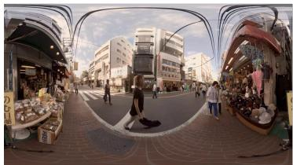  
(a) Equirectangular Projection

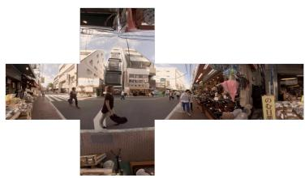  
(b) Cube Map Projection

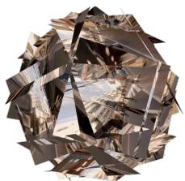  
(c) Tangent Projection  
Fig. 1. Comparison of projection representations used in PSOD. (a) ERP maintains complete spherica topology but sufers from polar stretching distortion. (b) CMP reduces polar deformation through hexahedra decomposition but introduces semantic discontinuities at cube-face boundaries. (c) Tangent Projection, introduced in this work, provides distortion-reduced local perspective views through discrete viewport mapping, complementing ERP and CMP with high-fidelity geometric details.

holistic scene information. However, the spherical nature of panoramic images introduces unique geometric challenges when projected onto 2D representations, resulting in inevitable distortions that hinder accurate feature representation and salient object localization.

Despite substantial progress in PSOD, existing methods [16, 46, 58, 63] remain fundamentally constrained by projection-dependent limitations. Current approaches can be broadly categorized into two groups: ERP-based methods [16, 27, 63] that directly process Equirectangular Projection (ERP) representations, and dual-projection methods [44, 58, 61] that combine ERP with cube map projection (CMP). Although these projection representations provide complementary advantages, neither can fully resolve the geometric inconsistencies introduced during spherical-to-planar mapping. Specifically, ERP preserves global spherical continuity but sufers from severe polar stretching distortion, whereas CMP alleviates polar deformation through local perspective decomposition but introduces semantic discontinuities across cube-face boundaries.

To further analyze these limitations, ERP-only methods have been developed to preserve complete panoramic information within a unified representation. However, the non-uniform sampling distribution caused by ERP projection significantly degrades feature quality in high-latitude regions. For example, the view-aware model proposed in [43] employs perspective transformations with adaptive fusion to alleviate distortion and scale variations, while DATFormer [63] introduces distortion maps, adaptive attention, and relational matrices to encode projection-aware spatial priors. Nevertheless, these approaches still struggle to compensate for the intrinsic geometric discrepancy between equatorial and polar regions.

To overcome the limitations of ERP, dual-projection approaches exploit the complementary properties of ERP and CMP. Although these methods improve distortion handling to some extent, the cube-face discontinuities introduced by CMP remain problematic for maintaining objectlevel structural consistency. For instance, CSMANet [61] adopts a dual-branch architecture with channel-spatial mutual attention to fuse ERP and CMP features, while HPNet [58] develops a hybrid projection feature fusion strategy. However, residual boundary artifacts between cube faces continue to afect coherent object representation in complex panoramic scenes.

To further illustrate the geometric limitations of ERP and CMP, Fig. 1 presents three representative panoramic image projections. These observations indicate that existing ERP and CMP based approaches still lack a unified projection representation capable of simultaneously preserving global spherical continuity, local geometric fidelity, and boundary consistency. Therefore, exploring additional projection representations and geometry-aware fusion strategies is essential for advancing PSOD.

To address these challenges, we propose TDFNet, the first framework that introduces triprojection deformable fusion for PSOD. TDFNet constructs a three-branch encoding architecture based on ERP, CMP, and Tangent Projection, where each projection provides complementary geometric information. Specifically, we introduce a cross-projection deformable attention (CDA) module that exploits spatial correspondences between ERP and CMP to generate geometry-aware sampling locations, enabling deformable attention to adaptively aggregate cross-projection contextual information and alleviate projection-induced distortions. Furthermore, we design a latitude-guided fusion (LGF) module that incorporates spherical latitude priors for geometry-guided adaptive fusion between ERP and CMP features, while leveraging distortion-reduced tangent features as semantic references for cross-projection refinement. Through these designs, TDFNet efectively integrates global structural continuity, local geometric fidelity, and fine-grained boundary information for PSOD.

## Our main contributions are summarized as follows:

• We propose TDFNet, the first framework that introduces tri-projection deformable fusion into PSOD. By integrating ERP, CMP, and Tangent Projection, TDFNet captures complementary global structures and low-distortion local geometric details.

• We develop CDA, a geometry-aware deformable attention module that exploits cross-projection spatial correspondences to alleviate distortions in ERP and CMP representations while improving feature consistency.

• We design LGF, a geometry-guided adaptive fusion module that utilizes spherical latitude priors and tangent semantic references to achieve eficient alignment and fusion among heterogeneous projection features.

• Extensive experiments on four widely used PSOD benchmarks demonstrate the efectiveness of TDFNet, achieving consistent improvements over existing state-of-the-art methods in both quantitative and qualitative evaluations.

## 2 Related Work

## 2.1 Salient object detection in 2D images

Early salient object detection methods [18, 20, 26, 33] relied on hand-crafted features and tradi tional machine learning. With the advent of deep learning, CNNs and vision Transformers have dominated this field by capturing long-range dependencies and global context. For instance, SENet [12] introduced a Transformer-based network with an asymmetric encoder-decoder architecture and dynamic weighted loss for enhanced detection. These RGB-based methods achieve strong performance on planar images by exploiting spatial hierarchies and semantic representations; however, their design assumptions are inherently tied to conventional perspective projection, where geometric consistency and uniform spatial distribution are preserved across the image plane.

To overcome unimodal limitations, multimodal methods [28, 39, 41, 50, 68] integrate complementary cues from depth or thermal infrared sensors. For instance, SOMA-Net [50] utilizes sparse semantic enhancement and orthogonal multimodal attention fusion for RGB-D detection. CON-TRINET [39] employs modality-specific complementary streams for RGB-T detection. Additionally, some studies [49, 51] have developed the biologically inspired HVPNet [49] and TP-Seg [51], demonstrating strong potential for lightweight and unified multimodal modeling. Despite these advancements, such 2D methods face fundamental challenges when applied to PSOD. The 360° field of view introduces wraparound continuity alongside severe ERP polar distortion and CMP boundary discontinuities, which exceed the modeling capacity of conventional 2D architectures. Furthermore, multimodal approaches rely on auxiliary data that are scarce in panoramic scenarios, and they remain inherently incapable of resolving projection-induced deformations or viewport-dependent scale variations. Consequently, a dedicated multi-projection architecture remains essential to simultaneously preserve distortion-free local fidelity and maintain global structural continuity.

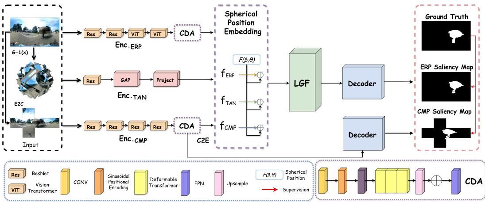  
Fig. 2. Overall architecture of the proposed TDFNet. The network incorporates three core components: (i) a multi-view tangent projection branch for distortion-free local feature extraction, (ii) the cross-projection deformable atention (CDA) deployed in both ERP and cubemap branches to enhance robustness against projection distortions, and (iii) the latitude-guided fusion (LGF) module that progressively integrates tribranch features under spherical geometric guidance for cross-projection alignment.

## 2.2 Panoramic Image Saliency Prediction

Panoramic image saliency prediction estimates continuous fixation density maps to model visual attention in 360° scenes [30, 59, 69, 72]. This task difers from panoramic salient object detection, which requires accurate binary masks and well-defined object boundaries. Early approaches [3, 52, 53, 65, 67] adapted conventional 2D models to spherical imagery to alleviate projection distortions. For example, a multiscale framework [53] extracts overlapping 2D patches from multiple viewpoints and introduces learnable equatorial bias layers to capture panoramic attention patterns. EPSNet [72] employs a proxy task that localizes cubemap faces within equirectangular projections, enabling joint learning of local and global representations. A multiscale graph network [59] further constructs superpixel-based graphs with spherical sampling nodes and extracts hierarchical features through graph convolutions and 1D autoencoders before fusion with a U-Net [38]. Despite these advances, these methods are optimized for continuous fixation prediction rather than object-level segmentation. Without explicit boundary supervision and binary mask prediction, they cannot provide the precise foreground-background separation required for salient object detection. Therefore, dedicated panoramic salient object detection architectures are still needed to jointly address projection distortion and object-level segmentation.

## 2.3 Projection Representations in Panoramic Salient Object Detection

As discussed above, projection representation is critical for panoramic salient object detection [59, 69, 72], as diferent formats involve distinct trade-ofs between global continuity and local geometric distortion. Equirectangular projection (ERP) provides complete spherical coverage but sufers from severe stretching near the poles. To alleviate this issue, DDS [23] partitions ERP images into blocks and applies adaptive convolutional kernels with multiscale contextual supervision. Similarly, MIDP-Net [6] integrates multi-receptive-field features and employs a two-stage decoder combining edge and saliency cues to improve boundary prediction under distortion. In contrast, cubemap projection (CMP) reduces local geometric distortion by decomposing the sphere into six perspective faces, but introduces discontinuities across face boundaries. To exploit their complementary properties, several methods [14, 17, 29, 48, 64] jointly model ERP and CMP features. For example, SCFANet [13] uses Vision Transformers for global ERP semantics and CNNs for local CMP details, followed by hierarchical feature interaction. Despite these advances, existing methods [37, 58, 60, 66] still mainly rely on ERP and CMP, while tangent-plane projections that provide locally undistorted perspective views remain underexplored. Moreover, existing fusion architectures often introduce redundant parameters, limiting their eficiency in resource-constrained scenarios.

## 3 Methods

As shown in Fig. 2, TDFNet adopts a tri-branch architecture to jointly exploit complementary representations of panoramic images. Given an input ERP image, the ERP branch directly extracts globally continuous features, while the cubemap branch first converts the panorama into six perspective faces to capture locally less-distorted representations. In parallel, we introduce a multi-view tangent projection branch, which samples multiple distortion-free local viewports from the spherical surface to provide fine-grained geometric and boundary cues. To further alleviate projection-induced distortions, Cross-projection deformable attention (CDA) is embedded into both the ERP and cubemap branches, where cross-projection geometric correspondences are used to guide adaptive feature sampling and aggregation. The enhanced ERP and cubemap features are then progressively integrated with tangent features through the latitude-guided fusion (LGF) module. LGF first performs geometry-aware fusion between ERP and cubemap representations according to spherical latitude priors, and subsequently employs tangent features to refine the fused representation across projection domains. Finally, the resulting unified features are fed into the decoder to generate the saliency prediction.

## 3.1 Tri-branch Encoder

Given an input panoramic image $I _ { \mathrm { e r p } } \in \mathbb { R } ^ { 3 \times H \times W }$ , our encoder constructs three complementary representations through ERP, cubemap (CMP), and tangent projection branches. The overall encoding process can be formulated as:

$$
\left\{ \begin{array} { l l } { f _ { \mathrm { e r p } } = \mathcal { E } _ { \mathrm { e r p } } ( I _ { \mathrm { e r p } } ) , } \\ { f _ { \mathrm { c m p } } = \mathcal { E } _ { \mathrm { c m p } } ( \mathcal { P } _ { \mathrm { E 2 C } } ( I _ { \mathrm { e r p } } ) ) , } \\ { f _ { \mathrm { t a n } } = \mathcal { E } _ { \mathrm { t a n } } \big ( \mathcal { P } _ { \mathrm { t a n } } ( I _ { \mathrm { e r p } } ) \big ) , } \end{array} \right.\tag{1}
$$

where $\varepsilon _ { \mathrm { e r p } } , \varepsilon _ { \mathrm { c m p } }$ , and $\mathcal { E } _ { \mathrm { t a n } }$ denote the corresponding feature encoders, while $\mathcal { P } _ { \mathrm { E 2 C } }$ and $\mathcal { P } _ { \mathrm { t a n } }$ denote ERP-to-cubemap and tangent projection, respectively. The resulting $F _ { \mathrm { e r p } } , F _ { \mathrm { c m p } } ,$ and $F _ { \mathrm { t a n } }$ provide globally continuous, locally geometry-preserving, and locally distortion-free representations, respectively.

Specifically, the ERP branch directly feeds $I _ { \mathrm { e r p } }$ into a Hybrid-ViT-based encoder [61] built upon ResNet and extracts hierarchical multi-scale features:

$$
f _ { \mathrm { e r p } } = \left\{ f _ { \mathrm { e r p } } ^ { l } \right\} _ { l = 1 } ^ { L } = \mathcal { E } _ { \mathrm { e r p } } ( I _ { \mathrm { e r p } } ) ,\tag{2}
$$

where $f _ { \mathrm { e r p } } ^ { l } \in \mathbb { R } ^ { C _ { l } \times H _ { l } \times W _ { l } }$ denotes the feature at the �-th encoder level. Benefiting from the continuous and regular latitude-longitude sampling grid, the ERP branch preserves the global spatial structure and long-range scene continuity, but inevitably sufers from increasing geometric stretching toward the polar regions.

In parallel, the CMP branch first transforms the ERP panorama into six perspective cube faces through the E2C projection:

$$
\left\{ I _ { \mathrm { c m p } } ^ { k } \right\} _ { k = 1 } ^ { 6 } = \mathcal { P } _ { \mathrm { E 2 C } } ( I _ { \mathrm { e r p } } ) ,\tag{3}
$$

where � indexes the six cube faces. Each face is independently encoded using a ResNet-based backbone [10],

$$
\left\{ f _ { \mathrm { c m p } , k } ^ { l } \right\} _ { l = 1 } ^ { L } = \mathcal { E } _ { \mathrm { c m p } } \left( I _ { \mathrm { c m p } } ^ { k } \right) , \qquad k = 1 , \ldots , 6 .\tag{4}
$$

The resulting cube-face features are subsequently mapped back to the ERP coordinate domain through the C2E transformation to establish spatial correspondence with the ERP representation:

$$
f _ { \mathrm { c m p } } ^ { l } = \mathcal { P } _ { \mathrm { C 2 E } } \left( \left\{ f _ { \mathrm { c m p } , k } ^ { l } \right\} _ { k = 1 } ^ { 6 } \right) ,\tag{5}
$$

yielding the aligned multi-scale representation

$$
f _ { \mathrm { c m p } } = \left\{ f _ { \mathrm { c m p } } ^ { l } \right\} _ { l = 1 } ^ { L } .\tag{6}
$$

Compared with ERP, the local perspective geometry of cubemap faces substantially alleviates polar stretching, although semantic discontinuities may arise around cube-face boundaries.

To further complement these two representations, we introduce Tangent Projection into PSOD as the third feature extraction branch. Unlike its previous use in panoramic video gaze prediction [4], which mainly performs continuous density regression with relatively relaxed boundary constraints, PSOD requires pixel-level accurate object masks and therefore imposes substantially stronger requirements on spatial correspondence and boundary preservation. Tangent Projection maps local spherical regions onto perspective tangent planes, providing geometrically faithful local observations without ERP polar stretching or CMP face partitioning.

Specifically, we distribute tangent points over four latitude rows containing 3, 6, 6, and 3 longitudinal centers, respectively, producing $N _ { t } = 1 8$ local tangent viewports. For the �-th viewport, each normalized tangent-plane position (�, �) is first mapped back onto the unit sphere through inverse gnomonic projection:

$$
\left\{ \begin{array} { l l } { P _ { \mathrm { s p h e r e } } ^ { ( i ) } = \mathcal { G } ^ { - 1 } \big ( ( x , y ) ; \theta _ { i } , \phi _ { i } , \mathrm { F O V } \big ) , } \\ { \qquad \quad } \\ { ( u , v ) = \Psi \left( P _ { \mathrm { s p h e r e } } ^ { ( i ) } \right) = \left( \frac { \theta } { \pi } , \frac { \phi } { \pi / 2 } \right) , } \\ { \qquad \quad } \\ { I _ { \mathrm { t a n } } ^ { ( i ) } = S _ { \mathrm { b i l i n e a r } } \left( I _ { \mathrm { e r p } } , ( u , v ) \right) , } \end{array} \right.\tag{7}
$$

where $( \theta _ { i } , \phi _ { i } )$ denotes the central longitude and latitude of the �-th tangent viewport, $\mathrm { F O V } = 8 0 ^ { \circ }$ denotes its field of view, and $I _ { \tan } ^ { ( i ) } \in \mathbb { R } ^ { 3 \times 2 2 4 \times 2 2 4 }$ is the resulting tangent image. $\mathcal { G } ^ { - 1 }$ denotes inverse gnomonic projection, $\Psi ( \cdot )$ converts spherical coordinates into the normalized ERP sampling domain, and $S _ { \mathrm { b i l i n e a r } }$ denotes bilinear grid sampling.

All tangent views are subsequently processed by a frozen ResNet18 backbone. After global average pooling, each viewport produces a 256-dimensional local representation:

$$
\begin{array} { r } { \boldsymbol { f } _ { \mathrm { t a n } } ^ { ( i ) } = \mathrm { G A P } \left( \mathcal { E } _ { \mathrm { t a n } } \left( \boldsymbol { I } _ { \mathrm { t a n } } ^ { ( i ) } \right) \right) \in \mathbb { R } ^ { 2 5 6 } . } \end{array}\tag{8}
$$

The complete tangent representation is therefore expressed as

$$
f _ { \mathrm { t a n } } = \left[ f _ { \mathrm { t a n } } ^ { ( 1 ) } , f _ { \mathrm { t a n } } ^ { ( 2 ) } , \ldots , f _ { \mathrm { t a n } } ^ { ( N _ { t } ) } \right] \in \mathbb { R } ^ { N _ { t } \times 2 5 6 } , \qquad N _ { t } = 1 8 .\tag{9}
$$

Accordingly, the tri-branch encoder finally produces

$$
\left\{ f _ { \mathrm { e r p } } , f _ { \mathrm { c m p } } , f _ { \mathrm { t a n } } \right\} .\tag{10}
$$

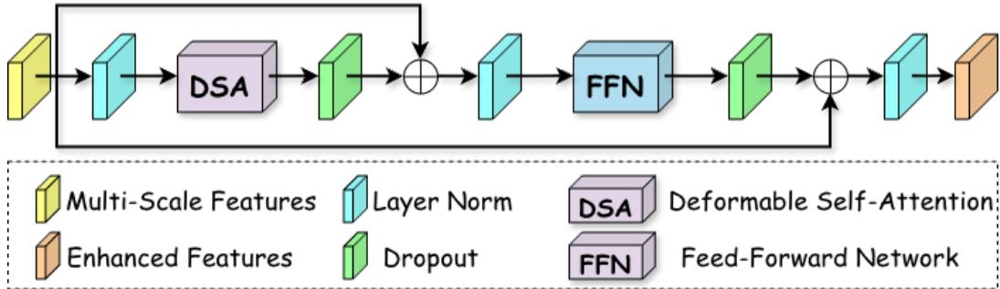  
Fig. 3. The structure of the deformable Transformer block in the CDA module.

where the three representations respectively emphasize global spatial continuity, locally rectified spherical geometry, and distortion-free fine-grained local semantics. The ERP and CMP representations are subsequently enhanced by CDA, while all three representations are progressively aligned and integrated by LGF.

## 3.2 Cross-projection Deformable Atention

Although ERP and CMP provide complementary geometric representations, both still sufer from projection-specific distortions. We therefore propose cross-projection deformable attention (CDA) to enhance the two branches by introducing cross-projection geometric priors into adaptive feature sampling. Given the multi-scale representations from the tri-branch encoder, $f _ { \mathrm { e r p } } = \bar { \{ } f _ { \mathrm { e r p } } ^ { l } \} _ { l = 1 } ^ { L }$ and $f _ { \mathrm { c m p } } = \{ f _ { \mathrm { c m p } } ^ { l } \} _ { l = 1 } ^ { L }$ , CDA independently enhances the ERP and CMP features using a shared hybrid reference-point prior:

$$
\left\{ \begin{array} { l } { \hat { f } _ { \mathrm { e r p } } = \mathrm { C D A } \left( f _ { \mathrm { e r p } } , R \right) , } \\ { \hat { f } _ { \mathrm { c m p } } = \mathrm { C D A } \left( f _ { \mathrm { c m p } } , R \right) , } \end{array} \right.\tag{11}
$$

where � denotes the hybrid geometric reference points constructed from the spatial correspondence between ERP and CMP. The resulting $\hat { f } _ { \mathrm { e r p } }$ and $\hat { f } _ { \mathrm { c m p } }$ preserve their projection-specific characteristics while improving local geometric consistency.

CDA is applied only to the ERP and CMP branches. The tangent projection branch consists of discrete perspective viewports and does not share the unified latitude–longitude coordinate system used to establish ERP–CMP correspondences. Directly imposing the same reference-point prior on tangent features would therefore introduce coordinate misalignment and undermine their distortion-free local geometry. CDA consists of two steps: Hybrid Reference Point Generation (HRPG) and Deformable Transformer Aggregation.

Hybrid Reference Point Generation. For each branch $b \in \{ \mathrm { e r p } , \mathrm { c m p } \}$ , CDA takes the hierarchical features $f _ { b } = \{ f _ { b } ^ { l } \} _ { l = 1 } ^ { L }$ as input. The latter three feature levels are first projected to a common channel dimension $d = 2 5 6$ using $1 \times 1$ convolutions:

$$
\begin{array} { r } { X _ { b } ^ { l } = \mathrm { C o n v } _ { 1 \times 1 } \left( F _ { b } ^ { l } \right) , \qquad X _ { b } ^ { l } \in \mathbb { R } ^ { d \times H _ { l } \times W _ { l } } . } \end{array}\tag{12}
$$

To retain explicit spatial information, a two-dimensional sinusoidal positional encoding $P _ { l }$ added to each projected feature:

$$
\tilde { X } _ { b } ^ { l } = X _ { b } ^ { l } + P _ { l } .\tag{13}
$$

For a spatial location $( i , j )$ with normalized coordinates $x = j / W _ { l }$ and $y = i / H _ { l }$ , the positional encoding is defined as

$$
\left\{ \begin{array} { r } { P _ { l } ( i , j ) _ { 2 k } = \sin \left( \frac { x } { T ^ { 4 k / d } } \right) , \qquad P _ { l } ( i , j ) _ { 2 k + 1 } = \cos \left( \frac { x } { T ^ { 4 k / d } } \right) , } \\ { P _ { l } ( i , j ) _ { 2 k + \frac { d } { 2 } } = \sin \left( \frac { y } { T ^ { 4 k / d } } \right) , \quad P _ { l } ( i , j ) _ { 2 k + 1 + \frac { d } { 2 } } = \cos \left( \frac { y } { T ^ { 4 k / d } } \right) , } \end{array} \right.\tag{14}
$$

where $k = 0 , \ldots , d / 4 - 1$ and $T = 1 0 0 0 0$

Hybrid Reference Point Generation then constructs geometric reference points for deformable sampling. For the �-th feature level, the basic ERP reference point at location $( i , j )$ is defined as

$$
\mathbf { r } _ { l , i j } ^ { \mathrm { E R P } } = \left( \frac { j + 0 . 5 } { W _ { l } r _ { l , w } } , \frac { i + 0 . 5 } { H _ { l } r _ { l , h } } \right) ,\tag{15}
$$

where $r _ { l , w }$ and $r _ { l , h }$ denote the corresponding spatial scaling ratios.

Based on this anchor, additional cross-projection reference points are distributed along eight directions, $\theta _ { m } = \pi m / 4 , m = 0 , \dots , 7$ , and four radial levels, $\rho _ { n } = n / 4 , n = 0 , . . . , 3$

$$
\mathbf { r } _ { l , i j } ^ { ( m , n ) } = \mathrm { c l a m p } \left( \mathbf { r } _ { l , i j } ^ { \mathrm { E R P } } + \rho _ { n } \left[ \cos \theta _ { m } \right] , [ 0 , 1 ] ^ { 2 } \right) .\tag{16}
$$

The ERP anchor and its cross-projection neighborhood are then grouped to form the hybrid reference-point set:

$$
R = \mathrm { C o n c a t } \left( \left\{ \mathbf { r } _ { l , i j } ^ { \mathrm { E R P } } \right\} _ { n = 0 } ^ { 3 } , \left\{ \mathbf { r } _ { l , i j } ^ { ( m , n ) } \right\} _ { m = 0 , n = 0 } ^ { 7 , 3 } \right) ,\tag{17}
$$

which provides a geometry-aware sampling prior for both projection branches. In this way, the initial sampling locations are no longer determined solely by the regular feature grid, but are explicitly constrained by cross-projection geometric neighborhoods.

Deformable Transformer Aggregation. After constructing $R ,$ the projected multi-scale features are flattened and concatenated into a unified sequence:

$$
X _ { b } = \mathrm { C o n c a t } _ { l } \left( \mathrm { F l a t t e n } \left( \tilde { X } _ { b } ^ { l } \right) \right) .\tag{18}
$$

As illustrated in Fig. 3, the sequence is processed by multiple deformable transformer blocks. For a query feature q, deformable self-attention predicts a set of sampling ofsets $\Delta \mathbf { p }$ and normalized attention weights A:

$$
\left\{ \begin{array} { l l } { \Delta \mathbf { p } = \mathbf { W } _ { \mathrm { o f f } } \mathbf { q } , } \\ { \mathbf { A } = \mathrm { S o f t m a x } \left( \mathbf { W } _ { \mathrm { a t t n } } \mathbf { q } \right) , } \end{array} \right.\tag{19}
$$

where $\mathbf { W } _ { \mathrm { o f f } }$ and ${ \bf W } _ { \mathrm { a t t n } }$ are learnable projection matrices.

The reference points are dynamically adjusted by the learned ofsets:

$$
{ \hat { \mathbf { p } } } = \mathbf { R } + \Delta \mathbf { p } .\tag{20}
$$

The corresponding features are then obtained through bilinear sampling and aggregated according to their attention weights:

$$
\mathbf { z } = \sum _ { l = 1 } ^ { L } \sum _ { p = 1 } ^ { P } \mathbf { A } _ { \mathcal { P } } ^ { ( l ) } \mathrm { B i l i n e a r S a m p l e } \left( F _ { b } ^ { l } , \hat { \mathbf { p } } _ { \mathcal { P } } ^ { ( l ) } \right) ,\tag{21}
$$

where � denotes the number of sampling points and z is the geometry-enhanced representation for the query.

Each deformable transformer block follows a pre-normalization residual structure:

$$
\left\{ \begin{array} { l l } { Y _ { b } = X _ { b } + \mathrm { D S A } \left( \mathrm { L N } ( X _ { b } ) , R \right) , } \\ { Z _ { b } = Y _ { b } + \mathrm { F F N } \left( \mathrm { L N } ( Y _ { b } ) \right) . } \end{array} \right.\tag{22}
$$

After multiple blocks, the enhanced sequence is reshaped back to its corresponding spatial resolutions and integrated with high-resolution encoder features through an FPN [24], producing

$$
\left\{ \hat { f } _ { \mathrm { e r p } } , \hat { f } _ { \mathrm { c m p } } \right\} = \mathrm { F P N } \left( Z _ { \mathrm { e r p } } , Z _ { \mathrm { c m p } } \right) .\tag{23}
$$

Through the shared hybrid reference-point prior and adaptive deformable sampling, CDA enables each projection branch to exploit geometrically complementary neighborhoods while retaining its own representation characteristics. The enhanced ERP and CMP features, $\hat { f } _ { \mathrm { e r p } }$ and $\hat { f } _ { \mathrm { c m p } }$ , are subsequently passed to LGF together with the tangent representation $f _ { \mathrm { t a n } }$ for tri-branch crossprojection fusion.

## 3.3 Latitude-Guided Fusion

After CDA, the ERP and CMP branches produce   
distortion-enhanced representations $\hat { f } _ { \mathrm { e r p } }$ and ${ \hat { f } } _ { \mathrm { c m p } } ,$   
while the tangent branch provides a set of locally   
distortion-free representations $f _ { \mathrm { t a n } }$ . Although these   
three projections encode complementary informa  
tion, they exhibit substantially diferent geometric   
properties and spatial organizations. ERP maintains   
a globally continuous latitude–longitude layout and   
preserves long-range scene structure, but its sam  
pling density becomes increasingly non-uniform to  
ward the poles, leading to severe geometric stretch  
ing. CMP mitigates such polar distortion through   
local perspective projection, yet the partition into   
six independent faces introduces artificial discon  
tinuities around cube boundaries. In contrast, Tan  
gent Projection preserves local perspective geome  
try without polar stretching or cube-face truncation,   
but its discrete viewports form a sparse set of local   
observations rather than a continuous spherical fea  
ture map. These heterogeneous representations dif  
fer in both geometric distortion and spatial organiza  
tion, making direct fusion prone to cross-projection   
inconsistency. To address this, LGF first integrates   
ERP and CMP features using either a parameter-free   
Geometry Only strategy based on spherical latitude   
or a learnable Mixed strategy that combines latitude   
priors with image content. The fused representation i priors with image content. The fused representation is then refined using tangent features as locally distortion-free semantic references. distortion-free semantic references.

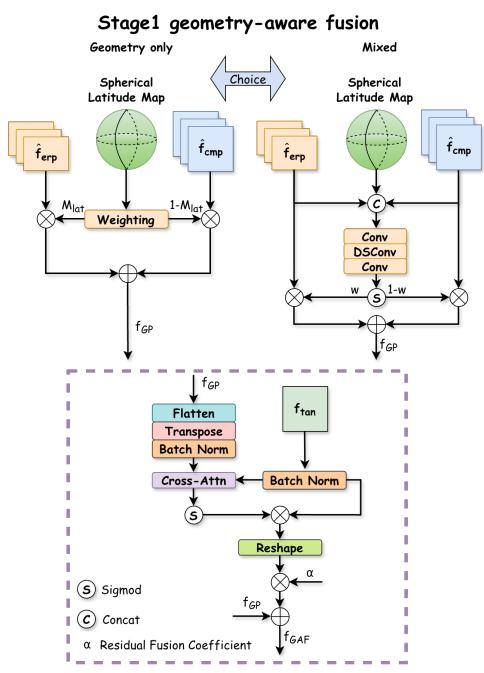  
Stage2 Tangent-Guided Refinement  
Fig. 4. The structure of the LGF module.

To address this issue, as shown in Fig. 4, we propose ratitude-guided fusion (LGF), which progressively integrates the three projection representations through two stages:

$$
\left\{ \begin{array} { l l } { f _ { \mathrm { G P } } = \mathcal { G } \left( \hat { f } _ { \mathrm { e r p } } , \hat { f } _ { \mathrm { c m p } } , M _ { \mathrm { l a t } } \right) , } \\ { f _ { \mathrm { G A F } } = \mathcal { T } \left( f _ { \mathrm { G P } } , f _ { \mathrm { t a n } } \right) , } \end{array} \right.\tag{24}
$$

where $\hat { f } _ { \mathrm { e r p } }$ and $\hat { f } _ { \mathrm { c m p } }$ denote the spatially aligned bottleneck features obtained from $\hat { f } _ { \mathrm { e r p } }$ and $\hat { f } _ { \mathrm { c m p } }$ respectively. $\mathcal { G } ( \cdot )$ denotes geometry-aware ERP–CMP fusion, and $\mathcal { T } ( \cdot )$ denotes Tangent-Guided Refinement. The output $f _ { \mathrm { G A F } }$ is subsequently fed into the decoder for saliency prediction.

We first construct a normalized latitude map according to the spatial resolution of the bottleneck feature:

$$
M _ { \mathrm { l a t } } ( i , j ) = \frac { 2 i } { H - 1 } - 1 , \qquad M _ { \mathrm { l a t } } \in [ - 1 , 1 ] ^ { H \times W } ,\tag{25}
$$

where � and � denote the feature height and width. Thus, $M _ { \mathrm { { l a t } } } = 0$ corresponds to the equatorial region, whereas $| M _ { \mathrm { { l a t } } } | = 1$ corresponds to the polar regions. Rather than directly treating latitude as semantic confidence, we regard it as a projection-level geometric prior describing the relative reliability of ERP and CMP under spherical projection. Based on this prior, LGF provides two alternative fusion strategies.

Geometry Only. The Geometry Only strategy directly converts the latitude prior into a deterministic fusion weight without introducing additional learnable parameters:

$$
W _ { \mathrm { g e o } } = \cos \left( M _ { \mathrm { l a t } } { \frac { \pi } { 2 } } \right) .\tag{26}
$$

The corresponding ERP–CMP fusion is formulated as

$$
f _ { \mathrm { G P } } ^ { \mathrm { g e o } } = W _ { \mathrm { g e o } } \odot \hat { f } _ { \mathrm { e r p } } + \left( 1 - W _ { \mathrm { g e o } } \right) \odot \hat { f } _ { \mathrm { c m p } } ,\tag{27}
$$

where ⊙ denotes element-wise multiplication. Near the equator, $W _ { \mathrm { g e o } }  1$ , so ERP contributes more strongly; toward the poles, $W _ { \mathrm { g e o } }  0$ , increasing the contribution of CMP features.

Mixed. Although latitude provides a stable geometric prior, geometric reliability does not always coincide with semantic reliability. For example, CMP may be geometrically preferable at high latitudes but can still introduce semantic discontinuities when an object crosses cube-face boundaries. Therefore, the Mixed strategy jointly considers spherical geometry and image content.

The enhanced ERP and CMP features are first concatenated with the latitude map:

$$
X _ { \mathrm { m i x } } = \mathrm { C o n c a t } \left( \hat { f } _ { \mathrm { e r p } } , \hat { f } _ { \mathrm { c m p } } , M _ { \mathrm { l a t } } \right) .\tag{28}
$$

A lightweight convolutional subnetwork then predicts a spatially adaptive fusion weight:

$$
W _ { \mathrm { m i x } } = \sigma \left( \mathrm { C o n v } _ { 1 \times 1 } ^ { ( 2 ) } \left( \mathrm { D S C o n v } \left( \mathrm { C o n v } _ { 1 \times 1 } ^ { ( 1 ) } \left( X _ { \mathrm { m i x } } \right) \right) \right) \right) ,\tag{29}
$$

where DSConv denotes depthwise separable convolution [15], and $\sigma ( \cdot )$ denotes the Sigmoid function. The corresponding fused representation is

$$
f _ { \mathrm { G P } } ^ { \mathrm { m i x } } = W _ { \mathrm { m i x } } \odot \hat { f } _ { \mathrm { e r p } } + \left( 1 - W _ { \mathrm { m i x } } \right) \odot \hat { f } _ { \mathrm { c m p } } .\tag{30}
$$

Unlike Geometry Only, the latitude map here serves as an explicit geometric condition rather than a fixed fusion rule, allowing the fusion weights to adapt to local semantic content.

Tangent-Guided Refinement. Both fusion strategies subsequently employ the same Tangent-Guided Refinement module. Let $f _ { \mathrm { t a n } }$ denote the tangent-view representations. For either $s \in$ {geo, mix}, the fused ERP–CMP representation is flattened as:

$$
X _ { \mathrm { G P } } ^ { s } = \mathrm { F l a t t e n } \left( f _ { \mathrm { G P } } ^ { s } \right) \in \mathbb { R } ^ { N _ { s } \times d } , \qquad N _ { s } = H W .\tag{31}
$$

The fused spherical features form the queries, while the tangent-view features provide the keys and values:

$$
\left\{ \begin{array} { l } { \boldsymbol { Q } ^ { s } = W _ { Q } \mathrm { B N } \left( X _ { \mathrm { G P } } ^ { s } \right) , } \\ { \boldsymbol { K } = W _ { K } \mathrm { B N } \left( \mathcal { F } _ { \mathrm { t a n } } \right) , } \\ { \boldsymbol { V } = W _ { V } \mathrm { B N } \left( \mathcal { F } _ { \mathrm { t a n } } \right) . } \end{array} \right.\tag{32}
$$

The cross-projection attention is computed as

$$
\boldsymbol { A } ^ { s } = \mathrm { S o f t m a x } \left( \beta Q ^ { s } \boldsymbol { K } ^ { \top } \right) \in \mathbb { R } ^ { N _ { s } \times N _ { t } } ,\tag{33}
$$

where $\beta$ is empirically set to 10. The tangent-guided refinement feature is then obtained by

$$
f _ { \mathrm { r } } ^ { s } = { \mathrm { R e s h a p e } } \left( A ^ { s } V \right) \in \mathbb { R } ^ { d \times H \times W } .\tag{34}
$$

In this way, each spatial location selectively retrieves complementary local semantics from the 18 distortion-free tangent viewpoints.

Finally, the two strategies employ diferent residual fusion coeficients:

$$
f _ { \mathrm { G A F } } ^ { s } = f _ { \mathrm { G P } } ^ { s } + \alpha _ { s } f _ { \mathrm { r } } ^ { s } , \qquad s \in \{ \mathrm { g e o , m i x } \} ,\tag{35}
$$

where

$$
\alpha _ { s } = \left\{ \begin{array} { l l } { 0 . 1 5 , } & { s = \mathrm { g e o } , } \\ { 0 . 5 \sigma ( \hat { \alpha } ) , } & { s = \mathrm { m i x } , } \end{array} \right.\tag{36}
$$

and $\hat { \alpha }$ is a learnable scalar. Geometry Only therefore maintains a fixed and geometry-dominated refinement strength, whereas Mixed allows the contribution of tangent semantics to adapt during training.

## 3.4 Decoder and Loss Function

The fused bottleneck features from LGF are fed into the ERP decoder to generate the final saliency prediction map $P _ { \mathrm { f i n a l } }$ . Meanwhile, a cube auxiliary decoder is introduced to provide additional supervision in the cubemap domain. The auxiliary prediction $P _ { \mathrm { a u x } }$ is only used during training and is discarded during inference. Both decoders adopt a multi-scale refinement structure to progressively integrate encoder features and recover high-resolution saliency maps.

TDFNet is optimized with the structure loss [22], which combines weighted binary cross-entropy and weighted IoU:

$$
\begin{array} { r } { \mathcal { L } _ { \mathrm { s t r u c t u r e } } ( S , G ) = \mathcal { L } _ { \mathrm { B C E } } ^ { w } ( S , G ) + \mathcal { L } _ { \mathrm { I o U } } ^ { w } ( S , G ) , } \end{array}\tag{37}
$$

where � and � denote the prediction and ground truth, respectively. $\mathcal { L } _ { \mathrm { B C E } } ^ { w }$ and $\mathcal { L } _ { \mathrm { I o U } } ^ { w }$ represent the weighted binary cross-entropy and weighted IoU losses, and $\boldsymbol { w }$ denotes the pixel-wise weight map. This loss jointly optimizes pixel-level accuracy and structural consistency.

During training, both ERP and Cube branches are supervised:

$$
\mathcal { L } _ { \mathrm { t o t a l } } = \mathcal { L } _ { \mathrm { E R P } } + \mathcal { L } _ { \mathrm { C u b e } } ,\tag{38}
$$

where $\begin{array} { r } { \mathcal { L } _ { \mathrm { E R P } } = \mathcal { L } _ { \mathrm { s t r u c t u r e } } ( P _ { \mathrm { f i n a l } } , G _ { \mathrm { E R P } } ) } \end{array}$ and $\mathcal { L } _ { \mathrm { C u b e } } = \mathcal { L } _ { \mathrm { s t r u c t u r e } } ( P _ { \mathrm { a u x } } , G _ { \mathrm { C u b e } } )$

## 4 EXPERIMENTS

## 4.1 Dataset

We evaluate TDFNet on four benchmark datasets for 360° panoramic image salient object detection: 360-SOD[23], 360-SSOD[31], F-360iSOD[62], and ODI-SOD[43]. As the first dataset in this domain, 360-SOD contains 500 high-resolution panoramic images with pixel-level annotations. 360-SSOD extends the scale to 1,105 images, covering 10 semantic categories with more balanced object distribution. F-360iSOD is the first instance-level annotated dataset, providing dense annotations of 1,165 salient objects across 72 categories within 107 images. ODI-SOD represents the largestscale benchmark to date, comprising 6,263 panoramic images with resolutions no lower than 2K. To ensure fair comparison, we strictly follow the original data splits for all four datasets in our experiments.

## 4.2 Implementation Details

We conduct all experiments using a single NVIDIA RTX 3090 GPU under the PyTorch framework. During training, only ERP-format images are used as input, with spatial resolution uniformly resized to $6 4 0 \times 1 2 8 0$ , and no data augmentation strategies are employed. The model is trained end-to-end using the Adam optimizer [19] with a batch size of $^ { 2 , }$ an initial learning rate of $1 \times 1 0 ^ { - 4 }$ and a weight decay of $1 \times 1 0 ^ { - 4 }$ for 50 epochs. The learning rate schedule combines linear warmup with cosine annealing, accompanied by gradient clipping with a threshold of 0.5 to stabilize the optimization process.

## 4.3 Evaluation Metrics

To comprehensively evaluate the quality of saliency maps generated by the proposed model, we adopt four standard evaluation metrics widely recognized in the field of salient object detection: S-measure $( S _ { m } ) [ 7 ]$ , which assesses the structural similarity between the predicted map and the ground truth; mean absolute error (MAE) [35], which measures the pixel-wise prediction deviation; F-measure $( F _ { \beta } )$ [1], which jointly considers the balance between precision and recall; and E-measure $\left( E _ { m } \right)$ [8], which evaluates the accuracy of salient object detection by jointly capturing image-level and pixel-level statistics.

## 4.4 Comparisons with SOTAs

To comprehensively evaluate the performance of the proposed method, we compare TDFNet against 19 state-of-the-art salient object detection methods. Among them, 9 are SOD methods designed for 360◦ panoramic images, including SIHENet [14], MPFR [5], SCFA [13], View [43], LD [16], DDS [23], FA [17], DT [63], and CPNet [42]; the remaining 10 are SOD methods for 2D images, including BIPG [55], PG [47], GFI [70], SCW [57], HVP [25], ACCo [21], BASNet [36], DCNet [71], BBRF [32] and MDSAM [9]. To ensure fairness in comparison, the saliency maps of all competing methods were either directly provided by the authors or generated using code provided by the authors.

Quantitative evaluation: We compare TDFNet with existing state-of-the-art methods on four benchmark datasets, including 360-SOD [23], 360-SSOD [31], ODI-SOD [43], and F-360iSOD [62]. Overall, TDFNet achieves consistently superior performance across diferent 360-degree salient object detection benchmarks, demonstrating its efectiveness in handling projection distortion and complex panoramic structures.

360-SOD Dataset: In Table 1, we present the quantitative comparison results of the proposed TDFNet against other state-of-the-art methods on the 360-SOD dataset. As can be observed, TDFNet achieves superior performance across the majority of metrics. Compared with the SOTA method SCFA [13], our approach achieves superior performance across all six metrics, with S-measure, MAE, mean E-measure, max E-measure, mean F-measure, and max F-measure of 0.883, 0.015, 0.927, 0.932, 0.835, and 0.847, respectively. Specifically, MAE is reduced by 16.7%, while mean F-measure and max F-measure are improved by 3.3% and 2.8%, respectively, demonstrating the overall superiority of TDFNet..

360-SSOD Dataset: In Table 2, we compare the performance of the proposed method with other SOD methods on the 360-SSOD dataset. As shown, our method achieves the best results across most evaluation metrics, including S-measure, MAE, mean F-measure, max F-measure, and mean

Table 1. Quantitative comparison results on 360-SOD dataset. “Ours” adopts the Geometry Only strategy in the LGF module. ↑ and ↓ indicate that the larger scores and the smaller ones are beter, respectively. The best scores are highlighted in bold.
<table><tr><td>Model</td><td> $S _ { m }$  ↑</td><td>MAE↓</td><td>meE ↑</td><td>maxE ↑</td><td>meF↑</td><td>maxF↑</td></tr><tr><td>FA [17]</td><td>.826</td><td>.021</td><td>.885</td><td>.900</td><td>.748</td><td>.770</td></tr><tr><td>DDS [23]</td><td>.799</td><td>.023</td><td>.865</td><td>.904</td><td>.695</td><td>.722</td></tr><tr><td>DT [63]</td><td>.849</td><td>.017</td><td>.907</td><td>.919</td><td>.774</td><td>.793</td></tr><tr><td>GFI [70]</td><td>.831</td><td>.021</td><td>.894</td><td>.900</td><td>.753</td><td>.769</td></tr><tr><td>SCW [57]</td><td>.830</td><td>.021</td><td>.886</td><td>.887</td><td>.754</td><td>.759</td></tr><tr><td>BIPG [55]</td><td>.811</td><td>.024</td><td>.885</td><td>.890</td><td>.727</td><td>.740</td></tr><tr><td>PG [47]</td><td>.750</td><td>.030</td><td>.745</td><td>.786</td><td>.629</td><td>.646</td></tr><tr><td>BAS [36]</td><td>.654</td><td>.110</td><td>.651</td><td>.676</td><td>.436</td><td>.444</td></tr><tr><td>BBRF [32]</td><td>.730</td><td>.067</td><td>.759</td><td>.762</td><td>.602</td><td>.609</td></tr><tr><td>ACCo [21]</td><td>.770</td><td>.025</td><td>.768</td><td>.869</td><td>.676</td><td>.735</td></tr><tr><td>DC [71]</td><td>.682</td><td>.100</td><td>.705</td><td>.737</td><td>.492</td><td>.507</td></tr><tr><td>MDSAM [9]</td><td>.776</td><td>.055</td><td>.794</td><td>.802</td><td>.641</td><td>.661</td></tr><tr><td>LD [16]</td><td>.768</td><td>.029</td><td>.873</td><td>.866</td><td>.641</td><td>.656</td></tr><tr><td>MPFR [5]</td><td>.842</td><td>.019</td><td>.875</td><td>.885</td><td>.755</td><td>.765</td></tr><tr><td>SCFA [13]</td><td>.871</td><td>.018</td><td>.925</td><td>.930</td><td>.808</td><td>.824</td></tr><tr><td>CPNet [42]</td><td>.862</td><td>.018</td><td>.875</td><td></td><td>.800</td><td></td></tr><tr><td>Ours</td><td>.883</td><td>.015</td><td>.927</td><td>.932</td><td>.835</td><td>.847</td></tr></table>

Table 2. Quantitative comparison results on 360-SSOD dataset. “Ours” adopts the Mixed strategy in the LGF module. ↑ and ↓ indicate that the larger scores and the smaller ones are beter, respectively. The best scores are highlighted in bold.
<table><tr><td>Model</td><td> $S _ { m }$  ←</td><td>MAE↓</td><td>meE ↑</td><td>maxE↑</td><td>meF ↑</td><td>maxF↑</td></tr><tr><td>LD [16]</td><td>.756</td><td>.034</td><td>.845</td><td>.863</td><td>.492</td><td>.511</td></tr><tr><td>FA [17]</td><td>.717</td><td>.039</td><td>.727</td><td>.735</td><td>.520</td><td>.532</td></tr><tr><td>HVP [25]</td><td>.773</td><td>.143</td><td>.800</td><td>.854</td><td>.500</td><td>.529</td></tr><tr><td>DT [63]</td><td>.770</td><td>.026</td><td>.832</td><td>.865</td><td>.644</td><td>.657</td></tr><tr><td>GFI [70]</td><td>.767</td><td>.034</td><td>.829</td><td>.848</td><td>.526</td><td>.536</td></tr><tr><td>SCW [57]</td><td>.760</td><td>.029</td><td>.813</td><td>.854</td><td>.511</td><td>.518</td></tr><tr><td>BIPG [55]</td><td>.760</td><td>.030</td><td>.817</td><td>.855</td><td>.517</td><td>.524</td></tr><tr><td>PG [47]</td><td>.712</td><td>.041</td><td>.731</td><td>.790</td><td>.425</td><td>.452</td></tr><tr><td>BAS [36]</td><td>.588</td><td>.143</td><td>.604</td><td>.612</td><td>.266</td><td>.271</td></tr><tr><td>ACCo [21]</td><td>.747</td><td>.031</td><td>.758</td><td>.853</td><td>.465</td><td>.503</td></tr><tr><td>SCFA [13]</td><td>.791</td><td>.039</td><td>.860</td><td>.870</td><td>.560</td><td>.570</td></tr><tr><td>SIHE [14]</td><td>.788</td><td>.028</td><td>.871</td><td>.886</td><td>.567</td><td>.576</td></tr><tr><td>CPNet [42]</td><td>.666</td><td>.052</td><td>.723</td><td></td><td>.474</td><td></td></tr><tr><td>Ours</td><td>.804</td><td>.025</td><td>.877</td><td>.883</td><td>.697</td><td>.708</td></tr></table>

E-measure. For the max E-measure metric, our method ranks second, with a marginal gap from the top-performing result.

ODI-SOD Dataset: In Table 3, we present a quantitative comparison of the proposed TDFNet with other state-of-the-art SOD methods on the ODI-SOD dataset. As shown, our model achieves optimal performance across all evaluation metrics, attaining 0.876, 0.028, 0.833, 0.845, 0.917, and 0.923 for Smeasure, MAE, mean F-measure, max F-measure, mean E-measure, and max E-measure, respectively.

Table 3. Quantitative comparison results on ODI-SOD dataset. “Ours” adopts the Mixed strategy in the LGF module. ↑ and ↓ indicate that the larger scores and the smaller ones are beter, respectively. The best scores are highlighted in bold.
<table><tr><td>Model</td><td> $S _ { m }$  ↑</td><td>MAE↓</td><td>meE ↑</td><td>maxE ↑</td><td> $m e F \uparrow$ </td><td>maxF↑</td></tr><tr><td>View [43]</td><td>.831</td><td>.035</td><td>一</td><td></td><td></td><td>.822</td></tr><tr><td>FA [17]</td><td>.730</td><td>.050</td><td>.771</td><td>.790</td><td>.610</td><td>.632</td></tr><tr><td>DDS [23]</td><td>.791</td><td>.045</td><td>一</td><td>一</td><td></td><td>.761</td></tr><tr><td>HVP [25]</td><td>.732</td><td>.061</td><td>.787</td><td>.795</td><td>.616</td><td>.627</td></tr><tr><td>DC [71]</td><td>.659</td><td>.120</td><td>.685</td><td>.691</td><td>.520</td><td>.530</td></tr><tr><td>MDSAM [9]</td><td>.706</td><td>.084</td><td>.744</td><td>.748</td><td>.597</td><td>.603</td></tr><tr><td>GFI [70]</td><td>.779</td><td>.051</td><td>.801</td><td>.810</td><td>.692</td><td>.700</td></tr><tr><td>SCW [57]</td><td>.814</td><td>.043</td><td>.852</td><td>.859</td><td>.745</td><td>.753</td></tr><tr><td>BIPG [55]</td><td>.815</td><td>.042</td><td>.861</td><td>.867</td><td>.744</td><td>.759</td></tr><tr><td>PG [47]</td><td>.808</td><td>.044</td><td>.851</td><td>.857</td><td>.727</td><td>.743</td></tr><tr><td>BBRF [32]</td><td>.678</td><td>.093</td><td>.717</td><td>.725</td><td>.559</td><td>.561</td></tr><tr><td>ACCo [21]</td><td>.681</td><td>.094</td><td>.725</td><td>.865</td><td>.551</td><td>.754</td></tr><tr><td>SCFA [13]</td><td>.840</td><td>.037</td><td>.880</td><td>.886</td><td>.776</td><td>.793</td></tr><tr><td>SIHE [14]</td><td>.846</td><td>.036</td><td>.888</td><td>.894</td><td>.789</td><td>.808</td></tr><tr><td>Ours</td><td>.876</td><td>.028</td><td>.917</td><td>.923</td><td>.833</td><td>.845</td></tr></table>

Table 4. Quantitative comparison results on F-360iSOD dataset. “Ours” adopts the Geometry Only strategy in LGF. ↑ and ↓ indicate that the larger scores and the smaller ones are beter, respectively. The best scores are highlighted in bold.
<table><tr><td>Model</td><td>↑  $S _ { m }$ </td><td>MAE↓</td><td>meE ↑</td><td>meF ↑</td></tr><tr><td>FA [17]</td><td>.621</td><td>.056</td><td>.700</td><td>.345</td></tr><tr><td>DDS [23]</td><td>.612</td><td>.057</td><td>.700</td><td>.325</td></tr><tr><td>ACCo [21]</td><td>.613</td><td>.060</td><td>.694</td><td>.334</td></tr><tr><td>MPFR [5]</td><td>.617</td><td>.052</td><td>.742</td><td>.370</td></tr><tr><td>DT [63]</td><td>.611</td><td>.058</td><td>.652</td><td>.310</td></tr><tr><td>CPNet [42]</td><td>.651</td><td>.051</td><td>.729</td><td>.382</td></tr><tr><td>Ours</td><td>.745</td><td>.030</td><td>.762</td><td>.545</td></tr></table>

Compared to the second-best method, TDFNet reduces MAE by 20.0% and achieves performance improvements of 3.27% and 5.58% in mean E-measure and mean F-measure, respectively.

F-360iSOD Dataset: In Table 4, we compare the proposed method with other state-of-the-art SOD methods on the F-360iSOD dataset. The results demonstrate that our model achieves optimal performance across all evaluation metrics, significantly outperforming existing methods in terms of S-measure, MAE, E-measure, and F-measure.

Qualitative evaluation: To further evaluate practical detection performance, we present saliency maps predicted by diferent SOTA methods under representative challenging scenarios in Fig. 5. For a convincing comparison, we select diverse scenes from multiple panoramic salient object detection datasets, covering multi object coexistence, complex background interference, low contrast conditions, and tiny objects. Some methods show clear limitations in these scenarios. For example, in rows 3 and 4, several methods produce saliency leakage under complex backgrounds and low contrast conditions, incorrectly classifying background regions as foreground. In row 8, other methods sufer from fragmented segmentation under complex background interference and fail to fully recover the contours of salient objects. In contrast, our model preserves clear boundaries for multiple salient instances, efectively suppresses responses from non target regions, and produces coherent and complete saliency maps even for low contrast and small objects. These qualitative results are consistent with the quantitative metrics and further validate the superiority of our method for panoramic salient object detection.

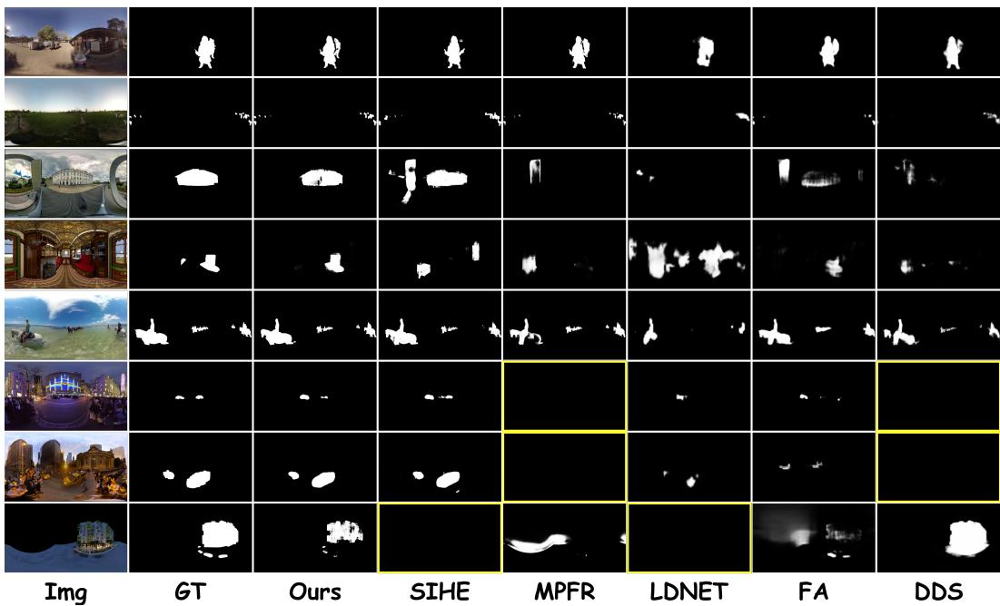  
Fig. 5. Qualitative comparisons of various PSOD methods under several challenging scenarios. The all-black images marked with yellow boxes indicate that the corresponding saliency maps cannot be obtained.

## 4.5 Ablation study

Efectiveness of the three-branch architecture: To validate the efectiveness of the proposed ERP-CMP-Tangent three-branch architecture, we remove the Tangent branch and the CMP branch from the complete model, respectively, and construct three variants for comparative experiments: ERP single-branch, ERP+CMP dual-branch, and ERP-CMP-TAN three-branch, where both dualbranch and three-branch variants employ element-wise addition for feature fusion. As shown in Table 5, the ERP single-branch achieves the lowest performance on both 360-SOD and 360-SSOD datasets, the ERP+CMP dual-branch obtains moderate improvements, while the complete threebranch architecture attains optimal results across all evaluation metrics. This can be attributed to the following factors: the ERP single-branch sufers from polar distortion, where features extracted by Hybrid-ViT exhibit geometric distortion and semantic ambiguity in the polar regions; with the introduction of CMP, cubic mapping alleviates polar distortion, yet the semantic discontinuity at cube face boundaries still constrains the discriminative capability of fused features; the Tangent branch extracts multi-view semantic consistency priors through 18 distortion-free local viewports, whose globally pooled features serve as cross-projection semantic calibration signals, efectively bridging the semantic gap caused by ERP polar distortion and CMP face boundary discontinuities, thereby enabling the three-branch architecture to achieve significant performance gains.

Table 5. Ablation study on diferent branch combinations in the proposed model.
<table><tr><td rowspan="2">6-D</td><td>Settings</td><td> $S _ { m }$  ↑ MAE↓</td><td> $m e E$ </td><td>↑ meF ↑</td></tr><tr><td>ERP</td><td>.824 .026</td><td>.889</td><td>.742</td></tr><tr><td rowspan="2"></td><td>ERP-CMP</td><td>.858 .018</td><td>.918</td><td>.812</td></tr><tr><td> $\mathrm { E R P - C M P - T A N }$ </td><td>.878 .016</td><td>.925</td><td>.822</td></tr></table>

<table><tr><td> $S _ { m }$  ↑</td><td>MAE↓</td><td>meE↑</td><td>meF ↑</td></tr><tr><td>.748</td><td>.039</td><td>.827</td><td>.595</td></tr><tr><td>.793</td><td>.028</td><td>.862</td><td>.677</td></tr><tr><td>.796</td><td>.027</td><td>.872</td><td>.689</td></tr></table>

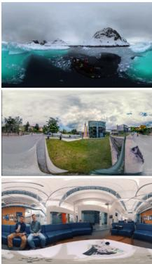  
Img

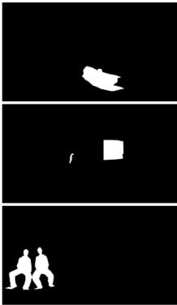  
GT

ERP-CMP-TAN  
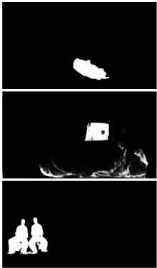  
ERP-CMP

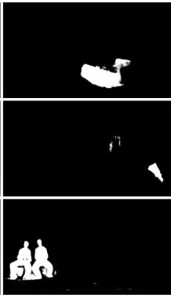  
ERP

Fig. 6. Visualization of three variants, ERP, ERP-CMP and ERP-CMP-TAN.  
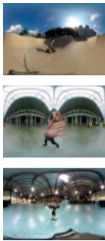  
Image

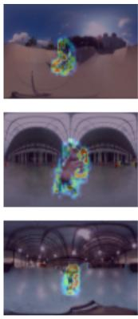  
ferp

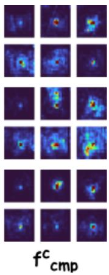

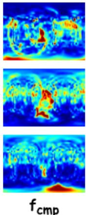

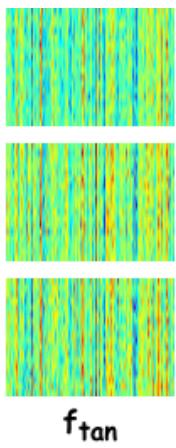

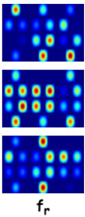  
Fig. 7. Visualization of multi-projection features extracted by the tri-branch encoder.

Furthermore, Fig. 6 visualizes saliency maps predicted under diferent branch configurations. Compared with the complete three branch model, the ERP only branch produces noticeable false detections in complex backgrounds, as shown in row 2, and fails to preserve clear boundaries for objects with fine edges, as shown in row 3. The ERP and CMP branch alleviates polar distortion but still sufers from blurred edges and background response leakage, particularly in rows 1 and 2. This degradation mainly arises from two factors. First, the ERP only branch is afected by polar geometric stretching, which severely distorts features in high latitude regions and causes localization errors. Second, although the ERP and CMP branch introduces local geometric information, discontinuities along cube face boundaries introduce structural noise into the fused features. Without distortion free local semantic references from the Tangent branch for cross projection calibration, the model cannot fully eliminate edge fragmentation or false background responses. Fig. 7 shows the intermediate representations extracted by the tri-branch encoder. ERP, CMP, and tangent-plane features exhibit clearly diferent response patterns due to their distinct projection geometries. ERP features preserve global spatial continuity, whereas CMP and tangent-plane features provide more localized and less distorted responses around salient regions. The reference feature further provides spatial cues for subsequent cross-projection alignment.

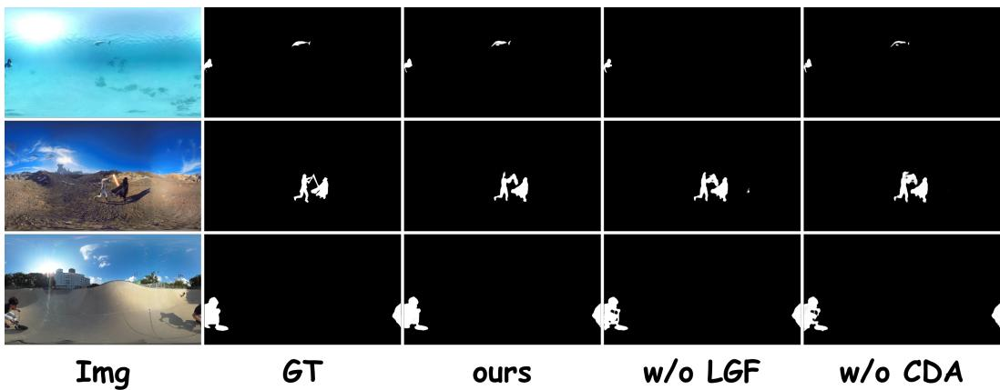  
Fig. 8. Visualization results of ablation studies in diferent modules.

Efectiveness of individual modules in the framework: To validate the efectiveness of the CDA and LGF modules in our network, we conduct ablation experiments by directly removing CDA from the encoding branches and replacing LGF with element-wise summation across the three branches. As shown in Table 6, the model without CDA exhibits significant degradation across all evaluation metrics on both the 360-SOD and 360-SSOD datasets. Similarly, the model without LGF demonstrates inferior performance compared to the complete model, though it outperforms the configuration without CDA. In Fig. 8, we present saliency map predictions under diferent module configurations. Compared to our complete model, the model without CDA produces noticeable edge blurring in scenes containing multiple objects and complex boundaries (e.g., rows 2 and 3), while the model without LGF sufers from missed detections under background interference and exhibits incomplete segmentation artifacts at object boundaries (e.g., rows 1 and 2). In con trast, our complete model, through the synergistic efect of distortion-aware enhancement from CDA and cross-projection adaptive fusion from LGF, accurately localizes salient objects while maintaining clear edge contours. The above experiments demonstrate the efectiveness of each module and the superiority of the proposed method. Fig. 9 illustrates the efect of CDA on ERP and CMP representations. Compared with the original features, the enhanced features show more concentrated activations on salient objects and reduced responses in irrelevant background regions. This indicates that the shared cross-projection geometric prior helps adaptive sampling better align complementary information across projections and improves local geometric consistency.

Efectiveness of LGF fusion strategies: To evaluate the Geometry Only and Mixed strategies in the LGF module, we conduct comparative experiments on the 360-SOD and 360-SSOD datasets. As shown in Table 7, the Geometry Only strategy performs better on the smaller 360-SOD dataset, whereas the Mixed strategy achieves superior results on the larger 360-SSOD dataset. This diference can be attributed to their distinct fusion mechanisms. The Geometry Only strategy constructs parameter-free geometric confidence masks from spherical latitude maps and directly computes fusion weights using a fixed cosine function, enabling stable projection-adaptive balancing between ERP and CMP with limited training data. In contrast, the Mixed strategy introduces a lightweight learnable convolutional network for weight generation and learnable scalar coeficients for dynamically modulating tangent refinement features, providing greater flexibility for modeling complex cross-projection relationships on larger datasets. These results demonstrate the adaptability of LGF to diferent dataset scales. Notably, the Geometry Only strategy introduces no learnable parameters and negligible computational overhead, while the Mixed strategy adds only 0.084M parameters and 0.086G FLOPs, further demonstrating the lightweight design of LGF.

Table 6. Ablation experiment of each module in the model.
<table><tr><td rowspan="7">36-S0D</td><td>Settings</td><td> $S _ { m }$  ↑</td><td>MAE↓</td><td>meE↑</td><td>meF ↑</td><td rowspan="7"> $S _ { m }$  360S-SO0D</td><td colspan="3">↑ MAE↓</td><td>meE↑ meF ↑</td></tr><tr><td>w/o CDA</td><td>.869</td><td>.017</td><td>.923</td><td>.807</td><td></td><td>.795</td><td>.027</td><td>.865</td><td>.677</td></tr><tr><td>w/o LGF</td><td>.878</td><td>.016</td><td>.925</td><td>.822</td><td></td><td>.796</td><td>.027</td><td>.872</td><td>.689</td></tr><tr><td>Ours</td><td>.883</td><td>.015</td><td>.927</td><td>.835</td><td></td><td>.804</td><td>.026</td><td>.877</td><td>.697</td></tr></table>

Table 7. Ablation study on the fusion strategies of the LGF module.
<table><tr><td rowspan="2">Strategy</td><td colspan="4">360-SOD</td><td colspan="4">360-SSOD</td><td rowspan="2">Params (M)</td><td rowspan="2">Complexity FLOPs (G)</td></tr><tr><td> $S _ { m }$  ↑</td><td>MAE↓</td><td>meE ↑</td><td>meF ↑</td><td> $S _ { m }$  ↑</td><td>MAE↓</td><td>meE ↑</td><td>meF↑</td></tr><tr><td>Geometry Only</td><td>0.883</td><td>0.015</td><td>0.927</td><td>0.835</td><td>0.789</td><td>0.029</td><td>0.863</td><td>0.678</td><td>0.000</td><td>~0</td></tr><tr><td>Mixed</td><td>0.860</td><td>0.019</td><td>0.917</td><td>0.802</td><td>0.804</td><td>0.026</td><td>0.877</td><td>0.697</td><td>0.084</td><td>0.086</td></tr></table>

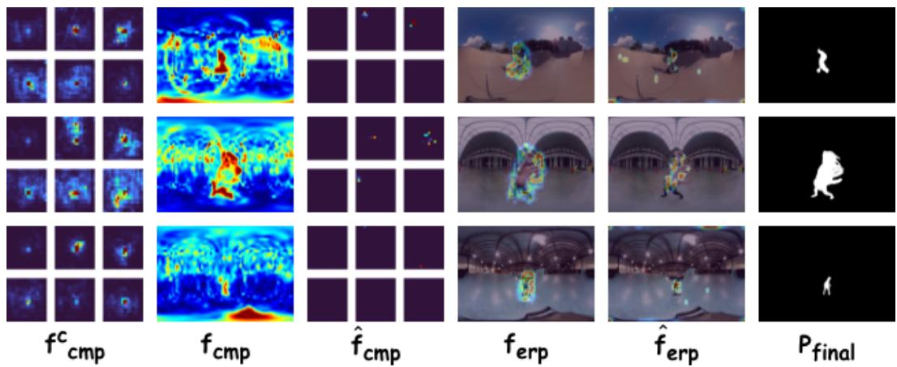  
Fig. 9. Visualization of feature enhancement by the proposed CDA module.

The visualization in Fig. 10 further illustrates the progressive multi-projection fusion process of LGF. The enhanced ERP and CMP features, together with the reference feature, provide complementary structural and semantic cues. After LGF fusion, the resulting feature $f _ { \mathrm { G A F } }$ exhibits cleaner and more complete responses around salient objects while suppressing irrelevant background regions. Consequently, the final predictions show improved object completeness and closely match the ground-truth masks, further validating the efectiveness of the proposed fusion strategy.

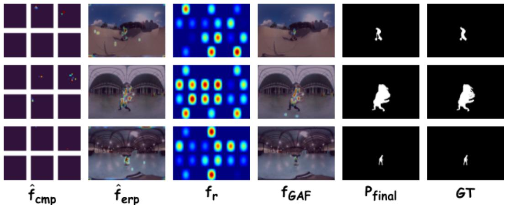  
Fig. 10. Visualization of the LGF fusion process and final predictions.

## 5 CONCLUSION

In this paper, we present TDFNet, the first tri-projection deformable fusion network for panoramic salient object detection (PSOD). TDFNet exploits complementary information from two perspectives: cross projection feature complementarity and cross level feature reconstruction. Since ERP representations sufer from severe polar distortion and CMP projections exhibit boundary discontinuities between cube faces, we propose CDA to establish spatial mappings between ERP and CMP. These mappings are embedded into deformable attention sampling to aggregate contextual information across projections, thereby improving the encoder robustness to projection deformation. To address projection domain heterogeneity in three branch feature fusion, we propose LGF, which fuses spherical features from ERP and CMP and performs adaptive cross projection weighted refinement using distortion free semantic references from Tangent Projection. This design bridges the semantic gap between local perspectives and global representations. Because Tangent Projection provides distortion free local viewport information, we introduce it into panoramic salient object detection for the first time. It works collaboratively with the ERP and CMP branches to provide rich local and global complementary information for subsequent fusion. Extensive experiments on four representative PSOD benchmarks demonstrate that our method outperforms existing state of the art PSOD approaches.

## References

[1] Radhakrishna Achanta, Sheila Hemami, Francisco Estrada, and Sabine Susstrunk. 2009. Frequency-tuned salient region detection. In 2009 IEEE conference on computer vision and pattern recognition. IEEE, 1597–1604.

[2] Chong Bao, Xiyu Zhang, Zehao Yu, Jiale Shi, Guofeng Zhang, Songyou Peng, and Zhaopeng Cui. 2025. Free360: Layered gaussian splatting for unbounded 360-degree view synthesis from extremely sparse and unposed views. In 2025 IEEE/CVF Conference on Computer Vision and Pattern Recognition (CVPR). IEEE, 16377–16387.

[3] Fang-Yi Chao, Lu Zhang, Wassim Hamidouche, and Olivier Déforges. 2020. A Multi-FoV Viewport-Based Visual Saliency Model Using Adaptive Weighting Losses for 360◦ Images. IEEE Transactions on Multimedia 23 (2020), 1811–1826.

[4] Mert Cokelek, Halit Ozsoy, Nevrez Imamoglu, Cagri Ozcinar, Inci Ayhan, Erkut Erdem, and Aykut Erdem. 2025. Spherical Vision Transformers for Audio-Visual Saliency Prediction in 360◦ Videos. IEEE Transactions on Pattern Analysis and Machine Intelligence (2025).

[5] Runmin Cong, Ke Huang, Jianjun Lei, Yao Zhao, Qingming Huang, and Sam Kwong. 2023. Multi-projection fusion and refinement network for salient object detection in 360° omnidirectional image. IEEE Transactions on Neural Networks and Learning Systems 35, 7 (2023), 9495–9507.

[6] Haowei Dai, Liuxin Bao, Kunye Shen, Xiaofei Zhou, and Jiyong Zhang. 2023. 360 Omnidirectional Salient Object Detection with Multi-scale Interaction and Densely-Connected Prediction. In International Conference on Image and Graphics. Springer, 427–438.

[7] Deng-Ping Fan, Ming-Ming Cheng, Yun Liu, Tao Li, and Ali Borji. 2017. Structure-measure: A new way to evaluate foreground maps. In Proceedings of the IEEE international conference on computer vision. 4548–4557.

[8] Deng-Ping Fan, Cheng Gong, Yang Cao, Bo Ren, Ming-Ming Cheng, and Ali Borji. 2018. Enhanced-alignment measure for binary foreground map evaluation. arXiv preprint arXiv:1805.10421 (2018).

[9] Shixuan Gao, Pingping Zhang, Tianyu Yan, and Huchuan Lu. 2024. Multi-scale and detail-enhanced segment anything model for salient object detection. In Proceedings ofthe 32nd ACM international conference on multimedia. 9894–9903.

[10] Shang-Hua Gao, Ming-Ming Cheng, Kai Zhao, Xin-Yu Zhang, Ming-Hsuan Yang, and Philip Torr. 2019. Res2net: A new multi-scale backbone architecture. IEEE transactions on pattern analysis and machine intelligence 43, 2 (2019), 652–662.

[11] Oğuzhan Güngördü and A Murat Tekalp. 2024. Saliency-aware end-to-end learned variable-bitrate 360-degree image compression. In 2024 IEEE International Conference on Image Processing (ICIP). IEEE, 1795–1801.

[12] Chao Hao, Zitong Yu, Xin Liu, Jun Xu, Huanjing Yue, and Jingyu Yang. 2025. A simple yet efective network based on vision transformer for camouflaged object and salient object detection. IEEE Transactions on Image Processing (2025).

[13] Zhentao He, Feng Shao, Gang Chen, Xiongli Chai, and Yo-Sung Ho. 2023. SCFANet: Semantics and context feature aggregation network for 360◦ salient object detection. IEEE Transactions on Multimedia 26 (2023), 2276–2288.

[14] Zhentao He, Feng Shao, Zhengxuan Xie, Xiongli Chai, and Yo-Sung Ho. 2024. Sihenet: Semantic interaction and hierarchical embedding network for 360◦ salient object detection. IEEE Transactions on Instrumentation and Measurement 74 (2024), 1–15.

[15] Andrew G Howard, Menglong Zhu, Bo Chen, Dmitry Kalenichenko, Weijun Wang, Tobias Weyand, Marco Andreetto, and Hartwig Adam. 2017. Mobilenets: Eficient convolutional neural networks for mobile vision applications. arXiv preprint arXiv:1704.04861 (2017).

[16] Mengke Huang, Gongyang Li, Zhi Liu, and Linchao Zhu. 2023. Lightweight distortion-aware network for salient object detection in omnidirectional images. IEEE Transactions on Circuits and Systems for Video Technology 33, 10 (2023), 6191–6197.

[17] Mengke Huang, Zhi Liu, Gongyang Li, Xiaofei Zhou, and Olivier Le Meur. 2020. FANet: Features Adaptation Network for 360◦ Omnidirectional Salient Object Detection. IEEE Signal Processing Letters 27 (2020), 1819–1823.

[18] Huaizu Jiang, Jingdong Wang, Zejian Yuan, Yang Wu, Nanning Zheng, and Shipeng Li. 2013. Salient object detection: A discriminative regional feature integration approach. In Proceedings ofthe IEEE conference on computer vision and pattern recognition. 2083–2090.

[19] Diederik P Kingma and Jimmy Ba. 2014. Adam: A method for stochastic optimization. arXiv preprint arXiv:1412.6980 (2014).

[20] Pierre Lebreton and Alexander Raake. 2018. GBVS360, BMS360, ProSal: Extending existing saliency prediction models from 2D to omnidirectional images. Signal Processing: Image Communication 69 (2018), 69–78.

[21] Gongyang Li, Zhi Liu, Dan Zeng, Weisi Lin, and Haibin Ling. 2022. Adjacent context coordination network for salient object detection in optical remote sensing images. IEEE Transactions on Cybernetics 53, 1 (2022), 526–538.

[22] Jia Li, Jinming Su, Changqun Xia, Mingcan Ma, and Yonghong Tian. 2021. Salient object detection with purificatory mechanism and structural similarity loss. IEEE Transactions on Image Processing 30 (2021), 6855–6868.

[23] Jia Li, Jinming Su, Changqun Xia, and Yonghong Tian. 2019. Distortion-Adaptive Salient Object Detection in 360 Omnidirectional Images. IEEE Journal of Selected Topics in Signal Processing 14, 1 (2019), 38–48.

[24] Tsung-Yi Lin, Piotr Dollár, Ross Girshick, Kaiming He, Bharath Hariharan, and Serge Belongie. 2017. Feature pyramid networks for object detection. In 2017 IEEE conference on computer vision and pattern recognition (CVPR). Ieee, 936–944.

[25] Yun Liu, Yu-Chao Gu, Xin-Yu Zhang, Weiwei Wang, and Ming-Ming Cheng. 2020. Lightweight salient object detection via hierarchical visual perception learning. IEEE transactions on cybernetics 51, 9 (2020), 4439–4449.

[26] Kaifang Long, Lianbo Ma, Jiaqi Liu, Liming Liu, and Guoyang Xie. 2026. Towards an Incremental Unified Multimodal Anomaly Detection: Augmenting Multimodal Denoising From an Information Bottleneck Perspective. In Proceedings ofthe IEEE/CVF Conference on Computer Vision and Pattern Recognition. 14116–14125.

[27] Kaifang Long, Guoyang Xie, Lianbo Ma, Qing Li, Min Huang, Jianhui Lv, and Zhichao Lu. 2025. Enhancing Multimodal Learning via Hierarchical Fusion Architecture Search With Inconsistency Mitigation. IEEE Transactions on Image Processing (2025).

[28] Kaifang Long, Guoyang Xie, Lianbo Ma, Jiaqi Liu, and Zhichao Lu. 2025. Revisiting multimodal fusion for 3D anomaly detection from an architectural perspective. In Proceedings ofthe AAAI Conference on Artificial Intelligence, Vol. 39. 12273–12281.

[29] Guangtao Lyu, Xinyi Cheng, Qi Liu, Chenghao Xu, Jiexi Yan, Muli Yang, Fen Fang, and Cheng Deng. 2026. Towards Interpretable Hallucination Analysis and Mitigation in LVLMs via Contrastive Neuron Steering. arXiv preprint arXiv:2602.00621 (2026).

[30] Guangtao Lyu, Xinyi Cheng, Chenghao Xu, Qi Liu, Muli Yang, Fen Fang, Huilin Chen, Jiexi Yan, Xu Yang, and Cheng Deng. 2025. Revealing Perception and Generation Dynamics in LVLMs: Mitigating Hallucinations via Validated Dominance Correction. arXiv preprint arXiv:2512.18813 (2025).

[31] Guangxiao Ma, Shuai Li, Chenglizhao Chen, Aimin Hao, and Hong Qin. 2020. Stage-wise salient object detection in 360 omnidirectional image via object-level semantical saliency ranking. IEEE Transactions on Visualization and Computer Graphics 26, 12 (2020), 3535–3545.

[32] Mingcan Ma, Changqun Xia, Chenxi Xie, Xiaowu Chen, and Jia Li. 2023. Boosting broader receptive fields for salient object detection. IEEE Transactions on Image Processing 32 (2023), 1026–1038.

[33] Pramit Mazumdar and Federica Battisti. 2019. A content-based approach for saliency estimation in 360 images. In 2019 IEEE International Conference on Image Processing (ICIP). IEEE, 3197–3201.

[34] Jinhong Ni, Chang-Bin Zhang, Qiang Zhang, and Jing Zhang. 2025. What makes for text to 360-degree panorama generation with stable difusion?. In 2025 IEEE/CVF International Conference on Computer Vision (ICCV). IEEE, 1–10.

[35] Federico Perazzi, Philipp Krähenbühl, Yael Pritch, and Alexander Hornung. 2012. Saliency filters: Contrast based filtering for salient region detection. In 2012 IEEE conference on computer vision and pattern recognition. IEEE, 733–740.

[36] Xuebin Qin, Deng-Ping Fan, Chenyang Huang, Cyril Diagne, Zichen Zhang, Adrià Cabeza Sant’Anna, Albert Suarez, Martin Jagersand, and Ling Shao. 2021. Boundary-aware segmentation network for mobile and web applications. arXiv preprint arXiv:2101.04704 (2021).

[37] Chunmei Qing, Huansheng Zhu, Xiaofen Xing, Dongwen Chen, and Jianxiu Jin. 2022. Attentive and context-aware deep network for saliency prediction on omni-directional images. Digital Signal Processing 120 (2022), 103289.

[38] Olaf Ronneberger, Philipp Fischer, and Thomas Brox. 2015. U-net: Convolutional networks for biomedical image segmentation. In International Conference on Medical image computing and computer-assisted intervention. Springer, 234–241.

[39] Hao Tang, Zechao Li, Dong Zhang, Shengfeng He, and Jinhui Tang. 2024. Divide-and-conquer: Confluent triple-flow network for RGB-T salient object detection. IEEE transactions on pattern analysis and machine intelligence 47, 3 (2024), 1958–1974.

[40] Jianyi Wang, Mai Xu, Lai Jiang, and Yuhang Song. 2020. Attention-Based Deep Reinforcement Learning for Virtual Cinematography of 360◦ Videos. IEEE Transactions on Multimedia 23 (2020), 3227–3238.

[41] Weiyi Wei, Yongxin Shi, Yibin Wang, and Sixuan Liu. 2025. RDFCNet: RGB-guided depth feature calibration network for RGB-D Salient Object Detection. Neurocomputing (2025), 131127.

[42] Hongfa Wen, Zunjie Zhu, Xiaofei Zhou, Jiyong Zhang, and Chenggang Yan. 2025. Consistency perception network for 360◦ omnidirectional salient object detection. Neurocomputing 620 (2025), 129243.

[43] Junjie Wu, Changqun Xia, Tianshu Yu, and Jia Li. 2022. View-Aware Salient Object Detection for 360◦ Omnidirectional Image. IEEE Transactions on Multimedia 25 (2022), 6471–6484.

[44] Zhengxian Wu, Chuanrui Zhang, Hangrui Xu, Peng Jiao, and Haoqian Wang. 2025. DAGait: Generalized skeletonguided data alignment for gait recognition. In 2025 IEEE International Conference on Multimedia and Expo (ICME). IEEE, 1–6.

[45] Xi Xiao, Xingjian Li, Yunbei Zhang, Cheng Han, Tianming Liu, Tianyang Wang, Runmin Jiang, Jihun Hamm, Xiao Wang, and Min Xu. 2026. Layer-Specific Prompt Fusion Discovery via Diferentiable Search in Vision Foundation Models. arXiv preprint arXiv:2606.26379 (2026).

[46] Xi Xiao, Chen Liu, Chih-Ting Liao, Yunbei Zhang, Qizhen Lan, Yuxiang Wei, Lin Zhao, Janet Wang, Jianyang Gu, Muchao Ye, et al. 2026. Staying VIGILant: Mitigating Visual Laziness via Counterfactual Visual Alignment in MLLMs. arXiv preprint arXiv:2606.26387 (2026).

[47] Chenxi Xie, Changqun Xia, Mingcan Ma, Zhirui Zhao, Xiaowu Chen, and Jia Li. 2022. Pyramid grafting network for one-stage high resolution saliency detection. In Proceedings of the IEEE/CVF conference on computer vision and pattern recognition. 11717–11726.

[48] Hangrui Xu, Zhengxian Wu, Chuanrui Zhang, Zhuohong Chen, Zhifang Liu, Peng Jiao, and Haoqian Wang. 2026. Psgait: Gait recognition using parsing skeleton. In ICASSP 2026-2026 IEEE International Conference on Acoustics, Speech and Signal Processing (ICASSP). IEEE, 10427–10431.

[49] Jiawei Xu, Qiangqiang Zhou, Zhouping Li, Yanjiao Shi, Yugen Yi, and Jiacong Yu. 2026. HVPNet: A Bio-Inspired Network for General Salient and Camouflaged Object Detection. Neural Networks (2026), 109340.

[50] Jiawei Xu, Qiangqiang Zhou, Jiacong Yu, Chen Liao, and Dandan Zhu. 2025. Semantic-Orthogonal Multi-modal Attention Network for RGB-D Salient Object Detection: J. Xu et al. The Visual Computer 41, 9 (2025), 6917–6929.

[51] Jiawei Xu, Qiangqiang Zhou, Dandan Zhu, Yong Chen, Yugen Yi, and Xiaoqi Zhao. 2026. TP-Seg: Task-Prototype framework for unified medical lesion segmentation. In Proceedings ofthe IEEE/CVF Conference on Computer Vision and Pattern Recognition. 5452–5462.

[52] Mai Xu, Li Yang, Xiaoming Tao, Yiping Duan, and Zulin Wang. 2021. Saliency prediction on omnidirectional image with generative adversarial imitation learning. IEEE Transactions on Image Processing 30 (2021), 2087–2102

[53] Takao Yamanaka, Tatsuya Suzuki, Taiki Nobutsune, and Chenjunlin Wu. 2023. Multi-scale estimation for omnidirectional saliency maps using learnable equator bias. IEICE TRANSACTIONS on Information and Systems 106, 10 (2023), 1723–1731.

[54] Jiebin Yan, Ziwen Tan, Yuming Fang, Junjie Chen, Wenhui Jiang, and Zhou Wang. 2025. Omnidirectional image quality captioning: A large-scale database and a new model. IEEE Transactions on Image Processing 34 (2025), 1326–1339.

[55] Zhaojian Yao and Luping Wang. 2021. Boundary information progressive guidance network for salient object detection. IEEE Transactions on Multimedia 24 (2021), 4236–4249

[56] Jingrui Yu, Ana Cecilia Perez Grassi, and GangolfHirtz. 2023. Applications ofdeep learning for top-view omnidirectional imaging: A survey. In 2023 IEEE/CVF Conference on Computer Vision and Pattern Recognition Workshops (CVPRW). IEEE, 6421–6433.

[57] Siyue Yu, Bingfeng Zhang, Jimin Xiao, and Eng Gee Lim. 2021. Structure-consistent weakly supervised salient object detection with local saliency coherence. In Proceedings ofthe AAAI conference on artificial intelligence, Vol. 35. 3234–3242.

[58] Jie Zhang, Qiudan Zhang, Xuelin Shen, and Xu Wang. 2023. Salient Object Detection on 360° Omnidirectional Image with Bi-Branch Hybrid Projection Network. In 2023 IEEE 25th International Workshop on Multimedia Signal Processing (MMSP). IEEE, 1–5.

[59] Ripei Zhang, Chunyi Chen, and Jun Peng. 2024. Multi-scale graph feature extraction network for panoramic image saliency detection. Visual Computer 40, 2 (2024), 953.

[60] Ripei Zhang, Chunyi Chen, Jiacheng Zhang, Jun Peng, and Ahmed Mustafa Taha Alzbier. 2023. 360-degree visual saliency detection based on fast-mapped convolution and adaptive equator-bias perception. The Visual Computer 39, 3 (2023), 1163–1180.

[61] Yi Zhang, Wassim Hamidouche, and Olivier Deforges. 2022. Channel-spatial mutual attention network for 360 salient object detection. In 2022 26th International Conference on Pattern Recognition (ICPR). IEEE, 3436–3442.

[62] Yi Zhang, Lu Zhang, Wassim Hamidouche, and Olivier Deforges. 2020. A fixation-based 360 benchmark dataset for salient object detection. In 2020 IEEE International Conference on Image Processing (ICIP). IEEE, 3458–3462.

[63] Yinjie Zhao, Lichen Zhao, Qian Yu, Lu Sheng, Jing Zhang, and Dong Xu. 2023. Distortion-aware transformer in 360◦ salient object detection. In Proceedings ofthe 31st ACM International Conference on Multimedia. 499–508.

[64] Yan Zhong, Xingyu Wu, Li Zhang, Chenxi Yang, and Tingting Jiang. 2024. Causal-IQA: Towards the Generalization of Image Quality Assessment Based on Causal Inference.. In ICML.

[65] Yan Zhong, Chenxi Yang, Suyuan Zhao, and Tingting Jiang. 2025. Semi-supervised blind quality assessment with confidence-quantifiable pseudo-label learning for authentic images. In Forty-second International Conference on Machine Learning.

[66] Yan Zhong, Xinping Zhao, Li Zhang, Xinyuan Song, and Tingting Jiang. 2025. Adaptive Prompt Learning for Blind Image Quality Assessment with Multi-modal Mixed-datasets Training. In Proceedings ofthe 33rd ACM International Conference on Multimedia. 7453–7462.

[67] Yan Zhong, Xinping Zhao, Guangzhi Zhao, Bohua Chen, Fei Hao, Ruoyu Zhao, Jiaqi He, Lei Shi, and Li Zhang. 2025. Ctd-inpainting: Towards the coherence of text-driven inpainting with blended difusion. Information Fusion 122 (2025), 103163.

[68] Qiangqiang Zhou, Jiawei Xu, Yong Chen, Dandan Zhu, Yugen Yi, and Xiaoqi Zhao. 2026. DiferSeg: Towards Diverse Multimodal Binary Segmentation via Diferential Perception and Frequency Guidance. IEEE Transactions on Circuits and Systems for Video Technology (2026).

[69] Dandan Zhu, Kaiwei Zhang, Xiongkuo Min, Guangtao Zhai, and Xiaokang Yang. 2025. ScanDTM: A novel dualtemporal modulation scanpath prediction model for omnidirectional images. IEEE Transactions on Circuits and Systems for Video Technology 35, 8 (2025), 7850–7865.

[70] Ge Zhu, Jinbao Li, and Yahong Guo. 2021. Supplement and suppression: Both boundary and nonboundary are helpful for salient object detection. IEEE Transactions on Neural Networks and Learning Systems 34, 9 (2021), 6615–6627.

[71] Jiayi Zhu, Xuebin Qin, and Abdulmotaleb Elsaddik. 2023. Dc-net: Divide-and-conquer for salient object detection. arXiv preprint arXiv:2305.14955 (2023).

[72] Zizhuang Zou, Mao Ye, Shuai Li, Xue Li, and Fréderic Dufaux. 2023. 360◦ image saliency prediction by embedding self-supervised proxy task. IEEE Transactions on Broadcasting 69, 3 (2023), 704–714.