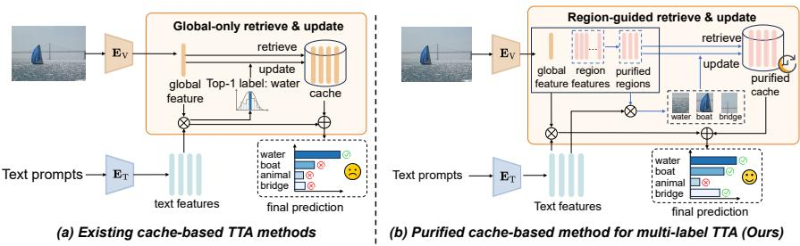
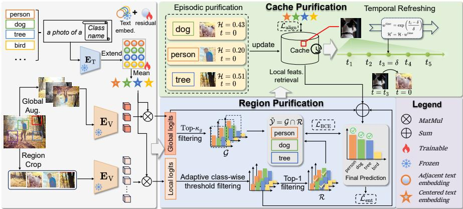
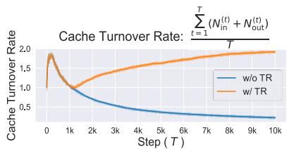
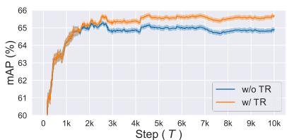
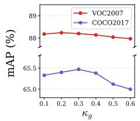
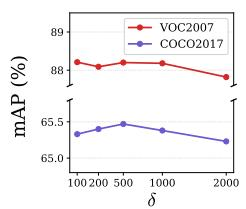
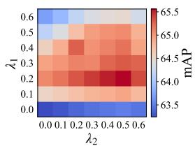
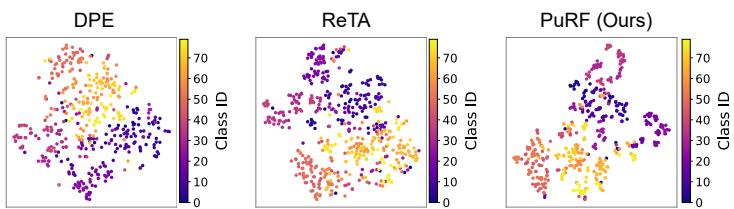
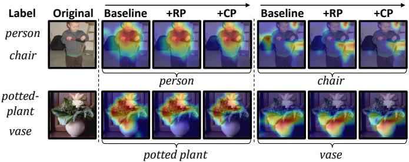

# Towards Purified Multi-Label Test-Time Adaptation of Vision-Language Models

Yiwen Liang1, Hui Chen1⋆, Yizhe Xiong1, Mengyao Lyu2, Yuhan Cao3, Zijia Lin1, Shuaicheng Niu2, Sicheng Zhao1, Jungong Han1, and Guiguang Ding1⋆

1 Tsinghua University, Beijing, China

2 Nanyang Technological University, Singapore

3 University of Washington, Seattle, WA, USA

{evenliang789,jichenhui2012}@gmail.com, dinggg@tsinghua.edu.cn

Abstract. Test-time adaptation (TTA) has been widely explored in single-label recognition, efectively mitigating distribution shifts, especially when combined with vision-language models. However, real-world images often contain multiple objects, while the more practical multilabel test-time adaptation (MLTTA) has received little attention so far. Recent cache-based TTA methods have shown promising eficiency and efectiveness, yet directly extending them to multi-label scenarios sufers from a one-to-many mapping problem: a shared global representation entangling co-occurring objects is stored as class-wise cache prototypes, inducing dominant-label bias and compromised cache calibration. While introducing region-level cues helps isolate class-specific evidence, such regional evidence can also be unreliable under distribution shifts, making its identification and utilization non-trivial. To address these issues, we introduce PuRF, a novel PuRiFication-driven cache-based method for multi-label test-time adaptation of vision-language models. Specifically, PuRF first performs region purification to identify reliable regions, providing comprehensive regional cues for multi-label recognition and enabling fine-grained alignment. Based on these purified regions, PuRF conducts cache purification to enhance cache representation and adaptability, where episodic purification builds a discriminative region-based cache, and temporal refreshing further promotes long-term cache adaptability. Experiments demonstrate that PuRF consistently outperforms state-of-the-art methods, achieving a notable 4.05% mAP improvement on ViT-B/32 across five datasets.

Keywords: Test-Time Adaptation · Vision-Language Models · Multi-Label Learning

## 1 Introduction

Vision-Language Models (VLMs) [20,41] have exhibited remarkable zero-shot capability, successfully tackling a wide range of computer vision tasks [11,26,58,64].

  
Fig. 1: Comparison between existing cache-based methods and ours. (a) Existing cache-based TTA methods [23, 29, 65] sufer from one-to-many representation coupling in multi-label TTA, where shared global features are dominated by salient classes (e.g., “water”), misleading class-wise cache calibration. (b) PuRF performs region purification and cache purification, enabling fine-grained and accurate multi-label adaptation.

However, these models often fail to generalize well when facing testing distributions that deviate from those seen during pre-training, known as distribution shift [34, 59, 60]. Such shifts commonly occur in real scenarios, such as images captured by diferent environments [25, 39] or sensing conditions [1, 16, 61].

Test-time adaptation (TTA) has emerged as a practical solution for handling distribution shifts by adapting models at inference using only unlabeled test data. Recent studies primarily leverage learnable prompts [13,45,66] for dynamic alignment and cache mechanisms [5, 18, 23, 29] for historical knowledge retrieval to enhance the adaptation capability of VLMs. However, most existing methods are developed for single-label recognition, whereas real-world images often contain multiple co-occurring objects, rendering multi-label test-time adaptation substantially more challenging and complex than single-label settings.

As the first work on multi-label TTA, ML-TTA [57] introduces a Bound Entropy Minimization objective with prompt optimization to enhance the confidence of top-k labels while mitigating over-suppression from naive entropy minimization. However, it still relies on intensive text retrieval and episodic prompt resetting, failing to exploit historical information and resulting in suboptimal performance. In contrast, cache-based methods [5, 29, 65, 69] have demonstrated strong performance in single-label TTA by accumulating and reusing historical information for prediction refinement via retrieval-based aggregation, but remain largely unexplored in multi-label settings, leaving their potential underexploited. When directly applied to multi-label images, these methods encounter a one-vsmany dilemma [22, 74], where a single spatially pooled global feature represents all co-occurring objects and simultaneously acts as a shared prototype for cache retrieval and storage. Such shared representations cannot efectively capture label-specific features [22] and tend to be dominated by salient objects [9,19,42], leading to biased predictions and weakened label-specific discriminability. Consequently, the cache fails to perform reliable class-specific calibration, thereby hampering adaptation performance, as illustrated in Fig. 1(a). Although prior works [36,38,74] incorporate region-level cues to improve class-specific representation in multi-label recognition, obtaining reliable region evidence and leveraging it in fully unsupervised test-time settings remains challenging, as naive region proposals are often noisy and include irrelevant context [47, 51, 75].

After revealing the above limitations, we propose PuRF, a PuRiFicationdriven cache-based method for multi-label Test-Time Adaptation, which builds upon the cache mechanism for its efectiveness with historical information while extending this paradigm to more practical multi-label scenario. Unlike ML-TTA [57] that tailors optimization objectives for multi-label settings, our key idea is to exploit purified regional evidence to enable finer-grained multi-label recognition and construct a more discriminative cache to better utilize historical information. To this end, PuRF proposes two main components that collectively enhance multi-label adaptation: 1) Region Purification (RP) via multigranularity consistency identifies purified regions via relative activation-based selection and derives reliable pseudo supervision via global-local consistency, enabling fine-grained alignment and efective semantic optimization for accurate multi-label test-time recognition; (2) Cache Purification (CP) integrates episodic purification to build class-specific prototypes from purified high-confidence regions for more discriminative representations, and temporal refreshing to improve long-term cache adaptability under evolving distributions via time-aware entropy weighting. In Fig. 1(b), our purified regional evidence and purified cache improve class-specific discriminability for better multi-label recognition. Overall, PuRF advances multi-label test-time adaptation by extending the cache-based paradigm to multi-label settings with two novel purification strategies. Experimental results show that PuRF exhibits strong generalization across diverse backbones and prompt settings while maintaining high eficiency.

We summarize our contributions as follows:

– We propose PuRF, a novel purification-driven cache-based method tailored for multi-label test-time adaptation, enabling fine-grained recognition while enhancing label-specific cache calibration.

– PuRF integrates Region Purification to identify informative regions and leverage reliable and comprehensive regional cues for fine-grained alignment, Cache Purification for constructing discriminative class-specific prototypes from purified regions for reliable calibration, and temporal refreshing for improving long-term cache adaptability under streaming data.

– Extensive experiments across five standard multi-label benchmarks and four backbones show that PuRF consistently outperforms the strongest state-ofthe-art method, demonstrating its superior efectiveness.

## 2 Related Work

Vision-Language Test-Time Adaptation. Test-time adaptation (TTA) improves model generalization under distribution shifts, and the rise of visionlanguage models (VLMs) further extends it to more challenging open-world shifts. Existing TTA methods for VLMs can be broadly categorized into promptbased and cache-based methods. Prompt-based methods [32, 45, 63, 67] pioneer this field by optimizing textual prompts via marginal entropy minimization, but sufer from limited eficiency due to per-sample prompt resetting and heavy backpropagation. Cache-based methods [5,18,23,70] ofer a more eficient alternative by constructing a dynamic cache of test features and refining predictions through retrieval-based similarity aggregation. A line of work [23, 69, 70] is training-free and focuses on the design of multiple caches, where diferent caches serve distinct roles to enhance adaptation. Another line [29, 65] introduces lightweight prototype evolution through residual updates for better cross-modal alignment. Despite advancements, most current methods mainly focus on single-label classification. Motivated by this gap, we extend the cache-based paradigm to multilabel adaptation by addressing challenges in purified regional cue selection and utilization, while improving discriminative class-wise cache calibration.

  
Fig. 2: The overall framework of our proposed PuRF. We first adaptively identify purified regions for prediction aggregation and then derive reliable pseudo supervision by enforcing global-local prediction consistency. Guided by the pseudo labels, confident region-text pairs are stored as class-specific region prototypes for episodic cache purification, improving class-wise discriminability. Temporal refreshing further purifies the cache by incorporating newly reliable samples while maintaining long-term adaptivity of cache. H denotes the prediction entropy.

Multi-Label Recognition with VLMs. Multi-label recognition (MLR) serves as a fundamental task in computer vision, where the key challenges lie in modeling label dependencies [8,50] and identifying discriminative properties for each label [21, 35]. Earlier methods rely solely on visual features and capture label correlations via graph structures [44, 62], recurrent networks [53, 55], or attention mechanisms [43]. Recently, the emergence of VLMs has introduced a new paradigm for MLR, enabling strong zero-shot and open-vocabulary capabilities, particularly when combined with parameter-eficient tuning techniques such as prompt learning. Methods like DualCoOp [46], TaI-DPT [15], and PVP [56] introduce learnable prompts to capture label semantics, efectively modeling label co-occurrence with minimal additional parameters. However, they still rely on annotated samples or ofline fine-tuning on batches for stable adaptation. In contrast, our work targets a fully unlabeled setting with online adaptation for each incoming sample, which remains challenging for precise multi-label recognition.

## 3 Methodology

The overall pipeline of PuRF is shown in Fig. 2. PuRF enhances multi-label test-time adaptation through purification at the region and cache levels. Sec. 3.2 proposes Region Purification (RP) via Multi-granularity Consistency, which selects informative regions using adaptive relative activation to provide comprehensive visual cues, and exploits global-local prediction consistency to derive reliable pseudo supervision for semantic residual optimization and fine-grained alignment. Sec. 3.3 presents Cache Purification (CP), comprising Episodic Purification (EP) that constructs region-aware class-specific prototypes from purified regions for stronger discriminability, and Temporal Refreshing (TR) that further enhances long-term cache adaptivity. Finally, Sec. 3.4 establishes a unified objective that enables joint optimization and feature alignment.

## 3.1 Preliminaries

Cache-based TTA for VLMs. Cache-based TTA methods [23, 65, 69] build on the key-value design of [68] that store low-entropy samples and continually update during inference. For image x and a class prompt $\mathcal { T } ^ { c }$ , given the CLIP visual feature ${ \bf { F } } _ { \mathrm { { V } } } = { \bf { E } } _ { \mathrm { { V } } } ( x )$ and textual feature ${ \bf { F } } _ { \mathrm { { T } } } ^ { c } = { \bf { E } } _ { \mathrm { { T } } } ( T ^ { c } )$ extracted by its visual and text encoders $\mathbf { E } _ { \mathrm { V } }$ and $\mathbf { E } _ { \mathrm { T } }$ . The prediction logits and probabilities are obtained from the cosine similarities $\langle \cdot , \cdot \rangle$

$$
s _ { i } ^ { c } = \langle \mathbf { F } _ { \mathrm { V } } , \mathbf { F } _ { \mathrm { T } } ^ { c } \rangle\tag{1}
$$

The cache $\mathcal { M } = \{ \mathcal { M } ^ { c } \} _ { c = 1 } ^ { \mathcal { C } }$ is composed of C class-wise subsets, each with a capacity of L entries containing image features and their entropy values. For testtime samples arriving on the fly, new items enter the corresponding cache slots based on their one-hot pseudo-labels. Once the cache reaches capacity, items with the highest entropy are replaced. At inference, test feature $\mathbf { F } _ { \mathrm { V } }$ retrieves relevant cache items, and the prediction combines CLIP logits with cache logits:

$$
s _ { \mathrm { T T A } } ^ { c } = s _ { i } ^ { c } + s _ { \mathrm { c a c h e } } ^ { c } = s _ { i } ^ { c } + \mathcal { A } ( \langle { \bf F } _ { \mathrm { V } } , { \bf F } _ { \mathrm { c a c h e } } ^ { c } \rangle ) { \bf L } _ { p }\tag{2}
$$

where $\mathbf { F } _ { \mathrm { c a c h e } } ^ { c }$ denotes cached prototypes of class $c ,$ and $\mathbf { L } _ { p }$ is the one-hot pseudolabel from CLIP prediction. $\begin{array} { r } { \mathcal { A } ( x ) = \alpha e ^ { - \beta ( 1 - x ) } } \end{array}$ is a modulating function with amplitude α and sharpness $\beta .$ Akin to [65] and [29], $\mathbf { F } _ { \mathrm { c a c h e } } ^ { c }$ is obtained by averaging features in $\mathcal { M } ^ { c }$ for compact visual prototypes.

Some cache-based methods [5, 29, 65] introduce lightweight residual learning with entropy-driven objectives to further enhance adaptation without heavy computation. Recently, ReTA [29] proposes adjacent textual embeddings that extend each class prototype into multiple semantic experts, with learnable residuals for distribution calibration, enabling more fine-grained contextual semantics. Following this design, we implement textual residual learning as:

$$
\widehat { \mathbf { F } } _ { \mathrm { T } } ^ { c } = \mathbf { F } _ { \mathrm { T } } ^ { c } + \varDelta \mathbf { F } _ { \mathrm { T } } ^ { c }\tag{3}
$$

where $\varDelta \mathbf { F } _ { \mathrm { T } } ^ { c }$ denotes the learnable residual and the original prototype is frozen. We incorporate adjacent text embeddings as in [29] to enhance semantic diversity, averaging them to form the textual prototype. Additionally, we also progressively update the shared semantic embedding via running averaging over streaming test samples, following [29, 65]:

$$
\widehat { \mathbf { F } } _ { \mathrm { T } } ^ { c } = \mathrm { N o r m } \Big ( ( l - 1 ) \widehat { \mathbf { F } } _ { \mathrm { T } } ^ { c } + \widehat { \mathbf { F } } _ { \mathrm { T } } ^ { c ( * ) } \Big )\tag{4}
$$

where Norm $( \mathbf { x } ) = \mathbf { x } / \| \mathbf { x } \|$ denotes $\ell _ { 2 }$ normalization, and l is the number of accumulated updates. However, we do not adopt the entropy reweighting strategy, as it is tailored for single-label consistency.

## 3.2 Region Purification via Multi-granularity Consistency

Conventional TTA methods [23,52,70] typically rely on a global representation. However, in multi-label scenarios, such representations entangle co-occurring objects and are dominated by salient labels occupying large space [22, 42], making them insuficient for modeling fine-grained label-specific features. An intuitive approach is to incorporate region-level cues via region cropping [14,31,54] or localization [2,49], which can isolate object-related evidence and benefit multi-label recognition. However, region candidates often contain redundancy and noise, especially in unsupervised TTA settings. Naively aggregating all regions may dilute discriminative signals and introduce irrelevant context [47, 75], thereby limiting recognition performance. This motivates us to design a region purification mechanism to select informative regions and facilitate fine-grained alignment to optimize semantic representations.

Adaptive Region Purification. To support reliable regional evidence, we leverage both global and local cues. At the global level, we apply holistic augmentations $( e . g .$ , flipping and color jitter) to form a multi-view set V following [23, 69]. Each augmented view $x _ { i }$ yields predictions $p ( x _ { i } )$ , which are used to derive pseudo-label candidates to guide the purification and semantic alignment:

$$
{ \mathcal { G } } = \bigcap _ { x _ { i } \in \mathcal { V } } \left\{ c \mid c \in { \mathrm { T o p } } - \kappa _ { g } \left( p ( x _ { i } ) \right) \right\} .\tag{5}
$$

where $\mathrm { T o p } { \cdot } \kappa _ { g } ( \cdot )$ identifies the indices of the highest-confidence classes, with the threshold $\kappa _ { g }$ defined as a fixed proportion of the total class count C.

At the local level, we extract Q local region features $\mathcal { F } _ { \mathrm { V } } ^ { \mathrm { l o c a l } } = \{ \mathbf { f } _ { \mathrm { V } } ^ { ( 1 ) } , \mathbf { f } _ { \mathrm { V } } ^ { ( 2 ) } , \dots , \mathbf { f } _ { \mathrm { V } } ^ { ( Q ) } \}$ by performing stochastic scaling and cropping on the input image x under predefined scale ranges, following [3,54]. We aim to identify regions that provide more isolated and less entangled label-specific evidence, which helps compensate for missing spatial cues and improve multi-label discrimination [4], particularly for small or spatially localized objects [73]. Intuitively, a purified region should exhibit clear dominance of one class over the others. To quantify this dominance, we compute the relative confidence of each region via normalization across classes:

$$
\hat { s } _ { q } ^ { c } = \mathrm { s o f t m a x } _ { c } \Big ( \Big \langle \mathbf { f } _ { \mathrm { V } } ^ { ( q ) } , \mathbf { F } _ { \mathrm { T } } ^ { c } \Big \rangle \Big ) .\tag{6}
$$

We identify the dominant class for each region as $c ^ { * } = \arg \operatorname* { m a x } _ { c \in \mathcal { C } } \hat { s } _ { q } ^ { c }$ and use the normalized score $\hat { s } _ { q } ^ { c ^ { * } }$ as the purification confidence. Since confidence varies across classes due to class imbalance [28], a uniform global threshold becomes suboptimal for region selection. We therefore maintain an adaptive class-wise threshold $\mu _ { c }$ via running averaging of incoming region confidence scores:

$$
\begin{array} { r } { \mu _ { c }  \mu _ { c } + \frac { 1 } { T } \big ( \bar { s } _ { c } - \mu _ { c } \big ) , \quad \bar { s } _ { c } = \frac { 1 } { Q } \sum _ { q = 1 } ^ { Q } \hat { s } _ { q } ^ { c } . } \end{array}\tag{7}
$$

where $T$ is the number of test steps. Regions whose dominant-class confidence surpasses the class-wise adaptive threshold are retained, forming the purified region feature set that provides reliable class-specific evidence:

$$
\mathcal { F } _ { \mathrm { V } } ^ { \mathrm { p u r } } = \left\{ \mathbf { f } _ { \mathrm { V } } ^ { ( q ) } \ \Big | \ \hat { s } _ { q } ^ { c ^ { * } } \geq \mu _ { c ^ { * } } , \ q \in [ 1 , Q ] \right\} .\tag{8}
$$

Region-level pseudo-labels are obtained by aggregating the top-1 predictions from purified regions, serving as local counterparts to the global pseudo-labels:

$$
\mathcal { R } = \left\{ c ^ { * } \mid c ^ { * } = \arg \operatorname* { m a x } _ { c \in \mathcal { C } } \left. \mathbf { f } _ { \mathrm { V } } ^ { ( q ) } , \mathbf { F } _ { \mathrm { T } } ^ { c } \right. , \mathbf { f } _ { \mathrm { V } } ^ { ( q ) } \in \mathcal { F } _ { \mathrm { V } } ^ { \mathrm { p u r } } \right\} .\tag{9}
$$

Thus, purified regions provide reliable local supervision for semantic optimization, while the final pseudo supervision is obtained via intersection: $\stackrel { \sim } { \mathcal { V } } = \mathcal { G } \cap \mathcal { R }$ In Supplementary Sec. 3, we provide a theoretical analysis that formally demonstrates the efectiveness of the proposed region purification mechanism.

Global-Local Aggregation and Alignment. We employ global-local aggregation to capture complementary information by extending the prediction in Eq. (2) to balance global and local contributions:

$$
\begin{array} { r } { s _ { \mathrm { T T A } } ^ { c } = \underbrace { \frac { 1 } { 2 } \left. \mathbf { F } _ { \mathrm { V } } , \mathbf { F } _ { \mathrm { T } } ^ { c } \right. } _ { \mathrm { G l o b a l } } + \underbrace { \frac { 1 } { 2 } \displaystyle \operatorname* { m a x } _ { \mathbf { f } _ { \mathrm { V } } ^ { ( q ) } \in \mathcal { F } _ { \mathrm { V } } ^ { \mathrm { p u r } } } \left. \mathbf { f } _ { \mathrm { V } } ^ { ( q ) } , \mathbf { F } _ { \mathrm { T } } ^ { c } \right. } _ { \mathrm { L o c a l } } + s _ { \mathrm { c a c h e } } ^ { c } } \end{array}\tag{10}
$$

where $\operatorname* { m a x } ( { \mathord { \cdot } } )$ preserves the strongest class-specific regional activation as [17, 54] to suppress noise. This aggregation integrates purified regional evidence for more fine-grained recognition. With reliable pseudo-labels derived above, we adopt the standard BCE loss for multi-label optimization:

$$
\begin{array} { r } { \mathcal { L } _ { \mathrm { B C E } } = - \sum _ { c = 1 } ^ { \mathcal { C } } \left[ \tilde { y } ^ { c } \log ( \sigma ( s _ { \mathrm { T T A } } ^ { c } ) ) + ( 1 - \tilde { y } ^ { c } ) \log ( 1 - \sigma ( s _ { \mathrm { T T A } } ^ { c } ) ) \right] } \end{array}\tag{11}
$$

where $\sigma ( \cdot )$ denotes the Sigmoid function. Overall, the proposed aggregation and alignment leverage complementary visual cues from purified regions for more precise adaptation, while enabling mutual refinement between region purification and semantic optimization.

## 3.3 Cache Purification with Episodic and Temporal Strategies

Cache-based methods typically rely on global features for retrieval and storage. In multi-label scenarios, these features are often dominated by salient classes and lack label purity, leading to cache contamination and degraded class-wise calibration. To alleviate this issue, we perform cache purification at two complementary timescales: short-term episodic purification and long-term temporal refreshing. The former ensures reliable cache entries for each incoming sample, while the latter enhances adaptation over time by refreshing outdated cache entries.

  
(a)

  
(b)  
Fig. 3: Empirical studies of cache dynamics on COCO2014. (a): The cache turnover rate measures the frequency of cache updates, where $N _ { \mathrm { i n } } ^ { ( t ) }$ and $N _ { \mathrm { o u t } } ^ { ( t ) }$ denote the numbers of samples inserted and removed at adaptation step $t ,$ respectively. (b): The evolution of model performance during adaptation.

Episodic Purification. For each incoming test sample (episode), we obtain its purified regions as defined in Eq. (8). Given the reliable pseudo-label set $\widetilde { \mathcal { V } } _ { : }$ , we select the corresponding regions to form region-label cache entries. Specifically, for each label $\widetilde { y } _ { i } \in \widetilde { \mathcal { V } }$ , we select the most confident region in $\mathcal { F } _ { \mathrm { V } } ^ { \mathrm { p u r } }$ as anchor:

$$
r ^ { \star } = \arg \operatorname* { m i n } _ { \mathbf { f } _ { \mathrm { V } } ^ { ( q ) } \in \mathcal { F } _ { \mathrm { V } } ^ { \mathrm { p u r } } } \mathcal { H } \left( \left. \mathbf { f } _ { \mathrm { V } } ^ { ( q ) } , \mathbf { F } _ { \mathrm { T } } ^ { \widetilde { y } _ { i } } \right. \right)\tag{12}
$$

where region $r ^ { \star }$ denotes the anchor region index for pseudo-label $\widetilde { y } _ { i }$ . Each anchor feature $\mathbf { f } _ { \mathrm { V } } ^ { \left( r ^ { \star } \right) }$ is paired with its entropy to form region-entropy cache candidates. This design yields cleaner cache representations and improves class-wise discriminability, as empirically demonstrated in Fig. 5. The cache score is computed on the same purified region set as Eq. (10):

$$
s _ { \mathrm { c a c h e } } ^ { c } = \mathcal { A } \Bigg ( \operatorname* { m a x } _ { \mathbf { f } _ { \mathrm { V } } ^ { ( q ) } \in \mathcal { F } _ { \mathrm { V } } ^ { \mathrm { p u r } } } \Big \langle \mathbf { f } _ { \mathrm { V } } ^ { ( q ) } , \mathbf { F } _ { \mathrm { c a c h e } } ^ { c } \Big \rangle \Bigg ) \mathbf { L } _ { p } .\tag{13}
$$

Unlike typical entropy-based selection that stores a single cache entry per sample [23,65], our episodic purification exploits purified regions to form regionlabel pairs, enabling multiple class-specific cache entries within each episode. Cache logits are computed through region-level max aggregation over the purified regions, improving prediction robustness and class-wise discriminability.

Temporal Refreshing. As mentioned above, each multi-label image could produce multiple cache pairs, which accelerates cache saturation under limited capacity compared with single-label images that typically provide only one candidate. As adaptation proceeds, the entropy-based admission threshold becomes increasingly stringent, making it dificult for later samples to enter the cache. Consequently, the cache is rarely updated in the later stages and may eventually solidify into a fixed state. We refer to this phenomenon as cache saturation, where overly strict admission suppresses the inclusion of later samples, causing the cache to be dominated by early entries and gradually lose temporal dynamics — its ability to update with samples appearing later in the data stream. As shown in Fig. 3, the blue curve denotes the vanilla cache without any adjustment. Its turnover rate first increases and then declines, while the mAP curve plateaus later, indicating that the cache becomes progressively less adaptive over time. As the cache becomes nearly fixed, it struggles to incorporate later samples, thereby overlooking their contribution. Meanwhile, the progressive prototype update in Eq. (4) relies on accumulating semantic evidence over time. When later samples fail to enter the cache, it cannot benefit from the progressively refined semantic prototypes for reliable entry selection, ultimately limiting long-term adaptation.

To maintain cache purification and enhance long-term adaptability, we design a Temporal Refreshing mechanism with a time-decay strategy to adjust the priority of cached entries, mitigating early-stage bias that causes early samples to dominate the cache and enabling the integration of later ones. To be specific, we additionally record for each cached item its cumulative time in the cache, denoted as $t _ { i } .$ , and each class-wise cache Mc consists of L feature entries represented as:

$$
\mathcal { M } ^ { c } = \left\{ \left( \mathbf { F } _ { \mathrm { c a c h e } } \mathrm { ~ , ~ } \mathcal { H } \left( \left. \mathbf { F } _ { \mathrm { c a c h e } } \mathrm { ~ , ~ } \mathbf { F } _ { \mathrm { T } } ^ { c } \right. \right) , t _ { i } \right) \right\} _ { i = 1 } ^ { L }\tag{14}
$$

Inspired by the exponential decay strategy in learning rate scheduling [27,33], we formulate a similar temporal decay strategy to gradually downweight the priority of long-retained cache entries by penalizing their entropy, mitigating early-sample dominance. Let $\delta$ denote a temporal decay constant that controls the retention time, beyond which the penalization progressively increases. The temporal weight and updated entropy are defined as:

$$
w _ { i } ^ { \mathrm { t i m e } } = \exp \left( \frac { t _ { i } - \delta } { \delta } \right) , \quad \mathcal { H } _ { i } ^ { \prime } = \mathcal { H } _ { i } \cdot w _ { i } ^ { \mathrm { t i m e } } .\tag{15}
$$

The updated entropy $\mathcal { H } _ { i } ^ { \prime }$ replaces the original one in Eq. (14) to penalize longretained entries. When $t _ { i } > \delta$ , the weight $w _ { i } ^ { \mathrm { t i m e } } > 1$ amplifies their entropy, lowering priority and encouraging replacement by newer samples. This refreshing strategy enables the cache to evolve with streaming data, allowing later samples to leverage refined semantic representations to progressively improve class-specific representations, thereby enhancing overall adaptation (see Fig. 3).

## 3.4 Overall Objectives

Our optimization goal is to achieve accurate recognition in multi-label test-time adaptation, which is challenging for conventional TTA methods that mainly rely on vanilla entropy minimization. Based on the reliable pseudo-labels obtained from global-local consistency (Sec. 3.2), we incorporate the binary cross-entropy loss in Eq. (11) to provide additional supervision and stabilize optimization under distribution shifts. Following [29,65], we adopt the standard entropy loss and an alignment loss as auxiliary objectives to optimize textual residuals and calibrate predictions. Given test sample x and its augmented set $\mathcal { V } = \{ x _ { 1 } , \ldots , x _ { N - 1 } \}$ , the marginal entropy loss can be written as:

$$
\mathcal { L } _ { \mathrm { e n t } } \left( x \right) = \frac { 1 } { \vert \mathcal { V } _ { f } \vert } \sum _ { x _ { i } \in \mathcal { V } _ { f } } \mathcal { H } \left( p \left( x _ { i } \right) \right)\tag{16}
$$

where $\begin{array} { r } { \mathcal { H } ( p ) = - \sum _ { c = 1 } ^ { \mathcal { C } } p ^ { c } \log p ^ { c } } \end{array}$ is the prediction entropy, and $\mathcal { V } _ { f } \subset \mathcal { V } \cup \{ x \}$ denotes the subset of the most confident augmented views (typically the top 10%). Following [29, 65], we introduce an alignment loss to enforce cross-modal consistency between cached visual prototypes and text, formulated as:

$$
\begin{array} { r } { \mathcal { L } _ { \mathrm { a l i g n } } = \sum _ { c = 1 } ^ { \mathcal { C } } \left[ - \log \frac { \exp \left( \left( \widehat { \mathbf { F } } _ { \mathrm { T } } ^ { c } \right) ^ { \top } \mathbf { F } _ { \mathrm { c a c h e } } ^ { c } \right) } { \sum _ { j = 1 } ^ { \mathcal { C } } \exp \left( \left( \widehat { \mathbf { F } } _ { \mathrm { T } } ^ { c } \right) ^ { \top } \mathbf { F } _ { \mathrm { c a c h e } } ^ { j } \right) } \right] } \end{array}\tag{17}
$$

where $\widehat { \mathbf { F } } _ { \mathrm { T } } ^ { c }$ and $\mathbf { F } _ { \mathrm { c a c h e } } ^ { c }$ denote the mean prototypes of the textual and visual prototypes, respectively. In summary, our final loss function is defined as:

$$
\begin{array} { r } { \mathcal { L } ^ { * } = \mathcal { L } _ { \mathrm { e n t } } + \lambda _ { 1 } \mathcal { L } _ { \mathrm { B C E } } + \lambda _ { 2 } \mathcal { L } _ { \mathrm { a l i g n } } } \end{array}\tag{18}
$$

where $\lambda _ { 1 }$ and $\lambda _ { 2 }$ are trade-of coeficients balancing contributions of pseudo-label supervision and cross-modal alignment. The integration of multi-label supervision with test-time regularization via residual updates enables PuRF to capture label co-occurrence knowledge and mitigate test-time uncertainty.

## 4 Experiments

## 4.1 Experimental Settings

Datasets. Following [57], we evaluate on five widely used multi-label datasets: VOC [10] (versions 2007 and 2012), MS-COCO [30] (versions 2014 and 2017), and NUS-WIDE [6]. For the VOC datasets, the 2007 and 2012 versions contain 20 object categories with 4.9K and 5.8K test images, respectively. MS-COCO covers 80 object categories, and we use the validation sets of COCO2014/COCO2017 containing 40K/5K testing images. For NUS-WIDE, we evaluate on 81 manually annotated categories covering broader concepts, with 83K test images.

Implementation Details. We verify the generalization of our $\mathrm { P u R F }$ across diverse CLIP architectures (RN50, RN101, ViT-B/16, ViT-B/32) using the default prompt “a photo of $a ^ { \prime \prime }$ and report results in mAP. We further assess its compatibility with diferent prompt initializations, including (1) pretrained prompt weights from MaPLe [24] and CoOp [72], and (2) dataset-specific templates in CuPL [40] manner. For all datasets, we set the number of generated regions to 50 and fix the temporal decay constant as $\delta \ : = \ : 1 0 0 0$ . For global filtering, we select the $\mathrm { t o p } { - } \kappa _ { g }$ labels with $\kappa _ { g } = 0 . 1$ . We use 63 augmented visual views, consistent with common practice in prior baselines [23, 45, 65, 69]. The loss coefficients are set to $\lambda _ { 1 } { = } 0 . 2$ and $\lambda _ { 2 } { = } 0 . 5$ . The cache size L=3 with three adjacent text embeddings follows [29,65]. Please refer to Supplementary for more details.

## 4.2 Comparison with State-of-the-Art Methods

Diferent CLIP Visual Backbones. As shown in Table 1, PuRF consistently shows superior performance across all datasets and backbones. Notably, on ViT-B/32, PuRF improves mAP by 8.56% over its prompt-based counterpart ML-TTA [57] and 4.05% over ReTA [29] on average across datasets, demonstrating strong generalization under multi-label setting. By incorporating purified informative regions with multi-granularity aggregation and alignment, PuRF extracts reliable and complementary cues for more accurate multi-label recognition. In addition, the purified cache enables accurate class-wise calibration and maintains long-term cache adaptability under evolving distributions. Consequently, PuRF achieves a notable 6.09% mAP gain over ReTA on the large-scale COCO2014 dataset and consistent improvements on NUS-WIDE across backbones.

Table 1: Comparison with state-of-the-art methods under diferent visual encoder architectures w.r.t. mAP (%). Bold indicates best results.
<table><tr><td></td><td colspan="5">ResNet-50</td><td colspan="6"></td></tr><tr><td>Methods</td><td colspan="5">VOC07 VOC12 COCO14 COCO17 NUS</td><td colspan="5">VOC07 VOC12 COCO14 COCO17 NUS</td><td>Avg.</td></tr><tr><td>CLIP [41]ICML&#x27;21</td><td>75.91</td><td>74.25</td><td>47.53</td><td>47.32</td><td>41.53</td><td>57.31</td><td>76.72 74.21</td><td>48.83</td><td>48.15</td><td>41.93</td><td>57.97</td></tr><tr><td>TPT [45]NeurIPS&#x27;22</td><td>75.54</td><td>73.92</td><td>48.52</td><td>48.51</td><td>41.97</td><td>57.69</td><td>74.82 73.39</td><td>49.71</td><td>48.89</td><td>43.10</td><td>57.98</td></tr><tr><td>DiffTPT [13]CVPR&#x27;23</td><td>75.89</td><td>74.13</td><td>48.56</td><td>48.67</td><td>41.33</td><td>57.72</td><td>74.98 74.31</td><td>49.45</td><td>49.19</td><td>42.93</td><td>58.17</td></tr><tr><td>RLCF [71]ICLR&#x27;24</td><td>65.75</td><td>64.73</td><td>36.87</td><td>36.73</td><td>29.83</td><td>46.78</td><td>71.21 69.63</td><td>40.53</td><td>39.79</td><td>31.77</td><td>50.59</td></tr><tr><td>ML-TTA [57]ICLR&#x27;25</td><td>78.62</td><td>76.63</td><td>51.58</td><td>51.39</td><td>42.53</td><td>60.15</td><td>78.72 78.13</td><td>52.92</td><td>52.24</td><td>43.62</td><td>61.13</td></tr><tr><td>TDA [23]CVPR&#x27;24</td><td>76.64</td><td>75.12</td><td>48.91</td><td>49.11</td><td>42.34</td><td>58.42</td><td>78.12 77.13</td><td>50.19</td><td>49.78</td><td>43.13</td><td>59.67</td></tr><tr><td>DMN [70]CVPR&#x27;24</td><td>74.87</td><td>74.13</td><td>44.54</td><td>44.18</td><td>41.32</td><td>55.81</td><td>76.82 75.32</td><td>46.28</td><td>45.44</td><td>42.71</td><td>57.31</td></tr><tr><td>DPE [65]NeurIPS&#x27;24</td><td>82.51</td><td>80.64</td><td>54.38</td><td>54.74</td><td>45.96</td><td>63.65</td><td>82.55 81.21</td><td>54.92</td><td>54.53</td><td>46.64</td><td>63.97</td></tr><tr><td>BoostAdapter [69]NeurIPS&#x27;24</td><td>79.53</td><td>78.00</td><td>52.07</td><td>52.92</td><td>44.20</td><td>61.34</td><td>81.13 80.06</td><td>53.90</td><td>54.33</td><td>45.47</td><td>62.98</td></tr><tr><td>ReTA [29]ACM MM&#x27;25</td><td>83.56</td><td>81.98</td><td>55.09</td><td>55.40</td><td>46.90</td><td>64.59</td><td>83.69 82.40</td><td>56.71</td><td>56.39</td><td>47.02</td><td>65.24</td></tr><tr><td>PuRF (Ours)</td><td>86.35</td><td>84.38</td><td>61.47</td><td>61.56</td><td>47.57</td><td>68.27</td><td>86.77 85.43</td><td>62.60</td><td></td><td>61.93</td><td>47.9168.93</td></tr><tr><td></td><td colspan="5">ViT-B/16</td><td colspan="5">ViT-B/32</td></tr><tr><td>Methods</td><td>VOC07 VOC12 COCO14 COCO17 NUS</td><td></td><td></td><td></td><td></td><td>Avg.</td><td>VOC07 VOC12 COCO14 COCO17 NUS</td><td></td><td></td><td></td><td>Avg.</td></tr><tr><td>CLIP [41]ICML&#x27;21</td><td>79.58</td><td>79.25</td><td>54.42</td><td>54.13</td><td>45.65</td><td>62.61|</td><td>77.18 76.85</td><td>50.31</td><td>50.15</td><td>42.90</td><td>59.48</td></tr><tr><td>TPT [45]NeurIPS&#x27;22</td><td>77.54</td><td>77.39</td><td></td><td></td><td></td><td>61.72</td><td>74.21 71.93</td><td>48.12</td><td>48.63</td><td>43.63</td><td>57.30</td></tr><tr><td>DiffTPT [13]CVPR&#x27;23</td><td>77.93</td><td>77.24</td><td>53.32 53.91</td><td>54.20 54.15</td><td>46.15 46.13</td><td>61.87</td><td>74.50 72.98</td><td>48.73</td><td>49.19</td><td>43.42</td><td>57.76</td></tr><tr><td>RLCF [71]ICLR&#x27;24</td><td>79.29</td><td>79.26</td><td>54.21</td><td>54.43</td><td>43.18</td><td>62.07</td><td>77.12 76.83</td><td>50.28</td><td>49.59</td><td>43.29</td><td>59.42</td></tr><tr><td>ML-TTA [57]1CLR&#x27;25</td><td>81.28</td><td>81.13</td><td>57.52</td><td>57.49</td><td>46.55</td><td>64.80</td><td>78.70 77.97</td><td>52.83</td><td></td><td>52.99 44.12</td><td>61.32</td></tr><tr><td>TDA [23]CVPR&#x27;24</td><td>80.12</td><td>79.92</td><td>55.21</td><td>55.46</td><td>46.72</td><td>63.49</td><td>77.62</td><td>77.12 51.23</td><td></td><td>51.49 44.13</td><td>60.32</td></tr><tr><td>DMN [70]CVPR&#x27;24</td><td>79.83</td><td>79.67</td><td>52.52</td><td>52.37</td><td>46.27</td><td>62.13</td><td>77.42 76.60</td><td>49.32</td><td>48.13</td><td>43.41</td><td>58.98</td></tr><tr><td>DPE [65]NeurIPS&#x27;24</td><td>84.10</td><td>83.62</td><td>59.21</td><td>59.28</td><td>48.90</td><td>67.02</td><td>82.38 81.74</td><td>55.79</td><td></td><td>55.32 47.11</td><td>64.47</td></tr><tr><td>BoostAdapter [69]NeurIPS&#x27;24</td><td>83.01</td><td>82.56</td><td>58.07</td><td>58.64</td><td>47.76</td><td>66.01</td><td>80.82 80.03</td><td>54.49</td><td>54.75</td><td>46.14</td><td>63.25</td></tr><tr><td>ReTA [29]ACM MM&#x27;25</td><td>85.09</td><td>84.49</td><td>60.37</td><td>60.30</td><td>49.20</td><td>67.89</td><td>83.99 83.51</td><td>57.02</td><td>56.58</td><td>48.05</td><td>65.83</td></tr><tr><td>PuRF (Ours)</td><td>88.18</td><td>87.12</td><td>66.05</td><td>65.33</td><td>50.7271.48</td><td></td><td>87.32 86.04</td><td>63.42</td><td>63.02</td><td></td><td>49.6169.88</td></tr></table>

Diferent Prompt Initialization. In Table 2, PuRF still achieves the best performance under all prompt initialization methods. With MaPLe [24] initialization, PuRF achieves 73.79% mAP, outperforming ReTA (70.88%) and ML-TTA (70.38%), highlighting its strong adaptability to various prompt initializations. Templates constructed via CuPL [40] ofer richer semantics that benefit cache-based methods, from which PuRF further benefits by exploiting purified regional cues for more reliable class-wise predictions, surpassing ReTA by 2.28% mAP. While prompt-based methods are incompatible with such template design and thus fail to efectively exploit its semantic richness.

Eficiency Analysis. Table 3 compares the eficiency and performance of diferent baselines on a single NVIDIA 3090 GPU. Prompt-based methods (e.g., [45, 57]) exhibit high latency and memory due to repeated prompt reinitialization and optimization. DPE requires expensive visual prototype learning that leads to high memory consumption. In contrast, our PuRF adopts lightweight text residual learning with tolerable region-level computation, achieving a remarkable 8.87% mAP gain with low memory cost.

Table 2: Comparison with state-of-the-art methods under diferent prompt initializations on ViT-B/16 w.r.t. mAP (%). Bold indicates best results.
<table><tr><td>Methods</td><td colspan="5">|VOC2007 VOC2012 COCO2014 COCO2017 NUS-WIDE|</td><td>Avg.</td></tr><tr><td colspan="6">CoOp</td><td></td></tr><tr><td>CoOp [72]IJCV&#x27;22</td><td>79.14</td><td>77.85</td><td>56.12</td><td>56.35</td><td>46.74</td><td>63.24</td></tr><tr><td>TPT [45]NeurIPS’22</td><td>79.72</td><td>77.85</td><td>55.35</td><td>55.23</td><td>47.27</td><td>63.08</td></tr><tr><td>DiffTPT [13]CVPR&#x27;23</td><td>79.86</td><td>77.61</td><td>55.30</td><td>55.47</td><td>47.13</td><td>63.07</td></tr><tr><td>RLCF [71]ICLR’24</td><td>80.15</td><td>78.24</td><td>56.72</td><td>56.18</td><td>47.62</td><td>63.78</td></tr><tr><td>ML-TTA [57]ICLR’25</td><td>83.17</td><td>81.36</td><td>59.68</td><td>59.33</td><td>48.12</td><td>66.33</td></tr><tr><td>TDA [23]CVPR’24</td><td>80.20</td><td>78.58</td><td>56.93</td><td>57.15</td><td>47.82</td><td>64.13</td></tr><tr><td>DPE [65]NeurIPS&#x27;24</td><td>84.97</td><td>83.86</td><td>61.39</td><td>61.04</td><td>48.49</td><td>67.95</td></tr><tr><td>BoostAdapter [69]NeurIPS&#x27;24</td><td>82.32</td><td>81.71</td><td>58.77</td><td>58.02</td><td>47.56</td><td>65.68</td></tr><tr><td>ReTA [29]ACM MM25</td><td>85.23</td><td>84.15</td><td>61.63</td><td>61.31</td><td>48.75</td><td>68.21</td></tr><tr><td>PuRF (Ours)</td><td>88.31</td><td>86.97</td><td>66.69</td><td>66.02</td><td>50.84</td><td>71.77</td></tr><tr><td colspan="7">MaPLe</td></tr><tr><td>MaPLe [24]CVPR’23</td><td>85.34</td><td>84.79</td><td>62.18</td><td>62.35</td><td>48.42</td><td>68.62</td></tr><tr><td>TPT [45]NeurIPS’22</td><td>85.04</td><td>83.92</td><td>63.36</td><td>63.75</td><td>48.90</td><td>69.01</td></tr><tr><td>DiffTPT [13]CVPR&#x27;23</td><td>85.15</td><td>83.78</td><td>62.93</td><td>63.14</td><td>48.81</td><td>68.76</td></tr><tr><td>RLCF [71]ICLR&#x27;24</td><td>85.35</td><td>85.28</td><td>62.84</td><td>62.90</td><td>49.37</td><td>69.15</td></tr><tr><td>ML-TTA [57]ICLR&#x27;25</td><td>86.40</td><td>85.69</td><td>64.75</td><td>64.86</td><td>50.21</td><td>70.38</td></tr><tr><td>TDA [23]CVPR’24</td><td>85.76</td><td>84.15</td><td>63.25</td><td>63.64</td><td>49.55</td><td>69.27</td></tr><tr><td>DPE [65]NeurIPS&#x27;24</td><td>87.55</td><td>86.73</td><td>64.80</td><td>64.38</td><td>52.39</td><td>71.17</td></tr><tr><td>BoostAdapter [69]NeurIPS’24</td><td>85.99</td><td>84.62</td><td>63.74</td><td>63.62</td><td>50.16</td><td>69.63</td></tr><tr><td>ReTA [29]ACM MM25</td><td>87.40</td><td>86.60</td><td>64.59</td><td>64.21</td><td>51.62</td><td>70.88</td></tr><tr><td>PuRF (Ours)</td><td>89.42</td><td>88.56</td><td>69.31</td><td>68.82</td><td>52.84</td><td>73.79</td></tr><tr><td></td><td></td><td></td><td></td><td></td><td></td><td></td></tr><tr><td colspan="7">Template</td></tr><tr><td>CLIP [41]ICML&#x27;21</td><td>82.93</td><td>82.26</td><td>59.94</td><td>59.62</td><td>47.76</td><td>66.50</td></tr><tr><td>TDA [23]CVPR’24</td><td>83.18</td><td>82.09</td><td>60.06</td><td>60.05</td><td>47.95</td><td>66.67</td></tr><tr><td>DPE [65]NeurIPS’24</td><td>85.86</td><td>84.82</td><td>61.99</td><td>61.54</td><td>49.29</td><td>68.70</td></tr><tr><td>BoostAdapter [69]NeurIPS&#x27;24</td><td>84.85</td><td>84.06</td><td>61.82</td><td>61.79</td><td>48.64</td><td>68.23</td></tr><tr><td>ReTA [29]ACM MM&#x27;25</td><td>87.71</td><td>86.54</td><td>63.43</td><td>62.56</td><td>48.41</td><td>69.73</td></tr><tr><td>PuRF (Ours)</td><td>88.73</td><td>87.75</td><td>66.94</td><td>66.16</td><td>50.47</td><td>72.01</td></tr></table>

Table 3: Eficiency and performance over five multi-label datasets on a single NVIDIA 3090 GPU (ViT-B/16).
<table><tr><td>Method</td><td>Inference Speed (FPS) ↑ Memory (GB) ↓ mAP</td><td></td><td>(%) ↑ Gain (%) ↑</td></tr><tr><td>CLIP [41]</td><td>106.25</td><td>0.35</td><td>62.61</td></tr><tr><td>TPT [45]</td><td>3.59</td><td>5.77</td><td>61.72 -0.89</td></tr><tr><td>ML-TTÁ [57]</td><td>3.05</td><td>5.77</td><td>64.80 2.19</td></tr><tr><td>DPE [65]</td><td>4.78</td><td>7.49</td><td>67.02 4.41</td></tr><tr><td>ReTA [29]</td><td>6.35</td><td>0.74</td><td>67.89 5.28</td></tr><tr><td>PuRF (Ours)</td><td>5.74</td><td>1.04</td><td>71.48 8.87</td></tr></table>

Generalization across Diverse VLM Backbones. To validate the generalization of PuRF beyond the original CLIP, we further evaluate it on three advanced VLM backbones, including EVA-02 [12] (ViT-B/16), SigLIP2 [48] (SO400M/14), and MetaCLIP2 [7] (ViT-H/14). As shown in Table 4, PuRF consistently achieves the best performance across all datasets compared with two strong cache-based baselines, yielding average improvements of 3.56% mAP over DPE [65] and 3.69% mAP over ReTA [29]. These results demonstrate the efectiveness and generalization of PuRF across multiple VLM architectures.

Table 4: Comparison with state-of-the-art cache-based methods across diverse VLM backbones. Bold indicates best results.
<table><tr><td></td><td>Method</td><td>VOC2007</td><td>VOC2012</td><td>COCO2017</td><td> $\operatorname { A v g } .$ </td></tr><tr><td rowspan="4">EVA-02 [12] (ViT-B/16)</td><td>No Adapt.</td><td>84.05</td><td>83.88</td><td>57.88</td><td>75.27</td></tr><tr><td>DPE [65]</td><td>87.19</td><td>86.49</td><td>61.22</td><td>78.30</td></tr><tr><td>ReTA [29]</td><td>86.76</td><td>86.23</td><td>61.15</td><td>78.05</td></tr><tr><td>PuRF (Ours)</td><td>89.65</td><td>88.43</td><td>66.59</td><td>81.56</td></tr><tr><td rowspan="4">SigLIP2 [48] (SO400M/14)</td><td>No Adapt.</td><td>88.35</td><td>88.09</td><td>67.32</td><td>81.25</td></tr><tr><td>DPE [65]</td><td>89.40</td><td>88.98</td><td>68.65</td><td>82.34</td></tr><tr><td>ReTA [29]</td><td>88.84</td><td>88.47</td><td>67.92</td><td>81.74</td></tr><tr><td>PuRF (Ours)</td><td>91.13</td><td>90.34</td><td>72.81</td><td>84.76</td></tr><tr><td rowspan="4">MetaCLIP2 [7] (ViT-H/14)</td><td>No Adapt.</td><td>84.16</td><td>83.91</td><td>61.16</td><td>76.41</td></tr><tr><td>DPE [65]</td><td>85.64</td><td>84.57</td><td>62.87</td><td>77.69</td></tr><tr><td>ReTA [29]</td><td>86.30</td><td>85.22</td><td>63.41</td><td>78.31</td></tr><tr><td>PuRF (Ours)</td><td>89.59</td><td>88.74</td><td>70.29</td><td>82.87</td></tr></table>

Table 5: Ablation of key components on ViT-B/16.
<table><tr><td colspan="4">RP (region) EP (cache) TR (cache)||VOC2007 COCO2017</td></tr><tr><td>1</td><td></td><td></td><td>84.83 60.71</td></tr><tr><td>2</td><td>√</td><td>86.67</td><td>63.35</td></tr><tr><td>3</td><td>√</td><td>85.79</td><td>62.59</td></tr><tr><td>4</td><td>√ √</td><td>87.50</td><td>64.56</td></tr><tr><td>5</td><td>√</td><td>√ 87.36</td><td>64.12</td></tr><tr><td>6</td><td>√ √</td><td>86.65</td><td>63.37</td></tr><tr><td>7</td><td>√</td><td>√ 88.18</td><td>65.35</td></tr></table>

Table 7: Ablation on Cache Purification (COCO2017, ViT-B/16).

Table 6: Ablation on Region Purification (COCO2017, ViT-B/16).
<table><tr><td>Region Selection</td><td>mAP (%)</td></tr><tr><td>Global-only</td><td>61.67</td></tr><tr><td>All regions</td><td>63.46</td></tr><tr><td>Abs-score selection</td><td>65.02</td></tr><tr><td>Rel-score selection (ours)</td><td>65.35</td></tr></table>

<table><tr><td>Cache setting</td><td>mAP (%)</td></tr><tr><td>Global-only cache</td><td>62.21</td></tr><tr><td>PuRF (global retrieve)</td><td>64.80</td></tr><tr><td>PuRF (min-ent) + avg</td><td>64.92</td></tr><tr><td>PuRF (min-ent) + max (ours)</td><td>65.35</td></tr></table>

## 4.3 Ablation Studies

Efectiveness of the Key Components. In Table 5, we analyze the efectiveness of each module in PuRF, including Region Purification (RP), Episodic Purification (EP) and Temporal Refreshing (TR) for cache purification. RP exploits informative regions through purification, providing fine-grained cues that enable reliable pseudo supervision via global-local consistency for semantic optimization, boosting performance by 2.24% on average across two datasets. EP improves cache purity by constructing class-specific prototypes from purified regions, enabling more efective cache calibration. It yields a larger gain on COCO2017 (+1.88% mAP), where dense label co-occurrence requires finer classwise discrimination. TR ofers comparable improvements to EP by enhancing long-term cache adaptability and mitigating cache saturation and early-stage bias. Together, these components form a complementary design that balances performance and temporal adaptivity in multi-label test-time adaptation.

  
(a)

  
(b)

  
(c)

Fig. 4: Impact of hyper-parameters. (a) Variation of $\kappa _ { g }$ in Eq. (5). (b) Variation of δ in Eq. (15). (c) Joint impact of $\lambda _ { 1 }$ and $\lambda _ { 2 }$ in Eq. (18) on COCO2017.  
  
Fig. 5: t-SNE visualization of cached visual features on COCO2017. The capacity of all caches is set to 7, and the visualization is taken at the 2000-th adaptation step.

Impact of Region and Cache Purification. Table 6 and Table 7 evaluate the impact of purification at region and cache levels. In Eq. (8), relative activation-based selection measures the competitiveness of a region w.r.t. other class responses, favoring regions with strong class-specific dominance and yielding purer regional evidence. For cache purification, we compare global-only caching, purified-region caching with global retrieval, and entropy-based filtering with diferent aggregations. Caching purified regions improves performance by constructing class-specific prototypes from less ambiguous signals. Max aggregation further achieves the best results by preserving the most confident class-wise regional activation, preventing dominant responses from being diluted.

Hyperparameter Sensitivity Analysis. Here, we analyze four hyperparameters in PuRF: $\kappa _ { g }$ for selecting the $\mathrm { t o p } { - } \kappa _ { g }$ classes from global predictions, δ for the refreshing onset and entropy penalization scale, and $\lambda _ { 1 } , \lambda _ { 2 }$ for balancing the trade-of between diferent loss terms. As shown in Fig. 4(a) and (b), smaller $\kappa _ { g }$ suppresses noisy candidate classes, while δ=500-1000 strikes a balance between early and delayed refreshing, with stable performance across a wide range. In Fig. 4(c), $\lambda _ { 1 } = 0 . 2$ and $\lambda _ { 2 } = 0 . 5$ achieve the optimal performance.

  
Fig. 6: Visualization of class activation maps for region and cache purification.

## 4.4 Visualization

Fig. 5 presents the t-SNE [37] visualization of cached features for DPE [65], ReTA [29], and our PuRF. DPE and ReTA improve cache prototype quality for single-label recognition, but rely on global representations that entangle multiple labels, resulting in noisy and ambiguous cache entries in multi-label settings. In contrast, PuRF produces class-specific representations with well-separated clusters and strong inter-class discriminability. Fig. 6 illustrates the role of RP and CP. RP enhances fine-grained evidence aggregation by exploiting purified regions and enforcing global-local consistency for efective semantic optimization. EP leverages purified region-level representations to refine class-specific focus with more discriminative features, yielding improved cache calibration.

## 5 Conclusion

In this work, we focus on the largely unexplored problem of multi-label test-time adaptation. We propose PuRF, a purification-driven cache-based method that addresses the limitations of global representations in multi-label TTA, where label entanglement introduces bias and ambiguity in predictions and cache. PuRF performs region and cache purification to efectively exploit informative and reliable regions, improving recognition accuracy and discriminative cache calibration. Extensive experiments on five benchmarks verify its consistent superiority over existing methods, achieving state-of-the-art results and establishing it as a strong baseline for future multi-label adaptation research.

## Acknowledgements

This work was supported by National Natural Science Foundation of China (Nos. 62271281, 62525103, 62441235) and Beijing Natural Science Foundation (L247026).

## References

1. Barbu, A., Mayo, D., Alverio, J., Luo, W., Wang, C., Gutfreund, D., Tenenbaum, J., Katz, B.: Objectnet: A large-scale bias-controlled dataset for pushing the limits of object recognition models. In: Wallach, H., Larochelle, H., Beygelzimer, A., d'Alché-Buc, F., Fox, E., Garnett, R. (eds.) Advances in Neural Information Processing Systems. vol. 32. Curran Associates, Inc. (2019)

2. Bilen, H., Vedaldi, A.: Weakly supervised deep detection networks. In: Proceedings of the IEEE Conference on Computer Vision and Pattern Recognition (CVPR) (June 2016)

3. Chen, S., Duan, B., Khan, S., Khan, F.S.: Interpretable zero-shot learning with locally-aligned vision-language model (2025), https://arxiv.org/abs/2506. 23822

4. Chen, T., Wang, Z., Li, G., Lin, L.: Recurrent attentional reinforcement learning for multi-label image recognition. Proceedings of the AAAI Conference on Artificial Intelligence 32(1) (Apr 2018). https://doi.org/10.1609/aaai.v32i1.12281

5. Chen, X., Zhai, H., Zhang, C., Shi, X., Li, R.: Multi-cache enhanced prototype learning for test-time generalization of vision-language models. In: Proceedings of the IEEE/CVF International Conference on Computer Vision (ICCV). pp. 2281– 2291 (October 2025)

6. Chua, T.S., Tang, J., Hong, R., Li, H., Luo, Z., Zheng, Y.: Nus-wide: A realworld web image database from national university of singapore. In: Proceedings of the ACM International Conference on Image and Video Retrieval. CIVR ’09, Association for Computing Machinery, New York, NY, USA (2009). https://doi. org/10.1145/1646396.1646452

7. Chuang, Y.S., Li, Y., Wang, D., Yeh, C.F., Lyu, K., Raghavendra, R., Glass, J., Huang, L., Weston, J., Zettlemoyer, L., et al.: Meta clip 2: A worldwide scaling recipe. Advances in Neural Information Processing Systems 38, 48009–48036 (2026)

8. Ding, Z., Wang, A., Chen, H., Zhang, Q., Liu, P., Bao, Y., Yan, W., Han, J.: Exploring structured semantic prior for multi label recognition with incomplete labels. In: Proceedings of the IEEE/CVF Conference on Computer Vision and Pattern Recognition (CVPR). pp. 3398–3407 (June 2023)

9. Duan, S., Yang, X., Wang, N.: Multi-label prototype visual spatial search for weakly supervised semantic segmentation. In: Proceedings of the IEEE/CVF Conference on Computer Vision and Pattern Recognition (CVPR). pp. 30241–30250 (June 2025)

10. Everingham, M., Van Gool, L., Williams, C.K., Winn, J., Zisserman, A.: The pascal visual object classes (voc) challenge. International Journal of Computer Vision 88, 303–338 (2010)

11. Fan, X., Chen, X., Yang, L., Yap, C.H., Qureshi, R., Dou, Q., Yap, M.H., Shah, M.: Test-time retrieval-augmented adaptation for vision-language models. In: Proceedings of the IEEE/CVF International Conference on Computer Vision (ICCV). pp. 8810–8819 (October 2025)

12. Fang, Y., Sun, Q., Wang, X., Huang, T., Wang, X., Cao, Y.: Eva-02: A visual representation for neon genesis. Image and Vision Computing 149, 105171 (2024)

13. Feng, C.M., Yu, K., Liu, Y., Khan, S., Zuo, W.: Diverse data augmentation with difusions for efective test-time prompt tuning. In: Proceedings of the IEEE/CVF International Conference on Computer Vision (ICCV). pp. 2704–2714 (October 2023)

14. Gao, B.B., Zhou, H.Y.: Learning to discover multi-class attentional regions for multi-label image recognition. IEEE Transactions on Image Processing 30, 5920– 5932 (2021). https://doi.org/10.1109/TIP.2021.3088605

15. Guo, Z., Dong, B., Ji, Z., Bai, J., Guo, Y., Zuo, W.: Texts as images in prompt tuning for multi-label image recognition. In: Proceedings of the IEEE/CVF Conference on Computer Vision and Pattern Recognition (CVPR). pp. 2808–2817 (June 2023)

16. Hendrycks, D., Dietterich, T.: Benchmarking neural network robustness to common corruptions and perturbations. arXiv preprint arXiv:1903.12261 (2019)

17. Hu, P., Sun, X., Sclarof, S., Saenko, K.: Dualcoop++: Fast and efective adaptation to multi-label recognition with limited annotations. IEEE Transactions on Pattern Analysis and Machine Intelligence 46(5), 3450–3462 (2024). https://doi.org/10. 1109/TPAMI.2023.3346405

18. Huang, F., Jiang, J., Jiang, Q., Li, H., Khan, F.N., Wang, Z.: Cosmic: Cliqueoriented semantic multi-space integration for robust clip test-time adaptation. In: Proceedings of the IEEE/CVF Conference on Computer Vision and Pattern Recognition (CVPR). pp. 9772–9781 (June 2025)

19. Huang, S., Yan, J., Liu, B., Liu, B., Hong, R.: Dual-view alignment learning with hierarchical-prompt for class-imbalance multi-label image classification. IEEE Trans. Image Process. 34, 5989–6001 (2025). https://doi.org/10.1109/TIP. 2025.3609185

20. Jia, C., Yang, Y., Xia, Y., Chen, Y.T., Parekh, Z., Pham, H., Le, Q., Sung, Y.H., Li, Z., Duerig, T.: Scaling up visual and vision-language representation learning with noisy text supervision. In: Meila, M., Zhang, T. (eds.) Proceedings of the 38th International Conference on Machine Learning. Proceedings of Machine Learning Research, vol. 139, pp. 4904–4916. PMLR (18–24 Jul 2021)

21. Jia, J., Gao, N., He, F., Chen, X., Huang, K.: Learning disentangled attribute representations for robust pedestrian attribute recognition. Proceedings of the AAAI Conference on Artificial Intelligence 36(1), 1069–1077 (Jun 2022)

22. Jia, J., He, F., Gao, N., Chen, X., Huang, K.: Learning disentangled label representations for multi-label classification. arXiv preprint arXiv:2212.01461 (2022)

23. Karmanov, A., Guan, D., Lu, S., El Saddik, A., Xing, E.: Eficient test-time adaptation of vision-language models. In: Proceedings of the IEEE/CVF Conference on Computer Vision and Pattern Recognition (CVPR). pp. 14162–14171 (June 2024)

24. Khattak, M.U., Rasheed, H., Maaz, M., Khan, S., Khan, F.S.: Maple: Multi-modal prompt learning. In: Proceedings of the IEEE/CVF Conference on Computer Vision and Pattern Recognition (CVPR). pp. 19113–19122 (June 2023)

25. Koh, P.W., Sagawa, S., Marklund, H., Xie, S.M., Zhang, M., Balsubramani, A., Hu, W., Yasunaga, M., Phillips, R.L., Gao, I., Lee, T., David, E., Stavness, I., Guo, W., Earnshaw, B., Haque, I., Beery, S.M., Leskovec, J., Kundaje, A., Pierson, E., Levine, S., Finn, C., Liang, P.: Wilds: A benchmark of in-the-wild distribution shifts. In: Meila, M., Zhang, T. (eds.) Proceedings of the 38th International Conference on Machine Learning. Proceedings of Machine Learning Research, vol. 139, pp. 5637–5664. PMLR (18–24 Jul 2021)

26. Lee, Y., Kim, D., Kang, J., Bang, J., Song, H., Lee, J.G.: RA-TTA: Retrievalaugmented test-time adaptation for vision-language models. In: The Thirteenth International Conference on Learning Representations (2025), https://openreview. net/forum?id=V3zobHnS61

27. Li, Z., Arora, S.: An exponential learning rate schedule for deep learning. arXiv preprint arXiv:1910.07454 (2019)

28. Liang, Y., Chen, H., Lin, Z., Liu, P., Wang, J., Wang, G., Li, L., Zhao, S., Han, J., Ding, G.: Dar-prompt: Dynamic regulation in prompt tuning for multi-label zero-shot learning. IEEE Transactions on Image Processing 34, 7697–7711 (2025). https://doi.org/10.1109/TIP.2025.3626157

29. Liang, Y., Chen, H., Xiong, Y., Zhou, Z., Lyu, M., Lin, Z., Niu, S., Zhao, S., Han, J., Ding, G.: Advancing reliable test-time adaptation of vision-language models under visual variations. In: Proceedings of the 33rd ACM International Conference on Multimedia. p. 4788–4797. MM ’25, Association for Computing Machinery, New York, NY, USA (2025)

30. Lin, T.Y., Maire, M., Belongie, S., Hays, J., Perona, P., Ramanan, D., Dollár, P., Zitnick, C.L.: Microsoft coco: Common objects in context. In: Computer Vision – ECCV 2014. pp. 740–755 (2014)

31. Lin, Y., Chen, M., Zhang, K., Li, H., Li, M., Yang, Z., Lv, D., Lin, B., Liu, H., Cai, D.: Tagclip: A local-to-global framework to enhance open-vocabulary multilabel classification of clip without training. Proceedings of the AAAI Conference on Artificial Intelligence 38(4), 3513–3521 (Mar 2024)

32. Liu, Z., Sun, H., Peng, Y., Zhou, J.: Dart: Dual-modal adaptive online prompting and knowledge retention for test-time adaptation. Proceedings of the AAAI Conference on Artificial Intelligence 38(13), 14106–14114 (Mar 2024). https: //doi.org/10.1609/aaai.v38i13.29320

33. Loshchilov, I., Hutter, F.: Sgdr: Stochastic gradient descent with warm restarts. arXiv preprint arXiv:1608.03983 (2016)

34. Lyu, M., Hao, T., Xu, X., Chen, H., Lin, Z., Han, J., Ding, G.: Learn from the learnt: Source-free active domain adaptation via contrastive sampling and visual persistence. In: Computer Vision – ECCV 2024. pp. 228–246. Springer Nature Switzerland, Cham (2025)

35. Ma, L.L., Xu, S., Xie, M.K., Wang, L., Sun, D., Zhao, H.: Correlative and discriminative label grouping for multi-label visual prompt tuning. In: Proceedings of the IEEE/CVF Conference on Computer Vision and Pattern Recognition (CVPR). pp. 25434–25443 (June 2025)

36. Ma, L., Xie, H., Wang, L., Fu, Y., Sun, D., Zhao, H.: Text-region matching for multi-label image recognition with missing labels. In: Proceedings of the 32nd ACM International Conference on Multimedia. p. 6133–6142. MM ’24, Association for Computing Machinery, New York, NY, USA (2024). https://doi.org/10. 1145/3664647.3680815

37. Maaten, L.v.d., Hinton, G.: Visualizing data using t-sne. Journal of machine learning research 9(Nov), 2579–2605 (2008)

38. Narayan, S., Gupta, A., Khan, S., Khan, F.S., Shao, L., Shah, M.: Discriminative region-based multi-label zero-shot learning. In: Proceedings of the IEEE/CVF International Conference on Computer Vision (ICCV). pp. 8731–8740 (October 2021)

39. Peng, X., Bai, Q., Xia, X., Huang, Z., Saenko, K., Wang, B.: Moment matching for multi-source domain adaptation. In: Proceedings of the IEEE/CVF International Conference on Computer Vision (ICCV) (October 2019)

40. Pratt, S., Covert, I., Liu, R., Farhadi, A.: What does a platypus look like? generating customized prompts for zero-shot image classification. In: Proceedings of the IEEE/CVF International Conference on Computer Vision (ICCV). pp. 15691– 15701 (October 2023)

41. Radford, A., Kim, J.W., Hallacy, C., Ramesh, A., Goh, G., Agarwal, S., Sastry, G., Askell, A., Mishkin, P., Clark, J., Krueger, G., Sutskever, I.: Learning transferable

visual models from natural language supervision. In: Meila, M., Zhang, T. (eds.) Proceedings of the 38th International Conference on Machine Learning. Proceedings of Machine Learning Research, vol. 139, pp. 8748–8763. PMLR (18–24 Jul 2021)

42. Rawlekar, S., Cai, Y., Wang, Y., Yang, M.H., Ahuja, N.: Eficiently disentangling clip for multi-object perception. arXiv preprint arXiv:2502.02977 (2025)

43. Sarafianos, N., Xu, X., Kakadiaris, I.A.: Deep imbalanced attribute classification using visual attention aggregation. In: Proceedings of the European Conference on Computer Vision (ECCV). pp. 708–725 (September 2018)

44. Shi, M., Tang, Y., Zhu, X., Liu, J.: Multi-label graph convolutional network representation learning. IEEE Transactions on Big Data 8(5), 1169–1181 (2022). https://doi.org/10.1109/TBDATA.2020.3019478

45. Shu, M., Nie, W., Huang, D.A., Yu, Z., Goldstein, T., Anandkumar, A., Xiao, C.: Test-time prompt tuning for zero-shot generalization in vision-language models. In: Koyejo, S., Mohamed, S., Agarwal, A., Belgrave, D., Cho, K., Oh, A. (eds.) Advances in Neural Information Processing Systems. vol. 35, pp. 14274–14289. Curran Associates, Inc. (2022)

46. Sun, X., Hu, P., Saenko, K.: Dualcoop: Fast adaptation to multi-label recognition with limited annotations. In: Koyejo, S., Mohamed, S., Agarwal, A., Belgrave, D., Cho, K., Oh, A. (eds.) Advances in Neural Information Processing Systems. vol. 35, pp. 30569–30582. Curran Associates, Inc. (2022)

47. Tan, H., Tan, Z., Li, J., Liu, A., Wan, J., Lei, Z.: Recover and match: Openvocabulary multi-label recognition through knowledge-constrained optimal transport. In: Proceedings of the IEEE/CVF Conference on Computer Vision and Pattern Recognition (CVPR). pp. 4650–4660 (June 2025)

48. Tschannen, M., Gritsenko, A., Wang, X., Naeem, M.F., Alabdulmohsin, I., Parthasarathy, N., Evans, T., Beyer, L., Xia, Y., Mustafa, B., Hénaf, O., Harmsen, J., Steiner, A., Zhai, X.: Siglip 2: Multilingual vision-language encoders with improved semantic understanding, localization, and dense features. arXiv preprint arXiv:2502.14786 (2025)

49. Wan, F., Liu, C., Ke, W., Ji, X., Jiao, J., Ye, Q.: C-mil: Continuation multiple instance learning for weakly supervised object detection. In: Proceedings of the IEEE/CVF Conference on Computer Vision and Pattern Recognition (CVPR) (June 2019)

50. Wang, A., Chen, H., Lin, Z., Ding, Z., Liu, P., Bao, Y., Yan, W., Ding, G.: Hierarchical prompt learning using clip for multi-label classification with single positive labels. In: Proceedings of the 31st ACM International Conference on Multimedia. p. 5594–5604. MM ’23, Association for Computing Machinery, New York, NY, USA (2023)

51. Wang, A., Chen, H., Lin, Z., Han, J., Ding, G.: Lsnet: See large, focus small. In: Proceedings of the IEEE/CVF Conference on Computer Vision and Pattern Recognition (CVPR). pp. 9718–9729 (June 2025)

52. Wang, D., Shelhamer, E., Liu, S., Olshausen, B., Darrell, T.: Tent: Fully test-time adaptation by entropy minimization (2021), https://arxiv.org/abs/2006.10726

53. Wang, J., Yang, Y., Mao, J., Huang, Z., Huang, C., Xu, W.: Cnn-rnn: A unified framework for multi-label image classification. In: Proceedings of the IEEE Conference on Computer Vision and Pattern Recognition (CVPR) (June 2016)

54. Wang, M., Luo, C., Hong, R., Tang, J., Feng, J.: Beyond object proposals: Random crop pooling for multi-label image recognition. IEEE Transactions on Image Processing 25(12), 5678–5688 (2016). https://doi.org/10.1109/TIP.2016.2612829

55. Wang, Z., Chen, T., Li, G., Xu, R., Lin, L.: Multi-label image recognition by recurrently discovering attentional regions. In: Proceedings of the IEEE International Conference on Computer Vision (ICCV) (Oct 2017)

56. Wu, X., Jiang, Q.Y., Yang, Y., Wu, Y.F., Chen, Q.G., Lu, J.: Tai++: Text as image for multi-label image classification by co-learning transferable prompt (2024), https://arxiv.org/abs/2405.06926

57. Wu, X., Yu, F., Yang, Y., Chen, Q.G., Lu, J.: Multi-label test-time adaptation with bound entropy minimization. In: The Thirteenth International Conference on Learning Representations (2025), https://openreview.net/forum?id= 75PhjtbBdr

58. Xie, C.W., Sun, S., Xiong, X., Zheng, Y., Zhao, D., Zhou, J.: Ra-clip: Retrieval augmented contrastive language-image pre-training. In: Proceedings of the IEEE/CVF Conference on Computer Vision and Pattern Recognition (CVPR). pp. 19265– 19274 (June 2023)

59. Xiong, Y., Chen, H., Hao, T., Lin, Z., Han, J., Zhang, Y., Wang, G., Bao, Y., Ding, G.: Pyra: Parallel yielding re-activation for training-inference eficient task adaptation. In: Computer Vision – ECCV 2024. pp. 455–473. Springer Nature Switzerland, Cham (2025)

60. Xiong, Y., Chen, H., Lin, Z., Zhao, S., Ding, G.: Confidence-based visual dispersal for few-shot unsupervised domain adaptation. In: Proceedings of the IEEE/CVF International Conference on Computer Vision (ICCV). pp. 11621–11631 (October 2023)

61. Xiong, Y., Zhou, Z., Liang, Y., Chen, H., Lin, Z., Hao, T., Zhang, F., Han, J., Ding, G.: Neutralizing token aggregation via information augmentation for eficient testtime adaptation (2025), https://arxiv.org/abs/2508.03388

62. Ye, J., He, J., Peng, X., Wu, W., Qiao, Y.: Attention-driven dynamic graph convolutional network for multi-label image recognition. In: Computer Vision – ECCV 2020. pp. 649–665 (2020)

63. Yoon, H.S., Yoon, E., Tee, J.T.J., Hasegawa-Johnson, M., Li, Y., Yoo, C.D.: Ctpt: Calibrated test-time prompt tuning for vision-language models via text feature dispersion (2024)

64. Zanella, M., Fuchs, C., De Vleeschouwer, C., Ben Ayed, I.: Realistic test-time adaptation of vision-language models. In: Proceedings of the IEEE/CVF Conference on Computer Vision and Pattern Recognition. pp. 25103–25112 (2025)

65. Zhang, C., Stepputtis, S., Sycara, K.P., Xie, Y.: Dual prototype evolving for testtime generalization of vision-language models. In: The Thirty-eighth Annual Conference on Neural Information Processing Systems (2024)

66. Zhang, C., Xu, K., Liu, Z., Peng, Y., Zhou, J.: Scap: Transductive test-time adaptation via supportive clique-based attribute prompting. In: Proceedings of the IEEE/CVF Conference on Computer Vision and Pattern Recognition (CVPR). pp. 30032–30041 (June 2025)

67. Zhang, J., Huang, J., Zhang, X., Shao, L., Lu, S.: Historical test-time prompt tuning for vision foundation models. In: Globerson, A., Mackey, L., Belgrave, D., Fan, A., Paquet, U., Tomczak, J., Zhang, C. (eds.) Advances in Neural Information Processing Systems. vol. 37, pp. 12872–12896. Curran Associates, Inc. (2024). https://doi.org/10.52202/079017-0410

68. Zhang, R., Zhang, W., Fang, R., Gao, P., Li, K., Dai, J., Qiao, Y., Li, H.: Tipadapter: Training-free adaption of clip for few-shot classification. In: Computer Vision – ECCV 2022. pp. 493–510. Springer Nature Switzerland, Cham (2022)

69. Zhang, T., Wang, J., Guo, H., Dai, T., Chen, B., Xia, S.T.: Boostadapter: Improving vision-language test-time adaptation via regional bootstrapping. In: The Thirty-eighth Annual Conference on Neural Information Processing Systems (2024)

70. Zhang, Y., Zhu, W., Tang, H., Ma, Z., Zhou, K., Zhang, L.: Dual memory networks: A versatile adaptation approach for vision-language models. In: Proceedings of the IEEE/CVF Conference on Computer Vision and Pattern Recognition (CVPR). pp. 28718–28728 (June 2024)

71. Zhao, S., Wang, X., Zhu, L., Yang, Y.: Test-time adaptation with CLIP reward for zero-shot generalization in vision-language models. In: The Twelfth International Conference on Learning Representations (2024)

72. Zhou, K., Yang, J., Loy, C.C., Liu, Z.: Learning to prompt for vision-language models. International Journal of Computer Vision 130(9), 2337–2348 (2022)

73. Zhu, F., Li, H., Ouyang, W., Yu, N., Wang, X.: Learning spatial regularization with image-level supervisions for multi-label image classification. In: Proceedings of the IEEE Conference on Computer Vision and Pattern Recognition (CVPR) (July 2017)

74. Zhu, K., Wu, J.: Residual attention: A simple but efective method for multilabel recognition. In: Proceedings of the IEEE/CVF International Conference on Computer Vision (ICCV). pp. 184–193 (October 2021)

75. Zhu, X., Liu, J., Tang, D., Ge, J., Liu, W., Liu, B., Cao, J.: Query-based knowledge sharing for open-vocabulary multi-label classification. ACM Trans. Multimedia Comput. Commun. Appl. 21(12) (Nov 2025). https://doi.org/10.1145/3762195