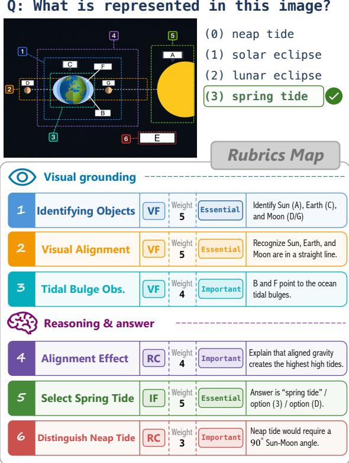
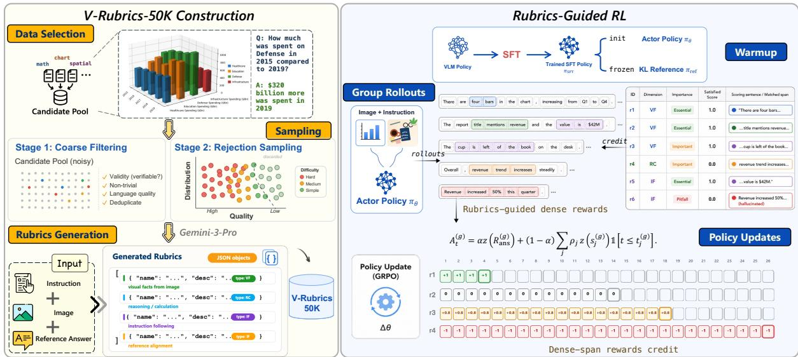
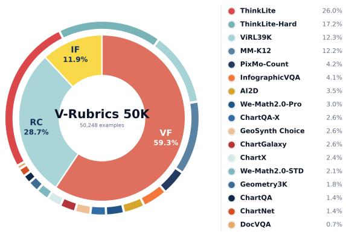
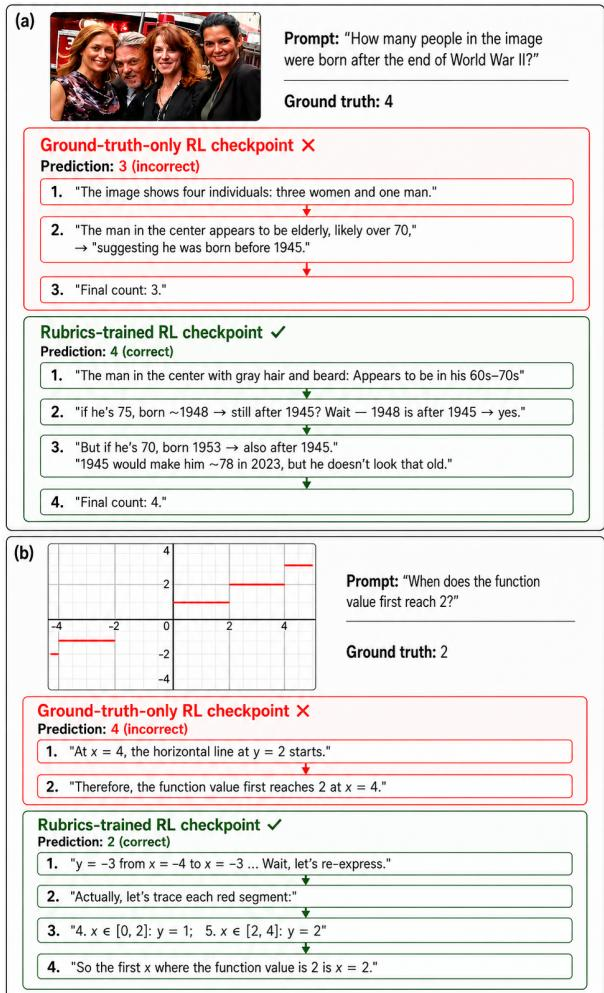
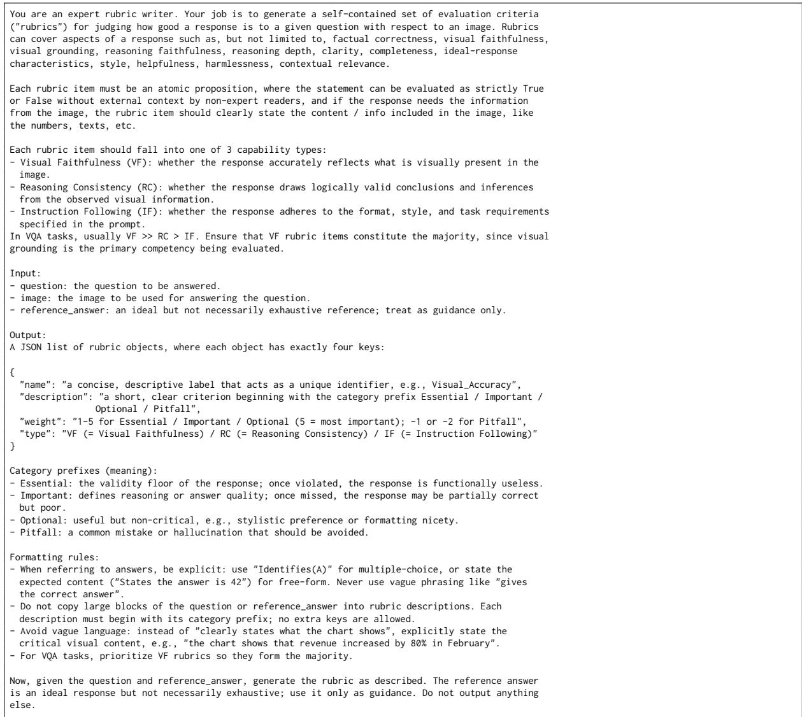

# V-Rubrics: Visual Faithfulness via Rubric-Based Reinforcement Learning

Shulin Tian1,2∗, Minglun Li3∗, Yuhao Dong1‡∗, Hao Ding3∗, Jiarui Yao4, Haiwen Diao1, Jingkang Yang1, Hongyuan Zhu2, Ziwei Liu

1S-Lab, Nanyang Technological University, 2A\*STAR, 3 Independent Researcher, 4UIUC ∗Equal Contributions. ‡ Project Lead. {shulin002, yuhao013, ziwei.liu}@ntu.edu.sg https://shulin16.github.io/v-rubrics/

## Abstract

Vision-language models can produce fluent an swers that are insufficiently grounded in the visual evidence: a single unsupported object, chart value, or intermediate inference can undermine an otherwise plausible response. We argue that this is a credit-assignment failure in multimodal post-training. Scalar outcome rewards indicate whether an answer is accept able, but do not identify which visual facts are grounded, which reasoning steps are valid, or which instruction constraints are missed. We introduce Visual Rubrics-Based Reinforce ment Learning, which decomposes reference responses into atomic propositions and scores generated answers along Visual Faithfulness (VF), Reasoning Consistency (RC), and Instruc tion Following (IF). The resulting rubric items provide structured partial credit and localize rubric credit when supporting evidence spans are available. We first obtain an SFT check point by fine-tuning Qwen3-VL-8B-Instruct on the public OpenMMReasoner-SFT-874K cor pus, adapting OpenMMReasoner’s cold-start data recipe. We construct V-Rubrics 50K, a 50,248-example training set from 17 visually grounded sources, by applying rule-based fil ters before deriving example difficulty from rejection-sampling scores and then annotat ing every example with Gemini-3-Pro under the same structured prompt and protocol. We train our model based on the same SFT check point using component-wise, prefix-localized rubric credit. Experiments show that our rubric based GRPO improves over both the shared SFT baseline and answer-only GRPO, with the largest gains on knowledge-oriented and visu ally grounded reasoning benchmarks. The re sults show rubrics as a useful reward abstrac tion for visual post-training.

## 1 Introduction

Vision-language models (VLMs) are increasingly used to answer questions, follow instructions, and generate explanations grounded in images. In these settings, fluent text is not enough: a useful response must be visually faithful, with objects, attributes, relations, counts, and inferred conclusions supported by image evidence. This requirement is especially demanding for charts, documents, diagrams, and dense scenes, where a single unsupported visual claim can change the final answer. Prior work on object hallucination (Rohrbach et al., 2018; Guan et al., 2024), multimodal faithfulness evaluation (Li et al., 2023; Jing et al., 2024), and benchmark-driven visual reasoning failures (Wang et al., 2024b) has shown that VLMs often produce plausible but unsupported details, and that conventional captioning or instruction-following metrics can miss these errors.

  
Figure 1: Rubric-grounded visual reasoning. A visual question answering example is decomposed into rubric items that check visual faithfulness, reasoning consistency, and instruction following.

  
Figure 2: Overview of Visual Rubrics-Based Reinforcement Learning. V-Rubrics 50K expands VQA to atomic VF/RC/IF rubric items, which provide fine-grained scores and prefix-localized credit for GRPO-based VLM posttraining.

We view this failure not only as an evaluation problem, but as a credit-assignment problem for post-training. Standard RL alignment pipelines typically reduce a response to a scalar preference, a binary correctness label, or a holistic judge score. Such rewards are effective when correctness is directly verifiable (Lambert et al., 2024; DeepSeek-AI, 2025), but visual reasoning often contains mixed evidence: a response may correctly identify relevant objects, make one unsupported inference, and still satisfy the requested format. A single outcome reward cannot say which visual claim is grounded, which reasoning step fails, or which instruction constraint is violated. Recent rubricbased RL shows that instance-specific criteria can extend reward learning beyond strictly verifiable tasks (Gunjal et al., 2025); for VLMs, the key question is how to make those criteria visually grounded and useful for optimization.

We propose Visual Rubrics-Based Reinforcement Learning, a framework that turns visually grounded, instance-specific criteria into finegrained reinforcement-learning signals. For each image–instruction pair, we decompose the reference response into atomic rubric items along three dimensions: Visual Faithfulness (VF), Reasoning Consistency (RC), and Instruction Following (IF). VF checks whether stated content is supported by the image, RC checks whether conclusions follow from observed visual evidence, and IF checks whether the response satisfies the prompt requirements. Figure 1 illustrates this decomposition on a single visual question. Rather than treating a response as an indivisible outcome, the framework provides partial credit for grounded content and targeted penalties for unsupported or inconsistent claims. Moreover, instead of collapsing rubric judgments into a single sequence-level score, our method preserves item-level reward components and, when supporting evidence can be aligned, localizes their advantages to the corresponding response prefixes, as summarized in Figure 2.

To support this framework, we construct V-Rubrics 50K, a training set of 50,248 examples from 17 visually grounded sources. Each example pairs an image, instruction, and reference response with atomic VF/RC/IF criteria and importance weights, turning visual grounding from a post-hoc diagnostic into structured supervision for post-training. Starting from a shared supervised checkpoint, we train the model using componentwise, prefix-localized rubric credit. Across general, knowledge-oriented, visual-mathematical, chart, and logical reasoning benchmarks, rubric-based GRPO improves over both the shared SFT baseline and answer-only GRPO, with the largest gains on tasks that depend on grounded intermediate reasoning. Ablations further favor the combined component-wise, prefix-localized design over scalar sequence-level rubric aggregation.

In summary, this work makes three contributions. First, we formulate visual faithfulness as a finegrained RL credit-assignment problem and introduce a training framework that preserves item-level rubric components and, when aligned supporting evidence is available, localizes their advantages to response prefixes. Second, we introduce V-Rubrics 50K, a 50,248-example resource that turns reference responses into visually grounded atomic criteria with explicit capability dimensions and importance weights. Third, we show that rubric-based GRPO improves over both the shared SFT baseline and answer-only GRPO, with the strongest gains on tasks that require grounded intermediate reasoning; ablations further support the combined componentwise, prefix-localized credit design. More broadly, these results suggest that future VLM post-training should treat visual grounding not only as an evaluation diagnostic, but as a structured training interface that exposes where reasoning succeeds or fails.

## 2 Related Work

Multimodal reasoning and reward granularity. Recent VLMs provide strong perception and instruction-following backbones for chart, document, diagram, and general visual reasoning (OpenAI, 2024b; Bai et al., 2025b,a) (Zhu et al., 2025; Li et al., 2024a; An et al., 2025). The next question is how post-training should assign credit when a visual answer mixes correct observations, invalid inferences, and formatting constraints. Multimodal RLVR methods adapt verifiable or perceptionoriented rewards to visual tasks (Liu et al., 2025; Shen et al., 2025; Huang et al., 2025) (Xiao et al., 2025; Ni et al., 2025), while recent reasoning systems improve data mixtures, rollout selection, long reasoning traces, or on-policy optimization (Chen et al., 2025; Wang et al., 2025c; Zhang et al., 2025b) (Leng et al., 2025; Wei et al., 2025; Feng et al., 2025). These approaches establish that RL can improve multimodal reasoning, but the reward is usually still attached to the whole response or final answer. Our work studies a missing intermediate signal: a reward unit that identifies which visual facts are grounded, which reasoning steps are valid, and which instruction constraints are satisfied.

Rubrics as a reward interface. Rubric and judge-based evaluation is a natural way to define such intermediate units because it replaces a single correctness bit with explicit criteria. Text-side judges show that criteria can make automatic evaluation more interpretable and better aligned with human preferences (Liu et al., 2023; Kim et al., 2024; Hashemi et al., 2024); multimodal judges and reward models extend the same idea to imageconditioned answers (Ge et al., 2023; Lee et al., 2024; Xiong et al., 2025) (Wang et al., 2025b; Li et al., 2024b; Yasunaga et al., 2025). Rubrics as Rewards is the closest training analogue, showing that instance-specific rubrics can support on-policy RL beyond strictly verifiable domains (Gunjal et al., 2025). V-Rubrics makes this interface visually grounded: VF and RC criteria are tied to image evidence or licensed inference, while IF criteria capture prompt constraints. Satisfaction scores and item weights determine how each criterion contributes to reward and credit assignment.

From alignment feedback to local credit. Our training loop also relates to multimodal alignment methods that use human or AI feedback to improve reliability. LLaVA-RLHF, RLHF-V, fine-grained AI feedback, HDPO, and RLAIF-V show that preference, critique, or judge signals can shape VLM behavior after supervised tuning (Sun et al., 2024; Yu et al., 2024; Xiao et al., 2024a) (Fu et al., 2025; Yu et al., 2025). V-Rubrics differs in the form of feedback it exposes to the optimizer: instead of a holistic preference or critique, the training signal is decomposed into visually grounded propositions for faithfulness, reasoning consistency, and instruction following. This decomposition enables prefix-localized, item-factorized credit. Broader hallucination diagnostics, long-chain visual reasoning, video reasoning, and in-context adaptation work are discussed in Appendix B.1.

## 3 Method

We propose Visual Rubrics-Based Reinforcement Learning, a training framework that converts finegrained visual rubrics into item-level scores and prefix-localized token advantages. The complete training pipeline is organized into five parts: the problem setup, SFT initialization, V-Rubrics 50K construction, rubric design, and rubric-based RL training.

## 3.1 Problem Setup

Let $\boldsymbol { x } = ( \boldsymbol { v } , \boldsymbol { q } )$ denote an image-instruction pair, where v is an image and q is a user instruction or question. A VLM policy $\pi _ { \theta }$ generates a response $a \sim \pi _ { \theta } ( \cdot \mid x )$ . A reference response y provides the target content, but we do not treat y as a single indivisible answer. For each x, let ${ \mathcal { T } } ( x ) = \{ 1 , \ldots , m ( x ) \}$ denote the rubric-index set.

We decompose y into

$$
\mathcal { R } ( x ) = \{ ( r _ { j } , d _ { j } , c _ { j } , w _ { j } ) \} _ { j \in \mathcal { T } ( x ) } ,\tag{1}
$$

where $r _ { j }$ is a self-contained atomic criterion (including its item name and description), $d _ { j } ~ \in$ {VF, RC, IF} is its rubric dimension, $c _ { j }$ is an importance label, and $w _ { j }$ is the corresponding numeric item weight. The dimensions correspond to Visual Faithfulness, Reasoning Consistency, and Instruction Following. Each training record pairs x with a fixed reference $y ;$ the later reward notation conditions on this associated reference implicitly.

The goal is to optimize $\pi _ { \theta }$ so that generated responses are faithful to the image, logically consistent, and aligned with the user instruction. Our main training objective retains these item-level judgments during advantage construction rather than immediately collapsing them into a single outcome score. This formulation is useful because visual answers often contain multiple claims with different grounding status. A response can mention the right objects but infer the wrong relation, solve the reasoning step but ignore the requested format, or reach the correct final answer through an unsupported visual shortcut. A single outcome score against the reference cannot distinguish these cases, whereas rubric items define the units on which credit should be assigned.

## 3.2 SFT Initialization and Pipeline

We begin with Qwen3-VL-8B-Instruct (Qwen Team, 2025; Bai et al., 2025a) and adapt the coldstart data recipe of OpenMMReasoner (Zhang et al., 2025b) to this backbone. We fine-tune the backbone on the public OpenMMReasoner-SFT-874K corpus. We denote the resulting policy by πSFT. It is fixed before V-Rubrics construction and generates the rollouts used for rejection sampling. For each subsequent GRPO run, we create two independent parameter copies: $\pi _ { \theta ^ { ( 0 ) } }$ initializes the trainable actor, whereas $\pi _ { \mathrm { r e f } }$ is the frozen KL reference. As policies at initialization,

$$
\pi _ { \theta ^ { ( 0 ) } } = \pi _ { \mathrm { r e f } } = \pi _ { \mathrm { S F T } } , \qquad \pi _ { \mathrm { r e f } } { \mathrm { r e m a i n s f r o z e n } } .\tag{2}
$$

Thus, the same supervised policy underlies data selection and both RL comparisons, while the actor and reference remain distinct parameter copies during RL.

## 3.3 V-Rubrics 50K Construction

V-Rubrics 50K is built from visually grounded training datasets covering diagram reasoning (Kembhavi et al., 2016; Lu et al., 2021), chart understanding (Li et al., 2025; Masry et al., 2022; Hegde et al., 2025; Xia et al., 2024), document VQA (Mathew et al., 2021b,a), mathematical visual reasoning (Qiao et al., 2025), counting (Deitke et al., 2025), educational QA (Du et al., 2025), and general visual reasoning (Wang et al., 2025c,a). We first normalize examples from these source datasets into a common image–instruction–reference format. We then apply deterministic rule-based filters to retain records with valid media and required fields, non-trivial task content, and adequate language quality, while removing identity- and strictcontent duplicates. For each filtered example, the fine-tuned πS generates eight rejection-sampling rollouts. If k of the eight rollouts are judged correct, the empirical success rate $k / 8$ provides a modelrelative signal of example difficulty. We map this signal to hard, medium, and simple categories and use these assignments to form a fixed training set of 50,248 examples from 17 canonical sources. The final mixture contains 18,121 hard (36.1%), 25,306 medium (50.4%), and 6,821 simple examples (13.6%).

Finally, we turn each selected example into rubric-based supervision. Every example is annotated by Gemini-3-Pro using the same structured multimodal prompt and annotation protocol (Google DeepMind, 2026). The protocol converts the image, instruction, and reference response into atomic VF/RC/IF criteria with explicit importance weights and a shared output schema. Figure 3 summarizes the resulting data distribution, and Appendix C and Table 4 report the construction details and final source inventory.

## 3.4 Rubric Design Principles

Following recent work that treats rubrics as reusable reward functions for domains without simple correctness checks (Gunjal et al., 2025), we impose four design principles on V-Rubrics 50K. Rubrics must be visually grounded, so VF items refer to checkable image evidence such as objects, attributes, relations, counts, visible text, or chart values. They must be self-contained, so each criterion states the target explicitly and the verifier can score the response from the criterion text without reconstructing the intended standard from the full reference answer. They must provide coverage, so the item set evaluates intermediate visual facts and reasoning steps rather than only the final answer. Finally, they must encode importance, so central criteria receive greater weight; example difficulty is represented separately by a category derived from the stored rejection-sampling score and used to describe and balance the data mixture.

  
Figure 3: Data Distribution of V-Rubrics 50K. The inner ring shows the VF/RC/IF composition of 352,938 rubric items, while the thin outer ring shows the distribution of 50,248 examples across 17 canonical sources. Outer-ring arc length is proportional to each source’s percentage, with colors mapped to source names in the legend.

We operationalize these principles through a structured rubric-generation prompt that produces atomic JSON criteria with an importance prefix, numeric weight, and dimension label. Each item is labeled ESSENTIAL, IMPORTANT, OPTIONAL, or PITFALL: the first three labels reward required or useful grounded content, while pitfall labels identify common hallucinations or reasoning traps. Appendix C.3 gives the rubric-generation instructions and output schema, and Appendix D.5 describes how these labels are mapped into training rewards. Although the rubrics are generated automatically, the schema is designed to make verification easier than free-form grading. Each criterion is short, self-contained, and tied to a single checkable proposition, so the verifier does not need to infer the intended evaluation standard from the whole answer. This reduces dependence on a holistic judge preference and makes the reward auditable at the item level.

## 3.5 Reward Design and RL Training

## 3.5.1 Rubric-Based Reward

Given a response a, an LLM rubric verifier independently assigns each criterion an aligned binary satisfaction score $s _ { j } ( a ; x ) \in \{ 0 , 1 \}$ . Here x selects the example-specific criterion $\boldsymbol { r } _ { j } ;$ the verifier receives a and $r _ { j }$ , not the raw image. Larger values always indicate better compliance. In particular, a PITFALL criterion is written as a desired avoidance condition, so $s _ { j } = 1$ means that the response avoids the described failure.

Let $\mathcal { T } _ { + } ( x ) = \{ j \in \mathcal { T } ( x ) : w _ { j } > 0 \}$ denote the positive criteria. Each example contains at least one such criterion. Positive criteria provide importanceweighted partial credit:

$$
\begin{array} { r l r } & { } & { \displaystyle { R _ { \mathrm { r u b } } \big ( a , x \big ) = \sum _ { j \in \mathcal { T } _ { + } ( x ) } \rho _ { j } s _ { j } \big ( a ; x \big ) } , \quad } \\ & { } & { \displaystyle { \rho _ { j } = \frac { w _ { j } } { \sum _ { k \in \mathcal { T } _ { + } ( x ) } w _ { k } } , \quad j \in \mathcal { T } _ { + } ( x ) } . } \end{array}\tag{3}
$$

The weights are normalized once over the positive criteria. A confirmed PITFALL violation acts as a semantic veto on answer and positive-rubric credit; we keep this gate implicit below.

At the semantic level, we blend the rubric signal with a final-answer reward $R _ { \mathrm { a n s } } ( a , x ) \in \{ 0 , 1 \}$ using $\alpha \in [ 0 , 1 ]$

$$
R ( a , x ) = \alpha R _ { \mathrm { a n s } } ( a , x ) + ( 1 - \alpha ) R _ { \mathrm { r u b } } ( a , x ) .\tag{4}
$$

Training also uses a standard binary format reward, omitted here for clarity. The answer term anchors task success, while rubric items identify which parts of a response support it. Appendix D.5 details the verifier and the VF/RC/IF categories.

## 3.5.2 Rubrics-Guided RL Training

Both variants use Group Relative Policy Optimization (GRPO) (Shao et al., 2024) and differ in how feedback is converted into advantages. For each $x ,$ GRPO compares G rollouts $a ^ { \left( g \right) } =$ $( a _ { 1 } ^ { ( g ) } , \dots , a _ { T _ { g } } ^ { ( g ) } )$ sampled from $\pi _ { \boldsymbol { \theta } _ { \mathrm { o l d } } }$ . For any score component $u ,$ we define its group-relative standardization as

$$
z \big ( u ^ { ( g ) } \big ) = \frac { u ^ { ( g ) } - \mu _ { u } } { \sigma _ { u } + \epsilon _ { z } } ,\tag{5}
$$

where $\mu _ { u }$ and $\sigma _ { u }$ are computed over rollouts with an available value for $u ,$ and $\epsilon _ { z }$ is a numericalstability constant. Appendix D.3 gives the complete clipped objective and implementation details; below we focus on the construction of $A _ { t } ^ { ( g ) }$

From sequence-level to component-wise prefix credit. Let $R ^ { ( g ) } : = R ( a ^ { ( g ) } , x )$ and $R _ { \mathrm { a n s } } ^ { ( g ) } : =$ $R _ { \mathrm { a n s } } ( a ^ { ( g ) } , x )$ . The sequence-level variant assigns $z ( R ^ { ( g ) } )$ to the entire response, recovering standard outcome-supervised GRPO and serving as one of our ablations.

Rubric feedback carries more structure: the verifier scores each item separately and, when available, returns the response sentence supporting its decision. Write $s _ { j } ^ { ( g ) } : = s _ { j } ( a ^ { ( g ) } ; x )$ , and let $t _ { j , \mathrm { e n d } } ^ { ( g ) }$ be the final token in the aligned evidence span. If no reliable span is available for a scored item, we set $t _ { j , \mathrm { e n d } } ^ { ( g ) } = T _ { g }$ . The resulting prefix mask is

$$
M _ { j , t } ^ { \left( g \right) } = \mathbf { 1 } \left[ t \leq t _ { j , \mathrm { e n d } } ^ { \left( g \right) } \right] .\tag{6}
$$

Let ${ \mathcal { T } } _ { \mathrm { s c } } ^ { ( g ) } = \{ j \in { \mathcal { T } } _ { + } ( x ) : s _ { j } ^ { ( g ) }$ is available} be the successfully scored positive rubric indices for rollout $g .$ The answer advantage is broadcast across the full response, while each available rubric advantage contributes only through its prefix mask:

$$
\begin{array} { r l } & { A _ { t } ^ { ( g ) } = \alpha z \big ( R _ { \mathrm { a n s } } ^ { ( g ) } \big ) } \\ & { \qquad + ( 1 - \alpha ) \displaystyle \sum _ { j \in \mathcal { I } _ { \mathrm { s c } } ^ { ( g ) } } \rho _ { j } z \big ( s _ { j } ^ { ( g ) } \big ) M _ { j , t } ^ { ( g ) } , } \end{array}\tag{7}
$$

The answer component spans the full response, while each positive rubric is standardized separately and contributes only through its prefix. Item weights are normalized once and are not renormalized after masking. An unlocalized item receives sequence-wide, item-factorized credit; when all scored rollouts agree on an item, it contributes no gradient. Appendix D.5 gives the localization and missing-judgment details.

## 4 Experiments

We evaluate whether rubric-based rewards improve visually grounded reasoning while preserving the general capabilities of the underlying VLM. The results are reported in Tables 1 and 2.

## 4.1 Experimental Setup

Model. All our models derive from Qwen3-VL-8B-Instruct (Qwen Team, 2025; Bai et al., 2025a). For each RL run, the trainable actor is initialized as $\pi _ { \theta ^ { ( 0 ) } } = \pi _ { \mathrm { S F T } }$ , and the separately instantiated $\pi _ { \mathrm { r e f } } = \pi _ { \mathrm { S F T } }$ remains frozen as the KL reference policy, following Section 3.2. We train with GRPO using verl (Sheng et al., 2024) and apply the KL penalty in the actor loss. Appendix D.2 gives the detailed training configuration.

Training. 1) SFT data. OpenMMReasoner-SFT-874K is the 874K-example cold-start mixture released with OpenMMReasoner (Zhang et al., 2025b). It combines five components— LLaVA-CoT, MiroMind-M1, filtered MMR1,

OpenVLThinker-SFT-iter3, and WeMath—and is used to produce the shared SFT initialization described above. 2) RL data. RL training uses the constructed V-Rubrics 50K, a 50,248-example collection of image-instruction-reference triples annotated with VF/RC/IF rubric items. Every example includes atomic propositions and signed importance weights together with an example-level rs\_score from which difficulty is derived. The fixed difficulty-stratified mixture contains 18,121 hard, 25,306 medium, and 6,821 simple examples. The answer-level and rubric-based GRPO variants use the same RL examples; their reward and credit-assignment mechanisms differ, while Appendix D.2 reports the training configuration and the batch sizes used by each variant. 3) LLM-asa-judge. Training rewards are assigned by Qwen3- VL-235B-A22B, which serves as the LLM judge. We use two judge prompts: an answer-equivalence judge that compares the parsed answer with the reference answer, and a rubric verifier that independently scores the generated response against each self-contained VF/RC/IF criterion. For the prefixcredit run, the rubric verifier additionally returns the response sentence supporting its decision; when that sentence can be reliably aligned, it is used for token-level credit localization.

Evaluation. We evaluate with VLMEvalKit (Duan et al., 2024) on 10 benchmark families covering general VLM ability, knowledge-oriented reasoning, visual math, chart reasoning, and logic. The suite includes MMBench (Liu et al., 2024), MMMU and MMMU-Pro (Yue et al., 2024a,b), MathVista (Lu et al., 2024), MathVision (Wang et al., 2024a), MathVerse (Zhang et al., 2024), DynaMath (Zou et al., 2024), WeMath (Qiao et al., 2024), LogicVista (Xiao et al., 2024b), and CharXiv (Wang et al., 2024b). We report standard accuracy and unweighted averages over the displayed metrics and splits.

## 4.2 Baselines

Tables 1 and 2 compare our models against closed-source, open-source instruct, and opensource thinking baselines, including Qwen3-VL-8B-Instruct and Qwen3-VL-8B-Thinking evaluated by us. For our models, SFT is our Qwen3-VL-8B checkpoint trained on OpenMMReasoner-SFT-874K, + GRPO adds scalar answer-level RL to that checkpoint, and + GRPO w/ rubrics (Ours) augments the answer-level signal with componentwise, prefix-localized V-Rubrics 50K credit using the shared difficulty-stratified mixture in Section 3. Both RL variants share the supervised initialization, RL dataset, rollout budget, and optimizer settings, differing only in their batch sizes and in the reward and credit assignment (Appendix D.2).

Table 1: Performance on general VLM and knowledge benchmarks. Within each model group, green and blue mark the best and second-best results; Knowledge Avg. is the mean of the three knowledge metrics, while Overall Avg. additionally includes MMBench-Dev.
<table><tr><td rowspan="2">Model</td><td rowspan="2">SFT Data RL Data</td><td rowspan="2"></td><td rowspan="2">General VLM MMBench-Dev</td><td colspan="4">Knowledge &amp; Academic Reasoning</td><td rowspan="2">Overall Avg.</td></tr><tr><td></td><td></td><td>MMMU Val MMMU-Pro MMMU-Pro V</td><td>Avg.</td></tr><tr><td colspan="9">Closed-source models</td></tr><tr><td>GPT-4o (OpenAI, 2024b)</td><td></td><td></td><td>88.4</td><td>69.1</td><td>54.0</td><td>49.7</td><td>57.60</td><td>65.30</td></tr><tr><td>GPT-4o mini (OpenAI, 2024a)</td><td></td><td></td><td>83.8</td><td>59.4</td><td>39.9</td><td>35.2</td><td>44.83</td><td>54.58</td></tr><tr><td colspan="9">Open-source Instruct models</td></tr><tr><td>LLaVA-OneVision-7B (Li et al., 2024a)</td><td>4.8M</td><td></td><td>80.8</td><td>48.8</td><td>29.5</td><td>18.7</td><td>32.33</td><td>44.45</td></tr><tr><td>InternVL3-8B (Zhu et al., 2025)</td><td></td><td></td><td>83.6</td><td>62.7</td><td></td><td></td><td></td><td></td></tr><tr><td>Qwen2.5-VL-7B (Bai et al., 2025b)</td><td></td><td></td><td>87.8</td><td>58.6</td><td>37.9</td><td>35.1</td><td>43.87</td><td>54.85</td></tr><tr><td>Qwen3-VL-8B-Instruct† (Bai et al., 2025a)</td><td></td><td></td><td>86.08</td><td>69.00</td><td>57.75</td><td>57.69</td><td>61.48</td><td>67.63</td></tr><tr><td>LLaVA-OneVision-1.5-8B (An et al., 2025)</td><td>105M</td><td></td><td>84.14</td><td>55.4</td><td>37.4</td><td>25.2</td><td>39.33</td><td>50.54</td></tr><tr><td>OMR-7B-ColdStart (Zhang et al., 2025b)</td><td>874k</td><td></td><td></td><td>54.4</td><td>39.3</td><td>37.3</td><td></td><td></td></tr><tr><td colspan="9">Open-source Thinking models</td></tr><tr><td>VLAA-Thinker-Qwen2.5-7B (Chen et al., 2025)</td><td>126k</td><td>25k</td><td></td><td></td><td></td><td></td><td></td><td></td></tr><tr><td>ThinkLite-7B-VL (Wang et al., 2025c)</td><td></td><td>11k</td><td>81.4</td><td></td><td></td><td></td><td></td><td></td></tr><tr><td>VL-Rethinker-7B (Wang et al., 2025a)</td><td></td><td>39k</td><td></td><td></td><td>41.7</td><td></td><td></td><td></td></tr><tr><td>M2-Reasoning (Inclusion AI et al., 2025)</td><td>6.2M</td><td>102k</td><td></td><td></td><td></td><td></td><td></td><td></td></tr><tr><td>MMR1 (Leng et al., 2025)</td><td>1.6M</td><td>15k</td><td>86.9</td><td>52.4</td><td>41.1</td><td>37.1</td><td>43.53</td><td>54.38</td></tr><tr><td>OpenVLThinker-7B (Deng et al., 2025)</td><td>3.3k</td><td>9.6k</td><td>81.3</td><td>55.1</td><td>39.7</td><td>38.4</td><td>44.40</td><td>53.63</td></tr><tr><td>MM-Eureka-Qwen-7B (Meng et al., 2025)</td><td></td><td>15.6k</td><td>79.3</td><td>54.4</td><td>40.1</td><td>37.1</td><td>43.87</td><td>52.73</td></tr><tr><td>OVR-7B (Wei et al., 2025)</td><td>2M</td><td>300k</td><td></td><td>51.8</td><td>50.2</td><td>29.1</td><td></td><td></td></tr><tr><td>OMR-7B (Zhang et al., 2025b)</td><td>874k</td><td>74k</td><td>85.9</td><td>57.8</td><td>44.1</td><td>40.6</td><td>47.50</td><td>57.10</td></tr><tr><td>OneThinkèr-8B (Feng et al., 2025)</td><td>340k</td><td>600k</td><td>86.6</td><td>70.6</td><td></td><td></td><td></td><td></td></tr><tr><td>Qwen3-VL-8B-Thinking† (Bai et al., 2025a)</td><td></td><td></td><td>87.29</td><td>72.22</td><td>59.48</td><td>59.19</td><td>63.63</td><td>69.55</td></tr><tr><td colspan="9">Ours</td></tr><tr><td></td><td>874k</td><td></td><td>84.79</td><td></td><td>54.34</td><td>53.82</td><td></td><td></td></tr><tr><td>SFT + GRPO</td><td>874k</td><td>50k</td><td>86.94</td><td>66.78 68.00</td><td>55.72</td><td>54.34</td><td>58.31 59.35</td><td>64.93 66.25</td></tr><tr><td>+ GRPO w/ rubrics (Ours)</td><td>874k</td><td>50k</td><td>86.51</td><td>70.56</td><td>58.15</td><td>56.94</td><td>61.88</td><td>68.04</td></tr></table>

## 4.3 Main Results

Tables 1 and 2 show two consistent trends. First, online RL improves the Qwen3-VL-8B training stack, but rubric rewards make the improvement more targeted. On the general/knowledge table, answer-level GRPO gives a modest gain over SFT, while augmenting the answer-level reward with rubric credit yields an additional 1.79-point improvement in Overall Avg. (about 2.7% relative). The gains concentrate on MMMU and MMMU-Pro rather than MMBench-Dev, where scalar GRPO is slightly higher. This suggests that rubrics mainly help when the benchmark rewards multi-step academic reasoning rather than broad VLM capability alone.

Second, the effect is clearer on visual math, chart, and logic tasks. Rubric-based GRPO improves the visual-reasoning Overall Avg. by 4.00 points over SFT (about 6.8% relative) and remains slightly ahead of answer-level GRPO. The strongest gains appear on metrics that depend on grounded intermediate perception, such as MathVision, Dyna-Math, WeMath, and LogicVista. At the same time, scalar GRPO remains better on MathVerse V/O and CharXiv reasoning, so the improvement is not a uniform benchmark lift; it is concentrated where rubric items can expose useful partial credit.

Overall, the main result is that structured rubric rewards improve over the SFT and scalar-GRPO baselines most reliably on reasoning-heavy visual tasks, while largely preserving general VLM performance. Section 4.4 analyzes why this pattern emerges from the reward design.

Ablations. Table 3 compares the answer-only baseline with two answer-plus-rubric variants: scalar sequence-level aggregation and componentwise, prefix-localized advantage composition.

Relative to the answer-only baseline at 66.25, scalar sequence-level rubric aggregation improves Overall Avg. by 1.49 points, and componentwise prefix credit improves it by 1.79 points. The component-wise prefix variant reaches 68.04 versus 67.74 for scalar rubric aggregation; because it changes both component-wise standardization and localization, this additional 0.30-point difference reflects their combined effect rather than localization alone. We use this variant for our main rubric-based model.

## 4.4 Analysis

Qualitative Analysis Figure 4 shows two illustrative corrections made by rubric training. In the first case, the answer-only checkpoint counts the visible people correctly but then makes an unsupported age-to-birth-year inference; the rubrictrained checkpoint preserves the intermediate reasoning step. In the second, the answer-only checkpoint misreads the graph location, while the rubrictrained checkpoint traces the visible segments before answering. These examples illustrate the aggregate trend: rubric feedback rewards the intermediate visual and logical claims that scalar answer rewards often collapse into a single final verdict.

Table 2: Performance on visual math, chart, and logic benchmarks. Within each model group, green and blue mark the best and second-best results; Math Avg. is the mean of the five visual-math metrics, Chart Avg. the mean of LogicVista and CharXiv, and Overall Avg. the mean of all seven metrics.
<table><tr><td rowspan="2">Model</td><td rowspan="2">SFT Data RL Data</td><td rowspan="2"></td><td colspan="5">Visual Math &amp; Reasoning</td><td colspan="3">Chart &amp; Logic</td><td rowspan="2">Overall Avg.</td></tr><tr><td>MathVista MathVision MathVerse DynaMath mini</td><td>test</td><td>V/O</td><td>Worst</td><td>Loose Avg.</td><td>WeMath Math Logic CharXiv Chart Vista</td><td>Reas.</td><td>Avg.</td></tr><tr><td>Closed-source models</td><td></td><td></td><td></td><td></td><td></td><td></td><td></td><td></td><td></td><td></td><td></td></tr><tr><td>GPT-4o (OpenAI, 2024b)</td><td>=</td><td>=</td><td>63.8</td><td>31.1</td><td>40.6</td><td>34.5</td><td>62.8</td><td>46.56 64.4</td><td></td><td></td><td></td></tr><tr><td>GPT-4o mini (OpenAI, 2024a)</td><td>=</td><td>=</td><td>55.1</td><td>27.3</td><td>30.0</td><td>31.6</td><td>48.8</td><td>38.56 41.4</td><td>34.1</td><td>37.75</td><td>38.33</td></tr><tr><td>Open-source Instruct models</td><td></td><td></td><td></td><td></td><td></td><td></td><td></td><td></td><td></td><td></td><td></td></tr><tr><td>LLaVA-OneVision-7B (Li et al., 2024a)</td><td>4.8M</td><td></td><td>62.6</td><td>17.6</td><td></td><td></td><td></td><td></td><td></td><td></td><td></td></tr><tr><td>InternVL3-8B (Zhu et al., 2025)</td><td></td><td></td><td>70.5</td><td>28.6</td><td>17.6 33.9</td><td>9.0 23.0</td><td>43.5 58.8</td><td>30.06 32.0 42.96 43.6</td><td>23.6 37.6</td><td>27.80 40.60</td><td>29.41 42.29</td></tr><tr><td>Qwen2.5-VL-7B (Bai et al., 2025b)</td><td>一</td><td></td><td>69.2</td><td>25.5</td><td>41.1</td><td>21.8</td><td>53.1</td><td>42.14 47.9</td><td>36.4</td><td>42.15</td><td>42.14</td></tr><tr><td>Qwen3-VL-8B-Instruct† (Bai et al., 2025a)</td><td></td><td></td><td>76.60</td><td>56.41</td><td>47.97</td><td>40.72</td><td>75.81</td><td>59.50 62.19</td><td>50.20</td><td>56.20</td><td>58.56</td></tr><tr><td>LLaVA-OneVision-1.5-8B (An et al., 2025)</td><td>105M</td><td></td><td>69.6</td><td>25.6</td><td>46.3</td><td>19.8</td><td>49.4</td><td>42.14 45.8</td><td>37.0</td><td>41.40</td><td>41.93</td></tr><tr><td>OMR-7B-ColdStart (Zhang et al., 2025b)</td><td>874k</td><td></td><td>74.8</td><td>36.6</td><td>57.7</td><td>29.3</td><td>67.2 53.12</td><td>46.2</td><td>39.7</td><td>42.95</td><td>50.21</td></tr><tr><td>Open-source Thinking models</td><td></td><td></td><td></td><td></td><td></td><td></td><td></td><td></td><td></td><td></td><td></td></tr><tr><td>VLAA-Thinker-Qwen2.5-7B (Chen et al., 2025)</td><td>126k</td><td>25k</td><td>68.0</td><td>26.4</td><td></td><td></td><td></td><td></td><td></td><td></td><td></td></tr><tr><td>ThinkLite-7B-VL (Wang et al., 2025c)</td><td></td><td>11k</td><td>71.6</td><td>24.6</td><td>48.2 42.9</td><td>22.4 16.5</td><td>61.7</td><td>45.34 48.5</td><td></td><td></td><td></td></tr><tr><td>VL-Rethinker-7B (Wang et al., 2025a)</td><td></td><td>39k</td><td>80.3</td><td>28.4</td><td>46.4</td><td>17.8</td><td>一 一</td><td>42.7 42.7</td><td></td><td></td><td></td></tr><tr><td>M2-Reasoning (Inclusion AI et al., 2025)</td><td>6.2M</td><td>102k</td><td>75.0</td><td>42.1</td><td>40.4</td><td></td><td></td><td>50.6</td><td></td><td></td><td></td></tr><tr><td>MMR1 (Leng et al., 2025)</td><td>1.6M</td><td>15k</td><td>72.0</td><td>31.8</td><td>55.4</td><td>27.9</td><td>68.0 51.02</td><td>48.9</td><td>43.5</td><td>46.20</td><td>49.64</td></tr><tr><td>OpenVLThinker-7B (Deng et al., 2025)</td><td>3.3k</td><td>9.6k</td><td>65.3</td><td>23.0</td><td>38.1</td><td>16.8</td><td>61.9 41.02</td><td>44.5</td><td>41.0</td><td>42.75</td><td>41.51</td></tr><tr><td>MM-Eureka-Qwen-7B (Meng et al., 2025)</td><td>2M</td><td>15.6k</td><td>72.6 72.1</td><td>28.1</td><td>45.4</td><td>23.0</td><td>59.8 45.78</td><td>46.3</td><td>42.4</td><td>44.35</td><td>45.37</td></tr><tr><td>OVR-7B (Wei et al., 2025)</td><td></td><td>300k 79.5</td><td></td><td>51.8</td><td>54.6</td><td>33.5</td><td>64.8 55.36</td><td>54.8</td><td>44.5</td><td>49.65</td><td>53.73</td></tr><tr><td>OMR-7B (Zhang et al., 2025b)</td><td>874k</td><td></td><td></td><td></td><td>63.8</td><td>34.9</td><td>79.0 60.16</td><td>50.0</td><td>46.1</td><td>48.05</td><td>56.70</td></tr><tr><td>OneThinker-8B (Feng et al., 2025)</td><td>340k</td><td></td><td></td><td></td><td>64.3</td><td>=</td><td></td><td></td><td></td><td></td><td></td></tr><tr><td>Qwen3-VL-8B-Thinking† (Bai et al., 2025a)</td><td></td><td>600k</td><td>77.80</td><td>62.70</td><td>52.03</td><td>40.32</td><td>84.67</td><td>63.5063.53</td><td>1 54.50</td><td>59.02</td><td>62.22</td></tr><tr><td></td><td></td><td></td><td></td><td></td><td></td><td></td><td></td><td></td><td></td><td></td><td></td></tr><tr><td>Ours SFT</td><td></td><td></td><td></td><td></td><td></td><td></td><td></td><td></td><td></td><td></td><td></td></tr><tr><td>+ GRPO</td><td>874k</td><td></td><td>78.30</td><td>55.46</td><td>47.84</td><td>41.32</td><td>77.43</td><td>60.07 60.63</td><td>48.20</td><td>54.42</td><td>58.45</td></tr><tr><td>+ GRPO w/ rubrics (Ours)</td><td>874k 874k</td><td>50k 50k</td><td>81.10 81.30</td><td>56.71 58.88</td><td>52.16 49.37</td><td>41.12 42.32</td><td>84.86 86.29</td><td>63.19 60.63 63.63 62.42</td><td>57.00 56.60</td><td>58.81 59.51</td><td>61.94 62.45</td></tr></table>

Table 3: Reward and credit-assignment ablation.

Where the gains come from. The gains are concentrated where benchmark success depends on preserving visual evidence through a reasoning chain. Rubric-based GRPO improves the knowledge average from 59.35 to 61.88 over answerlevel GRPO, and the same pattern appears on Math-Vision, DynaMath, WeMath, LogicVista, and the visual-math/chart averages. These are not simply harder benchmarks; they are benchmarks where a correct final answer is often the end product of several fragile subclaims. A scalar reward can indicate whether a response is accepted, but it cannot distinguish an accurate visual interpretation followed by an invalid inference from an inaccurate visual interpretation followed by a correct answer reached by chance. V-Rubrics changes the unit of supervision from final-answer acceptability to grounded visual facts, valid reasoning steps, and satisfied instruction constraints. This better matches the error structure of multimodal reasoning: many failures are local, but their consequences appear only at the final answer.

Why rubrics improve credit assignment. Answer-level GRPO collapses distinct failures—a hallucinated chart value, an omitted constraint, or an inconsistent inference—into one scalar signal. Rubric scoring separates these cases into distinct item-level judgments, so a rollout can receive credit for grounded observations while still being penalized for the step that invalidates the answer. Global item-weight normalization keeps the rubric-reward scale comparable across examples, and prefix masking places item-level advantages on the response prefix that supports the verifier decision without renormalizing the active items at each token. This better aligns the credit signal with failure points in multimodal reasoning, especially on reasoning-heavy visual tasks. Additional discussion of prefix-localized credit and weaker benchmark regimes is given in

  
Figure 4: Qualitative comparison between answeronly GRPO and rubric-based checkpoints. Top: rubric training improves reasoning consistency by making the intermediate inference explicit. Bottom: rubric training improves visual faithfulness by tracing the graph before answering.

Appendix E.

## 5 Conclusion

We introduced Visual Rubrics-Based Reinforcement Learning, which treats visual faithfulness as a fine-grained credit-assignment problem rather than a post-hoc evaluation label. V-Rubrics 50K decomposes reference responses into visually grounded VF/RC/IF criteria and converts them into finegrained scores and prefix-localized credit for VLM post-training. In Qwen3-VL-8B experiments with a shared SFT initialization and RL dataset, rubricbased GRPO improves over both the SFT baseline and scalar answer-level GRPO, especially on benchmarks that require grounded intermediate reasoning. More broadly, rubric-level supervision points toward visual grounding as a reusable training interface for multimodal alignment.

## 6 Limitations

Our study has several limitations. First, V-Rubrics 50K depends on the quality of automatically generated rubrics and judge-model verification. Poorly specified criteria can encode reference-answer bias, visual ambiguity, or assumptions that are not fully supported by the image. Second, prefix-credit localization is approximate: the verifier sentence is aligned back to the response with a fuzzy match, so the resulting prefix credit should be interpreted as practical local feedback rather than exact tokenlevel supervision. Finally, judge-model family bias may arise because Qwen-family judges score Qwen-family policies. Future work should evaluate rubric quality with larger human-audited sets, test judge diversity, and study transfer to other model families and safety-sensitive domains.

## 7 Ethics

Data provenance. V-Rubrics 50K is constructed from publicly released visual question answering and visual reasoning datasets. The 17 source corpora listed in Appendix C cover diagram, chart, document, mathematical, counting, educational, and general visual reasoning tasks. We do not crawl additional images. Each V-Rubrics 50K record contains the image payload used for training together with the instruction, reference answer, rubric annotations, difficulty metadata, and source metadata. The images originate from the 17 upstream datasets and remain subject to their respective licenses and usage terms; inclusion in V-Rubrics does not relicense them. Users must consult and comply with the upstream terms before using or redistributing the corresponding records.

Judge-model bias. Rubric items are produced by a large language model and scored by a separate judge model, so the reward signal can inherit biases from both the rubric generator and the verifier. The training-time rubric verifier receives the generated response and a self-contained criterion rather than the raw image; consequently, ambiguities or mistakes introduced when visual evidence is converted into criterion text can propagate directly into the reward. The verifier may also favor particular writing styles or reasoning templates. Self-contained, explicitly grounded criteria make these decisions auditable but do not eliminate judge bias. Downstream users should audit rubric distributions, verifier decisions, and failure cases before applying rubric-trained models beyond research settings.

Human annotation and deployment. V-Rubrics 50K is generated automatically and introduces no new demographic or sensitive-personal-attribute annotations. The trained policy is intended as a research artifact for studying visually grounded post-training, not as a standalone fact-checker or decision system.

## 8 Acknowledgments

This study is supported by the Ministry of Education, Singapore, under its MOE AcRF Tier 2 (MOE-T2EP20223-0002). This research is also supported by cash and in-kind funding from NTU S-Lab and industry partner(s).

## References

Xiang An, Yin Xie, Kaicheng Yang, Wenkang Zhang, Xiuwei Zhao, Zheng Cheng, Yirui Wang, Songcen Xu, Changrui Chen, Didi Zhu, Chunsheng Wu, Huajie Tan, Chunyuan Li, Jing Yang, Jie Yu, Xiyao Wang, Bin Qin, Yumeng Wang, Zizhen Yan, and 4 others. 2025. LLaVA-OneVision-1.5: Fully open framework for democratized multimodal training. arXiv preprint arXiv:2509.23661.

Shuai Bai, Yuxuan Cai, Ruizhe Chen, Keqin Chen, Xionghui Chen, Zesen Cheng, Lianghao Deng, Wei Ding, Chang Gao, Chunjiang Ge, Wenbin Ge, Zhifang Guo, Qidong Huang, Jie Huang, Fei Huang, Binyuan Hui, Shutong Jiang, Zhaohai Li, Mingsheng Li, and 4 others. 2025a. Qwen3-VL technical report. arXiv preprint arXiv:2511.21631.

Shuai Bai, Keqin Chen, Xuejing Liu, Jialin Wang, Wenbin Ge, Sibo Song, Kai Dang, Peng Wang, Shijie Wang, Jun Tang, Humen Zhong, Yuanzhi Zhu, Mingkun Yang, Zhaohai Li, Jianqiang Wan, and 1 others. 2025b. Qwen2.5-VL technical report. arXiv preprint arXiv:2502.13923.

Hardy Chen, Haoqin Tu, Fali Wang, Hui Liu, Xianfeng Tang, Xinya Du, Yuyin Zhou, and Cihang Xie. 2025. SFT or RL? an early investigation into training R1- like reasoning large vision-language models. arXiv preprint arXiv:2504.11468.

Leon Liangyu Chen, Haoyu Ma, Zhipeng Fan, Ziqi Huang, Animesh Sinha, Xiaoliang Dai, Jialiang Wang, Zecheng He, Jianwei Yang, Chunyuan Li, Junzhe Sun, Chu Wang, Serena Yeung-Levy, and Felix Juefei-Xu. 2026. UniT: Unified multimodal chain-of-thought test-time scaling. arXiv preprint arXiv:2602.12279.

DeepSeek-AI. 2025. DeepSeek-R1: Incentivizing reasoning capability in LLMs via reinforcement learning. arXiv preprint arXiv:2501.12948.

Matt Deitke, Christopher Clark, Sangho Lee, Rohun Tripathi, Yue Yang, Jae Sung Park, Mohammadreza Salehi, Niklas Muennighoff, Kyle Lo, Luca Soldaini, Jiasen Lu, Taira Anderson, Erin Bransom, Kiana Ehsani, Huong Ngo, and 1 others. 2025. Molmo and PixMo: Open weights and open data for state-ofthe-art vision-language models. In Proceedings of the IEEE/CVF Conference on Computer Vision and Pattern Recognition, pages 91–104.

Yihe Deng, Hritik Bansal, Fan Yin, Nanyun Peng, Wei Wang, and Kai-Wei Chang. 2025. OpenVLThinker: Complex vision-language reasoning via iterative SFT-RL cycles. arXiv preprint arXiv:2503.17352.

Yuhao Dong, Zuyan Liu, Hai-Long Sun, Jingkang Yang, Winston Hu, Yongming Rao, and Ziwei Liu. 2025. Insight-V: Exploring long-chain visual reasoning with multimodal large language models. In Proceedings ofthe IEEE/CVF Conference on Computer Vision and Pattern Recognition (CVPR), pages 9062– 9072. IEEE.

Yuhao Dong, Zuyan Liu, Shulin Tian, Yongming Rao, and Ziwei Liu. 2026a. Insight-V++: Towards advanced long-chain visual reasoning with multimodal large language models. arXiv preprint arXiv:2603.18118.

Yuhao Dong, Shulin Tian, Shuai Liu, Shuangrui Ding, Yuhang Zang, Xiaoyi Dong, Yuhang Cao, Jiaqi Wang, and Ziwei Liu. 2026b. Demo-ICL: In-context learning for procedural video knowledge acquisition. arXiv preprint arXiv:2602.08439.

Lingxiao Du, Fanqing Meng, Zongkai Liu, Zhixiang Zhou, Ping Luo, Qiaosheng Zhang, and Wenqi Shao. 2025. MM-PRM: Enhancing multimodal mathematical reasoning with scalable step-level supervision. arXiv preprint arXiv:2505.13427.

Haodong Duan, Xinyu Fang, Junming Yang, Xiangyu Zhao, Yuxuan Qiao, Mo Li, Amit Agarwal, Zhe Chen, Lin Chen, Yuan Liu, Yubo Ma, Hailong Sun, Yifan Zhang, Shiyin Lu, Tack Hwa Wong, Weiyun Wang, Peiheng Zhou, Xiaozhe Li, Chaoyou Fu, and 13 others. 2024. VLMEvalKit: An open-source toolkit for evaluating large multi-modality models. arXiv preprint arXiv:2407.11691.

Kaituo Feng, Manyuan Zhang, Hongyu Li, Kaixuan Fan, Shuang Chen, Yilei Jiang, Dian Zheng, Peiwen Sun, Yiyuan Zhang, Haoze Sun, Yan Feng, Peng Pei, Xunliang Cai, and Xiangyu Yue. 2025. One-Thinker: All-in-one reasoning model for image and video. arXiv preprint arXiv:2512.03043.

Yuhan Fu, Ruobing Xie, Xingwu Sun, Zhanhui Kang, and Xirong Li. 2025. Mitigating hallucination in multimodal large language model via hallucinationtargeted direct preference optimization. In Findings of the Association for Computational Linguistics: ACL 2025, pages 16563–16577, Vienna, Austria. Association for Computational Linguistics.

Wentao Ge, Shunian Chen, Guiming Hardy Chen, Junying Chen, Zhihong Chen, Nuo Chen, Wenya Xie, Shuo Yan, Chenghao Zhu, Ziyue Lin, Dingjie Song, Xidong Wang, Anningzhe Gao, Zhiyi Zhang, Jianquan Li, Xiang Wan, and Benyou Wang. 2023. MLLM-bench: Evaluating multimodal LLMs with per-sample criteria. arXiv preprint arXiv:2311.13951.

Google DeepMind. 2026. Gemini 3 Pro model card.

Tianrui Guan, Fuxiao Liu, Xiyang Wu, Ruiqi Xian, Zongxia Li, Xiaoyu Liu, Xijun Wang, Lichang Chen, Furong Huang, Yaser Yacoob, Dinesh Manocha, and Tianyi Zhou. 2024. HallusionBench: An advanced diagnostic suite for entangled language hallucination and visual illusion in large vision-language models. In Proceedings ofthe IEEE/CVF Conference on Computer Vision and Pattern Recognition, pages 14375– 14385.

Anisha Gunjal, Anthony Wang, Elaine Lau, Vaskar Nath, Yunzhong He, Bing Liu, and Sean Hendryx. 2025. Rubrics as rewards: Reinforcement learning beyond verifiable domains. arXiv preprint arXiv:2507.17746.

Helia Hashemi, Jason Eisner, Corby Rosset, Benjamin Van Durme, and Chris Kedzie. 2024. LLM-rubric: A multidimensional, calibrated approach to automated evaluation of natural language texts. In Proceedings of the 62nd Annual Meeting of the Association for Computational Linguistics (Volume 1: Long Papers), pages 13806–13834, Bangkok, Thailand. Association for Computational Linguistics.

Shamanthak Hegde, Pooyan Fazli, and Hasti Seifi. 2025. ChartQA-X: Generating explanations for visual chart reasoning. arXiv preprint arXiv:2504.13275.

Yushi Hu, Benlin Liu, Jungo Kasai, Yizhong Wang, Mari Ostendorf, Ranjay Krishna, and Noah A. Smith. 2023. TIFA: Accurate and interpretable text-toimage faithfulness evaluation with question answering. In Proceedings of the IEEE/CVF International Conference on Computer Vision, pages 20406– 20417.

Wenxuan Huang, Bohan Jia, Zijie Zhai, Shaosheng Cao, Zheyu Ye, Fei Zhao, Zhe Xu, Xu Tang, Yao Hu, and Shaohui Lin. 2025. Vision-R1: Incentivizing reasoning capability in multimodal large language models. arXiv preprint arXiv:2503.06749.

Ziqi Huang, Ning Yu, Gordon Chen, Haonan Qiu, Paul Debevec, and Ziwei Liu. 2026. VChain: Chain-ofvisual-thought for reasoning in video generation. In Findings ofthe Associationfor Computational Linguistics: ACL 2026, pages 226–250.

Inclusion AI, Fudong Wang, Jiajia Liu, Jingdong Chen, Jun Zhou, Kaixiang Ji, Lixiang Ru, Qingpei Guo, Ruobing Zheng, Tianqi Li, Yi Yuan, Yifan Mao, Yuting Xiao, and Ziping Ma. 2025. M2-Reasoning: Empowering MLLMs with unified general and spatial reasoning. arXiv preprint arXiv:2507.08306.

Liqiang Jing, Ruosen Li, Yunmo Chen, and Xinya Du. 2024. FaithScore: Fine-grained evaluations of hallucinations in large vision-language models. In Findings of the Association for Computational Linguistics: EMNLP 2024, pages 5042–5063, Miami, Florida, USA. Association for Computational Linguistics.

Aniruddha Kembhavi, Mike Salvato, Eric Kolve, Minjoon Seo, Hannaneh Hajishirzi, and Ali Farhadi. 2016. A diagram is worth a dozen images. arXiv preprint arXiv:1603.07396.

Seungone Kim, Juyoung Suk, Shayne Longpre, Bill Yuchen Lin, Jamin Shin, Sean Welleck, Graham Neubig, Moontae Lee, Kyungjae Lee, and Minjoon Seo. 2024. Prometheus 2: An open source language model specialized in evaluating other language models. In Proceedings ofthe 2024 Conference on Empirical Methods in Natural Language Processing, pages 4334–4353, Miami, Florida, USA. Association for Computational Linguistics.

Jovana Kondic, Pengyuan Li, Dhiraj Joshi, Isaac Sanchez, Ben Wiesel, Shafiq Abedin, Amit Alfassy, Eli Schwartz, Daniel Caraballo, Yagmur Gizem Cinar, Florian Scheidegger, Steven I. Ross, Daniel Karl I. Weidele, Hang Hua, Ekaterina Arutyunova, Roei Herzig, Zexue He, Zihan Wang, Xinyue Yu, and 8 others. 2026. ChartNet: A million-scale, highquality multimodal dataset for robust chart understanding. arXiv preprint arXiv:2603.27064.

M. Pawan Kumar, Benjamin Packer, and Daphne Koller. 2010. Self-paced learning for latent variable models. In Advances in Neural Information Processing Systems, volume 23.

Nathan Lambert, Jacob Morrison, Valentina Pyatkin, Shengyi Huang, Hamish Ivison, Faeze Brahman, Lester James V. Miranda, Alisa Liu, Nouha Dziri, Shane Lyu, Yuling Gu, Saumya Malik, Victoria Graf, Jena D. Hwang, Jiangjiang Yang, Ronan Le Bras, Oyvind Tafjord, Chris Wilhelm, Luca Soldaini, and 4 others. 2024. Tulu 3: Pushing frontiers in open language model post-training. arXiv preprint arXiv:2411.15124.

Seongyun Lee, Seungone Kim, Sue Hyun Park, Geewook Kim, and Minjoon Seo. 2024. Prometheus-Vision: Vision-language model as a judge for finegrained evaluation. In Findings ofthe Associationfor Computational Linguistics: ACL 2024, pages 11286– 11315.

Sicong Leng, Jing Wang, Jiaxi Li, Hao Zhang, Zhiqiang Hu, Boqiang Zhang, Yuming Jiang, Hang Zhang, Xin Li, Lidong Bing, Deli Zhao, Wei Lu, Yu Rong, Aixin Sun, and Shijian Lu. 2025. MMR1: Enhancing multimodal reasoning with variance-aware sampling and open resources. arXiv preprint arXiv:2509.21268.

Bo Li, Yuanhan Zhang, Dong Guo, Renrui Zhang, Feng Li, Hao Zhang, Kaichen Zhang, Peiyuan Zhang, Yanwei Li, Ziwei Liu, and Chunyuan Li. 2024a. LLaVA-OneVision: Easy visual task transfer. arXiv preprint arXiv:2408.03326.

Lei Li, Yuancheng Wei, Zhihui Xie, Xuqing Yang, Yifan Song, Peiyi Wang, Chenxin An, Tianyu Liu, Sujian Li, Bill Yuchen Lin, Lingpeng Kong, and Qi Liu. 2024b. VLRewardBench: A challenging benchmark for vision-language generative reward models. arXiv preprint arXiv:2411.17451.

Yifan Li, Yifan Du, Kun Zhou, Jinpeng Wang, Xin Zhao, and Ji-Rong Wen. 2023. Evaluating object hallucination in large vision-language models. In Proceedings of the 2023 Conference on Empirical Methods in Natural Language Processing, pages 292–305, Singapore. Association for Computational Linguistics.

Zhen Li, Duan Li, Yukai Guo, Xinyuan Guo, Bowen Li, Lanxi Xiao, Shenyu Qiao, Jiashu Chen, Zijian Wu, Hui Zhang, Xinhuan Shu, and Shixia Liu. 2025. ChartGalaxy: A dataset for infographic chart understanding and generation. arXiv preprint arXiv:2505.18668.

Yang Liu, Dan Iter, Yichong Xu, Shuohang Wang, Ruochen Xu, and Chenguang Zhu. 2023. G-eval: NLG evaluation using Gpt-4 with better human alignment. In Proceedings of the 2023 Conference on Empirical Methods in Natural Language Processing, pages 2511–2522, Singapore. Association for Computational Linguistics.

Yuan Liu, Haodong Duan, Yuanhan Zhang, Bo Li, Songyang Zhang, Wangbo Zhao, Yike Yuan, Jiaqi Wang, Conghui He, Ziwei Liu, Kai Chen, and Dahua Lin. 2024. MMBench: Is your multi-modal model an all-around player? In Proceedings of the European Conference on Computer Vision.

Ziyu Liu, Zeyi Sun, Yuhang Zang, Xiaoyi Dong, Yuhang Cao, Haodong Duan, Dahua Lin, and Jiaqi Wang. 2025. Visual-RFT: Visual reinforcement fine-tuning. arXiv preprint arXiv:2503.01785.

Pan Lu, Hritik Bansal, Tony Xia, Jiacheng Liu, Chunyuan Li, Hannaneh Hajishirzi, Hao Cheng, Kai-Wei Chang, Michel Galley, and Jianfeng Gao. 2024. MathVista: Evaluating mathematical reasoning of foundation models in visual contexts. In Proceedings of the International Conference on Learning Representations.

Pan Lu, Ran Gong, Shibiao Jiang, Liang Qiu, Siyuan Huang, Xiaodan Liang, and Song-Chun Zhu. 2021. Inter-GPS: Interpretable geometry problem solving with formal language and symbolic reasoning. In Proceedings of the 59th Annual Meeting of the Association for Computational Linguistics.

Ahmed Masry, Do Xuan Long, Jia Qing Tan, Shafiq Joty, and Enamul Hoque. 2022. ChartQA: A benchmark for question answering about charts with visual and logical reasoning. In Findings ofthe Associationfor Computational Linguistics: ACL 2022.

Minesh Mathew, Viraj Bagal, Rubèn Pérez Tito, Dimosthenis Karatzas, Ernest Valveny, and C. V. Jawahar. 2021a. InfographicVQA. arXiv preprint arXiv:2104.12756.

Minesh Mathew, Dimosthenis Karatzas, and C. V. Jawahar. 2021b. DocVQA: A dataset for VQA on document images. In Proceedings ofthe IEEE/CVF Winter Conference on Applications of Computer Vision, pages 2200–2209.

Fanqing Meng, Lingxiao Du, Zongkai Liu, Zhixiang Zhou, Quanfeng Lu, Daocheng Fu, Tiancheng Han, Botian Shi, Wenhai Wang, Junjun He, Kaipeng Zhang, Ping Luo, Yu Qiao, Qiaosheng Zhang, and Wenqi Shao. 2025. MM-Eureka: Exploring the frontiers of multimodal reasoning with rule-based reinforcement learning. arXiv preprint arXiv:2503.07365.

Sewon Min, Kalpesh Krishna, Xinxi Lyu, Mike Lewis, Wen-tau Yih, Pang Koh, Mohit Iyyer, Luke Zettlemoyer, and Hannaneh Hajishirzi. 2023. FActScore: Fine-grained atomic evaluation of factual precision in long form text generation. In Proceedings ofthe 2023 Conference on Empirical Methods in Natural Language Processing, pages 12076–12100, Singapore. Association for Computational Linguistics.

Minheng Ni, Zhengyuan Yang, Linjie Li, Chung-Ching Lin, Kevin Lin, Wangmeng Zuo, and Lijuan Wang. 2025. Point-RFT: Improving multimodal reasoning with visually grounded reinforcement finetuning. arXiv preprint arXiv:2505.19702.

OpenAI. 2024a. GPT-4o mini: Advancing cost-efficient intelligence.

OpenAI. 2024b. GPT-4o system card. arXiv preprint arXiv:2410.21276.

Yicheng Pan, Zhenrong Zhang, Pengfei Hu, Jiefeng Ma, Jun Du, Jianshu Zhang, Quan Liu, Jianqing Gao, and Feng Ma. 2025. Enhancing the geometric problemsolving ability of multimodal LLMs via symbolicneural integration. arXiv preprint arXiv:2504.12773.

Runqi Qiao, Qiuna Tan, Guanting Dong, Minhui Wu, Chong Sun, Xiaoshuai Song, Zhuoma GongQue, Shanglin Lei, Zhe Wei, Miaoxuan Zhang, Runfeng Qiao, Yifan Zhang, Xiao Zong, Yida Xu, Muxi Diao, Zhimin Bao, Chen Li, and Honggang Zhang. 2024. We-Math: Does your large multimodal model achieve human-like mathematical reasoning? arXiv preprint arXiv:2407.01284.

Runqi Qiao, Qiuna Tan, Peiqing Yang, Yanzi Wang, Xiaowan Wang, Enhui Wan, Sitong Zhou, Guanting Dong, Yuchen Zeng, Yida Xu, Jie Wang, Chong Sun, Chen Li, and Honggang Zhang. 2025. We-Math 2.0: A versatile MathBook system for incentivizing visual mathematical reasoning. arXiv preprint arXiv:2508.10433.

Qwen Team. 2025. Qwen3-VL-8B-Instruct. https:// huggingface.co/Qwen/Qwen3-VL-8B-Instruct. Model card. Accessed 2026-05-19.

Anna Rohrbach, Lisa Anne Hendricks, Kaylee Burns, Trevor Darrell, and Kate Saenko. 2018. Object hallucination in image captioning. In Proceedings of the

2018 Conference on Empirical Methods in Natural Language Processing, pages 4035–4045, Brussels, Belgium. Association for Computational Linguistics.

Zhihong Shao, Peiyi Wang, Qihao Zhu, Runxin Xu, Junxiao Song, Xiao Bi, Haowei Zhang, Mingchuan Zhang, Y. K. Li, Y. Wu, and Daya Guo. 2024. DeepSeekMath: Pushing the limits of mathematical reasoning in open language models. arXiv preprint arXiv:2402.03300.

Haozhan Shen, Peng Liu, Jingcheng Li, Chunxin Fang, Yibo Ma, Jiajia Liao, Qiaoli Shen, Zilun Zhang, Kangjia Zhao, Qianqian Zhang, Ruochen Xu, and Tiancheng Zhao. 2025. VLM-R1: A stable and generalizable R1-style large vision-language model. arXiv preprint arXiv:2504.07615.

Guangming Sheng, Chi Zhang, Zilingfeng Ye, Xibin Wu, Wang Zhang, Ru Zhang, Yanghua Peng, Haibin Lin, and Chuan Wu. 2024. HybridFlow: A flexible and efficient RLHF framework. arXiv preprint arXiv:2409.19256. The verl open-source framework.

Zhiqing Sun, Sheng Shen, Shengcao Cao, Haotian Liu, Chunyuan Li, Yikang Shen, Chuang Gan, Liangyan Gui, Yu-Xiong Wang, Yiming Yang, Kurt Keutzer, and Trevor Darrell. 2024. Aligning large multimodal models with factually augmented RLHF. In Findings ofthe Associationfor Computational Linguistics: ACL 2024, pages 13088–13110, Bangkok, Thailand. Association for Computational Linguistics.

Shulin Tian, Ziqi Huang, Fan Zhang, Hongyuan Zhu, Yu Qiao, and Ziwei Liu. 2026a. Open Evaluation Agent: Efficient and promptable evaluation of visual generative models. arXiv preprint arXiv:2608.09666.

Shulin Tian, Ruiqi Wang, Hongming Guo, Penghao Wu, Yuhao Dong, Xiuying Wang, Jingkang Yang, Hao Zhang, Hongyuan Zhu, and Ziwei Liu. 2026b. Ego-R1: Agentic chain-of-tool-thought for ultra-long egocentric video reasoning. IEEE Transactions on Pattern Analysis and Machine Intelligence, pages 1–16.

Shulin Tian, Ziniu Zhang, Liangyu Chen, and Ziwei Liu. 2025. MMInA: Benchmarking multihop multimodal internet agents. In Findings of the Association for Computational Linguistics: ACL 2025, pages 13682– 13697.

Haozhe Wang, Chao Qu, Zuming Huang, Wei Chu, Fangzhen Lin, and Wenhu Chen. 2025a. VL-Rethinker: Incentivizing self-reflection of visionlanguage models with reinforcement learning. arXiv preprint arXiv:2504.08837.

Junyang Wang, Yuhang Wang, Guohai Xu, Jing Zhang, Yukai Gu, Haitao Jia, Jiaqi Wang, Haiyang Xu, Ming Yan, Ji Zhang, and Jitao Sang. 2023. AM-BER: An LLM-free multi-dimensional benchmark for MLLMs hallucination evaluation. arXiv preprint arXiv:2311.07397.

Ke Wang, Junting Pan, Weikang Shi, Zimu Lu, Mingjie Zhan, and Hongsheng Li. 2024a. Measuring multimodal mathematical reasoning with MATH-Vision dataset. arXiv preprint arXiv:2402.14804.

Xiaokun Wang, Peiyu Wang, Jiangbo Pei, Wei Shen, Yi Peng, Yunzhuo Hao, Weijie Qiu, Ai Jian, Tianyidan Xie, Xuchen Song, Yang Liu, and Yahui Zhou. 2025b. Skywork-VL Reward: An effective reward model for multimodal understanding and reasoning. arXiv preprint arXiv:2505.07263.

Xiyao Wang, Zhengyuan Yang, Chao Feng, Hongjin Lu, Linjie Li, Chung-Ching Lin, Kevin Lin, Furong Huang, and Lijuan Wang. 2025c. SoTA with less: MCTS-guided sample selection for data-efficient visual reasoning self-improvement. arXiv preprint arXiv:2504.07934.

Zirui Wang, Mengzhou Xia, Luxi He, Howard Chen, Yitao Liu, Richard Zhu, Kaiqu Liang, Xindi Wu, Haotian Liu, Sadhika Malladi, Alexis Chevalier, Sanjeev Arora, and Danqi Chen. 2024b. CharXiv: Charting gaps in realistic chart understanding in multimodal LLMs. arXiv preprint arXiv:2406.18521.

Yana Wei, Liang Zhao, Jianjian Sun, Kangheng Lin, Jisheng Yin, Jingcheng Hu, Yinmin Zhang, En Yu, Haoran Lv, Zejia Weng, Jia Wang, Chunrui Han, Yuang Peng, Qi Han, Zheng Ge, Xiangyu Zhang, Daxin Jiang, and Vishal M. Patel. 2025. Open Vision Reasoner: Transferring linguistic cognitive behavior for visual reasoning. arXiv preprint arXiv:2507.05255.

Renqiu Xia, Bo Zhang, Hancheng Ye, Xiangchao Yan, Qi Liu, Hongbin Zhou, Zijun Chen, Peng Ye, Min Dou, Botian Shi, Junchi Yan, and Yu Qiao. 2024. ChartX & ChartVLM: A versatile benchmark and foundation model for complicated chart reasoning. arXiv preprint arXiv:2402.12185.

Tong Xiao, Xin Xu, Zhenya Huang, Hongyu Gao, Quan Liu, Qi Liu, and Enhong Chen. 2025. Perception-R1: Advancing multimodal reasoning capabilities of MLLMs via visual perception reward. arXiv preprint arXiv:2506.07218.

Wenyi Xiao, Ziwei Huang, Leilei Gan, Wanggui He, Haoyuan Li, Zhelun Yu, Fangxun Shu, Hao Jiang, and Linchao Zhu. 2024a. Detecting and mitigating hallucination in large vision language models via fine-grained AI feedback. arXiv preprint arXiv:2404.14233.

Yijia Xiao, Edward Sun, Tianyu Liu, and Wei Wang. 2024b. LogicVista: Multimodal LLM logical reasoning benchmark in visual contexts. arXiv preprint arXiv:2407.04973.

Tianyi Xiong, Xiyao Wang, Dong Guo, Qinghao Ye, Haoqi Fan, Quanquan Gu, Heng Huang, and Chunyuan Li. 2025. LLaVA-Critic: Learning to evaluate multimodal models. In Proceedings of the IEEE/CVF Conference on Computer Vision and Pattern Recognition, pages 13618–13628.

Michihiro Yasunaga, Luke Zettlemoyer, and Marjan Ghazvininejad. 2025. Multimodal RewardBench: Holistic evaluation of reward models for vision language models. arXiv preprint arXiv:2502.14191.

Tianyu Yu, Yuan Yao, Haoye Zhang, Taiwen He, Yifeng Han, Ganqu Cui, Jinyi Hu, Zhiyuan Liu, Hai-Tao Zheng, Maosong Sun, and Tat-Seng Chua. 2024. RLHF-V: Towards trustworthy MLLMs via behavior alignment from fine-grained correctional human feedback. In Proceedings ofthe IEEE/CVF Conference on Computer Vision and Pattern Recognition.

Tianyu Yu, Haoye Zhang, Qiming Li, Qixin Xu, Yuan Yao, Da Chen, Xiaoman Lu, Ganqu Cui, Yunkai Dang, Taiwen He, Xiaocheng Feng, Jun Song, Bo Zheng, Zhiyuan Liu, Tat-Seng Chua, and Maosong Sun. 2025. RLAIF-V: Open-source AI feedback leads to super GPT-4V trustworthiness. In Proceedings ofthe IEEE/CVF Conference on Computer Vision and Pattern Recognition, pages 19985– 19995.

Xiang Yue, Yuansheng Ni, Kai Zhang, Tianyu Zheng, Ruoqi Liu, Ge Zhang, Samuel Stevens, Dongfu Jiang, Weiming Ren, Yuxuan Sun, Cong Wei, Botao Yu, Ruibin Yuan, Renliang Sun, Ming Yin, Boyuan Zheng, Zhenzhu Yang, Yibo Liu, Wenhao Huang, and 3 others. 2024a. MMMU: A massive multi-discipline multimodal understanding and reasoning benchmark for expert AGI. In Proceedings of the IEEE/CVF Conference on Computer Vision and Pattern Recognition.

Xiang Yue, Tianyu Zheng, Yuansheng Ni, Yubo Wang, Kai Zhang, Shengbang Tong, Yuxuan Sun, Botao Yu, Ge Zhang, Huan Sun, Yu Su, Wenhu Chen, and Graham Neubig. 2024b. MMMU-Pro: A more robust multi-discipline multimodal understanding benchmark. arXiv preprint arXiv:2409.02813.

Fan Zhang, Shulin Tian, Ziqi Huang, Yu Qiao, and Ziwei Liu. 2025a. Evaluation Agent: Efficient and promptable evaluation framework for visual generative models. In Proceedings of the 63rd Annual Meeting of the Association for Computational Linguistics (Volume 1: Long Papers), pages 7561–7582.

Kaichen Zhang, Keming Wu, Zuhao Yang, Bo Li, Kairui Hu, Bin Wang, Ziwei Liu, Xingxuan Li, and Lidong Bing. 2025b. OpenMMReasoner: Pushing the frontiers for multimodal reasoning with an open and general recipe. arXiv preprint arXiv:2511.16334.

Renrui Zhang, Dongzhi Jiang, Yichi Zhang, Haokun Lin, Ziyu Guo, Pengshuo Qiu, Aojun Zhou, Pan Lu, Kai-Wei Chang, Peng Gao, and Hongsheng Li. 2024. MathVerse: Does your multi-modal LLM truly see the diagrams in visual math problems? In Proceedings of the European Conference on Computer Vision.

Yi-Fan Zhang, Xingyu Lu, Xiao Hu, Chaoyou Fu, Bin Wen, Tianke Zhang, Changyi Liu, Kaiyu Jiang, Kaibing Chen, Kaiyu Tang, Haojie Ding, Jiankang Chen, Fan Yang, Zhang Zhang, Tingting Gao, and Liang

Wang. 2025c. R1-Reward: Training multimodal reward model through stable reinforcement learning. arXiv preprint arXiv:2505.02835.

Jinguo Zhu, Weiyun Wang, Zhe Chen, Zhaoyang Liu, Shenglong Ye, Lixin Gu, Hao Tian, Yuchen Duan, Weijie Su, Jie Shao, Zhangwei Gao, Erfei Cui, Xuehui Wang, Yue Cao, and 1 others. 2025. InternVL3: Exploring advanced training and test-time recipes for open-source multimodal models. arXiv preprint arXiv:2504.10479.

Chengke Zou, Xingang Guo, Rui Yang, Junyu Zhang, Bin Hu, and Huan Zhang. 2024. DynaMath: A dynamic visual benchmark for evaluating mathematical reasoning robustness of vision language models. arXiv preprint arXiv:2411.00836. Published at ICLR 2025.

Kai Zou, Ziqi Huang, Yuhao Dong, Shulin Tian, Dian Zheng, Hongbo Liu, Jingwen He, Bin Liu, Yu Qiao, and Ziwei Liu. 2026. Uni-MMMU: A massive multidiscipline multimodal unified benchmark. In Proceedings ofthe 64th Annual Meeting ofthe Association for Computational Linguistics (Volume 1: Long Papers), pages 908–924.

## A Appendix Organization

Appendix B surveys related work on visual reasoning, rubric judging, and hallucination-aware alignment. Appendix C details the source coverage, rule-based filtering, difficulty composition, metadata, and annotation schema of V-Rubrics 50K. Appendix D specifies the SFT checkpoint provenance, GRPO configuration, reward construction, dense credit assignment, and decoding settings. Appendix E analyzes the empirical effects of dense credit and the benchmark regimes in which it is less effective.

## B Extended Context and Related Work

This section extends the related-work discussion to hallucination diagnostics and adjacent long-chain and video-reasoning systems, in addition to multimodal RL, rubric-based judging, and fine-grained alignment feedback.

## B.1 Expanded Related Work

Open multimodal reasoning and RLVR. Open VLMs and reasoning-specialized post-training recipes provide the basis for the methods compared in Tables 1 and 2. General-purpose backbones such as Qwen2.5-VL, Qwen3-VL, InternVL3, and LLaVA-OneVision provide strong perception, OCR, chart, and document understanding foundations (Bai et al., 2025b,a; Zhu et al., 2025) (Li et al., 2024a; An et al., 2025). Broader evaluations also test cross-disciplinary understanding and multi hop multimodal agents (Zou et al., 2026; Tian et al., 2025). RLVR-style visual reasoning methods then adapt verifiable rewards to multimodal tasks, including Visual-RFT, VLM-R1, Vision-R1, Perception-R1, and Point-RFT (Liu et al., 2025; Shen et al., 2025; Huang et al., 2025) (Xiao et al., 2025; Ni et al., 2025). Other reasoning-tuned systems add long-chain supervision, synthetic reasoning trajectories, or on-policy RL: VLAA-Thinker studies the tension between SFT imitation and subsequent RL; ThinkLite uses sample selection for data-efficient visual reasoning; VL-Rethinker incentivizes self-reflection; OpenVLThinker alternates SFT and RL; and MM-Eureka applies rulebased RL to multimodal STEM reasoning (Chen et al., 2025; Wang et al., 2025c,a) (Deng et al., 2025; Meng et al., 2025). Other recent systems emphasize scale, variance, or transfer: M2-Reasoning unifies general and spatial reasoning; MMR1 in troduces variance-aware sampling; OVR transfers linguistic cognitive behaviors into visual reasoning; OpenMMReasoner provides an open general recipe and OMR checkpoints; and OneThinker extends image reasoning toward unified image/video reasoning (Inclusion AI et al., 2025; Leng et al., 2025; Wei et al., 2025) (Zhang et al., 2025b; Feng et al., 2025). These systems mostly optimize final-answer correctness or benchmark-level reward signals. V Rubrics instead makes the reward object explicit by evaluating each response through grounded rubric items with interpretable dimensions and importance weights.

Long-chain visual reasoning and in-context adaptation. Insight-V and Insight-V++ are especially relevant because they treat visual reasoning as a long-chain process rather than a short answerselection problem (Dong et al., 2025, 2026a). Insight-V generates structured long reasoning data and uses a reasoning/summary-agent design with preference optimization, while Insight-V++ extends the framework toward image-video reasoning and GRPO-style optimization. Demo-ICL and Ego-R1 study complementary adaptation settings: Demo-ICL evaluates whether multimodal models can learn procedural video knowledge from demonstrations in context, while Ego-R1 trains a toolusing RL agent for ultra-long egocentric video reasoning (Dong et al., 2026b; Tian et al., 2026b). Adjacent work extends structured multimodal reasoning to test-time scaling and video generation (Chen et al., 2026; Huang et al., 2026). These works broaden the design space around reasoning trajectories, adaptation, and evaluator-guided improvement. Our work intersects with them in its use of structured supervision, but the supervision target differs: we decompose reference answers into visually checkable atomic propositions and use those propositions as dense credit during RL.

Rubrics, judges, and reward models. Rubricstyle evaluation grew out of the observation that a single scalar score often hides which part of a response succeeded or failed. Text evaluation work such as G-Eval, Prometheus 2, and LLM-Rubric uses structured criteria to improve judge reliability (Liu et al., 2023; Kim et al., 2024; Hashemi et al., 2024). Multimodal evaluation and reward modeling extends this idea through per-sample criteria, VLM judges, preference critics, and learned reward models (Ge et al., 2023; Lee et al., 2024; Xiong et al., 2025) (Wang et al., 2025b). Adjacent visual-generation work explores promptable evaluation agents (Zhang et al., 2025a; Tian et al., 2026a). Recent reward-model benchmarks and training recipes further show that multimodal reward quality is itself a difficult evaluation target (Li et al., 2024b; Yasunaga et al., 2025; Zhang et al., 2025c). Atomic factuality work such as FActScore and TIFA further motivates decomposing outputs into checkable units (Min et al., 2023; Hu et al., 2023). V-Rubrics follows this criterion-based line, but turns the criteria into training-time item credit rather than only using them as post-hoc judging text.

Visual faithfulness and hallucination-aware alignment. Hallucination-aware methods attack unsupported visual claims from the evaluation and alignment sides. CHAIR, POPE, HallusionBench, AMBER, and FaithScore diagnose object hallucinations, visual illusions, and atomic image-fact errors (Rohrbach et al., 2018; Li et al., 2023; Guan et al., 2024) (Wang et al., 2023; Jing et al., 2024). Alignment methods such as LLaVA-RLHF, RLHF-V, fine-grained AI feedback, HDPO, and RLAIF-V show that hallucination-sensitive feedback can improve multimodal reliability (Sun et al., 2024; Yu et al., 2024; Xiao et al., 2024a) (Fu et al., 2025; Yu et al., 2025). V-Rubrics combines these threads by converting visually grounded rubric judgments into an RL reward and pairing them with example-level rs\_score-derived difficulty metadata rather than treating them only as evaluation artifacts.

Difficulty-aware sample composition. Prior work on sample selection and self-paced organization motivates tracking example difficulty when assembling training data (Kumar et al., 2010). V-Rubrics 50K stores an example-level rs\_score, derives the corresponding difficulty category deterministically, and uses a fixed mixture of 18,121 hard, 25,306 medium, and 6,821 simple examples. This connects the composition metadata in Appendix C with the training details in Appendix D.5.

## C V-Rubrics 50K Data and Rubric Construction

This section describes the source selection, rulebased filtering, difficulty composition, and annotation schema used to construct V-Rubrics 50K.

## C.1 Source Datasets and Final Inventory

The final V-Rubrics release contains 50,248 examples drawn from 17 canonical training sources: AI2D (Kembhavi et al., 2016), Chart-Galaxy (Li et al., 2025), ChartNet (Kondic et al., 2026), ChartQA (Masry et al., 2022), ChartQA-X (Hegde et al., 2025), ChartX (Xia et al., 2024), DocVQA (Mathew et al., 2021b), Geometry3K from Inter-GPS (Lu et al., 2021), GeoSynth Choice (Pan et al., 2025), InfographicVQA (Mathew et al., 2021a), MM-K12 (Du et al., 2025), PixMo-Count (Deitke et al., 2025), ThinkLite and ThinkLite-Hard (Wang et al., 2025c), ViRL39K (Wang et al., 2025a), and We-Math2.0- STD and We-Math2.0-Pro (Qiao et al., 2025). We report canonical sources rather than collapsing project families, so the two We-Math 2.0 sources are listed separately, following the same convention used for ThinkLite and ThinkLite-Hard. Together, the 17 canonical sources cover complementary visual skills, including diagram understanding, chart and document question answering, mathematical visual reasoning, counting, and educational multimodal reasoning.

## C.2 Data Construction and Difficulty Composition

We construct V-Rubrics 50K through a single forward pipeline. Starting from the 17 canonical training sources, Stage 1 applies rule-based checks before rejection sampling: records must have valid required fields and media, present a non-trivial learning target, meet basic language-quality requirements, and pass identity and strict-content deduplication. Stage 2 uses rejection sampling to support example selection and derive difficulty from the resulting example-level scores. We then form the source and difficulty composition reported below, generate rubric annotations, and use the resulting 50,248 records for RL training.

The resulting inventory contains 50,248 unique UIDs and 50,248 unique strict question–answer– image content fingerprints. These identity, content, and media checks are construction invariants applied before a record enters V-Rubrics 50K.

Difficulty is represented by an example-level hard, medium, or simple assignment derived from the stored rejection-sampling score, rs\_score= $k / 8 \colon 0 / 8$ maps to hard, $1 / 8$ through $5 / 8$ map to medium, and $6 / 8$ through $7 / 8$ map to simple. We discarded samples with a score of $8 / 8 ;$ accordingly, the release contains no $8 / 8$ examples. The fixed dataset composition contains 18,121 hard (36.1%), 25,306 medium (50.4%), and 6,821 simple examples (13.6%). These derived assignments describe the difficulty-stratified mixture used for training; difficulty is not a field of individual rubric items. Percentages are rounded independently to one decimal place.

## C.3 Rubric Metadata and Generation Schema

Each example is associated with its source image, instruction, reference answer, canonical source, and example-level difficulty assignment. Rubric construction decomposes each reference answer into short, independently checkable atomic propositions. Each proposition is tagged as VF, RC, or IF and receives an importance label and numeric weight used by the reward function. The rubric schema contains no item-level difficulty field. Across V-Rubrics 50K, 352,938 rubric items comprise 209,436 VF items (59.3%), 101,369 RC items (28.7%), and 42,133 IF items (11.9%); percentages are rounded independently to one decimal place.

All rubric annotations are generated by Gemini-3-Pro (Google DeepMind, 2026) under one structured, image-conditioned protocol. For every record, the model receives the source image, instruction, and reference answer directly and returns a list of independently checkable evaluation criteria using the four-field schema below. The prompt is designed to make each annotation usable as a reward signal rather than only as a posthoc evaluation note. It therefore asks for atomic propositions, explicit visual evidence when an item depends on the image, categorical importance labels, signed weights, and a dimension label. This design supports the four principles in Section 3.4: visual grounding is enforced by requiring concrete image facts; self-containment is enforced by requiring the criterion to be judgeable without external context; coverage is encouraged by asking for multiple criteria rather than a single holistic judgment; and importance is represented by the ESSENTIAL, IMPORTANT, OPTIONAL, and PITFALL prefixes.

<table><tr><td>Source</td><td>Final examples</td><td>Share</td></tr><tr><td>AI2D</td><td>1,758</td><td>3.5%</td></tr><tr><td>ChartGalaxy</td><td>1,289</td><td>2.6%</td></tr><tr><td>ChartNet</td><td>681</td><td>1.4%</td></tr><tr><td>ChartQA</td><td>687</td><td>1.4%</td></tr><tr><td>ChartQA-X</td><td>1,314</td><td>2.6%</td></tr><tr><td>ChartX</td><td>1,203</td><td>2.4%</td></tr><tr><td>DocVQA</td><td>336</td><td>0.7%</td></tr><tr><td>Geometry3K</td><td>919</td><td>1.8%</td></tr><tr><td>GeoSynth Choice</td><td>1,290</td><td>2.6%</td></tr><tr><td>InfographicVQA</td><td>2,071</td><td>4.1%</td></tr><tr><td>MM-K12</td><td>6,153</td><td>12.2%</td></tr><tr><td>PixMo-Count</td><td>2,121</td><td>4.2%</td></tr><tr><td>ThinkLite-Hard</td><td>8,624</td><td>17.2%</td></tr><tr><td>ThinkLite</td><td>13,041</td><td>26.0%</td></tr><tr><td>ViRL39K</td><td>6,188</td><td>12.3%</td></tr><tr><td>We-Math2.0-STD</td><td>1,076</td><td>2.1%</td></tr><tr><td>We-Math2.0-Pro</td><td>1,497</td><td>3.0%</td></tr><tr><td>Total</td><td>50,248</td><td>100.0%</td></tr></table>

Table 4: Canonical source inventory of V-Rubrics 50K. Counts are computed from the 50,248 records in the current release; source shares are rounded independently to one decimal place.

The annotation schema uses three capability dimensions: Visual Faithfulness (VF)—whether the response accurately reflects what is visually present in the image; Reasoning Consistency (RC)—whether the response draws logically valid conclusions and inferences from the observed visual information; and Instruction Following (IF)— whether the response adheres to the format, style, and task requirements specified in the prompt. For VQA tasks, the generation prompt specifies the priority $\mathrm { V F } \gg \mathrm { R C } > \mathrm { I F }$ so that visual grounding remains the dominant evaluation axis. Table 5 presents the core generation instructions and fourfield output schema.

## D Reward, Training, and Decoding Details

This section documents the SFT checkpoint, the complete GRPO objective, component-wise prefixlocalized credit assignment, and evaluation-time generation settings.

## D.1 SFT Checkpoint Provenance

Our training pipeline begins with Qwen3- VL-8B-Instruct and adapts the cold-start data recipe of OpenMMReasoner (Zhang et al., 2025b). Specifically, we train on the OpenMMReasoner-SFT-874K dataset, whose five configurations are llava\_cot, m1\_sft, mmr1, OpenVLThinker-sft-iter3, and WeMath. The “SFT” entries in the result tables refer to the resulting Qwen3-VL-8B checkpoint, denoted πSFT, rather than the released OMR-7B-ColdStart checkpoint. For each GRPO variant, the actor $\pi _ { \theta ^ { ( 0 ) } }$ and the frozen KL reference policy $\pi _ { \mathrm { r e f } }$ are independently initialized from πSFT:

$$
\pi _ { \theta ^ { ( 0 ) } } = \pi _ { \mathrm { r e f } } = \pi _ { \mathrm { S F T } } , \qquad \pi _ { \mathrm { r e f } } \ \mathrm { f r o z e n } .
$$

Starting from this common initialization, the answer-level and rubric-based runs optimize separate actor copies on $\mathcal { D } _ { \mathrm { V - R u b r i c s } }$ while keeping their respective reference copies fixed.

## D.2 GRPO Training Configuration

Table 6 reports the GRPO configuration of the runs in Tables 1 and 2. Both variants use the same SFT initialization, the same V-Rubrics 50K examples, the same rollout group size, and the same maximum training horizon; they differ in the train and PPO mini-batch sizes shown separately in the table, and in the reward and credit-assignment mechanism of Section 3. All other values are shared.

  
Table 5: Core rubric-generation instructions and output schema used to construct V-Rubrics 50K.

## D.3 GRPO Objective and Policy Update

Let $\begin{array} { r } { \mathcal { D } \ = \ \mathcal { D } _ { \mathrm { V - R u b r i c s } } } \end{array}$ denote the RL training set. The scalar sequence-level variant optimizes the expected blended reward

$$
\operatorname* { m a x } _ { \theta } \ \mathbb { E } _ { x \sim \mathcal { D } , a \sim \pi _ { \theta } ( \cdot | x ) } \big [ R ( a , x ) \big ] .\tag{8}
$$

For each x, the rollout policy samples G tokenized responses

$$
\begin{array} { r l } & { a ^ { ( g ) } = ( a _ { 1 } ^ { ( g ) } , \ldots , a _ { T _ { g } } ^ { ( g ) } ) , } \\ & { a ^ { ( g ) } \sim \pi _ { \theta _ { \mathrm { o l d } } } ( \cdot \mid x ) , \qquad g \in \{ 1 , \ldots , G \} , } \end{array}\tag{9}
$$

where $T _ { g }$ is the valid response length. Given a token-level advantage $A _ { t } ^ { ( g ) }$ , the policy maximizes

the standard clipped surrogate

$$
\begin{array} { r l } & { \bar { \varrho } _ { t } ^ { ( g ) } = \mathrm { c l i p } \left( \varrho _ { t } ^ { ( g ) } , 1 - \epsilon _ { c } , 1 + \epsilon _ { c } \right) , } \\ & { \mathcal { I } _ { \mathrm { c l i p } } ( \theta ) = \mathbb { E } _ { x , g , t } \Big [ \operatorname* { m i n } \Big ( \varrho _ { t } ^ { ( g ) } A _ { t } ^ { ( g ) } , \bar { \varrho } _ { t } ^ { ( g ) } A _ { t } ^ { ( g ) } \Big ) \Big ] , } \\ & { \quad \quad \quad \quad \quad \quad \quad \quad \quad \quad \quad \quad \quad \quad \quad \quad \quad \quad \quad \quad \quad \quad \quad } \end{array}\tag{10}
$$

where

$$
\varrho _ { t } ^ { ( g ) } = \frac { \pi _ { \theta } ( a _ { t } ^ { ( g ) } \mid x , a _ { < t } ^ { ( g ) } ) } { \pi _ { \theta _ { \mathrm { o l d } } } ( a _ { t } ^ { ( g ) } \mid x , a _ { < t } ^ { ( g ) } ) }\tag{11}
$$

is the token importance ratio and $\epsilon _ { c }$ is the clipping radius. Here $\pi _ { \boldsymbol { \theta } _ { \mathrm { o l d } } }$ is the pre-update actor snapshot, whereas $\pi _ { \mathrm { r e f } }$ is the frozen KL reference. Training uses a low-variance KL term in the actor loss, no entropy bonus, and verl’s dual-clipped treatment of negative advantages. Missing judgments and retry behavior are specified in Appendix D.6.

<table><tr><td>Setting</td><td>Configuration</td></tr><tr><td>Initialization and data</td><td></td></tr><tr><td>Backbone before SFT</td><td>Qwen3-VL-8B-Instruct</td></tr><tr><td>SFT corpus</td><td>OpenMMReasoner-SFT-874K</td></tr><tr><td>RL corpus</td><td>V-Rubrics 50K</td></tr><tr><td>Actor initialization</td><td>πθ(0) = πSFT; πθ is trainable</td></tr><tr><td>Reference policy</td><td>πref = πSFT at initialization and frozen thereafter</td></tr><tr><td>Optimization and regularization</td><td></td></tr><tr><td>Trainer</td><td>verl GRPO (Megatron backend)</td></tr><tr><td>Advantage estimator</td><td>group-relative (GRPO)</td></tr><tr><td>Optimizer</td><td>Megatron Adam; weight decay 0.01</td></tr><tr><td>Learning rate</td><td> $2 \times \overline { { 1 0 } } ^ { - 6 }$ </td></tr><tr><td>Train batch size</td><td>192 (rubric-based); 480 (answer-level)</td></tr><tr><td>PPO mini-batch size</td><td>192 (rubric-based); 96 (answer-level)</td></tr><tr><td>KL regularization</td><td>low-variance KL in the actor loss; coefficient 0.01</td></tr><tr><td>Entropy coefficient</td><td>0</td></tr><tr><td>Semantic answer / rubric balance</td><td>0.5 / 0.5 (rubric-based run only)</td></tr><tr><td>Seed</td><td>42</td></tr><tr><td>Rollout and systems settings</td><td></td></tr><tr><td>Max prompt length</td><td>8,192 tokens</td></tr><tr><td>Max response length</td><td>8,192 tokens</td></tr><tr><td>Rollouts per prompt  $G$ </td><td>12</td></tr><tr><td>Maximum epochs</td><td>5</td></tr><tr><td>Tensor / pipeline / context parallel</td><td> $1 / 1 / 2$ </td></tr><tr><td>GPUs per node</td><td>8</td></tr><tr><td>Checkpoint / evaluation interval</td><td>every 20 / 20 steps</td></tr><tr><td>Rubric evaluation</td><td>independent per-item judgments, evaluated concurrently</td></tr><tr><td>Rubric judge</td><td>Qwen3-VL-235B-A22B (vLLM, FP8)</td></tr><tr><td>Answer Equivalence judge</td><td>Qwen3-VL-235B-A22B (vLLM, FP8)</td></tr></table>

Table 6: GRPO training configuration. Settings are shared by the rubric-based run and the answer-level baseline except where a row lists both variants separately.

## D.4 Reward and Advantage Composition

In the component-wise, prefix-localized variant (§3.5.2), the answer parser uses the final <answer>...</answer> payload when present and otherwise passes the full response to the equivalence judge. Its standardized advantage is weighted by $\alpha = 0 . 5$ and broadcast to all valid tokens; each positive rubric contributes a separately standardized advantage within the remaining budget 1 − α (Equation 7).

Equation 5 uses the sample standard deviation for the answer and the population standard deviation for each rubric’s scored subset; a constant component provides no group-relative signal. Item weights are normalized once, with no tokendependent renormalization after the prefix mask in Equation 6. The scalar variant instead aggregates $R _ { \mathrm { r u b } }$ with $R _ { \mathrm { a n s } }$ before group standardization.

## D.5 Detailed Reward and Training Formulation

Rubric labels, aligned scores, and dimensions. Positive-weight ESSENTIAL, IMPORTANT, and OPTIONAL criteria grant partial credit; negativeweight PITFALL criteria describe failures to avoid. The aligned score $s _ { j } ~ \in ~ \{ 0 , 1 \}$ equals 1 when a criterion is satisfied, including when a pitfall is avoided. Positive weights set item importance; a confirmed PITFALL violation $( s _ { j } = 0 )$ vetoes answer and positive-rubric credit, while transport or parsing failures do not. Visual Faithfulness (VF) checks image evidence, Reasoning Consistency (RC) checks conclusions from that evidence, and Instruction Following (IF) checks task and format requirements.

Difficulty composition. Rubric-based GRPO uses the fixed mixture of 18,121 hard, 25,306 medium, and 6,821 simple examples. Rubric items contain only name, description, weight, and type; difficulty derives from the example-level rs\_score, not from rubric items or a training schedule.

Prefix-credit localization. For each positive rubric item $r _ { j }$ , the verifier returns $s _ { j }$ and, when available, a verbatim scoring sentence. We align that sentence to the tokenized response with a partial-ratio fuzzy match and denote the matched endpoint by $t _ { j , \mathrm { e n d } } ^ { ( g ) }$ . The item advantage applies to tokens $t \leq t _ { j , \mathrm { e n d } } ^ { ( g ) } ;$ ; an unmatched scored item uses $T _ { g }$ and therefore spans the response.

This mask is a coarse heuristic: earlier tokens may receive credit from several later items. We retain globally normalized weights without activeitem renormalization, while answer equivalence remains sequence-level. Rubric credit can therefore vary within a response while rollout comparison remains standard GRPO.

Information granularity. Rubric aggregation preserves partial correctness; component-wise standardization retains item-level differences, and prefix masks determine where they apply.

## D.6 Decoding Settings

RL rollouts. vLLM generates G = 12 samples per prompt with temperature 1.0, top-p disabled, and a maximum response length of 8,192 tokens. Judges use temperature 0.0 and output caps of 8 tokens for answer equivalence and scalar rubric judgments, or 8,192 for prefix-credit judgments. Failed calls use up to 3 exponential-backoff retries. An unresolved answer score becomes zero; a failed positive-item judgment becomes zero in the scalar variant and is omitted from prefix component statistics. Weights are not rescaled, and a failed PITFALL judgment is not a confirmed violation.

Evaluation. Locally evaluated checkpoints in Tables 1 and 2 use VLMEvalKit and vLLM. Qwen3-VL chain-of-thought generation uses THINKING=True and SPLIT\_THINK=True, with benchmark-specific final-answer parsers. We use VLMEvalKit’s default temperatures and a separate vLLM answer-judge endpoint.

## E Additional Analysis

What dense credit adds. Table 3 rises from 66.25 with answer-only GRPO to 67.74 with scalar rubric aggregation and 68.04 with component-wise prefix credit. The 0.30-point gap between rubric variants reflects component-wise standardization and localization jointly, not localization alone. Factorized prefix credit can reduce irrelevant credit or blame across mixed observations, reasoning, formatting, and later mistakes.

Where the method is weaker. Answer-level GRPO remains stronger on MMBench-Dev, Math-Verse V/O, and CharXiv reasoning, so rubric shaping is not uniformly aligned with every metric. This likely reflects rubric-metric mismatch: some outcomes depend on omitted or misweighted requirements such as exact symbolic correctness, option normalization, or dataset-specific conventions. V-Rubrics is strongest when benchmark success depends on grounded subclaims that its rubrics explicitly score.