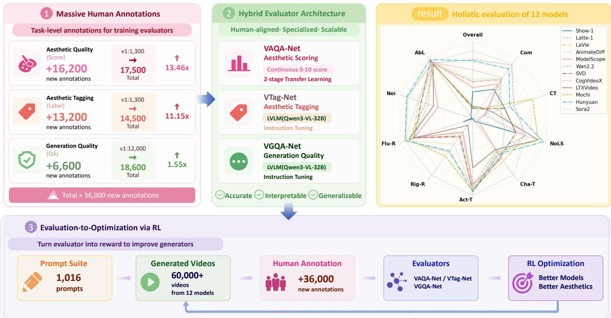
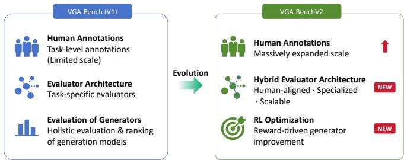
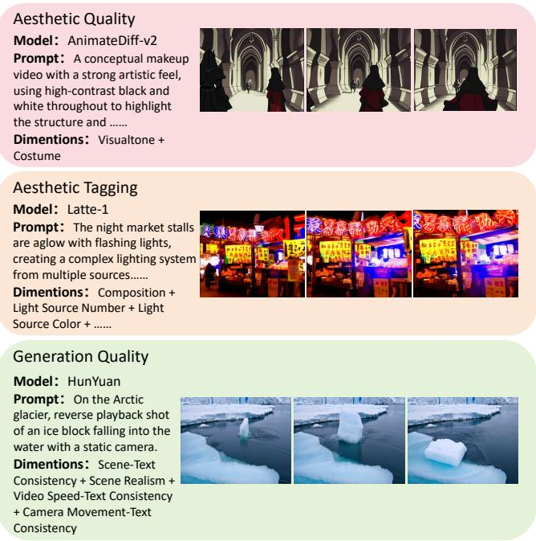
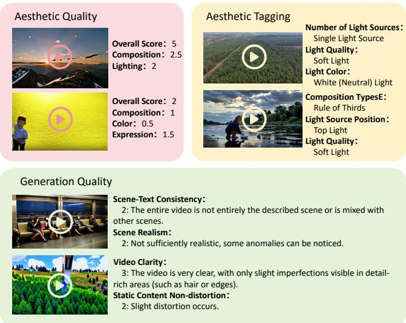
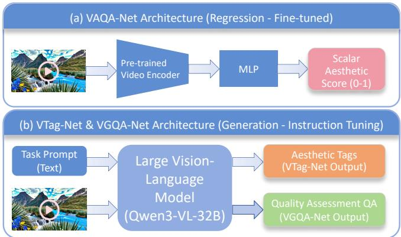
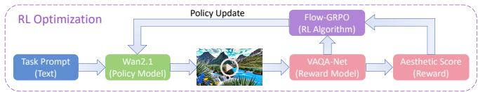

# VGA-BenchV2: An Expanded Unified Benchmark and Multi-Model Framework for Evaluating Video Aesthetics and Generation Quality

Longteng Jiang1 , Dandan Zheng1 , Qianqian Qiao1 , Heng Huang1 , Huaye Wang1 Yihang Bo2 , Bao Peng2 , Jingdong Chen1 , Jun Zhou1∗ , Xin Jin3∗

1Ant Group, Beijing, China

2Beijing Film Academy, Beijing, China

3State Key Laboratory of General Artificial Intelligence, Beijing Institute for General Artificial Intelligence (BIGAI), Beijing, China

{jianglongteng.jlt, yuandan.zdd, qiaoqianqian.qqq, huangheng.hh, wanghuaye.why}@antgroup.com, boyihang@bfa.edu.cn, 3180100063@zju.edu.cn, jingdongchen.cjd@antgroup.com, jun.zhoujun@antfin.com, jinxin@bigai.ai

## Abstract

The rapid advancement of AIGC video generation calls for evaluation frameworks that move beyond technical fidelity and incorporate human-centered aesthetic assessment. Existing benchmarks often overlook fine-grained perceptual qualities such as visual aesthetics, artistic style, and human preference. To address this limitation, we introduce VGA-BenchV2, an extended human-aligned benchmark and optimization framework for jointly evaluating and improving video generation quality and aesthetic value.

Built upon VGA-Bench, VGA-BenchV2 preserves the original fine-grained taxonomy with two primary dimensions—Aesthetic and Generation—and 52 sub-dimensions. Guided by this taxonomy, we curate 1,016 diverse prompts and collect over 60,000 videos generated by 12 mainstream video generation models. More importantly, VGA-BenchV2 substantially expands human-labeled supervision by adding 36,000 task-level annotations, including 16,200 for aesthetic quality, 13,200 for aesthetic tagging, and 6,600 for generation quality, corresponding to 13.46×, 11.15×, and 1.55× scaleups over VGA-Bench, respectively.

Leveraging this enlarged annotation corpus, we develop a hybrid evaluator architecture consisting of VAQA-Net for continuous aesthetic scoring and two Qwen-based Large Vision-Language Model evaluators, VTag-Net and VGQA-Net, for aesthetic tagging and generation quality assessment. Extensive experiments demonstrate strong alignment with human judgments across diverse generation models. Beyond evaluation, VGA-BenchV2 further introduces an evaluationto-optimization pipeline, where the learned aesthetic evaluator serves as a reward model for reinforcement learning-based generator fine-tuning.

This closes the loop from benchmark construction and human supervision to automated evaluation and model optimization, enabling video generators to improve not only in realism but also in aesthetic quality and human preference alignment. Resources are available at https://huggingface.co/ datasets/BestiVictoryLab/VGA-Bench.

## 1 Introduction

Text-to-video generation has rapidly evolved from early proof-of-concept systems into increasingly capable generative models that can synthesize coherent, temporally stable, and visually compelling videos from natural language prompts [Blattmann et al., 2023a; Blattmann et al., 2023b; Luo et al., 2023; Khachatryan et al., 2023]. Recent advances in diffusion models [Blattmann et al., 2023a; Song et al., 2020], transformer-based architectures [Liu et al., 2022; Selva et al., 2023], and large-scale vision-language pretraining [Chen et al., 2023; Wang et al., 2023b; Dou et al., 2022] have further accelerated this progress, enabling state-of-theart systems [Wan et al., 2025; Kong et al., 2024; Tang et al., 2025; Liu et al., 2024; HaCohen et al., 2024; Team, 2024; Ma et al., 2024; Yang et al., 2024; Wang et al., 2023a; Zhang et al., 2025; Wang et al., 2025a; Guo et al., 2023; Blattmann et al., 2023a] to support increasingly diverse creative scenarios. As these models move closer to real-world use in digital art, film production, advertising, and virtual reality, evaluation is no longer limited to verifying whether a video is technically plausible. It must also measure whether the generated content is aesthetically appealing, stylistically controllable, and aligned with human visual preferences.

However, most existing evaluation protocols are still designed around technical correctness. Metrics such as FVD [Unterthiner et al., 2019] and CLIP Score [Hessel et al., 2021], together with their advanced variants [Liu et al., 2023], primarily quantify distributional similarity, temporal consistency, prompt alignment, or low-level visual artifacts. These measurements are useful for diagnosing basic generation quality, but they provide limited insight into perceptual and artistic factors such as composition, lighting, color harmony, cinematic expression, and style controllability. More importantly, conventional metrics usually serve as passive evaluation tools: they can rank or compare models, but are less effective at providing human-aligned supervision that can be directly used to improve video generators.

  
Figure 1: Overview of VGA-BenchV2. Left: expanded human annotations supporting evaluator training; middle: hybrid evaluator architecture combining VAQA-Net, VTag-Net, and VGQA-Net; right: holistic evaluation of 12 state-of-the-art video generation models, visualizing performance across 10 representative dimensions selected from the 52 sub-dimensions of VGA-Bench. The bottom panel illustrates the evaluation-to-optimization pipeline using RL.

A series of video generation benchmarks have been proposed to address this evaluation gap. V-Bench [Huang et al., 2024] is a representative effort toward standardized multidimensional evaluation, but its treatment of video aesthetics remains coarse and depends heavily on off-the-shelf scoring models such as MUSIQ [Ke et al., 2021] and DINO [Caron et al., 2021]. VGA-Bench [Jiang et al., 2026] further advances this direction by introducing a fine-grained taxonomy for jointly evaluating aesthetic quality, aesthetic tags, and generation quality. Nevertheless, as video generation models become stronger and more widely used, a benchmark alone is insufficient: reliable aesthetic evaluation requires substantially larger human-labeled supervision, more expressive evaluator architectures, and a mechanism to convert human preference judgments into actionable optimization signals. These requirements motivate VGA-BenchV2, which extends VGA-Bench from a fine-grained evaluation benchmark into a human-aligned framework that unifies large-scale annotation, hybrid automated evaluation, and reinforcement learning-based model optimization.

Notably, V-Bench [Huang et al., 2024] represents a pioneering systematic effort to evaluate AIGC videos across multiple dimensions, marking a significant step toward standardized evaluation. However, it reduces the multifaceted nature of video aesthetics into a limited set of scalar measurements and relies heavily on off-the-shelf scoring models, such as MUSIQ [Ke et al., 2021] and DINO [Caron et al., 2021]. This reliance inevitably leads to coarse granularity, potential domain bias, and limited interpretability for improving generation models. VGA-Bench [Jiang et al., 2026] further advances this direction by introducing a fine-grained benchmark for jointly evaluating video aesthetic quality, aesthetic tags, and generation quality. Nevertheless, its evaluator training is still limited by the scale of human-labeled supervision, and the benchmark mainly focuses on evaluation rather than forming a closed loop from human preference modeling to generative model optimization.

To address these limitations, this paper introduces VGA-BenchV2 (as shown in Figure 1), an extended humanaligned benchmark and optimization framework for video aesthetic and generation quality assessment. Built upon VGA-Bench [Jiang et al., 2026], VGA-BenchV2 preserves the original fine-grained taxonomy with two primary dimensions, Aesthetic and Generation, and 52 sub-dimensions, while substantially extending the human annotation scale, evaluator architecture, and optimization capability. Our main contributions are summarized as follows:

• Large-scale human annotation expansion. Compared with VGA-Bench [Jiang et al., 2026], VGA-BenchV2 substantially expands human-labeled supervision by adding 36,000 newly collected task-level annotations, including 16,200 annotations for aesthetic quality assessment, 13,200 annotations for aesthetic tagging, and 6,600 annotations for generation quality assessment. This corresponds to 13.46×, 11.15×, and 1.55× scale-ups over VGA-Bench for the three tasks, respectively, transforming the benchmark from an evaluationoriented suite into a large-scale human-aligned training infrastructure.

• Human-supervised hybrid evaluator architecture. Leveraging the enlarged annotation corpus, we develop a hybrid evaluator system consisting of VAQA-Net for continuous aesthetic scoring and two Qwenbased Large Vision-Language Model evaluators, VTag-Net and VGQA-Net, for aesthetic tagging and generation quality assessment, respectively. This design combines specialized aesthetic regression with LVLM-based semantic reasoning, enabling scalable, interpretable, and human-aligned evaluation across diverse generation models.

• Evaluation-to-optimization via reinforcement learning. Beyond passive evaluation, VGA-BenchV2 introduces an evaluation-to-optimization pipeline in which the learned aesthetic evaluator serves as a reward model for reinforcement learning-based fine-tuning of video generators. By using the aesthetic score as a reward signal, the framework converts human aesthetic preferences into actionable optimization objectives, demonstrating that VGA-BenchV2 can directly guide generative models toward higher aesthetic quality and better human preference alignment.

• Unified benchmark, evaluator, and optimization infrastructure. VGA-BenchV2 integrates 52 fine-grained evaluation dimensions, 1,016 diverse prompts, over 60,000 videos generated by 12 mainstream models, large-scale human annotations, hybrid automated evaluators, and reinforcement learning-based optimization into a unified framework. This enables systematic analysis, fair cross-model comparison, and closed-loop improvement of video generation models.

We believe that VGA-BenchV2 serves not only as a rigorous evaluation platform, but also as a key infrastructure for advancing the next generation of video generation systems with enhanced aesthetic intelligence, artistic controllability, and human preference alignment.

## 2 Related Work

Evaluating video generation models remains challenging despite their rapid progress. Early metrics such as FVD [Unterthiner et al., 2019], CLIP Score [Hessel et al., 2021], and their advanced variants [Liu et al., 2023] mainly measure distributional similarity, temporal consistency, prompt alignment, or low-level visual artifacts. While useful for assessing basic technical quality, these metrics are insufficient for capturing fine-grained perceptual factors such as composition, lighting, color harmony, artistic style, and overall aesthetic appeal.

  
Figure 2: Comparison between VGA-Bench (V1) and VGA-BenchV2 (V2). Both include human annotations and multi-model evaluation; V2 expands annotation scale, adds a hybrid evaluator, and supports optional RL optimization.

Recent benchmarks have promoted more systematic evaluation of video generation models. V-Bench [Huang et al., 2024] provides a representative multi-dimensional evaluation protocol, and V-Bench2 [Zheng et al., 2025] further extends the evaluation scope. Other benchmarks, in cluding ChronoMagic-Bench [Yuan et al., 2024], T2V-CompBench [Sun et al., 2025], and StoryEval [Wang et al., 2025b], focus on complementary aspects such as temporal coherence, compositional binding, and narrative consistency. Compared with these works, VGA-Bench [Jiang et al., 2026] is distinguished by its fine-grained treatment of video aesthetics, jointly modeling aesthetic quality, aesthetic tags, and generation quality within a unified taxonomy.

VGA-BenchV2 further extends VGA-Bench [Jiang et al., 2026] from a fine-grained evaluation benchmark into a human-aligned evaluation and optimization framework. Specifically, it strengthens human-labeled supervision, introduces a hybrid evaluator architecture that combines specialized aesthetic scoring with LVLM-based tagging and generation-quality assessment, and further connects evaluation with reinforcement learning-based generator optimization. In this way, VGA-BenchV2 moves beyond passive benchmarking and forms a closed-loop framework that links benchmark design, human annotation, automated evaluation, and model improvement.

## 3 VGA-BenchV2 Construction

## 3.1 Inherited Evaluation Taxonomy

VGA-BenchV2 inherits the fine-grained evaluation taxonomy of VGA-Bench [Jiang et al., 2026] to ensure continuity, reproducibility, and cross-version comparability. Rather than redesigning the benchmark dimensions, we preserve the original taxonomy as the evaluation backbone and focus the V2 extension on human annotation expansion, hybrid evaluator training, and evaluation-to-optimization. Overall, the taxonomy contains 52 sub-dimensions organized into two primary categories: Aesthetic and Generation.

The Aesthetic category consists of two complementary perspectives.

• Aesthetic Quality measures the perceptual appeal of generated videos as continuous scores, covering ten dimensions adapted from VADB [Qiao et al., 2025]: Overall Score (Ovr), Composition (Com), Shot Size (SS),

<table><tr><td rowspan="2">Benchmark</td><td rowspan="2">Aesthetic Dims</td><td>Evaluator</td><td>Annotation</td><td>RL</td></tr><tr><td>Architecture</td><td>Usage</td><td>Opt.</td></tr><tr><td>V-Bench [Huang et al., 2024]</td><td>1</td><td>Off-the-shelf Expert Models</td><td>Alignment Only</td><td>x</td></tr><tr><td>V-Bench2.0 [Zheng et al., 2025]</td><td>2</td><td>Off-the-shelf Expert Models</td><td>Alignment Only</td><td>x</td></tr><tr><td>T2V-CompBench [Sun et al., 2025]</td><td>0</td><td>MLLM-based</td><td>Alignment Only</td><td>x</td></tr><tr><td>ChronoMagic-Bench [Yuan et al., 2024]</td><td>0</td><td>Hybrid</td><td>Alignment Only</td><td>x</td></tr><tr><td>StoryEval [Wang et al., 2025b]</td><td>0</td><td>MLLM-based</td><td>Alignment Only</td><td>x</td></tr><tr><td>VGA-Bench [Jiang et al., 2026]</td><td>21</td><td>Specialized Nets Hybrid</td><td>Training &amp; Alignment</td><td>x</td></tr><tr><td>VGA-BenchV2 (Ours)</td><td>21</td><td>Specialized Nets + LVLMs</td><td>Training, Alignment &amp; Reward</td><td>√</td></tr></table>

Table 1: Comparison with existing video generation benchmarks. VGA-BenchV2 preserves the fine-grained aesthetic and generation taxon omy of VGA-Bench while further extending it with hybrid human-aligned evaluators and an evaluation-to-optimization pipeline.

Lighting (Lig), Visual Tone (VT), Color (Col), Depth of Field (DoF), Expression (Exp), Costume (Cos), and Makeup (Mak).

• Aesthetic Tagging describes discrete visual and stylistic attributes as classification labels. Following photographic and cinematographic principles [Qiao et al., 2025; Matbouly, 2022; Deren, 1960; Brown, 2016], it contains eleven tag dimensions: Composition Types (CT), Shot Type (ST), Number of Light Sources (NoLS), Light Source Position (LSP), Light Quality (LQ), Light Color (LC), Color Temperature (ColT), Saturation (Sat), Brightness (Bri), Contrast (Con), and Depth of Field (DoF). These 21 aesthetic-related dimensions support both quantitative model ranking and interpretable analysis of visual style controllability.

The Generation category evaluates whether generated videos are semantically faithful, physically plausible, and visually stable. Following VGA-Bench [Jiang et al., 2026] and building upon V-Bench [Huang et al., 2024], VGA-BenchV2 retains 31 generation-quality sub-dimensions grouped into three aspects.

• Video-Text Consistency includes Character-Text Consistency (Cha-T), Action-Text Consistency (Act-T), Object-Text Consistency (Obj-T), Scene-Text Consistency (Sce-T), Object Position-Text Consistency (Pos-T), Camera Movement-Text Consistency (Cam-T), Object Attribute-Text Consistency (Att-T), Video Content-Text Consistency (Cnt-T), Video Style-Text Consistency (Sty-T), and Video Speed-Text Consistency (Spd-T).

• Reality & Plausibility includes Rigid Body Collision Realism (Rig-R), Fluid Motion Realism (Flu-R), Gaseous Motion Realism (Gas-R), Gradual Change Realism (Gra-R), Object Trajectory Realism (Tra-R), Action Realism (Act-R), Scene Realism (Sce-R), Object Realism (Obj-R), Character Generation Quality (Cha-R), Weather Representation Realism (Wea-R), Time Period Representation Realism (Tim-R), Lighting & Shadow Realism (Lig-R), Moving Scene Reasonableness (Dyn-R), Textual Attribute Representation (Att-R), Overall Realism (Glo-R), and Unrealistic Description Imaginative Presentation (Ima-R).

  
Figure 3: Prompts for the three core dimensions, their corresponding sub-dimensions, and example generated videos.

• Basic Quality includes Video Noise-Free (Noi), Abnormal Lighting Detection (AbL), Video Clarity (Cla), Static Content Stability (Sta), and Static Content Nondistortion (Dis). We use the suffix “-T” to denote videotext consistency dimensions and “-R” to denote reality or plausibility dimensions, while basic quality dimensions use standalone mnemonic codes. Detailed definitions and evaluation criteria are provided in the Appendix.

## 3.2 Prompt Suite and Video Pool

VGA-BenchV2 inherits the prompt suite from VGA-Bench [Jiang et al., 2026] to ensure cross-version comparability and stable dimension-wise evaluation. The prompt suite is designed under the principle of explicit attribute specification: each prompt explicitly triggers one or more target dimensions, such that annotators and automated evaluators assess only the attributes that are semantically grounded in the prompt. This design reduces ambiguity during both human annotation and automated evaluation.

  
Figure 4: Examples of human annotations for the three core dimensions.

The prompt suite contains 1,016 prompts, including 200 prompts for aesthetic quality, 220 for aesthetic tagging, and 596 for generation quality. Each dimension is covered by at least 50 prompts, and the suite supports both singledimension and multi-dimensional combinations. We also retain two lightweight subsets with 508 and 127 prompts for efficient evaluation under different computational budgets.

In VGA-BenchV2, the prompt suite serves as a unified anchor for three downstream components: large-scale human annotation, supervised evaluator training, and evaluation-tooptimization experiments. By reusing the same dimensionaligned prompts as VGA-Bench, VGA-BenchV2 isolates the effect of expanded human supervision and improved evaluator design, while preserving a consistent benchmark protocol for comparing video generation models.

## 3.3 Large-scale Human Annotation Expansion

A central goal of VGA-BenchV2 is to transform VGA-Bench from an evaluation-oriented benchmark into a human-aligned training infrastructure for automated video evaluators. To this end, we substantially expand the task-level human annotations over VGA-Bench [Jiang et al., 2026]. Specifically, VGA-BenchV2 introduces 36,000 newly collected annotations, including 16,200 annotations for aesthetic quality assessment, 13,200 annotations for aesthetic tagging, and 6,600 annotations for generation quality assessment. These annotations provide direct supervision for evaluator training, alignment verification, and reward modeling.

## Annotation Protocol and Quality Control

We follow an expert-guided and multi-annotator annotation protocol. Domain experts first provide exemplar annotations and detailed rating guidelines for each task. Trained annotators then label the remaining samples according to these exemplars, while experts conduct batch-wise audits to ensure annotation consistency. If a batch fails the quality check, it is rejected and re-annotated.

<table><tr><td>Task</td><td>VGA-Bench Supervision</td><td>New V2 Annotations</td><td>V2 Total</td><td>Scale-up</td></tr><tr><td>Aesthetic Quality</td><td>1,300</td><td>+16,200</td><td>17,500</td><td>13.46×</td></tr><tr><td>Aesthetic Tagging</td><td>1,300</td><td>+13,200</td><td>14,500</td><td>11.15×</td></tr><tr><td>Generation Quality</td><td>12,000</td><td>+6,600</td><td>18,600</td><td>1.55×</td></tr><tr><td>Total</td><td>14,600</td><td>+36,000</td><td>50,600</td><td>3.47×</td></tr></table>

Table 2: Human annotation expansion in VGA-BenchV2. We report task-level supervision for aesthetic quality, aesthetic tagging, and generation quality. VGA-BenchV2 substantially increases the amount of human-labeled data used for evaluator training and alignment.

For aesthetic quality, each sample is scored on a 0–10 scale, and the final score is obtained by averaging multiple independent ratings. For aesthetic tagging, annotators assign discrete visual labels such as composition type, light source position, shot type, color temperature, and contrast, with final labels determined by majority voting. For generation quality, each dimension is formulated as a task-specific question with structured ordinal options, enabling the labels to capture different levels of semantic consistency, realism, and basic visual quality.

Importantly, all annotation tasks follow the explicit-trigger principle inherited from the prompt suite: annotators evaluate only the dimensions explicitly specified by the prompt. This prevents subjective speculation on unmentioned attributes and ensures that each label is semantically grounded in the prompt-video pair.

## 3.4 Hybrid Automated Evaluation Networks

Leveraging the expanded human-annotated corpus, VGA-BenchV2 moves beyond lightweight task-specific evaluators to train a robust, human-aligned hybrid evaluator system. The architecture combines specialized aesthetic regression with LVLM-based semantic reasoning, consisting of VAQA-Net for continuous aesthetic scoring, VTag-Net for aesthetic tagging, and VGQA-Net for generation quality assessment.

VAQA-Net (Aesthetic Scoring): We adopt a two-stage transfer learning strategy. First, the video encoder is initialized from the VADB pre-trained model to inherit aesthetic representations. Second, the model is fine-tuned on a largescale generated video dataset, including 8,366 videos from 12 mainstream generation models with high-quality human annotations. Evaluation is performed on a held-out set of 1,186 generated videos to assess generalization.

VTag-Net & VGQA-Net (LVLM-based Evaluators): To enable semantic reasoning and detailed assessment, we leverage Qwen3-VL-32B [Bai et al., 2025] as the backbone and apply instruction tuning for task-specific adaptation.

• VTag-Net: Trained on a combination of real VADB videos and 11,100 generated videos with humanannotated aesthetic tags, outputting discrete visual labels.

• VGQA-Net: Trained on 7,054 generated videos with human-annotated question-answer pairs, optimized for coherent reasoning and generation quality assessment.

  
Figure 5: Overview of the hybrid evaluation networks. VAQA-Net predicts scalar aesthetic scores via a pre-trained encoder and regression head, while VTag-Net and VGQA-Net leverage a LVLM backbone via instruction tuning for aesthetic tagging and quality reasoning.

The training set includes representative samples from all 12 source models to ensure generalization across generation paradigms.

The network architectures of VAQA-Net, VTag-Net, and VGQA-Net are illustrated in Figure 5.

## 3.5 Evaluation-to-Optimization Interface

Beyond serving as passive evaluation metrics, the learned evaluators in VGA-BenchV2 can be used as reward models for generator optimization. In particular, the aesthetic score predicted by VAQA-Net provides a scalar reward reflecting human-aligned visual preference. This reward can be incorporated into reinforcement learning-based fine-tuning pipelines, enabling video generators to optimize toward higher aesthetic quality while maintaining stability.

Formally, given a prompt p, the current policy $\pi _ { \theta }$ generates a video $v \sim \pi _ { \theta } ( \cdot | p )$ , and VAQA-Net outputs a scalar reward:

$$
\boldsymbol { r } _ { \phi } ( \boldsymbol { v } ) = \mathrm { V A Q A } _ { \phi } ( \boldsymbol { v } ) ,\tag{1}
$$

with $\phi$ denoting the frozen evaluator parameters. To stabilize training, KL regularization is applied:

$$
\tilde { r } ( v , p ) = r _ { \phi } ( v ) - \lambda _ { \mathrm { K L } } D _ { \mathrm { K L } } \left( \pi _ { \theta } ( \cdot | p ) \| \pi _ { \mathrm { r e f } } ( \cdot | p ) \right) ,\tag{2}
$$

and the normalized advantage is

$$
A _ { i } = \frac { \tilde { r } _ { i } - \mu _ { B } } { \sigma _ { B } + \epsilon } ,\tag{3}
$$

where $\mu _ { B }$ and $\sigma _ { B }$ denote the batch mean and standard deviation.

For policy optimization, the unclipped and clipped advantages are defined as

$$
\begin{array} { r l } & { { { r } _ { i , t } } = { { \rho } _ { i , t } } { { A } _ { i } } , } \\ & { { { c } _ { i , t } } = \mathrm { c l i p } ( { { \rho } _ { i , t } } , 1 - \epsilon , 1 + \epsilon ) { { A } _ { i } } , } \\ & { { { \rho } _ { i , t } } = \frac { { { \pi } _ { \theta } } \left( { { a } _ { i , t } } \left| { { s } _ { i , t } } \right. \right) } { { { \pi } _ { { { \theta } _ { \mathrm { o l d } } } } } \left( { { a } _ { i , t } } \left| { { s } _ { i , t } } \right. \right) } , } \end{array}\tag{4}
$$

and the clipped GRPO objective is

$$
\mathcal { L } _ { \mathrm { G R P O } } ( \theta ) = - \mathbb { E } _ { i , t } \big [ \operatorname* { m i n } ( r _ { i , t } , c _ { i , t } ) \big ] .\tag{5}
$$

<table><tr><td colspan="2">VAQA-Net (SROCC)</td><td colspan="3">VTag-Net (Accuracy)</td></tr><tr><td>Dimension</td><td>Score</td><td>Dimension</td><td>#Cls.</td><td>Acc.</td></tr><tr><td>Overall Score</td><td>87.6</td><td>Color Temp. (ColT)</td><td>3</td><td>64.8</td></tr><tr><td>Composition (Com)</td><td>86.9</td><td>Saturation (Sat)</td><td>3</td><td>71.9</td></tr><tr><td>Shot Size (SS)</td><td>87.4</td><td>Brightness (Bri)</td><td>3</td><td>70.3</td></tr><tr><td>Lighting (Lig)</td><td>87.2</td><td>Contrast (Con)</td><td>3</td><td>75.0</td></tr><tr><td>Visual Tone (VT)</td><td>87.4</td><td>Light Quality (LQ)</td><td>2</td><td>66.3</td></tr><tr><td>Color (Col)</td><td>86.5</td><td>Light Color (LC)</td><td>4</td><td>93.6</td></tr><tr><td>Depth of Field (DoF)</td><td>87.4</td><td>Light Pos. (LSP)</td><td>5</td><td>68.3*</td></tr><tr><td>Expression (Exp)</td><td>89.2</td><td>Num. Lights (NoLS)</td><td>2</td><td>83.7</td></tr><tr><td>Costume (Cos)</td><td>88.4</td><td>Comp. Type (CT)</td><td>7</td><td>49.8*</td></tr><tr><td>Makeup (Mak)</td><td>86.3</td><td>Shot Type (ST)</td><td>5</td><td>75.9*</td></tr><tr><td></td><td></td><td>Depth of Field (DoF)</td><td>2</td><td>76.1</td></tr></table>

Table 3: Validation of Aesthetic Evaluators. We report the SROCC (%) for VAQA-Net and Classification Accuracy (%) for VTag-Net. Specifically, we adopt Top-1 Accuracy for dimensions with ≤ 4 classes and Top-2 Accuracy for those with > 4 classes (marked with \*) to account for varying label space sizes.

<table><tr><td>Dim.</td><td>Acc.</td><td>Dim.</td><td>Acc.</td><td>Dim.</td><td>Acc.</td><td>Dim.</td><td>Acc.</td></tr><tr><td>Cha-T</td><td>70.5</td><td>Sty-T</td><td>69.6</td><td>Sce-R</td><td>89.2</td><td>Glo-R</td><td>69.8</td></tr><tr><td>Act-T</td><td>70.7</td><td>Spd-T</td><td>76.6</td><td>Obj-R</td><td>81.2</td><td>Ima-R</td><td>59.2</td></tr><tr><td>Obj-T</td><td>75.2</td><td>Rig-R</td><td>62.2</td><td>Cha-R</td><td>56.8</td><td>Noi</td><td>58.3</td></tr><tr><td>Sce-T</td><td>74.7</td><td>Flu-R</td><td>75.6</td><td>Wea-R</td><td>66.8</td><td>AbL</td><td>85.7</td></tr><tr><td>Pos-T</td><td>64.3</td><td>Gas-R</td><td>78.3</td><td>Tim-R</td><td>83.1</td><td>Cla</td><td>66.4</td></tr><tr><td>Cam-T</td><td>72.5</td><td>Gra-R</td><td>80.4</td><td>Lig-R</td><td>80.5</td><td>Sta</td><td>50.5</td></tr><tr><td>Att-T</td><td>72.6</td><td>Tra-R</td><td>62.1</td><td>Dyn-R</td><td>67.0</td><td>Dis</td><td>71.7</td></tr><tr><td>Cnt-T</td><td>58.4</td><td>Act-R</td><td>80.2</td><td>Att-R</td><td>78.7</td><td>一</td><td>一</td></tr></table>

Table 4: Validation of VGQA-Net. We report the Accuracy (%) across 31 sub-dimensions. The suffixes -T and -R denote Video-Text Consistency and Reality/Plausibility, respectively.

This formulation encourages higher-reward samples to contribute stronger updates while constraining policy drift. Detailed implementation and training parameters are described in Section 4.

## 4 Experiments and Results

## 4.1 Validation of Automated Evaluator

To ensure the reliability of VGA-BenchV2, we rigorously validated our automated evaluators against human ground truth on a held-out test set. For aesthetics, Table 3 shows that VAQA-Net achieves a high SROCC of 87.6% on the overall score, demonstrating strong ranking consistency with human experts. Simultaneously, VTag-Net delivers robust classification performance, particularly in objective dimensions like Light Color (93.6%) and Number of Light Sources (83.7%), validating its precision in identifying visual elements. For generation quality, VGQA-Net (Table 4) exhibits consistent alignment across all 31 fine-grained dimensions, with an average accuracy approximately 71.3%. High scores in challenging categories like Scene Realism (89.2%) and Abnormal Lighting Detection (85.7%) confirm that our MLLM-based evaluators serve as effective, scalable proxies for human assessment.

These high scores not only demonstrate the effectiveness of our models but also indicate that their predictions are closely aligned with expert human annotations, corroborating the human-aligned supervision highlighted in Table 1.

## 4.2 VGA-BenchV2 Evaluation Results

We evaluate all generative models using the trained VAQA Net, VTag-Net, and VGQA-Net to assess their performance across diverse aesthetic and quality dimensions. To ensure a fair and unbiased ranking, all generated videos used for evaluation are strictly held out from the evaluator training process, preventing data leakage. The evaluated models are listed chronologically by release date: Stable Video Diffusion (SVD) [Blattmann et al., 2023a], AnimateDiff-v2 [Guo et al., 2023], LaVie [Wang et al., 2025a], Show-1 [Zhang et al., 2025], ModelScope [Wang et al., 2023a], CogVideoX [Yang et al., 2024], Latte-1 [Ma et al., 2024], Mochi [Team, 2024], LTXVideo [HaCohen et al., 2024], HunyuanVideo [Kong et al., 2024], Wan2.2 [Wan et al., 2025], and Sora2 [Liu et al., 2024].

The ranking metrics are defined as follows:

• Aesthetic Quality: Models are ranked by their average predicted score (higher is better).

• Aesthetic Tagging: We utilize alignment accuracy as the metric (i.e., whether the generated video successfully reflects the prompted aesthetic tag), where higher mean accuracy indicates superior controllability.

• Generation Quality: Models are ranked by the mean score across all sub-dimensions, where a higher average indicates better generation fidelity and consistency.

The final aggregated results, obtained by normalizing and averaging scores across all sub-dimensions within the three main categories, are presented in Table 5. For detailed performance breakdowns of each model across specific subdimensions, please refer to the Appendix.

## 4.3 Aesthetic Optimization via Reinforcement Learning

To validate the practical effect of our evaluators, we finetune Wan2.1 using the evaluation-to-optimization interface described in Section 3.5. As shown in Figure 6, the VAQA-Net Overall Score is used as the reward, and Flow-GRPO [Liu et al., 2025] is applied with LoRA and ODE-to-SDE conversion.

Quantitative results on a held-out test set show that the average aesthetic score increases from 0.49 to 0.52. Qualitative results indicate that fine-tuned videos exhibit more appealing visual composition and higher overall aesthetic quality. These results demonstrate that VGA-BenchV2 evaluators can support not only passive evaluation but also reward-driven video generator optimization.

## 5 Conclusion

We present VGA-BenchV2, an extended human-aligned benchmark and optimization framework that builds upon

  
Figure 6: RL Aesthetic Optimization Pipeline. We utilize the Flow-GRPO algorithm to fine-tune video generation models, employing VAQA-Net as the reward model to enhance artistic quality.

<table><tr><td>Model</td><td>Aes. Score Tag Cla. Gen. Level</td><td></td><td></td></tr><tr><td>SVD [Blattmann et al., 2023a]</td><td>0.20</td><td>0.60</td><td>0.69</td></tr><tr><td>AnimateDiff [Guo et al., 2023]</td><td>0.36</td><td>0.57</td><td>0.67</td></tr><tr><td>LaVie [Wang et al., 2025a]</td><td>0.34</td><td>0.58</td><td>0.68</td></tr><tr><td>Show-1 [Zhang et al., 2025]</td><td>0.29</td><td>0.60</td><td>0.04</td></tr><tr><td>ModelScope [Wang et al., 2023a]</td><td>0.31</td><td>0.51</td><td>0.64</td></tr><tr><td>CogVideoX [Yang et al., 2024]</td><td>0.41</td><td>0.56</td><td>0.70</td></tr><tr><td>Latte-1 [Ma et al., 2024]</td><td>0.35</td><td>0.60</td><td>0.68</td></tr><tr><td>Mochi [Team, 2024]</td><td>0.21</td><td>0.68</td><td>0.71</td></tr><tr><td>LTXVideo [HaCohen et al., 2024]</td><td>0.22</td><td>0.61</td><td>0.61</td></tr><tr><td>HunyuanVideo [Kong et al., 2024]</td><td>0.45</td><td>0.66</td><td>0.73</td></tr><tr><td>Wan2.2 [Wan et al., 2025]</td><td>0.46</td><td>0.63</td><td>0.71</td></tr><tr><td>Sora2 [Liu et al., 2024]</td><td>0.50</td><td>0.64</td><td>0.80</td></tr></table>

Table 5: Performance comparison of state-of-the-art text-to-video generation models on aesthetic score (Aes. Score), tag classification accuracy (Tag Cla.), and generation level (Gen. Level) metrics.

VGA-Bench by preserving 52 sub-dimensions, 1,016 prompts, and over 60,000 videos while introducing three key advancements: expanded human-labeled supervision for aesthetic quality, aesthetic tagging, and generation quality; a hybrid evaluator architecture combining VAQA-Net and LVLM-based VTag-Net and VGQA-Net for accurate, interpretable, and scalable assessment; and an evaluation-tooptimization pipeline enabling RL-based fine-tuning of video generators to align outputs with human aesthetic preference. Experiments demonstrate that VGA-BenchV2 provides more precise, human-aligned evaluation and facilitates multidimensional optimization. In the future, it can be extended to higher-resolution videos, additional aesthetic dimensions, cross-modal generation, and controllable creative applications, supporting next-generation AIGC video systems that harmonize fidelity, artistry, and human preference.

## Ethical Statement

We strictly ensure that all prompts and generated videos within this benchmark have been rigorously screened to exclude pornographic, violent, or otherwise offensive content. Furthermore, all human annotation procedures comply with ethical guidelines and have been reviewed and approved by the relevant Institutional Review Board (IRB).

## Acknowledgments

This work was supported by the Ant Group Research Fund, the National Natural Science Foundation of China under Grant No.62072014, and the Opening Project of the State Key Laboratory of General Artificial Intelligence, BIGAI/Peking University, Beijing, China (Project No.SKLAGI2025OP01).

## References

[Bai et al., 2025] Shuai Bai, Yuxuan Cai, Ruizhe Chen, Keqin Chen, Xionghui Chen, Zesen Cheng, Lianghao Deng, Wei Ding, Chang Gao, Chunjiang Ge, Wenbin Ge, Zhifang Guo, Qidong Huang, Jie Huang, Fei Huang, Binyuan Hui, Shutong Jiang, Zhaohai Li, Mingsheng Li, Mei Li, Kaixin Li, Zicheng Lin, Junyang Lin, Xuejing Liu, Jiawei Liu, Chenglong Liu, Yang Liu, Dayiheng Liu, Shixuan Liu, Dunjie Lu, Ruilin Luo, Chenxu Lv, Rui Men, Lingchen Meng, Xuancheng Ren, Xingzhang Ren, Sibo Song, Yuchong Sun, Jun Tang, Jianhong Tu, Jianqiang Wan, Peng Wang, Pengfei Wang, Qiuyue Wang, Yuxuan Wang, Tianbao Xie, Yiheng Xu, Haiyang Xu, Jin Xu, Zhibo Yang, Mingkun Yang, Jianxin Yang, An Yang, Bowen Yu, Fei Zhang, Hang Zhang, Xi Zhang, Bo Zheng, Humen Zhong, Jingren Zhou, Fan Zhou, Jing Zhou, Yuanzhi Zhu, and Ke Zhu. Qwen3-vl technical report. arXiv preprint arXiv:2511.21631, 2025.

[Blattmann et al., 2023a] Andreas Blattmann, Tim Dockhorn, Sumith Kulal, Daniel Mendelevitch, Maciej Kilian, Dominik Lorenz, Yam Levi, Zion English, Vikram Voleti, Adam Letts, et al. Stable video diffusion: Scaling latent video diffusion models to large datasets. arXiv preprint arXiv:2311.15127, 2023.

[Blattmann et al., 2023b] Andreas Blattmann, Robin Rombach, Huan Ling, Tim Dockhorn, Seung Wook Kim, Sanja Fidler, and Karsten Kreis. Align your latents: Highresolution video synthesis with latent diffusion models. In Proceedings of the IEEE/CVF conference on computer vision and pattern recognition, pages 22563–22575, 2023.

[Brown, 2016] Blain Brown. Cinematography: theory and practice: image making for cinematographers and directors. Routledge, 2016.

[Caron et al., 2021] Mathilde Caron, Hugo Touvron, Ishan Misra, Herve J´ egou, Julien Mairal, Piotr Bojanowski, and´ Armand Joulin. Emerging properties in self-supervised vision transformers. In Proceedings of the IEEE/CVF international conference on computer vision, pages 9650– 9660, 2021.

[Chen et al., 2023] Fei-Long Chen, Du-Zhen Zhang, Ming-Lun Han, Xiu-Yi Chen, Jing Shi, Shuang Xu, and Bo Xu. Vlp: A survey on vision-language pre-training. Machine Intelligence Research, 20(1):38–56, 2023.

[Deren, 1960] Maya Deren. Cinematography: the creative use of reality. Daedalus, 89(1):150–167, 1960.

[Dou et al., 2022] Zi-Yi Dou, Aishwarya Kamath, Zhe Gan, Pengchuan Zhang, Jianfeng Wang, Linjie Li, Zicheng Liu, Ce Liu, Yann LeCun, Nanyun Peng, et al. Coarse-tofine vision-language pre-training with fusion in the backbone. Advances in neural information processing systems, 35:32942–32956, 2022.

[Guo et al., 2023] Yuwei Guo, Ceyuan Yang, Anyi Rao, Zhengyang Liang, Yaohui Wang, Yu Qiao, Maneesh Agrawala, Dahua Lin, and Bo Dai. Animatediff: Animate your personalized text-to-image diffusion models without specific tuning. arXiv preprint arXiv:2307.04725, 2023.

[HaCohen et al., 2024] Yoav HaCohen, Nisan Chiprut, Benny Brazowski, Daniel Shalem, Dudu Moshe, Eitan Richardson, Eran Levin, Guy Shiran, Nir Zabari, Ori Gordon, et al. Ltx-video: Realtime video latent diffusion. arXiv preprint arXiv:2501.00103, 2024.

[Hessel et al., 2021] Jack Hessel, Ari Holtzman, Maxwell Forbes, Ronan Le Bras, and Yejin Choi. Clipscore: A reference-free evaluation metric for image captioning. In Proceedings ofthe 2021 conference on empirical methods in natural language processing, pages 7514–7528, 2021.

[Huang et al., 2024] Ziqi Huang, Yinan He, Jiashuo Yu, Fan Zhang, Chenyang Si, Yuming Jiang, Yuanhan Zhang, Tianxing Wu, Qingyang Jin, Nattapol Chanpaisit, et al. Vbench: Comprehensive benchmark suite for video generative models. In Proceedings of the IEEE/CVF Conference on Computer Vision and Pattern Recognition, pages 21807–21818, 2024.

[Jiang et al., 2026] Longteng Jiang, DanDan Zheng, Qianqian Qiao, Heng Huang, Huaye Wang, Yihang Bo, Bao Peng, Jingdong Chen, Jun Zhou, and Xin Jin. Vgabench: A unified benchmark and multi-model framework for video aesthetics and generation quality evaluation. arXiv preprint arXiv:2604.10127, 2026.

[Ke et al., 2021] Junjie Ke, Qifei Wang, Yilin Wang, Peyman Milanfar, and Feng Yang. Musiq: Multi-scale image quality transformer. In Proceedings of the IEEE/CVF international conference on computer vision, pages 5148– 5157, 2021.

[Khachatryan et al., 2023] Levon Khachatryan, Andranik Movsisyan, Vahram Tadevosyan, Roberto Henschel, Zhangyang Wang, Shant Navasardyan, and Humphrey Shi. Text2video-zero: Text-to-image diffusion models are zero-shot video generators. In Proceedings of the IEEE/CVF International Conference on Computer Vision, pages 15954–15964, 2023.

[Kong et al., 2024] Weijie Kong, Qi Tian, Zijian Zhang, Rox Min, Zuozhuo Dai, Jin Zhou, Jiangfeng Xiong, Xin Li, Bo Wu, Jianwei Zhang, et al. Hunyuanvideo: A systematic framework for large video generative models. arXiv preprint arXiv:2412.03603, 2024.

[Liu et al., 2022] Ze Liu, Jia Ning, Yue Cao, Yixuan Wei, Zheng Zhang, Stephen Lin, and Han Hu. Video swin transformer. In Proceedings of the IEEE/CVF conference on computer vision and pattern recognition, pages 3202– 3211, 2022.

[Liu et al., 2023] Yuanxin Liu, Lei Li, Shuhuai Ren, Rundong Gao, Shicheng Li, Sishuo Chen, Xu Sun, and Lu Hou. Fetv: A benchmark for fine-grained evaluation of open-domain text-to-video generation. Advances in Neural Information Processing Systems, 36:62352–62387, 2023.

[Liu et al., 2024] Yixin Liu, Kai Zhang, Yuan Li, Zhiling Yan, Chujie Gao, Ruoxi Chen, Zhengqing Yuan, Yue Huang, Hanchi Sun, Jianfeng Gao, et al. Sora: A review on background, technology, limitations, and opportunities

of large vision models. arXiv preprint arXiv:2402.17177, 2024.

[Liu et al., 2025] Jie Liu, Gongye Liu, Jiajun Liang, Yangguang Li, Jiaheng Liu, Xintao Wang, Pengfei Wan, Di Zhang, and Wanli Ouyang. Flow-grpo: Training flow matching models via online rl. arXiv preprint arXiv:2505.05470, 2025.

[Luo et al., 2023] Zhengxiong Luo, Dayou Chen, Yingya Zhang, Yan Huang, Liang Wang, Yujun Shen, Deli Zhao, Jingren Zhou, and Tieniu Tan. Videofusion: Decomposed diffusion models for high-quality video generation. arXiv preprint arXiv:2303.08320, 2023.

[Ma et al., 2024] Xin Ma, Yaohui Wang, Gengyun Jia, Xinyuan Chen, Ziwei Liu, Yuan-Fang Li, Cunjian Chen, and Yu Qiao. Latte: Latent diffusion transformer for video generation. arXiv preprint arXiv:2401.03048, 2024.

[Matbouly, 2022] Mustafa Yousry Matbouly. Quantifying the unquantifiable: the color of cinematic lighting and its effect on audience’s impressions towards the appearance of film characters. Current Psychology, 41(6):3694–3715, 2022.

[Qiao et al., 2025] Qianqian Qiao, DanDan Zheng, Yihang Bo, Bao Peng, Heng Huang, Longteng Jiang, Huaye Wang, Jingdong Chen, Jun Zhou, and Xin Jin. Vadb: A large-scale video aesthetic database with professional and multi-dimensional annotations. arXiv preprint arXiv:2510.25238, 2025.

[Selva et al., 2023] Javier Selva, Anders S Johansen, Sergio Escalera, Kamal Nasrollahi, Thomas B Moeslund, and Albert Clapes. Video transformers: A survey.´ IEEE Transactions on Pattern Analysis and Machine Intelligence, 45(11):12922–12943, 2023.

[Song et al., 2020] Yang Song, Jascha Sohl-Dickstein, Diederik P Kingma, Abhishek Kumar, Stefano Ermon, and Ben Poole. Score-based generative modeling through stochastic differential equations. arXiv preprint arXiv:2011.13456, 2020.

[Sun et al., 2025] Kaiyue Sun, Kaiyi Huang, Xian Liu, Yue Wu, Zihan Xu, Zhenguo Li, and Xihui Liu. T2vcompbench: A comprehensive benchmark for compositional text-to-video generation. In Proceedings of the Computer Vision and Pattern Recognition Conference, pages 8406–8416, 2025.

[Tang et al., 2025] Shixiang Tang, Yizhou Wang, Lu Chen, Yuan Wang, Sida Peng, Dan Xu, and Wanli Ouyang. Human-centric foundation models: Perception, generation and agentic modeling. arXiv preprint arXiv:2502.08556, 2025.

[Team, 2024] Genmo Team. Mochi 1. https://github.com/ genmoai/models, 2024.

[Unterthiner et al., 2019] Thomas Unterthiner, Sjoerd Van Steenkiste, Karol Kurach, Raphael Marinier, Marcin ¨ Michalski, and Sylvain Gelly. Fvd: A new metric for video generation. 2019.

[Wan et al., 2025] Team Wan, Ang Wang, Baole Ai, Bin Wen, Chaojie Mao, Chen-Wei Xie, Di Chen, Feiwu Yu, Haiming Zhao, Jianxiao Yang, et al. Wan: Open and advanced large-scale video generative models. arXiv preprint arXiv:2503.20314, 2025.

[Wang et al., 2023a] Jiuniu Wang, Hangjie Yuan, Dayou Chen, Yingya Zhang, Xiang Wang, and Shiwei Zhang. Modelscope text-to-video technical report. arXiv preprint arXiv:2308.06571, 2023.

[Wang et al., 2023b] Wenhui Wang, Hangbo Bao, Li Dong, Johan Bjorck, Zhiliang Peng, Qiang Liu, Kriti Aggarwal, Owais Khan Mohammed, Saksham Singhal, Subhojit Som, et al. Image as a foreign language: Beit pretraining for vision and vision-language tasks. In Proceedings of the IEEE/CVF Conference on Computer Vision and Pattern Recognition, pages 19175–19186, 2023.

[Wang et al., 2025a] Yaohui Wang, Xinyuan Chen, Xin Ma, Shangchen Zhou, Ziqi Huang, Yi Wang, Ceyuan Yang, Yinan He, Jiashuo Yu, Peiqing Yang, et al. Lavie: High-quality video generation with cascaded latent diffusion models. International Journal of Computer Vision, 133(5):3059–3078, 2025.

[Wang et al., 2025b] Yiping Wang, Xuehai He, Kuan Wang, Luyao Ma, Jianwei Yang, Shuohang Wang, Simon Shaolei Du, and Yelong Shen. Is your world simulator a good story presenter? a consecutive events-based benchmark for future long video generation. In Proceedings of the Computer Vision and Pattern Recognition Conference, pages 13629–13638, 2025.

[Yang et al., 2024] Zhuoyi Yang, Jiayan Teng, Wendi Zheng, Ming Ding, Shiyu Huang, Jiazheng Xu, Yuanming Yang, Wenyi Hong, Xiaohan Zhang, Guanyu Feng, et al. Cogvideox: Text-to-video diffusion models with an expert transformer. arXiv preprint arXiv:2408.06072, 2024.

[Yuan et al., 2024] Shenghai Yuan, Jinfa Huang, Yongqi Xu, Yaoyang Liu, Shaofeng Zhang, Yujun Shi, Rui-Jie Zhu, Xinhua Cheng, Jiebo Luo, and Li Yuan. Chronomagicbench: A benchmark for metamorphic evaluation of textto-time-lapse video generation. Advances in Neural Information Processing Systems, 37:21236–21270, 2024.

[Zhang et al., 2025] David Junhao Zhang, Jay Zhangjie Wu, Jia-Wei Liu, Rui Zhao, Lingmin Ran, Yuchao Gu, Difei Gao, and Mike Zheng Shou. Show-1: Marrying pixel and latent diffusion models for text-to-video generation. International Journal of Computer Vision, 133(4):1879–1893, 2025.

[Zheng et al., 2025] Dian Zheng, Ziqi Huang, Hongbo Liu, Kai Zou, Yinan He, Fan Zhang, Lulu Gu, Yuanhan Zhang, Jingwen He, Wei-Shi Zheng, et al. Vbench-2.0: Advancing video generation benchmark suite for intrinsic faithfulness. arXiv preprint arXiv:2503.21755, 2025.