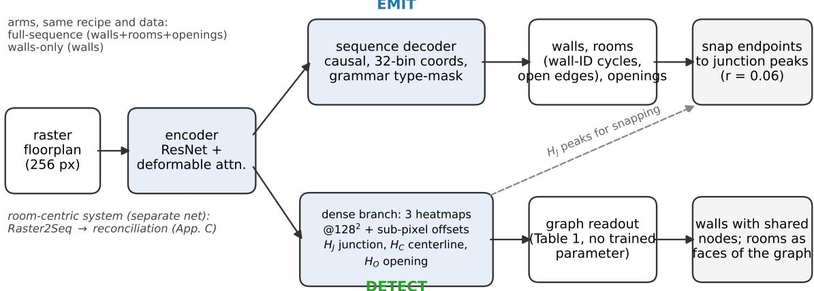
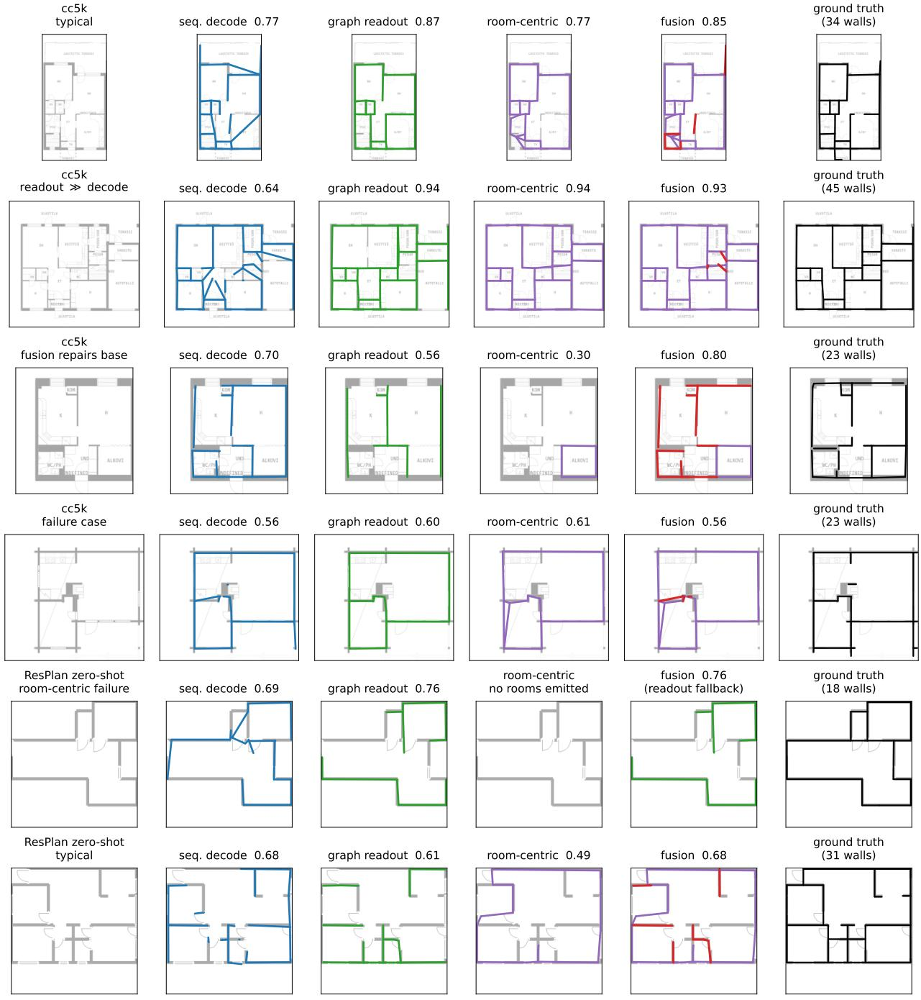
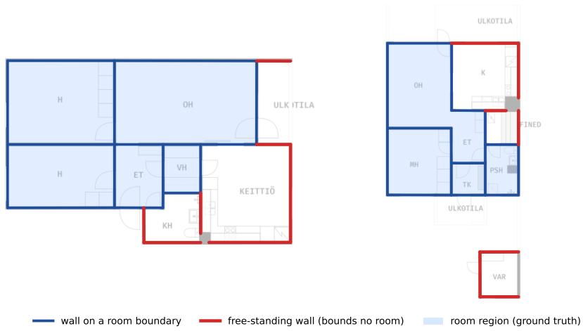
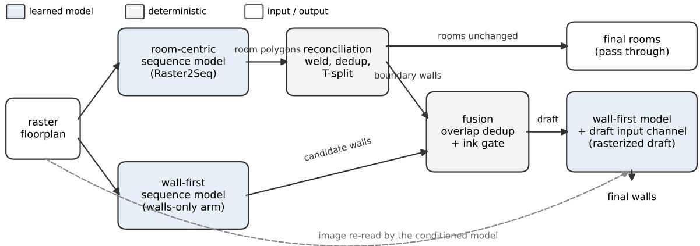

# WHEN SHOULD A NETWORK EMIT GEOMETRY, AND WHEN SHOULD IT DETECT IT? READOUT, RECONCILIATION, AND REPRESENTATION IN FLOORPLAN VECTORIZATION

A PREPRINT

He Zhang Independent Researcher cyprinus12138@gmail.com

August 27, 2026

## ABSTRACT

A network trained to recover the walls, openings, and rooms of a rasterized floorplan can produce its output in two ways: by emitting the geometry as an autoregressive coordinate sequence, or by detecting it on dense junction and centerline heatmaps and assembling a graph. We compare the two readouts on the same trained network. On real scans (CubiCasa5K) detection is better on every wall measure (+2.7 wall F1 at tolerance 0.05, +5.1 at 0.015; paired bootstrap intervals exclude zero), and reading an opening heatmap the decoder never used raises opening F1 by 2.6× without retraining. Within real scans the readout’s advantage grows with plan size and reverses on small plans; on clean vector renders sequence decoding is better by 5 to 8 points where its training covered the render style, while under full domain shift the readout, given calibrated thresholds, stays ahead; neither ink density nor plan size explains the reversal. With matched data and recipe, a room-centric system with a reconciliation step and a wall-first sequence model reach comparable wall quality, so the output representation matters less than is usually assumed. A prior from the other family helps at the output but not at the input: deterministic fusion of the two outputs raises wall F1 by 7 points, whereas conditioning one model on the other’s output gives no gain in three forms, including two ground-truth-content controls. We also provide an edit-cost metric that scores a draft by the human work needed to correct it, corrected CubiCasa5K annotations, and ResPlan-FP, a CC BY 4.0 benchmark of 16,998 plans with frozen splits and three baseline tracks. Code, the benchmark, and the corrected annotations are available at https://github.com/Cyprinus12138/fpvec-lab.

## 1 Introduction

Converting a rasterized floorplan into an editable vector model, consisting of walls, openings, and labeled rooms, is a prerequisite for CAD workflows, indoor navigation, real-estate digitization, and design tools [1–3]. In practice the output is a draft that a person then corrects in an editor. The quantity that matters downstream is therefore the cost of that correction rather than the F1 score of the draft, and existing IoU and F1 benchmarks do not measure it.

Once a network has been trained on this task, there are two ways to get the geometry out of it. It can emit the walls as an autoregressive sequence of coordinates, as sequence-based vectorizers do [4–6], or it can detect them: take the peaks of a junction heatmap as nodes, decide edges from a centerline heatmap, and assemble a graph. The two readouts can be compared on one and the same trained network, which removes the usual confounds of architecture and training data. We do this for a wall-first network that has both a sequence decoder and dense heads. On real scans (CubiCasa5K) the graph readout is better on every wall measure, by 2.7 points of wall F1 at tolerance 0.05 and 5.1 at 0.015 (paired bootstrap 95% intervals [1.4, 4.0] and [3.7, 6.4]), with the largest gain at the strict tolerance where coordinate precision matters most. On clean vector renders (ResPlan, and a synthetic open-plan tier) the order reverses and sequence decoding is ahead by 5 to 8 points where its training covered the render style, while under full domain shift the readout, once its four thresholds are calibrated, stays ahead. Within real scans the readout’s advantage grows with plan size and reverses on small plans; neither ink density (the fraction of dark pixels, defined in Section 6.1) nor plan size explains the cross-domain reversal. Openings show the same pattern as walls on real scans. The network had always trained an opening heatmap that the decoder never read; reading it raises opening F1 from 0.25 to 0.64 with no retraining (Section 6.1). The practical rule, stated empirically: detect on large real scans and decode on small ones; on clean renders, decode where the decoder has trained on the style, otherwise detect with in-domain-calibrated thresholds.

The question of readout is usually overshadowed by the question of output representation. Room-centric vectorizers [4, 7–9] predict each room as a separate polygon and derive walls afterwards, which appears to produce double walls and walls on open-plan boundaries; wall-first serializations [5, 10] make those errors impossible to express and are credited with the resulting topological validity. This was also our own starting assumption. In a comparison with matched data, recipe, and supervision (Section 6.2), the representation turns out to be secondary. The room-centric system, after a deterministic reconciliation step, produces no double walls, reaches wall precision around 0.9 and watertightness of 0.92–0.94, and has an edit cost about 30% below native wall-first emission. The failure modes we had attributed to the representation (wall precision 0.22 with double walls throughout, in an early zero-shot audit) are accounted for by three factors that the controlled comparison removes, namely the ground-truth convention, the reconciliation step, and domain shift; we did not run an arm that isolates training supervision alone. The representational effect that remains is a coverage limit: walls that bound no room cannot be recovered from room output (recall 0.30 vs. 0.66), which accounts for about 4 points of aggregate recall and says nothing about topological quality.

The two families are still complementary, and where that complementarity can be used turns out to matter. Feeding one system’s output to the other as a conditioning input does not help: in three forms (a rasterized room-outline channel, a rasterized fused-wall-draft channel, and a symbolic coordinate prefix), run under a stop rule fixed in advance, no arm improved on its zero-content control, and two controls that supply ground-truth content moved the score by at most 0.3 points (Section 6.4). A draft of this kind is another extractor’s reading of the same image, and a model that already sees the image gains nothing from it. Combining the two outputs after prediction, by deterministic fusion of room-derived and wall-detected walls, raises wall F1 by 7 points over the better system alone (paired 95% interval [5.9, 8.3]; Section 6.3).

Contributions. (1) A comparison of emitting and detecting on a fixed trained network, showing that the better readout depends on plan size within real scans and on the domain across domains, with a practical rule (detect on large real scans and decode on small ones; on clean renders, decode where the decoder has trained on the style, otherwise detect with in-domain-calibrated thresholds) and the observation that, with edge chaining off, the readout’s thresholds transfer across domains for networks used in or finetuned to their training domain, while under domain shift the thresholds are what calibration must supply (Section 6.1). (2) A negative result on input-side conditioning, with a stop rule fixed in advance and an explanation of why the prior cannot add information, together with the observation that the same prior is useful as output-level fusion (Sections 6.3 and 6.4). (3) A controlled study with matched data and recipe, showing that the representation-first account of floorplan topological quality does not hold in our setting: on wall precision, double walls, and watertightness, room emission followed by reconciliation matches or exceeds native wall-first sequence emission, and the failure modes previously attributed to the room-centric representation are accounted for by the evaluation convention, the reconciliation step, and domain shift (Section 6.2). (4) An edit-cost metric that scores draft by the human work needed to correct them, with a weight-sensitivity check, and corrected CubiCasa5K annotations (skv4) with the correction tooling (Sections 3, F and 6.5). (5) ResPlan-FP, a CC BY 4.0 benchmark of 16,998 plans with frozen, fingerprinted splits, a published render and evaluation protocol, and baseline tracks for zero-shot, finetuned, and LLM systems (Section 6.6).

## 2 Related Work

Floorplan vectorization. Early systems combined binarization, line extraction, and hand-written rules [11–13]. Raster-to-Vector [1] formulated the task as neural junction detection followed by integer programming. Multi-task segmentation networks [2, 3] improved pixel labeling but still rely on raster-to-vector post-processing, which has been criticized as unreliable on non-Manhattan geometry [5]. A second family reconstructs floorplans from 3D scans or density maps rather than drawings: Floor-SP [14], FloorNet [15], MonteFloor [16], HEAT [17], PolyDiffuse [18], and the edge-centric CAGE [10]. These share our concern with watertightness, but their input is metric scan data, noisy and incomplete as it may be, rather than a stylized drawing.

Two representational choices and the claims made for them. Learned vectorizers differ in what they emit. Roomcentric methods predict each room separately. RoomFormer’s two-level queries [7], PolyRoom’s vertex queries [8], and FRI-Net’s per-room implicit functions [9] were developed for scan and density-map input and were adapted to raster drawings as baselines by Raster2Seq. Raster2Seq itself [4] emits labeled polygon sequences (rooms plus door and window polygons, no walls) directly from the raster image, reports the strongest published room metrics, and generalizes to the in-the-wild WAFFLE corpus [19]. Wall- and edge-centric methods emit wall or edge structure directly. Raster-to-Graph [6] predicts a floorplan graph one vertex at a time. FloorplanVLM [5] fine-tunes a vision-language model to emit a dependency-ordered JSON (wall skeleton first, then rooms as cycles of wall IDs) and attributes topological validity to that serialization. CAGE [10] emits per-room edge sequences, which is edge-centric but does not share walls between rooms, and attributes validity to the edge formulation. These works support a representation-first account of topological quality. Our controlled study (Section 6.2) tests that account directly and does not confirm it: with data and recipe held equal, the room-centric system matches or exceeds the wall-first one on wall-structure metrics. We use both families as experimental instruments rather than proposing either, and we locate our contribution in the effects of evaluation convention and post-processing, output-level fusion, and readout form, none of which is a change of representation.

Conditioning one predictor on another’s output. Feeding a structured predictor a prior from another source is a recurring idea. PolyGen [20] references vertex indices when emitting faces, SceneScript [21] references parent-wall IDs when placing openings, and PolyDiffuse [18] denoises room polygons produced by an existing method, conditioned on the scan. Section 6.4 tests this kind of transfer between the two families in three input forms (a raster room-outline channel, a raster fused-draft channel, and a symbolic coordinate prefix) and finds none of them useful. The result was obtained under a stop rule fixed in advance and includes two controls that supply ground-truth content. The comparison with PolyDiffuse is informative, although the interpretation is ours and not a claim PolyDiffuse makes: its density-map inputs leave the geometry under-determined, so a conditioned proposal has non-redundant work to do, whereas a clean floorplan drawing already determines its walls, and a second description of the same evidence adds nothing.

Structured sequences for visual geometry. Treating perception as sequence generation began with image captioning [22, 23] and was generalized by Pix2seq [24, 25]. PolyFormer [26] emits segmentation polygons as coordinate sequences, and PolygonRNN++ [27], which like our work is motivated by annotation cost, generates polygons for interactive labeling. General-purpose VLMs that emit free-text coordinates have been argued to fail on this task, because token-by-token coordinate generation is probabilistic while the geometry is exact, and because long structured outputs degrade [5]. We would add that vision encoders downsample thin wall lines away. Our zero-shot VLM row (Section 6.6) confirms the failure empirically: the topology is roughly right and the coordinates are coarse. LLM-guided parsers keep dedicated detectors in the loop [28]. This detector-versus-decoder split is the emit-versus-detect question we quantify in Section 6.1.

Floorplan datasets and synthetic data. Public corpora with vector labels are few. CubiCasa5K [2] has 5k Finnish plans under CC BY-NC-SA 4.0; Structured3D [29] has 3.5k CAD scenes under a non-commercial license; RPLAN [30] has 80k generated layouts; ResPlan [31] has 17k vector graphs (data CC BY 4.0, code MIT); and WAFFLE [19] is large but has little geometric annotation. None covers stylized marketing plans or labels open boundaries, and the raster images used by Raster-to-Vector remain restricted (LIFULL/IDR, institutional access only). This is why we build a redistributable benchmark on ResPlan (Section 6.6). Work on learned floorplan generation [32–36] aims at plausible new layouts rather than supervision pairs. We instead use procedural generation in the spirit of domain randomization [37]: each generated vector plan is rendered through randomized style and degradation layers, with the label transform known exactly. Structured3D supplies real layouts for pretraining. We do not evaluate on the Structured3D official test split, because our pretraining predates the split freeze and overlaps it.

Evaluating vectorization. The standard protocol reports precision, recall, and F1 of rooms, corners, and angles [1, 4, 7, 17], sometimes gated by IoU; sequence methods add a validity rate [5]. These measures are insensitive to the failure modes that dominate correction effort, and they saturate at tolerances that hide localization differences. We report F1 over a tolerance sweep, watertightness read together with double-wall counts, and the edit-cost metric of Section 3. Interactive-annotation work has measured human effort as clicks saved [27]; our metric extends this from polygon clicks to a typed editor-operation cost over walls, rooms, and openings.

## 3 Task, Systems, and Metrics

Task and the two systems under test. The input is a rasterized floorplan. The output is a watertight vector plan of walls (centerline segments), openings (door and window intervals on a wall), and labeled rooms (polygons). We compare two systems rather than two representations in isolation, since neither system is a pure representation:

• Room-centric (Raster2Seq + reconciliation). An autoregressive model emits labeled room polygons. A deterministic reconciliation step (welding, shared-edge deduplication, T-splitting, re-projection) derives walls from the polygon edges.

• Wall-first. A grammar-masked autoregressive decoder emits walls as primitives, rooms as cycles of wall IDs with explicit open edges, and openings as intervals along a wall. A dense junction and centerline head snaps endpoints to obtain watertightness. The grammar rules out duplicate wall IDs, but near-coincident wall segments can still occur and have to be removed by snapping or merging (Tables 2 and 6).

fpeval. We score wall, room, and opening F1 with Hungarian matching at IoU≥0.5 over a tolerance sweep (0.015– 0.08; matching criteria in Section C), together with a watertightness rate $r _ { \mathrm { v a l } }$ (validity of the region tiling, allowing open edges). We always read $r _ { \mathrm { v a l } }$ together with the double-wall count, because a plan made of duplicated walls closes trivially and $r _ { \mathrm { v a l } }$ alone would not reveal it. The room metric follows the official IoU@0.5 matching. To check agreement with the official evaluator, we re-scored the official Raster2Seq checkpoint on our local rebuild of its preprocessing and data split and obtained a room F1 of 0.8854 against the published 0.887.

Edit cost. Our main metric scores a draft by the human effort needed to correct it into the ground truth. Let P be a predicted plan and G the ground truth. We first match predicted walls to ground-truth walls (Hungarian matching within a move radius) and then read off an edit script $s ( P , G ) = \left( o _ { 1 } , \ldots , o _ { k } \right)$ from the matching: each matched pair becomes a MOVE (plus a TYPE change if the wall types differ), each unmatched ground-truth wall a CREATE, and each unmatched predicted wall a DELETE, or a CONVERT if it lies on a ground-truth open boundary. Openings are handled the same way with their own three operation types. The cost is the weighted sum of this script,

$$
E _ { w } ( P , G ) = \sum _ { o _ { i } \in s ( P , G ) } w _ { \tau ( o _ { i } ) } \ell ( o _ { i } ) ,\tag{1}
$$

where $\tau ( o _ { i } ) \in \mathcal { T } = \{ \mathrm { M O V E } , \mathrm { T Y P E } , \mathrm { C R E A T E } , \mathrm { D E L E T E } , \mathrm { C O N V E R T } \}$ and ℓ(·) is the magnitude of the operation $( \ell =$ endpoint displacement in units of the tolerance for MOVE; ℓ = 1 otherwise). The script is determined by the matching and is not a minimum over all possible scripts. The full procedure, the move radius, and the opening operations are given in Section A. Our claim concerns the partial order on w,

$$
w _ { \mathrm { M O V E } } ~ \ll ~ w _ { \mathrm { T Y P E } } ~ < ~ w _ { \mathrm { C R E A T E } } = w _ { \mathrm { D E L E T E } } ~ \ll ~ w _ { \mathrm { C O N V E R T } } ,\tag{2}
$$

which follows the number of editor interactions each operation requires. A move is one drag of an existing element; a type change is one property edit; create and delete require locating and drawing geometry; and an open-to-phantom CONVERT also requires re-checking the topology of every adjacent room. The magnitudes we use (1, 2, 5, 5, 10) are set by hand. Section 6.5 reports that the ranking of systems does not change anywhere in the weight region satisfying Eq. (2), so the results depend on the ordering rather than on the magnitudes. Calibration against logs from a deployed editor is left for future work.

Leakage control. Every cross-generation evaluation asserts that the train and evaluation sets share no plan id. All splits are frozen with id-hash fingerprints.

## 4 The Wall-First Network and Its Two Readouts

The wall-first network is the instrument of Sections 6.1 and 6.4, one of the two systems of Section 6.2, and the donor of Section 6.3; Fig. 1 shows it. Hyperparameters are in Section F.

Backbone and sequence decoder. The network reuses the Raster2Seq backbone (ResNet features and a deformableattention encoder) on a 256 px input, followed by a causal autoregressive decoder with anchor-based coordinate embedding and 32-bin coordinate quantization per axis. The output grammar has three primitive types: a wall is a start point, an end point, a thickness, and a type; a room is a cycle of wall IDs in which an edge may be marked open (no wall); an opening is a door or window interval along a wall. A type mask at every decoding step restricts the next token to what the grammar allows at that position, so the decoder cannot emit a duplicate wall ID or a room that references a wall it has not emitted. What the mask cannot prevent is two near-coincident wall segments with different IDs; these are removed by snapping or, in the room-centric system, by reconciliation.

Dense branch. Alongside the sequence loss, three heatmaps are trained at 128 × 128 with sub-pixel offsets: junctions, wall centerlines, and openings. They are trained jointly with the sequence and share the encoder.

Two readouts. Emit: the sequence decoder produces walls, rooms, and openings; wall endpoints are then snapped to the nearest junction peak within 0.06 of the frame, which is what closes rooms. Detect: the graph readout of Table 1 takes the peaks of the junction heatmap as nodes and decides edges from centerline coverage; it has no trained parameter, produces walls with shared node instances, and takes rooms as the faces of the resulting planar graph. Its thresholds are calibrated on the validation split of each domain (Section E). The opening heatmap can be read the same way (Section 6.1).

Arms. Thefull-sequence arm emits walls, rooms, and openings in one sequence and is the wall-first row of Table 4. The walls-only arm spends the whole sequence budget on walls; it is the network whose two readouts Table 2 compares, the base of the conditioning arms in Section 6.4, and the donor in Section 6.3. Both are trained with the same recipe on the same data regimes (Section 5).

Room-centric system. Raster2Seq [4], continued from its released checkpoint on the same data regimes, emits labeled room polygons and door and window polygons; the reconciliation step of Section C welds vertices, de-duplicates shared edges, and T-splits to derive walls.

  
Figure 1: The wall-first network and its two readouts. One encoder feeds a grammar-masked sequence decoder (emit) and a dense branch of three heatmaps; the graph readout (detect) assembles walls from the junction and centerline heatmaps without a trained parameter. The room-centric system is a separate network (Raster2Seq) followed by a reconciliation step.

## 5 Experimental Setup

Datasets. CubiCasa5K real scans, for which we release corrected skv4 annotations and the correction tooling (official split 3328/318/296); a procedurally generated synthetic set (Section B) whose unit-level statistics are fitted to 18k real residential listings, with several tiers including an open-plan tier that CubiCasa does not provide; and ResPlan-FP, our clean vector-render benchmark (Section 6.6). Recipe. All arms share a frozen recipe (Structured3D real-layout initialization, 500 epochs, dense heads, snap radius 0.06) and are trained separately for each data regime: cc5k, cc5k+synth (1:1, “mix”), and synth-only. Leaderboard scope. Official CubiCasa numbers are cited rather than re-trained. Our system’s rooms are the Raster2Seq stage-1 output, so an official-convention row would reproduce the published 0.887. Our contributions on walls, openings, edit cost, and watertightness are not visible under the rooms-only official protocol; they appear in the controlled tables and in fpeval.

## 6 Evaluation

## 6.1 Emit versus detect

We begin with the comparison that the title asks about: keeping the trained network fixed and changing only the readout. The network is the walls-only wall-first arm (Section 4), not the full-sequence model of Table 4: the graph readout produces walls only, so the matched comparison is against a decoder that spends its whole sequence budget on walls. The full-sequence model’s walls score 0.751 at t = 0.05 against 0.790 for the walls-only decoder on the same 296 plans (paired difference 3.9pp, 95% interval [2.9, 5.0]), which is the cost of emitting rooms and openings in the same sequence. We compare autoregressive sequence decoding with a graph readout of the same network’s dense branch that requires no training: peaks of the junction heatmap become nodes, and the centerline heatmap’s coverage of the chord between two nodes decides whether they are joined by an edge (Table 1). All readout hyperparameters $( \theta _ { J } , \theta _ { C } , \kappa ,$ and whether to chain) are calibrated on the validation set only, separately per domain (Section E).

Table 1: Graph readout from dense heatmaps to a wall graph. $H _ { J }$ and $H _ { C }$ are the network’s junction and centerline heatmaps; no parameter is trained.  
```latex
Input: $H J , H _ { C } \in [ 0 , 1 ] ^ { S \times S }$ , sub-pixel offsets O; thresholds $\theta _ { J } , \theta _ { C } ,$ , coverage $\kappa ,$ chain angle α.
1. Nodes. V ← local maxima of $\scriptstyle { \hat { H } } _ { J }$ with $H _ { J } \geq \theta _ { J }$ (non-maximum suppression), refined by O.
2. Candidate edges. For every pair $( u , v ) \in V ^ { 2 } \colon$ sample the chord uv at n interior points (trimming the ends); accept if the
fraction of samples with $H _ { C } \geq \theta _ { C }$ is at least $\kappa , \| u - v \| \geq \ell _ { \operatorname* { m i n } }$ , and no third node lies within ϵ of the chord (composite
chords are rejected; their sub-edges carry them).
3. Chain. At each node, continue an edge into its single best anti-parallel partner within angle $\alpha ;$ walk chains in both
directions to obtain maximal near-straight walls. Disabled in every frozen configuration: the ground-truth walls of all three
domains are split at junctions, and chaining costs 22pp on CubiCasa5K validation (Section E).
Output: walls as chained segments with shared node instances, hence closed by construction; rooms as faces of the planar
graph.
```

Table 2: Same trained network (walls-only arm) with the wall readout swapped, CubiCasa5K official test (n=296). Detection is ahead of autoregressive decoding on every wall measure. Rooms are the faces of the wall graph; the readout emits no openings. The room-centric system is shown for reference (n=287). Per-system 95% bootstrap half-widths on wall F1 are 0.012–0.018.
<table><tr><td>readout</td><td>F1@.05</td><td>F1@.015</td><td>P</td><td>R</td><td> $r _ { \mathrm { v a l } }$ </td><td>rooms</td><td>open</td></tr><tr><td>graph readout (detect)</td><td>0.818</td><td>0.787</td><td>0.885</td><td>0.775</td><td>0.956</td><td>0.591</td><td></td></tr><tr><td>sequence decode (emit)</td><td>0.790</td><td>0.736</td><td>0.802</td><td>0.787</td><td>0.196</td><td>0.512</td><td>0.391</td></tr><tr><td>r2s_mix (rooms+reconcil.)</td><td>0.781</td><td>0.750</td><td>0.906</td><td>0.709</td><td>0.916</td><td>0.784</td><td>0.848</td></tr></table>

On real scans, detection is better on every wall measure (Table 2). The graph readout is ahead of sequence decoding by 2.7pp (percentage points of F1) at tolerance 0.05 (paired bootstrap 95% interval [1.4, 4.0], n = 296) and by 5.1pp at 0.015 ([3.7, 6.4]), with precision 8.3pp higher.<sup>1</sup> Throughout the paper, intervals are percentile bootstrap intervals over plans (10,000 resamples), and paired intervals resample the per-plan difference. On this test set the half-width of a single system’s interval is about 0.012–0.018 and that of a paired difference about 0.010–0.015, so differences below one point are not distinguishable from zero. The gap is largest at the strict tolerance, which is what one expects if autoregressive coordinate emission is the source of the loss. It is also the only case in our experiments where a single system with native wall output beats the room-centric system on walls at both tolerances (+3.8pp [2.3, 5.4] at 0.05 on the common 287-plan roster; the room-centric system is compared in full in Section 6.2). Shared node instances give $r _ { \mathrm { v a l } } = 0 . 9 5 6$ at 0.503 double walls per plan (with about 25 predicted walls per plan against 29 in the ground truth; to be read jointly, per Section 3), against 0.196 for snapped sequence emission. Closure by construction turns a continuous coordinate problem into a discrete edge-recall problem that can be checked. Because the readou replaces hundreds of sequential decoding steps with one dense forward pass, it is also much cheaper at inference than the decoder, and as a donor in the fused system of Section 6.3 it is interchangeable with the sequence decoder. Figure 2 shows both readouts, the room-centric system, and the fused output on representative plans.

Within real scans the winner depends on plan size (Table 3). We had proposed that the density of ink explains where the readout wins: dense heatmaps would have enough to respond to on a scanned drawing and little on a thin line render. “Ink density” is not a standard quantity, so we fix it operationally: the fraction of pixels of the 256 px input whose gray value is below 100 of 255 (dark-pixel fraction). We also split it into wall ink, the same fraction restricted to a band of the annotated thickness around each ground-truth wall, and clutter, the dark pixels outside those bands (furniture, text, hatching). Within CubiCasa5K the readout’s advantage does correlate with dark-pixel fraction (Spearman $\rho = - 0 . 3 7 , p < 1 0 ^ { - 1 0 } , n = 2 9 6$ ; wall ink −0.21, clutter −0.28), but dark-pixel fraction is itself confounded with plan size $( \rho = - 0 . 4 7$ against the number of ground-truth walls; large plans do have thinner walls relative to the frame: $\rho = - 0 . 7 1$ between a plan’s mean annotated wall thickness and its wall count, with mean thickness 16.2 frame units in the small tercile against 8.5 in the large). Controlling for size, the ink effect shrinks to a partial $\rho = - 0 . 2 2$ while the size effect remains +0.34 $( \rho = + 0 . 4 6 $ uncontrolled). Split by ground-truth wall count, the readout loses on small plans and wins by a wide margin on large ones: −3.7pp on plans with 5–22 walls (paired 95% interval [−6.2, −1.2], n = 97), +2.4pp on 23–31 walls ([0.6, 4.3], n = 91), and +8.7pp on 32–70 walls ([7.1, 10.4], $n = 1 0 8 )$ . The two readouts move in opposite directions: readout F1 rises with plan size $( \rho = + 0 . 2 2 )$ while decoder F1 falls $( \rho = - 0 . 2 8 )$ , which is what one expects if autoregressive decoding degrades with sequence length and the dense readout does not. The practical rule on real scans is therefore to detect on large plans and decode on small ones, not to detect on scans as such.

  
Figure 2: Qualitative results. Columns: input; sequence decode (walls-only arm); graph readout of the same network; room-centric system after reconciliation; fusion (base in purple, ink-gated donor walls in red); ground truth. Rows 1–4 are CubiCasa5K official-test plans (a typical plan, a plan where the readout is far ahead of decoding, a plan where fusion repairs a weak room-centric output, and a failure case on which every system is poor); rows 5–6 are ResPlan-FP zero-shot plans, one on which the room-centric arm emits no rooms and the fused system falls back to the readout walls. The ResPlan readout panels use the frozen CubiCasa5K thresholds (the zero-shot protocol of Table 10), not the in-domain-calibrated variant. Wall F1 at t = 0.05 in each title.

Table 3: Emit versus detect across domains (wall F1@.05) with the mean dark-pixel fraction of the 256 px input and the paired bootstrap 95% interval of readout minus decode. The walls-only arm is used everywhere except the finetuned ResPlan row. Readout thresholds: CubiCasa5K frozen; open-plan calibrated on an in-domain set (0.819 with the frozen CubiCasa5K thresholds); finetuned ResPlan calibrated on ResPlan validation (0.914 with the frozen CubiCasa5K thresholds); the two zero-shot rows show the frozen thresholds carried over and the effect of calibrating only the thresholds on ResPlan validation (no training). The winner is not monotone in ink density or in plan size.
<table><tr><td>domain</td><td>n</td><td>dark-pixel frac.</td><td>GT walls</td><td>seq. decode</td><td>graph readout</td><td>readout — decode</td></tr><tr><td>CubiCasa5K (scans)</td><td>296</td><td>0.078</td><td>28.9</td><td>0.790</td><td>0.818</td><td> $+ 2 . 7 \ [ 1 . 4 , 4 . 0 ]$ </td></tr><tr><td>open-plan (clean synth)</td><td>30</td><td>0.112</td><td>35.0</td><td>0.908</td><td>0.825</td><td> $- 8 . 2 \ [ - \mathrm { i } 2 . 3 , - \dot { 4 } . 7 ]$ </td></tr><tr><td>ResPlan, zero-shot (frozen thr.)</td><td>1000</td><td>0.094</td><td>31.0</td><td>0.640</td><td>0.621</td><td>−1.9[−2.7, −1.2]</td></tr><tr><td>ResPlan, zero-shot (calibrated thr.)</td><td>1000</td><td>0.094</td><td>31.0</td><td>0.640</td><td>0.677</td><td>+3.7 [+3.0, +4.4]</td></tr><tr><td>ResPlan, finetuned</td><td>1000</td><td>0.094</td><td>31.0</td><td>0.968</td><td>0.915</td><td>−5.3 [−5.5, −5.0]</td></tr></table>

Across domains, neither ink nor size explains the reversal. On clean synthetic renders (the open-plan tier) and clean vector renders (ResPlan), sequence decoding is ahead by 5 to 8 points once finetuned or calibrated in-domain (Table 3). The ink premise was wrong about the input: ResPlan-FP renders median-thickness wall bands, not thin lines (Section D), and the dark-pixel fraction is not monotone in the winner (CubiCasa5K 0.078, ResPlan 0.094, open-plan 0.112; wall ink 0.56, 0.73, 0.52). Plan size does not explain it either: the clean domains have larger plans (mean ground-truth walls 28.9, 31.0, 35.0), on which the readout should be favored. Two further probes locate the reversal. Zero-shot, the order depends only on the readout’s thresholds: carried over frozen, the walls-only network decodes better than it detects on ResPlan-FP (0.640 against 0.621; paired −1.9pp [−2.7, −1.2], n = 1000), but calibrating just the four readout thresholds on ResPlan validation, with no training, flips the order (0.677 against 0.640; +3.7pp $[ + 3 . 0 , + 4 . 4 ] )$ . Under full domain shift the calibrated readout stays ahead, as on real scans. The decoder’s advantage appears where its training covered the render style: on the open-plan tier, whose marketing render style is part of the training mix, it leads the in-domain-calibrated readout by 8.2pp ([4.7, 12.3], n = 30), and after finetuning on ResPlan it leads by 5.3pp ([5.0, 5.5]), the finetune having moved the decoder by +32.8pp and the readout by $+ 2 { \bar { 3 } } . 8 . ^ { 2 }$ The clean domains reward not emission as such but the decoder’s learned prior over the render style, which only training supplies; why that prior beats dense detection on clean geometry where it is available remains untested. Threshold sensitivity splits the same way: in the training domain or after finetuning, the frozen CubiCasa5K thresholds transfer at a cost of at most 0.6pp (0.914 against 0.915 on finetuned ResPlan, 0.819 against 0.825 on the open-plan tier), while under domain shift the thresholds are the fragile part (0.621 frozen against 0.677 calibrated; Section E). We report the rule as empirical: detect on large real scans; decode on clean renders when the decoder has trained on the style, otherwise detect with in-domain-calibrated thresholds; keep edge chaining off everywhere (Section E).

Openings show the same pattern, without retraining. The wall-first network had always trained an opening heatmap that the sequence decoder never used. Reading openings from that heatmap raises opening F1 from 0.246 (sequence-emitted) to 0.644 with a simple door/window family heuristic, and to 0.799 when the family is ignored, a 2.6× improvement from the readout alone (CubiCasa5K official test, $n = 2 8 7$ , scored with an internal matcher stricter than fpeval, so these three numbers are comparable with each other and not with Table 4). A small standalone door/window head (200K parameters) reaches 0.988 family accuracy and closes the classification gap; routed through it, the fused system’s openings reach 0.849 against 0.848 for the room-centric arm alone, that is, break-even (Section 6.3). Openings are a local detection problem rather than a sequence-emission problem, and on this data the room-centric system already solves it.

Table 4: Matched-data comparison, CubiCasa5K official test, fpeval @0.05. Room-centric rows are scored on the 290 (r2s\_cc5k) and 287 (r2s\_mix) plans on which the model produces a decodable output, wall-first rows on all 296; on the common 287-plan roster wf\_mix has wall F1 0.751 and edit cost 110.2 (Table 11). “rooms” for wall-first is derived from faces; room-centric rooms are the Raster2Seq stage-1 output scored under fpeval against skv4, not under the official protocol (which gives 0.887, Section 5). Per-system 95% bootstrap half-widths on wall F1 are 0.013–0.017. Wall-first has higher wall recall; the room-centric system is better on wall F1, rooms, openings, watertightness, and edit cost.
<table><tr><td>system</td><td>wall F1</td><td>wall P</td><td>wall R</td><td>rooms</td><td>open</td><td>edit</td></tr><tr><td>r2s_cc5k (rooms+reconcil.)</td><td>0.769</td><td>0.894</td><td>0.703</td><td>0.777</td><td>0.840</td><td>80.7</td></tr><tr><td>r2s_mix (rooms+reconcil.)</td><td>0.781</td><td>0.906</td><td>0.709</td><td>0.784</td><td>0.848</td><td>79.3</td></tr><tr><td>wf_cc5k (full seq)</td><td>0.747</td><td>0.762</td><td>0.742</td><td>0.374</td><td>0.341</td><td>117.1</td></tr><tr><td>wf_mix (full seq)</td><td>0.751</td><td>0.764</td><td>0.746</td><td>0.395</td><td>0.367</td><td>113.9</td></tr></table>

Table 5: Wall recall by room-boundary membership (150-plan subset of the CubiCasa5K official test, tol 0.05). The representational effect is a coverage limit rather than a topology-quality effect.
<table><tr><td>arm</td><td>room-boundary walls (n=3337)1</td><td>non-boundary walls (n=835)</td></tr><tr><td>r2s (rooms+reconcil.)</td><td>0.865</td><td>0.302</td></tr><tr><td>wall-first native</td><td>0.827</td><td>0.663</td></tr></table>

## 6.2 Representation is not the main factor

Table 4 gives the matched-data, matched-recipe comparison on the CubiCasa5K official test set. The claim that wall-first emission produces better structure than room-centric emission is not supported on the wall-structure measures. The room-centric system, after reconciliation, produces no double walls, reaches wall precision around 0.9 and watertightness of 0.92–0.94, and has an edit cost about 30% lower than native wall-first sequence emission; on wall F1 it leads by 3.1pp (paired 95% interval [1.3, 4.9], n = 287).

Two qualifications bound this result. First, the two systems are not equally mature. The room-centric arm continues a published system from its released checkpoint, whereas the wall-first arm is our own, and its room and opening outputs (0.37–0.40 and 0.34–0.37) are clearly under-tuned. The comparison therefore shows that room emission with reconciliation is not behind this wall-first implementation on wall structure; it does not show that a better wall-first model could not lead, and we make no claim on rooms or openings, where part of the room-centric lead is maturity. Second, the earlier evidence for the representation-first account came from a zero-shot audit of the released Raster2Seq checkpoint on a different domain (stylized marketing plans), where the derived walls had precision 0.22 with double walls throughout. Three factors separate that audit from Table 4, and none of them is the representation: (i) the ground-truth convention, since re-scoring a fixed checkpoint against the corrected annotations alone moves wall F1 from 0.74 to 0.825 (Section F); (ii) the reconciliation step, since without it the same model has 7.9 double walls per plan and 14pp lower precision (Table 6); and (iii) domain shift. An arm that varies training supervision alone while holding the rest fixed was not run, so we attribute the earlier failure to these three factors jointly and not to training supervision specifically.

The remaining representational effect is a coverage limit. We split the ground-truth walls by whether they lie on any ground-truth room cycle (Table 5, Fig. 3). On walls that the room representation can express, the room-centric system is in fact more accurate (+3.8pp on boundary walls). The whole of the aggregate recall gap comes from walls that bound no room (dangling, stub, and exterior walls), which room polygons cannot carry. Writing aggregate recall as a mixture over the two wall classes,

$$
\begin{array} { r l r } { R = \pi R _ { \mathrm { b } } + ( 1 - \pi ) R _ { \mathrm { n b } } , } & { { } } & { \pi = \frac { 3 3 3 7 } { 3 3 3 7 + 8 3 5 } = 0 . 8 0 , } \end{array}\tag{3}
$$

gives $R _ { \mathrm { r 2 s } } = 0 . 8 0 \cdot 0 . 8 6 5 + 0 . 2 0 \cdot 0 . 3 0 2 = 0 . 7 5 2$ and $R _ { \mathrm { w f } } = 0 . 8 0 \cdot 0 . 8 2 7 + 0 . 2 0 \cdot 0 . 6 6 3 = 0 . 7 9 4 ,$ , a gap of 4.2 points that comes entirely from the $( 1 - \pi ) R _ { \mathrm { n b } }$ term, even though the room-centric system leads on $R _ { \mathrm { b } }$ . This is a limit on what the representation can express, not a difference in topological quality.

Without post-processing the ordering reverses. A symmetric ablation (Table 6) compares naive r2s, in which every room-polygon edge becomes a wall, with wall-first emission with endpoint snapping turned off. Each system is better on its own native output type: wall-first beats naive r2s on walls, and r2s is better on rooms. The overall advantage of r2s comes from the direction of derivation rather than from emission quality. Deriving walls from rooms is a local operation and close to lossless (welding and deduplication reduce 7.9 double walls per plan to 0 and raise precision by 14pp; note that the naive variant has the higher $r _ { \mathrm { v a l } }$ , 0.983 against 0.938, which is exactly the double-wall inflation of watertightness that Section 3 warns about), whereas deriving rooms from walls is global, since every cycle has to close, and loses information. The snap radius needed to close rooms lowers wall-first wall F1 by about 3pp.

  
Figure 3: Wall classes. Room-bounding walls can be recovered from room polygons; non-room-bounding walls (dangling, stub, exterior) cannot.

Table 6: Post-processing ablation, CubiCasa5K test, fpeval @0.05. Without the reconciliation step or snapping, each system is better on its own native element; the aggregate ordering is set by the asymmetry of derivation direction.
<table><tr><td>system</td><td>wall F1</td><td>wall P</td><td>rooms</td><td>doubles/plan</td><td> $r _ { \mathrm { v a l } }$ </td></tr><tr><td>r2s_cc5k + reconcil.</td><td>0.769</td><td>0.894</td><td>0.777</td><td>0.00</td><td>0.938</td></tr><tr><td>r2s_cc5k NAIVE</td><td>0.708</td><td>0.758</td><td>0.778</td><td>7.90</td><td>0.983</td></tr><tr><td>wf_cc5k snap .06</td><td>0.747</td><td>0.762</td><td>0.374</td><td>~0</td><td>0.02</td></tr><tr><td>wf_cc5k SNAP0</td><td>0.778</td><td>0.794</td><td>0.087</td><td>0.70</td><td>0.01</td></tr></table>

## 6.3 Output-level fusion

The two systems are complementary, but the complementarity is in their errors. A deterministic fusion keeps the room-centric reconciled walls as they are and adds wall-first walls that do not overlap them and that pass an ink gate: the fraction of points sampled along the segment that have a dark pixel within a few pixels perpendicular to it must be at least 0.5 (Section C). This reaches 0.853 wall F1 at tolerance 0.05, 0.811 at 0.015, and an edit cost of 73.1 (Table 7); the gain over the room-centric system alone is 7.1pp at 0.05 (paired 95% interval [5.9, 8.3], n = 287) and 6.2pp at 0.015 ([5.1, 7.2]), and the edit-cost reduction is 6.3 ([4.9, 7.6]). The ladder in Table 7 states the donor in each row: the first two fusion rows use the full-sequence wf\_mix model as donor, and the final system uses the walls-only arm of Section 6.1 read by its sequence decoder, which is purer (Table 8). Substituting the graph readout of the same network as donor gives 0.850 / 0.813 (paired differences −0.3 and +0.2pp, both intervals containing zero), so the two readouts are interchangeable as donors; ungated, the readout donor reaches 0.856 / 0.818 (Table 8). The three donor variants lie within 0.6pp of one another, and we keep the walls-only sequence donor as the designated final system because its opening and edit-cost accounting is complete, not because it is distinguishable on wall F1. Openings and rooms are taken unchanged from the room-centric stage-1 output, and donor walls are added without their openings (opening-strip); including the wall-first arm’s openings would bring in its poor opening quality (0.26–0.37).

How much of this is ensembling? Two controls indicate that the gain is only partly due to the difference in representation. An ensemble of two wall-emitters (the full-sequence wf\_mix model and the walls-only arm) under the same fusion operator reaches 0.794, which is 0.4pp above its better member (walls-only, 0.790), so cross-representation fusion is 5.9pp above this control. However, an ensemble of two r2s models trained on different data, with the same representation, already recovers 5.8pp of the 6.9pp cross-representation gain measured on that roster (Section H; the 287-plan figure is 7.1pp). Most of the improvement comes from combining models with different errors, with a cross-representation component of about 1pp and an asymmetry of roles: the high-precision reconciled output is the appropriate base and the high-recall detector the appropriate donor. We describe the gain accordingly, as ensembling with a small cross-representation component, rather than as representation complementarity.

Table 7: Fusion steps, CubiCasa5K official test (n=287 of 296), wall F1, with the donor stated per row. Each step requires no training and is deterministic. Opening-strip changes openings and edit cost only, not wall F1. The final system is the best overall (paired 95% interval of its gain over r2s\_mix: [5.9, 8.3]pp at 0.05, [5.1, 7.2] at 0.015).
<table><tr><td>system</td><td>donor</td><td>F1@.05</td><td>F1@.015</td><td>edit</td></tr><tr><td>r2s_mix alone</td><td></td><td>0.781</td><td>0.750</td><td>79.3</td></tr><tr><td>wf_mix alone (full sequence)</td><td></td><td>0.751</td><td>0.694</td><td>110.2</td></tr><tr><td>walls-only arm alone (seq. decode)</td><td></td><td>0.790</td><td>0.736</td><td></td></tr><tr><td>fusion, ungated</td><td>wf_mix</td><td>0.832</td><td>0.787</td><td></td></tr><tr><td>fusion + ink gate (≥ 0.5)</td><td>wf_mix</td><td>0.846</td><td>0.806</td><td>80.1</td></tr><tr><td>fusion final (ink gate, opening-strip)</td><td>walls-only</td><td>0.853</td><td>0.811</td><td>73.1</td></tr><tr><td>fusion (ink gate, opening-strip)</td><td>graph readout</td><td>0.850</td><td>0.813</td><td>72.2</td></tr><tr><td>fusion (no gate, opening-strip)</td><td>graph readout</td><td>0.856</td><td>0.818</td><td></td></tr><tr><td>same-representation ensemble control</td><td>wf_mix + walls-only</td><td>0.794</td><td>0.742</td><td></td></tr></table>

The sign of the fusion gain has a closed form. Let the base system have TP, FP, FN counts and $F _ { 1 } = 2 \mathrm { T P } / ( 2 \mathrm { T P } +$ $\mathrm { F P + F N ) }$ . The donor contributes k non-overlapping walls of which a fraction p (its purity) are correct; those $p k$ walls turn misses into hits and the rest become false positives:

$$
F _ { 1 } ^ { \prime } = { \frac { 2 ( \mathrm { T P } + p k ) } { 2 \mathrm { T P } + \mathrm { F P } + \mathrm { F N } + k } } \quad \Longrightarrow \quad F _ { 1 } ^ { \prime } > F _ { 1 } \iff p > { \frac { \mathrm { T P } } { 2 \mathrm { T P } + \mathrm { F P } + \mathrm { F N } } } = { \frac { F _ { 1 } } { 2 } } .\tag{4}
$$

A donor therefore helps exactly when its purity exceeds half the base $F _ { 1 }$ , and the size of the gain grows with the number of correct additions ${ \mathit { p k } } ,$ , which is bounded by the base’s misses FN, that is, by its recall deficit. Both quantities vary with the domain, and Table 8 reports them where the added walls can be identified. On real scans the base $F _ { 1 }$ is 0.78 (threshold 0.39); the ink-gated donor adds 4.9 walls per plan at purity 0.69 (0.56 before the ink gate, which is why the gate helps), far above threshold, and the gain is +7.1; the full-sequence wf\_mix donor is less pure (0.51 ungated, 0.67 gated) and gains less. The graph readout as donor is purer still (0.74) and needs no gate: ungated it gives 0.856 against 0.850 gated, because its chord-coverage test already verifies ink. One caveat applies to the gate’s measured benefit on CubiCasa5K: the skv4 ground truth was itself filtered with an ink-coverage gate (Section F), so a donor wall without ink under it is penalized by a criterion correlated with the one that removed such walls from the annotation. On the open-plan tier the base has recall 0.92 and $F _ { 1 }$ 0.95 (threshold 0.47); the readout donor adds 2.7 walls per plan at purity 0.15, and fusion loses 2.5 points (−1.4 with the sequence donor). On ResPlan zero-shot the base is weak $( F _ { 1 } 0 . 5 2 $ on the plans where it decodes, threshold 0.26); the readout donor, carrying the frozen CubiCasa5K thresholds, adds 9.1 walls per plan at purity 0.82, and fusion gains 19.3 points on those plans. Openings fused from the wall-first arm have $p \approx 0 . 3$ against a base $F _ { 1 }$ of 0.85 and give −2.6; routing them through the dedicated door/window head raises p to break-even. In-domain ResPlan fusion of the finetuned arms is net negative and breaks watertightness; its purity was not measured. In every measured case the sign of the gain matches the side of the threshold on which the purity falls, and the practical consequence is that fusion should be enabled per domain and the donor gated on purity. Equation (4) is a statement about pooled counts: applied to the pooled base counts of the 287-plan roster it reproduces the ungated rows of Table 8 to within 0.1pp and overestimates the gated rows by at most 0.9pp; the base $F _ { 1 }$ and threshold quoted in the text are per-plan means, which run below the pooled micro-F (0.807, threshold 0.40).

## 6.4 Input-side conditioning (0/3 under a pre-specified stop rule)

Since the two outputs combine usefully after prediction, one might expect that feeding one system’s output to the other as an input would also help. We fixed three conditioning forms and a stop rule in advance: three failures would close the line of work (Table 9; architecture in Fig. 4). The forms were a rasterized room-outline channel, a rasterized fused-wall-draft channel, and a symbolic coordinate prefix. All three failed. Each scored at or below its own zero-content baseline, and two controls that supplied ground-truth content moved the score by at most 0.3 points.

The explanation we propose is that such a draft is another extractor’s reading of the same image. Let X be the image, Y the target walls, and $\bar { D = } g ( X )$ the draft produced by a deterministic extractor (greedy decoding of the other arm). Then ${ \check { H } } ( D \mid X ) = 0$ , hence

$$
I ( Y ; D \mid X ) \ \leq \ H ( D \mid X ) \ = \ 0 ,\tag{5}
$$

Table 8: Measured donor purity p against the threshold $F _ { 1 } / 2$ of Eq. (4), wall F1@.05. k is the mean number of ink-gated donor walls added per plan; p is the pooled fraction of those that match a ground-truth wall the base had missed. CubiCasa5K rows are on the 287-plan roster; ResPlan is scored on the 733 zero-shot plans where the room-centric base decodes.
<table><tr><td>domain</td><td>donor</td><td>base  $F _ { 1 }$ </td><td> $F _ { 1 } / 2$ </td><td>k</td><td>p</td><td>fused  $F _ { 1 }$ </td><td> $\Delta$ </td></tr><tr><td>CubiCasa5K</td><td>wf_mix seq, no gate</td><td>0.781</td><td>0.391</td><td>7.4</td><td>0.51</td><td>0.832</td><td>+5.1</td></tr><tr><td>CubiCasa5K</td><td>wf_mix seq, ink gate</td><td>0.781</td><td>0.391</td><td>4.8</td><td>0.67</td><td>0.846</td><td>+6.5</td></tr><tr><td>CubiCasa5K</td><td>walls-only seq, no gate</td><td>0.781</td><td>0.391</td><td>7.1</td><td>0.56</td><td>0.844</td><td> $+ 6 . 3$ </td></tr><tr><td>CubiCasa5K</td><td>walls-only seq, ink gate</td><td>0.781</td><td>0.391</td><td>4.9</td><td>0.69</td><td>0.853</td><td> $+ 7 . 1$ </td></tr><tr><td>CubiCasa5K</td><td>graph readout, no gate</td><td>0.781</td><td>0.391</td><td>4.8</td><td>0.75</td><td>0.856</td><td> $+ 7 . 4$ </td></tr><tr><td>CubiCasa5K</td><td>graph readout, ink gate</td><td>0.781</td><td>0.391</td><td>4.5</td><td>0.74</td><td>0.850</td><td>+6.9</td></tr><tr><td>open-plan</td><td>graph readout, ink gate</td><td>0.946</td><td>0.473</td><td>2.7</td><td>0.15</td><td>0.922</td><td>-2.5</td></tr><tr><td>ResPlan zero-shot</td><td>graph readout (frozen thr.), ink gate</td><td>0.523</td><td>0.261</td><td>9.1</td><td>0.82</td><td>0.715</td><td>+19.3</td></tr></table>

Table 9: Input-side conditioning, CubiCasa5K official test, wall F1 (@.05 / @.015). The three columns for each arm are deployment / zero-content / ground-truth-content. No deployment arm beats the unconditioned wall-only model (0.790 $/ 0 . 7 3 6 ) ;$ the zero- and GT-content control rows reproduce that baseline within noise, and GT content adds at most 0.3pt over zero-content. The paired noise scale on this test set is about ±1.3pt (Section 6.1), so the 0.3pt control difference are indistinguishable from zero while the 2–3pt deploy-arm deficits are not.
<table><tr><td>arm</td><td>deploy</td><td>zero-content</td><td>GT-content</td></tr><tr><td>no-conditioning (walls-only)</td><td></td><td>0.790 / 0.736</td><td></td></tr><tr><td>room-outline channel</td><td>0.762 / 0.708</td><td>0.762 / 0.710</td><td>0.764 / 0.709</td></tr><tr><td>fused-draft channel</td><td>0.768 / 0.720</td><td>0.792 / 0.742</td><td>0.795 / 0.745</td></tr><tr><td>symbolic coordinate prefix</td><td>0.756 / 0.696</td><td>0.783 / 0.717</td><td>0.781 / 0.715</td></tr></table>

so a predictor that already sees X cannot gain information from D. This is a statement about information and not about optimization: a network of finite capacity trained by gradient descent can benefit computationally from a proposal it could in principle compute itself, which is how iterative refinement and distillation work, so Eq. (5) does not rule out a gain from conditioning; it says that any gain must come from easier optimization rather than from new evidence. Whether such a gain exists here is what the arms test, and they find none. At best D acts as a regularizer; at worst, as here (−2 to −3 points), it is a distraction whose error distribution at training time differs from that at deployment. Ground-truth content is the complementary probe: Y is not a function of X, so $I ( Y ; Y \mid X ) = H ( Y \mid X )$ , and the ground-truth arm has headroom equal to the model’s remaining uncertainty about the walls given the pixels. That this headroom is at most 0.3 points suggests that a clean floorplan drawing leaves $H ( Y \mid X )$ small: the ink already determines the walls. This holds provided the conditioning pathway can read the content at all. The training-time content of the channel bounds the alternative explanation that the model simply learned to ignore a noisy channel: the room-outline arm was trained on ground-truth rooms (with vertex jitter and room dropout) throughout, and the draft-channel and prefix arms saw ground-truth walls with synthetic corruption in 20% of training samples (60% cross-arm drafts, 20% empty channel). A mid-training probe of the room-outline arm found no reliance on the channel even so. No arm was trained on clean ground-truth content alone, and that residual is not separated (Section 7). This is also how we read the comparison with PolyDiffuse: density maps leave geometry under-determined $( H ( Y \mid X )$ large, so conditioned proposals help), and clean floorplan ink does not.

## 6.5 Edit cost

On the edit-cost metric the fusion system is the best overall (73.1, against 79.3 for the room-centric system and 110.2 for wall-first on the common 287-plan roster; bootstrap 95% intervals [68.8, 77.5] and [75.0, 83.9] for the first two, and a paired fusion-minus-room-centric difference of −6.3 with interval $[ - 7 . 6 , - 4 . 9 ] )$ . The breakdown by operation (Table 11, Section A) shows where the difference lies. The wall-first system needs about three more wall deletions per plan (extra and near-duplicate walls) and about six more opening creations and deletions, while it needs six fewer type changes; fusion reduces wall creations from 7.5 to 4.0 per plan at the price of 1.4 more deletions. No open-to-phantom conversion occurs on CubiCasa5K, because its ground-truth rooms are all wall-bounded; that operation only matters on the open-plan tier. The operation ordering is the claim; the magnitudes are set by hand. To check that the magnitudes do not drive the result, we re-scored the three systems under 56 weight vectors spanning $w _ { \mathrm { M o v E } } \in \{ 0 . 5 , 1 , 2 \} , w _ { \mathrm { r Y P E } } \in \{ 1 . 5 , 2 , 3 \} , w _ { \mathrm { c R E A T E } } = w _ { \mathrm { D E L E T E } } \in \{ 4 , 5 , 8 \}$ , and $w _ { \tt C O N V E R T } \in \{ 8 , 1 0 , 2 0 \}$ , keeping only the vectors that satisfy Eq. (2). Because no CONVERT operation occurs on CubiCasa5K, the w axis has no effect there and the sweep reduces to 21 distinct weightings. The ranking fusion < room-centric < wall-first holds at every one of them. The wall-first deficit never falls below 17.9% relative to the room-centric system. The fusion lead over the room-centric system is the one that varies, from 15% to 1.7% across the sweep (7.8% at the default weights), smallest at the corner where a move costs half a create (2, 3, 4, 8), because the donor walls that fusion adds are the ones that then need to be moved. The ordering is invariant; the size of the fusion margin depends on the weights.

  
Figure 4: The fused-draft-channel conditioning arm. The rasterized draft enters the wall-first network as an extra input channel; the room-outline arm replaces the draft raster with rasterized room outlines, and the symbolic-prefix arm instead feeds the draft’s coordinates to the decoder as a prefix (not drawn). What any of them can carry is a second reading of the same pixels, and none has an effect.

## 6.6 The ResPlan-FP benchmark

We convert the ResPlan corpus (data licensed CC BY 4.0) into a recognition benchmark that can be redistributed: 16,998 plans (2 rejected for exceeding capacity), frozen splits of 14998/1000/1000 (seed 42, id-hash fingerprints, full test-id list archived), a published render protocol (median-thickness band, door arcs, window gaps, 256px), and evaluation code. Converter watertightness on a probe set is 0.995. The benchmark has three baseline tracks (Table 10):

• Zero-shot (models trained elsewhere): the fusion system reaches 0.688; the wall-first (walls-only) arm alone reaches 0.640 by sequence decoding and 0.621 by graph readout (frozen CubiCasa5K thresholds), both with no failures, and the room-centric arm alone drops to 0.383 with a 26.7% hard-failure rate (plans on which no room is emitted, scored as zero), a cross-domain failure of room generation. On the 733 plans where the room-centric arm does decode, fusion adds 19.3pp over it (Table 8).

• Finetuned: a small in-domain finetune removes the failures (26.7% → 0%). The room-centric system reaches rooms/openings/watertight 0.986/0.989/0.986 at wall F1 0.928, and the finetuned wall-first arm’s sequence decode reaches wall F1 0.968. These clean-render scores serve to calibrate the ceiling and are not a claim about difficulty; the difficulty is in the zero-shot and real-scan settings.

• LLM zero-shot: a frontier VLM (Gemini 3.1 Pro, July 2026, single-pass prompting on a 200-plan test subset, seed 42) scores 0.811 at tolerance 0.05 but 0.472 at 0.015. The topology is roughly right and the coordinates are coarse, which is the known VLM failure mode.

## 6.7 Ablations

A matched pair of models trained from scratch, differing only in the presence of the dense heads (synthetic validation set, $n { = } 3 0$ , snap 0.03), shows their effect and their cost. Adding the dense heads moves $r _ { \mathrm { v a l } }$ from 0.03 to 0.43 and rooms by +0.15, at a cost of 0.024 wall F1 and +9.6 edit cost (move operations caused by snap displacement). This is the trade the recipe makes to obtain watertightness. The set is small, so we report the direction of the effect and not an interval.

Table 10: ResPlan-FP baseline tracks (wall F1 unless noted). The zero-shot fusion row keeps the strictly zero-shot protocol (frozen-threshold readout donor); fusion with the threshold-calibrated donor is an expected further gain and is not listed as a track.
<table><tr><td>track</td><td>score</td><td>note</td></tr><tr><td>zero-shot, fusion system</td><td>0.688</td><td>readout fallback on failures</td></tr><tr><td>zero-shot, wall-first seq-decode alone</td><td>0.640</td><td>no failures</td></tr><tr><td>zero-shot, wall-first readout alone</td><td>0.621</td><td>frozen thr.; 0.677 calibrated</td></tr><tr><td>zero-shot, room-centric alone</td><td>0.383</td><td>26.7% hard failures</td></tr><tr><td>finetuned, room-centric</td><td>0.928</td><td>rooms/open/wt 0.986/0.989/0.986</td></tr><tr><td>finetuned, wall-first seq-decode</td><td>0.968</td><td></td></tr><tr><td>LLM zero-shot (Gemini 3.1 Pro)</td><td>0.811 / 0.472</td><td>@.05 / @.015; 200-plan subset</td></tr></table>

## 7 Limitations

The controlled study compares systems (native wall emission against room emission followed by reconciliation), not representations in isolation, and our claims are stated at the system level. Edit-cost magnitudes are set by hand; the ordering holds across a weight sweep, but calibration remains future work. The two systems of the controlled study are not equally mature: the room-centric arm continues a published system from its released checkpoint, while the wall-first arm is ours and its room and opening outputs are under-tuned, so the study bounds what room emission with reconciliation loses on wall structure and says nothing about rooms or openings. No arm varies training supervision alone, so the earlier room-centric failures are attributed to evaluation convention, reconciliation, and domain shift jointly. Neither ink density nor plan size explains the cross-domain readout reversal; it appears only where the decoder’s training covered the render style (5–8pp there), while under full domain shift the calibrated readout stays ahead (Section 6.1); the mechanism, presumably the decoder’s learned style prior, is not further tested. The conditioning result in Section 6.4 rests on ground-truth-content controls applied at test time. The room-outline arm was trained on jittered ground-truth rooms and the other two arms on a 60/20/20 mix of cross-arm drafts, corrupted ground-truth walls, and empty channels; no arm was trained on clean ground-truth content alone, so we cannot exclude that corruption during training teaches the model to discount the channel, although the room-outline arm, whose training content was always ground-truth-derived, shows the same null result. We do not report on the Structured3D official test split, because our pretraining overlaps it, nor a trained official-CubiCasa leaderboard row, because our rooms are the cited stage-1 output; CC BY-NC-SA data is confined to the research path. ResPlan-FP splits are frozen by plan id without near-duplicate removal; ResPlan v2 reports about 6.9% near-duplicate plans across the corpus, so the finetuned-track ceilings may be slightly inflated by near-duplicates across splits. A trained junction-graph arm, which would turn the untrained readout into a learned edge classifier with junction supervision as the primary objective, is the natural next step, subject to a novelty check against HEAT, Raster-to-Graph, and LETR in the stylized-raster, open-boundary, edit-cost setting. ResPlan-FP so far carries only our own systems and one VLM as baselines; third-party methods (HEAT, RoomFormer, Raster-to-Graph) have not been run on it.

## 8 Conclusion

For rasterized floorplan vectorization, the choice of output representation is less decisive than is often assumed. With matched data and recipe, room-centric and wall-first systems reach almost the same wall quality; the remaining differences mainly reflect (i) the representational envelope (what each format can encode) and (ii) the evaluation convention and the post-processing step (what a system is scored against, and what reconciliation or snapping removes).

The factors that substantially affect performance are largely independent of representation. Cross-system complementarity yields no gain as an input prior, and costs 2–3 points when the draft contains errors, but delivers 7 wall-F1 points as output-level fusion. For a fixed trained network, reading structure from dense detections outperforms autoregressive emission on large real scans, where coordinate-by-coordinate emission is a measurable penalty, while on small plans, and on clean renders whose style its training covered, the decoder wins, for reasons that neither ink density nor plan size explains. We release the edit-cost metric and the redistribution-clean ResPlan-FP benchmark alongside these findings.

## A Edit-cost metric: procedure and breakdown

Procedure. Given a predicted plan P, a ground truth G, and a matching tolerance t (we use t = 0.05 of the plan frame), the script s(P, G) is constructed as follows.

1. Wall matching. Predicted and ground-truth walls are matched by Hungarian assignment on the wall distance used by fpeval, with a move radius of 4t (one fifth of the frame at t = 0.05). A predicted wall within this radius of a ground-truth wall is treated as that wall displaced, not as a delete followed by a create. The radius is deliberately generous; a tighter radius converts moves into delete/create pairs and raises all costs.

2. Matched pairs. Each pair contributes a MOVE with magnitude equal to the matched distance in units of t, and a TYPE operation if the wall types differ.

3. Unmatched ground-truth walls contribute one CREATE each.

4. Unmatched predicted walls. If the wall’s midpoint lies within the move radius of a ground-truth roompolygon edge that no ground-truth wall covers (an open boundary), it is a phantom wall over an open edge and contributes one CONVERT; otherwise it contributes one DELETE. The second copy of a double wall therefore costs one DELETE. The reverse case, a missing wall on a real boundary, is charged as a CREATE and not as a conversion.

5. Openings are matched by center distance within the same move radius, separately for doors and windows; matched pairs contribute an OPEN-MOVE (weight 0.5 per unit of t), unmatched ground-truth openings an OPEN-CREATE (4), and unmatched predicted openings an OPEN-DELETE (4).

The reported edit cost is the per-plan total averaged over the test set. Wall type is one of exterior, interior, partition, or shelter, as annotated in skv4.

Breakdown. Table 11 gives the mean number of operations per plan for the three systems on the CubiCasa5K official test (n=287, the same roster as Table 7), at the default weights.

Table 11: Mean edit operations per plan, CubiCasa5K official test (n=287), default weights. Rows are operation counts; the total is the weighted cost of Eq. (1), in which a move is weighted by its displacement, so the total is not a weighted sum of the rows. The wall-first total here (110.2) differs from Table 4 (113.9, n=296) because of the roster; the room-centric total is unchanged because Table 4 already scores it on these 287 plans.
<table><tr><td>operation</td><td>r2s_mix</td><td>wf_mix</td><td>fusion</td></tr><tr><td>wall move</td><td>21.7</td><td>23.3</td><td>25.3</td></tr><tr><td>wall type change</td><td>8.5</td><td>2.5</td><td>10.3</td></tr><tr><td>wall create</td><td>7.5</td><td>6.0</td><td>4.0</td></tr><tr><td>wall delete</td><td>1.8</td><td>5.1</td><td>3.1</td></tr><tr><td>open-to-phantom convert</td><td>0.0</td><td>0.0</td><td>0.0</td></tr><tr><td>opening move</td><td>13.6</td><td>10.3</td><td>13.6</td></tr><tr><td>opening create</td><td>1.3</td><td>4.6</td><td>1.3</td></tr><tr><td>opening delete</td><td>1.3</td><td>4.0</td><td>1.3</td></tr><tr><td>total cost</td><td>79.3</td><td>110.2</td><td>73.1</td></tr></table>

## B Synthetic data generator

The synthetic arm of every mix and synth-only model is produced by a procedural generator that takes a random seed and returns a rendered raster plan, its vector ground truth in the fpeval format aligned to the pixels, and a millimeterspace scene description from which the same plan can be re-rendered in another style. Generation is deterministic given the seed. The synthetic pool used here (wf\_mix10k) has 10,000 samples across all style families, all of which pass the fpeval watertightness check; the mix training regime draws 3,327 of them (Section F); the frozen evaluation tiers (synth\_clean, synth\_marketing, synth\_brochure\_deg, synth\_openplan) have 30 test plans each, generated from reserved seeds that are excluded from training.

Unit statistics fitted to real listings. The generator starts from a unit description (bedroom and bathroom count, target area, and which optional spaces are present). Rather than choosing these uniformly, we fit them to real residential listings: 29,300 listing titles from a Singapore property portal were parsed, 18,203 of which yielded a bedroom/bathroom count. The joint distribution is given in Table 12. Target area is drawn from a triangular distribution over a per-bedroomcount plausibility band (the bands are corpus-sanity ranges, not regulation), and optional spaces are drawn with the prevalences in the same table; the conditional ones (study, walk-in wardrobe) depend on bedroom count. Only these aggregate statistics are used and released; no listing text or image enters the generator or the paper. The fitted unit distribution is what makes the synthetic corpus resemble a real housing stock at the level of unit size and program. It is not a claim that the synthetic drawings resemble any particular real drawing style; the evaluation sets used in this paper (CubiCasa5K, ResPlan) come from other markets.

Table 12: Unit statistics used by the generator. Left: bedroom/bathroom joint distribution fitted to 18,203 parsed listings. Right: area bands $( \mathrm { m } ^ { 2 } )$ per bedroom count and prevalence of optional spaces.
<table><tr><td>bed/bath</td><td>share</td><td>parameter</td><td>value</td></tr><tr><td>0/1 (studio)</td><td>0.5%</td><td>area band, 1 bed</td><td>30-80</td></tr><tr><td>1/1</td><td>15.2%</td><td>area band, 2 bed</td><td>50-130</td></tr><tr><td>2/2</td><td>28.4%</td><td>area band, 3 bed</td><td>75-200</td></tr><tr><td>3/2</td><td>36.0%</td><td>area band, 4 bed</td><td>110-350</td></tr><tr><td>4/3</td><td>16.8%</td><td>balcony</td><td>0.70</td></tr><tr><td>5/4</td><td>2.8%</td><td>service yard household shelter</td><td>0.60 (≥2 bed), 0.25 otherwise 0.75</td></tr><tr><td></td><td></td><td>A/C ledge</td><td>0.85</td></tr><tr><td></td><td></td><td>study</td><td>0.20 (≥2 bed)</td></tr><tr><td></td><td></td><td>walk-in wardrobe</td><td>0.50 (≥3 bed)</td></tr><tr><td></td><td></td><td></td><td></td></tr><tr><td></td><td></td><td>store</td><td>0.30</td></tr></table>

Layout. The unit description is expanded into a room program tree: a public zone (foyer, living/dining, kitchen with its service cluster) and a private zone (a corridor with the master suite, further bedrooms, bathrooms, and optional study). The tree fixes the door topology in advance, so every room is reachable by construction, and an area budget drops optional rooms a small unit cannot afford. The envelope is a rectangle from area and aspect ratio (1.0–2.2) on a 10 mm grid, optionally with a corner notch (L-shaped plan, $p \approx 0 . 2 )$ or a corner chamfer (a non-Manhattan diagonal, $p \approx 0 . 2 2 )$ . Rooms are realized by recursive guillotine splits along the program tree, with each strip clamped to its child’s minimum width; a corridor strip of 0.95–1.35 m is carved along the public-facing edge so that every private room touches it. Room polygons share edges by construction. The wall graph is obtained by noding all boundaries, splitting at junctions, and classifying each segment as exterior (200–300 mm), interior (100–150), partition (75–100), or shelter (250–400 on all sides); collinear runs with the same left room, right room, and class are merged. Each room keeps an ordered cycle of wall IDs, which is what makes the ground truth watertight by construction. With the open-plan option, shared boundaries between kitchen and living/dining are left without a wall, so the room cycle carries an open edge; this is the source of the synth\_openplan tier.

Openings and furniture. An entrance door is placed on an exterior wall of the foyer or living room; interior doors follow the access tree with per-kind widths (entrance 900–1100 mm, interior 750–950, shelter 700–800, sliding 1400– 2600 to balconies and yards). Windows are placed only on exterior walls of habitable rooms. Doors swing into the room being entered, and a breadth-first search over the door graph rejects any layout with an unreachable room. Furniture is placed by rejection sampling against a per-room rule table (bed and wardrobe in bedrooms, toilet, basin and shower in bathrooms, counter run, stove, sink and fridge in kitchens, and so on), checked against free wall regions, placed fixtures, and door-swing clearances. Room labels are drawn from a vocabulary of printed plan labels with area strings; with p ≈ 0.35 one label is deliberately shifted onto a wall band by a sampled overlap fraction, a controlled occlusion condition recorded in the manifest.

Rendering and degradation. Plans are rendered in millimeters under a single affine transform in one of four style families: clean CAD, marketing (floor fills, furniture-rich), brochure (tinted paper, project title), and hand-drawn (stroke wobble only; the geometry is unchanged). Wall bands are the centerline buffered by half the thickness with opening gaps subtracted; door swings, sliding pairs, and one-, two-, or three-line windows are drawn as symbols; dimension chains and a scale bar carry true metric values. Degradation has two stages. The first is a similarity transform (rotation ≤ 3<sup>◦</sup>, scale 0.85–1.05, translation) that is applied to the image and tracked exactly, so the ground truth is transformed with it. The second is appearance-only: photocopy, ink bleed, bleed-through, low-ink lines, lighting gradients, dirty rollers, dithering, shadows, stains, blur, salt-and-pepper noise, line breakup, JPEG compression (quality 40–92), down-up-scaling, a tiled watermark, and vignetting, sampled by severity (none 0.30, light 0.30, medium 0.25, heavy 0.15). No second-stage operation may displace pixels; a registration test enforces alignment within 1.5 px through the full pipeline. The total image-to-ground-truth transform is the product of the normalizer, the similarity, and the render affine, so coordinates and lengths in the ground truth are exact.

Quality gate. Every sample passes through fpeval’s verification before it is written; a sample that fails watertightness or the reachability check is rejected and regenerated from the next attempt of the same seed. The manifest records the seed, unit description, style, degradation operations, transform, and verification result for each sample.

## C Evaluation definitions and the reconciliation step

Coordinate frame. Every plan, predicted or ground truth, is expressed in a frame whose longer edge is 1024 units. A tolerance t is a fraction of this frame; t = 0.05 is 51 units, which on a 10 m plan is about 0.5 m, and $t = 0 . 0 1 5$ is about 15 cm.

Wall matching. Two walls are candidates for a match if the angle between them is below 15<sup>◦</sup>, the mean distance between seven points sampled along one wall and the other wall’s segment (averaged in both directions) is at most t, and their projections onto the longer wall’s axis overlap by at least 30% of the shorter wall’s length. The cost of a candidate pair is that mean distance; non-candidates have infinite cost. Walls are assigned one-to-one by Hungarian matching, and a pair counts as matched if its cost is at most t. Precision, recall, and F1 follow from the matched count. This is the same matcher used by the edit-cost metric, there with the move radius 4t in place of t.

Openings. Door and window centers are matched within 2t, separately by family; the wider tolerance reflects that opening centers are less precisely defined than wall endpoints.

Rooms. Room polygons are matched one-to-one at $\mathrm { I o U } 2 0 . 5$ . For the wall-first system, which emits rooms as cycles of wall IDs, the room polygons are the faces of the planar graph formed by its walls. When a system emits no rooms (the graph readout), rooms are again taken as the faces of its wall graph.

Watertightness $r _ { \mathrm { v a l } } .$ . A plan is watertight if its room polygons partition the interior: each polygon is simple, polygons do not overlap beyond a small tolerance, and together they tile the region enclosed by the exterior. A room boundary that has no wall along it (an open edge) is allowed, so open-plan layouts can be watertight. $r _ { \mathrm { v a l } }$ is the fraction of plans that pass.

Ink gate. A candidate wall’s ink coverage is computed on the 256 px input binarized at gray value 100: the segment is sampled at one point per 4 px (at least 5 points), and a sample counts as covered if a dark pixel lies within ±3 px of it perpendicular to the segment, which admits hollow and double-line wall styles whose centerline carries no ink. Coverage is the covered fraction; the gate keeps the wall if coverage $\geq 0 . 5$ . The same binarization defines the dark-pixel fraction of Section 6.1.

Double walls. Two predicted walls are counted as a double when they are nearly parallel (the sine of the angle between them is at most 0.2), their perpendicular separation is at most 28 frame units (about 2.7% of the frame), and they overlap along their common direction by more than 40% of the shorter wall. The same criterion decides whether a donor wall overlaps a base wall during fusion (Section 6.3).

Reconciliation step for the room-centric system. Raster2Seq emits each room as a separate polygon, so the two sides of a shared wall arrive as two edges roughly one wall thickness apart (about 20–32 frame units, given its 32-bin coordinate quantization at 256 px). The reconciliation step converts these polygons into walls as follows. (1) Coordinates are un-padded and rescaled to the 1024 frame. (2) All polygon vertices are welded by greedy centroid clustering with a tolerance of 0.022 of the frame (22 units), chosen by a development-set sweep as the smallest value that removes shared-edge duplicates without merging distinct walls. (3) Polygon edges are keyed by their welded endpoints and de-duplicated, so a shared edge becomes one wall. (4) Any edge that passes through a weld centroid in its interior is split there (T-splitting), so that adjacent rooms which subdivide a boundary differently still share walls. (5) Edges shorter than 0.002 of the frame are dropped. Walls carry a constant thickness of 0.012 of the frame, since room polygons carry no thickness information. Openings and rooms are taken from the Raster2Seq output directly. The “naive” variant in Table 6 skips steps (2)–(4).

## D ResPlan-FP construction

Source. ResPlan [31] provides 17,000 residential plans as vector geometry: wall bodies as unions of rectangles of a per-plan wall depth, door, window, and front-door bodies that fill the gaps in the wall band, and room polygons with labels. The data is licensed CC BY 4.0 and the code MIT, which allows us to redistribute derived renders and labels.

Conversion to centerline walls. Our ground truth represents walls as centerline segments, so the wall bodies have to be converted. For each plan, the wall bodies and the opening bodies are united into one continuous band (the opening bodies fill the door and window gaps, so the band does not break at openings). The band is rasterized at 4 pixels per plan unit, closed morphologically with a kernel of about half the wall depth, skeletonized, and traced into a graph;

the graph’s paths are simplified with Douglas–Peucker into straight segments. Segment endpoints are then welded at junctions, snapped to the dominant axes with a tolerance of 0.35 of the wall depth (ResPlan plans are Manhattan), and degenerate segments are dropped. Openings are projected onto the nearest centerline as intervals, keeping the door or window family; front doors are doors. Rooms are kept as the source polygons with their labels. The content bounding box is moved to the origin and the longer edge scaled to the 1024 frame.

Rendering. Each plan is rendered at 256 px (longer edge) as a clean line drawing: wall bands of the plan’s median thickness, door swing arcs, window gaps with jamb lines, no furniture and no text. The render and the ground truth share the same transform.

Rejection and splits. Plans whose converted sequence exceeds the model’s capacity (512 tokens or 80 walls) are rejected; 2 of 17,000 were. The remaining 16,998 are split 14,998/1,000/1,000 by a seeded shuffle (seed 42). Each split is stored with an id-hash fingerprint and the full list of test ids is archived, so the benchmark can be checked against any later copy. No near-duplicate removal is performed (Section 7). On a 200-plan probe the converted ground truth passes fpeval’s watertightness check at a rate of 0.995; the failures are plans whose source polygons do not tile exactly.

Tracks. Zero-shot: models trained on CubiCasa5K and synthetic data, evaluated on the 1,000 test plans without any ResPlan training. Finetuned: the same models continued on the 14,998 training plans with early stopping on validation (the wall-first arm for 108 epochs). LLM zero-shot: Section G.

## E Readout calibration

The graph readout has three thresholds and one switch: the junction peak threshold $\theta _ { J } .$ , the centerline threshold $\theta _ { C } .$ , the chord coverage $\kappa ,$ and whether collinear edges are chained. All four are chosen on the validation split of the domain being evaluated and then frozen before the test split is run.

CubiCasa5K. A 72-configuration grid on the 318 validation plans, extended twice at the grid boundary until the best configuration lay in the interior. Frozen configuration: $\theta _ { J } = \bar { 0 . 5 5 , } \theta _ { C } = 0 . 4 , \kappa = 0 . 5$ , no chaining; validation wall F1 0.839 at $t = 0 . 0 5$ and 0.810 at $0 . 0 1 5 , r _ { \mathrm { v a l } } = 0 . 9 5 9$ . Chaining collinear edges costs 22pp of wall F1 at $t = 0 . 0 5$ on validation, because the skv4 ground-truth walls are split at junctions and chained walls then fail to match. The first test invocation was accidentally run with chaining on (a flag slip visible in the saved parameters) and was re-run once with the frozen configuration; no parameter was changed after seeing test numbers.

ResPlan-FP. Our first calibration on the ResPlan validation split (300 plans) searched a grid that did not reach the CubiCasa5K operating point and froze $\theta _ { J } = 0 . 3 , \theta _ { C } = 0 . 3 5 , \kappa = 0 . 7$ , no chaining (test 0.881 at $t = 0 . 0 5 )$ . Extending the grid until the optimum is interior gives $\theta _ { J } = 0 . 6 5 , \theta _ { C } = 0 . 3 , \kappa = 0 . 6$ (validation 0.913; test 0.915 at $t = 0 . 0 5$ and 0.896 at 0.015), and the frozen CubiCasa5K configuration transfers almost as well (test 0.914). A 0.717 figure we had previously reported for “CubiCasa5K thresholds on ResPlan” was a configuration slip: it came from the harvest tool’s command-line defaults $( \theta _ { J } = 0 . 2 5 , \theta _ { C } = 0 . 3 , \kappa = 0 . 8 )$ with edge chaining on, not from the frozen CubiCasa5K configuration; chaining is what does the damage there, as on CubiCasa5K. Consistent with thresholds transferring, the junction heatmap responds no more weakly on the clean render: measured at ground-truth wall endpoints, the finetuned network’s junction peaks average 0.86 on ResPlan-FP (95% above 0.55) against 0.80 on CubiCasa5K (81%) for the walls-only network, with centerline values at wall midpoints of 0.66 in both. With chaining off, the thresholds of a network used in its training domain or finetuned in-domain transfer at a cost of at most 0.6pp; for the zero-shot network under domain shift the thresholds themselves are the fragile part. Its in-domain optimum, calibrated on ResPlan validation with grid extension until interior $( \theta _ { J } = 0 . 5 5 , \theta _ { C } = 0 . 1 , \kappa = 0 . 6 )$ , scores $0 . 6 7 7$ on test against 0.621 with the frozen CubiCasa5K thresholds; the much lower centerline threshold compensates the weaker heatmap response on the unseen domain (junction peaks at ground-truth endpoints average 0.66 zero-shot against 0.86 after finetuning).

Open-plan tier. The frozen tier has no validation split of its own, and our first report used the ResPlan configuration unchanged (0.777). For the numbers in Table 3 we generated an in-domain calibration set of 59 plans from a reserved seed (style and degradation as the tier, seed disjoint from it) and ran the same grid, extended past its boundary until the optimum was interior: $\theta _ { J } = 0 . 5 5 , \theta _ { C } = 0 . \dot { 3 } 5 , \kappa = 0 . 5$ , no chaining (calibration-set wall F1 0.851). The frozen tier then scores 0.825 at $t = 0 . 0 5$ and 0.753 at $0 . 0 1 5 ( r _ { \mathrm { v a l } } = 0 . 9 6 7 ) $ the frozen CubiCasa5K configuration transfers to 0.819, so in-domain calibration is worth 0.6pp here, and a 0.561 figure we had previously reported for “CubiCasa5K thresholds” on this tier was the same command-line-default slip described above. The mixed training set contains 3 open-plan layouts among its 3,327 synthetic plans (Section F), so both readouts see the open boundary essentially zero-shot.

## F Training details

Wall-first network. The network reuses the Raster2Seq backbone (ResNet features, deformable-attention encoder) and causal autoregressive decoder with anchor-based coordinate embedding, hidden size 256, and 32-bin coordinate quantization per axis at 256 px input; the output grammar (wall primitives, rooms as wall-ID cycles with open edges, openings as along-wall intervals) is enforced by a type mask at each decoding step. The dense branch predicts junction, centerline, and opening heatmaps at 128 × 128 with sub-pixel offsets, and is trained jointly with the sequence loss. At inference, sequence-emitted endpoints are snapped to the nearest junction peak within a radius of 0.06 of the frame. Training uses batch 16, learning rate $2 \times 1 0 ^ { - 4 }$ with cosine decay and 3 warmup epochs, and early stopping on validation coordinate error with a patience of 15 epochs, up to 500 epochs. The CubiCasa5K-trained arms, and their zero-shot rows, use the final checkpoint; the best-validation checkpoint scores about 2pp higher wall F1 on the CubiCasa5K test and is not used for them. The ResPlan-finetuned arm uses its early-stopped best-validation checkpoint, for the decoder and the dense heads alike, so every row of Table 3 compares two readouts of one and the same checkpoint. All sequence-decode numbers use the recipe’s snap radius of 0.06 (the decoder’s code default is 0.03). All arms are initialized from a model pretrained on Structured3D layouts rendered through the synthetic renderer; this pretraining overlaps the Structured3D official test split, so we do not report on it.

Room-centric arms. Raster2Seq is trained with its published recipe (polygon-sequence objective with per-token semantic loss, 12 semantic classes, 512-token sequences, 32 bins, EMA weights for evaluation) on the same data regimes, 500 epochs at batch 56, starting from the published checkpoint.

Data regimes. cc5k: the 3,328 official training plans with skv4 annotations. cc5k+synth (“mix”): the same plans and 3,327 synthetic plans drawn (seed 42) from the 10,000-plan pool, one to one; the subset contains 3 open-plan layouts. The room-centric mix arm was trained on a merged COCO export of the same two sources; its training log runs 118 iterations per epoch at batch 56 (≈ 6,608 samples ≈ 3,328 + 3,327), confirming the same one-to-one composition. synth-only: the synthetic plans alone. The conditioning arms of Section 6.4 and the walls-only arm used as the graph-readout network are trained on the mix regime.

CubiCasa5K annotations (skv4). The official CubiCasa5K annotations give rooms and walls as SVG polygons. Two conversion problems were found and corrected. First, room polygons converted as the inner faces of the wall polygons did not close into wall cycles (44% of room cycles closed; 99.4% of plans failed watertightness), which gave the sequence model incoherent room supervision; rooms are now built as the faces of the welded wall graph and openings are projected onto the wall centerlines (skv3). Second, wall centerlines derived from the skeleton carried spurs and segments without ink under them; an ink-coverage gate and spur pruning remove these (skv4). The official train, validation, and test id lists are kept unchanged (3328/318/296 of the plans that convert). Re-evaluating a fixed checkpoint against the corrected ground truth moved wall F1 at t = 0.05 from 0.74 to 0.825 and opening F1 from 0.29 to 0.66; this is the evaluation-convention factor (i) of Section 6.2. It is a statement about scoring, not about training: the same checkpoint scored differently, and no arm trained under the old annotations was compared with one trained under the corrected ones. The converter and the corrected annotations are released with the code.

## G LLM zero-shot protocol

The frontier-VLM row of Table 10 uses Gemini 3.1 Pro through an API gateway, in July 2026, with temperature 0, a 16,000-token output budget, and one call per plan with no retries or self-correction. The image is the 256 px benchmark render upscaled to a longer edge of 1024 px and sent as PNG. The prompt is:

You are an expert at reading architectural floor plans. This image is a single residential unit floor plan. First, briefly reason: list the rooms you see and describe the building outline and interior wall layout. THEN output the final vectorization as a single JSON object and nothing after it, with this schema:

```json
{"walls":[{"id":"wall_N","start":[x,y],"end":[x,y],
"thickness":T,"curvature":0,
"openings":[{"type":"door|window",
"center":[x,y],"width":W}]}],
"rooms":[{"label":"room_type","walls":["wall_N"]}]}
```

Trace EVERY structural wall (building outline + all interior partitions); ignore furniture, fixtures, text and colour fills. Include every door and window as an opening on its wall. Coordinates are normalized so the longer image edge = 1024.

The JSON object is extracted from the end of the response and parsed into the fpeval plan format; a response with no parseable object scores zero on that plan. The 200 test plans are a seeded random subset (seed 42) of the 1,000-plan test split, and their ids are archived with the benchmark. On this subset the model scores wall F1 0.811 at t = 0.05 and 0.472 at 0.015, rooms 0.708, openings 0.752, $r _ { \mathrm { v a l } } = 0 . 6 2 0$ , at a total cost of about US\$6. Gemini was chosen as the sole representative after an earlier comparison with GPT-5.1 and Qwen-VL on the CubiCasa5K baseline matrix, where it was the strongest of the three.

## H Fusion control rosters

The fusion steps in Table 7 are computed on the 287 of 296 test plans on which both the room-centric and the wall-first model produce a decodable output. The ensembling controls of Section 6.3 require a third model (the syntheticonly room-centric arm) and are computed on the 283 plans on which all sources decode. On that roster the base scores are 0.786 (r2s\_mix) and 0.793 (wf\_mix) at $t = 0 . 0 5$ , cross-representation fusion reaches 0.855 (a gain of 6.9pp over r2s\_mix) and the homogeneous r2s ensemble 0.844 (5.8pp). The within-table comparison is the point; absolute values differ from the 287-plan ladder by about 0.005 because the four dropped plans are difficult ones. The same-representation ensemble control (0.794) and the 5.9pp figure in the main text are on the 287-plan roster.

## References

[1] Chen Liu, Jiajun Wu, Pushmeet Kohli, and Yasutaka Furukawa. Raster-to-vector: Revisiting floorplan transformation. In ICCV, 2017.

[2] Ahti Kalervo, Juha Ylioinas, Markus Häikiö, Antti Karhu, and Juho Kannala. Cubicasa5k: A dataset and an improved multi-task model for floorplan image analysis. In Scandinavian Conference on Image Analysis (SCIA), 2019.

[3] Zhiliang Zeng, Xianzhi Li, Ying Kin Yu, and Chi-Wing Fu. Deep floor plan recognition using a multi-task network with room-boundary-guided attention. In ICCV, 2019.

[4] Hao Phung and Hadar Averbuch-Elor. Raster2seq: Polygon sequence generation for floorplan reconstruction. In ACM SIGGRAPH Conference Papers, 2026. arXiv:2602.09016.

[5] Yuanqing Liu, Ziming Yang, Yulong Li, and Yue Yang. Floorplanvlm: A vision-language model for floorplan vectorization. arXiv preprint arXiv:2602.06507, 2026.

[6] Sizhe Hu, Wenming Wu, Ruolin Su, Wanni Hou, Liping Zheng, and Benzhu Xu. Raster-to-graph: Floorplan recognition via autoregressive graph prediction with an attention transformer. Computer Graphics Forum, 43(2), 2024. Eurographics 2024; doi:10.1111/cgf.15007.

[7] Yuanwen Yue, Theodora Kontogianni, Konrad Schindler, and Francis Engelmann. Connecting the dots: Floorplan reconstruction using two-level queries. In CVPR, 2023.

[8] Yuzhou Liu, Lingjie Zhu, Xiaodong Ma, Hanqiao Ye, Xiang Gao, Xianwei Zheng, and Shuhan Shen. Polyroom: Room-aware transformer for floorplan reconstruction. In ECCV, 2024.

[9] Honghao Xu, Juzhan Xu, Zeyu Huang, Pengfei Xu, Hui Huang, and Ruizhen Hu. Fri-net: Floorplan reconstruction via room-wise implicit representation. In ECCV, 2024.

[10] Yiyi Liu, Chunyang Liu, Bohan Wang, Weiqin Jiao, Bojian Wu, Lubin Fan, Yuwei Chen, Fashuai Li, and Biao Xiong. Cage: Continuity-aware edge network unlocks robust floorplan reconstruction. In NeurIPS, 2025. arXiv:2509.15459.

[11] Sébastien Macé, Hervé Locteau, Ernest Valveny, and Salvatore Tabbone. A system to detect rooms in architectural floor plan images. In IAPR Workshop on Document Analysis Systems (DAS), 2010.

[12] Sheraz Ahmed, Marcus Liwicki, Markus Weber, and Andreas Dengel. Improved automatic analysis of architectural floor plans. In ICDAR, 2011.

[13] Lluís-Pere de las Heras, Sheraz Ahmed, Marcus Liwicki, Ernest Valveny, and Gemma Sánchez. Statistical segmentation and structural recognition for floor plan interpretation. International Journal on Document Analysis and Recognition (IJDAR), 17(3):221–237, 2014.

[14] Jiacheng Chen, Chen Liu, Jiajun Wu, and Yasutaka Furukawa. Floor-sp: Inverse cad for floorplans by sequential room-wise shortest path. In ICCV, 2019.

[15] Chen Liu, Jiajun Wu, and Yasutaka Furukawa. Floornet: A unified framework for floorplan reconstruction from 3d scans. In ECCV, 2018.

[16] Sinisa Stekovic, Mahdi Rad, Friedrich Fraundorfer, and Vincent Lepetit. Montefloor: Extending mcts for reconstructing accurate large-scale floor plans. In ICCV, 2021.

[17] Jiacheng Chen, Yiming Qian, and Yasutaka Furukawa. Heat: Holistic edge attention transformer for structured reconstruction. In CVPR, 2022.

[18] Jiacheng Chen, Ruizhi Deng, and Yasutaka Furukawa. Polydiffuse: Polygonal shape reconstruction via guided set diffusion models. In NeurIPS, 2023.

[19] Keren Ganon, Morris Alper, Rachel Mikulinsky, and Hadar Averbuch-Elor. Waffle: Multimodal floorplan understanding in the wild. In WACV, 2025. arXiv:2412.00955.

[20] Charlie Nash, Yaroslav Ganin, S. M. Ali Eslami, and Peter W. Battaglia. Polygen: An autoregressive generative model of 3d meshes. In ICML, 2020.

[21] Armen Avetisyan et al. Scenescript: Reconstructing scenes with an autoregressive structured language model. In ECCV, 2024.

[22] Oriol Vinyals, Alexander Toshev, Samy Bengio, and Dumitru Erhan. Show and tell: A neural image caption generator. In CVPR, 2015.

[23] Kelvin Xu, Jimmy Ba, Ryan Kiros, Kyunghyun Cho, Aaron Courville, Ruslan Salakhutdinov, Richard Zemel, and Yoshua Bengio. Show, attend and tell: Neural image caption generation with visual attention. In ICML, 2015.

[24] Ting Chen, Saurabh Saxena, Lala Li, David J. Fleet, and Geoffrey Hinton. Pix2seq: A language modeling framework for object detection. In ICLR, 2022.

[25] Ting Chen, Saurabh Saxena, Lala Li, Tsung-Yi Lin, David J. Fleet, and Geoffrey Hinton. A unified sequence interface for vision tasks. In NeurIPS, 2022.

[26] Jiang Liu, Hui Ding, Zhaowei Cai, Yuting Zhang, Ravi Kumar Satzoda, Vijay Mahadevan, and R. Manmatha. Polyformer: Referring image segmentation as sequential polygon generation. In CVPR, 2023.

[27] David Acuna, Huan Ling, Amlan Kar, and Sanja Fidler. Efficient interactive annotation of segmentation datasets with polygon-rnn++. In CVPR, 2018.

[28] Aydin Ayanzadeh and Tim Oates. Llm-guided agentic floor plan parsing for accessible indoor navigation of blind and low-vision people. In CVPR Workshops (GRAIL-V), 2026. arXiv:2604.23970.

[29] Jia Zheng, Junfei Zhang, Jing Li, Rui Tang, Shenghua Gao, and Zihan Zhou. Structured3d: A large photo-realistic dataset for structured 3d modeling. In ECCV, 2020.

[30] Wenming Wu, Xiao-Ming Fu, Rui Tang, Yuhan Wang, Yu-Hao Qi, and Ligang Liu. Data-driven interior plan generation for residential buildings. In ACM SIGGRAPH Asia, 2019.

[31] Mohamed Abouagour and Eleftherios Garyfallidis. Resplan: A large-scale vector-graph dataset of 17,000 residential floor plans. arXiv preprint arXiv:2508.14006, 2025. data CC BY 4.0, code MIT.

[32] Manyi Li, Akshay Gadi Patil, Kai Xu, Siddhartha Chaudhuri, Owais Khan, Ariel Shamir, Changhe Tu, Baoquan Chen, Daniel Cohen-Or, and Hao Zhang. Grains: Generative recursive autoencoders for indoor scenes. In ACM Transactions on Graphics, 2019.

[33] Ruizhen Hu, Zeyu Huang, Yuhan Tang, Oliver van Kaick, Hao Zhang, and Hui Huang. Graph2plan: Learning floorplan generation from layout graphs. ACM Transactions on Graphics, 2020.

[34] Jiahui Sun, Wenming Wu, Ligang Liu, Weiwei Min, Gaofeng Zhang, and Liping Zheng. Wallplan: Synthesizing floorplans by learning to generate wall graphs. ACM Transactions on Graphics, 2022.

[35] Mohammad Amin Shabani, Sepidehsadat Hosseini, and Yasutaka Furukawa. Housediffusion: Vector floorplan generation via a diffusion model with discrete and continuous denoising. In CVPR, 2023.

[36] Despoina Paschalidou, Amlan Kar, Maria Shugrina, Karsten Kreis, Andreas Geiger, and Sanja Fidler. Atiss: Autoregressive transformers for indoor scene synthesis. In NeurIPS, 2021.

[37] Josh Tobin, Rachel Fong, Alex Ray, Jonas Schneider, Wojciech Zaremba, and Pieter Abbeel. Domain randomization for transferring deep neural networks from simulation to the real world. In IROS, 2017.