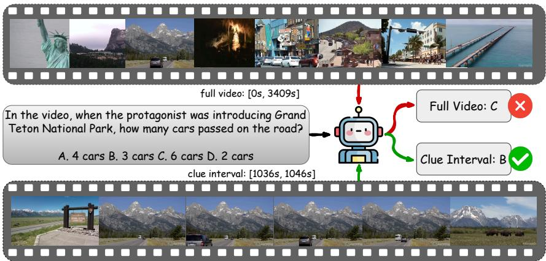
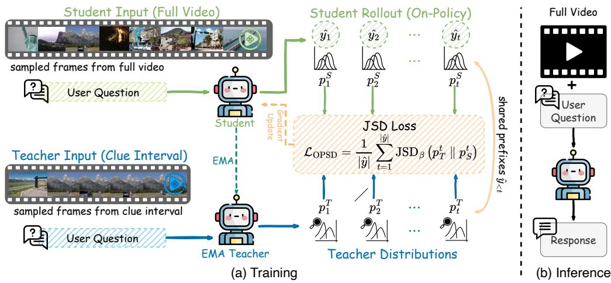
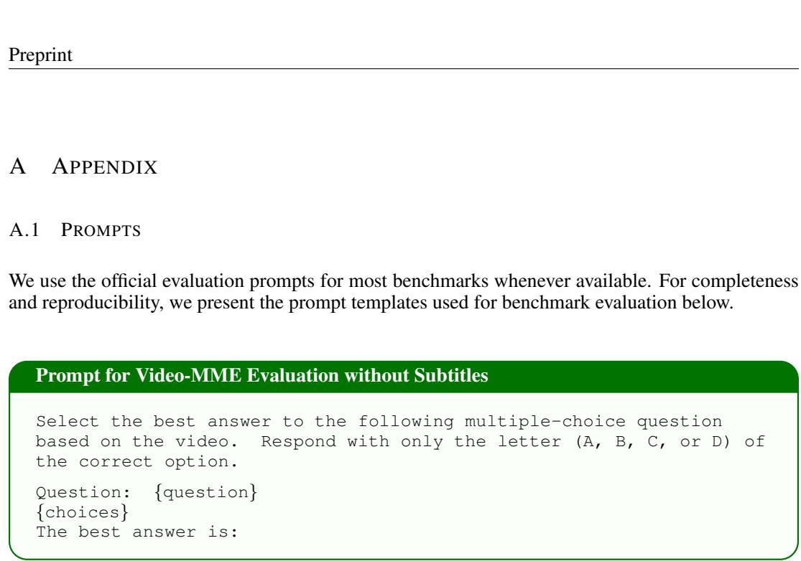
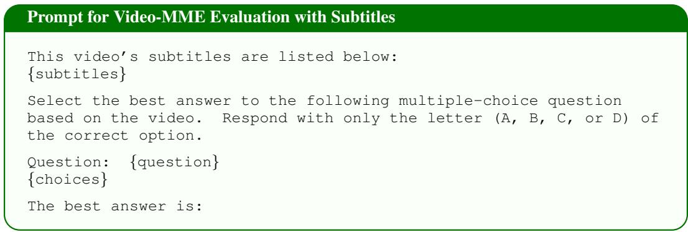
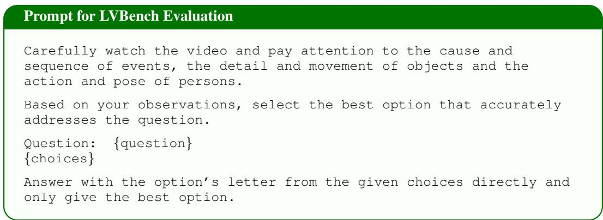
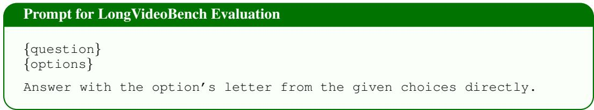
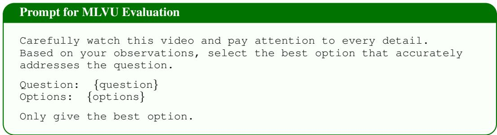
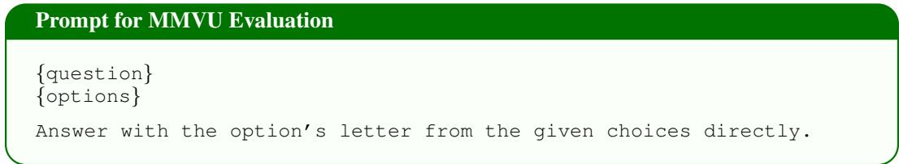

# WHERE TO LOOK MATTERS: ON-POLICY SELF-DISTILLATION FOR LONG-VIDEO UNDERSTANDING

Kaishen Wang1, Dongdi Zhao, Yijun Liang1, Dingqiang Ye2, Ruibo Chen1, Heng Huang1, Di Fu

1University of Maryland, College Park, 2Johns Hopkins University

kaishen@umd.edu

## ABSTRACT

Vision-language models (VLMs) have made substantial progress in long-video understanding, with standard backbone models typically answering questions from frames sampled across the full video. However, as videos become longer, the full-video context inevitably contains more question-irrelevant temporal content, which can distract the model from the evidence needed to answer a specific question. We empirically find that focusing the visual input on short annotated clue intervals containing question-relevant evidence consistently improves prediction accuracy across model scales compared with using the corresponding full videos, while requiring fewer input frames. Based on this finding, we introduce Clue-OPSD, a clue-privileged on-policy self-distillation framework for long-video understanding. During training, a full-video student learns from a selfteacher conditioned on the corresponding clue interval by aligning their next-token distributions along student-generated trajectories. Clue-OPSD thus uses clue intervals as privileged supervision without relying on ground-truth answer labels, while requiring no clue annotations or additional modules at inference time. Extensive experiments across multiple long-video understanding benchmarks and Qwen3.5 model scales demonstrate consistent improvements over the corresponding backbone models and strong performance against supervised post-training baselines.

## 1 INTRODUCTION

Recent advances in foundation vision-language models (VLMs) have substantially improved video understanding and enabled models to process increasingly long visual contexts (Chen et al., 2024; Bai et al., 2025; Zhu et al., 2025; Team, 2026). For long-video question answering, standard backbone models typically sample frames across the full video and jointly process them with the textual query (Ranasinghe et al., 2025; Shu et al., 2025; Li et al., 2026c; Lin et al., 2026). With stronger backbones and larger visual context windows, this simple full-video paradigm has become increasingly effective.

However, as videos become longer, the full-video context inevitably contains more temporal content that is unrelated to a particular question. The model must therefore identify the useful evidence from a large amount of surrounding visual information before making a prediction, and relevant events can easily be obscured by unrelated content distributed across the video. Figure 1 illustrates this issue with a representative example. When the model processes frames sampled from the full 3,409-second video, it predicts an incorrect answer. In contrast, when the visual input is restricted to the corresponding 10-second clue interval containing the relevant event, the same model answers the question correctly.

We further examine this phenomenon systematically using CG-Bench (Chen et al., 2025), which provides annotated temporal clue intervals for individual questions. Under the same frames-persecond (FPS) and maximum-frame constraints, we compare the same VLM using frames sampled from the full video with frames sampled only from the corresponding clue interval. As shown in Table 1, across different Qwen3.5 model scales, focusing the visual input on short annotated clue intervals containing question-relevant evidence consistently improves prediction accuracy compared with using the corresponding full videos, while requiring fewer input frames. These results show that, for long-video question answering, the way relevant temporal evidence is presented to the model can substantially affect prediction quality.

  
Figure 1: Illustration of the effect of clue intervals in long-video question answering. The model fails when processing frames sampled from the full 3,409-second video but answers correctly when conditioned on the corresponding 10-second clue interval containing the question-relevant evidence.

Based on this finding, we introduce Clue-OPSD, a clue-privileged on-policy self-distillation (OPSD) framework for long-video understanding. During training, Clue-OPSD constructs two asymmetric visual conditions from the same video: a student operates on the full-video input, while an exponential moving average (EMA) self-teacher observes only the annotated clue interval associated with the current question. The student first generates an on-policy trajectory, and both branches are evaluated along the same student-generated prefixes. We then align their next-token predictive distributions, allowing the full-video student to learn from a teacher conditioned on the corresponding clue interval. Importantly, the clue annotations are used only to construct the privileged teacher input during training. Clue-OPSD does not use ground-truth answer labels as supervision and does not require a separately pretrained or larger teacher model. At inference time, both the clue annotations and EMA teacher are removed, and the trained student directly processes the full video using the standard VLM inference pipeline, without additional temporal localization or auxiliary inference-time modules.

We evaluate Clue-OPSD across multiple long-video understanding benchmarks using Qwen3.5 models at different scales. Across model sizes and evaluation settings, Clue-OPSD consistently improves over the corresponding backbone models and achieves strong performance against supervised post-training baselines. The contributions of this paper are summarized as follows:

• We show that focusing the visual input on short annotated clue intervals containing question-relevant evidence can consistently outperform full-video input across different VLM scales, even with fewer input frames.

• We propose Clue-OPSD, a clue-privileged on-policy self-distillation framework that uses clue intervals as privileged visual supervision for a full-video student without relying on ground-truth answer labels or an external teacher model.

• We demonstrate consistent improvements across multiple Qwen3.5 model scales and longvideo understanding benchmarks while retaining the standard full-video VLM inference pipeline without additional inference-time modules.

## 2 RELATED WORK

## 2.1 LONG-VIDEO UNDERSTANDING

With the rapid progress of foundation vision-language models (VLMs) (Chen et al., 2024; Bai et al., 2025; Zhu et al., 2025; Team, 2026; Wang et al., 2026; Wang & Huang, 2026), long-video understanding has improved substantially. Standard backbone models typically sample frames across the full video and process them together with the textual query (Ranasinghe et al., 2025; Shu et al., 2025; Li et al., 2026c; Lin et al., 2026). This paradigm enables direct reasoning over increasingly long temporal contexts, while recent work has further explored more efficient representations and compression strategies for long-video inputs (Shu et al., 2025; Li et al., 2026c; Zhang et al., 2025).

More recently, thinking-with-videos methods have explored a more active inference paradigm by searching for, retrieving, or temporally grounding question-relevant video segments and iteratively inspecting them during reasoning (Wang et al., 2024; Yang et al., 2025; Yuan et al., 2025; Liu et al., 2026; Yang et al., 2026; Zhang et al., 2026). While effective, these approaches typically require multiple rounds of temporal search, segment inspection, or tool interaction, leading to more complex and time-consuming inference. In contrast, our work uses annotated temporal clue intervals only during training as privileged visual supervision, while retaining the standard full-video VLM pipeline at inference time.

## 2.2 ON-POLICY DISTILLATION AND SELF-DISTILLATION

On-policy distillation (OPD) trains a student on trajectories sampled from its current policy while using a teacher to provide token-level distribution supervision (Agarwal et al., 2024). By matching teacher and student predictions on student-generated trajectories, OPD reduces the mismatch between training-time supervision and the states encountered during autoregressive inference. Recent studies have extended this paradigm through different teacher constructions, conditioning contexts, and supervision strategies (Yu et al., 2026; Tan & Hong, 2026; Sang et al., 2026; Song & Zheng, 2026; Ye et al., 2026; Hou et al., 2026). In particular, on-policy self-distillation (OPSD) (Zhao et al., 2026) allows the same underlying model to serve as both teacher and student under asymmetric conditioning, where privileged information available only to the teacher provides the supervision signal.

This idea has recently been extended to multimodal learning. Vision-OPD (Yuan et al., 2026) uses evidence-centered image crops as privileged visual context for a full-image student, while Visual-OPSD (Li et al., 2026b) and Visual Contrastive Self-Distillation (Liang et al., 2026) explore crossmodal and contrastive forms of asymmetric visual supervision. Video-OPD (Li et al., 2026a) applies on-policy distillation to temporal video grounding. Our work focuses instead on long-video understanding, where question-relevant temporal clue intervals are used as privileged visual context to supervise a student operating directly on the full video.

## 3 METHOD

## 3.1 PRELIMINARIES

Video Question Answering. Given a raw video V and a question q, we first convert the video into a sequence of temporally sampled frames:

$$
V = \{ v _ { 1 } , \ldots , v _ { N } \} ,\tag{1}
$$

where N denotes the number of sampled frames used as visual input to the model. A vision-language model (VLM) parameterized by θ then autoregressively generates an answer $y ~ = ~ ( y _ { 1 } , \dots , y _ { T } )$ according to:

$$
p _ { \theta } ( y \mid V , q ) = \prod _ { t = 1 } ^ { T } p _ { \theta } \left( y _ { t } \mid V , q , y _ { < t } \right) ,\tag{2}
$$

where $y _ { < t }$ denotes the previously generated tokens.

On-Policy Distillation. On-policy distillation (OPD) performs token-level knowledge distillation along trajectories generated by the current student policy. Given an input x, the student first samples an autoregressive response:

$$
{ \hat { y } } \sim p _ { \theta _ { S } } ( \cdot \mid x ) ,\tag{3}
$$

where $\theta _ { S }$ denotes the parameters of the student model. The sampled response is then used as the shared autoregressive trajectory for both the student and teacher. At each decoding step t, condi

  
Figure 2: Overview of Clue-OPSD. (a) During training, the student processes frames sampled from the full video and generates an on-policy trajectory, while the EMA self-teacher is conditioned on frames sampled from the corresponding clue interval. Both branches are evaluated along the same student-generated prefixes, and their next-token distributions are aligned using the JSD objective. The teacher parameters are updated through an exponential moving average of the student. (b) At inference time, the clue interval and teacher are removed, and only the student is used with the standard full-video VLM pipeline.  
tioned on the same prefix $\hat { y } _ { < t }$ , the two models produce next-token distributions:

$$
\left\{ \begin{array} { l } { p _ { S } ^ { t } = p _ { \theta _ { S } } \left( \cdot \mid x , \hat { y } _ { < t } \right) , } \\ { p _ { T } ^ { t } = p _ { \theta _ { T } } \left( \cdot \mid x , \hat { y } _ { < t } \right) , } \end{array} \right.\tag{4}
$$

where $\theta _ { T }$ denotes the parameters of the teacher model, and $p _ { S } ^ { t }$ and $p _ { T } ^ { t }$ represent the student and teacher next-token probability distributions at decoding step t, respectively. The student is optimized by minimizing the token-level discrepancy between these two distributions:

$$
\mathcal { L } _ { \mathrm { O P D } } = \frac { 1 } { \left| \hat { y } \right| } \sum _ { t = 1 } ^ { \left| \hat { y } \right| } D \left( p _ { S } ^ { t } , p _ { T } ^ { t } \right) ,\tag{5}
$$

where $D ( \cdot , \cdot )$ denotes a distribution-level distillation objective. By evaluating the teacher on studentgenerated prefixes, OPD provides dense supervision directly on the states visited by the current student policy during autoregressive generation.

## 3.2 EMPIRICAL OBSERVATION: TEMPORAL CLUES IMPROVE PREDICTION

<table><tr><td>Model</td><td>Full Video</td><td>Clue Interval</td><td> $\overline { { \Delta } }$ </td></tr><tr><td>Qwen3.5-2B</td><td>45.33</td><td>58.63</td><td>+13.30</td></tr><tr><td>Qwen3.5-4B</td><td>50.50</td><td>64.10</td><td>+13.60</td></tr><tr><td>Qwen3.5-9B</td><td>53.47</td><td>68.43</td><td>+14.96</td></tr><tr><td>Mean Frames</td><td>1024.00</td><td>68.15</td><td>-955.85</td></tr></table>

Table 1: Accuracy (%) on 1,000 sampled CG-Bench questions using the full video or the annotated clue interval. ∆ denotes the change from full-video input to clue-interval input. The last row reports the mean number of input frames under the same sampling configuration, with a maximum of 1,024 frames at 2 FPS.

Although current VLMs typically process the entire video for long-video question answering, whether the full temporal context is always beneficial for answering a given question remains unclear. To investigate this, we conduct a preliminary comparison on 1,000 randomly sampled multiple-choice questions from CG-Bench (Chen et al., 2025). In addition to question-answer annotations, CG-Bench provides clue intervals that contain the visual evidence required to answer each question. This enables us to directly compare model predictions under two visual conditions: the full video and the corresponding

annotated clue interval. For each example, we keep the question, answer options, and decoding configuration identical across the two settings.

As shown in Table 1, using the annotated clue interval consistently yields higher accuracy than using the full video across different model scales. Both settings use the same frames-per-second (FPS) and maximum number of frames, while the clue interval is typically much shorter and therefore contains fewer input frames than the full video. The improvement thus does not result from observing more visual information. Instead, it shows that focusing the visual input on the question-relevant temporal interval leads to more effective prediction than sampling frames from the entire video.

This observation naturally motivates our approach: instead of requiring clue annotations at inference time, we use them only during training to construct a privileged teacher and distill its predictions into a student that operates on the full video.

## 3.3 CL U E-OPSD: CLUE-PRIVILEGED ON-POLICY SELF-DISTILLATION

Building on the above observation, we introduce $\mathsf { C l u e { \mathrm { - } } O P S D }$ , an on-policy self-distillation framework for long-video understanding, which transfers the predictive behavior induced by clue-focused visual inputs to a student that operates on the full video. The detailed architecture is shown in Fig ure 2. Specifically, the student receives the full-video input, while the teacher is conditioned on the annotated clue interval under the same question and answer options. Rather than relying on a separately pretrained or larger teacher, we maintain the teacher as an exponential moving average (EMA) of the student parameters. As a result, the supervision gap is introduced by the visual context rather than model capacity: the teacher predicts from question-relevant temporal evidence, while the student learns to reproduce such predictions from the full video.

Asymmetric Visual Contexts. For each training instance, let $V = \{ v _ { 1 } , \ldots , v _ { N } \}$ denote the sequence of N frames sampled from the full video, and let $V ^ { \star } = \{ v _ { 1 } ^ { \star } , \ldots , v _ { M } ^ { \star } \}$ denote the sequence of M frames sampled from the corresponding annotated clue interval. Both inputs follow the same FPS and maximum-frame constraint. Therefore, we have $M \leq N$ , with $M = N$ when both the clue interval and the full video reach the maximum number of sampled frames. The student is conditioned on $V ,$ while the teacher is conditioned on $V ^ { \star }$ . Both branches receive exactly the same textual input, including the question $q$ and its candidate answer options, such that the only difference between them lies in the visual context.

The student, parameterized by $\theta _ { S }$ , first generates an on-policy response $\hat { y } = ( \hat { y } _ { 1 } , \dots , \hat { y } _ { T } )$ from the full-video input:

$$
\hat { y } \sim p _ { \theta _ { S } } ( \cdot \mid V , q ) ,\tag{6}
$$

where $T$ denotes the number of generated tokens. The generated response is then fixed and used as the shared autoregressive trajectory for both branches. At decoding step $t ,$ let $\hat { y } _ { < t }$ denote the prefix consisting of all tokens generated before step t. The student and teacher next-token distributions are respectively defined as:

$$
\left\{ p _ { S } ^ { t } = p _ { \theta _ { S } } \left( \cdot \mid V , q , \hat { y } _ { < t } \right) , \right.\tag{7}
$$

where $\theta _ { T }$ denotes the teacher parameters, and $p _ { S } ^ { t }$ and $p _ { T } ^ { t }$ denote the student and teacher next-token probability distributions at step $t ,$ respectively.

On-Policy Distribution Alignment. Given the student-generated trajectory $\hat { y } .$ , we align the student and teacher next-token distributions at each decoding step using generalized Jensen–Shannon divergence (JSD). Specifically, the distillation objective is:

$$
\mathcal { L } _ { \mathrm { O P S D } } = \frac { 1 } { | \hat { y } | } \sum _ { t = 1 } ^ { | \hat { y } | } \mathrm { J S D } _ { \beta } ( p _ { T } ^ { t } \| p _ { S } ^ { t } ) ,\tag{8}
$$

where $| \hat { y } |$ denotes the length of the student-generated response. For each decoding step, the generalized JSD is defined as:

$$
\mathrm { J S D } _ { \beta } \left( p _ { T } ^ { t } \parallel p _ { S } ^ { t } \right) = \beta \mathrm { K L } \left( p _ { T } ^ { t } \parallel m ^ { t } \right) + ( 1 - \beta ) \mathrm { K L } \left( p _ { S } ^ { t } \parallel m ^ { t } \right) ,\tag{9}
$$

where

$$
m ^ { t } = \beta p _ { T } ^ { t } + ( 1 - \beta ) p _ { S } ^ { t }\tag{10}
$$

is the mixture distribution at step $t ,$ and $\beta$ controls the relative contribution of the two KL terms. During optimization, the teacher distribution is treated as a fixed target and gradients are propagated only through the student branch.

Following Vision-OPD (Yuan et al., 2026), we adopt top-K logit distillation to reduce the memory and computation required for full-vocabulary distribution matching. Specifically, we retain the top-K tokens selected from the student distribution, together with the corresponding teacher logits and the remaining tail probability, and compute the distillation objective on this compressed distribution.

By minimizing $\mathcal { L } _ { \mathrm { { O P S D } } }$ , the student is encouraged to reproduce the clue-conditioned teacher distribution while operating on the full-video input. Since the shared trajectory is generated by the current student policy, the resulting token-level supervision remains on-policy throughout training.

EMA Self-Teacher. We construct the teacher as an EMA of the student rather than introducing a separately pretrained model, following (Zhao et al., 2026). After each optimization step, the teacher parameters are updated as

$$
\theta _ { T }  ( 1 - \alpha ) \cdot \theta _ { T } + \alpha \cdot \theta _ { S } ,\tag{11}
$$

where α denotes the EMA update coefficient. The teacher is not optimized by back-propagation; instead, it evolves only through the EMA update and serves as a slowly changing reference for distillation. This design preserves the self-distillation setting while providing a more stable teacher distribution than directly reusing the current student parameters. Combined with the clue-privileged visual input $V ^ { \star }$ , the EMA teacher provides the student with a stable prediction target conditioned on question-relevant temporal evidence.

Training and Inference. During training, the updated student parameters are periodically synchronized with the rollout model so that subsequent responses are generated by the current student policy. The clue interval annotations and EMA teacher are used only for training. At inference time, both are discarded, and the student directly processes the full video following the standard VLM inference pipeline, requiring no additional clue information at inference time.

## 4 EXPERIMENTS

## 4.1 EXPERIMENTAL SETTING

Data Construction. We construct our training data from CG-Bench (Chen et al., 2025), a longvideo understanding benchmark that provides question-answer pairs together with annotated temporal clue intervals indicating the evidence required to answer each question. We focus on the multiple-choice questions (MCQs) and retain only samples with valid temporal clue annotations. From the resulting set, we randomly sample 5,000 question-answer instances for training, covering 1,206 distinct long videos. To avoid data leakage, we further verify that the videos used for training do not overlap with those in any of our evaluation benchmarks. This ensures that the reported result reflect generalization to unseen videos rather than memorization of training content.

Models and Baselines. We conduct experiments on the Qwen3.5 model family (Team, 2026), including Qwen3.5-2B, Qwen3.5-4B, and Qwen3.5-9B, to evaluate the effectiveness of our proposed Clue-OPSD across different model scales. For each model size, we compare Clue-OPSD with the corresponding vanilla Qwen3.5 model, as well as models trained on the same data using SFT, GRPO, and standard OPSD. For SFT, the ground-truth answer is directly used as the target response for teacher-forced likelihood optimization. GRPO uses the ground-truth answer to determine the reward for sampled responses, while standard OPSD conditions the teacher on the ground-truth answer as privileged information and keeps the student on the original full-video input. In contrast, Clue-OPSD uses only temporal clue annotations as privileged supervision and does not use ground truth answers during training.

Training Details. We initialize both the student and EMA teacher from the same pretrained Qwen3.5 checkpoint and perform full-parameter fine-tuning. All models are trained on 8 NVIDIA

<table><tr><td rowspan="2">Model</td><td rowspan="2">Setting</td><td colspan="3">Video-MME (w/o Subtitles)</td><td colspan="3">Video-MME (w/ Subtitles)</td><td rowspan="2">Average</td></tr><tr><td>Short</td><td>Medium</td><td>Long</td><td>Short</td><td>Medium</td><td>Long</td></tr><tr><td rowspan="5">Qwen3.5-2B</td><td>Vanilla</td><td>72.40</td><td>57.93</td><td>46.73</td><td>75.30</td><td>65.22</td><td>57.24</td><td>62.47</td></tr><tr><td>SFT</td><td>66.15</td><td>57.00</td><td>47.33</td><td>70.48</td><td>62.56</td><td>53.92</td><td>59.57</td></tr><tr><td>GRPO</td><td>71.33</td><td>61.22</td><td>50.77</td><td>75.11</td><td>66.11</td><td>58.00</td><td>63.76</td></tr><tr><td>OPSD</td><td>69.70</td><td>59.44</td><td>46.67</td><td>72.93</td><td>64.67</td><td>52.78</td><td>61.03</td></tr><tr><td>Clue-OPSD</td><td>72.78</td><td>62.67</td><td>51.33</td><td>75.85</td><td>67.78</td><td>59.11</td><td>64.92</td></tr><tr><td rowspan="5">Qwen3.5-4B</td><td>Vanilla</td><td>78.02</td><td>67.09</td><td>60.16</td><td>80.33</td><td>74.49</td><td>70.56</td><td>71.78</td></tr><tr><td>SFT</td><td>76.78</td><td>68.48</td><td>58.74</td><td>79.18</td><td>75.41</td><td>67.85</td><td>71.07</td></tr><tr><td>GRPO</td><td>77.96</td><td>69.15</td><td>60.70</td><td>80.37</td><td>74.00</td><td>69.89</td><td>72.01</td></tr><tr><td>OPSD</td><td>80.37</td><td>69.85</td><td>61.56</td><td>82.45</td><td>74.63</td><td>71.19</td><td>73.34</td></tr><tr><td>Clue-OPSD</td><td>80.31</td><td>72.09</td><td>62.29</td><td>82.29</td><td>75.65</td><td>72.48</td><td>74.19</td></tr><tr><td rowspan="5">Qwen3.5-9B</td><td>Vanilla</td><td>81.04</td><td>73.42</td><td>64.47</td><td>83.11</td><td>77.91</td><td>73.42</td><td>75.56</td></tr><tr><td>SFT</td><td>78.37</td><td>72.18</td><td>61.48</td><td>81.22</td><td>77.11</td><td>70.82</td><td>73.53</td></tr><tr><td>GRPO</td><td>81.67</td><td>74.11</td><td>65.22</td><td>84.66</td><td>78.07</td><td>74.00</td><td>76.29</td></tr><tr><td>OPSD</td><td>81.82</td><td>74.52</td><td>65.41</td><td>84.59</td><td>77.92</td><td>74.65</td><td>76.49</td></tr><tr><td>Clue-OPSD</td><td>82.30</td><td>74.89</td><td>66.33</td><td>85.33</td><td>78.33</td><td>74.67</td><td>76.98</td></tr></table>

Table 2: Results on Video-MME across different video durations under settings with and without subtitles. Each experiment is repeated three times, and the mean performance is reported.

B200 GPUs with a learning rate of $2 \times 1 0 ^ { - 6 }$ , an effective batch size of 32, and up to 300 optimization steps. We adopt a cosine learning-rate schedule with a warmup ratio of 0.03. We use generalized JSD with $\beta = 0 . 5 ,$ top-K logit distillation with $K = 1 0 0$ , and a distillation temperature of 1.0. The EMA update coefficient is set to $\alpha = 0 . 0 5$ . The student weights are synchronized with the vLLM rollout engine after every optimization step to ensure on-policy sampling. During rollout, we use a sampling temperature of 1.0, top- $p = 0 . 9 5$ , and top-k = 20, with a maximum generation length of 2,048 tokens. Both the student and teacher videos are sampled at 2 FPS with at most 256 frames during training.

Benchmarks. We evaluate our method on five video understanding benchmarks: Video-MME (Fu et al., 2025), LVBench (Wang et al., 2025), LongVideoBench (Wu et al., 2024), MLVU (Zhou et al., 2025), and MMVU (Zhao et al., 2025). LVBench, LongVideoBench, and MLVU primarily evaluate long-video understanding over extended temporal contexts, while Video-MME provides a broader evaluation across different video durations. For Video-MME, we report performance on the short, medium, and long subsets under both with- and without-subtitle settings. For MLVU, we report the multiple-choice macro-average (M-Avg) following the standard evaluation protocol. For MMVU, we report the overall benchmark accuracy. Together, these benchmarks cover a diverse range of video durations, temporal reasoning requirements, and question-answering settings.

Inference Details. At inference time, the EMA teacher and clue annotations are removed, and the student directly processes the full video. We sample videos at 2 FPS and use benchmark-specific maximum frame budgets: 768, 1,024, and 2,048 frames for the short, medium, and long subsets of Video-MME, respectively; 2,048 frames for LVBench, LongVideoBench, and MLVU; and 1,024 frames for MMVU. Following the official Qwen3.5 recommended configuration for non-thinking inference, we use a sampling temperature of 0.7, top-p = 0.8, top-k = 20, a presence penalty of 1.5, and a repetition penalty of 1.0, with a maximum generation length of 2,048 tokens. The same decoding configuration is used across all evaluated models and benchmarks. We repeat each evaluation three times and report the mean performance over the three runs.

## 4.2 EXPERIMENTAL RESULTS

Overall Performance. Table 3 compares Clue-OPSD with both publicly reported VLMs and controlled Qwen3.5-based baselines. Across all three model scales, Clue-OPSD consistently improves over the corresponding vanilla backbones on the four evaluated benchmarks. The gains are particularly pronounced for smaller models. For Qwen3.5-2B, Clue-OPSD improves MLVU, LVBench, LongVideoBench, and MMVU by 6.94, 3.45, 9.81, and 3.41 points, respectively. Similar improvements are observed for Qwen3.5-4B, with gains of 8.23 points on MLVU and 5.42 points on

<table><tr><td>Model</td><td>Setting</td><td>MLVU</td><td>LVBench</td><td>LongVideoBench</td><td>MMVU</td></tr><tr><td colspan="6">Frontier Proprietary Models</td></tr><tr><td>GPT-5</td><td>Reported</td><td>77.7</td><td>65.2</td><td>72.6</td><td></td></tr><tr><td>Gemini 3 Pro</td><td>Reported</td><td>75.7</td><td>77.0</td><td>75.9</td><td>77.5</td></tr><tr><td>Gemini 2.5 Pro</td><td>Reported</td><td></td><td>75.7</td><td>76.8</td><td>75.8</td></tr><tr><td>Gemini 2.5 Flash</td><td>Reported</td><td>75.1</td><td>64.9</td><td>73.1</td><td>70.3</td></tr><tr><td colspan="6">Strong Open-Source VLMs</td></tr><tr><td>GLM-4.1V-9B</td><td>Reported</td><td>56.6</td><td>44.0</td><td>65.7</td><td></td></tr><tr><td>MiniCPM-V-4.5-8B</td><td>Reported</td><td>60.6</td><td>50.4</td><td>63.9</td><td></td></tr><tr><td>Molmo2-8B</td><td>Reported</td><td>60.2</td><td>52.8</td><td>67.5</td><td></td></tr><tr><td>InternVL3.5-8B</td><td>Reported</td><td>53.2</td><td>43.4</td><td>62.1</td><td></td></tr><tr><td>InternVL3.5-38B</td><td>Reported</td><td>77.0</td><td>一</td><td>65.7</td><td></td></tr><tr><td>InternVL3-78B</td><td>Reported</td><td>79.5</td><td>一</td><td>65.7</td><td></td></tr><tr><td rowspan="7">Qwen3.5-2B</td><td colspan="6">Qwen3.5-Based Models</td></tr><tr><td>Vanilla</td><td>59.34</td><td>48.43</td><td>51.28</td><td>55.84</td></tr><tr><td>SFT</td><td>65.74</td><td>50.14</td><td>51.78</td><td>55.04</td></tr><tr><td>GRPO</td><td>65.89</td><td>50.43</td><td>60.23</td><td>57.59</td></tr><tr><td>OPSD</td><td>65.67</td><td>50.48</td><td>57.44</td><td>57.92</td></tr><tr><td>Clue-OPSD</td><td>66.28</td><td>51.88</td><td>61.09</td><td>59.25</td></tr><tr><td>Vanilla</td><td>68.45</td><td></td><td></td><td></td></tr><tr><td rowspan="5">Qwen3.5-4B</td><td></td><td></td><td>54.45</td><td>61.58</td><td>63.84</td></tr><tr><td>SFT</td><td>71.54</td><td>55.59</td><td>58.14</td><td>63.36</td></tr><tr><td>GRPO</td><td>75.98</td><td>59.22</td><td>64.72</td><td>65.92</td></tr><tr><td>OPSD</td><td>75.75</td><td>59.00</td><td>64.94</td><td>65.56</td></tr><tr><td>Clue-OPSD</td><td>76.68</td><td>59.87</td><td>66.62</td><td>66.99</td></tr><tr><td rowspan="5">Qwen3.5-9B</td><td>Vanilla</td><td>74.91</td><td>60.31</td><td>66.72</td><td>72.96</td></tr><tr><td>SFT</td><td>73.28</td><td>57.78</td><td>59.51</td><td>69.76</td></tr><tr><td>GRPO</td><td>80.93</td><td>60.96</td><td>68.42</td><td>73.87</td></tr><tr><td>OPSD</td><td>81.05</td><td>61.30</td><td>67.93</td><td>73.76</td></tr><tr><td>Clue-OPSD</td><td>80.27</td><td>61.53</td><td>68.49</td><td>74.88</td></tr></table>

Table 3: Comparison with frontier proprietary models, strong open-source VLMs, and controlled Qwen3.5-based baselines on long-video understanding benchmarks. External model results are taken from publicly reported evaluations. All Qwen3.5-based results are averaged over three runs.

LVBench over the vanilla model. These results show that clue-privileged self-distillation provides consistent benefits across different long-video reasoning settings and model capacities.

Compared with supervised post-training baselines, Clue-OPSD also achieves competitive performance despite not using ground-truth answer labels during training. On Qwen3.5-2B and Qwen3.5- 4B, Clue-OPSD outperforms SFT, GRPO, and standard OPSD across all four benchmarks. For Qwen3.5-9B, Clue-OPSD achieves the best results on LVBench, LongVideoBench, and MMVU, while remaining competitive with OPSD on MLVU. Notably, these improvements are obtained using only temporal clue annotations as privileged supervision, suggesting that question-relevant temporal evidence provides an effective learning signal beyond direct answer supervision. In addition, Clue-OPSD remains competitive with substantially larger open-source and proprietary VLMs on several benchmarks, while retaining the original Qwen3.5 architecture and standard full-video inference pipeline.

<table><tr><td>Divergence Objective</td><td>MLVU</td><td>LVBench</td><td>LongVideoBench</td><td>MMVU</td></tr><tr><td>Forward  $\overline { { \mathrm { K L } \left( \mathrm { K L } ( p _ { T } | | p _ { S } \right) ) } }$ </td><td>76.21</td><td>59.14</td><td>65.84</td><td>66.41</td></tr><tr><td>Reverse  $\mathrm { K L } ( \mathrm { K L } ( p _ { S } \| p _ { T } ) )$ </td><td>75.86</td><td>58.93</td><td>66.08</td><td>66.62</td></tr><tr><td>JSD  $( \beta = 0 . 5 )$ </td><td>76.68</td><td>59.87</td><td>66.62</td><td>66.99</td></tr></table>

Table 4: Effect of different divergence objectives for token-level distribution alignment on Qwen3.5- 4B. All other training and inference configurations are kept unchanged.

<table><tr><td>Teacher Visual Input</td><td>Additional Privilege</td><td>MLVU</td><td>LVBench</td><td>LongVideoBench</td><td>MMVU</td></tr><tr><td>Full Video</td><td>GT Answer</td><td>75.75</td><td>59.00</td><td>64.94</td><td>65.56</td></tr><tr><td>Full Video</td><td>Textual Clue</td><td>73.66</td><td>58.70</td><td>64.17</td><td>63.57</td></tr><tr><td>Random Interval</td><td></td><td>52.32</td><td>37.85</td><td>51.78</td><td>57.44</td></tr><tr><td>Clue Interval</td><td></td><td>76.68</td><td>59.87</td><td>66.62</td><td>66.99</td></tr></table>

Table 5: Comparison of different privileged teacher constructions for on-policy distillation on Qwen3.5-4B. “Textual Clue” provides the annotated temporal interval in the prompt while retaining the full-video visual input. “Random Interval” uses a randomly sampled interval with the same duration as the ground-truth clue interval. The clue-interval setting corresponds to the default configuration of Clue-OPSD.

Performance across Video Durations. Table 2 reports detailed results on Video-MME across short, medium, and long videos under both subtitle settings. Clue-OPSD consistently improves the average performance of Qwen3.5-2B, 4B, and 9B from 62.47, 71.78, and 75.56 to 64.92, 74.19, and 76.98, respectively. The improvements are especially clear on the medium- and long-video subsets, where identifying relevant temporal evidence becomes increasingly important. For example, on Qwen3.5-2B without subtitles, Clue-OPSD improves the medium- and long-video accuracy from 57.93 and 46.73 to 62.67 and 51.33, respectively. Similar trends hold for larger models and when subtitles are available.

Compared with the supervised baselines, Clue-OPSD achieves the highest average Video-MME accuracy at all three model scales. In particular, it improves over the strongest competing posttraining baseline by 1.16, 0.85, and 0.49 points for Qwen3.5-2B, 4B, and 9B, respectively. The consistent gains across video durations and subtitle settings further indicate that the benefit of clue privileged training is not tied to a particular evaluation condition.

## 4.3 ABLATION STUDIES

Effect of Divergence Objective. We study the effect of different divergence objectives used for token-level distribution matching between the teacher and student. Specifically, we compare forward KL divergence, reverse KL divergence, and Jensen–Shannon divergence (JSD) with $\beta = 0 . 5$ . We keep all other training configurations unchanged and conduct this ablation on Qwen3.5-4B only. As shown in Table 4, JSD provides the most consistent overall performance across the four benchmarks. Compared with forward and reverse KL, JSD achieves higher accuracy on MLVU, LVBench, and MMVU, while remaining competitive on LongVideoBench. These results suggest that JSD provides a more balanced distribution-matching objective for clue-privileged on-policy self-distillation. We therefore adopt JSD with $\beta = 0 . 5$ as the default divergence objective in all main experiments.

Effect of Privileged Clue Utilization. We investigate how temporal clue annotations should be incorporated into the privileged teacher. Besides the default Clue-OPSD setting, where the teacher directly observes the annotated clue interval, we compare a full-video teacher with ground-truth answers, a full-video teacher with the clue interval provided only as textual side information, and a teacher conditioned on a randomly sampled interval with the same duration. As shown in Table 5, directly conditioning the teacher on the annotated clue interval achieves the best performance across all four benchmarks. For example, on MLVU, the clue-interval teacher reaches 76.68, compared with 73.66 for the textual-clue variant and 52.32 for the random-interval variant. The large drop with random intervals shows that the gain does not come from using a shorter visual input alone, but from exposing the teacher to question-relevant temporal evidence. Moreover, the clue-interval teacher consistently outperforms the answer-privileged OPSD baseline, including 66.62 vs. 64.94 on LongVideoBench, despite not using ground-truth answer labels. These results support using clue interval as the privileged condition for on-policy self-distillation.

## 4.4 DISCUSSION

The advantage of Clue-OPSD over SFT, GRPO, and standard OPSD can be attributed to the form of supervision provided during training. SFT directly optimizes the ground-truth answer, but does not explicitly expose which visual content in a long video supports that answer. GRPO performs on-policy optimization, yet its supervision is mainly determined by final-answer correctness and is therefore relatively sparse over the generated trajectory. Standard OPSD provides dense on-policy distribution supervision, but the privileged information is typically centered on the ground-truth answer rather than the visual evidence supporting it. In contrast, Clue-OPSD conditions the teacher on the question-relevant clue interval, so the supervision is generated from a visual context in which the evidence needed for the current question is directly emphasized.

This distinction also helps explain why answer-privileged OPSD can underperform Clue-OPSD despite having access to the ground-truth answer. The answer specifies what the correct prediction is, but does not indicate which visual evidence should support that prediction. By contrast, the clue interval changes the teacher’s visual condition itself, allowing its next-token distribution to reflect predictions made from concentrated question-relevant evidence rather than from the fullvideo context. Our ablations support this interpretation: replacing the clue with a random interval causes a large drop, while providing the clue only as textual side information is also consistently weaker than directly conditioning the teacher on the clue interval. These results suggest that the benefit of Clue-OPSD comes not from shorter inputs or privileged information alone, but from using question-relevant visual evidence as the privileged condition for on-policy self-distillation.

## 5 CONCLUSION

In this work, we study how temporal clue annotations can be used as privileged supervision for long-video understanding. Our empirical analysis shows that short question-relevant clue intervals can provide more effective visual context than the corresponding full videos, even with fewer input frames. Building on this finding, we introduce Clue-OPSD, a clue-privileged on-policy self-distillation framework that uses a clue-conditioned self-teacher to supervise a full-video stu dent without ground-truth answer labels. Extensive experiments across multiple benchmarks and Qwen3.5 model scales demonstrate consistent improvements over the original backbones and strong performance against supervised post-training baselines. These results demonstrate the effectiveness of temporal clues as privileged supervision for improving full-video VLMs.

## REFERENCES

Rishabh Agarwal, Nino Vieillard, Yongchao Zhou, Piotr Stanczyk, Sabela Ramos Garea, Matthieu Geist, and Olivier Bachem. On-policy distillation of language models: Learning from selfgenerated mistakes. In International Conference on Learning Representations, volume 2024, pp. 21246–21263, 2024.

Shuai Bai, Yuxuan Cai, Ruizhe Chen, Keqin Chen, Xionghui Chen, Zesen Cheng, Lianghao Deng, Wei Ding, Chang Gao, Chunjiang Ge, et al. Qwen3-vl technical report. arXiv preprint arXiv:2511.21631, 2025.

Guo Chen, Yicheng Liu, Yifei Huang, Baoqi Pei, Jilan Xu, Yuping He, Tong Lu, Yali Wang, and Limin Wang. Cg-bench: Clue-grounded question answering benchmark for long video understanding. In International Conference on Learning Representations, volume 2025, pp. 45647– 45682, 2025.

Zhe Chen, Weiyun Wang, Yue Cao, Yangzhou Liu, Zhangwei Gao, Erfei Cui, Jinguo Zhu, Shenglong Ye, Hao Tian, Zhaoyang Liu, et al. Expanding performance boundaries of open-source multimodal models with model, data, and test-time scaling. arXiv preprint arXiv:2412.05271, 2024.

Chaoyou Fu, Yuhan Dai, Yongdong Luo, Lei Li, Shuhuai Ren, Renrui Zhang, Zihan Wang, Chenyu Zhou, Yunhang Shen, Mengdan Zhang, et al. Video-mme: The first-ever comprehensive evaluation benchmark of multi-modal llms in video analysis. In 2025 IEEE/CVF Conference on Computer Vision and Pattern Recognition (CVPR), pp. 24108–24118. IEEE, 2025.

ZhiYan Hou, Xinyu Tang, Hongyan An, Jianjin Zhang, Weizhen Wang, Yunyun Han, Gengsheng Li, Xiangzhao Hao, Haiyun Guo, Wenbin Hu, et al. Dash: Divergence-adaptive supervision horizons for on-policy self-distillation of reasoning models. arXiv preprint arXiv:2608.06243, 2026.

Jiaze Li, Hao Yin, Haoran Xu, Boshen Xu, Wenhui Tan, Zewen He, Jianzhong Ju, Zhenbo Luo, and Jian Luan. Video-opd: Efficient post-training of multimodal large language models for temporal video grounding via on-policy distillation. arXiv preprint arXiv:2602.02994, 2026a.

Pengyu Li, Zhitao Gao, Lingling Zhang, Muye Huang, Yuanming Li, Fangzhi Xu, and Jun Liu. Visual-opsd: Cross-modal on-policy self-distillation for efficient unified multimodal reasoning. arXiv preprint arXiv:2606.18974, 2026b.

Xinhao Li, Yi Wang, Jiashuo Yu, Xiangyu Zeng, Yuhan Zhu, Haian Huang, Jianfei Gao, Kunchang Li, Yinan He, Chenting Wang, et al. Videochat-flash: Hierarchical compression for long-context video modeling. In International Conference on Learning Representations, volume 2026, pp. 109089–109117, 2026c.

Yijun Liang, Yunjie Tian, Yijiang Li, Yuqi Jia, Furong Huang, Tianyi Zhou, and Di Fu. Visual contrastive self-distillation. arXiv preprint arXiv:2607.21556, 2026.

Jingyang Lin, Jialian Wu, Ximeng Sun, Ze Wang, Jiang Liu, Yusheng Su, Xiaodong Yu, Hao Chen, Jiebo Luo, Zicheng Liu, et al. Unleashing hour-scale video training for long video-language understanding. Advances in Neural Information Processing Systems, 38:17523–17552, 2026.

Wenqi Liu, Yunxiao Wang, Shijie Ma, Meng Liu, Qile Su, Tianke Zhang, Haonan Fan, Changyi Liu, Kaiyu Jiang, Jiankang Chen, et al. Videotemp-o3: Harmonizing temporal grounding and video understanding in agentic thinking-with-videos. arXiv preprint arXiv:2602.07801, 2026.

Kanchana Ranasinghe, Xiang Li, Kumara Kahatapitiya, and Michael Ryoo. Understanding long videos with multimodal language models. In International Conference on Learning Representations, volume 2025, pp. 11810–11835, 2025.

Hejian Sang, Yuanda Xu, Zhengze Zhou, Ran He, Zhipeng Wang, and Jiachen Sun. On-policy self-distillation for reasoning compression. arXiv e-prints, pp. arXiv–2603, 2026.

Yan Shu, Zheng Liu, Peitian Zhang, Minghao Qin, Junjie Zhou, Zhengyang Liang, Tiejun Huang, and Bo Zhao. Video-xl: Extra-long vision language model for hour-scale video understanding. In 2025 IEEE/CVF Conference on Computer Vision and Pattern Recognition (CVPR), pp. 26160– 26169. IEEE, 2025.

Mingyang Song and Mao Zheng. A survey of on-policy distillation for large language models. arXiv preprint arXiv:2604.00626, 2026.

Zhiquan Tan and Yinrong Hong. Self-supervised on-policy distillation for reasoning language models. arXiv preprint arXiv:2605.17497, 2026.

Qwen Team. Qwen3.5: Accelerating productivity with native multimodal agents, February 2026. URL https://qwen.ai/blog?id=qwen3.5.

Kaishen Wang and Heng Huang. Unsafe by reciprocity: How generation-understanding coupling undermines safety in unified multimodal models. arXiv preprint arXiv:2603.27332, 2026.

Kaishen Wang, Tong Zheng, Xuehao Cui, Ruibo Chen, Tianyi Xiong, and Heng Huang. Mitigating factual hallucination in large reasoning models via mixed-mode advantage regularization. arXiv preprint arXiv:2607.05861, 2026.

Weihan Wang, Zehai He, Wenyi Hong, Yean Cheng, Xiaohan Zhang, Ji Qi, Ming Ding, Xiaotao Gu, Shiyu Huang, Bin Xu, et al. Lvbench: An extreme long video understanding benchmark. In 2025 IEEE/CVF International Conference on Computer Vision (ICCV), pp. 22958–22967. IEEE, 2025.

Xiaohan Wang, Yuhui Zhang, Orr Zohar, and Serena Yeung-Levy. Videoagent: Long-form video understanding with large language model as agent. In European Conference on Computer Vision, pp. 58–76. Springer, 2024.

Haoning Wu, Dongxu Li, Bei Chen, and Junnan Li. Longvideobench: A benchmark for long-context interleaved video-language understanding. Advances in Neural Information Processing Systems, 37:28828–28857, 2024.

Zeyuan Yang, Delin Chen, Xueyang Yu, Maohao Shen, and Chuang Gan. Vca: Video curious agent for long video understanding. In 2025 IEEE/CVF International Conference on Computer Vision (ICCV), pp. 20168–20179. IEEE, 2025.

Zuhao Yang, Sudong Wang, Kaichen Zhang, Keming Wu, Sicong Leng, Yifan Zhang, Bo Li, Chengwei Qin, Shijian Lu, Xingxuan Li, et al. Longvt: Incentivizing” thinking with long videos” via native tool calling. In Proceedings ofthe IEEE/CVF Conference on Computer Vision and Pattern Recognition, pp. 33816–33826, 2026.

Tianzhu Ye, Li Dong, Xun Wu, Shaohan Huang, and Furu Wei. On-policy context distillation for language models. arXiv preprint arXiv:2602.12275, 2026.

Fangxu Yu, Zinan Lin, Xiaodong Liu, Weijia Xu, Michael Xu, Tianyi Zhou, and Jianfeng Gao. Weak-to-strong on-policy distillation. arXiv preprint arXiv:2607.26246, 2026.

Huaying Yuan, Zheng Liu, Junjie Zhou, Ji-Rong Wen, and Zhicheng Dou. Videodeepresearch: Long video understanding with agentic tool using. arXiv e-prints, pp. arXiv–2506, 2025.

Qianhao Yuan, Jie Lou, Xing Yu, Hongyu Lin, Le Sun, Xianpei Han, and Yaojie Lu. Vision-opd: Learning to see fine details for multimodal llms via on-policy self-distillation. arXiv preprint arXiv:2605.18740, 2026.

Haoji Zhang, Yiqin Wang, Yansong Tang, Yong Liu, Jiashi Feng, and Xiaojie Jin. Flash-vstream: Efficient real-time understanding for long video streams. In 2025 IEEE/CVF International Conference on Computer Vision (ICCV), pp. 21059–21069. IEEE, 2025.

Xiaoyi Zhang, Zhaoyang Jia, Zongyu Guo, Jiahao Li, Bin Li, Houqiang Li, and Yan Lu. Deep video discovery: Agentic search with tool use for long-form video understanding. Advances in Neural Information Processing Systems, 38:89863–89895, 2026.

Siyan Zhao, Zhihui Xie, Mengchen Liu, Jing Huang, Guan Pang, Feiyu Chen, and Aditya Grover. Self-distilled reasoner: On-policy self-distillation for large language models. arXiv preprint arXiv:2601.18734, 2026.

Yilun Zhao, Haowei Zhang, Lujing Xie, Tongyan Hu, Guo Gan, Yitao Long, Zhiyuan Hu, Weiyuan Chen, Chuhan Li, Zhijian Xu, et al. Mmvu: Measuring expert-level multi-discipline video understanding. In 2025 IEEE/CVF Conference on Computer Vision and Pattern Recognition (CVPR), pp. 8475–8489. IEEE, 2025.

Junjie Zhou, Yan Shu, Bo Zhao, Boya Wu, Zhengyang Liang, Shitao Xiao, Minghao Qin, Xi Yang, Yongping Xiong, Bo Zhang, et al. Mlvu: Benchmarking multi-task long video understanding. In 2025 IEEE/CVF Conference on Computer Vision and Pattern Recognition (CVPR), pp. 13691– 13701. IEEE, 2025.

Jinguo Zhu, Weiyun Wang, Zhe Chen, Zhaoyang Liu, Shenglong Ye, Lixin Gu, Hao Tian, Yuchen Duan, Weijie Su, Jie Shao, et al. Internvl3: Exploring advanced training and test-time recipes for open-source multimodal models. arXiv preprint arXiv:2504.10479, 2025.

  
Figure 3: Prompt template used for Video-MME evaluation without subtitles.

  
Figure 4: Prompt template used for Video-MME evaluation with subtitles.

  
Figure 5: Prompt template used for LVBench evaluation.

  
Figure 6: Prompt template used for LongVideoBench evaluation.

  
Figure 7: Prompt template used for MLVU evaluation.

  
Figure 8: Prompt template used for MMVU evaluation.

## A.2 ALGORITHM

Algorithm 1 summarizes the training procedure of Clue-OPSD. For each training instance, the student first generates an on-policy response from the full-video input. The same student-generated prefixes are then used to evaluate both the full-video student and the clue-conditioned EMA teacher. Their next-token distributions are aligned through the JSD distillation objective, with gradients applied only to the student. After each optimization step, the teacher is updated as an exponential moving average of the latest student parameters, and the rollout model is synchronized accordingly.

Algorithm 1 Training Procedure of Clue-OPSD   
Require: Training set $\overline { { \mathcal { D } = \{ ( \mathcal { V } , q , I ^ { \star } ) \} } }$ , pretrained VLM parameters θ, EMA coefficient α, JSD   
coefficient $\beta ,$ top-K value $\dot { K }$   
Ensure: Trained student parameters $\theta _ { S }$   
1: Initialize student and teacher: $\theta _ { S }  \theta , \theta _ { T }  \theta$   
2: Initialize rollout model with $\theta _ { S }$   
3: for each optimization step do   
4: Sample a mini-batch B from $\mathcal { D }$   
5: Initialize batch loss $\mathcal { L }  0$   
6: for each training instance $( \mathcal V , q , I ^ { \star } ) \in B$ do   
7: Sample full-video frames $V$ from V   
8: Sample clue frames $V ^ { \star }$ from the annotated clue interval $I ^ { \star }$   
9: Generate an on-policy response from the full-video student:   
$\hat { y } \sim p _ { \theta _ { S } } ( \cdot \mid V , q )$   
10: for $t = 1 , \dots , | \hat { y } |$ do   
11: Compute the student distribution:   
$p _ { S } ^ { t } = p _ { \theta _ { S } } ( \cdot \hat { \vert } V , q , \hat { y } _ { < t } )$   
12: Compute the teacher distribution on the same prefix:   
$p _ { T } ^ { t } = p _ { \theta _ { T } } ( \cdot \mathsf { \bar { \Omega } } | V ^ { \star } , q , \hat { y } _ { < t } )$   
13: Construct top-K compressed student and teacher distributions   
14: end for   
15: Accumulate the instance-level distillation loss:   
$\mathcal { L }  \mathcal { L } + \frac { 1 } { | \hat { y } | } \sum _ { t = 1 } ^ { | \hat { y } | } \operatorname { J S D } _ { \beta } ( p _ { T } ^ { t } \parallel p _ { S } ^ { t } )$   
16: end for   
17: Average the loss over the mini-batch:   
$\mathcal { L }  \overline { { \mathcal { L } / | B | } }$   
18: Update the student parameters $\theta _ { S }$ by back-propagating $\mathcal { L }$   
19: Update the EMA teacher:   
$\dot { \theta _ { T } }  ( 1 - \alpha ) \theta _ { T } + \alpha \theta _ { S }$   
20: Synchronize the rollout model with the updated student $\theta _ { S }$   
21: end for   
22: return $\theta _ { S }$