# MVC-Bench: Benchmarking Calibration of Medical Vision-Language Models

Ashshak Sharifdeen1, Shihab Aaqil Ahamed1, Ufaq Khan1, Muhammad Akhtar Munir1 Sujair Ibrahim2, Mohamed Rafeek Mareer Ahamed3, Yutong Xie1, Imran Razzak1, Muhammad Haris Khan1

1Mohamed bin Zayed University of AI 2Sabaragamuwa University of Sri Lanka 3Digital Platform Development, SLT PLC {ashshak.sharifdeen, muhammad.haris}@mbzuai.ac.ae

## Abstract

Reliable evaluation of vision-language mod els (VLMs) and medical vision-language mod els (Medical-VLMs) requires calibrated confi dence, particularly under realistic clinical con ditions. However, existing efforts mainly fo cused on improving accuracy, leaving calibration in the medical domain underexplored. To this end, we propose MVC-Bench, a calibration-centric benchmark for medical im age classification with VLMs and Medical VLMs. MVC-Bench assesses the calibration across three axes: (i) robustness to modality, backbone, and domain shift (ii) effectiveness of calibration strategies and prompt-tuning meth ods (iii) stability under prompt-template and random-seed variations. The benchmark covers eight different backbones, three medical modal ities, including fundus imaging, histopathology, and chest X-ray under in-domain and domain shift settings. It compares post-hoc calibra tion, train-time calibration, and zero-shot infer ence methods, together with six prompt-tuning methods. Across more than 1638 controlled experiments, we report accuracy and Expected Calibration Error (ECE) as primary metrics, and further report results with complementary calibration measures, including Maximum Cal ibration Error (MCE) and Adaptive Calibra tion Error (ACE). We further investigate the underlying causes of miscalibration in VLMs and Medical-VLMs and propose a simple train time calibration method, Multi-Class Margin (MCM) regularization, which achieves lowest ECE on 10 out of 12 settings in in-domain and remains competitive under domain shifts. Col lectively, MVC-Bench provides a structured evaluation framework and actionable guidance for improving calibration in safety-critical medical workflows. Our Code:https://github. com/ashshaksharifdeen/MVC-Bench.

## 1 Introduction

VLMs leverage large-scale language supervision to align visual and textual representations, enabling strong zero/few-shot transfer with limited taskspecific labels (Radford et al., 2021; Zhai et al., 2022; Li et al., 2022, 2023). Medical-VLMs extend this capability to clinical imaging, where annotations are scarce and costly. This capability has been explored across multiple medical modalities, including fundus imaging (Gulshan et al., 2016), histopathology (Campanella et al., 2019), and chest X-rays (Rajaraman et al., 2020). By aligning medical images with disease-aware prompts, medical-VLMs support disease-pattern recognition and transferable evaluation across heterogeneous medical datasets (Boecking et al., 2022; Wang et al., 2022; Zhang et al., 2023; Huang et al., 2023a; Ikezogwo et al., 2023a).Since full fine-tuning large VLMs is often costly, prompt tuning has become a practical parameter-efficient alternative, updating only a small set of prompt parameters while keeping the backbone frozen (Liu et al., 2023). This low-cost adaptation is particularly valuable in medical imaging, where full fine-tuning is often infeasible (Hanif et al., 2024; Hussein et al., 2024).

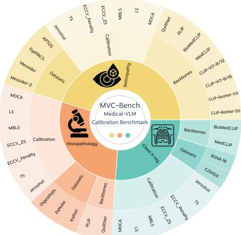  
Figure 1: Overview of MVC-Bench, which evaluates calibration of VLMs and Medical-VLMs across three axes: robustness to modality, backbone, and domain shift; effectiveness of calibration and prompt-tuning strategies; and stability under prompt-template and random-seed variations. The benchmark spans DR, histopathology, and chest X-ray datasets, covering relevant backbones and calibration settings across more than 1638 controlled experiments.

Despite recent advances, prompt-tuning methods for VLMs mainly optimize accuracy while often overlooking confidence calibration (Sharifdeen et al., 2026). However, clinical deployment requires confidence scores that reflect the true likelihood of correctness, where a classifier is well-calibrated if predictions made with confidence p are correct approximately p% of the time (Guo et al., 2017). Miscalibration can cause overconfidence, where incorrect predictions receive high confidence and may miss human review, or underconfidence, where correct predictions receive unreliable confidence, undermining triage and trust (Minderer et al., 2021; Cao et al., 2024; Zhu et al., 2023b; Ao et al., 2023). In medical imaging, this problem is further amplified by class imbalance, heterogeneous acquisition, prevalence drift, and device or patient shifts (Koh et al., 2021). Therefore, calibration of VLMs and Medical-VLMs under realistic factors, including domain shift, prompt tuning, hard-prompt choice, and seed variability, remains insufficiently explored.

In this paper, we address this crucial gap with MVC-Bench, a comprehensive calibration-centric benchmark for VLM-based medical image classification. MVC-Bench organizes calibration evaluation along three dimensions: robustness across backbone, modality, and domain shift; effectiveness of calibration strategies and prompt-tuning methods; and stability under prompt-template and random-seed variations. This factorized design enables systematic analysis under clinically relevant conditions. To our knowledge, MVC-Bench is the first calibration-centric benchmark focused on prompt-tuned VLM and Medical-VLM image classification across these three medical modalities. We benchmark classical and VLM-aware calibration techniques across eight popular backbones CLIP-ResNet/ViT (Radford et al., 2021), PLIP (Huang et al., 2023b), QuiltNet (Ikezogwo et al., 2023a), MedCLIP (Wang et al., 2022), and BioMed-CLIP (Zhang et al., 2023) and systematically compare prompt-tuning approaches by adopting CoOp as a widely used baseline and contrasting with more advanced prompt learners KgCoOp, MaPLe, PromptSRC, HiCroPL, and ProGrad (Zhou et al., 2022b; Khattak et al., 2023a,b; Yao et al., 2023; Zheng et al., 2025a; Zhu et al., 2023a). Our datasets span three modalities: (i) fundus (Aptos (APTOS, 2019), EyePACS (Kaggle, 2015), Messidor (Decencière et al., 2014a), Messidor-2 (Decencière et al., 2014b)), (ii) histopathology (Kather (Kather et al., 2019), PaNuke (Gamper et al., 2019), DigestPath (Da et al., 2022)), and (iii) X-ray (COVIDX (Rahman et al., 2021), RSNA 18 (rsn, 2018)).

Fig. 1 illustrates the coverage of our MVC-Bench. In total, we conduct over 1638 experiments organized around three dimensions: robustness, effectiveness, and stability. These dimensions are guided by seven research questions: Under robustness, we examine How domain shifts affect calibration, and Which backbones are better calibrated across medical modalities. Under effectiveness, we analyze the accuracy-calibration trade-offs, which calibration methods are consistently reliable across backbones, and how prompt-tuning families affect calibration. Under stability, we investigate How do different prompt initialization interact with Calibration, and How different seed initializations affect calibration performance?. We report accuracy and expected calibration error (ECE) (Pakdaman Naeini et al., 2015), with additional metrics in the supplementary.

Guided by these findings, we analyze miscalibration sources and observe that underconfidence often stems from weak inter-class separation, where the correct-class logit only slightly exceeds competing logits. We propose Multi-Class Margin (MCM) Regularization, a train-time regularizer that increases true-vs-rest margins while controlling margin variance to reduce underconfidence and spurious confidence spikes. MCM achieves the lowest ECE for most backbones and remains competitive under domain shifts. Overall, our contributions are a calibration-centric benchmark for VLMs and Medical-VLMs across robustness, effectiveness, and stability axes, a large-scale evaluation across modalities, backbones, calibration methods, and prompt-tuning strategies, and a simple Multi-Class Margin (MCM) regularizer that improves in-domain ECE while remaining competitive under domain shift.

## 2 Related Work

Medical VLMs and Prompt Tuning. Medical imaging has increasingly adopted VLMs to reduce annotation demands and improve transfer across institutions and modalities. In radiology, MedCLIP,

BioViL/BioViL-T, BioMedCLIP, and CheXzero align medical images with free-text reports for zero-shot labeling and retrieval (Wang et al., 2022; Boecking et al., 2022; Zhang et al., 2023; Tiu et al., 2022), while pathology-focused models such as PLIP and Quilt/QuiltNet use language-supervised pretraining over slide tiles and pathology-specific corpora to improve recognition under data heterogeneity (Huang et al., 2023b; Ikezogwo et al., 2023b).

Prompt-tuning methods, beginning with CoOp (Zhou et al., 2022c) and later extended by KgCoOp, MaPLe, HiCroPL, PromptSRC, and ProGrad (Yao et al., 2023; Khattak et al., 2023a; Zheng et al., 2025a; Khattak et al., 2023b; Zhu et al., 2023a), adapt frozen VLMs through learnable prompts. However, although Medical-VLMs and prompt tuning often improve transfer or accuracy, their confidence calibration across modalities, institutions, prompts, and deployment shifts remains insufficiently understood, and prompt adaptation can even degrade calibration by shifting decision boundaries (Sharifdeen et al., 2026).

Calibration in Deep Neural Network and Medical Models. Calibration methods are commonly divided into post-hoc approaches, which adjust confidence without changing decision boundaries, and train-time approaches, which add calibration-aware objectives or regularizers. Representative post-hoc methods include Platt scaling, isotonic regression, binning-based calibration, temperature scaling, and multiclass calibration (Platt et al., 1999; Zadrozny and Elkan, 2002; Naeini and Cooper, 2016; Guo et al., 2017; Kull et al., 2019), while train-time methods include label smoothing, mixup, focal loss, class-balanced objectives, trainable calibration losses, and deep ensembles (Müller et al., 2019; Thulasidasan et al., 2019; Lin et al., 2017; Cui et al., 2019; Kumar et al., 2018; Lakshminarayanan et al., 2017).

In medical imaging, calibration is especially important for triage, escalation, and human-AI collaboration (Gawlikowski et al., 2023), but it is complicated by class imbalance, label noise, acquisition variation, and site shift (Karimi and Gholipour, 2020; Laves et al., 2020; Buda et al., 2018; Ovadia et al., 2019; Guo et al., 2017; Kull et al., 2017; Pakdaman Naeini et al., 2015; Lakshminarayanan et al., 2017). Most prior studies still focus on supervised CNN/ViT models with fixed label spaces (Minderer et al., 2021), leaving calibration in promptable, open-vocabulary Medical-VLMs under prompt tuning and domain shift relatively underexplored, despite the strong influence of prompts, class granularity, and template design on confidence reliability (Radford et al., 2021; Zhou et al., 2022b,a; Khattak et al., 2023a; Tiu et al., 2022; Boecking et al., 2022; Zhang et al., 2023).

## 3 MVC-Bench

Our MVC-Bench is formulated as a calibration stress-test protocol for VLMs and Medical-VLMs, rather than a single in-domain leaderboard. It organizes seven research questions into three axes: robustness to modality, backbone choice, and domain shift; effectiveness of calibration and prompt-tuning strategies; and stability under prompt-template and random-seed variation.

Dataset characteristics MVC-Bench covers fundus imaging (APTOS, EyePACS, Messidor, Messidor-2), histopathology (Kather, PaNuke, DigestPath), and CXR (COVIDX, RSNA18) (AP-TOS, 2019; Kaggle, 2015; Decencière et al., 2014b; Kather et al., 2019; Gamper et al., 2019; Da et al., 2022; Rahman et al., 2021; Stein et al., 2018). These datasets provide heterogeneous visual statistics, label spaces, and class priors for evaluating calibration under in-domain and shifted settings.

Implementation details. We report top-1 accuracy (Acc.) and 20-bin Expected Calibration Error (ECE) as the primary evaluation metrics, and provide complementary calibration analyses using Maximum Calibration Error (MCE) and Adaptive Calibration Error (ACE) in the appendix. Prompt tuning uses CoOp in a 16-shot setting with learning rate 0.005 and batch size 8, following official baseline implementations. All experiments are run over three seeds on an NVIDIA RTX A6000 GPU, with full hyperparameters in the supplementary material.

Vision-Language Models (VLMs). We evaluate both generic VLMs and Medical-VLMs to study calibration across model families and modalities. The generic backbones include CLIP-ViT-B/16, CLIP-ViT-B/32, CLIP-ResNet-50, and CLIP-ResNet-101, while the medical backbones include PLIP, QuiltNet, MedCLIP, and BioMedCLIP. We further analyze parameter-efficient prompt-tuning methods, including CoOp, KgCoOp, MaPLe, PromptSRC, ProGrad, and HiCroPL, to assess their impact on calibrated confidence.

Evaluated calibration baselines. For our study, we selected prominent and well-referenced calibration methods covering both train-time and posthoc approaches: MDCA (Hebbalaguppe et al., 2022), LS (Müller et al., 2019), MBLS (Liu et al., 2022a), ECCV\_ZS (Murugesan et al., 2024), ECCV\_penalty (Murugesan et al., 2024), and Temperature Scaling (Guo et al., 2017). In addition, we report zero-shot inference for each frozen backbone as an uncalibrated reference baseline, without prompt tuning and post-hoc calibration.

## 4 Experiments and Discussion

## 4.1 Robustness: How do domain shifts affect calibration?

Domain shift is a central robustness challenge for clinical deployment of VLMs and Medical-VLMs, as changes in acquisition devices, patient populations, and clinical protocols can alter confidence reliability (Koh et al., 2021; Ghafoorian et al., 2017). These shifts manifest differently across modalities: fundus images vary across cameras and clinics (Galappaththige et al., 2024), histopathology is affected by staining variation (Tellez et al., 2019), and chest X-rays reflect differences in disease prevalence and demographics (Zech et al., 2018). Since such shifts may preserve accuracy while degrading calibration, we examine whether ECEbased calibration performance learned in in-domain settings remains stable under domain-shifted evaluation across modalities.

Experimental setup: We evaluate whether indomain (ID) calibration predicts domain shift (DS) performance using ECE across eight backbones and seven calibration methods. The analysis covers three domains: retinopathy (ID: Messidor, excluding class 4; DS: APTOS, EyePACS, Messidor-2), chest X-ray (ID: RSNA18; DS: COVIDX), and histopathology (ID: PaNuke; DS: DigestPath, Kather). For each backbone, we rank calibration methods by ID ECE and compare them with DS rankings using Kendall’s $\tau _ { b }$ correlation.

Discussion: In Fig. 2, most retinopathy backbones show negative or near-zero $\tau _ { b } ,$ indicating weak calibration-rank transfer under external-domain evaluation. Although some backbones preserve rankings for particular datasets, this behavior is not consistent across shifts. Across all 30 IDto-DS rank-transfer tests, the mean and median Kendall correlations are −0.0598 and −0.0476, respectively 17/30 correlations are negative, 13/30 are positive, and none shows significantly positive rank preservation at $p < 0 . 0 5$ (Appendix H).

Complementary ACE and MCE analyses (Appendix K.1) show that rankings can remain stable for some closer shifts, but this stability is not universal across modalities, backbones, or metrics. Overall, calibration-method rank transfer under external-domain shift is weak and metricdependent.

## 4.2 Robustness: Which VLM-based backbones are better calibrated?

Backbone selection is another key factor towards gauging calibration robustness because generic VLMs and Medical-VLMs encode different visual and semantic priors. We therefore compare generic and domain-specific backbones across DR, histopathology, and X-ray tasks to identify which model families provide more reliable confidence beyond accuracy.

Experimental setup: We assess calibration across VLM and Medical-VLM backbones on DR grading, histopathology, and X-ray tasks using seven calibration methods, reporting the mean and standard deviation of ECE.

Discussion: Fig. 3 shows clear calibration disparities across VLM and Medical-VLM backbones. Domain-specific models generally achieve lower mean ECE than generic CLIP variants, with BioMedCLIP-X-ray outperforming MedCLIP-Xray and PLIP/QuiltNet variants showing strong calibration in their aligned modalities. However, MedCLIP-X-ray is an important counterexample, showing that medical-domain pretraining alone does not guarantee calibrated confidence. Although MedCLIP and BioMedCLIP are both medically pretrained, they differ substantially in pretraining scale and data coverage. BioMedCLIP is trained on the much broader PMC-15M biomedical imagetext corpus(Zhang et al., 2023). Thus, calibration appears to depend not only on whether pretraining is domain-specific, but also on its scale, coverage, label-space alignment, and resulting confidence geometry. ACE and MCE analyses lead to the same broader conclusion and likewise identify MedCLIP-X-ray as a particularly poorly calibrated backbone (Appendix K.2). Overall, medical/domainaligned pretraining generally improves calibration, but it is not sufficient by itself to guarantee reliable confidence.

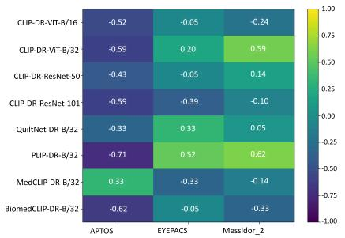

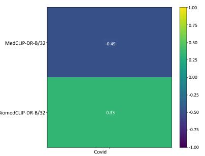

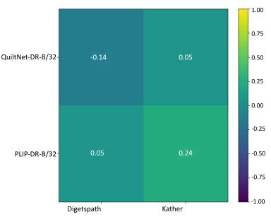

Figure 2: Kendall rank correlation (τ) between ECE-based method rankings on the In-domain(ID) source and each Domain shift(DS) dataset is shown for every backbone (rows = backbones, columns = DS sets). Cells are colored by τ (-1 to 1) and annotated with values: higher/positive τ means rankings (and thus relative calibration quality) are preserved under shift, while near-zero/negative τ indicates rank reversals of the calibration under shift.  
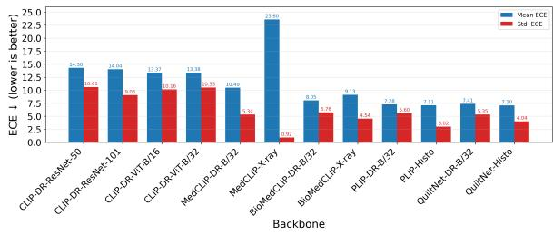  
Figure 3: Comparison of mean and Std. of ECE for various VLM-based backbones across different medical modality inputs.

## 4.3 Effectiveness: How does calibration vary with accuracy for different calibration methods?

Calibration effectiveness cannot be inferred from accuracy alone, because medical models may remain confidently wrong under class imbalance, heterogeneous acquisition, or prevalence shift. We therefore analyze the accuracy-calibration relationship across calibration methods and backbones using Pearson correlation between Acc. and ECE.

Experimental setup: We compute Pearson correlation r(Acc, ECE) across datasets for each calibration method and backbone to examine the accuracy– calibration relationship. Negative values indicate that higher accuracy corresponds to lower ECE, while positive values indicate that higher accuracy is associated with higher ECE.

Discussion: Fig. 4 shows that the accuracy-ECE relationship is highly method and backbonedependent. TS, MDCA, and MBLS often show negative correlations, indicating that accuracy and calibration can improve together, whereas ECCV\_Penalty consistently shows positive correlations, suggesting an accuracy-calibration trade-off. CLIP backbones exhibit mixed behaviour, while X-ray backbones show extreme ±1 values due to limited dataset pairs. Overall, there is no universal accuracy-calibration trade-off, calibration effectiveness depends strongly on both the method and backbone. Complementary ACE and MCE analyses show the same overall behavior: the relationship between predictive accuracy and calibration remains method and backbone dependent, confirming that higher accuracy does not generally imply better calibration (Appendix K.3).

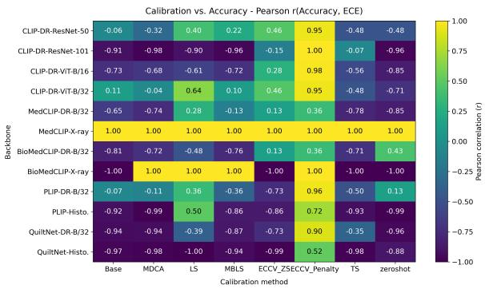  
Figure 4: Pearson correlation matrix between accuracy and ECE evaluated across diverse calibration methods and backbones.

## 4.4 Effectiveness: Which calibration methods show consistent calibration performance across various backbones?

A practical calibration method should remain reliable across backbones, modalities, and deployment shifts without requiring extensive re-tuning. We therefore evaluate whether each calibration strategy maintains low and consistent ECE across VLM and Medical-VLM backbones in both ID and DS settings.

Experimental setup: In Fig. 5, we evaluate seven calibration methods across 12 backbones and three medical modalities. The ID panel reports ECE for each backbone-method pair, while the DS panel reports the median backbone-level ∆ECE = ECEDS − ECEID across the corresponding shifted datasets to assess robustness.

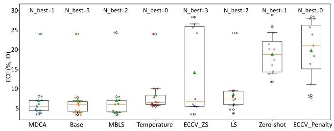

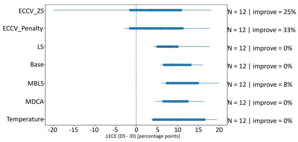  
Figure 5: Left (ID): Boxplots of ECE (%) per method across backbones (IQR boxes, 10–90% whiskers, ▲ mean, colored dots = backbone points, hollow circles = outliers). $\mathrm { N } _ { \mathrm { b e s t } }$ shows the number of times it performs best across backbones. Lower, tighter boxes = more consistent ID calibration. Right (DS): Forest plot summarizing how each method’s ECE changes from ID to DS across backbones (dot = median, thick bar = IQR, thin line = 10–90%, dashed line at zero change), right text reports N backbones and improve % (share of backbones that get lower ECE in DS).

Discussion: In ID settings, MBLS, Base, and MDCA show the most consistent calibration with low ECE and smaller spread, while LS and TS perform moderately, and ECCV\_ZS, ECCV\_Penalty, and Zero-shot show higher ECE variability. $N _ { \mathrm { b e s t } }$ further favors Base as the most frequent lowest-ECE method. Under DS, ∆ECE is mostly positive, indicating degraded calibration. Only ECCV\_ZS and ECCV\_Penalty improve in a subset of cases, likely due to their use of pretrained knowledge for shift-aware calibration. Overall, no method is consistently reliable across both ID and DS settings, highlighting the need for calibration methods specifically designed for robust medical deployment under domain shift. This conclusion is consistent under ACE and MCE: calibration method rankings and dispersion remain backbone and shift-dependent, with no existing baseline providing uniformly reliable calibration across ID and DS settings (Appendix K.4).

## 4.5 Effectiveness: How do different prompt-tuning methods interact with Calibration?

Recent work has studied how prompt tuning effectively affects calibration and global logit distributions in natural image benchmarks (Liu et al., 2023). However, in medical imaging, this interaction is more complex due to device heterogeneity, prevalence shifts, ambiguous class boundaries, context length, text-image alignment, and backbone pretraining. These factors can significantly alter confidence reliability even when accuracy remains high.

Experimental setup: We compare six prompttuning families CoOp, KgCoOp, MaPLe, Prompt-SRC, HiCroPL, and ProGrad on DR classification across APTOS, EyePACS, Messidor, and Messidor-

2. Using the same backbone, data splits, and no additional calibration method, only the prompt-tuning strategy is varied. The figure reports mean Accuracy and ECE across datasets with standard deviation error bars, where higher Accuracy and lower ECE indicate better performance.

Discussion: Fig. 6 shows a clear accuracy– calibration trade-off. PromptSRC achieves the highest accuracy (∼72%) but has poor calibration (ECE ≈11.5%) and high variability, while ProGrad performs worst in both accuracy (∼66%) and ECE (∼23%). In contrast, CoOp, HiCroPL, and KgCoOp provide the best balance, maintaining competitive accuracy (∼68–75%) with low ECE (∼3.5–4.8%) and smaller variance. MaPLe shows intermediate performance. Overall, high accuracy alone does not guarantee reliable confidence, highlighting the need for prompt-tuning methods that explicitly preserve calibration. ACE and MCE exhibit the same broad prompt-family trend, with HiCroPL, CoOp, and KgCoOp providing comparatively stronger calibration than several higher-error prompt learners (Appendix K.5). Thus, the observed accuracy calibration mismatch is not specific to ECE.

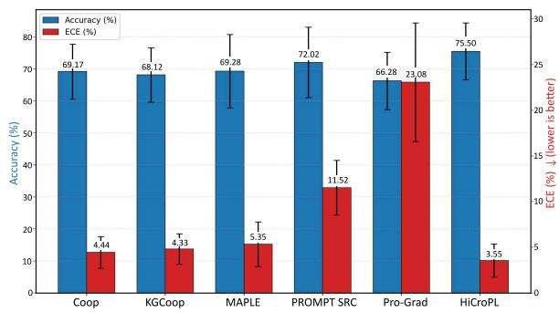  
Figure 6: Comparison of Acc and ECE for different prompt-tuning methods.

## 4.6 Stability: How does hard-prompt initialization affect calibration?

Prompt-template selection is an important stability factor because Generic prompts may improve calibration in natural-image settings (Yoon et al., 2024; Sharifdeen et al., 2025; Ahamed et al., 2025), but medical tasks require careful phrasing due to fine-grained ontologies and variable terminology. Since subtle wording changes can alter confidence without changing accuracy, we benchmark natural-image-inspired, noisy, and clinically tailored prompts to study their effect on medical VLM calibration.

Experimental setup: We study the effect of hard-prompt initialization on calibration using MaPLe-ViT-B/16 (Khattak et al., 2023a) for diabetic retinopathy classification. We evaluate Accuracy and ECE under seven hard-prompt templates (P1-P7) with different phrasing, context, and domain specificity. Prompt-template details are provided in the supplementary material.

Discussion: Fig. 7a reports the ECE standard deviation across datasets for each hard-prompt template, with mean ECE $\mu$ shown as a side label. Templates P1–P4 achieve low and stable ECE, with “a photo of $\cdot \boldsymbol { a } ^ { \prime \prime }$ giving the most stable calibration. In contrast, the noisy $\mathrm { P 7 }$ prompt shows high variance, indicating that calibration is highly sensitive to hardprompt initialization. This highlights the need for prompt-tuning strategies that remain robust to prompt wording and initialization choices. The same sensitivity is observed with ACE and MCE, where early templates such as P1-P2 remain comparatively stable while P6-P7 show substantially larger variability(Appendix K.6).

## 4.7 Stability: How do different seed initializations affect calibration performance?

Random-seed variation is another important source of calibration instability in medical imaging, where limited data, long-tailed prevalence, label noise, and subtle findings can make confidence estimates sensitive to initialization. This instability can be further amplified under prevalence and acquisition shifts (Guo et al., 2017). To assess reproducibility, we run each setup across three seeds and report the standard deviation of ECE and accuracy, allowing us to identify backbones with stable calibration estimates and those that are more seed-sensitive.

Experimental setup: We assess random-seed sensitivity by running each backbone with the base calibration method across three seeds, $s \in { 1 , 2 , 3 }$ while keeping data splits, hyperparameters, and preprocessing fixed. Seed variability is measured as the standard deviation of ECE across seeds, with lower Std. ECE indicating more stable calibration. Discussion: Fig. 7b shows that calibration stability varies across seeds, with lower Std. ECE indicating more stable backbones. BioMedCLIP-DR-B/32, PLIP-DR-B/32, and CLIP-DR-ViT-B/32 show low seed variability, with Std. ECE values of 0.25, 0.47, and 0.49, respectively, indicating consistent calibration. In contrast, MedCLIP-DR-B/32 and MaPLe-DR-ViT/16 show higher variability, with Std. ECE values of 2.49 and 1.45, making them more seed-sensitive. Overall, calibration performance and reproducibility depend on both seed initialization and backbone choice. ACE and MCE likewise confirm that seed sensitivity is strongly backbone-dependent, with MedCLIP variants showing particularly large variation compared with several other backbones (Appendix K.7).

## 5 Multi-Class Margin Regularization (MCM)

Motivation: Findings from research questions 4.1, 4.2, and 4.4 show that ID calibration often fails to transfer to DS settings, increasing ECE, while backbone and calibration-method performance remain inconsistent. To understand this, we analyze DR reliability diagrams in Fig. A1b and observe underconfidence across two backbones, both with and without MBLS (Liu et al., 2022a). Fig. 8b further shows that CE and CE+MBLS concentrate most samples in the low-margin region $( \bar { m } \leq 1 )$ , where the correct-class logit only slightly exceeds competing logits. This weak inter-class separation produces uncertain confidence and underconfidence. MBLS reduces extreme margins to limit overconfidence but does not sufficiently lift small margins, leaving logits concentrated in the low-margin region.

Multi-Class Margin Regularization: Our proposed MCM introduces a true-class-vs-rest margin objective that reshapes the inter-class logit distribution. It shifts samples from low-margin regions $( \bar { m } \leq 1 )$ toward moderate margins $( \approx 2 – 4 )$ , improving class separation while controlling margin dispersion to produce reliable confidence. For logits $\mathbf { z } _ { i } \in \mathbb { R } ^ { C }$ and label yi, we define the true-vs-rest margin as $m _ { i , k } = z _ { i , y _ { i } } - z _ { i , k }$ for $k \neq y _ { i } .$ , the persample average margin as $\begin{array} { r } { \bar { m } _ { i } = \frac { 1 } { C - 1 } \sum _ { k \neq y _ { i } } m _ { i , k } } \end{array}$ and the batch mean as $\begin{array} { r } { \mu = \frac { 1 } { B } \sum _ { i = 1 } ^ { B } \bar { m } _ { i } } \end{array}$ . The all-pairs margin variance is then computed as $\begin{array} { r } { \sigma _ { \mathrm { a l l - p a i r s } } ^ { 2 } = \frac { 1 } { B ( C - 1 ) } \sum _ { i = 1 } ^ { B } \sum _ { k \neq y _ { i } } ( m _ { i , k } - \bar { \mu } ) ^ { 2 } } \end{array}$ , and the MCM loss is defined as:

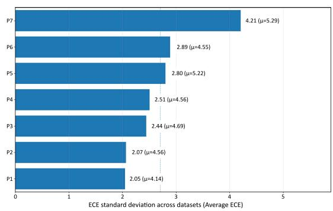

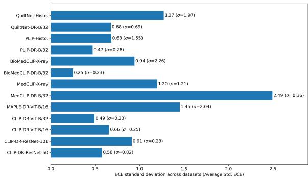  
(b) Comparison of seed variability, i.e., Std. of ECE and Acc (σ), across different backbones and three random seeds. Some backbones show stable calibration, while others are seed-sensitive.

(a) Comparison of Std. and mean of ECE (µ) across datasets for seven different hard-prompt templates (P1- P7). Templates P1-P4 have low and stable ECE across datasets, while P7 has high variance.  
Figure 7: Prompt-template sensitivity and random-seed sensitivity of calibration.  
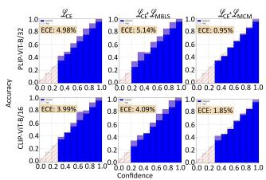  
(a) Comparison of Calibration error across 3 regularizers on two backbones,

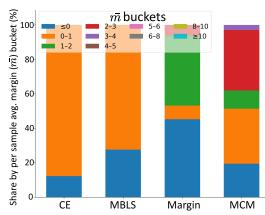  
(b) Comparison of persample average true classvs-rest of the class margin across different methods.  
Figure 8: Miscalibration analyses.

$$
\begin{array} { r } { \mathcal { L } _ { \mathrm { M C M } } = - \alpha \mu + \beta \sigma _ { \mathrm { a l l - p a i r s } } ^ { 2 } , \qquad \alpha , \beta > 0 , } \end{array}\tag{1}
$$

$$
\mathcal { L } _ { \mathrm { t o t a l } } = \mathcal { L } _ { \mathrm { C E } } + \mathcal { L } _ { \mathrm { M C M } } .\tag{2}
$$

The $\mu$ term, weighted by $\alpha ,$ increases the margin between the ground-truth logit and competing class logits, directly reducing underconfidence. The $\sigma _ { \mathrm { a l l - p a i r s } } ^ { 2 }$ term, weighted by $\beta _ { ; }$ , controls margin dispersion and prevents spurious confidence spikes by stabilizing the margin distribution. As shown in Fig. A1b, MCM substantially reduces ECE across both backbones compared with existing methods. Unlike the concurrent MARGIN loss (Sharifdeen et al., 2026), which only considers the ground-truth versus second-highest logit margin, MCM uses all true-vs-rest margins. Fig. 8b shows that MARGIN reduces samples in the (0–1) bucket but remains unstable across other margin regions, including the $\leq 0$ bucket where incorrect classes dominate. In contrast, MCM maintains a more stable inter-class margin distribution across all buckets.

Results: Tab. 1 provides a compact comparison of MCM against Base and ECCV\_ZS, which were selected as representative baselines based on their stronger ID consistency and comparatively favorable DS behavior in Fig. 5. Across the 12 modalityspecific settings, MCM achieves the lowest ECE in 10/12 ID configurations while remaining competitive under DS. Complete per-setting comparisons against all applicable calibration baselines, including Base, MDCA, LS, MBLS, ECCV\_ZS, ECCV\_Penalty, and Temperature Scaling, are reported in Appendix Tabs. A8 and A9. Comparisons across additional prompt-tuning methods are also provided in the supplementary material. Fig. 9 extends the comparison to all evaluated calibration methods. MCM achieves the highest frequency of best calibration performance in ID, obtaining the lowest ECE in 10/12 settings. Under DS, MCM achieves the lowest ECE in 4/12 settings, while other methods, particularly ECCV\_ZS, remain competitive in individual configurations. The broader DS distributions further show that strong ID calibration does not guarantee uniform robustness after distribution shift. Overall, the figure supports the conclusion that MCM provides strong and consistent ID calibration gains while its DS advantage is more setting-dependent. Statistical significance: A paired Wilcoxon analysis across the 12 matched configurations further supports the ID gains of MCM, with statistically significant improvements over ECCV\_ZS $( p = 0 . 0 2 1 2 )$ and ECCV\_Penalty $( p = 0 . 0 0 0 5 )$ . Under DS, MCM remains competitive but is not uniformly superior.

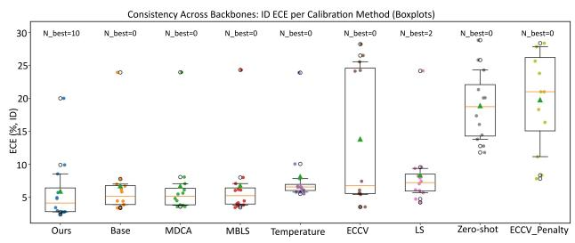

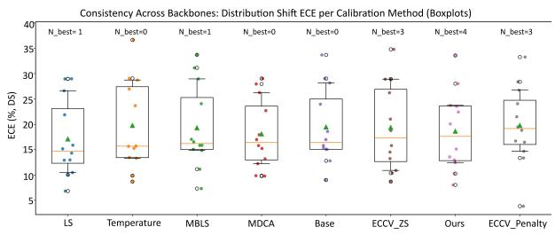  
Figure 9: ECE (%) across backbones for each calibration method under ID (top) and DS (bottom) settings. Boxplots show the interquartile range (IQR), whiskers indicate the 10–90% range, and individual backbone results are overlaid as colored markers. $\mathrm { N } _ { \mathrm { b e s t } }$ denotes the number of backbones for which a method achieves the lowest ECE. Lower medians and tighter distributions indicate more consistent calibration across architectures.

Full statistical results are provided in Appendix I. Hyperparameter transfer: The MCM hyperparameters are selected using validation data only and then fixed across all remaining backbones, modalities, and DS evaluations. A four-fold DR Leave One Dataset Out analysis independently selects the same $( \alpha , \beta ) \ = \ ( 0 . 1 , 0 . 0 1 )$ setting in every fold, supporting its transferability without target-dataset tuning (Appendix G.1).

Failure cases: MCM primarily targets low-margin underconfidence and is therefore not uniformly effective across modalities. For PLIP-Histo. and QuiltNet-Histo., the modality-specific reliability patterns indicate a different calibration regime, with overconfidence more prominent than the lowmargin underconfidence targeted by MCM (Appendix Fig. A2). Consequently, MCM increases ECE in these cases.

Ablation: Tab. 2 shows that using either −αµ or $+ \beta \sigma _ { \mathrm { a l l - p a i r s } } ^ { 2 }$ alone worsens calibration, increasing ECE to 5.45% and 6.37%. Combining both terms reduces ECE to 3.43% while preserving accuracy at 69.05%, confirming that margin expansion and margin control are complementary for calibration.

## 6 Conclusion

We introduced MVC-Bench, a large-scale benchmark for evaluating calibration in VLMs and Medical-VLMs under clinically relevant conditions. Our analysis shows that calibration is sensitive to DS, modality, and backbone choice. ID calibration does not reliably transfer, and medically aligned backbones are generally better calibrated than generic CLIP variants. It demonstrates that accuracy and calibration are not universally aligned, and no calibration or prompt-tuning method is consistently optimal across all settings. It shows that calibration varies with hard-prompt initialization and random seeds, highlighting the limitations of prompt initialization and the sensitivity of seed evaluation. Motivated by these findings, we proposed Multi-Class Margin Regularization (MCM), which reduces ID calibration error and remains competitive under DS. Overall, MVC-Bench reveals that calibration should be treated as a firstclass requirement for safe medical VLM deployment, evaluated through robustness, adaptation effectiveness, and stability under realistic variation.

<table><tr><td rowspan="2">Backbone</td><td rowspan="2">Metric</td><td colspan="3">ID</td><td colspan="3">DS</td></tr><tr><td>Base</td><td>ECCV ZS</td><td>Ours (MCM)</td><td>Base</td><td>ECCV ZS</td><td>Ours (MCM)</td></tr><tr><td>CLIP-DR-ResNet-50</td><td>Acc. ECE</td><td>67.87 4.40</td><td>72.09 28.26</td><td>67.71 2.96</td><td>52.29 15.07</td><td>27.98 18.77</td><td>51.30 10.26</td></tr><tr><td>CLIP-DR-ResNet-101</td><td>Acc. ECE</td><td>68.29</td><td>67.69</td><td>68.19</td><td>41.91</td><td>59.63</td><td>51.73</td></tr><tr><td>CLIP-DR-ViT-B/16</td><td>Acc.</td><td>5.82 69.18</td><td>25.59 68.56</td><td>4.82 69.05</td><td>16.99 32.90</td><td>34.79 38.51</td><td>15.12 33.35</td></tr><tr><td>CLIP-DR-ViT-B/32</td><td>ECE Acc.</td><td>4.44 68.13</td><td>26.54 72.09</td><td>3.43 67.79</td><td>33.68 43.58</td><td>15.79 29.03</td><td>20.08 46.59</td></tr><tr><td>MedCLIP-DR-B/32</td><td>ECE Acc. ECE</td><td>3.89 59.82 6.69</td><td>28.26 59.85</td><td>2.77 59.74</td><td>15.83 52.69</td><td>14.53 59.91</td><td>12.44 59.83</td></tr><tr><td>MedCLIP-X-ray</td><td>Acc. ECE</td><td>65.77</td><td>5.63 65.96</td><td>4.94 65.83</td><td>23.95 79.15</td><td>26.23 79.02</td><td>23.54 79.15</td></tr><tr><td>BioMedCLIP-DR-B/32</td><td>Acc.</td><td>23.97 67.47</td><td>24.17 59.85</td><td>20.03 66.80</td><td>29.03 59.45</td><td>28.91 59.11</td><td>28.04 59.26</td></tr><tr><td>BioMedCLIP-X-ray</td><td>ECE Acc.</td><td>3.88 73.56</td><td>5.63 72.94</td><td>2.82 73.70</td><td>15.06 74.56</td><td>21.03 73.63</td><td>12.94 78.84</td></tr><tr><td>PLIP-DR-B/32</td><td>ECE Acc.</td><td>7.78 68.05</td><td>7.44 67.79</td><td>5.71 67.97</td><td>9.00 55.40</td><td>10.38 54.27</td><td>8.02 47.16</td></tr><tr><td>PLIP-Histo.</td><td>ECE Acc.</td><td>3.38 85.43</td><td>3.53 86.27</td><td>2.75 85.30</td><td>12.79 52.83</td><td>10.88 65.35</td><td>13.56 53.88</td></tr><tr><td></td><td>ECE Acc.</td><td>7.00 66.54</td><td>6.08</td><td>9.92</td><td>18.58</td><td>13.24</td><td>22.43</td></tr><tr><td>QuiltNet-DR-B/32</td><td>ECE</td><td>3.45</td><td>67.79 3.53</td><td>66.49 2.40</td><td>40.08 15.42</td><td>50.50 8.69</td><td>27.92 23.72</td></tr><tr><td>QuiltNet-Histo.</td><td>Acc. ECE</td><td>86.73 6.21</td><td>87.87 5.42</td><td>86.87 8.55</td><td>46.46 28.15</td><td>44.93 28.94</td><td>46.76 33.60</td></tr></table>

Table 1: Overall average accuracy and ECE across 12 settings covering three modalities. ID: in-domain and DS: domain shift (out-domain).
<table><tr><td>Loss Term</td><td>Metric</td><td>Aptos</td><td>eyepacs</td><td>messidor</td><td>messidor_2</td><td>Avg</td></tr><tr><td rowspan="2">CoOp (Zhou et al., 2022b)</td><td>Acc.</td><td>77.90</td><td>74.64</td><td>59.50</td><td>64.66</td><td>69.18</td></tr><tr><td>ECE</td><td>3.99</td><td>2.25</td><td>5.29</td><td>6.24</td><td>4.44</td></tr><tr><td rowspan="2">MBLS (Liu et al., 2022a)</td><td>Acc.</td><td>77.94</td><td>74.64</td><td>59.53</td><td>64.62</td><td>69.18</td></tr><tr><td>ECE</td><td>4.09</td><td>2.25</td><td>5.31</td><td>6.13</td><td>4.45</td></tr><tr><td rowspan="2">− αµ</td><td>Acc.</td><td>74.82</td><td>73.72</td><td>59.83</td><td>62.79</td><td>67.54</td></tr><tr><td>ECE</td><td>4.81</td><td>9.32</td><td>4.98</td><td>2.71</td><td>5.45</td></tr><tr><td rowspan="2"></td><td>Acc.</td><td>78.26</td><td>74.49</td><td>58.42</td><td>64.62</td><td>68.94</td></tr><tr><td>ECE</td><td>8.03</td><td>2.98</td><td>5.61</td><td>8.87</td><td>6.37</td></tr><tr><td rowspan="2"> $- \alpha \mu + \beta \sigma _ { \mathrm { a l l - p a i r s } } ^ { 2 }$ </td><td>Acc.</td><td>77.50</td><td>74.53</td><td>59.72</td><td>64.43</td><td>69.05</td></tr><tr><td>ECE</td><td>1.85</td><td>3.25</td><td>5.09</td><td>3.53</td><td>3.43</td></tr></table>

Table 2: Loss Component analyses in our MCM.

## 7 Limitations

While MVC-Bench provides a large-scale calibration study of VLMs and Medical-VLMs, its scope is limited to medical image classification. We do not evaluate whether the same calibration behaviour extends to segmentation, detection, report generation, retrieval, or medical VQA, which require different uncertainty definitions and evaluation protocols. Furthermore, MCM targets lowmargin underconfidence and is therefore not a universal solution to all calibration failures. Its improvements are less consistent in histopathology, particularly for PLIP-Histo. and QuiltNet-Histo., where overconfidence appears more prominent. Although we use a single hyperparameter setting across backbones and modalities, further work is needed to understand modality-specific margin behavior and calibration objectives under broader clinical shifts.

## References

2018. Rsna pneumonia detection challenge. https://www.kaggle.com/competitions/ rsna-pneumonia-detection-challenge. Accessed 2025-11-03.

Shihab Aaqil Ahamed, Udaya SKP Thanthrige, Ranga Rodrigo, and Muhammad Haris Khan. 2025. A-tpt: Angular diversity calibration properties for test-time prompt tuning of vision-language models. arXiv preprint arXiv:2510.26441.

Shuang Ao, Stefan Rueger, and Advaith Siddharthan. 2023. Two sides of miscalibration: Identifying over and under-confidence prediction for network calibration. Preprint, arXiv:2308.03172.

APTOS. 2019. APTOS 2019 Blindness Detection. https://www.kaggle.com/competitions/ aptos2019-blindness-detection/data.

Benedikt Boecking, Naoto Usuyama, Shruthi Bannur, Daniel C Castro, Anton Schwaighofer, Stephanie Hyland, Maria Wetscherek, Tristan Naumann, Aditya Nori, Javier Alvarez-Valle, and 1 others. 2022. Mak ing the most of text semantics to improve biomedical vision–language processing. In European conference on computer vision, pages 1–21. Springer.

Glenn W. Brier. 1950. Verification of forecasts expressed in terms of probability. Monthly Weather Review, 78:1–3.

Mateusz Buda, Atsuto Maki, and Maciej A. Mazurowski. 2018. A systematic study of the class imbalance problem in convolutional neural networks. Neural Networks, 106:249–259.

Gabriele Campanella, Matthew G Hanna, Luke Geneslaw, Allen Miraflor, Vitor Werneck Krauss Silva, Klaus J Busam, Edi Brogi, Victor E Reuter, David S Klimstra, and Thomas J Fuchs. 2019. Clinicalgrade computational pathology using weakly supervised deep learning on whole slide images. Nature medicine, 25(8):1301–1309.

Zongjing Cao, Yan Li, Dong-Ho Kim, and Byeong-Seok Shin. 2024. Deep neural network confidence calibration from stochastic weight averaging. Electronics, 13(3).

Yin Cui, Menglin Jia, Tsung-Yi Lin, Yang Song, and Serge Belongie. 2019. Class-balanced loss based on effective number of samples. In Proceedings of the IEEE/CVF conference on computer vision and pattern recognition, pages 9268–9277.

Qian Da, Xiaodi Huang, Zhongyu Li, Yanfei Zuo, Chenbin Zhang, Jingxin Liu, Wen Chen, Jiahui Li, Dou Xu, Zhiqiang Hu, and 1 others. 2022. Digestpath: A benchmark dataset with challenge review for the pathological detection and segmentation of digestivesystem. Medical image analysis, 80:102485.

Etienne Decencière, Xiwei Zhang, Guy Cazuguel, Bruno Lay, Béatrice Cochener, Caroline Trone, Philippe Gain, John-Richard Ordoñez-Varela, Pascale Massin, Ali Erginay, and 1 others. 2014a. Feedback on a publicly distributed image database: The messidor database. Image Analysis & Stereology, pages 231–234.

Etienne Decencière, Xiwei Zhang, Guy Cazuguel, Bruno Lay, Béatrice Cochener, Caroline Trone, Philippe Gain, John-Richard Ordóñez-Varela, Pascale Massin, Ali Erginay, and 1 others. 2014b. Feedback on a publicly distributed image database: the messidor database. Image Analysis & Stereology, pages 231–234.

Chamuditha Jayanga Galappaththige, Gayal Kuruppu, and Muhammad Haris Khan. 2024. Generalizing to unseen domains in diabetic retinopathy classification. In Proceedings ofthe IEEE/CVF Winter Conference on Applications of Computer Vision (WACV), pages 7685–7695.

Jevgenij Gamper, Navid Alemi Koohbanani, Ksenija Benet, Ali Khuram, and Nasir Rajpoot. 2019. Pannuke: an open pan-cancer histology dataset for nuclei instance segmentation and classification. In European congress on digital pathology, pages 11–19. Springer.

Jakob Gawlikowski, Cedrique Rovile Njieutcheu Tassi, Mohsin Ali, Jongseok Lee, Matthias Humt, Jianxiang Feng, Anna M. Kruspe, Rudolph Triebel, Peter Jung, Ribana Roscher, Muhammad Shahzad, Wen Yang, Richard Bamler, and Xiao Xiang Zhu. 2023. A survey of uncertainty in deep neural networks. Artificial Intelligence Review, 56(S1):1513–1589.

Mohsen Ghafoorian, Alireza Mehrtash, Tina Kapur, Nico Karssemeijer, Elena Marchiori, Mehran Pesteie, Charles R. G. Guttmann, Frank-Erik de Leeuw, Clare M. Tempany, Bram van Ginneken, Andriy Fedorov, Purang Abolmaesumi, Bram Platel, and William M. Wells. 2017. Transfer Learningfor Domain Adaptation in MRI: Application in Brain Lesion Segmentation, page 516–524. Springer International Publishing.

Varun Gulshan, Lily Peng, Marc Coram, Martin C Stumpe, Derek Wu, Arunachalam Narayanaswamy, Subhashini Venugopalan, Kasumi Widner, Tom Madams, Jorge Cuadros, and 1 others. 2016. Development and validation of a deep learning algorithm for detection of diabetic retinopathy in retinal fundus photographs. jama, 316(22):2402–2410.

Chuan Guo, Geoff Pleiss, Yu Sun, and Kilian Q Weinberger. 2017. On calibration of modern neural networks. In International conference on machine learning, pages 1321–1330. PMLR.

Asif Hanif, Fahad Shamshad, Muhammad Awais, Muzammal Naseer, Fahad Shahbaz Khan, Karthik Nandakumar, Salman Khan, and Rao Muhammad Anwer.

2024. Baple: Backdoor attacks on medical foundational models using prompt learning. In International Conference on Medical Image Computing and Computer-Assisted Intervention, pages 443–453. Springer.

Ramya Hebbalaguppe, Jatin Prakash, Neelabh Madan, and Chetan Arora. 2022. A stitch in time saves nine: A train-time regularizing loss for improved neural network calibration. In Proceedings of the IEEE/CVF Conference on Computer Vision and Pattern Recognition, pages 16081–16090.

Zhi Huang, Federico Bianchi, Mert Yüksekgönül, Thomas J Montine, and James Zou. 2023a. A visual– language foundation model for pathology image analysis using medical twitter. Nature Medicine, 29(9):2307–2316.

Zhi Huang, Federico Bianchi, Mert Yuksekgonul, Thomas J Montine, and James Zou. 2023b. A visual–language foundation model for pathology image analysis using medical twitter. Nature medicine, 29(9):2307–2316.

Noor Hussein, Fahad Shamshad, Muzammal Naseer, and Karthik Nandakumar. 2024. Promptsmooth: Certifying robustness of medical vision-language models via prompt learning. In International Conference on Medical Image Computing and Computer-Assisted Intervention, pages 698–708. Springer.

Wisdom Ikezogwo, Saygin Seyfioglu, Fatemeh Ghezloo, Dylan Geva, Fatwir Sheikh Mohammed, Pavan Kumar Anand, Ranjay Krishna, and Linda Shapiro. 2023a. Quilt-1m: One million image-text pairs for histopathology. In Advances in Neural Information Processing Systems (NeurIPS), pages 37995–38017.

Wisdom Ikezogwo, Saygin Seyfioglu, Fatemeh Ghezloo, Dylan Geva, Fatwir Sheikh Mohammed, Pavan Kumar Anand, Ranjay Krishna, and Linda Shapiro. 2023b. Quilt-1m: One million image-text pairs for histopathology. Advances in neural information processing systems, 36:37995–38017.

Kaggle. 2015. Diabetic Retinopathy Detection. https://www.kaggle.com/competitions/ diabetic-retinopathy-detection/data.

Davood Karimi and Ali Gholipour. 2020. Improving calibration and out-of-distribution detection in medical image segmentation with convolutional neural networks. arXiv preprint arXiv:2004.06569.

Jakob Nikolas Kather, Johannes Krisam, Pornpimol Charoentong, Tom Luedde, Esther Herpel, Cleo-Aron Weis, Timo Gaiser, Alexander Marx, Nektarios A Valous, Dyke Ferber, and 1 others. 2019. Predicting survival from colorectal cancer histology slides using deep learning: A retrospective multicenter study. PLoS medicine, 16(1):e1002730.

Muhammad Uzair Khattak, Hanoona Rasheed, Muhammad Maaz, Salman Khan, and Fahad Shahbaz Khan. 2023a. Maple: Multi-modal prompt learning. In

IEEE/CVF Conference on Computer Vision and Pattern Recognition (CVPR), pages 19113–19122.

Muhammad Uzair Khattak, Syed Talal Wasim, Muzammal Naseer, Salman Khan, Ming-Hsuan Yang, and Fahad Shahbaz Khan. 2023b. Self-regulating prompts: Foundational model adaptation without forgetting. In IEEE/CVF International Conference on Computer Vision (ICCV), pages 15190–15200.

Pang Wei Koh, Shiori Sagawa, Henrik Marklund, Sang Michael Xie, Marvin Zhang, Akshay Balsubramani, Weihua Hu, Michihiro Yasunaga, Richard Lanas Phillips, Irena Gao, and 1 others. 2021. Wilds: A benchmark of in-the-wild distribution shifts. In International conference on machine learning, pages 5637–5664. PMLR.

Meelis Kull, Telmo Silva Filho, and Peter Flach. 2017. Beta calibration: a well-founded and easily implemented improvement on logistic calibration for binary classifiers. In Proceedings of the 20th International Conference on Artificial Intelligence and Statistics (AISTATS), volume 54 of Proceedings of Machine Learning Research, pages 623–631. PMLR.

Meelis Kull, Miquel Perello Nieto, Markus Kängsepp, Telmo Silva Filho, Hao Song, and Peter Flach. 2019. Beyond temperature scaling: Obtaining wellcalibrated multi-class probabilities with dirichlet calibration. Advances in neural information processing systems, 32.

Aviral Kumar, Sunita Sarawagi, and Ujjwal Jain. 2018. Trainable calibration measures for neural networks from kernel mean embeddings. In International Conference on Machine Learning, pages 2805–2814. PMLR.

Balaji Lakshminarayanan, Alexander Pritzel, and Charles Blundell. 2017. Simple and scalable predictive uncertainty estimation using deep ensembles. Advances in neural information processing systems, 30.

Max-Heinrich Laves, Sontje Ihler, Jacob F. Fast, Lüder A. Kahrs, and Tobias Ortmaier. 2020. Wellcalibrated regression uncertainty in medical imaging with deep learning. In Proceedings ofthe Third Conference on Medical Imaging with Deep Learning (MIDL), volume 121 of Proceedings of Machine Learning Research, pages 393–412. PMLR.

Junnan Li, Dongxu Li, Silvio Savarese, and Steven Hoi. 2023. Blip-2: Bootstrapping language-image pretraining with frozen image encoders and large language models. In International Conference on Machine Learning (ICML), pages 19730–19742. PMLR.

Junnan Li, Dongxu Li, Caiming Xiong, and Steven Hoi. 2022. Blip: Bootstrapping language-image pretraining for unified vision-language understanding and generation. In International conference on machine learning, pages 12888–12900. PMLR.

Tsung-Yi Lin, Priya Goyal, Ross Girshick, Kaiming He, and Piotr Dollár. 2017. Focal loss for dense object detection. In Proceedings ofthe IEEE international conference on computer vision, pages 2980–2988.

Bingyuan Liu, Ismail Ben Ayed, Adrian Galdran, and Jose Dolz. 2022a. The devil is in the margin: Marginbased label smoothing for network calibration. In IEEE/CVF Conference on Computer Vision and Pattern Recognition (CVPR), pages 80–88.

Bingyuan Liu, Ismail Ben Ayed, Adrian Galdran, and Jose Dolz. 2022b. The devil is in the margin: Marginbased label smoothing for network calibration. In Proceedings ofthe IEEE/CVF Conference on Computer Vision and Pattern Recognition, pages 80–88.

Pengfei Liu, Weizhe Yuan, Jinlan Fu, Zhengbao Jiang, Hiroaki Hayashi, and Graham Neubig. 2023. Pretrain, prompt, and predict: A systematic survey of prompting methods in natural language processing. ACM computing surveys, 55(9):1–35.

Matthias Minderer, Josip Djolonga, Rob Romijnders, Frances Hubis, Xiaohua Zhai, Neil Houlsby, Dustin Tran, and Mario Lucic. 2021. Revisiting the calibration of modern neural networks. Advances in neural information processing systems, 34:15682–15694.

Rafael Müller, Simon Kornblith, and Geoffrey E Hinton. 2019. When does label smoothing help? Advances in neural information processing systems, 32.

Balamurali Murugesan, Julio Silva-Rodríguez, Ismail Ben Ayed, and Jose Dolz. 2024. Robust calibration of large vision-language adapters. In European Conference on Computer Vision, pages 147– 165. Springer.

Mahdi Pakdaman Naeini, Gregory Cooper, and Milos Hauskrecht. 2015. Obtaining well calibrated probabilities using bayesian binning. In Proceedings of the AAAI conference on artificial intelligence, volume 29.

Mahdi Pakdaman Naeini and Gregory F Cooper. 2016. Binary classifier calibration using an ensemble of near isotonic regression models. In 2016 IEEE 16th International Conference on Data Mining (ICDM), pages 360–369. IEEE.

Jeremy Nixon, Michael W Dusenberry, Linchuan Zhang, Ghassen Jerfel, and Dustin Tran. 2019. Measuring calibration in deep learning. In CVPR workshops, volume 2.

Stephen Obadinma, Hongyu Guo, and Xiao-Dan Zhu. 2021. Class-wise calibration: A case study on covid-19 hate speech. Proceedings ofthe Canadian Conference on Artificial Intelligence.

Yaniv Ovadia, Emily Fertig, Jie Ren, Zachary Nado, David Sculley, Sebastian Nowozin, Joshua Dillon, Balaji Lakshminarayanan, and Jasper Snoek. 2019. Can you trust your model’s uncertainty? evaluating predictive uncertainty under dataset shift. In Advances in Neural Information Processing Systems (NeurIPS), volume 32.

Mahdi Pakdaman Naeini, Gregory Cooper, and Milos Hauskrecht. 2015. Obtaining well calibrated probabilities using bayesian binning. In AAAI Conference on Artificial Intelligence.

John Platt and 1 others. 1999. Probabilistic outputs for support vector machines and comparisons to regularized likelihood methods. Advances in large margin classifiers, 10(3):61–74.

Alec Radford, Jong Wook Kim, Chris Hallacy, Aditya Ramesh, Gabriel Goh, Sandhini Agarwal, Girish Sastry, Amanda Askell, Pamela Mishkin, Jack Clark, and 1 others. 2021. Learning transferable visual models from natural language supervision. In International Conference on Machine Learning (ICML), pages 8748–8763. PMLR.

Tawsifur Rahman, Amith Khandakar, Yazan Qiblawey, Anas Tahir, Serkan Kiranyaz, Saad Bin Abul Kashem, Mohammad Tariqul Islam, Somaya Al Maadeed, Susu M Zughaier, Muhammad Salman Khan, and 1 others. 2021. Exploring the effect of image enhancement techniques on covid-19 detection using chest x-ray images. Computers in biology and medicine, 132:104319.

Sivaramakrishnan Rajaraman, Sudhir Sornapudi, Philip O Alderson, Les R Folio, and Sameer K Antani. 2020. Analyzing inter-reader variability affecting deep ensemble learning for covid-19 detection in chest radiographs. PloS one, 15(11):e0242301.

Ashshak Sharifdeen, Muhammad Akhtar Munir, Sanoojan Baliah, Salman Khan, and Muhammad Haris Khan. 2025. O-tpt: Orthogonality constraints for calibrating test-time prompt tuning in vision-language models. In Proceedings of the Computer Vision and Pattern Recognition Conference, pages 19942– 19951.

Ashshak Sharifdeen, Fahad Shamshad, Muhammad Akhtar Munir, Abhishek Basu, Mohamed Insaf Ismithdeen, Jeyapriyan Jeyamohan, Chathurika Sewwandi Silva, Karthik Nandakumar, and Muhammad Haris Khan. 2026. Towards calibrating prompt tuning of vision-language models. Preprint, arXiv:2602.19024.

Anouk Stein, Carol Wu, Chris Carr, George Shih, Jamie Dulkowski, J Kalpathy-Cramer, and et al. 2018. Rsna pneumonia detection challenge. Mountain View: Kaggle.

David Tellez, Geert J. S. Litjens, Péter Bándi, Wouter Bulten, John-Melle Bokhorst, Francesco Ciompi, and Jeroen van der Laak. 2019. Quantifying the effects of data augmentation and stain color normalization in convolutional neural networks for computational pathology. Medical image analysis, 58:101544.

Sunil Thulasidasan, Gopinath Chennupati, Jeff A Bilmes, Tanmoy Bhattacharya, and Sarah Michalak. 2019. On mixup training: Improved calibration and predictive uncertainty for deep neural networks. Advances in neural information processing systems, 32.

Ekin Tiu, Ellie Talius, Pujan Patel, Curtis P. Langlotz, Andrew Y. Ng, and Pranav Rajpurkar. 2022. Expertlevel detection of pathologies from unannotated chest x-ray images via self-supervised learning. Nature Biomedical Engineering, 6(12):1399–1412.

Zifeng Wang, Zhenbang Wu, Dinesh Agarwal, and Jimeng Sun. 2022. Medclip: Contrastive learning from unpaired medical images and text. In Proceedings of the Conference on Empirical Methods in Natural Language Processing. Conference on Empirical Methods in Natural Language Processing, volume 2022, page 3876.

Hantao Yao, Rui Zhang, and Changsheng Xu. 2023. Visual-language prompt tuning with knowledgeguided context optimization. In Proceedings ofthe IEEE/CVF conference on computer vision and pattern recognition, pages 6757–6767.

Hee Suk Yoon, Eunseop Yoon, Joshua Tian Jin Tee, Mark Hasegawa-Johnson, Yingzhen Li, and Chang D Yoo. 2024. C-tpt: Calibrated test-time prompt tuning for vision-language models via text feature dispersion. arXiv preprint arXiv:2403.14119.

Bianca Zadrozny and Charles Elkan. 2002. Transforming classifier scores into accurate multiclass probability estimates. In Proceedings of the eighth ACM SIGKDD international conference on Knowledge discovery and data mining, pages 694–699.

John R. Zech, Marcus A. Badgeley, Manway Liu, Anthony Beardsworth Costa, Joseph J. Titano, and Eric Karl Oermann. 2018. Variable generalization performance of a deep learning model to detect pneumonia in chest radiographs: A cross-sectional study. PLoS Medicine, 15.

Xiaohua Zhai, Xiao Wang, Basil Mustafa, Andreas Steiner, Daniel Keysers, Alexander Kolesnikov, and Lucas Beyer. 2022. Lit: Zero-shot transfer with locked-image text tuning. In Proceedings of the IEEE/CVF conference on computer vision and pattern recognition, pages 18123–18133.

Ziyue Zhang, Tianjiao Wang, Yanwu Xu, Xiaosong Yang, Kang Zhou, Yutong Wang, Yunlu Zhang, Kailong Huang, Dong Tian, Eric Xing, and 1 others. 2023. Biomedclip: a multimodal biomedical foundation model pretrained from 15 million scientific image–text pairs. Preprint, arXiv:2303.00915.

Hao Zheng, Shunzhi Yang, Zhuoxin He, Jinfeng Yang, and Zhenhua Huang. 2025a. Hierarchical crossmodal prompt learning for vision-language models. In Proceedings ofthe IEEE/CVF International Conference on Computer Vision (ICCV), pages 1891– 1901.

Hao Zheng, Shunzhi Yang, Zhuoxin He, Jinfeng Yang, and Zhenhua Huang. 2025b. Hierarchical crossmodal prompt learning for vision-language models. Preprint, arXiv:2507.14976.

Kaiyang Zhou, Jingkang Yang, Chen Change Loy, and Ziwei Liu. 2022a. Conditional prompt learning for vision-language models. In Proceedings of the IEEE/CVF Conference on Computer Vision and Pattern Recognition (CVPR), pages 16816–16825.

Kaiyang Zhou, Jingkang Yang, Chen Change Loy, and Ziwei Liu. 2022b. Learning to prompt for visionlanguage models. International Journal ofComputer Vision (IJCV), 130(9):2337–2348.

Kaiyang Zhou, Jingkang Yang, Chen Change Loy, and Ziwei Liu. 2022c. Learning to prompt for visionlanguage models. International Journal ofComputer Vision, 130(9):2337–2348.

Beier Zhu, Yulei Niu, Yucheng Han, Yue Wu, and Hanwang Zhang. 2023a. Prompt-aligned gradient for prompt tuning. In Proceedings of the IEEE/CVF international conference on computer vision, pages 15659–15669.

Fei Zhu, Zhen Cheng, Xu-Yao Zhang, and Cheng-Lin Liu. 2023b. Rethinking confidence calibration for failure prediction. Preprint, arXiv:2303.02970.

## Appendices

In this supplementary material, we provide the following:

1. Evaluation metrics and protocol (Sec. A)

2. Evaluated calibration baselines (Sec. B)

3. Loss component analyses (Sec. C)

4. Prompt-learning Comparision (Sec. D)

5. Prompt-template details (Sec. E)

6. Reliability diagram for other backbones (Sec. F)

7. Hyperparameter sweep (Sec. G)

8. Statistical Analysis of Domain-Shift Rank Transfer (Sec. H)

9. Paired Statistical Comparison of MCM (Sec. I)

10. Scale of the Experimental Evaluation(Sec. K)

11. Other Metrics Analysis on Research Questions(Sec. J)

12. Brier Score Analyses(Sec. L)

13. Weighted Subset ECE Analyses(Sec. M)

14. Results(Sec. N)

15. Declaration of LLM usage(Sec. O)

## A Evaluation metrics and protocol

The following metrics are used to evaluate the models’ performance: Accuracy (Acc.), Expected Calibration Error (ECE), Maximum Calibration Error (MCE), Adaptive Calibration Error (ACE), and reliability diagram.

Accuracy (Acc) Proportion of correctly classified samples, indicating overall predictive performance. Expected calibration error (ECE) (Naeini et al., 2015) The goal of calibration is to ensure the model’s predicted probabilities accurately reflect the true likelihood of accuracy. If the outputs of the model are perfectly calibrated, then

$$
\mathbb { P } \left( \hat { X } = X \mid \hat { P } = p \right) = p , \forall p \ \in \ [ 0 , 1 ]\tag{3}
$$

where X is the ground truth label, $\hat { X }$ is the predicted class label with its predicted confidence $\hat { P } = p$ that need to be calibrated. The ECE metric is computed as the weighted average of the absolute difference between the accuracy and the mean confidence within each bin. Mathematically, ECE is formulated as follows:

$$
\mathrm { E C E } = \sum _ { z = 1 } ^ { Z } \frac { \left| C _ { z } \right| } { M } \left| \operatorname { a c c } \left( C _ { z } \right) - \operatorname { c o n f } \left( C _ { z } \right) \right| ,\tag{4}
$$

where $Z$ denotes the total number of bins. $C _ { z }$ defines the image set with predicted confidence falling into the z-th bin. $| C _ { z } |$ is the number of images within this bin, and M is the total number of predictions across all the probability bins. Furthermore, acc $\left( C _ { z } \right)$ , and conf $\left( C _ { z } \right)$ represent the accuracy of the predictions and average prediction confidence of all associated with bin z, respectively.

Maximum Calibration Error (MCE) (Naeini et al., 2015) This metric captures the maximum discrepancy between confidence and accuracy across all bins, highlighting the worst-case deviation. It is defined as:

$$
\mathrm { M C E } = \operatorname* { m a x } _ { z \in \{ 1 , \ldots , Z \} } \left| \operatorname { a c c } ( C _ { z } ) - \operatorname { c o n f } ( C _ { z } ) \right| ,
$$

where the terms are as previously defined.

Adaptive Calibration Error (ACE) (Nixon et al., 2019) This metric addresses some limitations of ECE by using an adaptive binning approach, ensuring that each bin has an equal number of samples. The ACE is calculated as:

$$
\mathrm { A C E } = \frac { 1 } { Z } \sum _ { z = 1 } ^ { Z } \left| \operatorname { a c c } ( C _ { z } ) - \operatorname { c o n f } ( C _ { z } ) \right| ,
$$

where $Z$ is the number of bins, and other terms are as previously defined.

Reliability diagram also called the calibration curve, provides a qualitative description of calibration. With better calibration, the points will lie closer to the main diagonal that extends from the bottom left to the top right of the reliability diagram. The points below the diagonal indicate that the model is overconfident, with predicted probabilities that are too large. Those above the diagonal indicate that the model is underconfident, and the predicted probabilities are too small.

## B Evaluated calibration baselines

The following mix of post-hoc and training-time calibration baselines is used in this benchmarking study:

Multi-class difference in confidence and accuracy (MDCA) (Hebbalaguppe et al., 2022) penalizes mismatches between the model’s confidence and accuracy to capture class interactions. By adding this auxiliary loss, the model’s predicted probabilities better align with its actual accuracy across multiple classes, thereby improving overall calibration.

Label smoothing (LS) (Müller et al., 2019) combats overfitting and overconfidence by replacing hard labels with a smoothed probability distribution. This discourages the model from assigning full probability to a single class, leading to more moderate and calibrated predictions.

Margin-based label smoothing (MBLS) (Liu et al., 2022b) is a class-balanced loss based on the number of samples to counter prevalence skew (e.g., the dominance of “No DR”), mitigating calibration bias induced by class imbalance.

ECCV\_ZS (Murugesan et al., 2024) shifts the direction of the prior-weighted logit vector to match the correct category encoded in the one-hot label, and the logit norm normalizes logit values according to the ZS logit range.

ECCV\_penalty (Murugesan et al., 2024) when the constraint is not satisfied, i.e., there exist logit magnitudes outside the zero-shot logit range, the value of the penalty term increases, backpropagating gradients to modify the logit values according to the enforced constraint.

Temperature scaling (Guo et al., 2017) adjusts the model’s logits by a scalar, learnable temperature parameter $\tau > 0$ before the softmax layer, optimized on a held-out validation set by minimizing the negative log-likelihood (NLL). A zero-shot variant can be applied in scenarios where a validation set is not available.

## C Loss component analyses

As shown in Fig. A1a, the inclusion of the mean term $( - \alpha \mu )$ with CE loss drives a larger interclass margin range. However, this explicit expansion leads to the overconfidence issue observed in Fig. A1b. In contrast, the variance term $( \beta \sigma _ { \mathrm { a l l - p a i r s } } ^ { 2 } )$ restricts the margin range (≈ 0–1), resulting in underconfidence. Combining both terms (MCM) balances these effects, producing a stable margin field and lower ECE.

## D Prompt-learning Comparison

We compare five prompt-learning baselines (MaPLe, KgCoOp, PromptSRC, ProGrad, and Hi-CroPL) (Zhou et al., 2022b; Khattak et al., 2023a,b; Yao et al., 2023; Zhu et al., 2023a; Zheng et al., 2025b) on diabetic retinopathy, histopathology, and chest X-ray benchmarks using Accuracy and Expected Calibration Error (ECE). We report each method and its calibrated variant (suffix $ { ^ { \circ } } \mathrm { - } \mathrm { O u r s } ^ { \prime \ } )$ in Table. A1.

Our calibration reduces average ECE across each method, while retaining high accuracy. Per method, the average ECE drops from 12.4\to 10.02 for MaPLe, from $1 0 . 5 7 ~  ~ 8 . 2 8$ for $\mathrm { K g \mathrm { - } }$ CoOp from 15.64\to 12.62 for PromptSRC, from $1 8 . 5 9  1 5 . 4 1$ for ProGrad, and from $5 . 4 5 $ for HiCroPL. Accuracy remains effectively unchanged: from 59.21\to 58.14 for MaPLe, from 60.08\to 63.79 for KgCoOp, from $6 0 . 9 8  6 2 . 1 5$ for PromptSRC, from 57.59\to 57.43 for ProGrad, and from 72.09\to 73.10 for HiCroPL. (Table A1). Furthermore, Table. A2 shows that our method consistently reduces ECE in domain shift (DS) while retaining accuracy.

Our method provides substantial calibration gains without sacrificing accuracy cost, making it a practical drop-in for prompt-based VLM calibration.

## E Prompt-template details

We consider seven hard prompt templates (P1-P7) that differ in phrasing, context, and domain. We have used the prompt template as follows: “a photo of a”, “a photo of a retina with”, “a color fundus photograph showing diabetic retinopathy severity level as”, “Classify diabetic retinopathy severity from this fundus photo of $\cdot _ { a ^ { \prime } }$ , “You are classifying diabetic retinopathy on a fundus photo of a”, “This picture illustrates diabetic retinopathy severity of $a ^ { \prime \prime } ,$ , “The DR level $i s ^ { \prime \prime }$

## F Reliability diagram for other backbones

Fig.A2 shows that most of the other backbones have underconfidence issues across the modalities.

## G Hyperparameter sweep

We tuned MCM on CLIP-ViT-B/16 using a DR benchmark( CLIP-DR-ViT-B/16), averaging three seeds. We swept $\alpha \in \ \{ 0 . 1 , 0 . 2 , 0 . 3 \}$ and $\beta \ \in$ $\lbrace 0 . 0 1 , 0 . 0 5 \rbrace$ (Table A3). The best calibration was at $( \alpha , \beta ) { = } ( 0 . 1 , 0 . 0 1 )$ with Acc. 69.05 and ECE 3.43. This setting remains optimal when averaging over four DR datasets.

At fixed $\beta ~ = ~ 0 . 0 1$ , increasing \alpha raised accuracy but worsened calibration: $( 0 . 1 , 0 . 0 1 ) $ : Acc. (69.05\to 70.49) alongside ECE (3.43\to 6.79). At fixed \alpha , moving from $\beta = 0 . 0 1$ to 0.05 generally increased ECE and reduced accuracy (e.g., \alpha =0.1 : Acc $6 9 . 0 5  6 8 . 2 9 $ , ECE $3 . 4 3  5 . 7 3 ) $ ; the exception was $\alpha = 0 . 3 ,$ where both \beta settings remained poorly calibrated.

We select (0.1,0.01) as the default: it achieves the lowest ECE without compromising accuracy, providing the best overall balance. To verify that this choice does not depend on the target evaluation dataset, we additionally conduct a Leave One Dataset Out (LODO) hyperparameter-transfer analysis in Sec. G.1, where the same $( \alpha , \beta ) \ =$ (0.1, 0.01) setting is independently selected in all four DR folds.

## G.1 Leave One Dataset Out Hyperparameter Transfer

To verify that the selected MCM hyperparameters are not the result of calibration-oriented tuning on the final evaluation datasets, we perform a Leave One Dataset Out (LODO) analysis across the four DR datasets. For each fold, the target dataset is completely excluded from hyperparameter selection. We select $( \alpha , \beta )$ using only the validation splits of the remaining three DR datasets and then evaluate the selected setting on the held out target dataset. No final test labels or shifted-domain test labels are used during hyperparameter selection. As shown in Table A4, all four LODO folds independently select the same hyperparameter setting, $( \alpha , \beta ) = ( 0 . 1 , 0 . 0 1 )$ , as the default MCM configuration. Consequently, LODO-MCM exactly reproduces the Default-MCM ECE on every held-out dataset, with an average ECE of 3.43 compared with 4.44 for Base. This analysis shows that the selected hyperparameters are stable across the DR datasets and that the reported MCM results are not obtained by tuning $( \alpha , \beta )$ on the corresponding target evaluation dataset. The same selected setting is subsequently fixed across the remaining backbones, modalities, and domain-shift experiments without per-backbone or per-modality retuning.

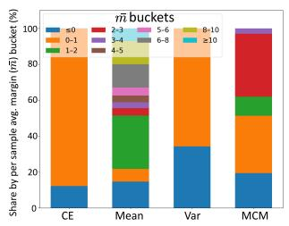  
(a) Each loss component analysis on margin range

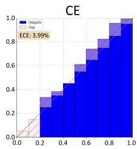

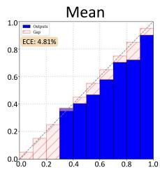  
(b) Each loss component analysis through the Reliability diagram  
Figure A1: Loss components analysis

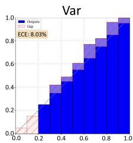

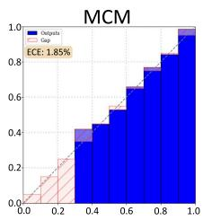

<table><tr><td rowspan="2">Method</td><td rowspan="2">Metric</td><td rowspan="2">APTOS</td><td colspan="2">EyePACS</td><td rowspan="2">Messidor-</td><td rowspan="2">Pannuke</td><td rowspan="2">Kather</td><td colspan="2">DigestPath</td><td rowspan="2">COVIDX</td><td rowspan="2">Average</td></tr><tr><td>Messidor</td><td>2</td><td></td><td>RSNA18</td></tr><tr><td>MaPLe</td><td>Acc. ECE</td><td>80.60 3.97</td><td>77.58 3.02</td><td>57.83 5.86</td><td>61.10 8.56</td><td>57.94 10.77</td><td>52.05 16.21</td><td>45.14 32.39</td><td>32.53 11.55</td><td>68.10 19.60</td><td>59.21 12.44</td></tr><tr><td>MaPLe_Ours</td><td>Acc. ECE</td><td>81.79 3.09</td><td>77.58 2.92</td><td>55.36 5.46</td><td>64.81 7.66</td><td>58.57 10.58</td><td>51.84 14.45</td><td>47.23 27.70</td><td>32.79 7.08</td><td>53.25 11.26</td><td>58.14 10.02</td></tr><tr><td>KgCoOp</td><td>Acc. ECE</td><td>76.31 3.85</td><td>73.99 3.45</td><td>58.20 4.82</td><td>63.97 7.18</td><td>57.94 10.77</td><td>52.05 16.21</td><td>45.14 32.39</td><td>43.88 10.07</td><td>69.21 6.38</td><td>60.08 10.57</td></tr><tr><td>KgCoOp_Ours</td><td>Acc. ECE</td><td>75.99 2.68</td><td>74.30 3.63</td><td>57.58 4.34</td><td>63.91 4.91</td><td>61.79 16.79</td><td>58.03 8.91</td><td>68.11 18.01</td><td>44.26 9.69</td><td>70.11 5.57</td><td>63.79 8.28</td></tr><tr><td>PromptSRC</td><td>Acc. ECE Acc.</td><td>84.42 15.99 84.71</td><td>77.85 10.14</td><td>60.61 9.63</td><td>65.19 10.32</td><td>53.48 17.46</td><td>79.59 9.18</td><td>12.31 52.73</td><td>40.78 1.11</td><td>74.55 14.19</td><td>60.98 15.64</td></tr><tr><td>PromptSRC_Ours</td><td>ECE Acc.</td><td>9.24 73.13</td><td>78.04 3.74</td><td>63.47 7.60</td><td>69.99 7.38</td><td>53.36 18.37</td><td>79.45 1.87</td><td>14.65 50.44</td><td>40.36 1.12</td><td>75.30 13.84</td><td>62.15 12.62</td></tr><tr><td>ProGrad</td><td>ECE Acc.</td><td>27.67 74.15</td><td>73.81 27.16 73.82</td><td>54.92 13.72 56.17</td><td>63.24 23.77 63.95</td><td>59.20 19.15 61.01</td><td>50.36 4.75</td><td>39.11 30.86</td><td>40.38 9.04</td><td>64.12 11.16</td><td>57.59 18.59</td></tr><tr><td>ProGrad_Ours</td><td>ECE Acc.</td><td>27.78 86.78</td><td>23.95 77.57</td><td>13.33 66.20</td><td>22.57 71.45</td><td>5.96 73.16</td><td>56.76 4.03 85.29</td><td>24.04 23.56 72.57</td><td>40.64 8.59 40.44</td><td>66.31 8.94 75.32</td><td>57.43 15.41</td></tr><tr><td>HiCroPL</td><td>ECE</td><td>5.12</td><td>1.05</td><td>4.69</td><td>3.33</td><td>4.02</td><td>8.95</td><td>2.95</td><td>3.25</td><td>15.65</td><td>72.09 5.45</td></tr><tr><td>HiCroPL_Ours</td><td>Acc. ECE</td><td>86.87 1.36</td><td>77.81 1.83</td><td>66.75 4.14</td><td>71.58 2.01</td><td>74.93 3.91</td><td>85.00 1.42</td><td>74.78 2.26</td><td>41.83 1.99</td><td>78.31 14.75</td><td>73.10 3.74</td></tr></table>

Table A1: Accuracy (Acc.) and calibration (ECE) on diabetic retinopathy, histopathology, and chest X-ray benchmarks for different prompt-learning methods, with and without our calibration $( \mathrm { s u f f i x } \cdots \mathrm { O u r s } ^ { 3 } )$ . Our calibration consistently lowers ECE while maintaining accuracy.

## H Statistical Analysis of Domain-Shift Rank Transfer

To further quantify the stability of calibrationmethod rankings under domain shift, we aggregate the Kendall rank-correlation results across all IDto-DS evaluations. As summarized in Table A5, the analysis contains 30 ID-to-DS rank-transfer tests. Overall rank preservation is weak, with a mean Kendall correlation of −0.0598 and a median correlation of −0.0476. Among the 30 tests, 17 produce negative correlations, whereas 13 produce positive correlations, and none show significantly positive rank preservation at $p < 0 . 0 5$

These results should not be interpreted causally as identifying a single source of distribution shift. The external datasets jointly differ in acquisition conditions, patient populations, class prevalence,

<table><tr><td>Method</td><td>Metric</td><td></td><td></td><td></td><td></td><td></td><td></td><td></td></tr><tr><td>MaPLe</td><td>Acc. ECE</td><td>46.64 12.62</td><td>67.61 31.95</td><td>57.09 19.34</td><td>20.61 8.73</td><td>36.95 41.41</td><td>67.01 12.06</td><td>49.32 21.02</td></tr><tr><td>MaPLe_Ours</td><td>Acc. ECE</td><td>46.11 11.63</td><td>68.55 26.44</td><td>57.19 17.63</td><td>20.58 7.85</td><td>37.22 21.15</td><td>65.31 11.03</td><td>49.16 15.96</td></tr><tr><td>KgCoOp</td><td>Acc. ECE</td><td>7.88 54.06</td><td>3.66 60.10</td><td>10.07 42.84</td><td>23.86 59.06</td><td>33.59 52.39</td><td>47.82 14.10</td><td>21.15 47.09</td></tr><tr><td> $\operatorname { K g C o O p \_ O u r s }$ </td><td>Acc. ECE</td><td>31.34 26.51</td><td>40.50 13.43</td><td>35.47 10.72</td><td>22.83 52.74</td><td>20.69 50.47</td><td>47.21 13.33</td><td>33.01 27.87</td></tr><tr><td>PromptSRC</td><td>Acc. ECE</td><td>50.03 33.73</td><td>59.58 23.82</td><td>53.77 13.54</td><td>15.20 4.91</td><td>15.96 53.02</td><td>74.57 14.03</td><td>44.85 23.84</td></tr><tr><td>PromptSRC_Ours</td><td>Acc. ECE Acc.</td><td>49.23 31.38</td><td>58.88 18.69</td><td>54.05 11.23</td><td>15.90 2.18</td><td>15.94 52.55</td><td>75.29 13.73</td><td>44.88 21.63</td></tr><tr><td>ProGrad</td><td>ECE Acc.</td><td>44.03 12.13 43.38</td><td>69.18 23.02</td><td>53.17 17.85</td><td>26.19 50.03</td><td>11.64 72.84</td><td>64.70 7.21</td><td>44.82 30.51</td></tr><tr><td>ProGrad_Ours</td><td>ECE Acc.</td><td>13.63 48.44</td><td>68.92 22.22</td><td>52.27 11.96</td><td>25.98 46.56</td><td>13.43 70.05</td><td>67.72 6.88</td><td>45.28 28.55</td></tr><tr><td>HiCroPL HiCroPL_Ours</td><td>ECE Acc. ECE</td><td>24.04 47.57</td><td>63.04 6.96 62.96</td><td>49.43 3.31 49.77</td><td>20.61 8.73 26.03</td><td>36.95 41.41 42.65</td><td>62.12 3.53 62.19</td><td>46.77 14.66 48.53</td></tr></table>

Table A2: Accuracy (Acc.) and calibration (ECE) under distribution shift. Messidor, Pannuke, and RSNA18 are the datasets used to train the model for the respective modalities’ DS evaluation.

<table><tr><td> $( \alpha , \beta )$ </td><td> $\operatorname { A c c } .$ </td><td>ECE</td></tr><tr><td>(0.1, 0.01)</td><td>69.05</td><td>3.43</td></tr><tr><td>(0.2, 0.01)</td><td>70.15</td><td>4.15</td></tr><tr><td>(0.3, 0.01)</td><td>70.49</td><td>6.79</td></tr><tr><td>(0.1, 0.05)</td><td>68.29</td><td>5.73</td></tr><tr><td>(0.2, 0.05)</td><td>69.12</td><td>5.90</td></tr><tr><td>(0.3, 0.05)</td><td>69.69</td><td>6.53</td></tr></table>

Table A3: Hyperparameter settings we used α was chosen from 0.1 to 0.3, and β from 0.01 to 0.05. The backbone used was CLIP-ViT-B/16. Experiments were run across three seeds on a DR dataset. The average across 4 datasets indicated that the optimal hyperparameters were $( \alpha , \beta ) = ( 0 . 1 , 0 . 0 1 )$

dataset characteristics, and other distributional factors. Rather, the analysis evaluates whether calibration methods selected from in-domain validation retain their relative ranking when transferred to realistic external-domain evaluation. The absence of significantly positive rank preservation indicates that in-domain calibration rankings are generally not reliable predictors of their relative performance under such combined distributional changes.

## I Paired Statistical Comparison of MCM

We further compare MCM against each calibration baseline using matched backbone–modality configurations. For every configuration, we compute

$$
\Delta \mathrm { E C E } = \mathrm { E C E } _ { \mathrm { b a s e l i n e } } - \mathrm { E C E } _ { \mathrm { M C M } } ,
$$

such that a positive value indicates lower ECE for MCM. We then apply a paired Wilcoxon signedrank test across the 12 matched backbone–modality settings. Table A6 summarizes the resulting mean and median differences, the number of configurations in which MCM obtains lower or higher ECE, and the corresponding Wilcoxon p-values. The paired analysis provides additional statistical support for the MCM results. In ID settings, MCM obtains lower ECE in 10 of 12 matched configurations against Base, MDCA, LS, MBLS, ECCV\_ZS, and TS, and in 11 of 12 configurations against ECCV\_Penalty. The improvements are statistically significant against ECCV\_ZS $( p =$ 0.0212), ECCV\_Penalty $( p \ : = \ : 0 . 0 0 0 5 )$ , and TS $( p ~ = ~ 0 . 0 1 3 4 )$ . Improvements relative to Base, MDCA, LS, and MBLS are numerically consistent but do not reach the $p < 0 . 0 5$ threshold. Under DS, MCM wins in 6–9 of 12 configurations depending on the baseline, but none of the paired comparisons are statistically significant. These results support our main conclusion that MCM provides consistent ID calibration gains while remaining competitive, rather than uniformly dominant, under domain shift.

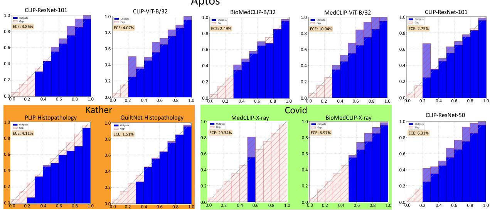

Figure A2: Reliability diagrams and Expected Calibration Error (ECE) analysis on medical datasets (Aptos, Kather, Covid). The diagrams present generic backbones (e.g., CLIP-ResNet-101, CLIP-ViT-B/32) and domain-specific models (e.g., PLIP, QuiltNet, MedCLIP, BioMedCLIP).
<table><tr><td>Held-out target</td><td>Hyperparameter-selection data</td><td>LODO-selected  $( \alpha , \beta )$ </td><td>Base ECE</td><td>Default MCM ECE</td><td>LODO-MCM ECE</td></tr><tr><td>APTOS</td><td> $\mathrm { E y e P A C S } + \mathrm { M e s s i d o r } + \mathrm { M e s s i d o r } - 2$ </td><td>(0.1, 0.01)</td><td>3.99</td><td>1.85</td><td>1.85</td></tr><tr><td>EyePACS</td><td> $\mathrm { \Delta \tilde { A P T O S } + M e s s i d o r + M e s s i d o r { - } } 2$ </td><td>(0.1, 0.01)</td><td>2.25</td><td>3.25</td><td>3.25</td></tr><tr><td>Messidor</td><td> $\mathrm { A P T O S } + \mathrm { E y e P A C S } + \mathrm { M e s s i d o r } - 2$ </td><td>(0.1, 0.01)</td><td>5.29</td><td>5.09</td><td>5.09</td></tr><tr><td>Messidor-2</td><td> $\mathrm { A P T O S } + \mathrm { E y e P A C S } + \mathrm { M e s s i d o r }$ </td><td>(0.1, 0.01)</td><td>6.24</td><td>3.53</td><td>3.53</td></tr><tr><td>Average</td><td></td><td></td><td>4.44</td><td>3.43</td><td>3.43</td></tr></table>

Table A4: Leave-One-Dataset-Out (LODO) analysis of MCM hyperparameter selection across the four diabeticretinopathy datasets. For each target dataset, the target is excluded entirely from hyperparameter selection, and $( \alpha , \beta )$ is selected using only the remaining three DR validation splits. Every fold independently selects $( \alpha , \beta ) = ( 0 . 1 , 0 . 0 1 )$ and LODO-MCM reproduces the ECE obtained using the default MCM setting.

## J Scale of the Experimental Evaluation

To clarify the scale of MVC-Bench, we provide a detailed breakdown of the experimental evaluation used in the core calibration benchmark. Since our study evaluates calibration across multiple modalities, datasets, backbone families, calibration methods, and random seeds, the total number of experiments is obtained from the Cartesian product of these factors. We distinguish between three levels of counting: experimental configurations, seedlevel controlled runs, and metric-level evaluations.

An experimental configuration denotes a unique combination of modality, dataset, backbone, and calibration method. A seed-level controlled run refers to one execution of an experimental configuration under a specific random seed. Since each configuration is repeated over three random seeds, the number of seed-level runs is three times the number of experimental configurations. Finally, a metric-level evaluation refers to the calibration metrics computed from each seed-level run. In the core calibration analysis, we evaluate each run using three binning-based calibration metrics: Expected Calibration Error (ECE), Maximum Calibration Error (MCE), and Adaptive Calibration Error (ACE).

## J.1 In-Domain Evaluation

For the in-domain (ID) evaluation, we consider three medical imaging modalities: fundus imaging, chest X-ray, and histopathology. The fundus imaging setting includes eight backbones, four datasets, three random seeds, and eight calibration settings, including the vanilla Base method. This results in:

$$
8 \times 4 \times 3 \times 8 = 7 6 8
$$

seed-level controlled runs.

For chest X-ray evaluation, we use two backbones, two datasets, three random seeds, and eight calibration settings. This results in:

$$
2 \times 2 \times 3 \times 8 = 9 6
$$

<table><tr><td>Rank-transfer tests</td><td>Mean Tb</td><td>Median  $\tau _ { b }$ </td><td>Non-positive  $\tau _ { b }$ </td><td>Negative  $\tau _ { b }$ </td><td>Positive  $\tau _ { b }$ </td><td>Significantly positive  $( p < 0 . 0 5 )$ </td></tr><tr><td>30</td><td>-0.0598</td><td>-0.0476</td><td>17</td><td>17</td><td>13</td><td>0</td></tr></table>

Table A5: Aggregate statistical summary of ID-to-DS calibration-method rank transfer across 30 tests. Kendall’s $\tau _ { b }$ measures agreement between calibration-method rankings obtained on the in-domain source and corresponding external-domain datasets. Positive values indicate greater rank preservation, while negative values indicate rank reversals. No test exhibits significantly positive rank preservation at $p < 0 . 0 5$
<table><tr><td>Setting</td><td>Baseline</td><td>Mean diff</td><td>Median diff</td><td>MCM wins /12</td><td>MCM losses /12</td><td>Wilcoxon p</td></tr><tr><td>ID</td><td>Base</td><td>0.8175</td><td>1.055</td><td>10</td><td>2</td><td>0.0881</td></tr><tr><td>ID</td><td>MDCA</td><td>0.7842</td><td>1.140</td><td>10</td><td>2</td><td>0.0881</td></tr><tr><td>ID</td><td>LS</td><td>2.4592</td><td>3.185</td><td>10</td><td>2</td><td>0.0549</td></tr><tr><td>ID</td><td>MBLS</td><td>0.8583</td><td>1.135</td><td>10</td><td>2</td><td>0.0881</td></tr><tr><td>ID</td><td>ECCV_ZS</td><td>7.9167</td><td>2.270</td><td>10</td><td>2</td><td>0.0212</td></tr><tr><td>ID</td><td>ECCV_Penalty</td><td>13.8900</td><td>15.840</td><td>11</td><td>1</td><td>0.0005</td></tr><tr><td>ID</td><td>TS</td><td>2.2217</td><td>2.915</td><td>10</td><td>2</td><td>0.0134</td></tr><tr><td>DS</td><td>Base</td><td>0.8175</td><td>0.985</td><td>8</td><td>4</td><td>0.2847</td></tr><tr><td>DS</td><td>MDCA</td><td>-0.5633</td><td>1.380</td><td>7</td><td>5</td><td>0.4548</td></tr><tr><td>DS</td><td>LS</td><td>-1.5650</td><td>0.605</td><td>8</td><td>4</td><td>0.4849</td></tr><tr><td>DS</td><td>MBLS</td><td>0.6475</td><td>1.775</td><td>8</td><td>4</td><td>0.2119</td></tr><tr><td>DS</td><td>ECCV_ZS</td><td>0.7033</td><td>1.480</td><td>7</td><td>5</td><td>0.4849</td></tr><tr><td>DS</td><td>ECCV_Penalty</td><td>1.1308</td><td>-0.050</td><td>6</td><td>6</td><td>0.4548</td></tr><tr><td>DS</td><td>TS</td><td>1.1100</td><td>2.795</td><td>9</td><td>3</td><td>0.1167</td></tr></table>

Table A6: Paired configuration-level comparison of MCM against existing calibration baselines across 12 matched backbone–modality settings. The difference is defined as $\Delta \mathrm { E C E } = \mathrm { E C E } _ { \mathrm { b a s e l i n e } } - \mathrm { E C E } _ { \mathrm { M C M } }$ , so positive values favor MCM. In ID settings, MCM obtains lower ECE in 10/12 configurations against most baselines and in 11/12 configurations against ECCV\_Penalty. Under DS, MCM remains competitive but does not uniformly dominate the baselines.

seed-level controlled runs.

For histopathology, we use two backbones, three datasets, three random seeds, and eight calibration settings. This results in:

$$
2 \times 3 \times 3 \times 8 = 1 4 4
$$

seed-level controlled runs.

Therefore, the in-domain evaluation contains:

$$
7 6 8 + 9 6 + 1 4 4 = 1 0 0 8
$$

seed-level controlled runs.

Equivalently, before accounting for random seeds, the ID evaluation contains:

$$
\begin{array} { l } { ( 8 \times 4 \times 8 ) + ( 2 \times 2 \times 8 ) + ( 2 \times 3 \times 8 ) } \\ { = 2 5 6 + 3 2 + 4 8 = 3 3 6 . } \end{array}
$$

unique backbone–dataset–method configurations.

## J.2 Domain-Shift Evaluation

For the domain shift (DS) evaluation, we evaluate calibration transfer from in-domain datasets to shifted datasets. In this setting, the zero-shot calibration setting is excluded, resulting in seven calibration methods. The fundus domain shift setting includes eight backbones, three shifted datasets, three random seeds, and seven calibration methods. This gives:

$$
8 \times 3 \times 3 \times 7 = 5 0 4
$$

seed-level controlled runs.

For chest X-ray domain shift evaluation, we use two backbones, one shifted dataset, three random seeds, and seven calibration methods. This gives:

$$
2 \times 1 \times 3 \times 7 = 4 2
$$

seed-level controlled runs.

For histopathology domain shift evaluation, we use two backbones, two shifted datasets, three random seeds, and seven calibration methods. This gives:

$$
2 \times 2 \times 3 \times 7 = 8 4
$$

seed-level controlled runs.

Therefore, the domain shift evaluation contains:

$$
5 0 4 + 4 2 + 8 4 = 6 3 0
$$

seed-level controlled runs.

Before accounting for random seeds, the DS evaluation contains:

$$
\begin{array} { l } { ( 8 \times 3 \times 7 ) + ( 2 \times 1 \times 7 ) + ( 2 \times 2 \times 7 ) } \\ { = 1 6 8 + 1 4 + 2 8 = 2 1 0 } \end{array}
$$

unique backbone–dataset–method configurations.

## J.3 Total Scale of the Core Calibration Benchmark

Combining the ID and DS evaluations, the core MVC-Bench calibration benchmark contains:

$$
3 3 6 + 2 1 0 = 5 4 6
$$

unique backbone–dataset–method configurations.

Since each configuration is repeated over three random seeds, the total number of seed-level controlled runs is:

$$
5 4 6 \times 3 = 1 6 3 8 .
$$

Thus, the core calibration benchmark consists of 1,638 seed-level controlled runs. Since each run is evaluated using ECE, MCE, and ACE, the total number of binning-based calibration metric evaluations is:

$$
1 6 3 8 \times 3 = 4 9 1 4 .
$$

In addition to these calibration metrics, accuracy is also computed for each seed-level run to analyze the relationship between predictive performance and calibration reliability. Therefore, the reported experimental scale supports both accuracy-based and calibration-based analysis across in-domain and domain shift settings.

## J.4 Summary of Experimental Scale

Table A7 summarizes the experiment count across modalities and evaluation settings.

## J.5 Scope of the Count

The above count refers only to the core calibration benchmark used to evaluate in-domain and domain shift calibration across backbones, datasets, calibration methods, and seeds. It does not include analyses such as prompt-tuning comparisons, Brier score evaluation, class-wise ECE analysis, or other supplementary diagnostic experiments. Therefore, the reported count of 1,638 seed-level controlled runs should be interpreted as a conservative estimate of the core experimental scale of MVC-Bench.

## K Other Metrics Analysis on Research Questions

To provide a more comprehensive calibration assessment, we further evaluate our research questions using binning-based metrics, including Adaptive Calibration Error (ACE) (Nixon et al., 2019) and Maximum Calibration Error (MCE) (Naeini et al., 2015), in addition to ECE.

## K.1 Robustness: How do domain shifts affect calibration

In Fig.A3 and Fig.A4, the ACE and MCE domainshift analyses show that calibration transfer from in-domain to shifted datasets is metric-dependent, but domain shift still introduces clear instability. For ACE, the retinopathy setting shows several positive Kendall rank correlations, especially for CLIP-DR-ViT-B/16 and CLIP-DR-ViT-B/32, sug gesting that adaptive-bin calibration rankings are partly preserved across APTOS, EyePACS, and Messidor-2. Histopathology also shows moderate consistency for both QuiltNet and PLIP, while the X-ray shift reveals a strong contrast: MedCLIP remains positively correlated, whereas BioMedCLIP shows negative transfer under COVID shift. For MCE, retinopathy again shows stronger rank preservation for several CLIP-based backbones, particularly on Messidor-2, indicating that worst-case calibration behaviour is sometimes stable across related fundus datasets. However, MCE exposes weaker or negative transfer in histopathology, especially for PLIP, and again shows poor transfer for BioMedCLIP under X-ray shift. Overall, compared with the ECE-based main analysis, ACE and MCE suggest that some calibration rankings can remain stable under closer domain shifts, but this stability is not universal across modalities, backbones, or metrics. This reinforces the takeaway that calibration should be evaluated under domain shift using multiple metrics, since average, adaptivebin, and worst-case calibration errors may reveal different failure patterns. An aggregate statistical analysis over all 30 ID to DS rank transfer tests is provided in Sec. H it shows a median Kendall $\tau _ { b } = - 0 . 0 4 7 6$ , with 17/30 negative correlations and no significantly positive rank-preservation case at $p < 0 . 0 5$

<table><tr><td>Setting</td><td>Modality</td><td>Backbones</td><td>Datasets</td><td>Methods</td><td>Seed-level Runs</td></tr><tr><td>ID</td><td>Fundus</td><td>8</td><td>4</td><td>8</td><td>768</td></tr><tr><td>ID</td><td>Chest X-ray</td><td>2</td><td>2</td><td>8</td><td>96</td></tr><tr><td>ID</td><td>Histopathology</td><td>2</td><td>3</td><td>8</td><td>144</td></tr><tr><td>DS</td><td>Fundus</td><td>8</td><td>3</td><td>7</td><td>504</td></tr><tr><td>DS</td><td>Chest X-ray</td><td>2</td><td>1</td><td>7</td><td>42</td></tr><tr><td>DS</td><td>Histopathology</td><td>2</td><td>2</td><td>7</td><td>84</td></tr><tr><td colspan="5">Total seed-level controlled runs</td><td>1638</td></tr></table>

Table A7: Breakdown of the core MVC-Bench experimental scale. ID denotes in-domain evaluation and DS denotes domain-shift evaluation. The zero-shot calibration setting is excluded from the DS count, resulting in seven calibration methods for DS evaluation.

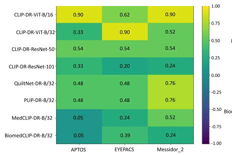

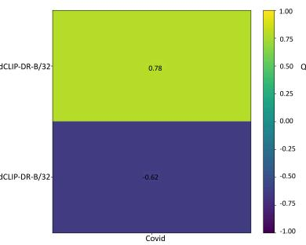

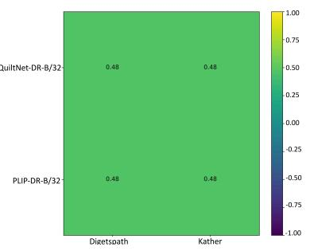

Figure A3: Kendall rank correlation (τ) between ACE-based method rankings on the In-domain(ID) source and each Domain shift(DS) dataset is shown for every backbone (rows = backbones, columns = DS sets). Cells are colored by τ (-1 to 1) and annotated with values: higher/positive τ means rankings (and thus relative calibration quality) are preserved under shift, while near-zero/negative τ indicates rank reversals of the calibration under shift.  
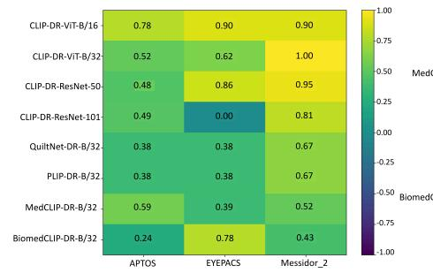

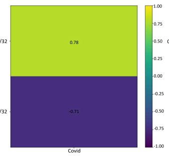

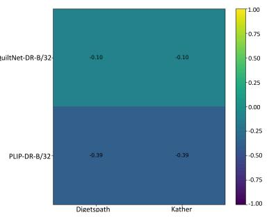  
Figure A4: Kendall rank correlation (τ) between MCE-based method rankings on the In-domain(ID) source and each Domain shift(DS) dataset is shown for every backbone (rows = backbones, columns = DS sets). Cells are colored by τ (-1 to 1) and annotated with values: higher/positive τ means rankings (and thus relative calibration quality) are preserved under shift, while near-zero/negative τ indicates rank reversals of the calibration under shift.

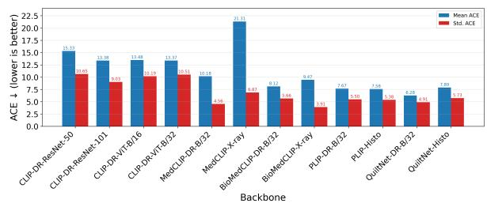  
Figure A5: Comparison of mean and Std. of ACE for various VLM-based backbones across different medical modality inputs

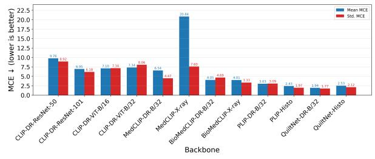  
Figure A6: Comparison of mean and Std. of MCE for various VLM-based backbones across different medical modality inputs

## K.2 Robustness: Which VLM-based backbones are better calibrated

The ACE and MCE analyses from Fig.A5 and Fig.A6 further confirm that backbone choice strongly affects calibration, consistent with the ECE-based finding in the main paper that calibration varies substantially across VLM and Medical-VLM backbones. Under MCE, the best worst-case calibration behaviour is observed for QuiltNet-DR-B/32, PLIP-Histo, PLIP-DR-B/32, and QuiltNet-Histo, all showing low mean MCE values below approximately 3%, while BioMedCLIP-X-ray and BioMedCLIP-DR-B/32 also remain relatively stable. In contrast, MedCLIP-X-ray shows the poorest calibration, with a very high mean MCE of 20.84%, indicating severe worst-bin calibration failures. A similar pattern is visible in ACE, where QuiltNet, PLIP, and BioMedCLIP variants generally achieve lower adaptive calibration error than generic CLIP backbones, while MedCLIP-X-ray again reports the highest ACE of 21.31%. Generic CLIP variants show relatively high ACE values, especially CLIP-DR-ResNet-50, CLIP-DR-ResNet-101, and ViT-based CLIP models, suggesting that naturalimage pretraining is less reliable for calibrated confidence in medical settings. Overall, ACE and MCE support the main ECE observation that domainspecific or medically aligned backbones are generally better calibrated than generic CLIP backbones, but they also reveal that some models, particularly MedCLIP-X-ray, can suffer from severe average and worst-case calibration instability.

## K.3 Effectiveness: How does calibration vary with accuracy for different calibration methods?

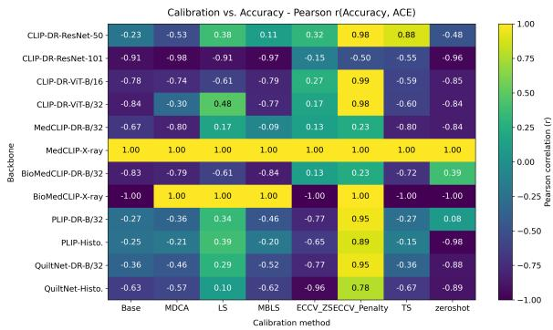  
Figure A7: Pearson correlation matrix between accuracy and ACE evaluated across diverse calibration methods and backbones.

Fig.A7 and Fig.A8 show that ACE and MCE findings are Consistent with ECE-based findings. The ACE and MCE Pearson correlation analyses show that the relationship between accuracy and calibration is not universal, but strongly depends on the calibration method and backbone. In Fig.4, the ECE-based analysis showed that some methods, such as Base, MDCA, MBLS, and TS, often produced negative correlations, meaning that higher accuracy was generally associated with lower calibration error, while ECCV\_Penalty frequently showed positive correlations, indicating an accuracy–calibration trade-off. The ACE results follow a broadly similar pattern, where Base, MDCA, MBLS, and zeroshot mostly show negative correlations across many backbones, suggesting that accuracy improvement often aligns with better adaptive-bin calibration, whereas ECCV\_Penalty shows strong positive correlations for several CLIPbased backbones, meaning that higher accuracy can increase ACE and therefore worsen calibration. The MCE results also support the same conclusion, but with complementary observations in ECCV\_Penalty across some of the backbones, because the difference arises where ACE summarizes calibration behaviour across bins, while MCE is dominated by the single worst bin. Therefore, ACE and MCE reveal complementary aspects of calibration, ACE captures broader calibration degradation, while MCE highlights whether the most severe confidence error is amplified or reduced. Overall, compared with the ECE-based findings, the ACE and MCE analyses confirm the same key takeaway that improving accuracy does not necessarily guarantee better calibration.

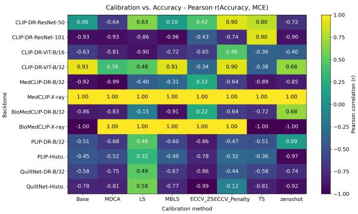  
Figure A8: Pearson correlation matrix between accuracy and MCE evaluated across diverse calibration methods and backbones.

## K.4 Effectiveness: Which calibration methods show consistent calibration performance

Fig. A9 illustrates ACE results across backbones. In the ID setting, Ours achieves the highest $N _ { \mathrm { b e s t } }$ (= 8), indicating strong consistency, while other methods show limited improvement and higher variability. Under DS, performance deteriorates across all methods, though Ours and ECCV\_ZS obtain the highest $N _ { \mathrm { b e s t } }$ counts.

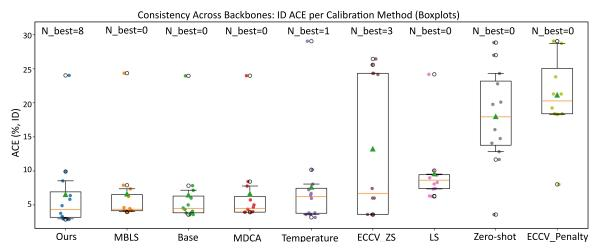

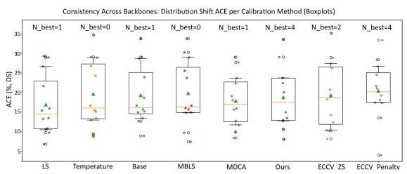  
Figure A9: ACE (%) across backbones for each calibration method under ID (top) and DS (bottom) settings. Boxplots show the interquartile range (IQR), whiskers indicate the 10–90% range, and individual backbone results are overlaid as colored markers. $\mathrm { N } _ { \mathrm { b e s t } }$ denotes the number of backbones for which a method achieves the lowest ACE. Lower medians and tighter distributions indicate more consistent calibration across architectures.

Fig. A10 shows MCE results, where Ours leads in ID $( N _ { \mathrm { b e s t } } = 8 )$ and DS $( N _ { \mathrm { b e s t } } = 5 )$ , followed by ECCV\_ZS.

Overall, the results are illustrating consistent pattern across all metrics for all the methods for both ID and DS. Furthermore, our method demonstrates superior ID calibration consistency across metrics and maintains competitive DS performance compared to existing methods.

## K.5 Effectiveness: How do different prompt-tuning methods interact with calibration?

Fig.A11 shows that ACE and MCE have similar trend as how ECE based observation for how different prompt-tuning families behave on calibration. HiCroPL provides the most stable calibration, achieving the lowest ACE 3.53% and MCE 1.06%, followed by CoOp and KgCoOp, which also maintain relatively low average and worst-case calibration errors.

## K.6 Stability: How does hard-prompt initialization affect calibration?

In Fig.A12 and Fig.A13, the ACE and MCE analyses show that calibration is clearly sensitive to hard-prompt initialization. For MCE, early templates such as P1 and P2 are the most stable, with low standard deviations of 0.80 and 1.02, and low mean MCE values of 1.45 and 1.87, respectively. A similar trend is observed for ACE, where P1 and P2 also show the lowest variation, while later templates become increasingly unstable. In particular, P6 and P7 show much larger variations in both metrics, with P7 producing the highest MCE variation 3.70 and ACE variation 4.28, suggesting that poorly aligned or noisy prompt initializations can strongly destabilize calibration across datasets.

Overall, both ACE and MCE support the ECEbased finding that prompt initialization is not a minor design choice, it directly affects both average calibration behaviour and worst-case confidence reliability.

## K.7 Stability: How do different seed initializations affect calibration performance?

In Fig.A14 and Fig.A15, the ACE and MCE analyses show that calibration stability differs substantially across backbones when evaluated beyond ECE. Most backbones exhibit relatively low MCE variability, such as CLIP-DR-ResNet-50 0.22, BioMedCLIP-X-ray 0.28, CLIP-DR-ViT-B/32 0.28, PLIP-DR-B/32 0.38, and QuiltNet-DR-B/32 0.38, indicating that their worst-case calibration error remains comparatively stable. A similar trend is observed in ACE, where BioMedCLIP-X-ray 0.86 and CLIP-DR-ViT-B/32 0.78 show strong stability, suggesting that their adaptive-bin calibration behaviour is less sensitive. However, MedCLIP-based models show much higher variability across all the metrics, especially MedCLIP-X-ray, which records the largest ACE and MCE variability 5.37, followed by MedCLIP-DR-B/32 with ACE 2.68 and MCE 2.67. This indicates that some backbones may appear acceptable under average calibration metrics but remain unstable when calibration is evaluated across datasets or initialization conditions. Overall, ACE and MCE support the ECE-based finding that calibration performance is sensitive to seed initialization and backbone choice, with domain-aligned models such as BioMedCLIP, PLIP, and CLIP-DR-ViT-B/32 generally showing more stable behaviour across ECE, ACE, and MCE than MedCLIP, while worst-case calibration failures are most visible through all the metrics.

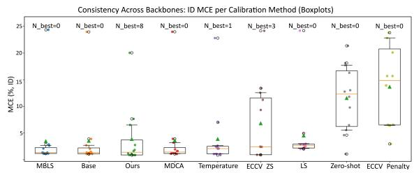

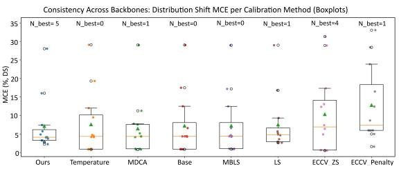  
Figure A10: MCE (%) across backbones for each calibration method under ID (top) and DS (bottom) settings. Boxplots show the interquartile range (IQR), whiskers indicate the 10–90% range, and individual backbone results are overlaid as colored markers. $\mathrm { N } _ { \mathrm { b e s t } }$ denotes the number of backbones for which a method achieves the lowest MCE. Lower medians and tighter distributions indicate more consistent calibration across architectures.

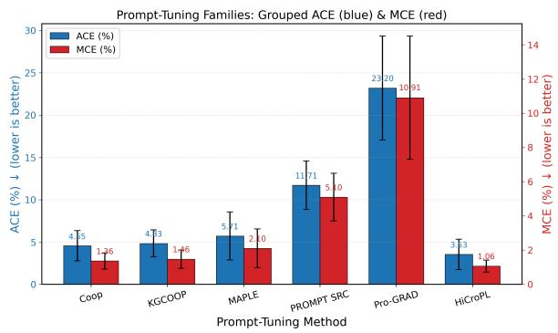

Figure A11: Comparison of ACE and MCE for different prompt-tuning methods.  
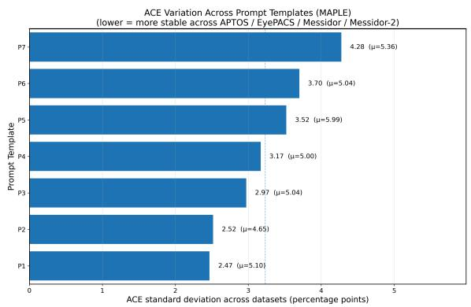  
Figure A12: Comparison of Std. and mean of ACE (µ) across datasets for seven different hard-prompt templates (P1-P7). Templates P1-P4 have low and stable ACE across datasets, while P7 has a high variance. This highlights that the prompting method is sensitive to hardprompt initialization.

## L Brier Score Analyses

Brier Score (BS) (Brier, 1950) is a bin-free proper scoring rule that measures the mean squared difference between the predicted probability distribution and the true one-hot encoded class label. Unlike ECE-based metrics, it does not depend on confidence bins and therefore provides a complementary assessment of probabilistic prediction quality. For a multi-class classification problem, it is defined

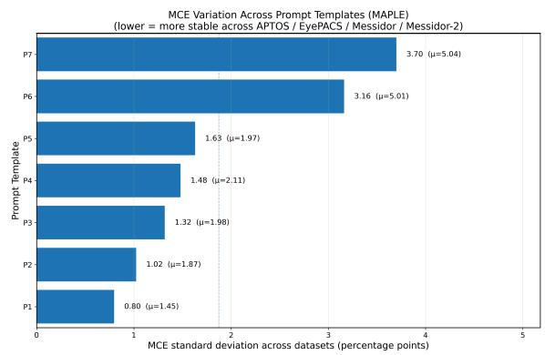

Figure A13: Comparison of Std. and mean of MCE (µ) across datasets for seven different hard-prompt templates (P1-P7). Templates P1-P4 have low and stable MCE across datasets, while P7 has a high variance. This highlights that the prompting method is sensitive to hardprompt initialization.  
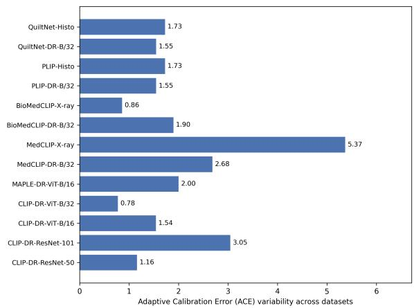  
Figure A14: Comparison of seed variability, i.e., Std. of ACE, for various backbones across three random seeds.

as:

$$
\mathrm { B S } = \frac { 1 } { N } \sum _ { i = 1 } ^ { N } \sum _ { c = 1 } ^ { C } \left( p _ { i c } - y _ { i c } \right) ^ { 2 } ,
$$

where N is the number of samples, C is the number of classes, $p _ { i c }$ is the predicted probability assigned to class c for sample i, and $y _ { i c } ~ \in ~ \{ 0 , 1 \}$ is the corresponding one-hot ground-truth label. A lower

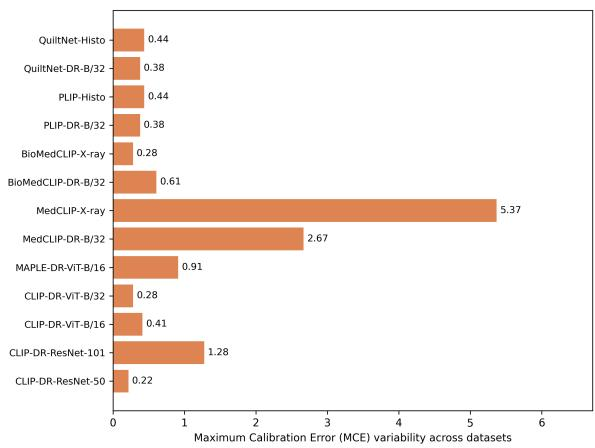  
Figure A15: Comparison of seed variability, i.e., Std. of MCE, for various backbones across three random seeds.

Brier Score indicates better probabilistic prediction quality.

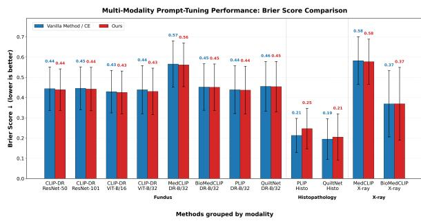  
Figure A16: Brier Score Analyses across Backbones and Modalities.

In Fig.A16, the Brier score analysis shows that integrating our loss function generally preserves or slightly improves probabilistic prediction quality compared with the vanilla CE baseline across most backbones, especially in the fundus modality. For fundus models, our method gives small but consistent reductions in Brier score for several backbones, such as CLIP-DR-ResNet-101, CLIP-DR-ViT-B/32, MedCLIP-DR-B/32, and QuiltNet-DR-B/32, while maintaining similar performance for CLIP-DR-ResNet-50, CLIP-DR-ViT-B/16, BioMedCLIP-DR-B/32, and PLIP-DR-B/32. This suggests that the proposed loss improves calibration-related probability quality without substantially harming predictive behaviour. In the X-ray modality, the Brier scores remain almost unchanged for both MedCLIP-X-ray and BioMedCLIP-X-ray, indicating that our loss preserves the baseline probabilistic performance but does not produce a strong improvement. However, in histopathology, the Brier score slightly increases for PLIP-Histo and QuiltNet-Histo, suggesting that the benefit of the proposed loss is less consistent in this modality. Overall, the Brier score results support the main calibration findings by showing that our loss is mostly stable across modalities, with the strongest benefit in fundus datasets, while also highlighting that modalityspecific behaviour should be considered when applying calibration-oriented training objectives.

## M Weighted Subset ECE Analyses

Weighted Subset ECE (WSECE) (Obadinma et al., 2021). Weighted Subset ECE measures calibration separately for each class and then combines the class-level calibration errors using the number of samples in each class as weights. Therefore, classes with more test samples contribute more to the final score, while smaller classes still remain explicitly evaluated. This metric is useful for imbalanced datasets because it shows whether the model is well calibrated across different classes, rather than only reporting one overall ECE value.

For class $^ { c , }$ let $\mathrm { E C E } _ { c }$ be the ECE computed using only the samples that belong to class c. If $N _ { c }$ is the number of samples in class c, and N is the total number of samples, WSECE is defined as

$$
\mathrm { W S E C E } = \sum _ { c = 1 } ^ { K } \frac { N _ { c } } { N } \mathrm { E C E } _ { c } ,
$$

where K is the number of classes. A lower WSECE indicates better class-wise calibration.

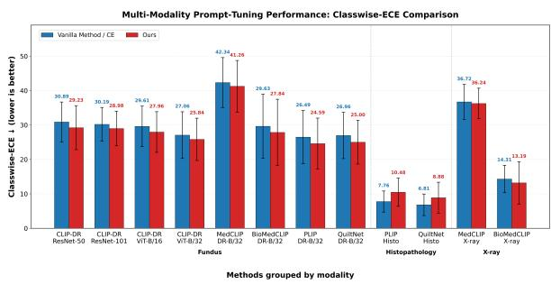  
Figure A17: Weighted Subset ECE Analyses across Backbones and Modalities.

In Fig.A17, the WSECE analysis shows that integrating our loss function generally improves class-wise calibration compared with the vanilla CE baseline, especially in the fundus and X-ray modalities. In fundus datasets, class imbalance is high, for example, the "No DR" category represents up to 74% of the EyePACS dataset. Our method consistently reduces WSECE across all backbones, including CLIP-DR-ResNet-50, CLIP-DR-ResNet-101, CLIP-DR-ViT-B/16, CLIP-DR-ViT-B/32, MedCLIP-DR-B/32, BioMedCLIP-DR-B/32, PLIP-DR-B/32, and QuiltNet-DR-B/32, indicating that the proposed loss helps align confidence more reliably across class-specific distributions. In X-ray, the improvement is smaller but still visible, particularly for BioMedCLIP-X-ray, where WSECE decreases from 14.31 to 13.19, while MedCLIP-X-ray shows only a slight reduction. However, in histopathology, our method increases WSECE for both PLIP-Histo and QuiltNet-Histo, suggesting that the proposed loss is less effective for class-wise calibration in this modality, possibly due to stronger visual heterogeneity or class-level ambiguity. Overall, the WSECE results support the broader calibration findings by showing that our loss improves class-wise calibration in most fundus and X-ray settings, while also highlighting that calibration gains are modality-dependent and should be evaluated separately across class-imbalanced medical datasets.

## N Results

We evaluate three medical imaging modalities, diabetic retinopathy (APTOS (APTOS, 2019), Eye-PACS (Kaggle, 2015), Messidor, Messidor-2 (Decencière et al., 2014b)), histopathology (Digest-Path (Da et al., 2022), Kather (Kather et al., 2019), PaNuke (Gamper et al., 2019)), and chest X-ray (COVIDX (Rahman et al., 2021), RSNA18 (Stein et al., 2018)) across 12 modality-specific configurations (CLIP-ResNet/ViT (Radford et al., 2021), MedCLIP (Wang et al., 2022), BioMed-CLIP (Zhang et al., 2023), PLIP (Huang et al., 2023a), QuiltNet (Ikezogwo et al., 2023a)). We report accuracy and calibration with Expected Calibration Error (ECE), Maximum Calibration Error (MCE), and Adaptive Calibration Error (ACE). All results are averaged across three seeds. Complete results are provided in Tab. A8 and Tab. A9.

## N.1 In-domain (ID) performance

Diabetic retinopathy (DR) MCM improves calibration in CLIP backbones:

• CLIP-DR-ResNet-50 (avg over 4 datasets): Acc. ( 67.87 \rightar ow 67. 1 ), ECE 4. 0 \rightar ow 2.96 , MCE 1.49 \rightar ow 1. , ACE 5.0 \rightar ow 3.26

• CLIP-DR-ResNet-101: Acc. 68.29 \rightarow 68.19 , ECE 5.82 \rightar ow 4.82 , MCE 2.04 \rightar ow 1.62 , ACE 6.01 \rightar ow 4.90

• CLIP-DR-ViT-B/16: Acc. 69.18 \rightarow 69.05 , ECE 4. \rightar ow 3.4 , MCE 1.37 \rightar ow 1. 8 , ACE 4.56 \rightar ow 3.7

• CLIP-DR-ViT-B/32: Acc. 68.13 \rightarow 67.9 , ECE 3.89 \rightar ow 2.7 , MCE 1.35 \rightar ow 0.9 , ACE 4.35 \rightar ow 2.89

Medical vision-language models show the same trend, e.g., MedCLIP-DR-B/32 ECE 6.9 \rightarow 4.9 without compromising accuracy.

## Chest X-ray

• MedCLIP-X-ray (avg over 2 datasets): Acc. 65.7 \rightar ow 65.83 , ECE 23.97 \rightar ow 20. 3 , MCE/ACE also drop.

• BioMedCLIP-X-ray: Acc. 73.56 \rightarow 73.70 , ECE 7. 8 \rightar ow 5.71 .

Histopathology Calibration gains are not consistent:

• PLIP-Histo (avg over 3 datasets): Acc. ( 85.43 \rightar ow 85.30 ) but ECE increases ( 7.0 \rightar ow 9. 2 ).

• QuiltNet-Histo (avg): Acc. (86.73 \rightarow 86.87 ) with higher ECE ( 6.21 \rightar ow 8.5 ).

## N.2 Domain-shift (out-domain) performance

We compare domain-shifted (DS) variants.

• CLIP-DR-ViT-B/16-DS: Acc. 32.90 \rightarow 3.36 , ECE 3 .69 \rightar ow 20. 8

• CLIP-DR-ViT-B/32-DS: Acc. 43.58 \rightarow 46.59 , ECE 15.83 \rightar ow 12.4 .

• MedCLIP-DR-B/32-DS: Acc. 52.69 \rightarow 59.83 , ECE 23.95 \rightar ow 23.54 .

• BioMedCLIP-X-ray-DS: Acc. 74.56 \rightarow 78.4 , ECE 9.0 \rightar ow 8.02 .

Histology backbones can degrade under shift:

• PLIP-DR-B/32-DS: Acc. 5 .40 \rightar ow 47.16 , ECE 12.79 \rightar ow 13.56 .

• QuiltNet-DR-B/32-DS: Acc. 40.8 \rightarow 27.92 , ECE 15.42 \rightar ow 23.72 .

MCM provides consistent calibration gains on DR and CXR in ID and remains competitive in DS.

<table><tr><td rowspan=1 colspan=1>Backbone</td><td rowspan=1 colspan=1>Dataset</td><td rowspan=1 colspan=1>Metric</td><td rowspan=1 colspan=6>IS                                   TSBaseMBLSECCV_            OursMDCAPenaltyzeroshot(MCM)</td></tr><tr><td rowspan=20 colspan=1>CLIP-DR-ResNet-50</td><td rowspan=4 colspan=1>APTOS</td><td rowspan=2 colspan=1>Acc.ECE</td><td rowspan=2 colspan=5>76.69   76.19   76.64  76.82   75.34    66.72   78.59   8.626.31   5.11   9.87   7.11   40.82    28.60    3.44  26.47</td><td rowspan=1 colspan=1>76.59</td></tr><tr><td rowspan=1 colspan=1>1.99</td></tr><tr><td rowspan=1 colspan=1>MCE</td><td rowspan=1 colspan=5>1.49   1.37   2.37   2.01   30.20    25.01    25.01  18.84</td><td rowspan=1 colspan=1>0.48</td></tr><tr><td rowspan=1 colspan=1>ACE</td><td rowspan=1 colspan=5>6.26   5.15   9.81   7.00   39.31    33.31   33.31  26.47</td><td rowspan=1 colspan=1>2.65</td></tr><tr><td rowspan=4 colspan=1>EyePACS</td><td rowspan=1 colspan=1>Acc.</td><td rowspan=1 colspan=5>74.48  74.06  74.02  74.12   74.40    73.34   74.57   7.39</td><td rowspan=1 colspan=1>74.09</td></tr><tr><td rowspan=1 colspan=1>ECE</td><td rowspan=1 colspan=2>2.16   2.06   3.58   2.00</td><td rowspan=1 colspan=3>12.89    38.52    7.22  20.41</td><td rowspan=1 colspan=1>3.60</td></tr><tr><td rowspan=1 colspan=1>MCE</td><td rowspan=1 colspan=2>1.66   0.79   1.99   0.67</td><td rowspan=1 colspan=3>3.06    26.81   26.81  13.70</td><td rowspan=1 colspan=1>1.84</td></tr><tr><td rowspan=1 colspan=1>ACE</td><td rowspan=1 colspan=5>3.24   2.39   3.84   2.22   13.08    38.52   38.52  20.41</td><td rowspan=1 colspan=1>3.60</td></tr><tr><td rowspan=4 colspan=1>Messidor</td><td rowspan=1 colspan=1>Acc.</td><td rowspan=1 colspan=2>56.12  54.44  57.19  57.06</td><td rowspan=1 colspan=3>75.34    44.70   55.69  20.58</td><td rowspan=1 colspan=1>56.20</td></tr><tr><td rowspan=1 colspan=1>ECE</td><td rowspan=1 colspan=2>4.88   4.43   5.06   4.48</td><td rowspan=1 colspan=3>39.31    14.65    6.42  18.83</td><td rowspan=1 colspan=1>4.06</td></tr><tr><td rowspan=1 colspan=1>MCE</td><td rowspan=1 colspan=2>1.66   1.68   1.97   1.53</td><td rowspan=1 colspan=3>13.62    13.96   13.96  9.80</td><td rowspan=1 colspan=1>1.52</td></tr><tr><td rowspan=1 colspan=1>ACE</td><td rowspan=1 colspan=5>5.79   5.79   5.36   4.97   24.93    14.70   14.70  18.83</td><td rowspan=1 colspan=1>4.37</td></tr><tr><td rowspan=4 colspan=1>Messidor-2</td><td rowspan=1 colspan=1>Acc.</td><td rowspan=1 colspan=1>64.20  63.45  63.95</td><td rowspan=1 colspan=1>64.07</td><td rowspan=1 colspan=3>63.28    58.31   63.97  13.46</td><td rowspan=1 colspan=1>63.95</td></tr><tr><td rowspan=1 colspan=1>ECE</td><td rowspan=1 colspan=1>4.26   3.84   5.97</td><td rowspan=1 colspan=1>3.06</td><td rowspan=1 colspan=3>20.00    29.68    6.05  14.76</td><td rowspan=1 colspan=1>2.19</td></tr><tr><td rowspan=1 colspan=1>MCE</td><td rowspan=1 colspan=1>1.13   1.17   1.71</td><td rowspan=1 colspan=1>0.86</td><td rowspan=1 colspan=3>6.73    25.42   25.42   9.77</td><td rowspan=1 colspan=1>0.58</td></tr><tr><td rowspan=1 colspan=1>ACE</td><td rowspan=1 colspan=2>4.69   4.10   6.24   3.66</td><td rowspan=1 colspan=3>20.00    29.68   29.68  14.76</td><td rowspan=1 colspan=1>2.41</td></tr><tr><td rowspan=1 colspan=1></td><td rowspan=1 colspan=1>Acc.</td><td rowspan=1 colspan=1>67.87  67.04  67.95</td><td rowspan=1 colspan=1>68.02</td><td rowspan=1 colspan=3>72.09    60.77   68.21  12.51</td><td rowspan=1 colspan=1>67.71</td></tr><tr><td rowspan=3 colspan=1>Average</td><td rowspan=1 colspan=1>ECE</td><td rowspan=1 colspan=1>4.40   3.86   6.12</td><td rowspan=1 colspan=1>4.16</td><td rowspan=1 colspan=3>28.26    27.86    5.78  20.12</td><td rowspan=1 colspan=1>2.96</td></tr><tr><td rowspan=1 colspan=1>MCE</td><td rowspan=1 colspan=1>1.49   1.25   2.01</td><td rowspan=1 colspan=1>1.27</td><td rowspan=1 colspan=3>13.40    22.80   22.80  13.03</td><td rowspan=1 colspan=1>1.11</td></tr><tr><td rowspan=1 colspan=1>ACE</td><td rowspan=1 colspan=2>5.00   4.36   6.31   4.46</td><td rowspan=1 colspan=3>24.33    29.05   29.05  20.12</td><td rowspan=1 colspan=1>3.26</td></tr><tr><td rowspan=20 colspan=1>CLIP-DR-ResNet-101</td><td rowspan=4 colspan=1>APTOS</td><td rowspan=1 colspan=1>Acc.</td><td rowspan=1 colspan=1>75.75  75.12  75.02</td><td rowspan=1 colspan=1>75.78</td><td rowspan=1 colspan=3>74.81    57.18   75.75   8.03</td><td rowspan=1 colspan=1>75.43</td></tr><tr><td rowspan=1 colspan=1>ECE</td><td rowspan=1 colspan=1>3.86   3.80   7.18</td><td rowspan=1 colspan=1>3.76</td><td rowspan=1 colspan=2>38.90    24.53    5.49</td><td rowspan=1 colspan=1>33.49</td><td rowspan=1 colspan=1>3.40</td></tr><tr><td rowspan=2 colspan=1>MCEACE</td><td rowspan=1 colspan=1>1.12   1.12   1.64</td><td rowspan=1 colspan=1>1.11</td><td rowspan=1 colspan=2>18.21    14.78    3.30</td><td rowspan=1 colspan=1>19.20</td><td rowspan=1 colspan=1>1.04</td></tr><tr><td rowspan=1 colspan=2>3.95   4.11   7.32   3.77</td><td rowspan=1 colspan=3>38.90    25.64    5.77  33.46</td><td rowspan=1 colspan=1>3.54</td></tr><tr><td rowspan=4 colspan=1>EyePACS</td><td rowspan=1 colspan=1>Acc.</td><td rowspan=1 colspan=1>73.92  73.93  73.88</td><td rowspan=1 colspan=1>73.95</td><td rowspan=1 colspan=3>74.14    73.47   73.93   2.59</td><td rowspan=1 colspan=1>73.95</td></tr><tr><td rowspan=2 colspan=1>ECEMCE</td><td rowspan=1 colspan=1>2.89   3.08   4.81</td><td rowspan=1 colspan=1>2.98</td><td rowspan=1 colspan=3>9.15    34.81    7.96  32.94</td><td rowspan=1 colspan=1>2.92</td></tr><tr><td rowspan=1 colspan=1>0.84   0.93   2.83</td><td rowspan=1 colspan=1>0.87</td><td rowspan=1 colspan=3>1.98     2.85    2.85  22.17</td><td rowspan=1 colspan=1>0.86</td></tr><tr><td rowspan=1 colspan=1>ACE</td><td rowspan=1 colspan=2>3.10   3.14   5.15   3.06</td><td rowspan=1 colspan=3>9.16    7.86    7.86  32.94</td><td rowspan=1 colspan=1>2.92</td></tr><tr><td rowspan=4 colspan=1>Messidor</td><td rowspan=1 colspan=1>Acc.</td><td rowspan=1 colspan=2>59.47  57.67  59.31  59.50</td><td rowspan=1 colspan=3>58.21    45.50   59.47  20.67</td><td rowspan=1 colspan=1>59.08</td></tr><tr><td rowspan=3 colspan=1>ECEMCEACE</td><td rowspan=1 colspan=2>10.67   9.09  10.90  10.67</td><td rowspan=1 colspan=3>29.36    16.91    6.87  11.31</td><td rowspan=1 colspan=1>8.97</td></tr><tr><td rowspan=2 colspan=2>4.10   3.87   4.14   4.0410.95   9.03  10.85  10.92</td><td rowspan=1 colspan=3>19.00    16.49    2.02  11.30</td><td rowspan=1 colspan=1>3.35</td></tr><tr><td rowspan=1 colspan=3>29.36    16.99    7.58  11.31</td><td rowspan=1 colspan=1>9.13</td></tr><tr><td rowspan=4 colspan=1>Messidor-2</td><td rowspan=4 colspan=1>Acc.ECEMCEACE</td><td rowspan=1 colspan=2>64.03  63.68  64.45  64.11</td><td rowspan=1 colspan=3>63.59    58.31   64.01   2.01</td><td rowspan=1 colspan=1>64.28</td></tr><tr><td rowspan=1 colspan=2>5.86   6.58   8.84   7.01</td><td rowspan=1 colspan=1>24.95    26.53</td><td rowspan=1 colspan=2>6.31  37.70</td><td rowspan=1 colspan=1>4.00</td></tr><tr><td rowspan=1 colspan=2>2.11   1.87   2.91   2.37</td><td rowspan=1 colspan=1>11.04    21.58</td><td rowspan=1 colspan=2>1.69  18.16</td><td rowspan=1 colspan=1>1.24</td></tr><tr><td rowspan=1 colspan=2>6.03   6.68   9.01   7.25</td><td rowspan=1 colspan=3>24.95    26.53    7.76  37.70</td><td rowspan=1 colspan=1>4.01</td></tr><tr><td rowspan=4 colspan=1>Average</td><td rowspan=1 colspan=1>Acc.</td><td rowspan=1 colspan=2>68.29  67.60  68.17  68.34</td><td rowspan=1 colspan=3>67.69    58.62   68.29   8.33</td><td rowspan=1 colspan=1>68.19</td></tr><tr><td rowspan=1 colspan=1>ECE</td><td rowspan=1 colspan=2>5.82   5.64   7.93   6.11</td><td rowspan=1 colspan=3>25.59    25.70    6.66  28.86</td><td rowspan=1 colspan=1>4.82</td></tr><tr><td rowspan=2 colspan=1>MCEACE</td><td rowspan=1 colspan=2>2.04   1.95   2.88   2.10</td><td rowspan=1 colspan=3>12.56    13.93    2.47  17.71</td><td rowspan=1 colspan=1>1.62</td></tr><tr><td rowspan=1 colspan=2>6.01   5.74   8.08   6.25</td><td rowspan=1 colspan=3>25.59    19.26    7.24  28.85</td><td rowspan=1 colspan=1>4.90</td></tr><tr><td rowspan=19 colspan=1>CLIP-DR-ViT-B/16</td><td rowspan=4 colspan=1>APTOS</td><td rowspan=1 colspan=1>Acc.</td><td rowspan=1 colspan=2>77.90  77.45  77.84  77.94</td><td rowspan=1 colspan=3>76.14    56.78   77.90   7.95</td><td rowspan=1 colspan=1>77.50</td></tr><tr><td rowspan=1 colspan=1>ECE</td><td rowspan=1 colspan=2>3.99   4.87   7.88   4.09</td><td rowspan=1 colspan=3>38.96    24.87    4.44  29.78</td><td rowspan=1 colspan=1>1.85</td></tr><tr><td rowspan=2 colspan=1>MCEACE</td><td rowspan=1 colspan=2>1.46   1.46   1.81   1.38</td><td rowspan=1 colspan=3>12.54    13.95    1.86  17.20</td><td rowspan=1 colspan=1>0.61</td></tr><tr><td rowspan=1 colspan=5>3.99   4.84   7.90   4.08   38.96    26.23    4.74  29.78</td><td rowspan=1 colspan=1>2.03</td></tr><tr><td rowspan=4 colspan=1>EyePACS</td><td rowspan=3 colspan=1>Acc.ECEMCE</td><td rowspan=1 colspan=5>74.64  74.65  74.53  74.64   74.85    72.71   74.64   3.21</td><td rowspan=1 colspan=1>74.53</td></tr><tr><td rowspan=1 colspan=5>2.25   2.31   4.36   2.25   19.06    41.84    7.53  24.38</td><td rowspan=1 colspan=1>3.25</td></tr><tr><td rowspan=1 colspan=5>0.68   0.78   2.23   0.72    5.45    21.84    3.24  19.22</td><td rowspan=1 colspan=1>1.08</td></tr><tr><td rowspan=1 colspan=1>ACE</td><td rowspan=1 colspan=5>2.30   2.29   4.29   2.33   18.80    41.84    7.47  24.38</td><td rowspan=1 colspan=1>3.25</td></tr><tr><td rowspan=4 colspan=1>Messidor</td><td rowspan=4 colspan=1>Acc.ECEMCEACE</td><td rowspan=2 colspan=5>59.50  57.17  59.61  59.53   58.31    43.00   59.50  21.005.29   6.02   9.15   5.31   26.87    14.80    6.95  14.72</td><td rowspan=1 colspan=1>59.72</td></tr><tr><td rowspan=1 colspan=1>5.09</td></tr><tr><td rowspan=1 colspan=5>1.78   2.17   2.53   1.82   17.43    12.69    2.91  14.55</td><td rowspan=1 colspan=1>1.73</td></tr><tr><td rowspan=1 colspan=6>5.69   6.55   9.18   5.81   26.87    14.91    7.08  14.72    5.89</td></tr><tr><td rowspan=3 colspan=1>Messidor-2</td><td rowspan=3 colspan=1>Acc.ECEMCEACE</td><td rowspan=1 colspan=5>64.66  64.51  64.96  64.62   64.95    58.26   64.66   2.186.24   6.10   8.24   6.13   21.25    32.13    7.36  28.41</td><td rowspan=1 colspan=1>64.433.53</td></tr><tr><td rowspan=1 colspan=5>1.54   2.05   2.31   1.55   9.51    31.87    2.51  14.18</td><td rowspan=1 colspan=1>1.28</td></tr><tr><td rowspan=1 colspan=5>6.24   6.33   8.37   6.26   21.17    31.94    7.46  28.41</td><td rowspan=1 colspan=1>3.91</td></tr><tr><td rowspan=4 colspan=1>Average</td><td rowspan=4 colspan=1>Acc.ECEMCEACE</td><td rowspan=1 colspan=5>69.18  68.45  69.24  69.18   68.56    57.69   69.18   8.59</td><td rowspan=2 colspan=1>69.053.43</td></tr><tr><td rowspan=1 colspan=5>4.44   4.83   7.41   4.45   26.54    28.41    6.57  24.32</td></tr><tr><td rowspan=1 colspan=5>1.37   1.62   2.22   1.37   11.23    20.09    2.63  16.29</td><td rowspan=1 colspan=1>1.18</td></tr><tr><td rowspan=1 colspan=6>4.56   5.00   7.44   4.62   26.45    28.73    6.69  24.32     3.77</td></tr></table>

## O Declaration of LLM usage

During the preparation of this manuscript, Chat-GPT was used only for language polishing, grammar checking, and improving sentence clarity and readability. The tool was not used to generate experimental results, design the methodology, conduct analysis, create citations, or formulate the scientific claims of the paper. All technical content,

<table><tr><td rowspan=1 colspan=1>Backbone</td><td rowspan=1 colspan=2>Dataset</td><td rowspan=1 colspan=1>Metric</td><td rowspan=1 colspan=5>LS                                    TSBaseMDCAMBLSECCV_ZSECCVy             Ourszeroshot(MCM)</td></tr><tr><td rowspan=19 colspan=1>CLIP-DR-ViT-B/32</td><td rowspan=3 colspan=2>APTOS</td><td rowspan=1 colspan=1>Acc.ECE</td><td rowspan=1 colspan=4>78.28   77.98   78.53   78.26    75.34     66.72    78.59    7.864.07   4.91    8.97   4.15   39.31    28.60    3.44  31.08</td><td rowspan=1 colspan=1>77.522.53</td></tr><tr><td rowspan=1 colspan=1>MCE</td><td rowspan=1 colspan=4>1.52   1.74   1.78   1.51    13.62    25.01     0.78  17.28</td><td rowspan=1 colspan=1>0.81</td></tr><tr><td rowspan=1 colspan=1>ACE</td><td rowspan=1 colspan=4>4.00   4.89   8.93   4.10   39.31    33.31     3.54  31.08</td><td rowspan=1 colspan=1>2.53</td></tr><tr><td rowspan=4 colspan=2>EyePACS</td><td rowspan=2 colspan=1>Acc.ECE</td><td rowspan=1 colspan=4>74.58   74.49  74.52   74.55   74.40    73.34    74.57   8.86</td><td rowspan=1 colspan=1>74.54</td></tr><tr><td rowspan=1 colspan=4>3.29   3.05   6.24   3.06   12.89     38.52    7.22  23.22</td><td rowspan=1 colspan=1>2.39</td></tr><tr><td rowspan=1 colspan=1>MCE</td><td rowspan=1 colspan=4>1.66   1.55   3.26   1.52    3.06    26.81    2.99   18.52</td><td rowspan=1 colspan=1>0.72</td></tr><tr><td rowspan=1 colspan=1>ACE</td><td rowspan=1 colspan=4>3.24   2.97   6.22   3.04   13.08    38.52    7.20  24.91</td><td rowspan=1 colspan=1>2.41</td></tr><tr><td rowspan=4 colspan=2>Messidor</td><td rowspan=1 colspan=1>Acc.</td><td rowspan=1 colspan=4>55.47  53.22  55.45  55.39    56.17     44.70    55.69  20.58</td><td rowspan=1 colspan=1>55.47</td></tr><tr><td rowspan=1 colspan=1>ECE</td><td rowspan=1 colspan=3>3.11   3.82   5.01   3.07   24.93     14.65    6.42</td><td rowspan=1 colspan=1>21.65</td><td rowspan=1 colspan=1>3.58</td></tr><tr><td rowspan=1 colspan=1>MCE</td><td rowspan=1 colspan=3>0.91   1.61    1.62   0.93   13.88     13.96    2.32</td><td rowspan=1 colspan=1>18.74</td><td rowspan=1 colspan=1>1.20</td></tr><tr><td rowspan=1 colspan=1>ACE</td><td rowspan=1 colspan=3>5.15   4.56   6.21    5.04   24.93     14.70    7.11</td><td rowspan=1 colspan=1>21.65</td><td rowspan=1 colspan=1>3.96</td></tr><tr><td rowspan=4 colspan=2>Messidor-2</td><td rowspan=2 colspan=1>Acc.ECE</td><td rowspan=1 colspan=4>64.20  63.90  63.51   64.10   63.28    58.31    63.97   7.63</td><td rowspan=1 colspan=1>63.61</td></tr><tr><td rowspan=1 colspan=3>5.09   6.11   8.04   5.06   20.00    29.68    6.05</td><td rowspan=1 colspan=1>27.48</td><td rowspan=1 colspan=1>2.57</td></tr><tr><td rowspan=2 colspan=1>MCEACE</td><td rowspan=1 colspan=3>1.31   1.53   1.81   1.39    6.73    25.42    2.13</td><td rowspan=1 colspan=1>17.94</td><td rowspan=1 colspan=1>0.85</td></tr><tr><td rowspan=1 colspan=3>4.99   6.09   8.03   4.90   20.00     29.68     6.05</td><td rowspan=1 colspan=1>30.38</td><td rowspan=1 colspan=1>2.66</td></tr><tr><td rowspan=4 colspan=2>Average</td><td rowspan=3 colspan=1>Acc.ECEMCE</td><td rowspan=1 colspan=3>68.13   67.40  68.00  68.08   67.30    60.77    68.21</td><td rowspan=1 colspan=1>11.23</td><td rowspan=1 colspan=1>67.79</td></tr><tr><td rowspan=1 colspan=3>3.89   4.47   7.07   3.84   24.28    27.86    5.78</td><td rowspan=1 colspan=1>25.86</td><td rowspan=1 colspan=1>2.77</td></tr><tr><td rowspan=1 colspan=3>1.35    1.61   2.12   1.34    9.32    22.80    2.06</td><td rowspan=1 colspan=1>18.12</td><td rowspan=1 colspan=1>0.90</td></tr><tr><td rowspan=1 colspan=1>ACE</td><td rowspan=1 colspan=3>4.35    4.63   7.35   4.27   24.33     29.05     5.98</td><td rowspan=1 colspan=1>27.01</td><td rowspan=1 colspan=1>2.89</td></tr><tr><td rowspan=20 colspan=1>MedCLIP-DR-B/32</td><td rowspan=4 colspan=2>APTOS</td><td rowspan=1 colspan=1>Acc.</td><td rowspan=1 colspan=3>62.27   62.14  63.16  63.96   62.27     49.43   62.27</td><td rowspan=1 colspan=1>11.25</td><td rowspan=1 colspan=1>61.73</td></tr><tr><td rowspan=1 colspan=1>ECE</td><td rowspan=1 colspan=3>10.04   9.99  14.14  10.68    9.98    21.19    7.48</td><td rowspan=1 colspan=1>8.82</td><td rowspan=1 colspan=1>7.64</td></tr><tr><td rowspan=1 colspan=1>MCE</td><td rowspan=1 colspan=3>3.27   3.16   4.46   3.22    3.16    16.74    4.29</td><td rowspan=1 colspan=1>8.82</td><td rowspan=1 colspan=1>2.80</td></tr><tr><td rowspan=1 colspan=1>ACE</td><td rowspan=1 colspan=3>10.04  10.00  14.13  10.68    9.98    22.19    6.77</td><td rowspan=1 colspan=1>8.82</td><td rowspan=1 colspan=1>7.63</td></tr><tr><td rowspan=3 colspan=2>EyePACS</td><td rowspan=1 colspan=1>Acc.</td><td rowspan=1 colspan=3>73.66   73.66   73.66  73.66   73.65    73.66    73.66</td><td rowspan=1 colspan=1>3.54</td><td rowspan=1 colspan=1>73.66</td></tr><tr><td rowspan=1 colspan=1>ECE</td><td rowspan=1 colspan=3>2.84   2.09   7.65   2.89    3.40    20.87    7.85</td><td rowspan=1 colspan=1>16.56</td><td rowspan=1 colspan=1>3.17</td></tr><tr><td rowspan=1 colspan=1>MCE</td><td rowspan=1 colspan=3>1.36   1.12   4.10   1.36    1.85    14.62    4.74</td><td rowspan=1 colspan=1>16.56</td><td rowspan=1 colspan=1>3.46</td></tr><tr><td rowspan=1 colspan=2></td><td rowspan=1 colspan=1>ACE</td><td rowspan=1 colspan=3>3.54   3.47   7.64   3.66    3.67    20.87    7.84</td><td rowspan=1 colspan=1>16.00</td><td rowspan=1 colspan=1>5.18</td></tr><tr><td rowspan=3 colspan=2>Messidor</td><td rowspan=1 colspan=1>Acc.</td><td rowspan=1 colspan=3>45.03   45.05   46.14   45.39   45.17     44.33    45.03</td><td rowspan=1 colspan=1>14.33</td><td rowspan=1 colspan=1>45.27</td></tr><tr><td rowspan=1 colspan=1>ECE</td><td rowspan=1 colspan=3>9.42   9.19   6.16   5.04    3.25    19.09    12.55</td><td rowspan=1 colspan=1>10.72</td><td rowspan=1 colspan=1>1.93</td></tr><tr><td rowspan=1 colspan=1></td><td rowspan=1 colspan=1>MCE</td><td rowspan=1 colspan=3>8.37   7.54   4.82   2.27    1.47    19.09    11.27</td><td rowspan=1 colspan=1>10.72</td><td rowspan=1 colspan=1>0.99</td></tr><tr><td rowspan=1 colspan=2></td><td rowspan=1 colspan=1>ACE</td><td rowspan=1 colspan=3>9.41   10.01    7.10   5.28    3.37     19.09    13.72</td><td rowspan=1 colspan=1>10.72</td><td rowspan=1 colspan=1>3.71</td></tr><tr><td rowspan=4 colspan=2>Messidor-2</td><td rowspan=2 colspan=1>Acc.ECE</td><td rowspan=1 colspan=3>58.31  58.31   58.31   58.31    58.31     57.78    58.31</td><td rowspan=1 colspan=1>8.94</td><td rowspan=1 colspan=1>58.31</td></tr><tr><td rowspan=1 colspan=1>4.45   6.96   10.34</td><td rowspan=1 colspan=2>9.75    5.90    22.96    12.41</td><td rowspan=1 colspan=1>11.13</td><td rowspan=1 colspan=1>7.03</td></tr><tr><td rowspan=1 colspan=1>MCE</td><td rowspan=1 colspan=1>2.61   3.82   6.41</td><td rowspan=1 colspan=2>3.73    3.17     12.28    7.77</td><td rowspan=1 colspan=1>11.13</td><td rowspan=1 colspan=1>3.78</td></tr><tr><td rowspan=1 colspan=1>ACE</td><td rowspan=1 colspan=3>5.62   7.60  11.31   9.81    6.98    23.00    12.41</td><td rowspan=1 colspan=1>11.13</td><td rowspan=1 colspan=1>9.03</td></tr><tr><td rowspan=4 colspan=2>Average</td><td rowspan=2 colspan=1>Acc.ECE</td><td rowspan=1 colspan=2>59.82  59.79  60.32  60.33</td><td rowspan=1 colspan=1>59.85    56.30    59.82</td><td rowspan=1 colspan=1>9.52</td><td rowspan=1 colspan=1>59.74</td></tr><tr><td rowspan=1 colspan=2>6.69   7.06   9.57   7.09</td><td rowspan=1 colspan=1>5.63    21.03    10.07</td><td rowspan=1 colspan=1>11.81</td><td rowspan=1 colspan=1>4.94</td></tr><tr><td rowspan=1 colspan=1>MCE</td><td rowspan=1 colspan=3>3.90   3.91    4.95   2.65    2.41    15.68    7.02</td><td rowspan=1 colspan=1>11.81</td><td rowspan=1 colspan=1>2.76</td></tr><tr><td rowspan=1 colspan=1>ACE</td><td rowspan=1 colspan=3>7.15   7.77  10.04   7.36    6.00    21.29    10.19</td><td rowspan=1 colspan=1>11.67</td><td rowspan=1 colspan=1>6.39</td></tr><tr><td rowspan=12 colspan=1>MedCLIP-X-ray</td><td rowspan=4 colspan=2>COVIDX</td><td rowspan=1 colspan=1>Acc.</td><td rowspan=1 colspan=3>79.45   79.46   79.56   79.69   79.53    79.02    79.40</td><td rowspan=1 colspan=1>78.77</td><td rowspan=1 colspan=1>79.50</td></tr><tr><td rowspan=1 colspan=1>ECE</td><td rowspan=1 colspan=3>29.34   29.34  29.45  29.58   29.41     28.91    29.30</td><td rowspan=1 colspan=1>28.67</td><td rowspan=1 colspan=1>24.39</td></tr><tr><td rowspan=1 colspan=1>MCE</td><td rowspan=1 colspan=3>29.34   29.34   29.45  29.58   29.41    28.91     1.26</td><td rowspan=1 colspan=1>28.67</td><td rowspan=1 colspan=1>24.39</td></tr><tr><td rowspan=1 colspan=1>ACE</td><td rowspan=1 colspan=3>29.34   29.34   29.45  29.58   29.41     28.91     4.98</td><td rowspan=1 colspan=1>28.67</td><td rowspan=1 colspan=1>29.39</td></tr><tr><td rowspan=4 colspan=2>RSNA18</td><td rowspan=1 colspan=1>Acc.</td><td rowspan=1 colspan=3>52.08  52.11   52.43   52.60    52.40     52.21    52.02</td><td rowspan=1 colspan=1>47.60</td><td rowspan=1 colspan=1>52.15</td></tr><tr><td rowspan=1 colspan=1>ECE</td><td rowspan=1 colspan=3>18.60  18.63   18.95  19.11    18.92    18.73    18.56</td><td rowspan=1 colspan=1>14.05</td><td rowspan=1 colspan=1>15.67</td></tr><tr><td rowspan=1 colspan=1>MCE</td><td rowspan=1 colspan=3>18.60  18.63   18.95  19.11    18.92     18.73    0.49</td><td rowspan=1 colspan=1>14.05</td><td rowspan=1 colspan=1>15.67</td></tr><tr><td rowspan=1 colspan=1>ACE</td><td rowspan=1 colspan=4>18.60  18.63   18.95   19.11    18.92    18.76    1.38  16.94</td><td rowspan=1 colspan=1>18.67</td></tr><tr><td rowspan=4 colspan=2>Average</td><td rowspan=1 colspan=1>Acc.</td><td rowspan=1 colspan=4>65.77  65.78  66.00  66.15    65.96    65.62    65.71  63.19</td><td rowspan=1 colspan=1>65.83</td></tr><tr><td rowspan=1 colspan=1>ECE</td><td rowspan=1 colspan=4>23.97   23.99  24.20  24.35    24.17    23.82   23.93  21.36</td><td rowspan=1 colspan=1>20.03</td></tr><tr><td rowspan=1 colspan=1>MCE</td><td rowspan=1 colspan=4>23.97   23.99  24.20  24.35   24.17    23.82    0.88  21.36</td><td rowspan=1 colspan=1>20.03</td></tr><tr><td rowspan=1 colspan=1>ACE</td><td rowspan=1 colspan=4>23.97   23.99   24.20   24.35   24.17    23.82    3.18   22.81</td><td rowspan=1 colspan=1>24.03</td></tr></table>

interpretations, figures, tables, and references were reviewed, verified, and finalized by the authors.

<table><tr><td colspan="1" rowspan="1">Backbone</td><td colspan="1" rowspan="1">Dataset</td><td colspan="1" rowspan="1">Metric</td><td colspan="9" rowspan="1">TSBaseMDCALSMBLSECCV_ZSECCV   zeroshotOCM</td></tr><tr><td colspan="1" rowspan="18">BioMedCLIP-DR-B/32</td><td colspan="1" rowspan="3">APTOS</td><td colspan="1" rowspan="1">Acc.ECE</td><td colspan="9" rowspan="1">77.25   77.02   76.88   76.92    62.27     49.43    77.25  54.59    76.712.49   2.27   5.62   2.47    9.98    21.19    2.88  18.68    3.14</td></tr><tr><td colspan="1" rowspan="1">MCE</td><td colspan="9" rowspan="1">0.80   0.67   1.33   0.77    3.16    16.74    0.59   9.01     1.23</td></tr><tr><td colspan="1" rowspan="1">ACE</td><td colspan="9" rowspan="1">2.65   2.51   5.60   2.60    9.98    22.19    2.45   18.98     3.40</td></tr><tr><td colspan="1" rowspan="3">EyePACS</td><td colspan="1" rowspan="1">Acc.ECE</td><td colspan="9" rowspan="1">74.13   74.13   74.07   74.13   73.65    73.66    74.13   70.51     3.141.48   1.67   72.21    1.50    3.40    20.87    7.86  16.19     1.96</td></tr><tr><td colspan="1" rowspan="1">MCE</td><td colspan="9" rowspan="1">0.56   0.55   2.61   0.56    1.85    14.62    2.81   9.31     0.01</td></tr><tr><td colspan="1" rowspan="1">ACE</td><td colspan="9" rowspan="1">1.83   1.85   3.62   1.83    3.67    20.87     7.73  16.16    2.01</td></tr><tr><td colspan="1" rowspan="4">Messidor</td><td colspan="1" rowspan="1">Acc.</td><td colspan="9" rowspan="1">55.53  54.97  55.31  55.42   45.17    44.33   55.53  45.67    55.36</td></tr><tr><td colspan="1" rowspan="1">ECE</td><td colspan="2" rowspan="1">5.13   4.25   5.98   4.62    3.25    19.09    9.04   8.90</td><td colspan="7" rowspan="1">2.92</td></tr><tr><td colspan="1" rowspan="1">MCE</td><td colspan="2" rowspan="1">1.73   1.38   1.83   1.57    1.47    19.09    3.45   3.43</td><td colspan="7" rowspan="1">1.07</td></tr><tr><td colspan="1" rowspan="1">ACE</td><td colspan="9" rowspan="1">5.36   5.12   6.73   5.38    3.37    19.09    8.84   9.22    2.97</td></tr><tr><td colspan="1" rowspan="4">Messidor-2</td><td colspan="1" rowspan="4">Acc.ECEMCEACE</td><td colspan="9" rowspan="2">62.96  63.13  63.19   63.21   58.31     57.78    62.96  57.57   62.926.43   6.19   8.88   6.14    5.90    22.96    6.59   7.37     3.26</td></tr><tr><td colspan="6" rowspan="1">7.373.26</td></tr><tr><td colspan="1" rowspan="2">2.01   1.68   2.62   1.59    3.17    12.28    2.246.46   6.59   9.09   6.29    6.98    23.00    6.77</td><td colspan="8" rowspan="1">4.15    1.19</td></tr><tr><td colspan="8" rowspan="1">6.94    3.47</td></tr><tr><td colspan="1" rowspan="4">Average</td><td colspan="1" rowspan="1">Acc.</td><td colspan="1" rowspan="1">67.47   67.31   67.36   67.42   59.85    56.30   67.47</td><td colspan="8" rowspan="1">57.09    66.80</td></tr><tr><td colspan="1" rowspan="1">ECE</td><td colspan="1" rowspan="1">3.88   3.60   6.03   3.68    5.63    21.03    6.59</td><td colspan="8" rowspan="1">12.79    2.82</td></tr><tr><td colspan="1" rowspan="1">MCE</td><td colspan="1" rowspan="1">1.28   1.07   2.10   1.12    2.41    15.68    2.27</td><td colspan="8" rowspan="1">6.48    0.88</td></tr><tr><td colspan="1" rowspan="1">ACE</td><td colspan="9" rowspan="1">4.07   4.02   6.26   4.02    6.00    21.29    6.45  12.83     2.96</td></tr><tr><td colspan="1" rowspan="12">BioMedCLIP-X-ray</td><td colspan="1" rowspan="4">COVIDX</td><td colspan="1" rowspan="1">Acc.</td><td colspan="9" rowspan="1">83.32   78.27  82.83  83.39   82.28    81.46   83.36  84.37    83.64</td></tr><tr><td colspan="1" rowspan="1">ECE</td><td colspan="2" rowspan="1">6.97   8.84  11.67   8.65    6.72     8.95    6.99  10.70</td><td colspan="7" rowspan="1">3.50</td></tr><tr><td colspan="1" rowspan="1">MCE</td><td colspan="2" rowspan="1">2.42   3.85   4.56   3.34    2.51     3.60    0.90   8.88</td><td colspan="7" rowspan="1">1.24</td></tr><tr><td colspan="1" rowspan="1">ACE</td><td colspan="1" rowspan="1">6.97   8.93  11.69   8.64    6.72     9.03    7.09</td><td colspan="1" rowspan="1">10.07</td><td colspan="7" rowspan="1">3.66</td></tr><tr><td colspan="1" rowspan="4">RSNA18</td><td colspan="1" rowspan="1">Acc.</td><td colspan="1" rowspan="1">63.80  63.97  63.36   63.58   63.61     61.67   63.81</td><td colspan="1" rowspan="1">49.71</td><td colspan="7" rowspan="1">63.76</td></tr><tr><td colspan="1" rowspan="1">ECE</td><td colspan="1" rowspan="1">8.60   7.31   4.78   7.39    8.15     6.72    8.66</td><td colspan="1" rowspan="1">29.49</td><td colspan="7" rowspan="1">7.92</td></tr><tr><td colspan="1" rowspan="1">MCE</td><td colspan="1" rowspan="1">2.98   2.56   1.44   2.38    2.39     2.33    3.30</td><td colspan="1" rowspan="1">16.67</td><td colspan="7" rowspan="1">2.44</td></tr><tr><td colspan="1" rowspan="1">ACE</td><td colspan="9" rowspan="1">8.69   7.93   4.93   7.17    8.14     7.01    9.04  29.49     7.98</td></tr><tr><td colspan="1" rowspan="4">Average</td><td colspan="1" rowspan="1">Acc.</td><td colspan="2" rowspan="1">73.56  71.12   73.09   73.48   72.94    71.57    73.59   67.04</td><td colspan="7" rowspan="1">73.70</td></tr><tr><td colspan="1" rowspan="1">ECE</td><td colspan="2" rowspan="1">7.78   8.08   8.23   8.02    7.44     7.84    7.82  20.10</td><td colspan="7" rowspan="1">5.71</td></tr><tr><td colspan="1" rowspan="2">MCEACE</td><td colspan="2" rowspan="1">2.70   3.21   3.00   2.86    2.45     2.97    2.10  12.78</td><td colspan="7" rowspan="1">1.84</td></tr><tr><td colspan="2" rowspan="1">7.83   8.43   8.31   7.91    7.43     8.02    8.06  19.78</td><td colspan="7" rowspan="1">5.82</td></tr><tr><td colspan="1" rowspan="19">PLIP-DR-B/32</td><td colspan="1" rowspan="4">APTOS</td><td colspan="1" rowspan="1">Acc.</td><td colspan="2" rowspan="1">78.66  78.76  78.03   78.67   77.52    74.79    78.67  78.77</td><td colspan="7" rowspan="1">78.46</td></tr><tr><td colspan="1" rowspan="1">ECE</td><td colspan="1" rowspan="1">4.98   5.26  12.19   5.14    3.60    21.00    1.93</td><td colspan="1" rowspan="1">11.12</td><td colspan="7" rowspan="1">0.96</td></tr><tr><td colspan="1" rowspan="1">MCE</td><td colspan="1" rowspan="1">1.26   1.24   2.42   1.30    0.76     4.24    1.26</td><td colspan="1" rowspan="1">6.85</td><td colspan="7" rowspan="1">0.24</td></tr><tr><td colspan="1" rowspan="1">ACE</td><td colspan="1" rowspan="1">4.98   5.24  12.19   5.05    3.52    21.00    4.98</td><td colspan="8" rowspan="1">10.71     0.99</td></tr><tr><td colspan="1" rowspan="4">EyePACS</td><td colspan="1" rowspan="2">Acc.ECE</td><td colspan="1" rowspan="1">74.43  74.44  74.28   74.48   74.33    74.02   74.43</td><td colspan="1" rowspan="1">57.41</td><td colspan="7" rowspan="1">74.45</td></tr><tr><td colspan="1" rowspan="1">1.44   1.16   7.39   1.45    1.31    19.37    7.56</td><td colspan="1" rowspan="1">29.22</td><td colspan="7" rowspan="1">3.70</td></tr><tr><td colspan="1" rowspan="1">MCE</td><td colspan="2" rowspan="1">0.49   0.39   3.38   0.52    0.33     7.69    0.49  21.04</td><td colspan="7" rowspan="1">1.21</td></tr><tr><td colspan="1" rowspan="1">ACE</td><td colspan="9" rowspan="1">1.38   1.15   7.35   1.43    1.32    19.35    1.38   29.22    3.70</td></tr><tr><td colspan="1" rowspan="3">Messidor</td><td colspan="1" rowspan="1">Acc.ECE</td><td colspan="9" rowspan="1">55.64  55.83   55.47   55.58   56.03    54.36   55.64  45.58    55.254.19   4.26   8.99   5.14    5.70    15.00    6.36   2.80    4.05</td></tr><tr><td colspan="1" rowspan="1">MCE</td><td colspan="9" rowspan="1">1.52   1.74   2.39   1.64    1.67     7.74    1.52   2.62    1.05</td></tr><tr><td colspan="1" rowspan="1">ACE</td><td colspan="9" rowspan="1">5.11   5.41   9.03   5.45    5.92    14.86    5.11   4.39    5.48</td></tr><tr><td colspan="1" rowspan="4">Messidor-2</td><td colspan="1" rowspan="1">Acc.</td><td colspan="2" rowspan="1">63.46  63.42  63.74  63.64   63.28    62.27   63.46   47.25</td><td colspan="7" rowspan="1">63.70</td></tr><tr><td colspan="1" rowspan="2">ECEMCE</td><td colspan="2" rowspan="1">2.92   3.67   8.99   4.31    3.52    18.01     6.24  14.69</td><td colspan="7" rowspan="1">2.28</td></tr><tr><td colspan="2" rowspan="1">1.01   1.35   2.14   1.22    0.93     6.07    1.01   8.61</td><td colspan="7" rowspan="1">0.97</td></tr><tr><td colspan="1" rowspan="1">ACE</td><td colspan="9" rowspan="1">2.91   3.95   9.03   4.78    3.66    18.01     2.91  14.69     3.04</td></tr><tr><td colspan="1" rowspan="4">Average</td><td colspan="1" rowspan="3">Acc.ECEMCE</td><td colspan="9" rowspan="1">68.05   68.12  67.88   68.09   67.79    66.36   68.05  57.25    67.97</td></tr><tr><td colspan="2" rowspan="1">3.38   3.59   9.39   4.01    3.53    18.34    5.52   14.46</td><td colspan="7" rowspan="1">2.75</td></tr><tr><td colspan="9" rowspan="2">1.07   1.18   2.58   1.17    0.92     6.43    1.07   9.78     0.873.60   3.94   9.40    4.18    3.61     18.30     3.60   14.75     3.30</td></tr><tr><td colspan="7" rowspan="1">ACE</td></tr><tr><td colspan="2" rowspan="1">Backbone</td><td colspan="2" rowspan="1">Dataset</td><td colspan="1" rowspan="1">Metric</td><td colspan="4" rowspan="1">TSBaseLSMBLSECCV_zSECCV             OursMDCAzeroshot(MCM)</td></tr><tr><td colspan="2" rowspan="15">PLIP-Histo.</td><td colspan="3" rowspan="3"></td><td colspan="1" rowspan="2">DigestPath</td><td colspan="1" rowspan="1">Acc.ECE</td><td colspan="2" rowspan="1">90.74   91.12   89.30   91.09    91.47     83.32    92.33   80.694.92   3.62   4.07   4.62    4.43    14.67    3.87   6.23</td></tr><tr><td colspan="1" rowspan="1">MCE</td><td colspan="3" rowspan="1">1.26   1.24   2.42   1.30    0.76     4.24    1.26   1.83</td><td colspan="1" rowspan="1">5.72</td></tr><tr><td colspan="2" rowspan="1"></td><td colspan="1" rowspan="1">ACE</td><td colspan="3" rowspan="1">4.98   5.24  12.19   5.05    3.52    21.00    4.98   6.23</td><td colspan="1" rowspan="1">6.79</td></tr><tr><td colspan="2" rowspan="3">Kather</td><td colspan="1" rowspan="1">Acc.</td><td colspan="3" rowspan="1">87.00   86.51   86.71   85.90   87.33    87.69    87.21   57.74</td><td colspan="1" rowspan="1">87.24</td></tr><tr><td colspan="1" rowspan="1">ECE</td><td colspan="3" rowspan="1">4.11    5.03    7.86   3.76    2.91     5.56    4.06   16.41</td><td colspan="1" rowspan="1">7.56</td></tr><tr><td colspan="1" rowspan="1">MCE</td><td colspan="3" rowspan="1">0.49   0.39   3.38   0.52    0.33     7.69    0.49   5.34</td><td colspan="1" rowspan="1">5.31</td></tr><tr><td colspan="2" rowspan="1"></td><td colspan="1" rowspan="1">ACE</td><td colspan="3" rowspan="1">1.38   1.15   7.35   1.43    1.32    19.35     1.38   16.38</td><td colspan="1" rowspan="1">7.54</td></tr><tr><td colspan="2" rowspan="1"></td><td colspan="1" rowspan="1">Acc.</td><td colspan="3" rowspan="1">78.57   77.84   78.21   78.35   80.00    67.86    79.43  56.74</td><td colspan="1" rowspan="1">77.79</td></tr><tr><td colspan="2" rowspan="3">PaNuke</td><td colspan="1" rowspan="1">ECE</td><td colspan="3" rowspan="1">11.98   9.75   2.95  10.18   10.91     4.83    11.21   18.82</td><td colspan="1" rowspan="1">15.39</td></tr><tr><td colspan="1" rowspan="1">MCE</td><td colspan="3" rowspan="1">1.52   1.74   2.39   1.64    1.67     7.74    1.52   6.66</td><td colspan="1" rowspan="1">11.95</td></tr><tr><td colspan="1" rowspan="1">ACE</td><td colspan="3" rowspan="1">5.11   5.41   9.03   5.45    5.92    14.86    5.11  19.64</td><td colspan="1" rowspan="1">15.39</td></tr><tr><td colspan="2" rowspan="3">Average</td><td colspan="1" rowspan="1">Acc.</td><td colspan="3" rowspan="1">85.43   85.16  84.74  85.11    86.27    79.63    86.32   65.06</td><td colspan="1" rowspan="1">85.30</td></tr><tr><td colspan="1" rowspan="1">ECE</td><td colspan="3" rowspan="1">7.00   6.13   5.69   6.19    6.08     8.35    6.38   13.82</td><td colspan="1" rowspan="1">9.92</td></tr><tr><td colspan="1" rowspan="1">MCE</td><td colspan="3" rowspan="1">1.09   1.12   2.89   1.15    0.92     6.55    1.09   4.61</td><td colspan="1" rowspan="1">7.66</td></tr><tr><td colspan="2" rowspan="1"></td><td colspan="1" rowspan="1">ACE</td><td colspan="3" rowspan="1">3.83   3.93   8.98   3.98    3.59    18.40    3.83   14.08</td><td colspan="1" rowspan="1">9.91</td></tr><tr><td colspan="2" rowspan="20">QuiltNet-DR-B/32</td><td colspan="2" rowspan="3">APTOS</td><td colspan="1" rowspan="1">Acc.</td><td colspan="3" rowspan="1">76.97   76.12   77.00   76.72    77.52     73.04    76.97   10.03</td><td colspan="1" rowspan="1">75.81</td></tr><tr><td colspan="1" rowspan="1">ECE</td><td colspan="3" rowspan="1">2.75   2.08    4.43   2.23    3.60    16.75    3.72   23.64</td><td colspan="1" rowspan="1">2.71</td></tr><tr><td colspan="1" rowspan="1">MCE</td><td colspan="3" rowspan="1">1.26    1.24   2.42   1.30    0.76     4.24    1.26   1.26</td><td colspan="1" rowspan="1">0.84</td></tr><tr><td colspan="2" rowspan="1"></td><td colspan="1" rowspan="1">ACE</td><td colspan="3" rowspan="1">4.98    5.24  12.19   5.05    3.52    21.00     4.98   4.98</td><td colspan="1" rowspan="1">2.75</td></tr><tr><td colspan="2" rowspan="3">EyePACS</td><td colspan="1" rowspan="1">Acc.</td><td colspan="3" rowspan="1">74.43  74.40   74.38  74.33   74.33    73.90    74.43  22.22</td><td colspan="1" rowspan="1">74.37</td></tr><tr><td colspan="1" rowspan="1">ECE</td><td colspan="3" rowspan="1">3.15   3.41   4.73   3.46    1.31     19.92    7.52  11.37</td><td colspan="1" rowspan="1">1.21</td></tr><tr><td colspan="1" rowspan="1">MCE</td><td colspan="3" rowspan="1">0.49   0.39   3.38   0.52    0.33     7.69     0.49   0.49</td><td colspan="1" rowspan="1">0.39</td></tr><tr><td colspan="2" rowspan="1"></td><td colspan="1" rowspan="1">ACE</td><td colspan="3" rowspan="1">1.38    1.15   7.35   1.43    1.32    19.35     1.38   1.38</td><td colspan="1" rowspan="1">1.25</td></tr><tr><td colspan="2" rowspan="3">Messidor</td><td colspan="1" rowspan="1">Acc.</td><td colspan="3" rowspan="1">52.31   53.00   53.36  51.59    56.03    51.20    52.31   12.58</td><td colspan="1" rowspan="1">53.08</td></tr><tr><td colspan="1" rowspan="1">ECE</td><td colspan="3" rowspan="1">4.01   5.76   4.66   4.37    5.70    13.31    6.21   26.70</td><td colspan="1" rowspan="1">2.56</td></tr><tr><td colspan="1" rowspan="1"></td><td colspan="1" rowspan="1">MCE</td><td colspan="3" rowspan="1">1.52   1.74   2.39   1.64    1.67     7.74    1.52   1.52</td><td colspan="1" rowspan="1">0.97</td></tr><tr><td colspan="2" rowspan="1"></td><td colspan="1" rowspan="1">ACE</td><td colspan="3" rowspan="1">5.11   5.41   9.03   5.45    5.92    14.86    5.11   5.11</td><td colspan="1" rowspan="1">3.89</td></tr><tr><td colspan="2" rowspan="4">Messidor-2</td><td colspan="1" rowspan="2">Acc.ECE</td><td colspan="3" rowspan="1">62.44  62.44   62.90  63.23   63.28     61.75    62.44   24.03</td><td colspan="1" rowspan="1">62.71</td></tr><tr><td colspan="3" rowspan="1">3.89   3.88   5.13   3.79    3.52    15.55    8.73   7.85</td><td colspan="1" rowspan="1">3.10</td></tr><tr><td colspan="1" rowspan="2">MCEACE</td><td colspan="2" rowspan="1">1.01    1.35   2.14   1.22    0.93     6.07    1.01</td><td colspan="1" rowspan="1">1.01</td><td colspan="1" rowspan="1">1.37</td></tr><tr><td colspan="3" rowspan="1">2.91   3.95   9.03   4.78    3.66    18.01     2.91    2.91</td><td colspan="1" rowspan="1">3.57</td></tr><tr><td colspan="2" rowspan="4">Average</td><td colspan="1" rowspan="2">Acc.ECE</td><td colspan="1" rowspan="1">66.54   66.49   66.91   66.47    67.79    64.97</td><td colspan="2" rowspan="1">66.54   17.22</td><td colspan="1" rowspan="1">66.49</td></tr><tr><td colspan="3" rowspan="1">3.45   3.78   4.74   3.46    3.53    16.38    6.54   17.39</td><td colspan="1" rowspan="1">2.40</td></tr><tr><td colspan="1" rowspan="1">MCE</td><td colspan="3" rowspan="1">1.07   1.18   2.58   1.17    0.92     6.43     1.07   1.07</td><td colspan="1" rowspan="1">0.89</td></tr><tr><td colspan="1" rowspan="1">ACE</td><td colspan="3" rowspan="1">3.60   3.94   9.40   4.18    3.61    18.30    3.60   3.60</td><td colspan="1" rowspan="1">2.86</td></tr><tr><td colspan="2" rowspan="16">QuiltNet-Histo.</td><td colspan="2" rowspan="4">DigestPath</td><td colspan="1" rowspan="1">Acc.</td><td colspan="3" rowspan="1">89.76   90.07   89.68  89.80   90.40    83.71    89.22   53.43</td><td colspan="1" rowspan="2">89.627.81</td></tr><tr><td colspan="1" rowspan="1">ECE</td><td colspan="3" rowspan="1">5.27   4.09   2.42   5.35    4.42    13.58    5.31   19.85</td></tr><tr><td colspan="1" rowspan="1">MCE</td><td colspan="3" rowspan="1">1.26    1.24   2.42   1.30    0.76     4.24    1.26   7.31</td><td colspan="1" rowspan="1">6.57</td></tr><tr><td colspan="1" rowspan="1">ACE</td><td colspan="3" rowspan="1">4.98   5.24  12.19   5.05    3.52    21.00     4.98   20.23</td><td colspan="1" rowspan="1">7.81</td></tr><tr><td colspan="2" rowspan="3">Kather</td><td colspan="1" rowspan="1">Acc.</td><td colspan="3" rowspan="1">91.56   90.75   90.61   90.49   93.23    91.40    91.84   60.32</td><td colspan="1" rowspan="1">91.63</td></tr><tr><td colspan="1" rowspan="1">ECE</td><td colspan="3" rowspan="1">1.51    1.91   2.29   1.74    1.41     10.95    1.30   4.24</td><td colspan="1" rowspan="1">4.38</td></tr><tr><td colspan="1" rowspan="1">MCE</td><td colspan="3" rowspan="1">0.49   0.39   3.38   0.52    0.33     7.69    0.49   1.20</td><td colspan="1" rowspan="1">2.87</td></tr><tr><td colspan="2" rowspan="1"></td><td colspan="1" rowspan="1">ACE</td><td colspan="3" rowspan="1">1.38    1.15   7.35   1.43    1.32    19.35     1.38   3.84</td><td colspan="1" rowspan="1">4.36</td></tr><tr><td colspan="2" rowspan="3">PaNuke</td><td colspan="1" rowspan="1">Acc.</td><td colspan="3" rowspan="1">78.86   78.46   79.19  78.98    79.99    72.62    78.11   55.43</td><td colspan="1" rowspan="1">79.37</td></tr><tr><td colspan="1" rowspan="1">ECE</td><td colspan="3" rowspan="1">11.86   10.44   7.98   11.04    10.43     8.95    11.74   24.15</td><td colspan="1" rowspan="1">13.45</td></tr><tr><td colspan="1" rowspan="1"></td><td colspan="1" rowspan="1">MCE</td><td colspan="3" rowspan="1">1.52   1.74   2.39   1.64    1.67     7.74    1.52   8.12</td><td colspan="1" rowspan="1">10.13</td></tr><tr><td colspan="2" rowspan="1"></td><td colspan="1" rowspan="1">ACE</td><td colspan="3" rowspan="1">5.11   5.41   9.03   5.45    5.92    14.86    5.11   24.15</td><td colspan="1" rowspan="1">13.42</td></tr><tr><td colspan="2" rowspan="4">Average</td><td colspan="1" rowspan="1">Acc.</td><td colspan="3" rowspan="1">86.73   86.43   86.49  86.42   87.87     82.58    86.39   56.39</td><td colspan="1" rowspan="1">86.87</td></tr><tr><td colspan="1" rowspan="1">ECE</td><td colspan="3" rowspan="1">6.21    5.48   4.23   6.04    5.42    11.16    6.12   16.08</td><td colspan="1" rowspan="1">8.55</td></tr><tr><td colspan="1" rowspan="1">MCE</td><td colspan="3" rowspan="1">1.09    1.12   2.73   1.15    0.92     6.55    1.09   5.54</td><td colspan="1" rowspan="2">6.528.53</td></tr><tr><td colspan="1" rowspan="1">ACE</td><td colspan="3" rowspan="1">3.83   3.93   9.52    3.98    3.59    18.40     3.83   16.07</td></tr></table>

Table A8: Accuracy and ECE of each calibration method in in-domain (ID) across 12 modality-specific configurations and 7 calibration methods covering three modalities: Diabetic retinopathy grading, histopathology, and chest-X-ray.

<table><tr><td rowspan=1 colspan=1>Backbone</td><td rowspan=1 colspan=1>Dataset</td><td rowspan=1 colspan=1>Metric</td><td rowspan=1 colspan=4>TSBaseLSMBLSECCV_ZSMDCAECCV  )</td></tr><tr><td rowspan=16 colspan=1>CLIP-DR-ResNet-50-DS</td><td rowspan=4 colspan=1>APTOS</td><td rowspan=4 colspan=1>Acc.ECEMCEACE</td><td rowspan=2 colspan=4>43.75   48.01   50.54   43.80    20.71     43.83    44.10    43.6824.13  15.37   19.67  24.25    12.22     17.57   20.38    17.77</td></tr><tr><td rowspan=1 colspan=3></td></tr><tr><td rowspan=1 colspan=3>6.07   4.58    8.21    6.05     7.43     17.26    6.88</td><td rowspan=1 colspan=1>7.23</td></tr><tr><td rowspan=1 colspan=3>24.01   15.33   19.74   24.03    13.02    18.49    20.46</td><td rowspan=1 colspan=1>17.69</td></tr><tr><td rowspan=4 colspan=1>EyePACS</td><td rowspan=2 colspan=1>Acc.ECE</td><td rowspan=2 colspan=4>66.33   66.48   69.84   66.34    44.33    55.79    68.16    65.5210.94   13.97   10.83   10.95    25.52    31.43    10.07     7.49</td></tr><tr><td rowspan=1 colspan=1>7.49</td></tr><tr><td rowspan=1 colspan=1>MCE</td><td rowspan=1 colspan=4>2.99   4.19   3.26   2.99    19.14    31.29    2.50     2.20</td></tr><tr><td rowspan=1 colspan=1>ACE</td><td rowspan=1 colspan=3>10.71   13.68   10.89   10.70    25.37     31.89    10.01</td><td rowspan=1 colspan=1>7.50</td></tr><tr><td rowspan=4 colspan=1>Messidor-2</td><td rowspan=4 colspan=1>Acc.ECEMCEACE</td><td rowspan=2 colspan=3>46.79  50.29   52.96   46.69    18.90     48.95    49.8710.15   10.18    8.41   9.98    18.57    23.22    9.52</td><td rowspan=1 colspan=1>44.72</td></tr><tr><td rowspan=1 colspan=1>7.89</td></tr><tr><td rowspan=1 colspan=3>3.82   3.71    3.21    3.81    12.57     23.01     3.13</td><td rowspan=1 colspan=1>2.85</td></tr><tr><td rowspan=1 colspan=4>10.17   9.32    8.03   10.03    18.48     23.22    9.89    8.62</td></tr><tr><td rowspan=4 colspan=1>Average</td><td rowspan=1 colspan=1>Acc.</td><td rowspan=1 colspan=3>52.29   54.93   57.78   52.28    27.98     49.52    54.04</td><td rowspan=1 colspan=1>51.31</td></tr><tr><td rowspan=1 colspan=1>ECE</td><td rowspan=1 colspan=2>15.07  13.17  12.97</td><td rowspan=1 colspan=1>15.06   18.77    24.07    13.32</td><td rowspan=1 colspan=1>10.26</td></tr><tr><td rowspan=1 colspan=1>MCE</td><td rowspan=1 colspan=3>4.29   4.16   4.89   4.28    13.05    23.85    4.17</td><td rowspan=1 colspan=1>4.09</td></tr><tr><td rowspan=1 colspan=1>ACE</td><td rowspan=1 colspan=4>14.96   12.78   10.89   14.92    18.96    24.53    13.45    10.61</td></tr><tr><td rowspan=16 colspan=1>CLIP-DR-ResNet-101-DS</td><td rowspan=4 colspan=1>APTOS</td><td rowspan=1 colspan=1>Acc.</td><td rowspan=1 colspan=4>35.38   49.90   36.88   35.45    51.13    18.08    34.20    41.95</td></tr><tr><td rowspan=2 colspan=1>ECEMCE</td><td rowspan=1 colspan=2>21.38  27.42   17.84</td><td rowspan=1 colspan=1>21.24   26.89     15.56    32.71</td><td rowspan=1 colspan=1>19.32</td></tr><tr><td rowspan=1 colspan=3>6.25   7.12   4.96   6.32   23.43     11.09    10.77</td><td rowspan=1 colspan=1>4.86</td></tr><tr><td rowspan=1 colspan=1>ACE</td><td rowspan=1 colspan=3>21.48  28.20   17.92   21.55    27.81     16.61    32.66</td><td rowspan=1 colspan=1>19.51</td></tr><tr><td rowspan=4 colspan=1>EyePACS</td><td rowspan=1 colspan=1>Acc.</td><td rowspan=1 colspan=2>50.16   69.27   64.66</td><td rowspan=1 colspan=1>50.25    69.71     18.47    35.70</td><td rowspan=1 colspan=1>61.60</td></tr><tr><td rowspan=1 colspan=1>ECE</td><td rowspan=1 colspan=2>16.53  23.59   15.13</td><td rowspan=1 colspan=1>16.60   43.77     11.73    26.14</td><td rowspan=1 colspan=1>13.52</td></tr><tr><td rowspan=1 colspan=1>MCE</td><td rowspan=1 colspan=3>7.57   8.83   5.26   7.59   37.90    11.25    13.28</td><td rowspan=1 colspan=1>4.84</td></tr><tr><td rowspan=1 colspan=1>ACE</td><td rowspan=1 colspan=3>15.98  22.81   15.35   16.07    43.77     18.68    26.02</td><td rowspan=1 colspan=1>13.17</td></tr><tr><td rowspan=4 colspan=1>Messidor-2</td><td rowspan=1 colspan=1>Acc.</td><td rowspan=1 colspan=2>40.20   57.72   46.46</td><td rowspan=1 colspan=1>40.27    58.05     9.12   35.11</td><td rowspan=1 colspan=1>51.64</td></tr><tr><td rowspan=1 colspan=1>ECE</td><td rowspan=1 colspan=2>13.07  17.10  12.52</td><td rowspan=1 colspan=1>13.32   33.72    16.72   22.07</td><td rowspan=1 colspan=1>12.54</td></tr><tr><td rowspan=2 colspan=1>MCEACE</td><td rowspan=1 colspan=3>5.98   7.39   3.81   5.90   32.64     14.89    11.87</td><td rowspan=1 colspan=1>4.96</td></tr><tr><td rowspan=1 colspan=3>12.60   16.04   12.98   12.36   33.72    22.46   21.61</td><td rowspan=1 colspan=1>12.22</td></tr><tr><td rowspan=4 colspan=1>Average</td><td rowspan=2 colspan=1>Acc.ECE</td><td rowspan=1 colspan=2>41.91   58.96   49.33</td><td rowspan=1 colspan=1>41.99    59.63    15.22   35.00</td><td rowspan=1 colspan=1>51.73</td></tr><tr><td rowspan=1 colspan=1>16.99  22.70</td><td rowspan=1 colspan=1>15.16</td><td rowspan=1 colspan=1>17.05   34.79    14.67    26.97</td><td rowspan=1 colspan=1>15.12</td></tr><tr><td rowspan=1 colspan=1>MCE</td><td rowspan=1 colspan=1>6.60   7.78</td><td rowspan=1 colspan=2>4.67   6.60   31.32    12.41    11.97</td><td rowspan=1 colspan=1>4.89</td></tr><tr><td rowspan=1 colspan=1>ACE</td><td rowspan=1 colspan=3>16.69  22.35  15.41   16.66   35.10     19.25   26.76</td><td rowspan=1 colspan=1>14.97</td></tr><tr><td rowspan=16 colspan=1>CLIP-DR-ViT-B/16-DS</td><td rowspan=4 colspan=1>APTOS</td><td rowspan=2 colspan=1>Acc.ECE</td><td rowspan=1 colspan=1>28.69  34.50</td><td rowspan=1 colspan=1>26.82</td><td rowspan=1 colspan=1>28.82   31.30     47.17    30.16</td><td rowspan=1 colspan=1>29.74</td></tr><tr><td rowspan=1 colspan=1>41.70   22.61</td><td rowspan=1 colspan=1>30.89</td><td rowspan=1 colspan=1>41.80    8.17    23.21    29.15</td><td rowspan=1 colspan=1>30.48</td></tr><tr><td rowspan=2 colspan=1>MCEACE</td><td rowspan=1 colspan=1>12.65   7.69</td><td rowspan=1 colspan=2>8.20   12.65    7.21    22.98    7.32</td><td rowspan=1 colspan=1>6.28</td></tr><tr><td rowspan=1 colspan=3>41.56  22.96  31.06   41.64    11.50    23.36   29.98</td><td rowspan=1 colspan=1>30.48</td></tr><tr><td rowspan=4 colspan=1>EyePACS</td><td rowspan=2 colspan=1>Acc.ECE</td><td rowspan=1 colspan=3>40.95   45.32   45.77   41.02   53.78    68.11    26.71</td><td rowspan=1 colspan=1>41.91</td></tr><tr><td rowspan=1 colspan=2>32.71   15.60   14.94</td><td rowspan=1 colspan=1>32.77    25.69     43.89    22.74</td><td rowspan=1 colspan=1>12.89</td></tr><tr><td rowspan=1 colspan=1>MCE</td><td rowspan=1 colspan=2>12.93   6.28   7.22</td><td rowspan=1 colspan=1>12.94   17.74    43.84    11.20</td><td rowspan=1 colspan=1>6.79</td></tr><tr><td rowspan=1 colspan=1>ACE</td><td rowspan=1 colspan=3>32.49  15.25  15.11   32.55    27.30     43.89    23.11</td><td rowspan=1 colspan=1>12.72</td></tr><tr><td rowspan=4 colspan=1>Messidor-2</td><td rowspan=2 colspan=1>Acc.ECE</td><td rowspan=1 colspan=3>29.07  34.81   29.80   29.07    30.47    57.72   25.21</td><td rowspan=1 colspan=1>28.42</td></tr><tr><td rowspan=1 colspan=3>26.65   15.61   19.79   26.59    13.53    32.77   19.18</td><td rowspan=1 colspan=1>16.87</td></tr><tr><td rowspan=1 colspan=1>MCE</td><td rowspan=1 colspan=3>11.87   8.64   12.51   11.81    12.08    32.30    9.99</td><td rowspan=1 colspan=1>9.22</td></tr><tr><td rowspan=1 colspan=1>ACE</td><td rowspan=1 colspan=3>27.23  15.91   18.80   27.10   16.05    32.77    19.71</td><td rowspan=1 colspan=1>16.96</td></tr><tr><td rowspan=4 colspan=1>Average</td><td rowspan=2 colspan=1>Acc.ECE</td><td rowspan=1 colspan=3>32.90   38.21   34.13   32.97    38.52     57.67    27.36</td><td rowspan=1 colspan=1>33.36</td></tr><tr><td rowspan=1 colspan=3>33.69   17.94   21.87   33.72    15.80    33.29   23.69</td><td rowspan=1 colspan=1>20.08</td></tr><tr><td rowspan=1 colspan=1>MCE</td><td rowspan=1 colspan=3>12.48   7.54   9.31  12.47   12.34    33.04    9.50</td><td rowspan=1 colspan=1>7.43</td></tr><tr><td rowspan=1 colspan=1>ACE</td><td rowspan=1 colspan=4>33.76   18.04   21.66   33.76    18.28     33.34    24.27    20.05</td></tr></table>

<table><tr><td rowspan="2">Backbone</td><td rowspan="2">Dataset</td><td rowspan="2">Metric</td><td rowspan="2">Base</td><td rowspan="2">MDCA</td><td rowspan="2">LS</td><td rowspan="2">MBLS</td><td rowspan="2">ECCV_ zS</td><td rowspan="2">ECCVy</td><td rowspan="2">TS OCM</td></tr><tr><td></td></tr><tr><td rowspan="9">CLIP-DR-ViT-B/32-DS</td><td rowspan="3">APTOS</td><td>Acc. ECE</td><td>40.88 23.27</td><td>44.18 22.18</td><td>28.73 16.39</td><td>40.88 23.27</td><td>26.70 17.19</td><td>25.76 36.44 17.13 20.60</td><td>41.29 23.10</td></tr><tr><td>MCE</td><td>5.59</td><td>5.42</td><td>7.72</td><td>5.59</td><td>7.73</td><td>8.38</td><td>5.03</td></tr><tr><td>ACE</td><td>23.12 22.64</td><td>16.42</td><td>23.12</td><td>16.73</td><td>21.06</td><td>20.60</td><td>6.72 23.01</td></tr><tr><td rowspan="3">EyePACS</td><td>51.50</td><td>58.45</td><td>49.68</td><td>51.50</td><td>37.91</td><td>22.99</td><td>52.39</td><td></td></tr><tr><td>Acc. ECE</td><td>11.67 15.79</td><td>8.15</td><td>11.67</td><td>11.95</td><td>20.01</td><td>9.98</td><td>59.97 8.37</td></tr><tr><td>MCE</td><td>4.40 7.86</td><td>3.82</td><td>4.40</td><td>5.29</td><td>10.52</td><td>2.99</td><td>2.52</td></tr><tr><td rowspan="3"></td><td>ACE 11.38</td><td>15.56</td><td>8.17</td><td>11.38</td><td>11.75</td><td>20.90</td><td>10.10</td><td>8.66</td></tr><tr><td>Acc.</td><td>38.36 38.28</td><td>26.76</td><td>38.36</td><td>22.48</td><td>27.93</td><td>35.51</td><td>38.50</td></tr><tr><td>ECE 12.55</td><td>7.75</td><td>14.19</td><td>12.55</td><td>14.46</td><td>21.29</td><td>15.24</td><td>5.84</td></tr><tr><td rowspan="3">Messidor-2 Average</td><td>MCE ACE</td><td>3.17 12.65</td><td>2.25 8.82</td><td>5.62 15.37</td><td>3.17 12.65</td><td>6.20 14.51</td><td>7.08 21.37</td><td>6.23 15.61</td><td>0.59 6.42</td></tr><tr><td rowspan="2">Acc.</td><td></td><td>46.97</td><td>35.06</td><td>43.58</td><td>29.03</td><td>25.56</td><td>41.45</td><td></td></tr><tr><td>43.58 ECE 15.83</td><td>15.24</td><td>12.91</td><td>15.83</td><td>14.53</td><td>19.48</td><td>15.27</td><td>46.59 12.44</td></tr><tr><td rowspan="6"></td><td rowspan="3">APTOS</td><td>MCE ACE Acc.</td><td>4.39 15.72</td><td>5.18 15.67</td><td>5.72 13.32</td><td>4.39 15.72</td><td>6.41 14.33</td><td>8.66 21.11</td><td>4.75 3.28 15.44</td></tr><tr><td></td><td>40.03</td><td>48.56</td><td></td><td></td><td>34.97</td><td>49.05</td><td>12.70 48.75</td></tr><tr><td>47.79 ECE 18.92</td><td>8.21</td><td>15.99</td><td>49.10 14.13</td><td>48.91 14.17</td><td>16.08</td><td>18.07</td><td>12.14</td></tr><tr><td>MCE</td><td>16.60</td><td>6.35</td><td>10.29</td><td>12.22</td><td>10.50</td><td>16.08</td><td>9.34</td><td>8.42</td></tr><tr><td>ACE</td><td>18.90</td><td>11.89</td><td>16.12</td><td>14.68</td><td>14.37</td><td>17.72</td><td>18.12</td><td>12.57</td></tr><tr><td rowspan="3">EyePACS</td><td>Acc. ECE</td><td>58.90</td><td>53.76</td><td>72.61</td><td>68.24</td><td>73.14</td><td>30.90</td><td>73.29</td><td>73.04</td></tr><tr><td rowspan="2">MCE</td><td>30.47 19.74</td><td>27.10 17.21</td><td>39.25 25.79</td><td>9.73 24.11</td><td>40.88 26.87</td><td>18.75 18.75</td><td>41.64 31.25</td><td>37.27 25.20</td></tr><tr><td>ACE 30.47</td><td>28.81</td><td>39.25</td><td>38.30</td><td>40.88</td><td>18.98</td><td>41.72</td><td>37.27</td></tr><tr><td rowspan="5">MedCLIP-DR-B/32-DS</td><td>Acc.</td><td>51.38</td><td>46.63</td><td>57.51</td><td>57.97</td><td>57.67</td><td>30.66</td><td>57.97</td><td>57.70</td></tr><tr><td rowspan="3">Messidor-2</td><td>ECE</td><td>22.44 15.69</td><td>24.59</td><td>23.73</td><td>23.64</td><td>14.57</td><td>26.46</td><td>21.20</td></tr><tr><td>MCE 16.11</td><td>10.26</td><td>14.34</td><td>15.18</td><td>14.61</td><td>14.57</td><td>17.30</td><td>14.43</td></tr><tr><td>ACE 22.44</td><td>16.61</td><td>24.55</td><td>23.73</td><td>23.49</td><td>15.37</td><td>26.92</td><td>21.20</td></tr><tr><td>Acc. ECE</td><td>52.69</td><td>46.81</td><td>59.56</td><td>58.44</td><td>59.91</td><td>32.18</td><td>60.10 59.83</td></tr><tr><td rowspan="3"></td><td>Average</td><td>23.95 MCE 17.48</td><td>17.00 11.27</td><td>26.61 16.80</td><td>15.86 17.17</td><td>26.23 17.33</td><td>16.47 16.47</td><td>28.72 19.30</td><td>23.54 16.02</td></tr><tr><td rowspan="2">COVIDX</td><td>ACE 23.94</td><td>19.10</td><td></td><td>26.64</td><td>25.57</td><td>26.25</td><td>17.36</td><td>28.92 79.16</td><td>23.68 79.15</td></tr><tr><td>Acc. ECE 29.03</td><td>79.15 79.15 29.03</td><td>79.08 28.97</td><td>79.06 28.95</td><td></td><td>79.03 28.91</td><td>78.50 28.39</td><td>29.07 28.04</td></tr><tr><td rowspan="4">MedCLIP-X-ray-DS</td><td></td><td>MCE ACE 29.03</td><td>29.03</td><td>29.03</td><td>28.97</td><td>28.95 28.95</td><td>28.91 28.91</td><td>28.39 28.39</td><td>29.07 29.07</td><td>28.04 29.04</td></tr><tr><td rowspan="2"></td><td>Acc.</td><td>79.15</td><td>29.03 79.15</td><td>28.97 79.08</td><td>79.06</td><td>79.03</td><td>78.50</td><td>79.16</td><td>79.15</td></tr><tr><td></td><td></td><td>29.03</td><td>28.97</td><td>28.95</td><td>28.91</td><td>28.39</td><td>29.07</td><td>28.04</td></tr><tr><td rowspan="2">Average</td><td>ECE MCE</td><td>29.03 29.03</td><td>29.03</td><td>28.97</td><td>28.95</td><td>28.91</td><td></td><td>29.07</td><td>28.04</td></tr><tr><td>ACE</td><td>29.03</td><td>29.03</td><td></td><td>28.97</td><td>28.95</td><td>28.91</td><td>28.39 28.39</td><td>29.07 29.04</td></tr><tr><td>Backbone</td><td>Dataset</td><td>Metric</td><td>Base</td><td>MDCA</td><td>LS</td><td>MBLS</td><td>ECCV_ zS</td><td>TS ECCVy</td><td>OUM</td></tr><tr><td rowspan="7">BioMedCLIP-DR-B/32-DS</td><td rowspan="3">APTOS</td><td>Acc. ECE</td><td>50.20 23.70</td><td>51.77 26.15</td><td>50.74</td><td>50.58</td><td>50.65</td><td>52.80</td><td>51.02 50.12</td></tr><tr><td>MCE 7.02</td><td>6.59</td><td>20.65 7.90</td><td>21.85 6.91</td><td>30.02 10.80</td><td>15.19 6.45</td><td>25.28 6.78</td><td colspan="2">22.19 6.56</td></tr><tr><td>ACE</td><td>24.07</td><td>26.86 20.75</td><td>21.92</td><td>30.26</td><td>15.76</td><td>26.01</td><td colspan="2">22.35</td></tr><tr><td></td><td>Acc. 68.82</td><td>69.50</td><td>68.33</td><td>68.24</td><td>69.08</td><td>70.98</td><td>69.19</td><td colspan="2">68.58</td></tr><tr><td rowspan="2">EyePACS</td><td>ECE 8.96 MCE</td><td>9.34 2.37</td><td>12.53 3.13</td><td>9.73 2.38</td><td>15.68 4.25</td><td>13.41</td><td>9.08</td><td colspan="2">6.55</td></tr><tr><td>2.26 ACE</td><td>9.33</td><td>12.53</td><td>9.72</td><td>15.43</td><td>3.76 13.41</td><td>4.17 7.41</td><td colspan="2">1.67 6.54</td></tr><tr><td rowspan="2">Acc.</td><td>8.96 59.35</td><td>59.46</td><td>58.64</td><td>58.73</td><td>57.61</td><td>59.50</td><td>59.56</td><td colspan="2">59.07</td></tr><tr><td>ECE Messidor-2 MCE ACE</td><td>12.52 3.79 12.49</td><td>11.95 4.11 11.64</td><td>14.44 4.83</td><td>13.02 3.92</td><td>17.38 7.12</td><td>11.51 4.82</td><td>12.74 2.54</td><td colspan="2">10.08 3.07</td></tr><tr><td rowspan="2"></td><td>Average</td><td>Acc. 59.45 ECE 15.06 MCE 4.36</td><td>60.24 15.81 4.35</td><td>14.50 59.24 15.88 5.29</td><td>12.95 59.19 14.86 4.40</td><td>16.59 59.11 21.03</td><td>11.51 61.10 13.37</td><td>11.98 59.92 15.70</td><td>10.09 59.26 12.94</td></tr><tr><td>COVIDX</td><td>ACE Acc. ECE MCE ACE</td><td>15.17 74.56 9.00</td><td>15.94 73.40 9.79 4.36</td><td>15.93 75.55 6.82</td><td>14.86 77.45 7.31</td><td>7.39 20.76 73.63 10.38</td><td>5.01 13.56 15.13 77.15 74.10</td><td colspan="2">4.50 3.77 12.99 78.84</td></tr><tr><td rowspan="2">BioMedCLIP-X-ray-DS</td><td>Average</td><td>4.41 8.96 Acc. 74.56 ECE 9.00</td><td>9.91 73.40</td><td>3.61 6.83 75.55</td><td>4.71 7.47 77.45</td><td>4.91 10.27 73.63</td><td>77.15</td><td>3.83 8.70 1.61 4.20 3.99 8.87</td><td>8.02 5.74 8.08 74.10</td></tr><tr><td>APTOS</td><td>MCE 4.41 ACE Acc. 39.01 ECE</td><td>9.79 4.36 8.96 9.91 41.09</td><td>6.82 3.61 6.83 41.26</td><td>7.31 4.71 7.47 28.77</td><td>10.38 4.91 10.27 39.45</td><td>3.83 1.61 3.99 37.15</td><td>8.70 4.20 8.87</td><td colspan="2">78.84 8.02 5.74 8.08</td></tr><tr><td colspan="2">PLIP-B/32-DS</td><td>MCE ACE Acc. ECE MCE</td><td>17.75 1.26 17.87 70.34 10.96</td><td>17.02 1.24 17.18 70.73 9.69</td><td>13.12 2.42 12.19 66.95</td><td>23.04 1.30 22.91 69.96</td><td>14.11 0.76 14.21 69.88</td><td>9.86 4.24 9.95 71.12</td><td colspan="2">39.01 35.19 16.16 21.78 1.26 4.92 15.64 21.96 69.59 61.84</td></tr><tr><td rowspan="2"></td><td>EyePACS</td><td>0.49 ACE 10.38 Acc. 56.84</td><td>0.39 8.15 53.48</td><td>16.86 3.38 17.35 52.31</td><td>13.50 0.52 12.43</td><td>8.88 0.33 8.32</td><td>25.38 7.69 24.35</td><td>13.09 0.49 12.38</td><td>10.69 3.99 10.50</td></tr><tr><td>Messidor-2</td><td>ECE MCE ACE Acc.</td><td>9.65 1.01 9.91</td><td>9.97 1.35 9.95</td><td>12.94 2.14 11.03</td><td>53.73 13.07 1.22 12.78</td><td>53.48 46.89 9.66 21.19 0.93 8.56 20.01</td><td>54.95 11.10 6.07 1.01 10.91</td><td colspan="2">44.45 8.20 3.57 7.93</td></tr><tr><td>Average</td><td>ECE MCE ACE</td><td>55.40 12.79 0.92 12.72</td><td>55.10 12.23 0.99 11.76</td><td>53.51 14.30 2.65 13.52</td><td>50.82 16.54 1.01 16.04</td><td>54.27 10.88 0.67 10.36</td><td>51.72 18.81 6.00 18.10</td><td>54.51 13.45 0.92 12.97</td><td>47.16 13.56 4.16 13.47</td></tr><tr><td>Backbone</td><td>Dataset</td><td>Metric</td><td>Base</td><td>MDCA</td><td>LS</td><td>MBLS ECCV</td><td>ZS ECCV</td><td>TS</td><td>OUM</td></tr><tr><td rowspan="3">PLIP-Histo.-DS</td><td>DigestPath</td><td>Acc. ECE MCE ACE</td><td>65.15 24.36 1.26 24.98 40.51</td><td>46.46 39.39 1.24 35.24</td><td>61.52 50.25 15.87 35.59 2.42 1.30 12.19 35.05</td><td>74.22 16.72 0.76 15.52</td><td>39.36 33.58 4.24 33.00</td><td>64.95 24.06 1.26 24.98</td><td>56.56 33.77 2.58 33.77</td></tr><tr><td>Kather</td><td>Acc. ECE MCE ACE</td><td>26.24 12.79 13.11 0.49 0.39 12.38 12.15</td><td>27.38 5.09 3.38 7.35</td><td>26.89 12.53 0.52 12.43</td><td>56.49 9.77 0.33 9.32</td><td>21.15 9.37 7.69 10.35</td><td>51.50 7.23 0.49 8.38</td><td>51.20 11.10 1.95 11.07</td></tr><tr><td>Average</td><td>Acc. ECE MCE ACE</td><td>52.83 18.58 0.88 18.68</td><td>36.35 26.25 0.81 23.69 45.50</td><td>44.45 10.48 2.90 9.77</td><td>38.57 65.35 24.06 13.24 0.91 0.54 23.74 12.42</td><td>30.26 21.48 5.96 21.67</td><td>58.23 15.65 0.88 16.68</td><td>53.88 22.43 2.26 22.42</td></tr><tr><td rowspan="3">QuiltNet-DR-B/32-DS</td><td>APTOS</td><td>Acc. ECE MCE ACE</td><td>32.36 19.28 1.26 14.98 55.53</td><td>10.25 1.24 8.24 56.39</td><td>42.62 9.73 2.42 12.19</td><td>39.80 12.67 1.30 11.05</td><td>47.18 10.23 0.76 9.52</td><td>48.22 42.51 11.89 4.24 15.00</td><td>27.86 8.67 22.03 1.26 2.42 6.98 22.13</td></tr><tr><td>EyePACS</td><td>Acc. ECE MCE ACE</td><td>8.80 11.51 0.49 7.38 10.15</td><td>61.05 9.27 0.39 3.38 9.35</td><td>66.04 11.78 0.52 9.43</td><td>62.40 8.74 0.33 8.32</td><td>58.75 18.87 7.69 19.35</td><td>61.90 10.81 0.49 11.38</td><td>34.33 23.30 4.00 23.28</td></tr><tr><td>Messidor-2</td><td>Acc. ECE MCE ACE</td><td>32.36 18.19 1.01 17.91</td><td>40.25 7.85 1.35 6.95</td><td>45.95 11.12 2.14 10.03</td><td>41.93 41.94 8.99 1.22 8.78</td><td>42.79 7.09 19.38 0.93 6.07 6.66 18.01</td><td>38.65 10.15 1.01 9.91</td><td>21.56 25.82 2.01 25.77</td></tr><tr><td></td><td>Average</td><td>Acc. 40.08 ECE 15.42 MCE 0.92 ACE 13.42</td><td>47.38 9.87 0.99 8.44</td><td>49.87 10.04 2.65 10.52</td><td>49.26 11.15 1.01 9.75</td><td>50.50 8.69 0.67 8.16</td><td>49.92 16.71 6.00 17.45</td><td>47.69 9.87 0.92 9.42</td><td>27.92 23.72 2.81 23.73</td></tr><tr><td rowspan="3">QuiltNet-Histo.-DS</td><td>DigestPath</td><td>Acc. ECE MCE ACE</td><td>47.40 41.30 1.26 41.98</td><td>39.66 46.38 1.24 45.24</td><td>42.96 42.33 2.42 42.19</td><td>36.97 51.88 1.30 50.05</td><td>43.63 44.48 0.76 43.52</td><td>31.02 46.04 4.24 43.00</td><td>31.43 60.39 1.26 58.98</td><td>49.01 42.93 1.11 42.93</td></tr><tr><td>Kather</td><td>Acc. ECE MCE ACE</td><td>45.53 15.02 0.49 15.38</td><td>50.59 9.54 0.39 10.15</td><td>37.08 15.59 3.38 16.35</td><td>47.95 10.38 0.52 10.43</td><td>46.23 13.41 0.33 11.32</td><td>28.13 7.46 7.69 10.35</td><td>47.77 12.94 0.49 10.38</td><td>44.51 24.27 5.43 24.19</td></tr><tr><td>Average</td><td>Acc. ECE MCE ACE</td><td>46.46 28.15 0.88 28.68</td><td>45.13 27.96 0.81 27.69</td><td>40.02 28.96 2.90 29.27</td><td>42.46 31.13 0.91 30.24</td><td>44.93 28.94 0.54 27.42</td><td>29.57 26.75 5.96 26.67</td><td>39.60 36.66 0.88 34.68</td><td>46.76 33.60 3.27 33.56</td></tr></table>

Table A9: Accuracy and ECE of each calibration method in domain-shift (out-domain) across 12 modality-specific configurations and 7 calibration methods covering three modalities: Diabetic retinopathy grading, histopathology, and chest-X-ray.