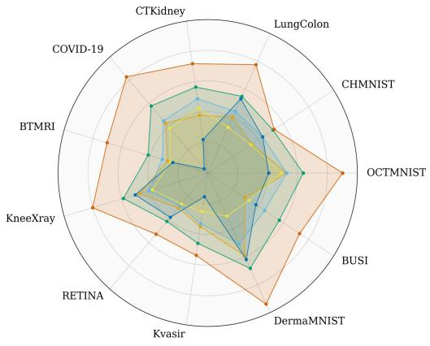
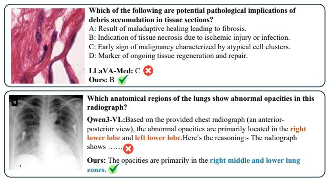
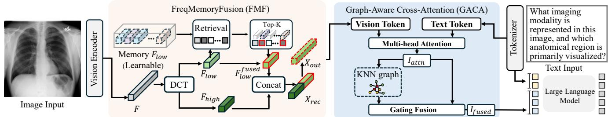
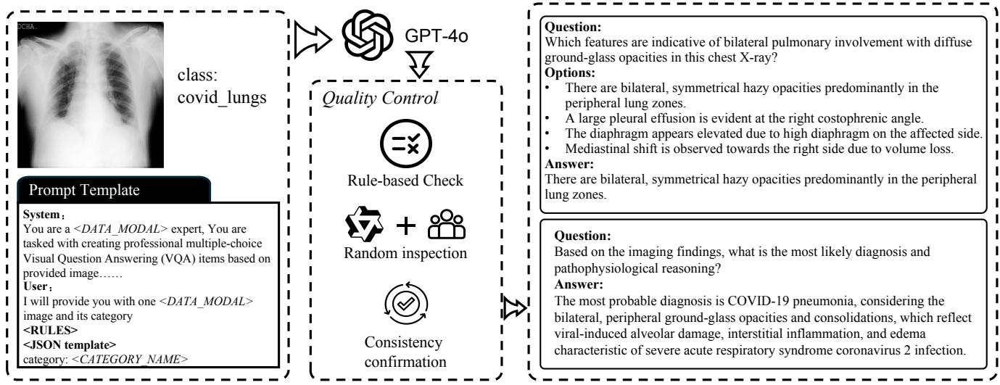
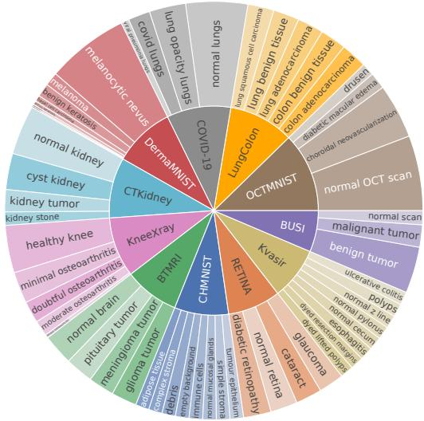
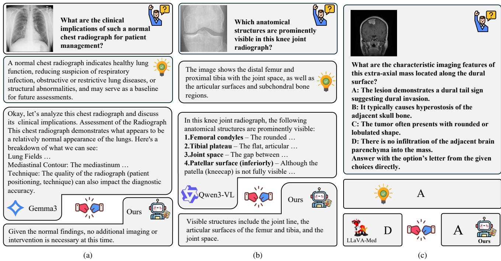

# MedFG-VQA: Low-Frequency Memory and Graph Attention for Lightweight Medical VQA

Haowen Gu1,2, Gensheng Pei3, Zeren Sun1,2, Mingwu Ren1,2\*, Xiangbo Shu1, Yazhou Yao1,2\*, Fumin Shen4

1School of Computer Science and Engineering, Nanjing University of Science and Technology

2State Key Laboratory of Intelligent Manufacturing of Advanced Construction Machinery

3Department of Electrical and Computer Engineering, Sungkyunkwan University

4School of Computer Science and Engineering, University of Electronic Science and Technology of China

https://github.com/NUST-Machine-Intelligence-Laboratory/MedFG

## Abstract

Medical Visual Question Answering (Med-VQA) holds significant promise for clinical decision support, yet faces challenges due to limited annotated data and the high computational demands of existing large vision-language models. We propose MedFG-VQA, a lightweight framework that leverages a memory bank to augment DCT-based low-frequency features and employs graph-enhanced crossattentionfor effective visual-textual alignment. Specifically, our approach features two key components: Frequency-Memory Fusion (FMF), which enhances low-frequencyfeatures by retrieving from a learnable memory bank built on DCT decomposition, and Graph-Aware Cross-Attention (GACA), which aligns visual-textual features via crossattention and refines them through graph-convolutional aggregation. To address data scarcity, we construct SynMed-VQA, a large-scale synthetic dataset comprising over 2 million question-answer pairs across 9 imaging modalities and 10 major organs, generated with GPT-4o. Extensive experiments on SynMed-VQA and three other standard biomedical VQA benchmarks demonstrate that MedFG-VQA achieves competitive or superior performance compared to much larger models while maintaining significantly lower computational costs, highlighting its efficiency and potential for clinical deployment.

## 1. Introduction

Radiological imaging serves as a cornerstone of modern medicine, producing over 80 million images each year [2]. With the growing demand for diagnostic interpretation, Medical Visual Question Answering (VQA) has emerged as a promising direction with substantial clinical relevance. By linking visual content in medical images with natural language queries, it enables more effective diagnostic assistance, image retrieval, and clinical decision support.

  
InternVL3.5(1B) → Qwen3-VL(4B) → LLaVA-Med(7B) MiniCPM-V 4.0(4B) Gemma3(4B) Ours(795M)

  
Figure 1. Illustration of VLMs evaluated on the SynMedVQA dataset. Among the 6 VLMs, MedFG-VQA achieves the highest overall score. Qualitative VQA comparison between two models, showcasing the effectiveness of MedFG-VQA.

In recent years, the rapid advancement of Large

Language Models (LLMs) and Vision-Language Models (VLMs) [1, 39, 43, 46] has brought new opportunities for the development of medical VQA. However, unlike generaldomain VQA, medical VQA faces two major challenges. First, The lack of high-quality annotated data, especially for cross-modal tasks requiring domain-specific medical knowledge. Although several public datasets have been released [10, 15, 23, 27, 28], their limited scale makes them insufficient for training large VLMs. Second, clinical deployment imposes strict constraints on model size and computational resources, while existing models [8, 14, 17, 22, 24, 32] fail to maintain strong diagnostic capability under lightweight configurations.

Motivated by the aforementioned gap, we propose MedFG-VQA, a lightweight medical visual question answering model with frequency graph fusion, achieving efficient learning and strong generalization through structured module design and high-quality synthetic data. First of all, MedFG-VQA employs a pretrained visual backbone and introduces a lightweight FreqMemoryFusion (FMF) module. By retrieving and residually integrating low-frequency priors in the frequency domain, FMF enhances the model’s capacity to capture global structural information. Then, we design a Graph-Aware Cross-Attention (GACA) module to jointly model global cross-modal semantics and local visual structure. Given image and text features, GACA achieves global cross-modal alignment through multi-head mutual attention, producing semantically enriched image representations. Meanwhile, a dynamic KNN-based graph convolution captures local spatial relationships among im age patches. A gated residual fusion mechanism then adaptively balances these two complementary perspectives, and the resulting multimodal features are fed into an LLM to accomplish the VQA task. Equipped with the above methods, MedFG-VQA seamlessly integrates frequency-domain global modeling and graph-based local structural reasoning. To train MedFG-VQA, we construct a large-scale medical VQA synthetic dataset SynMedVQA comprising 2.059 million samples, generated with the assistance of GPT-4o. The dataset covers diverse medical scenarios and question types, enabling comprehensive model training. As shown in 1, extensive experiments on multiple benchmarks demonstrate that MedFG-VQA achieves competitive performance with significantly reduced model size and computational cost.

Our contributions are as follows:

(1) We introduce SynMedVQA, a large-scale synthetic multimodal dataset generated via GPT-4o, comprising 2.059 million Q&A pairs. The dataset spans 9 imaging modalities across 10 major organs, offering diverse and comprehensive supervision for medical VQA tasks.

(2) We develop FreqMemoryFusion (FMF), a novel module that leverages a learnable, frequency-domain memory bank. FMF retrieves low-frequency components and injects global structural priors through residual fusion, enhancing the robustness and generalization of lightweight models on structurally-oriented medical questions.

(3) We present Graph-Aware Cross-Attention (GACA), which combines cross-modal attention with a featureadaptive KNN-based GCN. Adaptively fusing global semantic and local topological information via a gated mechanism, GACA improves alignment between fine-grained visual features and textual descriptions.

(4) Extensive experiments and ablation studies on multiple medical VQA benchmarks demonstrate that our approach achieves competitive performance. Notably, it does so using significantly fewer parameters than mainstream large models, validating the feasibility of small vision language models (SVLMs) in clinically relevant scenarios.

## 2. Related Work

Vision Language Model. With the rapid advancement of LLMs and the advent of large-scale pre-trained visual models like CLIP [35], numerous vision language models [25, 45] have been developed to align image features with LLMs for comprehensive visual understanding. Recently, autoregressive architectures [26, 29] have gained popularity in the VLM domain, where many approaches feed both image features and textual inputs into LLMs to perform vision language tasks. However, these methods often depend on large visual encoders or complex feature alignment modules, resulting in high parameter counts and computational overhead, which limits their deployment in resource-constrained environments. Some studies [12, 36] have explored removing the visual encoder completely, directly entering raw image patches along with text into the LLM. Although this simplifies the model architecture, it can neglect local structural and spatial information, making it difficult to achieve strong performance on fine-grained visual understanding tasks.

Vision Language Model for Medical VQA. Driven by the development of large-scale vision language models, research in medical VQA has also made significant progress. BiomedCoOp [21] leverages LLMs to achieve semantic consistency through prompt ensembling and combines this with a statistic-based prompt selection strategy for knowledge distillation, enabling efficient learning of prompt contexts. LLaVA-Med [24], on the other hand, fine-tunes general VLMs on GPT-4 generated synthetic data, demonstrating remarkable performance on medical multimodal dialogue tasks. More recently, models such as LLADA-MedV [13] employ diffusion-based vision language models and adopt visual instruction tuning to enhance understanding of biomedical images. Despite these advances, existing methods still face challenges in model lightweighting and fine-grained cross-modal feature alignment, limiting their applicability in resource-constrained clinical environments.

  
Figure 2. The overall architecture of MedFG-VQA. The model consists of a vision encoder, a FreqMemoryFusion(FMF) module, a Graph Aware Cross-Attention(GACA) module and a LLM.

Small Vision Language Model. Recently, small or lightweight vision language models (sVLMs) have emerged to address the efficiency and scalability challenges of large VLMs. Models such as SmolVLM [31], MiniGPT [46], and MobileVLM [11] employ compact visual backbones or low-rank adaptation strategies to substantially reduce computational overhead while preserving strong multimodal reasoning capabilities. However, most existing research has focused on developing general-purpose small models and improving performance on broad-domain benchmarks, with comparatively limited efforts devoted to domain-specific or specialized applications such as medical imaging. This gap can be partly attributed to the fact that small models are more dependent on high-quality, domain-relevant training data. Recent work such as DataRater [7] has shown that training with a smaller amount of high-quality data can outperform training on large but noisy datasets, highlighting the crucial role of data quality in small-model performance. In the medical domain, however, the limited availability of carefully curated datasets and privacy constraints further hinder the development of lightweight VLMs tailored for tasks like medical visual question answering.

## 3. Method

An overview of the proposed MedFG-VQA framework is illustrated in Figure 2. By leveraging a pre-trained vision encoder to extract rich visual features, our method introduces two key components for effective multimodal feature learning. Specifically, the FMF module enhances low-frequency representations by retrieving from a learnable memory bank and residual integration, while the GACA module aligns visual-textual features via cross-attention and aggregates local spatial context through KNN-based graph convolution. The fused multimodal features are fed into a large language model, generating the final answer and enabling accurate, robust performance on medical VQA tasks.

## 3.1. FreqMemoryFusion

To better exploit the frequency-domain structural properties of visual representations and enhance the model’s capacity for global low-frequency modeling, we introduce the Frequency Memory Fusion (FMF) module. Given an input feature $\mathbf { X } \in \mathbb { R } ^ { \mathbf { \bar { B } } \times M \times D }$ , we first transform it into the frequency domain via Discrete Cosine Transform (DCT), decomposing it into low-frequency $\mathbf { F } _ { \mathrm { l o w } }$ and high-frequency $\mathbf { F } _ { \mathrm { h i g h } }$ components. Since low-frequency components predominantly encode global semantic and structural information of the image, we leverage them as query signals for global prior retrieval.

Specifically, we maintain a learnable memory bank and retrieve the top-k memory entries ${ { \bf { M } } _ { k } }$ and corresponding similarity weights $\mathbf { S } _ { k }$ based on cosine similarity with the current low-frequency feature $\mathbf { F } _ { \mathrm { l o w } }$ . A residual weighted fusion strategy then integrates these entries, yielding the enhanced low-frequency representation:

$$
\mathbf { F } _ { \mathrm { l o w } } ^ { \mathrm { f u s e d } } = \lambda \mathbf { F } _ { \mathrm { l o w } } + ( 1 - \lambda ) ( \mathrm { S o f t m a x } ( \mathbf { S } _ { k } ) \cdot \mathbf { M } _ { k } ) ,\tag{1}
$$

where $\lambda \in [ 0 , 1 ]$ is a fusion coefficient that balances the contribution between the original feature and the memoryenhanced feature. This design enables the model to incorporate global structural priors while maintaining feature detail fidelity and representation stability. In practice, we fix $\lambda = 0 . 7$ based on preliminary experiments, which achieves a good trade-off between feature fusion and stability.

Subsequently, the enhanced low-frequency features $\mathbf { F } _ { \mathrm { l o w } } ^ { \mathrm { f u s e d } }$ are concatenated with the original high-frequency components $\mathbf { F _ { h i g h } }$ and transformed back to the spatial domain via Inverse Discrete Cosine Transform (IDCT), producing the reconstructed feature ${ \bf X } _ { r e c } .$ . To adaptively integrate the reconstructed and original features, we employ a lightweight gated residual fusion mechanism:

$$
\mathbf { X } _ { \mathrm { o u t } } = \mathbf { X } + \alpha \cdot f _ { \theta } ( [ \mathbf { X } , \mathbf { X } _ { \mathrm { r e c } } ] ) ,\tag{2}
$$

where α is a learnable gating parameter and $f _ { \theta } ( \cdot )$ is a linear projection that adaptively fuses the enhanced features with the original input for effective feature refinement.

Learnable Memory. In FMF, a learnable global memory M $\mathbf { \Psi } \in \mathrm { ~ \mathbb { R } ^ { \it N \times \frac { D } { 2 } } ~ }$ is introduced to preserve global lowfrequency representations, where N denotes the number of memory entries. The memory vectors are orthogonally initialized before training and continuously updated during optimization, allowing the memory to gradually learn representative global priors that capture stable low-frequency feature patterns inherent in the data distribution. However, without proper regularization, the learned memories may collapse into redundant or overlapping representations. To address this, we introduce a diversity loss that encourages the memory embeddings to remain distinct and informative:

$$
\mathcal { L } _ { \mathrm { d i v } } = \frac { 1 } { N ( N - 1 ) } \sum _ { i \neq j } \left( \mathbf { m } _ { i } ^ { \mathsf { T } } \mathbf { m } _ { j } \right) ^ { 2 } .\tag{3}
$$

Here, $\mathbf { m } _ { i }$ denotes the $i _ { t h }$ vector in the memory bank. By minimizing the off-diagonal similarities, the loss encourages the memory vectors to remain diverse, thereby enhancing the effectiveness of feature fusion.

## 3.2. Graph-Aware Cross-Attention

In Graph-Aware Cross-Attention(GACA) module, we design both global semantic interactions across modalities and local structural modeling of visual features. Given image features $\mathbf { I } \in \mathbb { R } ^ { B \times M \times D }$ and text features $\mathbf { T } \in \mathbb { R } ^ { B \times T \times \mathbf { \overline { { D } } } } .$ we first perform layer normalization on both modalities. We then treat the image features as queries while the text features serve as keys and values. Through multi-head crossattention, we achieve global cross-modal alignment and obtain semantically enriched visual representations $\mathbf { I } _ { \mathrm { a t t } \mathrm { n } }$

To further incorporate local spatial relationships, we construct a dynamic KNN graph based on $\mathbf { I } _ { \mathrm { a t t r a } } .$ , where each node represents an image patch and edges form according to feature similarity. The adjacency matrix is defined as:

$$
A _ { i j } = { \left\{ \begin{array} { l l } { 1 , } & { { \mathrm { i f ~ } } j \in { \mathrm { K N N } } ( i , k ) , } \\ { 0 , } & { { \mathrm { o t h e r w i s e } } . } \end{array} \right. }\tag{4}
$$

After symmetrizing and normalizing the adjacency matrix to obtain A˜ , we apply a graph convolutional layer to propagate and aggregate information from neighboring nodes, thereby enhancing contextual coherence among locally related visual regions:

$$
\mathbf { I } _ { \mathrm { e n h } } = \sigma ( f _ { \theta } ( \tilde { \mathbf { A } } \mathbf { I } _ { \mathrm { a t t n } } ) ) ,\tag{5}
$$

where $f _ { \theta }$ denotes a learnable weight matrix and $\sigma$ is a nonlinear activation function

Finally, a gated residual fusion mechanism is employed to adaptively integrate the cross-modal semantic representation $\mathbf { I } _ { \mathrm { a t t n } }$ and locally aggregated structural features $\mathbf { I } _ { \mathrm { e n h } } .$ Specifically, the gate value is computed from the concatenation of the two feature types, controlling their relative contributions in fusion. The final representation is obtained as:

$$
\mathbf { I } _ { \mathrm { f u s e d } } = \mathbf { G } \odot \mathbf { I } _ { \mathrm { e n h } } + ( 1 - \mathbf { G } ) \odot \mathbf { I } _ { \mathrm { a t t n } } ,\tag{6}
$$

where $\begin{array} { r } { \mathbf G = \sigma ( f _ { \theta } ( [ \mathbf { I } _ { \mathrm { a t t n } } , \mathbf { I } _ { \mathrm { e n h } } ] ) ) } \end{array}$ denotes the learned gating weights, which are generated by a learnable linear projection followed by a sigmoid activation. This design enables the model to dynamically balance global semantic alignment and local structural aggregation, yielding a multimodal representation that jointly captures both global and local visual information.

Table 1. Overview of datasets statistics, including image and question counts for training, validation, and test splits. Open and Close questions share the same quantities.
<table><tr><td rowspan="2">Dataset</td><td colspan="2">Images</td><td rowspan="2"></td><td colspan="2">Questions</td></tr><tr><td></td><td>(train | val | test)</td><td>(train | val | test)</td><td></td></tr><tr><td>CHMNIST [18]</td><td>2496</td><td>1000</td><td>1504</td><td>12480</td><td>5000</td><td>7520</td></tr><tr><td>RETINA [20]</td><td>2108</td><td>|841 | 1268</td><td></td><td>10540</td><td>4205</td><td>6340</td></tr><tr><td>BTMRI [33]</td><td>2854 |</td><td>|1141 | 1717</td><td></td><td>14270 </td><td>| 5705 | 8585</td><td></td></tr><tr><td>DermaMNIST [40]</td><td>7006 |</td><td>1003</td><td>|2005</td><td>35030 | 5015 | 10025</td><td></td><td></td></tr><tr><td>BUSI [3]</td><td></td><td>389| 155 | 236</td><td></td><td>1945</td><td>775 | 1180</td><td></td></tr><tr><td>OCTMNIST [19]</td><td></td><td></td><td>97476 | 10832 | 1000</td><td>487380</td><td></td><td>54160 | 5000</td></tr><tr><td>KneeXray [9]</td><td>5778</td><td>|826 | 1656</td><td></td><td>28890</td><td>|4130 | 8280</td><td></td></tr><tr><td>COVID-19 [38]</td><td>10582</td><td>4232 | 6351</td><td></td><td>52910 | 21160</td><td></td><td>31755</td></tr><tr><td>Kvasir [34]</td><td>2000</td><td>| 800 | 1200</td><td></td><td>10000 | 4000 </td><td></td><td>6000</td></tr><tr><td>CTKidney [16]</td><td>6221 |</td><td>|2487|3738</td><td></td><td>31105 | 12435</td><td></td><td>18690</td></tr><tr><td>LungColon [6]</td><td></td><td></td><td>12500 | 5000 | 7500</td><td>62500</td><td>25000</td><td>37500</td></tr></table>

## 3.3. Training Strategy & Loss Function

For text generation, we employ the cross-entropy loss $\mathcal { L } _ { \mathrm { t e x t } }$ To encourage the memory vectors in the FMF module to remain diverse, we compute the diversity loss ${ \mathcal { L } } _ { \mathrm { d i v } }$ as described in §3.1. The final training objective is a linear combination of these losses, which can be formulated as:

$$
\mathcal { L } _ { \mathrm { t o t a l } } = \mathcal { L } _ { \mathrm { t e x t } } + \lambda \mathcal { L } _ { \mathrm { d i v } } .\tag{7}
$$

## 4. Dataset

## 4.1. Data Source

We integrate 11 publicly available medical imaging datasets, i.e., BTMRI [33], BUSI [3], CHMNIST [18], COVID-19 [38], CTKidney [16], DermaMNIST [40], KneeXray [9], Kvasir [34], LungColon [6], OCTMNIST [19], and RETINA [20]. These datasets collectively span nine distinct imaging modalities and ten major anatomical regions, offering a comprehensive and diverse benchmark for multimodal medical visual understanding. Specifically, the included imaging modalities encompass magnetic resonance imaging (MRI), computed tomography (CT), X-ray, ultrasound, dermoscopy, histopathology, fundus photography, optical coherence tomography (OCT), and endoscopy. The datasets further cover a wide range of clinical targets and organs, including the brain, breast, lungs, liver and kidneys, retina, knee, and skin, providing both organ-level and cellular-level visual representations. Such a broad coverage enables our model to learn cross-modality feature alignment and generalizable reasoning patterns across heterogeneous medical domains. By consolidating these diverse datasets, we establish a unified and large-scale foundation that enables comprehensive evaluation and robust training of vision language models for Med-VQA. In total, the integrated dataset contains 205,902 medical images, divided into 149,410 for training, 28,317 for validation, and 28,175 for testing. The data splits strictly follow the configurations of BiomedCoOp [21] to ensure comparability and consistency across benchmarks.

  
Figure 3. The construction pipeline of SynMedVQA. The pipeline includes prompt template, samples of Q&A pair generated by GPT-4o and the quality control process.

## 4.2. Data Generation

To support medical-scene-oriented multimodal visual question answering tasks, we constructed the SynMedVQA dataset by leveraging cleaned and structured image-label information and employing GPT-4o as a semantic generation engine to automatically produce Q&A pairs, the overall pipeline is shown as Figure 3. We develop a unified and adaptable structured prompting framework that casts the model as a senior medical imaging expert and dynamically tailors question generation to the clinical and radiological characteristics of each dataset. This design ensures domainspecific relevance while maintaining structural consistency across datasets. All generated questions follow a consistent schema targeting one of four core aspects: (1) imaging features (e.g., signal intensity, enhancement pattern, morphology), (2) visible anatomical structures, (3) pathological manifestations (e.g., mass effect, edema, invasion), and (4) clinical implications (e.g., symptoms, functional impact, management considerations). Within each aspect, emphasis is customized per disease domain, for instance, brain tumor questions prioritize contrast enhancement and midline shift, pulmonary nodule questions focus on margin characteristics and mediastinal involvement, and liver lesion questions highlight segmental localization and vascular invasion.

For each image, we automatically generate two types of questions via GPT-4o. Open-ended questions include queries such as “Which organ contains the lesion marked in the image?” and “What is the primary abnormality shown in this image?”. For multiple-choice questions, 75% are designed with one correct answer and three distractors, while the remaining 25% contain four distractors without a correct answer, enhancing both discriminability and robustness.

  
Figure 4. Sunburst visualization of dataset category proportions, where the inner circle corresponds to datasets and the outer circle to category ratios within each dataset.

To ensure clinical accuracy and interpretability, prompt templates are integrated with original annotations, with multiple customized variants designed to address the diversity of imaging modalities and organ-specific characteristics across datasets. Each prompt is structured into System and User components: the former establishes the expert role, “ You are a senior medical imaging specialist in DATA MODAL interpretation and DISEASE DOMAIN diagnosis ”, while the latter provides the image, lesion category, and specific task instructions. JSON formatting is enforced for all outputs to enable efficient rule-based validation. Given the richness and diversity of these prompts, the complete designs and specifications are provided in the Appendix to facilitate reproducibility and future research.

To ensure high quality, the generated Q&A pairs are subjected to a rigorous three-step validation process. First, we apply automated, rule-based filtering to discard duplicate, ambiguous, or incomplete questions. Next, a random subset is reviewed using a combination of Qwen2.5-VL [5] and manual human inspection. This step verifies that the questions are clear, complete, and relevant. In the final stage, we conduct a consistency check to ensure questions, answers, and original image annotations are logically aligned, eliminating any contradictions. This comprehensive process guarantees the dataset is high-quality and well-suited for training and evaluating medical VQA models.

The SynMedVQA dataset comprises 2,059,020 Q&A pairs, equally split between open-ended and multiplechoice questions. The questions cover multiple aspects, including anatomical structures, imaging characteristics, pathological changes, and clinical manifestations. This comprehensive scope provides a diverse and clinically grounded benchmark for advancing multimodal reasoning in medical vision language models. Table 1 details the dataset’s statistics, while Figure 4 illustrates the category distributions using a sunburst visualization. In this figure, the inner circle represents the datasets, and the outer circle shows the category proportions within each.

## 5. Experiments

## 5.1. Experimental Setup

Datasets and Metrics. Our model is trained and validated on the SynMedVQA dataset memtioned at §4. Meanwhile, to further evaluate its generalization ability, we also conduct experiments on three public medical VQA bench marks: SLAKE [27], VQA-RAD [23], and PathVQA [15]. Following the evaluation protocol of LLaVA-Med [24], we measure model performance using answer accuracy. For closed-ended questions, correctness is directly determined by comparing the model’s response with the ground truth. For open-ended questions, we evaluate model accuracy by constructing multiple-choice options. These options are formed by pairing the reference answer with several alternative responses sampled from the training set, and the model is assessed on its ability to select the correct one.

Implementation Details. We adopt SigLIP2-so400m [41] as the visual backbone and freeze its parameters during training. To improve computational efficiency, modality projection (MP) [37] is applied to reduce the number of visual tokens. The large language model is SmolLM2-360M-Instruct [4], along with its corresponding tokenizer. Both FMF and GACA modules are randomly initialized before training. After initialization, the entire model is trained on the proposed SynMedVQA dataset for 2 epochs. The learning rates are set as follows: 5e-5 for the LLM, 0.003 for the modality projector, and 0.0015 for the FMF and GACA modules. We use AdamW [30] as the optimizer, and al experiments are conducted on 8×4090 GPUs.

## 5.2. Comparison with Previous Studies

We systematically evaluate model performance on the Syn-MedVQA benchmark and compare it with five representative vision language models: InternVL3.5 [42], MiniCPM-V 4.0 [44], Qwen3-VL [43], Gemma3 [39], and LLaVA-Med v1.5 [24]. To ensure fair comparison, all models are evaluated under the same data splits and metric. Notably, the baseline models use their publicly available pretrained weights without additional fine-tuning on SynMedVQA.

As shown in Table 2, our model achieves an average accuracy of 0.6441, surpassing next-best model Qwen3- VL by approximately 9.5%, despite having only 795M parameters significantly fewer than all other models. Notably, the model demonstrates superior performance on tasks such as OCTMNIST, CTKidney, COVID-19, and BTMRI, which involve complex anatomical structures or significant lesion variations. These results suggest that the proposed frequency-domain enhancement and crossmodal graph structure modeling effectively improve multimodal understanding and diagnostic reasoning, even under a lightweight model design.

We further evaluate our model on three public medical VQA benchmarks: SLAKE [27], VQA-RAD [23], and PathVQA [15], covering both closed-ended and open-ended question types. The results are summarized in Table 3.

Although our model contains only 795M parameters, which is significantly smaller than the other compared models, it achieves competitive performance across multiple benchmarks. In open-ended tasks, it attains the highest accuracy among all models, demonstrating effective generalization in reasoning over complex semantic questions. LLaVA-Med shows low performance on open-ended tasks because it does not follow the instructions to provide direct answer choices, making accuracy evaluation unsuitable. On closed-ended questions, some larger models perform slightly better, which can be attributed to their substantially larger pretraining datasets while our model only trained on SynMedVQA.

## 5.3. Ablation Studies

To verify the effectiveness of the proposed Frequencydomain Memory Fusion (FMF) and Graph-based Attention Cross-modal Alignment (GACA) modules, we conducted a series of ablation experiments. The experimental results are presented in Table 4 and Table 5.

It can be observed in Table 4(a) that removing both FMF and GACA modules leads to a significant performance drop, with accuracy falling to 0.627. The combined application of FMF and GACA leads to significant performance gains, effectively strengthening global feature modeling and cross-modal semantic alignment. When both modules are integrated, the accuracy rises to 0.6441, substantially outperforming the baseline. This demonstrates that FMF effectively strengthens global structural perception of visual features, while GACA enhances semantic interactions between images and text, and their synergistic combination leads to a marked improvement in overall performance.

Table 2. Comparison of model performance on SynMedVQA. All baseline models use their publicly available pretrained weights.
<table><tr><td></td><td></td><td>OCTMNIST</td><td>CHMNIST</td><td></td><td></td><td></td><td></td><td></td><td></td><td></td><td></td><td></td><td></td><td></td></tr><tr><td>Method</td><td>Params</td><td></td><td></td><td></td><td></td><td></td><td></td><td>BTMRI</td><td></td><td>RETINA</td><td>Kvasir</td><td></td><td>BUSI</td><td></td></tr><tr><td>InternVL3.5 [42]</td><td>1B</td><td>0.538</td><td>0.4569</td><td>0.4802</td><td>0.4714</td><td>0.4943</td><td>0.4261</td><td></td><td>0.5147</td><td>0.4355 0.4588</td><td></td><td>0.5662</td><td>0.433</td><td>0.4846</td></tr><tr><td>MiniCPM-V 4.0 [44]</td><td>4B</td><td>0.5374</td><td>0.4964</td><td>0.4987</td><td>0.52</td><td>0.503</td><td></td><td>0.4425</td><td>0.4838</td><td>0.4276 0.4503</td><td></td><td>0.5288</td><td></td><td>0.5033 0.4964</td></tr><tr><td>Qwen3-VL [43]</td><td>4B</td><td>0.5872</td><td>0.5334</td><td>0.5473</td><td>0.5547</td><td>0.5601</td><td></td><td>0.4869</td><td>0.5647</td><td>0.4877 0.5083</td><td></td><td>0.6076</td><td></td><td>0.5559 0.5492</td></tr><tr><td>Gemma3 [39]</td><td>4B</td><td>0.5208</td><td>0.4537</td><td>0.4474</td><td>0.4927</td><td>0.4751</td><td></td><td>0.4162</td><td>0.4739</td><td></td><td>0.4202 0.4142</td><td>0.4387</td><td></td><td>0.4483 0.4590</td></tr><tr><td>LLaVA-Med [24]</td><td>7B</td><td>0.4834</td><td>0.4961</td><td>0.5395</td><td>0.3991</td><td>0.6733</td><td>0.3165</td><td>0.4096</td><td>0.5272</td><td></td><td>0.4719 0.3703</td><td>0.5788</td><td></td><td>0.47200.4834</td></tr><tr><td>Ours</td><td>795M</td><td>0.7056</td><td>0.5372</td><td>0.6493</td><td>0.6239</td><td></td><td></td><td>0.6155</td><td>0.6609</td><td></td><td>0.5372 0.5440</td><td>0.7225</td><td></td><td>0.6284 0.6441</td></tr></table>

Table 3. Comparative results on three public medical VQA benchmarks. The best and second-best results are indicated in bold and underline, respectively.

<table><tr><td rowspan="2">Model</td><td colspan="3">Params</td><td colspan="2">SLAKE [27]</td><td colspan="2">VQA-RAD [23]</td><td colspan="2">PathVQA [15]</td></tr><tr><td>Vision</td><td>LLM</td><td>Total</td><td>Closed</td><td>Open</td><td>Closed</td><td>Open</td><td>Closed</td><td>Open</td></tr><tr><td>InternVL3.5 [42]</td><td>0.3B</td><td>0.8B</td><td>1.1B</td><td>0.6459</td><td>0.8156</td><td>0.6140</td><td>0.6180</td><td>0.5694</td><td>0.3187</td></tr><tr><td>MiniCPM-V 4.0 [44]</td><td>0.4B</td><td>3.0B</td><td>4.1B</td><td>0.4246</td><td>0.8315</td><td>0.7353</td><td>0.7978</td><td>0.6376</td><td>0.4513</td></tr><tr><td>Qwen3-VL [43]</td><td>0.4B</td><td>4.0B</td><td>4.4B</td><td>0.5120</td><td>0.9006</td><td>0.7868</td><td>0.8764</td><td>0.6679</td><td>0.5249</td></tr><tr><td>Gemma3 [39]</td><td>0.4B</td><td>0.6B</td><td>3.2B</td><td>0.5287</td><td>0.7337</td><td>0.6507</td><td>0.8090</td><td>0.8410</td><td>0.4608</td></tr><tr><td>LLaVA-Med [24]</td><td>0.3B</td><td>7.2B</td><td>7.5B</td><td>0.6567</td><td>0.1232</td><td>0.6434</td><td>0.0730</td><td>0.7308</td><td>0.2828</td></tr><tr><td>Ours</td><td>412M</td><td>316M</td><td>795M</td><td>0.5502</td><td>0.9595</td><td>0.6324</td><td>0.7865</td><td>0.6694</td><td>0.8062</td></tr></table>

Table 4. Ablation studies of the contribution of FMF and GACA, the effect of the memory bank size in FMF, and the impact of the loss balance coefficient λ.
<table><tr><td>FMF</td><td>GACA</td><td>Acc.</td><td>Size</td><td>Acc.</td><td>λ</td><td>Acc.</td></tr><tr><td rowspan="3">√</td><td></td><td>0.6270</td><td>16</td><td>0.4313</td><td>0.3</td><td>0.6415</td></tr><tr><td></td><td>0.6242</td><td>32</td><td>0.6385</td><td>0.5</td><td>0.6441</td></tr><tr><td>√</td><td>0.4170</td><td>64</td><td>0.6441</td><td>0.7</td><td>0.6427</td></tr><tr><td>√</td><td>√</td><td>0.6441</td><td>128</td><td>0.2771</td><td>0.9</td><td>0.6410</td></tr><tr><td colspan="2">(a)</td><td></td><td>(b)</td><td></td><td>(c)</td><td></td></tr></table>

Table 4(b) shows the impact of memory bank size on model performance. Increasing the memory size from 16 to 64 notably improves accuracy, indicating that a larger memory helps capture richer contextual representations. However, further increasing it to 128 leads to a sharp drop, suggesting that excessive memory introduces redundant or noisy information that hinders retrieval. Thus, a memory bank size of 64 is adopted as a balanced choice.

Table 5. Ablation studies on different frequency-domain transformation strategies and module against standard cross-attention.
<table><tr><td>Type</td><td>Acc.</td><td>Method</td><td>Acc.</td></tr><tr><td></td><td>0.6058</td><td>一</td><td></td></tr><tr><td>FFT</td><td>0.5585</td><td>CA</td><td>0.6407</td></tr><tr><td>DCT</td><td>0.6441</td><td>GACA</td><td>0.6441</td></tr><tr><td colspan="2">(a)</td><td colspan="2">(b)</td></tr></table>

Table 4(c) presents the effect of the loss balance factor λ on model performance. As shown in the table, varying λ from 0.3 to 0.9 results in only minor fluctuations in accuracy, with the best performance achieved at $\lambda \ = \ 0 . 5 ,$ reaching an accuracy of 0.6441. Combined with the findings from Table 4(a) and Table 4(b), this indicates that the model’s performance is relatively insensitive to the exact choice of λ. Nevertheless, the memory bank diversity loss remains essential, as it contributes to the richness of the representations captured in the memory bank and underpins the improvements observed in global feature modeling and cross-modal alignment.

Table 5(a) analyzes the effectiveness of frequencydomain transformations in the FMF module. We compare directly feeding image features, applying Fast Fourier Transform (FFT), and applying Discrete Cosine Transform (DCT). FFT achieves the best performance with an accuracy of 0.6441, outperforming both the direct and DCT-based settings. This demonstrates that FFT preserves both magnitude and phase information, enabling richer frequency representations, whereas DCT loses phase cues that are crucial for maintaining structural consistency.

  
Figure 5. Qualitative results against (a) Gemma3-4B , (b) Qwen3-VL-4B, and (c) LLaVA-Med v1.5. Responses are abridged for brevity.

Table 5(b) evaluates the proposed GACA module against the standard cross-attention(CA). Replacing CA with GACA consistently improves accuracy, indicating that modeling local geometric relationships further enhances the model’s multimodal reasoning capability.

## 5.4. Qualitative Analysis

To evaluate MedFG-VQA against mainstream models, we conducted comparative experiments across multi-organ, multi-modal medical datasets. As shown in Figure 5(a), for lung X-ray questions, Gemma3 provides lengthy, detailed descriptions that include redundant information and overly long reasoning chains, with recommendations like “further examination is required” that may lead to overdiagnosis. In contrast, our model delivers concise, accurate answers, directly stating “no additional imaging or intervention is required”. In Figure 5(b), for knee X-rays, Qwen3- VL describes multiple anatomical structures, some outside the visible range, while our model focuses on clearly visible key structures, such as the joint line, femoral and tibial articular surfaces, and joint space, with a succinct and targeted phrasing. In Figure 5(c), for a typical extra-axial mass on the dura mater, our model correctly identifies the lesion, while LLaVA-Med provides only a broad, non-specific description, missing critical diagnostic information. Overall, these examples demonstrate our model’s greater accuracy, clarity, and clinical relevance in medical visual question answering.

## 6. Conclusion

We present MedFG-VQA, a lightweight medical visual question answering (VQA) approach developed to overcome the dual challenges of data scarcity and computational constraints in clinical settings. Our model integrates global frequency-domain priors through FreqMemoryFusion (FMF) and uses a Graph-Aware Cross-Attention (GACA) mechanism to align visual-textual features while aggregating local structural information. This compact architecture delivers strong performance, demonstrating the feasibility of efficient vision language models for practical medical applications. To further facilitate research and development, we also constructed SynMedVQA, a large-scale medical VQA dataset with 2.059 million samples.

Limitation. The quality and diversity of the generated Q&A pairs are inherently constrained by the capability boundaries of the underlying model. This dependency may hinder the framework’s adaptability to emerging or novel imaging patterns that extend beyond the model’s learned representations. Besides, our dataset is constructed based on single-view images, whereas practical clinical scenarios often involve multi-view and multi-modal imaging data, requiring joint reasoning and cross-modal integration for accurate diagnosis and assessment.

Acknowledgement. This work was supported by the National Natural Science Foundation of China (No. 62472222, U25A20442, 62427808), Natural Science Foundation of Jiangsu Province (No. BK20240080)

## References

[1] Josh Achiam, Steven Adler, Sandhini Agarwal, Lama Ahmad, Ilge Akkaya, Florencia Leoni Aleman, Diogo Almeida, Janko Altenschmidt, Sam Altman, Shyamal Anadkat, et al. Gpt-4 technical report. arXiv preprint arXiv:2303.08774, 2023. 2

[2] Yasmeena Akhter, Richa Singh, and Mayank Vatsa. Ai-based radiodiagnosis using chest x-rays: A review. Frontiers in big data, 6:1120989, 2023. 1

[3] Walid Al-Dhabyani, Mohammed Gomaa, Hussien Khaled, and Aly Fahmy. Dataset of breast ultrasound images. Data in brief, 28:104863, 2020. 4

[4] Loubna Ben Allal, Anton Lozhkov, Elie Bakouch, Gabriel Mart´ın Blazquez, Guilherme Penedo, Lewis Tun-´ stall, Andres Marafioti, Hynek Kydl´ ´ıcek, Agustˇ ´ın Piqueres Lajar´ın, Vaibhav Srivastav, Joshua Lochner, Caleb Fahlgren, Xuan-Son Nguyen, Clementine Fourrier, Ben Burtenshaw,´ Hugo Larcher, Haojun Zhao, Cyril Zakka, Mathieu Morlon, Colin Raffel, Leandro von Werra, and Thomas Wolf. Smollm2: When smol goes big – data-centric training of a small language model, 2025. 6

[5] Shuai Bai, Keqin Chen, Xuejing Liu, Jialin Wang, Wenbin Ge, Sibo Song, Kai Dang, Peng Wang, Shijie Wang, Jun Tang, Humen Zhong, Yuanzhi Zhu, Mingkun Yang, Zhaohai Li, Jianqiang Wan, Pengfei Wang, Wei Ding, Zheren Fu, Yiheng Xu, Jiabo Ye, Xi Zhang, Tianbao Xie, Zesen Cheng, Hang Zhang, Zhibo Yang, Haiyang Xu, and Junyang Lin. Qwen2.5-vl technical report, 2025. 6

[6] Andrew A Borkowski, Marilyn M Bui, L Brannon Thomas, Catherine P Wilson, Lauren A DeLand, and Stephen M Mastorides. Lung and colon cancer histopathological image dataset (lc25000). arXiv preprint arXiv:1912.12142, 2019. 4

[7] Dan A. Calian, Gregory Farquhar, Iurii Kemaev, Luisa M. Zintgraf, Matteo Hessel, Jeremy Shar, Junhyuk Oh, Andras´ Gyorgy, Tom Schaul, Jeffrey Dean, Hado van Hasselt, and ¨ David Silver. Datarater: Meta-learned dataset curation, 2025. 3

[8] Junying Chen, Chi Gui, Ruyi Ouyang, Anningzhe Gao, Shunian Chen, Guiming Hardy Chen, Xidong Wang, Ruifei Zhang, Zhenyang Cai, Ke Ji, et al. Huatuogpt-vision, towards injecting medical visual knowledge into multimodal llms at scale. arXiv preprint arXiv:2406.19280, 2024. 2

[9] Pingjun Chen. Knee osteoarthritis severity grading dataset. Mendeley Data, 1(10.17632):30784984, 2018. 4

[10] Yanyuan Chen, Dexuan Xu, Yu Huang, Songkun Zhan, Hanpin Wang, Dongxue Chen, Xueping Wang, Meikang Qiu, and Hang Li. Mimo: A medical vision language model with visual referring multimodal input and pixel grounding multimodal output. In Proceedings of the Computer Vision and Pattern Recognition Conference, pages 24732–24741, 2025.

[11] Xiangxiang Chu, Limeng Qiao, Xinyang Lin, Shuang Xu, Yang Yang, Yiming Hu, Fei Wei, Xinyu Zhang, Bo Zhang, Xiaolin Wei, and Chunhua Shen. Mobilevlm : A fast, strong and open vision language assistant for mobile devices, 2023. 3

[12] Haiwen Diao, Xiaotong Li, Yufeng Cui, Yueze Wang, Haoge Deng, Ting Pan, Wenxuan Wang, Huchuan Lu, and Xinlong Wang. Evev2: Improved baselines for encoder-free visionlanguage models. arXiv preprint arXiv:2502.06788, 2025. 2

[13] Xuanzhao Dong, Wenhui Zhu, Xiwen Chen, Zhipeng Wang, Peijie Qiu, Shao Tang, Xin Li, and Yalin Wang. Llada-medv: Exploring large language diffusion models for biomedical image understanding. arXiv preprint arXiv:2508.01617, 2025. 2

[14] Xiaotang Gai, Jiaxiang Liu, Yichen Li, Zijie Meng, Jian Wu, and Zuozhu Liu. 3d-rad: A comprehensive 3d radiology med-vqa dataset with multi-temporal analysis and diverse diagnostic tasks, 2025. 2

[15] Xuehai He, Yichen Zhang, Luntian Mou, Eric Xing, and Pengtao Xie. Pathvqa: 30000+ questions for medical visual question answering. arXiv preprint arXiv:2003.10286, 2020. 2, 6, 7

[16] Md Nazmul Islam, Mehedi Hasan, Md Kabir Hossain, Md Golam Rabiul Alam, Md Zia Uddin, and Ahmet Soylu. Vision transformer and explainable transfer learning models for auto detection of kidney cyst, stone and tumor from ctradiography. Scientific Reports, 12(1):11440, 2022. 4

[17] Songtao Jiang, Yuan Wang, Sibo Song, Yan Zhang, Zijie Meng, Bohan Lei, Jian Wu, Jimeng Sun, and Zuozhu Liu. Omniv-med: Scaling medical vision-language model for universal visual understanding, 2025. 2

[18] Jakob Nikolas Kather, Cleo-Aron Weis, Francesco Bianconi, Susanne M Melchers, Lothar R Schad, Timo Gaiser, Alexander Marx, and Frank Gerrit Zollner. Multi-class texture anal-¨ ysis in colorectal cancer histology. Scientific reports, 6(1): 1–11, 2016. 4

[19] Daniel S Kermany, Michael Goldbaum, Wenjia Cai, Carolina CS Valentim, Huiying Liang, Sally L Baxter, Alex McKeown, Ge Yang, Xiaokang Wu, Fangbing Yan, et al. Identifying medical diagnoses and treatable diseases by image-based deep learning. cell, 172(5):1122–1131, 2018. 4

[20] Thomas Kohler, Attila Budai, Martin F Kraus, Jan¨ Odstrcilik, Georg Michelson, and Joachim Hornegger. Auto-ˇ matic no-reference quality assessment for retinal fundus images using vessel segmentation. In Proceedings of the 26th IEEE international symposium on computer-based medical systems, pages 95–100. IEEE, 2013. 4

[21] Taha Koleilat, Hojat Asgariandehkordi, Hassan Rivaz, and Yiming Xiao. Biomedcoop: Learning to prompt for biomedical vision-language models. In Proceedings ofthe Computer Vision and Pattern Recognition Conference, pages 14766– 14776, 2025. 2, 5

[22] Yuxiang Lai, Jike Zhong, Ming Li, Shitian Zhao, Yuheng Li, Konstantinos Psounis, and Xiaofeng Yang. Med-r1: Re inforcement learning for generalizable medical reasoning in vision-language models, 2025. 2

[23] Jason J Lau, Soumya Gayen, Asma Ben Abacha, and Dina Demner-Fushman. A dataset of clinically generated visual questions and answers about radiology images. Scientific data, 5(1):1–10, 2018. 2, 6, 7

[24] Chunyuan Li, Cliff Wong, Sheng Zhang, Naoto Usuyama, Haotian Liu, Jianwei Yang, Tristan Naumann, Hoifung Poon, and Jianfeng Gao. Llava-med: Training a large languageand-vision assistant for biomedicine in one day. NeurIPS, 36:28541–28564, 2023. 2, 6, 7

[25] Junnan Li, Dongxu Li, Caiming Xiong, and Steven Hoi. Blip: Bootstrapping language-image pre-training for unified vision-language understanding and generation, 2022. 2

[26] Junnan Li, Dongxu Li, Silvio Savarese, and Steven Hoi. Blip-2: Bootstrapping language-image pre-training with frozen image encoders and large language models, 2023. 2

[27] Bo Liu, Li-Ming Zhan, Li Xu, Lin Ma, Yan Yang, and Xiao-Ming Wu. Slake: A semantically-labeled knowledgeenhanced dataset for medical visual question answering. In 2021 IEEE 18th international symposium on biomedical imaging (ISBI), pages 1650–1654. IEEE, 2021. 2, 6, 7

[28] Bo Liu, Ke Zou, Li-Ming Zhan, Zexin Lu, Xiaoyu Dong, Yidi Chen, Chengqiang Xie, Jiannong Cao, Xiao-Ming Wu, and Huazhu Fu. Gemex: A large-scale, groundable, and explainable medical vqa benchmark for chest x-ray diagnosis. In ICCV, pages 21310–21320, 2025. 2

[29] Haotian Liu, Chunyuan Li, Qingyang Wu, and Yong Jae Lee. Visual instruction tuning, 2023. 2

[30] Ilya Loshchilov and Frank Hutter. Decoupled weight decay regularization, 2019. 6

[31] Andres Marafioti, Orr Zohar, Miquel Farr ´ e, Merve Noyan,´ Elie Bakouch, Pedro Cuenca, Cyril Zakka, Loubna Ben Allal, Anton Lozhkov, Nouamane Tazi, Vaibhav Srivastav, Joshua Lochner, Hugo Larcher, Mathieu Morlon, Lewis Tunstall, Leandro von Werra, and Thomas Wolf. Smolvlm: Redefining small and efficient multimodal models, 2025. 3

[32] Vishwesh Nath, Wenqi Li, Dong Yang, Andriy Myronenko, Mingxin Zheng, Yao Lu, Zhijian Liu, Hongxu Yin, Yucheng Tang, Pengfei Guo, Can Zhao, Ziyue Xu, Yufan He, Greg Heinrich, Yee Man Law, Benjamin Simon, Stephanie Harmon, Stephen Aylward, Marc Edgar, and Michael Zephyr. Vila-m3: Enhancing vision-language models with medical expert knowledge, 2025. 2

[33] Msoud Nickparvar. Brain tumor mri dataset, 2021. 4

[34] Konstantin Pogorelov, Kristin Ranheim Randel, Carsten Griwodz, Sigrun Losada Eskeland, Thomas de Lange, Dag Johansen, Concetto Spampinato, Duc-Tien Dang-Nguyen, Mathias Lux, Peter Thelin Schmidt, et al. Kvasir: A multiclass image dataset for computer aided gastrointestinal disease detection. In Proceedings of the 8th ACM on Multimedia Systems Conference, pages 164–169, 2017. 4

[35] Alec Radford, Jong Wook Kim, Chris Hallacy, Aditya Ramesh, Gabriel Goh, Sandhini Agarwal, Girish Sastry, Amanda Askell, Pamela Mishkin, Jack Clark, et al. Learning transferable visual models from natural language supervision. In International conference on machine learning, pages 8748–8763. PmLR, 2021. 2

[36] Miao Rang, Zhenni Bi, Chuanjian Liu, Yehui Tang, Kai Han, and Yunhe Wang. Eve: Efficient multimodal vision language models with elastic visual experts. In Proceedings of the AAAI Conference on Artificial Intelligence, pages 6694– 6702, 2025. 2

[37] Wenzhe Shi, Jose Caballero, Ferenc Huszar, Johannes Totz,´ Andrew P Aitken, Rob Bishop, Daniel Rueckert, and Zehan Wang. Real-time single image and video super-resolution using an efficient sub-pixel convolutional neural network. In Proceedings ofthe IEEE conference on computer vision and pattern recognition, pages 1874–1883, 2016. 6

[38] Anas M Tahir, Muhammad EH Chowdhury, Amith Khandakar, Tawsifur Rahman, Yazan Qiblawey, Uzair Khurshid, Serkan Kiranyaz, Nabil Ibtehaz, M Sohel Rahman, Somaya Al-Maadeed, et al. Covid-19 infection localization and severity grading from chest x-ray images. Comput. Biol. Med., 139:105002, 2021. 4

[39] Gemma Team, Aishwarya Kamath, Johan Ferret, Shreya Pathak, Nino Vieillard, Ramona Merhej, Sarah Perrin, Tatiana Matejovicova, Alexandre Rame, Morgane Rivi´ ere,\` et al. Gemma 3 technical report. arXiv preprint arXiv:2503.19786, 2025. 2, 6, 7

[40] Philipp Tschandl, Cliff Rosendahl, and Harald Kittler. The ham10000 dataset, a large collection of multi-source dermatoscopic images of common pigmented skin lesions. Scientific data, 5(1):1–9, 2018. 4

[41] Michael Tschannen, Alexey Gritsenko, Xiao Wang, Muhammad Ferjad Naeem, Ibrahim Alabdulmohsin, Nikhil Parthasarathy, Talfan Evans, and Lucas Beyer. Siglip 2: Mul tilingual vision-language encoders with improved semantic understanding, localization, and dense features, 2025. 6

[42] Weiyun Wang, Zhangwei Gao, Lixin Gu, Hengjun Pu, Long Cui, Xingguang Wei, Zhaoyang Liu, Linglin Jing, Shenglong Ye, Jie Shao, et al. Internvl3. 5: Advancing open-source multimodal models in versatility, reasoning, and efficiency. arXiv preprint arXiv:2508.18265, 2025. 6, 7

[43] An Yang, Anfeng Li, Baosong Yang, Beichen Zhang, Binyuan Hui, Bo Zheng, Bowen Yu, Chang Gao, Chengen Huang, Chenxu Lv, et al. Qwen3 technical report. arXiv preprint arXiv:2505.09388, 2025. 2, 6, 7

[44] Yuan Yao, Tianyu Yu, Ao Zhang, Chongyi Wang, Junbo Cui, Hongji Zhu, Tianchi Cai, Haoyu Li, Weilin Zhao, Zhihui He, et al. Minicpm-v: A gpt-4v level mllm on your phone. arXiv preprint arXiv:2408.01800, 2024. 6, 7

[45] Sheng Zhang, Yanbo Xu, Naoto Usuyama, Hanwen Xu, Jaspreet Bagga, Robert Tinn, Sam Preston, Rajesh Rao, Mu Wei, Naveen Valluri, Cliff Wong, Andrea Tupini, Yu Wang, Matt Mazzola, Swadheen Shukla, Lars Liden, Jianfeng Gao, Angela Crabtree, Brian Piening, Carlo Bifulco, Matthew P. Lungren, Tristan Naumann, Sheng Wang, and Hoifung Poon. Biomedclip: a multimodal biomedical foundation model pre trained from fifteen million scientific image-text pairs, 2025. 2

[46] Deyao Zhu, Jun Chen, Xiaoqian Shen, Xiang Li, and Mohamed Elhoseiny. Minigpt-4: Enhancing vision-language understanding with advanced large language models. arXiv preprint arXiv:2304.10592, 2023. 2, 3