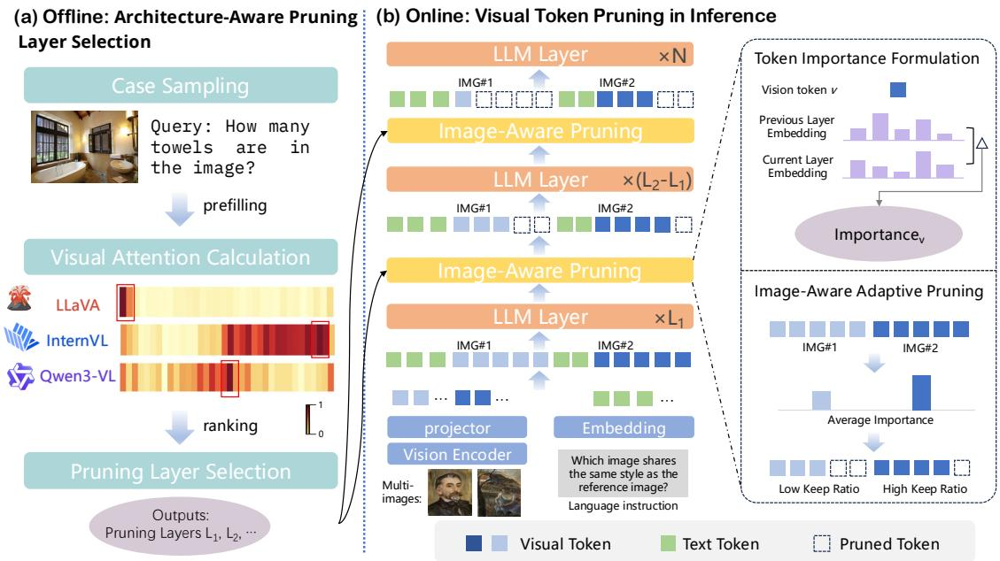
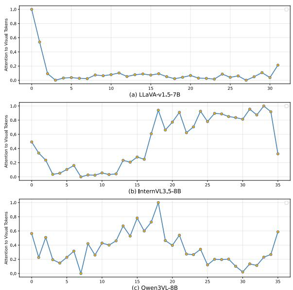
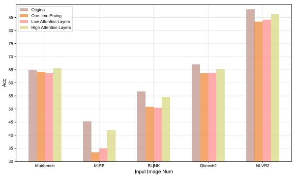

# Multi-Image Visual Token Pruning in Large Visual Language Models

Rongyang Zhang1, Chengqiang Lu2, Cong Li2, Hongchao Gu1, Tingjia Shen1, Xuyang Zhi1, Qimeng Wang2, Yan Gao2, Yi Wu2, Yao Hu2, Hao Wang1,\*, Enhong Chen1,\*

1State Key Laboratory of Cognitive Intelligence, University of Science and Technology of China 2Xiaohongshu Inc.

## Abstract

With the growing demand for processing multiple image sequences in real-world applications, various visual token pruning methods have emerged to mitigate the computational and context length constraints faced by Large Vision Language Models (LVLMs). However, most existing pruning approaches rely on static strategies that struggle to adapt across different architectural LVLMs and multi-image scenarios, and are additionally constrained by their dependence on attention computations that are incompatible with efficient techniques like FlashAttention. To address these limitations, we propose a training-free, Adaptive Visual Token Pruning (AVTP) framework, applicable to diverse LVLM architectures. We strategically determine pruning layers based on empirical analysis of visual attention distributions across various LVLMs, and implement adaptive pruning ratios in multi-image contexts where images of higher importance retain proportionally more tokens. We conduct extensive experiments across different LVLMs to demonstrate the effectiveness and robustness of AVTP. Specifically, Qwen3VL-8B achieves 2× inference speedup while maintaining 96.1% of its original accuracy on multiple multi-image benchmarks, InternVL3.5-8B retains 94.1% accuracy, and LLaVA-OV-7B even exceeds its original baseline performance. Our code is available at this link.

## 1 Introduction

Large Vision-Language Models (LVLMs) have become a research focal point, demonstrating remarkable visual understanding and reasoning capabilities (Liu et al., 2023; Li et al., 2024b; Bai et al., 2025b; Zhu et al., 2025; Team et al., 2025; Lv et al., 2026a). They are increasingly deployed in critical domains including autonomous driving, medical diagnosis, and robotics (Cui et al., 2023; Zhou et al., 2025; Li et al., 2023b; Kim et al., 2024; Wang et al., 2025a), marking significant progress toward practical multimodal AI systems. However, LVLMs encounter significant computational challenges stemming from visual data redundancy (Shao et al., 2025a; Tao et al., 2025; Yang et al., 2024; Yin et al., 2024). Visual tokens increase quadratically with the resolution, generating sequences containing thousands of tokens (Liu et al., 2024a). Given the transformers’ quadratic complexity scaling, computational costs become prohibitive. Therefore, eliminating redundant visual tokens while preserving critical information is essential for practical LVLM deployment.

To address this challenge, numerous visual tokens pruning methods (Shang et al., 2024; Liu et al., 2024b; Zhang et al., 2025b,d; Yang et al., 2025a; Chen et al., 2025a) have emerged to eliminate redundant visual tokens, thereby enhancing LVLM efficiency while preserving performance. Existing methods primarily focus on selecting the most salient tokens based on attention scores (Arif et al., 2024; Han et al., 2025; Xing et al., 2025; Lin et al., 2025; Ye et al., 2024). For example, FAST-V (Chen et al., 2024a) leverages shallow-layer attention information from the LLM backbone to measure the importance of visual tokens, retaining those deemed more significant, and VisionZip (Yang et al., 2024) utilizes attention weights from the final layer of the Vision Transformer (ViT) to remove redundant visual tokens. Other methods like LLaVAmini (Zhang et al., 2025c) employ a pre-fusion approach (Li et al., 2023a) to represent visual information using minimal tokens, and DivPrune (Alvar et al., 2025) adopts a clustering-based method to merge similar visual tokens. Despite their effectiveness, these approaches still suffer from notable limitations across three critical dimensions: mechanistically, they employ attention-based pruning strategies that are incompatible with efficient attention methods like FlashAttention; architecturally, they demonstrate limited generalizability across different LVLM designs; and contextually, they are primarily optimized for single-image scenarios rather than complex multi-image tasks, thereby limiting their applicability and personalization (Lv et al., 2026b,c) in real-world scenarios.

Specifically, (1) Mechanism incompatibility: The reliance on attention computations conflicts with attention acceleration frameworks such as FlashAttention, significantly diminishing the practical value of these pruning methods, as directly applying FlashAttention to uncompressed models often yields better overall performance than using pruning techniques that cannot leverage such optimizations. (2) Poor model generalizability: Prior work demonstrates that LLaVA models exhibit high visual token attention in shallow layers, leading to commonly adopted shallow-layer pruning approaches. However, this pattern does not generalize to other LVLM architectures, as our experimental analysis reveals that visual attention may concentrate at different layer depths, resulting in poor performance when existing methods are transferred to other models. (3) Context limitations: Existing methods are typically designed for single-image inputs and employ uniform pruning across all image tokens without considering the importance of individual tokens. In multi-image contexts, where images vary significantly in information content and relevance, this indiscriminate approach causes disproportionate information loss, leading to severe performance degradation after pruning.

As shown in the Figure 1, to address these three critical limitations and achieve efficient pruning compatible with attention acceleration methods in multi-image scenarios, we propose a unified Adaptive Visual Token Pruning (AVTP) framework with three key components that directly correspond to the identified issues. First, to tackle mechanism incompatibility, we establish a training-free pruning method based on token embedding variations across multiple layers, eliminating reliance on attention computation while providing comprehensive token importance assessment compatible with FlashAttention frameworks. Second, to address poor model generalizability, our analysis reveals that different LVLM architectures exhibit distinct visual attention patterns—LLaVA models focus on early layers while InternVL3.5 and Qwen3-VL emphasize intermediate-to-late layers. We develop an architecture-aware pruning layer selection method to automatically adapt to these architectural differences. Third, to overcome context limitations, we implement image-aware adaptive pruning rates for multi-image scenarios, assigning higher pruning rates to less relevant images while preserving critical visual information from important ones. This unified approach addresses computational efficiency, architectural generalizability, and multimodal scalability simultaneously, delivering superior acceleration with maintained accuracy across diverse models and tasks. Our contributions are:

• We discover distinct visual attention patterns across LVLM architectures and develop an architecture-aware layer selection method that addresses poor model generalizability.

• We propose an image-aware adaptive pruning strategy that dynamically adjusts keep ratios based on image importance, achieving more efficient pruning in multi-image contexts.

• We conduct extensive experiments on three mainstream LVLMs across five multi-image benchmarks, demonstrating superior performance and the effectiveness of our AVTP.

## 2 Related Work

Large Vision-Language Models. Current large vision-language models (LVLMs) integrate a vision encoder, visual projection module, and large language model to enable multi-modal comprehension. Recent work introduces higher-resolution inputs for superior performance via dynamic cropping approaches like InternVL-2.5 (Chen et al., 2025b) and LLaVA-OneVision (Li et al., 2024a), as well as native-resolution methods such as Qwen2- VL and (Wang et al., 2024c) and Seed1.5-VL (Guo et al., 2025). Similarly, video large language models (VideoLLMs) process increasingly longer sequences, as demonstrated by LLaVA-Video (Zhang et al., 2025e) and VideoLLaMA3 (Zhang et al., 2025a), with VideoXL-Pro (Liu et al., 2025b) achieves multi-hour frame-level understanding. However, this evolution substantially increases visual tokens, introducing quadratic complexity that severely limits LVLM scalability.

Token Pruning for LVLMs. Token pruning methods for LVLMs can be broadly classified into four categories (Shao et al., 2025b) based on their core mechanisms: transformation-based approaches (Liu et al., 2025a; Yao et al., 2024; Li et al., 2023c; Wang et al., 2024b) that compress tokens by directly modifying their scale or internal representation to reduce computational overhead; similarity-based techniques (Bolya et al.,

  
Figure 1: Overall framework of our proposed AVTP. Based on varying visual attention patterns across LVLMs, we first identify high-attention layers through sampling-based analysis. During inference, we perform image-aware pruning at these layers by dynamically assigning keep ratios based on image importance.

2023; Wang et al., 2025c; Alvar et al., 2025; Cao et al., 2023) that identify and eliminate redundant tokens by analyzing inherent resemblances and correlations between multimodal elements; attention-based strategies (Chen et al., 2024a; Yang et al., 2024, 2025b; Zhuang et al., 2024) that exploit the natural sparsity patterns within attention mechanisms to selectively compress less important tokens; and query-based methods (Zhang et al., 2025c; Alayrac et al., 2022; Song et al., 2024; Zhu et al., 2023) that leverage prompt guidance to strategically identify and filter out the most irrelevant tokens while preserving task-critical information. However, most of these methods perform pruning at shallow layers or before the LLM backbone, failing to account for the distinct characteristics of different LVLMs. Additionally, they treat all vision tokens as a unified entity, which often results in suboptimal performance in multi-image scenarios. Our proposed method addresses both limitations.

## 3 Method

## 3.1 Preliminary

LVLM Architecture. Large Vision Language Models (LVLMs) typically process paired inputs denoted as (T, V), where T represents the textual input and V denotes the visual input, such as images or videos. The textual input is encoded into N textual tokens $E _ { t } = \{ t _ { 1 } , . . . , t _ { N } \}$ via a text encoder. Similarly, the visual input undergoes processing through a corresponding visual encoder, which takes the visual information V as input and generates image features that are subsequently transformed into M visual tokens (where $M \gg N )$ These textual and visual tokens are then concatenated and fed into the Large Language Model (LLM) backbone to generate predictions through autoregressive decoding. Formally, the generation process for O output tokens $Y = \{ y _ { 1 } , . . . , y _ { O } \}$ is formulated as follows:

$$
P ( y _ { 1 } , . . . , y _ { O } | E _ { t } , E _ { v } ) = \prod _ { i = 1 } ^ { O } P ( y _ { i } | y _ { < i } , E _ { t } , E _ { v } )
$$

where $P ( | )$ is the conditional probability obtained at the output of the LLM.

Visual Token Pruning. The primary objective of visual token pruning is to reduce the number of redundant visual tokens, thereby decreasing the memory footprint and inference latency of vision-language models. More formally, let $E _ { v }$ denote the initial sequence containing n projected visual tokens. The task is to select a subsequence $E _ { p r u n e d } = p ( E _ { v } )$ that can concisely yet comprehensively represent the original sequence.

## 3.2 Observations

Pruning layer selection. Mainstream pruning methods typically perform attention-based pruning in the shallow layers of the LLM backbone. For instance, Fast-V (Chen et al., 2024a) retains visual tokens with higher attention values at the second layer of the LLM, based on the premise that LLMs exhibit higher overall attention distribution to visual tokens in shallow layers. However, these approaches are often limited to LLaVA-series models. We systematically evaluate the attention distribution to visual tokens across all layers of different LVLMs and find that this characteristic is not universal across all LVLMs. As illustrated in the Figure 2, LLaVA-series models indeed demonstrate higher attention distribution to visual tokens in shallow layers. However, Qwen3-VL and InternVL-3.5 exhibit different patterns, with these models showing equally high attention distribution to visual tokens in middle and deeper layers. Furthermore, we observe that this distribution pattern remains relatively stable for a given model—regardless of input variation, the layers that exhibit higher attention distribution to visual tokens are consistently the same. Therefore, we propose an architectureaware layer selection strategy for pruning, rather than being confined to shallow layers.

  
Figure 2: Attention distribution to visual tokens across layers during first token generation in different LVLMs.

Limitation in multi-image scene. Flashattention (Dao, 2023) does not return intermediate attention values. Consequently, attention-based pruning methods require additional computation and storage to maintain flash-attention compatibility, paradoxically reducing efficiency. The extra storage requirements cause frequent out-of-memory (OOM) errors in multi-image scenarios. As shown in Table 1, testing mainstream pruning methods on InternVL-3.5-8B (Wang et al., 2025b) across multi-image benchmarks using a single A100 GPU reveals frequent OOM occurrences without flash-attention, especially on MuirBench (Wang et al., 2024a) and MIRB (Zhao et al., 2024) with high visual token counts (> 8k). While DivPrune (Alvar et al., 2025) maintains flash-attention compatibility through similarity-based pruning, it shows significant performance drops on multi-image benchmarks by treating all visual tokens uniformly. Therefore, a flash-attention compatible pruning method tailored for multi-image scenarios is urgently needed.

Table 1: OOM case counts of existing vision token pruning methods on InternVL3.5-8B in multi-image benchmarks. Experiments were performed on a single A100 80GB GPU.
<table><tr><td>Models</td><td>Muirbench</td><td>MIRB</td><td>BLINK</td></tr><tr><td>SDPA Attention</td><td>248</td><td>238</td><td>0</td></tr><tr><td>Flash Attention (Dao, 2023)</td><td>0</td><td>0</td><td>0</td></tr><tr><td>FAST-V (Chen et al., 2024a)</td><td>1070</td><td>397</td><td>81</td></tr><tr><td>VisionZip (Yang et al., 2024)</td><td>1632</td><td>617</td><td>605</td></tr><tr><td>DivPrune(w/SDPA) (Alvar et al., 2025)</td><td>1451</td><td>620</td><td>695</td></tr></table>

## 3.3 Our proposed method

In this section, we present our pruning methodology comprising three components. First, we introduce a token importance assessment method based on hidden state variations across layers. Then, we describe an architecture-aware layer selection strategy that identifies optimal pruning layers based on visual token attention distributions within the LLM backbone. Finally, we present image-aware adaptive pruning that assigns different rates to images according to their importance.

## 3.3.1 Token Importance Formulation.

To achieve compatibility with efficient attention mechanisms like FlashAttention and eliminate the memory overhead of storing intermediate attention weights, we leverage the magnitude of hidden state variations of visual tokens during forward propagation through the LLM backbone to assess token importance. The method requires only forward passes and maintains full compatibility with FlashAttention. The underlying insight is that important tokens contribute more substantial gradients to the final output, thus exhibiting greater variations throughout the forward propagation process.

Specifically, for a given visual token $v _ { i }$ at layer l, we denote ${ \dot { h } } _ { v _ { i } } ^ { l }$ as its hidden state at the l-th layer and $h _ { v _ { i } } ^ { p r i o r }$ as its hidden state from the prior layer. We define the importance score $I _ { v _ { i } }$ as:

$$
I _ { v _ { i } } = 1 - S i m ( h _ { v _ { i } } ^ { l } , h _ { v _ { i } } ^ { p r i o r } )
$$

In this context, the "prior layer" denotes the immediately preceding pruning layer, with $h _ { v _ { i } } ^ { p r i o r }$ representing the token embedding obtained after the most recent pruning operation. For the initial pruning layer, $h _ { v _ { i } } ^ { p r i o r }$ corresponds to the original token embedding before any pruning interventions. By evaluating tokens based on their cumulative transformations throughout the forward propagation process, our approach identifies tokens that consistently contribute meaningful information across the network. This strategy captures the global significance of visual tokens, as their importance should be determined by sustained relevance and contribution to the model’s representational capacity across multiple computational stages, ultimately leading to more accurate and effective pruning decisions.

## 3.3.2 Architecture-Aware Pruning Layer Selection.

To address the poor model generalizability issue where existing pruning methods fail to adapt across different LVLM architectures, we develop an architecture-aware pruning layer selection strategy. As discussed in Section 3.2, while LVLMs exhibit consistent patterns in visual token attention distribution across layers within each architecture, these attention-critical layers vary systematically across different model designs.

To identify these critical layers, for a given LVLM with L layers, we sample N data instances $\{ D _ { 1 } , D _ { 2 } , . . . , D _ { N } \}$ and perform prefilling while recording the cumulative attention values that each layer $l \in \{ 1 , 2 , . . . , L \}$ assigns to all visual tokens. For each sample $D _ { i }$ , we compute the attention score $A _ { l } ^ { ( i ) }$ for layer l as:

$$
\begin{array} { r } { A _ { l } ^ { ( i ) } = \sum _ { j = 1 } ^ { M } A t t e n t i o n ( l , v _ { j } ^ { ( i ) } ) } \end{array}
$$

Where M is the number of visual tokens in sample $D _ { i } ,$ and $v _ { j } ^ { ( i ) }$ represents the j-th visual token. Based on these attention values, we rank all layers for each sample and compute the average ranking across all samples:

$$
\begin{array} { r } { R _ { l } = \frac { 1 } { N } \sum _ { i = 1 } ^ { N } R a n k ( A _ { l } ^ { ( i ) } ) } \end{array}
$$

We then select the top-k layers with the highest average attention scores as pruning layers and implement our pruning strategy on selected layers with a progressive pruning schedule, ensuring optimal performance across diverse LVLM architectures.

## 3.3.3 Image-Aware Adaptive Pruning.

To address the context limitations where existing methods employ uniform pruning across all images without considering individual importance, we develop an image-aware adaptive pruning strategy tailored for multi-image scenarios. In multi-image contexts, images exhibit varying degrees of relevance to a given query, with some images containing more task-relevant information while others contribute marginally. This heterogeneity necessitates a differentiated approach to token preservation: images with higher importance should retain more visual tokens, whereas less important images can accommodate more aggressive pruning.

For a multi-image input with K images, we compute the average importance score for image i as:

$$
\begin{array} { r } { \overline { { I } } _ { i } = \frac { 1 } { | V _ { i } | } \sum _ { v _ { j } \in V _ { i } } I _ { v _ { j } } } \end{array}
$$

where $V _ { i }$ represents the visual tokens of image i. We then assign adaptive keep ratios based on relative importance:

$$
r _ { i } = r _ { b a s e } + \alpha \cdot ( \overline { { I } } _ { i } - \overline { { I } } _ { a v g } )
$$

where $r _ { b } a s e$ is the base keep ratio, α controls the variance in pruning rates, and $\overline { { I } } _ { a v g }$ is the average importance across all images. This ensures that images with higher token importance receive elevated keep ratios, while less important images undergo more aggressive pruning.

This adaptive strategy enables fine-grained resource optimization in multi-image contexts, allocating computational resources preferentially to the most informative visual content while maintaining overall efficiency. Combined with our token importance formulation and architecture-aware layer selection, these three components systematically address the mechanism incompatibility, poor model generalizability, and context limitations of existing pruning methods, forming a unified framework that ensures both computational efficiency and performance preservation across diverse LVLM architectures and application scenarios.

## 4 Experiments

## 4.1 Experimental Setting

To demonstrate the effectiveness of our method, we conduct mainly experiments on InternVL3.5- 8B (Wang et al., 2025b), LLaVA-ov-7B (Li et al., 2024a), and Qwen3VL-8B (Bai et al., 2025a). InternVL3.5-8B is a production-oriented model that couples an 8B InternLM backbone with a dynamic-resolution ViT and 128 K context, jointly pre-trained for high-res OCR and long-document reasoning. LLaVA-OV-7B is a research-friendly open LVLM that fuses a 7B Vicuna backbone with an AnyRes ViT, jointly trained on 85M open-source image-text pairs for zero-shot transfer across singleimage, multi-image, and video tasks. Qwen3- VL-8B is a recently open-sourced, state-of-the-art multimodal model that couples an 8B-parameter Qwen3 backbone with a DeepStack ViT and a 256K-token context window. It is jointly trained for high-resolution OCR, long-video event localization, and GUI agent tasks.

Table 2: Performance comparison of various token pruning methods across different model architectures and multi-image benchmarks, with best results highlighted. In the latency part, “-” indicates that accurate measurement is not possible due to out-of-memory (OOM) cases.
<table><tr><td rowspan="2">Model</td><td rowspan="2">Method</td><td colspan="2">MuirBench</td><td colspan="2">MIRB</td><td colspan="2">BLINK</td><td colspan="2">Qbench2</td><td colspan="2">NLVR2</td></tr><tr><td>Acc↑</td><td>Latency↓</td><td>Acc↑</td><td>Latency↓</td><td>Acc↑</td><td>Latency↓</td><td>Acc↑</td><td>Latency↓</td><td>Acc↑</td><td>Latency↓</td></tr><tr><td>InternVL3.5-8B</td><td>Base</td><td>52.31</td><td>2638.22</td><td>45.51</td><td>1317.56</td><td>47.45</td><td>900.23</td><td>57.90</td><td>566.56</td><td>84.83</td><td>3764.01</td></tr><tr><td></td><td>+FAST-V</td><td>30.23</td><td></td><td>26.75</td><td></td><td>43.87</td><td></td><td>58.00</td><td></td><td>84.17</td><td></td></tr><tr><td></td><td>+VisionZip</td><td>18.46</td><td></td><td>15.99</td><td></td><td>30.46</td><td></td><td>58.00</td><td></td><td>48.80</td><td></td></tr><tr><td></td><td>+DivPrune</td><td>43.49</td><td>1909.11</td><td>34.83</td><td>952.35</td><td>41.03</td><td>821.28</td><td>45.80</td><td>483.63</td><td>79.00</td><td>4139.23</td></tr><tr><td></td><td>+V2DROP</td><td>49.31</td><td>1597.78</td><td>37.32</td><td>769.09</td><td>45.23</td><td>613.20</td><td>57.00</td><td>371.44</td><td>80.72</td><td>2522.77</td></tr><tr><td></td><td>+AVTP(Ours)</td><td>50.38</td><td>1587.38</td><td>39.68</td><td>748.43</td><td>46.77</td><td>606.74</td><td>57.80</td><td>367.94</td><td>84.44</td><td>2357.15</td></tr><tr><td>LLaVA-OneVision-7B</td><td>Base</td><td>31.92</td><td>5315.54</td><td>21.40</td><td>1602.20</td><td>44.87</td><td>1951.26</td><td>45.20</td><td>1080.90</td><td>88.37</td><td>6336.99</td></tr><tr><td></td><td>+VisionZip</td><td>32.31</td><td></td><td>21.79</td><td></td><td>42.56</td><td></td><td>48.90</td><td></td><td>78.02</td><td></td></tr><tr><td></td><td>+DivPrune</td><td>36.42</td><td>4616.83</td><td>24.61</td><td>1299.67</td><td>42.61</td><td>1625.67</td><td>51.5</td><td>892.64</td><td>84.73</td><td>5484.9</td></tr><tr><td></td><td>+V2DROP</td><td>36.54</td><td>2679.29</td><td>24.28</td><td>960.53</td><td>43.98</td><td>1182.01</td><td>50.00</td><td>741.92</td><td>88.37</td><td>3837.14</td></tr><tr><td></td><td>+AVTP(Ours)</td><td>36.50</td><td>2680.76</td><td>24.86</td><td>958.44</td><td>44.87</td><td>1188.51</td><td>52.20</td><td>747.18</td><td>88.53</td><td>3863.38</td></tr><tr><td>Qwen3VL-8B</td><td>Base</td><td>64.81</td><td>2086.79</td><td>45.21</td><td>875.92</td><td>56.71</td><td>1149.3</td><td>67.00</td><td>1560.66</td><td>87.99</td><td>4267.04</td></tr><tr><td></td><td>+FAST-V</td><td>55.15</td><td></td><td>39.59</td><td></td><td>56.60</td><td></td><td>41.10</td><td></td><td>79.45</td><td></td></tr><tr><td></td><td>+DivPrune</td><td>64.04</td><td>1799.38</td><td>40.77</td><td>772.85</td><td>52.34</td><td>824.19</td><td>65.00</td><td>1327.65</td><td>84.79</td><td>3604.06</td></tr><tr><td></td><td>+V2DROP</td><td>63.69</td><td>1348.66</td><td>36.23</td><td>637.96</td><td>50.50</td><td>676.77</td><td>63.90</td><td>1132.73</td><td>84.05</td><td>2696.68</td></tr><tr><td></td><td>+AVTP(Ours)</td><td>65.54</td><td>1454.00</td><td>41.88</td><td>684.91</td><td>54.55</td><td>700.32</td><td>65.10</td><td>1184.74</td><td>86.15</td><td>2794.22</td></tr></table>

We conduct comprehensive experiments on five multi-image benchmark datasets: MuirBench (Wang et al., 2024a), MIRB (Zhao et al., 2024), BLINK (Fu et al., 2024), Qbench2 (Zhang et al., 2024), and NLVR2 (Suhr et al., 2017). Most cases in these benchmarks involve multiple images. In particular, MuirBench comprises 2,600 cases with an average of 4.3 images per case, MIRB contains 1,013 cases with an average of 3.78 images per case, BLINK includes 1,901 cases with an average of 1.98 images per case, Q-Bench2 encompasses 1,000 cases with an average of 2.0 images per case, and NLVR2 contains 6,967 cases with an average of 2.0 images per case. We compare our approach against four state-of-the-art baseline methods: FAST-V (Chen et al., 2024a), VisionZip (Yang et al., 2024), DivPrune (Alvar et al., 2025), and V2DROP (Chen et al., 2025a). For the base setting, we implement Flash Attention 2 (Dao, 2023) as the comparative baseline. For FAST-V, we rank visual tokens based on the attention weights from output tokens to visual tokens at the second layer of the LLM. For VisionZip, we utilize the attention weights from the [CLS] token in the final layer of the ViT to rank visual tokens. For DivPrune, we perform visual token pruning prior to their input into the LLM. For V2DROP, we conduct pruning at layers 3, 17, and 22 of the LLM. In our proposed AVTP, we implement Dynamic Pruning Layer Selection. To determine the optimal pruning layers, we sampled 100 cases each from four datasets: MMBench (Liu et al., 2024c), POPE (Li et al., 2023d), ScienceQA (Lu et al., 2022), and MMStar (Chen et al., 2024b) for layer selection analysis and alpha is set to 1.0. All methods ultimately retain 50% of the visual tokens, and all experiments were conducted on a single A100 GPU.

## 4.2 Main result

As demonstrated in the table 2, we conducted comprehensive comparisons of different token pruning methods across two distinct models and five multi-image benchmarks. Selection of pruning layers was determined prior to formal experimentation using the methodology described in Section 3.3.2. In particular, for the LLaVA-onevision model, we selected only the first layer for pruning, for InternVL3.5-8B, we identified layers 1, 19, and 25 as the optimal pruning layers, and for Qwen3- VL-8B, we chose layers 1, 14, and 19. FAST-V and VisionZip encountered out-of-memory (OOM) issues on several benchmarks, which led to reduced accuracy and made reliable latency measurement impossible. In addition, LLaVA-OneVision-7B fails to produce meaningful outputs when combined with FAST-V, and Qwen3-VL-8B employs a merger module to compress ViT visual features, making it incompatible with VisionZip. Therefore, we did not conduct experiments for these two settings. Through comprehensive analysis of the experimental results, we derived several key insights:

(i)The necessity of visual token pruning in multi-image scenarios. In multi-image scenarios, the number of input images increases the overall sequence length substantially. Under such conditions, pruning visual tokens not only accelerates model inference but can also improve performance in certain cases. As shown in the table 2, our pruning framework consistently reduces inference latency across all evaluated models. Moreover, after pruning, LLaVA-OneVision-7B achieves better performance on most multi-image benchmarks compared to its non-pruned counterpart. We attribute this to the fact that, without pruning, the input sequence length exceeds the context length the model was exposed to during training, which leads to degraded performance. Pruning shortens the sequence back into the model’s “comfort zone” of context length, thereby yielding improved results.

(ii) Critical importance of compatibility with attention acceleration mechanisms in multiimage scenarios. In multi-image scenarios, models are required to process very long input sequences. Performing a global sort over attention scores after they are computed incurs substantial memory overhead, which can easily lead to out-of-memory (OOM) failures. Our experiments with VisionZip and Fast-V corroborate this issue: both methods exhibit pronounced memory bottlenecks when applied to long-sequence, multi-image inputs. Moreover, when compared to a baseline that only employs FlashAttention2, VisionZip and Fast-V do not offer any advantage in inference efficiency, which severely limits their practicality in real-world deployments. In contrast, our proposed AVTP is fully compatible with FlashAttention2 and does not introduce significant additional memory consumption. By accepting a slight degradation in performance metrics, AVTP yields substantial improvements in inference throughput and latency. This enables efficient and scalable deployment in large-scale multi-image settings while maintaining competitive model performance.

(iii) Superior performance of our AVTP method. As shown in Table 2, integrating AVTP consistently improves or matches the best accuracy while maintaining competitive latency. For InternVL3-8B, AVTP achieves the highest or nearhighest accuracy on MuirBench, BLINK, Qbench2, and NLVR2, and does so with latency comparable to or lower than other compression methods such as FAST-V, VisionZip, DivPrune, and V2DROP. A similar trend holds for LLaVA-OneVision-7B, where AVTP delivers the best overall accuracy on most benchmarks, without incurring the substantial latency overhead observed in approaches that rely on expensive attention reordering. For Qwen3VL-8B, AVTP again attains the strongest results on MuirBench and Qbench2, reinforcing that its performance gains are consistent rather than modelspecific. Overall, AVTP offers a more favorable accuracy–latency trade-off than prior methods, which may occasionally perform well on individual tasks but lack robustness across benchmarks and settings.

(iv) Consistent acceleration across different model architectures. The experiments cover three representative LVLM families—InternVL3-8B, LLaVA-OneVision-7B, and Qwen3VL-8B—which differ in backbone design, vision–language fusion mechanisms, and pretraining data. Across all these architectures, AVTP can be seamlessly integrated and yields consistent benefits, indicating that the framework is largely architecture-agnostic. In contrast, some competing methods exhibit noticeable sensitivity to the underlying model, with gains that diminish or even disappear when transferred from one LVLM to another. The stable improvements brought by AVTP across heterogeneous models demonstrate its robustness and practicality as a unified acceleration and pruning framework for large vision-language models.

These findings collectively highlight the practical advantages of our approach in real-world multi-image processing scenarios, where memory efficiency and computational acceleration are paramount considerations.

## 4.3 Ablation Study

Impact of Different Components in AVTP. To validate dynamic layer selection and image-aware adaptive pruning, we conducted comprehensive ablation experiments. For scenarios without layer selection, we used default layers 3, 17, and 22, consistent with the V2DROP implementation. As shown in Table 3, removing both dynamic layer selection (LS) and adaptive pruning rates (AP) from InternVL3.5-8B and Qwen3VL-8B causes substantial performance degradation across Muir-

Bench, MIRB, and BLINK. Reintroducing either component individually yields consistent accuracy improvements, with AP showing particularly pronounced gains on BLINK. The complete AVTP configuration achieves optimal performance across all benchmarks, demonstrating strong synergy between LS and AP. Specifically, LS dynamically identifies pruning layers, while AP calibrates pruning intensity based on image content to align with sample-specific redundancy patterns. This ablation study validates that these components drive AVTP’s superior performance.

Table 3: Impact of Different Components in AVTP. “LS” denotes that Dynamic Pruning Layer Selection, while “AP” indicates that Image-Aware Adaptive Pruning Rates.
<table><tr><td>Model</td><td>Method</td><td>Muirbench</td><td>MIRB</td><td>BLINK</td></tr><tr><td>InternVL3.5-8B</td><td>w/o LS&amp;AP</td><td>49.31</td><td>37.32</td><td>45.23</td></tr><tr><td>InternVL3.5-8B</td><td>w/o LS</td><td>50.12</td><td>38.13</td><td>45.88</td></tr><tr><td>InternVL3.5-8B</td><td>w/o AP</td><td>49.58</td><td>38.41</td><td>46.35</td></tr><tr><td>InternVL3.5-8B</td><td>AVTP</td><td>50.38</td><td>39.68</td><td>46.77</td></tr><tr><td>Qwen3VL-8B</td><td>w/o LS&amp;AP</td><td>63.69</td><td>36.23</td><td>50.50</td></tr><tr><td>Qwen3VL-8B</td><td>w/o LS</td><td>64.05</td><td>37.34</td><td>51.39</td></tr><tr><td>Qwen3VL-8B</td><td>w/o AP</td><td>64.96</td><td>38.87</td><td>53.18</td></tr><tr><td>Qwen3VL-8B</td><td>AVTP</td><td>65.54</td><td>39.88</td><td>54.55</td></tr></table>

Performance Analysis with Variable Image Quantities. To further validate the effectiveness of AVTP in multi-image scenarios, we analyzed the effect of different token pruning methods on Qwen3VL-8B under varying numbers of input images on the Muirbench. As shown in the Table 4, our proposed AVTP method consistently outperforms other approaches across varying input image quantities. AVTP achieves the highest scores in three out of four configurations, demonstrating superior performance compared to the original model. While FAST-V suffers significant performance drops (especially 37.38 for ≥ 8 images), and V2DROP shows good stability, AVTP maintains robust performance even with larger image sets, establishing its effectiveness for multi-image vision-language tasks.

Table 4: Effect of Different Pruning Methods on Qwen3VL-8B Performance Across Varying Numbers of Input Images.
<table><tr><td>Image Num</td><td>Original</td><td>FAST-V</td><td>DivPrune</td><td>V2DROP</td><td>AVTP</td></tr><tr><td>2-3</td><td>60.32</td><td>57.34</td><td>59.70</td><td>59.32</td><td>61.19</td></tr><tr><td>4-5</td><td>67.73</td><td>57.61</td><td>66.44</td><td>66.13</td><td>68.49</td></tr><tr><td>6-7</td><td>67.39</td><td>50.36</td><td>68.48</td><td>68.12</td><td>68.84</td></tr><tr><td>≥8</td><td>60.19</td><td>37.38</td><td>59.71</td><td>59.22</td><td>60.12</td></tr></table>

  
Figure 3: Performance of Different Pruning Layers on Qwen3VL-8B.

Analysis of Different Pruning Layer Effects. To evaluate the effectiveness of our layer selection strategy, we conduct comparative experiments on Qwen3VL-8B under three pruning configurations: (1) pruning only Layer 1; (2) pruning Layers 1, 17, and 26, where the latter two exhibit relatively low visual attention; and (3) applying AVTP to prune Layers 1, 14, and 19, which exhibit high visual attention. As shown in Figure 3, pruning only Layer 1 results in the lowest performance on MIRB, QBench2, and NLVR2. Similarly, pruning layers with low visual attention leads to inferior results on MuirBench and BLINK. Conversely, pruning high-attention layers consistently achieves optimal results, substantially outperforming other strategies. These results validate the effectiveness of our method and highlight the importance of selecting layers with strong visual attention.

## 5 Conclusion

In this work, we address two key limitations of existing vision token pruning methods for multimodal large language models: their dependence on specific model architectures and their suboptimal performance in multi-image scenarios. To this end, we propose Adaptive Visual Token Pruning (AVTP), a training-free framework that adaptively selects pruning layers across diverse architectures through Dynamic Pruning Layer Selection. AVTP estimates visual token importance based on hiddenstate variations, supported by theoretical analysis, and further introduces Image-Aware Adaptive Pruning Rates to allocate pruning budgets across multiple images. Extensive experiments on a range of multi-image benchmarks demonstrate that AVTP consistently outperforms existing visual token pruning methods. Moreover, ablation studies validate the effectiveness of each component and highlight their complementary benefits.

## 6 Limitations

Despite the promising results, our work has several limitations that warrant discussion.

First, several critical hyperparameters within the AVTP framework suffer from insufficient theoretical grounding and are presently established through exhaustive empirical experimentation. In particular, the top-k parameter employed in Architecture-Aware Pruning Layer Selection, the scaling factor α governing keep ratio variations in Image-Aware Adaptive Pruning, and the correlation between visual token embedding modifications and token significance, though conceptually plausible, lack formal mathematical substantiation.

Second, our experimental evaluation primarily focuses on comparisons with other visual token pruning methods, without comprehensive analysis against complementary inference acceleration techniques such as quantization and knowledge distillation. It is worth noting that our approach is inherently compatible with these orthogonal techniques and can be synergistically deployed, representing different technological pathways rather than competing alternatives.

Finally, our visual token importance formulation advances upon the established V2DROP methodology. While our approach delivers substantial performance improvements, the methodological contributions represent an evolutionary advancement rather than a fundamentally novel algorithmic paradigm.

## References

Jean-Baptiste Alayrac, Jeff Donahue, Pauline Luc, Antoine Miech, Iain Barr, Yana Hasson, Karel Lenc, Arthur Mensch, Katie Millican, Malcolm Reynolds, Roman Ring, Eliza Rutherford, Serkan Cabi, Tengda Han, Zhitao Gong, Sina Samangooei, Marianne Monteiro, Jacob Menick, Sebastian Borgeaud, and 8 others. 2022. Flamingo: a visual language model for few-shot learning. Preprint, arXiv:2204.14198.

Saeed Ranjbar Alvar, Gursimran Singh, Mohammad Akbari, and Yong Zhang. 2025. Divprune: Diversitybased visual token pruning for large multimodal models. Preprint, arXiv:2503.02175.

Kazi Hasan Ibn Arif, JinYi Yoon, Dimitrios S. Nikolopoulos, Hans Vandierendonck, Deepu John, and Bo Ji. 2024. Hired: Attention-guided token dropping for efficient inference of high-resolution visionlanguage models. Preprint, arXiv:2408.10945.

Shuai Bai, Yuxuan Cai, Ruizhe Chen, Keqin Chen, Xionghui Chen, Zesen Cheng, Lianghao Deng, Wei

Ding, Chang Gao, Chunjiang Ge, Wenbin Ge, Zhifang Guo, Qidong Huang, Jie Huang, Fei Huang, Binyuan Hui, Shutong Jiang, Zhaohai Li, Mingsheng Li, and 45 others. 2025a. Qwen3-vl technical report. Preprint, arXiv:2511.21631.

Shuai Bai, Keqin Chen, Xuejing Liu, Jialin Wang, Wenbin Ge, Sibo Song, Kai Dang, Peng Wang, Shijie Wang, Jun Tang, Humen Zhong, Yuanzhi Zhu, Mingkun Yang, Zhaohai Li, Jianqiang Wan, Pengfei Wang, Wei Ding, Zheren Fu, Yiheng Xu, and 8 others. 2025b. Qwen2.5-vl technical report. Preprint, arXiv:2502.13923.

Daniel Bolya, Cheng-Yang Fu, Xiaoliang Dai, Peizhao Zhang, Christoph Feichtenhofer, and Judy Hoffman. 2023. Token merging: Your vit but faster. Preprint, arXiv:2210.09461.

Qingqing Cao, Bhargavi Paranjape, and Hannaneh Hajishirzi. 2023. Pumer: Pruning and merging tokens for efficient vision language models. Preprint, arXiv:2305.17530.

Junjie Chen, Xuyang Liu, Zichen Wen, Yiyu Wang, Siteng Huang, and Honggang Chen. 2025a. Variation-aware vision token dropping for faster large vision-language models. Preprint, arXiv:2509.01552.

Liang Chen, Haozhe Zhao, Tianyu Liu, Shuai Bai, Junyang Lin, Chang Zhou, and Baobao Chang. 2024a. An image is worth 1/2 tokens after layer 2: Plug-andplay inference acceleration for large vision-language models. Preprint, arXiv:2403.06764.

Lin Chen, Jinsong Li, Xiaoyi Dong, Pan Zhang, Yuhang Zang, Zehui Chen, Haodong Duan, Jiaqi Wang, Yu Qiao, Dahua Lin, and 1 others. 2024b. Are we on the right way for evaluating large vision-language models? arXiv preprint arXiv:2403.20330.

Zhe Chen, Weiyun Wang, Yue Cao, Yangzhou Liu, Zhangwei Gao, Erfei Cui, Jinguo Zhu, Shenglong Ye, Hao Tian, Zhaoyang Liu, Lixin Gu, Xuehui Wang, Qingyun Li, Yiming Ren, Zixuan Chen, Jiapeng Luo, Jiahao Wang, Tan Jiang, Bo Wang, and 23 others. 2025b. Expanding performance boundaries of opensource multimodal models with model, data, and test-time scaling. Preprint, arXiv:2412.05271.

Can Cui, Yunsheng Ma, Xu Cao, Wenqian Ye, Yang Zhou, Kaizhao Liang, Jintai Chen, Juanwu Lu, Zichong Yang, Kuei-Da Liao, Tianren Gao, Erlong Li, Kun Tang, Zhipeng Cao, Tong Zhou, Ao Liu, Xinrui Yan, Shuqi Mei, Jianguo Cao, and 2 others. 2023. A survey on multimodal large language models for autonomous driving. Preprint, arXiv:2311.12320.

Tri Dao. 2023. Flashattention-2: Faster attention with better parallelism and work partitioning. Preprint, arXiv:2307.08691.

Xingyu Fu, Yushi Hu, Bangzheng Li, Yu Feng, Haoyu Wang, Xudong Lin, Dan Roth, Noah A. Smith, Wei-Chiu Ma, and Ranjay Krishna. 2024. Blink: Multimodal large language models can see but not perceive. Preprint, arXiv:2404.12390.

Dong Guo, Faming Wu, Feida Zhu, Fuxing Leng, Guang Shi, Haobin Chen, Haoqi Fan, Jian Wang, Jianyu Jiang, Jiawei Wang, Jingji Chen, Jingjia Huang, Kang Lei, Liping Yuan, Lishu Luo, Pengfei Liu, Qinghao Ye, Rui Qian, Shen Yan, and 178 others. 2025. Seed1.5-vl technical report. Preprint, arXiv:2505.07062.

Yuhang Han, Xuyang Liu, Zihan Zhang, Pengxiang Ding, Junjie Chen, Donglin Wang, Honggang Chen, Qingsen Yan, and Siteng Huang. 2025. Filter, correlate, compress: Training-free token reduction for mllm acceleration. Preprint, arXiv:2411.17686.

Moo Jin Kim, Karl Pertsch, Siddharth Karamcheti, Ted Xiao, Ashwin Balakrishna, Suraj Nair, Rafael Rafailov, Ethan Foster, Grace Lam, Pannag Sanketi, Quan Vuong, Thomas Kollar, Benjamin Burchfiel, Russ Tedrake, Dorsa Sadigh, Sergey Levine, Percy Liang, and Chelsea Finn. 2024. Openvla: An open-source vision-language-action model. Preprint, arXiv:2406.09246.

Bo Li, Yuanhan Zhang, Dong Guo, Renrui Zhang, Feng Li, Hao Zhang, Kaichen Zhang, Peiyuan Zhang, Yanwei Li, Ziwei Liu, and Chunyuan Li. 2024a. Llava-onevision: Easy visual task transfer. Preprint, arXiv:2408.03326.

Junnan Li, Dongxu Li, Silvio Savarese, and Steven Hoi. 2023a. Blip-2: Bootstrapping language-image pretraining with frozen image encoders and large language models. Preprint, arXiv:2301.12597.

Xiaoqi Li, Mingxu Zhang, Yiran Geng, Haoran Geng, Yuxing Long, Yan Shen, Renrui Zhang, Jiaming Liu, and Hao Dong. 2023b. Manipllm: Embodied multimodal large language model for object-centric robotic manipulation. Preprint, arXiv:2312.16217.

Yanwei Li, Chengyao Wang, and Jiaya Jia. 2023c. Llama-vid: An image is worth 2 tokens in large language models. Preprint, arXiv:2311.17043.

Yanwei Li, Yuechen Zhang, Chengyao Wang, Zhisheng Zhong, Yixin Chen, Ruihang Chu, Shaoteng Liu, and Jiaya Jia. 2024b. Mini-gemini: Mining the potential of multi-modality vision language models. Preprint, arXiv:2403.18814.

Yifan Li, Yifan Du, Kun Zhou, Jinpeng Wang, Wayne Xin Zhao, and Ji-Rong Wen. 2023d. Evaluating object hallucination in large vision-language models. arXiv preprint arXiv:2305.10355.

Zhihang Lin, Mingbao Lin, Luxi Lin, and Rongrong Ji. 2025. Boosting multimodal large language models with visual tokens withdrawal for rapid inference. Preprint, arXiv:2405.05803.

Haotian Liu, Chunyuan Li, Yuheng Li, Bo Li, Yuanhan Zhang, Sheng Shen, and Yong Jae Lee. 2024a. Llavanext: Improved reasoning, ocr, and world knowledge.

Haotian Liu, Chunyuan Li, Qingyang Wu, and Yong Jae Lee. 2023. Visual instruction tuning.

Juntao Liu, Liqiang Niu, Wenchao Chen, Jie Zhou, and Fandong Meng. 2025a. Laco: Efficient layer-wise compression of visual tokens for multimodal large language models. Preprint, arXiv:2507.02279.

Ting Liu, Liangtao Shi, Richang Hong, Yue Hu, Quanjun Yin, and Linfeng Zhang. 2024b. Multi-stage vision token dropping: Towards efficient multimodal large language model. Preprint, arXiv:2411.10803.

Xiangrui Liu, Yan Shu, Zheng Liu, Ao Li, Yang Tian, and Bo Zhao. 2025b. Video-xl-pro: Reconstructive token compression for extremely long video understanding. Preprint, arXiv:2503.18478.

Yuan Liu, Haodong Duan, Yuanhan Zhang, Bo Li, Songyang Zhang, Wangbo Zhao, Yike Yuan, Jiaqi Wang, Conghui He, Ziwei Liu, Kai Chen, and Dahua Lin. 2024c. Mmbench: Is your multi-modal model an all-around player? Preprint, arXiv:2307.06281.

Pan Lu, Swaroop Mishra, Tony Xia, Liang Qiu, Kai-Wei Chang, Song-Chun Zhu, Oyvind Tafjord, Peter Clark, and Ashwin Kalyan. 2022. Learn to explain: Multimodal reasoning via thought chains for science question answering. In The 36th Conference on Neural Information Processing Systems (NeurIPS).

Hang Lv, Sheng Liang, Hongchao Gu, Wei Guo, Defu Lian, Yong Liu, Hao Wang, and Enhong Chen. 2026a. Ie as cache: Information extraction enhanced agentic reasoning. Preprint, arXiv:2604.14930.

Hang Lv, Sheng Liang, Hao Wang, Hongchao Gu, Yaxiong Wu, Wei Guo, Defu Lian, Yong Liu, and Enhong Chen. 2026b. Costeer: Collaborative decoding-time personalization via local delta steering. Preprint, arXiv:2507.04756.

Hang Lv, Sheng Liang, Hao Wang, Yongyue Zhang, Hongchao Gu, Wei Guo, Defu Lian, Yong Liu, and Enhong Chen. 2026c. Specsteer: Synergizing local context and global reasoning for efficient personalized generation. Preprint, arXiv:2603.16219.

Yuzhang Shang, Mu Cai, Bingxin Xu, Yong Jae Lee, and Yan Yan. 2024. Llava-prumerge: Adaptive token reduction for efficient large multimodal models. Preprint, arXiv:2403.15388.

Kele Shao, Keda Tao, Can Qin, Haoxuan You, Yang Sui, and Huan Wang. 2025a. Holitom: Holistic token merging for fast video large language models. Preprint, arXiv:2505.21334.

Kele Shao, Keda Tao, Kejia Zhang, Sicheng Feng, Mu Cai, Yuzhang Shang, Haoxuan You, Can Qin, Yang Sui, and Huan Wang. 2025b. When tokens talk too much: A survey of multimodal long-context token compression across images, videos, and audios. Preprint, arXiv:2507.20198.

Dingjie Song, Wenjun Wang, Shunian Chen, Xidong Wang, Michael Guan, and Benyou Wang. 2024. Less is more: A simple yet effective token reduction method for efficient multi-modal llms. Preprint, arXiv:2409.10994.

Alane Suhr, Mike Lewis, James Yeh, and Yoav Artzi. 2017. A corpus of natural language for visual reasoning. In Proceedings of the 55th Annual Meeting of the Association for Computational Linguistics (Volume 2: Short Papers), pages 217–223.

Keda Tao, Can Qin, Haoxuan You, Yang Sui, and Huan Wang. 2025. Dycoke: Dynamic compression of tokens for fast video large language models. Preprint, arXiv:2411.15024.

Kimi Team, Angang Du, Bohong Yin, Bowei Xing, Bowen Qu, Bowen Wang, Cheng Chen, Chenlin Zhang, Chenzhuang Du, Chu Wei, Congcong Wang, Dehao Zhang, Dikang Du, Dongliang Wang, Enming Yuan, Enzhe Lu, Fang Li, Flood Sung, Guangda Wei, and 76 others. 2025. Kimi-vl technical report. Preprint, arXiv:2504.07491.

Fei Wang, Xingyu Fu, James Y. Huang, Zekun Li, Qin Liu, Xiaogeng Liu, Mingyu Derek Ma, Nan Xu, Wenxuan Zhou, Kai Zhang, Tianyi Lorena Yan, Wenjie Jacky Mo, Hsiang-Hui Liu, Pan Lu, Chunyuan Li, Chaowei Xiao, Kai-Wei Chang, Dan Roth, Sheng Zhang, and 2 others. 2024a. Muirbench: A comprehensive benchmark for robust multi-image understanding. Preprint, arXiv:2406.09411.

Han Wang, Yuxiang Nie, Yongjie Ye, Deng GuanYu, Yanjie Wang, Shuai Li, Haiyang Yu, Jinghui Lu, and Can Huang. 2024b. Dynamic-vlm: Simple dynamic visual token compression for videollm. Preprint, arXiv:2412.09530.

Hao Wang, Wei Guo, Luankang Zhang, Jin Yao Chin, Yufei Ye, Huifeng Guo, Yong Liu, Defu Lian, Ruiming Tang, and Enhong Chen. 2025a. Generative large recommendation models: Emerging trends in llms for recommendation. Preprint, arXiv:2502.13783.

Peng Wang, Shuai Bai, Sinan Tan, Shijie Wang, Zhihao Fan, Jinze Bai, Keqin Chen, Xuejing Liu, Jialin Wang, Wenbin Ge, Yang Fan, Kai Dang, Mengfei Du, Xuancheng Ren, Rui Men, Dayiheng Liu, Chang Zhou, Jingren Zhou, and Junyang Lin. 2024c. Qwen2-vl: Enhancing vision-language model’s perception of the world at any resolution. Preprint, arXiv:2409.12191.

Weiyun Wang, Zhangwei Gao, Lixin Gu, Hengjun Pu, Long Cui, Xingguang Wei, Zhaoyang Liu, Linglin Jing, Shenglong Ye, Jie Shao, Zhaokai Wang, Zhe Chen, Hongjie Zhang, Ganlin Yang, Haomin Wang, Qi Wei, Jinhui Yin, Wenhao Li, Erfei Cui, and 56 others. 2025b. Internvl3.5: Advancing open-source multimodal models in versatility, reasoning, and efficiency. Preprint, arXiv:2508.18265.

Zhenhailong Wang, Senthil Purushwalkam, Caiming Xiong, Silvio Savarese, Heng Ji, and Ran Xu. 2025c.

Dymu: Dynamic merging and virtual unmerging for efficient vlms. Preprint, arXiv:2504.17040.

Long Xing, Qidong Huang, Xiaoyi Dong, Jiajie Lu, Pan Zhang, Yuhang Zang, Yuhang Cao, Conghui He, Jiaqi Wang, Feng Wu, and Dahua Lin. 2025. Pyramiddrop: Accelerating your large vision-language models via pyramid visual redundancy reduction. Preprint, arXiv:2410.17247.

Cheng Yang, Yang Sui, Jinqi Xiao, Lingyi Huang, Yu Gong, Chendi Li, Jinghua Yan, Yu Bai, Ponnuswamy Sadayappan, Xia Hu, and Bo Yuan. 2025a. Topv: Compatible token pruning with inference time optimization for fast and low-memory multimodal vision language model. Preprint, arXiv:2503.18278.

Senqiao Yang, Yukang Chen, Zhuotao Tian, Chengyao Wang, Jingyao Li, Bei Yu, and Jiaya Jia. 2024. Visionzip: Longer is better but not necessary in vision language models. Preprint, arXiv:2412.04467.

Sihan Yang, Runsen Xu, Chenhang Cui, Tai Wang, Dahua Lin, and Jiangmiao Pang. 2025b. Vflowopt: A token pruning framework for lmms with visual information flow-guided optimization. Preprint, arXiv:2508.05211.

Linli Yao, Lei Li, Shuhuai Ren, Lean Wang, Yuanxin Liu, Xu Sun, and Lu Hou. 2024. Deco: Decoupling token compression from semantic abstraction in multimodal large language models. Preprint, arXiv:2405.20985.

Weihao Ye, Qiong Wu, Wenhao Lin, and Yiyi Zhou. 2024. Fit and prune: Fast and training-free visual token pruning for multi-modal large language models. Preprint, arXiv:2409.10197.

Mingjia Yin, Chuhan Wu, Yufei Wang, Hao Wang, Wei Guo, Yasheng Wang, Yong Liu, Ruiming Tang, Defu Lian, and Enhong Chen. 2024. Entropy law: The story behind data compression and llm performance. Preprint, arXiv:2407.06645.

Boqiang Zhang, Kehan Li, Zesen Cheng, Zhiqiang Hu, Yuqian Yuan, Guanzheng Chen, Sicong Leng, Yuming Jiang, Hang Zhang, Xin Li, Peng Jin, Wenqi Zhang, Fan Wang, Lidong Bing, and Deli Zhao. 2025a. Videollama 3: Frontier multimodal foundation models for image and video understanding. Preprint, arXiv:2501.13106.

Ce Zhang, Kaixin Ma, Tianqing Fang, Wenhao Yu, Hongming Zhang, Zhisong Zhang, Yaqi Xie, Katia Sycara, Haitao Mi, and Dong Yu. 2025b. Vscan: Rethinking visual token reduction for efficient large vision-language models. Preprint, arXiv:2505.22654.

Shaolei Zhang, Qingkai Fang, Zhe Yang, and Yang Feng. 2025c. Llava-mini: Efficient image and video large multimodal models with one vision token. Preprint, arXiv:2501.03895.

Yuan Zhang, Chun-Kai Fan, Junpeng Ma, Wenzhao Zheng, Tao Huang, Kuan Cheng, Denis Gudovskiy, Tomoyuki Okuno, Yohei Nakata, Kurt Keutzer, and Shanghang Zhang. 2025d. Sparsevlm: Visual token sparsification for efficient vision-language model inference. Preprint, arXiv:2410.04417.

Yuanhan Zhang, Jinming Wu, Wei Li, Bo Li, Zejun Ma, Ziwei Liu, and Chunyuan Li. 2025e. Llavavideo: Video instruction tuning with synthetic data. Preprint, arXiv:2410.02713.

Zicheng Zhang, Haoning Wu, Erli Zhang, Guangtao Zhai, and Weisi Lin. 2024. Q-bench+: A benchmark for multi-modal foundation models on lowlevel vision from single images to pairs. Preprint, arXiv:2402.07116.

Bingchen Zhao, Yongshuo Zong, Letian Zhang, and Timothy Hospedales. 2024. Benchmarking multiimage understanding in vision and language models: Perception, knowledge, reasoning, and multi-hop reasoning. Preprint, arXiv:2406.12742.

Yucheng Zhou, Lingran Song, and Jianbing Shen. 2025. Improving medical large vision-language models with abnormal-aware feedback. Preprint, arXiv:2501.01377.

Deyao Zhu, Jun Chen, Xiaoqian Shen, Xiang Li, and Mohamed Elhoseiny. 2023. Minigpt-4: Enhancing vision-language understanding with advanced large language models. Preprint, arXiv:2304.10592.

Jinguo Zhu, Weiyun Wang, Zhe Chen, Zhaoyang Liu, Shenglong Ye, Lixin Gu, Hao Tian, Yuchen Duan, Weijie Su, Jie Shao, Zhangwei Gao, Erfei Cui, Xuehui Wang, Yue Cao, Yangzhou Liu, Xingguang Wei, Hongjie Zhang, Haomin Wang, Weiye Xu, and 32 others. 2025. Internvl3: Exploring advanced training and test-time recipes for open-source multimodal models. Preprint, arXiv:2504.10479.

Jiedong Zhuang, Lu Lu, Ming Dai, Rui Hu, Jian Chen, Qiang Liu, and Haoji Hu. 2024. St3: Accelerating multimodal large language model by spatial-temporal visual token trimming. Preprint, arXiv:2412.20105.

## A Additional Ablation Experiments

In this section, we present comprehensive ablation studies to further validate our approach. Specifically, we systematically evaluate the effectiveness of AVTP on the Qwen3VL-8B model across various pruning ratios, and investigate the impact of the hyperparameter α in our Image-Aware Adaptive Pruning mechanism, which controls the variance in pruning ratios across different images. All experiments were conducted on a single A100 80GB GPU.

## A.1 Impact of Different Pruning Rates

As demonstrated in the table 5, beyond our main experiments and baseline model, we further evaluate the effectiveness of our method at keeping ratios of 20% and 5%. The results reveal that while higher pruning ratios yield improved inference efficiency, they come with a corresponding trade-off in performance. Notably, when the keep ratio is reduced to 5%, the Qwen3VL model exhibits substantial performance degradation: on MIRB, the score drops from the baseline’s 45.21% to 33.17%, and on BLINK, it decreases from 56.71% to 50.13%. In comparison, the performance at a 50% keep ratio achieves 41.88% and 65.10%, respectively, highlighting the more pronounced performance decline at the 5% retention level.

## A.2 Effect of the Hyperparameter α in Image-Aware Adaptive Pruning

In this section, we conduct an ablation study on the hyperparameter α in Image-Aware Adaptive Pruning. While α was set to 1.0 in the main experiments, we explore the effect of increasing this coefficient to amplify the influence of Image-Aware Adaptive Pruning on pruning rate allocation. It is worth noting that larger α values may lead to pruning rates exceeding valid bounds (i.e., greater than 1 or less than 0). To prevent such extreme cases, we impose constraints on the pruning rates for individual images, setting the maximum and minimum values at 95% and 5%, respectively.

As shown in the Table 6, the experimental results reveal varying impacts across different benchmarks. For benchmarks with a larger number of input images, such as Muirbench and MIRB, increasing α yields slight performance improvements. However, for benchmarks with fewer input images, including BLINK, QBench2, and NLVR2, the benefits of larger α values are marginal, and in some cases, smaller α values demonstrate superior performance.

Table 5: Ablation Study on Different Pruning Ratios
<table><tr><td rowspan="2">Model</td><td rowspan="2">Keep Ratio</td><td colspan="2">MuirBench</td><td colspan="2">MIRB</td><td colspan="2">BLINK</td><td colspan="2">Qbench2</td><td colspan="2">NLVR2</td></tr><tr><td>Acc↑</td><td>Latency↓</td><td>Acc↑</td><td>Latency↓</td><td>Acc↑</td><td>Latency↓</td><td>Acc↑</td><td>Latency↓</td><td>Acc↑</td><td>Latency↓</td></tr><tr><td>Qwen3VL-8B</td><td>Base</td><td>64.81</td><td>2086.79</td><td>45.21</td><td>875.92</td><td>56.71</td><td>1149.3</td><td>67.00</td><td>1560.66</td><td>87.99</td><td>4267.04</td></tr><tr><td></td><td>50%</td><td>65.54</td><td>1454.00</td><td>41.88</td><td>684.91</td><td>54.55</td><td>700.32</td><td>65.10</td><td>1184.74</td><td>86.15</td><td>2794.22</td></tr><tr><td></td><td>20%</td><td>65.00</td><td>1403.39</td><td>37.61</td><td>768.69</td><td>54.02</td><td>720.66</td><td>63.90</td><td>1163.92</td><td>85.79</td><td>2842.69</td></tr><tr><td></td><td>5%</td><td>64.50</td><td>1366.28</td><td>33.17</td><td>760.08</td><td>50.13</td><td>714.53</td><td>64.00</td><td>1150.51</td><td>85.80</td><td>2778.36</td></tr></table>

Table 6: Ablation Study on Hyperparameter α in Image-Aware Adaptive Pruning.
<table><tr><td>α</td><td>Muirbench</td><td>MIRB</td><td>BLINK</td><td>QBench2</td><td>NLVR2</td></tr><tr><td>1.0</td><td>65.54</td><td>41.88</td><td>54.55</td><td>65.10</td><td>86.15</td></tr><tr><td>2.0</td><td>65.27</td><td>41.95</td><td>55.18</td><td>64.70</td><td>85.80</td></tr><tr><td>3.0</td><td>65.08</td><td>42.15</td><td>55.02</td><td>64.90</td><td>86.39</td></tr><tr><td>5.0</td><td>65.65</td><td>42.56</td><td>55.02</td><td>64.70</td><td>86.42</td></tr></table>

## B Performance on Single-Image and Video Benchmarks

In the main experiments and ablation studies, we primarily evaluated the effectiveness of AVTP on multi-image benchmarks. In this section, we further demonstrate the performance of AVTP on several single-image VQA benchmarks and video benchmarks. Consistent with the main experiments, all pruning methods are configured with a uniform pruning rate of 50%, meaning that 50% of vision tokens are retained while the remaining tokens are pruned. All other experimental settings remain identical to those described in the main text, and experiments are conducted on a single A100-80GB GPU. It is important to note that we employ customconstructed prompts for evaluation, which may result in performance variations compared to official benchmark reports. Nevertheless, we ensure fair comparison by maintaining identical prompts across all methods throughout our evaluation.

## B.1 Evaluation Benchmark

MMBench. MMBench evaluates models through three hierarchical levels of abilities: L-1 with two core abilities (perception and reasoning), L-2 with six sub-abilities, and L-3 with 20 specific dimensions. This structure enables a detailed assessment of diverse capabilities.

ScienceQA. Spanning domains like natural, language, and social sciences, ScienceQA organizes questions hierarchically into 26 topics, 127 categories, and 379 skills. This benchmark evaluates multimodal understanding, multi-step reasoning, and interpretability.

POPE. POPE evaluates Object Hallucination in models using binary questions on object presence in images. Metrics such as Accuracy, Recall, Precision, and F1 Score measure hallucination levels across three sampling strategies, providing precise assessments.

MME. The MME benchmark evaluates model performance across 14 subtasks targeting perceptual and cognitive abilities. Using manually designed instruction-answer pairs, MME minimizes data leakage for fair assessment.

MVBench. MVBench defines 20 video understanding tasks that require deep comprehension of temporal dimensions, beyond single-frame analysis.

## B.2 Experimental Results

We conducted additional comparative experiments on MMBench, MMStar, POPE, MME, and MVBench, as presented in the Table 7. When applying FAST-V on MVBench, numerous out-ofmemory (OOM) cases occurred, resulting in significantly reduced accuracy and unmeasurable latency for FAST-V on this benchmark. Although our Image-Aware Adaptive Pruning does not provide benefits for single-image and video benchmarks, our AVTP method still achieves the best performance on MMBench, MMStar, MME, and MVBench. These results demonstrate the critical importance of effective pruning layer selection in optimizing model performance across diverse multimodal tasks.

Table 7: Performance on Single-Image and Video Benchmarks, “-” indicates that accurate measurement is not possible due to out-of-memory (OOM) cases.
<table><tr><td rowspan="2">Model</td><td rowspan="2">Method</td><td colspan="2">MMBench</td><td colspan="2">MMStar</td><td colspan="2">POPE</td><td colspan="2">MME</td><td colspan="2">MVBench</td></tr><tr><td>Acc↑</td><td>Latency↓</td><td>Acc↑</td><td>Latency↓</td><td>Acc↑</td><td>Latency↓</td><td>Score↑</td><td>Latency↓</td><td>Acc↑</td><td>Latency↓</td></tr><tr><td>Qwen3VL-8B</td><td>base</td><td>82.55</td><td>620.50</td><td>60.40</td><td>257.97</td><td>89.03</td><td>1150.95</td><td>2219.97</td><td>1226.64</td><td>61.53</td><td>1239.18</td></tr><tr><td rowspan="5"></td><td>+FAST-V</td><td>79.23</td><td>467.92</td><td>55.33</td><td>180.84</td><td>88.70</td><td>744.53</td><td>2163.58</td><td>718.63</td><td>45.95</td><td></td></tr><tr><td>+DivPrune</td><td>81.49</td><td>495.48</td><td>53.20</td><td>198.24</td><td>89.18</td><td>902.18</td><td>2130.12</td><td>948.46</td><td>61.03</td><td>1034.84</td></tr><tr><td>+V2DROP</td><td>81.49</td><td>462.08</td><td>57.06</td><td>170.86</td><td>88.08</td><td>770.89</td><td>2174.38</td><td>650.13</td><td>60.78</td><td>839.42</td></tr><tr><td>+AVTP(Ours)</td><td>81.77</td><td>452.42</td><td>57.13</td><td>172.19</td><td>88.11</td><td>774.11</td><td>2200.66</td><td>656.09</td><td>61.13</td><td>843.04</td></tr></table>