# NeuDonatello: Uncertainty-Aware Framework for Accurate Neural SDF Learning

Alvin Jinsung Choi∗1, 2   
6alvinjinsung@utexas.edu   
Wanhee Kim3   
2gml78905@kaist.ac.kr   
gTaeyun Kim2,4   
uktw1404@naverlabs.com   
ADasol Hong2   
7ds.hong@kaist.ac.kr   
2Wooju Lee2,5   
dnwn24@etri.re.kr   
VHyun Myung2   
Chmyung@kaist.ac.kr

1 Department of Computer Science The University of Texas at Austin Texas, USA

2 School of Electrical Engineering Korea Advanced Institute of Science and Technology (KAIST) Daejeon, Republic of Korea

3 Robotics Program Korea Advanced Institute of Science and Technology (KAIST) Daejeon, Republic of Korea

4 Robotics Group NAVERLABS Seongnam, Republic of Korea

5 Field Robotics Research Section ETRI Daejeon, Republic of Korea

## Abstract

Neural surface reconstruction has emerged as a powerful paradigm for recovering high-quality 3D surfaces from multi-view images. However, recovering accurate geometry solely from RGB images remains challenging due to uncertainties arising from textureless regions, occlusions, and inherent scene ambiguities. Existing methods often overlook such uncertainties, leading to inaccurate estimates of the signed distance function (SDF). We introduce NeuDonatello, a novel framework that models and leverages SDF uncertainty to improve surface reconstruction. Central to our approach is to model spatially varying uncertainty using a Monte Carlo sampling strategy. Using this uncertainty, we develop an adaptive regularization that selectively strengthens geometric constraints where RGB supervision is unreliable, avoiding incorrect surface reconstruction. We further introduce an uncertainty-aware scale parameter for the SDF-to-density conversion. Conditioned on uncertainty, this design enables more accurate modeling of spatially varying densities. Extensive experiments demonstrate that NeuDonatello achieves state-of-the-art reconstruction accuracy, with robust performance across diverse scenes using only posed RGB images.

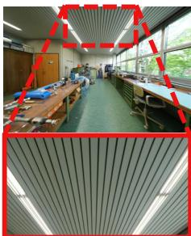  
(a)

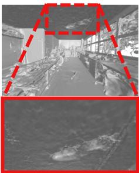  
(b)

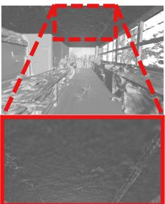  
(c)  
Figure 1: (a) Region with lighting variation and limited views. (b) Without modeling uncertainty and using uniform regularization, the model produces artifacts and inaccurate geometry. (c) The proposed method leverages uncertainty to resolve ambiguity, producing accurate surface reconstruction.

## 1 Introduction

Reconstructing 3D surfaces from multi-view RGB images remains a central topic in computer vision, with applications spanning robotics, virtual reality, and computer graphics. Traditional methods, such as structure-from-motion [2, 30, 35] and multi-view stereo [7, 23, 31], often struggle with completeness and smoothness in scenes with complex geometry or low texture. Neural implicit representations have emerged as a powerful alternative, offering improved quality through continuous scene models parameterized by neural networks. These approaches represent geometry as implicit functions, such as signed distance functions (SDFs) [13, 37, 43, 44]. Combined with differentiable volume rendering [24], they enable end-to-end optimization from posed RGB images. The continuity and smoothness of neural networks serve as a strong inductive bias, facilitating accurate 3D reconstruction even in challenging regions.

Despite recent progress, recovering accurate surfaces remains challenging. A core difficulty arises from inherent ambiguity in multi-view surface reconstruction. Given a finite set of posed RGB images, multiple surfaces can produce similar renderings, making the inverse problem under-constrained. This ambiguity is particularly prominent in regions of high uncertainty, such as areas with textureless surfaces, lighting variations, or limited views. To address this, neural surface reconstruction methods jointly optimize photometric consistency and geometric constraints. Photometric loss encourages pixel-wise consistency between the predicted and observed images, while geometric regularization losses, such as eikonal constraints [9] or smoothness terms [21, 29], promote smooth and consistent surfaces. These constraints are important in regions where RGB supervision is unreliable. However, existing methods apply regularization uniformly across the entire scene, failing to account for spatially varying uncertainty and thus limiting their effectiveness in ambiguous regions.

In this paper, we introduce NeuDonatello, a high-fidelity neural surface reconstruction framework that models an implicit SDF representation through an uncertainty-aware pipeline. Our method estimates SDF uncertainty to distinguish geometrically ambiguous regions from well-constrained areas. Estimating this uncertainty is non-trivial due to the nonlinear nature of SDF-based volume rendering, which hinders analytical uncertainty propagation. To address this, we propose a Monte Carlo sampling strategy to estimate SDF uncertainty directly from posed multi-view images. Leveraging this uncertainty, we develop an adaptive geometric regularization scheme that modulates the strength of regularization across space, allowing the model to apply stronger geometric constraints in regions where RGB supervision is unreliable. This enables accurate surface reconstruction even in the absence of auxiliary priors such as depth or normal maps. Furthermore, we introduce an uncertainty-aware SDF-to-density conversion to mitigate incorrect surface reconstruction. When the SDF prediction is unreliable, forcing a sharp boundary between empty and occupied space can lead to incorrect surfaces. Previous methods [21, 37, 38, 44] only rely on global or position-dependent scale parameters, failing to capture spatial and directional ambiguity. To address this, we condition the scale parameter on position, viewing direction, and SDF uncertainty, allowing the model to account for local ambiguity and reduce density bias. Together, these components form an uncertainty-driven framework that robustly achieves high-fidelity surface reconstruction from RGB-only supervision, as shown in Fig. 1.

We validate our approach through extensive experiments on the ScanNet++ [45] and Tanks and Temples [18] datasets, covering diverse and challenging indoor and outdoor scenes. Our method consistently outperforms existing approaches in both quantitative metrics and visual fidelity. In particular, it achieves substantial improvements in geometrically ambiguous regions, such as textureless surfaces and sparsely observed areas, demonstrating the advantage of explicitly modeling and leveraging SDF uncertainty for robust RGB-based surface reconstruction.

In summary, our main contributions are as follows:

• We propose NeuDonatello, an uncertainty-aware neural surface reconstruction framework that estimates spatially varying SDF uncertainty via Monte Carlo sampling from posed multi-view RGB images.

• We propose an adaptive geometric regularization scheme that modulates constraint strength according to local uncertainty, enabling accurate reconstruction in geometrically ambiguous regions without relying on auxiliary priors such as depth or normal maps.

• We develop an uncertainty-aware SDF-to-density conversion that conditions the scale parameter on position, viewing direction, and SDF uncertainty, effectively mitigating density bias and improving surface fidelity.

• We achieve state-of-the-art performance on challenging benchmarks, achieving consistent gains in both quantitative metrics and perceptual quality.

## 2 Related Works

## 2.1 Neural Surface Reconstruction

NeRF [24] introduced a framework for novel view synthesis using implicit neural representations and differentiable volume rendering. This paradigm has been extended to surface reconstruction by modeling geometry as an SDF and extracting surfaces via its zerolevel set. Subsequent works have enhanced representational capacity using advanced positional encodings [29, 39], incorporated auxiliary signals such as depth or normal priors [5, 6, 12, 36, 41, 46], or proposed improved SDF-to-density conversions to address density bias [37, 42, 50]. Neuralangelo [21] integrates multi-resolution hash encoding [25] with coarse-to-fine optimization and numerical gradient estimation, while NeuRodin [38] mitigates over-regularization via a two-stage training strategy. Despite these advances, prior methods rely on deterministic SDF predictions and apply geometric regularization uniformly across space, disregarding spatially varying uncertainty. In contrast, we explicitly model SDF uncertainty to guide surface learning, enabling robust and high-fidelity reconstruction even without auxiliary geometric priors such as depth or normal maps.

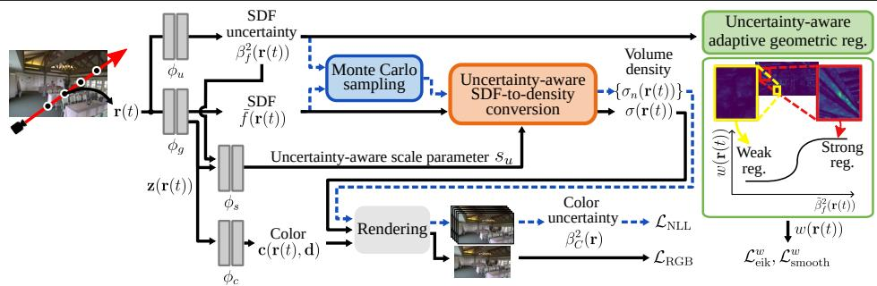  
Figure 2: The overview of NeuDonatello. The blue box and dotted lines (Sec. 3.2) represent SDF uncertainty estimation via Monte Carlo sampling, supervised by the negative log-likelihood (NLL) loss. The green box (Sec. 3.3) shows how uncertainty modulates regularization strength, which is stronger in uncertain regions (bright in the uncertainty map) and weaker in confident regions (dark), to improve geometric accuracy. The orange box (Sec. 3.4) utilizes an uncertainty-aware scale parameter for the SDF-to-density conversion. (Best viewed in color.)

## 2.2 Uncertainty in Neural Radiance Fields

Recent works have incorporated uncertainty estimation [1, 15] into neural radiance fields. NeRF-W [22] models uncertainty to account for transient objects, lighting variation, and camera inconsistencies. Subsequent approaches [14, 27, 28] leverage uncertainty for active view selection. Other methods predict model uncertainty using variational inference [33, 34] or Laplace approximations [8]. However, these approaches primarily target radiance-based models for novel view synthesis and typically use uncertainty only for post-hoc analysis or inference-time confidence estimation rather than directly influencing the optimization. A few works [26, 42] incorporate uncertainty into neural surface reconstruction, but they rely on strong geometric priors (e.g. depth priors) and interpret uncertainty as noise in external signals to filter unreliable supervision. Despite incorporating uncertainty, they still oversmooth details and fail to preserve fine geometric structures. NeuDonatello fundamentally differs in that it models uncertainty as an intrinsic property of the RGB-only inverse rendering problem and estimates it directly in the 3D SDF representation. We further integrate this uncertainty into the optimization process in a closed-loop manner, enabling the model to adaptively resolve geometrically ambiguous regions while preserving fine details.

## 3 Proposed Method

NeuDonatello reconstructs dense 3D geometry from multi-view images using an uncertaintyaware neural implicit framework. Sec. 3.1 reviews neural implicit surface reconstruction.

Sec. 3.2 introduces our uncertainty modeling approach for estimating SDF uncertainty from multi-view RGB images. Sec. 3.3 describes how this uncertainty guides adaptive geometric regularization. Sec. 3.4 presents an uncertainty-aware scale parameter for SDF-to-density conversion that reduces bias and improves density accuracy. Sec. 3.5 outlines our optimization strategy. An overview of the pipeline is shown in Fig. D.

## 3.1 Preliminaries

SDF is widely used for implicit surface representation, where the surface is defined as the zero-level set. Integrating SDF representation into NeRF’s volume rendering framework [24] has substantially improved reconstruction quality [37, 44]. Given a ray $\mathbf { r } = \{ \mathbf { r } ( t ) = \mathbf { o } + t \mathbf { d } \mid$ $t > 0 \}$ , where o is the camera origin and d is the viewing direction, a geometry network $\phi _ { g }$ predicts the SDF value $f ( \mathbf { r } ( t ) )$ and geometric features ${ \bf z } ( { \bf r } ( t ) )$ at sampled points. The SDF value is converted to volume density via a predefined function $\Phi _ { s }$ , typically the cumulative distribution function of a Laplace distribution: $\sigma ( \mathbf { r } ( t ) ) = \Phi _ { s } ( f ( \mathbf { r } ( t ) ) )$ . Here, s is a scale parameter controlling the sharpness of the surface transition. The geometric features ${ \bf z } ( { \bf r } ( t ) )$ along with the viewing direction d and surface normal $\mathbf { n } ( \mathbf { r } ( t ) ) = \nabla f ( \mathbf { r } ( t ) )$ , are passed to a color network $\phi _ { c }$ to predict the view-dependent radiance $\mathbf { c } ( \mathbf { r } ( t ) , \mathbf { d } )$ . The final pixel color $\hat { C } ( \mathbf { r } )$ is obtained via volume rendering as follows:

$$
\hat { C } ( \mathbf { r } ) = \sum _ { i = 1 } ^ { N } T ( \mathbf { r } ( t _ { i } ) ) \alpha _ { i } ( \mathbf { r } ( t _ { i } ) ) \mathbf { c } ( \mathbf { r } ( t _ { i } ) , \mathbf { d } ) ,\tag{1}
$$

where $\alpha _ { i } ( \mathbf { r } ( t _ { i } ) ) = 1 - \exp \left( - \sigma \left( \mathbf { r } ( t _ { i } ) \right) \delta \left( \mathbf { r } ( t _ { i } ) \right) \right)$ is the opacity of the i-th segment, $\delta ( \mathbf { r } ( t _ { i } ) ) =$ $\mathbf { r } ( t _ { i + 1 } ) - \mathbf { r } ( t _ { i } )$ is the spacing, and $\begin{array} { r } { T ( \mathbf { r } ( t _ { i } ) ) = \prod _ { j = 1 } ^ { i - 1 } ( 1 - \alpha _ { j } ( \mathbf { r } ( t _ { j } ) ) ) } \end{array}$ is the accumulated transmittance. Training is supervised using a photometric loss $\mathcal { L } _ { \mathrm { R G B } }$ between the rendered color $\hat { C } ( \mathbf { r } )$ and the ground-truth color $C ( \mathbf { r } )$ as follows:

$$
\mathcal { L } _ { \mathrm { R G B } } = \Vert \hat { C } ( \mathbf { r } ) - C ( \mathbf { r } ) \Vert _ { 1 } .\tag{2}
$$

To encourage geometric plausibility, regularization terms are typically applied to the predicted SDF representation. A common constraint is the eikonal loss [9] which enforces that the gradient of the SDF has unit norm:

$$
\mathcal { L } _ { \mathrm { e i k } } = \frac { 1 } { N } \sum _ { i = 1 } ^ { N } \left( \| \nabla f ( \mathbf { r } ( t _ { i } ) ) \| - 1 \right) ^ { 2 } .\tag{3}
$$

In addition, smoothness constraints [21, 29] are often applied to encourage local surface consistency. We adopt the smoothness loss from PermutoSDF [29]:

$$
\mathcal { L } _ { \mathrm { s m o o t h } } = \frac { 1 } { N } \sum _ { i = 1 } ^ { N } \left( \mathbf { n } \left( \mathbf { r } ( t _ { i } ) \right) \cdot \mathbf { n } \left( \mathbf { r } ( t _ { i } ) + \varepsilon \right) - 1 \right) ^ { 2 } ,\tag{4}
$$

where $\varepsilon$ is a small spatial offset used to evaluate normal consistency between neighboring points.

However, uniformly applying such geometric regularization fails to account for spatial uncertainty, limiting its effectiveness in ambiguous regions where stronger geometric guidance is most needed.

## 3.2 Uncertainty Modeling

We explicitly model SDF uncertainty to distinguish between confident and uncertain regions in the learned representation. Mild regularization is sufficient in well-constrained areas where RGB supervision is reliable, as the photometric loss alone provides sufficient guid ance. In contrast, highly uncertain regions benefit from stronger geometric regularization, which prevents convergence to implausible geometry and provides structural guidance.

To capture this spatial uncertainty efficiently, we adopt a Gaussian likelihood formulation [1, 15], modeling the SDF as a Gaussian distribution

$$
\mathcal { N } \left( \bar { f } ( \mathbf { r } ( t ) ) , \beta _ { f } ^ { 2 } ( \mathbf { r } ( t ) ) \right) ,\tag{5}
$$

where $\bar { f } ( \mathbf { r } ( t ) ) \in \mathbb { R }$ and $\beta _ { f } ^ { 2 } ( { \bf r } ( t ) ) \in \mathbb { R } ^ { + }$ denote the predicted mean and variance of the SDF, respectively. Both the geometry network $\phi _ { g }$ and the uncertainty network $\phi _ { u }$ are implemented as multi-layer perceptrons (MLPs). The geometry network outputs the mean SDF value and geometric features ${ \bf z } ( { \bf r } ( t ) )$ , while the uncertainty network predicts the SDF variance as follows:

$$
\begin{array} { r } { \{ \bar { f } ( \mathbf { r } ( t ) ) , \mathbf { z } ( \mathbf { r } ( t ) ) \} = \phi _ { g } ( \mathbf { r } ( t ) ) } \\ { \mathrm { a n d } \quad \beta _ { f } ^ { 2 } ( \mathbf { r } ( t ) ) = \phi _ { u } ( \mathbf { r } ( t ) ) . } \end{array}\tag{6}
$$

This formulation captures uncertainty inherent in multi-view RGB reconstruction while remaining computationally tractable for dense 3D sampling. Unlike other uncertainty estimation methods such as variational inference [4, 17] or deep ensembles [19, 48], our formulation performs a single forward pass per sampled point, making uncertainty estimation feasible during training. Consequently, the predicted uncertainty can be utilized in the optimization process as an active training signal that guides geometric refinement based on spatial reliability.

Since RGB supervision is applied in image space, we quantify the effect of SDF uncertainty on pixel colors by propagating it through the rendering process. This enables the network to receive gradients reflecting both rendered color accuracy and confidence in the underlying SDF predictions. In principle, uncertainty propagation can be performed analytically. However, the SDF-based volume rendering pipeline involves highly nonlinear components, making a closed-form solution intractable [20]. To address this, we propose a simple yet effective Monte Carlo sampling strategy to propagate SDF uncertainty to the image plane. For each point along a ray, we draw $N _ { \mathrm { m c } }$ samples from the Gaussian distribution defined by the predicted SDF mean $\bar { f } ( { \bf r } ( t ) )$ and variance $\bar { \boldsymbol { \beta } } _ { f } ^ { 2 } ( { \bf r } ( t ) )$ :

$$
f _ { n } ( \mathbf { r } ( t ) ) \overset { \mathrm { i . i . d . } } { \sim } \mathcal { N } \left( \bar { f } ( \mathbf { r } ( t ) ) , \beta _ { f } ^ { 2 } ( \mathbf { r } ( t ) ) \right) ,\tag{7}
$$

where $n = 1 , \cdots , N _ { \mathrm { m c } }$ and i.i.d. denotes that all samples are independent and identically distributed. Each sampled SDF value is converted to volume density via $\sigma _ { n } ( \mathbf { r } ( t ) ) = \Phi _ { s } \left( f _ { n } ( \mathbf { r } ( t ) ) \right)$ where s is a scale parameter. Together with the view-dependent radiance $\mathbf { c } _ { n } ( \mathbf { r } ( t ) , \mathbf { d } ) =$ $\phi _ { c } ( \mathbf { z } ( \mathbf { r } ( t ) ) , \mathbf { d } , \mathbf { n } _ { n } ( \mathbf { r } ( t ) ) )$ , the resulting densities $\sigma _ { n } ( \mathbf { r } ( t ) )$ are used in the volume rendering Eq. (1) to produce $N _ { \mathrm { m c } }$ pixel color estimates, denoted as $\{ \hat { C } _ { n } ( { \bf r } ) \} _ { n = 1 } ^ { N _ { \mathrm { m c } } }$ . The rendered color uncertainty $\beta _ { C } ^ { 2 } ( { \bf r } )$ is computed as the sample variance of these color predictions. This approach allows geometric uncertainty to be propagated into the pixel space, without requiring analytical derivatives through the rendering process.

We train the model using a negative log-likelihood (NLL) loss. Specifically, we adopt a stabilized variant [32], which has been shown to improve optimization stability. Given the ground-truth pixel color $C ( \mathbf { r } )$ and the predicted color $\hat { C } ( \mathbf { r } )$ computed from the SDF mean $\bar { f } ( { \bf r } ( t ) )$ , the loss $\mathcal { L } _ { \mathrm { N L I } }$ is defined as follows:

$$
\mathcal { L } _ { \mathrm { N L L } } = \beta _ { C } ^ { \gamma } ( \mathbf { r } ) \left( \frac { \lVert \hat { C } ( \mathbf { r } ) - C ( \mathbf { r } ) \rVert _ { 1 } } { \beta _ { C } ( \mathbf { r } ) + \varepsilon } + \log \left( \beta _ { C } ( \mathbf { r } ) + \varepsilon \right) \right) ,\tag{8}
$$

where $\varepsilon$ is a small constant for numerical stability and $\gamma \in [ 0 , 1 ]$ controls the weight of the uncertainty term. This loss formulation enables joint learning of both the predicted pixe color and its associated uncertainty $\beta _ { C } ^ { 2 } ( { \bf r } )$ . Crucially, it allows gradients to flow through both the SDF mean $\bar { f } ( { \bf r } ( t ) )$ and the SDF variance $\beta _ { f } ^ { 2 } ( { \bf r } ( t ) )$ , allowing end-to-end uncertainty learning from RGB supervision.

## 3.3 Uncertainty-Aware Adaptive Geometric Regularization

We adaptively scale geometric regularization strength based on the SDF uncertainty $\beta _ { f } ^ { 2 } ( { \bf r } ( t ) )$ which is often ignored by existing methods. High uncertainty indicates unreliable RGB supervision, where stronger geometric regularization helps guide reconstruction toward plausible surface geometry. To enable this, we compute a normalized uncertainty $\tilde { \beta } _ { f } ^ { 2 } ( \mathbf { r } ( t ) ) \breve { \in } [ 0 , 1 ]$ via min-max normalization across the current batch. We then define an adaptive weighting function $w ( \mathbf { r } ( t ) )$ to modulate regularization strength as follows:

$$
w ( \mathbf { r } ( t ) ) = \mu + \frac { \eta } { 1 + \exp \left( - k \left( \tilde { \beta } _ { f } ^ { 2 } ( \mathbf { r } ( t ) ) - \tau \right) \right) } ,\tag{9}
$$

where $\mu$ is a shift term, η is a scale factor, $k$ controls sharpness, and τ sets the midpoint threshold. In this formulation, regularization strength increases in high uncertainty regions and decreases in well-constrained areas. We apply this adaptive weight to the eikonal loss $\mathcal { L } _ { \mathrm { e i k } } ^ { w }$ and smoothness loss $\mathcal { L } _ { \mathrm { s m o o t h } } ^ { w }$ . The regularization losses are defined as:

$$
\mathcal { L } _ { \mathrm { e i k } } ^ { w } = \frac { 1 } { N } \sum _ { i = 1 } ^ { N } w ( \mathbf { r } ( t _ { i } ) ) \left( \| \nabla f ( \mathbf { r } ( t _ { i } ) ) \| - 1 \right) ^ { 2 } ,\tag{10}
$$

$$
\mathcal { L } _ { \mathrm { s m o o t h } } ^ { w } = \frac { 1 } { N } \sum _ { i = 1 } ^ { N } w \big ( \mathbf { r } ( t _ { i } ) \big ) \left( \mathbf { n } ( \mathbf { r } ( t _ { i } ) ) \cdot \mathbf { n } ( \mathbf { r } ( t _ { i } ) + \varepsilon ) - 1 \right) ^ { 2 } .\tag{11}
$$

By adaptively weighting regularization based on SDF uncertainty, our approach applies stronger regularization in uncertain regions and weaker in confident regions. This strategy enforces geometric plausibility in ambiguous areas while preserving fine details where reliable cues are present.

## 3.4 Uncertainty-Aware SDF-to-Density Conversion

In the SDF-to-density conversion $\sigma ( \mathbf { r } ( t ) ) = \Phi _ { s } ( f ( \mathbf { r } ( t ) ) )$ , the scale parameter s controls the sharpness of the density transition around the zero-level set of the SDF. A smaller s yields a sharper and thinner density profile near the surface, while a larger s produces a smoother and broader volumetric band. In ambiguous regions where SDF predictions are unreliable, a larger s helps prevent incorrect surface localization, while a smaller s is better suited for confident regions to capture sharp surface details. Prior works [38, 40] introduced positiondependent scaling to adapt the density profile based on spatial variation. Although this improves flexibility, it does not account for view-dependent texture variation and fails to incorporate geometric uncertainty into the scaling process.

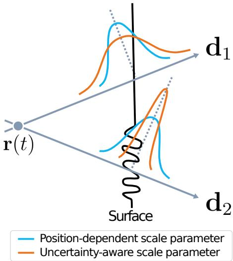  
Figure 3: Position-dependent scale parameter fails to model view-dependent density variations, leading to inaccurate reconstruction. Our uncertainty-aware scale parameter assigns high scale values in textureless regions (top) to prevent incorrect convergence and low scale values in textured regions (bottom) to enable accurate surface recovery.

To address these limitations, we propose conditioning the scale parameter not only on position but also on SDF uncertainty and viewing direction. This design enables the network to adjust the density transition accordingly to both spatial and directional ambiguity, improving convergence and reconstruction accuracy, as illustrated in Fig. E. Specifically, the scale parameter is predicted by a scale network $\phi _ { s }$ , implemented as an MLP, as follows:

$$
\begin{array} { r } { s _ { u } = \phi _ { s } \left( \mathbf { z } ( \mathbf { r } ( t ) ) , \mathbf { d } , \beta _ { f } ^ { 2 } ( \mathbf { r } ( t ) ) \right) . } \end{array}\tag{12}
$$

Conditioning on SDF uncertainty allows the scale parameter to reflect confidence in geometric predictions, promoting robust and accurate density modeling. Incorporating direction enables adjustment based on ray orientation, improving expressiveness in view-dependent regions.

## 3.5 Optimization

Our training framework adopts the two-stage optimization strategy proposed in NeuRodin [38] In the initial stage, we apply the NLL loss for uncertainty learning. We adopt the SDF-todensity conversion from VolSDF [44], augmented with our uncertainty-aware scale parameter $s _ { u }$ . Additionally, we incorporate stochastic-step numerical gradient estimation $\hat { \nabla } f$ and explicit bias correction loss $\mathcal { L } _ { \mathrm { b i a s } }$ introduced in NeuRodin, both of which are effective in mitigating over-regularization. The resulting loss at this stage is:

$$
\begin{array} { r } { \mathcal { L } _ { \mathrm { i n i t } } = \mathcal { L } _ { \mathrm { R G B } } + \lambda _ { \mathrm { N L L } } \mathcal { L } _ { \mathrm { N L L } } + \lambda _ { \mathrm { e i k } } \mathcal { L } _ { \mathrm { e i k } } ( \hat { \nabla } f ) + \lambda _ { \mathrm { b i a s } } \mathcal { L } _ { \mathrm { b i a s } } . } \end{array}\tag{13}
$$

In the refinement stage, we remove the NLL loss because the uncertainty has already been learned, and freeze the uncertainty network. Additionally, we remove the explicit bias correction and incorporate a smoothness constraint to promote local geometric consistency. For SDF-to-density conversion, we adopt the unbiased TUVR formulation [50] with the uncertainty-aware scale parameter $s _ { u } .$ , which reduces bias and better preserves fine surface details. We further include the color regularization loss $\mathcal { L } _ { \mathrm { L i p s c h i t z } }$ introduced in PermutoSDF [29]. The overall loss function for the refinement stage is:

$$
\begin{array} { r l } & { \mathcal { L } _ { \mathrm { r e f i n e } } = \mathcal { L } _ { \mathrm { R G B } } + \lambda _ { \mathrm { e i k } } \mathcal { L } _ { \mathrm { e i k } } ^ { w } ( \nabla f ) + \lambda _ { \mathrm { s m o o t h } } \mathcal { L } _ { \mathrm { s m o o t h } } ^ { w } } \\ & { \qquad + \lambda _ { \mathrm { L i p s c h i t z } } \mathcal { L } _ { \mathrm { L i p s c h i t z } } . } \end{array}\tag{14}
$$

For a detailed analysis of the impact of two-stage optimization, please refer to Neu-Rodin [38]. Additional training details are provided in the Supplementary.

## 4 Experiments

Datasets. We evaluate our method on two standard benchmarks: ScanNet++ [45] and Tanks and Temples [18]. ScanNet++ contains indoor scenes with frequent occlusions and textureless surfaces, resulting in high geometric uncertainty. Following NeuRodin [38], we report results on eight representative scenes. Tanks and Temples includes large-scale indoor and outdoor environments with diverse surface types, providing a challenging testbed. We evaluate diverse methods on six scenes from the training subset, following Neuralangelo [21].

Baselines. For the ScanNet++ dataset, we compare our method with approaches that do not rely on external priors, including VolSDF [44], Neuralangelo [21], and NeuRodin [38], as well as MonoSDF [46], which incorporates monocular cues. For the Tanks and Temples dataset, we benchmark against COLMAP [30] and recent neural methods such as Neural-Warp [5], NeuS [37], Geo-NeuS [6], Neuralangelo [21], and NeuRodin [38].

Metrics. We extract meshes using marching cubes at a fixed resolution of 2,048, and evaluate reconstruction quality using six standard metrics: Accuracy, Completeness, Chamfer Distance, Precision, Recall, and F1-score.

Implementation Details. We use a multi-resolution hash grid for spatial encoding with 16 levels and resolutions from $2 ^ { 5 } \mathrm { t o } 2 ^ { 1 1 }$ . Each entry stores an 8-dimensional feature vector, and each level contains up to $2 ^ { 1 9 }$ entries. We set $N _ { \mathrm { m c } } = 1 0$ . The loss weights are: $\lambda _ { \mathrm { N L L } } = 0 . 0 1$ $\lambda _ { \mathrm { e i k } } = 0 . 0 1 , \lambda _ { \mathrm { s m o o t h } } = 0 . 0 0 5$ , and $\lambda _ { \mathrm { L i p s c h i t z } } = 1 0 ^ { - 5 } . \lambda _ { \mathrm { b i a s } }$ is set to 0.2 for outdoor scenes and linearly increased from 0.001 to 0.1 over the first 10,000 iterations for indoor scenes. For the adaptive weighting function $w ( \mathbf { r } ( t ) )$ , the shift µ is 0.8, scale η is 1.0, sharpness k is 10.0, and midpoint τ is 0.5. Additional details are provided in the Supplementary.

## 4.1 ScanNet++

We present quantitative results in Tab. 1 and qualitative comparisons in Fig. F on the Scan-Net++ dataset. All methods are reproduced and evaluated on version 2, which differs from version 1 used in NeuRodin.1 NeuDonatello achieves state-of-the-art performance, outperforming prior RGB-only methods that do not model uncertainty and rely on uniform regularization without accounting for spatial ambiguity. We further compare with MonoSDF, a representative method incorporating monocular priors. NeuDonatello also surpasses MonoSDF, demonstrating that accurate geometry can be recovered without external geometric information by leveraging estimated uncertainty and jointly exploiting uncertainty-aware SDF-todensity conversion and adaptive geometric regularization.

<table><tr><td rowspan="2">Method</td><td colspan="6">Metric</td></tr><tr><td>Acc. (4)</td><td>Comp. (4)</td><td>Pre. (↑)</td><td>Recall (↑)</td><td>Chamfer (4)</td><td>F1-score (↑)</td></tr><tr><td>MonoSDF-MLP* [46]</td><td>0.053</td><td>0.052</td><td>0.542</td><td>0.546</td><td>0.053</td><td>0.542</td></tr><tr><td>MonoSDF-Grid* [46]</td><td>0.065</td><td>0.040</td><td>0.579</td><td>0.624</td><td>0.052</td><td>0.599</td></tr><tr><td>VolSDF [4]</td><td>0.119</td><td>0.193</td><td>0.336</td><td>0.267</td><td>0.156</td><td>0.296</td></tr><tr><td>Neuralangelo []]</td><td>0.156</td><td>0.092</td><td>0.492</td><td>0.557</td><td>0.124</td><td>0.534</td></tr><tr><td>NeuRodin [B8]</td><td>0.087</td><td>0.050</td><td>0.592</td><td>0.606 0.627</td><td>0.069</td><td>0.596</td></tr><tr><td>NeuDonatello (Ours)</td><td>0.052</td><td>0.047</td><td>0.618</td><td></td><td>0.049</td><td>0.621</td></tr></table>

Table 1: Quantitative results on ScanNet++ dataset. Best result (bold). Second best result (underlined). \* indicates methods that use monocular depth and normal priors.

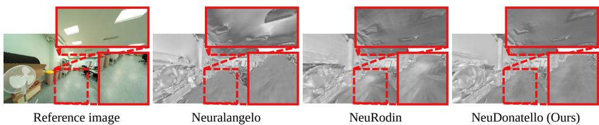  
Figure 4: Qualitative results on ScanNet++ dataset.

Our uncertainty-aware modules reduce artifacts and structural degradation in geometrically ambiguous regions, including ceilings and floors. These areas suffer from unreliable RGB supervision due to low texture or strong reflections, making reconstruction particularly challenging. In Fig. F, the textureless ceiling and reflective floor cause failure cases in other methods: Neuralangelo produces a hole in the ceiling, while NeuRodin exhibits floor collapse. In contrast, NeuDonatello preserves surface continuity and accurately reconstructs geometry by leveraging SDF uncertainty to guide regularization and density modeling.

## 4.2 Tanks and Temples

We show quantitative results in Tab. 2 and qualitative comparisons in Fig. G on the Tanks and Temples dataset. NeuDonatello achieves the highest mean F1-score and consistently outperforms prior methods across both indoor and outdoor scenes. It demonstrates strong performance particularly in challenging cases with sparse views and textureless surfaces, such as Barn and Meetingroom. The adaptive geometric regularization helps preserve plausible structure in poorly observed regions, while the uncertainty-aware scale parameter maintains fine details and prevents convergence to erroneous surfaces.

Qualitative comparisons further highlight the benefits of our uncertainty-aware components under challenging conditions. In Fig. G, the roof region is sparsely observed due to limited camera coverage, making it difficult to reconstruct accurately. As a result, Neuralangelo and NeuRodin exhibit surface collapse or noticeable geometric deformation in this area. In contrast, NeuDonatello accurately preserves the overall structure and surface continuity by effectively leveraging the predicted SDF uncertainty.

<table><tr><td rowspan="2">Method</td><td colspan="6">Scene</td><td rowspan="2"></td></tr><tr><td>Barn</td><td>Caterpillar Courthouse Ignatius Meetingroom</td><td></td><td></td><td></td><td>Truck Mean</td></tr><tr><td>COLMAP [B0]</td><td>0.55</td><td>0.01</td><td>0.11</td><td>0.22</td><td>0.19</td><td>0.19</td><td>0.21</td></tr><tr><td>NeuS []</td><td>0.29</td><td>0.29</td><td>0.17</td><td>0.83</td><td>0.24</td><td>0.45</td><td>0.38</td></tr><tr><td>NeuralWarp []</td><td>0.22</td><td>0.18</td><td>0.08</td><td>0.02</td><td>0.08</td><td>0.35</td><td>0.15</td></tr><tr><td>Geo-NeuS [[]</td><td>0.33</td><td>0.26</td><td>0.12</td><td>0.72</td><td>0.20</td><td>0.45</td><td>0.35</td></tr><tr><td>Neuralangelo [[]]</td><td>0.70</td><td>0.36</td><td>0.28</td><td>0.89</td><td>0.32</td><td>0.48</td><td>0.50</td></tr><tr><td>NeuRodin [B8]</td><td>0.70</td><td>0.36</td><td>0.21</td><td>0.87</td><td>0.43</td><td>0.47</td><td>0.51</td></tr><tr><td>NeuDonatello (Ours)</td><td>0.71</td><td>0.37</td><td>0.22</td><td>0.85</td><td>0.44</td><td>0.48</td><td>0.51</td></tr></table>

Table 2: Quantitative results (F1-score (↑)) on Tanks and Temples dataset. Best result (bold). Second best result (underlined).

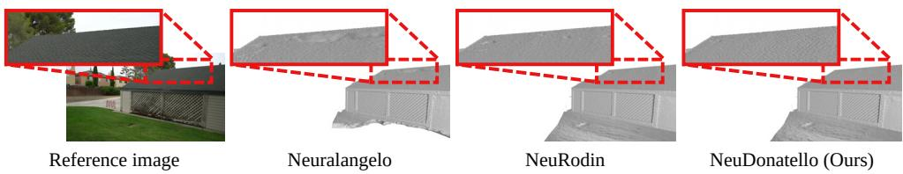  
Figure 5: Qualitative results on Tanks and Temples dataset.

## 4.3 Ablations

We conduct an ablation study to analyze the contribution of each uncertainty-aware component in our framework on the ScanNet++ dataset. As shown in Fig. I, starting from the base model, introducing the NLL loss alone does not directly enhance surface quality and produces artifacts in highly uncertain regions. Nevertheless, it enables SDF uncertainty estimation and lays the foundation for downstream modules that explicitly leverage uncertainty during training. Applying adaptive geometric regularization improves surface fidelity by enforcing stronger constraints in ambiguous regions while preserving fine details in wellconstrained areas. Finally, incorporating the uncertainty-aware scale parameter further refines surface reconstruction by reducing density bias near the zero-level set. Tab. 3 quantitatively confirms these observations, showing a consistent improvement in various metrics and the overall reconstruction quality as each component is integrated into the framework.

We also evaluate the impact of conditioning the scale parameter on SDF uncertainty. Tab. 4 reports the quantitative results on the ScanNet++ dataset when the scale parameter is conditioned on position, direction, and SDF uncertainty, compared with conditioning only on position and direction or on position alone. Incorporating SDF uncertainty leads to an improvement in reconstruction performance, as it provides explicit information about local geometric ambiguity. This allows the model to predict scale values that better reflect the confidence of the SDF estimates, resulting in a more accurate density modeling and more stable surface reconstruction.

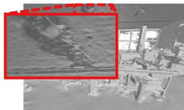  
Base

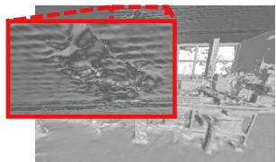  
Base+N

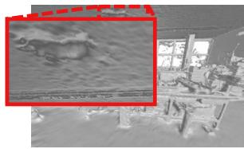  
Base+N+A

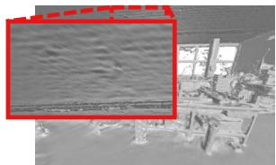  
Base+N+A+U

Figure 6: Ablation results. N: adds NLL loss for uncertainty learning. A: applies adaptive geometric regularization. U: incorporates uncertainty-aware scale parameter.
<table><tr><td>NLL loss (N)</td><td>Adaptive geo. reg. (A)</td><td>Uncertainty-aware scale param. (U)</td><td>Acc. (↓)</td><td>Comp. (↓)</td><td>Pre. (↑)</td><td>(↑)</td><td>(↓)</td><td>Recall Chamfer F1-Score (↑)</td></tr><tr><td></td><td></td><td></td><td>0.088</td><td>0.048</td><td>0.580</td><td>0.602</td><td>0.068</td><td>0.591</td></tr><tr><td>√</td><td></td><td></td><td>0.081</td><td>0.049</td><td>0.583</td><td>0.603</td><td>0.065</td><td>0.593</td></tr><tr><td>√</td><td>√</td><td>√</td><td>0.073 0.052</td><td>0.048</td><td>0.598</td><td>0.619</td><td>0.061</td><td>0.607</td></tr><tr><td>√</td><td>√</td><td></td><td></td><td>0.047</td><td>0.618</td><td>0.627</td><td>0.050</td><td>0.621</td></tr></table>

Table 3: Ablation results of uncertainty-aware components evaluated on the ScanNet++ dataset.

<table><tr><td>Position Direction SDF uncertainty</td><td></td><td>Acc. (↓)</td><td>Comp. (↓)</td><td>Pre. (↑)</td><td>Recall (↑)</td><td>(↓)</td><td>1 Chamfer F1-Score (↑)</td></tr><tr><td>√</td><td></td><td>0.073</td><td>0.048</td><td>0.598</td><td>0.619</td><td>0.061</td><td>0.607</td></tr><tr><td>√ √</td><td></td><td>0.054</td><td>0.047</td><td>0.614</td><td>0.622</td><td>0.051</td><td>0.616</td></tr><tr><td>√ √</td><td>√</td><td>0.052</td><td>0.047</td><td>0.618</td><td>0.627</td><td>0.050</td><td>0.621</td></tr></table>

Table 4: Ablation results of scale parameter conditioning evaluated on the ScanNet++ dataset.

## 4.4 Analysis on Uncertainty Estimation

To validate that our uncertainty module captures intrinsic geometric ambiguity from RGB images alone, we analyze the relationship between predicted uncertainty and true geometric error. Given a reconstructed mesh M and ground truth ${ \mathcal { M } } ^ { \mathrm { g t } }$ , we compute for each vertex $\nu _ { i } \in$ M its SDF uncertainty $\beta _ { f } ^ { 2 } ( \nu _ { i } )$ and geometric error $e ( \nu _ { i } ) = \| \nu _ { i } - \Pi _ { \mathcal { M } ^ { \mathrm { g t } } } ( \nu _ { i } ) \| _ { 2 }$ , where $\Pi _ { \mathcal { M } ^ { \mathrm { g t } } } ( \cdot )$ denotes the closest-point projection onto the ${ \mathcal { M } } ^ { \mathrm { g t } }$ . We perform a sparsification analysis by removing vertices based on either geometric error (oracle) or predicted uncertainty, and compute the mean absolute error (MAE) of the remaining vertices. We then report the MAE gap relative to the oracle (∆MAE) as well as the area under the sparsification error curve (AUSE).

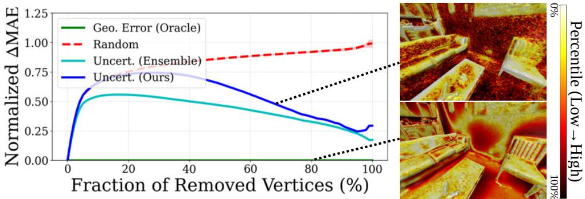  
Figure 7: Sparsification curve evaluated on the ScanNet++ dataset.

<table><tr><td>Method</td><td>Random</td><td>Ensemble</td><td>NeuDonatello (Ours)</td></tr><tr><td>Mean AUSE (↓)</td><td>0.721</td><td>0.376</td><td>0.458</td></tr></table>

Table 5: AUSE results evaluated on the ScanNet++ dataset.

<table><tr><td>Method</td><td>Baseline</td><td>Ensemble</td><td>NeuDonatello (Ours)</td></tr><tr><td>Time/iter (s)</td><td>0.11</td><td>0.82</td><td>0.14</td></tr><tr><td>VRAM (GB)</td><td>5.4</td><td>16.2</td><td>7.9</td></tr></table>

Table 6: Computational cost analysis.

The analysis is conducted directly in 3D, consistent with the uncertainty representation. We compare against random removal and an ensemble-based baseline, as no prior work estimates uncertainty in the 3D SDF representation. As shown in Fig. J, uncertainty-guided sparsification outperforms random removal and achieves performance comparable to the ensemble baseline, while being substantially faster. The correspondence between uncertainty and error, together with low AUSE values (Tab. 5), confirms that our method correctly identifies ambiguous regions in RGB-only surface reconstruction.

## 4.5 Analysis on Efficiency

We report computational cost in Tab. 6. We compare against our baseline, which removes all uncertainty-aware modules. This baseline has identical computational cost to NeuRodin [38]. We further compare against an ensemble-based baseline to evaluate the computational overhead of alternative uncertainty estimation approaches.

Our Monte Carlo sampling is implemented in a GPU-parallel manner, introducing only modest overhead relative to the baseline while remaining substantially more efficient than the ensemble-based method. This design remains computationally tractable even under dense 3D ray sampling, as stochastic evaluations are fully parallelized and does not require repeated full-network forward passes. These results demonstrate that our uncertainty modeling achieves strong performance gains with minimal additional computational cost.

## 5 Conclusion

We propose NeuDonatello, an uncertainty-aware neural surface reconstruction framework that estimates SDF uncertainty from posed multi-view images and leverages it to guide accurate geometry reconstruction. Through Monte Carlo sampling, we identify geometrically ambiguous regions and adaptively modulate geometric regularization strength. We further introduce an uncertainty-aware SDF-to-density conversion by conditioning the scale parameter on position, direction, and uncertainty, thereby reducing bias and improving surface accuracy. Experiments on ScanNet++ and Tanks and Temples demonstrate that NeuDonatello outperforms prior methods, particularly in challenging regions with low texture or sparse views, highlighting the importance of uncertainty modeling in neural reconstruction. In future work, we plan to extend our framework to handle non-posed inputs and dynamic scenes for broader real-world applicability.

## References

[1] Moloud Abdar, Farhad Pourpanah, Sadiq Hussain, Dana Rezazadegan, Li Liu, Mohammad Ghavamzadeh, Paul Fieguth, Xiaochun Cao, Abbas Khosravi, U Rajendra Acharya, et al. A review of uncertainty quantification in deep learning: Techniques, applications and challenges. Information Fusion, 76:243–297, 2021.

[2] Sameer Agarwal, Yasutaka Furukawa, Noah Snavely, Ian Simon, Brian Curless, Steven M Seitz, and Richard Szeliski. Building Rome in a day. Communications ofthe ACM, 54(10):105–112, 2011.

[3] Jonathan T Barron, Ben Mildenhall, Dor Verbin, Pratul P Srinivasan, and Peter Hedman. Mip-NeRF 360: Unbounded anti-aliased neural radiance fields. In Proceedings of the IEEE/CVF Conference on Computer Vision and Pattern Recognition (CVPR), pages 5470–5479, 2022.

[4] Charles Blundell, Julien Cornebise, Koray Kavukcuoglu, and Daan Wierstra. Weight uncertainty in neural network. In Proceedings ofthe ACM International Conference on Machine Learning (ICML), pages 1613–1622, 2015.

[5] François Darmon, Bénédicte Bascle, Jean-Clément Devaux, Pascal Monasse, and Mathieu Aubry. Improving neural implicit surfaces geometry with patch warping. In Proceedings ofthe IEEE/CVF Conference on Computer Vision and Pattern Recognition (CVPR), pages 6250–6259, 2022.

[6] Qiancheng Fu, Qingshan Xu, Yew Soon Ong, and Wenbing Tao. Geo-Neus: Geometryconsistent neural implicit surfaces learning for multi-view reconstruction. Advances in Neural Information Processing Systems (NeurIPS), 35:3403–3416, 2022.

[7] Yasutaka Furukawa and Jean Ponce. Accurate, dense, and robust multiview stereopsis. IEEE Transactions on Pattern Analysis and Machine Intelligence (T-PAMI), 32(8): 1362–1376, 2010.

[8] Lily Goli, Cody Reading, Silvia Sellán, Alec Jacobson, and Andrea Tagliasacchi. Bayes’ Rays: Uncertainty quantification in neural radiance fields. In Proceedings of

the IEEE/CVF Conference on Computer Vision and Pattern Recognition (CVPR), pages 20061–20070, 2024.

[9] Amos Gropp, Lior Yariv, Niv Haim, Matan Atzmon, and Yaron Lipman. Implicit geometric regularization for learning shapes. In Proceedings of the ACM International Conference on Machine Learning (ICML), pages 3789–3799, 2020.

[10] Antoine Guédon and Vincent Lepetit. SuGaR: Surface-aligned Gaussian splatting for efficient 3D mesh reconstruction and high-quality mesh rendering. In Proceedings of the IEEE/CVF Conference on Computer Vision and Pattern Recognition (CVPR), pages 5354–5363, 2024.

[11] Binbin Huang, Zehao Yu, Anpei Chen, Andreas Geiger, and Shenghua Gao. 2D Gaussian splatting for geometrically accurate radiance fields. In Proceedings of the Annual Conference on Computer Graphics and Interactive Techniques (SIGGRAPH), pages 1–11, 2024.

[12] Han Huang, Yulun Wu, Junsheng Zhou, Ge Gao, Ming Gu, and Yu-Shen Liu. NeuSurf: On-surface priors for neural surface reconstruction from sparse input views. In Proceedings of the AAAI Conference on Artificial Intelligence (AAAI), volume 38, pages 2312–2320, 2024.

[13] Shi-Sheng Huang, Zixin Zou, Yichi Zhang, Yan-Pei Cao, and Ying Shan. SC-NeuS: Consistent neural surface reconstruction from sparse and noisy views. In Proceedings ofthe AAAI Conference on Artificial Intelligence (AAAI), volume 38, pages 2357–2365, 2024.

[14] Liren Jin, Xieyuanli Chen, Julius Rückin, and Marija Popovic. NeU-NBV: Next best´ view planning using uncertainty estimation in image-based neural rendering. In Proceedings ofthe IEEE/RSJ International Conference on Intelligent Robots and Systems (IROS), pages 11305–11312, 2023.

[15] Alex Kendall and Yarin Gal. What uncertainties do we need in Bayesian deep learning for computer vision? Advances in Neural Information Processing Systems (NeurIPS), 30:5580–5590, 2017.

[16] Bernhard Kerbl, Georgios Kopanas, Thomas Leimkühler, and George Drettakis. 3D Gaussian splatting for real-time radiance field rendering. ACM Transactions on Graphics (TOG), 42(4):139–1, 2023.

[17] Durk P Kingma, Tim Salimans, and Max Welling. Variational dropout and the local reparameterization trick. Advances in Neural Information Processing Systems (NeurIPS), 28:2575–2583, 2015.

[18] Arno Knapitsch, Jaesik Park, Qian-Yi Zhou, and Vladlen Koltun. Tanks and Temples: Benchmarking large-scale scene reconstruction. ACM Transactions on Graphics (TOG), 36(4):1–13, 2017.

[19] Balaji Lakshminarayanan, Alexander Pritzel, and Charles Blundell. Simple and scalable predictive uncertainty estimation using deep ensembles. Advances in Neural Information Processing Systems (NeurIPS), 30:6405–6416, 2017.

[20] Sibeak Lee, Kyeongsu Kang, Seongbo Ha, and Hyeonwoo Yu. Bayesian NeRF: Quantifying uncertainty with volume density for neural implicit fields. IEEE Robotics and Automation Letters, 10(3):2144–2151, 2025.

[21] Zhaoshuo Li, Thomas Müller, Alex Evans, Russell H Taylor, Mathias Unberath, Ming-Yu Liu, and Chen-Hsuan Lin. Neuralangelo: High-fidelity neural surface reconstruction. In Proceedings of the IEEE/CVF Conference on Computer Vision and Pattern Recognition (CVPR), pages 8456–8465, 2023.

[22] Ricardo Martin-Brualla, Noha Radwan, Mehdi S. M. Sajjadi, Jonathan T. Barron, Alexey Dosovitskiy, and Daniel Duckworth. NeRF in the wild: Neural radiance fields for unconstrained photo collections. In Proceedings of the IEEE/CVF Conference on Computer Vision and Pattern Recognition (CVPR), pages 7206–7215, 2021.

[23] Paul Merrell, Amir Akbarzadeh, Liang Wang, Philippos Mordohai, Jan-Michael Frahm, Ruigang Yang, David Nistér, and Marc Pollefeys. Real-time visibility-based fusion of depth maps. In Proceedings of the IEEE/CVF International Conference on Computer Vision (ICCV), pages 1–8, 2007.

[24] Ben Mildenhall, Pratul P Srinivasan, Matthew Tancik, Jonathan T Barron, Ravi Ramamoorthi, and Ren Ng. NeRF: Representing scenes as neural radiance fields for view synthesis. In Proceedings of the European Conference on Computer Vision (ECCV), pages 405–421, 2020.

[25] Thomas Müller, Alex Evans, Christoph Schied, and Alexander Keller. Instant neural graphics primitives with a multiresolution hash encoding. ACM Transactions on Graphics (TOG), 41(4):1–15, 2022.

[26] Junfeng Ni, Yixin Chen, Bohan Jing, Nan Jiang, Bin Wang, Bo Dai, Puhao Li, Yixin Zhu, Song-Chun Zhu, and Siyuan Huang. PhyRecon: Physically plausible neural scene reconstruction. Advances in Neural Information Processing Systems (NeurIPS), 37: 25747–25780, 2024.

[27] Xuran Pan, Zihang Lai, Shiji Song, and Gao Huang. ActiveNeRF: Learning where to see with uncertainty estimation. In Proceedings of the European Conference on Computer Vision (ECCV), pages 230–246, 2022.

[28] Yunlong Ran, Jing Zeng, Shibo He, Jiming Chen, Lincheng Li, Yingfeng Chen, Gimhee Lee, and Qi Ye. NeurAR: Neural uncertainty for autonomous 3D reconstruction with implicit neural representations. IEEE Robotics and Automation Letters, 8(2): 1125–1132, 2023.

[29] Radu Alexandru Rosu and Sven Behnke. PermutoSDF: Fast multi-view reconstruction with implicit surfaces using permutohedral lattices. In Proceedings of the IEEE/CVF Conference on Computer Vision and Pattern Recognition (CVPR), pages 8466–8475, 2023.

[30] Johannes L Schönberger and Jan-Michael Frahm. Structure-from-motion revisited. In Proceedings of the IEEE/CVF Conference on Computer Vision and Pattern Recognition (CVPR), pages 4104–4113, 2016.

[31] Johannes L Schönberger, Enliang Zheng, Jan-Michael Frahm, and Marc Pollefeys. Pixelwise view selection for unstructured multi-view stereo. In Proceedings of the European Conference on Computer Vision (ECCV), pages 501–518, 2016.

[32] Maximilian Seitzer, Arash Tavakoli, Dimitrije Antic, and Georg Martius. On the pitfalls of heteroscedastic uncertainty estimation with probabilistic neural networks. In Proceedings ofthe The International Conference on Learning Representations (ICLR), 2022.

[33] Jianxiong Shen, Adria Ruiz, Antonio Agudo, and Francesc Moreno-Noguer. Stochastic neural radiance fields: Quantifying uncertainty in implicit 3D representations. In Proceedings ofthe International Conference on 3D Vision (3DV), pages 972–981, 2021.

[34] Jianxiong Shen, Antonio Agudo, Francesc Moreno-Noguer, and Adria Ruiz. Conditional-flow NeRF: Accurate 3D modelling with reliable uncertainty quantification. In Proceedings of the European Conference on Computer Vision (ECCV), pages 540–557, 2022.

[35] Noah Snavely, Steven M Seitz, and Richard Szeliski. Photo tourism: Exploring photo collections in 3D. ACM Transactions on Graphics (TOG), 25(3):835–846, 2006.

[36] Jiepeng Wang, Peng Wang, Xiaoxiao Long, Christian Theobalt, Taku Komura, Lingjie Liu, and Wenping Wang. NeuRIS: Neural reconstruction of indoor scenes using normal priors. In Proceedings of the European Conference on Computer Vision (ECCV), pages 139–155, 2022.

[37] Peng Wang, Lingjie Liu, Yuan Liu, Christian Theobalt, Taku Komura, and Wenping Wang. NeuS: Learning neural implicit surfaces by volume rendering for multi-view reconstruction. Advances in Neural Information Processing Systems (NeurIPS), 34: 27171–27183, 2021.

[38] Yifan Wang, Di Huang, Weicai Ye, Guofeng Zhang, Wanli Ouyang, and Tong He. NeuRodin: A two-stage framework for high-fidelity neural surface reconstruction. Advances in Neural Information Processing Systems (NeurIPS), 37:103168–103197, 2024.

[39] Yiming Wang, Qin Han, Marc Habermann, Kostas Daniilidis, Christian Theobalt, and Lingjie Liu. NeuS2: Fast learning of neural implicit surfaces for multi-view reconstruction. In Proceedings of the IEEE/CVF International Conference on Computer Vision (ICCV), pages 3272–3283, 2023.

[40] Zian Wang, Tianchang Shen, Merlin Nimier-David, Nicholas Sharp, Jun Gao, Alexander Keller, Sanja Fidler, Thomas Müller, and Zan Gojcic. Adaptive shells for efficient neural radiance field rendering. ACM Transactions on Graphics (TOG), 42(6):1–15, 2023.

[41] Yulun Wu, Han Huang, Wenyuan Zhang, Chao Deng, Ge Gao, Ming Gu, and Yu-Shen Liu. Sparis: Neural implicit surface reconstruction of indoor scenes from sparse views. In Proceedings of the AAAI Conference on Artificial Intelligence (AAAI), volume 39, pages 8514–8522, 2025.

[42] Yuting Xiao, Jingwei Xu, Zehao Yu, and Shenghua Gao. DebSDF: Delving into the details and bias of neural indoor scene reconstruction. IEEE Transactions on Pattern Analysis and Machine Intelligence (T-PAMI), 46(12):8854–8869, 2024.

[43] Lior Yariv, Yoni Kasten, Dror Moran, Meirav Galun, Matan Atzmon, Basri Ronen, and Yaron Lipman. Multiview neural surface reconstruction by disentangling geometry and appearance. Advances in Neural Information Processing Systems (NeurIPS), 33: 2492–2502, 2020.

[44] Lior Yariv, Jiatao Gu, Yoni Kasten, and Yaron Lipman. Volume rendering of neural implicit surfaces. Advances in Neural Information Processing Systems (NeurIPS), 34: 4805–4815, 2021.

[45] Chandan Yeshwanth, Yueh-Cheng Liu, Matthias Nießner, and Angela Dai. ScanNet++: A high-fidelity dataset of 3D indoor scenes. In Proceedings ofthe IEEE/CVF International Conference on Computer Vision (ICCV), pages 12–22, 2023.

[46] Zehao Yu, Songyou Peng, Michael Niemeyer, Torsten Sattler, and Andreas Geiger. MonoSDF: Exploring monocular geometric cues for neural implicit surface reconstruction. Advances in Neural Information Processing Systems (NeurIPS), 35:25018–25032, 2022.

[47] Zehao Yu, Torsten Sattler, and Andreas Geiger. Gaussian opacity fields: Efficient adaptive surface reconstruction in unbounded scenes. ACM Transactions on Graphics (TOG), 43(6):1–13, 2024.

[48] Sheheryar Zaidi, Arber Zela, Thomas Elsken, Chris C Holmes, Frank Hutter, and Yee Teh. Neural ensemble search for uncertainty estimation and dataset shift. Advances in Neural Information Processing Systems (NeurIPS), 34:7898–7911, 2021.

[49] Kai Zhang, Gernot Riegler, Noah Snavely, and Vladlen Koltun. NeRF++: Analyzing and improving neural radiance fields. arXiv preprint arXiv:2010.07492, 2020.

[50] Yongqiang Zhang, Zhipeng Hu, Haoqian Wu, Minda Zhao, Lincheng Li, Zhengxia Zou, and Changjie Fan. Towards unbiased volume rendering of neural implicit surfaces with geometry priors. In Proceedings ofthe IEEE/CVF Conference on Computer Vision and Pattern Recognition (CVPR), pages 4359–4368, 2023.

## A Additional Implementation Details

## A.1 Architecture

NeuDonatello employs multi-resolution hash grid for spatial encoding with 16 levels and resolutions ranging from $2 ^ { 5 }$ to $2 ^ { 1 1 }$ . Each hash entry stores an 8-dimensional feature vector, and each level allows up to $2 ^ { 1 9 }$ entries. The geometry network $\phi _ { g }$ , the uncertainty network $\phi _ { u }$ the color network $\phi _ { c } ,$ , and the scale network $\phi _ { s }$ are all implemented as multi-layer perceptrons (MLPs). Specifically, $\phi _ { g }$ has 1 hidden layer with 256 dimensions, $\phi _ { u }$ has 2 hidden layers with 256 dimensions, and $\phi _ { c }$ has 4 hidden layers with 256 dimensions each. The scale network $\phi _ { s }$ is a single linear layer that outputs a scalar scale value.

## A.2 Training Details

NeuDonatello integrates a proposal network following the design of Mip-NeRF 360 [3], based on a compact hash grid representation. To account for appearance variation, we incorporate a learned appearance embedding similar to NeRF-W [22]. For outdoor scenes, we additionally model the background using a dedicated network with a separate hash grid, inspired by techniques from NeRF++ [49].

During training, we sample 512 pixels per iteration and downsample the images by a factor of 2 for the ScanNet++ dataset [45]. For the Tanks and Temples dataset [18], we begin with 1024 pixel samples in the initial stage and increase to 8192 pixels in the refinement stage to improve reconstruction fidelity.

Our method is implemented in PyTorch and optimized using the Adam optimizer. The training is done for a total of 300,000 iterations. We use a base learning rate of 0.001 for both the neural networks and the hash grid, along with a weight decay of 0.01. For the foreground model, the learning rate is decayed by a factor of 10 at 160,000 and 240,000 iterations. The background model is trained with an initial learning rate of 0.01, which is gradually reduced to 0.0001 using an exponential decay schedule. The proposal network uses the same initial rate of 0.001, and its learning rate is decreased by a factor of 3 at steps 150,000, 225,000, and 270,000. All experiments were conducted on a single NVIDIA A5000 GPU with 24GB of memory.

## A.3 Implementation Aspects

## A.3.1 SDF-to-Density Conversion.

For completeness, we summarize the two SDF-to-density conversion functions used in our two-stage training pipeline. In the initial stage, we adopt the SDF-to-density mapping from VolSDF [44], modified with our uncertainty-aware scale parameter $s _ { u }$ as follows:

$$
\begin{array} { r l } { \sigma ( \mathbf { r } ( t ) ) = \Phi _ { s _ { u } } ^ { \mathrm { V o l S D F } } ( f ( \mathbf { r } ( t ) ) ) } & { } \\ { = \left\{ \begin{array} { l l } { \frac { 1 } { 2 s _ { u } } \exp \left( \frac { - f ( \mathbf { r } ( t ) ) } { s _ { u } } \right) } & { \mathrm { i f ~ } f ( \mathbf { r } ( t ) ) \geq 0 } \\ { \frac { 1 } { s _ { u } } \left( 1 - \frac { 1 } { 2 } \exp \left( \frac { f ( \mathbf { r } ( t ) ) } { s _ { u } } \right) \right) } & { \mathrm { o t h e r w i s e } } \end{array} \right. . } \end{array}\tag{15}
$$

In the refinement stage, we adopt the unbiased TUVR formulation [50] with the uncertaintyaware scale parameter $s _ { u }$ as follows:

$$
\begin{array} { r l } & { \sigma ( \mathbf { r } ( t ) ) = \Phi _ { s _ { u } } ^ { \mathrm { T U V R } } ( f ( \mathbf { r } ( t ) ) ) } \\ & { \qquad = \left\{ \begin{array} { l l } { \frac { 1 } { s _ { u } } \exp \left( \frac { - f ( \mathbf { r } ( t ) ) } { s _ { u } | f ^ { \prime } ( \mathbf { r } ( t ) ) | } \right) } & { \mathrm { ~ i f ~ } f ( \mathbf { r } ( t ) ) \ge 0 } \\ { \frac { 2 } { s _ { u } } \left( 1 - \frac { 1 } { 2 } \exp \left( \frac { f ( \mathbf { r } ( t ) ) } { s _ { u } | f ^ { \prime } ( \mathbf { r } ( t ) ) | } \right) \right) } & { \mathrm { ~ o t h e r w i s e ~ } } \end{array} \right. . } \end{array}\tag{16}
$$

## A.3.2 Adaptive Regularization Weight.

To compute the adaptive regularization weight, we normalize the predicted SDF uncertainty within each batch. The normalized uncertainty $\tilde { \beta } _ { f } ^ { 2 } ( { \bf r } ( t ) )$ is defined as:

$$
\tilde { \beta } _ { f } ^ { 2 } ( \mathbf { r } ( t ) ) = \frac { \beta _ { f } ^ { 2 } ( \mathbf { r } ( t ) ) - \beta _ { f } ^ { 2 } ( \mathbf { r } ( t ) ) _ { \mathrm { m i n } } } { \beta _ { f } ^ { 2 } ( \mathbf { r } ( t ) ) _ { \mathrm { m a x } } - \beta _ { f } ^ { 2 } ( \mathbf { r } ( t ) ) _ { \mathrm { m i n } } + \varepsilon } ,\tag{17}
$$

where the min and max are computed over all sampled points in the current batch, and ε is a small constant added for numerical stability.

## A.3.3 Stochastic-Step Numerical Gradient.

We adopt the stochastic-step numerical gradient estimation technique proposed in Neu-Rodin [38]. Specifically, the x-component of the estimated gradient $\hat { \nabla } f$ is computed as follows:

$$
{ \hat { \nabla } } _ { x } f ( \mathbf { r } ( t ) ) = { \frac { f \left( \mathbf { r } ( t ) + { \boldsymbol { \varepsilon } } _ { x } \right) - f \left( \mathbf { r } ( t ) - { \boldsymbol { \varepsilon } } _ { x } \right) } { 2 \varepsilon _ { x } } } ,\tag{18}
$$

where $\boldsymbol { \varepsilon _ { x } } = ( \varepsilon _ { x } , 0 , 0 )$ and $\varepsilon _ { x }$ is sampled from a uniform distribution ${ \varepsilon } _ { x } \sim U ( 0 , { \varepsilon } _ { \operatorname* { m a x } } )$

## A.3.4 Additional Losses.

We incorporate explicit bias correction loss $\mathcal { L } _ { \mathrm { b i a s } }$ proposed by NeuRodin [38] during the initial stage of training. It is defined as follows:

$$
\begin{array} { c l c r } { \displaystyle \mathcal { L } _ { \mathrm { b i a s } } = \displaystyle \frac { 1 } { m } \sum _ { \mathbf { r } \in \mathcal { R } } \operatorname* { m a x } _ { \mathbf { \Gamma } } \big ( f \big ( \mathbf { r } ( t ^ { * } + \varepsilon _ { \mathrm { b i a s } } ) \big ) , 0 \big ) , } \\ { t ^ { * } = \underset { t \in ( 0 , + \infty ) } { \arg \operatorname* { m a x } } T \big ( \mathbf { r } ( t ) \big ) \alpha ( \mathbf { r } ( t ) ) , } \end{array}\tag{19}
$$

where $\varepsilon _ { \mathrm { b i a s } }$ is a small offset set to 0.0005.

We additionally incorporate the color regularization loss proposed by PermutoSDF [29] during the refinement stage of training. Given an MLP layer defined as $y = \sigma _ { \mathrm { a c t } } ( W _ { i } x + b _ { i } )$ and a trainable Lipschitz bound $\kappa _ { i }$ for that layer, the weight matrix $W _ { i }$ is replaced with a normalized version $\widehat { W } _ { i }$ as follows:

$$
\widehat { W } _ { i } = m \big ( W _ { i } , \operatorname { s o f t p l u s } ( \kappa _ { i } ) \big ) ,\tag{20}
$$

where softplus $\displaystyle ( \kappa _ { i } ) = \ln ( 1 + e ^ { \kappa _ { i } } )$ , and the normalization function $m ( \cdot )$ rescales each row of $W _ { i }$ such that the absolute row sum does not exceed softplus $\left( \kappa _ { i } \right)$ . The color regularization loss is then defined as follows:

$$
\mathcal { L } _ { \mathrm { L i p s c h i t z } } = \prod _ { l } ^ { i = 1 } \mathrm { s o f t p l u s } ( \kappa _ { i } ) .\tag{21}
$$

## A.4 Hyperparameters

We present the additional hyperparameters used in NeuDonatello. The spatial offset ε used for the smoothness constraint ${ \mathcal { L } } _ { \mathrm { { s m o o t h } } }$ is set to 0.01 along the tangent direction. The weighting factor γ in ${ \mathcal { L } } _ { \mathrm { N L I } }$ is set to 0.5.

## A.5 Evaluation Details

For the ScanNet++ dataset, we evaluate reconstruction quality using six metrics (Accuracy, Completion, Precision, Recall, Chamfer Distance, and F1-score (threshold: 0.025)) following [36, 46], computed between the predicted mesh and the reference mesh generated from laser-scanned point clouds. For the Tanks and Temples dataset, we follow the official evaluation protocol and compute metrics on the training subset using the dataset’s provided Python evaluation toolkit.2

## B Additional Analysis

## B.1 Analysis on Uncertainty Estimation

To analyze the effectiveness of our uncertainty estimation, we visualize the predicted SDF uncertainty alongside rendered depth maps in Fig. A. We observe a clear correspondence: regions with high SDF uncertainty align with areas where depth predictions are inaccurate or inconsistent. In the upper row, lighting variations introduce geometric ambiguity, resulting in erroneous depth prediction. Our uncertainty model correctly highlights these regions. In the bottom row, textureless surfaces make accurate reconstruction difficult, leading to imprecise depth prediction. Again, our uncertainty model successfully identifies these areas. These results demonstrate that our model successfully identifies geometrically ambiguous regions, such as occlusions, textureless surfaces, or lighting variations, where reliable reconstruction is inherently difficult. The learned SDF uncertainty provides a meaningful signal, accurately reflecting the confidence of the model in its geometric predictions and guiding the downstream modules accordingly.

In Fig. B, we compare depth maps in regions with lighting variations, with and without our uncertainty-aware optimization. Without the uncertainty-aware modules, the network struggles to learn accurate geometry, resulting in distorted or inconsistent depth predictions. In contrast, when guided by uncertainty-aware optimization, the network identifies ambiguous regions and adaptively adjusts the optimization process, enabling accurate geometry reconstruction and improved depth consistency. These results further confirm the effectiveness of our uncertainty-aware modules.

## B.2 Analysis on Monte Carlo Sampling

To further evaluate the impact of our uncertainty modeling, we conduct an ablation study by varying the number of Monte Carlo samples $N _ { \mathrm { m c } }$ . We experiment with $N _ { \mathrm { m c } } = 3 , 5 , 1 0 .$ and 20 on the ScanNet++ dataset and report the mean reconstruction quality across eight representative scenes in Tab. A. The results show that increasing $N _ { \mathrm { m c } }$ generally improves reconstruction quality, with performance peaking at $N _ { \mathrm { m c } } = 1 0$ . However, increasing the number of Monte Carlo samples beyond a moderate range yields negligible gains. For example, using too many samples $( \mathrm { e } . \mathrm { g } . , N _ { \mathrm { m c } } = 2 0 )$ does not noticeably improve reconstruction quality but instead increases computational complexity, slows optimization, and introduces additional variance into the training signal.

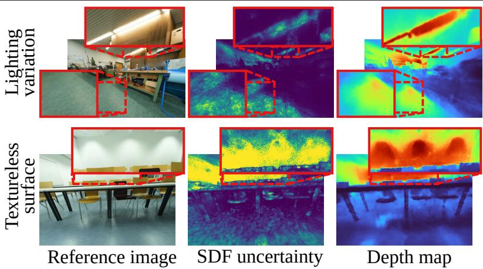

Figure A: Analysis on uncertainty estimation. We visualize estimated SDF uncertainty with produced depth map at the initial stage.  
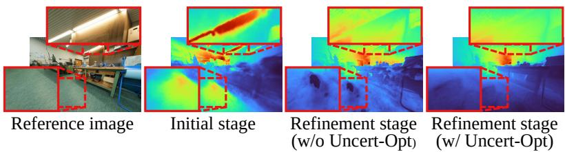  
Figure B: Depth map at the initial stage and refinement stage with and without our uncertainty-aware optimization.

We also visualize the reconstructed mesh and the uncertainty maps with different numbers of Monte Carlo samples in Fig. C and Fig. D. With only 3 samples, the uncertainty network struggles to localize ambiguous regions, producing noisy estimates and capturing only a subset of the uncertain areas. As the number of samples increases, the network improves in identifying regions of geometric ambiguity with greater accuracy and consistency. Based on these observations, we choose $N _ { \mathrm { m c } } = 1 0$ , as it provides reliable uncertainty estimation while avoiding the unnecessary computational overhead.

## B.3 Analysis on Uncertainty-Aware Adaptive Geometric Regularization

We evaluate the effect of applying uncertainty-aware adaptive geometric regularization in the initial stage and report the performance in the ScanNet++ dataset in Tab. B. The results show a performance drop when the regularization is applied in both the initial and refinement stages, compared with applying it only in the refinement stage. We attribute this to over-regularization early in training. During the initial stage, the geometry is still noisy and the predicted normals are unreliable. Applying strong regularization, especially in ambiguous regions where uncertainty is high, can distort the surface geometry. This issue is compounded by the fact that uncertainty estimates are not yet accurate in the early stage. In contrast, applying adaptive regularization only after the initial stage, when the geometry has stabilized and uncertainty estimates are more reliable, leads to improved reconstruction performance. A visual comparison illustrating this effect is provided in Fig. E.

<table><tr><td> $N _ { \mathrm { m c } }$ </td><td>Acc. (↓)</td><td>Comp. (4)</td><td>Pre. (↑)</td><td>Recall (↑)</td><td>Chamfer (4)</td><td>F1-Score (↑)</td></tr><tr><td>3</td><td>0.082</td><td>0.049</td><td>0.582</td><td>0.608</td><td>0.066</td><td>0.593</td></tr><tr><td>5</td><td>0.081</td><td>0.048</td><td>0.593</td><td>0.620</td><td>0.065</td><td>0.604</td></tr><tr><td>10</td><td>0.052</td><td>0.047</td><td>0.618</td><td>0.627</td><td>0.049</td><td>0.621</td></tr><tr><td>20</td><td>0.062</td><td>0.047</td><td>0.611</td><td>0.628</td><td>0.055</td><td>0.620</td></tr></table>

Table A: Ablation on the number of Monte Carlo samples.

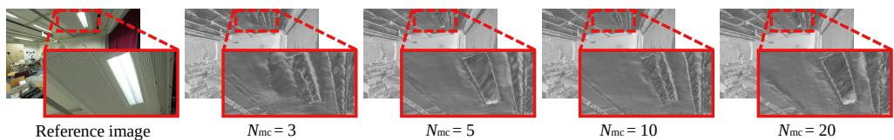  
Figure C: Reconstructed meshes using different numbers of Monte Carlo samples.

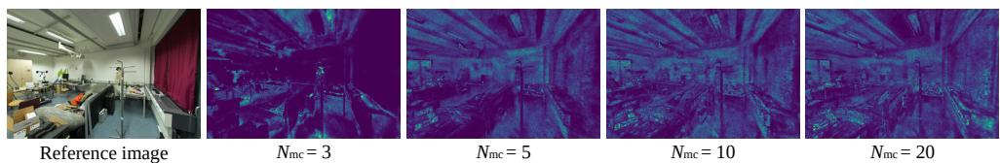  
Figure D: Visualization of SDF uncertainty maps using different numbers of Monte Carlo samples.

## B.4 Analysis on Uncertainty-Aware SDF-to-Density Conversion

We demonstrate the impact of our uncertainty-aware SDF-to-density conversion by visualizing the predicted scale parameter on the Tanks and Temples dataset in Fig. F. The scale value should be low in regions with strong photometric signals, enabling precise surface reconstruction. In contrast, it should be high in ambiguous areas to avoid converging to incorrect surfaces. As shown in Fig. F, this behavior is clearly observed: geometrically certain areas such as edges and texture-rich regions exhibit low scale values, while ambiguous regions maintain higher scale values, preventing inaccurate surface reconstruction.

While effective, this formulation can limit the model’s ability to converge to the surface in ambiguous regions. To address this, we manually control the upper bound of the scale parameter. Specifically, in the initial stage, the upper bound decreases exponentially from infinity to 0.01. In the refinement stage, the upper bound is further reduced by decreasing exponentially from infinity to $3 \times 1 0 ^ { - 4 }$

<table><tr><td>Initial stage</td><td>Refinement stage</td><td>Acc. (↓)</td><td>Comp. (4)</td><td>Pre. (↑)</td><td>Recall (↑)</td><td>Chamfer (↓)</td><td>F1-Score (↑)</td></tr><tr><td rowspan="3">√</td><td rowspan="3">√</td><td>0.081</td><td>0.049</td><td>0.583</td><td>0.603</td><td>0.065</td><td>0.593</td></tr><tr><td>0.084</td><td>0.047</td><td>0.595</td><td>0.627</td><td>0.065</td><td>0.611</td></tr><tr><td>0.052</td><td>0.047</td><td>0.618</td><td>0.627</td><td>0.049</td><td>0.621</td></tr></table>

Table B: Ablation on uncertainty-aware adaptive geometric regularization.

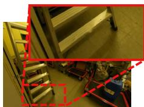  
(a)

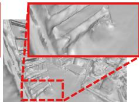  
(b)

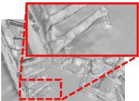  
(c)

Figure E: (a) Region with complex geometry. (b) Applying adaptive geometric regularization in both the initial and refinement stages oversmooths the structure. (c) Applying it only during the refinement stage better preserves details and leads to more accurate reconstruction.  
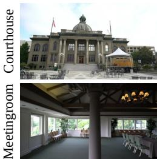  
(a)

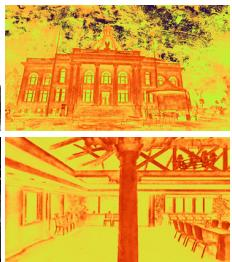  
(b)

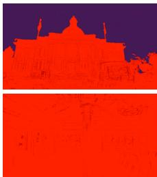  
(c)  
Figure F: (a) Reference image. (b) Scale parameter after the initial stage: ambiguous regions exhibit high values (bright), while geometrically reliable regions show low values (dark). (c) Scale parameter after the refinement stage: with upper bound scheduling, all regions converge to low values, accurately localizing the surface.

## C Additional Results

## C.1 Comparison with Explicit Methods

We compare NeuDonatello against recent explicit representations based on 3D Gaussian Splatting (3DGS) [16]. Specifically, we compare with mesh reconstruction approaches such as SuGaR [10], 2DGS [11], and GOF [47].

On the ScanNet++ dataset, NeuDonatello achieves the highest performance on every metric, clearly outperforming the strongest 3DGS-based baselines, as summarized in Tab. C. The qualitative comparison in Fig. G further highlights that our method produces cleaner surfaces with fewer artifacts while better preserving geometric details.

On the Tanks and Temples dataset, NeuDonatello maintains this advantage, achieving the top F1-score across all methods, as shown in Tab. D. These results demonstrate the robustness of our approach in reconstructing accurate geometry, even in complex environments.

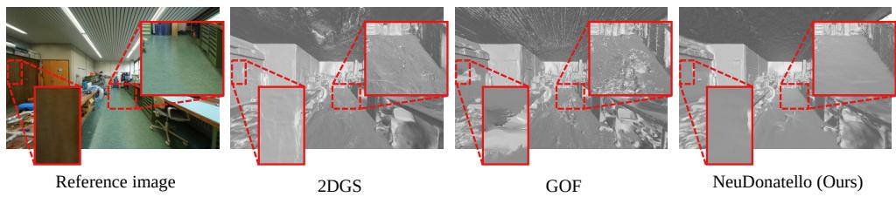

<table><tr><td rowspan="2">Method</td><td colspan="6">Metric</td></tr><tr><td>Acc. (↓)</td><td>Comp. (↓)</td><td>Pre. (↑)</td><td>Recall (↑)</td><td>Chamfer (↓)</td><td>F1-score (↑)</td></tr><tr><td>SuGaR [日]</td><td>0.059</td><td>0.061</td><td>0.487</td><td>0.411</td><td>0.060</td><td>0.411</td></tr><tr><td>2DGS [0]</td><td>0.082</td><td>0.053</td><td>0.489</td><td>0.532</td><td>0.068</td><td>0.509</td></tr><tr><td>GOF []</td><td>0.057</td><td>0.047</td><td>0.570</td><td>0.536</td><td>0.052</td><td>0.548</td></tr><tr><td>NeuDonatello (Ours)</td><td>0.052</td><td>0.047</td><td>0.618</td><td>0.627</td><td>0.049</td><td>0.621</td></tr></table>

Table C: Quantitative results compared with explicit methods on ScanNet++ dataset. Best result (bold). Second best result (underlined).

Figure G: Qualitative results compared with explicit methods on ScanNet++ dataset.
<table><tr><td></td><td colspan="6">Scene</td><td></td></tr><tr><td>Method</td><td></td><td>Barn Caterpillar Courthouse Ignatius Meetingroom Truck Mean</td><td></td><td></td><td></td><td></td><td></td></tr><tr><td>SuGaR []</td><td>0.14</td><td>0.16</td><td>0.08</td><td>0.33</td><td>0.15</td><td>0.26</td><td>0.19</td></tr><tr><td>2DGS []</td><td>0.42</td><td>0.23</td><td>0.16</td><td>0.51</td><td>0.17</td><td>0.45</td><td>0.32</td></tr><tr><td>GOF []</td><td>0.51</td><td>0.41</td><td>0.28</td><td>0.68</td><td>0.28</td><td>0.59</td><td>0.46</td></tr><tr><td>NeuDonatello (Ours)</td><td>0.71</td><td>0.37</td><td>0.22</td><td>0.85</td><td>0.44</td><td>0.48</td><td>0.51</td></tr></table>

Table D: Quantitative results (F1-score (↑)) compared with explicit methods on Tanks and Temples dataset. Best result (bold). Second best result (underlined)

## C.2 Comparison with Uncertainty-Aware Methods

We compare NeuDonatello against DebSDF [42], a recent method that incorporates uncertainty estimation over depth and normal priors for neural surface reconstruction. Although DebSDF models uncertainty to filter unreliable priors, it still oversmooths fine geometric details, as shown in Fig. H. In contrast, NeuDonatello preserves thin structures such as cables and leverages uncertainty as an intrinsic property of the RGB-only inverse rendering process to accurately reconstruct geometry in ambiguous regions without relying on external priors. NeuDonatello also achieves competitive quantitative performance without explicit priors, as summarized in Tab. E.

## C.3 ScanNet++

We present additional per-scene quantitative results on the ScanNet++ dataset in Tab. F and qualitative results in Fig. I and Fig. J. NeuDonatello consistently outperforms other baselines, demonstrating visibly improved reconstructions, particularly in geometrically ambiguous regions such as textureless surfaces, lighting variations, and occlusions.

<table><tr><td rowspan="3">Method</td><td colspan="6">Metric</td></tr><tr><td>Acc. (↓)</td><td>Comp. (↓)</td><td>Pre. (↑)</td><td>Recall (↑)</td><td>Chamfer (↓)</td><td>F1-score (↑)</td></tr><tr><td>DebSDF []</td><td>0.048</td><td>0.043</td><td>0.605</td><td>0.612</td><td>0.045</td><td>0.609</td></tr><tr><td>NeuDonatello (Ours)</td><td>0.052</td><td>0.047</td><td>0.618</td><td>0.627</td><td>0.049</td><td>0.621</td></tr></table>

Table E: Quantitative results compared with DebSDF on ScanNet++ dataset.

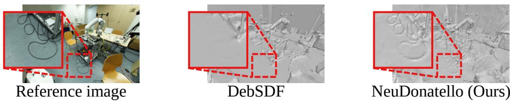  
Figure H: Qualitative comparison against DebSDF on ScanNet++ dataset.

## C.4 Tanks and Temples

We show additional qualitative results on the Tanks and Temples dataset in Fig. K. NeuDonatello demonstrates visually compelling reconstructions in both indoor and outdoor scenes. Our method accurately captures fine-grained geometric details and maintains surface fidelity, even in challenging regions.

## D Limitation

Despite its effectiveness, NeuDonatello has several limitations. First, the final quality of the reconstruction is influenced by the initial stage. If the early geometry estimation falls into severely incorrect surfaces, the refinement stage may not fully recover accurate geometry. Second, although Monte Carlo sampling provides a simple and effective way of estimating uncertainty, it increases the computational cost during training. Lastly, our model is sensitive to hyperparameters, as it directly modifies the weighting of loss terms based on uncertainty. This requires careful tuning to ensure stable and effective training.

## E Societal Impact

NeuDonatello offers benefits for fields such as architecture, virtual reality, and robotics by enabling high-fidelity 3D reconstruction from casually captured RGB images. In architecture, it can assist in creating accurate digital twins of indoor spaces; in virtual and augmented reality, it enables immersive scene capture; and in robotics, it supports scene understanding for navigation and manipulation. However, like many vision-based systems, it raises potential privacy concerns when used to reconstruct real-world environments without consent. Its computational cost may also limit broader accessibility. Overall, while NeuDonatello offers promising advances in 3D perception, careful consideration is needed regarding its deployment and societal implications.

<table><tr><td>Scene</td><td>Metric</td><td>MonoSDF MLP* [回</td><td>MonoSDF Grid* [日</td><td>VolSDF [回]</td><td>Neuralangelo [回]</td><td>NeuRodin [回]</td><td>NeuDonatello (Ours)</td></tr><tr><td rowspan="6">073C09</td><td>Acc (↓)</td><td>0.044</td><td>0.063</td><td>0.085</td><td>0.300</td><td>0.136</td><td>0.033</td></tr><tr><td>Comp (↓)</td><td>0.031</td><td>0.028</td><td>0.112</td><td>0.176</td><td>0.048</td><td>0.039</td></tr><tr><td>Pre (↑)</td><td>0.628</td><td>0.596</td><td>0.337</td><td>0.285</td><td>0.580</td><td>0.688</td></tr><tr><td>Recall (↑)</td><td>0.721</td><td>0.715</td><td>0.307</td><td>0.397</td><td>0.691</td><td>0.749</td></tr><tr><td>Chamfer (↓)</td><td>0.038</td><td>0.046</td><td>0.099</td><td>0.238</td><td>0.092</td><td>0.036</td></tr><tr><td>F1-score (↑)</td><td>0.671</td><td>0.650</td><td>0.321</td><td>0.332</td><td>0.626</td><td>0.717</td></tr><tr><td rowspan="6">036393</td><td>Acc (↓)</td><td>0.052</td><td>0.041</td><td>0.078</td><td>0.085</td><td>0.031</td><td>0.030</td></tr><tr><td>Comp (↓)</td><td>0.074</td><td>0.045</td><td>0.175</td><td>0.047</td><td>0.034</td><td>0.032</td></tr><tr><td>Pre (↑)</td><td>0.459</td><td>0.576</td><td>0.418</td><td>0.572</td><td>0.674</td><td>0.673</td></tr><tr><td>Recall (↑)</td><td>0.433</td><td>0.604</td><td>0.317</td><td>0.637</td><td>0.681</td><td>0.697</td></tr><tr><td>Chamfer (↓)</td><td>0.063</td><td>0.043</td><td>0.127</td><td>0.066</td><td>0.033</td><td>0.031</td></tr><tr><td>F1-score (↑)</td><td>0.445</td><td>0.590</td><td>0.360</td><td>0.603</td><td>0.677</td><td>0.685</td></tr><tr><td rowspan="6">108806</td><td>Acc (↓)</td><td>0.045</td><td>0.042</td><td>0.141</td><td>0.066</td><td>0.037</td><td>0.036</td></tr><tr><td>Comp (↓)</td><td>0.068</td><td>0.046</td><td>0.295</td><td>0.062</td><td>0.056</td><td>0.051</td></tr><tr><td>Pre (↑)</td><td>0.622</td><td>0.463</td><td>0.529</td><td>0.331</td><td>0.565</td><td>0.608</td></tr><tr><td>Recall (↑)</td><td>0.411</td><td>0.531</td><td>0.211</td><td>0.561</td><td>0.552</td><td>0.584</td></tr><tr><td>Chamfer (↓)</td><td>0.057</td><td>0.044</td><td>0.218</td><td>0.064</td><td>0.047</td><td>0.044</td></tr><tr><td>F1-score (↑)</td><td>0.426</td><td>0.530</td><td>0.258</td><td>0.563</td><td>0.578</td><td>0.602</td></tr><tr><td rowspan="6">21d9de</td><td>Acc (↓)</td><td>0.051</td><td>0.046</td><td>0.079</td><td>0.112</td><td>0.078</td><td>0.080</td></tr><tr><td>Comp (↓)</td><td>0.054</td><td>0.036</td><td>0.142</td><td>0.127</td><td>0.035</td><td>0.037</td></tr><tr><td>Pre (↑)</td><td>0.393</td><td>0.482</td><td>0.344</td><td>0.467</td><td>0.574</td><td>0.551</td></tr><tr><td>Recall (↑)</td><td>0.422</td><td>0.554</td><td>0.294</td><td>0.449</td><td>0.677</td><td>0.657</td></tr><tr><td>Chamfer (↓)</td><td>0.053</td><td>0.041</td><td>0.111</td><td>0.120</td><td>0.057</td><td>0.059</td></tr><tr><td>F1-score (↑)</td><td>0.407</td><td>0.515</td><td>0.317</td><td>0.458</td><td>0.621</td><td>0.600</td></tr><tr><td rowspan="6">35db</td><td>Acc (↓)</td><td>0.036</td><td>0.034</td><td>0.070</td><td>0.047</td><td>0.048</td><td>0.032</td></tr><tr><td>Comp (↓)</td><td>0.047</td><td>0.037</td><td>0.130</td><td>0.048</td><td>0.058</td><td>0.057</td></tr><tr><td>Pre (↑)</td><td>0.524</td><td>0.582</td><td>0.415</td><td>0.683</td><td>0.642</td><td>0.667</td></tr><tr><td>Recall (↑)</td><td>0.515</td><td>0.596</td><td>0.323</td><td>0.665</td><td>0.601</td><td>0.610</td></tr><tr><td>Chamfer (↓)</td><td>0.042</td><td>0.036</td><td>0.100</td><td>0.048</td><td>0.053</td><td>0.045</td></tr><tr><td>F1-score (↑)</td><td>0.519</td><td>0.589</td><td>0.363</td><td>0.674</td><td>0.623</td><td>0.637</td></tr><tr><td rowspan="5">578518a9</td><td>Acc (↓)</td><td>0.045</td><td>0.042</td><td>0.197</td><td>0.237</td><td>0.135</td><td>0.067</td></tr><tr><td>Comp (↓)</td><td>0.049</td><td>0.037</td><td>0.222</td><td>0.081</td><td>0.063</td><td>0.052</td></tr><tr><td>Pre (↑)</td><td>0.548</td><td>0.569</td><td>0.235</td><td>0.410</td><td>0.508</td><td>0.561</td></tr><tr><td>Recall (↑)</td><td>0.571</td><td>0.623</td><td>0.198</td><td>0.532</td><td>0.552</td><td>0.612</td></tr><tr><td>Chamfer (↓)</td><td>0.047</td><td>0.040</td><td>0.210</td><td>0.159</td><td>0.099</td><td>0.060</td></tr><tr><td rowspan="5">743C30</td><td>F1-score (↑)</td><td>0.559</td><td>0.595</td><td>0.215</td><td>0.463</td><td>0.529</td><td>0.586</td></tr><tr><td>Acc (↓)</td><td>0.113</td><td>0.176</td><td>0.175</td><td>0.194</td><td>0.156</td><td>0.055</td></tr><tr><td>Comp (↓) Pre (↑)</td><td>0.025</td><td>0.022</td><td>0.192</td><td>0.034</td><td>0.043</td><td>0.043</td></tr><tr><td>Recall (↑)</td><td>0.706</td><td>0.684</td><td>0.282</td><td>0.649</td><td>0.632</td><td>0.692</td></tr><tr><td>Chamfer (↓)</td><td>0.759 0.069</td><td>0.797 0.099</td><td>0.237 0.184</td><td>0.721 0.114</td><td>0.632 0.100</td><td>0.644 0.049</td></tr><tr><td rowspan="6">09416</td><td>F1-score (↑)</td><td>0.732</td><td>0.736</td><td>0.257</td><td>0.683</td><td>0.632</td><td>0.667</td></tr><tr><td>Acc (↓)</td><td>0.038</td><td>0.077</td><td>0.124</td><td>0.206</td><td>0.076</td><td>0.084</td></tr><tr><td>Comp (↓)</td><td>0.071</td><td>0.065</td><td>0.277</td><td>0.158</td><td>0.063</td><td>0.061</td></tr><tr><td>Pre (↑)</td><td>0.616</td><td>0.616</td><td>0.325</td><td>0.504</td><td>0.515</td><td>0.493</td></tr><tr><td>Recall (↑)</td><td>0.537</td><td>0.574</td><td>0.245</td><td>0.493</td><td>0.459</td><td>0.460</td></tr><tr><td>Chamfer (↓)</td><td>0.055</td><td>0.071</td><td>0.201</td><td>0.182</td><td>0.070</td><td>0.073</td></tr><tr><td></td><td>F1-score (↑)</td><td>0.574</td><td>0.594</td><td>0.279</td><td>0.498</td><td>0.486</td><td>0.476</td></tr></table>

Table F: Detailed results for ScanNet++ benchmark. Best result (bold). Second best result (underlined). \* indicates methods that use monocular depth and normal priors.

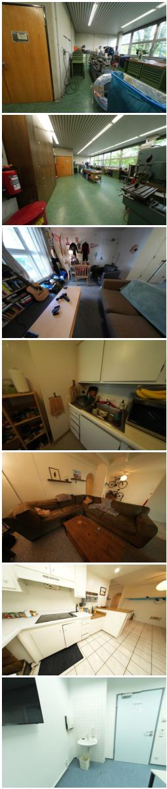

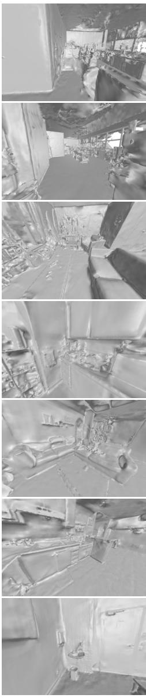

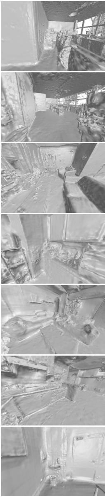

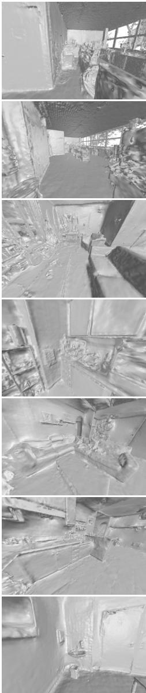  
Reference image  
Neuralangelo  
NeuRodin  
NeuDonatello (Ours)

Figure I: Additional qualitative results on the ScanNet++ dataset.

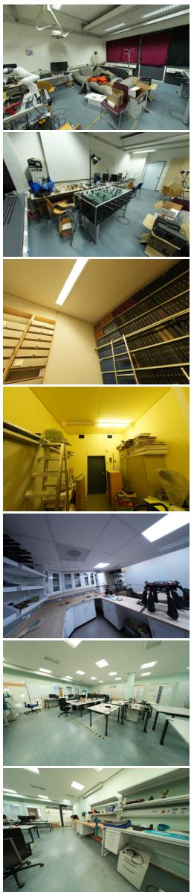

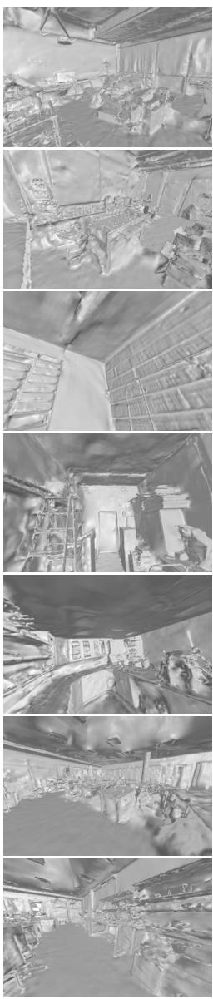

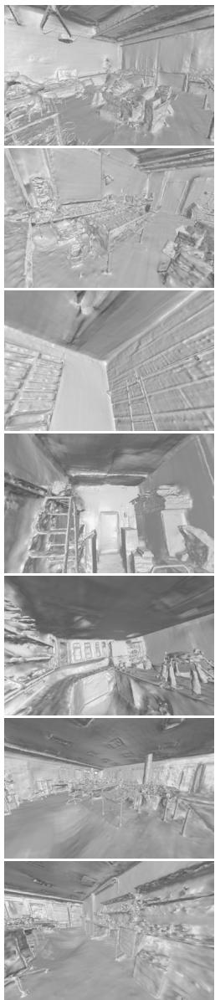

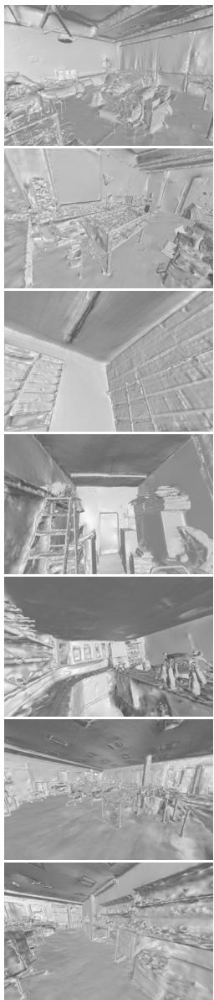  
Reference image  
Neuralangelo  
NeuRodin  
NeuDonatello (Ours)

Figure J: Additional qualitative results on the ScanNet++ dataset.

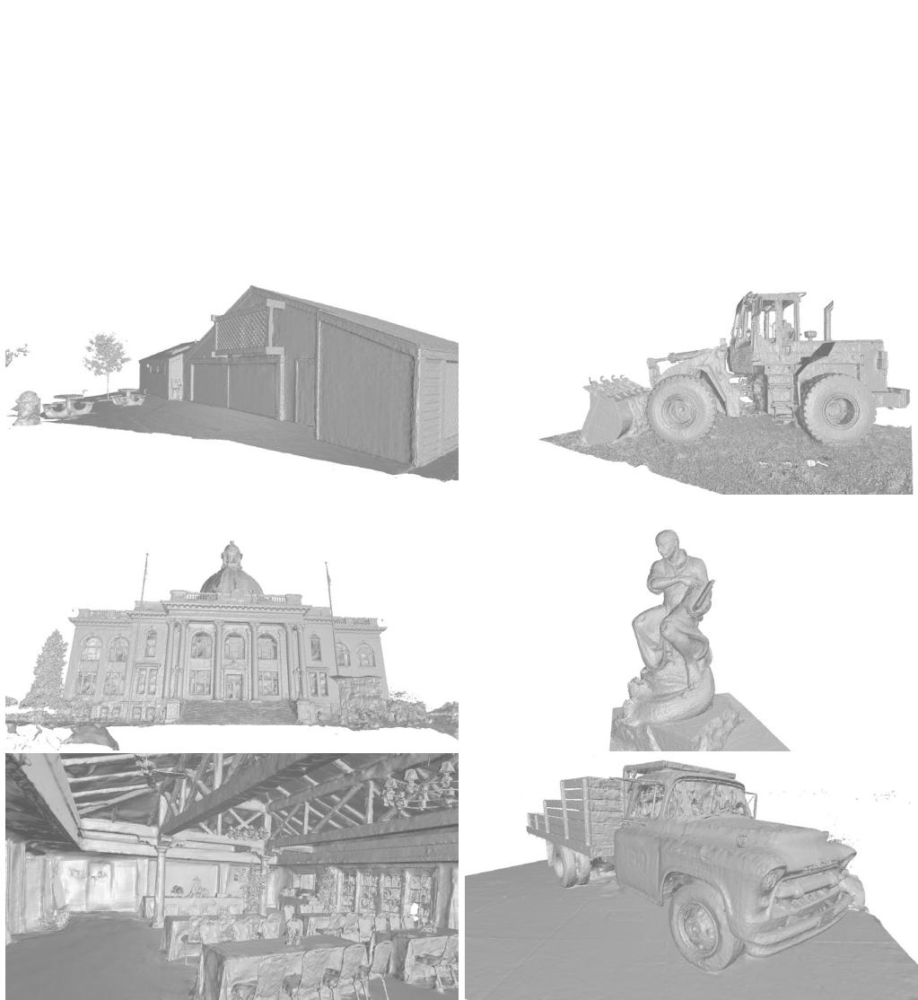  
Figure K: Additional qualitative results on the Tanks and Temples dataset.