# PACE: A Unified Condense-and-Extract Paradigm for Fast VLM Inference

Junjie Liu1 Shengyuan Ye2 Xu Chen1,3\*

1Sun Yat-sen University

2Power Dispatch Control Center, Guangdong Power Grid Co., Ltd. Guangzhou, China

3Shenzhen Loop Area Institute, Shenzhen, China

## Abstract

Vision-Language Models (VLMs) demonstrate exceptional visual reasoning capabilities, yet their inference costs escalate rapidly with the proliferation of visual tokens. Existing visual token pruning methods exhibit two fundamental limitations. First, most approaches operate exclusively post-vision encoder, leaving the substantial latency of the visual encoding phase unoptimized. Second, under strict token budgets, these methods often fail to jointly preserve holistic visual contexts and fine-grained details, leading to performance degradation. To address these bottlenecks, we propose PACE (Pixel-Adaptive Condense and Extract), a training-free inference framework that accelerates both the vision encoder and the Large Language Model (LLM) via a unified Condense-and-Extract paradigm. During the Condense stage, an Adaptive Pixel Compressor (APC) evaluates visual information density prior to encoding, adaptively downsampling redundant inputs, curtailing encoder computation while preserving global context and essential visual cues. In the Extract stage, a Dynamic Dual-Attention Extractor (DDAE) selectively retains visual tokens via a fusion of internal visual signals from the encoder and semantic signals from the LLM, safeguarding task-critical details. By integrating PACE into Qwen2.5- VL-7B, the model retains 93.8% of its original performance while utilizing only 10% of the visual tokens, yielding a 3.1× speedup in time to first token (TTFT). Our code is available at https://github.com/jjL357/PACE.

## 1 Introduction

Vision-Language Models (VLMs) have established a new standard for multimodal understanding by seamlessly integrating visual perception with linguistic reasoning (Alayrac et al., 2022; Liu et al., 2023). Recent architectures have extended these capabilities to highly complex reasoning tasks (Dai et al., 2023; Team et al., 2023; Li et al., 2025). However, this rapid advancement demands an everexpanding visual token budget. Processing highresolution images (Achiam et al., 2023; Liu et al., 2024a) or extensive videos (Liu et al., 2025; Wang et al., 2025b) generates massive visual token sequences. Furthermore, modern VLMs equipped with native dynamic resolution capabilities (Bai et al., 2023; Guo et al., 2025; Abouelenin et al., 2025) partition inputs into numerous patches, frequently producing substantial visual redundancy. For instance, encoding a 4K image in Qwen2.5- VL generates over 42,000 patches for the Vision Transformer (ViT) (Dosovitskiy et al., 2020); even after spatial pooling, over 10,500 visual tokens extend the LLM context. Given the quadratic computational complexity of self-attention (Dao et al., 2022), this proliferation imposes a severe inference bottleneck, hindering real-time deployment.

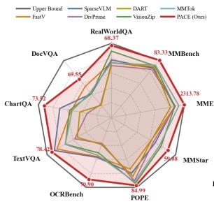

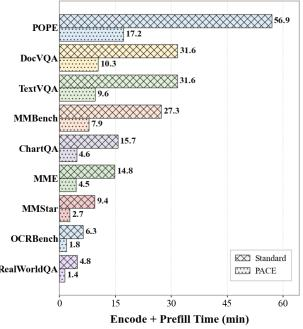  
Figure 1: Accuracy–TTFT trade-off at 10% visualtoken retention. PACE preserves accuracy while reducing pre-generation latency on Qwen2.5-VL-7B; standard denotes Vanilla inference of the original model.

Compressing the visual token sequence is therefore imperative for efficient inference. Visual token pruning naturally addresses this challenge by identifying and retaining critical visual tokens while discarding redundant ones prior to LLM decoding. Current pruning methods discard tokens based on attention distributions (Chen et al., 2024a; Takezoe et al., 2026), token similarity (Wen et al., 2025; Zou et al., 2026), diversity (Zhang et al., 2026; Fang et al., 2026), or maximum coverage (Dong et al., 2025; Deng et al., 2026). While these strategies effectively alleviate LLM-side computational demands, they share two fundamental limitations.

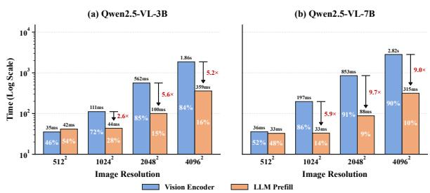  
Figure 2: Latency decomposition for Qwen2.5-VL. Vision encoding and LLM prefill jointly dominate latency as input resolution increases.

The Dual Bottleneck of High-Resolution Inference. Prevailing visual token pruning methods operate exclusively after the vision encoder. They truncate the LLM context sequence but neglect the substantial computational overhead of the vision encoder itself. Empirical profiling reveals that at high resolutions, both the ViT encoding and LLM prefill stages impose severe latency bottlenecks, as illustrated in Figure 2. Because most visual token pruning methods intervene strictly during modality alignment or within the LLM layers, the immense computational cost of encoding high-resolution pixels remains unaddressed. Consequently, truncating only the LLM-side sequence resolves merely half of the inference bottleneck.

Information and Detail Loss under Low-Budget Compression. Furthermore, under strict token budgets, existing methods struggle to retain holistic visual contexts and fine-grained details simultaneously. Aggressive pruning inherently fragments visual layouts and discards indispensable visual cues, such as text strokes and alignment anchors. This structural loss results in severe performance degradation, particularly on detail-sensitive tasks. While competitive methods, including DivPrune and VisionZip, maintain robust accuracy on general benchmarks at a 5% token budget, they experience severe performance drops on detail-sensitive tasks such as ChartQA and DocVQA (Figure 3). This vulnerability indicates that simple post-encoder token pruning fails to preserve the critical cues essential for high-density visual reasoning.

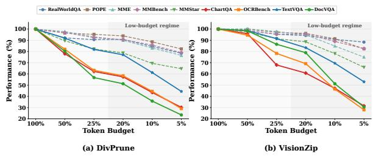  
Figure 3: Performance of existing visual token pruning methods under varying token budgets on Qwen2.5-VL-7B. Performance on detail-sensitive benchmarks degrades sharply under aggressive token pruning.

These limitations underscore the necessity for a paradigm shift: visual token compression must transcend naive post-encoder sequence reduction by simultaneously preserving holistic layouts and salient visual details prior to intensive computation. An optimal framework must fulfill two complementary functions. First, it should condense visual information before the expensive encoding phase. Recent studies (Ye et al., 2025; Cai et al., 2025) suggest that condensed visual representations inherently carry concentrated semantic meaning. Preencoder condensation ensures the ViT operates on a compact pixel budget without sacrificing layout integrity. Second, it should extract the most informative visual tokens post-encoding, guaranteeing that critical, task-relevant details are prioritized within the LLM context.

To this end, we propose PACE, a trainingfree, plug-and-play inference framework organized around a unified Condense-and-Extract paradigm. In the Condense stage, the Adaptive Pixel Compressor (APC) uses a lightweight feature preview to estimate information density. It dynamically condenses the input image prior to the vision encoder, globally preserving visual cues under strict pixel budgets. In the Extract stage, the Dynamic Dual-Attention Extractor (DDAE) fuses ViT selfattention with LLM cross-modal attention. This dynamic dual-attention mechanism enables PACE to extract fine-grained details reliably, markedly outperforming single-source attention pruning. Figure 1 summarizes the resulting accuracy–TTFT trade-off.

Our contributions are summarized as follows:

• Identification of the Dual Bottleneck. We demonstrate that conventional visual token pruning overlooks the substantial visionencoder overhead and incurs severe degradation on detail-sensitive tasks due to its inability to jointly preserve holistic contexts and fine-grained details.

• Unified Condense-and-Extract Framework. We introduce PACE, seamlessly integrating pre-encoder adaptive pixel condensation (APC) with post-encoder dynamic dualattention extraction (DDAE). APC constructs a compact visual representation, while DDAE safeguards salient visual tokens via confidence-weighted attention fusion.

• Superior Performance–Efficiency Tradeoff. Extensive evaluations demonstrate that PACE consistently outperforms existing pruning baselines. When deployed on Qwen2.5- VL-7B, PACE preserves over 93% of the original performance while discarding 90% of the visual tokens, unlocking a 3.1× TTFT acceleration.

## 2 Related Work

## 2.1 Vision-Language Models

Early VLMs typically rely on fixed-resolution vision encoders, requiring images to be resized or padded before visual encoding (Liu et al., 2023). This design simplifies model processing but may lose fine-grained details. To improve highresolution perception, models such as InternVL (Chen et al., 2024c) adopt dynamic high-resolution tiling, where images are split into multiple local crops according to their aspect ratio and resolution. More recent models, including Qwen2.5-VL (Bai et al., 2025b) and Qwen3-VL (Bai et al., 2025a), support native dynamic-resolution processing, preserving image aspect ratios and producing variablelength visual token sequences. However, as the visual token length still grows with the input pixel budget, high-resolution inference remains computationally expensive (Dao, 2024).

## 2.2 Visual Token Pruning

Visual token pruning reduces inference cost by selecting or merging a subset of visual tokens before they enter the LLM. Attention-based methods, such as FastV (Chen et al., 2024a) and SparseVLM (Zhang et al., 2024), estimate token importance from attention or vision–language relevance. Hybrid methods, including LLaVA-PruMerge (Shang et al., 2025) and VisionZip (Yang et al., 2025), combine importance-based selection with similaritybased merging. Other methods exploit redundancy, diversity, or coverage, such as DART (Wen et al., 2025), DivPrune (Alvar et al., 2025), and MMTok (Dong et al., 2025). Although these approaches effectively reduce LLM-side prefill cost, they are mostly applied after visual encoding. Thus, the ViT encoding cost remains unchanged.

## 2.3 Adaptive Resolution VLMs

Adaptive-resolution VLMs adjust image scale, compression rate, or token allocation according to visual complexity. Existing methods often require additional modules, learned routing, or reinforcement-learning procedures. For example, ViCO (Cui et al., 2025) and HyperVL (Team et al., 2025) introduce learned compression or routing mechanisms, while AdaptVision (Lin et al., 2025) and VisionThink (Yang et al., 2026) formulate adaptive resolution as coarse-to-fine visual acquisition. In contrast, PACE is training-free and requires no architectural modification. It reduces both preencoder and post-encoder costs by adapting input resolution before visual encoding and controlling the visual tokens passed to the LLM, while preserving global layout and fine-grained visual evidence.

## 3 Method

## 3.1 Overview of PACE

As illustrated in Figure 4, PACE introduces a unified Condense-and-Extract pipeline designed to overcome the dual computational bottlenecks of the ViT and LLM, as well as the severe detail loss typically induced by low-budget token pruning. In the Condense stage, PACE evaluates visual information density prior to the ViT forward pass. Using a shallow feature preview to quantify detail complexity, PACE adaptively condenses the input image. This mechanism strictly curtails the pixel volume processed by the vision encoder while maintaining essential layout cues. In the Extract stage, PACE eliminates residual visual redundancy postencoding. It dynamically integrates cross-attention from the LLM with self-attention from the ViT, ensuring that token selection prioritizes both semantic relevance and fine-grained detail integrity.

## 3.2 Condense: Adaptive Pixel Compressor

While heuristically dropping uninformative patches (such as uniform backgrounds or regions lacking salient information) (Wang et al., 2026b; Choi et al., 2026) intuitively reduces input length, it irrevocably disrupts the continuous 2D topological layout required by modern dynamic-resolution ViTs, risking the deletion of latent contextual anchors. Consequently, although heuristic dropping may suffice for narrow, domain-specific applications, it generalizes poorly to diverse, open-world visual scenarios. Conversely, static uniform downsampling blurs microscopic elements, such as text strokes, while continuing to allocate wasteful computation to homogeneous backgrounds.

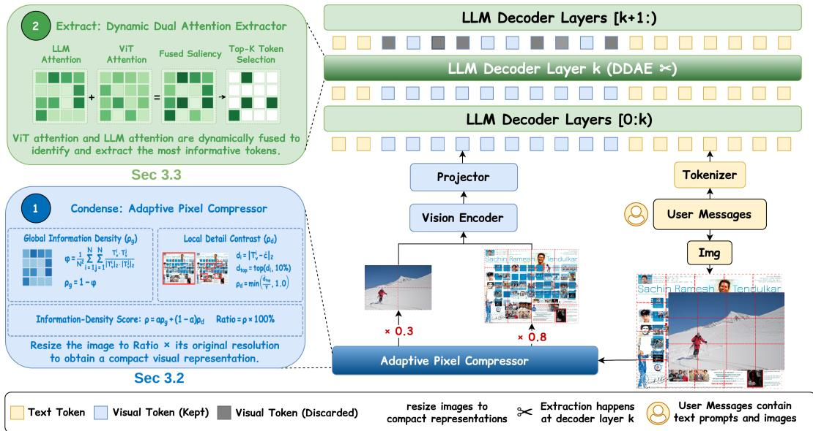  
Figure 4: Overview of PACE’s unified Condense-and-Extract pipeline. In the Condense stage, APC uses a shallow visual preview to estimate global redundancy and local detail, then adaptively resizes the input before the vision encoder. In the Extract stage, DDAE fuses semantic attention from the LLM with self-attention from the ViT and retains the top-K visual tokens at decoder layer k. Together, APC lowers vision-encoder cost and DDAE shortens LLM prefill, enabling efficient low-budget inference while preserving holistic layouts and fine-grained task evidence.

To address this dilemma, we introduce the Adaptive Pixel Compressor (APC) in the Condense stage. Instead of pruning raw patches, APC dynamically modulates the global input resolution, allocating higher pixel budgets to information-dense inputs and lower budgets to redundant ones. This approach preserves continuous visual layouts while dynamically adapting to image complexity.

Shallow Feature Preview. Instead of relying on basic pixel-level statistics, APC uses the initial ViT block (K = 1) to compute a lightweight feature preview, similar to AdaPatch (Liu et al., 2026). This minimizes preprocessing overhead while securing essential semantic priors. The preview yields token embeddings, which are subsequently ℓ2-normalized and denoted as $\mathbf { T } _ { v } = \{ \mathbf { T } _ { v } ^ { i } \} _ { i = 1 } ^ { N } \in$ $\mathbb { R } ^ { N \times D }$ . A controlled ablation in Appendix B.2 confirms that this semantic preview is more reliable than RGB, entropy, edge-density, and Laplacian statistics.

Global Information Density $( \rho _ { g } )$ . We quantify global redundancy by calculating the average pairwise cosine similarity $\varphi$ across all visual tokens:

$$
\varphi = \frac { 1 } { N ^ { 2 } } \sum _ { i = 1 } ^ { N } \sum _ { j = 1 } ^ { N } \frac { \mathbf { T } _ { v } ^ { i } \cdot \mathbf { T } _ { v } ^ { j } } { \lVert \mathbf { T } _ { v } ^ { i } \rVert _ { 2 } \cdot \lVert \mathbf { T } _ { v } ^ { j } \rVert _ { 2 } } .\tag{1}
$$

A higher $\varphi$ indicates pronounced redundancy $( \mathrm { e . g . }$ large uniform areas) and lower global information density. The global information density score $\rho _ { g }$ defined as the non-redundant fraction:

$$
\rho _ { g } = 1 . 0 - \varphi\tag{2}
$$

Local Detail Contrast $( \rho _ { d } )$ . Images dominated by uniform backgrounds may yield high global redundancy metrics while harboring sparse yet indispensable details, such as microscopic text on a large white document. To prevent the erasure of such cues, APC computes a global background baseline c by averaging all normalized tokens:

$$
\mathbf { c } = \frac { 1 } { N } \sum _ { i = 1 } ^ { N } \mathbf { T } _ { v } ^ { i } .\tag{3}
$$

This baseline is normalized as $\hat { \mathbf { c } } = \mathbf { c } / \| \mathbf { c } \| _ { 2 }$ . We then compute the Euclidean distance $d _ { i }$ between each token and the reference baseline:

$$
d _ { i } = \left. \mathbf { T } _ { v } ^ { i } - \hat { \mathbf { c } } \right. _ { 2 } .\tag{4}
$$

Tokens diverging significantly from the baseline correlate strongly with sharp local details. $\mathrm { A P C }$ isolates the top 10% of tokens with the largest $d _ { i }$ and averages their distances to compute $\bar { d } _ { t o p }$ . This tail mean avoids diluting sparse details through a fullimage average while being less noise-sensitive than a single maximum; 5%–20% tail choices behave similarly (Appendix B.1). This metric is linearly scaled into a local retention score:

$$
\rho _ { d } = \operatorname* { m i n } \left( \frac { \bar { d } _ { t o p } } { \gamma } , 1 . 0 \right) ,\tag{5}
$$

where $\gamma$ acts as a regulating scaling factor. A high $\rho _ { d }$ signals sharp local contrast, mandating a higher target resolution to safeguard fine-grained visual features.

Adaptive Condensation. Finally, APC integrates the global and local scores into a unified target retention ratio $\rho \colon$

$$
\rho = \alpha \rho _ { g } + ( 1 - \alpha ) \rho _ { d } ,\tag{6}
$$

where α is a weighting hyperparameter. The target retention ratio is defined as $r \ = \rho _ { ; }$ , and the raw input image is resized accordingly. Importantly, to ensure strict adherence to system memory constraints, if the allocated token budget specifies a maximum scaling ratio lower than $\rho ,$ the input is directly resized to satisfy the hard budget. Operating as an independent pre-encoder module, APC seamlessly integrates into other visual token pruning frameworks, as detailed in Section 5.1.

## 3.3 Extract: Dynamic Dual-Attention Extractor

Although APC reduces the pre-encoder sequence length, encoded features may still harbor latent visual redundancy. The Extract stage removes this residual redundancy prior to the LLM prefill phase, isolating tokens that are both semantically relevant and informatively rich.

Conventional post-encoder extraction mechanisms depend heavily on LLM cross-attention. While this mapping accurately isolates promptrelated semantics, it can focus too narrowly on explicitly referenced regions: explicit textual references receive high attention, whereas critical visual anchors, such as chart grid lines, receive negligible weights and are often erroneously pruned. Conversely, ViT self-attention reliably demarcates visual boundaries but operates unconditioned on the query, frequently retaining task-irrelevant background clutter. Relying on either signal in isolation fails to capture both salient targets and fine-grained supporting details.

To resolve this single-modality bias, we introduce the Dynamic Dual-Attention Extractor (DDAE), which adaptively fuses linguistic semantic signals and visual signals via confidenceweighted attention integration.

Initially, DDAE extracts semantic attention scores from a designated LLM layer (denoted as extraction depth $L _ { e x t } )$ to formulate a semantic relevance map $S _ { l l m }$ , min-max normalized to [0, 1]. Concurrently, internal self-attention maps are fetched from the terminal layers of the vision encoder to construct a visual density map $S _ { v i s }$ , similarly normalized to [0, 1].

DDAE employs the standard deviations, $\sigma _ { l l m }$ and $\sigma _ { v i s }$ , of these normalized distributions as unsupervised confidence proxies. A higher standard deviation indicates a sharper distribution, signifying elevated confidence toward a concise set of salient regions. A softmax function dynamically assigns the fusion weights $\alpha _ { w e i g h t }$ and $\beta _ { w e i g h t } .$

$$
\alpha _ { w e i g h t } , \beta _ { w e i g h t } = \mathrm { S o f t m a x } \left( \frac { \left[ \sigma _ { l l m } , \sigma _ { v i s } \right] } { \tau } \right)\tag{7}
$$

where τ serves as a tunable temperature parameter. The final token saliency score is aggregated as $S _ { f i n a l } = \alpha _ { w e i g h t } S _ { l l m } + \beta _ { w e i g h t } S _ { v i s }$ . DDAE ranks the visual tokens based on $S _ { f i n a l }$ and preserves the top-K tokens to formulate the final LLM context sequence. Detailed theoretical analysis regarding computational complexity reduction is provided in Appendix C.

## 4 Experiments

## 4.1 Evaluation Setup

Models and Framework. We evaluate PACE on the Qwen2.5-VL architectures (3B and 7B variants) (Bai et al., 2025b). To ensure standardized and reproducible evaluations, we conduct all benchmark experiments using the open-source lmms-eval framework (Zhang et al., 2025). To assess cross-model generalization, we further evaluate PACE on InternVL3.5-4B (Wang et al., 2025a), whose multi-tile pipeline differs from Qwen’s native dynamic-resolution design; the results are reported in Appendix B.3.

<table><tr><td>Method</td><td>RealWorldQA Acc. ↑</td><td>POPE F1↑</td><td>MME P+C↑</td><td>MMBench Acc. ↑</td><td>MMStar Acc. ↑</td><td>ChartQA Acc. ↑</td><td>OCRBench Acc. ↑</td><td>TextVQA Acc. ↑</td><td>DocVQA ANLS↑</td><td>Avg. ↑</td></tr><tr><td colspan="9">Fixed-resolution setting (MinPix = 2048 × 28 × 28, MaxPix = 2048 × 28 × 28)</td></tr><tr><td>Vanilla (100%)</td><td>69.54</td><td>86.36</td><td>2317</td><td>82.99</td><td>63.91</td><td>78.20</td><td>77.30</td><td>82.37</td><td>94.74</td><td>100.0%</td></tr><tr><td colspan="10">Retain 20% T (↓ 80% Tokens)</td></tr><tr><td>FastV (ECCV&#x27;24)</td><td>64.58</td><td>80.99</td><td>2256</td><td>80.76</td><td>54.79</td><td>64.12</td><td>66.60</td><td>79.16</td><td>76.58</td><td>90.2%</td></tr><tr><td>SparseVLM (ICML&#x27;25)</td><td>66.41</td><td>83.23</td><td>2258</td><td>81.36</td><td>55.65</td><td>70.00</td><td>56.54</td><td>80.33</td><td>73.56</td><td>90.3%</td></tr><tr><td>DivPrune (CVPR’25)</td><td>61.83</td><td>84.07</td><td>2248</td><td>80.07</td><td>54.66</td><td>51.56</td><td>51.50</td><td>69.99</td><td>49.40</td><td>81.7%</td></tr><tr><td>DART (EMNLP&#x27;25)</td><td>63.53</td><td>82.81</td><td>2278</td><td>79.64</td><td>55.83</td><td>58.72</td><td>54.00</td><td>69.48</td><td>50.58</td><td>83.5%</td></tr><tr><td>VisionZip (CVPR&#x27;25)</td><td>67.06</td><td>85.50</td><td>2317</td><td>81.01</td><td>58.93</td><td>69.68</td><td>64.60</td><td>77.52</td><td>75.77</td><td>92.5%</td></tr><tr><td>MMTok (ICLR&#x27;26)</td><td>63.79</td><td>84.81</td><td>2278</td><td>82.22</td><td>58.17</td><td>68.40</td><td>65.80</td><td>76.78</td><td>74.25</td><td>91.4%</td></tr><tr><td>PACE (w/o APC)</td><td>66.93</td><td>85.29</td><td>2310</td><td>81.36</td><td>59.29</td><td>72.84</td><td>69.10</td><td>80.72</td><td>83.00</td><td>94.9%</td></tr><tr><td>PACE (Ours)</td><td>66.93</td><td>86.23</td><td>2322</td><td>83.08</td><td>62.47</td><td>78.56</td><td>79.00</td><td>81.66</td><td>86.84</td><td>98.6%</td></tr><tr><td colspan="10">Retain 10% T (↓ 90% Tokens)</td></tr><tr><td>FastV (ECCV&#x27;24)</td><td>59.08</td><td>73.28</td><td>2154</td><td>77.23</td><td>48.78</td><td>51.80</td><td>52.40</td><td>74.23</td><td>59.56</td><td>79.9%</td></tr><tr><td>SparseVLM (ICML&#x27;25)</td><td>60.39</td><td>76.25</td><td>2145</td><td>77.23</td><td>51.30</td><td>61.00</td><td>53.00</td><td>76.30</td><td>49.61</td><td>81.4%</td></tr><tr><td>DivPrune (CVPR’25)</td><td>57.25</td><td>81.73</td><td>2158</td><td>76.12</td><td>50.22</td><td>39.00</td><td>41.70</td><td>59.32</td><td>34.58</td><td>72.5%</td></tr><tr><td>DART (EMNLP&#x27;25)</td><td>58.82</td><td>78.60</td><td>2074</td><td>78.26</td><td>48.89</td><td>44.88</td><td>42.70</td><td>57.12</td><td>33.65</td><td>72.6%</td></tr><tr><td>VisionZip (CVPR&#x27;25)</td><td>65.23</td><td>83.55</td><td>2147</td><td>79.04</td><td>54.90</td><td>53.08</td><td>49.40</td><td>67.16</td><td>49.55</td><td>81.1%</td></tr><tr><td>MMTok (ICLR&#x27;26)</td><td>58.82</td><td>82.44</td><td>2218</td><td>79.47</td><td>54.04</td><td>51.04</td><td>51.30</td><td>67.33</td><td>51.37</td><td>80.4%</td></tr><tr><td>PACE (w/o APC)</td><td>65.36</td><td>82.27</td><td>2228</td><td>80.07</td><td>55.25</td><td>65.76</td><td>58.00</td><td>76.18</td><td>65.54</td><td>87.7%</td></tr><tr><td>PACE (Ours)</td><td>68.37</td><td>84.99</td><td>2314</td><td>83.33</td><td>59.08</td><td>73.52</td><td>70.90</td><td>78.42</td><td>69.55</td><td>93.8%</td></tr><tr><td colspan="10">Retain 5% T (↓ 95% Tokens)</td></tr><tr><td>FastV (ECCV&#x27;24)</td><td>56.08</td><td>62.45</td><td>1995</td><td>73.54</td><td>45.88</td><td>36.52</td><td>41.40</td><td>66.21</td><td>44.17</td><td>69.6%</td></tr><tr><td>SparseVLM (ICML’25)</td><td>56.60</td><td>65.25</td><td>2011</td><td>72.08</td><td>45.01</td><td>46.24</td><td>43.10</td><td>69.53</td><td>30.99</td><td>70.3%</td></tr><tr><td>DivPrune (CVPR’25)</td><td>53.46</td><td>77.66</td><td>1926</td><td>72.77</td><td>45.20</td><td>28.96</td><td>29.80</td><td>41.28</td><td>22.64</td><td>62.0%</td></tr><tr><td>DART (EMNLP&#x27;25)</td><td>52.68</td><td>71.33</td><td>1946</td><td>73.97</td><td>42.80</td><td>30.76</td><td>32.90</td><td>45.01</td><td>23.37</td><td>62.2%</td></tr><tr><td>VisionZip (CVPR&#x27;25)</td><td>61.57</td><td>78.65</td><td>2029</td><td>75.17</td><td>48.63</td><td>40.96</td><td>38.30</td><td>55.47</td><td>29.40</td><td>70.5%</td></tr><tr><td>MMTok (ICLR&#x27;26)</td><td>54.12</td><td>78.70</td><td>2133</td><td>75.17</td><td>47.00</td><td>32.76</td><td>36.00</td><td>50.95</td><td>28.85</td><td>67.3%</td></tr><tr><td>PACE (w/o APC)</td><td>60.39</td><td>76.59</td><td>2117</td><td>75.95</td><td>49.26</td><td>53.00</td><td>46.10</td><td>67.32</td><td>45.38</td><td>76.9%</td></tr><tr><td>PACE (Ours)</td><td>63.79</td><td>80.70</td><td>2245</td><td>80.07</td><td>56.02</td><td>61.84</td><td>57.80</td><td>71.56</td><td>48.94</td><td>84.3%</td></tr></table>

Table 1: Performance comparison on Qwen2.5-VL-7B under the fixed-resolution setting. Benchmark scores cover nine tasks at 20%, 10%, and 5% visual-token retention. PACE delivers the strongest overall result at every evaluated budget, with particularly robust performance on detail-sensitive benchmarks such as OCRBench and DocVQA.

Baselines. We benchmark PACE against prominent visual token pruning methods: FastV (Chen et al., 2024a), SparseVLM (Zhang et al., 2024), DivPrune (Alvar et al., 2025), DART (Wen et al., 2025), VisionZip (Yang et al., 2025), and MMTok (Dong et al., 2025).

Implementation Details. For the APC module, we set the preview depth K = 1, fusion weight $\alpha = 0 . 6 $ , and local contrast scaling $\gamma = 1 . 5$ . For DDAE, semantic maps are extracted from the second LLM layer $( L _ { e x t } = 2 )$ with a fusion temperature $\tau = 0 . 5$ . Evaluations encompass two configurations: the fixed-resolution setting and the dynamic-resolution setting, with the former serving as the default unless otherwise specified. Detailed configurations are provided in Appendix A.

Benchmarks. Our evaluation encompasses nine distinct datasets: MME (Fu et al., 2026), POPE (Li et al., 2023), MMBench (Liu et al., 2024b), MM-Star (Chen et al., 2024b), RealWorldQA (X.AI, 2024), TextVQA (Singh et al., 2019), DocVQA (Mathew et al., 2021), ChartQA (Masry et al., 2022), and OCRBench (Liu et al., 2024c).

## 4.2 Main Results

As summarized in Table 1, we report Qwen2.5-VL-7B performance under the strict fixed-resolution setting. Additional results for both the 3B and 7B variants are provided in Appendix B.

PACE consistently surpasses baselines across all configurations. Conventional post-encoder pruning methods suffer marked degradation on detailsensitive tasks, notably DocVQA and OCRBench, particularly under aggressive 5% or 10% constraints. This vulnerability stems from the irreversible loss of high-frequency visual anchors—a direct consequence of relying predominantly on late-stage LLM relevance signals.

Conversely, the APC module condenses the visual representation while preserving text-dense and detail-sensitive regions prior to full encoding, enabling DDAE to precisely extract semantically relevant details. Under a highly restrictive 10% token budget, PACE maintains 93.8% of the full model’s performance, yielding average performance gains of 12.7 and 13.9 percentage points over VisionZip and FastV, respectively. DocVQA still trails Vanilla because exact answers can depend on microscopic characters and layout relations that become ambiguous after condensation; nevertheless, PACE reaches 69.55, versus 59.56 for FastV and 49.55 for VisionZip. Small gains over Vanilla on a few tasks may result from removing distractors and are not our central claim.

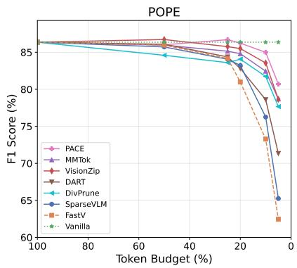

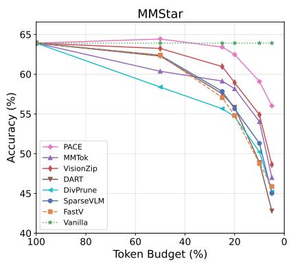

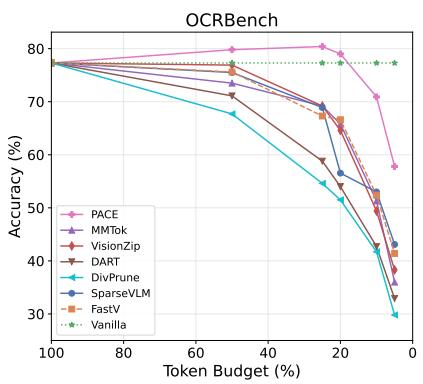  
Figure 5: Performance scaling under continuous token budgets. PACE degrades more gracefully than pruning baselines as retention decreases, with especially large advantages on the detail-sensitive MMStar and OCRBench benchmarks under strict budgets.

Cross-backbone experiments in Appendix B.3 further evaluate InternVL3.5-4B’s multi-tile pipeline. Across 25%, 20%, and 10% retention, PACE attains normalized averages of 85.2%, 80.9%, and 69.5%, exceeding the strongest corresponding baseline by 5.1, 4.7, and 4.0 points.

Robustness Validation. As illustrated in Figure 5, we evaluate the algorithmic robustness of PACE on Qwen2.5-VL-7B across continuous token budgets ranging from 100% down to 5%. We track performance on POPE, MMStar, and OCR-Bench, which assess object-level perception, visually grounded multimodal reasoning, and finegrained OCR-centric recognition, respectively.

PACE exhibits robust performance scaling as the retention budget decreases. At the 10% token budget, PACE achieves 84.99% on POPE, 59.08% on MMStar, and 70.90% on OCRBench, outperforming the strongest baseline by 1.44, 4.18, and 17.90 absolute points. This advantage remains pronounced under the more aggressive 5% budget, where PACE exceeds the best baseline by 2.00,

7.39, and 14.70 points across the three tasks. These results confirm that PACE successfully preserves both object-level perception and fine-grained visual evidence under severe compression.

## 4.3 Efficiency Profiling

We profile the inference efficiency of PACE on Qwen2.5-VL-7B under the fixed-resolution setting with a 10% visual-token budget on a single RTX 4090. Since PACE does not accelerate autoregressive decoding, we report time to first token (TTFT) rather than end-to-end generation time. Vanilla TTFT comprises vision encoding and LLM prefill; PACE TTFT additionally includes the Shallow Feature Preview and adaptive resizing. The stage-wise encoder and prefill entries exclude these APC overheads.

PACE reduces the average vision encoder latency from 148.84 ms to 49.47 ms (3.01× speedup) and the LLM prefill latency from 217.05 ms to 32.69 ms (6.64× speedup). Although APC introduces an average 34.62 ms preview-and-resizing overhead, TTFT still decreases from 365.89 ms to 116.79 ms, a 3.13× speedup. Across the full budget sweep in Appendix B.5, average TTFT speedup rises from 1.10× at 80% retention to 1.67×, 2.64×, and 3.13× at 50%, 20%, and 10%, respectively.

## 5 Analysis and Discussion

In this section, we analyze the core mechanisms of PACE. Additional evaluations—including hyperparameter robustness and ablations on attention-token sources—are detailed in Appendix B.

## 5.1 Orthogonality of APC

As a pre-encoder module, APC integrates orthogonally with existing post-encoder pruning algorithms. We validate this by augmenting VisionZip and MMTok with APC under 10% and 5% tokenretention budgets.

<table><tr><td>Dataset</td><td>Encoder Time (ms) Vanilla / PACE Spd.</td><td>Prefill Time (ms) Vanilla / PACE</td><td>Spd.</td><td>TTFT incl. APC (ms) Vanilla / PACE Spd.</td></tr><tr><td>DocVQA</td><td>143.41 / 50.74 2.83×</td><td>210.41 / 32.70</td><td>6.43×</td><td>353.82 / 117.54</td></tr><tr><td>TextVQA</td><td>154.28 / 48.20 3.20×</td><td>223.68 / 32.69</td><td>6.84×</td><td>3.01× 377.96 / 116.03 3.26×</td></tr><tr><td>Avg.</td><td>148.84 / 49.47 3.01×</td><td>217.05 / 32.69</td><td>6.64×</td><td>365.89 / 116.79 3.13×</td></tr></table>

Table 2: Latency of PACE on Qwen2.5-VL-7B at 10% retention. Encoder and prefill columns report their isolated stages; TTFT includes APC preview and resizing overhead. Measurements use the fixed-resolution setting on one RTX 4090.

As shown in Table 3, APC improves both baselines, particularly on detail-sensitive benchmarks. Under a 10% budget, APC boosts both VisionZip and MMTok by more than 15 points on ChartQA and OCRBench, alongside a gain of roughly 10 points on DocVQA. These improvements support APC’s compatibility with different downstream extractors and its ability to preserve fine-grained visual evidence before encoding.

<table><tr><td>Method</td><td>Budget</td><td>RealWorldQA</td><td>MME</td><td>ChartQA</td><td>OCRBench</td><td>TextVQA</td><td>DocVQA</td></tr><tr><td>VisionZip</td><td>10%</td><td>65.23</td><td>2147</td><td>53.08</td><td>49.40</td><td>67.16</td><td>49.55</td></tr><tr><td>+APC</td><td>10%</td><td>67.32 (+2.09)</td><td>2323 (+176)</td><td>68.96 (+15.88)</td><td>67.50 (+18.10)</td><td>72.39 (+5.23)</td><td>60.45 (+10.90)</td></tr><tr><td>MMTok</td><td>10%</td><td>58.82</td><td>2218</td><td>51.04</td><td>51.30</td><td>67.33</td><td>51.37</td></tr><tr><td>+APC</td><td>10%</td><td>63.27 (+4.45)</td><td>2289 (+71)</td><td>66.84 (+15.80)</td><td>66.80 (+15.50)</td><td>72.56 (+5.23)</td><td>62.05 (+10.68)</td></tr><tr><td>VisionZip +APC</td><td>5%</td><td>61.57</td><td>2029</td><td>40.96</td><td>38.30</td><td>55.47</td><td>29.40</td></tr><tr><td></td><td>5%</td><td>64.18 (+2.61)</td><td>2206 (+177)</td><td>48.88 (+7.92)</td><td>50.10 (+11.80)</td><td>58.79 (+3.32)</td><td>37.44 (+8.04)</td></tr><tr><td>MMTok</td><td>5%</td><td>54.12</td><td>2133</td><td>32.76</td><td>36.00</td><td>50.95</td><td>28.85</td></tr><tr><td>+APC</td><td>5%</td><td>59.48 (+5.36)</td><td>2221 (+88)</td><td>48.56 (+15.80)</td><td>50.70 (+14.70)</td><td>60.40 (+9.45)</td><td>40.64 (+11.79)</td></tr></table>

Table 3: Orthogonal integration of APC. APC augments VisionZip and MMTok at 10% and 5% token budgets.

## 5.2 Adaptive Resolution vs. Static Resolution

We evaluate the efficacy of APC’s adaptive pixel allocation against static-resolution variants under the dynamic-resolution setting of Qwen2.5-VL-7B. While static-resolution methods apply rigid condensation ratios globally, APC dynamically modulates the input resolution based on global density and local detail metrics.

As illustrated in Figure 6, Adaptive Resolution consistently achieves a favorable performance balance across diverse domains. On holistic tasks such as RealWorldQA, it outperforms the best static-resolution counterpart at both 10% and 5% budgets. Conversely, on detail-sensitive tasks such as ChartQA, Fixed Res.-50 yields a marginal gain over adaptive resolution (0.36 points at 10%) but concurrently induces a significant drop (2.74 points) on RealWorldQA. This trade-off confirms that rigid global scaling inherently overfits specific domains at the expense of general visual robustness, whereas APC successfully balances broad layout contexts with microscopic visual evidence.

## 5.3 Effect of Attention Fusion in DDAE

We evaluate DDAE’s dynamic fusion against single-modality and fixed-weight baselines: DDAE, Only ViT-Attn (solely vision-side visual attention), Only LLM-Attn (solely LLM-side semantic attention), and Fixed Fusion (a static combination that assigns a weight of 0.5 to each signal).

As shown in Figure 7, Dynamic DDAE exhibits the most resilient performance profile. Relying exclusively on LLM attention incurs substantial drops on visual tasks, with ChartQA degrading by over 10 points, indicating that text-guided signals neglect unprompted yet vital visual contexts. Conversely, omitting text-guided semantics (Only ViT-Attn) compromises task alignment. These representative gaps affirm that robust feature extraction necessitates dynamic, confidence-weighted multimodal attention.

## 5.4 Impact of DDAE Extraction Depth

The LLM extraction depth $( L _ { e x t } )$ governs the tradeoff between prefill latency and visual reasoning. A shallower layer initiates earlier pruning, significantly reducing prefill latency, whereas a deeper layer yields more sophisticated cross-modal attention maps at the cost of processing the full visual sequence longer. Table 4 illustrates this trade-off under a 10% token budget.

Deferring DDAE extraction to deeper layers (e.g., depth 24) enhances visual reasoning, markedly boosting ChartQA performance over depth 8. However, under the 2048 × 28 × 28 fixed-resolution setting, the prefill speedup falls from 2.11× at layer 2 to only 1.09× at layer 24. The same trend holds at twice the resolution (Appendix B.7). We therefore use layer $2 \left( L _ { e x t } = 2 \right)$ as the efficiency-oriented default.

<table><tr><td>Depth (Lext)</td><td>RealWorldQA</td><td>POPE</td><td>ChartQA</td><td>TextVQA</td><td>Prefill (ms)</td><td>Spd.</td></tr><tr><td>2</td><td>68.37</td><td>84.99</td><td>73.52</td><td>78.42</td><td>35.26</td><td>2.11×</td></tr><tr><td>8</td><td>66.54</td><td>84.72</td><td>65.68</td><td>78.80</td><td>42.51</td><td>1.75×</td></tr><tr><td>16</td><td>66.93</td><td>85.31</td><td>70.60</td><td>79.24</td><td>55.32</td><td>1.35×</td></tr><tr><td>24</td><td>67.71</td><td>86.32</td><td>78.96</td><td>78.41</td><td>68.12</td><td>1.09×</td></tr></table>

Table 4: Quality–latency trade-off of DDAE extraction depth. Prefill latency is compared against the 74.52 ms PACE-without-DDAE baseline.

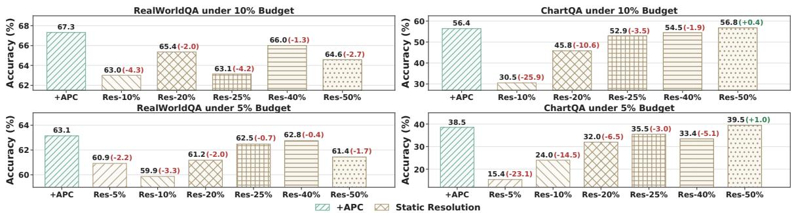  
Figure 6: Adaptive vs. static resolution under the dynamic-resolution setting. Adaptive pixel allocation is compared with static-resolution baselines at 10% and 5% token budgets.

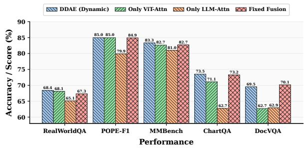  
Figure 7: Effect of attention fusion in DDAE. Dynamic fusion yields the most balanced performance across benchmarks: language-only attention loses critical visual evidence, while vision-only attention weakens task alignment.

## 6 Conclusion

This paper introduces PACE, a training-free inference framework designed to accelerate highresolution VLMs via a unified Condense-and-Extract paradigm. To overcome the dual computational bottlenecks of the vision encoder and the LLM, the Condense phase uses APC to adaptively remove pixel-level redundancy prior to visual encoding, mitigating compute-bound ViT overhead while preserving global layouts. Subsequently, the Extract phase employs DDAE to retain salient finegrained details by dynamically fusing internal visual priors from the ViT with semantic relevance from the LLM. PACE retains 93.8% of Qwen2.5- VL-7B’s uncompressed performance at a 90% token reduction and delivers a 3.1× TTFT speedup.

## 7 Limitations

PACE has two important limitations. First, APC accelerates the encoder only when reducing the pixel or tile budget also reduces the number of encoder tokens. On fixed-grid VLMs, DDAE can still reduce LLM prefill cost, but APC provides no encoder-side gain. Preview overhead also varies with architecture and resolution, so the Qwen2.5- VL speedups may not transfer unchanged to other backbones.

Second, APC performs query-agnostic, one-shot condensation and can miss faint or tiny characters, small chart labels, thin lines, or low-contrast objects. Once resizing makes such evidence ambiguous, DDAE cannot reconstruct it. High-stakes applications should therefore use a higher retention floor, a less aggressive target budget, or a lower α to emphasize local detail. Uncertainty-triggered or query-conditioned recovery of high-resolution crops is a promising extension.

## References

Abdelrahman Abouelenin, Atabak Ashfaq, Adam Atkinson, Hany Awadalla, Nguyen Bach, Jianmin Bao, Alon Benhaim, Martin Cai, Vishrav Chaudhary, Congcong Chen, and 1 others. 2025. Phi-4-mini technical report: Compact yet powerful multimodal language models via mixture-of-loras. arXiv preprint arXiv:2503.01743.

Josh Achiam, Steven Adler, Sandhini Agarwal, Lama Ahmad, Ilge Akkaya, Florencia Leoni Aleman, Diogo Almeida, Janko Altenschmidt, Sam Altman, Shyamal Anadkat, and 1 others. 2023. Gpt-4 technical report. arXiv preprint arXiv:2303.08774.

Jean-Baptiste Alayrac, Jeff Donahue, Pauline Luc, Antoine Miech, Iain Barr, Yana Hasson, Karel Lenc, Arthur Mensch, Katherine Millican, Malcolm Reynolds, and 1 others. 2022. Flamingo: a visual language model for few-shot learning. Advances in neural information processing systems, 35:23716– 23736.

Saeed Ranjbar Alvar, Gursimran Singh, Mohammad Akbari, and Yong Zhang. 2025. Divprune: Diversitybased visual token pruning for large multimodal models. In Proceedings of the Computer Vision and Pattern Recognition Conference, pages 9392–9401.

Jinze Bai, Shuai Bai, Shusheng Yang, Shijie Wang, Sinan Tan, Peng Wang, Junyang Lin, Chang Zhou, and Jingren Zhou. 2023. Qwen-vl: A frontier large vision-language model with versatile abilities. arXiv preprint arXiv:2308.12966, 1(2):3.

Shuai Bai, Yuxuan Cai, Ruizhe Chen, Keqin Chen, Xionghui Chen, Zesen Cheng, Lianghao Deng, Wei Ding, Chang Gao, Chunjiang Ge, and 1 others. 2025a. Qwen3-vl technical report. arXiv preprint arXiv:2511.21631.

Shuai Bai, Keqin Chen, Xuejing Liu, Jialin Wang, Wenbin Ge, Sibo Song, Kai Dang, Peng Wang, Shijie Wang, Jun Tang, Humen Zhong, Yuanzhi Zhu, Mingkun Yang, Zhaohai Li, Jianqiang Wan, Pengfei Wang, Wei Ding, Zheren Fu, Yiheng Xu, and 8 others. 2025b. Qwen2.5-vl technical report. Preprint, arXiv:2502.13923.

Mu Cai, Jianwei Yang, Jianfeng Gao, and Yong Jae Lee. 2025. Matryoshka multimodal models. In International Conference on Learning Representations, volume 2025, pages 46254–46272.

Liang Chen, Haozhe Zhao, Tianyu Liu, Shuai Bai, Junyang Lin, Chang Zhou, and Baobao Chang. 2024a. An image is worth 1/2 tokens after layer 2: Plug-andplay inference acceleration for large vision-language models. In European Conference on Computer Vision, pages 19–35. Springer.

Lin Chen, Jinsong Li, Xiaoyi Dong, Pan Zhang, Yuhang Zang, Zehui Chen, Haodong Duan, Jiaqi Wang, Yu Qiao, Dahua Lin, and 1 others. 2024b. Are we on the right way for evaluating large vision-language

models? Advances in Neural Information Processing Systems, 37:27056–27087.

Zhe Chen, Jiannan Wu, Wenhai Wang, Weijie Su, Guo Chen, Sen Xing, Muyan Zhong, Qinglong Zhang, Xizhou Zhu, Lewei Lu, and 1 others. 2024c. Internvl: Scaling up vision foundation models and aligning for generic visual-linguistic tasks. In Proceedings of the IEEE/CVF conference on computer vision and pattern recognition, pages 24185–24198.

Joonmyung Choi, Sanghyeok Lee, Jongha Kim, Sehyung Kim, Dohwan Ko, Jihyung Kil, and Hyunwoo J Kim. 2026. Docprune: Efficient document question answering via background, question, and comprehension-aware token pruning. arXiv preprint arXiv:2604.22281.

Rohan Choudhury, JungEun Kim, Jinhyung Park, Eunho Yang, László A Jeni, and Kris M Kitani. 2025. Accelerating vision transformers with adaptive patch sizes. arXiv preprint arXiv:2510.18091.

Long Cui, Weiyun Wang, Jie Shao, Zichen Wen, Gen Luo, Linfeng Zhang, Yanting Zhang, Yu Qiao, and Wenhai Wang. 2025. Vico: A training strategy towards semantic aware dynamic high-resolution. arXiv preprint arXiv:2510.12793.

Wenliang Dai, Junnan Li, Dongxu Li, Anthony Tiong, Junqi Zhao, Weisheng Wang, Boyang Li, Pascale N Fung, and Steven Hoi. 2023. Instructblip: Towards general-purpose vision-language models with instruction tuning. Advances in neural information processing systems, 36:49250–49267.

Tri Dao. 2024. Flashattention-2: Faster attention with better parallelism and work partitioning. In International Conference on Learning Representations, volume 2024, pages 35549–35562.

Tri Dao, Dan Fu, Stefano Ermon, Atri Rudra, and Christopher Ré. 2022. Flashattention: Fast and memory-efficient exact attention with io-awareness. Advances in neural information processing systems, 35:16344–16359.

Jinhong Deng, Wen Li, Joey Tianyi Zhou, and Yang He. 2026. Scope: Saliency-coverage oriented token pruning for efficient multimodel llms. Advances in Neural Information Processing Systems, 38:161527– 161552.

Sixun Dong, Juhua Hu, Mian Zhang, Ming Yin, Yanjie Fu, and Qi Qian. 2025. Mmtok: Multimodal coverage maximization for efficient inference of vlms. arXiv preprint arXiv:2508.18264.

Alexey Dosovitskiy, Lucas Beyer, Alexander Kolesnikov, Dirk Weissenborn, Xiaohua Zhai, Thomas Unterthiner, Mostafa Dehghani, Matthias Minderer, Georg Heigold, Sylvain Gelly, and 1 others. 2020. An image is worth 16x16 words: Transformers for image recognition at scale. arXiv preprint arXiv:2010.11929.

Zhengyao Fang, Pengyuan Lyu, Chengquan Zhang, Guangming Lu, Jun Yu, and Wenjie Pei. 2026. Prune redundancy, preserve essence: Vision token com pression in vlms via synergistic importance-diversity. arXiv preprint arXiv:2603.09480.

Chaoyou Fu, Peixian Chen, Yunhang Shen, Yulei Qin, Mengdan Zhang, Xu Lin, Jinrui Yang, Xiawu Zheng, Ke Li, Xing Sun, and 1 others. 2026. Mme: A comprehensive evaluation benchmark for multimodal large language models. Advances in Neural Information Processing Systems, 38.

Dong Guo, Faming Wu, Feida Zhu, Fuxing Leng, Guang Shi, Haobin Chen, Haoqi Fan, Jian Wang, Jianyu Jiang, Jiawei Wang, and 1 others. 2025. Seed1. 5-vl technical report. arXiv preprint arXiv:2505.07062.

Yanwei Li, Yuechen Zhang, Chengyao Wang, Zhisheng Zhong, Yixin Chen, Ruihang Chu, Shaoteng Liu, and Jiaya Jia. 2025. Mini-gemini: Mining the potential of multi-modality vision language models. IEEE Transactions on Pattern Analysis and Machine Intelligence.

Yifan Li, Yifan Du, Kun Zhou, Jinpeng Wang, Xin Zhao, and Ji-Rong Wen. 2023. Evaluating object hallucination in large vision-language models. In Proceedings of the 2023 conference on empirical methods in natural language processing, pages 292– 305.

Chenfei Liao, Wensong Wang, Zichen Wen, Xu Zheng, Yiyu Wang, Haocong He, Yuanhuiyi Lyu, Lutao Jiang, Xin Zou, Yuqian Fu, and 1 others. 2025. Are we using the right benchmark: An evaluation framework for visual token compression methods. arXiv preprint arXiv:2510.07143.

Ji Lin, Jiaming Tang, Haotian Tang, Shang Yang, Wei-Ming Chen, Wei-Chen Wang, Guangxuan Xiao, Xingyu Dang, Chuang Gan, and Song Han. 2024. Awq: Activation-aware weight quantization for ondevice llm compression and acceleration. In Proceedings of Machine Learning and Systems, volume 6, pages 87–100.

Zichuan Lin, Yicheng Liu, Yang Yang, Lvfang Tao, and Deheng Ye. 2025. Adaptvision: Efficient visionlanguage models via adaptive visual acquisition. arXiv preprint arXiv:2512.03794.

Haotian Liu, Chunyuan Li, Yuheng Li, Bo Li, Yuanhan Zhang, Sheng Shen, and Yong Jae Lee. 2024a. Llavanext: Improved reasoning, ocr, and world knowledge.

Haotian Liu, Chunyuan Li, Qingyang Wu, and Yong Jae Lee. 2023. Visual instruction tuning. Advances in neural information processing systems, 36:34892– 34916.

Wenzhuo Liu, Weijie Yin, Fei Zhu, Shijie Ma, Haiyang Guo, Xiao-Hui Li, Cheng-Lin Liu, and 1 others.

2026. One patch doesn’t fit all: Adaptive patching for native-resolution multimodal large language models. In The Fourteenth International Conference on Learning Representations.

Xuyang Liu, Yiyu Wang, Junpeng Ma, and Linfeng Zhang. 2025. Video compression commander: Plugand-play inference acceleration for video large language models. In Proceedings of the 2025 Conference on Empirical Methods in Natural Language Processing, pages 1910–1924.

Yuan Liu, Haodong Duan, Yuanhan Zhang, Bo Li, Songyang Zhang, Wangbo Zhao, Yike Yuan, Jiaqi Wang, Conghui He, Ziwei Liu, and 1 others. 2024b. Mmbench: Is your multi-modal model an all-around player? In European conference on computer vision, pages 216–233. Springer.

Yuliang Liu, Zhang Li, Mingxin Huang, Biao Yang, Wenwen Yu, Chunyuan Li, Xu-Cheng Yin, Cheng-Lin Liu, Lianwen Jin, and Xiang Bai. 2024c. Ocrbench: on the hidden mystery of ocr in large multimodal models. Science China Information Sciences, 67(12):220102.

Ahmed Masry, Xuan Long Do, Jia Qing Tan, Shafiq Joty, and Enamul Hoque. 2022. Chartqa: A benchmark for question answering about charts with visual and logical reasoning. In Findings of the association for computational linguistics: ACL 2022, pages 2263– 2279.

Minesh Mathew, Dimosthenis Karatzas, and CV Jawahar. 2021. Docvqa: A dataset for vqa on document images. In Proceedings ofthe IEEE/CVF winter conference on applications of computer vision, pages 2200–2209.

Yuzhang Shang, Mu Cai, Bingxin Xu, Yong Jae Lee, and Yan Yan. 2025. Llava-prumerge: Adaptive token reduction for efficient large multimodal models. In Proceedings of the IEEE/CVF International Conference on Computer Vision, pages 22857–22867.

Amanpreet Singh, Vivek Natarajan, Meet Shah, Yu Jiang, Xinlei Chen, Dhruv Batra, Devi Parikh, and Marcus Rohrbach. 2019. Towards vqa models that can read. In Proceedings ofthe IEEE/CVF conference on computer vision and pattern recognition, pages 8317–8326.

Rinyoichi Takezoe, Yaqian Li, Zihao Bo, Anzhou Hou, Mo Guang, and Kaiwen Long. 2026. Learnpruner: Rethinking attention-based token pruning in vision language models. arXiv preprint arXiv:2604.23950.

Gemini Team, Rohan Anil, Sebastian Borgeaud, Jean-Baptiste Alayrac, Jiahui Yu, Radu Soricut, Johan Schalkwyk, Andrew M Dai, Anja Hauth, Katie Millican, and 1 others. 2023. Gemini: a family of highly capable multimodal models. arXiv preprint arXiv:2312.11805.

HyperAI Team, Yuchen Liu, Kaiyang Han, Zhiqiang Xia, Yuhang Dong, Chen Song, Kangyu Tang, Jiaming Xu, Xiushi Feng, WenXuan Yu, and 1 others. 2025. Hypervl: An efficient and dynamic multimodal large language model for edge devices. arXiv preprint arXiv:2512.14052.

Haodong Wang, Junjie Liu, Zicong Hong, Qianli Liu, Jian Lin, Song Guo, and Xu Chen. 2026a. Twinquant: Learnable subspace decomposition for 4-bit llm quantization. arXiv preprint arXiv:2606.01556.

Nan Wang, Zhiwei Jin, Chen Chen, and Haonan Lu. 2026b. Pixelprune: Pixel-level adaptive visual token reduction via predictive coding. arXiv preprint arXiv:2604.00886.

Weiyun Wang, Zhangwei Gao, Lixin Gu, Hengjun Pu, Long Cui, Xingguang Wei, Zhaoyang Liu, Linglin Jing, Shenglong Ye, Jie Shao, and 1 others. 2025a. Internvl3.5: Advancing open-source multimodal models in versatility, reasoning, and efficiency. arXiv preprint arXiv:2508.18265.

Yiyu Wang, Xuyang Liu, Xiyan Gui, Xinying Lin, Boxue Yang, Chenfei Liao, Tailai Chen, and Linfeng Zhang. 2025b. Accelerating streaming video large language models via hierarchical token compression. arXiv preprint arXiv:2512.00891.

Zichen Wen, Yifeng Gao, Shaobo Wang, Junyuan Zhang, Qintong Zhang, Weijia Li, Conghui He, and Linfeng Zhang. 2025. Stop looking for “important tokens” in multimodal language models: Duplication matters more. In Proceedings of the 2025 Conference on Empirical Methods in Natural Language Processing, pages 9972–9991.

X.AI. 2024. Grok-1.5 vision preview. https://x.ai/ blog/grok-1.5v.

Senqiao Yang, Yukang Chen, Zhuotao Tian, Chengyao Wang, Jingyao Li, Bei Yu, and Jiaya Jia. 2025. Visionzip: Longer is better but not necessary in vision language models. In Proceedings of the IEEE/CVF Conference on Computer Vision and Pattern Recognition, pages 19792–19802.

Senqiao Yang, Junyi Li, Xin Lai, Jinming Wu, Wei Li, Zejun MA, Bei Yu, Hengshuang Zhao, and Jiaya Jia. 2026. Visionthink: Smart and efficient vision language model via reinforcement learning. Advances in Neural Information Processing Systems, 38:95187– 95227.

Xubing Ye, Yukang Gan, Xiaoke Huang, Yixiao Ge, and Yansong Tang. 2025. Voco-llama: Towards vision compression with large language models. In Proceedings ofthe Computer Vision and Pattern Recognition Conference, pages 29836–29846.

Kaichen Zhang, Bo Li, Peiyuan Zhang, Fanyi Pu, Joshua Adrian Cahyono, Kairui Hu, Shuai Liu, Yuanhan Zhang, Jingkang Yang, Chunyuan Li, and 1 others. 2025. Lmms-eval: Reality check on the evaluation of large multimodal models. In Findings ofthe

Association for Computational Linguistics: NAACL 2025, pages 881–916.

Qizhe Zhang, Mengzhen Liu, Lichen Li, Ming Lu, Yuan Zhang, Junwen Pan, Qi She, and Shanghang Zhang. 2026. Beyond attention or similarity: Maximizing conditional diversity for token pruning in mllms. Advances in Neural Information Processing Systems, 38:25438–25468.

Yuan Zhang, Chun-Kai Fan, Junpeng Ma, Wenzhao Zheng, Tao Huang, Kuan Cheng, Denis Gudovskiy, Tomoyuki Okuno, Yohei Nakata, Kurt Keutzer, and 1 others. 2024. Sparsevlm: Visual token sparsification for efficient vision-language model inference. arXiv preprint arXiv:2410.04417.

Xin Zou, Di Lu, Yizhou Wang, Yibo Yan, Yuanhuiyi Lyu, Xu Zheng, Linfeng Zhang, and Xuming Hu. 2026. Don’t just chase “highlighted tokens” in mllms: Revisiting visual holistic context retention. Advances in Neural Information Processing Systems, 38:39800– 39832.

## A Detailed Experimental Setup

## A.1 Models, Baselines, and Evaluation Framework

To ensure fair and reproducible comparisons, we detail the backbone models, token-reduction baselines, and evaluation framework used in our experiments.

Models. We integrate PACE into Qwen2.5-VL-3B1 and Qwen2.5-VL-7B2 (Bai et al., 2025b). Qwen2.5-VL uses native dynamic-resolution processing to convert images of different sizes into variable-length visual token sequences. Its visual backbone combines a dynamic-resolution Vision Transformer with Window Attention to reduce selfattention cost. Because visual-token length still grows with input resolution, high-resolution inputs remain expensive to encode. This design makes Qwen2.5-VL suitable for evaluating PACE’s adaptive pixel allocation before full visual encoding.

Baselines. We compare PACE with six visualtoken reduction methods:

• FastV (Chen et al., 2024a): Discards visual tokens exhibiting minimal attention scores within early LLM layers, thereby truncating the context sequence for subsequent layers.

• SparseVLM (Zhang et al., 2024): Deploys text-guided, training-free sparsification utilizing decoder self-attention to assess token importance, paired with a token recycling mechanism.

• DivPrune (Alvar et al., 2025): Formulates token pruning mathematically as a Max-Min Diversity Problem, ensuring the selected subset remains visually and semantically heterogeneous.

• DART (Wen et al., 2025): Evaluates contextual duplication to purge visual tokens highly redundant with selected pivot tokens while preserving distinct visual representations.

• VisionZip (Yang et al., 2025): Attenuates sequences through sequential token selection and fusion, merging redundant local patches into compressed contextual representations.

• MMTok (Dong et al., 2025): Models visualtoken selection explicitly as a submodular maximum coverage problem, employing greedy heuristics to optimize conceptual graph overlap.

All six baselines operate after visual representation extraction. They reduce LLM prefill cost but do not change the cost of encoding the original high-resolution input with the visual backbone.

Evaluation Framework. We standardize all experiments using the open-source lmms-eval framework (Zhang et al., 2025). This pipeline provides a unified evaluation suite encompassing standardized task definitions, exact prompt templates, deterministic generation configurations, and uniform metric computation. Unless explicitly stated otherwise, we adhere strictly to the official lmms-eval configuration to ensure direct comparability across all methods.

## A.2 Detailed Benchmark Descriptions

We comprehensively evaluate PACE across nine diverse benchmarks covering disparate visual processing demands, with their statistical properties cataloged in Table 5.

• RealWorldQA (X.AI, 2024): Evaluates general visual understanding in real-world scenes, including object localization and scene-level awareness.

• POPE (Li et al., 2023): Measures object hallucination under different visual conditions.

• OCRBench (Liu et al., 2024c): Evaluates OCR-related capabilities across scene text, documents, and mathematical content.

• MME (Fu et al., 2026): Covers perception, OCR, logical reasoning, and commonsense tasks.

• MMStar (Chen et al., 2024b): Contains 1,500 curated questions designed to reduce language-only shortcuts and require visual evidence.

• MMBench (Liu et al., 2024b): Uses multiplechoice questions to evaluate a range of multimodal capabilities.

• TextVQA (Singh et al., 2019): Evaluates reading and reasoning over text embedded in natural images.

• ChartQA (Masry et al., 2022): Evaluates numerical and structural reasoning over charts.

• DocVQA (Mathew et al., 2021): Evaluates document reading and layout understanding on scanned documents.

<table><tr><td>Dataset</td><td>Total</td><td>Avg. Resolution</td><td>Avg. Pixels</td><td>Duplicates</td><td>Dup. Ratio</td></tr><tr><td>RealWorldQA</td><td>765</td><td> $1 3 1 6 \times 1 0 3 0$ </td><td>1,341,566</td><td>3</td><td>0.39%</td></tr><tr><td>OCRBench</td><td>1,000</td><td> $6 1 5 \times 7 3 2$ </td><td>1,017,574</td><td>70</td><td>7.00%</td></tr><tr><td>MMStar</td><td>1,500</td><td> $5 1 1 \times 3 9 1$ </td><td>245,161</td><td>70</td><td>4.67%</td></tr><tr><td>MME</td><td>2,374</td><td> $1 0 8 6 \times 9 4 5$ </td><td>1,881,888</td><td>1,197</td><td>50.42%</td></tr><tr><td>ChartQA</td><td>2,500</td><td> $7 6 8 \times 5 8 3$ </td><td>454,992</td><td>991</td><td>39.64%</td></tr><tr><td>MMBenchen_dev</td><td>4,329</td><td> $4 4 0 \times 3 3 8$ </td><td>153,326</td><td>3,208</td><td>74.10%</td></tr><tr><td> $\mathrm { T e x t V Q A _ { \mathrm { v a l } } }$ </td><td>5,000</td><td> $9 5 2 \times 8 1 9$ </td><td>770,513</td><td>1,834</td><td>36.68%</td></tr><tr><td>DocVQAval</td><td>5,349</td><td> $1 7 8 3 \times 2 0 9 9$ </td><td>3,935,008</td><td>4,064</td><td>75.98%</td></tr><tr><td>POPE</td><td>9,000</td><td> $5 8 5 \times 4 7 9$ </td><td>277,243</td><td>8,500</td><td>94.44%</td></tr></table>

Table 5: Statistics of the evaluation datasets. The table reports dataset size, native resolution, pixel count, and duplication statistics. “Duplicates” counts additional question instances that reuse an image already paired with another question.

## A.3 Detailed Implementation Specifics

For the APC module, we fix the feature preview depth to the initial ViT block $( K = 1 )$ to limit preprocessing overhead. We set the globallocal balancing weight α to 0.6 and the local contrast regularization term γ to 1.5. The target retention ratio $r ~ = ~ \rho$ determines the final pixel count relative to the original image area. Consequently, the image width and height are both scaled by a factor of $\sqrt { r }$ using bicubic interpolation (Image.Resampling.BICUBIC).

In the DDAE module, the visual self-attention score $( S _ { v i s } )$ comes directly from the final ViT block. The semantic relevance map $( S _ { l l m } )$ is aggregated from the cross-modal attention of the second LLM block $( L _ { e x t } = 2 )$ , with weights averaged uniformly across all valid tokens. We set the temperature scalar τ for confidence-weighted softmax fusion to 0.5. All experiments use greedy decoding (temperature = 0). We conduct all efficiency profiling and latency measurements, including TTFT and TPOT calculations, on a single NVIDIA RTX 4090 GPU.

## B Additional Experiments

## B.1 Hyperparameter Robustness

PACE uses a small set of interpretable hyperparameters. The scaling variable γ limits over-retention caused by noisy, high-frequency patterns in the local contrast score. The temperature τ controls the sharpness of DDAE’s softmax confidence weights.

Sensitivity of Global-Local Balancing Weight (α). The coefficient α controls the balance between global redundancy estimation and local detail preservation in APC. Specifically, a larger α places greater emphasis on the global information density score $\rho _ { g } ,$ whereas a smaller α increases the contribution of the local detail contrast score $\rho _ { d } .$ To examine this trade-off, we evaluate different α values under the restrictive 5% token budget in the dynamic-resolution setting of Qwen2.5-VL-7B.

Table 6 reports the fine-grained MMStar breakdown. Although larger values such as $\alpha = 1 . 0$ and $\alpha = 0 . 8$ improve specific categories, including coarse perception and math reasoning, they consistently degrade several layout- and relation-sensitive dimensions. For example, compared with the default $\alpha = 0 . 6 $ , setting $\alpha = 1 . 0$ decreases instance reasoning by 3.61 points, logical reasoning by 4.35 points, and science & technology by 3.03 points.

Conversely, smaller values such as $\alpha = 0$ .4 and $\alpha = 0 . 2$ over-emphasize local contrast cues. This makes the adaptive resolution policy more sensitive to isolated high-frequency patterns and weakens its ability to preserve coherent global layouts. As a result, these settings reduce the MMStar average by 3.32 and 2.90 points, respectively. Overall, $\alpha =$ 0.6 provides the most balanced behavior, securing a stable compromise between suppressing globally redundant regions and retaining task-critical local cues under severe token constraints.

Sensitivity of the Top-Detail Percentile. We compare 5%, 10%, and 20% tail fractions while holding all other settings fixed. Their performance is very similar, so we use 10% as a fixed midpoint across models, datasets, and token budgets.

## B.2 Shallow Feature Preview Ablation

We isolate the preview signal while keeping APC’s adaptive resizing and DDAE unchanged under the native dynamic-resolution setting at 10% visualtoken retention. A literal removal of all preview signals would make image-dependent allocation impossible and reduce APC to static resolution; we therefore replace the shallow ViT feature with four training-free pixel statistics.

Pixel statistics measure color variation or local high-frequency response but cannot reliably separate semantic information density from texture, noise, decorative patterns, or irrelevant edges. Edge density is comparatively effective on ChartQA because plotted lines convey useful structure, whereas the Laplacian is more sensitive to fine-scale noise. The shallow ViT preview provides a lightweight semantic prior and transfers more consistently across the two domains.

<table><tr><td>α</td><td>Coarse Perc.</td><td>Fine-grained Perc. Instance Reason.</td><td></td><td>Logical Reason.</td><td>Math</td><td>Science &amp; Tech.</td><td>Avg.</td></tr><tr><td>0.6 (Default)</td><td> $5 9 . 4 8 ( 0 . 0 0 )$ </td><td> ${ \bf 3 9 . 0 7 \ ( 0 . 0 0 ) }$ </td><td> ${ \pmb 5 7 . 6 3 ( 0 . 0 0 ) }$ </td><td> $\mathbf { 4 8 . 4 7 \ ( 0 . 0 0 ) }$ </td><td> $4 3 . 4 5 \ ( 0 . 0 0 )$ </td><td> ${ \bf 3 3 . 0 6 } \left( 0 . 0 0 \right)$ </td><td> ${ \bf 4 6 . 8 6 } \left( 0 . 0 0 \right)$ </td></tr><tr><td>1.0</td><td> ${ \bf 6 2 . 0 0 } _ { ( + 2 . 5 2 ) }$ </td><td> $3 7 . 2 5 \ ( - 1 . 8 2 )$ </td><td> $5 4 . 0 2 \ ( - 3 . 6 1 )$ </td><td> $4 4 . 1 2 \ ( - 4 . 3 5 )$ </td><td> $4 6 . 2 5 \ ( + 2 . 8 0 )$ </td><td> $3 0 . 0 3 \ ( - 3 . 0 3 )$ </td><td> $4 5 . 1 6 \ ( - 1 . 7 0 )$ </td></tr><tr><td>0.8</td><td> $6 0 . 3 5 ~ ( + 0 . 8 7 )$ </td><td> $3 3 . 6 5 \ ( - 5 . 4 2 )$ </td><td> $5 3 . 6 4 \ ( - 3 . 9 9 )$ </td><td> $4 5 . 6 3 \ ( - 2 . 8 4 )$ </td><td> ${ \pmb 5 0 . 0 2 } \ ( + 6 . 5 7 )$ </td><td> $2 7 . 5 2 \ ( - 5 . 5 4 )$ </td><td> $4 5 . 1 4 \ ( - 1 . 7 2 )$ </td></tr><tr><td>0.4</td><td> $5 8 . 3 2 \ ( - 1 . 1 6 )$ </td><td> $3 6 . 4 2 \ ( - 2 . 6 5 )$ </td><td> $5 3 . 8 3 \ ( - 3 . 8 0 )$ </td><td> $4 1 . 7 7 \ ( - 6 . 7 0 )$ </td><td> $4 4 . 2 4 \ ( + 0 . 7 9 )$ </td><td> $2 6 . 6 8 \ ( - 6 . 3 8 )$ </td><td> $4 3 . 5 4 \ ( - 3 . 3 2 )$ </td></tr><tr><td>0.2</td><td> $5 8 . 5 2 \ ( - 0 . 9 6 )$ </td><td> $3 3 . 4 1 \ ( - 5 . 6 6 )$ </td><td> $5 2 . 5 7 \ ( - 5 . 0 6 )$ </td><td> $4 4 . 5 6 \ ( - 3 . 9 1 )$ </td><td> $4 3 . 8 4 \ ( + 0 . 3 9 )$ </td><td> $3 0 . 8 4 \ ( - 2 . 2 2 )$ </td><td> $4 3 . 9 6 \ ( - 2 . 9 0 )$ </td></tr></table>

Table 6: Sensitivity of APC’s global-local balancing weight α on MMStar under the dynamic-resolution setting. Results are reported on Qwen2.5-VL-7B at the 5% token budget.

<table><tr><td>APC Feature</td><td>RealWorldQA</td><td>ChartQA</td></tr><tr><td>Vanilla (100%)</td><td>69.54</td><td>83.92</td></tr><tr><td>RGB statistics</td><td>63.40</td><td>47.64</td></tr><tr><td>Color entropy</td><td>65.10</td><td>51.40</td></tr><tr><td>Edge density</td><td>64.18</td><td>55.96</td></tr><tr><td>Laplacian</td><td>64.31</td><td>55.04</td></tr><tr><td>Shallow Feature Preview</td><td>67.32</td><td>56.40</td></tr></table>

Table 7: Ablation of APC’s information-density feature. Compressed variants retain 10% of visual tokens on Qwen2.5-VL-7B; Vanilla is shown only as the uncompressed reference. The shallow ViT preview is the strongest adaptive feature on both a natural-image and a chart benchmark.

## B.3 Cross-Model Generalization to InternVL3.5-4B

We evaluate PACE on InternVL3.5-4B, whose dynamic multi-tile pipeline differs substantially from Qwen-style native-resolution patching. For applicable baselines, “-T” prunes within each tile before concatenation, whereas “-G” concatenates all tile tokens before one global selection under the same total budget. We report both reasonable treatments of tile boundaries.

PACE achieves the strongest overall performance, surpassing the best baseline average by 5.1, 4.7, and 4.0 points at 25%, 20%, and 10%, respectively. It is not uniformly best on every task, but it provides the most balanced result and preserves substantially more OCRBench and DocVQA performance. These results support transfer to a distinct tiling-based architecture; latency and preview amortization remain backbone- and resolution-dependent.

## B.4 Comprehensive Experimental Results

We report complete results for Qwen2.5-VL-7B (Table 9) and Qwen2.5-VL-3B (Table 10) under two input settings:

• Fixed-resolution setting (MinPix = MaxPix $= 2 0 4 8 \times 2 8 \times 2 8 )$ : Pads or resizes every input to the same pixel budget, which standardizes the input size and can introduce additional redundant patches.

• Dynamic-resolution setting (MinPix = $2 5 6 \times 2 8 \times 2 8 , \mathbf { M a x P i x } = 2 0 4 8 \times 2 8 \times 2 8 ) \colon$ Uses the model’s native resolution range while preserving each image’s aspect ratio.

Across both settings, post-encoder baselines degrade substantially under the fixed-resolution setting at 10% and 5% retention, particularly on detailsensitive benchmarks. PACE degrades more gradually across both model sizes, consistent with the benefit of adapting the input resolution before full visual encoding.

## B.5 TTFT Profiling Across Retention Budgets

Table 11 extends the main 10% measurement to milder retention budgets. TTFT is the complete pre-generation latency: Vanilla includes vision encoding and LLM prefill, while PACE additionally includes the Shallow Feature Preview and adaptive resizing. The isolated encoder and prefill columns exclude these APC overheads. Autoregressive decoding is not included because it is not accelerated by PACE.

The average TTFT speedup across DocVQA and TextVQA is 1.10×, 1.67×, 2.64×, and 3.13× at 80%, 50%, 20%, and 10% retention, respectively. The modest 80% gain reflects that preview overhead is nearly fixed while relatively little encoder and prefill computation is removed; the overhead is progressively amortized at stricter budgets.

Dataset-wise 10% profiling. We further report the number of evaluated samples and average persample latency over all nine benchmarks. As shown in Table 12, PACE consistently reduces both encoder-side and LLM-side latency. On average, it reduces encoder latency from 152.41 ms to 46.10 ms and prefill latency from 222.16 ms to 31.63 ms, corresponding to 3.32× and 7.02× speedups. Including APC and resizing, average TTFT decreases from 374.58 ms to 112.08 ms (3.34×).

<table><tr><td>Method RWQA</td><td colspan="19">POPE MME MMB MMStar ChartQA</td></tr><tr><td>Vanilla (100%)</td><td>65.62</td><td>89.47</td><td>2280.88</td><td>81.36</td><td>66.53</td><td>85.72</td><td>80.80</td><td>75.82</td><td>91.08</td><td>100.0%</td></tr><tr><td colspan="11">Retain 25% visual tokens</td></tr><tr><td>FastV</td><td>57.91</td><td>87.24</td><td>2108.89</td><td>76.46</td><td>54.09</td><td>59.68</td><td>38.10</td><td>66.39</td><td>57.65</td><td>80.1%</td></tr><tr><td>DivPrune-T</td><td>58.04</td><td>87.97</td><td>2011.20</td><td>74.74</td><td>52.34</td><td>48.16</td><td>30.30</td><td>56.58</td><td>42.05</td><td>73.3%</td></tr><tr><td>DivPrune-G</td><td>56.86</td><td>87.65</td><td>2026.90</td><td>77.58</td><td>54.81</td><td>50.36</td><td>34.00</td><td>57.05</td><td>46.54</td><td>75.4%</td></tr><tr><td>VisionZip-T</td><td>58.43</td><td>88.25</td><td>1922.14</td><td>73.71</td><td>50.69</td><td>31.72</td><td>16.10</td><td>45.22</td><td>24.05</td><td>64.6%</td></tr><tr><td>MMTok-T</td><td>57.65</td><td>88.17</td><td>2023.92</td><td>74.66</td><td>51.08</td><td>38.72</td><td>12.10</td><td>34.89</td><td>27.26</td><td>64.4%</td></tr><tr><td>MMTok-G</td><td>58.04</td><td>88.42</td><td>2049.51</td><td>76.46</td><td>51.82</td><td>40.16</td><td>12.70</td><td>31.89</td><td>29.59</td><td>65.1%</td></tr><tr><td>PACE (Ours)</td><td>58.17</td><td>88.03</td><td>2238.93</td><td>80.58</td><td>58.47</td><td>55.64</td><td>52.30</td><td>66.46</td><td>70.36</td><td>85.2%</td></tr><tr><td colspan="11">Retain 20% visual tokens</td></tr><tr><td>FastV</td><td>56.21</td><td>85.95</td><td>2032.87</td><td>74.66</td><td>52.17</td><td>51.88</td><td>33.70</td><td>63.91</td><td>52.76</td><td>76.2%</td></tr><tr><td>DivPrune-T</td><td>55.29</td><td>87.45</td><td>2002.21</td><td>73.80</td><td>50.08</td><td>42.48 44.68</td><td>23.30</td><td>53.15</td><td>36.80</td><td>69.4% 71.2%</td></tr><tr><td>DivPrune-G</td><td>54.12</td><td>86.79</td><td>1966.18</td><td>76.12</td><td>52.39</td><td></td><td>29.70</td><td>53.15</td><td>40.31</td><td></td></tr><tr><td>VisionZip-T</td><td>55.82</td><td>88.25</td><td>1884.68</td><td>73.37</td><td>49.56</td><td>26.80</td><td>11.70</td><td>39.89</td><td>19.31</td><td>61.2%</td></tr><tr><td>MMTok-T</td><td>55.82</td><td>87.57</td><td>1967.05</td><td>72.42</td><td>48.57</td><td>32.88</td><td>8.50</td><td>31.44</td><td>23.33</td><td>60.8%</td></tr><tr><td>MMTok-G</td><td>56.60</td><td>87.78</td><td>1968.71</td><td>74.48</td><td>48.43</td><td>32.40</td><td>9.80</td><td>28.94</td><td>24.49</td><td>61.1%</td></tr><tr><td>PACE (Ours)</td><td>55.42</td><td></td><td>87.55 2183.7878.44</td><td></td><td>57.30</td><td>48.24</td><td>45.80</td><td>63.43</td><td>64.62</td><td>80.9%</td></tr><tr><td colspan="11">Retain 10% visual tokens</td></tr><tr><td>FastV</td><td>51.11</td><td>83.33</td><td>1804.05</td><td>71.13</td><td>43.06</td><td>36.80</td><td>21.80</td><td>56.39</td><td>39.00</td><td>65.5%</td></tr><tr><td>DivPrune-T</td><td>51.50</td><td>86.19</td><td>1853.69</td><td>70.79</td><td>45.53</td><td>30.00</td><td>14.00</td><td>43.09</td><td>25.23</td><td>60.9%</td></tr><tr><td>DivPrune-G</td><td>51.63</td><td>85.16</td><td>1851.55</td><td>71.48</td><td>46.99</td><td>29.36</td><td>17.50</td><td>43.77</td><td>28.13</td><td>62.0%</td></tr><tr><td>VisionZip-T</td><td>50.46</td><td>86.33</td><td>1819.59</td><td>67.70</td><td>43.35</td><td>20.20</td><td>7.60</td><td>26.03</td><td>13.99</td><td>53.8%</td></tr><tr><td>MMTok-T</td><td>53.20</td><td>86.08</td><td>1848.30</td><td>69.07</td><td>43.23</td><td>23.00</td><td>6.10</td><td>25.41</td><td>16.06</td><td>54.9%</td></tr><tr><td>MMTok-G</td><td>54.38</td><td>86.42</td><td>1924.16</td><td>70.53</td><td>44.06</td><td>21.92</td><td>6.00</td><td>22.39</td><td>17.76</td><td>55.4%</td></tr><tr><td>PACE (Ours)</td><td>52.16</td><td></td><td>84.55 2083.74</td><td>75.34</td><td>51.35</td><td>30.04</td><td>29.20</td><td>53.86</td><td>43.82</td><td>69.5%</td></tr><tr><td></td><td></td><td></td><td></td><td></td><td></td><td></td><td></td><td></td><td></td><td></td></tr><tr><td>Method</td><td>RealWorldQA Acc. ↑</td><td>POPE F1↑</td><td>MME P+C↑</td><td>MMBench Acc. ↑</td><td>MMStar Acc. ↑</td><td>ChartQA Acc. ↑</td><td>OCRBench Acc. ↑</td><td>TextVQA Acc. ↑</td><td>DocVQA ANLS↑</td><td>Avg. ↑</td></tr><tr><td colspan="9">Fixed-resolution setting (MinPix = 2048 × 28 × 28, MaxPix = 2048 × 28 × 28)</td><td></td><td colspan="10"></td></tr><tr><td>Vanilla (100% Tokens)</td><td>69.54</td><td>86.36</td><td>2317</td><td>82.99</td><td>63.91</td><td>78.20</td><td>77.30</td><td>82.37</td><td>94.74</td><td>100.0%</td></tr><tr><td colspan="9">Retain 20% T</td><td colspan="11"></td></tr><tr><td>FastV (ECCV'24)</td><td>64.58</td><td>80.99</td><td>2256</td><td>80.76</td><td>54.79</td><td>64.12</td><td>66.60</td><td>79.16</td><td>76.58</td><td>90.2%</td></tr><tr><td>SparseVLM (ICML’25)</td><td>66.41</td><td>83.23</td><td>2258</td><td>81.36</td><td>55.65</td><td>70.00</td><td>56.54</td><td>80.33</td><td>73.56</td><td>90.3%</td></tr><tr><td>DivPrune (CVPR’25)</td><td>61.83</td><td>84.07</td><td>2248</td><td>80.07</td><td>54.66</td><td>51.56</td><td>51.50</td><td>69.99</td><td>49.40</td><td>81.7%</td></tr><tr><td>DART (EMNLP’25)</td><td>63.53</td><td>82.81</td><td>2278</td><td>79.64</td><td>55.83</td><td>58.72</td><td>54.00</td><td>69.48</td><td>50.58</td><td>83.5%</td></tr><tr><td>VisionZip (CVPR’25)</td><td>67.06</td><td>85.50</td><td>2317</td><td>81.01</td><td>58.93</td><td>69.68</td><td>64.60</td><td>77.52</td><td>75.77</td><td>92.5%</td></tr><tr><td>MMTok (ICLR'26)</td><td>63.79</td><td>84.81</td><td>2278</td><td>82.22</td><td>58.17</td><td>68.40</td><td>65.80</td><td>76.78</td><td>74.25</td><td>91.4%</td></tr><tr><td>PACE (w/o APC)</td><td>66.93</td><td>85.29</td><td>2310</td><td>81.36</td><td>59.29</td><td>72.84</td><td>69.10</td><td>80.72</td><td>83.00</td><td>94.9%</td></tr><tr><td>PACE (Ours)</td><td>66.93</td><td>86.23</td><td>2322</td><td>83.08</td><td>62.47</td><td>78.56</td><td>79.00</td><td>81.66</td><td>86.84</td><td>98.6%</td></tr><tr><td colspan="9">Retain 10% T</td><td colspan="11"></td></tr><tr><td>FastV (ECCV'24)</td><td>59.08</td><td>73.28</td><td>2154</td><td>77.23</td><td>48.78</td><td>51.80</td><td>52.40</td><td>74.23</td><td>59.56</td><td>79.9%</td></tr><tr><td>SparseVLM (ICML’25)</td><td>60.39</td><td>76.25</td><td>2145</td><td>77.23</td><td>51.30</td><td>61.00</td><td>53.00</td><td>76.30</td><td>49.61</td><td>81.4%</td></tr><tr><td>DivPrune (CVPR’25)</td><td>57.25</td><td>81.73</td><td>2158</td><td>76.12</td><td>50.22</td><td>39.00</td><td>41.70</td><td>59.32</td><td>34.58</td><td>72.5%</td></tr><tr><td>DART (EMNLP'25)</td><td>58.82</td><td>78.60</td><td>2074</td><td>78.26</td><td>48.89</td><td>44.88</td><td>42.70</td><td>57.12</td><td>33.65</td><td>72.6%</td></tr><tr><td>VisionZip (CVPR'25)</td><td>65.23</td><td>83.55</td><td>2147</td><td>79.04</td><td>54.90</td><td>53.08</td><td>49.40</td><td>67.16</td><td>49.55</td><td>81.1%</td></tr><tr><td>MMTok (ICLR'26)</td><td>58.82</td><td>82.44</td><td>2218</td><td>79.47</td><td>54.04</td><td>51.04</td><td>51.30</td><td>67.33</td><td>51.37</td><td>80.4%</td></tr><tr><td>PACE (w/o APC)</td><td>65.36</td><td>82.27</td><td>2228</td><td>80.07</td><td>55.25</td><td>65.76</td><td>58.00</td><td>76.18</td><td>65.54</td><td>87.7%</td></tr><tr><td>PACE (Ours)</td><td>68.37</td><td>84.99</td><td>2314</td><td>83.33</td><td>59.08</td><td>73.52</td><td>70.90</td><td>78.42</td><td>69.55</td><td>93.8%</td></tr><tr><td colspan="20">Retain 5% T</td></tr><tr><td>FastV (ECCV'24)</td><td>56.08</td><td>62.45</td><td>1995</td><td>73.54</td><td>45.88</td><td>36.52</td><td>41.40</td><td>66.21</td><td>44.17</td><td>69.6%</td></tr><tr><td>SparseVLM (ICML'25)</td><td>56.60</td><td>65.25</td><td>2011</td><td>72.08</td><td>45.01</td><td>46.24</td><td>43.10</td><td>69.53</td><td>30.99</td><td>70.3%</td></tr><tr><td>DivPrune (CVPR’25)</td><td>53.46</td><td>77.66</td><td>1926</td><td>72.77</td><td>45.20</td><td>28.96</td><td>29.80</td><td>41.28</td><td>22.64</td><td>62.0%</td></tr><tr><td>DART (EMNLP'25)</td><td>52.68</td><td>71.33</td><td>1946</td><td>73.97</td><td>42.80</td><td>30.76</td><td>32.90</td><td>45.01</td><td>23.37</td><td>62.2%</td></tr><tr><td>VisionZip (CVPR'25)</td><td>61.57</td><td>78.65</td><td>2029</td><td>75.17</td><td>48.63</td><td>40.96</td><td>38.30</td><td>55.47</td><td>29.40</td><td>70.5%</td></tr><tr><td>MMTok (ICLR'26)</td><td>54.12</td><td>78.70</td><td>2133</td><td>75.17</td><td>47.00</td><td>32.76</td><td>36.00</td><td>50.95</td><td>28.85</td><td>67.3%</td></tr><tr><td>PACE (w/o APC) PACE (Ours)</td><td>60.39 63.79</td><td>76.59 80.70</td><td>2117 2245</td><td>75.95 80.07</td><td>49.26 56.02</td><td>53.00 61.84</td><td>46.10 57.80</td><td>67.32 71.56</td><td>45.38</td><td>76.9% 84.3%</td></tr><tr><td colspan="9"></td><td colspan="11">48.94</td></tr><tr><td colspan="20">Dynamic-resolution setting (MinPix = 256 × 28 × 28, MaxPix = 2048 × 28 × 28)</td></tr><tr><td>Vanilla (100% Tokens)</td><td>69.54</td><td>86.46</td><td>2308</td><td>84.28</td><td>62.75</td><td>83.92</td><td>84.30</td><td>82.94</td><td>94.73</td><td>100.0%</td></tr><tr><td colspan="20">Retain 20% T</td></tr><tr><td>FastV (ECCV'24) SparseVLM (ICML’25)</td><td>64.44</td><td>74.76 79.18</td><td>2157 2195</td><td>78.18</td><td>49.69</td><td>62.60 66.00</td><td>59.90 56.10</td><td>77.49</td><td>75.93</td><td>84.9% 85.5%</td></tr><tr><td>DivPrune (CVPR’25)</td><td>64.44</td><td>81.21</td><td>2076</td><td>77.06</td><td>50.06</td><td>48.16</td><td>49.20</td><td>80.14</td><td>72.92</td><td>76.5%</td></tr><tr><td>DART (EMNLP'25)</td><td>63.14</td><td>80.72</td><td>2200</td><td>76.37</td><td>49.39</td><td>44.04</td><td>52.70</td><td>63.93 65.64</td><td>48.56 50.07</td><td>77.3%</td></tr><tr><td></td><td>63.01</td><td>83.11</td><td>2190</td><td>77.75</td><td>48.43</td><td>51.00</td><td>58.30</td><td>69.18</td><td>74.76</td><td>84.6%</td></tr><tr><td>VisionZip (CVPR’25)</td><td>65.49</td><td>83.05</td><td>2209</td><td>80.58</td><td>55.61</td><td>59.60</td><td>60.20</td><td>72.00</td><td>73.81</td><td></td></tr><tr><td>MMTok (ICLR'26)</td><td>63.01</td><td>82.08</td><td></td><td>79.12</td><td>52.36</td><td></td><td>64.20</td><td>78.61</td><td>82.37</td><td>85.2%</td></tr><tr><td>PACE (w/o APC) PACE (Ours)</td><td>65.49</td><td>83.52</td><td>2271</td><td>79.21</td><td>54.11</td><td>70.48</td><td></td><td>78.11</td><td></td><td>90.0%</td></tr><tr><td></td><td>68.10</td><td></td><td>2276</td><td>80.93</td><td>56.24</td><td>68.84</td><td>72.20</td><td></td><td>86.35</td><td>92.4%</td></tr><tr><td colspan="20">Retain 10% T</td></tr><tr><td>FastV (ECCV'24)</td><td colspan="19">58.56</td></tr><tr><td>Vanilla (100% Tokens)</td><td>67.52</td><td>87.40</td><td>2088</td><td>77.58</td><td>55.93</td><td>84.04</td><td>72.30</td><td>78.69</td><td>93.02</td><td>100.0%</td></tr><tr><td colspan="9">Retain 20% T</td><td colspan="11"></td></tr><tr><td>FastV (ECCV'24)</td><td>52.03</td><td>84.44</td><td>1998</td><td>73.97</td><td>50.93</td><td>74.32</td><td>60.10</td><td>74.51</td><td>74.25</td><td>89.1%</td></tr><tr><td>SparseVLM (ICML’25)</td><td>51.50</td><td>86.06</td><td>2044</td><td>73.88</td><td>51.31</td><td>68.24</td><td>54.90</td><td>74.47</td><td>62.74</td><td>86.5%</td></tr><tr><td>DivPrune (CVPR’25)</td><td>48.89</td><td>84.73</td><td>1920</td><td>72.42</td><td>50.03</td><td>55.76</td><td>41.80</td><td>59.69</td><td>44.31</td><td>76.9%</td></tr><tr><td>DART (EMNLP’25)</td><td>53.20</td><td>84.54</td><td>2043</td><td>73.45</td><td>52.12</td><td>68.44</td><td>47.30</td><td>64.01</td><td>52.16</td><td>82.8%</td></tr><tr><td>VisionZip (CVPR'25)</td><td>53.99</td><td>86.72</td><td>2074</td><td>75.08</td><td>53.09</td><td>77.36</td><td>57.70</td><td>69.17</td><td>70.93</td><td>89.6%</td></tr><tr><td>MMTok (ICLR'26)</td><td>53.73</td><td>86.62</td><td>2017</td><td>75.25</td><td>54.80</td><td>74.16</td><td>60.20</td><td>72.47</td><td>69.51</td><td>89.8%</td></tr><tr><td>PACE (w/o APC)</td><td>53.86</td><td>87.08</td><td>2102</td><td>75.52</td><td>53.37</td><td>79.04</td><td>60.20</td><td>72.63</td><td>75.14</td><td>91.5%</td></tr><tr><td>PACE (Ours)</td><td>55.56</td><td>87.61</td><td>2138</td><td>76.98</td><td>55.61</td><td>82.60</td><td>71.40</td><td>76.59</td><td>82.19</td><td>96.3%</td></tr><tr><td colspan="9">Retain 10% T</td><td colspan="11"></td></tr><tr><td>FastV (ECCV'24)</td><td>48.10</td><td>78.11</td><td>1900</td><td>70.87</td><td>47.82</td><td>60.56</td><td>47.40</td><td>69.65</td><td>54.84</td><td>79.3%</td></tr><tr><td>SparseVLM (ICML’25)</td><td>47.58</td><td>80.43</td><td>1922</td><td>69.58</td><td>47.21</td><td>43.92</td><td>40.70</td><td>68.31</td><td>40.02</td><td>74.1%</td></tr><tr><td>DivPrune (CVPR’25)</td><td>49.02</td><td>83.96</td><td>1893</td><td>70.10</td><td>49.01</td><td>45.68</td><td>32.70</td><td>50.44</td><td>30.87</td><td>70.5%</td></tr><tr><td>DART (EMNLP'25)</td><td>51.50</td><td>80.43</td><td>1863</td><td>69.84</td><td>46.59</td><td>51.48</td><td>34.80</td><td>50.61</td><td>32.97</td><td>71.1%</td></tr><tr><td>VisionZip (CVPR'25)</td><td>52.81</td><td>84.50</td><td>1932</td><td>71.64</td><td>50.59</td><td>60.84</td><td>42.50</td><td>57.23</td><td>43.32</td><td>77.9%</td></tr><tr><td>MMTok (ICLR'26)</td><td>53.07</td><td>85.22</td><td>1916</td><td>72.68</td><td>50.82</td><td>61.00</td><td>46.50</td><td>63.48</td><td>50.62</td><td>80.5%</td></tr><tr><td>PACE (w/o APC)</td><td>50.59</td><td>84.95</td><td>1950</td><td>73.11</td><td>50.82</td><td>67.80</td><td>47.70</td><td>65.06</td><td>53.95</td><td>82.0%</td></tr><tr><td>PACE (Ours)</td><td>53.73</td><td>86.77</td><td>2027</td><td>74.31</td><td>53.95</td><td>76.56</td><td>60.50</td><td>70.33</td><td>61.95</td><td>88.8%</td></tr><tr><td colspan="9">Retain 5% T</td><td colspan="11"></td></tr><tr><td>FastV (ECCV'24)</td><td>42.48</td><td>65.23</td><td>1742</td><td>66.67</td><td>43.01</td><td>42.56</td><td>38.60</td><td>62.16</td><td>38.56</td><td>67.6%</td></tr><tr><td>SparseVLM (ICML'25)</td><td>40.78</td><td>64.91</td><td>1696</td><td>60.14</td><td>40.79</td><td>24.76</td><td>31.10</td><td>57.52</td><td>24.43</td><td>59.8%</td></tr><tr><td>DivPrune (CVPR’25)</td><td>49.02</td><td>83.96</td><td>1893</td><td>66.32</td><td>46.00</td><td>45.68</td><td>32.70</td><td>50.44</td><td>22.65</td><td>68.4%</td></tr><tr><td>DART (EMNLP'25)</td><td>48.76</td><td>73.92</td><td>1744</td><td>65.38</td><td>41.98</td><td>33.84</td><td>22.50</td><td>36.86</td><td>21.75</td><td>60.1%</td></tr><tr><td>VisionZip (CVPR'25)</td><td>52.81</td><td>84.50</td><td>1932</td><td>68.21</td><td>47.04</td><td>60.84</td><td>42.50</td><td>57.23</td><td>26.45</td><td>74.6%</td></tr><tr><td>MMTok (ICLR'26)</td><td>53.07</td><td>85.22</td><td>1919</td><td>67.87</td><td>47.43</td><td>61.00</td><td>46.50</td><td>63.48</td><td>31.29</td><td>76.8%</td></tr><tr><td>PACE (w/o APC)</td><td>47.06</td><td>79.96</td><td>1804</td><td>70.36</td><td>47.65</td><td>52.84</td><td>37.10</td><td>53.94</td><td>34.06</td><td>71.4%</td></tr><tr><td>PACE (Ours)</td><td>50.72</td><td>83.66</td><td>1896</td><td>73.54</td><td>51.33</td><td>63.04</td><td>46.10</td><td>61.33</td><td>40.71</td><td>78.7%</td></tr><tr><td colspan="9"></td><td colspan="11"></td></tr><tr><td>Vanilla (100% Tokens) 59.74 86.47</td><td>Dynamic-resolution setting (MinPix = 256 × 28 × 28, MaxPix = 2048 × 28 × 28)</td><td></td><td>2154</td><td>78.01</td><td>55.67</td><td>83.36</td><td>77.90</td><td>78.75</td><td>92.89</td><td>100.0%</td></tr><tr><td colspan="20"></td></tr><tr><td>FastV (ECCV'24)</td><td></td><td>78.73</td><td>2002</td><td>Retain 20% T 71.56</td><td>46.91</td><td>64.76</td><td>54.50</td><td>73.29</td><td></td><td>85.5%</td></tr><tr><td>SparseVLM (ICML’25)</td><td>54.12 54.51</td><td>81.63</td><td>2005</td><td>70.18</td><td>46.07</td><td>56.08</td><td>46.20</td><td>74.41</td><td>72.84 61.74</td><td>82.1%</td></tr><tr><td>DivPrune (CVPR’25)</td><td>53.20</td><td>79.90</td><td>1877</td><td>69.15</td><td>45.42</td><td>51.40</td><td>43.40</td><td>56.52</td><td>43.77</td><td>75.0%</td></tr><tr><td>DART (EMNLP'25)</td><td>55.29</td><td>80.52</td><td>1926</td><td>70.10</td><td>46.39</td><td>53.00</td><td>45.30</td><td>55.77</td><td>51.40</td><td>77.3%</td></tr><tr><td>VisionZip (CVPR’25)</td><td>57.25</td><td>82.80</td><td>1905</td><td>71.90</td><td>49.21</td><td>65.48</td><td>51.30</td><td>64.22</td><td>70.17</td><td>84.7%</td></tr><tr><td>MMTok (ICLR'26)</td><td>55.42</td><td>82.23</td><td>2053</td><td>72.59</td><td>48.22</td><td>66.16</td><td>56.30</td><td>67.56</td><td>69.23</td><td>86.1%</td></tr><tr><td>PACE (w/o APC)</td><td>55.95</td><td>83.43</td><td>1948</td><td>72.51</td><td>49.97</td><td>70.48</td><td>56.90</td><td>71.49</td><td>74.49</td><td>88.0%</td></tr><tr><td>PACE (Ours)</td><td>56.86</td><td>84.29</td><td>2065</td><td>75.69</td><td>52.83</td><td>71.20</td><td>64.80</td><td>71.77</td><td>81.74</td><td>92.0%</td></tr><tr></tr></table>

Table 8: Cross-model performance on InternVL3.5-4B. Benchmark scores are reported for a variable-token, multi-tile architecture at 25%, 20%, and 10% retention. Avg. first normalizes each score by the corresponding Vanilla score and then averages the nine ratios; bold marks the best compressed result within each budget.

Table 9: Comprehensive performance on Qwen2.5-VL-7B. Results cover the fixed- and dynamic-resolution settings at 20%, 10%, and 5% token-retention budgets.

Table 10: Comprehensive performance on Qwen2.5-VL-3B. Results cover the fixed- and dynamic-resolution settings at 20%, 10%, and 5% token-retention budgets.

<table><tr><td>Retention</td><td>Dataset</td><td>Encoder: Vanilla / PACE (Spd.)</td><td>Prefill: Vanilla / PACE (Spd.)</td><td>TTFT incl. APC: Vanilla / PACE (Spd.)</td></tr><tr><td rowspan="2">80%</td><td>DocVQA</td><td>144.77 / 109.07 (1.33×)</td><td>209.35 / 168.63 (1.24×)</td><td>354.12 / 321.57 (1.10×)</td></tr><tr><td>TextVQA</td><td>156.27 / 117.33 (1.33×)</td><td>220.02 / 174.56 (1.26×)</td><td>376.29 / 339.98 (1.11×)</td></tr><tr><td rowspan="2">50%</td><td>DocVQA</td><td>144.69 / 66.28 (2.18×)</td><td>207.84 / 105.81 (1.96×)</td><td>352.54 / 210.30 (1.68×)</td></tr><tr><td>TextVQA</td><td>155.24 / 70.17 (2.21×)</td><td>220.40 / 114.70 (1.92×)</td><td>375.64 / 224.88 (1.67×)</td></tr><tr><td>20%</td><td>DocVQA TextVQA</td><td>144.73 / 51.97 (2.78×) 155.20 / 49.46 (3.14×)</td><td>207.72 / 50.92 (4.08×) 220.26 / 51.32 (4.29×)</td><td>352.45 / 138.53 (2.54×) 375.46 / 137.34 (2.73×)</td></tr><tr><td>10%</td><td>DocVQA TextVQA</td><td>143.41 / 50.74 (2.83×) 154.28 / 48.20 (3.20×)</td><td>210.41 / 32.70 (6.43×) 223.68 / 32.69 (6.84×)</td><td>353.82 / 117.54 (3.01×) 377.96 / 116.03 (3.26×)</td></tr></table>

Table 11: Latency across visual-token retention budgets on Qwen2.5-VL-7B. Average per-sample milliseconds are measured under the fixed-resolution setting on one RTX 4090. At 80% retention (only 20% token reduction), PACE already improves TTFT by about 1.10×; its benefit grows as more redundant computation is removed.

## B.6 Impact of Attention Token Sources

We compare three semantic cross-attention aggregation strategies for DDAE: Vision + Text (aggregating over all sequence tokens), Text (restricting strictly to linguistic tokens), and Last (relying exclusively on the terminal token).

Figure 8 shows that the Vision + Text strategy performs best on both MME and DocVQA. Restricting aggregation to linguistic or terminal tokens progressively reduces performance, with DocVQA dropping by nearly 10 points. This result suggests that complete-sequence aggregation better preserves the spatial and visual evidence needed for layout-sensitive comprehension.

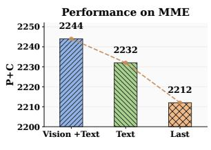  
(a) MME

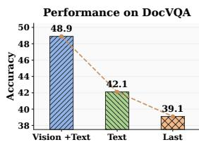  
(b) DocVQA  
Figure 8: Attention-token sources for DDAE. We compare semantic attention aggregated from the complete sequence, text tokens only, or the final token. Complete aggregation best preserves both MME perception and DocVQA layout evidence.

## B.7 Full DDAE Extraction-Depth Latency

Table 13 reports the complete latency counterpart to the quality ablation in Table 4. Measurements use the same 400 samples under two fixed-resolution settings. Delaying DDAE monotonically erodes prefill acceleration: moving from layer 2 to layer 24 reduces speedup from 2.11× to 1.09× at 2048 patch units and from 2.32× to 1.10× at 4096. Decode and time per output token remain approximately unchanged (≈ 1.00×), confirming that PACE’s measured acceleration should be attributed to TTFT rather than the full generation process.

## C Detailed Computational Complexity Analysis

We analyze PACE using Qwen2.5-VL (Bai et al., 2025b), distinguishing encoder patches from the post-merger visual tokens passed to the LLM.

## C.1 Architecture and Stage-wise Bottlenecks of Qwen2.5-VL

An $H \times W$ image produces $N = H W / P ^ { 2 }$ encoder patches of dimension $D _ { v } .$ Each of the $L _ { v }$ ViT blocks costs $\mathcal { O } ( N D _ { v } ^ { 2 } + N ^ { 2 } D _ { v } )$ . A spatial merger then produces $N _ { v i s }$ visual tokens in the LLM dimension $D _ { l }$ . With $T$ prompt tokens, Vanilla has prefill length $S _ { 0 } = T + N _ { v i s }$ and per-layer cost $\mathcal { O } ( S _ { 0 } D _ { l } ^ { 2 } + S _ { 0 } ^ { 2 } D _ { l } )$ . Autoregressive decoding determines TPOT and is unchanged by PACE.

## C.2 Theoretical Complexity Reduction

Let $p _ { 1 } \in ( 0 , 1 ]$ be APC’s retained image-area ratio. The full encoder processes $N _ { e n c } \approx p _ { 1 } N$ patches, and the merger outputs $N _ { v i s } ^ { c } \approx p _ { 1 } N _ { v i s }$ tokens. Because the preview uses $K = 1$ block at the original resolution, the vision-side cost is

<table><tr><td rowspan="2">Benchmark</td><td rowspan="2"># Samples</td><td colspan="3">Encoder Time (ms)</td><td colspan="3">Prefill Time (ms)</td><td colspan="3">TTFT incl. APC (ms)</td></tr><tr><td>Van.</td><td>PACE</td><td>Spd.</td><td>Van.</td><td>PACE</td><td>Spd.</td><td>Van.</td><td>PACE</td><td>Spd.</td></tr><tr><td>RealWorldQA</td><td>765</td><td>152.33</td><td>44.83</td><td>3.40×</td><td>222.86</td><td>31.59</td><td>7.05×</td><td>375.19</td><td>110.50</td><td>3.40×</td></tr><tr><td>POPE</td><td>9,000</td><td>154.90</td><td>47.71</td><td>3.25×</td><td>224.60</td><td>31.60</td><td>7.11×</td><td>379.50</td><td>114.37</td><td>3.32×</td></tr><tr><td>MME</td><td>2,374</td><td>152.28</td><td>46.85</td><td>3.25×</td><td>221.92</td><td>31.58</td><td>7.03×</td><td>374.20</td><td>112.78</td><td>3.32×</td></tr><tr><td>MMBench</td><td>4,329</td><td>154.02</td><td>43.23</td><td>3.56×</td><td>224.17</td><td>31.63</td><td>7.09×</td><td>378.19</td><td>108.91</td><td>3.47×</td></tr><tr><td>MMStar</td><td>1,500</td><td>153.76</td><td>44.04</td><td>3.49×</td><td>223.87</td><td>31.66</td><td>7.07×</td><td>377.63</td><td>109.87</td><td>3.44×</td></tr><tr><td>ChartQA</td><td>2,500</td><td>152.80</td><td>45.03</td><td>3.39×</td><td>223.33</td><td>31.57</td><td>7.07×</td><td>376.13</td><td>110.91</td><td>3.39×</td></tr><tr><td>OCRBench</td><td>1,000</td><td>153.13</td><td>44.50</td><td>3.44×</td><td>223.06</td><td>31.76</td><td>7.02×</td><td>376.20</td><td>110.38</td><td>3.41×</td></tr><tr><td>TextVQA</td><td>5,000</td><td>154.70</td><td>48.10</td><td>3.22×</td><td>224.53</td><td>31.68</td><td>7.09×</td><td>379.23</td><td>114.91</td><td>3.30×</td></tr><tr><td>DocVQA</td><td>5,349</td><td>143.79</td><td>50.58</td><td>2.84×</td><td>211.16</td><td>31.58</td><td>6.69×</td><td>354.94</td><td>116.09</td><td>3.06×</td></tr><tr><td>Macro Avg.</td><td></td><td>152.41</td><td>46.10</td><td>3.32×</td><td>222.16</td><td>31.63</td><td>7.02×</td><td>374.58</td><td>3 112.08 3.34×</td><td></td></tr></table>

Table 12: Dataset-wise latency profiling on Qwen2.5-VL-7B at 10% retention. Average per-sample latency is reported in milliseconds under the fixed-resolution setting. Isolated stage times exclude APC, whereas PACE TTFT includes its preview and resizing overhead.

<table><tr><td>Fixed-resolution setting Depth | w/o DDAE (ms) DDAE (ms)</td><td></td><td></td><td></td><td>Spd.</td></tr><tr><td rowspan="4">2048 × 28 × 28</td><td>2</td><td>74.52</td><td>35.26</td><td>2.11×</td></tr><tr><td>8</td><td>74.52</td><td>42.51</td><td>1.75×</td></tr><tr><td>16</td><td>74.52</td><td>55.32</td><td>1.35×</td></tr><tr><td>24</td><td>74.52</td><td>68.12</td><td>1.09×</td></tr><tr><td rowspan="4">4096 × 28 × 28</td><td>2</td><td>134.65</td><td>58.01</td><td>2.32×</td></tr><tr><td>8</td><td>134.65</td><td>75.57</td><td>1.78×</td></tr><tr><td>16</td><td>134.65</td><td>99.11</td><td>1.36×</td></tr><tr><td>24</td><td>134.65</td><td>122.77</td><td>1.10×</td></tr></table>

Table 13: LLM prefill latency across DDAE extraction depths. “w/o DDAE” processes the full visual sequence throughout prefill. Earlier extraction leaves fewer full-sequence layers and therefore yields greater acceleration.

$$
\begin{array} { r l } & { \mathcal { F } _ { \mathrm { V i T } } ^ { \mathrm { P A C E } } = \mathcal { C } _ { \mathrm { p r e v } } + \mathcal { C } _ { \mathrm { e n c } } , } \\ & { \quad \mathcal { C } _ { \mathrm { p r e v } } = \mathcal { O } ( K N D _ { v } ^ { 2 } + K N ^ { 2 } D _ { v } ) , \quad K = 1 , } \\ & { \quad \mathcal { C } _ { \mathrm { e n c } } = \mathcal { O } ( L _ { v } p _ { 1 } N D _ { v } ^ { 2 } + L _ { v } p _ { 1 } ^ { 2 } N ^ { 2 } D _ { v } ) . } \end{array}\tag{8}
$$

Let $p _ { 2 } ~ \in ~ ( 0 , 1 ]$ be DDAE’s retention after condensation and $B = p _ { 1 } p _ { 2 }$ the final ratio relative to Vanilla. Then

$$
N _ { k e e p } = p _ { 2 } N _ { v i s } ^ { c } \approx B N _ { v i s } .\tag{9}
$$

Define $S _ { p r e } = T + N _ { v i s } ^ { c }$ and $S _ { p o s t } = T + N _ { k e e p } .$ Extracting after layer $L _ { e x t }$ in an L -layer LLM gives

$$
\begin{array} { r l } { \mathcal { F } _ { \mathrm { p r e } } ^ { \mathrm { P A C E } } = \mathcal { O } ( L _ { e x t } S _ { p r e } D _ { l } ^ { 2 } + L _ { e x t } S _ { p r e } ^ { 2 } D _ { l } ) } & { { } } \\ { + \mathcal { O } ( ( L _ { l } - L _ { e x t } ) S _ { p o s t } D _ { l } ^ { 2 } } & { { } } \\ { + ( L _ { l } - L _ { e x t } ) S _ { p o s t } ^ { 2 } D _ { l } ) . } \end{array}\tag{10}
$$

APC therefore reduces full-encoder computation, whereas earlier DDAE extraction leaves fewer LLM layers operating on $S _ { p r \epsilon }$ .

## D Qualitative Results

To better understand the behavior of APC across heterogeneous visual domains, we visualize the distribution of the information density score across all evaluation benchmarks in Figure 9, alongside representative samples at varying density levels.

As shown in Figure 9, the information density score varies noticeably across benchmarks. General visual-understanding datasets, such as RealWorldQA, POPE, MME, and MMBench, exhibit relatively concentrated distributions, indicating that many samples harbor moderate visual redundancy. In contrast, detail-sensitive datasets, including ChartQA, OCRBench, TextVQA, and DocVQA, display broader or heavier high-density regions, reflecting the presence of fine-grained textual, structural, or layout information. These samples are highly vulnerable to uniform downsampling or aggressive post-encoder pruning, as small visual elements frequently contain task-critical evidence.

This qualitative evidence complements the quantitative results. A single fixed-resolution policy cannot consistently accommodate the diverse visual characteristics across benchmarks: low-density samples can be aggressively condensed, whereas high-density samples mandate higher pixel budgets to preserve local details. By estimating information density before full visual encoding, APC dynamically adjusts the input resolution according to the intrinsic complexity of each image, preserving holistic structures while retaining fine-grained evidence under strict token budgets.

## E Future Work

The empirical success of PACE establishes preencoder pixel allocation as a promising frontier for efficient VLM inference. Future research can advance this paradigm across three dimensions. First, an autoregressive recovery mechanism could dynamically fetch high-resolution crops when finegrained evidence is insufficient, unlocking more aggressive compression. Second, pixel allocation can be advanced to a query-aware regime—conditioned on textual prompts rather than purely intrinsic visual redundancy—using denoised frameworks like VTC-Bench (Liao et al., 2025) for precise evaluation. Finally, integrating PACE with localized patching paradigms, such as density-based boundary allocation (Choudhury et al., 2025; Liu et al., 2026), and model-quantization techniques (Lin et al., 2024; Wang et al., 2026a) could further accelerate end-to-end inference by reducing both visualtoken and model-weight computation.

## F LLM Usage Disclosure Statement

During manuscript preparation, we used LLMs to assist with language editing and debugging experimental code. The authors independently developed the ideas, experimental design, implementation, analysis, and core technical content. We reviewed and verified all LLM-assisted content and take full responsibility for the submission’s originality, scientific integrity, and technical accuracy.

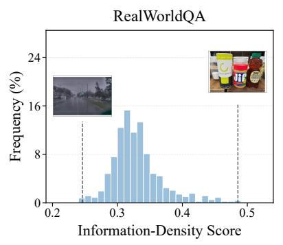

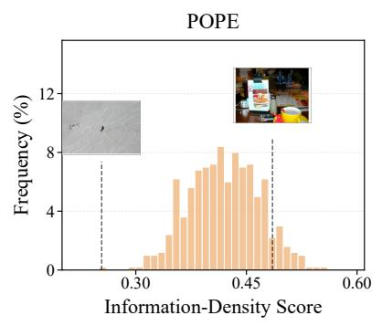

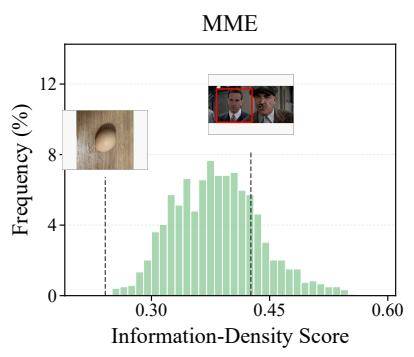

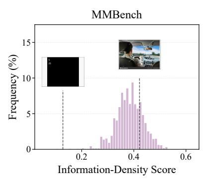

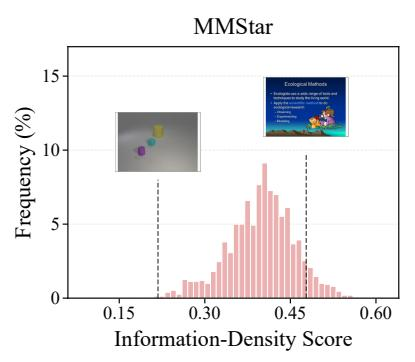

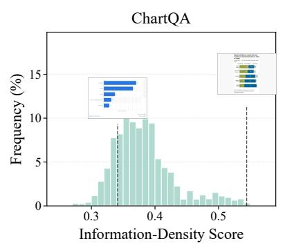

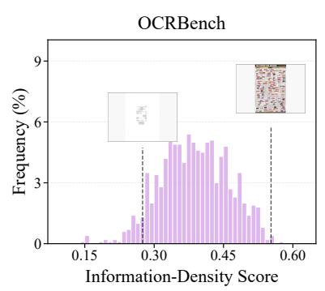

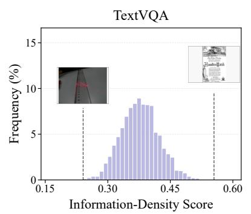

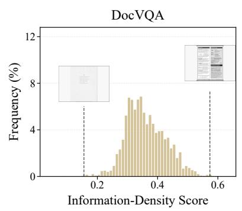  
Figure 9: Information density score distributions across benchmarks. Histograms and examples contrast APC’s information density scores across nine benchmarks.