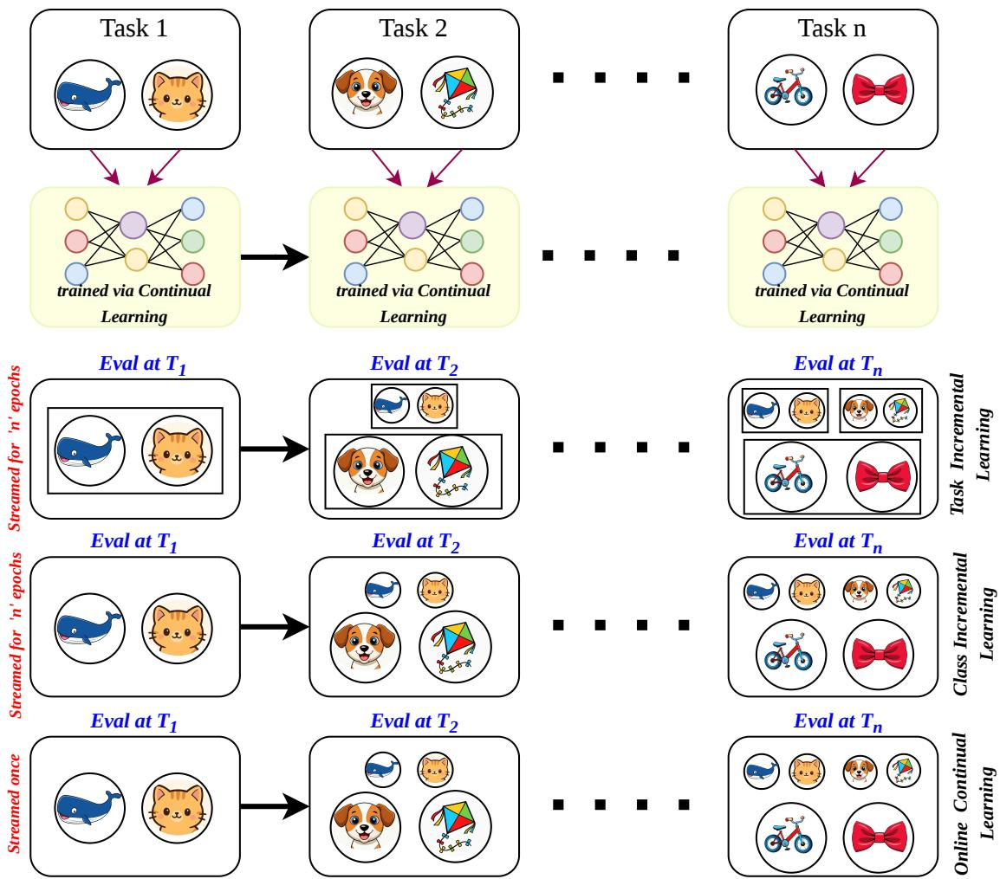
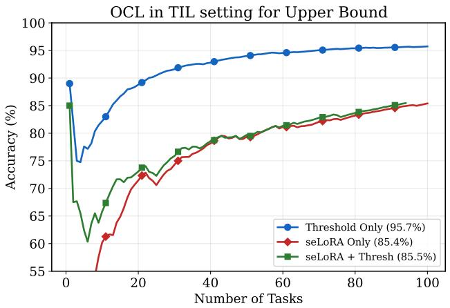
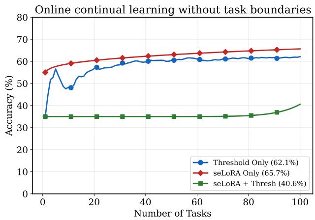

# PARAMETER EFFICIENT CONTINUAL LEARNING FOR SPARSE EVENT-BASED TRANSFORMERS

Vaishnavi Nagabhushana SustainAI Lab, MFSDS&AI IIT Guwahati n.vaishnavi@iitg.ac.in

Kartikay Agrawal   
SustainAI Lab, MFSDS&AI IIT Guwahati   
a.kartikay@iitg.ac.in

Ayon Borthakur SustainAI Lab, MFSDS&AI IIT Guwahati ayon.borthakur@iitg.ac.in

## ABSTRACT

Robotic and edge intelligence systems operate in dynamic environments where data arrives continuously, requiring models to adapt while preserving previously learned knowledge under strict memory and energy constraints. While parameter-efficient fine-tuning has shown promise for continual learning with vision transformers, conventional architectures rely on dense computation and remain costly for real-world deployment. Sparse event-based vision transformers provide energy-efficient event-driven computation, yet their continual learning capabilities remain largely unexplored. We here introduce sLoTh, a parameter-efficient continual learning framework for pretrained sparse event-based (spiking) vision transformers. sLoTh freezes the backbone and restricts plasticity to scalable-efficient low-rank attention updates (seLoRA) and shared neuronal threshold modulation, enabling adaptation without replay buffers by updating less than 1% of model parameters. Experiments across CIFAR-100, Tiny-ImageNet, ImageNet-100, and ImageNet-R with up to 100 tasks demonstrate competitive rehearsal-free performance in class-incremental learning and online continual learning, while enabling approximately 6.5× lower energy consumption than conventional dense vision transformers.

## 1 Introduction

Deep neural networks achieve remarkable performance on large static datasets but struggle when data arrives incremen tally. In such settings described in figure 1, models suffer from catastrophicforgetting Van de Ven and Tolias [2019], Kirkpatrick et al. [2017], where learning new tasks overwrites previously acquired knowledge due to unconstrained plasticity. Continual Learning (CL) addresses this challenge by enabling models to learn sequentially while retaining prior knowledge Chaudhry et al. [2018a], Kirkpatrick et al. [2017], Zenke et al. [2017]. Recent years have seen a strong shift from CNNs to vision transformers Dosovitskiy et al. [2020] for downstream tasks due to their transferable pretrained representations. However, naively fine-tuning pretrained transformers in continual learning leads to severe forgetting and high computational overhead Wu et al. [2025], Zhou et al. [2024a]. Parameter-Efficient Fine-Tuning (PEFT) methods, including prompt tuning Wang et al. [2022a,b], adapters Li et al. [2025], and low-rank adaptation (LoRA) Hu et al. [2022], mitigate this issue by updating only a small subset of parameters while freezing the pretrained backbone. These approaches substantially reduce memory and computation requirements while maintaining strong continual learning performance Zhang et al. [2023], Liang et al. [2025].

Despite this progress, two key challenges remain. First, standard vision transformers rely on dense attention, leading to high energy consumption. Second, PEFT-based continual learning has been studied almost exclusively in artificial neural networks Wu et al. [2025], Wang et al. [2022a,b], Smith et al. [2023], He et al. [2025], while spiking neural networks, known for their event-driven and energy-efficient computation, remain largely unexplored. Sparse event-based transformers such as SpikFormer Zhou et al. [2023], QKFormer Zhou et al. [2024b], and SpikingFormer Zhou et al. [2026] replace dense attention operations with spike-based computation, significantly improving energy efficiency. For CIL on SpikFormer Zhou et al. [2023] trained from scratch, Nagabhushana et al. [2026] recently proposed a threshold-only adaptation strategy for only Class Incremental and Task Incremental learning. However, continual learning in sparse event-based transformers remains underexplored, particularly in rehearsal-free and pre-trained settings for Online Continual Learning (OCL).

  
Figure 1: Comparison of Continual Learning Paradigms. In Task-Incremental Learning (TIL), task boundaries are known, allowing for task-specific components during evaluation. Class-Incremental Learning (CIL) increases difficulty by requiring the model to distinguish between all seen classes without task IDs at inference. Online Continual Learning (OCL) is a challenging scenario, as it combines the expanding output space of CIL with the constraint that data is streamed only once.

In this work, we introduce sLoTh, a rehearsal-free continual learning framework for sparse event-based vision transformers. The integration of sLoTh with sparse event-based transformers enables an energy and memory-efficient continual learning framework. The proposed framework combines three mechanisms: seLoRA, a scalable-efficient low-rank attention adaptation module that enables efficient representational updates; threshold modulation, which dynamically adjusts neuronal firing thresholds to regulate intrinsic plasticity in spiking networks, and multi-objective distillation and regularisation that preserves previously learned knowledge without requiring data replay. Our approach enables scalable continual adaptation without network expansion Han et al. [2023] or exemplar buffers Ni et al. [2025], Buzzega et al. [2020], Liu et al. [2025]. Accordingly, we evaluate our method across TIL, CIL, and OCL settings with necessary algorithmic modifications.

Our contributions in this work are: (1) We provide the first systematic study of PEFT methods for pretrained sparse event-based vision transformers in continual learning. (2) We introduce sLoTh, a data rehearsal-free continual learning framework that combines shared threshold modulation with scalable, efficient low-rank attention adaptation (seLoRA) to enable stable adaptation without replay buffers or architectural expansion. (3) Unlike prior LoRA-based continual learning approaches Wu et al. [2025], Liang and Li [2024], He et al. [2025] that rely on task-specific modules or parameter growth, sLoTh performs shared adaptation optimised through a multi-objective regularisation scheme while preserving intrinsic plasticity in spiking networks. (4) The proposed sLoTh framework in the CIL setup outperforms prior work, especially for high task counts (≥ 20) on CIFAR100 and Imagenet-R under a memory and energy budget. (5) Our approach updates less than 1% of model parameters while leveraging the efficiency of sparse event-driven transformers, which achieve 6.5× lower energy consumption than conventional dense vision transformer architectures. (6) It also demonstrates strong performance across challenging online continual learning benchmarks, where sLoTh surpasses previous methods despite not storing past samples.

## 2 Related Work

## 2.1 Continual Learning

Continual learning (CL) enables models to learn from data that arrives sequentially while mitigating catastrophic forgetting. Existing approaches are commonly grouped into regularisation-based, rehearsal-based, and architecturebased methods Van de Ven and Tolias [2019]. Regularisation-based approaches constrain parameter updates through importance-weighted penalties such as EWC Kirkpatrick et al. [2017], R-EWC Liu et al. [2018], and Synaptic Intelligence Zenke et al. [2017]. Rehearsal-based methods approximate the joint training distribution by replaying stored samples or features, including Experience Replay (ER) Rolnick et al. [2019], GEM Lopez-Paz and Ranzato [2017], A-GEM Chaudhry et al. [2018a], and Dark Experience Replay (DER)Buzzega et al. [2020]. For OCL, replaybased strategies remain dominant Rolnick et al. [2019], Buzzega et al. [2020]. Architecture-based approaches expand or gate model components to isolate task-specific parameters, though most were developed for convolutional networks and do not directly address parameter-efficient adaptation of pretrained transformers.

## 2.2 Parameter-Efficient Fine-Tuning for Continual Adaptation

Parameter-Efficient Fine-Tuning (PEFT) enables adaptation of large pretrained transformers by updating only a small subset of parameters while keeping the backbone frozen Zhou et al. [2024a]. Existing methods include prompt-based approaches such as L2P Wang et al. [2022a], Coda-Prompt Smith et al. [2023], and DualPrompt Wang et al. [2022b]; adapter-based modules inserted within transformer layers; and low-rank adaptation methods such as LoRA and its continual variants, including SD-LoRA Wu et al. [2025] and Online LoRA Wei et al. [2025].

## 2.3 Continual Learning in Sparse Event-Based Networks

Spiking Neural Networks (SNNs) enable event-driven computation through membrane potential accumulation and threshold-based firing, offering improved energy efficiency compared to conventional neural networks. Recent work extends transformer architectures into this domain through spike-based attention mechanisms, as demonstrated by models such as Spikformer Zhou et al. [2023], SpikingFormer Zhou et al. [2026], and QKFormer Zhou et al. [2024b]. However, these studies don’t focus on continual learning. Continual learning in spiking networks typically relies on CNN or MLP backbones Han et al. [2023], Shen et al. [2024], sometimes with rehearsal buffers Ni et al. [2025] or via task-specific dynamic thresholds for Spikformer Zhou et al. [2023] trained from scratch Nagabhushana et al. [2026]. However, no prior works analyse parameter-efficient fine-tuning (PEFT) methods for continual learning using pretrained sparse event-based transformers.

## 3 Methodology

We propose a rehearsal-free continual learning framework for sparse event-based transformers, designed for energyefficient adaptation in resource-constrained environments. By restricting plasticity to lightweight adaptation modules while keeping the pretrained backbone frozen, the proposed approach enables continual adaptation with minimal parameter updates and computational overhead. Our primary focus is on the Class-Incremental Learning (CIL) and Task-Incremental Learning (TIL) settings. We additionally extend the framework to the more challenging Online Continual Learning (OCL) setting through minor modifications, enabling adaptation under single-pass streaming without explicit task boundaries.

## 3.1 Problem Formulation

We consider a sequence of tasks $\{ \mathcal { D } _ { t } \} _ { t = 1 } ^ { T }$ , where each task $\mathcal { D } _ { t } = \{ ( x _ { i } , y _ { i } ) \} _ { i = 1 } ^ { N _ { t } }$ introduces a disjoint label space $\mathcal { C } _ { t }$ . The cumulative label space after task t is $\textstyle { \mathcal { C } } _ { \leq t } = \bigcup _ { k = 1 } ^ { t } { \mathcal { C } } _ { k }$ . We evaluate Full sLoTh, comprising seLoRA and threshold modulation, under three continual learning protocols i.e CIL, TIL and OCL. Refer to appendix A.1 for detailed problem formulation.

## 3.2 Model Plasticity

Let $f _ { \theta } ( \cdot )$ denote a pretrained sparse event-based transformer with frozen backbone parameters θ. To avoid catastrophic forgetting caused by representation drift, we restrict plasticity to lightweight adaptation parameters while keeping the backbone fixed. Low-rank adaptation (LoRA) provides a parameter-efficient strategy for continual learning Hu et al. [2022], Liang and Li [2024], Wu et al. [2025], Wei et al. [2025], but many approaches introduce task-specific modules Li et al. [2025], Liang et al. [2025] or modify attention projections, leading to parameter growth and feature drift in single-pass continual learning. To address this, we introduce channel-wise excitability modulation, which adjusts neuronal firing thresholds instead of synaptic weights to adapt feature responses while preserving the pretrained representation. For multi-epoch settings such as CIL and TIL, we additionally enable scalable, efficient low-rank attention updates to increase adaptation capacity.

## 3.2.1 Channel-wise Excitability Modulation

In sparse event-based (spiking) networks, neurons emit spikes when their membrane potential exceeds a firing threshold. Modulating this threshold alters neuronal excitability without changing synaptic weights, a mechanism widely observed in biological neural systems where neuromodulators regulate neuronal gain and firing thresholds Hammouamri et al. [2022], Ding et al. [2022].

We introduce learnable per-channel threshold offsets that modulate neuronal excitability:

$$
v _ { \mathrm { t h } } ( c ) = v _ { \mathrm { t h } } ^ { \mathrm { b a s e } } + \delta _ { c } ,\tag{1}
$$

where $v _ { \mathrm { t h } } ^ { \mathrm { b a s e } }$ is the pretrained base threshold and $\delta _ { c }$ is learnable offsets for each feature channel. Each parameter $\delta _ { c }$ controls the excitability of an entire feature map across spatial locations, allowing the model to selectively amplify or suppress specific channels in response to new tasks. Unlike weight-space adaptation methods such as LoRA Hu et al. [2022], threshold modulation adjusts intrinsic neuronal excitability rather than synaptic connectivity. Because this mechanism modulates neuronal excitability without directly altering pretrained feature projections, it introduces less representational disruption than weight-space adaptation methods. This behaviour is particularly beneficial for continual learning approaches that rely on stable feature-space prototypes.

## 3.2.2 Low-Rank Attention Modulation

We incorporate low-rank attention modulation inspired by LoRA Hu et al. [2022]. The low matrices A and B form the learnable parameters $\phi = A _ { i } , B _ { i i }$ . In our design, we refer to this adaptation scheme as seLoRA (Scalable-Efficient LoRA), where a single shared low-rank module provides parameter-efficient plasticity without allocating task-specific adapters and is optimised via a stabilised training objective (see 3.3). Several continual learning methods employ LoRA-style adapters that expand with the number of tasks or rely on explicit task boundaries Wei et al. [2025], Wu et al. [2025], Liang et al. [2025]. These methods make it difficult to apply in an OCL setting, as we have no task boundaries. However, under the OCL regime, jointly updating seLoRA and threshold modulation leads to unstable optimisation. While each mechanism independently provides sufficient plasticity $( \psi = \phi \mathrm { o r } \psi = \delta )$ , their combined updates amplify representation drift when the model observes each sample only once. In contrast, CIL and TIL allow multiple passes over each task dataset, which stabilises optimisation and enables both mechanisms to be used jointly $( \psi = \phi , \delta )$

## 3.3 Stabilized Training Objective

The training objective balances adaptation to new classes with stabilisation of previously learned representations:

$$
\mathcal { L } = \mathcal { L } _ { \mathrm { C E } } \ + \lambda _ { \mathrm { K L } } \mathcal { L } _ { \mathrm { K L } } + \lambda _ { \mathrm { l o c a l } } \mathcal { L } _ { \mathrm { l o c a l } } + \lambda _ { \mathrm { g l o b a l } } \mathcal { L } _ { \mathrm { g l o b a l } }\tag{2}
$$

where $\mathcal { L } _ { \mathrm { C E } }$ refers to the classifier trained using cross-entropy over the current task. The stability term comprises teacher-student logit distillation and local and global parameter anchors. Further details are provided in Appendix A.3 and analysis in section 4.5.

## 3.4 Classifier and Prototype Inference

Given a feature representation $z = f _ { \theta , \psi } ( x ) \in \mathbb R ^ { d }$ , logits are computed using a cosine classifier $\begin{array} { r } { \ell _ { c } ( x ) = s \cdot \frac { z } { | z | _ { 2 } } \cdot \frac { w _ { c } } { | w _ { c } | _ { 2 } } } \end{array}$ where $w _ { c } \in \mathbb { R } ^ { d }$ denotes the classifier weight for class c and s is a fixed temperature. After completing task $t ,$ the classifier columns corresponding to classes $w _ { c \in { \mathcal { C } } _ { t } }$ are frozen, and only the weights of newly introduced classes are updated in subsequent tasks. While the cosine classifier is used during training, we employ Nearest Class Mean (NCM)

classification at inference time to reduce recency bias. This method is widely used in the literature and has been employed in prior work such as Rebuffi et al. [2017], Wang et al. [2022a,b], Hou et al. [2019]. After task t, a prototype for each class is computed as $\mu _ { c }$ . During inference, predictions are obtained by nearest prototype matching as yˆ.

$$
\mu _ { c } = \frac { 1 } { | i : y _ { i } = c | } \sum _ { y _ { i } = c } f _ { \theta , \psi } ( x _ { i } ) . a n d \hat { y } = \arg \operatorname* { m a x } _ { c \in \mathcal { C } \leq t } \cos ( f _ { \theta , \psi } ( x ) , \mu _ { c } ) .\tag{3}
$$

## 3.5 Online Novelty Detection in Event-Based Transformers

In the OCL setting, task boundaries are not provided to the model Aljundi et al. [2019a], Ye and Bors [2024]. The data, therefore, arrive as a continuous stream, and distribution shifts may indicate the introduction of previously unseen classes. Detecting such shifts is closely related to concept drift detection in streaming learning systems Yang et al. [2024]. We detect distribution changes online using the dynamics of the training loss. Specifically, we maintain an exponential moving average (EMA) of the cross-entropy loss by $\bar { \mathcal { L } } _ { b } = ( 1 - \alpha ) \bar { \mathcal { L } } _ { b - 1 } + \alpha \mathcal { L } _ { b }$ where $\mathcal { L } _ { b }$ is the loss at batch b and α controls the smoothing factor. At each step, we compute the loss ratio $r _ { b } = \mathcal { L } _ { b } / \bar { \mathcal { L } } _ { b } . \ A$ novelty trigger fires when $r _ { b } > \gamma _ { : }$ , where $\gamma$ is a predefined threshold hyperparameter $( \mathbf { e . g . } , \gamma = 2$ indicates that the loss has doubled relative to the running average). Such abrupt increases in loss may indicate distribution shifts or the appearance of previously unseen classes Yang et al. [2024]. We emphasise that this mechanism is intended as a starting point for task-free adaptation in sparse event-based transformers rather than a fully robust drift-detection strategy. Unlike several ANN-based OCL methods that rely on replay buffers, clustering, or explicit task-boundary supervision, our approach prioritises minimal memory overhead and computational simplicity, making it suitable for resource-constrained streaming settings. When a trigger is activated, the model snapshots the current adaptation parameters ψ as a new teacher for the local anchor and registers newly observed classes. More advanced distribution-shift detection mechanisms may further improve robustness in future work.

## 3.6 Extension to Online Continual Learning

The proposed framework is primarily designed for the CIL and TIL settings, where task data are available over multiple training epochs and task transitions are explicitly defined. In these settings, both threshold modulation and seLoRA adaptation are jointly optimised, resulting in adaptation parameters $\bar { \psi } = \{ \phi , \delta \}$ . Teacher snapshots are deterministically updated at each task transition to preserve previously learned knowledge. We also extend the framework to the more challenging OCL setting by introducing two modifications. First, since data are observed only once in a streaming manner and task boundaries are unavailable, deterministic teacher updates are replaced by the proposed novelty-detection mechanism (Section 3.5), which triggers adaptive teacher snapshotting based on distribution shifts.

## 4 Experiments

We evaluate sLoTh, a parameter-efficient continual learning framework designed for sparse event-based transformers. Our experiments address two key questions - (1)Which PEFT mechanisms are compatible with sparse event-based transformers under resource constraints? (2) Can rehearsal-free event-based adaptation compete with replay-based continual learning methods with generalisation across CIL and OCL settings?

## 4.1 Experimental Setup

We primarily use QKFormer Zhou et al. [2024b], which replaces quadratic attention with computationally efficient Q-K attention, improving memory efficiency and scalability while maintaining strong accuracy. We additionally evaluate on SpikingFormer, given in table 11 an ANN ViT-Base models to assess transferability across different transformer architectures. These results suggest that the proposed framework generalises with minor architectural modifications and limited hyperparameter tuning. We report two standard continual learning metrics: Average Accuracy (AA) and Average Forgetting (F). Let $a _ { t , i }$ denote the accuracy on task i after learning task t, with T total tasks. The final average accuracy is defined as $\textstyle \mathbf { A } \mathbf { A } = { \frac { 1 } { T } } \sum _ { i = 1 } ^ { T } a _ { T , i }$ , while forgetting task i is $F _ { i } = \mathrm { { m a x } } _ { t \in \{ 1 , . . . , T \} } \{ a _ { t , i } - a _ { T , i } \}$ . The average forgetting is then $\begin{array} { r } { F = { \frac { 1 } { T - 1 } } \sum _ { i = 1 } ^ { T - 1 } F _ { i } . \operatorname { A A } } \end{array}$ measures retained performance across tasks, whereas forgetting quantifies the degradation of stability during continual adaptation.

## 4.2 Class Incremental Learning

We evaluate our sLoTh on sparse event-based transformers, which are more energy efficient than ANN-based transformers (refer to empirical validation in Table 4). Moreover, previous studies have well established that event-based transformers perform similarly to ANN-based transformers Dosovitskiy et al. [2020]. From Table 1, we observe that while several ViT-based PEFT approaches perform strongly under a small number of task settings (for example, SD-LoRA achieves 88.01% for 10 tasks), their performance either degrades significantly or becomes computationally infeasible in constrained environments as the number of tasks increases. In contrast, Full sLoTh (with seLoRA and a learnable threshold) demonstrates improved scalability as the task sequence becomes more fragmented, i.e., with a large number of tasks. Although its performance is slightly lower under coarse splits (81.23% across 10 tasks), it remains significantly energy-efficient due to its sparse event-based design. It improves with finer task granularity, reaching 84.65% for 20 tasks and 87.22% for 50 tasks, outperforming all compared methods. We would like to refer the reader to Table 6 for further analysis on energy and parameters. To further establish the efficacy of sLoTh, we next evaluate performance on a higher-resolution dataset, ImageNet-R.

Table 1: CIFAR100 CIL comparison between pretrained ViT with PEFT Continual Learning methods v/s pretrained QKFormer on Full sLoTh for different task granularity, i.e., T represents the number of tasks. Parameters are in millions. First and Second best models are highlighted.
<table><tr><td>Methods</td><td>T=10</td><td>T=20</td><td>T=50</td><td>Total Param(M)</td><td>#updates(M)</td></tr><tr><td>L2P Wang et al. [2022a]</td><td> $8 3 . 1 8 { \pm } 1 . 2 0 $ </td><td> $7 9 . 5 1 { \scriptstyle \pm 0 . 6 7 }$ </td><td> $6 7 . 9 5 { \pm } 2 . 1 2 $ </td><td>172</td><td>0.12</td></tr><tr><td>DualPrompt Wang et al. [2022b]</td><td> $8 1 . 4 8 { \pm } 0 . 8 6$ </td><td> $8 0 . 4 4 { \pm } 1 . 3 8 $ </td><td> $7 2 . 5 { \pm } 1 . 0 8 $ </td><td>172</td><td>0.86</td></tr><tr><td>CODA-Prompt Smith et al. [2023]</td><td> $8 6 . 3 1 { \pm } 0 . 1 2$ </td><td> $\underline { { 8 1 . 3 6 { \pm } 0 . 8 8 } }$ </td><td> $7 3 . 7 7 { \scriptstyle \pm 0 . 9 8 }$ </td><td>172</td><td>4.6</td></tr><tr><td>InfLoRA Liang and Li [2024]</td><td> $8 6 . 7 5 { \scriptstyle \pm 0 . 3 5 }$ </td><td> $\overline { { 8 0 . 9 7 { \pm } 0 . 7 4 } }$ </td><td> $\overline { { 7 0 . 6 8 { \pm } 1 . 2 6 } }$ </td><td>172</td><td>0.51</td></tr><tr><td>SD-LoRA Wu et al. [2025]</td><td> $\mathbf { 8 8 . 0 1 \pm 0 . 3 1 }$ </td><td>OOM</td><td>OOM</td><td>172</td><td>0.39</td></tr><tr><td>Full sLoTh</td><td> $8 1 . 2 3 { \pm } 1 . 7 4$ </td><td>84.65±1.46</td><td>87.22±1.59</td><td>64.32</td><td>0.44</td></tr></table>

From Table 2, we observe that while several ViT-based PEFT approaches achieve strong performance under coarse task splits, their accuracy degrades as the number of tasks increases. For example, SD-LoRA achieves 79.15% accuracy for $T = 5$ tasks but drops to 75.26% when $T = 2 0$ . In contrast, Full sLoTh demonstrates improved scalability as the number of tasks grows. Although its performance is slightly lower under coarse splits (71.61% for $T = 5 )$ , it remains significantly energy- and memory-efficient. Moreover, with finer task granularity, Full sLoTh reaches 77.10% for $T = 2 0$ , outperforming all compared methods. These observations suggest that spiking temporal dynamics, combined with lightweight, parameter-efficient adaptation, provide an efficient CIL method even when the number of incremental updates increases.

Table 2: CIL under domain shift on ImageNet-R. T denotes the number of task splits. Accuracy is reported as mean ± std over 3 runs. First and Second best models are highlighted.
<table><tr><td>Method</td><td>Imagenet-R  $\overline { { ( T = 5 ) } }$ </td><td>Imagenet-R  $\overline { { ( T = 1 0 ) } }$ </td><td>Imagenet-R  $\overline { { ( T = 2 0 ) } }$ </td></tr><tr><td>Full Fine tuning</td><td> $\overline { { 6 4 . 9 2 { \scriptstyle \pm 0 . 8 7 } } }$ </td><td> $\overline { { 6 0 . 5 7 { \pm } 1 . 0 6 } }$ </td><td> $\overline { { 4 9 . 9 5 \pm 1 . 3 1 } }$ </td></tr><tr><td>L2P Wang et al. [2022a]</td><td> $7 3 . 0 4 { \pm } 0 . 7 1 $ </td><td> $7 1 . 2 6 { \pm } 0 . 4 4$ </td><td> $6 8 . 9 7 { \scriptstyle \pm 0 . 5 1 }$ </td></tr><tr><td>DualPrompt Wang et al. [2022b]</td><td> $6 9 . 9 9 { \scriptstyle \pm 0 . 5 7 }$ </td><td> $6 8 . 2 2 { \scriptstyle \pm 0 . 2 0 }$ </td><td> $6 5 . 2 3 { \pm } 0 . 4 5 $ </td></tr><tr><td>CODA-Prompt Smith et al. [2023]</td><td> $7 6 . 6 3 { \scriptstyle \pm 0 . 2 7 }$ </td><td> $7 4 . 0 5 { \pm } 0 . 4 1$ </td><td> $6 9 . 3 8 { \pm } 0 . 3 3 $ </td></tr><tr><td>InfLoRA Liang and Li [2024]</td><td> $7 6 . 9 5 { \scriptstyle \pm 0 . 2 3 }$ </td><td> $7 4 . 7 5 { \pm } 0 . 6 4$ </td><td> $6 9 . 8 9 { \pm } 0 . 5 6 $ </td></tr><tr><td>SD-LoRA Wu et al. [2025]</td><td> $\overline { { 7 9 . 1 5 \pm 0 . 2 0 } }$ </td><td> ${ \bf 7 7 . 3 4 \pm 0 . 3 5 }$ </td><td> $7 5 . 2 6 { \pm } 0 . 3 7$ </td></tr><tr><td>Full sLoTh</td><td> $\overline { { 7 1 . 6 1 { \pm } 0 . 9 2 } }$ </td><td> $7 6 . 1 7 { \pm } 1 . 7 1 $ </td><td> $\overline { { 7 7 . 1 0 { \pm } 1 . 1 3 } }$ </td></tr></table>

## 4.3 Extension to Online Continual Learning

We further evaluate sLoTh under the stricter Online Continual Learning (OCL) setting, where data arrive in a single-pass stream and explicit task boundaries are unavailable during training. Unlike many existing OCL approaches, sLoTh does not rely on replay buffers or stored training samples. Instead, the framework maintains only lightweight per-class prototype statistics, substantially reducing memory overhead while preserving representative information for decision boundaries in streaming environments. Consistent with the CIL setting, we focus here on energy-efficient OCL using sparse event-based transformers. Table 3 compares sLoTh against several replay-based OCL methods on CIFAR-100 $( \bar { T } = 1 0 )$ and Tiny-ImageNet $( T = 1 0 0 )$ . Unlike these baselines, which rely on replay buffers containing up to 5k and 10k stored samples, respectively, sLoTh operates without replay memory and maintains only lightweight prototype statistics. Despite these constraints, Full sLoTh achieves 55.12% accuracy with 12.79 forgetting on CIFAR-100, closely matching the replay-based MOE-MOSE baseline (55.62%). These results suggest that structured intrinsic plasticity together with lightweight attention modulation can effectively mitigate catastrophic forgetting even under strict streaming conditions.

Table 3: Online Continual Learning comparison under single-pass streaming. Replay-based results are taken from S6MOD under the largest buffer sizes (CIFAR100: M=5k, Tiny-ImageNet: M=10k). sLoTh operates without any replay buffer has only per-class mean prototype. Accuracy is reported as mean ± std over 3 runs. First and Second best models are highlighted.
<table><tr><td colspan="3">CIFAR100 (T=10)</td><td colspan="2">Tiny-ImageNet (T=100)</td></tr><tr><td>Method</td><td>Avg Acc</td><td>Forgetting</td><td>Avg Acc</td><td>Forgetting</td></tr><tr><td>ER Rolnick et al. [2019]</td><td>39.41±1.81</td><td>13.29</td><td> $\overline { { 2 4 . 7 1 { \pm } 2 . 5 2 } }$ </td><td>40.77</td></tr><tr><td>OCM Guo et al. [2022]</td><td>42.22±1.06</td><td>3.76</td><td> $3 1 . 9 4 { \pm } 1 . 1 9$ </td><td>15.92</td></tr><tr><td>OnPro Wei et al. [2023]</td><td>41.59±1.38</td><td>6.72</td><td> $2 6 . 3 8 { \pm } 2 . 1 8$ </td><td>20.32</td></tr><tr><td>OCM-CCLDC Wang et al. [2024]</td><td>51.43±1.37</td><td>3.99</td><td> $3 9 . 2 5 { \pm } 0 . 8 8 $ </td><td>15.56</td></tr><tr><td>OnPro-CCLDC Wang et al. [2024]</td><td>50.01±0.85</td><td>10.55</td><td> $3 8 . 1 8 { \pm } 1 . 0 2$ </td><td>16.17</td></tr><tr><td>MOSE Yan et al. [2024]</td><td>54.53±0.78</td><td>13.60</td><td> $3 8 . 7 1 { \scriptstyle \pm 0 . 4 4 }$ </td><td>15.51</td></tr><tr><td>MOE-MOSE Yan et al. [2024]</td><td>55.62±0.72</td><td>12.81</td><td> $3 8 . 4 1 { \pm } 0 . 5 3 $ </td><td>13.94</td></tr><tr><td>Full sLoTh</td><td>55.12±1.18</td><td>12.79</td><td>42.90±2.56</td><td>14.63</td></tr><tr><td>sLoTh only with Thresholds</td><td>60.25±0.98</td><td>11.36</td><td>61.41±1.05</td><td>12.32</td></tr><tr><td>sLoTh only with seLoRA</td><td>63.88±1.03</td><td>13.85</td><td>65.12±2.52</td><td>15.16</td></tr></table>

  
Figure 2: Performance gap between boundary-aware OCL v/s boundary-free OCL setting on Tiny-Imagenet. Here, sLoTh narrows the gap between these two settings compared to other methods without relying on replay.

The effectiveness of sLoTh becomes more evident on Tiny-ImageNet benchmark with 100 tasks. Full sLoTh achieves 42.90% accuracy, outperforming replay-based methods including OCM (31.94%), OnPro (26.38%), and MOE-MOSE (38.41%), corresponding to an improvement of approximately +4.5% over the strongest replay baseline. The simplified variants further improve short-term adaptation in the strict streaming setting. sLoTh only with Thresholds achieves 60.25% and 61.41% accuracy on CIFAR-100 and Tiny-ImageNet respectively, while sLoTh only with seLoRA achieves 63.88% and 65.12%. These observations suggest that stronger plasticity improves rapid adaptation under single-pass updates, whereas the combined Full sLoTh formulation provides a more stable trade-off between adaptation and long-term retention (Tables 6 and 3).Figure 2 illustrates the learning dynamics under a task-aware upper bound, where task boundaries are known, and the realistic boundary-free online learning setting. In the task-aware case, threshold-only adaptation achieves the highest performance (95.7%), highlighting the effectiveness of intrinsic threshold plasticity when task transitions are explicitly available. When task boundaries are removed, performance decreases across all methods due to the difficulty of detecting distribution shifts online. In the boundary-free OCL setting, sLoTh only with seLoRA achieves 65.7%, while threshold-only adaptation achieves 62.1%. Notably, threshold-only adaptation requires at least 10× fewer parameter updates than seLoRA-based variants. Overall, the combined Full sLoTh framework progressively narrows the gap between the task-aware and realistic streaming settings as more tasks are observed.

Overall, these results demonstrate that the sLoTh framework can match or surpass replay-based continual learning methods while remaining energy- and memory-efficient. Similarly, from Table 5 we observe that the Full sLoTh method outperforms prior state-of-the-art methods with ViT backbone on ImageNet-100 with 50 tasks by at least 1.76%. Online-LoRA Wei et al. [2025] when transferred to pretrained QKFormer backbone Zhou et al. [2024b] gives us 61.87, which is approximately equivalent to Full sLoTh’s performance. Moreover, seLoRA is also applicable for ViT (55.68%), and for such large task counts, seLoRA only achieves the best performance of 70%.

Table 4: Comparison of OCL on Split-CIFAR-100 with 10 tasks with ViT-B/16 backbone(86 Million parameters)Dosovitskiy et al. [2020] v/s QKFormer(64 Million parameters)Zhou et al. [2024b] as backbone for our method. We consider the closest comparable model sizes for a fair comparison, based on parameter count in millions and energy consumption in mJ. First and Second best models are highlighted.
<table><tr><td>Methods</td><td> $\overline { { \mathbf { A v g } \operatorname { A c c } \left( \uparrow \right) } }$ </td><td>Forgetting (↓)</td><td># Updates</td><td>Energy</td></tr><tr><td>AGEM Chaudhry et al. [2018a]</td><td> $\overline { { 1 2 . 6 7 \pm 1 . 8 7 } }$ </td><td> $\overline { { 8 2 . 5 1 \pm 2 . 2 7 } }$ </td><td>Full</td><td>254.84</td></tr><tr><td>ER Rolnick et al. [2019]</td><td> $4 4 . 8 5 \pm 1 . 8 3$ </td><td> $4 4 . 6 7 \pm 4 . 2 9$ </td><td>Full</td><td>254.84</td></tr><tr><td>EWC++ Chaudhry et al. [2018b]</td><td> $1 0 . 6 1 \pm 0 . 7 4$ </td><td> $8 4 . 1 0 \pm 1 . 1 1$ </td><td>Full</td><td>254.84</td></tr><tr><td>MIR Aljundi et al. [2019b]</td><td> $4 8 . 3 6 \pm 3 . 1 1$ </td><td> $4 3 . 4 1 \pm 1 . 0 2$ </td><td>Full</td><td>254.84</td></tr><tr><td>PCR Lin et al. [2023]</td><td> $4 8 . 4 8 \pm 0 . 1 5$ </td><td> $4 6 . 2 3 \pm 1 . 2 9$ </td><td>Full</td><td>254.84</td></tr><tr><td>LODE (DER++) Liang and Li [2023]</td><td> $4 4 . 2 9 \pm 1 . 4 8$ </td><td> $4 5 . 5 4 \pm 3 . 3 2$ </td><td>Full</td><td>254.84</td></tr><tr><td>EMA (DER++) Soutif-Cormerais et al. [2023]</td><td> $4 2 . 2 8 \pm 4 . 3 6$ </td><td> $5 5 . 5 9 \pm 1 . 4 8$ </td><td>Full</td><td>254.84</td></tr><tr><td>EMA (RAR) Soutif-Cormerais et al. [2023]</td><td> $4 7 . 1 0 \pm 0 . 8 2$ </td><td> $5 0 . 0 1 \pm 0 . 3 5$ </td><td>Full</td><td>254.84</td></tr><tr><td>Online-Lora Wei et al. [2025]</td><td> $4 9 . 4 0 \pm 1 . 3 6$ </td><td> $4 1 . 7 4 \pm 2 . 5 8$ </td><td>0.623</td><td>254.84</td></tr><tr><td>Full sLoTh</td><td> $\overline { { 5 5 . 1 2 \pm 1 . 1 8 } }$ </td><td> $1 2 . 7 9 \pm 2 . 2 8$ </td><td>0.439</td><td>38.91</td></tr><tr><td>sLoTh only thresholds</td><td> $6 0 . 2 5 \pm 0 . 9 8$ </td><td> $\overline { { 1 1 . 3 6 \pm 2 . 4 1 } }$ </td><td>0.037</td><td>38.91</td></tr><tr><td>sLoTh only seLoRA</td><td> ${ \bf 6 3 . 8 8 \pm 1 . 0 3 }$ </td><td> $1 3 . 8 5 \pm 3 . 9 7$ </td><td>0.402</td><td>38.91</td></tr></table>

Table 5: Comparison of SOTA methods on ImageNet-100 with 50 tasks for OCL.
<table><tr><td rowspan="2">Method</td><td colspan="3">ViT</td><td colspan="5">QKFormer</td></tr><tr><td>L2P</td><td></td><td>Online LoRA</td><td>seLoRA</td><td>Online LoRA</td><td>Full sLoTh</td><td>Threshold only seLoRA only</td><td></td></tr><tr><td>Accuracy</td><td> $5 6 . 2 5 \pm 0 . 4 5$ </td><td> $6 0 . 3 8 \pm 2 . 5 9$ </td><td></td><td> $5 5 . 6 8 \pm 0 . 9 7$ </td><td> $6 1 . 8 7 \pm 1 . 6 3$ </td><td> $6 2 . 1 4 \pm 1 . 3 0$ </td><td> $6 6 . 9 1 \pm 1 . 5 6$ </td><td> ${ \bf 7 0 . 0 0 } \pm 3 . 8 5$ </td></tr></table>

## 4.4 Class Incremental Learning versus Online Learning

Table 9 indicates PEFT in spiking networks can be mediated by seLoRA only, Threshold only or both (Full sLoTh) with varying classification accuracies. From Table 6 we observe that, under CIL, where multiple epochs are available per task, the interaction between scalable-efficient low-rank modulation (seLoRA) and threshold adaptation becomes beneficial. seLoRA provides weight updates, while threshold modulation regulates neuronal excitability as new classes are introduced. Their combination significantly improves performance, achieving 81.23% accuracy for Full sLoTh. From Table 6, we also observe that for CIL, seLoRA only and Threshold only can also independently attain nearby performances of 72.63% and 69.39%, respectively. Whereas, during OCL, different variants (seLoRA only or Threshold only) yield higher immediate accuracy (63.88% and 60.25% vs. 55.12% for Full sLoTh). This behaviour arises because the OCL setting observes each sample only once, favouring highly plastic adaptation mechanisms that can rapidly adjust model parameters. Here, seLoRA parameters are randomly initialised and must learn meaningful projection subspaces. In OCL settings, the additional constraints introduced by the full objective (Full sLoTh) can slow this adaptation, leading to slightly lower short-term accuracy. These results indicate that, while seLoRA-only or Threshold-only is beneficial for immediate adaptation in streaming settings, dual plasticity (Full sLoTh) becomes essential when learning must remain consistent across longer task sequences.

Table 6: Component interaction under CIL and OCL (CIFAR-100, 10 tasks).
<table><tr><td>Variant</td><td>CIL Avg Acc</td><td>OCL Avg Acc</td><td>param updates</td></tr><tr><td>seLoRA only (w/o Threshold)</td><td>72.63±1.24</td><td>63.88±1.03</td><td>0.402</td></tr><tr><td>Threshold only (w/o seLoRA)</td><td>69.39±1.01</td><td>60.25±0.98</td><td> $\mathbf { 0 . 0 3 7 } _ { \left( \ 1 0 \times \downarrow \right) }$ </td></tr><tr><td>Full sLoTh (seLoRA + Threshold)</td><td> $\mathbf { 8 1 . 2 3 \pm 1 . 7 4 }$ </td><td>55.12±1.18</td><td>0.439</td></tr></table>

Threshold Modulation for Parameter Efficient Continual Learning: Spiking thresholds are a unique attribute of spiking neural networks. From Table 9 we observe that fine-tuning only thresholds reaches an accuracy of 70.56% compared to 80.89% with LoRA. From Tables 5 and 6, we notice that for the continual learning scenario, threshold modulation is an effective parameter-efficient fine-tuning method (requiring atleast 10× lower parameter updates than

LoRA). The effect is most pronounced in the OCL scenario, where Threshold only achieves 60.25% and 66.71% accuracies on CIFAR100 and Imagenet100, respectively, which is ∼3% lower than seLoRA but significantly more efficient.

## 4.5 Component Analysis of Loss Function

Table 7 analyses the contribution of individual components in the proposed loss formulation. Removing the KL regularisation term $( \lambda _ { k l } \ : = \ : 0 )$ leads to a significant performance drop from 55.12% to 10.23%, indicating that distribution alignment plays a critical role in stabilising continual updates. Similarly, disabling the local and global

Table 7: Component analysis of Loss function on CIFAR-100 dataset in OCL setting
<table><tr><td>Components</td><td> $\overline { { { \bf { N o n - Z e r o s } } } }$ </td><td> $\overline { { \lambda _ { k l } = 0 } }$ </td><td> $\overline { { \lambda _ { \mathrm { l o c a l } } = 0 } }$ </td><td> $\overline { { \lambda _ { \mathrm { g l o b a l } } = 0 } }$ </td></tr><tr><td>Accuracy</td><td> $\overline { { 5 5 . 1 2 \pm 1 . 1 8 } }$ </td><td> $1 0 . 2 3 \pm 1 . 1 0$ </td><td> $2 1 . 6 4 \pm 2 . 3 8$ </td><td> $\overline { { 2 0 . 1 1 \pm 1 . 0 9 } }$ </td></tr></table>

consistency terms results in substantial degradation, reducing accuracy to 21.64% and 20.11%, respectively. These terms encourage consistency between feature representations across updates, preventing representational drift during streaming adaptation. Overall, the results demonstrate that each component of the loss contributes to stable, continual learning, and the full objective is necessary.

## 5 Discussion

We propose sLoTh as a state-of-the-art data rehearsal-free continual learning framework. sLoTh is optimal for sparse event-based transformers, where threshold-based dynamics can even allow the model to learn with significantly smaller parameter updates without changing the underlying features. Our results suggest that appropriately modified parameter efficient plasticity mechanisms can outperform data-replay-based strategies in online continual learning. In contrast to conventional approaches that depend on memory buffers, sLoTh maintains stability by combining structured attention modulation with excitability control. This highlights the potential of understanding and leveraging the intrinsic neuronal properties for continual learning under strict memory and computational constraints. In addition, while the proposed novelty detection mechanism enables task-free adaptation in streaming settings, more advanced shift-detection strategies may further improve robustness in OCL, making it more scalable. Moreover, sLoTh is also optimal for CIL, especially for fine-grained tasks relevant to real-world scenarios. As part of this, we also observe that the plasticity modality of CIL is not directly transferable to OCL, and variants of sLoTh can address all these requirements.

## Appendix

## A Extended Method Details

This section provides additional methodology details for the sLoTh framework.

## A.1 Problem Formulation Details

We consider a sequence of tasks $\{ \mathcal { D } _ { t } \} _ { t = 1 } ^ { T }$ where each task $\mathcal { D } _ { t } = \{ ( x _ { i } , y _ { i } ) \} _ { i = } ^ { N _ { t } }$ introduces a disjoint label set $\mathcal { C } _ { t }$ such that $\mathcal { C } _ { i } \cap \mathcal { C } _ { j } = \mathcal { O }$ for $i \neq j$ . The cumulative label space after task t is

$$
{ \mathcal { C } } _ { \leq t } = \bigcup _ { k = 1 } ^ { t } { \mathcal { C } } _ { k } .\tag{4}
$$

Given an input x, the model predicts

$$
\hat { y } \in \mathcal { C } _ { \leq t } .\tag{5}
$$

As part of our study, we evaluate Full sLoTh, which comprises two components, i.e seLoRA and Threshold modulation, under three protocols:

$$
\{ ( x _ { t , b } , y _ { t , b } ) \}
$$

CIL: Given tasks $\{ D _ { t } \} _ { t \in \mathcal { T } }$ with $\mathcal { C } _ { i } \cap \mathcal { C } _ { j } = \mathcal { O }$ for $i \neq j$ , the task identity is unknown at test time; predictions satisfy

$$
\begin{array} { r } { \hat { y } \in \mathcal { C } _ { \leq t } = \bigcup _ { i = 1 } ^ { t } \mathcal { C } _ { i } . } \end{array}
$$

TIL: Given tasks $\{ D _ { t } \} _ { t \in \mathcal T } \mathrm { w i t h } p ( \mathcal X _ { i } ) \not = p ( \mathcal X _ { j } )$ ) and $\mathcal { C } _ { i } \cap \mathcal { C } _ { j } = \emptyset \mathrm { f o r } i \neq j$ , the task identity t is known at test time; predictions satisfy $\hat { y } \in \mathcal X _ { t }$

In the OCL setting, explicit task boundaries are not provided to the model. Instead, task transitions are implicitly inferred through the proposed novelty detection mechanism (Section 3.5). When a significant distribution shift is detected, the model treats this event as a pseudo-task boundary, triggering parameter snapshotting and classifier expansion. Therefore, while no ground-truth task identity is available, the framework internally constructs adaptive boundaries based on data-driven signals.

## A.2 Plasticity Modules

The backbone network is a pretrained, sparse event-based transformer $f _ { \theta } ( \cdot )$ with frozen parameters θ. Plasticity is restricted to a small set of adaptation parameters ψ.

$$
z = f _ { \boldsymbol { \theta } , \psi } ( x )\tag{6}
$$

, where $z \in \mathbb { R } ^ { d }$ is the feature representation. Depending on the continual learning setting, we use:

$$
\psi = { \left\{ \begin{array} { l l } { \left\{ \delta \right\} } & { { \mathrm { i n ~ c a s e ~ o f ~ O C L } } } \\ { \left\{ \phi , \delta \right\} } & { { \mathrm { i n ~ c a s e ~ o f ~ C I L ~ o r ~ T I L } } } \end{array} \right. }\tag{7}
$$

where $\delta$ represents threshold modulation parameters and $\phi$ denotes low-rank attention parameters.

## A.2.1 Channel-wise Excitability Modulation

In the Leaky-Integrate and Fire neuron, when the membrane potential exceeds a threshold $v _ { \mathrm { t h } }$ the neuron produces spikes. To make the thresholds learnable instead of utilising the intrinsic dynamic and backpropagating on the thresholds itself we introduce channel-wise offsets $\delta _ { c }$

$$
v _ { \mathrm { t h } } ( c ) = v _ { \mathrm { t h } } ^ { b a s e } + \delta _ { c }\tag{8}
$$

where $c$ indexes feature channels. This mechanism helps in modulating neurons’ excitability while keeping the underlying synaptic weights frozen. Hence, the feature geometry produced by the pretrained backbone remains largely preserved.

## A.2.2 Scalable-Efficient LoRA (seLoRA)

Extending the experiments from OCL to CIL, we additionally apply low-rank attention modulation inspired by LoRA. For each attention projection matrix $W \in \mathbb { R } ^ { d \times d }$ , a low-rank residual update is introduced:

$$
\begin{array} { r } { W ^ { \prime } = W + B A , } \end{array}\tag{9}
$$

where $B \in \mathbb { R } ^ { d \times r }$ and $A \in \mathbb { R } ^ { r \times d } , \quad r \ll a$ and $\phi = \{ A _ { i } , B _ { i } \}$ are the learnable parameters. Unlike task-specific LoRA modules proposed in prior work Wu et al. [2025], Liang and Li [2024], He et al. [2025], seLoRA uses a single shared low-rank module across the task sequence. This prevents parameter growth as the number of tasks increases.

## A.3 Stabilized Training Objective

The overall training objective is

$$
\mathcal { L } = \mathcal { L } _ { C E } + \mathcal { L } _ { s t a b }\tag{10}
$$

where

$$
\mathcal { L } _ { s t a b } = \lambda _ { K L } \mathcal { L } _ { K L } + \lambda _ { l o c a l } \mathcal { L } _ { l o c a l } + \lambda _ { g l o b a l } \mathcal { L } _ { g l o b a l } .\tag{11}
$$

Cross-Entropy Loss The classifier is trained using cross-entropy over the current task classes:

$$
\mathcal { L } _ { C E } = C E ( \ell _ { C _ { t } } ( x ) , y ) .\tag{12}
$$

Logit Distillation To preserve knowledge of previous classes, we distil predictions from a frozen teacher model:

$$
\mathcal { L } _ { K L } = \tau ^ { 2 } K L \left( s o f t m a x ( \ell ^ { s } / \tau ) \parallel s o f t m a x ( \ell ^ { * } / \tau ) \right)\tag{13}
$$

where τ is the temperature parameter.

Local Parameter Anchor To prevent abrupt parameter drift, we anchor adaptation parameters to their previous snapshot:

$$
\mathcal { L } _ { l o c a l } = | | \psi - \psi ^ { * } | | _ { 2 } ^ { 2 } .\tag{14}
$$

Global Parameter Anchor To prevent long-term drift across many tasks, we regularise parameters toward their initial state:

$$
\mathcal { L } _ { g l o b a l } = \frac { 1 } { | \psi | } \sum _ { p \in \psi } ( p - p ^ { ( 0 ) } ) ^ { 2 } .\tag{15}
$$

## A.4 Prototype-Based Inference

During training, a cosine classifier is used:

$$
\ell _ { c } ( x ) = s \cdot \frac { z } { | | z | | _ { 2 } } \cdot \frac { w _ { c } } { | | w _ { c } | | _ { 2 } }\tag{16}
$$

After training, predictions are made using Nearest Class Mean classification. Class prototypes are computed as

$$
\mu _ { c } = \frac { 1 } { N _ { c } } \sum _ { y _ { i } = c } f _ { \theta , \psi } ( x _ { i } ) .\tag{17}
$$

Inference is performed via cosine similarity:

$$
{ \hat { y } } = \arg \operatorname* { m a x } _ { c \in { \mathcal { C } } _ { \leq t } } \cos ( f _ { \theta , \psi } ( x ) , \mu _ { c } ) .\tag{18}
$$

## A.5 Online Novelty Detection

To detect distribution shifts in OCL, we monitor the training loss. We maintain an exponential moving average

$$
\bar { \mathcal { L } } _ { b } = ( 1 - \alpha ) \bar { \mathcal { L } } _ { b - 1 } + \alpha \mathcal { L } _ { b } .\tag{19}
$$

A novelty trigger is activated when

$$
r _ { b } = \frac { \mathcal { L } _ { b } } { \bar { \mathcal { L } } _ { b } } > \gamma .\tag{20}
$$

When triggered, the model:

1. snapshots current adaptation parameters

2. registers newly discovered classes

3. updates the teacher model for distillation

## A.6 Full Training Procedure

Algorithm A.6 summarises the full training framework for OCL. Instead of triggers, we have an exclusive snapshot captured for adaptation after every task in the case of CIL and TIL

1: Initialize pretrained backbone $f _ { \theta }$ and adaptation parameters $\psi$   
2: Initialize EMA loss $\bar { \mathcal { L } } _ { 0 }$   
3: for each batch $\left( x _ { b } , y _ { b } \right)$ do   
4: $z \gets f _ { \theta , \psi } ( x _ { b } )$   
5: Compute loss $\mathcal { L } _ { b }$   
6: Update EMA $\bar { \mathcal { L } } _ { b }$   
7: if $\mathcal { L } _ { b } / \bar { \mathcal { L } } _ { b } > \gamma$ then   
8: snapshot teacher parameters   
9: end if   
10: Update adaptation parameters $\psi$   
11: end for

## B Datasets

We conduct evaluations across different datasets, including CIFAR-100, Tiny-ImageNet, ImageNet-100, and ImageNet-R. For CIFAR-100, we use the standard dataset provided through the torchvision library. Tiny-ImageNet is obtained from the official repository.1 ImageNet-1002 and ImageNet-R3 are subsets of the ImageNet-1K dataset that provide a reduced-scale benchmark and a domain-shift benchmark. To simulate continual learning scenarios, each dataset is partitioned into disjoint class subsets that form incremental tasks. For every experiment, class labels are remapped to ensure consistent label ordering across tasks. To maintain reproducibility and ensure fair evaluation, all random operations, including class permutations and data shuffling, are controlled using fixed random seeds.

## C Hyperparameter Settings

Most hyperparameters follow the official QKFormer implementation.4 In the online continual learning (OCL) setting, we additionally perform a small hyperparameter search over the novelty-detection threshold used to trigger teacher model snapshots. We observe that very small thresholds lead to frequent false triggers, which increase computational overhead but do not significantly affect final performance. In contrast, overly large thresholds delay the detection of distribution shifts, reducing the model’s ability to effectively adapt to newly introduced classes. In practice, we select a threshold value that balances timely distribution-shift detection with stable training dynamics.

Table 8: Hyperparameters used across datasets and continual learning settings (OCL, CIL, and TIL).
<table><tr><td>Hyperparameter</td><td>CIFAR-100</td><td>Imagenet-R</td><td>Imagenet-100</td><td>Tiny-IM</td></tr><tr><td>Batch size</td><td>128</td><td>64</td><td>64</td><td>128</td></tr><tr><td>Time steps (T)</td><td>4</td><td>4</td><td>4</td><td>4</td></tr><tr><td>Learning rate</td><td>1e-4</td><td>3e-4</td><td>3e-4</td><td>1e-4</td></tr><tr><td>Epochs</td><td>50</td><td>30</td><td>30</td><td>30</td></tr><tr><td>Optimizer</td><td>AdamW</td><td>AdamW</td><td>AdamW</td><td>AdamW</td></tr></table>

Each experiment is conducted three times with different seeds on the same hyperparameters, using seeds 0, 1, and 2.   
The following tables describe the hyperparameters used for each dataset.

## D Extended Results

## D.1 PEFT for Sparse Event-Based Vision Transformers

Before introducing sLoTh, we first evaluate which PEFT mechanisms are compatible with sparse event-based transformers. Table 9 reports the classification accuracy of different PEFT strategies applied to a QKFormer backbone on CIFAR-100. Adapter-based Houlsby et al. [2019], i.e., tuning of small feed-forward networks acting as bottleneck layers, achieves the highest accuracy (87.21%), indicating that additional learnable modules can effectively adapt feature representations. However, adapters introduce task-specific parameters and increase memory and inference overhead, making them less suitable for online continual learning scenarios with strict resource constraints.

Table 9: PEFT feasibility on pretrained QKFormer evaluated on the CIFAR-100.
<table><tr><td>Method</td><td>Low-Rank AdaptationHu et al. [2022]</td><td>Adapters Houlsby et al. [2019] Spiking Adapters</td><td></td><td>Thresholds</td></tr><tr><td>Accuracy</td><td>80.89</td><td>87.21</td><td>79.82</td><td>70.56</td></tr></table>

Low-rank attention modulation using LoRA provides a more efficient alternative, achieving 80.89% accuracy while requiring only lightweight updates to attention projections. Threshold-only adaptation is the most parameter-efficient strategy, modifying spiking neuron firing thresholds without introducing additional weights, and still achieves 70.56% accuracy.

These results reveal a trade-off: adapters offer strong performance but incur architectural overhead, while threshold adaptation is extremely efficient but limited in representational flexibility. Motivated by this observation, we propose the sLoTh framework, which combines low-rank attention modulation with threshold-based intrinsic plasticity to achieve efficient adaptation without affecting inference efficiency.

## D.2 Task-Incremental Learning and Class Incremental Learning

In addition to the online continual learning (OCL) and class-incremental learning (CIL) evaluations presented in the main paper, we report results under the Task-Incremental Learning (TIL) protocol. In this setting, task boundaries are available during both training and evaluation, making the problem comparatively easier than CIL and OCL. Table 10

Table 10: Task-Incremental Learning results for sLoTh across different datasets. Accuracy reported as mean ± std over 3 runs.
<table><tr><td>Tasks</td><td>Tiny-ImageNet</td><td> $\overline { { \mathrm { C I F A R  – 1 0 0 } } }$ </td><td>ImageNet-R</td><td>Imagenet-100</td></tr><tr><td>10</td><td> $8 5 . 2 3 \pm 2 . 9 4$ </td><td> $8 7 . 3 8 \pm 1 . 6 3$ </td><td> $\overline { { 8 6 . 7 7 \pm 1 . 0 8 } }$ </td><td> $\overline { { 8 9 . 3 3 \pm 1 . 7 8 } }$ </td></tr><tr><td>20</td><td> $8 7 . 1 7 \pm 1 . 3 8$ </td><td> $8 6 . 8 4 \pm 2 . 5 4$ </td><td> $8 8 . 4 5 \pm 2 . 7 9$ </td><td> $9 0 . 9 2 \pm 1 . 6 3$ </td></tr><tr><td>50</td><td> $9 6 . 5 0 \pm 1 . 2 5$ </td><td> $9 1 . 2 0 \pm 2 . 7 1$ </td><td> $9 3 . 6 1 \pm 1 . 8 1$ </td><td> $9 4 . 5 \pm 1 . 9 5$ </td></tr></table>

reports the performance of the proposed sLoTh framework on Tiny-ImageNet, CIFAR-100, Imagenet100, and ImageNet R across different task granularities. The results show that sLoTh maintains strong performance even as the number of tasks increases.

Table 11: CIFAR100 CIL comparison between pretrained ViT with PEFT Continual Learning methods v/s pretrained QKFormer & SpikingFormer on Full sLoTh for different task granularity, i.e., T represents the number of tasks. Parameters are in millions. First and Second best models are highlighted.
<table><tr><td>Methods</td><td>T=10</td><td>T=20</td><td>T=50</td><td># Total Param.</td><td>#updates</td></tr><tr><td>L2P Wang et al. [2022a]</td><td>83.18±1.20</td><td> $\overline { { 7 9 . 5 1 \pm 0 . 6 7 } }$ </td><td>67.95±2.12</td><td>172</td><td>0.12</td></tr><tr><td>DualPrompt Wang et al. [2022b]</td><td>81.48±0.86</td><td> $8 0 . 4 4 \pm 1 . 3 8 $ </td><td>72.5±1.08</td><td>172</td><td>0.86</td></tr><tr><td>CODA-Prompt Smith et al. [2023]</td><td>86.31±0.12</td><td>81.36±0.88</td><td>73.77±0.98</td><td>172</td><td>4.6</td></tr><tr><td>InfLoRA Liang and Li [2024]</td><td>86.75±0.35</td><td>80.97±0.74</td><td>70.68±1.26</td><td>172</td><td>0.51</td></tr><tr><td>SD-LoRA Wu et al. [2025]</td><td>88.01±0.31</td><td>OOM</td><td>OOM</td><td>172</td><td>0.39</td></tr><tr><td>Full sLoTh</td><td>81.23±1.74</td><td>84.65±1.46</td><td>87.22±1.59</td><td>64.32</td><td>0.44</td></tr><tr><td>Full sLoTh on SpikingFormer</td><td> $6 3 . 2 8 { \pm } 1 . 3 9$ </td><td> $6 7 . 2 3 \pm 2 . 0 3$ </td><td> $7 0 . 4 8 { \pm } 1 . 2 1 $ </td><td>66.34</td><td>0.56</td></tr></table>

## D.3 Online Continual Learning

We also evaluate the seLoRA-only variant of our method on a pretrained ViT-B/16 backbone (86M parameters) for 100 tasks on Tiny-ImageNet. The model achieves ${ \bf 5 5 . 6 8 \pm 0 . \bar { 9 } 7 }$ accuracy, indicating that the proposed adaptation mechanism generalises to non-spiking architectures.

## References

Gido M Van de Ven and Andreas S Tolias. Three scenarios for continual learning. arXiv preprint arXiv:1904.07734, 2019.

James Kirkpatrick, Razvan Pascanu, Neil Rabinowitz, Joel Veness, Guillaume Desjardins, Andrei A Rusu, Kieran Milan, John Quan, Tiago Ramalho, Agnieszka Grabska-Barwinska, et al. Overcoming catastrophic forgetting in neural networks. Proceedings ofthe national academy ofsciences, 114(13):3521–3526, 2017.

Arslan Chaudhry, Marc’Aurelio Ranzato, Marcus Rohrbach, and Mohamed Elhoseiny. Efficient lifelong learning with a-gem. arXiv preprint arXiv:1812.00420, 2018a.

Friedemann Zenke, Ben Poole, and Surya Ganguli. Continual learning through synaptic intelligence. In International conference on machine learning, pages 3987–3995. Pmlr, 2017.

Alexey Dosovitskiy, Lucas Beyer, Alexander Kolesnikov, Dirk Weissenborn, Xiaohua Zhai, Thomas Unterthiner, Mostafa Dehghani, Matthias Minderer, Georg Heigold, Sylvain Gelly, et al. An image is worth 16x16 words: Transformers for image recognition at scale. arXiv preprint arXiv:2010.11929, 2020.

Yichen Wu, Hongming Piao, Long-Kai Huang, Renzhen Wang, Wanhua Li, Hanspeter Pfister, Deyu Meng, Kede Ma, and Ying Wei. Sd-lora: Scalable decoupled low-rank adaptation for class incremental learning. arXiv preprint arXiv:2501.13198, 2025.

Da-Wei Zhou, Hai-Long Sun, Jingyi Ning, Han-Jia Ye, and De-Chuan Zhan. Continual learning with pre-trained models: A survey. In Kate Larson, editor, Proceedings ofthe Thirty-Third International Joint Conference on Artificial Intelligence, IJCAI-24, pages 8363–8371. International Joint Conferences on Artificial Intelligence Organization, 8 2024a. doi: 10.24963/ijcai.2024/924. URL https://doi.org/10.24963/ijcai.2024/924. Survey Track.

Zifeng Wang, Zizhao Zhang, Chen-Yu Lee, Han Zhang, Ruoxi Sun, Xiaoqi Ren, Guolong Su, Vincent Perot, Jennifer Dy, and Tomas Pfister. Learning to prompt for continual learning. In Proceedings ofthe IEEE/CVF conference on computer vision and pattern recognition, pages 139–149, 2022a.

Zifeng Wang, Zizhao Zhang, Sayna Ebrahimi, Ruoxi Sun, Han Zhang, Chen-Yu Lee, Xiaoqi Ren, Guolong Su, Vincent Perot, Jennifer Dy, et al. Dualprompt: Complementary prompting for rehearsal-free continual learning. In European conference on computer vision, pages 631–648. Springer, 2022b.

Jiashuo Li, Shaokun Wang, Bo Qian, Yuhang He, Xing Wei, Qiang Wang, and Yihong Gong. Dynamic integration of task-specific adapters for class incremental learning. In Proceedings ofthe Computer Vision and Pattern Recognition Conference, pages 30545–30555, 2025.

Edward J Hu, Yelong Shen, Phillip Wallis, Zeyuan Allen-Zhu, Yuanzhi Li, Shean Wang, Liang Wang, Weizhu Chen, et al. Lora: Low-rank adaptation of large language models. Iclr, 1(2):3, 2022.

Qingru Zhang, Minshuo Chen, Alexander Bukharin, Pengcheng He, Yu Cheng, Weizhu Chen, and Tuo Zhao. Adaptive budget allocation for parameter-efficient fine-tuning. In The Eleventh International Conference on Learning Representations, 2023. URL https://openreview.net/forum?id=lq62uWRJjiY.

Yan-Shuo Liang, Jia-Rui Chen, and Wu-Jun Li. Gated integration of low-rank adaptation for continual learning of large language models. arXiv preprint arXiv:2505.15424, 2025.

James Seale Smith, Leonid Karlinsky, Vyshnavi Gutta, Paola Cascante-Bonilla, Donghyun Kim, Assaf Arbelle, Rameswar Panda, Rogerio Feris, and Zsolt Kira. Coda-prompt: Continual decomposed attention-based prompting for rehearsal-free continual learning. In Proceedings ofthe IEEE/CVF conference on computer vision and pattern recognition, pages 11909–11919, 2023.

Jiangpeng He, Zhihao Duan, and Fengqing Zhu. Cl-lora: Continual low-rank adaptation for rehearsal-free classincremental learning. In Proceedings ofthe Computer Vision and Pattern Recognition Conference, pages 30534– 30544, 2025.

Zhaokun Zhou, Yuesheng Zhu, Chao He, Yaowei Wang, Shuicheng YAN, Yonghong Tian, and Li Yuan. Spikformer: When spiking neural network meets transformer. In The Eleventh International Conference on Learning Representations, 2023. URL https://openreview.net/forum?id=frE4fUwz\_h.

Chenlin Zhou, Han Zhang, Zhaokun Zhou, Liutao Yu, Liwei Huang, Xiaopeng Fan, Li Yuan, Zhengyu Ma, Huihui Zhou, and Yonghong Tian. QKFormer: Hierarchical spiking transformer using q-k attention. In The Thirty-eighth Annual Conference on Neural Information Processing Systems, 2024b. URL https://openreview.net/forum? id=AVd7DpiooC.

Chenlin Zhou, Liutao Yu, Zhaokun Zhou, Han Zhang, Jiaqi Wang, Huihui Zhou, Zhengyu Ma, and Yonghong Tian. Spikingformer: A key foundation model for spiking neural networks. In Proceedings ofthe AAAI Conference on Artificial Intelligence, volume 40, pages 2236–2244, 2026.

Vaishnavi Nagabhushana, Kartikay Agrawal, and Ayon Borthakur. Catformer: When continual learning meets spiking transformers with dynamic thresholds. arXiv preprint arXiv:2603.15184, 2026.

Bing Han, Feifei Zhao, Yi Zeng, Wenxuan Pan, and Guobin Shen. Enhancing efficient continual learning with dynamic structure development of spiking neural networks. In Edith Elkind, editor, Proceedings ofthe Thirty-Second International Joint Conference on Artificial Intelligence, IJCAI-23, pages 2993–3001. International Joint Conferences on Artificial Intelligence Organization, 8 2023. doi: 10.24963/ijcai.2023/334. URL https://doi.org/10.24963/ ijcai.2023/334. Main Track.

Wenyao Ni, Jiangrong Shen, Qi Xu, and Huajin Tang. Alade-snn: Adaptive logit alignment in dynamically expandable spiking neural networks for class incremental learning. In Proceedings of the AAAI Conference on Artificial Intelligence, volume 39, pages 19712–19720, 2025.

Pietro Buzzega, Matteo Boschini, Angelo Porrello, Davide Abati, and Simone Calderara. Dark experience for general continual learning: a strong, simple baseline. Advances in neural information processing systems, 33:15920–15930, 2020.

Sihao Liu, Yibo Yang, Xiaojie Li, David A Clifton, and Bernard Ghanem. Enhancing online continual learning with plug-and-play state space model and class-conditional mixture of discretization. In Proceedings ofthe Computer Vision and Pattern Recognition Conference, pages 20502–20511, 2025.

Yan-Shuo Liang and Wu-Jun Li. Inflora: Interference-free low-rank adaptation for continual learning. In Proceedings of the IEEE/CVF Conference on Computer Vision and Pattern Recognition, pages 23638–23647, 2024.

Xialei Liu, Marc Masana, Luis Herranz, Joost Van de Weijer, Antonio M Lopez, and Andrew D Bagdanov. Rotate your networks: Better weight consolidation and less catastrophic forgetting. arXiv preprint arXiv:1802.02950, 2018.

David Rolnick, Arun Ahuja, Jonathan Schwarz, Timothy Lillicrap, and Gregory Wayne. Experience replay for continual learning. Advances in neural information processing systems, 32, 2019.

David Lopez-Paz and Marc’Aurelio Ranzato. Gradient episodic memory for continual learning. Advances in neural information processing systems, 30, 2017.

Xiwen Wei, Guihong Li, and Radu Marculescu. Online-lora: Task-free online continual learning via low rank adaptation. In 2025 IEEE/CVF Winter Conference on Applications ofComputer Vision (WACV), pages 6634–6645. IEEE, 2025.

Jiangrong Shen, Wenyao Ni, Qi Xu, and Huajin Tang. Efficient spiking neural networks with sparse selective activation for continual learning. Proceedings ofthe AAAI Conference on Artificial Intelligence, 38(1):611–619, Mar. 2024. doi: 10.1609/aaai.v38i1.27817. URL https://ojs.aaai.org/index.php/AAAI/article/view/27817.

Ilyass Hammouamri, Timothée Masquelier, and Dennis George Wilson. Mitigating catastrophic forgetting in spiking neural networks through threshold modulation. Transactions on Machine Learning Research, 2022. ISSN 2835-8856. URL https://openreview.net/forum?id=15SoThZmtU.

Jianchuan Ding, Bo Dong, Felix Heide, Yufei Ding, Yunduo Zhou, Baocai Yin, and Xin Yang. Biologically inspired dynamic thresholds for spiking neural networks. Advances in neural information processing systems, 35:6090–6103, 2022.

Sylvestre-Alvise Rebuffi, Alexander Kolesnikov, Georg Sperl, and Christoph H Lampert. icarl: Incremental classifier and representation learning. In Proceedings ofthe IEEE conference on Computer Vision and Pattern Recognition, pages 2001–2010, 2017.

Saihui Hou, Xinyu Pan, Chen Change Loy, Zilei Wang, and Dahua Lin. Learning a unified classifier incrementally via rebalancing. In Proceedings of the IEEE/CVF conference on computer vision and pattern recognition, pages 831–839, 2019.

Rahaf Aljundi, Klaas Kelchtermans, and Tinne Tuytelaars. Task-free continual learning. In Proceedings of the IEEE/CVF conference on computer vision and pattern recognition, pages 11254–11263, 2019a.

Fei Ye and Adrian G Bors. Online task-free continual generative and discriminative learning via dynamic cluster memory. In Proceedings of the IEEE/CVF Conference on Computer Vision and Pattern Recognition, pages 26202–26212, 2024.

Jingkang Yang, Kaiyang Zhou, Yixuan Li, and Ziwei Liu. Generalized out-of-distribution detection: A survey. International Journal ofComputer Vision, 132(12):5635–5662, 2024.

Yiduo Guo, Bing Liu, and Dongyan Zhao. Online continual learning through mutual information maximization. In International conference on machine learning, pages 8109–8126. PMLR, 2022.

Yujie Wei, Jiaxin Ye, Zhizhong Huang, Junping Zhang, and Hongming Shan. Online prototype learning for online continual learning. In Proceedings ofthe IEEE/CVF international conference on computer vision, pages 18764–18774, 2023.

Maorong Wang, Nicolas Michel, Ling Xiao, and Toshihiko Yamasaki. Improving plasticity in online continual learning via collaborative learning. In Proceedings of the IEEE/CVF Conference on Computer Vision and Pattern Recognition, pages 23460–23469, 2024.

Hongwei Yan, Liyuan Wang, Kaisheng Ma, and Yi Zhong. Orchestrate latent expertise: Advancing online continual learning with multi-level supervision and reverse self-distillation. In Proceedings of the IEEE/CVF Conference on Computer Vision and Pattern Recognition, pages 23670–23680, 2024.

Arslan Chaudhry, Puneet K Dokania, Thalaiyasingam Ajanthan, and Philip HS Torr. Riemannian walk for incremental learning: Understanding forgetting and intransigence. In Proceedings of the European conference on computer vision (ECCV), pages 532–547, 2018b.

Rahaf Aljundi, Eugene Belilovsky, Tinne Tuytelaars, Laurent Charlin, Massimo Caccia, Min Lin, and Lucas Page-Caccia. Online continual learning with maximal interfered retrieval. Advances in neural information processing systems, 32, 2019b.

Huiwei Lin, Baoquan Zhang, Shanshan Feng, Xutao Li, and Yunming Ye. Pcr: Proxy-based contrastive replay for online class-incremental continual learning. In Proceedings of the IEEE/CVF conference on computer vision and pattern recognition, pages 24246–24255, 2023.

Yan-Shuo Liang and Wu-Jun Li. Loss decoupling for task-agnostic continual learning. Advances in Neural Information Processing Systems, 36:11151–11167, 2023.

Albin Soutif-Cormerais, Antonio Carta, and Joost Van de Weijer. Improving online continual learning performance and stability with temporal ensembles. In Conference on Lifelong Learning Agents, pages 828–845. PMLR, 2023.

Neil Houlsby, Andrei Giurgiu, Stanislaw Jastrzebski, Bruna Morrone, Quentin De Laroussilhe, Andrea Gesmundo, Mona Attariyan, and Sylvain Gelly. Parameter-efficient transfer learning for nlp. In International conference on machine learning, pages 2790–2799. PMLR, 2019.