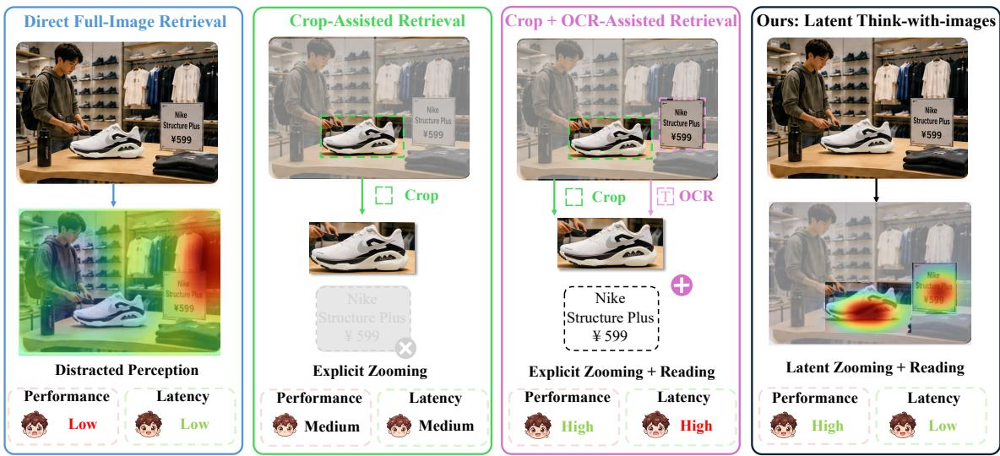
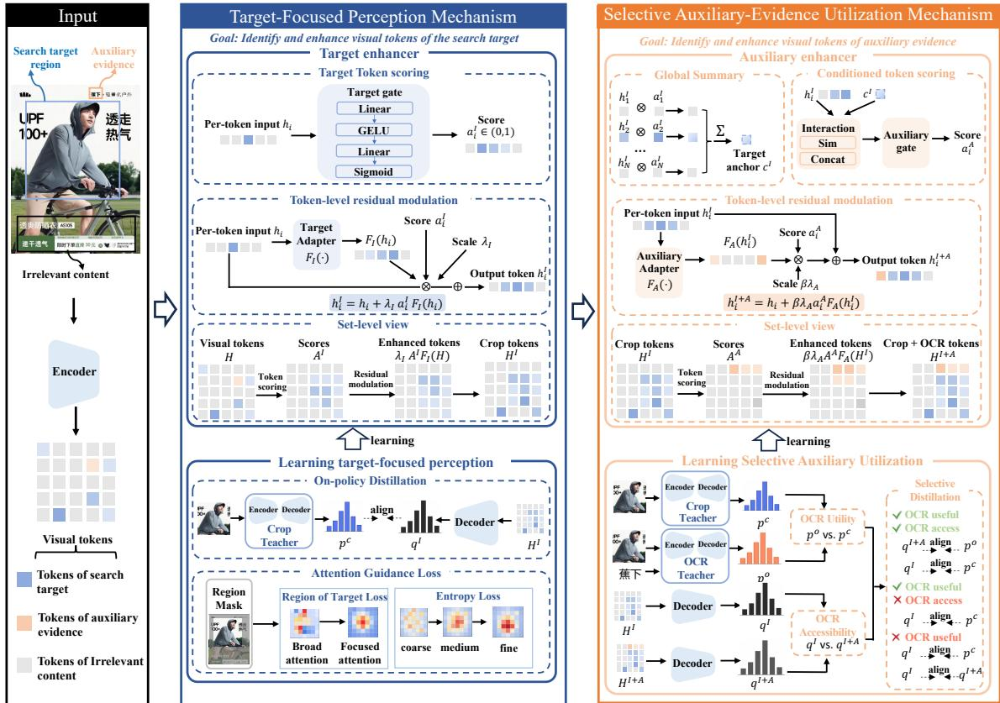
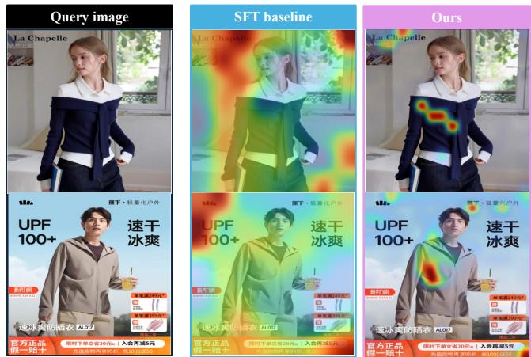

# PailitaoGR: Latent Think-with-Images for Generative Image Retrieval

Xiaomeng Fan Alibaba Group Hangzhou, China fanxiaomeng.fxm@taobao.com

Chenghan Fu   
Alibaba Group   
Hangzhou, China   
fuchenghan.fch@taobao.com   
Chuan Yu   
Alibaba Group   
Hangzhou, China   
yuchuan.yc@taobao.com   
Yueran Liu∗†   
Alibaba Group   
Hangzhou, China   
tianer.lyr@taobao.com   
Wanxian Guan   
Alibaba Group   
Hangzhou, China   
wanxian.gwx@taobao.com   
Jian Xu   
Alibaba Group   
Hangzhou, China   
xiyu.xj@taobao.com

Shengyu Zhou Alibaba Group Hangzhou, China zhoushengyu.zsy@taobao.com

Feng Li   
Alibaba Group   
Hangzhou, China   
adam.lf@taobao.com   
Bo Zheng‡   
Alibaba Group   
Hangzhou, China   
bozheng@alibaba-inc.com

## Abstract

Generative retrieval has demonstrated strong performance by di rectly generating product semantic identifiers (SIDs). Extending this paradigm to image search, however, is nontrivial because real-world query images contain diverse information, including the search target, useful auxiliary evidence, and irrelevant visual content. This requires the model to identify and focus on the search target while selectively utilizing auxiliary evidence. In this paper, we propose PailitaoGR, a Latent Think-with-Images method for generative image retrieval, which internalizes target-focused perception and selective auxiliary-evidence utilization into a the generative retrieval model, enabling Zooming without Cropping and Reading without OCR. Specifically, we design a target-focused perception mechanism that identifies and enhances visual tokens of the search target, consisting of a target Enhancer and a learning strategy based on on-policy distillation and attention guidance loss, enabling the model to focus on search-target regions. We also design a selective auxiliary-evidence utilization mechanism that identifies and enhances visual tokens of auxiliary evidence, including an auxiliary enhancer and an in-capacity incremental contrastive distillation strategy, enabling the model to exploit auxiliary evidence. We construct training and validation sets sampled from real-world online image-search logs. Experiments show that our method outperforms

existing baselines by an average of 13.8%, validating its efectiveness.

## Keywords

Image search, Generative retrieval, Think with images

## ACM Reference Format:

Xiaomeng Fan, Yueran Liu, Shengyu Zhou, Chenghan Fu, Wanxian Guan, Feng Li, Chuan Yu, Jian Xu, and Bo Zheng. 2026. PailitaoGR: Latent Thinkwith-Images for Generative Image Retrieval. In Proceedings ofThe 20th ACM International Conference on Web Search and Data Mining (WSDM ’27). ACM, New York, NY, USA, 11 pages. https://doi.org/10.1145/nnnnnnn.nnnnnnn

## 1 Introduction

Large-scale e-commerce image search, such as Pailitao, Taobao’s image search system, allows users to retrieve target items directly from real-world query images [3]. In this work, we explore generative image retrieval for this task, motivated by the success of generative retrieval [2] and generative recommendation [8, 9]. Real-world query images often contain heterogeneous visual information, including the search target, useful auxiliary cues such as brand and model information, and irrelevant content such as watermarks and other objects. Accordingly, efective generative image retrieval requires two complementary capabilities: identifying and focusing on the search target, and selectively utilizing relevant auxiliary evidence for fine-grained item identification.

Recent Think-with-Images paradigms address complex visual understanding by interacting with images through tools, such as visual grounding, cropping, and OCR [31, 35]. Directly adopting this paradigm for online generative image retrieval, however, faces two challenges. First, explicit tool invocation introduces additional computation and multi-step inference, which conflicts with the strict latency requirements of online retrieval. Second, auxiliary information obtained from these tools may be irrelevant or misleading, while some useful information may exceed the model’s perceptual capacity due to limited image resolution and model size, making indiscriminate capability transfer potentially harmful.

  
Figure 1: Comparison of direct, tool-assisted, and latent Think-with-Images paradigms for generative image retrieval. Our approach internalizes tool-enabled visual capabilities without extra inference latency.

In this paper, we propose PailitaoGR, a Latent Think-with-Images method for generative image retrieval, which internalizes target focusing and auxiliary-evidence utilization into a model that operates solely on the original query image, as illustrated in Fig. 1. Specifically, PailitaoGR contains two capability internalization mechanisms: a target-focused perception mechanism to achieve Zooming without Cropping, and a selective auxiliaryevidence utilization mechanism to achieve Reading without OCR. In the target-focused perception mechanism, we introduce a target enhancer that identifies and enhances visual tokens of the search target in the query image. We further construct a Crop Teacher that takes only the cropped search-target region as input, providing a cleaner and more target-focused prediction. Through on-policy distillation, our model, which takes the original full query image as input, implicitly learns this target-focused prediction behavior. Beyond implicitly learning to focus, we introduce region-of-target (ROT)-based and entropy-based attention guidance to explicitly encourage SID generation to remain centered on the search-target region throughout decoding. The ROT loss directs visual attention toward the search-target region, and the entropy loss encourages broader attention for coarse predictions and progressively more concentrated attention for fine-grained discrimination.

In the selective auxiliary-evidence utilization mechanism, we introduce an auxiliary enhancer that identifies and enhances useful auxiliary evidence, particularly visual cues containing OCR-derived textual information relevant to the search target. We further construct an OCR Teacher that takes the cropped search-target region and pre-extracted OCR text as input. To selectively transfer this capability, we develop an in-capacity incremental contrastive distillation strategy, which activates OCR supervision only when the textual information benefits target SID prediction and is accessible to the current model, and transfers only the capability gain of the OCR Teacher over the Crop Teacher. In this way, the model learns to exploit useful textual evidence while avoiding irrelevant, conflicting, or inaccessible information.

We construct both the training and validation sets from online image-search logs on Pailitao. Compared with existing generative image retrieval and contrastive retrieval methods, our method achieves the best performance, demonstrating its efectiveness. We further compare with a Crop Teacher trained and evaluated on target crops, and a stronger OCR Teacher that additionally incorporates pre-extracted textual information. Our model consistently outperforms both teachers, indicating that target-focusing and auxiliary-evidence utilization capabilities are efectively internalized into the model. Upon acceptance, we will release the curated datasets and trained models.

• We propose PailitaoGR, a Latent Think-with-Images method for generative image retrieval, which internalizes target-focused perception and selective auxiliary-evidence utilization into a model, enabling it to focus on the search target and efectively utilize useful auxiliary cues without additional tool calls.

• We design a target-focused perception mechanism, which identifies and enhances visual tokens of the search target through a target enhancer and an attention-guided on-policy distillation strategy, efectively internalizing target-focused perception.

• We develop a selective auxiliary-evidence utilization mechanism, which identifies and enhances useful auxiliary evidence through an auxiliary enhancer and an in-capacity incremental contrastive distillation strategy, selectively internalizing auxiliary-evidence utilization.

• We construct training and validation sets covering seven representative categories from real-world online image-search logs. Upon acceptance, we will release the datasets and trained models to support further research on generative image retrieval.

## 2 Related Works

## 2.1 Representation-based Vision Search

Representation-based vision search encodes query images and products into dense representations and retrieves relevant products through nearest-neighbor search. Traditional e-commerce representation learning relies on dual-flow architectures for cross-modal alignment between visual and textual product content [5, 7, 17] Recent studies leverage pretrained multimodal large language models for representation learning, including VLM2Vec, MM-Embed, GME, Qwen3-VL-Embedding, and the MOON series [12, 16, 18, 21, 29, 32]. The emerging Think-Then-Embed paradigm further exploits the generative and reasoning capabilities ofMLLMs to derive intermediate semantic contexts before embedding extraction [6, 10, 11, 25, 26].

## 2.2 Generative Retrieval

Generative retrieval reformulates retrieval as an autoregressive generation problem. Generative retrieval first encodes each item into a semantic identifier (SID), commonly constructed using clusteringor quantization-based methods such as RQ-VAE and FSQ [14, 20]. A generative model is then trained to directly generate the SID of relevant items conditioned on the input query.

Recent text-based generative search studies mainly explore three directions. First, several methods improve semantic alignment between queries, products, and SIDs through better identifier con struction and contrastive constraints, including GenR-PO, GRAM, and CQ-SID [15, 22, 36]. Second, recent works enhance query understanding by modeling explicit or latent user intent, such as context-aware reasoning, self-distilled thought augmentation, and category-guided latent intent learning [2, 19, 30]. Third, preferenceaware methods further align SID generation with user behaviors and downstream search objectives through preference optimization, reinforcement learning, and value-aware ranking [1, 4, 28].

Beyond textual queries, generative retrieval has also been explored for image and multimodal search. IRGen introduces a generative image retrieval framework, while GENIUS further extends generative retrieval to multimodal queries; both demonstrate their efectiveness on public benchmarks [13, 33]. OneVision develops the first industrial generative retrieval framework for e-commerce vision search, where the generative retriever takes cropped query images as input [34]. In contrast, to our knowledge, we present the first industrial generative retrieval framework that operates directly on original query images, enabling efective target focusing and auxiliary-evidence utilization through Latent Think-with-Images.

## 3 Method

We propose PailitaoGR, a Latent Think-with-Images method for generative image retrieval. We first formulate the generative image retrieval task and present an overview of the proposed method. We then introduce target-focused perception mechanism and selective auxiliary-evidence utilization mechanism, followed by the inference.

## 3.1 Formulation

Let $\mathcal { D } = \{ d _ { j } \} _ { j = 1 } ^ { M }$ denote a product corpus, where each product $d _ { j }$ is assigned a semantic identifier (SID)

$$
\mathbf { \boldsymbol { s } } _ { j } = ( s _ { j , 1 } , s _ { j , 2 } , \ldots , s _ { j , L } ) ,\tag{1}
$$

consisting of a sequence of discrete semantic tokens. Given a query image x, generative image retrieval directly models the conditional generation probability of a candidate SID as

$$
p _ { \theta } ( \mathbf { s } \mid \mathbf { x } ) = \prod _ { t = 1 } ^ { L } p _ { \theta } \left( s _ { t } \mid \mathbf { x } , \mathbf { s } _ { < t } \right) ,\tag{2}
$$

where $\mathbf { { s } } _ { < t } = \left( s _ { 1 } , \ldots , s _ { t - 1 } \right)$ denotes the previously generated SID tokens.

At inference, the generative model autoregressively generates a set of high-probability candidate SIDs, which is modeled as

$$
\hat { S } _ { K } = \mathrm { T o p K } _ { s \in S } p _ { \theta } ( \mathbf { s } \mid \mathbf { x } ) ,\tag{3}
$$

where $\hat { S } _ { K }$ contains the top- $- K$ generated SIDs, which are subsequently mapped to their corresponding products for retrieval.

Real-world query images typically contain heterogeneous visual information, including the search target, potentially useful auxiliary evidence, and irrelevant content. Consequently, efective generative image retrieval requires the model to both identify and focus on the search target and selectively utilize complementary evidence for fine-grained item identification.

To this end, we propose PailitaoGR, a Latent Think-with-Images method that internalizes these two capabilities into a generative retriever operating solely on the original query image. As illustrated in Fig. 2, PailitaoGR realizes them through two core mechanisms: Target-Focused Perception to enable the model to focus on the search target in complex query images and Selective Auxiliary-Evidence Utilization to selectively exploit auxiliary evidence.

## 3.2 Target-Focused Perception Mechanism

We design an Target Router to identify and enhance target-related visual tokens, and further introduce an Target-Focused Perception Objective to guide the model toward target-centric prediction and visual attention during SID generation.

3.2.1 Target Enhancer. The Target Enhancer consists of Target Token Scoring, which selects visual tokens of search target, and Token-level Residual Modulation, which enhances the selected visual tokens.

Given a query image x, the visual encoder produces a set of visual tokens

$$
H = E _ { \theta } ( \mathbf { x } ) = \{ h _ { i } \} _ { i = 1 } ^ { N } , \qquad h _ { i } \in \mathbb { R } ^ { d } .\tag{4}
$$

We employ a lightweight Target Token Scoring to independently estimate the relevance of each visual token to the search target,

$$
a _ { i } ^ { I } = \sigma ( w _ { I } ^ { \top } \mathrm { G E L U } ( W _ { I } \mathrm { L N } ( h _ { i } ) ) ) ,\tag{5}
$$

where $W _ { I }$ and $w _ { I }$ are learnable parameters, LN(·) is the layer normalization, and $\sigma ( \cdot )$ denotes the sigmoid function. $a _ { i } ^ { I }$ measures the relevance of visual token � to the search target.

  
Figure 2: Framework of our method.

Simply rescaling $h _ { i }$ according to $a _ { i } ^ { I }$ only changes its magnitude without altering its feature direction, and its efect can be further weakened by subsequent normalization. We introduce Tokenlevel Residual Modulation to enhance the selected visual tokens through learnable residual feature updates by

$$
F _ { I } ( h _ { i } ) = W _ { I , 2 } { \mathrm { G E L U } } \left( W _ { I , 1 } { \mathrm { L N } } ( h _ { i } ) \right) .\tag{6}
$$

The selected visual tokens are then enhanced through

$$
h _ { i } ^ { I } = h _ { i } + \lambda _ { I } a _ { i } ^ { I } F _ { I } ( h _ { i } ) ,\tag{7}
$$

where �� controls the magnitude of the residual enhancement. Accordingly, the crop tokens that are target-enhanced visual representation are computed as

$$
H ^ { I } = \{ h _ { i } ^ { I } \} _ { i = 1 } ^ { N } .\tag{8}
$$

In this way, token-level residual modulation enhances the selected visual tokens of search target while preserving their original visual information through the residual connection.

3.2.2 Target-Focused Perception Objective. The most straightforward way to optimize the target enhancer is to use the ground-truth SID as supervision. We denote the SID distribution predicted from $H ^ { I }$ as

$$
\begin{array} { r } { q _ { t } ^ { I } ( \cdot ) = p _ { \theta } \left( \cdot \mid H ^ { I } , \mathbf { s } _ { < t } \right) . } \end{array}\tag{9}
$$

The standard cross-entropy objective is

$$
\mathcal { L } _ { \mathrm { C E } } = - \frac { 1 } { L } \sum _ { t = 1 } ^ { L } \log q _ { t } ^ { I } \left( s _ { t } ^ { * } \mid \mathbf { s } _ { < t } ^ { * } \right) .\tag{10}
$$

SID supervision only constrains the final prediction and cannot directly guide the model to focus on the search target in complex query images. We introduce two objectives: an On-Policy Distillation Loss, which implicitly transfers target-focused prediction behavior from a Crop Teacher, and a Granularity-Aware Attention Guidance Loss, which explicitly guides visual attention toward the search target during SID generation.

On-policy distillation. We train a Crop Teacher $p _ { \phi _ { C } } ( \cdot )$ that receives the cropped image $\mathbf { x } ^ { C }$ of the search target. Since most background regions are removed, the Crop Teacher provides a reference of search target for SID prediction. Conventional autoregressive distillation evaluates teacher and student under ground-truth prefixes, whereas inference conditions on the student’s own predictions. At inference, once an SID token is predicted incorrectly, the model must continue generation from an erroneous prefix that is not encountered during distillation, making subsequent predictions less reliable and leading to a train–inference mismatch.

To reduce this discrepancy, we adopt on-policy distillation. Given $H ^ { I } { } _ { ; }$ , we first generate a SID trajectory using the current student model that takes full image as input,

$$
\hat { \mathbf { s } } \sim p _ { \boldsymbol \theta } \left( \mathbf { s } \mid H ^ { I } \right) .\tag{11}
$$

At each decoding step �, both the Crop Teacher and the student are then queried using the same student-generated prefix $\hat { \mathbf { s } } _ { < t } \mathbf { : }$

$$
\begin{array} { r } { p _ { t } ^ { C } ( \cdot ) = p _ { \phi _ { C } } \left( \cdot \mid \mathbf { x } ^ { C } , \hat { \mathbf { s } } _ { < t } \right) , } \end{array}\tag{12}
$$

$$
\begin{array} { r } { q _ { t } ^ { I } ( \cdot ) = p _ { \theta } \left( \cdot \mid H ^ { I } , \hat { \mathbf { s } } _ { < t } \right) . } \end{array}\tag{13}
$$

In practice, we distill the top-� candidates predicted by the Crop Teacher. Let $\mathcal { K } _ { t }$ denote the corresponding candidate set. Let $\widetilde { p } _ { t } ^ { C }$ and $\widetilde { q } _ { t } ^ { I }$ denote the teacher and student distributions normalized over $\mathcal { K } _ { t }$ The on-policy distillation objective is defined as

$$
\mathcal { L } _ { \mathrm { O P D } } = \mathbb { E } _ { \hat { \mathbf { s } } \sim p _ { \theta } ( \cdot | H ^ { I } ) } \left[ \frac { 1 } { | \hat { \mathbf { s } } | } \sum _ { t = 1 } ^ { | \hat { \mathbf { s } } | } \mathrm { J S D } \left( \widetilde { p } _ { t } ^ { C } , \widetilde { q } _ { t } ^ { I } \right) \right] ,\tag{14}
$$

where $\mathrm { J S D } ( \cdot , \cdot )$ denotes the Jensen–Shannon divergence. In this way, the Crop Teacher provides search-target-centric supervision under the states that the student is likely to encounter during its own autoregressive generation.

Granularity-aware attention guidance. On-policy distillation does not explicitly regulate which visual regions the student relies on to make these predictions. We therefore further guide the attention from SID tokens to visual tokens.

Let $A _ { t , v } ^ { ( l , h ) }$ denote the attention weight from the �-th SID token to visual token � at layer � and attention head ℎ. We first average the attention weights over all $N _ { h }$ heads:

$$
\bar { A } _ { t , v } ^ { ( l ) } = \frac { 1 } { N _ { h } } \sum _ { h = 1 } ^ { N _ { h } } A _ { t , v } ^ { ( l , h ) } .\tag{15}
$$

We then retain the visual-token columns and normalize them to obtain a visual attention distribution:

$$
\pi _ { t } ^ { ( l ) } ( v ) = \frac { \bar { A } _ { t , v } ^ { ( l ) } } { \sum _ { v ^ { \prime } \in \mathcal { V } } \bar { A } _ { t , v ^ { \prime } } ^ { ( l ) } + \epsilon } , \qquad v \in \mathcal { V } ,\tag{16}
$$

where $_ \mathrm { c } { } _ { V }$ denotes the set of visual tokens.

The SID follows a coarse-to-fine semantic structure. We exploit this property to guide both where the model attends and how concentrated its attention should be as SID generation proceeds.

ROT attention guidance. We define the bounding-box region of the search target as the region of target (ROT) and map it to the corresponding visual tokens to obtain a binary mask $M ( v ) \in \{ 0 , 1 \}$ For the �-th SID token, we measure the amount of visual attention falling within the ROT as

$$
m _ { t } ^ { ( l ) } = \sum _ { v \in \mathcal { V } } \pi _ { t } ^ { ( l ) } ( v ) M ( v ) .\tag{17}
$$

We associate each SID token with its semantic granularity $g ( t )$ and assign a granularity-dependent coeficient $\alpha _ { g ( t ) }$ . In particular, increasingly fine-grained SID tokens receive progressively stronger ROT constraints:

$$
\alpha _ { \mathrm { c o a r s e } } < \alpha _ { \mathrm { m e d i u m } } < \alpha _ { \mathrm { f i n e } } , \qquad \alpha _ { \mathrm { s e p } } = 0 .\tag{18}
$$

The ROT attention loss is defined as

$$
\begin{array} { r } { \mathcal { L } _ { \mathrm { r o t } } = \mathrm { M e a n } _ { l , t } \left[ - \alpha _ { g ( t ) } \log \left( m _ { t } ^ { ( l ) } + \epsilon \right) \right] . } \end{array}\tag{19}
$$

This design imposes a relatively weak constraint when generating coarse SID tokens, while increasingly encouraging fine-grained predictions to rely on visual evidence inside the region of search target.

Coarse-to-fine entropy guidance. To regulate the concentration of visual attention at diferent SID granularities, we further introduce an entropy-based attention loss. Our design follows a coarse-tofine principle, with broader attention for coarse SID tokens and progressively concentrated attention for finer-grained tokens. To this end, we define the attention entropy as

$$
\mathcal { H } _ { t } ^ { ( l ) } = - \sum _ { v \in \mathcal { V } } \pi _ { t } ^ { ( l ) } ( v ) \log \left( \pi _ { t } ^ { ( l ) } ( v ) + \epsilon \right) .\tag{20}
$$

We further introduce a granularity-dependent direction coeficient $\gamma _ { g ( t ) }$ to control the desired entropy at each SID level as

$$
\gamma _ { \mathrm { c o a r s e } } = + 1 , \qquad \gamma _ { \mathrm { m e d i u m } } = \gamma _ { \mathrm { f i n e } } = - 1 , \qquad \gamma _ { \mathrm { s e p } } = 0 .\tag{21}
$$

The entropy objective is then

$$
\mathcal { L } _ { \mathrm { e n t } } = \mathrm { M e a n } _ { l , t } \left[ - \gamma _ { g ( t ) } \mathcal { H } _ { t } ^ { ( l ) } \right] .\tag{22}
$$

Minimizing Eq. (22) encourages coarse SID tokens to maintain a relatively high-entropy visual attention distribution and capture broader visual evidence, whereas medium- and fine-grained SID tokens are encouraged to progressively concentrate their attention on discriminative product details. Therefore, the ROT and entropy objectives are complementary: the former determines where the model should gather visual evidence, while the latter regulates how broadly or selectively the evidence should be collected at diferent semantic granularities.

Training objective. Overall, the training objective is

$$
\mathcal { L } _ { \mathrm { i t e m } } = \mathcal { L } _ { \mathrm { C E } } + \lambda _ { \mathrm { o p d } } \mathcal { L } _ { \mathrm { O P D } } + \lambda _ { \mathrm { r o t } } \mathcal { L } _ { \mathrm { r o t } } + \lambda _ { \mathrm { e n t } } \mathcal { L } _ { \mathrm { e n t } } .\tag{23}
$$

Minimizing Eq. (22) enforces the desired coarse-to-fine attention concentration across SID granularities. The objective enable the student to internalize target-focused perception while operating solely on the original query image.

## 3.3 Selective Auxiliary-Evidence Utilization Mechanism

After establishing an target-centric representation, the model should further exploit auxiliary evidence, while avoiding irrelevant or misleading information. To this end, we introduce Selective Auxiliary-Evidence Utilization Mechanism, which consists of an auxiliary enhancer for identifying and enhancing useful auxiliary information, and a selective distillation objective for determining which auxiliary capability should be internalized.

3.3.1 Auxiliary Enhancer . Given the crop tokens $H ^ { I } = \{ h _ { i } ^ { I } \} _ { i = 1 } ^ { N }$ , we summarize the tokens into an Target Anchor,

$$
c ^ { I } = \frac { \sum _ { i = 1 } ^ { N } a _ { i } ^ { I } h _ { i } ^ { I } } { \sum _ { i = 1 } ^ { N } a _ { i } ^ { I } + \epsilon } .\tag{24}
$$

The auxiliary enhancer evaluates whether a visual token provides complementary information for the current target. Specifically, we compute the auxiliary relevance score by jointly considering the local visual token and the Target Anchor:

$$
a _ { i } ^ { A } = \sigma \left( g _ { A } ( h _ { i } ^ { I } , c ^ { I } ) \right) ,\tag{25}
$$

where

$$
\begin{array} { r } { g _ { A } ( h _ { i } ^ { I } , c ^ { I } ) = w _ { A } ^ { \top } \mathrm { G E L U } \left( W _ { A } \left[ \mathrm { L N } ( h _ { i } ^ { I } ) ; \mathrm { L N } ( c ^ { I } ) ; \mathrm { L N } ( h _ { i } ^ { I } ) \odot \mathrm { L N } ( c ^ { I } ) \right] \right) . } \end{array}\tag{26}
$$

The selected auxiliary visual tokens are further enhanced through Token-level Residual Modulation, i.e.,

$$
h _ { i } ^ { I + A } = h _ { i } ^ { I } + \beta \lambda _ { A } a _ { i } ^ { A } F _ { A } ( h _ { i } ^ { I } ) ,\tag{27}
$$

where $F _ { A } ( \cdot )$ denotes a learnable residual transformation, $\lambda _ { A }$ controls the residual magnitude, and $\beta$ controls the overall contribution of auxiliary information. The crop+OCR tokens are computed as

$$
H ^ { I + A } = \{ h _ { i } ^ { I + A } \} _ { i = 1 } ^ { N } .\tag{28}
$$

3.3.2 Selective Auxiliary Distillation Objective. OCR cues can be useful, irrelevant, or even misleading for retrieval. Moreover, even useful auxiliary information may not always be reliably captured by the student from the original query image. We therefore determine auxiliary supervision from two perspectives: whether the auxiliary information is useful according to the teacher, and whether it is accessible to the student.

We employ two teacher models. The Crop Teacher takes only the cropped image as input, while the OCR Teacher additionally receives the pre-extracted OCR information. Let $p _ { t } ^ { C }$ and $p _ { t } ^ { O }$ denote their SID distributions at decoding step �. The utility of auxiliary information is measured by the improvement of the OCR Teacher over the Crop Teacher on the ground-truth SID token:

$$
u _ { t } ^ { T } = \log p _ { t } ^ { O } ( s _ { t } ^ { * } ) - \log p _ { t } ^ { C } ( s _ { t } ^ { * } ) .\tag{29}
$$

A larger $u _ { t } ^ { T }$ indicates that the auxiliary information provides addi tional evidence for predicting the target SID.

We further evaluate whether such auxiliary information can be exploited by the student. Let

$$
\begin{array} { r } { q _ { t } ^ { I } ( \cdot ) = p _ { \theta } \left( \cdot \mid H ^ { I } , \mathbf { s } _ { < t } \right) , } \end{array}\tag{30}
$$

and

$$
q _ { t } ^ { I + A } ( \cdot ) = p _ { \theta } \left( \cdot \mid H ^ { I + A } , s _ { < t } \right)\tag{31}
$$

denote the student predictions using crop tokens $H ^ { I }$ and crop+OCR tokens $H ^ { I + A }$ , respectively. We define the accessibility as

$$
u _ { t } ^ { S } = \log q _ { t } ^ { I + A } ( s _ { t } ^ { * } ) - \log q _ { t } ^ { I } ( s _ { t } ^ { * } ) .\tag{32}
$$

Based on these two signals, we construct soft selection weights:

$$
w _ { t } ^ { \mathrm { h e l p } } = \sigma \left( \tau _ { T } u _ { t } ^ { T } - \rho _ { T } \right) , \qquad w _ { t } ^ { \mathrm { c a p } } = \sigma \left( \tau _ { S } u _ { t } ^ { S } - \rho _ { S } \right) ,\tag{33}
$$

where $\rho _ { T }$ and $\rho _ { S }$ are the selection thresholds for auxiliary utility and student accessibility, respectively, while $\tau _ { T }$ and $\tau _ { S }$ control the sharpness of the corresponding soft gates. Here, $w _ { t } ^ { \mathrm { h e l p } }$ measures whether the auxiliary information is beneficial, whereas $w _ { t } ^ { \mathrm { c a p } }$ measures whether it is accessible to the student.

When the auxiliary evidence is both useful and accessible, we encourage the auxiliary-enhanced student to approach the OCR

Teacher and explicitly realize a prediction gain over the target-only representation:

$$
\mathcal { L } _ { \mathrm { o p e n } } = \mathcal { L } _ { \mathrm { c o n t r a s t } } + \lambda _ { \mathrm { g a i n } } \mathcal { L } _ { \mathrm { g a i n } } ,\tag{34}
$$

where

$$
\mathcal { L } _ { \mathrm { c o n t r a s t } } = - \log \frac { \exp { \left( s ( q _ { t } ^ { I + A } , \boldsymbol { p } _ { t } ^ { O } ) / \tau \right) } } { \exp { \left( s ( q _ { t } ^ { I + A } , \boldsymbol { p } _ { t } ^ { O } ) / \tau \right) } + \exp { \left( s ( q _ { t } ^ { I + A } , \boldsymbol { p } _ { t } ^ { C } ) / \tau \right) } } ,\tag{35}
$$

and

$$
\mathcal { L } _ { \mathrm { g a i n } } = \left[ m - \left( \log q _ { t } ^ { I + A } ( s _ { t } ^ { * } ) - \log q _ { t } ^ { I } ( s _ { t } ^ { * } ) \right) \right] _ { + } .\tag{36}
$$

In contrast, when the auxiliary information is not useful, we suppress its influence by encouraging the auxiliary-enhanced prediction to remain close to the target-only prediction and the Crop Teacher:

$$
\mathcal { L } _ { \mathrm { c l o s e } } = \mathrm { J S D } \left( q _ { t } ^ { I + A } , q _ { t } ^ { I } \right) + \lambda _ { C } \mathrm { J S D } \left( q _ { t } ^ { I + A } , p _ { t } ^ { C } \right) .\tag{37}
$$

When the auxiliary evidence is useful but not yet accessible, we apply neither transfer nor suppression, avoiding forced imitation of inaccessible capability while allowing the student to improve during training.

Regardless of auxiliary-evidence utility and accessibility, we apply ground-truth SID supervision and align the target-only pre diction with the Crop Teacher to keep SID generation centered on the search target. We define a shared base objective as

$$
\mathcal { L } _ { \mathrm { b a s e } } = \mathrm { C E } \left( q _ { t } ^ { I } , s _ { t } ^ { * } \right) + \mathrm { C E } \left( q _ { t } ^ { I + A } , s _ { t } ^ { * } \right) + \lambda _ { I } \mathrm { J S D } \left( q _ { t } ^ { I } , \hat { p } _ { t } ^ { C } \right) ,\tag{38}
$$

where CE(·, ·) denotes the cross-entropy loss. The overall objective is computed as

$$
\begin{array} { r } { \mathcal { L } _ { t } = \mathcal { L } _ { \mathrm { b a s e } } + \lambda _ { \mathrm { g a t e } } \left( w _ { t } ^ { \mathrm { h e l p } } w _ { t } ^ { \mathrm { c a p } } \mathcal { L } _ { \mathrm { o p e n } } + \left( 1 - w _ { t } ^ { \mathrm { h e l p } } \right) \mathcal { L } _ { \mathrm { c l o s e } } \right) , } \end{array}\tag{39}
$$

where $\lambda _ { \mathrm { g a t e } }$ controls the overall strength of the selectively gated auxiliary-evidence objectives. The objective transfers auxiliary capability only when the additional evidence is both beneficial and accessible to the student, while suppressing irrelevant or misleading auxiliary information.

## 3.4 Generative Inference

After training, both target focusing and auxiliary-evidence utilization are internalized into the generative retriever. Given only the original query image, the target enhancer identifies and enhances visual tokens of search target, enabling Zooming without Cropping. Conditioned on the resulting target information, the auxiliary enhancer further identifies and enhances useful auxiliary cues directly from the visual tokens, enabling Reading without OCR. Meanwhile, the learned target-focused perception encourages SID decoding to remain centered on visual tokens of search target, with auxiliary cues serving only as complementary evidence for fine-grained identification. The resulting enhanced visual tokens are directly used for SID generation, while the crop and OCR teachers are completely removed during inference.

## 4 Data Construction

We construct our dataset from online image-search logs collected from a large-scale e-commerce platform: Pailitao. For training, we retain query images associated with behavioral SIDs from clicks, purchases, add-to-cart, and favorite actions, and require each query to have more than three behavioral SIDs. We then select the seven most frequent subcategories: women’s clothing, children’s clothing, men’s clothing, women’s shoes, men’s shoes, digital products, and furniture. The test set is collected from a temporally disjoint period to avoid query-image overlap with training, and further requires more than three behavioral SIDs and at least one purchase behavior. All test samples are further verified by both human annotators and matching models to ensure that each query image and its associated item depict the same product. We evaluate retrieval performance based on click and purchase behaviors. We use the same seven subcategories as in the training set for evaluation.

The training and test sets contain 1,159,746 and 8,647 query images, respectively, covering seven product categories. The train ing set contains 275,161 women’s shoes, 232,529 furniture, 200,000 women’s clothing, 163,526 men’s clothing, 144,629 children’s clothing, 100,628 3C products, and 43,273 men’s shoes queries, while the corresponding numbers in the test set are 1,095, 483, 4,258, 624, 1,420, 576, and 191. Each query is associated with multiple positive items: the average numbers are 5.87 and 5.61 for training and test, respectively, with a median of 5 for both sets. Most queries contain 4–6 positive items, accounting for approximately 57% of the data. The training and test sets will be publicly released upon publication of the paper.

## 5 Experiments

## 5.1 Settings

Evaluation Metrics. We adopt two metrics, R@K and H@K, to evaluate retrieval performance. R@K measures the proportion of behavior-associated items that are successfully retrieved among the top-� results, while H@K measures whether at least one behaviorassociated SID is retrieved. Formally, given the ground-truth behaviorassociated SID set $S ^ { \mathrm { b e h } }$ and the top-� retrieved SID set $\hat { S } _ { K }$

$$
\operatorname { R } @ \operatorname { K } = { \frac { \left| { \hat { S } } _ { K } \cap S ^ { \mathrm { b e h } } \right| } { \operatorname* { m i n } \left( K , \left| S ^ { \mathrm { b e h } } \right| \right) } } ,\tag{40}
$$

and

$$
\mathrm { H @ K } = \mathbb { I } \left( \left| \hat { S } _ { K } \cap S ^ { \mathrm { b e h } } \right| > 0 \right) ,\tag{41}
$$

where I(·) denotes the indicator function. For both metrics, we separately compute the results based on click and purchase behaviors.

Comparison Methods. We compare our method with two representative generative image retrieval methods, IRGen [33] and GENIUS [13], and follow the model configurations used in their original papers. Specifically, GENIUS adopts CLIP ViT-L/14 as the visual encoder and a 6-layer T5 decoder, while IRGen employs CLIP ViT-B/16 as the visual encoder and a 24-layer Transformer decoder. Both methods are initialized from corresponding pretrained models and trained on our constructed training set. We additionally compare with two conventional similarity-based retrieval methods, DINOv3 [24] and CLIP [23], both using ViT-B/16. Their released pre trained weights are used for initialization, followed by fine-tuning on our training set. All trained model checkpoints will be publicly released upon acceptance of the paper.

Implementation Details. We adopt Qwen3.5-0.8b [27] as our base model. The SID consists of three codebook levels, each with a codebook size of 8,192. For the teacher models, the Crop Teacher takes the cropped search target as input, while the OCR Teacher takes both the cropped target image and the pre-extracted OCR as input. Both teachers are trained with SID supervision. Our student model takes only the original query image as input. We train the model with a batch size of 1,024 and an initial learning rate of $1 \times 1 0 ^ { - 4 }$ , which is decayed using a cosine schedule.

We set $\lambda _ { \mathrm { o p d } } = 2 . 0 , \lambda _ { \mathrm { r o i } } = 0 . 1$ , and $\lambda _ { \mathrm { e n t } } = 0 . 0 2$ . For on-policy distillation, we compute the forward KL divergence over the teacher’s top-100 predictions. The weights for ROT attention guidance are set to $\alpha = ( 0 . 1 , 0 . 3 , 0 . 6 , 0 )$ for coarse, medium, fine, and separator SID tokens, respectively. We set $\tau _ { T } = \tau _ { S } = 1 . 0 , \rho _ { T } = \rho _ { S } = 0 . 0$ $\lambda _ { \mathrm { g a i n } } = 0 . 5 , m = 0 . 5 , \lambda _ { C } = 0 . 5 , \mathrm { a n d } \lambda _ { \mathrm { g a t e } } = 0 . 0 2 .$

## 5.2 Main Results

Table 1 reports the main results. Our method outperforms all existing methods, achieving an average improvement of 12.16% over the second-best method across the ten metrics, demonstrating its superior retrieval performance. Among generative retrieval methods under the same crop-based setting, we observe that our model consistently outperforms IRGen and GENIUS, while IRGen further outperforms GENIUS. We attribute this trend to decoder capacity, with decoder size following Qwen3.5-0.8B > IRGen > GENIUS, leading to stronger SID modeling and better retrieval performance.

More importantly, our model outperforms the directly SFT-trained baseline by an average of 13.8% across the ten metrics, demonstrating the efectiveness of the proposed capability internalization. It also surpasses the Crop Teacher and OCR Teacher by 4.76% and 2.76% across the ten metrics, respectively, although they use Crop and Crop+OCR inputs during both training and inference. These results demonstrate that our method efectively internalizes targetfocusing and auxiliary-evidence utilization capabilities, achieving Zooming without Cropping and Reading without OCR using only the original query image. Moreover, outperforming the OCR Teacher suggests that selective internalization enables the model to exploit beneficial auxiliary cues while avoiding indiscriminate reliance on them.

## 5.3 Target-Focusing Capability Analysis

To verify whether our method efectively internalizes the targetfocusing capability, we analyze model performance under diferent sizes of search target. Specifically, we use the bounding box of the search target in each query image as its region of target (ROT), and divide the test queries into diferent groups according to the number of visual tokens covered by the ROT. We then compare our method with the directly SFT baseline across these groups. The results are shown in Table 2. Our method consistently improves performance across diferent ROT groups, with more pronounced gains when the search target occupies a smaller region of the query image. These results demonstrate that our method can focus on the search target in complex scenes, validating its Zooming without Cropping capability.

## 5.4 OCR Reading Capability Analysis

To verify whether our method can efectively internalize the capability of utilizing textual cues, we divide the test queries into two groups according to whether OCR information is present in the query image. We then compare the performance of our method with the SFT baseline and the Crop Teacher. The results are shown in Table 3. Our method achieves more evident improvements on queries containing OCR, demonstrating its ability to exploit useful textual cues directly from the original image without explicit

Table 1: Comparison of retrieval performance (%) on the test set.
<table><tr><td rowspan="2">Method</td><td rowspan="2">Input</td><td colspan="5">CLICK</td><td colspan="5">PURCHASE</td></tr><tr><td>H@1</td><td>H@5</td><td>H@10</td><td>R@5</td><td>R@10</td><td>H@1</td><td>H@5</td><td>H@10</td><td>R@5</td><td>R@10</td></tr><tr><td colspan="10">Traditional Retrieval</td><td></td><td></td><td></td></tr><tr><td>DINOv3</td><td>Crop</td><td>36.38</td><td>58.61</td><td>64.36</td><td>32.60</td><td>39.87</td><td>14.64</td><td>36.98</td><td>44.35</td><td>35.84</td><td>43.27</td></tr><tr><td>CLIP</td><td>Crop</td><td>30.57</td><td>53.90</td><td>61.69</td><td>28.83</td><td>36.73</td><td>12.24</td><td>32.57</td><td>41.11</td><td>31.54</td><td>40.05</td></tr><tr><td colspan="10">Existing Generative Retrieval</td><td></td><td></td><td></td></tr><tr><td>IRGen</td><td>Crop</td><td>29.72</td><td>55.02</td><td>60.06</td><td>28.87</td><td>36.03</td><td>11.54</td><td>32.81</td><td>39.85</td><td>32.00</td><td>39.14</td></tr><tr><td>GENIUS</td><td>Crop</td><td>24.62</td><td>42.12</td><td>45.19</td><td>21.99</td><td>26.93</td><td>9.37</td><td>25.03</td><td>29.72</td><td>24.37</td><td>29.28</td></tr><tr><td colspan="10">Teacher Models</td><td></td><td></td><td></td></tr><tr><td>Crop Teacher</td><td>Crop</td><td>37.48</td><td>68.16</td><td>74.25</td><td>39.02</td><td>50.41</td><td>14.70</td><td>44.28</td><td>54.47</td><td>43.41</td><td>54.02</td></tr><tr><td>OCR Teacher</td><td>Crop + OCR</td><td>39.74</td><td>70.77</td><td>77.02</td><td>41.22</td><td>52.88</td><td>16.00</td><td>46.47</td><td>57.06</td><td>45.54</td><td>56.48</td></tr><tr><td colspan="10">Full-Image Models</td><td></td><td></td><td></td></tr><tr><td>SFT Baseline</td><td>Full Image</td><td>29.25</td><td>56.13</td><td>63.24</td><td>30.71</td><td>40.74</td><td>11.55</td><td>34.69</td><td>44.57</td><td>34.06</td><td>44.05</td></tr><tr><td>Ours</td><td>Full Image</td><td>41.88</td><td>73.33</td><td>79.19</td><td>43.46</td><td>55.27</td><td>17.20</td><td>49.39</td><td>60.12</td><td>48.46</td><td>59.48</td></tr></table>

Table 2: Retrieval performance (%) under diferent search-target ROT area ratios. Δ denotes the absolute improvement of our method over the SFT Baseline.
<table><tr><td rowspan="2">ROT Ratio</td><td rowspan="2">Method</td><td colspan="5">CLICK</td><td colspan="5">PURCHASE</td></tr><tr><td>H@1</td><td>H@5</td><td>H@10</td><td>R@5</td><td>R@10</td><td>H@1</td><td>H@5</td><td>H@10</td><td>R@5</td><td>R@10</td></tr><tr><td rowspan="3">0-5%</td><td>SFT Baseline</td><td>18.01</td><td>36.53</td><td>42.42</td><td>19.12</td><td>26.44</td><td>6.23</td><td>20.71</td><td>29.12</td><td>20.51</td><td>28.85</td></tr><tr><td>Ours</td><td>36.53</td><td>65.49</td><td>72.05</td><td>37.82</td><td>49.92</td><td>15.32</td><td>42.59</td><td>54.38</td><td>41.83</td><td>53.85</td></tr><tr><td>Δ</td><td>+18.52</td><td>+28.96</td><td>+29.63</td><td>+18.71</td><td>+23.49</td><td>+9.09</td><td>+21.89</td><td>+25.25</td><td>+21.31</td><td>+25.00</td></tr><tr><td rowspan="3">5-10%</td><td>SFT Baseline</td><td>26.02</td><td>50.52</td><td>57.25</td><td>26.86</td><td>35.88</td><td>9.85</td><td>29.06</td><td>38.11</td><td>28.71</td><td>37.81</td></tr><tr><td>Ours</td><td>42.11</td><td>75.18</td><td>81.18</td><td>45.20</td><td>57.25</td><td>17.29</td><td>50.68</td><td>62.05</td><td>49.66</td><td>61.30</td></tr><tr><td>Δ</td><td>+16.09</td><td>+24.66</td><td>+23.94</td><td>+18.34</td><td>+21.36</td><td>+7.45</td><td>+21.62</td><td>+23.94</td><td>+20.95</td><td>+23.49</td></tr><tr><td rowspan="3">10-20%</td><td>SFT Baseline</td><td>29.59</td><td>57.88</td><td>64.93</td><td>32.04</td><td>42.36</td><td>11.51</td><td>37.04</td><td>47.30</td><td>36.40</td><td>47.08</td></tr><tr><td>Ours</td><td>43.82</td><td>77.20</td><td>82.46</td><td>46.98</td><td>58.88</td><td>18.43</td><td>54.35</td><td>65.02</td><td>53.60</td><td>64.28</td></tr><tr><td>Δ</td><td>+14.23</td><td>+19.32</td><td>+17.54</td><td>+14.94</td><td>+16.52</td><td>+6.92</td><td>+17.31</td><td>+17.72</td><td>+17.20</td><td>+17.20</td></tr><tr><td rowspan="3">20-40%</td><td>SFT Baseline</td><td>32.76</td><td>61.20</td><td>68.62</td><td>33.99</td><td>44.70</td><td>13.39</td><td>38.80</td><td>49.12</td><td>38.15</td><td>48.49</td></tr><tr><td>Ours</td><td>43.84</td><td>75.18</td><td>80.88</td><td>44.44</td><td>56.64</td><td>18.09</td><td>50.95</td><td>61.75</td><td>49.82</td><td>61.11</td></tr><tr><td>Δ</td><td>+11.08</td><td>+13.98</td><td>+12.25</td><td>+10.45</td><td>+11.94</td><td>+4.69</td><td>+12.15</td><td>+12.63</td><td>+11.67</td><td>+12.62</td></tr><tr><td rowspan="3">≥40%</td><td>SFT Baseline</td><td>28.93</td><td>56.06</td><td>63.39</td><td>30.12</td><td>40.19</td><td>11.52</td><td>33.55</td><td>43.28</td><td>32.78</td><td>42.53</td></tr><tr><td>Ours</td><td>37.39</td><td>66.75</td><td>73.65</td><td>37.92</td><td>48.76</td><td>14.59</td><td>41.60</td><td>51.86</td><td>40.82</td><td>51.43</td></tr><tr><td>Δ</td><td>+8.46</td><td>+10.68</td><td>+10.26</td><td>+7.80</td><td>+8.58</td><td>+3.06</td><td>+8.04</td><td>+8.58</td><td>+8.04</td><td>+8.89</td></tr></table>

OCR input. The performance on queries without OCR remains competitive, indicating that the model does not indiscriminately rely on textual cues. These results validate both the Reading without OCR capability and the efectiveness of selective auxiliary-evidence utilization.

Table 3: Retrieval performance (%) on queries with and without OCR information. $\Delta _ { \mathrm { S F T } }$ and $\Delta _ { \mathrm { C r o p } }$ denote the absolute improvements of our method over the SFT Baseline and Crop Teacher, respectively.
<table><tr><td rowspan="2">OCR</td><td rowspan="2">Method</td><td colspan="5">CLICK</td><td colspan="5">PURCHASE</td></tr><tr><td>H@1</td><td>H@5</td><td>H@10</td><td>R@5</td><td>R@10</td><td>H@1</td><td>H@5</td><td>H@10</td><td>R@5</td><td>R@10</td></tr><tr><td rowspan="5">With OCR</td><td>SFT Baseline</td><td>24.50</td><td>49.84</td><td>57.40</td><td>25.69</td><td>34.87</td><td>9.45</td><td>28.76</td><td>38.04</td><td>27.87</td><td>37.20</td></tr><tr><td>Crop Teacher</td><td>32.95</td><td>63.66</td><td>70.07</td><td>34.88</td><td>45.61</td><td>12.53</td><td>39.96</td><td>49.76</td><td>38.92</td><td>48.93</td></tr><tr><td>Ours</td><td>37.95</td><td>70.84</td><td>77.22</td><td>40.56</td><td>52.19</td><td>15.37</td><td>46.54</td><td>57.71</td><td>45.46</td><td>56.73</td></tr><tr><td> $\Delta _ { \mathrm { S F T } }$ </td><td>+13.44</td><td>+21.00</td><td>+19.82</td><td>+14.87</td><td>+17.32</td><td>+5.92</td><td>+17.78</td><td>+19.68</td><td>+17.59</td><td>+19.53</td></tr><tr><td> $\Delta _ { \mathrm { C r o p } }$ </td><td>+5.00</td><td>+7.18</td><td>+7.15</td><td>+5.67</td><td>+6.58</td><td>+2.84</td><td>+6.58</td><td>+7.96</td><td>+6.54</td><td>+7.80</td></tr><tr><td rowspan="5">Without OCR</td><td>SFT Baseline</td><td>32.38</td><td>60.34</td><td>67.13</td><td>34.08</td><td>44.66</td><td>12.95</td><td>38.68</td><td>48.95</td><td>38.21</td><td>48.65</td></tr><tr><td>Crop Teacher</td><td>40.53</td><td>71.20</td><td>77.06</td><td>41.81</td><td>53.65</td><td>16.16</td><td>47.19</td><td>57.65</td><td>46.47</td><td>57.48</td></tr><tr><td>Ours</td><td>44.46</td><td>75.15</td><td>80.76</td><td>45.50</td><td>57.47</td><td>18.43</td><td>51.36</td><td>61.92</td><td>50.53</td><td>61.51</td></tr><tr><td>∆SFT</td><td>+12.08</td><td>+14.81</td><td>+13.63</td><td>+11.42</td><td>+12.81</td><td>+5.48</td><td>+12.68</td><td>+12.97</td><td>+12.31</td><td>+12.86</td></tr><tr><td> $\Delta _ { \mathrm { C r o p } }$ </td><td>+3.93</td><td>+3.95</td><td>+3.70</td><td>+3.70</td><td>+3.82</td><td>+2.26</td><td>+4.16</td><td>+4.28</td><td>+4.06</td><td>+4.04</td></tr></table>

Table 4: Ablation study ofthe core components in PailitaoGR.
<table><tr><td rowspan="2">Method</td><td colspan="2">Components</td><td colspan="2">CLICK</td><td colspan="2">PURCHASE</td></tr><tr><td></td><td>Target Auxiliary</td><td>H@10</td><td>R@10</td><td>H@10</td><td>R@10</td></tr><tr><td>SFT Baseline</td><td></td><td></td><td>63.24</td><td>40.74</td><td>44.57</td><td>44.05</td></tr><tr><td>+ Focusing Internalization</td><td>√</td><td></td><td>76.53</td><td>52.93</td><td>57.33</td><td>56.75</td></tr><tr><td>PailitaoGR</td><td>√</td><td>√</td><td>79.19</td><td>55.27</td><td>60.12</td><td>59.48</td></tr></table>

## 5.5 Visualization

To further analyze whether our model efectively focuses on the target during SID generation, we visualize the attention from SID tokens to visual tokens. Following the same attention computation used in our training objective, we average the attention across heads and Transformer layers, aggregate the three SID levels, and project the resulting attention distribution back to the original image. As shown in Fig. 3, the SFT baseline exhibits relatively dispersed attention and is easily afected by background regions, whereas our model consistently concentrates more attention on the search-target region. Moreover, we observe that our model can also attend to auxiliary textual cues in the query image without explicit OCR input. These results demonstrate that our method efectively guides SID decoding to focus on search targets and useful auxiliary evidence, validating the efectiveness of target-focused perception mechanism and selective auxiliary-evidence utilization mechanism in the proposed PailitaoGR method.

## 5.6 Ablation Studies

Efect of Core Components. We progressively introduce targetfocused perception mechanism and selective auxiliary-evidence utilization mechanism into the SFT Baseline. As shown in Table 4, both components consistently improve retrieval performance, validating the efectiveness of search-target focusing and auxiliary-evidence utilization, respectively.

Ablation of target-focused perception mechanism. We conduct the ablation study for target-focused perception mechanism. We ablate the three training objectives, including on-policy distillation, ROT-

Figure 3: Visualization of answer-to-visual attention. From left to right: query image, attention map of the SFT Baseline, and attention map of our model.

and entropy-based loss, as shown in Table 5. The full model consistently achieves the best performance, confirming that the three objectives provide complementary supervision for target-focused perception. Among them, OPD contributes the largest gains, highlighting the importance of transferring target-focused prediction behavior from the Crop Teacher. ROT attention guidance also yields substantial gains, showing that explicit search-target region supervision complements the implicit target-focused behavior learned through OPD. Entropy regularization further improves performance by encouraging coarse-to-fine attention concentration.

Ablation of selective auxiliary-evidence utilization mechanism. We further conduct the auxiliary-evidence ablation. Starting from indiscriminate auxiliary transfer, we progressively introduce the utility and accessibility criteria, as shown in Table 6. Direct auxiliary transfer already provides strong performance, while introducing the utility criterion yields substantial gains, improving the four metrics by about 2.0 percentage points on average. This demonstrates the importance of filtering auxiliary evidence that does not benefit SID prediction rather than transferring it indiscriminately. Further incorporating the accessibility criterion brings consistent additional improvements, confirming that auxiliary capabilities should be transferred only when they are both useful and accessible to the student.

Table 5: Ablation of target-focused perception mechanism.
<table><tr><td rowspan="2">Method</td><td colspan="3">Objective</td><td colspan="2">CLICK</td><td colspan="2">PURCHASE</td></tr><tr><td>OPD</td><td>ROT</td><td>Entropy</td><td>H@10</td><td>R@10</td><td>H@10</td><td>R@10</td></tr><tr><td>w/o OPD</td><td></td><td>√</td><td>√</td><td>73.05</td><td>49.40</td><td>53.94</td><td>53.25</td></tr><tr><td>w/o ROT</td><td>√</td><td></td><td>√</td><td>73.47</td><td>50.22</td><td>54.91</td><td>54.27</td></tr><tr><td>w/o Entropy</td><td>√</td><td>√</td><td></td><td>75.64</td><td>52.07</td><td>56.72</td><td>55.98</td></tr><tr><td>Full</td><td>√</td><td>√</td><td>√</td><td>76.51</td><td>52.93</td><td>57.52</td><td>56.86</td></tr></table>

Table 6: Ablation of selective auxiliary-evidence utilization mechanism
<table><tr><td rowspan="2">Method</td><td colspan="2">Criterion</td><td colspan="2">CLICK</td><td colspan="2">PURCHASE</td></tr><tr><td>Utility</td><td>Accessibility</td><td>H@10</td><td>R@10</td><td>H@10</td><td>R@10</td></tr><tr><td>Direct Auxiliary Transfer</td><td></td><td></td><td>77.04</td><td>53.05</td><td>57.84</td><td>57.08</td></tr><tr><td>+ Utility</td><td>√</td><td></td><td>78.71</td><td>54.91</td><td>59.70</td><td>59.06</td></tr><tr><td>+ Accessibility</td><td>√</td><td>√</td><td>79.19</td><td>55.27</td><td>60.12</td><td>59.48</td></tr></table>

## 6 Conclusion

In this paper, we have presented PailitaoGR for generative image retrieval, bringing Latent Think-with-Images into full-image retrieval by internalizing target-focused perception and selective auxiliary-evidence utilization. The proposed method consists of two components: target-focused perception mechanism and selective auxiliary-evidence utilization mechanism. The proposed target-focused perception mechanism can strengthen search-target perception by assigning higher importance to target-related visual tokens and progressively guiding SID generation toward discriminative target regions, enabling Zooming without Cropping. The proposed selective auxiliary-evidence utilization mechanism can selectively enhance auxiliary cues that are relevant to the search target and beneficial to SID prediction, enabling Reading without OCR. We further constructed training and evaluation data from real-world online image-search logs. Extensive experiments show that PailitaoGR consistently outperforms existing retrieval methods and even surpasses both the Crop Teacher and OCR Teacher using only the original query image, demonstrating the efectiveness of the proposed Latent Think-with-Images paradigm for generative image retrieval.

## 7 Ethical Considerations

The industrial dataset contains anonymized user behavior logs, search queries, and item images. These data are used only for the stated research and production purposes, without attempting to identify individual users. Data handling follows platformdefined policies for retention, access control, and deletion. Together, anonymization, purpose limitation, and platform-level governance provide safeguards for responsible model training and evaluation.

## References

[1] Ben Chen, Xian Guo, Siyuan Wang, Zihan Liang, Yue Lv, Yufei Ma, Xinlong Xiao, Bowen Xue, Xuxin Zhang, Ying Yang, et al. 2025. Onesearch: A preliminary exploration of the unified end-to-end generative framework for e-commerce search. arXiv preprint arXiv:2509.03236 (2025).

[2] Ben Chen, Siyuan Wang, Yufei Ma, Zihan Liang, Xuxin Zhang, Yue Lv, Ying Yang, Huangyu Dai, Lingtao Mao, Tong Zhao, et al. 2026. OneSearch-V2: The Latent Reasoning Enhanced Self-distillation Generative Search Framework. arXiv preprint arXiv:2603.24422 (2026).

[3] Lei Chen, Chen Ju, Xu Chen, Zhicheng Wang, Yuheng Jiao, Hongfeng Zhan, Zhaoyang Li, Shihao Xu, Zhixiang Zhao, Tong Jia, et al. 2026. Pailitao-VL: Unified Embedding and Reranker for Real-Time Multi-Modal Industrial Search. arXiv preprint arXiv:2602.13704 (2026).

[4] Zhiguo Chen, Guohao Sun, Yiming Qiu, Xingzhi Yao, Mingming Li, Huimu Wang, Yangqi Zhang, Songlin Wang, and Sulong Xu. 2026. RAD-DPO: Robust Adaptive Denoising Direct Preference Optimization for Generative Retrieval in E-commerce. arXiv preprint arXiv:2602.23964 (2026).

[5] Patrick John Chia, Giuseppe Attanasio, Federico Bianchi, Silvia Terragni, Ana Rita Magalhaes, Diogo Goncalves, Ciro Greco, and Jacopo Tagliabue. 2022. Contrastive language and vision learning of general fashion concepts. Scientific Reports 12, 1 (2022), 18958.

[6] Xuanming Cui, Jianpeng Cheng, Hong-you Chen, Satya Narayan Shukla, Abhijeet Awasthi, Xichen Pan, Chaitanya Ahuja, Shlok Mishra, Taipeng Tian, Qi Guo, et al. 2026. Think then embed: Generative context improves multimodal embedding. In International Conference on Learning Representations, Vol. 2026. 2690–2709.

[7] Boqi Dai, Zhaocheng Du, Jieming Zhu, Jintao Xu, Deqing Zou, Quanyu Dai, Zhenhua Dong, Rui Zhang, and Hai-Tao Zheng. 2024. UniEmbedding: Learning Universal Multi-Modal Multi-Domain Item Embeddings via User-View Con trastive Learning. In Proceedings ofthe 33rd ACM International Conference on Information and Knowledge Management. 4446–4453.

[8] Jiaxin Deng, Shiyao Wang, Kuo Cai, Lejian Ren, Qigen Hu, Weifeng Ding, Qiang Luo, and Guorui Zhou. 2025. Onerec: Unifying retrieve and rank with generative recommender and iterative preference alignment. arXiv preprint arXiv:2502.18965 (2025).

[9] Ruidong Han, Bin Yin, Shangyu Chen, He Jiang, Fei Jiang, Xiang Li, Chi Ma, Mincong Huang, Xiaoguang Li, Chunzhen Jing, et al. 2025. Mtgr: Industrialscale generative recommendation framework in meituan. In Proceedings ofthe 34th ACM International Conference on Information and Knowledge Management. 5731–5738.

[10] Xiangzhao Hao, Shijie Wang, Tianyu Yang, Tianyue Wang, Haiyun Guo, and Jinqiao Wang. 2026. Trace: Task-adaptive reasoning and representation learning for universal multimodal retrieval. arXiv preprint arXiv:2603.02929 (2026).

[11] Haonan Jiang, Yuji Wang, Yongjie Zhu, Xin Lu, Wenyu Qin, Meng Wang, Pengfei Wan, and Yansong Tang. 2026. Embed-rl: Reinforcement learning for reasoningdriven multimodal embeddings. arXiv preprint arXiv:2602.13823 (2026).

[12] Ziyan Jiang, Rui Meng, Xinyi Yang, Semih Yavuz, Yingbo Zhou, and Wenhu Chen. 2025. VLM2Vec: Training Vision-Language Models for Massive Multimodal Embedding Tasks. In International Conference on Learning Representations, Y. Yue, A. Garg, N. Peng, F. Sha, and R. Yu (Eds.), Vol. 2025. 1255–1279. https://proceedings.iclr.cc/paper\_files/paper/2025/file/ 04261fce1705c4f02f062866717d592a-Paper-Conference.pdf

[13] Sungyeon Kim, Xinliang Zhu, Xiaofan Lin, Muhammet Bastan, Douglas Gray, and Suha Kwak. 2025. GENIUS: A generative framework for universal multimodal search. In 2025 IEEE/CVF Conference on Computer Vision and Pattern Recognition (CVPR). IEEE, 19659–19669.

[14] Doyup Lee, Chiheon Kim, Saehoon Kim, Minsu Cho, and Wook-Shin Han. 2022. Autoregressive image generation using residual quantization. In 2022 IEEE/CVF conference on computer vision and pattern recognition (CVPR). IEEE, 11513–11522.

[15] Mingming Li, Huimu Wang, Zuxu Chen, Guangtao Nie, Yiming Qiu, Guoyu Tang, Lin Liu, and Jingwei Zhuo. 2024. Generative retrieval with preference optimization for e-commerce search. arXiv preprint arXiv:2407.19829 (2024).

[16] Mingxin Li, Yanzhao Zhang, Dingkun Long, Keqin Chen, Sibo Song, Shuai Bai, Zhibo Yang, Pengjun Xie, An Yang, Dayiheng Liu, et al. 2026. Qwen3- vl-embedding and qwen3-vl-reranker: A unified framework for state-of-the-art multimodal retrieval and ranking. arXiv preprint arXiv:2601.04720 (2026).

[17] Zihan Liang, Yufei Ma, ZhiPeng Qian, Huangyu Dai, Zihan Wang, Ben Chen, Chenyi Lei, Yuqing Ding, and Han Li. 2025. Uniecs: Unified multimodal ecommerce search framework with gated cross-modal fusion. In Proceedings ofthe 34th ACM International Conference on Information and Knowledge Management. 1788–1797.

[18] Sheng-Chieh Lin, Chankyu Lee, Mohammad Shoeybi, Jimmy Lin, Bryan Catanzaro, and Wei Ping. 2025. Mm-embed: Universal multimodal retrieval with multimodal llms. In International Conference on Learning Representations, Vol. 2025. 44215–44234.

[19] Zhiding Liu, Ben Chen, Mingyue Cheng, Enhong Chen, Li Li, Chenyi Lei, Wenwu Ou, Han Li, and Kun Gai. 2026. Towards Context-aware Reasoning-enhanced Generative Searching in E-commerce. In Proceedings ofthe ACM Web Conference 2026. 6551–6561.

[20] Fabian Mentzer, David Minnen, Eirikur Agustsson, and Michael Tschannen. 2024. Finite scalar quantization: Vq-vae made simple. In International Conference on Learning Representations, Vol. 2024. 51772–51783.

[21] Zhanheng Nie, Chenghan Fu, Daoze Zhang, Junxian Wu, Wanxian Guan, Pengjie Wang, Jian Xu, and Bo Zheng. 2026. Moon2. 0: Dynamic modality-balanced multimodal representation learning for e-commerce product understanding. In Proceedings ofthe IEEE/CVFConference on ComputerVision andPattern Recognition. 22975–22985.

[22] Ming Pang, Chunyuan Yuan, Xiaoyu He, Zheng Fang, Donghao Xie, Fanyi Qu, Xue Jiang, Changping Peng, Zhangang Lin, Zheng Luo, et al. 2025. Generative retrieval and alignment model: A new paradigm for e-commerce retrieval. In Companion Proceedings ofthe ACM on Web Conference 2025. 413–421.

[23] Alec Radford, Jong Wook Kim, Chris Hallacy, Aditya Ramesh, Gabriel Goh, Sandhini Agarwal, Girish Sastry, Amanda Askell, Pamela Mishkin, Jack Clark, et al. 2021. Learning transferable visual models from natural language supervision. In International conference on machine learning. PmLR, 8748–8763.

[24] Oriane Siméoni, Huy V Vo, Maximilian Seitzer, Federico Baldassarre, Maxime Oquab, Cijo Jose, Vasil Khalidov, Marc Szafraniec, Seungeun Yi, Michaël Ramamonjisoa, et al. 2025. Dinov3. arXiv preprint arXiv:2508.10104 (2025).

[25] Junxian Wu, Chenghan Fu, Zhanheng Nie, Daoze Zhang, Bowen Wan, Wanxian Guan, Chuan Yu, Jian Xu, and Bo Zheng. 2026. MOON3. 0: Reasoning-aware Multimodal Representation Learning for E-commerce Product Understanding. arXiv preprint arXiv:2604.00513 (2026).

[26] Ruiran Yan, Zheng Liu, and Defu Lian. 2025. O1 embedder: Let retrievers think before action. arXiv preprint arXiv:2502.07555 (2025).

[27] An Yang, Anfeng Li, Baosong Yang, Beichen Zhang, Binyuan Hui, Bo Zheng, Bowen Yu, Chang Gao, Chengen Huang, Chenxu Lv, et al. 2025. Qwen3 technical report. arXiv preprint arXiv:2505.09388 (2025).

[28] Tianyu Zhan, Gui Ling, Tong Xiong, Kunhai Lin, Yang Wang, Kaixuan Zhang, Zhihong Chen, Yuliang Yan, Dan Ou, Shengyu Zhang, et al. 2026. TSGR: Taobao Search Generative Retrieval. arXiv preprint arXiv:2607.18796 (2026).

[29] Daoze Zhang, Chenghan Fu, Zhanheng Nie, Jianyu Liu, Wanxian Guan, Yuan Gao, Jun Song, Pengjie Wang, Jian Xu, and Bo Zheng. 2026. MOON: Generative MLLMbased multimodal representation learning for e-commerce product understanding. In Proceedings ofthe Nineteenth ACM International Conference on Web Search and Data Mining. 924–933.

[30] Fuwei Zhang, Xiaoyu Liu, Jiajie Jin, Jiale Mao, Wei Chen, Dongbo Xi, Yifan Yang, Peng Yan, Zichao Hao, Zhao Zhang, et al. 2026. Beyond Matching: Category-Guided Latent Intent Reasoning for Generative Retrieval in E-Commerce. arXiv preprint arXiv:2606.07075 (2026).

[31] Xintong Zhang, Zhi Gao, Bofei Zhang, Pengxiang Li, Xiaowen Zhang, Yang Liu, Tao Yuan, Yuwei Wu, Yunde Jia, Song-Chun Zhu, et al. 2025. Chain-of-focus: Adaptive visual search and zooming for multimodal reasoning via rl. arXiv e-prints (2025), arXiv–2505.

[32] Xin Zhang, Yanzhao Zhang, Wen Xie, Mingxin Li, Ziqi Dai, Dingkun Long, Pengjun Xie, Meishan Zhang, Wenjie Li, and Min Zhang. 2024. Gme: Improving universal multimodal retrieval by multimodal llms. arXiv preprint arXiv:2412.16855 (2024).

[33] Yidan Zhang, Ting Zhang, Dong Chen, Yujing Wang, Qi Chen, Xing Xie, Hao Sun, Weiwei Deng, Qi Zhang, Fan Yang, et al. 2024. Irgen: Generative modeling for image retrieval. In European Conference on Computer Vision. Springer, 21–41.

[34] Zexin Zheng, Huangyu Dai, Lingtao Mao, Xinyu Sun, Zihan Liang, Ben Chen, Yuqing Ding, Chenyi Lei, Wenwu Ou, Han Li, et al. 2025. OneVision: An End-to-End Generative Framework for Multi-view E-commerce Vision Search. arXiv preprint arXiv:2510.05759 (2025).

[35] Ziwei Zheng, Minghao Yang, Jack Hong, Chenxiao Zhao, Guohai Xu, Le Yang, and Chao Shen. 2026. Deepeyes: Incentivizing" thinking with images" via reinforcement learning. In International Conference on Learning Representations, Vol. 2026. 126775–126798.

[36] Jianbo Zhu, Xing Fang, Jing Wang, Mingmin Jin, Bokang Wang, Guangxin Song, Zhenyu Xie, and Junjie Bai. 2026. Eficient Generative Retrieval for Ecommerce Search with Semantic Cluster IDs and Expert-Guided RL. arXiv preprint arXiv:2605.14434 (2026).