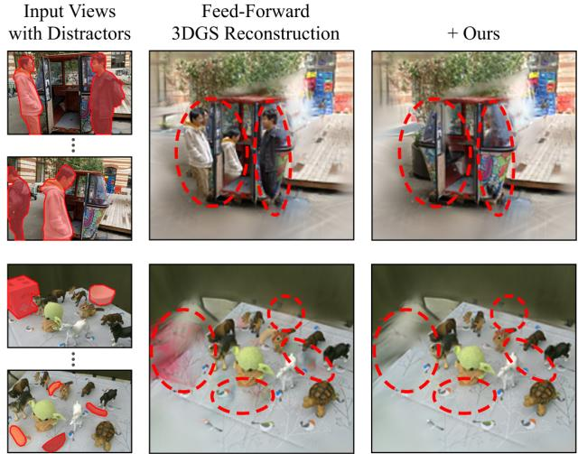
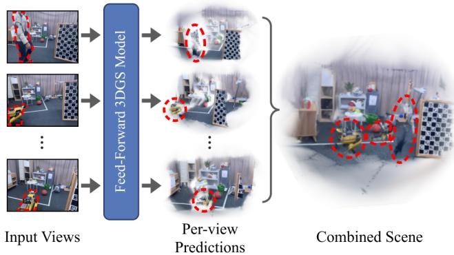
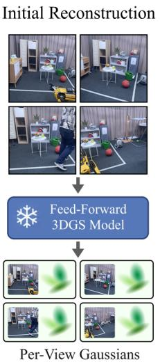
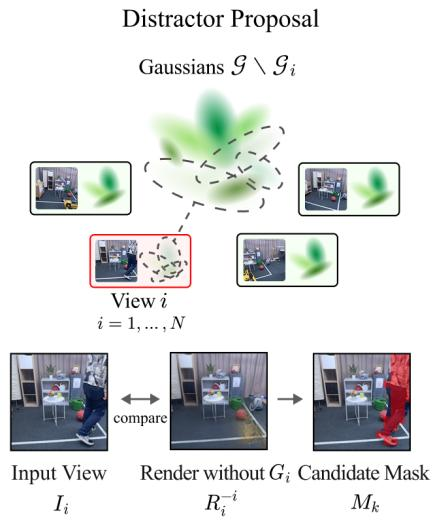
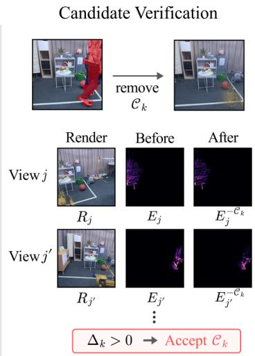
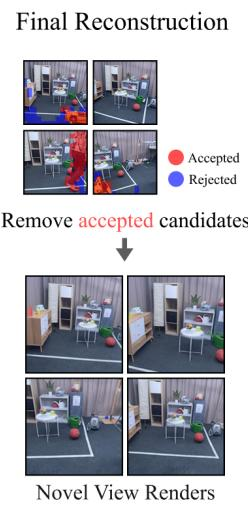
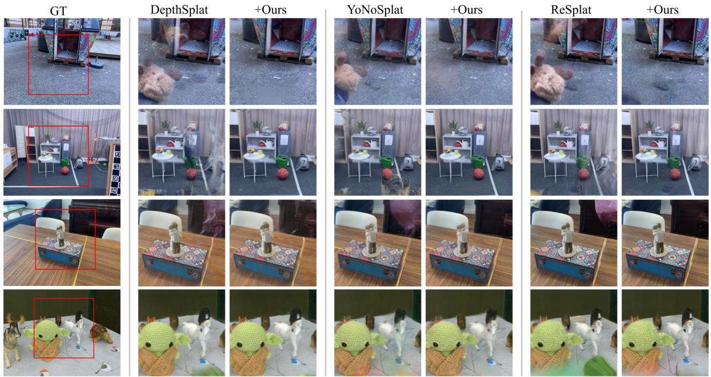
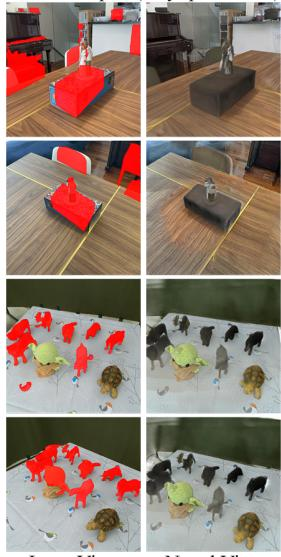
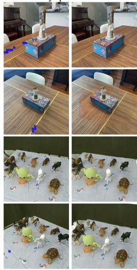

# Per-View Gaussian Predictions Enable Training-Free Distractor Filtering in Feed-Forward 3DGS

Kangmin Seo, Jae-Pil Heo

Sungkyunkwan University skmskku@skku.edu, jaepilheo@skku.edu

## Abstract

Feed-forward 3D Gaussian Splatting reconstructs an explicit Gaussian representation from multiple input images in one network execution, making 3D reconstruction increasingly accessible for casual captures. However, such captures frequently contain transient objects that appear in only a subset of the views. Such content can be encoded into the per-view Gaussians associated with the inputs that observe it and remain in the combined representation despite being observed by no other input. As a result, it may produce blurred, duplicated, or floating artifacts in novel views. We introduce a training-free filtering procedure that exploits this per-view prediction structure. For each input, we exclude its associated Gaussians and render the same camera using the remaining representation, revealing content that is inconsistent with the other inputs. Feature similarity forms candidate regions, and rendering-based verification retains only candidates whose removal reduces reconstruction error in the other input views. The procedure operates on a single frozen prediction without retraining or scene-specific optimization. Across three reconstruction models and two distractor benchmarks, it consistently improves novel-view quality with varying numbers of input views. On clean scenes, evaluations across four models show that the original reconstructions are largely preserved.

## Introduction

Recent advances in neural radiance fields (Mildenhall et al. 2021) and 3D Gaussian Splatting (Kerbl et al. 2023) have substantially improved novel view synthesis. More recently, feed-forward 3DGS models directly predict a Gaussian representation from a set of input images in one network execution (Charatan et al. 2024; Chen et al. 2024; Xu et al. 2025b; Ye et al. 2025b; Jiang et al. 2025), enabling fast and generalizable reconstruction.

These methods commonly assume that the input images depict a static and view-consistent scene. Casual captures, however, often contain pedestrians, vehicles, and other transient objects that appear in only one or a small subset of the images. When incorporated into the predicted representation, such distractors can produce blurry regions, duplicated appearance, and floating artifacts in novel views.

Distractor handling has primarily been studied in optimization-based NeRF and 3DGS pipelines. Existing methods model transient appearance (Martin-Brualla et al. 2021), use robust objectives or uncertainty estimation (Sabour et al. 2023; Ren et al. 2024), leverage pretrained features or residual cues (Kulhanek et al. 2024; Sabour et al. 2025), separate static and transient content (Wang et al. 2025b; Lin et al. 2025; Park et al. 2026), or use consistency and multistage filtering (Li et al. 2025; Seo et al. 2026; Wang et al. 2026). While fitting a scene to all input images, differences between its renderings and individual observations can provide useful evidence of unsupported content.

  
Figure 1: Qualitative overview. Distractors in the input views produce artifacts in the feed-forward reconstruction, which our method suppresses on the same frozen prediction.

With the emergence of feed-forward reconstruction, recent work has introduced distractor-aware variants through dedicated training, learned mask prediction, reconstruction input selection, or Gaussian pruning (Bao et al. 2024; Gupta et al. 2026; Pan et al. 2026). These approaches address distractors by adapting particular reconstruction backbones, relying on distractor-specific trained components such as mask prediction heads or semantic segmentation priors. Consequently, transferring distractor robustness to a diferent reconstruction backbone may require model-specific adaptation. In contrast, we ask whether such robustness can be obtained from the reconstruction itself, without modifying the model.

An immediate candidate for such a cue is the renderinginput discrepancy exploited in optimization-based pipelines. In the feed-forward setting, however, this cue is obscured. The reconstruction models considered in this work retain an association between predicted Gaussians and their input views (Xu et al. 2025b,a; Ye et al. 2025a; Jiang et al. 2025). A model can therefore preserve content from an individual input even when that content is inconsistent with the remaining observations. The associated Gaussians may reproduce it when rendered from the corresponding camera, concealing the discrepancy with the input image. The same Gaussians nevertheless remain in the shared 3D representation and may produce artifacts from other viewpoints.

  
Figure 2: View-associated prediction in feed-forward 3DGS. Content from individual inputs, including inconsistent distractors, can be encoded in per-view Gaussians and remain in the combined reconstruction.

Our key insight is to repurpose this per-view prediction structure as a detection cue. By excluding the Gaussians associated with one input, we expose content that is inconsistent with the remaining observations. The explicit Gaussian representation then allows us to measure whether removing each proposed subset improves agreement with the other inputs. Thus, the structure that can preserve inconsistent distractors also provides the means to identify and filter them.

Based on this insight, we propose a training-free procedure for filtering Gaussians associated with distractors from frozen feed-forward reconstruction models. For each input image, we compare it with a rendering obtained after excluding its associated Gaussians. Regions that the remaining inputs do not explain form separate removal candidates. We temporarily remove the Gaussians associated with each candidate and evaluate their efect from selected other input views. Only verified candidates are used to determine the final Gaussian subsets for removal.

All operations are performed after one execution of the frozen reconstruction model; the model is neither modified nor executed again. Our method requires no additional training, learned distractor masks, or predefined distractor categories, and operates on the given inputs alone. Distractor robustness is thus added to already trained feed-forward 3DGS models as a drop-in post-processing step.

We evaluate our method on DepthSplat (Xu et al. 2025b), ReSplat (Xu et al. 2025a), and YoNoSplat (Ye et al. 2025a) using RobustNeRF (Sabour et al. 2023) and NeRF On-thego (Ren et al. 2024) with varying numbers of input views. Each + Ours result starts from the same frozen Gaussian prediction as its corresponding baseline, isolating the efect of filtering. We further evaluate preservation on clean scenes across four models, including AnySplat (Jiang et al. 2025), report GenWildSplat (Gupta et al. 2026) as a trained reference, and conduct ablation and runtime analyses.

Our contributions are as follows:

• We show that the native association between input views and predicted Gaussians, which allows distractors to persist in the reconstruction, can be repurposed as a cue for training-free distractor filtering.

• We propose a filtering procedure that forms removal candidates by excluding view-associated Gaussians and accepts only candidates verified against the other input observations, operating on a single frozen prediction.

• We demonstrate consistent improvements across three reconstruction models and two distractor benchmarks with varying numbers of input views, while largely preserving reconstruction quality on clean scenes across four models.

## Related Work

## Feed-Forward 3D Gaussian Splatting

Following the development of neural radiance fields (Mildenhall et al. 2021; Barron et al. 2022), 3D Gaussian Splatting (Kerbl et al. 2023) has driven rapid advances in novel view synthesis across diverse scene settings and applications (Lu et al. 2024; Matsuki et al. 2024; Kheradmand et al. 2024; Wu et al. 2024; Qin et al. 2024; Liu et al. 2024; Xie et al. 2024). These approaches typically optimize a separate representation for each scene. A recent direction instead develops generalizable feed-forward models that directly predict Gaussian representations from input images, avoiding per-scene optimization.

pixelSplat (Charatan et al. 2024) introduced feed-forward Gaussian reconstruction from image pairs, while MVSplat (Chen et al. 2024) extended this formulation to sparse posed views. DepthSplat (Xu et al. 2025b) further combines Gaussian reconstruction with learned depth estimation. Subsequent methods support unposed or otherwise less constrained inputs (Ye et al. 2025b; Jiang et al. 2025; Ye et al. 2025a), recurrent refinement (Xu et al. 2025a), tokenaligned prediction (Li et al. 2026), voxel-aligned prediction (Wang et al. 2025a), and adaptive subpixel primitive prediction (Moreau et al. 2026).

The reconstruction models considered in this work preserve an association between predicted Gaussians and their input views. Their explicit Gaussian outputs also allow selected subsets to be removed temporarily and rendered again. We use these properties to inspect the contribution of each input after the scene has been predicted and to identify Gaussian subsets whose removal improves the reconstruction.

## Ignoring Distractors in 3D Reconstruction

Distractor-free novel view synthesis has primarily been studied through optimization-based NeRF and 3DGS pipelines. NeRF-based approaches model transient appearance (Martin-Brualla et al. 2021), suppress inconsistent observations with robust objectives (Sabour et al. 2023), or exploit uncertainty in casually captured scenes (Ren et al. 2024). Related 3D Gaussian Splatting methods leverage pretrained features to handle inconsistent observations (Kulhanek et al. 2024; Sabour et al. 2025), explicitly separate static and transient representations (Wang et al. 2025b; Lin et al. 2025; Park et al. 2026), or suppress unstable artifacts through consistency between independently optimized models (Li et al. 2025). Other methods derive cleaner supervision through progressive or two-stage reconstruction (Seo et al. 2026; Wang et al. 2026). These approaches identify distractors while optimizing a scene-specific representation against its input images.

  
Figure 3: Overview of our training-free filtering procedure. For each input, we exclude its associated Gaussian subset to form separate candidate regions. Each candidate is first evaluated from selected other input views, and only candidates that pass the corresponding verification steps are removed.

Recent work has also introduced feed-forward reconstruction models trained specifically for distractor handling. VGTW (Pan et al. 2026) builds on VGGT and introduces distractor-aware training together with an auxiliary mask head supervised by pixel-level annotations. DGGS (Bao et al. 2024) builds on MVSplat (Chen et al. 2024) and learns mask prediction and refinement from reference images. Its reported inference procedure uses the predicted masks to score and reselect references before pruning Gaussians associated with distractors. GenWildSplat (Gupta et al. 2026), based on AnySplat (Jiang et al. 2025), uses pretrained semantic segmentation for transient-object masking together with curriculum learning on synthetic and real data.

These approaches incorporate distractor handling into the reconstruction pipeline itself, relying on additional trained components or backbone-specific adaptation. Our method instead decouples distractor handling from the reconstruction model: it operates on one Gaussian prediction produced from a fixed set of inputs, with no additional training, predefined distractor categories, or learned mask prediction. Under its reported evaluation protocol, DGGS assumes access to a scene image pool around each query view, from which reconstruction inputs are scored and reselected before reconstruction is executed again. Our method assumes only a fixed input set: the reconstruction model is executed once, and filtering operates on its resulting Gaussian representation.

## Method

## Preliminaries

3D Gaussian Splatting. 3D Gaussian Splatting (Kerbl et al. 2023) represents a scene using $N _ { g }$ Gaussian primitives $\mathcal { G } = \{ g _ { n } \} _ { n = 1 } ^ { N _ { g } }$ , each carrying a position, covariance, opacity, and view-dependent color. We denote by R(G, P) the image rendered from $\mathcal { G }$ under camera parameters P via depth-ordered alpha compositing. Its explicit representation allows any Gaussian subset to be removed and the result rendered immediately.

Feed-Forward 3DGS. Given N posed image-camera pairs

$$
\mathcal { X } = \{ ( I _ { i } , P _ { i } ) \} _ { i = 1 } ^ { N } ,\tag{1}
$$

a feed-forward model $F _ { \theta }$ predicts a Gaussian representation in one network execution (Charatan et al. 2024; Chen et al. 2024; Xu et al. 2025b). We express its output as Gaussian subsets associated with the input views:

$$
\{ \mathcal { G } _ { i } \} _ { i = 1 } ^ { N } = F _ { \theta } ( \mathcal { X } ) , \qquad \mathcal { G } = \bigcup _ { i = 1 } ^ { N } \mathcal { G } _ { i } .\tag{2}
$$

Here, $\mathcal { G } _ { i }$ contains the Gaussian primitives associated with input view i. For pixel-aligned models,

$$
\mathcal { G } _ { i } = \{ g _ { i , u } \ | \ u \in \Omega _ { i } \} ,\tag{3}
$$

where $\Omega _ { i }$ is the prediction domain and u indexes a prediction location. The center $\mu _ { i , u }$ of $g _ { i , u }$ is typically obtained by unprojecting a predicted depth $d _ { i , u }$ :

$$
\mu _ { i , u } = \Pi ^ { - 1 } ( u , d _ { i , u } ; P _ { i } ) ,\tag{4}
$$

<table><tr><td></td><td colspan="3">4 views</td><td colspan="3">8 views</td><td colspan="3">16 views</td></tr><tr><td>Method</td><td>PSNR↑</td><td>SSIM↑</td><td>LPIPS↓</td><td>PSNR↑</td><td>SSIM↑</td><td>LPIPS↓</td><td>PSNR↑</td><td>SSIM↑</td><td>LPIPS↓</td></tr><tr><td colspan="10">RobustNeRF dataset</td></tr><tr><td>DepthSplat</td><td>20.10</td><td>0.738</td><td>0.267</td><td>19.91</td><td>0.706</td><td>0.288</td><td>18.44</td><td>0.644</td><td>0.369</td></tr><tr><td>+ Óurs</td><td>21.66</td><td>0.762</td><td>0.229</td><td>21.37</td><td>0.735</td><td>0.242</td><td>19.98</td><td>0.690</td><td>0.296</td></tr><tr><td colspan="10">YoNoSplat</td></tr><tr><td>+ Ours</td><td>21.70 22.47</td><td>0.722 0.729</td><td>0.260 0.246</td><td>23.12 24.04</td><td>0.776 0.791</td><td>0.230 0.199</td><td>22.70 23.26</td><td>0.732 0.743</td><td>0.249</td></tr><tr><td></td><td></td><td></td><td></td><td></td><td></td><td></td><td></td><td></td><td>0.226</td></tr><tr><td>ReSplat + Ours</td><td>22.24 22.87</td><td>0.778 0.782</td><td>0.270 0.264</td><td>22.73 23.12</td><td>0.763 0.768</td><td>0.280 0.273</td><td>24.71 24.83</td><td>0.797 0.799</td><td>0.238 0.235</td></tr><tr><td colspan="10">NeRF On-the-go dataset</td></tr><tr><td colspan="10">DepthSplat</td></tr><tr><td>+ Óurs</td><td>17.86</td><td>0.549</td><td>0.306</td><td>17.76</td><td>0.524</td><td>0.336</td><td>16.32</td><td>0.447</td><td>0.416</td></tr><tr><td></td><td>18.44</td><td>0.563</td><td>0.285</td><td>18.67</td><td>0.547</td><td>0.298</td><td>17.52</td><td>0.489</td><td>0.355</td></tr><tr><td colspan="10">YoNoSplat</td></tr><tr><td>+ Ours</td><td>18.35 19.61</td><td>0.547 0.577</td><td>0.329 0.289</td><td>18.66 19.64</td><td>0.561 0.583</td><td>0.326 0.295</td><td>17.95 19.13</td><td>0.532 0.564</td><td>0.350 0.302</td></tr><tr><td>ReSplat</td><td>18.88</td><td>0.618</td><td>0.341</td><td>19.12</td><td>0.610</td><td>0.341</td><td>19.47</td><td>0.625</td><td>0.319</td></tr><tr><td colspan="10"></td></tr><tr><td>+ Ours</td><td>19.36</td><td>0.629</td><td>0.330</td><td>19.86</td><td>0.625</td><td>0.325</td><td>19.88</td><td>0.635</td><td>0.309</td></tr></table>

Table 1: Quantitative results on the RobustNeRF and NeRF On-the-go datasets.

where $\Pi ^ { - 1 }$ denotes unprojection under camera $P _ { i }$ . More generally, $\mathcal { G } _ { i }$ follows the association provided by the native prediction structure of the reconstruction model.

## Problem Setup

We consider reconstruction from a fixed set of N posed input images that may contain transient objects visible in only a subset of the views. At inference, no clean images, distractor masks, or additional images for input selection are available. A frozen feed-forward model produces $\mathcal { G }$ once, and neither the network nor the predicted representation is optimized.

Our goal is to identify Gaussian subsets associated with distractors and to remove a subset only when the input observations themselves justify its removal. The partition $\{ \mathcal { G } _ { i } \} _ { i = 1 } ^ { N }$ allows us to exclude temporarily the contribution associated with each input. The explicit Gaussian representation then allows us to render the scene before and after removing a selected subset and measure the resulting change directly.

## Distractor Proposal

For a quantity associated with input view $i ,$ the superscript $- i$ indicates that it is computed after excluding $\mathcal { G } _ { i }$ . We render camera $P _ { i }$ before and after excluding this subset:

$$
R _ { i } = \mathcal { R } ( \mathcal { G } , P _ { i } ) , \qquad R _ { i } ^ { - i } = \mathcal { R } ( \mathcal { G } \setminus \mathcal { G } _ { i } , P _ { i } ) .\tag{5}
$$

Content in $I _ { i }$ represented mainly by $\mathcal { G } _ { i }$ , including distractors observed only in view i, is unlikely to be reproduced in $R _ { i } ^ { - i }$

We let Φ denote the DINOv3 feature map (Siméoni et al. 2025), computed from each image. The feature similarity at patch u is

$$
s _ { i } ( u ) = \sin \left( \Phi ( I _ { i } ) ( u ) , \Phi ( R _ { i } ^ { - i } ) ( u ) \right) ,\tag{6}
$$

where sim denotes cosine similarity. Feature similarity is less sensitive than direct RGB comparison to small appearance diferences between the input and rendering.

Low feature similarity may also arise from poorly reconstructed static content or from regions that no remaining view observes. We therefore use accumulated opacity and depth to restrict proposal generation. Let $a _ { i } ^ { - i } ( u )$ denote the patchaverage accumulated opacity in $R _ { i } ^ { - i }$ , and $z _ { i } ( u )$ and $z _ { i } ^ { - i } ( u )$ the patch-average depths before and after excluding $\mathcal { G } _ { i } ,$ , computed over pixels with valid depth in both renderings; patches without such pixels do not satisfy the depth condition.

Let $g _ { i } ( u )$ denote the support condition $a _ { i } ^ { - i } ( u ) > \eta$ and $z _ { i } ( u ) < z _ { i } ^ { - i } ( u )$ , with opacity threshold $\eta .$ Using similarity boundaries $\tau _ { 1 } < \tau _ { 2 }$ , we define two proposal ranges:

$$
B _ { i } ^ { 1 } = \{ u \mid s _ { i } ( u ) < \tau _ { 1 } , g _ { i } ( u ) \} ,\tag{7}
$$

$$
B _ { i } ^ { 2 } = \{ u \mid \tau _ { 1 } \leq s _ { i } ( u ) < \tau _ { 2 } , g _ { i } ( u ) \} .\tag{8}
$$

The opacity condition removes regions that are left largely empty by the remaining views. The depth condition requires exclusion of $\mathcal { G } _ { i }$ to reveal a farther surface, as expected when the removed Gaussians occlude other scene content.

We extract 8-connected components independently from the two ranges on the feature grid and upsample each component to the input image resolution using nearest-neighbor interpolation. Components from diferent ranges are not merged, even when they touch after upsampling, and no minimum component size is imposed.

Across all input views, the resulting component masks are denoted by $\{ \dot { M _ { k } } \} _ { k = 1 } ^ { L } ,$ and $i _ { k }$ denotes the input view from which $M _ { k }$ was obtained. We use $r _ { k } \in \{ 1 , 2 \}$ to indicate whether the component was extracted from $B _ { i _ { k } } ^ { 1 }$ or $B _ { i _ { k } } ^ { 2 }$

Each component mask is mapped to a candidate Gaussian subset $\mathcal { C } _ { k } \subset \mathcal { G } _ { i _ { k } }$ . For pixel-aligned models, we use the native correspondence between prediction locations and Gaussians. For ReSplat, we use its native rasterizer association to select front-surface Gaussians from input $i _ { k }$ whose projected covariances contribute to pixels inside $M _ { k }$

Let $M _ { i } ^ { 1 }$ and $M _ { i } ^ { 2 }$ denote the unions of the component masks obtained from the first and second similarity ranges, respectively, for input view i.

  
Figure 4: Qualitative comparisons across frozen feed-forward reconstruction backbones. Each + Ours result filters the corre sponding baseline prediction, suppressing distractor artifacts while largely preserving surrounding scene content.

## Candidate Verification

The proposal masks identify possible distractors rather than final removals. We first evaluate each component independently.

For input view i, we project the centers of $\mathcal { G } _ { i }$ into every other input camera. For each camera, we count the projected centers that have positive depth and fall inside the image boundary. The $n _ { v }$ cameras with the largest counts form the verification set $\nu _ { i } ;$ camera $P _ { i }$ itself is not included.

For candidate $\mathcal { C } _ { k }$ and each $j \in \mathcal { V } _ { i _ { k } }$ , we render the scene before and after temporarily removing the candidate:

$$
R _ { j } = \mathcal { R } ( \mathcal { G } , P _ { j } ) , \qquad R _ { j } ^ { - { \mathcal { C } _ { k } } } = \mathcal { R } ( \mathcal { G } \setminus \mathcal { C } _ { k } , P _ { j } ) .\tag{9}
$$

The corresponding reconstruction errors are

$$
E _ { j } ( p ) = \| R _ { j } ( p ) - I _ { j } ( p ) \| _ { 1 } ,\tag{10}
$$

$$
\begin{array} { r } { E _ { j } ^ { - \mathcal { C } _ { k } } ( p ) = \Big \| R _ { j } ^ { - \mathcal { C } _ { k } } ( p ) - I _ { j } ( p ) \Big \| _ { 1 } . } \end{array}\tag{11}
$$

The error reduction caused by removing candidate k is

$$
\delta _ { j , k } ( p ) = E _ { j } ( p ) - E _ { j } ^ { - \mathcal { C } _ { k } } ( p ) .\tag{12}
$$

A positive value indicates that removing $\mathcal { C } _ { k }$ reduces the reconstruction error at pixel p. We weight each pixel by the rendering change caused by the candidate:

$$
w _ { j , k } ( p ) = \left\| R _ { j } ^ { - { \mathcal C } _ { k } } ( p ) - R _ { j } ( p ) \right\| _ { 1 } .\tag{13}
$$

Proposal regions are excluded because they may contain inconsistent content: we exclude $M _ { j } ^ { 1 }$ for a candidate from the first similarity range, and $M _ { j } ^ { 1 } \cup \check { M } _ { j } ^ { 2 }$ for one from the second.

Let $Q _ { j , k }$ denote the corresponding exclusion mask. We also ignore pixels whose rendering change is below ϵ:

$$
\Omega _ { j , k } = \{ p \mid p \notin Q _ { j , k } , w _ { j , k } ( p ) > \epsilon \} .\tag{14}
$$

We pool all valid pixels from the selected views into one verification score:

$$
\Delta _ { k } = \frac { \sum _ { j \in \mathcal { V } _ { i _ { k } } } \sum _ { p \in \Omega _ { j , k } } w _ { j , k } ( p ) \delta _ { j , k } ( p ) } { \sum _ { j \in \mathcal { V } _ { i _ { k } } } \sum _ { p \in \Omega _ { j , k } } w _ { j , k } ( p ) } .\tag{15}
$$

A positive score indicates that removing $\mathcal { C } _ { k }$ improves agreement with the selected input observations outside the proposal regions. If the denominator is zero, we set $\Delta _ { k } = 0$

Candidates with positive individual scores proceed to final Gaussian selection. We dilate their component masks at the input image resolution and intersect the expanded masks again with the support condition $g _ { i _ { k } }$ used during proposal generation. Each resulting mask is mapped to a subset $\widehat { \mathcal { C } } _ { k } \subset$ $\mathcal { G } _ { i _ { k } }$ k using the same model-specific association as above.

Candidates from the first similarity range, whose lower similarity already indicates a clear mismatch, require no further test. Candidates from the second range carry weaker evidence, and we verify them further. For each such candidate, we additionally render every input camera after excluding the Gaussian subset associated with that camera:

$$
R _ { j } ^ { - j } = { \mathcal { R } } ( { \mathcal { G } } \setminus { \mathcal { G } } _ { j } , P _ { j } ) ,\tag{16}
$$

and after additionally removing the expanded candidate:

$$
R _ { j } ^ { - j , - \widehat { \mathcal { C } } _ { k } } = \mathcal { R } \left( \mathcal { G } \setminus \left( \mathcal { G } _ { j } \cup \widehat { \mathcal { C } } _ { k } \right) , P _ { j } \right) .\tag{17}
$$

Using the same rendering-change-weighted error reduction as above, we aggregate all valid pixels over all input views while excluding $M _ { j } ^ { 1 } \cup M _ { j } ^ { 2 }$ . The candidate proceeds only when this additional score is positive.

Finally, the second-range candidates that pass both individual tests are evaluated together: starting from the representation with the accepted first-range candidates removed, we additionally remove all remaining second-range candidates and aggregate the same rendering-change-weighted error reduction over all input views outside $\breve { M } _ { j } ^ { 1 } \cup \breve { M } _ { j } ^ { 2 }$ . They are retained when this score is positive and restored together otherwise; first-range candidates are unafected.

## Final Reconstruction

Let $\boldsymbol { A } _ { 1 }$ denote candidates from the first similarity range with positive individual scores, and $\boldsymbol { A } _ { 2 }$ those from the second range that pass the individual and additional steps. If their combined verification fails, we set $\mathcal { A } _ { 2 } = \emptyset$

The filtered Gaussian representation is

$$
\mathcal { G } _ { \mathrm { o u t } } = \mathcal { G } \setminus \bigcup _ { k \in \mathcal { A } _ { 1 } \cup \mathcal { A } _ { 2 } } \widehat { \mathcal { C } } _ { k } .\tag{18}
$$

In implementation, selected Gaussians are removed by setting their opacity to zero; all others remain unchanged.

## Experiments

Experimental Setup. We evaluate on the Robust-NeRF (Sabour et al. 2023) and NeRF On-the-go (Ren et al. 2024) benchmarks using 4, 8, and 16 input views containing distractors, covering sparse to moderately dense capture settings. For each scene and input count, we construct four view configurations and average the results over them. Each configuration starts from an input view and a test view sharing high COLMAP (Schonberger and Frahm 2016) sparse-point visibility, and views are added to increase the scene coverage jointly observed by both sets.

We report PSNR, SSIM (Wang et al. 2004), and LPIPS (Zhang et al. 2018) on the test images. Each reconstruction model is evaluated at the resolution used by its released inference configuration. We use $\tau _ { 1 } = 0 . 5 0 , \tau _ { 2 } = 0 . 7 0$ $n _ { v } = 3 .$ , and $\eta = 0 . 5 0$ for all datasets. Components are extracted with 8-connectivity without a minimum-size threshold. Candidates that pass individual verification are dilated by 9 pixels before their final Gaussian subsets are determined. The additional verification for the second similarity range aggregates all input views. We use $\epsilon = 0 . 0 0 2$ and accept a verification result only when its score is positive. These settings are fixed across all datasets, input counts, and reconstruction models. No training, fine-tuning, or scenespecific optimization is performed. Experiments were run on NVIDIA RTX 3090 and RTX 4090 GPUs. All runtime measurements are obtained on a single RTX 4090.

Reconstruction Models and Comparisons. We apply our method to the released DepthSplat (Xu et al. 2025b), Re-Splat (Xu et al. 2025a), and YoNoSplat (Ye et al. 2025a) models. All three are evaluated with input camera poses, which removes pose estimation as a confounding factor. Re-Splat uses its 8-view checkpoint for up to 8 inputs and its 16-view checkpoint for 16. Each baseline result and its corresponding + Ours result use identical images, cameras, model weights, and initial Gaussian prediction; only the selected Gaussian subsets difer, isolating the efect of filtering. We additionally evaluate AnySplat (Jiang et al. 2025) with and without our method, using its estimated cameras for proposal generation and verification, and include the released Gen-WildSplat (Gupta et al. 2026) model as an AnySplat-based reference. GenWildSplat targets unconstrained image collections and uses semantic masks for predefined transient object categories. Since it reports reconstruction with two to six input views, we use four- and six-view settings. DGGS (Bao et al. 2024) is excluded, as no implementation or weights were publicly available at submission and its inference requires additional scene images beyond the given inputs.

<table><tr><td>Variant</td><td>PSNR↑</td><td>SSIM↑</td><td>LPIPS↓</td></tr><tr><td>Full Method</td><td>20.42</td><td>0.657</td><td>0.279</td></tr><tr><td>RGB Difference</td><td>20.31</td><td>0.654</td><td>0.284</td></tr><tr><td>Single Threshold  $( < \tau _ { 2 } )$ </td><td>20.10</td><td>0.649</td><td>0.291</td></tr><tr><td>Single Threshold  $( < \tau _ { 1 } )$ </td><td>20.32</td><td>0.655</td><td>0.282</td></tr><tr><td>Without Verification</td><td>20.02</td><td>0.645</td><td>0.296</td></tr><tr><td>Vanilla</td><td>19.56</td><td>0.641</td><td>0.301</td></tr></table>

Table 2: Ablation study.
<table><tr><td></td><td colspan="3">4 views</td><td colspan="3">6 views</td></tr><tr><td>Method</td><td>PSNR↑</td><td>SSIM↑ LPIPS↓</td><td></td><td>PSNR↑</td><td>SSIM↑ LPIPS↓</td><td></td></tr><tr><td colspan="7">RobustNeRF dataset</td></tr><tr><td>AnySplat</td><td>13.97</td><td>0.457</td><td>0.492</td><td>15.78</td><td>0.506</td><td>0.438</td></tr><tr><td>+ Ours</td><td>14.48</td><td>0.469</td><td>0.468</td><td>16.63</td><td>0.526</td><td>0.400</td></tr><tr><td>GenWildSplat</td><td>13.99</td><td>0.484</td><td>0.516</td><td>14.39</td><td>0.482</td><td>0.532</td></tr><tr><td colspan="7">NeRF On-the-go dataset</td></tr><tr><td>AnySplat</td><td>13.66</td><td>0.287</td><td>0.469</td><td>14.96</td><td>0.328</td><td>0.437</td></tr><tr><td>+ Ours</td><td>13.96</td><td>0.293</td><td>0.447</td><td>15.38</td><td>0.336</td><td>0.411</td></tr><tr><td>GenWildSplat</td><td>13.50</td><td>0.315</td><td>0.544</td><td>13.73</td><td>0.315</td><td>0.546</td></tr></table>

Table 3: Comparison with feed-forward models in the fourand six-view settings. Our method filters the frozen AnySplat prediction; GenWildSplat uses its released model.

Quantitative Results. Table 1 compares each reconstruction before and after filtering. Our method improves PSNR, SSIM, and LPIPS across all evaluated reconstruction models, datasets, and input counts. Since each pair shares the same images, model weights, and Gaussian prediction, these gains are attributable to filtering alone.

Qualitative Results. Figure 4 shows that transient people and objects can produce blurred, duplicated, or floating artifacts in the original reconstructions. Our method suppresses these artifacts across multiple backbones while largely preserving nearby static scene content. All methods are compared using the same enlarged image regions.

Ablation Studies. Table 2 reports averages over the ten scenes from both datasets and three backbones in 4-view setting. Removing verification causes the largest degradation, confirming proposal regions should not be removed directly. Replacing DINOv3 similarity with a simple RGB diference

Novel View

Novel View

Input View

Input View
<table><tr><td></td><td colspan="3">4 views</td><td colspan="3">6 views</td></tr><tr><td>Method</td><td></td><td>PSNR↑ SSIM↑ LPIPS↓ PSNR↑ SSIM↑ LPIPS↓</td><td></td><td></td><td></td><td></td></tr><tr><td>With GT Pose</td><td></td><td></td><td></td><td></td><td></td><td></td></tr><tr><td>DepthSplat</td><td>23.14</td><td>0.804</td><td>0.169</td><td>22.04</td><td>0.769</td><td>0.197</td></tr><tr><td>+ Óurs</td><td>23.14</td><td>0.804</td><td>0.170</td><td>22.04</td><td>0.769</td><td>0.197</td></tr><tr><td>YoNoSplat</td><td>24.98</td><td>0.802</td><td>0.167</td><td>25.24</td><td>0.813</td><td>0.163</td></tr><tr><td>+ Ours</td><td>24.98</td><td>0.802</td><td>0.169</td><td>25.17</td><td>0.811</td><td>0.165</td></tr><tr><td>ReSplat</td><td>24.88</td><td>0.809</td><td>0.224</td><td>24.49</td><td>0.799</td><td>0.232</td></tr><tr><td>+ Ours</td><td>24.83</td><td>0.809</td><td>0.224</td><td>24.49</td><td>0.799</td><td>0.232</td></tr><tr><td>With Estimated Pose</td><td></td><td></td><td></td><td></td><td></td><td></td></tr><tr><td>AnySplat</td><td>16.40</td><td>0.506</td><td>0.412</td><td>17.69</td><td>0.558</td><td>0.348</td></tr><tr><td>+ Ours</td><td>16.39</td><td>0.506</td><td>0.413</td><td>17.69</td><td>0.558</td><td>0.349</td></tr><tr><td></td><td></td><td></td><td></td><td></td><td></td><td></td></tr><tr><td>GenWildSplat</td><td>14.58</td><td>0.507</td><td>0.483</td><td>14.81</td><td>0.506</td><td>0.487</td></tr></table>

Table 4: Quantitative results on clean scenes.  
AnySplat + Ours

GenWildSplat (AnySplat-based)  

  
Figure 5: Qualitative results on clean scenes. For our method, proposal regions (blue) are rejected during verification, leaving the reconstruction unchanged, whereas GenWildSplat’s semantic masking (red) can remove static objects.

retains most of the improvement over the vanilla reconstruction; DINOv3 and dual proposal ranges add further gains.

Comparison with In-the-Wild Feed-Forward Model. Table 3 compares AnySplat, AnySplat with our method, and GenWildSplat on the two distractor benchmarks using four and six input views. Here all methods operate from the cameras estimated by AnySplat, which takes unposed images as input; our proposal generation and verification use the same cameras. Our method improves the frozen AnySplat prediction across both datasets and input settings, and achieves higher average performance than the released GenWildSplat model under this protocol. GenWildSplat builds on AnySplat and uses semantic masks for predefined transient categories, making it the closest trained counterpart to ours.

<table><tr><td>Method</td><td>Views</td><td>Inference</td><td>Proposal</td><td>Verification</td></tr><tr><td>ReSplat</td><td>4</td><td>0.22</td><td>0.23</td><td>0.44</td></tr><tr><td></td><td>8</td><td>0.38</td><td>0.35</td><td>1.10</td></tr><tr><td></td><td>16</td><td>0.78</td><td>0.64</td><td>3.22</td></tr><tr><td>DepthSplat</td><td>4</td><td>0.09</td><td>0.19</td><td>0.58</td></tr><tr><td></td><td>8</td><td>0.14</td><td>0.42</td><td>2.82</td></tr><tr><td></td><td>16</td><td>0.28</td><td>1.02</td><td>16.95</td></tr><tr><td>YoNoSplat</td><td>4</td><td>0.22</td><td>0.12</td><td>0.52</td></tr><tr><td></td><td>8</td><td>0.25</td><td>0.23</td><td>2.83</td></tr><tr><td></td><td>16</td><td>0.39</td><td>0.59</td><td>14.77</td></tr></table>

Table 5: Mean processing time in seconds, averaged over the RobustNeRF and NeRF On-the-go scenes.

Preservation on Clean Scenes. Table 4 and Figure 5 evaluate the four clean RobustNeRF scenes under posed and estimated-pose settings. Across four reconstruction models, our method leaves the original reconstructions nearly unchanged: proposal regions on clean inputs are often rejected during verification, as shown in Figure 5. GenWildSplat instead removes objects by semantic category, so static objects in its predefined transient categories can also be masked.

Overhead Analysis. Table 5 reports the reconstruction model execution time and the additional time of our filtering procedure for each input count. Filtering runs once per scene, after the Gaussian representation has been predicted, and produces a single filtered representation $\mathcal { G } _ { \mathrm { o u t } } ;$ rendering a novel view requires no input reselection, re-reconstruction, or other per-view processing. Verification dominates the filtering time, as it renders each candidate from multiple views, and grows with the number of views and candidates.

## Conclusion

We showed that the per-view prediction structure of feedforward 3DGS models enables training-free distractor filtering: excluding the Gaussian subset associated with each input exposes content that is inconsistent with the remaining observations, and verification by rendering retains only candidates whose removal improves reconstruction. Across multiple reconstruction models and distractor benchmarks, the resulting procedure consistently reduces distractor artifacts while preserving quality on clean scenes, without retraining or scene-specific optimization. Distractor robustness can thus be obtained from the reconstruction itself, with the model left untouched. Verification cost grows with the number of input views and candidates, since each candidate is checked by rendering. The individual checks are independent, leaving room for batched or parallel evaluation in larger collections. Our method also assumes an association between predicted Gaussians and input views, which the reconstruction models considered here natively provide; extending the procedure to architectures without this structure is an open direction. Future work may further extend the framework with object-level reasoning and geometry-aware generative completion, enabling more structured filtering and reconstruction of newly exposed regions.

## References

Bao, Y.; Liao, J.; Huo, J.; and Gao, Y. 2024. Distractorfree generalizable 3D Gaussian splatting. arXiv preprint arXiv:2411.17605.

Barron, J. T.; Mildenhall, B.; Verbin, D.; Srinivasan, P. P.; and Hedman, P. 2022. Mip-nerf360: Unbounded anti-aliased neural radiance fields. In Proceedings ofthe IEEE/CVF conference on computer vision and pattern recognition, 5470– 5479.

Charatan, D.; Li, S. L.; Tagliasacchi, A.; and Sitzmann, V. 2024. pixelsplat: 3d gaussian splats from image pairs for scalable generalizable 3d reconstruction. In Proceedings of the IEEE/CVF conference on computer vision and pattern recognition, 19457–19467.

Chen, Y.; Xu, H.; Zheng, C.; Zhuang, B.; Pollefeys, M.; Geiger, A.; Cham, T.-J.; and Cai, J. 2024. Mvsplat: Eficient 3d gaussian splatting from sparse multi-view images. In European conference on computer vision, 370–386. Springer.

Gupta, V.; Lin, C.-H.; Wang, S.; Bhattad, A.; and Huang, J.- B. 2026. Generalizable Sparse-View 3D Reconstruction from Unconstrained Images. In Proceedings of the IEEE/CVF Conference on Computer Vision and Pattern Recognition, 33217–33226.

Jiang, L.; Mao, Y.; Xu, L.; Lu, T.; Ren, K.; Jin, Y.; Xu, X.; Yu, M.; Pang, J.; Zhao, F.; et al. 2025. Anysplat: Feed-forward 3d gaussian splatting from unconstrained views. ACM Transactions on Graphics (TOG), 44(6): 1–16.

Kerbl, B.; Kopanas, G.; Leimkühler, T.; Drettakis, G.; et al. 2023. 3d gaussian splatting for real-time radiance field rendering. ACM Trans. Graph., 42(4): 139–1.

Kheradmand, S.; Rebain, D.; Sharma, G.; Sun, W.; Tseng, Y.-C.; Isack, H.; Kar, A.; Tagliasacchi, A.; and Yi, K. M. 2024. 3d gaussian splatting as markov chain monte carlo. Advances in Neural Information Processing Systems, 37: 80965–80986.

Kulhanek, J.; Peng, S.; Kukelova, Z.; Pollefeys, M.; and Sattler, T. 2024. Wildgaussians: 3d gaussian splatting in the wild. arXiv preprint arXiv:2407.08447.

Li, C.; Shi, Z.; Lu, Y.; He, W.; and Xu, X. 2025. Robust Neural Rendering in the Wild with Asymmetric Dual 3D Gaussian Splatting. In The Thirty-ninth Annual Conference on Neural Information Processing Systems.

Li, Y.; Lv, C.; Tang, Z.; Yang, H.; and Huang, D. 2026. Tokensplat: Token-aligned 3d gaussian splatting for feed-forward pose-free reconstruction. In Proceedings of the IEEE/CVF Conference on Computer Vision and Pattern Recognition, 40886–40895.

Lin, J.; Gu, J.; Fan, L.; Wu, B.; Lou, Y.; Chen, R.; Liu, L.; and Ye, J. 2025. HybridGS: Decoupling transients and statics with 2D and 3D gaussian splatting. In Proceedings of the Computer Vision and Pattern Recognition Conference, 788–797.

Liu, Y.; Luo, C.; Fan, L.; Wang, N.; Peng, J.; and Zhang, Z. 2024. Citygaussian: Real-time high-quality large-scale scene rendering with gaussians. In European Conference on Computer Vision, 265–282. Springer.

Lu, T.; Yu, M.; Xu, L.; Xiangli, Y.; Wang, L.; Lin, D.; and Dai, B. 2024. Scafold-gs: Structured 3d gaussians for viewadaptive rendering. In Proceedings of the IEEE/CVF conference on computer vision and pattern recognition, 20654– 20664.

Martin-Brualla, R.; Radwan, N.; Sajjadi, M. S.; Barron, J. T.; Dosovitskiy, A.; and Duckworth, D. 2021. Nerf in the wild: Neural radiance fields for unconstrained photo collections. In Proceedings of the IEEE/CVF conference on computer vision and pattern recognition, 7210–7219.

Matsuki, H.; Murai, R.; Kelly, P. H.; and Davison, A. J. 2024. Gaussian splatting slam. In Proceedings of the IEEE/CVF conference on computer vision andpattern recognition, 18039–18048.

Mildenhall, B.; Srinivasan, P. P.; Tancik, M.; Barron, J. T.; Ramamoorthi, R.; and Ng, R. 2021. Nerf: Representing scenes as neural radiance fields for view synthesis. Communications of the ACM, 65(1): 99–106.

Moreau, A.; Shaw, R.; Nazarczuk, M.; Shin, J.; Tanay, T.; Zhang, Z.; Xu, S.; and Pérez-Pellitero, E. 2026. Of the grid: Detection of primitives for feed-forward 3d gaussian splatting. In Proceedings of the IEEE/CVF Conference on Computer Vision and Pattern Recognition, 11756–11766.

Pan, T.; Yang, X.; Wang, S.; and Wang, X. 2026. Visual Geometry Transformer in the Wild: Distractor-Free 3D Reconstruction. arXiv preprint arXiv:2606.22787.

Park, W.; Nam, M.; Kim, S.; Jo, S.; and Lee, S. 2026. Forest-Splats: Deformable transient field for Gaussian splatting in the wild. In Proceedings ofthe IEEE/CVF Winter Conference on Applications ofComputer Vision, 6978–6987.

Qin, M.; Li, W.; Zhou, J.; Wang, H.; and Pfister, H. 2024. Langsplat: 3d language gaussian splatting. In Proceedings of the IEEE/CVF Conference on Computer Vision and Pattern Recognition, 20051–20060.

Ren, W.; Zhu, Z.; Sun, B.; Chen, J.; Pollefeys, M.; and Peng, S. 2024. Nerf on-the-go: Exploiting uncertainty for distractor-free nerfs in the wild. In Proceedings of the IEEE/CVF Conference on Computer Vision and Pattern Recognition, 8931–8940.

Sabour, S.; Goli, L.; Kopanas, G.; Matthews, M.; Lagun, D.; Guibas, L.; Jacobson, A.; Fleet, D.; and Tagliasacchi, A. 2025. Spotlesssplats: Ignoring distractors in 3d gaussian splatting. ACM Transactions on Graphics, 44(2): 1–11.

Sabour, S.; Vora, S.; Duckworth, D.; Krasin, I.; Fleet, D. J.; and Tagliasacchi, A. 2023. Robustnerf: Ignoring distractors with robust losses. In Proceedings of the IEEE/CVF conference on computer vision and pattern recognition, 20626– 20636.

Schonberger, J. L.; and Frahm, J.-M. 2016. Structure-frommotion revisited. In Proceedings ofthe IEEE conference on computer vision and pattern recognition, 4104–4113.

Seo, K.; Lee, M.; Kim, T.-Y.; Lee, B.; An, J.; and Heo, J.-P. 2026. PDF-GS: Progressive Distractor Filtering for Robust 3D Gaussian Splatting. In Proceedings of the IEEE/CVF Conference on Computer Vision and Pattern Recognition (CVPR) Findings, 468–477.

Siméoni, O.; Vo, H. V.; Seitzer, M.; Baldassarre, F.; Oquab, M.; Jose, C.; Khalidov, V.; Szafraniec, M.; Yi, S.; Ramamonjisoa, M.; Massa, F.; Haziza, D.; Wehrstedt, L.; Wang, J.; Darcet, T.; Moutakanni, T.; Sentana, L.; Roberts, C.; Vedaldi, A.; Tolan, J.; Brandt, J.; Couprie, C.; Mairal, J.; Jégou, H.; Labatut, P.; and Bojanowski, P. 2025. DINOv3. arXiv:2508.10104.

Wang, W.; Chen, Y.; Zhang, Z.; Liu, H.; Wang, H.; Feng, Z.; Qin, W.; Chen, F.; Zhu, Z.; Chen, D. Y.; et al. 2025a. Volsplat: Rethinking feed-forward 3d gaussian splatting with voxel-aligned prediction. arXiv preprint arXiv:2509.19297.

Wang, X.; Wang, Z.; Xie, S.; Pan, C.; and Chen, Y. 2026. DualSplat: Robust 3D Gaussian Splatting via Pseudo-Mask Bootstrapping from Reconstruction Failures. In Proceedings of the IEEE/CVF Conference on Computer Vision and Pattern Recognition, 4912–4921.

Wang, Y.; Klasson, M.; Turkulainen, M.; Wang, S.; Kannala, J.; and Solin, A. 2025b. DeSplat: Decomposed Gaussian splatting for distractor-free rendering. In Proceedings ofthe Computer Vision and Pattern Recognition Conference, 722– 732.

Wang, Z.; Bovik, A. C.; Sheikh, H. R.; and Simoncelli, E. P. 2004. Image quality assessment: from error visibility to structural similarity. IEEE transactions on image processing, 13(4): 600–612.

Wu, G.; Yi, T.; Fang, J.; Xie, L.; Zhang, X.; Wei, W.; Liu, W.; Tian, Q.; and Wang, X. 2024. 4d gaussian splatting for real-time dynamic scene rendering. In Proceedings of the IEEE/CVF conference on computer vision and pattern recognition, 20310–20320.

Xie, T.; Zong, Z.; Qiu, Y.; Li, X.; Feng, Y.; Yang, Y.; and Jiang, C. 2024. Physgaussian: Physics-integrated 3d gaussians for generative dynamics. In Proceedings of the IEEE/CVF Conference on Computer Vision and Pattern Recognition, 4389–4398.

Xu, H.; Barath, D.; Geiger, A.; and Pollefeys, M. 2025a. Resplat: Learning recurrent gaussian splats. arXiv preprint arXiv:2510.08575.

Xu, H.; Peng, S.; Wang, F.; Blum, H.; Barath, D.; Geiger, A.; and Pollefeys, M. 2025b. Depthsplat: Connecting gaussian splatting and depth. In Proceedings of the Computer Vision and Pattern Recognition Conference, 16453–16463.

Ye, B.; Chen, B.; Xu, H.; Barath, D.; and Pollefeys, M. 2025a. YoNoSplat: You Only Need One Model for Feedforward 3D Gaussian Splatting. arXiv preprint arXiv:2511.07321.

Ye, B.; Liu, S.; Xu, H.; Li, X.; Pollefeys, M.; Yang, M.-H.; and Peng, S. 2025b. No pose, no problem: Surprisingly simple 3d gaussian splats from sparse unposed images. In International Conference on Learning Representations, volume 2025, 54009–54033.

Zhang, R.; Isola, P.; Efros, A. A.; Shechtman, E.; and Wang, O. 2018. The unreasonable efectiveness of deep features as a perceptual metric. In Proceedings of the IEEE conference on computer vision and pattern recognition, 586–595.