# REAL-TIME UNSUPERVISED OBJECT DISCOVERY FROM ASYNCHRONOUS EVENT STREAMS

Pratham G. Shenwai School of Engineering and Technology University of New South Wales Canberra, Australia p.shenwai@unsw.edu.au

Hemant Kumar Singh School of Engineering and Technology University of New South Wales Canberra, Australia hemant.singh@unsw.edu.au

Sridhar Ravi School of Engineering and Technology University of New South Wales Canberra, Australia sridhar.r@unsw.edu.au

## ABSTRACT

Event cameras capture pixel-level intensity changes with microsecond resolution to produce highly sparse asynchronous data streams. For visual perception in latency-critical environments, we propose a lightweight, training-free framework for discovery of moving objects based on spatio-temporal clustering. This framework is driven by two core contributions. First, a linear-time Spatio-temporal Probabilistic Event Filter (SPEF) that introduces an adaptive event acceptance threshold to distin guish salient motion structures from background noise. Second, an Event Morton Code Clustering (EMCC) module that bypasses expensive distance matrix computation to efficiently group events for unsupervised discovery of moving objects. On the E-MLB dataset benchmark, SPEF achieves the best denoising performance among classical filtering methods and remains competitive with learning-based approaches without requiring any offline training. On object discovery, EMCC achieves the highest overall accuracy and lowest execution time across the FRED and eTraM datasets, outperforming established density-based clustering baselines by a substantial margin. Overall, this work establishes a new performance benchmark for classical object discovery in event data, providing a highly scalable, training-free solution for resource-constrained visual perception. The code is available at https://github.com/PrathamShenwai/SPEF\_EMCC

## 1 Introduction

Unsupervised object discovery from event camera streams is the task of identifying and localising coherent spatiotemporal event patterns, or blobs, corresponding to independently moving physical entities, without reliance on semantic labels or geometric object templates [1, 2, 3, 4, 5]. Closely related work frames this as moving object detection [6, 7, 8, 9, 10], and the two settings coincide wherever motion is the only available cue. Our setting differs in assuming neither predefined object categories nor supervised training. Discovery determines whether a distinct moving entity exists and where it manifests in the raw event stream, which makes it a prerequisite for downstream recognition or tracking in open-world settings [11, 12, 13]. Despite the event camera’s favourable properties of microsecond temporal resolution and high dynamic range [14, 15, 16, 17], rapid and reliable unsupervised discovery from such streams remains an open problem.

Strong discovery requires solving two tightly coupled sub-problems: denoising and spatio-temporal clustering. Event streams are corrupted by structured noise arising from illumination flicker, background motion, and sensor hot pixels, all of which distort the neighborhood relationships that clustering depends on [18, 19, 20]. Unlike isolated outliers, this noise is spatio-temporally distributed and overlaps with true object motion, so filtering applied independently of motion structure is insufficient [21, 22, 23]. Standard denoisers optimise suppression accuracy in isolation, without regard for the event distributions that downstream clustering assumes.

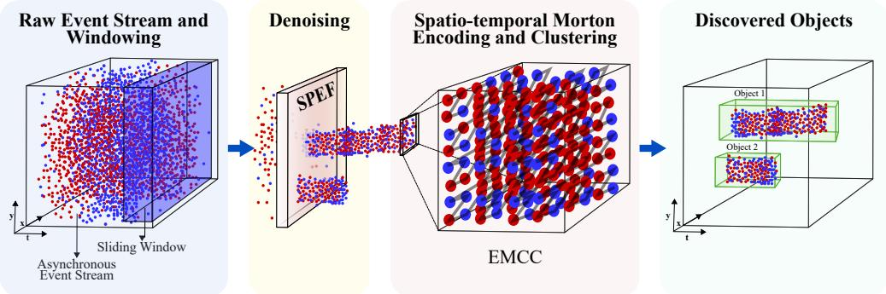  
Figure 1: Overview of the proposed unsupervised event-based object discovery framework. Events are processed in sliding temporal windows, denoised using the proposed Spatio-temporal Probabilistic Event Filter (SPEF), encoded with Morton codes to preserve spatio-temporal locality, and clustered via Event Morton Code Clustering (EMCC) to produce 2D bounding box proposals.

The clustering stage poses a complementary bottleneck. Classical density-based methods such as DBSCAN [24] and HDBSCAN [25] operate without category priors and accommodate objects of varying density, but their repeated neighborhood queries in three-dimensional space-time incur costs that grow unfavorably with event count and neighborhood size [12, 18, 7]. This accuracy–efficiency trade-off is the central open challenge for real-time event-based object discovery.

We resolve this trade-off by aligning the denoising and clustering stages with the intrinsic geometry of the problem. Morton (Z-order) codes [26] map three-dimensional spatio-temporal coordinates to a one-dimensional scalar that preserves locality by construction. When the denoiser explicitly retains the neighborhood coherence that Morton ordering leverages, clustering reduces to gap detection in a sorted one-dimensional sequence, eliminating the dominant computational bottleneck of classical clustering methods. Overview of our method is illustrated in Figure 1.

The main contributions of this work are:

• We introduce SPEF, a spatio-temporal probabilistic event filter that accepts each event with probability directly proportional to the product of a spatial activity score and a temporal coherence score. Unlike existing denoisers that impose a fixed signal-noise decision threshold, SPEF derives its acceptance boundary directly from the live event distribution, requiring no manual calibration or learned model.

• We introduce EMCC, which reformulates event-stream clustering as gap detection on a Morton-ordered sequence, reducing clustering to an O(N log N) sort and O(N) scan, eliminating neighborhood search entirely as a computational primitive for event-stream perception.

• The combined SPEF–EMCC framework is a fully unsupervised, training-free pipeline for event-based object discovery that operates in real time on resource-constrained hardware, requiring no optical flow estimation, iterative optimization, or category supervision.

## 2 Related Work

Supervised methods define the accuracy ceiling when category labels and large annotated datasets are available. They encode events into structured representations, including voxel grids [27, 28] and time surfaces [29, 30, 31], and apply convolutional [32, 14, 33], graph-based [34, 35, 36], and recurrent [37, 38] architectures originally developed for frame based vision. Spiking neural networks [39, 40, 41] exploit native event sparsity through spike-driven computation, though accuracy on large benchmarks trails dense recurrent approaches. Among the latter, RED introduces ConvLSTM with multi-scale detection heads [42], RVT combines local and dilated self-attention with stateful recurrence to achieve top results on Gen1 and 1 Mpx [43, 44], and state-space models replace recurrent layers for improved robustness across inference frequencies [45]. All share two structural assumptions incompatible with open-world deployment: events must be buffered into fixed temporal windows, and detectors recognise only categories seen during training. Open-vocabulary detectors [46, 47] address the second limitation in the frame-based domain. DEOE [48] is the closest event-based analogue, adding a disentangled objectness head to RVT to separate foreground classification from novel-object discovery, though it still requires offline training on domain-specific data. Our work makes neither assumption, producing bounding-box hypotheses without learned representations or category supervision.

When supervision is absent, the dominant alternative is scene decomposition via contrast maximisation [49, 50], which aligns static background events under parametric flow models while leaving independently moving objects as structured residuals. This idea underpins pipelines ranging from per-event motion compensation [51] to energy minimisation with graph cuts [52] and cascaded multi-model fitting [53]. Our work occupies a distinct point in this design space: rather than decomposing the scene through flow estimation, we directly cluster the denoised event stream into bounding-box hypotheses, a formulation that avoids iterative optimisation and is better suited to resource-constrained real-time platforms. Reliable clustering in turn depends critically on the quality of the preceding denoising stage.

Liu et al. [54] established that noise events lack spatio-temporal correlation with their neighbours and can be rejected by checking for a recent neighbour within a small spatial window. Subsequent work refines this for hardware via $\bar { O } ( N )$ space designs [19] and improves high-noise performance through dual-window FIFO filtering [18, 55]. Learning-based methods such as EDnCNN [56] and EventZoom [57] achieve higher suppression accuracy at substantially greater latency and resource cost. Critically, Shiba et al. [58] demonstrate that noise and motion are tightly coupled in raw event data, meaning that filtering decisions inevitably alter the spatio-temporal structure that downstream clustering depends on. Yet all existing denoisers are evaluated in isolation, leaving unaddressed how filter output should be structured for efficient spatial indexing downstream. The proposed SPEF is designed to close this gap by preserving the spatio-temporal neighborhood coherence that Morton-ordered clustering requires, rather than maximising standalone suppression accuracy.

The clustering stage has most commonly been addressed with density-based methods like DBSCAN [59] and HDB-SCAN [60] since they require no prior on cluster count and naturally accommodate objects of varying density. Both have seen wide adoption in cluster tracking and robot navigation [61, 62, 63], and neuromorphic variants have been mapped onto spiking hardware for ultra-low-power inference [64]. On conventional embedded processors, however, the dominant cost is repeated neighborhood search. Query complexity scales unfavourably with both event count and neighborhood size, and this bottleneck becomes acute in dense event regimes. Morton’s Z-order curve [26, 65], employed in this work, offers a route out of this bottleneck. It maps multi-dimensional coordinates to a one-dimensional scalar that preserves spatial proximity, a property formalised for associative database search [66] and adopted broadly in spatial indexing and point-cloud processing [67, 68, 69]. In these applications, Morton ordering improves cache behaviour of existing index structures, but neighborhood search itself remains. EMCC instead sorts denoised events by Morton code, which preserves spatio-temporal proximity by construction and reduces clustering to gap detection in the sorted sequence. To our knowledge, this is the first use of gap detection in Morton-ordered event sequences as a clustering mechanism for event-stream perception.

## 3 Method

Let $\boldsymbol { \mathcal { E } } = \{ e _ { k } \} _ { k = 1 } ^ { N } , e _ { k } \doteq ( x _ { k } , y _ { k } , t _ { k } )$ , denote the stream of events produced by an event camera of resolution $W \times H$ over a temporal window $[ t _ { \mathrm { m i n } } , t _ { \mathrm { m a x } } ]$ . Unlike point clouds or image feature sets, E is asynchronous, sparse, and contaminated by noise events that are statistically indistinguishable from signal at the level of any individual $\textstyle e _ { k } ,$ , so that structure is a collective property recoverable only through spatio-temporal grouping. This makes denoising and clustering mutually dependent: a filter that discards events without regard for local density structure corrupts the neighborhood relationships on which grouping relies, while a clusterer operating on unfiltered input conflates noise bursts with object boundaries. SPEF (Sec. 3.1) breaks this dependence by accepting events in proportion to local spatio-temporal coherence, concentrating the filtered stream into the compact, object-level density regions that EMCC (Sec. 3.2) encodes as Morton codes and partitions by gap detection on the resulting sorted sequence. The end-to-end pipeline is illustrated in Figure 2.

## 3.1 Spatio-temporal Probabilistic Event Filter (SPEF)

Event denoising methods typically impose fixed activity thresholds to separate signal from noise [70, 71]. A fixed threshold treats signal membership as a binary decision, which does not account for the continuous variation in spatio temporal evidence, namely local activity and temporal coherence, across the sensor plane. Signal events and noise events differ not in any single measurable quantity but in the joint behaviour of spatial activity and temporal coherence [54, 19, 56]. Consider a region activated by a slow-moving object: the gradual change in brightness means the contrast threshold is exceeded infrequently, producing a modest event rate that may fall below a fixed activity threshold. Yet the events that are produced arrive with regular inter-event intervals, reflecting the steady motion of the object. A noise burst presents the opposite case: indoor lighting driven from AC mains produces intensity oscillations at twice the mains frequency, causing event cameras to generate periodic spurious events across the sensor plane [21] whose transient rate can exceed the same threshold, yet with no relationship to any moving object in the scene. A threshold on activity alone accepts the latter and rejects the former. No fixed operating point resolves both simultaneously. The problem is therefore not one of finding a better threshold, but of replacing the binary decision with one that is proportional to the evidence that each event belongs to the signal distribution.

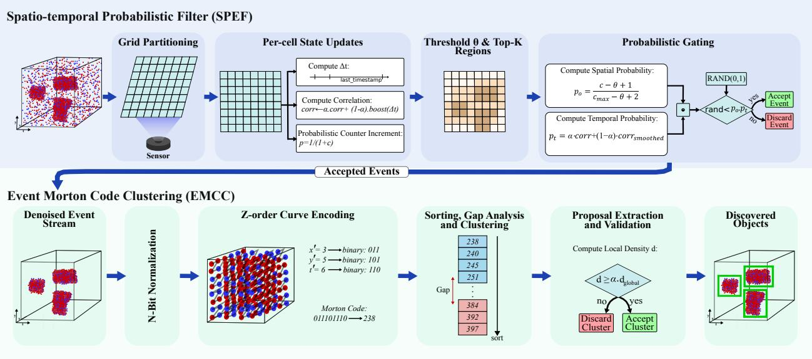  
Figure 2: Overview of our object discovery framework using asynchronous event streams. The framework begins with the Spatio-temporal Probabilistic Event Filter (SPEF), which maps events to grid cells and updates correlation scores using inter-event timing and probabilistic counters. Active regions are isolated via a top-k% threshold, and events are stochastically filtered to maximize signal-to-noise while preserving structural integrity. The accepted events then flow into the Event Morton Code Clustering (EMCC) module. Here, they are normalized and assigned n-bit Morton (Z-order) codes to strictly preserve spatiotemporal locality. Sorting these codes allows for highly efficient clustering via gap detection in Morton space. Finally, candidate clusters are validated using geometric and statistical constraints to yield the final bounding box predictions.

Each incoming event is a proposal that may arise from a moving edge (signal) or sensor noise (background) [17], and no deterministic rule cleanly separates the two at the level of any individual event [56]. The question is therefore not $^ { * } i s$ this event signal?” but “with what probability does this event belong to the signal distribution?”

We implement this idea as a probabilistic event filter, with rejection sampling as the motivating intuition [72]. No target distribution is specified in advance. The acceptance boundary is instead derived from the live stream through two evidence terms, a spatial term $p _ { o }$ and a temporal term $p _ { t }$ , whose product governs acceptance. The product is jointly high only when a region exhibits both sustained activity and temporal coherence, the signature of a true signal event, producing a dynamic acceptance landscape that no fixed threshold can replicate.

Grid partition and per-region state. To evaluate $p _ { o }$ and $p _ { t }$ efficiently, the sensor plane is partitioned into $R \times R$ -pixel regions. Each event $\boldsymbol { e } _ { k } = \left( x _ { k } , y _ { k } , t _ { k } \right)$ is mapped in $O ( 1 )$ to its containing region:

$$
i _ { x } = \lfloor x _ { k } / R \rfloor , \quad i _ { y } = \lfloor y _ { k } / R \rfloor .\tag{1}
$$

Per region, an event counter c accumulates activity and serves as the basis for $p _ { o }$

Spatial activity score $p _ { o }$ and probabilistic counting. To prevent persistently active regions from saturating their counters, c is incremented stochastically with probability

$$
p = { \frac { 1 } { 1 + c } } ,\tag{2}
$$

capped at $c _ { \operatorname* { m a x } } = 2 ^ { b } - 1$ for a b-bit counter, preserving dynamic range across the full sensor plane. Sec. 4.2 compares probabilistic and linear incrementing at two bit depths. An adaptive threshold θ is computed as the top-k% partial selection over all region counters (sensitivity to k is analysed in Sec. 4.2). A region whose counter barely exceeds θ offers weak evidence of sustained activity. A region approaching $c _ { \mathrm { m a x } }$ offers strong evidence. The spatial acceptance

probability encodes this directly:

$$
p _ { o } = \frac { c - \theta + 1 } { c _ { \mathrm { m a x } } - \theta + 2 } ,\tag{3}
$$

satisfies $p _ { o } \to 0$ as $c \to \theta$ and $p _ { o } \to 1$ as $c \to c _ { \mathrm { m a x } }$

Temporal coherence score $p _ { t } .$ . To capture how regularly a region is being activated, each region additionally maintains a correlation score $c o r r [ i _ { y } , i _ { x } ]$ , which accumulates evidence of temporal regularity by tracking the recency and consistency of event arrivals within that region. This score is updated on every incoming event via exponential smoothing driven by the elapsed time since the previous event in the same region:

$$
\mathrm { c o r r } [ i _ { y } , i _ { x } ] \gets \alpha \cdot \mathrm { c o r r } [ i _ { y } , i _ { x } ] + ( 1 - \alpha ) \cdot \kappa \exp ( - \Delta t / \tau ) ,\tag{4}
$$

where $\Delta t = t _ { k }$ − last\_timestamp $[ i _ { y } , i _ { x } ] , \alpha \in [ 0 , 1 ]$ controls temporal memory, and $\kappa , \tau$ set the amplitude and timescale. Rapidly recurring events, characteristic of a moving edge, receive high weight while sporadic noise receives near-zero weight. $\mathrm { ~ A ~ 3 ~ } \times \mathrm { ~ 3 ~ }$ uniform box filter smooths the correlation matrix to broaden the coherence response around object regions, giving

$$
p _ { t } = { \alpha } \cdot \mathrm { c o r r } [ i ] + ( 1 - \alpha ) \cdot \mathrm { u n i f o r m \_ f l t e r } ( \mathrm { c o r r } , 3 ) [ i ] .\tag{5}
$$

Acceptance criterion. An event is accepted if and only if

$$
p _ { \mathrm { k e e p } } = p _ { o } \cdot p _ { t } , \quad r < p _ { \mathrm { k e e p } } , \quad r \sim \mathcal { U } ( 0 , 1 ) .\tag{6}
$$

A noise region may be transiently active $( p _ { o }$ elevated, $p _ { t } \approx 0 )$ or locally coherent but globally inactive $( p _ { t }$ elevated, $p _ { o } \approx 0 )$ . The product suppresses both failure modes. Events at object peripheries survive with probability proportional to their temporal coherence rather than being discarded by a threshold they narrowly miss, preserving the boundary structure that downstream processing for object discovery requires.

Since $r \sim \mathcal { U } ( 0 , 1 )$ , the fundamental property of the uniform distribution gives $\operatorname* { P r } ( r < p _ { \mathrm { k e e p } } ) = p _ { \mathrm { k e e p } } .$ , so each event is accepted with probability exactly equal to the strength of its spatio-temporal evidence. Because θ is derived from the live counter distribution rather than set globally, its numerical value shifts naturally with scene density: rising when the stream is dense and falling when it is sparse, without any manual recalibration. To our knowledge, SPEF is the first event denoising filter to accept each event with probability equal to its spatio-temporal evidence rather than at a fixed operating point. Section S5 of the supplementary material replaces this criterion with fixed thresholds on $p _ { o } \cdot p _ { t }$ between 0.4 and 0.8, across three FRED scenarios covering multiple objects, a sparse distant target, and dynamic approach and recession. Probabilistic acceptance holds the highest F1 in all three, with the largest margin on the sparse target, while every fixed threshold degrades on the conditions it was not tuned for.

## 3.2 Event Morton Code Clustering (EMCC)

Clustering asynchronous event streams requires grouping events by spatio-temporal proximity. Existing methods address this through neighborhood graphs [52, 73], kernel density estimates [74], or iterative centroid updates [75], all of which scale with the number of pairwise event relationships. EMCC takes a different approach: rather than computing proximity, it encodes proximity into a scalar ordering, reducing clustering to gap detection on a sorted sequence.

Morton codes [26] provide this encoding. By interleaving the binary representations of each coordinate dimension, a Morton code maps a multi-dimensional point to a scalar such that points close in the original space map to nearby scalars [76, 77, 78]. Sorting events by their Morton code linearizes the spatio-temporal cloud while preserving its local structure. Object boundaries appear as large gaps in the sorted sequence, while events from the same object produce small gaps. The result is a clustering procedure that avoids pairwise proximity computation entirely. While hardware-accelerated ray tracing [79] demonstrates the efficiency of sorted-list operations over locality-preserving codes, it operates on static geometry with fixed coordinates. Applying this principle to event streams is non-trivial: the spatio-temporal distribution of events varies continuously with scene dynamics, coordinates are not fixed at encoding time, and the gap structure in the sorted sequence must reflect live activity rather than a pre-built scene. EMCC addresses these challenges by deriving the partition threshold $\tau = \mathrm { p e r c e n t i l e } ( \Delta , p _ { \mathrm { g a p } } )$ directly from the observed gap distribution, allowing the clustering to adapt to the density and structure of the incoming stream without requiring an explicit motion model or scene representation. The sensitivity to $p _ { \mathrm { g a p } }$ is characterized in Sec. 4.2. To our knowledge, EMCC is the first method to apply Morton encoding to event-based object discovery.

EMCC processes events through four stages, each motivated by the asynchronous structure of event data. Since spatial coordinates (pixels) and temporal coordinates (microseconds) occupy incommensurable numerical ranges, both are normalised to a common n-bit integer space before Morton encoding, ensuring no single dimension dominates the interleaved code. The normalised events are encoded as Morton codes and sorted to produce a linearised sequence, in which gaps between consecutive codes reflect spatio-temporal separation. These gaps partition the sequence into clusters, though gap magnitude alone does not distinguish coherent objects from low-density regions, so each candidate cluster $\mathcal { C } _ { k }$ is validated against the criterion $| { \mathcal { C } } _ { k } | / A \geq { \overline { { \alpha } } } \cdot d _ { \mathrm { g l o b a l } }$ , where α controls the strictness of the density requirement relative to the global event rate $d _ { \mathrm { g l o b a l } } = \dot { N } / \ddot { ( W } \times H )$ . Finally, the hierarchical structure of the Z-order curve means objects spanning a major bit boundary appear as adjacent sub-clusters rather than a single cluster, a known property of space-filling curves [76, 77], so proposals whose centres fall within proximity threshold $d _ { \mathrm { l i n k } }$ are merged before Non-Maximum Suppression yields the final detection set B. The complete procedure is summarised in Algorithm 1, with full implementation details provided in Algorithm SA1 of the supplementary material.

Algorithm 1 Event Morton Code Clustering (EMCC)   
Require: Events $\mathcal { E } = \{ ( x _ { i } , y _ { i } , t _ { i } ) \} _ { i = 1 } ^ { N } ,$ , resolution $W \times H$   
Ensure: Bounding boxes B   
1: $d _ { \mathrm { g l o b a l } }  N / ( \bar { W } \times H )$   
2: Normalise each event to n-bit space per Eq. 7   
3: $m _ { k }$ ← MortonEncode $( x _ { k } ^ { \prime } , y _ { k } ^ { \prime } , t _ { k } ^ { \prime } )$ for each event   
4: σ ← argsort(m)   
5: Compute gaps $\Delta _ { i }$ per Eq. 8 and partition into C where $\Delta _ { i } > \tau$   
6: For each ${ \mathcal { C } } _ { k } ,$ , extract bounding box via (plow, phigh)   
7: Retain $\mathcal { C } _ { k }$ satisfying Eq. 9   
8: Merge proposals within d , apply NMS → B

Normalisation and encoding. Each event $\boldsymbol { e } _ { k } = \left( x _ { k } , y _ { k } , t _ { k } \right)$ is normalised as follows:

$$
x ^ { \prime } = \left\lfloor \frac { x } { W } ( 2 ^ { n } - 1 ) \right\rfloor , \quad y ^ { \prime } = \left\lfloor \frac { y } { H } ( 2 ^ { n } - 1 ) \right\rfloor , \quad t ^ { \prime } = \left\lfloor \frac { t - t _ { \mathrm { m i n } } } { t _ { \mathrm { m a x } } - t _ { \mathrm { m i n } } } ( 2 ^ { n } - 1 ) \right\rfloor .\tag{7}
$$

Normalised coordinates are encoded as $m _ { k } =$ MortonEncode $( x ^ { \prime } , y ^ { \prime } , t ^ { \prime } )$ and sorted to produce the linearised sequence $\sigma = \mathrm { a r g s o r t } ( m )$

Gap-based clustering. Consecutive gaps in the sorted sequence,

$$
\Delta _ { i } = m _ { \sigma ( i + 1 ) } - m _ { \sigma ( i ) } , \quad i = 1 , \ldots , N - 1 ,\tag{8}
$$

are thresholded at $\tau = \mathrm { p e r c e n t i l e } ( \Delta , p _ { \mathrm { g a p } } )$ to partition the sequence into clusters $\mathcal { C } = \{ \mathcal { C } _ { 1 } , \mathcal { C } _ { 2 } , \ldots \}$ wherever $\Delta _ { i } > \tau$ Density-based validation. For each cluster $\mathcal { C } _ { k }$ , a bounding box is extracted using spatial percentiles $( p _ { \mathrm { l o w } } , p _ { \mathrm { h i g h } } )$ yielding area A. The cluster is retained only if

$$
{ \frac { | { \mathcal { C } } _ { k } | } { A } } \geq \alpha _ { d } \cdot d _ { \mathrm { g l o b a l } } .\tag{9}
$$

where $\alpha _ { d }$ is the density multiplier. Spatial aggregation. Box proposals whose centres fall within $d _ { \mathrm { l i n k } }$ are merged, and Non-Maximum Suppression yields the final detection set B. Sensitivity to $n , p _ { \mathrm { g a p } } , \alpha _ { d } , d _ { \mathrm { l i n k } }$ is characterised in Sec. 4.2.

## 4 Experiments

Datasets: A typical event-based perception framework comprises ego-motion estimation, compensation for ego-motion, denoising, and clustering. Our proposed methods, SPEF and EMCC, target the final two stages and thus assume motion compensated input for performance evaluations here. This assumption is supported on two grounds. First, both discovery benchmarks use statically mounted sensors, so Table 2 already reports the zero-ego-motion regime representative of widespread applications such as surveillance and traffic monitoring. Second, every operating point in the pipeline is defined on the live input: the spatial gate θ tracks the current counter distribution, the gap threshold is a percentile of the observed gaps, and cluster retention scales with the live event rate $d _ { \mathrm { g l o b a l } }$ . Residual compensation error shifts the input statistics without destroying spatio-temporal structure, so degradation is expected to be gradual, manifesting as the merging of nearby objects rather than abrupt failure. The modular interface is compatible with common upstream compensators, including IMU warping, contrast maximisation, and learned compensation [80, 17]. As a first step, to isolate and comprehensively validate the denoising performance of SPEF, we test it on the E-MLB dataset [81] across diverse day and night sequences, using the Mean Event Structural Ratio (MESR) metric to quantify performance. Subsequently, for the EMCC event clustering module, we evaluate performance on two distinct benchmarks: the Florence RGB-Event Drone Dataset (FRED) [82] and the eTraM traffic dataset [83]. These two datasets were chosen because they are well established and contain samples with large variation in ambient conditions, event density and object salience.

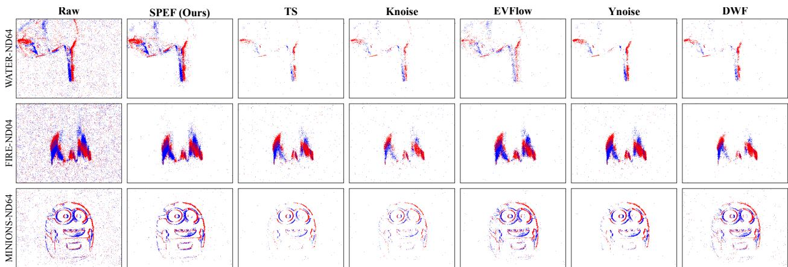  
Figure 3: Comparison of denoising methods on three E-MLB [81] sequences across ND04 and ND64 noise levels

Hardware Setup: All experiments were conducted on a laptop equipped with a 13th Gen Intel Core i7-1360P CPU (12 cores, 16 threads) and 32 GB RAM. This modest setup highlights the computational efficiency of the proposed method, which achieves real-time performance using only CPU resources.

Baselines. EMCC is benchmarked against three unsupervised clustering methods: ST-DBSCAN [59], ST-MeanShift [84], and ST-HDBSCAN [60], where ’ST’ stands for spatio-temporal versions of these algorithms. These represent the three foundational paradigms of density-based spatial grouping: fixed-radius neighborhood analysis, kernel density estimation, and hierarchical density decomposition. Learning-based and graph-based methods are excluded from this comparison as they operate under a fundamentally different problem formulation, requiring labelled training data and task-specific supervision, which places them outside the zero-shot scope of this evaluation. The comparison is therefore restricted to methods that, like EMCC, require no learned priors and operate directly on raw event streams.

Evaluation protocol. Event clusters produced by all methods are converted to bounding box proposals using the same geometric bounding procedure, ensuring that differences in metric scores reflect clustering quality rather than proposal extraction. Precision, Recall, F1, and IoU are reported against ground truth annotations within a 33 ms sliding window, matching the ground truth annotation interval of the evaluation datasets. Hyperparameters for all methods are tuned on validation sets drawn from the training splits of these datasets, sized at 25% of the number of test sequences (12 sequences for FRED, 10 day/night sequences for eTraM). Algorithm-specific parameters and shared post-processing parameters are optimised jointly to prevent configuration bias toward any single method. Tuning ranges are detailed in the supplementary material.

## 4.1 Comparison with Baselines

For evaluation of the filtering stage, we benchmarked SPEF over the large-scale E-MLB dataset [81], which has been used by a number of previous denoising studies [85, 81, 86, 87]. For quantitative evaluation of the filter performance, the Mean Event Structural Ratio (MESR↑) is used. MESR quantitatively evaluates the preservation of the essential spatiotemporal contiguity while eliminating uncorrelated background noise. We adopt the denoising benchmarking framework from Shiba et al. [86] to evaluate filter performance. Specifically, we expand their published results by appending the SPEF metrics to their comparative table, classifying the filter as a model-based approach. Qualitative denoising outputs across representative day and night sequences are shown in Figure 3.

As shown in Table 1, SPEF demonstrates highly competitive performance among the model-based methods, particularly under severe noise conditions. Specifically, SPEF achieves the highest MESR scores at the ND16 level for daytime sequences and takes a clear lead at the highest noise thresholds (ND16 and ND64) in challenging nighttime environments. It also performs second-best in Daytime ND1, ND4 and ND64 test cases. Beyond outperforming other model-based filters, SPEF substantially narrows the performance gap with recent learning-based architectures. Despite using probabilistic thresholds, the method yields structure preservation metrics that rival, and occasionally surpass, those of state-of-the-art supervised networks. Importantly, SPEF eliminates uncorrelated background scatter while maintaining the structural integrity of moving targets. The resulting sparse event stream significantly reduces the downstream search space, providing a base for the spatio-temporal grouping. The performance demonstrated here establishes SPEF as a robust and practical solution for real-world event denoising across varied conditions.

Table 1: Comparison of event denoising methods using the MESR↑ metric on E-MLB [81] dataset. Best results are bold, and second best are underlined.
<table><tr><td rowspan="2">Method</td><td colspan="3">E-MLB (Day)</td><td colspan="3">E-MLB (Night)</td></tr><tr><td>ND1</td><td>ND4 ND16 ND64 ND11</td><td></td><td></td><td></td><td>ND4 ND16ND64</td></tr><tr><td>Raw</td><td>0.821 0.824 0.815 0.786 0.890 0.824 0.786 0.768</td><td></td><td></td><td></td><td></td><td></td></tr><tr><td>BAF [88]</td><td>0.861 0.8690.8760.8900.946 0.9730.992</td><td></td><td></td><td></td><td></td><td>0.942</td></tr><tr><td>TS [89]</td><td>0.877 0.887 0.8700.837 1.033 0.944 0.8860.797</td><td></td><td></td><td></td><td></td><td></td></tr><tr><td>KNoise[19]</td><td>0.846 0.837 0.830 0.807 0.954 0.956 0.871 0.817</td><td></td><td></td><td></td><td></td><td></td></tr><tr><td>EvFlow [90]</td><td>0.848 0.878 0.868 0.833 0.969 0.983 0.8890.797</td><td></td><td></td><td></td><td></td><td></td></tr><tr><td>IETS [91]</td><td>0.772 0.785 0.777 0.753 0.950 0.823 0.804 0.711</td><td></td><td></td><td></td><td></td><td></td></tr><tr><td>Mod-ased Ynoise [92]</td><td>0.866 0.863 0.857 0.821 1.009 0.943 0.875 0.792</td><td></td><td></td><td></td><td></td><td></td></tr><tr><td>GEF [93]</td><td>1.051 0.938 0.935 0.927 1.027 0.955 0.946 0.935</td><td></td><td></td><td></td><td></td><td></td></tr><tr><td>DWF [18]</td><td>0.878 0.876 0.8660.865 0.923 0.962 0.988 0.932</td><td></td><td></td><td></td><td></td><td></td></tr><tr><td>ESMD [86]</td><td>0.938 0.958 0.9860.950 1.037 0.961 0.9450.932</td><td></td><td></td><td></td><td></td><td></td></tr><tr><td>SPEF (Ours)</td><td>0.974 0.9441.004</td><td></td><td></td><td></td><td>0.9381.023 0.9641.0051.051</td><td></td></tr><tr><td>Ieng EDnCNN [56]</td><td>0.887 0.9080.903</td><td></td><td></td><td></td><td>0.912 1.001 1.0241.079</td><td>1.086</td></tr><tr><td>EventZoom [57] 0.996 0.988 0.996 0.970 1.055 1.007 1.010 0.988</td><td></td><td></td><td></td><td></td><td></td><td></td></tr><tr><td>MLPF [18]</td><td>0.851 0.855 0.8460.840 0.926 0.928 0.9100.906</td><td></td><td></td><td></td><td></td><td></td></tr><tr><td>EDformer [85]</td><td>0.952 0.955 0.9560.942 1.0481.0191.0761.099</td><td></td><td></td><td></td><td></td><td></td></tr><tr><td></td><td></td><td></td><td></td><td></td><td></td><td></td></tr></table>

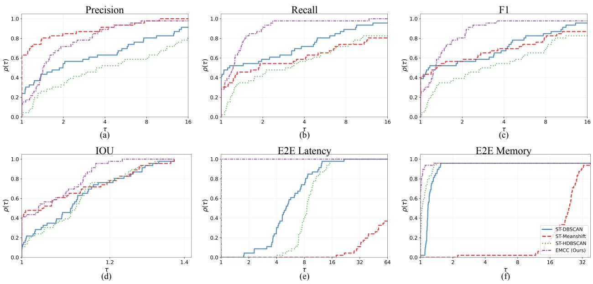  
Figure 4: Performance profiles of four clustering algorithms evaluated on the FRED [82] dataset. The curves plot the performance ratio threshold (τ) against the fraction of sequences $( \rho ( \tau ) )$ ) where an algorithm’s metric is within a factor of τ of the top-performing method. Steeper curves that reach $\rho ( \tau ) = 1 . 0$ at lower τ values indicate greater performance consistency across the dataset. As shown in the profiles, ST-MeanShift (red dashed) achieves the highest initial Precision at $\tau = 1$ . However, our proposed EMCC (purple dash-dotted) exhibits robust overall performance, reaching $\rho ( \tau ) = 1 . 0$ faster than ST-DBSCAN, ST-MeanShift, and ST-HDBSCAN in Recall, F1, and IOU. Notably, EMCC achieves the best relative performance $( \rho ( \tau ) = 1 . 0 )$ for E2E Latency across all sequences at $\tau = 1$ and shows significantly higher consistency in E2E Memory compared to the baselines. Profiles shown: (a) Precision, (b) Recall, (c) F1, (d) IOU, (e) Mean E2E Latency, and (f) Mean E2E Memory.

Building on the denoised output of SPEF, we evaluate our clustering algorithm, EMCC, on the FRED [82] and eTraM [83] datasets. To ensure identical input quality, every tested method processes the exact same SPEF-filtered event stream. We compare our approach against three continuous spatio-temporal baselines: ST-DBSCAN [59], ST-MeanShift [84], and ST-HDBSCAN [60]. We normalize event coordinates $( x , y , t )$ into a continuous unit cube for these baselines. This step is mandatory for fairness as it prevents microsecond timestamps from skewing spatial coordinates during euclidean distance calculations.

Table 2: Unsupervised Spatio-temporal Object Discovery Performance on FRED and eTraM. All methods process SPEF-filtered event streams. ST denotes Spatio-temporal and indicates our x, y, t implementations of the referenced algorithms. Latency is reported in ms. Best results are bold, and second best are underlined.
<table><tr><td>Method</td><td>P↑</td><td>R↑</td><td>F1↑</td><td>IOU@50↑</td><td>E2E Lat. (ms)↓</td></tr><tr><td colspan="6">FRED [82]</td></tr><tr><td>ST-DBSCAN [59]</td><td>0.348</td><td>0.402</td><td>0.358</td><td>0.594</td><td>27.3</td></tr><tr><td>ST-Mean Shift [84]</td><td>0.511</td><td>0.260</td><td>0.301</td><td>0.631</td><td>517.1</td></tr><tr><td>ST-HDBSCAN [60]</td><td>0.239</td><td>0.281</td><td>0.248</td><td>0.602</td><td>70.4</td></tr><tr><td>EMCC (Ours)</td><td>0.416</td><td>0.517</td><td>0.441</td><td>0.647</td><td>6.3</td></tr><tr><td colspan="6">eTraM [83]</td></tr><tr><td>ST-DBSCAN [59]</td><td>0.319</td><td>0.262</td><td>0.273</td><td>0.674</td><td>36.7</td></tr><tr><td>ST-Mean Shift [84]</td><td>0.375</td><td>0.151</td><td>0.204</td><td>0.634</td><td>490.5</td></tr><tr><td>ST-HDBSCAN [60]</td><td>0.332</td><td>0.245</td><td>0.266</td><td>0.675</td><td>150.1</td></tr><tr><td>EMCC (Ours)</td><td>0.378</td><td>0.246</td><td>0.273</td><td>0.656</td><td>15.4</td></tr></table>

Like the baseline clustering approaches, EMCC processes continuous sliding windows. Table 2 summarizes the performance of EMCC against the other clustering methods. On the FRED sequence, our framework delivers the highest overall object discovery accuracy, reaching an F1 score of 0.441 and an IoU of 0.647. While ST-Mean Shift yields higher precision, it comes at a computational cost of 517.1 ms per window. In contrast, our method processes the exact same 33 ms temporal segments in just 6.3 ms. This represents a 4.3× improvement over the fastest existing baseline, ST-DBSCAN (27.3 ms), while also delivering better object localization. EMCC bypasses the expensive distance matrix calculations required by traditional density clustering, resulting in major latency and memory improvements, as charted in Figure 4. The margin over the baselines follows from the clustering rule rather than from the reduction to one dimension. Morton ordering loses no accuracy here, because bit-boundary splits are re-merged by $d _ { \mathrm { l i n k } }$ and false code adjacency is removed by the density check of Eq. 9. Our gap threshold re-fits to every window, whereas ST-DBSCAN’s ε and ST-Mean Shift’s bandwidth apply a single global scale. ST-HDBSCAN’s persistence pruning suppresses sparse objects, which accounts for its recall of 0.281 against 0.517 for EMCC. Qualitative results are presented in Figure 5.

These architectural advantages generalize effectively to the eTraM dataset. Here, the EMCC framework secures the highest precision (0.378) and matches the top baseline F1 score (0.273) while holding a strict 15.4 ms latency bound, a

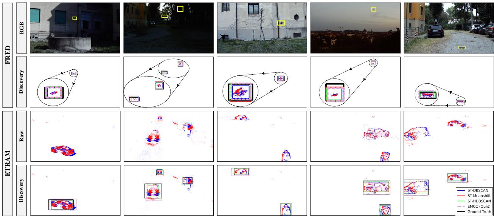  
Figure 5: Qualitative comparison of object discovery on FRED [82] and eTraM [83] datasets. For FRED, yellow boxes on RGB frames provide visual reference, with black-dashed insets showing zoomed-in views of discovered objects. Bounding box proposals are displayed for ST-DBSCAN (blue), ST-MeanShift (red), ST-HDBSCAN (green), EMCC (purple-dashed), and Ground Truth (black).

Table 3: Ablation results for the SPEF and EMCC modules. Bold marks the best value per group. Baseline settings are shaded.
<table><tr><td colspan="7">SPEF</td></tr><tr><td>Param</td><td>Config</td><td>P</td><td>R</td><td>F1</td><td>IoU</td><td>Lat.</td></tr><tr><td>counter bits (b)</td><td>Raw (No Filter)</td><td>0.340</td><td>0.249</td><td>0.256</td><td>0.623</td><td>14.6</td></tr><tr><td></td><td>Probab. (5-bit)</td><td>0.427 0.416</td><td>0.488 0.0.517</td><td>0.434</td><td>0.643</td><td>5.9</td></tr><tr><td></td><td>Linear (5-bit) Probab. (2-bit)</td><td>0.416</td><td>0.343</td><td>0.441 0.353</td><td>0.647 0.650</td><td>6.3</td></tr><tr><td></td><td>Linear (2-bit)</td><td>0.422</td><td>0.304</td><td>0.319</td><td>0.648</td><td>6.5 7.8</td></tr><tr><td>α</td><td>0.0 (Spatial)</td><td>0.425</td><td>0.502</td><td>0.436</td><td>0.647</td><td>6.0</td></tr><tr><td></td><td>0.5 (Balanced)</td><td>0.420</td><td>0.513</td><td>0.440</td><td>0.647</td><td>6.2</td></tr><tr><td></td><td>0.8 (Baseline)</td><td>0.416</td><td>0.517</td><td>0.441</td><td>0.647</td><td>6.3</td></tr><tr><td></td><td>1.0 (Temporal)</td><td>0.414</td><td>0.520</td><td>0.441</td><td>0.647</td><td>6.4</td></tr><tr><td>T</td><td></td><td>0.427</td><td>0.513</td><td>0.442</td><td></td><td></td></tr><tr><td></td><td>10ms 33ms</td><td>0.420</td><td>0.516</td><td>0.441</td><td>0.646 0.647</td><td>6.1 6.2</td></tr><tr><td></td><td>50ms</td><td>0.418</td><td>0.516</td><td>0.441</td><td>0.647</td><td></td></tr><tr><td></td><td>100ms</td><td>0.416</td><td>0.517</td><td>0.441</td><td>0.647</td><td>6.2 6.2</td></tr><tr><td></td><td></td><td></td><td></td><td></td><td></td><td></td></tr><tr><td>top − k</td><td>0.2%</td><td>0.416</td><td>0.517</td><td>0.441</td><td>0.647</td><td>6.3</td></tr><tr><td></td><td>0.5%</td><td>0.391</td><td>0.490</td><td>0.417</td><td>0.648</td><td>6.8</td></tr><tr><td></td><td>5.0% 10.0%</td><td>0.363</td><td>0.415</td><td>0.373</td><td>0.651</td><td>6.3</td></tr><tr><td></td><td></td><td>0.363</td><td>0.404</td><td>0.369</td><td>0.651</td><td>6.3</td></tr><tr><td>R× R</td><td>1×1</td><td>0.338</td><td>0.240</td><td>0.258</td><td>0.629</td><td>11.0</td></tr><tr><td></td><td>2×2</td><td>0.380</td><td>0.364</td><td>0.351</td><td>0.647</td><td>7.2</td></tr><tr><td></td><td>4×4</td><td>0.415</td><td>0.471</td><td>0.422</td><td>0.647</td><td>6.8</td></tr><tr><td></td><td>8×8</td><td>0.416</td><td>0.517</td><td>0.441</td><td>0.647</td><td>6.2</td></tr><tr><td></td><td>12×12</td><td>0.406</td><td>0.499</td><td></td><td>0.428 0.646</td><td>5.6</td></tr></table>

<table><tr><td colspan="7">EMCC</td></tr><tr><td>Param</td><td>Config</td><td>P</td><td>R</td><td>F1</td><td>IoU</td><td>Lat.</td></tr><tr><td rowspan="4"> $d _ { \mathrm { l i n k } }$ </td><td>20px</td><td>0.384</td><td>0.477</td><td>0.405</td><td>0.633</td><td>6.2</td></tr><tr><td>40px</td><td>0.413</td><td>0.517</td><td>0.438</td><td>0.646</td><td>6.2</td></tr><tr><td>60px</td><td>0.416</td><td>0.520</td><td>0.442</td><td>0.647</td><td>6.2</td></tr><tr><td>80px</td><td>0.416</td><td>0.520</td><td>0.442</td><td>0.647</td><td>6.2</td></tr><tr><td></td><td>100px</td><td>0.416</td><td>0.517</td><td>0.441</td><td>0.647</td><td>6.3</td></tr><tr><td rowspan="2">n</td><td>5</td><td>0.416</td><td>0.517</td><td>0.441</td><td>0.647</td><td>6.3</td></tr><tr><td>10</td><td>0.415</td><td>0.505</td><td>0.435</td><td>0.645</td><td>12.7</td></tr><tr><td rowspan="2">dims</td><td>20</td><td>0.333</td><td>0.190</td><td>0.229</td><td>0.611</td><td>4.5</td></tr><tr><td>(x, y)</td><td>0.303</td><td>0.622</td><td>0.373</td><td>0.650</td><td>1.8</td></tr><tr><td rowspan="2"> $p _ { \mathrm { g a p } }$ </td><td>(x, y, t)</td><td>0.416</td><td>0.517</td><td>0.441</td><td>0.647</td><td>6.2</td></tr><tr><td>70%</td><td>0.457</td><td>0.429</td><td>0.403</td><td>0.641</td><td>6.2</td></tr><tr><td></td><td>80%</td><td>0.434</td><td>0.473</td><td>0.421</td><td>0.643</td><td>6.3</td></tr><tr><td></td><td>90%</td><td>0.416</td><td>0.517</td><td>0.440</td><td>0.647</td><td>6.3</td></tr><tr><td></td><td>95%</td><td>0.397</td><td>0.508</td><td>0.428</td><td>0.649</td><td>5.3</td></tr><tr><td></td><td>99%</td><td>0.364</td><td>0.406</td><td>0.370</td><td>0.654</td><td>2.5</td></tr><tr><td> $\alpha _ { d }$ </td><td>5.0</td><td>0.397</td><td>0.526</td><td>0.428</td><td>0.649</td><td>8.3</td></tr><tr><td></td><td>12.5</td><td>0.417</td><td>0.517</td><td>0.441</td><td>0.647</td><td>6.1</td></tr><tr><td></td><td>20.0</td><td>0.423</td><td>0.499</td><td>0.439</td><td>0.645</td><td>5.3</td></tr></table>

2.4× reduction against the next fastest baseline. By consistently outperforming the widely used density-based methods like ST-DBSCAN (36.7 ms) and ST-HDBSCAN (150.1 ms), the framework developed here proves it is robust across different environments. The ability to sustain real-time execution times makes this framework highly practical for real-world perception tasks.

## 4.2 Ablation Study

We present an ablation study on the FRED dataset in Table 3. We vary each design hyperparameter of SPEF and EMCC independently, holding all others at the baseline (counter bits=5, grid R×R=8, α=0.8, τ=100ms, top-k=0.2%, smoothing on, $d _ { \mathrm { l i n k } } \mathrm { = } 1 0 0 \mathrm { p x } , \ b i t s \mathrm { = } 5 , \ d i m s \mathrm { = } ( x , y , t ) , \ p _ { \mathrm { g a p } } \mathrm { = } 9 0 , \ \alpha _ { \mathrm { d e n s } } \mathrm { = } 1 2 . 5 )$ . Baseline values were selected as the configuration achieving the best balance of F1 and latency on the FRED validation set.

Without filtering (EMCC alone), F1 falls to 0.256 at 14.6ms, proving that noise disrupts the density EMCC needs.

SPEF. The per-region counter regulates spatial acceptance $( p _ { o } )$ . A linear 5-bit counter yields the highest F1 (0.441) and recall (0.517). However, a probabilistic 5-bit counter achieves comparable F1 (0.434) at lower latency (5.9ms vs 6.3ms) by accepting state updates stochastically rather than on every event. Under strict memory limits (2-bit depth), the linear counter saturates and fails, dropping F1 to 0.319. The probabilistic counter avoids this by requiring exponentially more events per increment, retaining regional sensitivity and outperforming the linear mode in F1 (0.353 vs 0.319), making it preferable for memory-constrained embedded hardware. The temporal memory (α) blends historical correlation with new timings. Performance is stable across $\alpha \in [ 0 . 5 , 1 . 0 ]$ ], with F1 varying by less than 0.001. Dropping history entirely $( \alpha = 0 . 0 )$ lowers F1 to 0.436, confirming that temporal context contributes to coherence scoring. The decay constant (τ) sets the correlation timescale. Performance is stable across all tested values, with F1 peaking at 0.442 at 10ms and remaining at 0.441 up to 100ms, A larger τ is preferred as it captures a wider range of edge velocities without penalizing latency, making it more robust across diverse scene dynamics. A 3×3 smoothing filter has minimal metric impact on this dataset, but it prevents the structural loss of peripheral boundarsy events. Hence, we retain it. The top-k threshold is highly sensitive. Raising it from 0.2% to 10% drops F1 from 0.441 to 0.369 by discarding moderate-activity regions too early, confirming the spatial gate must remain permissive. Finally, grid resolution (R) dictates cell size. Per-pixel (1×1) tracking fragments moving edges, dropping F1 to 0.258. An 8×8 grid maximises F1 (0.441) at 6.2ms, balancing regional event aggregation with boundary preservation. Coarser aggregation at 12×12 begins to merge distinct object regions, reducing F1 to 0.428.

EMCC. The link distance $( d _ { \mathrm { l i n k } } )$ merges adjacent Z-order sub-clusters. F1 plateaus between 60 and 80px at 0.442 but drops to 0.405 at 20px where fragments remain unmerged. Since larger link distances incur negligible latency penalty, the baseline of 100px is preferred as it ensures complete cluster merging across a wider spatial extent, yielding an F1 of 0.441 within 0.001 of the plateau and confirming it is a robust operating point. The Morton bit-depth (n) sets coordinate quantization. Counterintuitively, increasing to 20 bits drops F1 to 0.229. With 20 bits allocated to each of the three dimensions $( x , y , t )$ , the resulting Morton codes become 60-bit integers. At this scale, the numerical gaps between consecutive events span up to $2 ^ { 6 0 }$ values. This massive dynamic range obscures the measurable difference between small intra-cluster gaps and large inter-cluster boundaries, causing percentile-based thresholding to fail. At 5 bits, the gap distribution demonstrates clear bimodality. While this specific optimal depth inherently depends on event density and spatial scale, it highlights a broader architectural principle: EMCC relies on locality-preserving relative ordering rather than absolute coordinate precision. For coordinate dimensions, encoding only space $( x , y )$ merges temporally distinct events into oversized clusters, dropping F1 to 0.373 despite high recall (0.622). Including time $( x , y , t )$ is essential to resolve temporally overlapping objects. The gap percentile $( p _ { \mathrm { g a p } } )$ defines cluster boundaries. Lower values over-fragment clusters, reducing F1 to 0.403 at 70%, while higher values under-segment, dropping F1 to 0.370 at 99%. The baseline of 90% optimally balances these failure modes at F1 of 0.440. Finally, the density multiplier $( \alpha _ { d } )$ sets the cluster retention threshold. A loose threshold (5.0) admits noise fragments, inflating latency to 8.3ms. A strict threshold (20.0) reduces latency to 5.3ms but suppresses low-density objects, hurting recall. The baseline of 12.5 optimally balances noise rejection and object retention at F1 of 0.441. Across the tested ranges, F1 varies by at most 0.005 for α and 0.001 for τ, and by less than 0.001 for $d _ { \mathrm { l i n k } }$ above 60px. Only the density-scale parameters, top-k, counter bits $b , n$ , and $\alpha _ { d } ,$ require attention when moving to a new scene.

## 5 Discussion and Conclusion

This work presents a training-free framework for object discovery in event data, combining the probabilistic noise suppression of SPEF with the Morton-ordered clustering of EMCC to operate in real time under strict latency and resource constraints. The central finding is that geometry-based processing grounded in the native spatio-temporal structure of event data is not merely a lightweight alternative but a more accurate and faster solution than existing classical approaches across multiple benchmarks.

SPEF ranks first or second across six of eight noise conditions on the E-MLB dataset benchmark, without any offline training, narrowing the performance gap with learned denoisers substantially. On the FRED dataset, EMCC delivers a 23.2% improvement in F1 score and an 8.9% increase in IoU over the ST-DBSCAN, which is also the next fastest baseline, at a 4.3× latency reduction. The framework generalizes to the eTraM dataset, matching top baseline accuracy while recording the lowest execution time across all evaluated methods. Across two benchmarks, Morton-ordered gap detection does not sacrifice accuracy and in fact advances it, while reducing computational cost to a degree that makes deployment on resource-constrained edge hardware practical. Furthermore, because the gap-based clustering follows from explicit geometric rules, every decision in the pipeline is traceable to a real spatio-temporal structure in the event stream, which makes failure diagnosis straightforward. Discovery quality is also sensitive to the signal-to-noise ratio of the input stream, and object identity is not maintained across instances. These are well-understood constraints of annotation-free discovery and define clear directions for future work. Field deployment on embedded platforms under real operating conditions will establish the practical boundary of the pipeline, while lightweight online tracking would extend it toward a complete, training-free perception stack for real-time edge deployment.

## Acknowledgements

The authors gratefully acknowledge Emeritus Professor Mandyam Srinivasan for his generous guidance throughout this work, including detailed manuscript review and participation in research discussions.

# SUPPLEMENTARY MATERIAL

## S1 Pipeline Modularity and Compatibility with Ego-Motion Compensation

SPEF and EMCC are designed as downstream modules that operate on pre-processed event streams, deliberately decoupling coordinate stabilisation from object discovery. This serves two purposes. First, it enables stage-isolated evaluation: since ego-motion compensation methods vary substantially in accuracy and hardware dependency, coupling these stages would conflate their error sources and obscure the contribution of SPEF and EMCC individually. Second, the modular interface makes the framework compatible with the full spectrum of upstream compensation strategies, including IMU-based rotational warping [80, 17], contrast maximisation [49, 50], and learning-based motion compensation [94], without requiring any modification to either module.

This separation also yields a structural advantage for EMCC specifically. When ego-motion compensation is applied upstream, events from static structure share spatial coordinates across time, widening the Morton-space gap between background clutter and independently moving targets. The adaptive threshold $\tau = \mathrm { p e r c e n t i l e } ( \Delta , p _ { \mathrm { g a p } } )$ therefore becomes more discriminative, as the gap distribution grows bimodal, consistent with the theoretical properties of the Z-order curve under spatially coherent inputs [76]. This provides a principled account of why pre-compensated input improves clustering performance without making ego-motion compensation a hard dependency of the method.

## S2 EMCC: Full Implementation Details

Algorithm 1 in the main paper presents a compact summary of EMCC. Algorithm SA1 here expands this into a fully specified procedure, making explicit the parameter inputs, the density filter condition, and the aggregation and NMS steps that are referenced but not detailed in the main text. Additional qualitative comparison is provided in Figure SF2.

## S3 Hyperparameter Ranges

Table ST1 defines the search spaces for all method-specific and shared hyperparameters, explored using Optuna [95] with 1000 trials per algorithm per dataset. The trial budget was determined empirically as the point beyond which the TPE sampler showed no meaningful improvement in composite score across held-out validation runs. To prevent overfitting, hyperparameter search is conducted on a held-out validation split disjoint from the test sequences used for performance reporting in the main text. Search bounds are tailored to the mechanics of each method and the characteristics of each dataset.

ST-DBSCAN [59] uses a global fixed radius, which struggles with the scale variation introduced by object distance, speed, and lighting. We tune $e p s \in [ 0 . 0 0 5 , 0 . 3 ]$ to cover both tight and diffuse clusters, with the upper bound extended for eTraM to accommodate wider spatial variance in traffic scenes. ST-HDBSCAN [60, 25] constructs a hierarchical dendrogram to detect variable density levels, but empirically the hierarchy adds little benefit above 200 events and fragments isolated detections below $5 ,$ so we restrict min\_cluster\_size ∈ [5, 200] accordingly. For ST-MeanShift [84], the bandwidth controls the smoothing window and is the single most sensitive parameter: values that are too small fragment single objects while values that are too large merge adjacent targets. We tune $b a n d w i d t h \in [ 0 . 0 2 , 0 . 5 ]$ with dataset-specific bounds reflecting the difference in object density between FRED and eTraM.

For EMCC, events are sorted by 3D Morton code such that consecutive events from the same object produce small gaps while transitions between distinct spatial clusters produce large ones. The partition threshold is set at cluster\_gap\_percentile $\in [ 6 0 . 0 , 9 9 . 8 ]$ , adapting to scene density rather than requiring a globally fixed value. The lower bound for eTraM is relaxed relative to FRED to account for higher event density and closer object proximity in traffic scenes.

After clustering, a shared set of geometric constraints filters the resulting bounding boxes without learned semantic features. Although shared geometric parameters are optimised jointly with method-specific ones, each baseline receives its own independently optimised shared parameter set, ensuring no configuration is disadvantaged by a suboptimal box filtering stage. merge\_margin ∈ [5.0, 100.0] combines fragmented boxes from the same object across the scale range of both datasets. box\_percentiles tighten boundaries to dense event cores, and box\_margin $\in [ 0 . 0 , 3 0 . 0 ]$ expands them slightly to ensure complete object coverage.

Algorithm SA1 EMCC: Full Procedure   
Require: Events $\mathcal { E } = \{ ( x _ { i } , y _ { i } , t _ { i } ) \} _ { i = 1 } ^ { N } ,$ resolution $W \times H .$ , bit depth n, gap percentile $p _ { \mathrm { g a p } } ,$ box percentiles plow, phigh,   
density multiplier $\alpha ,$ merge distance $d _ { \mathrm { l i n k } }$   
Ensure: Bounding boxes B   
1: $d _ { \mathrm { g l o b a l } }  N / ( \bar { W } \times H )$   
▷ Normalise to a common n-bit integer range before encoding   
2: for each $( x , y , t ) \in \mathcal { E }$ do   
3: $x ^ { \prime }  \lfloor ( { \overset { } { x } } / { \overset { } { W } } ) \cdot ( 2 ^ { n } - 1 ) \rfloor$   
4: $y ^ { \prime }  [ ( y / H ) ^ { \prime } \cdot ( \overset { . } { 2 } ^ { n } - 1 ) ] ^ { - }$   
5: $t ^ { \prime } \gets \lfloor \tilde { ( } ( t - \dot { t } _ { \operatorname* { m i n } } ) / ( t _ { \operatorname* { m a x } } ^ { \prime - } - t _ { \operatorname* { m i n } } ) ) \cdot ( 2 ^ { n } - 1 ) \rfloor$   
6: end for   
▷ Encode and sort: nearby events in 3D space map to nearby scalars   
7: for each normalised $( x ^ { \prime } , y ^ { \prime } , t ^ { \prime } )$ do   
8: mi ← MortonEncode $( x ^ { \prime } , y ^ { \prime } , t ^ { \prime } )$   
9: end for   
10: σ ← argsort(m)   
▷ Large gaps mark object boundaries; threshold adapts to stream density   
11: $\Delta _ { i }  m _ { \sigma ( i + 1 ) } - m _ { \sigma ( i ) } , \quad i = 1 , \ldots , N - 1$   
12: τ ← percentile $( \Delta , p _ { \mathrm { g a p } } )$   
13: Split at positions where $\Delta _ { i } > \tau$ to obtain $\{ { \mathcal { C } } _ { 1 } , { \mathcal { C } } _ { 2 } , \ldots \}$   
▷ Discard clusters whose event density falls below the global scene rate   
14: $\begin{array} { r } { B _ { \mathrm { r a w } }  \emptyset , \quad S  \emptyset } \end{array}$   
15: for each cluster $\mathcal { C } _ { k }$ do   
16: (xmin, ymin, xmax, ymax) ← percentile bounds at plow, phigh   
17: $A  ( x _ { \operatorname* { m a x } } - x _ { \operatorname* { m i n } } ) ( y _ { \operatorname* { m a x } } - y _ { \operatorname* { m i n } } )$   
18: if $| { \mathcal { C } } _ { k } | / A \geq \alpha \cdot d _ { \mathrm { g l o b a l } }$ then   
19: Braw ← Braw ∪ {(xmin, ymin, xmax, ymax)}   
20: $S \gets S \cup \{ | { \mathcal { C } } _ { k } | \}$   
21: end if   
22: end for   
▷ Merge sub-clusters split by Z-order bit boundaries, scored by cluster size   
23: $B _ { \mathrm { a g g } }  { \bf S }$ patialAggregation $( B _ { \mathrm { r a w } } , d _ { \mathrm { l i n k } } )$   
24: $\vec { B }  \mathrm { N M S } ( \vec { B } _ { \mathrm { a g g } , } \bar { \boldsymbol { S } } )$   
25: return B

## S4 Hyperparameter Tuning — Optimization Framework

Hyperparameters are optimised using Optuna with the Tree-structured Parzen Estimator (TPE) sampler [95, 96], as detailed in Algorithm SA2. The same pipeline is applied to SPEF+EMCC and all baselines to ensure a fair comparison. The optimization objective maximises a composite score that balances spatial accuracy, temporal coverage, and false positive suppression:

$$
{ \mathrm { C o m p o s i t e ~ S c o r e } } = ( { \mathrm { P r e c i s i o n } } + { \mathrm { R e c a l l } } + { \mathrm { m I o U } } + \lambda \cdot { \mathcal { F } } _ { \mathrm { d e t } } ) \cdot { \mathcal { P } } _ { \mathrm { F P } }\tag{SE1}
$$

Accuracy metrics. Precision, Recall, and mIoU are computed at an IoU threshold of 0.5 for true positive matches, following the convention established in event-based object detection benchmarks [83, 82]. This combination ensures the optimised configuration reaches a balance between accurate localisation and reliable object discovery.

Detection frequency $( \mathcal { F } _ { \mathbf { d e t } } ) .$

$$
\mathcal { F } _ { \mathrm { d e t } } = \frac { \mathrm { F r a m e s ~ w i t h ~ v a l i d ~ p r e d i c t i o n s } } { \mathrm { T o t a l ~ f r a m e s ~ w i t h ~ g r o u n d - t r u t h ~ o b j e c t s } }\tag{SE2}
$$

This measures temporal consistency across the sequence. The weight $\lambda = 0 . 1$ is deliberately small so that $\mathcal { F } _ { \mathrm { d e t } }$ acts as a tie-breaker among configurations with similar spatial accuracy, rather than allowing the optimizer to inflate bounding boxes to sustain detection rate at the cost of localisation precision. Sensitivity to λ was verified by sweeping values in [0.01, 0.5], confirming that the relative ranking of configurations remains stable across this range.

Table ST1: Hyperparameter search ranges for the evaluated clustering algorithms on FRED [82] and eTraM [83]. Shared hyperparameters govern bounding box generation and are jointly optimised alongside method-specific parameters, with each algorithm receiving its own independently optimised shared parameter set.
<table><tr><td>Hyperparameters</td><td>FRED [82]</td><td>eTraM [83]</td></tr><tr><td>ST-DBSCAN eps</td><td>0.005–0.1</td><td>0.005-0.3</td></tr><tr><td>min samples ST-HDBSCAN</td><td>3-50</td><td>3-50</td></tr><tr><td>min cluster size min samples</td><td>5-60 1-30</td><td>5-200 1-30</td></tr><tr><td>ST-MeanShift bandwidth</td><td>0.02–0.2</td><td>0.05-0.5</td></tr><tr><td>EMCC (Ours)</td><td></td><td></td></tr><tr><td>cluster gap percentile density multiplier</td><td>80.0–99.8 0.1-15</td><td>60.0–99.8</td></tr><tr><td></td><td></td><td>0.05-10</td></tr><tr><td>Shared Parameters</td><td></td><td></td></tr><tr><td>merge margin</td><td>10-100</td><td>5-75</td></tr><tr><td>box percentile low</td><td>0-5</td><td></td></tr><tr><td>box percentile high</td><td>95-100</td><td>1-20</td></tr><tr><td>box margin</td><td>0-20</td><td>90-99 1-30</td></tr></table>

False positive penalty $( { \mathcal { P } } _ { \mathbf { F P } } ) .$ . Clustering methods do not perform semantic feature extraction, making them susceptible to detecting unannotated background motions such as moving vegetation. To suppress this without bottlenecking recall, we apply a bounded multiplicative penalty based on the false positive ratio $R _ { \mathrm { F P } } = \mathrm { F P } / ( \mathrm { T P } + 1 )$

$$
\mathcal { P } _ { \mathrm { F P } } = \left\{ \begin{array} { l l } { 1 . 0 , } & { \mathrm { i f } \ R _ { \mathrm { F P } } \leq 1 . 3 } \\ { \frac { 1 . 3 } { R _ { \mathrm { F P } } } , } & { \mathrm { o t h e r w i s e } } \end{array} \right.\tag{SE3}
$$

The tolerance threshold of 1.3 was determined by inspecting the false positive distribution across both datasets. In practice, a ratio of up to 1.3 false positives per true positive reflects the baseline level of background clutter that non-semantic clustering methods produce under normal scene conditions, such as sparse moving foliage or sensor noise bursts. Beyond this point, the false positive count grows disproportionately relative to true detections, indicating systematic over-detection rather than unavoidable background response. The multiplicative form of $\mathcal { P } _ { \mathrm { F P } }$ ensures that once this threshold is crossed, the score penalty scales directly with the degree of over-detection, preventing the optimizer from trading localisation quality for an inflated detection count. A strict zero-tolerance constraint was avoided because it would force the optimizer toward overly conservative parameters that suppress valid detections during moments of sparse object activity. Algorithm SA2 details the complete optimization workflow.

Algorithm SA2 Bayesian Hyperparameter Optimization for Event-based Detection   
Require: Event stream E, ground-truth ${ \overline { { \mathcal { G } } } } ,$ parameter space Θ, trial budget $N _ { \mathrm { t r i a l s } }$   
Ensure: Optimal parameters $\theta ^ { * }$ and best score ${ \boldsymbol { S } } ^ { * }$   
1: Initialise SPEF filter and clustering module and validate on sample data   
2: for i = 1 to $N _ { \mathrm { t r i a l s } }$ do   
3: Sample candidate parameters $\theta _ { i }$ from Θ   
4: Apply SPEF filtering to event stream   
5: Cluster filtered events via selected algorithm   
6: Generate and filter bounding boxes   
7: Evaluate predictions against G to compute TP, FP, FN, and IoUs   
8: Compute base score: $\bar { S } _ { \mathrm { b a s e } } = \mathrm { P r e c i s i o n } + \mathrm { R e c a l l } + \mathrm { m I o U } + 0 . 1 \cdot \mathcal { F } _ { \mathrm { d e t } }$   
9: Compute false positive penalty P from R   
10: Compute composite score: $\dot { S _ { i } } = \dot { S _ { \mathrm { b a s e } } } \cdot \mathcal { P } _ { \mathrm { F P } }$   
11: Report $S _ { i }$ to optimizer   
12: end for   
13: θ∗ ← arg max S   
14: return $\theta ^ { \ast } , S ^ { \ast }$

## S5 Probabilistic vs. Deterministic Event Acceptance: An Empirical Analysis

As introduced in Section 3.1 of the main paper, SPEF accepts events probabilistically: an event is accepted if $r \sim \mathcal { U } ( 0 , 1 )$ satisfies $r < p _ { o } \cdot p _ { t }$ , where $p _ { o }$ and $p _ { t }$ are spatial and temporal acceptance probabilities computed per-event from local scene conditions. Unlike fixed thresholds, which apply a uniform acceptance boundary regardless of scene state, this probabilistic formulation adapts the decision boundary to local spatio-temporal activity. Comprehensive evaluation on the FRED dataset confirms a consistent advantage of probabilistic acceptance over fixed thresholds across diverse scene conditions. We examine three representative cases that illuminate the mechanisms driving this advantage.

Instance 63: multiple objects. During the first 500 frames both objects are inactive and $p _ { o } \cdot p _ { t }$ remains near-zero, suppressing false positives from background noise. When objects enter the scene, acceptance probability rises sharply and tracks their coherent motion, dropping again during quiescent periods. As shown in Figure SF1(a)(ii), RNG achieves performance comparable to the best fixed threshold $( \theta _ { \mathrm { f i x } } = 0 . 4 )$ but without the systematic degradation observed at higher thresholds. Fixed thresholds above 0.4 exhibit monotonic performance loss, exposing the brittleness of uniform acceptance boundaries under varying object activity.

Instance 90: sparse distant target. The target produces weak spatial and temporal coherence throughout, keeping acceptance probability consistently low. This is the appropriate response to a genuinely sparse signal rather than an artifact of aggressive filtering. RNG significantly outperforms all fixed thresholds $( \theta _ { \mathrm { f i x } } \in \{ 0 . 4 , \dots , 0 . 8 \} )$ , which over-reject events and degrade both precision and recall. This instance represents the largest observed performance margin and demonstrates that probabilistic modulation is most critical precisely when signal coherence is weakest.

Instance 154: dynamic approach and recession. The object alternates between approaching the camera, driving acceptance probability to peak, and receding, causing it to drop sharply. RNG tracks this oscillation window-by-window, maintaining high F1 and IoU@50 throughout. Fixed thresholds cannot respond to this rate of change and exhibit precision-recall trade-offs that worsen as the object recedes.

Across all three cases, covering multiple objects, sparse signals, and dynamic motion, RNG consistently maintains higher F1 scores while the best fixed threshold $( \theta _ { \mathrm { f i x } } = 0 . 4 )$ degrades under conditions it was not tuned for. The acceptance probability traces in Figure SF1(i) confirm that this is genuine adaptability: SPEF adjusts its acceptance rate to match local spatio-temporal coherence without any manual intervention. Soft probabilistic boundaries remove the brittleness of hard thresholding and allow the filter to generalise across scene conditions without retuning.

<table><tr><td>RNG (E[pkeep]) ±1 Std Dev</td><td></td><td>Fixed τ=0.4 Fixed τ=0.5</td><td>Fixed τ=0.6 -– Fixed τ=0.7</td><td>Fixed τ=0.8</td></tr></table>

<table><tr><td>Precision</td><td>Recall</td><td> F1 Score</td><td>IOU@0.5</td></tr><tr><td></td><td></td><td></td><td></td></tr></table>

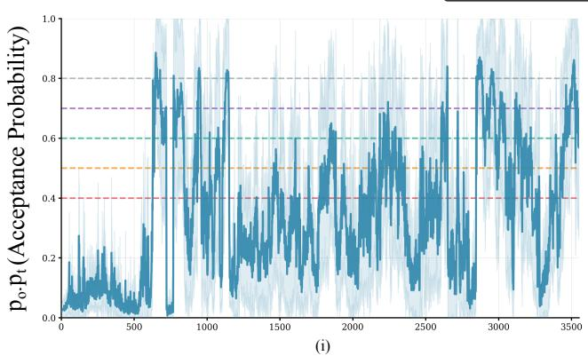

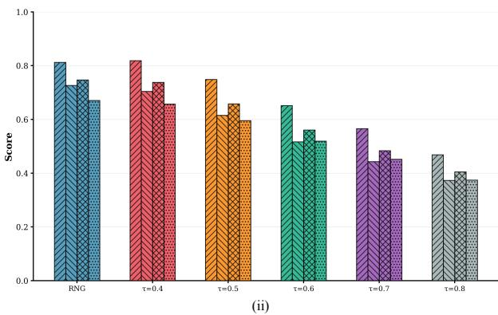  
(a)

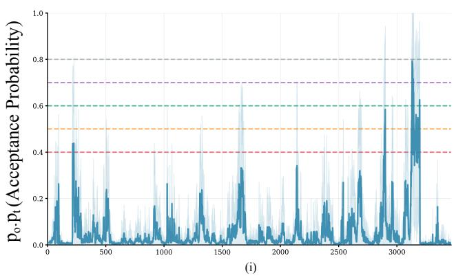

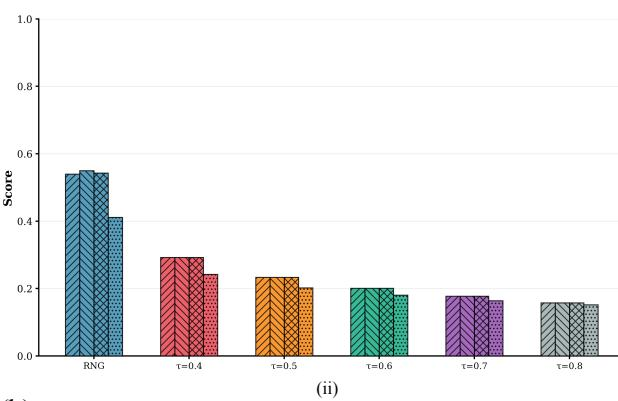  
(b)

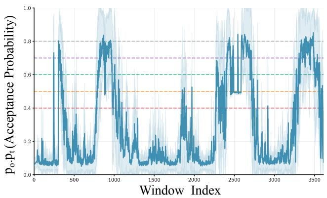  
(i)

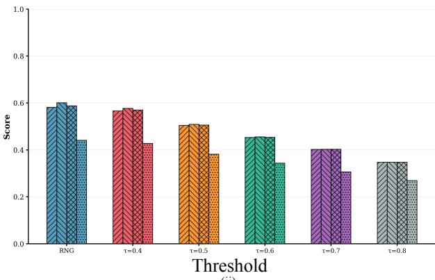  
(c)  
(ii)  
Figure SF1: Comparison of probabilistic (RNG) and fixed-threshold acceptance across three representative scenarios: (a) multiple objects (Instance 63), (b) distant sparse target (Instance 90), and (c) dynamic proximity changes (Instance 154). Subplots (i) show acceptance probability over time and subplots (ii) report Precision, Recall, F1, and IoU@50. RNG (blue) adapts dynamically to scene activity, outperforming fixed thresholds at $\theta _ { \mathrm { f i x } } \in \{ 0 . 4 , 0 . 5 , 0 . 6 , 0 . 7 , 0 . 8 \}$ across all scenarios.

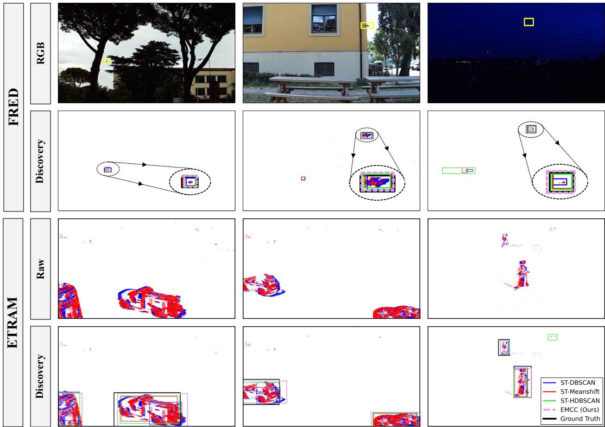  
Figure SF2: Qualitative comparison of object detection outputs on the FRED and eTraM datasets: additional samples. Yellow boxes on RGB frames of FRED provide visual reference, with black-dashed insets showing zoomed-in views of discovered objects. Bounding box proposals are displayed for ST-DBSCAN (blue), ST-MeanShift (red), ST-HDBSCAN (green), EMCC (purple-dashed), and Ground Truth (black). These supplementary examples extend the qualitative analysis presented in the main paper, demonstrating EMCC’s performance consistency across diverse scene configurations and dynamic activity levels.

## References

[1] Tinne Tuytelaars, Christoph H Lampert, Matthew B Blaschko, and Wray Buntine. Unsupervised object discovery: A comparison. International journal of computer vision, 88(2):284–302, 2010.

[2] Van Huy Vo, Elena Sizikova, Cordelia Schmid, Patrick Pérez, and Jean Ponce. Large-scale unsupervised object discovery. In M. Ranzato, A. Beygelzimer, Y. Dauphin, P.S. Liang, and J. Wortman Vaughan, editors, Advances in Neural Information Processing Systems, volume 34, pages 16764–16778. Curran Associates, Inc., 2021.

[3] Suha Kwak, Minsu Cho, Ivan Laptev, Jean Ponce, and Cordelia Schmid. Unsupervised object discovery and tracking in video collections. In Proceedings ofthe IEEE International Conference on Computer Vision (ICCV), December 2015.

[4] Oriane Siméoni, Éloi Zablocki, Spyros Gidaris, Gilles Puy, and Patrick Pérez. Unsupervised object localization in the era of self-supervised vits: A survey. International Journal ofComputer Vision, 133(2):781–808, 2025.

[5] Ziwei Wang, Timothy Molloy, Pieter van Goor, and Robert Mahony. Asynchronous blob tracker for event cameras. IEEE Transactions on Robotics, 40:4750–4767, 2024.

[6] Anton Mitrokhin, Cornelia Fermüller, Chethan Parameshwara, and Yiannis Aloimonos. Event-based moving object detection and tracking. In 2018 IEEE/RSJ International Conference on Intelligent Robots and Systems (IROS), pages 1–9, 2018.

[7] Anindya Mondal, Shashant R, Jhony H. Giraldo, Thierry Bouwmans, and Ananda S. Chowdhury. Moving object detection for event-based vision using graph spectral clustering. In Proceedings ofthe IEEE/CVF International Conference on Computer Vision (ICCV) Workshops, pages 876–884, October 2021.

[8] Anindya Mondal and Mayukhmali Das. Moving object detection for event-based vision using k-means clustering. In 2021 IEEE 8th Uttar Pradesh Section International Conference on Electrical, Electronics and Computer Engineering (UPCON), pages 1–6, 2021.

[9] Yuanjun Shu, Yunfeng Sui, Shixuan Zhao, Zhi Cheng, and Weiqian Liu. Small moving object detection and tracking based on event signals. In 2021 7th International Conference on Computer and Communications (ICCC), pages 792–796, 2021.

[10] Jiang Zhao, Shilong Ji, Zhihao Cai, Yiwen Zeng, and Yingxun Wang. Moving object detection and tracking by event frame from neuromorphic vision sensors. Biomimetics, 7(1), 2022.

[11] Xiuyuan Lu, Yi Zhou, and Shaojie Shen. Event-based motion segmentation by cascaded two-level multi-model fitting. In 2021 IEEE/RSJ International Conference on Intelligent Robots and Systems (IROS), pages 4445–4452, 2021.

[12] Timo Stoffregen, Guillermo Gallego, Tom Drummond, Lindsay Kleeman, and Davide Scaramuzza. Event-based motion segmentation by motion compensation. In Proceedings of the IEEE/CVF International Conference on Computer Vision (ICCV), October 2019.

[13] Anton Mitrokhin, Chengxi Ye, Cornelia Fermüller, Yiannis Aloimonos, and Tobi Delbruck. Ev-imo: Motion segmentation dataset and learning pipeline for event cameras. In 2019 IEEE/RSJ International Conference on Intelligent Robots and Systems (IROS), pages 6105–6112, 2019.

[14] Nico Messikommer, Daniel Gehrig, Antonio Loquercio, and Davide Scaramuzza. Event-based asynchronous sparse convolutional networks. In Andrea Vedaldi, Horst Bischof, Thomas Brox, and Jan-Michael Frahm, editors, Computer Vision – ECCV 2020, pages 415–431, Cham, 2020. Springer International Publishing.

[15] Christian Brandli, Raphael Berner, Minhao Yang, Shih-Chii Liu, and Tobi Delbruck. A 240 × 180 130 db 3 µs latency global shutter spatiotemporal vision sensor. IEEE Journal of Solid-State Circuits, 49(10):2333–2341, 2014.

[16] Patrick Lichtsteiner, Christoph Posch, and Tobi Delbruck. A 128× 128 120 db 15 µs latency asynchronous temporal contrast vision sensor. IEEE Journal ofSolid-State Circuits, 43(2):566–576, 2008.

[17] Guillermo Gallego, Tobi Delbrück, Garrick Orchard, Chiara Bartolozzi, Brian Taba, Andrea Censi, Stefan Leutenegger, Andrew J. Davison, Jörg Conradt, Kostas Daniilidis, and Davide Scaramuzza. Event-based vision: A survey. IEEE Transactions on Pattern Analysis and Machine Intelligence, 44(1):154–180, 2022.

[18] Shasha Guo and Tobi Delbruck. Low cost and latency event camera background activity denoising. IEEE Transactions on Pattern Analysis and Machine Intelligence, 45(1):785–795, 2023.

[19] Alireza Khodamoradi and Ryan Kastner. o(n)o(n)-space spatiotemporal filter for reducing noise in neuromorphic vision sensors. IEEE Transactions on Emerging Topics in Computing, 9(1):15–23, 2021.

[20] Wanmin Lin, Yuhui Li, Chen Xu, and Lilin Liu. A motion denoising algorithm with gaussian self-adjusting threshold for event camera. The Visual Computer, 40(9):6567–6580, 2024.

[21] Ziwei Wang, Dingran Yuan, Yonhon Ng, and Robert Mahony. A linear comb filter for event flicker removal. In 2022 International Conference on Robotics and Automation (ICRA), pages 398–404, 2022.

[22] Saizhe Ding, Jinze Chen, Yang Wang, Yu Kang, Weiguo Song, Jie Cheng, and Yang Cao. E-mlb: Multilevel benchmark for event-based camera denoising. IEEE Transactions on Multimedia, 26:65–76, 2024.

[23] Meriem Ben Miled, Wenwen Liu, and Yuanchang Liu. Adaptive unsupervised learning-based 3d spatiotemporal filter for event-driven cameras. Research, 7:0330, 2024.

[24] Martin Ester, Hans-Peter Kriegel, Jörg Sander, and Xiaowei Xu. A density-based algorithm for discovering clusters in large spatial databases with noise. In Evangelos Simoudis, Jiawei Han, and Usama M. Fayyad, editors, Proceedings of the Second International Conference on Knowledge Discovery and Data Mining (KDD-96), Portland, Oregon, USA, pages 226–231. AAAI Press, 1996.

[25] Ricardo J. G. B. Campello, Davoud Moulavi, and Joerg Sander. Density-based clustering based on hierarchical density estimates. In Jian Pei, Vincent S. Tseng, Longbing Cao, Hiroshi Motoda, and Guandong Xu, editors, Advances in Knowledge Discovery and Data Mining, pages 160–172, Berlin, Heidelberg, 2013. Springer Berlin Heidelberg.

[26] Guy M Morton. A computer oriented geodetic data base and a new technique infile sequencing. International Business Machines Company, 1966.

[27] Alex Zihao Zhu, Liangzhe Yuan, Kenneth Chaney, and Kostas Daniilidis. Unsupervised event-based learning of optical flow, depth, and egomotion, 2018.

[28] Mathias Gehrig, Mario Millhäusler, Daniel Gehrig, and Davide Scaramuzza. E-raft: Dense optical flow from event cameras, 2021.

[29] Xavier Lagorce, Garrick Orchard, Francesco Galluppi, Bertram E. Shi, and Ryad B. Benosman. Hots: A hierarchy of event-based time-surfaces for pattern recognition. IEEE Transactions on Pattern Analysis and Machine Intelligence, 39(7):1346–1359, 2017.

[30] Amos Sironi, Manuele Brambilla, Nicolas Bourdis, Xavier Lagorce, and Ryad Benosman. Hats: Histograms of averaged time surfaces for robust event-based object classification, 2018.

[31] Jacques Manderscheid, Amos Sironi, Nicolas Bourdis, Davide Migliore, and Vincent Lepetit. Speed invariant time surface for learning to detect corner points with event-based cameras, 2019.

[32] Rohan Ghosh, Abhishek Mishra, Garrick Orchard, and Nitish V. Thakor. Real-time object recognition and orientation estimation using an event-based camera and cnn. In 2014 IEEE Biomedical Circuits and Systems Conference (BioCAS) Proceedings, pages 544–547, 2014.

[33] Xu Zheng, Yexin Liu, Yunfan Lu, Tongyan Hua, Tianbo Pan, Weiming Zhang, Dacheng Tao, and Lin Wang. Deep learning for event-based vision: A comprehensive survey and benchmarks, 2024.

[34] Simon Schaefer, Daniel Gehrig, and Davide Scaramuzza. Aegnn: Asynchronous event-based graph neural networks. In Proceedings of the IEEE/CVF conference on computer vision and pattern recognition, pages 12371–12381, 2022.

[35] Yufeng Yang, Adrian Kneip, and Charlotte Frenkel. Evgnn: An event-driven graph neural network accelerator for edge vision. IEEE Transactions on Circuits and Systemsfor Artificial Intelligence, 2(1):37–50, 2025.

[36] Daniel Gehrig and Davide Scaramuzza. Low-latency automotive vision with event cameras. Nature, 629(8014):1034–1040, 2024.

[37] Daniel Neil, Michael Pfeiffer, and Shih-Chii Liu. Phased lstm: Accelerating recurrent network training for long or event-based sequences. Advances in neural information processing systems, 29, 2016.

[38] Marco Cannici, Marco Ciccone, Andrea Romanoni, and Matteo Matteucci. A differentiable recurrent surface for asynchronous event-based data. In Andrea Vedaldi, Horst Bischof, Thomas Brox, and Jan-Michael Frahm, editors, Computer Vision – ECCV 2020, pages 136–152, Cham, 2020. Springer International Publishing.

[39] Seijoon Kim, Seongsik Park, Byunggook Na, and Sungroh Yoon. Spiking-YOLO: Spiking neural network for energy-efficient object detection. In Proceedings of the AAAI Conference on Artificial Intelligence, volume 34, pages 11270–11277, 2020.

[40] Loïc Cordone, Benoît Miramond, and Philippe Thierion. Object detection with spiking neural networks on automotive event data. In 2022 International Joint Conference on Neural Networks (IJCNN), pages 1–8. IEEE, 2022.

[41] Hongwei Ren, Yue Zhou, Xiaopeng Lin, Yulong Huang, Haotian Fu, Jie Song, and Bojun Cheng. Spikepoint: An efficient point-based spiking neural network for event cameras action recognition. In International Conference on Learning Representations, volume 2024, pages 27827–27846, 2024.

[42] Etienne Perot, Pierre De Tournemire, Davide Nitti, Jonathan Masci, and Amos Sironi. Learning to detect objects with a 1 megapixel event camera. Advances in Neural Information Processing Systems, 33:16639–16652, 2020.

[43] Mathias Gehrig and Davide Scaramuzza. Recurrent vision transformers for object detection with event cameras. In Proceedings of the IEEE/CVF Conference on Computer Vision and Pattern Recognition (CVPR), pages 13884–13893, June 2023.

[44] Pierre de Tournemire, Davide Nitti, Etienne Perot, Davide Migliore, and Amos Sironi. A large scale event-based detection dataset for automotive, 2020.

[45] Nikola Zubic, Mathias Gehrig, and Davide Scaramuzza. State space models for event cameras. In Proceedings of the IEEE/CVF Conference on Computer Vision and Pattern Recognition (CVPR), pages 5819–5828, June 2024.

[46] Matthias Minderer, Alexey Gritsenko, Austin Stone, Maxim Neumann, Dirk Weissenborn, Alexey Dosovitskiy, Aravindh Mahendran, Anurag Arnab, Mostafa Dehghani, Zhuoran Shen, Xiao Wang, Xiaohua Zhai, Thomas Kipf, and Neil Houlsby. Simple open-vocabulary object detection. In Shai Avidan, Gabriel Brostow, Moustapha Cissé, Giovanni Maria Farinella, and Tal Hassner, editors, Computer Vision – ECCV 2022, pages 728–755, Cham, 2022. Springer Nature Switzerland.

[47] Shilong Liu, Zhaoyang Zeng, Tianhe Ren, Feng Li, Hao Zhang, Jie Yang, Qing Jiang, Chunyuan Li, Jianwei Yang, Hang Su, Jun Zhu, and Lei Zhang. Grounding dino: Marrying dino with grounded pre-training for open-set object detection. In Aleš Leonardis, Elisa Ricci, Stefan Roth, Olga Russakovsky, Torsten Sattler, and Gül Varol, editors, Computer Vision – ECCV 2024, pages 38–55, Cham, 2025. Springer Nature Switzerland.

[48] Haitian Zhang, Chang Xu, Xinya Wang, Bingde Liu, Guang Hua, Lei Yu, and Wen Yang. Detecting every object from events. IEEE Transactions on Pattern Analysis and Machine Intelligence, 47(8):7171–7178, 2025.

[49] Guillermo Gallego, Henri Rebecq, and Davide Scaramuzza. A unifying contrast maximization framework for event cameras, with applications to motion, depth, and optical flow estimation. In Proceedings of the IEEE Conference on Computer Vision and Pattern Recognition (CVPR), June 2018.

[50] Timo Stoffregen and Lindsay Kleeman. Event cameras, contrast maximization and reward functions: An analysis. In Proceedings ofthe IEEE/CVF Conference on Computer Vision and Pattern Recognition (CVPR), June 2019.

[51] Timo Stoffregen, Guillermo Gallego, Tom Drummond, Lindsay Kleeman, and Davide Scaramuzza. Event-based motion segmentation by motion compensation. In Proceedings of the IEEE/CVF International Conference on Computer Vision (ICCV), October 2019.

[52] Yi Zhou, Guillermo Gallego, Xiuyuan Lu, Siqi Liu, and Shaojie Shen. Event-based motion segmentation with spatio-temporal graph cuts. IEEE Transactions on Neural Networks and Learning Systems, 34(8):4868–4880, 2023.

[53] Xiuyuan Lu, Yi Zhou, and Shaojie Shen. Event-based motion segmentation by cascaded two-level multi-model fitting. In 2021 IEEE/RSJ International Conference on Intelligent Robots and Systems (IROS), pages 4445–4452, 2021.

[54] Hongjie Liu, Christian Brandli, Chenghan Li, Shih-Chii Liu, and Tobi Delbruck. Design of a spatiotemporal correlation filter for event-based sensors. In 2015 IEEE International Symposium on Circuits and Systems (ISCAS), pages 722–725. IEEE, 2015.

[55] Antonio Rios-Navarro, Shasha Guo, Abarajithan Gnaneswaran, Keerthivasan Vijayakumar, Alejandro Linares-Barranco, Thea Aarrestad, Ryan Kastner, and Tobi Delbruck. Within-camera multilayer perceptron dvs denoising. In Proceedings of the IEEE/CVF Conference on Computer Vision and Pattern Recognition (CVPR) Workshops, pages 3933–3942, June 2023.

[56] R. Wes Baldwin, Mohammed Almatrafi, Vijayan Asari, and Keigo Hirakawa. Event probability mask (epm) and event denoising convolutional neural network (edncnn) for neuromorphic cameras. In Proceedings of the IEEE/CVF Conference on Computer Vision and Pattern Recognition (CVPR), June 2020.

[57] Peiqi Duan, Zihao W Wang, Xinyu Zhou, Yi Ma, and Boxin Shi. Eventzoom: Learning to denoise and super resolve neuromorphic events. In Proceedings of the IEEE/CVF conference on computer vision and pattern recognition, pages 12824–12833, 2021.

[58] Shintaro Shiba, Yoshimitsu Aoki, and Guillermo Gallego. Simultaneous motion and noise estimation with event cameras. In Proceedings ofthe IEEE/CVF International Conference on Computer Vision, pages 6959–6969, 2025.

[59] Derya Birant and Alp Kut. St-dbscan: An algorithm for clustering spatial–temporal data. Data & Knowledge Engineering, 60(1):208–221, 2007. Intelligent Data Mining.

[60] Leland McInnes, John Healy, Steve Astels, et al. hdbscan: Hierarchical density based clustering. J. Open Source Softw., 2(11):205, 2017.

[61] Davide Falanga, Kevin Kleber, and Davide Scaramuzza. Dynamic obstacle avoidance for quadrotors with event cameras. Science Robotics, 5(40):eaaz9712, 2020.

[62] Craig Iaboni, Himanshu Patel, Deepan Lobo, Ji-Won Choi, and Pramod Abichandani. Event camera based real-time detection and tracking of indoor ground robots. IEEE Access, 9:166588–166602, 2021.

[63] Charles P. Rizzo, Catherine D. Schuman, and James S. Plank. Speed-based filtration and dbscan of event-based camera data with neuromorphic computing, 2024.

[64] Charles P. Rizzo and James S. Plank. A neuromorphic implementation of the dbscan algorithm, 2024.

[65] Michael Connor and Piyush Kumar. Fast construction of k-nearest neighbor graphs for point clouds. IEEE Transactions on Visualization and Computer Graphics, 16(4):599–608, 2010.

[66] J. A. Orenstein and T. H. Merrett. A class of data structures for associative searching. In Proceedings ofthe 3rd ACM SIGACT-SIGMOD Symposium on Principles ofDatabase Systems, PODS ’84, page 181–190, New York, NY, USA, 1984. Association for Computing Machinery.

[67] Xueyuan Liu, Zhuoran Song, Hao Chen, Xing Li, and Xiaoyao Liang. Moc: A morton-code-based fine-grained quantization for accelerating point cloud neural networks. In Proceedings of the 61st ACM/IEEE Design Automation Conference, DAC ’24, New York, NY, USA, 2024. Association for Computing Machinery.

[68] Taehoon Kim, Kyoung-Sook Kim, Jun Lee, Akiyoshi Matono, and Ki-Joune Li. Efficient encoding and decoding extended geocodes for massive point cloud data. In 2019 IEEE International Conference on Big Data and Smart Computing (BigComp), pages 1–8, 2019.

[69] C Alis, J Boehm, and K Liu. Parallel processing of big point clouds using z-order-based partitioning. In International Archives ofthe Photogrammetry, Remote Sensing and Spatial Information Sciences-ISPRS Archives, volume 41, pages 71–77. International Society of Photogrammetry and Remote Sensing (ISPRS), 2016.

[70] Kanglin Xiao, Xiaoxin Cui, Kefei Liu, Xiaole Cui, and Xin’an Wang. An snn-based and neuromorphic-hardwareimplementable noise filter with self-adaptive time window for event-based vision sensor. In 2021 International Joint Conference on Neural Networks (IJCNN), pages 1–8, 2021.

[71] Huachen Fang, Jinjian Wu, Qibin Hou, Weisheng Dong, and Guangming Shi. Fast window-based event denoising with spatiotemporal correlation enhancement. IEEE Transactions on Pattern Analysis and Machine Intelligence, 47(3):1381–1394, 2025.

[72] John Von Neumann. 13. various techniques used in connection with random digits. Appl. Math Ser, 12(36-38):3, 1951.

[73] Anindya Mondal, Shashant R, Jhony H. Giraldo, Thierry Bouwmans, and Ananda S. Chowdhury. Moving object detection for event-based vision using graph spectral clustering. In Proceedings ofthe IEEE/CVF International Conference on Computer Vision (ICCV) Workshops, pages 876–884, October 2021.

[74] Francisco Barranco, Cornelia Fermuller, and Eduardo Ros. Real-time clustering and multi-target tracking using event-based sensors. In 2018 IEEE/RSJ International Conference on Intelligent Robots and Systems (IROS), pages 5764–5769, 2018.

[75] Anindya Mondal and Mayukhmali Das. Moving object detection for event-based vision using k-means clustering. In 2021 IEEE 8th Uttar Pradesh Section International Conference on Electrical, Electronics and Computer Engineering (UPCON), pages 1–6, 2021.

[76] HuiJun Yang, Jian Chang, Nan Geng, Gabriel Notman, Shuqin Li, Min Jiang, MeiLi Wang, and JianJun Zhang. Texture organisation and mapping on citrus sinensis point cloud. Multimedia Tools and Applications, 76, Jul 2017.

[77] Jaber J. Hasbestan and Inanc Senocak. Binarized-octree generation for cartesian adaptive mesh refinement around immersed geometries. Journal ofComputational Physics, 368:179–195, 2018.

[78] Herman Haverkort and Laura Toma. Quadtrees and Morton Indexing, pages 1637–1642. Springer New York, New York, NY, 2016.

[79] Tero Karras. Maximizing parallelism in the construction of bvhs, octrees, and k-d trees. In Proceedings ofthe Fourth ACM SIGGRAPH/Eurographics Conference on High-Performance Graphics, pages 33–37, 2012.

[80] Chunhui Zhao, Yakun Li, and Yang Lyu. Event-based real-time moving object detection based on imu ego-motion compensation. In 2023 IEEE International Conference on Robotics and Automation (ICRA), pages 690–696, 2023.

[81] Saizhe Ding, Jinze Chen, Yang Wang, Yu Kang, Weiguo Song, Jie Cheng, and Yang Cao. E-mlb: Multilevel benchmark for event-based camera denoising. IEEE Transactions on Multimedia, 26:65–76, 2023.

[82] Gabriele Magrini, Niccolò Marini, Federico Becattini, Lorenzo Berlincioni, Niccolò Biondi, Pietro Pala, and Alberto Del Bimbo. Fred: The florence rgb-event drone dataset. arXiv preprint arXiv:2506.05163, 2025.

[83] Aayush Atul Verma, Bharatesh Chakravarthi, Arpitsinh Vaghela, Hua Wei, and Yezhou Yang. etram: Eventbased traffic monitoring dataset. In Proceedings ofthe IEEE/CVF Conference on Computer Vision and Pattern Recognition (CVPR), pages 22637–22646, June 2024.

[84] Dorin Comaniciu and Peter Meer. Mean shift: A robust approach toward feature space analysis. IEEE Transactions on pattern analysis and machine intelligence, 24(5):603–619, 2002.

[85] Bin Jiang, Bo Xiong, Bohan Qu, M. Salman Asif, You Zhou, and Zhan Ma. Edformer: Transformer-based event denoising across varied noise levels. In Aleš Leonardis, Elisa Ricci, Stefan Roth, Olga Russakovsky, Torsten Sattler, and Gül Varol, editors, Computer Vision – ECCV 2024, pages 200–216, Cham, 2025. Springer Nature Switzerland.

[86] Shintaro Shiba, Yoshimitsu Aoki, and Guillermo Gallego. Simultaneous motion and noise estimation with event cameras. In Proceedings of the IEEE/CVF International Conference on Computer Vision (ICCV), pages 6959–6969, October 2025.

[87] Saizhe Ding, Haorui Zhang, Yuxin Zhang, Xinyan Huang, and Weiguo Song. Hyper real-time flame detection: Dynamic insights from event cameras and flade dataset. Expert Syst. Appl., 263(C), March 2025.

[88] Tobi Delbruck et al. Frame-free dynamic digital vision. In Proceedings of Intl. Symp. on Secure-Life Electronics, Advanced Electronics for Quality Life and Society, volume 1, pages 21–26. Tokyo, 2008.

[89] Xavier Lagorce, Garrick Orchard, Francesco Galluppi, Bertram E. Shi, and Ryad B. Benosman. Hots: A hierarchy of event-based time-surfaces for pattern recognition. IEEE Transactions on Pattern Analysis and Machine Intelligence, 39(7):1346–1359, 2017.

[90] Yanxiang Wang, Bowen Du, Yiran Shen, Kai Wu, Guangrong Zhao, Jianguo Sun, and Hongkai Wen. Ev-gait: Event-based robust gait recognition using dynamic vision sensors. In Proceedings ofthe IEEE/CVF Conference on Computer Vision and Pattern Recognition (CVPR), June 2019.

[91] R. Wes Baldwin, Mohammed Almatrafi, Jason R. Kaufman, Vijayan Asari, and Keigo Hirakawa. Inceptive event time-surfaces for object classification using neuromorphic cameras. In Fakhri Karray, Aurélio Campilho, and Alfred Yu, editors, Image Analysis and Recognition, pages 395–403, Cham, 2019. Springer International Publishing.

[92] Yang Feng, Hengyi Lv, Hailong Liu, Yisa Zhang, Yuyao Xiao, and Chengshan Han. Event density based denoising method for dynamic vision sensor. Applied Sciences, 10(6), 2020.

[93] Peiqi Duan, Zihao W. Wang, Boxin Shi, Oliver Cossairt, Tiejun Huang, and Aggelos K. Katsaggelos. Guided event filtering: Synergy between intensity images and neuromorphic events for high performance imaging. IEEE Transactions on Pattern Analysis and Machine Intelligence, 44(11):8261–8275, 2022.

[94] Alex Zihao Zhu, Liangzhe Yuan, Kenneth Chaney, and Kostas Daniilidis. Live demonstration: Unsupervised event-based learning of optical flow, depth and egomotion. In 2019 IEEE/CVF Conference on Computer Vision and Pattern Recognition Workshops (CVPRW), pages 1694–1694, 2019.

[95] Takuya Akiba, Shotaro Sano, Toshihiko Yanase, Takeru Ohta, and Masanori Koyama. Optuna: A next-generation hyperparameter optimization framework. In Proceedings ofthe 25th ACM SIGKDD international conference on knowledge discovery & data mining, pages 2623–2631, 2019.

[96] Shuhei Watanabe. Tree-structured parzen estimator: Understanding its algorithm components and their roles for better empirical performance. arXiv preprint arXiv:2304.11127, 2023.