# RECAP-Forcing: REtaining Content APpearances for Long Video Generation

Haiyang Xu

Zheng Ding† UC San Diego †Project Lead

Zhuowen Tu

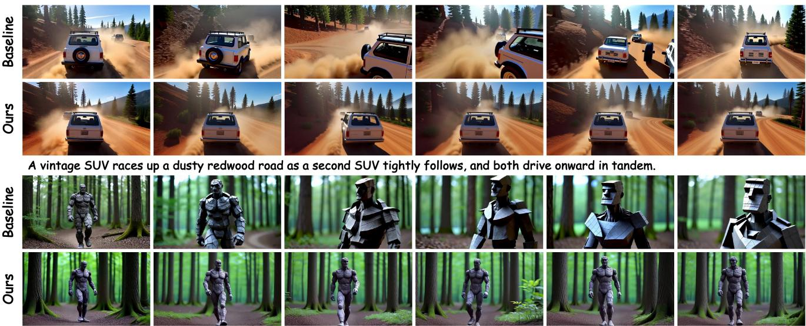  
A full-body rock man walking through a dense forest, with a rugged gray-brown stone texture and small ripples beneath his feet.

Figure 1. Minute-long generation, consistent and dynamic. Two pairs of one-minute videos generated by the same base model, without (Baseline) and with (Ours) RECAP-Forcing applied training-free at inference. As the minute unfolds, the baseline gradually loses content identity and begins to drift and degrade: the trailing SUV dissolves into dust and duplicates, while the rock man fractures and veers off his path. In contrast, RECAP-Forcing preserves subject identity and visual consistency, without sacrificing motion dynamics.

## Abstract

Long autoregressive video generation faces a fundamental memory challenge: with a finite attention window, a model must decide which informationfrom an ever-expanding history to retain. Existing methods organize memory temporally, preserving recent frames while compressing or discarding older ones. We instead propose RECAP-Forcing, organizing memory by appearance novelty. A long video is not merely a sequence offrames, but an evolving cast of subjects, objects, and scenes whose identities must remain consistent over time. We organize memory by retaining the KV cache associated with newly appearing content—such as entering subjects, disoccluded regions, and newly introduced scenes—at the moment it first becomes visible, prioritizing novelty over recency. Memory should scale with the amount of newly introduced content, rather than with video length. This appearance-indexed memory makes long-range consistency an explicit property of the memory structure. Our framework unifies two mechanisms

under this single principle. At the beginning of a video, when all visible content is novel, an attention sink preserves the initial scene. As the video evolves, an optical-flowbased novelty bank extends the same principle by selectively retaining newly revealed content. As a training-free inference method with no additional learnable parameters, RECAP-Forcing consistently improves visual quality and semantic fidelity across multiple strong baselines and outperforms existing memory methods. Project page: https: //xxuhaiyang.github.io/RECAP-Forcing/

## 1. Introduction

Generating long videos autoregressively is fundamentally a memory problem. A causal video model produces a video block by block [8, 25, 76, 91], but its attention budget prevents it from revisiting every previously generated frame. At each step, it must decide what to retain and what to discard or compress [25, 70, 80]. Therefore, we ask a basic question in this paper: what should a long video remember, and how should that memory be organized?

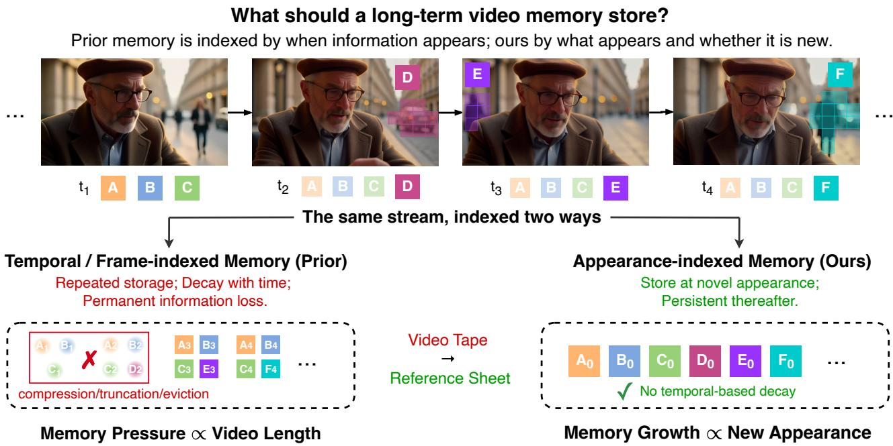  
Figure 2. What should a long-term video memory store? The same rollout, indexed two ways. Top: the man is recorded at his first appearance (t1); each later frame depicts something new: a passing car (t2), a pedestrian (t3), another passer-by (t4). Bottom Left: frameindexed memory re-stores old and new content alike at every step, then compresses or evicts it as time passes, so memory pressure grows with video length. Bottom Right: appearance-indexed memory (RECAP-Forcing) stores content when it newly appears, at canonical temporal position 0, memory scales with the amount of newly appearing content, not with its duration.

Existing methods organize memory primarily along the axis of time (Fig. 2, bottom left). Sliding-window methods retain recent frames and discard older ones, while recency-based caches preserve the near past at high fidelity and allocate progressively less capacity to the distant past [23, 65, 80] via compression. Although intuitive, this strategy creates a fundamental tension. As earlier content is progressively discarded or compressed, the model loses detailed access to the original visual evidence. Small deviations can therefore accumulate, causing the generated content to gradually drift away from its earlier appearance. Permanently retaining references can mitigate this problem, but excessive reliance on a fixed anchor pulls later generations toward the same appearance and suppresses motion, resulting in freeze. Recency-based memory is therefore caught between forgetting the past and over-anchoring to it.

We instead organize memory around appearance novelty (Fig. 2, bottom right). Time-indexed memory asks when content was seen; appearance-indexed memory asks what was seen that is worth remembering. A long video is not merely a sequence of frames to be compressed according to age; it is a growing cast of subjects, objects, and backgrounds whose identities should remain consistent over time. Memory should therefore preserve content at the moments it becomes newly visible, rather than retaining only its most recent observations: in Fig. 2, the man is stored at his first appearance and, while he remains on screen, no already-seen part of him is stored again; newly content (passing car and pedestrian) is admitted the moment it enters. At each novel appearance event—content entering the frame, a newly revealed region, or a new viewpoint of a subject already present—we store its KV cache and retain them by novelty rather than by recency. Records compete on how novel they were at admission, never on how recently they were seen. Memory thus grows with the amount of new content, not with video length, and content introduced at second three remains directly accessible at minute five. Because its original keys and values are retained persistently rather than temporally compressed, the model can faithfully reach that content and keep consistent. Long-range consistency thus becomes a consequence of memory organization, rather than something the model must reconstruct.

This principle unifies two mechanisms that may initially appear unrelated. Prior work treats the attention sink (the first few latent frames) as a mechanism for maintaining content consistency [13, 70, 91]. We find, however, that its default influence is often insufficient to prevent object and subject drift, tending instead to preserve coarse appearance attributes such as color tone and overall visual style. A reinforced sink is required to maintain subject and object consistency, turning the initial frames into the video’s first appearance memory. This interpretation naturally motivates a mechanism for remembering content introduced later in the video. We therefore introduce an optical-flow-based novelty bank, where optical-flow cues [58] detect novel appearance events: such as entrances, disocclusions, and newly revealed regions, and store the corresponding KV cache in the memory. The memory unit is a patch at the moment it first appears, rather than an explicitly identified entity. Together, the attention sink and novelty bank instantiate the same principle at different stages of generation: record what appears and retain it.

The two components together alleviate the drift–freeze trade-off. The reinforced sink anchors the opening scene and improves long-range subject and object consistency. The novelty bank continually admits newly introduced content, allowing the model to preserve the consistency of content introduced later, thereby maintaining dynamics. Equipped with these two forms of mechanisms, appearanceindexed memory preserves what has already been established while continuing to admit what is new.

Our main contributions are summarized as follows:

• A new axis for long-video memory: appearance novelty rather than recency. We propose organizing autoregressive video memory by appearance novelty instead of temporal recency. Content is recorded at its novel appearance events—its entrance and subsequent novel observations, such as new viewpoints or newly revealed regions—so that each subject accumulates a sparse set of appearance anchors. This formulation alleviates the tension between long-range identity drift and motion freeze.

• RECAP-Forcing, a training-free mechanism. RECAP-Forcing combines a permanent attention sink, reinterpreted as memory of the opening scene, with an opticalflow-based novelty bank that extends appearance-indexed memory to new content introduced later in the video.

• Broad validation across models and memory strategies. We demonstrate that RECAP-Forcing consistently improves multiple strong video generation baselines [10, 25, 70, 78] and outperforms existing temporal recency based memory methods [31, 34, 73].

## 2. Related Work

Autoregressive Video Diffusion Models. Latent diffusion [49] with transformer backbones [48] has become the standard recipe for high-quality video generation [4, 24, 32, 57, 71], with recent systems scaling this paradigm further [5]. While most are bidirectional and jointly denoise fixed-length clips, recent work enables autoregressive generation by conditioning frames or blocks on past context, often with step distillation for real-time inference [74, 75]. Diffusion Forcing [8] unifies next-token prediction and diffusion through per-token noise levels. CausVid [76] distills a bidirectional teacher into a causal student, while Self-Forcing [25] reduces the train–test exposure gap [3] using student rollouts. Follow-ups extend rollout horizons [13], supervise information written into the KV cache [92], and perturb conditioning context for robustness [69]. Other variants improve causal distillation for quality and efficiency [36, 37, 86, 91], physical plausibility [85], or flexible causal–bidirectional generation [43]; rolling and chunkwise methods similarly generate through bounded windows [10, 38, 50, 51]. These methods face a fundamental drift–stability trade-off: persistent early context suppresses drift but can also suppress motion. RECAP-Forcing is complementary to these training-based approaches: it operates entirely at inference on distilled causal models and directly rebalances this trade-off.

Memory for Long Video Generation. Long-horizon generation requires preserving information beyond the active attention window. Existing methods organize memory primarily by recency. Temporal/recency-based methods retain recent context through sliding windows or KV caches [25, 70], introduce short- and long-term anchors [23], compress past frames temporally [80], or use chunked continuation for minute-long or nominally infinite generation [7, 9, 21, 33, 78]. Relevance-based methods retrieve frames by geometric overlap [62, 77], route queries to selected context chunks [6], or maintain adaptive memory banks [11, 29, 67]. Related world models preserve longterm geometry and world state [17, 42, 55, 56, 64], supported by dedicated corpora [22], while other approaches retrain generators with geometric, reference, or reward objectives [2, 18, 60, 63, 89]. Multi-shot methods instead maintain consistency across cuts through keyframe or longcontext conditioning [20, 59, 66, 84], cross-shot attention [30, 46, 88], explicit shot or entity memory [1, 19, 79, 90], positional or streaming modifications [41, 61], and training-free reference or agentic control [15, 26, 82].

A closely related line organizes the KV cache as memory directly. Inspired by attention sinks in streaming language models [65] and heavy-hitter eviction [83], trainingfree video methods replay the initial sink [34, 73], compress evicted states [31], gate cache admission by relevance [45], or summarize frames by surprise [53]. SlotMemory [39] learns object-centric semantic slots as routing addresses for original KV tokens, with prompt- and visual-relevancebased retrieval and eviction. Others restructure caches across heads [52], absorb history into model weights [16], modify temporal positional encoding [14, 72], or intervene through spectral anchoring [35] and sampling-time guidance [68, 81]. Trained counterparts learn related sink-plusmemory structures [12, 44, 87], while Reward Forcing [40] combines compressed memory with motion.

Across these approaches, memory is selected or organized through compression, pruning, semantic structure, or query-dependent relevance. In contrast, we retain original mid-video KV cache according to appearance novelty. Newly appearing content is stored directly, yielding a query-agnostic, novelty-indexed memory bank.

## 3. Method

RECAP-Forcing answers the question: what should a longterm memory remember? First, we revisit causal autoregressive video generation models and their bounded memory (Sec. 3.1). Then, we argue that long-term memory should be indexed by appearance novelty rather than by time, and that content needs be recorded at its novel appearance events (Sec. 3.2). Two mechanisms follow: the opening frame is entirely new by construction, so we turn the model’s existing attention sink into an explicit firstimpression memory (Sec. 3.2.1), while every later frame contributes what is new relative to what has been seen, which optical flow detects and a memory bank retains (Sec. 3.2.2).

## 3.1. Preliminaries

We revisit causal, block-wise video generation models such as Self-Forcing [25], which distill a bidirectional video diffusion transformer [48, 57] into a few-step causal generator with distribution matching distillation [74, 75]. A video is produced as a stream of blocks of b frames; each frame is patchified into f tokens, and a block is denoised conditioned only on a bounded, sliding KV cache of the most recent L frames, implemented as rotary [54] self-attention with a fixed-width cache. The bound keeps per-block compute constant and enables arbitrary-length generation.

To counter the resulting drift, sink-augmented backbones such as LongLive [70] keep the first s frames as a permanent attention sink: its tokens stay cached, and their rotary phase is re-applied at retrieval so the anchor never appears at a distance the distilled model never trained on. The sink mechanism itself predates RECAP-Forcing: on backbones that lack it $( \mathrm { e . g . }$ , vanilla Self-Forcing), our plug-in instantiates the same sink at inference, under the single setting shared across all experiments. Every query attends over

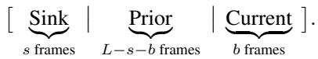

(1)

## 3.2. What Should a Long Video Remember?

The cache in Eq. (1) forgets by construction: once a token scrolls past the window, it is gone, and the opening frame is its sole survivor. As more of the early visual context is discarded, the model retains progressively less information about the original appearance. Small inconsistencies can therefore accumulate over time, gradually causing the generated content to drift from its earlier identity.

The prevailing diagnosis is recency-based memory. Sliding windows keep the most recent frames and discard the rest; recency caches and importance-by-recency compression keep the near past at full fidelity and squeeze the far past into a shrinking budget [23, 65, 80]. Recent trainingfree methods follow the same axis: widening the sink and pruning by attention participation [73], compressing evicted keys into a few memory tokens [31], or cyclically replaying the states of the first seconds [34]. They share one assumption: that rendering a subject consistently at $t { = } 6 0 \mathrm { s }$ means reaching back through the timeline to when it was last seen, so the remedy is to store more of that timeline.

We argue the premise is wrong. A long video does not need its timeline; it needs its cast. An entity’s appearance is established by a sparse set of novel appearance events— its entry and the later sightings of newly revealed parts— and nothing about the intervening forty seconds is required to render it faithfully to keep consistency. Memory should therefore be indexed by appearance: record content when it is newly revealed, and allocate the fixed capacity by novelty rather than by recency, so that what survives is decided by what appeared, not by when it appeared.

This raises a natural question: what counts as new? The answer has two exhaustive cases. At t=0 nothing has been seen, so the opening frame is new in its entirety (Sec. 3.2.1); afterwards, content is new only relative to what has already appeared—an object entering the frame, a region disoccluded by motion, a style introduced by a change of scene (Sec. 3.2.2).

## 3.2.1. The First Frame: from Stability Anchor to First-Impression Memory

The opening frame is entirely novel content, and sinkaugmented backbones already retain it permanently as the attention sink; where the backbone has none, the plug-in instantiates one (Sec. 3.1). Attention sinks are known to stabilize streaming generation, which motivates their adoption [65, 70]. But it is worth asking what they actually stabilize. We find that, under the default attention distribution, later queries assign insufficient weight to the sink. As a result, the sink mainly anchors global appearance characteristics (color tone, background, and overall style )and helps prevent quality degradation, while the identity of subjects introduced in the opening scene can still drift.

We therefore strengthen the sink attention, promoting it from a stability anchor to a persistent first-impression memory that is more strongly attended to by queries, thereby better preserving subject identity over time. For a query q attending to keys $\{ \mathbf { k } _ { j } \}$ , we add a fixed positive bias to the pre-softmax logits:

$$
\alpha _ { j } = \mathrm { s o f t m a x } _ { j } \left( \frac { \mathbf { q } ^ { \top } \mathbf { k } _ { j } } { \sqrt { d } } + \beta _ { j } \right) , \beta _ { j } = \left\{ \begin{array} { l l } { \ln \lambda , } & { j \in \mathrm { S i n k } , } \\ { 0 , } & { \mathrm { o t h e r w i s e } , } \end{array} \right.\tag{2}
$$

where $\lambda > 1$ is the reinforcement factor. Adding ln λ multiplies each sink key’s unnormalized attention weight by $\lambda ,$ uniformly increasing the sink’s prior importance while preserving content-based selection through query–key similarity. Applying the bias before the softmax keeps the distribution normalized: sink keys still compete with all other keys, and attention elsewhere is compressed proportionally. The bias is also directly compatible with fused attention kernels. Its magnitude is a measurement rather than a choice: we set $\lambda = 5 ,$ , with its effect analyzed later in Fig. 4.

## 3.2.2. Every Frame After: An Optical-Flow Novelty Bank

The reinforced sink covers the opening scene, but a long video continually introduces new content: a second subject enters the frame, a camera pan reveals a storefront, or an occluded region becomes visible. After $t { = } 0 ,$ , “new” therefore means content that has not been observed before, making novelty detection a property of the video stream rather than of the model’s current query. Optical flow provides a direct cue: a patch is novel when it enters the field of view, becomes disoccluded without a traceable antecedent, or reveals previously unseen content under a change in viewpoint. We detect these appearance events with RAFT [58] and retain the most novel patches observed so far in a fixed set of K additional KV slots. Admission is query-agnostic: patches are retained according to visual appearance novelty rather than query–key affinity, without entity grouping or re-identification. This forms the memory bank:

$$
\Big [ \operatorname { S i n k } \Big | \underbrace { \mathrm { M e m o r y ~ B a n k } } _ { K \operatorname { s l o t s } } \ \Big | \ \operatorname { P r i o r } \big | \ \mathrm { C u r r e n t } \ \Big ] .\tag{3}
$$

The bank capacity K is a configurable memory budget rather than an architectural constant. For the one-minute videos considered in our experiments, we find that one frame’s worth of tokens $( K { = } 1 , 5 6 0 )$ provides a good tradeoff and use this setting throughout; see Tab. 4 for the ablation. Longer videos, or videos with more frequent novel appearances, can naturally allocate additional slots to accommodate the increased memory demand.

Appearance Novelty. For each newly decoded frame $x _ { t } ,$ we estimate forward and backward RAFT flow to its predecessor $x _ { t - 1 }$ , where $F _ { a  b } ( u )$ denotes the optical-flow displacement from pixel u in frame a to frame b. A pixel u of $x _ { t }$ is regarded as newly appeared when its backtrace $u ^ { \prime } = u + F _ { t  t - 1 } ( u )$ finds no reliable antecedent in $x _ { t - 1 } .$ the forward–backward cycle residual $e _ { \mathrm { c y c } } ( u ) =$ $\| F _ { t  t - 1 } ( u ) + F _ { t - 1  t } ( u ^ { \prime } ) \|$ exceeds $\tau _ { \mathrm { c y c } } ,$ the photometric residual $e _ { \mathrm { p h o } } ( u ) = | x _ { t } ( u ) - x _ { t - 1 } ( u ^ { \prime } )$ | exceeds $\tau _ { \mathrm { p h o } }$ , or $u ^ { \prime }$ falls outside the frame. Such pixels receive

$$
\nu ( u ) = e _ { \mathrm { c y c } } ( u ) + \alpha e _ { \mathrm { p h o } } ( u ) ,\tag{4}
$$

where α balances the two residuals; all other pixels score 0.

The map of already-claimed novelty is propagated with the flow, so continuously traceable content fires only once, when it first appears. If a region returns after its flow correspondence has been broken, it can register as a new appearance event and receive a new anchor. For a patch p,

$$
s ( p ) = \operatorname* { m a x } _ { u \in p } \nu ( u ) , \qquad \hat { s } ( p ) = \frac { s ( p ) } { \operatorname* { m a x } ( \rho _ { b } , 1 ) } ,\tag{5}
$$

(a) Online Memory Enqueue

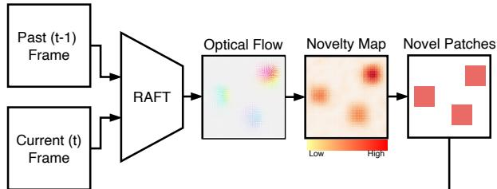

Retrieve Corresponding Per-Layer KV Cache  
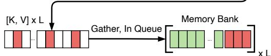  
(b) Visualization of Selected Memory Patches

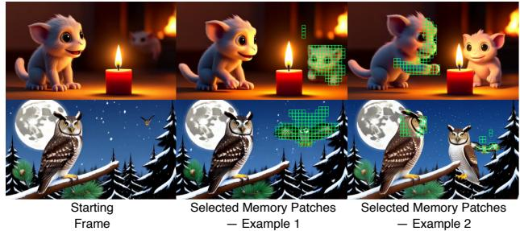  
Figure 3. The optical-flow novelty bank. (a) For every pair of consecutive frames, RAFT flow is aggregated into the per-patch novelty score of Eq. (4), and the newly appearing patches are selected. Their per-layer key/value vectors are gathered from the KV cache (temporal RoPE phase reset to zero) and added to the bank together with their scores; the bank keeps the top-K $( K { = } 1 , 5 6 0 )$ by score. (b) Selected memory patches (green) on two examples: entering subjects and newly visible parts of subjects.

where $\rho _ { b }$ is the $9 0 ^ { \mathrm { t h } }$ percentile of positive patch scores in temporal block b. We use $\tau _ { \mathrm { c y c } } = 2 \ \mathrm { p x } , \ \tau _ { \mathrm { p h o } } = 0 . 2$ , and $\alpha = 0 . 5$ throughout. This block-wise normalization prevents brief bursts of large motion from dominating the fixed budget, so admissions depend on relative novelty rather than absolute motion magnitude.

As illustrated in Fig. 3 (a), each newly decoded frame is compared with its predecessor using RAFT to obtain a novelty map, from which newly appearing patches are selected. For each selected patch, we copy the corresponding key/value vectors from every attention layer of the KV cache and store them with their frozen novelty scores. At retrieval, bank keys use temporal rotary phase 0 while retaining their original spatial phase, avoiding unseen longrange temporal RoPE offsets and treating the bank as a time-neutral appearance memory. The bank is then updated with a simple top-K rule: among all candidates observed so far, only the K highest-scoring patches are retained. Thus, memory retention is time-neutral and parameter-free: a patch remains in the bank according to its appearance novelty rather than how recently it was observed, without requiring a learned controller or an explicit recency term.

Table 1. Main results on VBench-Long [28], all 16 dimensions (128 prompts × 5 seeds, 60 s; higher is better). RECAP-Forcing (opticalflow memory bank + reinforced sink) is applied as the same training-free inference hook to every base model, each followed by its “+ Ours” row; for Self-Forcing we additionally report a plain, unreinforced sink (λ=1). Helios is 14B, all others are 1.3B. Abbreviations (first letter of each word): S.C. Subject Consistency, B.C. Background Consistency, T.F. Temporal Flickering, M.S. Motion Smoothness, D.D. Dynamic Degree, A.Q. Aesthetic Quality, I.Q. Imaging Quality; semantic suite: O.C. Object Class, M.O. Multiple Objects, H.A. Human Action, C. Color, S.R. Spatial Relationship, S. Scene, A.S. Appearance Style, T.S. Temporal Style, Ov.C. Overall Consistency Q./Sem./Total = official VBench aggregation (min–max normalized; quality = 7 dims with Dynamic Degree half-weighted, semantic = 9 dims, Total = (4 Q + Sem)/5). All values are percentages.
<table><tr><td>Method</td><td>S.C.</td><td>B.C.</td><td>T.F.</td><td>M.S.</td><td>D.D.</td><td>A.Q.</td><td>I.Q.</td><td>O.C.</td><td>M.O.</td><td>H.A.</td><td>C.</td><td>S.R.</td><td>S.</td><td>A.S.</td><td>T.S.</td><td>Ov.C.</td><td>Q.</td><td>Sem.</td><td>Total</td></tr><tr><td>Self-Forcing [25]</td><td>98.0</td><td>96.8</td><td>98.3</td><td>98.9</td><td>27.5</td><td>53.8</td><td>69.2</td><td>79.5</td><td>32.1</td><td>77.0</td><td>72.8</td><td>62.6</td><td>12.1</td><td>20.6</td><td>20.9</td><td>19.6</td><td>80.4</td><td>58.0</td><td>75.9</td></tr><tr><td>+ Sink (λ=1)</td><td>98.2</td><td>97.0</td><td>98.3</td><td>98.9</td><td>30.4</td><td>53.3</td><td>67.9</td><td>89.2</td><td>41.1</td><td>75.1</td><td>78.2</td><td>73.6</td><td>14.6</td><td>20.4</td><td>20.3</td><td>21.2</td><td>80.4</td><td>62.3</td><td>76.8</td></tr><tr><td>+ Ours</td><td>97.7</td><td>96.3</td><td>97.4</td><td>98.5</td><td>58.1</td><td>58.4</td><td>70.9</td><td>91.8</td><td>47.3</td><td>77.1</td><td>94.6</td><td>68.4</td><td>17.7</td><td>18.7</td><td>22.8</td><td>22.1</td><td>82.9</td><td>65.5</td><td>79.5</td></tr><tr><td>Infinite-Forcing [10]</td><td>97.4</td><td>95.9</td><td>97.1</td><td>98.4</td><td>61.3</td><td>55.8</td><td>68.8</td><td>93.6</td><td>49.9</td><td>74.1</td><td>81.9</td><td>64.0</td><td>12.3</td><td>18.6</td><td>22.9</td><td>21.9</td><td>82.2</td><td>62.9</td><td>78.3</td></tr><tr><td>+ Ours</td><td>97.4</td><td>96.0</td><td>97.2</td><td>98.4</td><td>71.3</td><td>57.5</td><td>68.8</td><td>97.1</td><td>48.9</td><td>75.7</td><td>96.1</td><td>63.4</td><td>15.1</td><td>18.5</td><td>23.0</td><td>22.2</td><td>83.3</td><td>65.4</td><td>79.7</td></tr><tr><td>LongLive [70]</td><td>98.7</td><td>97.0</td><td>98.5</td><td>99.2</td><td>20.3</td><td>57.1</td><td>71.6</td><td>98.2</td><td>52.2</td><td>75.9</td><td>80.4</td><td>80.5</td><td>14.8</td><td>18.1</td><td>22.7</td><td>22.6</td><td>|81.2</td><td>65.9</td><td>78.1</td></tr><tr><td>+ Ours</td><td>98.5</td><td>97.0</td><td>98.5</td><td>99.1</td><td>26.6</td><td>57.3</td><td>71.0</td><td>98.4</td><td>50.7</td><td>76.7</td><td>82.7</td><td>80.4</td><td>19.5</td><td>17.9</td><td>23.0</td><td>22.8</td><td>81.5</td><td>66.8</td><td>78.5</td></tr><tr><td>Helios [78]</td><td>95.8</td><td>97.4</td><td>98.6</td><td>99.1</td><td>36.2</td><td>45.2</td><td>49.0</td><td>36.1</td><td>8.9</td><td>66.7</td><td>53.6</td><td>49.0</td><td>4.6</td><td>21.2</td><td>20.3</td><td>21.3</td><td>76.6</td><td>45.4</td><td>70.3</td></tr><tr><td>+ Ours</td><td>96.4</td><td>97.3</td><td>98.1</td><td>98.8</td><td>47.8</td><td>53.6</td><td>60.0</td><td>83.7</td><td>28.5</td><td>80.0</td><td>72.2</td><td>63.4</td><td>18.6</td><td>19.3</td><td>22.2</td><td>23.7</td><td>80.2</td><td>60.5</td><td>76.3</td></tr></table>

Table 2. Comparison of RECAP-Forcing with other training-free methods. Same evaluation settings on VBench-Long as in Tab. 1.
<table><tr><td>Method</td><td>S.C.</td><td>B.C.</td><td>T.F.</td><td>M.S.</td><td>D.D.</td><td>A.Q.</td><td>I.Q.</td><td>O.C.</td><td>M.O.</td><td>H.A.</td><td>C.</td><td>S.R.</td><td>S.</td><td>A.S.</td><td>T.S.</td><td>Ov.C.</td><td>Q.</td><td>Sem. Total</td></tr><tr><td>Self-Forcing</td><td>98.0</td><td>96.8</td><td>98.3</td><td>98.9</td><td>27.5</td><td>53.8</td><td>69.2</td><td>79.5</td><td>32.1</td><td>77.0</td><td>72.8</td><td>62.6 12.1</td><td>20.6</td><td>20.9</td><td>19.6</td><td>80.4</td><td>58.0</td><td>75.9</td></tr><tr><td>+ Deep Forcing [73]</td><td>98.4</td><td>93.7</td><td>98.2</td><td>94.8</td><td>32.0</td><td>55.9</td><td>71.8</td><td>98.3</td><td>48.5</td><td>76.6 82.9</td><td>73.1</td><td>21.8</td><td>18.3</td><td>23.0</td><td>22.3</td><td>78.7</td><td>66.1</td><td>76.2</td></tr><tr><td>+ MemRoPE [31]</td><td>98.4</td><td>96.7</td><td>98.0</td><td>99.0</td><td>41.2</td><td>56.6</td><td>73.1</td><td>94.2</td><td>44.1</td><td>76.6 84.8</td><td>68.4</td><td>15.9</td><td>19.1</td><td>21.8</td><td>21.1</td><td>82.4</td><td>63.6</td><td>78.7</td></tr><tr><td>+ Rolling Sink [34]</td><td>98.9</td><td>97.3</td><td>98.7</td><td>99.2</td><td>23.0</td><td>58.3</td><td>72.6</td><td>97.9</td><td>48.2</td><td>80.7 90.3</td><td>76.5</td><td>17.6</td><td>18.2</td><td>23.2</td><td>22.5</td><td>81.8</td><td>67.1</td><td>78.9</td></tr><tr><td>+ Ours</td><td>97.7</td><td>96.3</td><td>97.4</td><td>98.5</td><td>58.1</td><td>58.4</td><td>70.9</td><td>91.8</td><td>47.3</td><td>77.1 94.6</td><td>68.4</td><td>17.7</td><td>18.7</td><td>22.8</td><td>22.1</td><td>82.9</td><td>65.5</td><td>79.5</td></tr></table>

Fig. 3 (b) illustrates what the criterion admits in practice. Slots are assigned to novel appearances rather than motion magnitude or recency. A newly entering subject is captured as soon as it becomes visible, as with the second monster and the additional owls. The same rule also admits newly revealed parts of an existing subject, such as the first monster’s head and paws or the first owl’s turned face, preserving appearance cues that a recency window would discard after the pose changes. Continuously traceable, unchanged regions do not repeatedly trigger the detector, so the fixed budget is reserved for newly revealed appearance cues that later frames may need to match.

## 4. Experiments

Setup. We evaluate on VBench-Long [27, 28] and report its sixteen long-video metrics. In order to obtain a stable comparison, we average over 128 prompts and 5 different seeds. Videos are 60 seconds (240 latent frames).

## 4.1. Quantitative Results

Main Results on VBench-Long. In Tab. 1, we report RECAP-Forcing’s performance based on four different video generation models: Self-Forcing [25], Infinite-Forcing [10], LongLive [70], and Helios [78]. On the Self-Forcing baseline, adding a plain, unreinforced sink already helps (75.9 → 76.8 Total) but recovers little motion (Dynamic Degree 27.5 → 30.4); RECAP-Forcing more than doubles the dynamic degree to 58.1 while improving aesthetic and imaging quality. On Infinite Forcing [10], whose sink already raises dynamic degree to 61.3, RECAP-Forcing further increases it to 71.3 (+10.0), with a clear gain in overall score from 78.3 to 79.7. Compared with the 1.3B LongLive [70] and the 14B Helios [78], RECAP-Forcing can still consistently improve the performance. Thus, RECAP-Forcing improves long-video dynamics on both backbones without sacrificing consistency or visual quality.

Comparison with Other Training-Free Methods. We compare RECAP-Forcing with three latest training-free long video generation methods on Self-Forcing in Tab. 2. While Deep Forcing [73], MemRoPE [31], and Rolling Sink [34] improve selected metrics, they recover substantially less motion, with Dynamic Degree ranging from 23.0 to 41.2 versus 58.1 for RECAP-Forcing. RECAP-Forcing achieves the best overall score (79.5) while remaining competitive in temporal consistency. This suggests that RECAP-Forcing provides a better balance of long-term dynamics, stability, and visual quality.

## 4.2. Ablation Study

We use Infinite-Forcing [10] for the ablation study because vanilla Self-Forcing [25] has no sink frame: attaching RECAP-Forcing to it instantiates the sink, so a component ablation there would conflate creating the sink with reinforcing it. Infinite-Forcing, a Self-Forcing variant retrained with a sink frame, already carries the sink, so the reinforcement and the bank can be ablated cleanly.

Ablation of Components. Tab. 3 reveals a clear temporal division of labor between the two components. The reinforced sink mainly anchors information established early in the generation, which improves consistency and semantic quality, but can overly constrain later evolution, as reflected by the drop in Dynamic Degree (61.3 → 41.6). In contrast, the memory bank helps retain and incorporate information that emerges or evolves over time, substantially increasing Dynamic Degree (61.3 → 78.2), with only minor reductions in consistency and visual quality. When used together, the reinforced sink provides a stable foundation for earlier content, while the memory bank allows later and more dynamic content to develop without drifting from it. As a result, the full model achieves the best overall score (79.7).

Table 3. Ablation of the reinforced sink and memory bank.
<table><tr><td>Sink</td><td>Reinf. Memory Bank</td><td></td><td></td><td></td><td></td><td>S.C. B.C. M.S. D.D. A.Q. I.Q.</td><td></td><td>Q.</td><td>Sem.</td><td>Total</td></tr><tr><td>X</td><td>X</td><td>97.4</td><td>95.9</td><td>98.4</td><td>61.3</td><td>55.8</td><td>68.8</td><td>82.2</td><td>62.9</td><td>78.3</td></tr><tr><td>√</td><td>X</td><td>98.2</td><td>96.7</td><td>98.8</td><td>41.6</td><td>57.8</td><td>68.9</td><td>81.9</td><td>65.2</td><td>78.6</td></tr><tr><td>X</td><td>√</td><td>96.8</td><td>95.5</td><td>98.1</td><td>78.2</td><td>55.2</td><td>68.5</td><td>82.8</td><td>63.0</td><td>78.8</td></tr><tr><td>√</td><td>√</td><td>97.4</td><td>96.0</td><td>98.4</td><td>71.3</td><td>57.5</td><td>68.8</td><td>83.3</td><td>65.4</td><td>79.7</td></tr></table>

Ablation on Bank Capacity and Sink-Reinforcement Strength. As shown in Tab. 4, increasing the bank capacity from f = 1 to 2 or 4 yields only marginal improvements in the Total score, while a larger capacity of f = 8 reduces it to 79.3. Given the additional memory and computational overhead of larger banks, we use f = 1 by default. For sink-reinforcement strength, increasing λ from 1 to 5 improves the Total score from 78.8 to 79.7, whereas further increasing λ consistently degrades performance, yielding 79.2, 78.9, and 78.6 at λ = 8, 10, 12, respectively. We therefore set λ = 5 as the default. The diagnostic sweep in Fig. 4 further explains this trade-off: increasing λ progressively directs more attention to the sink, while Subject Consistency remains largely saturated and Dynamic Degree begins to deteriorate under stronger reinforcement. This suggests that moderate sink reinforcement is sufficient to leverage the opening-scene information, whereas excessive reinforcement can over-constrain the model’s dynamics.

Table 4. Ablations on bank capacity and sink-reinforcement strength. Bold columns denote the default settings.
<table><tr><td></td><td></td><td colspan="5">Bank Capacity (frame)</td><td colspan="7">Sink-Reinforcement Strength (λ)</td></tr><tr><td>Metric</td><td>1/4</td><td>1/2</td><td>1</td><td>2</td><td>4</td><td>8</td><td>1</td><td>3</td><td>5</td><td></td><td>8</td><td>10</td><td>12</td></tr><tr><td>Q.</td><td>83.0</td><td>83.2</td><td>83.1</td><td>83.4</td><td>83.3</td><td>82.9</td><td>82.8</td><td>83.0</td><td>83.1</td><td></td><td>82.7</td><td>82.5</td><td>82.2</td></tr><tr><td>Sem.</td><td>66.0</td><td>65.8</td><td>65.7</td><td>65.4</td><td>65.9</td><td>65.1</td><td></td><td>63.0</td><td>64.5</td><td>65.7</td><td>65.2</td><td>64.4</td><td>64.1</td></tr><tr><td>Total</td><td>79.6</td><td>79.7</td><td>79.7</td><td>79.8</td><td>79.8</td><td>79.3</td><td></td><td>78.8</td><td>79.3</td><td>79.7</td><td>79.2</td><td>78.9</td><td>78.6</td></tr></table>

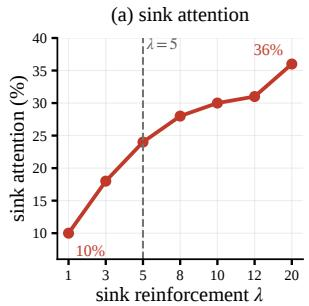

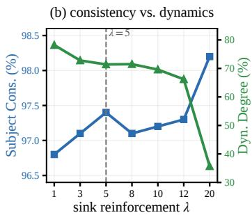  
Figure 4. λ Sweep (on 128 prompts × 5 seeds). (a) λ smoothly sets attention on the sink: ∼24% at λ=5. (b) Subject Consistency is already saturated while Dynamic Degree erodes past λ≈8.

## 4.3. Human Study

We further conduct a human study to evaluate long video quality beyond automatic metrics. We have 9 participants, each of whom completes 24 blind pairwise comparisons, resulting in 216 judgments in total. In each trial, participants are shown two anonymized videos side by side. We compare RECAP-Forcing against baseline [25] and three competitors [31, 34, 73]. Participants evaluate each pair along three dimensions: Consistency, Motion, and Overall quality. Judgments marked as HARD TO SAY are treated as ties when computing win rates, with each tie contributing half a win. Specifically, the win rate is computed as $( W + 0 . 5 T ) / N$ , where W and T denote the numbers of wins and HARD TO SAY judgments, respectively, and N is the total number of comparisons. As shown in Tab. 5, RECAP-Forcing is consistently preferred over all competing methods. These results show that the improvements of RECAP-Forcing are clearly perceptible to human.

Table 5. Human study results. Win rates of RECAP-Forcing in blind pairwise comparisons against each competitor. “T” denotes the number of HARD TO SAY judgments, which are treated as ties and assigned 0.5 credit to win rates.
<table><tr><td>Competitor</td><td>Consistency</td><td>Motion</td><td>Overall</td><td>n</td></tr><tr><td>Self-Forcing [25]</td><td>85.2% (6T)</td><td>76.9% (7T)</td><td>84.3% (3T)</td><td>54</td></tr><tr><td>Deep Forcing [73]</td><td>73.1% (15T)</td><td>76.9% (5T)</td><td>77.8% (4T)</td><td>54</td></tr><tr><td>MemRoPE [31]</td><td>84.3% (7T)</td><td>67.6% (5T)</td><td>75.0% (3T)</td><td>54</td></tr><tr><td>Rolling Sink [34]</td><td>82.4% (7T)</td><td>76.9% (5T)</td><td>79.6% (6T)</td><td>54</td></tr><tr><td>All</td><td>81.3% (35T)</td><td>74.5% (22T)</td><td>79.2% (16T)</td><td>216</td></tr></table>

## 4.4. Qualitative Results

Fig. 5 compares one-minute rollouts with and without RECAP-Forcing on four prompts spanning photographic, claymation, and cartoon styles. The characteristic failures of recency memory surface by mid-video and compound from there: subjects lose identity or duplicate, a second subject that enters mid-video never stabilizes, and the scene’s style and layout gradually migrate away from the prompt. With RECAP-Forcing, the same base model holds subject identity, scene, and style through the full minute, including

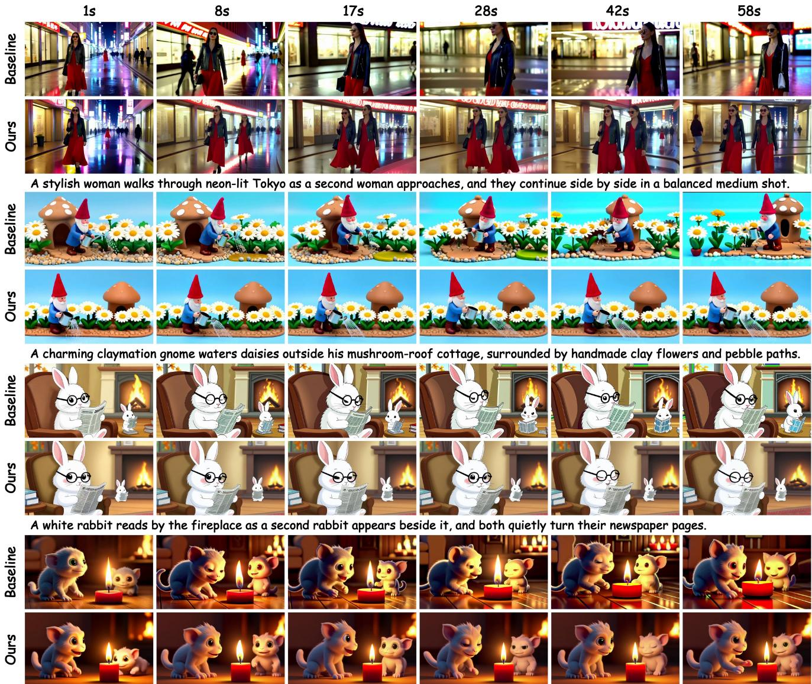  
A fluffy monster watches a candle as a second monster emerges from the shadows, and both gently reach toward the flame.

Figure 5. Qualitative results on four one-minute prompts. Across all scenes, the baseline loses subject identity, style, scale, or background consistency. In contrast, RECAP-Forcing preserves the subject(s) and the full scene throughout the minute.

subjects introduced long after the opening frame, while the motion remains natural rather than frozen. Full videos and additional examples are available on the project page.

## 5. Conclusion and Limitations

We presented RECAP-Forcing, a training-free memory mechanism that organizes finite memory by appearance novelty rather than temporal recency. It combines a reinforced attention sink that preserves the opening scene with an optical-flow-based novelty bank that retains newly appearing content. Applied to frozen causal backbones, RECAP-Forcing improves long-horizon dynamics while maintaining visual quality and consistency, outperforming existing training-free memory methods.

More broadly, our results suggest that appearance novelty provides a useful principle for organizing memory in long-form video generation, while motivating richer notions of novelty beyond the local correspondence used in our current implementation. Longer-range correspondence or higher-level semantic grouping could enable more selective and persistent memory allocation over extended generation. We hope this perspective provides a simple and general foundation for developing more adaptive memory mechanisms for long-form video generation.

Still, it relies on optical-flow correspondence, which may therefore repeatedly mark stochastic textures, such as rain, spray, or rippling water, as novel, consuming memory without adding meaningful new information.

Acknowledgement. This work is supported by U.S. National Science Foundation Award IIS-2433768 and IIS-2127544. This work also used DeltaAI at National Center for Supercomputing Applications (NCSA) through allocation CIS260420 from the Advanced Cyberinfrastructure Coordination Ecosystem: Services & Support (AC-CESS) program, which is supported by U.S. National Science Foundation grants #2138259, #2138286, #2138307, #2137603, and #2138296.

## References

[1] Zhaochong An, Menglin Jia, Haonan Qiu, Zijian Zhou, Xiaoke Huang, Zhiheng Liu, Weiming Ren, Kumara Kahatapitiya, Ding Liu, Sen He, Chenyang Zhang, Tao Xiang, Fanny Yang, Serge Belongie, and Tian Xie. Onestory: Coherent multi-shot video generation with adaptive memory. In CVPR, 2026. 3

[2] Zhaochong An, Orest Kupyn, Theo Uscidda, Andrea Colaco,´ Karan Ahuja, Serge Belongie, Mar Gonzalez-Franco, and Marta Tintore Gazulla. Vggrpo: Towards world-consistent video generation with 4d latent reward. In ECCV, 2026. 3

[3] Samy Bengio, Oriol Vinyals, Navdeep Jaitly, and Noam Shazeer. Scheduled sampling for sequence prediction with recurrent neural networks. In NeurIPS, 2015. 3

[4] Andreas Blattmann, Tim Dockhorn, Sumith Kulal, Daniel Mendelevitch, Maciej Kilian, Dominik Lorenz, Yam Levi, Zion English, et al. Stable video diffusion: Scaling latent video diffusion models to large datasets. arXiv preprint arXiv:2311.15127, 2023. 3

[5] Tim Brooks, Bill Peebles, Connor Holmes, Will DePue, Yufei Guo, Li Jing, David Schnurr, Joe Taylor, et al. Video generation models as world simulators. https: / / openai . com / index / video - generation - models-as-world-simulators/, 2024. OpenAI technical report. 3

[6] Shengqu Cai, Ceyuan Yang, Lvmin Zhang, Yuwei Guo, Junfei Xiao, Ziyan Yang, Yinghao Xu, Zhenheng Yang, Alan Yuille, Leonidas Guibas, et al. Mixture of contexts for long video generation. In ICLR, 2026. 3

[7] Xunliang Cai, Qilong Huang, Zhuoliang Kang, Hongyu Li, Shijun Liang, Liya Ma, Siyu Ren, Xiaoming Wei, Rixu Xie, and Tong Zhang. Longcat-video technical report. arXiv preprint arXiv:2510.22200, 2025. 3

[8] Boyuan Chen, Diego Mart´ı Monso, Yilun Du, Max Sim-´ chowitz, Russ Tedrake, and Vincent Sitzmann. Diffusion forcing: Next-token prediction meets full-sequence diffusion. In NeurIPS, 2024. 1, 3

[9] Guibin Chen, Dixuan Lin, Jiangping Yang, Chunze Lin, Junchen Zhu, Mingyuan Fan, Hao Zhang, Sheng Chen, et al. Skyreels-v2: Infinite-length film generative model. arXiv preprint arXiv:2504.13074, 2025. 3

[10] Junyi Chen, Zhoujie Fu, and Xianglong He. Infinite-forcing: Towards infinite-long video generation, 2025. https:// github.com/SOTAMak1r/Infinite-Forcing. 3, 6

[11] Kaijin Chen, Dingkang Liang, Xin Zhou, Yikang Ding, Xiaoqiang Liu, Pengfei Wan, and Xiang Bai. Out of sight but not out of mind: Hybrid memory for dynamic video world models. arXiv preprint arXiv:2603.25716, 2026. 3

[12] Shuo Chen, Cong Wei, Sun Sun, Ping Nie, Kai Zhou, Ge Zhang, Ming-Hsuan Yang, and Wenhu Chen. Context forcing: Consistent autoregressive video generation with long context. In ICML, 2026. 3

[13] Justin Cui, Jie Wu, Ming Li, Tao Yang, Xiaojie Li, Rui Wang, Andrew Bai, Yuanhao Ban, and Cho-Jui Hsieh. Self forcing++: Towards minute-scale high-quality video genera tion. arXiv preprint arXiv:2510.02283, 2025. 2, 3

[14] Justin Cui, Jie Wu, Ming Li, Tao Yang, Xiaojie Li, Rui Wang, Andrew Bai, Yuanhao Ban, and Cho-Jui Hsieh. Lol: Longer than longer, scaling video generation to hour. arXiv preprint arXiv:2601.16914, 2026. 3

[15] Mohamed Elmoghany, Liangbing Zhao, Xiaoqian Shen, Subhojyoti Mukherjee, Yang Zhou, Gang Wu, Viet Dac Lai, Seunghyun Yoon, Ryan Rossi, Abdullah Rashwan, et al. Infinitystory: Unlimited video generation with world consistency and character-aware shot transitions. arXiv preprint arXiv:2603.03646, 2026. 3

[16] Xiaomeng Fu, Jia Li, Yiming Hu, Yong Wang, Hayden Kwok-Hay So, Jiao Dai, Xiangxiang Chu, and Jizhong Han. Towards memory-efficient autoregressive video generation via instance-specific parametric absorption. arXiv preprint arXiv:2607.00712, 2026. 3

[17] Xiangbo Gao, Siyuan Yang, Ping He, Mingyang Wu, Yuheng Wu, Yushen Zuo, Jiongze Yu, Ryan Cui, Hongyuan Hua, Devin Ma, Xiao Jin, Yubo Yuan, Qing Yin, Jie Yang, and Zhengzhong Tu. Visko orbis 1.0: A live model for real-time interactive long video generation. arXiv preprint arXiv:2607.26694, 2026. 3

[18] Bohai Gu, Yueyang Yuan, Taiyi Wu, Dazhao Du, Jian Liu, Xiaoyi Pang, Jie Zhang, Xiaocheng Lu, Haobin Zhong, Xiaotong Zhao, Alan Zhao, and Song Guo. Worldcycle: Self-verifiable reinforcement learning for long-horizon video world models. arXiv preprint arXiv:2608.04964, 2026. 3

[19] Shuai Guo, Yuhang Yang, Zeyu Zhang, Pengfei Yu, Wei Zhai, Yang Cao, and Zheng-Jun Zha. Logishot: Logically coherent cross-shot video generation. arXiv preprint arXiv:2608.08820, 2026. 3

[20] Yuwei Guo, Ceyuan Yang, Ziyan Yang, Zhibei Ma, Zhijie Lin, Zhenheng Yang, Dahua Lin, and Lu Jiang. Long context tuning for video generation. In ICCV, 2025. 3

[21] Yoav HaCohen, Nisan Chiprut, Benny Brazowski, Daniel Shalem, Dudu Moshe, Eitan Richardson, Eran Levin, Guy Shiran, et al. Ltx-video: Realtime video latent diffusion. arXiv preprint arXiv:2501.00103, 2024. 3

[22] Kang He, Wenshuo Peng, Zihui Gao, Jiaming Tan, Kaipeng Zhang, and Yongtao Ge. Sekai2: From world explo ration to interactive world modeling. arXiv preprint arXiv:2608.09449, 2026. 3

[23] Roberto Henschel, Levon Khachatryan, Hayk Poghosyan, Daniil Hayrapetyan, Vahram Tadevosyan, Zhangyang Wang, Shant Navasardyan, and Humphrey Shi. Streamingt2v: Con sistent, dynamic, and extendable long video generation from text. In CVPR, 2025. 2, 3, 4

[24] Jonathan Ho, Tim Salimans, Alexey Gritsenko, William Chan, Mohammad Norouzi, and David J. Fleet. Video diffusion models. In NeurIPS, 2022. 3

[25] Xun Huang, Zhengqi Li, Guande He, Mingyuan Zhou, and Eli Shechtman. Self forcing: Bridging the train-test gap in autoregressive video diffusion. In NeurIPS, 2026. 1, 3, 4, 6, 7, 13

[26] Yuyang Huang, Yabo Chen, Wenrui Dai, Ziyang Zheng, Haibin Huang, Chi Zhang, Junni Zou, Hongkai Xiong, and Xuelong Li. Cineweaver: Training-free referencecontrollable multi-shot long video generation for cinematic storytelling. arXiv preprint arXiv:2607.26529, 2026. 3

[27] Ziqi Huang, Yinan He, Jiashuo Yu, Fan Zhang, Chenyang Si, Yuming Jiang, Yuanhan Zhang, Tianxing Wu, et al. Vbench: Comprehensive benchmark suite for video generative models. In CVPR, 2024. 6

[28] Ziqi Huang, Fan Zhang, Xiaojie Xu, Yinan He, Jiashuo Yu, Ziyue Dong, Qianli Ma, Nattapol Chanpaisit, et al. Vbench++: Comprehensive and versatile benchmark suite for video generative models. TPAMI, 2026. 6

[29] Sihui Ji, Xi Chen, Shuai Yang, Xin Tao, Pengfei Wan, and Hengshuang Zhao. Memflow: Flowing adaptive memory for consistent and efficient long video narratives. arXiv preprint arXiv:2512.14699, 2025. 3

[30] Ozgur Kara, Krishna Kumar Singh, Feng Liu, Duygu Ceylan, James M. Rehg, and Tobias Hinz. Shotadapter: Text-tomulti-shot video generation with diffusion models. In CVPR, 2025. 3

[31] Youngrae Kim, Qixin Hu, C.-C. Jay Kuo, and Peter A. Beerel. Memrope: Training-free infinite video generation via evolving memory tokens. In ECCV, 2026. 3, 4, 6, 7

[32] Weijie Kong, Qi Tian, Zijian Zhang, Rox Min, Zuozhuo Dai, Jin Zhou, Jiangfeng Xiong, Xin Li, et al. Hunyuanvideo: A systematic framework for large video generative models. arXiv preprint arXiv:2412.03603, 2024. 3

[33] Debang Li, Zhengcong Fei, Tuanhui Li, Yikun Dou, Zheng Chen, Jiangping Yang, Mingyuan Fan, Jingtao Xu, et al. Skyreels-v3 technique report. arXiv preprint arXiv:2601.17323, 2026. 3

[34] Haodong Li, Shaoteng Liu, Zhe Lin, and Manmohan Chandraker. Rolling sink: Bridging limited-horizon training and open-ended testing in autoregressive video diffusion. arXiv preprint arXiv:2602.07775, 2026. 3, 4, 6, 7

[35] Jiatong Li, Leo Liang, Linghe Kong, and Yulun Zhang. Freqforcing: Autoregressive long video generation via spectral self-anchoring. arXiv preprint arXiv:2607.27110, 2026. 3

[36] Zekun Li, Xiaoyan Cong, Hongyu Li, Zhiyang Dou, Chuan Guo, Abhay Mittal, Sizhe An, and Srinath Sridhar. Ms. forcing: Efficient streaming video generation with multi-scale patchification and attention. arXiv preprint arXiv:2607.20940, 2026. 3

[37] Hongyu Liu, Chun Wang, Feng Gao, Xuanhua He, Yue Ma, Ziyu Wan, Yong Zhang, Xiaoming Wei, and Qifeng Chen. Opsd-v: On-policy self-distillation for post-training few-step autoregressive video generators. arXiv preprint arXiv:2607.08766, 2026. 3

[38] Kunhao Liu, Wenbo Hu, Jiale Xu, Ying Shan, and Shijian Lu. Rolling forcing: Autoregressive long video diffusion in real time. In ICLR, 2026. 3

[39] Yilai Liu, Xin Zhang, Shiyuan Zhang, and Hongyang Du. Slotmem: Character-addressable internal mem ory for narrative long video generation. arXiv preprint arXiv:2607.15772, 2026. 3

[40] Yunhong Lu, Yanhong Zeng, Haobo Li, Hao Ouyang, Qiuyu Wang, Ka Leong Cheng, Jiapeng Zhu, Hengyuan Cao, et al. Reward forcing: Efficient streaming video generation with rewarded distribution matching distillation. In CVPR, 2026. 3

[41] Yawen Luo, Xiaoyu Shi, Junhao Zhuang, Yutian Chen, Quande Liu, Xintao Wang, Pengfei Wan, and Tianfan Xue. Shotstream: Streaming multi-shot video generation for interactive storytelling. In ECCV, 2026. 3

[42] Wenchao Ma, Changran Liu, Sharon X. Huang, and Haomiao Jiang. Closing the loop: Training-free revisit consistency for autoregressive generative rendering. arXiv preprint arXiv:2607.21848, 2026. 3

[43] Xinyin Ma, Julius Berner, Chao Liu, Arash Vahdat, Weili Nie, and Xinchao Wang. Flex-forcing: Towards a unified autoregressive and bidirectional video diffusion model. arXiv preprint arXiv:2607.03509, 2026. 3

[44] Xiaofeng Mao, Shaohao Rui, Kaining Ying, Bo Zheng, Chuanhao Li, Mingmin Chi, and Kaipeng Zhang. Packforcing: Short video training suffices for long video sampling and long context inference. In ECCV, 2026. 3

[45] Yu Meng, Xiangyang Luo, Letian Li, Wenyuan Jiang, Chen Gao, Xinlei Chen, Yong Li, and Xiao-Ping Zhang. Tethercache: Stabilizing autoregressive long-form video genera tion with gated recall and trusted alignment. arXiv preprint arXiv:2606.13035, 2026. 3

[46] Yihao Meng, Hao Ouyang, Yue Yu, Qiuyu Wang, Wen Wang, Ka Leong Cheng, Hanlin Wang, Shuailei Ma, et al. Holocine: Holistic generation of cinematic multi-shot long video narratives. In CVPR, 2026. 3

[47] Maxime Oquab, Timothee Darcet, Th´ eo Moutakanni, Huy´ Vo, Marc Szafraniec, Vasil Khalidov, Pierre Fernandez, Daniel Haziza, Francisco Massa, Alaaeldin El-Nouby, et al. Dinov2: Learning robust visual features without supervision. arXiv preprint arXiv:2304.07193, 2023. 13, 14

[48] William Peebles and Saining Xie. Scalable diffusion models with transformers. In ICCV, 2023. 3, 4

[49] Robin Rombach, Andreas Blattmann, Dominik Lorenz, Patrick Esser, and Bjorn Ommer. High-resolution image syn-¨ thesis with latent diffusion models. In CVPR, 2022. 3

[50] David Ruhe, Jonathan Heek, Tim Salimans, and Emiel Hoogeboom. Rolling diffusion models. In ICML, 2024. 3

[51] Sand.ai, Hansi Teng, Hongyu Jia, Lei Sun, Lingzhi Li, Maolin Li, Mingqiu Tang, Shuai Han, et al. Magi-1: Autoregressive video generation at scale. arXiv preprint arXiv:2505.13211, 2025. 3

[52] Jinliang Shen, Lianghao Su, Zheming Li, Kang He, ZiLiang Lai, Yanbing Jiang, and Chengru Song. Headcast: Casting attention heads for efficient autoregressive video generation. arXiv preprint arXiv:2607.20125, 2026. 3

[53] Shuwei Shi, Zhen Li, Muyao Niu, Chuanhao Li, Bo Zheng, Kaipeng Zhang, and Yinqiang Zheng. Surprise forcing: What to remember, when to skip in long video generation. arXiv preprint arXiv:2607.18436, 2026. 3

[54] Jianlin Su, Murtadha Ahmed, Yu Lu, Shengfeng Pan, Wen Bo, and Yunfeng Liu. Roformer: Enhanced transformer with rotary position embedding. Neurocomputing, 568:127063, 2024. 4

[55] Wenqiang Sun, Haiyu Zhang, Haoyuan Wang, Junta Wu, Zehan Wang, Zhenwei Wang, Yunhong Wang, Jun Zhang, Tengfei Wang, and Chunchao Guo. Worldplay: Towards long-term geometric consistency for real-time interactive world modeling. In ICML, 2026. 3

[56] AlayaWorld Team, Kaipeng Zhang, Chuanhao Li, Yifan Zhan, Yongtao Ge, Yuanyang Yin, Jiaming Tan, Kang He, Liaoyuan Fan, Mingliang Zhai, Ruicong Liu, Xiaojie Xu, Xuangeng Chu, Zhen Li, Zhengyuan Lin, Zhixiang Wang, Zian Meng, and Zihui Gao. Alayaworld: Interactive longhorizon world modeling – full technical report. arXiv preprint arXiv:2607.18367, 2026. 3

[57] Team Wan, Ang Wang, Baole Ai, Bin Wen, Chaojie Mao, Chen-Wei Xie, Di Chen, Feiwu Yu, et al. Wan: Open and advanced large-scale video generative models. arXiv preprint arXiv:2503.20314, 2025. 3, 4, 13

[58] Zachary Teed and Jia Deng. Raft: Recurrent all-pairs field transforms for optical flow. In ECCV, 2020. 3, 5, 13

[59] Bo Wang, Haoyang Huang, Zhiying Lu, Fengyuan Liu, Guoqing Ma, Jianlong Yuan, Yuan Zhang, Nan Duan, and Daxin Jiang. Storyanchors: Generating consistent multiscene story frames for long-form narratives. arXiv preprint arXiv:2505.08350, 2025. 3

[60] Lei Wang, YuXin Song, Ge Wu, Haocheng Feng, Hang Zhou, Jingdong Wang, Yaxing Wang, and Jian Yang. Refalign: Representation alignment for reference-to-video generation. In ECCV, 2026. 3

[61] Qinghe Wang, Xiaoyu Shi, Baolu Li, Weikang Bian, Quande Liu, Huchuan Lu, Xintao Wang, Pengfei Wan, Kun Gai, and Xu Jia. Multishotmaster: A controllable multi-shot video generation framework. In CVPR, 2026. 3

[62] Zun Wang, Han Lin, Jaehong Yoon, Jaemin Cho, Yue Zhang, and Mohit Bansal. Anchorweave: World-consistent video generation with retrieved local spatial memories. arXiv preprint arXiv:2602.14941, 2026. 3

[63] Haoyu Wu, Diankun Wu, Tianyu He, Junliang Guo, Yang Ye, Yueqi Duan, and Jiang Bian. Geometry forcing: Marrying video diffusion and 3d representation for consistent world modeling. In ICLR, 2026. 3

[64] Xindi Wu, Sven Elflein, James Lucas, Olga Russakovsky, Laura Leal-Taixe, Despoina Paschalidou, Jonathan Lorraine,´ and Aljosa Oˇ sep. Addressable memory for video world mod-ˇ els. arXiv preprint arXiv:2608.07408, 2026. 3

[65] Guangxuan Xiao, Yuandong Tian, Beidi Chen, Song Han, and Mike Lewis. Efficient streaming language models with attention sinks. In ICLR, 2024. 2, 3, 4

[66] Junfei Xiao, Ceyuan Yang, Lvmin Zhang, Shengqu Cai, Yang Zhao, Yuwei Guo, Gordon Wetzstein, Maneesh Agrawala, Alan Yuille, and Lu Jiang. Captain cin-

ema: Towards short movie generation. arXiv preprint arXiv:2507.18634, 2025. 3

[67] Jiacong Xu, Hanwen Jiang, Zhixin Shu, Kalyan Sunkavalli, Vishal M. Patel, and Yiqun Mei. Wonder: Video world model done better. arXiv preprint arXiv:2607.26037, 2026. 3

[68] Haoning Yang, Xinyuan Chen, Yaohui Wang, and Guo Lu. Diff-vf: Training-free high-quality long video generation via diffusion model. arXiv preprint arXiv:2608.05976, 2026. 3

[69] Lingxiao Yang, Liu Liu, Moran Li, Han Feng, Wenjian Cao, Jiangning Zhang, and Ye Shi. In-context forcing: Uncovering context effects in autoregressive video diffusion. arXiv preprint arXiv:2608.05237, 2026. 3

[70] Shuai Yang, Wei Huang, Ruihang Chu, Yicheng Xiao, Yuyang Zhao, Xianbang Wang, Muyang Li, Enze Xie, et al. Longlive: Real-time interactive long video generation. In ICLR, 2026. 1, 2, 3, 4, 6

[71] Zhuoyi Yang, Jiayan Teng, Wendi Zheng, Ming Ding, Shiyu Huang, Jiazheng Xu, Yuanming Yang, Wenyi Hong, et al. Cogvideox: Text-to-video diffusion models with an expert transformer. In ICLR, 2025. 3

[72] Hidir Yesiltepe, Tuna Han Salih Meral, Adil Kaan Akan, Kaan Oktay, and Pinar Yanardag. Infinity-rope: Action controllable infinite video generation emerges from autoregressive self-rollout. In CVPR, 2026. 3

[73] Jung Yi, Wooseok Jang, Paul Hyunbin Cho, Jisu Nam, Heeji Yoon, and Seungryong Kim. Deep forcing: Training-free long video generation with deep sink and participative compression. In ICML, 2026. 3, 4, 6, 7

[74] Tianwei Yin, Michael Gharbi, Taesung Park, Richard Zhang,¨ Eli Shechtman, Fredo Durand, and William T. Freeman. Im-´ proved distribution matching distillation for fast image syn thesis. In NeurIPS, 2024. 3, 4, 13

[75] Tianwei Yin, Michael Gharbi, Richard Zhang, Eli Shecht-¨ man, Fredo Durand, William T. Freeman, and Taesung Park.´ One-step diffusion with distribution matching distillation. In CVPR, 2024. 3, 4, 13

[76] Tianwei Yin, Qiang Zhang, Richard Zhang, William T. Freeman, Fredo Durand, Eli Shechtman, and Xun Huang. From´ slow bidirectional to fast autoregressive video diffusion mod els. In CVPR, 2025. 1, 3

[77] Jiwen Yu, Jianhong Bai, Yiran Qin, Quande Liu, Xintao Wang, Pengfei Wan, Di Zhang, and Xihui Liu. Context as memory: Scene-consistent interactive long video generation with memory retrieval. In SIGGRAPH Asia, 2025. 3

[78] Shenghai Yuan, Yuanyang Yin, Zongjian Li, Xinwei Huang, Xiao Yang, and Li Yuan. Helios: Real real-time long video generation model. arXiv preprint arXiv:2603.04379, 2026. 3, 6

[79] Kaiwen Zhang, Liming Jiang, Angtian Wang, Jacob Zhiyuan Fang, Tiancheng Zhi, Qing Yan, Hao Kang, Xin Lu, and Xingang Pan. Storymem: Multi-shot long video storytelling with memory. arXiv preprint arXiv:2512.19539, 2025. 3

[80] Lvmin Zhang, Shengqu Cai, Muyang Li, Gordon Wetzstein, and Maneesh Agrawala. Frame context packing and drift prevention in next-frame-prediction video diffusion models. In NeurIPS, 2025. 1, 2, 3, 4

[81] Lisai Zhang, Yidi Wu, Qi Liu, Xin Ma, Yang Ding, Gang Yue, Siqian Yang, Jingyuan Chen, Lin Ma, and Yaohui Wang. Vorch-director: Interactive world story model via noise-aware error rectification. arXiv preprint arXiv:2608.05776, 2026. 3

[82] Peixuan Zhang, Zijian Jia, Kaiqi Liu, Shuchen Weng, Si Li, and Boxin Shi. Stage: Storyboard-anchored generation for cinematic multi-shot narrative. In CVPR, 2026. 3

[83] Zhenyu Zhang, Ying Sheng, Tianyi Zhou, Tianlong Chen, Lianmin Zheng, Ruisi Cai, Zhao Song, Yuandong Tian, et al. H2O: Heavy-hitter oracle for efficient generative inference of large language models. In NeurIPS, 2023. 3

[84] Canyu Zhao, Mingyu Liu, Wen Wang, Weihua Chen, Fan Wang, Hao Chen, Bo Zhang, and Chunhua Shen. Moviedreamer: Hierarchical generation for coherent long visual sequences. In ICLR, 2025. 3

[85] Liangliang Zhao, Junying Wang, Danni Yang, Yifan Chang, Bin Fu, Yu Qiao, Bowen Zhou, and Yihao Liu. Distilling physical priors into streaming world models. arXiv preprint arXiv:2608.07981, 2026. 3

[86] Min Zhao, Hongzhou Zhu, Kaiwen Zheng, Zihan Zhou, Bokai Yan, Xinyuan Li, Xiao Yang, Chongxuan Li, and Jun Zhu. Causal forcing++: Scalable few-step autoregressive diffusion distillation for real-time interactive video generation. arXiv preprint arXiv:2605.15141, 2026. 3

[87] Zengqun Zhao, Yanzuo Lu, Ziquan Liu, Jifei Song, Jiankang Deng, and Ioannis Patras. Relax forcing: Relaxed kvmemory for consistent long video generation. arXiv preprint arXiv:2603.21366, 2026. 3

[88] Mingzhe Zheng, Yongqi Xu, Haojian Huang, Xuran Ma, Yexin Liu, Wenjie Shu, Yatian Pang, Feilong Tang, et al. Videogen-of-thought: Step-by-step generating multi-shot video with minimal manual intervention. In NeurIPS, 2025. 3

[89] Mingzhe Zheng, Weijie Kong, Yue Wu, Dengyang Jiang, Yue Ma, Xuanhua He, Bin Lin, Kaixiong Gong, Zhao Zhong, Liefeng Bo, Qifeng Chen, and Harry Yang. Manifold-aware exploration for reinforcement learning in video generation. arXiv preprint arXiv:2603.21872, 2026. 3

[90] Jinsong Zhou, Yihua Du, Xinli Xu, Luozhou Wang, Zijie Zhuang, Yehang Zhang, Shuaibo Li, Xiaojun Hu, Bolan Su, and Ying cong Chen. Videomemory: Toward consistent video generation via memory integration. arXiv preprint arXiv:2601.03655, 2026. 3

[91] Hongzhou Zhu, Min Zhao, Guande He, Hang Su, Chongxuan Li, and Jun Zhu. Causal forcing: Autoregressive diffusion distillation done right for high-quality real-time interactive video generation. In ICML, 2026. 1, 2, 3

[92] Junhao Zhuang, Shiyi Zhang, Yuxuan Bian, Yaowei Li, Yawen Luo, Yijun Liu, Weiyang Jin, Songchun Zhang, Xianglong He, Xuying Zhang, Haoran Li, Haoyang Huang, Zeyue Xue, and Nan Duan. Self gradient forcing: Native long video extrapolation. arXiv preprint arXiv:2607.20368, 2026. 3

# RECAP-Forcing: REtaining Content APpearances for Long Video Generation

Supplementary Material

## A. Implementation Details

Backbone and Rollout. Our primary baseline is Self-Forcing [25], a DMD-distilled [74, 75] causal autoregressive video diffusion model built on Wan2.1-T2V-1.3B [57]. The model generates 832×480 video block by block (3 latent frames per block) with a sliding KV cache. Each latent frame is a 30×52 grid of 1,560 tokens, and the attention window is set to cover 6 latent frames: one persistent sink frame, two prior frames, and the three-frame current block. A 60-second video is a rollout of 240 latent frames (80 blocks). The other backbones in Tab. 1 use their public checkpoints and inference code unchanged, with RECAP-Forcing attached as the same inference hook.

Reinforced Sink. The sink’s un-normalized attention weight is multiplied by λ=5, implemented by adding log λ to the sink logits before the softmax.

Memory Bank. The bank holds K=1,560 slots. Per-pixel appearance novelty follows Eq. (4) (RAFT-small [58] at half resolution, 12 refinement iterations), max-pooled onto the 30×52 patch grid. Slot contents follow the indexedcopy rule: for each chosen position (t, h, w), every attention layer re-inserts the exact key/value that token wrote to the cache, with temporal rotary phase 0 and the original spatial phase. Refills are incremental: only newly admitted positions are copied, and only activations of still-novel tokens are retained in the history, which keeps the per-block cost constant (Sec. E).

Training-free with One Shared Setting. RECAP-Forcing introduces no learned parameters and requires no finetuning. We use the same hyperparameter setting (Tab. 6) across all backbones, video lengths, and prompt sets.

Table 6. Hyperparameters of RECAP-Forcing.
<table><tr><td>Hyperparameter</td><td>Value</td></tr><tr><td>Sink size</td><td>1 latent frame</td></tr><tr><td>Attention window</td><td>6 latent frames</td></tr><tr><td>Block size</td><td>3 latent frames</td></tr><tr><td>Bank capacity K</td><td>1,560 tokens</td></tr><tr><td>Sink reinforcement λ</td><td>5</td></tr><tr><td>Flow cycle-error threshold  $\tau _ { \mathrm { c y c } }$ </td><td>2 px</td></tr><tr><td>Photometric-error threshold  $\tau _ { \mathrm { p h o } }$ </td><td>0.2</td></tr><tr><td>Photometric weight α (Eq. (4))</td><td>0.5</td></tr><tr><td>Score normalization</td><td> $\mathrm { p e r - b l o c k 9 0 ^ { t h } - p c t . }$ </td></tr></table>

## B. Length Generalization

Fig. 6 evaluates video durations from 5 to 60 seconds. Our method consistently achieves higher Dynamic Degree across all lengths, with the gain reaching +10.1 points at 60s. Meanwhile, Subject Consistency remains comparable to the baseline. This shows that our method sustains strong dynamics in longer videos without sacrificing consistency.

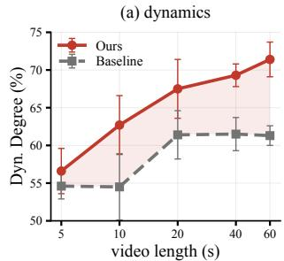

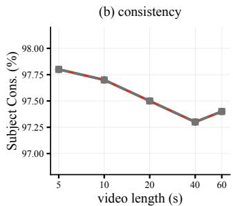  
Figure 6. Length Sweep (Baseline vs. RECAP-Forcing, 5–60s; error bars show ±std over 5 seeds). (a) Our method maintains higher Dynamic Degree across all lengths. (b) Subject Consistency remains comparable to the baseline.

## C. Appearance Memory and Identity Preservation

We next examine whether the appearance information stored by RECAP-Forcing remains useful over long horizons. We consider increasingly demanding settings: identity preservation under continuous visibility, retention over substantially extended rollouts, and controlled reappearance after the subject has been absent for much longer than the local attention window.

## C.1. Long-Horizon Subject Identity

We stage 20 prompts in which a distinctive subject stays on screen for the full minute (× 5 seeds per arm) and measure whether it still looks like itself at the end. Identity is measured by DINOv2 [47] CLS similarity between an early window (2–8 s) and the final 10 s, computed both on the full frame and on the subject crop obtained from a Qwen2.5- VL detector (top-1 box for the subject phrase with a 15% margin; detection rate 97%). The two arms are compared pairwise per prompt and seed. RECAP-Forcing clearly improves both identity measures (Tab. 7).

Table 7. Long-horizon Subject Identity (20 prompts × 5 seeds, 60 s; DINOv2 CLS similarity between an early window and the final 10 s, on the full frame and on the detected subject crop).
<table><tr><td>Configuration</td><td>Frame Sim.</td><td>Wins</td><td>Crop Sim.</td><td>Wins</td></tr><tr><td>Baseline</td><td>0.745</td><td></td><td>0.642</td><td></td></tr><tr><td>+ Ours</td><td>0.850</td><td>76%</td><td>0.696</td><td>64%</td></tr></table>

## C.2. Identity Retention over Extended Horizons

To quantify how long this stability persists, we measure identity retention as the DINOv2 [47] CLS-token cosine similarity of each frame to frame 0. The same prompts and frame times are used for both methods, so the gap between the curves is the meaningful quantity; the absolute value is below 1 even for good videos because legitimate scene motion changes the global feature.

Tab. 8 reports the result. Over five minutes the recency baseline decays to 0.61, while RECAP-Forcing stops decaying after the first minute and holds identity flat to the end (0.81 at 1 min and at 5 min).

Table 8. Identity retention over time (20 prompts × 5 seeds. “mid”/“end” are 1/5 min for the five-minute rows and 30/60 s for the 60-second rows). RECAP-Forcing holds identity where the recency baseline drifts.
<table><tr><td>Horizon</td><td>Method</td><td>start</td><td>mid</td><td>end</td></tr><tr><td>5 min</td><td>Baseline + Ours</td><td>1.00</td><td>0.63</td><td>0.61</td></tr><tr><td rowspan="2">60 s</td><td></td><td>1.00</td><td>0.81</td><td>0.81</td></tr><tr><td>Baseline + Ours</td><td>1.00 1.00</td><td>0.70 0.87</td><td>0.62 0.88</td></tr></table>

## C.3. Controlled Reappearance

The experiments above tests whether appearance remains stable while the subject stays visible, but the motivating use case for persistent memory is more demanding: a subject may disappear for longer than the local attention window and later appear again with the same identity.

A prompt-only reappearance benchmark is difficult to construct reliably with current backbones. We initially wrote prompts with staged timing. For example, the subject exits and returns, the scene opens empty, or a second subject enters later. However, current backbones lack the basic ability to execute such prompt-level temporal instructions: mentioned entities appear immediately and essentially never leave. A controlled reappearance evaluation therefore cannot be constructed by prompting alone.

Instead, we construct the reappearance test directly at inference time. Each video is generated as one continuous rollout of four prompt segments: an empty scene (3 s), the subject present (6 s), the same scene explicitly empty (7.5 s, five times the 1.5 s attention window), and the subject reconditioned (7.5 s).

At every segment boundary the sliding window is cleared while the sink and the bank persist. Each segment is therefore generated from the text prompt and the persistent memory alone. Because the opening scene contains no subject, the subject never enters the sink, and the bank is the only channel that can carry its appearance across the gap.

A Qwen2.5-VL check verifies the intended timeline (subject detected in its two segments and absent during the gap). Identity is scored by the same dual metric as in Sec. C.1 between the first-appearance and return windows.

RECAP-Forcing clearly improves both measures over the base model (Tab. 9). The base model re-invents the subject from the prompt alone—often with visibly different appearance—whereas with RECAP-Forcing the returning subject is rendered against its stored first-appearance states, of which several hundred remain resident in the bank at the moment of return in every rollout.

Table 9. Controlled Reappearance. Subject enters, leaves for a 7.5 s gap (5× the attention window) with the sliding window cleared at every shot boundary, then re-conditioned.
<table><tr><td>Configuration</td><td>Frame Sim.</td><td>Wins</td><td>Crop Sim.</td><td>Wins</td></tr><tr><td>Baseline</td><td>0.699</td><td></td><td>0.648</td><td></td></tr><tr><td>+ Ours</td><td>0.752</td><td>73%</td><td>0.688</td><td>66%</td></tr></table>

## D. Memory Bank Analysis

The previous section establishes that persistent appearance memory improves long-horizon identity. We now analyze the mechanism itself: which historical states should be admitted into the bank, and whether the resulting memory remains genuinely time-neutral rather than degenerating into a recency buffer.

## D.1. Admission Rule: What Should Enter the Bank?

Tab. 10 varies only the bank admission rule under the main protocol (128 prompts × 5 seeds). Random History samples entries uniformly from previously observed content, whereas Recent History retains the most recently observed entries. DINOv2 Diversity embeds all historical candidates with DINOv2 and applies K-means to select representatives near the cluster centers, favoring diversity in semantic feature space. Flow Novelty (ours) instead admits candidates according to the novelty of their optical-flow maps, explicitly favoring histories with distinct motion patterns.

Random and recency-based selection provide little benefit: Random History and Recent History improve Dynamic Degree by only +1.1 and +0.7 over the no-bank baseline (62.4/62.0 vs. 61.3), while random selection even lowers the Total score (77.7 vs. 78.3). DINOv2 Diversity improves the Total to 79.4 but does not recover motion (60.6 Dynamic Degree), suggesting that diversity in semantic feature space is not the signal the bank needs.

In contrast, Flow Novelty raises Dynamic Degree to 71.3 (+10.0) while preserving consistency, and achieves the best Total score (79.7). These results show that what enters the bank matters: admission based on appearance novelty is substantially more effective than retaining arbitrary, recent, or semantically diverse history for long video generation.

Table 10. Ablation of Bank Admission Rules.
<table><tr><td></td><td>S.C.</td><td>B.C.</td><td>M.S.</td><td>D.D.</td><td>A.Q.</td><td>I.Q.</td><td>Q.</td><td>Sem.</td><td>Total</td></tr><tr><td>No Bank (Baseline)</td><td>97.4</td><td>95.9</td><td>98.4</td><td>61.3</td><td>55.8</td><td>68.8</td><td>82.2</td><td>62.9</td><td>78.3</td></tr><tr><td>Random History</td><td>97.1</td><td>96.9</td><td>98.5</td><td>62.4</td><td>56.4</td><td>69.2</td><td>82.4</td><td>58.7</td><td>77.7</td></tr><tr><td>Recent History</td><td>97.4</td><td>96.1</td><td>98.4</td><td>62.0</td><td>56.0</td><td>69.0</td><td>82.3</td><td>64.2</td><td>78.7</td></tr><tr><td>DINOv2 Diversity</td><td>97.6</td><td>96.1</td><td>98.6</td><td>60.6</td><td>57.6</td><td>69.4</td><td>82.9</td><td>65.6</td><td>79.4</td></tr><tr><td>Flow Novelty (Ours)</td><td>97.4</td><td>96.0</td><td>98.4</td><td>71.3</td><td>57.5</td><td>68.8</td><td>83.3</td><td>65.4</td><td>79.7</td></tr></table>

## D.2. Bank Retention Behavior

To empirically verify the time-neutral retention described in Sec. 3.2.2, we log per-block bank traces over 220 rollouts. At each step, the bank closely matches the top-K candidates among all items observed so far, ranked by their frozen scores, achieving a final-state overlap of 0.99. The small residual discrepancy is attributable to score ties.

Consequently, eviction removes almost exclusively below-cutoff admissions, predominantly near-zero-score content admitted while the bank is still filling. Moreover, the source-frame ages of the final bank entries are distributed roughly uniformly across the rollout, with a mean age near the midpoint of the video. This behavior is characteristic of time-neutral retention: survival is determined by novelty rather than recency.

## E. Inference Cost

Tab. 11 reports the wall-clock time for generating 1-, 2-, and 5-minute videos on a single GH200 GPU. RECAP-Forcing incurs a roughly constant 1.6× overhead that does not increase with video length. A naive bank refill would scale quadratically with duration and require hundreds of GB of cached history. Instead, we store only novel-token activations and refill bank slots incrementally, reproducing the naive path bit-identically while keeping the per-block cost constant.

Table 11. Generation Time for a single video of resolution of 832 × 480 on a 80GB GH200 GPU. RECAP-Forcing adds a ∼1.6× overhead that does not grow with length.
<table><tr><td>Length</td><td>Frames (blocks)</td><td>Baseline</td><td>Ours</td><td>Overhead</td></tr><tr><td>1 min</td><td>240 (80)</td><td>185 s</td><td>288 s</td><td>1.56×</td></tr><tr><td>2 min</td><td>480 (160)</td><td>268 s</td><td>450s</td><td>1.68×</td></tr><tr><td>5 min</td><td>1200 (400)</td><td>1435 s</td><td>2239 s</td><td>1.56×</td></tr></table>

## F. Is the Gain Good Motion? A Camera– Object Decomposition Analysis

A natural concern is that the gain in Dynamic Degree is the cheap kind of motion—global camera panning, which inflates the metric without improving the video. However, it turns out to be the opposite.

Table 12. Camera–Object Motion Decomposition RECAP-Forcing reduces camera motion while largely preserving object motion, raising the object share. Drift tail counts videos whose mean total flow exceeds 2× the config median.
<table><tr><td>Config</td><td>Camera Flow</td><td>Object Flow</td><td>Object Fraction</td><td>Total Flow</td><td>Drift Tail</td></tr><tr><td>Baseline</td><td>1.204</td><td>0.710</td><td>0.380</td><td>1.914</td><td>37</td></tr><tr><td>+ Ours</td><td>0.897</td><td>0.659</td><td>0.408</td><td>1.556</td><td>24</td></tr></table>

For each video, we compute dense optical flow with RAFT on frame pairs sampled every ∼0.5 s, fit a global homography with RANSAC, and decompose the flow into a homography-predicted camera component and a residual object-motion component. Tab. 12 reports the mean magnitudes over all 128 prompts.

On Self-Forcing, RECAP-Forcing reduces the baseline’s camera motion (1.20 → 0.90) while largely preserving object motion (0.71→0.66), increasing the fraction of motion attributable to objects from 37% to 42%. Thus, RECAP-Forcing does not improve the metric by injecting additional camera motion. Instead, it suppresses the baseline’s erratic global drift while retaining most of the subject’s motion.

Dynamic Degree measures the fraction of videos whose motion exceeds a genuine-motion threshold rather than the mean flow magnitude, so it can increase even when mean flow decreases. RECAP-Forcing pushes the baseline’s near-frozen clips above this threshold while suppressing its runaway-drift outliers. Accordingly, the per-video total-flow deviation decreases from ±2.9 to ±1.9, while the number of clips in the drift tail falls from 37 to 24.