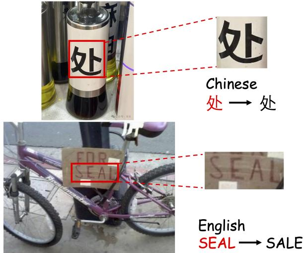
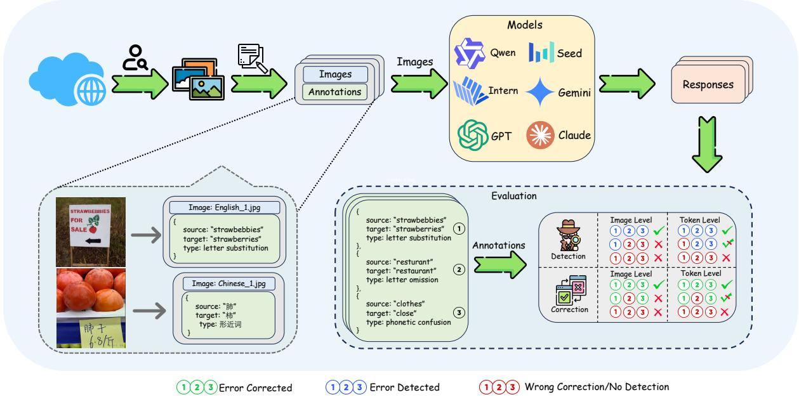
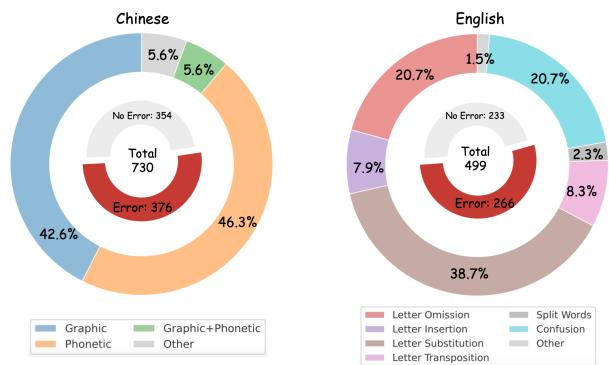
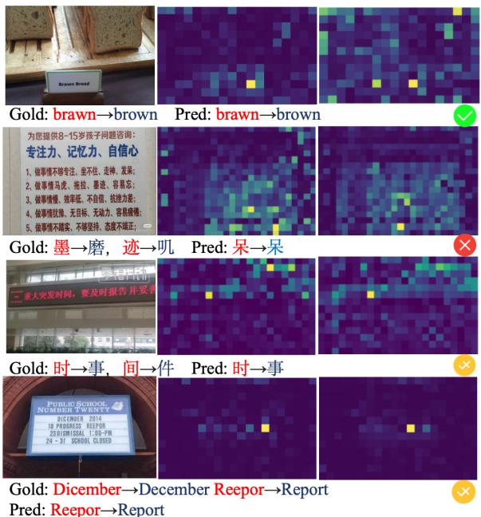
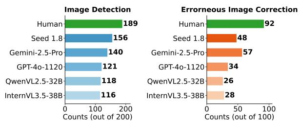
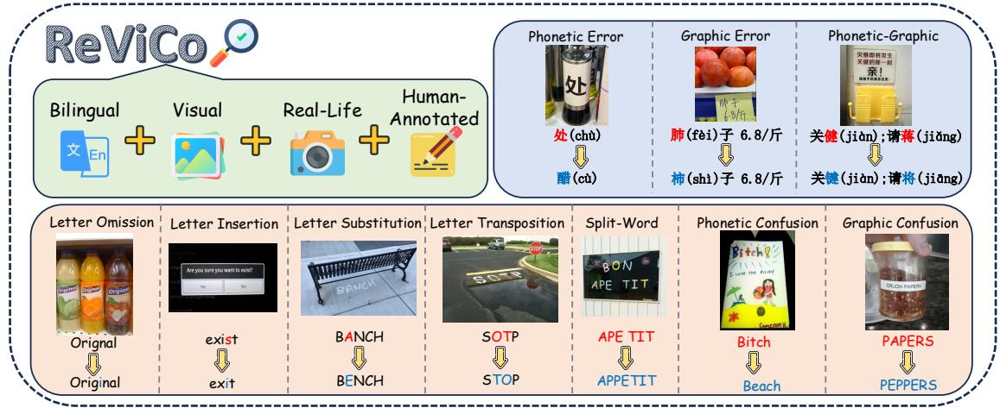
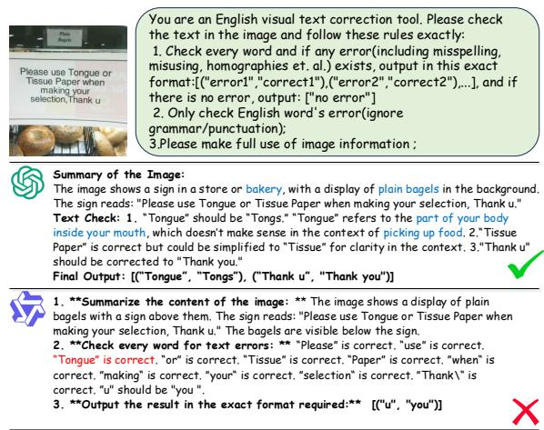
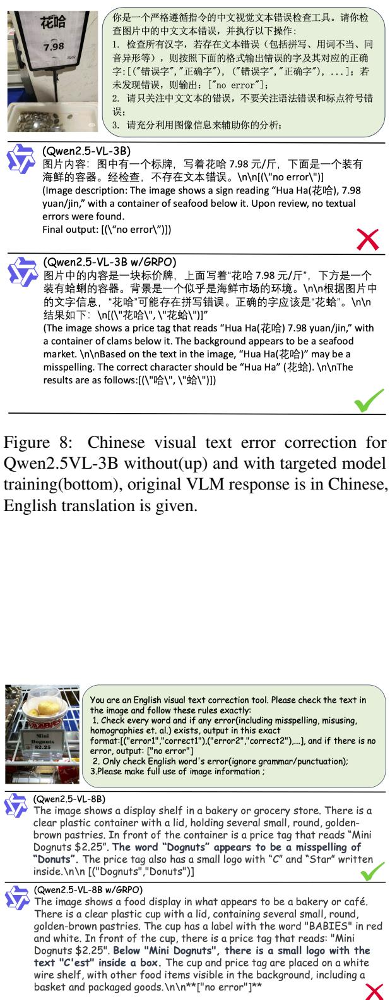

# ReViCo: Unveiling the Limitations of VLMs in Visual Text Understanding via Error Correction

Bojun Zhang1,2, Junhong Liang4, Feifei Zhai1\*, Fengxian Ji4, Yu Zhou1,3

1 State Key Laboratory of Multimodal Artificial Intelligence Systems,

Institute of Automation, CAS, Beijing, China

2 School of Artificial Intelligence, University of Chinese Academy of Sciences, Beijing, China 3 Fanyu AI Laboratory, Zhongke Fanyu Technology Co., Ltd, Beijing, China 4 Mohamed bin Zayed University of Artificial Intelligence {zhangbojun2022,feifei.zhai}@ia.ac.cn, yzhou@nlpr.ia.ac.cn {junhong.liang,fengxianj.ji}@mbzuai.ac.ae

## Abstract

Vision Language Models (VLMs) have shown great success in general visual tasks, yet they still struggle to deeply understand text within images. In this paper, we introduce ReViCo (Real Visual Correction), a benchmark designed to evaluate VLM text understanding through a novel task of visual text error correction. ReViCo challenges models to identify and fix text errors in real-world images, which requires a profound understanding of the interplay between visual text and its surrounding visual context. We benchmark various VLMs using two distinct paradigms: prompt-based strategy and targeted model training, both aimed at pushing the limits of current models. Our experiments reveal a striking performance gap between even the best VLMs and human, and further analysis also shows that most models struggle to accurately perceive the visual text, resulting in frequent correction errors. By highlighting these gaps, ReViCo provides a new benchmark foundation for developing more robust and text-aware VLMs.

## 1 Introduction

Recent advancements in Vision-Language Models (VLMs) have significantly improved performance on multimodal tasks such as visual question answering (VQA) (Jian et al., 2024; Guo et al., 2025), spatial reasoning (Zhang et al., 2025b), and optical character recognition (OCR) (Nagaonkar et al., 2025). While these models excel at processing and interpreting general visual inputs, a critical aspect remains underexplored: the depth to which VLMs truly understand and interact with textual content embedded within images.

To evaluate this capability, we approach visual text understanding through a novel task of visual text error correction (VTEC). Unlike traditional text error correction, VTEC requires models to deeply understand text within its visual environment, relying on the joint integration of finegrained visual features and linguistic context. As illustrated in Figure 1, a model must grasp the mismatched semantic between the scene(several seasoning bottles) and the text(处) and recognize subtle phonetic similarities between characters (e.g., 处 → 醋) for Chinese text correction, while in the English example, it must understand the context(A bike with a cardboard on it) and resolve typographical similarities (e.g., SEAL → SALE). Therefore, VTEC serves as an ideal proxy for measuring a VLM’s visual text understanding. Success in this task indicates that a model does more than just identify characters — it actually understands the meaning and context of the text it sees.

  
Figure 1: Examples of visual text error correction. Only when a model truly understands the textual content within an image can it perform the correction accurately, both for the Chinese and English example.

Driven by this motivation, we introduce ReViCo, a new benchmark designed to assess VLMs’ capabilities in comprehensively understanding visual contexts and embedded text via the VTEC task. ReViCo consists of high-quality Chinese and English images featuring natural text errors captured in everyday contexts. Specifically, ReViCo encompasses two key sub-tasks: (1) Error Detection, which requires precisely identifying incorrect tokens/images, and (2) Error Correction, which focuses on restoring them to their correct forms.

On ReViCo, We further perform a comprehensive evaluation of a wide range of representative VLMs, including open-source models (e.g., Qwen-VL, InternVL) and state-of-the-art closed-source systems (e.g., GPT-4o, Gemini2.5-pro and Seed-1.8). To elicit the best performance from these models, we employ two distinct paradigms: promptbased strategies—including Direct Correction, and Background Information Enhancement to provide different levels of support to models—and targeted model training, which enhances the model’s performance on this benchmark by leveraging automatically constructed training data and RL-based (Reinforcement Learning) training methodologies.

Final experimental results reveal a significant performance gap between current VLMs and human-level evaluation. Even with prompt enhancement and targeted training, which do lead to some improvements, the overall performance remains limited. These findings highlight a critical bottleneck: current VLMs have yet to achieve the fine-grained visual text understanding necessary to bridge this performance gap, and our ReViCo actually provides a new benchmark foundation for developing more robust and text-aware VLMs.

Our contributions are summarized as follows:

1. We define a new task of visual text error correction and introduce ReViCo, a novel benchmark that provides a new perspective for evaluating VLMs’ understanding of visual text through real-world images.

2. We propose two different paradigms to elicit VLM capabilities, including two prompting strategies and a targeted model training approach to enhance the model’s fine-grained perception of visual text information.

3. Our experiments and analysis of diverse VLMs highlights the persistent gap between current VLMs and humans, offering valuable insights and benchmark foundation for building more robust and text-aware VLMs.

## 2 Related Works

Architecture of VLMs The architectures of modern VLMs are primarily designed to bridge the gap between high-dimensional visual signals and discrete linguistic tokens. Many representative models, such as Qwen2.5-VL (Bai et al., 2025b) and Qwen3-VL (Bai et al., 2025a), leverage pretrained vision encoders (e.g., CLIP or ViT) to extract visual features, which are subsequently projected into the embedding space of a pretrained LLM. This approach facilitates the reuse of powerful unimodal foundations but necessitates precise alignment to prevent the loss of fine-grained perceptual information. Other state-of-the-art architectures, like Gemini2.5 (Comanici et al., 2025) and Kimi2.5 (Kimi-Team, 2026), emphasize early text-vision fusion pretraining to enhance reasoning capabilities across modalities, which are recognized as native multimodal models.

Text Error Correction We mainly investigate spelling error correction, which has been extensively studied in both Chinese and English in the text modality. In Chinese, spelling errors primarily arise from phonetic and graphical similarities between characters (Cheng et al., 2020; Liu et al., 2021; Zhang et al., 2020), while in English, they typically result from character-level substitutions or deletions (Hládek et al., 2020; Mitton et al., 1980). Most existing datasets for spelling correction are derived from purely textual sources, including those from language learners (Tseng et al., 2015), native speakers (Hu et al., 2024), and specific domains (Liang and Zhou, 2025). Methods for addressing text error correction generally fall into two main paradigms: PLM-based approaches, which rely on architectures like BERT (Zhang et al., 2020), and LLM-based methods, which often require minimal or no task-specific training and combine PLMs and LLMs to enhance both domain precision and generalization (Qiao et al., 2025).

Reinforcement Learning for Visual Reasoning Reinforcement learning (RL), particularly RL from Human Feedback (RLHF) (Christiano et al., 2023; Ouyang et al., 2022) and PPO optimization (Schulman et al., 2017), has enhanced the reasoning capabilities of LLMs. Recent methods like DPO and KTO optimize preferences without explicit rewards (Rafailov et al., 2024; Ethayarajh et al., 2024). RL has proven effective for systematic reasoning in tasks like mathematics and logical inference (Cobbe et al., 2021; Lightman et al., 2023). The integration of RL in VLMs, such as Qwen3- VL (Bai et al., 2025a), improves visual reasoning and spatial understanding. Group Relative Policy

Optimization (GRPO) (Shao et al., 2024) reduces memory overhead and enhances RL scalability in VLMs. Beyond conventional language-space reasoning, recent studies have explored alternative visual reasoning paradigms. Latent Visual Reasoning (Li et al., 2025; Guo et al., 2026) enables VLMs to perform intermediate reasoning directly in the visual embedding space, whereas tool-augmented reinforcement learning trains models to actively invoke visual tools to acquire, manipulate, and verify task-relevant evidence (Zhang et al., 2025c). These complementary directions broaden the scope of VLM reasoning beyond text-based chains of thought and provide new perspectives on integrating perception and reasoning.

## 3 ReViCo Benchmark

To systematically analyze the visual text error correction ability of LLMs, we propose Real Visual Correction (ReViCo) Benchmark. In this section, we introduce the data construction pipeline of both test set and traning set(Sec. 3.1), the error type statistics of our proposed benchmark(Sec. 3.2) and evaluation protocol(Sec. 3.3). An overview of the data gathering and evaluation process is shown in Figure 2.

## 3.1 Data Construction

To ensure both high data quality and construction efficiency, we employ bifurcated strategies for data preparation: manual annotation for the test set to guarantee precision, and automated synthesis for the training set to ensure scalability.

Test Data Construction We manually curated the ReViCo test set by collecting images from diverse online resources. To ensure the proposed benchmark evaluates the interplay between visual context and text, annotators were strictly required to select images where errors are only resolvable via visual cues. To evaluate the error detection ability of VLMs, we also sample error-free Chinese from EST-VQA (Wang et al., 2020b) test set and English images from the EST-VQA and TextVQA (Singh et al., 2019b) test set. The collected error-containing images are randomly divided into two subsets. Each subset is annotated by one volunteer and cross-checked by another to identify misspelled tokens and provide the correct forms. In case of disagreement, a third volunteer acts as an adjudicator to determine the final label. The error-free images are also verified by human annotators. This multi-stage annotation and verification process results in a high-quality real-life labeled dataset for visual text error correction. Finally, we obtain 1229 high-quality, real-world samples.

Automated Training Data Construction We construct a high-quality training dataset for reinforcement learning derived from the EST-VQA (Wang et al., 2020b) and ST-VQA (Biten et al., 2019) traning split, generated through a threestage pipeline: Generate-Edit-Examination. In the first stage(Generate), images from the gathered training set are processed using GPT-4o to create erroneous text by introducing textual distortions. To ensure task difficulty and consistency with the proposed benchmark, a large language model (Qwen3-235B ) filters out samples rectifiable through pure linguistic context. In the second stage(Edit), we utilized Qwen-Image-Edit-2509 model to modify the original text regions in the images with the generated erroneous text, resulting in images with textual errors. Finally, in the third stage(Examination), Qwen3-VL-235B-A22B-Instruct is employed for image quality examination by performing error correction on the edited images, filtering out low-quality or incorrectly edited images, ensuring the overall quality of the dataset. This automated workflow yielded 4,531 scalable training samples by leveraging the strengths of image editing models and VLMs.

## 3.2 Error Type Statistics

The ReViCo Benchmark consists of Chinese and English datasets with four and seven subsets, respectively. The Chinese dataset includes the following error types: phonetic error, graphic error, phonetic-graphic error, and others. The English dataset, due to structural differences, classifies errors at two levels: at the letter level, errors include letter omission, letter insertion, letter substitution, and letter transposition; at the word level, errors are classified as split-word errors, phonetic/graphic confusion, and others. A detailed error type analysis is in Appendix A.

This hierarchical categorization provides a systematic framework for analyzing error types and contributes to a more precise evaluation of text correction methods. Examples of different types of errors for the test set are presented in Figure 6.

Figure 2: Overview of the ReViCo Benchmark pipeline, illustrated with one English and one Chinese example from the dataset. The evaluation procedure is shown with a single English example.  
  
Figure 3: Error statistics of the ReViCo benchmark. For Chinese and English separately, the inner pie charts show the counts of erroneous vs. error-free images, while the outer pie charts depict the distribution of error types across the erroneous images.

## 3.3 Evaluation Protocol

To evaluate the capability of correcting visual text errors, including both Chinese characters and Latin letters, we define two evaluation tasks: Detection and Correction. For each task, there are two levels: Image and Token.

Detection focuses on the capacity of the model to recognize the presence of visual text errors. At the Image Detection (I-D), the task is to decide whether an image contains any errors at all, treating the problem as a binary classification. In contrast, the Token Detection (T-D) moves to a finer granularity, requiring the system to accurately pinpoint the individual erroneous Chinese characters or English words within error-correction pairs.

Correction evaluates the model’s ability to produce correct outputs once errors have been identified. The Token Correction (T-C) measures whether the model can transform each erroneous character or word into its proper form, emphasizing precision at the token level. The Image Correction (I-C), by comparison, demands a holistic solution: the image is considered successfully corrected only when all errors are resolved without omission or unnecessary alterations.

We report the precision (P), recall (R) and F1 scores for each task and for each level. A more detailed description and calculation can be found in Appendix E.

## 4 Evaluation Stratetgies

To provide a comprehensive evaluation, we employ OCR+LLM pipeline(Sec. 4.1), two prompt-based strategies(Sec. 4.2), and a targeted model training paradigm(Sec. 4.3) to elicit VLM abilities. These methodologies are detailed as follows:

## 4.1 OCR+LLM Pipeline

Although this benchmark is primarily designed to evaluate the capabilities of VLMs, we also provide evaluation results using OCR-extracted text combined with LLMs as a baseline for comparison. Since the accuracy of OCR results depends on the specific tools used, we report performance based on Oracle OCR text processed and annotated by annotators.

<table><tr><td rowspan="2">Models</td><td colspan="3">Image-Detection</td><td colspan="3">Token-Detection</td><td colspan="3">Image-Correction</td><td colspan="3">Token-Correction</td></tr><tr><td> $P$ </td><td> $R$ </td><td> $F _ { 1 }$ </td><td> $P$ </td><td> $R$ </td><td> $F _ { 1 }$ </td><td> $P$ </td><td>R</td><td> $F _ { 1 }$ </td><td> $P$ </td><td> $R$ </td><td> $F _ { 1 }$ </td></tr><tr><td colspan="10">Oracle OCR Text + Large language Models</td></tr><tr><td>Qwen38B</td><td>70.7</td><td>44.1</td><td>54.3</td><td>6.7</td><td>27.5</td><td>10.8</td><td>30.3</td><td>8.0</td><td>12.6</td><td>34.3</td><td>15.4</td><td>21.3</td></tr><tr><td>Qwen332B</td><td>63.7</td><td>57.0</td><td>60.2</td><td>9.8</td><td>25.7</td><td>14.2</td><td>31.4</td><td>14.5</td><td>19.8</td><td>36.7</td><td>20.5</td><td>26.3</td></tr><tr><td>Qwen3235B</td><td>77.4</td><td>58.6</td><td>66.7</td><td>24.4</td><td>33.2</td><td>28.1</td><td>55.1</td><td>21.0</td><td>30.4</td><td>45.6</td><td>24.1</td><td>30.2</td></tr><tr><td> $\mathrm { Q w e n 3 V L } _ { 8 B }$ </td><td>75.5</td><td>44.2</td><td>55.8</td><td>12.3</td><td>24.8</td><td>16.5</td><td>44.5</td><td>11.5</td><td>18.2</td><td>38.9</td><td>16.9</td><td>23.6</td></tr><tr><td> $\mathrm { Q w e n 3 V L _ { 3 2 B } }$ </td><td>80.0</td><td>39.7</td><td>53.1</td><td>20.2</td><td>21.9</td><td>21.0</td><td>59.1</td><td>14.3</td><td>23.1</td><td>49.0</td><td>18.9</td><td>27.3</td></tr><tr><td> $\mathrm { Q w e n } 3 \mathrm { V L } _ { 2 3 5 B }$ </td><td>74.6</td><td>60.2</td><td>66.6</td><td>15.4</td><td>28.5</td><td>20.0</td><td>49.6</td><td>20.2</td><td>28.7</td><td>43.3</td><td>25.8</td><td>31.7</td></tr><tr><td colspan="11">Image + Vision Language Models</td></tr><tr><td>Qwen2.5VL3B</td><td>48.7</td><td>73.3</td><td>58.5</td><td>5.6</td><td>16.6</td><td>8.3</td><td>6.4</td><td>5.2</td><td>5.7</td><td>5.1</td><td>7.1</td><td>6.0</td></tr><tr><td>Qwen2.5VL7B</td><td>70.9</td><td>25.2</td><td>37.1</td><td>28.7</td><td>12.8</td><td>17.7</td><td>45.0</td><td>8.4</td><td>14.2</td><td>29.1</td><td>9.9</td><td>14.7</td></tr><tr><td>Qwen2.5VL32B</td><td>96.9</td><td>48.1</td><td>64.3</td><td>58.2</td><td>31.8</td><td>41.1</td><td>94.1</td><td>25.0</td><td>39.5</td><td>52.8</td><td>27.9</td><td>36.5</td></tr><tr><td>Qwen2.5VL72B</td><td>93.8</td><td>49.4</td><td>64.7</td><td>59.7</td><td>31.2</td><td>41.0</td><td>87.9</td><td>23.8</td><td>37.5</td><td>50.7</td><td>24.5</td><td>33.1</td></tr><tr><td> $\mathrm { Q w e n 3 V L } _ { 2 B }$ </td><td>79.2</td><td>11.4</td><td>20.0</td><td>40.2</td><td>7.4</td><td>12.5</td><td>57.1</td><td>4.0</td><td>7.5</td><td>52.0</td><td>5.9</td><td>10.6</td></tr><tr><td>Qwen3VL4B</td><td>55.8</td><td>50.9</td><td>53.3</td><td>13.4</td><td>29.5</td><td>18.4</td><td>25.7</td><td>13.9</td><td>18.1</td><td>34.9</td><td>16.5</td><td>22.4</td></tr><tr><td>Qwen3VL8B</td><td>57.6</td><td>60.4</td><td>59.0</td><td>9.4</td><td>29.8</td><td>14.2</td><td>19.9</td><td>11.1</td><td>14.2</td><td>26.1</td><td>15.0</td><td>19.0</td></tr><tr><td>Qwen3VL32B</td><td>97.3</td><td>45.7</td><td>62.2</td><td>47.1</td><td>28.6</td><td>35.6</td><td>94.2</td><td>20.3</td><td>33.4</td><td>53.9</td><td>23.4</td><td>32.7</td></tr><tr><td>Qwen3VL235B</td><td>74.7</td><td>77.2</td><td>75.9</td><td>18.9</td><td>35.0</td><td>24.5</td><td>50.9</td><td>27.1</td><td>35.4</td><td>42.0</td><td>30.1</td><td>35.1</td></tr><tr><td>InternVI  $\mathbf { \nabla } \mathcal { A } B$ </td><td>53.8</td><td>40.1</td><td>45.9</td><td>5.8</td><td>11.7</td><td>7.8</td><td>5.8</td><td>2.1</td><td>3.1</td><td>3.3</td><td>4.0</td><td>3.7</td></tr><tr><td>InternVL4B</td><td>55.8</td><td>67.7</td><td>61.2</td><td>5.8</td><td>14.5</td><td>8.3</td><td>8.7</td><td>5.1</td><td>6.5</td><td>5.0</td><td>6.2</td><td>5.5</td></tr><tr><td>InternVL8B</td><td>76.7</td><td>21.2</td><td>33.2</td><td>12.8</td><td>8.1</td><td>9.9</td><td>34.9</td><td>3.5</td><td>6.3</td><td>10.5</td><td>4.9</td><td>6.7</td></tr><tr><td>InternVL14B</td><td>65.1</td><td>53.0</td><td>58.4</td><td>13.6</td><td>17.4</td><td>15.3</td><td>27.4</td><td>10.7</td><td>15.4</td><td>16.3</td><td>12.6</td><td>14.2</td></tr><tr><td>InternVL38B</td><td>89.8</td><td>33.4</td><td>48.7</td><td>48.6</td><td>18.9</td><td>27.2</td><td>79.3</td><td>14.5</td><td>24.5</td><td>46.5</td><td>16.1</td><td>23.9</td></tr><tr><td>GPT-40</td><td>98.7</td><td>48.1</td><td>64.7</td><td>66.2</td><td>33.0</td><td>44.0</td><td>97.7</td><td>26.4</td><td>41.6</td><td>59.0</td><td>30.0</td><td>38.8</td></tr><tr><td>GPT-5.4</td><td>82.7</td><td>69.6</td><td>75.6</td><td>35.5</td><td>35.8</td><td>35.6</td><td>65.2</td><td>27.2</td><td>38.4</td><td>48.2</td><td>31.6</td><td>38.2</td></tr><tr><td>Seed-1.8</td><td>80.5</td><td>92.5</td><td>86.1</td><td>48.0</td><td>69.7</td><td>56.8</td><td>70.6</td><td>53.8</td><td>61.0</td><td>69.9</td><td>64.3</td><td>67.0</td></tr><tr><td>Seed–2.0</td><td>85.9</td><td>95.3</td><td>90.4</td><td>63.8</td><td>86.0</td><td>73.3</td><td>82.0</td><td>71.2</td><td>76.2</td><td>84.4</td><td>83.0</td><td>83.7</td></tr><tr><td>Gemini2.5–Pro</td><td>85.9</td><td>88.7</td><td>87.3</td><td>68.3</td><td>75.5</td><td>71.7</td><td>81.5</td><td>64.2</td><td>71.8</td><td>81.0</td><td>71.3</td><td>75.9</td></tr><tr><td>Gemini3.1–Pro</td><td>79.7</td><td>97.4</td><td>87.7</td><td>63.0</td><td>82.3</td><td>71.4</td><td>74.4</td><td>72.0</td><td>73.2</td><td>81.4</td><td>78.9</td><td>80.1</td></tr><tr><td></td><td></td><td></td><td></td><td></td><td></td><td></td><td></td><td></td><td></td><td></td><td></td><td></td></tr></table>

Table 1: Performance comparison of OCR+LLMs and VLMs on visual text error detection and correction, evaluated at both the image (I) level and token (T) level across detection (D) and correction (C) tasks. The best overall results in each column are highlighted in bold, while the strongest results within the OCR+LLM, QwenVL and InternVL families are underlined.Please note that Qwen3VL models are used as LLM in OCR+LLM pipeline(w.o. image input).

## 4.2 Prompt-based Strategy

Direct Correction Prompt Following previous text-centric Visual Question Answering (VQA) tasks(Singh et al., 2019a; Biten et al., 2019; Wang et al., 2020a; Liu et al., 2024), we first evaluate our model using a direct prompting baseline, where the model is tasked with generating the final answer explicitly.

Background Information Enhancement Prompt The Background Information Enhancement strategy necessitates that the model generates a descriptive narrative of the visual context prior to error correction; this mechanism facilitates a more effective utilization of global visual cues to guide the visual text correction process. All prompts for evaluation are shown in Appendix C and D.

## 4.3 Targeted Model Training

Despite the efficacy of prompting strategies, we aim to push the boundaries of fine-grained visual text understanding by leveraging automatically constructed datasets via a training-based paradigm. Considering that RL-based(Reinforcement Learning) methods demonstrate superior robustness against forgetting compared to SFT (Supervised Fine-Tuning) approaches (Shenfeld et al., 2025), we naturally employ RL to further refine the model’s performance. Specifically, we adopt the Group-based Policy Optimization (GRPO) (Shao et al., 2024) algorithm to facilitate the emergence of autonomous fine-grained perception within the model.

During training, we sample a group of output sequences $G = \{ y _ { 1 } , y _ { 2 } , \dots , y _ { G } \}$ for each input x. Each sequence $y _ { i }$ receives a reward $r _ { i } ,$ which is then normalized within group $G$ to produce advantages ${ \hat { A } } _ { i }$ . The token-level optimization objective is formulated as:

$$
\mathcal { I } _ { \mathrm { G R P O } } ( \boldsymbol { \theta } ) = - \frac { 1 } { | G | } \sum _ { i = 1 } ^ { | G | } \frac { 1 } { | y _ { i } | } \sum _ { t = 1 } ^ { | y _ { i } | } \operatorname* { m i n } \Big ( r _ { i , t } ( \boldsymbol { \theta } ) \hat { A } _ { i , t } ,
$$

$$
\mathrm { c l i p } \left( r _ { i , t } ( \theta ) , 1 - \epsilon , 1 + \epsilon \right) \hat { A } _ { i , t } \Big ) - \beta D _ { \mathrm { K L } } ,\tag{1}
$$

$$
r _ { i , t } ( \theta ) = { \frac { \pi _ { \theta } ( y _ { i , t } \mid x , y _ { i , < t } ) } { \pi _ { \mathrm { r e f } } ( y _ { i , t } \mid x , y _ { i , < t } ) } }\tag{2}
$$

$$
D _ { \mathrm { K L } } = D _ { \mathrm { K L } } ( \pi _ { \theta } \parallel \pi _ { \mathrm { r e f } } )\tag{3}
$$

where ϵ and $\beta$ are hyper-parameters.

Multi-Level Verification Reward To facilitate effective RL training with GRPO, we propose the Multi-Level Verification Reward (MLVR) system. Rather than using a holistic score, MLVR decomposes the feedback into three hierarchical stages, ensuring that the model masters foundational constraints before optimizing for finegrained correction. The system consists of the following components:

• Format Constraint: A binary filter that verifies whether the response adheres to the required structural protocols.

• Image-Level Discrimination Constraint: A semantic check assessing the model’s macrolevel judgment of whether the visual text contains errors.

• Token-Level Correction Reward $( R _ { c o r r } )$ : A fine-grained metric, such as Edit Distance or Exact Match, that measures the accuracy of the rectified text.

$$
R _ { t o t a l } = \left\{ \begin{array} { l l } { R _ { c o r r } , \ \mathrm { i f } \ ( x \in \mathcal { D } _ { e r r } \land E r r ( y ) = 1 ) } \\ { 1 , \ } & { \ \mathrm { i f } \ ( x \in \mathcal { D } _ { c l e a n } \land E r r ( y ) = 0 ) } \\ { 0 , \ } & { \ \mathrm { o n l y ~ v a l i d ~ f o r m a t } } \\ { - 1 , \ } & { \ \mathrm { i n v a l i d ~ f o r m a t } } \end{array} \right.\tag{4}
$$

where $\mathcal { D } _ { e r r }$ and $\mathcal { D } _ { c l e a n }$ denote the sets of erroneous and error-free samples, respectively. We define a binary indicator $E r r ( y ) \in \{ 0 , 1 \}$ to signify whether the model detects text errors. This image-level discrimination constraint prevents the model from collapsing into trivial behavioral biases, such as indiscriminate correction (False Positives) or total omission (False Negatives), thereby ensuring robustness across diverse scenarios. Additionally, a format match constraint is implemented to enforce that the final output adheres to the prescribed structure F (e.g., <answer>[...]</answer>).

We assess the fine-grained quality of answers via the Correctness Reward $R _ { c o r r }$ . This reward decomposes evaluation into detection (Det) and correction (Cor) sub-tasks. Furthermore, to mitigate "enumeration strategies" (where the model over-generates corrections to maximize recall), we incorporate a length penalty term. The overall correctness reward is formally defined as follows:

$$
\begin{array} { c l c r } { \displaystyle R _ { c o r r } = \sum _ { e \in \mathcal { E } } 0 . 5 \cdot \big ( \mathbb { I } ( \mathrm { D e t } ( e ) ) + \mathbb { I } ( \mathbf { C o r } ( e ) ) \big ) } \\ { \displaystyle - \alpha \cdot \operatorname* { m a x } ( 0 , | \hat { \mathcal { E } } | - | \mathcal { E } | ) } \end{array}\tag{5}
$$

where $\mathcal { E }$ and $\hat { \mathcal { E } }$ denote the sets of ground-truth errors and model-predicted corrections, respectively. The term $\vert \hat { \mathcal { E } } \vert - \vert \mathcal { E } \vert$ penalizes the model for generating redundant corrections (hallucinations), weighted by the hyperparameter α, which is set to 0.1 in our experiments. Details on training data construction are available in Sec. 3.1.

## 5 Experiments

## 5.1 Benchmarked Models

To comprehensively evaluating VLM’s visual text understanding and correction capabilities, we select VLM’s from two categories: open-source VLMs and closed-source VLMs. For open-source VLMs, we select three state-of-art model series, Qwen2.5-VL (3B, 7B, 32B, 72B, 235B1) (Qwen, 2025), Qwen3-VL(2B, 4B, 8B, 32B) (Bai et al., 2025a), InternVL3.5 (2B, 4B, 8B, 14B, 38B) (Wang et al., 2025). For closed-source baselines, we consider three widely adopted proprietary models: GPT-4o (OpenAI, 2024), GPT-5.4(OpenAI), Seed-1.8/2.0(ByteDance) and Gemini 2.5-pro/3.1- pro(Google), which represent the world’s leading flagship multimodal models. For OCR+LLM pipeline, we select Qwen3(8B, 32B, 235B) and Qwen3VL(8B, 32B, 235B) for a clear comparison with corresponding VLMs.

## 5.2 Results

Our direct Correction prompt results, presented in Table 1, evaluate open-source VLMs on detection and correction tasks.Table 2 presents the $F _ { 1 }$ scores of Background Information Enhancement strategies, including a performance comparison against the direct prompting baseline as well as the results for specific models after GRPO training using MLVR.

<table><tr><td></td><td colspan="2">I-D</td><td colspan="2">T-D</td><td colspan="2">I-C</td><td colspan="2">T-C</td></tr><tr><td>Model</td><td> $F _ { 1 d }$ </td><td> $F _ { 1 b }$ </td><td> $F _ { 1 d }$ </td><td> $F _ { 1 b }$ </td><td> $F _ { 1 d }$ </td><td> $F _ { 1 b }$ </td><td> $F _ { 1 d }$ </td><td> $F _ { 1 b }$ </td></tr><tr><td> $\mathrm { Q w e n } 2 . 5 \mathrm { V L } _ { 3 B }$ </td><td>58.5</td><td> $5 1 . 1 _ { - 7 . 4 }$ </td><td>8.3</td><td> $2 . 8 _ { - 5 . 5 }$ </td><td>5.7</td><td> $0 . 6 _ { - 5 . 1 }$ </td><td>6.0</td><td> $1 . 5 _ { - 4 . 5 }$ </td></tr><tr><td> $\hookrightarrow \mathrm { G R P O }$ </td><td> $6 8 . 2 _ { + 9 . 7 }$ </td><td> $6 3 . 4 _ { + 4 . 9 }$ </td><td> $9 . 5 _ { + 1 . 2 }$ </td><td> $8 . 4 _ { + 0 . 1 }$ </td><td> $6 . 9 _ { + 1 . 2 }$ </td><td> $5 . 9 _ { + 0 . 2 }$ </td><td> $1 4 . 0 _ { + 8 . 0 }$ </td><td> $1 3 . 9 _ { + 7 . 9 }$ </td></tr><tr><td> $\mathrm { Q w e n } 2 . 5 \mathrm { V L } _ { 7 B }$ </td><td>37.1</td><td> $6 2 . 0 _ { + 2 4 . 9 }$ </td><td>17.7</td><td> $2 1 . 6 _ { + 3 . 9 }$ </td><td>14.2</td><td> $2 0 . 4 _ { + 6 . 2 }$ </td><td> $1 4 . 7$ </td><td> $1 8 . 5 _ { + 3 . 8 }$ </td></tr><tr><td> $\hookrightarrow \mathrm { G R P O }$ </td><td> $6 8 . 7 _ { + 3 1 . 6 }$ </td><td> $7 3 . 1 _ { + 3 6 . 0 }$ </td><td> $1 7 . 3 _ { - 0 . 4 }$ </td><td> $2 7 . 2 _ { + 9 . 5 }$ </td><td> $1 6 . 4 _ { + 2 . 2 }$ </td><td> $2 3 . 3 _ { + 9 . 1 }$ </td><td> $1 8 . 6 _ { + 3 . 9 }$ </td><td> $2 2 . 1 _ { + 7 . 4 }$ </td></tr><tr><td> $\mathrm { Q w e n } 2 . 5 \mathrm { V L } _ { 3 2 B }$ </td><td>64.3</td><td> $6 6 . 5 _ { + 2 . 2 }$ </td><td>41.1</td><td> $4 7 . 2 _ { + 6 . 1 }$ </td><td>39.5</td><td> $4 4 . 5 _ { + 5 . 0 }$ </td><td>36.5</td><td> $4 3 . 6 _ { + 7 . 1 }$ </td></tr><tr><td> $\mathrm { Q w e n } 2 . 5 \mathrm { V L } _ { 7 2 B }$ </td><td>64.7</td><td> $6 7 . 8 _ { + 3 . 1 }$ </td><td>41.0</td><td> $4 8 . 6 _ { + 7 . 6 }$ </td><td>37.5</td><td> $4 6 . 6 _ { + 9 . 1 }$ </td><td>33.1</td><td> $4 5 . 8 _ { + 1 2 . 7 }$ </td></tr><tr><td> $\mathrm { Q w e n 3 V L } _ { 2 B }$ </td><td>20.0</td><td> $1 7 . 3 _ { - 2 . 7 }$ </td><td>12.5</td><td> $7 . 6 _ { - 4 . 9 }$ </td><td>7.5</td><td> $4 . 6 _ { - 2 . 9 }$ </td><td>10.6</td><td> $5 . 6 _ { - 5 . 0 }$ </td></tr><tr><td> $\mathrm { Q w e n 3 V L } _ { 4 B }$ </td><td>53.3</td><td> $5 3 . 3 _ { \pm 0 . 0 }$ </td><td>18.4</td><td> $2 6 . 1 _ { + 7 . 7 }$ </td><td>18.1</td><td> $2 4 . 8 _ { + 6 . 7 }$ </td><td>22.4</td><td> $2 3 . 0 _ { + 0 . 6 }$ </td></tr><tr><td> $\hookrightarrow \mathrm { G R P O }$ </td><td> $6 5 . 1 _ { + 1 1 . 8 }$ </td><td> $6 9 . 8 _ { + 1 6 . 5 }$ </td><td> $2 0 . 4 _ { + 2 . 0 }$ </td><td> $3 1 . 6 _ { + 1 3 . 2 }$ </td><td> $2 5 . 6 _ { + 7 . 5 }$ </td><td> $3 3 . 0 _ { + 1 1 . 9 }$ </td><td> $2 5 . 2 _ { + 2 . 8 }$ </td><td> $3 0 . 4 _ { + 8 . 0 }$ </td></tr><tr><td> $\mathrm { Q w e n 3 V L } _ { 8 B }$ </td><td>59.0</td><td> $5 7 . 6 _ { - 1 . 4 }$ </td><td>14.2</td><td> $2 8 . 0 _ { + 1 3 . 8 }$ </td><td>14.2</td><td> $2 1 . 9 _ { + 7 . 7 }$ </td><td>19.0</td><td> $1 8 . 4 _ { - 0 . 6 }$ </td></tr><tr><td> $\hookrightarrow \mathrm { G R P O }$ </td><td> $7 9 . 0 _ { + 2 0 . 0 }$ </td><td> $6 4 . 6 \substack { + 5 . 6 }$ </td><td> $2 2 . 6 _ { + 8 . 4 }$ </td><td> $3 3 . 2 _ { + 1 9 . 0 }$ </td><td> $2 1 . 7 _ { + 7 . 5 }$ </td><td> $3 0 . 1 _ { + 1 5 . 9 }$ </td><td> $1 8 . 8 _ { - 0 . 2 }$ </td><td> $2 8 . 9 _ { + 9 . 9 }$ </td></tr><tr><td> $\mathrm { Q w e n 3 V L _ { 3 2 B } }$ </td><td>62.2</td><td> $6 0 . 6 _ { - 1 . 6 }$ </td><td>35.6</td><td> $4 3 . 2 _ { + 7 . 6 }$ </td><td>33.4</td><td> $3 9 . 8 _ { + 6 . 4 }$ </td><td>32.7</td><td> $3 9 . 9 _ { + 7 . 7 }$ </td></tr><tr><td> $\mathrm { Q w e n } 3 \mathrm { V L } _ { 2 3 5 B }$ </td><td>75.9</td><td> $7 5 . 0 _ { - 0 . 9 }$ </td><td>24.5</td><td> $4 7 . 3 _ { + 2 2 . 8 }$ </td><td>35.4</td><td> $5 0 . 2 _ { + 1 4 . 8 }$ </td><td>35.1</td><td> $4 8 . 9 _ { + 1 3 . 8 }$ </td></tr><tr><td> $\mathrm { I n t e r n V L } _ { 2 B }$ </td><td>45.9</td><td> $4 0 . 8 _ { - 5 . 1 }$ </td><td>7.8</td><td> $7 . 7 _ { - 0 . 1 }$ </td><td>3.1</td><td> $3 . 5 _ { + 0 . 4 }$ </td><td>3.7</td><td> $4 . 1 _ { + 0 . 4 }$ </td></tr><tr><td> $\mathrm { I n t e r n V L } _ { 4 B }$ </td><td>61.2</td><td> $5 7 . 1 _ { - 4 . 1 }$ </td><td>8.3</td><td> $2 1 . 0 _ { + 1 2 . 7 }$ </td><td>5.0</td><td> $1 6 . 3 _ { + 1 1 . 3 }$ </td><td>5.5</td><td> $1 5 . 2 _ { + 9 . 7 }$ </td></tr><tr><td> $\mathrm { I n t e r n V L } _ { 8 B }$ </td><td>33.2</td><td> $5 1 . 5 _ { + 1 8 . 3 }$ </td><td>9.9</td><td> $2 0 . 9 _ { + 1 1 . 0 }$ </td><td>10.5</td><td> $1 7 . 6 _ { + 7 . 1 }$ </td><td>6.7</td><td> $1 6 . 8 _ { + 1 0 . 1 }$ </td></tr><tr><td> $\mathrm { I n t e r n V L } _ { 1 4 B }$ </td><td>58.4</td><td> $5 3 . 9 _ { - 4 . 5 }$ </td><td>15.3</td><td> $2 8 . 0 _ { + 1 2 . 7 }$ </td><td>16.3</td><td> $2 3 . 9 _ { + 7 . 6 }$ </td><td>14.2</td><td> $2 3 . 6 _ { + 9 . 4 }$ </td></tr><tr><td> $\mathrm { I n t e r n V L } _ { 3 8 B }$ </td><td>48.7</td><td> $5 6 . 1 _ { + 7 . 4 }$ </td><td>27.2</td><td> $2 9 . 9 _ { + 2 . 7 }$ </td><td>24.5</td><td> $2 6 . 1 _ { + 1 . 6 }$ </td><td>23.9</td><td> $2 5 . 7 _ { + 1 . 8 }$ </td></tr><tr><td> $\overline { { \mathrm { ~ G P T } \mathrm { - } 4 0 } }$ </td><td>64.7</td><td> $7 1 . 5 _ { + 1 0 . 5 }$ </td><td>41.6</td><td> $4 6 . 6 _ { + 5 . 0 }$ </td><td>44.0</td><td> $4 4 . 6 _ { + 0 . 6 }$ </td><td>38.8</td><td> $\overline { { 4 4 . 3 _ { + 4 . 5 } } }$ </td></tr><tr><td>GPT-5.4</td><td>75.6</td><td> $7 7 . 3 _ { + 1 . 7 }$ </td><td>35.6</td><td> $3 8 . 2 \substack { + 2 . 6 }$ </td><td>38.4</td><td> $3 5 . 7 _ { - 2 . 7 }$ </td><td>38.2</td><td> $4 5 . 3 _ { + 7 . 1 }$ </td></tr><tr><td>Seed-1.8</td><td>86.1</td><td> $8 6 . 8 \substack { + 0 . 7 }$ </td><td>56.8</td><td> $6 2 . 6 _ { + 5 . 8 }$ </td><td>61.0</td><td> $6 4 . 2 _ { + 3 . 2 }$ </td><td>67.0</td><td> $6 8 . 5 \substack { + 1 . 5 }$ </td></tr><tr><td>Seed-2.0</td><td>90.4</td><td> $9 1 . 5 \substack { + 1 . 1 }$ </td><td>73.3</td><td> $7 6 . 3 _ { + 3 . 0 }$ </td><td>76.2</td><td> $7 8 . 5 \substack { + 2 . 3 }$ </td><td>83.7</td><td> $8 3 . 7 \pm 0 . 0$ </td></tr><tr><td>Gemini2.5–Pro</td><td>87.3</td><td> $8 8 . 1 _ { + 0 . 8 }$ </td><td>71.7</td><td> $7 2 . 9 _ { + 1 . 2 }$ </td><td>71.8</td><td> $7 2 . 7 _ { + 0 . 9 }$ </td><td>75.9</td><td> $7 6 . 5 \substack { + 0 . 6 }$ </td></tr><tr><td> $\mathrm { G e m i n i } 3 . 1 – \mathrm { P r o }$ </td><td>87.7</td><td> $8 5 . 9 _ { - 1 . 8 }$ </td><td>71.4</td><td> $7 1 . 4 _ { \pm 0 . 0 }$ </td><td>73.2</td><td> $7 2 . 8 _ { - 0 . 4 }$ </td><td>80.1</td><td> $8 2 . 2 _ { + 2 . 1 }$ </td></tr></table>

Table 2: Performance comparison across prompting paradigms and GRPO training. $F _ { 1 d }$ and $F _ { 1 b }$ denote direct and background-enhanced prompts, respectively. Blue/red values indicate increases/decreases relative to the origina model’s $F _ { 1 d }$ . Detection (D) and Correction (C) are reported at Image (I) and Token (T) levels.

pecially for larger models. For small models like Qwen2.5-VL-3B, Qwen3VL-2B and InternVL-2B, The Background Information Prompt negatively impacts small-parameter models but substantially boosts larger models. This is due to the performance gap in visual comprehension, where the inferior visual processing of smaller models acts as a bottleneck that constrains their potential capabilities. Case studies are provided in Appendix I.

Direct Correction Prompt Detection involves identifying errors at the image or token level, while correction requires generating the corrected output. According to Table 1, performance is highest in I-D, with Seed-1.8 achieving 86.1 and Gemini2.5- Pro achieving 87.3 in F1. For I-C, however, the scores drops to 61.0 and 71.8, respectively. The gap is bigger for other models, for Qwen3-VL-235B achieves 75.9 in I-D but only 35.4 in I-C, indicating that correction is more challenging than detection. Similarly, Qwen2.5VL-32B achieves 41.1 in token detection (T-D), but drops to 36.5 in token correction (T-C), suggesting difficulty in generating corrected tokens. Seed 1.8 and Gemini 2.5-Pro demonstrate impressive performance, which achieve 67.0 and 75.9 in T-C respectively, significantly outperforming the other open-source models evaluated in experiments.

Targeted Model Training The results of targeted model training method(GRPO with MLVR) are also shown in Table 2, demonstrating significant improvements across most metrics for all trained models. For Qwen2.5VL-3B, GRPO notably increases performance in all detection and correction tasks, with a +9.7 F1 score boost in Image-Level Detection (I-D), and +7.9 in Token-Level Correction (T-C). Qwen2.5VL-7B shows similar improvements, particularly in I-D (+31.6 F1 score), though Token-Level Detection (T-D) sees a slight decrease of -0.4. Overall, GRPO enhances detection and correction tasks, especially for larger models like Qwen2.5VL-7B and Qwen3VL-8B. Case studies and further quantitative analysis are provided in

Background Information Enhancement Prompt As illustrated in Table 2, background information enhancement prompt further improves results, es-

  
Figure 4: Case studies of attention visualization with QwenVL-7B.Each row shows the original image alongside attention maps from the 22nd and 25th layers. The corresponding golden labels and model predictions are displayed below, where incorrect tokens are highlighted in red and corrected tokens in blue.

Appendix J and Appendix K, respectively.

## 5.3 Analysis

Is this benchmark solvable by OCR+LLM pipeline? While smaller models like Qwen3-VL-8B benefit more from Oracle OCR text than from raw images, larger models encounter a bottleneck with text-only inputs. In contrast, deep integration of visual cues allows larger models to surpass this performance ceiling. Notably, Qwen2.5VL-32B and Qwen3VL-32B models achieve T-C scores of 36.5 and 32.7—both exceeding the best performance(31.7) attained using Oracle OCR inputs. These findings underscore the critical importance of a model’s ability to perform integrated reasoning over fine-grained visual details and textual content. Results for additional OCR tools, including specialized Models and VLMs are provided in Appendix F.

How do VLMs recognize error tokens in an image? A case study in Figure 4 demonstrates the attention mechanism of Qwen2.5-VL-7B. In Case 1, it successfully identifies the error, but in Case 2, the model fails to attend to the erroneous characters, even hallucinating the character "呆" not present in the image. Cases 3 and 4 show that the model can correct some errors but overlooks others, indicating difficulty in handling multiple errors simultaneously. We use the methodology from Zhang et al. (2025a) to visualize the attention maps.

  
Figure 5: Performance of humans and VLMs on randomly selected images. Numbers indicate the counts of correctly classified images in image detection and fully corrected images in wrong image correction.

Does Model Scaling Necessarily Guarantee Performance Gains? Notably, smaller models like Qwen2.5-VL-3B (73.3) and Intern3.5-VL-4B (67.7) excel in I-D recall, likely due to overcorrecting error-free images. In contrast, larger models like Qwen2.5-VL-32B (96.9) and Qwen3- VL-32B (97.3) achieve high precision by assuming images are error-free. Increasing the size of Qwen2.5-VL and Qwen3-VL does not guarantee better performance in all metrics. Qwen2.5-VL-72B shows a 3% drop in T-C (33.1 vs. 36.5) compared to Qwen2.5-VL-32B. This is likely due to Qwen2.5-VL-32B’s tendency to generate additional reasoning steps, improving correction accuracy, while Qwen2.5VL-72B strictly follows instructions. Conversely, in the InternVL3.5 family, an increase in model scale is positively correlated with stable gains in overall performance.

How can humans detect and correct error tokens in an image? We randomly selected 200 images, equally split between Chinese and English, with each language containing 50 error-free and 50 erroneous samples. We evaluated two opensource models (Qwen2.5-VL-32B, Intern3.5-VL-38B) and three closed-source models (GPT-4o, Gemini 2.5-Pro, Seed-1.8) across two dimensions: (i) image-level detection and (ii) image-level correction. Two native speakers (one Chinese and one English) conducted the human evaluation. As shown in Figure 5, humans significantly outperform VLMs in detection with a 94.5% success rate. This gap becomes even more pronounced in correction: humans successfully rectified 82 out of 100 erroneous images, whereas the top-performing VLM,

Gemini, managed 57, and the lowest-performing Qwen3-VL-32B achieved only 26. These results demonstrate a significant performance gap that still exists between current VLMs and human-level accuracy on this benchmark.

## 6 Conclusion

In this paper, we introduce ReViCo, a benchmark that evaluates VLMs through Visual Text Error Correction (VTEC). Success in VTEC demands that models transcend basic OCR to synthesize textual functions within complex visual contexts. Our evaluation reveals that despite gains from prompting and targeted training, a substantial performance gap remains between state-of-the-art VLMs and human-level reasoning. These findings underscore a persistent struggle in bridging visual cues with textual semantics. By exposing these limitations, ReViCo advocates for future research to prioritize the fine-grained integration of visual perception and linguistic reasoning to develop truly text-aware multimodal systems.

## 7 Limitations

While our benchmark and training methodologies are designed to be language-agnostic, their current validation is confined to English and Chinese datasets due to the availability of accessible data resources. Consequently, the generalizability of our approach to other languages, particularly lowresource ones, remains to be further explored. Additionally, the models evaluated are pre-trained VLMs, and performance could vary with taskspecific fine-tuning. The focus on visual text errors excludes other linguistic challenges, such as grammatical or contextual mistakes. Lastly, while the proposed methods yield substantial improvements, a performance gap remains relative to human-level precision. This disparity highlights the ongoing challenges in fine-grained visual-textual perception and complex multimodal reasoning within current VLMs.

## 8 Ethical Considerations

## 8.1 Legal Compliance, Copyright, and Privacy in Data Collection

All data included in our benchmark was collected strictly following source terms of use and copyright policies, using tools widely employed in prior research. To protect privacy, all personally identifiable information and sensitive metadata were manually screened and removed. We ensure that the data is used solely for academic research purposes and that its distribution complies with the original licenses.

## 8.2 Human Annotation

The ReViCo test set contains 730 Chinese and 499 English instances collected from real-world images, including signs, menus, product labels, and other everyday scenes. Since annotation mainly involves identifying and correcting visual text errors in common scenarios, specialized linguistic expertise is not required. To ensure reliability, we recruited annotators through an internal university crowdsourcing platform. All held at least a Master’s degree and had native or near-native proficiency in the annotated language, verified by qualifications such as IELTS, TOEFL, or GRE scores for English and the Putonghua Proficiency Test for Chinese.

Each instance was independently annotated by two annotators proficient in the corresponding language. Before annotation, they received detailed guidelines covering the task definition, annotation procedure, and criteria for identifying and correcting visual text errors. Annotation lasted three weeks, with an average workload of approximately 35 Chinese or 24 English instances per annotator per day. Project leads conducted regular quality checks to identify inconsistent labels and reduce individual bias.

The initial annotations achieved an image-level agreement rate of 92.6%. Disagreements occurred in 91 instances, including 63 Chinese and 28 English cases, and were adjudicated by a third senior annotator. The resulting Cohen’s κ coefficient was 0.852, indicating strong agreement beyond chance and supporting the reliability of the guidelines and labels. All annotators were compensated at rates significantly above the applicable local minimum wage, reflecting the task’s complexity and time requirements.

## Acknowledgements

We would like to express our sincere gratitude to the data annotators for their rigorous efforts in constructing the dataset and the anonymous reviewers for their insightful feedback and constructive suggestions.

## References

Shuai Bai, Yuxuan Cai, Ruizhe Chen, Keqin Chen, Xionghui Chen, Zesen Cheng, Lianghao Deng, Wei Ding, Chang Gao, Chunjiang Ge, Wenbin Ge, Zhifang Guo, Qidong Huang, Jie Huang, Fei Huang, Binyuan Hui, Shutong Jiang, Zhaohai Li, Mingsheng Li, and 45 others. 2025a. Qwen3-vl technical report. Preprint, arXiv:2511.21631.

Shuai Bai, Keqin Chen, Xuejing Liu, Jialin Wang, Wenbin Ge, Sibo Song, Kai Dang, Peng Wang, Shijie Wang, Jun Tang, Humen Zhong, Yuanzhi Zhu, Mingkun Yang, Zhaohai Li, Jianqiang Wan, Pengfei Wang, Wei Ding, Zheren Fu, Yiheng Xu, and 8 others. 2025b. Qwen2.5-vl technical report. Preprint, arXiv:2502.13923.

Ali Furkan Biten, Ruben Tito, Andres Mafla, Lluis Gomez, Marçal Rusiñol, Ernest Valveny, C. V. Jawahar, and Dimosthenis Karatzas. 2019. Scene text visual question answering. Preprint, arXiv:1905.13648.

Xingyi Cheng, Weidi Xu, Kunlong Chen, Shaohua Jiang, Feng Wang, Taifeng Wang, Wei Chu, and Yuan Qi. 2020. SpellGCN: Incorporating phonological and visual similarities into language models for Chinese spelling check. In Proceedings ofthe 58th Annual Meeting of the Association for Computational Linguistics, pages 871–881, Online. Association for Computational Linguistics.

Paul Christiano, Jan Leike, Tom B. Brown, Miljan Martic, Shane Legg, and Dario Amodei. 2023. Deep reinforcement learning from human preferences. Preprint, arXiv:1706.03741.

Karl Cobbe, Vineet Kosaraju, Mohammad Bavarian, Mark Chen, Heewoo Jun, Lukasz Kaiser, Matthias Plappert, Jerry Tworek, Jacob Hilton, Reiichiro Nakano, Christopher Hesse, and John Schulman. 2021. Training verifiers to solve math word problems. Preprint, arXiv:2110.14168.

Gheorghe Comanici, Eric Bieber, and Mike Schaekermannet. 2025. Gemini 2.5: Pushing the frontier with advanced reasoning, multimodality, long context, and next generation agentic capabilities. Preprint, arXiv:2507.06261.

Kawin Ethayarajh, Winnie Xu, Niklas Muennighoff, Dan Jurafsky, and Douwe Kiela. 2024. Kto: Model alignment as prospect theoretic optimization. Preprint, arXiv:2402.01306.

Jiawei Guo, Yu Chen, Xiang Wang, Shuai Li, Xinpei Zhao, Huaxing Liu, Shuai Dong, Feifei Zhai, and Yu Zhou. 2026. Beyond visual memory: Mechanistic diagnostics of latent visual reasoning. Preprint, arXiv:2606.01287.

Jiawei Guo, Feifei Zhai, Pu Jian, Qianrun Wei, and Yu Zhou. 2025. CROP: Contextual region-oriented visual token pruning. In Proceedings of the 2025

Conference on Empirical Methods in Natural Language Processing, pages 9756–9772, Suzhou, China. Association for Computational Linguistics.

Daniel Hládek, Ján Staš, and Matúš Pleva. 2020. Survey of automatic spelling correction. Electronics, 9(10).

Yong Hu, Fandong Meng, and Jie Zhou. 2024. CSCD-NS: a Chinese spelling check dataset for native speakers. In Proceedings of the 62nd Annual Meeting of the Associationfor Computational Linguistics (Volume 1: Long Papers), pages 146–159, Bangkok, Thailand. Association for Computational Linguistics.

Pu Jian, Donglei Yu, and Jiajun Zhang. 2024. Large language models know what is key visual entity: An LLM-assisted multimodal retrieval for VQA. In Proceedings ofthe 2024 Conference on Empirical Methods in Natural Language Processing, pages 10939– 10956, Miami, Florida, USA. Association for Computational Linguistics.

Kimi-Team. 2026. Kimi k2.5: Visual agentic intelligence. Preprint, arXiv:2602.02276.

Bangzheng Li, Ximeng Sun, Jiang Liu, Ze Wang, Jialian Wu, Xiaodong Yu, Hao Chen, Emad Barsoum, Muhao Chen, and Zicheng Liu. 2025. Latent visual reasoning. Preprint, arXiv:2509.24251.

Junhong Liang and Yu Zhou. 2025. Rair: Retrievalaugmented iterative refinement for chinese spelling correction. Preprint, arXiv:2504.18938.

Hunter Lightman, Vineet Kosaraju, Yura Burda, Harri Edwards, Bowen Baker, Teddy Lee, Jan Leike, John Schulman, Ilya Sutskever, and Karl Cobbe. 2023. Let’s verify step by step. Preprint, arXiv:2305.20050.

Shulin Liu, Tao Yang, Tianchi Yue, Feng Zhang, and Di Wang. 2021. PLOME: Pre-training with misspelled knowledge for Chinese spelling correction. In Proceedings of the 59th Annual Meeting of the Association for Computational Linguistics and the 11th International Joint Conference on Natural Language Processing (Volume 1: Long Papers), pages 2991–3000, Online. Association for Computational Linguistics.

Yuliang Liu, Zhang Li, Mingxin Huang, Biao Yang, Wenwen Yu, Chunyuan Li, Xu-Cheng Yin, Cheng-Lin Liu, Lianwen Jin, and Xiang Bai. 2024. Ocrbench: on the hidden mystery of ocr in large multimodal models. Science China Information Sciences, 67(12).

Roger Mitton and 1 others. 1980. Birkbeck spelling error corpus. Oxford Text Archive Legacy Collection.

Sankalp Nagaonkar, Augustya Sharma, Ashish Choithani, and Ashutosh Trivedi. 2025. Benchmarking vision-language models on optical character recognition in dynamic video environments. Preprint, arXiv:2502.06445.

OpenAI. 2024. Gpt-4 technical report. Preprint, arXiv:2303.08774.

Long Ouyang, Jeff Wu, Xu Jiang, Diogo Almeida, Carroll L. Wainwright, Pamela Mishkin, Chong Zhang, Sandhini Agarwal, Katarina Slama, Alex Ray, John Schulman, Jacob Hilton, Fraser Kelton, Luke Miller, Maddie Simens, Amanda Askell, Peter Welinder, Paul Christiano, Jan Leike, and Ryan Lowe. 2022. Training language models to follow instructions with human feedback. Preprint, arXiv:2203.02155.

Ziheng Qiao, Houquan Zhou, and Zhenghua Li. 2025. Mixture of small and large models for chinese spelling check. Preprint, arXiv:2506.06887.

Qwen. 2025. Qwen2.5 technical report. Preprint, arXiv:2412.15115.

Rafael Rafailov, Archit Sharma, Eric Mitchell, Stefano Ermon, Christopher D. Manning, and Chelsea Finn. 2024. Direct preference optimization: Your language model is secretly a reward model. Preprint, arXiv:2305.18290.

John Schulman, Filip Wolski, Prafulla Dhariwal, Alec Radford, and Oleg Klimov. 2017. Proximal policy optimization algorithms. Preprint, arXiv:1707.06347.

Zhihong Shao, Peiyi Wang, Qihao Zhu, Runxin Xu, Junxiao Song, Xiao Bi, Haowei Zhang, Mingchuan Zhang, Y. K. Li, Y. Wu, and Daya Guo. 2024. Deepseekmath: Pushing the limits of mathematical reasoning in open language models. Preprint, arXiv:2402.03300.

Idan Shenfeld, Jyothish Pari, and Pulkit Agrawal. 2025. Rl’s razor: Why online reinforcement learning forgets less. Preprint, arXiv:2509.04259.

Amanpreet Singh, Vivek Natarajan, Meet Shah, Yu Jiang, Xinlei Chen, Dhruv Batra, Devi Parikh, and Marcus Rohrbach. 2019a. Towards vqa models that can read. Preprint, arXiv:1904.08920.

Amanpreet Singh, Vivek Natarjan, Meet Shah, Yu Jiang, Xinlei Chen, Devi Parikh, and Marcus Rohrbach. 2019b. Towards vqa models that can read. In Proceedings ofthe IEEE Conference on Computer Vision and Pattern Recognition, pages 8317–8326.

Yuen-Hsien Tseng, Lung-Hao Lee, Li-Ping Chang, and Hsin-Hsi Chen. 2015. Introduction to SIGHAN 2015 bake-off for Chinese spelling check. In Proceedings of the Eighth SIGHAN Workshop on Chinese Language Processing, pages 32–37, Beijing, China. Association for Computational Linguistics.

Weiyun Wang, Zhangwei Gao, Lixin Gu, Hengjun Pu, Long Cui, Xingguang Wei, Zhaoyang Liu, Linglin Jing, Shenglong Ye, Jie Shao, Zhaokai Wang, Zhe Chen, Hongjie Zhang, Ganlin Yang, Haomin Wang, Qi Wei, Jinhui Yin, Wenhao Li, Erfei Cui, and 56 others. 2025. Internvl3.5: Advancing open-source multimodal models in versatility, reasoning, and efficiency. Preprint, arXiv:2508.18265.

Xinyu Wang, Yuliang Liu, Chunhua Shen, Chun Chet Ng, Canjie Luo, Lianwen Jin, Chee Seng Chan, Anton van den Hengel, and Liangwei Wang. 2020a. On the general value of evidence, and bilingual scenetext visual question answering. In Proceedings of the IEEE/CVF Conference on Computer Vision and Pattern Recognition, pages 10126–10135.

Xinyu Wang, Yuliang Liu, Chunhua Shen, Chun Chet Ng, Canjie Luo, Lianwen Jin, Chee Seng Chan, Anton van den Hengel, and Liangwei Wang. 2020b. On the general value of evidence, and bilingual scene-text visual question answering. Preprint, arXiv:2002.10215.

Jiarui Zhang, Mahyar Khayatkhoei, Prateek Chhikara, and Filip Ilievski. 2025a. Mllms know where to look: Training-free perception of small visual details with multimodal llms. Preprint, arXiv:2502.17422.

Shaohua Zhang, Haoran Huang, Jicong Liu, and Hang Li. 2020. Spelling error correction with soft-masked BERT. In Proceedings of the 58th Annual Meeting of the Association for Computational Linguistics, pages 882–890, Online. Association for Computational Linguistics.

Wanyue Zhang, Yibin Huang, Yangbin Xu, JingJing Huang, Helu Zhi, Shuo Ren, Wang Xu, and Jiajun Zhang. 2025b. Why do mllms struggle with spatial understanding? a systematic analysis from data to architecture. Preprint, arXiv:2509.02359.

Yi-Fan Zhang, Xingyu Lu, Shukang Yin, Chaoyou Fu, Wei Chen, Xiao Hu, Bin Wen, Kaiyu Jiang, Changyi Liu, Tianke Zhang, Haonan Fan, Kaibing Chen, Jiankang Chen, Haojie Ding, Kaiyu Tang, Zhang Zhang, Liang Wang, Fan Yang, Tingting Gao, and Guorui Zhou. 2025c. Thyme: Think beyond images. Preprint, arXiv:2508.11630.

## Appendix

## A Error Type and Examples in ReViCo

Please find the error type at Table 3 and Error examples in Figure 6.

## B Error Type Statistics of reinforcement learning data

We construct reinforcement learning training data using the three-stage pipeline described in Section 3.1. Error statistics for the Chinese and English datasets are reported in Tables 4 and 5, respectively.

## C Prompts for Chinese and English Visual Text Correction

## Chinese Visual Text Correction

你是一个严格遵循指令的中文视觉文本错误检查工具。请你检查图片中的中文文本错误，并执行以下操作:

1. 检查所有汉字，若存在文本错误（包括拼写、用词不当、同音异形等），则按照下面的格式输出错误的字及其对应的正确字:[("错误字","正确字"), ("错误字","正确字"), ...]；若未发现错误，则输出：["no error"]；

2. 请只关注中文文本的错误，不要关注语法错误和标点符号错误；

3. 请直接按照要求的格式输出结果，不要一步一步的思考分析。

## English Visual Text Correction

You are an English visual text correction tool. Please check the text in the image and follow these rules exactly:

1. Check every word and if any error(including misspelling, misusing, homographies et. al.) exists, output in this exact format:[("error1","correction1"),("error2","correction2"),...], and if there is no error, output: ["no error"]

2. Only check English word’s error(ignore grammar/punctuation);

3. Please directly output the result in the required format without thinking step by step.

## D Prompts for Background Information Enhancement

See Table 6 to get the prompts for Background Information Enhancement.

## E Calculation of Metrics

For each image i, the gold annotation is a (possibly empty) set of error–correction pairs $G _ { i } = \{ ( w , c ) \}$ and the model prediction is $P _ { i } = \{ ( w , c ) \}$ . Images without visual text errors have $G _ { i } = \mathcal { D }$ , and predictions indicating no error are mapped to $P _ { i } = \varnothing$

English tokens are lower-cased before evaluation. All metrics are micro-averaged with a small constant ϵ for numerical stability.

Metrics. Precision (P), recall (R), and $F _ { 1 }$ are computed as

$$
\begin{array} { l } { \displaystyle P = \frac { T P } { T P + F P + \epsilon } , } \\ { \displaystyle R = \frac { T P } { T P + F N + \epsilon } , } \\ { \displaystyle F _ { 1 } = \frac { 2 T P } { 2 T P + F P + F N + \epsilon } . } \end{array}
$$

For image-level tasks, accuracy is

$$
\mathrm { A c c } = \frac { T P + T N } { T P + T N + F P + F N + \epsilon } .
$$

Image Detection (I-D) Image Detection is a binary decision of whether an image contains any visual text error:

$$
y _ { i } = \mathbb { I } [ G _ { i } \neq \emptyset ] , \qquad \hat { y } _ { i } = \mathbb { I } [ P _ { i } \neq \emptyset ] .
$$

TP, FP, FN, and TN are accumulated over images based on $( y _ { i } , \hat { y } _ { i } )$ .

Token Detection (T-D) Token Detection evaluates localization of erroneous tokens, ignoring corrections. Let

$$
\begin{array} { r } { E ( G _ { i } ) = \{ w : ( w , c ) \in G _ { i } \} , } \\ { E ( P _ { i } ) = \{ w : ( w , c ) \in P _ { i } \} . } \end{array}
$$

Then

$$
\begin{array} { l } { { \displaystyle T P = \sum _ { i } | E ( G _ { i } ) \cap E ( P _ { i } ) | , } } \\ { { \displaystyle F N = \sum _ { i } | E ( G _ { i } ) \setminus E ( P _ { i } ) | , } } \\ { { \displaystyle F P = \sum _ { i } | E ( P _ { i } ) \setminus E ( G _ { i } ) | . } } \end{array}
$$

Image Correction (I-C) Image Correction is counted as correct only if all errors are fixed exactly:

$$
\begin{array} { r l } & { \displaystyle T P = \sum _ { i } \mathbb { I } [ G _ { i } \neq \emptyset \wedge P _ { i } = G _ { i } ] , } \\ & { \displaystyle F N = \sum _ { i } \mathbb { I } [ G _ { i } \neq \emptyset \wedge P _ { i } \neq G _ { i } ] , } \\ & { \displaystyle F P = \sum _ { i } \mathbb { I } [ G _ { i } = \emptyset \wedge P _ { i } \neq \emptyset ] , } \\ & { \displaystyle T N = \sum _ { i } \mathbb { I } [ G _ { i } = \emptyset \wedge P _ { i } = \emptyset ] . } \end{array}
$$

<table><tr><td>Language</td><td>Error Type</td><td>Explanation</td></tr><tr><td rowspan="4">Chinese</td><td>Phonetic Error</td><td>Substitution involving characters with similar pronunciation.</td></tr><tr><td>Graphic Error</td><td>Substitution involving characters with similar visual appearance.</td></tr><tr><td>Phonetic-Graphic Error</td><td>Substitution involving both phonetic and graphic similarity.</td></tr><tr><td>Others</td><td>Instances that do not fall into the preceding categories.</td></tr><tr><td rowspan="4">English (Letter Level)</td><td>Letter Omission</td><td>A letter is missing from a word.</td></tr><tr><td>Letter Insertion</td><td>An extra letter is incorrectly added to a word.</td></tr><tr><td>Letter Substitution</td><td>A correct letter is replaced by an incorrect one.</td></tr><tr><td>Letter Transposition</td><td>Two adjacent letters are swapped.</td></tr><tr><td rowspan="3">English (Word Level)</td><td>Split-word Error</td><td>A single word is incorrectly broken into two or more.</td></tr><tr><td>Phonetic/Graphic Confusion</td><td>A word is incorrectly used in place of another with a similar sound or spelling.</td></tr><tr><td>Others</td><td>Instances that do not fall into the preceding categories</td></tr></table>

Table 3: Hierarchical categorization of text error types in the ReViCo benchmark.

Figure 6: Examples from our ReViCo Benchmark, where the error types for Chinese and English are displayed. Wrong tokens are highlighted in red and the corresponding correct tokens are highlighted in blue.
<table><tr><td>Error Type</td><td>Count</td></tr><tr><td>Phonetic</td><td>649</td></tr><tr><td>Graphic</td><td>238</td></tr><tr><td>Phonetic + Graphic</td><td>409</td></tr><tr><td>Other Error</td><td>417</td></tr><tr><td>Total</td><td>1713</td></tr></table>

Table 4: Distribution of error types in the Chinese reinforcement learning data.

Token Correction (T-C) Token Correction evaluates exact error–correction pairs:

$$
T P = \sum _ { i } | G _ { i } \cap P _ { i } | ,
$$

$$
F N = \sum _ { i } | G _ { i } \setminus P _ { i } | ,
$$

$$
F P = \sum _ { i } | P _ { i } \setminus G _ { i } | .
$$

<table><tr><td>Error Type</td><td>Count</td></tr><tr><td>Letter Substitution</td><td>1043</td></tr><tr><td>Letter Omission</td><td>652</td></tr><tr><td>Letter Insertion</td><td>766</td></tr><tr><td>Phonetic Confusion</td><td>348</td></tr><tr><td>Split Word</td><td>9</td></tr><tr><td>Total</td><td>2818</td></tr></table>

Table 5: Distribution of error types in the English reinforcement learning data.

This strict setting penalizes both missed corrections and over-corrections.

Why four metrics? These four settings capture complementary aspects of visual text error correction. Image-level detection (I-D) measures whether a model can recognize the existence of errors, while token-level detection (T-D) evaluates its ability to localize erroneous characters or words. Tokenlevel correction (T-C) assesses the correctness of individual error–correction pairs, independent of completeness. Image-level correction (I-C) is the most stringent setting, requiring all errors in an image to be corrected exactly with no omissions or over-corrections. Together, these metrics provide a comprehensive evaluation of error awareness, localization accuracy, correction quality, and holistic reliability.

<table><tr><td colspan="2">Background Information Enhancement</td></tr><tr><td>(Chinese) 请先对图 片的内容（包括文 本、环境和背景信 息等）进行概括</td><td>(English) Please first summarize the content of the image (includ- ing text, environment and background infor- mation et al.)</td></tr></table>

Table 6: Additional prompts Background Information Enhancement, where the prompts are added to the direct prompt (Appendix C) as the first step.

## F OCR tools + LLM Experiments Results

We select professional OCR tools(GLM-OCR, HunyuanOCR) and powerful VLMs(Qwen2.5-VL-72B, Qwen3-VL-235B-A22B) to extract text, and test several LLMs as well as VLMs(used as LLM). Full results are presented in Table 7. From the results, we observe that using Oracle OCR Text consistently yields the best performance across all LLMs. In contrast, other OCR tools introduce cascading errors from imperfect recognition, which subsequently degrades correction performance. For instance, configurations using the HunyuanOCR model as the OCR engine exhibit the lowest I-C and T-C accuracies across nearly all tested models.

## G Experiment Setting

Open-source VLMs We deploy open-source VLMs on two NVIDIA A100 GPUs, using the default settings of each model.

Closed-source VLMs These closed-source systems complement the open-source VLMs, offering a comprehensive benchmark for evaluating spatial understanding across different accessibility settings. For closed-sourced VLMs, we use official APIs. The GPT-4o model is gpt-4o-2024-1120, the Seed-1.8 model is Seed-1.8-20251218 and the Gemini model is Gemini2.5-Pro released in mid 2025.

## H Training Details

We conducted GRPO training on Qwen2.5-VL-3B, Qwen2.5-VL-7B and Qwen3-VL-8B on four NVIDIA A100 GPUS, using our proposed Multi-Level Verification Reward (MLVR). Taking Qwen2.5-VL-7B as a primary case, the detailed training configurations are summarized in Table 8.

<table><tr><td>Hyper-parameters</td><td>Value</td></tr><tr><td>Training steps</td><td>100</td></tr><tr><td>Batch size</td><td>512</td></tr><tr><td>Warmup ratio</td><td>0.03</td></tr><tr><td>Learning rate scheduler</td><td>Cosine</td></tr><tr><td>Learning rate</td><td> $1 \times 1 0 ^ { - 6 }$ </td></tr><tr><td>Rollout</td><td>6</td></tr><tr><td>KL Loss Coefficient</td><td>0.01</td></tr><tr><td>GPUs</td><td>4</td></tr><tr><td>Optimizer</td><td>Adam</td></tr></table>

Table 8: The hyper-parameters used during GRPO of Qwen2.5-VL-7B using the training set in ReViCo benchmark.

## I Case Studies of Prompt-based Strategy

Case studies (Figure 7) highlight the value of background information. In one example, the Chinese character 处 (chù, place) on a sticker should be corrected to 醋 (cù, vinegar), but QwenVL-32B fails to make the correct correction. The surrounding context—spice containers filled with black vinegar—provides a clear cue, yet the model misses this and does not correct the error. In contrast, GPT-4o successfully utilizes the visual context and background information, accurately identifying the correction. Similarly, the phrase "tongues" should be corrected to "tongs" based on a bakery sign, but QwenVL-32B struggles to capture the correct contextual meaning. These findings suggest that while background information can be highly beneficial, its utility depends on the model’s ability to accurately interpret and leverage it, emphasizing the need for strong reasoning capabilities in VLMs.

## J Case studies of GRPO

An example in Figure 8 illustrates GRPO’s effectiveness, where it successfully corrects a graphic error, changing "花哈" to "花蛤". As illustrated in the figure, the model trained with GRPO effectively captures fine-grained visual details, enabling it to perform informed analysis and yield accurate results. Of course, GRPO doesn’t always work.

<table><tr><td rowspan="2">Models</td><td colspan="3">Image-Detection</td><td colspan="3">Token-Detection</td><td colspan="3">Image-Correction</td><td colspan="3">Token-Correction</td></tr><tr><td>P</td><td>R</td><td> $F _ { 1 }$ </td><td>P</td><td>R</td><td> $F _ { 1 }$ </td><td>P</td><td>R</td><td> $F _ { 1 }$ </td><td>P</td><td>R</td><td>F1</td></tr><tr><td>Qwen38B</td><td>70.7</td><td>44.1</td><td>54.3</td><td>6.7</td><td>27.5</td><td>10.8</td><td>30.3</td><td>8.0</td><td>12.6</td><td>34.3</td><td>15.4</td><td>21.3</td></tr><tr><td>↔ GLM--OCR</td><td>60.9</td><td>40.0</td><td>48.3</td><td>4.3</td><td>19.1</td><td>7.1</td><td>17.4</td><td>5.4</td><td>8.2</td><td>27.8</td><td>11.0</td><td>15.8</td></tr><tr><td>→ HunyuanOCR</td><td>74.0</td><td>17.0</td><td>27.7</td><td>4.9</td><td>8.2</td><td>6.1</td><td>20.8</td><td>1.6</td><td>2.9</td><td>29.3</td><td>5.2</td><td>8.8</td></tr><tr><td>↔ Qwen2.5--VL--72B</td><td>63.8</td><td>41.9</td><td>50.6</td><td>4.5</td><td>19.4</td><td>7.3</td><td>20.3</td><td>6.1</td><td>9.3</td><td>28.7</td><td>11.9</td><td>16.8</td></tr><tr><td>↔ Qwen3--VL--235B</td><td>63.4</td><td>42.0</td><td>50.5</td><td>3.9</td><td>19.6</td><td>6.5</td><td>19.0</td><td>5.7</td><td>8.8</td><td>28.4</td><td>11.8</td><td>16.7</td></tr><tr><td>Qwen332B</td><td>63.7</td><td>57.0</td><td>60.2</td><td>9.8</td><td>25.7</td><td>14.2</td><td>31.4</td><td>14.5</td><td>19.8</td><td>36.7</td><td>20.5</td><td>26.3</td></tr><tr><td>↔ GLM--OCR</td><td>65.7</td><td>54.3</td><td>59.5</td><td>10.1</td><td>24.4</td><td>14.3</td><td>33.6</td><td>14.3</td><td>20.1</td><td>36.3</td><td>19.0</td><td>24.9</td></tr><tr><td>→ HunyuanOCR</td><td>76.8</td><td>30.4</td><td>43.6</td><td>11.8</td><td>12.0</td><td>11.9</td><td>38.5</td><td>5.8</td><td>10.0</td><td>31.3</td><td>9.2</td><td>14.2</td></tr><tr><td>↔ Qwen2.5--VL--72B</td><td>64.4</td><td>50.6</td><td>56.6</td><td>11.8</td><td>20.0</td><td>14.8</td><td>31.1</td><td>12.6</td><td>18.0</td><td>33.4</td><td>15.9</td><td>21.5</td></tr><tr><td>→ Qwen3--VL--235B</td><td>65.7</td><td>53.1</td><td>58.7</td><td>12.5</td><td>24.8</td><td>16.6</td><td>33.2</td><td>13.1</td><td>18.8</td><td>35.4</td><td>19.8</td><td>25.4</td></tr><tr><td>Qwen3235B</td><td>77.4</td><td>58.6</td><td>66.7</td><td>24.4</td><td>33.2</td><td>28.1</td><td>55.1</td><td>21.0</td><td>30.4</td><td>45.6</td><td>24.1</td><td>30.2</td></tr><tr><td>↔ GLM--OCR</td><td>66.5</td><td>58.6</td><td>62.3</td><td>9.3</td><td>26.1</td><td>13.7</td><td>35.1</td><td>16.0</td><td>21.9</td><td>37.9</td><td>21.3</td><td>27.3</td></tr><tr><td>→ HunyuanOCR</td><td>82.9</td><td>15.1</td><td>25.6</td><td>17.9</td><td>7.9</td><td>11.0</td><td>56.5</td><td>4.0</td><td>7.6</td><td>43.1</td><td>6.6</td><td>11.5</td></tr><tr><td>↔ Qwen2.5--VL--72B</td><td>77.3</td><td>43.5</td><td>55.6</td><td>27.6</td><td>23.5</td><td>25.4</td><td>55.2</td><td>15.7</td><td>24.5</td><td>47.5</td><td>19.7</td><td>27.8</td></tr><tr><td>→ Qwen3--VL--235B</td><td>77.3</td><td>47.2</td><td>58.6</td><td>15.9</td><td>25.2</td><td>19.5</td><td>53.6</td><td>16.0</td><td>24.7</td><td>45.1</td><td>20.6</td><td>28.3</td></tr><tr><td>Qwen3VL8B</td><td>75.5</td><td>44.2</td><td>55.8</td><td>12.3</td><td>24.8</td><td>16.5</td><td>44.5</td><td>11.5</td><td>18.2</td><td>38.9</td><td>16.9</td><td>23.6</td></tr><tr><td>↔ GLM—-OCR</td><td>77.9</td><td>47.7</td><td>59.2</td><td>10.3</td><td>26.1</td><td>14.7</td><td>47.2</td><td>12.1</td><td>19.2</td><td>35.1</td><td>16.1</td><td>22.1</td></tr><tr><td>→ HunyuanOCR</td><td>72.6</td><td>16.5</td><td>26.9</td><td>4.7</td><td>6.4</td><td>5.4</td><td>33.3</td><td>3.1</td><td>5.7</td><td>35.2</td><td>5.8</td><td>10.0</td></tr><tr><td>↔ Qwen2.5--VL--72B</td><td>77.6</td><td>44.3</td><td>56.4</td><td>10.3</td><td>21.0</td><td>13.8</td><td>45.6</td><td>10.5</td><td>17.1</td><td>31.9</td><td>13.3</td><td>18.7</td></tr><tr><td>↔ Qwen3--VL--235B</td><td>77.1</td><td>47.2</td><td>58.6</td><td>9.9</td><td>24.4</td><td>14.0</td><td>45.1</td><td>11.4</td><td>18.2</td><td>35.4</td><td>16.1</td><td>22.1</td></tr><tr><td>Qwen3VL32B</td><td>80.0</td><td>39.7</td><td>53.1</td><td>20.2</td><td>21.9</td><td>21.0</td><td>59.1</td><td>14.3</td><td>23.1</td><td>49.0</td><td>18.9</td><td>27.3</td></tr><tr><td>↔ GLM--OCR</td><td>80.4</td><td>38.5</td><td>52.1</td><td>17.7</td><td>20.7</td><td>19.1</td><td>58.3</td><td>13.1</td><td>21.5</td><td>42.1</td><td>15.3</td><td>22.4</td></tr><tr><td>→ HunyuanOCR</td><td>98.3</td><td>8.9</td><td>16.3</td><td>60.3</td><td>6.5</td><td>11.8</td><td>96.4</td><td>4.2</td><td>8.1</td><td>62.0</td><td>5.5</td><td>10.2</td></tr><tr><td>→ Qwen2.5--VL--72B</td><td>79.9</td><td>34.8</td><td>48.5</td><td>14.5</td><td>18.0</td><td>16.1</td><td>58.5</td><td>12.3</td><td>20.4</td><td>43.7</td><td>14.2</td><td>21.4</td></tr><tr><td>↔ Qwen3--VL--235B</td><td>80.8</td><td>37.1</td><td>50.9</td><td>14.4</td><td>20.3</td><td>16.8</td><td>59.1</td><td>12.7</td><td>21.0</td><td>46.1</td><td>16.6</td><td>24.4</td></tr><tr><td>Qwen3VL235B</td><td>74.6</td><td>60.2</td><td>66.6</td><td>15.4</td><td>28.5</td><td>20.0</td><td>49.6</td><td>20.2</td><td>28.7</td><td>43.3</td><td>25.8</td><td>31.7</td></tr><tr><td>↔ GLM--OCR</td><td>72.8</td><td>53.7</td><td>61.8</td><td>17.4</td><td>23.9</td><td>20.1</td><td>46.0</td><td>17.1</td><td>25.0</td><td>40.2</td><td>20.2</td><td>26.9</td></tr><tr><td>→ HunyuanOCR</td><td>88.5</td><td>14.3</td><td>24.7</td><td>31.6</td><td>9.9</td><td>15.0</td><td>76.5</td><td>6.1</td><td>11.3</td><td>60.6</td><td>9.1</td><td>15.9</td></tr><tr><td>↔ Qwen2.5--VL--72B</td><td>77.6</td><td>57.0</td><td>65.7</td><td>11.5</td><td>30.1</td><td>16.6</td><td>46.2</td><td>14.1</td><td>21.6</td><td>37.0</td><td>20.5</td><td>26.4</td></tr><tr><td>→ Qwen3--VL--235B</td><td>74.8</td><td>57.8</td><td>65.2</td><td>19.1</td><td>27.0</td><td>22.4</td><td>50.6</td><td>19.9</td><td>28.6</td><td>42.6</td><td>23.8</td><td>30.2</td></tr><tr><td></td><td></td><td></td><td></td><td></td><td></td><td></td><td></td><td></td><td></td><td></td></table>

Table 7: Performance comparison of OCR+LLMs with Oracle OCR Text and OCR tools on visual text error detection and correction, evaluated at both the image (I) level and token (T) level across detection (D) and correction (C) tasks. The best overall results in each column are highlighted in bold, while the strongest results within each LLM’s results are underlined. Please note that the first line of each LLM’s results represents Oracle OCR Text+LLM.

Figure 9 shows a failure case after GRPO training: the base Qwen3-VL-8B model was originally able to complete the text correction for this image correctly, but it actually failed after the training process. Comparing the two responses, it is evident that the GRPO-trained model does identify more accurate visual details, but it seems to get lost in the visual grounding process and just ignores the error text.

## K Performance Comparison of Models Before and After GRPO under OCR+LLM and Image+VLM Paradigms

Table 9 presents a performance comparison of models trained via GRPO(i.e., the Targeted Model

Training described above) across two generation paradigms: OCR+LLM and Image+VLM. The results indicate that while GRPO training yields only marginal improvements in the OCR+LLM paradigm, it leads to a significant performance boost in the Image+VLM setting, particularly when the background enhancement prompt is employed. This disparity demonstrates that the GRPO-trained models achieve error correction primarily by interpreting fine-grained visual cues and visual text, rather than merely enhancing their pure-text correction capabilities.

  
Figure 7: Examples of visual error correction by GPT-4o and QwenVL-32B under background information enhancement. The relevant background information is highlighted in blue, while incorrect or vague descriptions are highlighted in red.

<table><tr><td>Model</td><td colspan="2">I-D</td><td colspan="2">T-D</td><td colspan="2">I-C</td><td colspan="2">T-C</td></tr><tr><td></td><td> $F _ { 1 d }$ </td><td> $F _ { 1 b }$ </td><td> $F _ { 1 d }$ </td><td> $F _ { 1 b }$ </td><td> $F _ { 1 d }$ </td><td> $F _ { 1 b }$ </td><td> $F _ { 1 d }$ </td><td> $F _ { 1 b }$ </td></tr><tr><td colspan="9">Oracle OCR Text + Large language Models</td></tr><tr><td>Qwen3VL4B ↔ GRPO</td><td>57.6</td><td>一</td><td>14.4 17.5+3.1</td><td></td><td>16.0 18.1+2.1</td><td></td><td>21.2 23.0+1.8</td><td>一</td></tr><tr><td> $\mathrm { Q w e n 3 V L } _ { 8 B }$ </td><td> $5 9 . 3 _ { + 1 . 7 }$  55.8</td><td>一</td><td>16.5</td><td></td><td>18.2</td><td></td><td>23.6</td><td></td></tr><tr><td>↔ GRPO</td><td> $6 0 . 2 _ { + 4 . 4 }$ </td><td></td><td> $1 9 . 2 _ { + 2 . 7 }$ </td><td></td><td> $1 9 . 6 _ { + 1 . 4 }$ </td><td></td><td>26.1+2.5</td><td></td></tr><tr><td colspan="9">Image + Vision Language Models</td></tr><tr><td>Qwen3VL4B → GRPO  $\mathrm { Q w e n 3 V L } _ { 8 B }$ </td><td>53.3  $6 5 . 1 _ { + 1 1 . 8 }$ </td><td>53.3  $6 9 . 8 _ { + 1 6 . 5 }$  57.6</td><td>18.4  $2 0 . 4 _ { + 2 . 0 }$  14.2</td><td>26.1  $3 1 . 6 _ { + 1 3 . 2 }$  28.0</td><td>18.1  $2 5 . 6 _ { + 7 . 5 }$  14.2</td><td>24.8  $3 3 . 0 _ { + 1 1 . 9 }$  21.9</td><td>22.4  $2 5 . 2 _ { + 2 . 8 }$  19.0</td><td>23.0  $3 0 . 4 _ { + 8 . 0 }$  18.4</td></tr></table>

Table 9: Performance comparison of Qwen3-VL-4B and Qwen3-VL-8B under OCR+LLM and Image+VLM paradigms. $F _ { 1 d }$ and $F _ { 1 b }$ denote direct and background-enhanced prompts, respectively. Results marked with ,→ GRPO represent the model trained via GRPO. For the OCR+LLM pipeline, only $F _ { 1 d }$ is reported as background enhancement is not applicable to pure text. Blue/red values indicate increases/decreases relative to the base model’s performance without GRPO. Thinking mode is activated for the OCR+LLM pipeline.

  
Figure 9: English visual text error correction for Qwen3VL-8B without(up) and with targeted model training(bottom).