# Reason in the Words You Speak: Idiolectal Paraphrasing Off-Policy Traces for Reasoning Distillation in VideoLLMs

Ji Soo Lee1 Jinyoung Park1 Seohyun Lee1 Jongha Kim2 Joonmyung Choi2 Jinsung Yoon3 Hyunwoo J. Kim1∗

1KAIST, 2Korea University, 3Google Cloud AI Research

{jislee,jinyoung.park,seohyunlee,hyunwoojkim}@kaist.ac.kr {jonghakim,pizard}@korea.ac.kr jinsungyoon@google.com

## Abstract

Recent large language models achieve strong performance on complex reasoning tasks, where reinforcement learning with Group Relative Policy Optimization (GRPO) has emerged as a leading paradigm for optimizing models on selfgenerated trajectories. However, the on-policy nature of GRPO bounds the model to the reasoning skills it can already produce, restricting to learn more advanced capabilities. Prior works inject privileged reasoning traces from a stronger teacher policy to guide training, yet these traces are inherently out of distribution with respect to the student policy. We observe that this mismatch between on-policy and off-policy causes gradient clipping on semantically critical reasoning tokens, ultimately rewarding correct answers while leaving the reasoning that justifies them unlearned. Hence, we propose Echo-GRPO, a framework that lets the model reason in the words it speaks. Rather than imitating low-probability privileged traces from the teacher model, Echo-GRPO rewrites them into the student policy’s own idiolect, that is, its own characteristic vocabulary and expression patterns, while preserving their semantics via Dual-Reference Decoding. We instantiate this framework as VideoEcho-R1 for video reasoning distillation, achieving consistent improvements across three multimodal LLM backbones and five benchmarks. Finally, we show that our idiolectal paraphrasing is a plug-in module that consistently improves both RL and supervised fine-tuning frameworks for reasoning distillation, demonstrating that policy-aligned supervision extends beyond GRPO.

## 1 Introduction

Recent advances in large language models have enabled significant progress on complex reasoning tasks, where Group Relative Policy Optimization (GRPO) [1] has emerged as an effective paradigm for reinforcing reasoning over self-generated trajectories [2–5]. Yet on-policy GRPO is inherently bound by its own policy formulation, from which the model can only learn from its existing reasoning skills. To address this limitation, prior work [6, 7] introduces Mixed-Policy GRPO, which injects privileged reasoning traces from a stronger teacher policy by replacing one of the sampled rollouts.

While this provides advanced guidance, it introduces a fundamental challenge. Privileged traces are typically out-of-distribution with respect to the current policy, sampled from a stronger teacher policy rather than the student policy itself, which poses a challenge for effective learning. This distributional gap is especially pronounced in VideoLLMs [8–10], where reasoning requires complex cross-modal interactions across visuals and text, further distancing the student policy from the teacher’s trace distribution. Concretely, as shown in Fig. 1, most tokens in the privileged trace carry low likelihood under the policy’s native distribution. Since the student policy is unlikely to generate those tokens, the importance sampling ratio of GRPO deviates from unity, triggering trust-region clipping that suppresses their gradient updates and excluding them from training entirely. Critically, we observe that those clipped tokens are not noise but semantically essential reasoning components, ultimately rewarding the model for the right answer while not learning the reasoning that justifies it.

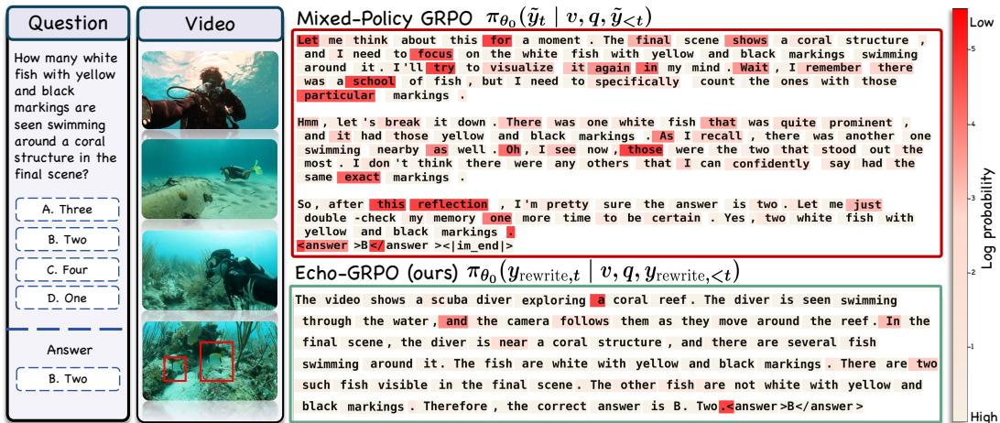  
Figure 1: Reasoning in the words you know. Token-level log-probabilities under the policy π (red shading indicates low probability). Top: Mixed-Policy GRPO forces the policy to imitate privileged reasoning traces from a stronger teacher, leaving semantically critical ones, such as “school of fish,” in low-likelihood regions. Bottom: Echo-GRPO paraphrases the same reasoning into the policy’s native distribution (“school of fish” → “several fish”), preserving the semantics while keeping all tokens within the policy’s distribution.

To address this, we propose Echo-GRPO, a rewriting framework that makes the model reason in the words it speaks. Rather than imitating out-of-distribution traces, Echo-GRPO rewrites them with respect to the student’s own idiolect, that is, its own characteristic vocabulary and expression patterns, while effectively preserving their semantics via Dual-Reference Decoding (DRD). DRD combines two conditional distributions of the initial policy in a product-of-experts formulation: a semantic reference that constrains token selection to be faithful to the privileged trace, and a distributional reference that ensures each token remains probable under the student policy. As illustrated in Fig. 1, the privileged trace describes a group of fish as a ‘school of fish’, while the rewritten trajectory expresses the same observation as ‘several fish’, which lies within the policy’s distribution while preserving the semantical meaning.

We demonstrate that VideoEcho-R1, optimized with Echo-GRPO, achieves consistent improvements in reasoning distillation across three multimodal LLM backbones and five benchmarks, and our idiolectal rewriting further serves as a plug-in module that improves both reinforcement learning and supervised fine-tuning frameworks.

Our contributions can be summarized as:

• We identify the underexplored failure mode of mixed-policy GRPO, where the trust-region clipping suppresses gradient updates on semantically critical reasoning tokens, rewarding correct answers while leaving the underlying reasoning unlearned.

• We propose Echo-GRPO, an idiolectal paraphrasing framework that aligns off-policy privileged traces with the policy’s native distribution via Dual-Reference Decoding that promotes paraphrased trajectories to be both semantically faithful and distributionally coherent.

• We introduce VideoEcho-R1, the model trained with Echo-GRPO for video reasoning distillation, which outperforms vanilla GRPO, supervised fine-tuning, and Mixed-Policy

GRPO across three multimodal LLM backbones (InternVL3.5-4B, Qwen3-VL-4B, Qwen3- VL-8B) and five video reasoning benchmarks.

• Idiolectal paraphrasing is a plug-in module that consistently improves reasoning distillation across both reinforcement learning frameworks and supervised fine-tuning, demonstrating that policy-aligned supervision extends well beyond vanilla GRPO.

## 2 Related Works

Reinforcement Learning in LLM Reasoning. Reinforcement learning [11–15] has emerged as a key driver for advancing LLM reasoning, demonstrated by recent systems such as OpenAI o1 [4], DeepSeek-R1 [2], and Kimi-1.5 [3]. GRPO [1, 2] has emerged as a widely adopted on-policy paradigm, with subsequent work refining it to address trust-region behavior, length bias, and KL regularization [5, 16, 17]. A parallel line injects privileged supervision from stronger teachers to overcome the on-policy capability ceiling: Mixed-Policy GRPO [18, 6] substitutes one rollout with an off-policy trace, LUFFY [6] further applies regularized importance sampling to balance imitation and exploration, and OPSD [19] minimizes per-token divergence between a privileged-context teacher and the student over student-generated rollouts. Our work identifies a specific failure mode in this setting: gradient suppression from trust-region clipping on semantically critical tokens, and addresses it with idiolectal paraphrasing jointly faithful to the teacher’s semantics and probable under the policy, directly stabilizing importance sampling ratios without requiring gradient or loss level correction.

Reasoning in Multimodal Large Language Models. Recent works extend RL-based reasoning to multimodal LLMs across diverse visual tasks [20–22, 7, 23–27]. Vision-R1 [20] adapts R1-style RL to image reasoning, while Video-R1 [28], VideoChat-R1 [22], and Tempsamp-R1 [7] extend it to video, targeting the temporal space of temporal-aware GRPO and rewards, respectively. Reason-RFT [29] further explores self-reflection and staged fine-tuning for vision-language reasoning. While these works successfully transplant RL-for-reasoning to the multimodal regime, the off-policy distillation gap is particularly acute in the video setting, where traces from large multimodal teachers lie far outside the distribution of smaller VideoLLMs and semantic grounding in spatiotemporal evidence makes clipping-induced suppression especially damaging.

## 3 Method

In this section, we first provide a brief overview of GRPO for reasoning distillation and the assumption it relies on (Sec. 3.1). Then we identify the failure mode of Mixed-Policy GRPO, where trust-region clipping suppresses gradient updates on semantically critical reasoning tokens (Sec. 3.2). To address this, we propose Echo-GRPO, an idiolectal paraphrasing framework that aligns the privileged reasoning traces into the policy’s native distribution via Dual-Reference Decoding (Sec. 3.3).

## 3.1 Reasoning Distillation with GRPO

Group Relative Policy Optimization (GRPO) [1] serves as the underlying framework for reasoning distillation, where an off-policy reasoning trace is adopted as supervision signals to guide optimization, also referred to as Mixed-Policy GRPO [6]. Given an input $( v , q )$ consisting of a video and a question, we consider two types of reasoning traces: (1) naive reasoning traces $y \sim \pi _ { \mathrm { o l d } } ( \cdot \mid v , q )$ sampled from the current policy, and (2) privileged reasoning trace $\tilde { y } \sim \pi _ { T } ( \cdot \mid v , q )$ obtained from a stronger teacher policy $\pi _ { T }$ . Then we combine the set of trajectories as $\mathcal { G } = \{ y _ { i } \} _ { i = 1 } ^ { G - 1 } \cup \{ \tilde { y } \}$ where $G$ denotes the number of candidate samples. The GRPO optimizes the following objective over $\mathcal { G }$

$$
\begin{array} { l }  \displaystyle { J _ { \mathrm { G R P O } } \left( \theta \right) = \mathbb { E } _ { \boldsymbol { v } , \boldsymbol { q } \sim \mathcal { D } , \left\{ \boldsymbol { y } _ { i } \right\} _ { i = 1 } ^ { G - 1 } \sim \pi _ { \mathrm { o d d } } \left( \cdot | \boldsymbol { v } , \boldsymbol { q } \right) , \tilde { \boldsymbol { y } } \sim \pi _ { T } \left( \cdot | \boldsymbol { v } , \boldsymbol { q } \right) } } \\ { \displaystyle \left[ \frac { 1 } { G } \sum _ { i = 1 } ^ { G } \frac { 1 } { | \boldsymbol { y } _ { i } | } \sum _ { t = 1 } ^ { | \boldsymbol { y } _ { i } | } \operatorname* { m i n } \left( \hat { r } _ { i , t } \left( \theta \right) \hat { A } _ { i } , \mathrm { c l i p } \left( \hat { r } _ { i , t } \left( \theta \right) , 1 - \epsilon , 1 + \epsilon \right) \hat { A } _ { i } \right) \right] , } \end{array}\tag{1}
$$

where ϵ is the clipping hyperparameter, and the importance sampling ratio is $\begin{array} { r } { \hat { r } _ { i , t } = \frac { \pi _ { \theta } \left( y _ { i , t } | v , q , y _ { i , < t } \right) } { \pi _ { \mathrm { o l d } } \left( y _ { i , t } | v , q , y _ { i , < t } \right) } } \end{array}$ The advantage ${ \hat { A } } _ { i }$ for reasoning trace $y _ { i }$ is computed using a group-normalized reward ${ \hat { A } } _ { i } \ =$ $\frac { \mathcal { R } ( y _ { i } ) - \mu _ { \mathcal { G } } } { \sigma _ { \mathcal { G } } }$ , where $\mu$ and $\sigma _ { \mathcal G }$ are the mean and standard deviation of a set of rewards from reasoning traces ${ \mathcal { G } } .$ Following prior works [5, 16], we omit the KL divergence penalty.

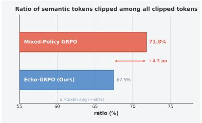

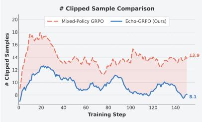

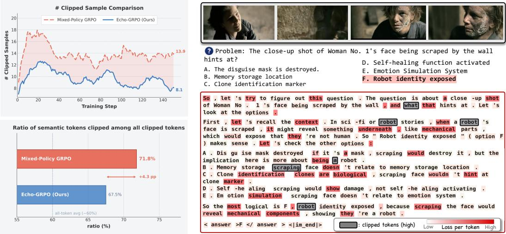  
(a) Clipping rate comparison.  
(b) Example of Semantically important token clipped.  
Figure 2: (a) (top) Number of samples containing at least one clipped token throughout training for Mixed-Policy GRPO (red), and Echo-GRPO (blue). (bottom) Ratio of semantically important tokens (e.g., nouns from the question and options) among all clipped tokens for each method. (b) Token-level visualization of clipping behavior on a representative video reasoning sample, where grey boxes indicate clipped tokens and red shading denotes per-token loss intensity.

The importance sampling ratio $\hat { r } _ { i , t } ( \theta )$ plays a central role in ensuring valid policy updates when optimizing over trajectories sampled from a previous policy close to the current policy. Crucially, this mechanism relies on the assumption that all training trajectories in $\mathcal { G }$ lie within the behavior (old) policy distribution, keeping importance ratios near unity and gradient updates stable. However, adopting the privileged trace $\tilde { y }$ that is not sampled from πθ but from a separate teacher policy πT may break this assumption.

## 3.2 Clipping-Induced Suppression of Essential Reasoning

Substituting an off-policy privileged trace y˜ into the GRPO objective creates a cascading failure where the distributional gap between the $\pi _ { \theta }$ and $\pi _ { T }$ first manifests as instability in the importance sampling ratio $\hat { r } _ { i , t } ( \theta )$ . Specifically, the model is forced to update its policy towards a rigid, out-of-distribution reasoning trace, y˜, which it is highly unlikely to generate, i.e., low $\pi _ { \boldsymbol { \theta } } ( \tilde { y } | \boldsymbol { v } , \boldsymbol { q } )$

Trust-region clipping discards a substantial fraction of samples. This instability propagates directly into trust-region clipping, of which when $\hat { r } _ { i , t } ( \theta )$ falls outside the trust region of $[ 1 - \epsilon , 1 + \epsilon ]$ the corresponding gradient update is discarded. In practice, since privileged traces carry positive advantages while their tokens remain low-probability under the student policy, the ratio tends to exceed $1 + \epsilon$ , consistently triggering gradient suppression. In Fig. 2a (top), we measure the fraction of training samples containing at least one clipped token, where we find that Mixed-Policy GRPO clips a substantial fraction throughout optimization (dashed red).

Not all clipped tokens are noisy. To better understand the impact, we visualize token-level clipping in Fig. 2b. Tokens excluded from gradient updates are highlighted in grey, with per-token loss intensity shaded in red. As depicted, the entity "robot", the key referent for the answer "Robot identity exposed", is clipped from the gradient update, which indicates the trajectory received a high reward (the model arrives at the correct answer), but the gradient signal that would teach the model why the answer is correct is silently suppressed. Similarly, as shown in Fig. 2a (bottom), semantically important tokens (e.g., nouns from the question and options) account for a disproportionately large share of clipped tokens throughout training, with 71.8% in Mixed-Policy GRPO.

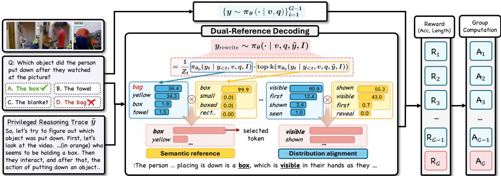

Figure 3: Overview of Echo-GRPO. Given a video question and a privileged reasoning trace ${ \tilde { y } } ,$ Echo-GRPO adopts an idiolectal paraphrased trace yrewrite produced by Dual-Reference Decoding (DRD). DRD combines two conditional distributions of $\pi _ { \theta _ { 0 } }$ as a product of distributions: the semantic reference (yellow) constrains token selection to be faithful to y˜, correcting the base policy’s preference for semantically incorrect tokens (e.g., ‘bag’ to ‘box’); while distribution alignment (blue) resolves ties among semantically equivalent candidates by preferring tokens the student policy is more likely to generate (e.g., ‘visible’ over ‘shown’), keeping the rewritten trace aligned to its naive distribution.  
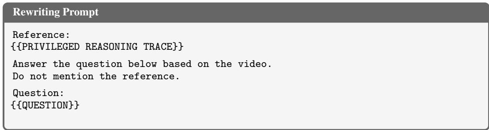  
Figure 4: Prompt for idiolectal paraphrasing. The privileged reasoning trace $\tilde { y }$ corresponds to ({{PRIVILEGED REASONING TRACE}}). We append the question and options at the end of the prompt. For the Question and Options we follow the format of OneThinker [21]. Further details are in the supplement.

To directly test whether semantic token clipping drives this failure, we ablate which tokens are unclipped while holding all other settings fixed on three major benchmarks, i.e., unclipping specific tokens like semantically important or simple random tokens among those that are clipped. As shown in Tab. 1, unclipping all tokens improves Mixed-Policy from 35.9 to 40.8, while unclipping a random subset reaches 48.4. Additionally, selectively unclipping semantic tokens yields the largest gain, reaching 52.0 (+16.1). Since the random and semantic interventions unclip the same number of tokens and differ only in token identity, this supports semantic token clipping as a key factor behind Mixed-Policy failure.

Table 1: Effect of clipping on Mixed-Policy failure. OOD and ID refer to Out-of-distribution and In-distribution, respectively. Performance is averaged over three major benchmarks: VideoM-MMU, MMVU, and Video-Holmes.
<table><tr><td>Clipping Method</td><td>Priv. Trace</td><td>Avg.</td><td>Δ</td></tr><tr><td>Mixed-Policy</td><td>OOD</td><td>35.9</td><td></td></tr><tr><td>+ Unclip all tokens</td><td>OOD</td><td>40.8</td><td>+4.9</td></tr><tr><td>+ Unclip random tokens</td><td>OOD</td><td>48.4</td><td>+12.5</td></tr><tr><td>+ Unclip semantic tokens</td><td>OOD</td><td>52.0</td><td>+16.1</td></tr><tr><td>Echo-GRPO (Ours)</td><td>ID</td><td>58.2</td><td>+22.3</td></tr></table>

## 3.3 Idiolectally Paraphrasing Privileged Traces

To address the aforementioned limitations, we propose Echo-GRPO, which resolves by replacing the privileged trace y˜ with a idiolectally paraphrased trace $y _ { \mathrm { r e w r i t e } }$ that preserves the semantics of y˜ while lying within the policy’s native distribution, i.e., reason in the phrases that the model speaks with. The goal of Echo-GRPO is to seek a rewritten trajectory yrewrite that satisfies two properties: (1) preserve the semantic content of y˜ (semantical coherence), and (2) each token should lie within the policy’s native distribution (distribution alignment). A simple approach is sampling $y _ { \mathrm { r e w r i t e } } \sim \pi _ { \theta } ( \cdot | v , q , \tilde { y } , I )$ where I is a rewriting instruction prompt (shown in Fig 4). While simple rewriting conditioned on y˜ is effective (Sec. 4.4), it shifts the generation distribution toward the privileged trace, where we want to ensure that generated tokens lie within the policy’s native distribution without conditioning on ${ \tilde { y } } .$

Dual-Reference Decoding (DRD). To resolve this conditional shift, we introduce Dual-Reference Decoding (DRD), a product-of-experts formulation that combines two conditional distributions of $\pi _ { \theta _ { 0 } }$ , where $\pi _ { \theta _ { 0 } }$ is the initial policy model. The first serves as a semantic reference, conditioning on the privileged trace and contributing its top-k candidates, while the second acts as a distributional reference, evaluating the policy without privileged conditioning over the full vocabulary. At every step, the two distributions are multiplied so that the token receives high probability only when the token falls under both references. Formally, it can be written as:

$$
\begin{array} { r l } & { \pi _ { \mathrm { r e w i t i e } } \left( y _ { t } \mid y _ { < t } , v , q , \tilde { y } , I \right) = \displaystyle \frac { 1 } { Z _ { t } } \left[ \underbrace { \pi _ { \theta _ { 0 } } \left( y _ { t } \mid y _ { < t } , v , q , I \right) } _ { \mathrm { D i s t r i b u i o n a l ~ r e f e r e n c e } } \cdot \underbrace { \mathrm { t o p } \mathrm { - } k \left( \pi _ { \theta _ { 0 } } \left( y _ { t } \mid y _ { < t } , v , q , \tilde { y } , I \right) \right) } _ { \mathrm { S e m a n i c ~ r e f e r e n c e } } \right] , } \\ & { \mathrm { t o p } \mathrm { - } k \Big ( \pi _ { \theta _ { 0 } } \left( y _ { t } \mid y _ { < t } , v , q , \tilde { y } , I \right) \Big ) = \displaystyle \pi _ { \theta _ { 0 } } \left( y _ { t } \mid y _ { < t } , v , q , \tilde { y } , I \right) \cdot \mathbf { 1 } _ { \left\{ y _ { t } \in \mathcal { V } _ { k } ^ { \left( t \right) } \right\} } , } \\ & { \mathcal { V } _ { k } ^ { ( t ) } = \underbrace { \arg \operatorname* { m a x } } _ { V \subset \mathcal { V } , \left| V \right| = k } \displaystyle \sum _ { y _ { t } \in V } \pi _ { \theta _ { 0 } } \left( y _ { t } \mid y _ { < t } , v , q , \tilde { y } , I \right) . } \end{array}\tag{2}
$$

The set $\mathcal { V } _ { k } ^ { ( t ) }$ is the set of top-k tokens under the semantic reference, and $Z _ { t }$ is a normalization constant. DRD actively shapes both distributions for the final probability for the current step token, of which the tokens that fall outside $\mathcal { V } _ { k } ^ { ( t ) }$ will not be preferred as affected by the indicator 1(·). Hence, a token is more favored when it is plausible, which holds consistency with the privileged reasoning trace’s semantical meaning and carries meaningful probability under the policy’s native distribution. Note that we adopt different I in practice for each: the semantic reference uses the rewriting instruction prompt with the privileged trace as shown in Fig. 4, whereas the distributional reference uses a standard question prompt without any rewriting instruction, ensuring the output distribution reflects the model’s native generation behavior. Overall, Echo-GRPO replaces $\tilde { y }$ with $y _ { \mathrm { r e w r i t e } }$ in a way that adheres to the on-policy assumption of GRPO, stabilizing the importance sampling ratios and ensuring that semantically critical tokens remain within the trust region, thereby enabling the model to learn meaningful reasoning components.

## 4 Experiments

## 4.1 Experimental Settings

We evaluate three multimodal LLM backbones: InternVL3.5-4B [9], Qwen3-VL-4B [8], and Qwen3- VL-8B, with Qwen3-VL-4B used for all ablations unless noted. We uniformly sample 8 frames per video and generate 6 rollouts per sample, replacing one with the privileged trace for distillation frameworks. All models are optimized using the same training protocol unless otherwise specified. Our training set consists of 2.4K samples from OneThinker-SFT-340K [21], annotated by Seed1.5- VL [10] as teacher policy $\pi _ { T } ;$ privileged traces are used only during training and not at inference time. We use k=5 for DRD and combine accuracy and length rewards. We evaluate on five benchmarks: VideoMMMU [30], MMVU (multiple choice) [31], Video Holmes [32], VSI-Bench [33], and VideoMME [34]. Full hyperparameter details are in the supplement.

## 4.2 Main results

Tab. 2 reports the main results of VideoEcho-R1 across three backbones (InternVL3.5-4B and Qwen3- VL-4B and Qwen3-VL-8B), comparing against other general training pipelines on five benchmarks spanning general video understanding and reasoning.

VideoEcho-R1 outperforms on average across backbones and benchmarks. On Qwen3-VL-4B, VideoEcho-R1 achieves an average score of 57.2, surpassing vanilla GRPO by 1.3 points and

Table 2: Comparison of baselines with general training pipelines across various benchmarks. We report performance on both Video Reasoning and Video General benchmarks using 8 frames.
<table><tr><td>Models</td><td>VideoMMMU</td><td>MMVU(mc)</td><td>Video Holmes</td><td>VSI-Bench</td><td>VideoMME</td><td>Avg</td></tr><tr><td>InternVL3.5-4B</td><td></td><td></td><td></td><td></td><td></td><td></td></tr><tr><td>Base</td><td>43.4</td><td>57.4</td><td>33.9</td><td>37.5</td><td>55.4</td><td>45.5</td></tr><tr><td>+ SFT</td><td>54.1</td><td>59.0</td><td>40.9</td><td>42.5</td><td>57.4</td><td>50.8</td></tr><tr><td>+ GRPO</td><td>50.4</td><td>61.1</td><td>40.0</td><td>46.7</td><td>56.5</td><td>50.9</td></tr><tr><td>+ SFT → GRPO</td><td>49.8</td><td>61.3</td><td>39.4</td><td>37.8</td><td>57.6</td><td>49.2</td></tr><tr><td>+ Mixed-Policy GRPO</td><td>49.3</td><td>58.4</td><td>38.8</td><td>41.2</td><td>55.0</td><td>48.5</td></tr><tr><td>VideoEcho-R1 (4B)</td><td>55.3</td><td>65.1</td><td>41.0</td><td>44.0</td><td>57.9</td><td>52.7</td></tr><tr><td>Qwen3-VL-4B</td><td></td><td></td><td></td><td></td><td></td><td></td></tr><tr><td>Base</td><td>55.2</td><td>62.7</td><td>33.5</td><td>34.7</td><td>55.6</td><td>48.3</td></tr><tr><td>+ SFT</td><td>48.2</td><td>62.9</td><td>40.8</td><td>38.2</td><td>58.2</td><td>49.7</td></tr><tr><td>+ GRPO</td><td>56.8</td><td>68.0</td><td>43.3</td><td>50.8</td><td>60.7</td><td>55.9</td></tr><tr><td>+ SFT → GRPO</td><td>57.5</td><td>66.2</td><td>44.0</td><td>42.7</td><td>59.6</td><td>54.0</td></tr><tr><td>+ Mixed-Policy GRPO</td><td>42.1</td><td>41.9</td><td>23.6</td><td>35.2</td><td>54.5</td><td>39.5</td></tr><tr><td>VideoEcho-R1 (4B)</td><td>59.1</td><td>68.8</td><td>46.7</td><td>50.9</td><td>60.7</td><td>57.2</td></tr><tr><td>Qwen3-VL-8B</td><td></td><td></td><td></td><td></td><td></td><td></td></tr><tr><td>Base</td><td>56.3</td><td>60.6</td><td>36.5</td><td>40.2</td><td>60.0</td><td>50.7</td></tr><tr><td>+ SFT</td><td>57.0</td><td>71.0</td><td>42.7</td><td>39.8</td><td>60.7</td><td>54.2</td></tr><tr><td>+ GRPO</td><td>62.6</td><td>71.5</td><td>44.7</td><td>51.1</td><td>61.0</td><td>58.2</td></tr><tr><td>+ SFT → GRPO</td><td>61.7</td><td>69.9</td><td>44.6</td><td>46.6</td><td>60.6</td><td>56.7</td></tr><tr><td>+ Mixed-Policy GRPO</td><td>60.1</td><td>71.5</td><td>43.1</td><td>35.8</td><td>57.5</td><td>53.6</td></tr><tr><td>VideoEcho-R1 (8B)</td><td>63.6</td><td>72.3</td><td>45.1</td><td>49.1</td><td>61.1</td><td>58.2</td></tr></table>

Table 3: Comparison with various reasoning distillation frameworks. We report performance on both Video Reasoning and Video General benchmarks using 8 frames with Qwen3-VL-4B. ∗ indicates the frameworks originally proposed for LLMs, adopted to our optimization setting with minimal modifications under the same protocols for fair comparison.
<table><tr><td>Method</td><td>VideoMMMU</td><td>MMVU(mc)</td><td>Video Holmes</td><td>VSI-Bench</td><td>VideoMME</td><td>Avg</td></tr><tr><td>RL w/ SFT</td><td>52.8</td><td>61.0</td><td>39.1</td><td>45.5</td><td>53.5</td><td>50.4</td></tr><tr><td>RL w/ SFT + Echo</td><td>57.2</td><td>62.1</td><td>40.5</td><td>47.1</td><td>58.0</td><td>53.0</td></tr><tr><td>LUFFY*</td><td>55.2</td><td>62.6</td><td>33.3</td><td>50.1</td><td>58.3</td><td>51.9</td></tr><tr><td>LUFFY + Echo</td><td>56.0</td><td>63.8</td><td>32.8</td><td>50.3</td><td>58.3</td><td>52.2</td></tr><tr><td>OPSD-JSD*</td><td>56.1</td><td>63.8</td><td>36.9</td><td>50.8</td><td>55.9</td><td>52.7</td></tr><tr><td>OPSD-IKL*</td><td>55.9</td><td>63.5</td><td>34.1</td><td>49.4</td><td>56.0</td><td>51.8</td></tr><tr><td>Echo-GRPO</td><td>59.1</td><td>68.8</td><td>46.7</td><td>50.9</td><td>60.7</td><td>57.2</td></tr></table>

Table 4: Comparison of rewriting strategies for Echo-GRPO. We compare generic paraphrasing, prompt-only student rewriting, and DRD variants using semantic and/or distributional references on Qwen3-VL-4B. Note that generic paraphrasing and prompt-only student rewriting are single-step sentence rewriting of the privilege trace with an external model and the student model, respectively.
<table><tr><td>Strategy</td><td>Sem. Ref.</td><td>Dist. Ref.</td><td>V-MMMU</td><td>MMVU</td><td>VHolm</td><td>Avg.</td><td>Δ</td></tr><tr><td>Mixed-Policy</td><td></td><td></td><td>42.1</td><td>41.9</td><td>23.6</td><td>35.9</td><td></td></tr><tr><td>Generic Paraphrasing</td><td></td><td>一</td><td>52.1</td><td>64.5</td><td>41.4</td><td>52.7</td><td>+16.8</td></tr><tr><td>Prompt-only Student Rewriting</td><td>一</td><td>一</td><td>58.0</td><td>66.6</td><td>43.3</td><td>56.0</td><td>+20.1</td></tr><tr><td>Semantic-reference only</td><td>√</td><td>一</td><td>58.5</td><td>66.7</td><td>45.3</td><td>56.8</td><td>+20.9</td></tr><tr><td>Distributional-reference only</td><td>一</td><td>V</td><td>57.8</td><td>64.0</td><td>42.9</td><td>54.9</td><td>+19.0</td></tr><tr><td>DRD (Ours)</td><td>√</td><td>√</td><td>59.1</td><td>68.8</td><td>46.7</td><td>58.2</td><td>+22.3</td></tr></table>

SFT→GRPO by 3.2 points. On InternVL3.5-4B, VideoEcho-R1 scores 52.7 on average, outperforming GRPO by 1.8 points and SFT→GRPO by 3.5 points. On Qwen3-VL-8B, VideoEcho-R1 reaches 58.2, with consistent gains on reasoning benchmarks such as VideoMMMU (+1.0) and MMVU (+0.8) over GRPO. On VSI-Bench, which rewards exact numerical estimations (e.g., object size, distance), GRPO is competitive or superior. We conjecture that on-policy rollouts produce more consistent numerical reasoning patterns within rollout groups, which is beneficial for tasks requiring fine-grained numerical precision. Notably, this trade-off is partially mitigated when idiolectical rewriting is applied on top of SFT→GRPO with consistent reasoning patterns (see supplement).

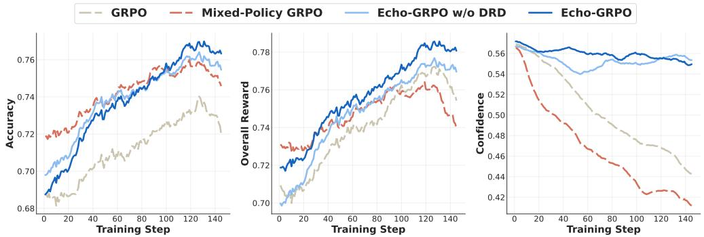  
Figure 5: Training Dynamics of Echo-GRPO.

Mixed-Policy GRPO empirically degrades reasoning. Across all benchmarks, Mixed-Policy GRPO performs worse than vanilla GRPO with as much as a drop of 16.4 points for Qwen3-VL-4B, a 2.4 points drop for InternVL3.5-4B, and a 4.6 points drop for Qwen3-VL-8B. This empirically confirms our observation in Sec. 3.2, where naive injection of the off-policy privileged reasoning trace hinders effective reasoning distillation.

## 4.3 Comparison with Reasoning Distillation Frameworks

Tab. 3 compares Echo-GRPO against three representative reasoning distillation frameworks: RL w/ SFT, a GRPO objective with an SFT loss on the privileged trace as ground-truth target, LUFFY, which adopts privileged traces while shaping the gradient for optimization, and the OPSD variants, which distill privileged supervision via fixed-divergence objectives. More details are in the supplement.

Echo-GRPO is the strongest among reasoning distillation methods. Echo-GRPO achieves an average performance of 57.2 across five benchmarks, outperforming RL w/ SFT with 6.8 points, LUFFY with 5.3 points, OPSD-JSD with 4.5, and OPSD-IKL with 5.4 points. Among the baselines, OPSD performs competitively which adopts divergence objectives, yet still falls short on reasoningintensive benchmarks. We attribute this gap to its reliance on a single privileged trace per question, which limits the diversity of reasoning patterns. In contrast, Echo-GRPO samples various reasoning traces, exposing the model to a richer set of policy-aligned reasoning paths.

Idiolectal paraphrasing as plug-in module. To assess whether policy-aligned supervision extends beyond Echo-GRPO, we apply our idiolectal paraphrasing to two existing frameworks. RL w/ SFT + Echo improves over RL w/ SFT from 50.4 to 53.0, a gain of 2.6 points. LUFFY + Echo improves over LUFFY from 51.9 to 52.2. The consistent gains across frameworks confirm that policy-aligned supervision with idiolectal paraphrasing is broadly beneficial and is a general plug-in applicable to existing reasoning distillation paradigms, not specific to the GRPO objective.

## 4.4 Analysis

We analyze various aspects of Echo-GRPO that are (1) reduced clipping, (2) training dynamics, (3) training dynamics as a plug-in, (4) generalizability, (5) ablation on the components, (6) ablation on different rewriting strategies, (7) self-paraphrasing beyond RL, and (8) Qualitative results. Unless specified, all analyses use Qwen3-VL-4B.

Reduced clipping on semantically critical tokens. As shown in Fig. 2a (top), unlike Mixed-Policy GRPO, which exhibits a substantial fraction of training samples that contain clipped tokens, suppressing gradient updates on essential reasoning components, Echo-GRPO (blue) alleviates the clip fraction. As visualized in Fig. 2a (bottom), the ratio of semantically important tokens among all clipped tokens is reduced by 4.0 percentage points under Echo-GRPO (67.5%) compared to Mixed-Policy GRPO (71.8%).

Training dynamics of Echo-GRPO. Fig. 5 illustrates the training dynamics of overall accuracy (left), overall reward (middle), and confidence i.e., mean log probability per token (right), In terms of accuracy and reward, Mixed-policy initially achieves higher accuracy, yet shows a low learning slope, while Echo-GRPO demonstrates acceleration with sustained increase, ultimately surpassing all baselines. Also, Echo-GRPO preserves model confidence, while GRPO exhibits a steady decline, and Mixed-Policy collapses in the early stages.

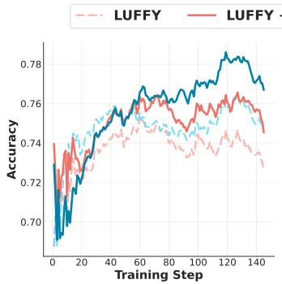

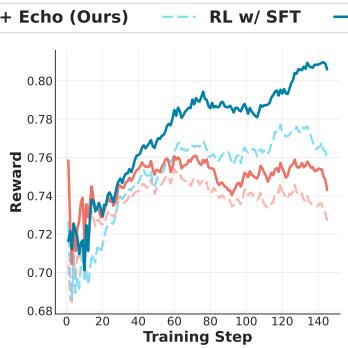

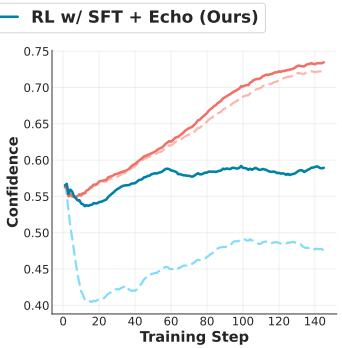  
Figure 6: Training Dynamics of idiolectal paraphrasing as a plug-in.

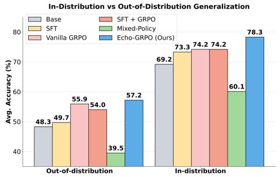  
Figure 7: In-Distribution and Out-of-Distribution Generalization of Echo-GRPO.

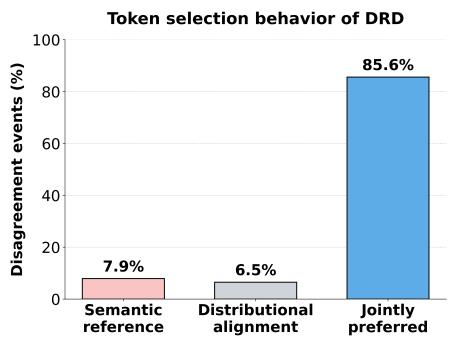  
Figure 8: Token selection behavior of Dual-Reference Decoding.

Training dynamics as Plug-in. Fig. 6 reveals that idiolectal paraphrasing is also effective in other reasoning distillation frameworks. LUFFY + Echo and RL w/ SFT + Echo show consistent improvements in confidence, accuracy, and overall reward. Both surpass their respective base frameworks throughout training, indicating idiolectal paraphrasing is broadly applicable and effective.

In- and out-of-distribution generalization. Fig. 7 evaluates generalizability across all methods, where in-distribution refers to the held-out test set aligned with training data and out-of-distribution to general video benchmarks. Echo-GRPO achieves best performance in both regimes (78.3 and 57.2), suggesting that our rewriting enhances reasoning rather than mere mimicking, leading to more robust generalization.

Ablation of rewriting strategy. Tab. 4 compares DRD with simpler rewriting strategies across three representative video reasoning benchmarks. Generic paraphrasing, where an external model (InternVL3.5-4B) rewrites the whole sentence in a single step, already improves Mixed-Policy from 35.9 to 52.7, while prompt-only student rewriting that is single-step rewriting by the student model further reaches 56.0, showing that rewriting privileged traces toward the student’s distribution is itself beneficial. Beyond this effect, full DRD reaches 58.2, providing an additional 2.2-point gain over prompt-only rewriting. Among the single-reference variants, semantic guidance performs better than distributional guidance (56.8 vs. 54.9), indicating the importance of preserving semantically informative tokens. However, combining both references in DRD consistently improves over semanticonly guidance across all three benchmarks by +0.6, +2.1, and +1.4 points, respectively, yielding the best average performance of 58.2. This further supports jointly incorporating semantic and distributional guidance, also reflected in the training dynamics in Fig. 5. Fig. 8 further shows that, when the two references disagree, DRD selects a token preferred by both references in 85.6% of cases, supporting our product-of-experts formulation.

Idiolectal paraphrasing improves SFT beyond RL. Tab. 5 examines whether policy-aligned supervision extends to the SFT setting by replacing the privileged trace y˜ with the rewritten trace $y _ { \mathrm { r e w r i t e } }$ as the SFT target. For SFT, this improves average performance from 50.6 to 52.6.

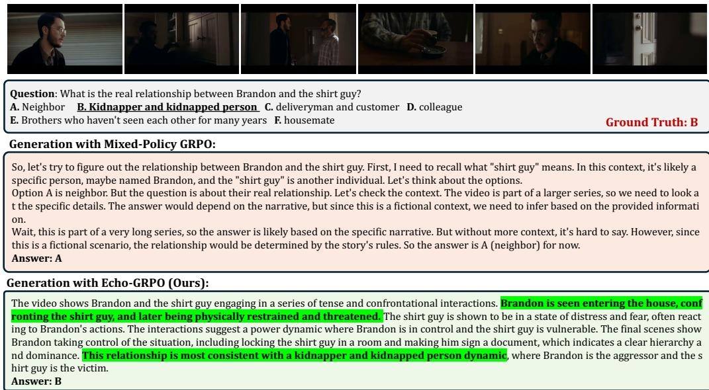  
Figure 9: Qualitative example. Mixed-Policy GRPO (top) mimics the structural format of privileged traces, defaulting to narrative speculation (“this is part of a fictional series, so the answer is likely...”) and predicting the wrong answer (A: Neighbor). Echo-GRPO (bottom) instead references concrete events from the video (highlighted in green) and reaches the correct answer (B: Kidnapper).

With SFT→GRPO, performance improves with an average from 55.9 to 58.8. This confirms that idiolectal paraphrasing is broadly effective regardless of the training objective.

Qualitative Results. Fig. 9 compares the generated reasoning trace between the Mixed-Policy GRPO and our Echo-GRPO. Mixed-Policy GRPO fails to ground its reasoning in the video but rather tries to mimic the structural format of the privileged trace, focusing on the narrative speculation

Table 5: Comparison of SFT and SFT→GRPO using offline (y˜) and idiolectal paraphrased traces (yrewrite).
<table><tr><td>Method</td><td>Priv.</td><td>V-MMMU</td><td>MMVU</td><td>VHolm</td><td>Avg.</td></tr><tr><td rowspan="2">SFT</td><td>y</td><td>48.2</td><td>62.9</td><td>40.8</td><td>50.6</td></tr><tr><td>Yrewrite</td><td>56.3</td><td>64.0</td><td>37.6</td><td>52.6</td></tr><tr><td rowspan="2">SFT→GRPO</td><td>y</td><td>57.5</td><td>66.2</td><td>44.0</td><td>55.9</td></tr><tr><td>Yrewrite</td><td>58.2</td><td>68.8</td><td>49.5</td><td>58.8</td></tr></table>

i.e., ‘this is part of a fictional series, so the answer is likely...’. Echo-GRPO produces a visually grounded reasoning chain, identifying the concrete events (highlighted in green). Hence, the model reaches the correct answer by reasoning with observations rather than imitating the privileged reasoning trace.

## 5 Conclusion

We identify a failure mode of mixed-policy GRPO, where trust-region clipping suppresses semantically critical tokens. To address this, we propose Echo-GRPO, an idiolectal paraphrasing framework that rewrites privileged reasoning into the model’s native distribution via Dual-Reference Decoding. Our VideoEcho-R1 achieves consistent improvements across multiple backbones and benchmarks, and generalizes as a plug-in module for both reinforcement learning and supervised fine-tuning.

## References

[1] Zhihong Shao, Peiyi Wang, Qihao Zhu, Runxin Xu, Junxiao Song, Xiao Bi, Haowei Zhang, Mingchuan Zhang, YK Li, Yang Wu, et al. Deepseekmath: Pushing the limits of mathematical reasoning in open language models. arXiv preprint arXiv:2402.03300, 2024.

[2] Daya Guo, Dejian Yang, Haowei Zhang, Junxiao Song, Peiyi Wang, Qihao Zhu, Runxin Xu, Ruoyu Zhang, Shirong Ma, Xiao Bi, et al. Deepseek-r1: Incentivizing reasoning capability in llms via reinforcement learning. arXiv preprint arXiv:2501.12948, 2025.

[3] Kimi Team, Angang Du, Bofei Gao, Bowei Xing, Changjiu Jiang, Cheng Chen, Cheng Li, Chenjun Xiao, C Du, C Liao, et al. Kimi k1. 5: Scaling reinforcement learning with llms, 2025. URL https://arxiv. org/abs/2501.12599, 118, 2025.

[4] Aaron Jaech, Adam Kalai, Adam Lerer, Adam Richardson, Ahmed El-Kishky, Aiden Low, Alec Helyar, Aleksander Madry, Alex Beutel, Alex Carney, et al. Openai o1 system card. arXiv preprint arXiv:2412.16720, 2024.

[5] Qiying Yu, Zheng Zhang, Ruofei Zhu, Yufeng Yuan, Xiaochen Zuo, Yu Yue, Weinan Dai, Tiantian Fan, Gaohong Liu, Lingjun Liu, et al. Dapo: An open-source llm reinforcement learning system at scale. In NeurIPS, 2025.

[6] Jianhao Yan, Yafu Li, Zican Hu, Zhi Wang, Ganqu Cui, Xiaoye Qu, Yu Cheng, and Yue Zhang. Learning to reason under off-policy guidance. In NeurIPS, 2025.

[7] Yunheng Li, Jing Cheng, Shaoyong Jia, Hangyi Kuang, Shaohui Jiao, Qibin Hou, and Ming-Ming Cheng. Tempsamp-r1: Effective temporal sampling with reinforcement fine-tuning for video llms. In NeurIPS, 2025.

[8] Shuai Bai, Yuxuan Cai, Ruizhe Chen, Keqin Chen, Xionghui Chen, Zesen Cheng, Lianghao Deng, Wei Ding, Chang Gao, Chunjiang Ge, et al. Qwen3-vl technical report. arXiv preprint arXiv:2511.21631, 2025.

[9] Weiyun Wang, Zhangwei Gao, Lixin Gu, Hengjun Pu, Long Cui, Xingguang Wei, Zhaoyang Liu, Linglin Jing, Shenglong Ye, Jie Shao, et al. Internvl3. 5: Advancing open-source multimodal models in versatility, reasoning, and efficiency. arXiv preprint arXiv:2508.18265, 2025.

[10] ByteDance Seed Team. Seed1.5-vl technical report. arXiv preprint arXiv:2505.07062, 2025.

[11] Long Ouyang, Jeffrey Wu, Xu Jiang, Diogo Almeida, Carroll Wainwright, Pamela Mishkin, Chong Zhang, Sandhini Agarwal, Katarina Slama, Alex Ray, et al. Training language models to follow instructions with human feedback. In NeurIPS, 2022.

[12] Rafael Rafailov, Archit Sharma, Eric Mitchell, Christopher D Manning, Stefano Ermon, and Chelsea Finn. Direct preference optimization: Your language model is secretly a reward model. In NeurIPS, 2023.

[13] Ke Zhu, Liang Zhao, Zheng Ge, and Xiangyu Zhang. Self-supervised visual preference alignment. In ACMMM, 2024.

[14] Zhaolin Gao, Jonathan D. Chang, Wenhao Zhan, Owen Oertell, Gokul Swamy, Kianté Brantley, Thorsten Joachims, J. Andrew Bagnell, Jason D. Lee, and Wen Sun. Rebel: Reinforcement learning via regressing relative rewards. In NeurIPS, 2024.

[15] Yiyang Zhou, Chenhang Cui, Rafael Rafailov, Chelsea Finn, and Huaxiu Yao. Aligning modalities in vision large language models via preference fine-tuning. arXiv preprint arXiv:2402.11411, 2024.

[16] Zichen Liu, Changyu Chen, Wenjun Li, Penghui Qi, Tianyu Pang, Chao Du, Wee Sun Lee, and Min Lin. Understanding r1-zero-like training: A critical perspective. In COLM, 2025.

[17] Chujie Zheng, Shixuan Liu, Mingze Li, Xiong-Hui Chen, Bowen Yu, Chang Gao, Kai Dang, Yuqiong Liu, Rui Men, An Yang, et al. Group sequence policy optimization. arXiv preprint arXiv:2507.18071, 2025.

[18] Youssef Mroueh, Nicolas Dupuis, Brian Belgodere, Apoorva Nitsure, Mattia Rigotti, Kristjan Greenewald, Jiri Navratil, Jerret Ross, and Jesus Rios. Revisiting group relative policy optimization: Insights into on-policy and off-policy training. arXiv:2505.22257, 2025.

[19] Siyan Zhao, Zhihui Xie, Mengchen Liu, Jing Huang, Guan Pang, Feiyu Chen, and Aditya Grover. Selfdistilled reasoner: On-policy self-distillation for large language models. arXiv preprint arXiv:2601.18734, 2026.

[20] Wenxuan Huang, Bohan Jia, Zijie Zhai, Shaosheng Cao, Zheyu Ye, Fei Zhao, Zhe Xu, Xu Tang, Yao Hu, and Shaohui Lin. Vision-r1: Incentivizing reasoning capability in multimodal large language models. In ICLR, 2026.

[21] Kaituo Feng, Manyuan Zhang, Hongyu Li, Kaixuan Fan, Shuang Chen, Yilei Jiang, Dian Zheng, Peiwen Sun, Yiyuan Zhang, Haoze Sun, et al. Onethinker: All-in-one reasoning model for image and video. In CVPR, 2026.

[22] Xinhao Li, Ziang Yan, Desen Meng, Lu Dong, Xiangyu Zeng, Yinan He, Yali Wang, Yu Qiao, Yi Wang, and Limin Wang. Videochat-r1: Enhancing spatio-temporal perception via reinforcement fine-tuning. arXiv preprint arXiv:2504.06958, 2025.

[23] Ye Wang, Boshen Xu, Zihao Yue, Zihan Xiao, Ziheng Wang, Liang Zhang, Dingyi Yang, Wenxuan Wang, and Qin Jin. Timezero: Temporal video grounding with reasoning-guided lvlm. arXiv preprint arXiv:2503.13377, 2025.

[24] Yi Chen, Yuying Ge, Rui Wang, Yixiao Ge, Lu Qiu, Ying Shan, and Xihui Liu. Exploring the effect of reinforcement learning on video understanding: Insights from seed-bench-r1. arXiv preprint arXiv:2503.24376, 2025.

[25] Ye Wang, Ziheng Wang, Boshen Xu, Yang Du, Kejun Lin, Zihan Xiao, Zihao Yue, Jianzhong Ju, Liang Zhang, Dingyi Yang, et al. Time-r1: Post-training large vision language model for temporal video grounding. arXiv preprint arXiv:2503.13377, 2025.

[26] Xingjian Zhang, Siwei Wen, Wenjun Wu, and Lei Huang. Tinyllava-video-r1: Towards smaller lmms for video reasoning. arXiv preprint arXiv:2504.09641, 2025.

[27] Shuming Liu, Mingchen Zhuge, Changsheng Zhao, Jun Chen, Lemeng Wu, Zechun Liu, Chenchen Zhu, Zhipeng Cai, Chong Zhou, Haozhe Liu, et al. Videoauto-r1: Video auto reasoning via thinking once, answering twice. In CVPR, 2026.

[28] Kaituo Feng, Kaixiong Gong, Bohao Li, Zonghao Guo, Yibing Wang, Tianshuo Peng, Junfei Wu, Xiaoying Zhang, Benyou Wang, and Xiangyu Yue. Video-r1: Reinforcing video reasoning in mllms. In NeurIPS, 2025.

[29] Huajie Tan, Yuheng Ji, Xiaoshuai Hao, Xiansheng Chen, Pengwei Wang, Zhongyuan Wang, and Shanghang Zhang. Reason-rft: Reinforcement fine-tuning for visual reasoning of vision language models. In NeurIPS, 2025.

[30] Kairui Hu, Penghao Wu, Fanyi Pu, Wang Xiao, Yuanhan Zhang, Xiang Yue, Bo Li, and Ziwei Liu. Video-mmmu: Evaluating knowledge acquisition from multi-discipline professional videos. arXiv preprint arXiv:2501.13826, 2025.

[31] Yilun Zhao, Haowei Zhang, Lujing Xie, Tongyan Hu, Guo Gan, Yitao Long, Zhiyuan Hu, Weiyuan Chen, Chuhan Li, Zhijian Xu, et al. Mmvu: Measuring expert-level multi-discipline video understanding. In CVPR, 2025.

[32] Junhao Cheng, Yuying Ge, Teng Wang, Yixiao Ge, Jing Liao, and Ying Shan. Video-holmes: Can mllm think like holmes for complex video reasoning? arXiv preprint arXiv:2505.21374, 2025.

[33] Jihan Yang, Shusheng Yang, Anjali W Gupta, Rilyn Han, Li Fei-Fei, and Saining Xie. Thinking in space: How multimodal large language models see, remember, and recall spaces. In CVPR, 2025.

[34] Chaoyou Fu, Yuhan Dai, Yongdong Luo, Lei Li, Shuhuai Ren, Renrui Zhang, Zihan Wang, Chenyu Zhou, Yunhang Shen, Mengdan Zhang, et al. Video-mme: The first-ever comprehensive evaluation benchmark of multi-modal llms in video analysis. In CVPR, 2025.

[35] Adam Paszke, Sam Gross, Francisco Massa, Adam Lerer, James Bradbury, Gregory Chanan, Trevor Killeen, Zeming Lin, Natalia Gimelshein, Luca Antiga, et al. Pytorch: An imperative style, high-performance deep learning library. In NeurIPS, 2019.

[36] Yaowei Zheng, Junting Lu, Shenzhi Wang, Zhangchi Feng, Dongdong Kuang, and Yuwen Xiong. Easyr1: An efficient, scalable, multi-modality rl training framework. arXiv preprint arXiv:2501.12345, 2025.

[37] Yaowei Zheng, Richong Zhang, Junhao Zhang, Yanhan Ye, Zheyan Luo, Zhangchi Feng, and Yongqiang Ma. Llamafactory: Unified efficient fine-tuning of 100+ language models. In ACL, 2024.

[38] Woosuk Kwon, Zhuohan Li, Siyuan Zhuang, Ying Sheng, Lianmin Zheng, Cody Hao Yu, Joseph E. Gonzalez, Hao Zhang, and Ion Stoica. Efficient memory management for large language model serving with pagedattention. In ACM SIGOPS 29th Symposium on Operating Systems Principles, 2023.

[39] Mathematical Association of America. American invitational mathematics examination (AIME) 2024, 2024. AIME I and AIME II competition problems.

[40] Mathematical Association of America. American invitational mathematics examination (AIME) 2025, 2025. AIME I and AIME II competition problems.

[41] Jasper Dekoninck, Nikola Jovanovic, Tim Gehrunger, Kári Rögnvaldsson, Ivo Petrov, Chenhao Sun, and´ Martin Vechev. Beyond benchmarks: Matharena as an evaluation platform for mathematics with llms, 2026.

[42] Etash Guha, Ryan Marten, Sedrick Keh, Negin Raoof, Georgios Smyrnis, Hritik Bansal, Marianna Nezhurina, Jean Mercat, Trung Vu, Zayne Sprague, Ashima Suvarna, Benjamin Feuer, Liangyu Chen, Zaid Khan, Eric Frankel, Sachin Grover, Caroline Choi, Niklas Muennighoff, Shiye Su, Wanjia Zhao, John Yang, Shreyas Pimpalgaonkar, Kartik Sharma, Charlie Cheng-Jie Ji, Yichuan Deng, Sarah Pratt, Vivek Ramanujan, Jon Saad-Falcon, Jeffrey Li, Achal Dave, Alon Albalak, Kushal Arora, Blake Wulfe, Chinmay Hegde, Greg Durrett, Sewoong Oh, Mohit Bansal, Saadia Gabriel, Aditya Grover, Kai-Wei Chang, Vaishaal Shankar, Aaron Gokaslan, Mike A. Merrill, Tatsunori Hashimoto, Yejin Choi, Jenia Jitsev, Reinhard Heckel, Maheswaran Sathiamoorthy, Alexandros G. Dimakis, and Ludwig Schmidt. Openthoughts: Data recipes for reasoning models, 2025.

[43] An Yang, Anfeng Li, Baosong Yang, Beichen Zhang, Binyuan Hui, Bo Zheng, Bowen Yu, Chang Gao, Chengen Huang, Chenxu Lv, Chujie Zheng, Dayiheng Liu, Fan Zhou, Fei Huang, Feng Hu, Hao Ge, Haoran Wei, Huan Lin, Jialong Tang, Jian Yang, Jianhong Tu, Jianwei Zhang, Jianxin Yang, Jiaxi Yang, Jing Zhou, Jingren Zhou, Junyang Lin, Kai Dang, Keqin Bao, Kexin Yang, Le Yu, Lianghao Deng, Mei Li, Mingfeng Xue, Mingze Li, Pei Zhang, Peng Wang, Qin Zhu, Rui Men, Ruize Gao, Shixuan Liu, Shuang Luo, Tianhao Li, Tianyi Tang, Wenbiao Yin, Xingzhang Ren, Xinyu Wang, Xinyu Zhang, Xuancheng Ren, Yang Fan, Yang Su, Yichang Zhang, Yinger Zhang, Yu Wan, Yuqiong Liu, Zekun Wang, Zeyu Cui, Zhenru Zhang, Zhipeng Zhou, and Zihan Qiu. Qwen3 technical report. arXiv preprint arXiv:2505.09388, 2025.

## A Experimental Details

We adopt three multimodal large language model backbones: InternVL3.5-4B [9], Qwen3-VL-4B [8], and Qwen3-VL-8B [8]. All models are trained with uniformly sampled 8 video frames per input. We set the learning rate to $9 \times 1 0 ^ { - 7 }$ and implement our framework in PyTorch [35], building on the EasyR1 [36] library for post-training and the LLaMAFactory [37] framework for supervised fine-tuning. For rollout generation and inference, we utilize vLLM [38]. For optimization, we adopt a per-step rollout batch size of 16. Within each update, we split the rollout batch into minibatches of size 4, which defines the actor-update minibatch size. Training is conducted on NVIDIA RTX PRO 6000 Blackwell Max-Q GPUs.

We sample 2.4k training instances from the OneThinker-SFT-340K [21] dataset, focusing on videocentric and multiple-choice examples annotated by Seed1.5-VL [10]. Following our training protocol, we generate $G \stackrel { = } { = } 6$ rollouts per sample, where one rollout is replaced with the distilled trace when distillation is applied. We omit the KL divergence term during optimization. For Dual-Reference Decoding, we use a top-k value of k = 5. All evaluations are conducted with a decoding temperature of 0.0 to ensure deterministic outputs. In addition, we adopt LLM-based tools for the generation of the prompt and for correcting grammatical errors in the writing.

The idiolectal paraphrasing prompt is in Fig. 4 of main. The instruction Do not mention the reference is included to prevent the model from explicitly citing or repeating the privileged trace in its response. Without this constraint, we observe that the model tends to produce outputs that directly reference the provided trace, such as “according to the reference” or “as mentioned above”, effectively copying its structure rather than genuinely paraphrasing its semantics into the policy’s native distribution. While instruction prevents surface-level copying of the privileged trace, it does not guarantee that generated tokens lie within the student policy’s native distribution with requires our Dual-Reference Decoding.

## B Baselines

In this section, we describe the baseline methods used for comparison.

SFT trains the model to imitate target reasoning traces using a standard cross-entropy objective. We adopt LoRA for parameter-efficient fine-tuning, which we found to yield strong performance compared to full-parameter training in our setting.

GRPO [2] is an on-policy reinforcement learning algorithm that optimizes the model using groupwise normalized advantages computed over multiple sampled rollouts per prompt. The policy is updated using reward-weighted likelihood ratios without relying on explicit supervision.

SFT → GRPO adopts a two-stage training strategy. The model is first initialized via SFT (cold start) and subsequently optimized using GRPO. For fair comparison we use 0.8K samples for SFT initialization and the remaining data for GRPO training.

Mixed-Policy GRPO [6] incorporates off-policy supervision by injecting ground-truth reasoning traces during RL training. Specifically, one of the sampled rollouts is replaced with a ground-truth trace, while the remaining rollouts are generated from the current policy. This introduces a controlled off-policy signal within the GRPO framework.

RL w/ SFT jointly optimizes supervised and reinforcement learning objectives, which was introduced in [6]. Privileged reasoning is trained with an SFT loss, while the remaining sampled rollouts are optimized using the RL objective. This hybrid objective enables simultaneous learning from explicit supervision and reward-driven exploration.

LUFFY [6] is an off-policy reinforcement learning framework that leverages external reasoning traces to guide policy optimization. It combines off-policy demonstrations with on-policy rollouts and applies regularized importance weighting to stabilize training under distribution mismatch, improving generalization beyond purely on-policy methods.

OPSD [19] is a training paradigm in which the model learns from its own generated trajectories, adopting a single model as teacher (with privileged trace) and student by treating them as supervision signals. It keeps the privileged trace as a distributional target in the loss function, training instead over student-generated rollouts via per-token KL divergence, while adopting only one trace for rollout.

## C Evaluation Benchmarks

We evaluate our method on a diverse suite of video question answering benchmarks that cover both general video understanding and reasoning-intensive QA scenarios.

Video-MMMU [30] evaluates the capacity of MLLMs to acquire knowledge and perform sophisticated reasoning. Formulated around the human cognitive progression of perceiving, comprehending, and adapting, this dataset features 900 questions paired with 300 highly specialized videos. The queries are manually crafted and distributed across six distinct fields—Medicine, Engineering, Art, Business, Science, and Humanities—requiring models to synthesize temporal visual cues with deep domain expertise.

MMVU (MC) [31] targets expert-grade, knowledge-dense video comprehension. It encompasses 1,529 videos sourced from professional domains, accompanied by 3,000 expertly curated QA pairs. The benchmark is broadly divided into four primary branches (Healthcare, Engineering, Science, and Humanities & Social Sciences), which are further subdivided into 27 specific subjects. In alignment with prior methodologies [54], our evaluation utilizes the multiple-choice variant, tasking model with synthesizing contextual evidence to deduce the correct candidate.

Video-Holmes [32] is a reasoning-intensive benchmark designed to assess the complex, multi-step deductive capabilities of MLLMs. It comprises 1,837 questions sourced from 270 expertly annotated suspense short films, with durations ranging from 1 to 5 minutes. Diverging from traditional datasets that provide explicit context, Video-Holmes is structured around an "active seeking" paradigm. It evaluates models across seven challenging tasks—including temporal causal inference, intention and motive chaining, and physical anomaly reasoning—requiring the model to actively locate, temporally connect, and synthesize scattered visual evidence to resolve complex causal relationships.

VSIBench [33] is designed to gauge visual-spatial intelligence and numerical inference. Utilizing a collection of 288 authentic videos and over 5,000 QA pairs, it challenges models across three distinct reasoning paradigms: spatiotemporal tracking, configuration analysis, and measurement estimation. This involves granular objectives such as estimating absolute or relative distances, counting objects, and determining appearance order, making it an ideal testbed for rigorous structural reasoning.

Video-MME [34] offers a holistic assessment of overarching video comprehension. It contains 2,700 QA pairs tied to 900 videos that exhibit significant diversity in both content—spanning 30 sub-categories within 6 major domains—and duration. To rigorously test temporal scalability, the benchmark categorizes videos into short (under 2 minutes), medium (4 to 15 minutes), and long (30 to 60 minutes) intervals. To ensure a true measure of raw visual-semantic processing, we report the mean accuracy across all duration brackets without providing textual subtitles.

Overall, these benchmarks jointly assess the model’s ability to perform reasoning-driven video question answering, ranging from general understanding to structured, multi-step inference and numerical reasoning.

## D Additional Analysis

This section provides supplementary analyses to complement the main experimental results. We report full benchmark results for the SFT→GRPO pipeline with idiolectal paraphrased traces, and analyze the sensitivity of Dual-Reference Decoding to the top-k hyperparameter. Together, these analyses further validate the generality and robustness of Echo-GRPO across training objectives and decoding configurations.

## D.1 Full results of SFT→GRPO with Idiolectal paraphrased rewriting.

Table 6: Results of SFT→GRPO using offline (y˜) and idiolectal paraphrased traces (yrewrite).
<table><tr><td>Method</td><td>Priv. trace</td><td>V-MMMU</td><td>MMVU</td><td>VHolmes</td><td>VSI-Bench</td><td>VideoMME</td><td>Avg.</td></tr><tr><td rowspan="2">SFT→GRPO</td><td>y</td><td>57.5</td><td>66.2</td><td>44.0</td><td>42.7</td><td>59.6</td><td>54.0</td></tr><tr><td>Yrewrite</td><td>58.2</td><td>68.8</td><td>49.5</td><td>51.7</td><td>60.6</td><td>57.8</td></tr></table>

Tab. 6 reports the full benchmark results of SFT→ GRPO for Qwen3-VL-4B using offline privileged traces (y˜) versus idiolectal paraphrased traces $( y _ { \mathrm { r e w r i t e } } )$ . Replacing y˜ with $y _ { \mathrm { r e w r i t e } }$ yields consistent improvements across all five benchmarks, with an average gain of 3.8 points $( 5 4 . 0  5 7 . 8 )$ . Notably, the gains are particularly pronounced on reasoning-intensive benchmarks such as Video Holmes (+5.5) and VideoMMMU (+0.7). Of particular interest is VSI-Bench, where idiolectal paraphrasing achieves a substantial improvement of 9.0 points $( 4 2 . 7  5 1 . 7 )$ , comparable to Echo-GRPO (50.9), suggesting that the SFT warm-start provides a stable numerical reasoning foundation that mitigates the precision trade-off observed in vanilla Echo-GRPO. These results confirm that the benefit of policy-aligned supervision via idiolectal paraphrasing is not specific to the GRPO objective, but extends to the SFT → pipeline as well.

## D.2 Sensitivity to top-k in Dual-Reference Decoding.

Table 7: Sensitivity of top-k in DRD.
<table><tr><td>top-k</td><td>VideoMMMU</td><td>MMVU</td><td>VideoHolmes</td><td> $\operatorname { A v g } .$ </td></tr><tr><td>1</td><td>58.1</td><td>67.9</td><td>45.1</td><td>57.0</td></tr><tr><td>5</td><td>59.1</td><td>68.8</td><td>46.7</td><td>58.2</td></tr><tr><td>10</td><td>57.1</td><td>65.0</td><td>38.2</td><td>53.4</td></tr></table>

A key hyperparameter of DRD is the size k of the semantic reference candidate set ${ V _ { k } } ^ { ( t ) }$ . Tab. 7 reports performance across $k \in \{ 1 , 5 , 1 0 \}$ on VideoMMMU, MMVU, and Video Holmes. $\mathrm { A t } k = 1$ DRD enforces strict semantic fidelity by restricting token selection to the single most probable token under the semantic reference, yet achieves a competitive average of 57.0, confirming that semantic grounding alone is beneficial. $\mathrm { A t } k = 5 ,$ DRD achieves the best average performance of 58.2, striking the optimal balance between semantic faithfulness and distributional alignment. At $k = 1 0$ , performance drops substantially to 53.4, suggesting that relaxing the semantic constraint too much allows the distributional reference excessive freedom, leading to semantic drift from the privileged trace and ultimately hurting reasoning quality. These results confirm that $k = 5$ is the sweet spot, where the candidate set is large enough to allow distributionally natural token choices while remaining constrained enough to preserve the semantic content of the privileged trace.

## D.3 Domain generalization of Echo-GRPO

Table 8: Effect of Echo-GRPO on text reasoning benchmarks.
<table><tr><td>Method</td><td>AIME24</td><td>AIME25</td><td>HMMT25</td><td>Avg.</td><td>Δ</td></tr><tr><td>Base</td><td>16.7</td><td>26.7</td><td>10.0</td><td>17.8</td><td>一</td></tr><tr><td>Mixed-Policy</td><td>36.7</td><td>40.0</td><td>16.7</td><td>31.1</td><td> $+ 1 3 . 3$ </td></tr><tr><td>GRPO</td><td>40.0</td><td>40.0</td><td>20.0</td><td>33.3</td><td> $+ 1 5 . 5$ </td></tr><tr><td>Echo-GRPO</td><td>53.3</td><td>46.7</td><td>23.3</td><td>41.1</td><td>+23.3</td></tr></table>

To evaluate whether Echo-GRPO generalizes beyond video question answering, in Tab 8, we conduct experiments on three widely-used for text reasoning benchmarks: AIME24 [39], AIME25 [40], and HMMT25 [41]. Following OPSD [19], we train on a 5K subsample of the OpenThought [42] dataset. We train and evaluate Qwen3-4B [43] in non-thinking mode, with a maximum sequence length of 32,768 and temperature 0.0. As shown below, Echo-GRPO achieves the best performance across all three benchmarks, improving over the base model by +23.3 points on average, over Mixed-Policy by +10.0, and over GRPO by +7.8. These results indicate that Echo-GRPO’s policy-aligned rewriting extends beyond the video domain to text-based math reasoning, supporting the generality of the approach.

## D.4 Scale-up Experiment

We also conducted a scaled-up experiment with a 4 times bigger training set that is total of 9k samples. As presented in Tab 9, the Mixed-policy optimization shows improvement compared to the original of which it yields an average of 51.7 compared to 35.9 on the three major benchmarks of VideoMMMU, MMVU, and Video-Holmes. However, specifically for Mixed-policy we observe that distribution mismatch still accumulates during training: the clipping ratio rises sharply around step 200 and reaches an average of 26.1% over the later training stages. In contrast, Echo-GRPO remains stable as the policy evolves, maintaining an average clipping ratio of only 7.9%. It also outperforms Mixed-Policy by +6.5 points on average and vanilla GRPO by +4.7 points. These results rule out the possibility that our previous findings were driven by the small training set. Even at a larger scale, Echo-GRPO provides more stable video-reasoning optimization by reducing the clipping of important tokens while keeping the rewritten trajectories aligned with the evolving student distribution.

Table 9: Performance and clipping statistics during scaled-up training. The average performance covers three major benchmarks: VideoMMMU, MMVU, and Video-Holmes. Average Clip presents the average percentage of samples clipped throughout the steps.
<table><tr><td>Method</td><td>Avg. Perf. (↑)</td><td>Avg. Clip (↓) (%)</td><td>0-100</td><td>100-200</td><td>200-300</td><td>300-400</td><td>400-500</td><td>500+</td></tr><tr><td>Base</td><td>50.5</td><td>一</td><td></td><td>一</td><td></td><td>一</td><td>一</td><td>一</td></tr><tr><td>Mixed-Policy</td><td>51.7 (+1.2)</td><td>26.1</td><td>11.2</td><td>9.0</td><td>21.5</td><td>44.6</td><td>42.1</td><td>28.2</td></tr><tr><td>GRPO</td><td>56.4 (+5.9)</td><td>7.8</td><td>9.6</td><td>8.4</td><td>8.2</td><td>6.9</td><td>7.7</td><td>5.7</td></tr><tr><td>Echo-GRPO</td><td>58.2 (+7.7)</td><td>7.9</td><td>10.2</td><td>8.6</td><td>7.3</td><td>7.5</td><td>8.1</td><td>5.5</td></tr></table>

## E Computation Analysis of DRD

Table 10: Performance vs. Idiolectal paraphrasing cost. DRD incurs a higher per-token cost during offline data construction only; deployed models run at standard inference speed.
<table><tr><td>Strategy</td><td>Avg.</td><td>∆ vs. GRPO</td><td>Cost† (ms/token)</td></tr><tr><td>GRPO</td><td>55.6</td><td></td><td></td></tr><tr><td>Echo-GRPO w/o DRD</td><td>56.9</td><td>+1.3</td><td>9.4</td></tr><tr><td>Echo-GRPO w/ DRD</td><td>58.2</td><td>+2.6</td><td>163.9</td></tr></table>

†One-time offline cost (17.5× over single-call); inference speed is unaffected at deployment.

Tab. 10 reports the average benchmark performance and cost of each idiolectal paraphrasing strategy. Our Echo-GRPO without DRD already improves over vanilla GRPO by 1.3 points at a modest cost of 9.4 ms/token, while full DRD further improves performance by an additional 1.3 points at 163.9 ms/token, which is a 17.5× overhead over single-pass generation. This overhead is incurred solely during offline for rewritten data construction, as DRD requires two forward passes per decoding step to jointly evaluate the semantic and distributional references. Critically, once the idiolectal paraphrased traces are generated and cached, training and inference proceed at standard speed with no additional cost. We therefore view the construction overhead as a one-time preprocessing cost that is amortized across training, analogous to offline dataset curation in supervised fine-tuning pipelines.

## F Broader Impact and Limitations

## F.1 Broader Impact

We propose Echo-GRPO, an idiolectal paraphrasing framework for reasoning distillation in videoLLMs, instantiated as VideoEcho-R1. We believe Echo-GRPO itself does not introduce new negative societal impacts. However, as VideoEcho-R1 is built upon pretrained multimodal language models, it may inherit biases present in pretraining data, potentially generating outputs that reflect stereotypes related to race, religion, culture, or gender. Careful deployment aligned with responsible AI principles is necessary.

## F.2 Limitations

Echo-GRPO introduces mild computational overhead during preprocessing due to Dual-Reference Decoding’s two forward passes per step, though rewritten traces are cached prior to training and incur no inference-time cost. Additionally, the quality of idiolectal paraphrased traces is bounded by the teacher policy’s reasoning quality, and performance gains may be reduced on tasks requiring fine-grained numerical precision, as discussed in Sec. 4.2. Finally, as VideoEcho-R1 is fine-tuned on top of large pretrained models, potential overlap between pretraining content and evaluation benchmarks introduces a risk of implicit data leakage.