  
PreviousSOTARingForcing(Ours)

# Ring Forcing: Towards Precise Long-Term Memory for Autoregressive Video Difusion

Bowen Xue1, Brandon Y. Feng2, Chenguo Lin3, Yuchen Lin3, Yujia Zeng4, Lvmin Zhang1, Maneesh Agrawala1, Honglei Yan5, and Panwang Pan5⋆

1 Stanford University, Stanford, CA, USA

bowenxue2005@gmail.com, {lvmin,maneesh}@cs.stanford.edu   
2 Massachusetts Institute of Technology, Cambridge, MA, USA brandon.fengys@gmail.com 3 Peking University, Beijing, China {chenguolin,linyuchen}@stu.pku.edu.cn University of California, Berkeley, Berkeley, CA, USA yujiazng@gmail.com 5 ByteDance, Beijing, China yanhonglei@bytedance.com, paulpanwang@gmail.com

Project Page: https://ringforcing.com

Appear 1s Disappearance Gap Reappear  

  
(a) Object Permanence Comparison

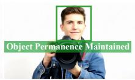

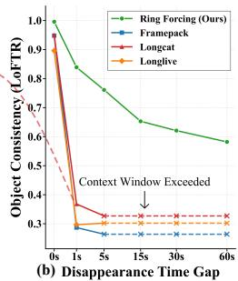  
Appear 30s Disappearance Gap Reappear

Appear 60s Disappearance Gap Reappear  
  
(c) Precise Long-Term Memory Retrieval

  
(d) Extrapolation from Real-World Context

Fig. 1: Ring Forcing endows autoregressive video difusion models with precise long-term memory and robust object permanence. It preserves exact object identity through prolonged occlusions and disappearances, significantly outperforming SOTA baselines (a, b). Even across an extreme 60-second gap, our method faithfully recovers complex high-frequency details from distant history (c). This efectively overcomes the limitations of short context windows and generalizes robustly to unconstrained real-world video histories (d).

Abstract. Scaling video generation to long durations reveals a critical bottleneck: current models lack robust long-term memory. This deficiency can be studied along two critical aspects: object permanence, the

ability to precisely reproduce the appearance of objects upon re-entry; and memory capacity, the ability to process ultra-long context and use information from distant history. Robust long-term memory requires both: object permanence without suficient context handling limits the temporal scope, while long context length without permanence fails to maintain identity. To address this, we present Ring Forcing, an autoregressive video difusion framework designed to robustly construct and precisely utilize long-term memory. Our ring-structured training strategy enforces retrieval from distant history, efectively reconciling the trade-of between strict historical adherence and generative diversity. To expand memory capacity, we introduce a compression and timestep composition strategy. Under fixed sequence length constraints, this method extends the efective historical span to minutes-long durations and achieves a comprehensive receptive field over the entire history. Furthermore, we present a sparse RoPE mechanism to enable flexible, scalable memory adaptation while fully exploiting pre-trained priors. Extensive experiments demonstrate that Ring Forcing achieves superior minutes-long coherence and object permanence, significantly outperforming state-of-the-art methods.

Keywords: Long Video Generation · Autoregressive Video Difusion · Long-term Memory

## 1 Introduction

Difusion Transformers have recently advanced video generation, producing short clips with striking realism [11, 22, 33, 34, 44]. However, the research frontier is no longer confined to a few seconds: emerging applications increasingly demand minutes-long rollouts with sustained narrative coherence [19, 38, 41, 51]. At this horizon, the central obstacle is not local smoothness but long-term memory: the ability to preserve and reuse information that may disappear from view and return much later. Autoregressive video models [19, 27, 33, 50] still struggle with object permanence. A canonical failure occurs when an object exits the camera frustum and later re-enters: despite being observed earlier, the model frequently regenerates it with a diferent identity (Fig. 1a). Crucially, this behavior is not solely explained by limited context length; even when long histories are provided, models often treat distant observations as weak evidence. In efect, they learn to continue the immediate visual stream but fail to retrieve decisive information from the distant past.

We identify the root cause of this limitation to a misalignment between training objectives and inference requirements. Standard video training data typically presents a “linear narrative” bias, where objects rarely exit and reappear within a short context window. Constrained by this bias, models tend to learn “myopic” transition probabilities $( \mathrm { i . e . , }$ inferring $x _ { t + 1 }$ solely from $x _ { t } )$ with little incentive to learn how to retrieve information from distant history (as visualized in Fig. 2a). In essence, the model learns to smoothly continue the video sequence but fails to learn how to retrieve answers from history, rendering long-term context efectively useless during inference even when provided.

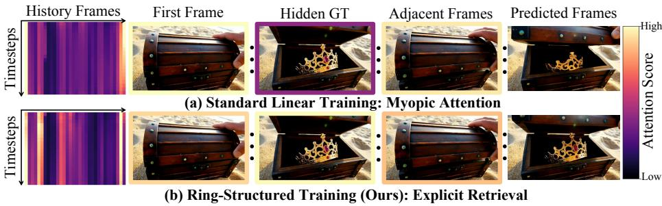  
Fig. 2: Attention allocation of Predicted Frames to History Frames. (a) Standard Linear Training sufers from myopic attention bias, failing to retrieve efective information from distant history. (b) Ring-Structured Training (Ours) enables the model to extract more information from the past, achieving precise retrieval of historical frames.

Beyond the training paradigm, another fundamental bottleneck lies in the inability to precisely utilize distant historical information. Most existing long-video solutions operate at the frame or token level, creating an inherent dilemma: expanding the receptive field to cover long history requires increasing the sequence length, which incurs prohibitive computational costs; conversely, reducing the sequence length inevitably shrinks the receptive field. This trade-of fundamentally limits the construction of long-term memory required for consistent long-video generation.

To address both bottlenecks, we propose Ring Forcing, an autoregressive video difusion framework designed for robust long-term memory construction and precise utilization. Our core insight is to create training instances where the supervision for the current target is anchored in the distant past. Specifically, we introduce a ring-structured data construction where “the future becomes the history,” embedding the ground-truth target clip into historical frames. This turns long-range retrieval from an optional behavior into a necessity for minimizing training error, yielding a highly precise retrieval focus on the distant target (Fig. 2b). To prevent degenerate shortcuts and to balance strict history adherence with open-ended continuation, we further employ a random headcropping and context-drop strategy that controls whether the history contains direct supervisory evidence.

Ring Forcing also targets scalability. Leveraging the empirical prior that diffusion models emphasize global structure at high noise levels and fine details at low noise levels, we propose compression and timestep composition to expose complementary views of history across timesteps. This design extends the efective history length to cover minutes-long durations under a fixed sequence-length budget while maintaining full historical coverage. Finally, to maximize transfer from pretrained priors under variable compression and history length, we introduce sparse Rotary Positional Embedding (RoPE) that anchors compressed tokens to their physical spatiotemporal coordinates. Experiments show that Ring Forcing improves object permanence and enables faithful reuse of minutes-long history (Fig. 1), establishing a strong baseline for long-term memory in video generation.

Our main contributions are summarized as follows:

– We introduce Ring Forcing, an autoregressive video difusion framework that equips long-duration generation with precise long-term memory and improved object permanence.

– We devise ring-structured training that embeds targets into distant history and enforces explicit long-range retrieval, together with a cropping and context-drop mechanism that balances fidelity and diversity.

– We propose timestep-composed long-context conditioning integrated with sparse rotary positional encoding. This approach achieves a significant expansion in efective context under fixed sequence length constraints, enabling the faithful reproduction of minutes-long history and significantly outperforming SOTA methods.

## 2 Related Work

## 2.1 Autoregressive Video Difusion

While bidirectional video difusion models such as Wan and HunyuanVideo [20, 21, 33, 44] excel at short-clip generation, scaling them to long videos is constrained by the quadratic cost of bidirectional attention. Consequently, autoregressive video difusion has become the prevailing framework for long video generation. Recent works, including SkyReels-V2, Magi-1, CausVid and Self Forcing [19, 38, 41, 51], have achieved impressive visual quality. However, autoregressive generation inherently sufers from error accumulation and challenges in longsequence context modeling, hindering the generation of longer and higher-quality videos.

To tackle this issue, various strategies have been proposed [3, 12, 15, 23, 42]. One line of work focuses on training paradigms: FramePack [57] introduces a planned anti-drifting mechanism, while LongLive [48] employs attention sinks coupled with a “train long, test long” strategy. Other approaches enhance robustness by simulating inference errors during training. For instance, Rolling Forcing [27] proposes a joint denoising scheme; Self-Forcing++ [6] utilizes local teacher distillation on self-generated sequences; and SVI [24] alongside Resampling Forcing [13] exposes the model to synthesized or imperfect history to learn error correction capabilities. In parallel, some works focus on eficient video generation architectures. For instance, SANA-Video [4] incorporates linear attention into video generation, while others explore the use of more eficient VAEs [5,14] or optimize attention mechanisms for long sequences [8, 9, 25, 54–56]. Furthermore, training-free methods have also been explored [30,31], such as Deep Forcing [50], which utilizes a “Deep Sink” mechanism, and Infinity-RoPE [49], which adjusts Rotary Positional Embeddings to constrain the generation process closer to the pre-trained distribution.

## 2.2 Context Modeling for Long Video Generation

Global consistency in long video generation relies on eficient context management, generally categorized into retrieval-based and compression-based methods. (1) Retrieval-based approaches aim to select the most relevant historical information to extend the efective memory horizon. For instance, Contextas-Memory [52] and WorldMem [46] incorporate Field-of-View-based retrieval mechanisms within world models, while Pack-and-Force [45] employs a contextual semantic retriever. Memory Forcing [18] persists memory through 3D point cloud reconstruction, whereas Deep Forcing [50] utilizes attention mechanisms to retrieve relevant KV caches. RELIC [16] uses time reversal to construct revisit data for spatial memory in video world models. Recent advancements also focus on hybrid architectures and state-space mechanisms; for example, VideoSSM [53] utilizes a hybrid State-Space Memory, and long-context state-space video world models [36] have been developed to handle autoregressive long video generation eficiently. Furthermore, Mixture-of-Contexts [1] learns attention routing to identify critical historical segments across multi-clip generation tasks. (2) Compression-based methods aim to condense historical information into compact representations. FramePack [57] compresses prior frames into fixed-size latent “packs”. WorldPack [35] improves spatial consistency in world models via history packing. TTTVideo [7] and LaCT [60] introduce learnable parameters as memory representations that are updated during inference (Test-Time Optimization). Similarly, TinyHistory [58] pre-trains a context compression model via the reconstruction loss. Nevertheless, while these approaches successfully extend the input context window, they leave out direct training objectives that explicitly enforce the utilization and reproduction of historical information.

## 3 Method

We propose Ring Forcing, an autoregressive video difusion framework for longterm memory construction and precise utilization. It integrates three designs: ring-structured training for explicit long-range retrieval (Sec. 3.1), timestepcomposed history compression under a fixed context budget (Sec. 3.2), and sparse RoPE for consistent spatiotemporal scaling under variable compression (Sec. 3.3). We train the model with a rectified-flow objective [10,28] that unifies these components (Sec. 3.4).

## 3.1 Ring-Structured Training Strategy

As shown in Fig. 3, we introduce a training strategy based on ring-structured sequences. The key idea is to embed the ground-truth target clip into the distant history, turning long-term retrieval into a self-supervised learning signal.

Ring-Based Sequence Construction Formally, let $\mathcal { V } = \{ v _ { 1 } , v _ { 2 } , . . . , v _ { N } \}$ denote a raw video sequence of N frames. We construct a closed-loop reference video $\mathcal { V } _ { r i n g }$ by concatenating the original sequence with its reversed counterpart $\nu _ { r e v } =$ $\{ v _ { N } , v _ { N - 1 } , \ldots , v _ { 1 } \}$ :

$$
\mathcal { V } _ { r i n g } = [ \mathcal { V } , \mathcal { V } _ { r e v } ] .\tag{1}
$$

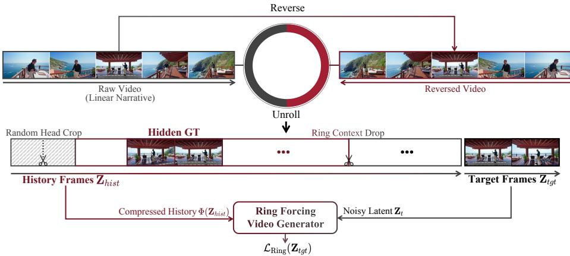  
Fig. 3: Overview of the Ring-Structured Training Strategy. We construct a sequence ring by concatenating a linear raw video with its reversed counterpart. By unrolling the ring into a conditioning sequence, the target frames are naturally embedded into the distant history as the Hidden GT, which essentially forces the autoregressive generator to learn explicit long-range retrieval. To prevent trivial shortcuts, a Random Head Crop is applied to truncate boundary information leakage, while a Random Context Drop is used to balance history adherence and generation diversity.

History-Target Decomposition We strictly sample the target video clip $\mathbf { x } _ { t g t }$ from the forward part V to preserve the arrow of time. Based on the target sequence of length $L _ { t g t ; }$ , denoted as $\mathbf { x } _ { t g t } = \{ v _ { t } , \ldots , v _ { t + L _ { t g t } - 1 } \}$ , we decompose $\mathcal { V } _ { r i n g }$ into three consecutive segments: (1) Original history $\mathbf { h } _ { o r g } = \{ v _ { 1 } , \dots , v _ { t - 1 } \}$ , (2) Target clip $\mathbf { x } _ { t g t } = \{ v _ { t } , \ldots , v _ { t + L _ { t g t } - 1 } \}$ , and (3) Synthetic history $\mathbf { h } _ { { s y n } }$ is the remaining segment in the ring, which contains the reversed target clip as a distant subsequence.

To construct the conditioning context, we place the synthetic history before the original history:

$$
\mathbf { C } _ { f u l l } = [ \mathbf { h } _ { s y n } , \mathbf { h } _ { o r g } ] .\tag{2}
$$

This ring-based construction ensures visual continuity throughout the reference sequence by leveraging the temporal symmetry of the reversed video.

Leakage Prevention via Random Head Crop In this constructed history $\mathbf { C } _ { f u l l }$ a trivial shortcut (information leakage) exists at the head of the sequence. The first frame of $\mathbf { h } _ { { s y n } }$ is $v _ { t + L _ { t g t } }$ , which is temporally adjacent and visually similar to the last frame of the target clip $\left( v _ { t + L _ { t g t } - 1 } \right)$ . If left unaddressed, the mode can infer the end of the target simply by looking at the beginning of the history, ignoring the context (the reversed target clip ${ \bf x } _ { t g t } ^ { r e v } )$ embedded later in $\mathbf { h } _ { { s y n } }$ . To prevent the leakage shortcut while forcing the model to leverage the full context, we apply a Random Head Cropping strategy. Concretely, we randomly remove a prefix of the synthetic history while preserving the reversed target clip inside $\mathbf { h } _ { \mathit { s y n } } .$ yielding the cropped context $\mathbf { C } _ { c r o p }$ , which removes the shortcut while keeping the distant answer retrievable.

Balancing Adherence and Diversity via Ring Context Drop To regulate the tradeof between strict history adherence (when the target is retrievable from the past) and open-ended generative diversity (when it is not), we introduce a Ring Context Drop mechanism. Rather than always enforcing the ring structure, we randomly drop the entire synthetic history during training. Specifically, we sample a boolean variable $b \sim B e r n o u l l i ( 1 - p _ { \mathrm { d r o p } } )$ and formulate the final conditioning context as:

$$
\mathbf { C } _ { f i n a l } = \left\{ \mathbf { C } _ { c r o p } , \mathrm { i f } \ b = 1 \mathrm { ( R i n g \ M o d e ) } , \right.\tag{3}
$$

When $b = 0$ , the ring-constructed context is completely dropped, thereby preventing the model from over-relying on the synthetic history and forcing it to learn unconstrained progression solely from $\mathbf { h } _ { o r g }$ . When $b = 1$ , the model learns to explicitly leverage the embedded target for precise long-term consistency.

## 3.2 Compression and Timestep Composition

While the Ring-Structured strategy provides the essential supervision for longrange retrieval, directly attending to minute-long raw history is computationally prohibitive due to the quadratic complexity of attention. To resolve this, we propose Timestep-Composed Compression, which maps a long history ${ \bf Z } _ { h i s t }$ into a bounded conditioning sequence C˜ under a fixed token budget $B _ { m a x }$ . This design ensures eficient memory utilization while preserving both global structure and local details.

Token Budget and Compression Operator We define a spatiotemporal compression operator $\varPsi ( \mathbf { Z } ; r _ { h } , r _ { w } , r _ { t } )$ that downsamples history in space and time to fit $\boldsymbol { B } _ { m a x }$

Timestep-Dependent Composition Operator Uniform spatiotemporal downsampling inevitably sacrifices high-frequency details. However, we leverage the intrinsic generative nature of difusion models: high-noise intervals primarily determine semantic structure and global motion, whereas low-noise intervals focus on refining local textures and edges. Motivated by this, we define a Composite Condition Operator $\Phi ( \mathbf { Z } _ { h i s t } , t , \delta )$ that dynamically transforms the history representation based on the difusion timestep t:

$$
\begin{array} { r } { \phi ( \mathbf { Z } _ { h i s t } , t , \delta ) = \left\{ \begin{array} { l l } { \varPsi ( \mathbf { Z } _ { h i s t } ; r _ { h } ^ { \mathrm { g } } , r _ { w } ^ { \mathrm { g } } , r _ { t } ^ { \mathrm { g } } ) , } & { t > \tau } \\ { \mathscr { S } \left( \varPsi ( \mathbf { Z } _ { h i s t } ; r _ { h } ^ { \mathrm { d } } , r _ { w } ^ { \mathrm { d } } , r _ { t } ^ { \mathrm { d } } ) , \delta \right) , } & { t \leq \tau } \end{array} \right. } \end{array}\tag{4}
$$

Here, the first branch provides a temporally dense context for recovering global structure, while the second branch preserves high-frequency spatial details with temporally sparse sampling. $\boldsymbol { \mathcal { S } } ( \cdot , \delta )$ is a cyclic shift over the temporal sampling grid, and varying $\delta$ ensures full coverage over long histories.

## 3.3 Sparse RoPE Strategy

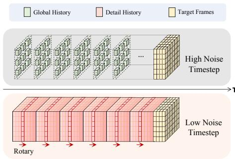  
Fig. 4: Timestep-composed longcontext conditioning.

To maximize the use of pretrained video generation priors (i.e., the model’s perception of relative spacetime structures), and to accommodate historical contexts of varying compression rates and lengths, we introduce a sparse RoPE strategy. As shown in Fig. 4, instead of encoding the compressed history features using their discrete indices in the latent space, we map them back to the original continuous spatiotemporal coordinate system used during pre-training.

Formally, we treat the target clip as the reference coordinate system with origin $( 0 , 0 , 0 )$ . For a compressed history token at index $( t , h , w )$ with spatial downsampling factor $s _ { s }$ and temporal downsampling factor $s _ { t } ,$ we map it back to physical coordinates $( \tilde { t } , \tilde { h } , \tilde { w } )$ in the original grid:

$$
\tilde { h } = h \cdot s _ { s } + 0 . 5 \cdot ( s _ { s } - 1 ) ,
$$

$$
\tilde { w } = w \cdot s _ { s } + 0 . 5 \cdot ( s _ { s } - 1 ) ,\tag{5}
$$

$$
\tilde { t } = - \left( ( L _ { h i s t } - 1 - t ) \cdot s _ { t } + 0 . 5 \cdot ( s _ { t } - 1 ) + 0 . 5 \right) ,\tag{6}
$$

where $L _ { h i s t }$ is the number of compressed history steps along time. The spatial terms center the token within its corresponding patch, and the temporal term places the history strictly in the negative relative-time domain. We then compute 3D RoPE using $( \tilde { t } , \tilde { h } , \tilde { w } )$ to preserve consistent relative spatiotemporal scales under variable compression.

## 3.4 Training Objective

We adopt the rectified flow framework and train the generator $G _ { \theta }$ to predict the velocity field derived from the clean target $\mathbf { Z } _ { t g t }$ . The training objective unifies the ring-structured strategy (controlled by b) and the compression strategy (encapsulated by Φ) into a holistic loss function. Let $\mathbf { Z } _ { h i s t } ^ { ( b ) }$ denote the history latents constructed by the ring strategy, where $b \sim$ Bernoull $\operatorname { i } ( 1 - p _ { \mathrm { d r o p } } )$ determines whether to use the ring context $( b = 1 )$ or standard context $( b = 0 )$ . The final conditioning input is computed as $\tilde { \mathbf { C } } = \varPhi ( \mathbf { Z } _ { h i s t } ^ { ( b ) } , t , \delta )$ . The formal optimization objective is:

$$
\begin{array} { r } { \mathcal { L } _ { \mathrm { R i n g } } = \mathbb { E } _ { t , \mathbf { Z } _ { t g t } , \epsilon , b , \delta } [ \Big | \Big | \big ( \epsilon - \mathbf { Z } _ { t g t } \big ) - G _ { \theta } \big ( \mathbf { Z } _ { t } , t , \tilde { \mathbf { C } } \big ) \Big | ] _ { 2 } ^ { 2 } ] . } \end{array}\tag{7}
$$

In this formulation, $t \sim \mathcal { U } ( 0 , 1 )$ represents the sampling timestep, and $\mathbf { Z } _ { t } =$ $( 1 - t ) \mathbf { Z } _ { t g t } + t \epsilon$ denotes the noisy latent mixed with Gaussian noise $\epsilon \sim \mathcal { N } ( \mathbf { 0 } , \mathbf { I } )$

The joint expectations over b, t, and δ optimize the model to balance precise history retrieval with generative diversity, while eficiently capturing both global structures and local details across varying noise levels.

## 4 Experiments

In this section, we present a comprehensive evaluation of Ring Forcing. We begin by detailing the implementation and experimental setup. Next, we compare Ring Forcing against state-of-the-art long video generation models to demonstrate its superiority in maintaining object permanence and long-term consistency. Finally, we conduct in-depth ablation studies to validate the eficacy of our core contributions: the Timestep Composition strategy, the ring-structured training trade-ofs, and the sparse RoPE mechanism.

## 4.1 Implementation Details

Dataset Construction We utilize the UltraVideo-Long dataset [47]. To isolate the challenge of temporal consistency within continuous shots, we filter the dataset to retain only single-shot videos. We curate a training set of 10,000 long-duration videos, each with a duration ranging from 10 to 240 seconds. All video data is standardized to a resolution of 480 × 832 and a frame rate of 15 FPS to match the training requirements of the base models.

Model Instantiation We instantiate Ring Forcing using two backbones: Wan2.1 T2V 1.3B and Wan2.2 T2V A14B [44]. All ablation studies are conducted on the Wan2.1 1.3B variant, while the final comparative evaluation employs the Wan2.2 A14B model. To ensure parameter eficiency, all models are fine-tuned using Low-Rank Adaptation (LoRA) [17] with a rank of r = 128. Training for the Wan2.2 A14B model was distributed across a cluster of 32 NVIDIA H800 GPUs for 7,000 steps, taking approximately 30 hours. For inference, we utilize a single NVIDIA H800 GPU. By aligning the efective sequence length with the standard generation length via compression, our method maintains computational costs virtually identical to the original model. Consequently, Ring Forcing is deployable on any hardware supporting the base Wan model, incurring negligible overhead in VRAM or compute.

## 4.2 Comparison with Baselines

Baselines We compare Ring Forcing against three leading long-video generation models: LongLive [48], LongCat [33], and FramePack [57].

Evaluation Protocol Object permanence is a core manifestation of a video generation model’s long-term memory capacity. To rigorously quantify this capability, we specifically design a benchmark based on an “Appear-Disappear-Reappear” (A-D-R) logic. Additionally, to evaluate the model’s long video generation capabilities, we conduct a targeted assessment of its general performance in generating 1-minute coherent long videos.

Table 1: Quantitative results on the A-D-R Benchmark. Metrics are categorized into Consistency and General Performance. I.F. denotes Instruction Following. For $\Delta t _ { g a p } > 5 s$ , baselines are excluded because the “appear” segment falls completely outside their maximum context window. Best results are highlighted in bold, and second-best are underlined.
<table><tr><td rowspan="2">Gap  $( \varDelta t _ { g a p } )$ </td><td rowspan="2">Model</td><td colspan="3">Consistency</td><td colspan="3">General Performance</td></tr><tr><td>Texture</td><td>Geometry</td><td>Semantic</td><td>Aesthetic</td><td>I.F.</td><td>Dynamics</td></tr><tr><td rowspan="4">0s</td><td>LongLive</td><td>0.578</td><td>0.896</td><td>0.886</td><td>5.032</td><td>24.117</td><td>1.615</td></tr><tr><td>LongCat</td><td>0.737</td><td>0.950</td><td>0.925</td><td>5.214</td><td>24.090</td><td>1.493</td></tr><tr><td>FramePack</td><td>0.605</td><td>0.949</td><td>0.913</td><td>5.222</td><td>23.162</td><td>1.662</td></tr><tr><td>Ours</td><td>0.742</td><td>0.997</td><td>0.918</td><td>5.216</td><td>24.642</td><td>1.550</td></tr><tr><td rowspan="4">1s</td><td>LongLive</td><td>0.181</td><td>0.297</td><td>0.707</td><td>5.080</td><td>23.803</td><td>1.694</td></tr><tr><td>LongCat</td><td>0.236</td><td>0.368</td><td>0.712</td><td>5.138</td><td>23.894</td><td>1.990</td></tr><tr><td>FramePack</td><td>0.252</td><td>0.287</td><td>0.692</td><td>5.220</td><td>23.040</td><td>1.093</td></tr><tr><td>Ours</td><td>0.723</td><td>0.839</td><td>0.823</td><td>5.176</td><td>24.601</td><td>2.617</td></tr><tr><td rowspan="4">5s</td><td>LongLive</td><td>0.290</td><td>0.303</td><td>0.730</td><td>5.065</td><td>23.933</td><td>1.555</td></tr><tr><td>LongCat</td><td>0.203</td><td>0.328</td><td>0.722</td><td>5.148</td><td>23.859</td><td>1.640</td></tr><tr><td>FramePack</td><td>0.250</td><td>0.264</td><td>0.701</td><td>5.229</td><td>22.795</td><td>0.996</td></tr><tr><td>Ours</td><td>0.515</td><td>0.761</td><td>0.831</td><td>5.163</td><td>23.940</td><td>2.371</td></tr><tr><td>15s</td><td>Ours</td><td>0.509</td><td>0.653</td><td>0.802</td><td>5.104</td><td>23.803</td><td>2.689</td></tr><tr><td>30s</td><td>Ours</td><td>0.421</td><td>0.621</td><td>0.822</td><td>5.055</td><td>23.590</td><td>2.946</td></tr><tr><td>60s</td><td>Ours</td><td>0.396</td><td>0.582</td><td>0.793</td><td>5.014</td><td>22.872</td><td>1.809</td></tr></table>

A-D-R Benchmark To rigorously and fairly measure the model’s memory retrieval capability across temporal dimensions, we meticulously construct an A-D-R prompt library comprising 64 test cases. Each test case consists of four core elements: an appear prompt, a disappear prompt, a reappear prompt, and a precise subject keyword. During video generation, the durations of the “appear” and “reappear” segments are fixed at 5 seconds each. Furthermore, to prevent the model from exploiting shortcuts by relying solely on the initial frame, the first frame is intentionally devoid of the target subject, and its appearance is randomly triggered within the first 5 seconds, thereby better approximating realistic dynamic generation scenarios. By dynamically adjusting the duration of the intermediate “disappear” segment, we systematically investigate the model’s capability bounds in maintaining subject identity across varying temporal spans. Specifically, we set the disappearance durations to 0 (where the entire video is evaluated as a control group), 1, 5, 15, 30 and 60 seconds.

To maximally isolate the consistency evaluation from background interference, we employ SAM 3 [2] combined with subject keywords to perform precise zero-shot instance segmentation on the appear and reappear segments. We also perform subject detection on the disappear segment to exclude cases where the subject fails to vanish from consistency calculations, while our meticulous prompt design ensures that most cases successfully adhere to the A-D-R logic. For both segments, we extract the keyframe with the largest subject mask area, crop the subject, and normalize it against a pure white background. For the extracted subject images before and after disappearance, we comprehensively employ SIFT [29], LoFTR [43], and DINOv3 [40] to evaluate local texture consistency, geometric structure consistency, and high-level semantic consistency, respectively. This multi-dimensional feature matching strategy allows us to thoroughly quantify the preservation of object identity. Furthermore, general metrics are evaluated on the reappear segments: we utilize the Improved Aesthetic Predictor [39] to quantify the aesthetic quality of the videos, employ X-CLIP [32] to measure instruction following capabilities, and apply Optical Flow-based Motion Magnitude to quantify the amplitude of video dynamics.

Appear 1s Disappearance Gap Reappear  
Appear 5s Disappearance Gap Reappear  
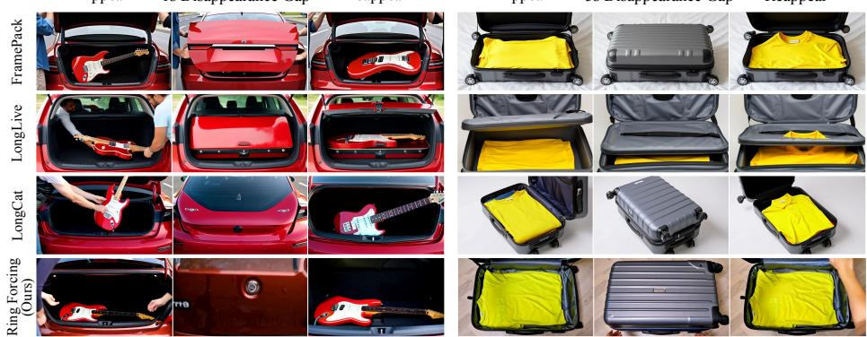  
Fig. 5: Qualitative results on the Appear–Disappear–Reappear (A-D-R) benchmark. Our model demonstrates robust object permanence by retrieving identity information from distant history, ensuring consistent subject reconstruction even after long temporal gaps where baseline models typically fail.

General Video Generation Benchmark To comprehensively evaluate the model’s generalized capability in regular scenarios, we construct a General Benchmark comprising 64 diverse prompts. These prompts are utilized to generate 60-second continuous videos where the explicit “disappear-reappear” logic is absent, and the primary subjects maintain a persistent presence. We adopt the same automated metrics used in the A-D-R benchmark to evaluate aesthetic quality, prompt adherence, and motion magnitude, and further include Motion Smoothness by calculating the normalized frame interpolation error via AMT [26] to quantify temporal fluidity. Furthermore, to assess complex perceptual qualities that automated metrics struggle to capture, we introduce the Large Multimodal Model Qwen3-VL [37] to conduct a comprehensive 5-point scale evaluation. This evaluation focuses on three critical dimensions: physical logic rationality to ensure realistic object interactions, spatiotemporal consistency to prevent semantic collapse over time, and visual naturalness to penalize unnatural flickering and morphological distortions.

Table 2: Quantitative comparison on the General long-video generation benchmark (1 minute).
<table><tr><td rowspan="2">Model</td><td colspan="5">Objective Metrics</td><td colspan="2">User Study</td></tr><tr><td>Aesthetic</td><td>Dynamics Naturalness</td><td></td><td>Motion Smoothness</td><td>Instruction Following</td><td>Consistency</td><td>Overall Quality</td></tr><tr><td>LongLive</td><td>5.622</td><td>1.056</td><td>3.031</td><td>0.991</td><td>24.805</td><td>4.12</td><td>2.25</td></tr><tr><td>LongCat</td><td>5.808</td><td>2.196</td><td>3.875</td><td>0.991</td><td>25.341</td><td>3.59</td><td>4.19</td></tr><tr><td>FramePack</td><td>5.728</td><td>1.790</td><td>3.656</td><td>0.991</td><td>25.014</td><td>3.71</td><td>4.04</td></tr><tr><td>Ours</td><td>5.822</td><td>2.261</td><td>3.922</td><td>0.986</td><td>25.471</td><td>4.35</td><td>4.22</td></tr><tr><td>Base model†</td><td>5.825</td><td>1.974</td><td>4.016</td><td>0.984</td><td>25.136</td><td>N/A</td><td></td></tr></table>

†Wan2.2-T2V-A14B (5.4s).

Human Evaluation To further validate our results through human perception, we conducted a Human Evaluation involving 21 participants from diverse backgrounds. We randomly sampled 10 video pairs from the General Benchmark (pairing our generated videos with those from baseline models). Under a strict blind-test protocol, evaluators rated each video on a 0-5 scale with a primary focus on “Overall Video Quality.”

Results Analysis Comprehensive evaluations demonstrate that Ring Forcing achieves state-of-the-art long-term memory and general video generation quality. First, on the A-D-R benchmark (Tab. 1, Fig. 5), Ring Forcing exhibits robust object permanence by precisely retrieving distant history. Conversely, baselines sufer catastrophic forgetting when targets temporarily disappear, restricted by short-sighted attention biases from linear training. Second, Ring Forcing fundamentally breaks the “consistency vs. dynamics” trade-of. Baselines like LongLive over-rely on the initial frame as an attention sink, degenerating into static or repetitive outputs (low Dynamics). In contrast, Ring Forcing yields rich, fluid motions while maintaining strict spatiotemporal consistency. Finally, General Benchmark results (Tab. 2, Fig. 6) show that Ring Forcing preserves the backbone’s generative priors while extending generation to 60-second videos. Among long-video baselines, it achieves the best aesthetics, naturalness, and overall human preference, demonstrating that our long-term memory mechanism improves temporal coherence without substantially degrading visual quality.

## 4.3 Ablation Studies

Impact of Compression and Timestep Composition We first investigate the impact of spatiotemporal compression strategies on the model’s ability to reconstruct history. We construct a test set of 128 unseen samples where the “answer” (ground truth target) is naturally embedded within the history using our Ring-Structured construction. We evaluate reconstruction fidelity using photometric and perceptual metrics [59].

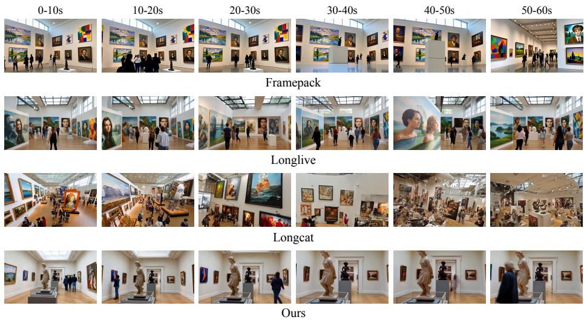  
Fig. 6: Qualitative results of 60-second long video generation. The visualization demonstrates the model’s capability to maintain overall consistency and visual quality throughout a 1-minute duration in general scenarios.

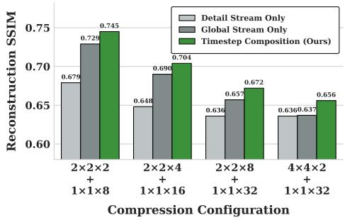  
Fig. 7: Efectiveness of Timestep Composition Strategy.

Compression Trade-ofs and Composition Efectiveness As illustrated in Fig. 7, we first analyze the singlestream baselines (gray bars) to understand the trade-ofs between spatial and temporal information. We observe that the “Global Stream Only” baseline (high spatial compression, intact temporal density) generally yields superior reconstruction SSIM compared to the “Detail Stream Only” baseline (aggressive temporal compression). This sug-

gests that for precisely leveraging long-term history, retaining temporal density is often more critical than spatial resolution. Building on this insight, we evaluate our proposed timestep composition strategy. As shown by the green bars in Fig. 7, our method dynamically synergizes the structural guidance from the global stream with the fine-grained refinement from the detail stream. Remarkably, without increasing the sequence length compared to single-stream baselines, the combined strategy consistently outperforms both standalone baselines across all metrics and compression settings, compellingly validating the efectiveness of our dual-stream design.

To balance reconstruction quality and long-video capacity, we select $2 \times 2 \times$ $8 + 1 \times 1 \times 3 2$ as our default. Under this configuration, the inference overhead for

Table 3: Ablation study on Ring Context Drop probability $p _ { d r o p } .$
<table><tr><td rowspan="2"> $p _ { d r o p }$ </td><td colspan="3">Ring Mode (Reconstruction)</td><td rowspan="2">Standard Mode</td></tr><tr><td>PSNR ↑SSIM ↑</td><td></td><td>LPIPS ↓</td></tr><tr><td>0.0</td><td>25.02</td><td>0.73</td><td>0.12</td><td>Diversity Score ↑ 3.71</td></tr><tr><td>0.2</td><td>24.67</td><td>0.72</td><td>0.12</td><td>3.93</td></tr><tr><td>0.4</td><td>24.22</td><td>0.71</td><td>0.13</td><td>4.11</td></tr><tr><td>0.6</td><td>24.02</td><td>0.71</td><td>0.13</td><td>4.13</td></tr><tr><td>0.8</td><td>23.02</td><td>0.68</td><td>0.16</td><td>4.21</td></tr><tr><td>1.0</td><td>21.86</td><td>0.65</td><td>0.21</td><td>4.23</td></tr></table>

Table 4: Comparison of reconstruction capabilities between standard index-based RoPE and our sparse RoPE.
<table><tr><td colspan="4">Method PSNR ↑ SSIM ↑LPIPS↓</td></tr><tr><td>Standard RoPE</td><td>19.05</td><td>0.58</td><td>0.27</td></tr><tr><td>Sparse RoPE (Ours)</td><td>24.22</td><td>0.71</td><td>0.13</td></tr></table>

140s of history is virtually identical to the original Wan model’s 5.4s generation, enabling eficient long-video synthesis without increasing hardware requirements.

Trade-ofs of Adherence and Diversity To determine the optimal balance between object permanence and generative diversity, we conduct an ablation on the Ring Context Drop probability $p _ { d r o p }$ (which controls the Bernoulli variable b). We employ a dual-evaluation protocol that measures reconstruction fidelity on 128 unseen samples with embedded answers (Ring Mode), and generates 15-second video continuations on 128 samples without embedded answers (Standard Mode). In this mode, we employ Qwen3-VL to assess the diversity of the generated content relative to the input history on a 5-point Likert scale, and we report the average score across all samples. As shown in Tab. 3, we identify $p _ { d r o p } = 0 . 4$ as the “sweet spot”, where the model maintains high reconstruction fidelity without collapsing into mode dropping.

Eficacy of Sparse RoPE To validate whether our Sparse RoPE strategy efectively leverages pre-trained priors, we compare the reconstruction capabilities of two models trained with identical settings: one using standard index-based RoPE and the other using our Sparse RoPE. As presented in Tab. 4, experimental results demonstrate that sparse RoPE better utilizes priors to achieve faster convergence and superior reconstruction quality. This confirms that mapping compressed tokens back to their physical coordinates significantly aids the model in understanding relative spatiotemporal relationships.

## 5 Conclusion

We address the challenge of establishing robust long-term memory in autoregressive video generation, specifically targeting the critical bottlenecks of object permanence and memory capacity. We proposed Ring Forcing, a unified framework that enables the robust construction and precise utilization of long-term memory. Through our ring-structured training strategy, we successfully extracted rich information from long-term history, efectively reconciling the trade-of between historical adherence and generative diversity. Furthermore, our compression and timestep composition mechanism expanded the efective historical span to support minutes-long generation under fixed sequence length constraints, achieving a comprehensive receptive field over the entire history. Together with the sparse RoPE mechanism, our approach enables the precise utilization and reproduction of information spanning minutes-long history. Ring Forcing establishes a foundational paradigm for future research into infinite-context generative modeling, paving the way for consistent, long-duration video synthesis.

## References

1. Cai, S., Yang, C., Zhang, L., Guo, Y., Xiao, J., Yang, Z., Xu, Y., Yang, Z., Yuille, A.L., Guibas, L.J., Agrawala, M., Jiang, L., Wetzstein, G.: Mixture of contexts for long video generation. ArXiv preprint (2025)

2. Carion, N., Gustafson, L., Hu, Y.T., Debnath, S., Hu, R., Suris, D., Ryali, C., Alwala, K.V., Khedr, H., Huang, A., et al.: Sam 3: Segment anything with concepts. ArXiv preprint (2025)

3. Chen, B., Monso, D.M., Du, Y., Simchowitz, M., Tedrake, R., Sitzmann, V.: Diffusion forcing: Next-token prediction meets full-sequence difusion. In: Conference and Workshop on Neural Information Processing Systems (2024)

4. Chen, J., Zhao, Y., Yu, J., Chu, R., Chen, J., Yang, S., Wang, X., Pan, Y., Zhou, D., Ling, H., Liu, H., Yi, H., Zhang, H., Li, M., Chen, Y., Cai, H., Fidler, S., Luo, P., Han, S., Xie, E.: Sana-video: Eficient video generation with block linear difusion transformer. ArXiv preprint (2025)

5. Chen, J., Cai, H., Chen, J., Xie, E., Yang, S., Tang, H., Li, M., Han, S.: Deep compression autoencoder for eficient high-resolution difusion models. In: International Conference on Learning Representations (2025)

6. Cui, J., Wu, J., Li, M., Yang, T., Li, X., Wang, R., Bai, A., Ban, Y., Hsieh, C.: Selfforcing++: Towards minute-scale high-quality video generation. ArXiv preprint (2025)

7. Dalal, K., Koceja, D., Xu, J., Zhao, Y., Han, S., Cheung, K.C., Kautz, J., Choi, Y., Sun, Y., Wang, X.: One-minute video generation with test-time training. In: Conference on Computer Vision and Pattern Recognition (2025)

8. Dao, T.: FlashAttention-2: Faster attention with better parallelism and work partitioning. In: International Conference on Learning Representations (2024)

9. Dao, T., Fu, D.Y., Ermon, S., Rudra, A., Ré, C.: FlashAttention: Fast and memoryeficient exact attention with IO-awareness. In: Conference and Workshop on Neural Information Processing Systems (2022)

10. Esser, P., Kulal, S., Blattmann, A., Entezari, R., Müller, J., Saini, H., Levi, Y., Lorenz, D., Sauer, A., Boesel, F., et al.: Scaling rectified flow transformers for high-resolution image synthesis. In: International Conference on Machine Learning (2024)

11. Google DeepMind: Veo 3.1 (2025), https://deepmind.google/models/veo/, accessed: 2026-06-30

12. Gu, Y., Mao, W., Shou, M.Z.: Long-context autoregressive video modeling with next-frame prediction. ArXiv preprint (2025)

13. Guo, Y., Yang, C., He, H., Zhao, Y., Wei, M., Yang, Z., Huang, W., Lin, D.: End-to-end training for autoregressive video difusion via self-resampling. ArXiv preprint (2025)

14. HaCohen, Y., Chiprut, N., Brazowski, B., Shalem, D., Moshe, D., Richardson, E., Levin, E., Shiran, G., Zabari, N., Gordon, O., Panet, P., Weissbuch, S., Kulikov, V., Bitterman, Y., Melumian, Z., Bibi, O.: Ltx-video: Realtime video latent difusion. ArXiv preprint (2024)

15. Henschel, R., Khachatryan, L., Poghosyan, H., Hayrapetyan, D., Tadevosyan, V., Wang, Z., Navasardyan, S., Shi, H.: Streamingt2v: Consistent, dynamic, and extendable long video generation from text. In: Conference on Computer Vision and Pattern Recognition (2025)

16. Hong, Y., Mei, Y., Ge, C., Xu, Y., Zhou, Y., Bi, S., Hold-Geofroy, Y., Roberts, M., Fisher, M., Shechtman, E., Sunkavalli, K., Liu, F., Li, Z., Tan, H.: RELIC: Interactive video world model with long-horizon memory. ArXiv preprint (2025)

17. Hu, E.J., Shen, Y., Wallis, P., Allen-Zhu, Z., Li, Y., Wang, S., Wang, L., Chen, W.: LoRA: Low-rank adaptation of large language models. In: International Conference on Learning Representations (2022), https://openreview.net/forum?id= nZeVKeeFYf9

18. Huang, J., Hu, X., Han, B., Shi, S., Tian, Z., He, T., Jiang, L.: Memory forcing: Spatio-temporal memory for consistent scene generation on minecraft. ArXiv preprint (2025)

19. Huang, X., Li, Z., He, G., Zhou, M., Shechtman, E.: Self forcing: Bridging the train-test gap in autoregressive video difusion. In: Conference and Workshop on Neural Information Processing Systems (2025)

20. Hunyuan Foundation Model Team: Hunyuanvideo: A systematic framework for large video generative models. ArXiv preprint (2024)

21. Hunyuan Foundation Model Team: Hunyuanvideo 1.5 technical report. ArXiv preprint (2025)

22. Kling Team: Kling-omni technical report. ArXiv preprint (2025)

23. Kodaira, A., Hou, T., Hou, J., Tomizuka, M., Zhao, Y.: Streamdit: Real-time streaming text-to-video generation. ArXiv preprint (2025)

24. Li, W., Pan, W., Luan, P., Gao, Y., Alahi, A.: Stable video infinity: Infinite-length video generation with error recycling. ArXiv preprint (2025)

25. Li, X., Li, M., Cai, T., Xi, H., Yang, S., Lin, Y., Zhang, L., Yang, S., Hu, J., Peng, K., Agrawala, M., Stoica, I., Keutzer, K., Han, S.: Radial attention: O(n log n) sparse attention with energy decay for long video generation. In: Conference and Workshop on Neural Information Processing Systems (2025)

26. Li, Z., Zhu, Z., Han, L., Hou, Q., Guo, C., Cheng, M.: AMT: all-pairs multi-field transforms for eficient frame interpolation. In: Conference on Computer Vision and Pattern Recognition (2023)

27. Liu, K., Hu, W., Xu, J., Shan, Y., Lu, S.: Rolling forcing: Autoregressive long video difusion in real time. ArXiv preprint (2025)

28. Liu, X., Gong, C., Liu, Q.: Flow straight and fast: Learning to generate and transfer data with rectified flow. In: International Conference on Learning Representations (2023)

29. Lowe, D.G.: Distinctive image features from scale-invariant keypoints. International journal of computer vision (2004)

30. Lu, Y., Liang, Y., Zhu, L., Yang, Y.: Freelong: Training-free long video generation with spectralblend temporal attention. In: Conference and Workshop on Neural Information Processing Systems (2024)

31. Lu, Y., Yang, Y.: Freelong++: Training-free long video generation via multi-band spectralfusion. ArXiv preprint (2025)

32. Ma, Y., Xu, G., Sun, X., Yan, M., Zhang, J., Ji, R.: X-CLIP: End-to-end multigrained contrastive learning for video-text retrieval. In: ACM International Conference on Multimedia (2022). https://doi.org/10.1145/3503161.3547910

33. Meituan LongCat Team: Longcat-video technical report. ArXiv preprint (2025)

34. OpenAI: Sora 2 is here (2025), https://openai.com/index/sora-2/, accessed: 2026-06-30

35. Oshima, Y., Iwasawa, Y., Suzuki, M., Matsuo, Y., Furuta, H.: WorldPack: Compressed memory improves spatial consistency in video world modeling. ArXiv preprint (2025)

36. Po, R., Nitzan, Y., Zhang, R., Chen, B., Dao, T., Shechtman, E., Wetzstein, G., Huang, X.: Long-context state-space video world models. In: International Conference on Computer Vision (2025)

37. Qwen Team: Qwen3-vl technical report. ArXiv preprint (2025), https://arxiv. org/abs/2511.21631

38. Sand AI: MAGI-1: autoregressive video generation at scale. ArXiv preprint (2025)

39. Schuhmann, C.: Improved aesthetic predictor. https : / / github . com / christophschuhmann/improved-aesthetic-predictor (2022), accessed: 2026-06- 30

40. Siméoni, O., Vo, H.V., Seitzer, M., Baldassarre, F., Oquab, M., Jose, C., Khalidov, V., Szafraniec, M., Yi, S., Ramamonjisoa, M., et al.: Dinov3. ArXiv preprint (2025)

41. SkyReels Team: Skyreels-v2: Infinite-length film generative model. ArXiv preprint (2025)

42. Song, K., Chen, B., Simchowitz, M., Du, Y., Tedrake, R., Sitzmann, V.: Historyguided video difusion. In: International Conference on Machine Learning (2025)

43. Sun, J., Shen, Z., Wang, Y., Bao, H., Zhou, X.: Loftr: Detector-free local feature matching with transformers. In: Conference on Computer Vision and Pattern Recognition (2021)

44. Wan Team: Wan: Open and advanced large-scale video generative models. ArXiv preprint (2025)

45. Wu, X., Zhang, G., Xu, Z., Zhou, Y., Lu, Q., He, X.: Pack and force your memory: Long-form and consistent video generation. ArXiv preprint (2025)

46. Xiao, Z., Lan, Y., Zhou, Y., Ouyang, W., Yang, S., Zeng, Y., Pan, X.: WORLD-MEM: long-term consistent world simulation with memory. In: Conference and Workshop on Neural Information Processing Systems (2025)

47. Xue, Z., Zhang, J., Hu, T., He, H., Chen, Y., Cai, Y., Wang, Y., Wang, C., Liu, Y., Li, X., et al.: Ultravideo: High-quality uhd video dataset with comprehensive captions. In: Conference and Workshop on Neural Information Processing Systems (2025)

48. Yang, S., Huang, W., Chu, R., Xiao, Y., Zhao, Y., Wang, X., Li, M., Xie, E., Chen, Y., Lu, Y., Han, S., Chen, Y.: Longlive: Real-time interactive long video generation. ArXiv preprint (2025)

49. Yesiltepe, H., Meral, T.H.S., Akan, A.K., Oktay, K., Yanardag, P.: Infinity-rope: Action-controllable infinite video generation emerges from autoregressive selfrollout. ArXiv preprint (2025)

50. Yi, J., Jang, W., Cho, P.H., Nam, J., Yoon, H., Kim, S.: Deep forcing: Trainingfree long video generation with deep sink and participative compression. ArXiv preprint (2025)

51. Yin, T., Zhang, Q., Zhang, R., Freeman, W.T., Durand, F., Shechtman, E., Huang, X.: From slow bidirectional to fast autoregressive video difusion models. In: Conference on Computer Vision and Pattern Recognition (2025)

52. Yu, J., Bai, J., Qin, Y., Liu, Q., Wang, X., Wan, P., Zhang, D., Liu, X.: Context as memory: Scene-consistent interactive long video generation with memory retrieval. ArXiv preprint (2025)

53. Yu, Y., Wu, X., Hu, X., Hu, T., Sun, Y., Lyu, X., Wang, B., Ma, L., Ma, Y., Wang, Z., et al.: Videossm: Autoregressive long video generation with hybrid state-space memory. ArXiv preprint (2025)

54. Zhang, J., Huang, H., Zhang, P., Wei, J., Zhu, J., Chen, J.: Sageattention2: Eficient attention with thorough outlier smoothing and per-thread int4 quantization. In: International Conference on Machine Learning (2025)

55. Zhang, J., Wei, J., Zhang, P., Xu, X., Huang, H., Wang, H., Jiang, K., Zhu, J., Chen, J.: Sageattention3: Microscaling fp4 attention for inference and an exploration of 8-bit training. ArXiv preprint (2025)

56. Zhang, J., Wei, J., Zhang, P., Zhu, J., Chen, J.: Sageattention: Accurate 8-bit attention for plug-and-play inference acceleration. In: International Conference on Learning Representations (2025)

57. Zhang, L., Cai, S., Li, M., Wetzstein, G., Agrawala, M.: Frame context packing and drift prevention in next-frame-prediction video difusion models. In: Conference and Workshop on Neural Information Processing Systems (2025)

58. Zhang, L., Cai, S., Li, M., Zeng, C., Lu, B., Rao, A., Han, S., Wetzstein, G., Agrawala, M.: Tinyhistory: Lightweight video history embeddings via two-stage context learning. In: European Conference on Computer Vision (2026)

59. Zhang, R., Isola, P., Efros, A.A., Shechtman, E., Wang, O.: The unreasonable efectiveness of deep features as a perceptual metric. In: Conference on Computer Vision and Pattern Recognition (2018)

60. Zhang, T., Bi, S., Hong, Y., Zhang, K., Luan, F., Yang, S., Sunkavalli, K., Freeman, W.T., Tan, H.: Test-time training done right. ArXiv preprint (2025)

## A Experimental Settings

Ring-Structured Data Construction Details This section supplements the mathematical implementation details and hyperparameter settings for the ringstructured sequence construction introduced in Section 3.1 of the main paper.

Random Head Cropping As described in the main text, to prevent information leakage, we apply a random cropping strategy to the head of the constructed full context $\mathbf { C } _ { f u l l }$ . Specifically, let s denote the starting index of the reversed target clip ${ \bf x } _ { t g t } ^ { r e v }$ within the synthetic history $\mathbf { h } _ { \mathit { s y n } }$ . To ensure the shortcut is removed without discarding the embedded “answer”, we sample a crop length $l \sim \mathrm { U n i f o r m } ( 0 , s )$ and strictly remove the first l frames from $\mathbf { C } _ { f u l l }$ , yielding the cropped context $\mathbf { C } _ { c r o p }$

Ring Drop Probability In Equation (3) of the main text, we introduced the Bernoulli variable $b \sim \mathrm { B e r n o u l l i } ( 1 - p _ { \mathrm { d r o p } } )$ to balance the model’s historical adherence against open-ended generation diversity. Across all main experiments in this paper, unless otherwise specified in the ablation studies, we set the default ring context drop probability to $p _ { \mathrm { d r o p } } = 0 . 4$

Compression and Timestep Composition To eficiently process minuteslong history without quadratic computational explosion, we adopt a dual-stream composition strategy based on the difusion timestep t. In Wan models, the timestep t represents the noise level, defined continuously within $t \in [ 0 , 1 ]$ , where t = 1 denotes pure noise and $t = 0$ denotes the clean data distribution.

To perfectly align with the intrinsic noise schedule and pre-trained timestep boundaries of the base model, we specifically set the transition threshold to $\tau = 0 . 4 1 7$ , which corresponds to the native pre-training configuration of Wan2.2- A14B. Specifically, during the high-noise phase $( t \in [ 0 . 4 1 7 , 1 ] )$ , the model determines the global semantic structure and motion dynamics; thus, we apply the global stream with a compression configuration of $\varPsi ( Z _ { h i s t } ; 2 , 2 , 8 )$ to retain temporal density. Conversely, during the low-noise phase $( t \in [ 0 , 0 . 4 1 7 ] )$ , the model focuses on high-frequency texture and local detail refinement. In this stage, we switch to the detail stream $\varPsi ( Z _ { h i s t } ; 1 , 1 , 3 2 )$ and apply a period-32 cyclic shift mechanism. At each iteration, we sample an ofset $\delta \in \{ 0 , \ldots , 3 1 \}$ and select temporal indices ${ \mathcal { T } } _ { \delta } = \{ i \mid i \equiv \delta$ (mod 32)} to ensure complete coverage of the uncompressed historical details across diferent sampling steps.

Training Hyperparameters Both the Wan2.1-1.3B and Wan2.2-A14B models are fine-tuned using Low-Rank Adaptation (LoRA). Specifically, with the LoRA rank set to $r \ = \ 1 2 8$ , the trainable parameters are strategically injected into the attention layers and Feed-Forward Networks (FFNs) within the Difusion Transformer (DiT) blocks.

The training is distributed across 4 compute nodes, each equipped with 8 NVIDIA H800 GPUs, utilizing a total of 32 GPUs via Accelerate and Deep-Speed/FSDP configurations. We optimize the models using the AdamW optimizer with a base learning rate of $1 \times 1 0 ^ { - 4 }$ . To ensure suficient exposure to the long-video samples while maintaining training eficiency, the optimization is conducted for 7,000 steps, which takes approximately 30 hours in total.

Computational Overhead Despite integrating an exceptionally long historical context, Ring Forcing maintains strict computational eficiency. By employing the compression operator Ψ such that the product of the downsampling factors is exactly 32 $( \mathrm { e . g . , 2 \times 2 \times 8 = 3 2 }$ or $1 \times 1 \times 3 2 = 3 2 )$ , the sequence length of the historical context is rigorously constrained. Our total sequence length matches the standard token budget $B _ { m a x } \approx 3 2$ , 760 of the original Wan model under the 5.4-second generation setting (480 × 832 resolution, 81 frames).

In our setup, we generate 1-second video clips at each autoregressive step. While a standard uncompressed history under this token budget would only span 4.4 seconds, applying our 32× compression efectively extends the equivalent original history length to 140.8 seconds. Consequently, during the inference phase, a single generation step of our method—even when conditioned on 140.8 seconds of historical context—incurs the exact same computational cost and VRAM footprint as the original Wan model. Thus, it can be seamlessly deployed on any hardware capable of running the base Wan models.

## B Limitations and Future Work

While Ring Forcing significantly improves long-term memory and establishes robust object permanence in autoregressive video difusion, minutes-long generation remains a challenging open problem. First, because the rollout is inherently causal and autoregressive, small inaccuracies in appearance, motion, or scene details can inevitably compound over extremely long horizons. Although our method drastically suppresses identity drift, subtle local distortions may still emerge across extended temporal spans.

Second, our training signal is derived from the ring-based data construction, which serves as a highly eficient proxy task to enforce long-range retrieval. However, extreme real-world scenarios—such as multiple visually similar objects undergoing dense, intersecting occlusions—demand even more fine-grained memory extraction capabilities. This highlights a promising direction for future work to enhance retrieval mechanisms in multi-object and complex interactive environments.

Finally, we currently expand memory capacity through a fixed-rate compression and timestep-dependent composition strategy. While this hard constraint successfully bounds the VRAM footprint to be strictly identical to the base model, it lacks flexibility. Fixed spatiotemporal downsampling inevitably discards some high-frequency information, which can occasionally afect extremely small objects or fast transient motions. A critical and inspiring avenue for future work is to explore flexible, content-adaptive memory compression mechanisms. Such mechanisms would dynamically allocate token budgets based on spatial complexity (e.g., preserving high resolution for critical subjects while aggressively compressing static backgrounds) and adaptively adjust compression ratios to accommodate varying computational budgets. This will enable a more elegant and scalable trade-of between generative fidelity and hardware resource utilization. Future eforts will also include extending evaluation protocols to minute-scale, multi-shot scenarios.

## C Additional Results

In this section, we provide extended qualitative results to further examine the long-term memory and general video generation capabilities of Ring Forcing.

First, we present additional comparisons on the Appear-Disappear-Reappear (A-D-R) benchmark under 1-second and 5-second occlusion gaps. These examples visually illustrate the prevalent issue of identity drift in existing autoregressive baselines and highlight our method’s capacity to maintain strict object permanence even when the target subject temporarily exits the camera frustum.

Second, we push the temporal boundaries by evaluating our model’s performance under extreme 15-second, 30-second, and 60-second disappearance gaps. These stress-test results demonstrate that Ring Forcing can reliably retrieve specific fine-grained details from distant history, efectively bridging prolonged visual disconnects without relying on short-term attention biases.

Finally, we include broader examples of 60-second continuous video generation in unconstrained, general scenarios. These long-horizon rollouts verify that the proposed memory mechanisms do not compromise the base model’s inherent generative priors, consistently yielding videos with high aesthetic quality, natural dynamics, and coherent spatiotemporal progression.

Appear 1s Disappearance Gap Reappear  
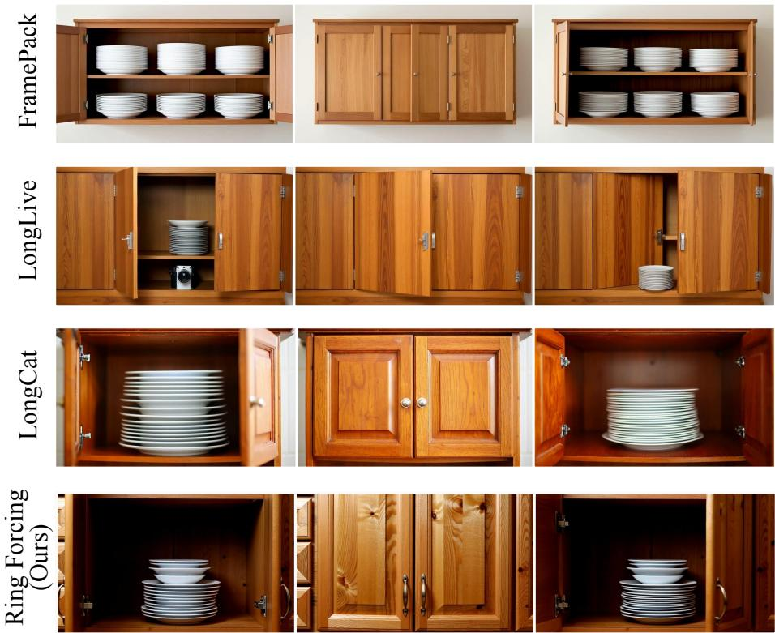

" Prompt\_Appear" : "Static camera. The solid wood cabinet doors swing open, revealing a stack of white plates sitting on the shelf inside."

" Prompt\_Disappear" : "Static camera. The solid wood cabinet doors swing back pt together and close completely."

Pro " Prompt\_Gap" : "Static camera unchanged. The solid wood kitchen cabinet doors remain completely closed and still."

"Prompt\_Reappear": "Static camera. The solid wood cabinet doors swing open again. The stack of white plates appears again sitting on the shelf inside."

"Subject": "stack of white plates"

Fig. A8: Qualitative Comparison on the A-D-R Benchmark (1s Gap). While state-of-the-art baselines sufer from immediate identity drift and fail to reconstruct the hidden object (stack of white plates), Ring Forcing accurately retrieves historical information, ensuring strict object permanence.

Appear 1s Disappearance Gap Reappear  

" Prompt\_Appear" : "Static camera. The heavy ceramic lid of the cookie jar is lifted off, revealing a chocolate chip cookie inside."

" Prompt\_Disappear" : "Static camera. The ceramic lid is placed back on top, closing pt the jar completely."

Pro " Prompt\_Gap" : "Static camera unchanged. The opaque ceramic cookie jar remains completely closed and still."

"Prompt\_Reappear": "Static camera. The heavy ceramic lid of the cookie jar is lifted off again. The chocolate chip cookie appears again inside."

"Subject": "chocolate chip cookie"

Fig. A9: Qualitative Comparison on the A-D-R Benchmark (1s Gap). Existing autoregressive models exhibit myopic attention bias, altering the geometry and texture of the subject (cookie) after merely one second of occlusion. In contrast, our method maintains strong attribute retention.

Appear 1s Disappearance Gap Reappear  
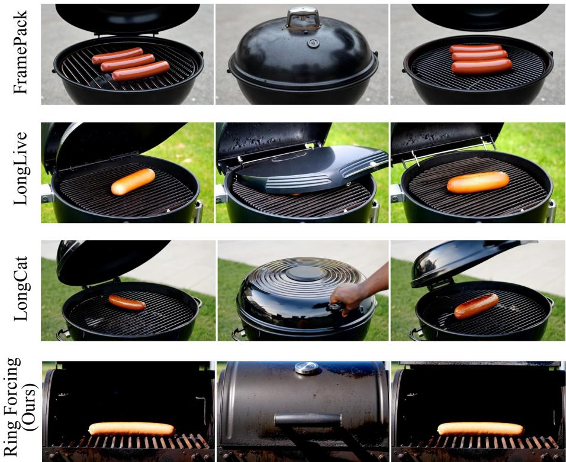

" Prompt\_Appear" : "Static camera. The heavy black metal grill lid is lifted open, revealing a cooked hot dog resting on the grates."

" Prompt\_Disappear" : "Static camera. The heavy black metal grill lid is pulled down and closes completely."

Pro " Prompt\_Gap" : "Static camera unchanged. The black metal BBQ grill remains completely closed and still."

"Prompt\_Reappear": "Static camera. The heavy black metal grill lid is lifted open again. The cooked hot dog appears again on the grates."

"Subject": "cooked hot dog"

Fig. A10: Qualitative Comparison on the A-D-R Benchmark (1s Gap). Even with simple objects (hot dog), baseline models struggle to maintain consistency. Ring Forcing efectively bridges the temporal gap, accurately recovering the subject’s identity.

Appear 1s Disappearance Gap Reappear  
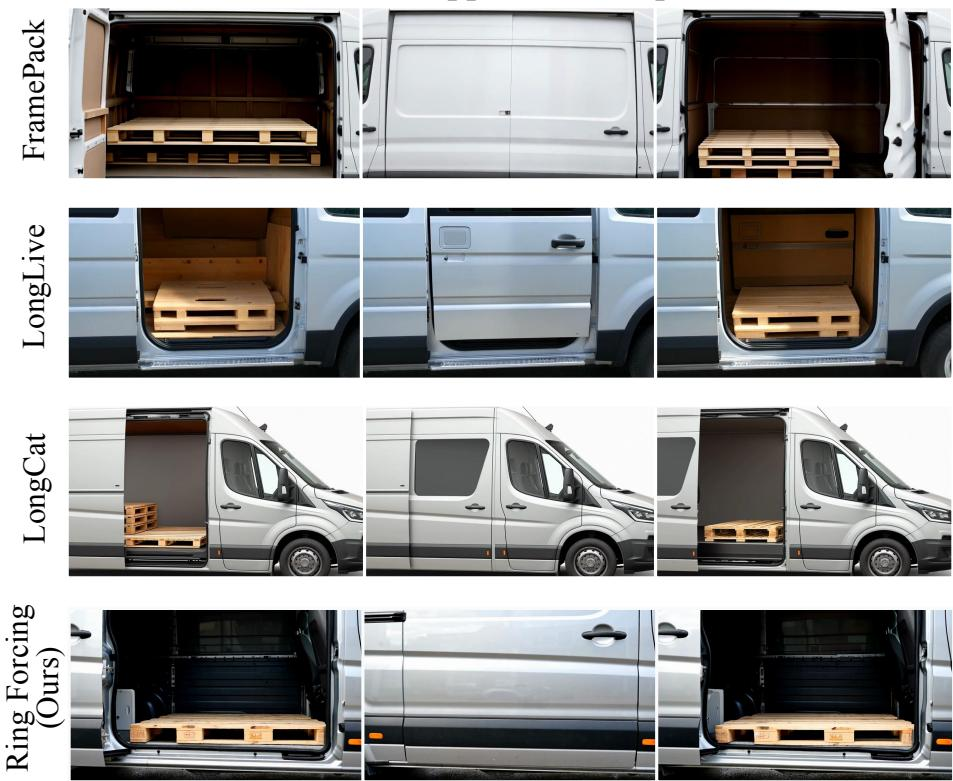  
" Prompt\_Appear" : "Static camera. The solid metal side door of the van slides open, revealing a wooden pallet resting inside the cargo hold."

" Prompt\_Disappear" : "Static camera. The solid metal side door slides violently shut p and closes completely."

Pro " Prompt\_Gap" : "Static camera unchanged. The solid metal side door of the cargo van remains completely closed and perfectly still."

"Prompt\_Reappear": "Static camera. The solid metal side door of the van slides open again. The wooden pallet appears again inside the cargo hold."

"Subject": "wooden pallet"

Fig. A11: Qualitative Comparison on the A-D-R Benchmark (1s Gap). While baseline models struggle to maintain the structural and textural details of the hidden object (wooden pallet) after a brief occlusion, Ring Forcing successfully retrieves the precise historical information, ensuring strict object permanence.

Appear 5s Disappearance Gap Reappear  
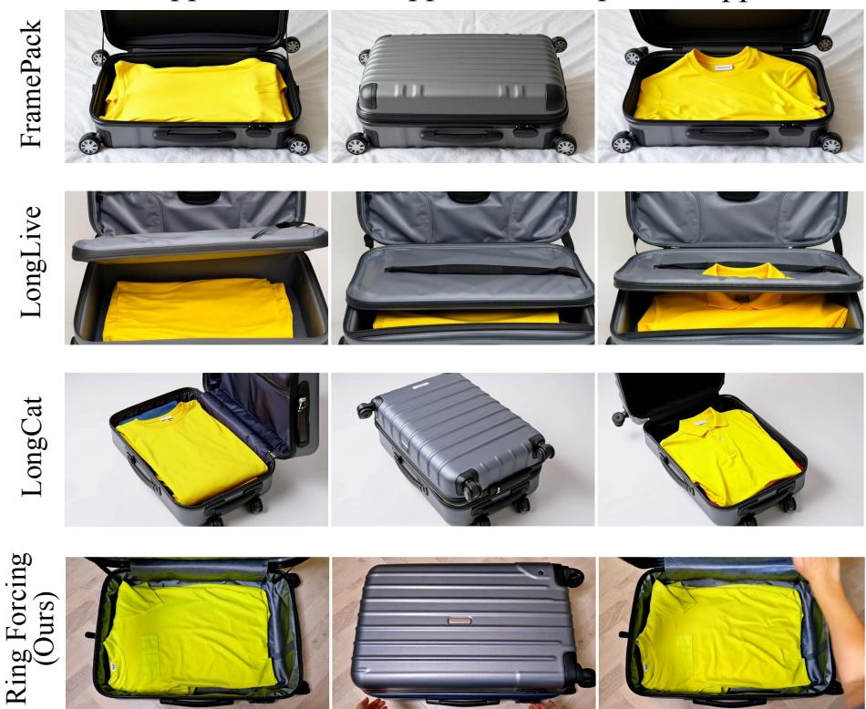

" Prompt\_Appear" : "Static camera. The lid of the gray suitcase opens up, revealing a bright yellow shirt folded inside."

" Prompt\_Disappear" : "Static camera. The lid of the gray suitcase folds down and pt closes completely."

Pro " Prompt\_Gap" : "Static camera unchanged. The hard-shell gray suitcase remains completely closed and still."

"Prompt\_Reappear": "Static camera. The lid of the gray suitcase opens up again. The bright yellow shirt appears again inside."

"Subject": "bright yellow shirt"

Fig. A12: Qualitative Comparison on the A-D-R Benchmark (5s Gap). As the temporal divide expands, baseline models experience catastrophic forgetting. Ring Forcing reliably preserves the specific visual features of the subject (yellow shirt) from distant history.

Appear 5s Disappearance Gap Reappear  
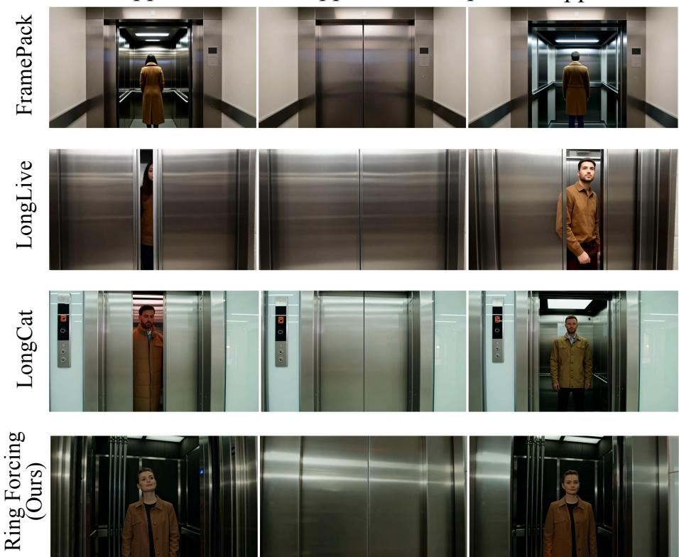  
" Prompt\_Appear" : "Static camera. The metal elevator doors slide apart and open, revealing a person wearing a brown coat standing inside."  
" Prompt\_Disappear" : "Static camera. The metal elevator doors slide together and pt close completely."  
Pro " Prompt\_Gap" : "Static camera unchanged. The metal elevator doors remain completely closed and still."

"Prompt\_Reappear": "Static camera. The metal elevator doors slide apart and open again. The person wearing the brown coat appears again inside."

"Subject": "person wearing a brown coat"

Fig. A13: Qualitative Comparison on the A-D-R Benchmark (5s Gap). Our method successfully reconstructs complex human attributes across a 5-second occlusion, whereas baselines hallucinate entirely new identities, highlighting their inability to perform long-range retrieval.

Appear 15s Disappearance Gap Reappear  

" Prompt\_Appear" : "Static camera. The lid of the cardboard pizza box flips up and opens, revealing a hot pepperoni pizza inside."," Prompt\_Disappear" : "Static camera. The lid of the pizza box flips back down and closes the box completely."," Prompt\_Gap" : "Static camera unchanged. The flat square cardboard pizza box remains completely closed and perfectly still.","Prompt\_Reappear": "Static camera. The lid of the cardboard pizza box flips up and opens again. The hot pepperoni pizza appears again inside.","Subject": "hot pepperoni pizza"

" Prompt\_Appear" : "Static camera. The solid silver refrigerator door swings open, revealing a green watermelon resting on the shelf."," Prompt\_Disappear" : "Static camera. The solid silver refrigerator door swings shut and closes completely."," Prompt\_Gap" : "Static camera unchanged. The solid silver stainless steel refrigerator remains completely closed and perfectly still.","Prompt\_Reappear": "Static camera. The solid silver refrigerator door swings open again. The green watermelon appears again on the shelf.","Subject": "green watermelon"

" Prompt\_Appear" : "Static camera. The lid of the guitar case opens up, revealing a wooden acoustic guitar resting inside."," Prompt\_Disappear" : "Static camera. The lid mpt of the guitar case folds down and closes completely."," Prompt\_Gap" : "Static camera unchanged. The black guitar case remains completely closed and

Pr still.","Prompt\_Reappear": "Static camera. The lid of the guitar case opens up again. The wooden acoustic guitar appears again inside.","Subject": "wooden acoustic guitar"

Fig. A14: Extreme Long-Term Memory Retrieval (15s Gap). Operating well beyond the maximum context limits of current baselines, Ring Forcing accurately recovers diverse objects (pizza, watermelon, acoustic guitar) after a 15-second disappearance, demonstrating highly resilient memory capacity.

Appear 30s Disappearance Gap Reappear  
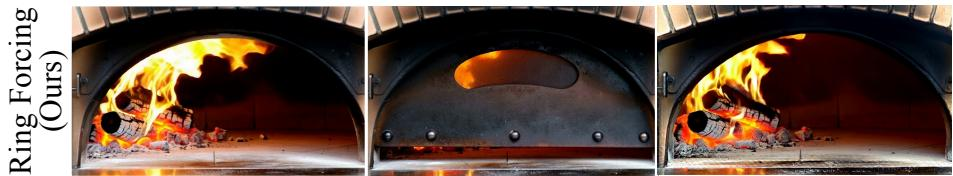  
" Prompt\_Appear" : "Static camera. The solid iron door of the pizza oven swings open, revealing a burning wooden log inside."," Prompt\_Disappear" : "Static camera. The solid iron door swings shut and closes the oven completely."," Prompt\_Gap" : "Static camera unchanged. The solid iron pizza oven door remains completely closed and still.","Prompt\_Reappear": "Static camera. The solid iron door of the pizza oven swings open again. The burning wooden log appears again inside.","Subject": "burning wooden log"

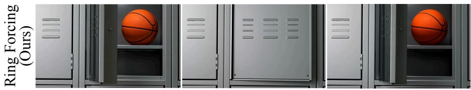  
" Prompt\_Appear" : "Static camera. The metal locker door swings open, revealing an orange basketball sitting on the shelf inside."," Prompt\_Disappear" : "Static camera. The metal locker door is pushed shut and closes completely."," Prompt\_Gap" : "Static camera unchanged. The metal school locker remains completely closed and still.","Prompt\_Reappear": "Static camera. The metal locker door swings open again. The orange basketball appears again inside.","Subject": "orange basketball"

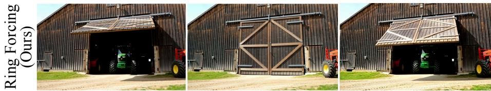  
" Prompt\_Appear" : "Static camera. The massive wooden double doors of the barn swing open, revealing a green tractor parked inside."," Prompt\_Disappear" : "Static Prompt camera. The massive wooden double doors swing back together and shut completely."," Prompt\_Gap" : "Static camera unchanged. The solid wooden double doors of the red barn remain completely closed and still.","Prompt\_Reappear": "Static camera. The massive wooden double doors of the barn swing open again. The green tractor appears again parked inside.","Subject": "green tractor"  
Fig. A15: Extreme Long-Term Memory Retrieval (30s Gap). Stress-testing our method with a half-minute visual gap. Ring Forcing exhibits robust temporal consistency and semantic adherence even for dynamic scenes (burning log, basketball, tractor), successfully overcoming the bottleneck of prolonged occlusions.

Appear 60s Disappearance Gap Reappear  
  
" Prompt\_Appear" : "Static camera. The solid wooden double doors of the shed swing open, revealing a red lawnmower parked inside."," Prompt\_Disappear" : "Static camera. The solid wooden double doors swing back together and close completely."," Prompt\_Gap" : "Static camera unchanged. The solid wooden double doors of the tool shed remain completely closed and still.","Prompt\_Reappear": "Static camera. The solid wooden double doors of the shed swing open again. The red lawnmower appears again parked inside.","Subject": "red lawnmower"

" Prompt\_Appear" : "Static camera. The heavy metal double doors of the red container swing open wide, revealing a white motorcycle parked inside."," Prompt\_Disappear" : "Static camera. The heavy metal double doors swing back together and slam shut completely."," Prompt\_Gap" : "Static camera unchanged. The corrugated metal doors of the shipping container remain completely closed and still.","Prompt\_Reappear": "Static camera. The heavy metal double doors of the red container swing open wide again. The white motorcycle appears again parked inside.","Subject": white motorcycle"

  
Fig. A16: Long-Term Object Permanence Evaluation (60s Gap). Demonstrating minute-level memory preservation, Ring Forcing successfully retrieves precise highfrequency details (lawnmower, motorcycle, autumn leaf) across a 60-second temporal gap, further demonstrating the efectiveness of Ring Forcing.

A cinematic 35mm film-style extreme close-up of a gray-haired man in his 60s, deeply engrossed in thought about the history of the universe as he sits at a Parisian café. His weathered face, adorned with a full beard, conveys a professorial air. His eyes are fixed on people walking off-screen, lost in contemplation. He is dressed in a woolen suit coat and a button-down shirt, wearing a brown beret and glasses. The background showcases . the bustling Parisian streets and cityscape, with golden light illuminating the scene. The depth of field creates a sense of depth, and the lighting is cinematic, highlighting his subtle, closed-mouth smile as if he has just discovered the answer to life's mysteries. A medium shot with a slight overhead angle.

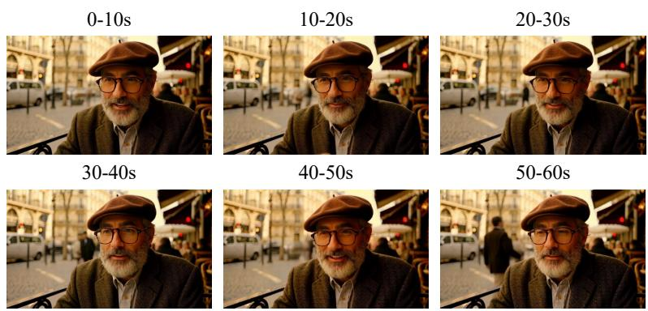  
A dynamic and lively tour through an art gallery, showcasing a diverse array of beautiful works in various styles. The gallery is filled with paintings, sculptures, and installations, each piece telling its own story. One section features impressionistic landscapes with soft brushstrokes and vibrant colors, capturing serene lakes and rolling hills. Nearby, there are realistic portraits with intricate details and lifelike expressions. In another corner, abstract artworks with bold colors and geometric shapes create a sense of movement and energy. The gallery itself has a modern, open design with high ceilings and large windows allowing natural light to flood in. Visitors move gracefully through the space, pausing occasionally to admire the works. The camera captures the gallery from multiple angles—wide shots of the entire room, close-ups of individual pieces, and sweeping pans to show the flow of visitors. The overall atmosphere is one of inspiration and wonder.

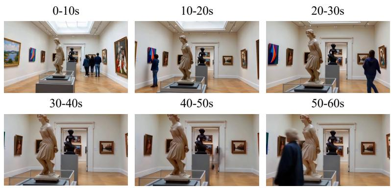  
Fig. A17: Qualitative Results on General Long Video Generation (1/5). This example demonstrates the model’s capability to maintain visual quality, stable dynamics, and overall spatiotemporal consistency throughout a 1-minute continuous generation in general scenarios.

A close-up view of a glass sphere containing a tranquil Zen garden. Inside, a small Eastern dwarf with weathered skin and a serene expression is raking the sand, meticulously creating intricate patterns with a bamboo rake. His movements are deliberate and meditative, enhancing the peaceful atmosphere of the scene. The background is blurred, revealing only hints of greenery and. rocks, adding to the serene setting. The sphere itself is polished, reflecting the surroundings subtly. The camera angle captures the dwarf from a slightly elevated position, emphasizing his focused and contemplative pose.

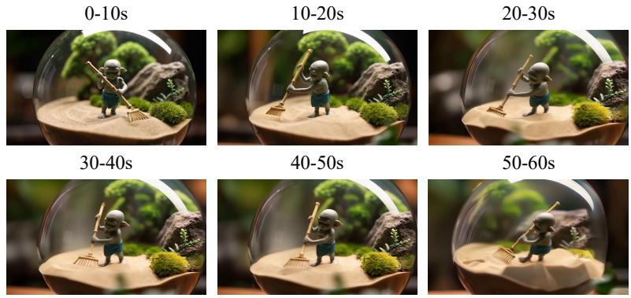

A close-up 3D animated scene of a short, fluffy monster kneeling beside a melting red candle. The monster has large, wide eyes and an open mouth, gazing at the flame with a look of wonder and curiosity. Its soft, fluffy fur contrasts with the warm, dramatic lighting that highlights every detail of its gentle, innocent expression. The pose conveys a sense of playfulness and exploration,. as if the creature is discovering the world for the first time. The background features a cozy, warmly lit room with subtle hints of a fireplace and soft furnishings, enhancing the overall atmosphere. The use of warm colors and dramatic lighting creates a captivating and inviting scene.  
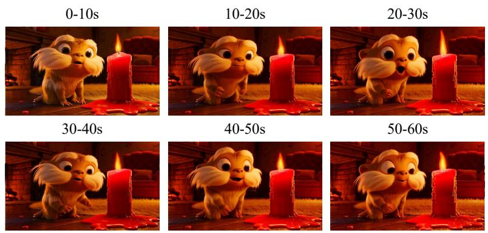  
Fig. A18: Qualitative Results on General Long Video Generation (2/5). This example demonstrates the model’s capability to maintain visual quality, stable dynamics, and overall spatiotemporal consistency throughout a 1-minute continuous generation in general scenarios.

A realistic archaeological excavation scene in a vast desert, where archeologists meticulously uncover a generic plastic chair buried under layers of sand. They carefully brush away the dust, their focused expressions conveying the importance of their discovery. The chair, though simple, appears slightly worn and faded. The background showcases the harsh, barren landscape of the desert, with dunes stretching into the distance. The sun is setting, casting long shadows and adding a sense of timelessness to the scene. A close-up shot from a slightly lower angle, emphasizing the detailed work of the archeologists and the weathered chair.

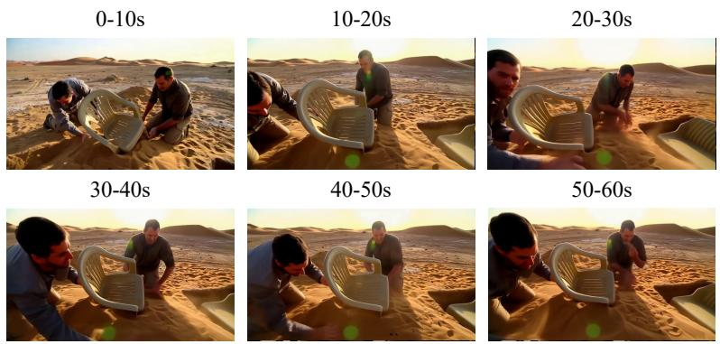  
A cinematic and grainy photograph captures a white and orange tabby cat joyfully darting through a dense garden, as if chasing something. The cat’s eyes are wide and filled with happiness as it jogs forward, scanning the branches, flowers, and leaves. The narrow path winds between the lush greenery, and the scene is captured from a ground-level angle, providing a low and intimate perspective. The image has warm tones and a subtle grainy texture, with scattered daylight filtering through the leaves and plants above, creating a warm contrast that highlights the cat’s orange fur. The shot is clear and sharp, with a shallow depth of field that focuses solely on the cat’s movements and expressions.

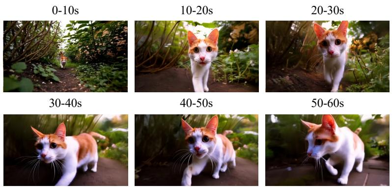  
Fig. A19: Qualitative Results on General Long Video Generation (3/5). This example demonstrates the model’s capability to maintain visual quality, stable dynamics, and overall spatiotemporal consistency throughout a 1-minute continuous generation in general scenarios.

A highly detailed close-up shot in HD, focusing on dew droplets glistening on the delicate petals of a blue rose. The petals are soft and velvety, with intricate patterns and subtle color gradients. Each dew drop sparkles like tiny diamonds, catching the light and creating a mesmerizing effect. The background is blurred, emphasizing the dew and petals, with a soft focus on the edges. The photo has a clear, crisp texture, highlighting the beauty and fragility of nature.

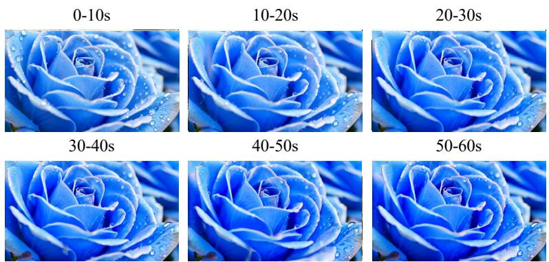  
A Chinese boy wearing glasses sits in a fast food restaurant, enjoying a delicious cheeseburger with his eyes closed. His hair is neatly combed, and he has a slightly dreamy expression. He holds the cheeseburger with both hands, taking a big bite. The background shows other diners and a . colorful menu board with various fast food items. The lighting is warm and inviting, creating a cozy atmosphere. A close-up shot from a slightly lower angle, capturing the boy's joyful moment.

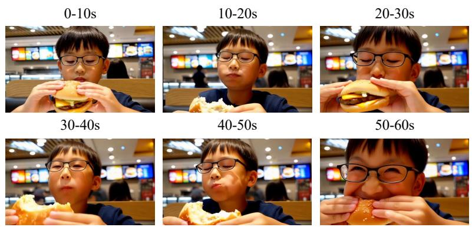  
Fig. A20: Qualitative Results on General Long Video Generation (4/5). This example demonstrates the model’s capability to maintain visual quality, stable dynamics, and overall spatiotemporal consistency throughout a 1-minute continuous generation in general scenarios.

A student with thick-rimmed glasses and a look of wonder, full front face visible, walking through a classic university library corridor while hugging books tight, looking up in awe at the high shelves, sunlight streaming through windows forming rhythmic light spots on his face, background is deep and quiet, walking in an endless river of knowledge.

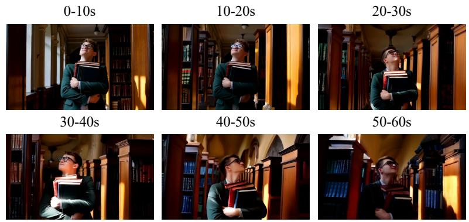

A tourist with wide-open eyes reflecting water patterns, full face visible, walking slowly through a futuristic white underwater tunnel, reaching out hand to touch the glass, deep blue seawater and fish continuously weaving through the background, water caustic light patterns projecting dynamically on the face, dreamy looping image.  
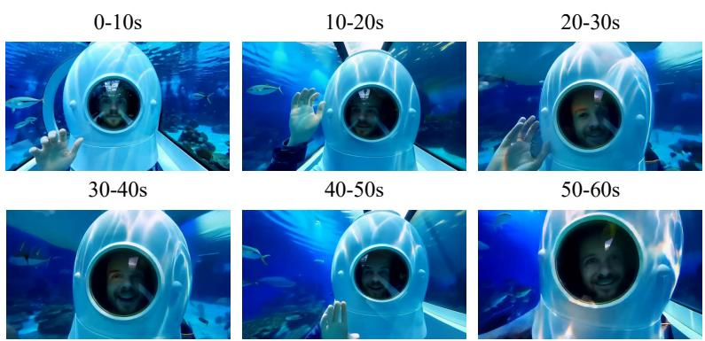  
Fig. A21: Qualitative Results on General Long Video Generation (5/5). This example demonstrates the model’s capability to maintain visual quality, stable dynamics, and overall spatiotemporal consistency throughout a 1-minute continuous generation in general scenarios.