# Self-OPD: On-Policy Distillation for Flow Matching Models without Teacher

Shiyi Zhang1,3,∗, Mushui Liu2,3,∗,⊠, Yunze Tong2, Wanggui He3, Siyu Zou3, Jinlong Liu3, Yunlong Yu2, Jian Song1, Hao Jiang3,⊠, Pipei Huang3, Bo Zheng3

1Tsinghua University, 2Zhejiang University, 3Alibaba Group

∗Equal contribution, ⊠Corresponding author

## Abstract

On-policy distillation (OPD), which leverages a pre-trained, specialized teacher model to provide dense supervisory signals, has achieved significant success in Large Language Models (LLMs) and has recently been adapted to flow matching models. However, this paradigm sufers from two major issues: First, training a separate, task-specific teacher for every new objective incurs high computational costs. Second, the discrepancy between teacher and student distributions often leads to compounding errors along the generation trajectory. In this paper, we introduce Self-OPD, a teacher-free OPD framework for flow matching models that turns the student’s own self-exploration into step-wise supervision. At each timestep, Self-OPD branches the deterministic next-state prediction into K stochastic SDE candidates, rolls them out with the ODE sampler, and compares their rewards against a deterministic self-reference baseline to obtain normalized advantages. The velocity field is optimized with an all-branch pull-push objective, where high-advantage branches attract the student and low-advantage branches repel it under direction-aware attenuation and SDE-variance normalization. For multi-objective alignment, Self-OPD fuses normalized scores at the reward level, avoiding direct gradient conflict. Experiments on single and mixed reward benchmarks show that Self-OPD outperforms prior RL and OPD methods without task-specific teachers.

Github: https://github.com/Shiy-Zhang/Self-OPD

## 1 Introduction

Flow Matching (FM) models [6, 19, 23], which learn a continuous velocity field that transports noise to data, have become a dominant backbone for high-quality visual generation [3, 13, 24, 25]. Despite their generative strength, aligning FM models with downstream objectives such as text rendering [4, 35], compositional correctness, and human preference remains challenging.

Existing reinforcement learning (RL) approaches [2, 7, 20, 29, 30, 38] directly optimize reward signals by treating generation as a sequential decision process. As summarized in Fig. 1(a) and illustrated in Fig. 2, these methods can be teacher-free, but they often rely on terminal scores from full denoising trajectories. Consequently, reward credit must be assigned backward through many steps, which leads to high-variance gradients and makes multi-objective alignment fragile when diferent rewards favor diferent visual properties.

On-policy distillation (OPD) provides a more stable alternative by supplying dense, step-wise supervision on the student’s own trajectory. Recent OPD methods for FM or difusion models [8, 18] regress the student velocity toward a pretrained teacher prediction at each denoising step, thereby improving training stability and sample eficiency. Yet this teacher-dependent design introduces a diferent bottleneck: each new objective requires training or acquiring a specialized teacher, the student is upper-bounded by the quality and bias of that teacher, and field-level fusion of multiple teachers can create conflicting update directions [8, 18, 39]. In particular, some OPD methods handle multiple objectives by decoupling the problem into separately trained, task-specific teachers whose velocity fields are then routed and merged at the field level [18], which is fundamentally at odds with our aim of driving a single image to high reward across all objectives at once. This motivates a central question: Can we retain the dense per-step supervision of OPD while removing the need for any external teacher?

<table><tr><td></td><td>Flow-GRPO</td><td>Teacher-based OPD</td><td>Self-OPD</td></tr><tr><td>Teacher-free</td><td>√</td><td>X</td><td></td></tr><tr><td>Per-step supv.</td><td>x</td><td></td><td></td></tr><tr><td>On-policy data</td><td>V</td><td></td><td></td></tr><tr><td>Credit assign.</td><td>Terminal</td><td>Dense</td><td>Dense</td></tr><tr><td>Adapts to student</td><td></td><td>x</td><td>V</td></tr><tr><td>Exploration</td><td>Full traj.</td><td>Teacher</td><td>Local</td></tr></table>

(a) Comparison of alignment paradigms

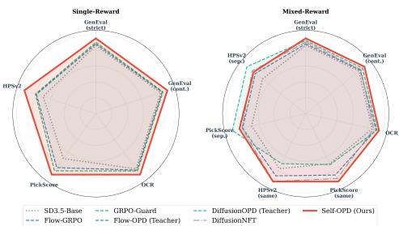  
(b) Single- and mixed-reward results

  
(c) Generated samples from a single Self-OPD model Figure 1 Overview of Self-OPD.

We answer this question with Self-OPD, a teacher-free on-policy distillation framework for flow matching models. The key idea is to replace teacher-provided velocity targets with reward-weighted targets discovered from the student’s own local exploration. At each on-policy timestep $t _ { j } .$ , Self-OPD branches the deterministic next-state prediction $x _ { t _ { j + 1 } , \theta }$ into K stochastic SDE candidates, rolls each candidate out deterministically to a clean image, and evaluates the resulting images with task rewards. In parallel, a deterministic ODE rollout from the same parent state provides a self-reference baseline, allowing terminal rewards to be converted into normalized branch advantages. Self-OPD then performs all-branch pull-push distillation: high-advantage branches pull the velocity field toward better local trajectories, while low-advantage branches push it away from poor directions. A direction-aware attenuation term stabilizes this signed objective by suppressing repulsion that would counteract the best branch, and an SDE-variance normalization yields a principled per-step alignment loss connected to reward-tilted KL minimization. This self-referenced formulation also changes how multi-objective alignment is handled. Instead of diferentiating through a weighted sum of potentially conflicting objective losses, Self-OPD fuses normalized scalar scores at the reward level and uses the composite reward only to rank sampled branches. The actual regression target remains a concrete trajectory velocity sampled from the student’s own neighborhood, which naturally supports black-box rewards and avoids direct gradient competition among objectives. Rather than partitioning capabilities across specialized teachers as in field-level decoupling, Self-OPD selects branches inside the joint high-reward region, so that a single image is directly optimized to score high on all rewards at once. As shown in Fig. 1, this lets a single generated image simultaneously satisfy multiple objectives—accurate text rendering, correct composition, and high aesthetic quality—rather than having diferent images each excel under a diferent reward; we return to this joint high-reward behavior in Sec. 3.4.

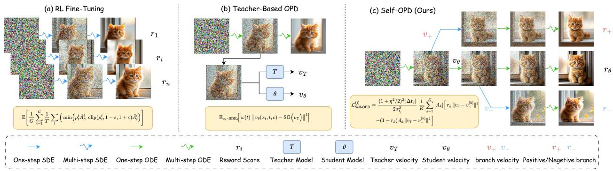  
Figure 2 Comparison of alignment paradigms. (a) Flow-GRPO relies on trajectory-level policy gradients from terminal rewards. (b) Flow-OPD requires a pretrained teacher for step-wise MSE supervision. (c) Self-OPD (Ours) turns local stochastic branches and a self-reference baseline into dense pull-push supervision, without requiring any teacher.

Overall, our contributions are:

• We propose Self-OPD, a teacher-free on-policy distillation framework for flow matching models that converts reward-guided self-exploration and a self-reference baseline into dense step-wise supervision.

• We introduce an all-branch pull-push distillation objective with SDE-variance normalization and direction-aware attenuation, using both high- and low-advantage branches while maintaining stable optimization.

• We develop a reward-level fusion strategy for multi-objective alignment, enabling black-box composition without field-level teacher routing or gradient conflicts.

• We show empirically that Self-OPD outperforms prior RL and teacher-based OPD methods across single-reward and mixed-reward benchmarks.

## 2 Related Work

RL in Diffusion Models. RL has recently emerged as an efective paradigm for aligning difusion-based visual generation models [3, 6, 21, 22, 24, 25] with human preferences [2, 5, 7, 20, 29, 32, 32, 33, 38]. From the perspective of backward estimation, FlowGRPO [20], TempFlow-GRPO [12], TP-GRPO [28], and DanceGRPO [34] reformulate denoising as a sequential decision-making problem, enabling policy gradient optimization over discrete difusion timesteps. DifusionNFT [38] instead operates on the forward difusion trajectory, treating the noising process as an environment to derive reward signals for policy updates. More recently, several works [30, 38] have explored multi-reward optimization strategies to simultaneously improve generation quality across diverse criteria while preserving generalization, establishing a multi-task RL learning framework for visual generation.

On-Policy Distillation. On-policy distillation (OPD) has demonstrated notable progress in large language models (LLMs), owing to its ability to mitigate exposure bias and improve training eficiency through student-generated sequences [1, 26]. GKD [1] established the canonical OPD framework by training the student model on its own generated outputs, efectively bridging the distribution gap between teacher and student. Building upon this, Flow-OPD [8] and Difusion-OPD [18] extend OPD [9, 10] to flow matching and difusion models, respectively, achieving competitive generation quality with significantly reduced sampling steps [36, 37]. D-OPSD [15] further leverages multi-modal features to distill rich cross-modal knowledge into a compact single-stream textual representation, enhancing semantic alignment in text-to-image generation. In contrast, our work extends OPD to a multi-task setting, enabling simultaneous optimization across diverse generation objectives without relying on a fixed teacher model.

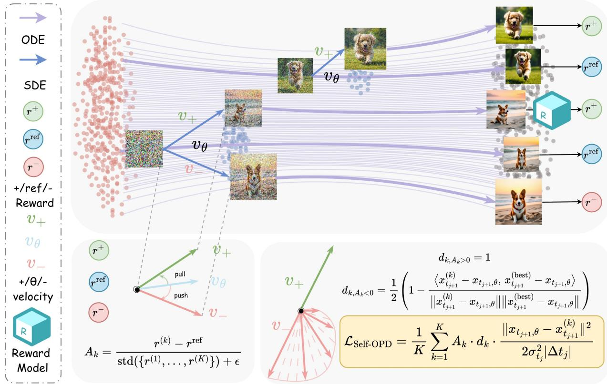  
Figure 3 Self-OPD pipeline. Top: The student branches its prediction into K SDE paths (blue), generates images via ODE rollouts (purple), and scores them $( r ^ { + } , r ^ { \mathrm { r e f } } , r ^ { - } )$ . Bottom-left: Rewards define a self-referenced advantage $A _ { k }$ that pulls toward high-reward velocities $v _ { + }$ and pushes away from low-reward velocities $v _ { - }$ . Bottom-right: A direction-aware coeficient $d _ { k }$ gates the push to prevent it from counteracting the pull, resulting in the multi-branch loss ${ \mathcal { L } } _ { \mathrm { S e l f - O P D } }$

## 3 Methodology

## 3.1 Preliminaries

Flow Matching and SDE Formulation. Flow Matching (FM) [19, 23] learns a continuous velocity field $v _ { \theta }$ that transports a noise distribution $p _ { 1 } = \mathcal { N } ( 0 , { \bf { I } } )$ to the data distribution p along straight-line trajectories. Formally, the probability path is defined as $x _ { t } = ( 1 - t ) x _ { 0 } + t \epsilon$ for $t \in [ 0 , 1 ]$ , where $\epsilon \sim \mathcal { N } ( 0 , \bf { I } )$ . The model parameterizes $v _ { \theta } ( x _ { t } , t )$ by minimizing the flow matching objective:

$$
\mathcal { L } _ { \mathrm { F M } } = \mathbb { E } _ { t , x _ { 0 } , \epsilon } \left[ | | v _ { \theta } ( x _ { t } , t ) - ( \epsilon - x _ { 0 } ) | | ^ { 2 } \right] .\tag{1}
$$

During inference, samples are generated by integrating the reverse-time ordinary diferential equation (ODE) $\begin{array} { r } { \frac { \mathrm { d } \boldsymbol { x } _ { t } } { \mathrm { d } t } = \boldsymbol { v } _ { \theta } ( \boldsymbol { x } _ { t } , t ) } \end{array}$ backward from $t _ { 0 } = 1$ to $t _ { S } \approx 0 .$ . Specifically, we discretize the trajectory into S integration steps along a discrete schedule $\{ t _ { j } \} _ { j = 0 } ^ { S }$ satisfying $1 = t _ { 0 } > t _ { 1 } > \cdot \cdot \cdot > t _ { S } \approx 0$ . The infinitesimal transition step is denoted as $\Delta t _ { j } = t _ { j + 1 } - t _ { j } < 0$ for $j \in \{ 0 , \ldots , S - 1 \}$

To enable stochastic exploration, the reverse ODE can be augmented into a reverse-time stochastic diferential equation (SDE) [8, 27]. Under the Euler-Maruyama discretization scheme, each transition step decomposes into a deterministic next-state prediction and an isotropic stochastic perturbation:

$$
x _ { t _ { j + 1 } } = x _ { t _ { j + 1 } , \theta } + \sigma _ { t _ { j } } \sqrt { | \Delta t _ { j } | } z _ { j } , \quad z _ { j } \sim \mathcal { N } ( 0 , \mathbf { I } ) ,\tag{2}
$$

where $\sigma _ { t _ { j } } = \eta \sqrt { t _ { j } / ( 1 - t _ { j } ) }$ represents the noise schedule parameterized by the coeficient $\eta \in [ 0 , 1 ]$ . The drift of this reverse SDE is governed by the score function $\nabla _ { x _ { t } } \log { p _ { t } ( x _ { t } ) }$ , which is inherently constrained by the velocity field. Conditioned on a data point $x _ { 0 } .$ , the conditional distribution is $\boldsymbol { x } _ { t } \ | \ \boldsymbol { x } _ { 0 } \sim \mathcal { N } \big ( ( 1 - t ) \boldsymbol { x } _ { 0 } , t ^ { 2 } \mathbf { I } \big )$ which yields the conditional score $\nabla _ { x _ { i } }$ log $\begin{array} { r } { p _ { t } ( x _ { t } \mid x _ { 0 } ) = - \frac { x _ { t } - ( 1 - t ) x _ { 0 } } { t ^ { 2 } } = - \frac { \epsilon } { t } } \end{array}$ . Averaging over the posterior $p ( x _ { 0 } \mid x _ { t } )$ establishes the marginal-score identity $\begin{array} { r } { \nabla _ { x _ { t } } \log p _ { t } ( x _ { t } ) = - \frac { \mathbb { E } [ \epsilon | x _ { t } ] } { t } } \end{array}$ . By eliminating $\textstyle x _ { 0 } = { \frac { x _ { t } - t \epsilon } { 1 - t } }$ from the parameterized velocity target $v _ { \theta } \approx \mathbb { E } [ \epsilon - x _ { 0 } \ | \ x _ { t } ]$ , we obtain the conditional expectation $\mathbb { E } [ \epsilon \mid x _ { t } ] = { \dot { x _ { t } } } + ( 1 - t ) v _ { \theta }$ which simplifies the score function to:

$$
\nabla _ { x _ { t } } \log { p _ { t } ( x _ { t } ) } \approx - \frac { x _ { t } + ( 1 - t ) v _ { \theta } ( x _ { t } , t ) } { t } .\tag{3}
$$

The reverse SDE transition follows the score-augmented drift $\begin{array} { r } { v _ { \theta } - \frac { \sigma _ { t _ { j } } ^ { 2 } } { 2 } \nabla _ { x } . } \end{array}$ log pt [27]. Substituting Eq. 3 into this drift formulation scales the correction term to $\begin{array} { r } { \frac { \sigma _ { t _ { j } } ^ { 2 } } { 2 t _ { j } } \big ( x _ { t _ { j } } + ( 1 - t _ { j } ) v _ { \theta } \big ) } \end{array}$ . Consequently, the deterministic next-state prediction $x _ { t _ { j + 1 } , \theta }$ is formulated as:

$$
x _ { t _ { j + 1 } , \theta } = x _ { t _ { j } } + \left[ v _ { \theta } ( x _ { t _ { j } } , t _ { j } ) + \frac { \sigma _ { t _ { j } } ^ { 2 } } { 2 t _ { j } } \Big ( x _ { t _ { j } } + ( 1 - t _ { j } ) v _ { \theta } ( x _ { t _ { j } } , t _ { j } ) \Big ) \right] \Delta t _ { j } .\tag{4}
$$

Setting $\eta = 0$ naturally recovers the deterministic Euler ODE step $x _ { t _ { j } } + v _ { \theta } \Delta t _ { j }$ . To explicitly reveal the dependence of the prediction on the learned velocity, we collect the $v _ { \theta }$ terms in Eq. 4, yielding the coeficien $\begin{array} { r } { \Delta t { _ j } \big [ 1 + \frac { \sigma _ { t _ { j } } ^ { 2 } } { 2 t _ { j } } ( 1 - t _ { j } ) \big ] } \end{array}$ . Substituting the schedule $\sigma _ { t _ { j } } ^ { 2 } = \eta ^ { 2 } t _ { j } / ( 1 { - } t _ { j } )$ cancels the terms $t _ { j }$ and $( 1 - t _ { j } )$ , leaving a timestep-independent constant $\begin{array} { r } { ( 1 + \frac { \eta ^ { 2 } } { 2 } ) } \end{array}$ . Hence, the deterministic prediction displays an elegant afine relationship with the velocity field:

$$
\begin{array} { r } { x _ { t _ { j + 1 } , \theta } = b _ { t _ { j } } ( x _ { t _ { j } } ) + c _ { t _ { j } } v _ { \theta } ( x _ { t _ { j } } , t _ { j } ) , \qquad c _ { t _ { j } } = \big ( 1 + \frac { \eta ^ { 2 } } { 2 } \big ) \Delta t _ { j } , } \end{array}\tag{5}
$$

where $\begin{array} { r } { b _ { t _ { j } } ( x _ { t _ { j } } ) = \big ( 1 + \frac { \sigma _ { t _ { j } } ^ { 2 } \Delta t _ { j } } { 2 t _ { j } } \big ) x _ { t _ { j } } } \end{array}$ aggregates all components independent of $v _ { \theta }$ . This afine equivalence guarantees that any distillation objective formulated in transition space can be minimized with identical convergence properties in velocity space.

In this work, we propose Self-OPD, a teacher-free on-policy distillation framework that transforms self-generated rewards into dense, step-wise supervision. As illustrated in Fig. 3, Self-OPD first explores local trajectories around the student’s on-policy path via stochastic SDE branching, evaluates these candidates against a deterministic self-reference baseline, and finally distills the collective feedback through an advantage-weighted pull-push objective.

## 3.2 Self-Referenced Evaluation and Self-Exploration

To retain dense supervision without a pretrained teacher, Self-OPD lets the student evaluate its own local alternatives. Given an on-policy latent $\boldsymbol { x } _ { t _ { j } }$ , the method first samples K stochastic next states around the deterministic prediction and then compares their final rewards against the student’s default ODE trajectory from the same state. This local, self-referenced comparison turns terminal rewards into low-variance per-step guidance.

SDE Branching Exploration. At timestep $t _ { j }$ , we compute the deterministic next-state prediction $x _ { t _ { j + 1 } , \theta }$ with a single forward pass through the student transformer. Following the SDE transition in Eq. 2, we instantiate K candidate branches by drawing independent Gaussian perturbations:

$$
x _ { t _ { j + 1 } } ^ { ( k ) } = x _ { t _ { j + 1 } , \theta } + \sigma _ { t _ { j } } \sqrt { | \Delta t _ { j } | } z _ { k } , \quad z _ { k } \sim \mathcal { N } ( 0 , I )\tag{6}
$$

where $k = 1 , \ldots , K$ . All branches share the same base prediction $x _ { t _ { j + 1 } , \theta } .$ , so the expensive transformer evaluation is performed only once; the additional diversity comes from lightweight SDE perturbations. The noise level $\sigma _ { t _ { j } } .$ , set by $\eta = 0 . 6$ in our experiments, controls the exploration radius.

ODE Rollout and Self-Reference Evaluation. Each branch $x _ { t _ { j + 1 } } ^ { ( k ) }$ is completed to a clean latent $\hat { x } _ { 0 } ^ { ( k ) }$ by a deterministic ODE rollout $( \eta { = } 0 )$ , decoded to pixel space, and scored by a task-specific reward model R:

$$
r ^ { ( k ) } = R \left( \mathrm { D e c } ( \hat { x } _ { 0 } ^ { ( k ) } ) , c \right) , \quad k = 1 , \ldots , K ,\tag{7}
$$

where c is the prompt and $\mathrm { D e c } ( \cdot )$ is the VAE decoder. To obtain a variance-reducing baseline without a teacher, we also run a fully deterministic ODE trajectory directly from the parent state $\boldsymbol { x } _ { t _ { j } }$ and denote its reward as $r ^ { \mathrm { o d e } }$ . The branch advantage is then normalized relative to this self-reference:

$$
A _ { k } = { \frac { r ^ { ( k ) } - r ^ { \mathrm { o d e } } } { \operatorname { s t d } ( \left\{ r ^ { ( 1 ) } , \dots , r ^ { ( K ) } \right\} ) + \epsilon } } ,\tag{8}
$$

where positive advantages indicate local directions that outperform the student’s default trajectory, while negative advantages identify directions to avoid. For multi-reward training, $r ^ { ( k ) }$ is the composite reward defined in Eq. 18; it is still used only as a non-diferentiable branch-ranking signal inside Eq. 8.

## 3.3 All-Branch Pull-Push Distillation

Instead of regressing only to the best branch, Self-OPD uses the full exploration neighborhood. Positive advantage branches should pull the deterministic prediction toward locally better trajectories, while negativeadvantage branches should push it away from poor directions. This all-branch update reduces target switching and preserves the information contained in branches that Best-of-K selection would discard.

Not every negative branch is equally useful. If a low-reward branch points in nearly the same direction as the best branch, a strong repulsive update would counteract the desirable pull. We therefore introduce a direction-aware attenuation coeficient:

$$
\begin{array} { r } { d _ { k } = \left\{ \begin{array} { l l } { 1 } & { \mathrm { i f ~ } A _ { k } \geq 0 , } \\ { \frac { 1 } { 2 } \left( 1 - \frac { \left. \delta _ { k } , \delta _ { \mathrm { b e s t } } \right. } { \left\| \delta _ { k } \right\| \left\| \delta _ { \mathrm { b e s t } } \right\| } \right) } & { \mathrm { i f ~ } A _ { k } < 0 , } \end{array} \right. } \end{array}\tag{9}
$$

where $\delta _ { k } = x _ { t _ { i + 1 } } ^ { ( k ) } - x _ { t _ { j + 1 } , \theta }$ and $\delta _ { \mathrm { b e s t } } = x _ { t _ { j + 1 } } ^ { ( \mathrm { b e s t } ) } - x _ { t _ { j + 1 } , \theta }$ are measured from the deterministic prediction. The coeficient is bounded in $[ 0 , 1 ]$ : it keeps the full repulsion for negative branches that point opposite to the bes direction, and suppresses repulsion when a negative branch is aligned with the best branch.

Because $x _ { t _ { j + 1 } , \theta }$ is afine in vθ by Eq. 5, every branch can be associated with an efective branch velocity $v ^ { ( k ) }$ satisfying $x _ { t _ { j + 1 } } ^ { ( k ) } = b _ { t _ { j } } ( x _ { t _ { j } } ) + c _ { t _ { j } } v ^ { ( k ) }$ . Subtracting Eq. 5 from the branch definition Eq. 6 and dividing by $c _ { t _ { j } } = ( 1 + \eta ^ { 2 } / 2 ) \bar { \Delta { t } _ { j } }$ gives the closed form

$$
v ^ { ( k ) } = v _ { \theta } - \frac { \sigma _ { t _ { j } } } { ( 1 + \eta ^ { 2 } / 2 ) \sqrt { | \Delta t _ { j } | } } z _ { k } ,\tag{10}
$$

so injecting Gaussian noise in transition space is exactly a perturbation of the velocity target. Consequently the displacement factors as $x _ { t _ { j + 1 } , \theta } - x _ { t _ { j + 1 } } ^ { ( k ) } = c _ { t _ { j } } \left( v _ { \theta } - v ^ { ( k ) } \right)$ , so the squared transition distance equals the squared velocity distance scaled by $c _ { t _ { j } } ^ { 2 } = ( 1 + \eta ^ { 2 } / 2 ) ^ { 2 } | \Delta t _ { j } | ^ { 2 }$ . Dividing this by the transition-kernel variance normalization $2 \sigma _ { t _ { i } } ^ { 2 } | \Delta t _ { j } |$ turns the constant into the prefactor $( 1 + \eta ^ { 2 } / 2 ) ^ { 2 } | \Delta t _ { j } | / ( 2 \sigma _ { t _ { j } } ^ { 2 } )$ below. Let $r _ { k } = \mathbf { 1 } [ A _ { k } \geq 0 ]$ , and define $v _ { + } ^ { ( k ) }$ and $v _ { - } ^ { ( k ) }$ as the efective velocities of positive and negative branches, respectively. The step-wise Self-OPD objective is:

$$
\mathcal { L } _ { \mathrm { S e l f - O P D } } ^ { ( j ) } = \frac { ( 1 + \eta ^ { 2 } / 2 ) ^ { 2 } | \Delta t _ { j } | } { 2 \sigma _ { t _ { j } } ^ { 2 } } \frac { 1 } { K } \sum _ { k = 1 } ^ { K } | A _ { k } | \Big [ r _ { k } \| v _ { \theta } - v _ { + } ^ { ( k ) } \| ^ { 2 } - ( 1 - r _ { k } ) d _ { k } \| v _ { \theta } - v _ { - } ^ { ( k ) } \| ^ { 2 } \Big ] ,\tag{11}
$$

The prefactor follows from the SDE transition variance and the afine change of variables from transition mean to velocity, matching the normalization used in OPD-style per-step regression [8, 18]. The first term pulls vθ toward high-reward branch velocities, while the second term pushes it away from low-reward velocities after direction-aware attenuation.

Connection to Per-Step KL. The normalization above also admits a KL interpretation. Let $q _ { \theta } ( \cdot \ | \ x _ { t _ { j } } ) =$ $\mathcal { N } ( x _ { t _ { j + 1 } , \theta } , \sigma _ { t _ { i } } ^ { 2 } | \Delta t _ { j } | I )$ denote the SDE transition kernel, and let $q ^ { * } \bigl ( \cdot \mid x _ { t _ { j } } \bigr ) \propto q _ { \theta } \bigl ( \cdot \mid x _ { t _ { j } } \bigr ) \exp ( A ( \cdot ) / \tau )$ be a reward-tilted target distribution, as in reward-weighted regression.

Proposition 1 (Per-step KL gradient) For fixed $\boldsymbol { x } _ { t _ { j } }$ and fixed target $q ^ { * }$ , the gradient of the reverse KL with respect to the student transition mean is

$$
\nabla _ { x _ { t _ { j + 1 } } , \theta } D _ { \mathrm { K L } } ( q ^ { * } \| q _ { \theta } ) = \frac { 1 } { \sigma _ { t _ { j } } ^ { 2 } | \Delta t _ { j } | } \mathbb { E } _ { { x _ { t _ { j + 1 } } } \sim q ^ { * } } \big [ x _ { { t _ { j + 1 } } , \theta } - x _ { { t _ { j + 1 } } } \big ] .\tag{12}
$$

Self-OPD approximates this expectation with the K sampled branches, using $A _ { k } d _ { k }$ as the signed importance weight of each branch; we prove the Proposition next and then use it to explain the loss.

Proof of Prop. 1. Abbreviate the transition mean $\mu _ { \theta } = x _ { t _ { j + 1 } , \theta }$ and the isotropic covariance $\Sigma = \sigma _ { t _ { i } } ^ { 2 } | \Delta t _ { j } | I .$ Since $q ^ { * }$ is the fixed regression target, diferentiating the reverse KL with respect to $\mu _ { \theta }$ acts only through the log q term. Splitting the two terms,

$$
D _ { \mathrm { K L } } ( q ^ { * } \| q _ { \theta } ) = \mathbb { E } _ { x \sim q ^ { * } } [ \log q ^ { * } ( x ) ] - \mathbb { E } _ { x \sim q ^ { * } } [ \log q _ { \theta } ( x ) ] ,\tag{13}
$$

the first is independent of $\mu _ { \theta }$ and vanishes under $\nabla _ { \mu _ { \theta } }$ . For the Gaussian kernel,

$$
\begin{array} { r } { \log q _ { \theta } ( x ) = - \frac { 1 } { 2 } ( x - \mu _ { \theta } ) ^ { \top } \Sigma ^ { - 1 } ( x - \mu _ { \theta } ) - \frac { 1 } { 2 } \log \left( ( 2 \pi ) ^ { d } | \Sigma | \right) , } \end{array}\tag{14}
$$

only the quadratic form depends on $\mu _ { \theta }$ , so $\nabla _ { \mu _ { \theta } }$ log $q _ { \theta } ( x ) = \Sigma ^ { - 1 } ( x - \mu _ { \theta } )$ . By linearity of expectation,

$$
\nabla _ { \mu _ { \theta } } D _ { \mathrm { K L } } ( q ^ { * } \| q _ { \theta } ) = - \mathbb { E } _ { { x } \sim q ^ { * } } \bigl [ \Sigma ^ { - 1 } ( x - \mu _ { \theta } ) \bigr ] = \Sigma ^ { - 1 } \mathbb { E } _ { { x } \sim q ^ { * } } \bigl [ \mu _ { \theta } - x \bigr ] ,\tag{15}
$$

and substituting $\begin{array} { r } { \Sigma ^ { - 1 } = \frac { 1 } { \sigma _ { t _ { j } } ^ { 2 } | \Delta t _ { j } | } I } \end{array}$ recovers Eq. 12.

From the gradient to the training loss. The gradient has a direct operational reading: the KL-optimal update moves the student mean $x _ { t _ { j + 1 } , \theta }$ toward samples of the reward-tilted target $q ^ { * }$ with a step size set by the transition precision $1 / ( \sigma _ { t _ { i } } ^ { 2 } | \dot { \Delta t _ { j } } | )$ . Because $q ^ { * }$ is intractable, Self-OPD replaces the expectation by a Monte Carlo estimate over the K SDE branches, importance-weighting each by its advantage $A _ { k }$ and, for negative branches, the direction gate $d _ { k } ;$ rewriting the mean-space target as a velocity-space target through the afine relation Eq. 5 then recovers Eq. 11, up to the constant $( 1 + \eta ^ { 2 } / 2 ) ^ { 2 }$ from the change of variables. The transition-variance normalization is therefore not a free hyperparameter but the precision that makes every per-step regression an unbiased estimate of the same KL gradient; a timestep-independent scale would over- or under-weight steps along the trajectory.

To aggregate the step-wise losses across the entire denoising trajectory, we define the total training objective as:

$$
\mathcal { L } _ { \mathrm { t o t a l } } = \sum _ { j = 0 } ^ { S - 1 } \alpha _ { j } \mathcal { L } _ { \mathrm { S e l f - O P D } } ^ { ( j ) } ,\tag{16}
$$

where $\mathcal { L } _ { \mathrm { S e l f - O P D } } ^ { ( j ) }$ is the step-wise loss at timestep $t _ { j } ~ \mathrm { ( E q . ~ 1 1 ) }$ , and $\alpha _ { j }$ is a timestep-dependent weight. Following the intuition that early-to-mid timesteps (near noise) establish the global semantic layout while late timesteps (near data) merely refine local details, we set $\alpha _ { j }$ to prioritize these early exploration phases, smoothly decaying its value as the trajectory approaches convergence, when $t = 0$

## 3.4 Reward-Level Fusion for Multi-Objective Alignment

Simultaneous multi-objective alignment $\left( \mathrm { e . g . } \right.$ , text, aesthetics, preference) is challenging. Previous approaches [8, 18, 39] typically blend gradients in the shared parameter space Θ by optimizing $\sum _ { m } \lambda _ { m } \mathcal { L } _ { m } ( \theta )$ However, conflicting objectives $( \langle \nabla _ { \theta } \mathcal { L } _ { i } , \nabla _ { \theta } \mathcal { L } _ { j } \rangle < 0 )$ trigger destructive gradient interference, causing a “seesaw efect” where improving one metric degrades others. Self-OPD bypasses this by fusing objectives at the non-diferentiable reward level, shifting the Pareto-front search from the parameter space to the simpler trajectory space:

Let $q _ { \theta } ( \cdot | x _ { t _ { j } } )$ be the step-j SDE transition kernel, and $q _ { m } ^ { * } ( \cdot | x _ { t _ { j } } ) \propto q _ { \theta } ( \cdot | x _ { t _ { j } } ) \exp ( A _ { m } ( \cdot ) / \tau )$ be the reward-tilted target for objective $m \in \{ 1 , \ldots , M \}$ . Field-level fusion minimizes the weighted KL sum $\begin{array} { r l } { } & { { } \sum _ { m } \lambda _ { m } D _ { \mathrm { K L } } ( q _ { m } ^ { * } \lVert q _ { \theta } ) } \end{array}$ in parameter space, where objectives that disagree contribute opposing gradients. Consider instead the geometric mean of the per-objective tilts, i.e., the joint target

$$
\begin{array} { r } { q _ { \mathrm { j o i n t } } ^ { * } ( x _ { t _ { j + 1 } } \mid x _ { t _ { j } } ) \propto q _ { \theta } ( x _ { t _ { j + 1 } } \mid x _ { t _ { j } } ) \prod _ { m = 1 } ^ { M } \left( \frac { q _ { m } ^ { * } ( x _ { t _ { j + 1 } } \mid x _ { t _ { j } } ) } { q _ { \theta } ( x _ { t _ { j + 1 } } \mid x _ { t _ { j } } ) } \right) ^ { \lambda _ { m } } } \\ { \propto q _ { \theta } ( x _ { t _ { j + 1 } } \mid x _ { t _ { j } } ) \exp \left( \displaystyle \sum _ { m = 1 } ^ { M } \frac { \lambda _ { m } A _ { m } ( x _ { t _ { j + 1 } } ) } { \tau } \right) . } \end{array}\tag{17}
$$

Each ratio $q _ { m } ^ { * } / q _ { \theta } = \exp ( { A _ { m } / \tau } ) / Z _ { m }$ has a normalizer $Z _ { m }$ that is independent of $x _ { t _ { j + 1 } } ,$ so the product $\Pi _ { m } Z _ { m } ^ { - \lambda _ { m } }$ is a constant absorbed into ∝. The M separate tilts therefore collapse into a single tilt of $q _ { \theta }$ by the composite advantage $\textstyle \sum _ { m } \lambda _ { m } A _ { m } ,$ i.e. a lone target rather than M competing ones.

Since each $A _ { m }$ is afine in its normalized reward $\left( \mathrm { E q . ~ 8 } \right)$ , this joint tilt is realized exactly by fusing the M normalized scores into a composite reward $r ^ { ( k ) }$ for each branch k:

$$
r ^ { ( k ) } = \sum _ { m = 1 } ^ { M } \lambda _ { m } \ : \tilde { r } _ { m } ^ { ( k ) } , \qquad \tilde { r } _ { m } ^ { ( k ) } = \frac { r _ { m } ^ { ( k ) } - \mu _ { m } } { \sigma _ { m } + \epsilon } ,\tag{18}
$$

where $\tilde { r } _ { m } ^ { ( k ) }$ is the z-scored metric m with weight $\lambda _ { m } \colon$ : because an afine map preserves the branch ordering, ranking branches by $\begin{array} { r } { \sum _ { m } \lambda _ { m } \tilde { r } _ { m } ^ { ( k ) } } \end{array}$ induces the same positive/negative sets as tilting by $\textstyle \sum _ { m } \lambda _ { m } A _ { m }$ . A per-scorer veto rejects branches falling significantly below the self-reference baseline.

Selector over trajectories, not objective over parameters. Crucially, the composite score $r ^ { ( k ) }$ enters training only through the branch ranking that defines the advantages $A _ { k } ;$ it is never diferentiated. Consequently, the training target in $\operatorname { E q } .$ . 11 remains a single, concrete trajectory velocity $v _ { \pm } ^ { ( k ) }$ that already scores well across all metrics at once, rather than a sum of per-metric gradients. This is where the two paradigms diverge at convergence. Field-level fusion combines objectives before sampling, in the shared parameter space: when two objectives disagree their gradients point in opposing directions and each update is a compromise that fully satisfies neither, which in the teacher-based instantiation is realized by routing each prompt to the teacher whose objective it matches, so the aligned model carries high quality only on the prompt family that selected that teacher. Reward-level fusion combines objectives $a f t e r$ sampling: the composite score ranks whole trajectories and the winning branch already lies in the region that scores well under all rewards simultaneously. The search for a joint optimum thus moves from the parameter space, where gradients interfere, to the trajectory space, where a single sample can satisfy every reward at once. This reward-level paradigm yields several practical advantages: (i) it obviates inter-objective gradient conflicts, preventing metric collapse; (ii) it accommodates black-box or non-diferentiable scorers; (iii) adjusting trade-ofs via $\{ \lambda _ { m } \}$ requires zero model retraining, enabling runtime composability; and (iv) it bypasses the teacher ceiling through self-exploration, allowing the student to exceed any individual pre-trained teacher.

Per-task fusion in practice. We instantiate reward-level fusion through Eq. 18. Because OCR and GenEval prompts are not interchangeable, we fuse rewards per task: on the OCR task we set λOCR : λPickScore : $\lambda _ { \mathrm { H P S v 2 } } = 3 : 1 : 1$ , and the GenEval variant replaces the task scorer analogously, both keeping PickScore and HPSv2 as shared prompt-agnostic quality guards against reward hacking. At each training step, every SDE-branch rollout image and the pure-ODE self-reference baseline are scored by all three reward models; each scorer is z-normalized across this joint set, and the weighted sum forms the per-branch composite score from which the advantage $\left( \mathrm { E q . ~ 8 } \right)$ is computed to rank branches. This single teacher-free run stays jointly competitive across all metrics.

## 4 Experiments

## 4.1 Experimental Settings

Implementation Details. We use SD3.5-Medium [6] at 512×512 resolution as the base model. We train with LoRA [14] applied to the transformer. We use $K = 8$ branches, noise level $\eta = 0 . 7$ , and training timesteps per step = 2. We use the AdamW [16] optimizer with learning rate $3 \times 1 0 ^ { - 4 }$

Table 1 Main results of single-reward training. Best in bold, second best underlined among trained methods.
<table><tr><td colspan="2" rowspan="2">Method</td><td colspan="2">GenEval</td><td rowspan="2">OCR</td><td colspan="2" rowspan="2">PickScore</td><td rowspan="2">HPSv2</td></tr><tr><td>strict</td><td>cont.</td></tr><tr><td colspan="2">Base models (no alignment fine-tuning)</td><td></td><td></td><td></td><td></td><td></td><td></td></tr><tr><td colspan="2">SD3.5-Medium (base) RL fine-tuning (teacher-free)</td><td></td><td>0.5222</td><td>0.6219</td><td>0.5833</td><td>22.41</td><td>0.3004</td></tr><tr><td colspan="2"></td><td></td><td>0.9005</td><td>0.9470</td><td>0.6519</td><td></td><td></td></tr><tr><td rowspan="3">Flow-GRPO</td><td>+ RM GenEval</td><td></td><td></td><td></td><td>0.9253</td><td>22.53</td><td>0.2792</td></tr><tr><td>+ RM OCR</td><td>0.5420 0.5081</td><td>0.6529</td><td></td><td></td><td>22.51</td><td>0.2999</td></tr><tr><td>+ RM PickScore</td><td></td><td></td><td>0.5293</td><td>0.7033</td><td>23.57</td><td>0.3396</td></tr><tr><td rowspan="3">GRPO-Guard</td><td>+ RM GenEval</td><td></td><td>0.9155</td><td>0.9502</td><td>0.7032</td><td>22.20</td><td>0.2586</td></tr><tr><td>+ RM OCR</td><td></td><td>0.5402</td><td>0.6870</td><td>0.9348</td><td>22.44</td><td>0.2912</td></tr><tr><td>+ RM PickScore</td><td>0.4602</td><td></td><td>0.4037</td><td>0.6563</td><td>23.98</td><td>0.3453</td></tr><tr><td colspan="2">Ours (teacher-free)</td><td></td><td></td><td></td><td></td><td></td><td></td></tr><tr><td rowspan="4">Self-OPD</td><td></td><td>+ RM GenEval</td><td>0.9536</td><td>0.9676</td><td>0.6120</td><td>22.46</td><td>0.2741</td></tr><tr><td>+ RM OCR</td><td></td><td>0.4186</td><td>0.5565</td><td>0.9745</td><td>22.11</td><td>0.2719</td></tr><tr><td>+ RM PickScore</td><td></td><td>0.5303</td><td>0.5863</td><td>0.7416</td><td>24.47</td><td>0.3357</td></tr><tr><td>+ RM HPSv2</td><td></td><td>0.4453</td><td>0.4722</td><td>0.7121</td><td>23.25</td><td>0.4099</td></tr></table>

Table 2 Main results of mixed-reward training. Each method produces a single model evaluated across all metrics.
<table><tr><td rowspan="2">Method</td><td rowspan="2">Teacher-free</td><td colspan="2">GenEval</td><td rowspan="2">OCR</td><td colspan="2">Pref. (same test images)</td><td colspan="2">Pref. (separate test set)</td></tr><tr><td>strict</td><td>cont.</td><td>PickScore</td><td>HPSv2</td><td>PickScore</td><td>HPSv2</td></tr><tr><td>Base models (no alignment fine-tuning)</td><td></td><td></td><td></td><td></td><td></td><td></td><td></td><td></td></tr><tr><td>SD3.5-Medium (base)</td><td></td><td>0.5222</td><td>0.6219</td><td>0.5833</td><td>22.66</td><td>0.2824</td><td>22.41</td><td>0.3004</td></tr><tr><td>Teacher-based OPD</td><td></td><td></td><td></td><td></td><td></td><td></td><td></td><td></td></tr><tr><td>Flow-OPD</td><td>x</td><td>0.8594</td><td>0.9203</td><td>0.9392</td><td>23.43</td><td>0.3042</td><td>23.13</td><td>0.3334</td></tr><tr><td>DiffusionOPD</td><td>X</td><td>0.9150</td><td>0.9479</td><td>0.9464</td><td>22.72</td><td>0.2676</td><td>23.95</td><td>0.3729</td></tr><tr><td>Mixed reward (teacher-free)</td><td></td><td></td><td></td><td></td><td></td><td></td><td></td><td></td></tr><tr><td>DiffusionNFT</td><td>√</td><td>0.8888</td><td>0.9277</td><td>0.9229</td><td>23.67</td><td>0.3206</td><td>23.18</td><td>0.3482</td></tr><tr><td>Self-OPD(Ours)</td><td>√</td><td>0.9521</td><td>0.9691</td><td>0.9597</td><td>23.87</td><td>0.3214</td><td>23.39</td><td>0.3415</td></tr></table>

Tasks and Rewards. We evaluate three tasks with corresponding reward models: (1) text rendering, scored by OCR character-level accuracy between the generated and target text; (2) compositional generation, scored by GenEval [11]; and (3) aesthetic and human-preference alignment, scored by PickScore [17] and HPSv2 [31]. We also train mixed-reward variants fusing each task scorer.

Baselines. We compare against three groups. Base models: SD3.5-Medium [6]. Teacher-free RL finetuning: Flow-GRPO [20], GRPO-Guard [30], and DifusionNFT [38]. Teacher-based OPD: Flow-OPD [8] and DifusionOPD [18].

## 4.2 Main Results

Quantitative Results. We evaluate all methods across two distinct setups, namely single-reward training in Tab. 1 and mixed-reward, multi-capability training in Tab. 2. The assessment encompasses compositional generation via GenEval, text rendering via OCR, and human/AI preferences measured by PickScore and HPSv2. For GenEval, we report both the strict mode, which binary-scores generations only when all subrequirements are met, and the continuous mode, which allows for partial credit. Similarly, preference metrics are assessed under two protocols: the same test images protocol that evaluates directly on the GenEval and OCR benchmarks, and the separate test set protocol that utilizes a held-out aesthetic benchmark.

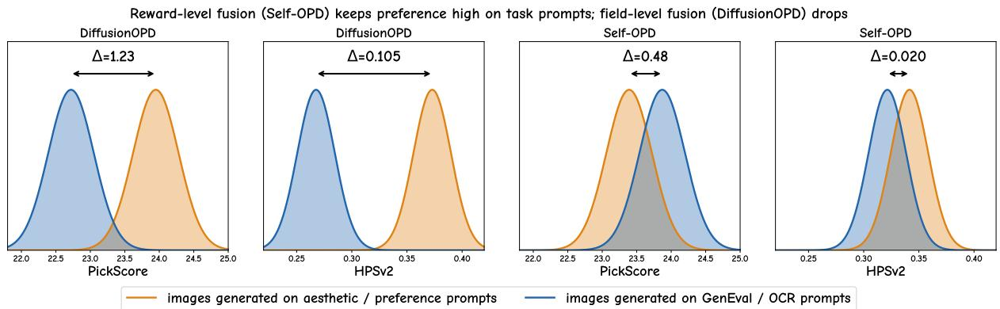  
Figure 4 Field-level fusion couples preference quality to the prompt family; reward-level fusion does not. For each approach, we contrast the preference-reward distribution of images generated on aesthetic/preference prompts (orange) against that of images generated on the GenEval/OCR task prompts (blue). The distribution peaks are placed at the measured means from Tab. 2 (the “separate test set” and “same test images” columns, respectively); the spread is illustrative and only serves to visualize the shift ∆ between the two prompt families. For DifusionOPD, the preference distribution shifts sharply when moving to the task prompts, whereas for Self-OPD, the two distributions nearly coincide.

Self-OPD emerges as the sole teacher-free method that remains highly competitive across all evaluation dimensions simultaneously. In Tab. 1, among all single-reward methods, Self-OPD achieves top performance with a GenEval score of 0.95, OCR accuracy of 97.5%, PickScore of 24.79, and HPSv2 score of 0.3665. Notably, Self-OPD consistently outperforms both Flow-GRPO and GRPO-Guard on every task despite utilizing identical base models and reward signals, validating the superiority of step-wise self-distillation over terminal policy gradient optimization.

In Tab. 2, the unified mixed-reward Self-OPD model shares the highest GenEval score of 0.95, delivers the best OCR accuracy of 96.0%, and under the same test images protocol, outperforms the teacher-based DifusionOPD on both PickScore, with a score of 23.87 compared to DifusionOPD’s 22.72, and HPSv2, with 0.3214 compared to 0.2676, despite requiring no teacher supervision. This performance gap empirically validates the reward-level versus field-level fusion paradigm. Specifically, the core objective of multi-metric alignment requires each individual generation to satisfy all criteria simultaneously, rather than having diferent subsets of images excel under diferent evaluators. By selecting candidate SDE branches within the joint high-reward region, Self-OPD ensures that the same GenEval and OCR test images also exhibit superior aesthetic quality. Conversely, field-level fusion in DifusionOPD routes each prompt to a specialized teacher, generating images that satisfy the isolated target objective but fail to jointly optimize general preferences. Consequently, its preference evaluations on the GenEval and OCR test images, yielding a PickScore of 22.72 and HPSv2 of 0.2676, fall below those of Flow-OPD, which scores 23.43 and 0.3042, respectively.

Fig. 4 makes this diference explicit. Reading each method as a distribution of preference rewards over two prompt populations, DifusionOPD’s PickScore distribution shifts down by ∆=1.23 and its HPSv2 distribution by ∆=0.105 when the images are generated on the GenEval/OCR task prompts rather than on aesthetic prompts. This is exactly the signature of field-level fusion described above: blending per-teacher gradients in parameter space yields images that score well only on the prompt family matched to the selected teacher, so preference quality is efectively decoupled from the task prompts. For Self-OPD the two distributions almost overlap (∆=0.48 for PickScore and ∆=0.020 for HPSv2), because reward-level fusion selects trajectories inside the joint high-reward region rather than compromising between competing gradients. This is precisely why we treat the same test images protocol as the primary preference comparison: it measures whether the same generations that satisfy the task also carry high aesthetic quality, the property multi-objective alignment actually targets.

Qualitative Results. Fig. 5 qualitatively compares all methods on six prompts spanning text rendering,

GRPO-Guard

Prompt

DiffusionNFT  
Flow-OPD  
Diffusion-OPD  
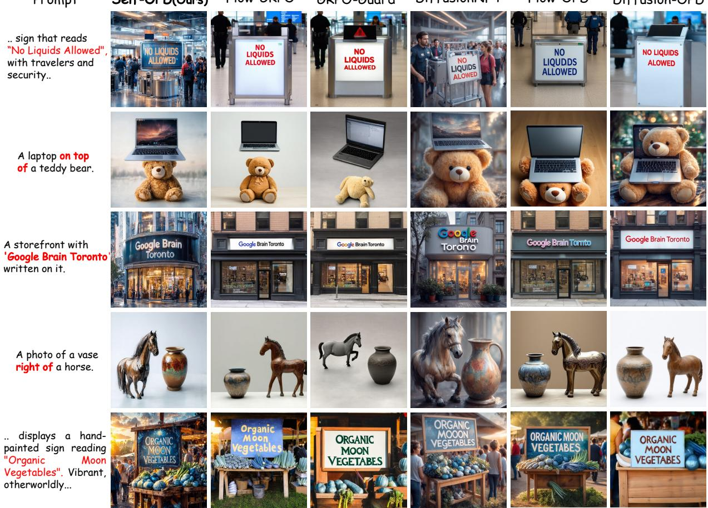  
Figure 5 Qualitative comparison. Each method uses its mixed-reward model if available, or the prompt-specific reward model (e.g., OCR for text prompts). Self-OPD achieves superior performance in both accuracy and aesthetics.

spatial relations, and counting. First, among mixed-reward baselines including DifusionNFT, Flow-OPD, and DifusionOPD, Self-OPD renders text with higher fidelity, precisely spelling challenging phrases such as “No Liquids Allowed” and “Google Brain Toronto”. It also accurately executes complex spatial layouts, such as placing a laptop on a teddy bear or a vase right of a horse, and strictly satisfies counting constraints like generating exactly four benches, yielding more coherent overall compositions. Second, compared to single-reward specialists like Flow-GRPO and GRPO-Guard at their optimal checkpoints. Self-OPD exhibits superior control across all three axes. Driven by joint preference optimization, it concurrently enhances scene richness and aesthetic quality. These qualitative advantages closely align with the quantitative improvements in Tab. 1 and Tab. 2.

## 4.3 Ablation Study

Effect of Branch Selection Strategy. Regressing solely to the top-performing branch (Best-of-K, red) yields unstable, non-monotonic training that barely surpasses the baseline. This failure stems from high gradient variance caused by abrupt target switching and the complete absence of negative feedback. Conversely, our all-branch advantage-weighted distillation (green) stabilizes training by utilizing the entire exploration neighborhood. Adding |∆t|-aligned KL normalization (blue; full Self-OPD, Proposition 1) further accelerates convergence and maximizes performance, validating our theoretical step-wise loss scaling.

Effect of Repulsion Bounding. The scaling factor $\frac { 1 } { 2 }$ in Eq. 9 bounds the coeficient at $d _ { k } \in [ 0 , 1 ]$ , ensuring the repulsive push never overpowers the attractive pull. Under an unbounded formulation $d _ { k } \in [ 0 , 2 ]$ (red), strong repulsive gradients from opposing branches eventually dominate, destabilizing training and triggering a sharp performance collapse. Our bounded gating (blue) maintains stable, monotonic improvement, confirming that the direction-aware coeficient must act purely as an attenuation gate rather than a gradient amplifier.

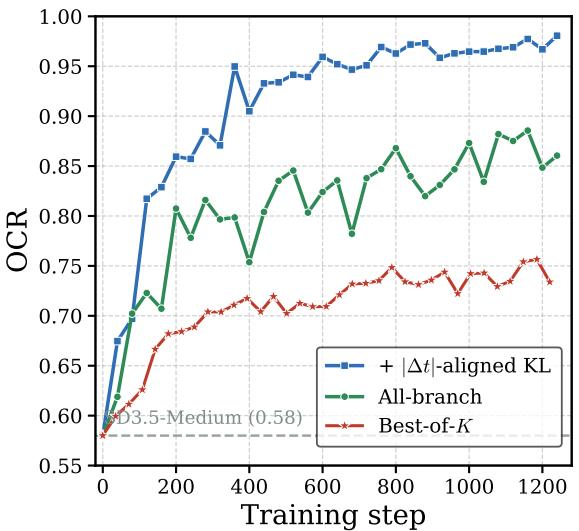  
(a) Branch selection strategy.

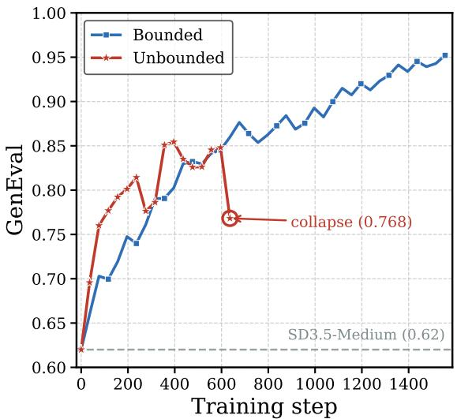  
(b) Bounded vs. unbounded.

Figure 6 Ablation of core designs. (a) Branch handling: Best-of-K (red), all-branch pull-push distillation (green), and Self-OPD with $\lvert \Delta t \rvert .$ -aligned KL (blue). (b) Gradient gating: Bounded $d _ { k }$ (blue) vs. unbounded $d _ { k }$ (red).  
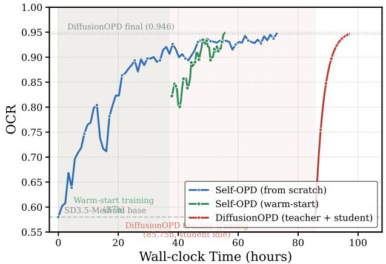

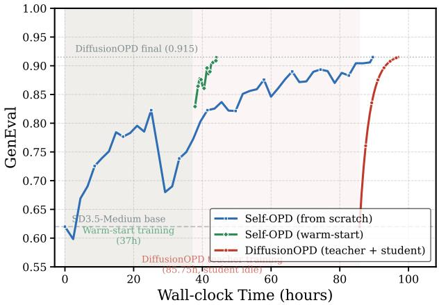  
Figure 7 Training efficiency: OCR (left) and GenEval (right) vs. wall-clock time. Blue: Self-OPD mix from scratch. Green: Self-OPD mix warm-start. Red: DifusionOPD student phase. The green shaded region indicates the time spent training warm-start checkpoints (37 h). The red shaded region indicates DifusionOPD’s teacher training phase (85.75 h), during which the student model is idle. The dotted horizontal line marks DifusionOPD’s final performance level. All training times for DifusionOPD are taken from the original report.

Effect of Timestep Weighting. While uniform timestep weighting eventually matches our weighted scheme in final performance, our proposed weighting accelerates convergence by concentrating training signals on early timesteps, where branching yields more diverse semantic alternatives. Conversely, a timestep importance sampling (TIS) variant that oversamples early steps degrades performance below the base model, demonstrating that continuous exposure to all trajectory stages is essential even when loss weighting prioritizes early exploration phases.

Analysis of Training Time. Fig. 7 makes Self-OPD’s wall-clock advantage concrete on OCR and GenEval. DifusionOPD [18] requires three separate teacher models (GenEval: 46.9 h, OCR: 33.2 h, Aesthetics: 85.8 h) trained in parallel, followed by 11.3 h of student distillation, for a total wall-clock time of $8 5 . 8 + 1 1 . 3 = 9 7 . 0 \mathrm { h }$

During the entire teacher-training phase (red shaded region), the student remains at the base level and cannot begin learning. Self-OPD eliminates this bottleneck entirely, in two configurations:

• From scratch (blue): a single tri-reward run that begins improving immediately. It reaches DifusionOPDlevel OCR (0.946) in ∼62 h and GenEval (0.915) in ∼90 h, both strictly faster than DifusionOPD’s 97 h.

• Warm-start (green): first trains single-reward specialists in parallel (GenEval: 27 h, OCR: 37 h; wall-clock: 37 h, green shaded region), then launches the tri-reward mixed run which converges to 0.946 OCR in ∼11 h and 0.915 GenEval in ∼7 h, for a total wall-clock of ∼48 h and ∼44 h respectively. This is roughly 2× faster than DifusionOPD on both metrics, while achieving higher final performance.

## 5 Conclusion

In this paper, we introduce Self-OPD, a teacher-free on-policy distillation framework for flow matching models. By branching the student’s own trajectory, scoring each branch with task rewards, and applying all-branch advantage-weighted regression with direction-aware modulation, Self-OPD turns self-exploration into dense per-step supervision. Experiments across text rendering, compositional generation, and preference alignment show that this formulation can match or surpass teacher-based OPD while avoiding task-specific teacher training and enabling reward-level multi-objective fusion.

## References

[1] Rishabh Agarwal, Nino Vieillard, Yongchao Zhou, Piotr Stanczyk, Sabela Ramos Garea, Matthieu Geist, and Olivier Bachem. On-policy distillation of language models: Learning from self-generated mistakes. In ICLR, pages 21246–21263, 2024.

[2] Kevin Black, Michael Janner, Yilun Du, Ilya Kostrikov, and Sergey Levine. Training difusion models with reinforcement learning. In ICLR, pages 4965–4987, 2024.

[3] Black Forest Labs. FLUX.1. https://github.com/black-forest-labs/flux, 2024. Accessed: 2025-01-15.

[4] Jingye Chen, Yupan Huang, Tengchao Lv, Lei Cui, Qifeng Chen, and Furu Wei. Textdifuser: Difusion models as text painters. Advances in Neural Information Processing Systems, 36:9353–9387, 2023.

[5] Kevin Clark, Paul Vicol, Kevin Swersky, and David Fleet. Directly fine-tuning difusion models on diferentiable rewards. In ICLR, pages 4793–4822, 2024.

[6] Patrick Esser, Sumith Kulal, Andreas Blattmann, Rahim Entezari, Jonas Müller, Harry Saini, Yam Levi, Dominik Lorenz, Axel Sauer, Frederic Boesel, et al. Scaling rectified flow transformers for high-resolution image synthesis. In ICML, 2024.

[7] Ying Fan, Olivia Watkins, Yuqing Du, Hao Liu, Moonkyung Ryu, Craig Boutilier, Pieter Abbeel, Mohammad Ghavamzadeh, Kangwook Lee, and Kimin Lee. Dpok: Reinforcement learning for fine-tuning text-to-image difusion models. In NeurIPS, pages 79858–79885, 2023.

[8] Zhen Fang, Wenxuan Huang, Yu Zeng, Yiming Zhao, Shuang Chen, Kaituo Feng, Yunlong Lin, Lin Chen, Zehui Chen, Shaosheng Cao, et al. Flow-opd: On-policy distillation for flow matching models. arXiv preprint arXiv:2605.08063, 2026.

[9] Siming Fu, Zheming Fu, Ruizhe He, Hualiang Wang, Jie Huang, Xiaoxiao Ma, Mingchen Zhong, Weihu Huang, Xiaoxuan He, and Haojun Xu. Any-opd: Heterogeneous on-policy distillation for flow-matching models via representation-space bridging. arXiv preprint arXiv:2608.03316, 2026.

[10] Siming Fu, Haojun Xu, Ruizhe He, Zheming Fu, Hualiang Wang, Jie Huang, Xiaoxiao Ma, Mingchen Zhong, Weihu Huang, Xiaoxuan He, et al. Poly-opd: Heterogeneous multi-teacher on-policy distillation for capability-selectable flow models. arXiv preprint arXiv:2608.04349, 2026.

[11] Dhruba Ghosh, Hannaneh Hajishirzi, and Ludwig Schmidt. Geneval: An object-focused framework for evaluating text-to-image alignment. In NeurIPS, pages 52132–52152, 2023.

[12] Xiaoxuan He, Siming Fu, Yuke Zhao, Wanli Li, Jian Yang, Dacheng Yin, Fengyun Rao, and Bo Zhang. Tempflowgrpo: When timing matters for grpo in flow models. In International Conference on Learning Representations, volume 2026, pages 132869–132895, 2026.

[13] Jonathan Ho, Ajay Jain, and Pieter Abbeel. Denoising difusion probabilistic models. Advances in neural information processing systems, 33:6840–6851, 2020.

[14] Edward J Hu, Yelong Shen, Phillip Wallis, Zeyuan Allen-Zhu, Yuanzhi Li, Shean Wang, Lu Wang, and Weizhu Chen. Lora: Low-rank adaptation of large language models. arXiv preprint arXiv:2106.09685, 2021.

[15] Dengyang Jiang, Xin Jin, Dongyang Liu, Zanyi Wang, Mingzhe Zheng, Ruoyi Du, Xiangpeng Yang, Qilong Wu, Zhen Li, Peng Gao, et al. D-opsd: On-policy self-distillation for continuously tuning step-distilled difusion models. arXiv preprint arXiv:2605.05204, 2026.

[16] Diederik P Kingma and Jimmy Ba. Adam: A method for stochastic optimization. arXiv preprint arXiv:1412.6980, 2014.

[17] Yuval Kirstain, Adam Polyak, Uriel Singer, Shahbuland Matiana, Joe Penna, and Omer Levy. Pick-a-pic: An open dataset of user preferences for text-to-image generation. In NeurIPS, pages 36652–36663, 2023.

[18] Quanhao Li, Junqiu Yu, Kaixun Jiang, Yujie Wei, Zhen Xing, Pandeng Li, Ruihang Chu, Shiwei Zhang, Yu Liu, and Zuxuan Wu. Difusionopd: A unified perspective of on-policy distillation in difusion models. arXiv preprint arXiv:2605.15055, 2026.

[19] Yaron Lipman, Ricky TQ Chen, Heli Ben-Hamu, Maximilian Nickel, and Matt Le. Flow matching for generative modeling. arXiv preprint arXiv:2210.02747, 2022.

[20] Jie Liu, Gongye Liu, Jiajun Liang, Yangguang Li, Jiaheng Liu, Xintao Wang, Pengfei Wan, Di Zhang, and Wanli Ouyang. Flow-grpo: Training flow matching models via online rl. In NeurIPS, pages 40783–40818, 2026.

[21] Mushui Liu, Yuhang Ma, Yang Zhen, Jun Dan, Yunlong Yu, Zeng Zhao, Zhipeng Hu, Bai Liu, and Changjie Fan. Llm4gen: Leveraging semantic representation of llms for text-to-image generation. In AAAI, 2025.

[22] Mushui Liu, Dong She, Jingxuan Pang, Qihan Huang, Jiacheng Ying, Wanggui He, Yuanlei Hou, and Siming Fu. Tfcustom: Customized image generation with time-aware frequency feature guidance. In CVPR, 2025.

[23] Xingchao Liu, Chengyue Gong, and Qiang Liu. Flow straight and fast: Learning to generate and transfer data with rectified flow. arXiv preprint arXiv:2209.03003, 2022.

[24] Dustin Podell, Zion English, Kyle Lacey, Andreas Blattmann, Tim Dockhorn, Jonas Müller, Joe Penna, and Robin Rombach. Sdxl: Improving latent difusion models for high-resolution image synthesis. In International Conference on Learning Representations, volume 2024, pages 1862–1874, 2024.

[25] Robin Rombach, Andreas Blattmann, Dominik Lorenz, Patrick Esser, and Björn Ommer. High-resolution image synthesis with latent difusion models. In 2022 IEEE/CVF conference on computer vision and pattern recognition (CVPR), pages 10674–10685. ieee, 2022.

[26] Avi Singh, John D Co-Reyes, Rishabh Agarwal, Ankesh Anand, Piyush Patil, Xavier Garcia, Peter J Liu, James Harrison, Jaehoon Lee, Kelvin Xu, et al. Beyond human data: Scaling self-training for problem-solving with language models. arXiv preprint arXiv:2312.06585, 2023.

[27] Yang Song, Jascha Sohl-Dickstein, Diederik P Kingma, Abhishek Kumar, Stefano Ermon, and Ben Poole. Score-based generative modeling through stochastic diferential equations. arXiv preprint arXiv:2011.13456, 2020.

[28] Yunze Tong, Mushui Liu, Canyu Zhao, Wanggui He, Shiyi Zhang, Hongwei Zhang, Peng Zhang, Jinlong Liu, Ju Huang, Jiamang Wang, et al. Alleviating sparse rewards by modeling step-wise and long-term sampling efects in flow-based grpo. arXiv preprint arXiv:2602.06422, 2026.

[29] Bram Wallace, Meihua Dang, Rafael Rafailov, Linqi Zhou, Aaron Lou, Senthil Purushwalkam, Stefano Ermon, Caiming Xiong, Shafiq Joty, and Nikhil Naik. Difusion model alignment using direct preference optimization. In CVPR, pages 8228–8238, 2024.

[30] Jing Wang, Jiajun Liang, Jie Liu, Henglin Liu, Gongye Liu, Jun Zheng, Wanyuan Pang, Ao Ma, Zhenyu Xie, Xintao Wang, et al. Grpo-guard: Mitigating implicit over-optimization in flow matching via regulated clipping. In CVPR, pages 5988–5998, 2026.

[31] Xiaoshi Wu, Yiming Hao, Keqiang Sun, Yixiong Chen, Feng Zhu, Rui Zhao, and Hongsheng Li. Human preference score v2: A solid benchmark for evaluating human preferences of text-to-image synthesis. arXiv preprint arXiv:2306.09341, 2023.

[32] Jiazheng Xu, Xiao Liu, Yuchen Wu, Yuxuan Tong, Qinkai Li, Ming Ding, Jie Tang, and Yuxiao Dong. Imagereward: Learning and evaluating human preferences for text-to-image generation. In NeurIPS, pages 15903–15935, 2023.

[33] Shuchen Xue, Chongjian Ge, Shilong Zhang, Yichen Li, and Zhi-Ming Ma. Advantage weighted matching: Aligning rl with pretraining in difusion models. arXiv preprint arXiv:2509.25050, 2025.

[34] Zeyue Xue, Jie Wu, Yu Gao, Fangyuan Kong, Lingting Zhu, Mengzhao Chen, Zhiheng Liu, Wei Liu, Qiushan Guo, Weilin Huang, et al. Dancegrpo: Unleashing grpo on visual generation. arXiv preprint arXiv:2505.07818, 2025.

[35] Yukang Yang, Dongnan Gui, Yuhui Yuan, Weicong Liang, Haisong Ding, Han Hu, and Kai Chen. Glyphcontrol: Glyph conditional control for visual text generation. Advances in Neural Information Processing Systems, 36: 44050–44066, 2023.

[36] Tianwei Yin, Michaël Gharbi, Taesung Park, Richard Zhang, Eli Shechtman, Fredo Durand, and William T Freeman. Improved distribution matching distillation for fast image synthesis. In NeurIPS, pages 47455–47487, 2024.

[37] Tianwei Yin, Michaël Gharbi, Richard Zhang, Eli Shechtman, Fredo Durand, William T Freeman, and Taesung Park. One-step difusion with distribution matching distillation. In CVPR, pages 6613–6623. IEEE, 2024.

[38] Kaiwen Zheng, Huayu Chen, Haotian Ye, Haoxiang Wang, Qinsheng Zhang, Kai Jiang, Hang Su, Stefano Ermon, Jun Zhu, and Ming-Yu Liu. Difusionnft: Online difusion reinforcement with forward process. In ICLR, pages 134129–134150, 2026.

[39] Wei Zhou, Xiongwei Zhu, Zelin Xu, Bo Dong, Lixue Gong, Yongyuan Liang, Meng Chu, Leigang Qu, Lingdong Kong, Wei Liu, et al. Danceopd: On-policy generative field distillation. arXiv preprint arXiv:2606.27377, 2026.

(b)  
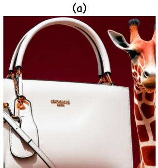

Figure 8 Strict vs. continuous scoring on “a photo of a white handbag and a red girafe”. (a) base; (b) Self-OPD.
<table><tr><td>Model</td><td>Strict</td><td>Continuous</td></tr><tr><td>SD3.5-Medium (base)</td><td>0</td><td>0.5</td></tr><tr><td>Self-OPD</td><td>1</td><td>1.0</td></tr></table>

Table 3 Strict and continuous GenEval scores for the two images in Fig. 8. The prompt has two sub-requirements (one per colored object).

This supplementary material provides additional evaluation details, a theoretical proof, extended analysis, and qualitative results referenced in the main paper. The contents are organized as follows:

• Appendix A documents the evaluation metrics, including the two GenEval scoring modes and the two preference evaluation protocols.

• Appendix B gives additional qualitative results demonstrating the aesthetic advantage of Self-OPD on the task-specific prompts.

## A Evaluation Metrics

## A.1 GenEval: Strict vs. Continuous Scoring

GenEval [11] evaluates compositional generation by checking whether generated images satisfy a set of sub-requirements (e.g., correct object count, spatial relation, color attribute). We report two scoring modes:

• Strict scoring. A binary per-image metric: the score is 1 only if all sub-requirements for that prompt are satisfied, and 0 otherwise. The reported number is the average over all test prompts. This is a demanding metric that penalizes any partial failure.

• Continuous scoring. A partial-credit metric: for each image, the score is the fraction of sub-requirements satisfied (ranging from 0 to 1). The reported number is again averaged over all test prompts. This gives credit to images that partially fulfill the prompt.

Fig. 8 illustrates both modes on the color-attribution prompt “a photo of a white handbag and a red girafe”, which has two sub-requirements, one per colored object. The SD3.5-Medium base (Fig. 8a) renders the white handbag correctly but colors the girafe orange rather than red, satisfying one of the two sub-requirements: its strict score is 0 while its continuous score is 0.5. Self-OPD (Fig. 8b) renders both the white handbag and the red girafe, satisfying both sub-requirements for a strict score of 1 and a continuous score of 1.0 (Tab. 3). Continuous scoring better captures incremental improvements, while strict scoring reflects end-to-end correctness.

## A.2 Preference Protocols: Same Test Images vs. Separate Test Set

We evaluate preference-based metrics (PickScore [17] and HPSv2 [31]) under two complementary protocols:

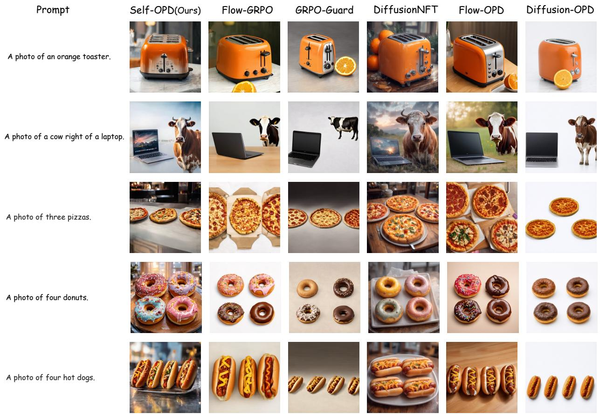  
Figure 9 Aesthetic quality on GenEval prompts. Each method uses its mixed-reward model if available, or its GenEval-trained model otherwise (Flow-GRPO, GRPO-Guard). Self-OPD satisfies the compositional requirements (counting, spatial relations, attributes) while generating images with higher aesthetic quality, consistent with its higher PickScore/HPSv2 in Tab. 2.

• Same test images. PickScore and HPSv2 are computed on the same images generated for the GenEval and OCR test prompts. Specifically, for each model we generate images for the GenEval test suite and the OCR test suite, then score all these images with PickScore and HPSv2. The final score is the unweighted average of the GenEval-prompt score and the OCR-prompt score (1:1 averaging). This protocol measures whether a model maintains aesthetic quality and human preference on the task it was trained for, without introducing any distribution shift from additional prompts.

• Separate test set. PickScore and HPSv2 are computed on a held-out set of aesthetic-oriented prompts (DrawBench) that are disjoint from the training and GenEval/OCR evaluation prompts. This measures preference quality on a general-purpose prompt distribution.

The “same test images” protocol gives a more controlled cross-metric comparison because it evaluates all metrics on the same set of generations, separating model quality from prompt distribution. A model with high preference scores under this protocol improves aesthetic quality without sacrificing task performance. The “separate test set” protocol can instead favor models that overfit to aesthetic-leaning prompts while degrading on structured tasks. For image generation we care about the overall quality of every generated image rather than separate high scores on diferent task sets, so we treat the “same test images” protocol as the primary preference comparison. Fig. 4 in Appendix B makes this concrete: DifusionOPD’s lead on the separate set does not carry over to the GenEval and OCR test images, because its field-level fusion couples preference quality to the prompt family, whereas Self-OPD stays high on both.

## Prompt

A vast desert landscape under a scorching sun, where a mirage forms the shimmering letters "Water This Way" on the distant horizon, creating an illusion of hope in an otherwise barren and arid environment.

A modern highway scene with a large billboard prominently displaying the text "Gas Next Exi 2 Miles" against a backdrop of rolling hills and clear blue sky.

A close-up of a sleek smartphone screen, prominently displaying a notification that reads "New Message Received", with a subtle background of a blurred, modern desk setting.

A fast food drive-thru menu boar d at dusk, featuring a bold and col orful advertisement that reads "T ry Our New Burger" with an appet izing image of the burger below, s et against the backdrop of a busy suburban street.

A realistic photograph of a mountain trail, featuring a weathered wooden signpost with "Summit 12km" carved into it, surrounded by rugged terrain and dense forest, with a hiker's boot visible in the foreground.

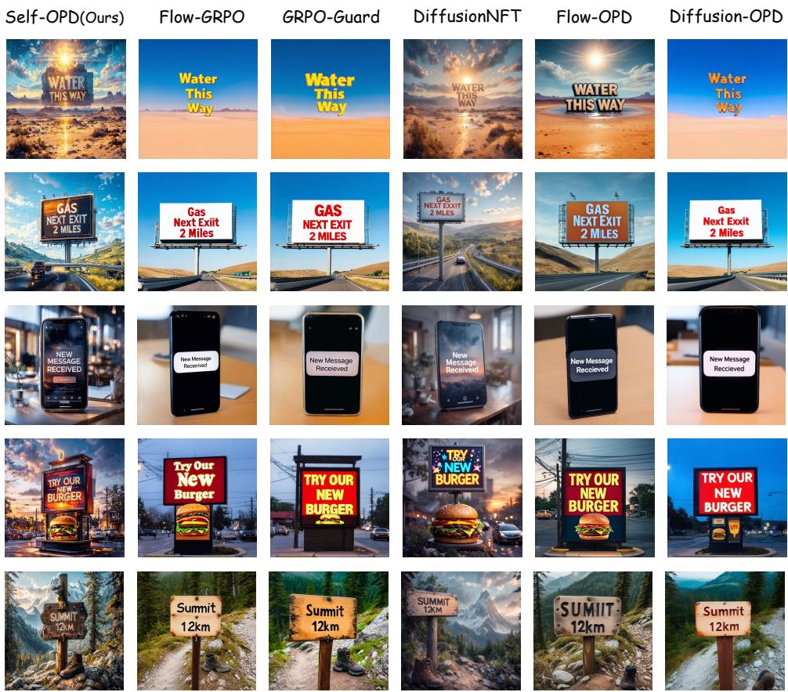  
Figure 10 Aesthetic quality on OCR prompts. Each method uses its mixed-reward model if available, or its OCR-trained model otherwise (Flow-GRPO, GRPO-Guard). Self-OPD renders the target text accurately while producing more visually appealing scenes with richer backgrounds and realistic details.

## B Additional Qualitative Results

Fig. 9 and Fig. 10 visualize the aesthetic quality gap on task-specific prompts, comparing Self-OPD against Flow-GRPO, GRPO-Guard, DifusionNFT, Flow-OPD, and DifusionOPD. Under the same test images protocol, Self-OPD attains the highest PickScore and HPSv2 among all methods (Tab. 2); these figures illustrate why. On GenEval prompts (Fig. 9), Self-OPD produces images with richer lighting, more natural textures, and better composition while satisfying the compositional requirements.

As shown in Fig. 10, Self-OPD renders text accurately and simultaneously generates more visually appealing scenes with coherent backgrounds and realistic details, whereas other methods tend to produce flatter or overly simplistic images. Given identical prompts, Self-OPD maintains high aesthetic quality, while DifusionOPD and the RL baselines exhibit visible degradation, e.g., over-saturation and loss of detail.