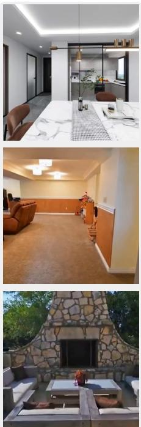
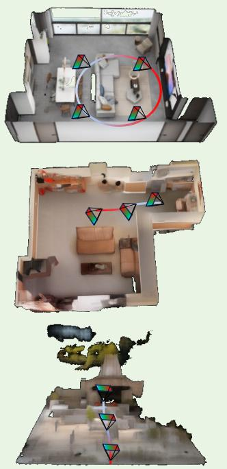
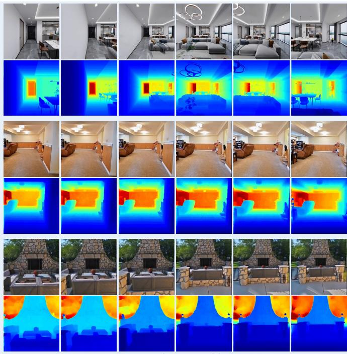
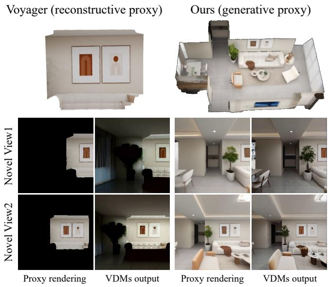
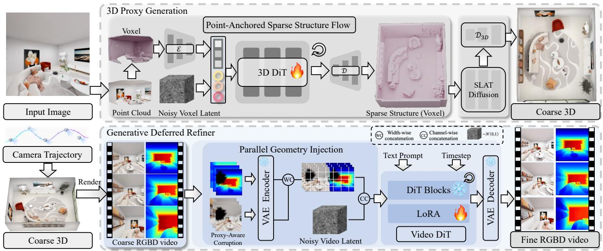
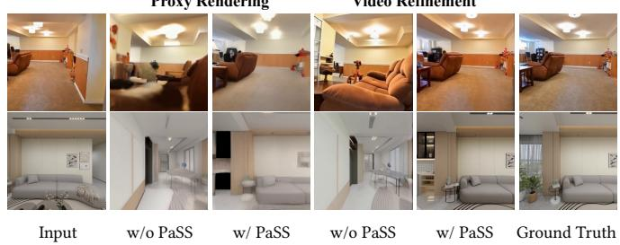
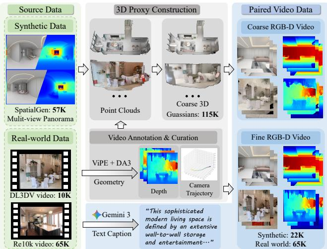
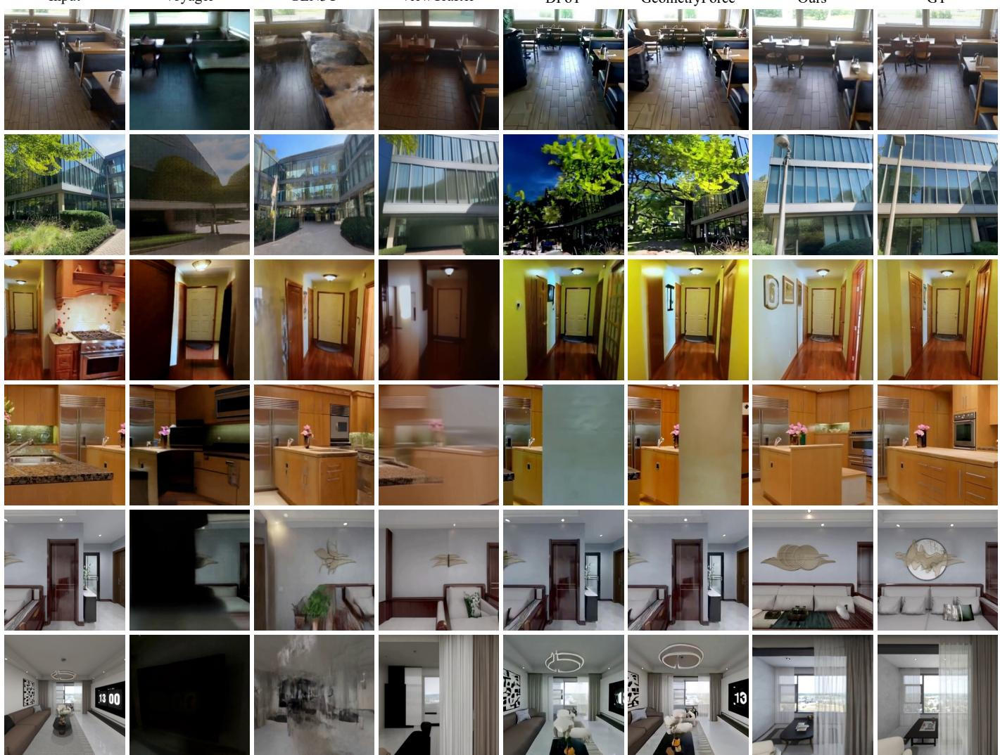
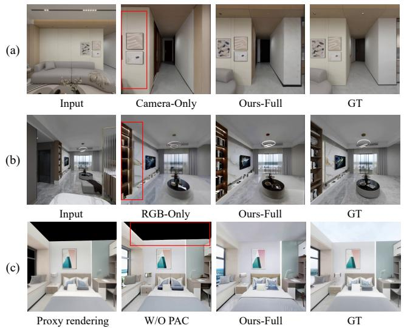
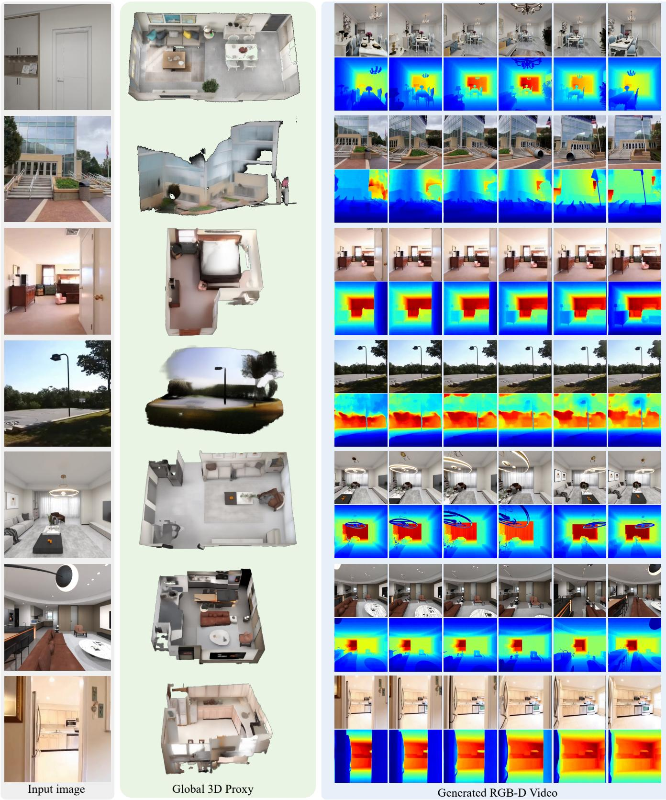

# SpatialCrafter: Single-Image World Modeling with Generative 3D Proxies

CHUAN FANG, Hong Kong University of Science and Technology, Hong Kong

LINGTENG QIU, Tongyi Lab, Alibaba Group, China

YIXUN LIANG, Hong Kong University of Science and Technology, Hong Kong

RUI CHEN, Hong Kong University of Science and Technology, Hong Kong

KUNMING LUO, Hong Kong University of Science and Technology, Hong Kong

ZHAOHUA ZHENG, ManyCore Tech Inc., China

TONGYUAN BAI, Jilin University, China

FEIPENG TIAN, Hong Kong University of Science and Technology, Hong Kong

ZILONG DONG, Tongyi Lab, Alibaba Group, China

ZIHAN ZHOU, ManyCore Tech Inc., China

PING TAN, Hong Kong University of Science and Technology, Hong Kong

  
Input image

  
Global 3D Proxy

  
Generated RGB-D Video

Fig. 1. SpatialCrafter enables 3D-consistent world modeling from a single image. Given an input image and a user-defined camera trajectory, SpatialCrafter first generates a global 3D proxy, then synthesizes a photorealistic RGB-D video that progressively reveals the surrounding environment.

Authors’ Contact Information: Chuan Fang, Hong Kong University of Science and Technology, Hong Kong, Hong Kong, cfangac@connect.ust.hk; Lingteng Qiu, Tongyi Lab, Alibaba Group, Hang Zhou, China; Yixun Liang, Hong Kong University of Science and Technology, Hong Kong, Hong Kong; Rui Chen, Hong Kong University of Science and Technology, Hong Kong, Hong Kong; Kunming Luo, Hong Kong University of Science and Technology, Hong Kong, Hong Kong; Zhaohua Zheng, ManyCore Tech Inc., Hang Zhou, China; Tongyuan Bai, Jilin University, Ji Lin, China; Feipeng Tian, Hong Kong University of Science and Technology, Hong Kong, Hong Kong; Zilong Dong, Tongyi Lab, Alibaba Group, Hang Zhou, China; Zihan Zhou, ManyCore Tech Inc., Hang Zhou, China; Ping Tan, Hong Kong University of Science and Technology, Hong Kong, Hong Kong.

Permission to make digital or hard copies of all or part of this work for personal or classroom use is granted without fee provided that copies are not made or distributed

Explorable image-to-scene generation is essential for applications in gaming, robotics, and virtual reality. Existing methods based on video difusion model (VDM) commonly rely on incomplete conditioning signals such as sparse point clouds or 2D panoramas, leading to stochastic hallucinations,

for profit or commercial advantage and that copies bear this notice and the full citation on the first page. Copyrights for components of this work owned by others than the author(s) must be honored. Abstracting with credit is permitted. To copy otherwise, or republish, to post on servers or to redistribute to lists, requires prior specific permission and/or a fee. Request permissions from permissions@acm.org.

SA Conference papers ’26,   
© 2026 Copyright held by the owner/author(s). Publication rights licensed to ACM. ACM ISBN 978-x-xxxx-xxxx-x/YYYY/MM   
https://doi.org/3829340.3842158

long-term drifts and suboptimal 3D consistency. We present SpatialCrafter, a novel two-stage framework that addresses these issues by introducing a global 3D proxy for high-fidelity image-to-scene generation. Specifically, we decompose the generation process into global proxy generation and appearance refinement. For proxy generation, we propose a Point-anchored Sparse Structure (PaSS) Flow module that predicts a spatially aligned and geometri cally consistent 3D proxy. For appearance refinement, we re-frame the VDM as a Generative Deferred Refiner which synthesizes high-frequency photorealistic details upon proxy-defined scene geometry. To better integrate the proxy with the pre-trained VDM, we introduce Parallel Geometry Injection and Proxy-Aware Corruption training strategies, which improve robustness to proxy artifacts without disrupting the pretrained generative manifold. Furthermore, as no suitable dataset exists for this explorable scene generation task, we construct a new large-scale dataset of 115K scenes. To the best of our knowledge, it is the first hybrid dataset for image-to-scene generation. Extensive experiments on both synthetic and real-world datasets show that SpatialCrafter outperforms state-of-the-art methods, mitigates long-term drift, and remains robust and consistent under rapid camera motion and extreme viewpoint changes. Code, models, and the newly constructed dataset will be publicly released. See more at https://fangchuan.github.io/SpatialCrafter/.

CCS Concepts: • Computing methodologies → Point-based models;   
Rendering; Computer vision.

Additional Key Words and Phrases: 3D World Modeling; 3D-Consistent Video Generation

## ACM Reference Format:

Chuan Fang, Lingteng Qiu, Yixun Liang, Rui Chen, Kunming Luo, Zhaohua Zheng, Tongyuan Bai, Feipeng Tian, Zilong Dong, Zihan Zhou, and Ping Tan. 2026. SpatialCrafter: Single-Image World Modeling with Generative 3D Proxies. In Proceedings ofDecember 1–4, 2026 (SA Conference papers ’26). ACM, New York, NY, USA, 12 pages. https://doi.org/3829340.3842158

## 1 Introduction

Building world models is a critical step toward artificial general intelligence (AGI), enabling agents to predict, plan, and reason about complex 3D environments. Central to this vision is the creation of high-quality, diverse 3D environments, which underpin applications ranging from AR/VR content creation and robotic navigation to embodied AI. This ambition has spurred a surge of interest in automated, data-driven 3D scene generation [Fang et al. 2025a,b; Gao et al. 2024; Sargent et al. 2024; Yang et al. 2024, 2025b].

Recently, world models built upon video difusion models (VDMs) have gained significant traction because VDMs ofer strong generative priors from massive Internet videos. However, VDMs inherently lack explicit 3D supervision, making it dificult to preserve spatial consistency from a single view. To alleviate this, some works adopt an images-as-memory paradigm, reusing previously generated frames [Song et al. 2025; Xiao et al. 2025; Yu et al. 2025a] as visual context. Yet, since these methods remain image-based, they lack the 3D awareness needed for complex camera motions, inevitably causing perspective distortion, occlusion errors, and other geometric inconsistencies.

To overcome the limitations of 2D memory, a line of methods [Li et al. 2025a; Ren et al. 2025; Wu et al. 2025c; Yang et al. 2025a; Yu et al. 2024b] employs explicit 3D proxies, such as point clouds, as guidance. Given one or more views as input, they first use monocular depth estimation [Wang et al. 2025b] or multi-view reconstruction [Wang et al. 2025a, 2024] methods to obtain a point cloud representation of the scene, which is then rendered under new viewpoints to guide the VDM for novel view synthesis. While efective, such proxies are inherently incomplete as they are reconstructed only from the input views, as illustrated in Fig. 2; consequently, VDMs are forced to rely on stochastic hallucination to fill these unseen regions. We refer to this family as reconstructive proxies. The static variants [Li et al. 2025a; Ren et al. 2025; Yang et al. 2025a; Yu et al. 2024b] derive this incomplete proxy once and never update it, while incremental variants [Huang et al. 2025a; Wu et al. 2025c] instead attempt to iteratively update the proxy on the fly, fusing newly generated frames back into the point cloud so that previously hallucinated content anchors later frames. This closes part of the gap, but introduces a new dilemma: the completeness of the proxy now depends on the spatial awareness of the VDM it is meant to enhance. We sidestep this dilemma with a one-shot, generative 3D proxy that predicts a global scene representation directly from a single image before any video is generated, rather than incrementally updating a reconstructed proxy.

  
Fig. 2. Reconstructive vs. generative 3D proxies. Conditioning on an incomplete proxy (partial point clouds), as in Voyager [Huang et al. 2025a], leads to severe geometric distortion, inconsistent lighting, and progressive content drift under large camera motion. In contrast, leveraging a global 3D proxy from a separate, native generator, our method yields photometrically and geometrically coherent novel view synthesis (zoom in for details).

In this work, we introduce SpatialCrafter, which advances the field of video world models by conditioning VDMs on a new form of 3D proxies that provide dense, continuous, and reliable guidance information. Specially, our framework adopts a two-stage pipeline (see Fig. 1). In the first stage, we train a native 3D proxy generator to predict a global scene representation from a single image. With the global proxy, in the second stage, a video difusion model is repurposed as a Generative Deferred Refiner that transforms coarse 3D proxy into photorealistic novel views. We compares the efects of our framework (i.e., generative 3D proxies) with prior work (i.e., reconstructive 3D proxies) in Fig. 2.

Realizing this new framework, however, requires overcoming two key challenges: (1)resolving the spatial misalignment that arises between the input view and the stochastically generated 3D proxy. As noted in prior work [Chang et al. 2025], while subtle in objectcentric tasks, this misalignment is profoundly amplified in scenelevel generation, where even minor discrepancies break cross-view coherence and misguide downstream refinement; (2)generating a global 3D proxy from a single image demands large-scale, highquality 3D scene data with precise geometric annotations, a resource that remains severely scarce in the community.

First, to eliminate spatial misalignment, we introduce the Point-Anchored Sparse Structure (PaSS) Flow Matching module. PaSS conditions sparse structure generation on explicit geometric anchors reconstructed from the input view, enforcing strict alignment between the generated 3D proxy and the reference image, thereby providing reliable conditioning for downstream refinement. On the video refinement stage, we propose two complementary mechanisms to convert the coarse 3D proxy into high-quality video. Parallel Geometry Injection faithfully preserves scene topology by integrating geometric guidance without disrupting the VDM’s pretrained generative manifold. Complementarily, Proxy-Aware Corruption (PAC) stochastically perturbs the coarse renderings during training, preventing the refiner from overfitting to proxy-specific artifacts and forcing it to robustly inpaint missing details.

Second, to address the data bottleneck, we develop a scalable data engine that combines synthetic indoor scene renderings [Fang et al. 2025b] with real-world videos [Ling et al. 2024; Zhou et al. 2018]. For real footage, we reconstruct consistent 3D geometry via depth and camera pose estimation [Huang et al. 2025b; Lin et al. 2025] and apply rigorous filtering to discard unreliable reconstructions. This pipeline yields approximately 115K high-fidelity 3D scenes—to the best of our knowledge, the first large-scale dataset tailored for image-to-scene generation, spanning diverse indoor and outdoor environments with precise geometric annotations.

Experiments on synthetic and real-world benchmarks show that SpatialCrafter achieves state-of-the-art visual quality and geometric consistency, maintaining robust spatial coherence under extreme camera motion and viewpoint changes where prior methods fail. In summary, our contributions are:

(1) We identify the hallucination problem caused by prior 3D conditioning techniques for video world models and propose SpatialCrafter, a two-stage framework that leverages a global 3D proxy to achieve robust spatial consistency.

(2) We introduce several new techniques for 3D-2D alignment, including the Point-Anchored Sparse Structure Flow Matching (PaSS) module for proxy generation, and the Parallel Geome try Injection and Proxy-Aware Corruption modules for robust video refinement.

(3) We construct the first large-scale, hybrid dataset for imageto-scene generation, comprising 115K scenes with precise geometric annotations across diverse indoor and outdoor environments.

(4) Extensive experiments show that SpatialCrafter achieves state-of-the-art results, delivering superior spatial consistency even under extreme camera motion and viewpoint changes.

## 2 Related Work

## 2.1 Image to 3D Scene Generation

Automated 3D content creation has advanced rapidly through 2Dlifting optimization [Chen et al. 2023; Hong et al. 2024; Liang et al. 2025a,b, 2023; Lin et al. 2023; Liu et al. 2023; Long et al. 2023; Poole et al. 2022; Qiu et al. 2024; Shi et al. 2023; Wang et al. 2022; Yi et al. 2024; Yu et al. 2023]. These approaches, however, predominantly focus on isolated objects. Recent native 3D generators employing 3D latent difusion [Chen et al. 2025; Feng et al. 2025; Lai et al. 2025; Li et al. 2025b; Xiang et al. 2025; Zhang et al. 2023; Zhao et al. 2023] have further improved geometric fidelity, but extending these capabilities to complex, full-scene environments remains a formidable challenge.

For scene-level generation, early methods [Cohen-Bar et al. 2023; Sargent et al. 2024; Yang et al. 2024] adapt Score Distillation Sampling (SDS) [Poole et al. 2022] to optimize 3D representations such as NeRF [Mildenhall et al. 2020] or 3DGS [Kerbl et al. 2023]. However, they often sufer from cross-view semantic inconsistency due to the lack of explicit multi-view constraints. To improve eficiency and consistency, a second line of work generates multi-view images or videos using pretrained 2D difusion models, followed by 3D reconstruction [Fang et al. 2025b; Gao et al. 2024; Liu et al. 2026; Wu et al. 2024] or incremental outpainting [Höllein et al. 2023; Yu et al. 2025b, 2024a]. While these methods avoid per-scene optimization, their underlying generative process relies on 2D RGB priors with out explicit 3D reasoning. As a result, they tend to produce overly smooth geometry and low-resolution textures—a “coarse reality” that limits their direct deployment in high-fidelity simulations.

## 2.2 Controllable Video Generation

Rather than directly generating the 3D scenes, video difusion mod els provides an alternative, more computationally viable path to world modeling. However, due to the inherent limitations of 3D awareness in the video models, especially when dealing with large scenes or camera motions, the introduction of a memory mechanism becomes indispensable. Currently, there are two main categories of algorithms: one implicitly compresses and retrieves historical context (i.e., previous frames), which we refer as the “2D image memory” paradigm; and one explicitly adopts 3D representations as memory, which we refer as the “3D proxy” paradigm.

2D Image Memory. A prevalent strategy for maintaining 3D consistency involves compressing and retrieving incremental historical context [Gu et al. 2025; Li et al. 2025a; Xiao et al. 2025; Yu et al. 2025a; Zhang et al. 2026]. For instance, Context-as-Memory [Yu et al. 2025a] and DFoT [Song et al. 2025] adopt autoregressive 2D history retrieval, treating previously generated frames as an external memory bank to condition future generation processes. Similarly, WorldStereo [Zhang et al. 2026] leverages a bottom-up geometric memory, incrementally aligning monocular depth estimations into a local point cloud cache in conjunction with a spatial-stereo retrieval module. While these approaches enhance short-term temporal consistency, their incremental nature renders them highly vulnerable to error propagation. Errors in monocular depth estimation or minor misalignments accumulate over time, inevitably resulting in scale drift and severe loop-closure failures during large-scale scene exploration. Furthermore, the maintenance of expanding 2D memory banks and real-time point cloud stitching imposes considerable computational overhead.

3D Proxy. Another line of research, exemplified by ViewCrafter [Yu et al. 2024b] and GEN3C [Ren et al. 2025], takes explicit 3D representations (e.g., point clouds) as memory [Huang et al. 2025a; Li et al. 2025c; Liu et al. 2025; Wu et al. 2025a; Zhao et al. 2025; Zhou et al. 2025], eliminating the retrieval overhead of 2D memory. This family divides into two branches. Static methods [Li et al. 2025a; Ren et al. 2025; Yu et al. 2024b] reconstruct the point cloud once, leaving unseen regions permanently under-constrained, while incremental methods [Huang et al. 2025a; Wu et al. 2025c] instead lift each newly generated frame back into the point cloud, letting hallucinated con tent anchor later frames. Yet this makes proxy construction depend on the VDM spatial awareness it is meant to enhance. Our one-shot, generative proxy sidesteps both regimes, predicting the global scene before any video frame is generated.

Panorama Proxy. A related line of work instead expands the input view into a 360° panorama and lifts it to 3D via reconstruction, using the result as visual context for the VDM: Matrix-3D [Yang et al. 2025a] and One2Scene [Wang et al. 2026] both complete a panorama from a single image and lift it into a point cloud. As a 2D representation captured from a single optical center, however, a panorama inherits a core limitation of 2D memory: it struggles with occlusion and cannot provide true 3D parallax under large camera translations, since content beyond its original panoramic viewpoint is never modeled in 3D. Our native 3D proxy avoids this bottleneck by generating the global scene directly in 3D, supporting occlusion reasoning under arbitrary trajectories rather than just viewpoint changes around a fixed center.

3D-Aware Difusion Refinement. Our video refinement stage is also related to a broader family of works that enhance imperfect 3D reconstructions or renderings with 2D difusion priors, such as DiFix3D+ [Wu et al. 2025d], VideoFrom3D [Kim et al. 2025], GenFusion [Wu et al. 2025b], and the concurrent Artifixer [De Lutio et al. 2026]. In particular, DiFix3D+ shares a similar recipe with our Generative Deferred Refiner—render a coarse 3D representation, then refine it with a difusion model—but difer along three axes. Interface: they refine a 3D asset already built from dense, multi view captures, whereas SpatialCrafter constructs its own proxy directly from a single image. Temporal consistency: they refine each rendered view independently, whereas our refiner conditions on the full RGB-D video jointly through a video DiT, yielding temporally coherent trajectories rather than independently touched-up frames. Capability: their output is bounded by the completeness of the input reconstruction, while SpatialCrafter can synthesize and extrapolate previously unseen regions with 3D and temporal consistency.

## 3 Preliminaries

Latent 3D Difusion Models. Our global 3D proxy generation is build upon TRELLIS [Xiang et al. 2025], a two-stage framework based on the Structured LATent (SLAT) representation that integrates sparse 3D geometry with multi-view visual features. The coarse stage generates a sparse voxel field $\mathcal { P } = \{ { \bf p } _ { i } \} _ { i = 1 } ^ { K }$ , while the refinement stage predicts per-voxel latent features x�, yielding the complete SLAT $\bar { \mathbfcal { S } } \bar { = } \{ ( \mathbf { p } _ { i } , \mathbf { x } _ { i } ) \} _ { i = 1 } ^ { K } .$ 3D Gaussian Splatting [Kerbl et al. 2023] decoder $\mathcal { D } _ { \mathrm { 3 D } }$ then decodes S into the 3D proxy $\chi = \mathcal { D } _ { \mathrm { 3 D } } ( S )$

Both stages use Rectified Flow Transformers [Liu et al. 2022] conditioned on DINO embeddings $\mathbf { c } _ { \mathrm { i m g } } ,$ trained via conditional flow matching (CFM) [Lipman et al. 2022] to transport Gaussian noise $\epsilon _ { S } \sim { \cal N } ( 0 , \mathrm { I } )$ to the target $\begin{array} { r } { S _ { 0 } { : } } \end{array}$

$$
\mathcal { L } _ { \mathrm { C F M - 3 D } } ( \phi ) = \mathbb { E } _ { t , S _ { 0 } , \epsilon _ { S } } \left[ \left\| v _ { \phi } ( S _ { t } , t , \mathbf { c } _ { \mathrm { i m g } } ) - ( \epsilon _ { S } - S _ { 0 } ) \right\| _ { 2 } ^ { 2 } \right] ,\tag{1}
$$

where $S _ { t } = ( 1 - t ) S _ { 0 } + t \epsilon _ { S }$ and $t \in [ 0 , 1 ]$

Latent Video Difusion Models. Latent video difusion models operate in a compressed latent space to alleviate the computational burden of high-dimensional video generation. A causal VAE encoder ${ \mathcal E } _ { \mathrm { v i d } }$ maps a video $\mathbf { V } \in \mathbb { R } ^ { M \times 3 \times H \times \mathbf { \breve { W } } }$ to a compact spatio-temporal latent $\mathbf { z } = \mathcal { E } _ { \mathrm { v i d } } ( \mathbf { V } )$ . In Wan 2.1 [Wan et al. 2025], the first frame is encoded independently; subsequent frames undergo 4× temporal and 8× spatial downsampling, yielding a 16-channel latent. The video is reconstructed via $\hat { \mathbf { V } } = \mathcal { D } _ { \mathrm { v i d } } ( \mathbf { z } )$

Video generation likewise follows the CFM framework. A DiT network $v _ { \theta } ,$ conditioned on text guidance $\mathbf { c } _ { \mathrm { t x t } }$ , predicts the vector field from noise $\epsilon _ { z } \sim { \cal N } ( 0 , \mathrm { I } )$ to z0:

$$
\mathcal { L } _ { \mathrm { C F M - V i d } } ( \theta ) = \mathbb { E } _ { t , \mathbf { z } _ { 0 } , \epsilon _ { z } } \left[ \left. v _ { \theta } ( \mathbf { z } _ { t } , t , \mathbf { c } _ { \mathrm { t x t } } ) - ( \epsilon _ { z } - \mathbf { z } _ { 0 } ) \right. _ { 2 } ^ { 2 } \right] ,\tag{2}
$$

where ${ \bf z } _ { t } = \big ( 1 - t \big ) { \bf z } _ { 0 } + t { \bf \epsilon } _ { z }$

## 4 Methodology

Given a single reference image $\mathbf { I } _ { 0 } \in \mathbb { R } ^ { 3 \times H \times W }$ and an arbitrary camera trajectory $\mathcal { T } = \{ \mathbf { P } _ { i } \} _ { i = 0 } ^ { N - 1 }$ of length �, where each camera pose $\mathbf { P } _ { i } \in \ S E ( 3 )$ , our goal is to synthesize a temporally and spatially consistent video sequence $\hat { \mathbf { V } } = \{ \hat { \mathbf { I } } _ { i } , \hat { \mathbf { D } } _ { i } \} _ { i = 1 } ^ { N - 1 }$ 1. Here, each generated frame $\hat { \mathbf { I } } _ { i } \in \mathbb { R } ^ { 3 \times H \times W }$ and $\hat { \mathbf { D } } _ { i } \in \mathbb { R } ^ { 1 \times H \times W }$ denote the predicted RGB image and depth map, respectively, conditioned on the corresponding camera pose ${ \bf P } _ { i }$

To achieve this, we propose a two-stage framework as illustrated in Fig. 3. In the first stage, we construct a global 3D proxy Xscene from the input image $\mathbf { I } _ { 0 }$ using a native 3D generator (Sec. 4.1). In the second stage, a Generative Deferred Refiner synthesizes the target video sequence by refining renderings of $\chi _ { \mathrm { s c e n e } }$ along the camera trajectory (Sec. 4.2) As training both stages requires large-scale, high-quality 3D scene data with precise geometric annotations, we develop a scalable data engine to construct a hybrid dataset from synthetic and real-world sources, detailed in Sec. 4.3.

## 4.1 Global 3D Proxy Generator

The primary goal of the first stage is to construct a global 3D scene $\chi _ { \mathrm { s c e n e } }$ from a single image $\mathbf { I } _ { 0 } ,$ which serves as a complete and reliable explicit spatial prior for the downstream refiner.

  
Fig. 3. Overview of SpatialCrafter. Given a single image and a camera trajectory, we first construct a global 3D proxy using a native 3D generator with Point-Anchored Sparse Structure (PaSS) Flow Matching. This proxy then serves as a reliable coarse 3D prior for the Generative Deferred Refiner, which transforms it into photorealistic RGB-D video sequences via Parallel Geometry Injection and Proxy-Aware Corruption.

While existing difusion-based 3D generators (e.g., TRELLIS [Xiang et al. 2025]) achieve promising results for object-level generation, their outputs can exhibit spatial misalignment [Chang et al. 2025] with the reference image due to the lack of explicit supervision for view-specific coordinate systems. This misalignment is substantially magnified in scene-level generation. When such a spatially misaligned geometric proxy is employed as the conditioning input for a downstream video refiner, the resulting novel views deviate significantly from the ground truth, as illustrated in Fig. 4. To address this issue, we introduce the Point-anchored Sparse Structure Flow (PaSS) module.

Point-anchored Sparse Structure Generation. Our core insight lies in leveraging sparse structural points as explicit geometric anchors, which inherently inject the missing spatial alignment into the view-specific coordinate system, reformulating unconstrained 3D scene generation into a conditioned completion problem.

Specifically, we first unproject the input image $\mathbf { I } _ { 0 }$ and its corresponding predicted depth map to construct a partial 3D point cloud. These unprojected points are subsequently transformed into the target coordinate frame using the known pose ${ \bf P } _ { 0 }$ and voxelized, yielding a set ofconditional sparse voxels $\mathcal { V } _ { \mathrm { c o n d } } = \{ { \bf p } _ { i } ^ { \mathrm { c o n d } } \} _ { i = 1 } ^ { K _ { \mathrm { r e f } } }$ , where $K _ { \mathrm { r e f } }$ denotes the number of active voxels capturing the visible geometry from the input view. Serving as structural anchors for our PaSS module, this explicit geometric prior $\mathcal { N } _ { \mathrm { c o n d } }$ allows us to efectively recast image-conditioned sparse structure generation into a structurally-guided sparse voxel completion task. Under this formulation, the flow-matching model is constrained to synthesize the remaining scene structure such that it is geometrically consistent and perfectly aligned with $\mathbf { I } _ { 0 } .$ Consequently, PaSS is optimized via

  
Fig. 4. Efects of PaSS-Flow in novel view synthesis. Without PaSS-Flow, the spatial misalignment between the input view and the generated 3D proxy results in severely degraded proxy renderings, which significantly misguide the video difusion model and distort the refined novel views. By explicitly conditioning on point anchors, PaSS-Flow yields structurally coherent coarse renderings that serve as reliable conditioning signals for second-stage refinement. Please zoom in for a beter view.

the following objective:

$$
\begin{array} { r } { \mathcal { L } _ { \mathrm { P a S S } } ( \phi _ { \mathrm { S S } } ) = \mathbb { E } _ { t , \mathcal { V } _ { 0 } , \epsilon _ { \mathcal { V } } } \left[ \left\| v _ { \phi _ { \mathrm { S S } } } ( \mathbf { C A T } ( \mathcal { V } _ { t } , \mathcal { V } _ { \mathrm { c o n d } } ) , t , \mathbf { I } _ { 0 } ) - ( \epsilon _ { \mathcal { V } } - \mathcal { V } _ { 0 } ) \right\| _ { 2 } ^ { 2 } \right] , } \end{array}\tag{3}
$$

where $\mathcal { N } _ { 0 }$ is the target sparse structure, $\mathcal { N } _ { t }$ its noisy state at timestep $t , \epsilon _ { \mathcal { V } }$ standard Gaussian noise, and $\mathbf { C A T } ( \cdot , \cdot )$ channel-wise concatenation at the DiT input.

Once the aligned sparse structure $\mathcal { N } _ { 0 }$ is synthesized, we employ the SLAT Flow to generate the latent features across all active voxels. These features are subsequently decoded by the Gaussian Decoder $\mathcal { D } _ { \mathrm { 3 D } }$ to construct 3D proxy $\chi _ { \mathrm { s c e n e } } .$

## 4.2 Generative Deferred Refiner

Given the 3D proxy $\chi _ { \mathrm { s c e n e } } ,$ , we render the scene along the predefined trajectory T using 3DGS [Kerbl et al. 2023]. This process yields a temporally and spatially consistent sequence of coarse RGB and depth renderings:

$$
{ \bf c } _ { \mathrm { g e o } } = \left\{ \left( { \bf I } _ { i } ^ { \mathrm { c o n d } } , { \bf D } _ { i } ^ { \mathrm { c o n d } } \right) \right\} _ { i = 0 } ^ { N - 1 } ,\tag{4}
$$

where $\mathbf { I } _ { i } ^ { \mathrm { c o n d } } \in \mathbb { R } ^ { 3 \times H \times W }$ and $\mathbf { D } _ { i } ^ { \mathrm { c o n d } } \ \in \ \mathbb { R } ^ { 1 \times H \times W }$ . This multimodal sequence encodes explicit structural and geometric priors that guide the subsequent refinement stage.

While $\mathbf { c } _ { \mathrm { g e o } }$ provides robust spatial guidance, it falls short of achieving photorealistic quality. We therefore employ a powerful video foundation model conditioned on $\mathbf { c } _ { \mathrm { g e o } }$ to refine the coarse renderings into high-fidelity outputs. Following recent image-to-video difusion models [Kong et al. 2024; Wan et al. 2025], we first encode the reference image $\mathbf { I } _ { 0 }$ into a latent representation $\mathbf { z } _ { \mathrm { r e f } } .$ . By concatenating this latent token-wise with the noisy video latent, we robustly mitigate distribution drift during subsequent frame synthesis, thereby ensuring that the refined output remains strictly faithful to the original input.

To efectively integrate geometric conditioning signals $\mathbf { c } _ { \mathrm { g e o } } ,$ we introduce two novel mechanisms: Parallel Geometry Injection and Proxy-Aware Corruption. Together, they reframe the standard video difusion model into a Generative Deferred Refiner. Operating analogously to two-pass rendering [Akenine-Moller et al. 2019] in computer graphics, our refiner explicitly “repaints” high-fidelity textures and “repairs” geometric artifacts of the coarse 3D proxy (Fig. 3), ultimately delivering photorealistic and visually coherent novel views.

Parallel Geometry Injection. To incorporate the coarse 3D proxy without disrupting the VDM’s pretrained generative manifold, we first encode the coarse RGB and depth sequences into independent latent representations $\mathbf { z } _ { \mathrm { r g b } }$ and $\mathbf { z } _ { \mathrm { d e p t h } }$ via the VAE encoder ${ \mathcal { E } } _ { \mathrm { v i d } }$ These latents are subsequently tiled side-by-side along the width dimension to construct a joint geometric latent $\mathbf { z } _ { \mathrm { g e c } }$ o

The input to the video DiT blocks is constructed by first fusing $\mathbf { z } _ { t }$ and $\mathbf { z } _ { \mathrm { g e o } }$ along the channel dimension, and then appending the reference latent $\mathbf { z } _ { \mathrm { r e f } }$ along the token dimension. The training objective follows a conditional flow matching formulation:

$$
\begin{array} { r } { \mathcal { L } _ { \mathrm { V i d } } ( \theta ) = \mathbb { E } _ { t , z _ { 0 } , \epsilon _ { z } } \left[ \left\| v _ { \theta } \big ( [ \mathbf { z } _ { \mathrm { r e f } } , ~ \mathbf { C A T } ( \mathbf { z } _ { t } , \mathbf { z } _ { \mathrm { g e o } } ) ] , ~ t , ~ \mathbf { c } _ { \mathrm { t x t } } \big ) - ( \epsilon _ { z } - \mathbf { z } _ { 0 } ) \right\| _ { 2 } ^ { 2 } \right] , } \\ { ( 5 ) } \end{array}
$$

where $\mathbf { C A T } ( \cdot , \cdot )$ and $[ \cdot , \cdot ]$ denote channel-wise and token-wise concatenation, respectively, and $\mathbf { c } _ { \mathrm { t x t } }$ represents the textual condition. We freeze all pre-trained model weights and only optimize a small set of LoRA [Hu et al. 2022] parameters within the DiT blocks. This strategy allows the model to progressively incorporate geometric guidance while preserving its inherent spatio-temporal and photorealistic priors, thereby ensuring geometrically consistent and visually plausible appearance rendering.

Proxy-Aware Corruption. A critical challenge in our pipeline is the fidelity gap between ideal training signals and the imperfect proxies generated during inference. These generated proxies often exhibit artifacts such as over-smoothed textures, high-frequency floaters, and unobserved geometry (holes). Training the refiner exclusively on curated data leads to overfitting, severely degrading its robustness against these out-of-distribution artifacts.

  
Fig. 5. Dataset construction pipeline. We process hybrid data sources by extracting synthetic point clouds and estimating depth for real-world footage, then decode the geometry into coarse 3D Gaussians and render them along camera trajectories to form coarse RGB-D sequences. Pairing these with clean ground-truth videos and text captions yields the large-scale dataset used to train both stages of our framework.

To bridge this gap, we propose Proxy-Aware Corruption (PAC), a stochastic perturbation strategy applied to the geometric conditions $\mathbf { c } _ { \mathrm { g e o } }$ during training. For each conditioning pair $( \mathbf { I } _ { i } ^ { \mathrm { c o n d } } , \mathbf { D } _ { i } ^ { \mathrm { c o n d } } )$ , we randomly apply one of three degradations: adaptive Gaussian blur, block-wise noise, or partial depth erasure. Leveraging PAC, the refiner not only learns to autonomously determine where to anchor onto the physical structure and where to synthesize high-frequency textures and sharp boundaries, but also substantially improves the model’s robustness in out-of-domain scenarios.

## 4.3 High-Quality Scene Dataset Construction

Training the 3D proxy generator and the Generative Deferred Refiner presented above demands large-scale, high-quality 3D scene data with precise geometric annotations. However, existing benchmarks [Chang et al. 2017; Dai et al. 2017; Roberts et al. 2021; Straub et al. 2019] are limited in both scale and scene diversity. To overcome this, we introduce a scalable data engine that constructs approximately 115K 3D scenes, seamlessly bridging synthetic indoor renderings and real-world video captures. To the best of our knowledge, this constitutes the first large-scale dataset tailored for single-view 3D scene generation, ofering precise geometric annotations and diverse scene categories.

Data Sources. We build our dataset with raw data from three main sources, namely SpatialGen [Fang et al. 2025b], RealEstate10K [Zhou et al. 2018], and DL3DV [Ling et al. 2024]. SpatialGen is a large-scale indoor dataset comprising over 4.7M panoramic RGB-D renderings across 57,431 rooms. RealEstate10K and DL3DV are real-world video datasets containing 65,683 and 10,510 videos, respectively, spanning both indoor and outdoor environments.

3D Proxy Construction. The first step of 3D proxy construction is to obtain a point cloud of each scene. For SpatialGen, we ex tract perspective RGB-D images from each panoramic rendering via equi-to-perspective projection [haruishi43 2020], then unproject the RGB-D data using the associated camera poses to reconstruct dense point clouds. For each video in RealEstate10K and DL3DV, we estimate dense depth maps using ViPE [Huang et al. 2025b] in conjunction with DAv3 [Lin et al. 2025] to enforce cross-view consistency. Together with the provided camera poses, the depth maps are then used to unproject the RGB frames into point cloud.

Next, we adopt the data processing pipeline of TRELLIS to generate SLAT representations from these point clouds and multi-view images, which are subsequently decoded into coarse 3D Gaussians via $\mathcal { D } _ { \mathrm { 3 D } } .$ . Crucially, we pre-compute individual SLAT features for each reference image; these serve as a geometric prior for the proposed PaSS module, enabling global proxy generation.

Paired Video Data Construction. The original SpatialGen dataset provides panoramic renderings at 0.5m intervals, which lack the temporal density required for training a video difusion model. To address this, we select 2.2K high-quality scenes and re-render them along ten distinct, continuous camera trajectories per scene (see Appendix), yielding 22,421 temporally continuous RGB-D video sequences. Meanwhile, for real-world captures in RealEstate10K and DL3DV, we employ a rigorous protocol to filter out scenes with unreliable reconstructions (see Appendix), yielding a set of clean, high-quality real-world RGB-D sequences.

Next, using the coarse 3D Gaussians constructed above and the recorded camera trajectories, we render low-quality coarse RGB-D sequences aligned with their clean ground-truth counterparts, producing the exact paired data required to train the video refinement model. Further, we use Gemini 3 [Team et al. 2023] to generate captions for every clean video sequence. The final aggregated dataset comprises 115,295 pairs for image-to-scene generation and 87,115 pairs for controllable video generation.

## 5 Experiments

## 5.1 Experiment Setup

Benchmark Datasets. We evaluate SpatialCrafter on diverse syn thetic and real-world benchmarks. For synthetic evaluation, we construct SpatialGen-Video: 104 scenes from SpatialGen rendered with RGB-D ground truth along circular-loop trajectories. For real-world evaluation, we randomly sample 100 RealEstate10K test scenes and adopt the standard DL3DV test split. All experiments use camera poses and depth maps from our data engine for fair comparison.

Baselines. We compare SpatialCrafter against state-of-the-art methods with two conditioning paradigms: 2D image memory (GeometryForcing [Wu et al. 2025a], DFoT [Song et al. 2025]) and reconstructive 3D proxies (ViewCrafter [Yu et al. 2024b], GEN3C [Ren et al. 2025], Voyager [Huang et al. 2025a]). Voyager is most closely related to our approach, as it likewise generates RGB-D video as its final output. To further isolate the benefit of our proposed highquality 3D scene dataset from that of our architecture, we faithfully reproduce Voyager’s training pipeline and fine-tune it on our dataset for controllable video generation, denoted as Voyager†.

Metrics. Visual quality is measured by FVD [Unterthiner et al. 2018], PSNR, LPIPS [Zhang et al. 2018], and SSIM [Wang et al. 2004] against ground-truth sequences. Geometric consistency is evaluated with Re-Projection Error (RPE) and Revisit Error (RVE) [Wu et al. 2025a]. Instead of re-estimating depth and poses via DROID-SLAM [Teed and Deng 2021], we compute these metrics directly from groundtruth RGB-D of reference image and camera trajectories (see Appendix), isolating evaluation from auxiliary estimator errors. RVE is evaluated only on SpatialGen-Video, whose closed-loop trajectories guarantee identical first and final frames.

All methods generate 81 frames from a single image and camera trajectory—a setting substantially more demanding than prior protocols—using publicly available checkpoints under identical input conditions.

Implementation Details. We implement SpatialCrafter in PyTorch with a two-stage progressive training strategy. Stage 1 fine-tunes the 3D proxy generator from TRELLIS-Image [Xiang et al. 2025]: first on curated RealEstate10K and DL3DV scenes for 10K steps, then on SpatialGen for another 10K steps, using 16 NVIDIA H20 GPUs with a batch size of 128 (20K total steps). Stage 2 trains the Generative Deferred Refiner, built on Wan2.1-Fun-Control [modelscope [n. d.]], with a progressive resolution schedule: 256 × 256 for 12K steps, then 512 × 512 for 4K steps (81 frames each), using 32 NVIDIA H20 GPUs with batch size 32 (16K total steps). Both stages use AdamW [Kingma and Ba 2014] with an initial learning rate of 10−4, decaying by 0.01 at 90% of training.

## 5.2 Experimental Results

Quantitative Results. As shown in Tab. 1, SpatialCrafter consistently achieves superior performance across all three benchmark datasets. On SpatialGen-Video, our method attains the lowest FVD (193.54) and RPE (0.093), demonstrating efective mitigation of long term drift and robust 3D consistency, surpassing approaches that rely on reconstructive conditioning. The advantage carries over to real-world scenarios: on RE10K, SpatialCrafter significantly leads baselines across all key metrics, including an FVD of 148.71 and PSNR of 17.185. On the challenging DL3DV dataset, our approach maintains dominance with the best image quality scores and competitive geometric accuracy. These results consistently validate the superiority and robustness of the proposed method.

Fine-tuning Voyager on our proposed dataset (Voyager†) consistently improves its FVD and PSNR over the original Voyager across all three benchmarks, confirming the value of our high-quality data. However, Voyager† still lags far behind SpatialCrafter in geometric consistency, particularly under extensive camera motion, as reflected by its substantially higher RPE and RVE on SpatialGen-Video and DL3DV. We attribute this gap to the underlying reconstructive proxy: even with higher-quality training data, Voyager’s incomplete, incrementally-updated point cloud still fails to constrain the VDM, which continues to hallucinate unseen regions and yields inferior 3D consistency. This indicates that our gains stem not merely from the proposed dataset, but fundamentally from the one-shot generative 3D proxy design.

Table 1. Quantitative comparison on SpatialGen-Video, RealEstate10K [Zhou et al. 2018], and DL3DV [Ling et al. 2024] datasets for single image to video generation. Best and second best results are highlighted in red and blue, respectively.
<table><tr><td rowspan="2">Method</td><td colspan="6">SpatialGen-Video [Fang et al. 2025b]</td><td colspan="5">Re10K [Zhou et al. 2018]</td><td colspan="5">DL3DV [Ling et al. 2024]</td></tr><tr><td>FVD↓</td><td>PSNR↑</td><td>SSIM↑</td><td>LPIPS↓</td><td>RPE↓</td><td>RVE (rFID↓)</td><td>FVD↓</td><td>PSNR↑</td><td>SSIM↑</td><td>LPIPS↓</td><td>RPE↓</td><td>FVD↓</td><td>PSNR↑</td><td>SSIM↑</td><td>LPIPS↓</td><td>RPE↓</td></tr><tr><td>DFoT [Song et al. 2025]</td><td>771.84</td><td>12.678</td><td>0.442</td><td>0.607</td><td>0.209</td><td>84.11</td><td>277.54</td><td>15.369</td><td>0.567</td><td>0.315</td><td>0.118</td><td>691.17</td><td>10.375</td><td>0.219</td><td>0.601</td><td>0.243</td></tr><tr><td>GeometryForcing [Wu et al. 2025a]</td><td>661.71</td><td>12.722</td><td>0.483</td><td>0.541</td><td>0.197</td><td>70.44</td><td>190.41</td><td>16.46</td><td>0.627</td><td>0.28</td><td>0.093</td><td>643.50</td><td>10.652</td><td>0.236</td><td>0.580</td><td>0.235</td></tr><tr><td>GEN3C [Ren et al. 2025]</td><td>525.23</td><td>13.718</td><td>0.524</td><td>0.522</td><td>0.151</td><td>26.60</td><td>199.57</td><td>15.00</td><td>0.541</td><td>0.351</td><td>0.118</td><td>369.99</td><td>12.155</td><td>0.276</td><td>0.554</td><td>0.189</td></tr><tr><td>Voyager [Huang et al. 2025a]</td><td>801.04</td><td>8.204</td><td>0.302</td><td>0.66</td><td>0.278</td><td>317.0</td><td>414.72</td><td>11.605</td><td>0.374</td><td>0.488</td><td>0.144</td><td>920.27</td><td>8.792</td><td>0.178</td><td>0.683</td><td>0.219</td></tr><tr><td>ViewCrafter [Yu et al. 2024b]</td><td>339.04</td><td>14.098</td><td>0.555</td><td>0.471</td><td>0.125</td><td>41.51</td><td>347.29</td><td>14.95</td><td>0.613</td><td>0.363</td><td>0.119</td><td>470.05</td><td>13.036</td><td>0.334</td><td>0.522</td><td>0.147</td></tr><tr><td>Voyager†</td><td>363.39</td><td>11.412</td><td>0.412</td><td>0.583</td><td>0.192</td><td>250.98</td><td>401.91</td><td>13.840</td><td>0.473</td><td>0.458</td><td>0.116</td><td>708.42</td><td>10.30</td><td>0.215</td><td>0.620</td><td>0.211</td></tr><tr><td>SpatialCrafter</td><td>193.54</td><td>14.775</td><td>0.579</td><td>0.416</td><td>0.093</td><td>38.69</td><td>148.71</td><td>17.185</td><td>0.659</td><td>0.266</td><td>0.078</td><td>242.30</td><td>13.356</td><td>0.356</td><td>0.453</td><td>0.149</td></tr></table>

Qualitative Results. Qualitative comparisons in Fig. 6 further highlight our advantage under challenging long-range camera trajectories and extreme viewpoint changes. Voyager sufers severe structural collapse, while GEN3C and ViewCrafter exhibit prominent content artifacts and geometric distortions. DFoT and Geometry-Forcing, although more stable, struggle with intense camera motion and produce nearly static outputs on SpatialGen-Video and DL3DV, resulting in noticeable misalignment. In contrast, our method robustly preserves spatially consistent geometry and visually plausible appearance aligned with the input image.

Overall, these experiments confirm that baselines relying on reconstructive 3D proxies or 2D image memories are highly susceptible to long-term drift and stochastic hallucinations. By leveraging a global, complete 3D proxy, SpatialCrafter efectively overcomes these limitations, enabling robust and consistent video generation under demanding conditions.

## 5.3 Ablation Study

We conduct ablation studies on the two core components of Spatial-Crafter: the 3D proxy generator and Generative Deferred Refiner.

Efectiveness of PaSS-Flow. We compare two variants of our proxy generator on the SpatialGen-Video test set: one trained without PaSS-Flow, and one with PaSS-Flow. As Figure 4 shows, omitting PaSS-Flowcauses severe spatial misalignment between the input view and the generated proxy. This produces degraded renderings that misguide the downstream refiner. Conversely, by conditioning on point anchors, PaSS-Flowyields structurally aligned coarse renderings that provide reliable signals for high-fidelity refinement. Quantitatively, the PaSS-Flow-equipped model outperforms the baseline across all metrics (Tab. 2).

Generative Deferred Refiner Configurations. To independently assess the design choices within our refinement stage, we use the ground-truth coarse renderings as conditions on the SpatialGen-Video test set and evaluate four configurations: (a) an alternative baseline that takes camera parameters as conditioning signals rather than coarse proxy renderings, (b) an RGB-only variant conditioned solely on coarse RGB renderings, (c) an RGB-D variant conditioned on RGB-D renderings without Proxy-Aware Corruption (PAC), and (d)our full model trained on RGB-D conditions with PAC enabled. As summarized in Tab. 2, conditioning on coarse proxy renderings substantially improves spatial consistency over the camera-only baseline. Adding coarse depth further enhances 3D consistency, and incorporating PAC yields an additional performance gain, producing the most robust and photorealistic novel-view synthesis across all metrics. Qualitative comparisons in Fig. 7 corroborate these findings. As shown in Fig. 7(a), the camera-only baseline fails to provide precise spatial control under extreme camera motion, resulting in noticeable drift. Figure 7(b) reveals that the RGB-only variant may generate inconsistent content when the camera moves into poorly observed regions. Figure 7(c) highlights the necessity of PAC: when coarse proxy renderings contain large black areas from unobserved geometry, the RGB-D variant without PAC tends to preserve these artifacts, whereas our full model with PAC robustly inpaints the missing regions, producing spatially coherent and photorealistic outputs.

Table 2. Ablation study on SpatialGen-Video.
<table><tr><td>Method</td><td>FVD↓</td><td>PSNR ↑</td><td>SSIM ↑</td><td>LPIPS ↓</td><td>RPE↓</td><td>RVE↓</td></tr><tr><td>Ours (w/o PaSS-Flow)</td><td>472.07</td><td>12.386</td><td>0.492</td><td>0.577</td><td>0.169</td><td>153.47</td></tr><tr><td>Ours (w/ PaSS-Flow)</td><td>193.54</td><td>14.775</td><td>0.579</td><td>0.416</td><td>0.093</td><td>38.69</td></tr><tr><td>Ours (Camera-only)</td><td>178.47</td><td>14.50</td><td>0.565</td><td>0.435</td><td>0.107</td><td>47.81</td></tr><tr><td>Ours (RGB-only)</td><td>136.27</td><td>19.47</td><td>0.681</td><td>0.287</td><td>0.066</td><td>38.69</td></tr><tr><td>Ours (RGB-D)</td><td>114.13</td><td>19.99</td><td>0.743</td><td>0.251</td><td>0.062</td><td>32.17</td></tr><tr><td>Ours (Full)</td><td>107.03</td><td>20.39</td><td>0.743</td><td>0.249</td><td>0.057</td><td>30.96</td></tr></table>

## 6 Conclusion

We introduce SpatialCrafter, a novel two-stage framework for ex plorable image-to-scene generation. While existing methods are highly susceptible to long-term drift and stochastic hallucinations due to their reliance on incomplete 3D proxies or 2D images as spatial memory, our approach overcomes these limitations by leveraging a global, complete 3D proxy. To tackle the severe scarcity of high-quality training data, we develop a scalable data engine to construct the first large-scale dataset tailored for single-view 3D scene generation. Technically, we propose a Point-Anchored Sparse Structure (PaSS) Flow Matching module to enforce geometric alignment, and complement it with Parallel Geometry Injection and Proxy-Aware Corruption for artifact-robust video refinement. Extensive experiments demonstrate that SpatialCrafter significantly outperforms existing baselines, delivering geometrically consistent and visually plausible novel view synthesis.

## References

Tomas Akenine-Moller, Eric Haines, and Naty Hofman. 2019. Real-time rendering. AK Peters/crc Press.

Angel X. Chang, Angela Dai, Thomas A. Funkhouser, Maciej Halber, Matthias Nießner, Manolis Savva, Shuran Song, Andy Zeng, and Yinda Zhang. 2017. Matterport3D: Learning from RGB-D Data in Indoor Environments. In TDV. 667–676.

Jiahao Chang, Chongjie Ye, Yushuang Wu, Yuantao Chen, Yidan Zhang, Zhongjin Luo, Chenghong Li, Yihao Zhi, and Xiaoguang Han. 2025. ReconViaGen: Towards Accurate Multi-view 3D Object Reconstruction via Generation. arXiv preprint arXiv:2510.23306 (2025).

Rui Chen, Yongwei Chen, Ningxin Jiao, and Kui Jia. 2023. Fantasia3D: Disentangling Geometry and Appearance for High-quality Text-to-3D Content Creation. In Proceedings ofthe IEEE/CVF International Conference on Computer Vision (ICCV).

Rui Chen, Jianfeng Zhang, Yixun Liang, Guan Luo, Weiyu Li, Jiarui Liu, Xiu Li, Xiaoxiao Long, Jiashi Feng, and Ping Tan. 2025. Dora: Sampling and Benchmarking for 3D Shape Variational Auto-Encoders. In Proceedings ofthe Computer Vision and Pattern Recognition Conference (CVPR). 16251–16261.

Dana Cohen-Bar, Elad Richardson, Gal Metzer, Raja Giryes, and Daniel Cohen-Or. 2023. Set-the-Scene: Global-local training for generating controllable nerf scenes. 2920–2929.

Angela Dai, Angel X Chang, Manolis Savva, Maciej Halber, Thomas Funkhouser, and Matthias Nießner. 2017. Scannet: Richly-annotated 3d reconstructions of indoor scenes. In CVPR.

Riccardo De Lutio, Tobias Fischer, Yen-Yu Chang, Yuxuan Zhang, Zhangjie Wu, Xu anchi Ren, Tianchang Shen, Katarína Tóthová, Zan Gojcic, and Haithem Turki. 2026. ArtiFixer: Enhancing and Extending 3D Reconstruction with Auto-Regressive Difusion Models. In Proceedings of the Special Interest Group on Computer Graphics and Interactive Techniques Conference Conference Papers. 1–12.

Chuan Fang, Yuan Dong, Kunming Luo, Xiaotao Hu, Rakesh Shrestha, and Ping Tan. 2025a. Ctrl-room: Controllable text-to-3d room meshes generation with layout constraints. In 2025 International Conference on 3D Vision (3DV). IEEE, 692–701.

Chuan Fang, Heng Li, Yixun Liang, Jia Zheng, Yongsen Mao, Yuan Liu, Rui Tang, Zihan Zhou, and Ping Tan. 2025b. Spatialgen: Layout-guided 3d indoor scene generation. arXiv preprint arXiv:2509.14981 (2025).

Jiashi Feng, Xiu Li, Jing Lin, Jiahang Liu, Gaohong Liu, Weiqiang Lou, Su Ma, Guang Shi, Qinlong Wang, Jun Wang, Zhongcong Xu, Xuanyu Yi, Zihao Yu, Jianfeng Zhang, Yifan Zhu, Rui Chen, Jinxin Chi, Zixian Du, Li Han, Lixin Huang, Kaihua Jiang, Yuhan Li, Guan Luo, Shuguang Wang, Qianyi Wu, Fan Yang, Junyang Zhang, and Xuanmeng Zhang. 2025. Seed3D 1.0: From Images to High-Fidelity Simulation-Ready 3D Assets. arXiv:2510.19944 [eess.IV] https://arxiv.org/abs/2510.19944

Ruiqi Gao, Aleksander Holynski, Philipp Henzler, Arthur Brussee, Ricardo Martin-Brualla, Pratul Srinivasan, Jonathan T Barron, and Ben Poole. 2024. Cat3d: Create anything in 3d with multi-view difusion models. arXiv preprint arXiv:2405.10314 (2024).

Yuchao Gu, Weijia Mao, and Mike Zheng Shou. 2025. Long-context autoregressive video modeling with next-frame prediction. arXiv preprint arXiv:2503.19325 (2025).

haruishi43. 2020. Equilib. https://github.com/haruishi43/equilib

Lukas Höllein, Ang Cao, Andrew Owens, Justin Johnson, and Matthias Nießner. 2023. Text2room: Extracting textured 3D meshes from 2D text-to-image models. 7909– 7920.

Fangzhou Hong, Jiaxiang Tang, Ziang Cao, Min Shi, Tong Wu, Zhaoxi Chen, Shuai Yang, Tengfei Wang, Liang Pan, Dahua Lin, and Ziwei Liu. 2024. 3DTopia: Large Textto-3D Generation Model with Hybrid Difusion Priors. arXiv:2403.02234 [cs.CV] https://arxiv.org/abs/2403.02234

Edward J Hu, Yelong Shen, Phillip Wallis, Zeyuan Allen-Zhu, Yuanzhi Li, Shean Wang, Liang Wang, Weizhu Chen, et al. 2022. Lora: Low-rank adaptation of large language models. Iclr 1, 2 (2022), 3.

Jiahui Huang, Qunjie Zhou, Hesam Rabeti, Aleksandr Korovko, Huan Ling, Xuanchi Ren, Tianchang Shen, Jun Gao, Dmitry Slepichev, Chen-Hsuan Lin, et al. 2025b. Vipe: Video pose engine for 3d geometric perception. arXiv preprint arXiv:2508.10934 (2025).

Tianyu Huang, Wangguandong Zheng, Tengfei Wang, Yuhao Liu, Zhenwei Wang, Junta Wu, Jie Jiang, Hui Li, Rynson Lau, Wangmeng Zuo, et al. 2025a. Voyager: Long-range and world-consistent video difusion for explorable 3d scene generation. ACM Transactions on Graphics (TOG) 44, 6 (2025), 1–15.

Bernhard Kerbl, Georgios Kopanas, Thomas Leimkühler, and George Drettakis. 2023. 3D Gaussian Splatting for Real-time Radiance Field Rendering. ACM Transactions on Graphics 42, 4 (2023), 139–1.

Geonung Kim,Janghyeok Han, and Sunghyun Cho. 2025. VideoFrom3D: 3D Scene Video Generation via Complementary Image and Video Difusion Models. In Proceedings ofthe SIGGRAPH Asia 2025 Conference Papers. 1–11.

Diederik P Kingma and Jimmy Ba. 2014. Adam: A method for stochastic optimization. arXiv preprint arXiv:1412.6980 (2014).

Weijie Kong, Qi Tian, Zijian Zhang, Rox Min, Zuozhuo Dai, Jin Zhou, Jiangfeng Xiong, Xin Li, Bo Wu, Jianwei Zhang, et al. 2024. Hunyuanvideo: A systematic framework for large video generative models. arXiv preprint arXiv:2412.03603 (2024).

Zeqiang Lai, Yunfei Zhao, Zibo Zhao, Haolin Liu, Qingxiang Lin, Jingwei Huang, Chunchao Guo, and Xiangyu Yue. 2025. LATTICE: Democratize High-Fidelity 3D Generation at Scale. arXiv:2512.03052 [cs.GR] https://arxiv.org/abs/2512.03052

Guangyuan Li, Siming Zheng, Shuolin Xu, Jinwei Chen, Bo Li, Xiaobin Hu, Lei Zhao, and Peng-Tao Jiang. 2025c. Magicworld: Interactive geometry-driven video world exploration. arXiv preprint arXiv:2511.18886 (2025).

Runjia Li, Philip Torr, Andrea Vedaldi, and Tomas Jakab. 2025a. Vmem: Consistent interactive video scene generation with surfel-indexed view memory. In Proceedings ofthe IEEE/CVF International Conference on Computer Vision. 25690–25699.

Zhihao Li, Yufei Wang, Heliang Zheng, Yihao Luo, and Bihan Wen. 2025b. Sparc3D: Sparse Representation and Construction for High-Resolution 3D Shapes Modeling. arXiv preprint arXiv:2505.14521 (2025).

Yixun Liang, Weiyu Li, Rui Chen, Fei-Peng Tian, Jiarui Liu, Ying-Cong Chen, Ping Tan, and Xiao-Xiao Long. 2025a. Iris3D: 3D Generation via Synchronized Difusion Distillation. ACM Trans. Graph. 45, 1, Article 3 (Sept. 2025), 13 pages. doi:10.1145/ 3759249

Yixun Liang, Kunming Luo, Xiao Chen, Rui Chen, Hongyu Yan, Weiyu Li, Jiarui Liu, and Ping Tan. 2025b. UniTEX: Universal High Fidelity Generative Texturing for 3D Shapes. arXiv preprint arXiv:2505.23253 (2025).

Yixun Liang, Xin Yang, Jiantao Lin, Haodong Li, Xiaogang Xu, and Yingcong Chen. 2023. Luciddreamer: Towards high-fidelity text-to-3d generation via interval score matching. arXiv preprint arXiv:2311.11284 (2023).

Chen-Hsuan Lin, Jun Gao, Luming Tang, Towaki Takikawa, Xiaohui Zeng, Xun Huang, Karsten Kreis, Sanja Fidler, Ming-Yu Liu, and Tsung-Yi Lin. 2023. Magic3D: High Resolution Text-to-3D Content Creation. In IEEE Conference on Computer Vision and Pattern Recognition (CVPR).

Haotong Lin, Sili Chen, Junhao Liew, Donny Y Chen, Zhenyu Li, Guang Shi, Jiashi Feng, and Bingyi Kang. 2025. Depth anything 3: Recovering the visual space from any views. arXiv preprint arXiv:2511.10647 (2025).

Lu Ling, Yichen Sheng, Zhi Tu, Wentian Zhao, Cheng Xin, Kun Wan, Lantao Yu, Qianyu Guo, Zixun Yu, Yawen Lu, et al. 2024. Dl3dv-10k: A large-scale scene dataset for deep learning-based 3d vision. In Proceedings of the IEEE/CVF Conference on Computer Vision and Pattern Recognition. 22160–22169.

Yaron Lipman, Ricky TQ Chen, Heli Ben-Hamu, Maximilian Nickel, and Matt Le. 2022. Flow matching for generative modeling. arXiv preprint arXiv:2210.02747 (2022).

Fangfu Liu, Wenqiang Sun, Hanyang Wang, Yikai Wang, Haowen Sun, Junliang Ye, Jun Zhang, and Yueqi Duan. 2026. Reconx: Reconstruct any scene from sparse views with video difusion model. IEEE Transactions on Image Processing (2026).

Peiqi Liu, Zhanqiu Guo, Mohit Warke, Soumith Chintala, Chris Paxton, Nur Muhammad Mahi Shafiullah, and Lerrel Pinto. 2025. Dynamem: Online dynamic spatiosemantic memory for open world mobile manipulation. In 2025 IEEE International Conference on Robotics and Automation (ICRA). IEEE, 13346–13355.

Xingchao Liu, Chengyue Gong, and Qiang Liu. 2022. Flow straight and fast: Learning to generate and transfer data with rectified flow. arXiv preprint arXiv:2209.03003 (2022).

Yuan Liu, Cheng Lin, Zijiao Zeng, Xiaoxiao Long, Lingjie Liu, Taku Komura, and Wenping Wang. 2023. Syncdreamer: Generating multiview-consistent images from a single-view image. arXiv preprint arXiv:2309.03453 (2023).

Xiaoxiao Long, Yuan-Chen Guo, Cheng Lin, Yuan Liu, Zhiyang Dou, Lingjie Liu, Yuexin Ma, Song-Hai Zhang, Marc Habermann, Christian Theobalt, et al. 2023. Wonder3d: Single image to 3d using cross-domain difusion. arXiv preprint arXiv:2310.15008 (2023).

Ben Mildenhall, Pratul P. Srinivasan, Matthew Tancik, Jonathan T. Barron, Ravi Ramamoorthi, and Ren Ng. 2020. NeRF: Representing Scenes as Neural Radiance Fields for View Synthesis. In ECCV.

modelscope. [n. d.]. Wan-Fun-Control. https://github.com/modelscope/DifSynth-Studio

Ben Poole, Ajay Jain, Jonathan T Barron, and Ben Mildenhall. 2022. Dreamfusion: Text-to-3d using 2d difusion. arXiv preprint arXiv:2209.14988 (2022).

Lingteng Qiu, Guanying Chen, Xiaodong Gu, Qi Zuo, Mutian Xu, Yushuang Wu, Weihao Yuan, Zilong Dong, Liefeng Bo, and Xiaoguang Han. 2024. RichDreamer: A Generalizable Normal-Depth Difusion Model for Detail Richness in Text-to-3D. In IEEE/CVF Conference on Computer Vision and Pattern Recognition, CVPR 2024, Seattle, WA, USA, June 16-22, 2024. IEEE, 9914–9925. doi:10.1109/CVPR52733.2024.00946

Xuanchi Ren, Tianchang Shen, Jiahui Huang, Huan Ling, Yifan Lu, Merlin Nimier-David, Thomas Müller, Alexander Keller, Sanja Fidler, and Jun Gao. 2025. Gen3c: 3d-informed world-consistent video generation with precise camera control. In Proceedings ofthe Computer Vision and Pattern Recognition Conference. 6121–6132.

Mike Roberts, Jason Ramapuram, Anurag Ranjan, Atulit Kumar, Miguel Angel Bautista, Nathan Paczan, Russ Webb, and Joshua M Susskind. 2021. Hypersim: A photorealistic synthetic dataset for holistic indoor scene understanding. In Proceedings of the IEEE/CVF international conference on computer vision. 10912–10922.

Kyle Sargent, Zizhang Li, Tanmay Shah, Charles Herrmann, Hong-Xing Yu, Yunzhi Zhang, Eric Ryan Chan, Dmitry Lagun, Li Fei-Fei, Deqing Sun, et al. 2024. Zeronvs: Zero-shot 360-degree view synthesis from a single image. In Proceedings of the IEEE/CVF Conference on Computer Vision and Pattern Recognition. 9420–9429.

Yichun Shi, Peng Wang, Jianglong Ye, Long Mai, Kejie Li, and Xiao Yang. 2023. MV-Dream: Multi-view Difusion for 3D Generation. arXiv:2308.16512 (2023).

Kiwhan Song, Boyuan Chen, Max Simchowitz, Yilun Du, Russ Tedrake, and Vincent Sitzmann. 2025. History-guided video difusion. arXiv preprint arXiv:2502.06764 (2025).

Julian Straub, Thomas Whelan, Lingni Ma, Yufan Chen, Erik Wijmans, Simon Green, Jakob J Engel, Raul Mur-Artal, Carl Ren, Shobhit Verma, et al. 2019. The replica dataset: A digital replica of indoor spaces. arXiv preprint arXiv:1906.05797 (2019).

Gemini Team, Rohan Anil, Sebastian Borgeaud, Jean-Baptiste Alayrac, Jiahui Yu, Radu Soricut, Johan Schalkwyk, Andrew M Dai, Anja Hauth, Katie Millican, et al. 2023. Gemini: a family of highly capable multimodal models. arXiv preprint arXiv:2312.11805 (2023).

Zachary Teed and Jia Deng. 2021. Droid-slam: Deep visual slam for monocular, stereo, and rgb-d cameras. Advances in neural information processing systems 34 (2021), 16558–16569.

Thomas Unterthiner, Sjoerd Van Steenkiste, Karol Kurach, Raphael Marinier, Marcin Michalski, and Sylvain Gelly. 2018. Towards accurate generative models of video: A new metric & challenges. arXiv preprint arXiv:1812.01717 (2018).

Team Wan, Ang Wang, Baole Ai, Bin Wen, Chaojie Mao, Chen-Wei Xie, Di Chen, Feiwu Yu, Haiming Zhao, Jianxiao Yang, et al. 2025. Wan: Open and advanced large-scale video generative models. arXiv preprint arXiv:2503.20314 (2025).

Jianyuan Wang, Minghao Chen, Nikita Karaev, Andrea Vedaldi, Christian Rupprecht, and David Novotny. 2025a. Vggt: Visual geometry grounded transformer. In Proceedings of the Computer Vision and Pattern Recognition Conference. 5294–5306.

Pengfei Wang, Liyi Chen, Zhiyuan Ma, Yanjun Guo, Guowen Zhang, and Lei Zhang. 2026. One2scene: Geometric consistent explorable 3d scene generation from a single image. arXiv preprint arXiv:2602.19766 (2026).

Ruicheng Wang, Sicheng Xu, Yue Dong, Yu Deng, Jianfeng Xiang, Zelong Lv, Guangzhong Sun, Xin Tong, and Jiaolong Yang. 2025b. MoGe-2: Accurate Monocular Geometry with Metric Scale and Sharp Details. In The Thirty-ninth Annual Conference on Neural Information Processing Systems. https://openreview.net/forum? id=16mDq7m2OK

Shuzhe Wang, Vincent Leroy, Yohann Cabon, Boris Chidlovskii, and Jerome Revaud. 2024. Dust3r: Geometric 3d vision made easy. In Proceedings ofthe IEEE/CVF conference on computer vision and pattern recognition. 20697–20709.

Tengfei Wang, Bo Zhang, Ting Zhang, Shuyang Gu, Jianmin Bao, Tadas Baltrusaitis, Jingjing Shen, Dong Chen, Fang Wen, Qifeng Chen, and Baining Guo. 2022. Rodin: A Generative Model for Sculpting 3D Digital Avatars Using Difusion. arXiv:2212.06135 [cs.CV] https://arxiv.org/abs/2212.06135

Zhou Wang, Alan C Bovik, Hamid R Sheikh, and Eero P Simoncelli. 2004. Image quality assessment: from error visibility to structural similarity. IEEE transactions on image processing 13, 4 (2004), 600–612.

Haoyu Wu, Diankun Wu, Tianyu He, Junliang Guo, Yang Ye, Yueqi Duan, and Jiang Bian. 2025a. Geometry forcing: Marrying video difusion and 3d representation for consistent world modeling. arXiv preprint arXiv:2507.07982 (2025).

Jay Zhangjie Wu, Yuxuan Zhang, Haithem Turki, Xuanchi Ren, Jun Gao, Mike Zheng Shou, Sanja Fidler, Zan Gojcic, and Huan Ling. 2025d. Difix3d+: Improving 3d reconstructions with single-step difusion models. In Proceedings ofthe IEEE/CVF Conference on Computer Vision and Pattern Recognition. 26024–26035.

Rundi Wu, Ben Mildenhall, Philipp Henzler, Keunhong Park, Ruiqi Gao, Daniel Watson, Pratul P Srinivasan, Dor Verbin, Jonathan T Barron, Ben Poole, et al. 2024. Reconfusion: 3d reconstruction with difusion priors. In Proceedings ofthe IEEE/CVF conference on computer vision and pattern recognition. 21551–21561.

Sibo Wu, Congrong Xu, Binbin Huang, Andreas Geiger, and Anpei Chen. 2025b. Genfusion: Closing the loop between reconstruction and generation via videos. In Proceedings ofthe Computer Vision and Pattern Recognition Conference. 6078–6088.

Tong Wu, Shuai Yang, Ryan Po, Yinghao Xu, Ziwei Liu, Dahua Lin, and Gordon Wetzstein. 2025c. Video world models with long-term spatial memory. arXiv preprint arXiv:2506.05284 (2025).

Jianfeng Xiang, Zelong Lv, Sicheng Xu, Yu Deng, Ruicheng Wang, Bowen Zhang, Dong Chen, Xin Tong, and Jiaolong Yang. 2025. Structured 3d latents for scalable and versatile 3d generation. In Proceedings ofthe Computer Vision and Pattern Recognition Conference. 21469–21480.

Zeqi Xiao, Yushi Lan, Yifan Zhou, Wenqi Ouyang, Shuai Yang, Yanhong Zeng, and Xingang Pan. 2025. Worldmem: Long-term consistent world simulation with memory. arXiv preprint arXiv:2504.12369 (2025).

Xiuyu Yang, Yunze Man, Junkun Chen, and Yu-Xiong Wang. 2024. SceneCraft: Layout guided 3D scene generation. Advances in Neural Information Processing Systems 37 (2024), 82060–82084.

Yuanbo Yang, Jiahao Shao, Xinyang Li, Yujun Shen, Andreas Geiger, and Yiyi Liao. 2025b. Prometheus: 3d-aware latent difusion models for feed-forward text-to-3d scene generation. In Proceedings of the IEEE/CVF Conference on Computer Vision and Pattern Recognition. 2857–2869.

Zhongqi Yang, Wenhang Ge, Yuqi Li, Jiaqi Chen, Haoyuan Li, Mengyin An, Fei Kang, Hua Xue, Baixin Xu, Yuyang Yin, et al. 2025a. Matrix-3d: Omnidirectional explorable 3d world generation. arXiv preprint arXiv:2508.08086 (2025).

Taoran Yi, Jiemin Fang, Junjie Wang, Guanjun Wu, Lingxi Xie, Xiaopeng Zhang, Wenyu Liu, Qi Tian, and Xinggang Wang. 2024. GaussianDreamer: Fast Generation from Text to 3D Gaussians by Bridging 2D and 3D Difusion Models. In CVPR.

Hong-Xing Yu, Haoyi Duan, Charles Herrmann, William T Freeman, and Jiajun Wu. 2025b. Wonderworld: Interactive 3d scene generation from a single image. In Proceedings ofthe Computer Vision and Pattern Recognition Conference. 5916–5926.

Hong-Xing Yu, Haoyi Duan, Junhwa Hur, Kyle Sargent, Michael Rubinstein, William T Freeman, Forrester Cole, Deqing Sun, Noah Snavely, Jiajun Wu, et al. 2024a. Wonderjourney: Going from anywhere to everywhere. In Proceedings of the IEEE/CVF Conference on Computer Vision and Pattern Recognition. 6658–6667.

Jiwen Yu, Jianhong Bai, Yiran Qin, Quande Liu, Xintao Wang, Pengfei Wan, Di Zhang, and Xihui Liu. 2025a. Context as memory: Scene-consistent interactive long video generation with memory retrieval. In Proceedings ofthe SIGGRAPH Asia 2025 Conference Papers. 1–11.

Wangbo Yu, Jinbo Xing, Li Yuan, Wenbo Hu, Xiaoyu Li, Zhipeng Huang, Xiangjun Gao, Tien-Tsin Wong, Ying Shan, and Yonghong Tian. 2024b. Viewcrafter: Taming video difusion models for high-fidelity novel view synthesis. arXiv preprint arXiv:2409.02048 (2024).

Wangbo Yu, Li Yuan, Yan-Pei Cao, Xiangjun Gao, Xiaoyu Li, Wenbo Hu, Long Quan, Ying Shan, and Yonghong Tian. 2023. Hifi-123: Towards high-fidelity one image to 3d content generation. arXiv preprint arXiv:2310.06744 (2023).

Biao Zhang, Jiapeng Tang, Matthias Nießner, and Peter Wonka. 2023. 3DShape2VecSet: A 3D Shape Representation for Neural Fields and Generative Difusion Models. TOGSIG 42, 4, Article 92 (jul 2023), 16 pages. doi:10.1145/3592442

Richard Zhang, Phillip Isola, Alexei A Efros, Eli Shechtman, and Oliver Wang. 2018. The unreasonable efectiveness of deep features as a perceptual metric. In Proceedings of the IEEE conference on computer vision and pattern recognition. 586–595.

Yisu Zhang, Chenjie Cao, Tengfei Wang, Xuhui Zuo, Junta Wu, Jianke Zhu, and Chun chao Guo. 2026. WorldStereo: Bridging Camera-Guided Video Generation and Scene Reconstruction via 3D Geometric Memories. arXiv preprint arXiv:2603.02049 (2026).

Jinjing Zhao, Fangyun Wei, Zhening Liu, Hongyang Zhang, Chang Xu, and Yan Lu. 2025. Spatia: Video Generation with Updatable Spatial Memory. arXiv preprint arXiv:2512.15716 (2025).

Zibo Zhao, Wen Liu, Xin Chen, Xianfang Zeng, Rui Wang, Pei Cheng, BIN FU, Tao Chen, Gang YU, and Shenghua Gao. 2023. Michelangelo: Conditional 3D Shape Generation based on Shape-Image-Text Aligned Latent Representation. In NIPS. https://openreview.net/forum?id=xmxgMij3LY

Siyuan Zhou, Yilun Du, Yuncong Yang, Lei Han, Peihao Chen, Dit-Yan Yeung, and Chuang Gan. 2025. Learning 3d persistent embodied world models. arXiv preprint arXiv:2505.05495 (2025).

Tinghui Zhou, Richard Tucker, John Flynn, Graham Fyfe, and Noah Snavely. 2018. Stereo magnification: Learning view synthesis using multiplane images. arXiv preprint arXiv:1805.09817 (2018).

Input  
Voyager  
GEN3C  
ViewCrafter  
DFoT  
GeometryForce  
Ours  
GT  

Fig. 6. Qualitative comparison with SOTA methods. SpatialCrafter significantly surpasses the baseline methods under extreme challenging camera motions, yielding photorealistic and spatially consistent novel view synthesis. Please refer to the supplementary material for more comparison results.  
  
Fig. 7. Qualitative results on ablation study. We compare the video models in our four training stages. Our full model achieves the highest quality. SA Conference papers ’26, Kuala Lumpur, Malaysia

  
SA Conference papers ’26, Kuala Lumpur, Malaysia,  
Fig. 8. More visual results of SpatialCrafter.